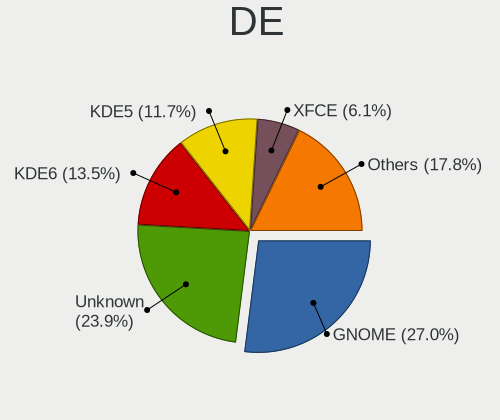
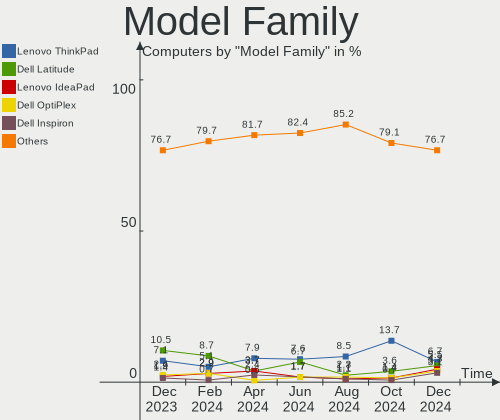
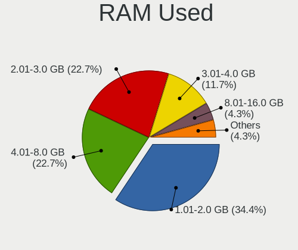
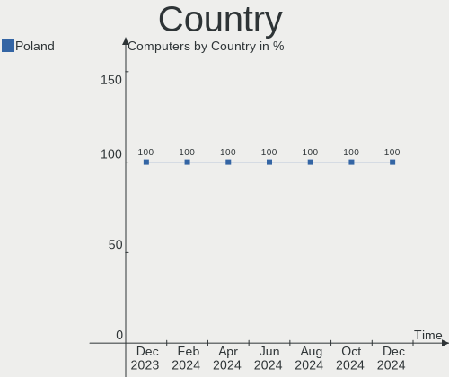
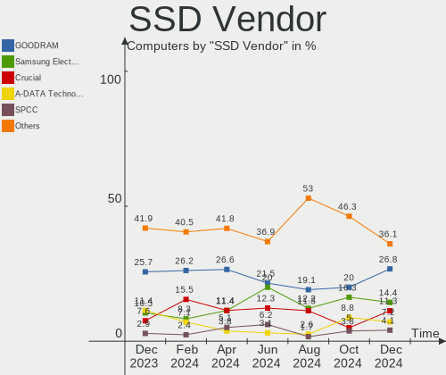
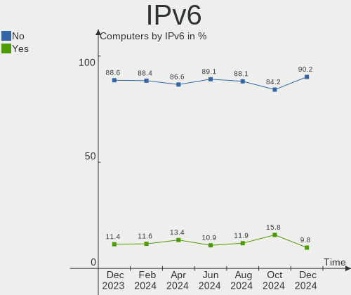

Linux in Poland - Hardware Trends
---------------------------------

A project to identify most popular hardware characteristics and track their change
over time based on data collected by Linux users at https://Linux-Hardware.org.

Anyone can contribute to this report by the [hw-probe](https://github.com/linuxhw/hw-probe) tool:

    sudo -E hw-probe -all -upload

This is a report for all computer types. See also reports for [desktops](/Location/Poland/Desktop/README.md) and [notebooks](/Location/Poland/Notebook/README.md).

Period: Oct, 2023.

Contents
--------

* [ System ](#system)
  - [ OS                       ](#os)
  - [ OS Family                ](#os-family)
  - [ Kernel                   ](#kernel)
  - [ Kernel Family            ](#kernel-family)
  - [ Kernel Major Ver.        ](#kernel-major-ver)
  - [ Arch                     ](#arch)
  - [ DE                       ](#de)
  - [ Display Server           ](#display-server)
  - [ Display Manager          ](#display-manager)
  - [ OS Lang                  ](#os-lang)
  - [ Boot Mode                ](#boot-mode)
  - [ Filesystem               ](#filesystem)
  - [ Part. scheme             ](#part-scheme)
  - [ Dual Boot with Linux/BSD ](#dual-boot-with-linuxbsd)
  - [ Dual Boot (Win)          ](#dual-boot-win)

* [ Board ](#board)
  - [ Vendor                   ](#vendor)
  - [ Model                    ](#model)
  - [ Model Family             ](#model-family)
  - [ MFG Year                 ](#mfg-year)
  - [ Form Factor              ](#form-factor)
  - [ Secure Boot              ](#secure-boot)
  - [ Coreboot                 ](#coreboot)
  - [ RAM Size                 ](#ram-size)
  - [ RAM Used                 ](#ram-used)
  - [ Total Drives             ](#total-drives)
  - [ Has CD-ROM               ](#has-cd-rom)
  - [ Has Ethernet             ](#has-ethernet)
  - [ Has WiFi                 ](#has-wifi)
  - [ Has Bluetooth            ](#has-bluetooth)

* [ Location ](#location)
  - [ Country                  ](#country)
  - [ City                     ](#city)

* [ Drives ](#drives)
  - [ Drive Vendor             ](#drive-vendor)
  - [ Drive Model              ](#drive-model)
  - [ HDD Vendor               ](#hdd-vendor)
  - [ SSD Vendor               ](#ssd-vendor)
  - [ Drive Kind               ](#drive-kind)
  - [ Drive Connector          ](#drive-connector)
  - [ Drive Size               ](#drive-size)
  - [ Space Total              ](#space-total)
  - [ Space Used               ](#space-used)
  - [ Malfunc. Drives          ](#malfunc-drives)
  - [ Malfunc. Drive Vendor    ](#malfunc-drive-vendor)
  - [ Malfunc. HDD Vendor      ](#malfunc-hdd-vendor)
  - [ Malfunc. Drive Kind      ](#malfunc-drive-kind)
  - [ Failed Drives            ](#failed-drives)
  - [ Failed Drive Vendor      ](#failed-drive-vendor)
  - [ Drive Status             ](#drive-status)

* [ Storage controller ](#storage-controller)
  - [ Storage Vendor           ](#storage-vendor)
  - [ Storage Model            ](#storage-model)
  - [ Storage Kind             ](#storage-kind)

* [ Processor ](#processor)
  - [ CPU Vendor               ](#cpu-vendor)
  - [ CPU Model                ](#cpu-model)
  - [ CPU Model Family         ](#cpu-model-family)
  - [ CPU Cores                ](#cpu-cores)
  - [ CPU Sockets              ](#cpu-sockets)
  - [ CPU Threads              ](#cpu-threads)
  - [ CPU Op-Modes             ](#cpu-op-modes)
  - [ CPU Microcode            ](#cpu-microcode)
  - [ CPU Microarch            ](#cpu-microarch)

* [ Graphics ](#graphics)
  - [ GPU Vendor               ](#gpu-vendor)
  - [ GPU Model                ](#gpu-model)
  - [ GPU Combo                ](#gpu-combo)
  - [ GPU Driver               ](#gpu-driver)
  - [ GPU Memory               ](#gpu-memory)

* [ Monitor ](#monitor)
  - [ Monitor Vendor           ](#monitor-vendor)
  - [ Monitor Model            ](#monitor-model)
  - [ Monitor Resolution       ](#monitor-resolution)
  - [ Monitor Diagonal         ](#monitor-diagonal)
  - [ Monitor Width            ](#monitor-width)
  - [ Aspect Ratio             ](#aspect-ratio)
  - [ Monitor Area             ](#monitor-area)
  - [ Pixel Density            ](#pixel-density)
  - [ Multiple Monitors        ](#multiple-monitors)

* [ Network ](#network)
  - [ Net Controller Vendor    ](#net-controller-vendor)
  - [ Net Controller Model     ](#net-controller-model)
  - [ Wireless Vendor          ](#wireless-vendor)
  - [ Wireless Model           ](#wireless-model)
  - [ Ethernet Vendor          ](#ethernet-vendor)
  - [ Ethernet Model           ](#ethernet-model)
  - [ Net Controller Kind      ](#net-controller-kind)
  - [ Used Controller          ](#used-controller)
  - [ NICs                     ](#nics)
  - [ IPv6                     ](#ipv6)

* [ Bluetooth ](#bluetooth)
  - [ Bluetooth Vendor         ](#bluetooth-vendor)
  - [ Bluetooth Model          ](#bluetooth-model)

* [ Sound ](#sound)
  - [ Sound Vendor             ](#sound-vendor)
  - [ Sound Model              ](#sound-model)

* [ Memory ](#memory)
  - [ Memory Vendor            ](#memory-vendor)
  - [ Memory Model             ](#memory-model)
  - [ Memory Kind              ](#memory-kind)
  - [ Memory Form Factor       ](#memory-form-factor)
  - [ Memory Size              ](#memory-size)
  - [ Memory Speed             ](#memory-speed)

* [ Printers & scanners ](#printers--scanners)
  - [ Printer Vendor           ](#printer-vendor)
  - [ Printer Model            ](#printer-model)
  - [ Scanner Vendor           ](#scanner-vendor)
  - [ Scanner Model            ](#scanner-model)

* [ Camera ](#camera)
  - [ Camera Vendor            ](#camera-vendor)
  - [ Camera Model             ](#camera-model)

* [ Security ](#security)
  - [ Fingerprint Vendor       ](#fingerprint-vendor)
  - [ Fingerprint Model        ](#fingerprint-model)
  - [ Chipcard Vendor          ](#chipcard-vendor)
  - [ Chipcard Model           ](#chipcard-model)

* [ Unsupported ](#unsupported)
  - [ Unsupported Devices      ](#unsupported-devices)
  - [ Unsupported Device Types ](#unsupported-device-types)

System
------

OS
--

Installed operating systems

| Name                         | Computers | Percent |
|------------------------------|-----------|---------|
| Ubuntu 22.04                 | 17        | 12.59%  |
| Linux Mint 21.2              | 11        | 8.15%   |
| Fedora 38                    | 8         | 5.93%   |
| Arch Rolling                 | 8         | 5.93%   |
| OpenMandriva 23.08           | 7         | 5.19%   |
| Ubuntu 23.04                 | 5         | 3.7%    |
| OpenMandriva 4.3             | 5         | 3.7%    |
| Gentoo 2.14                  | 5         | 3.7%    |
| Debian 12                    | 5         | 3.7%    |
| Zorin 16                     | 4         | 2.96%   |
| Pop!_OS 22.04                | 4         | 2.96%   |
| OpenMandriva 23.10           | 4         | 2.96%   |
| Ubuntu 23.10                 | 3         | 2.22%   |
| openSUSE Tumbleweed-XXXXXXXX | 3         | 2.22%   |
| OpenMandriva 23.03           | 3         | 2.22%   |
| Debian 11                    | 3         | 2.22%   |
| Xubuntu 22.04                | 2         | 1.48%   |
| Xero Rolling                 | 2         | 1.48%   |
| Ubuntu 20.04                 | 2         | 1.48%   |
| Kubuntu 23.04                | 2         | 1.48%   |
| Kali 2023.3                  | 2         | 1.48%   |
| Fedora 39                    | 2         | 1.48%   |
| EndeavourOS Rolling          | 2         | 1.48%   |
| Xubuntu 18.04                | 1         | 0.74%   |
| Ubuntu MATE 22.04            | 1         | 0.74%   |
| Ubuntu Budgie 23.04          | 1         | 0.74%   |
| Ubuntu 18.04                 | 1         | 0.74%   |
| SteamOS 3.6                  | 1         | 0.74%   |
| ROSA 12.4                    | 1         | 0.74%   |
| Raspbian 12                  | 1         | 0.74%   |
| Raspbian 10                  | 1         | 0.74%   |
| openSUSE Leap-15.5           | 1         | 0.74%   |
| OpenMandriva 23.90           | 1         | 0.74%   |
| OpenMandriva 23.09           | 1         | 0.74%   |
| Nobara 38                    | 1         | 0.74%   |
| MX 23                        | 1         | 0.74%   |
| Manjaro 23.0.4               | 1         | 0.74%   |
| Manjaro                      | 1         | 0.74%   |
| Lubuntu 22.04                | 1         | 0.74%   |
| Linux Mint 21.1              | 1         | 0.74%   |

OS Family
---------

OS without a version

| Name          | Computers | Percent |
|---------------|-----------|---------|
| Ubuntu        | 28        | 20.74%  |
| OpenMandriva  | 21        | 15.56%  |
| Linux Mint    | 12        | 8.89%   |
| Fedora        | 12        | 8.89%   |
| Debian        | 8         | 5.93%   |
| Arch          | 8         | 5.93%   |
| Gentoo        | 5         | 3.7%    |
| Zorin         | 4         | 2.96%   |
| Pop!_OS       | 4         | 2.96%   |
| openSUSE      | 4         | 2.96%   |
| Kubuntu       | 4         | 2.96%   |
| Xubuntu       | 3         | 2.22%   |
| Xero          | 2         | 1.48%   |
| Raspbian      | 2         | 1.48%   |
| Manjaro       | 2         | 1.48%   |
| Kali          | 2         | 1.48%   |
| EndeavourOS   | 2         | 1.48%   |
| Ubuntu MATE   | 1         | 0.74%   |
| Ubuntu Budgie | 1         | 0.74%   |
| SteamOS       | 1         | 0.74%   |
| ROSA          | 1         | 0.74%   |
| Nobara        | 1         | 0.74%   |
| MX            | 1         | 0.74%   |
| Lubuntu       | 1         | 0.74%   |
| KDE neon      | 1         | 0.74%   |
| Garuda Linux  | 1         | 0.74%   |
| Endless       | 1         | 0.74%   |
| Elementary    | 1         | 0.74%   |
| Artix         | 1         | 0.74%   |

Kernel
------

Version of the Linux kernel

| Version                     | Computers | Percent |
|-----------------------------|-----------|---------|
| 6.2.0-34-generic            | 13        | 9.63%   |
| 6.4.11-desktop-1omv2390     | 8         | 5.93%   |
| 6.2.0-33-generic            | 6         | 4.44%   |
| 5.15.0-86-generic           | 6         | 4.44%   |
| 6.5.5-desktop-1omv2390      | 5         | 3.7%    |
| 6.5.8-arch1-1               | 4         | 2.96%   |
| 6.1.53-gentoo-r1            | 4         | 2.96%   |
| 6.1.0-13-amd64              | 4         | 2.96%   |
| 5.15.0-87-generic           | 4         | 2.96%   |
| 5.15.0-84-generic           | 4         | 2.96%   |
| 6.2.0-35-generic            | 3         | 2.22%   |
| 5.16.13-desktop-1omv4003    | 3         | 2.22%   |
| 5.15.0-76-generic           | 3         | 2.22%   |
| 6.5.8-200.fc38.x86_64       | 2         | 1.48%   |
| 6.5.6-200.fc38.x86_64       | 2         | 1.48%   |
| 6.5.5-zen1-1-zen            | 2         | 1.48%   |
| 6.5.5-200.fc38.x86_64       | 2         | 1.48%   |
| 6.5.4-76060504-generic      | 2         | 1.48%   |
| 6.5.2-301.fc39.x86_64       | 2         | 1.48%   |
| 6.5.0-9-generic             | 2         | 1.48%   |
| 6.5.0-10-generic            | 2         | 1.48%   |
| 6.4.12-arch1-1              | 2         | 1.48%   |
| 6.2.6-desktop-1omv2390      | 2         | 1.48%   |
| 6.2.0-26-generic            | 2         | 1.48%   |
| 5.16.7-desktop-1omv4003     | 2         | 1.48%   |
| 4.15.0-213-generic          | 2         | 1.48%   |
| 6.6.0-1-MANJARO             | 1         | 0.74%   |
| 6.5.9-1-cachyos-lto         | 1         | 0.74%   |
| 6.5.7-x64v3-xanmod1         | 1         | 0.74%   |
| 6.5.7-200.fc38.x86_64       | 1         | 0.74%   |
| 6.5.6-arch2-1               | 1         | 0.74%   |
| 6.5.6-76060506-generic      | 1         | 0.74%   |
| 6.5.6-200.fsync.fc38.x86_64 | 1         | 0.74%   |
| 6.5.6-100.fc37.x86_64       | 1         | 0.74%   |
| 6.5.6-1-default             | 1         | 0.74%   |
| 6.5.5-xanmod1-dist          | 1         | 0.74%   |
| 6.5.5-hardened1-1-hardened  | 1         | 0.74%   |
| 6.5.5-artix1-1              | 1         | 0.74%   |
| 6.5.5-1-MANJARO             | 1         | 0.74%   |
| 6.5.4-arch2-1               | 1         | 0.74%   |

Kernel Family
-------------

Linux kernel without a distro release

| Version  | Computers | Percent |
|----------|-----------|---------|
| 6.2.0    | 25        | 18.52%  |
| 5.15.0   | 21        | 15.56%  |
| 6.5.5    | 13        | 9.63%   |
| 6.4.11   | 8         | 5.93%   |
| 6.5.6    | 7         | 5.19%   |
| 6.1.0    | 7         | 5.19%   |
| 6.5.8    | 6         | 4.44%   |
| 6.5.0    | 6         | 4.44%   |
| 6.5.4    | 4         | 2.96%   |
| 6.1.53   | 4         | 2.96%   |
| 5.16.13  | 3         | 2.22%   |
| 6.5.7    | 2         | 1.48%   |
| 6.5.3    | 2         | 1.48%   |
| 6.5.2    | 2         | 1.48%   |
| 6.4.12   | 2         | 1.48%   |
| 6.2.6    | 2         | 1.48%   |
| 5.16.7   | 2         | 1.48%   |
| 4.15.0   | 2         | 1.48%   |
| 6.6.0    | 1         | 0.74%   |
| 6.5.9    | 1         | 0.74%   |
| 6.4.6    | 1         | 0.74%   |
| 6.4.15   | 1         | 0.74%   |
| 6.3.0    | 1         | 0.74%   |
| 6.2.2    | 1         | 0.74%   |
| 6.1.52   | 1         | 0.74%   |
| 6.1.31   | 1         | 0.74%   |
| 6.1.21   | 1         | 0.74%   |
| 5.4.79   | 1         | 0.74%   |
| 5.4.0    | 1         | 0.74%   |
| 5.19.0   | 1         | 0.74%   |
| 5.17.12  | 1         | 0.74%   |
| 5.15.92  | 1         | 0.74%   |
| 5.15.127 | 1         | 0.74%   |
| 5.14.21  | 1         | 0.74%   |
| 5.10.0   | 1         | 0.74%   |

Kernel Major Ver.
-----------------

Linux kernel major version

| Version | Computers | Percent |
|---------|-----------|---------|
| 6.5     | 43        | 31.85%  |
| 6.2     | 28        | 20.74%  |
| 5.15    | 23        | 17.04%  |
| 6.1     | 14        | 10.37%  |
| 6.4     | 12        | 8.89%   |
| 5.16    | 5         | 3.7%    |
| 5.4     | 2         | 1.48%   |
| 4.15    | 2         | 1.48%   |
| 6.6     | 1         | 0.74%   |
| 6.3     | 1         | 0.74%   |
| 5.19    | 1         | 0.74%   |
| 5.17    | 1         | 0.74%   |
| 5.14    | 1         | 0.74%   |
| 5.10    | 1         | 0.74%   |

Arch
----

OS architecture (x86_64, i586, etc.)

| Name    | Computers | Percent |
|---------|-----------|---------|
| x86_64  | 129       | 95.56%  |
| i686    | 2         | 1.48%   |
| armv7l  | 2         | 1.48%   |
| armv6l  | 1         | 0.74%   |
| aarch64 | 1         | 0.74%   |

DE
--

Desktop Environment

| Name          | Computers | Percent |
|---------------|-----------|---------|
| GNOME         | 53        | 39.26%  |
| KDE5          | 41        | 30.37%  |
| XFCE          | 9         | 6.67%   |
| Unknown       | 9         | 6.67%   |
| X-Cinnamon    | 8         | 5.93%   |
| MATE          | 4         | 2.96%   |
| LXQt          | 4         | 2.96%   |
| Pantheon      | 1         | 0.74%   |
| Openbox       | 1         | 0.74%   |
| Hyprland      | 1         | 0.74%   |
| GNOME Classic | 1         | 0.74%   |
| Endless:GNOME | 1         | 0.74%   |
| Cinnamon      | 1         | 0.74%   |
| Budgie        | 1         | 0.74%   |

Display Server
--------------

X11 or Wayland

| Name    | Computers | Percent |
|---------|-----------|---------|
| X11     | 74        | 54.81%  |
| Wayland | 52        | 38.52%  |
| Tty     | 5         | 3.7%    |
| Unknown | 4         | 2.96%   |

Display Manager
---------------

SDDM, LightDM, etc.

| Name    | Computers | Percent |
|---------|-----------|---------|
| SDDM    | 40        | 29.63%  |
| Unknown | 39        | 28.89%  |
| GDM3    | 28        | 20.74%  |
| LightDM | 21        | 15.56%  |
| GDM     | 7         | 5.19%   |

OS Lang
-------

Language

| Lang    | Computers | Percent |
|---------|-----------|---------|
| pl_PL   | 73        | 54.07%  |
| en_US   | 47        | 34.81%  |
| en_GB   | 4         | 2.96%   |
| C       | 4         | 2.96%   |
| ru_RU   | 2         | 1.48%   |
| uk_UA   | 1         | 0.74%   |
| POSIX   | 1         | 0.74%   |
| fr_FR   | 1         | 0.74%   |
| Default | 1         | 0.74%   |
| Unknown | 1         | 0.74%   |

Boot Mode
---------

EFI or BIOS

| Mode | Computers | Percent |
|------|-----------|---------|
| EFI  | 81        | 60%     |
| BIOS | 54        | 40%     |

Filesystem
----------

Type of filesystem

| Type    | Computers | Percent |
|---------|-----------|---------|
| Ext4    | 80        | 59.26%  |
| Tmpfs   | 19        | 14.07%  |
| Btrfs   | 16        | 11.85%  |
| Overlay | 10        | 7.41%   |
| F2fs    | 5         | 3.7%    |
| Xfs     | 4         | 2.96%   |
| Zfs     | 1         | 0.74%   |

Part. scheme
------------

Scheme of partitioning

| Type    | Computers | Percent |
|---------|-----------|---------|
| GPT     | 82        | 60.74%  |
| Unknown | 35        | 25.93%  |
| MBR     | 18        | 13.33%  |

Dual Boot with Linux/BSD
------------------------

Hosting more than one Linux/BSD

| Dual boot | Computers | Percent |
|-----------|-----------|---------|
| No        | 111       | 82.22%  |
| Yes       | 24        | 17.78%  |

Dual Boot (Win)
---------------

Hosting Linux and Windows

| Dual boot | Computers | Percent |
|-----------|-----------|---------|
| No        | 93        | 68.89%  |
| Yes       | 42        | 31.11%  |

Board
-----

Vendor
------

Motherboard manufacturer

| Name                                 | Computers | Percent |
|--------------------------------------|-----------|---------|
| ASUSTek Computer                     | 22        | 16.3%   |
| Lenovo                               | 21        | 15.56%  |
| Dell                                 | 21        | 15.56%  |
| Hewlett-Packard                      | 20        | 14.81%  |
| MSI                                  | 12        | 8.89%   |
| Gigabyte Technology                  | 6         | 4.44%   |
| ASRock                               | 4         | 2.96%   |
| Apple                                | 4         | 2.96%   |
| Raspberry Pi Foundation              | 3         | 2.22%   |
| Acer                                 | 3         | 2.22%   |
| Samsung Electronics                  | 2         | 1.48%   |
| Intel                                | 2         | 1.48%   |
| HUAWEI                               | 2         | 1.48%   |
| Google                               | 2         | 1.48%   |
| ZOTAC                                | 1         | 0.74%   |
| XIAOMI                               | 1         | 0.74%   |
| Valve                                | 1         | 0.74%   |
| Shenzhen Meigao Electronic Equipment | 1         | 0.74%   |
| Sapphire                             | 1         | 0.74%   |
| OrangePi                             | 1         | 0.74%   |
| Notebook                             | 1         | 0.74%   |
| HPE                                  | 1         | 0.74%   |
| GPU Company                          | 1         | 0.74%   |
| ACTION                               | 1         | 0.74%   |
| Unknown                              | 1         | 0.74%   |

Model
-----

Motherboard model

| Name                                        | Computers | Percent |
|---------------------------------------------|-----------|---------|
| HP Z420 Workstation                         | 2         | 1.48%   |
| HP ProBook 6560b                            | 2         | 1.48%   |
| HP EliteBook 840 G5                         | 2         | 1.48%   |
| Dell Latitude 5440                          | 2         | 1.48%   |
| ASUS P5G41T-M LX                            | 2         | 1.48%   |
| ZOTAC ZBOX-MI623/MI643                      | 1         | 0.74%   |
| XIAOMI Redmi Book Pro 15 2023               | 1         | 0.74%   |
| Valve Jupiter                               | 1         | 0.74%   |
| Shenzhen Meigao Electronic Equipment TH80   | 1         | 0.74%   |
| Sapphire PCDBS19H                           | 1         | 0.74%   |
| Samsung 550P5C/550P7C                       | 1         | 0.74%   |
| Samsung 3570R/370R/470R/450R/510R/4450RV    | 1         | 0.74%   |
| RPi Raspberry Pi Zero W Rev 1.1             | 1         | 0.74%   |
| RPi Raspberry Pi 3 Model B Rev 1.2          | 1         | 0.74%   |
| RPi Raspberry Pi                            | 1         | 0.74%   |
| OrangePi Zero3                              | 1         | 0.74%   |
| Notebook P7xxDM(-G)                         | 1         | 0.74%   |
| MSI OPTIMUS                                 | 1         | 0.74%   |
| MSI MS-7C56                                 | 1         | 0.74%   |
| MSI MS-7C37                                 | 1         | 0.74%   |
| MSI MS-7C35                                 | 1         | 0.74%   |
| MSI MS-7B86                                 | 1         | 0.74%   |
| MSI MS-7A34                                 | 1         | 0.74%   |
| MSI MS-7971                                 | 1         | 0.74%   |
| MSI MS-7693                                 | 1         | 0.74%   |
| MSI MS-7235                                 | 1         | 0.74%   |
| MSI MS-1688                                 | 1         | 0.74%   |
| MSI GL75 9SE                                | 1         | 0.74%   |
| MSI GE72 6QF                                | 1         | 0.74%   |
| Lenovo ThinkPad Yoga 260 20FES1WT00         | 1         | 0.74%   |
| Lenovo ThinkPad X390 20Q1S5K400             | 1         | 0.74%   |
| Lenovo ThinkPad X270 W10DG 20K60014MX       | 1         | 0.74%   |
| Lenovo ThinkPad X1 Carbon Gen 10 21CBCTO1WW | 1         | 0.74%   |
| Lenovo ThinkPad T470s W10DG 20JTS1MR08      | 1         | 0.74%   |
| Lenovo ThinkPad T430u 3352A83               | 1         | 0.74%   |
| Lenovo ThinkPad T400 64757D7                | 1         | 0.74%   |
| Lenovo ThinkPad P1 Gen 6 21FV002HUS         | 1         | 0.74%   |
| Lenovo ThinkPad A485 20MVS0X62X             | 1         | 0.74%   |
| Lenovo Legion Y520T-25IKL 90H700ETPB        | 1         | 0.74%   |
| Lenovo Legion 5 Pro 16ITH6H 82JD            | 1         | 0.74%   |

Model Family
------------

Motherboard model prefix

| Name                                      | Computers | Percent |
|-------------------------------------------|-----------|---------|
| Lenovo ThinkPad                           | 9         | 6.67%   |
| HP EliteBook                              | 7         | 5.19%   |
| Dell Latitude                             | 7         | 5.19%   |
| Lenovo IdeaPad                            | 6         | 4.44%   |
| Dell OptiPlex                             | 5         | 3.7%    |
| Dell Inspiron                             | 5         | 3.7%    |
| ASUS TUF                                  | 5         | 3.7%    |
| Lenovo Legion                             | 4         | 2.96%   |
| ASUS PRIME                                | 4         | 2.96%   |
| RPi Raspberry                             | 3         | 2.22%   |
| HP Pavilion                               | 3         | 2.22%   |
| Dell Precision                            | 3         | 2.22%   |
| Acer Aspire                               | 3         | 2.22%   |
| HP Z420                                   | 2         | 1.48%   |
| HP ProBook                                | 2         | 1.48%   |
| HP Laptop                                 | 2         | 1.48%   |
| ASUS ROG                                  | 2         | 1.48%   |
| ASUS P5G41T-M                             | 2         | 1.48%   |
| ASUS ASUS                                 | 2         | 1.48%   |
| ZOTAC ZBOX-MI623                          | 1         | 0.74%   |
| XIAOMI Redmi                              | 1         | 0.74%   |
| Valve Jupiter                             | 1         | 0.74%   |
| Shenzhen Meigao Electronic Equipment TH80 | 1         | 0.74%   |
| Sapphire PCDBS19H                         | 1         | 0.74%   |
| Samsung 550P5C                            | 1         | 0.74%   |
| Samsung 3570R                             | 1         | 0.74%   |
| OrangePi Zero3                            | 1         | 0.74%   |
| Notebook P7xxDM(-G)                       | 1         | 0.74%   |
| MSI OPTIMUS                               | 1         | 0.74%   |
| MSI MS-7C56                               | 1         | 0.74%   |
| MSI MS-7C37                               | 1         | 0.74%   |
| MSI MS-7C35                               | 1         | 0.74%   |
| MSI MS-7B86                               | 1         | 0.74%   |
| MSI MS-7A34                               | 1         | 0.74%   |
| MSI MS-7971                               | 1         | 0.74%   |
| MSI MS-7693                               | 1         | 0.74%   |
| MSI MS-7235                               | 1         | 0.74%   |
| MSI MS-1688                               | 1         | 0.74%   |
| MSI GL75                                  | 1         | 0.74%   |
| MSI GE72                                  | 1         | 0.74%   |

MFG Year
--------

Motherboard manufacture year

| Year    | Computers | Percent |
|---------|-----------|---------|
| 2019    | 15        | 11.11%  |
| 2017    | 14        | 10.37%  |
| 2020    | 13        | 9.63%   |
| 2022    | 11        | 8.15%   |
| 2012    | 11        | 8.15%   |
| 2021    | 10        | 7.41%   |
| 2018    | 10        | 7.41%   |
| 2023    | 8         | 5.93%   |
| 2011    | 8         | 5.93%   |
| 2013    | 7         | 5.19%   |
| 2015    | 6         | 4.44%   |
| 2008    | 5         | 3.7%    |
| 2014    | 4         | 2.96%   |
| Unknown | 4         | 2.96%   |
| 2010    | 3         | 2.22%   |
| 2009    | 3         | 2.22%   |
| 2006    | 2         | 1.48%   |
| 2016    | 1         | 0.74%   |

Form Factor
-----------

Physical design of the computer

| Name           | Computers | Percent |
|----------------|-----------|---------|
| Notebook       | 76        | 56.3%   |
| Desktop        | 46        | 34.07%  |
| System on chip | 4         | 2.96%   |
| Convertible    | 3         | 2.22%   |
| Mini pc        | 3         | 2.22%   |
| All in one     | 2         | 1.48%   |
| Server         | 1         | 0.74%   |

Secure Boot
-----------

Enabled or disabled

| State    | Computers | Percent |
|----------|-----------|---------|
| Disabled | 130       | 96.3%   |
| Enabled  | 5         | 3.7%    |

Coreboot
--------

Have coreboot on board

| Used | Computers | Percent |
|------|-----------|---------|
| No   | 132       | 97.78%  |
| Yes  | 3         | 2.22%   |

RAM Size
--------

Total RAM memory

| Size in GB  | Computers | Percent |
|-------------|-----------|---------|
| 4.01-8.0    | 34        | 25.19%  |
| 8.01-16.0   | 27        | 20%     |
| 16.01-24.0  | 23        | 17.04%  |
| 32.01-64.0  | 21        | 15.56%  |
| 3.01-4.0    | 18        | 13.33%  |
| 64.01-256.0 | 4         | 2.96%   |
| 24.01-32.0  | 2         | 1.48%   |
| 2.01-3.0    | 2         | 1.48%   |
| 0.51-1.0    | 2         | 1.48%   |
| 1.01-2.0    | 1         | 0.74%   |
| 0.01-0.5    | 1         | 0.74%   |

RAM Used
--------

Used RAM memory

| Used GB    | Computers | Percent |
|------------|-----------|---------|
| 4.01-8.0   | 37        | 27.41%  |
| 2.01-3.0   | 33        | 24.44%  |
| 1.01-2.0   | 33        | 24.44%  |
| 3.01-4.0   | 20        | 14.81%  |
| 0.51-1.0   | 6         | 4.44%   |
| 0.01-0.5   | 3         | 2.22%   |
| 8.01-16.0  | 2         | 1.48%   |
| 16.01-24.0 | 1         | 0.74%   |

Total Drives
------------

Number of drives on board

| Drives | Computers | Percent |
|--------|-----------|---------|
| 1      | 82        | 60.74%  |
| 2      | 36        | 26.67%  |
| 3      | 12        | 8.89%   |
| 4      | 4         | 2.96%   |
| 6      | 1         | 0.74%   |

Has CD-ROM
----------

Has CD-ROM on board

| Presented | Computers | Percent |
|-----------|-----------|---------|
| No        | 99        | 73.33%  |
| Yes       | 36        | 26.67%  |

Has Ethernet
------------

Has Ethernet on board

| Presented | Computers | Percent |
|-----------|-----------|---------|
| Yes       | 110       | 81.48%  |
| No        | 25        | 18.52%  |

Has WiFi
--------

Has WiFi module

| Presented | Computers | Percent |
|-----------|-----------|---------|
| Yes       | 101       | 74.81%  |
| No        | 34        | 25.19%  |

Has Bluetooth
-------------

Has Bluetooth module

| Presented | Computers | Percent |
|-----------|-----------|---------|
| Yes       | 82        | 60.74%  |
| No        | 53        | 39.26%  |

Location
--------

Country
-------

Geographic location (country)

| Country | Computers | Percent |
|---------|-----------|---------|
| Poland  | 135       | 100%    |

City
----

Geographic location (city)

| City              | Computers | Percent |
|-------------------|-----------|---------|
| Warsaw            | 36        | 26.67%  |
| Wroclaw           | 11        | 8.15%   |
| Krakow            | 11        | 8.15%   |
| Poznan            | 9         | 6.67%   |
| Gdynia            | 5         | 3.7%    |
| Gdansk            | 5         | 3.7%    |
| Katowice          | 3         | 2.22%   |
| Jaworzno          | 3         | 2.22%   |
| Zgierz            | 2         | 1.48%   |
| Polkowice         | 2         | 1.48%   |
| Lublin            | 2         | 1.48%   |
| Lodz              | 2         | 1.48%   |
| Bytom             | 2         | 1.48%   |
| Żywiec           | 1         | 0.74%   |
| Żory             | 1         | 0.74%   |
| Zdunska Wola      | 1         | 0.74%   |
| Wilczyce          | 1         | 0.74%   |
| Wagrowiec         | 1         | 0.74%   |
| Waganiec          | 1         | 0.74%   |
| Tomaszow Lubelski | 1         | 0.74%   |
| Słupsk           | 1         | 0.74%   |
| Szczecin          | 1         | 0.74%   |
| Świętochłowice | 1         | 0.74%   |
| Stopnica          | 1         | 0.74%   |
| Skoczow           | 1         | 0.74%   |
| Siedlce           | 1         | 0.74%   |
| Ruda Śląska     | 1         | 0.74%   |
| Radomsko          | 1         | 0.74%   |
| Radom             | 1         | 0.74%   |
| Płock            | 1         | 0.74%   |
| Puławy           | 1         | 0.74%   |
| Pila              | 1         | 0.74%   |
| Piaseczno         | 1         | 0.74%   |
| Ozarow Mazowiecki | 1         | 0.74%   |
| Opole             | 1         | 0.74%   |
| Olszyniec         | 1         | 0.74%   |
| Myszkow           | 1         | 0.74%   |
| Milicz            | 1         | 0.74%   |
| Mikołów         | 1         | 0.74%   |
| Michalowice       | 1         | 0.74%   |

Drives
------

Drive Vendor
------------

Hard drive vendors

| Vendor                       | Computers | Drives | Percent |
|------------------------------|-----------|--------|---------|
| Samsung Electronics          | 28        | 30     | 14.36%  |
| Seagate                      | 24        | 28     | 12.31%  |
| WDC                          | 17        | 19     | 8.72%   |
| GOODRAM                      | 17        | 18     | 8.72%   |
| Unknown                      | 12        | 13     | 6.15%   |
| Toshiba                      | 9         | 10     | 4.62%   |
| A-DATA Technology            | 9         | 9      | 4.62%   |
| SK hynix                     | 8         | 8      | 4.1%    |
| Intel                        | 8         | 8      | 4.1%    |
| SanDisk                      | 7         | 7      | 3.59%   |
| Kingston                     | 5         | 5      | 2.56%   |
| Crucial                      | 5         | 5      | 2.56%   |
| Micron Technology            | 4         | 4      | 2.05%   |
| SPCC                         | 3         | 4      | 1.54%   |
| Phison                       | 3         | 3      | 1.54%   |
| Patriot                      | 3         | 4      | 1.54%   |
| KIOXIA                       | 3         | 3      | 1.54%   |
| Kingston Technology Company  | 3         | 3      | 1.54%   |
| HGST                         | 3         | 3      | 1.54%   |
| Transcend                    | 2         | 2      | 1.03%   |
| Hitachi                      | 2         | 4      | 1.03%   |
| Apacer                       | 2         | 2      | 1.03%   |
| USB3.0                       | 1         | 1      | 0.51%   |
| SSDPR-CX                     | 1         | 1      | 0.51%   |
| SSD 1TB                      | 1         | 1      | 0.51%   |
| Shenzhen Longsys Electronics | 1         | 2      | 0.51%   |
| Realtek                      | 1         | 1      | 0.51%   |
| Phison Electronics           | 1         | 1      | 0.51%   |
| OWC                          | 1         | 1      | 0.51%   |
| Micron/Crucial Technology    | 1         | 1      | 0.51%   |
| Lexar                        | 1         | 1      | 0.51%   |
| Kingchuxing                  | 1         | 2      | 0.51%   |
| JMicron Technology           | 1         | 1      | 0.51%   |
| Intenso                      | 1         | 1      | 0.51%   |
| Hewlett-Packard              | 1         | 1      | 0.51%   |
| DEMO                         | 1         | 1      | 0.51%   |
| China                        | 1         | 1      | 0.51%   |
| Apple                        | 1         | 2      | 0.51%   |
| ADATA Technology             | 1         | 1      | 0.51%   |
| Unknown                      | 1         | 1      | 0.51%   |

Drive Model
-----------

Hard drive models

| Model                                              | Computers | Percent |
|----------------------------------------------------|-----------|---------|
| Samsung NVMe SSD Controller PM9A1/PM9A3/980PRO 1TB | 4         | 1.95%   |
| Unknown MMC Card  128GB                            | 3         | 1.46%   |
| Toshiba BG3 NVMe SSD Controller 128GB              | 3         | 1.46%   |
| WDC WD20EZRZ-00Z5HB0 2TB                           | 2         | 0.98%   |
| SPCC Solid State Disk 240GB                        | 2         | 0.98%   |
| SK hynix BC901 NVMe 512GB                          | 2         | 0.98%   |
| Seagate ST1000LM024 HN-M101MBB 1TB                 | 2         | 0.98%   |
| Seagate ST1000DM003-1ER162 1TB                     | 2         | 0.98%   |
| Samsung SSD 980 500GB                              | 2         | 0.98%   |
| Samsung SSD 980 1TB                                | 2         | 0.98%   |
| Samsung SSD 970 EVO Plus 500GB                     | 2         | 0.98%   |
| Samsung SSD 870 EVO 500GB                          | 2         | 0.98%   |
| Samsung NVMe SSD Controller SM981/PM981/PM983 1TB  | 2         | 0.98%   |
| Samsung MZVLQ512HBLU-00BH1 512GB                   | 2         | 0.98%   |
| Samsung MZALQ512HBLU-00BL2 512GB                   | 2         | 0.98%   |
| Patriot Burst 240GB SSD                            | 2         | 0.98%   |
| Kingston SKC3000D2048G 2TB                         | 2         | 0.98%   |
| HGST HTS721010A9E630 1TB                           | 2         | 0.98%   |
| GOODRAM SSDPR-CX400-512-G2 512GB                   | 2         | 0.98%   |
| GOODRAM SSDPR-CX400-256-G2 256GB                   | 2         | 0.98%   |
| GOODRAM SSDPR-CL100-960-G3 960GB                   | 2         | 0.98%   |
| GOODRAM SSDPR-CL100-480-G2 480GB                   | 2         | 0.98%   |
| GOODRAM SSDPR-CL100-240-G3 240GB                   | 2         | 0.98%   |
| GOODRAM IRP-SSDPR-S25B-240 240GB                   | 2         | 0.98%   |
| Crucial CT240BX500SSD1 240GB                       | 2         | 0.98%   |
| A-DATA SU800 512GB SSD                             | 2         | 0.98%   |
| WDC WDS500G2B0A-00SM50 500GB SSD                   | 1         | 0.49%   |
| WDC WD7500BPVT-24HXZT3 752GB                       | 1         | 0.49%   |
| WDC WD6400BPVT-55HXZT3 640GB                       | 1         | 0.49%   |
| WDC WD5000LPVT-75G33T0 500GB                       | 1         | 0.49%   |
| WDC WD5000AZRX-00L4HB0 500GB                       | 1         | 0.49%   |
| WDC WD5000AZLX-08K2TA0 500GB                       | 1         | 0.49%   |
| WDC WD5000AAKX-75U6AA0 500GB                       | 1         | 0.49%   |
| WDC WD5000AAKS-00V1A0 500GB                        | 1         | 0.49%   |
| WDC WD20EFRX-68EUZN0 2TB                           | 1         | 0.49%   |
| WDC WD20EARX-00PASB0 2TB                           | 1         | 0.49%   |
| WDC WD20EARX-00MMMB0 2TB                           | 1         | 0.49%   |
| WDC WD10SPCX-24HWST1 1TB                           | 1         | 0.49%   |
| WDC WD10SMZW-11Y0TS0 1TB                           | 1         | 0.49%   |
| WDC WD10JPVX-75JC3T0 1TB                           | 1         | 0.49%   |

HDD Vendor
----------

Hard disk drive vendors

| Vendor              | Computers | Drives | Percent |
|---------------------|-----------|--------|---------|
| Seagate             | 23        | 27     | 44.23%  |
| WDC                 | 14        | 16     | 26.92%  |
| Toshiba             | 6         | 7      | 11.54%  |
| HGST                | 3         | 3      | 5.77%   |
| Samsung Electronics | 2         | 2      | 3.85%   |
| Hitachi             | 2         | 4      | 3.85%   |
| USB3.0              | 1         | 1      | 1.92%   |
| Unknown             | 1         | 1      | 1.92%   |

SSD Vendor
----------

Solid state drive vendors

| Vendor              | Computers | Drives | Percent |
|---------------------|-----------|--------|---------|
| GOODRAM             | 16        | 17     | 26.23%  |
| A-DATA Technology   | 9         | 9      | 14.75%  |
| Samsung Electronics | 7         | 7      | 11.48%  |
| SanDisk             | 5         | 5      | 8.2%    |
| Crucial             | 5         | 5      | 8.2%    |
| SPCC                | 3         | 4      | 4.92%   |
| Transcend           | 2         | 2      | 3.28%   |
| SK hynix            | 2         | 2      | 3.28%   |
| Patriot             | 2         | 3      | 3.28%   |
| Kingston            | 2         | 2      | 3.28%   |
| Intel               | 2         | 2      | 3.28%   |
| WDC                 | 1         | 1      | 1.64%   |
| OWC                 | 1         | 1      | 1.64%   |
| Kingchuxing         | 1         | 2      | 1.64%   |
| Hewlett-Packard     | 1         | 1      | 1.64%   |
| China               | 1         | 1      | 1.64%   |
| Apacer              | 1         | 1      | 1.64%   |

Drive Kind
----------

HDD or SSD

| Kind    | Computers | Drives | Percent |
|---------|-----------|--------|---------|
| NVMe    | 61        | 71     | 34.08%  |
| SSD     | 57        | 65     | 31.84%  |
| HDD     | 46        | 61     | 25.7%   |
| MMC     | 11        | 12     | 6.15%   |
| Unknown | 4         | 4      | 2.23%   |

Drive Connector
---------------

SATA, SAS, NVMe, etc.

| Type | Computers | Drives | Percent |
|------|-----------|--------|---------|
| SATA | 84        | 121    | 51.22%  |
| NVMe | 61        | 70     | 37.2%   |
| MMC  | 11        | 12     | 6.71%   |
| SAS  | 8         | 10     | 4.88%   |

Drive Size
----------

Size of hard drive

| Size in TB | Computers | Drives | Percent |
|------------|-----------|--------|---------|
| 0.01-0.5   | 62        | 68     | 56.88%  |
| 0.51-1.0   | 32        | 39     | 29.36%  |
| 1.01-2.0   | 9         | 10     | 8.26%   |
| 2.01-3.0   | 3         | 6      | 2.75%   |
| 3.01-4.0   | 1         | 1      | 0.92%   |
| 10.01-20.0 | 1         | 1      | 0.92%   |
| 4.01-10.0  | 1         | 1      | 0.92%   |

Space Total
-----------

Amount of disk space available on the file system

| Size in GB     | Computers | Percent |
|----------------|-----------|---------|
| 101-250        | 31        | 22.96%  |
| 251-500        | 30        | 22.22%  |
| 501-1000       | 25        | 18.52%  |
| 1001-2000      | 11        | 8.15%   |
| 1-20           | 11        | 8.15%   |
| 51-100         | 10        | 7.41%   |
| 21-50          | 6         | 4.44%   |
| 2001-3000      | 6         | 4.44%   |
| Unknown        | 3         | 2.22%   |
| More than 3000 | 2         | 1.48%   |

Space Used
----------

Amount of used disk space

| Used GB        | Computers | Percent |
|----------------|-----------|---------|
| 1-20           | 49        | 36.3%   |
| 21-50          | 20        | 14.81%  |
| 101-250        | 17        | 12.59%  |
| 251-500        | 16        | 11.85%  |
| 51-100         | 14        | 10.37%  |
| 501-1000       | 11        | 8.15%   |
| Unknown        | 3         | 2.22%   |
| More than 3000 | 2         | 1.48%   |
| 2001-3000      | 1         | 0.74%   |
| 1001-2000      | 1         | 0.74%   |
| 0              | 1         | 0.74%   |

Malfunc. Drives
---------------

Drive models with a malfunction

| Model                                 | Computers | Drives | Percent |
|---------------------------------------|-----------|--------|---------|
| SK hynix BC711 HFM512GD3JX013N 512GB  | 1         | 1      | 12.5%   |
| Seagate ST3750840ACE 752GB            | 1         | 1      | 12.5%   |
| Seagate ST3250820SCE 250GB            | 1         | 1      | 12.5%   |
| Seagate ST2000DM008-2FR102 2TB        | 1         | 1      | 12.5%   |
| SanDisk SD9SN8W-128G-1006 128GB SSD   | 1         | 1      | 12.5%   |
| OWC Aura 2012 240GB SSD               | 1         | 1      | 12.5%   |
| Crucial CT1000MX500SSD4 1TB           | 1         | 1      | 12.5%   |
| A-DATA Technology SP900NS38 256GB SSD | 1         | 1      | 12.5%   |

Malfunc. Drive Vendor
---------------------

Vendors of faulty drives

| Vendor            | Computers | Drives | Percent |
|-------------------|-----------|--------|---------|
| Seagate           | 3         | 3      | 37.5%   |
| SK hynix          | 1         | 1      | 12.5%   |
| SanDisk           | 1         | 1      | 12.5%   |
| OWC               | 1         | 1      | 12.5%   |
| Crucial           | 1         | 1      | 12.5%   |
| A-DATA Technology | 1         | 1      | 12.5%   |

Malfunc. HDD Vendor
-------------------

Vendors of faulty HDD drives

| Vendor  | Computers | Drives | Percent |
|---------|-----------|--------|---------|
| Seagate | 3         | 3      | 100%    |

Malfunc. Drive Kind
-------------------

Kinds of faulty drives

| Kind | Computers | Drives | Percent |
|------|-----------|--------|---------|
| SSD  | 4         | 4      | 50%     |
| HDD  | 3         | 3      | 37.5%   |
| NVMe | 1         | 1      | 12.5%   |

Failed Drives
-------------

Failed drive models

Zero info for selected period =(

Failed Drive Vendor
-------------------

Failed drive vendors

Zero info for selected period =(

Drive Status
------------

Number of failed and malfunc. drives

| Status   | Computers | Drives | Percent |
|----------|-----------|--------|---------|
| Works    | 70        | 106    | 48.95%  |
| Detected | 65        | 99     | 45.45%  |
| Malfunc  | 8         | 8      | 5.59%   |

Storage controller
------------------

Storage Vendor
--------------

Storage controller vendors

| Vendor                       | Computers | Percent |
|------------------------------|-----------|---------|
| Intel                        | 79        | 45.66%  |
| AMD                          | 26        | 15.03%  |
| Samsung Electronics          | 19        | 10.98%  |
| SK hynix                     | 6         | 3.47%   |
| Kingston Technology Company  | 6         | 3.47%   |
| Phison Electronics           | 5         | 2.89%   |
| Toshiba America Info Systems | 4         | 2.31%   |
| SanDisk                      | 4         | 2.31%   |
| Micron Technology            | 4         | 2.31%   |
| ASMedia Technology           | 3         | 1.73%   |
| Silicon Motion               | 2         | 1.16%   |
| Shenzhen Longsys Electronics | 2         | 1.16%   |
| Marvell Technology Group     | 2         | 1.16%   |
| KIOXIA                       | 2         | 1.16%   |
| JMicron Technology           | 2         | 1.16%   |
| VIA Technologies             | 1         | 0.58%   |
| Seagate Technology           | 1         | 0.58%   |
| Micron/Crucial Technology    | 1         | 0.58%   |
| MAXIO Technology (Hangzhou)  | 1         | 0.58%   |
| INNOGRIT                     | 1         | 0.58%   |
| Apple                        | 1         | 0.58%   |
| ADATA Technology             | 1         | 0.58%   |

Storage Model
-------------

Storage controller models

| Model                                                                         | Computers | Percent |
|-------------------------------------------------------------------------------|-----------|---------|
| AMD FCH SATA Controller [AHCI mode]                                           | 17        | 8.17%   |
| Samsung NVMe SSD Controller 980 (DRAM-less)                                   | 8         | 3.85%   |
| Intel Sunrise Point-LP SATA Controller [AHCI mode]                            | 7         | 3.37%   |
| Intel 7 Series Chipset Family 6-port SATA Controller [AHCI mode]              | 7         | 3.37%   |
| Samsung NVMe SSD Controller PM9A1/PM9A3/980PRO                                | 5         | 2.4%    |
| Intel 6 Series/C200 Series Chipset Family 6 port Mobile SATA AHCI Controller  | 5         | 2.4%    |
| Samsung NVMe SSD Controller SM981/PM981/PM983                                 | 4         | 1.92%   |
| AMD 500 Series Chipset SATA Controller                                        | 4         | 1.92%   |
| AMD 400 Series Chipset SATA Controller                                        | 4         | 1.92%   |
| Toshiba America Info Systems BG3 x2 NVMe SSD Controller (DRAM-less)           | 3         | 1.44%   |
| SK hynix Gold P31/BC711/PC711 NVMe Solid State Drive                          | 3         | 1.44%   |
| Kingston Company KC3000/FURY Renegade NVMe SSD E18                            | 3         | 1.44%   |
| Intel Q170/Q150/B150/H170/H110/Z170/CM236 Chipset SATA Controller [AHCI Mode] | 3         | 1.44%   |
| Intel NM10/ICH7 Family SATA Controller [IDE mode]                             | 3         | 1.44%   |
| Intel Celeron/Pentium Silver Processor SATA Controller                        | 3         | 1.44%   |
| Intel 82801HM/HEM (ICH8M/ICH8M-E) SATA Controller [AHCI mode]                 | 3         | 1.44%   |
| Intel 82801HM/HEM (ICH8M/ICH8M-E) IDE Controller                              | 3         | 1.44%   |
| Intel 82801G (ICH7 Family) IDE Controller                                     | 3         | 1.44%   |
| Intel 82801 Mobile SATA Controller [RAID mode]                                | 3         | 1.44%   |
| Intel 700 Series Chipset Family SATA AHCI Controller                          | 3         | 1.44%   |
| Intel 6 Series/C200 Series Chipset Family 6 port Desktop SATA AHCI Controller | 3         | 1.44%   |
| Intel 400 Series Chipset Family SATA AHCI Controller                          | 3         | 1.44%   |
| AMD SB7x0/SB8x0/SB9x0 SATA Controller [IDE mode]                              | 3         | 1.44%   |
| AMD SB7x0/SB8x0/SB9x0 IDE Controller                                          | 3         | 1.44%   |
| AMD 300 Series Chipset SATA Controller                                        | 3         | 1.44%   |
| SK hynix BC901 NVMe Solid State Drive (DRAM-less)                             | 2         | 0.96%   |
| Silicon Motion SM2263EN/SM2263XT (DRAM-less) NVMe SSD Controllers             | 2         | 0.96%   |
| SanDisk Ultra 3D / WD Blue SN550 NVMe SSD                                     | 2         | 0.96%   |
| Samsung NVMe SSD Controller SM951/PM951                                       | 2         | 0.96%   |
| Phison PS5013-E13 PCIe3 NVMe Controller (DRAM-less)                           | 2         | 0.96%   |
| Micron 2210 NVMe SSD [Cobain]                                                 | 2         | 0.96%   |
| Intel Volume Management Device NVMe RAID Controller Intel Corporation         | 2         | 0.96%   |
| Intel Volume Management Device NVMe RAID Controller                           | 2         | 0.96%   |
| Intel Tiger Lake SATA AHCI Controller                                         | 2         | 0.96%   |
| Intel SSD 670p Series [Keystone Harbor]                                       | 2         | 0.96%   |
| Intel SSD 660P Series                                                         | 2         | 0.96%   |
| Intel SATA Controller [RAID mode]                                             | 2         | 0.96%   |
| Intel HM170/QM170 Chipset SATA Controller [AHCI Mode]                         | 2         | 0.96%   |
| Intel Cannon Lake Mobile PCH SATA AHCI Controller                             | 2         | 0.96%   |
| Intel C602 chipset 4-Port SATA Storage Control Unit                           | 2         | 0.96%   |

Storage Kind
------------

Kind of storage controller (IDE, SATA, NVMe, SAS, ...)

| Kind | Computers | Percent |
|------|-----------|---------|
| SATA | 87        | 48.33%  |
| NVMe | 62        | 34.44%  |
| IDE  | 19        | 10.56%  |
| RAID | 10        | 5.56%   |
| SAS  | 2         | 1.11%   |

Processor
---------

CPU Vendor
----------

Processor vendors

| Vendor | Computers | Percent |
|--------|-----------|---------|
| Intel  | 93        | 68.89%  |
| AMD    | 38        | 28.15%  |
| ARM    | 4         | 2.96%   |

CPU Model
---------

Processor models

| Model                                       | Computers | Percent |
|---------------------------------------------|-----------|---------|
| Intel Core i5-3210M CPU @ 2.50GHz           | 3         | 2.22%   |
| Intel Core i5-10210U CPU @ 1.60GHz          | 3         | 2.22%   |
| ARM BCM2835 Processor                       | 3         | 2.22%   |
| AMD Ryzen 5 5600G with Radeon Graphics      | 3         | 2.22%   |
| Intel Core i7-6700 CPU @ 3.40GHz            | 2         | 1.48%   |
| Intel Core i5-8250U CPU @ 1.60GHz           | 2         | 1.48%   |
| Intel Core i5-6300U CPU @ 2.40GHz           | 2         | 1.48%   |
| Intel Core i5-3230M CPU @ 2.60GHz           | 2         | 1.48%   |
| Intel Core i5-2430M CPU @ 2.40GHz           | 2         | 1.48%   |
| Intel Core i5-10300H CPU @ 2.50GHz          | 2         | 1.48%   |
| Intel 13th Gen Core i5-1345U                | 2         | 1.48%   |
| Intel 11th Gen Core i7-11800H @ 2.30GHz     | 2         | 1.48%   |
| Intel 11th Gen Core i3-1115G4 @ 3.00GHz     | 2         | 1.48%   |
| AMD Ryzen 5 2600 Six-Core Processor         | 2         | 1.48%   |
| Intel Xeon CPU E5-2695 v3 @ 2.30GHz         | 1         | 0.74%   |
| Intel Xeon CPU E5-1680 v2 @ 3.00GHz         | 1         | 0.74%   |
| Intel Xeon CPU E5-1620 v2 @ 3.70GHz         | 1         | 0.74%   |
| Intel Pentium Silver N6005 @ 2.00GHz        | 1         | 0.74%   |
| Intel Pentium Silver N5030 CPU @ 1.10GHz    | 1         | 0.74%   |
| Intel Pentium Silver N5000 CPU @ 1.10GHz    | 1         | 0.74%   |
| Intel Pentium Dual-Core CPU E5700 @ 3.00GHz | 1         | 0.74%   |
| Intel Pentium Dual CPU E2220 @ 2.40GHz      | 1         | 0.74%   |
| Intel Pentium CPU N3540 @ 2.16GHz           | 1         | 0.74%   |
| Intel Pentium CPU 3560M @ 2.40GHz           | 1         | 0.74%   |
| Intel Pentium 4 CPU 2.80GHz                 | 1         | 0.74%   |
| Intel Core i7-9750H CPU @ 2.60GHz           | 1         | 0.74%   |
| Intel Core i7-8700K CPU @ 3.70GHz           | 1         | 0.74%   |
| Intel Core i7-6820HQ CPU @ 2.70GHz          | 1         | 0.74%   |
| Intel Core i7-6700K CPU @ 4.00GHz           | 1         | 0.74%   |
| Intel Core i7-6700HQ CPU @ 2.60GHz          | 1         | 0.74%   |
| Intel Core i7-6600U CPU @ 2.60GHz           | 1         | 0.74%   |
| Intel Core i7-6500U CPU @ 2.50GHz           | 1         | 0.74%   |
| Intel Core i7-4500U CPU @ 1.80GHz           | 1         | 0.74%   |
| Intel Core i7-3610QM CPU @ 2.30GHz          | 1         | 0.74%   |
| Intel Core i7-2760QM CPU @ 2.40GHz          | 1         | 0.74%   |
| Intel Core i7-10850H CPU @ 2.70GHz          | 1         | 0.74%   |
| Intel Core i5-8400 CPU @ 2.80GHz            | 1         | 0.74%   |
| Intel Core i5-8350U CPU @ 1.70GHz           | 1         | 0.74%   |
| Intel Core i5-8300H CPU @ 2.30GHz           | 1         | 0.74%   |
| Intel Core i5-8265U CPU @ 1.60GHz           | 1         | 0.74%   |

CPU Model Family
----------------

Processor model prefix

| Model                   | Computers | Percent |
|-------------------------|-----------|---------|
| Intel Core i5           | 37        | 27.41%  |
| Other                   | 18        | 13.33%  |
| AMD Ryzen 5             | 14        | 10.37%  |
| Intel Core i7           | 13        | 9.63%   |
| AMD Ryzen 7             | 10        | 7.41%   |
| Intel Core 2 Duo        | 6         | 4.44%   |
| Intel Celeron           | 5         | 3.7%    |
| Intel Core i3           | 4         | 2.96%   |
| Intel Xeon              | 3         | 2.22%   |
| Intel Pentium Silver    | 3         | 2.22%   |
| ARM BCM                 | 3         | 2.22%   |
| Intel Pentium           | 2         | 1.48%   |
| AMD FX                  | 2         | 1.48%   |
| AMD A10                 | 2         | 1.48%   |
| Intel Pentium Dual-Core | 1         | 0.74%   |
| Intel Pentium Dual      | 1         | 0.74%   |
| Intel Pentium 4         | 1         | 0.74%   |
| Intel Core 2            | 1         | 0.74%   |
| AMD Ryzen 9             | 1         | 0.74%   |
| AMD Ryzen 7 PRO         | 1         | 0.74%   |
| AMD Ryzen 5 PRO         | 1         | 0.74%   |
| AMD Ryzen 3 PRO         | 1         | 0.74%   |
| AMD PRO A10             | 1         | 0.74%   |
| AMD Phenom II X4        | 1         | 0.74%   |
| AMD Opteron             | 1         | 0.74%   |
| AMD Athlon II X4        | 1         | 0.74%   |
| AMD A4                  | 1         | 0.74%   |

CPU Cores
---------

Number of processor cores

| Number  | Computers | Percent |
|---------|-----------|---------|
| 4       | 45        | 33.33%  |
| 2       | 45        | 33.33%  |
| 6       | 17        | 12.59%  |
| 8       | 11        | 8.15%   |
| 12      | 4         | 2.96%   |
| 1       | 4         | 2.96%   |
| 10      | 3         | 2.22%   |
| 16      | 2         | 1.48%   |
| 14      | 2         | 1.48%   |
| 28      | 1         | 0.74%   |
| Unknown | 1         | 0.74%   |

CPU Sockets
-----------

Number of sockets

| Number  | Computers | Percent |
|---------|-----------|---------|
| 1       | 133       | 98.52%  |
| 2       | 1         | 0.74%   |
| Unknown | 1         | 0.74%   |

CPU Threads
-----------

Threads per core (Hyper-Threading)

| Number  | Computers | Percent |
|---------|-----------|---------|
| 2       | 97        | 71.85%  |
| 1       | 37        | 27.41%  |
| Unknown | 1         | 0.74%   |

CPU Op-Modes
------------

CPU Operation Modes (32-bit, 64-bit)

| Op mode        | Computers | Percent |
|----------------|-----------|---------|
| 32-bit, 64-bit | 131       | 97.04%  |
| Unknown        | 3         | 2.22%   |
| 32-bit         | 1         | 0.74%   |

CPU Microcode
-------------

Microcode number

| Number     | Computers | Percent |
|------------|-----------|---------|
| Unknown    | 79        | 58.52%  |
| 0x306a9    | 7         | 5.19%   |
| 0x0a50000d | 4         | 2.96%   |
| 0x506e3    | 3         | 2.22%   |
| 0x0a50000c | 3         | 2.22%   |
| 0x0800820d | 3         | 2.22%   |
| 0x906ea    | 2         | 1.48%   |
| 0x706a1    | 2         | 1.48%   |
| 0x206a7    | 2         | 1.48%   |
| 0x08600106 | 2         | 1.48%   |
| 0x08108109 | 2         | 1.48%   |
| 0xf29      | 1         | 0.74%   |
| 0xa0671    | 1         | 0.74%   |
| 0xa0652    | 1         | 0.74%   |
| 0x906e9    | 1         | 0.74%   |
| 0x806ec    | 1         | 0.74%   |
| 0x806d1    | 1         | 0.74%   |
| 0x706e5    | 1         | 0.74%   |
| 0x706a8    | 1         | 0.74%   |
| 0x6fd      | 1         | 0.74%   |
| 0x6f6      | 1         | 0.74%   |
| 0x306f2    | 1         | 0.74%   |
| 0x306e4    | 1         | 0.74%   |
| 0x306c3    | 1         | 0.74%   |
| 0x10676    | 1         | 0.74%   |
| 0x0a704103 | 1         | 0.74%   |
| 0x0a201016 | 1         | 0.74%   |
| 0x08608104 | 1         | 0.74%   |
| 0x08608103 | 1         | 0.74%   |
| 0x08108102 | 1         | 0.74%   |
| 0x06006705 | 1         | 0.74%   |
| 0x0600611a | 1         | 0.74%   |
| 0x06006118 | 1         | 0.74%   |
| 0x06003106 | 1         | 0.74%   |
| 0x06000852 | 1         | 0.74%   |
| 0x0600081c | 1         | 0.74%   |
| 0x010000c8 | 1         | 0.74%   |

CPU Microarch
-------------

Microarchitecture

| Name             | Computers | Percent |
|------------------|-----------|---------|
| KabyLake         | 16        | 11.85%  |
| IvyBridge        | 13        | 9.63%   |
| Unknown          | 12        | 8.89%   |
| Skylake          | 11        | 8.15%   |
| Zen 3            | 10        | 7.41%   |
| Alderlake Hybrid | 8         | 5.93%   |
| Zen+             | 7         | 5.19%   |
| SandyBridge      | 7         | 5.19%   |
| Penryn           | 6         | 4.44%   |
| Haswell          | 6         | 4.44%   |
| Zen 2            | 4         | 2.96%   |
| IceLake          | 4         | 2.96%   |
| Core             | 4         | 2.96%   |
| TigerLake        | 3         | 2.22%   |
| Piledriver       | 3         | 2.22%   |
| Goldmont plus    | 3         | 2.22%   |
| Excavator        | 3         | 2.22%   |
| CometLake        | 3         | 2.22%   |
| Zen              | 2         | 1.48%   |
| Tremont          | 2         | 1.48%   |
| K10              | 2         | 1.48%   |
| Broadwell        | 2         | 1.48%   |
| Westmere         | 1         | 0.74%   |
| Steamroller      | 1         | 0.74%   |
| Silvermont       | 1         | 0.74%   |
| NetBurst         | 1         | 0.74%   |

Graphics
--------

GPU Vendor
----------

Vendors of graphics cards

| Vendor | Computers | Percent |
|--------|-----------|---------|
| Intel  | 75        | 44.64%  |
| Nvidia | 49        | 29.17%  |
| AMD    | 44        | 26.19%  |

GPU Model
---------

Graphics card models

| Model                                                                     | Computers | Percent |
|---------------------------------------------------------------------------|-----------|---------|
| Intel 3rd Gen Core processor Graphics Controller                          | 8         | 4.73%   |
| AMD Cezanne [Radeon Vega Series / Radeon Vega Mobile Series]              | 6         | 3.55%   |
| Intel Skylake GT2 [HD Graphics 520]                                       | 5         | 2.96%   |
| Intel HD Graphics 530                                                     | 5         | 2.96%   |
| Intel 2nd Generation Core Processor Family Integrated Graphics Controller | 5         | 2.96%   |
| Intel Raptor Lake-P [Iris Xe Graphics]                                    | 4         | 2.37%   |
| AMD Picasso/Raven 2 [Radeon Vega Series / Radeon Vega Mobile Series]      | 4         | 2.37%   |
| Nvidia TU117M [GeForce GTX 1650 Mobile / Max-Q]                           | 3         | 1.78%   |
| Intel UHD Graphics 620                                                    | 3         | 1.78%   |
| Intel CometLake-U GT2 [UHD Graphics]                                      | 3         | 1.78%   |
| Intel CometLake-H GT2 [UHD Graphics]                                      | 3         | 1.78%   |
| Intel Alder Lake-P GT2 [Iris Xe Graphics]                                 | 3         | 1.78%   |
| Intel 4 Series Chipset Integrated Graphics Controller                     | 3         | 1.78%   |
| AMD Ellesmere [Radeon RX 470/480/570/570X/580/580X/590]                   | 3         | 1.78%   |
| Nvidia TU106M [GeForce RTX 2060 Mobile]                                   | 2         | 1.18%   |
| Nvidia GP108 [GeForce GT 1030]                                            | 2         | 1.18%   |
| Nvidia GK208B [GeForce GT 730]                                            | 2         | 1.18%   |
| Nvidia GF117M [GeForce 610M/710M/810M/820M / GT 620M/625M/630M/720M]      | 2         | 1.18%   |
| Nvidia GF108M [GeForce GT 540M]                                           | 2         | 1.18%   |
| Nvidia GA107BM [GeForce RTX 3050 Ti Mobile]                               | 2         | 1.18%   |
| Nvidia GA106 [GeForce RTX 3060 Lite Hash Rate]                            | 2         | 1.18%   |
| Nvidia GA104 [GeForce RTX 3070]                                           | 2         | 1.18%   |
| Intel TigerLake-H GT1 [UHD Graphics]                                      | 2         | 1.18%   |
| Intel Tiger Lake-LP GT2 [UHD Graphics G4]                                 | 2         | 1.18%   |
| Intel JasperLake [UHD Graphics]                                           | 2         | 1.18%   |
| Intel HD Graphics 630                                                     | 2         | 1.18%   |
| Intel HD Graphics 620                                                     | 2         | 1.18%   |
| Intel GeminiLake [UHD Graphics 605]                                       | 2         | 1.18%   |
| Intel CoffeeLake-H GT2 [UHD Graphics 630]                                 | 2         | 1.18%   |
| AMD Wani [Radeon R5/R6/R7 Graphics]                                       | 2         | 1.18%   |
| AMD Renoir [Radeon RX Vega 6 (Ryzen 4000/5000 Mobile Series)]             | 2         | 1.18%   |
| AMD Raven Ridge [Radeon Vega Series / Radeon Vega Mobile Series]          | 2         | 1.18%   |
| AMD Lucienne                                                              | 2         | 1.18%   |
| AMD Cedar [Radeon HD 5000/6000/7350/8350 Series]                          | 2         | 1.18%   |
| Nvidia TU117M [GeForce GTX 1650 Ti Mobile]                                | 1         | 0.59%   |
| Nvidia TU116M [GeForce GTX 1660 Ti Mobile]                                | 1         | 0.59%   |
| Nvidia TU116 [GeForce GTX 1660 SUPER]                                     | 1         | 0.59%   |
| Nvidia GT215 [GeForce GT 320]                                             | 1         | 0.59%   |
| Nvidia GP108M [GeForce MX150]                                             | 1         | 0.59%   |
| Nvidia GP107M [GeForce GTX 1050 Mobile]                                   | 1         | 0.59%   |

GPU Combo
---------

Combinations of graphics cards

| Name           | Computers | Percent |
|----------------|-----------|---------|
| 1 x Intel      | 43        | 31.85%  |
| 1 x AMD        | 27        | 20%     |
| 1 x Nvidia     | 21        | 15.56%  |
| Intel + Nvidia | 19        | 14.07%  |
| AMD + Nvidia   | 9         | 6.67%   |
| Intel + AMD    | 8         | 5.93%   |
| Other          | 4         | 2.96%   |
| 2 x Intel      | 4         | 2.96%   |

GPU Driver
----------

Free vs proprietary

| Driver      | Computers | Percent |
|-------------|-----------|---------|
| Free        | 96        | 71.11%  |
| Proprietary | 33        | 24.44%  |
| Unknown     | 6         | 4.44%   |

GPU Memory
----------

Total video memory

| Size in GB | Computers | Percent |
|------------|-----------|---------|
| Unknown    | 80        | 59.26%  |
| 1.01-2.0   | 16        | 11.85%  |
| 0.01-0.5   | 13        | 9.63%   |
| 0.51-1.0   | 7         | 5.19%   |
| 3.01-4.0   | 6         | 4.44%   |
| 7.01-8.0   | 5         | 3.7%    |
| 5.01-6.0   | 4         | 2.96%   |
| 8.01-16.0  | 2         | 1.48%   |
| 2.01-3.0   | 1         | 0.74%   |
| 16.01-24.0 | 1         | 0.74%   |

Monitor
-------

Monitor Vendor
--------------

Monitor vendors

| Vendor                  | Computers | Percent |
|-------------------------|-----------|---------|
| Samsung Electronics     | 16        | 11.43%  |
| LG Display              | 14        | 10%     |
| Chimei Innolux          | 14        | 10%     |
| AU Optronics            | 11        | 7.86%   |
| BOE                     | 10        | 7.14%   |
| Goldstar                | 8         | 5.71%   |
| Dell                    | 6         | 4.29%   |
| PANDA                   | 4         | 2.86%   |
| Fujitsu Siemens         | 4         | 2.86%   |
| Apple                   | 4         | 2.86%   |
| AOC                     | 4         | 2.86%   |
| Acer                    | 4         | 2.86%   |
| Philips                 | 3         | 2.14%   |
| Lenovo                  | 3         | 2.14%   |
| InfoVision              | 3         | 2.14%   |
| ASUSTek Computer        | 3         | 2.14%   |
| TMX                     | 2         | 1.43%   |
| Iiyama                  | 2         | 1.43%   |
| Hewlett-Packard         | 2         | 1.43%   |
| Chi Mei Optoelectronics | 2         | 1.43%   |
| BenQ                    | 2         | 1.43%   |
| Valve                   | 1         | 0.71%   |
| Unknown                 | 1         | 0.71%   |
| Sony                    | 1         | 0.71%   |
| Sharp                   | 1         | 0.71%   |
| NEC Computers           | 1         | 0.71%   |
| LGD                     | 1         | 0.71%   |
| LG Philips              | 1         | 0.71%   |
| LG Electronics          | 1         | 0.71%   |
| Lenovo Group Limited    | 1         | 0.71%   |
| InnoLux Display         | 1         | 0.71%   |
| Idek Iiyama             | 1         | 0.71%   |
| HKC                     | 1         | 0.71%   |
| Hitachi                 | 1         | 0.71%   |
| FME                     | 1         | 0.71%   |
| Eizo                    | 1         | 0.71%   |
| CSO                     | 1         | 0.71%   |
| CPT                     | 1         | 0.71%   |
| Ancor Communications    | 1         | 0.71%   |
| AGO                     | 1         | 0.71%   |

Monitor Model
-------------

Monitor models

| Model                                                                   | Computers | Percent |
|-------------------------------------------------------------------------|-----------|---------|
| Goldstar ULTRAGEAR GSM5BB4 2560x1440 597x336mm 27.0-inch                | 2         | 1.4%    |
| Chimei Innolux LCD Monitor CMN1521 1920x1080 344x193mm 15.5-inch        | 2         | 1.4%    |
| Chimei Innolux LCD Monitor CMN1416 1920x1080 309x173mm 13.9-inch        | 2         | 1.4%    |
| Valve ANX7530 U VLV3001 800x1280 100x150mm 7.1-inch                     | 1         | 0.7%    |
| Unknown LCD Monitor FFFF 2288x1287 2550x2550mm 142.0-inch               | 1         | 0.7%    |
| TMX TL156MDMP31-0 TMX2005 3200x2000 336x210mm 15.6-inch                 | 1         | 0.7%    |
| TMX TL142GDXP02-0 TMX1420 2520x1680 300x200mm 14.2-inch                 | 1         | 0.7%    |
| Sony TV SNY7A02 1360x768 576x324mm 26.0-inch                            | 1         | 0.7%    |
| Sharp LCD Monitor SHP1453 1920x1080 346x194mm 15.6-inch                 | 1         | 0.7%    |
| Samsung Electronics SyncMaster SAM059A 1920x1080 477x268mm 21.5-inch    | 1         | 0.7%    |
| Samsung Electronics SyncMaster SAM011F 1280x1024 376x301mm 19.0-inch    | 1         | 0.7%    |
| Samsung Electronics SMEX2220 SAM0686 1920x1080 477x268mm 21.5-inch      | 1         | 0.7%    |
| Samsung Electronics SMB2230H SAM0648 1920x1080                          | 1         | 0.7%    |
| Samsung Electronics S24C36x SAM7314 1920x1080 521x293mm 23.5-inch       | 1         | 0.7%    |
| Samsung Electronics S22C300 SAM0A1E 1920x1080 477x268mm 21.5-inch       | 1         | 0.7%    |
| Samsung Electronics S22B300 SAM08C8 1920x1080 477x268mm 21.5-inch       | 1         | 0.7%    |
| Samsung Electronics LS49A950U SAM71CD 3840x1080 1190x340mm 48.7-inch    | 1         | 0.7%    |
| Samsung Electronics LS49A950U SAM71CC 3840x1080 1192x336mm 48.8-inch    | 1         | 0.7%    |
| Samsung Electronics LS27A600U SAM7174 2560x1440 597x337mm 27.0-inch     | 1         | 0.7%    |
| Samsung Electronics LCD Monitor SEC5448 1920x1080 344x194mm 15.5-inch   | 1         | 0.7%    |
| Samsung Electronics LCD Monitor SEC324A 1366x768 344x194mm 15.5-inch    | 1         | 0.7%    |
| Samsung Electronics LCD Monitor SDC5441 1366x768 344x194mm 15.5-inch    | 1         | 0.7%    |
| Samsung Electronics LCD Monitor SDC4152 2880x1800 302x189mm 14.0-inch   | 1         | 0.7%    |
| Samsung Electronics LCD Monitor SAM0E87 3840x2160 1872x1053mm 84.6-inch | 1         | 0.7%    |
| Samsung Electronics LCD Monitor S27C750                                 | 1         | 0.7%    |
| Samsung Electronics C24F390 SAM0D2C 1920x1080 521x293mm 23.5-inch       | 1         | 0.7%    |
| Philips PHL 272E1 PHLC210 1920x1080 600x340mm 27.2-inch                 | 1         | 0.7%    |
| Philips FTV PHL04C3 1920x1080 1440x810mm 65.0-inch                      | 1         | 0.7%    |
| Philips 190SW PHL086D 1440x900 408x255mm 18.9-inch                      | 1         | 0.7%    |
| PANDA LCD Monitor NCP0058 1920x1080 344x194mm 15.5-inch                 | 1         | 0.7%    |
| PANDA LCD Monitor NCP0040 1920x1080 344x194mm 15.5-inch                 | 1         | 0.7%    |
| PANDA LCD Monitor NCP002E 1920x1080 344x194mm 15.5-inch                 | 1         | 0.7%    |
| PANDA LCD Monitor NCP002D 1920x1080 344x194mm 15.5-inch                 | 1         | 0.7%    |
| NEC Computers E224Wi NEC6950 1920x1080 476x267mm 21.5-inch              | 1         | 0.7%    |
| LGD LCD Monitor 3840x1080                                               | 1         | 0.7%    |
| LG Philips LCD Monitor LPL0301 1280x800 331x207mm 15.4-inch             | 1         | 0.7%    |
| LG Electronics LCD Monitor LG TV SSCR2 1920x1080                        | 1         | 0.7%    |
| LG Display LCD Monitor LGD06B3 1920x1200 336x210mm 15.6-inch            | 1         | 0.7%    |
| LG Display LCD Monitor LGD06AD 2560x1600 286x179mm 13.3-inch            | 1         | 0.7%    |
| LG Display LCD Monitor LGD060A 1920x1080 294x165mm 13.3-inch            | 1         | 0.7%    |

Monitor Resolution
------------------

Monitor screen resolution

| Resolution         | Computers | Percent |
|--------------------|-----------|---------|
| 1920x1080 (FHD)    | 72        | 53.73%  |
| 1366x768 (WXGA)    | 19        | 14.18%  |
| 2560x1440 (QHD)    | 6         | 4.48%   |
| 1920x1200 (WUXGA)  | 6         | 4.48%   |
| 3840x2160 (4K)     | 5         | 3.73%   |
| 2560x1600          | 3         | 2.24%   |
| 1440x900 (WXGA+)   | 3         | 2.24%   |
| 1280x1024 (SXGA)   | 3         | 2.24%   |
| 3840x1080          | 2         | 1.49%   |
| 2880x1800          | 2         | 1.49%   |
| 1680x1050 (WSXGA+) | 2         | 1.49%   |
| 1600x900 (HD+)     | 2         | 1.49%   |
| 1280x800 (WXGA)    | 2         | 1.49%   |
| 800x1280           | 1         | 0.75%   |
| 3200x2000          | 1         | 0.75%   |
| 2520x1680          | 1         | 0.75%   |
| 2288x1287          | 1         | 0.75%   |
| 2160x1440          | 1         | 0.75%   |
| 1360x768           | 1         | 0.75%   |
| Unknown            | 1         | 0.75%   |

Monitor Diagonal
----------------

Diagonal size in inches

| Inches  | Computers | Percent |
|---------|-----------|---------|
| 15      | 35        | 25.74%  |
| 13      | 14        | 10.29%  |
| 21      | 11        | 8.09%   |
| 14      | 11        | 8.09%   |
| 27      | 10        | 7.35%   |
| 23      | 9         | 6.62%   |
| 24      | 7         | 5.15%   |
| Unknown | 7         | 5.15%   |
| 17      | 6         | 4.41%   |
| 19      | 5         | 3.68%   |
| 18      | 4         | 2.94%   |
| 12      | 4         | 2.94%   |
| 22      | 2         | 1.47%   |
| 16      | 2         | 1.47%   |
| 11      | 2         | 1.47%   |
| 142     | 1         | 0.74%   |
| 84      | 1         | 0.74%   |
| 65      | 1         | 0.74%   |
| 48      | 1         | 0.74%   |
| 32      | 1         | 0.74%   |
| 26      | 1         | 0.74%   |
| 7       | 1         | 0.74%   |

Monitor Width
-------------

Physical width

| Width in mm    | Computers | Percent |
|----------------|-----------|---------|
| 301-350        | 51        | 38.06%  |
| 501-600        | 23        | 17.16%  |
| 401-500        | 19        | 14.18%  |
| 201-300        | 17        | 12.69%  |
| 351-400        | 9         | 6.72%   |
| Unknown        | 7         | 5.22%   |
| 601-700        | 2         | 1.49%   |
| 1001-1500      | 2         | 1.49%   |
| More than 2000 | 1         | 0.75%   |
| 701-800        | 1         | 0.75%   |
| 1501-2000      | 1         | 0.75%   |
| 1-100          | 1         | 0.75%   |

Aspect Ratio
------------

Proportional relationship between the width and the height

| Ratio   | Computers | Percent |
|---------|-----------|---------|
| 16/9    | 93        | 72.66%  |
| 16/10   | 19        | 14.84%  |
| Unknown | 6         | 4.69%   |
| 5/4     | 3         | 2.34%   |
| 4/3     | 2         | 1.56%   |
| 3/2     | 2         | 1.56%   |
| 32/9    | 1         | 0.78%   |
| 1.00    | 1         | 0.78%   |
| 0.67    | 1         | 0.78%   |

Monitor Area
------------

Area in inch²

| Area in inch² | Computers | Percent |
|----------------|-----------|---------|
| 101-110        | 35        | 25.93%  |
| 201-250        | 23        | 17.04%  |
| 81-90          | 17        | 12.59%  |
| 301-350        | 10        | 7.41%   |
| 71-80          | 9         | 6.67%   |
| 151-200        | 9         | 6.67%   |
| Unknown        | 7         | 5.19%   |
| 121-130        | 4         | 2.96%   |
| More than 1000 | 3         | 2.22%   |
| 251-300        | 3         | 2.22%   |
| 141-150        | 3         | 2.22%   |
| 61-70          | 2         | 1.48%   |
| 51-60          | 2         | 1.48%   |
| 131-140        | 2         | 1.48%   |
| 111-120        | 2         | 1.48%   |
| 351-500        | 1         | 0.74%   |
| 1-40           | 1         | 0.74%   |
| 501-1000       | 1         | 0.74%   |
| 91-100         | 1         | 0.74%   |

Pixel Density
-------------

Pixels per inch

| Density       | Computers | Percent |
|---------------|-----------|---------|
| 121-160       | 41        | 30.37%  |
| 51-100        | 36        | 26.67%  |
| 101-120       | 28        | 20.74%  |
| 161-240       | 17        | 12.59%  |
| Unknown       | 7         | 5.19%   |
| More than 240 | 3         | 2.22%   |
| 1-50          | 3         | 2.22%   |

Multiple Monitors
-----------------

Total monitors connected

| Total | Computers | Percent |
|-------|-----------|---------|
| 1     | 108       | 80%     |
| 2     | 18        | 13.33%  |
| 0     | 7         | 5.19%   |
| 3     | 2         | 1.48%   |

Network
-------

Net Controller Vendor
---------------------

Controller vendors

| Vendor                            | Computers | Percent |
|-----------------------------------|-----------|---------|
| Realtek Semiconductor             | 70        | 34.65%  |
| Intel                             | 62        | 30.69%  |
| Qualcomm Atheros                  | 20        | 9.9%    |
| Broadcom                          | 14        | 6.93%   |
| MediaTek                          | 7         | 3.47%   |
| Xiaomi                            | 4         | 1.98%   |
| Marvell Technology Group          | 4         | 1.98%   |
| TP-Link                           | 3         | 1.49%   |
| Sierra Wireless                   | 2         | 0.99%   |
| Ralink Technology                 | 2         | 0.99%   |
| Microchip Technology              | 2         | 0.99%   |
| Broadcom Limited                  | 2         | 0.99%   |
| ASIX Electronics                  | 2         | 0.99%   |
| ZTE WCDMA Technologies MSM        | 1         | 0.5%    |
| Qualcomm Atheros Communications   | 1         | 0.5%    |
| NetXen Incorporated               | 1         | 0.5%    |
| Huawei Technologies               | 1         | 0.5%    |
| Hewlett-Packard                   | 1         | 0.5%    |
| Ericsson Business Mobile Networks | 1         | 0.5%    |
| Dell                              | 1         | 0.5%    |
| Unknown                           | 1         | 0.5%    |

Net Controller Model
--------------------

Controller models

| Model                                                             | Computers | Percent |
|-------------------------------------------------------------------|-----------|---------|
| Realtek RTL8111/8168/8411 PCI Express Gigabit Ethernet Controller | 49        | 21.03%  |
| Realtek RTL8822CE 802.11ac PCIe Wireless Network Adapter          | 7         | 3%      |
| Intel Wireless 8260                                               | 6         | 2.58%   |
| Intel Wireless 8265 / 8275                                        | 5         | 2.15%   |
| Intel 82579LM Gigabit Network Connection (Lewisville)             | 5         | 2.15%   |
| Realtek RTL8125 2.5GbE Controller                                 | 4         | 1.72%   |
| Realtek RTL810xE PCI Express Fast Ethernet controller             | 4         | 1.72%   |
| Intel Raptor Lake PCH CNVi WiFi                                   | 4         | 1.72%   |
| Broadcom BCM4313 802.11bgn Wireless Network Adapter               | 4         | 1.72%   |
| Xiaomi Mi/Redmi series (RNDIS)                                    | 3         | 1.29%   |
| Realtek RTL8821CE 802.11ac PCIe Wireless Network Adapter          | 3         | 1.29%   |
| Qualcomm Atheros QCA6174 802.11ac Wireless Network Adapter        | 3         | 1.29%   |
| MediaTek MT7921 802.11ax PCI Express Wireless Network Adapter     | 3         | 1.29%   |
| Intel Wi-Fi 6 AX200                                               | 3         | 1.29%   |
| Intel Ethernet Connection I219-LM                                 | 3         | 1.29%   |
| Intel Comet Lake PCH-LP CNVi WiFi                                 | 3         | 1.29%   |
| Intel Alder Lake-P PCH CNVi WiFi                                  | 3         | 1.29%   |
| Realtek RTL88x2bu [AC1200 Techkey]                                | 2         | 0.86%   |
| Realtek RTL8822BE 802.11a/b/g/n/ac WiFi adapter                   | 2         | 0.86%   |
| Realtek RTL8188FTV 802.11b/g/n 1T1R 2.4G WLAN Adapter             | 2         | 0.86%   |
| Realtek RTL8152 Fast Ethernet Adapter                             | 2         | 0.86%   |
| Qualcomm Atheros QCA9565 / AR9565 Wireless Network Adapter        | 2         | 0.86%   |
| Qualcomm Atheros QCA9377 802.11ac Wireless Network Adapter        | 2         | 0.86%   |
| Qualcomm Atheros Killer E2400 Gigabit Ethernet Controller         | 2         | 0.86%   |
| Qualcomm Atheros AR9285 Wireless Network Adapter (PCI-Express)    | 2         | 0.86%   |
| Qualcomm Atheros AR8131 Gigabit Ethernet                          | 2         | 0.86%   |
| Microchip SMSC9512/9514 Fast Ethernet Adapter                     | 2         | 0.86%   |
| MediaTek MT7922 802.11ax PCI Express Wireless Network Adapter     | 2         | 0.86%   |
| MediaTek MT7612U 802.11a/b/g/n/ac Wireless Adapter                | 2         | 0.86%   |
| Intel Wireless 7265                                               | 2         | 0.86%   |
| Intel Wireless 3165                                               | 2         | 0.86%   |
| Intel Wi-Fi 6 AX201 160MHz                                        | 2         | 0.86%   |
| Intel Wi-Fi 6 AX201                                               | 2         | 0.86%   |
| Intel PRO/Wireless 5100 AGN [Shiloh] Network Connection           | 2         | 0.86%   |
| Intel Ethernet Controller I225-V                                  | 2         | 0.86%   |
| Intel Ethernet Connection (4) I219-LM                             | 2         | 0.86%   |
| Intel Ethernet Connection (23) I219-LM                            | 2         | 0.86%   |
| Intel Comet Lake PCH CNVi WiFi                                    | 2         | 0.86%   |
| Intel Centrino Advanced-N 6235                                    | 2         | 0.86%   |
| Intel 82579V Gigabit Network Connection                           | 2         | 0.86%   |

Wireless Vendor
---------------

Wireless vendors

| Vendor                          | Computers | Percent |
|---------------------------------|-----------|---------|
| Intel                           | 49        | 44.14%  |
| Realtek Semiconductor           | 20        | 18.02%  |
| Qualcomm Atheros                | 14        | 12.61%  |
| Broadcom                        | 10        | 9.01%   |
| MediaTek                        | 7         | 6.31%   |
| TP-Link                         | 3         | 2.7%    |
| Sierra Wireless                 | 2         | 1.8%    |
| Ralink Technology               | 2         | 1.8%    |
| Qualcomm Atheros Communications | 1         | 0.9%    |
| Hewlett-Packard                 | 1         | 0.9%    |
| Broadcom Limited                | 1         | 0.9%    |
| Unknown                         | 1         | 0.9%    |

Wireless Model
--------------

Wireless models

| Model                                                                         | Computers | Percent |
|-------------------------------------------------------------------------------|-----------|---------|
| Realtek RTL8822CE 802.11ac PCIe Wireless Network Adapter                      | 7         | 6.31%   |
| Intel Wireless 8260                                                           | 6         | 5.41%   |
| Intel Wireless 8265 / 8275                                                    | 5         | 4.5%    |
| Intel Raptor Lake PCH CNVi WiFi                                               | 4         | 3.6%    |
| Broadcom BCM4313 802.11bgn Wireless Network Adapter                           | 4         | 3.6%    |
| Realtek RTL8821CE 802.11ac PCIe Wireless Network Adapter                      | 3         | 2.7%    |
| Qualcomm Atheros QCA6174 802.11ac Wireless Network Adapter                    | 3         | 2.7%    |
| MediaTek MT7921 802.11ax PCI Express Wireless Network Adapter                 | 3         | 2.7%    |
| Intel Wi-Fi 6 AX200                                                           | 3         | 2.7%    |
| Intel Comet Lake PCH-LP CNVi WiFi                                             | 3         | 2.7%    |
| Intel Alder Lake-P PCH CNVi WiFi                                              | 3         | 2.7%    |
| Realtek RTL88x2bu [AC1200 Techkey]                                            | 2         | 1.8%    |
| Realtek RTL8822BE 802.11a/b/g/n/ac WiFi adapter                               | 2         | 1.8%    |
| Realtek RTL8188FTV 802.11b/g/n 1T1R 2.4G WLAN Adapter                         | 2         | 1.8%    |
| Qualcomm Atheros QCA9565 / AR9565 Wireless Network Adapter                    | 2         | 1.8%    |
| Qualcomm Atheros QCA9377 802.11ac Wireless Network Adapter                    | 2         | 1.8%    |
| Qualcomm Atheros AR9285 Wireless Network Adapter (PCI-Express)                | 2         | 1.8%    |
| MediaTek MT7922 802.11ax PCI Express Wireless Network Adapter                 | 2         | 1.8%    |
| MediaTek MT7612U 802.11a/b/g/n/ac Wireless Adapter                            | 2         | 1.8%    |
| Intel Wireless 7265                                                           | 2         | 1.8%    |
| Intel Wireless 3165                                                           | 2         | 1.8%    |
| Intel Wi-Fi 6 AX201 160MHz                                                    | 2         | 1.8%    |
| Intel Wi-Fi 6 AX201                                                           | 2         | 1.8%    |
| Intel PRO/Wireless 5100 AGN [Shiloh] Network Connection                       | 2         | 1.8%    |
| Intel Comet Lake PCH CNVi WiFi                                                | 2         | 1.8%    |
| Intel Centrino Advanced-N 6235                                                | 2         | 1.8%    |
| TP-Link TL-WN822N Version 4 RTL8192EU                                         | 1         | 0.9%    |
| TP-Link AC600 wireless Realtek RTL8811AU [Archer T2U Nano]                    | 1         | 0.9%    |
| TP-Link 802.11ac WLAN Adapter                                                 | 1         | 0.9%    |
| Sierra Wireless EM7455                                                        | 1         | 0.9%    |
| Sierra Wireless AirPrime MC7455 3G/4G LTE Modem                               | 1         | 0.9%    |
| Realtek RTL8852AE 802.11ax PCIe Wireless Network Adapter                      | 1         | 0.9%    |
| Realtek RTL8812AE 802.11ac PCIe Wireless Network Adapter                      | 1         | 0.9%    |
| Realtek RTL8188EE Wireless Network Adapter                                    | 1         | 0.9%    |
| Realtek 802.11n WLAN Adapter                                                  | 1         | 0.9%    |
| Ralink RT2870/RT3070 Wireless Adapter                                         | 1         | 0.9%    |
| Ralink MT7601U Wireless Adapter                                               | 1         | 0.9%    |
| Qualcomm Atheros TP-Link TL-WN322G v3 / TL-WN422G v2 802.11g [Atheros AR9271] | 1         | 0.9%    |
| Qualcomm Atheros AR9485 Wireless Network Adapter                              | 1         | 0.9%    |
| Qualcomm Atheros AR9462 Wireless Network Adapter                              | 1         | 0.9%    |

Ethernet Vendor
---------------

Ethernet vendors

| Vendor                     | Computers | Percent |
|----------------------------|-----------|---------|
| Realtek Semiconductor      | 61        | 50.83%  |
| Intel                      | 29        | 24.17%  |
| Qualcomm Atheros           | 8         | 6.67%   |
| Broadcom                   | 6         | 5%      |
| Xiaomi                     | 4         | 3.33%   |
| Marvell Technology Group   | 4         | 3.33%   |
| Microchip Technology       | 2         | 1.67%   |
| ASIX Electronics           | 2         | 1.67%   |
| ZTE WCDMA Technologies MSM | 1         | 0.83%   |
| NetXen Incorporated        | 1         | 0.83%   |
| Huawei Technologies        | 1         | 0.83%   |
| Broadcom Limited           | 1         | 0.83%   |

Ethernet Model
--------------

Ethernet models

| Model                                                                | Computers | Percent |
|----------------------------------------------------------------------|-----------|---------|
| Realtek RTL8111/8168/8411 PCI Express Gigabit Ethernet Controller    | 49        | 40.83%  |
| Intel 82579LM Gigabit Network Connection (Lewisville)                | 5         | 4.17%   |
| Realtek RTL8125 2.5GbE Controller                                    | 4         | 3.33%   |
| Realtek RTL810xE PCI Express Fast Ethernet controller                | 4         | 3.33%   |
| Xiaomi Mi/Redmi series (RNDIS)                                       | 3         | 2.5%    |
| Intel Ethernet Connection I219-LM                                    | 3         | 2.5%    |
| Realtek RTL8152 Fast Ethernet Adapter                                | 2         | 1.67%   |
| Qualcomm Atheros Killer E2400 Gigabit Ethernet Controller            | 2         | 1.67%   |
| Qualcomm Atheros AR8131 Gigabit Ethernet                             | 2         | 1.67%   |
| Microchip SMSC9512/9514 Fast Ethernet Adapter                        | 2         | 1.67%   |
| Intel Ethernet Controller I225-V                                     | 2         | 1.67%   |
| Intel Ethernet Connection (4) I219-LM                                | 2         | 1.67%   |
| Intel Ethernet Connection (23) I219-LM                               | 2         | 1.67%   |
| Intel 82579V Gigabit Network Connection                              | 2         | 1.67%   |
| ASIX AX88179 Gigabit Ethernet                                        | 2         | 1.67%   |
| ZTE WCDMA MSM DEMO Mobile Boardband                                  | 1         | 0.83%   |
| Xiaomi Mi/Redmi series (RNDIS + ADB)                                 | 1         | 0.83%   |
| Realtek RTL8153 Gigabit Ethernet Adapter                             | 1         | 0.83%   |
| Realtek RTL-8110SC/8169SC Gigabit Ethernet                           | 1         | 0.83%   |
| Qualcomm Atheros QCA8172 Fast Ethernet                               | 1         | 0.83%   |
| Qualcomm Atheros Killer E220x Gigabit Ethernet Controller            | 1         | 0.83%   |
| Qualcomm Atheros AR8161 Gigabit Ethernet                             | 1         | 0.83%   |
| Qualcomm Atheros AR8151 v2.0 Gigabit Ethernet                        | 1         | 0.83%   |
| NetXen Incorporated NX3031 Multifunction 1/10-Gigabit Server Adapter | 1         | 0.83%   |
| Marvell Group 88E8058 PCI-E Gigabit Ethernet Controller              | 1         | 0.83%   |
| Marvell Group 88E8053 PCI-E Gigabit Ethernet Controller              | 1         | 0.83%   |
| Marvell Group 88E8042 PCI-E Fast Ethernet Controller                 | 1         | 0.83%   |
| Marvell Group 88E8040 PCI-E Fast Ethernet Controller                 | 1         | 0.83%   |
| Intel I211 Gigabit Network Connection                                | 1         | 0.83%   |
| Intel Ethernet Controller I226-V                                     | 1         | 0.83%   |
| Intel Ethernet Controller I219-V                                     | 1         | 0.83%   |
| Intel Ethernet Connection (6) I219-V                                 | 1         | 0.83%   |
| Intel Ethernet Connection (5) I219-LM                                | 1         | 0.83%   |
| Intel Ethernet Connection (3) I218-LM                                | 1         | 0.83%   |
| Intel Ethernet Connection (2) I219-V                                 | 1         | 0.83%   |
| Intel Ethernet Connection (2) I219-LM                                | 1         | 0.83%   |
| Intel Ethernet Connection (14) I219-LM                               | 1         | 0.83%   |
| Intel Ethernet Connection (11) I219-LM                               | 1         | 0.83%   |
| Intel Ethernet Connection (10) I219-V                                | 1         | 0.83%   |
| Intel 82567LM-3 Gigabit Network Connection                           | 1         | 0.83%   |

Net Controller Kind
-------------------

Ethernet, WiFi or modem

| Kind     | Computers | Percent |
|----------|-----------|---------|
| Ethernet | 110       | 51.4%   |
| WiFi     | 102       | 47.66%  |
| Modem    | 2         | 0.93%   |

Used Controller
---------------

Currently used network controller

| Kind     | Computers | Percent |
|----------|-----------|---------|
| WiFi     | 79        | 61.72%  |
| Ethernet | 49        | 38.28%  |

NICs
----

Total network controllers on board

| Total | Computers | Percent |
|-------|-----------|---------|
| 2     | 68        | 50.37%  |
| 1     | 58        | 42.96%  |
| 0     | 5         | 3.7%    |
| 3     | 2         | 1.48%   |
| 7     | 1         | 0.74%   |
| 5     | 1         | 0.74%   |

IPv6
----

IPv6 vs IPv4

| Used | Computers | Percent |
|------|-----------|---------|
| No   | 120       | 88.89%  |
| Yes  | 15        | 11.11%  |

Bluetooth
---------

Bluetooth Vendor
----------------

Controller vendors

| Vendor                          | Computers | Percent |
|---------------------------------|-----------|---------|
| Intel                           | 43        | 51.19%  |
| Realtek Semiconductor           | 11        | 13.1%   |
| Qualcomm Atheros Communications | 6         | 7.14%   |
| IMC Networks                    | 5         | 5.95%   |
| Foxconn / Hon Hai               | 3         | 3.57%   |
| Apple                           | 3         | 3.57%   |
| Lite-On Technology              | 2         | 2.38%   |
| Hewlett-Packard                 | 2         | 2.38%   |
| Cambridge Silicon Radio         | 2         | 2.38%   |
| Realtek                         | 1         | 1.19%   |
| MediaTek                        | 1         | 1.19%   |
| Logitech                        | 1         | 1.19%   |
| Foxconn International           | 1         | 1.19%   |
| Edimax Technology               | 1         | 1.19%   |
| Broadcom                        | 1         | 1.19%   |
| ASUSTek Computer                | 1         | 1.19%   |

Bluetooth Model
---------------

Controller models

| Model                                               | Computers | Percent |
|-----------------------------------------------------|-----------|---------|
| Intel Bluetooth wireless interface                  | 18        | 21.43%  |
| Realtek Bluetooth Radio                             | 8         | 9.52%   |
| Intel Bluetooth Device                              | 8         | 9.52%   |
| Intel AX201 Bluetooth                               | 8         | 9.52%   |
| Intel Bluetooth 9460/9560 Jefferson Peak (JfP)      | 3         | 3.57%   |
| Intel AX200 Bluetooth                               | 3         | 3.57%   |
| Realtek  Bluetooth 4.2 Adapter                      | 2         | 2.38%   |
| Qualcomm Atheros  Bluetooth Device                  | 2         | 2.38%   |
| Qualcomm Atheros QCA61x4 Bluetooth 4.0              | 2         | 2.38%   |
| IMC Networks Wireless_Device                        | 2         | 2.38%   |
| IMC Networks Bluetooth Radio                        | 2         | 2.38%   |
| HP Broadcom 2070 Bluetooth Combo                    | 2         | 2.38%   |
| Foxconn / Hon Hai Wireless_Device                   | 2         | 2.38%   |
| Cambridge Silicon Radio Bluetooth Dongle (HCI mode) | 2         | 2.38%   |
| Realtek RTL8822BE Bluetooth 4.2 Adapter             | 1         | 1.19%   |
| Realtek Bluetooth Radio                             | 1         | 1.19%   |
| Qualcomm Atheros AR9462 Bluetooth                   | 1         | 1.19%   |
| Qualcomm Atheros AR3011 Bluetooth                   | 1         | 1.19%   |
| MediaTek Wireless_Device                            | 1         | 1.19%   |
| Logitech BT Mini-Receiver (HCI mode)                | 1         | 1.19%   |
| Lite-On Qualcomm Atheros QCA9377 Bluetooth          | 1         | 1.19%   |
| Lite-On BCM20702A0                                  | 1         | 1.19%   |
| Intel Wireless-AC 9260 Bluetooth Adapter            | 1         | 1.19%   |
| Intel Centrino Bluetooth Wireless Transceiver       | 1         | 1.19%   |
| Intel AX210 Bluetooth                               | 1         | 1.19%   |
| IMC Networks Bluetooth Device                       | 1         | 1.19%   |
| Foxconn International BCM43142A0 Bluetooth module   | 1         | 1.19%   |
| Foxconn / Hon Hai Bluetooth USB Host Controller     | 1         | 1.19%   |
| Edimax Bluetooth Adapter                            | 1         | 1.19%   |
| Broadcom BCM20702A0                                 | 1         | 1.19%   |
| ASUS ASUS USB-BT500                                 | 1         | 1.19%   |
| Apple Built-in Bluetooth 2.0+EDR HCI                | 1         | 1.19%   |
| Apple Bluetooth USB Host Controller                 | 1         | 1.19%   |
| Apple Bluetooth HCI                                 | 1         | 1.19%   |

Sound
-----

Sound Vendor
------------

Sound card vendors

| Vendor                 | Computers | Percent |
|------------------------|-----------|---------|
| Intel                  | 92        | 46.7%   |
| AMD                    | 45        | 22.84%  |
| Nvidia                 | 38        | 19.29%  |
| C-Media Electronics    | 5         | 2.54%   |
| GN Netcom              | 2         | 1.02%   |
| Generalplus Technology | 2         | 1.02%   |
| Creative Technology    | 2         | 1.02%   |
| AOKEO                  | 2         | 1.02%   |
| Texas Instruments      | 1         | 0.51%   |
| MediaTek               | 1         | 0.51%   |
| Logitech               | 1         | 0.51%   |
| Hewlett-Packard        | 1         | 0.51%   |
| FIFINE Microphones     | 1         | 0.51%   |
| Creative Labs          | 1         | 0.51%   |
| Corsair                | 1         | 0.51%   |
| Comtrue                | 1         | 0.51%   |
| ASUSTek Computer       | 1         | 0.51%   |

Sound Model
-----------

Sound card models

| Model                                                                      | Computers | Percent |
|----------------------------------------------------------------------------|-----------|---------|
| AMD Family 17h/19h HD Audio Controller                                     | 19        | 8.41%   |
| Intel Sunrise Point-LP HD Audio                                            | 11        | 4.87%   |
| AMD Renoir Radeon High Definition Audio Controller                         | 11        | 4.87%   |
| Intel 7 Series/C216 Chipset Family High Definition Audio Controller        | 9         | 3.98%   |
| Intel 6 Series/C200 Series Chipset Family High Definition Audio Controller | 9         | 3.98%   |
| Intel 82801H (ICH8 Family) HD Audio Controller                             | 6         | 2.65%   |
| Nvidia GF108 High Definition Audio Controller                              | 5         | 2.21%   |
| Nvidia Audio device                                                        | 5         | 2.21%   |
| Intel 100 Series/C230 Series Chipset Family HD Audio Controller            | 5         | 2.21%   |
| Intel Raptor Lake-P/U/H cAVS                                               | 4         | 1.77%   |
| AMD Starship/Matisse HD Audio Controller                                   | 4         | 1.77%   |
| AMD SBx00 Azalia (Intel HDA)                                               | 4         | 1.77%   |
| AMD Rembrandt Radeon High Definition Audio Controller                      | 4         | 1.77%   |
| AMD Raven/Raven2/Fenghuang HDMI/DP Audio Controller                        | 4         | 1.77%   |
| Nvidia TU107 GeForce GTX 1650 High Definition Audio Controller             | 3         | 1.33%   |
| Nvidia GP107GL High Definition Audio Controller                            | 3         | 1.33%   |
| Nvidia GA106 High Definition Audio Controller                              | 3         | 1.33%   |
| Intel Tiger Lake-LP Smart Sound Technology Audio Controller                | 3         | 1.33%   |
| Intel Tiger Lake-H HD Audio Controller                                     | 3         | 1.33%   |
| Intel NM10/ICH7 Family High Definition Audio Controller                    | 3         | 1.33%   |
| Intel Comet Lake PCH-LP cAVS                                               | 3         | 1.33%   |
| Intel Comet Lake PCH cAVS                                                  | 3         | 1.33%   |
| Intel Celeron/Pentium Silver Processor High Definition Audio               | 3         | 1.33%   |
| Intel Cannon Lake PCH cAVS                                                 | 3         | 1.33%   |
| Intel Alder Lake PCH-P High Definition Audio Controller                    | 3         | 1.33%   |
| Intel 8 Series/C220 Series Chipset High Definition Audio Controller        | 3         | 1.33%   |
| Intel 700 Series Chipset Family Precise Touch and Stylus Port #1           | 3         | 1.33%   |
| AMD Family 17h (Models 00h-0fh) HD Audio Controller                        | 3         | 1.33%   |
| AMD Ellesmere HDMI Audio [Radeon RX 470/480 / 570/580/590]                 | 3         | 1.33%   |
| AMD Cedar HDMI Audio [Radeon HD 5400/6300/7300 Series]                     | 3         | 1.33%   |
| Nvidia TU116 High Definition Audio Controller                              | 2         | 0.88%   |
| Nvidia TU106 High Definition Audio Controller                              | 2         | 0.88%   |
| Nvidia GP108 High Definition Audio Controller                              | 2         | 0.88%   |
| Nvidia GP104 High Definition Audio Controller                              | 2         | 0.88%   |
| Nvidia GK208 HDMI/DP Audio Controller                                      | 2         | 0.88%   |
| Nvidia GA104 High Definition Audio Controller                              | 2         | 0.88%   |
| Intel Xeon E3-1200 v3/4th Gen Core Processor HD Audio Controller           | 2         | 0.88%   |
| Intel Jasper Lake HD Audio                                                 | 2         | 0.88%   |
| Intel C600/X79 series chipset High Definition Audio Controller             | 2         | 0.88%   |
| Intel Broadwell-U Audio Controller                                         | 2         | 0.88%   |

Memory
------

Memory Vendor
-------------

Memory module vendors

| Vendor              | Computers | Percent |
|---------------------|-----------|---------|
| Samsung Electronics | 20        | 21.28%  |
| SK hynix            | 18        | 19.15%  |
| Kingston            | 16        | 17.02%  |
| Micron Technology   | 9         | 9.57%   |
| Unknown             | 6         | 6.38%   |
| Crucial             | 5         | 5.32%   |
| A-DATA Technology   | 4         | 4.26%   |
| GOODRAM             | 3         | 3.19%   |
| Ramaxel Technology  | 2         | 2.13%   |
| Patriot             | 2         | 2.13%   |
| G.Skill             | 2         | 2.13%   |
| Unknown             | 2         | 2.13%   |
| Lexar Co Limited    | 1         | 1.06%   |
| Lexar               | 1         | 1.06%   |
| Elpida              | 1         | 1.06%   |
| Corsair             | 1         | 1.06%   |
| ChangXin Memory     | 1         | 1.06%   |

Memory Model
------------

Memory module models

| Model                                                        | Computers | Percent |
|--------------------------------------------------------------|-----------|---------|
| SK hynix RAM Module 8GB SODIMM DDR4 2400MT/s                 | 2         | 1.96%   |
| SK hynix RAM HMA81GS6AFR8N-UH 8GB SODIMM DDR4 2667MT/s       | 2         | 1.96%   |
| Unknown                                                      | 2         | 1.96%   |
| Unknown RAM Module 8GB DIMM 667MT/s                          | 1         | 0.98%   |
| Unknown RAM Module 512MB DIMM DDR                            | 1         | 0.98%   |
| Unknown RAM Module 2GB SODIMM DDR2 667MT/s                   | 1         | 0.98%   |
| Unknown RAM Module 2GB DIMM DDR2 667MT/s                     | 1         | 0.98%   |
| Unknown RAM Module 2GB DIMM 800MT/s                          | 1         | 0.98%   |
| Unknown RAM Module 2048MB DIMM SDRAM                         | 1         | 0.98%   |
| Unknown RAM Module 1GB DIMM DDR                              | 1         | 0.98%   |
| SK hynix RAM Module 4GB SODIMM DDR3 1600MT/s                 | 1         | 0.98%   |
| SK hynix RAM Module 4GB Row Of Chips LPDDR5 6400MT/s         | 1         | 0.98%   |
| SK hynix RAM HYMP125S64CP8-S6 2048MB SODIMM DDR 975MT/s      | 1         | 0.98%   |
| SK hynix RAM HMT451S6MFR8C-PB 4GB SODIMM DDR3 1600MT/s       | 1         | 0.98%   |
| SK hynix RAM HMT351S6BFR8C-H9 4GB SODIMM DDR3 1333MT/s       | 1         | 0.98%   |
| SK hynix RAM HMT325U6BFR8C-H9 2GB DIMM DDR3 1333MT/s         | 1         | 0.98%   |
| SK hynix RAM HMT325S6CFR8C-PB 2048MB SODIMM DDR3 1600MT/s    | 1         | 0.98%   |
| SK hynix RAM HMT125U6BFR8C-H9 2GB DIMM DDR3 1333MT/s         | 1         | 0.98%   |
| SK hynix RAM HMT112S6TFR8C-H9 1GB SODIMM DDR3 1333MT/s       | 1         | 0.98%   |
| SK hynix RAM HMAA1GS6CJR6N-XN 8GB SODIMM DDR4 3200MT/s       | 1         | 0.98%   |
| SK hynix RAM HMA851S6DJR6N-XN 4GB Row Of Chips DDR4 3200MT/s | 1         | 0.98%   |
| SK hynix RAM HMA851S6CJR6N-VK 4GB SODIMM DDR4 2667MT/s       | 1         | 0.98%   |
| SK hynix RAM HMA82GS6AFR8N-UH 16GB SODIMM DDR4 2667MT/s      | 1         | 0.98%   |
| SK hynix RAM HMA41GS6AFR8N-TF 8GB SODIMM DDR4 2667MT/s       | 1         | 0.98%   |
| SK hynix RAM 0000000000-00000 8GB SODIMM DDR4 2400MT/s       | 1         | 0.98%   |
| Samsung RAM Module 8GB SODIMM DDR3 1867MT/s                  | 1         | 0.98%   |
| Samsung RAM Module 4GB Row Of Chips LPDDR4 2933MT/s          | 1         | 0.98%   |
| Samsung RAM M471B5673FH0-CF8 2GB SODIMM DDR3 1067MT/s        | 1         | 0.98%   |
| Samsung RAM M471B5273EB0-CK0 4GB SODIMM DDR3 4199MT/s        | 1         | 0.98%   |
| Samsung RAM M471B5273DH0-YK0 4GB SODIMM DDR3 1600MT/s        | 1         | 0.98%   |
| Samsung RAM M471B5273DH0-CK0 4GB SODIMM DDR3 1600MT/s        | 1         | 0.98%   |
| Samsung RAM M471B5173QH0-YK0 4GB SODIMM DDR3 1600MT/s        | 1         | 0.98%   |
| Samsung RAM M471B5173EB0-YK0 4GB SODIMM DDR3 1600MT/s        | 1         | 0.98%   |
| Samsung RAM M471B1G73BH0-YK0 8GB SODIMM DDR3 1600MT/s        | 1         | 0.98%   |
| Samsung RAM M471A5244CB0-CWE 4GB SODIMM DDR4 3200MT/s        | 1         | 0.98%   |
| Samsung RAM M471A5244BB0-CRC 4GB SODIMM DDR4 2667MT/s        | 1         | 0.98%   |
| Samsung RAM M471A5143DB0-CPB 4GB SODIMM DDR4 2133MT/s        | 1         | 0.98%   |
| Samsung RAM M471A2K43DB1-CWE 16GB SODIMM DDR4 3200MT/s       | 1         | 0.98%   |
| Samsung RAM M471A1K43EB1-CWE 8GB SODIMM DDR4 3200MT/s        | 1         | 0.98%   |
| Samsung RAM M471A1K43CB1-CRC 8GB SODIMM DDR4 2667MT/s        | 1         | 0.98%   |

Memory Kind
-----------

Memory module kinds

| Kind    | Computers | Percent |
|---------|-----------|---------|
| DDR4    | 44        | 52.38%  |
| DDR3    | 20        | 23.81%  |
| SDRAM   | 5         | 5.95%   |
| DDR2    | 4         | 4.76%   |
| LPDDR5  | 3         | 3.57%   |
| LPDDR4  | 2         | 2.38%   |
| DDR5    | 2         | 2.38%   |
| Unknown | 2         | 2.38%   |
| LPDDR3  | 1         | 1.19%   |
| DDR     | 1         | 1.19%   |

Memory Form Factor
------------------

Physical design of the memory module

| Name         | Computers | Percent |
|--------------|-----------|---------|
| SODIMM       | 51        | 62.2%   |
| DIMM         | 24        | 29.27%  |
| Row Of Chips | 6         | 7.32%   |
| Chip         | 1         | 1.22%   |

Memory Size
-----------

Memory module size

| Size  | Computers | Percent |
|-------|-----------|---------|
| 8192  | 33        | 37.5%   |
| 4096  | 20        | 22.73%  |
| 16384 | 17        | 19.32%  |
| 2048  | 10        | 11.36%  |
| 1024  | 4         | 4.55%   |
| 32768 | 3         | 3.41%   |
| 512   | 1         | 1.14%   |

Memory Speed
------------

Memory module speed

| Speed   | Computers | Percent |
|---------|-----------|---------|
| 1600    | 15        | 16.48%  |
| 3200    | 13        | 14.29%  |
| 2667    | 12        | 13.19%  |
| 2133    | 8         | 8.79%   |
| 2400    | 6         | 6.59%   |
| 3600    | 5         | 5.49%   |
| 6400    | 4         | 4.4%    |
| 1333    | 4         | 4.4%    |
| 1867    | 3         | 3.3%    |
| 667     | 3         | 3.3%    |
| 4000    | 2         | 2.2%    |
| 1067    | 2         | 2.2%    |
| 800     | 2         | 2.2%    |
| Unknown | 2         | 2.2%    |
| 4800    | 1         | 1.1%    |
| 4199    | 1         | 1.1%    |
| 3733    | 1         | 1.1%    |
| 3333    | 1         | 1.1%    |
| 3000    | 1         | 1.1%    |
| 2933    | 1         | 1.1%    |
| 2048    | 1         | 1.1%    |
| 1866    | 1         | 1.1%    |
| 1400    | 1         | 1.1%    |
| 975     | 1         | 1.1%    |

Printers & scanners
-------------------

Printer Vendor
--------------

Printer device vendors

| Vendor             | Computers | Percent |
|--------------------|-----------|---------|
| Hewlett-Packard    | 1         | 33.33%  |
| Canon              | 1         | 33.33%  |
| Brother Industries | 1         | 33.33%  |

Printer Model
-------------

Printer device models

| Model                     | Computers | Percent |
|---------------------------|-----------|---------|
| HP LaserJet M14-M17       | 1         | 33.33%  |
| Canon TR4600 series       | 1         | 33.33%  |
| Brother HL-L2350DW series | 1         | 33.33%  |

Scanner Vendor
--------------

Scanner device vendors

| Vendor | Computers | Percent |
|--------|-----------|---------|
| Canon  | 1         | 100%    |

Scanner Model
-------------

Scanner device models

| Model                   | Computers | Percent |
|-------------------------|-----------|---------|
| Canon CanoScan LiDE 110 | 1         | 100%    |

Camera
------

Camera Vendor
-------------

Camera device vendors

| Vendor                                 | Computers | Percent |
|----------------------------------------|-----------|---------|
| Chicony Electronics                    | 18        | 22.22%  |
| Realtek Semiconductor                  | 7         | 8.64%   |
| IMC Networks                           | 7         | 8.64%   |
| Sunplus Innovation Technology          | 6         | 7.41%   |
| Cheng Uei Precision Industry (Foxlink) | 5         | 6.17%   |
| Bison Electronics                      | 5         | 6.17%   |
| Microdia                               | 4         | 4.94%   |
| Apple                                  | 4         | 4.94%   |
| Syntek                                 | 2         | 2.47%   |
| Suyin                                  | 2         | 2.47%   |
| SunplusIT                              | 2         | 2.47%   |
| Sonix Technology                       | 2         | 2.47%   |
| Silicon Motion                         | 2         | 2.47%   |
| Quanta                                 | 2         | 2.47%   |
| Luxvisions Innotech Limited            | 2         | 2.47%   |
| Jieli Technology                       | 2         | 2.47%   |
| Z-Star Microelectronics                | 1         | 1.23%   |
| Samsung Electronics                    | 1         | 1.23%   |
| Microsoft                              | 1         | 1.23%   |
| Logitech                               | 1         | 1.23%   |
| Lite-On Technology                     | 1         | 1.23%   |
| Linux Foundation                       | 1         | 1.23%   |
| Lenovo                                 | 1         | 1.23%   |
| Intel                                  | 1         | 1.23%   |
| Cubeternet                             | 1         | 1.23%   |

Camera Model
------------

Camera device models

| Model                                                                      | Computers | Percent |
|----------------------------------------------------------------------------|-----------|---------|
| Chicony Integrated Camera                                                  | 5         | 6.17%   |
| Microdia Integrated_Webcam_HD                                              | 3         | 3.7%    |
| Chicony HP TrueVision HD Camera                                            | 3         | 3.7%    |
| Bison Integrated Camera                                                    | 3         | 3.7%    |
| Syntek Lenovo EasyCamera                                                   | 2         | 2.47%   |
| Sonix USB2.0 HD UVC WebCam                                                 | 2         | 2.47%   |
| Realtek Integrated_Webcam_FHD                                              | 2         | 2.47%   |
| Realtek Integrated Webcam HD                                               | 2         | 2.47%   |
| Jieli USB PHY 2.0                                                          | 2         | 2.47%   |
| IMC Networks USB2.0 HD UVC WebCam                                          | 2         | 2.47%   |
| IMC Networks Integrated Camera                                             | 2         | 2.47%   |
| Chicony HP HD Camera                                                       | 2         | 2.47%   |
| Cheng Uei Precision Industry (Foxlink) HP Wide Vision HD Integrated Webcam | 2         | 2.47%   |
| Apple FaceTime HD Camera (Built-in)                                        | 2         | 2.47%   |
| Z-Star Lenovo USB2.0 UVC Camera                                            | 1         | 1.23%   |
| Suyin Integrated_Webcam_HD                                                 | 1         | 1.23%   |
| Suyin 1.3M HD WebCam                                                       | 1         | 1.23%   |
| SunplusIT XiaoMi USB 2.0 Webcam                                            | 1         | 1.23%   |
| SunplusIT AEEVISION Camera                                                 | 1         | 1.23%   |
| Sunplus ProXtend                                                           | 1         | 1.23%   |
| Sunplus MTD Camera                                                         | 1         | 1.23%   |
| Sunplus Laptop_Integrated_Webcam_FHD                                       | 1         | 1.23%   |
| Sunplus HP HD Webcam [Fixed]                                               | 1         | 1.23%   |
| Sunplus HD WebCam                                                          | 1         | 1.23%   |
| Sunplus Dell Integrated Webcam                                             | 1         | 1.23%   |
| Silicon Motion WebCam SC-13HDL11939N                                       | 1         | 1.23%   |
| Silicon Motion WebCam SC-10HDD12636N                                       | 1         | 1.23%   |
| Samsung Galaxy series, misc. (MTP mode)                                    | 1         | 1.23%   |
| Realtek Integrated_Webcam_HD                                               | 1         | 1.23%   |
| Realtek Integrated Webcam                                                  | 1         | 1.23%   |
| Realtek EasyCamera                                                         | 1         | 1.23%   |
| Quanta VGA WebCam                                                          | 1         | 1.23%   |
| Quanta HP TrueVision HD Camera                                             | 1         | 1.23%   |
| Microsoft LifeCam Cinema                                                   | 1         | 1.23%   |
| Microdia USB 2.0 Camera                                                    | 1         | 1.23%   |
| Luxvisions Innotech Limited USB Camera                                     | 1         | 1.23%   |
| Luxvisions Innotech Limited HP Wide Vision HD Camera                       | 1         | 1.23%   |
| Logitech HD Pro Webcam C920                                                | 1         | 1.23%   |
| Lite-On Integrated Camera                                                  | 1         | 1.23%   |
| Linux Foundation NexiGo N970P 4K Camera                                    | 1         | 1.23%   |

Security
--------

Fingerprint Vendor
------------------

Fingerprint sensor vendors

| Vendor                     | Computers | Percent |
|----------------------------|-----------|---------|
| Validity Sensors           | 6         | 33.33%  |
| Synaptics                  | 5         | 27.78%  |
| Upek                       | 2         | 11.11%  |
| Shenzhen Goodix Technology | 2         | 11.11%  |
| LighTuning Technology      | 1         | 5.56%   |
| Elan Microelectronics      | 1         | 5.56%   |
| AuthenTec                  | 1         | 5.56%   |

Fingerprint Model
-----------------

Fingerprint sensor models

| Model                                                                      | Computers | Percent |
|----------------------------------------------------------------------------|-----------|---------|
| Validity Sensors Synaptics VFS7552 Touch Fingerprint Sensor with PurePrint | 2         | 11.11%  |
| Upek Biometric Touchchip/Touchstrip Fingerprint Sensor                     | 2         | 11.11%  |
| Shenzhen Goodix  Fingerprint Device                                        | 2         | 11.11%  |
| Validity Sensors VFS7500 Touch Fingerprint Sensor                          | 1         | 5.56%   |
| Validity Sensors VFS495 Fingerprint Reader                                 | 1         | 5.56%   |
| Validity Sensors VFS471 Fingerprint Reader                                 | 1         | 5.56%   |
| Validity Sensors Synaptics WBDI                                            | 1         | 5.56%   |
| Synaptics UWP WBDI Device                                                  | 1         | 5.56%   |
| Synaptics Prometheus MIS Touch Fingerprint Reader                          | 1         | 5.56%   |
| Synaptics Metallica MIS Touch Fingerprint Reader                           | 1         | 5.56%   |
| Synaptics FS7604 Touch Fingerprint Sensor with PurePrint                   | 1         | 5.56%   |
| Synaptics Fingerprint reader [HP G6]                                       | 1         | 5.56%   |
| LighTuning ES603 Swipe Fingerprint Sensor                                  | 1         | 5.56%   |
| Elan ELAN:ARM-M4                                                           | 1         | 5.56%   |
| AuthenTec AES2810                                                          | 1         | 5.56%   |

Chipcard Vendor
---------------

Chipcard module vendors

| Vendor           | Computers | Percent |
|------------------|-----------|---------|
| Broadcom         | 4         | 57.14%  |
| Alcor Micro      | 2         | 28.57%  |
| SCM Microsystems | 1         | 14.29%  |

Chipcard Model
--------------

Chipcard module models

| Model                                          | Computers | Percent |
|------------------------------------------------|-----------|---------|
| Broadcom BCM5880 Secure Applications Processor | 2         | 28.57%  |
| Broadcom 58200                                 | 2         | 28.57%  |
| Alcor Micro AU9540 Smartcard Reader            | 2         | 28.57%  |
| SCM Microsystems SCR333 SmartCard Reader       | 1         | 14.29%  |

Unsupported
-----------

Unsupported Devices
-------------------

Total unsupported devices on board

| Total | Computers | Percent |
|-------|-----------|---------|
| 0     | 88        | 65.19%  |
| 1     | 36        | 26.67%  |
| 2     | 9         | 6.67%   |
| 5     | 1         | 0.74%   |
| 3     | 1         | 0.74%   |

Unsupported Device Types
------------------------

Types of unsupported devices

| Type                     | Computers | Percent |
|--------------------------|-----------|---------|
| Fingerprint reader       | 18        | 29.51%  |
| Graphics card            | 12        | 19.67%  |
| Net/wireless             | 9         | 14.75%  |
| Chipcard                 | 7         | 11.48%  |
| Multimedia controller    | 6         | 9.84%   |
| Storage                  | 2         | 3.28%   |
| Unassigned class         | 1         | 1.64%   |
| Storage/nvme             | 1         | 1.64%   |
| Storage/ide              | 1         | 1.64%   |
| Sound                    | 1         | 1.64%   |
| Firewire controller      | 1         | 1.64%   |
| Communication controller | 1         | 1.64%   |
| Camera                   | 1         | 1.64%   |

