Linux in Poland - Hardware Trends
---------------------------------

A project to identify most popular hardware characteristics and track their change
over time based on data collected by Linux users at https://Linux-Hardware.org.

Anyone can contribute to this report by the [hw-probe](https://github.com/linuxhw/hw-probe) tool:

    sudo -E hw-probe -all -upload

This is a report for all computer types. See also reports for [desktops](/Location/Poland/Desktop/README.md) and [notebooks](/Location/Poland/Notebook/README.md).

Period: Dec, 2024.

Contents
--------

* [ System ](#system)
  - [ OS                       ](#os)
  - [ OS Family                ](#os-family)
  - [ Kernel                   ](#kernel)
  - [ Kernel Family            ](#kernel-family)
  - [ Kernel Major Ver.        ](#kernel-major-ver)
  - [ Arch                     ](#arch)
  - [ DE                       ](#de)
  - [ Display Server           ](#display-server)
  - [ Display Manager          ](#display-manager)
  - [ OS Lang                  ](#os-lang)
  - [ Boot Mode                ](#boot-mode)
  - [ Filesystem               ](#filesystem)
  - [ Part. scheme             ](#part-scheme)
  - [ Dual Boot with Linux/BSD ](#dual-boot-with-linuxbsd)
  - [ Dual Boot (Win)          ](#dual-boot-win)

* [ Board ](#board)
  - [ Vendor                   ](#vendor)
  - [ Model                    ](#model)
  - [ Model Family             ](#model-family)
  - [ MFG Year                 ](#mfg-year)
  - [ Form Factor              ](#form-factor)
  - [ Secure Boot              ](#secure-boot)
  - [ Coreboot                 ](#coreboot)
  - [ RAM Size                 ](#ram-size)
  - [ RAM Used                 ](#ram-used)
  - [ Total Drives             ](#total-drives)
  - [ Has CD-ROM               ](#has-cd-rom)
  - [ Has Ethernet             ](#has-ethernet)
  - [ Has WiFi                 ](#has-wifi)
  - [ Has Bluetooth            ](#has-bluetooth)

* [ Location ](#location)
  - [ Country                  ](#country)
  - [ City                     ](#city)

* [ Drives ](#drives)
  - [ Drive Vendor             ](#drive-vendor)
  - [ Drive Model              ](#drive-model)
  - [ HDD Vendor               ](#hdd-vendor)
  - [ SSD Vendor               ](#ssd-vendor)
  - [ Drive Kind               ](#drive-kind)
  - [ Drive Connector          ](#drive-connector)
  - [ Drive Size               ](#drive-size)
  - [ Space Total              ](#space-total)
  - [ Space Used               ](#space-used)
  - [ Malfunc. Drives          ](#malfunc-drives)
  - [ Malfunc. Drive Vendor    ](#malfunc-drive-vendor)
  - [ Malfunc. HDD Vendor      ](#malfunc-hdd-vendor)
  - [ Malfunc. Drive Kind      ](#malfunc-drive-kind)
  - [ Failed Drives            ](#failed-drives)
  - [ Failed Drive Vendor      ](#failed-drive-vendor)
  - [ Drive Status             ](#drive-status)

* [ Storage controller ](#storage-controller)
  - [ Storage Vendor           ](#storage-vendor)
  - [ Storage Model            ](#storage-model)
  - [ Storage Kind             ](#storage-kind)

* [ Processor ](#processor)
  - [ CPU Vendor               ](#cpu-vendor)
  - [ CPU Model                ](#cpu-model)
  - [ CPU Model Family         ](#cpu-model-family)
  - [ CPU Cores                ](#cpu-cores)
  - [ CPU Sockets              ](#cpu-sockets)
  - [ CPU Threads              ](#cpu-threads)
  - [ CPU Op-Modes             ](#cpu-op-modes)
  - [ CPU Microcode            ](#cpu-microcode)
  - [ CPU Microarch            ](#cpu-microarch)

* [ Graphics ](#graphics)
  - [ GPU Vendor               ](#gpu-vendor)
  - [ GPU Model                ](#gpu-model)
  - [ GPU Combo                ](#gpu-combo)
  - [ GPU Driver               ](#gpu-driver)
  - [ GPU Memory               ](#gpu-memory)

* [ Monitor ](#monitor)
  - [ Monitor Vendor           ](#monitor-vendor)
  - [ Monitor Model            ](#monitor-model)
  - [ Monitor Resolution       ](#monitor-resolution)
  - [ Monitor Diagonal         ](#monitor-diagonal)
  - [ Monitor Width            ](#monitor-width)
  - [ Aspect Ratio             ](#aspect-ratio)
  - [ Monitor Area             ](#monitor-area)
  - [ Pixel Density            ](#pixel-density)
  - [ Multiple Monitors        ](#multiple-monitors)

* [ Network ](#network)
  - [ Net Controller Vendor    ](#net-controller-vendor)
  - [ Net Controller Model     ](#net-controller-model)
  - [ Wireless Vendor          ](#wireless-vendor)
  - [ Wireless Model           ](#wireless-model)
  - [ Ethernet Vendor          ](#ethernet-vendor)
  - [ Ethernet Model           ](#ethernet-model)
  - [ Net Controller Kind      ](#net-controller-kind)
  - [ Used Controller          ](#used-controller)
  - [ NICs                     ](#nics)
  - [ IPv6                     ](#ipv6)

* [ Bluetooth ](#bluetooth)
  - [ Bluetooth Vendor         ](#bluetooth-vendor)
  - [ Bluetooth Model          ](#bluetooth-model)

* [ Sound ](#sound)
  - [ Sound Vendor             ](#sound-vendor)
  - [ Sound Model              ](#sound-model)

* [ Memory ](#memory)
  - [ Memory Vendor            ](#memory-vendor)
  - [ Memory Model             ](#memory-model)
  - [ Memory Kind              ](#memory-kind)
  - [ Memory Form Factor       ](#memory-form-factor)
  - [ Memory Size              ](#memory-size)
  - [ Memory Speed             ](#memory-speed)

* [ Printers & scanners ](#printers--scanners)
  - [ Printer Vendor           ](#printer-vendor)
  - [ Printer Model            ](#printer-model)
  - [ Scanner Vendor           ](#scanner-vendor)
  - [ Scanner Model            ](#scanner-model)

* [ Camera ](#camera)
  - [ Camera Vendor            ](#camera-vendor)
  - [ Camera Model             ](#camera-model)

* [ Security ](#security)
  - [ Fingerprint Vendor       ](#fingerprint-vendor)
  - [ Fingerprint Model        ](#fingerprint-model)
  - [ Chipcard Vendor          ](#chipcard-vendor)
  - [ Chipcard Model           ](#chipcard-model)

* [ Unsupported ](#unsupported)
  - [ Unsupported Devices      ](#unsupported-devices)
  - [ Unsupported Device Types ](#unsupported-device-types)

System
------

OS
--

Installed operating systems

| Name                         | Computers | Percent |
|------------------------------|-----------|---------|
| OpenMandriva 24.12           | 31        | 19.02%  |
| Ubuntu 24.04                 | 12        | 7.36%   |
| OpenMandriva 5.0             | 11        | 6.75%   |
| Fedora 41                    | 11        | 6.75%   |
| Linux Mint 22                | 8         | 4.91%   |
| Ubuntu 22.04                 | 7         | 4.29%   |
| Pop!_OS 22.04                | 6         | 3.68%   |
| OpenMandriva 24.07           | 6         | 3.68%   |
| Gentoo 2.17                  | 6         | 3.68%   |
| Debian 12                    | 6         | 3.68%   |
| Arch Rolling                 | 5         | 3.07%   |
| KDE neon 24.04               | 4         | 2.45%   |
| Zorin 17                     | 3         | 1.84%   |
| EndeavourOS Rolling          | 3         | 1.84%   |
| Bazzite 41                   | 3         | 1.84%   |
| Ubuntu 24.10                 | 2         | 1.23%   |
| Ubuntu 20.04                 | 2         | 1.23%   |
| TUXEDO OS 24.04              | 2         | 1.23%   |
| MX 23                        | 2         | 1.23%   |
| Manjaro 24.2.1               | 2         | 1.23%   |
| Manjaro                      | 2         | 1.23%   |
| Linux Mint 21.3              | 2         | 1.23%   |
| Kubuntu 24.10                | 2         | 1.23%   |
| Fedora 40                    | 2         | 1.23%   |
| Xubuntu 24.04                | 1         | 0.61%   |
| Xubuntu 22.04                | 1         | 0.61%   |
| Vanilla 2.0                  | 1         | 0.61%   |
| Ubuntu Core 22               | 1         | 0.61%   |
| Ubuntu Budgie 18.04          | 1         | 0.61%   |
| RHEL 9                       | 1         | 0.61%   |
| openSUSE Tumbleweed-XXXXXXXX | 1         | 0.61%   |
| openSUSE Microos-XXXXXXXX    | 1         | 0.61%   |
| OpenMandriva 4.2             | 1         | 0.61%   |
| OpenMandriva 24.09           | 1         | 0.61%   |
| OpenMandriva 23.08           | 1         | 0.61%   |
| OpenMandriva 23.03           | 1         | 0.61%   |
| NixOS 24.11                  | 1         | 0.61%   |
| Manjaro 24.2.0               | 1         | 0.61%   |
| Loc OS 23                    | 1         | 0.61%   |
| LMDE 6                       | 1         | 0.61%   |

OS Family
---------

OS without a version

| Name          | Computers | Percent |
|---------------|-----------|---------|
| OpenMandriva  | 52        | 31.9%   |
| Ubuntu        | 24        | 14.72%  |
| Fedora        | 13        | 7.98%   |
| Linux Mint    | 11        | 6.75%   |
| Pop!_OS       | 6         | 3.68%   |
| Gentoo        | 6         | 3.68%   |
| Debian        | 6         | 3.68%   |
| Manjaro       | 5         | 3.07%   |
| Arch          | 5         | 3.07%   |
| KDE neon      | 4         | 2.45%   |
| Zorin         | 3         | 1.84%   |
| EndeavourOS   | 3         | 1.84%   |
| Bazzite       | 3         | 1.84%   |
| Xubuntu       | 2         | 1.23%   |
| TUXEDO OS     | 2         | 1.23%   |
| openSUSE      | 2         | 1.23%   |
| MX            | 2         | 1.23%   |
| Kubuntu       | 2         | 1.23%   |
| Vanilla       | 1         | 0.61%   |
| Ubuntu Budgie | 1         | 0.61%   |
| RHEL          | 1         | 0.61%   |
| NixOS         | 1         | 0.61%   |
| Loc OS        | 1         | 0.61%   |
| LMDE          | 1         | 0.61%   |
| Kali          | 1         | 0.61%   |
| Elementary    | 1         | 0.61%   |
| CachyOS       | 1         | 0.61%   |
| BigLinux      | 1         | 0.61%   |
| Arch ARM      | 1         | 0.61%   |
| Alpine        | 1         | 0.61%   |

Kernel
------

Version of the Linux kernel

| Version                         | Computers | Percent |
|---------------------------------|-----------|---------|
| 6.12.1-desktop-1omv2490         | 27        | 16.56%  |
| 6.8.0-49-generic                | 16        | 9.82%   |
| 6.8.0-51-generic                | 12        | 7.36%   |
| 6.6.2-desktop-1omv2390          | 11        | 6.75%   |
| 6.9.3-76060903-generic          | 6         | 3.68%   |
| 6.10.0-desktop-1omv2490         | 6         | 3.68%   |
| 6.8.0-50-generic                | 5         | 3.07%   |
| 6.12.6-desktop-1omv2490         | 4         | 2.45%   |
| 6.12.4-arch1-1                  | 4         | 2.45%   |
| 6.6.62-gentoo                   | 3         | 1.84%   |
| 6.11.11-300.fc41.x86_64         | 3         | 1.84%   |
| 6.1.0-28-amd64                  | 3         | 1.84%   |
| 5.15.0-127-generic              | 3         | 1.84%   |
| 6.4.11-desktop-1omv2390         | 2         | 1.23%   |
| 6.12.7-arch1-1                  | 2         | 1.23%   |
| 6.12.5-200.fc41.x86_64          | 2         | 1.23%   |
| 6.12.1-arch1-1                  | 2         | 1.23%   |
| 6.11.8-300.fc41.x86_64          | 2         | 1.23%   |
| 6.11.4-301.fc41.x86_64          | 2         | 1.23%   |
| 6.11.10-304.bazzite.fc41.x86_64 | 2         | 1.23%   |
| 6.11.10-300.fc41.x86_64         | 2         | 1.23%   |
| 6.11.0-13-generic               | 2         | 1.23%   |
| 6.1.0-28-686-pae                | 2         | 1.23%   |
| 6.1.0-27-amd64                  | 2         | 1.23%   |
| 6.9.6-200.fc40.x86_64           | 1         | 0.61%   |
| 6.8.0-47-generic                | 1         | 0.61%   |
| 6.6.67-gentoo                   | 1         | 0.61%   |
| 6.6.65-1-MANJARO                | 1         | 0.61%   |
| 6.6.62+rpt-rpi-v8               | 1         | 0.61%   |
| 6.6.60-0-lts                    | 1         | 0.61%   |
| 6.2.6-desktop-1omv2390          | 1         | 0.61%   |
| 6.12.6-gentoo                   | 1         | 0.61%   |
| 6.12.6-1-default                | 1         | 0.61%   |
| 6.12.5-lqx1-1-lqx               | 1         | 0.61%   |
| 6.12.5-100.fc40.x86_64          | 1         | 0.61%   |
| 6.12.4-2-cachyos                | 1         | 0.61%   |
| 6.12.3-danctnix1-1-pinetab2     | 1         | 0.61%   |
| 6.12.1-4-MANJARO                | 1         | 0.61%   |
| 6.12.1                          | 1         | 0.61%   |
| 6.11.9-303.bazzite.fc41.x86_64  | 1         | 0.61%   |

Kernel Family
-------------

Linux kernel without a distro release

| Version  | Computers | Percent |
|----------|-----------|---------|
| 6.8.0    | 34        | 20.86%  |
| 6.12.1   | 31        | 19.02%  |
| 6.6.2    | 11        | 6.75%   |
| 5.15.0   | 8         | 4.91%   |
| 6.1.0    | 7         | 4.29%   |
| 6.9.3    | 6         | 3.68%   |
| 6.12.6   | 6         | 3.68%   |
| 6.11.10  | 6         | 3.68%   |
| 6.11.0   | 6         | 3.68%   |
| 6.10.0   | 6         | 3.68%   |
| 6.12.4   | 5         | 3.07%   |
| 6.11.11  | 5         | 3.07%   |
| 6.6.62   | 4         | 2.45%   |
| 6.12.5   | 4         | 2.45%   |
| 6.11.8   | 3         | 1.84%   |
| 6.4.11   | 2         | 1.23%   |
| 6.12.7   | 2         | 1.23%   |
| 6.11.4   | 2         | 1.23%   |
| 6.9.6    | 1         | 0.61%   |
| 6.6.67   | 1         | 0.61%   |
| 6.6.65   | 1         | 0.61%   |
| 6.6.60   | 1         | 0.61%   |
| 6.2.6    | 1         | 0.61%   |
| 6.12.3   | 1         | 0.61%   |
| 6.11.9   | 1         | 0.61%   |
| 6.11.6   | 1         | 0.61%   |
| 6.11.2   | 1         | 0.61%   |
| 5.15.55  | 1         | 0.61%   |
| 5.15.174 | 1         | 0.61%   |
| 5.14.0   | 1         | 0.61%   |
| 5.10.229 | 1         | 0.61%   |
| 5.10.14  | 1         | 0.61%   |
| 4.15.0   | 1         | 0.61%   |

Kernel Major Ver.
-----------------

Linux kernel major version

| Version | Computers | Percent |
|---------|-----------|---------|
| 6.12    | 49        | 30.06%  |
| 6.8     | 34        | 20.86%  |
| 6.11    | 25        | 15.34%  |
| 6.6     | 18        | 11.04%  |
| 5.15    | 10        | 6.13%   |
| 6.9     | 7         | 4.29%   |
| 6.1     | 7         | 4.29%   |
| 6.10    | 6         | 3.68%   |
| 6.4     | 2         | 1.23%   |
| 5.10    | 2         | 1.23%   |
| 6.2     | 1         | 0.61%   |
| 5.14    | 1         | 0.61%   |
| 4.15    | 1         | 0.61%   |

Arch
----

OS architecture (x86_64, i586, etc.)

| Name    | Computers | Percent |
|---------|-----------|---------|
| x86_64  | 159       | 97.55%  |
| i686    | 2         | 1.23%   |
| aarch64 | 2         | 1.23%   |

DE
--

Desktop Environment

| Name          | Computers | Percent |
|---------------|-----------|---------|
| GNOME         | 44        | 26.99%  |
| Unknown       | 39        | 23.93%  |
| KDE6          | 22        | 13.5%   |
| KDE5          | 19        | 11.66%  |
| XFCE          | 10        | 6.13%   |
| X-Cinnamon    | 10        | 6.13%   |
| LXQt          | 6         | 3.68%   |
| Hyprland      | 3         | 1.84%   |
| MATE          | 2         | 1.23%   |
| Pantheon      | 1         | 0.61%   |
| LXDE          | 1         | 0.61%   |
| labwc:wlroots | 1         | 0.61%   |
| KDE4          | 1         | 0.61%   |
| KDE           | 1         | 0.61%   |
| COSMIC        | 1         | 0.61%   |
| Cinnamon      | 1         | 0.61%   |
| Budgie        | 1         | 0.61%   |

Display Server
--------------

X11 or Wayland

| Name    | Computers | Percent |
|---------|-----------|---------|
| Wayland | 79        | 48.47%  |
| X11     | 72        | 44.17%  |
| Unknown | 8         | 4.91%   |
| Tty     | 4         | 2.45%   |

Display Manager
---------------

SDDM, LightDM, etc.

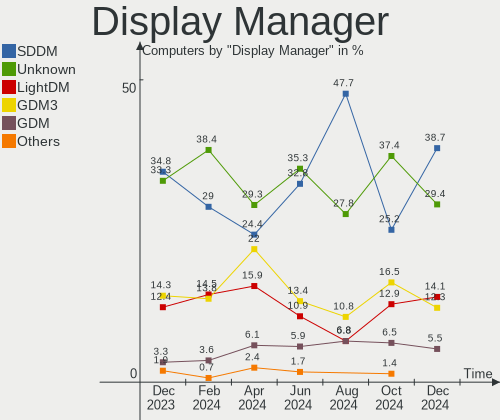

| Name    | Computers | Percent |
|---------|-----------|---------|
| SDDM    | 63        | 38.65%  |
| Unknown | 48        | 29.45%  |
| LightDM | 23        | 14.11%  |
| GDM3    | 20        | 12.27%  |
| GDM     | 9         | 5.52%   |

OS Lang
-------

Language

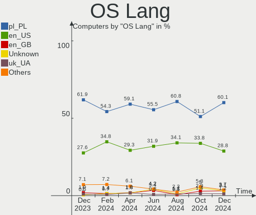

| Lang    | Computers | Percent |
|---------|-----------|---------|
| pl_PL   | 98        | 60.12%  |
| en_US   | 47        | 28.83%  |
| en_GB   | 5         | 3.07%   |
| Unknown | 5         | 3.07%   |
| uk_UA   | 2         | 1.23%   |
| it_IT   | 2         | 1.23%   |
| C       | 2         | 1.23%   |
| es_MX   | 1         | 0.61%   |
| en_IE   | 1         | 0.61%   |

Boot Mode
---------

EFI or BIOS

| Mode | Computers | Percent |
|------|-----------|---------|
| BIOS | 84        | 51.53%  |
| EFI  | 79        | 48.47%  |

Filesystem
----------

Type of filesystem

| Type    | Computers | Percent |
|---------|-----------|---------|
| Ext4    | 88        | 53.99%  |
| Overlay | 26        | 15.95%  |
| Btrfs   | 23        | 14.11%  |
| Tmpfs   | 18        | 11.04%  |
| Zfs     | 3         | 1.84%   |
| F2fs    | 3         | 1.84%   |
| Xfs     | 1         | 0.61%   |
| Unknown | 1         | 0.61%   |

Part. scheme
------------

Scheme of partitioning

| Type    | Computers | Percent |
|---------|-----------|---------|
| GPT     | 99        | 60.74%  |
| Unknown | 42        | 25.77%  |
| MBR     | 22        | 13.5%   |

Dual Boot with Linux/BSD
------------------------

Hosting more than one Linux/BSD

| Dual boot | Computers | Percent |
|-----------|-----------|---------|
| No        | 126       | 77.3%   |
| Yes       | 37        | 22.7%   |

Dual Boot (Win)
---------------

Hosting Linux and Windows

| Dual boot | Computers | Percent |
|-----------|-----------|---------|
| No        | 114       | 69.94%  |
| Yes       | 49        | 30.06%  |

Board
-----

Vendor
------

Motherboard manufacturer

| Name                    | Computers | Percent |
|-------------------------|-----------|---------|
| Lenovo                  | 28        | 17.18%  |
| Dell                    | 26        | 15.95%  |
| ASUSTek Computer        | 25        | 15.34%  |
| MSI                     | 19        | 11.66%  |
| Hewlett-Packard         | 15        | 9.2%    |
| Gigabyte Technology     | 14        | 8.59%   |
| ASRock                  | 8         | 4.91%   |
| Acer                    | 6         | 3.68%   |
| Apple                   | 3         | 1.84%   |
| HUAWEI                  | 2         | 1.23%   |
| Fujitsu                 | 2         | 1.23%   |
| Chuwi                   | 2         | 1.23%   |
| UGREEN                  | 1         | 0.61%   |
| TUXEDO                  | 1         | 0.61%   |
| Sony                    | 1         | 0.61%   |
| Samsung Electronics     | 1         | 0.61%   |
| Raspberry Pi Foundation | 1         | 0.61%   |
| Qilive                  | 1         | 0.61%   |
| Panasonic               | 1         | 0.61%   |
| Microsoft               | 1         | 0.61%   |
| Intel                   | 1         | 0.61%   |
| Google                  | 1         | 0.61%   |
| GEEKOM                  | 1         | 0.61%   |
| ASRockRack              | 1         | 0.61%   |
| Unknown                 | 1         | 0.61%   |

Model
-----

Motherboard model

| Name                                       | Computers | Percent |
|--------------------------------------------|-----------|---------|
| MSI MS-7C56                                | 2         | 1.23%   |
| MSI MS-7A38                                | 2         | 1.23%   |
| MSI MS-7758                                | 2         | 1.23%   |
| Dell Latitude E6430                        | 2         | 1.23%   |
| Dell Inspiron 13-5368                      | 2         | 1.23%   |
| ASUS ASUS TUF Gaming A16 FA617NSR_FA617NSR | 2         | 1.23%   |
| ASUS All Series                            | 2         | 1.23%   |
| UGREEN DXP8800 Plus                        | 1         | 0.61%   |
| TUXEDO Stellaris Slim 15 Intel Gen6        | 1         | 0.61%   |
| Sony VPCEJ2E1E                             | 1         | 0.61%   |
| Samsung 350V5C/351V5C/3540VC/3440VC        | 1         | 0.61%   |
| RPi Raspberry Pi 5 Model B Rev 1.1         | 1         | 0.61%   |
| Qilive QW20141BPL                          | 1         | 0.61%   |
| Panasonic CFLX6-2                          | 1         | 0.61%   |
| MSI MS-7E49                                | 1         | 0.61%   |
| MSI MS-7D09                                | 1         | 0.61%   |
| MSI MS-7B89                                | 1         | 0.61%   |
| MSI MS-7B79                                | 1         | 0.61%   |
| MSI MS-7B48                                | 1         | 0.61%   |
| MSI MS-7A93                                | 1         | 0.61%   |
| MSI MS-7A68                                | 1         | 0.61%   |
| MSI MS-7A67                                | 1         | 0.61%   |
| MSI MS-7924                                | 1         | 0.61%   |
| MSI MS-7808                                | 1         | 0.61%   |
| MSI MS-7673                                | 1         | 0.61%   |
| MSI MS-7551                                | 1         | 0.61%   |
| MSI GF63 Thin 10SCSR                       | 1         | 0.61%   |
| Microsoft Surface Laptop SE                | 1         | 0.61%   |
| Lenovo Yoga Pro 7 14ASP9 83HN              | 1         | 0.61%   |
| Lenovo Yoga 300-11IBY 80M0                 | 1         | 0.61%   |
| Lenovo V15 G3 IAP CTO 83C4                 | 1         | 0.61%   |
| Lenovo ThinkPad X280 20KES2VQ00            | 1         | 0.61%   |
| Lenovo ThinkPad X270 20K5S1A524            | 1         | 0.61%   |
| Lenovo ThinkPad T530 2429MY2               | 1         | 0.61%   |
| Lenovo ThinkPad T430 2349TUM               | 1         | 0.61%   |
| Lenovo ThinkPad T14s Gen 1 20UH000LUS      | 1         | 0.61%   |
| Lenovo ThinkPad R61 8918DFG                | 1         | 0.61%   |
| Lenovo ThinkPad P50 20EQS3B30R             | 1         | 0.61%   |
| Lenovo ThinkPad L520 5016NY9               | 1         | 0.61%   |
| Lenovo ThinkPad E15 Gen 2 20T8000MPB       | 1         | 0.61%   |

Model Family
------------

Motherboard model prefix

| Name              | Computers | Percent |
|-------------------|-----------|---------|
| Lenovo ThinkPad   | 11        | 6.75%   |
| Dell Latitude     | 9         | 5.52%   |
| Lenovo IdeaPad    | 7         | 4.29%   |
| Dell OptiPlex     | 6         | 3.68%   |
| Dell Inspiron     | 5         | 3.07%   |
| ASUS ASUS         | 5         | 3.07%   |
| Acer Aspire       | 4         | 2.45%   |
| MSI MS-7C56       | 2         | 1.23%   |
| MSI MS-7A38       | 2         | 1.23%   |
| MSI MS-7758       | 2         | 1.23%   |
| Lenovo Yoga       | 2         | 1.23%   |
| HP ProOne         | 2         | 1.23%   |
| HP ProBook        | 2         | 1.23%   |
| HP Pavilion       | 2         | 1.23%   |
| HP Laptop         | 2         | 1.23%   |
| Dell XPS          | 2         | 1.23%   |
| ASUS ROG          | 2         | 1.23%   |
| ASUS PRIME        | 2         | 1.23%   |
| ASUS All          | 2         | 1.23%   |
| UGREEN DXP8800    | 1         | 0.61%   |
| TUXEDO Stellaris  | 1         | 0.61%   |
| Sony VPCEJ2E1E    | 1         | 0.61%   |
| Samsung 350V5C    | 1         | 0.61%   |
| RPi Raspberry     | 1         | 0.61%   |
| Qilive QW20141BPL | 1         | 0.61%   |
| Panasonic CFLX6-2 | 1         | 0.61%   |
| MSI MS-7E49       | 1         | 0.61%   |
| MSI MS-7D09       | 1         | 0.61%   |
| MSI MS-7B89       | 1         | 0.61%   |
| MSI MS-7B79       | 1         | 0.61%   |
| MSI MS-7B48       | 1         | 0.61%   |
| MSI MS-7A93       | 1         | 0.61%   |
| MSI MS-7A68       | 1         | 0.61%   |
| MSI MS-7A67       | 1         | 0.61%   |
| MSI MS-7924       | 1         | 0.61%   |
| MSI MS-7808       | 1         | 0.61%   |
| MSI MS-7673       | 1         | 0.61%   |
| MSI MS-7551       | 1         | 0.61%   |
| MSI GF63          | 1         | 0.61%   |
| Microsoft Surface | 1         | 0.61%   |

MFG Year
--------

Motherboard manufacture year

| Year    | Computers | Percent |
|---------|-----------|---------|
| 2020    | 17        | 10.43%  |
| 2013    | 16        | 9.82%   |
| 2012    | 15        | 9.2%    |
| 2024    | 14        | 8.59%   |
| 2021    | 14        | 8.59%   |
| 2017    | 12        | 7.36%   |
| 2018    | 10        | 6.13%   |
| 2014    | 9         | 5.52%   |
| 2022    | 7         | 4.29%   |
| 2011    | 7         | 4.29%   |
| 2015    | 6         | 3.68%   |
| 2010    | 6         | 3.68%   |
| 2008    | 5         | 3.07%   |
| 2007    | 5         | 3.07%   |
| 2023    | 4         | 2.45%   |
| 2016    | 4         | 2.45%   |
| 2009    | 4         | 2.45%   |
| 2019    | 3         | 1.84%   |
| Unknown | 2         | 1.23%   |
| 2006    | 1         | 0.61%   |
| 2004    | 1         | 0.61%   |
| 2000    | 1         | 0.61%   |

Form Factor
-----------

Physical design of the computer

| Name           | Computers | Percent |
|----------------|-----------|---------|
| Notebook       | 91        | 55.83%  |
| Desktop        | 63        | 38.65%  |
| System on chip | 2         | 1.23%   |
| Mini pc        | 2         | 1.23%   |
| Server         | 2         | 1.23%   |
| Tablet         | 1         | 0.61%   |
| Convertible    | 1         | 0.61%   |
| All in one     | 1         | 0.61%   |

Secure Boot
-----------

Enabled or disabled

| State    | Computers | Percent |
|----------|-----------|---------|
| Disabled | 157       | 96.32%  |
| Enabled  | 6         | 3.68%   |

Coreboot
--------

Have coreboot on board

| Used | Computers | Percent |
|------|-----------|---------|
| No   | 162       | 99.39%  |
| Yes  | 1         | 0.61%   |

RAM Size
--------

Total RAM memory

| Size in GB      | Computers | Percent |
|-----------------|-----------|---------|
| 16.01-24.0      | 39        | 23.93%  |
| 4.01-8.0        | 34        | 20.86%  |
| 8.01-16.0       | 28        | 17.18%  |
| 3.01-4.0        | 23        | 14.11%  |
| 32.01-64.0      | 19        | 11.66%  |
| 64.01-256.0     | 9         | 5.52%   |
| 24.01-32.0      | 6         | 3.68%   |
| 1.01-2.0        | 3         | 1.84%   |
| More than 256.0 | 1         | 0.61%   |
| 2.01-3.0        | 1         | 0.61%   |

RAM Used
--------

Used RAM memory

| Used GB    | Computers | Percent |
|------------|-----------|---------|
| 1.01-2.0   | 56        | 34.36%  |
| 4.01-8.0   | 37        | 22.7%   |
| 2.01-3.0   | 37        | 22.7%   |
| 3.01-4.0   | 19        | 11.66%  |
| 8.01-16.0  | 7         | 4.29%   |
| 0.51-1.0   | 3         | 1.84%   |
| 16.01-24.0 | 2         | 1.23%   |
| 24.01-32.0 | 1         | 0.61%   |
| 0.01-0.5   | 1         | 0.61%   |

Total Drives
------------

Number of drives on board

| Drives | Computers | Percent |
|--------|-----------|---------|
| 1      | 89        | 54.6%   |
| 2      | 44        | 26.99%  |
| 3      | 16        | 9.82%   |
| 4      | 6         | 3.68%   |
| 5      | 5         | 3.07%   |
| 7      | 1         | 0.61%   |
| 6      | 1         | 0.61%   |
| 0      | 1         | 0.61%   |

Has CD-ROM
----------

Has CD-ROM on board

| Presented | Computers | Percent |
|-----------|-----------|---------|
| No        | 107       | 65.64%  |
| Yes       | 56        | 34.36%  |

Has Ethernet
------------

Has Ethernet on board

| Presented | Computers | Percent |
|-----------|-----------|---------|
| Yes       | 144       | 88.34%  |
| No        | 19        | 11.66%  |

Has WiFi
--------

Has WiFi module

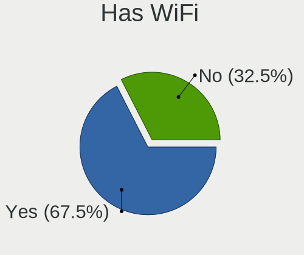

| Presented | Computers | Percent |
|-----------|-----------|---------|
| Yes       | 110       | 67.48%  |
| No        | 53        | 32.52%  |

Has Bluetooth
-------------

Has Bluetooth module

| Presented | Computers | Percent |
|-----------|-----------|---------|
| Yes       | 101       | 61.96%  |
| No        | 62        | 38.04%  |

Location
--------

Country
-------

Geographic location (country)

| Country | Computers | Percent |
|---------|-----------|---------|
| Poland  | 163       | 100%    |

City
----

Geographic location (city)

| City                | Computers | Percent |
|---------------------|-----------|---------|
| Warsaw              | 30        | 18.4%   |
| Poznan              | 12        | 7.36%   |
| Wroclaw             | 11        | 6.75%   |
| Krakow              | 10        | 6.13%   |
| Tychy               | 4         | 2.45%   |
| Kielce              | 4         | 2.45%   |
| Gdansk              | 4         | 2.45%   |
| Szczecin            | 3         | 1.84%   |
| Lubin               | 3         | 1.84%   |
| Gdynia              | 3         | 1.84%   |
| Bydgoszcz           | 3         | 1.84%   |
| Bielsko-Biala       | 3         | 1.84%   |
| Tarnowskie Gory     | 2         | 1.23%   |
| Rzeszów            | 2         | 1.23%   |
| Rybnik              | 2         | 1.23%   |
| Piaseczno           | 2         | 1.23%   |
| Katowice            | 2         | 1.23%   |
| Dobra               | 2         | 1.23%   |
| Cieszyn             | 2         | 1.23%   |
| Bialystok           | 2         | 1.23%   |
| Łapy               | 1         | 0.61%   |
| Zgorzelec           | 1         | 0.61%   |
| Zagorz              | 1         | 0.61%   |
| Września           | 1         | 0.61%   |
| Wodzisław Śląski | 1         | 0.61%   |
| Wejherowo           | 1         | 0.61%   |
| Ustka               | 1         | 0.61%   |
| Tłuszcz            | 1         | 0.61%   |
| Turobin             | 1         | 0.61%   |
| Turek               | 1         | 0.61%   |
| Swidnik             | 1         | 0.61%   |
| Swidnica            | 1         | 0.61%   |
| Sosnowiec           | 1         | 0.61%   |
| Sochaczew           | 1         | 0.61%   |
| Skawina             | 1         | 0.61%   |
| Siedlce             | 1         | 0.61%   |
| Rumia               | 1         | 0.61%   |
| Reda                | 1         | 0.61%   |
| Puławy             | 1         | 0.61%   |
| Przystajn           | 1         | 0.61%   |

Drives
------

Drive Vendor
------------

Hard drive vendors

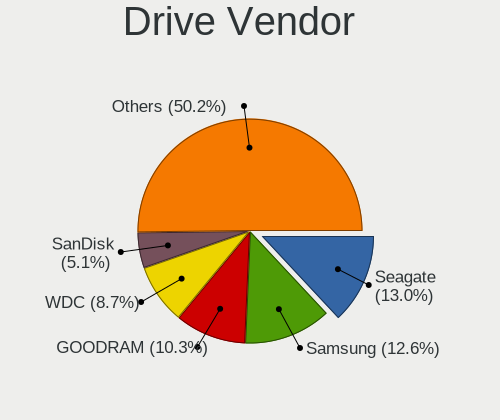

| Vendor                       | Computers | Drives | Percent |
|------------------------------|-----------|--------|---------|
| Seagate                      | 33        | 41     | 13.04%  |
| Samsung Electronics          | 32        | 43     | 12.65%  |
| GOODRAM                      | 26        | 27     | 10.28%  |
| WDC                          | 22        | 26     | 8.7%    |
| SanDisk                      | 13        | 14     | 5.14%   |
| Unknown                      | 12        | 13     | 4.74%   |
| Crucial                      | 11        | 12     | 4.35%   |
| Micron Technology            | 9         | 9      | 3.56%   |
| Kingston                     | 8         | 9      | 3.16%   |
| Intel                        | 8         | 8      | 3.16%   |
| A-DATA Technology            | 8         | 9      | 3.16%   |
| Hitachi                      | 7         | 9      | 2.77%   |
| Toshiba                      | 5         | 6      | 1.98%   |
| SK hynix                     | 5         | 5      | 1.98%   |
| SPCC                         | 4         | 4      | 1.58%   |
| Phison Electronics           | 4         | 5      | 1.58%   |
| Silicon Motion               | 3         | 3      | 1.19%   |
| Shenzhen Longsys Electronics | 3         | 3      | 1.19%   |
| Plextor                      | 3         | 4      | 1.19%   |
| Kingston Technology Company  | 3         | 3      | 1.19%   |
| Realtek Semiconductor        | 2         | 2      | 0.79%   |
| PNY                          | 2         | 2      | 0.79%   |
| Patriot                      | 2         | 2      | 0.79%   |
| Maxtor                       | 2         | 2      | 0.79%   |
| LITEONIT                     | 2         | 2      | 0.79%   |
| Apple                        | 2         | 2      | 0.79%   |
| ADATA Technology             | 2         | 2      | 0.79%   |
| Unknown                      | 2         | 2      | 0.79%   |
| Union Memory                 | 1         | 1      | 0.4%    |
| Realtek                      | 1         | 1      | 0.4%    |
| POLION                       | 1         | 1      | 0.4%    |
| Phison                       | 1         | 1      | 0.4%    |
| MAXIO Technology (Hangzhou)  | 1         | 1      | 0.4%    |
| LITEON                       | 1         | 1      | 0.4%    |
| Lite-On Technology           | 1         | 1      | 0.4%    |
| Lexar                        | 1         | 1      | 0.4%    |
| Lenovo                       | 1         | 1      | 0.4%    |
| KODAK                        | 1         | 1      | 0.4%    |
| KIOXIA-EXCERIA               | 1         | 1      | 0.4%    |
| KIOXIA                       | 1         | 1      | 0.4%    |

Drive Model
-----------

Hard drive models

| Model                                                             | Computers | Percent |
|-------------------------------------------------------------------|-----------|---------|
| GOODRAM SSDPR-CX400-512-G2 512GB                                  | 6         | 2.21%   |
| Unknown MMC Card  64GB                                            | 5         | 1.84%   |
| Samsung NVMe SSD Controller PM9A1/PM9A3/980PRO 512GB              | 5         | 1.84%   |
| Sandisk WD Blue SN550 NVMe SSD 256GB                              | 4         | 1.47%   |
| Samsung NVMe SSD Controller SM981/PM981/PM983 512GB               | 4         | 1.47%   |
| Seagate ST9500325AS 500GB                                         | 3         | 1.1%    |
| Samsung SSD 860 EVO 1TB                                           | 3         | 1.1%    |
| GOODRAM SSDPR-CX400-01T-G2 1TB                                    | 3         | 1.1%    |
| Crucial CT240BX500SSD1 240GB                                      | 3         | 1.1%    |
| Crucial CT1000MX500SSD1 1TB                                       | 3         | 1.1%    |
| A-DATA SU650 240GB SSD                                            | 3         | 1.1%    |
| Unknown NVMe SSD Drive 512GB                                      | 2         | 0.74%   |
| Unknown MMC Card  128GB                                           | 2         | 0.74%   |
| SPCC Solid State Disk 256GB                                       | 2         | 0.74%   |
| Silicon Motion SM2262/SM2262EN SSD Controller 2TB                 | 2         | 0.74%   |
| Seagate ST8000DM004-2U9188 8TB                                    | 2         | 0.74%   |
| Seagate ST500LT012-9WS142 500GB                                   | 2         | 0.74%   |
| Seagate ST4000DM004-2CV104 4TB                                    | 2         | 0.74%   |
| Seagate ST1000DM003-1CH162 1TB                                    | 2         | 0.74%   |
| SanDisk NVMe SSD Drive 512GB                                      | 2         | 0.74%   |
| Samsung SSD 980 1TB                                               | 2         | 0.74%   |
| Samsung SSD 870 EVO 1TB                                           | 2         | 0.74%   |
| Phison PS5013 E13 NVMe Controller 512GB                           | 2         | 0.74%   |
| Micron MTFDHBA512QFD 512GB                                        | 2         | 0.74%   |
| Kingston Company SNV2S1000G 1TB                                   | 2         | 0.74%   |
| Kingston SUV400S37120G 120GB SSD                                  | 2         | 0.74%   |
| Kingston SKC3000S1024G 1TB                                        | 2         | 0.74%   |
| Intel SSD 660P Series 1024GB                                      | 2         | 0.74%   |
| GOODRAM SSDPR-CX400-256-G2 256GB                                  | 2         | 0.74%   |
| GOODRAM SSDPR-CX400-128 128GB                                     | 2         | 0.74%   |
| GOODRAM SSDPR-CL100-480-G2 480GB                                  | 2         | 0.74%   |
| GOODRAM SSD 240GB                                                 | 2         | 0.74%   |
| GOODRAM SSD 120GB                                                 | 2         | 0.74%   |
| Crucial CT500MX500SSD1 500GB                                      | 2         | 0.74%   |
| Apple SSD SM0128G 121GB                                           | 2         | 0.74%   |
| ADATA XPG SX8200 Pro PCIe Gen3x4 M.2 2280 Solid State Drive 256GB | 2         | 0.74%   |
| A-DATA SU800 1024GB SSD                                           | 2         | 0.74%   |
| Unknown                                                           | 2         | 0.74%   |
| WDC WDS240G2G0A-00JH30 240GB SSD                                  | 1         | 0.37%   |
| WDC WD800JB-00JJC0 80GB                                           | 1         | 0.37%   |

HDD Vendor
----------

Hard disk drive vendors

| Vendor              | Computers | Drives | Percent |
|---------------------|-----------|--------|---------|
| Seagate             | 33        | 41     | 46.48%  |
| WDC                 | 20        | 23     | 28.17%  |
| Hitachi             | 7         | 9      | 9.86%   |
| Toshiba             | 4         | 5      | 5.63%   |
| Samsung Electronics | 2         | 2      | 2.82%   |
| Maxtor              | 2         | 2      | 2.82%   |
| JMicron Technology  | 1         | 1      | 1.41%   |
| HGST                | 1         | 1      | 1.41%   |
| Fujitsu             | 1         | 1      | 1.41%   |

SSD Vendor
----------

Solid state drive vendors

| Vendor              | Computers | Drives | Percent |
|---------------------|-----------|--------|---------|
| GOODRAM             | 26        | 27     | 26.8%   |
| Samsung Electronics | 14        | 14     | 14.43%  |
| Crucial             | 11        | 12     | 11.34%  |
| A-DATA Technology   | 7         | 8      | 7.22%   |
| SPCC                | 4         | 4      | 4.12%   |
| SanDisk             | 4         | 4      | 4.12%   |
| WDC                 | 3         | 3      | 3.09%   |
| Plextor             | 3         | 4      | 3.09%   |
| Intel               | 3         | 3      | 3.09%   |
| PNY                 | 2         | 2      | 2.06%   |
| Patriot             | 2         | 2      | 2.06%   |
| Micron Technology   | 2         | 2      | 2.06%   |
| LITEONIT            | 2         | 2      | 2.06%   |
| Kingston            | 2         | 2      | 2.06%   |
| Apple               | 2         | 2      | 2.06%   |
| Unknown             | 2         | 2      | 2.06%   |
| Toshiba             | 1         | 1      | 1.03%   |
| SK hynix            | 1         | 1      | 1.03%   |
| LITEON              | 1         | 1      | 1.03%   |
| KODAK               | 1         | 1      | 1.03%   |
| KIOXIA-EXCERIA      | 1         | 1      | 1.03%   |
| China               | 1         | 1      | 1.03%   |
| Apacer              | 1         | 1      | 1.03%   |
| AirDisk             | 1         | 1      | 1.03%   |

Drive Kind
----------

HDD or SSD

| Kind    | Computers | Drives | Percent |
|---------|-----------|--------|---------|
| SSD     | 85        | 101    | 38.12%  |
| NVMe    | 68        | 88     | 30.49%  |
| HDD     | 58        | 85     | 26.01%  |
| MMC     | 11        | 12     | 4.93%   |
| Unknown | 1         | 1      | 0.45%   |

Drive Connector
---------------

SATA, SAS, NVMe, etc.

| Type | Computers | Drives | Percent |
|------|-----------|--------|---------|
| SATA | 117       | 185    | 58.79%  |
| NVMe | 68        | 87     | 34.17%  |
| MMC  | 11        | 12     | 5.53%   |
| SAS  | 3         | 3      | 1.51%   |

Drive Size
----------

Size of hard drive

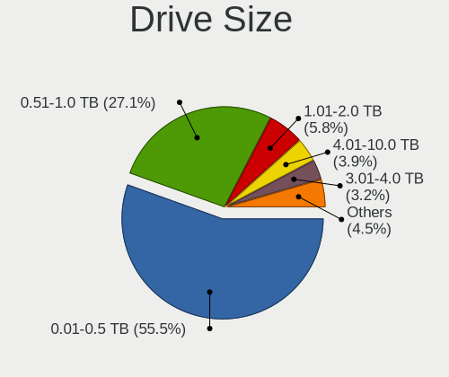

| Size in TB | Computers | Drives | Percent |
|------------|-----------|--------|---------|
| 0.01-0.5   | 86        | 107    | 55.48%  |
| 0.51-1.0   | 42        | 47     | 27.1%   |
| 1.01-2.0   | 9         | 11     | 5.81%   |
| 4.01-10.0  | 6         | 6      | 3.87%   |
| 3.01-4.0   | 5         | 5      | 3.23%   |
| 2.01-3.0   | 4         | 6      | 2.58%   |
| 10.01-20.0 | 3         | 4      | 1.94%   |

Space Total
-----------

Amount of disk space available on the file system

| Size in GB     | Computers | Percent |
|----------------|-----------|---------|
| 251-500        | 27        | 16.56%  |
| 101-250        | 25        | 15.34%  |
| 501-1000       | 20        | 12.27%  |
| 1-20           | 19        | 11.66%  |
| More than 3000 | 18        | 11.04%  |
| Unknown        | 15        | 9.2%    |
| 51-100         | 12        | 7.36%   |
| 1001-2000      | 11        | 6.75%   |
| 21-50          | 9         | 5.52%   |
| 2001-3000      | 7         | 4.29%   |

Space Used
----------

Amount of used disk space

| Used GB        | Computers | Percent |
|----------------|-----------|---------|
| 1-20           | 62        | 38.04%  |
| 251-500        | 20        | 12.27%  |
| Unknown        | 15        | 9.2%    |
| 21-50          | 14        | 8.59%   |
| 101-250        | 14        | 8.59%   |
| 51-100         | 12        | 7.36%   |
| More than 3000 | 8         | 4.91%   |
| 501-1000       | 8         | 4.91%   |
| 1001-2000      | 5         | 3.07%   |
| 2001-3000      | 4         | 2.45%   |
| 0              | 1         | 0.61%   |

Malfunc. Drives
---------------

Drive models with a malfunction

| Model                                             | Computers | Drives | Percent |
|---------------------------------------------------|-----------|--------|---------|
| Seagate ST500LT012-9WS142 500GB                   | 2         | 2      | 7.41%   |
| WDC WDS240G2G0A-00JH30 240GB SSD                  | 1         | 1      | 3.7%    |
| WDC WD800JB-00JJC0 80GB                           | 1         | 1      | 3.7%    |
| WDC WD5000LPCX-24C6HT0 500GB                      | 1         | 1      | 3.7%    |
| WDC WD2500AAKS-00L9A0 250GB                       | 1         | 1      | 3.7%    |
| WDC WD20EFAX-68F 2TB                              | 1         | 2      | 3.7%    |
| WDC WD10EZEX-60M2NA0 1TB                          | 1         | 1      | 3.7%    |
| WDC WD Green 2.5 240GB SSD                        | 1         | 1      | 3.7%    |
| WDC WD Blue SA510 2. 500GB SSD                    | 1         | 1      | 3.7%    |
| Silicon Motion SM2262/SM2262EN SSD Controller 2TB | 1         | 1      | 3.7%    |
| Seagate ST9320423AS 320GB                         | 1         | 1      | 3.7%    |
| Seagate ST9320325AS 320GB                         | 1         | 2      | 3.7%    |
| Seagate ST91603110CS 160GB                        | 1         | 1      | 3.7%    |
| Seagate ST500DM002-1BD142 500GB                   | 1         | 1      | 3.7%    |
| Seagate ST3320620AS 320GB                         | 1         | 1      | 3.7%    |
| Seagate ST3250820ACE 250GB                        | 1         | 1      | 3.7%    |
| Seagate ST320LT020-9YG142 320GB                   | 1         | 1      | 3.7%    |
| Seagate ST2000DM006-2DM164 2TB                    | 1         | 1      | 3.7%    |
| Seagate ST1000DM003-1ER162 1TB                    | 1         | 1      | 3.7%    |
| Samsung Electronics SP1614N 160GB                 | 1         | 1      | 3.7%    |
| Realtek Semiconductor ADATA SX6000NP 256GB        | 1         | 1      | 3.7%    |
| Maxtor 6L250M0 256GB                              | 1         | 1      | 3.7%    |
| Maxtor 2F040L0 41GB                               | 1         | 1      | 3.7%    |
| Hitachi HTS541612J9SA00 120GB                     | 1         | 1      | 3.7%    |
| Hitachi HDP725016GLA380 160GB                     | 1         | 1      | 3.7%    |
| Crucial CT275MX300SSD1 275GB                      | 1         | 1      | 3.7%    |

Malfunc. Drive Vendor
---------------------

Vendors of faulty drives

| Vendor                | Computers | Drives | Percent |
|-----------------------|-----------|--------|---------|
| Seagate               | 9         | 12     | 37.5%   |
| WDC                   | 7         | 9      | 29.17%  |
| Maxtor                | 2         | 2      | 8.33%   |
| Hitachi               | 2         | 2      | 8.33%   |
| Silicon Motion        | 1         | 1      | 4.17%   |
| Samsung Electronics   | 1         | 1      | 4.17%   |
| Realtek Semiconductor | 1         | 1      | 4.17%   |
| Crucial               | 1         | 1      | 4.17%   |

Malfunc. HDD Vendor
-------------------

Vendors of faulty HDD drives

| Vendor              | Computers | Drives | Percent |
|---------------------|-----------|--------|---------|
| Seagate             | 9         | 12     | 47.37%  |
| WDC                 | 5         | 6      | 26.32%  |
| Maxtor              | 2         | 2      | 10.53%  |
| Hitachi             | 2         | 2      | 10.53%  |
| Samsung Electronics | 1         | 1      | 5.26%   |

Malfunc. Drive Kind
-------------------

Kinds of faulty drives

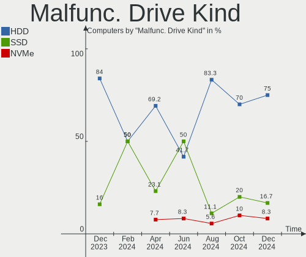

| Kind | Computers | Drives | Percent |
|------|-----------|--------|---------|
| HDD  | 18        | 23     | 75%     |
| SSD  | 4         | 4      | 16.67%  |
| NVMe | 2         | 2      | 8.33%   |

Failed Drives
-------------

Failed drive models

| Model                    | Computers | Drives | Percent |
|--------------------------|-----------|--------|---------|
| WDC WD20EARS-00MVWB0 2TB | 1         | 1      | 100%    |

Failed Drive Vendor
-------------------

Failed drive vendors

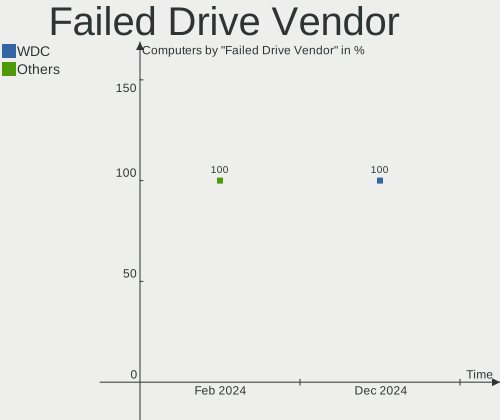

| Vendor | Computers | Drives | Percent |
|--------|-----------|--------|---------|
| WDC    | 1         | 1      | 100%    |

Drive Status
------------

Number of failed and malfunc. drives

| Status   | Computers | Drives | Percent |
|----------|-----------|--------|---------|
| Works    | 85        | 139    | 48.02%  |
| Detected | 68        | 118    | 38.42%  |
| Malfunc  | 23        | 29     | 12.99%  |
| Failed   | 1         | 1      | 0.56%   |

Storage controller
------------------

Storage Vendor
--------------

Storage controller vendors

| Vendor                           | Computers | Percent |
|----------------------------------|-----------|---------|
| Intel                            | 100       | 45.25%  |
| AMD                              | 35        | 15.84%  |
| Samsung Electronics              | 21        | 9.5%    |
| SanDisk                          | 9         | 4.07%   |
| Kingston Technology Company      | 9         | 4.07%   |
| Micron Technology                | 7         | 3.17%   |
| Phison Electronics               | 5         | 2.26%   |
| JMicron Technology               | 5         | 2.26%   |
| Shenzhen Longsys Electronics     | 4         | 1.81%   |
| ASMedia Technology               | 4         | 1.81%   |
| SK hynix                         | 3         | 1.36%   |
| Silicon Motion                   | 3         | 1.36%   |
| Realtek Semiconductor            | 3         | 1.36%   |
| ADATA Technology                 | 2         | 0.9%    |
| Unknown                          | 2         | 0.9%    |
| Union Memory (Shenzhen)          | 1         | 0.45%   |
| Silicon Integrated Systems [SiS] | 1         | 0.45%   |
| Nvidia                           | 1         | 0.45%   |
| MAXIO Technology (Hangzhou)      | 1         | 0.45%   |
| Marvell Technology Group         | 1         | 0.45%   |
| LSI Logic / Symbios Logic        | 1         | 0.45%   |
| Lite-On Technology               | 1         | 0.45%   |
| Lenovo                           | 1         | 0.45%   |
| KIOXIA                           | 1         | 0.45%   |

Storage Model
-------------

Storage controller models

| Model                                                                          | Computers | Percent |
|--------------------------------------------------------------------------------|-----------|---------|
| AMD FCH SATA Controller [AHCI mode]                                            | 18        | 6.98%   |
| Intel 7 Series Chipset Family 6-port SATA Controller [AHCI mode]               | 10        | 3.88%   |
| Samsung NVMe SSD Controller PM9A1/PM9A3/980PRO                                 | 8         | 3.1%    |
| Intel 8 Series/C220 Series Chipset Family 6-port SATA Controller 1 [AHCI mode] | 8         | 3.1%    |
| Samsung NVMe SSD Controller SM981/PM981/PM983                                  | 6         | 2.33%   |
| Intel 200 Series PCH SATA controller [AHCI mode]                               | 6         | 2.33%   |
| AMD 400 Series Chipset SATA Controller                                         | 6         | 2.33%   |
| Kingston Company KC3000/FURY Renegade NVMe SSD [E18]                           | 5         | 1.94%   |
| JMicron JMB363 SATA/IDE Controller                                             | 5         | 1.94%   |
| Intel Sunrise Point-LP SATA Controller [AHCI mode]                             | 5         | 1.94%   |
| Intel 82801 Mobile SATA Controller [RAID mode]                                 | 5         | 1.94%   |
| Intel 7 Series/C210 Series Chipset Family 6-port SATA Controller [AHCI mode]   | 5         | 1.94%   |
| AMD SB7x0/SB8x0/SB9x0 IDE Controller                                           | 5         | 1.94%   |
| AMD 600 Series Chipset SATA Controller                                         | 5         | 1.94%   |
| AMD 500 Series Chipset SATA Controller                                         | 5         | 1.94%   |
| SanDisk Ultra 3D / WD PC SN530, IX SN530, Blue SN550 NVMe SSD (DRAM-less)      | 4         | 1.55%   |
| Samsung NVMe SSD Controller 980 (DRAM-less)                                    | 4         | 1.55%   |
| Intel Volume Management Device NVMe RAID Controller                            | 4         | 1.55%   |
| Intel 6 Series/C200 Series Chipset Family 6 port Mobile SATA AHCI Controller   | 4         | 1.55%   |
| AMD SB7x0/SB8x0/SB9x0 SATA Controller [IDE mode]                               | 4         | 1.55%   |
| SanDisk WD Black SN770 / PC SN740 256GB / PC SN560 (DRAM-less) NVMe SSD        | 3         | 1.16%   |
| Phison PS5013-E13 PCIe3 NVMe Controller (DRAM-less)                            | 3         | 1.16%   |
| Micron 2210 NVMe SSD [Cobain]                                                  | 3         | 1.16%   |
| Kingston Company NV2 NVMe SSD [E21T] (DRAM-less)                               | 3         | 1.16%   |
| Intel SSD 670p Series [Keystone Harbor]                                        | 3         | 1.16%   |
| Intel HM170/QM170 Chipset SATA Controller [AHCI Mode]                          | 3         | 1.16%   |
| Intel 8 Series SATA Controller 1 [AHCI mode]                                   | 3         | 1.16%   |
| Intel 5 Series/3400 Series Chipset 6 port SATA AHCI Controller                 | 3         | 1.16%   |
| Intel 5 Series/3400 Series Chipset 4 port SATA AHCI Controller                 | 3         | 1.16%   |
| ASMedia ASM1061/ASM1062 Serial ATA Controller                                  | 3         | 1.16%   |
| AMD 300 Series Chipset SATA Controller                                         | 3         | 1.16%   |
| SK hynix Gold P31/BC711/PC711 NVMe Solid State Drive                           | 2         | 0.78%   |
| Silicon Motion SM2262/SM2262EN SSD Controller                                  | 2         | 0.78%   |
| Shenzhen Longsys Lexar NM790 NVME SSD (DRAM-less)                              | 2         | 0.78%   |
| Shenzhen Longsys Lexar NM610 PRO NVME SSD (DRAM-less)                          | 2         | 0.78%   |
| Samsung S4LN058A01[SSUBX] AHCI SSD Controller (Apple slot)                     | 2         | 0.78%   |
| Samsung NVMe SSD Controller S4LV008[Pascal]                                    | 2         | 0.78%   |
| Intel SSD 660P Series                                                          | 2         | 0.78%   |
| Intel Q170/Q150/B150/H170/H110/Z170/CM236 Chipset SATA Controller [AHCI Mode]  | 2         | 0.78%   |
| Intel Mobile 4 Series Chipset PT IDER Controller                               | 2         | 0.78%   |

Storage Kind
------------

Kind of storage controller (IDE, SATA, NVMe, SAS, ...)

| Kind | Computers | Percent |
|------|-----------|---------|
| SATA | 118       | 53.88%  |
| NVMe | 68        | 31.05%  |
| IDE  | 22        | 10.05%  |
| RAID | 11        | 5.02%   |

Processor
---------

CPU Vendor
----------

Processor vendors

| Vendor | Computers | Percent |
|--------|-----------|---------|
| Intel  | 112       | 68.71%  |
| AMD    | 49        | 30.06%  |
| ARM    | 2         | 1.23%   |

CPU Model
---------

Processor models

| Model                                       | Computers | Percent |
|---------------------------------------------|-----------|---------|
| Intel Core i5 CPU M 520 @ 2.40GHz           | 3         | 1.84%   |
| Intel N100                                  | 2         | 1.23%   |
| Intel Core i7-7700K CPU @ 4.20GHz           | 2         | 1.23%   |
| Intel Core i7-4790 CPU @ 3.60GHz            | 2         | 1.23%   |
| Intel Core i7-3520M CPU @ 2.90GHz           | 2         | 1.23%   |
| Intel Core i5-4200M CPU @ 2.50GHz           | 2         | 1.23%   |
| Intel Core i5-3330 CPU @ 3.00GHz            | 2         | 1.23%   |
| Intel Core i5-2500K CPU @ 3.30GHz           | 2         | 1.23%   |
| Intel 12th Gen Core i5-1235U                | 2         | 1.23%   |
| Intel 11th Gen Core i5-1135G7 @ 2.40GHz     | 2         | 1.23%   |
| ARM Processor                               | 2         | 1.23%   |
| AMD Ryzen 7 7435HS                          | 2         | 1.23%   |
| AMD Ryzen 7 5700G with Radeon Graphics      | 2         | 1.23%   |
| AMD Ryzen 7 4800H with Radeon Graphics      | 2         | 1.23%   |
| AMD Ryzen 5 5600H with Radeon Graphics      | 2         | 1.23%   |
| AMD Ryzen 5 2600 Six-Core Processor         | 2         | 1.23%   |
| Intel Xeon CPU E5-2650 v4 @ 2.20GHz         | 1         | 0.61%   |
| Intel Pentium Dual-Core CPU E5400 @ 2.70GHz | 1         | 0.61%   |
| Intel Pentium Dual CPU E2220 @ 2.40GHz      | 1         | 0.61%   |
| Intel Pentium CPU N3710 @ 1.60GHz           | 1         | 0.61%   |
| Intel Pentium CPU N3540 @ 2.16GHz           | 1         | 0.61%   |
| Intel Pentium CPU B960 @ 2.20GHz            | 1         | 0.61%   |
| Intel Pentium CPU B950 @ 2.10GHz            | 1         | 0.61%   |
| Intel Pentium CPU 2117U @ 1.80GHz           | 1         | 0.61%   |
| Intel Pentium 4 CPU 2.40GHz                 | 1         | 0.61%   |
| Intel Core Ultra 7 265KF                    | 1         | 0.61%   |
| Intel Core i9-14900K                        | 1         | 0.61%   |
| Intel Core i9-14900HX                       | 1         | 0.61%   |
| Intel Core i7-8750H CPU @ 2.20GHz           | 1         | 0.61%   |
| Intel Core i7-8650U CPU @ 1.90GHz           | 1         | 0.61%   |
| Intel Core i7-7820X CPU @ 3.60GHz           | 1         | 0.61%   |
| Intel Core i7-7700HQ CPU @ 2.80GHz          | 1         | 0.61%   |
| Intel Core i7-6820HQ CPU @ 2.70GHz          | 1         | 0.61%   |
| Intel Core i7-6500U CPU @ 2.50GHz           | 1         | 0.61%   |
| Intel Core i7-4702MQ CPU @ 2.20GHz          | 1         | 0.61%   |
| Intel Core i7-3820QM CPU @ 2.70GHz          | 1         | 0.61%   |
| Intel Core i7-3770T CPU @ 2.50GHz           | 1         | 0.61%   |
| Intel Core i7-3720QM CPU @ 2.60GHz          | 1         | 0.61%   |
| Intel Core i7-3610QM CPU @ 2.30GHz          | 1         | 0.61%   |
| Intel Core i7-2670QM CPU @ 2.20GHz          | 1         | 0.61%   |

CPU Model Family
----------------

Processor model prefix

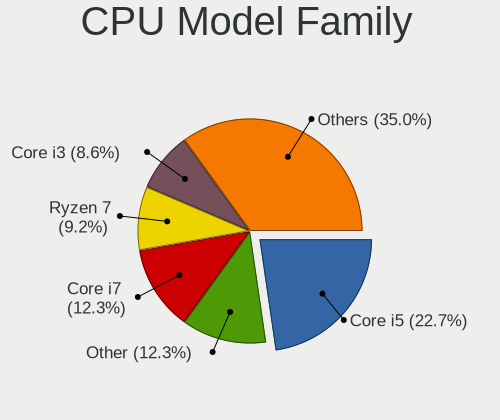

| Model                                | Computers | Percent |
|--------------------------------------|-----------|---------|
| Intel Core i5                        | 37        | 22.7%   |
| Other                                | 20        | 12.27%  |
| Intel Core i7                        | 20        | 12.27%  |
| AMD Ryzen 7                          | 15        | 9.2%    |
| Intel Core i3                        | 14        | 8.59%   |
| AMD Ryzen 5                          | 14        | 8.59%   |
| Intel Celeron                        | 7         | 4.29%   |
| Intel Pentium                        | 5         | 3.07%   |
| Intel Core 2 Duo                     | 4         | 2.45%   |
| Intel Core i9                        | 2         | 1.23%   |
| AMD Ryzen 9                          | 2         | 1.23%   |
| AMD Embedded                         | 2         | 1.23%   |
| Intel Xeon                           | 1         | 0.61%   |
| Intel Pentium Dual-Core              | 1         | 0.61%   |
| Intel Pentium Dual                   | 1         | 0.61%   |
| Intel Pentium 4                      | 1         | 0.61%   |
| Intel Core Duo                       | 1         | 0.61%   |
| Intel Core 2 Quad                    | 1         | 0.61%   |
| Intel Core 2                         | 1         | 0.61%   |
| Intel Core                           | 1         | 0.61%   |
| Intel Atom                           | 1         | 0.61%   |
| AMD Turion X2 Ultra Dual-Core Mobile | 1         | 0.61%   |
| AMD Ryzen 7 PRO                      | 1         | 0.61%   |
| AMD Ryzen 5 PRO                      | 1         | 0.61%   |
| AMD Ryzen 3 PRO                      | 1         | 0.61%   |
| AMD Ryzen 3                          | 1         | 0.61%   |
| AMD Phenom II X6                     | 1         | 0.61%   |
| AMD Phenom II X4                     | 1         | 0.61%   |
| AMD Opteron                          | 1         | 0.61%   |
| AMD FX                               | 1         | 0.61%   |
| AMD EPYC                             | 1         | 0.61%   |
| AMD Athlon II X2                     | 1         | 0.61%   |
| AMD A10                              | 1         | 0.61%   |

CPU Cores
---------

Number of processor cores

| Number  | Computers | Percent |
|---------|-----------|---------|
| 2       | 54        | 33.13%  |
| 4       | 53        | 32.52%  |
| 8       | 19        | 11.66%  |
| 6       | 19        | 11.66%  |
| 24      | 4         | 2.45%   |
| 12      | 4         | 2.45%   |
| 10      | 3         | 1.84%   |
| 14      | 2         | 1.23%   |
| Unknown | 2         | 1.23%   |
| 20      | 1         | 0.61%   |
| 16      | 1         | 0.61%   |
| 1       | 1         | 0.61%   |

CPU Sockets
-----------

Number of sockets

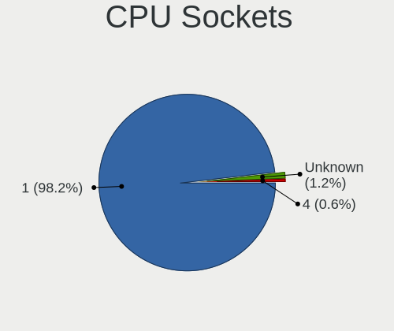

| Number  | Computers | Percent |
|---------|-----------|---------|
| 1       | 160       | 98.16%  |
| Unknown | 2         | 1.23%   |
| 4       | 1         | 0.61%   |

CPU Threads
-----------

Threads per core (Hyper-Threading)

| Number  | Computers | Percent |
|---------|-----------|---------|
| 2       | 105       | 64.42%  |
| 1       | 56        | 34.36%  |
| Unknown | 2         | 1.23%   |

CPU Op-Modes
------------

CPU Operation Modes (32-bit, 64-bit)

| Op mode        | Computers | Percent |
|----------------|-----------|---------|
| 32-bit, 64-bit | 158       | 96.93%  |
| 64-bit         | 2         | 1.23%   |
| 32-bit         | 2         | 1.23%   |
| Unknown        | 1         | 0.61%   |

CPU Microcode
-------------

Microcode number

| Number     | Computers | Percent |
|------------|-----------|---------|
| Unknown    | 141       | 86.5%   |
| 0x306c3    | 3         | 1.84%   |
| 0x306a9    | 3         | 1.84%   |
| 0xf29      | 1         | 0.61%   |
| 0x906e9    | 1         | 0.61%   |
| 0x806c1    | 1         | 0.61%   |
| 0x6f6      | 1         | 0.61%   |
| 0x6ec      | 1         | 0.61%   |
| 0x506e3    | 1         | 0.61%   |
| 0x40651    | 1         | 0.61%   |
| 0x206a7    | 1         | 0.61%   |
| 0x1067a    | 1         | 0.61%   |
| 0x0a500011 | 1         | 0.61%   |
| 0x08600109 | 1         | 0.61%   |
| 0x08600103 | 1         | 0.61%   |
| 0x0800820d | 1         | 0.61%   |
| 0x06006704 | 1         | 0.61%   |
| 0x0600063e | 1         | 0.61%   |
| 0x010000db | 1         | 0.61%   |

CPU Microarch
-------------

Microarchitecture

| Name             | Computers | Percent |
|------------------|-----------|---------|
| Unknown          | 21        | 12.88%  |
| IvyBridge        | 15        | 9.2%    |
| Haswell          | 15        | 9.2%    |
| KabyLake         | 14        | 8.59%   |
| Zen 3            | 11        | 6.75%   |
| SandyBridge      | 10        | 6.13%   |
| Skylake          | 8         | 4.91%   |
| Zen 2            | 7         | 4.29%   |
| Westmere         | 6         | 3.68%   |
| Zen+             | 5         | 3.07%   |
| Penryn           | 5         | 3.07%   |
| TigerLake        | 4         | 2.45%   |
| Silvermont       | 4         | 2.45%   |
| K10              | 4         | 2.45%   |
| Excavator        | 4         | 2.45%   |
| Zen              | 3         | 1.84%   |
| Icelake          | 3         | 1.84%   |
| Core             | 3         | 1.84%   |
| CometLake        | 3         | 1.84%   |
| Broadwell        | 3         | 1.84%   |
| Nehalem          | 2         | 1.23%   |
| Gracemont        | 2         | 1.23%   |
| Goldmont plus    | 2         | 1.23%   |
| Alderlake Hybrid | 2         | 1.23%   |
| Tremont          | 1         | 0.61%   |
| Piledriver       | 1         | 0.61%   |
| P6               | 1         | 0.61%   |
| NetBurst         | 1         | 0.61%   |
| K8 & K10 hybrid  | 1         | 0.61%   |
| Goldmont         | 1         | 0.61%   |
| Bulldozer        | 1         | 0.61%   |

Graphics
--------

GPU Vendor
----------

Vendors of graphics cards

| Vendor                     | Computers | Percent |
|----------------------------|-----------|---------|
| Intel                      | 78        | 39.8%   |
| Nvidia                     | 70        | 35.71%  |
| AMD                        | 46        | 23.47%  |
| Matrox Electronics Systems | 1         | 0.51%   |
| ASPEED Technology          | 1         | 0.51%   |

GPU Model
---------

Graphics card models

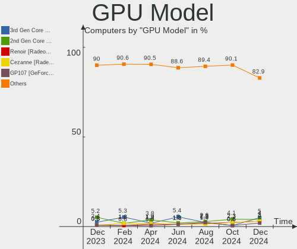

| Model                                                                       | Computers | Percent |
|-----------------------------------------------------------------------------|-----------|---------|
| Intel 3rd Gen Core processor Graphics Controller                            | 10        | 5.03%   |
| Intel 2nd Generation Core Processor Family Integrated Graphics Controller   | 8         | 4.02%   |
| AMD Renoir [Radeon Vega Series / Radeon Vega Mobile Series]                 | 6         | 3.02%   |
| AMD Cezanne [Radeon Vega Series / Radeon Vega Mobile Series]                | 6         | 3.02%   |
| Nvidia GP107 [GeForce GTX 1050 Ti]                                          | 4         | 2.01%   |
| Intel TigerLake-LP GT2 [Iris Xe Graphics]                                   | 4         | 2.01%   |
| Intel Skylake GT2 [HD Graphics 520]                                         | 4         | 2.01%   |
| Intel Haswell-ULT Integrated Graphics Controller                            | 4         | 2.01%   |
| Intel 4th Gen Core Processor Integrated Graphics Controller                 | 4         | 2.01%   |
| Nvidia TU117M [GeForce GTX 1650 Mobile / Max-Q]                             | 3         | 1.51%   |
| Nvidia GT218 [GeForce 210]                                                  | 3         | 1.51%   |
| Nvidia GP106 [GeForce GTX 1060 6GB]                                         | 3         | 1.51%   |
| Intel HD Graphics 630                                                       | 3         | 1.51%   |
| Intel HD Graphics 530                                                       | 3         | 1.51%   |
| Intel Atom Processor Z36xxx/Z37xxx Series Graphics & Display                | 3         | 1.51%   |
| AMD Raphael                                                                 | 3         | 1.51%   |
| AMD Navi 33 [Radeon RX 7600/7600 XT/7600M XT/7600S/7700S / PRO W7600]       | 3         | 1.51%   |
| Nvidia GT218M [NVS 3100M]                                                   | 2         | 1.01%   |
| Nvidia GP108 [GeForce GT 1030]                                              | 2         | 1.01%   |
| Nvidia GP107M [GeForce GTX 1050 Ti Mobile]                                  | 2         | 1.01%   |
| Nvidia GP104 [GeForce GTX 1070]                                             | 2         | 1.01%   |
| Nvidia GM206 [GeForce GTX 960]                                              | 2         | 1.01%   |
| Nvidia GF119M [GeForce 610M]                                                | 2         | 1.01%   |
| Nvidia AD107M [GeForce RTX 4060 Max-Q / Mobile]                             | 2         | 1.01%   |
| Nvidia AD104 [GeForce RTX 4070]                                             | 2         | 1.01%   |
| Intel Xeon E3-1200 v3/4th Gen Core Processor Integrated Graphics Controller | 2         | 1.01%   |
| Intel UHD Graphics 620                                                      | 2         | 1.01%   |
| Intel JasperLake [UHD Graphics]                                             | 2         | 1.01%   |
| Intel HD Graphics 620                                                       | 2         | 1.01%   |
| Intel GeminiLake [UHD Graphics 600]                                         | 2         | 1.01%   |
| Intel CometLake-U GT2 [UHD Graphics]                                        | 2         | 1.01%   |
| Intel CometLake-H GT2 [UHD Graphics]                                        | 2         | 1.01%   |
| Intel Alder Lake-UP3 GT2 [Iris Xe Graphics]                                 | 2         | 1.01%   |
| Intel Alder Lake-N [UHD Graphics]                                           | 2         | 1.01%   |
| AMD Wani [Radeon R5/R6/R7 Graphics]                                         | 2         | 1.01%   |
| AMD Strix [Radeon 880M / 890M]                                              | 2         | 1.01%   |
| AMD Stoney [Radeon R2/R3/R4/R5 Graphics]                                    | 2         | 1.01%   |
| AMD Raven Ridge [Radeon Vega Series / Radeon Vega Mobile Series]            | 2         | 1.01%   |
| AMD Picasso/Raven 2 [Radeon Vega Series / Radeon Vega Mobile Series]        | 2         | 1.01%   |
| AMD Navi 31 [Radeon RX 7900 XT/7900 XTX/7900 GRE/7900M]                     | 2         | 1.01%   |

GPU Combo
---------

Combinations of graphics cards

| Name           | Computers | Percent |
|----------------|-----------|---------|
| 1 x Intel      | 50        | 30.67%  |
| 1 x Nvidia     | 39        | 23.93%  |
| 1 x AMD        | 30        | 18.4%   |
| Intel + Nvidia | 22        | 13.5%   |
| AMD + Nvidia   | 9         | 5.52%   |
| Intel + AMD    | 4         | 2.45%   |
| 2 x AMD        | 3         | 1.84%   |
| Other          | 2         | 1.23%   |
| 2 x Intel      | 2         | 1.23%   |
| 1 x Matrox     | 1         | 0.61%   |
| 1 x ASPEED     | 1         | 0.61%   |

GPU Driver
----------

Free vs proprietary

| Driver      | Computers | Percent |
|-------------|-----------|---------|
| Free        | 118       | 72.39%  |
| Proprietary | 30        | 18.4%   |
| Unknown     | 15        | 9.2%    |

GPU Memory
----------

Total video memory

| Size in GB | Computers | Percent |
|------------|-----------|---------|
| Unknown    | 100       | 61.35%  |
| 0.01-0.5   | 17        | 10.43%  |
| 1.01-2.0   | 13        | 7.98%   |
| 0.51-1.0   | 13        | 7.98%   |
| 7.01-8.0   | 10        | 6.13%   |
| 3.01-4.0   | 5         | 3.07%   |
| 5.01-6.0   | 2         | 1.23%   |
| 16.01-24.0 | 2         | 1.23%   |
| 8.01-16.0  | 1         | 0.61%   |

Monitor
-------

Monitor Vendor
--------------

Monitor vendors

| Vendor                  | Computers | Percent |
|-------------------------|-----------|---------|
| AU Optronics            | 21        | 12.73%  |
| Chimei Innolux          | 18        | 10.91%  |
| Samsung Electronics     | 17        | 10.3%   |
| LG Display              | 15        | 9.09%   |
| BOE                     | 15        | 9.09%   |
| Iiyama                  | 7         | 4.24%   |
| Hewlett-Packard         | 7         | 4.24%   |
| Goldstar                | 6         | 3.64%   |
| Philips                 | 5         | 3.03%   |
| BenQ                    | 5         | 3.03%   |
| Sharp                   | 4         | 2.42%   |
| Chi Mei Optoelectronics | 4         | 2.42%   |
| Ancor Communications    | 4         | 2.42%   |
| Acer                    | 4         | 2.42%   |
| Dell                    | 3         | 1.82%   |
| Apple                   | 3         | 1.82%   |
| Unknown (XXX)           | 2         | 1.21%   |
| InfoVision              | 2         | 1.21%   |
| Gigabyte Technology     | 2         | 1.21%   |
| Eizo                    | 2         | 1.21%   |
| AOC                     | 2         | 1.21%   |
| Vestel Elektronik       | 1         | 0.61%   |
| VCS                     | 1         | 0.61%   |
| Unknown                 | 1         | 0.61%   |
| Sony                    | 1         | 0.61%   |
| PANDA                   | 1         | 0.61%   |
| Packard Bell            | 1         | 0.61%   |
| NEC Computers           | 1         | 0.61%   |
| Mi                      | 1         | 0.61%   |
| LG Philips              | 1         | 0.61%   |
| Lenovo                  | 1         | 0.61%   |
| IBM                     | 1         | 0.61%   |
| Hyundai ImageQuest      | 1         | 0.61%   |
| HUAWEI                  | 1         | 0.61%   |
| Fujitsu Siemens         | 1         | 0.61%   |
| CPT                     | 1         | 0.61%   |
| Belinea                 | 1         | 0.61%   |
| ASUSTek Computer        | 1         | 0.61%   |

Monitor Model
-------------

Monitor models

| Model                                                                  | Computers | Percent |
|------------------------------------------------------------------------|-----------|---------|
| AU Optronics LCD Monitor AUO61ED 1920x1080 344x194mm 15.5-inch         | 3         | 1.8%    |
| Chimei Innolux N160JME_GE1 CMN1624 1920x1200 344x215mm 16.0-inch       | 2         | 1.2%    |
| Chimei Innolux LCD Monitor CMN15E7 1920x1080 344x193mm 15.5-inch       | 2         | 1.2%    |
| Vestel Elektronik 49FHD_LCD_TV VES3700 1920x1080 1280x720mm 57.8-inch  | 1         | 0.6%    |
| VCS Connector VCS1145 1920x1080 575x323mm 26.0-inch                    | 1         | 0.6%    |
| Unknown LCD Monitor FFFF 2288x1287 2550x2550mm 142.0-inch              | 1         | 0.6%    |
| Unknown (XXX) LCDTV XXX0180 1440x900 884x663mm 43.5-inch               | 1         | 0.6%    |
| Unknown (XXX) Beyond TV XXX9221 1920x1080 1209x680mm 54.6-inch         | 1         | 0.6%    |
| Sony TV SNY4402 1360x768                                               | 1         | 0.6%    |
| Sharp LQ135P1JX51 SHP14B3 2256x1504 285x190mm 13.5-inch                | 1         | 0.6%    |
| Sharp LCD SHP1099 1280x720 890x500mm 40.2-inch                         | 1         | 0.6%    |
| Sharp LCD Monitor SHP149A 1920x1080 344x194mm 15.5-inch                | 1         | 0.6%    |
| Sharp LCD Monitor SHP1484 1920x1080 294x165mm 13.3-inch                | 1         | 0.6%    |
| Samsung Electronics U32R59x SAM0F96 3840x2160 700x390mm 31.5-inch      | 1         | 0.6%    |
| Samsung Electronics U32R59x SAM0F94 3840x2160 697x392mm 31.5-inch      | 1         | 0.6%    |
| Samsung Electronics SyncMaster SAM059A 1920x1080 477x268mm 21.5-inch   | 1         | 0.6%    |
| Samsung Electronics SyncMaster SAM0108 1600x1200 312x234mm 15.4-inch   | 1         | 0.6%    |
| Samsung Electronics SMS22A100 SAM0868 1920x1080 477x268mm 21.5-inch    | 1         | 0.6%    |
| Samsung Electronics SME1920W SAM06BE 1440x900 408x255mm 18.9-inch      | 1         | 0.6%    |
| Samsung Electronics S24C36x SAM7314 1920x1080 521x293mm 23.5-inch      | 1         | 0.6%    |
| Samsung Electronics S22B300 SAM08C8 1920x1080 477x268mm 21.5-inch      | 1         | 0.6%    |
| Samsung Electronics S19B150 SAM08A2 1366x768 410x230mm 18.5-inch       | 1         | 0.6%    |
| Samsung Electronics LF24T35 SAM707D 1920x1080 528x297mm 23.9-inch      | 1         | 0.6%    |
| Samsung Electronics LCD Monitor SEC544B 1600x900 382x215mm 17.3-inch   | 1         | 0.6%    |
| Samsung Electronics LCD Monitor SEC5341 1366x768 344x193mm 15.5-inch   | 1         | 0.6%    |
| Samsung Electronics LCD Monitor SEC4252 1366x768 344x194mm 15.5-inch   | 1         | 0.6%    |
| Samsung Electronics LCD Monitor SEC314C 1920x1080 344x194mm 15.5-inch  | 1         | 0.6%    |
| Samsung Electronics LCD Monitor SEC304C 1366x768 309x174mm 14.0-inch   | 1         | 0.6%    |
| Samsung Electronics LCD Monitor SDC4188 2880x1800 312x195mm 14.5-inch  | 1         | 0.6%    |
| Samsung Electronics LCD Monitor SAM0A7D 1920x1080 1060x626mm 48.5-inch | 1         | 0.6%    |
| Samsung Electronics LCD Monitor SAM0659 1920x1080                      | 1         | 0.6%    |
| Philips PHL 246V5 PHLC0C5 1920x1080 531x299mm 24.0-inch                | 1         | 0.6%    |
| Philips PHL 243V5 PHLC0D1 1920x1080 521x293mm 23.5-inch                | 1         | 0.6%    |
| Philips PHL 223V5 PHLC0CF 1920x1080 480x270mm 21.7-inch                | 1         | 0.6%    |
| Philips PHL 220V8 PHLC218 1920x1080 477x268mm 21.5-inch                | 1         | 0.6%    |
| Philips PHL 200V4Q PHLC103 1920x1080 435x239mm 19.5-inch               | 1         | 0.6%    |
| PANDA LCD Monitor NCP004D 1920x1080 344x194mm 15.5-inch                | 1         | 0.6%    |
| Packard Bell Maestro223DXL PKB01B2 1920x1080 477x268mm 21.5-inch       | 1         | 0.6%    |
| NEC Computers EA191M NEC673E 1280x1024 376x301mm 19.0-inch             | 1         | 0.6%    |
| Mi Monitor XMI2701 2560x1440 597x335mm 27.0-inch                       | 1         | 0.6%    |

Monitor Resolution
------------------

Monitor screen resolution

| Resolution         | Computers | Percent |
|--------------------|-----------|---------|
| 1920x1080 (FHD)    | 72        | 44.17%  |
| 1366x768 (WXGA)    | 28        | 17.18%  |
| 2560x1440 (QHD)    | 10        | 6.13%   |
| 3840x2160 (4K)     | 7         | 4.29%   |
| 1600x900 (HD+)     | 7         | 4.29%   |
| 1920x1200 (WUXGA)  | 6         | 3.68%   |
| 1440x900 (WXGA+)   | 6         | 3.68%   |
| 1280x800 (WXGA)    | 6         | 3.68%   |
| 2560x1600          | 5         | 3.07%   |
| 3440x1440          | 3         | 1.84%   |
| 1680x1050 (WSXGA+) | 3         | 1.84%   |
| 1280x1024 (SXGA)   | 3         | 1.84%   |
| 2880x1800          | 1         | 0.61%   |
| 2288x1287          | 1         | 0.61%   |
| 2256x1504          | 1         | 0.61%   |
| 2160x1440          | 1         | 0.61%   |
| 1920x540           | 1         | 0.61%   |
| 1600x1200          | 1         | 0.61%   |
| 1360x768           | 1         | 0.61%   |

Monitor Diagonal
----------------

Diagonal size in inches

| Inches  | Computers | Percent |
|---------|-----------|---------|
| 15      | 44        | 26.83%  |
| 13      | 17        | 10.37%  |
| 24      | 15        | 9.15%   |
| 21      | 13        | 7.93%   |
| 27      | 12        | 7.32%   |
| 14      | 8         | 4.88%   |
| 19      | 7         | 4.27%   |
| 16      | 7         | 4.27%   |
| 18      | 6         | 3.66%   |
| 17      | 6         | 3.66%   |
| 34      | 4         | 2.44%   |
| 12      | 4         | 2.44%   |
| 11      | 4         | 2.44%   |
| 31      | 3         | 1.83%   |
| 26      | 2         | 1.22%   |
| 23      | 2         | 1.22%   |
| 142     | 1         | 0.61%   |
| 84      | 1         | 0.61%   |
| 72      | 1         | 0.61%   |
| 54      | 1         | 0.61%   |
| 48      | 1         | 0.61%   |
| 43      | 1         | 0.61%   |
| 40      | 1         | 0.61%   |
| 22      | 1         | 0.61%   |
| 20      | 1         | 0.61%   |
| Unknown | 1         | 0.61%   |

Monitor Width
-------------

Physical width

| Width in mm    | Computers | Percent |
|----------------|-----------|---------|
| 301-350        | 65        | 40.12%  |
| 501-600        | 30        | 18.52%  |
| 401-500        | 24        | 14.81%  |
| 201-300        | 17        | 10.49%  |
| 351-400        | 11        | 6.79%   |
| 701-800        | 4         | 2.47%   |
| 601-700        | 3         | 1.85%   |
| 801-900        | 2         | 1.23%   |
| 1501-2000      | 2         | 1.23%   |
| 1001-1500      | 2         | 1.23%   |
| More than 2000 | 1         | 0.62%   |
| Unknown        | 1         | 0.62%   |

Aspect Ratio
------------

Proportional relationship between the width and the height

| Ratio | Computers | Percent |
|-------|-----------|---------|
| 16/9  | 120       | 75%     |
| 16/10 | 27        | 16.88%  |
| 21/9  | 4         | 2.5%    |
| 5/4   | 3         | 1.88%   |
| 3/2   | 3         | 1.88%   |
| 4/3   | 2         | 1.25%   |
| 1.00  | 1         | 0.63%   |

Monitor Area
------------

Area in inch²

| Area in inch² | Computers | Percent |
|----------------|-----------|---------|
| 101-110        | 43        | 26.22%  |
| 201-250        | 21        | 12.8%   |
| 81-90          | 20        | 12.2%   |
| 301-350        | 13        | 7.93%   |
| 151-200        | 12        | 7.32%   |
| 251-300        | 9         | 5.49%   |
| 351-500        | 7         | 4.27%   |
| 121-130        | 7         | 4.27%   |
| 111-120        | 7         | 4.27%   |
| More than 1000 | 5         | 3.05%   |
| 71-80          | 5         | 3.05%   |
| 61-70          | 4         | 2.44%   |
| 51-60          | 4         | 2.44%   |
| 141-150        | 4         | 2.44%   |
| 501-1000       | 2         | 1.22%   |
| Unknown        | 1         | 0.61%   |

Pixel Density
-------------

Pixels per inch

| Density | Computers | Percent |
|---------|-----------|---------|
| 101-120 | 52        | 32.7%   |
| 121-160 | 44        | 27.67%  |
| 51-100  | 37        | 23.27%  |
| 161-240 | 19        | 11.95%  |
| 1-50    | 6         | 3.77%   |
| Unknown | 1         | 0.63%   |

Multiple Monitors
-----------------

Total monitors connected

| Total | Computers | Percent |
|-------|-----------|---------|
| 1     | 141       | 86.5%   |
| 2     | 16        | 9.82%   |
| 0     | 6         | 3.68%   |

Network
-------

Net Controller Vendor
---------------------

Controller vendors

| Vendor                                 | Computers | Percent |
|----------------------------------------|-----------|---------|
| Realtek Semiconductor                  | 103       | 44.02%  |
| Intel                                  | 67        | 28.63%  |
| Qualcomm Atheros                       | 23        | 9.83%   |
| MediaTek                               | 9         | 3.85%   |
| Broadcom                               | 9         | 3.85%   |
| Broadcom Limited                       | 4         | 1.71%   |
| Qualcomm Atheros Communications        | 2         | 0.85%   |
| Aquantia                               | 2         | 0.85%   |
| Xiaomi                                 | 1         | 0.43%   |
| TP-Link                                | 1         | 0.43%   |
| Suzhou Motorcomm Electronic Technology | 1         | 0.43%   |
| SEGGER                                 | 1         | 0.43%   |
| Samsung Electronics                    | 1         | 0.43%   |
| Raspberry Pi                           | 1         | 0.43%   |
| Ralink Technology                      | 1         | 0.43%   |
| QinHeng Electronics                    | 1         | 0.43%   |
| Nvidia                                 | 1         | 0.43%   |
| Marvell Technology Group               | 1         | 0.43%   |
| Linksys                                | 1         | 0.43%   |
| Fibocom                                | 1         | 0.43%   |
| Dell                                   | 1         | 0.43%   |
| American Megatrends                    | 1         | 0.43%   |
| 3Com                                   | 1         | 0.43%   |

Net Controller Model
--------------------

Controller models

| Model                                                                  | Computers | Percent |
|------------------------------------------------------------------------|-----------|---------|
| Realtek RTL8111/8168/8211/8411 PCI Express Gigabit Ethernet Controller | 78        | 28.16%  |
| Realtek RTL8125 2.5GbE Controller                                      | 9         | 3.25%   |
| Realtek RTL8822CE 802.11ac PCIe Wireless Network Adapter               | 8         | 2.89%   |
| Intel 82579LM Gigabit Network Connection (Lewisville)                  | 6         | 2.17%   |
| MediaTek MT7921 802.11ax PCI Express Wireless Network Adapter          | 5         | 1.81%   |
| Realtek RTL810xE PCI Express Fast Ethernet controller                  | 4         | 1.44%   |
| Qualcomm Atheros AR9285 Wireless Network Adapter (PCI-Express)         | 4         | 1.44%   |
| Intel Wireless 8265 / 8275                                             | 4         | 1.44%   |
| Intel Wi-Fi 6E(802.11ax) AX210/AX1675* 2x2 [Typhoon Peak]              | 4         | 1.44%   |
| Intel Wi-Fi 6 AX201                                                    | 4         | 1.44%   |
| Intel Wi-Fi 6 AX200                                                    | 4         | 1.44%   |
| Intel Centrino Advanced-N 6200                                         | 4         | 1.44%   |
| Realtek RTL-8100/8101L/8139 PCI Fast Ethernet Adapter                  | 3         | 1.08%   |
| Qualcomm Atheros AR9485 Wireless Network Adapter                       | 3         | 1.08%   |
| Intel Wireless 7265                                                    | 3         | 1.08%   |
| Intel Wireless 3165                                                    | 3         | 1.08%   |
| Intel Ethernet Connection I217-LM                                      | 3         | 1.08%   |
| Intel Ethernet Connection (2) I219-V                                   | 3         | 1.08%   |
| Realtek RTL8852BE PCIe 802.11ax Wireless Network Controller            | 2         | 0.72%   |
| Realtek RTL8188CE 802.11b/g/n WiFi Adapter                             | 2         | 0.72%   |
| Realtek RTL8153 Gigabit Ethernet Adapter                               | 2         | 0.72%   |
| Realtek 802.11ac NIC                                                   | 2         | 0.72%   |
| Qualcomm Atheros QCA9377 802.11ac Wireless Network Adapter             | 2         | 0.72%   |
| Qualcomm Atheros QCA6174 802.11ac Wireless Network Adapter             | 2         | 0.72%   |
| Qualcomm Atheros AR9462 Wireless Network Adapter                       | 2         | 0.72%   |
| Qualcomm Atheros AR8151 v2.0 Gigabit Ethernet                          | 2         | 0.72%   |
| MediaTek MT7922 802.11ax PCI Express Wireless Network Adapter          | 2         | 0.72%   |
| Intel Wireless 7260                                                    | 2         | 0.72%   |
| Intel Wireless 3160                                                    | 2         | 0.72%   |
| Intel Wi-Fi 6 AX201 160MHz                                             | 2         | 0.72%   |
| Intel PRO/Wireless 5100 AGN [Shiloh] Network Connection                | 2         | 0.72%   |
| Intel PRO/Wireless 4965 AG or AGN [Kedron] Network Connection          | 2         | 0.72%   |
| Intel Ethernet Controller I225-V                                       | 2         | 0.72%   |
| Intel Ethernet Connection (4) I219-LM                                  | 2         | 0.72%   |
| Intel Comet Lake PCH-LP CNVi WiFi                                      | 2         | 0.72%   |
| Intel CNVi: Wi-Fi                                                      | 2         | 0.72%   |
| Intel Centrino Advanced-N 6235                                         | 2         | 0.72%   |
| Intel Centrino Advanced-N 6205 [Taylor Peak]                           | 2         | 0.72%   |
| Intel 82577LM Gigabit Network Connection                               | 2         | 0.72%   |
| Intel 82567LM Gigabit Network Connection                               | 2         | 0.72%   |

Wireless Vendor
---------------

Wireless vendors

| Vendor                          | Computers | Percent |
|---------------------------------|-----------|---------|
| Intel                           | 52        | 45.61%  |
| Realtek Semiconductor           | 24        | 21.05%  |
| Qualcomm Atheros                | 17        | 14.91%  |
| Broadcom                        | 7         | 6.14%   |
| MediaTek                        | 6         | 5.26%   |
| Qualcomm Atheros Communications | 2         | 1.75%   |
| Broadcom Limited                | 2         | 1.75%   |
| TP-Link                         | 1         | 0.88%   |
| Ralink Technology               | 1         | 0.88%   |
| Linksys                         | 1         | 0.88%   |
| Fibocom                         | 1         | 0.88%   |

Wireless Model
--------------

Wireless models

| Model                                                          | Computers | Percent |
|----------------------------------------------------------------|-----------|---------|
| Realtek RTL8822CE 802.11ac PCIe Wireless Network Adapter       | 8         | 6.96%   |
| MediaTek MT7921 802.11ax PCI Express Wireless Network Adapter  | 5         | 4.35%   |
| Qualcomm Atheros AR9285 Wireless Network Adapter (PCI-Express) | 4         | 3.48%   |
| Intel Wireless 8265 / 8275                                     | 4         | 3.48%   |
| Intel Wi-Fi 6E(802.11ax) AX210/AX1675* 2x2 [Typhoon Peak]      | 4         | 3.48%   |
| Intel Wi-Fi 6 AX201                                            | 4         | 3.48%   |
| Intel Wi-Fi 6 AX200                                            | 4         | 3.48%   |
| Intel Centrino Advanced-N 6200                                 | 4         | 3.48%   |
| Qualcomm Atheros AR9485 Wireless Network Adapter               | 3         | 2.61%   |
| Intel Wireless 7265                                            | 3         | 2.61%   |
| Intel Wireless 3165                                            | 3         | 2.61%   |
| Realtek RTL8188CE 802.11b/g/n WiFi Adapter                     | 2         | 1.74%   |
| Realtek 802.11ac NIC                                           | 2         | 1.74%   |
| Qualcomm Atheros QCA9377 802.11ac Wireless Network Adapter     | 2         | 1.74%   |
| Qualcomm Atheros QCA6174 802.11ac Wireless Network Adapter     | 2         | 1.74%   |
| Qualcomm Atheros AR9462 Wireless Network Adapter               | 2         | 1.74%   |
| Intel Wireless 7260                                            | 2         | 1.74%   |
| Intel Wireless 3160                                            | 2         | 1.74%   |
| Intel Wi-Fi 6 AX201 160MHz                                     | 2         | 1.74%   |
| Intel PRO/Wireless 5100 AGN [Shiloh] Network Connection        | 2         | 1.74%   |
| Intel PRO/Wireless 4965 AG or AGN [Kedron] Network Connection  | 2         | 1.74%   |
| Intel Comet Lake PCH-LP CNVi WiFi                              | 2         | 1.74%   |
| Intel Centrino Advanced-N 6235                                 | 2         | 1.74%   |
| Intel Centrino Advanced-N 6205 [Taylor Peak]                   | 2         | 1.74%   |
| Broadcom BCM43142 802.11b/g/n                                  | 2         | 1.74%   |
| TP-Link TL-WN823N v2/v3 [Realtek RTL8192EU]                    | 1         | 0.87%   |
| Realtek RTL88x2bu [AC1200 Techkey]                             | 1         | 0.87%   |
| Realtek RTL8852CE PCIe 802.11ax Wireless Network Controller    | 1         | 0.87%   |
| Realtek RTL8852BE PCIe 802.11ax Wireless Network Controller    | 1         | 0.87%   |
| Realtek RTL8852AE 802.11ax PCIe Wireless Network Adapter       | 1         | 0.87%   |
| Realtek RTL8822BE 802.11a/b/g/n/ac WiFi adapter                | 1         | 0.87%   |
| Realtek RTL8812AE 802.11ac PCIe Wireless Network Adapter       | 1         | 0.87%   |
| Realtek RTL8723BU 802.11b/g/n WLAN Adapter                     | 1         | 0.87%   |
| Realtek RTL8723BE PCIe Wireless Network Adapter                | 1         | 0.87%   |
| Realtek RTL8192EU 802.11b/g/n WLAN Adapter                     | 1         | 0.87%   |
| Realtek RTL8188EUS 802.11n Wireless Network Adapter            | 1         | 0.87%   |
| Realtek RTL8188ETV Wireless LAN 802.11n Network Adapter        | 1         | 0.87%   |
| Realtek RTL8188EE Wireless Network Adapter                     | 1         | 0.87%   |
| Ralink MT7601U Wireless Adapter                                | 1         | 0.87%   |
| Qualcomm Atheros QCA9565 / AR9565 Wireless Network Adapter     | 1         | 0.87%   |

Ethernet Vendor
---------------

Ethernet vendors

| Vendor                                 | Computers | Percent |
|----------------------------------------|-----------|---------|
| Realtek Semiconductor                  | 96        | 62.75%  |
| Intel                                  | 32        | 20.92%  |
| Qualcomm Atheros                       | 8         | 5.23%   |
| MediaTek                               | 3         | 1.96%   |
| Broadcom                               | 3         | 1.96%   |
| Broadcom Limited                       | 2         | 1.31%   |
| Aquantia                               | 2         | 1.31%   |
| Xiaomi                                 | 1         | 0.65%   |
| Suzhou Motorcomm Electronic Technology | 1         | 0.65%   |
| Raspberry Pi                           | 1         | 0.65%   |
| Nvidia                                 | 1         | 0.65%   |
| Marvell Technology Group               | 1         | 0.65%   |
| American Megatrends                    | 1         | 0.65%   |
| 3Com                                   | 1         | 0.65%   |

Ethernet Model
--------------

Ethernet models

| Model                                                                  | Computers | Percent |
|------------------------------------------------------------------------|-----------|---------|
| Realtek RTL8111/8168/8211/8411 PCI Express Gigabit Ethernet Controller | 78        | 49.37%  |
| Realtek RTL8125 2.5GbE Controller                                      | 9         | 5.7%    |
| Intel 82579LM Gigabit Network Connection (Lewisville)                  | 6         | 3.8%    |
| Realtek RTL810xE PCI Express Fast Ethernet controller                  | 4         | 2.53%   |
| Realtek RTL-8100/8101L/8139 PCI Fast Ethernet Adapter                  | 3         | 1.9%    |
| Intel Ethernet Connection I217-LM                                      | 3         | 1.9%    |
| Intel Ethernet Connection (2) I219-V                                   | 3         | 1.9%    |
| Realtek RTL8153 Gigabit Ethernet Adapter                               | 2         | 1.27%   |
| Qualcomm Atheros AR8151 v2.0 Gigabit Ethernet                          | 2         | 1.27%   |
| MediaTek MT7922 802.11ax PCI Express Wireless Network Adapter          | 2         | 1.27%   |
| Intel Ethernet Controller I225-V                                       | 2         | 1.27%   |
| Intel Ethernet Connection (4) I219-LM                                  | 2         | 1.27%   |
| Intel CNVi: Wi-Fi                                                      | 2         | 1.27%   |
| Intel 82577LM Gigabit Network Connection                               | 2         | 1.27%   |
| Intel 82567LM Gigabit Network Connection                               | 2         | 1.27%   |
| Xiaomi Mi/Redmi series (RNDIS + ADB)                                   | 1         | 0.63%   |
| Suzhou Motorcomm Electronic YT6801 Gigabit Ethernet Controller         | 1         | 0.63%   |
| Realtek RTL8852BE PCIe 802.11ax Wireless Network Controller            | 1         | 0.63%   |
| Realtek RTL8152 Fast Ethernet Adapter                                  | 1         | 0.63%   |
| Realtek RT8126 PCIe Ethernet Controller                                | 1         | 0.63%   |
| Raspberry Pi RP1 PCIe 2.0 South Bridge                                 | 1         | 0.63%   |
| Qualcomm Atheros QCA8172 Fast Ethernet                                 | 1         | 0.63%   |
| Qualcomm Atheros Killer E220x Gigabit Ethernet Controller              | 1         | 0.63%   |
| Qualcomm Atheros Attansic L1 Gigabit Ethernet                          | 1         | 0.63%   |
| Qualcomm Atheros AR8162 Fast Ethernet                                  | 1         | 0.63%   |
| Qualcomm Atheros AR8161 Gigabit Ethernet                               | 1         | 0.63%   |
| Qualcomm Atheros AR8131 Gigabit Ethernet                               | 1         | 0.63%   |
| Nvidia MCP61 Ethernet                                                  | 1         | 0.63%   |
| MediaTek WLAN controller                                               | 1         | 0.63%   |
| Marvell Group 88E8056 PCI-E Gigabit Ethernet Controller                | 1         | 0.63%   |
| Intel I211 Gigabit Network Connection                                  | 1         | 0.63%   |
| Intel Ethernet Controller X550                                         | 1         | 0.63%   |
| Intel Ethernet Controller 10-Gigabit X540-AT2                          | 1         | 0.63%   |
| Intel Ethernet Connection I217-V                                       | 1         | 0.63%   |
| Intel Ethernet Connection (5) I219-LM                                  | 1         | 0.63%   |
| Intel Ethernet Connection (4) I219-V                                   | 1         | 0.63%   |
| Intel Ethernet Connection (2) I219-LM                                  | 1         | 0.63%   |
| Intel Ethernet Connection (14) I219-LM                                 | 1         | 0.63%   |
| Intel 82599ES 10-Gigabit SFI/SFP+ Network Connection                   | 1         | 0.63%   |
| Intel 82566MC Gigabit Network Connection                               | 1         | 0.63%   |

Net Controller Kind
-------------------

Ethernet, WiFi or modem

| Kind     | Computers | Percent |
|----------|-----------|---------|
| Ethernet | 144       | 55.81%  |
| WiFi     | 110       | 42.64%  |
| Modem    | 4         | 1.55%   |

Used Controller
---------------

Currently used network controller

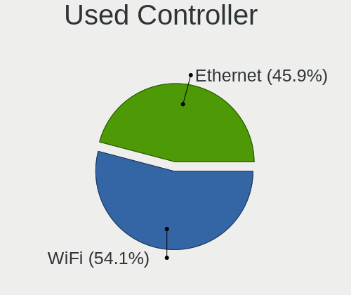

| Kind     | Computers | Percent |
|----------|-----------|---------|
| WiFi     | 86        | 54.09%  |
| Ethernet | 73        | 45.91%  |

NICs
----

Total network controllers on board

| Total | Computers | Percent |
|-------|-----------|---------|
| 2     | 89        | 54.6%   |
| 1     | 68        | 41.72%  |
| 0     | 3         | 1.84%   |
| 10    | 1         | 0.61%   |
| 5     | 1         | 0.61%   |
| 3     | 1         | 0.61%   |

IPv6
----

IPv6 vs IPv4

| Used | Computers | Percent |
|------|-----------|---------|
| No   | 147       | 90.18%  |
| Yes  | 16        | 9.82%   |

Bluetooth
---------

Bluetooth Vendor
----------------

Controller vendors

| Vendor                          | Computers | Percent |
|---------------------------------|-----------|---------|
| Intel                           | 40        | 38.83%  |
| Realtek Semiconductor           | 10        | 9.71%   |
| Foxconn / Hon Hai               | 10        | 9.71%   |
| Qualcomm Atheros Communications | 8         | 7.77%   |
| IMC Networks                    | 8         | 7.77%   |
| Broadcom                        | 6         | 5.83%   |
| Cambridge Silicon Radio         | 4         | 3.88%   |
| ASUSTek Computer                | 4         | 3.88%   |
| Apple                           | 3         | 2.91%   |
| Hewlett-Packard                 | 2         | 1.94%   |
| Dell                            | 2         | 1.94%   |
| Realtek                         | 1         | 0.97%   |
| Mercucys                        | 1         | 0.97%   |
| Lite-On Technology              | 1         | 0.97%   |
| Foxconn International           | 1         | 0.97%   |
| Edimax Technology               | 1         | 0.97%   |
| Conwise Technology              | 1         | 0.97%   |

Bluetooth Model
---------------

Controller models

| Model                                               | Computers | Percent |
|-----------------------------------------------------|-----------|---------|
| Intel Bluetooth wireless interface                  | 16        | 15.38%  |
| Intel AX201 Bluetooth                               | 11        | 10.58%  |
| Realtek Bluetooth Radio                             | 7         | 6.73%   |
| Intel AX210 Bluetooth                               | 4         | 3.85%   |
| IMC Networks Wireless_Device                        | 4         | 3.85%   |
| Cambridge Silicon Radio Bluetooth Dongle (HCI mode) | 4         | 3.85%   |
| Qualcomm Atheros  Bluetooth Device                  | 3         | 2.88%   |
| Qualcomm Atheros AR3011 Bluetooth                   | 3         | 2.88%   |
| Intel Centrino Bluetooth Wireless Transceiver       | 3         | 2.88%   |
| Intel AX200 Bluetooth                               | 3         | 2.88%   |
| IMC Networks Bluetooth Radio                        | 3         | 2.88%   |
| Foxconn / Hon Hai Wireless_Device                   | 3         | 2.88%   |
| Foxconn / Hon Hai Bluetooth Device                  | 3         | 2.88%   |
| Realtek 802.11ac WLAN Adapter                       | 2         | 1.92%   |
| Intel Bluetooth 9460/9560 Jefferson Peak (JfP)      | 2         | 1.92%   |
| HP Bluetooth 2.0 Interface [Broadcom BCM2045]       | 2         | 1.92%   |
| Foxconn / Hon Hai Broadcom BCM20702 Bluetooth       | 2         | 1.92%   |
| Apple Bluetooth USB Host Controller                 | 2         | 1.92%   |
| Realtek RTL8822BE Bluetooth 4.2 Adapter             | 1         | 0.96%   |
| Realtek Bluetooth Radio                             | 1         | 0.96%   |
| Qualcomm Atheros QCA61x4 Bluetooth 4.0              | 1         | 0.96%   |
| Qualcomm Atheros AR3012 Bluetooth 4.0               | 1         | 0.96%   |
| Mercucys Mercusys MA530 Adapter                     | 1         | 0.96%   |
| Lite-On Qualcomm Atheros QCA9377 Bluetooth          | 1         | 0.96%   |
| Intel Wireless-AC 3168 Bluetooth                    | 1         | 0.96%   |
| Intel AX211 Bluetooth                               | 1         | 0.96%   |
| IMC Networks Atheros AR3012 Bluetooth 4.0 Adapter   | 1         | 0.96%   |
| Foxconn International BCM43142A0 Bluetooth module   | 1         | 0.96%   |
| Foxconn / Hon Hai MediaTek Bluetooth Adapter        | 1         | 0.96%   |
| Foxconn / Hon Hai Bluetooth Radio                   | 1         | 0.96%   |
| Edimax Bluetooth Adapter                            | 1         | 0.96%   |
| Dell DW375 Bluetooth Module                         | 1         | 0.96%   |
| Dell BCM20702A0 Bluetooth Module                    | 1         | 0.96%   |
| Conwise CW6622                                      | 1         | 0.96%   |
| Broadcom HP Portable Bumble Bee                     | 1         | 0.96%   |
| Broadcom BCM20702A0 Bluetooth 4.0                   | 1         | 0.96%   |
| Broadcom BCM20702 Bluetooth 4.0 [ThinkPad]          | 1         | 0.96%   |
| Broadcom BCM2046 Bluetooth Device                   | 1         | 0.96%   |
| Broadcom BCM2045B (BDC-2.1)                         | 1         | 0.96%   |
| Broadcom BCM2045B (BDC-2) [Bluetooth Controller]    | 1         | 0.96%   |

Sound
-----

Sound Vendor
------------

Sound card vendors

| Vendor                           | Computers | Percent |
|----------------------------------|-----------|---------|
| Intel                            | 110       | 47.01%  |
| Nvidia                           | 55        | 23.5%   |
| AMD                              | 50        | 21.37%  |
| C-Media Electronics              | 5         | 2.14%   |
| Creative Technology              | 3         | 1.28%   |
| SteelSeries ApS                  | 2         | 0.85%   |
| Silicon Integrated Systems [SiS] | 1         | 0.43%   |
| Razer USA                        | 1         | 0.43%   |
| Micro Star International         | 1         | 0.43%   |
| Logitech                         | 1         | 0.43%   |
| Lenovo                           | 1         | 0.43%   |
| JMTek                            | 1         | 0.43%   |
| Hewlett-Packard                  | 1         | 0.43%   |
| Creative Labs                    | 1         | 0.43%   |
| ASRock                           | 1         | 0.43%   |

Sound Model
-----------

Sound card models

| Model                                                                      | Computers | Percent |
|----------------------------------------------------------------------------|-----------|---------|
| AMD Family 17h/19h/1ah HD Audio Controller                                 | 29        | 10.18%  |
| Intel 7 Series/C216 Chipset Family High Definition Audio Controller        | 17        | 5.96%   |
| AMD Renoir Radeon High Definition Audio Controller                         | 14        | 4.91%   |
| Intel 8 Series/C220 Series Chipset High Definition Audio Controller        | 9         | 3.16%   |
| Intel 5 Series/3400 Series Chipset High Definition Audio                   | 9         | 3.16%   |
| Intel Sunrise Point-LP HD Audio                                            | 8         | 2.81%   |
| Intel 6 Series/C200 Series Chipset Family High Definition Audio Controller | 8         | 2.81%   |
| Nvidia GP107GL High Definition Audio Controller                            | 7         | 2.46%   |
| Nvidia GA104 High Definition Audio Controller                              | 7         | 2.46%   |
| Intel Xeon E3-1200 v3/4th Gen Core Processor HD Audio Controller           | 7         | 2.46%   |
| AMD Rembrandt Radeon High Definition Audio Controller                      | 7         | 2.46%   |
| Nvidia High Definition Audio Controller                                    | 6         | 2.11%   |
| Intel 200 Series PCH HD Audio                                              | 6         | 2.11%   |
| AMD SBx00 Azalia (Intel HDA)                                               | 5         | 1.75%   |
| AMD Navi 31 HDMI/DP Audio                                                  | 5         | 1.75%   |
| Intel Tiger Lake-LP Smart Sound Technology Audio Controller                | 4         | 1.4%    |
| Intel Haswell-ULT HD Audio Controller                                      | 4         | 1.4%    |
| Intel 82801H (ICH8 Family) HD Audio Controller                             | 4         | 1.4%    |
| Intel 8 Series HD Audio Controller                                         | 4         | 1.4%    |
| AMD Starship/Matisse HD Audio Controller                                   | 4         | 1.4%    |
| AMD Raven/Raven2/Fenghuang HDMI/DP Audio Controller                        | 4         | 1.4%    |
| AMD Family 15h (Models 60h-6fh) Audio Controller                           | 4         | 1.4%    |
| Nvidia GP106 High Definition Audio Controller                              | 3         | 1.05%   |
| Nvidia GM107 High Definition Audio Controller [GeForce 940MX]              | 3         | 1.05%   |
| Nvidia GK104 HDMI Audio Controller                                         | 3         | 1.05%   |
| Intel Tiger Lake-H HD Audio Controller                                     | 3         | 1.05%   |
| Intel Alder Lake PCH-P High Definition Audio Controller                    | 3         | 1.05%   |
| Intel 82801I (ICH9 Family) HD Audio Controller                             | 3         | 1.05%   |
| Intel 100 Series/C230 Series Chipset Family HD Audio Controller            | 3         | 1.05%   |
| AMD Family 17h (Models 00h-0fh) HD Audio Controller                        | 3         | 1.05%   |
| Nvidia TU107 GeForce GTX 1650 High Definition Audio Controller             | 2         | 0.7%    |
| Nvidia GP108 High Definition Audio Controller                              | 2         | 0.7%    |
| Nvidia GP104 High Definition Audio Controller                              | 2         | 0.7%    |
| Nvidia GM206 High Definition Audio Controller                              | 2         | 0.7%    |
| Nvidia GF108 High Definition Audio Controller                              | 2         | 0.7%    |
| Nvidia GA106 High Definition Audio Controller                              | 2         | 0.7%    |
| Nvidia Audio device                                                        | 2         | 0.7%    |
| Nvidia AD107 High Definition Audio Controller                              | 2         | 0.7%    |
| Nvidia AD104 High Definition Audio Controller                              | 2         | 0.7%    |
| Intel Wildcat Point-LP High Definition Audio Controller                    | 2         | 0.7%    |

Memory
------

Memory Vendor
-------------

Memory module vendors

| Vendor              | Computers | Percent |
|---------------------|-----------|---------|
| Samsung Electronics | 22        | 17.05%  |
| SK hynix            | 17        | 13.18%  |
| Kingston            | 17        | 13.18%  |
| Unknown             | 15        | 11.63%  |
| Micron Technology   | 13        | 10.08%  |
| GOODRAM             | 11        | 8.53%   |
| G.Skill             | 8         | 6.2%    |
| Crucial             | 4         | 3.1%    |
| Corsair             | 4         | 3.1%    |
| Ramaxel Technology  | 3         | 2.33%   |
| Qimonda             | 2         | 1.55%   |
| Patriot             | 2         | 1.55%   |
| Elpida              | 2         | 1.55%   |
| Unknown             | 2         | 1.55%   |
| Unknown (ABCD)      | 1         | 0.78%   |
| Unknown (0B85)      | 1         | 0.78%   |
| Team                | 1         | 0.78%   |
| PUSKILL             | 1         | 0.78%   |
| Nanya Technology    | 1         | 0.78%   |
| Innodisk            | 1         | 0.78%   |
| A-DATA Technology   | 1         | 0.78%   |

Memory Model
------------

Memory module models

| Model                                                            | Computers | Percent |
|------------------------------------------------------------------|-----------|---------|
| Samsung RAM M471B5173DB0-YK0 4GB SODIMM DDR3 1600MT/s            | 3         | 2.16%   |
| SK hynix RAM HMCG78MEBSA092N 16GB SODIMM DDR5 4800MT/s           | 2         | 1.44%   |
| SK hynix RAM HMA81GS6AFR8N-UH 8GB SODIMM DDR4 2667MT/s           | 2         | 1.44%   |
| Samsung RAM M471A1K43EB1-CWE 8GB SODIMM DDR4 3200MT/s            | 2         | 1.44%   |
| GOODRAM RAM GR1333D364L9/4G 4GB DIMM DDR3 1600MT/s               | 2         | 1.44%   |
| Unknown                                                          | 2         | 1.44%   |
| Unknown RAM Module 8GB SODIMM DDR4 2400MT/s                      | 1         | 0.72%   |
| Unknown RAM Module 8GB SODIMM DDR3 1600MT/s                      | 1         | 0.72%   |
| Unknown RAM Module 8GB SODIMM DDR3 1333MT/s                      | 1         | 0.72%   |
| Unknown RAM Module 8GB DIMM 400MT/s                              | 1         | 0.72%   |
| Unknown RAM Module 512MB DIMM SDRAM 333MT/s                      | 1         | 0.72%   |
| Unknown RAM Module 512MB DIMM 66MT/s                             | 1         | 0.72%   |
| Unknown RAM Module 4GB SODIMM DDR3                               | 1         | 0.72%   |
| Unknown RAM Module 4GB DIMM DDR2 667MT/s                         | 1         | 0.72%   |
| Unknown RAM Module 4GB DIMM 400MT/s                              | 1         | 0.72%   |
| Unknown RAM Module 4GB DIMM 1333MT/s                             | 1         | 0.72%   |
| Unknown RAM Module 2GB SODIMM SDRAM                              | 1         | 0.72%   |
| Unknown RAM Module 2GB SODIMM DDR2 667MT/s                       | 1         | 0.72%   |
| Unknown RAM Module 2GB DIMM SDRAM                                | 1         | 0.72%   |
| Unknown RAM Module 2GB DIMM DDR2 667MT/s                         | 1         | 0.72%   |
| Unknown RAM Module 256MB DIMM SDRAM 333MT/s                      | 1         | 0.72%   |
| Unknown RAM Module 2048MB SODIMM DDR3 1333MT/s                   | 1         | 0.72%   |
| Unknown RAM Module 1GB DIMM 66MT/s                               | 1         | 0.72%   |
| Unknown RAM 3000 C16 Series 8192MB DIMM DDR4 2133MT/s            | 1         | 0.72%   |
| Unknown (ABCD) RAM 123456789012345678 2GB SODIMM LPDDR3 2400MT/s | 1         | 0.72%   |
| Unknown (0B85) RAM Module 8GB SODIMM DDR3 1600MT/s               | 1         | 0.72%   |
| Team RAM TEAMGROUP-UD4-3200 8GB DIMM DDR4 3800MT/s               | 1         | 0.72%   |
| SK hynix RAM Module 4GB Row Of Chips LPDDR4 2933MT/s             | 1         | 0.72%   |
| SK hynix RAM Module 2GB SODIMM DDR3 1600MT/s                     | 1         | 0.72%   |
| SK hynix RAM HMT451U6BFR8A-PB 4GB DIMM DDR3 1600MT/s             | 1         | 0.72%   |
| SK hynix RAM HMT451S6MFR8A-PB 4GB SODIMM DDR3 1600MT/s           | 1         | 0.72%   |
| SK hynix RAM HMT451S6AFR8A-PB 4GB SODIMM DDR3 1600MT/s           | 1         | 0.72%   |
| SK hynix RAM HMT351U6CFR8C-PBA 8GB SODIMM DDR3 1600MT/s          | 1         | 0.72%   |
| SK hynix RAM HMT351S6CFR8C-PB 4GB SODIMM DDR3 1600MT/s           | 1         | 0.72%   |
| SK hynix RAM HMT351S6CFR8C-H9 4GB SODIMM DDR3 1333MT/s           | 1         | 0.72%   |
| SK hynix RAM HMT325S6EFR8A-PB 2GB SODIMM DDR3 1600MT/s           | 1         | 0.72%   |
| SK hynix RAM HMT325S6BFR8C-H9 2048MB SODIMM DDR3 1600MT/s        | 1         | 0.72%   |
| SK hynix RAM HMP351S6AFR8C-S6 4GB SODIMM DDR2 800MT/s            | 1         | 0.72%   |
| SK hynix RAM HMA81GS6DJR8N-VK 8GB SODIMM DDR4 2667MT/s           | 1         | 0.72%   |
| SK hynix RAM HMA81GS6AFR8N-UH 8GB SODIMM DDR4 2400MT/s           | 1         | 0.72%   |

Memory Kind
-----------

Memory module kinds

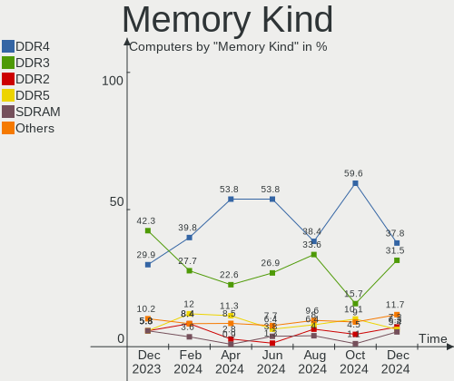

| Kind    | Computers | Percent |
|---------|-----------|---------|
| DDR4    | 42        | 37.84%  |
| DDR3    | 35        | 31.53%  |
| DDR2    | 8         | 7.21%   |
| DDR5    | 7         | 6.31%   |
| SDRAM   | 6         | 5.41%   |
| LPDDR5  | 4         | 3.6%    |
| LPDDR4  | 4         | 3.6%    |
| Unknown | 3         | 2.7%    |
| LPDDR3  | 1         | 0.9%    |
| DDR     | 1         | 0.9%    |

Memory Form Factor
------------------

Physical design of the memory module

| Name         | Computers | Percent |
|--------------|-----------|---------|
| SODIMM       | 58        | 53.7%   |
| DIMM         | 41        | 37.96%  |
| Row Of Chips | 9         | 8.33%   |

Memory Size
-----------

Memory module size

| Size  | Computers | Percent |
|-------|-----------|---------|
| 8192  | 43        | 35.54%  |
| 4096  | 28        | 23.14%  |
| 2048  | 19        | 15.7%   |
| 32768 | 13        | 10.74%  |
| 16384 | 12        | 9.92%   |
| 1024  | 2         | 1.65%   |
| 512   | 2         | 1.65%   |
| 3072  | 1         | 0.83%   |
| 256   | 1         | 0.83%   |

Memory Speed
------------

Memory module speed

| Speed   | Computers | Percent |
|---------|-----------|---------|
| 1600    | 25        | 21.19%  |
| 3200    | 17        | 14.41%  |
| 2667    | 9         | 7.63%   |
| 2400    | 6         | 5.08%   |
| 1333    | 6         | 5.08%   |
| 667     | 6         | 5.08%   |
| 4800    | 4         | 3.39%   |
| 2133    | 4         | 3.39%   |
| 3600    | 3         | 2.54%   |
| 1867    | 3         | 2.54%   |
| Unknown | 3         | 2.54%   |
| 7500    | 2         | 1.69%   |
| 6400    | 2         | 1.69%   |
| 5600    | 2         | 1.69%   |
| 4267    | 2         | 1.69%   |
| 4000    | 2         | 1.69%   |
| 2933    | 2         | 1.69%   |
| 2048    | 2         | 1.69%   |
| 1334    | 2         | 1.69%   |
| 800     | 2         | 1.69%   |
| 6000    | 1         | 0.85%   |
| 5808    | 1         | 0.85%   |
| 4199    | 1         | 0.85%   |
| 3800    | 1         | 0.85%   |
| 3466    | 1         | 0.85%   |
| 3333    | 1         | 0.85%   |
| 3007    | 1         | 0.85%   |
| 2800    | 1         | 0.85%   |
| 1866    | 1         | 0.85%   |
| 1800    | 1         | 0.85%   |
| 1648    | 1         | 0.85%   |
| 400     | 1         | 0.85%   |
| 333     | 1         | 0.85%   |
| 66      | 1         | 0.85%   |

Printers & scanners
-------------------

Printer Vendor
--------------

Printer device vendors

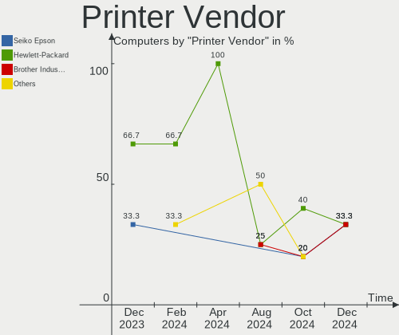

| Vendor             | Computers | Percent |
|--------------------|-----------|---------|
| Seiko Epson        | 1         | 33.33%  |
| Hewlett-Packard    | 1         | 33.33%  |
| Brother Industries | 1         | 33.33%  |

Printer Model
-------------

Printer device models

| Model                    | Computers | Percent |
|--------------------------|-----------|---------|
| Seiko Epson L6270 Series | 1         | 33.33%  |
| HP HP LaserJet M14-M17   | 1         | 33.33%  |
| Brother DCP-1610W        | 1         | 33.33%  |

Scanner Vendor
--------------

Scanner device vendors

| Vendor | Computers | Percent |
|--------|-----------|---------|
| Canon  | 1         | 100%    |

Scanner Model
-------------

Scanner device models

| Model                  | Computers | Percent |
|------------------------|-----------|---------|
| Canon CanoScan LIDE 25 | 1         | 100%    |

Camera
------

Camera Vendor
-------------

Camera device vendors

| Vendor                                 | Computers | Percent |
|----------------------------------------|-----------|---------|
| Chicony Electronics                    | 24        | 28.92%  |
| Sunplus Innovation Technology          | 8         | 9.64%   |
| Microdia                               | 8         | 9.64%   |
| IMC Networks                           | 7         | 8.43%   |
| Cheng Uei Precision Industry (Foxlink) | 5         | 6.02%   |
| Quanta                                 | 4         | 4.82%   |
| Luxvisions Innotech Limited            | 4         | 4.82%   |
| Bison Electronics                      | 4         | 4.82%   |
| Realtek Semiconductor                  | 3         | 3.61%   |
| Alcor Micro                            | 3         | 3.61%   |
| Syntek                                 | 2         | 2.41%   |
| Ricoh                                  | 2         | 2.41%   |
| kingcome                               | 2         | 2.41%   |
| Suyin                                  | 1         | 1.2%    |
| Sonix Technology                       | 1         | 1.2%    |
| Logitech                               | 1         | 1.2%    |
| Intel                                  | 1         | 1.2%    |
| Apple                                  | 1         | 1.2%    |
| Anker PowerConf C200                   | 1         | 1.2%    |
| Acer                                   | 1         | 1.2%    |

Camera Model
------------

Camera device models

| Model                                               | Computers | Percent |
|-----------------------------------------------------|-----------|---------|
| Chicony Integrated Camera                           | 7         | 8.33%   |
| IMC Networks USB2.0 HD UVC WebCam                   | 4         | 4.76%   |
| Microdia Integrated_Webcam_HD                       | 3         | 3.57%   |
| Luxvisions Innotech Limited HP TrueVision HD Camera | 3         | 3.57%   |
| Sunplus HD WebCam                                   | 2         | 2.38%   |
| Ricoh HD Webcam                                     | 2         | 2.38%   |
| Chicony FJ Camera                                   | 2         | 2.38%   |
| Syntek Web Cam - Asus A8J, F3S, F5R, VX2S, V1S      | 1         | 1.19%   |
| Syntek Sonix USB 2.0 Camera                         | 1         | 1.19%   |
| Suyin Integrated_Webcam_HD                          | 1         | 1.19%   |
| Sunplus Lenovo EasyCamera                           | 1         | 1.19%   |
| Sunplus Integrated_Webcam_HD                        | 1         | 1.19%   |
| Sunplus Integrated_Webcam_FHD                       | 1         | 1.19%   |
| Sunplus Integrated Webcam                           | 1         | 1.19%   |
| Sunplus Dell Integrated Webcam                      | 1         | 1.19%   |
| Sunplus Asus Webcam                                 | 1         | 1.19%   |
| Sonix USB2.0 HD UVC WebCam                          | 1         | 1.19%   |
| Realtek NexiGo N660P FHD Webcam                     | 1         | 1.19%   |
| Realtek Integrated_Webcam_HD                        | 1         | 1.19%   |
| Realtek Integrated Webcam HD                        | 1         | 1.19%   |
| Quanta USB2.0 HD UVC WebCam                         | 1         | 1.19%   |
| Quanta HP Wide Vision HD Camera                     | 1         | 1.19%   |
| Quanta HD User Facing                               | 1         | 1.19%   |
| Quanta HD Camera                                    | 1         | 1.19%   |
| Microdia WebCam SC-13HDL12639P                      | 1         | 1.19%   |
| Microdia Laptop_Integrated_Webcam_2M                | 1         | 1.19%   |
| Microdia Integrated Webcam HD                       | 1         | 1.19%   |
| Microdia Integrated Webcam                          | 1         | 1.19%   |
| Microdia Camera                                     | 1         | 1.19%   |
| Luxvisions Innotech Limited Integrated Camera       | 1         | 1.19%   |
| Logitech HP Webcam                                  | 1         | 1.19%   |
| kingcome FHD WebCam                                 | 1         | 1.19%   |
| kingcome ASUS FHD webcam                            | 1         | 1.19%   |
| Intel RealSense 3D Camera (Front F200)              | 1         | 1.19%   |
| IMC Networks USB2.0 UVC HD Webcam                   | 1         | 1.19%   |
| IMC Networks Lenovo EasyCamera                      | 1         | 1.19%   |
| IMC Networks HD Camera                              | 1         | 1.19%   |
| Chicony VGA Webcam                                  | 1         | 1.19%   |
| Chicony USB2.0 FHD UVC WebCam                       | 1         | 1.19%   |
| Chicony USB2.0 2.0M UVC WebCam                      | 1         | 1.19%   |

Security
--------

Fingerprint Vendor
------------------

Fingerprint sensor vendors

| Vendor                     | Computers | Percent |
|----------------------------|-----------|---------|
| Validity Sensors           | 4         | 30.77%  |
| Shenzhen Goodix Technology | 3         | 23.08%  |
| AuthenTec                  | 3         | 23.08%  |
| Synaptics                  | 2         | 15.38%  |
| Upek                       | 1         | 7.69%   |

Fingerprint Model
-----------------

Fingerprint sensor models

| Model                                                  | Computers | Percent |
|--------------------------------------------------------|-----------|---------|
| Shenzhen Goodix  Fingerprint Device                    | 2         | 15.38%  |
| Validity Sensors VFS7500 Touch Fingerprint Sensor      | 1         | 7.69%   |
| Validity Sensors VFS495 Fingerprint Reader             | 1         | 7.69%   |
| Validity Sensors VFS101 Fingerprint Reader             | 1         | 7.69%   |
| Validity Sensors Synaptics WBDI                        | 1         | 7.69%   |
| Upek Biometric Touchchip/Touchstrip Fingerprint Sensor | 1         | 7.69%   |
| Synaptics UWP WBDI                                     | 1         | 7.69%   |
| Synaptics Metallica MIS Touch Fingerprint Reader       | 1         | 7.69%   |
| Shenzhen Goodix Fingerprint Reader                     | 1         | 7.69%   |
| AuthenTec Fingerprint Sensor                           | 1         | 7.69%   |
| AuthenTec AES2810                                      | 1         | 7.69%   |
| AuthenTec AES1600                                      | 1         | 7.69%   |

Chipcard Vendor
---------------

Chipcard module vendors

| Vendor           | Computers | Percent |
|------------------|-----------|---------|
| Broadcom         | 7         | 70%     |
| Upek             | 1         | 10%     |
| SCM Microsystems | 1         | 10%     |
| O2 Micro         | 1         | 10%     |

Chipcard Model
--------------

Chipcard module models

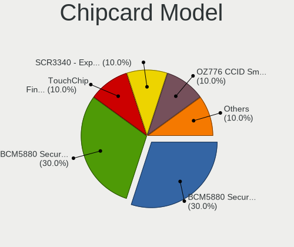

| Model                                                                        | Computers | Percent |
|------------------------------------------------------------------------------|-----------|---------|
| Broadcom BCM5880 Secure Applications Processor with fingerprint swipe sensor | 3         | 30%     |
| Broadcom BCM5880 Secure Applications Processor                               | 3         | 30%     |
| Upek TouchChip Fingerprint Coprocessor (WBF advanced mode)                   | 1         | 10%     |
| SCM Microsystems SCR3340 - ExpressCard54 Smart Card Reader                   | 1         | 10%     |
| O2 Micro OZ776 CCID Smartcard Reader                                         | 1         | 10%     |
| Broadcom 58200                                                               | 1         | 10%     |

Unsupported
-----------

Unsupported Devices
-------------------

Total unsupported devices on board

| Total | Computers | Percent |
|-------|-----------|---------|
| 0     | 119       | 73.01%  |
| 1     | 39        | 23.93%  |
| 3     | 3         | 1.84%   |
| 2     | 2         | 1.23%   |

Unsupported Device Types
------------------------

Types of unsupported devices

| Type                     | Computers | Percent |
|--------------------------|-----------|---------|
| Graphics card            | 14        | 28%     |
| Fingerprint reader       | 12        | 24%     |
| Chipcard                 | 10        | 20%     |
| Multimedia controller    | 6         | 12%     |
| Communication controller | 3         | 6%      |
| Net/wireless             | 2         | 4%      |
| Sound                    | 1         | 2%      |
| Network                  | 1         | 2%      |
| Camera                   | 1         | 2%      |

