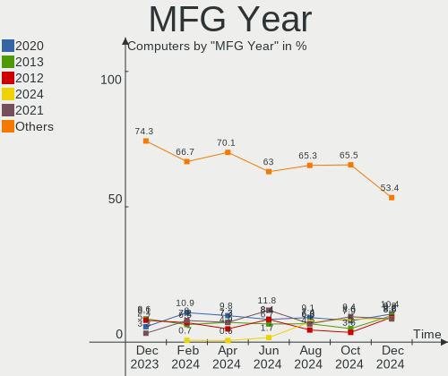
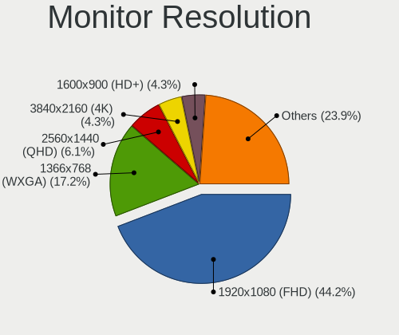
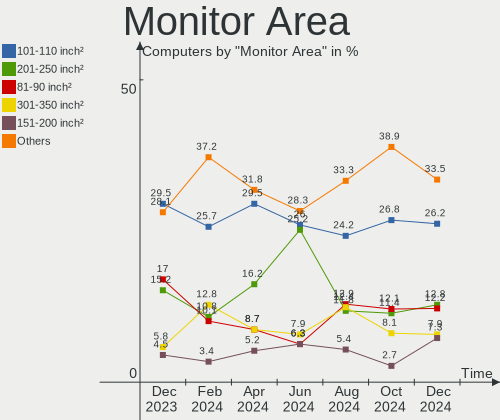
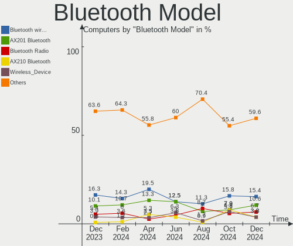
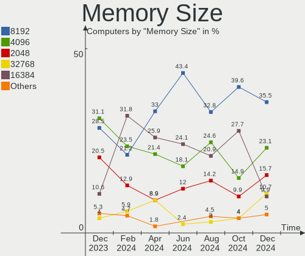
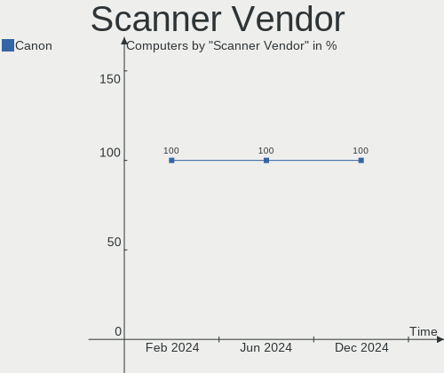

Linux in Poland - Hardware Trends
---------------------------------

A project to identify most popular hardware characteristics and track their change
over time based on data collected by Linux users at https://Linux-Hardware.org.

Anyone can contribute to this report by the [hw-probe](https://github.com/linuxhw/hw-probe) tool:

    sudo -E hw-probe -all -upload

This is a report for all computer types. See also reports for [desktops](/Location/Poland/Desktop/README.md) and [notebooks](/Location/Poland/Notebook/README.md).

Period: Oct, 2022.

Contents
--------

* [ System ](#system)
  - [ OS                       ](#os)
  - [ OS Family                ](#os-family)
  - [ Kernel                   ](#kernel)
  - [ Kernel Family            ](#kernel-family)
  - [ Kernel Major Ver.        ](#kernel-major-ver)
  - [ Arch                     ](#arch)
  - [ DE                       ](#de)
  - [ Display Server           ](#display-server)
  - [ Display Manager          ](#display-manager)
  - [ OS Lang                  ](#os-lang)
  - [ Boot Mode                ](#boot-mode)
  - [ Filesystem               ](#filesystem)
  - [ Part. scheme             ](#part-scheme)
  - [ Dual Boot with Linux/BSD ](#dual-boot-with-linuxbsd)
  - [ Dual Boot (Win)          ](#dual-boot-win)

* [ Board ](#board)
  - [ Vendor                   ](#vendor)
  - [ Model                    ](#model)
  - [ Model Family             ](#model-family)
  - [ MFG Year                 ](#mfg-year)
  - [ Form Factor              ](#form-factor)
  - [ Secure Boot              ](#secure-boot)
  - [ Coreboot                 ](#coreboot)
  - [ RAM Size                 ](#ram-size)
  - [ RAM Used                 ](#ram-used)
  - [ Total Drives             ](#total-drives)
  - [ Has CD-ROM               ](#has-cd-rom)
  - [ Has Ethernet             ](#has-ethernet)
  - [ Has WiFi                 ](#has-wifi)
  - [ Has Bluetooth            ](#has-bluetooth)

* [ Location ](#location)
  - [ Country                  ](#country)
  - [ City                     ](#city)

* [ Drives ](#drives)
  - [ Drive Vendor             ](#drive-vendor)
  - [ Drive Model              ](#drive-model)
  - [ HDD Vendor               ](#hdd-vendor)
  - [ SSD Vendor               ](#ssd-vendor)
  - [ Drive Kind               ](#drive-kind)
  - [ Drive Connector          ](#drive-connector)
  - [ Drive Size               ](#drive-size)
  - [ Space Total              ](#space-total)
  - [ Space Used               ](#space-used)
  - [ Malfunc. Drives          ](#malfunc-drives)
  - [ Malfunc. Drive Vendor    ](#malfunc-drive-vendor)
  - [ Malfunc. HDD Vendor      ](#malfunc-hdd-vendor)
  - [ Malfunc. Drive Kind      ](#malfunc-drive-kind)
  - [ Failed Drives            ](#failed-drives)
  - [ Failed Drive Vendor      ](#failed-drive-vendor)
  - [ Drive Status             ](#drive-status)

* [ Storage controller ](#storage-controller)
  - [ Storage Vendor           ](#storage-vendor)
  - [ Storage Model            ](#storage-model)
  - [ Storage Kind             ](#storage-kind)

* [ Processor ](#processor)
  - [ CPU Vendor               ](#cpu-vendor)
  - [ CPU Model                ](#cpu-model)
  - [ CPU Model Family         ](#cpu-model-family)
  - [ CPU Cores                ](#cpu-cores)
  - [ CPU Sockets              ](#cpu-sockets)
  - [ CPU Threads              ](#cpu-threads)
  - [ CPU Op-Modes             ](#cpu-op-modes)
  - [ CPU Microcode            ](#cpu-microcode)
  - [ CPU Microarch            ](#cpu-microarch)

* [ Graphics ](#graphics)
  - [ GPU Vendor               ](#gpu-vendor)
  - [ GPU Model                ](#gpu-model)
  - [ GPU Combo                ](#gpu-combo)
  - [ GPU Driver               ](#gpu-driver)
  - [ GPU Memory               ](#gpu-memory)

* [ Monitor ](#monitor)
  - [ Monitor Vendor           ](#monitor-vendor)
  - [ Monitor Model            ](#monitor-model)
  - [ Monitor Resolution       ](#monitor-resolution)
  - [ Monitor Diagonal         ](#monitor-diagonal)
  - [ Monitor Width            ](#monitor-width)
  - [ Aspect Ratio             ](#aspect-ratio)
  - [ Monitor Area             ](#monitor-area)
  - [ Pixel Density            ](#pixel-density)
  - [ Multiple Monitors        ](#multiple-monitors)

* [ Network ](#network)
  - [ Net Controller Vendor    ](#net-controller-vendor)
  - [ Net Controller Model     ](#net-controller-model)
  - [ Wireless Vendor          ](#wireless-vendor)
  - [ Wireless Model           ](#wireless-model)
  - [ Ethernet Vendor          ](#ethernet-vendor)
  - [ Ethernet Model           ](#ethernet-model)
  - [ Net Controller Kind      ](#net-controller-kind)
  - [ Used Controller          ](#used-controller)
  - [ NICs                     ](#nics)
  - [ IPv6                     ](#ipv6)

* [ Bluetooth ](#bluetooth)
  - [ Bluetooth Vendor         ](#bluetooth-vendor)
  - [ Bluetooth Model          ](#bluetooth-model)

* [ Sound ](#sound)
  - [ Sound Vendor             ](#sound-vendor)
  - [ Sound Model              ](#sound-model)

* [ Memory ](#memory)
  - [ Memory Vendor            ](#memory-vendor)
  - [ Memory Model             ](#memory-model)
  - [ Memory Kind              ](#memory-kind)
  - [ Memory Form Factor       ](#memory-form-factor)
  - [ Memory Size              ](#memory-size)
  - [ Memory Speed             ](#memory-speed)

* [ Printers & scanners ](#printers--scanners)
  - [ Printer Vendor           ](#printer-vendor)
  - [ Printer Model            ](#printer-model)
  - [ Scanner Vendor           ](#scanner-vendor)
  - [ Scanner Model            ](#scanner-model)

* [ Camera ](#camera)
  - [ Camera Vendor            ](#camera-vendor)
  - [ Camera Model             ](#camera-model)

* [ Security ](#security)
  - [ Fingerprint Vendor       ](#fingerprint-vendor)
  - [ Fingerprint Model        ](#fingerprint-model)
  - [ Chipcard Vendor          ](#chipcard-vendor)
  - [ Chipcard Model           ](#chipcard-model)

* [ Unsupported ](#unsupported)
  - [ Unsupported Devices      ](#unsupported-devices)
  - [ Unsupported Device Types ](#unsupported-device-types)

System
------

OS
--

Installed operating systems

| Name                 | Computers | Percent |
|----------------------|-----------|---------|
| Ubuntu 22.04         | 25        | 17.86%  |
| Linux Mint 21        | 13        | 9.29%   |
| OpenMandriva 4.3     | 11        | 7.86%   |
| Arch Rolling         | 11        | 7.86%   |
| Fedora 36            | 8         | 5.71%   |
| Pop!_OS 22.04        | 7         | 5%      |
| Debian 11            | 7         | 5%      |
| Ubuntu 20.04         | 6         | 4.29%   |
| Zorin 16             | 5         | 3.57%   |
| OpenMandriva 4.2     | 4         | 2.86%   |
| Kubuntu 22.04        | 4         | 2.86%   |
| Ubuntu 22.10         | 3         | 2.14%   |
| Nobara 36            | 3         | 2.14%   |
| ArcoLinux Rolling    | 3         | 2.14%   |
| Manjaro 22.0.0       | 2         | 1.43%   |
| Linux Mint 20.3      | 2         | 1.43%   |
| KDE neon 20.04       | 2         | 1.43%   |
| Gentoo 2.8           | 2         | 1.43%   |
| Fedora 37            | 2         | 1.43%   |
| Ubuntu MATE 22.04    | 1         | 0.71%   |
| SteamOS 3.3.1        | 1         | 0.71%   |
| ROSA 12.2            | 1         | 0.71%   |
| risiOS 36            | 1         | 0.71%   |
| RHEL 8               | 1         | 0.71%   |
| Raspbian 11          | 1         | 0.71%   |
| Oracle Linux 9.0     | 1         | 0.71%   |
| openSUSE Leap-15.4   | 1         | 0.71%   |
| OpenMandriva 4.90    | 1         | 0.71%   |
| OpenMandriva 4.50    | 1         | 0.71%   |
| MX 21                | 1         | 0.71%   |
| Manjaro              | 1         | 0.71%   |
| Lubuntu 22.04        | 1         | 0.71%   |
| Linux Mint 19.3      | 1         | 0.71%   |
| Kubuntu 20.04        | 1         | 0.71%   |
| Garuda Linux Rolling | 1         | 0.71%   |
| EuroLinux 9.0        | 1         | 0.71%   |
| EuroLinux 8.6        | 1         | 0.71%   |
| Debian Testing       | 1         | 0.71%   |
| Debian 11-updates    | 1         | 0.71%   |

OS Family
---------

OS without a version

| Name         | Computers | Percent |
|--------------|-----------|---------|
| Ubuntu       | 34        | 24.29%  |
| OpenMandriva | 17        | 12.14%  |
| Linux Mint   | 16        | 11.43%  |
| Arch         | 11        | 7.86%   |
| Fedora       | 10        | 7.14%   |
| Debian       | 9         | 6.43%   |
| Pop!_OS      | 7         | 5%      |
| Zorin        | 5         | 3.57%   |
| Kubuntu      | 5         | 3.57%   |
| Nobara       | 3         | 2.14%   |
| Manjaro      | 3         | 2.14%   |
| ArcoLinux    | 3         | 2.14%   |
| KDE neon     | 2         | 1.43%   |
| Gentoo       | 2         | 1.43%   |
| EuroLinux    | 2         | 1.43%   |
| Ubuntu MATE  | 1         | 0.71%   |
| SteamOS      | 1         | 0.71%   |
| ROSA         | 1         | 0.71%   |
| risiOS       | 1         | 0.71%   |
| RHEL         | 1         | 0.71%   |
| Raspbian     | 1         | 0.71%   |
| Oracle Linux | 1         | 0.71%   |
| openSUSE     | 1         | 0.71%   |
| MX           | 1         | 0.71%   |
| Lubuntu      | 1         | 0.71%   |
| Garuda Linux | 1         | 0.71%   |

Kernel
------

Version of the Linux kernel

| Version                                   | Computers | Percent |
|-------------------------------------------|-----------|---------|
| 5.15.0-52-generic                         | 22        | 15.71%  |
| 5.15.0-50-generic                         | 13        | 9.29%   |
| 5.15.0-48-generic                         | 13        | 9.29%   |
| 5.16.7-desktop-1omv4003                   | 9         | 6.43%   |
| 6.0.2-arch1-1                             | 5         | 3.57%   |
| 5.19.0-76051900-generic                   | 5         | 3.57%   |
| 5.10.14-desktop-1omv4002                  | 4         | 2.86%   |
| 5.10.0-18-amd64                           | 4         | 2.86%   |
| 5.19.16-200.fc36.x86_64                   | 3         | 2.14%   |
| 5.19.14-200.fc36.x86_64                   | 3         | 2.14%   |
| 5.19.0-23-generic                         | 3         | 2.14%   |
| 5.15.0-43-generic                         | 3         | 2.14%   |
| 6.0.1-060001-generic                      | 2         | 1.43%   |
| 5.4.0-131-generic                         | 2         | 1.43%   |
| 5.19.14-201.fsync.fc36.x86_64             | 2         | 1.43%   |
| 5.19.13-arch1-1                           | 2         | 1.43%   |
| 5.19.12-arch1-1                           | 2         | 1.43%   |
| 5.19.12-200.fc36.x86_64                   | 2         | 1.43%   |
| 5.16.13-desktop-1omv4003                  | 2         | 1.43%   |
| 5.15.69-gentoo                            | 2         | 1.43%   |
| 5.10.0-19-amd64                           | 2         | 1.43%   |
| 6.0.5-300.fc37.x86_64                     | 1         | 0.71%   |
| 6.0.5-200.fc36.x86_64                     | 1         | 0.71%   |
| 6.0.2-zen1-1-zen                          | 1         | 0.71%   |
| 6.0.2-x64v1-xanmod1-1                     | 1         | 0.71%   |
| 6.0.2-x64v1-xanmod1                       | 1         | 0.71%   |
| 6.0.2-76060002-generic                    | 1         | 0.71%   |
| 6.0.1-arch2-1                             | 1         | 0.71%   |
| 6.0.1-arch1-1                             | 1         | 0.71%   |
| 6.0.0                                     | 1         | 0.71%   |
| 5.4.0-125-generic                         | 1         | 0.71%   |
| 5.4.0-121-generic                         | 1         | 0.71%   |
| 5.19.8.xm1-1.klp-xanmod-rosa2021.1-x86_64 | 1         | 0.71%   |
| 5.19.5-desktop-1omv4090                   | 1         | 0.71%   |
| 5.19.2-arch1-1                            | 1         | 0.71%   |
| 5.19.16-2-MANJARO                         | 1         | 0.71%   |
| 5.19.14-lqx1-2-lqx                        | 1         | 0.71%   |
| 5.19.14-300.fc37.x86_64                   | 1         | 0.71%   |
| 5.19.14-051914-generic                    | 1         | 0.71%   |
| 5.19.12-201.fsync.fc36.x86_64             | 1         | 0.71%   |

Kernel Family
-------------

Linux kernel without a distro release

| Version | Computers | Percent |
|---------|-----------|---------|
| 5.15.0  | 55        | 39.29%  |
| 6.0.2   | 9         | 6.43%   |
| 5.19.0  | 9         | 6.43%   |
| 5.16.7  | 9         | 6.43%   |
| 5.19.14 | 8         | 5.71%   |
| 5.10.0  | 6         | 4.29%   |
| 5.19.12 | 5         | 3.57%   |
| 6.0.1   | 4         | 2.86%   |
| 5.4.0   | 4         | 2.86%   |
| 5.19.16 | 4         | 2.86%   |
| 5.10.14 | 4         | 2.86%   |
| 6.0.5   | 2         | 1.43%   |
| 5.19.13 | 2         | 1.43%   |
| 5.19.11 | 2         | 1.43%   |
| 5.16.13 | 2         | 1.43%   |
| 5.15.69 | 2         | 1.43%   |
| 6.0.0   | 1         | 0.71%   |
| 5.19.8  | 1         | 0.71%   |
| 5.19.5  | 1         | 0.71%   |
| 5.19.2  | 1         | 0.71%   |
| 5.18.12 | 1         | 0.71%   |
| 5.18.0  | 1         | 0.71%   |
| 5.17.0  | 1         | 0.71%   |
| 5.15.74 | 1         | 0.71%   |
| 5.15.61 | 1         | 0.71%   |
| 5.14.21 | 1         | 0.71%   |
| 5.14.0  | 1         | 0.71%   |
| 5.13.0  | 1         | 0.71%   |
| 4.18.0  | 1         | 0.71%   |

Kernel Major Ver.
-----------------

Linux kernel major version

| Version | Computers | Percent |
|---------|-----------|---------|
| 5.15    | 59        | 42.14%  |
| 5.19    | 33        | 23.57%  |
| 6.0     | 16        | 11.43%  |
| 5.16    | 11        | 7.86%   |
| 5.10    | 10        | 7.14%   |
| 5.4     | 4         | 2.86%   |
| 5.18    | 2         | 1.43%   |
| 5.14    | 2         | 1.43%   |
| 5.17    | 1         | 0.71%   |
| 5.13    | 1         | 0.71%   |
| 4.18    | 1         | 0.71%   |

Arch
----

OS architecture (x86_64, i586, etc.)

| Name   | Computers | Percent |
|--------|-----------|---------|
| x86_64 | 139       | 99.29%  |
| armv6l | 1         | 0.71%   |

DE
--

Desktop Environment

| Name       | Computers | Percent |
|------------|-----------|---------|
| GNOME      | 64        | 45.71%  |
| KDE5       | 40        | 28.57%  |
| X-Cinnamon | 14        | 10%     |
| Unknown    | 7         | 5%      |
| XFCE       | 5         | 3.57%   |
| MATE       | 2         | 1.43%   |
| i3         | 2         | 1.43%   |
| trinity    | 1         | 0.71%   |
| sway       | 1         | 0.71%   |
| LXQt       | 1         | 0.71%   |
| LXDE       | 1         | 0.71%   |
| Deepin     | 1         | 0.71%   |
| Cinnamon   | 1         | 0.71%   |

Display Server
--------------

X11 or Wayland

| Name    | Computers | Percent |
|---------|-----------|---------|
| X11     | 87        | 62.14%  |
| Wayland | 44        | 31.43%  |
| Unknown | 6         | 4.29%   |
| Tty     | 3         | 2.14%   |

Display Manager
---------------

SDDM, LightDM, etc.

| Name    | Computers | Percent |
|---------|-----------|---------|
| Unknown | 47        | 33.57%  |
| SDDM    | 32        | 22.86%  |
| GDM3    | 31        | 22.14%  |
| LightDM | 19        | 13.57%  |
| GDM     | 10        | 7.14%   |
| LXDM    | 1         | 0.71%   |

OS Lang
-------

Language

| Lang    | Computers | Percent |
|---------|-----------|---------|
| pl_PL   | 75        | 53.57%  |
| en_US   | 54        | 38.57%  |
| en_GB   | 6         | 4.29%   |
| uk_UA   | 1         | 0.71%   |
| szl_PL  | 1         | 0.71%   |
| en_CA   | 1         | 0.71%   |
| C       | 1         | 0.71%   |
| Unknown | 1         | 0.71%   |

Boot Mode
---------

EFI or BIOS

| Mode | Computers | Percent |
|------|-----------|---------|
| EFI  | 73        | 52.14%  |
| BIOS | 67        | 47.86%  |

Filesystem
----------

Type of filesystem

| Type    | Computers | Percent |
|---------|-----------|---------|
| Ext4    | 98        | 70%     |
| Btrfs   | 21        | 15%     |
| Overlay | 11        | 7.86%   |
| Xfs     | 4         | 2.86%   |
| F2fs    | 4         | 2.86%   |
| Zfs     | 1         | 0.71%   |
| Ext2    | 1         | 0.71%   |

Part. scheme
------------

Scheme of partitioning

| Type    | Computers | Percent |
|---------|-----------|---------|
| GPT     | 76        | 54.29%  |
| Unknown | 39        | 27.86%  |
| MBR     | 25        | 17.86%  |

Dual Boot with Linux/BSD
------------------------

Hosting more than one Linux/BSD

| Dual boot | Computers | Percent |
|-----------|-----------|---------|
| No        | 121       | 86.43%  |
| Yes       | 19        | 13.57%  |

Dual Boot (Win)
---------------

Hosting Linux and Windows

| Dual boot | Computers | Percent |
|-----------|-----------|---------|
| No        | 90        | 64.29%  |
| Yes       | 50        | 35.71%  |

Board
-----

Vendor
------

Motherboard manufacturer

| Name                    | Computers | Percent |
|-------------------------|-----------|---------|
| Lenovo                  | 32        | 22.86%  |
| Dell                    | 27        | 19.29%  |
| ASUSTek Computer        | 27        | 19.29%  |
| Hewlett-Packard         | 13        | 9.29%   |
| MSI                     | 10        | 7.14%   |
| Gigabyte Technology     | 10        | 7.14%   |
| Acer                    | 8         | 5.71%   |
| HUAWEI                  | 2         | 1.43%   |
| Valve                   | 1         | 0.71%   |
| Toshiba                 | 1         | 0.71%   |
| Raspberry Pi Foundation | 1         | 0.71%   |
| Kruger&Matz             | 1         | 0.71%   |
| Kiano                   | 1         | 0.71%   |
| Gateway                 | 1         | 0.71%   |
| Fujitsu                 | 1         | 0.71%   |
| Foxconn                 | 1         | 0.71%   |
| Dynabook                | 1         | 0.71%   |
| ASRock                  | 1         | 0.71%   |
| AMI                     | 1         | 0.71%   |

Model
-----

Motherboard model

| Name                                   | Computers | Percent |
|----------------------------------------|-----------|---------|
| Dell Inspiron 3451                     | 4         | 2.86%   |
| Lenovo ThinkPad SL500 27463ZG          | 3         | 2.14%   |
| Dell OptiPlex 755                      | 2         | 1.43%   |
| ASUS All Series                        | 2         | 1.43%   |
| Valve Jupiter                          | 1         | 0.71%   |
| Toshiba Satellite L40                  | 1         | 0.71%   |
| RPi Raspberry Pi Zero W Rev 1.1        | 1         | 0.71%   |
| MSI MS-N014                            | 1         | 0.71%   |
| MSI MS-7D25                            | 1         | 0.71%   |
| MSI MS-7D20                            | 1         | 0.71%   |
| MSI MS-7C52                            | 1         | 0.71%   |
| MSI MS-7C37                            | 1         | 0.71%   |
| MSI MS-7B86                            | 1         | 0.71%   |
| MSI MS-7B79                            | 1         | 0.71%   |
| MSI MS-7A38                            | 1         | 0.71%   |
| MSI MS-7A12                            | 1         | 0.71%   |
| MSI Creator Z17 A12UHST                | 1         | 0.71%   |
| Lenovo Z51-70 80K6                     | 1         | 0.71%   |
| Lenovo Yoga Slim 7 Pro 14ACH5 OD 82NK  | 1         | 0.71%   |
| Lenovo ThinkStation C20 4263BA7        | 1         | 0.71%   |
| Lenovo ThinkPad Z16 Gen 1 21D40016PB   | 1         | 0.71%   |
| Lenovo ThinkPad X200s 7470A98          | 1         | 0.71%   |
| Lenovo ThinkPad T530 24297TG           | 1         | 0.71%   |
| Lenovo ThinkPad T490s 20NX002QUK       | 1         | 0.71%   |
| Lenovo ThinkPad T490 20N3S9DJ00        | 1         | 0.71%   |
| Lenovo ThinkPad T480 20L50007PB        | 1         | 0.71%   |
| Lenovo ThinkPad T470p 20J7S0QK00       | 1         | 0.71%   |
| Lenovo ThinkPad T460p 20FW002CPB       | 1         | 0.71%   |
| Lenovo ThinkPad T450s 20BWS0DD00       | 1         | 0.71%   |
| Lenovo ThinkPad T430 23498M7           | 1         | 0.71%   |
| Lenovo ThinkPad T14 Gen 1 20S1S38414   | 1         | 0.71%   |
| Lenovo ThinkPad R500 2716W2K           | 1         | 0.71%   |
| Lenovo ThinkPad P50 20EQS5MP00         | 1         | 0.71%   |
| Lenovo ThinkPad P14s Gen 2i 20VX007NUS | 1         | 0.71%   |
| Lenovo Legion S7 15ACH6 82K8           | 1         | 0.71%   |
| Lenovo Legion 5 17ACH6 82K0            | 1         | 0.71%   |
| Lenovo Legion 5 15ACH6 82JW            | 1         | 0.71%   |
| Lenovo IdeaPad Y700-15ISK 80NV         | 1         | 0.71%   |
| Lenovo IdeaPad Gaming 3 15ACH6 82K2    | 1         | 0.71%   |
| Lenovo IdeaPad 700-15ISK 80RU          | 1         | 0.71%   |

Model Family
------------

Motherboard model prefix

| Name                | Computers | Percent |
|---------------------|-----------|---------|
| Lenovo ThinkPad     | 17        | 12.14%  |
| Dell Inspiron       | 8         | 5.71%   |
| Dell Latitude       | 7         | 5%      |
| Lenovo IdeaPad      | 6         | 4.29%   |
| Dell OptiPlex       | 6         | 4.29%   |
| Acer Aspire         | 6         | 4.29%   |
| ASUS PRIME          | 5         | 3.57%   |
| HP EliteBook        | 4         | 2.86%   |
| Lenovo Legion       | 3         | 2.14%   |
| HP ProBook          | 3         | 2.14%   |
| ASUS TUF            | 3         | 2.14%   |
| ASUS ROG            | 3         | 2.14%   |
| HP Pavilion         | 2         | 1.43%   |
| Gigabyte B550       | 2         | 1.43%   |
| Dell XPS            | 2         | 1.43%   |
| Dell Vostro         | 2         | 1.43%   |
| Dell Precision      | 2         | 1.43%   |
| ASUS All            | 2         | 1.43%   |
| Valve Jupiter       | 1         | 0.71%   |
| Toshiba Satellite   | 1         | 0.71%   |
| RPi Raspberry       | 1         | 0.71%   |
| MSI MS-N014         | 1         | 0.71%   |
| MSI MS-7D25         | 1         | 0.71%   |
| MSI MS-7D20         | 1         | 0.71%   |
| MSI MS-7C52         | 1         | 0.71%   |
| MSI MS-7C37         | 1         | 0.71%   |
| MSI MS-7B86         | 1         | 0.71%   |
| MSI MS-7B79         | 1         | 0.71%   |
| MSI MS-7A38         | 1         | 0.71%   |
| MSI MS-7A12         | 1         | 0.71%   |
| MSI Creator         | 1         | 0.71%   |
| Lenovo Z51-70       | 1         | 0.71%   |
| Lenovo Yoga         | 1         | 0.71%   |
| Lenovo ThinkStation | 1         | 0.71%   |
| Lenovo IdeaCentre   | 1         | 0.71%   |
| Lenovo G580         | 1         | 0.71%   |
| Lenovo G500s        | 1         | 0.71%   |
| Kruger&Matz KM1406  | 1         | 0.71%   |
| Kiano SlimNote      | 1         | 0.71%   |
| HUAWEI KLVD-WXX9    | 1         | 0.71%   |

MFG Year
--------

Motherboard manufacture year

| Year    | Computers | Percent |
|---------|-----------|---------|
| 2021    | 23        | 16.43%  |
| 2019    | 16        | 11.43%  |
| 2014    | 13        | 9.29%   |
| 2018    | 11        | 7.86%   |
| 2020    | 10        | 7.14%   |
| 2015    | 10        | 7.14%   |
| 2012    | 10        | 7.14%   |
| 2022    | 6         | 4.29%   |
| 2017    | 6         | 4.29%   |
| 2016    | 6         | 4.29%   |
| 2011    | 6         | 4.29%   |
| 2010    | 6         | 4.29%   |
| 2008    | 6         | 4.29%   |
| 2013    | 5         | 3.57%   |
| 2007    | 4         | 2.86%   |
| 2009    | 1         | 0.71%   |
| Unknown | 1         | 0.71%   |

Form Factor
-----------

Physical design of the computer

| Name           | Computers | Percent |
|----------------|-----------|---------|
| Notebook       | 90        | 64.29%  |
| Desktop        | 45        | 32.14%  |
| Convertible    | 3         | 2.14%   |
| System on chip | 1         | 0.71%   |
| Mini pc        | 1         | 0.71%   |

Secure Boot
-----------

Enabled or disabled

| State    | Computers | Percent |
|----------|-----------|---------|
| Disabled | 125       | 89.29%  |
| Enabled  | 15        | 10.71%  |

Coreboot
--------

Have coreboot on board

| Used | Computers | Percent |
|------|-----------|---------|
| No   | 140       | 100%    |

RAM Size
--------

Total RAM memory

| Size in GB  | Computers | Percent |
|-------------|-----------|---------|
| 16.01-24.0  | 29        | 20.71%  |
| 8.01-16.0   | 28        | 20%     |
| 32.01-64.0  | 23        | 16.43%  |
| 4.01-8.0    | 22        | 15.71%  |
| 3.01-4.0    | 19        | 13.57%  |
| 24.01-32.0  | 6         | 4.29%   |
| 64.01-256.0 | 4         | 2.86%   |
| 1.01-2.0    | 4         | 2.86%   |
| 2.01-3.0    | 3         | 2.14%   |
| 0.51-1.0    | 1         | 0.71%   |
| 0.01-0.5    | 1         | 0.71%   |

RAM Used
--------

Used RAM memory

| Used GB    | Computers | Percent |
|------------|-----------|---------|
| 1.01-2.0   | 36        | 25.71%  |
| 2.01-3.0   | 34        | 24.29%  |
| 4.01-8.0   | 33        | 23.57%  |
| 3.01-4.0   | 12        | 8.57%   |
| 8.01-16.0  | 9         | 6.43%   |
| 0.51-1.0   | 6         | 4.29%   |
| 16.01-24.0 | 4         | 2.86%   |
| 0.01-0.5   | 4         | 2.86%   |
| 24.01-32.0 | 2         | 1.43%   |

Total Drives
------------

Number of drives on board

| Drives | Computers | Percent |
|--------|-----------|---------|
| 1      | 79        | 56.43%  |
| 2      | 37        | 26.43%  |
| 3      | 14        | 10%     |
| 4      | 5         | 3.57%   |
| 6      | 3         | 2.14%   |
| 7      | 1         | 0.71%   |
| 5      | 1         | 0.71%   |

Has CD-ROM
----------

Has CD-ROM on board

| Presented | Computers | Percent |
|-----------|-----------|---------|
| No        | 104       | 74.29%  |
| Yes       | 36        | 25.71%  |

Has Ethernet
------------

Has Ethernet on board

| Presented | Computers | Percent |
|-----------|-----------|---------|
| Yes       | 120       | 85.71%  |
| No        | 20        | 14.29%  |

Has WiFi
--------

Has WiFi module

| Presented | Computers | Percent |
|-----------|-----------|---------|
| Yes       | 112       | 80%     |
| No        | 28        | 20%     |

Has Bluetooth
-------------

Has Bluetooth module

| Presented | Computers | Percent |
|-----------|-----------|---------|
| Yes       | 94        | 67.14%  |
| No        | 46        | 32.86%  |

Location
--------

Country
-------

Geographic location (country)

| Country | Computers | Percent |
|---------|-----------|---------|
| Poland  | 140       | 100%    |

City
----

Geographic location (city)

| City                   | Computers | Percent |
|------------------------|-----------|---------|
| Warsaw                 | 28        | 20%     |
| Krakow                 | 13        | 9.29%   |
| Wroclaw                | 12        | 8.57%   |
| Lublin                 | 4         | 2.86%   |
| Lodz                   | 3         | 2.14%   |
| Katowice               | 3         | 2.14%   |
| Gdansk                 | 3         | 2.14%   |
| Zabrze                 | 2         | 1.43%   |
| Tychy                  | 2         | 1.43%   |
| Torun                  | 2         | 1.43%   |
| Skawina                | 2         | 1.43%   |
| Mogilno                | 2         | 1.43%   |
| Częstochowa           | 2         | 1.43%   |
| Brzeg                  | 2         | 1.43%   |
| Biale Blota            | 2         | 1.43%   |
| Żyrardów             | 1         | 0.71%   |
| Zdunska Wola           | 1         | 0.71%   |
| Zagorze                | 1         | 0.71%   |
| Żagań                | 1         | 0.71%   |
| Wyszków               | 1         | 0.71%   |
| Wrzesnia               | 1         | 0.71%   |
| Wołomin               | 1         | 0.71%   |
| Wozniki                | 1         | 0.71%   |
| Wabrzezno              | 1         | 0.71%   |
| Tczew                  | 1         | 0.71%   |
| Tarnobrzeg             | 1         | 0.71%   |
| Szprotawa              | 1         | 0.71%   |
| Świnoujście          | 1         | 0.71%   |
| Świętochłowice      | 1         | 0.71%   |
| Supraśl               | 1         | 0.71%   |
| Sulechow               | 1         | 0.71%   |
| Strzyzow               | 1         | 0.71%   |
| Stezyca                | 1         | 0.71%   |
| Siemianowice Śląskie | 1         | 0.71%   |
| Rzeszów               | 1         | 0.71%   |
| Ruda Śląska          | 1         | 0.71%   |
| Płock                 | 1         | 0.71%   |
| Pruszków              | 1         | 0.71%   |
| Poznan                 | 1         | 0.71%   |
| Ozarow Mazowiecki      | 1         | 0.71%   |

Drives
------

Drive Vendor
------------

Hard drive vendors

| Vendor                       | Computers | Drives | Percent |
|------------------------------|-----------|--------|---------|
| Samsung Electronics          | 35        | 40     | 16.2%   |
| WDC                          | 23        | 25     | 10.65%  |
| Seagate                      | 20        | 24     | 9.26%   |
| Crucial                      | 16        | 19     | 7.41%   |
| Toshiba                      | 15        | 17     | 6.94%   |
| GOODRAM                      | 14        | 15     | 6.48%   |
| Sandisk                      | 11        | 12     | 5.09%   |
| Unknown                      | 10        | 10     | 4.63%   |
| Kingston                     | 9         | 9      | 4.17%   |
| Hitachi                      | 7         | 9      | 3.24%   |
| A-DATA Technology            | 7         | 9      | 3.24%   |
| Phison Electronics           | 6         | 8      | 2.78%   |
| ADATA Technology             | 6         | 6      | 2.78%   |
| Patriot                      | 4         | 4      | 1.85%   |
| Micron Technology            | 4         | 4      | 1.85%   |
| Intel                        | 3         | 3      | 1.39%   |
| HGST                         | 3         | 3      | 1.39%   |
| XPG                          | 2         | 3      | 0.93%   |
| SPCC                         | 2         | 2      | 0.93%   |
| SK hynix                     | 2         | 2      | 0.93%   |
| Phison                       | 2         | 2      | 0.93%   |
| Silicon Motion               | 1         | 1      | 0.46%   |
| Shenzhen Longsys Electronics | 1         | 1      | 0.46%   |
| Realtek Semiconductor        | 1         | 1      | 0.46%   |
| PNY                          | 1         | 1      | 0.46%   |
| OCZ                          | 1         | 1      | 0.46%   |
| Micron/Crucial Technology    | 1         | 1      | 0.46%   |
| Maxtor                       | 1         | 1      | 0.46%   |
| LITEONIT                     | 1         | 1      | 0.46%   |
| LITEON                       | 1         | 1      | 0.46%   |
| Lite-On Technology           | 1         | 1      | 0.46%   |
| KIOXIA-EXCERIA               | 1         | 1      | 0.46%   |
| JMicron Technology           | 1         | 1      | 0.46%   |
| Fujitsu                      | 1         | 1      | 0.46%   |
| China                        | 1         | 1      | 0.46%   |
| ASMT                         | 1         | 1      | 0.46%   |

Drive Model
-----------

Hard drive models

| Model                                                           | Computers | Percent |
|-----------------------------------------------------------------|-----------|---------|
| ADATA XPG SX8200 Pro PCIe Gen3x4 M.2 2280 Solid State Drive 1TB | 6         | 2.6%    |
| Crucial CT500MX500SSD1 500GB                                    | 5         | 2.16%   |
| Seagate ST500LT012-1DG142 500GB                                 | 4         | 1.73%   |
| Samsung SSD 980 1TB                                             | 4         | 1.73%   |
| Phison PS5013 E13 NVMe Controller 256GB                         | 4         | 1.73%   |
| Crucial CT1000MX500SSD1 1TB                                     | 4         | 1.73%   |
| Samsung SSD 860 EVO 500GB                                       | 3         | 1.3%    |
| Samsung SSD 850 EVO 250GB                                       | 3         | 1.3%    |
| Kingston SA400S37240G 240GB SSD                                 | 3         | 1.3%    |
| GOODRAM SSDPR-CX400-512-G2 512GB                                | 3         | 1.3%    |
| GOODRAM SSDPR-CX400-256-G2 256GB                                | 3         | 1.3%    |
| WDC WDS100T2B0C-00PXH0 1TB                                      | 2         | 0.87%   |
| WDC WD2500JS-55NCB1 250GB                                       | 2         | 0.87%   |
| WDC WD10SPCX-24HWST1 1TB                                        | 2         | 0.87%   |
| WDC WD10EZEX-60WN4A0 1TB                                        | 2         | 0.87%   |
| Unknown SD64G  64GB                                             | 2         | 0.87%   |
| Unknown MMC Card  64GB                                          | 2         | 0.87%   |
| Unknown MMC Card  32GB                                          | 2         | 0.87%   |
| Toshiba XG6 NVMe SSD Controller 512GB                           | 2         | 0.87%   |
| Toshiba MQ04ABF100 1TB                                          | 2         | 0.87%   |
| Toshiba HDWD130 3TB                                             | 2         | 0.87%   |
| Sandisk WD Blue SN550 NVMe SSD 1TB                              | 2         | 0.87%   |
| Sandisk WD Black SN750 / PC SN730 NVMe SSD 1TB                  | 2         | 0.87%   |
| Samsung SSD 970 EVO Plus 1TB                                    | 2         | 0.87%   |
| Samsung NVMe SSD Controller SM981/PM981/PM983 500GB             | 2         | 0.87%   |
| Phison E12 NVMe Controller 2TB                                  | 2         | 0.87%   |
| Kingston SKC3000S1024G 1TB                                      | 2         | 0.87%   |
| Hitachi HUA723020ALA641 2TB                                     | 2         | 0.87%   |
| GOODRAM SSDPR-CX400-512 512GB                                   | 2         | 0.87%   |
| GOODRAM SSDPR-CX400-128 128GB                                   | 2         | 0.87%   |
| GOODRAM SSDPR-CL100-480-G2 480GB                                | 2         | 0.87%   |
| Crucial CT250MX500SSD1 250GB                                    | 2         | 0.87%   |
| A-DATA SP550 240GB SSD                                          | 2         | 0.87%   |
| XPG SX950U 240GB                                                | 1         | 0.43%   |
| XPG NVMe SSD Drive 1024GB                                       | 1         | 0.43%   |
| XPG GAMMIX S11 Pro 1TB                                          | 1         | 0.43%   |
| WDC WDS500G2B0A-00SM50 500GB SSD                                | 1         | 0.43%   |
| WDC WDS240G2G0B-00EPW0 240GB SSD                                | 1         | 0.43%   |
| WDC WD7500BPKT-22PK4T0 752GB                                    | 1         | 0.43%   |
| WDC WD7500AAKS-00RBA0 752GB                                     | 1         | 0.43%   |

HDD Vendor
----------

Hard disk drive vendors

| Vendor              | Computers | Drives | Percent |
|---------------------|-----------|--------|---------|
| Seagate             | 20        | 24     | 32.26%  |
| WDC                 | 18        | 19     | 29.03%  |
| Toshiba             | 9         | 11     | 14.52%  |
| Hitachi             | 7         | 9      | 11.29%  |
| Samsung Electronics | 3         | 3      | 4.84%   |
| HGST                | 3         | 3      | 4.84%   |
| Maxtor              | 1         | 1      | 1.61%   |
| Fujitsu             | 1         | 1      | 1.61%   |

SSD Vendor
----------

Solid state drive vendors

| Vendor              | Computers | Drives | Percent |
|---------------------|-----------|--------|---------|
| Crucial             | 16        | 19     | 21.33%  |
| GOODRAM             | 14        | 15     | 18.67%  |
| Samsung Electronics | 11        | 15     | 14.67%  |
| A-DATA Technology   | 7         | 9      | 9.33%   |
| SanDisk             | 5         | 5      | 6.67%   |
| Kingston            | 5         | 5      | 6.67%   |
| Patriot             | 3         | 3      | 4%      |
| WDC                 | 2         | 2      | 2.67%   |
| Toshiba             | 2         | 2      | 2.67%   |
| XPG                 | 1         | 1      | 1.33%   |
| SPCC                | 1         | 1      | 1.33%   |
| PNY                 | 1         | 1      | 1.33%   |
| OCZ                 | 1         | 1      | 1.33%   |
| LITEONIT            | 1         | 1      | 1.33%   |
| LITEON              | 1         | 1      | 1.33%   |
| KIOXIA-EXCERIA      | 1         | 1      | 1.33%   |
| Intel               | 1         | 1      | 1.33%   |
| China               | 1         | 1      | 1.33%   |
| ASMT                | 1         | 1      | 1.33%   |

Drive Kind
----------

HDD or SSD

| Kind    | Computers | Drives | Percent |
|---------|-----------|--------|---------|
| NVMe    | 66        | 76     | 34.02%  |
| SSD     | 66        | 85     | 34.02%  |
| HDD     | 53        | 71     | 27.32%  |
| MMC     | 8         | 8      | 4.12%   |
| Unknown | 1         | 1      | 0.52%   |

Drive Connector
---------------

SATA, SAS, NVMe, etc.

| Type | Computers | Drives | Percent |
|------|-----------|--------|---------|
| SATA | 95        | 154    | 55.23%  |
| NVMe | 66        | 75     | 38.37%  |
| MMC  | 8         | 8      | 4.65%   |
| SAS  | 3         | 4      | 1.74%   |

Drive Size
----------

Size of hard drive

| Size in TB | Computers | Drives | Percent |
|------------|-----------|--------|---------|
| 0.01-0.5   | 70        | 89     | 54.69%  |
| 0.51-1.0   | 39        | 42     | 30.47%  |
| 1.01-2.0   | 9         | 11     | 7.03%   |
| 3.01-4.0   | 3         | 4      | 2.34%   |
| 2.01-3.0   | 3         | 6      | 2.34%   |
| 4.01-10.0  | 3         | 3      | 2.34%   |
| 10.01-20.0 | 1         | 1      | 0.78%   |

Space Total
-----------

Amount of disk space available on the file system

| Size in GB     | Computers | Percent |
|----------------|-----------|---------|
| 251-500        | 33        | 23.57%  |
| 101-250        | 32        | 22.86%  |
| 501-1000       | 18        | 12.86%  |
| 1001-2000      | 14        | 10%     |
| 1-20           | 14        | 10%     |
| 51-100         | 9         | 6.43%   |
| More than 3000 | 8         | 5.71%   |
| 2001-3000      | 5         | 3.57%   |
| Unknown        | 4         | 2.86%   |
| 21-50          | 3         | 2.14%   |

Space Used
----------

Amount of used disk space

| Used GB        | Computers | Percent |
|----------------|-----------|---------|
| 1-20           | 49        | 35%     |
| 101-250        | 24        | 17.14%  |
| 21-50          | 19        | 13.57%  |
| 51-100         | 13        | 9.29%   |
| 501-1000       | 10        | 7.14%   |
| 251-500        | 8         | 5.71%   |
| 1001-2000      | 6         | 4.29%   |
| More than 3000 | 5         | 3.57%   |
| Unknown        | 4         | 2.86%   |
| 2001-3000      | 2         | 1.43%   |

Malfunc. Drives
---------------

Drive models with a malfunction

| Model                                 | Computers | Drives | Percent |
|---------------------------------------|-----------|--------|---------|
| WDC WD7500BPKT-22PK4T0 752GB          | 1         | 1      | 6.67%   |
| Seagate ST9320423AS 320GB             | 1         | 1      | 6.67%   |
| Seagate ST500LT012-9WS142 500GB       | 1         | 1      | 6.67%   |
| Seagate ST3320613AS 320GB             | 1         | 1      | 6.67%   |
| Seagate ST1000LM014-1EJ164 1TB        | 1         | 1      | 6.67%   |
| Seagate ST1000DX001-1CM162 1TB        | 1         | 1      | 6.67%   |
| Seagate ST10000NE0004-1ZF101 10TB     | 1         | 1      | 6.67%   |
| SanDisk SSD PLUS 240 GB               | 1         | 1      | 6.67%   |
| Samsung Electronics SSD 850 EVO 250GB | 1         | 1      | 6.67%   |
| LITEON CV8-8E128-HP 128GB SSD         | 1         | 1      | 6.67%   |
| Hitachi HDE721010SLA330 1TB           | 1         | 1      | 6.67%   |
| HGST HTS721010A9E630 1TB              | 1         | 1      | 6.67%   |
| HGST HTS545050A7E680 500GB            | 1         | 1      | 6.67%   |
| Crucial CT500MX500SSD1 500GB          | 1         | 1      | 6.67%   |
| ASMT 2135 120GB SSD                   | 1         | 1      | 6.67%   |

Malfunc. Drive Vendor
---------------------

Vendors of faulty drives

| Vendor              | Computers | Drives | Percent |
|---------------------|-----------|--------|---------|
| Seagate             | 6         | 6      | 40%     |
| HGST                | 2         | 2      | 13.33%  |
| WDC                 | 1         | 1      | 6.67%   |
| SanDisk             | 1         | 1      | 6.67%   |
| Samsung Electronics | 1         | 1      | 6.67%   |
| LITEON              | 1         | 1      | 6.67%   |
| Hitachi             | 1         | 1      | 6.67%   |
| Crucial             | 1         | 1      | 6.67%   |
| ASMT                | 1         | 1      | 6.67%   |

Malfunc. HDD Vendor
-------------------

Vendors of faulty HDD drives

| Vendor  | Computers | Drives | Percent |
|---------|-----------|--------|---------|
| Seagate | 6         | 6      | 60%     |
| HGST    | 2         | 2      | 20%     |
| WDC     | 1         | 1      | 10%     |
| Hitachi | 1         | 1      | 10%     |

Malfunc. Drive Kind
-------------------

Kinds of faulty drives

| Kind | Computers | Drives | Percent |
|------|-----------|--------|---------|
| HDD  | 9         | 10     | 64.29%  |
| SSD  | 5         | 5      | 35.71%  |

Failed Drives
-------------

Failed drive models

Zero info for selected period =(

Failed Drive Vendor
-------------------

Failed drive vendors

Zero info for selected period =(

Drive Status
------------

Number of failed and malfunc. drives

| Status   | Computers | Drives | Percent |
|----------|-----------|--------|---------|
| Works    | 72        | 115    | 46.45%  |
| Detected | 69        | 111    | 44.52%  |
| Malfunc  | 14        | 15     | 9.03%   |

Storage controller
------------------

Storage Vendor
--------------

Storage controller vendors

| Vendor                       | Computers | Percent |
|------------------------------|-----------|---------|
| Intel                        | 90        | 46.39%  |
| AMD                          | 25        | 12.89%  |
| Samsung Electronics          | 21        | 10.82%  |
| SanDisk                      | 10        | 5.15%   |
| Phison Electronics           | 10        | 5.15%   |
| ADATA Technology             | 7         | 3.61%   |
| Toshiba America Info Systems | 4         | 2.06%   |
| Micron Technology            | 4         | 2.06%   |
| Kingston Technology Company  | 4         | 2.06%   |
| Marvell Technology Group     | 3         | 1.55%   |
| ASMedia Technology           | 3         | 1.55%   |
| SK hynix                     | 2         | 1.03%   |
| JMicron Technology           | 2         | 1.03%   |
| Unknown                      | 1         | 0.52%   |
| Tekram Technology            | 1         | 0.52%   |
| Silicon Motion               | 1         | 0.52%   |
| Shenzhen Longsys Electronics | 1         | 0.52%   |
| Realtek Semiconductor        | 1         | 0.52%   |
| Micron/Crucial Technology    | 1         | 0.52%   |
| LSI Logic / Symbios Logic    | 1         | 0.52%   |
| Lite-On Technology           | 1         | 0.52%   |
| Unknown                      | 1         | 0.52%   |

Storage Model
-------------

Storage controller models

| Model                                                                                   | Computers | Percent |
|-----------------------------------------------------------------------------------------|-----------|---------|
| AMD FCH SATA Controller [AHCI mode]                                                     | 16        | 7.48%   |
| Samsung NVMe SSD Controller 980                                                         | 9         | 4.21%   |
| Samsung NVMe SSD Controller SM981/PM981/PM983                                           | 8         | 3.74%   |
| Intel 7 Series Chipset Family 6-port SATA Controller [AHCI mode]                        | 7         | 3.27%   |
| AMD 400 Series Chipset SATA Controller                                                  | 7         | 3.27%   |
| ADATA XPG SX8200 Pro PCIe Gen3x4 M.2 2280 Solid State Drive                             | 7         | 3.27%   |
| Intel Sunrise Point-LP SATA Controller [AHCI mode]                                      | 6         | 2.8%    |
| Intel Atom Processor E3800 Series SATA AHCI Controller                                  | 6         | 2.8%    |
| Intel 82801IBM/IEM (ICH9M/ICH9M-E) 4 port SATA Controller [AHCI mode]                   | 6         | 2.8%    |
| Phison PS5013 E13 NVMe Controller                                                       | 5         | 2.34%   |
| Intel Volume Management Device NVMe RAID Controller                                     | 5         | 2.34%   |
| Intel Cannon Lake Mobile PCH SATA AHCI Controller                                       | 5         | 2.34%   |
| Intel 8 Series/C220 Series Chipset Family 6-port SATA Controller 1 [AHCI mode]          | 5         | 2.34%   |
| SanDisk WD Blue SN550 NVMe SSD                                                          | 4         | 1.87%   |
| SanDisk WD Black SN750 / PC SN730 NVMe SSD                                              | 4         | 1.87%   |
| Samsung NVMe SSD Controller PM9A1/PM9A3/980PRO                                          | 4         | 1.87%   |
| Micron Non-Volatile memory controller                                                   | 4         | 1.87%   |
| Intel HM170/QM170 Chipset SATA Controller [AHCI Mode]                                   | 4         | 1.87%   |
| Intel Celeron/Pentium Silver Processor SATA Controller                                  | 4         | 1.87%   |
| AMD 500 Series Chipset SATA Controller                                                  | 4         | 1.87%   |
| Toshiba America Info Systems XG6 NVMe SSD Controller                                    | 3         | 1.4%    |
| Phison E12 NVMe Controller                                                              | 3         | 1.4%    |
| Intel Wildcat Point-LP SATA Controller [AHCI Mode]                                      | 3         | 1.4%    |
| Intel Tiger Lake-LP SATA Controller                                                     | 3         | 1.4%    |
| Intel SATA Controller [RAID mode]                                                       | 3         | 1.4%    |
| Intel Q170/Q150/B150/H170/H110/Z170/CM236 Chipset SATA Controller [AHCI Mode]           | 3         | 1.4%    |
| Intel 82801 Mobile SATA Controller [RAID mode]                                          | 3         | 1.4%    |
| Intel 6 Series/C200 Series Chipset Family Desktop SATA Controller (IDE mode, ports 4-5) | 3         | 1.4%    |
| Intel 6 Series/C200 Series Chipset Family Desktop SATA Controller (IDE mode, ports 0-3) | 3         | 1.4%    |
| ASMedia ASM1062 Serial ATA Controller                                                   | 3         | 1.4%    |
| Kingston Company Company Non-Volatile memory controller                                 | 2         | 0.93%   |
| Intel Non-Volatile memory controller                                                    | 2         | 0.93%   |
| Intel 9 Series Chipset Family SATA Controller [AHCI Mode]                               | 2         | 0.93%   |
| Intel 82Q35 Express PT IDER Controller                                                  | 2         | 0.93%   |
| Intel 82801JI (ICH10 Family) SATA AHCI Controller                                       | 2         | 0.93%   |
| Intel 82801IR/IO/IH (ICH9R/DO/DH) 6 port SATA Controller [AHCI mode]                    | 2         | 0.93%   |
| Intel 7 Series/C210 Series Chipset Family 6-port SATA Controller [AHCI mode]            | 2         | 0.93%   |
| Intel 6 Series/C200 Series Chipset Family 6 port Desktop SATA AHCI Controller           | 2         | 0.93%   |
| Intel 500 Series Chipset Family SATA AHCI Controller                                    | 2         | 0.93%   |
| Intel 200 Series PCH SATA controller [AHCI mode]                                        | 2         | 0.93%   |

Storage Kind
------------

Kind of storage controller (IDE, SATA, NVMe, SAS, ...)

| Kind | Computers | Percent |
|------|-----------|---------|
| SATA | 99        | 51.83%  |
| NVMe | 66        | 34.55%  |
| IDE  | 13        | 6.81%   |
| RAID | 11        | 5.76%   |
| SCSI | 2         | 1.05%   |

Processor
---------

CPU Vendor
----------

Processor vendors

| Vendor | Computers | Percent |
|--------|-----------|---------|
| Intel  | 105       | 75%     |
| AMD    | 34        | 24.29%  |
| ARM    | 1         | 0.71%   |

CPU Model
---------

Processor models

| Model                                       | Computers | Percent |
|---------------------------------------------|-----------|---------|
| Intel Core 2 Duo CPU P8400 @ 2.26GHz        | 4         | 2.86%   |
| Intel Celeron CPU N2840 @ 2.16GHz           | 4         | 2.86%   |
| Intel 11th Gen Core i5-1135G7 @ 2.40GHz     | 4         | 2.86%   |
| Intel Core i7-8550U CPU @ 1.80GHz           | 3         | 2.14%   |
| AMD Ryzen 5 2600X Six-Core Processor        | 3         | 2.14%   |
| Intel Pentium Silver N5000 CPU @ 1.10GHz    | 2         | 1.43%   |
| Intel Core i7-8565U CPU @ 1.80GHz           | 2         | 1.43%   |
| Intel Core i7-6700HQ CPU @ 2.60GHz          | 2         | 1.43%   |
| Intel Core i5-7200U CPU @ 2.50GHz           | 2         | 1.43%   |
| Intel Core i5-6300HQ CPU @ 2.30GHz          | 2         | 1.43%   |
| Intel Core i5-5200U CPU @ 2.20GHz           | 2         | 1.43%   |
| Intel Core i5-3340M CPU @ 2.70GHz           | 2         | 1.43%   |
| Intel Core i5-3230M CPU @ 2.60GHz           | 2         | 1.43%   |
| Intel Celeron N4000 CPU @ 1.10GHz           | 2         | 1.43%   |
| Intel Atom CPU Z3735F @ 1.33GHz             | 2         | 1.43%   |
| AMD Ryzen 9 5900HX with Radeon Graphics     | 2         | 1.43%   |
| AMD Ryzen 7 5800H with Radeon Graphics      | 2         | 1.43%   |
| AMD Ryzen 7 3800X 8-Core Processor          | 2         | 1.43%   |
| Intel Xeon CPU E5620 @ 2.40GHz              | 1         | 0.71%   |
| Intel Xeon CPU E3110 @ 3.00GHz              | 1         | 0.71%   |
| Intel Pentium Dual-Core CPU T4500 @ 2.30GHz | 1         | 0.71%   |
| Intel Pentium Dual CPU T2310 @ 1.46GHz      | 1         | 0.71%   |
| Intel Pentium Dual CPU E2200 @ 2.20GHz      | 1         | 0.71%   |
| Intel Pentium CPU N3700 @ 1.60GHz           | 1         | 0.71%   |
| Intel Pentium CPU N3540 @ 2.16GHz           | 1         | 0.71%   |
| Intel Pentium CPU 2020M @ 2.40GHz           | 1         | 0.71%   |
| Intel Core i9-9880H CPU @ 2.30GHz           | 1         | 0.71%   |
| Intel Core i7-9850H CPU @ 2.60GHz           | 1         | 0.71%   |
| Intel Core i7-9750H CPU @ 2.60GHz           | 1         | 0.71%   |
| Intel Core i7-8750H CPU @ 2.20GHz           | 1         | 0.71%   |
| Intel Core i7-8700K CPU @ 3.70GHz           | 1         | 0.71%   |
| Intel Core i7-8665U CPU @ 1.90GHz           | 1         | 0.71%   |
| Intel Core i7-7820HQ CPU @ 2.90GHz          | 1         | 0.71%   |
| Intel Core i7-7700HQ CPU @ 2.80GHz          | 1         | 0.71%   |
| Intel Core i7-6700K CPU @ 4.00GHz           | 1         | 0.71%   |
| Intel Core i7-6700 CPU @ 3.40GHz            | 1         | 0.71%   |
| Intel Core i7-4790K CPU @ 4.00GHz           | 1         | 0.71%   |
| Intel Core i7-4710HQ CPU @ 2.50GHz          | 1         | 0.71%   |
| Intel Core i7-4700HQ CPU @ 2.40GHz          | 1         | 0.71%   |
| Intel Core i7-4500U CPU @ 1.80GHz           | 1         | 0.71%   |

CPU Model Family
----------------

Processor model prefix

| Model                   | Computers | Percent |
|-------------------------|-----------|---------|
| Intel Core i5           | 33        | 23.57%  |
| Intel Core i7           | 23        | 16.43%  |
| Other                   | 13        | 9.29%   |
| AMD Ryzen 7             | 13        | 9.29%   |
| AMD Ryzen 5             | 10        | 7.14%   |
| Intel Core i3           | 8         | 5.71%   |
| Intel Core 2 Duo        | 8         | 5.71%   |
| Intel Celeron           | 6         | 4.29%   |
| Intel Atom              | 4         | 2.86%   |
| Intel Pentium           | 3         | 2.14%   |
| AMD Ryzen 9             | 3         | 2.14%   |
| Intel Xeon              | 2         | 1.43%   |
| Intel Pentium Silver    | 2         | 1.43%   |
| Intel Pentium Dual      | 2         | 1.43%   |
| AMD A6                  | 2         | 1.43%   |
| Intel Pentium Dual-Core | 1         | 0.71%   |
| Intel Core i9           | 1         | 0.71%   |
| ARM BCM                 | 1         | 0.71%   |
| AMD Ryzen 7 PRO         | 1         | 0.71%   |
| AMD Ryzen 3             | 1         | 0.71%   |
| AMD Phenom II X4        | 1         | 0.71%   |
| AMD C-60                | 1         | 0.71%   |
| AMD A8                  | 1         | 0.71%   |

CPU Cores
---------

Number of processor cores

| Number | Computers | Percent |
|--------|-----------|---------|
| 4      | 56        | 40%     |
| 2      | 43        | 30.71%  |
| 8      | 19        | 13.57%  |
| 6      | 15        | 10.71%  |
| 1      | 3         | 2.14%   |
| 14     | 2         | 1.43%   |
| 16     | 1         | 0.71%   |
| 12     | 1         | 0.71%   |

CPU Sockets
-----------

Number of sockets

| Number | Computers | Percent |
|--------|-----------|---------|
| 1      | 139       | 99.29%  |
| 2      | 1         | 0.71%   |

CPU Threads
-----------

Threads per core (Hyper-Threading)

| Number | Computers | Percent |
|--------|-----------|---------|
| 2      | 96        | 68.57%  |
| 1      | 44        | 31.43%  |

CPU Op-Modes
------------

CPU Operation Modes (32-bit, 64-bit)

| Op mode        | Computers | Percent |
|----------------|-----------|---------|
| 32-bit, 64-bit | 139       | 99.29%  |
| Unknown        | 1         | 0.71%   |

CPU Microcode
-------------

Microcode number

| Number     | Computers | Percent |
|------------|-----------|---------|
| Unknown    | 36        | 25.71%  |
| 0x306a9    | 9         | 6.43%   |
| 0x806c1    | 6         | 4.29%   |
| 0x506e3    | 6         | 4.29%   |
| 0x30678    | 6         | 4.29%   |
| 0x0a50000c | 6         | 4.29%   |
| 0x806ea    | 5         | 3.57%   |
| 0x206a7    | 5         | 3.57%   |
| 0x306c3    | 4         | 2.86%   |
| 0xa0653    | 3         | 2.14%   |
| 0x906e9    | 3         | 2.14%   |
| 0x806ec    | 3         | 2.14%   |
| 0x706a1    | 3         | 2.14%   |
| 0x10676    | 3         | 2.14%   |
| 0x08701021 | 3         | 2.14%   |
| 0x0800820d | 3         | 2.14%   |
| 0x906ed    | 2         | 1.43%   |
| 0x906ea    | 2         | 1.43%   |
| 0x906a3    | 2         | 1.43%   |
| 0x806eb    | 2         | 1.43%   |
| 0x6fb      | 2         | 1.43%   |
| 0x306d4    | 2         | 1.43%   |
| 0x0a404102 | 2         | 1.43%   |
| 0x0a201016 | 2         | 1.43%   |
| 0x806d1    | 1         | 0.71%   |
| 0x6fd      | 1         | 0.71%   |
| 0x406e3    | 1         | 0.71%   |
| 0x406c3    | 1         | 0.71%   |
| 0x40651    | 1         | 0.71%   |
| 0x30679    | 1         | 0.71%   |
| 0x206c2    | 1         | 0.71%   |
| 0x20655    | 1         | 0.71%   |
| 0x20652    | 1         | 0.71%   |
| 0x106ca    | 1         | 0.71%   |
| 0x1067a    | 1         | 0.71%   |
| 0x0a20120a | 1         | 0.71%   |
| 0x08701013 | 1         | 0.71%   |
| 0x08608103 | 1         | 0.71%   |
| 0x08108109 | 1         | 0.71%   |
| 0x08008206 | 1         | 0.71%   |

CPU Microarch
-------------

Microarchitecture

| Name             | Computers | Percent |
|------------------|-----------|---------|
| KabyLake         | 23        | 16.43%  |
| Zen 3            | 12        | 8.57%   |
| IvyBridge        | 12        | 8.57%   |
| Silvermont       | 9         | 6.43%   |
| Skylake          | 8         | 5.71%   |
| Haswell          | 8         | 5.71%   |
| Zen+             | 7         | 5%      |
| TigerLake        | 7         | 5%      |
| SandyBridge      | 7         | 5%      |
| Penryn           | 7         | 5%      |
| Unknown          | 7         | 5%      |
| Zen 2            | 5         | 3.57%   |
| Core             | 5         | 3.57%   |
| Goldmont plus    | 4         | 2.86%   |
| Westmere         | 3         | 2.14%   |
| CometLake        | 3         | 2.14%   |
| Broadwell        | 3         | 2.14%   |
| Alderlake Hybrid | 2         | 1.43%   |
| Zen              | 1         | 0.71%   |
| Steamroller      | 1         | 0.71%   |
| Puma             | 1         | 0.71%   |
| K10              | 1         | 0.71%   |
| Icelake          | 1         | 0.71%   |
| Excavator        | 1         | 0.71%   |
| Bonnell          | 1         | 0.71%   |
| Bobcat           | 1         | 0.71%   |

Graphics
--------

GPU Vendor
----------

Vendors of graphics cards

| Vendor | Computers | Percent |
|--------|-----------|---------|
| Intel  | 88        | 52.07%  |
| Nvidia | 45        | 26.63%  |
| AMD    | 36        | 21.3%   |

GPU Model
---------

Graphics card models

| Model                                                                       | Computers | Percent |
|-----------------------------------------------------------------------------|-----------|---------|
| Intel 3rd Gen Core processor Graphics Controller                            | 9         | 5.23%   |
| AMD Cezanne                                                                 | 9         | 5.23%   |
| Intel Atom Processor Z36xxx/Z37xxx Series Graphics & Display                | 8         | 4.65%   |
| Intel TigerLake-LP GT2 [Iris Xe Graphics]                                   | 7         | 4.07%   |
| Intel Mobile 4 Series Chipset Integrated Graphics Controller                | 6         | 3.49%   |
| Intel HD Graphics 530                                                       | 6         | 3.49%   |
| Intel UHD Graphics 620                                                      | 5         | 2.91%   |
| Intel CoffeeLake-H GT2 [UHD Graphics 630]                                   | 5         | 2.91%   |
| Nvidia GP106 [GeForce GTX 1060 6GB]                                         | 4         | 2.33%   |
| Intel Xeon E3-1200 v3/4th Gen Core Processor Integrated Graphics Controller | 4         | 2.33%   |
| Intel WhiskeyLake-U GT2 [UHD Graphics 620]                                  | 4         | 2.33%   |
| Intel 2nd Generation Core Processor Family Integrated Graphics Controller   | 4         | 2.33%   |
| Intel HD Graphics 5500                                                      | 3         | 1.74%   |
| Intel CometLake-U GT2 [UHD Graphics]                                        | 3         | 1.74%   |
| Nvidia TU117M [GeForce MX450]                                               | 2         | 1.16%   |
| Nvidia GP107M [GeForce GTX 1050 Mobile]                                     | 2         | 1.16%   |
| Nvidia GP107 [GeForce GTX 1050 Ti]                                          | 2         | 1.16%   |
| Nvidia GM108M [GeForce 940MX]                                               | 2         | 1.16%   |
| Nvidia GF117M [GeForce 610M/710M/810M/820M / GT 620M/625M/630M/720M]        | 2         | 1.16%   |
| Nvidia GA104 [GeForce RTX 3060 Ti Lite Hash Rate]                           | 2         | 1.16%   |
| Intel TigerLake-H GT1 [UHD Graphics]                                        | 2         | 1.16%   |
| Intel HD Graphics 630                                                       | 2         | 1.16%   |
| Intel HD Graphics 620                                                       | 2         | 1.16%   |
| Intel GeminiLake [UHD Graphics 605]                                         | 2         | 1.16%   |
| Intel GeminiLake [UHD Graphics 600]                                         | 2         | 1.16%   |
| Intel Alder Lake-P Integrated Graphics Controller                           | 2         | 1.16%   |
| Intel 82Q35 Express Integrated Graphics Controller                          | 2         | 1.16%   |
| AMD Rembrandt [Radeon 680M]                                                 | 2         | 1.16%   |
| AMD Navi 23 [Radeon RX 6600/6600 XT/6600M]                                  | 2         | 1.16%   |
| AMD Navi 22 [Radeon RX 6700/6700 XT/6750 XT / 6800M]                        | 2         | 1.16%   |
| AMD Ellesmere [Radeon RX 470/480/570/570X/580/580X/590]                     | 2         | 1.16%   |
| AMD Cape Verde XT [Radeon HD 7770/8760 / R7 250X]                           | 2         | 1.16%   |
| Nvidia TU117M [GeForce MX550]                                               | 1         | 0.58%   |
| Nvidia TU117GLM [Quadro T500 Mobile]                                        | 1         | 0.58%   |
| Nvidia TU117BM [GeForce GTX 1650 Mobile Refresh]                            | 1         | 0.58%   |
| Nvidia TU116 [GeForce GTX 1660 SUPER]                                       | 1         | 0.58%   |
| Nvidia GP108 [GeForce GT 1030]                                              | 1         | 0.58%   |
| Nvidia GP107M [GeForce MX150]                                               | 1         | 0.58%   |
| Nvidia GP107GLM [Quadro P620]                                               | 1         | 0.58%   |
| Nvidia GP107GLM [Quadro P2000 Mobile]                                       | 1         | 0.58%   |

GPU Combo
---------

Combinations of graphics cards

| Name           | Computers | Percent |
|----------------|-----------|---------|
| 1 x Intel      | 63        | 45%     |
| 1 x AMD        | 27        | 19.29%  |
| 1 x Nvidia     | 20        | 14.29%  |
| Intel + Nvidia | 20        | 14.29%  |
| AMD + Nvidia   | 5         | 3.57%   |
| 2 x AMD        | 2         | 1.43%   |
| Intel + AMD    | 2         | 1.43%   |
| Other          | 1         | 0.71%   |

GPU Driver
----------

Free vs proprietary

| Driver      | Computers | Percent |
|-------------|-----------|---------|
| Free        | 114       | 81.43%  |
| Proprietary | 24        | 17.14%  |
| Unknown     | 2         | 1.43%   |

GPU Memory
----------

Total video memory

| Size in GB | Computers | Percent |
|------------|-----------|---------|
| Unknown    | 91        | 65%     |
| 1.01-2.0   | 12        | 8.57%   |
| 7.01-8.0   | 9         | 6.43%   |
| 0.51-1.0   | 9         | 6.43%   |
| 0.01-0.5   | 8         | 5.71%   |
| 5.01-6.0   | 4         | 2.86%   |
| 3.01-4.0   | 4         | 2.86%   |
| 8.01-16.0  | 2         | 1.43%   |
| 2.01-3.0   | 1         | 0.71%   |

Monitor
-------

Monitor Vendor
--------------

Monitor vendors

| Vendor                  | Computers | Percent |
|-------------------------|-----------|---------|
| AU Optronics            | 18        | 10.98%  |
| LG Display              | 17        | 10.37%  |
| Samsung Electronics     | 15        | 9.15%   |
| BOE                     | 15        | 9.15%   |
| Chimei Innolux          | 13        | 7.93%   |
| Dell                    | 11        | 6.71%   |
| Goldstar                | 9         | 5.49%   |
| Lenovo                  | 8         | 4.88%   |
| Hewlett-Packard         | 6         | 3.66%   |
| Philips                 | 5         | 3.05%   |
| Acer                    | 5         | 3.05%   |
| InfoVision              | 4         | 2.44%   |
| Iiyama                  | 4         | 2.44%   |
| Eizo                    | 4         | 2.44%   |
| Sharp                   | 3         | 1.83%   |
| NEC Computers           | 3         | 1.83%   |
| BenQ                    | 3         | 1.83%   |
| AOC                     | 3         | 1.83%   |
| Fujitsu Siemens         | 2         | 1.22%   |
| CSO                     | 2         | 1.22%   |
| Chi Mei Optoelectronics | 2         | 1.22%   |
| Vestel Elektronik       | 1         | 0.61%   |
| TMX                     | 1         | 0.61%   |
| STA                     | 1         | 0.61%   |
| MSI                     | 1         | 0.61%   |
| LG Philips              | 1         | 0.61%   |
| Idek Iiyama             | 1         | 0.61%   |
| HannStar                | 1         | 0.61%   |
| Gigabyte Technology     | 1         | 0.61%   |
| Arnos Instruments       | 1         | 0.61%   |
| Ancor Communications    | 1         | 0.61%   |
| Analogix                | 1         | 0.61%   |
| Unknown                 | 1         | 0.61%   |

Monitor Model
-------------

Monitor models

| Model                                                                  | Computers | Percent |
|------------------------------------------------------------------------|-----------|---------|
| Lenovo LCD Monitor LEN4050 1280x800 331x207mm 15.4-inch                | 4         | 2.35%   |
| BOE LCD Monitor BOE0629 1366x768 309x173mm 13.9-inch                   | 4         | 2.35%   |
| Goldstar IPS FULLHD GSM5AB8 1920x1080 480x270mm 21.7-inch              | 3         | 1.76%   |
| LG Display LCD Monitor LGD03DB 1366x768 345x194mm 15.6-inch            | 2         | 1.18%   |
| LG Display LCD Monitor LGD033A 1366x768 344x194mm 15.5-inch            | 2         | 1.18%   |
| Hewlett-Packard LA2306 HWP294B 1920x1080 509x286mm 23.0-inch           | 2         | 1.18%   |
| Goldstar ULTRAWIDE GSM59F1 2560x1080 798x334mm 34.1-inch               | 2         | 1.18%   |
| Dell P2314H DEL4098 1920x1080 509x286mm 23.0-inch                      | 2         | 1.18%   |
| Vestel Elektronik 50UHD_LCD_TV VES3700 3840x2160 1872x1053mm 84.6-inch | 1         | 0.59%   |
| TMX TL140VDXP10 TMX1485 1920x1200 301x188mm 14.0-inch                  | 1         | 0.59%   |
| STA LCD Monitor STABB81 1920x1080 309x174mm 14.0-inch                  | 1         | 0.59%   |
| Sharp LQ156M1JW25 SHP152C 1920x1080 344x194mm 15.5-inch                | 1         | 0.59%   |
| Sharp LCD Monitor SHP1515 1920x1200 336x210mm 15.6-inch                | 1         | 0.59%   |
| Sharp LCD Monitor SHP14F9 1920x1200 288x180mm 13.4-inch                | 1         | 0.59%   |
| Samsung Electronics U28E590 SAM0C4D 3840x2160 607x345mm 27.5-inch      | 1         | 0.59%   |
| Samsung Electronics T24D391 SAM0B73 1920x1080 521x293mm 23.5-inch      | 1         | 0.59%   |
| Samsung Electronics SyncMaster SAM03F0 1680x1050 470x300mm 22.0-inch   | 1         | 0.59%   |
| Samsung Electronics SyncMaster SAM01F9 1280x1024 376x301mm 19.0-inch   | 1         | 0.59%   |
| Samsung Electronics S24F350 SAM0D21 1920x1080 521x293mm 23.5-inch      | 1         | 0.59%   |
| Samsung Electronics S24D330 SAM0D92 1920x1080 531x299mm 24.0-inch      | 1         | 0.59%   |
| Samsung Electronics S22B300 SAM08C8 1920x1080 477x268mm 21.5-inch      | 1         | 0.59%   |
| Samsung Electronics LCD Monitor SEC3551 1366x768 344x194mm 15.5-inch   | 1         | 0.59%   |
| Samsung Electronics LCD Monitor SEC324C 1600x900 310x174mm 14.0-inch   | 1         | 0.59%   |
| Samsung Electronics LCD Monitor SEC314F 1600x900 382x215mm 17.3-inch   | 1         | 0.59%   |
| Samsung Electronics LCD Monitor SDC5441 1366x768 309x174mm 14.0-inch   | 1         | 0.59%   |
| Samsung Electronics LCD Monitor SDC4652 1366x768 344x194mm 15.5-inch   | 1         | 0.59%   |
| Samsung Electronics LCD Monitor SDC4161 1920x1080 344x194mm 15.5-inch  | 1         | 0.59%   |
| Samsung Electronics LCD Monitor SDC4152 2880x1800 302x189mm 14.0-inch  | 1         | 0.59%   |
| Samsung Electronics LCD Monitor SDC3752 1920x1080 344x194mm 15.5-inch  | 1         | 0.59%   |
| Philips PHL 276B1 PHL0947 2560x1440 597x336mm 27.0-inch                | 1         | 0.59%   |
| Philips PHL 241B8Q PHL0929 1920x1080 527x296mm 23.8-inch               | 1         | 0.59%   |
| Philips PHL 223V5 PHLC0CF 1920x1080 477x268mm 21.5-inch                | 1         | 0.59%   |
| Philips 273PQPY PHLC096 1920x1080 597x336mm 27.0-inch                  | 1         | 0.59%   |
| Philips 190X PHL084C 1280x1024 376x301mm 19.0-inch                     | 1         | 0.59%   |
| NEC Computers LCD1770NX NEC6665 1280x1024 338x270mm 17.0-inch          | 1         | 0.59%   |
| NEC Computers LCD1770NX NEC6664 1280x1024 340x270mm 17.1-inch          | 1         | 0.59%   |
| NEC Computers EA234WMi NEC6921 1920x1080 509x286mm 23.0-inch           | 1         | 0.59%   |
| NEC Computers E241N NEC2C86 1920x1080 527x296mm 23.8-inch              | 1         | 0.59%   |
| MSI G241V E2 MSI3BA7 1920x1080 527x296mm 23.8-inch                     | 1         | 0.59%   |
| LG Philips LCD Monitor LPLDD00 1280x800 331x207mm 15.4-inch            | 1         | 0.59%   |

Monitor Resolution
------------------

Monitor screen resolution

| Resolution         | Computers | Percent |
|--------------------|-----------|---------|
| 1920x1080 (FHD)    | 65        | 42.76%  |
| 1366x768 (WXGA)    | 25        | 16.45%  |
| 2560x1440 (QHD)    | 12        | 7.89%   |
| 1920x1200 (WUXGA)  | 12        | 7.89%   |
| 3840x2160 (4K)     | 6         | 3.95%   |
| 1280x800 (WXGA)    | 6         | 3.95%   |
| 1600x900 (HD+)     | 5         | 3.29%   |
| 1280x1024 (SXGA)   | 5         | 3.29%   |
| 2560x1080          | 3         | 1.97%   |
| 1680x1050 (WSXGA+) | 3         | 1.97%   |
| 3440x1440          | 2         | 1.32%   |
| 800x1280           | 1         | 0.66%   |
| 2880x1800          | 1         | 0.66%   |
| 2560x1600          | 1         | 0.66%   |
| 2520x1680          | 1         | 0.66%   |
| 2160x1440          | 1         | 0.66%   |
| 1600x1200          | 1         | 0.66%   |
| 1360x768           | 1         | 0.66%   |
| 1024x600           | 1         | 0.66%   |

Monitor Diagonal
----------------

Diagonal size in inches

| Inches  | Computers | Percent |
|---------|-----------|---------|
| 15      | 45        | 27.44%  |
| 24      | 19        | 11.59%  |
| 14      | 16        | 9.76%   |
| 23      | 15        | 9.15%   |
| 13      | 15        | 9.15%   |
| 27      | 11        | 6.71%   |
| 17      | 10        | 6.1%    |
| 21      | 7         | 4.27%   |
| 34      | 5         | 3.05%   |
| 22      | 3         | 1.83%   |
| 19      | 3         | 1.83%   |
| Unknown | 3         | 1.83%   |
| 31      | 2         | 1.22%   |
| 12      | 2         | 1.22%   |
| 11      | 2         | 1.22%   |
| 84      | 1         | 0.61%   |
| 33      | 1         | 0.61%   |
| 25      | 1         | 0.61%   |
| 20      | 1         | 0.61%   |
| 16      | 1         | 0.61%   |
| 10      | 1         | 0.61%   |

Monitor Width
-------------

Physical width

| Width in mm | Computers | Percent |
|-------------|-----------|---------|
| 301-350     | 71        | 45.22%  |
| 501-600     | 38        | 24.2%   |
| 351-400     | 12        | 7.64%   |
| 201-300     | 12        | 7.64%   |
| 401-500     | 11        | 7.01%   |
| 701-800     | 6         | 3.82%   |
| 601-700     | 3         | 1.91%   |
| Unknown     | 3         | 1.91%   |
| 1501-2000   | 1         | 0.64%   |

Aspect Ratio
------------

Proportional relationship between the width and the height

| Ratio   | Computers | Percent |
|---------|-----------|---------|
| 16/9    | 105       | 72.41%  |
| 16/10   | 24        | 16.55%  |
| 5/4     | 5         | 3.45%   |
| 21/9    | 5         | 3.45%   |
| 3/2     | 2         | 1.38%   |
| Unknown | 2         | 1.38%   |
| 4/3     | 1         | 0.69%   |
| 0.62    | 1         | 0.69%   |

Monitor Area
------------

Area in inch²

| Area in inch² | Computers | Percent |
|----------------|-----------|---------|
| 101-110        | 44        | 26.99%  |
| 201-250        | 36        | 22.09%  |
| 81-90          | 25        | 15.34%  |
| 301-350        | 11        | 6.75%   |
| 351-500        | 8         | 4.91%   |
| 251-300        | 8         | 4.91%   |
| 121-130        | 8         | 4.91%   |
| 71-80          | 5         | 3.07%   |
| 151-200        | 4         | 2.45%   |
| Unknown        | 3         | 1.84%   |
| 61-70          | 2         | 1.23%   |
| 51-60          | 2         | 1.23%   |
| 141-150        | 2         | 1.23%   |
| 111-120        | 2         | 1.23%   |
| More than 1000 | 1         | 0.61%   |
| 41-50          | 1         | 0.61%   |
| 91-100         | 1         | 0.61%   |

Pixel Density
-------------

Pixels per inch

| Density       | Computers | Percent |
|---------------|-----------|---------|
| 51-100        | 58        | 36.48%  |
| 121-160       | 48        | 30.19%  |
| 101-120       | 37        | 23.27%  |
| 161-240       | 11        | 6.92%   |
| Unknown       | 3         | 1.89%   |
| More than 240 | 2         | 1.26%   |

Multiple Monitors
-----------------

Total monitors connected

| Total | Computers | Percent |
|-------|-----------|---------|
| 1     | 109       | 77.86%  |
| 2     | 23        | 16.43%  |
| 3     | 6         | 4.29%   |
| 0     | 2         | 1.43%   |

Network
-------

Net Controller Vendor
---------------------

Controller vendors

| Vendor                   | Computers | Percent |
|--------------------------|-----------|---------|
| Intel                    | 79        | 37.8%   |
| Realtek Semiconductor    | 62        | 29.67%  |
| Qualcomm Atheros         | 25        | 11.96%  |
| MediaTek                 | 7         | 3.35%   |
| Broadcom                 | 7         | 3.35%   |
| Huawei Technologies      | 4         | 1.91%   |
| TP-Link                  | 3         | 1.44%   |
| Samsung Electronics      | 3         | 1.44%   |
| Ralink                   | 3         | 1.44%   |
| Marvell Technology Group | 3         | 1.44%   |
| Sierra Wireless          | 2         | 0.96%   |
| Broadcom Limited         | 2         | 0.96%   |
| U-Blox                   | 1         | 0.48%   |
| Qualcomm                 | 1         | 0.48%   |
| Lenovo                   | 1         | 0.48%   |
| Hewlett-Packard          | 1         | 0.48%   |
| FIBOCOM                  | 1         | 0.48%   |
| Edimax Technology        | 1         | 0.48%   |
| Bluegiga Technologies    | 1         | 0.48%   |
| ASIX Electronics         | 1         | 0.48%   |
| Aquantia                 | 1         | 0.48%   |

Net Controller Model
--------------------

Controller models

| Model                                                             | Computers | Percent |
|-------------------------------------------------------------------|-----------|---------|
| Realtek RTL8111/8168/8411 PCI Express Gigabit Ethernet Controller | 41        | 16.67%  |
| Intel Wi-Fi 6 AX200                                               | 8         | 3.25%   |
| Intel 82579LM Gigabit Network Connection (Lewisville)             | 7         | 2.85%   |
| Intel Wireless 8265 / 8275                                        | 6         | 2.44%   |
| Intel Wi-Fi 6 AX201                                               | 6         | 2.44%   |
| Realtek RTL810xE PCI Express Fast Ethernet controller             | 5         | 2.03%   |
| Qualcomm Atheros QCA9565 / AR9565 Wireless Network Adapter        | 5         | 2.03%   |
| MediaTek MT7921 802.11ax PCI Express Wireless Network Adapter     | 5         | 2.03%   |
| Intel Ethernet Connection (2) I219-V                              | 5         | 2.03%   |
| Realtek RTL8153 Gigabit Ethernet Adapter                          | 4         | 1.63%   |
| Qualcomm Atheros QCA9377 802.11ac Wireless Network Adapter        | 4         | 1.63%   |
| Intel Wireless-AC 9260                                            | 4         | 1.63%   |
| Intel Wireless 8260                                               | 4         | 1.63%   |
| Intel PRO/Wireless 5100 AGN [Shiloh] Network Connection           | 4         | 1.63%   |
| Intel Ethernet Connection (7) I219-LM                             | 4         | 1.63%   |
| Huawei E353/E3131                                                 | 4         | 1.63%   |
| Samsung Galaxy series, misc. (tethering mode)                     | 3         | 1.22%   |
| Realtek RTL8125 2.5GbE Controller                                 | 3         | 1.22%   |
| Intel Wireless 3160                                               | 3         | 1.22%   |
| Intel I211 Gigabit Network Connection                             | 3         | 1.22%   |
| Intel Ethernet Controller I225-V                                  | 3         | 1.22%   |
| Intel Ethernet Connection (6) I219-V                              | 3         | 1.22%   |
| Intel Comet Lake PCH-LP CNVi WiFi                                 | 3         | 1.22%   |
| Intel Cannon Point-LP CNVi [Wireless-AC]                          | 3         | 1.22%   |
| Realtek RTL88x2bu [AC1200 Techkey]                                | 2         | 0.81%   |
| Realtek RTL8822CE 802.11ac PCIe Wireless Network Adapter          | 2         | 0.81%   |
| Realtek RTL8812AU 802.11a/b/g/n/ac 2T2R DB WLAN Adapter           | 2         | 0.81%   |
| Realtek RTL8723BE PCIe Wireless Network Adapter                   | 2         | 0.81%   |
| Qualcomm Atheros QCA6174 802.11ac Wireless Network Adapter        | 2         | 0.81%   |
| Qualcomm Atheros AR9485 Wireless Network Adapter                  | 2         | 0.81%   |
| Qualcomm Atheros AR9287 Wireless Network Adapter (PCI-Express)    | 2         | 0.81%   |
| Qualcomm Atheros AR8162 Fast Ethernet                             | 2         | 0.81%   |
| Intel Tiger Lake PCH CNVi WiFi                                    | 2         | 0.81%   |
| Intel Ethernet Connection (5) I219-LM                             | 2         | 0.81%   |
| Intel Ethernet Connection (4) I219-LM                             | 2         | 0.81%   |
| Intel Centrino Ultimate-N 6300                                    | 2         | 0.81%   |
| Intel Centrino Advanced-N 6205 [Taylor Peak]                      | 2         | 0.81%   |
| Intel Cannon Lake PCH CNVi WiFi                                   | 2         | 0.81%   |
| Intel Alder Lake-P PCH CNVi WiFi                                  | 2         | 0.81%   |
| Intel 82566DM-2 Gigabit Network Connection                        | 2         | 0.81%   |

Wireless Vendor
---------------

Wireless vendors

| Vendor                | Computers | Percent |
|-----------------------|-----------|---------|
| Intel                 | 58        | 49.15%  |
| Qualcomm Atheros      | 19        | 16.1%   |
| Realtek Semiconductor | 18        | 15.25%  |
| MediaTek              | 7         | 5.93%   |
| Broadcom              | 5         | 4.24%   |
| TP-Link               | 3         | 2.54%   |
| Ralink                | 3         | 2.54%   |
| Sierra Wireless       | 2         | 1.69%   |
| Qualcomm              | 1         | 0.85%   |
| FIBOCOM               | 1         | 0.85%   |
| Edimax Technology     | 1         | 0.85%   |

Wireless Model
--------------

Wireless models

| Model                                                          | Computers | Percent |
|----------------------------------------------------------------|-----------|---------|
| Intel Wi-Fi 6 AX200                                            | 8         | 6.78%   |
| Intel Wireless 8265 / 8275                                     | 6         | 5.08%   |
| Intel Wi-Fi 6 AX201                                            | 6         | 5.08%   |
| Qualcomm Atheros QCA9565 / AR9565 Wireless Network Adapter     | 5         | 4.24%   |
| MediaTek MT7921 802.11ax PCI Express Wireless Network Adapter  | 5         | 4.24%   |
| Qualcomm Atheros QCA9377 802.11ac Wireless Network Adapter     | 4         | 3.39%   |
| Intel Wireless-AC 9260                                         | 4         | 3.39%   |
| Intel Wireless 8260                                            | 4         | 3.39%   |
| Intel PRO/Wireless 5100 AGN [Shiloh] Network Connection        | 4         | 3.39%   |
| Intel Wireless 3160                                            | 3         | 2.54%   |
| Intel Comet Lake PCH-LP CNVi WiFi                              | 3         | 2.54%   |
| Intel Cannon Point-LP CNVi [Wireless-AC]                       | 3         | 2.54%   |
| Realtek RTL88x2bu [AC1200 Techkey]                             | 2         | 1.69%   |
| Realtek RTL8822CE 802.11ac PCIe Wireless Network Adapter       | 2         | 1.69%   |
| Realtek RTL8812AU 802.11a/b/g/n/ac 2T2R DB WLAN Adapter        | 2         | 1.69%   |
| Realtek RTL8723BE PCIe Wireless Network Adapter                | 2         | 1.69%   |
| Qualcomm Atheros QCA6174 802.11ac Wireless Network Adapter     | 2         | 1.69%   |
| Qualcomm Atheros AR9485 Wireless Network Adapter               | 2         | 1.69%   |
| Qualcomm Atheros AR9287 Wireless Network Adapter (PCI-Express) | 2         | 1.69%   |
| Intel Tiger Lake PCH CNVi WiFi                                 | 2         | 1.69%   |
| Intel Centrino Ultimate-N 6300                                 | 2         | 1.69%   |
| Intel Centrino Advanced-N 6205 [Taylor Peak]                   | 2         | 1.69%   |
| Intel Cannon Lake PCH CNVi WiFi                                | 2         | 1.69%   |
| Intel Alder Lake-P PCH CNVi WiFi                               | 2         | 1.69%   |
| Broadcom BCM43142 802.11b/g/n                                  | 2         | 1.69%   |
| TP-Link TL-WN822N Version 4 RTL8192EU                          | 1         | 0.85%   |
| TP-Link TL-WN722N v2/v3 [Realtek RTL8188EUS]                   | 1         | 0.85%   |
| TP-Link 802.11ac NIC                                           | 1         | 0.85%   |
| Sierra Wireless EM7455 Qualcomm Snapdragon X7 LTE-A            | 1         | 0.85%   |
| Sierra Wireless EM7345 4G LTE                                  | 1         | 0.85%   |
| Realtek RTL8852AE 802.11ax PCIe Wireless Network Adapter       | 1         | 0.85%   |
| Realtek RTL8821CE 802.11ac PCIe Wireless Network Adapter       | 1         | 0.85%   |
| Realtek RTL8821AE 802.11ac PCIe Wireless Network Adapter       | 1         | 0.85%   |
| Realtek RTL8814AU 802.11a/b/g/n/ac Wireless Adapter            | 1         | 0.85%   |
| Realtek RTL8192EE PCIe Wireless Network Adapter                | 1         | 0.85%   |
| Realtek RTL8188EUS 802.11n Wireless Network Adapter            | 1         | 0.85%   |
| Realtek RTL8188CUS 802.11n WLAN Adapter                        | 1         | 0.85%   |
| Realtek RTL8188CE 802.11b/g/n WiFi Adapter                     | 1         | 0.85%   |
| Realtek RTL8187B Wireless Adapter                              | 1         | 0.85%   |
| Realtek 802.11n WLAN Adapter                                   | 1         | 0.85%   |

Ethernet Vendor
---------------

Ethernet vendors

| Vendor                   | Computers | Percent |
|--------------------------|-----------|---------|
| Realtek Semiconductor    | 52        | 42.28%  |
| Intel                    | 47        | 38.21%  |
| Qualcomm Atheros         | 7         | 5.69%   |
| Huawei Technologies      | 4         | 3.25%   |
| Samsung Electronics      | 3         | 2.44%   |
| Marvell Technology Group | 3         | 2.44%   |
| Broadcom Limited         | 2         | 1.63%   |
| Broadcom                 | 2         | 1.63%   |
| Lenovo                   | 1         | 0.81%   |
| ASIX Electronics         | 1         | 0.81%   |
| Aquantia                 | 1         | 0.81%   |

Ethernet Model
--------------

Ethernet models

| Model                                                             | Computers | Percent |
|-------------------------------------------------------------------|-----------|---------|
| Realtek RTL8111/8168/8411 PCI Express Gigabit Ethernet Controller | 41        | 32.8%   |
| Intel 82579LM Gigabit Network Connection (Lewisville)             | 7         | 5.6%    |
| Realtek RTL810xE PCI Express Fast Ethernet controller             | 5         | 4%      |
| Intel Ethernet Connection (2) I219-V                              | 5         | 4%      |
| Realtek RTL8153 Gigabit Ethernet Adapter                          | 4         | 3.2%    |
| Intel Ethernet Connection (7) I219-LM                             | 4         | 3.2%    |
| Huawei E353/E3131                                                 | 4         | 3.2%    |
| Samsung Galaxy series, misc. (tethering mode)                     | 3         | 2.4%    |
| Realtek RTL8125 2.5GbE Controller                                 | 3         | 2.4%    |
| Intel I211 Gigabit Network Connection                             | 3         | 2.4%    |
| Intel Ethernet Controller I225-V                                  | 3         | 2.4%    |
| Intel Ethernet Connection (6) I219-V                              | 3         | 2.4%    |
| Qualcomm Atheros AR8162 Fast Ethernet                             | 2         | 1.6%    |
| Intel Ethernet Connection (5) I219-LM                             | 2         | 1.6%    |
| Intel Ethernet Connection (4) I219-LM                             | 2         | 1.6%    |
| Intel 82566DM-2 Gigabit Network Connection                        | 2         | 1.6%    |
| Realtek RTL-8100/8101L/8139 PCI Fast Ethernet Adapter             | 1         | 0.8%    |
| Qualcomm Atheros QCA8171 Gigabit Ethernet                         | 1         | 0.8%    |
| Qualcomm Atheros Killer E2400 Gigabit Ethernet Controller         | 1         | 0.8%    |
| Qualcomm Atheros AR8161 Gigabit Ethernet                          | 1         | 0.8%    |
| Qualcomm Atheros AR8152 v1.1 Fast Ethernet                        | 1         | 0.8%    |
| Qualcomm Atheros AR8151 v2.0 Gigabit Ethernet                     | 1         | 0.8%    |
| Marvell Group 88E8072 PCI-E Gigabit Ethernet Controller           | 1         | 0.8%    |
| Marvell Group 88E8071 PCI-E Gigabit Ethernet Controller           | 1         | 0.8%    |
| Marvell Group 88E8056 PCI-E Gigabit Ethernet Controller           | 1         | 0.8%    |
| Lenovo USB-C Dock Ethernet                                        | 1         | 0.8%    |
| Intel I210 Gigabit Network Connection                             | 1         | 0.8%    |
| Intel Ethernet Controller (2) I225-LMvP                           | 1         | 0.8%    |
| Intel Ethernet Connection I219-V                                  | 1         | 0.8%    |
| Intel Ethernet Connection I217-LM                                 | 1         | 0.8%    |
| Intel Ethernet Connection (4) I219-V                              | 1         | 0.8%    |
| Intel Ethernet Connection (3) I218-LM                             | 1         | 0.8%    |
| Intel Ethernet Connection (2) I219-LM                             | 1         | 0.8%    |
| Intel Ethernet Connection (2) I218-V                              | 1         | 0.8%    |
| Intel Ethernet Connection (16) I219-LM                            | 1         | 0.8%    |
| Intel Ethernet Connection (14) I219-V                             | 1         | 0.8%    |
| Intel Ethernet Connection (14) I219-LM                            | 1         | 0.8%    |
| Intel Ethernet Connection (13) I219-V                             | 1         | 0.8%    |
| Intel Ethernet Connection (11) I219-V                             | 1         | 0.8%    |
| Intel Ethernet Connection (10) I219-V                             | 1         | 0.8%    |

Net Controller Kind
-------------------

Ethernet, WiFi or modem

| Kind     | Computers | Percent |
|----------|-----------|---------|
| Ethernet | 119       | 51.07%  |
| WiFi     | 112       | 48.07%  |
| Modem    | 1         | 0.43%   |
| Unknown  | 1         | 0.43%   |

Used Controller
---------------

Currently used network controller

| Kind     | Computers | Percent |
|----------|-----------|---------|
| WiFi     | 83        | 58.04%  |
| Ethernet | 60        | 41.96%  |

NICs
----

Total network controllers on board

| Total | Computers | Percent |
|-------|-----------|---------|
| 2     | 78        | 55.71%  |
| 1     | 58        | 41.43%  |
| 0     | 4         | 2.86%   |

IPv6
----

IPv6 vs IPv4

| Used | Computers | Percent |
|------|-----------|---------|
| No   | 127       | 90.71%  |
| Yes  | 13        | 9.29%   |

Bluetooth
---------

Bluetooth Vendor
----------------

Controller vendors

| Vendor                          | Computers | Percent |
|---------------------------------|-----------|---------|
| Intel                           | 42        | 44.21%  |
| Qualcomm Atheros Communications | 7         | 7.37%   |
| IMC Networks                    | 7         | 7.37%   |
| Broadcom                        | 7         | 7.37%   |
| Realtek Semiconductor           | 6         | 6.32%   |
| Cambridge Silicon Radio         | 6         | 6.32%   |
| Foxconn / Hon Hai               | 5         | 5.26%   |
| ASUSTek Computer                | 4         | 4.21%   |
| Lite-On Technology              | 3         | 3.16%   |
| USI                             | 1         | 1.05%   |
| TP-Link                         | 1         | 1.05%   |
| Realtek                         | 1         | 1.05%   |
| Ralink                          | 1         | 1.05%   |
| Hewlett-Packard                 | 1         | 1.05%   |
| Foxconn International           | 1         | 1.05%   |
| Dell                            | 1         | 1.05%   |
| Belkin Components               | 1         | 1.05%   |

Bluetooth Model
---------------

Controller models

| Model                                               | Computers | Percent |
|-----------------------------------------------------|-----------|---------|
| Intel Bluetooth wireless interface                  | 12        | 12.63%  |
| Intel AX201 Bluetooth                               | 10        | 10.53%  |
| Intel AX200 Bluetooth                               | 8         | 8.42%   |
| Realtek Bluetooth Radio                             | 6         | 6.32%   |
| Intel Bluetooth 9460/9560 Jefferson Peak (JfP)      | 6         | 6.32%   |
| Cambridge Silicon Radio Bluetooth Dongle (HCI mode) | 6         | 6.32%   |
| Foxconn / Hon Hai Wireless_Device                   | 4         | 4.21%   |
| Qualcomm Atheros  Bluetooth Device                  | 3         | 3.16%   |
| Intel Wireless-AC 9260 Bluetooth Adapter            | 3         | 3.16%   |
| IMC Networks Bluetooth Radio                        | 3         | 3.16%   |
| Broadcom BCM2045B (BDC-2.1) [Bluetooth Controller]  | 3         | 3.16%   |
| Qualcomm Atheros AR3012 Bluetooth 4.0               | 2         | 2.11%   |
| Lite-On Qualcomm Atheros QCA9377 Bluetooth          | 2         | 2.11%   |
| IMC Networks Wireless_Device                        | 2         | 2.11%   |
| Broadcom BCM20702 Bluetooth 4.0 [ThinkPad]          | 2         | 2.11%   |
| ASUS Broadcom BCM20702A0 Bluetooth                  | 2         | 2.11%   |
| ASUS ASUS USB-BT500                                 | 2         | 2.11%   |
| USI Bluetooth Device                                | 1         | 1.05%   |
| TP-Link TPuLink UB500 Adapter                       | 1         | 1.05%   |
| Realtek Bluetooth Radio                             | 1         | 1.05%   |
| Ralink RT3290 Bluetooth                             | 1         | 1.05%   |
| Qualcomm Atheros QCA61x4 Bluetooth 4.0              | 1         | 1.05%   |
| Qualcomm Atheros AR9462 Bluetooth                   | 1         | 1.05%   |
| Lite-On Broadcom BCM43142A0 Bluetooth Device        | 1         | 1.05%   |
| Intel Wireless-AC 3168 Bluetooth                    | 1         | 1.05%   |
| Intel Bluetooth Device                              | 1         | 1.05%   |
| Intel AX210 Bluetooth                               | 1         | 1.05%   |
| IMC Networks BCM20702A0                             | 1         | 1.05%   |
| IMC Networks Atheros AR3012 Bluetooth 4.0 Adapter   | 1         | 1.05%   |
| HP Broadcom 2070 Bluetooth Combo                    | 1         | 1.05%   |
| Foxconn International BCM43142A0 Bluetooth module   | 1         | 1.05%   |
| Foxconn / Hon Hai Bluetooth USB Host Controller     | 1         | 1.05%   |
| Dell BCM20702A0 Bluetooth Module                    | 1         | 1.05%   |
| Broadcom HP Portable Bumble Bee                     | 1         | 1.05%   |
| Broadcom BCM2045B (BDC-2.1)                         | 1         | 1.05%   |
| Belkin Components F8T012 Bluetooth Adapter          | 1         | 1.05%   |

Sound
-----

Sound Vendor
------------

Sound card vendors

| Vendor                | Computers | Percent |
|-----------------------|-----------|---------|
| Intel                 | 102       | 55.74%  |
| AMD                   | 41        | 22.4%   |
| Nvidia                | 25        | 13.66%  |
| C-Media Electronics   | 5         | 2.73%   |
| Kingston Technology   | 3         | 1.64%   |
| Creative Technology   | 2         | 1.09%   |
| Realtek Semiconductor | 1         | 0.55%   |
| Razer USA             | 1         | 0.55%   |
| Lenovo                | 1         | 0.55%   |
| GN Netcom             | 1         | 0.55%   |
| AudioQuest            | 1         | 0.55%   |

Sound Model
-----------

Sound card models

| Model                                                                      | Computers | Percent |
|----------------------------------------------------------------------------|-----------|---------|
| AMD Family 17h/19h HD Audio Controller                                     | 14        | 6.54%   |
| Intel 7 Series/C216 Chipset Family High Definition Audio Controller        | 13        | 6.07%   |
| Intel 82801I (ICH9 Family) HD Audio Controller                             | 10        | 4.67%   |
| Intel Sunrise Point-LP HD Audio                                            | 8         | 3.74%   |
| AMD Starship/Matisse HD Audio Controller                                   | 8         | 3.74%   |
| Intel Tiger Lake-LP Smart Sound Technology Audio Controller                | 7         | 3.27%   |
| AMD Renoir Radeon High Definition Audio Controller                         | 7         | 3.27%   |
| Intel Atom Processor Z36xxx/Z37xxx Series High Definition Audio Controller | 6         | 2.8%    |
| Intel 6 Series/C200 Series Chipset Family High Definition Audio Controller | 6         | 2.8%    |
| Intel 100 Series/C230 Series Chipset Family HD Audio Controller            | 6         | 2.8%    |
| AMD Family 17h (Models 00h-0fh) HD Audio Controller                        | 6         | 2.8%    |
| Intel Cannon Lake PCH cAVS                                                 | 5         | 2.34%   |
| AMD Navi 21/23 HDMI/DP Audio Controller                                    | 5         | 2.34%   |
| Nvidia GP107GL High Definition Audio Controller                            | 4         | 1.87%   |
| Nvidia GP106 High Definition Audio Controller                              | 4         | 1.87%   |
| Intel Xeon E3-1200 v3/4th Gen Core Processor HD Audio Controller           | 4         | 1.87%   |
| Intel Celeron/Pentium Silver Processor High Definition Audio               | 4         | 1.87%   |
| Intel Cannon Point-LP High Definition Audio Controller                     | 4         | 1.87%   |
| AMD Oland/Hainan/Cape Verde/Pitcairn HDMI Audio [Radeon HD 7000 Series]    | 4         | 1.87%   |
| Nvidia GA104 High Definition Audio Controller                              | 3         | 1.4%    |
| Kingston Technology HyperX 7.1 Audio                                       | 3         | 1.4%    |
| Intel Wildcat Point-LP High Definition Audio Controller                    | 3         | 1.4%    |
| Intel Comet Lake PCH-LP cAVS                                               | 3         | 1.4%    |
| Intel Broadwell-U Audio Controller                                         | 3         | 1.4%    |
| Intel 8 Series/C220 Series Chipset High Definition Audio Controller        | 3         | 1.4%    |
| Intel 200 Series PCH HD Audio                                              | 3         | 1.4%    |
| AMD Rembrandt Radeon High Definition Audio Controller                      | 3         | 1.4%    |
| Nvidia GP104 High Definition Audio Controller                              | 2         | 0.93%   |
| Nvidia Audio device                                                        | 2         | 0.93%   |
| Intel Tiger Lake-H HD Audio Controller                                     | 2         | 0.93%   |
| Intel CM238 HD Audio Controller                                            | 2         | 0.93%   |
| Intel Audio device                                                         | 2         | 0.93%   |
| Intel Alder Lake PCH-P High Definition Audio Controller                    | 2         | 0.93%   |
| Intel 9 Series Chipset Family HD Audio Controller                          | 2         | 0.93%   |
| Intel 82801JI (ICH10 Family) HD Audio Controller                           | 2         | 0.93%   |
| Intel 5 Series/3400 Series Chipset High Definition Audio                   | 2         | 0.93%   |
| AMD SBx00 Azalia (Intel HDA)                                               | 2         | 0.93%   |
| AMD Raven/Raven2/Fenghuang HDMI/DP Audio Controller                        | 2         | 0.93%   |
| AMD FCH Azalia Controller                                                  | 2         | 0.93%   |
| AMD Ellesmere HDMI Audio [Radeon RX 470/480 / 570/580/590]                 | 2         | 0.93%   |

Memory
------

Memory Vendor
-------------

Memory module vendors

| Vendor              | Computers | Percent |
|---------------------|-----------|---------|
| Samsung Electronics | 30        | 28.04%  |
| SK hynix            | 19        | 17.76%  |
| Micron Technology   | 12        | 11.21%  |
| Kingston            | 11        | 10.28%  |
| Unknown             | 8         | 7.48%   |
| GOODRAM             | 7         | 6.54%   |
| Corsair             | 4         | 3.74%   |
| A-DATA Technology   | 4         | 3.74%   |
| G.Skill             | 3         | 2.8%    |
| Wilk                | 2         | 1.87%   |
| Patriot             | 2         | 1.87%   |
| Wilk Elektronik     | 1         | 0.93%   |
| Nanya Technology    | 1         | 0.93%   |
| Elpida              | 1         | 0.93%   |
| Crucial             | 1         | 0.93%   |
| ChangXin Memory     | 1         | 0.93%   |

Memory Model
------------

Memory module models

| Model                                                           | Computers | Percent |
|-----------------------------------------------------------------|-----------|---------|
| Samsung RAM M471B5173BH0-YK0 4GB SODIMM DDR3 1600MT/s           | 4         | 3.54%   |
| Samsung RAM M471A1G44AB0-CWE 8GB SODIMM DDR4 3200MT/s           | 3         | 2.65%   |
| Unknown RAM Module 2GB DIMM DDR2 667MT/s                        | 2         | 1.77%   |
| SK hynix RAM HMT451S6AFR8A-PB 4GB SODIMM DDR3 1600MT/s          | 2         | 1.77%   |
| SK hynix RAM HMAA1GS6CJR6N-XN 8GB SODIMM DDR4 3200MT/s          | 2         | 1.77%   |
| Samsung RAM M471B1G73QH0-YK0 8GB SODIMM DDR3 1600MT/s           | 2         | 1.77%   |
| Samsung RAM M471A2K43BB1-CRC 16GB SODIMM DDR4 2400MT/s          | 2         | 1.77%   |
| Samsung RAM M471A1K43CB1-CRC 8GB SODIMM DDR4 2667MT/s           | 2         | 1.77%   |
| GOODRAM RAM GR3200S464L22/16G 16GB SODIMM DDR4 3200MT/s         | 2         | 1.77%   |
| Wilk RAM IRX3200D464L16A/16G 16GB DIMM DDR4 3200MT/s            | 1         | 0.88%   |
| Wilk RAM GR2400D464L17S/8G 8GB DIMM DDR4 2400MT/s               | 1         | 0.88%   |
| Wilk Elektronik RAM IRP3600D4V64L18/16G 16GB DIMM DDR4 3600MT/s | 1         | 0.88%   |
| Unknown RAM Module 8GB SODIMM DDR3 800MT/s                      | 1         | 0.88%   |
| Unknown RAM Module 2GB SODIMM DDR3 1600MT/s                     | 1         | 0.88%   |
| Unknown RAM Module 2GB DIMM 800MT/s                             | 1         | 0.88%   |
| Unknown RAM Module 2GB DIMM 1333MT/s                            | 1         | 0.88%   |
| Unknown RAM Module 1GB SODIMM 667MT/s                           | 1         | 0.88%   |
| Unknown RAM Module 1GB DIMM 800MT/s                             | 1         | 0.88%   |
| Unknown RAM 4000 C19 Series 8192MB DIMM DDR4 4000MT/s           | 1         | 0.88%   |
| SK hynix RAM Module 8GB SODIMM DDR4 2133MT/s                    | 1         | 0.88%   |
| SK hynix RAM Module 4GB SODIMM DDR4 2400MT/s                    | 1         | 0.88%   |
| SK hynix RAM Module 32GB SODIMM DDR4 2667MT/s                   | 1         | 0.88%   |
| SK hynix RAM HMT451S6CFR6A-PB 4GB SODIMM DDR3 1600MT/s          | 1         | 0.88%   |
| SK hynix RAM HMT451S6BFR8A-PB 4GB SODIMM DDR3 1600MT/s          | 1         | 0.88%   |
| SK hynix RAM HMT451S6BFR8A-PB 4GB DIMM DDR3 1600MT/s            | 1         | 0.88%   |
| SK hynix RAM HMT41GU6AFR8A-PB 8GB DIMM DDR3 1600MT/s            | 1         | 0.88%   |
| SK hynix RAM HMT325S6CFR8C-PB 2GB SODIMM DDR3 1600MT/s          | 1         | 0.88%   |
| SK hynix RAM HMCG88MEBSA092N 32GB SODIMM DDR5 4800MT/s          | 1         | 0.88%   |
| SK hynix RAM HMAB2GS6AMR6N-XN 16GB Row Of Chips DDR4 3200MT/s   | 1         | 0.88%   |
| SK hynix RAM HMA851S6CJR6N-VK 4GB SODIMM DDR4 2667MT/s          | 1         | 0.88%   |
| SK hynix RAM HMA851S6AFR6N-UH 4GB SODIMM DDR4 2400MT/s          | 1         | 0.88%   |
| SK hynix RAM HMA82GS6DJR8N-VK 16GB SODIMM DDR4 2667MT/s         | 1         | 0.88%   |
| SK hynix RAM HMA82GS6AFR8N-UH 16GB SODIMM DDR4 2667MT/s         | 1         | 0.88%   |
| SK hynix RAM 0000000000-00000 8GB SODIMM DDR4 2400MT/s          | 1         | 0.88%   |
| Samsung RAM Module 8GB SODIMM DDR4 2133MT/s                     | 1         | 0.88%   |
| Samsung RAM Module 8GB Row Of Chips LPDDR3 2133MT/s             | 1         | 0.88%   |
| Samsung RAM M471B5773CHS-CH9 2GB SODIMM DDR3 4199MT/s           | 1         | 0.88%   |
| Samsung RAM M471B5673EH1-CH9 2GB SODIMM DDR3 1334MT/s           | 1         | 0.88%   |
| Samsung RAM M471B5173BH0-CK0 4GB SODIMM DDR3 1600MT/s           | 1         | 0.88%   |
| Samsung RAM M471B2873FHS-CH9 1GB SODIMM DDR3 1334MT/s           | 1         | 0.88%   |

Memory Kind
-----------

Memory module kinds

| Kind    | Computers | Percent |
|---------|-----------|---------|
| DDR4    | 46        | 52.87%  |
| DDR3    | 27        | 31.03%  |
| DDR5    | 3         | 3.45%   |
| DDR2    | 3         | 3.45%   |
| Unknown | 3         | 3.45%   |
| SDRAM   | 2         | 2.3%    |
| LPDDR5  | 1         | 1.15%   |
| LPDDR4  | 1         | 1.15%   |
| LPDDR3  | 1         | 1.15%   |

Memory Form Factor
------------------

Physical design of the memory module

| Name         | Computers | Percent |
|--------------|-----------|---------|
| SODIMM       | 56        | 63.64%  |
| DIMM         | 25        | 28.41%  |
| Row Of Chips | 6         | 6.82%   |
| Chip         | 1         | 1.14%   |

Memory Size
-----------

Memory module size

| Size  | Computers | Percent |
|-------|-----------|---------|
| 8192  | 35        | 36.08%  |
| 4096  | 24        | 24.74%  |
| 16384 | 18        | 18.56%  |
| 2048  | 12        | 12.37%  |
| 32768 | 5         | 5.15%   |
| 1024  | 3         | 3.09%   |

Memory Speed
------------

Memory module speed

| Speed | Computers | Percent |
|-------|-----------|---------|
| 1600  | 19        | 19.39%  |
| 2667  | 17        | 17.35%  |
| 3200  | 15        | 15.31%  |
| 2400  | 8         | 8.16%   |
| 1334  | 6         | 6.12%   |
| 2133  | 5         | 5.1%    |
| 800   | 4         | 4.08%   |
| 4800  | 3         | 3.06%   |
| 1333  | 3         | 3.06%   |
| 667   | 3         | 3.06%   |
| 3600  | 2         | 2.04%   |
| 3000  | 2         | 2.04%   |
| 6400  | 1         | 1.02%   |
| 4199  | 1         | 1.02%   |
| 4000  | 1         | 1.02%   |
| 3866  | 1         | 1.02%   |
| 3800  | 1         | 1.02%   |
| 3733  | 1         | 1.02%   |
| 3400  | 1         | 1.02%   |
| 3333  | 1         | 1.02%   |
| 3066  | 1         | 1.02%   |
| 2866  | 1         | 1.02%   |
| 2200  | 1         | 1.02%   |

Printers & scanners
-------------------

Printer Vendor
--------------

Printer device vendors

| Vendor          | Computers | Percent |
|-----------------|-----------|---------|
| Hewlett-Packard | 2         | 66.67%  |
| Canon           | 1         | 33.33%  |

Printer Model
-------------

Printer device models

| Model               | Computers | Percent |
|---------------------|-----------|---------|
| HP PSC 1100 series  | 1         | 33.33%  |
| HP LaserJet M14-M17 | 1         | 33.33%  |
| Canon LiDE 400      | 1         | 33.33%  |

Scanner Vendor
--------------

Scanner device vendors

| Vendor | Computers | Percent |
|--------|-----------|---------|
| Canon  | 2         | 100%    |

Scanner Model
-------------

Scanner device models

| Model                   | Computers | Percent |
|-------------------------|-----------|---------|
| Canon CanoScan LiDE 110 | 2         | 100%    |

Camera
------

Camera Vendor
-------------

Camera device vendors

| Vendor                                 | Computers | Percent |
|----------------------------------------|-----------|---------|
| Chicony Electronics                    | 20        | 20.83%  |
| Microdia                               | 11        | 11.46%  |
| IMC Networks                           | 10        | 10.42%  |
| Acer                                   | 10        | 10.42%  |
| Logitech                               | 6         | 6.25%   |
| Suyin                                  | 5         | 5.21%   |
| Realtek Semiconductor                  | 5         | 5.21%   |
| Syntek                                 | 4         | 4.17%   |
| Lenovo                                 | 4         | 4.17%   |
| Sunplus Innovation Technology          | 3         | 3.13%   |
| Quanta                                 | 3         | 3.13%   |
| Silicon Motion                         | 2         | 2.08%   |
| Samsung Electronics                    | 2         | 2.08%   |
| Luxvisions Innotech Limited            | 2         | 2.08%   |
| Lite-On Technology                     | 2         | 2.08%   |
| Intel                                  | 2         | 2.08%   |
| Cheng Uei Precision Industry (Foxlink) | 2         | 2.08%   |
| Apple                                  | 2         | 2.08%   |
| ALi                                    | 1         | 1.04%   |

Camera Model
------------

Camera device models

| Model                                               | Computers | Percent |
|-----------------------------------------------------|-----------|---------|
| Microdia Integrated_Webcam_HD                       | 5         | 5.21%   |
| IMC Networks Integrated Camera                      | 5         | 5.21%   |
| Syntek Integrated Camera                            | 4         | 4.17%   |
| Suyin Integrated_Webcam_HD                          | 4         | 4.17%   |
| Sunplus Integrated_Webcam_HD                        | 3         | 3.13%   |
| Logitech Webcam C270                                | 3         | 3.13%   |
| Lenovo CNF7237&CNF7238                              | 3         | 3.13%   |
| Chicony USB2.0 HD UVC WebCam                        | 3         | 3.13%   |
| Chicony HP HD Camera                                | 3         | 3.13%   |
| Silicon Motion 300k Pixel Camera                    | 2         | 2.08%   |
| Samsung Galaxy series, misc. (MTP mode)             | 2         | 2.08%   |
| Realtek Integrated Webcam                           | 2         | 2.08%   |
| Intel RealSense 3D Camera (Front F200)              | 2         | 2.08%   |
| Chicony Lenovo EasyCamera                           | 2         | 2.08%   |
| Chicony Integrated Camera                           | 2         | 2.08%   |
| Apple iPhone 5/5C/5S/6/SE                           | 2         | 2.08%   |
| Acer SunplusIT Integrated Camera                    | 2         | 2.08%   |
| Acer Integrated Camera                              | 2         | 2.08%   |
| Suyin 1.3M HD WebCam                                | 1         | 1.04%   |
| Realtek USB2.0 VGA UVC WebCam                       | 1         | 1.04%   |
| Realtek Integrated Camera                           | 1         | 1.04%   |
| Realtek HP Truevision HD                            | 1         | 1.04%   |
| Quanta VGA WebCam                                   | 1         | 1.04%   |
| Quanta USB2.0 HD UVC WebCam                         | 1         | 1.04%   |
| Quanta HD User Facing                               | 1         | 1.04%   |
| Microdia USB 2.0 Camera                             | 1         | 1.04%   |
| Microdia Laptop_Integrated_Webcam_HD                | 1         | 1.04%   |
| Microdia Laptop_Integrated_Webcam_1.3M              | 1         | 1.04%   |
| Microdia Integrated_Webcam_FHD                      | 1         | 1.04%   |
| Microdia Integrated Webcam                          | 1         | 1.04%   |
| Microdia Dell Integrated HD Webcam                  | 1         | 1.04%   |
| Luxvisions Innotech Limited USB Camera              | 1         | 1.04%   |
| Luxvisions Innotech Limited HP TrueVision HD Camera | 1         | 1.04%   |
| Logitech Webcam C170                                | 1         | 1.04%   |
| Logitech HD Pro Webcam C920                         | 1         | 1.04%   |
| Logitech C922 Pro Stream Webcam                     | 1         | 1.04%   |
| Lite-On HP HD Webcam                                | 1         | 1.04%   |
| Lite-On HP 5MP Camera                               | 1         | 1.04%   |
| Lenovo FHD Webcam                                   | 1         | 1.04%   |
| IMC Networks UVC VGA Webcam                         | 1         | 1.04%   |

Security
--------

Fingerprint Vendor
------------------

Fingerprint sensor vendors

| Vendor                     | Computers | Percent |
|----------------------------|-----------|---------|
| Validity Sensors           | 9         | 32.14%  |
| Synaptics                  | 9         | 32.14%  |
| Shenzhen Goodix Technology | 4         | 14.29%  |
| Upek                       | 3         | 10.71%  |
| Elan Microelectronics      | 2         | 7.14%   |
| AuthenTec                  | 1         | 3.57%   |

Fingerprint Model
-----------------

Fingerprint sensor models

| Model                                                      | Computers | Percent |
|------------------------------------------------------------|-----------|---------|
| Synaptics Prometheus MIS Touch Fingerprint Reader          | 4         | 14.29%  |
| Upek Biometric Touchchip/Touchstrip Fingerprint Sensor     | 3         | 10.71%  |
| Shenzhen Goodix  Fingerprint Device                        | 3         | 10.71%  |
| Validity Sensors VFS7500 Touch Fingerprint Sensor          | 2         | 7.14%   |
| Validity Sensors Swipe Fingerprint Sensor                  | 2         | 7.14%   |
| Synaptics  VFS7552 Touch Fingerprint Sensor with PurePrint | 2         | 7.14%   |
| Validity Sensors VFS495 Fingerprint Reader                 | 1         | 3.57%   |
| Validity Sensors VFS451 Fingerprint Reader                 | 1         | 3.57%   |
| Validity Sensors VFS Fingerprint sensor                    | 1         | 3.57%   |
| Validity Sensors VFS 5011 fingerprint sensor               | 1         | 3.57%   |
| Validity Sensors Synaptics WBDI                            | 1         | 3.57%   |
| Synaptics  WBDI Fingerprint Reader - USB 052               | 1         | 3.57%   |
| Synaptics  FS7604 Touch Fingerprint Sensor with PurePrint  | 1         | 3.57%   |
| Synaptics Metallica MIS Touch Fingerprint Reader           | 1         | 3.57%   |
| Shenzhen Goodix FingerPrint                                | 1         | 3.57%   |
| Elan ELAN:Fingerprint                                      | 1         | 3.57%   |
| Elan ELAN:ARM-M4                                           | 1         | 3.57%   |
| AuthenTec AES2810                                          | 1         | 3.57%   |

Chipcard Vendor
---------------

Chipcard module vendors

| Vendor                | Computers | Percent |
|-----------------------|-----------|---------|
| Alcor Micro           | 9         | 42.86%  |
| Broadcom              | 7         | 33.33%  |
| Upek                  | 2         | 9.52%   |
| Lenovo                | 1         | 4.76%   |
| Gemalto (was Gemplus) | 1         | 4.76%   |
| Advanced Card Systems | 1         | 4.76%   |

Chipcard Model
--------------

Chipcard module models

| Model                                                                        | Computers | Percent |
|------------------------------------------------------------------------------|-----------|---------|
| Alcor Micro AU9540 Smartcard Reader                                          | 9         | 42.86%  |
| Broadcom 58200                                                               | 3         | 14.29%  |
| Upek TouchChip Fingerprint Coprocessor (WBF advanced mode)                   | 2         | 9.52%   |
| Broadcom BCM5880 Secure Applications Processor with fingerprint swipe sensor | 2         | 9.52%   |
| Broadcom 5880                                                                | 2         | 9.52%   |
| Lenovo Integrated Smart Card Reader                                          | 1         | 4.76%   |
| Gemalto (was Gemplus) Compact Smart Card Reader Writer                       | 1         | 4.76%   |
| Advanced Card Systems ACR1281 1S Dual Reader                                 | 1         | 4.76%   |

Unsupported
-----------

Unsupported Devices
-------------------

Total unsupported devices on board

| Total | Computers | Percent |
|-------|-----------|---------|
| 0     | 82        | 58.57%  |
| 1     | 44        | 31.43%  |
| 2     | 13        | 9.29%   |
| 4     | 1         | 0.71%   |

Unsupported Device Types
------------------------

Types of unsupported devices

| Type                     | Computers | Percent |
|--------------------------|-----------|---------|
| Fingerprint reader       | 28        | 37.84%  |
| Chipcard                 | 17        | 22.97%  |
| Graphics card            | 11        | 14.86%  |
| Net/wireless             | 7         | 9.46%   |
| Bluetooth                | 5         | 6.76%   |
| Camera                   | 3         | 4.05%   |
| Storage                  | 1         | 1.35%   |
| Communication controller | 1         | 1.35%   |
| Card reader              | 1         | 1.35%   |

