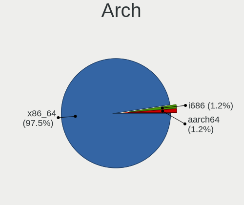
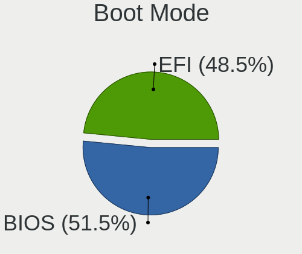
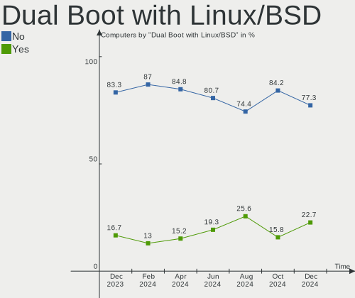
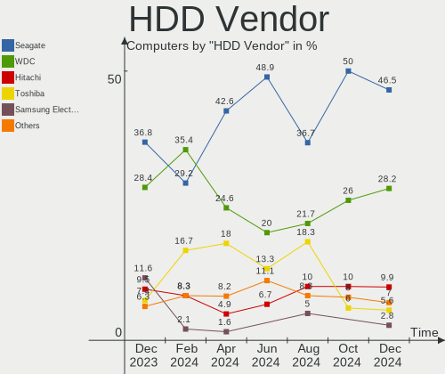
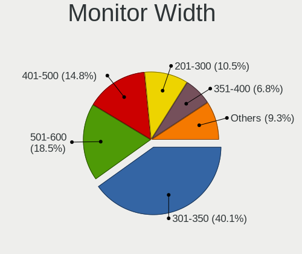
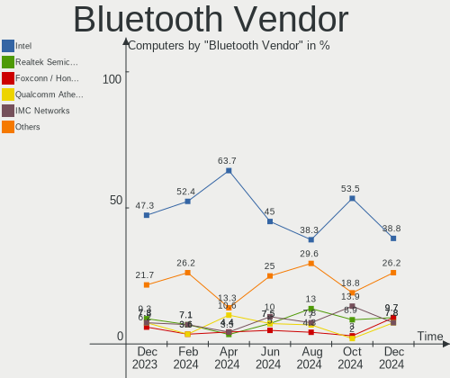
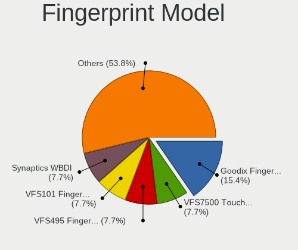

Linux in Poland - Hardware Trends
---------------------------------

A project to identify most popular hardware characteristics and track their change
over time based on data collected by Linux users at https://Linux-Hardware.org.

Anyone can contribute to this report by the [hw-probe](https://github.com/linuxhw/hw-probe) tool:

    sudo -E hw-probe -all -upload

This is a report for all computer types. See also reports for [desktops](/Location/Poland/Desktop/README.md) and [notebooks](/Location/Poland/Notebook/README.md).

Contents
--------

* [ System ](#system)
  - [ OS                       ](#os)
  - [ OS Family                ](#os-family)
  - [ Kernel                   ](#kernel)
  - [ Kernel Family            ](#kernel-family)
  - [ Kernel Major Ver.        ](#kernel-major-ver)
  - [ Arch                     ](#arch)
  - [ DE                       ](#de)
  - [ Display Server           ](#display-server)
  - [ Display Manager          ](#display-manager)
  - [ OS Lang                  ](#os-lang)
  - [ Boot Mode                ](#boot-mode)
  - [ Filesystem               ](#filesystem)
  - [ Part. scheme             ](#part-scheme)
  - [ Dual Boot with Linux/BSD ](#dual-boot-with-linuxbsd)
  - [ Dual Boot (Win)          ](#dual-boot-win)

* [ Board ](#board)
  - [ Vendor                   ](#vendor)
  - [ Model                    ](#model)
  - [ Model Family             ](#model-family)
  - [ MFG Year                 ](#mfg-year)
  - [ Form Factor              ](#form-factor)
  - [ Secure Boot              ](#secure-boot)
  - [ Coreboot                 ](#coreboot)
  - [ RAM Size                 ](#ram-size)
  - [ RAM Used                 ](#ram-used)
  - [ Total Drives             ](#total-drives)
  - [ Has CD-ROM               ](#has-cd-rom)
  - [ Has Ethernet             ](#has-ethernet)
  - [ Has WiFi                 ](#has-wifi)
  - [ Has Bluetooth            ](#has-bluetooth)

* [ Location ](#location)
  - [ Country                  ](#country)
  - [ City                     ](#city)

* [ Drives ](#drives)
  - [ Drive Vendor             ](#drive-vendor)
  - [ Drive Model              ](#drive-model)
  - [ HDD Vendor               ](#hdd-vendor)
  - [ SSD Vendor               ](#ssd-vendor)
  - [ Drive Kind               ](#drive-kind)
  - [ Drive Connector          ](#drive-connector)
  - [ Drive Size               ](#drive-size)
  - [ Space Total              ](#space-total)
  - [ Space Used               ](#space-used)
  - [ Malfunc. Drives          ](#malfunc-drives)
  - [ Malfunc. Drive Vendor    ](#malfunc-drive-vendor)
  - [ Malfunc. HDD Vendor      ](#malfunc-hdd-vendor)
  - [ Malfunc. Drive Kind      ](#malfunc-drive-kind)
  - [ Failed Drives            ](#failed-drives)
  - [ Failed Drive Vendor      ](#failed-drive-vendor)
  - [ Drive Status             ](#drive-status)

* [ Storage controller ](#storage-controller)
  - [ Storage Vendor           ](#storage-vendor)
  - [ Storage Model            ](#storage-model)
  - [ Storage Kind             ](#storage-kind)

* [ Processor ](#processor)
  - [ CPU Vendor               ](#cpu-vendor)
  - [ CPU Model                ](#cpu-model)
  - [ CPU Model Family         ](#cpu-model-family)
  - [ CPU Cores                ](#cpu-cores)
  - [ CPU Sockets              ](#cpu-sockets)
  - [ CPU Threads              ](#cpu-threads)
  - [ CPU Op-Modes             ](#cpu-op-modes)
  - [ CPU Microcode            ](#cpu-microcode)
  - [ CPU Microarch            ](#cpu-microarch)

* [ Graphics ](#graphics)
  - [ GPU Vendor               ](#gpu-vendor)
  - [ GPU Model                ](#gpu-model)
  - [ GPU Combo                ](#gpu-combo)
  - [ GPU Driver               ](#gpu-driver)
  - [ GPU Memory               ](#gpu-memory)

* [ Monitor ](#monitor)
  - [ Monitor Vendor           ](#monitor-vendor)
  - [ Monitor Model            ](#monitor-model)
  - [ Monitor Resolution       ](#monitor-resolution)
  - [ Monitor Diagonal         ](#monitor-diagonal)
  - [ Monitor Width            ](#monitor-width)
  - [ Aspect Ratio             ](#aspect-ratio)
  - [ Monitor Area             ](#monitor-area)
  - [ Pixel Density            ](#pixel-density)
  - [ Multiple Monitors        ](#multiple-monitors)

* [ Network ](#network)
  - [ Net Controller Vendor    ](#net-controller-vendor)
  - [ Net Controller Model     ](#net-controller-model)
  - [ Wireless Vendor          ](#wireless-vendor)
  - [ Wireless Model           ](#wireless-model)
  - [ Ethernet Vendor          ](#ethernet-vendor)
  - [ Ethernet Model           ](#ethernet-model)
  - [ Net Controller Kind      ](#net-controller-kind)
  - [ Used Controller          ](#used-controller)
  - [ NICs                     ](#nics)
  - [ IPv6                     ](#ipv6)

* [ Bluetooth ](#bluetooth)
  - [ Bluetooth Vendor         ](#bluetooth-vendor)
  - [ Bluetooth Model          ](#bluetooth-model)

* [ Sound ](#sound)
  - [ Sound Vendor             ](#sound-vendor)
  - [ Sound Model              ](#sound-model)

* [ Memory ](#memory)
  - [ Memory Vendor            ](#memory-vendor)
  - [ Memory Model             ](#memory-model)
  - [ Memory Kind              ](#memory-kind)
  - [ Memory Form Factor       ](#memory-form-factor)
  - [ Memory Size              ](#memory-size)
  - [ Memory Speed             ](#memory-speed)

* [ Printers & scanners ](#printers--scanners)
  - [ Printer Vendor           ](#printer-vendor)
  - [ Printer Model            ](#printer-model)
  - [ Scanner Vendor           ](#scanner-vendor)
  - [ Scanner Model            ](#scanner-model)

* [ Camera ](#camera)
  - [ Camera Vendor            ](#camera-vendor)
  - [ Camera Model             ](#camera-model)

* [ Security ](#security)
  - [ Fingerprint Vendor       ](#fingerprint-vendor)
  - [ Fingerprint Model        ](#fingerprint-model)
  - [ Chipcard Vendor          ](#chipcard-vendor)
  - [ Chipcard Model           ](#chipcard-model)

* [ Unsupported ](#unsupported)
  - [ Unsupported Devices      ](#unsupported-devices)
  - [ Unsupported Device Types ](#unsupported-device-types)

System
------

OS
--

Installed operating systems

| Name                         | Computers | Percent |
|------------------------------|-----------|---------|
| Ubuntu 22.04                 | 21        | 14.79%  |
| Ubuntu 20.04                 | 14        | 9.86%   |
| OpenMandriva 4.3             | 11        | 7.75%   |
| Linux Mint 20.3              | 10        | 7.04%   |
| OpenMandriva 4.2             | 6         | 4.23%   |
| Fedora 36                    | 6         | 4.23%   |
| Debian 11                    | 6         | 4.23%   |
| Zorin 16                     | 5         | 3.52%   |
| ROSA 12.2                    | 5         | 3.52%   |
| Pop!_OS 22.04                | 5         | 3.52%   |
| Arch Rolling                 | 5         | 3.52%   |
| Manjaro 21.2.6               | 4         | 2.82%   |
| Arch                         | 4         | 2.82%   |
| openSUSE Tumbleweed-XXXXXXXX | 3         | 2.11%   |
| Manjaro                      | 3         | 2.11%   |
| Gentoo 2.7                   | 3         | 2.11%   |
| Xubuntu 20.04                | 2         | 1.41%   |
| Lubuntu 22.04                | 2         | 1.41%   |
| Linux Mint 20.1              | 2         | 1.41%   |
| Linux Lite 5.8               | 2         | 1.41%   |
| Kali 2022.2                  | 2         | 1.41%   |
| Gentoo 2.6                   | 2         | 1.41%   |
| Xero Rolling                 | 1         | 0.7%    |
| Void Linux Rolling           | 1         | 0.7%    |
| Ubuntu Budgie 21.10          | 1         | 0.7%    |
| Ubuntu 18.04                 | 1         | 0.7%    |
| Ubuntu 16.04                 | 1         | 0.7%    |
| Rocky Linux 8.6              | 1         | 0.7%    |
| Raspbian 11                  | 1         | 0.7%    |
| MX 21                        | 1         | 0.7%    |
| Mabox 22.04                  | 1         | 0.7%    |
| Kubuntu 22.04                | 1         | 0.7%    |
| KDE neon 20.04               | 1         | 0.7%    |
| Gentoo 2.8                   | 1         | 0.7%    |
| Gentoo 2.3                   | 1         | 0.7%    |
| Garuda Linux                 | 1         | 0.7%    |
| Endless 4.0.6                | 1         | 0.7%    |
| Elementary 6.1               | 1         | 0.7%    |
| Debian 10                    | 1         | 0.7%    |
| BlackPanther 18.1            | 1         | 0.7%    |
| ArcoLinux                    | 1         | 0.7%    |

OS Family
---------

OS without a version

| Name          | Computers | Percent |
|---------------|-----------|---------|
| Ubuntu        | 37        | 26.06%  |
| OpenMandriva  | 17        | 11.97%  |
| Linux Mint    | 12        | 8.45%   |
| Arch          | 9         | 6.34%   |
| Manjaro       | 7         | 4.93%   |
| Gentoo        | 7         | 4.93%   |
| Debian        | 7         | 4.93%   |
| Fedora        | 6         | 4.23%   |
| Zorin         | 5         | 3.52%   |
| ROSA          | 5         | 3.52%   |
| Pop!_OS       | 5         | 3.52%   |
| openSUSE      | 3         | 2.11%   |
| Xubuntu       | 2         | 1.41%   |
| Lubuntu       | 2         | 1.41%   |
| Linux Lite    | 2         | 1.41%   |
| Kali          | 2         | 1.41%   |
| Xero          | 1         | 0.7%    |
| Void Linux    | 1         | 0.7%    |
| Ubuntu Budgie | 1         | 0.7%    |
| Rocky Linux   | 1         | 0.7%    |
| Raspbian      | 1         | 0.7%    |
| MX            | 1         | 0.7%    |
| Mabox         | 1         | 0.7%    |
| Kubuntu       | 1         | 0.7%    |
| KDE neon      | 1         | 0.7%    |
| Garuda Linux  | 1         | 0.7%    |
| Endless       | 1         | 0.7%    |
| Elementary    | 1         | 0.7%    |
| BlackPanther  | 1         | 0.7%    |
| ArcoLinux     | 1         | 0.7%    |

Kernel
------

Version of the Linux kernel

| Version                                    | Computers | Percent |
|--------------------------------------------|-----------|---------|
| 5.16.7-desktop-1omv4003                    | 11        | 7.75%   |
| 5.15.0-27-generic                          | 10        | 7.04%   |
| 5.13.0-40-generic                          | 7         | 4.93%   |
| 5.4.0-109-generic                          | 6         | 4.23%   |
| 5.17.5-arch1-1                             | 6         | 4.23%   |
| 5.15.0-25-generic                          | 6         | 4.23%   |
| 5.15.32-gentoo-r1                          | 4         | 2.82%   |
| 5.13.0-44-generic                          | 4         | 2.82%   |
| 5.10.74-generic-2rosa2021.1-x86_64         | 4         | 2.82%   |
| 5.10.14-desktop-1omv4002                   | 4         | 2.82%   |
| 5.10.0-14-amd64                            | 4         | 2.82%   |
| 5.17.9-arch1-1                             | 3         | 2.11%   |
| 5.17.7-300.fc36.x86_64                     | 3         | 2.11%   |
| 5.17.5-76051705-generic                    | 3         | 2.11%   |
| 5.17.4-1-default                           | 3         | 2.11%   |
| 5.15.0-30-generic                          | 3         | 2.11%   |
| 5.11.0-27-generic                          | 3         | 2.11%   |
| 5.4.0-113-generic                          | 2         | 1.41%   |
| 5.17.6-1-MANJARO                           | 2         | 1.41%   |
| 5.16.19-76051619-generic                   | 2         | 1.41%   |
| 5.15.32-1-MANJARO                          | 2         | 1.41%   |
| 5.15.0-33-generic                          | 2         | 1.41%   |
| 5.13.0-41-generic                          | 2         | 1.41%   |
| 5.13.0-39-generic                          | 2         | 1.41%   |
| 5.11.12-desktop-1omv4002                   | 2         | 1.41%   |
| 5.4.188-1-MANJARO                          | 1         | 0.7%    |
| 5.4.0-91-generic                           | 1         | 0.7%    |
| 5.4.0-81-generic                           | 1         | 0.7%    |
| 5.4.0-60-generic                           | 1         | 0.7%    |
| 5.4.0-110-generic                          | 1         | 0.7%    |
| 5.4.0-107-generic                          | 1         | 0.7%    |
| 5.4.0-104-generic                          | 1         | 0.7%    |
| 5.4.0-100-generic                          | 1         | 0.7%    |
| 5.18.0-051800rc1-generic                   | 1         | 0.7%    |
| 5.17.9-zen1-1-zen                          | 1         | 0.7%    |
| 5.17.9-300.fc36.x86_64                     | 1         | 0.7%    |
| 5.17.9-051709-generic                      | 1         | 0.7%    |
| 5.17.7-arch1-1                             | 1         | 0.7%    |
| 5.17.5-arch1-2                             | 1         | 0.7%    |
| 5.17.5-301.fsync.fc36.x86_64               | 1         | 0.7%    |
| 5.17.11.xm1-1.klp-xanmod-rosa2021.1-x86_64 | 1         | 0.7%    |
| 5.17.11-300.fc36.x86_64                    | 1         | 0.7%    |
| 5.17.1-gentoo-r1                           | 1         | 0.7%    |
| 5.17.1-3-rt17-MANJARO                      | 1         | 0.7%    |
| 5.17.0-kali2-amd64                         | 1         | 0.7%    |
| 5.17.0-051700-generic                      | 1         | 0.7%    |
| 5.16.0-kali7-amd64                         | 1         | 0.7%    |
| 5.16.0-6mx-amd64                           | 1         | 0.7%    |
| 5.15.41-1-MANJARO                          | 1         | 0.7%    |
| 5.15.32-v8                                 | 1         | 0.7%    |
| 5.15.32+                                   | 1         | 0.7%    |
| 5.15.19_1                                  | 1         | 0.7%    |
| 5.15.0-30-lowlatency                       | 1         | 0.7%    |
| 5.13.0-30-generic                          | 1         | 0.7%    |
| 5.13.0-28-generic                          | 1         | 0.7%    |
| 5.13.0-27-generic                          | 1         | 0.7%    |
| 5.11.0-38-generic                          | 1         | 0.7%    |
| 5.11.0-35-generic                          | 1         | 0.7%    |
| 5.10.109-1-MANJARO                         | 1         | 0.7%    |
| 5.10.0-13-amd64                            | 1         | 0.7%    |

Kernel Family
-------------

Linux kernel without a distro release

| Version  | Computers | Percent |
|----------|-----------|---------|
| 5.15.0   | 22        | 15.49%  |
| 5.13.0   | 18        | 12.68%  |
| 5.4.0    | 15        | 10.56%  |
| 5.17.5   | 11        | 7.75%   |
| 5.16.7   | 11        | 7.75%   |
| 5.15.32  | 8         | 5.63%   |
| 5.17.9   | 6         | 4.23%   |
| 5.10.0   | 6         | 4.23%   |
| 5.11.0   | 5         | 3.52%   |
| 5.17.7   | 4         | 2.82%   |
| 5.10.74  | 4         | 2.82%   |
| 5.10.14  | 4         | 2.82%   |
| 5.17.4   | 3         | 2.11%   |
| 5.17.6   | 2         | 1.41%   |
| 5.17.11  | 2         | 1.41%   |
| 5.17.1   | 2         | 1.41%   |
| 5.17.0   | 2         | 1.41%   |
| 5.16.19  | 2         | 1.41%   |
| 5.16.0   | 2         | 1.41%   |
| 5.11.12  | 2         | 1.41%   |
| 5.4.188  | 1         | 0.7%    |
| 5.18.0   | 1         | 0.7%    |
| 5.15.41  | 1         | 0.7%    |
| 5.15.19  | 1         | 0.7%    |
| 5.10.109 | 1         | 0.7%    |
| 4.9.16   | 1         | 0.7%    |
| 4.19.219 | 1         | 0.7%    |
| 4.19.0   | 1         | 0.7%    |
| 4.18.16  | 1         | 0.7%    |
| 4.18.0   | 1         | 0.7%    |
| 4.10.0   | 1         | 0.7%    |

Kernel Major Ver.
-----------------

Linux kernel major version

| Version | Computers | Percent |
|---------|-----------|---------|
| 5.17    | 32        | 22.54%  |
| 5.15    | 32        | 22.54%  |
| 5.13    | 18        | 12.68%  |
| 5.4     | 16        | 11.27%  |
| 5.16    | 15        | 10.56%  |
| 5.10    | 15        | 10.56%  |
| 5.11    | 7         | 4.93%   |
| 4.19    | 2         | 1.41%   |
| 4.18    | 2         | 1.41%   |
| 5.18    | 1         | 0.7%    |
| 4.9     | 1         | 0.7%    |
| 4.10    | 1         | 0.7%    |

Arch
----

OS architecture (x86_64, i586, etc.)

| Name    | Computers | Percent |
|---------|-----------|---------|
| x86_64  | 137       | 96.48%  |
| aarch64 | 2         | 1.41%   |
| ppc     | 1         | 0.7%    |
| i686    | 1         | 0.7%    |
| armv6l  | 1         | 0.7%    |

DE
--

Desktop Environment

| Name       | Computers | Percent |
|------------|-----------|---------|
| GNOME      | 60        | 42.25%  |
| KDE5       | 38        | 26.76%  |
| XFCE       | 13        | 9.15%   |
| Unknown    | 9         | 6.34%   |
| X-Cinnamon | 6         | 4.23%   |
| MATE       | 5         | 3.52%   |
| LXQt       | 4         | 2.82%   |
| Cinnamon   | 3         | 2.11%   |
| Pantheon   | 1         | 0.7%    |
| openbox    | 1         | 0.7%    |
| i3         | 1         | 0.7%    |
| Budgie     | 1         | 0.7%    |

Display Server
--------------

X11 or Wayland

| Name    | Computers | Percent |
|---------|-----------|---------|
| X11     | 103       | 72.54%  |
| Wayland | 30        | 21.13%  |
| Tty     | 5         | 3.52%   |
| Unknown | 4         | 2.82%   |

Display Manager
---------------

SDDM, LightDM, etc.

| Name    | Computers | Percent |
|---------|-----------|---------|
| Unknown | 41        | 28.87%  |
| SDDM    | 31        | 21.83%  |
| GDM3    | 29        | 20.42%  |
| LightDM | 26        | 18.31%  |
| GDM     | 15        | 10.56%  |

OS Lang
-------

Language

| Lang    | Computers | Percent |
|---------|-----------|---------|
| pl_PL   | 74        | 52.11%  |
| en_US   | 52        | 36.62%  |
| en_GB   | 7         | 4.93%   |
| C       | 4         | 2.82%   |
| Unknown | 2         | 1.41%   |
| szl_PL  | 1         | 0.7%    |
| ru_RU   | 1         | 0.7%    |
| es_ES   | 1         | 0.7%    |

Boot Mode
---------

EFI or BIOS

| Mode | Computers | Percent |
|------|-----------|---------|
| BIOS | 79        | 55.63%  |
| EFI  | 63        | 44.37%  |

Filesystem
----------

Type of filesystem

| Type    | Computers | Percent |
|---------|-----------|---------|
| Ext4    | 98        | 69.01%  |
| Overlay | 23        | 16.2%   |
| Btrfs   | 14        | 9.86%   |
| F2fs    | 5         | 3.52%   |
| Zfs     | 2         | 1.41%   |

Part. scheme
------------

Scheme of partitioning

| Type    | Computers | Percent |
|---------|-----------|---------|
| Unknown | 58        | 40.85%  |
| GPT     | 57        | 40.14%  |
| MBR     | 27        | 19.01%  |

Dual Boot with Linux/BSD
------------------------

Hosting more than one Linux/BSD

| Dual boot | Computers | Percent |
|-----------|-----------|---------|
| No        | 116       | 81.69%  |
| Yes       | 26        | 18.31%  |

Dual Boot (Win)
---------------

Hosting Linux and Windows

| Dual boot | Computers | Percent |
|-----------|-----------|---------|
| No        | 101       | 71.13%  |
| Yes       | 41        | 28.87%  |

Board
-----

Vendor
------

Motherboard manufacturer

| Name                    | Computers | Percent |
|-------------------------|-----------|---------|
| Dell                    | 29        | 20.42%  |
| Hewlett-Packard         | 27        | 19.01%  |
| Lenovo                  | 19        | 13.38%  |
| ASUSTek Computer        | 18        | 12.68%  |
| Gigabyte Technology     | 10        | 7.04%   |
| MSI                     | 7         | 4.93%   |
| Fujitsu                 | 5         | 3.52%   |
| ASRock                  | 5         | 3.52%   |
| Acer                    | 4         | 2.82%   |
| Sony                    | 3         | 2.11%   |
| Samsung Electronics     | 3         | 2.11%   |
| Toshiba                 | 2         | 1.41%   |
| Raspberry Pi Foundation | 2         | 1.41%   |
| Apple                   | 2         | 1.41%   |
| Packard Bell            | 1         | 0.7%    |
| HUAWEI                  | 1         | 0.7%    |
| Huanan                  | 1         | 0.7%    |
| Hardkernel              | 1         | 0.7%    |
| Google                  | 1         | 0.7%    |
| Unknown                 | 1         | 0.7%    |

Model
-----

Motherboard model

| Name                                       | Computers | Percent |
|--------------------------------------------|-----------|---------|
| Dell Inspiron 3451                         | 4         | 2.82%   |
| HP Compaq 8200 Elite SFF PC                | 3         | 2.11%   |
| Samsung 350V5C/351V5C/3540VC/3440VC        | 2         | 1.41%   |
| MSI MS-7235                                | 2         | 1.41%   |
| HP 250 G8 Notebook PC                      | 2         | 1.41%   |
| Gigabyte Z97M-DS3H                         | 2         | 1.41%   |
| Fujitsu PRIMERGY TX150 S7                  | 2         | 1.41%   |
| Fujitsu CELSIUS R570-2                     | 2         | 1.41%   |
| Dell Precision WorkStation 690             | 2         | 1.41%   |
| Dell PowerEdge T310                        | 2         | 1.41%   |
| Dell OptiPlex 790                          | 2         | 1.41%   |
| Dell MXG061                                | 2         | 1.41%   |
| ASUS TUF Gaming X570-PLUS                  | 2         | 1.41%   |
| ASUS P8Z77-V LX                            | 2         | 1.41%   |
| Toshiba Satellite L750D                    | 1         | 0.7%    |
| Toshiba Satellite C55t-C                   | 1         | 0.7%    |
| Sony VPCEE3S1E                             | 1         | 0.7%    |
| Sony VGN-NR32L_S                           | 1         | 0.7%    |
| Sony VGN-FW51MF_H                          | 1         | 0.7%    |
| Samsung 300V3A/300V4A/300V5A/200A4B/200A5B | 1         | 0.7%    |
| RPi Raspberry Pi Zero W Rev 1.1            | 1         | 0.7%    |
| RPi Raspberry Pi                           | 1         | 0.7%    |
| Packard Bell EasyNote ENTF71BM             | 1         | 0.7%    |
| MSI MS-7C52                                | 1         | 0.7%    |
| MSI MS-7C02                                | 1         | 0.7%    |
| MSI MS-7B86                                | 1         | 0.7%    |
| MSI MS-7918                                | 1         | 0.7%    |
| MSI GP76 Leopard 10UE                      | 1         | 0.7%    |
| Lenovo Z50-70 20354                        | 1         | 0.7%    |
| Lenovo Yoga Slim 9 14ITL5 82D1             | 1         | 0.7%    |
| Lenovo Yoga 300-11IBY 80M0                 | 1         | 0.7%    |
| Lenovo V15-IIL 82C5                        | 1         | 0.7%    |
| Lenovo ThinkPad X200 7458WAY               | 1         | 0.7%    |
| Lenovo ThinkPad X1 Carbon Gen 8 20U90046PB | 1         | 0.7%    |
| Lenovo ThinkPad T61 7661BM5                | 1         | 0.7%    |
| Lenovo ThinkPad T500 2241W2B               | 1         | 0.7%    |
| Lenovo ThinkPad T470 W10DG 20JNS0GH0C      | 1         | 0.7%    |
| Lenovo ThinkPad T430 2349AK5               | 1         | 0.7%    |
| Lenovo ThinkPad T14 Gen 1 20UD003RPB       | 1         | 0.7%    |
| Lenovo ThinkPad Edge E430 3254A8G          | 1         | 0.7%    |
| Lenovo IdeaPad Z500 20202                  | 1         | 0.7%    |
| Lenovo IdeaPad S540-15IWL GTX 81SW         | 1         | 0.7%    |
| Lenovo IdeaPad S540-14API 81NH             | 1         | 0.7%    |
| Lenovo IdeaPad 3 15ITL6 82H8               | 1         | 0.7%    |
| Lenovo IdeaPad 100-15IBY 80MJ              | 1         | 0.7%    |
| Lenovo G510 20238                          | 1         | 0.7%    |
| Lenovo G50-70 20351                        | 1         | 0.7%    |
| HUAWEI NBLK-WAX9X                          | 1         | 0.7%    |
| Huanan X99-F8 NALEX                        | 1         | 0.7%    |
| HP Z400 Workstation                        | 1         | 0.7%    |
| HP t630 Thin Client                        | 1         | 0.7%    |
| HP Spectre x360 Convertible 13-aw0xxx      | 1         | 0.7%    |
| HP ProBook 6475b                           | 1         | 0.7%    |
| HP ProBook 4530s                           | 1         | 0.7%    |
| HP Pavilion ZV6100 (EE984EA#ABZ)           | 1         | 0.7%    |
| HP Pavilion Laptop 15-eg0xxx               | 1         | 0.7%    |
| HP Pavilion Laptop 14-dv0xxx               | 1         | 0.7%    |
| HP Pavilion 15                             | 1         | 0.7%    |
| HP OMEN Laptop 15-en0xxx                   | 1         | 0.7%    |
| HP OMEN by Laptop 16-c0xxx                 | 1         | 0.7%    |

Model Family
------------

Motherboard model prefix

| Name                    | Computers | Percent |
|-------------------------|-----------|---------|
| Lenovo ThinkPad         | 8         | 5.63%   |
| Dell Inspiron           | 8         | 5.63%   |
| HP EliteBook            | 7         | 4.93%   |
| Dell Latitude           | 7         | 4.93%   |
| Lenovo IdeaPad          | 5         | 3.52%   |
| Dell Precision          | 5         | 3.52%   |
| HP Pavilion             | 4         | 2.82%   |
| HP Compaq               | 4         | 2.82%   |
| ASUS TUF                | 4         | 2.82%   |
| HP 250                  | 3         | 2.11%   |
| Dell PowerEdge          | 3         | 2.11%   |
| Dell OptiPlex           | 3         | 2.11%   |
| ASUS ASUS               | 3         | 2.11%   |
| Toshiba Satellite       | 2         | 1.41%   |
| Samsung 350V5C          | 2         | 1.41%   |
| RPi Raspberry           | 2         | 1.41%   |
| MSI MS-7235             | 2         | 1.41%   |
| Lenovo Yoga             | 2         | 1.41%   |
| HP ProBook              | 2         | 1.41%   |
| HP OMEN                 | 2         | 1.41%   |
| Gigabyte Z97M-DS3H      | 2         | 1.41%   |
| Gigabyte B550           | 2         | 1.41%   |
| Fujitsu PRIMERGY        | 2         | 1.41%   |
| Fujitsu CELSIUS         | 2         | 1.41%   |
| Dell MXG061             | 2         | 1.41%   |
| ASUS P8Z77-V            | 2         | 1.41%   |
| Acer Aspire             | 2         | 1.41%   |
| Sony VPCEE3S1E          | 1         | 0.7%    |
| Sony VGN-NR32L          | 1         | 0.7%    |
| Sony VGN-FW51MF         | 1         | 0.7%    |
| Samsung 300V3A          | 1         | 0.7%    |
| Packard Bell EasyNote   | 1         | 0.7%    |
| MSI MS-7C52             | 1         | 0.7%    |
| MSI MS-7C02             | 1         | 0.7%    |
| MSI MS-7B86             | 1         | 0.7%    |
| MSI MS-7918             | 1         | 0.7%    |
| MSI GP76                | 1         | 0.7%    |
| Lenovo Z50-70           | 1         | 0.7%    |
| Lenovo V15-IIL          | 1         | 0.7%    |
| Lenovo G510             | 1         | 0.7%    |
| Lenovo G50-70           | 1         | 0.7%    |
| HUAWEI NBLK-WAX9X       | 1         | 0.7%    |
| Huanan X99-F8           | 1         | 0.7%    |
| HP Z400                 | 1         | 0.7%    |
| HP t630                 | 1         | 0.7%    |
| HP Spectre              | 1         | 0.7%    |
| HP ENVY                 | 1         | 0.7%    |
| HP EliteDesk            | 1         | 0.7%    |
| Hardkernel ODROID-M1    | 1         | 0.7%    |
| Google Relm             | 1         | 0.7%    |
| Gigabyte X99-UD4-CF     | 1         | 0.7%    |
| Gigabyte H310M          | 1         | 0.7%    |
| Gigabyte GA-MA780G-UD3H | 1         | 0.7%    |
| Gigabyte EP45C-DS3R     | 1         | 0.7%    |
| Gigabyte B85M-D2V       | 1         | 0.7%    |
| Gigabyte AB350-Gaming   | 1         | 0.7%    |
| Fujitsu LIFEBOOK        | 1         | 0.7%    |
| Dell Vostro             | 1         | 0.7%    |
| ASUS X705UAP            | 1         | 0.7%    |
| ASUS X580VD             | 1         | 0.7%    |

MFG Year
--------

Motherboard manufacture year

| Year    | Computers | Percent |
|---------|-----------|---------|
| 2020    | 16        | 11.27%  |
| 2011    | 14        | 9.86%   |
| 2014    | 13        | 9.15%   |
| 2013    | 13        | 9.15%   |
| 2019    | 12        | 8.45%   |
| 2012    | 12        | 8.45%   |
| 2021    | 10        | 7.04%   |
| 2017    | 9         | 6.34%   |
| 2010    | 9         | 6.34%   |
| 2015    | 6         | 4.23%   |
| 2008    | 6         | 4.23%   |
| 2006    | 5         | 3.52%   |
| 2018    | 4         | 2.82%   |
| 2007    | 4         | 2.82%   |
| Unknown | 4         | 2.82%   |
| 2016    | 2         | 1.41%   |
| 2009    | 2         | 1.41%   |
| 2022    | 1         | 0.7%    |

Form Factor
-----------

Physical design of the computer

| Name           | Computers | Percent |
|----------------|-----------|---------|
| Notebook       | 84        | 59.15%  |
| Desktop        | 48        | 33.8%   |
| Server         | 4         | 2.82%   |
| System on chip | 3         | 2.11%   |
| Convertible    | 2         | 1.41%   |
| Mini pc        | 1         | 0.7%    |

Secure Boot
-----------

Enabled or disabled

| State    | Computers | Percent |
|----------|-----------|---------|
| Disabled | 133       | 93.66%  |
| Enabled  | 9         | 6.34%   |

Coreboot
--------

Have coreboot on board

| Used | Computers | Percent |
|------|-----------|---------|
| No   | 140       | 98.59%  |
| Yes  | 2         | 1.41%   |

RAM Size
--------

Total RAM memory

| Size in GB | Computers | Percent |
|------------|-----------|---------|
| 4.01-8.0   | 41        | 28.87%  |
| 3.01-4.0   | 32        | 22.54%  |
| 32.01-64.0 | 22        | 15.49%  |
| 16.01-24.0 | 22        | 15.49%  |
| 8.01-16.0  | 16        | 11.27%  |
| 2.01-3.0   | 4         | 2.82%   |
| 24.01-32.0 | 2         | 1.41%   |
| 1.01-2.0   | 1         | 0.7%    |
| 0.51-1.0   | 1         | 0.7%    |
| 0.01-0.5   | 1         | 0.7%    |

RAM Used
--------

Used RAM memory

| Used GB   | Computers | Percent |
|-----------|-----------|---------|
| 1.01-2.0  | 44        | 30.99%  |
| 2.01-3.0  | 35        | 24.65%  |
| 4.01-8.0  | 19        | 13.38%  |
| 3.01-4.0  | 19        | 13.38%  |
| 0.51-1.0  | 14        | 9.86%   |
| 8.01-16.0 | 6         | 4.23%   |
| 0.01-0.5  | 5         | 3.52%   |

Total Drives
------------

Number of drives on board

| Drives | Computers | Percent |
|--------|-----------|---------|
| 1      | 87        | 61.27%  |
| 2      | 28        | 19.72%  |
| 3      | 13        | 9.15%   |
| 0      | 7         | 4.93%   |
| 4      | 5         | 3.52%   |
| 6      | 1         | 0.7%    |
| 5      | 1         | 0.7%    |

Has CD-ROM
----------

Has CD-ROM on board

| Presented | Computers | Percent |
|-----------|-----------|---------|
| No        | 81        | 57.04%  |
| Yes       | 61        | 42.96%  |

Has Ethernet
------------

Has Ethernet on board

| Presented | Computers | Percent |
|-----------|-----------|---------|
| Yes       | 126       | 88.73%  |
| No        | 16        | 11.27%  |

Has WiFi
--------

Has WiFi module

| Presented | Computers | Percent |
|-----------|-----------|---------|
| Yes       | 97        | 68.31%  |
| No        | 45        | 31.69%  |

Has Bluetooth
-------------

Has Bluetooth module

| Presented | Computers | Percent |
|-----------|-----------|---------|
| Yes       | 84        | 59.15%  |
| No        | 58        | 40.85%  |

Location
--------

Country
-------

Geographic location (country)

| Country | Computers | Percent |
|---------|-----------|---------|
| Poland  | 142       | 100%    |

City
----

Geographic location (city)

| City                   | Computers | Percent |
|------------------------|-----------|---------|
| Warsaw                 | 29        | 20.42%  |
| Wroclaw                | 11        | 7.75%   |
| Krakow                 | 11        | 7.75%   |
| Poznan                 | 9         | 6.34%   |
| Gdansk                 | 9         | 6.34%   |
| Debica                 | 7         | 4.93%   |
| Torun                  | 3         | 2.11%   |
| Pabianice              | 3         | 2.11%   |
| Katowice               | 3         | 2.11%   |
| Cieszyn                | 3         | 2.11%   |
| Reda                   | 2         | 1.41%   |
| Przeclaw               | 2         | 1.41%   |
| Ostrzeszow             | 2         | 1.41%   |
| Lublin                 | 2         | 1.41%   |
| Ciechocinek            | 2         | 1.41%   |
| Chorzów               | 2         | 1.41%   |
| Żyrardów             | 1         | 0.7%    |
| Zabrze                 | 1         | 0.7%    |
| Wyszeborz              | 1         | 0.7%    |
| Wołomin               | 1         | 0.7%    |
| Wilkszyn               | 1         | 0.7%    |
| Ustka                  | 1         | 0.7%    |
| Unieszewo              | 1         | 0.7%    |
| Tczew                  | 1         | 0.7%    |
| Szaflary               | 1         | 0.7%    |
| Świnoujście          | 1         | 0.7%    |
| Skrzyszow              | 1         | 0.7%    |
| Siemianowice Śląskie | 1         | 0.7%    |
| Rumia                  | 1         | 0.7%    |
| Ruda Śląska          | 1         | 0.7%    |
| Puszczykowo            | 1         | 0.7%    |
| Piekary Slaskie        | 1         | 0.7%    |
| Otwock                 | 1         | 0.7%    |
| Orzesze                | 1         | 0.7%    |
| Nowy Sącz             | 1         | 0.7%    |
| Mszana Dolna           | 1         | 0.7%    |
| Mogilno                | 1         | 0.7%    |
| Miedzyrzecze Dolne     | 1         | 0.7%    |
| Lodz                   | 1         | 0.7%    |
| Libiaz                 | 1         | 0.7%    |
| Legnica                | 1         | 0.7%    |
| Laziska Gorne          | 1         | 0.7%    |
| Krapkowice             | 1         | 0.7%    |
| Kołobrzeg             | 1         | 0.7%    |
| Konin                  | 1         | 0.7%    |
| Kielce                 | 1         | 0.7%    |
| Jozefoslaw             | 1         | 0.7%    |
| Gumniska               | 1         | 0.7%    |
| Gorzów Wielkopolski   | 1         | 0.7%    |
| Gora Kalwaria          | 1         | 0.7%    |
| Dąbrowa Górnicza     | 1         | 0.7%    |
| Częstochowa           | 1         | 0.7%    |
| Chybie                 | 1         | 0.7%    |
| Chełmża              | 1         | 0.7%    |
| Biskupice              | 1         | 0.7%    |
| Bialystok              | 1         | 0.7%    |
| Besko                  | 1         | 0.7%    |
| Baczków               | 1         | 0.7%    |

Drives
------

Drive Vendor
------------

Hard drive vendors

| Vendor                    | Computers | Drives | Percent |
|---------------------------|-----------|--------|---------|
| Seagate                   | 34        | 36     | 17.26%  |
| Samsung Electronics       | 31        | 33     | 15.74%  |
| WDC                       | 15        | 18     | 7.61%   |
| Toshiba                   | 13        | 15     | 6.6%    |
| GOODRAM                   | 13        | 14     | 6.6%    |
| SanDisk                   | 11        | 11     | 5.58%   |
| Crucial                   | 10        | 11     | 5.08%   |
| Unknown                   | 9         | 10     | 4.57%   |
| Hitachi                   | 7         | 9      | 3.55%   |
| A-DATA Technology         | 6         | 6      | 3.05%   |
| Intel                     | 5         | 5      | 2.54%   |
| SPCC                      | 4         | 4      | 2.03%   |
| SK Hynix                  | 4         | 5      | 2.03%   |
| Patriot                   | 4         | 4      | 2.03%   |
| Kingston                  | 4         | 4      | 2.03%   |
| Micron Technology         | 3         | 3      | 1.52%   |
| HGST                      | 3         | 3      | 1.52%   |
| Team                      | 2         | 2      | 1.02%   |
| PNY                       | 2         | 2      | 1.02%   |
| Gigabyte Technology       | 2         | 2      | 1.02%   |
| Apacer                    | 2         | 2      | 1.02%   |
| XPG                       | 1         | 1      | 0.51%   |
| USB3.0                    | 1         | 1      | 0.51%   |
| PLEXTOR                   | 1         | 1      | 0.51%   |
| Phison                    | 1         | 1      | 0.51%   |
| Micron/Crucial Technology | 1         | 1      | 0.51%   |
| Lite-On                   | 1         | 1      | 0.51%   |
| KIOXIA                    | 1         | 1      | 0.51%   |
| Kingchuxing               | 1         | 1      | 0.51%   |
| HS-SSD-C100               | 1         | 1      | 0.51%   |
| HPE                       | 1         | 2      | 0.51%   |
| Fujitsu                   | 1         | 1      | 0.51%   |
| Corsair                   | 1         | 1      | 0.51%   |
| China                     | 1         | 2      | 0.51%   |

Drive Model
-----------

Hard drive models

| Model                                | Computers | Percent |
|--------------------------------------|-----------|---------|
| Seagate ST500LT012-1DG142 500GB      | 6         | 2.93%   |
| Seagate ST500DM002-1BD142 500GB      | 4         | 1.95%   |
| Seagate ST1000LM035-1RK172 1TB       | 3         | 1.46%   |
| Samsung SSD 980 1TB                  | 3         | 1.46%   |
| Samsung SSD 860 EVO 500GB            | 3         | 1.46%   |
| GOODRAM SSDPR-CL100-480-G2 480GB     | 3         | 1.46%   |
| Unknown MMC Card  64GB               | 2         | 0.98%   |
| Toshiba MQ01ABD100 1TB               | 2         | 0.98%   |
| Toshiba DT01ACA100 1TB               | 2         | 0.98%   |
| SPCC Solid State Disk 120GB          | 2         | 0.98%   |
| Seagate ST380815AS 80GB              | 2         | 0.98%   |
| Seagate ST3320620AS 320GB            | 2         | 0.98%   |
| Seagate ST3160318AS 160GB            | 2         | 0.98%   |
| Seagate ST1000LM024 HN-M101MBB 1TB   | 2         | 0.98%   |
| Seagate Expansion 4TB                | 2         | 0.98%   |
| Sandisk NVMe SSD Drive 256GB         | 2         | 0.98%   |
| Samsung MZVLQ512HALU-000H1 512GB     | 2         | 0.98%   |
| Micron MTFDDAK256MAM-1K12 256GB SSD  | 2         | 0.98%   |
| Kingston SV300S37A60G 64GB SSD       | 2         | 0.98%   |
| Intel SSDPEKNW512G8H 512GB           | 2         | 0.98%   |
| Intel NVMe SSD Drive 512GB           | 2         | 0.98%   |
| Hitachi HTS547575A9E384 752GB        | 2         | 0.98%   |
| Gigabyte GP-GSM2NE3512GNTD 512GB     | 2         | 0.98%   |
| Crucial CT525MX300SSD1 528GB         | 2         | 0.98%   |
| Crucial CT1000MX500SSD1 1TB          | 2         | 0.98%   |
| XPG NVMe SSD Drive 1024GB            | 1         | 0.49%   |
| WDC WDS100T2B0C-00PXH0 1TB           | 1         | 0.49%   |
| WDC WD800AAJS-75M0A0 80GB            | 1         | 0.49%   |
| WDC WD6400BPVT-60HXZT1 640GB         | 1         | 0.49%   |
| WDC WD60EZRX-00MVLB1 6TB             | 1         | 0.49%   |
| WDC WD5002ABYS-01B1B0 500GB          | 1         | 0.49%   |
| WDC WD5000AADS-00S9B0 500GB          | 1         | 0.49%   |
| WDC WD3200AAKS-00L9A0 320GB          | 1         | 0.49%   |
| WDC WD3200AAJS-00L7A0 320GB          | 1         | 0.49%   |
| WDC WD20EFRX-68EUZN0 2TB             | 1         | 0.49%   |
| WDC WD1600AAJS-75B4A0 160GB          | 1         | 0.49%   |
| WDC WD10SPZX-60Z10T0 1TB             | 1         | 0.49%   |
| WDC WD10EZEX-60WN4A0 1TB             | 1         | 0.49%   |
| WDC WD10EZEX-08M2NA0 1TB             | 1         | 0.49%   |
| WDC WD1003FBYX-01Y7B1 1TB            | 1         | 0.49%   |
| WDC WD1001FALS-00J7B1 1TB            | 1         | 0.49%   |
| WDC PC SN520 SDAPNUW-512G-1014 512GB | 1         | 0.49%   |
| WDC PC SN520 SDAPMUW-512G-1101 512GB | 1         | 0.49%   |
| USB3.0 Super Speed 240GB             | 1         | 0.49%   |
| Unknown SD32G  32GB                  | 1         | 0.49%   |
| Unknown SD08G  8GB                   | 1         | 0.49%   |
| Unknown MMC Card  7GB                | 1         | 0.49%   |
| Unknown MMC Card  4GB                | 1         | 0.49%   |
| Unknown MMC Card  32GB               | 1         | 0.49%   |
| Unknown MMC Card  16GB               | 1         | 0.49%   |
| Unknown HAG4a2  16GB                 | 1         | 0.49%   |
| Unknown ASTC  32GB                   | 1         | 0.49%   |
| Toshiba MK6475GSX 640GB              | 1         | 0.49%   |
| Toshiba MK2546GSX 200 200GB          | 1         | 0.49%   |
| Toshiba MK1646GSX 160GB              | 1         | 0.49%   |
| Toshiba KBG40ZNS256G NVMe 256GB      | 1         | 0.49%   |
| Toshiba HDWQ140 4TB                  | 1         | 0.49%   |
| Toshiba HDWF180 8TB                  | 1         | 0.49%   |
| Toshiba HDWE150 5TB                  | 1         | 0.49%   |
| Toshiba HDWE140 4TB                  | 1         | 0.49%   |

HDD Vendor
----------

Hard disk drive vendors

| Vendor              | Computers | Drives | Percent |
|---------------------|-----------|--------|---------|
| Seagate             | 34        | 36     | 46.58%  |
| WDC                 | 12        | 15     | 16.44%  |
| Toshiba             | 12        | 14     | 16.44%  |
| Hitachi             | 7         | 9      | 9.59%   |
| Samsung Electronics | 4         | 4      | 5.48%   |
| HGST                | 3         | 3      | 4.11%   |
| Fujitsu             | 1         | 1      | 1.37%   |

SSD Vendor
----------

Solid state drive vendors

| Vendor              | Computers | Drives | Percent |
|---------------------|-----------|--------|---------|
| GOODRAM             | 13        | 14     | 18.57%  |
| Samsung Electronics | 11        | 12     | 15.71%  |
| Crucial             | 10        | 11     | 14.29%  |
| SanDisk             | 8         | 8      | 11.43%  |
| A-DATA Technology   | 6         | 6      | 8.57%   |
| SPCC                | 4         | 4      | 5.71%   |
| Patriot             | 4         | 4      | 5.71%   |
| PNY                 | 2         | 2      | 2.86%   |
| Micron Technology   | 2         | 2      | 2.86%   |
| Kingston            | 2         | 2      | 2.86%   |
| Apacer              | 2         | 2      | 2.86%   |
| USB3.0              | 1         | 1      | 1.43%   |
| Team                | 1         | 1      | 1.43%   |
| SK Hynix            | 1         | 1      | 1.43%   |
| PLEXTOR             | 1         | 1      | 1.43%   |
| HS-SSD-C100         | 1         | 1      | 1.43%   |
| China               | 1         | 2      | 1.43%   |

Drive Kind
----------

HDD or SSD

| Kind    | Computers | Drives | Percent |
|---------|-----------|--------|---------|
| SSD     | 65        | 74     | 36.93%  |
| HDD     | 62        | 82     | 35.23%  |
| NVMe    | 39        | 46     | 22.16%  |
| MMC     | 9         | 10     | 5.11%   |
| Unknown | 1         | 2      | 0.57%   |

Drive Connector
---------------

SATA, SAS, NVMe, etc.

| Type | Computers | Drives | Percent |
|------|-----------|--------|---------|
| SATA | 99        | 153    | 65.13%  |
| NVMe | 39        | 46     | 25.66%  |
| MMC  | 9         | 10     | 5.92%   |
| SAS  | 5         | 5      | 3.29%   |

Drive Size
----------

Size of hard drive

| Size in TB | Computers | Drives | Percent |
|------------|-----------|--------|---------|
| 0.01-0.5   | 74        | 94     | 58.27%  |
| 0.51-1.0   | 36        | 42     | 28.35%  |
| 3.01-4.0   | 7         | 8      | 5.51%   |
| 1.01-2.0   | 5         | 5      | 3.94%   |
| 4.01-10.0  | 3         | 3      | 2.36%   |
| 2.01-3.0   | 1         | 3      | 0.79%   |
| 10.01-20.0 | 1         | 1      | 0.79%   |

Space Total
-----------

Amount of disk space available on the file system

| Size in GB     | Computers | Percent |
|----------------|-----------|---------|
| 251-500        | 35        | 24.65%  |
| 101-250        | 30        | 21.13%  |
| 1-20           | 17        | 11.97%  |
| 501-1000       | 15        | 10.56%  |
| 21-50          | 9         | 6.34%   |
| 1001-2000      | 9         | 6.34%   |
| More than 3000 | 8         | 5.63%   |
| 51-100         | 8         | 5.63%   |
| Unknown        | 8         | 5.63%   |
| 2001-3000      | 3         | 2.11%   |

Space Used
----------

Amount of used disk space

| Used GB        | Computers | Percent |
|----------------|-----------|---------|
| 1-20           | 65        | 45.77%  |
| 21-50          | 16        | 11.27%  |
| 51-100         | 13        | 9.15%   |
| 101-250        | 12        | 8.45%   |
| 251-500        | 10        | 7.04%   |
| Unknown        | 8         | 5.63%   |
| 1001-2000      | 7         | 4.93%   |
| 501-1000       | 6         | 4.23%   |
| More than 3000 | 3         | 2.11%   |
| 2001-3000      | 2         | 1.41%   |

Malfunc. Drives
---------------

Drive models with a malfunction

| Model                                       | Computers | Drives | Percent |
|---------------------------------------------|-----------|--------|---------|
| WDC WD5002ABYS-01B1B0 500GB                 | 1         | 1      | 6.25%   |
| WDC WD1003FBYX-01Y7B1 1TB                   | 1         | 1      | 6.25%   |
| Toshiba MK2546GSX 200 200GB                 | 1         | 1      | 6.25%   |
| SK Hynix SC210 2.5 7MM 128GB SSD            | 1         | 1      | 6.25%   |
| Seagate ST9320421ASG 320GB                  | 1         | 1      | 6.25%   |
| Seagate ST9320325AS 320GB                   | 1         | 1      | 6.25%   |
| Seagate ST500LM000-SSHD-8GB                 | 1         | 1      | 6.25%   |
| Seagate ST500DM002-1BD142 500GB             | 1         | 1      | 6.25%   |
| SanDisk SD8SBAT256G1122 256GB SSD           | 1         | 1      | 6.25%   |
| Samsung Electronics SSD PM810 2.5 7mm 128GB | 1         | 1      | 6.25%   |
| Samsung Electronics HD502HJ 500GB           | 1         | 1      | 6.25%   |
| Patriot P200 2TB SSD                        | 1         | 1      | 6.25%   |
| Hitachi HDP725050GLA360 500GB               | 1         | 1      | 6.25%   |
| HGST HTS541010A9E680 1TB                    | 1         | 1      | 6.25%   |
| Crucial CT525MX300SSD1 528GB                | 1         | 1      | 6.25%   |
| A-DATA Technology SP900NS38 256GB SSD       | 1         | 1      | 6.25%   |

Malfunc. Drive Vendor
---------------------

Vendors of faulty drives

| Vendor              | Computers | Drives | Percent |
|---------------------|-----------|--------|---------|
| Seagate             | 4         | 4      | 25%     |
| WDC                 | 2         | 2      | 12.5%   |
| Samsung Electronics | 2         | 2      | 12.5%   |
| Toshiba             | 1         | 1      | 6.25%   |
| SK Hynix            | 1         | 1      | 6.25%   |
| SanDisk             | 1         | 1      | 6.25%   |
| Patriot             | 1         | 1      | 6.25%   |
| Hitachi             | 1         | 1      | 6.25%   |
| HGST                | 1         | 1      | 6.25%   |
| Crucial             | 1         | 1      | 6.25%   |
| A-DATA Technology   | 1         | 1      | 6.25%   |

Malfunc. HDD Vendor
-------------------

Vendors of faulty HDD drives

| Vendor              | Computers | Drives | Percent |
|---------------------|-----------|--------|---------|
| Seagate             | 4         | 4      | 40%     |
| WDC                 | 2         | 2      | 20%     |
| Toshiba             | 1         | 1      | 10%     |
| Samsung Electronics | 1         | 1      | 10%     |
| Hitachi             | 1         | 1      | 10%     |
| HGST                | 1         | 1      | 10%     |

Malfunc. Drive Kind
-------------------

Kinds of faulty drives

| Kind | Computers | Drives | Percent |
|------|-----------|--------|---------|
| HDD  | 10        | 10     | 62.5%   |
| SSD  | 6         | 6      | 37.5%   |

Failed Drives
-------------

Failed drive models

Zero info for selected period =(

Failed Drive Vendor
-------------------

Failed drive vendors

Zero info for selected period =(

Drive Status
------------

Number of failed and malfunc. drives

| Status   | Computers | Drives | Percent |
|----------|-----------|--------|---------|
| Works    | 72        | 99     | 48.98%  |
| Detected | 59        | 99     | 40.14%  |
| Malfunc  | 16        | 16     | 10.88%  |

Storage controller
------------------

Storage Vendor
--------------

Storage controller vendors

| Vendor                      | Computers | Percent |
|-----------------------------|-----------|---------|
| Intel                       | 103       | 58.86%  |
| AMD                         | 21        | 12%     |
| Samsung Electronics         | 16        | 9.14%   |
| Sandisk                     | 6         | 3.43%   |
| Phison Electronics          | 5         | 2.86%   |
| LSI Logic / Symbios Logic   | 4         | 2.29%   |
| SK Hynix                    | 3         | 1.71%   |
| JMicron Technology          | 3         | 1.71%   |
| Silicon Motion              | 2         | 1.14%   |
| Nvidia                      | 2         | 1.14%   |
| KIOXIA                      | 2         | 1.14%   |
| Kingston Technology Company | 2         | 1.14%   |
| Micron/Crucial Technology   | 1         | 0.57%   |
| Micron Technology           | 1         | 0.57%   |
| Lite-On Technology          | 1         | 0.57%   |
| Broadcom / LSI              | 1         | 0.57%   |
| ASMedia Technology          | 1         | 0.57%   |
| ADATA Technology            | 1         | 0.57%   |

Storage Model
-------------

Storage controller models

| Model                                                                          | Computers | Percent |
|--------------------------------------------------------------------------------|-----------|---------|
| AMD FCH SATA Controller [AHCI mode]                                            | 12        | 5.85%   |
| Intel 7 Series Chipset Family 6-port SATA Controller [AHCI mode]               | 9         | 4.39%   |
| Samsung NVMe SSD Controller 980                                                | 8         | 3.9%    |
| Samsung NVMe SSD Controller SM981/PM981/PM983                                  | 7         | 3.41%   |
| Intel Atom Processor E3800 Series SATA AHCI Controller                         | 7         | 3.41%   |
| Intel Volume Management Device NVMe RAID Controller                            | 6         | 2.93%   |
| Intel 8 Series SATA Controller 1 [AHCI mode]                                   | 6         | 2.93%   |
| Intel 6 Series/C200 Series Chipset Family 6 port Desktop SATA AHCI Controller  | 6         | 2.93%   |
| Intel SSD 660P Series                                                          | 5         | 2.44%   |
| Intel 82801 Mobile SATA Controller [RAID mode]                                 | 5         | 2.44%   |
| Intel Sunrise Point-LP SATA Controller [AHCI mode]                             | 4         | 1.95%   |
| Intel 9 Series Chipset Family SATA Controller [AHCI Mode]                      | 4         | 1.95%   |
| Intel 82801JI (ICH10 Family) SATA AHCI Controller                              | 4         | 1.95%   |
| Intel 82801HM/HEM (ICH8M/ICH8M-E) IDE Controller                               | 4         | 1.95%   |
| Intel 6 Series/C200 Series Chipset Family 6 port Mobile SATA AHCI Controller   | 4         | 1.95%   |
| Intel 5 Series/3400 Series Chipset 4 port SATA IDE Controller                  | 4         | 1.95%   |
| Intel 5 Series/3400 Series Chipset 2 port SATA IDE Controller                  | 4         | 1.95%   |
| Intel 82801IBM/IEM (ICH9M/ICH9M-E) 4 port SATA Controller [AHCI mode]          | 3         | 1.46%   |
| Intel 82801HM/HEM (ICH8M/ICH8M-E) SATA Controller [AHCI mode]                  | 3         | 1.46%   |
| Intel 8 Series/C220 Series Chipset Family 6-port SATA Controller 1 [AHCI mode] | 3         | 1.46%   |
| Intel 7 Series/C210 Series Chipset Family 6-port SATA Controller [AHCI mode]   | 3         | 1.46%   |
| AMD SB7x0/SB8x0/SB9x0 IDE Controller                                           | 3         | 1.46%   |
| AMD 500 Series Chipset SATA Controller                                         | 3         | 1.46%   |
| SK Hynix BC511                                                                 | 2         | 0.98%   |
| Silicon Motion SM2263EN/SM2263XT SSD Controller                                | 2         | 0.98%   |
| Sandisk PC SN520 NVMe SSD                                                      | 2         | 0.98%   |
| Sandisk Non-Volatile memory controller                                         | 2         | 0.98%   |
| Phison PS5013 E13 NVMe Controller                                              | 2         | 0.98%   |
| LSI Logic / Symbios Logic SAS2008 PCI-Express Fusion-MPT SAS-2 [Falcon]        | 2         | 0.98%   |
| LSI Logic / Symbios Logic SAS1068 PCI-X Fusion-MPT SAS                         | 2         | 0.98%   |
| KIOXIA Non-Volatile memory controller                                          | 2         | 0.98%   |
| Kingston Company Company Non-Volatile memory controller                        | 2         | 0.98%   |
| JMicron JMB361 AHCI/IDE                                                        | 2         | 0.98%   |
| Intel Tiger Lake-LP SATA Controller [AHCI mode]                                | 2         | 0.98%   |
| Intel SATA Controller [RAID mode]                                              | 2         | 0.98%   |
| Intel Q170/Q150/B150/H170/H110/Z170/CM236 Chipset SATA Controller [AHCI Mode]  | 2         | 0.98%   |
| Intel Cannon Point-LP SATA Controller [AHCI Mode]                              | 2         | 0.98%   |
| Intel Cannon Lake Mobile PCH SATA AHCI Controller                              | 2         | 0.98%   |
| Intel C610/X99 series chipset 6-Port SATA Controller [AHCI mode]               | 2         | 0.98%   |
| Intel 82801HR/HO/HH (ICH8R/DO/DH) 2 port SATA Controller [IDE mode]            | 2         | 0.98%   |
| Intel 82801H (ICH8 Family) 4 port SATA Controller [IDE mode]                   | 2         | 0.98%   |
| Intel 82801GBM/GHM (ICH7-M Family) SATA Controller [IDE mode]                  | 2         | 0.98%   |
| Intel 631xESB/632xESB SATA AHCI Controller                                     | 2         | 0.98%   |
| Intel 631xESB/632xESB IDE Controller                                           | 2         | 0.98%   |
| Intel 5 Series/3400 Series Chipset 6 port SATA AHCI Controller                 | 2         | 0.98%   |
| Intel 200 Series PCH SATA controller [AHCI mode]                               | 2         | 0.98%   |
| AMD SB7x0/SB8x0/SB9x0 SATA Controller [IDE mode]                               | 2         | 0.98%   |
| AMD SB7x0/SB8x0/SB9x0 SATA Controller [AHCI mode]                              | 2         | 0.98%   |
| AMD 400 Series Chipset SATA Controller                                         | 2         | 0.98%   |
| SK Hynix Gold P31 SSD                                                          | 1         | 0.49%   |
| Sandisk WD Blue SN550 NVMe SSD                                                 | 1         | 0.49%   |
| Sandisk WD Blue SN500 / PC SN520 NVMe SSD                                      | 1         | 0.49%   |
| Samsung NVMe SSD Controller SM961/PM961/SM963                                  | 1         | 0.49%   |
| Phison E7 NVMe Controller                                                      | 1         | 0.49%   |
| Phison E16 PCIe4 NVMe Controller                                               | 1         | 0.49%   |
| Phison E12 NVMe Controller                                                     | 1         | 0.49%   |
| Nvidia MCP89 SATA Controller (AHCI mode)                                       | 1         | 0.49%   |
| Nvidia MCP61 SATA Controller                                                   | 1         | 0.49%   |
| Nvidia MCP61 IDE                                                               | 1         | 0.49%   |
| Micron/Crucial Non-Volatile memory controller                                  | 1         | 0.49%   |

Storage Kind
------------

Kind of storage controller (IDE, SATA, NVMe, SAS, ...)

| Kind | Computers | Percent |
|------|-----------|---------|
| SATA | 100       | 54.95%  |
| NVMe | 40        | 21.98%  |
| IDE  | 24        | 13.19%  |
| RAID | 13        | 7.14%   |
| SAS  | 3         | 1.65%   |
| SCSI | 2         | 1.1%    |

Processor
---------

CPU Vendor
----------

Processor vendors

| Vendor       | Computers | Percent |
|--------------|-----------|---------|
| Intel        | 110       | 77.46%  |
| AMD          | 28        | 19.72%  |
| ARM          | 3         | 2.11%   |
| PowerBook6,7 | 1         | 0.7%    |

CPU Model
---------

Processor models

| Model                                         | Computers | Percent |
|-----------------------------------------------|-----------|---------|
| Intel Celeron CPU N2840 @ 2.16GHz             | 5         | 3.52%   |
| Intel Xeon CPU X3430 @ 2.40GHz                | 3         | 2.11%   |
| Intel Core i5-2400 CPU @ 3.10GHz              | 3         | 2.11%   |
| Intel Core i5-1035G1 CPU @ 1.00GHz            | 3         | 2.11%   |
| Intel 11th Gen Core i7-1165G7 @ 2.80GHz       | 3         | 2.11%   |
| Intel Xeon CPU E5640 @ 2.67GHz                | 2         | 1.41%   |
| Intel Core i5-8265U CPU @ 1.60GHz             | 2         | 1.41%   |
| Intel Core i5-4690 CPU @ 3.50GHz              | 2         | 1.41%   |
| Intel Core i5-4200U CPU @ 1.60GHz             | 2         | 1.41%   |
| Intel Core i5-3320M CPU @ 2.60GHz             | 2         | 1.41%   |
| Intel Core i5-3210M CPU @ 2.50GHz             | 2         | 1.41%   |
| Intel Core i5-2520M CPU @ 2.50GHz             | 2         | 1.41%   |
| Intel Core i5-2500K CPU @ 3.30GHz             | 2         | 1.41%   |
| Intel Core i5-2500 CPU @ 3.30GHz              | 2         | 1.41%   |
| Intel Core i3-2310M CPU @ 2.10GHz             | 2         | 1.41%   |
| Intel Core 2 CPU 6600 @ 2.40GHz               | 2         | 1.41%   |
| Intel 11th Gen Core i5-1135G7 @ 2.40GHz       | 2         | 1.41%   |
| ARM Processor                                 | 2         | 1.41%   |
| AMD Ryzen 9 5900X 12-Core Processor           | 2         | 1.41%   |
| AMD Ryzen 7 5800H with Radeon Graphics        | 2         | 1.41%   |
| AMD Ryzen 5 3500U with Radeon Vega Mobile Gfx | 2         | 1.41%   |
| PowerBook6,7 7447A, altivec supported         | 1         | 0.7%    |
| Intel Xeon CPU X3440 @ 2.53GHz                | 1         | 0.7%    |
| Intel Xeon CPU W3670 @ 3.20GHz                | 1         | 0.7%    |
| Intel Xeon CPU E5450 @ 3.00GHz                | 1         | 0.7%    |
| Intel Xeon CPU E5-2690 v3 @ 2.60GHz           | 1         | 0.7%    |
| Intel Xeon CPU E5-2630 v3 @ 2.40GHz           | 1         | 0.7%    |
| Intel Xeon CPU E5-2620 0 @ 2.00GHz            | 1         | 0.7%    |
| Intel Xeon CPU E3-1225 v5 @ 3.30GHz           | 1         | 0.7%    |
| Intel Xeon CPU 5160 @ 3.00GHz                 | 1         | 0.7%    |
| Intel Xeon CPU 5150 @ 2.66GHz                 | 1         | 0.7%    |
| Intel Pentium Silver N5000 CPU @ 1.10GHz      | 1         | 0.7%    |
| Intel Pentium Dual-Core CPU E5500 @ 2.80GHz   | 1         | 0.7%    |
| Intel Pentium Dual CPU T2390 @ 1.86GHz        | 1         | 0.7%    |
| Intel Pentium CPU N3700 @ 1.60GHz             | 1         | 0.7%    |
| Intel Pentium CPU N3540 @ 2.16GHz             | 1         | 0.7%    |
| Intel Pentium CPU G620 @ 2.60GHz              | 1         | 0.7%    |
| Intel Pentium CPU G3220 @ 3.00GHz             | 1         | 0.7%    |
| Intel Pentium CPU G2030 @ 3.00GHz             | 1         | 0.7%    |
| Intel Pentium CPU 4405U @ 2.10GHz             | 1         | 0.7%    |
| Intel Pentium CPU 2117U @ 1.80GHz             | 1         | 0.7%    |
| Intel Pentium 3558U @ 1.70GHz                 | 1         | 0.7%    |
| Intel Core i7-9750H CPU @ 2.60GHz             | 1         | 0.7%    |
| Intel Core i7-8850H CPU @ 2.60GHz             | 1         | 0.7%    |
| Intel Core i7-7700K CPU @ 4.20GHz             | 1         | 0.7%    |
| Intel Core i7-7700HQ CPU @ 2.80GHz            | 1         | 0.7%    |
| Intel Core i7-7600U CPU @ 2.80GHz             | 1         | 0.7%    |
| Intel Core i7-6800K CPU @ 3.40GHz             | 1         | 0.7%    |
| Intel Core i7-6700 CPU @ 3.40GHz              | 1         | 0.7%    |
| Intel Core i7-4790K CPU @ 4.00GHz             | 1         | 0.7%    |
| Intel Core i7-4500U CPU @ 1.80GHz             | 1         | 0.7%    |
| Intel Core i7-3740QM CPU @ 2.70GHz            | 1         | 0.7%    |
| Intel Core i7-3632QM CPU @ 2.20GHz            | 1         | 0.7%    |
| Intel Core i7-3610QM CPU @ 2.30GHz            | 1         | 0.7%    |
| Intel Core i7-3517U CPU @ 1.90GHz             | 1         | 0.7%    |
| Intel Core i7-2760QM CPU @ 2.40GHz            | 1         | 0.7%    |
| Intel Core i7-10870H CPU @ 2.20GHz            | 1         | 0.7%    |
| Intel Core i7-10850H CPU @ 2.70GHz            | 1         | 0.7%    |
| Intel Core i7-1065G7 CPU @ 1.30GHz            | 1         | 0.7%    |
| Intel Core i7-10610U CPU @ 1.80GHz            | 1         | 0.7%    |

CPU Model Family
----------------

Processor model prefix

| Model                   | Computers | Percent |
|-------------------------|-----------|---------|
| Intel Core i5           | 32        | 22.54%  |
| Intel Core i7           | 19        | 13.38%  |
| Intel Xeon              | 14        | 9.86%   |
| Other                   | 11        | 7.75%   |
| AMD Ryzen 5             | 10        | 7.04%   |
| Intel Pentium           | 8         | 5.63%   |
| Intel Core i3           | 8         | 5.63%   |
| Intel Celeron           | 7         | 4.93%   |
| Intel Core 2 Duo        | 6         | 4.23%   |
| Intel Core 2            | 5         | 3.52%   |
| AMD Ryzen 7             | 5         | 3.52%   |
| AMD Phenom II X4        | 3         | 2.11%   |
| AMD Ryzen 9             | 2         | 1.41%   |
| Intel Pentium Silver    | 1         | 0.7%    |
| Intel Pentium Dual-Core | 1         | 0.7%    |
| Intel Pentium Dual      | 1         | 0.7%    |
| ARM BCM                 | 1         | 0.7%    |
| AMD Ryzen 7 PRO         | 1         | 0.7%    |
| AMD Phenom II           | 1         | 0.7%    |
| AMD Embedded            | 1         | 0.7%    |
| AMD E                   | 1         | 0.7%    |
| AMD Athlon 64           | 1         | 0.7%    |
| AMD A8                  | 1         | 0.7%    |
| AMD A6                  | 1         | 0.7%    |
| AMD A10                 | 1         | 0.7%    |

CPU Cores
---------

Number of processor cores

| Number  | Computers | Percent |
|---------|-----------|---------|
| 4       | 55        | 38.73%  |
| 2       | 54        | 38.03%  |
| 6       | 15        | 10.56%  |
| 8       | 10        | 7.04%   |
| 12      | 3         | 2.11%   |
| 1       | 3         | 2.11%   |
| 3       | 1         | 0.7%    |
| Unknown | 1         | 0.7%    |

CPU Sockets
-----------

Number of sockets

| Number  | Computers | Percent |
|---------|-----------|---------|
| 1       | 137       | 96.48%  |
| 2       | 4         | 2.82%   |
| Unknown | 1         | 0.7%    |

CPU Threads
-----------

Threads per core (Hyper-Threading)

| Number  | Computers | Percent |
|---------|-----------|---------|
| 2       | 82        | 57.75%  |
| 1       | 59        | 41.55%  |
| Unknown | 1         | 0.7%    |

CPU Op-Modes
------------

CPU Operation Modes (32-bit, 64-bit)

| Op mode        | Computers | Percent |
|----------------|-----------|---------|
| 32-bit, 64-bit | 140       | 98.59%  |
| 32-bit         | 1         | 0.7%    |
| Unknown        | 1         | 0.7%    |

CPU Microcode
-------------

Microcode number

| Number     | Computers | Percent |
|------------|-----------|---------|
| Unknown    | 29        | 20.42%  |
| 0x206a7    | 12        | 8.45%   |
| 0x306a9    | 9         | 6.34%   |
| 0x806c1    | 7         | 4.93%   |
| 0x30678    | 7         | 4.93%   |
| 0x306c3    | 6         | 4.23%   |
| 0x806ec    | 5         | 3.52%   |
| 0x906ea    | 4         | 2.82%   |
| 0x706e5    | 4         | 2.82%   |
| 0x6f6      | 4         | 2.82%   |
| 0x40651    | 4         | 2.82%   |
| 0x906e9    | 3         | 2.11%   |
| 0x406e3    | 3         | 2.11%   |
| 0x1067a    | 3         | 2.11%   |
| 0x0a50000c | 3         | 2.11%   |
| 0xa0652    | 2         | 1.41%   |
| 0x306f2    | 2         | 1.41%   |
| 0x20655    | 2         | 1.41%   |
| 0x08108109 | 2         | 1.41%   |
| 0x06001119 | 2         | 1.41%   |
| 0x90675    | 1         | 0.7%    |
| 0x806ea    | 1         | 0.7%    |
| 0x806e9    | 1         | 0.7%    |
| 0x706a1    | 1         | 0.7%    |
| 0x6fd      | 1         | 0.7%    |
| 0x6fb      | 1         | 0.7%    |
| 0x6fa      | 1         | 0.7%    |
| 0x506e3    | 1         | 0.7%    |
| 0x406f1    | 1         | 0.7%    |
| 0x406c4    | 1         | 0.7%    |
| 0x306d4    | 1         | 0.7%    |
| 0x206d7    | 1         | 0.7%    |
| 0x206c2    | 1         | 0.7%    |
| 0x10676    | 1         | 0.7%    |
| 0x0a201205 | 1         | 0.7%    |
| 0x0a201016 | 1         | 0.7%    |
| 0x08701021 | 1         | 0.7%    |
| 0x08600106 | 1         | 0.7%    |
| 0x08600104 | 1         | 0.7%    |
| 0x08600103 | 1         | 0.7%    |
| 0x0800820d | 1         | 0.7%    |
| 0x08001138 | 1         | 0.7%    |
| 0x08001137 | 1         | 0.7%    |
| 0x0600611a | 1         | 0.7%    |
| 0x05000119 | 1         | 0.7%    |
| 0x010000db | 1         | 0.7%    |
| 0x010000c8 | 1         | 0.7%    |
| 0x010000b6 | 1         | 0.7%    |
| 0x01000086 | 1         | 0.7%    |

CPU Microarch
-------------

Microarchitecture

| Name             | Computers | Percent |
|------------------|-----------|---------|
| Haswell          | 15        | 10.56%  |
| SandyBridge      | 14        | 9.86%   |
| KabyLake         | 14        | 9.86%   |
| IvyBridge        | 11        | 7.75%   |
| Silvermont       | 9         | 6.34%   |
| Core             | 9         | 6.34%   |
| TigerLake        | 7         | 4.93%   |
| Penryn           | 7         | 4.93%   |
| Zen 3            | 6         | 4.23%   |
| Zen 2            | 6         | 4.23%   |
| Westmere         | 5         | 3.52%   |
| Skylake          | 5         | 3.52%   |
| Zen+             | 4         | 2.82%   |
| Nehalem          | 4         | 2.82%   |
| K10              | 4         | 2.82%   |
| IceLake          | 4         | 2.82%   |
| Unknown          | 4         | 2.82%   |
| Zen              | 2         | 1.41%   |
| Piledriver       | 2         | 1.41%   |
| CometLake        | 2         | 1.41%   |
| Broadwell        | 2         | 1.41%   |
| Puma             | 1         | 0.7%    |
| K8 Hammer        | 1         | 0.7%    |
| Goldmont plus    | 1         | 0.7%    |
| Excavator        | 1         | 0.7%    |
| Bobcat           | 1         | 0.7%    |
| Alderlake Hybrid | 1         | 0.7%    |

Graphics
--------

GPU Vendor
----------

Vendors of graphics cards

| Vendor                     | Computers | Percent |
|----------------------------|-----------|---------|
| Intel                      | 80        | 47.9%   |
| Nvidia                     | 51        | 30.54%  |
| AMD                        | 32        | 19.16%  |
| Matrox Electronics Systems | 4         | 2.4%    |

GPU Model
---------

Graphics card models

| Model                                                                                    | Computers | Percent |
|------------------------------------------------------------------------------------------|-----------|---------|
| Intel 2nd Generation Core Processor Family Integrated Graphics Controller                | 10        | 5.75%   |
| Intel 3rd Gen Core processor Graphics Controller                                         | 9         | 5.17%   |
| Intel Atom Processor Z36xxx/Z37xxx Series Graphics & Display                             | 7         | 4.02%   |
| Intel TigerLake-LP GT2 [Iris Xe Graphics]                                                | 6         | 3.45%   |
| Intel Haswell-ULT Integrated Graphics Controller                                         | 6         | 3.45%   |
| Nvidia GP106 [GeForce GTX 1060 6GB]                                                      | 4         | 2.3%    |
| Intel Xeon E3-1200 v3/4th Gen Core Processor Integrated Graphics Controller              | 4         | 2.3%    |
| Intel Mobile GM965/GL960 Integrated Graphics Controller (secondary)                      | 4         | 2.3%    |
| Intel Mobile GM965/GL960 Integrated Graphics Controller (primary)                        | 4         | 2.3%    |
| AMD Renoir                                                                               | 4         | 2.3%    |
| Nvidia GA104 [GeForce RTX 3060 Ti Lite Hash Rate]                                        | 3         | 1.72%   |
| Nvidia G96C [GeForce 9500 GT]                                                            | 3         | 1.72%   |
| Intel WhiskeyLake-U GT2 [UHD Graphics 620]                                               | 3         | 1.72%   |
| Intel Iris Plus Graphics G1 (Ice Lake)                                                   | 3         | 1.72%   |
| AMD Picasso/Raven 2 [Radeon Vega Series / Radeon Vega Mobile Series]                     | 3         | 1.72%   |
| AMD Ellesmere [Radeon RX 470/480/570/570X/580/580X/590]                                  | 3         | 1.72%   |
| AMD Cezanne                                                                              | 3         | 1.72%   |
| Nvidia TU117M [GeForce GTX 1650 Mobile / Max-Q]                                          | 2         | 1.15%   |
| Nvidia TU116M [GeForce GTX 1660 Ti Mobile]                                               | 2         | 1.15%   |
| Nvidia GM108M [GeForce 840M]                                                             | 2         | 1.15%   |
| Nvidia GF108 [GeForce GT 620]                                                            | 2         | 1.15%   |
| Nvidia GA106M [GeForce RTX 3060 Mobile / Max-Q]                                          | 2         | 1.15%   |
| Matrox Electronics Systems MGA G200eW WPCM450                                            | 2         | 1.15%   |
| Matrox Electronics Systems MGA G200e [Pilot] ServerEngines (SEP1)                        | 2         | 1.15%   |
| Intel Skylake GT2 [HD Graphics 520]                                                      | 2         | 1.15%   |
| Intel Mobile 4 Series Chipset Integrated Graphics Controller                             | 2         | 1.15%   |
| Intel Core Processor Integrated Graphics Controller                                      | 2         | 1.15%   |
| Intel CometLake-U GT2 [UHD Graphics]                                                     | 2         | 1.15%   |
| Intel CometLake-H GT2 [UHD Graphics]                                                     | 2         | 1.15%   |
| Intel CoffeeLake-H GT2 [UHD Graphics 630]                                                | 2         | 1.15%   |
| Intel Atom/Celeron/Pentium Processor x5-E8000/J3xxx/N3xxx Integrated Graphics Controller | 2         | 1.15%   |
| AMD Thames [Radeon HD 7500M/7600M Series]                                                | 2         | 1.15%   |
| AMD Seymour [Radeon HD 6400M/7400M Series]                                               | 2         | 1.15%   |
| Nvidia TU117M [GeForce MX450]                                                            | 1         | 0.57%   |
| Nvidia TU106 [GeForce RTX 2060 SUPER]                                                    | 1         | 0.57%   |
| Nvidia NV41 [GeForce 6800 GS]                                                            | 1         | 0.57%   |
| Nvidia MCP89 [GeForce 320M]                                                              | 1         | 0.57%   |
| Nvidia GP107M [GeForce MX150]                                                            | 1         | 0.57%   |
| Nvidia GP107M [GeForce GTX 1050 Ti Mobile]                                               | 1         | 0.57%   |
| Nvidia GP107M [GeForce GTX 1050 Mobile]                                                  | 1         | 0.57%   |
| Nvidia GP107GLM [Quadro P2000 Mobile]                                                    | 1         | 0.57%   |
| Nvidia GP107 [GeForce GTX 1050]                                                          | 1         | 0.57%   |
| Nvidia GP107 [GeForce GTX 1050 Ti]                                                       | 1         | 0.57%   |
| Nvidia GP107 [GeForce GTX 1050 3GB]                                                      | 1         | 0.57%   |
| Nvidia GM200 [GeForce GTX 980 Ti]                                                        | 1         | 0.57%   |
| Nvidia GM108M [GeForce 930MX]                                                            | 1         | 0.57%   |
| Nvidia GM107 [GeForce GTX 750 Ti]                                                        | 1         | 0.57%   |
| Nvidia GK208M [GeForce GT 740M]                                                          | 1         | 0.57%   |
| Nvidia GK208B [GeForce GT 710]                                                           | 1         | 0.57%   |
| Nvidia GK107M [GeForce GT 650M]                                                          | 1         | 0.57%   |
| Nvidia GK107GLM [Quadro K2000M]                                                          | 1         | 0.57%   |
| Nvidia GK107GL [Quadro K600]                                                             | 1         | 0.57%   |
| Nvidia GF117M [GeForce 610M/710M/810M/820M / GT 620M/625M/630M/720M]                     | 1         | 0.57%   |
| Nvidia GF108 [GeForce GT 730]                                                            | 1         | 0.57%   |
| Nvidia GF108 [GeForce GT 430]                                                            | 1         | 0.57%   |
| Nvidia GF106GL [Quadro 2000]                                                             | 1         | 0.57%   |
| Nvidia GF104 [GeForce GTX 460]                                                           | 1         | 0.57%   |
| Nvidia GA107M [GeForce RTX 3050 Mobile]                                                  | 1         | 0.57%   |
| Nvidia GA102 [GeForce RTX 3080 Lite Hash Rate]                                           | 1         | 0.57%   |
| Nvidia G96C [GeForce GT 120]                                                             | 1         | 0.57%   |

GPU Combo
---------

Combinations of graphics cards

| Name           | Computers | Percent |
|----------------|-----------|---------|
| 1 x Intel      | 55        | 38.73%  |
| 1 x Nvidia     | 31        | 21.83%  |
| 1 x AMD        | 19        | 13.38%  |
| Intel + Nvidia | 15        | 10.56%  |
| Intel + AMD    | 7         | 4.93%   |
| 1 x Matrox     | 4         | 2.82%   |
| AMD + Nvidia   | 4         | 2.82%   |
| Other          | 3         | 2.11%   |
| 2 x AMD        | 2         | 1.41%   |
| 2 x Nvidia     | 1         | 0.7%    |
| 2 x Intel      | 1         | 0.7%    |

GPU Driver
----------

Free vs proprietary

| Driver      | Computers | Percent |
|-------------|-----------|---------|
| Free        | 103       | 72.54%  |
| Proprietary | 25        | 17.61%  |
| Unknown     | 14        | 9.86%   |

GPU Memory
----------

Total video memory

| Size in GB | Computers | Percent |
|------------|-----------|---------|
| Unknown    | 86        | 60.56%  |
| 1.01-2.0   | 13        | 9.15%   |
| 0.51-1.0   | 13        | 9.15%   |
| 0.01-0.5   | 12        | 8.45%   |
| 7.01-8.0   | 6         | 4.23%   |
| 5.01-6.0   | 5         | 3.52%   |
| 3.01-4.0   | 5         | 3.52%   |
| 2.01-3.0   | 1         | 0.7%    |
| 8.01-16.0  | 1         | 0.7%    |

Monitor
-------

Monitor Vendor
--------------

Monitor vendors

| Vendor                  | Computers | Percent |
|-------------------------|-----------|---------|
| Samsung Electronics     | 21        | 13.64%  |
| LG Display              | 21        | 13.64%  |
| BOE                     | 17        | 11.04%  |
| AU Optronics            | 13        | 8.44%   |
| Chimei Innolux          | 12        | 7.79%   |
| Goldstar                | 8         | 5.19%   |
| Philips                 | 7         | 4.55%   |
| AOC                     | 7         | 4.55%   |
| Chi Mei Optoelectronics | 6         | 3.9%    |
| Hewlett-Packard         | 5         | 3.25%   |
| Lenovo                  | 4         | 2.6%    |
| Sony                    | 3         | 1.95%   |
| Dell                    | 3         | 1.95%   |
| BenQ                    | 3         | 1.95%   |
| Acer                    | 3         | 1.95%   |
| LG Electronics          | 2         | 1.3%    |
| ADI                     | 2         | 1.3%    |
| ViewSonic               | 1         | 0.65%   |
| Vestel Elektronik       | 1         | 0.65%   |
| Unknown (XXX)           | 1         | 0.65%   |
| Unknown                 | 1         | 0.65%   |
| Sunplus                 | 1         | 0.65%   |
| PANDA                   | 1         | 0.65%   |
| Panasonic               | 1         | 0.65%   |
| NEC Computers           | 1         | 0.65%   |
| Medion                  | 1         | 0.65%   |
| LPL                     | 1         | 0.65%   |
| Iiyama                  | 1         | 0.65%   |
| Idek Iiyama             | 1         | 0.65%   |
| Gigabyte Technology     | 1         | 0.65%   |
| Fujitsu Siemens         | 1         | 0.65%   |
| Eizo                    | 1         | 0.65%   |
| Apple                   | 1         | 0.65%   |
| AGO                     | 1         | 0.65%   |

Monitor Model
-------------

Monitor models

| Model                                                                 | Computers | Percent |
|-----------------------------------------------------------------------|-----------|---------|
| Philips PHL 223V5 PHLC0CF 1920x1080 480x270mm 21.7-inch               | 5         | 3.23%   |
| BOE LCD Monitor BOE0629 1366x768 309x173mm 13.9-inch                  | 4         | 2.58%   |
| Sony TV SNY6604 1920x1080                                             | 2         | 1.29%   |
| Samsung Electronics C24F390 SAM0D2C 1920x1080 521x293mm 23.5-inch     | 2         | 1.29%   |
| Hewlett-Packard E232 HWP327A 1920x1080 509x286mm 23.0-inch            | 2         | 1.29%   |
| Chimei Innolux LCD Monitor CMN1526 1920x1080 344x193mm 15.5-inch      | 2         | 1.29%   |
| AOC 2757 AOC2757 1920x1080 598x336mm 27.0-inch                        | 2         | 1.29%   |
| ViewSonic VA2718-FHD VSCD839 1920x1080 598x336mm 27.0-inch            | 1         | 0.65%   |
| Vestel Elektronik 22W_LCD_TV VES3700 1920x540                         | 1         | 0.65%   |
| Unknown LCD Monitor SAMSUNG                                           | 1         | 0.65%   |
| Unknown (XXX) Union TV XXX2841 1920x1080 1209x680mm 54.6-inch         | 1         | 0.65%   |
| Sunplus Monitor TV SPVFFFF 1920x1080 376x301mm 19.0-inch              | 1         | 0.65%   |
| Sony SDM-HS75 SNY2400 1280x1024 338x270mm 17.0-inch                   | 1         | 0.65%   |
| Samsung Electronics SyncMaster SAM0653 1920x1080                      | 1         | 0.65%   |
| Samsung Electronics SyncMaster SAM036B 1920x1200 550x340mm 25.5-inch  | 1         | 0.65%   |
| Samsung Electronics SyncMaster SAM00E5 1280x1024 338x270mm 17.0-inch  | 1         | 0.65%   |
| Samsung Electronics S34J55x SAM0F70 3440x1440 797x333mm 34.0-inch     | 1         | 0.65%   |
| Samsung Electronics S24D330 SAM0D92 1920x1080 531x299mm 24.0-inch     | 1         | 0.65%   |
| Samsung Electronics S22B300 SAM08C8 1920x1080 477x268mm 21.5-inch     | 1         | 0.65%   |
| Samsung Electronics S22B150 SAM08A3 1920x1080 477x268mm 21.5-inch     | 1         | 0.65%   |
| Samsung Electronics LCD Monitor V32F390 3200x1080                     | 1         | 0.65%   |
| Samsung Electronics LCD Monitor SyncMaster 1680x1050                  | 1         | 0.65%   |
| Samsung Electronics LCD Monitor SEC3541 1366x768 309x174mm 14.0-inch  | 1         | 0.65%   |
| Samsung Electronics LCD Monitor SEC324C 1600x900 310x174mm 14.0-inch  | 1         | 0.65%   |
| Samsung Electronics LCD Monitor SEC324A 1366x768 344x194mm 15.5-inch  | 1         | 0.65%   |
| Samsung Electronics LCD Monitor SEC3155 1920x1200 367x230mm 17.1-inch | 1         | 0.65%   |
| Samsung Electronics LCD Monitor SDC4852 1366x768 344x194mm 15.5-inch  | 1         | 0.65%   |
| Samsung Electronics LCD Monitor SDC4752 1366x768 344x194mm 15.5-inch  | 1         | 0.65%   |
| Samsung Electronics LCD Monitor SDC4552 1366x768 344x194mm 15.5-inch  | 1         | 0.65%   |
| Samsung Electronics LCD Monitor SDC4161 1920x1080 344x194mm 15.5-inch | 1         | 0.65%   |
| Samsung Electronics LCD Monitor SAM7103 3840x2160 700x390mm 31.5-inch | 1         | 0.65%   |
| Samsung Electronics LCD Monitor SAM07E8 1280x720 950x540mm 43.0-inch  | 1         | 0.65%   |
| Samsung Electronics C27F390 SAM0D32 1920x1080 598x336mm 27.0-inch     | 1         | 0.65%   |
| Philips PHL 499P9 PHL092A 3840x1080 1193x336mm 48.8-inch              | 1         | 0.65%   |
| Philips 190WV PHLC014 1440x900 408x255mm 18.9-inch                    | 1         | 0.65%   |
| PANDA LCD Monitor NCP004D 1920x1080 344x194mm 15.5-inch               | 1         | 0.65%   |
| Panasonic TV MEIA296 1360x768                                         | 1         | 0.65%   |
| NEC Computers LCD Monitor LCD72VM                                     | 1         | 0.65%   |
| Medion MD20328 MED3941 1600x900 462x272mm 21.1-inch                   | 1         | 0.65%   |
| LPL LCD Monitor 1920x1200                                             | 1         | 0.65%   |
| LG Electronics LCD Monitor LG FULL HD                                 | 1         | 0.65%   |
| LG Electronics LCD Monitor L1770HR 1280x1024                          | 1         | 0.65%   |
| LG Display LCD Monitor LGDD901 1366x768 344x194mm 15.5-inch           | 1         | 0.65%   |
| LG Display LCD Monitor LGD6616 1366x768 277x156mm 12.5-inch           | 1         | 0.65%   |
| LG Display LCD Monitor LGD062E 1920x1080 344x194mm 15.5-inch          | 1         | 0.65%   |
| LG Display LCD Monitor LGD0618 1920x1080 344x194mm 15.5-inch          | 1         | 0.65%   |
| LG Display LCD Monitor LGD05FE 1920x1080 344x194mm 15.5-inch          | 1         | 0.65%   |
| LG Display LCD Monitor LGD05EC 1920x1080 309x174mm 14.0-inch          | 1         | 0.65%   |
| LG Display LCD Monitor LGD05E6 1920x1080 344x194mm 15.5-inch          | 1         | 0.65%   |
| LG Display LCD Monitor LGD05DB 1920x1080 294x165mm 13.3-inch          | 1         | 0.65%   |
| LG Display LCD Monitor LGD0563 1920x1080 344x194mm 15.5-inch          | 1         | 0.65%   |
| LG Display LCD Monitor LGD0540 1920x1080 340x190mm 15.3-inch          | 1         | 0.65%   |
| LG Display LCD Monitor LGD0521 1920x1080 309x174mm 14.0-inch          | 1         | 0.65%   |
| LG Display LCD Monitor LGD0468 1366x768 344x194mm 15.5-inch           | 1         | 0.65%   |
| LG Display LCD Monitor LGD0465 1366x768 344x194mm 15.5-inch           | 1         | 0.65%   |
| LG Display LCD Monitor LGD045C 1366x768 345x194mm 15.6-inch           | 1         | 0.65%   |
| LG Display LCD Monitor LGD03AB 1366x768 344x194mm 15.5-inch           | 1         | 0.65%   |
| LG Display LCD Monitor LGD039F 1366x768 345x194mm 15.6-inch           | 1         | 0.65%   |
| LG Display LCD Monitor LGD036C 1366x768 277x156mm 12.5-inch           | 1         | 0.65%   |
| LG Display LCD Monitor LGD0365 1600x900 382x215mm 17.3-inch           | 1         | 0.65%   |

Monitor Resolution
------------------

Monitor screen resolution

| Resolution         | Computers | Percent |
|--------------------|-----------|---------|
| 1920x1080 (FHD)    | 64        | 43.54%  |
| 1366x768 (WXGA)    | 30        | 20.41%  |
| 1920x1200 (WUXGA)  | 6         | 4.08%   |
| 1680x1050 (WSXGA+) | 6         | 4.08%   |
| 1280x1024 (SXGA)   | 6         | 4.08%   |
| 3840x2160 (4K)     | 5         | 3.4%    |
| 2560x1440 (QHD)    | 5         | 3.4%    |
| 1600x900 (HD+)     | 5         | 3.4%    |
| 1280x800 (WXGA)    | 4         | 2.72%   |
| 1440x900 (WXGA+)   | 3         | 2.04%   |
| Unknown            | 3         | 2.04%   |
| 3440x1440          | 2         | 1.36%   |
| 4480x1440          | 1         | 0.68%   |
| 3840x1080          | 1         | 0.68%   |
| 3200x1080          | 1         | 0.68%   |
| 2560x1080          | 1         | 0.68%   |
| 2384x768           | 1         | 0.68%   |
| 1360x768           | 1         | 0.68%   |
| 1280x720 (HD)      | 1         | 0.68%   |
| 1024x768 (XGA)     | 1         | 0.68%   |

Monitor Diagonal
----------------

Diagonal size in inches

| Inches  | Computers | Percent |
|---------|-----------|---------|
| 15      | 43        | 28.48%  |
| 14      | 12        | 7.95%   |
| 21      | 11        | 7.28%   |
| 13      | 10        | 6.62%   |
| 23      | 9         | 5.96%   |
| 17      | 9         | 5.96%   |
| 27      | 7         | 4.64%   |
| 24      | 7         | 4.64%   |
| Unknown | 7         | 4.64%   |
| 22      | 5         | 3.31%   |
| 12      | 5         | 3.31%   |
| 19      | 3         | 1.99%   |
| 18      | 3         | 1.99%   |
| 11      | 3         | 1.99%   |
| 84      | 2         | 1.32%   |
| 72      | 2         | 1.32%   |
| 43      | 2         | 1.32%   |
| 34      | 2         | 1.32%   |
| 31      | 2         | 1.32%   |
| 16      | 2         | 1.32%   |
| 54      | 1         | 0.66%   |
| 48      | 1         | 0.66%   |
| 35      | 1         | 0.66%   |
| 25      | 1         | 0.66%   |
| 20      | 1         | 0.66%   |

Monitor Width
-------------

Physical width

| Width in mm | Computers | Percent |
|-------------|-----------|---------|
| 301-350     | 62        | 42.18%  |
| 501-600     | 23        | 15.65%  |
| 401-500     | 20        | 13.61%  |
| 201-300     | 12        | 8.16%   |
| 351-400     | 10        | 6.8%    |
| Unknown     | 7         | 4.76%   |
| 1501-2000   | 4         | 2.72%   |
| 701-800     | 2         | 1.36%   |
| 601-700     | 2         | 1.36%   |
| 1001-1500   | 2         | 1.36%   |
| 901-1000    | 2         | 1.36%   |
| 801-900     | 1         | 0.68%   |

Aspect Ratio
------------

Proportional relationship between the width and the height

| Ratio   | Computers | Percent |
|---------|-----------|---------|
| 16/9    | 102       | 73.91%  |
| 16/10   | 19        | 13.77%  |
| Unknown | 6         | 4.35%   |
| 5/4     | 5         | 3.62%   |
| 21/9    | 3         | 2.17%   |
| 6/5     | 1         | 0.72%   |
| 4/3     | 1         | 0.72%   |
| 32/9    | 1         | 0.72%   |

Monitor Area
------------

Area in inch²

| Area in inch² | Computers | Percent |
|----------------|-----------|---------|
| 101-110        | 44        | 29.33%  |
| 201-250        | 26        | 17.33%  |
| 81-90          | 18        | 12%     |
| 301-350        | 7         | 4.67%   |
| 151-200        | 7         | 4.67%   |
| Unknown        | 7         | 4.67%   |
| More than 1000 | 5         | 3.33%   |
| 61-70          | 5         | 3.33%   |
| 351-500        | 5         | 3.33%   |
| 251-300        | 5         | 3.33%   |
| 121-130        | 5         | 3.33%   |
| 141-150        | 4         | 2.67%   |
| 71-80          | 3         | 2%      |
| 51-60          | 3         | 2%      |
| 501-1000       | 3         | 2%      |
| 131-140        | 2         | 1.33%   |
| 91-100         | 1         | 0.67%   |

Pixel Density
-------------

Pixels per inch

| Density       | Computers | Percent |
|---------------|-----------|---------|
| 51-100        | 48        | 32.65%  |
| 121-160       | 42        | 28.57%  |
| 101-120       | 40        | 27.21%  |
| Unknown       | 7         | 4.76%   |
| 161-240       | 5         | 3.4%    |
| 1-50          | 4         | 2.72%   |
| More than 240 | 1         | 0.68%   |

Multiple Monitors
-----------------

Total monitors connected

| Total | Computers | Percent |
|-------|-----------|---------|
| 1     | 102       | 71.83%  |
| 2     | 28        | 19.72%  |
| 0     | 11        | 7.75%   |
| 3     | 1         | 0.7%    |

Network
-------

Net Controller Vendor
---------------------

Controller vendors

| Vendor                            | Computers | Percent |
|-----------------------------------|-----------|---------|
| Realtek Semiconductor             | 69        | 33.17%  |
| Intel                             | 67        | 32.21%  |
| Qualcomm Atheros                  | 21        | 10.1%   |
| Broadcom                          | 16        | 7.69%   |
| Huawei Technologies               | 7         | 3.37%   |
| TP-Link                           | 3         | 1.44%   |
| MEDIATEK                          | 3         | 1.44%   |
| Dell                              | 3         | 1.44%   |
| Broadcom Limited                  | 3         | 1.44%   |
| Marvell Technology Group          | 2         | 0.96%   |
| ASUSTek Computer                  | 2         | 0.96%   |
| Xiaomi                            | 1         | 0.48%   |
| Ralink Technology                 | 1         | 0.48%   |
| Ralink                            | 1         | 0.48%   |
| Qualcomm Atheros Communications   | 1         | 0.48%   |
| Nvidia                            | 1         | 0.48%   |
| HTC (High Tech Computer)          | 1         | 0.48%   |
| Hewlett-Packard                   | 1         | 0.48%   |
| Ericsson Business Mobile Networks | 1         | 0.48%   |
| AVM                               | 1         | 0.48%   |
| Arduino SA                        | 1         | 0.48%   |
| Apple                             | 1         | 0.48%   |
| AMD                               | 1         | 0.48%   |

Net Controller Model
--------------------

Controller models

| Model                                                                         | Computers | Percent |
|-------------------------------------------------------------------------------|-----------|---------|
| Realtek RTL8111/8168/8411 PCI Express Gigabit Ethernet Controller             | 47        | 19.26%  |
| Intel 82579LM Gigabit Network Connection (Lewisville)                         | 12        | 4.92%   |
| Realtek RTL810xE PCI Express Fast Ethernet controller                         | 8         | 3.28%   |
| Qualcomm Atheros QCA9565 / AR9565 Wireless Network Adapter                    | 8         | 3.28%   |
| Realtek RTL8822CE 802.11ac PCIe Wireless Network Adapter                      | 6         | 2.46%   |
| Qualcomm Atheros AR9485 Wireless Network Adapter                              | 6         | 2.46%   |
| Intel Wi-Fi 6 AX201                                                           | 6         | 2.46%   |
| Intel Wi-Fi 6 AX200                                                           | 5         | 2.05%   |
| Huawei E353/E3131                                                             | 5         | 2.05%   |
| Realtek RTL8153 Gigabit Ethernet Adapter                                      | 4         | 1.64%   |
| Intel Wireless 8265 / 8275                                                    | 4         | 1.64%   |
| Broadcom NetXtreme BCM5752 Gigabit Ethernet PCI Express                       | 4         | 1.64%   |
| Realtek RTL8723BE PCIe Wireless Network Adapter                               | 3         | 1.23%   |
| Qualcomm Atheros AR9285 Wireless Network Adapter (PCI-Express)                | 3         | 1.23%   |
| Intel Centrino Advanced-N 6205 [Taylor Peak]                                  | 3         | 1.23%   |
| Realtek RTL8188EUS 802.11n Wireless Network Adapter                           | 2         | 0.82%   |
| Realtek RTL8125 2.5GbE Controller                                             | 2         | 0.82%   |
| Realtek RTL-8110SC/8169SC Gigabit Ethernet                                    | 2         | 0.82%   |
| Qualcomm Atheros QCA9377 802.11ac Wireless Network Adapter                    | 2         | 0.82%   |
| MEDIATEK MT7921 802.11ax PCI Express Wireless Network Adapter                 | 2         | 0.82%   |
| Intel Wireless 8260                                                           | 2         | 0.82%   |
| Intel Wireless 7260                                                           | 2         | 0.82%   |
| Intel Wireless 3160                                                           | 2         | 0.82%   |
| Intel PRO/Wireless 4965 AG or AGN [Kedron] Network Connection                 | 2         | 0.82%   |
| Intel PRO/Wireless 3945ABG [Golan] Network Connection                         | 2         | 0.82%   |
| Intel Ethernet Connection I218-LM                                             | 2         | 0.82%   |
| Intel Ethernet Connection (4) I219-LM                                         | 2         | 0.82%   |
| Intel Ethernet Connection (2) I219-LM                                         | 2         | 0.82%   |
| Intel Ethernet Connection (2) I218-V                                          | 2         | 0.82%   |
| Intel Comet Lake PCH-LP CNVi WiFi                                             | 2         | 0.82%   |
| Intel Comet Lake PCH CNVi WiFi                                                | 2         | 0.82%   |
| Intel Centrino Wireless-N 2230                                                | 2         | 0.82%   |
| Intel Cannon Lake PCH CNVi WiFi                                               | 2         | 0.82%   |
| Intel 82574L Gigabit Network Connection                                       | 2         | 0.82%   |
| Intel 82567LM Gigabit Network Connection                                      | 2         | 0.82%   |
| Dell DW5550                                                                   | 2         | 0.82%   |
| Broadcom NetXtreme II BCM5716 Gigabit Ethernet                                | 2         | 0.82%   |
| Broadcom NetXtreme BCM5764M Gigabit Ethernet PCIe                             | 2         | 0.82%   |
| Broadcom BCM43228 802.11a/b/g/n                                               | 2         | 0.82%   |
| Broadcom BCM4318 [AirForce One 54g] 802.11g Wireless LAN Controller           | 2         | 0.82%   |
| Xiaomi Mi/Redmi series (RNDIS)                                                | 1         | 0.41%   |
| TP-Link TL-WN823N v2/v3 [Realtek RTL8192EU]                                   | 1         | 0.41%   |
| TP-Link TL-WN822N Version 4 RTL8192EU                                         | 1         | 0.41%   |
| TP-Link 802.11ac NIC                                                          | 1         | 0.41%   |
| Realtek RTL8852AE 802.11ax PCIe Wireless Network Adapter                      | 1         | 0.41%   |
| Realtek RTL8821CE 802.11ac PCIe Wireless Network Adapter                      | 1         | 0.41%   |
| Realtek RTL8814AU 802.11a/b/g/n/ac Wireless Adapter                           | 1         | 0.41%   |
| Realtek RTL8188SU 802.11n WLAN Adapter                                        | 1         | 0.41%   |
| Realtek RTL8188CE 802.11b/g/n WiFi Adapter                                    | 1         | 0.41%   |
| Realtek RTL-8100/8101L/8139 PCI Fast Ethernet Adapter                         | 1         | 0.41%   |
| Ralink MT7601U Wireless Adapter                                               | 1         | 0.41%   |
| Ralink RT3290 Wireless 802.11n 1T/1R PCIe                                     | 1         | 0.41%   |
| Qualcomm Atheros QCA8172 Fast Ethernet                                        | 1         | 0.41%   |
| Qualcomm Atheros Killer E220x Gigabit Ethernet Controller                     | 1         | 0.41%   |
| Qualcomm Atheros TP-Link TL-WN322G v3 / TL-WN422G v2 802.11g [Atheros AR9271] | 1         | 0.41%   |
| Qualcomm Atheros AR8161 Gigabit Ethernet                                      | 1         | 0.41%   |
| Qualcomm Atheros AR8152 v2.0 Fast Ethernet                                    | 1         | 0.41%   |
| Qualcomm Atheros AR242x / AR542x Wireless Network Adapter (PCI-Express)       | 1         | 0.41%   |
| Nvidia MCP61 Ethernet                                                         | 1         | 0.41%   |
| MEDIATEK MT7921K (RZ608) Wi-Fi 6E 80MHz                                       | 1         | 0.41%   |

Wireless Vendor
---------------

Wireless vendors

| Vendor                          | Computers | Percent |
|---------------------------------|-----------|---------|
| Intel                           | 46        | 44.23%  |
| Qualcomm Atheros                | 20        | 19.23%  |
| Realtek Semiconductor           | 15        | 14.42%  |
| Broadcom                        | 8         | 7.69%   |
| TP-Link                         | 3         | 2.88%   |
| MEDIATEK                        | 3         | 2.88%   |
| Broadcom Limited                | 2         | 1.92%   |
| ASUSTek Computer                | 2         | 1.92%   |
| Ralink Technology               | 1         | 0.96%   |
| Ralink                          | 1         | 0.96%   |
| Qualcomm Atheros Communications | 1         | 0.96%   |
| Dell                            | 1         | 0.96%   |
| AVM                             | 1         | 0.96%   |

Wireless Model
--------------

Wireless models

| Model                                                                         | Computers | Percent |
|-------------------------------------------------------------------------------|-----------|---------|
| Qualcomm Atheros QCA9565 / AR9565 Wireless Network Adapter                    | 8         | 7.62%   |
| Realtek RTL8822CE 802.11ac PCIe Wireless Network Adapter                      | 6         | 5.71%   |
| Qualcomm Atheros AR9485 Wireless Network Adapter                              | 6         | 5.71%   |
| Intel Wi-Fi 6 AX201                                                           | 6         | 5.71%   |
| Intel Wi-Fi 6 AX200                                                           | 5         | 4.76%   |
| Intel Wireless 8265 / 8275                                                    | 4         | 3.81%   |
| Realtek RTL8723BE PCIe Wireless Network Adapter                               | 3         | 2.86%   |
| Qualcomm Atheros AR9285 Wireless Network Adapter (PCI-Express)                | 3         | 2.86%   |
| Intel Centrino Advanced-N 6205 [Taylor Peak]                                  | 3         | 2.86%   |
| Realtek RTL8188EUS 802.11n Wireless Network Adapter                           | 2         | 1.9%    |
| Qualcomm Atheros QCA9377 802.11ac Wireless Network Adapter                    | 2         | 1.9%    |
| MEDIATEK MT7921 802.11ax PCI Express Wireless Network Adapter                 | 2         | 1.9%    |
| Intel Wireless 8260                                                           | 2         | 1.9%    |
| Intel Wireless 7260                                                           | 2         | 1.9%    |
| Intel Wireless 3160                                                           | 2         | 1.9%    |
| Intel PRO/Wireless 4965 AG or AGN [Kedron] Network Connection                 | 2         | 1.9%    |
| Intel PRO/Wireless 3945ABG [Golan] Network Connection                         | 2         | 1.9%    |
| Intel Comet Lake PCH-LP CNVi WiFi                                             | 2         | 1.9%    |
| Intel Comet Lake PCH CNVi WiFi                                                | 2         | 1.9%    |
| Intel Centrino Wireless-N 2230                                                | 2         | 1.9%    |
| Intel Cannon Lake PCH CNVi WiFi                                               | 2         | 1.9%    |
| Broadcom BCM43228 802.11a/b/g/n                                               | 2         | 1.9%    |
| Broadcom BCM4318 [AirForce One 54g] 802.11g Wireless LAN Controller           | 2         | 1.9%    |
| TP-Link TL-WN823N v2/v3 [Realtek RTL8192EU]                                   | 1         | 0.95%   |
| TP-Link TL-WN822N Version 4 RTL8192EU                                         | 1         | 0.95%   |
| TP-Link 802.11ac NIC                                                          | 1         | 0.95%   |
| Realtek RTL8852AE 802.11ax PCIe Wireless Network Adapter                      | 1         | 0.95%   |
| Realtek RTL8821CE 802.11ac PCIe Wireless Network Adapter                      | 1         | 0.95%   |
| Realtek RTL8814AU 802.11a/b/g/n/ac Wireless Adapter                           | 1         | 0.95%   |
| Realtek RTL8188SU 802.11n WLAN Adapter                                        | 1         | 0.95%   |
| Realtek RTL8188CE 802.11b/g/n WiFi Adapter                                    | 1         | 0.95%   |
| Ralink MT7601U Wireless Adapter                                               | 1         | 0.95%   |
| Ralink RT3290 Wireless 802.11n 1T/1R PCIe                                     | 1         | 0.95%   |
| Qualcomm Atheros TP-Link TL-WN322G v3 / TL-WN422G v2 802.11g [Atheros AR9271] | 1         | 0.95%   |
| Qualcomm Atheros AR242x / AR542x Wireless Network Adapter (PCI-Express)       | 1         | 0.95%   |
| MEDIATEK MT7921K (RZ608) Wi-Fi 6E 80MHz                                       | 1         | 0.95%   |
| Intel Wireless-AC 9260                                                        | 1         | 0.95%   |
| Intel Wireless 7265                                                           | 1         | 0.95%   |
| Intel WiFi Link 5100                                                          | 1         | 0.95%   |
| Intel Ultimate N WiFi Link 5300                                               | 1         | 0.95%   |
| Intel PRO/Wireless 5100 AGN [Shiloh] Network Connection                       | 1         | 0.95%   |
| Intel Ice Lake-LP PCH CNVi WiFi                                               | 1         | 0.95%   |
| Intel Centrino Wireless-N 130                                                 | 1         | 0.95%   |
| Intel Centrino Ultimate-N 6300                                                | 1         | 0.95%   |
| Intel Cannon Point-LP CNVi [Wireless-AC]                                      | 1         | 0.95%   |
| Intel Alder Lake-S PCH CNVi WiFi                                              | 1         | 0.95%   |
| Dell DW5820e L850-GL                                                          | 1         | 0.95%   |
| Broadcom Limited BCM4313 802.11bgn Wireless Network Adapter                   | 1         | 0.95%   |
| Broadcom Limited BCM4312 802.11b/g LP-PHY                                     | 1         | 0.95%   |
| Broadcom BCM4331 802.11a/b/g/n                                                | 1         | 0.95%   |
| Broadcom BCM4322 802.11a/b/g/n Wireless LAN Controller                        | 1         | 0.95%   |
| Broadcom BCM43142 802.11b/g/n                                                 | 1         | 0.95%   |
| Broadcom BCM4313 802.11bgn Wireless Network Adapter                           | 1         | 0.95%   |
| AVM FRITZ WLAN N v2 [RT5572/rt2870.bin]                                       | 1         | 0.95%   |
| ASUS AC51 802.11a/b/g/n/ac Wireless Adapter [Mediatek MT7610U]                | 1         | 0.95%   |
| ASUS 802.11ac NIC                                                             | 1         | 0.95%   |

Ethernet Vendor
---------------

Ethernet vendors

| Vendor                   | Computers | Percent |
|--------------------------|-----------|---------|
| Realtek Semiconductor    | 64        | 48.12%  |
| Intel                    | 41        | 30.83%  |
| Broadcom                 | 10        | 7.52%   |
| Huawei Technologies      | 7         | 5.26%   |
| Qualcomm Atheros         | 4         | 3.01%   |
| Marvell Technology Group | 2         | 1.5%    |
| Xiaomi                   | 1         | 0.75%   |
| Nvidia                   | 1         | 0.75%   |
| HTC (High Tech Computer) | 1         | 0.75%   |
| Broadcom Limited         | 1         | 0.75%   |
| Apple                    | 1         | 0.75%   |

Ethernet Model
--------------

Ethernet models

| Model                                                             | Computers | Percent |
|-------------------------------------------------------------------|-----------|---------|
| Realtek RTL8111/8168/8411 PCI Express Gigabit Ethernet Controller | 47        | 35.34%  |
| Intel 82579LM Gigabit Network Connection (Lewisville)             | 12        | 9.02%   |
| Realtek RTL810xE PCI Express Fast Ethernet controller             | 8         | 6.02%   |
| Huawei E353/E3131                                                 | 5         | 3.76%   |
| Realtek RTL8153 Gigabit Ethernet Adapter                          | 4         | 3.01%   |
| Broadcom NetXtreme BCM5752 Gigabit Ethernet PCI Express           | 4         | 3.01%   |
| Realtek RTL8125 2.5GbE Controller                                 | 2         | 1.5%    |
| Realtek RTL-8110SC/8169SC Gigabit Ethernet                        | 2         | 1.5%    |
| Intel Ethernet Connection I218-LM                                 | 2         | 1.5%    |
| Intel Ethernet Connection (4) I219-LM                             | 2         | 1.5%    |
| Intel Ethernet Connection (2) I219-LM                             | 2         | 1.5%    |
| Intel Ethernet Connection (2) I218-V                              | 2         | 1.5%    |
| Intel 82574L Gigabit Network Connection                           | 2         | 1.5%    |
| Intel 82567LM Gigabit Network Connection                          | 2         | 1.5%    |
| Broadcom NetXtreme II BCM5716 Gigabit Ethernet                    | 2         | 1.5%    |
| Broadcom NetXtreme BCM5764M Gigabit Ethernet PCIe                 | 2         | 1.5%    |
| Xiaomi Mi/Redmi series (RNDIS)                                    | 1         | 0.75%   |
| Realtek RTL-8100/8101L/8139 PCI Fast Ethernet Adapter             | 1         | 0.75%   |
| Qualcomm Atheros QCA8172 Fast Ethernet                            | 1         | 0.75%   |
| Qualcomm Atheros Killer E220x Gigabit Ethernet Controller         | 1         | 0.75%   |
| Qualcomm Atheros AR8161 Gigabit Ethernet                          | 1         | 0.75%   |
| Qualcomm Atheros AR8152 v2.0 Fast Ethernet                        | 1         | 0.75%   |
| Nvidia MCP61 Ethernet                                             | 1         | 0.75%   |
| Marvell Group 88E8055 PCI-E Gigabit Ethernet Controller           | 1         | 0.75%   |
| Marvell Group 88E8039 PCI-E Fast Ethernet Controller              | 1         | 0.75%   |
| Intel I211 Gigabit Network Connection                             | 1         | 0.75%   |
| Intel Ethernet Controller I225-V                                  | 1         | 0.75%   |
| Intel Ethernet Connection I219-V                                  | 1         | 0.75%   |
| Intel Ethernet Connection I219-LM                                 | 1         | 0.75%   |
| Intel Ethernet Connection I217-V                                  | 1         | 0.75%   |
| Intel Ethernet Connection I217-LM                                 | 1         | 0.75%   |
| Intel Ethernet Connection (7) I219-LM                             | 1         | 0.75%   |
| Intel Ethernet Connection (6) I219-V                              | 1         | 0.75%   |
| Intel Ethernet Connection (2) I219-V                              | 1         | 0.75%   |
| Intel Ethernet Connection (17) I219-V                             | 1         | 0.75%   |
| Intel Ethernet Connection (13) I219-V                             | 1         | 0.75%   |
| Intel Ethernet Connection (11) I219-LM                            | 1         | 0.75%   |
| Intel Ethernet Connection (10) I219-V                             | 1         | 0.75%   |
| Intel Ethernet Connection (10) I219-LM                            | 1         | 0.75%   |
| Intel 82577LM Gigabit Network Connection                          | 1         | 0.75%   |
| Intel 82567V-2 Gigabit Network Connection                         | 1         | 0.75%   |
| Intel 82566MM Gigabit Network Connection                          | 1         | 0.75%   |
| Huawei MAR-LX1A                                                   | 1         | 0.75%   |
| Huawei ALE-L21                                                    | 1         | 0.75%   |
| HTC (High Tech Computer) UMI HAMMER                               | 1         | 0.75%   |
| Broadcom NetXtreme BCM57765 Gigabit Ethernet PCIe                 | 1         | 0.75%   |
| Broadcom NetLink BCM5787M Gigabit Ethernet PCI Express            | 1         | 0.75%   |
| Broadcom Limited NetLink BCM5787M Gigabit Ethernet PCI Express    | 1         | 0.75%   |
| Apple UniNorth 2 GMAC (Sun GEM)                                   | 1         | 0.75%   |

Net Controller Kind
-------------------

Ethernet, WiFi or modem

| Kind     | Computers | Percent |
|----------|-----------|---------|
| Ethernet | 126       | 55.02%  |
| WiFi     | 97        | 42.36%  |
| Modem    | 6         | 2.62%   |

Used Controller
---------------

Currently used network controller

| Kind     | Computers | Percent |
|----------|-----------|---------|
| WiFi     | 74        | 53.24%  |
| Ethernet | 65        | 46.76%  |

NICs
----

Total network controllers on board

| Total | Computers | Percent |
|-------|-----------|---------|
| 2     | 73        | 51.41%  |
| 1     | 65        | 45.77%  |
| 0     | 3         | 2.11%   |
| 3     | 1         | 0.7%    |

IPv6
----

IPv6 vs IPv4

| Used | Computers | Percent |
|------|-----------|---------|
| No   | 128       | 90.14%  |
| Yes  | 14        | 9.86%   |

Bluetooth
---------

Bluetooth Vendor
----------------

Controller vendors

| Vendor                          | Computers | Percent |
|---------------------------------|-----------|---------|
| Intel                           | 31        | 36.05%  |
| Qualcomm Atheros Communications | 11        | 12.79%  |
| Realtek Semiconductor           | 8         | 9.3%    |
| Broadcom                        | 7         | 8.14%   |
| IMC Networks                    | 6         | 6.98%   |
| Cambridge Silicon Radio         | 4         | 4.65%   |
| Dell                            | 3         | 3.49%   |
| Apple                           | 3         | 3.49%   |
| Lite-On Technology              | 2         | 2.33%   |
| Foxconn / Hon Hai               | 2         | 2.33%   |
| ASUSTek Computer                | 2         | 2.33%   |
| Toshiba                         | 1         | 1.16%   |
| SINO WEALTH                     | 1         | 1.16%   |
| Realtek                         | 1         | 1.16%   |
| Ralink                          | 1         | 1.16%   |
| MediaTek                        | 1         | 1.16%   |
| Hewlett-Packard                 | 1         | 1.16%   |
| Chicony Electronics             | 1         | 1.16%   |

Bluetooth Model
---------------

Controller models

| Model                                                                               | Computers | Percent |
|-------------------------------------------------------------------------------------|-----------|---------|
| Intel Bluetooth wireless interface                                                  | 10        | 11.63%  |
| Intel AX201 Bluetooth                                                               | 9         | 10.47%  |
| Qualcomm Atheros  Bluetooth Device                                                  | 6         | 6.98%   |
| Intel AX200 Bluetooth                                                               | 5         | 5.81%   |
| Realtek Bluetooth Radio                                                             | 4         | 4.65%   |
| Intel Bluetooth 9460/9560 Jefferson Peak (JfP)                                      | 4         | 4.65%   |
| Cambridge Silicon Radio Bluetooth Dongle (HCI mode)                                 | 4         | 4.65%   |
| Realtek 802.11ac WLAN Adapter                                                       | 3         | 3.49%   |
| Qualcomm Atheros AR3012 Bluetooth 4.0                                               | 2         | 2.33%   |
| Qualcomm Atheros AR3011 Bluetooth                                                   | 2         | 2.33%   |
| Lite-On Atheros AR3012 Bluetooth                                                    | 2         | 2.33%   |
| Intel Centrino Bluetooth Wireless Transceiver                                       | 2         | 2.33%   |
| IMC Networks Bluetooth Device                                                       | 2         | 2.33%   |
| IMC Networks Atheros AR3012 Bluetooth 4.0 Adapter                                   | 2         | 2.33%   |
| Dell Wireless 355 Bluetooth                                                         | 2         | 2.33%   |
| Broadcom HP Portable SoftSailing                                                    | 2         | 2.33%   |
| Apple Bluetooth Host Controller                                                     | 2         | 2.33%   |
| Toshiba BCM43142A0                                                                  | 1         | 1.16%   |
| SINO WEALTH RK Bluetooth Keyboar                                                    | 1         | 1.16%   |
| Realtek RTL8723B Bluetooth                                                          | 1         | 1.16%   |
| Realtek Bluetooth Radio                                                             | 1         | 1.16%   |
| Ralink RT3290 Bluetooth                                                             | 1         | 1.16%   |
| Qualcomm Atheros Bluetooth USB Host Controller                                      | 1         | 1.16%   |
| MediaTek Wireless_Device                                                            | 1         | 1.16%   |
| Intel Wireless-AC 9260 Bluetooth Adapter                                            | 1         | 1.16%   |
| IMC Networks Wireless_Device                                                        | 1         | 1.16%   |
| IMC Networks Bluetooth Radio                                                        | 1         | 1.16%   |
| HP Bluetooth 2.0 Interface [Broadcom BCM2045]                                       | 1         | 1.16%   |
| Foxconn / Hon Hai Wireless_Device                                                   | 1         | 1.16%   |
| Foxconn / Hon Hai Foxconn T77H114 BCM2070 [Single-Chip Bluetooth 2.1 + EDR Adapter] | 1         | 1.16%   |
| Dell DW375 Bluetooth Module                                                         | 1         | 1.16%   |
| Chicony Bluetooth Radio                                                             | 1         | 1.16%   |
| Broadcom HP Portable Bumble Bee                                                     | 1         | 1.16%   |
| Broadcom BCM20702 Bluetooth 4.0 [ThinkPad]                                          | 1         | 1.16%   |
| Broadcom BCM2070 Bluetooth 2.1 + EDR                                                | 1         | 1.16%   |
| Broadcom BCM2045B (BDC-2.1) [Bluetooth Controller]                                  | 1         | 1.16%   |
| Broadcom BCM2045B (BDC-2) [Bluetooth Controller]                                    | 1         | 1.16%   |
| ASUS Broadcom BCM20702A0 Bluetooth                                                  | 1         | 1.16%   |
| ASUS ASUS USB-BT500                                                                 | 1         | 1.16%   |
| Apple Bluetooth HCI MacBookPro (HID mode)                                           | 1         | 1.16%   |

Sound
-----

Sound Vendor
------------

Sound card vendors

| Vendor                      | Computers | Percent |
|-----------------------------|-----------|---------|
| Intel                       | 103       | 53.37%  |
| Nvidia                      | 32        | 16.58%  |
| AMD                         | 31        | 16.06%  |
| Logitech                    | 4         | 2.07%   |
| C-Media Electronics         | 4         | 2.07%   |
| Creative Technology         | 3         | 1.55%   |
| Texas Instruments           | 1         | 0.52%   |
| SteelSeries ApS             | 1         | 0.52%   |
| SAVITECH                    | 1         | 0.52%   |
| QinHeng Electronics         | 1         | 0.52%   |
| Plantronics                 | 1         | 0.52%   |
| M-Audio                     | 1         | 0.52%   |
| JMTek                       | 1         | 0.52%   |
| Jieli Technology            | 1         | 0.52%   |
| Focusrite-Novation          | 1         | 0.52%   |
| Earth Computer Technologies | 1         | 0.52%   |
| Digidesign                  | 1         | 0.52%   |
| DEXP BK-20                  | 1         | 0.52%   |
| Creative Labs               | 1         | 0.52%   |
| BEHRINGER International     | 1         | 0.52%   |
| ASUSTek Computer            | 1         | 0.52%   |
| Arturia                     | 1         | 0.52%   |

Sound Model
-----------

Sound card models

| Model                                                                                             | Computers | Percent |
|---------------------------------------------------------------------------------------------------|-----------|---------|
| Intel 7 Series/C216 Chipset Family High Definition Audio Controller                               | 13        | 5.78%   |
| Intel 6 Series/C200 Series Chipset Family High Definition Audio Controller                        | 10        | 4.44%   |
| AMD Family 17h/19h HD Audio Controller                                                            | 10        | 4.44%   |
| Intel Tiger Lake-LP Smart Sound Technology Audio Controller                                       | 7         | 3.11%   |
| Intel Atom Processor Z36xxx/Z37xxx Series High Definition Audio Controller                        | 7         | 3.11%   |
| Intel Haswell-ULT HD Audio Controller                                                             | 6         | 2.67%   |
| Intel 82801H (ICH8 Family) HD Audio Controller                                                    | 6         | 2.67%   |
| Intel 8 Series HD Audio Controller                                                                | 6         | 2.67%   |
| AMD Renoir Radeon High Definition Audio Controller                                                | 6         | 2.67%   |
| Intel Sunrise Point-LP HD Audio                                                                   | 5         | 2.22%   |
| AMD Starship/Matisse HD Audio Controller                                                          | 5         | 2.22%   |
| Nvidia GP107GL High Definition Audio Controller                                                   | 4         | 1.78%   |
| Nvidia GP106 High Definition Audio Controller                                                     | 4         | 1.78%   |
| Nvidia GF108 High Definition Audio Controller                                                     | 4         | 1.78%   |
| Intel Xeon E3-1200 v3/4th Gen Core Processor HD Audio Controller                                  | 4         | 1.78%   |
| Intel Ice Lake-LP Smart Sound Technology Audio Controller                                         | 4         | 1.78%   |
| Intel 9 Series Chipset Family HD Audio Controller                                                 | 4         | 1.78%   |
| Intel 82801JI (ICH10 Family) HD Audio Controller                                                  | 4         | 1.78%   |
| AMD SBx00 Azalia (Intel HDA)                                                                      | 4         | 1.78%   |
| Nvidia GK107 HDMI Audio Controller                                                                | 3         | 1.33%   |
| Nvidia GA104 High Definition Audio Controller                                                     | 3         | 1.33%   |
| Intel Cannon Point-LP High Definition Audio Controller                                            | 3         | 1.33%   |
| Intel Cannon Lake PCH cAVS                                                                        | 3         | 1.33%   |
| Intel C610/X99 series chipset HD Audio Controller                                                 | 3         | 1.33%   |
| Intel 82801I (ICH9 Family) HD Audio Controller                                                    | 3         | 1.33%   |
| Intel 8 Series/C220 Series Chipset High Definition Audio Controller                               | 3         | 1.33%   |
| Intel 100 Series/C230 Series Chipset Family HD Audio Controller                                   | 3         | 1.33%   |
| AMD Raven/Raven2/Fenghuang HDMI/DP Audio Controller                                               | 3         | 1.33%   |
| AMD FCH Azalia Controller                                                                         | 3         | 1.33%   |
| AMD Family 17h (Models 00h-0fh) HD Audio Controller                                               | 3         | 1.33%   |
| AMD Ellesmere HDMI Audio [Radeon RX 470/480 / 570/580/590]                                        | 3         | 1.33%   |
| Nvidia TU116 High Definition Audio Controller                                                     | 2         | 0.89%   |
| Nvidia TU107 GeForce GTX 1650 High Definition Audio Controller                                    | 2         | 0.89%   |
| Nvidia Audio device                                                                               | 2         | 0.89%   |
| Intel NM10/ICH7 Family High Definition Audio Controller                                           | 2         | 0.89%   |
| Intel Comet Lake PCH-LP cAVS                                                                      | 2         | 0.89%   |
| Intel Comet Lake PCH cAVS                                                                         | 2         | 0.89%   |
| Intel Atom/Celeron/Pentium Processor x5-E8000/J3xxx/N3xxx Series High Definition Audio Controller | 2         | 0.89%   |
| Intel 631xESB/632xESB High Definition Audio Controller                                            | 2         | 0.89%   |
| Intel 5 Series/3400 Series Chipset High Definition Audio                                          | 2         | 0.89%   |
| Intel 200 Series PCH HD Audio                                                                     | 2         | 0.89%   |
| AMD Trinity HDMI Audio Controller                                                                 | 2         | 0.89%   |
| AMD RV710/730 HDMI Audio [Radeon HD 4000 series]                                                  | 2         | 0.89%   |
| AMD Kabini HDMI/DP Audio                                                                          | 2         | 0.89%   |
| Texas Instruments PCM2903B Audio CODEC                                                            | 1         | 0.44%   |
| SteelSeries ApS SteelSeries Arctis 5                                                              | 1         | 0.44%   |
| SAVITECH SA9023 audio controller                                                                  | 1         | 0.44%   |
| QinHeng Electronics CH345 MIDI adapter                                                            | 1         | 0.44%   |
| Plantronics Wireless Audio                                                                        | 1         | 0.44%   |
| Nvidia TU106 High Definition Audio Controller                                                     | 1         | 0.44%   |
| Nvidia MCP89 High Definition Audio                                                                | 1         | 0.44%   |
| Nvidia MCP61 High Definition Audio                                                                | 1         | 0.44%   |
| Nvidia GM200 High Definition Audio                                                                | 1         | 0.44%   |
| Nvidia GM107 High Definition Audio Controller [GeForce 940MX]                                     | 1         | 0.44%   |
| Nvidia GK208 HDMI/DP Audio Controller                                                             | 1         | 0.44%   |
| Nvidia GF106 High Definition Audio Controller                                                     | 1         | 0.44%   |
| Nvidia GF104 High Definition Audio Controller                                                     | 1         | 0.44%   |
| Nvidia GA102 High Definition Audio Controller                                                     | 1         | 0.44%   |
| M-Audio AIR 192 8                                                                                 | 1         | 0.44%   |
| Logitech PRO X                                                                                    | 1         | 0.44%   |

Memory
------

Memory Vendor
-------------

Memory module vendors

| Vendor              | Computers | Percent |
|---------------------|-----------|---------|
| Samsung Electronics | 30        | 28.04%  |
| SK Hynix            | 15        | 14.02%  |
| Unknown             | 12        | 11.21%  |
| Micron Technology   | 9         | 8.41%   |
| Kingston            | 9         | 8.41%   |
| GOODRAM             | 8         | 7.48%   |
| Crucial             | 6         | 5.61%   |
| G.Skill             | 4         | 3.74%   |
| Wilk                | 2         | 1.87%   |
| Ramaxel Technology  | 2         | 1.87%   |
| Nanya Technology    | 2         | 1.87%   |
| Corsair             | 2         | 1.87%   |
| Wilk Elektronik     | 1         | 0.93%   |
| Team                | 1         | 0.93%   |
| Patriot             | 1         | 0.93%   |
| Elpida              | 1         | 0.93%   |
| A-DATA Technology   | 1         | 0.93%   |
| Unknown             | 1         | 0.93%   |

Memory Model
------------

Memory module models

| Model                                                           | Computers | Percent |
|-----------------------------------------------------------------|-----------|---------|
| Samsung RAM M471B5173BH0-YK0 4GB SODIMM DDR3 1600MT/s           | 4         | 3.39%   |
| Samsung RAM M471B5173DB0-YK0 4GB SODIMM DDR3 1600MT/s           | 3         | 2.54%   |
| Wilk RAM GR3200S464L22S/8G 8192MB SODIMM DDR4 3200MT/s          | 2         | 1.69%   |
| Unknown RAM Module 2GB DIMM 800MT/s                             | 2         | 1.69%   |
| Unknown RAM Module 2GB DIMM 1333MT/s                            | 2         | 1.69%   |
| Unknown RAM Module 1GB DIMM DDR                                 | 2         | 1.69%   |
| SK Hynix RAM Module 2GB DIMM DDR3 1333MT/s                      | 2         | 1.69%   |
| SK Hynix RAM HMT451S6AFR8A-PB 4GB SODIMM DDR3 1600MT/s          | 2         | 1.69%   |
| Samsung RAM Module 4GB DIMM DDR3 1333MT/s                       | 2         | 1.69%   |
| Samsung RAM M471B5773DH0-CH9 2GB SODIMM DDR3 1600MT/s           | 2         | 1.69%   |
| Micron RAM 16JSF51264HZ-1G4D1 4GB SODIMM DDR3 1334MT/s          | 2         | 1.69%   |
| G.Skill RAM F4-3200C16-8GVKB 8GB DIMM DDR4 3200MT/s             | 2         | 1.69%   |
| Wilk Elektronik RAM IRP3600D4V64L18/16G 16GB DIMM DDR4 3600MT/s | 1         | 0.85%   |
| Unknown RAM Module 2GB SODIMM DDR3                              | 1         | 0.85%   |
| Unknown RAM Module 2GB SODIMM DDR2 667MT/s                      | 1         | 0.85%   |
| Unknown RAM Module 2GB SODIMM DDR2                              | 1         | 0.85%   |
| Unknown RAM Module 2GB DIMM DDR2 667MT/s                        | 1         | 0.85%   |
| Unknown RAM Module 256MB SODIMM DRAM                            | 1         | 0.85%   |
| Unknown RAM Module 1GB SODIMM DRAM                              | 1         | 0.85%   |
| Unknown RAM Module 1GB SODIMM DDR2                              | 1         | 0.85%   |
| Unknown RAM DDR3 1600 8G 8192MB DIMM DDR3 1600MT/s              | 1         | 0.85%   |
| Team RAM TEAMGROUP-UD4-3600 16GB DIMM DDR4 3600MT/s             | 1         | 0.85%   |
| SK Hynix RAM HMT425S6AFR6A-PB 2GB SODIMM DDR3 1600MT/s          | 1         | 0.85%   |
| SK Hynix RAM HMT351S6EFR8A-PB 4096MB SODIMM DDR3 1600MT/s       | 1         | 0.85%   |
| SK Hynix RAM HMT351S6CFR8C-PB 4GB SODIMM DDR3 1600MT/s          | 1         | 0.85%   |
| SK Hynix RAM HMAA1GS6CJR6N-XN 8GB SODIMM DDR4 3200MT/s          | 1         | 0.85%   |
| SK Hynix RAM HMA851S6CJR6N-VK 4GB Row Of Chips DDR4 2667MT/s    | 1         | 0.85%   |
| SK Hynix RAM HMA851S6AFR6N-UH 4GB SODIMM DDR4 2400MT/s          | 1         | 0.85%   |
| SK Hynix RAM HMA81GU7AFR8N-UH 8GB DIMM DDR4 2400MT/s            | 1         | 0.85%   |
| SK Hynix RAM HMA81GS6JJR8N-VK 8GB SODIMM DDR4 2667MT/s          | 1         | 0.85%   |
| SK Hynix RAM HMA81GS6CJR8N-XN 8192MB SODIMM DDR4 3200MT/s       | 1         | 0.85%   |
| SK Hynix RAM HMA81GS6AFR8N-UH 8GB SODIMM DDR4 2667MT/s          | 1         | 0.85%   |
| SK Hynix RAM HMA41GR7MFR4N-TF 8GB DIMM DDR4 2667MT/s            | 1         | 0.85%   |
| SK Hynix RAM H9CCNNN8GTMLAR-NUD 2GB LPDDR3 1600MT/s             | 1         | 0.85%   |
| SK Hynix RAM 0000000000-00000 8GB SODIMM DDR4 2400MT/s          | 1         | 0.85%   |
| Samsung RAM Module 8GB SODIMM DDR4 2133MT/s                     | 1         | 0.85%   |
| Samsung RAM Module 8GB Row Of Chips LPDDR3 2133MT/s             | 1         | 0.85%   |
| Samsung RAM Module 4096MB SODIMM DDR3 1333MT/s                  | 1         | 0.85%   |
| Samsung RAM Module 16GB SODIMM DDR4 3200MT/s                    | 1         | 0.85%   |
| Samsung RAM Module 16GB SODIMM DDR4 2667MT/s                    | 1         | 0.85%   |
| Samsung RAM M471B5773EB0-CK0 2GB SODIMM DDR3 1600MT/s           | 1         | 0.85%   |
| Samsung RAM M471B5773CHS-CH9 2GB SODIMM DDR3 4199MT/s           | 1         | 0.85%   |
| Samsung RAM M471B5273EB0-CK0 4GB SODIMM DDR3 4199MT/s           | 1         | 0.85%   |
| Samsung RAM M471B5273CH0-CK0 4GB SODIMM DDR3 1600MT/s           | 1         | 0.85%   |
| Samsung RAM M471B5273CH0-CH9 4GB SODIMM DDR3 1334MT/s           | 1         | 0.85%   |
| Samsung RAM M471B5173EB0-YK0 4GB SODIMM DDR3 1600MT/s           | 1         | 0.85%   |
| Samsung RAM M471B1G73DB0-YK0 8192MB SODIMM DDR3 1600MT/s        | 1         | 0.85%   |
| Samsung RAM M471A5244CB0-CWE 4GB SODIMM DDR4 3200MT/s           | 1         | 0.85%   |
| Samsung RAM M471A5244CB0-CWE 4GB Row Of Chips DDR4 3200MT/s     | 1         | 0.85%   |
| Samsung RAM M471A5244CB0-CTD 4GB SODIMM DDR4 3266MT/s           | 1         | 0.85%   |
| Samsung RAM M471A5244CB0-CTD 4GB Row Of Chips DDR4 2667MT/s     | 1         | 0.85%   |
| Samsung RAM M471A2K43DB1-CWE 16GB SODIMM DDR4 3200MT/s          | 1         | 0.85%   |
| Samsung RAM M471A1K43DB1-CWE 8GB SODIMM DDR4 3200MT/s           | 1         | 0.85%   |
| Samsung RAM M471A1K43DB1-CTD 8GB SODIMM DDR4 2667MT/s           | 1         | 0.85%   |
| Samsung RAM M471A1K43CB1-CTD 8GB SODIMM DDR4 2667MT/s           | 1         | 0.85%   |
| Samsung RAM M471A1G44AB0-CWE 8GB SODIMM DDR4 3200MT/s           | 1         | 0.85%   |
| Samsung RAM M378B5773CH0-CK0 2GB DIMM DDR3 1600MT/s             | 1         | 0.85%   |
| Samsung RAM M378B5173BH0-CK0 4GB DIMM DDR3 1600MT/s             | 1         | 0.85%   |
| Ramaxel RAM RMT3160ED58E9W1600 4GB SODIMM DDR3 1600MT/s         | 1         | 0.85%   |
| Ramaxel RAM RMSA3270ME86H9F-2666 4GB SODIMM DDR4 2667MT/s       | 1         | 0.85%   |

Memory Kind
-----------

Memory module kinds

| Kind    | Computers | Percent |
|---------|-----------|---------|
| DDR4    | 39        | 42.86%  |
| DDR3    | 35        | 38.46%  |
| Unknown | 4         | 4.4%    |
| SDRAM   | 3         | 3.3%    |
| DDR2    | 3         | 3.3%    |
| LPDDR4  | 2         | 2.2%    |
| LPDDR3  | 2         | 2.2%    |
| DDR     | 2         | 2.2%    |
| DRAM    | 1         | 1.1%    |

Memory Form Factor
------------------

Physical design of the memory module

| Name         | Computers | Percent |
|--------------|-----------|---------|
| SODIMM       | 52        | 57.14%  |
| DIMM         | 31        | 34.07%  |
| Row Of Chips | 6         | 6.59%   |
| RIMM         | 1         | 1.1%    |
| Unknown      | 1         | 1.1%    |

Memory Size
-----------

Memory module size

| Size  | Computers | Percent |
|-------|-----------|---------|
| 8192  | 30        | 29.41%  |
| 4096  | 30        | 29.41%  |
| 2048  | 20        | 19.61%  |
| 16384 | 15        | 14.71%  |
| 1024  | 4         | 3.92%   |
| 32768 | 2         | 1.96%   |
| 256   | 1         | 0.98%   |

Memory Speed
------------

Memory module speed

| Speed   | Computers | Percent |
|---------|-----------|---------|
| 1600    | 26        | 27.08%  |
| 3200    | 17        | 17.71%  |
| 2667    | 11        | 11.46%  |
| 1333    | 7         | 7.29%   |
| Unknown | 5         | 5.21%   |
| 2400    | 4         | 4.17%   |
| 2133    | 4         | 4.17%   |
| 3600    | 3         | 3.13%   |
| 1334    | 3         | 3.13%   |
| 4267    | 2         | 2.08%   |
| 4199    | 2         | 2.08%   |
| 3466    | 2         | 2.08%   |
| 2933    | 2         | 2.08%   |
| 1867    | 2         | 2.08%   |
| 800     | 2         | 2.08%   |
| 667     | 2         | 2.08%   |
| 3266    | 1         | 1.04%   |
| 2666    | 1         | 1.04%   |

Printers & scanners
-------------------

Printer Vendor
--------------

Printer device vendors

| Vendor          | Computers | Percent |
|-----------------|-----------|---------|
| Hewlett-Packard | 2         | 50%     |
| Seiko Epson     | 1         | 25%     |
| Canon           | 1         | 25%     |

Printer Model
-------------

Printer device models

| Model                           | Computers | Percent |
|---------------------------------|-----------|---------|
| Seiko Epson AL-M310DN           | 1         | 25%     |
| HP LaserJet M14-M17             | 1         | 25%     |
| HP Ink Tank Wireless 410 series | 1         | 25%     |
| Canon LiDE 400                  | 1         | 25%     |

Scanner Vendor
--------------

Scanner device vendors

| Vendor | Computers | Percent |
|--------|-----------|---------|
| Canon  | 1         | 100%    |

Scanner Model
-------------

Scanner device models

| Model                   | Computers | Percent |
|-------------------------|-----------|---------|
| Canon CanoScan LiDE 110 | 1         | 100%    |

Camera
------

Camera Vendor
-------------

Camera device vendors

| Vendor                        | Computers | Percent |
|-------------------------------|-----------|---------|
| Chicony Electronics           | 13        | 16.67%  |
| IMC Networks                  | 12        | 15.38%  |
| Microdia                      | 9         | 11.54%  |
| Suyin                         | 6         | 7.69%   |
| Sunplus Innovation Technology | 4         | 5.13%   |
| Realtek Semiconductor         | 4         | 5.13%   |
| Quanta                        | 4         | 5.13%   |
| Acer                          | 4         | 5.13%   |
| Silicon Motion                | 3         | 3.85%   |
| Luxvisions Innotech Limited   | 3         | 3.85%   |
| Logitech                      | 3         | 3.85%   |
| Apple                         | 3         | 3.85%   |
| Syntek                        | 2         | 2.56%   |
| Primax Electronics            | 2         | 2.56%   |
| Ricoh                         | 1         | 1.28%   |
| Microsoft                     | 1         | 1.28%   |
| MacroSilicon                  | 1         | 1.28%   |
| Lenovo                        | 1         | 1.28%   |
| GEMBIRD                       | 1         | 1.28%   |
| Creative Technology           | 1         | 1.28%   |

Camera Model
------------

Camera device models

| Model                                                | Computers | Percent |
|------------------------------------------------------|-----------|---------|
| IMC Networks USB2.0 HD UVC WebCam                    | 6         | 7.69%   |
| Suyin Integrated_Webcam_HD                           | 4         | 5.13%   |
| Microdia Integrated_Webcam_HD                        | 4         | 5.13%   |
| IMC Networks Integrated Camera                       | 3         | 3.85%   |
| Sunplus Integrated_Webcam_HD                         | 2         | 2.56%   |
| Primax HP HD Webcam [Fixed]                          | 2         | 2.56%   |
| Luxvisions Innotech Limited HP Wide Vision HD Camera | 2         | 2.56%   |
| Chicony Lenovo EasyCamera                            | 2         | 2.56%   |
| Chicony Integrated Camera                            | 2         | 2.56%   |
| Chicony HP Wide Vision HD Camera                     | 2         | 2.56%   |
| Chicony HP HD Webcam                                 | 2         | 2.56%   |
| Acer Integrated Camera                               | 2         | 2.56%   |
| Syntek Lenovo EasyCamera                             | 1         | 1.28%   |
| Syntek Integrated Camera                             | 1         | 1.28%   |
| Suyin Laptop_Integrated_Webcam_HD                    | 1         | 1.28%   |
| Suyin HP Truevision HD                               | 1         | 1.28%   |
| Sunplus Laptop_Integrated_Webcam_HD                  | 1         | 1.28%   |
| Sunplus Asus Webcam                                  | 1         | 1.28%   |
| Silicon Motion WebCam SCB-1100N                      | 1         | 1.28%   |
| Silicon Motion WebCam SC-13HDL11939N                 | 1         | 1.28%   |
| Silicon Motion SM731 Camera                          | 1         | 1.28%   |
| Ricoh Sony Vaio Integrated Webcam                    | 1         | 1.28%   |
| Realtek Lenovo EasyCamera                            | 1         | 1.28%   |
| Realtek Integrated_Webcam_HD                         | 1         | 1.28%   |
| Realtek Integrated Webcam                            | 1         | 1.28%   |
| Realtek Acer 640 x 480 laptop camera                 | 1         | 1.28%   |
| Quanta Sony Visual Communication Camera              | 1         | 1.28%   |
| Quanta HP True Vision HD Camera                      | 1         | 1.28%   |
| Quanta HD Webcam                                     | 1         | 1.28%   |
| Quanta Chromebook HD Camera                          | 1         | 1.28%   |
| Microsoft LifeCam HD-5000                            | 1         | 1.28%   |
| Microdia WebCam SC-13HDL12639P                       | 1         | 1.28%   |
| Microdia USB 2.0 Camera                              | 1         | 1.28%   |
| Microdia HP Webcam                                   | 1         | 1.28%   |
| Microdia Dell Laptop Integrated Webcam HD            | 1         | 1.28%   |
| Microdia Dell Integrated HD Webcam                   | 1         | 1.28%   |
| MacroSilicon USB Video                               | 1         | 1.28%   |
| Luxvisions Innotech Limited HP HD Camera             | 1         | 1.28%   |
| Logitech Webcam C930e                                | 1         | 1.28%   |
| Logitech Logitech Webcam C100                        | 1         | 1.28%   |
| Logitech C505 HD Webcam                              | 1         | 1.28%   |
| Lenovo UVC Camera                                    | 1         | 1.28%   |
| IMC Networks USB2.0 VGA UVC WebCam                   | 1         | 1.28%   |
| IMC Networks ov9734_azurewave_camera                 | 1         | 1.28%   |
| IMC Networks HP TrueVision HD Camera                 | 1         | 1.28%   |
| GEMBIRD Generic UVC 1.00 camera [AppoTech AX2311]    | 1         | 1.28%   |
| Creative Live! Cam Optia                             | 1         | 1.28%   |
| Chicony USB2.0 HD UVC WebCam                         | 1         | 1.28%   |
| Chicony Integrated HP HD Webcam                      | 1         | 1.28%   |
| Chicony HP Webcam [2 MP Macro]                       | 1         | 1.28%   |
| Chicony HP HD Camera                                 | 1         | 1.28%   |
| Chicony CNF9055 Toshiba Webcam                       | 1         | 1.28%   |
| Apple iPhone 5/5C/5S/6/SE                            | 1         | 1.28%   |
| Apple FaceTime HD Camera                             | 1         | 1.28%   |
| Apple Built-in iSight                                | 1         | 1.28%   |
| Acer Lenovo EasyCamera                               | 1         | 1.28%   |
| Acer HD Webcam                                       | 1         | 1.28%   |

Security
--------

Fingerprint Vendor
------------------

Fingerprint sensor vendors

| Vendor                     | Computers | Percent |
|----------------------------|-----------|---------|
| Synaptics                  | 6         | 33.33%  |
| Validity Sensors           | 5         | 27.78%  |
| Shenzhen Goodix Technology | 4         | 22.22%  |
| Upek                       | 1         | 5.56%   |
| STMicroelectronics         | 1         | 5.56%   |
| AuthenTec                  | 1         | 5.56%   |

Fingerprint Model
-----------------

Fingerprint sensor models

| Model                                                      | Computers | Percent |
|------------------------------------------------------------|-----------|---------|
| Unknown                                                    | 3         | 16.67%  |
| Validity Sensors VFS495 Fingerprint Reader                 | 2         | 11.11%  |
| Validity Sensors VFS491                                    | 2         | 11.11%  |
| Synaptics Prometheus MIS Touch Fingerprint Reader          | 2         | 11.11%  |
| Shenzhen Goodix  Fingerprint Device                        | 2         | 11.11%  |
| Shenzhen Goodix Fingerprint Reader                         | 2         | 11.11%  |
| Validity Sensors VFS451 Fingerprint Reader                 | 1         | 5.56%   |
| Upek Biometric Touchchip/Touchstrip Fingerprint Sensor     | 1         | 5.56%   |
| Synaptics  VFS7552 Touch Fingerprint Sensor with PurePrint | 1         | 5.56%   |
| STMicroelectronics Fingerprint Reader                      | 1         | 5.56%   |
| AuthenTec AES2810                                          | 1         | 5.56%   |

Chipcard Vendor
---------------

Chipcard module vendors

| Vendor      | Computers | Percent |
|-------------|-----------|---------|
| Broadcom    | 7         | 63.64%  |
| O2 Micro    | 3         | 27.27%  |
| Alcor Micro | 1         | 9.09%   |

Chipcard Model
--------------

Chipcard module models

| Model                                                                        | Computers | Percent |
|------------------------------------------------------------------------------|-----------|---------|
| Broadcom 5880                                                                | 3         | 27.27%  |
| O2 Micro Oz776 SmartCard Reader                                              | 2         | 18.18%  |
| Broadcom 58200                                                               | 2         | 18.18%  |
| O2 Micro OZ776 CCID Smartcard Reader                                         | 1         | 9.09%   |
| Broadcom BCM5880 Secure Applications Processor with fingerprint swipe sensor | 1         | 9.09%   |
| Broadcom BCM5880 Secure Applications Processor                               | 1         | 9.09%   |
| Alcor Micro AU9540 Smartcard Reader                                          | 1         | 9.09%   |

Unsupported
-----------

Unsupported Devices
-------------------

Total unsupported devices on board

| Total | Computers | Percent |
|-------|-----------|---------|
| 0     | 82        | 57.75%  |
| 1     | 50        | 35.21%  |
| 2     | 8         | 5.63%   |
| 3     | 2         | 1.41%   |

Unsupported Device Types
------------------------

Types of unsupported devices

| Type                     | Computers | Percent |
|--------------------------|-----------|---------|
| Graphics card            | 24        | 33.8%   |
| Fingerprint reader       | 18        | 25.35%  |
| Chipcard                 | 11        | 15.49%  |
| Net/wireless             | 7         | 9.86%   |
| Unassigned class         | 3         | 4.23%   |
| Communication controller | 2         | 2.82%   |
| Bluetooth                | 2         | 2.82%   |
| Storage                  | 1         | 1.41%   |
| Multimedia controller    | 1         | 1.41%   |
| Modem                    | 1         | 1.41%   |
| Dvb card                 | 1         | 1.41%   |

