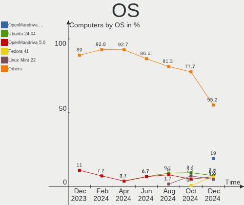
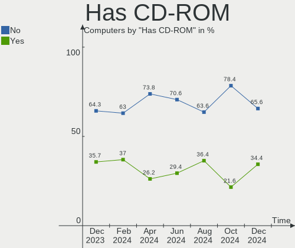
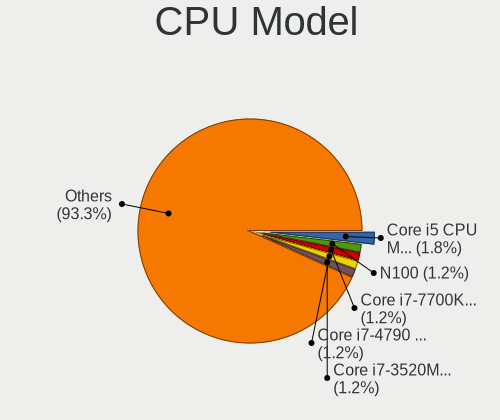
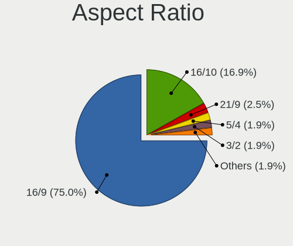
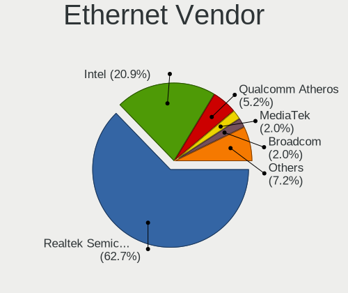
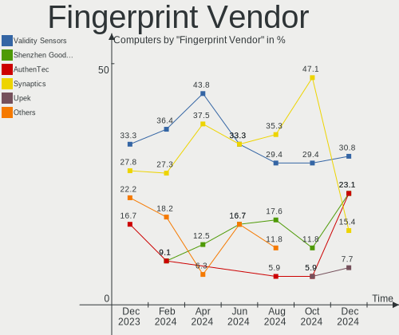

Linux in Poland - Hardware Trends
---------------------------------

A project to identify most popular hardware characteristics and track their change
over time based on data collected by Linux users at https://Linux-Hardware.org.

Anyone can contribute to this report by the [hw-probe](https://github.com/linuxhw/hw-probe) tool:

    sudo -E hw-probe -all -upload

This is a report for all computer types. See also reports for [desktops](/Location/Poland/Desktop/README.md) and [notebooks](/Location/Poland/Notebook/README.md).

Period: Dec, 2022.

Contents
--------

* [ System ](#system)
  - [ OS                       ](#os)
  - [ OS Family                ](#os-family)
  - [ Kernel                   ](#kernel)
  - [ Kernel Family            ](#kernel-family)
  - [ Kernel Major Ver.        ](#kernel-major-ver)
  - [ Arch                     ](#arch)
  - [ DE                       ](#de)
  - [ Display Server           ](#display-server)
  - [ Display Manager          ](#display-manager)
  - [ OS Lang                  ](#os-lang)
  - [ Boot Mode                ](#boot-mode)
  - [ Filesystem               ](#filesystem)
  - [ Part. scheme             ](#part-scheme)
  - [ Dual Boot with Linux/BSD ](#dual-boot-with-linuxbsd)
  - [ Dual Boot (Win)          ](#dual-boot-win)

* [ Board ](#board)
  - [ Vendor                   ](#vendor)
  - [ Model                    ](#model)
  - [ Model Family             ](#model-family)
  - [ MFG Year                 ](#mfg-year)
  - [ Form Factor              ](#form-factor)
  - [ Secure Boot              ](#secure-boot)
  - [ Coreboot                 ](#coreboot)
  - [ RAM Size                 ](#ram-size)
  - [ RAM Used                 ](#ram-used)
  - [ Total Drives             ](#total-drives)
  - [ Has CD-ROM               ](#has-cd-rom)
  - [ Has Ethernet             ](#has-ethernet)
  - [ Has WiFi                 ](#has-wifi)
  - [ Has Bluetooth            ](#has-bluetooth)

* [ Location ](#location)
  - [ Country                  ](#country)
  - [ City                     ](#city)

* [ Drives ](#drives)
  - [ Drive Vendor             ](#drive-vendor)
  - [ Drive Model              ](#drive-model)
  - [ HDD Vendor               ](#hdd-vendor)
  - [ SSD Vendor               ](#ssd-vendor)
  - [ Drive Kind               ](#drive-kind)
  - [ Drive Connector          ](#drive-connector)
  - [ Drive Size               ](#drive-size)
  - [ Space Total              ](#space-total)
  - [ Space Used               ](#space-used)
  - [ Malfunc. Drives          ](#malfunc-drives)
  - [ Malfunc. Drive Vendor    ](#malfunc-drive-vendor)
  - [ Malfunc. HDD Vendor      ](#malfunc-hdd-vendor)
  - [ Malfunc. Drive Kind      ](#malfunc-drive-kind)
  - [ Failed Drives            ](#failed-drives)
  - [ Failed Drive Vendor      ](#failed-drive-vendor)
  - [ Drive Status             ](#drive-status)

* [ Storage controller ](#storage-controller)
  - [ Storage Vendor           ](#storage-vendor)
  - [ Storage Model            ](#storage-model)
  - [ Storage Kind             ](#storage-kind)

* [ Processor ](#processor)
  - [ CPU Vendor               ](#cpu-vendor)
  - [ CPU Model                ](#cpu-model)
  - [ CPU Model Family         ](#cpu-model-family)
  - [ CPU Cores                ](#cpu-cores)
  - [ CPU Sockets              ](#cpu-sockets)
  - [ CPU Threads              ](#cpu-threads)
  - [ CPU Op-Modes             ](#cpu-op-modes)
  - [ CPU Microcode            ](#cpu-microcode)
  - [ CPU Microarch            ](#cpu-microarch)

* [ Graphics ](#graphics)
  - [ GPU Vendor               ](#gpu-vendor)
  - [ GPU Model                ](#gpu-model)
  - [ GPU Combo                ](#gpu-combo)
  - [ GPU Driver               ](#gpu-driver)
  - [ GPU Memory               ](#gpu-memory)

* [ Monitor ](#monitor)
  - [ Monitor Vendor           ](#monitor-vendor)
  - [ Monitor Model            ](#monitor-model)
  - [ Monitor Resolution       ](#monitor-resolution)
  - [ Monitor Diagonal         ](#monitor-diagonal)
  - [ Monitor Width            ](#monitor-width)
  - [ Aspect Ratio             ](#aspect-ratio)
  - [ Monitor Area             ](#monitor-area)
  - [ Pixel Density            ](#pixel-density)
  - [ Multiple Monitors        ](#multiple-monitors)

* [ Network ](#network)
  - [ Net Controller Vendor    ](#net-controller-vendor)
  - [ Net Controller Model     ](#net-controller-model)
  - [ Wireless Vendor          ](#wireless-vendor)
  - [ Wireless Model           ](#wireless-model)
  - [ Ethernet Vendor          ](#ethernet-vendor)
  - [ Ethernet Model           ](#ethernet-model)
  - [ Net Controller Kind      ](#net-controller-kind)
  - [ Used Controller          ](#used-controller)
  - [ NICs                     ](#nics)
  - [ IPv6                     ](#ipv6)

* [ Bluetooth ](#bluetooth)
  - [ Bluetooth Vendor         ](#bluetooth-vendor)
  - [ Bluetooth Model          ](#bluetooth-model)

* [ Sound ](#sound)
  - [ Sound Vendor             ](#sound-vendor)
  - [ Sound Model              ](#sound-model)

* [ Memory ](#memory)
  - [ Memory Vendor            ](#memory-vendor)
  - [ Memory Model             ](#memory-model)
  - [ Memory Kind              ](#memory-kind)
  - [ Memory Form Factor       ](#memory-form-factor)
  - [ Memory Size              ](#memory-size)
  - [ Memory Speed             ](#memory-speed)

* [ Printers & scanners ](#printers--scanners)
  - [ Printer Vendor           ](#printer-vendor)
  - [ Printer Model            ](#printer-model)
  - [ Scanner Vendor           ](#scanner-vendor)
  - [ Scanner Model            ](#scanner-model)

* [ Camera ](#camera)
  - [ Camera Vendor            ](#camera-vendor)
  - [ Camera Model             ](#camera-model)

* [ Security ](#security)
  - [ Fingerprint Vendor       ](#fingerprint-vendor)
  - [ Fingerprint Model        ](#fingerprint-model)
  - [ Chipcard Vendor          ](#chipcard-vendor)
  - [ Chipcard Model           ](#chipcard-model)

* [ Unsupported ](#unsupported)
  - [ Unsupported Devices      ](#unsupported-devices)
  - [ Unsupported Device Types ](#unsupported-device-types)

System
------

OS
--

Installed operating systems

| Name                | Computers | Percent |
|---------------------|-----------|---------|
| Ubuntu 22.04        | 21        | 15.33%  |
| OpenMandriva 4.3    | 15        | 10.95%  |
| Ubuntu 22.10        | 11        | 8.03%   |
| Linux Mint 21       | 9         | 6.57%   |
| Fedora 37           | 9         | 6.57%   |
| Debian 11           | 9         | 6.57%   |
| Pop!_OS 22.04       | 4         | 2.92%   |
| Linux Mint 21.1     | 4         | 2.92%   |
| Kubuntu 22.04       | 4         | 2.92%   |
| OpenMandriva 4.50   | 3         | 2.19%   |
| Manjaro 22.0.0      | 3         | 2.19%   |
| Gentoo 2.9          | 3         | 2.19%   |
| Debian              | 3         | 2.19%   |
| Arch Rolling        | 3         | 2.19%   |
| Zorin 16            | 2         | 1.46%   |
| Xubuntu 22.04       | 2         | 1.46%   |
| Ubuntu 20.04        | 2         | 1.46%   |
| OpenMandriva 22.12  | 2         | 1.46%   |
| Nobara 36           | 2         | 1.46%   |
| MX 21               | 2         | 1.46%   |
| Manjaro             | 2         | 1.46%   |
| Kali 2022.4         | 2         | 1.46%   |
| Fedora 36           | 2         | 1.46%   |
| Ubuntu Unity 20.04  | 1         | 0.73%   |
| Ubuntu Unity 18.04  | 1         | 0.73%   |
| Ubuntu Unity 16.04  | 1         | 0.73%   |
| Ubuntu MATE 22.04   | 1         | 0.73%   |
| Ubuntu Budgie 22.04 | 1         | 0.73%   |
| Ubuntu 18.04        | 1         | 0.73%   |
| SteamOS 3.3.2       | 1         | 0.73%   |
| Raspbian 11         | 1         | 0.73%   |
| PostmarketOS Edge   | 1         | 0.73%   |
| Pop!_OS 20.04       | 1         | 0.73%   |
| OpenMandriva 4.90   | 1         | 0.73%   |
| OpenMandriva 4.2    | 1         | 0.73%   |
| OpenMandriva 22.90  | 1         | 0.73%   |
| Lubuntu 22.04       | 1         | 0.73%   |
| LMDE 5              | 1         | 0.73%   |
| Linux Mint 20.3     | 1         | 0.73%   |
| Endless 4.0.13      | 1         | 0.73%   |

OS Family
---------

OS without a version

| Name          | Computers | Percent |
|---------------|-----------|---------|
| Ubuntu        | 35        | 25.55%  |
| OpenMandriva  | 23        | 16.79%  |
| Linux Mint    | 14        | 10.22%  |
| Debian        | 12        | 8.76%   |
| Fedora        | 11        | 8.03%   |
| Pop!_OS       | 5         | 3.65%   |
| Manjaro       | 5         | 3.65%   |
| Kubuntu       | 4         | 2.92%   |
| Ubuntu Unity  | 3         | 2.19%   |
| Gentoo        | 3         | 2.19%   |
| Arch          | 3         | 2.19%   |
| Zorin         | 2         | 1.46%   |
| Xubuntu       | 2         | 1.46%   |
| Nobara        | 2         | 1.46%   |
| MX            | 2         | 1.46%   |
| Kali          | 2         | 1.46%   |
| Ubuntu MATE   | 1         | 0.73%   |
| Ubuntu Budgie | 1         | 0.73%   |
| SteamOS       | 1         | 0.73%   |
| Raspbian      | 1         | 0.73%   |
| PostmarketOS  | 1         | 0.73%   |
| Lubuntu       | 1         | 0.73%   |
| LMDE          | 1         | 0.73%   |
| Endless       | 1         | 0.73%   |
| Clear Linux   | 1         | 0.73%   |

Kernel
------

Version of the Linux kernel

| Version                      | Computers | Percent |
|------------------------------|-----------|---------|
| 5.15.0-56-generic            | 36        | 26.28%  |
| 5.16.7-desktop-1omv4003      | 15        | 10.95%  |
| 5.19.0-26-generic            | 7         | 5.11%   |
| 5.15.0-43-generic            | 6         | 4.38%   |
| 6.0.12-300.fc37.x86_64       | 4         | 2.92%   |
| 5.10.0-20-amd64              | 4         | 2.92%   |
| 5.10.0-19-amd64              | 4         | 2.92%   |
| 6.0.12-76060006-generic      | 3         | 2.19%   |
| 6.0.10-300.fc37.x86_64       | 3         | 2.19%   |
| 5.19.5-desktop-1omv4090      | 3         | 2.19%   |
| 6.0.11-1-MANJARO             | 2         | 1.46%   |
| 6.0.10-desktop-2omv22090     | 2         | 1.46%   |
| 6.0.0-kali3-amd64            | 2         | 1.46%   |
| 6.0.0-6-amd64                | 2         | 1.46%   |
| 5.4.0-135-generic            | 2         | 1.46%   |
| 5.15.75-gentoo               | 2         | 1.46%   |
| 6.1.0-sdm845                 | 1         | 0.73%   |
| 6.0.8-1-MANJARO              | 1         | 0.73%   |
| 6.0.7-301.fc37.x86_64        | 1         | 0.73%   |
| 6.0.6-76060006-generic       | 1         | 0.73%   |
| 6.0.5-200.fc36.x86_64        | 1         | 0.73%   |
| 6.0.15-300.fc37.x86_64       | 1         | 0.73%   |
| 6.0.15-200.fc36.x86_64       | 1         | 0.73%   |
| 6.0.13-201.fsync.fc36.x86_64 | 1         | 0.73%   |
| 6.0.12-gentoo-dist           | 1         | 0.73%   |
| 6.0.11-zen1-1-zen            | 1         | 0.73%   |
| 6.0.11-x64v2-xanmod1         | 1         | 0.73%   |
| 6.0.11-x64v1-xanmod1         | 1         | 0.73%   |
| 6.0.10-server-2omv22090      | 1         | 0.73%   |
| 6.0.10-arch2-1               | 1         | 0.73%   |
| 6.0.10-201.fc36.x86_64       | 1         | 0.73%   |
| 6.0.0-5-amd64                | 1         | 0.73%   |
| 6.0.0-5-686                  | 1         | 0.73%   |
| 5.19.13-xanmod1              | 1         | 0.73%   |
| 5.19.0-27-generic            | 1         | 0.73%   |
| 5.19.0-21-generic            | 1         | 0.73%   |
| 5.19.0-1009-raspi            | 1         | 0.73%   |
| 5.18.12-desktop-3omv4090     | 1         | 0.73%   |
| 5.17.5-76051705-generic      | 1         | 0.73%   |
| 5.17.0-3mx-amd64             | 1         | 0.73%   |

Kernel Family
-------------

Linux kernel without a distro release

| Version  | Computers | Percent |
|----------|-----------|---------|
| 5.15.0   | 44        | 32.12%  |
| 5.16.7   | 15        | 10.95%  |
| 5.19.0   | 10        | 7.3%    |
| 6.0.12   | 8         | 5.84%   |
| 6.0.10   | 8         | 5.84%   |
| 5.10.0   | 8         | 5.84%   |
| 6.0.0    | 6         | 4.38%   |
| 6.0.11   | 5         | 3.65%   |
| 5.19.5   | 3         | 2.19%   |
| 5.17.0   | 3         | 2.19%   |
| 6.0.15   | 2         | 1.46%   |
| 5.4.0    | 2         | 1.46%   |
| 5.15.75  | 2         | 1.46%   |
| 6.1.0    | 1         | 0.73%   |
| 6.0.8    | 1         | 0.73%   |
| 6.0.7    | 1         | 0.73%   |
| 6.0.6    | 1         | 0.73%   |
| 6.0.5    | 1         | 0.73%   |
| 6.0.13   | 1         | 0.73%   |
| 5.19.13  | 1         | 0.73%   |
| 5.18.12  | 1         | 0.73%   |
| 5.17.5   | 1         | 0.73%   |
| 5.16.13  | 1         | 0.73%   |
| 5.15.83  | 1         | 0.73%   |
| 5.15.81  | 1         | 0.73%   |
| 5.15.78  | 1         | 0.73%   |
| 5.15.76  | 1         | 0.73%   |
| 5.15.61  | 1         | 0.73%   |
| 5.13.0   | 1         | 0.73%   |
| 5.11.0   | 1         | 0.73%   |
| 5.10.157 | 1         | 0.73%   |
| 5.10.14  | 1         | 0.73%   |
| 4.4.0    | 1         | 0.73%   |
| 4.15.0   | 1         | 0.73%   |

Kernel Major Ver.
-----------------

Linux kernel major version

| Version | Computers | Percent |
|---------|-----------|---------|
| 5.15    | 51        | 37.23%  |
| 6.0     | 34        | 24.82%  |
| 5.16    | 16        | 11.68%  |
| 5.19    | 14        | 10.22%  |
| 5.10    | 10        | 7.3%    |
| 5.17    | 4         | 2.92%   |
| 5.4     | 2         | 1.46%   |
| 6.1     | 1         | 0.73%   |
| 5.18    | 1         | 0.73%   |
| 5.13    | 1         | 0.73%   |
| 5.11    | 1         | 0.73%   |
| 4.4     | 1         | 0.73%   |
| 4.15    | 1         | 0.73%   |

Arch
----

OS architecture (x86_64, i586, etc.)

| Name    | Computers | Percent |
|---------|-----------|---------|
| x86_64  | 131       | 95.62%  |
| aarch64 | 4         | 2.92%   |
| i686    | 1         | 0.73%   |
| armv6l  | 1         | 0.73%   |

DE
--

Desktop Environment

| Name       | Computers | Percent |
|------------|-----------|---------|
| GNOME      | 53        | 38.69%  |
| KDE5       | 38        | 27.74%  |
| XFCE       | 18        | 13.14%  |
| X-Cinnamon | 9         | 6.57%   |
| Unknown    | 7         | 5.11%   |
| MATE       | 6         | 4.38%   |
| Unity      | 3         | 2.19%   |
| Budgie     | 2         | 1.46%   |
| LXQt       | 1         | 0.73%   |

Display Server
--------------

X11 or Wayland

| Name    | Computers | Percent |
|---------|-----------|---------|
| X11     | 91        | 66.42%  |
| Wayland | 38        | 27.74%  |
| Unknown | 5         | 3.65%   |
| Tty     | 3         | 2.19%   |

Display Manager
---------------

SDDM, LightDM, etc.

| Name    | Computers | Percent |
|---------|-----------|---------|
| Unknown | 39        | 28.47%  |
| SDDM    | 32        | 23.36%  |
| GDM3    | 30        | 21.9%   |
| LightDM | 28        | 20.44%  |
| GDM     | 8         | 5.84%   |

OS Lang
-------

Language

| Lang  | Computers | Percent |
|-------|-----------|---------|
| pl_PL | 79        | 57.66%  |
| en_US | 45        | 32.85%  |
| en_GB | 6         | 4.38%   |
| C     | 3         | 2.19%   |
| ru_RU | 2         | 1.46%   |
| ru_UA | 1         | 0.73%   |
| en_IE | 1         | 0.73%   |

Boot Mode
---------

EFI or BIOS

| Mode | Computers | Percent |
|------|-----------|---------|
| EFI  | 72        | 52.55%  |
| BIOS | 65        | 47.45%  |

Filesystem
----------

Type of filesystem

| Type    | Computers | Percent |
|---------|-----------|---------|
| Ext4    | 85        | 62.04%  |
| Overlay | 26        | 18.98%  |
| Btrfs   | 19        | 13.87%  |
| F2fs    | 6         | 4.38%   |
| Ext2    | 1         | 0.73%   |

Part. scheme
------------

Scheme of partitioning

| Type    | Computers | Percent |
|---------|-----------|---------|
| GPT     | 79        | 57.66%  |
| Unknown | 34        | 24.82%  |
| MBR     | 24        | 17.52%  |

Dual Boot with Linux/BSD
------------------------

Hosting more than one Linux/BSD

| Dual boot | Computers | Percent |
|-----------|-----------|---------|
| No        | 112       | 81.75%  |
| Yes       | 25        | 18.25%  |

Dual Boot (Win)
---------------

Hosting Linux and Windows

| Dual boot | Computers | Percent |
|-----------|-----------|---------|
| No        | 95        | 69.34%  |
| Yes       | 42        | 30.66%  |

Board
-----

Vendor
------

Motherboard manufacturer

| Name                    | Computers | Percent |
|-------------------------|-----------|---------|
| Dell                    | 26        | 18.98%  |
| Lenovo                  | 24        | 17.52%  |
| ASUSTek Computer        | 22        | 16.06%  |
| Hewlett-Packard         | 15        | 10.95%  |
| Gigabyte Technology     | 10        | 7.3%    |
| MSI                     | 8         | 5.84%   |
| Samsung Electronics     | 3         | 2.19%   |
| Raspberry Pi Foundation | 3         | 2.19%   |
| Google                  | 3         | 2.19%   |
| Apple                   | 3         | 2.19%   |
| Acer                    | 3         | 2.19%   |
| Fujitsu                 | 2         | 1.46%   |
| ASRock                  | 2         | 1.46%   |
| Xiaomi                  | 1         | 0.73%   |
| Valve                   | 1         | 0.73%   |
| Toshiba                 | 1         | 0.73%   |
| Sony                    | 1         | 0.73%   |
| POSIFLEX                | 1         | 0.73%   |
| pine64,rockpro64-v2.1   | 1         | 0.73%   |
| Panasonic               | 1         | 0.73%   |
| Inventec                | 1         | 0.73%   |
| HUAWEI                  | 1         | 0.73%   |
| GPU Company             | 1         | 0.73%   |
| GMKtec                  | 1         | 0.73%   |
| Foxconn                 | 1         | 0.73%   |
| ACTION                  | 1         | 0.73%   |

Model
-----

Motherboard model

| Name                                      | Computers | Percent |
|-------------------------------------------|-----------|---------|
| MSI MS-7721                               | 2         | 1.46%   |
| Lenovo Y50-70 20378                       | 2         | 1.46%   |
| HP Pavilion dv7                           | 2         | 1.46%   |
| Gigabyte B550 AORUS ELITE V2              | 2         | 1.46%   |
| Dell Latitude 5411                        | 2         | 1.46%   |
| Xiaomi Pocophone F1 (Tianma)              | 1         | 0.73%   |
| Valve Jupiter                             | 1         | 0.73%   |
| Toshiba Satellite L650                    | 1         | 0.73%   |
| Sony SVE1112M1EB                          | 1         | 0.73%   |
| Samsung 350V5C/351V5C/3540VC/3440VC       | 1         | 0.73%   |
| Samsung 305E4A/305E5A/305E7A              | 1         | 0.73%   |
| Samsung 270E5G/270E5U                     | 1         | 0.73%   |
| RPi Raspberry Pi Zero W Rev 1.1           | 1         | 0.73%   |
| RPi Raspberry Pi Compute Module 4 Rev 1.1 | 1         | 0.73%   |
| RPi Raspberry Pi 4 Model B Rev 1.1        | 1         | 0.73%   |
| POSIFLEX KK-3703                          | 1         | 0.73%   |
| pine64,rockpro64-v2.1 RockPro64 v2.1      | 1         | 0.73%   |
| Panasonic CFMX4-1                         | 1         | 0.73%   |
| MSI Vector GP76 12UGS                     | 1         | 0.73%   |
| MSI MS-7B93                               | 1         | 0.73%   |
| MSI MS-7A70                               | 1         | 0.73%   |
| MSI MS-7A68                               | 1         | 0.73%   |
| MSI GF63 Thin 9RCX                        | 1         | 0.73%   |
| MSI Creator Z17 A12UHST                   | 1         | 0.73%   |
| Lenovo Yoga 7 14ARB7 82QF                 | 1         | 0.73%   |
| Lenovo Y520-15IKBN 80WK                   | 1         | 0.73%   |
| Lenovo V530S-07ICB 10TX0010PB             | 1         | 0.73%   |
| Lenovo ThinkPad X1 Yoga 4th 20QGS40100    | 1         | 0.73%   |
| Lenovo ThinkPad T530 24295XU              | 1         | 0.73%   |
| Lenovo ThinkPad T430 23472Y0              | 1         | 0.73%   |
| Lenovo ThinkPad R61 8918DEG               | 1         | 0.73%   |
| Lenovo ThinkPad L15 Gen 1 20U70004PB      | 1         | 0.73%   |
| Lenovo ThinkPad L14 Gen 1 20U50008PB      | 1         | 0.73%   |
| Lenovo ThinkCentre M83 10AHS0X60C         | 1         | 0.73%   |
| Lenovo ThinkCentre M70e 0829RB4           | 1         | 0.73%   |
| Lenovo ThinkBook 15 G2 ITL 20VE           | 1         | 0.73%   |
| Lenovo ThinkBook 14 G2 ITL 20VD           | 1         | 0.73%   |
| Lenovo MIIX 300-10IBY 80NR                | 1         | 0.73%   |
| Lenovo Legion Y530-15ICH 81FV             | 1         | 0.73%   |
| Lenovo Legion 5 15ACH6H 82JU              | 1         | 0.73%   |

Model Family
------------

Motherboard model prefix

| Name                            | Computers | Percent |
|---------------------------------|-----------|---------|
| Dell Latitude                   | 12        | 8.76%   |
| Lenovo ThinkPad                 | 6         | 4.38%   |
| HP EliteBook                    | 5         | 3.65%   |
| ASUS PRIME                      | 5         | 3.65%   |
| RPi Raspberry                   | 3         | 2.19%   |
| Lenovo IdeaPad                  | 3         | 2.19%   |
| HP Pavilion                     | 3         | 2.19%   |
| Dell Vostro                     | 3         | 2.19%   |
| Dell Inspiron                   | 3         | 2.19%   |
| Acer Nitro                      | 3         | 2.19%   |
| MSI MS-7721                     | 2         | 1.46%   |
| Lenovo Y50-70                   | 2         | 1.46%   |
| Lenovo ThinkCentre              | 2         | 1.46%   |
| Lenovo ThinkBook                | 2         | 1.46%   |
| Lenovo Legion                   | 2         | 1.46%   |
| Lenovo IdeaCentre               | 2         | 1.46%   |
| HP ProLiant                     | 2         | 1.46%   |
| Gigabyte B550                   | 2         | 1.46%   |
| Dell XPS                        | 2         | 1.46%   |
| Dell OptiPlex                   | 2         | 1.46%   |
| Dell G15                        | 2         | 1.46%   |
| ASUS TUF                        | 2         | 1.46%   |
| ASUS ASUS                       | 2         | 1.46%   |
| Xiaomi Pocophone                | 1         | 0.73%   |
| Valve Jupiter                   | 1         | 0.73%   |
| Toshiba Satellite               | 1         | 0.73%   |
| Sony SVE1112M1EB                | 1         | 0.73%   |
| Samsung 350V5C                  | 1         | 0.73%   |
| Samsung 305E4A                  | 1         | 0.73%   |
| Samsung 270E5G                  | 1         | 0.73%   |
| POSIFLEX KK-3703                | 1         | 0.73%   |
| pine64,rockpro64-v2.1 RockPro64 | 1         | 0.73%   |
| Panasonic CFMX4-1               | 1         | 0.73%   |
| MSI Vector                      | 1         | 0.73%   |
| MSI MS-7B93                     | 1         | 0.73%   |
| MSI MS-7A70                     | 1         | 0.73%   |
| MSI MS-7A68                     | 1         | 0.73%   |
| MSI GF63                        | 1         | 0.73%   |
| MSI Creator                     | 1         | 0.73%   |
| Lenovo Yoga                     | 1         | 0.73%   |

MFG Year
--------

Motherboard manufacture year

| Year    | Computers | Percent |
|---------|-----------|---------|
| 2020    | 17        | 12.41%  |
| 2022    | 13        | 9.49%   |
| 2017    | 13        | 9.49%   |
| 2021    | 11        | 8.03%   |
| 2013    | 10        | 7.3%    |
| 2019    | 9         | 6.57%   |
| 2011    | 9         | 6.57%   |
| 2014    | 8         | 5.84%   |
| 2018    | 7         | 5.11%   |
| 2015    | 7         | 5.11%   |
| 2012    | 6         | 4.38%   |
| 2010    | 6         | 4.38%   |
| 2016    | 5         | 3.65%   |
| 2008    | 5         | 3.65%   |
| Unknown | 4         | 2.92%   |
| 2009    | 3         | 2.19%   |
| 2007    | 2         | 1.46%   |
| 2006    | 1         | 0.73%   |
| 2004    | 1         | 0.73%   |

Form Factor
-----------

Physical design of the computer

| Name           | Computers | Percent |
|----------------|-----------|---------|
| Notebook       | 79        | 57.66%  |
| Desktop        | 47        | 34.31%  |
| System on chip | 5         | 3.65%   |
| Convertible    | 4         | 2.92%   |
| Tablet         | 1         | 0.73%   |
| Server         | 1         | 0.73%   |

Secure Boot
-----------

Enabled or disabled

| State    | Computers | Percent |
|----------|-----------|---------|
| Disabled | 132       | 96.35%  |
| Enabled  | 5         | 3.65%   |

Coreboot
--------

Have coreboot on board

| Used | Computers | Percent |
|------|-----------|---------|
| No   | 134       | 97.81%  |
| Yes  | 3         | 2.19%   |

RAM Size
--------

Total RAM memory

| Size in GB  | Computers | Percent |
|-------------|-----------|---------|
| 4.01-8.0    | 34        | 24.82%  |
| 8.01-16.0   | 27        | 19.71%  |
| 16.01-24.0  | 25        | 18.25%  |
| 32.01-64.0  | 20        | 14.6%   |
| 3.01-4.0    | 16        | 11.68%  |
| 64.01-256.0 | 6         | 4.38%   |
| 1.01-2.0    | 5         | 3.65%   |
| 24.01-32.0  | 2         | 1.46%   |
| 2.01-3.0    | 1         | 0.73%   |
| 0.01-0.5    | 1         | 0.73%   |

RAM Used
--------

Used RAM memory

| Used GB     | Computers | Percent |
|-------------|-----------|---------|
| 1.01-2.0    | 42        | 30.66%  |
| 2.01-3.0    | 28        | 20.44%  |
| 4.01-8.0    | 19        | 13.87%  |
| 3.01-4.0    | 19        | 13.87%  |
| 8.01-16.0   | 10        | 7.3%    |
| 0.51-1.0    | 10        | 7.3%    |
| 0.01-0.5    | 4         | 2.92%   |
| 16.01-24.0  | 2         | 1.46%   |
| 32.01-64.0  | 1         | 0.73%   |
| 24.01-32.0  | 1         | 0.73%   |
| 64.01-256.0 | 1         | 0.73%   |

Total Drives
------------

Number of drives on board

| Drives | Computers | Percent |
|--------|-----------|---------|
| 1      | 91        | 66.42%  |
| 2      | 29        | 21.17%  |
| 4      | 5         | 3.65%   |
| 3      | 4         | 2.92%   |
| 7      | 2         | 1.46%   |
| 5      | 2         | 1.46%   |
| 0      | 2         | 1.46%   |
| 8      | 1         | 0.73%   |
| 6      | 1         | 0.73%   |

Has CD-ROM
----------

Has CD-ROM on board

| Presented | Computers | Percent |
|-----------|-----------|---------|
| No        | 94        | 68.61%  |
| Yes       | 43        | 31.39%  |

Has Ethernet
------------

Has Ethernet on board

| Presented | Computers | Percent |
|-----------|-----------|---------|
| Yes       | 116       | 84.67%  |
| No        | 21        | 15.33%  |

Has WiFi
--------

Has WiFi module

| Presented | Computers | Percent |
|-----------|-----------|---------|
| Yes       | 106       | 77.37%  |
| No        | 31        | 22.63%  |

Has Bluetooth
-------------

Has Bluetooth module

| Presented | Computers | Percent |
|-----------|-----------|---------|
| Yes       | 84        | 61.31%  |
| No        | 53        | 38.69%  |

Location
--------

Country
-------

Geographic location (country)

| Country | Computers | Percent |
|---------|-----------|---------|
| Poland  | 137       | 100%    |

City
----

Geographic location (city)

| City                      | Computers | Percent |
|---------------------------|-----------|---------|
| Warsaw                    | 36        | 26.28%  |
| Lodz                      | 10        | 7.3%    |
| Krakow                    | 9         | 6.57%   |
| Wroclaw                   | 6         | 4.38%   |
| Poznan                    | 6         | 4.38%   |
| Katowice                  | 5         | 3.65%   |
| Gdansk                    | 5         | 3.65%   |
| Debica                    | 3         | 2.19%   |
| Ruda Śląska             | 2         | 1.46%   |
| Olsztyn                   | 2         | 1.46%   |
| Lublin                    | 2         | 1.46%   |
| Elblag                    | 2         | 1.46%   |
| Bolszewo                  | 2         | 1.46%   |
| Zlotow                    | 1         | 0.73%   |
| Zdunska Wola              | 1         | 0.73%   |
| Wojkowice                 | 1         | 0.73%   |
| Wieluń                   | 1         | 0.73%   |
| Wiekszyce                 | 1         | 0.73%   |
| Tychy                     | 1         | 0.73%   |
| Tuczno                    | 1         | 0.73%   |
| Tomaszow Lubelski         | 1         | 0.73%   |
| Szerzyny                  | 1         | 0.73%   |
| Szczecin                  | 1         | 0.73%   |
| Szczawnica                | 1         | 0.73%   |
| Swiniary Nowe             | 1         | 0.73%   |
| Świętochłowice         | 1         | 0.73%   |
| Swidnik                   | 1         | 0.73%   |
| Suchy Las                 | 1         | 0.73%   |
| Stargard                  | 1         | 0.73%   |
| Slawa                     | 1         | 0.73%   |
| Siemianowice Śląskie    | 1         | 0.73%   |
| Rzeszów                  | 1         | 0.73%   |
| Radziechowy               | 1         | 0.73%   |
| Płock                    | 1         | 0.73%   |
| Pabianice                 | 1         | 0.73%   |
| Otwock                    | 1         | 0.73%   |
| Ostrowiec Świętokrzyski | 1         | 0.73%   |
| Ostrów Wielkopolski      | 1         | 0.73%   |
| Niepolomice               | 1         | 0.73%   |
| Namyslow                  | 1         | 0.73%   |

Drives
------

Drive Vendor
------------

Hard drive vendors

| Vendor                         | Computers | Drives | Percent |
|--------------------------------|-----------|--------|---------|
| Samsung Electronics            | 34        | 45     | 17.53%  |
| Seagate                        | 28        | 34     | 14.43%  |
| WDC                            | 19        | 30     | 9.79%   |
| GOODRAM                        | 18        | 18     | 9.28%   |
| Unknown                        | 10        | 11     | 5.15%   |
| Kingston                       | 9         | 9      | 4.64%   |
| Toshiba                        | 6         | 6      | 3.09%   |
| Crucial                        | 6         | 6      | 3.09%   |
| SanDisk                        | 5         | 5      | 2.58%   |
| Intel                          | 5         | 5      | 2.58%   |
| SK hynix                       | 4         | 4      | 2.06%   |
| KIOXIA                         | 4         | 4      | 2.06%   |
| Silicon Motion                 | 3         | 3      | 1.55%   |
| Phison Electronics             | 3         | 3      | 1.55%   |
| Micron Technology              | 3         | 3      | 1.55%   |
| Hitachi                        | 3         | 5      | 1.55%   |
| HGST                           | 3         | 3      | 1.55%   |
| Apacer                         | 3         | 3      | 1.55%   |
| A-DATA Technology              | 3         | 3      | 1.55%   |
| Unknown                        | 3         | 3      | 1.55%   |
| SPCC                           | 2         | 3      | 1.03%   |
| HS-SSD-E100                    | 2         | 2      | 1.03%   |
| Fujitsu                        | 2         | 2      | 1.03%   |
| Apple                          | 2         | 2      | 1.03%   |
| XPG                            | 1         | 1      | 0.52%   |
| W800SH                         | 1         | 1      | 0.52%   |
| SSD N18A                       | 1         | 1      | 0.52%   |
| Solid State Storage Technology | 1         | 1      | 0.52%   |
| PNY                            | 1         | 1      | 0.52%   |
| PHD 3.0                        | 1         | 1      | 0.52%   |
| Netac                          | 1         | 1      | 0.52%   |
| Micron/Crucial Technology      | 1         | 1      | 0.52%   |
| Maxtor                         | 1         | 1      | 0.52%   |
| Lexar                          | 1         | 1      | 0.52%   |
| JMicron Technology             | 1         | 1      | 0.52%   |
| Fanxiang                       | 1         | 1      | 0.52%   |
| Corsair                        | 1         | 2      | 0.52%   |
| ADATA Technology               | 1         | 1      | 0.52%   |

Drive Model
-----------

Hard drive models

| Model                                               | Computers | Percent |
|-----------------------------------------------------|-----------|---------|
| GOODRAM SSDPR-CX400-256-G2 256GB                    | 4         | 1.89%   |
| Seagate ST500LT012-1DG142 500GB                     | 3         | 1.42%   |
| Samsung SSD 970 EVO Plus 500GB                      | 3         | 1.42%   |
| Samsung NVMe SSD Controller SM961/PM961/SM963 256GB | 3         | 1.42%   |
| GOODRAM SSDPR-CL100-480-G2 480GB                    | 3         | 1.42%   |
| Unknown                                             | 3         | 1.42%   |
| WDC WD2500JS-55NCB1 250GB                           | 2         | 0.94%   |
| Unknown MMC Card  32GB                              | 2         | 0.94%   |
| SK hynix BC711 NVMe 512GB                           | 2         | 0.94%   |
| Seagate ST31000524AS 1TB                            | 2         | 0.94%   |
| Seagate ST1000LM024 HN-M101MBB 1TB                  | 2         | 0.94%   |
| Seagate ST1000DM003-1ER162 1TB                      | 2         | 0.94%   |
| Samsung SSD 980 1TB                                 | 2         | 0.94%   |
| Samsung SSD 970 EVO Plus 2TB                        | 2         | 0.94%   |
| Samsung SSD 970 EVO Plus 1TB                        | 2         | 0.94%   |
| Samsung SSD 850 EVO 250GB                           | 2         | 0.94%   |
| Samsung NVMe SSD Controller SM981/PM981/PM983 500GB | 2         | 0.94%   |
| Samsung MZALQ512HALU-000L2 512GB                    | 2         | 0.94%   |
| Kingston SKC3000S1024G 1TB                          | 2         | 0.94%   |
| HS-SSD-E100 SSD 256G                                | 2         | 0.94%   |
| GOODRAM SSDPR-CX400-01T                             | 2         | 0.94%   |
| GOODRAM SSDPR-CX300-120 120GB                       | 2         | 0.94%   |
| Crucial CT1000MX500SSD1 1TB                         | 2         | 0.94%   |
| XPG GAMMIX S5 256GB                                 | 1         | 0.47%   |
| WDC WDS100T2G0A-00JH30 1TB SSD                      | 1         | 0.47%   |
| WDC WD5000LPLX-08ZNTT0 500GB                        | 1         | 0.47%   |
| WDC WD5000BPVT-24HXZT3 500GB                        | 1         | 0.47%   |
| WDC WD5000AAKX-001CA0 500GB                         | 1         | 0.47%   |
| WDC WD5000AAKS-00A7B0 500GB                         | 1         | 0.47%   |
| WDC WD3200BPVT-22ZEST0 320GB                        | 1         | 0.47%   |
| WDC WD3200BEKT-60V5T1 320GB                         | 1         | 0.47%   |
| WDC WD3200AAKX-221CA0 320GB                         | 1         | 0.47%   |
| WDC WD30EFRX-68N32N0 3TB                            | 1         | 0.47%   |
| WDC WD30EFRX-68EUZN0 3TB                            | 1         | 0.47%   |
| WDC WD2500HHTZ-75N21V0 250GB                        | 1         | 0.47%   |
| WDC WD2500BEVT-22ZCT0 250GB                         | 1         | 0.47%   |
| WDC WD20EZRZ-00Z5HB0 2TB                            | 1         | 0.47%   |
| WDC WD20EZBX-00AYRA0 2TB                            | 1         | 0.47%   |
| WDC WD20EZAZ-00L9GB0 2TB                            | 1         | 0.47%   |
| WDC WD10EZEX-60WN4A0 1TB                            | 1         | 0.47%   |

HDD Vendor
----------

Hard disk drive vendors

| Vendor              | Computers | Drives | Percent |
|---------------------|-----------|--------|---------|
| Seagate             | 28        | 34     | 44.44%  |
| WDC                 | 17        | 27     | 26.98%  |
| Toshiba             | 5         | 5      | 7.94%   |
| Samsung Electronics | 3         | 3      | 4.76%   |
| Hitachi             | 3         | 5      | 4.76%   |
| HGST                | 3         | 3      | 4.76%   |
| Fujitsu             | 2         | 2      | 3.17%   |
| PHD 3.0             | 1         | 1      | 1.59%   |
| Maxtor              | 1         | 1      | 1.59%   |

SSD Vendor
----------

Solid state drive vendors

| Vendor              | Computers | Drives | Percent |
|---------------------|-----------|--------|---------|
| GOODRAM             | 18        | 18     | 30.51%  |
| Samsung Electronics | 11        | 16     | 18.64%  |
| Crucial             | 6         | 6      | 10.17%  |
| Kingston            | 3         | 3      | 5.08%   |
| Apacer              | 3         | 3      | 5.08%   |
| SPCC                | 2         | 3      | 3.39%   |
| SanDisk             | 2         | 2      | 3.39%   |
| HS-SSD-E100         | 2         | 2      | 3.39%   |
| A-DATA Technology   | 2         | 2      | 3.39%   |
| WDC                 | 1         | 1      | 1.69%   |
| W800SH              | 1         | 1      | 1.69%   |
| SK hynix            | 1         | 1      | 1.69%   |
| Netac               | 1         | 1      | 1.69%   |
| Micron Technology   | 1         | 1      | 1.69%   |
| JMicron Technology  | 1         | 1      | 1.69%   |
| Intel               | 1         | 1      | 1.69%   |
| Fanxiang            | 1         | 1      | 1.69%   |
| Apple               | 1         | 1      | 1.69%   |
| Unknown             | 1         | 1      | 1.69%   |

Drive Kind
----------

HDD or SSD

| Kind    | Computers | Drives | Percent |
|---------|-----------|--------|---------|
| NVMe    | 58        | 67     | 32.4%   |
| SSD     | 54        | 65     | 30.17%  |
| HDD     | 54        | 81     | 30.17%  |
| MMC     | 12        | 13     | 6.7%    |
| Unknown | 1         | 1      | 0.56%   |

Drive Connector
---------------

SATA, SAS, NVMe, etc.

| Type | Computers | Drives | Percent |
|------|-----------|--------|---------|
| SATA | 85        | 140    | 52.8%   |
| NVMe | 58        | 67     | 36.02%  |
| MMC  | 12        | 13     | 7.45%   |
| SAS  | 6         | 7      | 3.73%   |

Drive Size
----------

Size of hard drive

| Size in TB | Computers | Drives | Percent |
|------------|-----------|--------|---------|
| 0.01-0.5   | 64        | 80     | 57.14%  |
| 0.51-1.0   | 33        | 43     | 29.46%  |
| 3.01-4.0   | 4         | 4      | 3.57%   |
| 2.01-3.0   | 4         | 7      | 3.57%   |
| 1.01-2.0   | 3         | 8      | 2.68%   |
| 4.01-10.0  | 3         | 3      | 2.68%   |
| 10.01-20.0 | 1         | 1      | 0.89%   |

Space Total
-----------

Amount of disk space available on the file system

| Size in GB     | Computers | Percent |
|----------------|-----------|---------|
| 101-250        | 32        | 23.36%  |
| 251-500        | 28        | 20.44%  |
| 501-1000       | 17        | 12.41%  |
| 1001-2000      | 15        | 10.95%  |
| 1-20           | 13        | 9.49%   |
| 51-100         | 11        | 8.03%   |
| Unknown        | 7         | 5.11%   |
| More than 3000 | 6         | 4.38%   |
| 21-50          | 6         | 4.38%   |
| 2001-3000      | 2         | 1.46%   |

Space Used
----------

Amount of used disk space

| Used GB        | Computers | Percent |
|----------------|-----------|---------|
| 1-20           | 57        | 41.61%  |
| 101-250        | 20        | 14.6%   |
| 51-100         | 18        | 13.14%  |
| 21-50          | 13        | 9.49%   |
| 501-1000       | 10        | 7.3%    |
| Unknown        | 7         | 5.11%   |
| 1001-2000      | 5         | 3.65%   |
| More than 3000 | 3         | 2.19%   |
| 251-500        | 3         | 2.19%   |
| 2001-3000      | 1         | 0.73%   |

Malfunc. Drives
---------------

Drive models with a malfunction

| Model                             | Computers | Drives | Percent |
|-----------------------------------|-----------|--------|---------|
| WDC WD5000BPVT-24HXZT3 500GB      | 1         | 1      | 9.09%   |
| WDC WD3200BPVT-22ZEST0 320GB      | 1         | 1      | 9.09%   |
| Seagate ST9500325AS 500GB         | 1         | 1      | 9.09%   |
| Seagate ST500DM002-1BD142 500GB   | 1         | 1      | 9.09%   |
| Seagate ST3320613AS 320GB         | 1         | 1      | 9.09%   |
| Seagate ST3200822A 200GB          | 1         | 1      | 9.09%   |
| Seagate ST1000DM003-9YN162 1TB    | 1         | 1      | 9.09%   |
| Samsung Electronics HD642JJ 640GB | 1         | 1      | 9.09%   |
| Samsung Electronics HD502HJ 500GB | 1         | 1      | 9.09%   |
| Crucial CT1000MX500SSD4 1TB       | 1         | 1      | 9.09%   |
| A-DATA Technology SP900 128GB SSD | 1         | 1      | 9.09%   |

Malfunc. Drive Vendor
---------------------

Vendors of faulty drives

| Vendor              | Computers | Drives | Percent |
|---------------------|-----------|--------|---------|
| Seagate             | 5         | 5      | 45.45%  |
| WDC                 | 2         | 2      | 18.18%  |
| Samsung Electronics | 2         | 2      | 18.18%  |
| Crucial             | 1         | 1      | 9.09%   |
| A-DATA Technology   | 1         | 1      | 9.09%   |

Malfunc. HDD Vendor
-------------------

Vendors of faulty HDD drives

| Vendor              | Computers | Drives | Percent |
|---------------------|-----------|--------|---------|
| Seagate             | 5         | 5      | 55.56%  |
| WDC                 | 2         | 2      | 22.22%  |
| Samsung Electronics | 2         | 2      | 22.22%  |

Malfunc. Drive Kind
-------------------

Kinds of faulty drives

| Kind | Computers | Drives | Percent |
|------|-----------|--------|---------|
| HDD  | 9         | 9      | 81.82%  |
| SSD  | 2         | 2      | 18.18%  |

Failed Drives
-------------

Failed drive models

Zero info for selected period =(

Failed Drive Vendor
-------------------

Failed drive vendors

Zero info for selected period =(

Drive Status
------------

Number of failed and malfunc. drives

| Status   | Computers | Drives | Percent |
|----------|-----------|--------|---------|
| Works    | 66        | 109    | 47.48%  |
| Detected | 62        | 107    | 44.6%   |
| Malfunc  | 11        | 11     | 7.91%   |

Storage controller
------------------

Storage Vendor
--------------

Storage controller vendors

| Vendor                         | Computers | Percent |
|--------------------------------|-----------|---------|
| Intel                          | 83        | 45.36%  |
| AMD                            | 28        | 15.3%   |
| Samsung Electronics            | 25        | 13.66%  |
| Kingston Technology Company    | 6         | 3.28%   |
| SanDisk                        | 5         | 2.73%   |
| Phison Electronics             | 5         | 2.73%   |
| KIOXIA                         | 4         | 2.19%   |
| SK hynix                       | 3         | 1.64%   |
| Silicon Motion                 | 3         | 1.64%   |
| Micron Technology              | 2         | 1.09%   |
| LSI Logic / Symbios Logic      | 2         | 1.09%   |
| JMicron Technology             | 2         | 1.09%   |
| Hewlett-Packard                | 2         | 1.09%   |
| ASMedia Technology             | 2         | 1.09%   |
| ADATA Technology               | 2         | 1.09%   |
| Toshiba America Info Systems   | 1         | 0.55%   |
| Solid State Storage Technology | 1         | 0.55%   |
| Silicon Image                  | 1         | 0.55%   |
| Shenzhen Longsys Electronics   | 1         | 0.55%   |
| Realtek Semiconductor          | 1         | 0.55%   |
| Nvidia                         | 1         | 0.55%   |
| Micron/Crucial Technology      | 1         | 0.55%   |
| Broadcom / LSI                 | 1         | 0.55%   |
| Adaptec                        | 1         | 0.55%   |

Storage Model
-------------

Storage controller models

| Model                                                                                   | Computers | Percent |
|-----------------------------------------------------------------------------------------|-----------|---------|
| AMD FCH SATA Controller [AHCI mode]                                                     | 15        | 7.39%   |
| Samsung NVMe SSD Controller SM981/PM981/PM983                                           | 10        | 4.93%   |
| Samsung NVMe SSD Controller 980                                                         | 7         | 3.45%   |
| Samsung NVMe SSD Controller SM961/PM961/SM963                                           | 5         | 2.46%   |
| Intel Volume Management Device NVMe RAID Controller                                     | 5         | 2.46%   |
| Intel Tiger Lake-LP SATA Controller                                                     | 5         | 2.46%   |
| Intel Sunrise Point-LP SATA Controller [AHCI mode]                                      | 5         | 2.46%   |
| Intel Q170/Q150/B150/H170/H110/Z170/CM236 Chipset SATA Controller [AHCI Mode]           | 5         | 2.46%   |
| Intel 7 Series Chipset Family 6-port SATA Controller [AHCI mode]                        | 5         | 2.46%   |
| Intel 6 Series/C200 Series Chipset Family 6 port Mobile SATA AHCI Controller            | 5         | 2.46%   |
| Intel Cannon Lake Mobile PCH SATA AHCI Controller                                       | 4         | 1.97%   |
| Intel 8 Series/C220 Series Chipset Family 6-port SATA Controller 1 [AHCI mode]          | 4         | 1.97%   |
| SK hynix Gold P31/PC711 NVMe Solid State Drive                                          | 3         | 1.48%   |
| Kingston Company Company Non-Volatile memory controller                                 | 3         | 1.48%   |
| Intel Wildcat Point-LP SATA Controller [AHCI Mode]                                      | 3         | 1.48%   |
| Intel Non-Volatile memory controller                                                    | 3         | 1.48%   |
| Intel NM10/ICH7 Family SATA Controller [IDE mode]                                       | 3         | 1.48%   |
| Intel Cannon Point-LP SATA Controller [AHCI Mode]                                       | 3         | 1.48%   |
| Intel 82801G (ICH7 Family) IDE Controller                                               | 3         | 1.48%   |
| Intel 5 Series/3400 Series Chipset 4 port SATA AHCI Controller                          | 3         | 1.48%   |
| AMD SB7x0/SB8x0/SB9x0 SATA Controller [IDE mode]                                        | 3         | 1.48%   |
| AMD SB7x0/SB8x0/SB9x0 IDE Controller                                                    | 3         | 1.48%   |
| AMD SATA controller                                                                     | 3         | 1.48%   |
| AMD 500 Series Chipset SATA Controller                                                  | 3         | 1.48%   |
| SanDisk Non-Volatile memory controller                                                  | 2         | 0.99%   |
| Samsung NVMe SSD Controller PM9A1/PM9A3/980PRO                                          | 2         | 0.99%   |
| Phison NVMe Storage Controller                                                          | 2         | 0.99%   |
| Phison E12 NVMe Controller                                                              | 2         | 0.99%   |
| Micron Non-Volatile memory controller                                                   | 2         | 0.99%   |
| KIOXIA NVMe SSD Controller BG4                                                          | 2         | 0.99%   |
| Kingston Company A2000 NVMe SSD                                                         | 2         | 0.99%   |
| JMicron JMB363 SATA/IDE Controller                                                      | 2         | 0.99%   |
| Intel SATA Controller [RAID mode]                                                       | 2         | 0.99%   |
| Intel HM170/QM170 Chipset SATA Controller [AHCI Mode]                                   | 2         | 0.99%   |
| Intel Comet Lake SATA AHCI Controller                                                   | 2         | 0.99%   |
| Intel Cannon Lake PCH SATA AHCI Controller                                              | 2         | 0.99%   |
| Intel 82801 Mobile SATA Controller [RAID mode]                                          | 2         | 0.99%   |
| Intel 8 Series SATA Controller 1 [AHCI mode]                                            | 2         | 0.99%   |
| Intel 6 Series/C200 Series Chipset Family Desktop SATA Controller (IDE mode, ports 4-5) | 2         | 0.99%   |
| Intel 6 Series/C200 Series Chipset Family Desktop SATA Controller (IDE mode, ports 0-3) | 2         | 0.99%   |

Storage Kind
------------

Kind of storage controller (IDE, SATA, NVMe, SAS, ...)

| Kind | Computers | Percent |
|------|-----------|---------|
| SATA | 94        | 51.65%  |
| NVMe | 58        | 31.87%  |
| RAID | 14        | 7.69%   |
| IDE  | 13        | 7.14%   |
| SCSI | 2         | 1.1%    |
| SAS  | 1         | 0.55%   |

Processor
---------

CPU Vendor
----------

Processor vendors

| Vendor   | Computers | Percent |
|----------|-----------|---------|
| Intel    | 96        | 70.07%  |
| AMD      | 36        | 26.28%  |
| ARM      | 4         | 2.92%   |
| Qualcomm | 1         | 0.73%   |

CPU Model
---------

Processor models

| Model                                       | Computers | Percent |
|---------------------------------------------|-----------|---------|
| Intel 11th Gen Core i5-1135G7 @ 2.40GHz     | 5         | 3.65%   |
| ARM Processor                               | 3         | 2.19%   |
| Intel Core i7-8750H CPU @ 2.20GHz           | 2         | 1.46%   |
| Intel Core i7-7700HQ CPU @ 2.80GHz          | 2         | 1.46%   |
| Intel Core i7-4720HQ CPU @ 2.60GHz          | 2         | 1.46%   |
| Intel Core i7-3520M CPU @ 2.90GHz           | 2         | 1.46%   |
| Intel Core i7-10850H CPU @ 2.70GHz          | 2         | 1.46%   |
| Intel Core i5-3210M CPU @ 2.50GHz           | 2         | 1.46%   |
| Intel Core i5-2520M CPU @ 2.50GHz           | 2         | 1.46%   |
| Intel Core i3-2100 CPU @ 3.10GHz            | 2         | 1.46%   |
| AMD Ryzen 7 5700X 8-Core Processor          | 2         | 1.46%   |
| AMD Ryzen 5 4600H with Radeon Graphics      | 2         | 1.46%   |
| AMD Ryzen 5 3600 6-Core Processor           | 2         | 1.46%   |
| Qualcomm Processor                          | 1         | 0.73%   |
| Intel Xeon CPU X5675 @ 3.07GHz              | 1         | 0.73%   |
| Intel Xeon CPU X5650 @ 2.67GHz              | 1         | 0.73%   |
| Intel Xeon CPU X5450 @ 3.00GHz              | 1         | 0.73%   |
| Intel Xeon CPU E5-2440 0 @ 2.40GHz          | 1         | 0.73%   |
| Intel Xeon CPU E3-1505M v6 @ 3.00GHz        | 1         | 0.73%   |
| Intel Xeon CPU E3-1220 V2 @ 3.10GHz         | 1         | 0.73%   |
| Intel Pentium Silver N5000 CPU @ 1.10GHz    | 1         | 0.73%   |
| Intel Pentium M processor 1600MHz           | 1         | 0.73%   |
| Intel Pentium Dual-Core CPU E5800 @ 3.20GHz | 1         | 0.73%   |
| Intel Pentium CPU P6200 @ 2.13GHz           | 1         | 0.73%   |
| Intel Pentium CPU P6000 @ 1.87GHz           | 1         | 0.73%   |
| Intel Pentium CPU G3220 @ 3.00GHz           | 1         | 0.73%   |
| Intel Core i7-8665U CPU @ 1.90GHz           | 1         | 0.73%   |
| Intel Core i7-8550U CPU @ 1.80GHz           | 1         | 0.73%   |
| Intel Core i7-7700K CPU @ 4.20GHz           | 1         | 0.73%   |
| Intel Core i7-6820HQ CPU @ 2.70GHz          | 1         | 0.73%   |
| Intel Core i7-2700K CPU @ 3.50GHz           | 1         | 0.73%   |
| Intel Core i7-2630QM CPU @ 2.00GHz          | 1         | 0.73%   |
| Intel Core i7-10870H CPU @ 2.20GHz          | 1         | 0.73%   |
| Intel Core i7-10610U CPU @ 1.80GHz          | 1         | 0.73%   |
| Intel Core i7-10510U CPU @ 1.80GHz          | 1         | 0.73%   |
| Intel Core i5-9600K CPU @ 3.70GHz           | 1         | 0.73%   |
| Intel Core i5-9500 CPU @ 3.00GHz            | 1         | 0.73%   |
| Intel Core i5-9300H CPU @ 2.40GHz           | 1         | 0.73%   |
| Intel Core i5-8400 CPU @ 2.80GHz            | 1         | 0.73%   |
| Intel Core i5-8365U CPU @ 1.60GHz           | 1         | 0.73%   |

CPU Model Family
----------------

Processor model prefix

| Model                   | Computers | Percent |
|-------------------------|-----------|---------|
| Intel Core i5           | 35        | 25.55%  |
| Intel Core i7           | 19        | 13.87%  |
| Other                   | 18        | 13.14%  |
| AMD Ryzen 5             | 10        | 7.3%    |
| Intel Core i3           | 8         | 5.84%   |
| AMD Ryzen 7             | 7         | 5.11%   |
| Intel Xeon              | 6         | 4.38%   |
| Intel Celeron           | 5         | 3.65%   |
| Intel Pentium           | 3         | 2.19%   |
| Intel Core 2 Duo        | 3         | 2.19%   |
| AMD Ryzen 9             | 3         | 2.19%   |
| AMD PRO A10             | 2         | 1.46%   |
| Intel Pentium Silver    | 1         | 0.73%   |
| Intel Pentium M         | 1         | 0.73%   |
| Intel Pentium Dual-Core | 1         | 0.73%   |
| Intel Core 2 Quad       | 1         | 0.73%   |
| Intel Atom              | 1         | 0.73%   |
| ARM BCM                 | 1         | 0.73%   |
| AMD Ryzen Threadripper  | 1         | 0.73%   |
| AMD Ryzen 7 PRO         | 1         | 0.73%   |
| AMD Ryzen 5 PRO         | 1         | 0.73%   |
| AMD Phenom II X4        | 1         | 0.73%   |
| AMD G                   | 1         | 0.73%   |
| AMD FX                  | 1         | 0.73%   |
| AMD E2                  | 1         | 0.73%   |
| AMD Athlon II X4        | 1         | 0.73%   |
| AMD Athlon II X3        | 1         | 0.73%   |
| AMD A8                  | 1         | 0.73%   |
| AMD A6                  | 1         | 0.73%   |
| AMD A4                  | 1         | 0.73%   |

CPU Cores
---------

Number of processor cores

| Number  | Computers | Percent |
|---------|-----------|---------|
| 4       | 48        | 35.04%  |
| 2       | 45        | 32.85%  |
| 6       | 18        | 13.14%  |
| 8       | 9         | 6.57%   |
| 12      | 6         | 4.38%   |
| 1       | 4         | 2.92%   |
| 14      | 2         | 1.46%   |
| 3       | 2         | 1.46%   |
| 16      | 1         | 0.73%   |
| 10      | 1         | 0.73%   |
| Unknown | 1         | 0.73%   |

CPU Sockets
-----------

Number of sockets

| Number  | Computers | Percent |
|---------|-----------|---------|
| 1       | 133       | 97.08%  |
| 2       | 3         | 2.19%   |
| Unknown | 1         | 0.73%   |

CPU Threads
-----------

Threads per core (Hyper-Threading)

| Number  | Computers | Percent |
|---------|-----------|---------|
| 2       | 94        | 68.61%  |
| 1       | 41        | 29.93%  |
| 8       | 1         | 0.73%   |
| Unknown | 1         | 0.73%   |

CPU Op-Modes
------------

CPU Operation Modes (32-bit, 64-bit)

| Op mode        | Computers | Percent |
|----------------|-----------|---------|
| 32-bit, 64-bit | 135       | 98.54%  |
| 32-bit         | 1         | 0.73%   |
| Unknown        | 1         | 0.73%   |

CPU Microcode
-------------

Microcode number

| Number     | Computers | Percent |
|------------|-----------|---------|
| Unknown    | 37        | 27.01%  |
| 0x206a7    | 8         | 5.84%   |
| 0x906e9    | 5         | 3.65%   |
| 0x806c1    | 5         | 3.65%   |
| 0x906ea    | 4         | 2.92%   |
| 0x806ec    | 4         | 2.92%   |
| 0x306a9    | 4         | 2.92%   |
| 0xa0652    | 3         | 2.19%   |
| 0x506e3    | 3         | 2.19%   |
| 0x40651    | 3         | 2.19%   |
| 0x306d4    | 3         | 2.19%   |
| 0x306c3    | 3         | 2.19%   |
| 0x30678    | 3         | 2.19%   |
| 0x1067a    | 3         | 2.19%   |
| 0x0a50000c | 3         | 2.19%   |
| 0x08600106 | 3         | 2.19%   |
| 0x806ea    | 2         | 1.46%   |
| 0x406e3    | 2         | 1.46%   |
| 0x20655    | 2         | 1.46%   |
| 0x10676    | 2         | 1.46%   |
| 0x0a601203 | 2         | 1.46%   |
| 0x08701021 | 2         | 1.46%   |
| 0x010000c8 | 2         | 1.46%   |
| 0xa0653    | 1         | 0.73%   |
| 0x906ed    | 1         | 0.73%   |
| 0x906c0    | 1         | 0.73%   |
| 0x906a4    | 1         | 0.73%   |
| 0x906a3    | 1         | 0.73%   |
| 0x806e9    | 1         | 0.73%   |
| 0x806c2    | 1         | 0.73%   |
| 0x706a1    | 1         | 0.73%   |
| 0x6fb      | 1         | 0.73%   |
| 0x695      | 1         | 0.73%   |
| 0x406c3    | 1         | 0.73%   |
| 0x206d7    | 1         | 0.73%   |
| 0x20652    | 1         | 0.73%   |
| 0x0a601201 | 1         | 0.73%   |
| 0x0a50000d | 1         | 0.73%   |
| 0x0a20120a | 1         | 0.73%   |
| 0x0a201205 | 1         | 0.73%   |

CPU Microarch
-------------

Microarchitecture

| Name             | Computers | Percent |
|------------------|-----------|---------|
| KabyLake         | 23        | 16.79%  |
| Unknown          | 12        | 8.76%   |
| SandyBridge      | 10        | 7.3%    |
| Haswell          | 9         | 6.57%   |
| TigerLake        | 8         | 5.84%   |
| Zen 3            | 7         | 5.11%   |
| Zen 2            | 7         | 5.11%   |
| Westmere         | 7         | 5.11%   |
| IvyBridge        | 7         | 5.11%   |
| Skylake          | 6         | 4.38%   |
| Penryn           | 5         | 3.65%   |
| CometLake        | 5         | 3.65%   |
| Silvermont       | 4         | 2.92%   |
| K10              | 4         | 2.92%   |
| Broadwell        | 4         | 2.92%   |
| Zen              | 3         | 2.19%   |
| Zen+             | 2         | 1.46%   |
| Piledriver       | 2         | 1.46%   |
| Excavator        | 2         | 1.46%   |
| Bobcat           | 2         | 1.46%   |
| Alderlake Hybrid | 2         | 1.46%   |
| Tremont          | 1         | 0.73%   |
| P6               | 1         | 0.73%   |
| K10 Llano        | 1         | 0.73%   |
| Goldmont plus    | 1         | 0.73%   |
| Core             | 1         | 0.73%   |
| Bulldozer        | 1         | 0.73%   |

Graphics
--------

GPU Vendor
----------

Vendors of graphics cards

| Vendor                     | Computers | Percent |
|----------------------------|-----------|---------|
| Intel                      | 82        | 50%     |
| AMD                        | 41        | 25%     |
| Nvidia                     | 39        | 23.78%  |
| Matrox Electronics Systems | 2         | 1.22%   |

GPU Model
---------

Graphics card models

| Model                                                                     | Computers | Percent |
|---------------------------------------------------------------------------|-----------|---------|
| Intel 2nd Generation Core Processor Family Integrated Graphics Controller | 9         | 5.36%   |
| Intel TigerLake-LP GT2 [Iris Xe Graphics]                                 | 7         | 4.17%   |
| Intel 3rd Gen Core processor Graphics Controller                          | 6         | 3.57%   |
| Intel HD Graphics 630                                                     | 5         | 2.98%   |
| Intel Core Processor Integrated Graphics Controller                       | 5         | 2.98%   |
| Nvidia GP107M [GeForce GTX 1050 Ti Mobile]                                | 4         | 2.38%   |
| Intel Haswell-ULT Integrated Graphics Controller                          | 4         | 2.38%   |
| Intel CometLake-H GT2 [UHD Graphics]                                      | 4         | 2.38%   |
| Intel CoffeeLake-H GT2 [UHD Graphics 630]                                 | 4         | 2.38%   |
| AMD Renoir                                                                | 4         | 2.38%   |
| AMD Ellesmere [Radeon RX 470/480/570/570X/580/580X/590]                   | 4         | 2.38%   |
| Nvidia GA107M [GeForce RTX 3050 Mobile]                                   | 3         | 1.79%   |
| Intel WhiskeyLake-U GT2 [UHD Graphics 620]                                | 3         | 1.79%   |
| Intel HD Graphics 5500                                                    | 3         | 1.79%   |
| Intel Atom Processor Z36xxx/Z37xxx Series Graphics & Display              | 3         | 1.79%   |
| Intel 4th Gen Core Processor Integrated Graphics Controller               | 3         | 1.79%   |
| AMD Cezanne [Radeon Vega Series / Radeon Vega Mobile Series]              | 3         | 1.79%   |
| Intel UHD Graphics 620                                                    | 2         | 1.19%   |
| Intel Skylake GT2 [HD Graphics 520]                                       | 2         | 1.19%   |
| Intel HD Graphics 530                                                     | 2         | 1.19%   |
| Intel CometLake-U GT2 [UHD Graphics]                                      | 2         | 1.19%   |
| Intel CoffeeLake-S GT2 [UHD Graphics 630]                                 | 2         | 1.19%   |
| Intel Alder Lake-P Integrated Graphics Controller                         | 2         | 1.19%   |
| AMD Wani [Radeon R5/R6/R7 Graphics]                                       | 2         | 1.19%   |
| AMD Raphael                                                               | 2         | 1.19%   |
| AMD Navi 23 [Radeon RX 6600/6600 XT/6600M]                                | 2         | 1.19%   |
| Nvidia TU117M                                                             | 1         | 0.6%    |
| Nvidia TU116M [GeForce GTX 1660 Ti Mobile]                                | 1         | 0.6%    |
| Nvidia TU106 [GeForce RTX 2060 Rev. A]                                    | 1         | 0.6%    |
| Nvidia GP108M [GeForce MX250]                                             | 1         | 0.6%    |
| Nvidia GP108M [GeForce MX150]                                             | 1         | 0.6%    |
| Nvidia GP107M [GeForce GTX 1050 Ti Max-Q]                                 | 1         | 0.6%    |
| Nvidia GP107M [GeForce GTX 1050 Mobile]                                   | 1         | 0.6%    |
| Nvidia GP107 [GeForce GTX 1050 Ti]                                        | 1         | 0.6%    |
| Nvidia GP104 [GeForce GTX 1070]                                           | 1         | 0.6%    |
| Nvidia GM108M [GeForce 920MX]                                             | 1         | 0.6%    |
| Nvidia GM107M [GeForce GTX 960M]                                          | 1         | 0.6%    |
| Nvidia GM107GLM [Quadro M620 Mobile]                                      | 1         | 0.6%    |
| Nvidia GK208BM [GeForce 920M]                                             | 1         | 0.6%    |
| Nvidia GK107M [GeForce GT 755M]                                           | 1         | 0.6%    |

GPU Combo
---------

Combinations of graphics cards

| Name                     | Computers | Percent |
|--------------------------|-----------|---------|
| 1 x Intel                | 53        | 38.69%  |
| 1 x AMD                  | 28        | 20.44%  |
| Intel + Nvidia           | 22        | 16.06%  |
| 1 x Nvidia               | 14        | 10.22%  |
| Intel + AMD              | 6         | 4.38%   |
| Other                    | 5         | 3.65%   |
| 2 x AMD                  | 4         | 2.92%   |
| 1 x Matrox               | 2         | 1.46%   |
| AMD + Nvidia             | 2         | 1.46%   |
| Intel + AMD + 1 x Nvidia | 1         | 0.73%   |

GPU Driver
----------

Free vs proprietary

| Driver      | Computers | Percent |
|-------------|-----------|---------|
| Free        | 113       | 82.48%  |
| Proprietary | 15        | 10.95%  |
| Unknown     | 9         | 6.57%   |

GPU Memory
----------

Total video memory

| Size in GB | Computers | Percent |
|------------|-----------|---------|
| Unknown    | 89        | 64.96%  |
| 0.01-0.5   | 15        | 10.95%  |
| 0.51-1.0   | 12        | 8.76%   |
| 1.01-2.0   | 7         | 5.11%   |
| 3.01-4.0   | 6         | 4.38%   |
| 7.01-8.0   | 4         | 2.92%   |
| 5.01-6.0   | 2         | 1.46%   |
| 8.01-16.0  | 2         | 1.46%   |

Monitor
-------

Monitor Vendor
--------------

Monitor vendors

| Vendor                  | Computers | Percent |
|-------------------------|-----------|---------|
| AU Optronics            | 24        | 15.79%  |
| Samsung Electronics     | 21        | 13.82%  |
| LG Display              | 14        | 9.21%   |
| BOE                     | 13        | 8.55%   |
| Iiyama                  | 7         | 4.61%   |
| Goldstar                | 7         | 4.61%   |
| Dell                    | 7         | 4.61%   |
| Chimei Innolux          | 7         | 4.61%   |
| AOC                     | 7         | 4.61%   |
| Philips                 | 6         | 3.95%   |
| Acer                    | 4         | 2.63%   |
| PANDA                   | 3         | 1.97%   |
| Lenovo                  | 3         | 1.97%   |
| Hewlett-Packard         | 3         | 1.97%   |
| Chi Mei Optoelectronics | 3         | 1.97%   |
| BenQ                    | 3         | 1.97%   |
| Belinea                 | 3         | 1.97%   |
| NEC Computers           | 2         | 1.32%   |
| Eizo                    | 2         | 1.32%   |
| Apple                   | 2         | 1.32%   |
| Ancor Communications    | 2         | 1.32%   |
| Sharp                   | 1         | 0.66%   |
| MSI                     | 1         | 0.66%   |
| Mi                      | 1         | 0.66%   |
| JDI                     | 1         | 0.66%   |
| IBM                     | 1         | 0.66%   |
| Fujitsu Siemens         | 1         | 0.66%   |
| CHR                     | 1         | 0.66%   |
| Arnos Instruments       | 1         | 0.66%   |
| Analogix                | 1         | 0.66%   |

Monitor Model
-------------

Monitor models

| Model                                                                   | Computers | Percent |
|-------------------------------------------------------------------------|-----------|---------|
| AOC 24G2W1G5 AOC2402 1920x1080 527x296mm 23.8-inch                      | 4         | 2.56%   |
| Iiyama PL2740HS IVM6663 1920x1080 598x336mm 27.0-inch                   | 3         | 1.92%   |
| Iiyama PL2740HS IVM6662 1920x1080 598x336mm 27.0-inch                   | 3         | 1.92%   |
| Samsung Electronics LCD Monitor SEC544B 1600x900 382x214mm 17.2-inch    | 2         | 1.28%   |
| Philips PHL 223V5 PHLC0CF 1920x1080 477x268mm 21.5-inch                 | 2         | 1.28%   |
| LG Display LCD Monitor LGD0590 1920x1080 344x194mm 15.5-inch            | 2         | 1.28%   |
| LG Display LCD Monitor LGD044F 1920x1080 345x194mm 15.6-inch            | 2         | 1.28%   |
| Goldstar ULTRAWIDE GSM59F1 2560x1080 798x334mm 34.1-inch                | 2         | 1.28%   |
| Belinea B_101751 MAX06AD 1280x1024 338x270mm 17.0-inch                  | 2         | 1.28%   |
| AU Optronics LCD Monitor AUO213D 1920x1080 309x173mm 13.9-inch          | 2         | 1.28%   |
| Sharp LCD Monitor SHP149A 1920x1080 344x194mm 15.5-inch                 | 1         | 0.64%   |
| Samsung Electronics U28E590 SAM0C4D 3840x2160 607x345mm 27.5-inch       | 1         | 0.64%   |
| Samsung Electronics SyncMaster SAM0610 1920x1080                        | 1         | 0.64%   |
| Samsung Electronics SyncMaster SAM03E1 1440x900 410x257mm 19.1-inch     | 1         | 0.64%   |
| Samsung Electronics SyncMaster SAM01F9 1280x1024 376x301mm 19.0-inch    | 1         | 0.64%   |
| Samsung Electronics SyncMaster SAM0167 1280x1024 338x270mm 17.0-inch    | 1         | 0.64%   |
| Samsung Electronics S27F350 SAM0D22 1920x1080 600x340mm 27.2-inch       | 1         | 0.64%   |
| Samsung Electronics S24C450 SAM09CF 1920x1200 518x324mm 24.1-inch       | 1         | 0.64%   |
| Samsung Electronics S22B300 SAM08C8 1920x1080 477x268mm 21.5-inch       | 1         | 0.64%   |
| Samsung Electronics Odyssey G50A SAM7181 2560x1440 597x336mm 27.0-inch  | 1         | 0.64%   |
| Samsung Electronics LCD Monitor T22E390 1920x1080                       | 1         | 0.64%   |
| Samsung Electronics LCD Monitor SMB2230N 1920x1080                      | 1         | 0.64%   |
| Samsung Electronics LCD Monitor SEC5442 1440x900 331x207mm 15.4-inch    | 1         | 0.64%   |
| Samsung Electronics LCD Monitor SEC384A 1366x768 344x194mm 15.5-inch    | 1         | 0.64%   |
| Samsung Electronics LCD Monitor SEC3541 1366x768 309x174mm 14.0-inch    | 1         | 0.64%   |
| Samsung Electronics LCD Monitor SEC3252 1600x900 344x194mm 15.5-inch    | 1         | 0.64%   |
| Samsung Electronics LCD Monitor SDC417A 2880x1800 302x189mm 14.0-inch   | 1         | 0.64%   |
| Samsung Electronics LCD Monitor SAM0FA5 3840x2160 1872x1053mm 84.6-inch | 1         | 0.64%   |
| Samsung Electronics LCD Monitor SAM0A7D 1920x1080 1060x626mm 48.5-inch  | 1         | 0.64%   |
| Samsung Electronics LC32G5xT SAM7088 2560x1440 698x393mm 31.5-inch      | 1         | 0.64%   |
| Philips PHL 328E1 PHLC204 3840x2160 697x392mm 31.5-inch                 | 1         | 0.64%   |
| Philips PHL 276E8V PHLC18F 3840x2160 600x340mm 27.2-inch                | 1         | 0.64%   |
| Philips PHL 226E9Q PHLC17D 1920x1080 480x270mm 21.7-inch                | 1         | 0.64%   |
| Philips FTV PHL04C3 1920x1080 1440x810mm 65.0-inch                      | 1         | 0.64%   |
| PANDA LCD Monitor NCP0061 2560x1600 302x189mm 14.0-inch                 | 1         | 0.64%   |
| PANDA LCD Monitor NCP004D 1920x1080 344x194mm 15.5-inch                 | 1         | 0.64%   |
| PANDA LCD Monitor NCP0036 1920x1080 344x194mm 15.5-inch                 | 1         | 0.64%   |
| NEC Computers EA245WMi-2 NEC2DE0 1920x1200 519x324mm 24.1-inch          | 1         | 0.64%   |
| NEC Computers EA223WM NEC6890 1680x1050 474x296mm 22.0-inch             | 1         | 0.64%   |
| MSI G27C4 MSI3CA9 1920x1080 598x336mm 27.0-inch                         | 1         | 0.64%   |

Monitor Resolution
------------------

Monitor screen resolution

| Resolution         | Computers | Percent |
|--------------------|-----------|---------|
| 1920x1080 (FHD)    | 72        | 52.17%  |
| 1366x768 (WXGA)    | 15        | 10.87%  |
| 1600x900 (HD+)     | 8         | 5.8%    |
| 1280x1024 (SXGA)   | 8         | 5.8%    |
| 3840x2160 (4K)     | 7         | 5.07%   |
| 2560x1440 (QHD)    | 7         | 5.07%   |
| 1920x1200 (WUXGA)  | 6         | 4.35%   |
| 2560x1600          | 3         | 2.17%   |
| 1680x1050 (WSXGA+) | 3         | 2.17%   |
| 2880x1800          | 2         | 1.45%   |
| 2560x1080          | 2         | 1.45%   |
| 1440x900 (WXGA+)   | 2         | 1.45%   |
| 800x1280           | 1         | 0.72%   |
| 3840x1080          | 1         | 0.72%   |
| 3440x1440          | 1         | 0.72%   |

Monitor Diagonal
----------------

Diagonal size in inches

| Inches  | Computers | Percent |
|---------|-----------|---------|
| 15      | 36        | 24.16%  |
| 27      | 14        | 9.4%    |
| 21      | 13        | 8.72%   |
| 14      | 13        | 8.72%   |
| 13      | 13        | 8.72%   |
| 17      | 12        | 8.05%   |
| 24      | 10        | 6.71%   |
| 23      | 10        | 6.71%   |
| Unknown | 5         | 3.36%   |
| 19      | 4         | 2.68%   |
| 34      | 3         | 2.01%   |
| 31      | 3         | 2.01%   |
| 11      | 3         | 2.01%   |
| 12      | 2         | 1.34%   |
| 84      | 1         | 0.67%   |
| 65      | 1         | 0.67%   |
| 49      | 1         | 0.67%   |
| 48      | 1         | 0.67%   |
| 25      | 1         | 0.67%   |
| 22      | 1         | 0.67%   |
| 20      | 1         | 0.67%   |
| 16      | 1         | 0.67%   |

Monitor Width
-------------

Physical width

| Width in mm | Computers | Percent |
|-------------|-----------|---------|
| 301-350     | 59        | 39.86%  |
| 501-600     | 33        | 22.3%   |
| 401-500     | 16        | 10.81%  |
| 351-400     | 12        | 8.11%   |
| 201-300     | 12        | 8.11%   |
| Unknown     | 5         | 3.38%   |
| 601-700     | 4         | 2.7%    |
| 701-800     | 3         | 2.03%   |
| 1001-1500   | 3         | 2.03%   |
| 1501-2000   | 1         | 0.68%   |

Aspect Ratio
------------

Proportional relationship between the width and the height

| Ratio   | Computers | Percent |
|---------|-----------|---------|
| 16/9    | 99        | 75%     |
| 16/10   | 18        | 13.64%  |
| 5/4     | 8         | 6.06%   |
| 21/9    | 3         | 2.27%   |
| Unknown | 2         | 1.52%   |
| 32/9    | 1         | 0.76%   |
| 0.62    | 1         | 0.76%   |

Monitor Area
------------

Area in inch²

| Area in inch² | Computers | Percent |
|----------------|-----------|---------|
| 101-110        | 36        | 24.16%  |
| 201-250        | 22        | 14.77%  |
| 81-90          | 20        | 13.42%  |
| 301-350        | 14        | 9.4%    |
| 151-200        | 10        | 6.71%   |
| 251-300        | 8         | 5.37%   |
| 71-80          | 6         | 4.03%   |
| 351-500        | 6         | 4.03%   |
| 121-130        | 6         | 4.03%   |
| Unknown        | 5         | 3.36%   |
| 141-150        | 4         | 2.68%   |
| More than 1000 | 3         | 2.01%   |
| 51-60          | 3         | 2.01%   |
| 61-70          | 2         | 1.34%   |
| 131-140        | 2         | 1.34%   |
| 501-1000       | 1         | 0.67%   |
| 91-100         | 1         | 0.67%   |

Pixel Density
-------------

Pixels per inch

| Density       | Computers | Percent |
|---------------|-----------|---------|
| 121-160       | 51        | 34.46%  |
| 51-100        | 46        | 31.08%  |
| 101-120       | 32        | 21.62%  |
| 161-240       | 10        | 6.76%   |
| Unknown       | 5         | 3.38%   |
| More than 240 | 2         | 1.35%   |
| 1-50          | 2         | 1.35%   |

Multiple Monitors
-----------------

Total monitors connected

| Total | Computers | Percent |
|-------|-----------|---------|
| 1     | 105       | 76.64%  |
| 2     | 18        | 13.14%  |
| 0     | 8         | 5.84%   |
| 3     | 5         | 3.65%   |
| 4     | 1         | 0.73%   |

Network
-------

Net Controller Vendor
---------------------

Controller vendors

| Vendor                   | Computers | Percent |
|--------------------------|-----------|---------|
| Realtek Semiconductor    | 73        | 34.76%  |
| Intel                    | 71        | 33.81%  |
| Qualcomm Atheros         | 22        | 10.48%  |
| Broadcom                 | 12        | 5.71%   |
| MediaTek                 | 7         | 3.33%   |
| Dell                     | 4         | 1.9%    |
| TP-Link                  | 3         | 1.43%   |
| Broadcom Limited         | 3         | 1.43%   |
| Hewlett-Packard          | 2         | 0.95%   |
| ASIX Electronics         | 2         | 0.95%   |
| Z-Com                    | 1         | 0.48%   |
| Xiaomi                   | 1         | 0.48%   |
| Sigma Designs            | 1         | 0.48%   |
| Samsung Electronics      | 1         | 0.48%   |
| Ralink Technology        | 1         | 0.48%   |
| Posiflex Technologies    | 1         | 0.48%   |
| Marvell Technology Group | 1         | 0.48%   |
| Huawei Technologies      | 1         | 0.48%   |
| HTC (High Tech Computer) | 1         | 0.48%   |
| Edimax Technology        | 1         | 0.48%   |
| ASUSTek Computer         | 1         | 0.48%   |

Net Controller Model
--------------------

Controller models

| Model                                                             | Computers | Percent |
|-------------------------------------------------------------------|-----------|---------|
| Realtek RTL8111/8168/8411 PCI Express Gigabit Ethernet Controller | 53        | 21.63%  |
| Intel Wi-Fi 6 AX200                                               | 9         | 3.67%   |
| Intel Wi-Fi 6 AX201                                               | 7         | 2.86%   |
| Realtek RTL8125 2.5GbE Controller                                 | 6         | 2.45%   |
| Realtek RTL8153 Gigabit Ethernet Adapter                          | 5         | 2.04%   |
| Intel Comet Lake PCH CNVi WiFi                                    | 5         | 2.04%   |
| Intel 82579LM Gigabit Network Connection (Lewisville)             | 5         | 2.04%   |
| Qualcomm Atheros QCA6174 802.11ac Wireless Network Adapter        | 4         | 1.63%   |
| Qualcomm Atheros AR9485 Wireless Network Adapter                  | 4         | 1.63%   |
| Intel Wireless 8265 / 8275                                        | 4         | 1.63%   |
| Intel Wireless 7265                                               | 4         | 1.63%   |
| Realtek RTL810xE PCI Express Fast Ethernet controller             | 3         | 1.22%   |
| Qualcomm Atheros QCA9565 / AR9565 Wireless Network Adapter        | 3         | 1.22%   |
| Qualcomm Atheros AR9285 Wireless Network Adapter (PCI-Express)    | 3         | 1.22%   |
| MediaTek MT7922 802.11ax PCI Express Wireless Network Adapter     | 3         | 1.22%   |
| MediaTek MT7921K (RZ608) Wi-Fi 6E 80MHz                           | 3         | 1.22%   |
| Intel Wireless 8260                                               | 3         | 1.22%   |
| Intel I211 Gigabit Network Connection                             | 3         | 1.22%   |
| Intel Ethernet Controller I225-V                                  | 3         | 1.22%   |
| Intel Ethernet Connection (2) I219-V                              | 3         | 1.22%   |
| Intel Centrino Advanced-N 6205 [Taylor Peak]                      | 3         | 1.22%   |
| Intel Alder Lake-P PCH CNVi WiFi                                  | 3         | 1.22%   |
| TP-Link TL-WN722N v2/v3 [Realtek RTL8188EUS]                      | 2         | 0.82%   |
| Realtek RTL8852AE 802.11ax PCIe Wireless Network Adapter          | 2         | 0.82%   |
| Qualcomm Atheros QCA9377 802.11ac Wireless Network Adapter        | 2         | 0.82%   |
| Qualcomm Atheros AR8151 v2.0 Gigabit Ethernet                     | 2         | 0.82%   |
| Intel Wireless 3165                                               | 2         | 0.82%   |
| Intel Ethernet Connection (6) I219-LM                             | 2         | 0.82%   |
| Intel Ethernet Connection (11) I219-LM                            | 2         | 0.82%   |
| Intel Dual Band Wireless-AC 3165 Plus Bluetooth                   | 2         | 0.82%   |
| Intel Comet Lake PCH-LP CNVi WiFi                                 | 2         | 0.82%   |
| Intel Centrino Wireless-N 1030 [Rainbow Peak]                     | 2         | 0.82%   |
| Intel Centrino Ultimate-N 6300                                    | 2         | 0.82%   |
| Intel Cannon Point-LP CNVi [Wireless-AC]                          | 2         | 0.82%   |
| Intel Cannon Lake PCH CNVi WiFi                                   | 2         | 0.82%   |
| Dell DW5820e L850-GL                                              | 2         | 0.82%   |
| Broadcom NetXtreme BCM5762 Gigabit Ethernet PCIe                  | 2         | 0.82%   |
| Broadcom Limited BCM4352 802.11ac Wireless Network Adapter        | 2         | 0.82%   |
| Broadcom BCM4313 802.11bgn Wireless Network Adapter               | 2         | 0.82%   |
| ASIX AX88179 Gigabit Ethernet                                     | 2         | 0.82%   |

Wireless Vendor
---------------

Wireless vendors

| Vendor                | Computers | Percent |
|-----------------------|-----------|---------|
| Intel                 | 59        | 53.64%  |
| Qualcomm Atheros      | 18        | 16.36%  |
| Realtek Semiconductor | 8         | 7.27%   |
| MediaTek              | 7         | 6.36%   |
| Broadcom              | 5         | 4.55%   |
| TP-Link               | 3         | 2.73%   |
| Dell                  | 3         | 2.73%   |
| Broadcom Limited      | 3         | 2.73%   |
| Z-Com                 | 1         | 0.91%   |
| Ralink Technology     | 1         | 0.91%   |
| Edimax Technology     | 1         | 0.91%   |
| ASUSTek Computer      | 1         | 0.91%   |

Wireless Model
--------------

Wireless models

| Model                                                          | Computers | Percent |
|----------------------------------------------------------------|-----------|---------|
| Intel Wi-Fi 6 AX200                                            | 9         | 8.18%   |
| Intel Wi-Fi 6 AX201                                            | 7         | 6.36%   |
| Intel Comet Lake PCH CNVi WiFi                                 | 5         | 4.55%   |
| Qualcomm Atheros QCA6174 802.11ac Wireless Network Adapter     | 4         | 3.64%   |
| Qualcomm Atheros AR9485 Wireless Network Adapter               | 4         | 3.64%   |
| Intel Wireless 8265 / 8275                                     | 4         | 3.64%   |
| Intel Wireless 7265                                            | 4         | 3.64%   |
| Qualcomm Atheros QCA9565 / AR9565 Wireless Network Adapter     | 3         | 2.73%   |
| Qualcomm Atheros AR9285 Wireless Network Adapter (PCI-Express) | 3         | 2.73%   |
| MediaTek MT7922 802.11ax PCI Express Wireless Network Adapter  | 3         | 2.73%   |
| MediaTek MT7921K (RZ608) Wi-Fi 6E 80MHz                        | 3         | 2.73%   |
| Intel Wireless 8260                                            | 3         | 2.73%   |
| Intel Centrino Advanced-N 6205 [Taylor Peak]                   | 3         | 2.73%   |
| Intel Alder Lake-P PCH CNVi WiFi                               | 3         | 2.73%   |
| TP-Link TL-WN722N v2/v3 [Realtek RTL8188EUS]                   | 2         | 1.82%   |
| Realtek RTL8852AE 802.11ax PCIe Wireless Network Adapter       | 2         | 1.82%   |
| Qualcomm Atheros QCA9377 802.11ac Wireless Network Adapter     | 2         | 1.82%   |
| Intel Wireless 3165                                            | 2         | 1.82%   |
| Intel Dual Band Wireless-AC 3165 Plus Bluetooth                | 2         | 1.82%   |
| Intel Comet Lake PCH-LP CNVi WiFi                              | 2         | 1.82%   |
| Intel Centrino Wireless-N 1030 [Rainbow Peak]                  | 2         | 1.82%   |
| Intel Centrino Ultimate-N 6300                                 | 2         | 1.82%   |
| Intel Cannon Point-LP CNVi [Wireless-AC]                       | 2         | 1.82%   |
| Intel Cannon Lake PCH CNVi WiFi                                | 2         | 1.82%   |
| Dell DW5820e L850-GL                                           | 2         | 1.82%   |
| Broadcom Limited BCM4352 802.11ac Wireless Network Adapter     | 2         | 1.82%   |
| Broadcom BCM4313 802.11bgn Wireless Network Adapter            | 2         | 1.82%   |
| Z-Com XG-703A 802.11g Wireless Adapter [Intersil ISL3887]      | 1         | 0.91%   |
| TP-Link TL-WN823N v2/v3 [Realtek RTL8192EU]                    | 1         | 0.91%   |
| Realtek RTL8822CE 802.11ac PCIe Wireless Network Adapter       | 1         | 0.91%   |
| Realtek RTL8821CE 802.11ac PCIe Wireless Network Adapter       | 1         | 0.91%   |
| Realtek RTL8723BE PCIe Wireless Network Adapter                | 1         | 0.91%   |
| Realtek RTL8723AE PCIe Wireless Network Adapter                | 1         | 0.91%   |
| Realtek RTL8188CUS 802.11n WLAN Adapter                        | 1         | 0.91%   |
| Realtek 802.11n WLAN Adapter                                   | 1         | 0.91%   |
| Ralink RT2501/RT2573 Wireless Adapter                          | 1         | 0.91%   |
| Qualcomm Atheros AR9462 Wireless Network Adapter               | 1         | 0.91%   |
| Qualcomm Atheros AR9227 Wireless Network Adapter               | 1         | 0.91%   |
| MediaTek MT7921 802.11ax PCI Express Wireless Network Adapter  | 1         | 0.91%   |
| Intel Wireless 7260                                            | 1         | 0.91%   |

Ethernet Vendor
---------------

Ethernet vendors

| Vendor                   | Computers | Percent |
|--------------------------|-----------|---------|
| Realtek Semiconductor    | 71        | 56.8%   |
| Intel                    | 34        | 27.2%   |
| Broadcom                 | 7         | 5.6%    |
| Qualcomm Atheros         | 6         | 4.8%    |
| ASIX Electronics         | 2         | 1.6%    |
| Xiaomi                   | 1         | 0.8%    |
| Samsung Electronics      | 1         | 0.8%    |
| Marvell Technology Group | 1         | 0.8%    |
| Huawei Technologies      | 1         | 0.8%    |
| HTC (High Tech Computer) | 1         | 0.8%    |

Ethernet Model
--------------

Ethernet models

| Model                                                             | Computers | Percent |
|-------------------------------------------------------------------|-----------|---------|
| Realtek RTL8111/8168/8411 PCI Express Gigabit Ethernet Controller | 53        | 41.73%  |
| Realtek RTL8125 2.5GbE Controller                                 | 6         | 4.72%   |
| Realtek RTL8153 Gigabit Ethernet Adapter                          | 5         | 3.94%   |
| Intel 82579LM Gigabit Network Connection (Lewisville)             | 5         | 3.94%   |
| Realtek RTL810xE PCI Express Fast Ethernet controller             | 3         | 2.36%   |
| Intel I211 Gigabit Network Connection                             | 3         | 2.36%   |
| Intel Ethernet Controller I225-V                                  | 3         | 2.36%   |
| Intel Ethernet Connection (2) I219-V                              | 3         | 2.36%   |
| Qualcomm Atheros AR8151 v2.0 Gigabit Ethernet                     | 2         | 1.57%   |
| Intel Ethernet Connection (6) I219-LM                             | 2         | 1.57%   |
| Intel Ethernet Connection (11) I219-LM                            | 2         | 1.57%   |
| Broadcom NetXtreme BCM5762 Gigabit Ethernet PCIe                  | 2         | 1.57%   |
| ASIX AX88179 Gigabit Ethernet                                     | 2         | 1.57%   |
| Xiaomi Mi/Redmi series (RNDIS + ADB)                              | 1         | 0.79%   |
| Samsung GT-I9070 (network tethering, USB debugging enabled)       | 1         | 0.79%   |
| Realtek RTL8152 Fast Ethernet Adapter                             | 1         | 0.79%   |
| Realtek RTL-8110SC/8169SC Gigabit Ethernet                        | 1         | 0.79%   |
| Realtek RTL-8100/8101L/8139 PCI Fast Ethernet Adapter             | 1         | 0.79%   |
| Realtek Realtek Ethernet controller                               | 1         | 0.79%   |
| Realtek Killer E2600 Gigabit Ethernet Controller                  | 1         | 0.79%   |
| Qualcomm Atheros QCA8171 Gigabit Ethernet                         | 1         | 0.79%   |
| Qualcomm Atheros AR8152 v2.0 Fast Ethernet                        | 1         | 0.79%   |
| Qualcomm Atheros AR8152 v1.1 Fast Ethernet                        | 1         | 0.79%   |
| Qualcomm Atheros AR8131 Gigabit Ethernet                          | 1         | 0.79%   |
| Marvell Group 88E8057 PCI-E Gigabit Ethernet Controller           | 1         | 0.79%   |
| Intel I350 Gigabit Network Connection                             | 1         | 0.79%   |
| Intel Ethernet Connection I219-V                                  | 1         | 0.79%   |
| Intel Ethernet Connection I219-LM                                 | 1         | 0.79%   |
| Intel Ethernet Connection I218-LM                                 | 1         | 0.79%   |
| Intel Ethernet Connection I217-LM                                 | 1         | 0.79%   |
| Intel Ethernet Connection (7) I219-V                              | 1         | 0.79%   |
| Intel Ethernet Connection (5) I219-LM                             | 1         | 0.79%   |
| Intel Ethernet Connection (4) I219-LM                             | 1         | 0.79%   |
| Intel Ethernet Connection (3) I218-LM                             | 1         | 0.79%   |
| Intel Ethernet Connection (2) I219-LM                             | 1         | 0.79%   |
| Intel Ethernet Connection (13) I219-V                             | 1         | 0.79%   |
| Intel Ethernet Connection (13) I219-LM                            | 1         | 0.79%   |
| Intel Ethernet Connection (10) I219-LM                            | 1         | 0.79%   |
| Intel 82801DB PRO/100 VM (MOB) Ethernet Controller                | 1         | 0.79%   |
| Intel 82579V Gigabit Network Connection                           | 1         | 0.79%   |

Net Controller Kind
-------------------

Ethernet, WiFi or modem

| Kind     | Computers | Percent |
|----------|-----------|---------|
| Ethernet | 116       | 51.1%   |
| WiFi     | 105       | 46.26%  |
| Modem    | 5         | 2.2%    |
| Unknown  | 1         | 0.44%   |

Used Controller
---------------

Currently used network controller

| Kind     | Computers | Percent |
|----------|-----------|---------|
| WiFi     | 80        | 56.34%  |
| Ethernet | 62        | 43.66%  |

NICs
----

Total network controllers on board

| Total | Computers | Percent |
|-------|-----------|---------|
| 2     | 84        | 61.31%  |
| 1     | 46        | 33.58%  |
| 0     | 6         | 4.38%   |
| 3     | 1         | 0.73%   |

IPv6
----

IPv6 vs IPv4

| Used | Computers | Percent |
|------|-----------|---------|
| No   | 123       | 89.78%  |
| Yes  | 14        | 10.22%  |

Bluetooth
---------

Bluetooth Vendor
----------------

Controller vendors

| Vendor                          | Computers | Percent |
|---------------------------------|-----------|---------|
| Intel                           | 46        | 54.76%  |
| Qualcomm Atheros Communications | 9         | 10.71%  |
| Foxconn / Hon Hai               | 6         | 7.14%   |
| Realtek Semiconductor           | 5         | 5.95%   |
| IMC Networks                    | 4         | 4.76%   |
| MediaTek                        | 3         | 3.57%   |
| Cambridge Silicon Radio         | 3         | 3.57%   |
| Broadcom                        | 2         | 2.38%   |
| ASUSTek Computer                | 2         | 2.38%   |
| Apple                           | 2         | 2.38%   |
| Lite-On Technology              | 1         | 1.19%   |
| Dell                            | 1         | 1.19%   |

Bluetooth Model
---------------

Controller models

| Model                                               | Computers | Percent |
|-----------------------------------------------------|-----------|---------|
| Intel Bluetooth wireless interface                  | 13        | 15.48%  |
| Intel AX201 Bluetooth                               | 11        | 13.1%   |
| Intel AX200 Bluetooth                               | 8         | 9.52%   |
| Intel Bluetooth 9460/9560 Jefferson Peak (JfP)      | 7         | 8.33%   |
| Qualcomm Atheros  Bluetooth Device                  | 5         | 5.95%   |
| Realtek Bluetooth Radio                             | 3         | 3.57%   |
| Qualcomm Atheros AR3012 Bluetooth 4.0               | 3         | 3.57%   |
| MediaTek Wireless_Device                            | 3         | 3.57%   |
| Intel Bluetooth Device                              | 3         | 3.57%   |
| Cambridge Silicon Radio Bluetooth Dongle (HCI mode) | 3         | 3.57%   |
| Intel Centrino Advanced-N 6230 Bluetooth adapter    | 2         | 2.38%   |
| Foxconn / Hon Hai Wireless_Device                   | 2         | 2.38%   |
| Foxconn / Hon Hai BCM20702A0                        | 2         | 2.38%   |
| Apple Bluetooth Host Controller                     | 2         | 2.38%   |
| Realtek RTL8723B Bluetooth                          | 1         | 1.19%   |
| Realtek  Bluetooth 4.2 Adapter                      | 1         | 1.19%   |
| Qualcomm Atheros QCA61x4 Bluetooth 4.0              | 1         | 1.19%   |
| Lite-On Broadcom BCM43142A0 Bluetooth Device        | 1         | 1.19%   |
| Intel Wireless-AC 3168 Bluetooth                    | 1         | 1.19%   |
| Intel Centrino Bluetooth Wireless Transceiver       | 1         | 1.19%   |
| IMC Networks Wireless_Device                        | 1         | 1.19%   |
| IMC Networks Bluetooth Radio                        | 1         | 1.19%   |
| IMC Networks Bluetooth Device                       | 1         | 1.19%   |
| IMC Networks Bluetooth                              | 1         | 1.19%   |
| Foxconn / Hon Hai Broadcom Bluetooth 2.1 Device     | 1         | 1.19%   |
| Foxconn / Hon Hai Bluetooth USB Host Controller     | 1         | 1.19%   |
| Dell DW375 Bluetooth Module                         | 1         | 1.19%   |
| Broadcom BCM20702 Bluetooth 4.0 [ThinkPad]          | 1         | 1.19%   |
| Broadcom BCM2045B (BDC-2) [Bluetooth Controller]    | 1         | 1.19%   |
| ASUS Qualcomm Bluetooth 4.1                         | 1         | 1.19%   |
| ASUS Bluetooth Device                               | 1         | 1.19%   |

Sound
-----

Sound Vendor
------------

Sound card vendors

| Vendor                                       | Computers | Percent |
|----------------------------------------------|-----------|---------|
| Intel                                        | 91        | 50.84%  |
| AMD                                          | 40        | 22.35%  |
| Nvidia                                       | 28        | 15.64%  |
| Realtek Semiconductor                        | 3         | 1.68%   |
| C-Media Electronics                          | 3         | 1.68%   |
| Plantronics                                  | 2         | 1.12%   |
| Zoran Co. Personal Media Division (Nogatech) | 1         | 0.56%   |
| ZOOM                                         | 1         | 0.56%   |
| Thesycon Systemsoftware & Consulting         | 1         | 0.56%   |
| SteelSeries ApS                              | 1         | 0.56%   |
| RODE Microphones                             | 1         | 0.56%   |
| ROCCAT                                       | 1         | 0.56%   |
| Logitech                                     | 1         | 0.56%   |
| Lenovo                                       | 1         | 0.56%   |
| Creative Technology                          | 1         | 0.56%   |
| Creative Labs                                | 1         | 0.56%   |
| Cambridge Audio                              | 1         | 0.56%   |
| BEHRINGER International                      | 1         | 0.56%   |

Sound Model
-----------

Sound card models

| Model                                                                      | Computers | Percent |
|----------------------------------------------------------------------------|-----------|---------|
| AMD Family 17h/19h HD Audio Controller                                     | 12        | 5.63%   |
| Intel Tiger Lake-LP Smart Sound Technology Audio Controller                | 8         | 3.76%   |
| Intel Sunrise Point-LP HD Audio                                            | 7         | 3.29%   |
| Intel Cannon Lake PCH cAVS                                                 | 7         | 3.29%   |
| Intel 7 Series/C216 Chipset Family High Definition Audio Controller        | 7         | 3.29%   |
| Intel 6 Series/C200 Series Chipset Family High Definition Audio Controller | 7         | 3.29%   |
| AMD Renoir Radeon High Definition Audio Controller                         | 6         | 2.82%   |
| Intel Comet Lake PCH cAVS                                                  | 5         | 2.35%   |
| Intel 5 Series/3400 Series Chipset High Definition Audio                   | 5         | 2.35%   |
| AMD Starship/Matisse HD Audio Controller                                   | 5         | 2.35%   |
| Nvidia GP107GL High Definition Audio Controller                            | 4         | 1.88%   |
| Nvidia Audio device                                                        | 4         | 1.88%   |
| Intel Xeon E3-1200 v3/4th Gen Core Processor HD Audio Controller           | 4         | 1.88%   |
| Intel Wildcat Point-LP High Definition Audio Controller                    | 4         | 1.88%   |
| Intel Haswell-ULT HD Audio Controller                                      | 4         | 1.88%   |
| Intel Broadwell-U Audio Controller                                         | 4         | 1.88%   |
| Intel 8 Series/C220 Series Chipset High Definition Audio Controller        | 4         | 1.88%   |
| Intel 8 Series HD Audio Controller                                         | 4         | 1.88%   |
| Intel 100 Series/C230 Series Chipset Family HD Audio Controller            | 4         | 1.88%   |
| AMD SBx00 Azalia (Intel HDA)                                               | 4         | 1.88%   |
| AMD Rembrandt Radeon High Definition Audio Controller                      | 4         | 1.88%   |
| AMD Navi 21/23 HDMI/DP Audio Controller                                    | 4         | 1.88%   |
| AMD FCH Azalia Controller                                                  | 4         | 1.88%   |
| AMD Ellesmere HDMI Audio [Radeon RX 470/480 / 570/580/590]                 | 4         | 1.88%   |
| Nvidia GF108 High Definition Audio Controller                              | 3         | 1.41%   |
| Intel NM10/ICH7 Family High Definition Audio Controller                    | 3         | 1.41%   |
| Intel CM238 HD Audio Controller                                            | 3         | 1.41%   |
| Intel Cannon Point-LP High Definition Audio Controller                     | 3         | 1.41%   |
| Intel Alder Lake PCH-P High Definition Audio Controller                    | 3         | 1.41%   |
| Intel 200 Series PCH HD Audio                                              | 3         | 1.41%   |
| AMD Family 17h (Models 00h-0fh) HD Audio Controller                        | 3         | 1.41%   |
| Realtek Semiconductor USB Audio                                            | 2         | 0.94%   |
| Nvidia GK104 HDMI Audio Controller                                         | 2         | 0.94%   |
| Nvidia GF119 HDMI Audio Controller                                         | 2         | 0.94%   |
| Nvidia GA106 High Definition Audio Controller                              | 2         | 0.94%   |
| Nvidia GA104 High Definition Audio Controller                              | 2         | 0.94%   |
| Intel Comet Lake PCH-LP cAVS                                               | 2         | 0.94%   |
| Intel Atom Processor Z36xxx/Z37xxx Series High Definition Audio Controller | 2         | 0.94%   |
| AMD Wrestler HDMI Audio                                                    | 2         | 0.94%   |
| AMD Trinity HDMI Audio Controller                                          | 2         | 0.94%   |

Memory
------

Memory Vendor
-------------

Memory module vendors

| Vendor              | Computers | Percent |
|---------------------|-----------|---------|
| Samsung Electronics | 27        | 26.47%  |
| SK hynix            | 20        | 19.61%  |
| Kingston            | 10        | 9.8%    |
| Unknown             | 9         | 8.82%   |
| Micron Technology   | 9         | 8.82%   |
| GOODRAM             | 7         | 6.86%   |
| G.Skill             | 3         | 2.94%   |
| Corsair             | 3         | 2.94%   |
| Wilk                | 2         | 1.96%   |
| Crucial             | 2         | 1.96%   |
| A-DATA Technology   | 2         | 1.96%   |
| Unknown             | 2         | 1.96%   |
| Unknown (768A)      | 1         | 0.98%   |
| Ramaxel Technology  | 1         | 0.98%   |
| Qimonda             | 1         | 0.98%   |
| Patriot             | 1         | 0.98%   |
| Nanya Technology    | 1         | 0.98%   |
| Elpida              | 1         | 0.98%   |

Memory Model
------------

Memory module models

| Model                                                      | Computers | Percent |
|------------------------------------------------------------|-----------|---------|
| Samsung RAM M471A2K43DB1-CWE 16GB SODIMM DDR4 3200MT/s     | 4         | 3.67%   |
| Wilk RAM GR3200S464L22/16G 16GB SODIMM DDR4 3200MT/s       | 2         | 1.83%   |
| SK hynix RAM HMT425S6AFR6A-PB 2GB SODIMM DDR3 3200MT/s     | 2         | 1.83%   |
| SK hynix RAM HMA81GS6JJR8N-VK 8GB SODIMM DDR4 2667MT/s     | 2         | 1.83%   |
| Samsung RAM M471B5773CHS-CH9 2GB SODIMM DDR3 4199MT/s      | 2         | 1.83%   |
| Samsung RAM M471B5273DH0-CK0 4GB SODIMM DDR3 1600MT/s      | 2         | 1.83%   |
| Samsung RAM M471B5273DH0-CH9 4096MB SODIMM DDR3 1334MT/s   | 2         | 1.83%   |
| Samsung RAM M471A1G44AB0-CWE 8GB SODIMM DDR4 3200MT/s      | 2         | 1.83%   |
| Micron RAM 4ATF1G64HZ-3G2E1 8GB Row Of Chips DDR4 3200MT/s | 2         | 1.83%   |
| Unknown                                                    | 2         | 1.83%   |
| Unknown RAM Module 8GB DIMM DDR3 1333MT/s                  | 1         | 0.92%   |
| Unknown RAM Module 4GB SODIMM DDR3                         | 1         | 0.92%   |
| Unknown RAM Module 4GB DIMM DDR3 1333MT/s                  | 1         | 0.92%   |
| Unknown RAM Module 2GB SODIMM DDR3 1333MT/s                | 1         | 0.92%   |
| Unknown RAM Module 2GB SODIMM DDR2 667MT/s                 | 1         | 0.92%   |
| Unknown RAM Module 2GB DIMM DDR2 667MT/s                   | 1         | 0.92%   |
| Unknown RAM Module 2GB DIMM 1333MT/s                       | 1         | 0.92%   |
| Unknown RAM Module 1GB SODIMM SDRAM                        | 1         | 0.92%   |
| Unknown RAM Module 1GB DIMM 667MT/s                        | 1         | 0.92%   |
| Unknown (768A) RAM Module 16GB SODIMM DDR4 2667MT/s        | 1         | 0.92%   |
| SK hynix RAM Module 8GB Row Of Chips LPDDR4 3733MT/s       | 1         | 0.92%   |
| SK hynix RAM Module 8GB Row Of Chips LPDDR3 2133MT/s       | 1         | 0.92%   |
| SK hynix RAM Module 4GB SODIMM DDR3 1600MT/s               | 1         | 0.92%   |
| SK hynix RAM Module 16GB SODIMM DDR4 2667MT/s              | 1         | 0.92%   |
| SK hynix RAM HMT451S6AFR8C-PB 4GB SODIMM DDR3 1600MT/s     | 1         | 0.92%   |
| SK hynix RAM HMT451S6AFR8A-PB 4GB SODIMM DDR3 1600MT/s     | 1         | 0.92%   |
| SK hynix RAM HMT41GS6AFR8A-PB 8GB SODIMM DDR3 1600MT/s     | 1         | 0.92%   |
| SK hynix RAM HMT351S6EFR8C-PB 4GB SODIMM DDR3 1600MT/s     | 1         | 0.92%   |
| SK hynix RAM HMAA2GS6CJR8N-XN 16GB SODIMM DDR4 3200MT/s    | 1         | 0.92%   |
| SK hynix RAM HMAA2GS6AJR8N-XN 16GB SODIMM DDR4 3200MT/s    | 1         | 0.92%   |
| SK hynix RAM HMAA1GS6CJR6N-XN 8GB SODIMM DDR4 3200MT/s     | 1         | 0.92%   |
| SK hynix RAM HMA851S6AFR6N-UH 2GB SODIMM LPDDR4 2667MT/s   | 1         | 0.92%   |
| SK hynix RAM HMA82GS6DJR8N-XN 16GB SODIMM DDR4 3200MT/s    | 1         | 0.92%   |
| SK hynix RAM HMA81GS6DJR8N-XN 8GB SODIMM DDR4 3200MT/s     | 1         | 0.92%   |
| SK hynix RAM HMA81GS6CJR8N-VK 8GB SODIMM DDR4 2667MT/s     | 1         | 0.92%   |
| SK hynix RAM HMA41GS6AFR8N-TF 8GB SODIMM DDR4 2667MT/s     | 1         | 0.92%   |
| SK hynix RAM H9CCNNN8JTBLAR-NUD 2GB LPDDR3 1867MT/s        | 1         | 0.92%   |
| SK hynix RAM 0000000000-00000 8GB SODIMM DDR4 2400MT/s     | 1         | 0.92%   |
| Samsung RAM Module 8GB SODIMM DDR4 2400MT/s                | 1         | 0.92%   |
| Samsung RAM Module 4GB SODIMM DDR3 1600MT/s                | 1         | 0.92%   |

Memory Kind
-----------

Memory module kinds

| Kind    | Computers | Percent |
|---------|-----------|---------|
| DDR4    | 41        | 46.07%  |
| DDR3    | 26        | 29.21%  |
| SDRAM   | 6         | 6.74%   |
| LPDDR3  | 4         | 4.49%   |
| DDR5    | 4         | 4.49%   |
| LPDDR4  | 3         | 3.37%   |
| DDR2    | 3         | 3.37%   |
| Unknown | 2         | 2.25%   |

Memory Form Factor
------------------

Physical design of the memory module

| Name         | Computers | Percent |
|--------------|-----------|---------|
| SODIMM       | 52        | 60.47%  |
| DIMM         | 24        | 27.91%  |
| Row Of Chips | 7         | 8.14%   |
| Unknown      | 2         | 2.33%   |
| FB-DIMM      | 1         | 1.16%   |

Memory Size
-----------

Memory module size

| Size  | Computers | Percent |
|-------|-----------|---------|
| 8192  | 29        | 31.87%  |
| 4096  | 22        | 24.18%  |
| 16384 | 17        | 18.68%  |
| 2048  | 15        | 16.48%  |
| 32768 | 4         | 4.4%    |
| 1024  | 4         | 4.4%    |

Memory Speed
------------

Memory module speed

| Speed   | Computers | Percent |
|---------|-----------|---------|
| 3200    | 23        | 25%     |
| 1600    | 15        | 16.3%   |
| 2667    | 11        | 11.96%  |
| 1333    | 6         | 6.52%   |
| 2400    | 5         | 5.43%   |
| 3600    | 4         | 4.35%   |
| 667     | 4         | 4.35%   |
| 4800    | 3         | 3.26%   |
| 4199    | 3         | 3.26%   |
| 2133    | 3         | 3.26%   |
| 1867    | 3         | 3.26%   |
| 1334    | 2         | 2.17%   |
| Unknown | 2         | 2.17%   |
| 5600    | 1         | 1.09%   |
| 3733    | 1         | 1.09%   |
| 3666    | 1         | 1.09%   |
| 3466    | 1         | 1.09%   |
| 3400    | 1         | 1.09%   |
| 2933    | 1         | 1.09%   |
| 1067    | 1         | 1.09%   |
| 800     | 1         | 1.09%   |

Printers & scanners
-------------------

Printer Vendor
--------------

Printer device vendors

| Vendor          | Computers | Percent |
|-----------------|-----------|---------|
| MIIIW           | 1         | 50%     |
| Hewlett-Packard | 1         | 50%     |

Printer Model
-------------

Printer device models

| Model                      | Computers | Percent |
|----------------------------|-----------|---------|
| MIIIW MW Keyboard Air Mini | 1         | 50%     |
| HP LaserJet M14-M17        | 1         | 50%     |

Scanner Vendor
--------------

Scanner device vendors

| Vendor | Computers | Percent |
|--------|-----------|---------|
| Canon  | 2         | 100%    |

Scanner Model
-------------

Scanner device models

| Model                   | Computers | Percent |
|-------------------------|-----------|---------|
| Canon CanoScan LiDE 120 | 1         | 50%     |
| Canon CanoScan LiDE 110 | 1         | 50%     |

Camera
------

Camera Vendor
-------------

Camera device vendors

| Vendor                                 | Computers | Percent |
|----------------------------------------|-----------|---------|
| Microdia                               | 10        | 12.99%  |
| Acer                                   | 10        | 12.99%  |
| Chicony Electronics                    | 9         | 11.69%  |
| Realtek Semiconductor                  | 8         | 10.39%  |
| Sunplus Innovation Technology          | 7         | 9.09%   |
| IMC Networks                           | 6         | 7.79%   |
| Quanta                                 | 4         | 5.19%   |
| Logitech                               | 4         | 5.19%   |
| Syntek                                 | 3         | 3.9%    |
| Lite-On Technology                     | 3         | 3.9%    |
| Cheng Uei Precision Industry (Foxlink) | 3         | 3.9%    |
| Suyin                                  | 2         | 2.6%    |
| Z-Star Microelectronics                | 1         | 1.3%    |
| Sonix Technology                       | 1         | 1.3%    |
| Silicon Motion                         | 1         | 1.3%    |
| Ricoh                                  | 1         | 1.3%    |
| Luxvisions Innotech Limited            | 1         | 1.3%    |
| Generalplus Technology                 | 1         | 1.3%    |
| Creative Technology                    | 1         | 1.3%    |
| Alcor Micro                            | 1         | 1.3%    |

Camera Model
------------

Camera device models

| Model                                             | Computers | Percent |
|---------------------------------------------------|-----------|---------|
| Microdia Integrated_Webcam_HD                     | 5         | 6.49%   |
| Acer Integrated Camera                            | 4         | 5.19%   |
| Sunplus Integrated_Webcam_HD                      | 3         | 3.9%    |
| Realtek Integrated_Webcam_HD                      | 3         | 3.9%    |
| Lite-On HP HD Camera                              | 3         | 3.9%    |
| Chicony Integrated Camera                         | 3         | 3.9%    |
| Syntek Lenovo EasyCamera                          | 2         | 2.6%    |
| Microdia Integrated Webcam                        | 2         | 2.6%    |
| IMC Networks USB2.0 HD UVC WebCam                 | 2         | 2.6%    |
| Z-Star WebCam SC-03FFL11739P                      | 1         | 1.3%    |
| Syntek Integrated Camera                          | 1         | 1.3%    |
| Suyin Lenovo EasyCamera                           | 1         | 1.3%    |
| Suyin Integrated_Webcam_HD                        | 1         | 1.3%    |
| Sunplus Laptop_Integrated_Webcam_FHD              | 1         | 1.3%    |
| Sunplus Integrated Webcam                         | 1         | 1.3%    |
| Sunplus HP HD Webcam [Fixed]                      | 1         | 1.3%    |
| Sunplus Asus Webcam                               | 1         | 1.3%    |
| Sonix USB2.0 HD UVC WebCam                        | 1         | 1.3%    |
| Silicon Motion WebCam SC-10HDD12636N              | 1         | 1.3%    |
| Ricoh USB2.0 Camera                               | 1         | 1.3%    |
| Realtek USB2.0 camera                             | 1         | 1.3%    |
| Realtek USB Camera                                | 1         | 1.3%    |
| Realtek Integrated Webcam_HD                      | 1         | 1.3%    |
| Realtek Integrated Webcam                         | 1         | 1.3%    |
| Realtek EasyCamera                                | 1         | 1.3%    |
| Quanta Laptop_Integrated_Webcam_2HDM              | 1         | 1.3%    |
| Quanta HP Wide Vision HD Camera                   | 1         | 1.3%    |
| Quanta HP Webcam                                  | 1         | 1.3%    |
| Quanta HD Webcam                                  | 1         | 1.3%    |
| Microdia WebCam SC-13HDL12639P                    | 1         | 1.3%    |
| Microdia USB 2.0 Camera                           | 1         | 1.3%    |
| Microdia Integrated_Webcam_FHD                    | 1         | 1.3%    |
| Luxvisions Innotech Limited Integrated RGB Camera | 1         | 1.3%    |
| Logitech Webcam C270                              | 1         | 1.3%    |
| Logitech Webcam C110                              | 1         | 1.3%    |
| Logitech QuickCam Pro 9000                        | 1         | 1.3%    |
| Logitech HD Webcam C510                           | 1         | 1.3%    |
| IMC Networks Lenovo EasyCamera                    | 1         | 1.3%    |
| IMC Networks Integrated Webcam                    | 1         | 1.3%    |
| IMC Networks Integrated Camera                    | 1         | 1.3%    |

Security
--------

Fingerprint Vendor
------------------

Fingerprint sensor vendors

| Vendor                     | Computers | Percent |
|----------------------------|-----------|---------|
| Synaptics                  | 3         | 33.33%  |
| Validity Sensors           | 2         | 22.22%  |
| Shenzhen Goodix Technology | 2         | 22.22%  |
| Upek                       | 1         | 11.11%  |
| Elan Microelectronics      | 1         | 11.11%  |

Fingerprint Model
-----------------

Fingerprint sensor models

| Model                                                                      | Computers | Percent |
|----------------------------------------------------------------------------|-----------|---------|
| Validity Sensors Synaptics VFS7552 Touch Fingerprint Sensor with PurePrint | 1         | 11.11%  |
| Validity Sensors Fingerprint scanner                                       | 1         | 11.11%  |
| Upek Biometric Touchchip/Touchstrip Fingerprint Sensor                     | 1         | 11.11%  |
| Synaptics  FS7604 Touch Fingerprint Sensor with PurePrint                  | 1         | 11.11%  |
| Synaptics Prometheus MIS Touch Fingerprint Reader                          | 1         | 11.11%  |
| Shenzhen Goodix  Fingerprint Device                                        | 1         | 11.11%  |
| Shenzhen Goodix Fingerprint Reader                                         | 1         | 11.11%  |
| Elan ELAN:ARM-M4                                                           | 1         | 11.11%  |
| Unknown                                                                    | 1         | 11.11%  |

Chipcard Vendor
---------------

Chipcard module vendors

| Vendor      | Computers | Percent |
|-------------|-----------|---------|
| Broadcom    | 8         | 57.14%  |
| Alcor Micro | 3         | 21.43%  |
| Upek        | 2         | 14.29%  |
| O2 Micro    | 1         | 7.14%   |

Chipcard Model
--------------

Chipcard module models

| Model                                                                        | Computers | Percent |
|------------------------------------------------------------------------------|-----------|---------|
| Broadcom 58200                                                               | 5         | 35.71%  |
| Alcor Micro AU9540 Smartcard Reader                                          | 3         | 21.43%  |
| Upek TouchChip Fingerprint Coprocessor (WBF advanced mode)                   | 2         | 14.29%  |
| Broadcom BCM5880 Secure Applications Processor                               | 2         | 14.29%  |
| O2 Micro OZ776 CCID Smartcard Reader                                         | 1         | 7.14%   |
| Broadcom BCM5880 Secure Applications Processor with fingerprint swipe sensor | 1         | 7.14%   |

Unsupported
-----------

Unsupported Devices
-------------------

Total unsupported devices on board

| Total | Computers | Percent |
|-------|-----------|---------|
| 0     | 100       | 72.99%  |
| 1     | 28        | 20.44%  |
| 2     | 6         | 4.38%   |
| 3     | 3         | 2.19%   |

Unsupported Device Types
------------------------

Types of unsupported devices

| Type                  | Computers | Percent |
|-----------------------|-----------|---------|
| Chipcard              | 14        | 28%     |
| Graphics card         | 12        | 24%     |
| Fingerprint reader    | 9         | 18%     |
| Net/wireless          | 6         | 12%     |
| Multimedia controller | 3         | 6%      |
| Camera                | 3         | 6%      |
| Storage               | 1         | 2%      |
| Modem                 | 1         | 2%      |
| Card reader           | 1         | 2%      |

