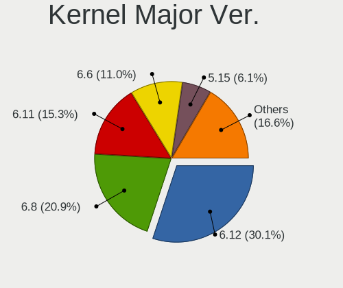
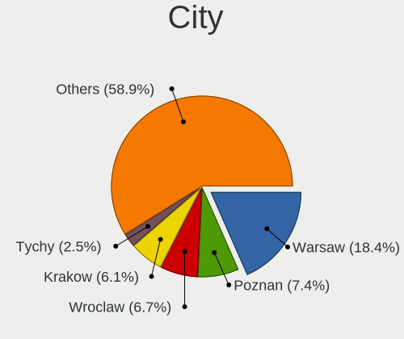
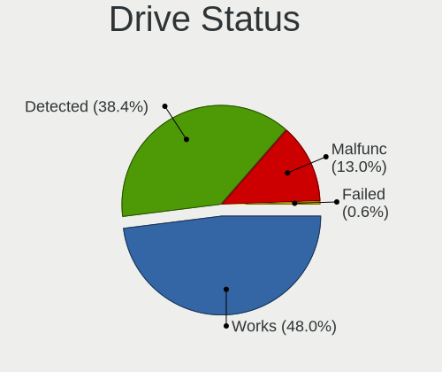
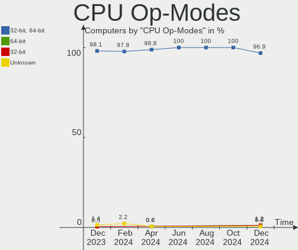
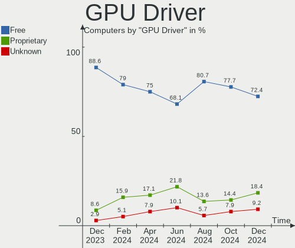
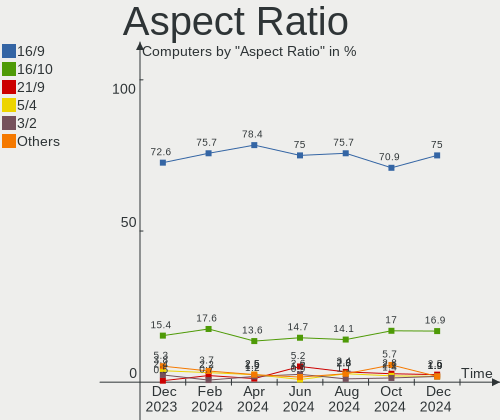
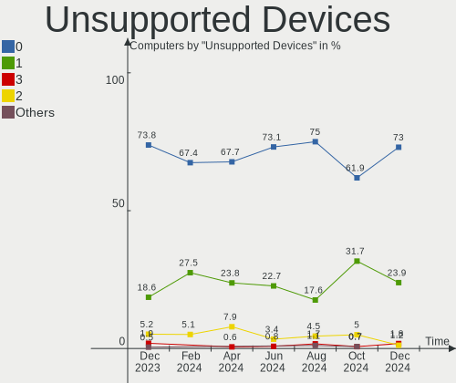

Linux in Poland - Hardware Trends
---------------------------------

A project to identify most popular hardware characteristics and track their change
over time based on data collected by Linux users at https://Linux-Hardware.org.

Anyone can contribute to this report by the [hw-probe](https://github.com/linuxhw/hw-probe) tool:

    sudo -E hw-probe -all -upload

This is a report for all computer types. See also reports for [desktops](/Location/Poland/Desktop/README.md) and [notebooks](/Location/Poland/Notebook/README.md).

Period: Dec, 2023.

Contents
--------

* [ System ](#system)
  - [ OS                       ](#os)
  - [ OS Family                ](#os-family)
  - [ Kernel                   ](#kernel)
  - [ Kernel Family            ](#kernel-family)
  - [ Kernel Major Ver.        ](#kernel-major-ver)
  - [ Arch                     ](#arch)
  - [ DE                       ](#de)
  - [ Display Server           ](#display-server)
  - [ Display Manager          ](#display-manager)
  - [ OS Lang                  ](#os-lang)
  - [ Boot Mode                ](#boot-mode)
  - [ Filesystem               ](#filesystem)
  - [ Part. scheme             ](#part-scheme)
  - [ Dual Boot with Linux/BSD ](#dual-boot-with-linuxbsd)
  - [ Dual Boot (Win)          ](#dual-boot-win)

* [ Board ](#board)
  - [ Vendor                   ](#vendor)
  - [ Model                    ](#model)
  - [ Model Family             ](#model-family)
  - [ MFG Year                 ](#mfg-year)
  - [ Form Factor              ](#form-factor)
  - [ Secure Boot              ](#secure-boot)
  - [ Coreboot                 ](#coreboot)
  - [ RAM Size                 ](#ram-size)
  - [ RAM Used                 ](#ram-used)
  - [ Total Drives             ](#total-drives)
  - [ Has CD-ROM               ](#has-cd-rom)
  - [ Has Ethernet             ](#has-ethernet)
  - [ Has WiFi                 ](#has-wifi)
  - [ Has Bluetooth            ](#has-bluetooth)

* [ Location ](#location)
  - [ Country                  ](#country)
  - [ City                     ](#city)

* [ Drives ](#drives)
  - [ Drive Vendor             ](#drive-vendor)
  - [ Drive Model              ](#drive-model)
  - [ HDD Vendor               ](#hdd-vendor)
  - [ SSD Vendor               ](#ssd-vendor)
  - [ Drive Kind               ](#drive-kind)
  - [ Drive Connector          ](#drive-connector)
  - [ Drive Size               ](#drive-size)
  - [ Space Total              ](#space-total)
  - [ Space Used               ](#space-used)
  - [ Malfunc. Drives          ](#malfunc-drives)
  - [ Malfunc. Drive Vendor    ](#malfunc-drive-vendor)
  - [ Malfunc. HDD Vendor      ](#malfunc-hdd-vendor)
  - [ Malfunc. Drive Kind      ](#malfunc-drive-kind)
  - [ Failed Drives            ](#failed-drives)
  - [ Failed Drive Vendor      ](#failed-drive-vendor)
  - [ Drive Status             ](#drive-status)

* [ Storage controller ](#storage-controller)
  - [ Storage Vendor           ](#storage-vendor)
  - [ Storage Model            ](#storage-model)
  - [ Storage Kind             ](#storage-kind)

* [ Processor ](#processor)
  - [ CPU Vendor               ](#cpu-vendor)
  - [ CPU Model                ](#cpu-model)
  - [ CPU Model Family         ](#cpu-model-family)
  - [ CPU Cores                ](#cpu-cores)
  - [ CPU Sockets              ](#cpu-sockets)
  - [ CPU Threads              ](#cpu-threads)
  - [ CPU Op-Modes             ](#cpu-op-modes)
  - [ CPU Microcode            ](#cpu-microcode)
  - [ CPU Microarch            ](#cpu-microarch)

* [ Graphics ](#graphics)
  - [ GPU Vendor               ](#gpu-vendor)
  - [ GPU Model                ](#gpu-model)
  - [ GPU Combo                ](#gpu-combo)
  - [ GPU Driver               ](#gpu-driver)
  - [ GPU Memory               ](#gpu-memory)

* [ Monitor ](#monitor)
  - [ Monitor Vendor           ](#monitor-vendor)
  - [ Monitor Model            ](#monitor-model)
  - [ Monitor Resolution       ](#monitor-resolution)
  - [ Monitor Diagonal         ](#monitor-diagonal)
  - [ Monitor Width            ](#monitor-width)
  - [ Aspect Ratio             ](#aspect-ratio)
  - [ Monitor Area             ](#monitor-area)
  - [ Pixel Density            ](#pixel-density)
  - [ Multiple Monitors        ](#multiple-monitors)

* [ Network ](#network)
  - [ Net Controller Vendor    ](#net-controller-vendor)
  - [ Net Controller Model     ](#net-controller-model)
  - [ Wireless Vendor          ](#wireless-vendor)
  - [ Wireless Model           ](#wireless-model)
  - [ Ethernet Vendor          ](#ethernet-vendor)
  - [ Ethernet Model           ](#ethernet-model)
  - [ Net Controller Kind      ](#net-controller-kind)
  - [ Used Controller          ](#used-controller)
  - [ NICs                     ](#nics)
  - [ IPv6                     ](#ipv6)

* [ Bluetooth ](#bluetooth)
  - [ Bluetooth Vendor         ](#bluetooth-vendor)
  - [ Bluetooth Model          ](#bluetooth-model)

* [ Sound ](#sound)
  - [ Sound Vendor             ](#sound-vendor)
  - [ Sound Model              ](#sound-model)

* [ Memory ](#memory)
  - [ Memory Vendor            ](#memory-vendor)
  - [ Memory Model             ](#memory-model)
  - [ Memory Kind              ](#memory-kind)
  - [ Memory Form Factor       ](#memory-form-factor)
  - [ Memory Size              ](#memory-size)
  - [ Memory Speed             ](#memory-speed)

* [ Printers & scanners ](#printers--scanners)
  - [ Printer Vendor           ](#printer-vendor)
  - [ Printer Model            ](#printer-model)
  - [ Scanner Vendor           ](#scanner-vendor)
  - [ Scanner Model            ](#scanner-model)

* [ Camera ](#camera)
  - [ Camera Vendor            ](#camera-vendor)
  - [ Camera Model             ](#camera-model)

* [ Security ](#security)
  - [ Fingerprint Vendor       ](#fingerprint-vendor)
  - [ Fingerprint Model        ](#fingerprint-model)
  - [ Chipcard Vendor          ](#chipcard-vendor)
  - [ Chipcard Model           ](#chipcard-model)

* [ Unsupported ](#unsupported)
  - [ Unsupported Devices      ](#unsupported-devices)
  - [ Unsupported Device Types ](#unsupported-device-types)

System
------

OS
--

Installed operating systems

| Name                      | Computers | Percent |
|---------------------------|-----------|---------|
| OpenMandriva 23.08        | 25        | 11.9%   |
| OpenMandriva 5.0          | 23        | 10.95%  |
| Fedora 39                 | 22        | 10.48%  |
| Ubuntu 22.04              | 16        | 7.62%   |
| Debian 12                 | 15        | 7.14%   |
| Arch Rolling              | 11        | 5.24%   |
| Linux Mint 21.2           | 10        | 4.76%   |
| OpenMandriva 23.11        | 6         | 2.86%   |
| Ubuntu 23.10              | 5         | 2.38%   |
| Gentoo 2.14               | 5         | 2.38%   |
| Zorin 17                  | 4         | 1.9%    |
| SteamOS 3.5.7             | 4         | 1.9%    |
| Xero Rolling              | 3         | 1.43%   |
| ROSA R11.1                | 3         | 1.43%   |
| BigLinux                  | 3         | 1.43%   |
| Ubuntu 20.04              | 2         | 0.95%   |
| OpenMandriva 23.03        | 2         | 0.95%   |
| Nobara 38                 | 2         | 0.95%   |
| Manjaro 23.1.0            | 2         | 0.95%   |
| Manjaro 23.0.1            | 2         | 0.95%   |
| Linux Mint 20.3           | 2         | 0.95%   |
| Linux Mint 20.2           | 2         | 0.95%   |
| Debian 11                 | 2         | 0.95%   |
| Debian                    | 2         | 0.95%   |
| Zorin 16                  | 1         | 0.48%   |
| Xubuntu 22.04             | 1         | 0.48%   |
| SteamOS 4                 | 1         | 0.48%   |
| Sparky 7.2                | 1         | 0.48%   |
| Slackware 15.0            | 1         | 0.48%   |
| Raspbian 12               | 1         | 0.48%   |
| Raspbian 11               | 1         | 0.48%   |
| Progress Linux 7.99       | 1         | 0.48%   |
| Pisi 2.3.4                | 1         | 0.48%   |
| Peppermint                | 1         | 0.48%   |
| Pardus 23.0               | 1         | 0.48%   |
| openSUSE Microos-XXXXXXXX | 1         | 0.48%   |
| OpenMandriva 23.10        | 1         | 0.48%   |
| NixOS 23.11               | 1         | 0.48%   |
| MX 23                     | 1         | 0.48%   |
| Manjaro 23.1.1            | 1         | 0.48%   |

OS Family
---------

OS without a version

| Name           | Computers | Percent |
|----------------|-----------|---------|
| OpenMandriva   | 57        | 27.14%  |
| Fedora         | 24        | 11.43%  |
| Ubuntu         | 23        | 10.95%  |
| Debian         | 19        | 9.05%   |
| Linux Mint     | 16        | 7.62%   |
| Arch           | 11        | 5.24%   |
| Zorin          | 5         | 2.38%   |
| SteamOS        | 5         | 2.38%   |
| Manjaro        | 5         | 2.38%   |
| Gentoo         | 5         | 2.38%   |
| Xero           | 3         | 1.43%   |
| ROSA           | 3         | 1.43%   |
| BigLinux       | 3         | 1.43%   |
| Raspbian       | 2         | 0.95%   |
| Nobara         | 2         | 0.95%   |
| EuroLinux      | 2         | 0.95%   |
| Xubuntu        | 1         | 0.48%   |
| Sparky         | 1         | 0.48%   |
| Slackware      | 1         | 0.48%   |
| Progress Linux | 1         | 0.48%   |
| Pisi           | 1         | 0.48%   |
| Peppermint     | 1         | 0.48%   |
| Pardus         | 1         | 0.48%   |
| openSUSE       | 1         | 0.48%   |
| NixOS          | 1         | 0.48%   |
| MX             | 1         | 0.48%   |
| Makulu         | 1         | 0.48%   |
| Lubuntu        | 1         | 0.48%   |
| LMDE           | 1         | 0.48%   |
| Kubuntu        | 1         | 0.48%   |
| KDE neon       | 1         | 0.48%   |
| Kali           | 1         | 0.48%   |
| Garuda Linux   | 1         | 0.48%   |
| EndeavourOS    | 1         | 0.48%   |
| Clear Linux    | 1         | 0.48%   |
| CachyOS        | 1         | 0.48%   |
| BunsenLabs     | 1         | 0.48%   |
| blendOS        | 1         | 0.48%   |
| Artix          | 1         | 0.48%   |
| ArcoLinux      | 1         | 0.48%   |

Kernel
------

Version of the Linux kernel

| Version                     | Computers | Percent |
|-----------------------------|-----------|---------|
| 6.6.2-desktop-1omv2390      | 28        | 13.33%  |
| 6.4.11-desktop-1omv2390     | 23        | 10.95%  |
| 6.2.0-39-generic            | 13        | 6.19%   |
| 5.15.0-91-generic           | 9         | 4.29%   |
| 6.2.0-37-generic            | 8         | 3.81%   |
| 6.1.0-13-amd64              | 7         | 3.33%   |
| 6.6.8-200.fc39.x86_64       | 6         | 2.86%   |
| 6.6.7-arch1-1               | 5         | 2.38%   |
| 6.6.8-arch1-1               | 4         | 1.9%    |
| 6.6.3-200.fc39.x86_64       | 4         | 1.9%    |
| 6.5.0-9-generic             | 4         | 1.9%    |
| 6.1.52-valve9-1-neptune-61  | 4         | 1.9%    |
| 6.1.0-14-amd64              | 4         | 1.9%    |
| 6.6.6-200.fc39.x86_64       | 3         | 1.43%   |
| 6.6.4-arch1-1               | 3         | 1.43%   |
| 6.6.4-200.fc39.x86_64       | 3         | 1.43%   |
| 6.5.0-5-amd64               | 3         | 1.43%   |
| 6.5.0-0.deb12.4-amd64       | 3         | 1.43%   |
| 6.4.8-desktop-2omv2390      | 3         | 1.43%   |
| 6.1.64-1-MANJARO            | 3         | 1.43%   |
| 6.1.57-gentoo               | 3         | 1.43%   |
| 5.15.0-89-generic           | 3         | 1.43%   |
| 6.6.7-203.fsync.fc38.x86_64 | 2         | 0.95%   |
| 6.6.7-200.fc39.x86_64       | 2         | 0.95%   |
| 6.6.3-arch1-1               | 2         | 0.95%   |
| 6.6.2-201.fc39.x86_64       | 2         | 0.95%   |
| 6.5.3-1-MANJARO             | 2         | 0.95%   |
| 6.2.6-desktop-1omv2390      | 2         | 0.95%   |
| 6.1.0-16-amd64              | 2         | 0.95%   |
| 5.4.0-169-generic           | 2         | 0.95%   |
| 6.7.0-rc5                   | 1         | 0.48%   |
| 6.7.0-4-MANJARO             | 1         | 0.48%   |
| 6.6.8-2-MANJARO             | 1         | 0.48%   |
| 6.6.7-zen1-1-zen            | 1         | 0.48%   |
| 6.6.7-666.rog.fc39.x86_64   | 1         | 0.48%   |
| 6.6.6-arch1-1-surface       | 1         | 0.48%   |
| 6.6.6-1-default             | 1         | 0.48%   |
| 6.6.5-1-MANJARO             | 1         | 0.48%   |
| 6.6.4-artix1-1              | 1         | 0.48%   |
| 6.6.4                       | 1         | 0.48%   |

Kernel Family
-------------

Linux kernel without a distro release

| Version  | Computers | Percent |
|----------|-----------|---------|
| 6.6.2    | 30        | 14.29%  |
| 6.2.0    | 24        | 11.43%  |
| 6.4.11   | 23        | 10.95%  |
| 6.1.0    | 16        | 7.62%   |
| 5.15.0   | 15        | 7.14%   |
| 6.5.0    | 13        | 6.19%   |
| 6.6.8    | 11        | 5.24%   |
| 6.6.7    | 11        | 5.24%   |
| 6.6.4    | 8         | 3.81%   |
| 6.6.3    | 7         | 3.33%   |
| 6.6.6    | 5         | 2.38%   |
| 6.1.57   | 4         | 1.9%    |
| 6.1.52   | 4         | 1.9%    |
| 6.4.8    | 3         | 1.43%   |
| 6.1.64   | 3         | 1.43%   |
| 5.4.0    | 3         | 1.43%   |
| 6.7.0    | 2         | 0.95%   |
| 6.5.5    | 2         | 0.95%   |
| 6.5.3    | 2         | 0.95%   |
| 6.2.6    | 2         | 0.95%   |
| 6.1.21   | 2         | 0.95%   |
| 5.14.0   | 2         | 0.95%   |
| 5.10.0   | 2         | 0.95%   |
| 6.6.5    | 1         | 0.48%   |
| 6.6.0    | 1         | 0.48%   |
| 6.5.6    | 1         | 0.48%   |
| 6.4.12   | 1         | 0.48%   |
| 6.4.0    | 1         | 0.48%   |
| 6.3.13   | 1         | 0.48%   |
| 6.2.9    | 1         | 0.48%   |
| 6.2.15   | 1         | 0.48%   |
| 5.4.32   | 1         | 0.48%   |
| 5.15.92  | 1         | 0.48%   |
| 5.15.140 | 1         | 0.48%   |
| 5.15.118 | 1         | 0.48%   |
| 5.13.19  | 1         | 0.48%   |
| 5.10.188 | 1         | 0.48%   |
| 4.9.155  | 1         | 0.48%   |
| 4.15.0   | 1         | 0.48%   |

Kernel Major Ver.
-----------------

Linux kernel major version

| Version | Computers | Percent |
|---------|-----------|---------|
| 6.6     | 74        | 35.24%  |
| 6.1     | 29        | 13.81%  |
| 6.4     | 28        | 13.33%  |
| 6.2     | 28        | 13.33%  |
| 6.5     | 18        | 8.57%   |
| 5.15    | 18        | 8.57%   |
| 5.4     | 4         | 1.9%    |
| 5.10    | 3         | 1.43%   |
| 6.7     | 2         | 0.95%   |
| 5.14    | 2         | 0.95%   |
| 6.3     | 1         | 0.48%   |
| 5.13    | 1         | 0.48%   |
| 4.9     | 1         | 0.48%   |
| 4.15    | 1         | 0.48%   |

Arch
----

OS architecture (x86_64, i586, etc.)

| Name    | Computers | Percent |
|---------|-----------|---------|
| x86_64  | 204       | 97.14%  |
| i686    | 3         | 1.43%   |
| armv7l  | 1         | 0.48%   |
| armv6l  | 1         | 0.48%   |
| aarch64 | 1         | 0.48%   |

DE
--

Desktop Environment

| Name            | Computers | Percent |
|-----------------|-----------|---------|
| KDE5            | 83        | 39.52%  |
| GNOME           | 67        | 31.9%   |
| X-Cinnamon      | 15        | 7.14%   |
| Unknown         | 11        | 5.24%   |
| XFCE            | 8         | 3.81%   |
| LXQt            | 5         | 2.38%   |
| MATE            | 4         | 1.9%    |
| KDE4            | 2         | 0.95%   |
| Hyprland        | 2         | 0.95%   |
| sway            | 1         | 0.48%   |
| qtile           | 1         | 0.48%   |
| MakuluGameR     | 1         | 0.48%   |
| LXDE            | 1         | 0.48%   |
| KDE             | 1         | 0.48%   |
| icewm           | 1         | 0.48%   |
| i3              | 1         | 0.48%   |
| GNUstep         | 1         | 0.48%   |
| GNOME Flashback | 1         | 0.48%   |
| gamescope       | 1         | 0.48%   |
| DWM             | 1         | 0.48%   |
| Cinnamon        | 1         | 0.48%   |
| Budgie          | 1         | 0.48%   |

Display Server
--------------

X11 or Wayland

| Name    | Computers | Percent |
|---------|-----------|---------|
| Wayland | 118       | 56.19%  |
| X11     | 83        | 39.52%  |
| Unknown | 6         | 2.86%   |
| Tty     | 3         | 1.43%   |

Display Manager
---------------

SDDM, LightDM, etc.

| Name    | Computers | Percent |
|---------|-----------|---------|
| SDDM    | 73        | 34.76%  |
| Unknown | 70        | 33.33%  |
| GDM3    | 30        | 14.29%  |
| LightDM | 26        | 12.38%  |
| GDM     | 7         | 3.33%   |
| KDM     | 2         | 0.95%   |
| XDM     | 1         | 0.48%   |
| SLIMSKI | 1         | 0.48%   |

OS Lang
-------

Language

| Lang        | Computers | Percent |
|-------------|-----------|---------|
| pl_PL       | 130       | 61.9%   |
| en_US       | 58        | 27.62%  |
| C           | 5         | 2.38%   |
| en_GB       | 4         | 1.9%    |
| ru_RU       | 3         | 1.43%   |
| uk_UA       | 2         | 0.95%   |
| ru_UA       | 1         | 0.48%   |
| es_ES       | 1         | 0.48%   |
| es_BO       | 1         | 0.48%   |
| en_US.UTF.8 | 1         | 0.48%   |
| en_DK       | 1         | 0.48%   |
| cs_CZ       | 1         | 0.48%   |
| C.UTF8      | 1         | 0.48%   |
| Unknown     | 1         | 0.48%   |

Boot Mode
---------

EFI or BIOS

| Mode | Computers | Percent |
|------|-----------|---------|
| BIOS | 117       | 55.71%  |
| EFI  | 93        | 44.29%  |

Filesystem
----------

Type of filesystem

| Type     | Computers | Percent |
|----------|-----------|---------|
| Ext4     | 110       | 52.38%  |
| Overlay  | 38        | 18.1%   |
| Btrfs    | 36        | 17.14%  |
| Tmpfs    | 16        | 7.62%   |
| F2fs     | 5         | 2.38%   |
| Xfs      | 3         | 1.43%   |
| XXXXXXX  | 1         | 0.48%   |
| Bcachefs | 1         | 0.48%   |

Part. scheme
------------

Scheme of partitioning

| Type    | Computers | Percent |
|---------|-----------|---------|
| GPT     | 102       | 48.57%  |
| Unknown | 59        | 28.1%   |
| MBR     | 49        | 23.33%  |

Dual Boot with Linux/BSD
------------------------

Hosting more than one Linux/BSD

| Dual boot | Computers | Percent |
|-----------|-----------|---------|
| No        | 175       | 83.33%  |
| Yes       | 35        | 16.67%  |

Dual Boot (Win)
---------------

Hosting Linux and Windows

| Dual boot | Computers | Percent |
|-----------|-----------|---------|
| No        | 139       | 66.19%  |
| Yes       | 71        | 33.81%  |

Board
-----

Vendor
------

Motherboard manufacturer

| Name                                 | Computers | Percent |
|--------------------------------------|-----------|---------|
| Dell                                 | 38        | 18.1%   |
| Lenovo                               | 35        | 16.67%  |
| ASUSTek Computer                     | 28        | 13.33%  |
| Hewlett-Packard                      | 20        | 9.52%   |
| Gigabyte Technology                  | 18        | 8.57%   |
| MSI                                  | 13        | 6.19%   |
| Acer                                 | 11        | 5.24%   |
| ASRock                               | 8         | 3.81%   |
| Samsung Electronics                  | 5         | 2.38%   |
| Valve                                | 3         | 1.43%   |
| Raspberry Pi Foundation              | 3         | 1.43%   |
| Microsoft                            | 3         | 1.43%   |
| Fujitsu                              | 3         | 1.43%   |
| Toshiba                              | 2         | 0.95%   |
| HUAWEI                               | 2         | 0.95%   |
| Hampoo                               | 2         | 0.95%   |
| Google                               | 2         | 0.95%   |
| Apple                                | 2         | 0.95%   |
| TrekStor                             | 1         | 0.48%   |
| STONE COMPUTERS                      | 1         | 0.48%   |
| Shenzhen Meigao Electronic Equipment | 1         | 0.48%   |
| Packard Bell                         | 1         | 0.48%   |
| Monster                              | 1         | 0.48%   |
| Medion                               | 1         | 0.48%   |
| Kiano                                | 1         | 0.48%   |
| Inventec                             | 1         | 0.48%   |
| Intel                                | 1         | 0.48%   |
| Fujitsu Siemens                      | 1         | 0.48%   |
| Foxconn                              | 1         | 0.48%   |
| Unknown                              | 1         | 0.48%   |

Model
-----

Motherboard model

| Name                                              | Computers | Percent |
|---------------------------------------------------|-----------|---------|
| Valve Jupiter                                     | 2         | 0.95%   |
| Samsung R530/R730/R540                            | 2         | 0.95%   |
| Lenovo V14-IIL 82C4                               | 2         | 0.95%   |
| HP Laptop 15s-eq0xxx                              | 2         | 0.95%   |
| HP Compaq 8200 Elite SFF PC                       | 2         | 0.95%   |
| Gigabyte Z97M-DS3H                                | 2         | 0.95%   |
| Dell Latitude E6440                               | 2         | 0.95%   |
| Dell Latitude 7440                                | 2         | 0.95%   |
| Dell Latitude 5400                                | 2         | 0.95%   |
| ASUS X555LJ                                       | 2         | 0.95%   |
| ASUS VivoBook_ASUSLaptop X421IAY_D413IA           | 2         | 0.95%   |
| ASUS 1215N                                        | 2         | 0.95%   |
| Acer Extensa 215-55                               | 2         | 0.95%   |
| Valve Galileo                                     | 1         | 0.48%   |
| TrekStor Notebook Slim S130                       | 1         | 0.48%   |
| Toshiba Satellite L750                            | 1         | 0.48%   |
| Toshiba Satellite A660                            | 1         | 0.48%   |
| STONE COMPUTERS NOTCHA-286                        | 1         | 0.48%   |
| Shenzhen Meigao Electronic Equipment Venus series | 1         | 0.48%   |
| Samsung RV411/RV511/E3511/S3511/RV711/E3411       | 1         | 0.48%   |
| Samsung NC210/NC110                               | 1         | 0.48%   |
| Samsung 350V5C/351V5C/3540VC/3440VC               | 1         | 0.48%   |
| RPi Raspberry Pi Zero W Rev 1.1                   | 1         | 0.48%   |
| RPi Raspberry Pi 3 Model B Rev 1.2                | 1         | 0.48%   |
| RPi Raspberry Pi                                  | 1         | 0.48%   |
| Packard Bell EasyNote TSX66HR                     | 1         | 0.48%   |
| MSI Pro 3130 Microtower PC                        | 1         | 0.48%   |
| MSI MS-7C56                                       | 1         | 0.48%   |
| MSI MS-7B86                                       | 1         | 0.48%   |
| MSI MS-7A72                                       | 1         | 0.48%   |
| MSI MS-7970                                       | 1         | 0.48%   |
| MSI MS-7830                                       | 1         | 0.48%   |
| MSI MS-7816                                       | 1         | 0.48%   |
| MSI MS-7680                                       | 1         | 0.48%   |
| MSI MS-7529                                       | 1         | 0.48%   |
| MSI MS-7255                                       | 1         | 0.48%   |
| MSI Modern 15 B12M                                | 1         | 0.48%   |
| MSI GT70 2OC/2OD                                  | 1         | 0.48%   |
| MSI GS70 2OD                                      | 1         | 0.48%   |
| Monster ABRA A5 V13.4                             | 1         | 0.48%   |

Model Family
------------

Motherboard model prefix

| Name                                       | Computers | Percent |
|--------------------------------------------|-----------|---------|
| Dell Latitude                              | 22        | 10.48%  |
| Lenovo ThinkPad                            | 15        | 7.14%   |
| Dell Precision                             | 6         | 2.86%   |
| Acer Aspire                                | 6         | 2.86%   |
| HP EliteBook                               | 5         | 2.38%   |
| Dell OptiPlex                              | 5         | 2.38%   |
| Lenovo IdeaPad                             | 4         | 1.9%    |
| HP Laptop                                  | 4         | 1.9%    |
| ASUS VivoBook                              | 4         | 1.9%    |
| RPi Raspberry                              | 3         | 1.43%   |
| Microsoft Surface                          | 3         | 1.43%   |
| Lenovo ThinkCentre                         | 3         | 1.43%   |
| Lenovo Legion                              | 3         | 1.43%   |
| HP Compaq                                  | 3         | 1.43%   |
| Dell Inspiron                              | 3         | 1.43%   |
| ASUS ASUS                                  | 3         | 1.43%   |
| Valve Jupiter                              | 2         | 0.95%   |
| Toshiba Satellite                          | 2         | 0.95%   |
| Samsung R530                               | 2         | 0.95%   |
| Lenovo V14-IIL                             | 2         | 0.95%   |
| HP Pavilion                                | 2         | 0.95%   |
| Gigabyte Z97M-DS3H                         | 2         | 0.95%   |
| Fujitsu ESPRIMO                            | 2         | 0.95%   |
| ASUS ZenBook                               | 2         | 0.95%   |
| ASUS X555LJ                                | 2         | 0.95%   |
| ASUS P7P55D-E                              | 2         | 0.95%   |
| ASUS 1215N                                 | 2         | 0.95%   |
| Acer Nitro                                 | 2         | 0.95%   |
| Acer Extensa                               | 2         | 0.95%   |
| Valve Galileo                              | 1         | 0.48%   |
| TrekStor Notebook                          | 1         | 0.48%   |
| STONE COMPUTERS NOTCHA-286                 | 1         | 0.48%   |
| Shenzhen Meigao Electronic Equipment Venus | 1         | 0.48%   |
| Samsung RV411                              | 1         | 0.48%   |
| Samsung NC210                              | 1         | 0.48%   |
| Samsung 350V5C                             | 1         | 0.48%   |
| Packard Bell EasyNote                      | 1         | 0.48%   |
| MSI Pro                                    | 1         | 0.48%   |
| MSI MS-7C56                                | 1         | 0.48%   |
| MSI MS-7B86                                | 1         | 0.48%   |

MFG Year
--------

Motherboard manufacture year

| Year    | Computers | Percent |
|---------|-----------|---------|
| 2023    | 23        | 10.95%  |
| 2011    | 22        | 10.48%  |
| 2013    | 18        | 8.57%   |
| 2012    | 17        | 8.1%    |
| 2019    | 16        | 7.62%   |
| 2010    | 16        | 7.62%   |
| 2022    | 13        | 6.19%   |
| 2018    | 13        | 6.19%   |
| 2020    | 12        | 5.71%   |
| 2016    | 11        | 5.24%   |
| 2017    | 9         | 4.29%   |
| 2015    | 8         | 3.81%   |
| 2021    | 7         | 3.33%   |
| 2014    | 7         | 3.33%   |
| 2008    | 6         | 2.86%   |
| 2007    | 4         | 1.9%    |
| Unknown | 3         | 1.43%   |
| 2009    | 2         | 0.95%   |
| 2006    | 2         | 0.95%   |
| 2004    | 1         | 0.48%   |

Form Factor
-----------

Physical design of the computer

| Name           | Computers | Percent |
|----------------|-----------|---------|
| Notebook       | 134       | 63.81%  |
| Desktop        | 66        | 31.43%  |
| Tablet         | 4         | 1.9%    |
| System on chip | 3         | 1.43%   |
| Mini pc        | 3         | 1.43%   |

Secure Boot
-----------

Enabled or disabled

| State    | Computers | Percent |
|----------|-----------|---------|
| Disabled | 201       | 95.71%  |
| Enabled  | 9         | 4.29%   |

Coreboot
--------

Have coreboot on board

| Used | Computers | Percent |
|------|-----------|---------|
| No   | 208       | 99.05%  |
| Yes  | 2         | 0.95%   |

RAM Size
--------

Total RAM memory

| Size in GB  | Computers | Percent |
|-------------|-----------|---------|
| 4.01-8.0    | 58        | 27.62%  |
| 16.01-24.0  | 42        | 20%     |
| 3.01-4.0    | 37        | 17.62%  |
| 8.01-16.0   | 36        | 17.14%  |
| 32.01-64.0  | 19        | 9.05%   |
| 24.01-32.0  | 6         | 2.86%   |
| 2.01-3.0    | 3         | 1.43%   |
| 64.01-256.0 | 3         | 1.43%   |
| 1.01-2.0    | 3         | 1.43%   |
| 0.51-1.0    | 2         | 0.95%   |
| 0.01-0.5    | 1         | 0.48%   |

RAM Used
--------

Used RAM memory

| Used GB    | Computers | Percent |
|------------|-----------|---------|
| 1.01-2.0   | 62        | 29.52%  |
| 2.01-3.0   | 56        | 26.67%  |
| 4.01-8.0   | 38        | 18.1%   |
| 3.01-4.0   | 29        | 13.81%  |
| 0.51-1.0   | 15        | 7.14%   |
| 8.01-16.0  | 5         | 2.38%   |
| 0.01-0.5   | 4         | 1.9%    |
| 16.01-24.0 | 1         | 0.48%   |

Total Drives
------------

Number of drives on board

| Drives | Computers | Percent |
|--------|-----------|---------|
| 1      | 130       | 61.9%   |
| 2      | 51        | 24.29%  |
| 3      | 17        | 8.1%    |
| 4      | 5         | 2.38%   |
| 0      | 4         | 1.9%    |
| 6      | 2         | 0.95%   |
| 5      | 1         | 0.48%   |

Has CD-ROM
----------

Has CD-ROM on board

| Presented | Computers | Percent |
|-----------|-----------|---------|
| No        | 136       | 64.76%  |
| Yes       | 74        | 35.24%  |

Has Ethernet
------------

Has Ethernet on board

| Presented | Computers | Percent |
|-----------|-----------|---------|
| Yes       | 174       | 82.86%  |
| No        | 36        | 17.14%  |

Has WiFi
--------

Has WiFi module

| Presented | Computers | Percent |
|-----------|-----------|---------|
| Yes       | 161       | 76.67%  |
| No        | 49        | 23.33%  |

Has Bluetooth
-------------

Has Bluetooth module

| Presented | Computers | Percent |
|-----------|-----------|---------|
| Yes       | 129       | 61.43%  |
| No        | 81        | 38.57%  |

Location
--------

Country
-------

Geographic location (country)

| Country | Computers | Percent |
|---------|-----------|---------|
| Poland  | 210       | 100%    |

City
----

Geographic location (city)

| City                | Computers | Percent |
|---------------------|-----------|---------|
| Warsaw              | 54        | 25.71%  |
| Poznan              | 15        | 7.14%   |
| Lodz                | 12        | 5.71%   |
| Krakow              | 11        | 5.24%   |
| Wroclaw             | 9         | 4.29%   |
| Bydgoszcz           | 6         | 2.86%   |
| Szczecin            | 5         | 2.38%   |
| Gmina Chełmiec     | 5         | 2.38%   |
| Gdansk              | 5         | 2.38%   |
| Lublin              | 3         | 1.43%   |
| Zabrze              | 2         | 0.95%   |
| Słupsk             | 2         | 0.95%   |
| Rzeszów            | 2         | 0.95%   |
| Rybnik              | 2         | 0.95%   |
| Olsztyn             | 2         | 0.95%   |
| Kraszew             | 2         | 0.95%   |
| Kościan            | 2         | 0.95%   |
| Kielce              | 2         | 0.95%   |
| Gliwice             | 2         | 0.95%   |
| Cieszyn             | 2         | 0.95%   |
| Bolesławiec        | 2         | 0.95%   |
| Bialystok           | 2         | 0.95%   |
| Adamowka            | 2         | 0.95%   |
| Zielona Góra       | 1         | 0.48%   |
| Zawiercie           | 1         | 0.48%   |
| Zalasewo            | 1         | 0.48%   |
| Wolsztyn            | 1         | 0.48%   |
| Wodzisław Śląski | 1         | 0.48%   |
| Tychy               | 1         | 0.48%   |
| Torun               | 1         | 0.48%   |
| Tomaszow Lubelski   | 1         | 0.48%   |
| Tarnowskie Gory     | 1         | 0.48%   |
| Tarnobrzeg          | 1         | 0.48%   |
| Szczecinek          | 1         | 0.48%   |
| Szamotuły          | 1         | 0.48%   |
| Swiebodzice         | 1         | 0.48%   |
| Swidnik             | 1         | 0.48%   |
| Subcarpathia        | 1         | 0.48%   |
| Stargard            | 1         | 0.48%   |
| Sosnowiec           | 1         | 0.48%   |

Drives
------

Drive Vendor
------------

Hard drive vendors

| Vendor                       | Computers | Drives | Percent |
|------------------------------|-----------|--------|---------|
| Seagate                      | 35        | 40     | 11.95%  |
| Samsung Electronics          | 35        | 38     | 11.95%  |
| GOODRAM                      | 29        | 33     | 9.9%    |
| WDC                          | 28        | 31     | 9.56%   |
| SanDisk                      | 18        | 18     | 6.14%   |
| Kingston                     | 16        | 16     | 5.46%   |
| A-DATA Technology            | 12        | 13     | 4.1%    |
| Unknown                      | 11        | 13     | 3.75%   |
| Toshiba                      | 10        | 10     | 3.41%   |
| Micron Technology            | 10        | 10     | 3.41%   |
| Hitachi                      | 9         | 11     | 3.07%   |
| Crucial                      | 8         | 8      | 2.73%   |
| Intel                        | 6         | 6      | 2.05%   |
| SK hynix                     | 5         | 5      | 1.71%   |
| PNY                          | 4         | 4      | 1.37%   |
| Phison Electronics           | 4         | 4      | 1.37%   |
| SPCC                         | 3         | 4      | 1.02%   |
| Patriot                      | 3         | 3      | 1.02%   |
| KIOXIA-EXCERIA               | 3         | 3      | 1.02%   |
| KIOXIA                       | 3         | 3      | 1.02%   |
| China                        | 3         | 3      | 1.02%   |
| Team                         | 2         | 2      | 0.68%   |
| Silicon Motion               | 2         | 2      | 0.68%   |
| Shenzhen Longsys Electronics | 2         | 2      | 0.68%   |
| Realtek Semiconductor        | 2         | 2      | 0.68%   |
| Plextor                      | 2         | 2      | 0.68%   |
| MAXIO Technology (Hangzhou)  | 2         | 2      | 0.68%   |
| Kingston Technology Company  | 2         | 2      | 0.68%   |
| HGST                         | 2         | 2      | 0.68%   |
| ADATA Technology             | 2         | 2      | 0.68%   |
| USB3.0                       | 1         | 1      | 0.34%   |
| Transcend                    | 1         | 1      | 0.34%   |
| SSD 1TB                      | 1         | 1      | 0.34%   |
| SAGE                         | 1         | 1      | 0.34%   |
| Reeinno                      | 1         | 2      | 0.34%   |
| Realtek                      | 1         | 1      | 0.34%   |
| POLION                       | 1         | 1      | 0.34%   |
| Phison                       | 1         | 1      | 0.34%   |
| Netac                        | 1         | 1      | 0.34%   |
| Micron/Crucial Technology    | 1         | 1      | 0.34%   |

Drive Model
-----------

Hard drive models

| Model                                               | Computers | Percent |
|-----------------------------------------------------|-----------|---------|
| Samsung HM321HI 320GB                               | 7         | 2.27%   |
| GOODRAM SSDPR-CX400-256-G2 256GB                    | 5         | 1.62%   |
| Seagate ST1000DM003-1ER162 1TB                      | 4         | 1.3%    |
| Unknown MMC Card  64GB                              | 3         | 0.97%   |
| Seagate ST500DM002-1BD142 500GB                     | 3         | 0.97%   |
| Sandisk WD Blue SN550 NVMe SSD 1TB                  | 3         | 0.97%   |
| Samsung NVMe SSD Controller SM981/PM981/PM983 512GB | 3         | 0.97%   |
| Kingston SKC3000D2048G 2TB                          | 3         | 0.97%   |
| Intel SSD 660P Series 1TB                           | 3         | 0.97%   |
| GOODRAM SSDPR-CX400-256 256GB                       | 3         | 0.97%   |
| GOODRAM SSDPR-CX400-01T-G2 1TB                      | 3         | 0.97%   |
| A-DATA SU650 240GB SSD                              | 3         | 0.97%   |
| WDC WD1600BEVT-75A23T0 160GB                        | 2         | 0.65%   |
| Unknown MMC Card  32GB                              | 2         | 0.65%   |
| Team T253128GB SSD                                  | 2         | 0.65%   |
| SK hynix BC511 512GB                                | 2         | 0.65%   |
| Seagate ST500LM012 HN-M500MBB 500GB                 | 2         | 0.65%   |
| Seagate ST1000LM024 HN-M101MBB 1TB                  | 2         | 0.65%   |
| Sandisk WD Blue SN570 1TB                           | 2         | 0.65%   |
| Samsung NVMe SSD Controller PM9A1/PM9A3/980PRO 2TB  | 2         | 0.65%   |
| Samsung MZALQ256HAJD-000L2 256GB                    | 2         | 0.65%   |
| Phison E12 NVMe Controller 1TB                      | 2         | 0.65%   |
| Micron 2450_MTFDKBA512TFK 512GB                     | 2         | 0.65%   |
| MAXIO (Hangzhou) NVMe SSD Controller MAP1202 256GB  | 2         | 0.65%   |
| KIOXIA-EXCERIA SATA SSD 240GB                       | 2         | 0.65%   |
| KIOXIA KBG50ZNS512G NVMe 512GB                      | 2         | 0.65%   |
| Kingston SA400S37480G 480GB SSD                     | 2         | 0.65%   |
| Kingston SA400S37240G 240GB SSD                     | 2         | 0.65%   |
| Hitachi HUS724030ALE641 3TB                         | 2         | 0.65%   |
| GOODRAM SSDPR-CX400-512-G2 512GB                    | 2         | 0.65%   |
| GOODRAM SSDPR-CL100-480-G2 480GB                    | 2         | 0.65%   |
| GOODRAM SSDPR-CL100-240-G3 240GB                    | 2         | 0.65%   |
| GOODRAM IR-SSDPR-S25A-240 240GB                     | 2         | 0.65%   |
| Crucial CT500MX500SSD1 500GB                        | 2         | 0.65%   |
| China SSD 512GB                                     | 2         | 0.65%   |
| A-DATA SU800 256GB SSD                              | 2         | 0.65%   |
| WDC WDS240G2G0A-00JH30 240GB SSD                    | 1         | 0.32%   |
| WDC WDS120G2G0A-00JH30 120GB SSD                    | 1         | 0.32%   |
| WDC WD800JB-32JJC0 80GB                             | 1         | 0.32%   |
| WDC WD7500BPVT-24HXZT1 752GB                        | 1         | 0.32%   |

HDD Vendor
----------

Hard disk drive vendors

| Vendor              | Computers | Drives | Percent |
|---------------------|-----------|--------|---------|
| Seagate             | 35        | 40     | 36.46%  |
| WDC                 | 27        | 29     | 28.13%  |
| Samsung Electronics | 11        | 11     | 11.46%  |
| Hitachi             | 9         | 11     | 9.38%   |
| Toshiba             | 7         | 7      | 7.29%   |
| HGST                | 2         | 2      | 2.08%   |
| USB3.0              | 1         | 1      | 1.04%   |
| SAGE                | 1         | 1      | 1.04%   |
| Maxtor              | 1         | 1      | 1.04%   |
| Initio              | 1         | 1      | 1.04%   |
| Fujitsu             | 1         | 1      | 1.04%   |

SSD Vendor
----------

Solid state drive vendors

| Vendor              | Computers | Drives | Percent |
|---------------------|-----------|--------|---------|
| GOODRAM             | 27        | 29     | 25.96%  |
| A-DATA Technology   | 12        | 13     | 11.54%  |
| Samsung Electronics | 11        | 12     | 10.58%  |
| Kingston            | 9         | 9      | 8.65%   |
| Crucial             | 8         | 8      | 7.69%   |
| SanDisk             | 4         | 4      | 3.85%   |
| PNY                 | 4         | 4      | 3.85%   |
| SPCC                | 3         | 4      | 2.88%   |
| KIOXIA-EXCERIA      | 3         | 3      | 2.88%   |
| China               | 3         | 3      | 2.88%   |
| WDC                 | 2         | 2      | 1.92%   |
| Toshiba             | 2         | 2      | 1.92%   |
| Team                | 2         | 2      | 1.92%   |
| Plextor             | 2         | 2      | 1.92%   |
| Patriot             | 2         | 2      | 1.92%   |
| Micron Technology   | 2         | 2      | 1.92%   |
| Transcend           | 1         | 1      | 0.96%   |
| Reeinno             | 1         | 2      | 0.96%   |
| Netac               | 1         | 1      | 0.96%   |
| LITEONIT            | 1         | 1      | 0.96%   |
| KingSpec            | 1         | 1      | 0.96%   |
| HS-SSD-E100         | 1         | 1      | 0.96%   |
| Apacer              | 1         | 1      | 0.96%   |
| Unknown             | 1         | 1      | 0.96%   |

Drive Kind
----------

HDD or SSD

| Kind    | Computers | Drives | Percent |
|---------|-----------|--------|---------|
| SSD     | 95        | 110    | 35.71%  |
| NVMe    | 79        | 84     | 29.7%   |
| HDD     | 78        | 105    | 29.32%  |
| MMC     | 11        | 12     | 4.14%   |
| Unknown | 3         | 4      | 1.13%   |

Drive Connector
---------------

SATA, SAS, NVMe, etc.

| Type | Computers | Drives | Percent |
|------|-----------|--------|---------|
| SATA | 138       | 202    | 56.79%  |
| NVMe | 79        | 83     | 32.51%  |
| SAS  | 15        | 18     | 6.17%   |
| MMC  | 11        | 12     | 4.53%   |

Drive Size
----------

Size of hard drive

| Size in TB | Computers | Drives | Percent |
|------------|-----------|--------|---------|
| 0.01-0.5   | 107       | 135    | 60.45%  |
| 0.51-1.0   | 52        | 59     | 29.38%  |
| 1.01-2.0   | 9         | 9      | 5.08%   |
| 3.01-4.0   | 3         | 4      | 1.69%   |
| 4.01-10.0  | 3         | 3      | 1.69%   |
| 2.01-3.0   | 2         | 4      | 1.13%   |
| 10.01-20.0 | 1         | 1      | 0.56%   |

Space Total
-----------

Amount of disk space available on the file system

| Size in GB     | Computers | Percent |
|----------------|-----------|---------|
| 251-500        | 40        | 19.05%  |
| 101-250        | 39        | 18.57%  |
| 1-20           | 33        | 15.71%  |
| 501-1000       | 25        | 11.9%   |
| 1001-2000      | 21        | 10%     |
| 51-100         | 16        | 7.62%   |
| Unknown        | 11        | 5.24%   |
| 21-50          | 10        | 4.76%   |
| 2001-3000      | 8         | 3.81%   |
| More than 3000 | 7         | 3.33%   |

Space Used
----------

Amount of used disk space

| Used GB        | Computers | Percent |
|----------------|-----------|---------|
| 1-20           | 89        | 42.38%  |
| 21-50          | 29        | 13.81%  |
| 101-250        | 22        | 10.48%  |
| 251-500        | 16        | 7.62%   |
| 51-100         | 16        | 7.62%   |
| 501-1000       | 15        | 7.14%   |
| Unknown        | 11        | 5.24%   |
| 1001-2000      | 8         | 3.81%   |
| More than 3000 | 2         | 0.95%   |
| 2001-3000      | 2         | 0.95%   |

Malfunc. Drives
---------------

Drive models with a malfunction

| Model                               | Computers | Drives | Percent |
|-------------------------------------|-----------|--------|---------|
| WDC WDS240G2G0A-00JH30 240GB SSD    | 1         | 1      | 4%      |
| WDC WD800JB-32JJC0 80GB             | 1         | 1      | 4%      |
| WDC WD1600BEVT-75A23T0 160GB        | 1         | 1      | 4%      |
| WDC WD15EARS-00Z5B1 1TB             | 1         | 1      | 4%      |
| Seagate ST980811AS 80GB             | 1         | 1      | 4%      |
| Seagate ST9500325AS 500GB           | 1         | 1      | 4%      |
| Seagate ST500LT012-9WS142 500GB     | 1         | 1      | 4%      |
| Seagate ST500LM012 HN-M500MBB 500GB | 1         | 1      | 4%      |
| Seagate ST3500418AS 500GB           | 1         | 1      | 4%      |
| Seagate ST340014AS 40GB             | 1         | 1      | 4%      |
| Seagate ST2000DM008-2FR102 2TB      | 1         | 1      | 4%      |
| Seagate ST1000DM010-2EP102 1TB      | 1         | 1      | 4%      |
| Seagate ST1000DM003-9YN162 1TB      | 1         | 1      | 4%      |
| Seagate ST1000DM003-1ER162 1TB      | 1         | 1      | 4%      |
| Samsung Electronics HM321HI 320GB   | 1         | 1      | 4%      |
| Samsung Electronics HM160HI 160GB   | 1         | 1      | 4%      |
| Samsung Electronics HD103UJ 1TB     | 1         | 1      | 4%      |
| Maxtor 2F040L0 41GB                 | 1         | 1      | 4%      |
| Hitachi HTS547564A9E384 640GB       | 1         | 1      | 4%      |
| Hitachi HTS541616J9SA00 160GB       | 1         | 1      | 4%      |
| Hitachi HDP725050GLA360 500GB       | 1         | 1      | 4%      |
| HGST HUS726040ALE614 4TB            | 1         | 1      | 4%      |
| Crucial CT1000MX500SSD4 1TB         | 1         | 1      | 4%      |
| A-DATA Technology SU800 256GB SSD   | 1         | 1      | 4%      |
| A-DATA Technology SU650 240GB SSD   | 1         | 1      | 4%      |

Malfunc. Drive Vendor
---------------------

Vendors of faulty drives

| Vendor              | Computers | Drives | Percent |
|---------------------|-----------|--------|---------|
| Seagate             | 10        | 10     | 40%     |
| WDC                 | 4         | 4      | 16%     |
| Samsung Electronics | 3         | 3      | 12%     |
| Hitachi             | 3         | 3      | 12%     |
| A-DATA Technology   | 2         | 2      | 8%      |
| Maxtor              | 1         | 1      | 4%      |
| HGST                | 1         | 1      | 4%      |
| Crucial             | 1         | 1      | 4%      |

Malfunc. HDD Vendor
-------------------

Vendors of faulty HDD drives

| Vendor              | Computers | Drives | Percent |
|---------------------|-----------|--------|---------|
| Seagate             | 10        | 10     | 47.62%  |
| WDC                 | 3         | 3      | 14.29%  |
| Samsung Electronics | 3         | 3      | 14.29%  |
| Hitachi             | 3         | 3      | 14.29%  |
| Maxtor              | 1         | 1      | 4.76%   |
| HGST                | 1         | 1      | 4.76%   |

Malfunc. Drive Kind
-------------------

Kinds of faulty drives

| Kind | Computers | Drives | Percent |
|------|-----------|--------|---------|
| HDD  | 21        | 21     | 84%     |
| SSD  | 4         | 4      | 16%     |

Failed Drives
-------------

Failed drive models

Zero info for selected period =(

Failed Drive Vendor
-------------------

Failed drive vendors

Zero info for selected period =(

Drive Status
------------

Number of failed and malfunc. drives

| Status   | Computers | Drives | Percent |
|----------|-----------|--------|---------|
| Works    | 111       | 156    | 47.84%  |
| Detected | 96        | 134    | 41.38%  |
| Malfunc  | 25        | 25     | 10.78%  |

Storage controller
------------------

Storage Vendor
--------------

Storage controller vendors

| Vendor                        | Computers | Percent |
|-------------------------------|-----------|---------|
| Intel                         | 138       | 53.49%  |
| AMD                           | 34        | 13.18%  |
| Samsung Electronics           | 15        | 5.81%   |
| SanDisk                       | 13        | 5.04%   |
| Kingston Technology Company   | 9         | 3.49%   |
| Phison Electronics            | 8         | 3.1%    |
| Micron Technology             | 8         | 3.1%    |
| SK hynix                      | 5         | 1.94%   |
| Silicon Motion                | 3         | 1.16%   |
| Shenzhen Longsys Electronics  | 3         | 1.16%   |
| Marvell Technology Group      | 3         | 1.16%   |
| KIOXIA                        | 3         | 1.16%   |
| Realtek Semiconductor         | 2         | 0.78%   |
| MAXIO Technology (Hangzhou)   | 2         | 0.78%   |
| JMicron Technology            | 2         | 0.78%   |
| ASMedia Technology            | 2         | 0.78%   |
| ADATA Technology              | 2         | 0.78%   |
| VIA Technologies              | 1         | 0.39%   |
| Toshiba America Info Systems  | 1         | 0.39%   |
| Micron/Crucial Technology     | 1         | 0.39%   |
| Lite-On IT Corp. / Plextor    | 1         | 0.39%   |
| Integrated Technology Express | 1         | 0.39%   |
| Apple                         | 1         | 0.39%   |

Storage Model
-------------

Storage controller models

| Model                                                                                   | Computers | Percent |
|-----------------------------------------------------------------------------------------|-----------|---------|
| AMD FCH SATA Controller [AHCI mode]                                                     | 19        | 6.53%   |
| Intel 8 Series/C220 Series Chipset Family 6-port SATA Controller 1 [AHCI mode]          | 13        | 4.47%   |
| Intel 82801 Mobile SATA Controller [RAID mode]                                          | 10        | 3.44%   |
| Intel Sunrise Point-LP SATA Controller [AHCI mode]                                      | 9         | 3.09%   |
| Intel 6 Series/C200 Series Chipset Family 6 port Mobile SATA AHCI Controller            | 9         | 3.09%   |
| Intel 6 Series/C200 Series Chipset Family 6 port Desktop SATA AHCI Controller           | 8         | 2.75%   |
| Intel Wildcat Point-LP SATA Controller [AHCI Mode]                                      | 7         | 2.41%   |
| Intel Volume Management Device NVMe RAID Controller                                     | 7         | 2.41%   |
| Intel 5 Series/3400 Series Chipset 4 port SATA AHCI Controller                          | 7         | 2.41%   |
| Samsung NVMe SSD Controller SM981/PM981/PM983                                           | 6         | 2.06%   |
| Samsung NVMe SSD Controller 980 (DRAM-less)                                             | 5         | 1.72%   |
| Kingston Company KC3000/FURY Renegade NVMe SSD E18                                      | 5         | 1.72%   |
| Intel Celeron N3350/Pentium N4200/Atom E3900 Series SATA AHCI Controller                | 5         | 1.72%   |
| Intel 7 Series Chipset Family 6-port SATA Controller [AHCI mode]                        | 5         | 1.72%   |
| AMD 400 Series Chipset SATA Controller                                                  | 5         | 1.72%   |
| Phison E12 NVMe Controller                                                              | 4         | 1.37%   |
| Intel Q170/Q150/B150/H170/H110/Z170/CM236 Chipset SATA Controller [AHCI Mode]           | 4         | 1.37%   |
| Intel NM10/ICH7 Family SATA Controller [AHCI mode]                                      | 4         | 1.37%   |
| AMD SB7x0/SB8x0/SB9x0 SATA Controller [AHCI mode]                                       | 4         | 1.37%   |
| AMD SB7x0/SB8x0/SB9x0 IDE Controller                                                    | 4         | 1.37%   |
| AMD 300 Series Chipset SATA Controller                                                  | 4         | 1.37%   |
| Silicon Motion SM2263EN/SM2263XT (DRAM-less) NVMe SSD Controllers                       | 3         | 1.03%   |
| SanDisk Ultra 3D / WD Blue SN550 NVMe SSD                                               | 3         | 1.03%   |
| Samsung NVMe SSD Controller PM9A1/PM9A3/980PRO                                          | 3         | 1.03%   |
| Micron 2450 NVMe SSD [HendrixV] (DRAM-less)                                             | 3         | 1.03%   |
| Micron 2400 NVMe SSD (DRAM-less)                                                        | 3         | 1.03%   |
| KIOXIA NVMe SSD Controller BG5 (DRAM-less)                                              | 3         | 1.03%   |
| Intel SSD 660P Series                                                                   | 3         | 1.03%   |
| Intel NM10/ICH7 Family SATA Controller [IDE mode]                                       | 3         | 1.03%   |
| Intel Cannon Lake Mobile PCH SATA AHCI Controller                                       | 3         | 1.03%   |
| Intel Alder Lake-P SATA AHCI Controller                                                 | 3         | 1.03%   |
| Intel 82801HM/HEM (ICH8M/ICH8M-E) IDE Controller                                        | 3         | 1.03%   |
| Intel 82801G (ICH7 Family) IDE Controller                                               | 3         | 1.03%   |
| Intel 7 Series/C210 Series Chipset Family 6-port SATA Controller [AHCI mode]            | 3         | 1.03%   |
| Intel 6 Series/C200 Series Chipset Family Desktop SATA Controller (IDE mode, ports 4-5) | 3         | 1.03%   |
| Intel 6 Series/C200 Series Chipset Family Desktop SATA Controller (IDE mode, ports 0-3) | 3         | 1.03%   |
| Intel 5 Series/3400 Series Chipset 6 port SATA AHCI Controller                          | 3         | 1.03%   |
| Intel 400 Series Chipset Family SATA AHCI Controller                                    | 3         | 1.03%   |
| AMD SB7x0/SB8x0/SB9x0 SATA Controller [IDE mode]                                        | 3         | 1.03%   |
| AMD 500 Series Chipset SATA Controller                                                  | 3         | 1.03%   |

Storage Kind
------------

Kind of storage controller (IDE, SATA, NVMe, SAS, ...)

| Kind | Computers | Percent |
|------|-----------|---------|
| SATA | 142       | 53.58%  |
| NVMe | 79        | 29.81%  |
| RAID | 22        | 8.3%    |
| IDE  | 22        | 8.3%    |

Processor
---------

CPU Vendor
----------

Processor vendors

| Vendor | Computers | Percent |
|--------|-----------|---------|
| Intel  | 158       | 75.24%  |
| AMD    | 49        | 23.33%  |
| ARM    | 3         | 1.43%   |

CPU Model
---------

Processor models

| Model                                      | Computers | Percent |
|--------------------------------------------|-----------|---------|
| Intel 11th Gen Core i5-1135G7 @ 2.40GHz    | 5         | 2.38%   |
| Intel Core i5-7200U CPU @ 2.50GHz          | 3         | 1.43%   |
| Intel Core i5-5300U CPU @ 2.30GHz          | 3         | 1.43%   |
| Intel Core i5-3320M CPU @ 2.60GHz          | 3         | 1.43%   |
| Intel Core i5-2400 CPU @ 3.10GHz           | 3         | 1.43%   |
| Intel Core i5-1035G1 CPU @ 1.00GHz         | 3         | 1.43%   |
| Intel Core i3-2310M CPU @ 2.10GHz          | 3         | 1.43%   |
| Intel Core i3 CPU M 380 @ 2.53GHz          | 3         | 1.43%   |
| Intel Celeron CPU N3350 @ 1.10GHz          | 3         | 1.43%   |
| Intel 12th Gen Core i5-1235U               | 3         | 1.43%   |
| ARM BCM2835 Processor                      | 3         | 1.43%   |
| AMD Ryzen 5 5500                           | 3         | 1.43%   |
| AMD Custom APU 0405                        | 3         | 1.43%   |
| Intel Core i7-6820HQ CPU @ 2.70GHz         | 2         | 0.95%   |
| Intel Core i7-5500U CPU @ 2.40GHz          | 2         | 0.95%   |
| Intel Core i7-2670QM CPU @ 2.20GHz         | 2         | 0.95%   |
| Intel Core i5-5200U CPU @ 2.20GHz          | 2         | 0.95%   |
| Intel Core i5-10300H CPU @ 2.50GHz         | 2         | 0.95%   |
| Intel Core i3-6100U CPU @ 2.30GHz          | 2         | 0.95%   |
| Intel Core i3-2120 CPU @ 3.30GHz           | 2         | 0.95%   |
| Intel Core 2 Quad CPU Q8300 @ 2.50GHz      | 2         | 0.95%   |
| Intel Core 2 Duo CPU P8700 @ 2.53GHz       | 2         | 0.95%   |
| Intel Celeron N4000 CPU @ 1.10GHz          | 2         | 0.95%   |
| Intel Atom CPU D525 @ 1.80GHz              | 2         | 0.95%   |
| Intel 12th Gen Core i7-1255U               | 2         | 0.95%   |
| AMD Ryzen 9 7940HS w/ Radeon 780M Graphics | 2         | 0.95%   |
| AMD Ryzen 5 4500U with Radeon Graphics     | 2         | 0.95%   |
| AMD FX-6300 Six-Core Processor             | 2         | 0.95%   |
| Intel Xeon CPU W3565 @ 3.20GHz             | 1         | 0.48%   |
| Intel Xeon CPU E5420 @ 2.50GHz             | 1         | 0.48%   |
| Intel Xeon CPU E31225 @ 3.10GHz            | 1         | 0.48%   |
| Intel Xeon CPU E3-1271 v3 @ 3.60GHz        | 1         | 0.48%   |
| Intel Pentium Silver N5000 CPU @ 1.10GHz   | 1         | 0.48%   |
| Intel Pentium Dual CPU T3400 @ 2.16GHz     | 1         | 0.48%   |
| Intel Pentium Dual CPU E2180 @ 2.00GHz     | 1         | 0.48%   |
| Intel Pentium CPU N4200 @ 1.10GHz          | 1         | 0.48%   |
| Intel Pentium CPU N3540 @ 2.16GHz          | 1         | 0.48%   |
| Intel Pentium CPU G4500 @ 3.50GHz          | 1         | 0.48%   |
| Intel Pentium CPU B960 @ 2.20GHz           | 1         | 0.48%   |
| Intel Pentium CPU 4415Y @ 1.60GHz          | 1         | 0.48%   |

CPU Model Family
----------------

Processor model prefix

| Model                | Computers | Percent |
|----------------------|-----------|---------|
| Intel Core i5        | 51        | 24.29%  |
| Other                | 28        | 13.33%  |
| Intel Core i7        | 27        | 12.86%  |
| Intel Core i3        | 19        | 9.05%   |
| AMD Ryzen 5          | 19        | 9.05%   |
| Intel Celeron        | 8         | 3.81%   |
| Intel Core 2 Duo     | 7         | 3.33%   |
| Intel Pentium        | 5         | 2.38%   |
| AMD Ryzen 7          | 5         | 2.38%   |
| AMD FX               | 5         | 2.38%   |
| Intel Xeon           | 4         | 1.9%    |
| Intel Atom           | 4         | 1.9%    |
| Intel Core 2 Quad    | 3         | 1.43%   |
| ARM BCM              | 3         | 1.43%   |
| AMD Ryzen 9          | 3         | 1.43%   |
| Intel Pentium Dual   | 2         | 0.95%   |
| AMD Ryzen 5 PRO      | 2         | 0.95%   |
| AMD Ryzen 3          | 2         | 0.95%   |
| Intel Pentium Silver | 1         | 0.48%   |
| Intel Pentium 4      | 1         | 0.48%   |
| Intel Core i9        | 1         | 0.48%   |
| Intel Core 2         | 1         | 0.48%   |
| AMD Ryzen 7 PRO      | 1         | 0.48%   |
| AMD PRO A10          | 1         | 0.48%   |
| AMD Phenom II X4     | 1         | 0.48%   |
| AMD GX               | 1         | 0.48%   |
| AMD E1               | 1         | 0.48%   |
| AMD C-50             | 1         | 0.48%   |
| AMD Athlon 64 X2     | 1         | 0.48%   |
| AMD A6               | 1         | 0.48%   |
| AMD A4               | 1         | 0.48%   |

CPU Cores
---------

Number of processor cores

| Number | Computers | Percent |
|--------|-----------|---------|
| 4      | 81        | 38.57%  |
| 2      | 77        | 36.67%  |
| 6      | 21        | 10%     |
| 8      | 10        | 4.76%   |
| 10     | 8         | 3.81%   |
| 12     | 4         | 1.9%    |
| 1      | 4         | 1.9%    |
| 14     | 2         | 0.95%   |
| 3      | 2         | 0.95%   |
| 16     | 1         | 0.48%   |

CPU Sockets
-----------

Number of sockets

| Number | Computers | Percent |
|--------|-----------|---------|
| 1      | 210       | 100%    |

CPU Threads
-----------

Threads per core (Hyper-Threading)

| Number | Computers | Percent |
|--------|-----------|---------|
| 2      | 150       | 71.43%  |
| 1      | 60        | 28.57%  |

CPU Op-Modes
------------

CPU Operation Modes (32-bit, 64-bit)

| Op mode        | Computers | Percent |
|----------------|-----------|---------|
| 32-bit, 64-bit | 206       | 98.1%   |
| Unknown        | 3         | 1.43%   |
| 32-bit         | 1         | 0.48%   |

CPU Microcode
-------------

Microcode number

| Number     | Computers | Percent |
|------------|-----------|---------|
| Unknown    | 140       | 66.67%  |
| 0x306d4    | 4         | 1.9%    |
| 0x20655    | 4         | 1.9%    |
| 0x0a704103 | 4         | 1.9%    |
| 0x0a50000d | 4         | 1.9%    |
| 0x306c3    | 3         | 1.43%   |
| 0x206a7    | 3         | 1.43%   |
| 0x08108109 | 3         | 1.43%   |
| 0x706a1    | 2         | 0.95%   |
| 0x506c9    | 2         | 0.95%   |
| 0x306a9    | 2         | 0.95%   |
| 0x1067a    | 2         | 0.95%   |
| 0x0a601206 | 2         | 0.95%   |
| 0x08600106 | 2         | 0.95%   |
| 0x06000852 | 2         | 0.95%   |
| 0xf29      | 1         | 0.48%   |
| 0xb06a3    | 1         | 0.48%   |
| 0x906ea    | 1         | 0.48%   |
| 0x906e9    | 1         | 0.48%   |
| 0x906a4    | 1         | 0.48%   |
| 0x806ec    | 1         | 0.48%   |
| 0x806ea    | 1         | 0.48%   |
| 0x806e9    | 1         | 0.48%   |
| 0x806c1    | 1         | 0.48%   |
| 0x706e5    | 1         | 0.48%   |
| 0x6fd      | 1         | 0.48%   |
| 0x406e3    | 1         | 0.48%   |
| 0x106ca    | 1         | 0.48%   |
| 0x10676    | 1         | 0.48%   |
| 0x0a704101 | 1         | 0.48%   |
| 0x0a601201 | 1         | 0.48%   |
| 0x0a50000c | 1         | 0.48%   |
| 0x0a404102 | 1         | 0.48%   |
| 0x0a20120a | 1         | 0.48%   |
| 0x08701021 | 1         | 0.48%   |
| 0x08608103 | 1         | 0.48%   |
| 0x08101016 | 1         | 0.48%   |
| 0x0800820d | 1         | 0.48%   |
| 0x07000110 | 1         | 0.48%   |
| 0x06006118 | 1         | 0.48%   |

CPU Microarch
-------------

Microarchitecture

| Name             | Computers | Percent |
|------------------|-----------|---------|
| KabyLake         | 21        | 10%     |
| SandyBridge      | 20        | 9.52%   |
| Unknown          | 18        | 8.57%   |
| Haswell          | 17        | 8.1%    |
| Alderlake Hybrid | 14        | 6.67%   |
| Westmere         | 11        | 5.24%   |
| IvyBridge        | 10        | 4.76%   |
| Zen+             | 9         | 4.29%   |
| Skylake          | 9         | 4.29%   |
| Zen 3            | 8         | 3.81%   |
| TigerLake        | 8         | 3.81%   |
| Penryn           | 8         | 3.81%   |
| Broadwell        | 7         | 3.33%   |
| Core             | 6         | 2.86%   |
| Zen 2            | 5         | 2.38%   |
| Piledriver       | 5         | 2.38%   |
| Goldmont         | 5         | 2.38%   |
| IceLake          | 4         | 1.9%    |
| Goldmont plus    | 4         | 1.9%    |
| Nehalem          | 3         | 1.43%   |
| CometLake        | 3         | 1.43%   |
| Bonnell          | 3         | 1.43%   |
| Silvermont       | 2         | 0.95%   |
| Jaguar           | 2         | 0.95%   |
| Bobcat           | 2         | 0.95%   |
| Zen              | 1         | 0.48%   |
| NetBurst         | 1         | 0.48%   |
| K8 Hammer        | 1         | 0.48%   |
| K10              | 1         | 0.48%   |
| Excavator        | 1         | 0.48%   |
| Bulldozer        | 1         | 0.48%   |

Graphics
--------

GPU Vendor
----------

Vendors of graphics cards

| Vendor | Computers | Percent |
|--------|-----------|---------|
| Intel  | 132       | 54.1%   |
| AMD    | 59        | 24.18%  |
| Nvidia | 53        | 21.72%  |

GPU Model
---------

Graphics card models

| Model                                                                         | Computers | Percent |
|-------------------------------------------------------------------------------|-----------|---------|
| Intel 2nd Generation Core Processor Family Integrated Graphics Controller     | 13        | 5.18%   |
| Intel TigerLake-LP GT2 [Iris Xe Graphics]                                     | 8         | 3.19%   |
| Intel Core Processor Integrated Graphics Controller                           | 8         | 3.19%   |
| Intel HD Graphics 5500                                                        | 7         | 2.79%   |
| Intel 4th Gen Core Processor Integrated Graphics Controller                   | 7         | 2.79%   |
| Intel 3rd Gen Core processor Graphics Controller                              | 6         | 2.39%   |
| AMD Picasso/Raven 2 [Radeon Vega Series / Radeon Vega Mobile Series]          | 6         | 2.39%   |
| Intel Xeon E3-1200 v3/4th Gen Core Processor Integrated Graphics Controller   | 5         | 1.99%   |
| Intel HD Graphics 620                                                         | 5         | 1.99%   |
| Intel HD Graphics 530                                                         | 5         | 1.99%   |
| AMD Phoenix1                                                                  | 5         | 1.99%   |
| Intel Skylake GT2 [HD Graphics 520]                                           | 4         | 1.59%   |
| Intel Mobile 4 Series Chipset Integrated Graphics Controller                  | 4         | 1.59%   |
| Intel Iris Plus Graphics G1 (Ice Lake)                                        | 4         | 1.59%   |
| Intel HD Graphics 500                                                         | 4         | 1.59%   |
| Intel CoffeeLake-H GT2 [UHD Graphics 630]                                     | 4         | 1.59%   |
| Intel Alder Lake-UP3 GT2 [Iris Xe Graphics]                                   | 4         | 1.59%   |
| Nvidia TU117M [GeForce GTX 1650 Mobile / Max-Q]                               | 3         | 1.2%    |
| Nvidia GP106 [GeForce GTX 1060 3GB]                                           | 3         | 1.2%    |
| Intel UHD Graphics 620                                                        | 3         | 1.2%    |
| Intel Raptor Lake-P [Iris Xe Graphics]                                        | 3         | 1.2%    |
| Intel Mobile GM965/GL960 Integrated Graphics Controller (secondary)           | 3         | 1.2%    |
| Intel Mobile GM965/GL960 Integrated Graphics Controller (primary)             | 3         | 1.2%    |
| Intel GeminiLake [UHD Graphics 600]                                           | 3         | 1.2%    |
| Intel CometLake-H GT2 [UHD Graphics]                                          | 3         | 1.2%    |
| Intel Atom Processor D4xx/D5xx/N4xx/N5xx Integrated Graphics Controller       | 3         | 1.2%    |
| AMD Raphael                                                                   | 3         | 1.2%    |
| AMD Ellesmere [Radeon RX 470/480/570/570X/580/580X/590]                       | 3         | 1.2%    |
| Nvidia GT218M [ION 2]                                                         | 2         | 0.8%    |
| Nvidia GP107 [GeForce GTX 1050 Ti]                                            | 2         | 0.8%    |
| Nvidia GM107 [GeForce 940MX]                                                  | 2         | 0.8%    |
| Nvidia GK208BM [GeForce 920M]                                                 | 2         | 0.8%    |
| Nvidia GF119 [GeForce GT 520]                                                 | 2         | 0.8%    |
| Nvidia GF108M [GeForce GT 525M]                                               | 2         | 0.8%    |
| Intel WhiskeyLake-U GT2 [UHD Graphics 620]                                    | 2         | 0.8%    |
| Intel Raptor Lake-P [UHD Graphics]                                            | 2         | 0.8%    |
| Intel Alder Lake-P GT2 [Iris Xe Graphics]                                     | 2         | 0.8%    |
| Intel 82G33/G31 Express Integrated Graphics Controller                        | 2         | 0.8%    |
| AMD VanGogh [AMD Custom GPU 0405]                                             | 2         | 0.8%    |
| AMD Sun XT [Radeon HD 8670A/8670M/8690M / R5 M330 / M430 / Radeon 520 Mobile] | 2         | 0.8%    |

GPU Combo
---------

Combinations of graphics cards

| Name                   | Computers | Percent |
|------------------------|-----------|---------|
| 1 x Intel              | 90        | 42.86%  |
| 1 x AMD                | 46        | 21.9%   |
| Intel + Nvidia         | 25        | 11.9%   |
| 1 x Nvidia             | 24        | 11.43%  |
| Intel + AMD            | 7         | 3.33%   |
| 2 x Intel              | 6         | 2.86%   |
| Other                  | 4         | 1.9%    |
| 2 x AMD                | 4         | 1.9%    |
| 2 x Intel + 1 x Nvidia | 2         | 0.95%   |
| AMD + Nvidia           | 2         | 0.95%   |

GPU Driver
----------

Free vs proprietary

| Driver      | Computers | Percent |
|-------------|-----------|---------|
| Free        | 186       | 88.57%  |
| Proprietary | 18        | 8.57%   |
| Unknown     | 6         | 2.86%   |

GPU Memory
----------

Total video memory

| Size in GB | Computers | Percent |
|------------|-----------|---------|
| Unknown    | 133       | 63.33%  |
| 1.01-2.0   | 25        | 11.9%   |
| 0.01-0.5   | 19        | 9.05%   |
| 3.01-4.0   | 12        | 5.71%   |
| 0.51-1.0   | 10        | 4.76%   |
| 2.01-3.0   | 4         | 1.9%    |
| 7.01-8.0   | 3         | 1.43%   |
| 8.01-16.0  | 2         | 0.95%   |
| 5.01-6.0   | 1         | 0.48%   |
| 16.01-24.0 | 1         | 0.48%   |

Monitor
-------

Monitor Vendor
--------------

Monitor vendors

| Vendor                  | Computers | Percent |
|-------------------------|-----------|---------|
| AU Optronics            | 30        | 13.39%  |
| Samsung Electronics     | 27        | 12.05%  |
| BOE                     | 24        | 10.71%  |
| LG Display              | 23        | 10.27%  |
| Chimei Innolux          | 21        | 9.38%   |
| Goldstar                | 14        | 6.25%   |
| Iiyama                  | 10        | 4.46%   |
| Dell                    | 10        | 4.46%   |
| Lenovo                  | 8         | 3.57%   |
| Sharp                   | 6         | 2.68%   |
| AOC                     | 6         | 2.68%   |
| Chi Mei Optoelectronics | 5         | 2.23%   |
| Acer                    | 5         | 2.23%   |
| Philips                 | 4         | 1.79%   |
| NEC Computers           | 4         | 1.79%   |
| Valve                   | 3         | 1.34%   |
| PANDA                   | 3         | 1.34%   |
| Unknown                 | 2         | 0.89%   |
| Hewlett-Packard         | 2         | 0.89%   |
| HannStar                | 2         | 0.89%   |
| Eizo                    | 2         | 0.89%   |
| Apple                   | 2         | 0.89%   |
| Unknown                 | 2         | 0.89%   |
| Unknown (XXX)           | 1         | 0.45%   |
| TMX                     | 1         | 0.45%   |
| Sony                    | 1         | 0.45%   |
| Quanta Display          | 1         | 0.45%   |
| OEM                     | 1         | 0.45%   |
| LG Electronics          | 1         | 0.45%   |
| HJW                     | 1         | 0.45%   |
| ASUSTek Computer        | 1         | 0.45%   |
| Ancor Communications    | 1         | 0.45%   |

Monitor Model
-------------

Monitor models

| Model                                                                     | Computers | Percent |
|---------------------------------------------------------------------------|-----------|---------|
| Samsung Electronics LCD Monitor SEC5441 1366x768 344x194mm 15.5-inch      | 5         | 2.17%   |
| AU Optronics LCD Monitor AUO21ED 1920x1080 344x193mm 15.5-inch            | 4         | 1.74%   |
| Chimei Innolux LCD Monitor CMN14D4 1920x1080 309x173mm 13.9-inch          | 3         | 1.3%    |
| AOC 24B2W1G5 AOC2402 1920x1080 527x296mm 23.8-inch                        | 3         | 1.3%    |
| Valve ANX7530 U VLV3001 800x1280 100x150mm 7.1-inch                       | 2         | 0.87%   |
| Unknown LCD Monitor FFFF 2288x1287 2550x2550mm 142.0-inch                 | 2         | 0.87%   |
| Sharp HDMI SHP4192 1920x1080 708x398mm 32.0-inch                          | 2         | 0.87%   |
| LG Display LCD Monitor LGD0555 2736x1824 260x173mm 12.3-inch              | 2         | 0.87%   |
| LG Display LCD Monitor LGD045E 1366x768 310x174mm 14.0-inch               | 2         | 0.87%   |
| LG Display LCD Monitor LGD02DC 1366x768 344x194mm 15.5-inch               | 2         | 0.87%   |
| HannStar HSD121PHW1 HSD04B6 1366x768 270x150mm 12.2-inch                  | 2         | 0.87%   |
| Goldstar ULTRAGEAR GSM5BD3 2560x1440 697x392mm 31.5-inch                  | 2         | 0.87%   |
| Goldstar HDR 4K GSM7706 3840x2160 600x340mm 27.2-inch                     | 2         | 0.87%   |
| Goldstar E2350 GSM5791 1920x1080 510x290mm 23.1-inch                      | 2         | 0.87%   |
| Chimei Innolux LCD Monitor CMN15E7 1920x1080 344x193mm 15.5-inch          | 2         | 0.87%   |
| Chimei Innolux LCD Monitor CMN14FF 1920x1080 309x173mm 13.9-inch          | 2         | 0.87%   |
| Chi Mei Optoelectronics LCD Monitor CMO1720 1920x1080 380x210mm 17.1-inch | 2         | 0.87%   |
| BOE LCD Monitor BOE0A56 1920x1080 344x194mm 15.5-inch                     | 2         | 0.87%   |
| BOE LCD Monitor BOE0A2A 1920x1200 302x188mm 14.0-inch                     | 2         | 0.87%   |
| AU Optronics LCD Monitor AUO26EC 1366x768 344x193mm 15.5-inch             | 2         | 0.87%   |
| AU Optronics LCD Monitor AUO203D 1920x1080 309x174mm 14.0-inch            | 2         | 0.87%   |
| Unknown                                                                   | 2         | 0.87%   |
| Valve ANX7530 U VLV3003 800x1280 100x160mm 7.4-inch                       | 1         | 0.43%   |
| Unknown (XXX) LCDTV XXX0180 1440x900 884x663mm 43.5-inch                  | 1         | 0.43%   |
| TMX TL160ADMP03-0 TMX1603 2560x1600 345x215mm 16.0-inch                   | 1         | 0.43%   |
| Sony TV SNYDC02 1920x1080 708x398mm 32.0-inch                             | 1         | 0.43%   |
| Sharp LQ156M1JW30 SHP153F 1920x1080 344x194mm 15.5-inch                   | 1         | 0.43%   |
| Sharp LQ100P1JX51 SHP14A6 1800x1200 211x141mm 10.0-inch                   | 1         | 0.43%   |
| Sharp LCD Monitor SHP1453 1920x1080 346x194mm 15.6-inch                   | 1         | 0.43%   |
| Sharp HDMI SHP1022 1920x1080 820x460mm 37.0-inch                          | 1         | 0.43%   |
| Samsung Electronics T27D390 SAM0B71 1920x1080 598x336mm 27.0-inch         | 1         | 0.43%   |
| Samsung Electronics SyncMaster SAM059A 1920x1080 477x268mm 21.5-inch      | 1         | 0.43%   |
| Samsung Electronics SyncMaster SAM036F 1440x900 428x255mm 19.6-inch       | 1         | 0.43%   |
| Samsung Electronics SyncMaster SAM0161 1280x1024 338x270mm 17.0-inch      | 1         | 0.43%   |
| Samsung Electronics SMXL2370HD SAM0729 1920x1080 510x287mm 23.0-inch      | 1         | 0.43%   |
| Samsung Electronics S24R35x SAM100E 1920x1080 527x296mm 23.8-inch         | 1         | 0.43%   |
| Samsung Electronics S24D330 SAM0D92 1920x1080 531x299mm 24.0-inch         | 1         | 0.43%   |
| Samsung Electronics S24B350 SAM08DA 1920x1080 531x299mm 24.0-inch         | 1         | 0.43%   |
| Samsung Electronics S22B300 SAM08C8 1920x1080 477x268mm 21.5-inch         | 1         | 0.43%   |
| Samsung Electronics LCD Monitor SEC5541 1366x768 344x193mm 15.5-inch      | 1         | 0.43%   |

Monitor Resolution
------------------

Monitor screen resolution

| Resolution         | Computers | Percent |
|--------------------|-----------|---------|
| 1920x1080 (FHD)    | 94        | 43.32%  |
| 1366x768 (WXGA)    | 43        | 19.82%  |
| 2560x1440 (QHD)    | 16        | 7.37%   |
| 1920x1200 (WUXGA)  | 13        | 5.99%   |
| 1280x1024 (SXGA)   | 8         | 3.69%   |
| 1280x800 (WXGA)    | 6         | 2.76%   |
| 1680x1050 (WSXGA+) | 5         | 2.3%    |
| 1440x900 (WXGA+)   | 5         | 2.3%    |
| 3840x2160 (4K)     | 4         | 1.84%   |
| 1600x900 (HD+)     | 4         | 1.84%   |
| 800x1280           | 3         | 1.38%   |
| 2560x1600          | 3         | 1.38%   |
| 2736x1824          | 2         | 0.92%   |
| 2288x1287          | 2         | 0.92%   |
| Unknown            | 2         | 0.92%   |
| 5120x1080          | 1         | 0.46%   |
| 3440x1440          | 1         | 0.46%   |
| 2880x1800          | 1         | 0.46%   |
| 1920x540           | 1         | 0.46%   |
| 1800x1200          | 1         | 0.46%   |
| 1600x1200          | 1         | 0.46%   |
| 1400x1050          | 1         | 0.46%   |

Monitor Diagonal
----------------

Diagonal size in inches

| Inches  | Computers | Percent |
|---------|-----------|---------|
| 15      | 66        | 29.6%   |
| 14      | 25        | 11.21%  |
| 13      | 19        | 8.52%   |
| 24      | 16        | 7.17%   |
| 27      | 13        | 5.83%   |
| 23      | 13        | 5.83%   |
| 21      | 11        | 4.93%   |
| 17      | 9         | 4.04%   |
| 31      | 6         | 2.69%   |
| 19      | 6         | 2.69%   |
| 12      | 6         | 2.69%   |
| 16      | 5         | 2.24%   |
| Unknown | 5         | 2.24%   |
| 22      | 3         | 1.35%   |
| 11      | 3         | 1.35%   |
| 7       | 3         | 1.35%   |
| 142     | 2         | 0.9%    |
| 32      | 2         | 0.9%    |
| 20      | 2         | 0.9%    |
| 54      | 1         | 0.45%   |
| 46      | 1         | 0.45%   |
| 43      | 1         | 0.45%   |
| 40      | 1         | 0.45%   |
| 37      | 1         | 0.45%   |
| 34      | 1         | 0.45%   |
| 29      | 1         | 0.45%   |
| 10      | 1         | 0.45%   |

Monitor Width
-------------

Physical width

| Width in mm    | Computers | Percent |
|----------------|-----------|---------|
| 301-350        | 108       | 49.09%  |
| 501-600        | 39        | 17.73%  |
| 401-500        | 19        | 8.64%   |
| 201-300        | 15        | 6.82%   |
| 351-400        | 14        | 6.36%   |
| 601-700        | 7         | 3.18%   |
| Unknown        | 5         | 2.27%   |
| 801-900        | 3         | 1.36%   |
| 701-800        | 3         | 1.36%   |
| 1-100          | 3         | 1.36%   |
| More than 2000 | 2         | 0.91%   |
| 1001-1500      | 2         | 0.91%   |

Aspect Ratio
------------

Proportional relationship between the width and the height

| Ratio   | Computers | Percent |
|---------|-----------|---------|
| 16/9    | 151       | 72.6%   |
| 16/10   | 32        | 15.38%  |
| 5/4     | 8         | 3.85%   |
| 3/2     | 5         | 2.4%    |
| Unknown | 4         | 1.92%   |
| 4/3     | 2         | 0.96%   |
| 1.00    | 2         | 0.96%   |
| 0.67    | 2         | 0.96%   |
| 21/9    | 1         | 0.48%   |
| 0.62    | 1         | 0.48%   |

Monitor Area
------------

Area in inch²

| Area in inch² | Computers | Percent |
|----------------|-----------|---------|
| 101-110        | 66        | 29.6%   |
| 81-90          | 39        | 17.49%  |
| 201-250        | 36        | 16.14%  |
| 301-350        | 13        | 5.83%   |
| 351-500        | 10        | 4.48%   |
| 151-200        | 10        | 4.48%   |
| 71-80          | 7         | 3.14%   |
| 251-300        | 5         | 2.24%   |
| 121-130        | 5         | 2.24%   |
| 111-120        | 5         | 2.24%   |
| Unknown        | 5         | 2.24%   |
| 61-70          | 4         | 1.79%   |
| 141-150        | 4         | 1.79%   |
| 501-1000       | 4         | 1.79%   |
| More than 1000 | 3         | 1.35%   |
| 51-60          | 3         | 1.35%   |
| 1-40           | 3         | 1.35%   |
| 41-50          | 1         | 0.45%   |

Pixel Density
-------------

Pixels per inch

| Density | Computers | Percent |
|---------|-----------|---------|
| 121-160 | 65        | 29.95%  |
| 51-100  | 63        | 29.03%  |
| 101-120 | 56        | 25.81%  |
| 161-240 | 22        | 10.14%  |
| 1-50    | 6         | 2.76%   |
| Unknown | 5         | 2.3%    |

Multiple Monitors
-----------------

Total monitors connected

| Total | Computers | Percent |
|-------|-----------|---------|
| 1     | 174       | 82.86%  |
| 2     | 27        | 12.86%  |
| 0     | 6         | 2.86%   |
| 3     | 3         | 1.43%   |

Network
-------

Net Controller Vendor
---------------------

Controller vendors

| Vendor                            | Computers | Percent |
|-----------------------------------|-----------|---------|
| Realtek Semiconductor             | 105       | 34.09%  |
| Intel                             | 102       | 33.12%  |
| Qualcomm Atheros                  | 28        | 9.09%   |
| Broadcom                          | 16        | 5.19%   |
| MediaTek                          | 15        | 4.87%   |
| TP-Link                           | 7         | 2.27%   |
| Qualcomm                          | 4         | 1.3%    |
| Marvell Technology Group          | 4         | 1.3%    |
| Samsung Electronics               | 3         | 0.97%   |
| Ralink                            | 3         | 0.97%   |
| Microsoft                         | 3         | 0.97%   |
| Ericsson Business Mobile Networks | 3         | 0.97%   |
| Dell                              | 3         | 0.97%   |
| Hewlett-Packard                   | 2         | 0.65%   |
| Broadcom Limited                  | 2         | 0.65%   |
| ASIX Electronics                  | 2         | 0.65%   |
| VIA Technologies                  | 1         | 0.32%   |
| Ralink Technology                 | 1         | 0.32%   |
| Microchip Technology              | 1         | 0.32%   |
| Edimax Technology                 | 1         | 0.32%   |
| Dresden Elektronik                | 1         | 0.32%   |
| Attansic Technology               | 1         | 0.32%   |

Net Controller Model
--------------------

Controller models

| Model                                                             | Computers | Percent |
|-------------------------------------------------------------------|-----------|---------|
| Realtek RTL8111/8168/8411 PCI Express Gigabit Ethernet Controller | 71        | 19.51%  |
| Intel 82579LM Gigabit Network Connection (Lewisville)             | 14        | 3.85%   |
| Realtek RTL810xE PCI Express Fast Ethernet controller             | 10        | 2.75%   |
| Realtek RTL8125 2.5GbE Controller                                 | 8         | 2.2%    |
| Intel Wi-Fi 6 AX201                                               | 7         | 1.92%   |
| Intel Wi-Fi 6 AX200                                               | 7         | 1.92%   |
| Realtek RTL8822CE 802.11ac PCIe Wireless Network Adapter          | 6         | 1.65%   |
| Qualcomm Atheros AR9285 Wireless Network Adapter (PCI-Express)    | 6         | 1.65%   |
| Intel Wireless 8265 / 8275                                        | 6         | 1.65%   |
| Intel Alder Lake-P PCH CNVi WiFi                                  | 6         | 1.65%   |
| Realtek RTL8821CE 802.11ac PCIe Wireless Network Adapter          | 5         | 1.37%   |
| MediaTek MT7922 802.11ax PCI Express Wireless Network Adapter     | 5         | 1.37%   |
| Intel Wireless 7260                                               | 5         | 1.37%   |
| Intel Raptor Lake PCH CNVi WiFi                                   | 5         | 1.37%   |
| Intel Ethernet Connection I217-LM                                 | 5         | 1.37%   |
| Intel Centrino Advanced-N 6205 [Taylor Peak]                      | 5         | 1.37%   |
| Broadcom BCM4313 802.11bgn Wireless Network Adapter               | 5         | 1.37%   |
| Qualcomm Atheros QCA9377 802.11ac Wireless Network Adapter        | 4         | 1.1%    |
| Qualcomm Atheros AR9485 Wireless Network Adapter                  | 4         | 1.1%    |
| Intel Ethernet Connection (3) I218-LM                             | 4         | 1.1%    |
| Realtek RTL8153 Gigabit Ethernet Adapter                          | 3         | 0.82%   |
| Qualcomm Atheros AR8151 v2.0 Gigabit Ethernet                     | 3         | 0.82%   |
| MediaTek MT7921 802.11ax PCI Express Wireless Network Adapter     | 3         | 0.82%   |
| Intel Wireless 8260                                               | 3         | 0.82%   |
| Intel Wireless 7265                                               | 3         | 0.82%   |
| Intel Wireless 3165                                               | 3         | 0.82%   |
| Intel Cannon Lake PCH CNVi WiFi                                   | 3         | 0.82%   |
| Intel 82577LM Gigabit Network Connection                          | 3         | 0.82%   |
| TP-Link TL-WN722N v2/v3 [Realtek RTL8188EUS]                      | 2         | 0.55%   |
| Samsung Galaxy series, misc. (tethering mode)                     | 2         | 0.55%   |
| Realtek RTL88x2bu [AC1200 Techkey]                                | 2         | 0.55%   |
| Realtek RTL8152 Fast Ethernet Adapter                             | 2         | 0.55%   |
| Realtek 802.11ac NIC                                              | 2         | 0.55%   |
| Ralink RT2561/RT61 802.11g PCI                                    | 2         | 0.55%   |
| Qualcomm QCNFA765 Wireless Network Adapter                        | 2         | 0.55%   |
| Qualcomm FP3                                                      | 2         | 0.55%   |
| Qualcomm Atheros QCA6174 802.11ac Wireless Network Adapter        | 2         | 0.55%   |
| Qualcomm Atheros Killer E220x Gigabit Ethernet Controller         | 2         | 0.55%   |
| Qualcomm Atheros AR9462 Wireless Network Adapter                  | 2         | 0.55%   |
| Qualcomm Atheros AR9287 Wireless Network Adapter (PCI-Express)    | 2         | 0.55%   |

Wireless Vendor
---------------

Wireless vendors

| Vendor                            | Computers | Percent |
|-----------------------------------|-----------|---------|
| Intel                             | 84        | 49.12%  |
| Realtek Semiconductor             | 23        | 13.45%  |
| Qualcomm Atheros                  | 21        | 12.28%  |
| MediaTek                          | 12        | 7.02%   |
| Broadcom                          | 9         | 5.26%   |
| TP-Link                           | 7         | 4.09%   |
| Ralink                            | 3         | 1.75%   |
| Qualcomm                          | 2         | 1.17%   |
| Microsoft                         | 2         | 1.17%   |
| Ericsson Business Mobile Networks | 2         | 1.17%   |
| Ralink Technology                 | 1         | 0.58%   |
| Marvell Technology Group          | 1         | 0.58%   |
| Hewlett-Packard                   | 1         | 0.58%   |
| Edimax Technology                 | 1         | 0.58%   |
| Dell                              | 1         | 0.58%   |
| Broadcom Limited                  | 1         | 0.58%   |

Wireless Model
--------------

Wireless models

| Model                                                          | Computers | Percent |
|----------------------------------------------------------------|-----------|---------|
| Intel Wi-Fi 6 AX201                                            | 7         | 4.07%   |
| Intel Wi-Fi 6 AX200                                            | 7         | 4.07%   |
| Realtek RTL8822CE 802.11ac PCIe Wireless Network Adapter       | 6         | 3.49%   |
| Qualcomm Atheros AR9285 Wireless Network Adapter (PCI-Express) | 6         | 3.49%   |
| Intel Wireless 8265 / 8275                                     | 6         | 3.49%   |
| Intel Alder Lake-P PCH CNVi WiFi                               | 6         | 3.49%   |
| Realtek RTL8821CE 802.11ac PCIe Wireless Network Adapter       | 5         | 2.91%   |
| Intel Wireless 7260                                            | 5         | 2.91%   |
| Intel Raptor Lake PCH CNVi WiFi                                | 5         | 2.91%   |
| Intel Centrino Advanced-N 6205 [Taylor Peak]                   | 5         | 2.91%   |
| Broadcom BCM4313 802.11bgn Wireless Network Adapter            | 5         | 2.91%   |
| Qualcomm Atheros QCA9377 802.11ac Wireless Network Adapter     | 4         | 2.33%   |
| Qualcomm Atheros AR9485 Wireless Network Adapter               | 4         | 2.33%   |
| MediaTek MT7922 802.11ax PCI Express Wireless Network Adapter  | 4         | 2.33%   |
| MediaTek MT7921 802.11ax PCI Express Wireless Network Adapter  | 3         | 1.74%   |
| Intel Wireless 8260                                            | 3         | 1.74%   |
| Intel Wireless 7265                                            | 3         | 1.74%   |
| Intel Wireless 3165                                            | 3         | 1.74%   |
| Intel Cannon Lake PCH CNVi WiFi                                | 3         | 1.74%   |
| TP-Link TL-WN722N v2/v3 [Realtek RTL8188EUS]                   | 2         | 1.16%   |
| Realtek RTL88x2bu [AC1200 Techkey]                             | 2         | 1.16%   |
| Realtek 802.11ac NIC                                           | 2         | 1.16%   |
| Ralink RT2561/RT61 802.11g PCI                                 | 2         | 1.16%   |
| Qualcomm QCNFA765 Wireless Network Adapter                     | 2         | 1.16%   |
| Qualcomm Atheros QCA6174 802.11ac Wireless Network Adapter     | 2         | 1.16%   |
| Qualcomm Atheros AR9462 Wireless Network Adapter               | 2         | 1.16%   |
| Qualcomm Atheros AR9287 Wireless Network Adapter (PCI-Express) | 2         | 1.16%   |
| MediaTek Wi-Fi 6E MT7902 Wireless Network Adapter              | 2         | 1.16%   |
| MediaTek MT7630e 802.11bgn Wireless Network Adapter            | 2         | 1.16%   |
| Intel Wi-Fi 6 AX210/AX211/AX411 160MHz                         | 2         | 1.16%   |
| Intel PRO/Wireless 5100 AGN [Shiloh] Network Connection        | 2         | 1.16%   |
| Intel PRO/Wireless 4965 AG or AGN [Kedron] Network Connection  | 2         | 1.16%   |
| Intel PRO/Wireless 3945ABG [Golan] Network Connection          | 2         | 1.16%   |
| Intel Gemini Lake PCH CNVi WiFi                                | 2         | 1.16%   |
| Intel Dual Band Wireless-AC 3168NGW [Stone Peak]               | 2         | 1.16%   |
| Intel Dual Band Wireless-AC 3165 Plus Bluetooth                | 2         | 1.16%   |
| Intel Comet Lake PCH CNVi WiFi                                 | 2         | 1.16%   |
| Intel Centrino Wireless-N 1030 [Rainbow Peak]                  | 2         | 1.16%   |
| Intel Centrino Ultimate-N 6300                                 | 2         | 1.16%   |
| Intel Centrino Advanced-N 6200                                 | 2         | 1.16%   |

Ethernet Vendor
---------------

Ethernet vendors

| Vendor                   | Computers | Percent |
|--------------------------|-----------|---------|
| Realtek Semiconductor    | 94        | 51.93%  |
| Intel                    | 52        | 28.73%  |
| Qualcomm Atheros         | 10        | 5.52%   |
| Broadcom                 | 9         | 4.97%   |
| Samsung Electronics      | 3         | 1.66%   |
| Marvell Technology Group | 3         | 1.66%   |
| Qualcomm                 | 2         | 1.1%    |
| MediaTek                 | 2         | 1.1%    |
| ASIX Electronics         | 2         | 1.1%    |
| VIA Technologies         | 1         | 0.55%   |
| Microchip Technology     | 1         | 0.55%   |
| Broadcom Limited         | 1         | 0.55%   |
| Attansic Technology      | 1         | 0.55%   |

Ethernet Model
--------------

Ethernet models

| Model                                                             | Computers | Percent |
|-------------------------------------------------------------------|-----------|---------|
| Realtek RTL8111/8168/8411 PCI Express Gigabit Ethernet Controller | 71        | 38.38%  |
| Intel 82579LM Gigabit Network Connection (Lewisville)             | 14        | 7.57%   |
| Realtek RTL810xE PCI Express Fast Ethernet controller             | 10        | 5.41%   |
| Realtek RTL8125 2.5GbE Controller                                 | 8         | 4.32%   |
| Intel Ethernet Connection I217-LM                                 | 5         | 2.7%    |
| Intel Ethernet Connection (3) I218-LM                             | 4         | 2.16%   |
| Realtek RTL8153 Gigabit Ethernet Adapter                          | 3         | 1.62%   |
| Qualcomm Atheros AR8151 v2.0 Gigabit Ethernet                     | 3         | 1.62%   |
| Intel 82577LM Gigabit Network Connection                          | 3         | 1.62%   |
| Samsung Galaxy series, misc. (tethering mode)                     | 2         | 1.08%   |
| Realtek RTL8152 Fast Ethernet Adapter                             | 2         | 1.08%   |
| Qualcomm FP3                                                      | 2         | 1.08%   |
| Qualcomm Atheros Killer E220x Gigabit Ethernet Controller         | 2         | 1.08%   |
| Marvell Group 88E8040 PCI-E Fast Ethernet Controller              | 2         | 1.08%   |
| Intel I211 Gigabit Network Connection                             | 2         | 1.08%   |
| Intel Ethernet Connection I217-V                                  | 2         | 1.08%   |
| Intel Ethernet Connection (4) I219-V                              | 2         | 1.08%   |
| Intel Ethernet Connection (2) I219-V                              | 2         | 1.08%   |
| Intel Ethernet Connection (16) I219-V                             | 2         | 1.08%   |
| Intel 82567LM Gigabit Network Connection                          | 2         | 1.08%   |
| Broadcom NetXtreme BCM5761 Gigabit Ethernet PCIe                  | 2         | 1.08%   |
| Broadcom NetLink BCM57785 Gigabit Ethernet PCIe                   | 2         | 1.08%   |
| ASIX AX88179 Gigabit Ethernet                                     | 2         | 1.08%   |
| VIA VT6102/VT6103 [Rhine-II]                                      | 1         | 0.54%   |
| Samsung Kiera                                                     | 1         | 0.54%   |
| Realtek RTL-8110SC/8169SC Gigabit Ethernet                        | 1         | 0.54%   |
| Realtek RTL-8100/8101L/8139 PCI Fast Ethernet Adapter             | 1         | 0.54%   |
| Realtek Killer E3000 2.5GbE Controller                            | 1         | 0.54%   |
| Realtek Killer E2600 Gigabit Ethernet Controller                  | 1         | 0.54%   |
| Qualcomm Atheros QCA8171 Gigabit Ethernet                         | 1         | 0.54%   |
| Qualcomm Atheros Attansic L1 Gigabit Ethernet                     | 1         | 0.54%   |
| Qualcomm Atheros AR8161 Gigabit Ethernet                          | 1         | 0.54%   |
| Qualcomm Atheros AR8152 v2.0 Fast Ethernet                        | 1         | 0.54%   |
| Qualcomm Atheros AR8131 Gigabit Ethernet                          | 1         | 0.54%   |
| Microchip SMSC9512/9514 Fast Ethernet Adapter                     | 1         | 0.54%   |
| MediaTek MT7922 802.11ax PCI Express Wireless Network Adapter     | 1         | 0.54%   |
| MediaTek M40Air_EEA                                               | 1         | 0.54%   |
| Marvell Group 88E8055 PCI-E Gigabit Ethernet Controller           | 1         | 0.54%   |
| Intel Ethernet Connection I219-LM                                 | 1         | 0.54%   |
| Intel Ethernet Connection I218-LM                                 | 1         | 0.54%   |

Net Controller Kind
-------------------

Ethernet, WiFi or modem

| Kind     | Computers | Percent |
|----------|-----------|---------|
| Ethernet | 174       | 50.88%  |
| WiFi     | 161       | 47.08%  |
| Modem    | 6         | 1.75%   |
| Unknown  | 1         | 0.29%   |

Used Controller
---------------

Currently used network controller

| Kind     | Computers | Percent |
|----------|-----------|---------|
| WiFi     | 125       | 59.81%  |
| Ethernet | 84        | 40.19%  |

NICs
----

Total network controllers on board

| Total | Computers | Percent |
|-------|-----------|---------|
| 2     | 113       | 53.81%  |
| 1     | 92        | 43.81%  |
| 0     | 5         | 2.38%   |

IPv6
----

IPv6 vs IPv4

| Used | Computers | Percent |
|------|-----------|---------|
| No   | 186       | 88.57%  |
| Yes  | 24        | 11.43%  |

Bluetooth
---------

Bluetooth Vendor
----------------

Controller vendors

| Vendor                          | Computers | Percent |
|---------------------------------|-----------|---------|
| Intel                           | 61        | 47.29%  |
| Realtek Semiconductor           | 12        | 9.3%    |
| Qualcomm Atheros Communications | 10        | 7.75%   |
| IMC Networks                    | 10        | 7.75%   |
| Foxconn / Hon Hai               | 8         | 6.2%    |
| Dell                            | 7         | 5.43%   |
| Cambridge Silicon Radio         | 6         | 4.65%   |
| Lite-On Technology              | 3         | 2.33%   |
| Broadcom                        | 3         | 2.33%   |
| MediaTek                        | 2         | 1.55%   |
| Hewlett-Packard                 | 2         | 1.55%   |
| USI                             | 1         | 0.78%   |
| TP-Link                         | 1         | 0.78%   |
| Taiyo Yuden                     | 1         | 0.78%   |
| Marvell Semiconductor           | 1         | 0.78%   |
| Apple                           | 1         | 0.78%   |

Bluetooth Model
---------------

Controller models

| Model                                               | Computers | Percent |
|-----------------------------------------------------|-----------|---------|
| Intel Bluetooth wireless interface                  | 21        | 16.28%  |
| Intel Bluetooth Device                              | 20        | 15.5%   |
| Realtek Bluetooth Radio                             | 8         | 6.2%    |
| Intel AX200 Bluetooth                               | 7         | 5.43%   |
| Intel Bluetooth 9460/9560 Jefferson Peak (JfP)      | 6         | 4.65%   |
| Cambridge Silicon Radio Bluetooth Dongle (HCI mode) | 6         | 4.65%   |
| IMC Networks Wireless_Device                        | 5         | 3.88%   |
| Qualcomm Atheros  Bluetooth Device                  | 4         | 3.1%    |
| Qualcomm Atheros AR3012 Bluetooth 4.0               | 4         | 3.1%    |
| Realtek  Bluetooth 4.2 Adapter                      | 3         | 2.33%   |
| Foxconn / Hon Hai Wireless_Device                   | 3         | 2.33%   |
| Dell DW375 Bluetooth Module                         | 3         | 2.33%   |
| Dell BCM20702A0 Bluetooth Module                    | 3         | 2.33%   |
| Qualcomm Atheros AR3011 Bluetooth                   | 2         | 1.55%   |
| MediaTek Wireless_Device                            | 2         | 1.55%   |
| Lite-On Qualcomm Atheros QCA9377 Bluetooth          | 2         | 1.55%   |
| Intel Wireless-AC 3168 Bluetooth                    | 2         | 1.55%   |
| Intel Centrino Advanced-N 6230 Bluetooth adapter    | 2         | 1.55%   |
| IMC Networks Bluetooth module                       | 2         | 1.55%   |
| IMC Networks 802.11ac WLAN Adapter                  | 2         | 1.55%   |
| Foxconn / Hon Hai BT                                | 2         | 1.55%   |
| USI Bluetooth Device                                | 1         | 0.78%   |
| TP-Link UB500 Adapter                               | 1         | 0.78%   |
| Taiyo Yuden Bluetooth Device (V2.0+EDR)             | 1         | 0.78%   |
| Realtek RTL8723B Bluetooth                          | 1         | 0.78%   |
| Marvell Bluetooth and Wireless LAN Composite        | 1         | 0.78%   |
| Lite-On Bluetooth Radio                             | 1         | 0.78%   |
| Intel Wireless-AC 9260 Bluetooth Adapter            | 1         | 0.78%   |
| Intel Centrino Bluetooth Wireless Transceiver       | 1         | 0.78%   |
| Intel AX210 Bluetooth                               | 1         | 0.78%   |
| IMC Networks Bluetooth Radio                        | 1         | 0.78%   |
| HP Broadcom 2070 Bluetooth Combo                    | 1         | 0.78%   |
| HP Bluetooth 2.0 Interface [Broadcom BCM2045]       | 1         | 0.78%   |
| Foxconn / Hon Hai Broadcom Bluetooth 2.1 Device     | 1         | 0.78%   |
| Foxconn / Hon Hai Broadcom BCM20702 Bluetooth       | 1         | 0.78%   |
| Foxconn / Hon Hai Bluetooth USB Host Controller     | 1         | 0.78%   |
| Dell Wireless 355 Bluetooth                         | 1         | 0.78%   |
| Broadcom Broadcom BCM2070 Bluetooth Device          | 1         | 0.78%   |
| Broadcom BCM20702 Bluetooth 4.0 [ThinkPad]          | 1         | 0.78%   |
| Broadcom BCM2045B (BDC-2.1) [Bluetooth Controller]  | 1         | 0.78%   |

Sound
-----

Sound Vendor
------------

Sound card vendors

| Vendor                      | Computers | Percent |
|-----------------------------|-----------|---------|
| Intel                       | 153       | 55.04%  |
| AMD                         | 58        | 20.86%  |
| Nvidia                      | 46        | 16.55%  |
| Creative Labs               | 4         | 1.44%   |
| C-Media Electronics         | 3         | 1.08%   |
| VIA Technologies            | 2         | 0.72%   |
| Logitech                    | 2         | 0.72%   |
| Sony                        | 1         | 0.36%   |
| Kingston Technology         | 1         | 0.36%   |
| JMTek                       | 1         | 0.36%   |
| GN Netcom                   | 1         | 0.36%   |
| Generalplus Technology      | 1         | 0.36%   |
| FiiO Electronics Technology | 1         | 0.36%   |
| DCMT Technology             | 1         | 0.36%   |
| Creative Technology         | 1         | 0.36%   |
| Apple                       | 1         | 0.36%   |
| Unknown                     | 1         | 0.36%   |

Sound Model
-----------

Sound card models

| Model                                                                      | Computers | Percent |
|----------------------------------------------------------------------------|-----------|---------|
| AMD Family 17h/19h HD Audio Controller                                     | 26        | 7.62%   |
| Intel 6 Series/C200 Series Chipset Family High Definition Audio Controller | 20        | 5.87%   |
| Intel Sunrise Point-LP HD Audio                                            | 13        | 3.81%   |
| Intel Xeon E3-1200 v3/4th Gen Core Processor HD Audio Controller           | 12        | 3.52%   |
| Intel 8 Series/C220 Series Chipset High Definition Audio Controller        | 12        | 3.52%   |
| Intel 5 Series/3400 Series Chipset High Definition Audio                   | 12        | 3.52%   |
| AMD Rembrandt Radeon High Definition Audio Controller                      | 12        | 3.52%   |
| Intel 7 Series/C216 Chipset Family High Definition Audio Controller        | 10        | 2.93%   |
| Intel Alder Lake PCH-P High Definition Audio Controller                    | 9         | 2.64%   |
| AMD Renoir Radeon High Definition Audio Controller                         | 9         | 2.64%   |
| Intel Tiger Lake-LP Smart Sound Technology Audio Controller                | 8         | 2.35%   |
| Intel NM10/ICH7 Family High Definition Audio Controller                    | 8         | 2.35%   |
| AMD SBx00 Azalia (Intel HDA)                                               | 8         | 2.35%   |
| Intel Wildcat Point-LP High Definition Audio Controller                    | 7         | 2.05%   |
| Intel Broadwell-U Audio Controller                                         | 7         | 2.05%   |
| AMD Raven/Raven2/Fenghuang HDMI/DP Audio Controller                        | 7         | 2.05%   |
| Intel Cannon Lake PCH cAVS                                                 | 6         | 1.76%   |
| Nvidia GF108 High Definition Audio Controller                              | 5         | 1.47%   |
| Intel Raptor Lake-P/U/H cAVS                                               | 5         | 1.47%   |
| Intel Celeron N3350/Pentium N4200/Atom E3900 Series Audio Cluster          | 5         | 1.47%   |
| Nvidia TU107 GeForce GTX 1650 High Definition Audio Controller             | 4         | 1.17%   |
| Nvidia GP107GL High Definition Audio Controller                            | 4         | 1.17%   |
| Intel Ice Lake-LP Smart Sound Technology Audio Controller                  | 4         | 1.17%   |
| Intel Celeron/Pentium Silver Processor High Definition Audio               | 4         | 1.17%   |
| Intel 82801I (ICH9 Family) HD Audio Controller                             | 4         | 1.17%   |
| Intel 100 Series/C230 Series Chipset Family HD Audio Controller            | 4         | 1.17%   |
| AMD Starship/Matisse HD Audio Controller                                   | 4         | 1.17%   |
| AMD Navi 21/23 HDMI/DP Audio Controller                                    | 4         | 1.17%   |
| AMD FCH Azalia Controller                                                  | 4         | 1.17%   |
| Nvidia High Definition Audio Controller                                    | 3         | 0.88%   |
| Nvidia GP106 High Definition Audio Controller                              | 3         | 0.88%   |
| Nvidia GM107 High Definition Audio Controller [GeForce 940MX]              | 3         | 0.88%   |
| Nvidia GK208 HDMI/DP Audio Controller                                      | 3         | 0.88%   |
| Intel Comet Lake PCH cAVS                                                  | 3         | 0.88%   |
| Intel 82801H (ICH8 Family) HD Audio Controller                             | 3         | 0.88%   |
| AMD Navi 31 HDMI/DP Audio                                                  | 3         | 0.88%   |
| AMD Kabini HDMI/DP Audio                                                   | 3         | 0.88%   |
| AMD Family 17h (Models 00h-0fh) HD Audio Controller                        | 3         | 0.88%   |
| AMD Ellesmere HDMI Audio [Radeon RX 470/480 / 570/580/590]                 | 3         | 0.88%   |
| AMD Baffin HDMI/DP Audio [Radeon RX 550 640SP / RX 560/560X]               | 3         | 0.88%   |

Memory
------

Memory Vendor
-------------

Memory module vendors

| Vendor              | Computers | Percent |
|---------------------|-----------|---------|
| Samsung Electronics | 31        | 19.02%  |
| SK hynix            | 26        | 15.95%  |
| Kingston            | 19        | 11.66%  |
| Unknown             | 16        | 9.82%   |
| Micron Technology   | 16        | 9.82%   |
| GOODRAM             | 11        | 6.75%   |
| Nanya Technology    | 9         | 5.52%   |
| G.Skill             | 5         | 3.07%   |
| Elpida              | 4         | 2.45%   |
| Crucial             | 4         | 2.45%   |
| A-DATA Technology   | 3         | 1.84%   |
| Unknown             | 3         | 1.84%   |
| Ramaxel Technology  | 2         | 1.23%   |
| Corsair             | 2         | 1.23%   |
| Wilk                | 1         | 0.61%   |
| Unknown (ABCD)      | 1         | 0.61%   |
| Unknown (0x0E9D)    | 1         | 0.61%   |
| Transcend           | 1         | 0.61%   |
| SHARETRONIC         | 1         | 0.61%   |
| Patriot             | 1         | 0.61%   |
| Innodisk            | 1         | 0.61%   |
| ff                  | 1         | 0.61%   |
| ASint Technology    | 1         | 0.61%   |
| Apacer              | 1         | 0.61%   |
| 4ea5                | 1         | 0.61%   |
| 48spaces            | 1         | 0.61%   |

Memory Model
------------

Memory module models

| Model                                                              | Computers | Percent |
|--------------------------------------------------------------------|-----------|---------|
| SK hynix RAM HMT41GS6BFR8A-PB 8GB SODIMM DDR3 1600MT/s             | 3         | 1.72%   |
| Nanya RAM NT4GC64B8HB0NS-CG 4GB SODIMM DDR3 1334MT/s               | 3         | 1.72%   |
| Unknown                                                            | 3         | 1.72%   |
| Unknown RAM Module 2GB SODIMM DDR3 800MT/s                         | 2         | 1.15%   |
| Unknown RAM Module 2GB SODIMM DDR2 667MT/s                         | 2         | 1.15%   |
| SK hynix RAM HMT451S6BFR8A-PB 4GB SODIMM DDR3 1600MT/s             | 2         | 1.15%   |
| SK hynix RAM HMCG66AGBSA092N 8GB SODIMM DDR5 5600MT/s              | 2         | 1.15%   |
| SK hynix RAM HMA81GS6AFR8N-UH 8GB SODIMM DDR4 2667MT/s             | 2         | 1.15%   |
| Samsung RAM M471B5673FH0-CH9 2048MB SODIMM DDR3 1334MT/s           | 2         | 1.15%   |
| Samsung RAM M471B5273CH0-CH9 4096MB SODIMM DDR3 1334MT/s           | 2         | 1.15%   |
| Samsung RAM M471B5173DB0-YK0 4GB SODIMM DDR3 1600MT/s              | 2         | 1.15%   |
| Samsung RAM M471A5244CB0-CWE 4GB SODIMM DDR4 3200MT/s              | 2         | 1.15%   |
| Kingston RAM KHX1600C10D3/8G 8GB DIMM DDR3 1648MT/s                | 2         | 1.15%   |
| GOODRAM RAM GR2666S464L19/16G 16GB SODIMM DDR4 2667MT/s            | 2         | 1.15%   |
| GOODRAM RAM GR1600S3V64L11/8G 8GB SODIMM DDR3 1600MT/s             | 2         | 1.15%   |
| Elpida RAM EBJ41UF8BCS0-DJ-F 4GB SODIMM DDR3 1334MT/s              | 2         | 1.15%   |
| Wilk RAM GR3200S464L22S/8G 8GB SODIMM DDR4 3200MT/s                | 1         | 0.57%   |
| Unknown RAM Module 8GB SODIMM DDR3 1600MT/s                        | 1         | 0.57%   |
| Unknown RAM Module 512MB DIMM SDRAM 333MT/s                        | 1         | 0.57%   |
| Unknown RAM Module 4GB DIMM DDR3 1333MT/s                          | 1         | 0.57%   |
| Unknown RAM Module 4GB DIMM DDR 1333MT/s                           | 1         | 0.57%   |
| Unknown RAM Module 4GB DIMM 667MT/s                                | 1         | 0.57%   |
| Unknown RAM Module 2GB DIMM DDR2 667MT/s                           | 1         | 0.57%   |
| Unknown RAM Module 2GB DIMM DDR 1333MT/s                           | 1         | 0.57%   |
| Unknown RAM Module 2GB DIMM 667MT/s                                | 1         | 0.57%   |
| Unknown RAM Module 2GB DIMM 400MT/s                                | 1         | 0.57%   |
| Unknown RAM Module 2GB DIMM 1333MT/s                               | 1         | 0.57%   |
| Unknown RAM Module 2GB DIMM                                        | 1         | 0.57%   |
| Unknown RAM Module 256MB DIMM SDRAM 333MT/s                        | 1         | 0.57%   |
| Unknown RAM Module 1GB SODIMM DDR2 667MT/s                         | 1         | 0.57%   |
| Unknown RAM Module 1GB DIMM 667MT/s                                | 1         | 0.57%   |
| Unknown RAM Module 1GB DIMM                                        | 1         | 0.57%   |
| Unknown RAM Module 1024MB SODIMM DDR2 333MT/s                      | 1         | 0.57%   |
| Unknown RAM 1866 CL10 Ser 8192MB DIMM DDR3 800MT/s                 | 1         | 0.57%   |
| Unknown (ABCD) RAM 123456789012345678 2GB SODIMM LPDDR4 2400MT/s   | 1         | 0.57%   |
| Unknown (0x0E9D) RAM KINSOTIN16GB2666MHZ 16GB SODIMM DDR4 2667MT/s | 1         | 0.57%   |
| Transcend RAM Module 4096MB DIMM DDR3 1333MT/s                     | 1         | 0.57%   |
| SK hynix RAM Module 8GB SODIMM DDR4 2400MT/s                       | 1         | 0.57%   |
| SK hynix RAM Module 16GB SODIMM DDR5 5600MT/s                      | 1         | 0.57%   |
| SK hynix RAM HMT451U6AFR8C-PB 4GB DIMM DDR3 1600MT/s               | 1         | 0.57%   |

Memory Kind
-----------

Memory module kinds

| Kind    | Computers | Percent |
|---------|-----------|---------|
| DDR3    | 58        | 42.34%  |
| DDR4    | 41        | 29.93%  |
| SDRAM   | 8         | 5.84%   |
| DDR5    | 8         | 5.84%   |
| DDR2    | 8         | 5.84%   |
| Unknown | 5         | 3.65%   |
| LPDDR5  | 3         | 2.19%   |
| LPDDR4  | 3         | 2.19%   |
| LPDDR3  | 2         | 1.46%   |
| DDR     | 1         | 0.73%   |

Memory Form Factor
------------------

Physical design of the memory module

| Name         | Computers | Percent |
|--------------|-----------|---------|
| SODIMM       | 82        | 61.65%  |
| DIMM         | 44        | 33.08%  |
| Row Of Chips | 6         | 4.51%   |
| Unknown      | 1         | 0.75%   |

Memory Size
-----------

Memory module size

| Size  | Computers | Percent |
|-------|-----------|---------|
| 4096  | 46        | 30.46%  |
| 8192  | 43        | 28.48%  |
| 2048  | 32        | 21.19%  |
| 16384 | 16        | 10.6%   |
| 32768 | 6         | 3.97%   |
| 1024  | 6         | 3.97%   |
| 512   | 1         | 0.66%   |
| 256   | 1         | 0.66%   |

Memory Speed
------------

Memory module speed

| Speed   | Computers | Percent |
|---------|-----------|---------|
| 1600    | 37        | 24.83%  |
| 3200    | 15        | 10.07%  |
| 1333    | 11        | 7.38%   |
| 2667    | 10        | 6.71%   |
| 2400    | 10        | 6.71%   |
| 1334    | 10        | 6.71%   |
| 667     | 9         | 6.04%   |
| 2133    | 5         | 3.36%   |
| 800     | 5         | 3.36%   |
| 5600    | 4         | 2.68%   |
| 6400    | 3         | 2.01%   |
| 4199    | 3         | 2.01%   |
| 3600    | 3         | 2.01%   |
| 1867    | 3         | 2.01%   |
| 4800    | 2         | 1.34%   |
| 3266    | 2         | 1.34%   |
| 2048    | 2         | 1.34%   |
| 1067    | 2         | 1.34%   |
| 333     | 2         | 1.34%   |
| 6000    | 1         | 0.67%   |
| 5808    | 1         | 0.67%   |
| 4267    | 1         | 0.67%   |
| 4000    | 1         | 0.67%   |
| 3866    | 1         | 0.67%   |
| 3000    | 1         | 0.67%   |
| 2000    | 1         | 0.67%   |
| 1866    | 1         | 0.67%   |
| 975     | 1         | 0.67%   |
| 400     | 1         | 0.67%   |
| Unknown | 1         | 0.67%   |

Printers & scanners
-------------------

Printer Vendor
--------------

Printer device vendors

| Vendor          | Computers | Percent |
|-----------------|-----------|---------|
| Hewlett-Packard | 2         | 66.67%  |
| Seiko Epson     | 1         | 33.33%  |

Printer Model
-------------

Printer device models

| Model                    | Computers | Percent |
|--------------------------|-----------|---------|
| Seiko Epson L6270 Series | 1         | 33.33%  |
| HP LaserJet M14-M17      | 1         | 33.33%  |
| HP LaserJet 1018         | 1         | 33.33%  |

Scanner Vendor
--------------

Scanner device vendors

Zero info for selected period =(

Scanner Model
-------------

Scanner device models

Zero info for selected period =(

Camera
------

Camera Vendor
-------------

Camera device vendors

| Vendor                                 | Computers | Percent |
|----------------------------------------|-----------|---------|
| Chicony Electronics                    | 23        | 18.25%  |
| Sunplus Innovation Technology          | 12        | 9.52%   |
| Microdia                               | 12        | 9.52%   |
| IMC Networks                           | 12        | 9.52%   |
| Bison Electronics                      | 11        | 8.73%   |
| Realtek Semiconductor                  | 9         | 7.14%   |
| Quanta                                 | 6         | 4.76%   |
| Logitech                               | 6         | 4.76%   |
| Lite-On Technology                     | 5         | 3.97%   |
| Luxvisions Innotech Limited            | 4         | 3.17%   |
| Sonix Technology                       | 3         | 2.38%   |
| Cheng Uei Precision Industry (Foxlink) | 3         | 2.38%   |
| Alcor Micro                            | 3         | 2.38%   |
| Syntek                                 | 2         | 1.59%   |
| Silicon Motion                         | 2         | 1.59%   |
| Samsung Electronics                    | 2         | 1.59%   |
| DigiTech                               | 2         | 1.59%   |
| Sunplus Technology                     | 1         | 0.79%   |
| Shinetech                              | 1         | 0.79%   |
| Ricoh                                  | 1         | 0.79%   |
| Microsoft                              | 1         | 0.79%   |
| Lenovo                                 | 1         | 0.79%   |
| Intel                                  | 1         | 0.79%   |
| Cubeternet                             | 1         | 0.79%   |
| Apple                                  | 1         | 0.79%   |
| Acer                                   | 1         | 0.79%   |

Camera Model
------------

Camera device models

| Model                                               | Computers | Percent |
|-----------------------------------------------------|-----------|---------|
| Microdia Integrated_Webcam_HD                       | 4         | 3.17%   |
| IMC Networks USB2.0 HD UVC WebCam                   | 4         | 3.17%   |
| Sonix USB2.0 HD UVC WebCam                          | 3         | 2.38%   |
| Luxvisions Innotech Limited HP TrueVision HD Camera | 3         | 2.38%   |
| Lite-On Integrated Camera                           | 3         | 2.38%   |
| IMC Networks UVC VGA Webcam                         | 3         | 2.38%   |
| Chicony ACER HD User Facing                         | 3         | 2.38%   |
| Bison Integrated Camera                             | 3         | 2.38%   |
| Sunplus Laptop_Integrated_Webcam_HD                 | 2         | 1.59%   |
| Sunplus Integrated_Webcam_HD                        | 2         | 1.59%   |
| Sunplus Integrated_Webcam_FHD                       | 2         | 1.59%   |
| Silicon Motion WebCam SCB-0385N                     | 2         | 1.59%   |
| Samsung Galaxy series, misc. (MTP mode)             | 2         | 1.59%   |
| Realtek USB Camera                                  | 2         | 1.59%   |
| Microdia Integrated Webcam                          | 2         | 1.59%   |
| Logitech Webcam C270                                | 2         | 1.59%   |
| Logitech Webcam C210                                | 2         | 1.59%   |
| IMC Networks Integrated Camera                      | 2         | 1.59%   |
| DigiTech USB 2.0 PC Camera                          | 2         | 1.59%   |
| Chicony Integrated Camera                           | 2         | 1.59%   |
| Chicony HP HD Camera                                | 2         | 1.59%   |
| Chicony HD WebCam                                   | 2         | 1.59%   |
| Chicony HD User Facing                              | 2         | 1.59%   |
| Bison Lenovo Integrated Webcam                      | 2         | 1.59%   |
| Bison Integrated RGB Camera                         | 2         | 1.59%   |
| Alcor Micro USB 2.0 Camera                          | 2         | 1.59%   |
| Syntek Sonix 1.3MPixel USB 2.0 Camera               | 1         | 0.79%   |
| Syntek Integrated Camera                            | 1         | 0.79%   |
| Sunplus 1.3M WebCam                                 | 1         | 0.79%   |
| Sunplus Laptop_Integrated_Webcam_FHD                | 1         | 0.79%   |
| Sunplus Laptop Integrated Webcam HD                 | 1         | 0.79%   |
| Sunplus Integrated Webcam                           | 1         | 0.79%   |
| Sunplus HP HD Webcam [Fixed]                        | 1         | 0.79%   |
| Sunplus HesTongCamera                               | 1         | 0.79%   |
| Sunplus ASUS USB2.0 Webcam                          | 1         | 0.79%   |
| Shinetech USB2.0 FHD UVC WebCam                     | 1         | 0.79%   |
| Ricoh HD Webcam                                     | 1         | 0.79%   |
| Realtek Thronmax Stream Go Pro Webcam               | 1         | 0.79%   |
| Realtek Lenovo EasyCamera                           | 1         | 0.79%   |
| Realtek Integrated Webcam HD                        | 1         | 0.79%   |

Security
--------

Fingerprint Vendor
------------------

Fingerprint sensor vendors

| Vendor                | Computers | Percent |
|-----------------------|-----------|---------|
| Validity Sensors      | 6         | 33.33%  |
| Synaptics             | 5         | 27.78%  |
| Elan Microelectronics | 3         | 16.67%  |
| AuthenTec             | 3         | 16.67%  |
| LighTuning Technology | 1         | 5.56%   |

Fingerprint Model
-----------------

Fingerprint sensor models

| Model                                                                      | Computers | Percent |
|----------------------------------------------------------------------------|-----------|---------|
| Elan ELAN:Fingerprint                                                      | 3         | 16.67%  |
| AuthenTec AES2810                                                          | 2         | 11.11%  |
| Validity Sensors VFS7500 Touch Fingerprint Sensor                          | 1         | 5.56%   |
| Validity Sensors VFS5011 Fingerprint Reader                                | 1         | 5.56%   |
| Validity Sensors VFS495 Fingerprint Reader                                 | 1         | 5.56%   |
| Validity Sensors VFS471 Fingerprint Reader                                 | 1         | 5.56%   |
| Validity Sensors VFS 5011 fingerprint sensor                               | 1         | 5.56%   |
| Validity Sensors Synaptics VFS7552 Touch Fingerprint Sensor with PurePrint | 1         | 5.56%   |
| Synaptics UWP WBDI Device                                                  | 1         | 5.56%   |
| Synaptics UWP WBDI                                                         | 1         | 5.56%   |
| Synaptics Metallica MIS Touch Fingerprint Reader                           | 1         | 5.56%   |
| Synaptics FS7604 Touch Fingerprint Sensor with PurePrint                   | 1         | 5.56%   |
| Synaptics Fingerprint reader [HP G6]                                       | 1         | 5.56%   |
| LighTuning EgisTec Touch Fingerprint Sensor                                | 1         | 5.56%   |
| AuthenTec AES2501 Fingerprint Sensor                                       | 1         | 5.56%   |

Chipcard Vendor
---------------

Chipcard module vendors

| Vendor           | Computers | Percent |
|------------------|-----------|---------|
| Broadcom         | 16        | 76.19%  |
| Alcor Micro      | 2         | 9.52%   |
| SCM Microsystems | 1         | 4.76%   |
| O2 Micro         | 1         | 4.76%   |
| Lenovo           | 1         | 4.76%   |

Chipcard Model
--------------

Chipcard module models

| Model                                                                        | Computers | Percent |
|------------------------------------------------------------------------------|-----------|---------|
| Broadcom 58200                                                               | 6         | 28.57%  |
| Broadcom BCM5880 Secure Applications Processor                               | 5         | 23.81%  |
| Broadcom BCM5880 Secure Applications Processor with fingerprint swipe sensor | 4         | 19.05%  |
| Alcor Micro AU9540 Smartcard Reader                                          | 2         | 9.52%   |
| SCM Microsystems SCR3340 - ExpressCard54 Smart Card Reader                   | 1         | 4.76%   |
| O2 Micro OZ776 CCID Smartcard Reader                                         | 1         | 4.76%   |
| Lenovo Integrated Smart Card Reader                                          | 1         | 4.76%   |
| Broadcom 5880                                                                | 1         | 4.76%   |

Unsupported
-----------

Unsupported Devices
-------------------

Total unsupported devices on board

| Total | Computers | Percent |
|-------|-----------|---------|
| 0     | 152       | 72.38%  |
| 1     | 43        | 20.48%  |
| 2     | 9         | 4.29%   |
| 3     | 5         | 2.38%   |
| 4     | 1         | 0.48%   |

Unsupported Device Types
------------------------

Types of unsupported devices

| Type                     | Computers | Percent |
|--------------------------|-----------|---------|
| Chipcard                 | 19        | 25.33%  |
| Fingerprint reader       | 18        | 24%     |
| Graphics card            | 13        | 17.33%  |
| Net/wireless             | 9         | 12%     |
| Sound                    | 3         | 4%      |
| Multimedia controller    | 3         | 4%      |
| Storage                  | 2         | 2.67%   |
| Firewire controller      | 2         | 2.67%   |
| Communication controller | 2         | 2.67%   |
| Bluetooth                | 2         | 2.67%   |
| Card reader              | 1         | 1.33%   |
| Camera                   | 1         | 1.33%   |

