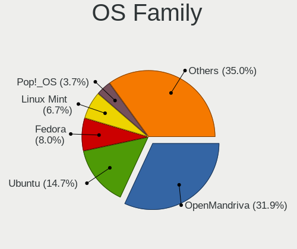
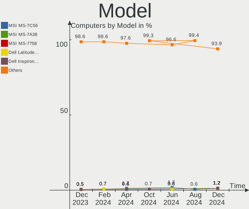
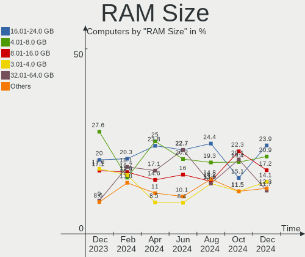
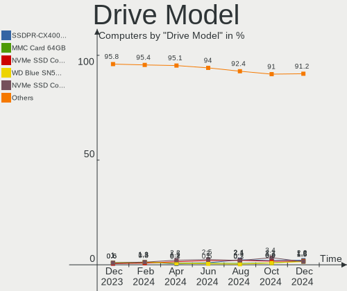
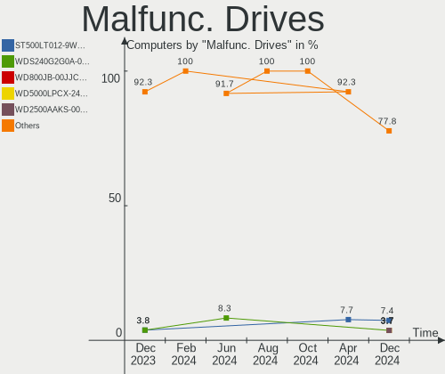
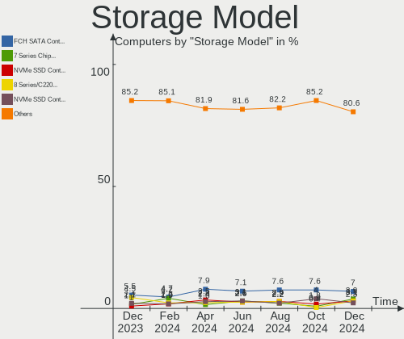
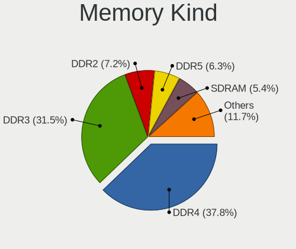

Linux in Poland - Hardware Trends
---------------------------------

A project to identify most popular hardware characteristics and track their change
over time based on data collected by Linux users at https://Linux-Hardware.org.

Anyone can contribute to this report by the [hw-probe](https://github.com/linuxhw/hw-probe) tool:

    sudo -E hw-probe -all -upload

This is a report for all computer types. See also reports for [desktops](/Location/Poland/Desktop/README.md) and [notebooks](/Location/Poland/Notebook/README.md).

Period: Jul, 2022.

Contents
--------

* [ System ](#system)
  - [ OS                       ](#os)
  - [ OS Family                ](#os-family)
  - [ Kernel                   ](#kernel)
  - [ Kernel Family            ](#kernel-family)
  - [ Kernel Major Ver.        ](#kernel-major-ver)
  - [ Arch                     ](#arch)
  - [ DE                       ](#de)
  - [ Display Server           ](#display-server)
  - [ Display Manager          ](#display-manager)
  - [ OS Lang                  ](#os-lang)
  - [ Boot Mode                ](#boot-mode)
  - [ Filesystem               ](#filesystem)
  - [ Part. scheme             ](#part-scheme)
  - [ Dual Boot with Linux/BSD ](#dual-boot-with-linuxbsd)
  - [ Dual Boot (Win)          ](#dual-boot-win)

* [ Board ](#board)
  - [ Vendor                   ](#vendor)
  - [ Model                    ](#model)
  - [ Model Family             ](#model-family)
  - [ MFG Year                 ](#mfg-year)
  - [ Form Factor              ](#form-factor)
  - [ Secure Boot              ](#secure-boot)
  - [ Coreboot                 ](#coreboot)
  - [ RAM Size                 ](#ram-size)
  - [ RAM Used                 ](#ram-used)
  - [ Total Drives             ](#total-drives)
  - [ Has CD-ROM               ](#has-cd-rom)
  - [ Has Ethernet             ](#has-ethernet)
  - [ Has WiFi                 ](#has-wifi)
  - [ Has Bluetooth            ](#has-bluetooth)

* [ Location ](#location)
  - [ Country                  ](#country)
  - [ City                     ](#city)

* [ Drives ](#drives)
  - [ Drive Vendor             ](#drive-vendor)
  - [ Drive Model              ](#drive-model)
  - [ HDD Vendor               ](#hdd-vendor)
  - [ SSD Vendor               ](#ssd-vendor)
  - [ Drive Kind               ](#drive-kind)
  - [ Drive Connector          ](#drive-connector)
  - [ Drive Size               ](#drive-size)
  - [ Space Total              ](#space-total)
  - [ Space Used               ](#space-used)
  - [ Malfunc. Drives          ](#malfunc-drives)
  - [ Malfunc. Drive Vendor    ](#malfunc-drive-vendor)
  - [ Malfunc. HDD Vendor      ](#malfunc-hdd-vendor)
  - [ Malfunc. Drive Kind      ](#malfunc-drive-kind)
  - [ Failed Drives            ](#failed-drives)
  - [ Failed Drive Vendor      ](#failed-drive-vendor)
  - [ Drive Status             ](#drive-status)

* [ Storage controller ](#storage-controller)
  - [ Storage Vendor           ](#storage-vendor)
  - [ Storage Model            ](#storage-model)
  - [ Storage Kind             ](#storage-kind)

* [ Processor ](#processor)
  - [ CPU Vendor               ](#cpu-vendor)
  - [ CPU Model                ](#cpu-model)
  - [ CPU Model Family         ](#cpu-model-family)
  - [ CPU Cores                ](#cpu-cores)
  - [ CPU Sockets              ](#cpu-sockets)
  - [ CPU Threads              ](#cpu-threads)
  - [ CPU Op-Modes             ](#cpu-op-modes)
  - [ CPU Microcode            ](#cpu-microcode)
  - [ CPU Microarch            ](#cpu-microarch)

* [ Graphics ](#graphics)
  - [ GPU Vendor               ](#gpu-vendor)
  - [ GPU Model                ](#gpu-model)
  - [ GPU Combo                ](#gpu-combo)
  - [ GPU Driver               ](#gpu-driver)
  - [ GPU Memory               ](#gpu-memory)

* [ Monitor ](#monitor)
  - [ Monitor Vendor           ](#monitor-vendor)
  - [ Monitor Model            ](#monitor-model)
  - [ Monitor Resolution       ](#monitor-resolution)
  - [ Monitor Diagonal         ](#monitor-diagonal)
  - [ Monitor Width            ](#monitor-width)
  - [ Aspect Ratio             ](#aspect-ratio)
  - [ Monitor Area             ](#monitor-area)
  - [ Pixel Density            ](#pixel-density)
  - [ Multiple Monitors        ](#multiple-monitors)

* [ Network ](#network)
  - [ Net Controller Vendor    ](#net-controller-vendor)
  - [ Net Controller Model     ](#net-controller-model)
  - [ Wireless Vendor          ](#wireless-vendor)
  - [ Wireless Model           ](#wireless-model)
  - [ Ethernet Vendor          ](#ethernet-vendor)
  - [ Ethernet Model           ](#ethernet-model)
  - [ Net Controller Kind      ](#net-controller-kind)
  - [ Used Controller          ](#used-controller)
  - [ NICs                     ](#nics)
  - [ IPv6                     ](#ipv6)

* [ Bluetooth ](#bluetooth)
  - [ Bluetooth Vendor         ](#bluetooth-vendor)
  - [ Bluetooth Model          ](#bluetooth-model)

* [ Sound ](#sound)
  - [ Sound Vendor             ](#sound-vendor)
  - [ Sound Model              ](#sound-model)

* [ Memory ](#memory)
  - [ Memory Vendor            ](#memory-vendor)
  - [ Memory Model             ](#memory-model)
  - [ Memory Kind              ](#memory-kind)
  - [ Memory Form Factor       ](#memory-form-factor)
  - [ Memory Size              ](#memory-size)
  - [ Memory Speed             ](#memory-speed)

* [ Printers & scanners ](#printers--scanners)
  - [ Printer Vendor           ](#printer-vendor)
  - [ Printer Model            ](#printer-model)
  - [ Scanner Vendor           ](#scanner-vendor)
  - [ Scanner Model            ](#scanner-model)

* [ Camera ](#camera)
  - [ Camera Vendor            ](#camera-vendor)
  - [ Camera Model             ](#camera-model)

* [ Security ](#security)
  - [ Fingerprint Vendor       ](#fingerprint-vendor)
  - [ Fingerprint Model        ](#fingerprint-model)
  - [ Chipcard Vendor          ](#chipcard-vendor)
  - [ Chipcard Model           ](#chipcard-model)

* [ Unsupported ](#unsupported)
  - [ Unsupported Devices      ](#unsupported-devices)
  - [ Unsupported Device Types ](#unsupported-device-types)

System
------

OS
--

Installed operating systems

| Name                 | Computers | Percent |
|----------------------|-----------|---------|
| Ubuntu 22.04         | 12        | 11.43%  |
| Fedora 36            | 11        | 10.48%  |
| OpenMandriva 4.3     | 10        | 9.52%   |
| Ubuntu 20.04         | 9         | 8.57%   |
| Linux Mint 20.3      | 9         | 8.57%   |
| Zorin 16             | 5         | 4.76%   |
| Debian 11            | 5         | 4.76%   |
| Manjaro              | 4         | 3.81%   |
| Gentoo 2.8           | 4         | 3.81%   |
| Pop!_OS 22.04        | 3         | 2.86%   |
| Kubuntu 22.04        | 3         | 2.86%   |
| Ubuntu 18.04         | 2         | 1.9%    |
| ROSA R11.1           | 2         | 1.9%    |
| OpenMandriva 4.2     | 2         | 1.9%    |
| KDE neon 20.04       | 2         | 1.9%    |
| Arch Rolling         | 2         | 1.9%    |
| Arch                 | 2         | 1.9%    |
| Ubuntu 21.10         | 1         | 0.95%   |
| ROSA R9              | 1         | 0.95%   |
| ROSA 12.1            | 1         | 0.95%   |
| RHEL 8               | 1         | 0.95%   |
| Raspbian 11          | 1         | 0.95%   |
| OpenMandriva 4.90    | 1         | 0.95%   |
| MX 21                | 1         | 0.95%   |
| Manjaro 21.3.4       | 1         | 0.95%   |
| Manjaro 21.3.3       | 1         | 0.95%   |
| Manjaro 21.3.1       | 1         | 0.95%   |
| Lubuntu 22.04        | 1         | 0.95%   |
| LinuxFX 11           | 1         | 0.95%   |
| Linux Mint 19        | 1         | 0.95%   |
| Kubuntu 11.1         | 1         | 0.95%   |
| Kali 2022.3          | 1         | 0.95%   |
| Garuda Linux Soaring | 1         | 0.95%   |
| Fedora 33            | 1         | 0.95%   |
| Elementary 6.1       | 1         | 0.95%   |

OS Family
---------

OS without a version

| Name         | Computers | Percent |
|--------------|-----------|---------|
| Ubuntu       | 24        | 22.86%  |
| OpenMandriva | 13        | 12.38%  |
| Fedora       | 12        | 11.43%  |
| Linux Mint   | 10        | 9.52%   |
| Manjaro      | 7         | 6.67%   |
| Zorin        | 5         | 4.76%   |
| Debian       | 5         | 4.76%   |
| ROSA         | 4         | 3.81%   |
| Kubuntu      | 4         | 3.81%   |
| Gentoo       | 4         | 3.81%   |
| Arch         | 4         | 3.81%   |
| Pop!_OS      | 3         | 2.86%   |
| KDE neon     | 2         | 1.9%    |
| RHEL         | 1         | 0.95%   |
| Raspbian     | 1         | 0.95%   |
| MX           | 1         | 0.95%   |
| Lubuntu      | 1         | 0.95%   |
| LinuxFX      | 1         | 0.95%   |
| Kali         | 1         | 0.95%   |
| Garuda Linux | 1         | 0.95%   |
| Elementary   | 1         | 0.95%   |

Kernel
------

Version of the Linux kernel

| Version                            | Computers | Percent |
|------------------------------------|-----------|---------|
| 5.15.0-41-generic                  | 13        | 12.38%  |
| 5.16.7-desktop-1omv4003            | 8         | 7.62%   |
| 5.4.0-122-generic                  | 6         | 5.71%   |
| 5.13.0-52-generic                  | 6         | 5.71%   |
| 5.4.0-121-generic                  | 5         | 4.76%   |
| 5.15.0-40-generic                  | 4         | 3.81%   |
| 5.17.15-76051715-generic           | 3         | 2.86%   |
| 5.15.0-43-generic                  | 3         | 2.86%   |
| 5.18.9-200.fc36.x86_64             | 2         | 1.9%    |
| 5.18.7-200.fc36.x86_64             | 2         | 1.9%    |
| 5.18.12-3-MANJARO                  | 2         | 1.9%    |
| 5.18.11-200.fc36.x86_64            | 2         | 1.9%    |
| 5.16.13-desktop-1omv4003           | 2         | 1.9%    |
| 5.15.52-gentoo                     | 2         | 1.9%    |
| 5.15.49-1-MANJARO                  | 2         | 1.9%    |
| 5.10.14-desktop-1omv4002           | 2         | 1.9%    |
| 5.10.0-15-amd64                    | 2         | 1.9%    |
| 5.4.32-generic-2rosa-x86_64        | 1         | 0.95%   |
| 5.4.0-91-generic                   | 1         | 0.95%   |
| 5.4.0-117-generic                  | 1         | 0.95%   |
| 5.4.0-110-generic                  | 1         | 0.95%   |
| 5.18.8-arch1-1                     | 1         | 0.95%   |
| 5.18.8-200.fc36.x86_64             | 1         | 0.95%   |
| 5.18.7-zen1-1-zen                  | 1         | 0.95%   |
| 5.18.6-201.fsync.fc36.x86_64       | 1         | 0.95%   |
| 5.18.6-1-MANJARO                   | 1         | 0.95%   |
| 5.18.5-arch1-g14-1                 | 1         | 0.95%   |
| 5.18.14-zen1-1-zen                 | 1         | 0.95%   |
| 5.18.13-200.fc36.x86_64            | 1         | 0.95%   |
| 5.18.12-desktop-3omv4090           | 1         | 0.95%   |
| 5.18.12-arch1-1                    | 1         | 0.95%   |
| 5.18.11-lqx1-1-lqx                 | 1         | 0.95%   |
| 5.18.10-201.fsync.fc36.x86_64      | 1         | 0.95%   |
| 5.18.10-200.fc36.x86_64            | 1         | 0.95%   |
| 5.18.0-kali5-amd64                 | 1         | 0.95%   |
| 5.18.0-gbfc780ef1ca0               | 1         | 0.95%   |
| 5.18.0-0.bpo.1-amd64               | 1         | 0.95%   |
| 5.17.15-1-MANJARO                  | 1         | 0.95%   |
| 5.17.0-1012-oem                    | 1         | 0.95%   |
| 5.16.0-6mx-amd64                   | 1         | 0.95%   |
| 5.15.41-gentoo                     | 1         | 0.95%   |
| 5.15.32-v8+                        | 1         | 0.95%   |
| 5.15.32+                           | 1         | 0.95%   |
| 5.15.0-39-generic                  | 1         | 0.95%   |
| 5.15.0-33-generic                  | 1         | 0.95%   |
| 5.15.0-25-generic                  | 1         | 0.95%   |
| 5.14.18-100.fc33.x86_64            | 1         | 0.95%   |
| 5.13.0-41-generic                  | 1         | 0.95%   |
| 5.13.0-28-generic                  | 1         | 0.95%   |
| 5.13.0-27-generic                  | 1         | 0.95%   |
| 5.10.74-generic-2rosa2021.1-x86_64 | 1         | 0.95%   |
| 5.10.0-6-amd64                     | 1         | 0.95%   |
| 4.9.20-nrj-desktop-1rosa-x86_64    | 1         | 0.95%   |
| 4.9.155-nrj-desktop-1rosa-x86_64   | 1         | 0.95%   |
| 4.18.0-372.13.1.el8_6.x86_64       | 1         | 0.95%   |
| 4.15.0-20-generic                  | 1         | 0.95%   |

Kernel Family
-------------

Linux kernel without a distro release

| Version | Computers | Percent |
|---------|-----------|---------|
| 5.15.0  | 23        | 21.9%   |
| 5.4.0   | 14        | 13.33%  |
| 5.13.0  | 9         | 8.57%   |
| 5.16.7  | 8         | 7.62%   |
| 5.18.12 | 4         | 3.81%   |
| 5.17.15 | 4         | 3.81%   |
| 5.18.7  | 3         | 2.86%   |
| 5.18.11 | 3         | 2.86%   |
| 5.18.0  | 3         | 2.86%   |
| 5.10.0  | 3         | 2.86%   |
| 5.18.9  | 2         | 1.9%    |
| 5.18.8  | 2         | 1.9%    |
| 5.18.6  | 2         | 1.9%    |
| 5.18.10 | 2         | 1.9%    |
| 5.16.13 | 2         | 1.9%    |
| 5.15.52 | 2         | 1.9%    |
| 5.15.49 | 2         | 1.9%    |
| 5.15.32 | 2         | 1.9%    |
| 5.10.14 | 2         | 1.9%    |
| 5.4.32  | 1         | 0.95%   |
| 5.18.5  | 1         | 0.95%   |
| 5.18.14 | 1         | 0.95%   |
| 5.18.13 | 1         | 0.95%   |
| 5.17.0  | 1         | 0.95%   |
| 5.16.0  | 1         | 0.95%   |
| 5.15.41 | 1         | 0.95%   |
| 5.14.18 | 1         | 0.95%   |
| 5.10.74 | 1         | 0.95%   |
| 4.9.20  | 1         | 0.95%   |
| 4.9.155 | 1         | 0.95%   |
| 4.18.0  | 1         | 0.95%   |
| 4.15.0  | 1         | 0.95%   |

Kernel Major Ver.
-----------------

Linux kernel major version

| Version | Computers | Percent |
|---------|-----------|---------|
| 5.15    | 30        | 28.57%  |
| 5.18    | 24        | 22.86%  |
| 5.4     | 15        | 14.29%  |
| 5.16    | 11        | 10.48%  |
| 5.13    | 9         | 8.57%   |
| 5.10    | 6         | 5.71%   |
| 5.17    | 5         | 4.76%   |
| 4.9     | 2         | 1.9%    |
| 5.14    | 1         | 0.95%   |
| 4.18    | 1         | 0.95%   |
| 4.15    | 1         | 0.95%   |

Arch
----

OS architecture (x86_64, i586, etc.)

| Name    | Computers | Percent |
|---------|-----------|---------|
| x86_64  | 102       | 97.14%  |
| i686    | 1         | 0.95%   |
| armv6l  | 1         | 0.95%   |
| aarch64 | 1         | 0.95%   |

DE
--

Desktop Environment

| Name       | Computers | Percent |
|------------|-----------|---------|
| GNOME      | 42        | 40%     |
| KDE5       | 31        | 29.52%  |
| Unknown    | 11        | 10.48%  |
| XFCE       | 6         | 5.71%   |
| MATE       | 5         | 4.76%   |
| KDE4       | 3         | 2.86%   |
| X-Cinnamon | 2         | 1.9%    |
| Pantheon   | 1         | 0.95%   |
| LXQt       | 1         | 0.95%   |
| i3         | 1         | 0.95%   |
| Deepin     | 1         | 0.95%   |
| Cinnamon   | 1         | 0.95%   |

Display Server
--------------

X11 or Wayland

| Name    | Computers | Percent |
|---------|-----------|---------|
| X11     | 70        | 66.67%  |
| Wayland | 24        | 22.86%  |
| Unknown | 6         | 5.71%   |
| Tty     | 5         | 4.76%   |

Display Manager
---------------

SDDM, LightDM, etc.

| Name    | Computers | Percent |
|---------|-----------|---------|
| Unknown | 40        | 38.1%   |
| SDDM    | 21        | 20%     |
| GDM3    | 18        | 17.14%  |
| LightDM | 13        | 12.38%  |
| GDM     | 9         | 8.57%   |
| KDM     | 3         | 2.86%   |
| Ly      | 1         | 0.95%   |

OS Lang
-------

Language

| Lang    | Computers | Percent |
|---------|-----------|---------|
| pl_PL   | 57        | 54.29%  |
| en_US   | 32        | 30.48%  |
| en_GB   | 4         | 3.81%   |
| Unknown | 4         | 3.81%   |
| C       | 3         | 2.86%   |
| uk_UA   | 2         | 1.9%    |
| ru_RU   | 1         | 0.95%   |
| en_CA   | 1         | 0.95%   |
| C.UTF8  | 1         | 0.95%   |

Boot Mode
---------

EFI or BIOS

| Mode | Computers | Percent |
|------|-----------|---------|
| EFI  | 53        | 50.48%  |
| BIOS | 52        | 49.52%  |

Filesystem
----------

Type of filesystem

| Type     | Computers | Percent |
|----------|-----------|---------|
| Ext4     | 72        | 68.57%  |
| Btrfs    | 18        | 17.14%  |
| Overlay  | 8         | 7.62%   |
| F2fs     | 4         | 3.81%   |
| Zfs      | 1         | 0.95%   |
| Xfs      | 1         | 0.95%   |
| Bcachefs | 1         | 0.95%   |

Part. scheme
------------

Scheme of partitioning

| Type    | Computers | Percent |
|---------|-----------|---------|
| Unknown | 46        | 43.81%  |
| GPT     | 40        | 38.1%   |
| MBR     | 19        | 18.1%   |

Dual Boot with Linux/BSD
------------------------

Hosting more than one Linux/BSD

| Dual boot | Computers | Percent |
|-----------|-----------|---------|
| No        | 85        | 80.95%  |
| Yes       | 20        | 19.05%  |

Dual Boot (Win)
---------------

Hosting Linux and Windows

| Dual boot | Computers | Percent |
|-----------|-----------|---------|
| No        | 75        | 71.43%  |
| Yes       | 30        | 28.57%  |

Board
-----

Vendor
------

Motherboard manufacturer

| Name                    | Computers | Percent |
|-------------------------|-----------|---------|
| Lenovo                  | 25        | 23.81%  |
| ASUSTek Computer        | 16        | 15.24%  |
| Hewlett-Packard         | 14        | 13.33%  |
| Dell                    | 14        | 13.33%  |
| MSI                     | 12        | 11.43%  |
| Gigabyte Technology     | 6         | 5.71%   |
| ASRock                  | 3         | 2.86%   |
| Acer                    | 3         | 2.86%   |
| Raspberry Pi Foundation | 2         | 1.9%    |
| Intel                   | 2         | 1.9%    |
| Toshiba                 | 1         | 0.95%   |
| Samsung Electronics     | 1         | 0.95%   |
| Packard Bell            | 1         | 0.95%   |
| Hyperbook               | 1         | 0.95%   |
| HUAWEI                  | 1         | 0.95%   |
| Fujitsu                 | 1         | 0.95%   |
| Apple                   | 1         | 0.95%   |
| Unknown                 | 1         | 0.95%   |

Model
-----

Motherboard model

| Name                                         | Computers | Percent |
|----------------------------------------------|-----------|---------|
| Dell Inspiron 3451                           | 2         | 1.9%    |
| ASUS TUF Gaming B550-PLUS                    | 2         | 1.9%    |
| ASUS M4A78 PRO                               | 2         | 1.9%    |
| Toshiba Satellite L750D                      | 1         | 0.95%   |
| Samsung 905S3G/906S3G/915S3G/9305SG          | 1         | 0.95%   |
| RPi Raspberry Pi Zero W Rev 1.1              | 1         | 0.95%   |
| RPi Raspberry Pi 4 Model B Rev 1.2           | 1         | 0.95%   |
| Packard Bell EasyNote TE11BZ                 | 1         | 0.95%   |
| MSI MS-7D43                                  | 1         | 0.95%   |
| MSI MS-7B79                                  | 1         | 0.95%   |
| MSI MS-7B18                                  | 1         | 0.95%   |
| MSI MS-7A74                                  | 1         | 0.95%   |
| MSI MS-7A72                                  | 1         | 0.95%   |
| MSI MS-7A70                                  | 1         | 0.95%   |
| MSI MS-7A38                                  | 1         | 0.95%   |
| MSI MS-7A34                                  | 1         | 0.95%   |
| MSI MS-7A33                                  | 1         | 0.95%   |
| MSI MS-7817                                  | 1         | 0.95%   |
| MSI GF63 Thin 8RCS                           | 1         | 0.95%   |
| MSI Creator Z17 A12UHST                      | 1         | 0.95%   |
| Lenovo ThinkPad X220 4291WSH                 | 1         | 0.95%   |
| Lenovo ThinkPad X1 Extreme 20MF000TPB        | 1         | 0.95%   |
| Lenovo ThinkPad T450s 20BX002NMS             | 1         | 0.95%   |
| Lenovo ThinkPad T410 2537W2L                 | 1         | 0.95%   |
| Lenovo ThinkPad R61 8932FJG                  | 1         | 0.95%   |
| Lenovo ThinkPad P53 20QNS00Y00               | 1         | 0.95%   |
| Lenovo ThinkPad P15 Gen 1 20ST001BPB         | 1         | 0.95%   |
| Lenovo ThinkPad L480 20LS002CPB              | 1         | 0.95%   |
| Lenovo ThinkPad Edge E430 3254A8G            | 1         | 0.95%   |
| Lenovo ThinkPad E470 20H1007MPB              | 1         | 0.95%   |
| Lenovo ThinkPad E15 Gen 2 20T8004RPB         | 1         | 0.95%   |
| Lenovo ThinkCentre M93p 10AA0022EU           | 1         | 0.95%   |
| Lenovo ThinkCentre M58p 6234F73              | 1         | 0.95%   |
| Lenovo MIIX 320-10ICR 80XF                   | 1         | 0.95%   |
| Lenovo IdeaPad S540-14API 81NH               | 1         | 0.95%   |
| Lenovo IdeaPad S145-14IIL 81W6               | 1         | 0.95%   |
| Lenovo IdeaPad 700-15ISK 80RU                | 1         | 0.95%   |
| Lenovo IdeaPad 5 Pro 16IHU6 82L9             | 1         | 0.95%   |
| Lenovo IdeaPad 5 15ITL05 82FG                | 1         | 0.95%   |
| Lenovo IdeaCentre Y710 Cube-15ISH 90FL007LPB | 1         | 0.95%   |
| Lenovo IdeaCentre Y700-34ISH 90DF003SPL      | 1         | 0.95%   |
| Lenovo G580 20150                            | 1         | 0.95%   |
| Lenovo G50-70 20351                          | 1         | 0.95%   |
| Lenovo G50-30 80G0                           | 1         | 0.95%   |
| Lenovo 1051L 60073                           | 1         | 0.95%   |
| Intel DH67VR AAG27177-201                    | 1         | 0.95%   |
| Intel DG31PR AAD97573-301                    | 1         | 0.95%   |
| Hyperbook Z15 Zen                            | 1         | 0.95%   |
| HUAWEI NBLK-WAX9X                            | 1         | 0.95%   |
| HP Z400 Workstation                          | 1         | 0.95%   |
| HP t620 Quad Core TC                         | 1         | 0.95%   |
| HP ProLiant ML330 G6                         | 1         | 0.95%   |
| HP ProBook 6475b                             | 1         | 0.95%   |
| HP ProBook 4740s                             | 1         | 0.95%   |
| HP Pavilion dv6700                           | 1         | 0.95%   |
| HP OMEN Laptop 15-en0xxx                     | 1         | 0.95%   |
| HP Laptop 15s-eq1xxx                         | 1         | 0.95%   |
| HP Laptop 15s-eq0xxx                         | 1         | 0.95%   |
| HP EliteDesk 705 G4 SFF                      | 1         | 0.95%   |
| HP EliteBook 8570w                           | 1         | 0.95%   |

Model Family
------------

Motherboard model prefix

| Name                   | Computers | Percent |
|------------------------|-----------|---------|
| Lenovo ThinkPad        | 11        | 10.48%  |
| Dell Latitude          | 7         | 6.67%   |
| Lenovo IdeaPad         | 5         | 4.76%   |
| Dell Inspiron          | 3         | 2.86%   |
| ASUS TUF               | 3         | 2.86%   |
| Acer Aspire            | 3         | 2.86%   |
| RPi Raspberry          | 2         | 1.9%    |
| Lenovo ThinkCentre     | 2         | 1.9%    |
| Lenovo IdeaCentre      | 2         | 1.9%    |
| HP ProBook             | 2         | 1.9%    |
| HP Laptop              | 2         | 1.9%    |
| HP EliteBook           | 2         | 1.9%    |
| Dell Precision         | 2         | 1.9%    |
| ASUS ROG               | 2         | 1.9%    |
| ASUS M4A78             | 2         | 1.9%    |
| Toshiba Satellite      | 1         | 0.95%   |
| Samsung 905S3G         | 1         | 0.95%   |
| Packard Bell EasyNote  | 1         | 0.95%   |
| MSI MS-7D43            | 1         | 0.95%   |
| MSI MS-7B79            | 1         | 0.95%   |
| MSI MS-7B18            | 1         | 0.95%   |
| MSI MS-7A74            | 1         | 0.95%   |
| MSI MS-7A72            | 1         | 0.95%   |
| MSI MS-7A70            | 1         | 0.95%   |
| MSI MS-7A38            | 1         | 0.95%   |
| MSI MS-7A34            | 1         | 0.95%   |
| MSI MS-7A33            | 1         | 0.95%   |
| MSI MS-7817            | 1         | 0.95%   |
| MSI GF63               | 1         | 0.95%   |
| MSI Creator            | 1         | 0.95%   |
| Lenovo MIIX            | 1         | 0.95%   |
| Lenovo G580            | 1         | 0.95%   |
| Lenovo G50-70          | 1         | 0.95%   |
| Lenovo G50-30          | 1         | 0.95%   |
| Lenovo 1051L           | 1         | 0.95%   |
| Intel DH67VR           | 1         | 0.95%   |
| Intel DG31PR           | 1         | 0.95%   |
| Hyperbook Z15          | 1         | 0.95%   |
| HUAWEI NBLK-WAX9X      | 1         | 0.95%   |
| HP Z400                | 1         | 0.95%   |
| HP t620                | 1         | 0.95%   |
| HP ProLiant            | 1         | 0.95%   |
| HP Pavilion            | 1         | 0.95%   |
| HP OMEN                | 1         | 0.95%   |
| HP EliteDesk           | 1         | 0.95%   |
| HP 550                 | 1         | 0.95%   |
| HP 250                 | 1         | 0.95%   |
| Gigabyte Z97M-DS3H     | 1         | 0.95%   |
| Gigabyte Z590          | 1         | 0.95%   |
| Gigabyte GA-78LMT-USB3 | 1         | 0.95%   |
| Gigabyte B85M-D3H      | 1         | 0.95%   |
| Gigabyte B450M         | 1         | 0.95%   |
| Gigabyte AB350-Gaming  | 1         | 0.95%   |
| Fujitsu ESPRIMO        | 1         | 0.95%   |
| Dell XPS               | 1         | 0.95%   |
| Dell OptiPlex          | 1         | 0.95%   |
| ASUS X55U              | 1         | 0.95%   |
| ASUS X550CL            | 1         | 0.95%   |
| ASUS VivoBook          | 1         | 0.95%   |
| ASUS SABERTOOTH        | 1         | 0.95%   |

MFG Year
--------

Motherboard manufacture year

| Year    | Computers | Percent |
|---------|-----------|---------|
| 2020    | 14        | 13.33%  |
| 2019    | 9         | 8.57%   |
| 2014    | 9         | 8.57%   |
| 2012    | 9         | 8.57%   |
| 2018    | 8         | 7.62%   |
| 2017    | 8         | 7.62%   |
| 2016    | 7         | 6.67%   |
| 2021    | 6         | 5.71%   |
| 2011    | 6         | 5.71%   |
| 2008    | 6         | 5.71%   |
| 2015    | 5         | 4.76%   |
| 2013    | 5         | 4.76%   |
| 2009    | 4         | 3.81%   |
| 2007    | 3         | 2.86%   |
| 2010    | 2         | 1.9%    |
| Unknown | 2         | 1.9%    |
| 2022    | 1         | 0.95%   |
| 2006    | 1         | 0.95%   |

Form Factor
-----------

Physical design of the computer

| Name           | Computers | Percent |
|----------------|-----------|---------|
| Notebook       | 56        | 53.33%  |
| Desktop        | 44        | 41.9%   |
| System on chip | 2         | 1.9%    |
| Tablet         | 2         | 1.9%    |
| All in one     | 1         | 0.95%   |

Secure Boot
-----------

Enabled or disabled

| State    | Computers | Percent |
|----------|-----------|---------|
| Disabled | 100       | 95.24%  |
| Enabled  | 5         | 4.76%   |

Coreboot
--------

Have coreboot on board

| Used | Computers | Percent |
|------|-----------|---------|
| No   | 105       | 100%    |

RAM Size
--------

Total RAM memory

| Size in GB  | Computers | Percent |
|-------------|-----------|---------|
| 4.01-8.0    | 23        | 21.9%   |
| 16.01-24.0  | 23        | 21.9%   |
| 3.01-4.0    | 20        | 19.05%  |
| 32.01-64.0  | 16        | 15.24%  |
| 8.01-16.0   | 13        | 12.38%  |
| 64.01-256.0 | 4         | 3.81%   |
| 1.01-2.0    | 3         | 2.86%   |
| 24.01-32.0  | 1         | 0.95%   |
| 2.01-3.0    | 1         | 0.95%   |
| 0.01-0.5    | 1         | 0.95%   |

RAM Used
--------

Used RAM memory

| Used GB    | Computers | Percent |
|------------|-----------|---------|
| 1.01-2.0   | 36        | 34.29%  |
| 2.01-3.0   | 25        | 23.81%  |
| 4.01-8.0   | 19        | 18.1%   |
| 3.01-4.0   | 14        | 13.33%  |
| 8.01-16.0  | 4         | 3.81%   |
| 16.01-24.0 | 3         | 2.86%   |
| 0.01-0.5   | 3         | 2.86%   |
| 0.51-1.0   | 1         | 0.95%   |

Total Drives
------------

Number of drives on board

| Drives | Computers | Percent |
|--------|-----------|---------|
| 1      | 53        | 50.48%  |
| 2      | 27        | 25.71%  |
| 4      | 12        | 11.43%  |
| 3      | 8         | 7.62%   |
| 6      | 2         | 1.9%    |
| 7      | 1         | 0.95%   |
| 5      | 1         | 0.95%   |
| 0      | 1         | 0.95%   |

Has CD-ROM
----------

Has CD-ROM on board

| Presented | Computers | Percent |
|-----------|-----------|---------|
| No        | 67        | 63.81%  |
| Yes       | 38        | 36.19%  |

Has Ethernet
------------

Has Ethernet on board

| Presented | Computers | Percent |
|-----------|-----------|---------|
| Yes       | 90        | 85.71%  |
| No        | 15        | 14.29%  |

Has WiFi
--------

Has WiFi module

| Presented | Computers | Percent |
|-----------|-----------|---------|
| Yes       | 74        | 70.48%  |
| No        | 31        | 29.52%  |

Has Bluetooth
-------------

Has Bluetooth module

| Presented | Computers | Percent |
|-----------|-----------|---------|
| Yes       | 63        | 60%     |
| No        | 42        | 40%     |

Location
--------

Country
-------

Geographic location (country)

| Country | Computers | Percent |
|---------|-----------|---------|
| Poland  | 105       | 100%    |

City
----

Geographic location (city)

| City                 | Computers | Percent |
|----------------------|-----------|---------|
| Warsaw               | 25        | 23.81%  |
| Krakow               | 10        | 9.52%   |
| Wroclaw              | 9         | 8.57%   |
| Poznan               | 4         | 3.81%   |
| Strzyzow             | 2         | 1.9%    |
| Racibórz            | 2         | 1.9%    |
| Lodz                 | 2         | 1.9%    |
| Jastrzębie Zdrój   | 2         | 1.9%    |
| Gdansk               | 2         | 1.9%    |
| Cieszyn              | 2         | 1.9%    |
| Bytom                | 2         | 1.9%    |
| Arciechow            | 2         | 1.9%    |
| Wołomin             | 1         | 0.95%   |
| Wola Krzysztoporska  | 1         | 0.95%   |
| Wałbrzych           | 1         | 0.95%   |
| Unieszewo            | 1         | 0.95%   |
| Torun                | 1         | 0.95%   |
| Szemud               | 1         | 0.95%   |
| Świnoujście        | 1         | 0.95%   |
| Stasi Las            | 1         | 0.95%   |
| Stalowa Wola         | 1         | 0.95%   |
| Skorcz               | 1         | 0.95%   |
| Rumia                | 1         | 0.95%   |
| Ruda Śląska        | 1         | 0.95%   |
| Pilica               | 1         | 0.95%   |
| Oświęcim           | 1         | 0.95%   |
| Opole                | 1         | 0.95%   |
| Olsztyn              | 1         | 0.95%   |
| Olkusz               | 1         | 0.95%   |
| Nowa Sol             | 1         | 0.95%   |
| Międzyrzec Podlaski | 1         | 0.95%   |
| Malbork              | 1         | 0.95%   |
| Lubawka              | 1         | 0.95%   |
| Lowicz               | 1         | 0.95%   |
| Lancut               | 1         | 0.95%   |
| Kwidzyn              | 1         | 0.95%   |
| Katowice             | 1         | 0.95%   |
| Ilza                 | 1         | 0.95%   |
| Hrubieszów          | 1         | 0.95%   |
| Grudziądz           | 1         | 0.95%   |
| Gmina Strzelin       | 1         | 0.95%   |
| Glogowek             | 1         | 0.95%   |
| Gliwice              | 1         | 0.95%   |
| Elblag               | 1         | 0.95%   |
| Dobrzen Wielki       | 1         | 0.95%   |
| Dalekie              | 1         | 0.95%   |
| Częstochowa         | 1         | 0.95%   |
| Czersk               | 1         | 0.95%   |
| Czechowice-Dziedzice | 1         | 0.95%   |
| Bukowiec             | 1         | 0.95%   |
| Brzoskwinia          | 1         | 0.95%   |
| Brzeziny             | 1         | 0.95%   |
| Bogucin Duzy         | 1         | 0.95%   |

Drives
------

Drive Vendor
------------

Hard drive vendors

| Vendor              | Computers | Drives | Percent |
|---------------------|-----------|--------|---------|
| Seagate             | 22        | 29     | 12.43%  |
| Samsung Electronics | 22        | 27     | 12.43%  |
| WDC                 | 19        | 24     | 10.73%  |
| GOODRAM             | 18        | 18     | 10.17%  |
| Toshiba             | 14        | 18     | 7.91%   |
| A-DATA Technology   | 8         | 8      | 4.52%   |
| Unknown             | 7         | 7      | 3.95%   |
| SK hynix            | 7         | 7      | 3.95%   |
| Crucial             | 7         | 7      | 3.95%   |
| SanDisk             | 6         | 6      | 3.39%   |
| Kingston            | 6         | 7      | 3.39%   |
| Hitachi             | 5         | 7      | 2.82%   |
| HGST                | 4         | 4      | 2.26%   |
| SPCC                | 3         | 3      | 1.69%   |
| Micron Technology   | 3         | 3      | 1.69%   |
| Intel               | 3         | 3      | 1.69%   |
| KIOXIA-EXCERIA      | 2         | 2      | 1.13%   |
| KIOXIA              | 2         | 2      | 1.13%   |
| Corsair             | 2         | 2      | 1.13%   |
| XPG                 | 1         | 2      | 0.56%   |
| Transcend           | 1         | 1      | 0.56%   |
| SSSTC               | 1         | 1      | 0.56%   |
| SSD 120G            | 1         | 1      | 0.56%   |
| SATAFIRM            | 1         | 1      | 0.56%   |
| PNY                 | 1         | 1      | 0.56%   |
| Plextor             | 1         | 1      | 0.56%   |
| Phison              | 1         | 1      | 0.56%   |
| Patriot             | 1         | 1      | 0.56%   |
| Lite-On             | 1         | 1      | 0.56%   |
| Lexar               | 1         | 1      | 0.56%   |
| Kingchuxing         | 1         | 2      | 0.56%   |
| Fujitsu             | 1         | 1      | 0.56%   |
| ASMedia             | 1         | 1      | 0.56%   |
| Apple               | 1         | 2      | 0.56%   |
| Apacer              | 1         | 2      | 0.56%   |
| ADATA SU            | 1         | 1      | 0.56%   |

Drive Model
-----------

Hard drive models

| Model                                | Computers | Percent |
|--------------------------------------|-----------|---------|
| Samsung SSD 860 EVO 500GB            | 3         | 1.52%   |
| Intel NVMe SSD Drive 512GB           | 3         | 1.52%   |
| WDC WDS480G2G0A-00JH30 480GB SSD     | 2         | 1.01%   |
| WDC WD5000AAKX-08U6AA0 500GB         | 2         | 1.01%   |
| Unknown MMC Card  32GB               | 2         | 1.01%   |
| Toshiba HDWE150 5TB                  | 2         | 1.01%   |
| Toshiba HDWD130 3TB                  | 2         | 1.01%   |
| Seagate ST500LT012-1DG142 500GB      | 2         | 1.01%   |
| Seagate Expansion 1TB                | 2         | 1.01%   |
| Samsung SSD 860 EVO 1TB              | 2         | 1.01%   |
| Samsung NVMe SSD Drive 500GB         | 2         | 1.01%   |
| Micron NVMe SSD Drive 512GB          | 2         | 1.01%   |
| HGST HTS721010A9E630 1TB             | 2         | 1.01%   |
| GOODRAM SSDPR-CX400-128-G2 128GB     | 2         | 1.01%   |
| GOODRAM SSDPR-CL100-480-G2 480GB     | 2         | 1.01%   |
| GOODRAM C40 120GB SSD                | 2         | 1.01%   |
| A-DATA SU800 256GB SSD               | 2         | 1.01%   |
| A-DATA SU800 1TB SSD                 | 2         | 1.01%   |
| A-DATA SU650 120GB SSD               | 2         | 1.01%   |
| XPG GAMMIX S11 Pro 256GB             | 1         | 0.51%   |
| WDC WDS250G2B0A-00SM50 250GB SSD     | 1         | 0.51%   |
| WDC WDS100T3X0C-00SJG0 1TB           | 1         | 0.51%   |
| WDC WDS100T2B0C-00PXH0 1TB           | 1         | 0.51%   |
| WDC WD5002ABYS-01B1B0 500GB          | 1         | 0.51%   |
| WDC WD5000LPVX-22V0TT0 500GB         | 1         | 0.51%   |
| WDC WD5000LPCX-24C6HT0 500GB         | 1         | 0.51%   |
| WDC WD5000AAKX-001CA0 500GB          | 1         | 0.51%   |
| WDC WD5000AAKS-00V1A0 500GB          | 1         | 0.51%   |
| WDC WD40EFRX-68N32N0 4TB             | 1         | 0.51%   |
| WDC WD40 EFZX-68AWUN0 4TB            | 1         | 0.51%   |
| WDC WD2500JB-00REA0 250GB            | 1         | 0.51%   |
| WDC WD2500AAKX-75U6AA0 250GB         | 1         | 0.51%   |
| WDC WD2500AAKX-753CA1 250GB          | 1         | 0.51%   |
| WDC WD20SPZX-00UA7T0 2TB             | 1         | 0.51%   |
| WDC WD20EZAZ-00L9GB0 2TB             | 1         | 0.51%   |
| WDC WD20EARX-00PASB0 2TB             | 1         | 0.51%   |
| WDC WD10EZEX-60WN4A0 1TB             | 1         | 0.51%   |
| WDC WD10EZEX-60M2NA0 1TB             | 1         | 0.51%   |
| WDC WD10EZEX-08M2NA0 1TB             | 1         | 0.51%   |
| WDC PC SN520 SDAPMUW-256G-1101 256GB | 1         | 0.51%   |
| Unknown SM32G  32GB                  | 1         | 0.51%   |
| Unknown SA08G  8GB                   | 1         | 0.51%   |
| Unknown SA04G  4GB                   | 1         | 0.51%   |
| Unknown MMC Card  4GB                | 1         | 0.51%   |
| Unknown MMC Card  16GB               | 1         | 0.51%   |
| Transcend TS128GMTS400S 128GB SSD    | 1         | 0.51%   |
| Toshiba THNSNJ256GCSU 256GB SSD      | 1         | 0.51%   |
| Toshiba MQ01ABD100 1TB               | 1         | 0.51%   |
| Toshiba MK6475GSX 640GB              | 1         | 0.51%   |
| Toshiba MK6008GAH 64GB               | 1         | 0.51%   |
| Toshiba MK2546GSX 250GB              | 1         | 0.51%   |
| Toshiba MK1646GSX 160GB              | 1         | 0.51%   |
| Toshiba HDWQ140 4TB                  | 1         | 0.51%   |
| Toshiba HDWD120 2TB                  | 1         | 0.51%   |
| Toshiba HDWD110 1TB                  | 1         | 0.51%   |
| Toshiba DT01ACA100 1TB               | 1         | 0.51%   |
| Toshiba DT01ACA050 500GB             | 1         | 0.51%   |
| SSSTC CVB-8D128-HP 128GB SSD         | 1         | 0.51%   |
| SSD 120G B 120GB                     | 1         | 0.51%   |
| SPCC SPCCSolidStateDisk 512GB SSD    | 1         | 0.51%   |

HDD Vendor
----------

Hard disk drive vendors

| Vendor              | Computers | Drives | Percent |
|---------------------|-----------|--------|---------|
| Seagate             | 22        | 29     | 33.33%  |
| WDC                 | 15        | 18     | 22.73%  |
| Toshiba             | 13        | 17     | 19.7%   |
| Hitachi             | 5         | 7      | 7.58%   |
| HGST                | 4         | 4      | 6.06%   |
| Samsung Electronics | 3         | 3      | 4.55%   |
| SATAFIRM            | 1         | 1      | 1.52%   |
| Fujitsu             | 1         | 1      | 1.52%   |
| ASMedia             | 1         | 1      | 1.52%   |
| Apple               | 1         | 1      | 1.52%   |

SSD Vendor
----------

Solid state drive vendors

| Vendor              | Computers | Drives | Percent |
|---------------------|-----------|--------|---------|
| GOODRAM             | 16        | 16     | 25%     |
| Samsung Electronics | 10        | 13     | 15.63%  |
| A-DATA Technology   | 8         | 8      | 12.5%   |
| Crucial             | 6         | 6      | 9.38%   |
| SanDisk             | 4         | 4      | 6.25%   |
| Kingston            | 4         | 4      | 6.25%   |
| WDC                 | 3         | 3      | 4.69%   |
| SPCC                | 3         | 3      | 4.69%   |
| Transcend           | 1         | 1      | 1.56%   |
| Toshiba             | 1         | 1      | 1.56%   |
| SSSTC               | 1         | 1      | 1.56%   |
| SK hynix            | 1         | 1      | 1.56%   |
| Patriot             | 1         | 1      | 1.56%   |
| KIOXIA-EXCERIA      | 1         | 1      | 1.56%   |
| Kingchuxing         | 1         | 1      | 1.56%   |
| Apple               | 1         | 1      | 1.56%   |
| Apacer              | 1         | 2      | 1.56%   |
| ADATA SU            | 1         | 1      | 1.56%   |

Drive Kind
----------

HDD or SSD

| Kind    | Computers | Drives | Percent |
|---------|-----------|--------|---------|
| HDD     | 53        | 82     | 34.64%  |
| SSD     | 52        | 68     | 33.99%  |
| NVMe    | 40        | 47     | 26.14%  |
| MMC     | 7         | 7      | 4.58%   |
| Unknown | 1         | 1      | 0.65%   |

Drive Connector
---------------

SATA, SAS, NVMe, etc.

| Type | Computers | Drives | Percent |
|------|-----------|--------|---------|
| SATA | 77        | 143    | 58.33%  |
| NVMe | 40        | 47     | 30.3%   |
| SAS  | 8         | 8      | 6.06%   |
| MMC  | 7         | 7      | 5.3%    |

Drive Size
----------

Size of hard drive

| Size in TB | Computers | Drives | Percent |
|------------|-----------|--------|---------|
| 0.01-0.5   | 62        | 80     | 53.45%  |
| 0.51-1.0   | 32        | 42     | 27.59%  |
| 3.01-4.0   | 8         | 9      | 6.9%    |
| 1.01-2.0   | 8         | 9      | 6.9%    |
| 2.01-3.0   | 3         | 6      | 2.59%   |
| 4.01-10.0  | 2         | 3      | 1.72%   |
| 10.01-20.0 | 1         | 1      | 0.86%   |

Space Total
-----------

Amount of disk space available on the file system

| Size in GB     | Computers | Percent |
|----------------|-----------|---------|
| 101-250        | 24        | 22.86%  |
| 251-500        | 23        | 21.9%   |
| 501-1000       | 10        | 9.52%   |
| More than 3000 | 8         | 7.62%   |
| 1001-2000      | 8         | 7.62%   |
| 1-20           | 8         | 7.62%   |
| Unknown        | 8         | 7.62%   |
| 21-50          | 6         | 5.71%   |
| 2001-3000      | 5         | 4.76%   |
| 51-100         | 5         | 4.76%   |

Space Used
----------

Amount of used disk space

| Used GB        | Computers | Percent |
|----------------|-----------|---------|
| 1-20           | 37        | 35.24%  |
| 101-250        | 17        | 16.19%  |
| 21-50          | 13        | 12.38%  |
| 1001-2000      | 8         | 7.62%   |
| 51-100         | 8         | 7.62%   |
| Unknown        | 8         | 7.62%   |
| 251-500        | 6         | 5.71%   |
| 501-1000       | 4         | 3.81%   |
| More than 3000 | 3         | 2.86%   |
| 2001-3000      | 1         | 0.95%   |

Malfunc. Drives
---------------

Drive models with a malfunction

| Model                             | Computers | Drives | Percent |
|-----------------------------------|-----------|--------|---------|
| WDC WD5002ABYS-01B1B0 500GB       | 1         | 1      | 6.67%   |
| WDC WD40EFRX-68N32N0 4TB          | 1         | 1      | 6.67%   |
| Toshiba MQ01ABD100 1TB            | 1         | 1      | 6.67%   |
| Toshiba MK6008GAH 64GB            | 1         | 1      | 6.67%   |
| Toshiba MK2546GSX 250GB           | 1         | 1      | 6.67%   |
| SSSTC CVB-8D128-HP 128GB SSD      | 1         | 1      | 6.67%   |
| Seagate ST500LT012-9WS142 500GB   | 1         | 1      | 6.67%   |
| Seagate ST31500341AS 1TB          | 1         | 1      | 6.67%   |
| Seagate ST1000DM003-9YN162 1TB    | 1         | 1      | 6.67%   |
| Samsung Electronics HM160HI 160GB | 1         | 1      | 6.67%   |
| Lexar 1TB SSD                     | 1         | 1      | 6.67%   |
| Hitachi HTS541616J9SA00 160GB     | 1         | 1      | 6.67%   |
| Hitachi HDS721050CLA362 500GB     | 1         | 1      | 6.67%   |
| GOODRAM SSD 120GB                 | 1         | 1      | 6.67%   |
| ASMedia ASM235 4TB                | 1         | 1      | 6.67%   |

Malfunc. Drive Vendor
---------------------

Vendors of faulty drives

| Vendor              | Computers | Drives | Percent |
|---------------------|-----------|--------|---------|
| Toshiba             | 3         | 3      | 20%     |
| Seagate             | 3         | 3      | 20%     |
| WDC                 | 2         | 2      | 13.33%  |
| Hitachi             | 2         | 2      | 13.33%  |
| SSSTC               | 1         | 1      | 6.67%   |
| Samsung Electronics | 1         | 1      | 6.67%   |
| Lexar               | 1         | 1      | 6.67%   |
| GOODRAM             | 1         | 1      | 6.67%   |
| ASMedia             | 1         | 1      | 6.67%   |

Malfunc. HDD Vendor
-------------------

Vendors of faulty HDD drives

| Vendor              | Computers | Drives | Percent |
|---------------------|-----------|--------|---------|
| Toshiba             | 3         | 3      | 25%     |
| Seagate             | 3         | 3      | 25%     |
| WDC                 | 2         | 2      | 16.67%  |
| Hitachi             | 2         | 2      | 16.67%  |
| Samsung Electronics | 1         | 1      | 8.33%   |
| ASMedia             | 1         | 1      | 8.33%   |

Malfunc. Drive Kind
-------------------

Kinds of faulty drives

| Kind | Computers | Drives | Percent |
|------|-----------|--------|---------|
| HDD  | 10        | 12     | 76.92%  |
| SSD  | 2         | 2      | 15.38%  |
| NVMe | 1         | 1      | 7.69%   |

Failed Drives
-------------

Failed drive models

Zero info for selected period =(

Failed Drive Vendor
-------------------

Failed drive vendors

Zero info for selected period =(

Drive Status
------------

Number of failed and malfunc. drives

| Status   | Computers | Drives | Percent |
|----------|-----------|--------|---------|
| Works    | 54        | 99     | 45.76%  |
| Detected | 51        | 91     | 43.22%  |
| Malfunc  | 13        | 15     | 11.02%  |

Storage controller
------------------

Storage Vendor
--------------

Storage controller vendors

| Vendor                       | Computers | Percent |
|------------------------------|-----------|---------|
| Intel                        | 62        | 47.33%  |
| AMD                          | 24        | 18.32%  |
| Samsung Electronics          | 10        | 7.63%   |
| SK hynix                     | 6         | 4.58%   |
| SanDisk                      | 4         | 3.05%   |
| Phison Electronics           | 4         | 3.05%   |
| Silicon Motion               | 3         | 2.29%   |
| Micron Technology            | 3         | 2.29%   |
| Kingston Technology Company  | 3         | 2.29%   |
| KIOXIA                       | 2         | 1.53%   |
| JMicron Technology           | 2         | 1.53%   |
| ASMedia Technology           | 2         | 1.53%   |
| Toshiba America Info Systems | 1         | 0.76%   |
| Shenzhen Longsys Electronics | 1         | 0.76%   |
| Micron/Crucial Technology    | 1         | 0.76%   |
| Marvell Technology Group     | 1         | 0.76%   |
| Lite-On Technology           | 1         | 0.76%   |
| ADATA Technology             | 1         | 0.76%   |

Storage Model
-------------

Storage controller models

| Model                                                                          | Computers | Percent |
|--------------------------------------------------------------------------------|-----------|---------|
| AMD FCH SATA Controller [AHCI mode]                                            | 15        | 9.8%    |
| Samsung NVMe SSD Controller SM981/PM981/PM983                                  | 7         | 4.58%   |
| Intel 8 Series/C220 Series Chipset Family 6-port SATA Controller 1 [AHCI mode] | 6         | 3.92%   |
| Intel Sunrise Point-LP SATA Controller [AHCI mode]                             | 5         | 3.27%   |
| Intel 7 Series Chipset Family 6-port SATA Controller [AHCI mode]               | 5         | 3.27%   |
| AMD SB7x0/SB8x0/SB9x0 SATA Controller [IDE mode]                               | 4         | 2.61%   |
| AMD SB7x0/SB8x0/SB9x0 IDE Controller                                           | 4         | 2.61%   |
| AMD 300 Series Chipset SATA Controller                                         | 4         | 2.61%   |
| SK hynix Gold P31 SSD                                                          | 3         | 1.96%   |
| Silicon Motion SM2263EN/SM2263XT SSD Controller                                | 3         | 1.96%   |
| Phison E12 NVMe Controller                                                     | 3         | 1.96%   |
| Micron Non-Volatile memory controller                                          | 3         | 1.96%   |
| Intel SATA Controller [RAID mode]                                              | 3         | 1.96%   |
| Intel Q170/Q150/B150/H170/H110/Z170/CM236 Chipset SATA Controller [AHCI Mode]  | 3         | 1.96%   |
| Intel Atom Processor E3800 Series SATA AHCI Controller                         | 3         | 1.96%   |
| Intel 82801HM/HEM (ICH8M/ICH8M-E) SATA Controller [AHCI mode]                  | 3         | 1.96%   |
| Intel 82801HM/HEM (ICH8M/ICH8M-E) IDE Controller                               | 3         | 1.96%   |
| Intel 200 Series PCH SATA controller [AHCI mode]                               | 3         | 1.96%   |
| AMD 500 Series Chipset SATA Controller                                         | 3         | 1.96%   |
| AMD 400 Series Chipset SATA Controller                                         | 3         | 1.96%   |
| SK hynix Non-Volatile memory controller                                        | 2         | 1.31%   |
| SanDisk WD Black SN750 / PC SN730 NVMe SSD                                     | 2         | 1.31%   |
| SanDisk PC SN520 NVMe SSD                                                      | 2         | 1.31%   |
| Samsung NVMe SSD Controller PM9A1/PM9A3/980PRO                                 | 2         | 1.31%   |
| Kingston Company A2000 NVMe SSD                                                | 2         | 1.31%   |
| JMicron JMB363 SATA/IDE Controller                                             | 2         | 1.31%   |
| Intel Volume Management Device NVMe RAID Controller                            | 2         | 1.31%   |
| Intel HM170/QM170 Chipset SATA Controller [AHCI Mode]                          | 2         | 1.31%   |
| Intel 82801G (ICH7 Family) IDE Controller                                      | 2         | 1.31%   |
| Intel 6 Series/C200 Series Chipset Family 6 port Mobile SATA AHCI Controller   | 2         | 1.31%   |
| Intel 6 Series/C200 Series Chipset Family 6 port Desktop SATA AHCI Controller  | 2         | 1.31%   |
| Intel 4 Series Chipset PT IDER Controller                                      | 2         | 1.31%   |
| ASMedia ASM1062 Serial ATA Controller                                          | 2         | 1.31%   |
| Toshiba America Info Systems XG6 NVMe SSD Controller                           | 1         | 0.65%   |
| SK hynix BC501 NVMe Solid State Drive                                          | 1         | 0.65%   |
| Shenzhen Longsys Electronics Non-Volatile memory controller                    | 1         | 0.65%   |
| SanDisk Non-Volatile memory controller                                         | 1         | 0.65%   |
| Samsung NVMe SSD Controller 980                                                | 1         | 0.65%   |
| Phison E7 NVMe Controller                                                      | 1         | 0.65%   |
| Micron/Crucial P2 NVMe PCIe SSD                                                | 1         | 0.65%   |
| Marvell Group 88SS9183 PCIe SSD Controller                                     | 1         | 0.65%   |
| Lite-On Non-Volatile memory controller                                         | 1         | 0.65%   |
| KIOXIA NVMe SSD Controller BG4                                                 | 1         | 0.65%   |
| KIOXIA NVMe SSD                                                                | 1         | 0.65%   |
| Kingston Company KC2000 NVMe SSD                                               | 1         | 0.65%   |
| Intel Wildcat Point-LP SATA Controller [AHCI Mode]                             | 1         | 0.65%   |
| Intel Tiger Lake-LP SATA Controller                                            | 1         | 0.65%   |
| Intel SSD Pro 7600p/760p/E 6100p Series                                        | 1         | 0.65%   |
| Intel SSD 660P Series                                                          | 1         | 0.65%   |
| Intel Non-Volatile memory controller                                           | 1         | 0.65%   |
| Intel NM10/ICH7 Family SATA Controller [IDE mode]                              | 1         | 0.65%   |
| Intel Ice Lake-LP SATA Controller [AHCI mode]                                  | 1         | 0.65%   |
| Intel Celeron/Pentium Silver Processor SATA Controller                         | 1         | 0.65%   |
| Intel Cannon Lake PCH SATA AHCI Controller                                     | 1         | 0.65%   |
| Intel Cannon Lake Mobile PCH SATA AHCI Controller                              | 1         | 0.65%   |
| Intel C600/X79 series chipset 6-Port SATA AHCI Controller                      | 1         | 0.65%   |
| Intel Alder Lake-S PCH SATA Controller [AHCI Mode]                             | 1         | 0.65%   |
| Intel 9 Series Chipset Family SATA Controller [AHCI Mode]                      | 1         | 0.65%   |
| Intel 82801JI (ICH10 Family) SATA AHCI Controller                              | 1         | 0.65%   |
| Intel 82801JI (ICH10 Family) 4 port SATA IDE Controller #1                     | 1         | 0.65%   |

Storage Kind
------------

Kind of storage controller (IDE, SATA, NVMe, SAS, ...)

| Kind | Computers | Percent |
|------|-----------|---------|
| SATA | 75        | 54.74%  |
| NVMe | 40        | 29.2%   |
| IDE  | 16        | 11.68%  |
| RAID | 6         | 4.38%   |

Processor
---------

CPU Vendor
----------

Processor vendors

| Vendor | Computers | Percent |
|--------|-----------|---------|
| Intel  | 72        | 68.57%  |
| AMD    | 31        | 29.52%  |
| ARM    | 2         | 1.9%    |

CPU Model
---------

Processor models

| Model                                         | Computers | Percent |
|-----------------------------------------------|-----------|---------|
| Intel Core i5-7200U CPU @ 2.50GHz             | 3         | 2.86%   |
| AMD Ryzen 5 3500U with Radeon Vega Mobile Gfx | 3         | 2.86%   |
| Intel Xeon CPU X5650 @ 2.67GHz                | 2         | 1.9%    |
| Intel Core i5-8250U CPU @ 1.60GHz             | 2         | 1.9%    |
| Intel Core i5-4690 CPU @ 3.50GHz              | 2         | 1.9%    |
| Intel Celeron CPU N2840 @ 2.16GHz             | 2         | 1.9%    |
| Intel 11th Gen Core i5-1135G7 @ 2.40GHz       | 2         | 1.9%    |
| AMD Ryzen 7 4800H with Radeon Graphics        | 2         | 1.9%    |
| AMD Ryzen 5 1600X Six-Core Processor          | 2         | 1.9%    |
| Intel Xeon CPU W3680 @ 3.33GHz                | 1         | 0.95%   |
| Intel Xeon CPU E5440 @ 2.83GHz                | 1         | 0.95%   |
| Intel Xeon CPU E5-2630 v2 @ 2.60GHz           | 1         | 0.95%   |
| Intel Pentium Silver N5000 CPU @ 1.10GHz      | 1         | 0.95%   |
| Intel Pentium Dual CPU T3200 @ 2.00GHz        | 1         | 0.95%   |
| Intel Pentium Dual CPU T2370 @ 1.73GHz        | 1         | 0.95%   |
| Intel Pentium CPU N3540 @ 2.16GHz             | 1         | 0.95%   |
| Intel Pentium CPU G4560 @ 3.50GHz             | 1         | 0.95%   |
| Intel Pentium CPU G3220 @ 3.00GHz             | 1         | 0.95%   |
| Intel Pentium CPU 2117U @ 1.80GHz             | 1         | 0.95%   |
| Intel Pentium CPU 2020M @ 2.40GHz             | 1         | 0.95%   |
| Intel Core i9-9880H CPU @ 2.30GHz             | 1         | 0.95%   |
| Intel Core i7-9700K CPU @ 3.60GHz             | 1         | 0.95%   |
| Intel Core i7-8750H CPU @ 2.20GHz             | 1         | 0.95%   |
| Intel Core i7-6700HQ CPU @ 2.60GHz            | 1         | 0.95%   |
| Intel Core i7-6600U CPU @ 2.60GHz             | 1         | 0.95%   |
| Intel Core i7-4800MQ CPU @ 2.70GHz            | 1         | 0.95%   |
| Intel Core i7-3740QM CPU @ 2.70GHz            | 1         | 0.95%   |
| Intel Core i7-3632QM CPU @ 2.20GHz            | 1         | 0.95%   |
| Intel Core i7-10850H CPU @ 2.70GHz            | 1         | 0.95%   |
| Intel Core i7-10750H CPU @ 2.60GHz            | 1         | 0.95%   |
| Intel Core i5-9300H CPU @ 2.40GHz             | 1         | 0.95%   |
| Intel Core i5-8300H CPU @ 2.30GHz             | 1         | 0.95%   |
| Intel Core i5-7500 CPU @ 3.40GHz              | 1         | 0.95%   |
| Intel Core i5-7400 CPU @ 3.00GHz              | 1         | 0.95%   |
| Intel Core i5-7300U CPU @ 2.60GHz             | 1         | 0.95%   |
| Intel Core i5-6600K CPU @ 3.50GHz             | 1         | 0.95%   |
| Intel Core i5-6600 CPU @ 3.30GHz              | 1         | 0.95%   |
| Intel Core i5-6400 CPU @ 2.70GHz              | 1         | 0.95%   |
| Intel Core i5-6300HQ CPU @ 2.30GHz            | 1         | 0.95%   |
| Intel Core i5-5300U CPU @ 2.30GHz             | 1         | 0.95%   |
| Intel Core i5-4670 CPU @ 3.40GHz              | 1         | 0.95%   |
| Intel Core i5-4590T CPU @ 2.00GHz             | 1         | 0.95%   |
| Intel Core i5-4570T CPU @ 2.90GHz             | 1         | 0.95%   |
| Intel Core i5-4460 CPU @ 3.20GHz              | 1         | 0.95%   |
| Intel Core i5-3570K CPU @ 3.40GHz             | 1         | 0.95%   |
| Intel Core i5-3210M CPU @ 2.50GHz             | 1         | 0.95%   |
| Intel Core i5-2540M CPU @ 2.60GHz             | 1         | 0.95%   |
| Intel Core i5-2520M CPU @ 2.50GHz             | 1         | 0.95%   |
| Intel Core i5-2500K CPU @ 3.30GHz             | 1         | 0.95%   |
| Intel Core i5-2310 CPU @ 2.90GHz              | 1         | 0.95%   |
| Intel Core i5-1035G1 CPU @ 1.00GHz            | 1         | 0.95%   |
| Intel Core i5-10300H CPU @ 2.50GHz            | 1         | 0.95%   |
| Intel Core i5 CPU M 520 @ 2.40GHz             | 1         | 0.95%   |
| Intel Core i3-4005U CPU @ 1.70GHz             | 1         | 0.95%   |
| Intel Core Duo CPU U2500 @ 1.20GHz            | 1         | 0.95%   |
| Intel Core 2 Quad CPU Q8300 @ 2.50GHz         | 1         | 0.95%   |
| Intel Core 2 Quad CPU Q8200 @ 2.33GHz         | 1         | 0.95%   |
| Intel Core 2 Duo CPU T7250 @ 2.00GHz          | 1         | 0.95%   |
| Intel Core 2 Duo CPU T5670 @ 1.80GHz          | 1         | 0.95%   |
| Intel Core 2 Duo CPU T5450 @ 1.66GHz          | 1         | 0.95%   |

CPU Model Family
----------------

Processor model prefix

| Model                | Computers | Percent |
|----------------------|-----------|---------|
| Intel Core i5        | 30        | 28.57%  |
| AMD Ryzen 5          | 11        | 10.48%  |
| Intel Core i7        | 9         | 8.57%   |
| Other                | 8         | 7.62%   |
| Intel Xeon           | 5         | 4.76%   |
| Intel Pentium        | 5         | 4.76%   |
| AMD Ryzen 7          | 5         | 4.76%   |
| Intel Core 2 Duo     | 4         | 3.81%   |
| Intel Pentium Dual   | 2         | 1.9%    |
| Intel Core 2 Quad    | 2         | 1.9%    |
| Intel Celeron        | 2         | 1.9%    |
| Intel Atom           | 2         | 1.9%    |
| AMD Ryzen 3          | 2         | 1.9%    |
| Intel Pentium Silver | 1         | 0.95%   |
| Intel Core i9        | 1         | 0.95%   |
| Intel Core i3        | 1         | 0.95%   |
| Intel Core Duo       | 1         | 0.95%   |
| ARM BCM              | 1         | 0.95%   |
| AMD Sempron          | 1         | 0.95%   |
| AMD Ryzen 9          | 1         | 0.95%   |
| AMD Ryzen 5 PRO      | 1         | 0.95%   |
| AMD Quad-Core        | 1         | 0.95%   |
| AMD Phenom II X6     | 1         | 0.95%   |
| AMD Phenom II X4     | 1         | 0.95%   |
| AMD GX               | 1         | 0.95%   |
| AMD FX               | 1         | 0.95%   |
| AMD E1               | 1         | 0.95%   |
| AMD E                | 1         | 0.95%   |
| AMD C-60             | 1         | 0.95%   |
| AMD Athlon II X2     | 1         | 0.95%   |
| AMD A8               | 1         | 0.95%   |

CPU Cores
---------

Number of processor cores

| Number  | Computers | Percent |
|---------|-----------|---------|
| 4       | 47        | 44.76%  |
| 2       | 29        | 27.62%  |
| 6       | 16        | 15.24%  |
| 8       | 9         | 8.57%   |
| 14      | 1         | 0.95%   |
| 12      | 1         | 0.95%   |
| 1       | 1         | 0.95%   |
| Unknown | 1         | 0.95%   |

CPU Sockets
-----------

Number of sockets

| Number | Computers | Percent |
|--------|-----------|---------|
| 1      | 105       | 100%    |

CPU Threads
-----------

Threads per core (Hyper-Threading)

| Number  | Computers | Percent |
|---------|-----------|---------|
| 2       | 56        | 53.33%  |
| 1       | 48        | 45.71%  |
| Unknown | 1         | 0.95%   |

CPU Op-Modes
------------

CPU Operation Modes (32-bit, 64-bit)

| Op mode        | Computers | Percent |
|----------------|-----------|---------|
| 32-bit, 64-bit | 103       | 98.1%   |
| 32-bit         | 1         | 0.95%   |
| Unknown        | 1         | 0.95%   |

CPU Microcode
-------------

Microcode number

| Number     | Computers | Percent |
|------------|-----------|---------|
| Unknown    | 23        | 21.9%   |
| 0x306c3    | 7         | 6.67%   |
| 0x306a9    | 5         | 4.76%   |
| 0x6fd      | 4         | 3.81%   |
| 0x506e3    | 4         | 3.81%   |
| 0x30678    | 4         | 3.81%   |
| 0x206a7    | 4         | 3.81%   |
| 0x08108109 | 4         | 3.81%   |
| 0xa0652    | 3         | 2.86%   |
| 0x906ea    | 3         | 2.86%   |
| 0x906e9    | 3         | 2.86%   |
| 0x806e9    | 3         | 2.86%   |
| 0x1067a    | 3         | 2.86%   |
| 0x08001138 | 3         | 2.86%   |
| 0x806c1    | 2         | 1.9%    |
| 0x206c2    | 2         | 1.9%    |
| 0x0a201016 | 2         | 1.9%    |
| 0x0700010f | 2         | 1.9%    |
| 0xa0671    | 1         | 0.95%   |
| 0x906ed    | 1         | 0.95%   |
| 0x906ec    | 1         | 0.95%   |
| 0x906a3    | 1         | 0.95%   |
| 0x806ea    | 1         | 0.95%   |
| 0x806d1    | 1         | 0.95%   |
| 0x706a1    | 1         | 0.95%   |
| 0x6ec      | 1         | 0.95%   |
| 0x406c4    | 1         | 0.95%   |
| 0x40651    | 1         | 0.95%   |
| 0x306e4    | 1         | 0.95%   |
| 0x20652    | 1         | 0.95%   |
| 0x10677    | 1         | 0.95%   |
| 0x0a50000d | 1         | 0.95%   |
| 0x0a20120a | 1         | 0.95%   |
| 0x08600106 | 1         | 0.95%   |
| 0x08600103 | 1         | 0.95%   |
| 0x08101016 | 1         | 0.95%   |
| 0x0800820d | 1         | 0.95%   |
| 0x06001119 | 1         | 0.95%   |
| 0x05000101 | 1         | 0.95%   |
| 0x010000dc | 1         | 0.95%   |
| 0x010000db | 1         | 0.95%   |
| 0x010000c7 | 1         | 0.95%   |

CPU Microarch
-------------

Microarchitecture

| Name             | Computers | Percent |
|------------------|-----------|---------|
| KabyLake         | 14        | 13.33%  |
| Haswell          | 9         | 8.57%   |
| Zen+             | 7         | 6.67%   |
| IvyBridge        | 7         | 6.67%   |
| Skylake          | 6         | 5.71%   |
| Zen 2            | 5         | 4.76%   |
| Silvermont       | 5         | 4.76%   |
| Core             | 5         | 4.76%   |
| Zen 3            | 4         | 3.81%   |
| Zen              | 4         | 3.81%   |
| Westmere         | 4         | 3.81%   |
| SandyBridge      | 4         | 3.81%   |
| Penryn           | 4         | 3.81%   |
| TigerLake        | 3         | 2.86%   |
| K10              | 3         | 2.86%   |
| Jaguar           | 3         | 2.86%   |
| Icelake          | 3         | 2.86%   |
| CometLake        | 3         | 2.86%   |
| Bobcat           | 3         | 2.86%   |
| Unknown          | 3         | 2.86%   |
| Piledriver       | 2         | 1.9%    |
| P6               | 1         | 0.95%   |
| Goldmont plus    | 1         | 0.95%   |
| Broadwell        | 1         | 0.95%   |
| Alderlake Hybrid | 1         | 0.95%   |

Graphics
--------

GPU Vendor
----------

Vendors of graphics cards

| Vendor | Computers | Percent |
|--------|-----------|---------|
| Intel  | 49        | 39.2%   |
| Nvidia | 39        | 31.2%   |
| AMD    | 37        | 29.6%   |

GPU Model
---------

Graphics card models

| Model                                                                         | Computers | Percent |
|-------------------------------------------------------------------------------|-----------|---------|
| Intel HD Graphics 620                                                         | 4         | 3.13%   |
| Intel CoffeeLake-H GT2 [UHD Graphics 630]                                     | 4         | 3.13%   |
| Intel Atom Processor Z36xxx/Z37xxx Series Graphics & Display                  | 4         | 3.13%   |
| Intel 3rd Gen Core processor Graphics Controller                              | 4         | 3.13%   |
| AMD Renoir                                                                    | 4         | 3.13%   |
| AMD Picasso/Raven 2 [Radeon Vega Series / Radeon Vega Mobile Series]          | 4         | 3.13%   |
| Intel Xeon E3-1200 v3/4th Gen Core Processor Integrated Graphics Controller   | 3         | 2.34%   |
| Intel TigerLake-LP GT2 [Iris Xe Graphics]                                     | 3         | 2.34%   |
| Intel HD Graphics 530                                                         | 3         | 2.34%   |
| Intel 2nd Generation Core Processor Family Integrated Graphics Controller     | 3         | 2.34%   |
| Nvidia TU117GLM [Quadro T1000 Mobile]                                         | 2         | 1.56%   |
| Nvidia TU116M [GeForce GTX 1660 Ti Mobile]                                    | 2         | 1.56%   |
| Nvidia GT218 [GeForce 210]                                                    | 2         | 1.56%   |
| Nvidia GP108 [GeForce GT 1030]                                                | 2         | 1.56%   |
| Nvidia GP104 [GeForce GTX 1080]                                               | 2         | 1.56%   |
| Nvidia GM107M [GeForce GTX 950M]                                              | 2         | 1.56%   |
| Nvidia GF117M [GeForce 610M/710M/810M/820M / GT 620M/625M/630M/720M]          | 2         | 1.56%   |
| Intel UHD Graphics 620                                                        | 2         | 1.56%   |
| Intel Mobile GM965/GL960 Integrated Graphics Controller (secondary)           | 2         | 1.56%   |
| Intel Mobile GM965/GL960 Integrated Graphics Controller (primary)             | 2         | 1.56%   |
| Intel CometLake-H GT2 [UHD Graphics]                                          | 2         | 1.56%   |
| AMD Ellesmere [Radeon RX 470/480/570/570X/580/580X/590]                       | 2         | 1.56%   |
| AMD Cezanne                                                                   | 2         | 1.56%   |
| AMD Cedar [Radeon HD 5000/6000/7350/8350 Series]                              | 2         | 1.56%   |
| Nvidia TU117M [GeForce MX450]                                                 | 1         | 0.78%   |
| Nvidia TU117M                                                                 | 1         | 0.78%   |
| Nvidia TU106M [GeForce RTX 2060 Mobile]                                       | 1         | 0.78%   |
| Nvidia TU106 [GeForce RTX 2070]                                               | 1         | 0.78%   |
| Nvidia TU106 [GeForce RTX 2060 SUPER]                                         | 1         | 0.78%   |
| Nvidia TU104GLM [Quadro RTX 4000 Mobile / Max-Q]                              | 1         | 0.78%   |
| Nvidia NV41 [GeForce 6800 GS]                                                 | 1         | 0.78%   |
| Nvidia GP107M [GeForce GTX 1050 Ti Mobile]                                    | 1         | 0.78%   |
| Nvidia GP107M [GeForce GTX 1050 Mobile]                                       | 1         | 0.78%   |
| Nvidia GP107 [GeForce GTX 1050 Ti]                                            | 1         | 0.78%   |
| Nvidia GP106 [GeForce GTX 1060 6GB]                                           | 1         | 0.78%   |
| Nvidia GP104 [GeForce GTX 1070]                                               | 1         | 0.78%   |
| Nvidia GK208B [GeForce GT 730]                                                | 1         | 0.78%   |
| Nvidia GK107GLM [Quadro K2000M]                                               | 1         | 0.78%   |
| Nvidia GK107 [NVS 510]                                                        | 1         | 0.78%   |
| Nvidia GK107 [GeForce GT 740]                                                 | 1         | 0.78%   |
| Nvidia GK104 [GeForce GTX 770]                                                | 1         | 0.78%   |
| Nvidia GF119 [NVS 310]                                                        | 1         | 0.78%   |
| Nvidia GA104M [GeForce RTX 3080 Mobile / Max-Q 8GB/16GB]                      | 1         | 0.78%   |
| Nvidia GA104 [GeForce RTX 3070]                                               | 1         | 0.78%   |
| Nvidia GA104 [GeForce RTX 3070 Ti]                                            | 1         | 0.78%   |
| Nvidia GA104 [GeForce RTX 3060 Ti Lite Hash Rate]                             | 1         | 0.78%   |
| Nvidia GA103M [GeForce RTX 3080 Ti Mobile]                                    | 1         | 0.78%   |
| Nvidia G98M [GeForce 9300M GS]                                                | 1         | 0.78%   |
| Nvidia G86M [GeForce 8400M GS]                                                | 1         | 0.78%   |
| Intel TigerLake-H GT1 [UHD Graphics]                                          | 1         | 0.78%   |
| Intel Skylake GT2 [HD Graphics 520]                                           | 1         | 0.78%   |
| Intel Mobile GME965/GLE960 Integrated Graphics Controller                     | 1         | 0.78%   |
| Intel Mobile 945GM/GMS/GME, 943/940GML Express Integrated Graphics Controller | 1         | 0.78%   |
| Intel Mobile 945GM/GMS, 943/940GML Express Integrated Graphics Controller     | 1         | 0.78%   |
| Intel Iris Plus Graphics G1 (Ice Lake)                                        | 1         | 0.78%   |
| Intel HD Graphics 630                                                         | 1         | 0.78%   |
| Intel HD Graphics 610                                                         | 1         | 0.78%   |
| Intel HD Graphics 5500                                                        | 1         | 0.78%   |
| Intel Haswell-ULT Integrated Graphics Controller                              | 1         | 0.78%   |
| Intel GeminiLake [UHD Graphics 605]                                           | 1         | 0.78%   |

GPU Combo
---------

Combinations of graphics cards

| Name           | Computers | Percent |
|----------------|-----------|---------|
| 1 x Intel      | 30        | 28.57%  |
| 1 x AMD        | 28        | 26.67%  |
| 1 x Nvidia     | 22        | 20.95%  |
| Intel + Nvidia | 13        | 12.38%  |
| Intel + AMD    | 4         | 3.81%   |
| AMD + Nvidia   | 4         | 3.81%   |
| Other          | 2         | 1.9%    |
| 2 x Intel      | 2         | 1.9%    |

GPU Driver
----------

Free vs proprietary

| Driver      | Computers | Percent |
|-------------|-----------|---------|
| Free        | 78        | 74.29%  |
| Proprietary | 22        | 20.95%  |
| Unknown     | 5         | 4.76%   |

GPU Memory
----------

Total video memory

| Size in GB | Computers | Percent |
|------------|-----------|---------|
| Unknown    | 54        | 51.43%  |
| 1.01-2.0   | 15        | 14.29%  |
| 0.01-0.5   | 10        | 9.52%   |
| 7.01-8.0   | 9         | 8.57%   |
| 0.51-1.0   | 9         | 8.57%   |
| 3.01-4.0   | 6         | 5.71%   |
| 5.01-6.0   | 2         | 1.9%    |

Monitor
-------

Monitor Vendor
--------------

Monitor vendors

| Vendor              | Computers | Percent |
|---------------------|-----------|---------|
| AU Optronics        | 16        | 13.91%  |
| Samsung Electronics | 11        | 9.57%   |
| Chimei Innolux      | 11        | 9.57%   |
| Goldstar            | 9         | 7.83%   |
| LG Display          | 8         | 6.96%   |
| BOE                 | 7         | 6.09%   |
| NEC Computers       | 5         | 4.35%   |
| Hewlett-Packard     | 5         | 4.35%   |
| Dell                | 5         | 4.35%   |
| BenQ                | 4         | 3.48%   |
| AOC                 | 4         | 3.48%   |
| Acer                | 4         | 3.48%   |
| Lenovo              | 3         | 2.61%   |
| Fujitsu Siemens     | 3         | 2.61%   |
| Unknown             | 2         | 1.74%   |
| Sharp               | 2         | 1.74%   |
| Philips             | 2         | 1.74%   |
| LG Philips          | 2         | 1.74%   |
| Eizo                | 2         | 1.74%   |
| Toshiba             | 1         | 0.87%   |
| TCL                 | 1         | 0.87%   |
| RTK                 | 1         | 0.87%   |
| MSI                 | 1         | 0.87%   |
| LG Electronics      | 1         | 0.87%   |
| Iiyama              | 1         | 0.87%   |
| Idek Iiyama         | 1         | 0.87%   |
| CSO                 | 1         | 0.87%   |
| Apple               | 1         | 0.87%   |
| ADI                 | 1         | 0.87%   |

Monitor Model
-------------

Monitor models

| Model                                                                 | Computers | Percent |
|-----------------------------------------------------------------------|-----------|---------|
| BOE LCD Monitor BOE0629 1366x768 309x173mm 13.9-inch                  | 2         | 1.72%   |
| BenQ GW2265 BNQ78D1 1920x1080 477x268mm 21.5-inch                     | 2         | 1.72%   |
| AU Optronics LCD Monitor AUO21ED 1920x1080 344x194mm 15.5-inch        | 2         | 1.72%   |
| Unknown SMART TV 0563 1920x1080 1209x680mm 54.6-inch                  | 1         | 0.86%   |
| Unknown LCD Monitor FFFF 2288x1287 2550x2550mm 142.0-inch             | 1         | 0.86%   |
| Toshiba LCD Monitor LCD2306 1280x800 287x180mm 13.3-inch              | 1         | 0.86%   |
| TCL LCD TV TCL0030 1920x1080 708x398mm 32.0-inch                      | 1         | 0.86%   |
| Sharp LQ156M1JW25 SHP152C 1920x1080 344x194mm 15.5-inch               | 1         | 0.86%   |
| Sharp LCD Monitor SHP14D0 3840x2400 336x210mm 15.6-inch               | 1         | 0.86%   |
| Samsung Electronics SyncMaster SAM050B 1920x1080 477x268mm 21.5-inch  | 1         | 0.86%   |
| Samsung Electronics SyncMaster SAM0226 1440x900 410x257mm 19.1-inch   | 1         | 0.86%   |
| Samsung Electronics S22B300 SAM08C8 1920x1080 477x268mm 21.5-inch     | 1         | 0.86%   |
| Samsung Electronics LCD Monitor SEC5441 1366x768 344x194mm 15.5-inch  | 1         | 0.86%   |
| Samsung Electronics LCD Monitor SEC4D45 1280x800 331x207mm 15.4-inch  | 1         | 0.86%   |
| Samsung Electronics LCD Monitor SEC3554 1600x900 382x215mm 17.3-inch  | 1         | 0.86%   |
| Samsung Electronics LCD Monitor SEC3157 1280x800 303x190mm 14.1-inch  | 1         | 0.86%   |
| Samsung Electronics LCD Monitor SDC4852 1366x768 344x194mm 15.5-inch  | 1         | 0.86%   |
| Samsung Electronics LCD Monitor SAM7103 3840x2160 700x390mm 31.5-inch | 1         | 0.86%   |
| Samsung Electronics LCD Monitor LU28R55 3840x2160                     | 1         | 0.86%   |
| Samsung Electronics C24F390 SAM0D2C 1920x1080 521x293mm 23.5-inch     | 1         | 0.86%   |
| RTK LCD Monitor RTK1D1A 1920x1080 1020x570mm 46.0-inch                | 1         | 0.86%   |
| Philips PHL 246E7 PHLC107 1920x1080 521x293mm 23.5-inch               | 1         | 0.86%   |
| Philips 273PQPY PHLC096 1920x1080 597x336mm 27.0-inch                 | 1         | 0.86%   |
| NEC Computers LCD1770NX NEC6664 1280x1024 338x270mm 17.0-inch         | 1         | 0.86%   |
| NEC Computers LCD1550V NEC65C6 1024x768 300x230mm 14.9-inch           | 1         | 0.86%   |
| NEC Computers EA243WM NEC6863 1920x1200 519x324mm 24.1-inch           | 1         | 0.86%   |
| NEC Computers E241N NEC2C86 1920x1080 527x296mm 23.8-inch             | 1         | 0.86%   |
| NEC Computers 70GX2 NEC6691 1280x1024 338x270mm 17.0-inch             | 1         | 0.86%   |
| MSI MAG342CQR MSI3DB6 3440x1440 797x333mm 34.0-inch                   | 1         | 0.86%   |
| LG Philips LP154WX4-TLCB LPL3101 1280x800 331x207mm 15.4-inch         | 1         | 0.86%   |
| LG Philips LCD Monitor LPL3B01 1280x800 331x207mm 15.4-inch           | 1         | 0.86%   |
| LG Electronics LCD Monitor LG FULL HD                                 | 1         | 0.86%   |
| LG Display LCD Monitor LGD05EC 1920x1080 309x174mm 14.0-inch          | 1         | 0.86%   |
| LG Display LCD Monitor LGD0525 1366x768 344x194mm 15.5-inch           | 1         | 0.86%   |
| LG Display LCD Monitor LGD0490 1920x1080 309x174mm 14.0-inch          | 1         | 0.86%   |
| LG Display LCD Monitor LGD033E 1366x768 309x174mm 14.0-inch           | 1         | 0.86%   |
| LG Display LCD Monitor LGD033A 1366x768 344x194mm 15.5-inch           | 1         | 0.86%   |
| LG Display LCD Monitor LGD02DC 1366x768 344x194mm 15.5-inch           | 1         | 0.86%   |
| LG Display LCD Monitor LGD02D8 1366x768 277x156mm 12.5-inch           | 1         | 0.86%   |
| LG Display LCD Monitor LGD0259 1920x1080 345x194mm 15.6-inch          | 1         | 0.86%   |
| Lenovo LCD Monitor LEN40BA 1920x1080 344x194mm 15.5-inch              | 1         | 0.86%   |
| Lenovo LCD Monitor LEN4050 1280x800 331x207mm 15.4-inch               | 1         | 0.86%   |
| Lenovo LCD Monitor LEN4036 1440x900 303x189mm 14.1-inch               | 1         | 0.86%   |
| Iiyama PL2283H IVM562E 1920x1080 496x292mm 22.7-inch                  | 1         | 0.86%   |
| Idek Iiyama LCD Monitor PL2770QS 4480x1440                            | 1         | 0.86%   |
| Hewlett-Packard Z23n HWP3284 1920x1080 509x286mm 23.0-inch            | 1         | 0.86%   |
| Hewlett-Packard Z23n HWP3283 1920x1080 509x286mm 23.0-inch            | 1         | 0.86%   |
| Hewlett-Packard LA2306 HWP2949 1920x1080 510x287mm 23.0-inch          | 1         | 0.86%   |
| Hewlett-Packard L1925 HWP259A 1280x1024 376x301mm 19.0-inch           | 1         | 0.86%   |
| Hewlett-Packard L1502 HWP2600 1024x768 304x228mm 15.0-inch            | 1         | 0.86%   |
| Goldstar W1942 GSM4B6F 1440x900 408x255mm 18.9-inch                   | 1         | 0.86%   |
| Goldstar ULTRAWIDE GSM59F1 2560x1080 673x284mm 28.8-inch              | 1         | 0.86%   |
| Goldstar ULTRAGEAR GSM5BD3 2560x1440 697x392mm 31.5-inch              | 1         | 0.86%   |
| Goldstar MP59G GSM5B33 1920x1080 480x270mm 21.7-inch                  | 1         | 0.86%   |
| Goldstar IPS FULLHD GSM5AB6 1920x1080 480x270mm 21.7-inch             | 1         | 0.86%   |
| Goldstar HDR WQHD GSM772E 3440x1440 800x335mm 34.1-inch               | 1         | 0.86%   |
| Goldstar HDR WFHD GSM7714 2560x1080 798x334mm 34.1-inch               | 1         | 0.86%   |
| Goldstar HDR WFHD GSM5BBA 2560x1080 798x334mm 34.1-inch               | 1         | 0.86%   |
| Goldstar FHD GSM5BCA 1920x1080 480x270mm 21.7-inch                    | 1         | 0.86%   |
| Goldstar 27GK750F GSM770F 1920x1080 531x298mm 24.0-inch               | 1         | 0.86%   |

Monitor Resolution
------------------

Monitor screen resolution

| Resolution         | Computers | Percent |
|--------------------|-----------|---------|
| 1920x1080 (FHD)    | 49        | 43.75%  |
| 1366x768 (WXGA)    | 15        | 13.39%  |
| 3840x2160 (4K)     | 8         | 7.14%   |
| 1920x1200 (WUXGA)  | 6         | 5.36%   |
| 1280x800 (WXGA)    | 5         | 4.46%   |
| 1680x1050 (WSXGA+) | 4         | 3.57%   |
| 1280x1024 (SXGA)   | 4         | 3.57%   |
| 2560x1440 (QHD)    | 3         | 2.68%   |
| 2560x1080          | 3         | 2.68%   |
| 1440x900 (WXGA+)   | 3         | 2.68%   |
| 3440x1440          | 2         | 1.79%   |
| 2560x1600          | 2         | 1.79%   |
| 1600x900 (HD+)     | 2         | 1.79%   |
| 1024x768 (XGA)     | 2         | 1.79%   |
| 4480x1440          | 1         | 0.89%   |
| 3840x2400          | 1         | 0.89%   |
| 2288x1287          | 1         | 0.89%   |
| Unknown            | 1         | 0.89%   |

Monitor Diagonal
----------------

Diagonal size in inches

| Inches  | Computers | Percent |
|---------|-----------|---------|
| 15      | 33        | 28.7%   |
| 23      | 10        | 8.7%    |
| 14      | 10        | 8.7%    |
| 24      | 9         | 7.83%   |
| 13      | 9         | 7.83%   |
| 21      | 8         | 6.96%   |
| 34      | 6         | 5.22%   |
| 22      | 6         | 5.22%   |
| 27      | 4         | 3.48%   |
| 17      | 4         | 3.48%   |
| 19      | 2         | 1.74%   |
| 16      | 2         | 1.74%   |
| 12      | 2         | 1.74%   |
| Unknown | 2         | 1.74%   |
| 142     | 1         | 0.87%   |
| 54      | 1         | 0.87%   |
| 46      | 1         | 0.87%   |
| 43      | 1         | 0.87%   |
| 32      | 1         | 0.87%   |
| 31      | 1         | 0.87%   |
| 25      | 1         | 0.87%   |
| 11      | 1         | 0.87%   |

Monitor Width
-------------

Physical width

| Width in mm    | Computers | Percent |
|----------------|-----------|---------|
| 301-350        | 51        | 45.95%  |
| 501-600        | 21        | 18.92%  |
| 401-500        | 14        | 12.61%  |
| 701-800        | 7         | 6.31%   |
| 201-300        | 6         | 5.41%   |
| 351-400        | 4         | 3.6%    |
| 601-700        | 2         | 1.8%    |
| 1001-1500      | 2         | 1.8%    |
| Unknown        | 2         | 1.8%    |
| More than 2000 | 1         | 0.9%    |
| 901-1000       | 1         | 0.9%    |

Aspect Ratio
------------

Proportional relationship between the width and the height

| Ratio   | Computers | Percent |
|---------|-----------|---------|
| 16/9    | 71        | 66.36%  |
| 16/10   | 21        | 19.63%  |
| 21/9    | 6         | 5.61%   |
| 5/4     | 3         | 2.8%    |
| 4/3     | 2         | 1.87%   |
| Unknown | 2         | 1.87%   |
| 6/5     | 1         | 0.93%   |
| 1.00    | 1         | 0.93%   |

Monitor Area
------------

Area in inch²

| Area in inch² | Computers | Percent |
|----------------|-----------|---------|
| 101-110        | 34        | 30.09%  |
| 201-250        | 24        | 21.24%  |
| 81-90          | 17        | 15.04%  |
| 351-500        | 8         | 7.08%   |
| 251-300        | 8         | 7.08%   |
| 301-350        | 4         | 3.54%   |
| More than 1000 | 2         | 1.77%   |
| 71-80          | 2         | 1.77%   |
| 151-200        | 2         | 1.77%   |
| 141-150        | 2         | 1.77%   |
| 121-130        | 2         | 1.77%   |
| 501-1000       | 2         | 1.77%   |
| Unknown        | 2         | 1.77%   |
| 61-70          | 1         | 0.88%   |
| 51-60          | 1         | 0.88%   |
| 131-140        | 1         | 0.88%   |
| 111-120        | 1         | 0.88%   |

Pixel Density
-------------

Pixels per inch

| Density       | Computers | Percent |
|---------------|-----------|---------|
| 51-100        | 35        | 33.65%  |
| 121-160       | 30        | 28.85%  |
| 101-120       | 27        | 25.96%  |
| 161-240       | 4         | 3.85%   |
| More than 240 | 3         | 2.88%   |
| 1-50          | 3         | 2.88%   |
| Unknown       | 2         | 1.92%   |

Multiple Monitors
-----------------

Total monitors connected

| Total | Computers | Percent |
|-------|-----------|---------|
| 1     | 84        | 80%     |
| 2     | 15        | 14.29%  |
| 0     | 4         | 3.81%   |
| 4     | 1         | 0.95%   |
| 3     | 1         | 0.95%   |

Network
-------

Net Controller Vendor
---------------------

Controller vendors

| Vendor                        | Computers | Percent |
|-------------------------------|-----------|---------|
| Realtek Semiconductor         | 55        | 33.74%  |
| Intel                         | 50        | 30.67%  |
| Qualcomm Atheros              | 21        | 12.88%  |
| Broadcom                      | 11        | 6.75%   |
| TP-Link                       | 6         | 3.68%   |
| Huawei Technologies           | 3         | 1.84%   |
| Xiaomi                        | 2         | 1.23%   |
| Samsung Electronics           | 2         | 1.23%   |
| Marvell Technology Group      | 2         | 1.23%   |
| Lenovo                        | 2         | 1.23%   |
| Research In Motion            | 1         | 0.61%   |
| Ralink                        | 1         | 0.61%   |
| OnePlus Technology (Shenzhen) | 1         | 0.61%   |
| NetGear                       | 1         | 0.61%   |
| Microsoft                     | 1         | 0.61%   |
| MediaTek                      | 1         | 0.61%   |
| Google                        | 1         | 0.61%   |
| Broadcom Limited              | 1         | 0.61%   |
| Accton Technology             | 1         | 0.61%   |

Net Controller Model
--------------------

Controller models

| Model                                                                                         | Computers | Percent |
|-----------------------------------------------------------------------------------------------|-----------|---------|
| Realtek RTL8111/8168/8411 PCI Express Gigabit Ethernet Controller                             | 42        | 22.95%  |
| Intel Wi-Fi 6 AX200                                                                           | 8         | 4.37%   |
| Qualcomm Atheros QCA9565 / AR9565 Wireless Network Adapter                                    | 5         | 2.73%   |
| Realtek RTL8125 2.5GbE Controller                                                             | 4         | 2.19%   |
| Qualcomm Atheros AR9485 Wireless Network Adapter                                              | 4         | 2.19%   |
| Intel Wireless 8265 / 8275                                                                    | 4         | 2.19%   |
| TP-Link TL-WN821N v5/v6 [RTL8192EU]                                                           | 3         | 1.64%   |
| TP-Link TL-WN722N v2/v3 [Realtek RTL8188EUS]                                                  | 3         | 1.64%   |
| Realtek RTL8822CE 802.11ac PCIe Wireless Network Adapter                                      | 3         | 1.64%   |
| Intel Wi-Fi 6 AX201                                                                           | 3         | 1.64%   |
| Intel PRO/Wireless 3945ABG [Golan] Network Connection                                         | 3         | 1.64%   |
| Intel Ethernet Connection I217-LM                                                             | 3         | 1.64%   |
| Intel Comet Lake PCH CNVi WiFi                                                                | 3         | 1.64%   |
| Intel 82579LM Gigabit Network Connection (Lewisville)                                         | 3         | 1.64%   |
| Huawei E353/E3131                                                                             | 3         | 1.64%   |
| Samsung GT-I9070 (network tethering, USB debugging enabled)                                   | 2         | 1.09%   |
| Qualcomm Atheros QCA6174 802.11ac Wireless Network Adapter                                    | 2         | 1.09%   |
| Qualcomm Atheros AR8121/AR8113/AR8114 Gigabit or Fast Ethernet                                | 2         | 1.09%   |
| Intel Wireless 3165                                                                           | 2         | 1.09%   |
| Intel Ethernet Connection (7) I219-V                                                          | 2         | 1.09%   |
| Intel Ethernet Connection (4) I219-V                                                          | 2         | 1.09%   |
| Intel Ethernet Connection (2) I219-V                                                          | 2         | 1.09%   |
| Intel Centrino Advanced-N 6205 [Taylor Peak]                                                  | 2         | 1.09%   |
| Intel Cannon Lake PCH CNVi WiFi                                                               | 2         | 1.09%   |
| Intel 82579V Gigabit Network Connection                                                       | 2         | 1.09%   |
| Intel 82567LM-3 Gigabit Network Connection                                                    | 2         | 1.09%   |
| Broadcom BCM43228 802.11a/b/g/n                                                               | 2         | 1.09%   |
| Broadcom BCM43142 802.11b/g/n                                                                 | 2         | 1.09%   |
| Xiaomi Mi/Redmi series (RNDIS)                                                                | 1         | 0.55%   |
| Xiaomi Mi/Redmi series (RNDIS + ADB)                                                          | 1         | 0.55%   |
| TP-Link 802.11ac WLAN Adapter                                                                 | 1         | 0.55%   |
| Research In Motion BlackBerry                                                                 | 1         | 0.55%   |
| Realtek RTL8821CE 802.11ac PCIe Wireless Network Adapter                                      | 1         | 0.55%   |
| Realtek RTL8192EE PCIe Wireless Network Adapter                                               | 1         | 0.55%   |
| Realtek RTL8188EUS 802.11n Wireless Network Adapter                                           | 1         | 0.55%   |
| Realtek RTL8188CE 802.11b/g/n WiFi Adapter                                                    | 1         | 0.55%   |
| Realtek RTL8153 Gigabit Ethernet Adapter                                                      | 1         | 0.55%   |
| Realtek RTL810xE PCI Express Fast Ethernet controller                                         | 1         | 0.55%   |
| Realtek RTL-8100/8101L/8139 PCI Fast Ethernet Adapter                                         | 1         | 0.55%   |
| Realtek Realtek 8812AU/8821AU 802.11ac WLAN Adapter [USB Wireless Dual-Band Adapter 2.4/5Ghz] | 1         | 0.55%   |
| Ralink RT2561/RT61 802.11g PCI                                                                | 1         | 0.55%   |
| Qualcomm Atheros QCA9377 802.11ac Wireless Network Adapter                                    | 1         | 0.55%   |
| Qualcomm Atheros Killer E2400 Gigabit Ethernet Controller                                     | 1         | 0.55%   |
| Qualcomm Atheros AR93xx Wireless Network Adapter                                              | 1         | 0.55%   |
| Qualcomm Atheros AR928X Wireless Network Adapter (PCI-Express)                                | 1         | 0.55%   |
| Qualcomm Atheros AR9285 Wireless Network Adapter (PCI-Express)                                | 1         | 0.55%   |
| Qualcomm Atheros AR8162 Fast Ethernet                                                         | 1         | 0.55%   |
| Qualcomm Atheros AR8161 Gigabit Ethernet                                                      | 1         | 0.55%   |
| Qualcomm Atheros AR8152 v2.0 Fast Ethernet                                                    | 1         | 0.55%   |
| Qualcomm Atheros AR8151 v2.0 Gigabit Ethernet                                                 | 1         | 0.55%   |
| Qualcomm Atheros AR242x / AR542x Wireless Network Adapter (PCI-Express)                       | 1         | 0.55%   |
| OnePlus (Shenzhen) OnePlus                                                                    | 1         | 0.55%   |
| NetGear WNA1000M 802.11bgn [Realtek RTL8188CUS]                                               | 1         | 0.55%   |
| Microsoft Xbox 360 Wireless Adapter                                                           | 1         | 0.55%   |
| MediaTek MT7921 802.11ax PCI Express Wireless Network Adapter                                 | 1         | 0.55%   |
| Marvell Group 88E8071 PCI-E Gigabit Ethernet Controller                                       | 1         | 0.55%   |
| Marvell Group 88E8056 PCI-E Gigabit Ethernet Controller                                       | 1         | 0.55%   |
| Lenovo ThinkPad TBT 3 Dock                                                                    | 1         | 0.55%   |
| Lenovo ThinkPad Lan                                                                           | 1         | 0.55%   |
| Intel XMM7160 MBIM                                                                            | 1         | 0.55%   |

Wireless Vendor
---------------

Wireless vendors

| Vendor                | Computers | Percent |
|-----------------------|-----------|---------|
| Intel                 | 38        | 48.72%  |
| Qualcomm Atheros      | 16        | 20.51%  |
| Realtek Semiconductor | 8         | 10.26%  |
| TP-Link               | 6         | 7.69%   |
| Broadcom              | 5         | 6.41%   |
| Ralink                | 1         | 1.28%   |
| NetGear               | 1         | 1.28%   |
| Microsoft             | 1         | 1.28%   |
| MediaTek              | 1         | 1.28%   |
| Accton Technology     | 1         | 1.28%   |

Wireless Model
--------------

Wireless models

| Model                                                                                         | Computers | Percent |
|-----------------------------------------------------------------------------------------------|-----------|---------|
| Intel Wi-Fi 6 AX200                                                                           | 8         | 10.13%  |
| Qualcomm Atheros QCA9565 / AR9565 Wireless Network Adapter                                    | 5         | 6.33%   |
| Qualcomm Atheros AR9485 Wireless Network Adapter                                              | 4         | 5.06%   |
| Intel Wireless 8265 / 8275                                                                    | 4         | 5.06%   |
| TP-Link TL-WN821N v5/v6 [RTL8192EU]                                                           | 3         | 3.8%    |
| TP-Link TL-WN722N v2/v3 [Realtek RTL8188EUS]                                                  | 3         | 3.8%    |
| Realtek RTL8822CE 802.11ac PCIe Wireless Network Adapter                                      | 3         | 3.8%    |
| Intel Wi-Fi 6 AX201                                                                           | 3         | 3.8%    |
| Intel PRO/Wireless 3945ABG [Golan] Network Connection                                         | 3         | 3.8%    |
| Intel Comet Lake PCH CNVi WiFi                                                                | 3         | 3.8%    |
| Qualcomm Atheros QCA6174 802.11ac Wireless Network Adapter                                    | 2         | 2.53%   |
| Intel Wireless 3165                                                                           | 2         | 2.53%   |
| Intel Centrino Advanced-N 6205 [Taylor Peak]                                                  | 2         | 2.53%   |
| Intel Cannon Lake PCH CNVi WiFi                                                               | 2         | 2.53%   |
| Broadcom BCM43228 802.11a/b/g/n                                                               | 2         | 2.53%   |
| Broadcom BCM43142 802.11b/g/n                                                                 | 2         | 2.53%   |
| TP-Link 802.11ac WLAN Adapter                                                                 | 1         | 1.27%   |
| Realtek RTL8821CE 802.11ac PCIe Wireless Network Adapter                                      | 1         | 1.27%   |
| Realtek RTL8192EE PCIe Wireless Network Adapter                                               | 1         | 1.27%   |
| Realtek RTL8188EUS 802.11n Wireless Network Adapter                                           | 1         | 1.27%   |
| Realtek RTL8188CE 802.11b/g/n WiFi Adapter                                                    | 1         | 1.27%   |
| Realtek Realtek 8812AU/8821AU 802.11ac WLAN Adapter [USB Wireless Dual-Band Adapter 2.4/5Ghz] | 1         | 1.27%   |
| Ralink RT2561/RT61 802.11g PCI                                                                | 1         | 1.27%   |
| Qualcomm Atheros QCA9377 802.11ac Wireless Network Adapter                                    | 1         | 1.27%   |
| Qualcomm Atheros AR93xx Wireless Network Adapter                                              | 1         | 1.27%   |
| Qualcomm Atheros AR928X Wireless Network Adapter (PCI-Express)                                | 1         | 1.27%   |
| Qualcomm Atheros AR9285 Wireless Network Adapter (PCI-Express)                                | 1         | 1.27%   |
| Qualcomm Atheros AR242x / AR542x Wireless Network Adapter (PCI-Express)                       | 1         | 1.27%   |
| NetGear WNA1000M 802.11bgn [Realtek RTL8188CUS]                                               | 1         | 1.27%   |
| Microsoft Xbox 360 Wireless Adapter                                                           | 1         | 1.27%   |
| MediaTek MT7921 802.11ax PCI Express Wireless Network Adapter                                 | 1         | 1.27%   |
| Intel XMM7160 MBIM                                                                            | 1         | 1.27%   |
| Intel Wireless 8260                                                                           | 1         | 1.27%   |
| Intel Wireless 7265                                                                           | 1         | 1.27%   |
| Intel Tiger Lake PCH CNVi WiFi                                                                | 1         | 1.27%   |
| Intel PRO/Wireless 4965 AG or AGN [Kedron] Network Connection                                 | 1         | 1.27%   |
| Intel Ice Lake-LP PCH CNVi WiFi                                                               | 1         | 1.27%   |
| Intel Dual Band Wireless-AC 3168NGW [Stone Peak]                                              | 1         | 1.27%   |
| Intel Dual Band Wireless-AC 3165 Plus Bluetooth                                               | 1         | 1.27%   |
| Intel Centrino Wireless-N 105                                                                 | 1         | 1.27%   |
| Intel Centrino Advanced-N 6235                                                                | 1         | 1.27%   |
| Intel Alder Lake-P PCH CNVi WiFi                                                              | 1         | 1.27%   |
| Broadcom BCM4360 802.11ac Wireless Network Adapter                                            | 1         | 1.27%   |
| Accton Speedport W 102 Stick IEEE 802.11n USB 2.0 Adapter                                     | 1         | 1.27%   |

Ethernet Vendor
---------------

Ethernet vendors

| Vendor                   | Computers | Percent |
|--------------------------|-----------|---------|
| Realtek Semiconductor    | 49        | 48.04%  |
| Intel                    | 25        | 24.51%  |
| Qualcomm Atheros         | 7         | 6.86%   |
| Broadcom                 | 7         | 6.86%   |
| Huawei Technologies      | 3         | 2.94%   |
| Xiaomi                   | 2         | 1.96%   |
| Samsung Electronics      | 2         | 1.96%   |
| Marvell Technology Group | 2         | 1.96%   |
| Lenovo                   | 2         | 1.96%   |
| Research In Motion       | 1         | 0.98%   |
| Google                   | 1         | 0.98%   |
| Broadcom Limited         | 1         | 0.98%   |

Ethernet Model
--------------

Ethernet models

| Model                                                             | Computers | Percent |
|-------------------------------------------------------------------|-----------|---------|
| Realtek RTL8111/8168/8411 PCI Express Gigabit Ethernet Controller | 42        | 40.78%  |
| Realtek RTL8125 2.5GbE Controller                                 | 4         | 3.88%   |
| Intel Ethernet Connection I217-LM                                 | 3         | 2.91%   |
| Intel 82579LM Gigabit Network Connection (Lewisville)             | 3         | 2.91%   |
| Huawei E353/E3131                                                 | 3         | 2.91%   |
| Samsung GT-I9070 (network tethering, USB debugging enabled)       | 2         | 1.94%   |
| Qualcomm Atheros AR8121/AR8113/AR8114 Gigabit or Fast Ethernet    | 2         | 1.94%   |
| Intel Ethernet Connection (7) I219-V                              | 2         | 1.94%   |
| Intel Ethernet Connection (4) I219-V                              | 2         | 1.94%   |
| Intel Ethernet Connection (2) I219-V                              | 2         | 1.94%   |
| Intel 82579V Gigabit Network Connection                           | 2         | 1.94%   |
| Intel 82567LM-3 Gigabit Network Connection                        | 2         | 1.94%   |
| Xiaomi Mi/Redmi series (RNDIS)                                    | 1         | 0.97%   |
| Xiaomi Mi/Redmi series (RNDIS + ADB)                              | 1         | 0.97%   |
| Research In Motion BlackBerry                                     | 1         | 0.97%   |
| Realtek RTL8153 Gigabit Ethernet Adapter                          | 1         | 0.97%   |
| Realtek RTL810xE PCI Express Fast Ethernet controller             | 1         | 0.97%   |
| Realtek RTL-8100/8101L/8139 PCI Fast Ethernet Adapter             | 1         | 0.97%   |
| Qualcomm Atheros Killer E2400 Gigabit Ethernet Controller         | 1         | 0.97%   |
| Qualcomm Atheros AR8162 Fast Ethernet                             | 1         | 0.97%   |
| Qualcomm Atheros AR8161 Gigabit Ethernet                          | 1         | 0.97%   |
| Qualcomm Atheros AR8152 v2.0 Fast Ethernet                        | 1         | 0.97%   |
| Qualcomm Atheros AR8151 v2.0 Gigabit Ethernet                     | 1         | 0.97%   |
| Marvell Group 88E8071 PCI-E Gigabit Ethernet Controller           | 1         | 0.97%   |
| Marvell Group 88E8056 PCI-E Gigabit Ethernet Controller           | 1         | 0.97%   |
| Lenovo ThinkPad TBT 3 Dock                                        | 1         | 0.97%   |
| Lenovo ThinkPad Lan                                               | 1         | 0.97%   |
| Intel I211 Gigabit Network Connection                             | 1         | 0.97%   |
| Intel Ethernet Controller I225-V                                  | 1         | 0.97%   |
| Intel Ethernet Connection I219-LM                                 | 1         | 0.97%   |
| Intel Ethernet Connection (7) I219-LM                             | 1         | 0.97%   |
| Intel Ethernet Connection (4) I219-LM                             | 1         | 0.97%   |
| Intel Ethernet Connection (3) I218-LM                             | 1         | 0.97%   |
| Intel Ethernet Connection (14) I219-LM                            | 1         | 0.97%   |
| Intel Ethernet Connection (11) I219-V                             | 1         | 0.97%   |
| Intel 82577LM Gigabit Network Connection                          | 1         | 0.97%   |
| Intel 82562GT 10/100 Network Connection                           | 1         | 0.97%   |
| Google Nexus/Pixel Device (tether)                                | 1         | 0.97%   |
| Broadcom NetXtreme BCM57766 Gigabit Ethernet PCIe                 | 1         | 0.97%   |
| Broadcom NetXtreme BCM5764M Gigabit Ethernet PCIe                 | 1         | 0.97%   |
| Broadcom NetXtreme BCM5761 Gigabit Ethernet PCIe                  | 1         | 0.97%   |
| Broadcom NetXtreme BCM5752 Gigabit Ethernet PCI Express           | 1         | 0.97%   |
| Broadcom NetXtreme BCM5715 Gigabit Ethernet                       | 1         | 0.97%   |
| Broadcom NetLink BCM5787M Gigabit Ethernet PCI Express            | 1         | 0.97%   |
| Broadcom Limited NetLink BCM5906M Fast Ethernet PCI Express       | 1         | 0.97%   |
| Broadcom BCM4401-B0 100Base-TX                                    | 1         | 0.97%   |

Net Controller Kind
-------------------

Ethernet, WiFi or modem

| Kind     | Computers | Percent |
|----------|-----------|---------|
| Ethernet | 91        | 54.82%  |
| WiFi     | 74        | 44.58%  |
| Unknown  | 1         | 0.6%    |

Used Controller
---------------

Currently used network controller

| Kind     | Computers | Percent |
|----------|-----------|---------|
| Ethernet | 52        | 50.98%  |
| WiFi     | 50        | 49.02%  |

NICs
----

Total network controllers on board

| Total | Computers | Percent |
|-------|-----------|---------|
| 2     | 54        | 51.43%  |
| 1     | 48        | 45.71%  |
| 0     | 3         | 2.86%   |

IPv6
----

IPv6 vs IPv4

| Used | Computers | Percent |
|------|-----------|---------|
| No   | 99        | 94.29%  |
| Yes  | 6         | 5.71%   |

Bluetooth
---------

Bluetooth Vendor
----------------

Controller vendors

| Vendor                          | Computers | Percent |
|---------------------------------|-----------|---------|
| Intel                           | 28        | 43.75%  |
| Qualcomm Atheros Communications | 8         | 12.5%   |
| Cambridge Silicon Radio         | 4         | 6.25%   |
| Realtek Semiconductor           | 3         | 4.69%   |
| Broadcom                        | 3         | 4.69%   |
| ASUSTek Computer                | 3         | 4.69%   |
| Lite-On Technology              | 2         | 3.13%   |
| Hewlett-Packard                 | 2         | 3.13%   |
| Foxconn International           | 2         | 3.13%   |
| Edimax Technology               | 2         | 3.13%   |
| Dell                            | 2         | 3.13%   |
| SINO WEALTH                     | 1         | 1.56%   |
| Realtek                         | 1         | 1.56%   |
| IMC Networks                    | 1         | 1.56%   |
| Foxconn / Hon Hai               | 1         | 1.56%   |
| Apple                           | 1         | 1.56%   |

Bluetooth Model
---------------

Controller models

| Model                                               | Computers | Percent |
|-----------------------------------------------------|-----------|---------|
| Intel AX200 Bluetooth                               | 8         | 12.5%   |
| Intel Bluetooth wireless interface                  | 7         | 10.94%  |
| Intel AX201 Bluetooth                               | 7         | 10.94%  |
| Qualcomm Atheros  Bluetooth Device                  | 4         | 6.25%   |
| Cambridge Silicon Radio Bluetooth Dongle (HCI mode) | 4         | 6.25%   |
| Realtek Bluetooth Radio                             | 3         | 4.69%   |
| Intel Bluetooth 9460/9560 Jefferson Peak (JfP)      | 3         | 4.69%   |
| ASUS Broadcom BCM20702A0 Bluetooth                  | 3         | 4.69%   |
| Qualcomm Atheros AR3012 Bluetooth 4.0               | 2         | 3.13%   |
| HP Bluetooth 2.0 Interface [Broadcom BCM2045]       | 2         | 3.13%   |
| Foxconn International BCM43142A0 Bluetooth module   | 2         | 3.13%   |
| Broadcom HP Portable SoftSailing                    | 2         | 3.13%   |
| SINO WEALTH RK Bluetooth Keyboar                    | 1         | 1.56%   |
| Realtek Bluetooth Radio                             | 1         | 1.56%   |
| Qualcomm Atheros AR3012 Bluetooth                   | 1         | 1.56%   |
| Qualcomm Atheros AR3011 Bluetooth                   | 1         | 1.56%   |
| Lite-On Bluetooth Device                            | 1         | 1.56%   |
| Lite-On Atheros Bluetooth                           | 1         | 1.56%   |
| Intel Wireless-AC 3168 Bluetooth                    | 1         | 1.56%   |
| Intel Centrino Bluetooth Wireless Transceiver       | 1         | 1.56%   |
| Intel Bluetooth Device                              | 1         | 1.56%   |
| IMC Networks Atheros AR3012 Bluetooth 4.0 Adapter   | 1         | 1.56%   |
| Foxconn / Hon Hai Wireless_Device                   | 1         | 1.56%   |
| Edimax Wi-Fi N150 Bluetooth4.0 USB Adapter          | 1         | 1.56%   |
| Edimax Wi-Fi AC600 Bluetooth4.0 USB Adapter         | 1         | 1.56%   |
| Dell Wireless 355 Bluetooth                         | 1         | 1.56%   |
| Dell DW375 Bluetooth Module                         | 1         | 1.56%   |
| Broadcom BCM2045B (BDC-2.1)                         | 1         | 1.56%   |
| Apple Bluetooth USB Host Controller                 | 1         | 1.56%   |

Sound
-----

Sound Vendor
------------

Sound card vendors

| Vendor                    | Computers | Percent |
|---------------------------|-----------|---------|
| Intel                     | 68        | 44.16%  |
| AMD                       | 39        | 25.32%  |
| Nvidia                    | 29        | 18.83%  |
| Creative Technology       | 2         | 1.3%    |
| Creative Labs             | 2         | 1.3%    |
| C-Media Electronics       | 2         | 1.3%    |
| SteelSeries ApS           | 1         | 0.65%   |
| Solid State System        | 1         | 0.65%   |
| SM900T Microphone         | 1         | 0.65%   |
| Sennheiser Communications | 1         | 0.65%   |
| Realtek Semiconductor     | 1         | 0.65%   |
| Lenovo                    | 1         | 0.65%   |
| Kingston Technology       | 1         | 0.65%   |
| JMTek                     | 1         | 0.65%   |
| Generalplus Technology    | 1         | 0.65%   |
| DEXP BK-20                | 1         | 0.65%   |
| Barco Display Systems     | 1         | 0.65%   |
| AOKEO                     | 1         | 0.65%   |

Sound Model
-----------

Sound card models

| Model                                                                             | Computers | Percent |
|-----------------------------------------------------------------------------------|-----------|---------|
| AMD Family 17h/19h HD Audio Controller                                            | 12        | 6.63%   |
| Intel Sunrise Point-LP HD Audio                                                   | 7         | 3.87%   |
| Intel 8 Series/C220 Series Chipset High Definition Audio Controller               | 7         | 3.87%   |
| Intel 7 Series/C216 Chipset Family High Definition Audio Controller               | 6         | 3.31%   |
| AMD FCH Azalia Controller                                                         | 6         | 3.31%   |
| Intel Cannon Lake PCH cAVS                                                        | 5         | 2.76%   |
| Intel 100 Series/C230 Series Chipset Family HD Audio Controller                   | 5         | 2.76%   |
| AMD SBx00 Azalia (Intel HDA)                                                      | 5         | 2.76%   |
| AMD Raven/Raven2/Fenghuang HDMI/DP Audio Controller                               | 5         | 2.76%   |
| AMD Family 17h (Models 00h-0fh) HD Audio Controller                               | 5         | 2.76%   |
| Nvidia GA104 High Definition Audio Controller                                     | 4         | 2.21%   |
| Intel Xeon E3-1200 v3/4th Gen Core Processor HD Audio Controller                  | 4         | 2.21%   |
| Intel 82801H (ICH8 Family) HD Audio Controller                                    | 4         | 2.21%   |
| AMD Starship/Matisse HD Audio Controller                                          | 4         | 2.21%   |
| AMD Renoir Radeon High Definition Audio Controller                                | 4         | 2.21%   |
| Nvidia TU106 High Definition Audio Controller                                     | 3         | 1.66%   |
| Nvidia GP104 High Definition Audio Controller                                     | 3         | 1.66%   |
| Nvidia GK107 HDMI Audio Controller                                                | 3         | 1.66%   |
| Intel Tiger Lake-LP Smart Sound Technology Audio Controller                       | 3         | 1.66%   |
| Intel NM10/ICH7 Family High Definition Audio Controller                           | 3         | 1.66%   |
| Intel Comet Lake PCH cAVS                                                         | 3         | 1.66%   |
| Intel Atom Processor Z36xxx/Z37xxx Series High Definition Audio Controller        | 3         | 1.66%   |
| Intel 6 Series/C200 Series Chipset Family High Definition Audio Controller        | 3         | 1.66%   |
| Intel 200 Series PCH HD Audio                                                     | 3         | 1.66%   |
| AMD Wrestler HDMI Audio                                                           | 3         | 1.66%   |
| AMD Oland/Hainan/Cape Verde/Pitcairn HDMI Audio [Radeon HD 7000 Series]           | 3         | 1.66%   |
| AMD Kabini HDMI/DP Audio                                                          | 3         | 1.66%   |
| Nvidia TU116 High Definition Audio Controller                                     | 2         | 1.1%    |
| Nvidia TU107 GeForce GTX 1650 High Definition Audio Controller                    | 2         | 1.1%    |
| Nvidia High Definition Audio Controller                                           | 2         | 1.1%    |
| Nvidia GP108 High Definition Audio Controller                                     | 2         | 1.1%    |
| Nvidia GP107GL High Definition Audio Controller                                   | 2         | 1.1%    |
| Intel Tiger Lake-H HD Audio Controller                                            | 2         | 1.1%    |
| Intel 82801JI (ICH10 Family) HD Audio Controller                                  | 2         | 1.1%    |
| Intel 82801JD/DO (ICH10 Family) HD Audio Controller                               | 2         | 1.1%    |
| AMD Ellesmere HDMI Audio [Radeon RX 470/480 / 570/580/590]                        | 2         | 1.1%    |
| AMD Cedar HDMI Audio [Radeon HD 5400/6300/7300 Series]                            | 2         | 1.1%    |
| AMD Caicos HDMI Audio [Radeon HD 6450 / 7450/8450/8490 OEM / R5 230/235/235X OEM] | 2         | 1.1%    |
| SteelSeries ApS SteelSeries Arctis 5                                              | 1         | 0.55%   |
| Solid State System FIFINE K669 Microphone                                         | 1         | 0.55%   |
| SM900T Microphone SM900T Microphone                                               | 1         | 0.55%   |
| Sennheiser Communications Headset [PC 8]                                          | 1         | 0.55%   |
| Realtek Semiconductor Realtek Audio USB                                           | 1         | 0.55%   |
| Nvidia TU104 HD Audio Controller                                                  | 1         | 0.55%   |
| Nvidia GP106 High Definition Audio Controller                                     | 1         | 0.55%   |
| Nvidia GK208 HDMI/DP Audio Controller                                             | 1         | 0.55%   |
| Nvidia GK104 HDMI Audio Controller                                                | 1         | 0.55%   |
| Nvidia GF119 HDMI Audio Controller                                                | 1         | 0.55%   |
| Nvidia Audio device                                                               | 1         | 0.55%   |
| Lenovo ThinkPad Thunderbolt 3 Dock USB Audio                                      | 1         | 0.55%   |
| Kingston Technology HyperX 7.1 Audio                                              | 1         | 0.55%   |
| JMTek USB PnP Audio Device                                                        | 1         | 0.55%   |
| Intel Wildcat Point-LP High Definition Audio Controller                           | 1         | 0.55%   |
| Intel Ice Lake-LP Smart Sound Technology Audio Controller                         | 1         | 0.55%   |
| Intel Haswell-ULT HD Audio Controller                                             | 1         | 0.55%   |
| Intel Celeron/Pentium Silver Processor High Definition Audio                      | 1         | 0.55%   |
| Intel C600/X79 series chipset High Definition Audio Controller                    | 1         | 0.55%   |
| Intel Broadwell-U Audio Controller                                                | 1         | 0.55%   |
| Intel Alder Lake-S HD Audio Controller                                            | 1         | 0.55%   |
| Intel Alder Lake PCH-P High Definition Audio Controller                           | 1         | 0.55%   |

Memory
------

Memory Vendor
-------------

Memory module vendors

| Vendor              | Computers | Percent |
|---------------------|-----------|---------|
| Samsung Electronics | 22        | 27.85%  |
| Unknown             | 11        | 13.92%  |
| SK hynix            | 10        | 12.66%  |
| GOODRAM             | 9         | 11.39%  |
| Kingston            | 5         | 6.33%   |
| A-DATA Technology   | 5         | 6.33%   |
| G.Skill             | 4         | 5.06%   |
| Patriot             | 3         | 3.8%    |
| Crucial             | 3         | 3.8%    |
| Corsair             | 2         | 2.53%   |
| Unknown             | 2         | 2.53%   |
| Wilk Elektronik     | 1         | 1.27%   |
| Nanya Technology    | 1         | 1.27%   |
| Micron Technology   | 1         | 1.27%   |

Memory Model
------------

Memory module models

| Model                                                           | Computers | Percent |
|-----------------------------------------------------------------|-----------|---------|
| Samsung RAM M471B5173QH0-YK0 4GB SODIMM DDR3 1600MT/s           | 3         | 3.61%   |
| Samsung RAM M471B5173BH0-YK0 4GB SODIMM DDR3 1600MT/s           | 2         | 2.41%   |
| Samsung RAM M471A2K43DB1-CWE 16GB SODIMM DDR4 3200MT/s          | 2         | 2.41%   |
| Samsung RAM M471A1G44AB0-CWE 8192MB SODIMM DDR4 3200MT/s        | 2         | 2.41%   |
| Unknown                                                         | 2         | 2.41%   |
| Wilk Elektronik RAM IRP3600D4V64L17/16G 16GB DIMM DDR4 3600MT/s | 1         | 1.2%    |
| Unknown RAM Module 8GB SODIMM DDR3 800MT/s                      | 1         | 1.2%    |
| Unknown RAM Module 4GB SODIMM DDR3 1600MT/s                     | 1         | 1.2%    |
| Unknown RAM Module 4096MB DIMM DDR2 400MT/s                     | 1         | 1.2%    |
| Unknown RAM Module 2GB SODIMM DDR2 667MT/s                      | 1         | 1.2%    |
| Unknown RAM Module 2GB DIMM DDR3 1333MT/s                       | 1         | 1.2%    |
| Unknown RAM Module 2GB DIMM DDR2 667MT/s                        | 1         | 1.2%    |
| Unknown RAM Module 2GB DIMM DDR2 1067MT/s                       | 1         | 1.2%    |
| Unknown RAM Module 2GB DIMM DDR 667MT/s                         | 1         | 1.2%    |
| Unknown RAM Module 2048MB SODIMM DDR2 667MT/s                   | 1         | 1.2%    |
| Unknown RAM Module 2048MB DIMM DDR 800MT/s                      | 1         | 1.2%    |
| Unknown RAM Module 1024MB DIMM DDR2 333MT/s                     | 1         | 1.2%    |
| SK hynix RAM HYMP125U64CP8-S6 2GB DIMM DDR2 49926MT/s           | 1         | 1.2%    |
| SK hynix RAM HYMP125S64CP8-S6 2GB SODIMM DDR 800MT/s            | 1         | 1.2%    |
| SK hynix RAM HMT451S6AFR8A-PB 4096MB SODIMM DDR3 1600MT/s       | 1         | 1.2%    |
| SK hynix RAM HMT351U7BFR8C-H9 4096MB DIMM DDR3 1333MT/s         | 1         | 1.2%    |
| SK hynix RAM HMT351S6CFR8C-PB 4GB SODIMM DDR3 1600MT/s          | 1         | 1.2%    |
| SK hynix RAM HMA851S6AFR6N-UH 4GB SODIMM DDR4 2667MT/s          | 1         | 1.2%    |
| SK hynix RAM HMA82GS6JJR8N-VK 16GB SODIMM DDR4 2667MT/s         | 1         | 1.2%    |
| SK hynix RAM HMA81GS6CJR8N-XN 8GB SODIMM DDR4 3200MT/s          | 1         | 1.2%    |
| SK hynix RAM HMA41GS6AFR8N-TF 8192MB SODIMM DDR4 2667MT/s       | 1         | 1.2%    |
| SK hynix RAM 0000000000-00000 8GB SODIMM DDR4 2400MT/s          | 1         | 1.2%    |
| Samsung RAM Module 8GB DIMM DDR4 2667MT/s                       | 1         | 1.2%    |
| Samsung RAM Module 16GB SODIMM DDR4 2400MT/s                    | 1         | 1.2%    |
| Samsung RAM M471B5773CHS-CH9 2GB SODIMM DDR3 4199MT/s           | 1         | 1.2%    |
| Samsung RAM M471B5273CH0-CH9 4GB SODIMM DDR3 1334MT/s           | 1         | 1.2%    |
| Samsung RAM M471B5173EB0-YK0 4GB SODIMM DDR3 1600MT/s           | 1         | 1.2%    |
| Samsung RAM M471A5244CB0-CTD 4096MB Row Of Chips DDR4 2667MT/s  | 1         | 1.2%    |
| Samsung RAM M471A2K43BB1-CPB 16GB SODIMM DDR4 2133MT/s          | 1         | 1.2%    |
| Samsung RAM M471A2G43BB2-CWE 16GB SODIMM DDR4 3200MT/s          | 1         | 1.2%    |
| Samsung RAM M471A1K43DB1-CWE 8GB SODIMM DDR4 3200MT/s           | 1         | 1.2%    |
| Samsung RAM M471A1K43BB1-CRC 8GB SODIMM DDR4 2667MT/s           | 1         | 1.2%    |
| Samsung RAM M425R4GA3BB0-CQKOD 32GB SODIMM 4800MT/s             | 1         | 1.2%    |
| Samsung RAM M4 70T5663EH3-CF7 2GB SODIMM DDR 975MT/s            | 1         | 1.2%    |
| Samsung RAM M393B1K70DH0 8192MB DIMM DDR3 1866MT/s              | 1         | 1.2%    |
| Samsung RAM M378B5773DH0-CH9 2GB DIMM DDR3 1333MT/s             | 1         | 1.2%    |
| Samsung RAM M378A1K43BB1-CPB 8192MB DIMM DDR4 2733MT/s          | 1         | 1.2%    |
| Patriot RAM PSD416G320081 16GB DIMM DDR4 3200MT/s               | 1         | 1.2%    |
| Patriot RAM PSD34G13332S 4GB SODIMM DDR3 1334MT/s               | 1         | 1.2%    |
| Patriot RAM 3200 C16 Series 8GB DIMM DDR4 3200MT/s              | 1         | 1.2%    |
| Nanya RAM M2F4G64CB88B7N-DI 4GB DIMM DDR3 1600MT/s              | 1         | 1.2%    |
| Micron RAM 8ATF1G64HZ-2G6E1 8GB SODIMM DDR4 2667MT/s            | 1         | 1.2%    |
| Micron RAM 4ATF51264HZ-2G6E1 4GB SODIMM DDR4 2667MT/s           | 1         | 1.2%    |
| Kingston RAM KHX3200C16D4/8GX 8GB DIMM DDR4 3600MT/s            | 1         | 1.2%    |
| Kingston RAM KHX2133C13S4/8G 8192MB SODIMM DDR4 2133MT/s        | 1         | 1.2%    |
| Kingston RAM KF3600C18D4/32GX 32GB DIMM DDR4 3600MT/s           | 1         | 1.2%    |
| Kingston RAM KF3200C16D4/8GX 8GB DIMM DDR4 3600MT/s             | 1         | 1.2%    |
| Kingston RAM 9905403-559.A00LF 8GB DIMM DDR3 1600MT/s           | 1         | 1.2%    |
| GOODRAM RAM GY1600D364L9S/4G 4GB DIMM DDR3 1600MT/s             | 1         | 1.2%    |
| GOODRAM RAM GR800D264L5/2G 2GB DIMM DDR2 1332MT/s               | 1         | 1.2%    |
| GOODRAM RAM GR800D264L5/1G 1GB DIMM DDR2 667MT/s                | 1         | 1.2%    |
| GOODRAM RAM GR3200S464L22S/8G 8GB SODIMM DDR4 3200MT/s          | 1         | 1.2%    |
| GOODRAM RAM GR3200S464L22/16G 16GB SODIMM DDR4 3200MT/s         | 1         | 1.2%    |
| GOODRAM RAM GR2666S464L19/16G 16384MB SODIMM DDR4 2667MT/s      | 1         | 1.2%    |
| GOODRAM RAM GR2400D464L17/16G 16384MB DIMM DDR4 2400MT/s        | 1         | 1.2%    |

Memory Kind
-----------

Memory module kinds

| Kind    | Computers | Percent |
|---------|-----------|---------|
| DDR4    | 33        | 48.53%  |
| DDR3    | 19        | 27.94%  |
| DDR2    | 8         | 11.76%  |
| SDRAM   | 3         | 4.41%   |
| DDR     | 3         | 4.41%   |
| LPDDR4  | 1         | 1.47%   |
| Unknown | 1         | 1.47%   |

Memory Form Factor
------------------

Physical design of the memory module

| Name         | Computers | Percent |
|--------------|-----------|---------|
| SODIMM       | 33        | 48.53%  |
| DIMM         | 33        | 48.53%  |
| Row Of Chips | 1         | 1.47%   |
| Chip         | 1         | 1.47%   |

Memory Size
-----------

Memory module size

| Size  | Computers | Percent |
|-------|-----------|---------|
| 8192  | 21        | 27.27%  |
| 4096  | 19        | 24.68%  |
| 16384 | 14        | 18.18%  |
| 2048  | 14        | 18.18%  |
| 32768 | 5         | 6.49%   |
| 1024  | 3         | 3.9%    |
| 512   | 1         | 1.3%    |

Memory Speed
------------

Memory module speed

| Speed | Computers | Percent |
|-------|-----------|---------|
| 1600  | 12        | 15.58%  |
| 3200  | 10        | 12.99%  |
| 2667  | 10        | 12.99%  |
| 667   | 6         | 7.79%   |
| 3600  | 5         | 6.49%   |
| 1333  | 5         | 6.49%   |
| 2400  | 3         | 3.9%    |
| 2133  | 3         | 3.9%    |
| 3466  | 2         | 2.6%    |
| 1334  | 2         | 2.6%    |
| 800   | 2         | 2.6%    |
| 49926 | 1         | 1.3%    |
| 4800  | 1         | 1.3%    |
| 4199  | 1         | 1.3%    |
| 3866  | 1         | 1.3%    |
| 3400  | 1         | 1.3%    |
| 3066  | 1         | 1.3%    |
| 3000  | 1         | 1.3%    |
| 2733  | 1         | 1.3%    |
| 2048  | 1         | 1.3%    |
| 1866  | 1         | 1.3%    |
| 1800  | 1         | 1.3%    |
| 1332  | 1         | 1.3%    |
| 1067  | 1         | 1.3%    |
| 975   | 1         | 1.3%    |
| 533   | 1         | 1.3%    |
| 400   | 1         | 1.3%    |
| 333   | 1         | 1.3%    |

Printers & scanners
-------------------

Printer Vendor
--------------

Printer device vendors

| Vendor          | Computers | Percent |
|-----------------|-----------|---------|
| Hewlett-Packard | 2         | 66.67%  |
| Canon           | 1         | 33.33%  |

Printer Model
-------------

Printer device models

| Model                           | Computers | Percent |
|---------------------------------|-----------|---------|
| HP LaserJet M14-M17             | 1         | 33.33%  |
| HP Ink Tank Wireless 410 series | 1         | 33.33%  |
| Canon MG5600 series             | 1         | 33.33%  |

Scanner Vendor
--------------

Scanner device vendors

| Vendor | Computers | Percent |
|--------|-----------|---------|
| Canon  | 1         | 100%    |

Scanner Model
-------------

Scanner device models

| Model                   | Computers | Percent |
|-------------------------|-----------|---------|
| Canon CanoScan LiDE 110 | 1         | 100%    |

Camera
------

Camera Vendor
-------------

Camera device vendors

| Vendor                        | Computers | Percent |
|-------------------------------|-----------|---------|
| Chicony Electronics           | 14        | 28%     |
| IMC Networks                  | 6         | 12%     |
| Realtek Semiconductor         | 5         | 10%     |
| Microdia                      | 4         | 8%      |
| Acer                          | 4         | 8%      |
| Suyin                         | 3         | 6%      |
| Sunplus Innovation Technology | 3         | 6%      |
| Quanta                        | 3         | 6%      |
| Z-Star Microelectronics       | 1         | 2%      |
| Syntek                        | 1         | 2%      |
| Silicon Motion                | 1         | 2%      |
| Ricoh                         | 1         | 2%      |
| Primax Electronics            | 1         | 2%      |
| Luxvisions Innotech Limited   | 1         | 2%      |
| Hewlett-Packard               | 1         | 2%      |
| Apple                         | 1         | 2%      |

Camera Model
------------

Camera device models

| Model                                                | Computers | Percent |
|------------------------------------------------------|-----------|---------|
| Chicony Integrated Camera                            | 6         | 11.54%  |
| IMC Networks Integrated Camera                       | 3         | 5.77%   |
| Chicony HD WebCam                                    | 3         | 5.77%   |
| Suyin Integrated_Webcam_HD                           | 2         | 3.85%   |
| Quanta HP TrueVision HD Camera                       | 2         | 3.85%   |
| Microdia USB 2.0 Camera                              | 2         | 3.85%   |
| IMC Networks USB2.0 HD UVC WebCam                    | 2         | 3.85%   |
| Acer Lenovo EasyCamera                               | 2         | 3.85%   |
| Z-Star Venus USB2.0 Camera                           | 1         | 1.92%   |
| Syntek Integrated Camera                             | 1         | 1.92%   |
| Suyin Acer/HP Integrated Webcam [CN0314]             | 1         | 1.92%   |
| Sunplus Integrated_Webcam_HD                         | 1         | 1.92%   |
| Sunplus HP TrueVision HD Camera                      | 1         | 1.92%   |
| Sunplus ASUS USB2.0 Webcam                           | 1         | 1.92%   |
| Silicon Motion WebCam SC-10HDD13335N                 | 1         | 1.92%   |
| Ricoh Pavilion Webcam                                | 1         | 1.92%   |
| Realtek Thronmax Webcam Mic                          | 1         | 1.92%   |
| Realtek Thronmax StreamGo Webcam                     | 1         | 1.92%   |
| Realtek Lenovo EasyCamera                            | 1         | 1.92%   |
| Realtek Integrated_Webcam_HD                         | 1         | 1.92%   |
| Realtek Integrated Webcam HD                         | 1         | 1.92%   |
| Realtek Integrated Webcam                            | 1         | 1.92%   |
| Quanta HD User Facing                                | 1         | 1.92%   |
| Primax HP HD Webcam [Fixed]                          | 1         | 1.92%   |
| Microdia Integrated_Webcam_HD                        | 1         | 1.92%   |
| Microdia Integrated Webcam                           | 1         | 1.92%   |
| Luxvisions Innotech Limited HP Wide Vision HD Camera | 1         | 1.92%   |
| IMC Networks ov9734_azurewave_camera                 | 1         | 1.92%   |
| HP Webcam HD 2300                                    | 1         | 1.92%   |
| Chicony USB2.0 HD UVC WebCam                         | 1         | 1.92%   |
| Chicony Lenovo Integrated Camera (0.3MP)             | 1         | 1.92%   |
| Chicony Lenovo EasyCamera                            | 1         | 1.92%   |
| Chicony Integrated IR Camera                         | 1         | 1.92%   |
| Chicony Integrated HP HD Webcam                      | 1         | 1.92%   |
| Chicony HP HD Webcam [Fixed]                         | 1         | 1.92%   |
| Apple FaceTime HD Camera (Built-in)                  | 1         | 1.92%   |
| Acer SunplusIT Integrated Camera                     | 1         | 1.92%   |
| Acer FHD Camera                                      | 1         | 1.92%   |

Security
--------

Fingerprint Vendor
------------------

Fingerprint sensor vendors

| Vendor                     | Computers | Percent |
|----------------------------|-----------|---------|
| Synaptics                  | 5         | 25%     |
| Shenzhen Goodix Technology | 5         | 25%     |
| Validity Sensors           | 4         | 20%     |
| Upek                       | 4         | 20%     |
| STMicroelectronics         | 1         | 5%      |
| AuthenTec                  | 1         | 5%      |

Fingerprint Model
-----------------

Fingerprint sensor models

| Model                                                  | Computers | Percent |
|--------------------------------------------------------|-----------|---------|
| Upek Biometric Touchchip/Touchstrip Fingerprint Sensor | 4         | 20%     |
| Shenzhen Goodix  FingerPrint Device                    | 3         | 15%     |
| Validity Sensors VFS491                                | 2         | 10%     |
| Synaptics Prometheus MIS Touch Fingerprint Reader      | 2         | 10%     |
| Synaptics Metallica MIS Touch Fingerprint Reader       | 2         | 10%     |
| Validity Sensors VFS5011 Fingerprint Reader            | 1         | 5%      |
| Validity Sensors VFS 5011 fingerprint sensor           | 1         | 5%      |
| Synaptics  WBDI Fingerprint Reader - USB 052           | 1         | 5%      |
| STMicroelectronics Fingerprint Reader                  | 1         | 5%      |
| Shenzhen Goodix Fingerprint Reader                     | 1         | 5%      |
| Shenzhen Goodix FingerPrint                            | 1         | 5%      |
| AuthenTec AES2501 Fingerprint Sensor                   | 1         | 5%      |

Chipcard Vendor
---------------

Chipcard module vendors

| Vendor                | Computers | Percent |
|-----------------------|-----------|---------|
| Broadcom              | 4         | 40%     |
| Alcor Micro           | 3         | 30%     |
| O2 Micro              | 1         | 10%     |
| Lenovo                | 1         | 10%     |
| Gemalto (was Gemplus) | 1         | 10%     |

Chipcard Model
--------------

Chipcard module models

| Model                                                                        | Computers | Percent |
|------------------------------------------------------------------------------|-----------|---------|
| Alcor Micro AU9540 Smartcard Reader                                          | 3         | 30%     |
| Broadcom 5880                                                                | 2         | 20%     |
| O2 Micro Oz776 SmartCard Reader                                              | 1         | 10%     |
| Lenovo Integrated Smart Card Reader                                          | 1         | 10%     |
| Gemalto (was Gemplus) Compact Smart Card Reader Writer                       | 1         | 10%     |
| Broadcom BCM5880 Secure Applications Processor with fingerprint swipe sensor | 1         | 10%     |
| Broadcom BCM5880 Secure Applications Processor                               | 1         | 10%     |

Unsupported
-----------

Unsupported Devices
-------------------

Total unsupported devices on board

| Total | Computers | Percent |
|-------|-----------|---------|
| 0     | 69        | 65.71%  |
| 1     | 25        | 23.81%  |
| 2     | 9         | 8.57%   |
| 4     | 1         | 0.95%   |
| 3     | 1         | 0.95%   |

Unsupported Device Types
------------------------

Types of unsupported devices

| Type                  | Computers | Percent |
|-----------------------|-----------|---------|
| Fingerprint reader    | 20        | 40.82%  |
| Graphics card         | 10        | 20.41%  |
| Chipcard              | 8         | 16.33%  |
| Net/wireless          | 3         | 6.12%   |
| Sound                 | 2         | 4.08%   |
| Bluetooth             | 2         | 4.08%   |
| Storage               | 1         | 2.04%   |
| Multimedia controller | 1         | 2.04%   |
| Firewire controller   | 1         | 2.04%   |
| Card reader           | 1         | 2.04%   |

