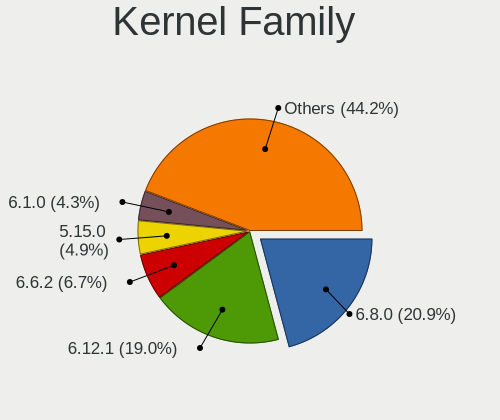
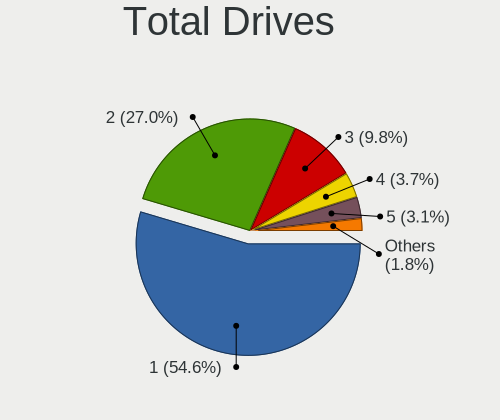
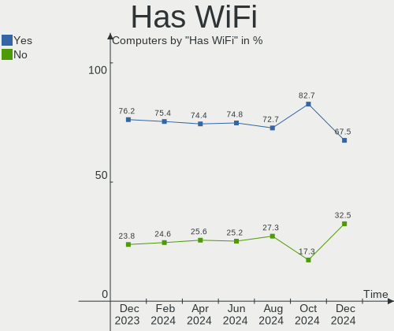
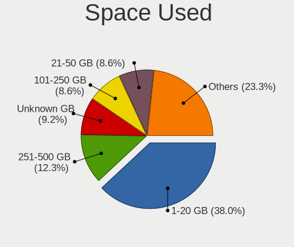
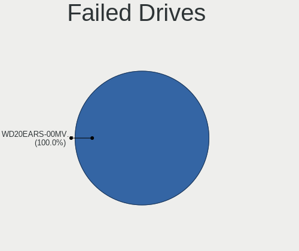
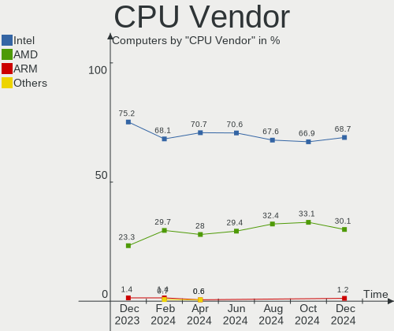
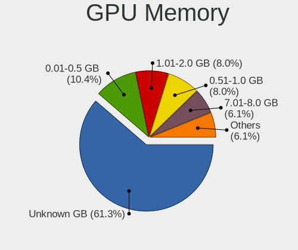
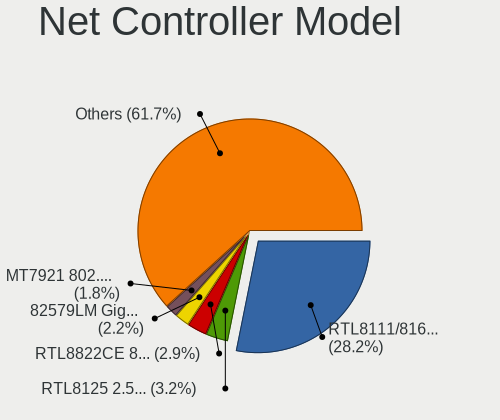
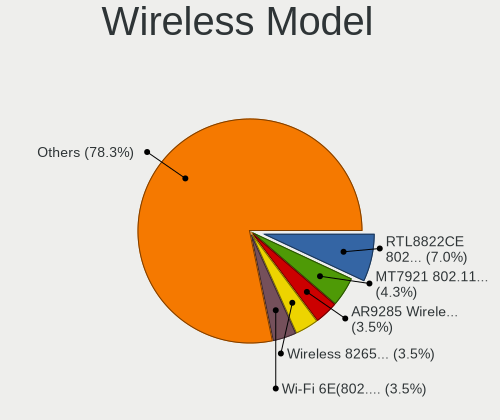
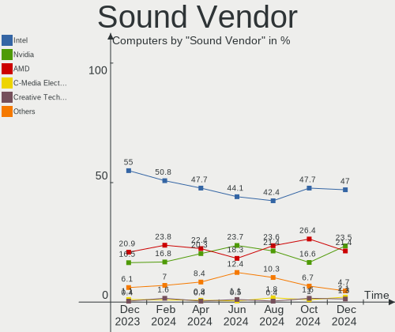

Linux in Poland - Hardware Trends
---------------------------------

A project to identify most popular hardware characteristics and track their change
over time based on data collected by Linux users at https://Linux-Hardware.org.

Anyone can contribute to this report by the [hw-probe](https://github.com/linuxhw/hw-probe) tool:

    sudo -E hw-probe -all -upload

This is a report for all computer types. See also reports for [desktops](/Location/Poland/Desktop/README.md) and [notebooks](/Location/Poland/Notebook/README.md).

Period: Apr, 2023.

Contents
--------

* [ System ](#system)
  - [ OS                       ](#os)
  - [ OS Family                ](#os-family)
  - [ Kernel                   ](#kernel)
  - [ Kernel Family            ](#kernel-family)
  - [ Kernel Major Ver.        ](#kernel-major-ver)
  - [ Arch                     ](#arch)
  - [ DE                       ](#de)
  - [ Display Server           ](#display-server)
  - [ Display Manager          ](#display-manager)
  - [ OS Lang                  ](#os-lang)
  - [ Boot Mode                ](#boot-mode)
  - [ Filesystem               ](#filesystem)
  - [ Part. scheme             ](#part-scheme)
  - [ Dual Boot with Linux/BSD ](#dual-boot-with-linuxbsd)
  - [ Dual Boot (Win)          ](#dual-boot-win)

* [ Board ](#board)
  - [ Vendor                   ](#vendor)
  - [ Model                    ](#model)
  - [ Model Family             ](#model-family)
  - [ MFG Year                 ](#mfg-year)
  - [ Form Factor              ](#form-factor)
  - [ Secure Boot              ](#secure-boot)
  - [ Coreboot                 ](#coreboot)
  - [ RAM Size                 ](#ram-size)
  - [ RAM Used                 ](#ram-used)
  - [ Total Drives             ](#total-drives)
  - [ Has CD-ROM               ](#has-cd-rom)
  - [ Has Ethernet             ](#has-ethernet)
  - [ Has WiFi                 ](#has-wifi)
  - [ Has Bluetooth            ](#has-bluetooth)

* [ Location ](#location)
  - [ Country                  ](#country)
  - [ City                     ](#city)

* [ Drives ](#drives)
  - [ Drive Vendor             ](#drive-vendor)
  - [ Drive Model              ](#drive-model)
  - [ HDD Vendor               ](#hdd-vendor)
  - [ SSD Vendor               ](#ssd-vendor)
  - [ Drive Kind               ](#drive-kind)
  - [ Drive Connector          ](#drive-connector)
  - [ Drive Size               ](#drive-size)
  - [ Space Total              ](#space-total)
  - [ Space Used               ](#space-used)
  - [ Malfunc. Drives          ](#malfunc-drives)
  - [ Malfunc. Drive Vendor    ](#malfunc-drive-vendor)
  - [ Malfunc. HDD Vendor      ](#malfunc-hdd-vendor)
  - [ Malfunc. Drive Kind      ](#malfunc-drive-kind)
  - [ Failed Drives            ](#failed-drives)
  - [ Failed Drive Vendor      ](#failed-drive-vendor)
  - [ Drive Status             ](#drive-status)

* [ Storage controller ](#storage-controller)
  - [ Storage Vendor           ](#storage-vendor)
  - [ Storage Model            ](#storage-model)
  - [ Storage Kind             ](#storage-kind)

* [ Processor ](#processor)
  - [ CPU Vendor               ](#cpu-vendor)
  - [ CPU Model                ](#cpu-model)
  - [ CPU Model Family         ](#cpu-model-family)
  - [ CPU Cores                ](#cpu-cores)
  - [ CPU Sockets              ](#cpu-sockets)
  - [ CPU Threads              ](#cpu-threads)
  - [ CPU Op-Modes             ](#cpu-op-modes)
  - [ CPU Microcode            ](#cpu-microcode)
  - [ CPU Microarch            ](#cpu-microarch)

* [ Graphics ](#graphics)
  - [ GPU Vendor               ](#gpu-vendor)
  - [ GPU Model                ](#gpu-model)
  - [ GPU Combo                ](#gpu-combo)
  - [ GPU Driver               ](#gpu-driver)
  - [ GPU Memory               ](#gpu-memory)

* [ Monitor ](#monitor)
  - [ Monitor Vendor           ](#monitor-vendor)
  - [ Monitor Model            ](#monitor-model)
  - [ Monitor Resolution       ](#monitor-resolution)
  - [ Monitor Diagonal         ](#monitor-diagonal)
  - [ Monitor Width            ](#monitor-width)
  - [ Aspect Ratio             ](#aspect-ratio)
  - [ Monitor Area             ](#monitor-area)
  - [ Pixel Density            ](#pixel-density)
  - [ Multiple Monitors        ](#multiple-monitors)

* [ Network ](#network)
  - [ Net Controller Vendor    ](#net-controller-vendor)
  - [ Net Controller Model     ](#net-controller-model)
  - [ Wireless Vendor          ](#wireless-vendor)
  - [ Wireless Model           ](#wireless-model)
  - [ Ethernet Vendor          ](#ethernet-vendor)
  - [ Ethernet Model           ](#ethernet-model)
  - [ Net Controller Kind      ](#net-controller-kind)
  - [ Used Controller          ](#used-controller)
  - [ NICs                     ](#nics)
  - [ IPv6                     ](#ipv6)

* [ Bluetooth ](#bluetooth)
  - [ Bluetooth Vendor         ](#bluetooth-vendor)
  - [ Bluetooth Model          ](#bluetooth-model)

* [ Sound ](#sound)
  - [ Sound Vendor             ](#sound-vendor)
  - [ Sound Model              ](#sound-model)

* [ Memory ](#memory)
  - [ Memory Vendor            ](#memory-vendor)
  - [ Memory Model             ](#memory-model)
  - [ Memory Kind              ](#memory-kind)
  - [ Memory Form Factor       ](#memory-form-factor)
  - [ Memory Size              ](#memory-size)
  - [ Memory Speed             ](#memory-speed)

* [ Printers & scanners ](#printers--scanners)
  - [ Printer Vendor           ](#printer-vendor)
  - [ Printer Model            ](#printer-model)
  - [ Scanner Vendor           ](#scanner-vendor)
  - [ Scanner Model            ](#scanner-model)

* [ Camera ](#camera)
  - [ Camera Vendor            ](#camera-vendor)
  - [ Camera Model             ](#camera-model)

* [ Security ](#security)
  - [ Fingerprint Vendor       ](#fingerprint-vendor)
  - [ Fingerprint Model        ](#fingerprint-model)
  - [ Chipcard Vendor          ](#chipcard-vendor)
  - [ Chipcard Model           ](#chipcard-model)

* [ Unsupported ](#unsupported)
  - [ Unsupported Devices      ](#unsupported-devices)
  - [ Unsupported Device Types ](#unsupported-device-types)

System
------

OS
--

Installed operating systems

| Name                         | Computers | Percent |
|------------------------------|-----------|---------|
| OpenMandriva 23.03           | 24        | 15.29%  |
| Debian 11                    | 16        | 10.19%  |
| Linux Mint 21.1              | 14        | 8.92%   |
| Ubuntu 22.04                 | 13        | 8.28%   |
| Fedora 38                    | 8         | 5.1%    |
| Fedora 37                    | 7         | 4.46%   |
| Pop!_OS 22.04                | 5         | 3.18%   |
| Ubuntu 22.10                 | 4         | 2.55%   |
| Ubuntu 20.04                 | 4         | 2.55%   |
| Arch Rolling                 | 4         | 2.55%   |
| Zorin 16                     | 3         | 1.91%   |
| Xubuntu 22.04                | 3         | 1.91%   |
| OpenMandriva 4.3             | 3         | 1.91%   |
| OpenMandriva 23.01           | 3         | 1.91%   |
| Manjaro 22.1.0               | 3         | 1.91%   |
| Kubuntu 22.04                | 3         | 1.91%   |
| Gentoo 2.13                  | 3         | 1.91%   |
| EndeavourOS Rolling          | 3         | 1.91%   |
| ROSA R11.1                   | 2         | 1.27%   |
| ROSA 12.4                    | 2         | 1.27%   |
| openSUSE Tumbleweed-XXXXXXXX | 2         | 1.27%   |
| Manjaro                      | 2         | 1.27%   |
| KDE neon 22.04               | 2         | 1.27%   |
| Kali 2023.1                  | 2         | 1.27%   |
| Debian 12                    | 2         | 1.27%   |
| ArcoLinux Rolling            | 2         | 1.27%   |
| Ubuntu Unity 16.04           | 1         | 0.64%   |
| Ubuntu Budgie 22.04          | 1         | 0.64%   |
| Ubuntu 23.04                 | 1         | 0.64%   |
| SteamOS 3.4.6                | 1         | 0.64%   |
| SteamOS                      | 1         | 0.64%   |
| ROSA 12.1                    | 1         | 0.64%   |
| Rocky Linux 9.1              | 1         | 0.64%   |
| Raspbian 11                  | 1         | 0.64%   |
| MX 21                        | 1         | 0.64%   |
| LMDE 5                       | 1         | 0.64%   |
| Linux Mint 20.3              | 1         | 0.64%   |
| Linux Mint 19.1              | 1         | 0.64%   |
| Linux Mint 19                | 1         | 0.64%   |
| Kubuntu 23.04                | 1         | 0.64%   |

OS Family
---------

OS without a version

| Name          | Computers | Percent |
|---------------|-----------|---------|
| OpenMandriva  | 30        | 19.11%  |
| Ubuntu        | 22        | 14.01%  |
| Debian        | 18        | 11.46%  |
| Linux Mint    | 17        | 10.83%  |
| Fedora        | 15        | 9.55%   |
| ROSA          | 5         | 3.18%   |
| Pop!_OS       | 5         | 3.18%   |
| Manjaro       | 5         | 3.18%   |
| Kubuntu       | 5         | 3.18%   |
| Arch          | 4         | 2.55%   |
| Zorin         | 3         | 1.91%   |
| Xubuntu       | 3         | 1.91%   |
| Gentoo        | 3         | 1.91%   |
| EndeavourOS   | 3         | 1.91%   |
| SteamOS       | 2         | 1.27%   |
| openSUSE      | 2         | 1.27%   |
| KDE neon      | 2         | 1.27%   |
| Kali          | 2         | 1.27%   |
| ArcoLinux     | 2         | 1.27%   |
| Ubuntu Unity  | 1         | 0.64%   |
| Ubuntu Budgie | 1         | 0.64%   |
| Rocky Linux   | 1         | 0.64%   |
| Raspbian      | 1         | 0.64%   |
| MX            | 1         | 0.64%   |
| LMDE          | 1         | 0.64%   |
| Garuda Linux  | 1         | 0.64%   |
| Devuan        | 1         | 0.64%   |
| blendOS       | 1         | 0.64%   |

Kernel
------

Version of the Linux kernel

| Version                           | Computers | Percent |
|-----------------------------------|-----------|---------|
| 6.2.6-desktop-1omv2390            | 24        | 15.29%  |
| 5.15.0-69-generic                 | 12        | 7.64%   |
| 5.19.0-38-generic                 | 11        | 7.01%   |
| 6.1.0-0.deb11.5-amd64             | 10        | 6.37%   |
| 5.15.0-56-generic                 | 9         | 5.73%   |
| 6.2.11-300.fc38.x86_64            | 7         | 4.46%   |
| 5.10.0-21-amd64                   | 6         | 3.82%   |
| 5.19.0-40-generic                 | 5         | 3.18%   |
| 6.2.6-76060206-generic            | 4         | 2.55%   |
| 6.2.12-arch1-1                    | 3         | 1.91%   |
| 6.1.19-gentoo                     | 3         | 1.91%   |
| 6.1.1-desktop-1omv2290            | 3         | 1.91%   |
| 6.2.9-200.fc37.x86_64             | 2         | 1.27%   |
| 6.2.8-200.fc37.x86_64             | 2         | 1.27%   |
| 6.2.13-arch1-1                    | 2         | 1.27%   |
| 6.2.10-200.fc37.x86_64            | 2         | 1.27%   |
| 6.1.0-7-amd64                     | 2         | 1.27%   |
| 5.19.0-41-generic                 | 2         | 1.27%   |
| 5.19.0-35-generic                 | 2         | 1.27%   |
| 5.16.13-desktop-1omv4003          | 2         | 1.27%   |
| 5.15.0-70-generic                 | 2         | 1.27%   |
| 6.2.9-zen1-1-zen                  | 1         | 0.64%   |
| 6.2.9-arch1-1                     | 1         | 0.64%   |
| 6.2.9-1-default                   | 1         | 0.64%   |
| 6.2.8-1-MANJARO                   | 1         | 0.64%   |
| 6.2.13-zen-1-zen                  | 1         | 0.64%   |
| 6.2.12-300.fc38.x86_64            | 1         | 0.64%   |
| 6.2.12-1.el9.elrepo.x86_64        | 1         | 0.64%   |
| 6.2.11-arch1-1                    | 1         | 0.64%   |
| 6.2.11-060211-generic             | 1         | 0.64%   |
| 6.2.10-zen1-1-zen                 | 1         | 0.64%   |
| 6.2.10-arch1-1                    | 1         | 0.64%   |
| 6.2.10-1-default                  | 1         | 0.64%   |
| 6.2.10-060210-generic             | 1         | 0.64%   |
| 6.2.0-76060200-generic            | 1         | 0.64%   |
| 6.2.0-20-generic                  | 1         | 0.64%   |
| 6.1.23-1-MANJARO                  | 1         | 0.64%   |
| 6.1.22-1-MANJARO                  | 1         | 0.64%   |
| 6.1.20-generic-2rosa2021.1-x86_64 | 1         | 0.64%   |
| 6.1.19+                           | 1         | 0.64%   |

Kernel Family
-------------

Linux kernel without a distro release

| Version  | Computers | Percent |
|----------|-----------|---------|
| 6.2.6    | 28        | 17.83%  |
| 5.15.0   | 24        | 15.29%  |
| 5.19.0   | 21        | 13.38%  |
| 6.1.0    | 14        | 8.92%   |
| 6.2.11   | 9         | 5.73%   |
| 5.10.0   | 7         | 4.46%   |
| 6.2.10   | 6         | 3.82%   |
| 6.2.9    | 5         | 3.18%   |
| 6.2.12   | 5         | 3.18%   |
| 6.1.19   | 4         | 2.55%   |
| 4.15.0   | 4         | 2.55%   |
| 6.2.8    | 3         | 1.91%   |
| 6.2.13   | 3         | 1.91%   |
| 6.1.1    | 3         | 1.91%   |
| 6.2.0    | 2         | 1.27%   |
| 5.4.0    | 2         | 1.27%   |
| 5.16.13  | 2         | 1.27%   |
| 6.1.23   | 1         | 0.64%   |
| 6.1.22   | 1         | 0.64%   |
| 6.1.20   | 1         | 0.64%   |
| 6.1.18   | 1         | 0.64%   |
| 6.0.12   | 1         | 0.64%   |
| 6.0.0    | 1         | 0.64%   |
| 5.4.32   | 1         | 0.64%   |
| 5.16.7   | 1         | 0.64%   |
| 5.15.93  | 1         | 0.64%   |
| 5.15.103 | 1         | 0.64%   |
| 5.14.0   | 1         | 0.64%   |
| 5.13.19  | 1         | 0.64%   |
| 5.13.0   | 1         | 0.64%   |
| 5.10.74  | 1         | 0.64%   |
| 5.10.178 | 1         | 0.64%   |

Kernel Major Ver.
-----------------

Linux kernel major version

| Version | Computers | Percent |
|---------|-----------|---------|
| 6.2     | 61        | 38.85%  |
| 5.15    | 26        | 16.56%  |
| 6.1     | 25        | 15.92%  |
| 5.19    | 21        | 13.38%  |
| 5.10    | 9         | 5.73%   |
| 4.15    | 4         | 2.55%   |
| 5.4     | 3         | 1.91%   |
| 5.16    | 3         | 1.91%   |
| 6.0     | 2         | 1.27%   |
| 5.13    | 2         | 1.27%   |
| 5.14    | 1         | 0.64%   |

Arch
----

OS architecture (x86_64, i586, etc.)

| Name   | Computers | Percent |
|--------|-----------|---------|
| x86_64 | 154       | 98.09%  |
| i686   | 2         | 1.27%   |
| armv6l | 1         | 0.64%   |

DE
--

Desktop Environment

| Name            | Computers | Percent |
|-----------------|-----------|---------|
| KDE5            | 62        | 39.49%  |
| GNOME           | 49        | 31.21%  |
| XFCE            | 16        | 10.19%  |
| MATE            | 9         | 5.73%   |
| X-Cinnamon      | 7         | 4.46%   |
| LXQt            | 3         | 1.91%   |
| Unknown         | 3         | 1.91%   |
| Unity           | 1         | 0.64%   |
| ratflow         | 1         | 0.64%   |
| KDE4            | 1         | 0.64%   |
| i3              | 1         | 0.64%   |
| Hyprland        | 1         | 0.64%   |
| GNOME Flashback | 1         | 0.64%   |
| Cinnamon        | 1         | 0.64%   |
| Budgie          | 1         | 0.64%   |

Display Server
--------------

X11 or Wayland

| Name        | Computers | Percent |
|-------------|-----------|---------|
| X11         | 123       | 78.34%  |
| Wayland     | 30        | 19.11%  |
| Unknown     | 2         | 1.27%   |
| Unspecified | 1         | 0.64%   |
| Tty         | 1         | 0.64%   |

Display Manager
---------------

SDDM, LightDM, etc.

| Name    | Computers | Percent |
|---------|-----------|---------|
| SDDM    | 58        | 36.94%  |
| Unknown | 36        | 22.93%  |
| LightDM | 26        | 16.56%  |
| GDM3    | 21        | 13.38%  |
| GDM     | 13        | 8.28%   |
| SU      | 1         | 0.64%   |
| LXDM    | 1         | 0.64%   |
| KDM     | 1         | 0.64%   |

OS Lang
-------

Language

| Lang  | Computers | Percent |
|-------|-----------|---------|
| pl_PL | 86        | 54.78%  |
| en_US | 48        | 30.57%  |
| C     | 9         | 5.73%   |
| en_GB | 5         | 3.18%   |
| uk_UA | 2         | 1.27%   |
| ru_RU | 2         | 1.27%   |
| de_DE | 2         | 1.27%   |
| ru_UA | 1         | 0.64%   |
| en_IE | 1         | 0.64%   |
| de_CH | 1         | 0.64%   |

Boot Mode
---------

EFI or BIOS

| Mode | Computers | Percent |
|------|-----------|---------|
| EFI  | 92        | 58.6%   |
| BIOS | 65        | 41.4%   |

Filesystem
----------

Type of filesystem

| Type    | Computers | Percent |
|---------|-----------|---------|
| Ext4    | 102       | 64.97%  |
| Btrfs   | 23        | 14.65%  |
| Overlay | 21        | 13.38%  |
| F2fs    | 6         | 3.82%   |
| Tmpfs   | 3         | 1.91%   |
| Zfs     | 1         | 0.64%   |
| Xfs     | 1         | 0.64%   |

Part. scheme
------------

Scheme of partitioning

| Type    | Computers | Percent |
|---------|-----------|---------|
| GPT     | 102       | 64.97%  |
| Unknown | 34        | 21.66%  |
| MBR     | 21        | 13.38%  |

Dual Boot with Linux/BSD
------------------------

Hosting more than one Linux/BSD

| Dual boot | Computers | Percent |
|-----------|-----------|---------|
| No        | 125       | 79.62%  |
| Yes       | 32        | 20.38%  |

Dual Boot (Win)
---------------

Hosting Linux and Windows

| Dual boot | Computers | Percent |
|-----------|-----------|---------|
| No        | 103       | 65.61%  |
| Yes       | 54        | 34.39%  |

Board
-----

Vendor
------

Motherboard manufacturer

| Name                    | Computers | Percent |
|-------------------------|-----------|---------|
| Lenovo                  | 30        | 19.11%  |
| Hewlett-Packard         | 28        | 17.83%  |
| Dell                    | 25        | 15.92%  |
| ASUSTek Computer        | 17        | 10.83%  |
| MSI                     | 13        | 8.28%   |
| Acer                    | 10        | 6.37%   |
| Gigabyte Technology     | 9         | 5.73%   |
| Samsung Electronics     | 5         | 3.18%   |
| ASRock                  | 5         | 3.18%   |
| Toshiba                 | 3         | 1.91%   |
| Valve                   | 1         | 0.64%   |
| Timi                    | 1         | 0.64%   |
| Raspberry Pi Foundation | 1         | 0.64%   |
| Medion                  | 1         | 0.64%   |
| Kruger&Matz             | 1         | 0.64%   |
| Kiano                   | 1         | 0.64%   |
| Intel                   | 1         | 0.64%   |
| HUAWEI                  | 1         | 0.64%   |
| Google                  | 1         | 0.64%   |
| Fujitsu Siemens         | 1         | 0.64%   |
| eMachines               | 1         | 0.64%   |
| Unknown                 | 1         | 0.64%   |

Model
-----

Motherboard model

| Name                                        | Computers | Percent |
|---------------------------------------------|-----------|---------|
| HP Pavilion Gaming Laptop 15-ec2xxx         | 4         | 2.55%   |
| HP Pavilion Gaming Laptop 15-ec1xxx         | 3         | 1.91%   |
| Lenovo Legion 5 Pro 16ACH6 82JS             | 2         | 1.27%   |
| HP Laptop 15-db1xxx                         | 2         | 1.27%   |
| Dell Inspiron 5559                          | 2         | 1.27%   |
| ASUS ROG Strix G513QY_G513QY                | 2         | 1.27%   |
| ASUS M3A78-CM                               | 2         | 1.27%   |
| ASRock Z170 Extreme4                        | 2         | 1.27%   |
| Valve Jupiter                               | 1         | 0.64%   |
| Toshiba Satellite L750D                     | 1         | 0.64%   |
| Toshiba Satellite C855-12N                  | 1         | 0.64%   |
| Toshiba Satellite C50-A                     | 1         | 0.64%   |
| Timi Redmi Book Pro 15 2022                 | 1         | 0.64%   |
| Samsung R510/P510                           | 1         | 0.64%   |
| Samsung 730U3E/740U3E                       | 1         | 0.64%   |
| Samsung 400B4C/400B5C/200B4C/200B5C         | 1         | 0.64%   |
| Samsung 350V5C/351V5C/3540VC/3440VC         | 1         | 0.64%   |
| Samsung 300E4A/300E5A/300E7A                | 1         | 0.64%   |
| RPi Raspberry Pi Zero W Rev 1.1             | 1         | 0.64%   |
| MSI PRO X300 DP20Z (MS-B0A2)                | 1         | 0.64%   |
| MSI OPTIMUS                                 | 1         | 0.64%   |
| MSI MS-7D52                                 | 1         | 0.64%   |
| MSI MS-7C37                                 | 1         | 0.64%   |
| MSI MS-7B89                                 | 1         | 0.64%   |
| MSI MS-7B86                                 | 1         | 0.64%   |
| MSI MS-7B84                                 | 1         | 0.64%   |
| MSI MS-7816                                 | 1         | 0.64%   |
| MSI MS-7673                                 | 1         | 0.64%   |
| MSI MS-7592                                 | 1         | 0.64%   |
| MSI MS-7583                                 | 1         | 0.64%   |
| MSI GP76 Leopard 10UE                       | 1         | 0.64%   |
| MSI Creator Z17 A12UHST                     | 1         | 0.64%   |
| Medion X681X                                | 1         | 0.64%   |
| Lenovo Z51-70 80K6                          | 1         | 0.64%   |
| Lenovo Y50-70 20378                         | 1         | 0.64%   |
| Lenovo ThinkPad X220 4291LR6                | 1         | 0.64%   |
| Lenovo ThinkPad X220 4291AY8                | 1         | 0.64%   |
| Lenovo ThinkPad X200 7459KM3                | 1         | 0.64%   |
| Lenovo ThinkPad X1 Carbon Gen 10 21CCS72200 | 1         | 0.64%   |
| Lenovo ThinkPad X1 Carbon 3460CLG           | 1         | 0.64%   |

Model Family
------------

Motherboard model prefix

| Name              | Computers | Percent |
|-------------------|-----------|---------|
| Lenovo ThinkPad   | 14        | 8.92%   |
| Dell Latitude     | 9         | 5.73%   |
| HP Pavilion       | 8         | 5.1%    |
| Acer Aspire       | 7         | 4.46%   |
| Dell Inspiron     | 5         | 3.18%   |
| Lenovo Legion     | 4         | 2.55%   |
| Lenovo IdeaPad    | 4         | 2.55%   |
| HP EliteBook      | 4         | 2.55%   |
| Dell Precision    | 4         | 2.55%   |
| ASUS ROG          | 4         | 2.55%   |
| ASUS ASUS         | 4         | 2.55%   |
| Toshiba Satellite | 3         | 1.91%   |
| HP ProBook        | 3         | 1.91%   |
| HP Laptop         | 3         | 1.91%   |
| Dell OptiPlex     | 3         | 1.91%   |
| HP Compaq         | 2         | 1.27%   |
| HP 255            | 2         | 1.27%   |
| ASUS TUF          | 2         | 1.27%   |
| ASUS M3A78-CM     | 2         | 1.27%   |
| ASRock Z170       | 2         | 1.27%   |
| Valve Jupiter     | 1         | 0.64%   |
| Timi Redmi        | 1         | 0.64%   |
| Samsung R510      | 1         | 0.64%   |
| Samsung 730U3E    | 1         | 0.64%   |
| Samsung 400B4C    | 1         | 0.64%   |
| Samsung 350V5C    | 1         | 0.64%   |
| Samsung 300E4A    | 1         | 0.64%   |
| RPi Raspberry     | 1         | 0.64%   |
| MSI PRO           | 1         | 0.64%   |
| MSI OPTIMUS       | 1         | 0.64%   |
| MSI MS-7D52       | 1         | 0.64%   |
| MSI MS-7C37       | 1         | 0.64%   |
| MSI MS-7B89       | 1         | 0.64%   |
| MSI MS-7B86       | 1         | 0.64%   |
| MSI MS-7B84       | 1         | 0.64%   |
| MSI MS-7816       | 1         | 0.64%   |
| MSI MS-7673       | 1         | 0.64%   |
| MSI MS-7592       | 1         | 0.64%   |
| MSI MS-7583       | 1         | 0.64%   |
| MSI GP76          | 1         | 0.64%   |

MFG Year
--------

Motherboard manufacture year

| Year    | Computers | Percent |
|---------|-----------|---------|
| 2022    | 17        | 10.83%  |
| 2021    | 17        | 10.83%  |
| 2020    | 14        | 8.92%   |
| 2012    | 13        | 8.28%   |
| 2019    | 12        | 7.64%   |
| 2011    | 11        | 7.01%   |
| 2013    | 10        | 6.37%   |
| 2018    | 9         | 5.73%   |
| 2017    | 8         | 5.1%    |
| 2015    | 8         | 5.1%    |
| 2009    | 8         | 5.1%    |
| 2008    | 8         | 5.1%    |
| 2016    | 7         | 4.46%   |
| 2014    | 5         | 3.18%   |
| 2010    | 4         | 2.55%   |
| 2006    | 3         | 1.91%   |
| 2023    | 1         | 0.64%   |
| 2007    | 1         | 0.64%   |
| Unknown | 1         | 0.64%   |

Form Factor
-----------

Physical design of the computer

| Name           | Computers | Percent |
|----------------|-----------|---------|
| Notebook       | 113       | 71.97%  |
| Desktop        | 38        | 24.2%   |
| Convertible    | 2         | 1.27%   |
| Mini pc        | 2         | 1.27%   |
| System on chip | 1         | 0.64%   |
| All in one     | 1         | 0.64%   |

Secure Boot
-----------

Enabled or disabled

| State    | Computers | Percent |
|----------|-----------|---------|
| Disabled | 145       | 92.36%  |
| Enabled  | 12        | 7.64%   |

Coreboot
--------

Have coreboot on board

| Used | Computers | Percent |
|------|-----------|---------|
| No   | 156       | 99.36%  |
| Yes  | 1         | 0.64%   |

RAM Size
--------

Total RAM memory

| Size in GB  | Computers | Percent |
|-------------|-----------|---------|
| 4.01-8.0    | 41        | 26.11%  |
| 16.01-24.0  | 33        | 21.02%  |
| 8.01-16.0   | 22        | 14.01%  |
| 3.01-4.0    | 21        | 13.38%  |
| 32.01-64.0  | 19        | 12.1%   |
| 64.01-256.0 | 7         | 4.46%   |
| 24.01-32.0  | 6         | 3.82%   |
| 2.01-3.0    | 3         | 1.91%   |
| 1.01-2.0    | 3         | 1.91%   |
| 0.51-1.0    | 1         | 0.64%   |
| 0.01-0.5    | 1         | 0.64%   |

RAM Used
--------

Used RAM memory

| Used GB    | Computers | Percent |
|------------|-----------|---------|
| 1.01-2.0   | 43        | 27.39%  |
| 4.01-8.0   | 41        | 26.11%  |
| 2.01-3.0   | 27        | 17.2%   |
| 3.01-4.0   | 22        | 14.01%  |
| 0.51-1.0   | 10        | 6.37%   |
| 8.01-16.0  | 8         | 5.1%    |
| 16.01-24.0 | 4         | 2.55%   |
| 0.01-0.5   | 2         | 1.27%   |

Total Drives
------------

Number of drives on board

| Drives | Computers | Percent |
|--------|-----------|---------|
| 1      | 99        | 63.06%  |
| 2      | 38        | 24.2%   |
| 3      | 14        | 8.92%   |
| 7      | 2         | 1.27%   |
| 6      | 2         | 1.27%   |
| 5      | 1         | 0.64%   |
| 4      | 1         | 0.64%   |

Has CD-ROM
----------

Has CD-ROM on board

| Presented | Computers | Percent |
|-----------|-----------|---------|
| No        | 106       | 67.52%  |
| Yes       | 51        | 32.48%  |

Has Ethernet
------------

Has Ethernet on board

| Presented | Computers | Percent |
|-----------|-----------|---------|
| Yes       | 139       | 88.54%  |
| No        | 18        | 11.46%  |

Has WiFi
--------

Has WiFi module

| Presented | Computers | Percent |
|-----------|-----------|---------|
| Yes       | 134       | 85.35%  |
| No        | 23        | 14.65%  |

Has Bluetooth
-------------

Has Bluetooth module

| Presented | Computers | Percent |
|-----------|-----------|---------|
| Yes       | 112       | 71.34%  |
| No        | 45        | 28.66%  |

Location
--------

Country
-------

Geographic location (country)

| Country | Computers | Percent |
|---------|-----------|---------|
| Poland  | 157       | 100%    |

City
----

Geographic location (city)

| City                 | Computers | Percent |
|----------------------|-----------|---------|
| Warsaw               | 39        | 24.84%  |
| Poznan               | 15        | 9.55%   |
| Wroclaw              | 11        | 7.01%   |
| Chorzele             | 9         | 5.73%   |
| Krakow               | 7         | 4.46%   |
| Lodz                 | 6         | 3.82%   |
| Gdansk               | 6         | 3.82%   |
| Kutno                | 3         | 1.91%   |
| Katowice             | 3         | 1.91%   |
| Gdynia               | 3         | 1.91%   |
| Zabrze               | 2         | 1.27%   |
| Sosnowiec            | 2         | 1.27%   |
| Opole                | 2         | 1.27%   |
| Lublin               | 2         | 1.27%   |
| Kielce               | 2         | 1.27%   |
| Gliwice              | 2         | 1.27%   |
| Bielsko-Biala        | 2         | 1.27%   |
| Zgorzelec            | 1         | 0.64%   |
| Wloszczowa           | 1         | 0.64%   |
| Wilkszyn             | 1         | 0.64%   |
| Wadowice             | 1         | 0.64%   |
| Trzebinia            | 1         | 0.64%   |
| Torun                | 1         | 0.64%   |
| Tarnówka            | 1         | 0.64%   |
| Szczecin             | 1         | 0.64%   |
| Świnoujście        | 1         | 0.64%   |
| Suwałki             | 1         | 0.64%   |
| Smolec               | 1         | 0.64%   |
| Rzeszów             | 1         | 0.64%   |
| Rybnik               | 1         | 0.64%   |
| Ruda Śląska        | 1         | 0.64%   |
| Radzionkow           | 1         | 0.64%   |
| Radwanice            | 1         | 0.64%   |
| Radom                | 1         | 0.64%   |
| Płock               | 1         | 0.64%   |
| Praga Północ       | 1         | 0.64%   |
| Piotrkow Trybunalski | 1         | 0.64%   |
| Piaseczno            | 1         | 0.64%   |
| Nowy Staw            | 1         | 0.64%   |
| Mszczonów           | 1         | 0.64%   |

Drives
------

Drive Vendor
------------

Hard drive vendors

| Vendor                       | Computers | Drives | Percent |
|------------------------------|-----------|--------|---------|
| Samsung Electronics          | 32        | 34     | 13.97%  |
| WDC                          | 20        | 23     | 8.73%   |
| Seagate                      | 18        | 19     | 7.86%   |
| GOODRAM                      | 17        | 18     | 7.42%   |
| Toshiba                      | 16        | 17     | 6.99%   |
| Intel                        | 12        | 12     | 5.24%   |
| Crucial                      | 11        | 11     | 4.8%    |
| SK hynix                     | 10        | 10     | 4.37%   |
| Kingston                     | 10        | 11     | 4.37%   |
| Unknown                      | 7         | 8      | 3.06%   |
| SanDisk                      | 7         | 8      | 3.06%   |
| A-DATA Technology            | 7         | 7      | 3.06%   |
| Micron Technology            | 6         | 6      | 2.62%   |
| Hitachi                      | 6         | 8      | 2.62%   |
| Phison Electronics           | 5         | 5      | 2.18%   |
| Patriot                      | 5         | 5      | 2.18%   |
| SPCC                         | 4         | 5      | 1.75%   |
| Silicon Motion               | 4         | 4      | 1.75%   |
| PNY                          | 3         | 3      | 1.31%   |
| KIOXIA                       | 3         | 3      | 1.31%   |
| Shenzhen Longsys Electronics | 2         | 2      | 0.87%   |
| POLION                       | 2         | 2      | 0.87%   |
| Micron/Crucial Technology    | 2         | 2      | 0.87%   |
| ADATA Technology             | 2         | 2      | 0.87%   |
| XPG                          | 1         | 2      | 0.44%   |
| Verbatim                     | 1         | 1      | 0.44%   |
| Transcend                    | 1         | 1      | 0.44%   |
| Realtek Semiconductor        | 1         | 1      | 0.44%   |
| Phison                       | 1         | 1      | 0.44%   |
| LITEON                       | 1         | 1      | 0.44%   |
| Lite-On Technology           | 1         | 1      | 0.44%   |
| Lexar                        | 1         | 1      | 0.44%   |
| Kingston Technology Company  | 1         | 1      | 0.44%   |
| Kingchuxing                  | 1         | 2      | 0.44%   |
| JMicron Technology           | 1         | 4      | 0.44%   |
| Intenso                      | 1         | 1      | 0.44%   |
| HGST                         | 1         | 1      | 0.44%   |
| Gigabyte Technology          | 1         | 1      | 0.44%   |
| Fujitsu                      | 1         | 1      | 0.44%   |
| Biostar                      | 1         | 1      | 0.44%   |

Drive Model
-----------

Hard drive models

| Model                                                             | Computers | Percent |
|-------------------------------------------------------------------|-----------|---------|
| Crucial CT500MX500SSD1 500GB                                      | 5         | 2.05%   |
| SK hynix PC711 HFS512GDE9X073N 512GB                              | 4         | 1.64%   |
| Samsung SSD 980 1TB                                               | 4         | 1.64%   |
| Intel SSDPEKNW512G8H 512GB                                        | 4         | 1.64%   |
| Unknown MMC Card  32GB                                            | 3         | 1.23%   |
| Samsung SSD 980 500GB                                             | 3         | 1.23%   |
| Samsung SSD 850 EVO 250GB                                         | 3         | 1.23%   |
| Intel SSDPEKNU512GZ 512GB                                         | 3         | 1.23%   |
| GOODRAM SSDPR-CL100-120-G3 120GB                                  | 3         | 1.23%   |
| A-DATA SU650 256GB SSD                                            | 3         | 1.23%   |
| WDC WDS240G2G0B-00EPW0 240GB SSD                                  | 2         | 0.82%   |
| Unknown MMC Card  64GB                                            | 2         | 0.82%   |
| Unknown MMC Card  512GB                                           | 2         | 0.82%   |
| Toshiba MQ04ABF100 1TB                                            | 2         | 0.82%   |
| Toshiba MQ01ABD100 1TB                                            | 2         | 0.82%   |
| SPCC Solid State Disk 128GB                                       | 2         | 0.82%   |
| Silicon Motion SM2263EN/SM2263XT SSD Controller 1024GB            | 2         | 0.82%   |
| Seagate ST1000LM014-SSHD-8GB                                      | 2         | 0.82%   |
| Seagate Expansion 4TB                                             | 2         | 0.82%   |
| SanDisk NVMe SSD Drive 1TB                                        | 2         | 0.82%   |
| Samsung NVMe SSD Controller SM981/PM981/PM983 1TB                 | 2         | 0.82%   |
| Phison PS5013 E13 NVMe Controller 500GB                           | 2         | 0.82%   |
| KIOXIA KBG50ZNV512G 512GB                                         | 2         | 0.82%   |
| Kingston SA400S37120G 120GB SSD                                   | 2         | 0.82%   |
| Kingston SA2000M8500G 500GB                                       | 2         | 0.82%   |
| Intel SSD 660P Series 512GB                                       | 2         | 0.82%   |
| Hitachi HTS545050B9A300 500GB                                     | 2         | 0.82%   |
| GOODRAM SSDPR-CX400-128-G2 128GB                                  | 2         | 0.82%   |
| GOODRAM SSDPR-CX400-01T-G2 1024GB                                 | 2         | 0.82%   |
| GOODRAM SSDPR-CL100-480-G2 480GB                                  | 2         | 0.82%   |
| Crucial CT240BX500SSD1 240GB                                      | 2         | 0.82%   |
| Crucial CT1000MX500SSD1 1TB                                       | 2         | 0.82%   |
| ADATA XPG SX8200 Pro PCIe Gen3x4 M.2 2280 Solid State Drive 512GB | 2         | 0.82%   |
| XPG GAMMIX S70 BLADE 512GB                                        | 1         | 0.41%   |
| WDC WDS500G2B0A-00SM50 500GB SSD                                  | 1         | 0.41%   |
| WDC WD7500BPKT-00PK4T0 752GB                                      | 1         | 0.41%   |
| WDC WD5000AVVS-63M8B0 500GB                                       | 1         | 0.41%   |
| WDC WD5000AADS-00S9B0 500GB                                       | 1         | 0.41%   |
| WDC WD3200LPVX-22V0TT0 320GB                                      | 1         | 0.41%   |
| WDC WD2500AAKX-00ERMA0 250GB                                      | 1         | 0.41%   |

HDD Vendor
----------

Hard disk drive vendors

| Vendor              | Computers | Drives | Percent |
|---------------------|-----------|--------|---------|
| Seagate             | 18        | 19     | 33.33%  |
| WDC                 | 13        | 16     | 24.07%  |
| Toshiba             | 13        | 14     | 24.07%  |
| Hitachi             | 6         | 8      | 11.11%  |
| Samsung Electronics | 1         | 1      | 1.85%   |
| JMicron Technology  | 1         | 4      | 1.85%   |
| HGST                | 1         | 1      | 1.85%   |
| Fujitsu             | 1         | 1      | 1.85%   |

SSD Vendor
----------

Solid state drive vendors

| Vendor              | Computers | Drives | Percent |
|---------------------|-----------|--------|---------|
| GOODRAM             | 17        | 18     | 19.1%   |
| Samsung Electronics | 14        | 15     | 15.73%  |
| Crucial             | 11        | 11     | 12.36%  |
| A-DATA Technology   | 7         | 7      | 7.87%   |
| Patriot             | 5         | 5      | 5.62%   |
| SPCC                | 4         | 5      | 4.49%   |
| SK hynix            | 4         | 4      | 4.49%   |
| Kingston            | 4         | 4      | 4.49%   |
| WDC                 | 3         | 3      | 3.37%   |
| PNY                 | 3         | 3      | 3.37%   |
| Micron Technology   | 3         | 3      | 3.37%   |
| Toshiba             | 2         | 2      | 2.25%   |
| SanDisk             | 2         | 2      | 2.25%   |
| Intel               | 2         | 2      | 2.25%   |
| Verbatim            | 1         | 1      | 1.12%   |
| Transcend           | 1         | 1      | 1.12%   |
| POLION              | 1         | 1      | 1.12%   |
| Phison              | 1         | 1      | 1.12%   |
| LITEON              | 1         | 1      | 1.12%   |
| Kingchuxing         | 1         | 1      | 1.12%   |
| Intenso             | 1         | 1      | 1.12%   |
| Biostar             | 1         | 1      | 1.12%   |

Drive Kind
----------

HDD or SSD

| Kind    | Computers | Drives | Percent |
|---------|-----------|--------|---------|
| SSD     | 76        | 92     | 37.07%  |
| NVMe    | 67        | 79     | 32.68%  |
| HDD     | 50        | 64     | 24.39%  |
| MMC     | 9         | 10     | 4.39%   |
| Unknown | 3         | 3      | 1.46%   |

Drive Connector
---------------

SATA, SAS, NVMe, etc.

| Type | Computers | Drives | Percent |
|------|-----------|--------|---------|
| SATA | 99        | 149    | 54.4%   |
| NVMe | 67        | 79     | 36.81%  |
| MMC  | 9         | 10     | 4.95%   |
| SAS  | 7         | 10     | 3.85%   |

Drive Size
----------

Size of hard drive

| Size in TB | Computers | Drives | Percent |
|------------|-----------|--------|---------|
| 0.01-0.5   | 81        | 97     | 61.36%  |
| 0.51-1.0   | 38        | 44     | 28.79%  |
| 1.01-2.0   | 7         | 7      | 5.3%    |
| 3.01-4.0   | 3         | 3      | 2.27%   |
| 2.01-3.0   | 1         | 3      | 0.76%   |
| 10.01-20.0 | 1         | 1      | 0.76%   |
| 4.01-10.0  | 1         | 1      | 0.76%   |

Space Total
-----------

Amount of disk space available on the file system

| Size in GB     | Computers | Percent |
|----------------|-----------|---------|
| 101-250        | 40        | 25.48%  |
| 501-1000       | 25        | 15.92%  |
| 251-500        | 24        | 15.29%  |
| 51-100         | 19        | 12.1%   |
| 1-20           | 18        | 11.46%  |
| 1001-2000      | 12        | 7.64%   |
| 2001-3000      | 7         | 4.46%   |
| More than 3000 | 5         | 3.18%   |
| 21-50          | 4         | 2.55%   |
| Unknown        | 3         | 1.91%   |

Space Used
----------

Amount of used disk space

| Used GB        | Computers | Percent |
|----------------|-----------|---------|
| 1-20           | 56        | 35.67%  |
| 101-250        | 26        | 16.56%  |
| 21-50          | 23        | 14.65%  |
| 51-100         | 18        | 11.46%  |
| 251-500        | 9         | 5.73%   |
| 501-1000       | 9         | 5.73%   |
| 1001-2000      | 8         | 5.1%    |
| More than 3000 | 3         | 1.91%   |
| Unknown        | 3         | 1.91%   |
| 2001-3000      | 1         | 0.64%   |
| 0              | 1         | 0.64%   |

Malfunc. Drives
---------------

Drive models with a malfunction

| Model                                   | Computers | Drives | Percent |
|-----------------------------------------|-----------|--------|---------|
| SK hynix PC711 HFS512GDE9X073N 512GB    | 4         | 4      | 25%     |
| WDC WD3200LPVX-22V0TT0 320GB            | 1         | 1      | 6.25%   |
| SK hynix SH920 2.5 7MM 512GB SSD        | 1         | 1      | 6.25%   |
| SK hynix SC401 SATA 256GB SSD           | 1         | 1      | 6.25%   |
| SK hynix BC711 HFM256GD3JX013N 256GB    | 1         | 1      | 6.25%   |
| Seagate ST3160318AS 160GB               | 1         | 1      | 6.25%   |
| Seagate ST1000LM014-1EJ164 1TB          | 1         | 1      | 6.25%   |
| Samsung Electronics SSD 870 EVO 1TB     | 1         | 1      | 6.25%   |
| Samsung Electronics HD753LJ 752GB       | 1         | 1      | 6.25%   |
| JMicron Technology Generic DISK03 2TB   | 1         | 1      | 6.25%   |
| JMicron Technology Generic DISK02 256GB | 1         | 1      | 6.25%   |
| Hitachi HTS547575A9E384 752GB           | 1         | 1      | 6.25%   |
| Crucial CT1000MX500SSD4 1TB             | 1         | 1      | 6.25%   |

Malfunc. Drive Vendor
---------------------

Vendors of faulty drives

| Vendor              | Computers | Drives | Percent |
|---------------------|-----------|--------|---------|
| SK hynix            | 7         | 7      | 46.67%  |
| Seagate             | 2         | 2      | 13.33%  |
| Samsung Electronics | 2         | 2      | 13.33%  |
| WDC                 | 1         | 1      | 6.67%   |
| JMicron Technology  | 1         | 2      | 6.67%   |
| Hitachi             | 1         | 1      | 6.67%   |
| Crucial             | 1         | 1      | 6.67%   |

Malfunc. HDD Vendor
-------------------

Vendors of faulty HDD drives

| Vendor              | Computers | Drives | Percent |
|---------------------|-----------|--------|---------|
| Seagate             | 2         | 2      | 33.33%  |
| WDC                 | 1         | 1      | 16.67%  |
| Samsung Electronics | 1         | 1      | 16.67%  |
| JMicron Technology  | 1         | 2      | 16.67%  |
| Hitachi             | 1         | 1      | 16.67%  |

Malfunc. Drive Kind
-------------------

Kinds of faulty drives

| Kind | Computers | Drives | Percent |
|------|-----------|--------|---------|
| HDD  | 6         | 7      | 40%     |
| NVMe | 5         | 5      | 33.33%  |
| SSD  | 4         | 4      | 26.67%  |

Failed Drives
-------------

Failed drive models

| Model                    | Computers | Drives | Percent |
|--------------------------|-----------|--------|---------|
| Seagate ST31000528AS 1TB | 1         | 1      | 100%    |

Failed Drive Vendor
-------------------

Failed drive vendors

| Vendor  | Computers | Drives | Percent |
|---------|-----------|--------|---------|
| Seagate | 1         | 1      | 100%    |

Drive Status
------------

Number of failed and malfunc. drives

| Status   | Computers | Drives | Percent |
|----------|-----------|--------|---------|
| Works    | 97        | 143    | 57.06%  |
| Detected | 57        | 88     | 33.53%  |
| Malfunc  | 15        | 16     | 8.82%   |
| Failed   | 1         | 1      | 0.59%   |

Storage controller
------------------

Storage Vendor
--------------

Storage controller vendors

| Vendor                       | Computers | Percent |
|------------------------------|-----------|---------|
| Intel                        | 89        | 44.95%  |
| AMD                          | 35        | 17.68%  |
| Samsung Electronics          | 18        | 9.09%   |
| Sandisk                      | 8         | 4.04%   |
| Kingston Technology Company  | 7         | 3.54%   |
| SK hynix                     | 6         | 3.03%   |
| Phison Electronics           | 6         | 3.03%   |
| Silicon Motion               | 4         | 2.02%   |
| Micron Technology            | 3         | 1.52%   |
| ASMedia Technology           | 3         | 1.52%   |
| ADATA Technology             | 3         | 1.52%   |
| Toshiba America Info Systems | 2         | 1.01%   |
| Shenzhen Longsys Electronics | 2         | 1.01%   |
| Micron/Crucial Technology    | 2         | 1.01%   |
| KIOXIA                       | 2         | 1.01%   |
| JMicron Technology           | 2         | 1.01%   |
| VIA Technologies             | 1         | 0.51%   |
| Realtek Semiconductor        | 1         | 0.51%   |
| Nvidia                       | 1         | 0.51%   |
| MAXIO Technology (Hangzhou)  | 1         | 0.51%   |
| Marvell Technology Group     | 1         | 0.51%   |
| Lite-On Technology           | 1         | 0.51%   |

Storage Model
-------------

Storage controller models

| Model                                                                          | Computers | Percent |
|--------------------------------------------------------------------------------|-----------|---------|
| AMD FCH SATA Controller [AHCI mode]                                            | 27        | 12.5%   |
| Samsung NVMe SSD Controller 980                                                | 9         | 4.17%   |
| Intel 7 Series Chipset Family 6-port SATA Controller [AHCI mode]               | 9         | 4.17%   |
| Intel 6 Series/C200 Series Chipset Family 6 port Mobile SATA AHCI Controller   | 7         | 3.24%   |
| Intel SSD 660P Series                                                          | 6         | 2.78%   |
| Intel 82801IBM/IEM (ICH9M/ICH9M-E) 4 port SATA Controller [AHCI mode]          | 6         | 2.78%   |
| SK hynix Gold P31/PC711 NVMe Solid State Drive                                 | 5         | 2.31%   |
| Kingston Company Company Non-Volatile memory controller                        | 5         | 2.31%   |
| Intel Wildcat Point-LP SATA Controller [AHCI Mode]                             | 5         | 2.31%   |
| Intel Non-Volatile memory controller                                           | 4         | 1.85%   |
| AMD SB7x0/SB8x0/SB9x0 SATA Controller [AHCI mode]                              | 4         | 1.85%   |
| SanDisk WD Blue SN550 NVMe SSD                                                 | 3         | 1.39%   |
| Samsung NVMe SSD Controller SM981/PM981/PM983                                  | 3         | 1.39%   |
| Samsung NVMe SSD Controller PM9A1/PM9A3/980PRO                                 | 3         | 1.39%   |
| Micron NVMe Storage Controller                                                 | 3         | 1.39%   |
| Kingston Company A2000 NVMe SSD                                                | 3         | 1.39%   |
| Intel Volume Management Device NVMe RAID Controller                            | 3         | 1.39%   |
| Intel Q170/Q150/B150/H170/H110/Z170/CM236 Chipset SATA Controller [AHCI Mode]  | 3         | 1.39%   |
| Intel NM10/ICH7 Family SATA Controller [IDE mode]                              | 3         | 1.39%   |
| Intel HM170/QM170 Chipset SATA Controller [AHCI Mode]                          | 3         | 1.39%   |
| Intel Celeron/Pentium Silver Processor SATA Controller                         | 3         | 1.39%   |
| Intel 8 Series/C220 Series Chipset Family 6-port SATA Controller 1 [AHCI mode] | 3         | 1.39%   |
| Intel 8 Series SATA Controller 1 [AHCI mode]                                   | 3         | 1.39%   |
| Intel 7 Series/C210 Series Chipset Family 6-port SATA Controller [AHCI mode]   | 3         | 1.39%   |
| Intel 200 Series PCH SATA controller [AHCI mode]                               | 3         | 1.39%   |
| ASMedia ASM1062 Serial ATA Controller                                          | 3         | 1.39%   |
| AMD SB7x0/SB8x0/SB9x0 IDE Controller                                           | 3         | 1.39%   |
| AMD 400 Series Chipset SATA Controller                                         | 3         | 1.39%   |
| Silicon Motion SM2263EN/SM2263XT SSD Controller                                | 2         | 0.93%   |
| Phison PS5013 E13 NVMe Controller                                              | 2         | 0.93%   |
| Phison E16 PCIe4 NVMe Controller                                               | 2         | 0.93%   |
| Micron/Crucial NVMe Storage Controller                                         | 2         | 0.93%   |
| KIOXIA Non-Volatile memory controller                                          | 2         | 0.93%   |
| Intel Sunrise Point-LP SATA Controller [AHCI mode]                             | 2         | 0.93%   |
| Intel Cannon Lake PCH SATA AHCI Controller                                     | 2         | 0.93%   |
| Intel 82801JD/DO (ICH10 Family) SATA AHCI Controller                           | 2         | 0.93%   |
| Intel 82801GBM/GHM (ICH7-M Family) SATA Controller [IDE mode]                  | 2         | 0.93%   |
| Intel 82801G (ICH7 Family) IDE Controller                                      | 2         | 0.93%   |
| Intel 82801 Mobile SATA Controller [RAID mode]                                 | 2         | 0.93%   |
| AMD SB7x0/SB8x0/SB9x0 SATA Controller [IDE mode]                               | 2         | 0.93%   |

Storage Kind
------------

Kind of storage controller (IDE, SATA, NVMe, SAS, ...)

| Kind | Computers | Percent |
|------|-----------|---------|
| SATA | 99        | 52.11%  |
| NVMe | 67        | 35.26%  |
| IDE  | 18        | 9.47%   |
| RAID | 6         | 3.16%   |

Processor
---------

CPU Vendor
----------

Processor vendors

| Vendor | Computers | Percent |
|--------|-----------|---------|
| Intel  | 106       | 67.52%  |
| AMD    | 50        | 31.85%  |
| ARM    | 1         | 0.64%   |

CPU Model
---------

Processor models

| Model                                         | Computers | Percent |
|-----------------------------------------------|-----------|---------|
| AMD Ryzen 5 5600H with Radeon Graphics        | 5         | 3.18%   |
| AMD Ryzen 5 4600H with Radeon Graphics        | 4         | 2.55%   |
| AMD Ryzen 5 3500U with Radeon Vega Mobile Gfx | 4         | 2.55%   |
| Intel Core i5-8350U CPU @ 1.70GHz             | 3         | 1.91%   |
| Intel 11th Gen Core i5-1135G7 @ 2.40GHz       | 3         | 1.91%   |
| Intel Pentium Dual-Core CPU T4200 @ 2.00GHz   | 2         | 1.27%   |
| Intel Core i7-7700HQ CPU @ 2.80GHz            | 2         | 1.27%   |
| Intel Core i5-6500 CPU @ 3.20GHz              | 2         | 1.27%   |
| Intel Core i5-5300U CPU @ 2.30GHz             | 2         | 1.27%   |
| Intel Core i5-5200U CPU @ 2.20GHz             | 2         | 1.27%   |
| Intel Core i5-4460 CPU @ 3.20GHz              | 2         | 1.27%   |
| Intel Core i5-3230M CPU @ 2.60GHz             | 2         | 1.27%   |
| Intel Core i5-2520M CPU @ 2.50GHz             | 2         | 1.27%   |
| Intel 12th Gen Core i5-12500H                 | 2         | 1.27%   |
| Intel 12th Gen Core i5-1235U                  | 2         | 1.27%   |
| AMD Ryzen 9 7900X 12-Core Processor           | 2         | 1.27%   |
| AMD Ryzen 9 5980HX with Radeon Graphics       | 2         | 1.27%   |
| AMD Ryzen 9 5900X 12-Core Processor           | 2         | 1.27%   |
| AMD Ryzen 7 6800H with Radeon Graphics        | 2         | 1.27%   |
| AMD Ryzen 5 4500U with Radeon Graphics        | 2         | 1.27%   |
| AMD Phenom II X4 955 Processor                | 2         | 1.27%   |
| AMD E-450 APU with Radeon HD Graphics         | 2         | 1.27%   |
| Intel Xeon W-10885M CPU @ 2.40GHz             | 1         | 0.64%   |
| Intel Xeon E-2136 CPU @ 3.30GHz               | 1         | 0.64%   |
| Intel Xeon CPU X5450 @ 3.00GHz                | 1         | 0.64%   |
| Intel Pentium Silver N5000 CPU @ 1.10GHz      | 1         | 0.64%   |
| Intel Pentium Dual-Core CPU E5500 @ 2.80GHz   | 1         | 0.64%   |
| Intel Pentium Dual-Core CPU E5200 @ 2.50GHz   | 1         | 0.64%   |
| Intel Pentium Dual CPU E2180 @ 2.00GHz        | 1         | 0.64%   |
| Intel Pentium CPU P6100 @ 2.00GHz             | 1         | 0.64%   |
| Intel Pentium CPU N3710 @ 1.60GHz             | 1         | 0.64%   |
| Intel Genuine CPU T2050 @ 1.60GHz             | 1         | 0.64%   |
| Intel Core i9-7900X CPU @ 3.30GHz             | 1         | 0.64%   |
| Intel Core i7-8700K CPU @ 3.70GHz             | 1         | 0.64%   |
| Intel Core i7-8565U CPU @ 1.80GHz             | 1         | 0.64%   |
| Intel Core i7-6700 CPU @ 3.40GHz              | 1         | 0.64%   |
| Intel Core i7-6500U CPU @ 2.50GHz             | 1         | 0.64%   |
| Intel Core i7-5500U CPU @ 2.40GHz             | 1         | 0.64%   |
| Intel Core i7-4810MQ CPU @ 2.80GHz            | 1         | 0.64%   |
| Intel Core i7-4790 CPU @ 3.60GHz              | 1         | 0.64%   |

CPU Model Family
----------------

Processor model prefix

| Model                   | Computers | Percent |
|-------------------------|-----------|---------|
| Intel Core i5           | 36        | 22.93%  |
| Intel Core i7           | 19        | 12.1%   |
| AMD Ryzen 5             | 19        | 12.1%   |
| Other                   | 15        | 9.55%   |
| Intel Celeron           | 9         | 5.73%   |
| AMD Ryzen 7             | 9         | 5.73%   |
| Intel Core 2 Duo        | 6         | 3.82%   |
| AMD Ryzen 9             | 6         | 3.82%   |
| Intel Pentium Dual-Core | 4         | 2.55%   |
| Intel Xeon              | 3         | 1.91%   |
| Intel Core i3           | 3         | 1.91%   |
| Intel Pentium           | 2         | 1.27%   |
| Intel Core 2 Quad       | 2         | 1.27%   |
| AMD Phenom II X4        | 2         | 1.27%   |
| AMD E                   | 2         | 1.27%   |
| Intel Pentium Silver    | 1         | 0.64%   |
| Intel Pentium Dual      | 1         | 0.64%   |
| Intel Genuine           | 1         | 0.64%   |
| Intel Core i9           | 1         | 0.64%   |
| Intel Core Duo          | 1         | 0.64%   |
| Intel Core 2            | 1         | 0.64%   |
| Intel Celeron Dual-Core | 1         | 0.64%   |
| Intel Atom              | 1         | 0.64%   |
| ARM BCM                 | 1         | 0.64%   |
| AMD Ryzen 7 PRO         | 1         | 0.64%   |
| AMD Ryzen 3             | 1         | 0.64%   |
| AMD Phenom II X6        | 1         | 0.64%   |
| AMD Embedded            | 1         | 0.64%   |
| AMD E1                  | 1         | 0.64%   |
| AMD C-70                | 1         | 0.64%   |
| AMD C-60                | 1         | 0.64%   |
| AMD A8                  | 1         | 0.64%   |
| AMD A6                  | 1         | 0.64%   |
| AMD A4                  | 1         | 0.64%   |
| AMD A10                 | 1         | 0.64%   |

CPU Cores
---------

Number of processor cores

| Number | Computers | Percent |
|--------|-----------|---------|
| 2      | 58        | 36.94%  |
| 4      | 49        | 31.21%  |
| 6      | 18        | 11.46%  |
| 8      | 17        | 10.83%  |
| 12     | 7         | 4.46%   |
| 10     | 4         | 2.55%   |
| 1      | 3         | 1.91%   |
| 14     | 1         | 0.64%   |

CPU Sockets
-----------

Number of sockets

| Number | Computers | Percent |
|--------|-----------|---------|
| 1      | 157       | 100%    |

CPU Threads
-----------

Threads per core (Hyper-Threading)

| Number | Computers | Percent |
|--------|-----------|---------|
| 2      | 99        | 63.06%  |
| 1      | 58        | 36.94%  |

CPU Op-Modes
------------

CPU Operation Modes (32-bit, 64-bit)

| Op mode        | Computers | Percent |
|----------------|-----------|---------|
| 32-bit, 64-bit | 154       | 98.09%  |
| 32-bit         | 2         | 1.27%   |
| Unknown        | 1         | 0.64%   |

CPU Microcode
-------------

Microcode number

| Number     | Computers | Percent |
|------------|-----------|---------|
| Unknown    | 71        | 45.22%  |
| 0x206a7    | 8         | 5.1%    |
| 0x306a9    | 7         | 4.46%   |
| 0x1067a    | 5         | 3.18%   |
| 0x0a50000c | 4         | 2.55%   |
| 0x906ea    | 3         | 1.91%   |
| 0x506e3    | 3         | 1.91%   |
| 0x306d4    | 3         | 1.91%   |
| 0x306c3    | 3         | 1.91%   |
| 0x08600106 | 3         | 1.91%   |
| 0x906a3    | 2         | 1.27%   |
| 0x706a1    | 2         | 1.27%   |
| 0x406c4    | 2         | 1.27%   |
| 0x10676    | 2         | 1.27%   |
| 0x0a404101 | 2         | 1.27%   |
| 0x08108102 | 2         | 1.27%   |
| 0x0800820d | 2         | 1.27%   |
| 0x05000101 | 2         | 1.27%   |
| 0xa0652    | 1         | 0.64%   |
| 0x906a4    | 1         | 0.64%   |
| 0x806ec    | 1         | 0.64%   |
| 0x806ea    | 1         | 0.64%   |
| 0x806c1    | 1         | 0.64%   |
| 0x6fd      | 1         | 0.64%   |
| 0x6ec      | 1         | 0.64%   |
| 0x50654    | 1         | 0.64%   |
| 0x406e3    | 1         | 0.64%   |
| 0x40651    | 1         | 0.64%   |
| 0x30673    | 1         | 0.64%   |
| 0x20655    | 1         | 0.64%   |
| 0x106e5    | 1         | 0.64%   |
| 0x0a601203 | 1         | 0.64%   |
| 0x0a601201 | 1         | 0.64%   |
| 0x0a50000d | 1         | 0.64%   |
| 0x0a404102 | 1         | 0.64%   |
| 0x0a20120a | 1         | 0.64%   |
| 0x0a201025 | 1         | 0.64%   |
| 0x08608103 | 1         | 0.64%   |
| 0x08600104 | 1         | 0.64%   |
| 0x08101016 | 1         | 0.64%   |

CPU Microarch
-------------

Microarchitecture

| Name             | Computers | Percent |
|------------------|-----------|---------|
| KabyLake         | 15        | 9.55%   |
| Penryn           | 14        | 8.92%   |
| Zen 3            | 13        | 8.28%   |
| IvyBridge        | 12        | 7.64%   |
| Unknown          | 10        | 6.37%   |
| SandyBridge      | 9         | 5.73%   |
| Haswell          | 9         | 5.73%   |
| Zen+             | 8         | 5.1%    |
| Zen 2            | 8         | 5.1%    |
| Skylake          | 8         | 5.1%    |
| Alderlake Hybrid | 7         | 4.46%   |
| Silvermont       | 5         | 3.18%   |
| Broadwell        | 5         | 3.18%   |
| Bobcat           | 5         | 3.18%   |
| TigerLake        | 4         | 2.55%   |
| K10              | 3         | 1.91%   |
| Goldmont plus    | 3         | 1.91%   |
| Core             | 3         | 1.91%   |
| CometLake        | 3         | 1.91%   |
| Westmere         | 2         | 1.27%   |
| Piledriver       | 2         | 1.27%   |
| P6               | 2         | 1.27%   |
| Excavator        | 2         | 1.27%   |
| Zen              | 1         | 0.64%   |
| Steamroller      | 1         | 0.64%   |
| Nehalem          | 1         | 0.64%   |
| Icelake          | 1         | 0.64%   |
| Goldmont         | 1         | 0.64%   |

Graphics
--------

GPU Vendor
----------

Vendors of graphics cards

| Vendor           | Computers | Percent |
|------------------|-----------|---------|
| Intel            | 86        | 43.65%  |
| AMD              | 58        | 29.44%  |
| Nvidia           | 52        | 26.4%   |
| VIA Technologies | 1         | 0.51%   |

GPU Model
---------

Graphics card models

| Model                                                                                    | Computers | Percent |
|------------------------------------------------------------------------------------------|-----------|---------|
| Intel 3rd Gen Core processor Graphics Controller                                         | 9         | 4.41%   |
| AMD Cezanne [Radeon Vega Series / Radeon Vega Mobile Series]                             | 9         | 4.41%   |
| Intel 2nd Generation Core Processor Family Integrated Graphics Controller                | 7         | 3.43%   |
| AMD Renoir                                                                               | 7         | 3.43%   |
| Intel Mobile 4 Series Chipset Integrated Graphics Controller                             | 6         | 2.94%   |
| Intel HD Graphics 5500                                                                   | 5         | 2.45%   |
| AMD Picasso/Raven 2 [Radeon Vega Series / Radeon Vega Mobile Series]                     | 5         | 2.45%   |
| AMD Ellesmere [Radeon RX 470/480/570/570X/580/580X/590]                                  | 5         | 2.45%   |
| Nvidia TU117M [GeForce GTX 1650 Ti Mobile]                                               | 4         | 1.96%   |
| Nvidia TU117M                                                                            | 4         | 1.96%   |
| Intel TigerLake-LP GT2 [Iris Xe Graphics]                                                | 4         | 1.96%   |
| Intel HD Graphics 530                                                                    | 4         | 1.96%   |
| Intel Atom/Celeron/Pentium Processor x5-E8000/J3xxx/N3xxx Integrated Graphics Controller | 4         | 1.96%   |
| Intel Alder Lake-P Integrated Graphics Controller                                        | 4         | 1.96%   |
| AMD Sun XT [Radeon HD 8670A/8670M/8690M / R5 M330 / M430 / Radeon 520 Mobile]            | 4         | 1.96%   |
| Nvidia GA106M [GeForce RTX 3060 Mobile / Max-Q]                                          | 3         | 1.47%   |
| Intel UHD Graphics 620                                                                   | 3         | 1.47%   |
| Intel HD Graphics 630                                                                    | 3         | 1.47%   |
| AMD Rembrandt [Radeon 680M]                                                              | 3         | 1.47%   |
| AMD Navi 22 [Radeon RX 6700/6700 XT/6750 XT / 6800M/6850M XT]                            | 3         | 1.47%   |
| Nvidia GP107M [GeForce GTX 1050 Ti Mobile]                                               | 2         | 0.98%   |
| Nvidia GP107M [GeForce GTX 1050 Mobile]                                                  | 2         | 0.98%   |
| Nvidia GP106 [GeForce GTX 1060 3GB]                                                      | 2         | 0.98%   |
| Nvidia GM204 [GeForce GTX 970]                                                           | 2         | 0.98%   |
| Nvidia GA107M [GeForce RTX 3050 Mobile]                                                  | 2         | 0.98%   |
| Nvidia GA107BM [GeForce RTX 3050 Ti Mobile]                                              | 2         | 0.98%   |
| Nvidia GA106 [GeForce RTX 3060 Lite Hash Rate]                                           | 2         | 0.98%   |
| Intel Xeon E3-1200 v2/3rd Gen Core processor Graphics Controller                         | 2         | 0.98%   |
| Intel WhiskeyLake-U GT2 [UHD Graphics 620]                                               | 2         | 0.98%   |
| Intel TigerLake-H GT1 [UHD Graphics]                                                     | 2         | 0.98%   |
| Intel Skylake GT2 [HD Graphics 520]                                                      | 2         | 0.98%   |
| Intel Mobile 945GM/GMS/GME, 943/940GML Express Integrated Graphics Controller            | 2         | 0.98%   |
| Intel Mobile 945GM/GMS, 943/940GML Express Integrated Graphics Controller                | 2         | 0.98%   |
| Intel Haswell-ULT Integrated Graphics Controller                                         | 2         | 0.98%   |
| Intel GeminiLake [UHD Graphics 600]                                                      | 2         | 0.98%   |
| Intel CometLake-U GT2 [UHD Graphics]                                                     | 2         | 0.98%   |
| Intel CometLake-H GT2 [UHD Graphics]                                                     | 2         | 0.98%   |
| Intel Alder Lake-UP3 GT2 [Iris Xe Graphics]                                              | 2         | 0.98%   |
| Intel 4th Gen Core Processor Integrated Graphics Controller                              | 2         | 0.98%   |
| Intel 4 Series Chipset Integrated Graphics Controller                                    | 2         | 0.98%   |

GPU Combo
---------

Combinations of graphics cards

| Name           | Computers | Percent |
|----------------|-----------|---------|
| 1 x Intel      | 51        | 32.48%  |
| 1 x AMD        | 34        | 21.66%  |
| Intel + Nvidia | 21        | 13.38%  |
| 1 x Nvidia     | 20        | 12.74%  |
| AMD + Nvidia   | 11        | 7.01%   |
| Intel + AMD    | 9         | 5.73%   |
| 2 x Intel      | 5         | 3.18%   |
| 2 x AMD        | 4         | 2.55%   |
| Other          | 1         | 0.64%   |
| 1 x VIA        | 1         | 0.64%   |

GPU Driver
----------

Free vs proprietary

| Driver      | Computers | Percent |
|-------------|-----------|---------|
| Free        | 120       | 76.43%  |
| Proprietary | 32        | 20.38%  |
| Unknown     | 5         | 3.18%   |

GPU Memory
----------

Total video memory

| Size in GB | Computers | Percent |
|------------|-----------|---------|
| Unknown    | 87        | 55.41%  |
| 0.01-0.5   | 20        | 12.74%  |
| 3.01-4.0   | 15        | 9.55%   |
| 1.01-2.0   | 10        | 6.37%   |
| 0.51-1.0   | 8         | 5.1%    |
| 8.01-16.0  | 6         | 3.82%   |
| 7.01-8.0   | 5         | 3.18%   |
| 5.01-6.0   | 2         | 1.27%   |
| 2.01-3.0   | 2         | 1.27%   |
| 4.01-5.0   | 1         | 0.64%   |
| 16.01-24.0 | 1         | 0.64%   |

Monitor
-------

Monitor Vendor
--------------

Monitor vendors

| Vendor                  | Computers | Percent |
|-------------------------|-----------|---------|
| Chimei Innolux          | 25        | 14.04%  |
| AU Optronics            | 23        | 12.92%  |
| LG Display              | 22        | 12.36%  |
| Samsung Electronics     | 20        | 11.24%  |
| BOE                     | 16        | 8.99%   |
| Goldstar                | 7         | 3.93%   |
| Dell                    | 7         | 3.93%   |
| BenQ                    | 6         | 3.37%   |
| PANDA                   | 5         | 2.81%   |
| NEC Computers           | 5         | 2.81%   |
| Philips                 | 4         | 2.25%   |
| Sharp                   | 3         | 1.69%   |
| Lenovo                  | 3         | 1.69%   |
| Iiyama                  | 3         | 1.69%   |
| Hewlett-Packard         | 3         | 1.69%   |
| Unknown                 | 2         | 1.12%   |
| Sony                    | 2         | 1.12%   |
| Chi Mei Optoelectronics | 2         | 1.12%   |
| AOC                     | 2         | 1.12%   |
| ADI                     | 2         | 1.12%   |
| Acer                    | 2         | 1.12%   |
| Valve                   | 1         | 0.56%   |
| TMX                     | 1         | 0.56%   |
| LG Philips              | 1         | 0.56%   |
| LG Electronics          | 1         | 0.56%   |
| L                       | 1         | 0.56%   |
| InfoVision              | 1         | 0.56%   |
| Gigabyte Technology     | 1         | 0.56%   |
| Gateway                 | 1         | 0.56%   |
| Fujitsu Siemens         | 1         | 0.56%   |
| Eizo                    | 1         | 0.56%   |
| CPT                     | 1         | 0.56%   |
| BOE Technology Group    | 1         | 0.56%   |
| ASUSTek Computer        | 1         | 0.56%   |
| Ancor Communications    | 1         | 0.56%   |

Monitor Model
-------------

Monitor models

| Model                                                                   | Computers | Percent |
|-------------------------------------------------------------------------|-----------|---------|
| LG Display LCD Monitor LGD06E8 1920x1080 344x194mm 15.5-inch            | 4         | 2.16%   |
| PANDA LCD Monitor NCP004D 1920x1080 344x194mm 15.5-inch                 | 3         | 1.62%   |
| LG Display LCD Monitor LGD02DC 1366x768 344x194mm 15.5-inch             | 3         | 1.62%   |
| Goldstar FHD GSM5BC9 1920x1080 480x270mm 21.7-inch                      | 3         | 1.62%   |
| BOE LCD Monitor BOE0687 1920x1080 344x193mm 15.5-inch                   | 3         | 1.62%   |
| BenQ GW2470 BNQ78E4 1920x1080 527x296mm 23.8-inch                       | 3         | 1.62%   |
| Samsung Electronics LCD Monitor SEC3047 1366x768 277x156mm 12.5-inch    | 2         | 1.08%   |
| PANDA LCD Monitor NCP0058 1920x1080 344x194mm 15.5-inch                 | 2         | 1.08%   |
| Dell P2212H DELA07F 1920x1080 531x299mm 24.0-inch                       | 2         | 1.08%   |
| Chimei Innolux LCD Monitor CMN15C4 1920x1080 344x193mm 15.5-inch        | 2         | 1.08%   |
| Chimei Innolux LCD Monitor CMN1540 2560x1440 344x193mm 15.5-inch        | 2         | 1.08%   |
| Chimei Innolux LCD Monitor CMN1521 1920x1080 344x193mm 15.5-inch        | 2         | 1.08%   |
| Valve ANX7530 U VLV3001 800x1280 100x150mm 7.1-inch                     | 1         | 0.54%   |
| Unknown LCD Monitor hp L1702 1280x1024                                  | 1         | 0.54%   |
| Unknown LCD Monitor FFFF 2288x1287 2550x2550mm 142.0-inch               | 1         | 0.54%   |
| TMX TL156MDMP11-0 TMX1560 3200x2000 336x210mm 15.6-inch                 | 1         | 0.54%   |
| Sony TV SNYAB03 1920x1080                                               | 1         | 0.54%   |
| Sony LCD Monitor TV                                                     | 1         | 0.54%   |
| Sharp LQ156M1JW03 SHP155D 1920x1080 344x194mm 15.5-inch                 | 1         | 0.54%   |
| Sharp LCD Monitor SHP14D0 3840x2400 336x210mm 15.6-inch                 | 1         | 0.54%   |
| Sharp HDMI SHP1048 1920x1080 890x500mm 40.2-inch                        | 1         | 0.54%   |
| Samsung Electronics U28E590 SAM0C4D 3840x2160 607x345mm 27.5-inch       | 1         | 0.54%   |
| Samsung Electronics SyncMaster SAM059A 1920x1080 477x268mm 21.5-inch    | 1         | 0.54%   |
| Samsung Electronics SyncMaster SAM0428 1680x1050 459x296mm 21.5-inch    | 1         | 0.54%   |
| Samsung Electronics SyncMaster SAM011F 1280x1024 376x301mm 19.0-inch    | 1         | 0.54%   |
| Samsung Electronics SMBX2231 SAM076D 1920x1080 477x268mm 21.5-inch      | 1         | 0.54%   |
| Samsung Electronics SMB2340 SAM0691 1920x1080 510x287mm 23.0-inch       | 1         | 0.54%   |
| Samsung Electronics S22B300 SAM08C8 1920x1080 477x268mm 21.5-inch       | 1         | 0.54%   |
| Samsung Electronics LS28AG700N SAM7177 3840x2160 632x360mm 28.6-inch    | 1         | 0.54%   |
| Samsung Electronics LCD Monitor SyncMaster                              | 1         | 0.54%   |
| Samsung Electronics LCD Monitor SEC3945 1280x800 331x207mm 15.4-inch    | 1         | 0.54%   |
| Samsung Electronics LCD Monitor SEC3449 1366x768 309x174mm 14.0-inch    | 1         | 0.54%   |
| Samsung Electronics LCD Monitor SEC3157 1280x800 303x190mm 14.1-inch    | 1         | 0.54%   |
| Samsung Electronics LCD Monitor SEC3046 1366x768 344x193mm 15.5-inch    | 1         | 0.54%   |
| Samsung Electronics LCD Monitor SDC5441 1366x768 344x193mm 15.5-inch    | 1         | 0.54%   |
| Samsung Electronics LCD Monitor SDC4C48 1920x1080 344x194mm 15.5-inch   | 1         | 0.54%   |
| Samsung Electronics LCD Monitor SDC416B 3840x2400 344x215mm 16.0-inch   | 1         | 0.54%   |
| Samsung Electronics LCD Monitor SAM0DF6 3840x2160 1872x1053mm 84.6-inch | 1         | 0.54%   |
| Samsung Electronics LCD Monitor SAM0D3E 3840x2160 1020x570mm 46.0-inch  | 1         | 0.54%   |
| Samsung Electronics C27F390 SAM0D32 1920x1080 598x336mm 27.0-inch       | 1         | 0.54%   |

Monitor Resolution
------------------

Monitor screen resolution

| Resolution         | Computers | Percent |
|--------------------|-----------|---------|
| 1920x1080 (FHD)    | 73        | 43.71%  |
| 1366x768 (WXGA)    | 35        | 20.96%  |
| 2560x1440 (QHD)    | 9         | 5.39%   |
| 3840x2160 (4K)     | 8         | 4.79%   |
| 1600x900 (HD+)     | 6         | 3.59%   |
| 1920x1200 (WUXGA)  | 5         | 2.99%   |
| 1680x1050 (WSXGA+) | 4         | 2.4%    |
| 1280x800 (WXGA)    | 4         | 2.4%    |
| 1280x1024 (SXGA)   | 4         | 2.4%    |
| Unknown            | 4         | 2.4%    |
| 3840x2400          | 2         | 1.2%    |
| 3840x1080          | 2         | 1.2%    |
| 2560x1600          | 2         | 1.2%    |
| 1440x900 (WXGA+)   | 2         | 1.2%    |
| 800x1280           | 1         | 0.6%    |
| 5120x1600          | 1         | 0.6%    |
| 3840x1200          | 1         | 0.6%    |
| 3440x1440          | 1         | 0.6%    |
| 3200x2000          | 1         | 0.6%    |
| 2560x1080          | 1         | 0.6%    |
| 2288x1287          | 1         | 0.6%    |

Monitor Diagonal
----------------

Diagonal size in inches

| Inches  | Computers | Percent |
|---------|-----------|---------|
| 15      | 55        | 31.07%  |
| 14      | 15        | 8.47%   |
| 13      | 15        | 8.47%   |
| 24      | 13        | 7.34%   |
| 27      | 12        | 6.78%   |
| 17      | 11        | 6.21%   |
| 21      | 10        | 5.65%   |
| 23      | 7         | 3.95%   |
| 12      | 7         | 3.95%   |
| Unknown | 6         | 3.39%   |
| 11      | 5         | 2.82%   |
| 34      | 3         | 1.69%   |
| 16      | 3         | 1.69%   |
| 19      | 2         | 1.13%   |
| 142     | 1         | 0.56%   |
| 84      | 1         | 0.56%   |
| 72      | 1         | 0.56%   |
| 60      | 1         | 0.56%   |
| 46      | 1         | 0.56%   |
| 40      | 1         | 0.56%   |
| 31      | 1         | 0.56%   |
| 28      | 1         | 0.56%   |
| 25      | 1         | 0.56%   |
| 22      | 1         | 0.56%   |
| 20      | 1         | 0.56%   |
| 18      | 1         | 0.56%   |
| 7       | 1         | 0.56%   |

Monitor Width
-------------

Physical width

| Width in mm    | Computers | Percent |
|----------------|-----------|---------|
| 301-350        | 81        | 46.55%  |
| 501-600        | 29        | 16.67%  |
| 201-300        | 18        | 10.34%  |
| 401-500        | 14        | 8.05%   |
| 351-400        | 12        | 6.9%    |
| Unknown        | 6         | 3.45%   |
| 601-700        | 4         | 2.3%    |
| 701-800        | 3         | 1.72%   |
| 1501-2000      | 2         | 1.15%   |
| 1001-1500      | 2         | 1.15%   |
| More than 2000 | 1         | 0.57%   |
| 801-900        | 1         | 0.57%   |
| 1-100          | 1         | 0.57%   |

Aspect Ratio
------------

Proportional relationship between the width and the height

| Ratio   | Computers | Percent |
|---------|-----------|---------|
| 16/9    | 123       | 78.85%  |
| 16/10   | 17        | 10.9%   |
| Unknown | 6         | 3.85%   |
| 21/9    | 3         | 1.92%   |
| 5/4     | 2         | 1.28%   |
| 3/2     | 2         | 1.28%   |
| 6/5     | 1         | 0.64%   |
| 1.00    | 1         | 0.64%   |
| 0.67    | 1         | 0.64%   |

Monitor Area
------------

Area in inch²

| Area in inch² | Computers | Percent |
|----------------|-----------|---------|
| 101-110        | 56        | 31.82%  |
| 81-90          | 24        | 13.64%  |
| 201-250        | 24        | 13.64%  |
| 301-350        | 12        | 6.82%   |
| 121-130        | 8         | 4.55%   |
| 61-70          | 7         | 3.98%   |
| 71-80          | 6         | 3.41%   |
| 251-300        | 6         | 3.41%   |
| Unknown        | 6         | 3.41%   |
| 51-60          | 5         | 2.84%   |
| 351-500        | 5         | 2.84%   |
| More than 1000 | 4         | 2.27%   |
| 151-200        | 4         | 2.27%   |
| 131-140        | 3         | 1.7%    |
| 141-150        | 2         | 1.14%   |
| 501-1000       | 2         | 1.14%   |
| 1-40           | 1         | 0.57%   |
| 111-120        | 1         | 0.57%   |

Pixel Density
-------------

Pixels per inch

| Density       | Computers | Percent |
|---------------|-----------|---------|
| 121-160       | 70        | 39.77%  |
| 101-120       | 46        | 26.14%  |
| 51-100        | 38        | 21.59%  |
| 161-240       | 9         | 5.11%   |
| Unknown       | 6         | 3.41%   |
| More than 240 | 4         | 2.27%   |
| 1-50          | 3         | 1.7%    |

Multiple Monitors
-----------------

Total monitors connected

| Total | Computers | Percent |
|-------|-----------|---------|
| 1     | 117       | 74.52%  |
| 2     | 30        | 19.11%  |
| 0     | 7         | 4.46%   |
| 3     | 3         | 1.91%   |

Network
-------

Net Controller Vendor
---------------------

Controller vendors

| Vendor                            | Computers | Percent |
|-----------------------------------|-----------|---------|
| Realtek Semiconductor             | 94        | 38.21%  |
| Intel                             | 68        | 27.64%  |
| Qualcomm Atheros                  | 23        | 9.35%   |
| MediaTek                          | 10        | 4.07%   |
| Broadcom                          | 8         | 3.25%   |
| Broadcom Limited                  | 5         | 2.03%   |
| TP-Link                           | 4         | 1.63%   |
| Ralink                            | 4         | 1.63%   |
| Ralink Technology                 | 3         | 1.22%   |
| Dell                              | 3         | 1.22%   |
| ZTE WCDMA Technologies MSM        | 2         | 0.81%   |
| Qualcomm Atheros Communications   | 2         | 0.81%   |
| Marvell Technology Group          | 2         | 0.81%   |
| Lenovo                            | 2         | 0.81%   |
| Hewlett-Packard                   | 2         | 0.81%   |
| Ericsson Business Mobile Networks | 2         | 0.81%   |
| ASIX Electronics                  | 2         | 0.81%   |
| VIA Technologies                  | 1         | 0.41%   |
| Ovislink                          | 1         | 0.41%   |
| OPPO Electronics                  | 1         | 0.41%   |
| NetGear                           | 1         | 0.41%   |
| Huawei Technologies               | 1         | 0.41%   |
| HTC (High Tech Computer)          | 1         | 0.41%   |
| Fibocom                           | 1         | 0.41%   |
| ASUSTek Computer                  | 1         | 0.41%   |
| Arduino SA                        | 1         | 0.41%   |
| Aquantia                          | 1         | 0.41%   |

Net Controller Model
--------------------

Controller models

| Model                                                             | Computers | Percent |
|-------------------------------------------------------------------|-----------|---------|
| Realtek RTL8111/8168/8411 PCI Express Gigabit Ethernet Controller | 70        | 23.57%  |
| Realtek RTL810xE PCI Express Fast Ethernet controller             | 10        | 3.37%   |
| Realtek RTL8822CE 802.11ac PCIe Wireless Network Adapter          | 8         | 2.69%   |
| Intel 82579LM Gigabit Network Connection (Lewisville)             | 8         | 2.69%   |
| MediaTek MT7921 802.11ax PCI Express Wireless Network Adapter     | 6         | 2.02%   |
| Intel Wireless 3160                                               | 6         | 2.02%   |
| Intel Alder Lake-P PCH CNVi WiFi                                  | 6         | 2.02%   |
| Intel Wireless 8265 / 8275                                        | 5         | 1.68%   |
| Intel Wireless 7265                                               | 5         | 1.68%   |
| Intel Centrino Advanced-N 6205 [Taylor Peak]                      | 5         | 1.68%   |
| Realtek RTL8852AE 802.11ax PCIe Wireless Network Adapter          | 4         | 1.35%   |
| Realtek RTL8821CE 802.11ac PCIe Wireless Network Adapter          | 4         | 1.35%   |
| Realtek RTL8125 2.5GbE Controller                                 | 4         | 1.35%   |
| Qualcomm Atheros QCA6174 802.11ac Wireless Network Adapter        | 4         | 1.35%   |
| Intel Ethernet Connection (4) I219-LM                             | 4         | 1.35%   |
| Intel Ethernet Connection (2) I219-V                              | 4         | 1.35%   |
| Realtek RTL8852BE PCIe 802.11ax Wireless Network Controller       | 3         | 1.01%   |
| Ralink RT3290 Wireless 802.11n 1T/1R PCIe                         | 3         | 1.01%   |
| Qualcomm Atheros QCA9377 802.11ac Wireless Network Adapter        | 3         | 1.01%   |
| Qualcomm Atheros AR9485 Wireless Network Adapter                  | 3         | 1.01%   |
| Qualcomm Atheros AR8152 v2.0 Fast Ethernet                        | 3         | 1.01%   |
| MediaTek MT7922 802.11ax PCI Express Wireless Network Adapter     | 3         | 1.01%   |
| Intel Wi-Fi 6 AX201                                               | 3         | 1.01%   |
| Intel Wi-Fi 6 AX200                                               | 3         | 1.01%   |
| Intel Ethernet Connection (16) I219-V                             | 3         | 1.01%   |
| Intel Comet Lake PCH CNVi WiFi                                    | 3         | 1.01%   |
| Broadcom BCM4313 802.11bgn Wireless Network Adapter               | 3         | 1.01%   |
| ZTE WCDMA MSM DEMO Mobile Boardband                               | 2         | 0.67%   |
| TP-Link Archer T3U [Realtek RTL8812BU]                            | 2         | 0.67%   |
| Realtek RTL8822BE 802.11a/b/g/n/ac WiFi adapter                   | 2         | 0.67%   |
| Realtek RTL8188EUS 802.11n Wireless Network Adapter               | 2         | 0.67%   |
| Realtek RTL8153 Gigabit Ethernet Adapter                          | 2         | 0.67%   |
| Qualcomm Atheros QCA9565 / AR9565 Wireless Network Adapter        | 2         | 0.67%   |
| Qualcomm Atheros AR9271 802.11n                                   | 2         | 0.67%   |
| Qualcomm Atheros AR9285 Wireless Network Adapter (PCI-Express)    | 2         | 0.67%   |
| Intel Wi-Fi 6 AX210/AX211/AX411 160MHz                            | 2         | 0.67%   |
| Intel PRO/Wireless 3945ABG [Golan] Network Connection             | 2         | 0.67%   |
| Intel Ethernet Controller I225-V                                  | 2         | 0.67%   |
| Intel Ethernet Connection (3) I218-LM                             | 2         | 0.67%   |
| Intel Comet Lake PCH-LP CNVi WiFi                                 | 2         | 0.67%   |

Wireless Vendor
---------------

Wireless vendors

| Vendor                          | Computers | Percent |
|---------------------------------|-----------|---------|
| Intel                           | 54        | 37.76%  |
| Realtek Semiconductor           | 33        | 23.08%  |
| Qualcomm Atheros                | 19        | 13.29%  |
| MediaTek                        | 10        | 6.99%   |
| Broadcom                        | 7         | 4.9%    |
| TP-Link                         | 4         | 2.8%    |
| Ralink                          | 4         | 2.8%    |
| Ralink Technology               | 3         | 2.1%    |
| Qualcomm Atheros Communications | 2         | 1.4%    |
| Broadcom Limited                | 2         | 1.4%    |
| Ovislink                        | 1         | 0.7%    |
| NetGear                         | 1         | 0.7%    |
| Fibocom                         | 1         | 0.7%    |
| Dell                            | 1         | 0.7%    |
| ASUSTek Computer                | 1         | 0.7%    |

Wireless Model
--------------

Wireless models

| Model                                                          | Computers | Percent |
|----------------------------------------------------------------|-----------|---------|
| Realtek RTL8822CE 802.11ac PCIe Wireless Network Adapter       | 8         | 5.59%   |
| MediaTek MT7921 802.11ax PCI Express Wireless Network Adapter  | 6         | 4.2%    |
| Intel Wireless 3160                                            | 6         | 4.2%    |
| Intel Alder Lake-P PCH CNVi WiFi                               | 6         | 4.2%    |
| Intel Wireless 8265 / 8275                                     | 5         | 3.5%    |
| Intel Wireless 7265                                            | 5         | 3.5%    |
| Intel Centrino Advanced-N 6205 [Taylor Peak]                   | 5         | 3.5%    |
| Realtek RTL8852AE 802.11ax PCIe Wireless Network Adapter       | 4         | 2.8%    |
| Realtek RTL8821CE 802.11ac PCIe Wireless Network Adapter       | 4         | 2.8%    |
| Qualcomm Atheros QCA6174 802.11ac Wireless Network Adapter     | 4         | 2.8%    |
| Realtek RTL8852BE PCIe 802.11ax Wireless Network Controller    | 3         | 2.1%    |
| Ralink RT3290 Wireless 802.11n 1T/1R PCIe                      | 3         | 2.1%    |
| Qualcomm Atheros QCA9377 802.11ac Wireless Network Adapter     | 3         | 2.1%    |
| Qualcomm Atheros AR9485 Wireless Network Adapter               | 3         | 2.1%    |
| MediaTek MT7922 802.11ax PCI Express Wireless Network Adapter  | 3         | 2.1%    |
| Intel Wi-Fi 6 AX201                                            | 3         | 2.1%    |
| Intel Wi-Fi 6 AX200                                            | 3         | 2.1%    |
| Intel Comet Lake PCH CNVi WiFi                                 | 3         | 2.1%    |
| Broadcom BCM4313 802.11bgn Wireless Network Adapter            | 3         | 2.1%    |
| TP-Link Archer T3U [Realtek RTL8812BU]                         | 2         | 1.4%    |
| Realtek RTL8822BE 802.11a/b/g/n/ac WiFi adapter                | 2         | 1.4%    |
| Realtek RTL8188EUS 802.11n Wireless Network Adapter            | 2         | 1.4%    |
| Qualcomm Atheros QCA9565 / AR9565 Wireless Network Adapter     | 2         | 1.4%    |
| Qualcomm Atheros AR9271 802.11n                                | 2         | 1.4%    |
| Qualcomm Atheros AR9285 Wireless Network Adapter (PCI-Express) | 2         | 1.4%    |
| Intel Wi-Fi 6 AX210/AX211/AX411 160MHz                         | 2         | 1.4%    |
| Intel PRO/Wireless 3945ABG [Golan] Network Connection          | 2         | 1.4%    |
| Intel Comet Lake PCH-LP CNVi WiFi                              | 2         | 1.4%    |
| Intel Centrino Ultimate-N 6300                                 | 2         | 1.4%    |
| Intel Centrino Advanced-N 6235                                 | 2         | 1.4%    |
| Broadcom BCM43142 802.11b/g/n                                  | 2         | 1.4%    |
| TP-Link TL-WN722N v2/v3 [Realtek RTL8188EUS]                   | 1         | 0.7%    |
| TP-Link Archer T4U ver.3                                       | 1         | 0.7%    |
| Realtek RTL8723BU 802.11b/g/n WLAN Adapter                     | 1         | 0.7%    |
| Realtek RTL8723AE PCIe Wireless Network Adapter                | 1         | 0.7%    |
| Realtek RTL8192EU 802.11b/g/n WLAN Adapter                     | 1         | 0.7%    |
| Realtek RTL8192EE PCIe Wireless Network Adapter                | 1         | 0.7%    |
| Realtek RTL8192CE PCIe Wireless Network Adapter                | 1         | 0.7%    |
| Realtek RTL8191SEvB Wireless LAN Controller                    | 1         | 0.7%    |
| Realtek RTL8191SEvA Wireless LAN Controller                    | 1         | 0.7%    |

Ethernet Vendor
---------------

Ethernet vendors

| Vendor                     | Computers | Percent |
|----------------------------|-----------|---------|
| Realtek Semiconductor      | 85        | 58.62%  |
| Intel                      | 34        | 23.45%  |
| Qualcomm Atheros           | 8         | 5.52%   |
| Broadcom Limited           | 3         | 2.07%   |
| ZTE WCDMA Technologies MSM | 2         | 1.38%   |
| Marvell Technology Group   | 2         | 1.38%   |
| Lenovo                     | 2         | 1.38%   |
| Broadcom                   | 2         | 1.38%   |
| ASIX Electronics           | 2         | 1.38%   |
| VIA Technologies           | 1         | 0.69%   |
| OPPO Electronics           | 1         | 0.69%   |
| HTC (High Tech Computer)   | 1         | 0.69%   |
| Hewlett-Packard            | 1         | 0.69%   |
| Aquantia                   | 1         | 0.69%   |

Ethernet Model
--------------

Ethernet models

| Model                                                             | Computers | Percent |
|-------------------------------------------------------------------|-----------|---------|
| Realtek RTL8111/8168/8411 PCI Express Gigabit Ethernet Controller | 70        | 47.62%  |
| Realtek RTL810xE PCI Express Fast Ethernet controller             | 10        | 6.8%    |
| Intel 82579LM Gigabit Network Connection (Lewisville)             | 8         | 5.44%   |
| Realtek RTL8125 2.5GbE Controller                                 | 4         | 2.72%   |
| Intel Ethernet Connection (4) I219-LM                             | 4         | 2.72%   |
| Intel Ethernet Connection (2) I219-V                              | 4         | 2.72%   |
| Qualcomm Atheros AR8152 v2.0 Fast Ethernet                        | 3         | 2.04%   |
| Intel Ethernet Connection (16) I219-V                             | 3         | 2.04%   |
| ZTE WCDMA MSM DEMO Mobile Boardband                               | 2         | 1.36%   |
| Realtek RTL8153 Gigabit Ethernet Adapter                          | 2         | 1.36%   |
| Intel Ethernet Controller I225-V                                  | 2         | 1.36%   |
| Intel Ethernet Connection (3) I218-LM                             | 2         | 1.36%   |
| Intel 82567LM-3 Gigabit Network Connection                        | 2         | 1.36%   |
| Intel 82567LM Gigabit Network Connection                          | 2         | 1.36%   |
| VIA VT6102/VT6103 [Rhine-II]                                      | 1         | 0.68%   |
| Qualcomm Atheros QCA8172 Fast Ethernet                            | 1         | 0.68%   |
| Qualcomm Atheros QCA8171 Gigabit Ethernet                         | 1         | 0.68%   |
| Qualcomm Atheros Killer E220x Gigabit Ethernet Controller         | 1         | 0.68%   |
| Qualcomm Atheros AR8151 v2.0 Gigabit Ethernet                     | 1         | 0.68%   |
| Qualcomm Atheros AR8121/AR8113/AR8114 Gigabit or Fast Ethernet    | 1         | 0.68%   |
| OPPO KALAMA-MTP_CID:0437_SN:AEEEF597                              | 1         | 0.68%   |
| Marvell Group 88E8056 PCI-E Gigabit Ethernet Controller           | 1         | 0.68%   |
| Marvell Group 88E8055 PCI-E Gigabit Ethernet Controller           | 1         | 0.68%   |
| Lenovo USB-C Dock Ethernet                                        | 1         | 0.68%   |
| Lenovo ThinkPad Lan                                               | 1         | 0.68%   |
| Intel I211 Gigabit Network Connection                             | 1         | 0.68%   |
| Intel Ethernet Connection I217-LM                                 | 1         | 0.68%   |
| Intel Ethernet Connection (7) I219-LM                             | 1         | 0.68%   |
| Intel Ethernet Connection (5) I219-LM                             | 1         | 0.68%   |
| Intel Ethernet Connection (2) I219-LM                             | 1         | 0.68%   |
| Intel Ethernet Connection (11) I219-LM                            | 1         | 0.68%   |
| Intel 82579V Gigabit Network Connection                           | 1         | 0.68%   |
| Intel 82567V-2 Gigabit Network Connection                         | 1         | 0.68%   |
| HTC (High Tech Computer) Desire HD (modem mode)                   | 1         | 0.68%   |
| HP lt4120 Snapdragon X5 LTE                                       | 1         | 0.68%   |
| Broadcom NetXtreme BCM5752 Gigabit Ethernet PCI Express           | 1         | 0.68%   |
| Broadcom Limited NetXtreme BCM5764M Gigabit Ethernet PCIe         | 1         | 0.68%   |
| Broadcom Limited NetXtreme BCM5755M Gigabit Ethernet PCI Express  | 1         | 0.68%   |
| Broadcom Limited NetLink BCM57780 Gigabit Ethernet PCIe           | 1         | 0.68%   |
| Broadcom BCM4401-B0 100Base-TX                                    | 1         | 0.68%   |

Net Controller Kind
-------------------

Ethernet, WiFi or modem

| Kind     | Computers | Percent |
|----------|-----------|---------|
| Ethernet | 139       | 49.64%  |
| WiFi     | 134       | 47.86%  |
| Modem    | 7         | 2.5%    |

Used Controller
---------------

Currently used network controller

| Kind     | Computers | Percent |
|----------|-----------|---------|
| WiFi     | 109       | 68.13%  |
| Ethernet | 51        | 31.88%  |

NICs
----

Total network controllers on board

| Total | Computers | Percent |
|-------|-----------|---------|
| 2     | 105       | 66.88%  |
| 1     | 49        | 31.21%  |
| 0     | 3         | 1.91%   |

IPv6
----

IPv6 vs IPv4

| Used | Computers | Percent |
|------|-----------|---------|
| No   | 142       | 90.45%  |
| Yes  | 15        | 9.55%   |

Bluetooth
---------

Bluetooth Vendor
----------------

Controller vendors

| Vendor                          | Computers | Percent |
|---------------------------------|-----------|---------|
| Intel                           | 42        | 36.84%  |
| Realtek Semiconductor           | 17        | 14.91%  |
| Cambridge Silicon Radio         | 10        | 8.77%   |
| Qualcomm Atheros Communications | 9         | 7.89%   |
| IMC Networks                    | 7         | 6.14%   |
| Foxconn / Hon Hai               | 5         | 4.39%   |
| Dell                            | 5         | 4.39%   |
| Broadcom                        | 5         | 4.39%   |
| Ralink                          | 3         | 2.63%   |
| Lite-On Technology              | 3         | 2.63%   |
| Toshiba                         | 2         | 1.75%   |
| TP-Link                         | 1         | 0.88%   |
| Realtek                         | 1         | 0.88%   |
| Opticis                         | 1         | 0.88%   |
| MediaTek                        | 1         | 0.88%   |
| Hewlett-Packard                 | 1         | 0.88%   |
| Foxconn International           | 1         | 0.88%   |

Bluetooth Model
---------------

Controller models

| Model                                               | Computers | Percent |
|-----------------------------------------------------|-----------|---------|
| Intel Bluetooth wireless interface                  | 18        | 15.79%  |
| Realtek Bluetooth Radio                             | 13        | 11.4%   |
| Cambridge Silicon Radio Bluetooth Dongle (HCI mode) | 10        | 8.77%   |
| Intel AX201 Bluetooth                               | 9         | 7.89%   |
| Qualcomm Atheros  Bluetooth Device                  | 6         | 5.26%   |
| Intel Bluetooth Device                              | 5         | 4.39%   |
| Realtek  Bluetooth 4.2 Adapter                      | 4         | 3.51%   |
| IMC Networks Wireless_Device                        | 4         | 3.51%   |
| Ralink RT3290 Bluetooth                             | 3         | 2.63%   |
| Lite-On Bluetooth Device                            | 3         | 2.63%   |
| Intel AX200 Bluetooth                               | 3         | 2.63%   |
| IMC Networks Bluetooth Radio                        | 3         | 2.63%   |
| Foxconn / Hon Hai Wireless_Device                   | 3         | 2.63%   |
| Qualcomm Atheros AR3012 Bluetooth 4.0               | 2         | 1.75%   |
| Intel Centrino Bluetooth Wireless Transceiver       | 2         | 1.75%   |
| Intel AX210 Bluetooth                               | 2         | 1.75%   |
| Dell BCM20702A0 Bluetooth Module                    | 2         | 1.75%   |
| Broadcom BCM20702 Bluetooth 4.0 [ThinkPad]          | 2         | 1.75%   |
| TP-Link UB500 Adapter                               | 1         | 0.88%   |
| Toshiba RT Bluetooth Radio                          | 1         | 0.88%   |
| Toshiba Bluetooth Device                            | 1         | 0.88%   |
| Realtek 802.11ac WLAN Adapter                       | 1         | 0.88%   |
| Qualcomm Atheros AR3011 Bluetooth                   | 1         | 0.88%   |
| Opticis Bluetooth Radio                             | 1         | 0.88%   |
| MediaTek Wireless_Device                            | 1         | 0.88%   |
| Intel Wireless-AC 3168 Bluetooth                    | 1         | 0.88%   |
| Intel Centrino Advanced-N 6230 Bluetooth adapter    | 1         | 0.88%   |
| Intel Bluetooth 9460/9560 Jefferson Peak (JfP)      | 1         | 0.88%   |
| HP Broadcom 2070 Bluetooth Combo                    | 1         | 0.88%   |
| Foxconn International BCM43142A0 Bluetooth module   | 1         | 0.88%   |
| Foxconn / Hon Hai Broadcom Bluetooth 2.1 Device     | 1         | 0.88%   |
| Foxconn / Hon Hai Broadcom BCM20702A1 Bluetooth     | 1         | 0.88%   |
| Dell Wireless 360 Bluetooth                         | 1         | 0.88%   |
| Dell Wireless 350 Bluetooth                         | 1         | 0.88%   |
| Dell DW375 Bluetooth Module                         | 1         | 0.88%   |
| Broadcom BCM43142A0 Bluetooth 4.0                   | 1         | 0.88%   |
| Broadcom BCM2070 Bluetooth 2.1 + EDR                | 1         | 0.88%   |
| Broadcom BCM2045B (BDC-2.1) [Bluetooth Controller]  | 1         | 0.88%   |

Sound
-----

Sound Vendor
------------

Sound card vendors

| Vendor                      | Computers | Percent |
|-----------------------------|-----------|---------|
| Intel                       | 103       | 46.4%   |
| AMD                         | 53        | 23.87%  |
| Nvidia                      | 43        | 19.37%  |
| C-Media Electronics         | 5         | 2.25%   |
| Creative Labs               | 2         | 0.9%    |
| BEHRINGER International     | 2         | 0.9%    |
| VIA Technologies            | 1         | 0.45%   |
| Samson Technologies         | 1         | 0.45%   |
| RODE Microphones            | 1         | 0.45%   |
| Realtek Semiconductor       | 1         | 0.45%   |
| Micro Star International    | 1         | 0.45%   |
| MediaTek                    | 1         | 0.45%   |
| Logitech                    | 1         | 0.45%   |
| Lenovo                      | 1         | 0.45%   |
| Kingston Technology         | 1         | 0.45%   |
| Hewlett-Packard             | 1         | 0.45%   |
| Generalplus Technology      | 1         | 0.45%   |
| FiiO Electronics Technology | 1         | 0.45%   |
| Cambridge Audio             | 1         | 0.45%   |
| ASUSTek Computer            | 1         | 0.45%   |

Sound Model
-----------

Sound card models

| Model                                                                                             | Computers | Percent |
|---------------------------------------------------------------------------------------------------|-----------|---------|
| AMD Family 17h/19h HD Audio Controller                                                            | 27        | 10.19%  |
| Intel 7 Series/C216 Chipset Family High Definition Audio Controller                               | 13        | 4.91%   |
| AMD Renoir Radeon High Definition Audio Controller                                                | 10        | 3.77%   |
| Nvidia TU107 GeForce GTX 1650 High Definition Audio Controller                                    | 8         | 3.02%   |
| Intel Alder Lake PCH-P High Definition Audio Controller                                           | 8         | 3.02%   |
| Intel 82801I (ICH9 Family) HD Audio Controller                                                    | 8         | 3.02%   |
| Intel 6 Series/C200 Series Chipset Family High Definition Audio Controller                        | 8         | 3.02%   |
| Nvidia Audio device                                                                               | 6         | 2.26%   |
| Intel Sunrise Point-LP HD Audio                                                                   | 6         | 2.26%   |
| Nvidia GA106 High Definition Audio Controller                                                     | 5         | 1.89%   |
| Intel Wildcat Point-LP High Definition Audio Controller                                           | 5         | 1.89%   |
| Intel NM10/ICH7 Family High Definition Audio Controller                                           | 5         | 1.89%   |
| Intel Broadwell-U Audio Controller                                                                | 5         | 1.89%   |
| AMD Wrestler HDMI Audio                                                                           | 5         | 1.89%   |
| AMD SBx00 Azalia (Intel HDA)                                                                      | 5         | 1.89%   |
| AMD Raven/Raven2/Fenghuang HDMI/DP Audio Controller                                               | 5         | 1.89%   |
| AMD FCH Azalia Controller                                                                         | 5         | 1.89%   |
| AMD Ellesmere HDMI Audio [Radeon RX 470/480 / 570/580/590]                                        | 5         | 1.89%   |
| Nvidia GP107GL High Definition Audio Controller                                                   | 4         | 1.51%   |
| Intel Tiger Lake-LP Smart Sound Technology Audio Controller                                       | 4         | 1.51%   |
| Intel 8 Series/C220 Series Chipset High Definition Audio Controller                               | 4         | 1.51%   |
| Intel 100 Series/C230 Series Chipset Family HD Audio Controller                                   | 4         | 1.51%   |
| AMD Rembrandt Radeon High Definition Audio Controller                                             | 4         | 1.51%   |
| AMD Navi 21/23 HDMI/DP Audio Controller                                                           | 4         | 1.51%   |
| Nvidia GP106 High Definition Audio Controller                                                     | 3         | 1.13%   |
| Intel Xeon E3-1200 v3/4th Gen Core Processor HD Audio Controller                                  | 3         | 1.13%   |
| Intel Haswell-ULT HD Audio Controller                                                             | 3         | 1.13%   |
| Intel Comet Lake PCH cAVS                                                                         | 3         | 1.13%   |
| Intel CM238 HD Audio Controller                                                                   | 3         | 1.13%   |
| Intel Celeron/Pentium Silver Processor High Definition Audio                                      | 3         | 1.13%   |
| Intel Cannon Lake PCH cAVS                                                                        | 3         | 1.13%   |
| Intel Atom/Celeron/Pentium Processor x5-E8000/J3xxx/N3xxx Series High Definition Audio Controller | 3         | 1.13%   |
| Intel 8 Series HD Audio Controller                                                                | 3         | 1.13%   |
| Intel 5 Series/3400 Series Chipset High Definition Audio                                          | 3         | 1.13%   |
| Intel 200 Series PCH HD Audio                                                                     | 3         | 1.13%   |
| AMD Starship/Matisse HD Audio Controller                                                          | 3         | 1.13%   |
| AMD Family 17h (Models 00h-0fh) HD Audio Controller                                               | 3         | 1.13%   |
| Nvidia TU116 High Definition Audio Controller                                                     | 2         | 0.75%   |
| Nvidia GM204 High Definition Audio Controller                                                     | 2         | 0.75%   |
| Nvidia GF108 High Definition Audio Controller                                                     | 2         | 0.75%   |

Memory
------

Memory Vendor
-------------

Memory module vendors

| Vendor              | Computers | Percent |
|---------------------|-----------|---------|
| Samsung Electronics | 31        | 22.63%  |
| SK hynix            | 20        | 14.6%   |
| Micron Technology   | 15        | 10.95%  |
| Kingston            | 15        | 10.95%  |
| GOODRAM             | 15        | 10.95%  |
| Crucial             | 10        | 7.3%    |
| Unknown             | 7         | 5.11%   |
| Ramaxel Technology  | 4         | 2.92%   |
| Elpida              | 3         | 2.19%   |
| Corsair             | 3         | 2.19%   |
| Unknown (ABCD)      | 2         | 1.46%   |
| Nanya Technology    | 2         | 1.46%   |
| G.Skill             | 2         | 1.46%   |
| Unknown             | 2         | 1.46%   |
| Wilk                | 1         | 0.73%   |
| Team                | 1         | 0.73%   |
| Silicon Power       | 1         | 0.73%   |
| Patriot             | 1         | 0.73%   |
| A-DATA Technology   | 1         | 0.73%   |
| 48spaces            | 1         | 0.73%   |

Memory Model
------------

Memory module models

| Model                                                            | Computers | Percent |
|------------------------------------------------------------------|-----------|---------|
| GOODRAM RAM GR3200S464L22/32G 32GB SODIMM DDR4 3200MT/s          | 4         | 2.67%   |
| GOODRAM RAM GR2666S464L19/16G 16GB SODIMM DDR4 2667MT/s          | 4         | 2.67%   |
| Samsung RAM M471B5173QH0-YK0 4GB SODIMM DDR3 1600MT/s            | 3         | 2%      |
| Samsung RAM M471B5173EB0-YK0 4GB SODIMM DDR3 1600MT/s            | 3         | 2%      |
| Samsung RAM M471B5173DB0-YK0 4GB SODIMM DDR3 1600MT/s            | 3         | 2%      |
| GOODRAM RAM GR3200S464L22/16G 16GB SODIMM DDR4 3200MT/s          | 3         | 2%      |
| Unknown RAM Module 2GB SODIMM DDR2 667MT/s                       | 2         | 1.33%   |
| Unknown RAM Module 2GB DIMM DDR2 667MT/s                         | 2         | 1.33%   |
| Unknown RAM Module 1GB SODIMM DDR2 667MT/s                       | 2         | 1.33%   |
| SK hynix RAM HMT451S6AFR8A-PB 4GB SODIMM DDR3 1600MT/s           | 2         | 1.33%   |
| SK hynix RAM HMT351S6BFR8C-H9 4GB SODIMM DDR3 1333MT/s           | 2         | 1.33%   |
| SK hynix RAM HMA82GS6DJR8N-XN 16GB SODIMM DDR4 3200MT/s          | 2         | 1.33%   |
| Kingston RAM KNWMX1-ETB 4GB SODIMM DDR3 1600MT/s                 | 2         | 1.33%   |
| Kingston RAM KHX1600C9D3/4GX 4GB DIMM DDR3 1600MT/s              | 2         | 1.33%   |
| GOODRAM RAM IRX3000D464L16S/8G 8GB DIMM DDR4 3066MT/s            | 2         | 1.33%   |
| Crucial RAM BLS4G3D1609DS1S00. 4GB DIMM DDR3 1600MT/s            | 2         | 1.33%   |
| Unknown                                                          | 2         | 1.33%   |
| Wilk RAM GR3200S464L22/16G 16GB SODIMM DDR4 3200MT/s             | 1         | 0.67%   |
| Unknown RAM Module 4GB SODIMM 800MT/s                            | 1         | 0.67%   |
| Unknown RAM Module 2GB DIMM DDR3 1333MT/s                        | 1         | 0.67%   |
| Unknown RAM Module 2GB DIMM 800MT/s                              | 1         | 0.67%   |
| Unknown (ABCD) RAM 123456789012345678 3GB SODIMM LPDDR4 2400MT/s | 1         | 0.67%   |
| Unknown (ABCD) RAM 123456789012345678 2GB DIMM LPDDR4 2400MT/s   | 1         | 0.67%   |
| Team RAM TEAMGROUP-UD3-1600 4GB DIMM DDR3 1600MT/s               | 1         | 0.67%   |
| SK hynix RAM Module 16GB SODIMM DDR4 3200MT/s                    | 1         | 0.67%   |
| SK hynix RAM HYMP564S64CP6-C4 512MB SODIMM DDR 533MT/s           | 1         | 0.67%   |
| SK hynix RAM HMT451S6BFR8A-PB 4GB SODIMM DDR3 1600MT/s           | 1         | 0.67%   |
| SK hynix RAM HMT41GS6BFR8A-PB 8GB SODIMM DDR3 1600MT/s           | 1         | 0.67%   |
| SK hynix RAM HMT351S6CFR8C-H9 4GB SODIMM DDR3 1334MT/s           | 1         | 0.67%   |
| SK hynix RAM HMT325S6CFR8C-PB 2048MB SODIMM DDR3 1600MT/s        | 1         | 0.67%   |
| SK hynix RAM HMT325S6BFR8C-H9 2GB SODIMM DDR3 1334MT/s           | 1         | 0.67%   |
| SK hynix RAM HMAA1GS6CMR6N-XN 8GB SODIMM DDR4 3200MT/s           | 1         | 0.67%   |
| SK hynix RAM HMAA1GS6CJR6N-XN 8GB SODIMM DDR4 3200MT/s           | 1         | 0.67%   |
| SK hynix RAM HMA851S6CJR6N-VK 4GB SODIMM DDR4 2667MT/s           | 1         | 0.67%   |
| SK hynix RAM HMA81GU7DJR8N-VK 8192MB DIMM DDR4 2666MT/s          | 1         | 0.67%   |
| SK hynix RAM HMA81GS6JJR8N-VK 8GB SODIMM DDR4 2667MT/s           | 1         | 0.67%   |
| SK hynix RAM HMA81GS6DJR8N-VK 8GB SODIMM DDR4 2667MT/s           | 1         | 0.67%   |
| SK hynix RAM H9JCNNNFA5MLYR-N6E 8GB SODIMM LPDDR5 6400MT/s       | 1         | 0.67%   |
| SK hynix RAM H9JCNNNCP3MLYR-N6E 4GB Row Of Chips LPDDR5 6400MT/s | 1         | 0.67%   |
| SK hynix RAM 0000000000-00000 8GB SODIMM DDR4 2400MT/s           | 1         | 0.67%   |

Memory Kind
-----------

Memory module kinds

| Kind    | Computers | Percent |
|---------|-----------|---------|
| DDR4    | 49        | 41.88%  |
| DDR3    | 45        | 38.46%  |
| SDRAM   | 5         | 4.27%   |
| DDR2    | 5         | 4.27%   |
| DDR5    | 4         | 3.42%   |
| LPDDR5  | 3         | 2.56%   |
| Unknown | 3         | 2.56%   |
| LPDDR4  | 2         | 1.71%   |
| DDR     | 1         | 0.85%   |

Memory Form Factor
------------------

Physical design of the memory module

| Name         | Computers | Percent |
|--------------|-----------|---------|
| SODIMM       | 85        | 73.91%  |
| DIMM         | 26        | 22.61%  |
| Row Of Chips | 4         | 3.48%   |

Memory Size
-----------

Memory module size

| Size  | Computers | Percent |
|-------|-----------|---------|
| 8192  | 40        | 31.01%  |
| 4096  | 39        | 30.23%  |
| 16384 | 21        | 16.28%  |
| 2048  | 18        | 13.95%  |
| 32768 | 7         | 5.43%   |
| 1024  | 3         | 2.33%   |
| 512   | 1         | 0.78%   |

Memory Speed
------------

Memory module speed

| Speed | Computers | Percent |
|-------|-----------|---------|
| 1600  | 33        | 25.58%  |
| 3200  | 23        | 17.83%  |
| 2667  | 13        | 10.08%  |
| 2400  | 10        | 7.75%   |
| 1334  | 6         | 4.65%   |
| 1333  | 4         | 3.1%    |
| 800   | 4         | 3.1%    |
| 667   | 4         | 3.1%    |
| 6400  | 3         | 2.33%   |
| 4199  | 3         | 2.33%   |
| 3600  | 3         | 2.33%   |
| 3066  | 3         | 2.33%   |
| 6000  | 2         | 1.55%   |
| 4800  | 2         | 1.55%   |
| 3000  | 2         | 1.55%   |
| 2133  | 2         | 1.55%   |
| 3400  | 1         | 0.78%   |
| 3266  | 1         | 0.78%   |
| 2666  | 1         | 0.78%   |
| 2200  | 1         | 0.78%   |
| 2048  | 1         | 0.78%   |
| 1867  | 1         | 0.78%   |
| 1800  | 1         | 0.78%   |
| 1777  | 1         | 0.78%   |
| 1639  | 1         | 0.78%   |
| 1067  | 1         | 0.78%   |
| 1066  | 1         | 0.78%   |
| 533   | 1         | 0.78%   |

Printers & scanners
-------------------

Printer Vendor
--------------

Printer device vendors

| Vendor                | Computers | Percent |
|-----------------------|-----------|---------|
| Samsung Electronics   | 1         | 33.33%  |
| Lexmark International | 1         | 33.33%  |
| Hewlett-Packard       | 1         | 33.33%  |

Printer Model
-------------

Printer device models

| Model                         | Computers | Percent |
|-------------------------------|-----------|---------|
| Samsung M2020 Series          | 1         | 33.33%  |
| Lexmark International MS415dn | 1         | 33.33%  |
| HP LaserJet M14-M17           | 1         | 33.33%  |

Scanner Vendor
--------------

Scanner device vendors

| Vendor | Computers | Percent |
|--------|-----------|---------|
| Canon  | 1         | 100%    |

Scanner Model
-------------

Scanner device models

| Model                   | Computers | Percent |
|-------------------------|-----------|---------|
| Canon CanoScan LiDE 110 | 1         | 100%    |

Camera
------

Camera Vendor
-------------

Camera device vendors

| Vendor                                 | Computers | Percent |
|----------------------------------------|-----------|---------|
| Chicony Electronics                    | 18        | 16.67%  |
| Realtek Semiconductor                  | 13        | 12.04%  |
| Quanta                                 | 12        | 11.11%  |
| Bison Electronics                      | 8         | 7.41%   |
| IMC Networks                           | 6         | 5.56%   |
| Suyin                                  | 5         | 4.63%   |
| Sunplus Innovation Technology          | 5         | 4.63%   |
| Silicon Motion                         | 5         | 4.63%   |
| Acer                                   | 5         | 4.63%   |
| Cheng Uei Precision Industry (Foxlink) | 4         | 3.7%    |
| Microdia                               | 3         | 2.78%   |
| Luxvisions Innotech Limited            | 3         | 2.78%   |
| Syntek                                 | 2         | 1.85%   |
| Sonix Technology                       | 2         | 1.85%   |
| Samsung Electronics                    | 2         | 1.85%   |
| Logitech                               | 2         | 1.85%   |
| Z-Star Microelectronics                | 1         | 0.93%   |
| Ricoh                                  | 1         | 0.93%   |
| Razer USA                              | 1         | 0.93%   |
| Primax Electronics                     | 1         | 0.93%   |
| Microsoft                              | 1         | 0.93%   |
| Lite-On Technology                     | 1         | 0.93%   |
| KYE Systems (Mouse Systems)            | 1         | 0.93%   |
| Jieli Technology                       | 1         | 0.93%   |
| Intel                                  | 1         | 0.93%   |
| Apple                                  | 1         | 0.93%   |
| Alpha Imaging Technology               | 1         | 0.93%   |
| ALi                                    | 1         | 0.93%   |
| Alcor Micro                            | 1         | 0.93%   |

Camera Model
------------

Camera device models

| Model                                               | Computers | Percent |
|-----------------------------------------------------|-----------|---------|
| Quanta HP TrueVision HD Camera                      | 8         | 7.41%   |
| Realtek Integrated_Webcam_HD                        | 5         | 4.63%   |
| Chicony Integrated Camera                           | 4         | 3.7%    |
| Realtek Integrated Webcam                           | 3         | 2.78%   |
| IMC Networks USB2.0 HD UVC WebCam                   | 3         | 2.78%   |
| IMC Networks Integrated Camera                      | 3         | 2.78%   |
| Chicony HD WebCam                                   | 3         | 2.78%   |
| Bison Integrated Camera                             | 3         | 2.78%   |
| Syntek Integrated Camera                            | 2         | 1.85%   |
| Suyin HP TrueVision HD Integrated Webcam            | 2         | 1.85%   |
| Sonix USB2.0 HD UVC WebCam                          | 2         | 1.85%   |
| Samsung Galaxy series, misc. (MTP mode)             | 2         | 1.85%   |
| Quanta HP HD Camera                                 | 2         | 1.85%   |
| Luxvisions Innotech Limited HP TrueVision HD Camera | 2         | 1.85%   |
| Acer Integrated Camera                              | 2         | 1.85%   |
| Z-Star Vega USB 2.0 Camera                          | 1         | 0.93%   |
| Suyin Integrated_Webcam_HD                          | 1         | 0.93%   |
| Suyin Asus Integrated Webcam                        | 1         | 0.93%   |
| Suyin Acer/HP Integrated Webcam [CN0314]            | 1         | 0.93%   |
| Sunplus XiaoMi USB 2.0 Webcam                       | 1         | 0.93%   |
| Sunplus Laptop_Integrated_Webcam_HD                 | 1         | 0.93%   |
| Sunplus Integrated_Webcam_HD                        | 1         | 0.93%   |
| Sunplus Integrated Webcam                           | 1         | 0.93%   |
| Sunplus Dell Integrated Webcam                      | 1         | 0.93%   |
| Silicon Motion WebCam SC-13HDN10939N                | 1         | 0.93%   |
| Silicon Motion WebCam SC-10HDP12631N                | 1         | 0.93%   |
| Silicon Motion WebCam SC-0311139N                   | 1         | 0.93%   |
| Silicon Motion Lenovo EasyCamera                    | 1         | 0.93%   |
| Silicon Motion 300k Pixel Camera                    | 1         | 0.93%   |
| Ricoh Laptop_Integrated_Webcam_FHD                  | 1         | 0.93%   |
| Realtek Lenovo EasyCamera                           | 1         | 0.93%   |
| Realtek Integrated Webcam HD                        | 1         | 0.93%   |
| Realtek HP Truevision HD                            | 1         | 0.93%   |
| Realtek HD WebCam                                   | 1         | 0.93%   |
| Realtek EasyCamera                                  | 1         | 0.93%   |
| Razer USA Gaming Webcam [Kiyo]                      | 1         | 0.93%   |
| Quanta USB2.0 HD UVC WebCam                         | 1         | 0.93%   |
| Quanta Acer FHD User Facing                         | 1         | 0.93%   |
| Primax Villem                                       | 1         | 0.93%   |
| Microsoft LifeCam Studio                            | 1         | 0.93%   |

Security
--------

Fingerprint Vendor
------------------

Fingerprint sensor vendors

| Vendor                     | Computers | Percent |
|----------------------------|-----------|---------|
| Synaptics                  | 6         | 35.29%  |
| Shenzhen Goodix Technology | 5         | 29.41%  |
| Validity Sensors           | 4         | 23.53%  |
| Elan Microelectronics      | 1         | 5.88%   |
| AuthenTec                  | 1         | 5.88%   |

Fingerprint Model
-----------------

Fingerprint sensor models

| Model                                                     | Computers | Percent |
|-----------------------------------------------------------|-----------|---------|
| Shenzhen Goodix  FingerPrint Device                       | 3         | 17.65%  |
| Synaptics Metallica MIS Touch Fingerprint Reader          | 2         | 11.76%  |
| Validity Sensors VFS5011 Fingerprint Reader               | 1         | 5.88%   |
| Validity Sensors VFS495 Fingerprint Reader                | 1         | 5.88%   |
| Validity Sensors VFS491                                   | 1         | 5.88%   |
| Validity Sensors Synaptics WBDI                           | 1         | 5.88%   |
| Synaptics WBDI Fingerprint Reader USB 102                 | 1         | 5.88%   |
| Synaptics UWP WBDI                                        | 1         | 5.88%   |
| Synaptics  WBDI Fingerprint Reader - USB 052              | 1         | 5.88%   |
| Synaptics  FS7604 Touch Fingerprint Sensor with PurePrint | 1         | 5.88%   |
| Shenzhen Goodix Fingerprint Reader                        | 1         | 5.88%   |
| Shenzhen Goodix FingerPrint                               | 1         | 5.88%   |
| Elan ELAN:Fingerprint                                     | 1         | 5.88%   |
| AuthenTec Fingerprint Sensor                              | 1         | 5.88%   |

Chipcard Vendor
---------------

Chipcard module vendors

| Vendor      | Computers | Percent |
|-------------|-----------|---------|
| Broadcom    | 8         | 61.54%  |
| O2 Micro    | 2         | 15.38%  |
| Alcor Micro | 2         | 15.38%  |
| Upek        | 1         | 7.69%   |

Chipcard Model
--------------

Chipcard module models

| Model                                                                        | Computers | Percent |
|------------------------------------------------------------------------------|-----------|---------|
| Broadcom BCM5880 Secure Applications Processor with fingerprint swipe sensor | 2         | 15.38%  |
| Broadcom BCM5880 Secure Applications Processor                               | 2         | 15.38%  |
| Broadcom 5880                                                                | 2         | 15.38%  |
| Broadcom 58200                                                               | 2         | 15.38%  |
| Alcor Micro AU9540 Smartcard Reader                                          | 2         | 15.38%  |
| Upek TouchChip Fingerprint Coprocessor (WBF advanced mode)                   | 1         | 7.69%   |
| O2 Micro Oz776 SmartCard Reader                                              | 1         | 7.69%   |
| O2 Micro OZ776 CCID Smartcard Reader                                         | 1         | 7.69%   |

Unsupported
-----------

Unsupported Devices
-------------------

Total unsupported devices on board

| Total | Computers | Percent |
|-------|-----------|---------|
| 0     | 108       | 68.79%  |
| 1     | 39        | 24.84%  |
| 2     | 9         | 5.73%   |
| 3     | 1         | 0.64%   |

Unsupported Device Types
------------------------

Types of unsupported devices

| Type                     | Computers | Percent |
|--------------------------|-----------|---------|
| Fingerprint reader       | 17        | 28.81%  |
| Graphics card            | 16        | 27.12%  |
| Chipcard                 | 11        | 18.64%  |
| Net/wireless             | 3         | 5.08%   |
| Bluetooth                | 3         | 5.08%   |
| Multimedia controller    | 2         | 3.39%   |
| Card reader              | 2         | 3.39%   |
| Camera                   | 2         | 3.39%   |
| Storage                  | 1         | 1.69%   |
| Modem                    | 1         | 1.69%   |
| Communication controller | 1         | 1.69%   |

