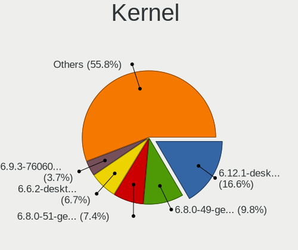
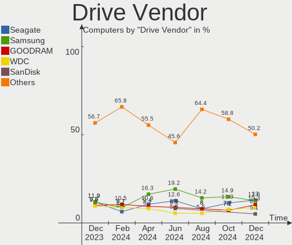
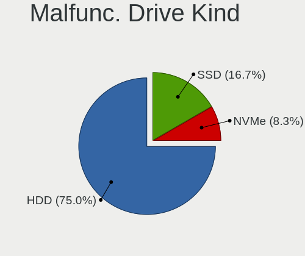
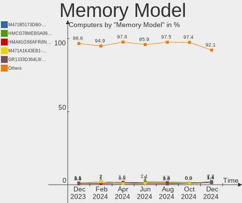
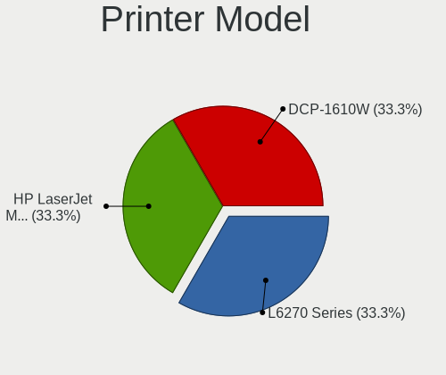

Linux in Poland - Hardware Trends
---------------------------------

A project to identify most popular hardware characteristics and track their change
over time based on data collected by Linux users at https://Linux-Hardware.org.

Anyone can contribute to this report by the [hw-probe](https://github.com/linuxhw/hw-probe) tool:

    sudo -E hw-probe -all -upload

This is a report for all computer types. See also reports for [desktops](/Location/Poland/Desktop/README.md) and [notebooks](/Location/Poland/Notebook/README.md).

Period: Jun, 2022.

Contents
--------

* [ System ](#system)
  - [ OS                       ](#os)
  - [ OS Family                ](#os-family)
  - [ Kernel                   ](#kernel)
  - [ Kernel Family            ](#kernel-family)
  - [ Kernel Major Ver.        ](#kernel-major-ver)
  - [ Arch                     ](#arch)
  - [ DE                       ](#de)
  - [ Display Server           ](#display-server)
  - [ Display Manager          ](#display-manager)
  - [ OS Lang                  ](#os-lang)
  - [ Boot Mode                ](#boot-mode)
  - [ Filesystem               ](#filesystem)
  - [ Part. scheme             ](#part-scheme)
  - [ Dual Boot with Linux/BSD ](#dual-boot-with-linuxbsd)
  - [ Dual Boot (Win)          ](#dual-boot-win)

* [ Board ](#board)
  - [ Vendor                   ](#vendor)
  - [ Model                    ](#model)
  - [ Model Family             ](#model-family)
  - [ MFG Year                 ](#mfg-year)
  - [ Form Factor              ](#form-factor)
  - [ Secure Boot              ](#secure-boot)
  - [ Coreboot                 ](#coreboot)
  - [ RAM Size                 ](#ram-size)
  - [ RAM Used                 ](#ram-used)
  - [ Total Drives             ](#total-drives)
  - [ Has CD-ROM               ](#has-cd-rom)
  - [ Has Ethernet             ](#has-ethernet)
  - [ Has WiFi                 ](#has-wifi)
  - [ Has Bluetooth            ](#has-bluetooth)

* [ Location ](#location)
  - [ Country                  ](#country)
  - [ City                     ](#city)

* [ Drives ](#drives)
  - [ Drive Vendor             ](#drive-vendor)
  - [ Drive Model              ](#drive-model)
  - [ HDD Vendor               ](#hdd-vendor)
  - [ SSD Vendor               ](#ssd-vendor)
  - [ Drive Kind               ](#drive-kind)
  - [ Drive Connector          ](#drive-connector)
  - [ Drive Size               ](#drive-size)
  - [ Space Total              ](#space-total)
  - [ Space Used               ](#space-used)
  - [ Malfunc. Drives          ](#malfunc-drives)
  - [ Malfunc. Drive Vendor    ](#malfunc-drive-vendor)
  - [ Malfunc. HDD Vendor      ](#malfunc-hdd-vendor)
  - [ Malfunc. Drive Kind      ](#malfunc-drive-kind)
  - [ Failed Drives            ](#failed-drives)
  - [ Failed Drive Vendor      ](#failed-drive-vendor)
  - [ Drive Status             ](#drive-status)

* [ Storage controller ](#storage-controller)
  - [ Storage Vendor           ](#storage-vendor)
  - [ Storage Model            ](#storage-model)
  - [ Storage Kind             ](#storage-kind)

* [ Processor ](#processor)
  - [ CPU Vendor               ](#cpu-vendor)
  - [ CPU Model                ](#cpu-model)
  - [ CPU Model Family         ](#cpu-model-family)
  - [ CPU Cores                ](#cpu-cores)
  - [ CPU Sockets              ](#cpu-sockets)
  - [ CPU Threads              ](#cpu-threads)
  - [ CPU Op-Modes             ](#cpu-op-modes)
  - [ CPU Microcode            ](#cpu-microcode)
  - [ CPU Microarch            ](#cpu-microarch)

* [ Graphics ](#graphics)
  - [ GPU Vendor               ](#gpu-vendor)
  - [ GPU Model                ](#gpu-model)
  - [ GPU Combo                ](#gpu-combo)
  - [ GPU Driver               ](#gpu-driver)
  - [ GPU Memory               ](#gpu-memory)

* [ Monitor ](#monitor)
  - [ Monitor Vendor           ](#monitor-vendor)
  - [ Monitor Model            ](#monitor-model)
  - [ Monitor Resolution       ](#monitor-resolution)
  - [ Monitor Diagonal         ](#monitor-diagonal)
  - [ Monitor Width            ](#monitor-width)
  - [ Aspect Ratio             ](#aspect-ratio)
  - [ Monitor Area             ](#monitor-area)
  - [ Pixel Density            ](#pixel-density)
  - [ Multiple Monitors        ](#multiple-monitors)

* [ Network ](#network)
  - [ Net Controller Vendor    ](#net-controller-vendor)
  - [ Net Controller Model     ](#net-controller-model)
  - [ Wireless Vendor          ](#wireless-vendor)
  - [ Wireless Model           ](#wireless-model)
  - [ Ethernet Vendor          ](#ethernet-vendor)
  - [ Ethernet Model           ](#ethernet-model)
  - [ Net Controller Kind      ](#net-controller-kind)
  - [ Used Controller          ](#used-controller)
  - [ NICs                     ](#nics)
  - [ IPv6                     ](#ipv6)

* [ Bluetooth ](#bluetooth)
  - [ Bluetooth Vendor         ](#bluetooth-vendor)
  - [ Bluetooth Model          ](#bluetooth-model)

* [ Sound ](#sound)
  - [ Sound Vendor             ](#sound-vendor)
  - [ Sound Model              ](#sound-model)

* [ Memory ](#memory)
  - [ Memory Vendor            ](#memory-vendor)
  - [ Memory Model             ](#memory-model)
  - [ Memory Kind              ](#memory-kind)
  - [ Memory Form Factor       ](#memory-form-factor)
  - [ Memory Size              ](#memory-size)
  - [ Memory Speed             ](#memory-speed)

* [ Printers & scanners ](#printers--scanners)
  - [ Printer Vendor           ](#printer-vendor)
  - [ Printer Model            ](#printer-model)
  - [ Scanner Vendor           ](#scanner-vendor)
  - [ Scanner Model            ](#scanner-model)

* [ Camera ](#camera)
  - [ Camera Vendor            ](#camera-vendor)
  - [ Camera Model             ](#camera-model)

* [ Security ](#security)
  - [ Fingerprint Vendor       ](#fingerprint-vendor)
  - [ Fingerprint Model        ](#fingerprint-model)
  - [ Chipcard Vendor          ](#chipcard-vendor)
  - [ Chipcard Model           ](#chipcard-model)

* [ Unsupported ](#unsupported)
  - [ Unsupported Devices      ](#unsupported-devices)
  - [ Unsupported Device Types ](#unsupported-device-types)

System
------

OS
--

Installed operating systems

| Name                         | Computers | Percent |
|------------------------------|-----------|---------|
| OpenMandriva 4.3             | 21        | 16.15%  |
| Fedora 36                    | 13        | 10%     |
| Ubuntu 20.04                 | 10        | 7.69%   |
| Ubuntu 22.04                 | 9         | 6.92%   |
| OpenMandriva 4.2             | 7         | 5.38%   |
| Linux Mint 20.3              | 5         | 3.85%   |
| Debian 11                    | 5         | 3.85%   |
| Arch Rolling                 | 5         | 3.85%   |
| Gentoo 2.8                   | 4         | 3.08%   |
| Pop!_OS 22.04                | 3         | 2.31%   |
| Manjaro                      | 3         | 2.31%   |
| LMDE 5                       | 3         | 2.31%   |
| Kubuntu 22.04                | 3         | 2.31%   |
| Debian 10                    | 3         | 2.31%   |
| Xubuntu 20.04                | 2         | 1.54%   |
| Ubuntu 18.04                 | 2         | 1.54%   |
| ROSA 12.2                    | 2         | 1.54%   |
| openSUSE Tumbleweed-XXXXXXXX | 2         | 1.54%   |
| MX 21                        | 2         | 1.54%   |
| Manjaro 21.3.0               | 2         | 1.54%   |
| Garuda Linux Soaring         | 2         | 1.54%   |
| ArcoLinux Rolling            | 2         | 1.54%   |
| Arch                         | 2         | 1.54%   |
| Zorin 15                     | 1         | 0.77%   |
| Raspbian 11                  | 1         | 0.77%   |
| Manjaro 21.3.1               | 1         | 0.77%   |
| Manjaro 21.2.6               | 1         | 0.77%   |
| LinuxFX 11                   | 1         | 0.77%   |
| Linux Mint 20.1              | 1         | 0.77%   |
| Kubuntu 11.1                 | 1         | 0.77%   |
| Kali 2022.2                  | 1         | 0.77%   |
| Kali 2022.1                  | 1         | 0.77%   |
| Guix                         | 1         | 0.77%   |
| EndeavourOS Rolling          | 1         | 0.77%   |
| EndeavourOS                  | 1         | 0.77%   |
| Elementary 6.1               | 1         | 0.77%   |
| Devuan 4                     | 1         | 0.77%   |
| Debian Testing               | 1         | 0.77%   |
| CentOS 7                     | 1         | 0.77%   |
| BuildRoot 2022.02-rc2        | 1         | 0.77%   |
| antiX 21                     | 1         | 0.77%   |

OS Family
---------

OS without a version

| Name         | Computers | Percent |
|--------------|-----------|---------|
| OpenMandriva | 28        | 21.54%  |
| Ubuntu       | 21        | 16.15%  |
| Fedora       | 13        | 10%     |
| Debian       | 9         | 6.92%   |
| Manjaro      | 7         | 5.38%   |
| Arch         | 7         | 5.38%   |
| Linux Mint   | 6         | 4.62%   |
| Kubuntu      | 4         | 3.08%   |
| Gentoo       | 4         | 3.08%   |
| Pop!_OS      | 3         | 2.31%   |
| LMDE         | 3         | 2.31%   |
| Xubuntu      | 2         | 1.54%   |
| ROSA         | 2         | 1.54%   |
| openSUSE     | 2         | 1.54%   |
| MX           | 2         | 1.54%   |
| Kali         | 2         | 1.54%   |
| Garuda Linux | 2         | 1.54%   |
| EndeavourOS  | 2         | 1.54%   |
| ArcoLinux    | 2         | 1.54%   |
| Zorin        | 1         | 0.77%   |
| Raspbian     | 1         | 0.77%   |
| LinuxFX      | 1         | 0.77%   |
| Guix         | 1         | 0.77%   |
| Elementary   | 1         | 0.77%   |
| Devuan       | 1         | 0.77%   |
| CentOS       | 1         | 0.77%   |
| BuildRoot    | 1         | 0.77%   |
| antiX        | 1         | 0.77%   |

Kernel
------

Version of the Linux kernel

| Version                            | Computers | Percent |
|------------------------------------|-----------|---------|
| 5.16.7-desktop-1omv4003            | 18        | 13.85%  |
| 5.10.14-desktop-1omv4002           | 7         | 5.38%   |
| 5.18.5-200.fc36.x86_64             | 6         | 4.62%   |
| 5.13.0-48-generic                  | 6         | 4.62%   |
| 5.10.0-15-amd64                    | 5         | 3.85%   |
| 5.15.0-40-generic                  | 4         | 3.08%   |
| 5.15.0-33-generic                  | 4         | 3.08%   |
| 5.13.0-51-generic                  | 4         | 3.08%   |
| 5.17.5-76051705-generic            | 3         | 2.31%   |
| 5.17.12-300.fc36.x86_64            | 3         | 2.31%   |
| 5.16.13-desktop-1omv4003           | 3         | 2.31%   |
| 5.15.0-37-generic                  | 3         | 2.31%   |
| 5.18.6-arch1-1                     | 2         | 1.54%   |
| 5.18.5-arch1-1                     | 2         | 1.54%   |
| 5.18.1-arch1-1                     | 2         | 1.54%   |
| 5.17.9-1-MANJARO                   | 2         | 1.54%   |
| 5.17.7-xanmod1-MANJARO             | 2         | 1.54%   |
| 5.15.41-gentoo                     | 2         | 1.54%   |
| 5.15.0-25-generic                  | 2         | 1.54%   |
| 5.13.0-44-generic                  | 2         | 1.54%   |
| 5.10.74-generic-2rosa2021.1-x86_64 | 2         | 1.54%   |
| 5.10.0-14-amd64                    | 2         | 1.54%   |
| 5.9.0-050900-generic               | 1         | 0.77%   |
| 5.4.0-91-generic                   | 1         | 0.77%   |
| 5.4.0-121-generic                  | 1         | 0.77%   |
| 5.4.0-120-generic                  | 1         | 0.77%   |
| 5.4.0-117-generic                  | 1         | 0.77%   |
| 5.4.0-113-lowlatency               | 1         | 0.77%   |
| 5.18.8                             | 1         | 0.77%   |
| 5.18.7-lqx1-2-lqx                  | 1         | 0.77%   |
| 5.18.4-1-default                   | 1         | 0.77%   |
| 5.18.3-arch1-g14-1                 | 1         | 0.77%   |
| 5.18.3-arch1-1                     | 1         | 0.77%   |
| 5.18.3-261-tkg-bmq                 | 1         | 0.77%   |
| 5.18.3-1-MANJARO                   | 1         | 0.77%   |
| 5.18.2-1-default                   | 1         | 0.77%   |
| 5.18.1-zen1-1-zen                  | 1         | 0.77%   |
| 5.18.0-g95ff72a6c129               | 1         | 0.77%   |
| 5.18.0-0.bpo.1-amd64               | 1         | 0.77%   |
| 5.17.9-300.fc36.x86_64             | 1         | 0.77%   |
| 5.17.5-300.fc36.x86_64             | 1         | 0.77%   |
| 5.17.5                             | 1         | 0.77%   |
| 5.17.13-300.fc36.x86_64            | 1         | 0.77%   |
| 5.17.0-kali3-amd64                 | 1         | 0.77%   |
| 5.17.0-1-amd64                     | 1         | 0.77%   |
| 5.16.9-200.rog.fc35.x86_64         | 1         | 0.77%   |
| 5.16.10-arch1-1                    | 1         | 0.77%   |
| 5.16.0-kali7-amd64                 | 1         | 0.77%   |
| 5.16.0-6mx-amd64                   | 1         | 0.77%   |
| 5.15.45-1-lts                      | 1         | 0.77%   |
| 5.15.44-1-lts                      | 1         | 0.77%   |
| 5.15.43-sunxi                      | 1         | 0.77%   |
| 5.15.41-1-MANJARO                  | 1         | 0.77%   |
| 5.15.32+                           | 1         | 0.77%   |
| 5.15.0-35-generic                  | 1         | 0.77%   |
| 5.13.0-41-generic                  | 1         | 0.77%   |
| 5.13.0-30-generic                  | 1         | 0.77%   |
| 5.10.0-12-amd64                    | 1         | 0.77%   |
| 4.9.16-gentoo                      | 1         | 0.77%   |
| 4.9.0-279-antix.1-486-smp          | 1         | 0.77%   |

Kernel Family
-------------

Linux kernel without a distro release

| Version | Computers | Percent |
|---------|-----------|---------|
| 5.16.7  | 18        | 13.85%  |
| 5.15.0  | 14        | 10.77%  |
| 5.13.0  | 14        | 10.77%  |
| 5.18.5  | 8         | 6.15%   |
| 5.10.0  | 8         | 6.15%   |
| 5.10.14 | 7         | 5.38%   |
| 5.4.0   | 5         | 3.85%   |
| 5.17.5  | 5         | 3.85%   |
| 5.18.3  | 4         | 3.08%   |
| 5.18.1  | 3         | 2.31%   |
| 5.17.9  | 3         | 2.31%   |
| 5.17.12 | 3         | 2.31%   |
| 5.16.13 | 3         | 2.31%   |
| 5.15.41 | 3         | 2.31%   |
| 4.19.0  | 3         | 2.31%   |
| 5.18.6  | 2         | 1.54%   |
| 5.18.0  | 2         | 1.54%   |
| 5.17.7  | 2         | 1.54%   |
| 5.17.0  | 2         | 1.54%   |
| 5.16.0  | 2         | 1.54%   |
| 5.10.74 | 2         | 1.54%   |
| 4.15.0  | 2         | 1.54%   |
| 5.9.0   | 1         | 0.77%   |
| 5.18.8  | 1         | 0.77%   |
| 5.18.7  | 1         | 0.77%   |
| 5.18.4  | 1         | 0.77%   |
| 5.18.2  | 1         | 0.77%   |
| 5.17.13 | 1         | 0.77%   |
| 5.16.9  | 1         | 0.77%   |
| 5.16.10 | 1         | 0.77%   |
| 5.15.45 | 1         | 0.77%   |
| 5.15.44 | 1         | 0.77%   |
| 5.15.43 | 1         | 0.77%   |
| 5.15.32 | 1         | 0.77%   |
| 4.9.16  | 1         | 0.77%   |
| 4.9.0   | 1         | 0.77%   |
| 3.10.0  | 1         | 0.77%   |

Kernel Major Ver.
-----------------

Linux kernel major version

| Version | Computers | Percent |
|---------|-----------|---------|
| 5.16    | 25        | 19.23%  |
| 5.18    | 23        | 17.69%  |
| 5.15    | 21        | 16.15%  |
| 5.10    | 17        | 13.08%  |
| 5.17    | 16        | 12.31%  |
| 5.13    | 14        | 10.77%  |
| 5.4     | 5         | 3.85%   |
| 4.19    | 3         | 2.31%   |
| 4.9     | 2         | 1.54%   |
| 4.15    | 2         | 1.54%   |
| 5.9     | 1         | 0.77%   |
| 3.10    | 1         | 0.77%   |

Arch
----

OS architecture (x86_64, i586, etc.)

| Name   | Computers | Percent |
|--------|-----------|---------|
| x86_64 | 125       | 96.15%  |
| i686   | 2         | 1.54%   |
| ppc    | 1         | 0.77%   |
| armv7l | 1         | 0.77%   |
| armv6l | 1         | 0.77%   |

DE
--

Desktop Environment

| Name          | Computers | Percent |
|---------------|-----------|---------|
| KDE5          | 46        | 35.38%  |
| GNOME         | 42        | 32.31%  |
| Unknown       | 13        | 10%     |
| X-Cinnamon    | 8         | 6.15%   |
| XFCE          | 7         | 5.38%   |
| Cinnamon      | 3         | 2.31%   |
| sway          | 1         | 0.77%   |
| stumpwm       | 1         | 0.77%   |
| qtile         | 1         | 0.77%   |
| Pantheon      | 1         | 0.77%   |
| MATE          | 1         | 0.77%   |
| KDE           | 1         | 0.77%   |
| jwm           | 1         | 0.77%   |
| i3            | 1         | 0.77%   |
| GNOME Classic | 1         | 0.77%   |
| Deepin        | 1         | 0.77%   |
| awesome       | 1         | 0.77%   |

Display Server
--------------

X11 or Wayland

| Name    | Computers | Percent |
|---------|-----------|---------|
| X11     | 100       | 76.92%  |
| Wayland | 23        | 17.69%  |
| Unknown | 5         | 3.85%   |
| Tty     | 2         | 1.54%   |

Display Manager
---------------

SDDM, LightDM, etc.

| Name    | Computers | Percent |
|---------|-----------|---------|
| Unknown | 41        | 31.54%  |
| SDDM    | 40        | 30.77%  |
| LightDM | 18        | 13.85%  |
| GDM     | 15        | 11.54%  |
| GDM3    | 14        | 10.77%  |
| SLIMSKI | 1         | 0.77%   |
| SLiM    | 1         | 0.77%   |

OS Lang
-------

Language

| Lang    | Computers | Percent |
|---------|-----------|---------|
| pl_PL   | 66        | 50.77%  |
| en_US   | 46        | 35.38%  |
| en_GB   | 5         | 3.85%   |
| Unknown | 5         | 3.85%   |
| en_CA   | 4         | 3.08%   |
| ru_RU   | 1         | 0.77%   |
| en_IE   | 1         | 0.77%   |
| en_AG   | 1         | 0.77%   |
| C.UTF8  | 1         | 0.77%   |

Boot Mode
---------

EFI or BIOS

| Mode | Computers | Percent |
|------|-----------|---------|
| BIOS | 73        | 56.15%  |
| EFI  | 57        | 43.85%  |

Filesystem
----------

Type of filesystem

| Type     | Computers | Percent |
|----------|-----------|---------|
| Ext4     | 86        | 66.15%  |
| Btrfs    | 19        | 14.62%  |
| Overlay  | 16        | 12.31%  |
| F2fs     | 4         | 3.08%   |
| Xfs      | 3         | 2.31%   |
| Ext2     | 1         | 0.77%   |
| Bcachefs | 1         | 0.77%   |

Part. scheme
------------

Scheme of partitioning

| Type    | Computers | Percent |
|---------|-----------|---------|
| GPT     | 54        | 41.54%  |
| Unknown | 50        | 38.46%  |
| MBR     | 26        | 20%     |

Dual Boot with Linux/BSD
------------------------

Hosting more than one Linux/BSD

| Dual boot | Computers | Percent |
|-----------|-----------|---------|
| No        | 99        | 76.15%  |
| Yes       | 31        | 23.85%  |

Dual Boot (Win)
---------------

Hosting Linux and Windows

| Dual boot | Computers | Percent |
|-----------|-----------|---------|
| No        | 96        | 73.85%  |
| Yes       | 34        | 26.15%  |

Board
-----

Vendor
------

Motherboard manufacturer

| Name                    | Computers | Percent |
|-------------------------|-----------|---------|
| Dell                    | 23        | 17.69%  |
| ASUSTek Computer        | 23        | 17.69%  |
| Lenovo                  | 21        | 16.15%  |
| Gigabyte Technology     | 14        | 10.77%  |
| MSI                     | 13        | 10%     |
| Hewlett-Packard         | 12        | 9.23%   |
| Acer                    | 8         | 6.15%   |
| ASRock                  | 4         | 3.08%   |
| Unknown                 | 3         | 2.31%   |
| Fujitsu                 | 2         | 1.54%   |
| Xunlong                 | 1         | 0.77%   |
| Samsung Electronics     | 1         | 0.77%   |
| Raspberry Pi Foundation | 1         | 0.77%   |
| mPTech                  | 1         | 0.77%   |
| Inventec                | 1         | 0.77%   |
| Getac                   | 1         | 0.77%   |
| Framework               | 1         | 0.77%   |

Model
-----

Motherboard model

| Name                                       | Computers | Percent |
|--------------------------------------------|-----------|---------|
| ASUS SABERTOOTH Z77                        | 10        | 7.69%   |
| Dell Inspiron 3451                         | 6         | 4.62%   |
| MSI MS-7817                                | 3         | 2.31%   |
| Gigabyte 970A-DS3P                         | 3         | 2.31%   |
| Unknown                                    | 3         | 2.31%   |
| HP Pavilion Laptop 14-dv0xxx               | 2         | 1.54%   |
| Xunlong Orange Pi Lite                     | 1         | 0.77%   |
| Samsung 355V4C/356V4C/3445VC/3545VC        | 1         | 0.77%   |
| RPi Raspberry Pi Zero W Rev 1.1            | 1         | 0.77%   |
| MSI PR601/VR603                            | 1         | 0.77%   |
| MSI MS-7D54                                | 1         | 0.77%   |
| MSI MS-7C91                                | 1         | 0.77%   |
| MSI MS-7C02                                | 1         | 0.77%   |
| MSI MS-7B89                                | 1         | 0.77%   |
| MSI MS-7B86                                | 1         | 0.77%   |
| MSI MS-7B79                                | 1         | 0.77%   |
| MSI MS-7B17                                | 1         | 0.77%   |
| MSI MS-7A34                                | 1         | 0.77%   |
| MSI Bravo 17 A4DDR                         | 1         | 0.77%   |
| mPTech ARC 11.6 128GB HD                   | 1         | 0.77%   |
| Lenovo ThinkPad T530 2429B68               | 1         | 0.77%   |
| Lenovo ThinkPad T530 23923MG               | 1         | 0.77%   |
| Lenovo ThinkPad T500 2241A87               | 1         | 0.77%   |
| Lenovo ThinkPad T470 20HES07J00            | 1         | 0.77%   |
| Lenovo ThinkPad T450 20BUS0QT04            | 1         | 0.77%   |
| Lenovo ThinkPad T420 4180MY7               | 1         | 0.77%   |
| Lenovo ThinkPad T14 Gen 2i 20W1S21R02      | 1         | 0.77%   |
| Lenovo ThinkPad P50 20EQS3B30R             | 1         | 0.77%   |
| Lenovo ThinkPad P17 Gen 1 20SQS01Y00       | 1         | 0.77%   |
| Lenovo ThinkPad P14s Gen 2a 21A00003PB     | 1         | 0.77%   |
| Lenovo M490s 20214                         | 1         | 0.77%   |
| Lenovo Legion Y540-15IRH 81SX              | 1         | 0.77%   |
| Lenovo Legion 5 Pro 16ACH6H 82JQ           | 1         | 0.77%   |
| Lenovo IdeaPad Z570 HuronRiver Platform    | 1         | 0.77%   |
| Lenovo IdeaPad Y700-15ISK 80NV             | 1         | 0.77%   |
| Lenovo IdeaPad S145-14AST 81ST             | 1         | 0.77%   |
| Lenovo IdeaPad 5 15ITL05 82FG              | 1         | 0.77%   |
| Lenovo IdeaCentre AIO 300-23ISU F0BY00DMPB | 1         | 0.77%   |
| Lenovo G580 20150                          | 1         | 0.77%   |
| Lenovo G50-30 80G0                         | 1         | 0.77%   |
| Lenovo B570e HuronRiver Platform           | 1         | 0.77%   |
| Inventec Dell Thin Client Desktop 5060     | 1         | 0.77%   |
| HP ZBook Studio G3                         | 1         | 0.77%   |
| HP ProBook 450 G5                          | 1         | 0.77%   |
| HP Pavilion Notebook                       | 1         | 0.77%   |
| HP Pavilion Gaming Laptop 15-ec1xxx        | 1         | 0.77%   |
| HP Pavilion dv6700                         | 1         | 0.77%   |
| HP EliteDesk 800 G2 DM 65W                 | 1         | 0.77%   |
| HP EliteBook 850 G8 Notebook PC            | 1         | 0.77%   |
| HP EliteBook 850 G3                        | 1         | 0.77%   |
| HP EliteBook 850 G2                        | 1         | 0.77%   |
| HP Compaq Elite 8300 CMT                   | 1         | 0.77%   |
| Gigabyte Z97M-DS3H                         | 1         | 0.77%   |
| Gigabyte H410M S2H V3                      | 1         | 0.77%   |
| Gigabyte F2A88XM-D3H                       | 1         | 0.77%   |
| Gigabyte F2A88X-D3H                        | 1         | 0.77%   |
| Gigabyte B85M-D3H                          | 1         | 0.77%   |
| Gigabyte B75-D3V                           | 1         | 0.77%   |
| Gigabyte B550 AORUS ELITE AX V2            | 1         | 0.77%   |
| Gigabyte B550 AORUS ELITE                  | 1         | 0.77%   |

Model Family
------------

Motherboard model prefix

| Name                  | Computers | Percent |
|-----------------------|-----------|---------|
| Dell Latitude         | 11        | 8.46%   |
| Lenovo ThinkPad       | 10        | 7.69%   |
| ASUS SABERTOOTH       | 10        | 7.69%   |
| Dell Inspiron         | 8         | 6.15%   |
| HP Pavilion           | 5         | 3.85%   |
| Acer Aspire           | 5         | 3.85%   |
| Lenovo IdeaPad        | 4         | 3.08%   |
| ASUS TUF              | 4         | 3.08%   |
| MSI MS-7817           | 3         | 2.31%   |
| HP EliteBook          | 3         | 2.31%   |
| Gigabyte 970A-DS3P    | 3         | 2.31%   |
| Unknown               | 3         | 2.31%   |
| Lenovo Legion         | 2         | 1.54%   |
| Gigabyte B550         | 2         | 1.54%   |
| Dell OptiPlex         | 2         | 1.54%   |
| ASUS ROG              | 2         | 1.54%   |
| Xunlong Orange        | 1         | 0.77%   |
| Samsung 355V4C        | 1         | 0.77%   |
| RPi Raspberry         | 1         | 0.77%   |
| MSI PR601             | 1         | 0.77%   |
| MSI MS-7D54           | 1         | 0.77%   |
| MSI MS-7C91           | 1         | 0.77%   |
| MSI MS-7C02           | 1         | 0.77%   |
| MSI MS-7B89           | 1         | 0.77%   |
| MSI MS-7B86           | 1         | 0.77%   |
| MSI MS-7B79           | 1         | 0.77%   |
| MSI MS-7B17           | 1         | 0.77%   |
| MSI MS-7A34           | 1         | 0.77%   |
| MSI Bravo             | 1         | 0.77%   |
| mPTech ARC            | 1         | 0.77%   |
| Lenovo M490s          | 1         | 0.77%   |
| Lenovo IdeaCentre     | 1         | 0.77%   |
| Lenovo G580           | 1         | 0.77%   |
| Lenovo G50-30         | 1         | 0.77%   |
| Lenovo B570e          | 1         | 0.77%   |
| Inventec Dell         | 1         | 0.77%   |
| HP ZBook              | 1         | 0.77%   |
| HP ProBook            | 1         | 0.77%   |
| HP EliteDesk          | 1         | 0.77%   |
| HP Compaq             | 1         | 0.77%   |
| Gigabyte Z97M-DS3H    | 1         | 0.77%   |
| Gigabyte H410M        | 1         | 0.77%   |
| Gigabyte F2A88XM-D3H  | 1         | 0.77%   |
| Gigabyte F2A88X-D3H   | 1         | 0.77%   |
| Gigabyte B85M-D3H     | 1         | 0.77%   |
| Gigabyte B75-D3V      | 1         | 0.77%   |
| Gigabyte B450         | 1         | 0.77%   |
| Gigabyte B150-HD3     | 1         | 0.77%   |
| Gigabyte AB350-Gaming | 1         | 0.77%   |
| Getac B300-X          | 1         | 0.77%   |
| Fujitsu PRIMERGY      | 1         | 0.77%   |
| Fujitsu FMVA0800C     | 1         | 0.77%   |
| Framework Laptop      | 1         | 0.77%   |
| Dell Vostro           | 1         | 0.77%   |
| Dell Precision        | 1         | 0.77%   |
| ASUS X751LK           | 1         | 0.77%   |
| ASUS P9X79            | 1         | 0.77%   |
| ASUS MINIPC           | 1         | 0.77%   |
| ASUS M5A97            | 1         | 0.77%   |
| ASUS M3A78-CM         | 1         | 0.77%   |

MFG Year
--------

Motherboard manufacture year

| Year    | Computers | Percent |
|---------|-----------|---------|
| 2012    | 19        | 14.62%  |
| 2021    | 16        | 12.31%  |
| 2020    | 13        | 10%     |
| 2013    | 13        | 10%     |
| 2011    | 12        | 9.23%   |
| 2014    | 11        | 8.46%   |
| 2019    | 9         | 6.92%   |
| 2017    | 8         | 6.15%   |
| 2015    | 6         | 4.62%   |
| 2018    | 4         | 3.08%   |
| 2016    | 4         | 3.08%   |
| 2008    | 4         | 3.08%   |
| 2009    | 3         | 2.31%   |
| Unknown | 3         | 2.31%   |
| 2007    | 2         | 1.54%   |
| 2022    | 1         | 0.77%   |
| 2010    | 1         | 0.77%   |
| 2006    | 1         | 0.77%   |

Form Factor
-----------

Physical design of the computer

| Name           | Computers | Percent |
|----------------|-----------|---------|
| Notebook       | 71        | 54.62%  |
| Desktop        | 53        | 40.77%  |
| System on chip | 2         | 1.54%   |
| Mini pc        | 2         | 1.54%   |
| All in one     | 1         | 0.77%   |
| Server         | 1         | 0.77%   |

Secure Boot
-----------

Enabled or disabled

| State    | Computers | Percent |
|----------|-----------|---------|
| Disabled | 125       | 96.15%  |
| Enabled  | 5         | 3.85%   |

Coreboot
--------

Have coreboot on board

| Used | Computers | Percent |
|------|-----------|---------|
| No   | 130       | 100%    |

RAM Size
--------

Total RAM memory

| Size in GB  | Computers | Percent |
|-------------|-----------|---------|
| 32.01-64.0  | 35        | 26.92%  |
| 4.01-8.0    | 27        | 20.77%  |
| 8.01-16.0   | 19        | 14.62%  |
| 3.01-4.0    | 18        | 13.85%  |
| 16.01-24.0  | 14        | 10.77%  |
| 24.01-32.0  | 5         | 3.85%   |
| 64.01-256.0 | 5         | 3.85%   |
| 2.01-3.0    | 2         | 1.54%   |
| 1.01-2.0    | 2         | 1.54%   |
| 0.01-0.5    | 2         | 1.54%   |
| 0.51-1.0    | 1         | 0.77%   |

RAM Used
--------

Used RAM memory

| Used GB    | Computers | Percent |
|------------|-----------|---------|
| 1.01-2.0   | 54        | 41.54%  |
| 3.01-4.0   | 22        | 16.92%  |
| 4.01-8.0   | 21        | 16.15%  |
| 2.01-3.0   | 14        | 10.77%  |
| 8.01-16.0  | 9         | 6.92%   |
| 0.01-0.5   | 5         | 3.85%   |
| 0.51-1.0   | 4         | 3.08%   |
| 24.01-32.0 | 1         | 0.77%   |

Total Drives
------------

Number of drives on board

| Drives | Computers | Percent |
|--------|-----------|---------|
| 1      | 79        | 60.77%  |
| 2      | 31        | 23.85%  |
| 4      | 8         | 6.15%   |
| 3      | 6         | 4.62%   |
| 6      | 2         | 1.54%   |
| 5      | 2         | 1.54%   |
| 0      | 2         | 1.54%   |

Has CD-ROM
----------

Has CD-ROM on board

| Presented | Computers | Percent |
|-----------|-----------|---------|
| No        | 88        | 67.69%  |
| Yes       | 42        | 32.31%  |

Has Ethernet
------------

Has Ethernet on board

| Presented | Computers | Percent |
|-----------|-----------|---------|
| Yes       | 119       | 91.54%  |
| No        | 11        | 8.46%   |

Has WiFi
--------

Has WiFi module

| Presented | Computers | Percent |
|-----------|-----------|---------|
| Yes       | 105       | 80.77%  |
| No        | 25        | 19.23%  |

Has Bluetooth
-------------

Has Bluetooth module

| Presented | Computers | Percent |
|-----------|-----------|---------|
| Yes       | 81        | 62.31%  |
| No        | 49        | 37.69%  |

Location
--------

Country
-------

Geographic location (country)

| Country | Computers | Percent |
|---------|-----------|---------|
| Poland  | 130       | 100%    |

City
----

Geographic location (city)

| City                   | Computers | Percent |
|------------------------|-----------|---------|
| Warsaw                 | 27        | 20.77%  |
| Krakow                 | 17        | 13.08%  |
| Wroclaw                | 10        | 7.69%   |
| Strzyzow               | 10        | 7.69%   |
| Skierniewice           | 4         | 3.08%   |
| Poznan                 | 4         | 3.08%   |
| Lodz                   | 4         | 3.08%   |
| Gdansk                 | 4         | 3.08%   |
| Katowice               | 3         | 2.31%   |
| Gdynia                 | 3         | 2.31%   |
| Debica                 | 2         | 1.54%   |
| Cieszyn                | 2         | 1.54%   |
| Zgierz                 | 1         | 0.77%   |
| Zator                  | 1         | 0.77%   |
| Włocławek            | 1         | 0.77%   |
| Wielgie                | 1         | 0.77%   |
| Ustron                 | 1         | 0.77%   |
| Unieszewo              | 1         | 0.77%   |
| Tarnów                | 1         | 0.77%   |
| Słupsk                | 1         | 0.77%   |
| Szarwark               | 1         | 0.77%   |
| Świętochłowice      | 1         | 0.77%   |
| Strzegom               | 1         | 0.77%   |
| Starachowice           | 1         | 0.77%   |
| Śliwice               | 1         | 0.77%   |
| Skarzysko-Kamienna     | 1         | 0.77%   |
| Siemianowice Śląskie | 1         | 0.77%   |
| Sedziszow Malopolski   | 1         | 0.77%   |
| Radwanice              | 1         | 0.77%   |
| Radom                  | 1         | 0.77%   |
| Pilica                 | 1         | 0.77%   |
| Pila                   | 1         | 0.77%   |
| Otwock                 | 1         | 0.77%   |
| Olsztyn                | 1         | 0.77%   |
| Niepolomice            | 1         | 0.77%   |
| Mysłowice             | 1         | 0.77%   |
| Malbork                | 1         | 0.77%   |
| Lublin                 | 1         | 0.77%   |
| Lesna                  | 1         | 0.77%   |
| Legnica                | 1         | 0.77%   |
| Leczna                 | 1         | 0.77%   |
| Jawor                  | 1         | 0.77%   |
| Janikowo               | 1         | 0.77%   |
| Gniezno                | 1         | 0.77%   |
| Glogowek               | 1         | 0.77%   |
| Częstochowa           | 1         | 0.77%   |
| Czeladz                | 1         | 0.77%   |
| Ciechocinek            | 1         | 0.77%   |
| Bytom                  | 1         | 0.77%   |
| Bojszowy               | 1         | 0.77%   |
| Bledow                 | 1         | 0.77%   |
| Bialystok              | 1         | 0.77%   |

Drives
------

Drive Vendor
------------

Hard drive vendors

| Vendor                      | Computers | Drives | Percent |
|-----------------------------|-----------|--------|---------|
| Seagate                     | 37        | 39     | 18.78%  |
| Samsung Electronics         | 21        | 23     | 10.66%  |
| Goodram                     | 20        | 21     | 10.15%  |
| WDC                         | 17        | 19     | 8.63%   |
| Crucial                     | 10        | 11     | 5.08%   |
| SK hynix                    | 8         | 8      | 4.06%   |
| Kingston                    | 8         | 8      | 4.06%   |
| Toshiba                     | 7         | 8      | 3.55%   |
| Unknown                     | 6         | 6      | 3.05%   |
| SanDisk                     | 6         | 6      | 3.05%   |
| Intel                       | 6         | 6      | 3.05%   |
| A-DATA Technology           | 6         | 6      | 3.05%   |
| XPG                         | 4         | 4      | 2.03%   |
| SPCC                        | 4         | 4      | 2.03%   |
| ASMT                        | 4         | 4      | 2.03%   |
| PNY                         | 3         | 3      | 1.52%   |
| Patriot                     | 3         | 3      | 1.52%   |
| Hitachi                     | 3         | 5      | 1.52%   |
| Plextor                     | 2         | 3      | 1.02%   |
| OCZ                         | 2         | 2      | 1.02%   |
| Micron Technology           | 2         | 2      | 1.02%   |
| HGST                        | 2         | 2      | 1.02%   |
| Gigabyte Technology         | 2         | 2      | 1.02%   |
| Corsair                     | 2         | 2      | 1.02%   |
| Verbatim                    | 1         | 1      | 0.51%   |
| Union Memory                | 1         | 1      | 0.51%   |
| sobetter                    | 1         | 1      | 0.51%   |
| Phison                      | 1         | 1      | 0.51%   |
| MAXIO Technology (Hangzhou) | 1         | 1      | 0.51%   |
| LITEONIT                    | 1         | 1      | 0.51%   |
| LITEON                      | 1         | 1      | 0.51%   |
| Lite-On                     | 1         | 1      | 0.51%   |
| KIOXIA                      | 1         | 1      | 0.51%   |
| Intenso                     | 1         | 1      | 0.51%   |
| Hewlett-Packard             | 1         | 1      | 0.51%   |
| Fujitsu                     | 1         | 1      | 0.51%   |

Drive Model
-----------

Hard drive models

| Model                                | Computers | Percent |
|--------------------------------------|-----------|---------|
| Seagate ST500LT012-1DG142 500GB      | 6         | 2.94%   |
| Samsung SSD 850 EVO 250GB            | 5         | 2.45%   |
| Goodram SSD 120GB                    | 5         | 2.45%   |
| ASMT 2135 120GB SSD                  | 4         | 1.96%   |
| Seagate ST92505610AS 250GB           | 3         | 1.47%   |
| Seagate ST1000LM035-1RK172 1TB       | 3         | 1.47%   |
| Seagate ST1000DM003-1ER162 1TB       | 3         | 1.47%   |
| Intel NVMe SSD Drive 512GB           | 3         | 1.47%   |
| Goodram SSDPR-CX400-512-G2 512GB     | 3         | 1.47%   |
| Crucial CT500MX500SSD1 500GB         | 3         | 1.47%   |
| XPG NVMe SSD Drive 1024GB            | 2         | 0.98%   |
| SPCC Solid State Disk 240GB          | 2         | 0.98%   |
| SK hynix BC711 NVMe 256GB            | 2         | 0.98%   |
| Seagate ST1000LM024 HN-M101MBB 1TB   | 2         | 0.98%   |
| Kingston SA400S37240G 240GB SSD      | 2         | 0.98%   |
| Kingston NVMe SSD Drive 1TB          | 2         | 0.98%   |
| Goodram SSDPR-CX400-256-G2 256GB     | 2         | 0.98%   |
| Goodram SSDPR-CL100-480-G2 480GB     | 2         | 0.98%   |
| Gigabyte GP-GSM2NE3512GNTD 512GB     | 2         | 0.98%   |
| A-DATA SU800 1TB SSD                 | 2         | 0.98%   |
| XPG NVMe SSD Drive 512GB             | 1         | 0.49%   |
| XPG GAMMIX S11 Pro 1TB               | 1         | 0.49%   |
| WDC WDS500G2B0A-00SM50 500GB SSD     | 1         | 0.49%   |
| WDC WDS100T3X0C-00SJG0 1TB           | 1         | 0.49%   |
| WDC WDS100T2B0C-00PXH0 1TB           | 1         | 0.49%   |
| WDC WD800JB-00ETA0 80GB              | 1         | 0.49%   |
| WDC WD5002ABYS-01B1B0 500GB          | 1         | 0.49%   |
| WDC WD5000BPVT-22HXZT1 500GB         | 1         | 0.49%   |
| WDC WD3200BPVT-24JJ5T0 320GB         | 1         | 0.49%   |
| WDC WD30EFRX-68EUZN0 3TB             | 1         | 0.49%   |
| WDC WD20EZRX-00D8PB0 2TB             | 1         | 0.49%   |
| WDC WD20EFRX-68EUZN0 2TB             | 1         | 0.49%   |
| WDC WD2003FZEX-00SRLA0 2TB           | 1         | 0.49%   |
| WDC WD1600AAJS-00L7A0 160GB          | 1         | 0.49%   |
| WDC WD10SPCX-24HWST1 1TB             | 1         | 0.49%   |
| WDC WD10EZEX-00BN5A0 1TB             | 1         | 0.49%   |
| WDC WD10EALS-002BA0 1TB              | 1         | 0.49%   |
| WDC WD1003FZEX-00MK2A0 1TB           | 1         | 0.49%   |
| WDC WD1002FAEX-00Z3A0 1TB            | 1         | 0.49%   |
| WDC WD10 TPVT-65HT5T0 1TB            | 1         | 0.49%   |
| WDC PC SN520 SDAPNUW-512G-1014 512GB | 1         | 0.49%   |
| Verbatim Vi550 S3 SSD 128GB          | 1         | 0.49%   |
| Unknown USB DISK 3.2 1TB             | 1         | 0.49%   |
| Unknown SM32G  32GB                  | 1         | 0.49%   |
| Unknown SD128  128GB                 | 1         | 0.49%   |
| Unknown MMC Card  64GB               | 1         | 0.49%   |
| Unknown MMC Card  16GB               | 1         | 0.49%   |
| Unknown MMC Card  128GB              | 1         | 0.49%   |
| Union Memory RTOTJ128VGD2EYX 128GB   | 1         | 0.49%   |
| Toshiba NVMe SSD Drive 512GB         | 1         | 0.49%   |
| Toshiba MK6008GAH 64GB               | 1         | 0.49%   |
| Toshiba HDWQ140 4TB                  | 1         | 0.49%   |
| Toshiba HDWE150 5TB                  | 1         | 0.49%   |
| Toshiba HDWD130 3TB                  | 1         | 0.49%   |
| Toshiba HDWD110 1TB                  | 1         | 0.49%   |
| Toshiba DT01ACA100 1TB               | 1         | 0.49%   |
| SPCC Solid State Disk 512GB          | 1         | 0.49%   |
| SPCC Solid State Disk 256GB          | 1         | 0.49%   |
| sobetter Ext 1TB                     | 1         | 0.49%   |
| SK hynix SKHynix_HFS001TDE9X081N 1TB | 1         | 0.49%   |

HDD Vendor
----------

Hard disk drive vendors

| Vendor              | Computers | Drives | Percent |
|---------------------|-----------|--------|---------|
| Seagate             | 37        | 39     | 58.73%  |
| WDC                 | 13        | 15     | 20.63%  |
| Toshiba             | 6         | 7      | 9.52%   |
| Hitachi             | 3         | 5      | 4.76%   |
| HGST                | 2         | 2      | 3.17%   |
| Samsung Electronics | 1         | 1      | 1.59%   |
| Fujitsu             | 1         | 1      | 1.59%   |

SSD Vendor
----------

Solid state drive vendors

| Vendor              | Computers | Drives | Percent |
|---------------------|-----------|--------|---------|
| Goodram             | 19        | 20     | 23.46%  |
| Samsung Electronics | 14        | 15     | 17.28%  |
| Crucial             | 9         | 10     | 11.11%  |
| SanDisk             | 6         | 6      | 7.41%   |
| A-DATA Technology   | 6         | 6      | 7.41%   |
| SPCC                | 4         | 4      | 4.94%   |
| ASMT                | 4         | 4      | 4.94%   |
| Patriot             | 3         | 3      | 3.7%    |
| Kingston            | 3         | 3      | 3.7%    |
| Plextor             | 2         | 3      | 2.47%   |
| OCZ                 | 2         | 2      | 2.47%   |
| Micron Technology   | 2         | 2      | 2.47%   |
| WDC                 | 1         | 1      | 1.23%   |
| Verbatim            | 1         | 1      | 1.23%   |
| Union Memory        | 1         | 1      | 1.23%   |
| PNY                 | 1         | 1      | 1.23%   |
| LITEONIT            | 1         | 1      | 1.23%   |
| LITEON              | 1         | 1      | 1.23%   |
| Intel               | 1         | 1      | 1.23%   |

Drive Kind
----------

HDD or SSD

| Kind    | Computers | Drives | Percent |
|---------|-----------|--------|---------|
| SSD     | 68        | 85     | 39.53%  |
| HDD     | 56        | 70     | 32.56%  |
| NVMe    | 40        | 46     | 23.26%  |
| MMC     | 5         | 5      | 2.91%   |
| Unknown | 3         | 3      | 1.74%   |

Drive Connector
---------------

SATA, SAS, NVMe, etc.

| Type | Computers | Drives | Percent |
|------|-----------|--------|---------|
| SATA | 95        | 149    | 63.76%  |
| NVMe | 40        | 46     | 26.85%  |
| SAS  | 9         | 9      | 6.04%   |
| MMC  | 5         | 5      | 3.36%   |

Drive Size
----------

Size of hard drive

| Size in TB | Computers | Drives | Percent |
|------------|-----------|--------|---------|
| 0.01-0.5   | 78        | 97     | 61.42%  |
| 0.51-1.0   | 31        | 36     | 24.41%  |
| 1.01-2.0   | 7         | 8      | 5.51%   |
| 3.01-4.0   | 5         | 6      | 3.94%   |
| 2.01-3.0   | 4         | 6      | 3.15%   |
| 10.01-20.0 | 1         | 1      | 0.79%   |
| 4.01-10.0  | 1         | 1      | 0.79%   |

Space Total
-----------

Amount of disk space available on the file system

| Size in GB     | Computers | Percent |
|----------------|-----------|---------|
| 101-250        | 34        | 26.15%  |
| 251-500        | 19        | 14.62%  |
| 501-1000       | 17        | 13.08%  |
| More than 3000 | 14        | 10.77%  |
| 1-20           | 13        | 10%     |
| 21-50          | 10        | 7.69%   |
| 1001-2000      | 10        | 7.69%   |
| Unknown        | 6         | 4.62%   |
| 51-100         | 4         | 3.08%   |
| 2001-3000      | 3         | 2.31%   |

Space Used
----------

Amount of used disk space

| Used GB        | Computers | Percent |
|----------------|-----------|---------|
| 1-20           | 54        | 41.54%  |
| 101-250        | 16        | 12.31%  |
| 21-50          | 11        | 8.46%   |
| 251-500        | 10        | 7.69%   |
| 51-100         | 10        | 7.69%   |
| 501-1000       | 8         | 6.15%   |
| More than 3000 | 7         | 5.38%   |
| Unknown        | 6         | 4.62%   |
| 2001-3000      | 4         | 3.08%   |
| 1001-2000      | 4         | 3.08%   |

Malfunc. Drives
---------------

Drive models with a malfunction

| Model                               | Computers | Drives | Percent |
|-------------------------------------|-----------|--------|---------|
| Seagate ST92505610AS 250GB          | 3         | 3      | 15.79%  |
| Goodram SSD 120GB                   | 3         | 3      | 15.79%  |
| WDC WD800JB-00ETA0 80GB             | 1         | 1      | 5.26%   |
| WDC WD5002ABYS-01B1B0 500GB         | 1         | 1      | 5.26%   |
| WDC WD10EALS-002BA0 1TB             | 1         | 1      | 5.26%   |
| WDC WD10 TPVT-65HT5T0 1TB           | 1         | 1      | 5.26%   |
| Toshiba MK6008GAH 64GB              | 1         | 1      | 5.26%   |
| Seagate ST500LT012-9WS142 500GB     | 1         | 1      | 5.26%   |
| Seagate ST3250820SCE 250GB          | 1         | 1      | 5.26%   |
| SanDisk SD9SN8W-128G-1006 128GB SSD | 1         | 1      | 5.26%   |
| Samsung Electronics HE103UJ 1TB     | 1         | 1      | 5.26%   |
| Patriot P200 2TB SSD                | 1         | 1      | 5.26%   |
| Intel SSDSCKKF256H6 SATA 256GB      | 1         | 1      | 5.26%   |
| Hewlett-Packard SSD EX900 500GB     | 1         | 1      | 5.26%   |
| ASMT 2135 120GB SSD                 | 1         | 1      | 5.26%   |

Malfunc. Drive Vendor
---------------------

Vendors of faulty drives

| Vendor              | Computers | Drives | Percent |
|---------------------|-----------|--------|---------|
| Seagate             | 5         | 5      | 26.32%  |
| WDC                 | 4         | 4      | 21.05%  |
| Goodram             | 3         | 3      | 15.79%  |
| Toshiba             | 1         | 1      | 5.26%   |
| SanDisk             | 1         | 1      | 5.26%   |
| Samsung Electronics | 1         | 1      | 5.26%   |
| Patriot             | 1         | 1      | 5.26%   |
| Intel               | 1         | 1      | 5.26%   |
| Hewlett-Packard     | 1         | 1      | 5.26%   |
| ASMT                | 1         | 1      | 5.26%   |

Malfunc. HDD Vendor
-------------------

Vendors of faulty HDD drives

| Vendor              | Computers | Drives | Percent |
|---------------------|-----------|--------|---------|
| Seagate             | 5         | 5      | 45.45%  |
| WDC                 | 4         | 4      | 36.36%  |
| Toshiba             | 1         | 1      | 9.09%   |
| Samsung Electronics | 1         | 1      | 9.09%   |

Malfunc. Drive Kind
-------------------

Kinds of faulty drives

| Kind | Computers | Drives | Percent |
|------|-----------|--------|---------|
| HDD  | 11        | 11     | 57.89%  |
| SSD  | 7         | 7      | 36.84%  |
| NVMe | 1         | 1      | 5.26%   |

Failed Drives
-------------

Failed drive models

Zero info for selected period =(

Failed Drive Vendor
-------------------

Failed drive vendors

Zero info for selected period =(

Drive Status
------------

Number of failed and malfunc. drives

| Status   | Computers | Drives | Percent |
|----------|-----------|--------|---------|
| Works    | 69        | 97     | 48.25%  |
| Detected | 55        | 93     | 38.46%  |
| Malfunc  | 19        | 19     | 13.29%  |

Storage controller
------------------

Storage Vendor
--------------

Storage controller vendors

| Vendor                       | Computers | Percent |
|------------------------------|-----------|---------|
| Intel                        | 88        | 47.31%  |
| AMD                          | 31        | 16.67%  |
| ASMedia Technology           | 11        | 5.91%   |
| JMicron Technology           | 10        | 5.38%   |
| SK hynix                     | 8         | 4.3%    |
| Samsung Electronics          | 7         | 3.76%   |
| Phison Electronics           | 7         | 3.76%   |
| Kingston Technology Company  | 5         | 2.69%   |
| ADATA Technology             | 4         | 2.15%   |
| SanDisk                      | 3         | 1.61%   |
| Toshiba America Info Systems | 2         | 1.08%   |
| Marvell Technology Group     | 2         | 1.08%   |
| Tekram Technology            | 1         | 0.54%   |
| Silicon Motion               | 1         | 0.54%   |
| Shenzhen Longsys Electronics | 1         | 0.54%   |
| Nvidia                       | 1         | 0.54%   |
| Micron/Crucial Technology    | 1         | 0.54%   |
| MAXIO Technology (Hangzhou)  | 1         | 0.54%   |
| Lite-On Technology           | 1         | 0.54%   |
| Broadcom / LSI               | 1         | 0.54%   |

Storage Model
-------------

Storage controller models

| Model                                                                          | Computers | Percent |
|--------------------------------------------------------------------------------|-----------|---------|
| AMD FCH SATA Controller [AHCI mode]                                            | 16        | 7.84%   |
| Intel 7 Series/C210 Series Chipset Family 6-port SATA Controller [AHCI mode]   | 12        | 5.88%   |
| ASMedia ASM1062 Serial ATA Controller                                          | 11        | 5.39%   |
| JMicron JMB363 SATA/IDE Controller                                             | 10        | 4.9%    |
| Intel 7 Series Chipset Family 6-port SATA Controller [AHCI mode]               | 8         | 3.92%   |
| Intel Atom Processor E3800 Series SATA AHCI Controller                         | 7         | 3.43%   |
| Intel Volume Management Device NVMe RAID Controller                            | 6         | 2.94%   |
| Intel 8 Series/C220 Series Chipset Family 6-port SATA Controller 1 [AHCI mode] | 6         | 2.94%   |
| AMD SB7x0/SB8x0/SB9x0 SATA Controller [AHCI mode]                              | 6         | 2.94%   |
| SK hynix Gold P31 SSD                                                          | 5         | 2.45%   |
| Intel Sunrise Point-LP SATA Controller [AHCI mode]                             | 5         | 2.45%   |
| Intel 6 Series/C200 Series Chipset Family 6 port Mobile SATA AHCI Controller   | 5         | 2.45%   |
| AMD 400 Series Chipset SATA Controller                                         | 5         | 2.45%   |
| Samsung NVMe SSD Controller SM981/PM981/PM983                                  | 4         | 1.96%   |
| Intel Q170/Q150/B150/H170/H110/Z170/CM236 Chipset SATA Controller [AHCI Mode]  | 4         | 1.96%   |
| AMD 500 Series Chipset SATA Controller                                         | 4         | 1.96%   |
| ADATA XPG SX8200 Pro PCIe Gen3x4 M.2 2280 Solid State Drive                    | 4         | 1.96%   |
| Samsung NVMe SSD Controller 980                                                | 3         | 1.47%   |
| Kingston Company A2000 NVMe SSD                                                | 3         | 1.47%   |
| Intel Wildcat Point-LP SATA Controller [AHCI Mode]                             | 3         | 1.47%   |
| Intel SSD 660P Series                                                          | 3         | 1.47%   |
| Intel 82801IBM/IEM (ICH9M/ICH9M-E) 4 port SATA Controller [AHCI mode]          | 3         | 1.47%   |
| Intel 500 Series Chipset Family SATA AHCI Controller                           | 3         | 1.47%   |
| AMD SB7x0/SB8x0/SB9x0 IDE Controller                                           | 3         | 1.47%   |
| Toshiba America Info Systems XG6 NVMe SSD Controller                           | 2         | 0.98%   |
| SK hynix Non-Volatile memory controller                                        | 2         | 0.98%   |
| Phison PS5013 E13 NVMe Controller                                              | 2         | 0.98%   |
| Phison E16 PCIe4 NVMe Controller                                               | 2         | 0.98%   |
| Phison E12 NVMe Controller                                                     | 2         | 0.98%   |
| Kingston Company Company Non-Volatile memory controller                        | 2         | 0.98%   |
| Intel Tiger Lake-LP SATA Controller [AHCI mode]                                | 2         | 0.98%   |
| Intel Non-Volatile memory controller                                           | 2         | 0.98%   |
| Intel Celeron/Pentium Silver Processor SATA Controller                         | 2         | 0.98%   |
| Intel Cannon Lake Mobile PCH SATA AHCI Controller                              | 2         | 0.98%   |
| Intel 82801HM/HEM (ICH8M/ICH8M-E) SATA Controller [AHCI mode]                  | 2         | 0.98%   |
| Intel 82801HM/HEM (ICH8M/ICH8M-E) IDE Controller                               | 2         | 0.98%   |
| Intel 82801 Mobile SATA Controller [RAID mode]                                 | 2         | 0.98%   |
| Intel 6 Series/C200 Series Chipset Family 6 port Desktop SATA AHCI Controller  | 2         | 0.98%   |
| AMD 300 Series Chipset SATA Controller                                         | 2         | 0.98%   |
| Tekram TRM-S1040 [DC-315 / DC-395 series]                                      | 1         | 0.49%   |
| SK hynix BC511                                                                 | 1         | 0.49%   |
| Silicon Motion SM2263EN/SM2263XT SSD Controller                                | 1         | 0.49%   |
| Shenzhen Longsys SM2263EN/SM2263XT-based OEM SSD                               | 1         | 0.49%   |
| SanDisk WD Blue SN500 / PC SN520 NVMe SSD                                      | 1         | 0.49%   |
| SanDisk WD Black SN750 / PC SN730 NVMe SSD                                     | 1         | 0.49%   |
| SanDisk Non-Volatile memory controller                                         | 1         | 0.49%   |
| Phison E7 NVMe Controller                                                      | 1         | 0.49%   |
| Nvidia nForce3 Serial ATA Controller                                           | 1         | 0.49%   |
| Nvidia CK8S Parallel ATA Controller (v2.5)                                     | 1         | 0.49%   |
| Micron/Crucial NVMe Controller                                                 | 1         | 0.49%   |
| MAXIO (Hangzhou) NVMe SSD Controller MAP1001                                   | 1         | 0.49%   |
| Marvell Group 88SS9183 PCIe SSD Controller                                     | 1         | 0.49%   |
| Marvell Group 88SE9128 PCIe SATA 6 Gb/s RAID controller with HyperDuo          | 1         | 0.49%   |
| Lite-On Non-Volatile memory controller                                         | 1         | 0.49%   |
| Intel NM10/ICH7 Family SATA Controller [IDE mode]                              | 1         | 0.49%   |
| Intel HM170/QM170 Chipset SATA Controller [AHCI Mode]                          | 1         | 0.49%   |
| Intel Cannon Lake PCH SATA AHCI Controller                                     | 1         | 0.49%   |
| Intel C600/X79 series chipset 6-Port SATA AHCI Controller                      | 1         | 0.49%   |
| Intel 9 Series Chipset Family SATA Controller [AHCI Mode]                      | 1         | 0.49%   |
| Intel 82801JI (ICH10 Family) 4 port SATA IDE Controller #1                     | 1         | 0.49%   |

Storage Kind
------------

Kind of storage controller (IDE, SATA, NVMe, SAS, ...)

| Kind | Computers | Percent |
|------|-----------|---------|
| SATA | 106       | 59.89%  |
| NVMe | 40        | 22.6%   |
| IDE  | 21        | 11.86%  |
| RAID | 9         | 5.08%   |
| SCSI | 1         | 0.56%   |

Processor
---------

CPU Vendor
----------

Processor vendors

| Vendor       | Computers | Percent |
|--------------|-----------|---------|
| Intel        | 92        | 70.77%  |
| AMD          | 35        | 26.92%  |
| ARM          | 2         | 1.54%   |
| PowerBook6,7 | 1         | 0.77%   |

CPU Model
---------

Processor models

| Model                                       | Computers | Percent |
|---------------------------------------------|-----------|---------|
| Intel Core i5-3570K CPU @ 3.40GHz           | 10        | 7.69%   |
| Intel Celeron CPU N2840 @ 2.16GHz           | 6         | 4.62%   |
| Intel Core i5-6200U CPU @ 2.30GHz           | 4         | 3.08%   |
| Intel Core i5-3320M CPU @ 2.60GHz           | 3         | 2.31%   |
| Intel 11th Gen Core i7-1165G7 @ 2.80GHz     | 3         | 2.31%   |
| Intel 11th Gen Core i5-1135G7 @ 2.40GHz     | 3         | 2.31%   |
| Intel Core i7-9750H CPU @ 2.60GHz           | 2         | 1.54%   |
| Intel Core i7-6820HQ CPU @ 2.70GHz          | 2         | 1.54%   |
| Intel Core i5-7200U CPU @ 2.50GHz           | 2         | 1.54%   |
| Intel Core i5-5300U CPU @ 2.30GHz           | 2         | 1.54%   |
| Intel Core i5-5200U CPU @ 2.20GHz           | 2         | 1.54%   |
| Intel Core i3-2330M CPU @ 2.20GHz           | 2         | 1.54%   |
| AMD Ryzen 7 5800X 8-Core Processor          | 2         | 1.54%   |
| AMD Ryzen 7 5800H with Radeon Graphics      | 2         | 1.54%   |
| AMD Ryzen 5 4500U with Radeon Graphics      | 2         | 1.54%   |
| AMD FX-8350 Eight-Core Processor            | 2         | 1.54%   |
| AMD E-450 APU with Radeon HD Graphics       | 2         | 1.54%   |
| PowerBook6,7 7447A, altivec supported       | 1         | 0.77%   |
| Intel Xeon W-10855M CPU @ 2.80GHz           | 1         | 0.77%   |
| Intel Xeon CPU X3440 @ 2.53GHz              | 1         | 0.77%   |
| Intel Pentium Silver N5000 CPU @ 1.10GHz    | 1         | 0.77%   |
| Intel Pentium Dual-Core CPU E5500 @ 2.80GHz | 1         | 0.77%   |
| Intel Pentium Dual CPU T3400 @ 2.16GHz      | 1         | 0.77%   |
| Intel Pentium CPU N3540 @ 2.16GHz           | 1         | 0.77%   |
| Intel Pentium CPU G620 @ 2.60GHz            | 1         | 0.77%   |
| Intel Pentium CPU G3250 @ 3.20GHz           | 1         | 0.77%   |
| Intel Pentium CPU G3220 @ 3.00GHz           | 1         | 0.77%   |
| Intel Pentium CPU G2020 @ 2.90GHz           | 1         | 0.77%   |
| Intel Pentium CPU B950 @ 2.10GHz            | 1         | 0.77%   |
| Intel Pentium CPU 2020M @ 2.40GHz           | 1         | 0.77%   |
| Intel Core i9-9900K CPU @ 3.60GHz           | 1         | 0.77%   |
| Intel Core i7-9700K CPU @ 3.60GHz           | 1         | 0.77%   |
| Intel Core i7-6700HQ CPU @ 2.60GHz          | 1         | 0.77%   |
| Intel Core i7-6700 CPU @ 3.40GHz            | 1         | 0.77%   |
| Intel Core i7-4510U CPU @ 2.00GHz           | 1         | 0.77%   |
| Intel Core i7-3820 CPU @ 3.60GHz            | 1         | 0.77%   |
| Intel Core i7-3537U CPU @ 2.00GHz           | 1         | 0.77%   |
| Intel Core i7-2640M CPU @ 2.80GHz           | 1         | 0.77%   |
| Intel Core i7-10850H CPU @ 2.70GHz          | 1         | 0.77%   |
| Intel Core i7-10750H CPU @ 2.60GHz          | 1         | 0.77%   |
| Intel Core i7-10700 CPU @ 2.90GHz           | 1         | 0.77%   |
| Intel Core i7-10610U CPU @ 1.80GHz          | 1         | 0.77%   |
| Intel Core i7 CPU L 620 @ 2.00GHz           | 1         | 0.77%   |
| Intel Core i5-8300H CPU @ 2.30GHz           | 1         | 0.77%   |
| Intel Core i5-8250U CPU @ 1.60GHz           | 1         | 0.77%   |
| Intel Core i5-7500 CPU @ 3.40GHz            | 1         | 0.77%   |
| Intel Core i5-4690 CPU @ 3.50GHz            | 1         | 0.77%   |
| Intel Core i5-4670 CPU @ 3.40GHz            | 1         | 0.77%   |
| Intel Core i5-4590 CPU @ 3.30GHz            | 1         | 0.77%   |
| Intel Core i5-4460 CPU @ 3.20GHz            | 1         | 0.77%   |
| Intel Core i5-3470 CPU @ 3.20GHz            | 1         | 0.77%   |
| Intel Core i5-2540M CPU @ 2.60GHz           | 1         | 0.77%   |
| Intel Core i5-2500K CPU @ 3.30GHz           | 1         | 0.77%   |
| Intel Core i5-2400 CPU @ 3.10GHz            | 1         | 0.77%   |
| Intel Core i5-10600 CPU @ 3.30GHz           | 1         | 0.77%   |
| Intel Core i5-10400F CPU @ 2.90GHz          | 1         | 0.77%   |
| Intel Core i3-3217U CPU @ 1.80GHz           | 1         | 0.77%   |
| Intel Core i3-3120M CPU @ 2.50GHz           | 1         | 0.77%   |
| Intel Core Duo CPU U2500 @ 1.20GHz          | 1         | 0.77%   |
| Intel Core 2 Duo CPU T9500 @ 2.60GHz        | 1         | 0.77%   |

CPU Model Family
----------------

Processor model prefix

| Model                   | Computers | Percent |
|-------------------------|-----------|---------|
| Intel Core i5           | 36        | 27.69%  |
| Intel Core i7           | 16        | 12.31%  |
| Other                   | 9         | 6.92%   |
| Intel Celeron           | 9         | 6.92%   |
| AMD Ryzen 7             | 9         | 6.92%   |
| AMD Ryzen 5             | 8         | 6.15%   |
| Intel Pentium           | 7         | 5.38%   |
| Intel Core i3           | 4         | 3.08%   |
| Intel Core 2 Duo        | 4         | 3.08%   |
| AMD Ryzen 9             | 3         | 2.31%   |
| AMD FX                  | 3         | 2.31%   |
| Intel Xeon              | 2         | 1.54%   |
| AMD E                   | 2         | 1.54%   |
| Intel Pentium Silver    | 1         | 0.77%   |
| Intel Pentium Dual-Core | 1         | 0.77%   |
| Intel Pentium Dual      | 1         | 0.77%   |
| Intel Core i9           | 1         | 0.77%   |
| Intel Core Duo          | 1         | 0.77%   |
| Intel Atom              | 1         | 0.77%   |
| ARM BCM                 | 1         | 0.77%   |
| ARM Allwinner           | 1         | 0.77%   |
| AMD Sempron             | 1         | 0.77%   |
| AMD Ryzen 7 PRO         | 1         | 0.77%   |
| AMD Ryzen 3             | 1         | 0.77%   |
| AMD Phenom II X6        | 1         | 0.77%   |
| AMD Phenom II X4        | 1         | 0.77%   |
| AMD GX                  | 1         | 0.77%   |
| AMD A8                  | 1         | 0.77%   |
| AMD A6                  | 1         | 0.77%   |
| AMD A4                  | 1         | 0.77%   |
| AMD A10                 | 1         | 0.77%   |

CPU Cores
---------

Number of processor cores

| Number | Computers | Percent |
|--------|-----------|---------|
| 2      | 48        | 36.92%  |
| 4      | 44        | 33.85%  |
| 8      | 15        | 11.54%  |
| 6      | 15        | 11.54%  |
| 1      | 6         | 4.62%   |
| 16     | 1         | 0.77%   |
| 12     | 1         | 0.77%   |

CPU Sockets
-----------

Number of sockets

| Number | Computers | Percent |
|--------|-----------|---------|
| 1      | 130       | 100%    |

CPU Threads
-----------

Threads per core (Hyper-Threading)

| Number | Computers | Percent |
|--------|-----------|---------|
| 2      | 74        | 56.92%  |
| 1      | 56        | 43.08%  |

CPU Op-Modes
------------

CPU Operation Modes (32-bit, 64-bit)

| Op mode        | Computers | Percent |
|----------------|-----------|---------|
| 32-bit, 64-bit | 125       | 96.15%  |
| Unknown        | 3         | 2.31%   |
| 32-bit         | 2         | 1.54%   |

CPU Microcode
-------------

Microcode number

| Number     | Computers | Percent |
|------------|-----------|---------|
| Unknown    | 30        | 23.08%  |
| 0x306a9    | 17        | 13.08%  |
| 0x806c1    | 7         | 5.38%   |
| 0x30678    | 7         | 5.38%   |
| 0x206a7    | 7         | 5.38%   |
| 0x306c3    | 6         | 4.62%   |
| 0x0a50000c | 4         | 3.08%   |
| 0x906ea    | 3         | 2.31%   |
| 0x506e3    | 3         | 2.31%   |
| 0x406e3    | 3         | 2.31%   |
| 0x306d4    | 3         | 2.31%   |
| 0x06001119 | 3         | 2.31%   |
| 0x806e9    | 2         | 1.54%   |
| 0x10676    | 2         | 1.54%   |
| 0x08701021 | 2         | 1.54%   |
| 0x0800820d | 2         | 1.54%   |
| 0xa0655    | 1         | 0.77%   |
| 0xa0653    | 1         | 0.77%   |
| 0xa0652    | 1         | 0.77%   |
| 0x906ed    | 1         | 0.77%   |
| 0x806ec    | 1         | 0.77%   |
| 0x806ea    | 1         | 0.77%   |
| 0x806d1    | 1         | 0.77%   |
| 0x706a8    | 1         | 0.77%   |
| 0x706a1    | 1         | 0.77%   |
| 0x6fd      | 1         | 0.77%   |
| 0x6fb      | 1         | 0.77%   |
| 0x6ec      | 1         | 0.77%   |
| 0x40651    | 1         | 0.77%   |
| 0x20655    | 1         | 0.77%   |
| 0x106ca    | 1         | 0.77%   |
| 0x1067a    | 1         | 0.77%   |
| 0x0a50000b | 1         | 0.77%   |
| 0x0a20120a | 1         | 0.77%   |
| 0x0a201205 | 1         | 0.77%   |
| 0x0a201016 | 1         | 0.77%   |
| 0x08701013 | 1         | 0.77%   |
| 0x08600106 | 1         | 0.77%   |
| 0x08600104 | 1         | 0.77%   |
| 0x08600102 | 1         | 0.77%   |
| 0x08108109 | 1         | 0.77%   |
| 0x05000119 | 1         | 0.77%   |
| 0x0500010d | 1         | 0.77%   |
| 0x010000db | 1         | 0.77%   |
| 0x010000bf | 1         | 0.77%   |

CPU Microarch
-------------

Microarchitecture

| Name          | Computers | Percent |
|---------------|-----------|---------|
| IvyBridge     | 20        | 15.38%  |
| KabyLake      | 10        | 7.69%   |
| Zen 3         | 9         | 6.92%   |
| Zen 2         | 9         | 6.92%   |
| SandyBridge   | 9         | 6.92%   |
| Skylake       | 8         | 6.15%   |
| Haswell       | 8         | 6.15%   |
| TigerLake     | 7         | 5.38%   |
| Silvermont    | 7         | 5.38%   |
| Piledriver    | 6         | 4.62%   |
| CometLake     | 6         | 4.62%   |
| Zen+          | 4         | 3.08%   |
| Penryn        | 4         | 3.08%   |
| Broadwell     | 4         | 3.08%   |
| Unknown       | 3         | 2.31%   |
| K10           | 2         | 1.54%   |
| Goldmont plus | 2         | 1.54%   |
| Core          | 2         | 1.54%   |
| Bobcat        | 2         | 1.54%   |
| Westmere      | 1         | 0.77%   |
| Puma          | 1         | 0.77%   |
| P6            | 1         | 0.77%   |
| Nehalem       | 1         | 0.77%   |
| K8 Hammer     | 1         | 0.77%   |
| Icelake       | 1         | 0.77%   |
| Excavator     | 1         | 0.77%   |
| Bonnell       | 1         | 0.77%   |

Graphics
--------

GPU Vendor
----------

Vendors of graphics cards

| Vendor                     | Computers | Percent |
|----------------------------|-----------|---------|
| Intel                      | 66        | 43.42%  |
| Nvidia                     | 53        | 34.87%  |
| AMD                        | 32        | 21.05%  |
| Matrox Electronics Systems | 1         | 0.66%   |

GPU Model
---------

Graphics card models

| Model                                                                       | Computers | Percent |
|-----------------------------------------------------------------------------|-----------|---------|
| Intel 3rd Gen Core processor Graphics Controller                            | 8         | 5.1%    |
| Intel TigerLake-LP GT2 [Iris Xe Graphics]                                   | 7         | 4.46%   |
| Intel Atom Processor Z36xxx/Z37xxx Series Graphics & Display                | 7         | 4.46%   |
| Nvidia GP108 [GeForce GT 1030]                                              | 6         | 3.82%   |
| Intel 2nd Generation Core Processor Family Integrated Graphics Controller   | 5         | 3.18%   |
| AMD Cape Verde XT [Radeon HD 7770/8760 / R7 250X]                           | 5         | 3.18%   |
| Intel Xeon E3-1200 v3/4th Gen Core Processor Integrated Graphics Controller | 4         | 2.55%   |
| Intel Skylake GT2 [HD Graphics 520]                                         | 4         | 2.55%   |
| Intel HD Graphics 5500                                                      | 4         | 2.55%   |
| Intel HD Graphics 530                                                       | 4         | 2.55%   |
| AMD Renoir                                                                  | 4         | 2.55%   |
| AMD Cezanne                                                                 | 4         | 2.55%   |
| Nvidia TU116 [GeForce GTX 1660 SUPER]                                       | 2         | 1.27%   |
| Nvidia TU104 [GeForce RTX 2060]                                             | 2         | 1.27%   |
| Nvidia GF117M [GeForce 610M/710M/810M/820M / GT 620M/625M/630M/720M]        | 2         | 1.27%   |
| Intel Xeon E3-1200 v2/3rd Gen Core processor Graphics Controller            | 2         | 1.27%   |
| Intel Mobile 4 Series Chipset Integrated Graphics Controller                | 2         | 1.27%   |
| Intel HD Graphics 620                                                       | 2         | 1.27%   |
| Intel CometLake-H GT2 [UHD Graphics]                                        | 2         | 1.27%   |
| Intel CoffeeLake-H GT2 [UHD Graphics 630]                                   | 2         | 1.27%   |
| AMD Wrestler [Radeon HD 6320]                                               | 2         | 1.27%   |
| AMD Pitcairn PRO [Radeon HD 7850 / R7 265 / R9 270 1024SP]                  | 2         | 1.27%   |
| AMD Picasso/Raven 2 [Radeon Vega Series / Radeon Vega Mobile Series]        | 2         | 1.27%   |
| Nvidia TU117M [GeForce GTX 1650 Ti Mobile]                                  | 1         | 0.64%   |
| Nvidia TU117M [GeForce GTX 1650 Mobile / Max-Q]                             | 1         | 0.64%   |
| Nvidia TU117GLM [Quadro T1000 Mobile]                                       | 1         | 0.64%   |
| Nvidia TU116M [GeForce GTX 1660 Ti Mobile]                                  | 1         | 0.64%   |
| Nvidia TU116 [GeForce GTX 1650 SUPER]                                       | 1         | 0.64%   |
| Nvidia TU106 [GeForce RTX 2060 SUPER]                                       | 1         | 0.64%   |
| Nvidia TU104GLM [Quadro RTX 4000 Mobile / Max-Q]                            | 1         | 0.64%   |
| Nvidia TU104 [GeForce RTX 2080 Rev. A]                                      | 1         | 0.64%   |
| Nvidia TU104 [GeForce RTX 2070 SUPER]                                       | 1         | 0.64%   |
| Nvidia NV41 [GeForce 6800 GS]                                               | 1         | 0.64%   |
| Nvidia GT216M [GeForce GT 240M]                                             | 1         | 0.64%   |
| Nvidia GP107M [GeForce MX150]                                               | 1         | 0.64%   |
| Nvidia GP107M [GeForce GTX 1050 Ti Mobile]                                  | 1         | 0.64%   |
| Nvidia GP106 [GeForce GTX 1060 6GB]                                         | 1         | 0.64%   |
| Nvidia GP104 [GeForce GTX 1080]                                             | 1         | 0.64%   |
| Nvidia GM204 [GeForce GTX 970]                                              | 1         | 0.64%   |
| Nvidia GM108M [GeForce 940M]                                                | 1         | 0.64%   |
| Nvidia GM108M [GeForce 940MX]                                               | 1         | 0.64%   |
| Nvidia GM108M [GeForce 930MX]                                               | 1         | 0.64%   |
| Nvidia GM108M [GeForce 840M]                                                | 1         | 0.64%   |
| Nvidia GM107M [GeForce GTX 960M]                                            | 1         | 0.64%   |
| Nvidia GM107M [GeForce GTX 850M]                                            | 1         | 0.64%   |
| Nvidia GM107GLM [Quadro M1000M]                                             | 1         | 0.64%   |
| Nvidia GK208M [GeForce GT 740M]                                             | 1         | 0.64%   |
| Nvidia GK208B [GeForce GT 730]                                              | 1         | 0.64%   |
| Nvidia GK208B [GeForce GT 710]                                              | 1         | 0.64%   |
| Nvidia GK110 [GeForce GTX 780]                                              | 1         | 0.64%   |
| Nvidia GK107 [GeForce GT 740]                                               | 1         | 0.64%   |
| Nvidia GK104 [GeForce GTX 670]                                              | 1         | 0.64%   |
| Nvidia GF119M [NVS 4200M]                                                   | 1         | 0.64%   |
| Nvidia GF116 [GeForce GTX 550 Ti]                                           | 1         | 0.64%   |
| Nvidia GF108M [GeForce GT 540M]                                             | 1         | 0.64%   |
| Nvidia GF106GL [Quadro 2000]                                                | 1         | 0.64%   |
| Nvidia GA106M [GeForce RTX 3060 Mobile / Max-Q]                             | 1         | 0.64%   |
| Nvidia GA106 [Geforce RTX 3050]                                             | 1         | 0.64%   |
| Nvidia GA104M [GeForce RTX 3080 Mobile / Max-Q 8GB/16GB]                    | 1         | 0.64%   |
| Nvidia GA104M [GeForce RTX 3070 Mobile / Max-Q]                             | 1         | 0.64%   |

GPU Combo
---------

Combinations of graphics cards

| Name           | Computers | Percent |
|----------------|-----------|---------|
| 1 x Intel      | 43        | 33.08%  |
| 1 x Nvidia     | 33        | 25.38%  |
| 1 x AMD        | 24        | 18.46%  |
| Intel + Nvidia | 17        | 13.08%  |
| 2 x AMD        | 4         | 3.08%   |
| AMD + Nvidia   | 3         | 2.31%   |
| Other          | 2         | 1.54%   |
| 2 x Intel      | 2         | 1.54%   |
| 1 x Matrox     | 1         | 0.77%   |
| Intel + AMD    | 1         | 0.77%   |

GPU Driver
----------

Free vs proprietary

| Driver      | Computers | Percent |
|-------------|-----------|---------|
| Free        | 91        | 70%     |
| Proprietary | 28        | 21.54%  |
| Unknown     | 11        | 8.46%   |

GPU Memory
----------

Total video memory

| Size in GB | Computers | Percent |
|------------|-----------|---------|
| Unknown    | 75        | 57.69%  |
| 0.01-0.5   | 13        | 10%     |
| 0.51-1.0   | 11        | 8.46%   |
| 1.01-2.0   | 10        | 7.69%   |
| 7.01-8.0   | 9         | 6.92%   |
| 3.01-4.0   | 6         | 4.62%   |
| 5.01-6.0   | 4         | 3.08%   |
| 2.01-3.0   | 1         | 0.77%   |
| 8.01-16.0  | 1         | 0.77%   |

Monitor
-------

Monitor Vendor
--------------

Monitor vendors

| Vendor                  | Computers | Percent |
|-------------------------|-----------|---------|
| Samsung Electronics     | 21        | 14.79%  |
| Philips                 | 16        | 11.27%  |
| AU Optronics            | 13        | 9.15%   |
| LG Display              | 12        | 8.45%   |
| Chimei Innolux          | 11        | 7.75%   |
| BOE                     | 10        | 7.04%   |
| Dell                    | 9         | 6.34%   |
| Goldstar                | 7         | 4.93%   |
| Lenovo                  | 4         | 2.82%   |
| Iiyama                  | 4         | 2.82%   |
| Acer                    | 4         | 2.82%   |
| Sharp                   | 3         | 2.11%   |
| Chi Mei Optoelectronics | 3         | 2.11%   |
| Seiko/Epson             | 2         | 1.41%   |
| Hewlett-Packard         | 2         | 1.41%   |
| AOC                     | 2         | 1.41%   |
| ViewSonic               | 1         | 0.7%    |
| Unknown                 | 1         | 0.7%    |
| TMX                     | 1         | 0.7%    |
| RTK                     | 1         | 0.7%    |
| Panasonic               | 1         | 0.7%    |
| NEC Computers           | 1         | 0.7%    |
| LG Electronics          | 1         | 0.7%    |
| KDB                     | 1         | 0.7%    |
| Idek Iiyama             | 1         | 0.7%    |
| HJW                     | 1         | 0.7%    |
| Hitachi                 | 1         | 0.7%    |
| HannStar                | 1         | 0.7%    |
| Fujitsu Siemens         | 1         | 0.7%    |
| Eizo                    | 1         | 0.7%    |
| CSO                     | 1         | 0.7%    |
| BenQ                    | 1         | 0.7%    |
| Apple                   | 1         | 0.7%    |
| Ancor Communications    | 1         | 0.7%    |
| ADI                     | 1         | 0.7%    |

Monitor Model
-------------

Monitor models

| Model                                                                   | Computers | Percent |
|-------------------------------------------------------------------------|-----------|---------|
| Philips 273PQPY PHLC096 1920x1080 597x336mm 27.0-inch                   | 9         | 6%      |
| BOE LCD Monitor BOE0629 1366x768 309x173mm 13.9-inch                    | 6         | 4%      |
| Philips PHL 499P9 PHL092A 3840x1080 1193x336mm 48.8-inch                | 2         | 1.33%   |
| LG Display LCD Monitor LGD02DC 1366x768 344x194mm 15.5-inch             | 2         | 1.33%   |
| Lenovo LCD Monitor LEN40B1 1600x900 344x194mm 15.5-inch                 | 2         | 1.33%   |
| AU Optronics LCD Monitor AUO61ED 1920x1080 344x194mm 15.5-inch          | 2         | 1.33%   |
| AU Optronics LCD Monitor AUO35ED 1920x1080 344x193mm 15.5-inch          | 2         | 1.33%   |
| ViewSonic VX2263 Series VSC692F 1920x1080 476x268mm 21.5-inch           | 1         | 0.67%   |
| Unknown LCD Monitor CSO 2560x1600                                       | 1         | 0.67%   |
| TMX TL140BDXP01-0 TMX1400 2560x1440 310x174mm 14.0-inch                 | 1         | 0.67%   |
| Sharp LQ156M1JW25 SHP152C 1920x1080 344x194mm 15.5-inch                 | 1         | 0.67%   |
| Sharp LCD Monitor SHP1542 1920x1080 309x174mm 14.0-inch                 | 1         | 0.67%   |
| Sharp LCD Monitor SHP14D0 3840x2400 336x210mm 15.6-inch                 | 1         | 0.67%   |
| Seiko/Epson LCD Monitor 1280x800                                        | 1         | 0.67%   |
| Seiko/Epson LCD Monitor                                                 | 1         | 0.67%   |
| Samsung Electronics U32J59x SAM0F35 3840x2160 697x392mm 31.5-inch       | 1         | 0.67%   |
| Samsung Electronics SyncMaster SAM044C 1680x1050 474x296mm 22.0-inch    | 1         | 0.67%   |
| Samsung Electronics SyncMaster SAM043F 1920x1200 520x320mm 24.0-inch    | 1         | 0.67%   |
| Samsung Electronics SyncMaster SAM03F0 1680x1050 470x300mm 22.0-inch    | 1         | 0.67%   |
| Samsung Electronics SyncMaster SAM03E5 1680x1050 470x300mm 22.0-inch    | 1         | 0.67%   |
| Samsung Electronics SyncMaster SAM030F 1680x1050 474x296mm 22.0-inch    | 1         | 0.67%   |
| Samsung Electronics SMXL2370HD SAM0729 1920x1080 510x287mm 23.0-inch    | 1         | 0.67%   |
| Samsung Electronics SMS27A650 SAM082D 1920x1080 598x336mm 27.0-inch     | 1         | 0.67%   |
| Samsung Electronics SMS19A100 SAM0867 1366x768 410x230mm 18.5-inch      | 1         | 0.67%   |
| Samsung Electronics S24D330 SAM0D92 1920x1080 531x299mm 24.0-inch       | 1         | 0.67%   |
| Samsung Electronics S22C300 SAM0A20 1920x1080 480x270mm 21.7-inch       | 1         | 0.67%   |
| Samsung Electronics S22B300 SAM08C8 1920x1080 477x268mm 21.5-inch       | 1         | 0.67%   |
| Samsung Electronics LCD Monitor SEC5441 1366x768 344x194mm 15.5-inch    | 1         | 0.67%   |
| Samsung Electronics LCD Monitor SEC3945 1280x800 331x207mm 15.4-inch    | 1         | 0.67%   |
| Samsung Electronics LCD Monitor SEC3157 1280x800 261x163mm 12.1-inch    | 1         | 0.67%   |
| Samsung Electronics LCD Monitor SDC4852 1366x768 344x194mm 15.5-inch    | 1         | 0.67%   |
| Samsung Electronics LCD Monitor SDC3752 1920x1080 344x194mm 15.5-inch   | 1         | 0.67%   |
| Samsung Electronics LCD Monitor SAM0FEE 3840x2160 1872x1053mm 84.6-inch | 1         | 0.67%   |
| Samsung Electronics LCD Monitor SAM0A7D 1920x1080 1060x626mm 48.5-inch  | 1         | 0.67%   |
| Samsung Electronics LCD Monitor SAM090B 1920x1080 820x460mm 37.0-inch   | 1         | 0.67%   |
| Samsung Electronics LC24RG50 SAM0F90 1920x1080 532x304mm 24.1-inch      | 1         | 0.67%   |
| Samsung Electronics F27G3xTF SAM710E 1920x1080 600x330mm 27.0-inch      | 1         | 0.67%   |
| RTK LCD Monitor RTK1D1A 1920x1080 1020x570mm 46.0-inch                  | 1         | 0.67%   |
| Philips PHL 328P6A PHL0913 2560x1440 698x393mm 31.5-inch                | 1         | 0.67%   |
| Philips PHL 288E2 PHLC231 3840x2160 621x341mm 27.9-inch                 | 1         | 0.67%   |
| Philips PHL 243V7 PHLC155 1920x1080 527x296mm 23.8-inch                 | 1         | 0.67%   |
| Philips PHL 243V5 PHLC002 1920x1080 521x293mm 23.5-inch                 | 1         | 0.67%   |
| Philips PHL 233V5 PHLC0D0 1920x1080 509x286mm 23.0-inch                 | 1         | 0.67%   |
| Philips PHL 223V7 PHLC154 1920x1080 476x268mm 21.5-inch                 | 1         | 0.67%   |
| Philips PHL 223V5 PHLC0CF 1920x1080 477x268mm 21.5-inch                 | 1         | 0.67%   |
| Panasonic TV MEIC329 1920x1080 698x392mm 31.5-inch                      | 1         | 0.67%   |
| NEC Computers EA191M NEC673E 1280x1024 376x301mm 19.0-inch              | 1         | 0.67%   |
| LG Electronics LCD Monitor LG FULL HD                                   | 1         | 0.67%   |
| LG Display LCD Monitor LGD05DB 1920x1080 294x165mm 13.3-inch            | 1         | 0.67%   |
| LG Display LCD Monitor LGD05BE 1920x1080 382x215mm 17.3-inch            | 1         | 0.67%   |
| LG Display LCD Monitor LGD0563 1920x1080 344x194mm 15.5-inch            | 1         | 0.67%   |
| LG Display LCD Monitor LGD0532 1920x1080 344x194mm 15.5-inch            | 1         | 0.67%   |
| LG Display LCD Monitor LGD0521 1920x1080 309x174mm 14.0-inch            | 1         | 0.67%   |
| LG Display LCD Monitor LGD0490 1920x1080 309x174mm 14.0-inch            | 1         | 0.67%   |
| LG Display LCD Monitor LGD046F 1920x1080 344x194mm 15.5-inch            | 1         | 0.67%   |
| LG Display LCD Monitor LGD033E 1366x768 309x174mm 14.0-inch             | 1         | 0.67%   |
| LG Display LCD Monitor LGD033A 1366x768 344x194mm 15.5-inch             | 1         | 0.67%   |
| LG Display LCD Monitor LGD01CA 1600x900 382x215mm 17.3-inch             | 1         | 0.67%   |
| Lenovo LEN-C5130-B LEN5105 1920x1080 477x268mm 21.5-inch                | 1         | 0.67%   |
| Lenovo LCD Monitor LEN4053 1680x1050 331x207mm 15.4-inch                | 1         | 0.67%   |

Monitor Resolution
------------------

Monitor screen resolution

| Resolution         | Computers | Percent |
|--------------------|-----------|---------|
| 1920x1080 (FHD)    | 57        | 43.18%  |
| 1366x768 (WXGA)    | 22        | 16.67%  |
| 2560x1440 (QHD)    | 8         | 6.06%   |
| 3840x2160 (4K)     | 7         | 5.3%    |
| 1600x900 (HD+)     | 6         | 4.55%   |
| 1680x1050 (WSXGA+) | 5         | 3.79%   |
| 1280x1024 (SXGA)   | 4         | 3.03%   |
| 3840x1080          | 3         | 2.27%   |
| 1920x1200 (WUXGA)  | 3         | 2.27%   |
| 2560x1080          | 2         | 1.52%   |
| 1440x900 (WXGA+)   | 2         | 1.52%   |
| 1280x800 (WXGA)    | 2         | 1.52%   |
| Unknown            | 2         | 1.52%   |
| 4480x1440          | 1         | 0.76%   |
| 3840x2400          | 1         | 0.76%   |
| 3840x1600          | 1         | 0.76%   |
| 3286x1080          | 1         | 0.76%   |
| 2560x1600          | 1         | 0.76%   |
| 2256x1504          | 1         | 0.76%   |
| 1360x768           | 1         | 0.76%   |
| 1024x768 (XGA)     | 1         | 0.76%   |
| 1024x600           | 1         | 0.76%   |

Monitor Diagonal
----------------

Diagonal size in inches

| Inches  | Computers | Percent |
|---------|-----------|---------|
| 15      | 32        | 22.54%  |
| 27      | 20        | 14.08%  |
| 13      | 13        | 9.15%   |
| 14      | 12        | 8.45%   |
| 23      | 10        | 7.04%   |
| 24      | 8         | 5.63%   |
| 21      | 7         | 4.93%   |
| 17      | 7         | 4.93%   |
| 31      | 4         | 2.82%   |
| 22      | 4         | 2.82%   |
| 19      | 4         | 2.82%   |
| Unknown | 4         | 2.82%   |
| 48      | 3         | 2.11%   |
| 84      | 2         | 1.41%   |
| 34      | 2         | 1.41%   |
| 18      | 2         | 1.41%   |
| 11      | 2         | 1.41%   |
| 54      | 1         | 0.7%    |
| 49      | 1         | 0.7%    |
| 46      | 1         | 0.7%    |
| 37      | 1         | 0.7%    |
| 32      | 1         | 0.7%    |
| 10      | 1         | 0.7%    |

Monitor Width
-------------

Physical width

| Width in mm | Computers | Percent |
|-------------|-----------|---------|
| 301-350     | 55        | 39.57%  |
| 501-600     | 35        | 25.18%  |
| 401-500     | 15        | 10.79%  |
| 351-400     | 8         | 5.76%   |
| 201-300     | 6         | 4.32%   |
| 601-700     | 5         | 3.6%    |
| 1001-1500   | 5         | 3.6%    |
| Unknown     | 4         | 2.88%   |
| 701-800     | 3         | 2.16%   |
| 1501-2000   | 2         | 1.44%   |
| 801-900     | 1         | 0.72%   |

Aspect Ratio
------------

Proportional relationship between the width and the height

| Ratio   | Computers | Percent |
|---------|-----------|---------|
| 16/9    | 95        | 76.61%  |
| 16/10   | 13        | 10.48%  |
| 5/4     | 4         | 3.23%   |
| Unknown | 4         | 3.23%   |
| 32/9    | 3         | 2.42%   |
| 21/9    | 3         | 2.42%   |
| 4/3     | 1         | 0.81%   |
| 3/2     | 1         | 0.81%   |

Monitor Area
------------

Area in inch²

| Area in inch² | Computers | Percent |
|----------------|-----------|---------|
| 101-110        | 32        | 22.7%   |
| 81-90          | 23        | 16.31%  |
| 201-250        | 21        | 14.89%  |
| 301-350        | 20        | 14.18%  |
| 351-500        | 8         | 5.67%   |
| 251-300        | 6         | 4.26%   |
| 151-200        | 5         | 3.55%   |
| 121-130        | 5         | 3.55%   |
| More than 1000 | 4         | 2.84%   |
| 141-150        | 4         | 2.84%   |
| 501-1000       | 4         | 2.84%   |
| Unknown        | 4         | 2.84%   |
| 51-60          | 2         | 1.42%   |
| 71-80          | 1         | 0.71%   |
| 41-50          | 1         | 0.71%   |
| 91-100         | 1         | 0.71%   |

Pixel Density
-------------

Pixels per inch

| Density       | Computers | Percent |
|---------------|-----------|---------|
| 51-100        | 56        | 40.58%  |
| 121-160       | 35        | 25.36%  |
| 101-120       | 35        | 25.36%  |
| 161-240       | 4         | 2.9%    |
| Unknown       | 4         | 2.9%    |
| More than 240 | 2         | 1.45%   |
| 1-50          | 2         | 1.45%   |

Multiple Monitors
-----------------

Total monitors connected

| Total | Computers | Percent |
|-------|-----------|---------|
| 1     | 94        | 72.31%  |
| 2     | 21        | 16.15%  |
| 0     | 8         | 6.15%   |
| 3     | 7         | 5.38%   |

Network
-------

Net Controller Vendor
---------------------

Controller vendors

| Vendor                            | Computers | Percent |
|-----------------------------------|-----------|---------|
| Intel                             | 71        | 34.63%  |
| Realtek Semiconductor             | 64        | 31.22%  |
| Qualcomm Atheros                  | 29        | 14.15%  |
| Broadcom                          | 11        | 5.37%   |
| Huawei Technologies               | 6         | 2.93%   |
| TP-Link                           | 4         | 1.95%   |
| Microsoft                         | 3         | 1.46%   |
| Dell                              | 3         | 1.46%   |
| Xiaomi                            | 2         | 0.98%   |
| MediaTek                          | 2         | 0.98%   |
| Ralink Technology                 | 1         | 0.49%   |
| Ralink                            | 1         | 0.49%   |
| Qualcomm Atheros Communications   | 1         | 0.49%   |
| Nvidia                            | 1         | 0.49%   |
| HTC (High Tech Computer)          | 1         | 0.49%   |
| HMD Global                        | 1         | 0.49%   |
| Ericsson Business Mobile Networks | 1         | 0.49%   |
| Cisco Systems                     | 1         | 0.49%   |
| ASUSTek Computer                  | 1         | 0.49%   |
| Apple                             | 1         | 0.49%   |

Net Controller Model
--------------------

Controller models

| Model                                                                                         | Computers | Percent |
|-----------------------------------------------------------------------------------------------|-----------|---------|
| Realtek RTL8111/8168/8411 PCI Express Gigabit Ethernet Controller                             | 48        | 20%     |
| Intel 82579V Gigabit Network Connection                                                       | 11        | 4.58%   |
| Qualcomm Atheros AR93xx Wireless Network Adapter                                              | 10        | 4.17%   |
| Qualcomm Atheros QCA9565 / AR9565 Wireless Network Adapter                                    | 9         | 3.75%   |
| Intel 82579LM Gigabit Network Connection (Lewisville)                                         | 8         | 3.33%   |
| Intel Wi-Fi 6 AX200                                                                           | 7         | 2.92%   |
| Intel Wireless 8260                                                                           | 6         | 2.5%    |
| Huawei E353/E3131                                                                             | 6         | 2.5%    |
| Realtek RTL810xE PCI Express Fast Ethernet controller                                         | 5         | 2.08%   |
| Qualcomm Atheros AR9285 Wireless Network Adapter (PCI-Express)                                | 5         | 2.08%   |
| Intel Wireless 7265                                                                           | 5         | 2.08%   |
| Intel Wi-Fi 6 AX201                                                                           | 5         | 2.08%   |
| Realtek RTL8125 2.5GbE Controller                                                             | 4         | 1.67%   |
| Intel Centrino Advanced-N 6205 [Taylor Peak]                                                  | 4         | 1.67%   |
| Intel Cannon Lake PCH CNVi WiFi                                                               | 4         | 1.67%   |
| Broadcom BCM43142 802.11b/g/n                                                                 | 4         | 1.67%   |
| Intel Ethernet Connection (3) I218-LM                                                         | 3         | 1.25%   |
| Intel Ethernet Connection (2) I219-LM                                                         | 3         | 1.25%   |
| Intel Comet Lake PCH CNVi WiFi                                                                | 3         | 1.25%   |
| TP-Link TL-WN722N v2/v3 [Realtek RTL8188EUS]                                                  | 2         | 0.83%   |
| Realtek RTL8822CE 802.11ac PCIe Wireless Network Adapter                                      | 2         | 0.83%   |
| Realtek RTL8812AE 802.11ac PCIe Wireless Network Adapter                                      | 2         | 0.83%   |
| Realtek RTL8153 Gigabit Ethernet Adapter                                                      | 2         | 0.83%   |
| Realtek RTL-8100/8101L/8139 PCI Fast Ethernet Adapter                                         | 2         | 0.83%   |
| Qualcomm Atheros AR9485 Wireless Network Adapter                                              | 2         | 0.83%   |
| Qualcomm Atheros AR9462 Wireless Network Adapter                                              | 2         | 0.83%   |
| Microsoft XBOX ACC                                                                            | 2         | 0.83%   |
| Intel Wireless 8265 / 8275                                                                    | 2         | 0.83%   |
| Intel Wi-Fi 6 AX210/AX211/AX411 160MHz                                                        | 2         | 0.83%   |
| Intel Ethernet Connection (2) I219-V                                                          | 2         | 0.83%   |
| Intel Ethernet Connection (14) I219-LM                                                        | 2         | 0.83%   |
| Intel Ethernet Connection (11) I219-LM                                                        | 2         | 0.83%   |
| Intel Dual Band Wireless-AC 3168NGW [Stone Peak]                                              | 2         | 0.83%   |
| Intel Centrino Ultimate-N 6300                                                                | 2         | 0.83%   |
| Broadcom NetXtreme BCM57786 Gigabit Ethernet PCIe                                             | 2         | 0.83%   |
| Xiaomi Mi/Redmi series (RNDIS)                                                                | 1         | 0.42%   |
| Xiaomi Mi/Redmi series (RNDIS + ADB)                                                          | 1         | 0.42%   |
| TP-Link Archer T1U 802.11a/n/ac Wireless Adapter [MediaTek MT7610U]                           | 1         | 0.42%   |
| TP-Link 802.11ac NIC                                                                          | 1         | 0.42%   |
| Realtek RTL8852AE 802.11ax PCIe Wireless Network Adapter                                      | 1         | 0.42%   |
| Realtek RTL8822BE 802.11a/b/g/n/ac WiFi adapter                                               | 1         | 0.42%   |
| Realtek RTL8821CE 802.11ac PCIe Wireless Network Adapter                                      | 1         | 0.42%   |
| Realtek RTL8192EE PCIe Wireless Network Adapter                                               | 1         | 0.42%   |
| Realtek Realtek 8812AU/8821AU 802.11ac WLAN Adapter [USB Wireless Dual-Band Adapter 2.4/5Ghz] | 1         | 0.42%   |
| Realtek 802.11n WLAN Adapter                                                                  | 1         | 0.42%   |
| Ralink MT7601U Wireless Adapter                                                               | 1         | 0.42%   |
| Ralink RT5362 PCI 802.11n Wireless Network Adapter                                            | 1         | 0.42%   |
| Qualcomm Atheros AR9271 802.11n                                                               | 1         | 0.42%   |
| Qualcomm Atheros AR8162 Fast Ethernet                                                         | 1         | 0.42%   |
| Qualcomm Atheros AR8161 Gigabit Ethernet                                                      | 1         | 0.42%   |
| Qualcomm Atheros AR8151 v2.0 Gigabit Ethernet                                                 | 1         | 0.42%   |
| Qualcomm Atheros AR8132 Fast Ethernet                                                         | 1         | 0.42%   |
| Nvidia CK8S Ethernet Controller                                                               | 1         | 0.42%   |
| Microsoft Xbox 360 Wireless Adapter                                                           | 1         | 0.42%   |
| MediaTek MT7921K (RZ608) Wi-Fi 6E 80MHz                                                       | 1         | 0.42%   |
| MediaTek MT7921 802.11ax PCI Express Wireless Network Adapter                                 | 1         | 0.42%   |
| Intel WiFi Link 5100                                                                          | 1         | 0.42%   |
| Intel Tiger Lake PCH CNVi WiFi                                                                | 1         | 0.42%   |
| Intel PRO/Wireless 5100 AGN [Shiloh] Network Connection                                       | 1         | 0.42%   |
| Intel PRO/Wireless 4965 AG or AGN [Kedron] Network Connection                                 | 1         | 0.42%   |

Wireless Vendor
---------------

Wireless vendors

| Vendor                          | Computers | Percent |
|---------------------------------|-----------|---------|
| Intel                           | 52        | 46.85%  |
| Qualcomm Atheros                | 28        | 25.23%  |
| Realtek Semiconductor           | 10        | 9.01%   |
| Broadcom                        | 6         | 5.41%   |
| TP-Link                         | 4         | 3.6%    |
| Microsoft                       | 3         | 2.7%    |
| MediaTek                        | 2         | 1.8%    |
| Dell                            | 2         | 1.8%    |
| Ralink Technology               | 1         | 0.9%    |
| Ralink                          | 1         | 0.9%    |
| Qualcomm Atheros Communications | 1         | 0.9%    |
| ASUSTek Computer                | 1         | 0.9%    |

Wireless Model
--------------

Wireless models

| Model                                                                                         | Computers | Percent |
|-----------------------------------------------------------------------------------------------|-----------|---------|
| Qualcomm Atheros AR93xx Wireless Network Adapter                                              | 10        | 9.01%   |
| Qualcomm Atheros QCA9565 / AR9565 Wireless Network Adapter                                    | 9         | 8.11%   |
| Intel Wi-Fi 6 AX200                                                                           | 7         | 6.31%   |
| Intel Wireless 8260                                                                           | 6         | 5.41%   |
| Qualcomm Atheros AR9285 Wireless Network Adapter (PCI-Express)                                | 5         | 4.5%    |
| Intel Wireless 7265                                                                           | 5         | 4.5%    |
| Intel Wi-Fi 6 AX201                                                                           | 5         | 4.5%    |
| Intel Centrino Advanced-N 6205 [Taylor Peak]                                                  | 4         | 3.6%    |
| Intel Cannon Lake PCH CNVi WiFi                                                               | 4         | 3.6%    |
| Broadcom BCM43142 802.11b/g/n                                                                 | 4         | 3.6%    |
| Intel Comet Lake PCH CNVi WiFi                                                                | 3         | 2.7%    |
| TP-Link TL-WN722N v2/v3 [Realtek RTL8188EUS]                                                  | 2         | 1.8%    |
| Realtek RTL8822CE 802.11ac PCIe Wireless Network Adapter                                      | 2         | 1.8%    |
| Realtek RTL8812AE 802.11ac PCIe Wireless Network Adapter                                      | 2         | 1.8%    |
| Qualcomm Atheros AR9485 Wireless Network Adapter                                              | 2         | 1.8%    |
| Qualcomm Atheros AR9462 Wireless Network Adapter                                              | 2         | 1.8%    |
| Microsoft XBOX ACC                                                                            | 2         | 1.8%    |
| Intel Wireless 8265 / 8275                                                                    | 2         | 1.8%    |
| Intel Wi-Fi 6 AX210/AX211/AX411 160MHz                                                        | 2         | 1.8%    |
| Intel Dual Band Wireless-AC 3168NGW [Stone Peak]                                              | 2         | 1.8%    |
| Intel Centrino Ultimate-N 6300                                                                | 2         | 1.8%    |
| TP-Link Archer T1U 802.11a/n/ac Wireless Adapter [MediaTek MT7610U]                           | 1         | 0.9%    |
| TP-Link 802.11ac NIC                                                                          | 1         | 0.9%    |
| Realtek RTL8852AE 802.11ax PCIe Wireless Network Adapter                                      | 1         | 0.9%    |
| Realtek RTL8822BE 802.11a/b/g/n/ac WiFi adapter                                               | 1         | 0.9%    |
| Realtek RTL8821CE 802.11ac PCIe Wireless Network Adapter                                      | 1         | 0.9%    |
| Realtek RTL8192EE PCIe Wireless Network Adapter                                               | 1         | 0.9%    |
| Realtek Realtek 8812AU/8821AU 802.11ac WLAN Adapter [USB Wireless Dual-Band Adapter 2.4/5Ghz] | 1         | 0.9%    |
| Realtek 802.11n WLAN Adapter                                                                  | 1         | 0.9%    |
| Ralink MT7601U Wireless Adapter                                                               | 1         | 0.9%    |
| Ralink RT5362 PCI 802.11n Wireless Network Adapter                                            | 1         | 0.9%    |
| Qualcomm Atheros AR9271 802.11n                                                               | 1         | 0.9%    |
| Microsoft Xbox 360 Wireless Adapter                                                           | 1         | 0.9%    |
| MediaTek MT7921K (RZ608) Wi-Fi 6E 80MHz                                                       | 1         | 0.9%    |
| MediaTek MT7921 802.11ax PCI Express Wireless Network Adapter                                 | 1         | 0.9%    |
| Intel WiFi Link 5100                                                                          | 1         | 0.9%    |
| Intel Tiger Lake PCH CNVi WiFi                                                                | 1         | 0.9%    |
| Intel PRO/Wireless 5100 AGN [Shiloh] Network Connection                                       | 1         | 0.9%    |
| Intel PRO/Wireless 4965 AG or AGN [Kedron] Network Connection                                 | 1         | 0.9%    |
| Intel PRO/Wireless 3945ABG [Golan] Network Connection                                         | 1         | 0.9%    |
| Intel Dual Band Wireless-AC 3165 Plus Bluetooth                                               | 1         | 0.9%    |
| Intel Comet Lake PCH-LP CNVi WiFi                                                             | 1         | 0.9%    |
| Intel Centrino Wireless-N 2230                                                                | 1         | 0.9%    |
| Intel Centrino Wireless-N 1000 [Condor Peak]                                                  | 1         | 0.9%    |
| Intel Centrino Advanced-N 6200                                                                | 1         | 0.9%    |
| Dell Wireless 5809e Gobi™ 4G LTE Mobile Broadband Card                                   | 1         | 0.9%    |
| Dell DW5820e L850-GL                                                                          | 1         | 0.9%    |
| Broadcom BCM4360 802.11ac Wireless Network Adapter                                            | 1         | 0.9%    |
| Broadcom BCM4318 [AirForce One 54g] 802.11g Wireless LAN Controller                           | 1         | 0.9%    |
| ASUS USB-AC56 802.11a/b/g/n/ac Wireless Adapter [Realtek RTL8812AU]                           | 1         | 0.9%    |

Ethernet Vendor
---------------

Ethernet vendors

| Vendor                | Computers | Percent |
|-----------------------|-----------|---------|
| Realtek Semiconductor | 60        | 48.39%  |
| Intel                 | 44        | 35.48%  |
| Huawei Technologies   | 6         | 4.84%   |
| Broadcom              | 5         | 4.03%   |
| Qualcomm Atheros      | 4         | 3.23%   |
| Xiaomi                | 2         | 1.61%   |
| Nvidia                | 1         | 0.81%   |
| HMD Global            | 1         | 0.81%   |
| Apple                 | 1         | 0.81%   |

Ethernet Model
--------------

Ethernet models

| Model                                                             | Computers | Percent |
|-------------------------------------------------------------------|-----------|---------|
| Realtek RTL8111/8168/8411 PCI Express Gigabit Ethernet Controller | 48        | 38.4%   |
| Intel 82579V Gigabit Network Connection                           | 11        | 8.8%    |
| Intel 82579LM Gigabit Network Connection (Lewisville)             | 8         | 6.4%    |
| Huawei E353/E3131                                                 | 6         | 4.8%    |
| Realtek RTL810xE PCI Express Fast Ethernet controller             | 5         | 4%      |
| Realtek RTL8125 2.5GbE Controller                                 | 4         | 3.2%    |
| Intel Ethernet Connection (3) I218-LM                             | 3         | 2.4%    |
| Intel Ethernet Connection (2) I219-LM                             | 3         | 2.4%    |
| Realtek RTL8153 Gigabit Ethernet Adapter                          | 2         | 1.6%    |
| Realtek RTL-8100/8101L/8139 PCI Fast Ethernet Adapter             | 2         | 1.6%    |
| Intel Ethernet Connection (2) I219-V                              | 2         | 1.6%    |
| Intel Ethernet Connection (14) I219-LM                            | 2         | 1.6%    |
| Intel Ethernet Connection (11) I219-LM                            | 2         | 1.6%    |
| Broadcom NetXtreme BCM57786 Gigabit Ethernet PCIe                 | 2         | 1.6%    |
| Xiaomi Mi/Redmi series (RNDIS)                                    | 1         | 0.8%    |
| Xiaomi Mi/Redmi series (RNDIS + ADB)                              | 1         | 0.8%    |
| Qualcomm Atheros AR8162 Fast Ethernet                             | 1         | 0.8%    |
| Qualcomm Atheros AR8161 Gigabit Ethernet                          | 1         | 0.8%    |
| Qualcomm Atheros AR8151 v2.0 Gigabit Ethernet                     | 1         | 0.8%    |
| Qualcomm Atheros AR8132 Fast Ethernet                             | 1         | 0.8%    |
| Nvidia CK8S Ethernet Controller                                   | 1         | 0.8%    |
| Intel Ethernet Connection I219-V                                  | 1         | 0.8%    |
| Intel Ethernet Connection I219-LM                                 | 1         | 0.8%    |
| Intel Ethernet Connection I217-V                                  | 1         | 0.8%    |
| Intel Ethernet Connection (7) I219-V                              | 1         | 0.8%    |
| Intel Ethernet Connection (4) I219-V                              | 1         | 0.8%    |
| Intel Ethernet Connection (14) I219-V                             | 1         | 0.8%    |
| Intel Ethernet Connection (13) I219-V                             | 1         | 0.8%    |
| Intel Ethernet Connection (13) I219-LM                            | 1         | 0.8%    |
| Intel Ethernet Connection (10) I219-LM                            | 1         | 0.8%    |
| Intel 82577LM Gigabit Network Connection                          | 1         | 0.8%    |
| Intel 82574L Gigabit Network Connection                           | 1         | 0.8%    |
| Intel 82567V-2 Gigabit Network Connection                         | 1         | 0.8%    |
| Intel 82567LM Gigabit Network Connection                          | 1         | 0.8%    |
| HMD Global SDM439-QRD _SN:609DB907                                | 1         | 0.8%    |
| Broadcom NetXtreme BCM5752 Gigabit Ethernet PCI Express           | 1         | 0.8%    |
| Broadcom NetLink BCM5787M Gigabit Ethernet PCI Express            | 1         | 0.8%    |
| Broadcom NetLink BCM5784M Gigabit Ethernet PCIe                   | 1         | 0.8%    |
| Apple UniNorth 2 GMAC (Sun GEM)                                   | 1         | 0.8%    |

Net Controller Kind
-------------------

Ethernet, WiFi or modem

| Kind     | Computers | Percent |
|----------|-----------|---------|
| Ethernet | 119       | 52.19%  |
| WiFi     | 105       | 46.05%  |
| Modem    | 4         | 1.75%   |

Used Controller
---------------

Currently used network controller

| Kind     | Computers | Percent |
|----------|-----------|---------|
| Ethernet | 68        | 51.13%  |
| WiFi     | 65        | 48.87%  |

NICs
----

Total network controllers on board

| Total | Computers | Percent |
|-------|-----------|---------|
| 2     | 81        | 62.31%  |
| 1     | 44        | 33.85%  |
| 0     | 3         | 2.31%   |
| 3     | 2         | 1.54%   |

IPv6
----

IPv6 vs IPv4

| Used | Computers | Percent |
|------|-----------|---------|
| No   | 118       | 90.77%  |
| Yes  | 12        | 9.23%   |

Bluetooth
---------

Bluetooth Vendor
----------------

Controller vendors

| Vendor                          | Computers | Percent |
|---------------------------------|-----------|---------|
| Intel                           | 38        | 46.34%  |
| Qualcomm Atheros Communications | 11        | 13.41%  |
| Cambridge Silicon Radio         | 7         | 8.54%   |
| Realtek Semiconductor           | 6         | 7.32%   |
| Broadcom                        | 3         | 3.66%   |
| ASUSTek Computer                | 3         | 3.66%   |
| Lite-On Technology              | 2         | 2.44%   |
| Foxconn International           | 2         | 2.44%   |
| Dell                            | 2         | 2.44%   |
| SINO WEALTH                     | 1         | 1.22%   |
| MediaTek                        | 1         | 1.22%   |
| Integrated System Solution      | 1         | 1.22%   |
| IMC Networks                    | 1         | 1.22%   |
| Hewlett-Packard                 | 1         | 1.22%   |
| Fujitsu                         | 1         | 1.22%   |
| Foxconn / Hon Hai               | 1         | 1.22%   |
| Apple                           | 1         | 1.22%   |

Bluetooth Model
---------------

Controller models

| Model                                               | Computers | Percent |
|-----------------------------------------------------|-----------|---------|
| Intel Bluetooth wireless interface                  | 14        | 17.07%  |
| Intel Bluetooth Device                              | 9         | 10.98%  |
| Qualcomm Atheros  Bluetooth Device                  | 7         | 8.54%   |
| Intel AX200 Bluetooth                               | 7         | 8.54%   |
| Cambridge Silicon Radio Bluetooth Dongle (HCI mode) | 7         | 8.54%   |
| Realtek Bluetooth Radio                             | 5         | 6.1%    |
| Intel Bluetooth 9460/9560 Jefferson Peak (JfP)      | 4         | 4.88%   |
| Qualcomm Atheros AR3011 Bluetooth                   | 2         | 2.44%   |
| Lite-On Atheros AR3012 Bluetooth                    | 2         | 2.44%   |
| Intel Wireless-AC 3168 Bluetooth                    | 2         | 2.44%   |
| Intel AX210 Bluetooth                               | 2         | 2.44%   |
| Foxconn International BCM43142A0 Bluetooth module   | 2         | 2.44%   |
| ASUS Broadcom BCM20702A0 Bluetooth                  | 2         | 2.44%   |
| SINO WEALTH RK Bluetooth Keyboar                    | 1         | 1.22%   |
| Realtek  Bluetooth 4.2 Adapter                      | 1         | 1.22%   |
| Qualcomm Atheros AR9462 Bluetooth                   | 1         | 1.22%   |
| Qualcomm Atheros AR3012 Bluetooth 4.0               | 1         | 1.22%   |
| MediaTek Wireless_Device                            | 1         | 1.22%   |
| Integrated System Solution Bluetooth Device         | 1         | 1.22%   |
| IMC Networks Wireless_Device                        | 1         | 1.22%   |
| HP Bluetooth 2.0 Interface [Broadcom BCM2045]       | 1         | 1.22%   |
| Fujitsu Bluetooth Device                            | 1         | 1.22%   |
| Foxconn / Hon Hai Broadcom Bluetooth 2.1 Device     | 1         | 1.22%   |
| Dell DW375 Bluetooth Module                         | 1         | 1.22%   |
| Dell BCM20702A0 Bluetooth Module                    | 1         | 1.22%   |
| Broadcom BCM43142A0 Bluetooth 4.0                   | 1         | 1.22%   |
| Broadcom BCM43142 Bluetooth 4.0                     | 1         | 1.22%   |
| Broadcom BCM2045B (BDC-2.1)                         | 1         | 1.22%   |
| ASUS ASUS USB-BT500                                 | 1         | 1.22%   |
| Apple Bluetooth HCI MacBookPro (HID mode)           | 1         | 1.22%   |

Sound
-----

Sound Vendor
------------

Sound card vendors

| Vendor                   | Computers | Percent |
|--------------------------|-----------|---------|
| Intel                    | 89        | 47.09%  |
| AMD                      | 41        | 21.69%  |
| Nvidia                   | 39        | 20.63%  |
| C-Media Electronics      | 6         | 3.17%   |
| Creative Labs            | 3         | 1.59%   |
| Yamaha                   | 1         | 0.53%   |
| SteelSeries ApS          | 1         | 0.53%   |
| Realtek Semiconductor    | 1         | 0.53%   |
| Razer USA                | 1         | 0.53%   |
| Micro Star International | 1         | 0.53%   |
| Logitech                 | 1         | 0.53%   |
| JMTek                    | 1         | 0.53%   |
| DEXP BK-20               | 1         | 0.53%   |
| Creative Technology      | 1         | 0.53%   |
| BEHRINGER International  | 1         | 0.53%   |
| A4Tech                   | 1         | 0.53%   |

Sound Model
-----------

Sound card models

| Model                                                                      | Computers | Percent |
|----------------------------------------------------------------------------|-----------|---------|
| Intel 7 Series/C216 Chipset Family High Definition Audio Controller        | 20        | 9.22%   |
| AMD Family 17h/19h HD Audio Controller                                     | 10        | 4.61%   |
| AMD Starship/Matisse HD Audio Controller                                   | 9         | 4.15%   |
| Intel Tiger Lake-LP Smart Sound Technology Audio Controller                | 7         | 3.23%   |
| Intel Sunrise Point-LP HD Audio                                            | 7         | 3.23%   |
| Intel Atom Processor Z36xxx/Z37xxx Series High Definition Audio Controller | 7         | 3.23%   |
| Intel 6 Series/C200 Series Chipset Family High Definition Audio Controller | 7         | 3.23%   |
| AMD SBx00 Azalia (Intel HDA)                                               | 7         | 3.23%   |
| AMD Oland/Hainan/Cape Verde/Pitcairn HDMI Audio [Radeon HD 7000 Series]    | 7         | 3.23%   |
| Nvidia GP108 High Definition Audio Controller                              | 6         | 2.76%   |
| Nvidia TU104 HD Audio Controller                                           | 5         | 2.3%    |
| Intel 8 Series/C220 Series Chipset High Definition Audio Controller        | 5         | 2.3%    |
| AMD Renoir Radeon High Definition Audio Controller                         | 5         | 2.3%    |
| Nvidia TU116 High Definition Audio Controller                              | 4         | 1.84%   |
| Nvidia GA104 High Definition Audio Controller                              | 4         | 1.84%   |
| Intel Xeon E3-1200 v3/4th Gen Core Processor HD Audio Controller           | 4         | 1.84%   |
| Intel Wildcat Point-LP High Definition Audio Controller                    | 4         | 1.84%   |
| Intel Cannon Lake PCH cAVS                                                 | 4         | 1.84%   |
| Intel Broadwell-U Audio Controller                                         | 4         | 1.84%   |
| Intel 100 Series/C230 Series Chipset Family HD Audio Controller            | 4         | 1.84%   |
| AMD FCH Azalia Controller                                                  | 4         | 1.84%   |
| Intel Comet Lake PCH cAVS                                                  | 3         | 1.38%   |
| Intel Audio device                                                         | 3         | 1.38%   |
| Intel 82801I (ICH9 Family) HD Audio Controller                             | 3         | 1.38%   |
| C-Media Electronics CMI8788 [Oxygen HD Audio]                              | 3         | 1.38%   |
| AMD Trinity HDMI Audio Controller                                          | 3         | 1.38%   |
| Nvidia TU107 GeForce GTX 1650 High Definition Audio Controller             | 2         | 0.92%   |
| Nvidia GK208 HDMI/DP Audio Controller                                      | 2         | 0.92%   |
| Nvidia Audio device                                                        | 2         | 0.92%   |
| Intel NM10/ICH7 Family High Definition Audio Controller                    | 2         | 0.92%   |
| Intel Celeron/Pentium Silver Processor High Definition Audio               | 2         | 0.92%   |
| Intel 82801H (ICH8 Family) HD Audio Controller                             | 2         | 0.92%   |
| Creative Labs CA0106/CA0111 [SB Live!/Audigy/X-Fi Series]                  | 2         | 0.92%   |
| AMD Wrestler HDMI Audio                                                    | 2         | 0.92%   |
| AMD Raven/Raven2/Fenghuang HDMI/DP Audio Controller                        | 2         | 0.92%   |
| AMD Family 17h (Models 00h-0fh) HD Audio Controller                        | 2         | 0.92%   |
| AMD Baffin HDMI/DP Audio [Radeon RX 550 640SP / RX 560/560X]               | 2         | 0.92%   |
| Yamaha Steinberg UR22mkII                                                  | 1         | 0.46%   |
| SteelSeries ApS SteelSeries Arctis 5                                       | 1         | 0.46%   |
| Realtek Semiconductor USB Audio                                            | 1         | 0.46%   |
| Razer USA Razer Leviathan V2                                               | 1         | 0.46%   |
| Nvidia TU106 High Definition Audio Controller                              | 1         | 0.46%   |
| Nvidia GT216 HDMI Audio Controller                                         | 1         | 0.46%   |
| Nvidia GP106 High Definition Audio Controller                              | 1         | 0.46%   |
| Nvidia GP104 High Definition Audio Controller                              | 1         | 0.46%   |
| Nvidia GM204 High Definition Audio Controller                              | 1         | 0.46%   |
| Nvidia GM107 High Definition Audio Controller [GeForce 940MX]              | 1         | 0.46%   |
| Nvidia GK110 High Definition Audio Controller                              | 1         | 0.46%   |
| Nvidia GK107 HDMI Audio Controller                                         | 1         | 0.46%   |
| Nvidia GK104 HDMI Audio Controller                                         | 1         | 0.46%   |
| Nvidia GF119 HDMI Audio Controller                                         | 1         | 0.46%   |
| Nvidia GF116 High Definition Audio Controller                              | 1         | 0.46%   |
| Nvidia GF108 High Definition Audio Controller                              | 1         | 0.46%   |
| Nvidia GF106 High Definition Audio Controller                              | 1         | 0.46%   |
| Nvidia GA102 High Definition Audio Controller                              | 1         | 0.46%   |
| Micro Star International USB Audio                                         | 1         | 0.46%   |
| Logitech G433 Gaming Headset                                               | 1         | 0.46%   |
| JMTek USB PnP Audio Device                                                 | 1         | 0.46%   |
| Intel Tiger Lake-H HD Audio Controller                                     | 1         | 0.46%   |
| Intel Haswell-ULT HD Audio Controller                                      | 1         | 0.46%   |

Memory
------

Memory Vendor
-------------

Memory module vendors

| Vendor                       | Computers | Percent |
|------------------------------|-----------|---------|
| Samsung Electronics          | 25        | 25.77%  |
| Kingston                     | 20        | 20.62%  |
| SK hynix                     | 12        | 12.37%  |
| Goodram                      | 8         | 8.25%   |
| G.Skill                      | 7         | 7.22%   |
| A-DATA Technology            | 6         | 6.19%   |
| Unknown                      | 5         | 5.15%   |
| Crucial                      | 5         | 5.15%   |
| Micron Technology            | 3         | 3.09%   |
| Patriot                      | 2         | 2.06%   |
| Wilk Elektronik              | 1         | 1.03%   |
| Wilk                         | 1         | 1.03%   |
| Patriot Memory (PDP Systems) | 1         | 1.03%   |
| Unknown                      | 1         | 1.03%   |

Memory Model
------------

Memory module models

| Model                                                                    | Computers | Percent |
|--------------------------------------------------------------------------|-----------|---------|
| Kingston RAM 9905403-559.A00LF 8GB DIMM DDR3 1600MT/s                    | 11        | 10.78%  |
| Samsung RAM M471B5173BH0-YK0 4GB SODIMM DDR3 1600MT/s                    | 6         | 5.88%   |
| Samsung RAM M471A2G43AB2-CWE 16GB SODIMM DDR4 3200MT/s                   | 3         | 2.94%   |
| Unknown RAM Module 2GB SODIMM DDR2 667MT/s                               | 2         | 1.96%   |
| Samsung RAM M471B1G73QH0-YK0 8GB SODIMM DDR3 1600MT/s                    | 2         | 1.96%   |
| Samsung RAM M471B1G73DB0-YK0 8GB SODIMM DDR3 1600MT/s                    | 2         | 1.96%   |
| Wilk RAM GR3200S464L22/16G 16384MB SODIMM DDR4 3200MT/s                  | 1         | 0.98%   |
| Wilk Elektronik RAM IRP3600D4V64L18/16G 16GB DIMM DDR4 3600MT/s          | 1         | 0.98%   |
| Unknown RAM Module 512MB DIMM DDR 333MT/s                                | 1         | 0.98%   |
| Unknown RAM Module 2GB DIMM DDR2 667MT/s                                 | 1         | 0.98%   |
| Unknown RAM Module 2GB DIMM 1333MT/s                                     | 1         | 0.98%   |
| Unknown RAM Module 1GB DIMM DDR 333MT/s                                  | 1         | 0.98%   |
| SK hynix RAM Module 8GB SODIMM DDR4 2133MT/s                             | 1         | 0.98%   |
| SK hynix RAM Module 4GB SODIMM DDR3 1600MT/s                             | 1         | 0.98%   |
| SK hynix RAM HMT41GS6BFR8A-PB 8GB SODIMM DDR3 1600MT/s                   | 1         | 0.98%   |
| SK hynix RAM HMT351S6CFR8C-PB 4GB SODIMM DDR3 1600MT/s                   | 1         | 0.98%   |
| SK hynix RAM HMT351S6CFR8C-H9 4GB SODIMM DDR3 1333MT/s                   | 1         | 0.98%   |
| SK hynix RAM HMT351S6CFR8A-PB 4096MB SODIMM DDR3 1600MT/s                | 1         | 0.98%   |
| SK hynix RAM HMT351S6BFR8C-H9 4GB SODIMM DDR3 1333MT/s                   | 1         | 0.98%   |
| SK hynix RAM HMT325S6BFR8C-H9 2GB SODIMM DDR3 1333MT/s                   | 1         | 0.98%   |
| SK hynix RAM HMAB2GS6AMR6N-XN 16GB SODIMM DDR4 3200MT/s                  | 1         | 0.98%   |
| SK hynix RAM HMA851S6AFR6N-UH 4GB SODIMM DDR4 2667MT/s                   | 1         | 0.98%   |
| SK hynix RAM HMA41GS6AFR8N-TF 8GB SODIMM DDR4 2667MT/s                   | 1         | 0.98%   |
| SK hynix RAM H9HCNNNCPMALHR-NEE 8GB SODIMM LPDDR4 4266MT/s               | 1         | 0.98%   |
| SK hynix RAM 0000000000-00000 8GB SODIMM DDR4 2400MT/s                   | 1         | 0.98%   |
| Samsung RAM Module 8GB SODIMM DDR4 2400MT/s                              | 1         | 0.98%   |
| Samsung RAM Module 8GB SODIMM DDR4 2133MT/s                              | 1         | 0.98%   |
| Samsung RAM M471B5773DH0-CH9 2GB SODIMM DDR3 1600MT/s                    | 1         | 0.98%   |
| Samsung RAM M471B5273EB0-CK0 4GB SODIMM DDR3 4199MT/s                    | 1         | 0.98%   |
| Samsung RAM M471B5273DH0-CH9 4GB SODIMM DDR3 1334MT/s                    | 1         | 0.98%   |
| Samsung RAM M471B5173DB0-YK0 4GB SODIMM DDR3 1600MT/s                    | 1         | 0.98%   |
| Samsung RAM M471B5173CB0-YK0 4GB SODIMM DDR3 1600MT/s                    | 1         | 0.98%   |
| Samsung RAM M471A5143EB0-CPB 4GB SODIMM DDR4 2133MT/s                    | 1         | 0.98%   |
| Samsung RAM M471A2G44AM0-CWE 16384MB SODIMM DDR4 3200MT/s                | 1         | 0.98%   |
| Samsung RAM M471A2G43BB2-CWE 16GB SODIMM DDR4 3200MT/s                   | 1         | 0.98%   |
| Samsung RAM M471A1K43CB1-CTD 8GB SODIMM DDR4 2667MT/s                    | 1         | 0.98%   |
| Samsung RAM M471A1K43BB1-CRC 8GB SODIMM DDR4 2667MT/s                    | 1         | 0.98%   |
| Samsung RAM M471A1G44AB0-CWE 8192MB SODIMM DDR4 3200MT/s                 | 1         | 0.98%   |
| Samsung RAM M378A2G43AB3-CWE 16GB DIMM DDR4 3200MT/s                     | 1         | 0.98%   |
| Patriot RAM PSD432G32002S 32GB SODIMM DDR4 3200MT/s                      | 1         | 0.98%   |
| Patriot RAM PSD34G13332S 4GB SODIMM DDR3 1334MT/s                        | 1         | 0.98%   |
| Patriot Memory (PDP Systems) RAM PSD432G32002S 32GB SODIMM DDR4 3200MT/s | 1         | 0.98%   |
| Micron RAM Module 16384MB SODIMM DDR4 3200MT/s                           | 1         | 0.98%   |
| Micron RAM 16JTF51264HZ-1G6M1 4GB SODIMM DDR3 1600MT/s                   | 1         | 0.98%   |
| Micron RAM 16ATF1G64HZ-2G1B1 8192MB SODIMM DDR4 2133MT/s                 | 1         | 0.98%   |
| Kingston RAM Module 2GB DIMM 1333MT/s                                    | 1         | 0.98%   |
| Kingston RAM KHX2666C15S4/8G 8GB SODIMM DDR4 2667MT/s                    | 1         | 0.98%   |
| Kingston RAM KHX2666C13/16GX 16GB DIMM DDR4 3200MT/s                     | 1         | 0.98%   |
| Kingston RAM KHX2133C14D4/4G 4GB DIMM DDR4 2933MT/s                      | 1         | 0.98%   |
| Kingston RAM KHX1600C9D3/4 4GB DIMM DDR3 1600MT/s                        | 1         | 0.98%   |
| Kingston RAM ACR16D3LS1KFG/4G 4096MB SODIMM DDR3 1600MT/s                | 1         | 0.98%   |
| Kingston RAM 99U5584-010.A00LF 4GB DIMM DDR3 1866MT/s                    | 1         | 0.98%   |
| Kingston RAM 99U5428-069.A00LF 8192MB SODIMM DDR3 1600MT/s               | 1         | 0.98%   |
| Kingston RAM 9905700-011.A00G 8GB SODIMM DDR4 2400MT/s                   | 1         | 0.98%   |
| Goodram RAM IRX3200D464L16SA/8G 8GB DIMM DDR4 3600MT/s                   | 1         | 0.98%   |
| Goodram RAM IRX3200D464L16/16G 16384MB DIMM DDR4 2667MT/s                | 1         | 0.98%   |
| Goodram RAM GY1600D364L9S 4GB DIMM DDR3 667MT/s                          | 1         | 0.98%   |
| Goodram RAM GY1600D364L8/ 2GB DIMM DDR3 667MT/s                          | 1         | 0.98%   |
| Goodram RAM GR2666S464L19/16G 16GB SODIMM DDR4 2667MT/s                  | 1         | 0.98%   |
| Goodram RAM GR2133S464L15S/8G 8GB SODIMM DDR4 2133MT/s                   | 1         | 0.98%   |

Memory Kind
-----------

Memory module kinds

| Kind    | Computers | Percent |
|---------|-----------|---------|
| DDR3    | 39        | 46.99%  |
| DDR4    | 34        | 40.96%  |
| DDR2    | 3         | 3.61%   |
| SDRAM   | 2         | 2.41%   |
| LPDDR4  | 2         | 2.41%   |
| DDR     | 2         | 2.41%   |
| Unknown | 1         | 1.2%    |

Memory Form Factor
------------------

Physical design of the memory module

| Name   | Computers | Percent |
|--------|-----------|---------|
| SODIMM | 48        | 58.54%  |
| DIMM   | 33        | 40.24%  |
| Chip   | 1         | 1.22%   |

Memory Size
-----------

Memory module size

| Size  | Computers | Percent |
|-------|-----------|---------|
| 8192  | 33        | 37.93%  |
| 4096  | 23        | 26.44%  |
| 16384 | 15        | 17.24%  |
| 2048  | 8         | 9.2%    |
| 32768 | 5         | 5.75%   |
| 512   | 2         | 2.3%    |
| 1024  | 1         | 1.15%   |

Memory Speed
------------

Memory module speed

| Speed | Computers | Percent |
|-------|-----------|---------|
| 1600  | 32        | 34.78%  |
| 3200  | 13        | 14.13%  |
| 2667  | 13        | 14.13%  |
| 2133  | 6         | 6.52%   |
| 1333  | 5         | 5.43%   |
| 667   | 5         | 5.43%   |
| 3600  | 4         | 4.35%   |
| 2400  | 3         | 3.26%   |
| 4199  | 2         | 2.17%   |
| 1334  | 2         | 2.17%   |
| 4266  | 1         | 1.09%   |
| 3466  | 1         | 1.09%   |
| 3400  | 1         | 1.09%   |
| 2933  | 1         | 1.09%   |
| 1866  | 1         | 1.09%   |
| 533   | 1         | 1.09%   |
| 333   | 1         | 1.09%   |

Printers & scanners
-------------------

Printer Vendor
--------------

Printer device vendors

| Vendor          | Computers | Percent |
|-----------------|-----------|---------|
| Hewlett-Packard | 2         | 100%    |

Printer Model
-------------

Printer device models

| Model                           | Computers | Percent |
|---------------------------------|-----------|---------|
| HP LaserJet M14-M17             | 1         | 50%     |
| HP DeskJet F4100 Printer series | 1         | 50%     |

Scanner Vendor
--------------

Scanner device vendors

| Vendor | Computers | Percent |
|--------|-----------|---------|
| Canon  | 1         | 100%    |

Scanner Model
-------------

Scanner device models

| Model                   | Computers | Percent |
|-------------------------|-----------|---------|
| Canon CanoScan LiDE 110 | 1         | 100%    |

Camera
------

Camera Vendor
-------------

Camera device vendors

| Vendor                                 | Computers | Percent |
|----------------------------------------|-----------|---------|
| Chicony Electronics                    | 18        | 23.68%  |
| Microdia                               | 9         | 11.84%  |
| Suyin                                  | 8         | 10.53%  |
| Realtek Semiconductor                  | 6         | 7.89%   |
| Sunplus Innovation Technology          | 4         | 5.26%   |
| Logitech                               | 4         | 5.26%   |
| IMC Networks                           | 4         | 5.26%   |
| Acer                                   | 4         | 5.26%   |
| Quanta                                 | 3         | 3.95%   |
| Syntek                                 | 2         | 2.63%   |
| Luxvisions Innotech Limited            | 2         | 2.63%   |
| Lite-On Technology                     | 2         | 2.63%   |
| Cheng Uei Precision Industry (Foxlink) | 2         | 2.63%   |
| Z-Star Microelectronics                | 1         | 1.32%   |
| Trust                                  | 1         | 1.32%   |
| Samsung Electronics                    | 1         | 1.32%   |
| Jieli Technology                       | 1         | 1.32%   |
| Intel                                  | 1         | 1.32%   |
| Creative Technology                    | 1         | 1.32%   |
| Apple                                  | 1         | 1.32%   |
| Alcor Micro                            | 1         | 1.32%   |

Camera Model
------------

Camera device models

| Model                                                                    | Computers | Percent |
|--------------------------------------------------------------------------|-----------|---------|
| Suyin Integrated_Webcam_HD                                               | 6         | 7.89%   |
| Chicony Integrated Camera                                                | 6         | 7.89%   |
| Realtek Integrated_Webcam_HD                                             | 3         | 3.95%   |
| Microdia Integrated_Webcam_HD                                            | 3         | 3.95%   |
| Syntek Integrated Camera                                                 | 2         | 2.63%   |
| IMC Networks Integrated Camera                                           | 2         | 2.63%   |
| Chicony Lenovo EasyCamera                                                | 2         | 2.63%   |
| Z-Star A4 tech USB2.0 Camera                                             | 1         | 1.32%   |
| Trust Full HD Webcam                                                     | 1         | 1.32%   |
| Suyin Integrated Webcam                                                  | 1         | 1.32%   |
| Suyin Acer/HP Integrated Webcam [CN0314]                                 | 1         | 1.32%   |
| Sunplus Laptop_Integrated_Webcam_FHD                                     | 1         | 1.32%   |
| Sunplus Laptop Integrated Webcam HD                                      | 1         | 1.32%   |
| Sunplus HD WebCam                                                        | 1         | 1.32%   |
| Sunplus FHD Camera Microphone                                            | 1         | 1.32%   |
| Samsung Galaxy series, misc. (MTP mode)                                  | 1         | 1.32%   |
| Realtek USB Camera                                                       | 1         | 1.32%   |
| Realtek Lenovo easy camera                                               | 1         | 1.32%   |
| Realtek Integrated Webcam                                                | 1         | 1.32%   |
| Quanta HP TrueVision HD Camera                                           | 1         | 1.32%   |
| Quanta HD Webcam                                                         | 1         | 1.32%   |
| Quanta HD User Facing                                                    | 1         | 1.32%   |
| Microdia Webcam Vitade AF                                                | 1         | 1.32%   |
| Microdia WebCam SC-13HDL12639P                                           | 1         | 1.32%   |
| Microdia USB 2.0 Camera                                                  | 1         | 1.32%   |
| Microdia Sonix USB 2.0 Camera                                            | 1         | 1.32%   |
| Microdia Laptop_Integrated_Webcam_1.3M                                   | 1         | 1.32%   |
| Microdia Dell Integrated HD Webcam                                       | 1         | 1.32%   |
| Luxvisions Innotech Limited HP Wide Vision HD Camera                     | 1         | 1.32%   |
| Luxvisions Innotech Limited HP HD Camera                                 | 1         | 1.32%   |
| Logitech Webcam C930e                                                    | 1         | 1.32%   |
| Logitech HD Pro Webcam C920                                              | 1         | 1.32%   |
| Logitech C920 PRO HD Webcam                                              | 1         | 1.32%   |
| Logitech C505 HD Webcam                                                  | 1         | 1.32%   |
| Lite-On Integrated Camera                                                | 1         | 1.32%   |
| Lite-On HP HD Camera                                                     | 1         | 1.32%   |
| Jieli USB PHY 2.0                                                        | 1         | 1.32%   |
| Intel RealSense 3D Camera (Front F200)                                   | 1         | 1.32%   |
| IMC Networks USB2.0 HD UVC WebCam                                        | 1         | 1.32%   |
| IMC Networks Integrated Webcam                                           | 1         | 1.32%   |
| Creative Live! Cam Sync 1080p                                            | 1         | 1.32%   |
| Chicony VGA 24fps UVC Webcam                                             | 1         | 1.32%   |
| Chicony Integrated Camera [ThinkPad]                                     | 1         | 1.32%   |
| Chicony HP Wide Vision HD Camera                                         | 1         | 1.32%   |
| Chicony HP Truevision HD                                                 | 1         | 1.32%   |
| Chicony HP HD Camera                                                     | 1         | 1.32%   |
| Chicony HD WebCam (Acer)                                                 | 1         | 1.32%   |
| Chicony HD WebCam                                                        | 1         | 1.32%   |
| Chicony FJ Camera                                                        | 1         | 1.32%   |
| Chicony CNFA078                                                          | 1         | 1.32%   |
| Chicony 2M UVC Webcam                                                    | 1         | 1.32%   |
| Cheng Uei Precision Industry (Foxlink) HP HD Camera                      | 1         | 1.32%   |
| Cheng Uei Precision Industry (Foxlink) HP EliteBook integrated HD Webcam | 1         | 1.32%   |
| Apple iPhone 5/5C/5S/6/SE                                                | 1         | 1.32%   |
| Alcor Micro Acer Integrated Webcam                                       | 1         | 1.32%   |
| Acer Lenovo EasyCamera                                                   | 1         | 1.32%   |
| Acer Integrated Camera                                                   | 1         | 1.32%   |
| Acer HD Webcam                                                           | 1         | 1.32%   |
| Acer BisonCam NB Pro 1300                                                | 1         | 1.32%   |

Security
--------

Fingerprint Vendor
------------------

Fingerprint sensor vendors

| Vendor                     | Computers | Percent |
|----------------------------|-----------|---------|
| Validity Sensors           | 5         | 31.25%  |
| Synaptics                  | 4         | 25%     |
| AuthenTec                  | 3         | 18.75%  |
| Upek                       | 2         | 12.5%   |
| Shenzhen Goodix Technology | 1         | 6.25%   |
| LighTuning Technology      | 1         | 6.25%   |

Fingerprint Model
-----------------

Fingerprint sensor models

| Model                                                  | Computers | Percent |
|--------------------------------------------------------|-----------|---------|
| Validity Sensors VFS495 Fingerprint Reader             | 3         | 18.75%  |
| Synaptics Prometheus MIS Touch Fingerprint Reader      | 3         | 18.75%  |
| Upek Biometric Touchchip/Touchstrip Fingerprint Sensor | 2         | 12.5%   |
| Validity Sensors VFS7500 Touch Fingerprint Sensor      | 1         | 6.25%   |
| Validity Sensors Synaptics WBDI                        | 1         | 6.25%   |
| Shenzhen Goodix  FingerPrint Device                    | 1         | 6.25%   |
| LighTuning Fingerprint Reader                          | 1         | 6.25%   |
| AuthenTec AES2810                                      | 1         | 6.25%   |
| AuthenTec AES2550 Fingerprint Sensor                   | 1         | 6.25%   |
| AuthenTec AES2501 Fingerprint Sensor                   | 1         | 6.25%   |
| Unknown                                                | 1         | 6.25%   |

Chipcard Vendor
---------------

Chipcard module vendors

| Vendor      | Computers | Percent |
|-------------|-----------|---------|
| Broadcom    | 7         | 53.85%  |
| Alcor Micro | 3         | 23.08%  |
| Upek        | 1         | 7.69%   |
| O2 Micro    | 1         | 7.69%   |
| Lenovo      | 1         | 7.69%   |

Chipcard Model
--------------

Chipcard module models

| Model                                                                        | Computers | Percent |
|------------------------------------------------------------------------------|-----------|---------|
| Broadcom BCM5880 Secure Applications Processor with fingerprint swipe sensor | 3         | 23.08%  |
| Broadcom 58200                                                               | 3         | 23.08%  |
| Alcor Micro AU9540 Smartcard Reader                                          | 2         | 15.38%  |
| Upek TouchChip Fingerprint Coprocessor (WBF advanced mode)                   | 1         | 7.69%   |
| O2 Micro Oz776 SmartCard Reader                                              | 1         | 7.69%   |
| Lenovo Integrated Smart Card Reader                                          | 1         | 7.69%   |
| Broadcom BCM5880 Secure Applications Processor                               | 1         | 7.69%   |
| Alcor Micro EMV Smartcard Reader                                             | 1         | 7.69%   |

Unsupported
-----------

Unsupported Devices
-------------------

Total unsupported devices on board

| Total | Computers | Percent |
|-------|-----------|---------|
| 0     | 84        | 64.62%  |
| 1     | 40        | 30.77%  |
| 2     | 4         | 3.08%   |
| 5     | 1         | 0.77%   |
| 4     | 1         | 0.77%   |

Unsupported Device Types
------------------------

Types of unsupported devices

| Type                     | Computers | Percent |
|--------------------------|-----------|---------|
| Fingerprint reader       | 15        | 27.27%  |
| Graphics card            | 14        | 25.45%  |
| Chipcard                 | 9         | 16.36%  |
| Net/wireless             | 5         | 9.09%   |
| Sound                    | 2         | 3.64%   |
| Communication controller | 2         | 3.64%   |
| Bluetooth                | 2         | 3.64%   |
| Storage/raid             | 1         | 1.82%   |
| Storage                  | 1         | 1.82%   |
| Network                  | 1         | 1.82%   |
| Multimedia controller    | 1         | 1.82%   |
| Firewire controller      | 1         | 1.82%   |
| Dvb card                 | 1         | 1.82%   |

