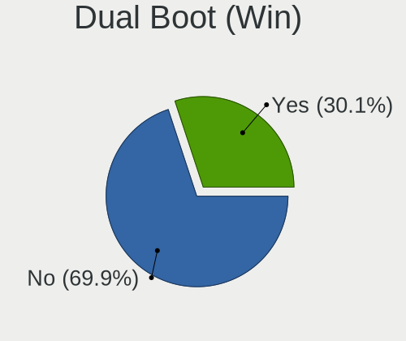
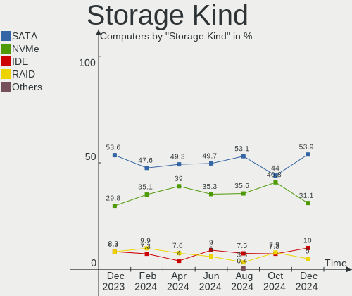
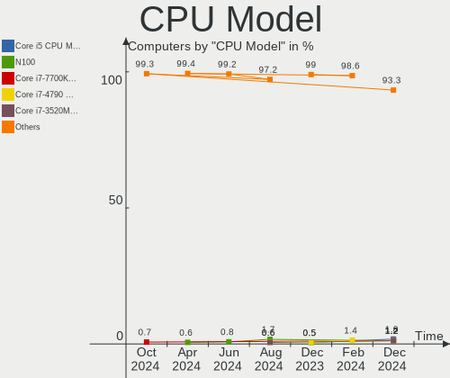
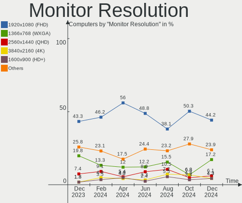
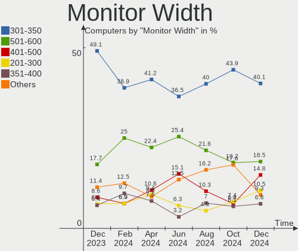
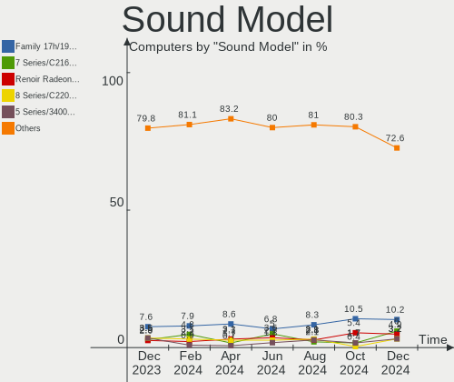
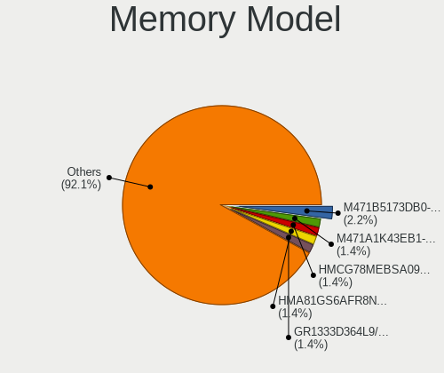

Linux in Poland - Hardware Trends
---------------------------------

A project to identify most popular hardware characteristics and track their change
over time based on data collected by Linux users at https://Linux-Hardware.org.

Anyone can contribute to this report by the [hw-probe](https://github.com/linuxhw/hw-probe) tool:

    sudo -E hw-probe -all -upload

This is a report for all computer types. See also reports for [desktops](/Location/Poland/Desktop/README.md) and [notebooks](/Location/Poland/Notebook/README.md).

Period: May, 2023.

Contents
--------

* [ System ](#system)
  - [ OS                       ](#os)
  - [ OS Family                ](#os-family)
  - [ Kernel                   ](#kernel)
  - [ Kernel Family            ](#kernel-family)
  - [ Kernel Major Ver.        ](#kernel-major-ver)
  - [ Arch                     ](#arch)
  - [ DE                       ](#de)
  - [ Display Server           ](#display-server)
  - [ Display Manager          ](#display-manager)
  - [ OS Lang                  ](#os-lang)
  - [ Boot Mode                ](#boot-mode)
  - [ Filesystem               ](#filesystem)
  - [ Part. scheme             ](#part-scheme)
  - [ Dual Boot with Linux/BSD ](#dual-boot-with-linuxbsd)
  - [ Dual Boot (Win)          ](#dual-boot-win)

* [ Board ](#board)
  - [ Vendor                   ](#vendor)
  - [ Model                    ](#model)
  - [ Model Family             ](#model-family)
  - [ MFG Year                 ](#mfg-year)
  - [ Form Factor              ](#form-factor)
  - [ Secure Boot              ](#secure-boot)
  - [ Coreboot                 ](#coreboot)
  - [ RAM Size                 ](#ram-size)
  - [ RAM Used                 ](#ram-used)
  - [ Total Drives             ](#total-drives)
  - [ Has CD-ROM               ](#has-cd-rom)
  - [ Has Ethernet             ](#has-ethernet)
  - [ Has WiFi                 ](#has-wifi)
  - [ Has Bluetooth            ](#has-bluetooth)

* [ Location ](#location)
  - [ Country                  ](#country)
  - [ City                     ](#city)

* [ Drives ](#drives)
  - [ Drive Vendor             ](#drive-vendor)
  - [ Drive Model              ](#drive-model)
  - [ HDD Vendor               ](#hdd-vendor)
  - [ SSD Vendor               ](#ssd-vendor)
  - [ Drive Kind               ](#drive-kind)
  - [ Drive Connector          ](#drive-connector)
  - [ Drive Size               ](#drive-size)
  - [ Space Total              ](#space-total)
  - [ Space Used               ](#space-used)
  - [ Malfunc. Drives          ](#malfunc-drives)
  - [ Malfunc. Drive Vendor    ](#malfunc-drive-vendor)
  - [ Malfunc. HDD Vendor      ](#malfunc-hdd-vendor)
  - [ Malfunc. Drive Kind      ](#malfunc-drive-kind)
  - [ Failed Drives            ](#failed-drives)
  - [ Failed Drive Vendor      ](#failed-drive-vendor)
  - [ Drive Status             ](#drive-status)

* [ Storage controller ](#storage-controller)
  - [ Storage Vendor           ](#storage-vendor)
  - [ Storage Model            ](#storage-model)
  - [ Storage Kind             ](#storage-kind)

* [ Processor ](#processor)
  - [ CPU Vendor               ](#cpu-vendor)
  - [ CPU Model                ](#cpu-model)
  - [ CPU Model Family         ](#cpu-model-family)
  - [ CPU Cores                ](#cpu-cores)
  - [ CPU Sockets              ](#cpu-sockets)
  - [ CPU Threads              ](#cpu-threads)
  - [ CPU Op-Modes             ](#cpu-op-modes)
  - [ CPU Microcode            ](#cpu-microcode)
  - [ CPU Microarch            ](#cpu-microarch)

* [ Graphics ](#graphics)
  - [ GPU Vendor               ](#gpu-vendor)
  - [ GPU Model                ](#gpu-model)
  - [ GPU Combo                ](#gpu-combo)
  - [ GPU Driver               ](#gpu-driver)
  - [ GPU Memory               ](#gpu-memory)

* [ Monitor ](#monitor)
  - [ Monitor Vendor           ](#monitor-vendor)
  - [ Monitor Model            ](#monitor-model)
  - [ Monitor Resolution       ](#monitor-resolution)
  - [ Monitor Diagonal         ](#monitor-diagonal)
  - [ Monitor Width            ](#monitor-width)
  - [ Aspect Ratio             ](#aspect-ratio)
  - [ Monitor Area             ](#monitor-area)
  - [ Pixel Density            ](#pixel-density)
  - [ Multiple Monitors        ](#multiple-monitors)

* [ Network ](#network)
  - [ Net Controller Vendor    ](#net-controller-vendor)
  - [ Net Controller Model     ](#net-controller-model)
  - [ Wireless Vendor          ](#wireless-vendor)
  - [ Wireless Model           ](#wireless-model)
  - [ Ethernet Vendor          ](#ethernet-vendor)
  - [ Ethernet Model           ](#ethernet-model)
  - [ Net Controller Kind      ](#net-controller-kind)
  - [ Used Controller          ](#used-controller)
  - [ NICs                     ](#nics)
  - [ IPv6                     ](#ipv6)

* [ Bluetooth ](#bluetooth)
  - [ Bluetooth Vendor         ](#bluetooth-vendor)
  - [ Bluetooth Model          ](#bluetooth-model)

* [ Sound ](#sound)
  - [ Sound Vendor             ](#sound-vendor)
  - [ Sound Model              ](#sound-model)

* [ Memory ](#memory)
  - [ Memory Vendor            ](#memory-vendor)
  - [ Memory Model             ](#memory-model)
  - [ Memory Kind              ](#memory-kind)
  - [ Memory Form Factor       ](#memory-form-factor)
  - [ Memory Size              ](#memory-size)
  - [ Memory Speed             ](#memory-speed)

* [ Printers & scanners ](#printers--scanners)
  - [ Printer Vendor           ](#printer-vendor)
  - [ Printer Model            ](#printer-model)
  - [ Scanner Vendor           ](#scanner-vendor)
  - [ Scanner Model            ](#scanner-model)

* [ Camera ](#camera)
  - [ Camera Vendor            ](#camera-vendor)
  - [ Camera Model             ](#camera-model)

* [ Security ](#security)
  - [ Fingerprint Vendor       ](#fingerprint-vendor)
  - [ Fingerprint Model        ](#fingerprint-model)
  - [ Chipcard Vendor          ](#chipcard-vendor)
  - [ Chipcard Model           ](#chipcard-model)

* [ Unsupported ](#unsupported)
  - [ Unsupported Devices      ](#unsupported-devices)
  - [ Unsupported Device Types ](#unsupported-device-types)

System
------

OS
--

Installed operating systems

| Name                         | Computers | Percent |
|------------------------------|-----------|---------|
| OpenMandriva 23.03           | 25        | 17.86%  |
| Fedora 38                    | 16        | 11.43%  |
| Linux Mint 21.1              | 14        | 10%     |
| Debian 11                    | 8         | 5.71%   |
| Ubuntu 23.04                 | 6         | 4.29%   |
| Ubuntu 22.04                 | 6         | 4.29%   |
| Gentoo 2.13                  | 5         | 3.57%   |
| Arch Rolling                 | 5         | 3.57%   |
| Zorin 16                     | 4         | 2.86%   |
| Pop!_OS 22.04                | 4         | 2.86%   |
| Manjaro                      | 3         | 2.14%   |
| Kubuntu 23.04                | 3         | 2.14%   |
| KDE neon 22.04               | 3         | 2.14%   |
| EndeavourOS Rolling          | 3         | 2.14%   |
| SteamOS 3.4.6                | 2         | 1.43%   |
| Nobara 37                    | 2         | 1.43%   |
| LMDE 4                       | 2         | 1.43%   |
| Linux Lite 5.6               | 2         | 1.43%   |
| Debian 12                    | 2         | 1.43%   |
| Xubuntu 22.04                | 1         | 0.71%   |
| Ubuntu Unity 22.04           | 1         | 0.71%   |
| Ubuntu Budgie 22.04          | 1         | 0.71%   |
| Ubuntu 21.04                 | 1         | 0.71%   |
| Ubuntu 20.10                 | 1         | 0.71%   |
| Ubuntu 20.04                 | 1         | 0.71%   |
| SteamOS 3.4.8                | 1         | 0.71%   |
| Raspbian 11                  | 1         | 0.71%   |
| openSUSE Tumbleweed-XXXXXXXX | 1         | 0.71%   |
| openSUSE Leap-15.5           | 1         | 0.71%   |
| OpenMandriva 4.3             | 1         | 0.71%   |
| OpenMandriva 23.01           | 1         | 0.71%   |
| MX 21                        | 1         | 0.71%   |
| Manjaro 22.1.2               | 1         | 0.71%   |
| Manjaro 22.1.0               | 1         | 0.71%   |
| Manjaro 21.3.6               | 1         | 0.71%   |
| Linux Mint 21                | 1         | 0.71%   |
| Linux Mint 20.3              | 1         | 0.71%   |
| Garuda Linux Rolling         | 1         | 0.71%   |
| Elementary 7                 | 1         | 0.71%   |
| Debian 10                    | 1         | 0.71%   |

OS Family
---------

OS without a version

| Name          | Computers | Percent |
|---------------|-----------|---------|
| OpenMandriva  | 27        | 19.29%  |
| Linux Mint    | 16        | 11.43%  |
| Fedora        | 16        | 11.43%  |
| Ubuntu        | 15        | 10.71%  |
| Debian        | 11        | 7.86%   |
| Manjaro       | 6         | 4.29%   |
| Gentoo        | 5         | 3.57%   |
| Arch          | 5         | 3.57%   |
| Zorin         | 4         | 2.86%   |
| Pop!_OS       | 4         | 2.86%   |
| SteamOS       | 3         | 2.14%   |
| Kubuntu       | 3         | 2.14%   |
| KDE neon      | 3         | 2.14%   |
| EndeavourOS   | 3         | 2.14%   |
| openSUSE      | 2         | 1.43%   |
| Nobara        | 2         | 1.43%   |
| LMDE          | 2         | 1.43%   |
| Linux Lite    | 2         | 1.43%   |
| Xubuntu       | 1         | 0.71%   |
| Ubuntu Unity  | 1         | 0.71%   |
| Ubuntu Budgie | 1         | 0.71%   |
| Raspbian      | 1         | 0.71%   |
| MX            | 1         | 0.71%   |
| Garuda Linux  | 1         | 0.71%   |
| Elementary    | 1         | 0.71%   |
| BunsenLabs    | 1         | 0.71%   |
| ArcoLinux     | 1         | 0.71%   |
| antiX         | 1         | 0.71%   |
| AlmaLinux     | 1         | 0.71%   |

Kernel
------

Version of the Linux kernel

| Version                      | Computers | Percent |
|------------------------------|-----------|---------|
| 6.2.6-desktop-1omv2390       | 25        | 17.86%  |
| 5.15.0-71-generic            | 10        | 7.14%   |
| 5.19.0-41-generic            | 8         | 5.71%   |
| 6.2.0-20-generic             | 7         | 5%      |
| 5.15.0-72-generic            | 7         | 5%      |
| 6.2.15-300.fc38.x86_64       | 6         | 4.29%   |
| 5.10.0-22-amd64              | 5         | 3.57%   |
| 6.2.6-76060206-generic       | 4         | 2.86%   |
| 6.2.14-300.fc38.x86_64       | 4         | 2.86%   |
| 6.1.19-gentoo                | 4         | 2.86%   |
| 6.3.2-arch1-1                | 3         | 2.14%   |
| 6.2.13-300.fc38.x86_64       | 3         | 2.14%   |
| 5.13.0-valve36-1-neptune     | 3         | 2.14%   |
| 6.3.4-arch1-1                | 2         | 1.43%   |
| 6.2.9-300.fc38.x86_64        | 2         | 1.43%   |
| 6.2.14-300.fsync.fc37.x86_64 | 2         | 1.43%   |
| 6.1.0-9-amd64                | 2         | 1.43%   |
| 5.15.0-58-generic            | 2         | 1.43%   |
| 5.10.0-23-amd64              | 2         | 1.43%   |
| 4.19.0-24-amd64              | 2         | 1.43%   |
| 6.3.4-zen2-1-zen             | 1         | 0.71%   |
| 6.3.3-060303-generic         | 1         | 0.71%   |
| 6.3.2-zen1-1-zen             | 1         | 0.71%   |
| 6.3.2-gentoo-dist            | 1         | 0.71%   |
| 6.3.2-1-default              | 1         | 0.71%   |
| 6.3.1-arch2-1                | 1         | 0.71%   |
| 6.3.1-060301-generic         | 1         | 0.71%   |
| 6.2.16-1-MANJARO             | 1         | 0.71%   |
| 6.2.14-2-MANJARO             | 1         | 0.71%   |
| 6.2.13-arch1-1               | 1         | 0.71%   |
| 6.2.11-300.fc38.x86_64       | 1         | 0.71%   |
| 6.2.10-x64v1-xanmod1-1       | 1         | 0.71%   |
| 6.1.30-1-MANJARO             | 1         | 0.71%   |
| 6.1.26-1-MANJARO             | 1         | 0.71%   |
| 6.1.25-1-MANJARO             | 1         | 0.71%   |
| 6.1.21+                      | 1         | 0.71%   |
| 6.1.1-desktop-1omv2290       | 1         | 0.71%   |
| 6.1.0-4mx-amd64              | 1         | 0.71%   |
| 6.0.5-2-rt14-MANJARO         | 1         | 0.71%   |
| 5.8.0-43-generic             | 1         | 0.71%   |

Kernel Family
-------------

Linux kernel without a distro release

| Version | Computers | Percent |
|---------|-----------|---------|
| 6.2.6   | 29        | 20.71%  |
| 5.15.0  | 22        | 15.71%  |
| 5.19.0  | 11        | 7.86%   |
| 5.10.0  | 8         | 5.71%   |
| 6.2.14  | 7         | 5%      |
| 6.2.0   | 7         | 5%      |
| 6.3.2   | 6         | 4.29%   |
| 6.2.15  | 6         | 4.29%   |
| 6.2.13  | 4         | 2.86%   |
| 6.1.19  | 4         | 2.86%   |
| 6.3.4   | 3         | 2.14%   |
| 6.1.0   | 3         | 2.14%   |
| 5.13.0  | 3         | 2.14%   |
| 4.19.0  | 3         | 2.14%   |
| 6.3.1   | 2         | 1.43%   |
| 6.2.9   | 2         | 1.43%   |
| 5.8.0   | 2         | 1.43%   |
| 5.4.0   | 2         | 1.43%   |
| 6.3.3   | 1         | 0.71%   |
| 6.2.16  | 1         | 0.71%   |
| 6.2.11  | 1         | 0.71%   |
| 6.2.10  | 1         | 0.71%   |
| 6.1.30  | 1         | 0.71%   |
| 6.1.26  | 1         | 0.71%   |
| 6.1.25  | 1         | 0.71%   |
| 6.1.21  | 1         | 0.71%   |
| 6.1.1   | 1         | 0.71%   |
| 6.0.5   | 1         | 0.71%   |
| 5.16.13 | 1         | 0.71%   |
| 5.14.21 | 1         | 0.71%   |
| 5.14.0  | 1         | 0.71%   |
| 5.11.0  | 1         | 0.71%   |
| 5.10.78 | 1         | 0.71%   |
| 4.9.0   | 1         | 0.71%   |

Kernel Major Ver.
-----------------

Linux kernel major version

| Version | Computers | Percent |
|---------|-----------|---------|
| 6.2     | 58        | 41.43%  |
| 5.15    | 22        | 15.71%  |
| 6.3     | 12        | 8.57%   |
| 6.1     | 12        | 8.57%   |
| 5.19    | 11        | 7.86%   |
| 5.10    | 9         | 6.43%   |
| 5.13    | 3         | 2.14%   |
| 4.19    | 3         | 2.14%   |
| 5.8     | 2         | 1.43%   |
| 5.4     | 2         | 1.43%   |
| 5.14    | 2         | 1.43%   |
| 6.0     | 1         | 0.71%   |
| 5.16    | 1         | 0.71%   |
| 5.11    | 1         | 0.71%   |
| 4.9     | 1         | 0.71%   |

Arch
----

OS architecture (x86_64, i586, etc.)

| Name   | Computers | Percent |
|--------|-----------|---------|
| x86_64 | 137       | 97.86%  |
| i686   | 1         | 0.71%   |
| armv7l | 1         | 0.71%   |
| armv6l | 1         | 0.71%   |

DE
--

Desktop Environment

| Name       | Computers | Percent |
|------------|-----------|---------|
| KDE5       | 52        | 37.14%  |
| GNOME      | 43        | 30.71%  |
| X-Cinnamon | 14        | 10%     |
| XFCE       | 13        | 9.29%   |
| Unknown    | 7         | 5%      |
| MATE       | 5         | 3.57%   |
| Unity      | 1         | 0.71%   |
| Pantheon   | 1         | 0.71%   |
| LXQt       | 1         | 0.71%   |
| icewm      | 1         | 0.71%   |
| BunsenLabs | 1         | 0.71%   |
| Budgie     | 1         | 0.71%   |

Display Server
--------------

X11 or Wayland

| Name    | Computers | Percent |
|---------|-----------|---------|
| X11     | 99        | 70.71%  |
| Wayland | 34        | 24.29%  |
| Unknown | 5         | 3.57%   |
| Tty     | 2         | 1.43%   |

Display Manager
---------------

SDDM, LightDM, etc.

| Name    | Computers | Percent |
|---------|-----------|---------|
| Unknown | 52        | 37.14%  |
| SDDM    | 38        | 27.14%  |
| LightDM | 22        | 15.71%  |
| GDM3    | 19        | 13.57%  |
| GDM     | 8         | 5.71%   |
| LXDM    | 1         | 0.71%   |

OS Lang
-------

Language

| Lang    | Computers | Percent |
|---------|-----------|---------|
| pl_PL   | 88        | 62.86%  |
| en_US   | 42        | 30%     |
| en_GB   | 5         | 3.57%   |
| C       | 2         | 1.43%   |
| ru_UA   | 1         | 0.71%   |
| POSIX   | 1         | 0.71%   |
| Unknown | 1         | 0.71%   |

Boot Mode
---------

EFI or BIOS

| Mode | Computers | Percent |
|------|-----------|---------|
| EFI  | 72        | 51.43%  |
| BIOS | 68        | 48.57%  |

Filesystem
----------

Type of filesystem

| Type    | Computers | Percent |
|---------|-----------|---------|
| Ext4    | 82        | 58.57%  |
| Btrfs   | 25        | 17.86%  |
| Overlay | 14        | 10%     |
| Tmpfs   | 9         | 6.43%   |
| F2fs    | 5         | 3.57%   |
| Xfs     | 3         | 2.14%   |
| Zfs     | 1         | 0.71%   |
| Jfs     | 1         | 0.71%   |

Part. scheme
------------

Scheme of partitioning

| Type    | Computers | Percent |
|---------|-----------|---------|
| GPT     | 69        | 49.29%  |
| Unknown | 44        | 31.43%  |
| MBR     | 27        | 19.29%  |

Dual Boot with Linux/BSD
------------------------

Hosting more than one Linux/BSD

| Dual boot | Computers | Percent |
|-----------|-----------|---------|
| No        | 114       | 81.43%  |
| Yes       | 26        | 18.57%  |

Dual Boot (Win)
---------------

Hosting Linux and Windows

| Dual boot | Computers | Percent |
|-----------|-----------|---------|
| No        | 105       | 75%     |
| Yes       | 35        | 25%     |

Board
-----

Vendor
------

Motherboard manufacturer

| Name                    | Computers | Percent |
|-------------------------|-----------|---------|
| ASUSTek Computer        | 23        | 16.43%  |
| Hewlett-Packard         | 20        | 14.29%  |
| Dell                    | 20        | 14.29%  |
| Lenovo                  | 19        | 13.57%  |
| Gigabyte Technology     | 12        | 8.57%   |
| MSI                     | 6         | 4.29%   |
| ASRock                  | 4         | 2.86%   |
| Valve                   | 3         | 2.14%   |
| Toshiba                 | 3         | 2.14%   |
| Inventec                | 3         | 2.14%   |
| Intel                   | 3         | 2.14%   |
| Google                  | 3         | 2.14%   |
| Acer                    | 3         | 2.14%   |
| Samsung Electronics     | 2         | 1.43%   |
| Raspberry Pi Foundation | 2         | 1.43%   |
| Packard Bell            | 2         | 1.43%   |
| Fujitsu Siemens         | 2         | 1.43%   |
| Fujitsu                 | 2         | 1.43%   |
| Pegatron                | 1         | 0.71%   |
| Notebook                | 1         | 0.71%   |
| Microsoft               | 1         | 0.71%   |
| Medion                  | 1         | 0.71%   |
| GPU Company             | 1         | 0.71%   |
| Gateway                 | 1         | 0.71%   |
| Foxconn                 | 1         | 0.71%   |
| Apple                   | 1         | 0.71%   |

Model
-----

Motherboard model

| Name                                   | Computers | Percent |
|----------------------------------------|-----------|---------|
| Valve Jupiter                          | 3         | 2.14%   |
| Lenovo G500s 20245                     | 2         | 1.43%   |
| Inventec Dell Thin Client Desktop 5060 | 2         | 1.43%   |
| Intel NUC12WSHi7                       | 2         | 1.43%   |
| Google Snappy                          | 2         | 1.43%   |
| ASUS M3A78-CM                          | 2         | 1.43%   |
| ASUS All Series                        | 2         | 1.43%   |
| Unknown                                | 2         | 1.43%   |
| Toshiba Satellite L40                  | 1         | 0.71%   |
| Toshiba Satellite L300D                | 1         | 0.71%   |
| Toshiba Satellite C55-A-1KZ            | 1         | 0.71%   |
| Samsung RF510/RF410/RF710              | 1         | 0.71%   |
| Samsung 350V5C/351V5C/3540VC/3440VC    | 1         | 0.71%   |
| RPi Raspberry Pi Zero W Rev 1.1        | 1         | 0.71%   |
| RPi Raspberry Pi 3 Model B Rev 1.2     | 1         | 0.71%   |
| Pegatron FQ574AA-ABA m9517c            | 1         | 0.71%   |
| Packard Bell EasyNote TE69BM           | 1         | 0.71%   |
| Packard Bell EasyNote LJ65             | 1         | 0.71%   |
| Notebook NV4xPZ                        | 1         | 0.71%   |
| MSI MS-7C37                            | 1         | 0.71%   |
| MSI MS-7C02                            | 1         | 0.71%   |
| MSI MS-7B89                            | 1         | 0.71%   |
| MSI MS-7B24                            | 1         | 0.71%   |
| MSI MS-7816                            | 1         | 0.71%   |
| MSI GL75 9SE                           | 1         | 0.71%   |
| Microsoft Surface Pro                  | 1         | 0.71%   |
| Medion G24                             | 1         | 0.71%   |
| Lenovo ThinkStation P710 30B6S00A00    | 1         | 0.71%   |
| Lenovo ThinkStation E32 30A0S00W00     | 1         | 0.71%   |
| Lenovo ThinkPad T470 20HES0FA03        | 1         | 0.71%   |
| Lenovo ThinkPad L470 20J5S01S00        | 1         | 0.71%   |
| Lenovo ThinkCentre M58 7627AD5         | 1         | 0.71%   |
| Lenovo MIIX 300-10IBY 80NR             | 1         | 0.71%   |
| Lenovo Legion 5 Pro 16ACH6 82JS        | 1         | 0.71%   |
| Lenovo IdeaPad Y700-15ISK 80NV         | 1         | 0.71%   |
| Lenovo IdeaPad S145-15API 81UT         | 1         | 0.71%   |
| Lenovo IdeaPad 510-15IKB 80SV          | 1         | 0.71%   |
| Lenovo IdeaPad 3 15ALC6 82KU           | 1         | 0.71%   |
| Lenovo IdeaPad 100-15IBD 80QQ          | 1         | 0.71%   |
| Lenovo G580 20150                      | 1         | 0.71%   |

Model Family
------------

Motherboard model prefix

| Name                  | Computers | Percent |
|-----------------------|-----------|---------|
| Dell Latitude         | 9         | 6.43%   |
| HP EliteBook          | 8         | 5.71%   |
| Lenovo IdeaPad        | 5         | 3.57%   |
| Dell Precision        | 4         | 2.86%   |
| Valve Jupiter         | 3         | 2.14%   |
| Toshiba Satellite     | 3         | 2.14%   |
| HP Pavilion           | 3         | 2.14%   |
| HP Compaq             | 3         | 2.14%   |
| Dell Vostro           | 3         | 2.14%   |
| Dell OptiPlex         | 3         | 2.14%   |
| ASUS PRIME            | 3         | 2.14%   |
| RPi Raspberry         | 2         | 1.43%   |
| Packard Bell EasyNote | 2         | 1.43%   |
| Lenovo ThinkStation   | 2         | 1.43%   |
| Lenovo ThinkPad       | 2         | 1.43%   |
| Lenovo G500s          | 2         | 1.43%   |
| Inventec Dell         | 2         | 1.43%   |
| Intel NUC12WSHi7      | 2         | 1.43%   |
| Google Snappy         | 2         | 1.43%   |
| ASUS TUF              | 2         | 1.43%   |
| ASUS ROG              | 2         | 1.43%   |
| ASUS M3A78-CM         | 2         | 1.43%   |
| ASUS ASUS             | 2         | 1.43%   |
| ASUS All              | 2         | 1.43%   |
| Acer Aspire           | 2         | 1.43%   |
| Unknown               | 2         | 1.43%   |
| Samsung RF510         | 1         | 0.71%   |
| Samsung 350V5C        | 1         | 0.71%   |
| Pegatron FQ574AA-ABA  | 1         | 0.71%   |
| Notebook NV4xPZ       | 1         | 0.71%   |
| MSI MS-7C37           | 1         | 0.71%   |
| MSI MS-7C02           | 1         | 0.71%   |
| MSI MS-7B89           | 1         | 0.71%   |
| MSI MS-7B24           | 1         | 0.71%   |
| MSI MS-7816           | 1         | 0.71%   |
| MSI GL75              | 1         | 0.71%   |
| Microsoft Surface     | 1         | 0.71%   |
| Medion G24            | 1         | 0.71%   |
| Lenovo ThinkCentre    | 1         | 0.71%   |
| Lenovo MIIX           | 1         | 0.71%   |

MFG Year
--------

Motherboard manufacture year

| Year    | Computers | Percent |
|---------|-----------|---------|
| 2013    | 16        | 11.43%  |
| 2022    | 15        | 10.71%  |
| 2019    | 11        | 7.86%   |
| 2017    | 9         | 6.43%   |
| 2015    | 9         | 6.43%   |
| 2014    | 9         | 6.43%   |
| 2012    | 9         | 6.43%   |
| 2018    | 8         | 5.71%   |
| 2016    | 8         | 5.71%   |
| 2021    | 7         | 5%      |
| 2010    | 7         | 5%      |
| 2009    | 7         | 5%      |
| 2007    | 6         | 4.29%   |
| 2020    | 5         | 3.57%   |
| 2011    | 5         | 3.57%   |
| 2008    | 5         | 3.57%   |
| 2023    | 2         | 1.43%   |
| 2005    | 1         | 0.71%   |
| Unknown | 1         | 0.71%   |

Form Factor
-----------

Physical design of the computer

| Name           | Computers | Percent |
|----------------|-----------|---------|
| Notebook       | 75        | 53.57%  |
| Desktop        | 53        | 37.86%  |
| Mini pc        | 4         | 2.86%   |
| Tablet         | 3         | 2.14%   |
| System on chip | 2         | 1.43%   |
| Convertible    | 2         | 1.43%   |
| All in one     | 1         | 0.71%   |

Secure Boot
-----------

Enabled or disabled

| State    | Computers | Percent |
|----------|-----------|---------|
| Disabled | 127       | 90.71%  |
| Enabled  | 13        | 9.29%   |

Coreboot
--------

Have coreboot on board

| Used | Computers | Percent |
|------|-----------|---------|
| No   | 137       | 97.86%  |
| Yes  | 3         | 2.14%   |

RAM Size
--------

Total RAM memory

| Size in GB  | Computers | Percent |
|-------------|-----------|---------|
| 16.01-24.0  | 31        | 22.14%  |
| 3.01-4.0    | 29        | 20.71%  |
| 4.01-8.0    | 28        | 20%     |
| 8.01-16.0   | 21        | 15%     |
| 32.01-64.0  | 16        | 11.43%  |
| 64.01-256.0 | 4         | 2.86%   |
| 1.01-2.0    | 4         | 2.86%   |
| 24.01-32.0  | 3         | 2.14%   |
| 2.01-3.0    | 2         | 1.43%   |
| 0.51-1.0    | 1         | 0.71%   |
| 0.01-0.5    | 1         | 0.71%   |

RAM Used
--------

Used RAM memory

| Used GB   | Computers | Percent |
|-----------|-----------|---------|
| 1.01-2.0  | 44        | 31.43%  |
| 2.01-3.0  | 35        | 25%     |
| 3.01-4.0  | 22        | 15.71%  |
| 4.01-8.0  | 16        | 11.43%  |
| 8.01-16.0 | 15        | 10.71%  |
| 0.51-1.0  | 6         | 4.29%   |
| 0.01-0.5  | 2         | 1.43%   |

Total Drives
------------

Number of drives on board

| Drives | Computers | Percent |
|--------|-----------|---------|
| 1      | 73        | 52.14%  |
| 2      | 36        | 25.71%  |
| 3      | 17        | 12.14%  |
| 4      | 6         | 4.29%   |
| 0      | 3         | 2.14%   |
| 6      | 2         | 1.43%   |
| 5      | 2         | 1.43%   |
| 11     | 1         | 0.71%   |

Has CD-ROM
----------

Has CD-ROM on board

| Presented | Computers | Percent |
|-----------|-----------|---------|
| No        | 84        | 60%     |
| Yes       | 56        | 40%     |

Has Ethernet
------------

Has Ethernet on board

| Presented | Computers | Percent |
|-----------|-----------|---------|
| Yes       | 121       | 86.43%  |
| No        | 19        | 13.57%  |

Has WiFi
--------

Has WiFi module

| Presented | Computers | Percent |
|-----------|-----------|---------|
| Yes       | 104       | 74.29%  |
| No        | 36        | 25.71%  |

Has Bluetooth
-------------

Has Bluetooth module

| Presented | Computers | Percent |
|-----------|-----------|---------|
| Yes       | 84        | 60%     |
| No        | 56        | 40%     |

Location
--------

Country
-------

Geographic location (country)

| Country | Computers | Percent |
|---------|-----------|---------|
| Poland  | 140       | 100%    |

City
----

Geographic location (city)

| City                   | Computers | Percent |
|------------------------|-----------|---------|
| Warsaw                 | 29        | 20.71%  |
| Poznan                 | 13        | 9.29%   |
| Krakow                 | 8         | 5.71%   |
| Wroclaw                | 6         | 4.29%   |
| Lublin                 | 5         | 3.57%   |
| Szczecin               | 3         | 2.14%   |
| Skierniewice           | 3         | 2.14%   |
| Kielce                 | 3         | 2.14%   |
| Gdansk                 | 3         | 2.14%   |
| Zabrze                 | 2         | 1.43%   |
| Torun                  | 2         | 1.43%   |
| Siemianowice Śląskie | 2         | 1.43%   |
| Rybnik                 | 2         | 1.43%   |
| Płock                 | 2         | 1.43%   |
| Lodz                   | 2         | 1.43%   |
| Gliwice                | 2         | 1.43%   |
| Gdynia                 | 2         | 1.43%   |
| Częstochowa           | 2         | 1.43%   |
| Czerwionka-Leszczyny   | 2         | 1.43%   |
| Łomża                | 1         | 0.71%   |
| Zielona Góra          | 1         | 0.71%   |
| Zarki                  | 1         | 0.71%   |
| Wołomin               | 1         | 0.71%   |
| Wlodawa                | 1         | 0.71%   |
| Wisla                  | 1         | 0.71%   |
| Wejherowo              | 1         | 0.71%   |
| Wałbrzych             | 1         | 0.71%   |
| Turek                  | 1         | 0.71%   |
| Tarnów                | 1         | 0.71%   |
| Suwałki               | 1         | 0.71%   |
| Suchy Las              | 1         | 0.71%   |
| Sucha Beskidzka        | 1         | 0.71%   |
| Stargard               | 1         | 0.71%   |
| Srokowo                | 1         | 0.71%   |
| Sosnowiec              | 1         | 0.71%   |
| Skarzysko-Kamienna     | 1         | 0.71%   |
| Skalbmierz             | 1         | 0.71%   |
| Siemiatycze            | 1         | 0.71%   |
| Sadlinki               | 1         | 0.71%   |
| Rydułtowy             | 1         | 0.71%   |

Drives
------

Drive Vendor
------------

Hard drive vendors

| Vendor                      | Computers | Drives | Percent |
|-----------------------------|-----------|--------|---------|
| WDC                         | 29        | 39     | 13.12%  |
| Samsung Electronics         | 25        | 32     | 11.31%  |
| Seagate                     | 23        | 28     | 10.41%  |
| GOODRAM                     | 22        | 23     | 9.95%   |
| Toshiba                     | 12        | 12     | 5.43%   |
| Crucial                     | 12        | 13     | 5.43%   |
| Unknown                     | 11        | 13     | 4.98%   |
| A-DATA Technology           | 10        | 10     | 4.52%   |
| Micron Technology           | 8         | 8      | 3.62%   |
| Kingston                    | 8         | 9      | 3.62%   |
| Patriot                     | 7         | 8      | 3.17%   |
| Hitachi                     | 7         | 9      | 3.17%   |
| China                       | 6         | 7      | 2.71%   |
| SK hynix                    | 4         | 5      | 1.81%   |
| SanDisk                     | 4         | 4      | 1.81%   |
| SPCC                        | 3         | 4      | 1.36%   |
| Unknown                     | 3         | 3      | 1.36%   |
| Phison Electronics          | 2         | 2      | 0.9%    |
| KIOXIA                      | 2         | 2      | 0.9%    |
| Kingston Technology Company | 2         | 2      | 0.9%    |
| Intel                       | 2         | 2      | 0.9%    |
| Fujitsu                     | 2         | 2      | 0.9%    |
| ADATA Technology            | 2         | 2      | 0.9%    |
| WD MediaMax                 | 1         | 1      | 0.45%   |
| Union Memory (Shenzhen)     | 1         | 1      | 0.45%   |
| Transcend                   | 1         | 1      | 0.45%   |
| SSDPR-CX                    | 1         | 1      | 0.45%   |
| Silicon Motion              | 1         | 1      | 0.45%   |
| SAGE                        | 1         | 1      | 0.45%   |
| Realtek                     | 1         | 1      | 0.45%   |
| Micron/Crucial Technology   | 1         | 1      | 0.45%   |
| MAXIO Technology (Hangzhou) | 1         | 1      | 0.45%   |
| LITEONIT                    | 1         | 1      | 0.45%   |
| Lenovo                      | 1         | 1      | 0.45%   |
| KIOXIA-EXCERIA              | 1         | 1      | 0.45%   |
| KingSpec                    | 1         | 1      | 0.45%   |
| Gigabyte Technology         | 1         | 1      | 0.45%   |
| Apple                       | 1         | 1      | 0.45%   |

Drive Model
-----------

Hard drive models

| Model                                               | Computers | Percent |
|-----------------------------------------------------|-----------|---------|
| GOODRAM SSDPR-CX400-256-G2 256GB                    | 6         | 2.5%    |
| Samsung SSD 980 1TB                                 | 4         | 1.67%   |
| WDC WD10EFRX-68FYTN0 1TB                            | 3         | 1.25%   |
| Samsung SSD 980 500GB                               | 3         | 1.25%   |
| Samsung SSD 860 EVO 500GB                           | 3         | 1.25%   |
| Samsung NVMe SSD Controller SM981/PM981/PM983 256GB | 3         | 1.25%   |
| Patriot Burst 120GB SSD                             | 3         | 1.25%   |
| GOODRAM SSDPR-CX400-512 512GB                       | 3         | 1.25%   |
| Unknown                                             | 3         | 1.25%   |
| Unknown MMC Card  32GB                              | 2         | 0.83%   |
| Unknown MMC Card  16GB                              | 2         | 0.83%   |
| Unknown MMC Card  128GB                             | 2         | 0.83%   |
| Toshiba MQ01ABF032 320GB                            | 2         | 0.83%   |
| Toshiba HDWD110 1TB                                 | 2         | 0.83%   |
| Seagate Expansion 1TB                               | 2         | 0.83%   |
| Samsung SSD 870 EVO 500GB                           | 2         | 0.83%   |
| Samsung SSD 870 EVO 250GB                           | 2         | 0.83%   |
| Micron 2210_MTFDHBA512QFD 512GB                     | 2         | 0.83%   |
| Kingston SKC3000S512G 512GB                         | 2         | 0.83%   |
| Kingston SA400S37240G 240GB SSD                     | 2         | 0.83%   |
| GOODRAM SSDPR-CX400-01T-G2 1TB                      | 2         | 0.83%   |
| GOODRAM SSDPR-CL100-480-G2 480GB                    | 2         | 0.83%   |
| Crucial CT500MX500SSD1 500GB                        | 2         | 0.83%   |
| Crucial CT250BX100SSD1 250GB                        | 2         | 0.83%   |
| Crucial CT240BX500SSD1 240GB                        | 2         | 0.83%   |
| Crucial CT1000MX500SSD1 1TB                         | 2         | 0.83%   |
| A-DATA SU800 256GB SSD                              | 2         | 0.83%   |
| WDC WDS240G2G0B-00EPW0 240GB SSD                    | 1         | 0.42%   |
| WDC WDS240G2G0A-00JH30 240GB SSD                    | 1         | 0.42%   |
| WDC WDS200T2B0B-00YS70 2TB SSD                      | 1         | 0.42%   |
| WDC WDS120G2G0A-00JH30 120GB SSD                    | 1         | 0.42%   |
| WDC WDS100T2B0C-00PXH0 1TB                          | 1         | 0.42%   |
| WDC WDS100T2B0A-00SM50 1TB SSD                      | 1         | 0.42%   |
| WDC WD7500BPVT-24HXZT1 752GB                        | 1         | 0.42%   |
| WDC WD6003FFBX-68MU3N0 6TB                          | 1         | 0.42%   |
| WDC WD5000KS-00MNB0 500GB                           | 1         | 0.42%   |
| WDC WD5000AVDS-63U7B1 500GB                         | 1         | 0.42%   |
| WDC WD5000AAKX-75U6AA0 500GB                        | 1         | 0.42%   |
| WDC WD5000AAKX-001CA0 500GB                         | 1         | 0.42%   |
| WDC WD40EFZX-68AWUN0 4TB                            | 1         | 0.42%   |

HDD Vendor
----------

Hard disk drive vendors

| Vendor              | Computers | Drives | Percent |
|---------------------|-----------|--------|---------|
| Seagate             | 23        | 28     | 33.82%  |
| WDC                 | 22        | 32     | 32.35%  |
| Toshiba             | 10        | 10     | 14.71%  |
| Hitachi             | 7         | 9      | 10.29%  |
| Samsung Electronics | 2         | 2      | 2.94%   |
| Fujitsu             | 2         | 2      | 2.94%   |
| WD MediaMax         | 1         | 1      | 1.47%   |
| SAGE                | 1         | 1      | 1.47%   |

SSD Vendor
----------

Solid state drive vendors

| Vendor              | Computers | Drives | Percent |
|---------------------|-----------|--------|---------|
| GOODRAM             | 19        | 20     | 21.11%  |
| Crucial             | 12        | 13     | 13.33%  |
| A-DATA Technology   | 10        | 10     | 11.11%  |
| Samsung Electronics | 9         | 12     | 10%     |
| Patriot             | 7         | 8      | 7.78%   |
| WDC                 | 6         | 6      | 6.67%   |
| China               | 6         | 7      | 6.67%   |
| Kingston            | 5         | 5      | 5.56%   |
| SPCC                | 3         | 4      | 3.33%   |
| SanDisk             | 2         | 2      | 2.22%   |
| Micron Technology   | 2         | 2      | 2.22%   |
| Transcend           | 1         | 1      | 1.11%   |
| SK hynix            | 1         | 1      | 1.11%   |
| LITEONIT            | 1         | 1      | 1.11%   |
| Lenovo              | 1         | 1      | 1.11%   |
| KIOXIA-EXCERIA      | 1         | 1      | 1.11%   |
| KingSpec            | 1         | 1      | 1.11%   |
| Intel               | 1         | 1      | 1.11%   |
| Gigabyte Technology | 1         | 1      | 1.11%   |
| Apple               | 1         | 1      | 1.11%   |

Drive Kind
----------

HDD or SSD

| Kind    | Computers | Drives | Percent |
|---------|-----------|--------|---------|
| SSD     | 77        | 98     | 38.89%  |
| HDD     | 60        | 85     | 30.3%   |
| NVMe    | 46        | 54     | 23.23%  |
| MMC     | 14        | 16     | 7.07%   |
| Unknown | 1         | 1      | 0.51%   |

Drive Connector
---------------

SATA, SAS, NVMe, etc.

| Type | Computers | Drives | Percent |
|------|-----------|--------|---------|
| SATA | 106       | 175    | 60.92%  |
| NVMe | 46        | 53     | 26.44%  |
| MMC  | 14        | 16     | 8.05%   |
| SAS  | 8         | 10     | 4.6%    |

Drive Size
----------

Size of hard drive

| Size in TB | Computers | Drives | Percent |
|------------|-----------|--------|---------|
| 0.01-0.5   | 80        | 99     | 56.74%  |
| 0.51-1.0   | 44        | 58     | 31.21%  |
| 1.01-2.0   | 8         | 10     | 5.67%   |
| 2.01-3.0   | 3         | 5      | 2.13%   |
| 4.01-10.0  | 3         | 5      | 2.13%   |
| 3.01-4.0   | 2         | 5      | 1.42%   |
| 10.01-20.0 | 1         | 1      | 0.71%   |

Space Total
-----------

Amount of disk space available on the file system

| Size in GB     | Computers | Percent |
|----------------|-----------|---------|
| 101-250        | 36        | 25.71%  |
| 251-500        | 22        | 15.71%  |
| 501-1000       | 20        | 14.29%  |
| 1-20           | 14        | 10%     |
| 1001-2000      | 13        | 9.29%   |
| 21-50          | 9         | 6.43%   |
| More than 3000 | 8         | 5.71%   |
| 51-100         | 7         | 5%      |
| Unknown        | 6         | 4.29%   |
| 2001-3000      | 5         | 3.57%   |

Space Used
----------

Amount of used disk space

| Used GB        | Computers | Percent |
|----------------|-----------|---------|
| 1-20           | 54        | 38.57%  |
| 21-50          | 21        | 15%     |
| 101-250        | 15        | 10.71%  |
| 251-500        | 11        | 7.86%   |
| 51-100         | 11        | 7.86%   |
| 501-1000       | 10        | 7.14%   |
| 1001-2000      | 7         | 5%      |
| Unknown        | 6         | 4.29%   |
| More than 3000 | 4         | 2.86%   |
| 2001-3000      | 1         | 0.71%   |

Malfunc. Drives
---------------

Drive models with a malfunction

| Model                                 | Computers | Drives | Percent |
|---------------------------------------|-----------|--------|---------|
| WDC WD7500BPVT-24HXZT1 752GB          | 1         | 1      | 5.26%   |
| WDC WD5000AAKX-001CA0 500GB           | 1         | 1      | 5.26%   |
| WDC WD3200BEKT-00F3T0 320GB           | 1         | 1      | 5.26%   |
| WDC WD30EFRX-68EUZN0 3TB              | 1         | 1      | 5.26%   |
| WDC WD2500AAJS-75M0A0 250GB           | 1         | 1      | 5.26%   |
| Seagate ST980811AS 80GB               | 1         | 1      | 5.26%   |
| Seagate ST9120822AS 120GB             | 1         | 1      | 5.26%   |
| Seagate ST320LT012-9WS14C 320GB       | 1         | 1      | 5.26%   |
| Seagate ST1000LM035-1RK172 1TB        | 1         | 1      | 5.26%   |
| Seagate ST1000DM003-1ER162 1TB        | 1         | 1      | 5.26%   |
| Seagate ST10000NE0004-1ZF101 10TB     | 1         | 1      | 5.26%   |
| Samsung Electronics SSD 850 PRO 512GB | 1         | 1      | 5.26%   |
| SAGE 3639S 1TB                        | 1         | 1      | 5.26%   |
| Hitachi HTS547575A9E384 752GB         | 1         | 1      | 5.26%   |
| Hitachi HTS545025B9SA02 250GB         | 1         | 1      | 5.26%   |
| Fujitsu MHY2160BH 160GB               | 1         | 1      | 5.26%   |
| Crucial CT1000MX500SSD4 1TB           | 1         | 1      | 5.26%   |
| A-DATA Technology SU800 512GB SSD     | 1         | 1      | 5.26%   |
| A-DATA Technology SU650 240GB SSD     | 1         | 1      | 5.26%   |

Malfunc. Drive Vendor
---------------------

Vendors of faulty drives

| Vendor              | Computers | Drives | Percent |
|---------------------|-----------|--------|---------|
| Seagate             | 6         | 6      | 31.58%  |
| WDC                 | 5         | 5      | 26.32%  |
| Hitachi             | 2         | 2      | 10.53%  |
| A-DATA Technology   | 2         | 2      | 10.53%  |
| Samsung Electronics | 1         | 1      | 5.26%   |
| SAGE                | 1         | 1      | 5.26%   |
| Fujitsu             | 1         | 1      | 5.26%   |
| Crucial             | 1         | 1      | 5.26%   |

Malfunc. HDD Vendor
-------------------

Vendors of faulty HDD drives

| Vendor  | Computers | Drives | Percent |
|---------|-----------|--------|---------|
| Seagate | 6         | 6      | 40%     |
| WDC     | 5         | 5      | 33.33%  |
| Hitachi | 2         | 2      | 13.33%  |
| SAGE    | 1         | 1      | 6.67%   |
| Fujitsu | 1         | 1      | 6.67%   |

Malfunc. Drive Kind
-------------------

Kinds of faulty drives

| Kind | Computers | Drives | Percent |
|------|-----------|--------|---------|
| HDD  | 15        | 15     | 78.95%  |
| SSD  | 4         | 4      | 21.05%  |

Failed Drives
-------------

Failed drive models

Zero info for selected period =(

Failed Drive Vendor
-------------------

Failed drive vendors

Zero info for selected period =(

Drive Status
------------

Number of failed and malfunc. drives

| Status   | Computers | Drives | Percent |
|----------|-----------|--------|---------|
| Detected | 66        | 121    | 44.9%   |
| Works    | 63        | 114    | 42.86%  |
| Malfunc  | 18        | 19     | 12.24%  |

Storage controller
------------------

Storage Vendor
--------------

Storage controller vendors

| Vendor                       | Computers | Percent |
|------------------------------|-----------|---------|
| Intel                        | 87        | 50%     |
| AMD                          | 30        | 17.24%  |
| Samsung Electronics          | 17        | 9.77%   |
| Micron Technology            | 6         | 3.45%   |
| Kingston Technology Company  | 5         | 2.87%   |
| SK hynix                     | 3         | 1.72%   |
| Silicon Motion               | 3         | 1.72%   |
| SanDisk                      | 3         | 1.72%   |
| Phison Electronics           | 3         | 1.72%   |
| Toshiba America Info Systems | 2         | 1.15%   |
| Nvidia                       | 2         | 1.15%   |
| Marvell Technology Group     | 2         | 1.15%   |
| KIOXIA                       | 2         | 1.15%   |
| JMicron Technology           | 2         | 1.15%   |
| ASMedia Technology           | 2         | 1.15%   |
| ADATA Technology             | 2         | 1.15%   |
| Union Memory (Shenzhen)      | 1         | 0.57%   |
| Micron/Crucial Technology    | 1         | 0.57%   |
| MAXIO Technology (Hangzhou)  | 1         | 0.57%   |

Storage Model
-------------

Storage controller models

| Model                                                                          | Computers | Percent |
|--------------------------------------------------------------------------------|-----------|---------|
| AMD FCH SATA Controller [AHCI mode]                                            | 17        | 8.06%   |
| Samsung NVMe SSD Controller 980                                                | 11        | 5.21%   |
| Intel Sunrise Point-LP SATA Controller [AHCI mode]                             | 8         | 3.79%   |
| Intel 7 Series Chipset Family 6-port SATA Controller [AHCI mode]               | 8         | 3.79%   |
| Intel 8 Series/C220 Series Chipset Family 6-port SATA Controller 1 [AHCI mode] | 7         | 3.32%   |
| AMD SB7x0/SB8x0/SB9x0 IDE Controller                                           | 7         | 3.32%   |
| Micron NVMe Storage Controller                                                 | 6         | 2.84%   |
| AMD SB7x0/SB8x0/SB9x0 SATA Controller [IDE mode]                               | 6         | 2.84%   |
| Intel Volume Management Device NVMe RAID Controller                            | 5         | 2.37%   |
| Intel Atom Processor E3800 Series SATA AHCI Controller                         | 5         | 2.37%   |
| Intel 82801G (ICH7 Family) IDE Controller                                      | 4         | 1.9%    |
| Samsung NVMe SSD Controller SM981/PM981/PM983                                  | 3         | 1.42%   |
| Kingston Company Company Non-Volatile memory controller                        | 3         | 1.42%   |
| Intel Wildcat Point-LP SATA Controller [AHCI Mode]                             | 3         | 1.42%   |
| Intel Q170/Q150/B150/H170/H110/Z170/CM236 Chipset SATA Controller [AHCI Mode]  | 3         | 1.42%   |
| Intel NM10/ICH7 Family SATA Controller [IDE mode]                              | 3         | 1.42%   |
| Intel HM170/QM170 Chipset SATA Controller [AHCI Mode]                          | 3         | 1.42%   |
| Intel Cannon Lake PCH SATA AHCI Controller                                     | 3         | 1.42%   |
| Intel C610/X99 series chipset sSATA Controller [AHCI mode]                     | 3         | 1.42%   |
| Intel Alder Lake-P SATA AHCI Controller                                        | 3         | 1.42%   |
| Intel 82801HM/HEM (ICH8M/ICH8M-E) SATA Controller [AHCI mode]                  | 3         | 1.42%   |
| Intel 82801HM/HEM (ICH8M/ICH8M-E) IDE Controller                               | 3         | 1.42%   |
| Intel 7 Series/C210 Series Chipset Family 6-port SATA Controller [AHCI mode]   | 3         | 1.42%   |
| AMD SB7x0/SB8x0/SB9x0 SATA Controller [AHCI mode]                              | 3         | 1.42%   |
| AMD 400 Series Chipset SATA Controller                                         | 3         | 1.42%   |
| Silicon Motion SM2263EN/SM2263XT SSD Controller                                | 2         | 0.95%   |
| Samsung NVMe SSD Controller PM9A1/PM9A3/980PRO                                 | 2         | 0.95%   |
| Phison PS5013 E13 NVMe Controller                                              | 2         | 0.95%   |
| KIOXIA Non-Volatile memory controller                                          | 2         | 0.95%   |
| Intel Celeron/Pentium Silver Processor SATA Controller                         | 2         | 0.95%   |
| Intel C610/X99 series chipset 6-Port SATA Controller [AHCI mode]               | 2         | 0.95%   |
| Intel 82801JD/DO (ICH10 Family) 4-port SATA IDE Controller                     | 2         | 0.95%   |
| Intel 82801JD/DO (ICH10 Family) 2-port SATA IDE Controller                     | 2         | 0.95%   |
| Intel 82801IBM/IEM (ICH9M/ICH9M-E) 4 port SATA Controller [AHCI mode]          | 2         | 0.95%   |
| Intel 82801GBM/GHM (ICH7-M Family) SATA Controller [AHCI mode]                 | 2         | 0.95%   |
| Intel 82801 Mobile SATA Controller [RAID mode]                                 | 2         | 0.95%   |
| Intel 8 Series SATA Controller 1 [AHCI mode]                                   | 2         | 0.95%   |
| Intel 700 Series Chipset Family SATA AHCI Controller                           | 2         | 0.95%   |
| Intel 6 Series/C200 Series Chipset Family 6 port Mobile SATA AHCI Controller   | 2         | 0.95%   |
| Intel 500 Series Chipset Family SATA AHCI Controller                           | 2         | 0.95%   |

Storage Kind
------------

Kind of storage controller (IDE, SATA, NVMe, SAS, ...)

| Kind | Computers | Percent |
|------|-----------|---------|
| SATA | 105       | 56.45%  |
| NVMe | 46        | 24.73%  |
| IDE  | 23        | 12.37%  |
| RAID | 11        | 5.91%   |
| SAS  | 1         | 0.54%   |

Processor
---------

CPU Vendor
----------

Processor vendors

| Vendor | Computers | Percent |
|--------|-----------|---------|
| Intel  | 99        | 70.71%  |
| AMD    | 39        | 27.86%  |
| ARM    | 2         | 1.43%   |

CPU Model
---------

Processor models

| Model                                       | Computers | Percent |
|---------------------------------------------|-----------|---------|
| Intel Core i5-8350U CPU @ 1.70GHz           | 3         | 2.14%   |
| Intel Core i5-8250U CPU @ 1.60GHz           | 3         | 2.14%   |
| Intel Core i5-7200U CPU @ 2.50GHz           | 3         | 2.14%   |
| Intel Core i5-5200U CPU @ 2.20GHz           | 3         | 2.14%   |
| Intel Core 2 Duo CPU E8400 @ 3.00GHz        | 3         | 2.14%   |
| Intel 11th Gen Core i5-1135G7 @ 2.40GHz     | 3         | 2.14%   |
| AMD Custom APU 0405                         | 3         | 2.14%   |
| Intel Pentium CPU 2020M @ 2.40GHz           | 2         | 1.43%   |
| Intel Core i5-7300U CPU @ 2.60GHz           | 2         | 1.43%   |
| Intel Core i5-4460 CPU @ 3.20GHz            | 2         | 1.43%   |
| Intel Core i3-3120M CPU @ 2.50GHz           | 2         | 1.43%   |
| Intel Celeron CPU N3350 @ 1.10GHz           | 2         | 1.43%   |
| Intel Celeron CPU N2830 @ 2.16GHz           | 2         | 1.43%   |
| Intel 12th Gen Core i7-1260P                | 2         | 1.43%   |
| Intel 11th Gen Core i5-11400 @ 2.60GHz      | 2         | 1.43%   |
| ARM BCM2835 Processor                       | 2         | 1.43%   |
| AMD Ryzen 7 6800H with Radeon Graphics      | 2         | 1.43%   |
| AMD Ryzen 5 3600 6-Core Processor           | 2         | 1.43%   |
| AMD Ryzen 5 1600 Six-Core Processor         | 2         | 1.43%   |
| AMD Phenom II X4 955 Processor              | 2         | 1.43%   |
| AMD GX-424CC SOC with Radeon R5E Graphics   | 2         | 1.43%   |
| Intel Xeon CPU E5-2637 v4 @ 3.50GHz         | 1         | 0.71%   |
| Intel Xeon CPU E5-2620 v3 @ 2.40GHz         | 1         | 0.71%   |
| Intel Xeon CPU E5-1680 v2 @ 3.00GHz         | 1         | 0.71%   |
| Intel Xeon CPU E3-1240 v5 @ 3.50GHz         | 1         | 0.71%   |
| Intel Pentium Silver N5030 CPU @ 1.10GHz    | 1         | 0.71%   |
| Intel Pentium Silver N5000 CPU @ 1.10GHz    | 1         | 0.71%   |
| Intel Pentium Dual-Core CPU T4500 @ 2.30GHz | 1         | 0.71%   |
| Intel Pentium Dual-Core CPU E6300 @ 2.80GHz | 1         | 0.71%   |
| Intel Pentium Dual-Core CPU E5700 @ 3.00GHz | 1         | 0.71%   |
| Intel Pentium Dual-Core CPU E5500 @ 2.80GHz | 1         | 0.71%   |
| Intel Pentium Dual CPU T2310 @ 1.46GHz      | 1         | 0.71%   |
| Intel Pentium CPU N3520 @ 2.16GHz           | 1         | 0.71%   |
| Intel Pentium CPU J2900 @ 2.41GHz           | 1         | 0.71%   |
| Intel Pentium CPU G620 @ 2.60GHz            | 1         | 0.71%   |
| Intel Pentium CPU G4560 @ 3.50GHz           | 1         | 0.71%   |
| Intel Pentium CPU B960 @ 2.20GHz            | 1         | 0.71%   |
| Intel Core i7-9750H CPU @ 2.60GHz           | 1         | 0.71%   |
| Intel Core i7-7600U CPU @ 2.80GHz           | 1         | 0.71%   |
| Intel Core i7-6820HQ CPU @ 2.70GHz          | 1         | 0.71%   |

CPU Model Family
----------------

Processor model prefix

| Model                   | Computers | Percent |
|-------------------------|-----------|---------|
| Intel Core i5           | 38        | 27.14%  |
| Other                   | 15        | 10.71%  |
| AMD Ryzen 5             | 10        | 7.14%   |
| Intel Core i7           | 9         | 6.43%   |
| Intel Pentium           | 7         | 5%      |
| Intel Celeron           | 7         | 5%      |
| Intel Core 2 Duo        | 6         | 4.29%   |
| AMD Ryzen 7             | 6         | 4.29%   |
| Intel Xeon              | 4         | 2.86%   |
| Intel Pentium Dual-Core | 4         | 2.86%   |
| Intel Core i3           | 4         | 2.86%   |
| AMD Phenom II X4        | 3         | 2.14%   |
| Intel Pentium Silver    | 2         | 1.43%   |
| Intel Atom              | 2         | 1.43%   |
| ARM BCM                 | 2         | 1.43%   |
| AMD GX                  | 2         | 1.43%   |
| AMD Athlon II X2        | 2         | 1.43%   |
| AMD A8                  | 2         | 1.43%   |
| AMD A6                  | 2         | 1.43%   |
| Intel Pentium Dual      | 1         | 0.71%   |
| Intel Core Duo          | 1         | 0.71%   |
| Intel Core 2 Quad       | 1         | 0.71%   |
| Intel Core 2            | 1         | 0.71%   |
| AMD Ryzen 3             | 1         | 0.71%   |
| AMD PRO A10             | 1         | 0.71%   |
| AMD Phenom II X2        | 1         | 0.71%   |
| AMD Phenom              | 1         | 0.71%   |
| AMD G                   | 1         | 0.71%   |
| AMD E                   | 1         | 0.71%   |
| AMD Athlon X2           | 1         | 0.71%   |
| AMD Athlon II X4        | 1         | 0.71%   |
| AMD Athlon 64 X2        | 1         | 0.71%   |

CPU Cores
---------

Number of processor cores

| Number | Computers | Percent |
|--------|-----------|---------|
| 2      | 59        | 42.14%  |
| 4      | 49        | 35%     |
| 6      | 14        | 10%     |
| 8      | 9         | 6.43%   |
| 12     | 4         | 2.86%   |
| 14     | 3         | 2.14%   |
| 10     | 1         | 0.71%   |
| 1      | 1         | 0.71%   |

CPU Sockets
-----------

Number of sockets

| Number | Computers | Percent |
|--------|-----------|---------|
| 1      | 138       | 98.57%  |
| 2      | 2         | 1.43%   |

CPU Threads
-----------

Threads per core (Hyper-Threading)

| Number | Computers | Percent |
|--------|-----------|---------|
| 2      | 78        | 55.71%  |
| 1      | 62        | 44.29%  |

CPU Op-Modes
------------

CPU Operation Modes (32-bit, 64-bit)

| Op mode        | Computers | Percent |
|----------------|-----------|---------|
| 32-bit, 64-bit | 137       | 97.86%  |
| Unknown        | 2         | 1.43%   |
| 32-bit         | 1         | 0.71%   |

CPU Microcode
-------------

Microcode number

| Number     | Computers | Percent |
|------------|-----------|---------|
| Unknown    | 79        | 56.43%  |
| 0x306a9    | 4         | 2.86%   |
| 0x806e9    | 3         | 2.14%   |
| 0x0800820d | 3         | 2.14%   |
| 0x806c1    | 2         | 1.43%   |
| 0x506c9    | 2         | 1.43%   |
| 0x306d4    | 2         | 1.43%   |
| 0x30678    | 2         | 1.43%   |
| 0x1067a    | 2         | 1.43%   |
| 0x0a50000c | 2         | 1.43%   |
| 0x08701030 | 2         | 1.43%   |
| 0x07030105 | 2         | 1.43%   |
| 0x010000db | 2         | 1.43%   |
| 0x010000c8 | 2         | 1.43%   |
| 0xb06f2    | 1         | 0.71%   |
| 0xa0652    | 1         | 0.71%   |
| 0x906ed    | 1         | 0.71%   |
| 0x906ea    | 1         | 0.71%   |
| 0x906a3    | 1         | 0.71%   |
| 0x806ea    | 1         | 0.71%   |
| 0x706a1    | 1         | 0.71%   |
| 0x6f7      | 1         | 0.71%   |
| 0x6f6      | 1         | 0.71%   |
| 0x6ec      | 1         | 0.71%   |
| 0x506e3    | 1         | 0.71%   |
| 0x406e3    | 1         | 0.71%   |
| 0x40651    | 1         | 0.71%   |
| 0x306e4    | 1         | 0.71%   |
| 0x306c3    | 1         | 0.71%   |
| 0x206a7    | 1         | 0.71%   |
| 0x0a601203 | 1         | 0.71%   |
| 0x0a404102 | 1         | 0.71%   |
| 0x0a20120a | 1         | 0.71%   |
| 0x08701021 | 1         | 0.71%   |
| 0x08608103 | 1         | 0.71%   |
| 0x08108102 | 1         | 0.71%   |
| 0x08001138 | 1         | 0.71%   |
| 0x0600611a | 1         | 0.71%   |
| 0x06001119 | 1         | 0.71%   |
| 0x0600110f | 1         | 0.71%   |

CPU Microarch
-------------

Microarchitecture

| Name             | Computers | Percent |
|------------------|-----------|---------|
| KabyLake         | 18        | 12.86%  |
| Haswell          | 14        | 10%     |
| IvyBridge        | 10        | 7.14%   |
| Unknown          | 10        | 7.14%   |
| Penryn           | 8         | 5.71%   |
| K10              | 8         | 5.71%   |
| Silvermont       | 7         | 5%      |
| Zen+             | 6         | 4.29%   |
| Skylake          | 6         | 4.29%   |
| Alderlake Hybrid | 6         | 4.29%   |
| SandyBridge      | 5         | 3.57%   |
| Core             | 5         | 3.57%   |
| Broadwell        | 4         | 2.86%   |
| Zen 3            | 3         | 2.14%   |
| Zen 2            | 3         | 2.14%   |
| Westmere         | 3         | 2.14%   |
| TigerLake        | 3         | 2.14%   |
| Puma             | 3         | 2.14%   |
| Goldmont plus    | 3         | 2.14%   |
| Piledriver       | 2         | 1.43%   |
| Icelake          | 2         | 1.43%   |
| Goldmont         | 2         | 1.43%   |
| Bobcat           | 2         | 1.43%   |
| Zen              | 1         | 0.71%   |
| P6               | 1         | 0.71%   |
| K8 Hammer        | 1         | 0.71%   |
| K8 & K10 hybrid  | 1         | 0.71%   |
| K10 Llano        | 1         | 0.71%   |
| Excavator        | 1         | 0.71%   |
| CometLake        | 1         | 0.71%   |

Graphics
--------

GPU Vendor
----------

Vendors of graphics cards

| Vendor | Computers | Percent |
|--------|-----------|---------|
| Intel  | 76        | 47.5%   |
| AMD    | 43        | 26.88%  |
| Nvidia | 41        | 25.63%  |

GPU Model
---------

Graphics card models

| Model                                                                         | Computers | Percent |
|-------------------------------------------------------------------------------|-----------|---------|
| Intel Atom Processor Z36xxx/Z37xxx Series Graphics & Display                  | 7         | 4.19%   |
| Intel 3rd Gen Core processor Graphics Controller                              | 7         | 4.19%   |
| Intel UHD Graphics 620                                                        | 6         | 3.59%   |
| Intel HD Graphics 620                                                         | 6         | 3.59%   |
| AMD Ellesmere [Radeon RX 470/480/570/570X/580/580X/590]                       | 6         | 3.59%   |
| Nvidia GF117M [GeForce 610M/710M/810M/820M / GT 620M/625M/630M/720M]          | 4         | 2.4%    |
| Intel Xeon E3-1200 v3/4th Gen Core Processor Integrated Graphics Controller   | 4         | 2.4%    |
| Intel HD Graphics 530                                                         | 4         | 2.4%    |
| Intel Haswell-ULT Integrated Graphics Controller                              | 4         | 2.4%    |
| Intel Alder Lake-P Integrated Graphics Controller                             | 4         | 2.4%    |
| Intel 4 Series Chipset Integrated Graphics Controller                         | 4         | 2.4%    |
| Intel TigerLake-LP GT2 [Iris Xe Graphics]                                     | 3         | 1.8%    |
| Intel HD Graphics 5500                                                        | 3         | 1.8%    |
| Intel 2nd Generation Core Processor Family Integrated Graphics Controller     | 3         | 1.8%    |
| AMD VanGogh [AMD Custom GPU 0405]                                             | 3         | 1.8%    |
| AMD Picasso/Raven 2 [Radeon Vega Series / Radeon Vega Mobile Series]          | 3         | 1.8%    |
| AMD Mullins [Radeon R4/R5 Graphics]                                           | 3         | 1.8%    |
| AMD Cedar [Radeon HD 5000/6000/7350/8350 Series]                              | 3         | 1.8%    |
| Nvidia GP107 [GeForce GTX 1050 Ti]                                            | 2         | 1.2%    |
| Nvidia GP106 [GeForce GTX 1060 6GB]                                           | 2         | 1.2%    |
| Nvidia GM107M [GeForce GTX 960M]                                              | 2         | 1.2%    |
| Nvidia GK208B [GeForce GT 710]                                                | 2         | 1.2%    |
| Nvidia GF108 [GeForce GT 630]                                                 | 2         | 1.2%    |
| Intel Mobile GM965/GL960 Integrated Graphics Controller (secondary)           | 2         | 1.2%    |
| Intel Mobile GM965/GL960 Integrated Graphics Controller (primary)             | 2         | 1.2%    |
| Intel Mobile 945GM/GMS/GME, 943/940GML Express Integrated Graphics Controller | 2         | 1.2%    |
| Intel HD Graphics 500                                                         | 2         | 1.2%    |
| Intel GeminiLake [UHD Graphics 605]                                           | 2         | 1.2%    |
| AMD Thames [Radeon HD 7500M/7600M Series]                                     | 2         | 1.2%    |
| AMD Seymour [Radeon HD 6400M/7400M Series]                                    | 2         | 1.2%    |
| AMD RS780C [Radeon 3100]                                                      | 2         | 1.2%    |
| AMD Rembrandt [Radeon 680M]                                                   | 2         | 1.2%    |
| Nvidia TU117M [GeForce GTX 1650 Mobile / Max-Q]                               | 1         | 0.6%    |
| Nvidia TU117M                                                                 | 1         | 0.6%    |
| Nvidia TU116 [GeForce GTX 1650]                                               | 1         | 0.6%    |
| Nvidia TU106M [GeForce RTX 2060 Mobile]                                       | 1         | 0.6%    |
| Nvidia GT218M [GeForce G210M]                                                 | 1         | 0.6%    |
| Nvidia GT216M [NVS 5100M]                                                     | 1         | 0.6%    |
| Nvidia GT216M [GeForce GT 330M]                                               | 1         | 0.6%    |
| Nvidia GP106 [GeForce GTX 1060 3GB]                                           | 1         | 0.6%    |

GPU Combo
---------

Combinations of graphics cards

| Name           | Computers | Percent |
|----------------|-----------|---------|
| 1 x Intel      | 52        | 37.14%  |
| 1 x AMD        | 34        | 24.29%  |
| 1 x Nvidia     | 23        | 16.43%  |
| Intel + Nvidia | 15        | 10.71%  |
| Other          | 5         | 3.57%   |
| 2 x AMD        | 3         | 2.14%   |
| Intel + AMD    | 3         | 2.14%   |
| AMD + Nvidia   | 3         | 2.14%   |
| 2 x Intel      | 2         | 1.43%   |

GPU Driver
----------

Free vs proprietary

| Driver      | Computers | Percent |
|-------------|-----------|---------|
| Free        | 116       | 82.86%  |
| Proprietary | 20        | 14.29%  |
| Unknown     | 4         | 2.86%   |

GPU Memory
----------

Total video memory

| Size in GB | Computers | Percent |
|------------|-----------|---------|
| Unknown    | 88        | 62.86%  |
| 0.01-0.5   | 14        | 10%     |
| 0.51-1.0   | 11        | 7.86%   |
| 3.01-4.0   | 10        | 7.14%   |
| 1.01-2.0   | 9         | 6.43%   |
| 7.01-8.0   | 4         | 2.86%   |
| 5.01-6.0   | 3         | 2.14%   |
| 16.01-24.0 | 1         | 0.71%   |

Monitor
-------

Monitor Vendor
--------------

Monitor vendors

| Vendor                  | Computers | Percent |
|-------------------------|-----------|---------|
| Samsung Electronics     | 21        | 14.19%  |
| AU Optronics            | 20        | 13.51%  |
| LG Display              | 17        | 11.49%  |
| Goldstar                | 13        | 8.78%   |
| BOE                     | 10        | 6.76%   |
| Dell                    | 8         | 5.41%   |
| Chimei Innolux          | 7         | 4.73%   |
| Iiyama                  | 5         | 3.38%   |
| LG Philips              | 4         | 2.7%    |
| Eizo                    | 4         | 2.7%    |
| Valve                   | 3         | 2.03%   |
| PANDA                   | 3         | 2.03%   |
| AOC                     | 3         | 2.03%   |
| Acer                    | 3         | 2.03%   |
| Philips                 | 2         | 1.35%   |
| NEC Computers           | 2         | 1.35%   |
| BenQ                    | 2         | 1.35%   |
| Ancor Communications    | 2         | 1.35%   |
| Unknown                 | 1         | 0.68%   |
| TCL                     | 1         | 0.68%   |
| Sony                    | 1         | 0.68%   |
| Plain Tree Systems      | 1         | 0.68%   |
| NCS                     | 1         | 0.68%   |
| MSI                     | 1         | 0.68%   |
| Lenovo                  | 1         | 0.68%   |
| InfoVision              | 1         | 0.68%   |
| Idek Iiyama             | 1         | 0.68%   |
| HKC                     | 1         | 0.68%   |
| Hewlett-Packard         | 1         | 0.68%   |
| HannStar                | 1         | 0.68%   |
| Fujitsu Siemens         | 1         | 0.68%   |
| ECS                     | 1         | 0.68%   |
| Chi Mei Optoelectronics | 1         | 0.68%   |
| ASUSTek Computer        | 1         | 0.68%   |
| Apple                   | 1         | 0.68%   |
| Analogix                | 1         | 0.68%   |
| ADI                     | 1         | 0.68%   |

Monitor Model
-------------

Monitor models

| Model                                                                 | Computers | Percent |
|-----------------------------------------------------------------------|-----------|---------|
| Valve ANX7530 U VLV3001 800x1280 100x150mm 7.1-inch                   | 3         | 1.99%   |
| Samsung Electronics SyncMaster SAM01F9 1280x1024 376x301mm 19.0-inch  | 2         | 1.32%   |
| LG Display LCD Monitor LGD033B 1366x768 344x194mm 15.5-inch           | 2         | 1.32%   |
| LG Display LCD Monitor LGD033A 1366x768 344x194mm 15.5-inch           | 2         | 1.32%   |
| AU Optronics LCD Monitor AUO135C 1366x768 256x144mm 11.6-inch         | 2         | 1.32%   |
| AU Optronics LCD Monitor AUO123D 1920x1080 309x173mm 13.9-inch        | 2         | 1.32%   |
| AU Optronics LCD Monitor AUO103D 1920x1080 309x173mm 13.9-inch        | 2         | 1.32%   |
| AOC 24B2W1G5 AOC2402 1920x1080 527x296mm 23.8-inch                    | 2         | 1.32%   |
| Ancor Communications BE24A ACI24AB 1920x1200 518x324mm 24.1-inch      | 2         | 1.32%   |
| Unknown LCD Monitor FFFF 2288x1287 2550x2550mm 142.0-inch             | 1         | 0.66%   |
| TCL LCD TV TCL0030 1920x1080 708x398mm 32.0-inch                      | 1         | 0.66%   |
| Sony TV *00 SNY7C04 3840x2160 1218x685mm 55.0-inch                    | 1         | 0.66%   |
| Samsung Electronics SyncMaster SAM059A 1920x1080 477x268mm 21.5-inch  | 1         | 0.66%   |
| Samsung Electronics SyncMaster SAM027F 1680x1050 474x296mm 22.0-inch  | 1         | 0.66%   |
| Samsung Electronics SyncMaster SAM0259 1280x1024 376x301mm 19.0-inch  | 1         | 0.66%   |
| Samsung Electronics SyncMaster SAM01DF 1280x1024 376x301mm 19.0-inch  | 1         | 0.66%   |
| Samsung Electronics SMS19A100 SAM0867 1366x768 410x230mm 18.5-inch    | 1         | 0.66%   |
| Samsung Electronics SMB2430HD SAM0711 1920x1080 531x299mm 24.0-inch   | 1         | 0.66%   |
| Samsung Electronics SMB2330H SAM064A 1920x1080 509x286mm 23.0-inch    | 1         | 0.66%   |
| Samsung Electronics S24F350 SAM0D21 1920x1080 521x293mm 23.5-inch     | 1         | 0.66%   |
| Samsung Electronics S22B300 SAM08C8 1920x1080 477x268mm 21.5-inch     | 1         | 0.66%   |
| Samsung Electronics LCD Monitor SyncMaster                            | 1         | 0.66%   |
| Samsung Electronics LCD Monitor SEC544B 1600x900 310x174mm 14.0-inch  | 1         | 0.66%   |
| Samsung Electronics LCD Monitor SEC5442 1440x900 303x190mm 14.1-inch  | 1         | 0.66%   |
| Samsung Electronics LCD Monitor SEC5441 1280x800 331x207mm 15.4-inch  | 1         | 0.66%   |
| Samsung Electronics LCD Monitor SEC3741 1280x800 331x207mm 15.4-inch  | 1         | 0.66%   |
| Samsung Electronics LCD Monitor SEC3446 1680x1050 331x207mm 15.4-inch | 1         | 0.66%   |
| Samsung Electronics LCD Monitor SEC314F 1600x900 382x215mm 17.3-inch  | 1         | 0.66%   |
| Samsung Electronics LCD Monitor SDC4652 1366x768 344x194mm 15.5-inch  | 1         | 0.66%   |
| Samsung Electronics LCD Monitor SAM723F 3840x2160 700x390mm 31.5-inch | 1         | 0.66%   |
| Samsung Electronics LCD Monitor SAM0C39 1920x1080 885x498mm 40.0-inch | 1         | 0.66%   |
| Samsung Electronics LC24RG50 SAM0F90 1920x1080 532x304mm 24.1-inch    | 1         | 0.66%   |
| Plain Tree Systems Monitor PTS06A5 1280x1024 337x270mm 17.0-inch      | 1         | 0.66%   |
| Philips FTV PHL04C3 1920x1080 1440x810mm 65.0-inch                    | 1         | 0.66%   |
| Philips 226VL PHLC081 1920x1080 480x268mm 21.6-inch                   | 1         | 0.66%   |
| PANDA LCD Monitor NCP004D 1920x1080 344x194mm 15.5-inch               | 1         | 0.66%   |
| PANDA LCD Monitor NCP0040 1920x1080 344x194mm 15.5-inch               | 1         | 0.66%   |
| PANDA LCD Monitor NCP002D 1920x1080 344x194mm 15.5-inch               | 1         | 0.66%   |
| NEC Computers LCD19WV NEC671C 1440x900 410x256mm 19.0-inch            | 1         | 0.66%   |
| NEC Computers LCD Monitor EA275UHD 3840x2160                          | 1         | 0.66%   |

Monitor Resolution
------------------

Monitor screen resolution

| Resolution         | Computers | Percent |
|--------------------|-----------|---------|
| 1920x1080 (FHD)    | 52        | 36.62%  |
| 1366x768 (WXGA)    | 27        | 19.01%  |
| 2560x1440 (QHD)    | 12        | 8.45%   |
| 1280x1024 (SXGA)   | 11        | 7.75%   |
| 3840x2160 (4K)     | 7         | 4.93%   |
| 1680x1050 (WSXGA+) | 6         | 4.23%   |
| 1920x1200 (WUXGA)  | 5         | 3.52%   |
| 1600x900 (HD+)     | 4         | 2.82%   |
| 1440x900 (WXGA+)   | 4         | 2.82%   |
| 1280x800 (WXGA)    | 4         | 2.82%   |
| 800x1280           | 3         | 2.11%   |
| 3440x1440          | 2         | 1.41%   |
| 3840x1080          | 1         | 0.7%    |
| 2736x1824          | 1         | 0.7%    |
| 2560x1600          | 1         | 0.7%    |
| 2288x1287          | 1         | 0.7%    |
| Unknown            | 1         | 0.7%    |

Monitor Diagonal
----------------

Diagonal size in inches

| Inches  | Computers | Percent |
|---------|-----------|---------|
| 15      | 37        | 25.34%  |
| 13      | 14        | 9.59%   |
| 24      | 13        | 8.9%    |
| 17      | 11        | 7.53%   |
| 27      | 9         | 6.16%   |
| 23      | 9         | 6.16%   |
| 19      | 9         | 6.16%   |
| 21      | 7         | 4.79%   |
| 14      | 6         | 4.11%   |
| 22      | 4         | 2.74%   |
| 12      | 4         | 2.74%   |
| 11      | 4         | 2.74%   |
| 7       | 3         | 2.05%   |
| Unknown | 3         | 2.05%   |
| 65      | 2         | 1.37%   |
| 34      | 2         | 1.37%   |
| 142     | 1         | 0.68%   |
| 47      | 1         | 0.68%   |
| 43      | 1         | 0.68%   |
| 32      | 1         | 0.68%   |
| 31      | 1         | 0.68%   |
| 25      | 1         | 0.68%   |
| 18      | 1         | 0.68%   |
| 16      | 1         | 0.68%   |
| 3       | 1         | 0.68%   |

Monitor Width
-------------

Physical width

| Width in mm    | Computers | Percent |
|----------------|-----------|---------|
| 301-350        | 57        | 39.58%  |
| 501-600        | 29        | 20.14%  |
| 401-500        | 15        | 10.42%  |
| 351-400        | 15        | 10.42%  |
| 201-300        | 12        | 8.33%   |
| 701-800        | 3         | 2.08%   |
| 1001-1500      | 3         | 2.08%   |
| 1-100          | 3         | 2.08%   |
| Unknown        | 3         | 2.08%   |
| 601-700        | 2         | 1.39%   |
| More than 2000 | 1         | 0.69%   |
| 901-1000       | 1         | 0.69%   |

Aspect Ratio
------------

Proportional relationship between the width and the height

| Ratio   | Computers | Percent |
|---------|-----------|---------|
| 16/9    | 92        | 66.67%  |
| 16/10   | 22        | 15.94%  |
| 5/4     | 11        | 7.97%   |
| 0.67    | 3         | 2.17%   |
| Unknown | 3         | 2.17%   |
| 3/2     | 2         | 1.45%   |
| 21/9    | 2         | 1.45%   |
| 6/5     | 1         | 0.72%   |
| 4/3     | 1         | 0.72%   |
| 1.00    | 1         | 0.72%   |

Monitor Area
------------

Area in inch²

| Area in inch² | Computers | Percent |
|----------------|-----------|---------|
| 101-110        | 37        | 25.52%  |
| 201-250        | 27        | 18.62%  |
| 81-90          | 17        | 11.72%  |
| 301-350        | 9         | 6.21%   |
| 151-200        | 9         | 6.21%   |
| 251-300        | 7         | 4.83%   |
| 121-130        | 6         | 4.14%   |
| 71-80          | 5         | 3.45%   |
| 141-150        | 5         | 3.45%   |
| 51-60          | 4         | 2.76%   |
| 351-500        | 4         | 2.76%   |
| More than 1000 | 3         | 2.07%   |
| 1-40           | 3         | 2.07%   |
| Unknown        | 3         | 2.07%   |
| 61-70          | 2         | 1.38%   |
| 501-1000       | 2         | 1.38%   |
| 131-140        | 1         | 0.69%   |
| 111-120        | 1         | 0.69%   |

Pixel Density
-------------

Pixels per inch

| Density       | Computers | Percent |
|---------------|-----------|---------|
| 51-100        | 51        | 35.66%  |
| 101-120       | 38        | 26.57%  |
| 121-160       | 35        | 24.48%  |
| 161-240       | 12        | 8.39%   |
| 1-50          | 3         | 2.1%    |
| Unknown       | 3         | 2.1%    |
| More than 240 | 1         | 0.7%    |

Multiple Monitors
-----------------

Total monitors connected

| Total | Computers | Percent |
|-------|-----------|---------|
| 1     | 120       | 85.71%  |
| 2     | 12        | 8.57%   |
| 3     | 5         | 3.57%   |
| 0     | 3         | 2.14%   |

Network
-------

Net Controller Vendor
---------------------

Controller vendors

| Vendor                          | Computers | Percent |
|---------------------------------|-----------|---------|
| Realtek Semiconductor           | 77        | 37.02%  |
| Intel                           | 60        | 28.85%  |
| Qualcomm Atheros                | 25        | 12.02%  |
| Broadcom                        | 9         | 4.33%   |
| TP-Link                         | 5         | 2.4%    |
| MediaTek                        | 5         | 2.4%    |
| Qualcomm Atheros Communications | 3         | 1.44%   |
| Marvell Technology Group        | 3         | 1.44%   |
| Dell                            | 3         | 1.44%   |
| ASIX Electronics                | 3         | 1.44%   |
| Nvidia                          | 2         | 0.96%   |
| Microsoft                       | 2         | 0.96%   |
| Broadcom Limited                | 2         | 0.96%   |
| ZTE WCDMA Technologies MSM      | 1         | 0.48%   |
| Sierra Wireless                 | 1         | 0.48%   |
| Ralink Technology               | 1         | 0.48%   |
| Ralink                          | 1         | 0.48%   |
| Microchip Technology            | 1         | 0.48%   |
| Hewlett-Packard                 | 1         | 0.48%   |
| Fibocom                         | 1         | 0.48%   |
| ASUSTek Computer                | 1         | 0.48%   |
| Aquantia                        | 1         | 0.48%   |

Net Controller Model
--------------------

Controller models

| Model                                                                         | Computers | Percent |
|-------------------------------------------------------------------------------|-----------|---------|
| Realtek RTL8111/8168/8411 PCI Express Gigabit Ethernet Controller             | 54        | 22.04%  |
| Intel Wireless 8265 / 8275                                                    | 9         | 3.67%   |
| Realtek RTL8125 2.5GbE Controller                                             | 5         | 2.04%   |
| Realtek RTL810xE PCI Express Fast Ethernet controller                         | 5         | 2.04%   |
| Intel Wireless 7265                                                           | 5         | 2.04%   |
| Intel Ethernet Connection (4) I219-LM                                         | 5         | 2.04%   |
| Intel Alder Lake-P PCH CNVi WiFi                                              | 5         | 2.04%   |
| Realtek RTL8822CE 802.11ac PCIe Wireless Network Adapter                      | 4         | 1.63%   |
| Realtek RTL8153 Gigabit Ethernet Adapter                                      | 4         | 1.63%   |
| Qualcomm Atheros QCA9565 / AR9565 Wireless Network Adapter                    | 4         | 1.63%   |
| Qualcomm Atheros AR9485 Wireless Network Adapter                              | 4         | 1.63%   |
| Realtek RTL8723BE PCIe Wireless Network Adapter                               | 3         | 1.22%   |
| Qualcomm Atheros QCA8172 Fast Ethernet                                        | 3         | 1.22%   |
| Qualcomm Atheros AR9285 Wireless Network Adapter (PCI-Express)                | 3         | 1.22%   |
| MediaTek MT7921 802.11ax PCI Express Wireless Network Adapter                 | 3         | 1.22%   |
| Intel Wireless 8260                                                           | 3         | 1.22%   |
| Intel Ethernet Connection (4) I219-V                                          | 3         | 1.22%   |
| Intel 82579LM Gigabit Network Connection (Lewisville)                         | 3         | 1.22%   |
| Broadcom BCM43142 802.11b/g/n                                                 | 3         | 1.22%   |
| TP-Link TL-WN821N Version 5 RTL8192EU                                         | 2         | 0.82%   |
| TP-Link 802.11ac NIC                                                          | 2         | 0.82%   |
| Realtek RTL8821CE 802.11ac PCIe Wireless Network Adapter                      | 2         | 0.82%   |
| Realtek 802.11ac NIC                                                          | 2         | 0.82%   |
| Qualcomm Atheros QCA9377 802.11ac Wireless Network Adapter                    | 2         | 0.82%   |
| Qualcomm Atheros AR9271 802.11n                                               | 2         | 0.82%   |
| Qualcomm Atheros AR928X Wireless Network Adapter (PCI-Express)                | 2         | 0.82%   |
| Qualcomm Atheros AR2413/AR2414 Wireless Network Adapter [AR5005G(S) 802.11bg] | 2         | 0.82%   |
| MediaTek MT7922 802.11ax PCI Express Wireless Network Adapter                 | 2         | 0.82%   |
| Intel Wireless 7260                                                           | 2         | 0.82%   |
| Intel Wi-Fi 6 AX201                                                           | 2         | 0.82%   |
| Intel PRO/Wireless 4965 AG or AGN [Kedron] Network Connection                 | 2         | 0.82%   |
| Intel PRO/Wireless 3945ABG [Golan] Network Connection                         | 2         | 0.82%   |
| Intel Ethernet Controller I225-V                                              | 2         | 0.82%   |
| Intel Ethernet Connection I217-LM                                             | 2         | 0.82%   |
| Intel Ethernet Connection (2) I219-LM                                         | 2         | 0.82%   |
| Intel Ethernet Connection (13) I219-V                                         | 2         | 0.82%   |
| Intel Centrino Advanced-N 6205 [Taylor Peak]                                  | 2         | 0.82%   |
| Intel 82579V Gigabit Network Connection                                       | 2         | 0.82%   |
| Intel 82577LM Gigabit Network Connection                                      | 2         | 0.82%   |
| Intel 82566MM Gigabit Network Connection                                      | 2         | 0.82%   |

Wireless Vendor
---------------

Wireless vendors

| Vendor                          | Computers | Percent |
|---------------------------------|-----------|---------|
| Intel                           | 44        | 38.26%  |
| Realtek Semiconductor           | 22        | 19.13%  |
| Qualcomm Atheros                | 18        | 15.65%  |
| TP-Link                         | 5         | 4.35%   |
| MediaTek                        | 5         | 4.35%   |
| Broadcom                        | 5         | 4.35%   |
| Qualcomm Atheros Communications | 3         | 2.61%   |
| Dell                            | 3         | 2.61%   |
| Broadcom Limited                | 2         | 1.74%   |
| Sierra Wireless                 | 1         | 0.87%   |
| Ralink Technology               | 1         | 0.87%   |
| Ralink                          | 1         | 0.87%   |
| Microsoft                       | 1         | 0.87%   |
| Marvell Technology Group        | 1         | 0.87%   |
| Hewlett-Packard                 | 1         | 0.87%   |
| Fibocom                         | 1         | 0.87%   |
| ASUSTek Computer                | 1         | 0.87%   |

Wireless Model
--------------

Wireless models

| Model                                                                         | Computers | Percent |
|-------------------------------------------------------------------------------|-----------|---------|
| Intel Wireless 8265 / 8275                                                    | 9         | 7.83%   |
| Intel Wireless 7265                                                           | 5         | 4.35%   |
| Intel Alder Lake-P PCH CNVi WiFi                                              | 5         | 4.35%   |
| Realtek RTL8822CE 802.11ac PCIe Wireless Network Adapter                      | 4         | 3.48%   |
| Qualcomm Atheros QCA9565 / AR9565 Wireless Network Adapter                    | 4         | 3.48%   |
| Qualcomm Atheros AR9485 Wireless Network Adapter                              | 4         | 3.48%   |
| Realtek RTL8723BE PCIe Wireless Network Adapter                               | 3         | 2.61%   |
| Qualcomm Atheros AR9285 Wireless Network Adapter (PCI-Express)                | 3         | 2.61%   |
| MediaTek MT7921 802.11ax PCI Express Wireless Network Adapter                 | 3         | 2.61%   |
| Intel Wireless 8260                                                           | 3         | 2.61%   |
| Broadcom BCM43142 802.11b/g/n                                                 | 3         | 2.61%   |
| TP-Link TL-WN821N Version 5 RTL8192EU                                         | 2         | 1.74%   |
| TP-Link 802.11ac NIC                                                          | 2         | 1.74%   |
| Realtek RTL8821CE 802.11ac PCIe Wireless Network Adapter                      | 2         | 1.74%   |
| Realtek 802.11ac NIC                                                          | 2         | 1.74%   |
| Qualcomm Atheros QCA9377 802.11ac Wireless Network Adapter                    | 2         | 1.74%   |
| Qualcomm Atheros AR9271 802.11n                                               | 2         | 1.74%   |
| Qualcomm Atheros AR928X Wireless Network Adapter (PCI-Express)                | 2         | 1.74%   |
| Qualcomm Atheros AR2413/AR2414 Wireless Network Adapter [AR5005G(S) 802.11bg] | 2         | 1.74%   |
| MediaTek MT7922 802.11ax PCI Express Wireless Network Adapter                 | 2         | 1.74%   |
| Intel Wireless 7260                                                           | 2         | 1.74%   |
| Intel Wi-Fi 6 AX201                                                           | 2         | 1.74%   |
| Intel PRO/Wireless 4965 AG or AGN [Kedron] Network Connection                 | 2         | 1.74%   |
| Intel PRO/Wireless 3945ABG [Golan] Network Connection                         | 2         | 1.74%   |
| Intel Centrino Advanced-N 6205 [Taylor Peak]                                  | 2         | 1.74%   |
| Dell DW5811e Snapdragon™ X7 LTE                                          | 2         | 1.74%   |
| TP-Link Archer T4U ver.3                                                      | 1         | 0.87%   |
| Sierra Wireless EM7305 Modem                                                  | 1         | 0.87%   |
| Realtek RTL8852AE 802.11ax PCIe Wireless Network Adapter                      | 1         | 0.87%   |
| Realtek RTL8822BE 802.11a/b/g/n/ac WiFi adapter                               | 1         | 0.87%   |
| Realtek RTL8821AE 802.11ac PCIe Wireless Network Adapter                      | 1         | 0.87%   |
| Realtek RTL8814AU 802.11a/b/g/n/ac Wireless Adapter                           | 1         | 0.87%   |
| Realtek RTL8192EE PCIe Wireless Network Adapter                               | 1         | 0.87%   |
| Realtek RTL8188EUS 802.11n Wireless Network Adapter                           | 1         | 0.87%   |
| Realtek RTL8188EE Wireless Network Adapter                                    | 1         | 0.87%   |
| Realtek RTL8188CUS 802.11n WLAN Adapter                                       | 1         | 0.87%   |
| Realtek RTL8187B Wireless Adapter                                             | 1         | 0.87%   |
| Realtek RTL-8185 IEEE 802.11a/b/g Wireless LAN Controller                     | 1         | 0.87%   |
| Realtek 802.11n WLAN Adapter                                                  | 1         | 0.87%   |
| Ralink MT7601U Wireless Adapter                                               | 1         | 0.87%   |

Ethernet Vendor
---------------

Ethernet vendors

| Vendor                     | Computers | Percent |
|----------------------------|-----------|---------|
| Realtek Semiconductor      | 67        | 53.6%   |
| Intel                      | 36        | 28.8%   |
| Qualcomm Atheros           | 8         | 6.4%    |
| Broadcom                   | 4         | 3.2%    |
| ASIX Electronics           | 3         | 2.4%    |
| Nvidia                     | 2         | 1.6%    |
| Marvell Technology Group   | 2         | 1.6%    |
| ZTE WCDMA Technologies MSM | 1         | 0.8%    |
| Microchip Technology       | 1         | 0.8%    |
| Aquantia                   | 1         | 0.8%    |

Ethernet Model
--------------

Ethernet models

| Model                                                                          | Computers | Percent |
|--------------------------------------------------------------------------------|-----------|---------|
| Realtek RTL8111/8168/8411 PCI Express Gigabit Ethernet Controller              | 54        | 41.86%  |
| Realtek RTL8125 2.5GbE Controller                                              | 5         | 3.88%   |
| Realtek RTL810xE PCI Express Fast Ethernet controller                          | 5         | 3.88%   |
| Intel Ethernet Connection (4) I219-LM                                          | 5         | 3.88%   |
| Realtek RTL8153 Gigabit Ethernet Adapter                                       | 4         | 3.1%    |
| Qualcomm Atheros QCA8172 Fast Ethernet                                         | 3         | 2.33%   |
| Intel Ethernet Connection (4) I219-V                                           | 3         | 2.33%   |
| Intel 82579LM Gigabit Network Connection (Lewisville)                          | 3         | 2.33%   |
| Intel Ethernet Controller I225-V                                               | 2         | 1.55%   |
| Intel Ethernet Connection I217-LM                                              | 2         | 1.55%   |
| Intel Ethernet Connection (2) I219-LM                                          | 2         | 1.55%   |
| Intel Ethernet Connection (13) I219-V                                          | 2         | 1.55%   |
| Intel 82579V Gigabit Network Connection                                        | 2         | 1.55%   |
| Intel 82577LM Gigabit Network Connection                                       | 2         | 1.55%   |
| Intel 82566MM Gigabit Network Connection                                       | 2         | 1.55%   |
| Broadcom NetXtreme BCM5761 Gigabit Ethernet PCIe                               | 2         | 1.55%   |
| ASIX AX88179 Gigabit Ethernet                                                  | 2         | 1.55%   |
| ZTE WCDMA MSM DEMO Mobile Boardband                                            | 1         | 0.78%   |
| Realtek RTL-8100/8101L/8139 PCI Fast Ethernet Adapter                          | 1         | 0.78%   |
| Qualcomm Atheros QCA8171 Gigabit Ethernet                                      | 1         | 0.78%   |
| Qualcomm Atheros AR8162 Fast Ethernet                                          | 1         | 0.78%   |
| Qualcomm Atheros AR8161 Gigabit Ethernet                                       | 1         | 0.78%   |
| Qualcomm Atheros AR8152 v2.0 Fast Ethernet                                     | 1         | 0.78%   |
| Qualcomm Atheros AR8131 Gigabit Ethernet                                       | 1         | 0.78%   |
| Nvidia MCP77 Ethernet                                                          | 1         | 0.78%   |
| Nvidia CK804 Ethernet Controller                                               | 1         | 0.78%   |
| Microchip SMSC9512/9514 Fast Ethernet Adapter                                  | 1         | 0.78%   |
| Marvell Group Yukon Optima 88E8059 [PCIe Gigabit Ethernet Controller with AVB] | 1         | 0.78%   |
| Marvell Group 88E8055 PCI-E Gigabit Ethernet Controller                        | 1         | 0.78%   |
| Intel I211 Gigabit Network Connection                                          | 1         | 0.78%   |
| Intel I210 Gigabit Network Connection                                          | 1         | 0.78%   |
| Intel Ethernet Connection I219-LM                                              | 1         | 0.78%   |
| Intel Ethernet Connection I218-LM                                              | 1         | 0.78%   |
| Intel Ethernet Connection (3) I218-LM                                          | 1         | 0.78%   |
| Intel Ethernet Connection (2) I218-V                                           | 1         | 0.78%   |
| Intel Ethernet Connection (2) I218-LM                                          | 1         | 0.78%   |
| Intel Ethernet Connection (16) I219-LM                                         | 1         | 0.78%   |
| Intel Ethernet Connection (14) I219-LM                                         | 1         | 0.78%   |
| Intel 82567V-2 Gigabit Network Connection                                      | 1         | 0.78%   |
| Intel 82567LM-3 Gigabit Network Connection                                     | 1         | 0.78%   |

Net Controller Kind
-------------------

Ethernet, WiFi or modem

| Kind     | Computers | Percent |
|----------|-----------|---------|
| Ethernet | 120       | 53.33%  |
| WiFi     | 104       | 46.22%  |
| Unknown  | 1         | 0.44%   |

Used Controller
---------------

Currently used network controller

| Kind     | Computers | Percent |
|----------|-----------|---------|
| WiFi     | 82        | 59.42%  |
| Ethernet | 56        | 40.58%  |

NICs
----

Total network controllers on board

| Total | Computers | Percent |
|-------|-----------|---------|
| 2     | 73        | 52.14%  |
| 1     | 59        | 42.14%  |
| 0     | 6         | 4.29%   |
| 7     | 1         | 0.71%   |
| 3     | 1         | 0.71%   |

IPv6
----

IPv6 vs IPv4

| Used | Computers | Percent |
|------|-----------|---------|
| No   | 130       | 92.86%  |
| Yes  | 10        | 7.14%   |

Bluetooth
---------

Bluetooth Vendor
----------------

Controller vendors

| Vendor                          | Computers | Percent |
|---------------------------------|-----------|---------|
| Intel                           | 34        | 40.48%  |
| Cambridge Silicon Radio         | 9         | 10.71%  |
| Realtek Semiconductor           | 8         | 9.52%   |
| IMC Networks                    | 7         | 8.33%   |
| Qualcomm Atheros Communications | 6         | 7.14%   |
| Lite-On Technology              | 4         | 4.76%   |
| ASUSTek Computer                | 4         | 4.76%   |
| Foxconn / Hon Hai               | 3         | 3.57%   |
| Dell                            | 2         | 2.38%   |
| TP-Link                         | 1         | 1.19%   |
| Toshiba                         | 1         | 1.19%   |
| Marvell Semiconductor           | 1         | 1.19%   |
| Hewlett-Packard                 | 1         | 1.19%   |
| Foxconn International           | 1         | 1.19%   |
| Broadcom                        | 1         | 1.19%   |
| Apple                           | 1         | 1.19%   |

Bluetooth Model
---------------

Controller models

| Model                                                 | Computers | Percent |
|-------------------------------------------------------|-----------|---------|
| Intel Bluetooth wireless interface                    | 20        | 23.53%  |
| Cambridge Silicon Radio Bluetooth Dongle (HCI mode)   | 9         | 10.59%  |
| Intel Bluetooth Device                                | 5         | 5.88%   |
| Realtek Bluetooth Radio                               | 4         | 4.71%   |
| IMC Networks Bluetooth Radio                          | 4         | 4.71%   |
| Intel Bluetooth 9460/9560 Jefferson Peak (JfP)        | 3         | 3.53%   |
| Intel AX201 Bluetooth                                 | 3         | 3.53%   |
| IMC Networks Wireless_Device                          | 3         | 3.53%   |
| ASUS Broadcom BCM20702A0 Bluetooth                    | 3         | 3.53%   |
| Realtek RTL8723B Bluetooth                            | 2         | 2.35%   |
| Qualcomm Atheros  Bluetooth Device                    | 2         | 2.35%   |
| Qualcomm Atheros AR3012 Bluetooth 4.0                 | 2         | 2.35%   |
| Qualcomm Atheros AR3011 Bluetooth                     | 2         | 2.35%   |
| Lite-On Broadcom BCM43142A0 Bluetooth Device          | 2         | 2.35%   |
| Lite-On Atheros AR3012 Bluetooth                      | 2         | 2.35%   |
| TP-Link UB500 Adapter                                 | 1         | 1.18%   |
| Toshiba Bluetooth Device                              | 1         | 1.18%   |
| Realtek RTL8821A Bluetooth                            | 1         | 1.18%   |
| Realtek  Bluetooth 4.2 Adapter                        | 1         | 1.18%   |
| Marvell Bluetooth and Wireless LAN Composite          | 1         | 1.18%   |
| Intel Wireless-AC 3168 Bluetooth                      | 1         | 1.18%   |
| Intel Centrino Bluetooth Wireless Transceiver         | 1         | 1.18%   |
| Intel AX200 Bluetooth                                 | 1         | 1.18%   |
| HP Broadcom 2070 Bluetooth Combo                      | 1         | 1.18%   |
| Foxconn International BCM43142A0 Bluetooth module     | 1         | 1.18%   |
| Foxconn / Hon Hai MediaTek Bluetooth Adapter          | 1         | 1.18%   |
| Foxconn / Hon Hai Bluetooth Device                    | 1         | 1.18%   |
| Foxconn / Hon Hai BCM20702A0                          | 1         | 1.18%   |
| Dell DW375 Bluetooth Module                           | 1         | 1.18%   |
| Dell BCM20702A0 Bluetooth Module                      | 1         | 1.18%   |
| Broadcom BCM2045 Bluetooth                            | 1         | 1.18%   |
| ASUS Broadcom BCM20702 Single-Chip Bluetooth 4.0 + LE | 1         | 1.18%   |
| ASUS Bluetooth Radio                                  | 1         | 1.18%   |
| Apple Bluetooth USB Host Controller                   | 1         | 1.18%   |

Sound
-----

Sound Vendor
------------

Sound card vendors

| Vendor              | Computers | Percent |
|---------------------|-----------|---------|
| Intel               | 95        | 51.35%  |
| AMD                 | 45        | 24.32%  |
| Nvidia              | 27        | 14.59%  |
| C-Media Electronics | 4         | 2.16%   |
| Creative Labs       | 3         | 1.62%   |
| KORG                | 2         | 1.08%   |
| Creative Technology | 2         | 1.08%   |
| Texas Instruments   | 1         | 0.54%   |
| RODE Microphones    | 1         | 0.54%   |
| Logitech            | 1         | 0.54%   |
| Lenovo              | 1         | 0.54%   |
| Kingston Technology | 1         | 0.54%   |
| JMTek               | 1         | 0.54%   |
| Unknown             | 1         | 0.54%   |

Sound Model
-----------

Sound card models

| Model                                                                      | Computers | Percent |
|----------------------------------------------------------------------------|-----------|---------|
| Intel Sunrise Point-LP HD Audio                                            | 13        | 5.94%   |
| Intel 7 Series/C216 Chipset Family High Definition Audio Controller        | 10        | 4.57%   |
| AMD SBx00 Azalia (Intel HDA)                                               | 10        | 4.57%   |
| AMD Family 17h/19h HD Audio Controller                                     | 9         | 4.11%   |
| Intel 8 Series/C220 Series Chipset High Definition Audio Controller        | 6         | 2.74%   |
| Intel 100 Series/C230 Series Chipset Family HD Audio Controller            | 6         | 2.74%   |
| AMD FCH Azalia Controller                                                  | 6         | 2.74%   |
| AMD Ellesmere HDMI Audio [Radeon RX 470/480 / 570/580/590]                 | 6         | 2.74%   |
| Intel NM10/ICH7 Family High Definition Audio Controller                    | 5         | 2.28%   |
| Intel Atom Processor Z36xxx/Z37xxx Series High Definition Audio Controller | 5         | 2.28%   |
| Intel Alder Lake PCH-P High Definition Audio Controller                    | 5         | 2.28%   |
| AMD Rembrandt Radeon High Definition Audio Controller                      | 5         | 2.28%   |
| Intel Xeon E3-1200 v3/4th Gen Core Processor HD Audio Controller           | 4         | 1.83%   |
| Intel Haswell-ULT HD Audio Controller                                      | 4         | 1.83%   |
| Intel Cannon Lake PCH cAVS                                                 | 4         | 1.83%   |
| Intel 8 Series HD Audio Controller                                         | 4         | 1.83%   |
| AMD Starship/Matisse HD Audio Controller                                   | 4         | 1.83%   |
| AMD Kabini HDMI/DP Audio                                                   | 4         | 1.83%   |
| AMD Family 17h (Models 00h-0fh) HD Audio Controller                        | 4         | 1.83%   |
| Nvidia GP106 High Definition Audio Controller                              | 3         | 1.37%   |
| Nvidia GM107 High Definition Audio Controller [GeForce 940MX]              | 3         | 1.37%   |
| Intel Wildcat Point-LP High Definition Audio Controller                    | 3         | 1.37%   |
| Intel Tiger Lake-LP Smart Sound Technology Audio Controller                | 3         | 1.37%   |
| Intel Celeron/Pentium Silver Processor High Definition Audio               | 3         | 1.37%   |
| Intel Broadwell-U Audio Controller                                         | 3         | 1.37%   |
| Intel 82801I (ICH9 Family) HD Audio Controller                             | 3         | 1.37%   |
| Intel 82801H (ICH8 Family) HD Audio Controller                             | 3         | 1.37%   |
| Intel 6 Series/C200 Series Chipset Family High Definition Audio Controller | 3         | 1.37%   |
| Intel 5 Series/3400 Series Chipset High Definition Audio                   | 3         | 1.37%   |
| AMD Cedar HDMI Audio [Radeon HD 5400/6300/7300 Series]                     | 3         | 1.37%   |
| Nvidia TU107 GeForce GTX 1650 High Definition Audio Controller             | 2         | 0.91%   |
| Nvidia GT216 HDMI Audio Controller                                         | 2         | 0.91%   |
| Nvidia GP107GL High Definition Audio Controller                            | 2         | 0.91%   |
| Nvidia GM204 High Definition Audio Controller                              | 2         | 0.91%   |
| Nvidia GK208 HDMI/DP Audio Controller                                      | 2         | 0.91%   |
| Nvidia GK107 HDMI Audio Controller                                         | 2         | 0.91%   |
| Nvidia GF108 High Definition Audio Controller                              | 2         | 0.91%   |
| Nvidia GA104 High Definition Audio Controller                              | 2         | 0.91%   |
| Intel Tiger Lake-H HD Audio Controller                                     | 2         | 0.91%   |
| Intel Celeron N3350/Pentium N4200/Atom E3900 Series Audio Cluster          | 2         | 0.91%   |

Memory
------

Memory Vendor
-------------

Memory module vendors

| Vendor              | Computers | Percent |
|---------------------|-----------|---------|
| Samsung Electronics | 20        | 19.8%   |
| Kingston            | 16        | 15.84%  |
| SK hynix            | 15        | 14.85%  |
| Unknown             | 10        | 9.9%    |
| Micron Technology   | 8         | 7.92%   |
| A-DATA Technology   | 7         | 6.93%   |
| Ramaxel Technology  | 3         | 2.97%   |
| GOODRAM             | 3         | 2.97%   |
| G.Skill             | 3         | 2.97%   |
| Crucial             | 3         | 2.97%   |
| Corsair             | 3         | 2.97%   |
| Patriot             | 2         | 1.98%   |
| fef5                | 2         | 1.98%   |
| Unknown (ABCD)      | 1         | 0.99%   |
| Nanya Technology    | 1         | 0.99%   |
| Elpida              | 1         | 0.99%   |
| Apacer              | 1         | 0.99%   |
| A Force             | 1         | 0.99%   |
| Unknown             | 1         | 0.99%   |

Memory Model
------------

Memory module models

| Model                                                            | Computers | Percent |
|------------------------------------------------------------------|-----------|---------|
| Samsung RAM M471B5173QH0-YK0 4GB SODIMM DDR3 1600MT/s            | 3         | 2.7%    |
| Samsung RAM M471B5173DB0-YK0 4GB SODIMM DDR3 1600MT/s            | 3         | 2.7%    |
| Unknown RAM Module 2GB DIMM DDR2 667MT/s                         | 2         | 1.8%    |
| Samsung RAM M471B5773EB0-CK0 2048MB SODIMM DDR3 1600MT/s         | 2         | 1.8%    |
| Samsung RAM M471B5273DH0-CH9 4GB SODIMM DDR3 1334MT/s            | 2         | 1.8%    |
| Micron RAM 8ATF1G64HZ-3G2J1 8GB SODIMM DDR4 3200MT/s             | 2         | 1.8%    |
| Micron RAM 16JTF1G64AZ-1G6E1 8GB DIMM DDR3 1600MT/s              | 2         | 1.8%    |
| Kingston RAM KNWMX1-ETB 4GB SODIMM DDR3 1600MT/s                 | 2         | 1.8%    |
| Unknown RAM Module 8GB SODIMM DDR3 1600MT/s                      | 1         | 0.9%    |
| Unknown RAM Module 4GB DIMM 400MT/s                              | 1         | 0.9%    |
| Unknown RAM Module 4GB DIMM 1066MT/s                             | 1         | 0.9%    |
| Unknown RAM Module 2GB DIMM SDRAM                                | 1         | 0.9%    |
| Unknown RAM Module 2GB DIMM DDR3 1333MT/s                        | 1         | 0.9%    |
| Unknown RAM Module 2GB DIMM DDR2 1067MT/s                        | 1         | 0.9%    |
| Unknown RAM Module 2GB DIMM 1333MT/s                             | 1         | 0.9%    |
| Unknown RAM Module 1GB DIMM SDRAM                                | 1         | 0.9%    |
| Unknown (ABCD) RAM 123456789012345678 2GB SODIMM LPDDR4 2400MT/s | 1         | 0.9%    |
| SK hynix RAM HMT451U6BFR8C-PB 4GB DIMM DDR3 1600MT/s             | 1         | 0.9%    |
| SK hynix RAM HMT451S6BFR8A-PB 4GB SODIMM DDR3 1600MT/s           | 1         | 0.9%    |
| SK hynix RAM HMT41GU6AFR8A-PB 8GB DIMM DDR3 1600MT/s             | 1         | 0.9%    |
| SK hynix RAM HMT41GS6BFR8A-PB 8GB SODIMM DDR3 1600MT/s           | 1         | 0.9%    |
| SK hynix RAM HMT351U6CFR8C-H9 4096MB DIMM DDR3 1600MT/s          | 1         | 0.9%    |
| SK hynix RAM HMT351U6BFR8C-H9 4096MB DIMM DDR3 1333MT/s          | 1         | 0.9%    |
| SK hynix RAM HMT351S6CFR8C-PB 4GB SODIMM DDR3 1600MT/s           | 1         | 0.9%    |
| SK hynix RAM HMT351S6CFR8C-H9 4GB SODIMM DDR3 1333MT/s           | 1         | 0.9%    |
| SK hynix RAM HMCG78MEBSA092N 16GB SODIMM DDR5 4800MT/s           | 1         | 0.9%    |
| SK hynix RAM HMAB2GS6AMR6N-XN 16GB SODIMM DDR4 3200MT/s          | 1         | 0.9%    |
| SK hynix RAM HMAA1GS6CJR6N-XN 8192MB SODIMM DDR4 3200MT/s        | 1         | 0.9%    |
| SK hynix RAM HMA82GS6JJR8N-VK 16GB SODIMM DDR4 2667MT/s          | 1         | 0.9%    |
| SK hynix RAM HMA81GU6AFR8N-UH 8GB DIMM DDR4 2400MT/s             | 1         | 0.9%    |
| SK hynix RAM HMA81GS6AFR8N-UH 8GB SODIMM DDR4 2667MT/s           | 1         | 0.9%    |
| SK hynix RAM HMA41GU6AFR8N-TF 8GB DIMM DDR4 2465MT/s             | 1         | 0.9%    |
| SK hynix RAM H9HCNNN8KUMLHR 1GB 2400MT/s                         | 1         | 0.9%    |
| SK hynix RAM H5TC4G63AFR_PBA 2GB SODIMM DDR3 1600MT/s            | 1         | 0.9%    |
| SK hynix RAM 0000000000-00000 8GB SODIMM DDR4 2400MT/s           | 1         | 0.9%    |
| Samsung RAM Module 4GB Row Of Chips LPDDR3 1867MT/s              | 1         | 0.9%    |
| Samsung RAM M471B5773DH0-CH9 2GB SODIMM DDR3 1600MT/s            | 1         | 0.9%    |
| Samsung RAM M471B5273EB0-CK0 4096MB SODIMM DDR3 4199MT/s         | 1         | 0.9%    |
| Samsung RAM M471B5173BH0-CK0 4GB DIMM DDR3 1600MT/s              | 1         | 0.9%    |
| Samsung RAM M471A5244CB0-CWE 4GB Row Of Chips DDR4 3200MT/s      | 1         | 0.9%    |

Memory Kind
-----------

Memory module kinds

| Kind    | Computers | Percent |
|---------|-----------|---------|
| DDR3    | 31        | 36.05%  |
| DDR4    | 30        | 34.88%  |
| SDRAM   | 7         | 8.14%   |
| DDR2    | 6         | 6.98%   |
| Unknown | 5         | 5.81%   |
| LPDDR4  | 3         | 3.49%   |
| DDR5    | 2         | 2.33%   |
| LPDDR5  | 1         | 1.16%   |
| LPDDR3  | 1         | 1.16%   |

Memory Form Factor
------------------

Physical design of the memory module

| Name         | Computers | Percent |
|--------------|-----------|---------|
| SODIMM       | 45        | 54.22%  |
| DIMM         | 34        | 40.96%  |
| Row Of Chips | 2         | 2.41%   |
| Unknown      | 2         | 2.41%   |

Memory Size
-----------

Memory module size

| Size  | Computers | Percent |
|-------|-----------|---------|
| 4096  | 29        | 31.87%  |
| 8192  | 24        | 26.37%  |
| 2048  | 17        | 18.68%  |
| 16384 | 14        | 15.38%  |
| 1024  | 5         | 5.49%   |
| 32768 | 2         | 2.2%    |

Memory Speed
------------

Memory module speed

| Speed   | Computers | Percent |
|---------|-----------|---------|
| 1600    | 26        | 28.26%  |
| 3200    | 12        | 13.04%  |
| 2667    | 8         | 8.7%    |
| 2400    | 8         | 8.7%    |
| 1333    | 8         | 8.7%    |
| 1334    | 4         | 4.35%   |
| 667     | 4         | 4.35%   |
| 3600    | 3         | 3.26%   |
| 2133    | 3         | 3.26%   |
| 4199    | 2         | 2.17%   |
| Unknown | 2         | 2.17%   |
| 6400    | 1         | 1.09%   |
| 5808    | 1         | 1.09%   |
| 4800    | 1         | 1.09%   |
| 3000    | 1         | 1.09%   |
| 2465    | 1         | 1.09%   |
| 2048    | 1         | 1.09%   |
| 1867    | 1         | 1.09%   |
| 1866    | 1         | 1.09%   |
| 1067    | 1         | 1.09%   |
| 1066    | 1         | 1.09%   |
| 975     | 1         | 1.09%   |
| 400     | 1         | 1.09%   |

Printers & scanners
-------------------

Printer Vendor
--------------

Printer device vendors

| Vendor          | Computers | Percent |
|-----------------|-----------|---------|
| Hewlett-Packard | 2         | 66.67%  |
| Minolta         | 1         | 33.33%  |

Printer Model
-------------

Printer device models

| Model                 | Computers | Percent |
|-----------------------|-----------|---------|
| Minolta PagePro 1200W | 1         | 33.33%  |
| HP LaserJet M14-M17   | 1         | 33.33%  |
| HP LaserJet 1020      | 1         | 33.33%  |

Scanner Vendor
--------------

Scanner device vendors

| Vendor | Computers | Percent |
|--------|-----------|---------|
| Canon  | 2         | 100%    |

Scanner Model
-------------

Scanner device models

| Model                   | Computers | Percent |
|-------------------------|-----------|---------|
| Canon CanoScan LiDE 210 | 1         | 50%     |
| Canon CanoScan LiDE 110 | 1         | 50%     |

Camera
------

Camera Vendor
-------------

Camera device vendors

| Vendor                                 | Computers | Percent |
|----------------------------------------|-----------|---------|
| Chicony Electronics                    | 20        | 27.78%  |
| Realtek Semiconductor                  | 11        | 15.28%  |
| Logitech                               | 5         | 6.94%   |
| Quanta                                 | 4         | 5.56%   |
| Bison Electronics                      | 4         | 5.56%   |
| Suyin                                  | 3         | 4.17%   |
| Sunplus Innovation Technology          | 3         | 4.17%   |
| IMC Networks                           | 3         | 4.17%   |
| Acer                                   | 3         | 4.17%   |
| Lite-On Technology                     | 2         | 2.78%   |
| Cheng Uei Precision Industry (Foxlink) | 2         | 2.78%   |
| Apple                                  | 2         | 2.78%   |
| USB3.0 HD Audio Capture                | 1         | 1.39%   |
| Syntek                                 | 1         | 1.39%   |
| SunplusIT                              | 1         | 1.39%   |
| Sonix Technology                       | 1         | 1.39%   |
| Silicon Motion                         | 1         | 1.39%   |
| Ricoh                                  | 1         | 1.39%   |
| Microsoft                              | 1         | 1.39%   |
| Microdia                               | 1         | 1.39%   |
| Luxvisions Innotech Limited            | 1         | 1.39%   |
| Generalplus Technology                 | 1         | 1.39%   |

Camera Model
------------

Camera device models

| Model                                                | Computers | Percent |
|------------------------------------------------------|-----------|---------|
| Chicony Integrated Camera                            | 4         | 5.48%   |
| Realtek USB Camera                                   | 3         | 4.11%   |
| Chicony HP HD Camera                                 | 3         | 4.11%   |
| Realtek Integrated Webcam_HD                         | 2         | 2.74%   |
| Realtek Integrated Webcam                            | 2         | 2.74%   |
| Quanta HP TrueVision HD Camera                       | 2         | 2.74%   |
| IMC Networks USB2.0 HD UVC WebCam                    | 2         | 2.74%   |
| Chicony Lenovo EasyCamera                            | 2         | 2.74%   |
| Bison Lenovo EasyCamera                              | 2         | 2.74%   |
| Apple iPhone 5/5C/5S/6/SE/7/8/X                      | 2         | 2.74%   |
| USB3.0 HD Audio Capture USB3.0 HD Video Capture      | 1         | 1.37%   |
| Syntek Lenovo EasyCamera                             | 1         | 1.37%   |
| Suyin Laptop_Integrated_Webcam_2HDM                  | 1         | 1.37%   |
| Suyin Acer/HP Integrated Webcam [CN0314]             | 1         | 1.37%   |
| Suyin Acer CrystalEye Webcam                         | 1         | 1.37%   |
| SunplusIT MTD camera                                 | 1         | 1.37%   |
| Sunplus Integrated_Webcam_HD                         | 1         | 1.37%   |
| Sunplus Integrated_Webcam_FHD                        | 1         | 1.37%   |
| Sunplus Asus Webcam                                  | 1         | 1.37%   |
| Sonix USB2.0 HD UVC WebCam                           | 1         | 1.37%   |
| Silicon Motion WebCam SCB-0370N                      | 1         | 1.37%   |
| Ricoh Integrated Webcam                              | 1         | 1.37%   |
| Realtek Lenovo EasyCamera                            | 1         | 1.37%   |
| Realtek Integrated_Webcam_HD                         | 1         | 1.37%   |
| Realtek Integrated Webcam HD                         | 1         | 1.37%   |
| Realtek EasyCamera                                   | 1         | 1.37%   |
| Quanta USB2.0 HD UVC WebCam                          | 1         | 1.37%   |
| Quanta HP 5MP Camera                                 | 1         | 1.37%   |
| Quanta HP 5M Camera                                  | 1         | 1.37%   |
| Microsoft LifeCam VX-800                             | 1         | 1.37%   |
| Microdia WebCam SC-13HDL12639P                       | 1         | 1.37%   |
| Luxvisions Innotech Limited HP Wide Vision HD Camera | 1         | 1.37%   |
| Logitech Webcam C930e                                | 1         | 1.37%   |
| Logitech Webcam C270                                 | 1         | 1.37%   |
| Logitech HD Webcam C910                              | 1         | 1.37%   |
| Logitech BRIO 4K Stream Edition                      | 1         | 1.37%   |
| Logitech B525 HD Webcam                              | 1         | 1.37%   |
| Lite-On HP HD Camera                                 | 1         | 1.37%   |
| Lite-On HP Full-HD Camera                            | 1         | 1.37%   |
| IMC Networks UVC VGA Webcam                          | 1         | 1.37%   |

Security
--------

Fingerprint Vendor
------------------

Fingerprint sensor vendors

| Vendor                | Computers | Percent |
|-----------------------|-----------|---------|
| Validity Sensors      | 9         | 69.23%  |
| Upek                  | 1         | 7.69%   |
| Synaptics             | 1         | 7.69%   |
| Elan Microelectronics | 1         | 7.69%   |
| AuthenTec             | 1         | 7.69%   |

Fingerprint Model
-----------------

Fingerprint sensor models

| Model                                                                      | Computers | Percent |
|----------------------------------------------------------------------------|-----------|---------|
| Validity Sensors VFS5011 Fingerprint Reader                                | 3         | 23.08%  |
| Validity Sensors VFS495 Fingerprint Reader                                 | 2         | 15.38%  |
| Validity Sensors Synaptics VFS7552 Touch Fingerprint Sensor with PurePrint | 2         | 15.38%  |
| Validity Sensors VFS471 Fingerprint Reader                                 | 1         | 7.69%   |
| Validity Sensors Synaptics WBDI                                            | 1         | 7.69%   |
| Upek Biometric Touchchip/Touchstrip Fingerprint Sensor                     | 1         | 7.69%   |
| Synaptics FS7604 Touch Fingerprint Sensor with PurePrint                   | 1         | 7.69%   |
| Elan ELAN:ARM-M4                                                           | 1         | 7.69%   |
| AuthenTec AES2501 Fingerprint Sensor                                       | 1         | 7.69%   |

Chipcard Vendor
---------------

Chipcard module vendors

| Vendor                | Computers | Percent |
|-----------------------|-----------|---------|
| Broadcom              | 6         | 60%     |
| O2 Micro              | 3         | 30%     |
| Gemalto (was Gemplus) | 1         | 10%     |

Chipcard Model
--------------

Chipcard module models

| Model                                                  | Computers | Percent |
|--------------------------------------------------------|-----------|---------|
| O2 Micro OZ776 CCID Smartcard Reader                   | 3         | 30%     |
| Broadcom 5880                                          | 3         | 30%     |
| Broadcom 58200                                         | 2         | 20%     |
| Gemalto (was Gemplus) Compact Smart Card Reader Writer | 1         | 10%     |
| Broadcom BCM5880 Secure Applications Processor         | 1         | 10%     |

Unsupported
-----------

Unsupported Devices
-------------------

Total unsupported devices on board

| Total | Computers | Percent |
|-------|-----------|---------|
| 0     | 95        | 67.86%  |
| 1     | 36        | 25.71%  |
| 2     | 8         | 5.71%   |
| 6     | 1         | 0.71%   |

Unsupported Device Types
------------------------

Types of unsupported devices

| Type                     | Computers | Percent |
|--------------------------|-----------|---------|
| Fingerprint reader       | 13        | 23.21%  |
| Graphics card            | 11        | 19.64%  |
| Net/wireless             | 7         | 12.5%   |
| Chipcard                 | 7         | 12.5%   |
| Unassigned class         | 3         | 5.36%   |
| Camera                   | 3         | 5.36%   |
| Bluetooth                | 3         | 5.36%   |
| Multimedia controller    | 2         | 3.57%   |
| Communication controller | 2         | 3.57%   |
| Storage/ide              | 1         | 1.79%   |
| Storage                  | 1         | 1.79%   |
| Net/ethernet             | 1         | 1.79%   |
| Flash memory             | 1         | 1.79%   |
| Firewire controller      | 1         | 1.79%   |

