Linux in Russia - Hardware Trends
---------------------------------

A project to identify most popular hardware characteristics and track their change
over time based on data collected by Linux users at https://Linux-Hardware.org.

Anyone can contribute to this report by the [hw-probe](https://github.com/linuxhw/hw-probe) tool:

    sudo -E hw-probe -all -upload

This is a report for all computer types. See also reports for [desktops](/Location/Russia/Desktop/README.md) and [notebooks](/Location/Russia/Notebook/README.md).

Period: Dec, 2025.

Contents
--------

* [ System ](#system)
  - [ OS                       ](#os)
  - [ OS Family                ](#os-family)
  - [ Kernel                   ](#kernel)
  - [ Kernel Family            ](#kernel-family)
  - [ Kernel Major Ver.        ](#kernel-major-ver)
  - [ Arch                     ](#arch)
  - [ DE                       ](#de)
  - [ Display Server           ](#display-server)
  - [ Display Manager          ](#display-manager)
  - [ OS Lang                  ](#os-lang)
  - [ Boot Mode                ](#boot-mode)
  - [ Filesystem               ](#filesystem)
  - [ Part. scheme             ](#part-scheme)
  - [ Dual Boot with Linux/BSD ](#dual-boot-with-linuxbsd)
  - [ Dual Boot (Win)          ](#dual-boot-win)

* [ Board ](#board)
  - [ Vendor                   ](#vendor)
  - [ Model                    ](#model)
  - [ Model Family             ](#model-family)
  - [ MFG Year                 ](#mfg-year)
  - [ Form Factor              ](#form-factor)
  - [ Secure Boot              ](#secure-boot)
  - [ Coreboot                 ](#coreboot)
  - [ RAM Size                 ](#ram-size)
  - [ RAM Used                 ](#ram-used)
  - [ Total Drives             ](#total-drives)
  - [ Has CD-ROM               ](#has-cd-rom)
  - [ Has Ethernet             ](#has-ethernet)
  - [ Has WiFi                 ](#has-wifi)
  - [ Has Bluetooth            ](#has-bluetooth)

* [ Location ](#location)
  - [ Country                  ](#country)
  - [ City                     ](#city)

* [ Drives ](#drives)
  - [ Drive Vendor             ](#drive-vendor)
  - [ Drive Model              ](#drive-model)
  - [ HDD Vendor               ](#hdd-vendor)
  - [ SSD Vendor               ](#ssd-vendor)
  - [ Drive Kind               ](#drive-kind)
  - [ Drive Connector          ](#drive-connector)
  - [ Drive Size               ](#drive-size)
  - [ Space Total              ](#space-total)
  - [ Space Used               ](#space-used)
  - [ Malfunc. Drives          ](#malfunc-drives)
  - [ Malfunc. Drive Vendor    ](#malfunc-drive-vendor)
  - [ Malfunc. HDD Vendor      ](#malfunc-hdd-vendor)
  - [ Malfunc. Drive Kind      ](#malfunc-drive-kind)
  - [ Failed Drives            ](#failed-drives)
  - [ Failed Drive Vendor      ](#failed-drive-vendor)
  - [ Drive Status             ](#drive-status)

* [ Storage controller ](#storage-controller)
  - [ Storage Vendor           ](#storage-vendor)
  - [ Storage Model            ](#storage-model)
  - [ Storage Kind             ](#storage-kind)

* [ Processor ](#processor)
  - [ CPU Vendor               ](#cpu-vendor)
  - [ CPU Model                ](#cpu-model)
  - [ CPU Model Family         ](#cpu-model-family)
  - [ CPU Cores                ](#cpu-cores)
  - [ CPU Sockets              ](#cpu-sockets)
  - [ CPU Threads              ](#cpu-threads)
  - [ CPU Op-Modes             ](#cpu-op-modes)
  - [ CPU Microcode            ](#cpu-microcode)
  - [ CPU Microarch            ](#cpu-microarch)

* [ Graphics ](#graphics)
  - [ GPU Vendor               ](#gpu-vendor)
  - [ GPU Model                ](#gpu-model)
  - [ GPU Combo                ](#gpu-combo)
  - [ GPU Driver               ](#gpu-driver)
  - [ GPU Memory               ](#gpu-memory)

* [ Monitor ](#monitor)
  - [ Monitor Vendor           ](#monitor-vendor)
  - [ Monitor Model            ](#monitor-model)
  - [ Monitor Resolution       ](#monitor-resolution)
  - [ Monitor Diagonal         ](#monitor-diagonal)
  - [ Monitor Width            ](#monitor-width)
  - [ Aspect Ratio             ](#aspect-ratio)
  - [ Monitor Area             ](#monitor-area)
  - [ Pixel Density            ](#pixel-density)
  - [ Multiple Monitors        ](#multiple-monitors)

* [ Network ](#network)
  - [ Net Controller Vendor    ](#net-controller-vendor)
  - [ Net Controller Model     ](#net-controller-model)
  - [ Wireless Vendor          ](#wireless-vendor)
  - [ Wireless Model           ](#wireless-model)
  - [ Ethernet Vendor          ](#ethernet-vendor)
  - [ Ethernet Model           ](#ethernet-model)
  - [ Net Controller Kind      ](#net-controller-kind)
  - [ Used Controller          ](#used-controller)
  - [ NICs                     ](#nics)
  - [ IPv6                     ](#ipv6)

* [ Bluetooth ](#bluetooth)
  - [ Bluetooth Vendor         ](#bluetooth-vendor)
  - [ Bluetooth Model          ](#bluetooth-model)

* [ Sound ](#sound)
  - [ Sound Vendor             ](#sound-vendor)
  - [ Sound Model              ](#sound-model)

* [ Memory ](#memory)
  - [ Memory Vendor            ](#memory-vendor)
  - [ Memory Model             ](#memory-model)
  - [ Memory Kind              ](#memory-kind)
  - [ Memory Form Factor       ](#memory-form-factor)
  - [ Memory Size              ](#memory-size)
  - [ Memory Speed             ](#memory-speed)

* [ Printers & scanners ](#printers--scanners)
  - [ Printer Vendor           ](#printer-vendor)
  - [ Printer Model            ](#printer-model)
  - [ Scanner Vendor           ](#scanner-vendor)
  - [ Scanner Model            ](#scanner-model)

* [ Camera ](#camera)
  - [ Camera Vendor            ](#camera-vendor)
  - [ Camera Model             ](#camera-model)

* [ Security ](#security)
  - [ Fingerprint Vendor       ](#fingerprint-vendor)
  - [ Fingerprint Model        ](#fingerprint-model)
  - [ Chipcard Vendor          ](#chipcard-vendor)
  - [ Chipcard Model           ](#chipcard-model)

* [ Unsupported ](#unsupported)
  - [ Unsupported Devices      ](#unsupported-devices)
  - [ Unsupported Device Types ](#unsupported-device-types)

System
------

OS
--

Installed operating systems

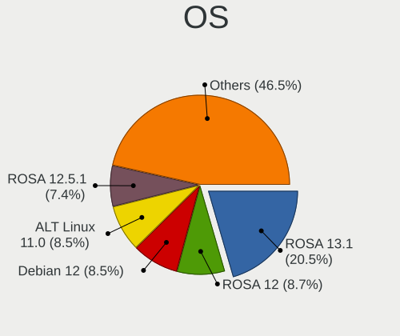

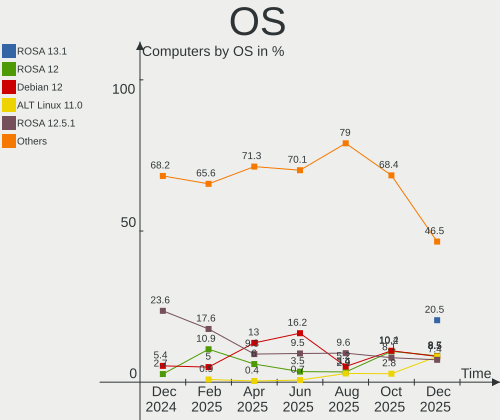

| Name               | Computers | Percent |
|--------------------|-----------|---------|
| ROSA 13.1          | 97        | 20.51%  |
| ROSA 12            | 41        | 8.67%   |
| Debian 12          | 40        | 8.46%   |
| ALT Linux 11.0     | 40        | 8.46%   |
| ROSA 12.5.1        | 35        | 7.4%    |
| Ubuntu 22.04       | 25        | 5.29%   |
| Debian 13          | 21        | 4.44%   |
| Ubuntu 24.04       | 18        | 3.81%   |
| Arch Rolling       | 15        | 3.17%   |
| OpenMandriva 25.90 | 10        | 2.11%   |
| Fedora 43          | 10        | 2.11%   |
| Red OS 8.0         | 6         | 1.27%   |
| OpenMandriva 6.0   | 6         | 1.27%   |
| Linux Mint 22.2    | 6         | 1.27%   |
| ALT Linux 11.1     | 6         | 1.27%   |
| ALT Linux 10.4     | 6         | 1.27%   |
| ROSA 13.0          | 5         | 1.06%   |
| Zorin 18           | 4         | 0.85%   |
| Ubuntu 25.10       | 4         | 0.85%   |
| Red OS 7.3         | 4         | 0.85%   |
| Ubuntu 26.04       | 3         | 0.63%   |
| OpenMandriva 25.11 | 3         | 0.63%   |
| NixOS 26.05        | 3         | 0.63%   |
| Manjaro 25.1.0     | 3         | 0.63%   |
| Kubuntu 24.04      | 3         | 0.63%   |
| Fedora 42          | 3         | 0.63%   |
| Zorin 17           | 2         | 0.42%   |
| Xubuntu 24.04      | 2         | 0.42%   |
| Uncom OS 2.5       | 2         | 0.42%   |
| ROSA R11.1         | 2         | 0.42%   |
| ROSA R11           | 2         | 0.42%   |
| OpenMandriva 24.12 | 2         | 0.42%   |
| Kubuntu 25.10      | 2         | 0.42%   |
| KDE neon 24.04     | 2         | 0.42%   |
| Gentoo 2.18        | 2         | 0.42%   |
| CachyOS Rolling    | 2         | 0.42%   |
| ALT Linux 20250612 | 2         | 0.42%   |
| Void Linux Rolling | 1         | 0.21%   |
| Ubuntu MATE 16.04  | 1         | 0.21%   |
| Ubuntu 20.04       | 1         | 0.21%   |

OS Family
---------

OS without a version

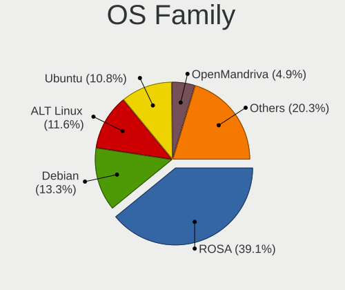

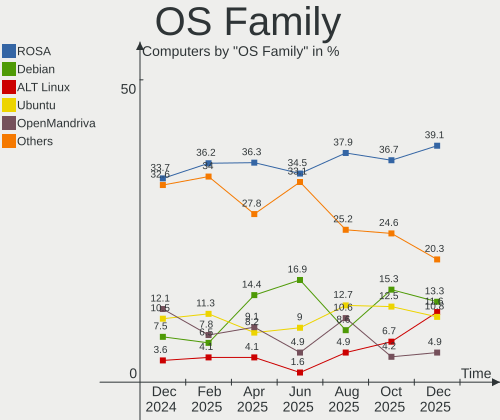

| Name         | Computers | Percent |
|--------------|-----------|---------|
| ROSA         | 185       | 39.11%  |
| Debian       | 63        | 13.32%  |
| ALT Linux    | 55        | 11.63%  |
| Ubuntu       | 51        | 10.78%  |
| OpenMandriva | 23        | 4.86%   |
| Fedora       | 15        | 3.17%   |
| Arch         | 15        | 3.17%   |
| Red OS       | 10        | 2.11%   |
| Linux Mint   | 8         | 1.69%   |
| Zorin        | 6         | 1.27%   |
| Manjaro      | 5         | 1.06%   |
| Kubuntu      | 5         | 1.06%   |
| NixOS        | 4         | 0.85%   |
| KDE neon     | 3         | 0.63%   |
| CachyOS      | 3         | 0.63%   |
| Xubuntu      | 2         | 0.42%   |
| Uncom OS     | 2         | 0.42%   |
| openSUSE     | 2         | 0.42%   |
| Gentoo       | 2         | 0.42%   |
| Void Linux   | 1         | 0.21%   |
| Ubuntu MATE  | 1         | 0.21%   |
| SteamOS      | 1         | 0.21%   |
| Solus        | 1         | 0.21%   |
| RED          | 1         | 0.21%   |
| Q4OS         | 1         | 0.21%   |
| OpenWrt      | 1         | 0.21%   |
| MX           | 1         | 0.21%   |
| Lubuntu      | 1         | 0.21%   |
| Kali         | 1         | 0.21%   |
| Elementary   | 1         | 0.21%   |
| Bazzite      | 1         | 0.21%   |
| Astra Linux  | 1         | 0.21%   |
| ArcoLinux    | 1         | 0.21%   |

Kernel
------

Version of the Linux kernel

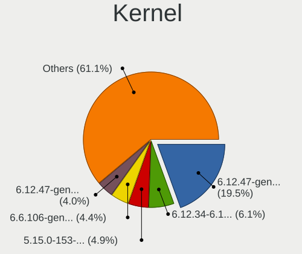

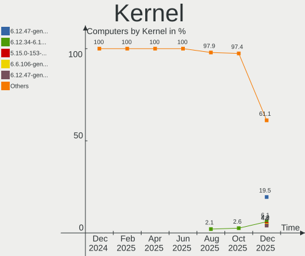

| Version                            | Computers | Percent |
|------------------------------------|-----------|---------|
| 6.12.47-generic-5rosa13-x86_64     | 92        | 19.45%  |
| 6.12.34-6.12-alt1                  | 29        | 6.13%   |
| 5.15.0-153-generic                 | 23        | 4.86%   |
| 6.6.106-generic-3rosa2021.1-x86_64 | 21        | 4.44%   |
| 6.12.47-generic-5rosa2021.1-x86_64 | 19        | 4.02%   |
| 6.8.12-11-pve                      | 17        | 3.59%   |
| 6.14.2-desktop-3omv2590            | 16        | 3.38%   |
| 6.14.0-37-generic                  | 10        | 2.11%   |
| 6.14.0-36-generic                  | 8         | 1.69%   |
| 6.12.59-6.12-alt1                  | 7         | 1.48%   |
| 6.12.57+deb13-amd64                | 7         | 1.48%   |
| 6.12.56-1.red80.x86_64             | 6         | 1.27%   |
| 6.1.152-generic-2rosa2021.1-x86_64 | 6         | 1.27%   |
| 6.8.0-88-generic                   | 5         | 1.06%   |
| 6.6.27-generic-3rosa2021.1-x86_64  | 5         | 1.06%   |
| 6.12.61-6.12-alt1                  | 5         | 1.06%   |
| 6.8.12-15-pve                      | 4         | 0.85%   |
| 6.8.0-90-generic                   | 4         | 0.85%   |
| 6.17.9-zen1-1-zen                  | 4         | 0.85%   |
| 6.12.13-generic-4rosa13-x86_64     | 4         | 0.85%   |
| 6.8.12-9-pve                       | 3         | 0.63%   |
| 6.8.12-8-pve                       | 3         | 0.63%   |
| 6.8.12-13-pve                      | 3         | 0.63%   |
| 6.6.47-generic-1rosa2021.1-x86_64  | 3         | 0.63%   |
| 6.6.106-generic-1rosa2021.1-x86_64 | 3         | 0.63%   |
| 6.17.9-arch1-1                     | 3         | 0.63%   |
| 6.17.0-8-generic                   | 3         | 0.63%   |
| 6.17.0-7-generic                   | 3         | 0.63%   |
| 6.17.0-6-generic                   | 3         | 0.63%   |
| 6.14.11-4-pve                      | 3         | 0.63%   |
| 6.12.48+deb13-amd64                | 3         | 0.63%   |
| 6.12.47-generic-2rosa2021.1-x86_64 | 3         | 0.63%   |
| 6.1.115-un-def-alt1                | 3         | 0.63%   |
| 5.15.127-generic-1rosa2021.1-i686  | 3         | 0.63%   |
| 6.8.8-2-pve                        | 2         | 0.42%   |
| 6.8.4-2-pve                        | 2         | 0.42%   |
| 6.8.12-17-pve                      | 2         | 0.42%   |
| 6.8.0-60-generic                   | 2         | 0.42%   |
| 6.6.78-generic-2rosa2021.1-x86_64  | 2         | 0.42%   |
| 6.18.1-arch1-2                     | 2         | 0.42%   |

Kernel Family
-------------

Linux kernel without a distro release

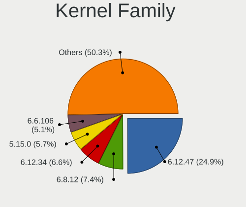

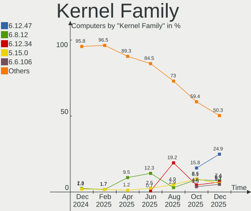

| Version  | Computers | Percent |
|----------|-----------|---------|
| 6.12.47  | 118       | 24.95%  |
| 6.8.12   | 35        | 7.4%    |
| 6.12.34  | 31        | 6.55%   |
| 5.15.0   | 27        | 5.71%   |
| 6.6.106  | 24        | 5.07%   |
| 6.14.0   | 22        | 4.65%   |
| 6.8.0    | 19        | 4.02%   |
| 6.14.2   | 16        | 3.38%   |
| 6.17.9   | 12        | 2.54%   |
| 6.17.0   | 10        | 2.11%   |
| 6.12.57  | 8         | 1.69%   |
| 6.18.0   | 7         | 1.48%   |
| 6.17.8   | 7         | 1.48%   |
| 6.12.59  | 7         | 1.48%   |
| 6.12.56  | 6         | 1.27%   |
| 6.1.152  | 6         | 1.27%   |
| 6.6.27   | 5         | 1.06%   |
| 6.14.11  | 5         | 1.06%   |
| 6.12.61  | 5         | 1.06%   |
| 6.12.48  | 5         | 1.06%   |
| 6.18.2   | 4         | 0.85%   |
| 6.12.13  | 4         | 0.85%   |
| 4.15.0   | 4         | 0.85%   |
| 6.6.47   | 3         | 0.63%   |
| 6.18.1   | 3         | 0.63%   |
| 6.17.7   | 3         | 0.63%   |
| 6.17.4   | 3         | 0.63%   |
| 6.17.12  | 3         | 0.63%   |
| 6.17.10  | 3         | 0.63%   |
| 6.12.1   | 3         | 0.63%   |
| 6.1.115  | 3         | 0.63%   |
| 5.15.127 | 3         | 0.63%   |
| 6.8.8    | 2         | 0.42%   |
| 6.8.4    | 2         | 0.42%   |
| 6.6.78   | 2         | 0.42%   |
| 6.17.2   | 2         | 0.42%   |
| 6.17.1   | 2         | 0.42%   |
| 6.12.60  | 2         | 0.42%   |
| 6.12.41  | 2         | 0.42%   |
| 6.1.46   | 2         | 0.42%   |

Kernel Major Ver.
-----------------

Linux kernel major version

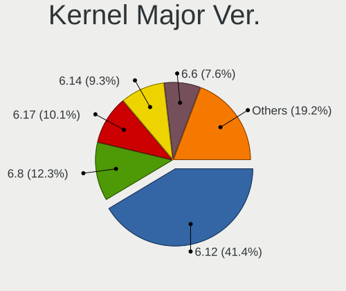

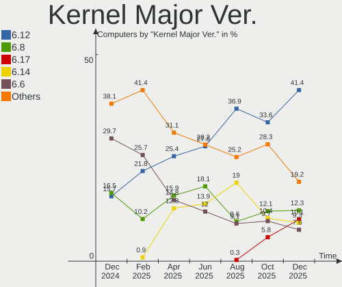

| Version | Computers | Percent |
|---------|-----------|---------|
| 6.12    | 196       | 41.44%  |
| 6.8     | 58        | 12.26%  |
| 6.17    | 48        | 10.15%  |
| 6.14    | 44        | 9.3%    |
| 6.6     | 36        | 7.61%   |
| 5.15    | 31        | 6.55%   |
| 6.1     | 26        | 5.5%    |
| 6.18    | 14        | 2.96%   |
| 5.10    | 4         | 0.85%   |
| 4.15    | 4         | 0.85%   |
| 6.16    | 2         | 0.42%   |
| 6.15    | 2         | 0.42%   |
| 6.7     | 1         | 0.21%   |
| 6.5     | 1         | 0.21%   |
| 6.4     | 1         | 0.21%   |
| 6.11    | 1         | 0.21%   |
| 5.4     | 1         | 0.21%   |
| 5.14    | 1         | 0.21%   |
| 4.4     | 1         | 0.21%   |
| 4.19    | 1         | 0.21%   |

Arch
----

OS architecture (x86_64, i586, etc.)

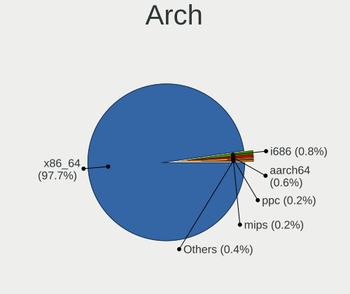

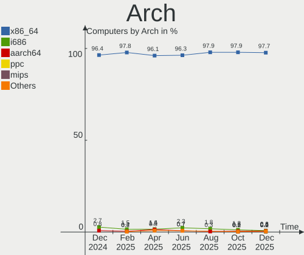

| Name        | Computers | Percent |
|-------------|-----------|---------|
| x86_64      | 462       | 97.67%  |
| i686        | 4         | 0.85%   |
| aarch64     | 3         | 0.63%   |
| ppc         | 1         | 0.21%   |
| mips        | 1         | 0.21%   |
| loongarch64 | 1         | 0.21%   |
| armv7l      | 1         | 0.21%   |

DE
--

Desktop Environment

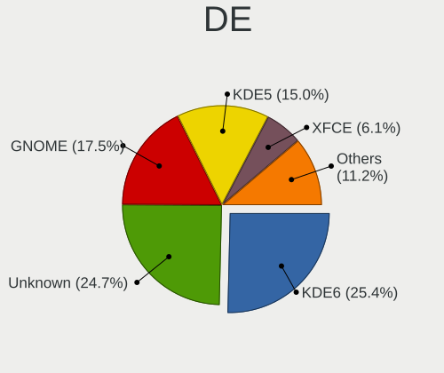

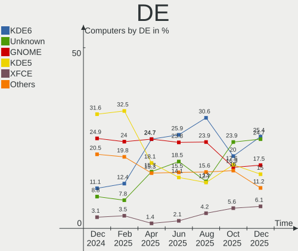

| Name       | Computers | Percent |
|------------|-----------|---------|
| KDE6       | 120       | 25.37%  |
| Unknown    | 117       | 24.74%  |
| GNOME      | 83        | 17.55%  |
| KDE5       | 71        | 15.01%  |
| XFCE       | 29        | 6.13%   |
| LXQt       | 14        | 2.96%   |
| KDE4       | 9         | 1.9%    |
| MATE       | 8         | 1.69%   |
| X-Cinnamon | 7         | 1.48%   |
| KDE        | 7         | 1.48%   |
| Cinnamon   | 2         | 0.42%   |
| Trinity    | 1         | 0.21%   |
| Pantheon   | 1         | 0.21%   |
| niri       | 1         | 0.21%   |
| Hyprland   | 1         | 0.21%   |
| fly        | 1         | 0.21%   |
| Budgie     | 1         | 0.21%   |

Display Server
--------------

X11 or Wayland

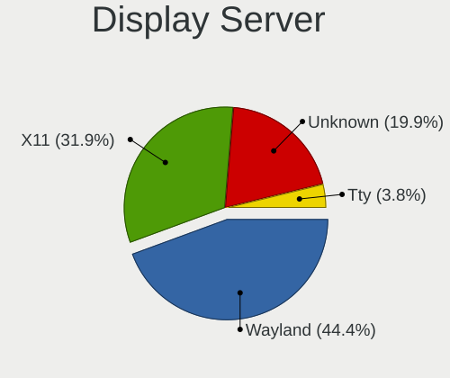

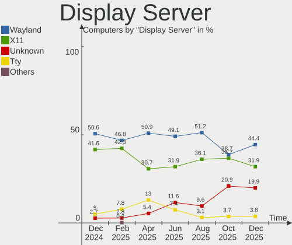

| Name    | Computers | Percent |
|---------|-----------|---------|
| Wayland | 210       | 44.4%   |
| X11     | 151       | 31.92%  |
| Unknown | 94        | 19.87%  |
| Tty     | 18        | 3.81%   |

Display Manager
---------------

SDDM, LightDM, etc.

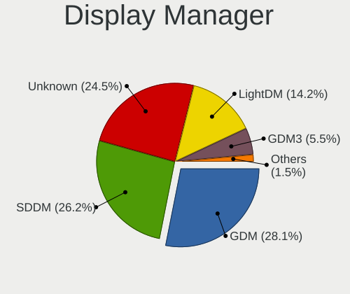

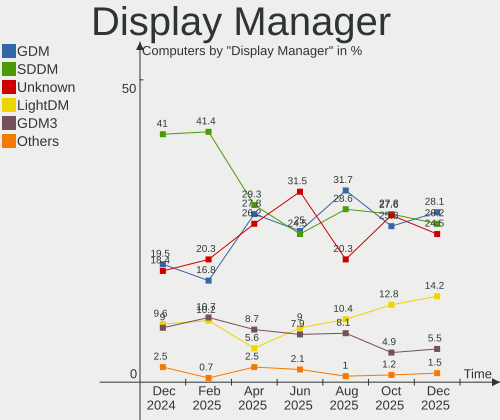

| Name    | Computers | Percent |
|---------|-----------|---------|
| GDM     | 133       | 28.12%  |
| SDDM    | 124       | 26.22%  |
| Unknown | 116       | 24.52%  |
| LightDM | 67        | 14.16%  |
| GDM3    | 26        | 5.5%    |
| KDM     | 5         | 1.06%   |
| TDM     | 1         | 0.21%   |
| FLY-DM  | 1         | 0.21%   |

OS Lang
-------

Language

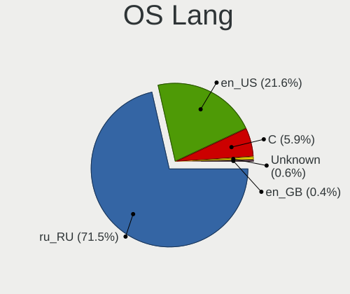

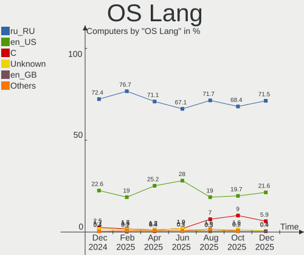

| Lang    | Computers | Percent |
|---------|-----------|---------|
| ru_RU   | 338       | 71.46%  |
| en_US   | 102       | 21.56%  |
| C       | 28        | 5.92%   |
| Unknown | 3         | 0.63%   |
| en_GB   | 2         | 0.42%   |

Boot Mode
---------

EFI or BIOS

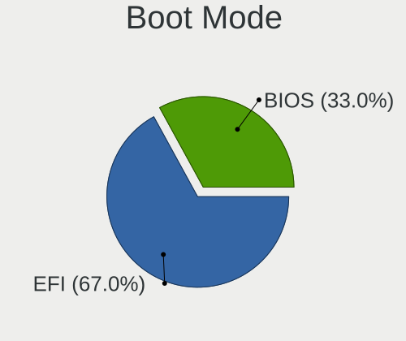

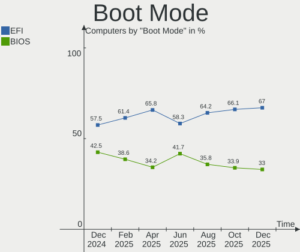

| Mode | Computers | Percent |
|------|-----------|---------|
| EFI  | 317       | 67.02%  |
| BIOS | 156       | 32.98%  |

Filesystem
----------

Type of filesystem

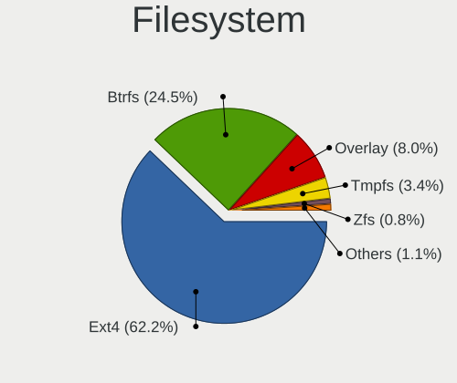

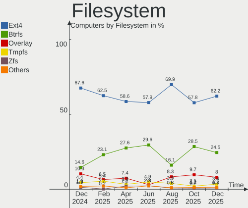

| Type    | Computers | Percent |
|---------|-----------|---------|
| Ext4    | 294       | 62.16%  |
| Btrfs   | 116       | 24.52%  |
| Overlay | 38        | 8.03%   |
| Tmpfs   | 16        | 3.38%   |
| Zfs     | 4         | 0.85%   |
| Xfs     | 3         | 0.63%   |
| F2fs    | 1         | 0.21%   |
| Ext3    | 1         | 0.21%   |

Part. scheme
------------

Scheme of partitioning

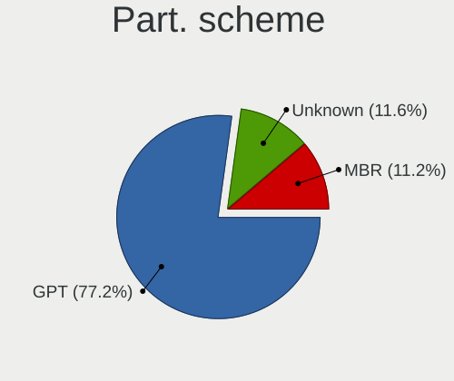

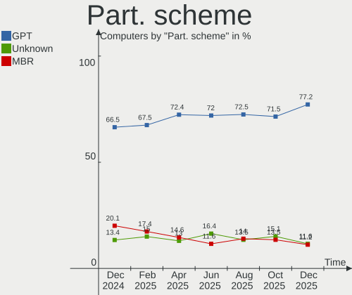

| Type    | Computers | Percent |
|---------|-----------|---------|
| GPT     | 365       | 77.17%  |
| Unknown | 55        | 11.63%  |
| MBR     | 53        | 11.21%  |

Dual Boot with Linux/BSD
------------------------

Hosting more than one Linux/BSD

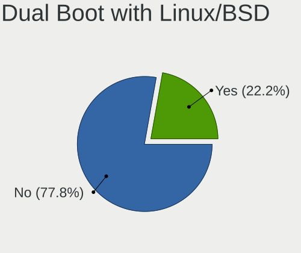

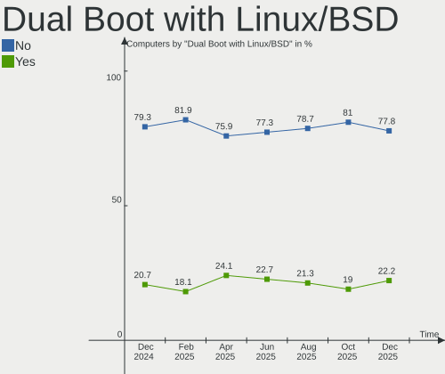

| Dual boot | Computers | Percent |
|-----------|-----------|---------|
| No        | 368       | 77.8%   |
| Yes       | 105       | 22.2%   |

Dual Boot (Win)
---------------

Hosting Linux and Windows

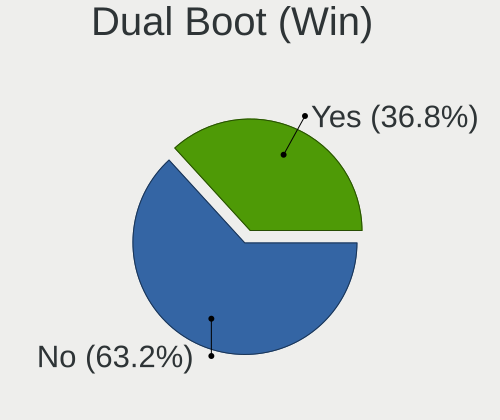

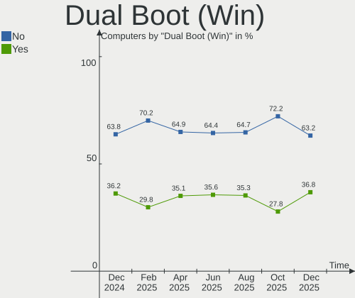

| Dual boot | Computers | Percent |
|-----------|-----------|---------|
| No        | 299       | 63.21%  |
| Yes       | 174       | 36.79%  |

Board
-----

Vendor
------

Motherboard manufacturer

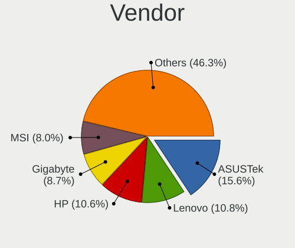

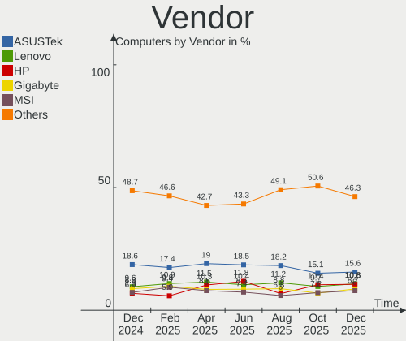

| Name                | Computers | Percent |
|---------------------|-----------|---------|
| ASUSTek Computer    | 74        | 15.64%  |
| Lenovo              | 51        | 10.78%  |
| Hewlett-Packard     | 50        | 10.57%  |
| Gigabyte Technology | 41        | 8.67%   |
| MSI                 | 38        | 8.03%   |
| Acer                | 20        | 4.23%   |
| Supermicro          | 19        | 4.02%   |
| Dell                | 18        | 3.81%   |
| Intel               | 16        | 3.38%   |
| ASRock              | 15        | 3.17%   |
| Unknown             | 14        | 2.96%   |
| HUAWEI              | 8         | 1.69%   |
| Aquarius            | 7         | 1.48%   |
| Samsung Electronics | 6         | 1.27%   |
| KVADRA              | 6         | 1.27%   |
| ICL Techno          | 6         | 1.27%   |
| Inspur              | 5         | 1.06%   |
| ICL                 | 5         | 1.06%   |
| Chuwi               | 5         | 1.06%   |
| Huanan              | 4         | 0.85%   |
| HONOR               | 4         | 0.85%   |
| MocTex              | 3         | 0.63%   |
| MAINBRD             | 3         | 0.63%   |
| LTD Delovoy Office  | 3         | 0.63%   |
| ETegro Technologies | 3         | 0.63%   |
| AZW                 | 3         | 0.63%   |
| XIAOMI              | 2         | 0.42%   |
| Sony                | 2         | 0.42%   |
| MECHREVO            | 2         | 0.42%   |
| Maibenben           | 2         | 0.42%   |
| iRU                 | 2         | 0.42%   |
| Infinix             | 2         | 0.42%   |
| DEXP                | 2         | 0.42%   |
| Clevo               | 2         | 0.42%   |
| Biostar             | 2         | 0.42%   |
| Apple               | 2         | 0.42%   |
| Valve               | 1         | 0.21%   |
| Toshiba             | 1         | 0.21%   |
| SHUANGWEI           | 1         | 0.21%   |
| RDW Computers       | 1         | 0.21%   |

Model
-----

Motherboard model

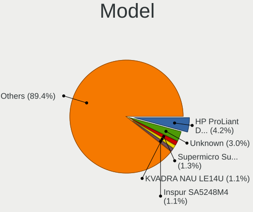

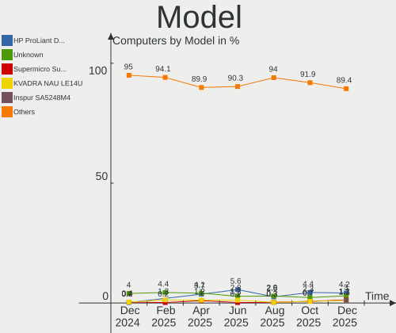

| Name                                 | Computers | Percent |
|--------------------------------------|-----------|---------|
| HP ProLiant DL360 Gen9               | 20        | 4.23%   |
| Unknown                              | 14        | 2.96%   |
| Supermicro Super Server              | 6         | 1.27%   |
| KVADRA NAU LE14U                     | 5         | 1.06%   |
| Inspur SA5248M4                      | 5         | 1.06%   |
| HP ProLiant DL380 Gen9               | 5         | 1.06%   |
| Aquarius NS685U R11                  | 5         | 1.06%   |
| Supermicro X8DTU                     | 4         | 0.85%   |
| Lenovo ThinkPad E14 Gen 4 21E4S2JB00 | 4         | 0.85%   |
| Intel X99                            | 4         | 0.85%   |
| Intel SKYBAY                         | 4         | 0.85%   |
| MocTex OPS6725-SHA                   | 3         | 0.63%   |
| MAINBRD OPS72A-SHA                   | 3         | 0.63%   |
| Lenovo K14 Gen 1 21CSS16E00          | 3         | 0.63%   |
| ETegro Hyperion RS125 G4             | 3         | 0.63%   |
| ASUS All Series                      | 3         | 0.63%   |
| Supermicro SYS-6018U-TR4+            | 2         | 0.42%   |
| MSI MPG B560 Trident A (MS-B926)     | 2         | 0.42%   |
| Lenovo G570 20079                    | 2         | 0.42%   |
| Lenovo 300e 2nd Gen 81M9             | 2         | 0.42%   |
| Infinix Y3 Max                       | 2         | 0.42%   |
| ICL Techno F150a                     | 2         | 0.42%   |
| ICL RAY Si105.Mi                     | 2         | 0.42%   |
| HUAWEI RH1288 V3                     | 2         | 0.42%   |
| HUAWEI MCLG-XX                       | 2         | 0.42%   |
| HUAWEI BOM-WXX9                      | 2         | 0.42%   |
| HP ProLiant DL360p Gen8              | 2         | 0.42%   |
| HP Notebook                          | 2         | 0.42%   |
| HP Laptop 15-bw0xx                   | 2         | 0.42%   |
| Gigabyte H410M H V2                  | 2         | 0.42%   |
| Gigabyte G31M-ES2L                   | 2         | 0.42%   |
| Gigabyte F2A68HM-S1                  | 2         | 0.42%   |
| Clevo NL41MU2                        | 2         | 0.42%   |
| Chuwi LarkBox X                      | 2         | 0.42%   |
| AZW MINI S                           | 2         | 0.42%   |
| ASUS Vivobook Go E1504FA_E1504FA     | 2         | 0.42%   |
| ASUS P8H61-MX                        | 2         | 0.42%   |
| ASUS H110M-K                         | 2         | 0.42%   |
| ASRock B450M-HDV R4.0                | 2         | 0.42%   |
| Aquarius CMP NS685U_4                | 2         | 0.42%   |

Model Family
------------

Motherboard model prefix

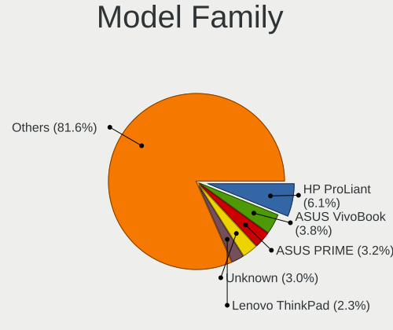

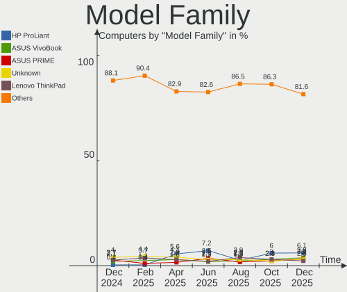

| Name                      | Computers | Percent |
|---------------------------|-----------|---------|
| HP ProLiant               | 29        | 6.13%   |
| ASUS VivoBook             | 18        | 3.81%   |
| ASUS PRIME                | 15        | 3.17%   |
| Unknown                   | 14        | 2.96%   |
| Lenovo ThinkPad           | 11        | 2.33%   |
| Lenovo IdeaPad            | 10        | 2.11%   |
| Acer Aspire               | 10        | 2.11%   |
| Supermicro Super          | 6         | 1.27%   |
| KVADRA NAU                | 6         | 1.27%   |
| Dell Latitude             | 6         | 1.27%   |
| Inspur SA5248M4           | 5         | 1.06%   |
| Dell Inspiron             | 5         | 1.06%   |
| ASUS TUF                  | 5         | 1.06%   |
| Aquarius NS685U           | 5         | 1.06%   |
| Supermicro X8DTU          | 4         | 0.85%   |
| Lenovo ThinkBook          | 4         | 0.85%   |
| Intel X99                 | 4         | 0.85%   |
| Intel SKYBAY              | 4         | 0.85%   |
| HP ProBook                | 4         | 0.85%   |
| ASUS ROG                  | 4         | 0.85%   |
| MocTex OPS6725-SHA        | 3         | 0.63%   |
| MAINBRD OPS72A-SHA        | 3         | 0.63%   |
| LTD Delovoy Office EVE    | 3         | 0.63%   |
| Lenovo ThinkCentre        | 3         | 0.63%   |
| Lenovo Legion             | 3         | 0.63%   |
| Lenovo K14                | 3         | 0.63%   |
| HP Laptop                 | 3         | 0.63%   |
| Gigabyte H410M            | 3         | 0.63%   |
| Gigabyte B450M            | 3         | 0.63%   |
| ETegro Hyperion           | 3         | 0.63%   |
| Dell PowerEdge            | 3         | 0.63%   |
| ASUS ASUS                 | 3         | 0.63%   |
| ASUS All                  | 3         | 0.63%   |
| Acer TravelMate           | 3         | 0.63%   |
| XIAOMI REDMI              | 2         | 0.42%   |
| Supermicro SYS-6018U-TR4+ | 2         | 0.42%   |
| Samsung 300E4A            | 2         | 0.42%   |
| MSI Vector                | 2         | 0.42%   |
| MSI MPG                   | 2         | 0.42%   |
| MSI Modern                | 2         | 0.42%   |

MFG Year
--------

Motherboard manufacture year

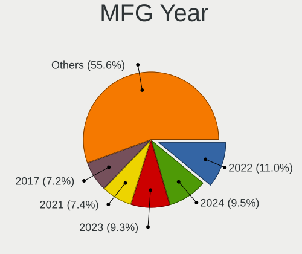

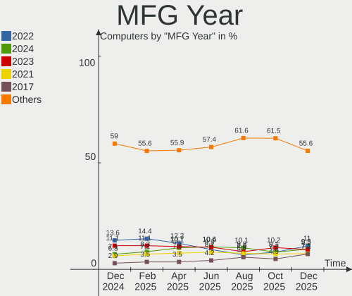

| Year    | Computers | Percent |
|---------|-----------|---------|
| 2022    | 52        | 10.99%  |
| 2024    | 45        | 9.51%   |
| 2023    | 44        | 9.3%    |
| 2021    | 35        | 7.4%    |
| 2017    | 34        | 7.19%   |
| 2015    | 34        | 7.19%   |
| 2012    | 28        | 5.92%   |
| 2018    | 25        | 5.29%   |
| 2011    | 25        | 5.29%   |
| 2019    | 23        | 4.86%   |
| 2013    | 21        | 4.44%   |
| 2025    | 19        | 4.02%   |
| 2014    | 18        | 3.81%   |
| 2020    | 16        | 3.38%   |
| 2010    | 13        | 2.75%   |
| 2009    | 13        | 2.75%   |
| 2016    | 8         | 1.69%   |
| 2008    | 7         | 1.48%   |
| 2007    | 5         | 1.06%   |
| Unknown | 5         | 1.06%   |
| 2006    | 2         | 0.42%   |
| 2004    | 1         | 0.21%   |

Form Factor
-----------

Physical design of the computer

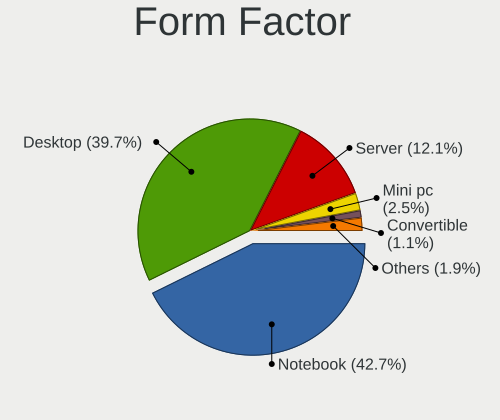

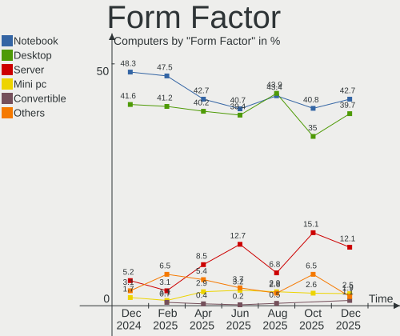

| Name           | Computers | Percent |
|----------------|-----------|---------|
| Notebook       | 202       | 42.71%  |
| Desktop        | 188       | 39.75%  |
| Server         | 57        | 12.05%  |
| Mini pc        | 12        | 2.54%   |
| Convertible    | 5         | 1.06%   |
| All in one     | 4         | 0.85%   |
| System on chip | 2         | 0.42%   |
| Tablet         | 2         | 0.42%   |
| Other          | 1         | 0.21%   |

Secure Boot
-----------

Enabled or disabled

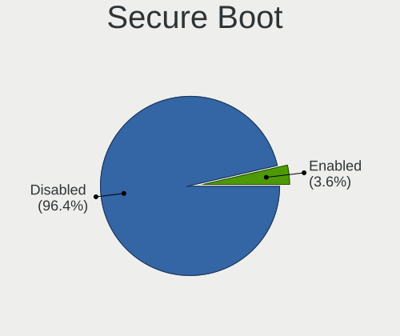

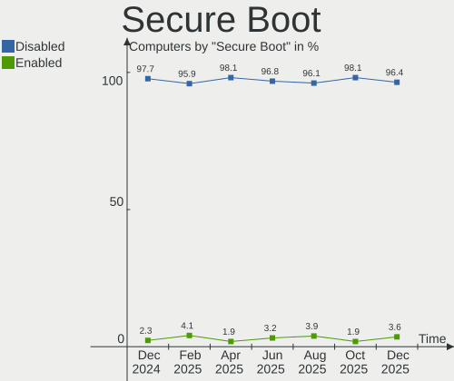

| State    | Computers | Percent |
|----------|-----------|---------|
| Disabled | 456       | 96.41%  |
| Enabled  | 17        | 3.59%   |

Coreboot
--------

Have coreboot on board

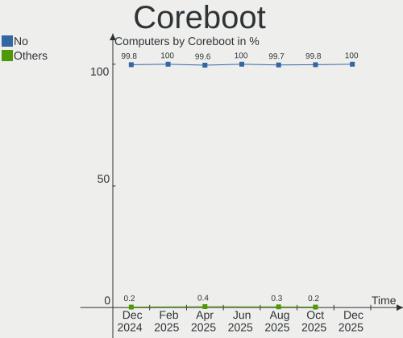

| Used | Computers | Percent |
|------|-----------|---------|
| No   | 473       | 100%    |

RAM Size
--------

Total RAM memory

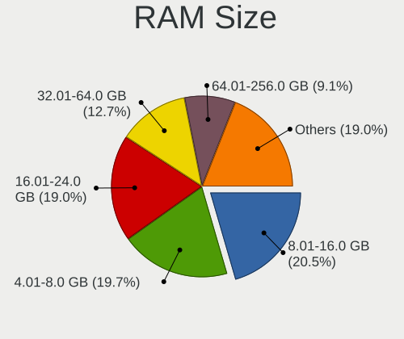

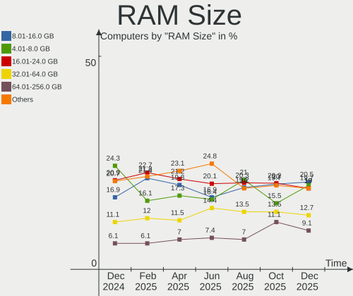

| Size in GB      | Computers | Percent |
|-----------------|-----------|---------|
| 8.01-16.0       | 97        | 20.51%  |
| 4.01-8.0        | 93        | 19.66%  |
| 16.01-24.0      | 90        | 19.03%  |
| 32.01-64.0      | 60        | 12.68%  |
| 64.01-256.0     | 43        | 9.09%   |
| 3.01-4.0        | 38        | 8.03%   |
| More than 256.0 | 22        | 4.65%   |
| 24.01-32.0      | 12        | 2.54%   |
| 1.01-2.0        | 9         | 1.9%    |
| 2.01-3.0        | 7         | 1.48%   |
| 0.01-0.5        | 2         | 0.42%   |

RAM Used
--------

Used RAM memory

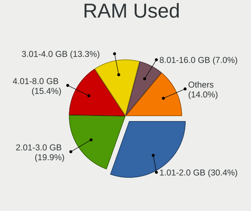

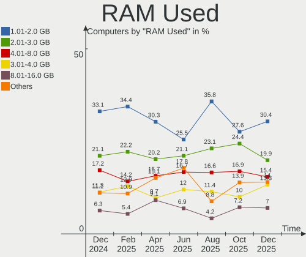

| Used GB         | Computers | Percent |
|-----------------|-----------|---------|
| 1.01-2.0        | 144       | 30.44%  |
| 2.01-3.0        | 94        | 19.87%  |
| 4.01-8.0        | 73        | 15.43%  |
| 3.01-4.0        | 63        | 13.32%  |
| 8.01-16.0       | 33        | 6.98%   |
| 0.51-1.0        | 22        | 4.65%   |
| 64.01-256.0     | 19        | 4.02%   |
| 16.01-24.0      | 9         | 1.9%    |
| 0.01-0.5        | 8         | 1.69%   |
| 24.01-32.0      | 4         | 0.85%   |
| 32.01-64.0      | 3         | 0.63%   |
| More than 256.0 | 1         | 0.21%   |

Total Drives
------------

Number of drives on board

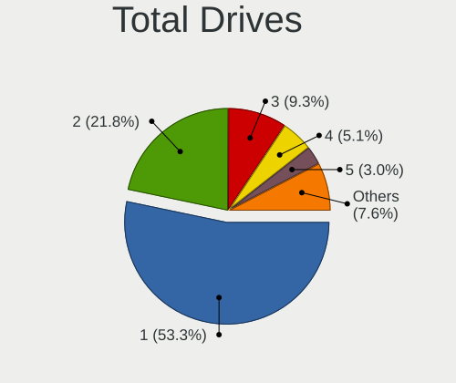

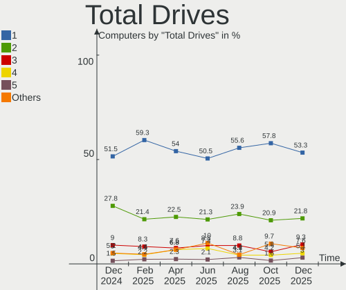

| Drives | Computers | Percent |
|--------|-----------|---------|
| 1      | 252       | 53.28%  |
| 2      | 103       | 21.78%  |
| 3      | 44        | 9.3%    |
| 4      | 24        | 5.07%   |
| 5      | 14        | 2.96%   |
| 10     | 10        | 2.11%   |
| 18     | 3         | 0.63%   |
| 14     | 3         | 0.63%   |
| 8      | 3         | 0.63%   |
| 6      | 3         | 0.63%   |
| 0      | 3         | 0.63%   |
| 12     | 2         | 0.42%   |
| 11     | 2         | 0.42%   |
| 40     | 1         | 0.21%   |
| 31     | 1         | 0.21%   |
| 28     | 1         | 0.21%   |
| 19     | 1         | 0.21%   |
| 17     | 1         | 0.21%   |
| 15     | 1         | 0.21%   |
| 13     | 1         | 0.21%   |

Has CD-ROM
----------

Has CD-ROM on board

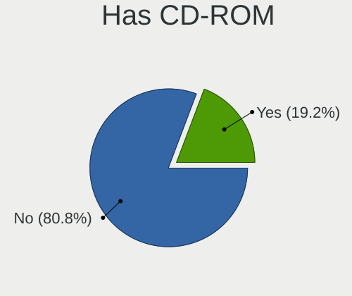

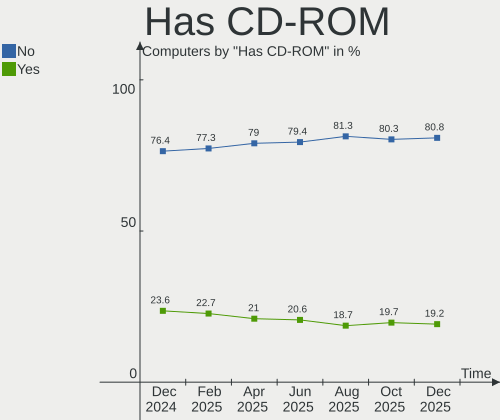

| Presented | Computers | Percent |
|-----------|-----------|---------|
| No        | 382       | 80.76%  |
| Yes       | 91        | 19.24%  |

Has Ethernet
------------

Has Ethernet on board

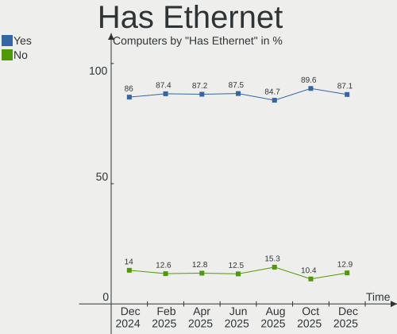

| Presented | Computers | Percent |
|-----------|-----------|---------|
| Yes       | 412       | 87.1%   |
| No        | 61        | 12.9%   |

Has WiFi
--------

Has WiFi module

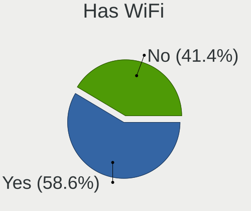

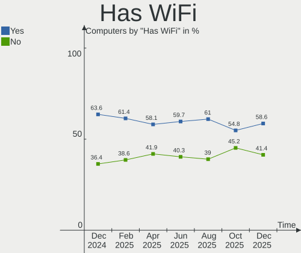

| Presented | Computers | Percent |
|-----------|-----------|---------|
| Yes       | 277       | 58.56%  |
| No        | 196       | 41.44%  |

Has Bluetooth
-------------

Has Bluetooth module

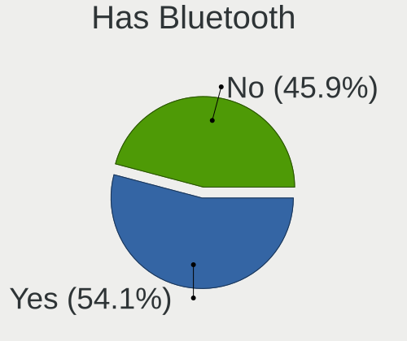

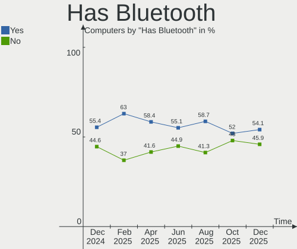

| Presented | Computers | Percent |
|-----------|-----------|---------|
| Yes       | 256       | 54.12%  |
| No        | 217       | 45.88%  |

Location
--------

Country
-------

Geographic location (country)

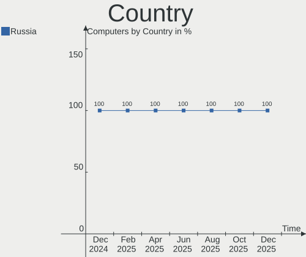

| Country | Computers | Percent |
|---------|-----------|---------|
| Russia  | 473       | 100%    |

City
----

Geographic location (city)

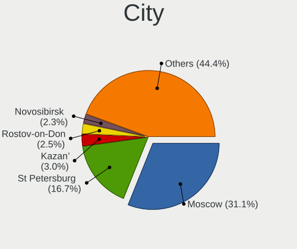

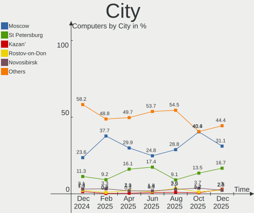

| City             | Computers | Percent |
|------------------|-----------|---------|
| Moscow           | 147       | 31.08%  |
| St Petersburg    | 79        | 16.7%   |
| Kazan’         | 14        | 2.96%   |
| Rostov-on-Don    | 12        | 2.54%   |
| Novosibirsk      | 11        | 2.33%   |
| Krasnodar        | 11        | 2.33%   |
| Yekaterinburg    | 10        | 2.11%   |
| Chelyabinsk      | 9         | 1.9%    |
| Krasnoyarsk      | 7         | 1.48%   |
| Voronezh         | 5         | 1.06%   |
| Vladimir         | 5         | 1.06%   |
| Perm             | 5         | 1.06%   |
| Nizhniy Novgorod | 4         | 0.85%   |
| Kirov            | 4         | 0.85%   |
| Kaluga           | 4         | 0.85%   |
| Bryansk          | 4         | 0.85%   |
| Balashikha       | 4         | 0.85%   |
| Vladivostok      | 3         | 0.63%   |
| Veliky Novgorod  | 3         | 0.63%   |
| Ulyanovsk        | 3         | 0.63%   |
| Tyumen           | 3         | 0.63%   |
| Tver             | 3         | 0.63%   |
| Tula             | 3         | 0.63%   |
| Tomsk            | 3         | 0.63%   |
| Stavropol        | 3         | 0.63%   |
| Smolensk         | 3         | 0.63%   |
| Serpukhov        | 3         | 0.63%   |
| Kurgan           | 3         | 0.63%   |
| Arkhangelsk      | 3         | 0.63%   |
| Angarsk          | 3         | 0.63%   |
| Yoshkar-Ola      | 2         | 0.42%   |
| Yakutsk          | 2         | 0.42%   |
| Volgograd        | 2         | 0.42%   |
| Sergiyev Posad   | 2         | 0.42%   |
| Novy Urengoy     | 2         | 0.42%   |
| Murmansk         | 2         | 0.42%   |
| Lipetsk          | 2         | 0.42%   |
| Izhevsk          | 2         | 0.42%   |
| Irkutsk          | 2         | 0.42%   |
| Gatchina         | 2         | 0.42%   |

Drives
------

Drive Vendor
------------

Hard drive vendors

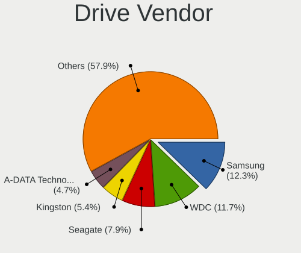

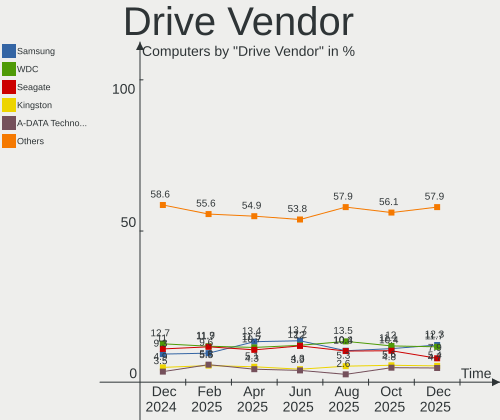

| Vendor                      | Computers | Drives | Percent |
|-----------------------------|-----------|--------|---------|
| Samsung Electronics         | 88        | 284    | 12.26%  |
| WDC                         | 84        | 181    | 11.7%   |
| Seagate                     | 57        | 103    | 7.94%   |
| Kingston                    | 39        | 44     | 5.43%   |
| A-DATA Technology           | 34        | 34     | 4.74%   |
| Sandisk                     | 27        | 28     | 3.76%   |
| Intel                       | 27        | 51     | 3.76%   |
| Toshiba                     | 25        | 36     | 3.48%   |
| SK hynix                    | 16        | 16     | 2.23%   |
| MAXIO Technology (Hangzhou) | 16        | 17     | 2.23%   |
| Hitachi                     | 16        | 18     | 2.23%   |
| Micron Technology           | 15        | 15     | 2.09%   |
| China                       | 14        | 14     | 1.95%   |
| Kingston Technology Company | 12        | 13     | 1.67%   |
| AMD                         | 12        | 13     | 1.67%   |
| Netac                       | 11        | 11     | 1.53%   |
| Apacer                      | 11        | 11     | 1.53%   |
| Unknown                     | 10        | 11     | 1.39%   |
| Silicon Motion              | 9         | 10     | 1.25%   |
| KingSpec                    | 9         | 9      | 1.25%   |
| FORESEE                     | 9         | 9      | 1.25%   |
| Realtek Semiconductor       | 7         | 7      | 0.97%   |
| Patriot                     | 7         | 7      | 0.97%   |
| HGST                        | 7         | 31     | 0.97%   |
| Crucial                     | 6         | 12     | 0.84%   |
| ADATA Technology            | 6         | 7      | 0.84%   |
| Wodposit                    | 5         | 5      | 0.7%    |
| SPCC                        | 5         | 5      | 0.7%    |
| SOLIDIGM                    | 5         | 10     | 0.7%    |
| Smartbuy                    | 5         | 5      | 0.7%    |
| QOPP                        | 5         | 5      | 0.7%    |
| Phison Electronics          | 5         | 5      | 0.7%    |
| KIOXIA                      | 5         | 5      | 0.7%    |
| DEXP                        | 5         | 5      | 0.7%    |
| Realtek                     | 4         | 4      | 0.56%   |
| OCZ                         | 4         | 4      | 0.56%   |
| Fujitsu                     | 4         | 4      | 0.56%   |
| BIWIN                       | 4         | 4      | 0.56%   |
| Unknown                     | 4         | 4      | 0.56%   |
| Transcend                   | 3         | 3      | 0.42%   |

Drive Model
-----------

Hard drive models

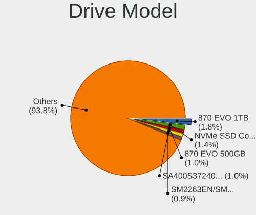

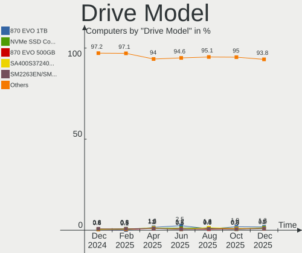

| Model                                                 | Computers | Percent |
|-------------------------------------------------------|-----------|---------|
| Samsung SSD 870 EVO 1TB                               | 14        | 1.82%   |
| MAXIO (Hangzhou) NVMe SSD Controller MAP1202 2TB      | 11        | 1.43%   |
| Samsung SSD 870 EVO 500GB                             | 8         | 1.04%   |
| Kingston SA400S37240G 240GB SSD                       | 8         | 1.04%   |
| Silicon Motion SM2263EN/SM2263XT SSD Controller 512GB | 7         | 0.91%   |
| Samsung NVMe SSD Controller SM981/PM981/PM983 1TB     | 7         | 0.91%   |
| Seagate Expansion HDD 4TB                             | 6         | 0.78%   |
| SanDisk NVMe SSD Drive 512GB                          | 6         | 0.78%   |
| Intel SSDSC2KB038TZ 3.8TB                             | 6         | 0.78%   |
| FORESEE XP1000F256G 256GB                             | 6         | 0.78%   |
| Toshiba HDWD110 1TB                                   | 5         | 0.65%   |
| Toshiba DT01ACA050 500GB                              | 5         | 0.65%   |
| SOLIDIGM SSDSC2KB960GZ 960GB                          | 5         | 0.65%   |
| Seagate ST1000DM003-1CH162 1TB                        | 5         | 0.65%   |
| Samsung SSD 870 EVO 250GB                             | 5         | 0.65%   |
| Kingston SA400S37120G 120GB SSD                       | 5         | 0.65%   |
| A-DATA LEGEND 710 512GB                               | 5         | 0.65%   |
| Wodposit NVMe SSD 1TB                                 | 4         | 0.52%   |
| WDC WDS120G2G0A-00JH30 120GB SSD                      | 4         | 0.52%   |
| SPCC Solid State Disk 256GB                           | 4         | 0.52%   |
| Seagate ST1000DM010-2EP102 1TB                        | 4         | 0.52%   |
| Samsung SSD 990 PRO 1TB                               | 4         | 0.52%   |
| Samsung SSD 860 EVO 1TB                               | 4         | 0.52%   |
| Samsung NVMe SSD Controller PM9A1/PM9A3/980PRO 1TB    | 4         | 0.52%   |
| Kingston SA400S37480G 480GB SSD                       | 4         | 0.52%   |
| A-DATA SU650 240GB SSD                                | 4         | 0.52%   |
| Unknown                                               | 4         | 0.52%   |
| WDC WD5000AAKX-00ERMA0 500GB                          | 3         | 0.39%   |
| WDC WD10EALS-00Z8A0 1TB                               | 3         | 0.39%   |
| Toshiba MQ01ABF050 500GB                              | 3         | 0.39%   |
| Smartbuy SSD 240GB                                    | 3         | 0.39%   |
| Seagate ST1000LM035-1RK172 1TB                        | 3         | 0.39%   |
| Samsung SSD 860 EVO 250GB                             | 3         | 0.39%   |
| Samsung MZVLW128HEGR-00000 128GB                      | 3         | 0.39%   |
| Samsung MZVL4512HBLU-00BTW 512GB                      | 3         | 0.39%   |
| Kingston SV300S37A120G 120GB SSD                      | 3         | 0.39%   |
| JetFlash Transcend 128GB                              | 3         | 0.39%   |
| Intel SSDSC2KB960G8 960GB                             | 3         | 0.39%   |
| Intel SSDSC2KB038T8 4TB                               | 3         | 0.39%   |
| Intel SSDSC2BB480G7 480GB                             | 3         | 0.39%   |

HDD Vendor
----------

Hard disk drive vendors

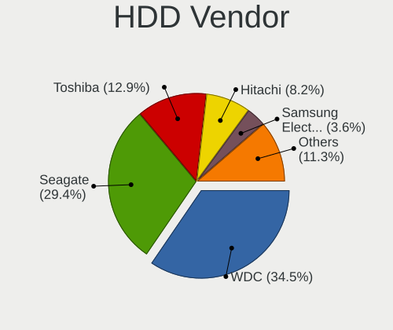

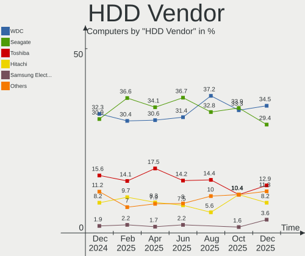

| Vendor              | Computers | Drives | Percent |
|---------------------|-----------|--------|---------|
| WDC                 | 67        | 163    | 34.54%  |
| Seagate             | 57        | 103    | 29.38%  |
| Toshiba             | 25        | 36     | 12.89%  |
| Hitachi             | 16        | 18     | 8.25%   |
| Samsung Electronics | 7         | 7      | 3.61%   |
| HGST                | 7         | 31     | 3.61%   |
| Fujitsu             | 4         | 4      | 2.06%   |
| JetFlash            | 3         | 3      | 1.55%   |
| Hewlett-Packard     | 3         | 8      | 1.55%   |
| Unknown             | 2         | 2      | 1.03%   |
| Maxtor              | 2         | 2      | 1.03%   |
| External            | 1         | 1      | 0.52%   |

SSD Vendor
----------

Solid state drive vendors

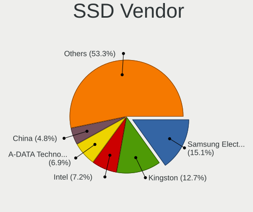

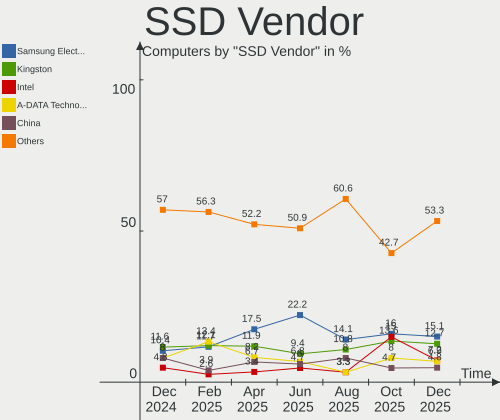

| Vendor              | Computers | Drives | Percent |
|---------------------|-----------|--------|---------|
| Samsung Electronics | 44        | 229    | 15.12%  |
| Kingston            | 37        | 41     | 12.71%  |
| Intel               | 21        | 43     | 7.22%   |
| A-DATA Technology   | 20        | 20     | 6.87%   |
| China               | 14        | 14     | 4.81%   |
| WDC                 | 12        | 12     | 4.12%   |
| Apacer              | 11        | 11     | 3.78%   |
| AMD                 | 11        | 12     | 3.78%   |
| Netac               | 8         | 8      | 2.75%   |
| SanDisk             | 7         | 7      | 2.41%   |
| Patriot             | 7         | 7      | 2.41%   |
| KingSpec            | 6         | 6      | 2.06%   |
| Crucial             | 6         | 12     | 2.06%   |
| SPCC                | 5         | 5      | 1.72%   |
| SOLIDIGM            | 5         | 10     | 1.72%   |
| Smartbuy            | 5         | 5      | 1.72%   |
| QOPP                | 5         | 5      | 1.72%   |
| DEXP                | 5         | 5      | 1.72%   |
| OCZ                 | 4         | 4      | 1.37%   |
| Transcend           | 3         | 3      | 1.03%   |
| Micron Technology   | 3         | 3      | 1.03%   |
| KingFast            | 3         | 3      | 1.03%   |
| Gigabyte Technology | 3         | 3      | 1.03%   |
| Colorful            | 3         | 3      | 1.03%   |
| SK hynix            | 2         | 2      | 0.69%   |
| MSI                 | 2         | 2      | 0.69%   |
| LITEON              | 2         | 2      | 0.69%   |
| KIOXIA-EXCERIA      | 2         | 4      | 0.69%   |
| GOODRAM             | 2         | 2      | 0.69%   |
| ExeGate             | 2         | 2      | 0.69%   |
| Digma               | 2         | 2      | 0.69%   |
| AirDisk             | 2         | 2      | 0.69%   |
| Unknown             | 2         | 2      | 0.69%   |
| Zheino              | 1         | 1      | 0.34%   |
| XrayDisk            | 1         | 1      | 0.34%   |
| VIEW                | 1         | 1      | 0.34%   |
| UnionSine           | 1         | 1      | 0.34%   |
| TRIVENTA            | 1         | 1      | 0.34%   |
| Team                | 1         | 1      | 0.34%   |
| SSSTC               | 1         | 1      | 0.34%   |

Drive Kind
----------

HDD or SSD

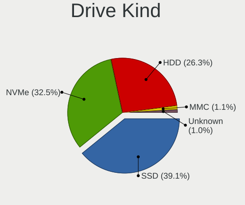

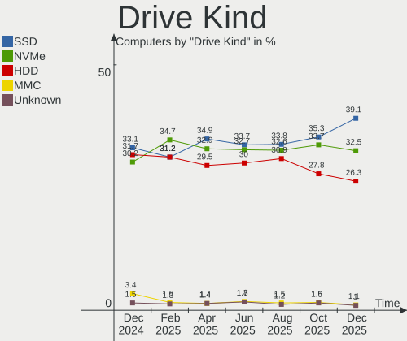

| Kind    | Computers | Drives | Percent |
|---------|-----------|--------|---------|
| SSD     | 244       | 516    | 39.1%   |
| NVMe    | 203       | 242    | 32.53%  |
| HDD     | 164       | 378    | 26.28%  |
| MMC     | 7         | 8      | 1.12%   |
| Unknown | 6         | 6      | 0.96%   |

Drive Connector
---------------

SATA, SAS, NVMe, etc.

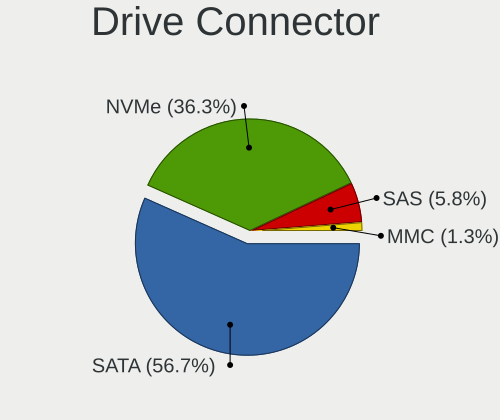

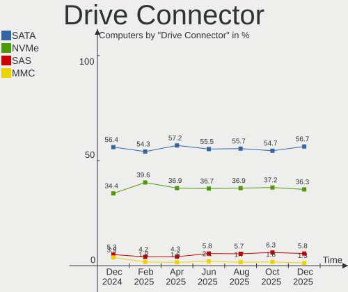

| Type | Computers | Drives | Percent |
|------|-----------|--------|---------|
| SATA | 315       | 866    | 56.65%  |
| NVMe | 202       | 236    | 36.33%  |
| SAS  | 32        | 40     | 5.76%   |
| MMC  | 7         | 8      | 1.26%   |

Drive Size
----------

Size of hard drive

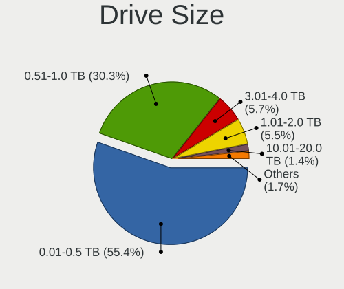

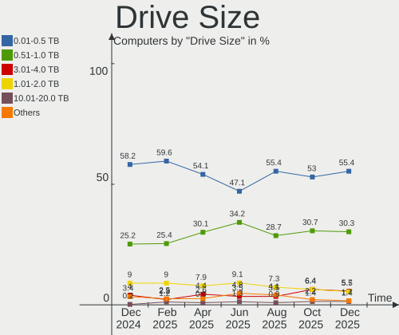

| Size in TB | Computers | Drives | Percent |
|------------|-----------|--------|---------|
| 0.01-0.5   | 232       | 365    | 55.37%  |
| 0.51-1.0   | 127       | 297    | 30.31%  |
| 3.01-4.0   | 24        | 85     | 5.73%   |
| 1.01-2.0   | 23        | 81     | 5.49%   |
| 10.01-20.0 | 6         | 15     | 1.43%   |
| 4.01-10.0  | 5         | 49     | 1.19%   |
| 2.01-3.0   | 2         | 2      | 0.48%   |

Space Total
-----------

Amount of disk space available on the file system

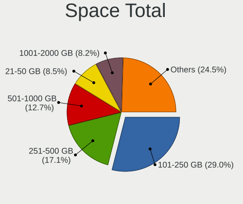

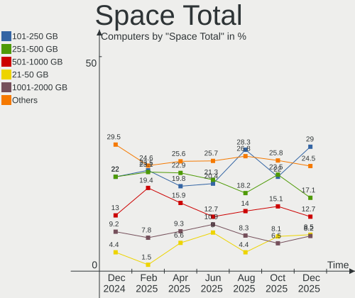

| Size in GB     | Computers | Percent |
|----------------|-----------|---------|
| 101-250        | 137       | 28.96%  |
| 251-500        | 81        | 17.12%  |
| 501-1000       | 60        | 12.68%  |
| 21-50          | 40        | 8.46%   |
| 1001-2000      | 39        | 8.25%   |
| Unknown        | 34        | 7.19%   |
| 1-20           | 25        | 5.29%   |
| 51-100         | 22        | 4.65%   |
| More than 3000 | 20        | 4.23%   |
| 2001-3000      | 14        | 2.96%   |
| 0              | 1         | 0.21%   |

Space Used
----------

Amount of used disk space

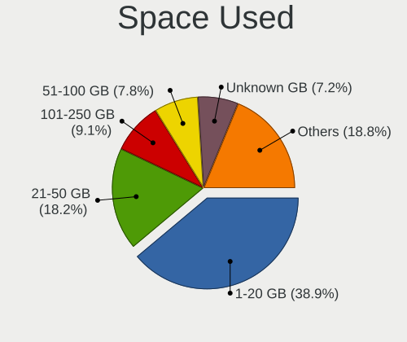

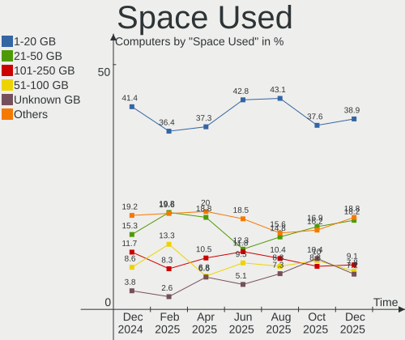

| Used GB        | Computers | Percent |
|----------------|-----------|---------|
| 1-20           | 184       | 38.9%   |
| 21-50          | 86        | 18.18%  |
| 101-250        | 43        | 9.09%   |
| 51-100         | 37        | 7.82%   |
| Unknown        | 34        | 7.19%   |
| 251-500        | 31        | 6.55%   |
| 501-1000       | 29        | 6.13%   |
| 1001-2000      | 17        | 3.59%   |
| More than 3000 | 9         | 1.9%    |
| 2001-3000      | 2         | 0.42%   |
| 0              | 1         | 0.21%   |

Malfunc. Drives
---------------

Drive models with a malfunction

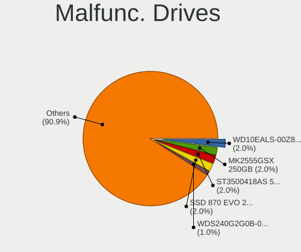

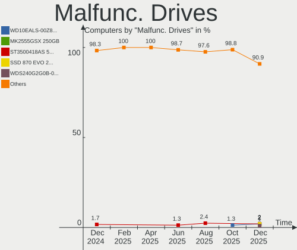

| Model                                 | Computers | Drives | Percent |
|---------------------------------------|-----------|--------|---------|
| WDC WD10EALS-00Z8A0 1TB               | 2         | 2      | 2.02%   |
| Toshiba MK2555GSX 250GB               | 2         | 2      | 2.02%   |
| Seagate ST3500418AS 500GB             | 2         | 2      | 2.02%   |
| Samsung Electronics SSD 870 EVO 250GB | 2         | 2      | 2.02%   |
| WDC WDS240G2G0B-00EPW0 240GB SSD      | 1         | 1      | 1.01%   |
| WDC WD5000LPCX-24VHAT0 500GB          | 1         | 1      | 1.01%   |
| WDC WD5000LPCX-24C6HT0 500GB          | 1         | 1      | 1.01%   |
| WDC WD5000BPVT-75HXZT3 500GB          | 1         | 1      | 1.01%   |
| WDC WD5000AAKX-08U6AA0 500GB          | 1         | 1      | 1.01%   |
| WDC WD5000AAKX-00ERMA0 500GB          | 1         | 1      | 1.01%   |
| WDC WD5000AAKS-00V1A0 500GB           | 1         | 1      | 1.01%   |
| WDC WD5000AADS-00S9B0 500GB           | 1         | 1      | 1.01%   |
| WDC WD42PURZ-85B4YY0 4TB              | 1         | 9      | 1.01%   |
| WDC WD40PURZ-85AKKY0 4TB              | 1         | 9      | 1.01%   |
| WDC WD400BB-00JHA0 40GB               | 1         | 1      | 1.01%   |
| WDC WD3200AAJS-22L7A0 320GB           | 1         | 1      | 1.01%   |
| WDC WD3200AAJS-00L7A0 320GB           | 1         | 1      | 1.01%   |
| WDC WD3200AAJS-00B4A0 320GB           | 1         | 1      | 1.01%   |
| WDC WD2500BEVT-24A23T0 250GB          | 1         | 1      | 1.01%   |
| WDC WD2500BEVT-22A23T0 250GB          | 1         | 1      | 1.01%   |
| WDC WD20EFRX-68EUZN0 2TB              | 1         | 1      | 1.01%   |
| WDC WD20EARX-00PASB0 2TB              | 1         | 1      | 1.01%   |
| WDC WD20EARS-00MVWB0 2TB              | 1         | 1      | 1.01%   |
| WDC WD2000FYYZ-01UL1B0 2TB            | 1         | 1      | 1.01%   |
| WDC WD2000F9YZ-09N20L0 2TB            | 1         | 9      | 1.01%   |
| WDC WD10EARS-00Y5B1 1TB               | 1         | 1      | 1.01%   |
| WDC WD10EARS-003BB1 1TB               | 1         | 1      | 1.01%   |
| WDC WD10EALX-009BA0 1TB               | 1         | 1      | 1.01%   |
| UnionSine SSD 128GB                   | 1         | 1      | 1.01%   |
| Transcend TS256GSSD230S 256GB         | 1         | 1      | 1.01%   |
| Transcend TS128GSSD230S 128GB         | 1         | 1      | 1.01%   |
| Toshiba MQ01ABF050 500GB              | 1         | 1      | 1.01%   |
| Toshiba DT01ACA050 500GB              | 1         | 1      | 1.01%   |
| SSSTC CV8-8E128-HP 128GB SSD          | 1         | 1      | 1.01%   |
| Seagate ST9500325AS 500GB             | 1         | 1      | 1.01%   |
| Seagate ST9250827AS 250GB             | 1         | 1      | 1.01%   |
| Seagate ST9160821AS 160GB             | 1         | 1      | 1.01%   |
| Seagate ST750LM022 HN-M750MBB 752GB   | 1         | 1      | 1.01%   |
| Seagate ST500LT012-1DG142 500GB       | 1         | 1      | 1.01%   |
| Seagate ST500LM021-1KJ152 500GB       | 1         | 1      | 1.01%   |

Malfunc. Drive Vendor
---------------------

Vendors of faulty drives

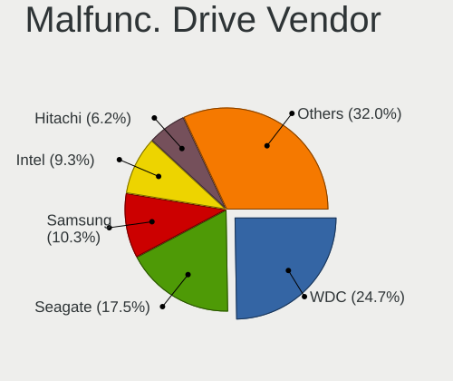

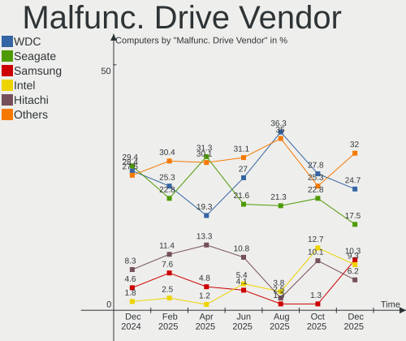

| Vendor                      | Computers | Drives | Percent |
|-----------------------------|-----------|--------|---------|
| WDC                         | 24        | 50     | 24.74%  |
| Seagate                     | 17        | 17     | 17.53%  |
| Samsung Electronics         | 10        | 10     | 10.31%  |
| Intel                       | 9         | 12     | 9.28%   |
| Hitachi                     | 6         | 7      | 6.19%   |
| Toshiba                     | 4         | 4      | 4.12%   |
| Kingston                    | 3         | 3      | 3.09%   |
| Transcend                   | 2         | 2      | 2.06%   |
| SanDisk                     | 2         | 2      | 2.06%   |
| Netac                       | 2         | 2      | 2.06%   |
| HGST                        | 2         | 5      | 2.06%   |
| Fujitsu                     | 2         | 2      | 2.06%   |
| China                       | 2         | 2      | 2.06%   |
| A-DATA Technology           | 2         | 2      | 2.06%   |
| UnionSine                   | 1         | 1      | 1.03%   |
| SSSTC                       | 1         | 1      | 1.03%   |
| Realtek Semiconductor       | 1         | 1      | 1.03%   |
| Philips                     | 1         | 1      | 1.03%   |
| Neo                         | 1         | 1      | 1.03%   |
| MAXIO Technology (Hangzhou) | 1         | 1      | 1.03%   |
| KingSpec                    | 1         | 1      | 1.03%   |
| Hewlett-Packard             | 1         | 4      | 1.03%   |
| ExeGate                     | 1         | 1      | 1.03%   |
| AMD                         | 1         | 1      | 1.03%   |

Malfunc. HDD Vendor
-------------------

Vendors of faulty HDD drives

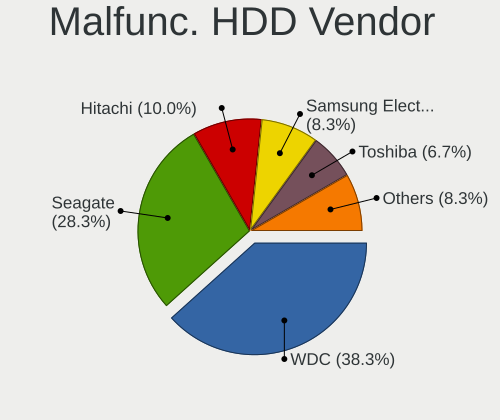

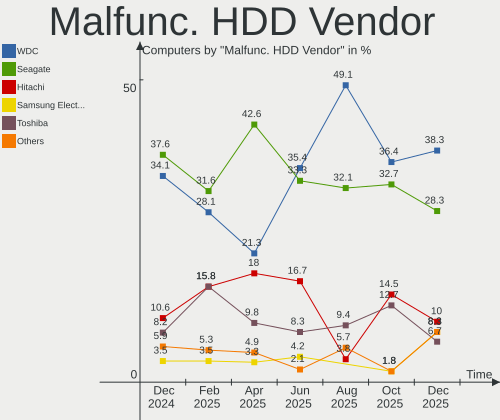

| Vendor              | Computers | Drives | Percent |
|---------------------|-----------|--------|---------|
| WDC                 | 23        | 49     | 38.33%  |
| Seagate             | 17        | 17     | 28.33%  |
| Hitachi             | 6         | 7      | 10%     |
| Samsung Electronics | 5         | 5      | 8.33%   |
| Toshiba             | 4         | 4      | 6.67%   |
| HGST                | 2         | 5      | 3.33%   |
| Fujitsu             | 2         | 2      | 3.33%   |
| Hewlett-Packard     | 1         | 4      | 1.67%   |

Malfunc. Drive Kind
-------------------

Kinds of faulty drives

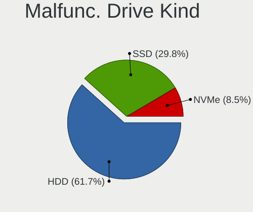

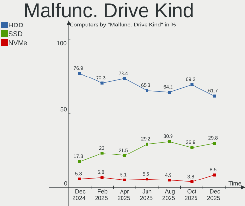

| Kind | Computers | Drives | Percent |
|------|-----------|--------|---------|
| HDD  | 58        | 93     | 61.7%   |
| SSD  | 28        | 32     | 29.79%  |
| NVMe | 8         | 8      | 8.51%   |

Failed Drives
-------------

Failed drive models

Zero info for selected period =(

Failed Drive Vendor
-------------------

Failed drive vendors

Zero info for selected period =(

Drive Status
------------

Number of failed and malfunc. drives

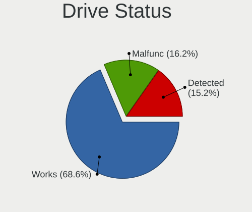

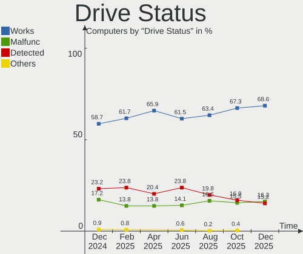

| Status   | Computers | Drives | Percent |
|----------|-----------|--------|---------|
| Works    | 378       | 886    | 68.6%   |
| Malfunc  | 89        | 133    | 16.15%  |
| Detected | 84        | 131    | 15.25%  |

Storage controller
------------------

Storage Vendor
--------------

Storage controller vendors

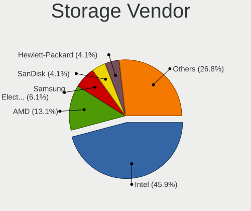

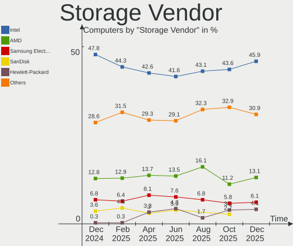

| Vendor                                  | Computers | Percent |
|-----------------------------------------|-----------|---------|
| Intel                                   | 294       | 45.87%  |
| AMD                                     | 84        | 13.1%   |
| Samsung Electronics                     | 39        | 6.08%   |
| SanDisk                                 | 26        | 4.06%   |
| Hewlett-Packard                         | 26        | 4.06%   |
| MAXIO Technology (Hangzhou)             | 20        | 3.12%   |
| ADATA Technology                        | 16        | 2.5%    |
| SK hynix                                | 14        | 2.18%   |
| Silicon Motion                          | 13        | 2.03%   |
| Realtek Semiconductor                   | 12        | 1.87%   |
| Micron Technology                       | 12        | 1.87%   |
| Kingston Technology Company             | 12        | 1.87%   |
| Shenzhen Longsys Electronics            | 10        | 1.56%   |
| Phison Electronics                      | 10        | 1.56%   |
| Broadcom / LSI                          | 6         | 0.94%   |
| Unknown                                 | 6         | 0.94%   |
| INNOGRIT                                | 5         | 0.78%   |
| KIOXIA                                  | 4         | 0.62%   |
| ASMedia Technology                      | 4         | 0.62%   |
| Yangtze Memory Technologies             | 3         | 0.47%   |
| Marvell Technology Group                | 3         | 0.47%   |
| LSI Logic / Symbios Logic               | 3         | 0.47%   |
| Adaptec                                 | 3         | 0.47%   |
| Shenzhen Unionmemory Information System | 2         | 0.31%   |
| Shenzhen Shichuangyi Electronics        | 2         | 0.31%   |
| Nvidia                                  | 2         | 0.31%   |
| Netac Technology                        | 2         | 0.31%   |
| JMicron Technology                      | 2         | 0.31%   |
| VIA Technologies                        | 1         | 0.16%   |
| Union Memory (Shenzhen)                 | 1         | 0.16%   |
| Toshiba America Info Systems            | 1         | 0.16%   |
| Loongson Technology                     | 1         | 0.16%   |
| Huawei Technologies                     | 1         | 0.16%   |
| Biwin Storage Technology                | 1         | 0.16%   |

Storage Model
-------------

Storage controller models

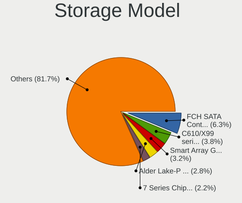

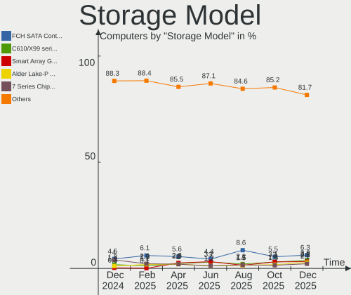

| Model                                                                                                              | Computers | Percent |
|--------------------------------------------------------------------------------------------------------------------|-----------|---------|
| AMD FCH SATA Controller [AHCI mode]                                                                                | 45        | 6.28%   |
| Intel C610/X99 series chipset 6-Port SATA Controller [AHCI mode]                                                   | 27        | 3.77%   |
| HP Smart Array Gen9 Controllers                                                                                    | 23        | 3.21%   |
| Intel Alder Lake-P SATA AHCI Controller                                                                            | 20        | 2.79%   |
| Intel 7 Series Chipset Family 6-port SATA Controller [AHCI mode]                                                   | 16        | 2.23%   |
| MAXIO (Hangzhou) NVMe SSD Controller MAP1202 (DRAM-less)                                                           | 15        | 2.09%   |
| Intel C610/X99 series chipset sSATA Controller [AHCI mode]                                                         | 15        | 2.09%   |
| Intel Q170/Q150/B150/H170/H110/Z170/CM236 Chipset SATA Controller [AHCI Mode]                                      | 14        | 1.95%   |
| Intel 500 Series Chipset Family SATA AHCI Controller                                                               | 14        | 1.95%   |
| Samsung NVMe SSD Controller SM981/PM981/PM983                                                                      | 13        | 1.81%   |
| Intel Tiger Lake-LP SATA Controller                                                                                | 13        | 1.81%   |
| AMD 400 Series Chipset SATA Controller                                                                             | 13        | 1.81%   |
| Silicon Motion SM2263EN/SM2263XT (DRAM-less) NVMe SSD Controllers                                                  | 12        | 1.67%   |
| Intel Volume Management Device NVMe RAID Controller                                                                | 12        | 1.67%   |
| Intel C600/X79 series chipset 6-Port SATA AHCI Controller                                                          | 12        | 1.67%   |
| Intel 6 Series/C200 Series Chipset Family 6 port Desktop SATA AHCI Controller                                      | 11        | 1.53%   |
| AMD 600 Series Chipset SATA Controller                                                                             | 11        | 1.53%   |
| Intel 200 Series PCH SATA controller [AHCI mode]                                                                   | 10        | 1.39%   |
| Shenzhen Longsys FORESEE XP1000 / Lexar Professional CFexpress Type B Gold series, NM620 PCIe NVME SSD (DRAM-less) | 9         | 1.26%   |
| Intel Sunrise Point-LP SATA Controller [AHCI mode]                                                                 | 9         | 1.26%   |
| Intel 8 Series/C220 Series Chipset Family 6-port SATA Controller 1 [AHCI mode]                                     | 9         | 1.26%   |
| Intel NM10/ICH7 Family SATA Controller [IDE mode]                                                                  | 8         | 1.12%   |
| Intel Comet Lake SATA AHCI Controller                                                                              | 8         | 1.12%   |
| AMD 500 Series Chipset SATA Controller                                                                             | 8         | 1.12%   |
| Intel RST Volume Management Device Controller                                                                      | 7         | 0.98%   |
| Intel 82801JI (ICH10 Family) SATA AHCI Controller                                                                  | 7         | 0.98%   |
| Intel 82801G (ICH7 Family) IDE Controller                                                                          | 7         | 0.98%   |
| Intel 6 Series/C200 Series Chipset Family 6 port Mobile SATA AHCI Controller                                       | 7         | 0.98%   |
| AMD SB7x0/SB8x0/SB9x0 SATA Controller [AHCI mode]                                                                  | 7         | 0.98%   |
| SanDisk WD SN560/SN740/SN770/SN5000 NVMe SSD                                                                       | 6         | 0.84%   |
| Intel Celeron/Pentium Silver Processor SATA Controller                                                             | 6         | 0.84%   |
| Intel C602 chipset 4-Port SATA Storage Control Unit                                                                | 6         | 0.84%   |
| Intel Alder Lake-S PCH SATA Controller [AHCI Mode]                                                                 | 6         | 0.84%   |
| Intel 7 Series/C210 Series Chipset Family 6-port SATA Controller [AHCI mode]                                       | 6         | 0.84%   |
| Intel 5 Series/3400 Series Chipset 4 port SATA AHCI Controller                                                     | 6         | 0.84%   |
| AMD SB7x0/SB8x0/SB9x0 IDE Controller                                                                               | 6         | 0.84%   |
| ADATA XPG GAMMIXS1 1L, XPG GAMMIX S5, LEGEND 710 / 740, SWORDFISH NVMe SSD (DRAM-less)                             | 6         | 0.84%   |
| Unknown                                                                                                            | 6         | 0.84%   |
| Samsung NVMe SSD Controller S4LV008[Pascal]                                                                        | 5         | 0.7%    |
| Samsung NVMe SSD Controller PM9C1a (DRAM-less)                                                                     | 5         | 0.7%    |

Storage Kind
------------

Kind of storage controller (IDE, SATA, NVMe, SAS, ...)

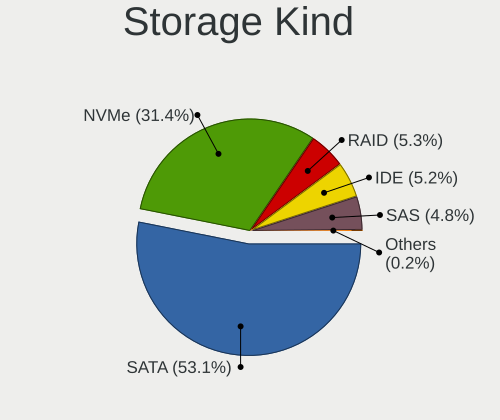

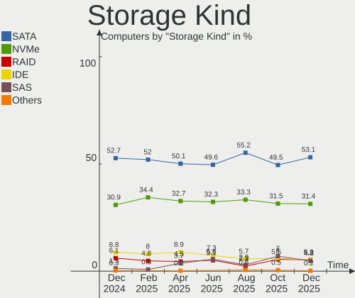

| Kind | Computers | Percent |
|------|-----------|---------|
| SATA | 340       | 53.13%  |
| NVMe | 201       | 31.41%  |
| RAID | 34        | 5.31%   |
| IDE  | 33        | 5.16%   |
| SAS  | 31        | 4.84%   |
| SCSI | 1         | 0.16%   |

Processor
---------

CPU Vendor
----------

Processor vendors

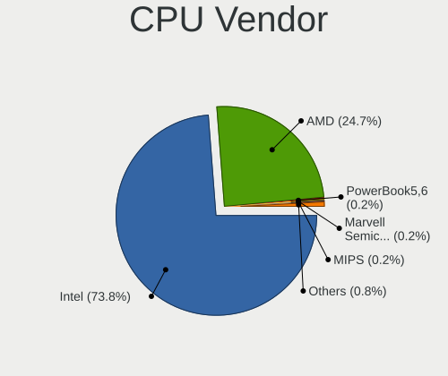

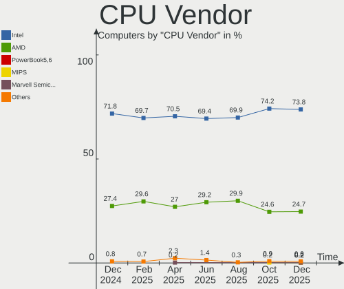

| Vendor                | Computers | Percent |
|-----------------------|-----------|---------|
| Intel                 | 349       | 73.78%  |
| AMD                   | 117       | 24.74%  |
| PowerBook5,6          | 1         | 0.21%   |
| MIPS                  | 1         | 0.21%   |
| Marvell Semiconductor | 1         | 0.21%   |
| Loongson              | 1         | 0.21%   |
| Hisilicon             | 1         | 0.21%   |
| ARM                   | 1         | 0.21%   |
| Unknown               | 1         | 0.21%   |

CPU Model
---------

Processor models

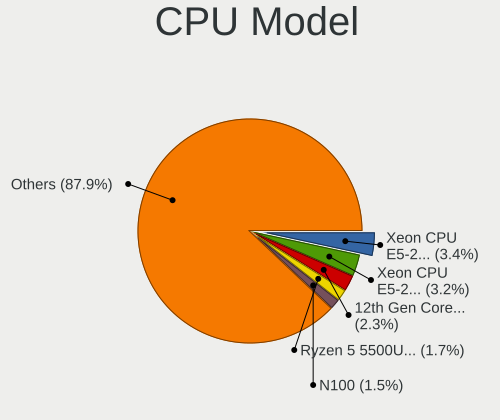

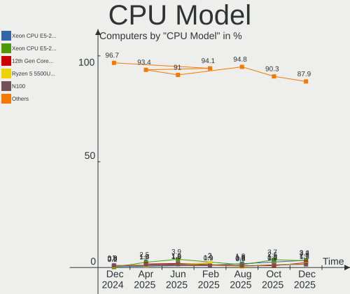

| Model                                        | Computers | Percent |
|----------------------------------------------|-----------|---------|
| Intel Xeon CPU E5-2680 v4 @ 2.40GHz          | 16        | 3.38%   |
| Intel Xeon CPU E5-2667 v4 @ 3.20GHz          | 15        | 3.17%   |
| Intel 12th Gen Core i5-1235U                 | 11        | 2.33%   |
| AMD Ryzen 5 5500U with Radeon Graphics       | 8         | 1.69%   |
| Intel N100                                   | 7         | 1.48%   |
| Intel 12th Gen Core i3-1215U                 | 7         | 1.48%   |
| Intel 12th Gen Core i7-1280P                 | 6         | 1.27%   |
| Intel 11th Gen Core i5-1135G7 @ 2.40GHz      | 6         | 1.27%   |
| Intel 11th Gen Core i3-1125G4 @ 2.00GHz      | 6         | 1.27%   |
| Intel Xeon CPU E5-2680 v2 @ 2.80GHz          | 5         | 1.06%   |
| Intel Core i5-3210M CPU @ 2.50GHz            | 5         | 1.06%   |
| Intel Core i5-3230M CPU @ 2.60GHz            | 4         | 0.85%   |
| Intel Core i5-10210U CPU @ 1.60GHz           | 4         | 0.85%   |
| Intel Core i3-6100TE CPU @ 2.70GHz           | 4         | 0.85%   |
| Intel 12th Gen Core i5-12400                 | 4         | 0.85%   |
| AMD Ryzen 5 7500F 6-Core Processor           | 4         | 0.85%   |
| AMD Ryzen 5 5600H with Radeon Graphics       | 4         | 0.85%   |
| Intel Xeon CPU X5650 @ 2.67GHz               | 3         | 0.63%   |
| Intel Core Ultra 7 258V                      | 3         | 0.63%   |
| Intel Core i5-8250U CPU @ 1.60GHz            | 3         | 0.63%   |
| Intel 13th Gen Core i5-13420H                | 3         | 0.63%   |
| Intel 12th Gen Core i5-12450H                | 3         | 0.63%   |
| AMD Ryzen 7 8845HS w/ Radeon 780M Graphics   | 3         | 0.63%   |
| AMD Ryzen 7 5825U with Radeon Graphics       | 3         | 0.63%   |
| AMD Ryzen 5 3600 6-Core Processor            | 3         | 0.63%   |
| AMD Ryzen 5 2600 Six-Core Processor          | 3         | 0.63%   |
| AMD Ryzen 5 1600 Six-Core Processor          | 3         | 0.63%   |
| AMD A10 PRO-7800B R7, 12 Compute Cores 4C+8G | 3         | 0.63%   |
| Intel Xeon Gold 6144 CPU @ 3.50GHz           | 2         | 0.42%   |
| Intel Xeon CPU E5606 @ 2.13GHz               | 2         | 0.42%   |
| Intel Xeon CPU E5506 @ 2.13GHz               | 2         | 0.42%   |
| Intel Xeon CPU E5-2697A v4 @ 2.60GHz         | 2         | 0.42%   |
| Intel Xeon CPU E5-2696 v4 @ 2.20GHz          | 2         | 0.42%   |
| Intel Xeon CPU E5-2690 v4 @ 2.60GHz          | 2         | 0.42%   |
| Intel Xeon CPU E5-2690 v3 @ 2.60GHz          | 2         | 0.42%   |
| Intel Xeon CPU E5-2689 0 @ 2.60GHz           | 2         | 0.42%   |
| Intel Xeon CPU E5-2673 v3 @ 2.40GHz          | 2         | 0.42%   |
| Intel Xeon CPU E5-2670 0 @ 2.60GHz           | 2         | 0.42%   |
| Intel Xeon CPU E5-2660 0 @ 2.20GHz           | 2         | 0.42%   |
| Intel Xeon CPU E5-2630 v4 @ 2.20GHz          | 2         | 0.42%   |

CPU Model Family
----------------

Processor model prefix

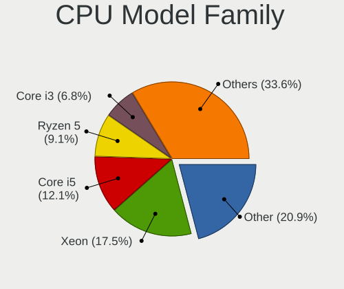

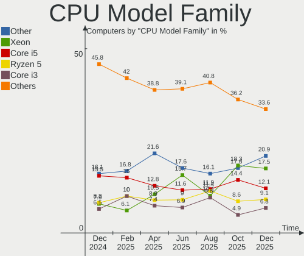

| Model                   | Computers | Percent |
|-------------------------|-----------|---------|
| Other                   | 99        | 20.93%  |
| Intel Xeon              | 83        | 17.55%  |
| Intel Core i5           | 57        | 12.05%  |
| AMD Ryzen 5             | 43        | 9.09%   |
| Intel Core i3           | 32        | 6.77%   |
| AMD Ryzen 7             | 24        | 5.07%   |
| Intel Celeron           | 21        | 4.44%   |
| Intel Core i7           | 15        | 3.17%   |
| Intel Pentium           | 11        | 2.33%   |
| AMD Ryzen 3             | 11        | 2.33%   |
| Intel Core              | 10        | 2.11%   |
| AMD A10                 | 7         | 1.48%   |
| Intel Pentium Dual-Core | 6         | 1.27%   |
| Intel Core 2 Duo        | 6         | 1.27%   |
| AMD Ryzen 9             | 6         | 1.27%   |
| AMD FX                  | 5         | 1.06%   |
| Intel Xeon Gold         | 3         | 0.63%   |
| Intel Atom              | 3         | 0.63%   |
| AMD A4                  | 3         | 0.63%   |
| Intel Pentium Silver    | 2         | 0.42%   |
| Intel Pentium Gold      | 2         | 0.42%   |
| Intel Pentium Dual      | 2         | 0.42%   |
| Intel Core i9           | 2         | 0.42%   |
| Intel Core 2 Quad       | 2         | 0.42%   |
| AMD E2                  | 2         | 0.42%   |
| AMD C-60                | 2         | 0.42%   |
| AMD A6                  | 2         | 0.42%   |
| Intel Xeon Silver       | 1         | 0.21%   |
| Intel Pentium M         | 1         | 0.21%   |
| Intel Genuine           | 1         | 0.21%   |
| Intel Core M            | 1         | 0.21%   |
| Intel Celeron Dual-Core | 1         | 0.21%   |
| AMD Ryzen 3 PRO         | 1         | 0.21%   |
| AMD Phenom II           | 1         | 0.21%   |
| AMD EPYC                | 1         | 0.21%   |
| AMD Athlon X2           | 1         | 0.21%   |
| AMD Athlon II X3        | 1         | 0.21%   |
| AMD Athlon II X2        | 1         | 0.21%   |
| AMD A8                  | 1         | 0.21%   |

CPU Cores
---------

Number of processor cores

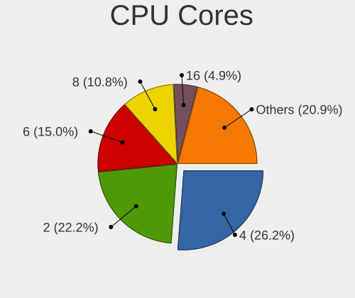

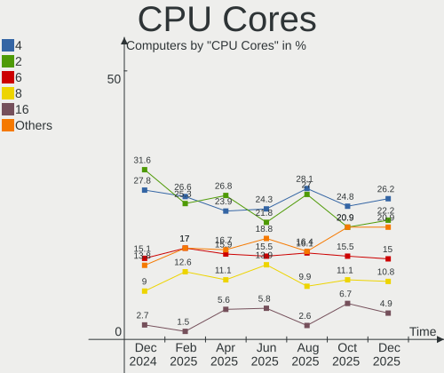

| Number | Computers | Percent |
|--------|-----------|---------|
| 4      | 124       | 26.22%  |
| 2      | 105       | 22.2%   |
| 6      | 71        | 15.01%  |
| 8      | 51        | 10.78%  |
| 16     | 23        | 4.86%   |
| 12     | 19        | 4.02%   |
| 10     | 19        | 4.02%   |
| 28     | 17        | 3.59%   |
| 14     | 14        | 2.96%   |
| 20     | 9         | 1.9%    |
| 1      | 7         | 1.48%   |
| 24     | 5         | 1.06%   |
| 44     | 2         | 0.42%   |
| 32     | 2         | 0.42%   |
| 3      | 2         | 0.42%   |
| 128    | 1         | 0.21%   |
| 96     | 1         | 0.21%   |
| 36     | 1         | 0.21%   |

CPU Sockets
-----------

Number of sockets

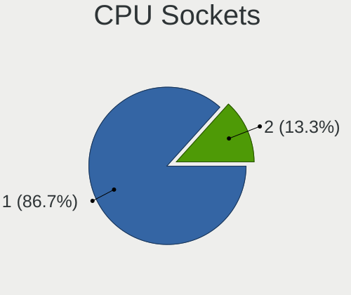

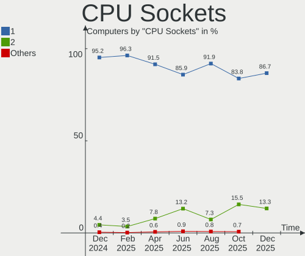

| Number | Computers | Percent |
|--------|-----------|---------|
| 1      | 410       | 86.68%  |
| 2      | 63        | 13.32%  |

CPU Threads
-----------

Threads per core (Hyper-Threading)

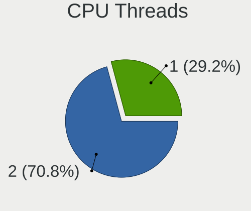

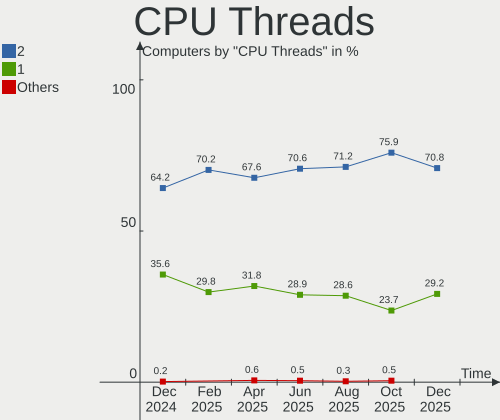

| Number | Computers | Percent |
|--------|-----------|---------|
| 2      | 335       | 70.82%  |
| 1      | 138       | 29.18%  |

CPU Op-Modes
------------

CPU Operation Modes (32-bit, 64-bit)

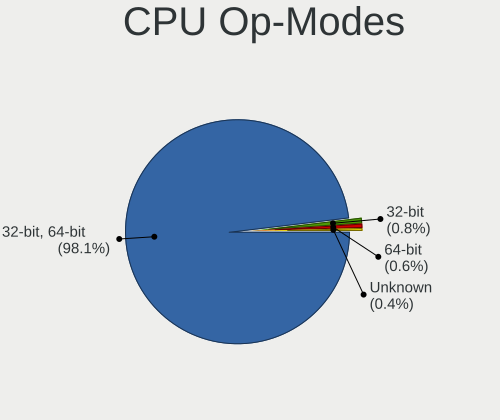

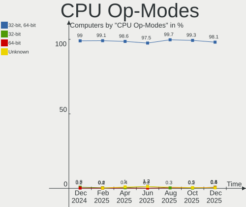

| Op mode        | Computers | Percent |
|----------------|-----------|---------|
| 32-bit, 64-bit | 464       | 98.1%   |
| 32-bit         | 4         | 0.85%   |
| 64-bit         | 3         | 0.63%   |
| Unknown        | 2         | 0.42%   |

CPU Microcode
-------------

Microcode number

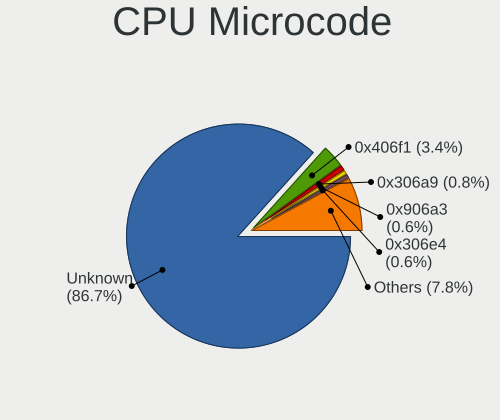

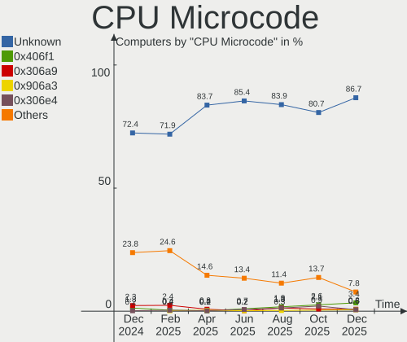

| Number     | Computers | Percent |
|------------|-----------|---------|
| Unknown    | 410       | 86.68%  |
| 0x406f1    | 16        | 3.38%   |
| 0x306a9    | 4         | 0.85%   |
| 0x906a3    | 3         | 0.63%   |
| 0x306e4    | 3         | 0.63%   |
| 0x206c2    | 3         | 0.63%   |
| 0x1067a    | 3         | 0.63%   |
| 0x906a4    | 2         | 0.42%   |
| 0x506e3    | 2         | 0.42%   |
| 0x106c2    | 2         | 0.42%   |
| 0x106a5    | 2         | 0.42%   |
| 0x0a50000c | 2         | 0.42%   |
| 0xa0653    | 1         | 0.21%   |
| 0x906e9    | 1         | 0.21%   |
| 0x806ec    | 1         | 0.21%   |
| 0x806e9    | 1         | 0.21%   |
| 0x806c1    | 1         | 0.21%   |
| 0x6fd      | 1         | 0.21%   |
| 0x6fb      | 1         | 0.21%   |
| 0x6d8      | 1         | 0.21%   |
| 0x50657    | 1         | 0.21%   |
| 0x306c3    | 1         | 0.21%   |
| 0x30678    | 1         | 0.21%   |
| 0x30661    | 1         | 0.21%   |
| 0x206a7    | 1         | 0.21%   |
| 0x20655    | 1         | 0.21%   |
| 0x20652    | 1         | 0.21%   |
| 0x08600102 | 1         | 0.21%   |
| 0x08108102 | 1         | 0.21%   |
| 0x06000852 | 1         | 0.21%   |
| 0x06000822 | 1         | 0.21%   |
| 0x0500010d | 1         | 0.21%   |
| 0x010000b7 | 1         | 0.21%   |

CPU Microarch
-------------

Microarchitecture

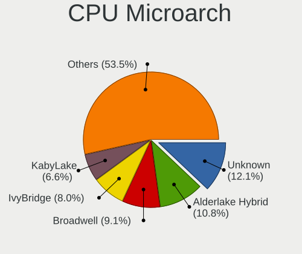

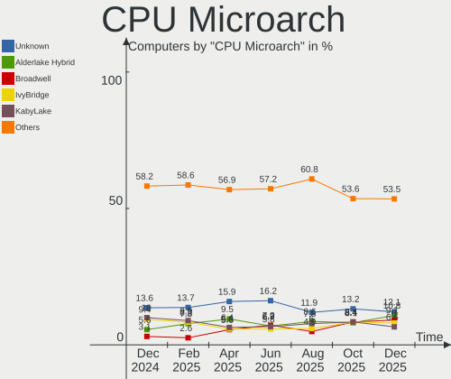

| Name               | Computers | Percent |
|--------------------|-----------|---------|
| Unknown            | 57        | 12.05%  |
| Alderlake Hybrid   | 51        | 10.78%  |
| Broadwell          | 43        | 9.09%   |
| IvyBridge          | 38        | 8.03%   |
| KabyLake           | 31        | 6.55%   |
| Zen 3              | 23        | 4.86%   |
| SandyBridge        | 20        | 4.23%   |
| TigerLake          | 18        | 3.81%   |
| Skylake            | 18        | 3.81%   |
| Westmere           | 16        | 3.38%   |
| Haswell            | 16        | 3.38%   |
| Zen+               | 15        | 3.17%   |
| Penryn             | 15        | 3.17%   |
| CometLake          | 13        | 2.75%   |
| IceLake            | 10        | 2.11%   |
| Piledriver         | 9         | 1.9%    |
| Zen 2              | 8         | 1.69%   |
| Goldmont plus      | 8         | 1.69%   |
| Gracemont          | 7         | 1.48%   |
| Core               | 7         | 1.48%   |
| Zen                | 6         | 1.27%   |
| Silvermont         | 6         | 1.27%   |
| Excavator          | 6         | 1.27%   |
| Tremont            | 4         | 0.85%   |
| Lunarlake Hybrid   | 4         | 0.85%   |
| Steamroller        | 3         | 0.63%   |
| Puma               | 3         | 0.63%   |
| Nehalem            | 3         | 0.63%   |
| K10                | 3         | 0.63%   |
| Bonnell            | 3         | 0.63%   |
| Goldmont           | 2         | 0.42%   |
| Bobcat             | 2         | 0.42%   |
| P6                 | 1         | 0.21%   |
| Meteorlake Hybrid  | 1         | 0.21%   |
| K10 Llano          | 1         | 0.21%   |
| Bulldozer          | 1         | 0.21%   |
| ArrowLake-H Hybrid | 1         | 0.21%   |

Graphics
--------

GPU Vendor
----------

Vendors of graphics cards

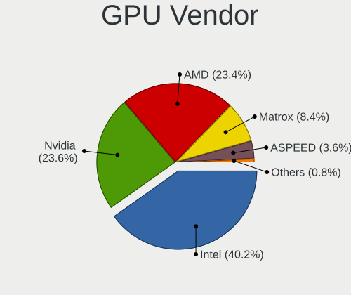

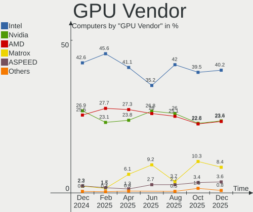

| Vendor                     | Computers | Percent |
|----------------------------|-----------|---------|
| Intel                      | 211       | 40.19%  |
| Nvidia                     | 124       | 23.62%  |
| AMD                        | 123       | 23.43%  |
| Matrox Electronics Systems | 44        | 8.38%   |
| ASPEED Technology          | 19        | 3.62%   |
| Huawei Technologies        | 3         | 0.57%   |
| Loongson Technology        | 1         | 0.19%   |

GPU Model
---------

Graphics card models

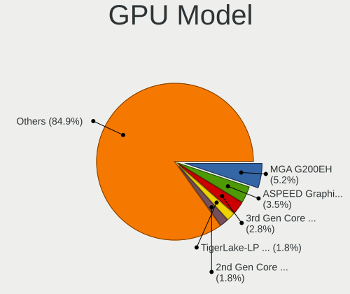

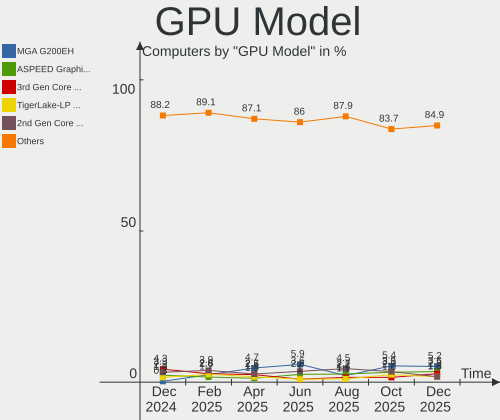

| Model                                                                     | Computers | Percent |
|---------------------------------------------------------------------------|-----------|---------|
| Matrox Electronics Systems MGA G200EH                                     | 28        | 5.17%   |
| ASPEED Technology ASPEED Graphics Family                                  | 19        | 3.51%   |
| Intel 3rd Gen Core processor Graphics Controller                          | 15        | 2.77%   |
| Intel TigerLake-LP GT2 [Iris Xe Graphics]                                 | 10        | 1.85%   |
| Intel 2nd Generation Core Processor Family Integrated Graphics Controller | 10        | 1.85%   |
| AMD Lucienne                                                              | 10        | 1.85%   |
| Matrox Electronics Systems MGA G200eW WPCM450                             | 9         | 1.66%   |
| Intel Alder Lake-P GT2 [Iris Xe Graphics]                                 | 9         | 1.66%   |
| AMD Ellesmere [Radeon RX 470/480/570/570X/580/580X/590]                   | 9         | 1.66%   |
| Intel Tiger Lake-LP GT2 [UHD Graphics G4]                                 | 8         | 1.48%   |
| Intel Alder Lake-UP3 GT1 [UHD Graphics]                                   | 8         | 1.48%   |
| Intel Raptor Lake-P [UHD Graphics]                                        | 7         | 1.29%   |
| Intel CoffeeLake-S GT2 [UHD Graphics 630]                                 | 7         | 1.29%   |
| Intel Alder Lake-N [UHD Graphics]                                         | 7         | 1.29%   |
| AMD Cezanne [Radeon Vega Series / Radeon Vega Mobile Series]              | 7         | 1.29%   |
| AMD Barcelo                                                               | 7         | 1.29%   |
| Intel Skylake-S GT2 [HD Graphics 530]                                     | 6         | 1.11%   |
| Intel GeminiLake [UHD Graphics 600]                                       | 6         | 1.11%   |
| Intel Atom Processor Z36xxx/Z37xxx Series Graphics & Display              | 6         | 1.11%   |
| Intel Alder Lake-UP3 GT2 [Iris Xe Graphics]                               | 6         | 1.11%   |
| AMD Thames [Radeon HD 7500M/7600M Series]                                 | 6         | 1.11%   |
| AMD Picasso/Raven 2 [Radeon Vega Series / Radeon Vega Mobile Series]      | 6         | 1.11%   |
| Nvidia GA107M [GeForce RTX 3050 Mobile]                                   | 5         | 0.92%   |
| Nvidia AD107M [GeForce RTX 4060 Max-Q / Mobile]                           | 5         | 0.92%   |
| Intel Xeon E3-1200 v2/3rd Gen Core processor Graphics Controller          | 5         | 0.92%   |
| Intel Raptor Lake-P [Iris Xe Graphics]                                    | 5         | 0.92%   |
| Intel Mobile 4 Series Chipset Integrated Graphics Controller              | 5         | 0.92%   |
| Intel Alder Lake-UP3 GT2 [UHD Graphics]                                   | 5         | 0.92%   |
| AMD Stoney [Radeon R2/R3/R4/R5 Graphics]                                  | 5         | 0.92%   |
| Nvidia GP107 [GeForce GTX 1050 Ti]                                        | 4         | 0.74%   |
| Nvidia GM107 [GeForce GTX 750 Ti]                                         | 4         | 0.74%   |
| Nvidia GF117M [GeForce 610M/710M/810M/820M / GT 620M/625M/630M/720M]      | 4         | 0.74%   |
| Nvidia GF108 [GeForce GT 440]                                             | 4         | 0.74%   |
| Nvidia GA104GL [RTX A4000]                                                | 4         | 0.74%   |
| Intel Skylake-U GT2 [HD Graphics 520]                                     | 4         | 0.74%   |
| Intel JasperLake [UHD Graphics]                                           | 4         | 0.74%   |
| Intel Core Processor Integrated Graphics Controller                       | 4         | 0.74%   |
| Intel CometLake-U GT2 [UHD Graphics]                                      | 4         | 0.74%   |
| Intel CometLake-S GT2 [UHD Graphics 630]                                  | 4         | 0.74%   |
| Intel Alder Lake-S GT1 [UHD Graphics 730]                                 | 4         | 0.74%   |

GPU Combo
---------

Combinations of graphics cards

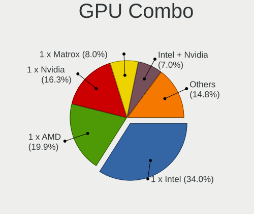

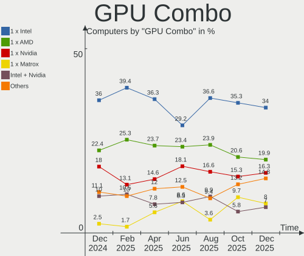

| Name                    | Computers | Percent |
|-------------------------|-----------|---------|
| 1 x Intel               | 161       | 34.04%  |
| 1 x AMD                 | 94        | 19.87%  |
| 1 x Nvidia              | 77        | 16.28%  |
| 1 x Matrox              | 38        | 8.03%   |
| Intel + Nvidia          | 33        | 6.98%   |
| 1 x ASPEED              | 17        | 3.59%   |
| 2 x AMD                 | 13        | 2.75%   |
| Intel + AMD             | 9         | 1.9%    |
| 2 x Intel               | 8         | 1.69%   |
| Nvidia + Matrox         | 6         | 1.27%   |
| AMD + Nvidia            | 6         | 1.27%   |
| Other                   | 5         | 1.06%   |
| 1 x Huawei Technologies | 3         | 0.63%   |
| Nvidia + ASPEED         | 2         | 0.42%   |
| 1 x Loongson Technology | 1         | 0.21%   |

GPU Driver
----------

Free vs proprietary

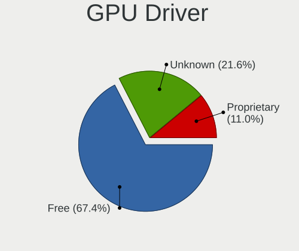

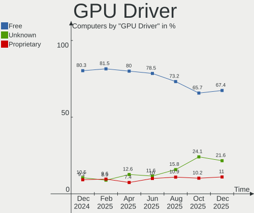

| Driver      | Computers | Percent |
|-------------|-----------|---------|
| Free        | 319       | 67.44%  |
| Unknown     | 102       | 21.56%  |
| Proprietary | 52        | 10.99%  |

GPU Memory
----------

Total video memory

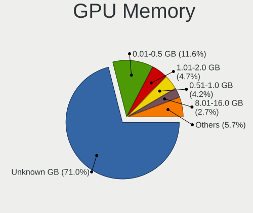

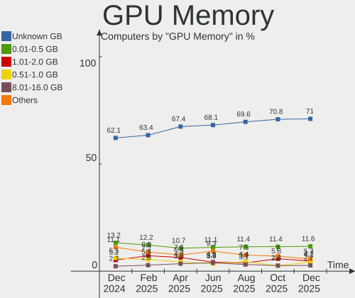

| Size in GB | Computers | Percent |
|------------|-----------|---------|
| Unknown    | 336       | 71.04%  |
| 0.01-0.5   | 55        | 11.63%  |
| 1.01-2.0   | 22        | 4.65%   |
| 0.51-1.0   | 20        | 4.23%   |
| 8.01-16.0  | 13        | 2.75%   |
| 7.01-8.0   | 12        | 2.54%   |
| 3.01-4.0   | 10        | 2.11%   |
| 5.01-6.0   | 2         | 0.42%   |
| 16.01-24.0 | 2         | 0.42%   |
| 2.01-3.0   | 1         | 0.21%   |

Monitor
-------

Monitor Vendor
--------------

Monitor vendors

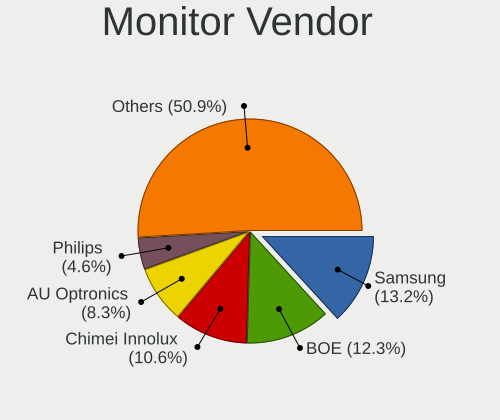

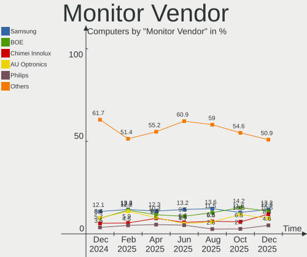

| Vendor                  | Computers | Percent |
|-------------------------|-----------|---------|
| Samsung Electronics     | 57        | 13.19%  |
| BOE                     | 53        | 12.27%  |
| Chimei Innolux          | 46        | 10.65%  |
| AU Optronics            | 36        | 8.33%   |
| Philips                 | 20        | 4.63%   |
| Dell                    | 18        | 4.17%   |
| Goldstar                | 14        | 3.24%   |
| Acer                    | 14        | 3.24%   |
| BenQ                    | 13        | 3.01%   |
| LG Display              | 12        | 2.78%   |
| CSOT                    | 11        | 2.55%   |
| AOC                     | 11        | 2.55%   |
| Mi                      | 10        | 2.31%   |
| Hewlett-Packard         | 10        | 2.31%   |
| MSI                     | 8         | 1.85%   |
| ViewSonic               | 7         | 1.62%   |
| SAC                     | 7         | 1.62%   |
| SKG                     | 5         | 1.16%   |
| Lenovo                  | 5         | 1.16%   |
| Iiyama                  | 5         | 1.16%   |
| Ancor Communications    | 5         | 1.16%   |
| HHT                     | 4         | 0.93%   |
| Chi Mei Optoelectronics | 4         | 0.93%   |
| Sony                    | 3         | 0.69%   |
| Sharp                   | 3         | 0.69%   |
| PANDA                   | 3         | 0.69%   |
| InfoVision              | 3         | 0.69%   |
| ASUSTek Computer        | 3         | 0.69%   |
| VIE                     | 2         | 0.46%   |
| Unknown                 | 2         | 0.46%   |
| TMA                     | 2         | 0.46%   |
| HUAWEI                  | 2         | 0.46%   |
| HKC                     | 2         | 0.46%   |
| Apple                   | 2         | 0.46%   |
| ZTR                     | 1         | 0.23%   |
| Valve                   | 1         | 0.23%   |
| Unknown (ABC)           | 1         | 0.23%   |
| TMX                     | 1         | 0.23%   |
| SYM                     | 1         | 0.23%   |
| STD                     | 1         | 0.23%   |

Monitor Model
-------------

Monitor models

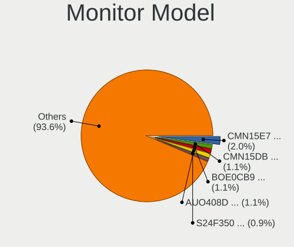

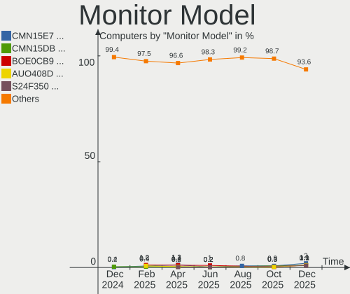

| Model                                                                 | Computers | Percent |
|-----------------------------------------------------------------------|-----------|---------|
| Chimei Innolux LCD Monitor CMN15E7 1920x1080 344x193mm 15.5-inch      | 9         | 2.05%   |
| Chimei Innolux LCD Monitor CMN15DB 1366x768 344x193mm 15.5-inch       | 5         | 1.14%   |
| BOE LCD Monitor BOE0CB9 1920x1080 309x173mm 13.9-inch                 | 5         | 1.14%   |
| AU Optronics LCD Monitor AUO408D 1920x1080 309x174mm 14.0-inch        | 5         | 1.14%   |
| Samsung Electronics S24F350 SAM0D20 1920x1080 521x293mm 23.5-inch     | 4         | 0.91%   |
| HHT ActivPanel V6 HHT0030 3840x2160 944x398mm 40.3-inch               | 4         | 0.91%   |
| Hewlett-Packard E273q HPN3474 2560x1440 597x336mm 27.0-inch           | 4         | 0.91%   |
| BOE LCD Monitor BOE0687 1920x1080 344x193mm 15.5-inch                 | 4         | 0.91%   |
| Samsung Electronics LCD Monitor SDC4161 1920x1080 344x194mm 15.5-inch | 3         | 0.68%   |
| SAC SM-24FI221 SAC2453 1920x1080 530x290mm 23.8-inch                  | 3         | 0.68%   |
| MSI MP241X MSI3BA9 1920x1080 527x296mm 23.8-inch                      | 3         | 0.68%   |
| Iiyama PL2792UH IVM664E 3840x2160 600x340mm 27.2-inch                 | 3         | 0.68%   |
| Dell P2720DC DELD0FC 2560x1440 597x336mm 27.0-inch                    | 3         | 0.68%   |
| Chimei Innolux LCD Monitor CMN15B7 1366x768 344x193mm 15.5-inch       | 3         | 0.68%   |
| Chimei Innolux LCD Monitor CMN140A 1920x1080 309x173mm 13.9-inch      | 3         | 0.68%   |
| BOE LCD Monitor BOE09C5 1920x1080 345x194mm 15.6-inch                 | 3         | 0.68%   |
| BOE LCD Monitor BOE0747 1920x1080 344x194mm 15.5-inch                 | 3         | 0.68%   |
| AOC 24G2W1G3 AOC2402 1920x1080 527x296mm 23.8-inch                    | 3         | 0.68%   |
| Unknown LCD Monitor FFFF 2288x1287 2550x2550mm 142.0-inch             | 2         | 0.45%   |
| Samsung Electronics LCD Monitor SDC419F 2880x1800 302x189mm 14.0-inch | 2         | 0.45%   |
| Samsung Electronics LCD Monitor SDC4187 1920x1200 302x189mm 14.0-inch | 2         | 0.45%   |
| SAC 27A501F SAC2753 1920x1080 597x336mm 27.0-inch                     | 2         | 0.45%   |
| Philips PHL24E1N5300 PHLC280 1920x1080 530x300mm 24.0-inch            | 2         | 0.45%   |
| Philips PHL 273V7 PHLC156 1920x1080 598x336mm 27.0-inch               | 2         | 0.45%   |
| Philips PHL 241V8 PHLC212 1920x1080 527x296mm 23.8-inch               | 2         | 0.45%   |
| Philips PHL 237E7 PHLC101 1920x1080 510x290mm 23.1-inch               | 2         | 0.45%   |
| Philips PHL 223V5 PHLC0CF 1920x1080 477x268mm 21.5-inch               | 2         | 0.45%   |
| Lenovo LCD Monitor LEN40B0 1366x768 344x194mm 15.5-inch               | 2         | 0.45%   |
| HUAWEI ZQE-CBA HWV6A25 3440x1440 797x334mm 34.0-inch                  | 2         | 0.45%   |
| CSOT SNF601BS1-1 CSO150D 1920x1080 344x193mm 15.5-inch                | 2         | 0.45%   |
| CSOT LCD Monitor CSO1634 1920x1200 345x215mm 16.0-inch                | 2         | 0.45%   |
| CSOT LCD Monitor CSO162D 1920x1200 345x215mm 16.0-inch                | 2         | 0.45%   |
| Chimei Innolux LCD Monitor CMN1618 1920x1200 344x215mm 16.0-inch      | 2         | 0.45%   |
| Chimei Innolux LCD Monitor CMN160A 1920x1080 355x199mm 16.0-inch      | 2         | 0.45%   |
| Chimei Innolux LCD Monitor CMN1521 1920x1080 344x193mm 15.5-inch      | 2         | 0.45%   |
| Chimei Innolux LCD Monitor CMN14E5 1920x1080 309x173mm 13.9-inch      | 2         | 0.45%   |
| BOE LCD Monitor BOE0C5F 1920x1200 345x215mm 16.0-inch                 | 2         | 0.45%   |
| BOE LCD Monitor BOE0A74 1920x1200 345x215mm 16.0-inch                 | 2         | 0.45%   |
| BOE LCD Monitor BOE0872 1920x1080 344x194mm 15.5-inch                 | 2         | 0.45%   |
| BOE LCD Monitor BOE07D0 1920x1080 294x165mm 13.3-inch                 | 2         | 0.45%   |

Monitor Resolution
------------------

Monitor screen resolution

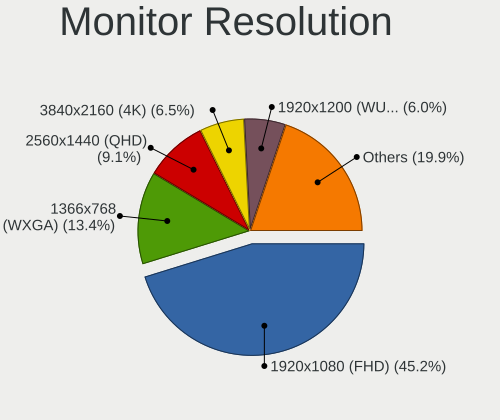

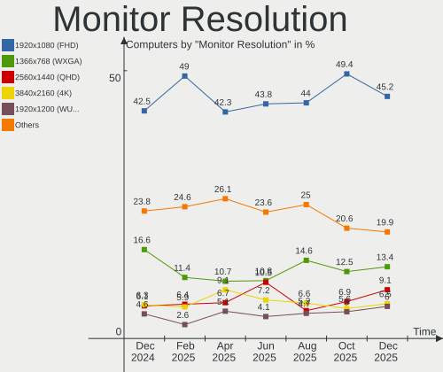

| Resolution         | Computers | Percent |
|--------------------|-----------|---------|
| 1920x1080 (FHD)    | 189       | 45.22%  |
| 1366x768 (WXGA)    | 56        | 13.4%   |
| 2560x1440 (QHD)    | 38        | 9.09%   |
| 3840x2160 (4K)     | 27        | 6.46%   |
| 1920x1200 (WUXGA)  | 25        | 5.98%   |
| 1280x1024 (SXGA)   | 18        | 4.31%   |
| 2560x1600          | 12        | 2.87%   |
| 1600x900 (HD+)     | 10        | 2.39%   |
| 1440x900 (WXGA+)   | 8         | 1.91%   |
| 2880x1800          | 7         | 1.67%   |
| 1680x1050 (WSXGA+) | 5         | 1.2%    |
| 3440x1440          | 4         | 0.96%   |
| 1280x800 (WXGA)    | 3         | 0.72%   |
| 1024x600           | 3         | 0.72%   |
| 2880x1920          | 2         | 0.48%   |
| 2288x1287          | 2         | 0.48%   |
| 1400x1050          | 2         | 0.48%   |
| 1024x768 (XGA)     | 2         | 0.48%   |
| 800x1280           | 1         | 0.24%   |
| 3200x2000          | 1         | 0.24%   |
| 3072x1920          | 1         | 0.24%   |
| 2160x1440          | 1         | 0.24%   |
| 1280x854           | 1         | 0.24%   |

Monitor Diagonal
----------------

Diagonal size in inches

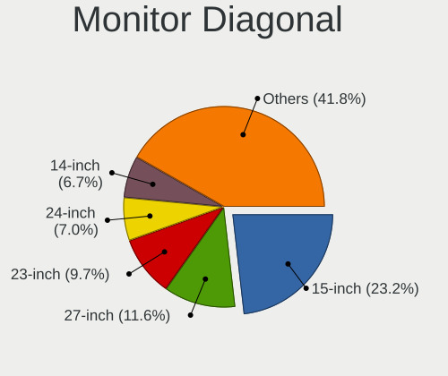

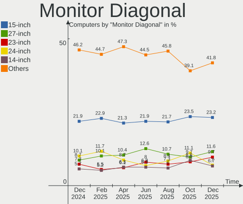

| Inches  | Computers | Percent |
|---------|-----------|---------|
| 15      | 100       | 23.2%   |
| 27      | 50        | 11.6%   |
| 23      | 42        | 9.74%   |
| 24      | 30        | 6.96%   |
| 14      | 29        | 6.73%   |
| 13      | 28        | 6.5%    |
| 21      | 26        | 6.03%   |
| 16      | 26        | 6.03%   |
| 17      | 20        | 4.64%   |
| 19      | 12        | 2.78%   |
| 34      | 7         | 1.62%   |
| 18      | 7         | 1.62%   |
| 31      | 6         | 1.39%   |
| 20      | 6         | 1.39%   |
| 40      | 5         | 1.16%   |
| 11      | 5         | 1.16%   |
| 12      | 4         | 0.93%   |
| Unknown | 4         | 0.93%   |
| 84      | 3         | 0.7%    |
| 22      | 3         | 0.7%    |
| 10      | 3         | 0.7%    |
| 142     | 2         | 0.46%   |
| 54      | 2         | 0.46%   |
| 32      | 2         | 0.46%   |
| 26      | 2         | 0.46%   |
| 64      | 1         | 0.23%   |
| 63      | 1         | 0.23%   |
| 60      | 1         | 0.23%   |
| 52      | 1         | 0.23%   |
| 29      | 1         | 0.23%   |
| 28      | 1         | 0.23%   |
| 7       | 1         | 0.23%   |

Monitor Width
-------------

Physical width

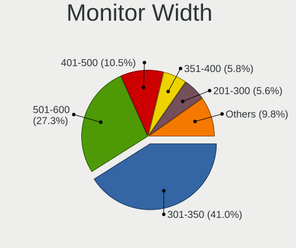

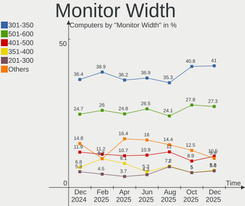

| Width in mm    | Computers | Percent |
|----------------|-----------|---------|
| 301-350        | 176       | 41.03%  |
| 501-600        | 117       | 27.27%  |
| 401-500        | 45        | 10.49%  |
| 351-400        | 25        | 5.83%   |
| 201-300        | 24        | 5.59%   |
| 601-700        | 12        | 2.8%    |
| 701-800        | 9         | 2.1%    |
| 1001-1500      | 6         | 1.4%    |
| 901-1000       | 4         | 0.93%   |
| Unknown        | 4         | 0.93%   |
| 1501-2000      | 3         | 0.7%    |
| More than 2000 | 2         | 0.47%   |
| 801-900        | 1         | 0.23%   |
| 1-100          | 1         | 0.23%   |

Aspect Ratio
------------

Proportional relationship between the width and the height

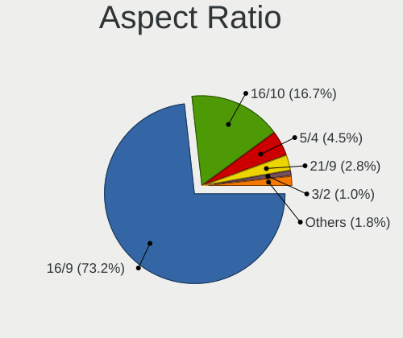

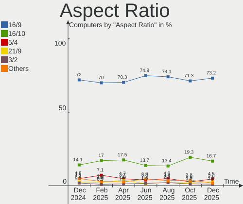

| Ratio   | Computers | Percent |
|---------|-----------|---------|
| 16/9    | 290       | 73.23%  |
| 16/10   | 66        | 16.67%  |
| 5/4     | 18        | 4.55%   |
| 21/9    | 11        | 2.78%   |
| 3/2     | 4         | 1.01%   |
| 4/3     | 3         | 0.76%   |
| 1.00    | 2         | 0.51%   |
| 0.62    | 1         | 0.25%   |
| Unknown | 1         | 0.25%   |

Monitor Area
------------

Area in inch²

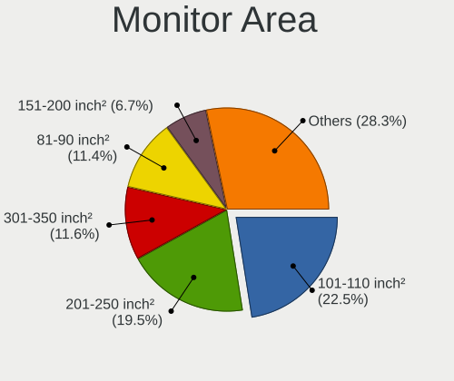

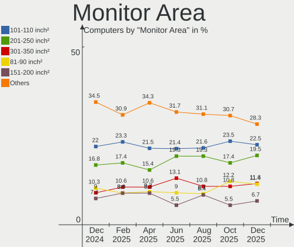

| Area in inch² | Computers | Percent |
|----------------|-----------|---------|
| 101-110        | 97        | 22.51%  |
| 201-250        | 84        | 19.49%  |
| 301-350        | 50        | 11.6%   |
| 81-90          | 49        | 11.37%  |
| 151-200        | 29        | 6.73%   |
| 111-120        | 27        | 6.26%   |
| 351-500        | 17        | 3.94%   |
| 141-150        | 14        | 3.25%   |
| More than 1000 | 11        | 2.55%   |
| 251-300        | 10        | 2.32%   |
| 121-130        | 10        | 2.32%   |
| 71-80          | 8         | 1.86%   |
| 51-60          | 5         | 1.16%   |
| 501-1000       | 5         | 1.16%   |
| 61-70          | 4         | 0.93%   |
| Unknown        | 4         | 0.93%   |
| 41-50          | 3         | 0.7%    |
| 91-100         | 2         | 0.46%   |
| 1-40           | 1         | 0.23%   |
| 131-140        | 1         | 0.23%   |

Pixel Density
-------------

Pixels per inch

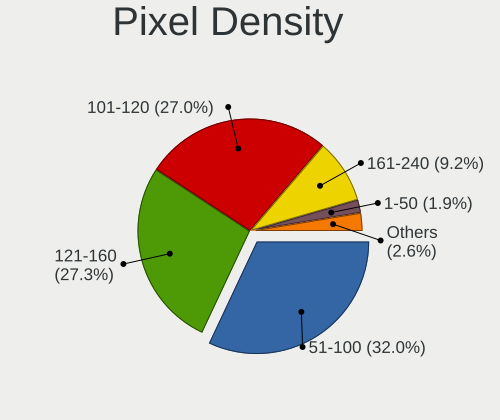

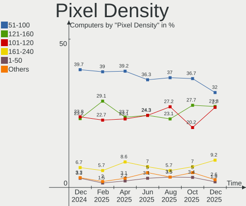

| Density       | Computers | Percent |
|---------------|-----------|---------|
| 51-100        | 135       | 31.99%  |
| 121-160       | 115       | 27.25%  |
| 101-120       | 114       | 27.01%  |
| 161-240       | 39        | 9.24%   |
| 1-50          | 8         | 1.9%    |
| More than 240 | 7         | 1.66%   |
| Unknown       | 4         | 0.95%   |

Multiple Monitors
-----------------

Total monitors connected

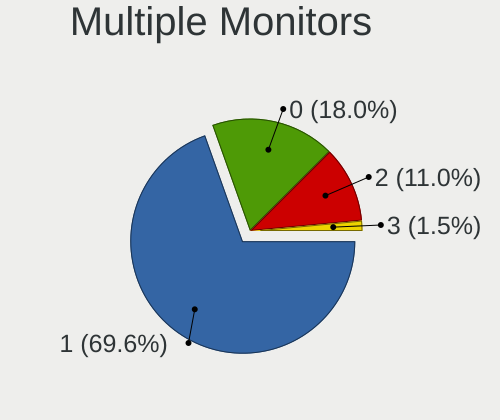

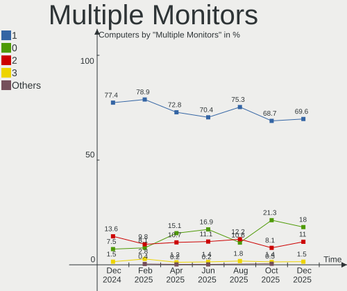

| Total | Computers | Percent |
|-------|-----------|---------|
| 1     | 329       | 69.56%  |
| 0     | 85        | 17.97%  |
| 2     | 52        | 10.99%  |
| 3     | 7         | 1.48%   |

Network
-------

Net Controller Vendor
---------------------

Controller vendors

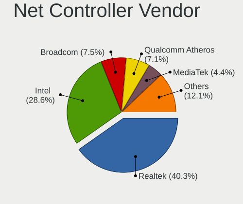

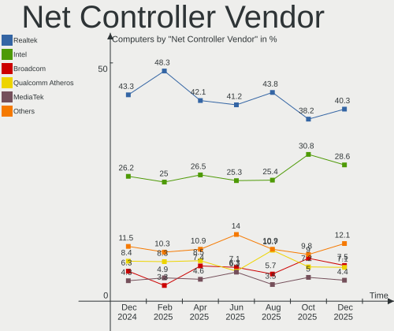

| Vendor                          | Computers | Percent |
|---------------------------------|-----------|---------|
| Realtek Semiconductor           | 273       | 40.27%  |
| Intel                           | 194       | 28.61%  |
| Broadcom                        | 51        | 7.52%   |
| Qualcomm Atheros                | 48        | 7.08%   |
| MediaTek                        | 30        | 4.42%   |
| Ralink                          | 8         | 1.18%   |
| Marvell Technology Group        | 8         | 1.18%   |
| ASIX Electronics                | 8         | 1.18%   |
| Xiaomi                          | 5         | 0.74%   |
| TP-Link                         | 5         | 0.74%   |
| Ralink Technology               | 5         | 0.74%   |
| OPPO Electronics                | 5         | 0.74%   |
| Broadcom Limited                | 5         | 0.74%   |
| Qualcomm                        | 4         | 0.59%   |
| Quectel Wireless Solutions      | 3         | 0.44%   |
| QinHeng Electronics             | 3         | 0.44%   |
| Samsung Electronics             | 2         | 0.29%   |
| Qualcomm Technologies           | 2         | 0.29%   |
| Insyde Software                 | 2         | 0.29%   |
| Dell                            | 2         | 0.29%   |
| ASUSTek Computer                | 2         | 0.29%   |
| ZyXEL Communications            | 1         | 0.15%   |
| ZTE WCDMA Technologies MSM      | 1         | 0.15%   |
| STMicroelectronics              | 1         | 0.15%   |
| Qualcomm Atheros Communications | 1         | 0.15%   |
| NetGear                         | 1         | 0.15%   |
| Motorola PCS                    | 1         | 0.15%   |
| Loongson Technology             | 1         | 0.15%   |
| Huawei Technologies             | 1         | 0.15%   |
| Edimax Technology               | 1         | 0.15%   |
| D-Link System                   | 1         | 0.15%   |
| Aquantia                        | 1         | 0.15%   |
| Apple                           | 1         | 0.15%   |
| aicsemi                         | 1         | 0.15%   |

Net Controller Model
--------------------

Controller models

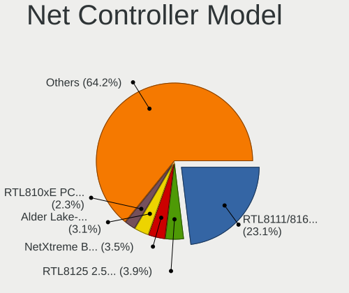

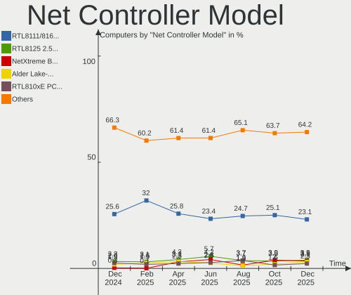

| Model                                                                  | Computers | Percent |
|------------------------------------------------------------------------|-----------|---------|
| Realtek RTL8111/8168/8211/8411 PCI Express Gigabit Ethernet Controller | 179       | 23.07%  |
| Realtek RTL8125 2.5GbE Controller                                      | 30        | 3.87%   |
| Broadcom NetXtreme BCM5719 Gigabit Ethernet PCIe                       | 27        | 3.48%   |
| Intel Alder Lake-P PCH CNVi WiFi                                       | 24        | 3.09%   |
| Realtek RTL810xE PCI Express Fast Ethernet controller                  | 18        | 2.32%   |
| Realtek RTL8821CE 802.11ac PCIe Wireless Network Adapter               | 17        | 2.19%   |
| Realtek RTL8153 Gigabit Ethernet Adapter                               | 14        | 1.8%    |
| Intel Wi-Fi 6 AX200                                                    | 14        | 1.8%    |
| Intel Wi-Fi 6E(802.11ax) AX210/AX1675* 2x2 [Typhoon Peak]              | 12        | 1.55%   |
| Intel I350 Gigabit Network Connection                                  | 12        | 1.55%   |
| Qualcomm Atheros AR9285 Wireless Network Adapter (PCI-Express)         | 11        | 1.42%   |
| Realtek RTL8822CE 802.11ac PCIe Wireless Network Adapter               | 10        | 1.29%   |
| MediaTek MT7922 802.11ax PCI Express Wireless Network Adapter          | 10        | 1.29%   |
| Intel Wireless 7265                                                    | 10        | 1.29%   |
| Intel Wi-Fi 6 AX201                                                    | 10        | 1.29%   |
| Realtek RTL8723BE PCIe Wireless Network Adapter                        | 8         | 1.03%   |
| MediaTek MT7902 802.11ax PCIe Wireless Network Adapter [Filogic 310]   | 8         | 1.03%   |
| Intel Raptor Lake PCH CNVi WiFi                                        | 8         | 1.03%   |
| Realtek RTL8152 Fast Ethernet Adapter                                  | 7         | 0.9%    |
| Qualcomm Atheros AR9485 Wireless Network Adapter                       | 7         | 0.9%    |
| Intel Wireless 3165                                                    | 7         | 0.9%    |
| Intel Ethernet Connection (13) I219-V                                  | 7         | 0.9%    |
| Intel 82599ES 10-Gigabit SFI/SFP+ Network Connection                   | 7         | 0.9%    |
| Intel 82576 Gigabit Network Connection                                 | 7         | 0.9%    |
| ASIX AX88179 Gigabit Ethernet                                          | 7         | 0.9%    |
| Qualcomm Atheros QCA9377 802.11ac Wireless Network Adapter             | 6         | 0.77%   |
| Qualcomm Atheros AR8131 Gigabit Ethernet                               | 6         | 0.77%   |
| Realtek 802.11ac NIC                                                   | 5         | 0.64%   |
| Qualcomm Atheros AR8151 v2.0 Gigabit Ethernet                          | 5         | 0.64%   |
| MediaTek MT7921 802.11ax PCIe Wireless Network Adapter [Filogic 330]   | 5         | 0.64%   |
| Intel Wireless 8265 / 8275                                             | 5         | 0.64%   |
| Intel Ethernet Controller 10-Gigabit X540-AT2                          | 5         | 0.64%   |
| Intel Alder Lake-N PCH CNVi WiFi                                       | 5         | 0.64%   |
| OPPO Ace 3V                                                            | 4         | 0.52%   |
| Intel Gemini Lake PCH CNVi WiFi                                        | 4         | 0.52%   |
| Intel Ethernet Connection (2) I219-V                                   | 4         | 0.52%   |
| Intel Ethernet Connection (2) I219-LM                                  | 4         | 0.52%   |
| Intel Ethernet Connection (16) I219-V                                  | 4         | 0.52%   |
| Intel Dual Band Wireless-AC 3168NGW [Stone Peak]                       | 4         | 0.52%   |
| Broadcom NetXtreme BCM5720 Gigabit Ethernet PCIe                       | 4         | 0.52%   |

Wireless Vendor
---------------

Wireless vendors

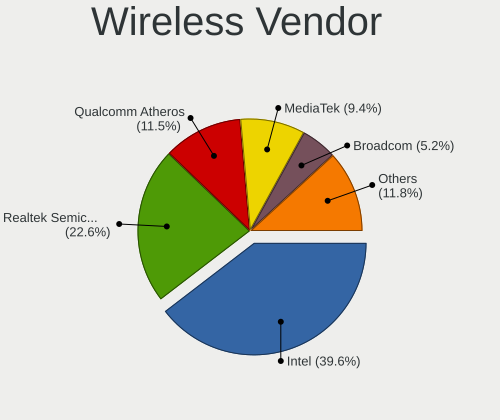

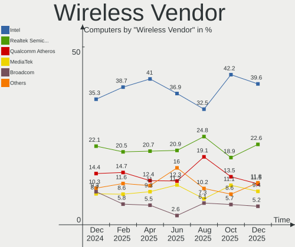

| Vendor                          | Computers | Percent |
|---------------------------------|-----------|---------|
| Intel                           | 114       | 39.58%  |
| Realtek Semiconductor           | 65        | 22.57%  |
| Qualcomm Atheros                | 33        | 11.46%  |
| MediaTek                        | 27        | 9.38%   |
| Broadcom                        | 15        | 5.21%   |
| Ralink                          | 8         | 2.78%   |
| Ralink Technology               | 5         | 1.74%   |
| TP-Link                         | 4         | 1.39%   |
| Quectel Wireless Solutions      | 3         | 1.04%   |
| Qualcomm                        | 3         | 1.04%   |
| Broadcom Limited                | 2         | 0.69%   |
| ASUSTek Computer                | 2         | 0.69%   |
| ZyXEL Communications            | 1         | 0.35%   |
| Qualcomm Technologies           | 1         | 0.35%   |
| Qualcomm Atheros Communications | 1         | 0.35%   |
| NetGear                         | 1         | 0.35%   |
| Edimax Technology               | 1         | 0.35%   |
| Dell                            | 1         | 0.35%   |
| D-Link System                   | 1         | 0.35%   |

Wireless Model
--------------

Wireless models

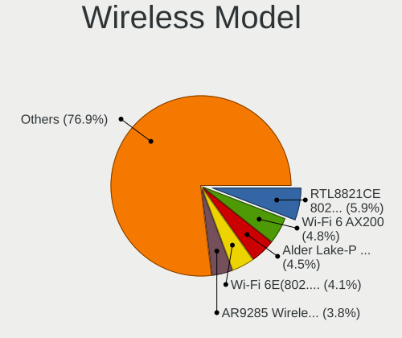

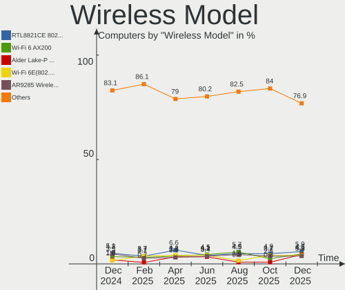

| Model                                                                | Computers | Percent |
|----------------------------------------------------------------------|-----------|---------|
| Realtek RTL8821CE 802.11ac PCIe Wireless Network Adapter             | 17        | 5.86%   |
| Intel Wi-Fi 6 AX200                                                  | 14        | 4.83%   |
| Intel Alder Lake-P PCH CNVi WiFi                                     | 13        | 4.48%   |
| Intel Wi-Fi 6E(802.11ax) AX210/AX1675* 2x2 [Typhoon Peak]            | 12        | 4.14%   |
| Qualcomm Atheros AR9285 Wireless Network Adapter (PCI-Express)       | 11        | 3.79%   |
| Realtek RTL8822CE 802.11ac PCIe Wireless Network Adapter             | 10        | 3.45%   |
| Intel Wireless 7265                                                  | 10        | 3.45%   |
| Intel Wi-Fi 6 AX201                                                  | 10        | 3.45%   |
| MediaTek MT7922 802.11ax PCI Express Wireless Network Adapter        | 9         | 3.1%    |
| Realtek RTL8723BE PCIe Wireless Network Adapter                      | 8         | 2.76%   |
| MediaTek MT7902 802.11ax PCIe Wireless Network Adapter [Filogic 310] | 8         | 2.76%   |
| Intel Raptor Lake PCH CNVi WiFi                                      | 8         | 2.76%   |
| Qualcomm Atheros AR9485 Wireless Network Adapter                     | 7         | 2.41%   |
| Intel Wireless 3165                                                  | 7         | 2.41%   |
| Qualcomm Atheros QCA9377 802.11ac Wireless Network Adapter           | 6         | 2.07%   |
| Realtek 802.11ac NIC                                                 | 5         | 1.72%   |
| MediaTek MT7921 802.11ax PCIe Wireless Network Adapter [Filogic 330] | 5         | 1.72%   |
| Intel Wireless 8265 / 8275                                           | 5         | 1.72%   |
| Intel Alder Lake-N PCH CNVi WiFi                                     | 5         | 1.72%   |
| Intel Gemini Lake PCH CNVi WiFi                                      | 4         | 1.38%   |
| Intel Dual Band Wireless-AC 3168NGW [Stone Peak]                     | 4         | 1.38%   |
| Broadcom BCM4313 802.11bgn Wireless Network Adapter                  | 4         | 1.38%   |
| Realtek RTL88x2bu [AC1200 Techkey]                                   | 3         | 1.03%   |
| Realtek 802.11n WLAN Adapter                                         | 3         | 1.03%   |
| Ralink MT7601U Wireless Adapter                                      | 3         | 1.03%   |
| Ralink RT3290 Wireless 802.11n 1T/1R PCIe                            | 3         | 1.03%   |
| Qualcomm QCNFA765 Wireless Network Adapter                           | 3         | 1.03%   |
| Broadcom BCM43142 802.11b/g/n                                        | 3         | 1.03%   |
| Broadcom BCM4312 802.11b/g LP-PHY                                    | 3         | 1.03%   |
| Realtek RTL8852BE PCIe 802.11ax Wireless Network Controller          | 2         | 0.69%   |
| Realtek RTL8811AU 802.11a/b/g/n/ac WLAN Adapter                      | 2         | 0.69%   |
| Realtek RTL8188EUS 802.11n Wireless Network Adapter                  | 2         | 0.69%   |
| Realtek RTL8188EE Wireless Network Adapter                           | 2         | 0.69%   |
| Realtek RTL8187SE Wireless LAN Controller                            | 2         | 0.69%   |
| Ralink RT5370 Wireless Adapter                                       | 2         | 0.69%   |
| Ralink RT3090 Wireless 802.11n 1T/1R PCIe                            | 2         | 0.69%   |
| Quectel Wireless Solutions Quectel EM05-CN                           | 2         | 0.69%   |
| Qualcomm Atheros QCA9565 / AR9565 Wireless Network Adapter           | 2         | 0.69%   |
| Qualcomm Atheros QCA6174 802.11ac Wireless Network Adapter           | 2         | 0.69%   |
| Qualcomm Atheros AR9462 Wireless Network Adapter                     | 2         | 0.69%   |

Ethernet Vendor
---------------

Ethernet vendors

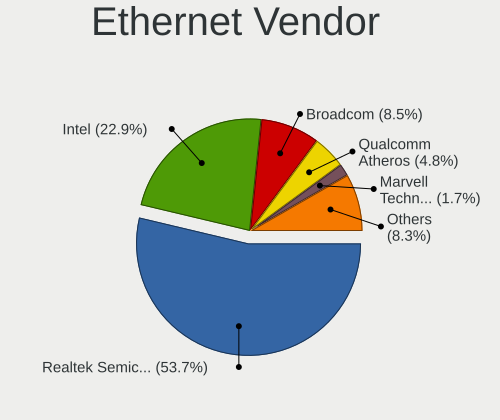

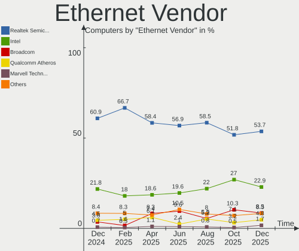

| Vendor                   | Computers | Percent |
|--------------------------|-----------|---------|
| Realtek Semiconductor    | 246       | 53.71%  |
| Intel                    | 105       | 22.93%  |
| Broadcom                 | 39        | 8.52%   |
| Qualcomm Atheros         | 22        | 4.8%    |
| Marvell Technology Group | 8         | 1.75%   |
| ASIX Electronics         | 8         | 1.75%   |
| Xiaomi                   | 5         | 1.09%   |
| OPPO Electronics         | 5         | 1.09%   |
| Broadcom Limited         | 3         | 0.66%   |
| Samsung Electronics      | 2         | 0.44%   |
| QinHeng Electronics      | 2         | 0.44%   |
| MediaTek                 | 2         | 0.44%   |
| Insyde Software          | 2         | 0.44%   |
| TP-Link                  | 1         | 0.22%   |
| Qualcomm Technologies    | 1         | 0.22%   |
| Qualcomm                 | 1         | 0.22%   |
| Motorola PCS             | 1         | 0.22%   |
| Loongson Technology      | 1         | 0.22%   |
| Huawei Technologies      | 1         | 0.22%   |
| Dell                     | 1         | 0.22%   |
| Aquantia                 | 1         | 0.22%   |
| Apple                    | 1         | 0.22%   |

Ethernet Model
--------------

Ethernet models

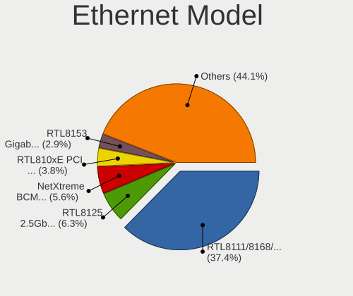

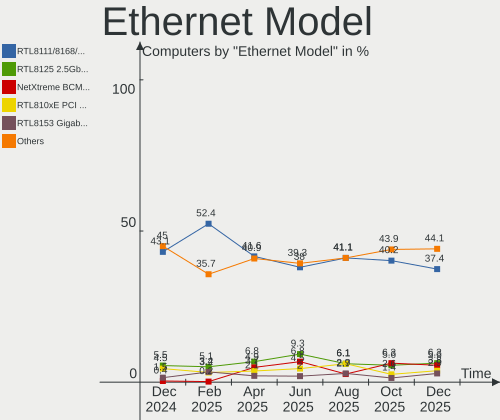

| Model                                                                          | Computers | Percent |
|--------------------------------------------------------------------------------|-----------|---------|
| Realtek RTL8111/8168/8211/8411 PCI Express Gigabit Ethernet Controller         | 179       | 37.37%  |
| Realtek RTL8125 2.5GbE Controller                                              | 30        | 6.26%   |
| Broadcom NetXtreme BCM5719 Gigabit Ethernet PCIe                               | 27        | 5.64%   |
| Realtek RTL810xE PCI Express Fast Ethernet controller                          | 18        | 3.76%   |
| Realtek RTL8153 Gigabit Ethernet Adapter                                       | 14        | 2.92%   |
| Intel I350 Gigabit Network Connection                                          | 12        | 2.51%   |
| Intel Alder Lake-P PCH CNVi WiFi                                               | 11        | 2.3%    |
| Realtek RTL8152 Fast Ethernet Adapter                                          | 7         | 1.46%   |
| Intel Ethernet Connection (13) I219-V                                          | 7         | 1.46%   |
| Intel 82599ES 10-Gigabit SFI/SFP+ Network Connection                           | 7         | 1.46%   |
| Intel 82576 Gigabit Network Connection                                         | 7         | 1.46%   |
| ASIX AX88179 Gigabit Ethernet                                                  | 7         | 1.46%   |
| Qualcomm Atheros AR8131 Gigabit Ethernet                                       | 6         | 1.25%   |
| Qualcomm Atheros AR8151 v2.0 Gigabit Ethernet                                  | 5         | 1.04%   |
| Intel Ethernet Controller 10-Gigabit X540-AT2                                  | 5         | 1.04%   |
| OPPO Ace 3V                                                                    | 4         | 0.84%   |
| Intel Ethernet Connection (2) I219-V                                           | 4         | 0.84%   |
| Intel Ethernet Connection (2) I219-LM                                          | 4         | 0.84%   |
| Intel Ethernet Connection (16) I219-V                                          | 4         | 0.84%   |
| Broadcom NetXtreme BCM5720 Gigabit Ethernet PCIe                               | 4         | 0.84%   |
| Xiaomi Mi/Redmi series (RNDIS)                                                 | 3         | 0.63%   |
| Qualcomm Atheros AR8161 Gigabit Ethernet                                       | 3         | 0.63%   |
| Intel I211 Gigabit Network Connection                                          | 3         | 0.63%   |
| Intel Ethernet Controller I226-V                                               | 3         | 0.63%   |
| Intel Ethernet Connection (11) I219-V                                          | 3         | 0.63%   |
| Intel 82579LM Gigabit Network Connection (Lewisville)                          | 3         | 0.63%   |
| Intel 82574L Gigabit Network Connection                                        | 3         | 0.63%   |
| Xiaomi Mi/Redmi series (RNDIS + ADB)                                           | 2         | 0.42%   |
| Samsung Galaxy series, misc. (tethering mode)                                  | 2         | 0.42%   |
| Realtek RTL8852CE PCIe 802.11ax Wireless Network Controller                    | 2         | 0.42%   |
| Realtek RTL8126 5GbE Controller                                                | 2         | 0.42%   |
| Qualcomm Atheros Attansic L1 Gigabit Ethernet                                  | 2         | 0.42%   |
| Qualcomm Atheros AR8152 v2.0 Fast Ethernet                                     | 2         | 0.42%   |
| QinHeng USB 10/100 LAN                                                         | 2         | 0.42%   |
| Marvell Group Yukon Optima 88E8059 [PCIe Gigabit Ethernet Controller with AVB] | 2         | 0.42%   |
| Marvell Group 88E8040 PCI-E Fast Ethernet Controller                           | 2         | 0.42%   |
| Intel WiMAX Connection 2400m                                                   | 2         | 0.42%   |
| Intel Ethernet Controller I225-V                                               | 2         | 0.42%   |
| Intel Ethernet Connection I219-LM                                              | 2         | 0.42%   |
| Intel Ethernet Connection (7) I219-LM                                          | 2         | 0.42%   |

Net Controller Kind
-------------------

Ethernet, WiFi or modem

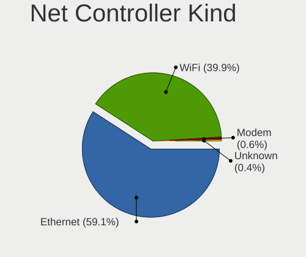

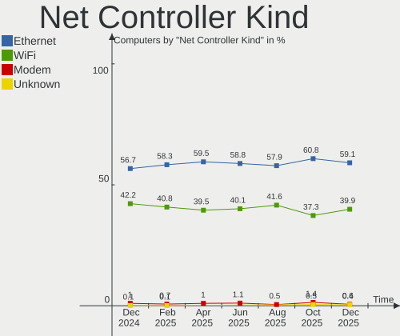

| Kind     | Computers | Percent |
|----------|-----------|---------|
| Ethernet | 411       | 59.14%  |
| WiFi     | 277       | 39.86%  |
| Modem    | 4         | 0.58%   |
| Unknown  | 3         | 0.43%   |

Used Controller
---------------

Currently used network controller

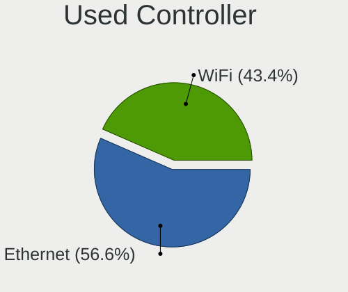

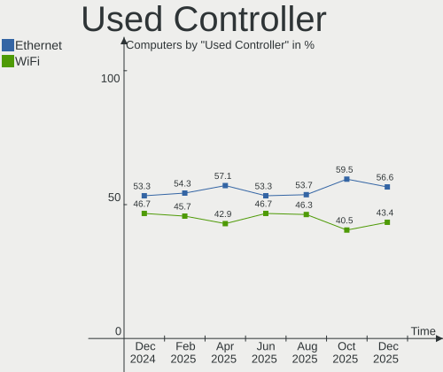

| Kind     | Computers | Percent |
|----------|-----------|---------|
| Ethernet | 246       | 56.55%  |
| WiFi     | 189       | 43.45%  |

NICs
----

Total network controllers on board

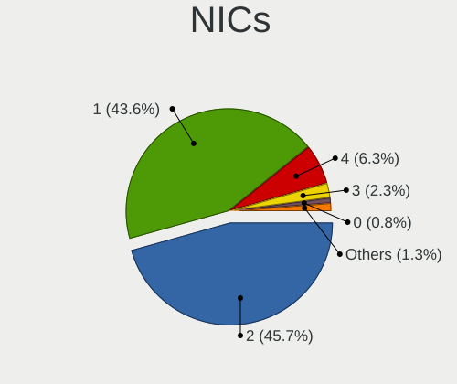

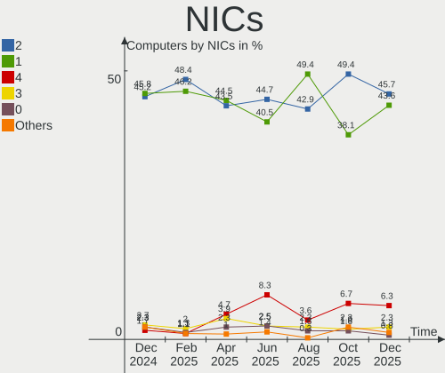

| Total | Computers | Percent |
|-------|-----------|---------|
| 2     | 216       | 45.67%  |
| 1     | 206       | 43.55%  |
| 4     | 30        | 6.34%   |
| 3     | 11        | 2.33%   |
| 0     | 4         | 0.85%   |
| 6     | 3         | 0.63%   |
| 8     | 2         | 0.42%   |
| 10    | 1         | 0.21%   |

IPv6
----

IPv6 vs IPv4

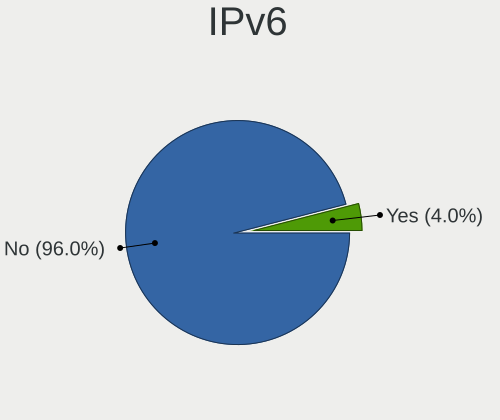

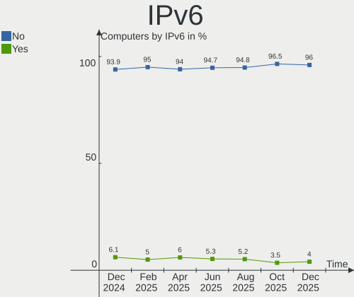

| Used | Computers | Percent |
|------|-----------|---------|
| No   | 454       | 95.98%  |
| Yes  | 19        | 4.02%   |

Bluetooth
---------

Bluetooth Vendor
----------------

Controller vendors

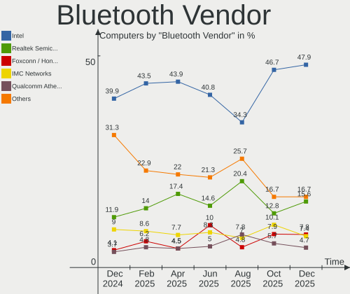

| Vendor                          | Computers | Percent |
|---------------------------------|-----------|---------|
| Intel                           | 123       | 47.86%  |
| Realtek Semiconductor           | 40        | 15.56%  |
| Foxconn / Hon Hai               | 20        | 7.78%   |
| IMC Networks                    | 19        | 7.39%   |
| Qualcomm Atheros Communications | 12        | 4.67%   |
| Cambridge Silicon Radio         | 9         | 3.5%    |
| MediaTek                        | 5         | 1.95%   |
| TP-Link                         | 3         | 1.17%   |
| Ralink                          | 3         | 1.17%   |
| Lite-On Technology              | 3         | 1.17%   |
| Broadcom                        | 3         | 1.17%   |
| Apple                           | 3         | 1.17%   |
| Realtek                         | 2         | 0.78%   |
| Foxconn International           | 2         | 0.78%   |
| ASUSTek Computer                | 2         | 0.78%   |
| Unknown                         | 2         | 0.78%   |
| Ralink Technology               | 1         | 0.39%   |
| Hewlett-Packard                 | 1         | 0.39%   |
| Chicony Electronics             | 1         | 0.39%   |
| Alps Electric                   | 1         | 0.39%   |
| AICSemi                         | 1         | 0.39%   |
| Actions                         | 1         | 0.39%   |

Bluetooth Model
---------------

Controller models

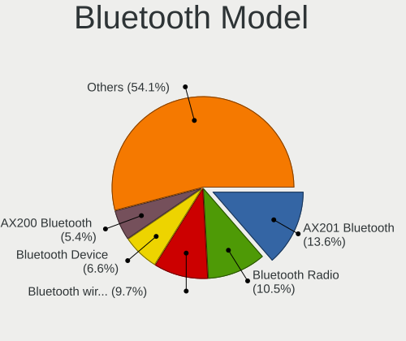

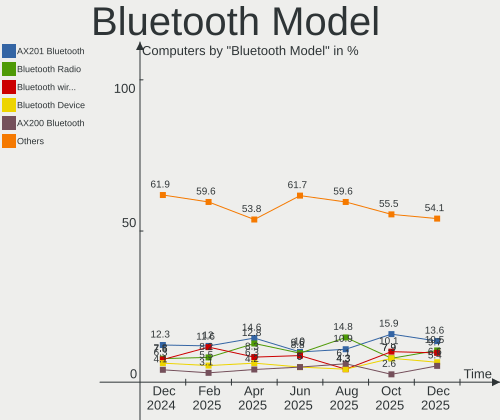

| Model                                               | Computers | Percent |
|-----------------------------------------------------|-----------|---------|
| Intel AX201 Bluetooth                               | 35        | 13.62%  |
| Realtek Bluetooth Radio                             | 27        | 10.51%  |
| Intel Bluetooth wireless interface                  | 25        | 9.73%   |
| Intel Bluetooth Device                              | 17        | 6.61%   |
| Intel AX200 Bluetooth                               | 14        | 5.45%   |
| Intel AX210 Bluetooth                               | 12        | 4.67%   |
| IMC Networks Wireless_Device                        | 11        | 4.28%   |
| Cambridge Silicon Radio Bluetooth Dongle (HCI mode) | 9         | 3.5%    |
| Intel Bluetooth 9460/9560 Jefferson Peak (JfP)      | 8         | 3.11%   |
| Foxconn / Hon Hai Bluetooth Device                  | 8         | 3.11%   |
| Foxconn / Hon Hai Wireless_Device                   | 7         | 2.72%   |
| IMC Networks Bluetooth Radio                        | 6         | 2.33%   |
| Realtek 802.11ac WLAN Adapter                       | 5         | 1.95%   |
| MediaTek Wireless_Device                            | 5         | 1.95%   |
| Qualcomm Atheros  Bluetooth Device                  | 4         | 1.56%   |
| Intel Wireless-AC 3168 Bluetooth                    | 4         | 1.56%   |
| TP-Link TP-T@- UB500 Adapter                        | 3         | 1.17%   |
| Realtek  Bluetooth 4.2 Adapter                      | 3         | 1.17%   |
| Ralink RT3290 Bluetooth                             | 3         | 1.17%   |
| Qualcomm Atheros AR3012 Bluetooth 4.0               | 3         | 1.17%   |
| Qualcomm Atheros AR3011 Bluetooth                   | 3         | 1.17%   |
| Intel Bluetooth                                     | 3         | 1.17%   |
| Realtek RTL8723B Bluetooth                          | 2         | 0.78%   |
| Realtek Bluetooth Radio                             | 2         | 0.78%   |
| Intel Centrino Bluetooth Wireless Transceiver       | 2         | 0.78%   |
| Intel Centrino Advanced-N 6230 Bluetooth adapter    | 2         | 0.78%   |
| Foxconn International BCM43142A0 Bluetooth module   | 2         | 0.78%   |
| Foxconn / Hon Hai MediaTek Bluetooth Adapter        | 2         | 0.78%   |
| ASUS ASUS USB-BT500                                 | 2         | 0.78%   |
| Apple Bluetooth USB Host Controller                 | 2         | 0.78%   |
| Unknown                                             | 2         | 0.78%   |
| Realtek RTL8821A Bluetooth                          | 1         | 0.39%   |
| Realtek Bluetooth 5.4 Radio                         | 1         | 0.39%   |
| Realtek Bluetooth 5.3 Radio                         | 1         | 0.39%   |
| Ralink Motorola BC4 Bluetooth 3.0+HS Adapter        | 1         | 0.39%   |
| Qualcomm Atheros QCA61x4 Bluetooth 4.0              | 1         | 0.39%   |
| Qualcomm Atheros Bluetooth USB Host Controller      | 1         | 0.39%   |
| Lite-On Wireless_Device                             | 1         | 0.39%   |
| Lite-On Qualcomm Atheros QCA9377 Bluetooth          | 1         | 0.39%   |
| Lite-On Bluetooth Device                            | 1         | 0.39%   |

Sound
-----

Sound Vendor
------------

Sound card vendors

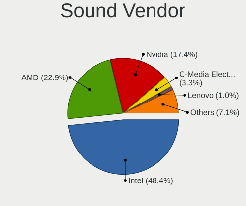

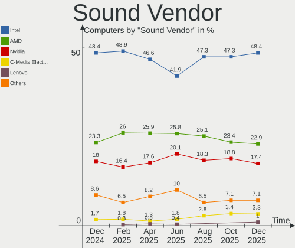

| Vendor                                       | Computers | Percent |
|----------------------------------------------|-----------|---------|
| Intel                                        | 281       | 48.36%  |
| AMD                                          | 133       | 22.89%  |
| Nvidia                                       | 101       | 17.38%  |
| C-Media Electronics                          | 19        | 3.27%   |
| Lenovo                                       | 6         | 1.03%   |
| ASUSTek Computer                             | 5         | 0.86%   |
| Micro Star International                     | 4         | 0.69%   |
| JMTek                                        | 4         | 0.69%   |
| Logitech                                     | 3         | 0.52%   |
| Zoran Co. Personal Media Division (Nogatech) | 2         | 0.34%   |
| MV-SILICON                                   | 2         | 0.34%   |
| Generalplus Technology                       | 2         | 0.34%   |
| Unknown                                      | 2         | 0.34%   |
| Yamaha                                       | 1         | 0.17%   |
| Texas Instruments                            | 1         | 0.17%   |
| Telink                                       | 1         | 0.17%   |
| Samsung Electronics                          | 1         | 0.17%   |
| Plantronics                                  | 1         | 0.17%   |
| Loongson Technology                          | 1         | 0.17%   |
| KTMicro                                      | 1         | 0.17%   |
| Kingston Technology                          | 1         | 0.17%   |
| Jieli Technology                             | 1         | 0.17%   |
| Hewlett-Packard                              | 1         | 0.17%   |
| Fifine Microphones                           | 1         | 0.17%   |
| Elite Silicon                                | 1         | 0.17%   |
| Creative Technology                          | 1         | 0.17%   |
| Creative Labs                                | 1         | 0.17%   |
| Conexant Systems                             | 1         | 0.17%   |
| Arturia                                      | 1         | 0.17%   |
| Apple                                        | 1         | 0.17%   |

Sound Model
-----------

Sound card models

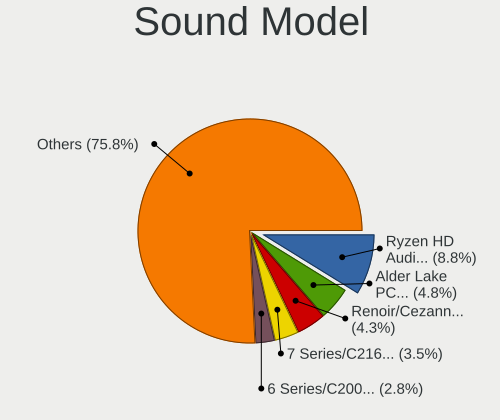

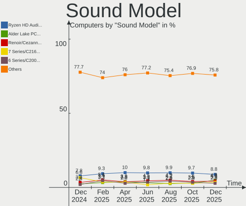

| Model                                                                      | Computers | Percent |
|----------------------------------------------------------------------------|-----------|---------|
| AMD Ryzen HD Audio Controller                                              | 60        | 8.81%   |
| Intel Alder Lake PCH-P High Definition Audio Controller                    | 33        | 4.85%   |
| AMD Renoir/Cezanne HDMI/DP Audio Controller                                | 29        | 4.26%   |
| Intel 7 Series/C216 Chipset Family High Definition Audio Controller        | 24        | 3.52%   |
| Intel 6 Series/C200 Series Chipset Family High Definition Audio Controller | 19        | 2.79%   |
| Intel Tiger Lake-LP Smart Sound Technology Audio Controller                | 18        | 2.64%   |
| AMD Radeon High Definition Audio Controller                                | 18        | 2.64%   |
| Intel Raptor Lake-P/U/H cAVS                                               | 13        | 1.91%   |
| Intel 100 Series/C230 Series Chipset Family HD Audio Controller            | 13        | 1.91%   |
| AMD Ellesmere HDMI Audio [Radeon RX 470/480 / 570/580/590]                 | 13        | 1.91%   |
| Nvidia GF108 High Definition Audio Controller                              | 12        | 1.76%   |
| AMD FCH Azalia Controller                                                  | 12        | 1.76%   |
| AMD Family 17h (Models 00h-0fh) HD Audio Controller                        | 12        | 1.76%   |
| C-Media Electronics Audio Adapter (Unitek Y-247A)                          | 11        | 1.62%   |
| Intel NM10/ICH7 Family High Definition Audio Controller                    | 10        | 1.47%   |
| Intel 82801I (ICH9 Family) HD Audio Controller                             | 10        | 1.47%   |
| Intel 5 Series/3400 Series Chipset High Definition Audio                   | 10        | 1.47%   |
| Intel 200 Series PCH HD Audio                                              | 10        | 1.47%   |
| AMD Starship/Matisse HD Audio Controller                                   | 10        | 1.47%   |
| AMD SBx00 Azalia (Intel HDA)                                               | 10        | 1.47%   |
| Nvidia GP107GL High Definition Audio Controller                            | 9         | 1.32%   |
| Intel Sunrise Point-LP HD Audio                                            | 9         | 1.32%   |
| Intel 8 Series/C220 Series Chipset High Definition Audio Controller        | 9         | 1.32%   |
| Intel Smart Sound Technology (SST) Audio Controller                        | 8         | 1.17%   |
| Intel Raptor Lake High Definition Audio Controller                         | 8         | 1.17%   |
| Intel Alder Lake-N PCH High Definition Audio Controller                    | 8         | 1.17%   |
| Nvidia GM107 High Definition Audio Controller [GeForce 940MX]              | 7         | 1.03%   |
| Intel Tiger Lake-H HD Audio Controller                                     | 7         | 1.03%   |
| Intel Celeron/Pentium Silver Processor High Definition Audio               | 7         | 1.03%   |
| AMD Raven/Raven2/Fenghuang HDMI/DP Audio Controller                        | 7         | 1.03%   |
| Nvidia TU106 High Definition Audio Controller                              | 6         | 0.88%   |
| Nvidia GK208 HDMI/DP Audio Controller                                      | 6         | 0.88%   |
| Nvidia GA104 High Definition Audio Controller                              | 6         | 0.88%   |
| Nvidia AD107 High Definition Audio Controller                              | 6         | 0.88%   |
| Intel Atom Processor Z36xxx/Z37xxx Series High Definition Audio Controller | 6         | 0.88%   |
| AMD Navi 21/23 HDMI/DP Audio Controller                                    | 6         | 0.88%   |
| AMD Family 15h (Models 60h-6fh) Audio Controller                           | 6         | 0.88%   |
| Nvidia High Definition Audio Controller                                    | 5         | 0.73%   |
| Nvidia GB203 High Definition Audio Controller                              | 5         | 0.73%   |
| Intel Cannon Lake PCH cAVS                                                 | 5         | 0.73%   |

Memory
------

Memory Vendor
-------------

Memory module vendors

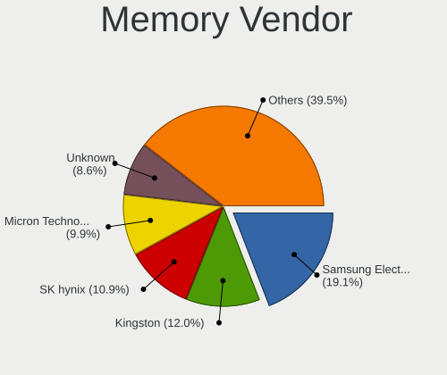

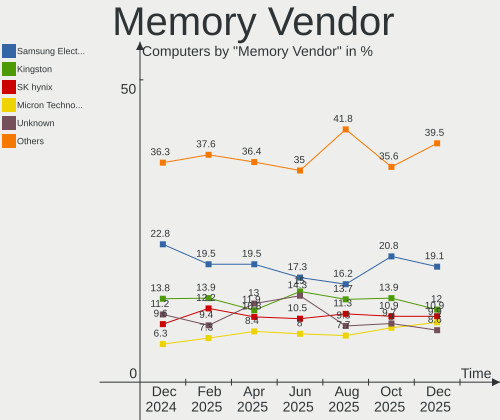

| Vendor                             | Computers | Percent |
|------------------------------------|-----------|---------|
| Samsung Electronics                | 91        | 19.12%  |
| Kingston                           | 57        | 11.97%  |
| SK hynix                           | 52        | 10.92%  |
| Micron Technology                  | 47        | 9.87%   |
| Unknown                            | 41        | 8.61%   |
| Unknown                            | 35        | 7.35%   |
| Crucial                            | 20        | 4.2%    |
| Hewlett-Packard                    | 16        | 3.36%   |
| AMD                                | 12        | 2.52%   |
| A-DATA Technology                  | 12        | 2.52%   |
| Patriot                            | 10        | 2.1%    |
| Foxline                            | 9         | 1.89%   |
| Corsair                            | 8         | 1.68%   |
| Apacer                             | 7         | 1.47%   |
| Nanya Technology                   | 5         | 1.05%   |
| Ramaxel Technology                 | 4         | 0.84%   |
| G.Skill                            | 4         | 0.84%   |
| Shenzhen Longsys                   | 3         | 0.63%   |
| Hikvision                          | 3         | 0.63%   |
| GOODRAM                            | 3         | 0.63%   |
| Unknown (ABCD)                     | 2         | 0.42%   |
| Unknown (89F7)                     | 2         | 0.42%   |
| Unknown (0x0080)                   | 2         | 0.42%   |
| Patriot Memory (PDP Systems)       | 2         | 0.42%   |
| Kllisre                            | 2         | 0.42%   |
| Kimtigo Semiconductor (HK) Limited | 2         | 0.42%   |
| Gold Key                           | 2         | 0.42%   |
| Elpida                             | 2         | 0.42%   |
| Wodposit                           | 1         | 0.21%   |
| Wilk                               | 1         | 0.21%   |
| Unknown (0x7FFF)                   | 1         | 0.21%   |
| Unknown (0x0FC4)                   | 1         | 0.21%   |
| Unknown (0x0E9D)                   | 1         | 0.21%   |
| Unknown (0x0CAB)                   | 1         | 0.21%   |
| Unknown (0x0BEC)                   | 1         | 0.21%   |
| Unknown (0x0B45)                   | 1         | 0.21%   |
| Transcend                          | 1         | 0.21%   |
| TOP MEDIA                          | 1         | 0.21%   |
| Team                               | 1         | 0.21%   |
| TakeMS                             | 1         | 0.21%   |

Memory Model
------------

Memory module models

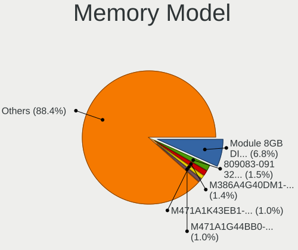

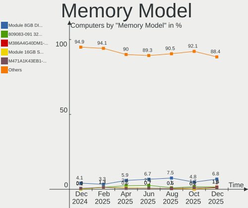

| Model                                                            | Computers | Percent |
|------------------------------------------------------------------|-----------|---------|
| Unknown                                                          | 35        | 6.76%   |
| HP RAM 809083-091 32GB DIMM DDR4 2400MT/s                        | 8         | 1.54%   |
| Samsung RAM M386A4G40DM1-CRC 32GB DIMM DDR4 2400MT/s             | 7         | 1.35%   |
| SK hynix RAM Module 16GB SODIMM DDR4 3200MT/s                    | 5         | 0.97%   |
| Samsung RAM M471A1K43EB1-CWE 8GB SODIMM DDR4 3200MT/s            | 5         | 0.97%   |
| Samsung RAM M471A1G44BB0-CWE 8GB SODIMM DDR4 3200MT/s            | 5         | 0.97%   |
| Unknown RAM Module 32GB DIMM DDR4 2400MT/s                       | 4         | 0.77%   |
| HP RAM 809081-081 16GB DIMM DDR4 2400MT/s                        | 4         | 0.77%   |
| Foxline RAM FL3200D4S22-8G 8GB SODIMM DDR4 3200MT/s              | 4         | 0.77%   |
| Unknown RAM Module 4GB DIMM 1333MT/s                             | 3         | 0.58%   |
| SK hynix RAM HMAG68EXNSA051N 8GB SODIMM DDR4 3200MT/s            | 3         | 0.58%   |
| Shenzhen Longsys RAM FD4AS3200C8GXE 8GB SODIMM DDR4 3200MT/s     | 3         | 0.58%   |
| Samsung RAM M471A1K43CB1-CTD 8GB SODIMM DDR4 3200MT/s            | 3         | 0.58%   |
| Samsung RAM M393B1K70CH0-CH9 8GB DIMM 1333MT/s                   | 3         | 0.58%   |
| Micron RAM Module 8GB SODIMM DDR4 3200MT/s                       | 3         | 0.58%   |
| Micron RAM 4ATF1G64HZ-3G2F1 8GB SODIMM DDR4 3200MT/s             | 3         | 0.58%   |
| Kingston RAM SW32D4S2S8HDH-8 8GB SODIMM DDR4 3200MT/s            | 3         | 0.58%   |
| Foxline RAM FL2666D4S19-8G 8GB SODIMM DDR4 2667MT/s              | 3         | 0.58%   |
| Unknown RAM Module 4GB SODIMM DDR3                               | 2         | 0.39%   |
| Unknown RAM Module 4GB DIMM SDRAM                                | 2         | 0.39%   |
| Unknown RAM Module 2GB Row Of Chips LPDDR4 4267MT/s              | 2         | 0.39%   |
| Unknown RAM Module 2GB DIMM SDRAM                                | 2         | 0.39%   |
| Unknown RAM Module 2GB DIMM DDR2 800MT/s                         | 2         | 0.39%   |
| Unknown RAM Module 2GB DIMM 800MT/s                              | 2         | 0.39%   |
| Unknown RAM Module 2GB DIMM 1333MT/s                             | 2         | 0.39%   |
| Unknown RAM Module 1GB SODIMM DDR2 533MT/s                       | 2         | 0.39%   |
| Unknown RAM Module 16GB DIMM DDR4 2400MT/s                       | 2         | 0.39%   |
| Unknown (ABCD) RAM 123456789012345678 2GB SODIMM LPDDR4 2400MT/s | 2         | 0.39%   |
| SK hynix RAM HMT451S6BFR8A-PB 4GB SODIMM DDR3 1600MT/s           | 2         | 0.39%   |
| SK hynix RAM HMCG78AGBSA095N 16GB SODIMM DDR5 5600MT/s           | 2         | 0.39%   |
| SK hynix RAM HMA851S6AFR6N-UH 4GB SODIMM DDR4 2400MT/s           | 2         | 0.39%   |
| Samsung RAM Module 4GB SODIMM DDR4 2133MT/s                      | 2         | 0.39%   |
| Samsung RAM Module 3GB Row Of Chips LPDDR5 6400MT/s              | 2         | 0.39%   |
| Samsung RAM Module 1GB Row Of Chips LPDDR4 4267MT/s              | 2         | 0.39%   |
| Samsung RAM M471A5244CB0-CWE 4GB SODIMM DDR4 3200MT/s            | 2         | 0.39%   |
| Samsung RAM M471A5244CB0-CWE 4GB Row Of Chips DDR4 3200MT/s      | 2         | 0.39%   |
| Samsung RAM M471A5244CB0-CTD 4GB SODIMM DDR4 3266MT/s            | 2         | 0.39%   |
| Samsung RAM M471A2G43BB2-CWE 16GB SODIMM DDR4 3200MT/s           | 2         | 0.39%   |
| Samsung RAM M471A1G44CB0-CWE 8GB SODIMM DDR4 3200MT/s            | 2         | 0.39%   |
| Samsung RAM M471A1G44AB0-CWE 8GiB SODIMM DDR4 3200MT/s           | 2         | 0.39%   |

Memory Kind
-----------

Memory module kinds

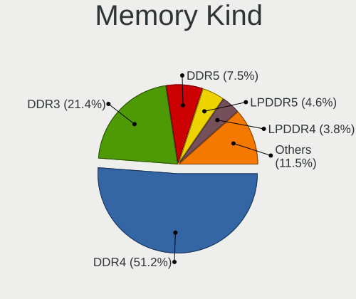

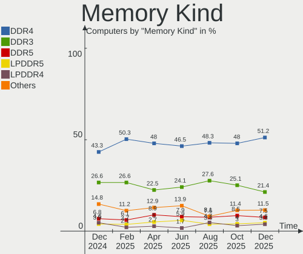

| Kind    | Computers | Percent |
|---------|-----------|---------|
| DDR4    | 213       | 51.2%   |
| DDR3    | 89        | 21.39%  |
| DDR5    | 31        | 7.45%   |
| LPDDR5  | 19        | 4.57%   |
| LPDDR4  | 16        | 3.85%   |
| DDR2    | 13        | 3.13%   |
| DRAM    | 12        | 2.88%   |
| SDRAM   | 11        | 2.64%   |
| Unknown | 11        | 2.64%   |
| DDR     | 1         | 0.24%   |

Memory Form Factor
------------------

Physical design of the memory module

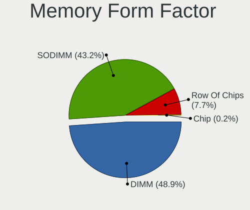

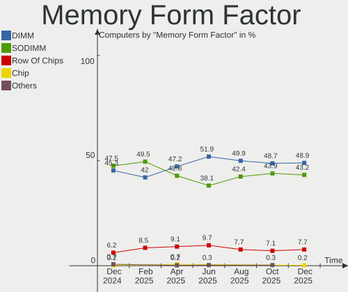

| Name         | Computers | Percent |
|--------------|-----------|---------|
| DIMM         | 204       | 48.92%  |
| SODIMM       | 180       | 43.17%  |
| Row Of Chips | 32        | 7.67%   |
| Chip         | 1         | 0.24%   |

Memory Size
-----------

Memory module size

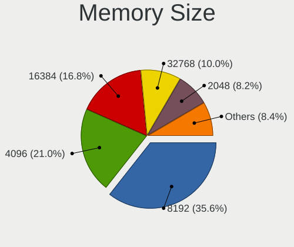

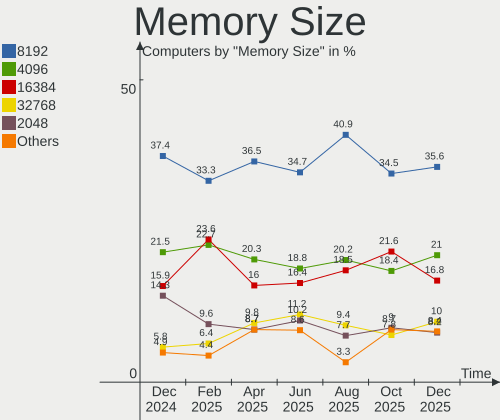

| Size  | Computers | Percent |
|-------|-----------|---------|
| 8192  | 161       | 35.62%  |
| 4096  | 95        | 21.02%  |
| 16384 | 76        | 16.81%  |
| 32768 | 45        | 9.96%   |
| 2048  | 37        | 8.19%   |
| 65536 | 15        | 3.32%   |
| 1024  | 15        | 3.32%   |
| 3072  | 4         | 0.88%   |
| 49152 | 2         | 0.44%   |
| 6144  | 1         | 0.22%   |
| 512   | 1         | 0.22%   |

Memory Speed
------------

Memory module speed

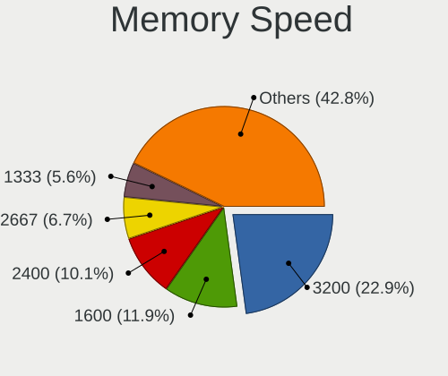

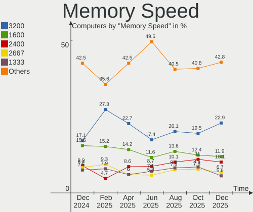

| Speed   | Computers | Percent |
|---------|-----------|---------|
| 3200    | 102       | 22.87%  |
| 1600    | 53        | 11.88%  |
| 2400    | 45        | 10.09%  |
| 2667    | 30        | 6.73%   |
| 1333    | 25        | 5.61%   |
| 5600    | 15        | 3.36%   |
| 2600    | 14        | 3.14%   |
| 2133    | 14        | 3.14%   |
| 800     | 13        | 2.91%   |
| 6400    | 10        | 2.24%   |
| 2933    | 9         | 2.02%   |
| Unknown | 8         | 1.79%   |
| 6000    | 7         | 1.57%   |
| 4267    | 7         | 1.57%   |
| 3400    | 7         | 1.57%   |
| 4800    | 6         | 1.35%   |
| 8533    | 5         | 1.12%   |
| 3800    | 5         | 1.12%   |
| 1866    | 5         | 1.12%   |
| 1334    | 5         | 1.12%   |
| 3600    | 4         | 0.9%    |
| 2800    | 4         | 0.9%    |
| 2666    | 4         | 0.9%    |
| 667     | 4         | 0.9%    |
| 7500    | 3         | 0.67%   |
| 3066    | 3         | 0.67%   |
| 3000    | 3         | 0.67%   |
| 1067    | 3         | 0.67%   |
| 1066    | 3         | 0.67%   |
| 533     | 3         | 0.67%   |
| 4199    | 2         | 0.45%   |
| 3733    | 2         | 0.45%   |
| 3466    | 2         | 0.45%   |
| 3266    | 2         | 0.45%   |
| 1800    | 2         | 0.45%   |
| 1648    | 2         | 0.45%   |
| 975     | 2         | 0.45%   |
| 8600    | 1         | 0.22%   |
| 7000    | 1         | 0.22%   |
| 5500    | 1         | 0.22%   |

Printers & scanners
-------------------

Printer Vendor
--------------

Printer device vendors

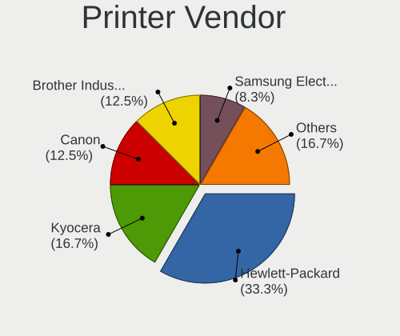

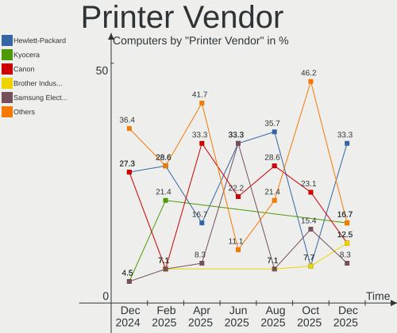

| Vendor              | Computers | Percent |
|---------------------|-----------|---------|
| Hewlett-Packard     | 8         | 33.33%  |
| Kyocera             | 4         | 16.67%  |
| Canon               | 3         | 12.5%   |
| Brother Industries  | 3         | 12.5%   |
| Samsung Electronics | 2         | 8.33%   |
| Xerox               | 1         | 4.17%   |
| Seiko Epson         | 1         | 4.17%   |
| Pantum              | 1         | 4.17%   |
| Katusha"            | 1         | 4.17%   |

Printer Model
-------------

Printer device models

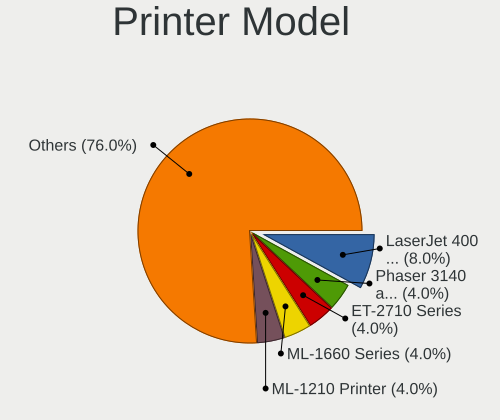

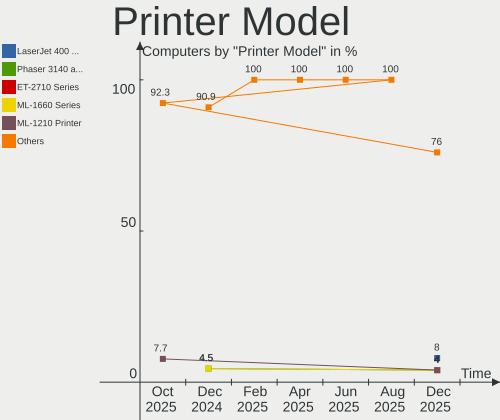

| Model                           | Computers | Percent |
|---------------------------------|-----------|---------|
| HP LaserJet 400 M401dne         | 2         | 8%      |
| Xerox Phaser 3140 and 3155      | 1         | 4%      |
| Seiko Epson ET-2710 Series      | 1         | 4%      |
| Samsung ML-1660 Series          | 1         | 4%      |
| Samsung ML-1210 Printer         | 1         | 4%      |
| Pantum M7100DN series           | 1         | 4%      |
| Kyocera Kyocera ECOSYS M2640idw | 1         | 4%      |
| Kyocera Kyocera ECOSYS M2040dn  | 1         | 4%      |
| Kyocera FS-1040                 | 1         | 4%      |
| Kyocera ECOSYS M5521cdn         | 1         | 4%      |
| Katusha" M240"                  | 1         | 4%      |
| HP Smart Tank 580-590 series    | 1         | 4%      |
| HP ScanJet Pro 3000 s3          | 1         | 4%      |
| HP PhotoSmart 7350              | 1         | 4%      |
| HP LaserJet M507                | 1         | 4%      |
| HP LaserJet M406                | 1         | 4%      |
| HP LaserJet 1200                | 1         | 4%      |
| HP LaserJet 1010                | 1         | 4%      |
| Canon MF4410                    | 1         | 4%      |
| Canon MF440 Series              | 1         | 4%      |
| Canon G2010 series              | 1         | 4%      |
| Brother MFC-L2700DN             | 1         | 4%      |
| Brother HL-L2360D series        | 1         | 4%      |
| Brother HL-5250DN Printer       | 1         | 4%      |

Scanner Vendor
--------------

Scanner device vendors

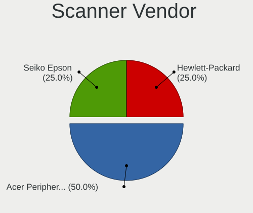

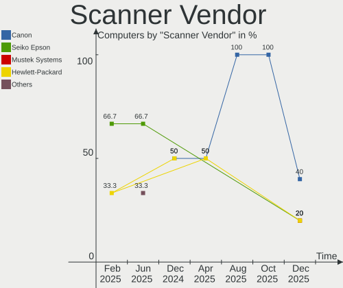

| Vendor          | Computers | Percent |
|-----------------|-----------|---------|
| Canon           | 2         | 40%     |
| Seiko Epson     | 1         | 20%     |
| Mustek Systems  | 1         | 20%     |
| Hewlett-Packard | 1         | 20%     |

Scanner Model
-------------

Scanner device models

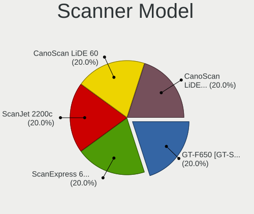

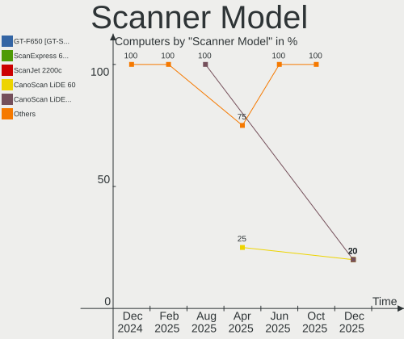

| Model                                             | Computers | Percent |
|---------------------------------------------------|-----------|---------|
| Seiko Epson GT-F650 [GT-S600/Perfection V10/V100] | 1         | 20%     |
| Mustek Systems ScanExpress 600 CU                 | 1         | 20%     |
| HP ScanJet 2200c                                  | 1         | 20%     |
| Canon CanoScan LiDE 60                            | 1         | 20%     |
| Canon CanoScan LiDE 220                           | 1         | 20%     |

Camera
------

Camera Vendor
-------------

Camera device vendors

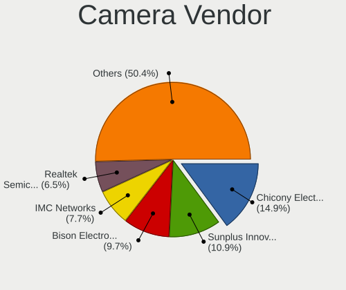

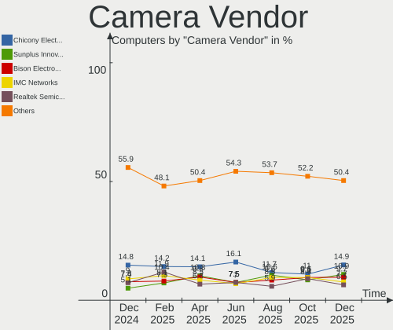

| Vendor                                 | Computers | Percent |
|----------------------------------------|-----------|---------|
| Chicony Electronics                    | 37        | 14.92%  |
| Sunplus Innovation Technology          | 27        | 10.89%  |
| Bison Electronics                      | 24        | 9.68%   |
| IMC Networks                           | 19        | 7.66%   |
| Realtek Semiconductor                  | 16        | 6.45%   |
| Microdia                               | 12        | 4.84%   |
| Logitech                               | 12        | 4.84%   |
| Quanta                                 | 10        | 4.03%   |
| Syntek                                 | 7         | 2.82%   |
| CVT Electronics.Co.                    | 6         | 2.42%   |
| Sonix Technology                       | 5         | 2.02%   |
| Shinetech                              | 5         | 2.02%   |
| Luxvisions Innotech Limited            | 5         | 2.02%   |
| Z-Star Microelectronics                | 4         | 1.61%   |
| Suyin                                  | 4         | 1.61%   |
| Alcor Micro                            | 4         | 1.61%   |
| Silicon Motion                         | 3         | 1.21%   |
| ShineOptics                            | 3         | 1.21%   |
| A4Tech                                 | 3         | 1.21%   |
| Unknown                                | 3         | 1.21%   |
| USB Camera CS                          | 2         | 0.81%   |
| Sunwingroup                            | 2         | 0.81%   |
| SunplusIT                              | 2         | 0.81%   |
| Lite-On Technology                     | 2         | 0.81%   |
| GEMBIRD                                | 2         | 0.81%   |
| Creative Technology                    | 2         | 0.81%   |
| Cheng Uei Precision Industry (Foxlink) | 2         | 0.81%   |
| Apple                                  | 2         | 0.81%   |
| Acer                                   | 2         | 0.81%   |
| YLX-241221-K                           | 1         | 0.4%    |
| XIFT                                   | 1         | 0.4%    |
| Shine-optics                           | 1         | 0.4%    |
| Samsung Electronics                    | 1         | 0.4%    |
| Ricoh                                  | 1         | 0.4%    |
| Remo Tech                              | 1         | 0.4%    |
| Primax Electronics                     | 1         | 0.4%    |
| OPPO Electronics                       | 1         | 0.4%    |
| OmniVision Technologies                | 1         | 0.4%    |
| Microsoft                              | 1         | 0.4%    |
| KYE Systems (Mouse Systems)            | 1         | 0.4%    |

Camera Model
------------

Camera device models

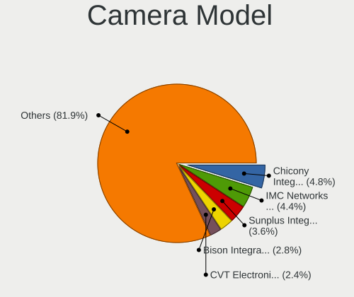

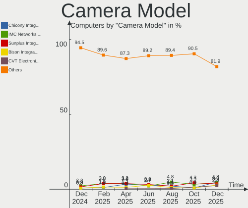

| Model                                     | Computers | Percent |
|-------------------------------------------|-----------|---------|
| Chicony Integrated Camera                 | 12        | 4.82%   |
| IMC Networks USB2.0 HD UVC WebCam         | 11        | 4.42%   |
| Sunplus Integrated Camera                 | 9         | 3.61%   |
| Bison Integrated Camera                   | 7         | 2.81%   |
| CVT Electronics.Co. USB Camera            | 6         | 2.41%   |
| Bison HD Webcam                           | 6         | 2.41%   |
| Syntek Integrated Camera                  | 5         | 2.01%   |
| Chicony HD WebCam                         | 5         | 2.01%   |
| Microdia USB 2.0 Camera                   | 4         | 1.61%   |
| Microdia Integrated_Webcam_HD             | 4         | 1.61%   |
| Bison Lenovo Integrated Webcam            | 4         | 1.61%   |
| Sunplus USB 2.0 Camera                    | 3         | 1.2%    |
| Sonix USB2.0 FHD UVC WebCam               | 3         | 1.2%    |
| ShineTech USB2.0 HD UVC WebCam            | 3         | 1.2%    |
| ShineOptics HD Camera                     | 3         | 1.2%    |
| Realtek USB Camera                        | 3         | 1.2%    |
| Quanta HD User Facing                     | 3         | 1.2%    |
| Logitech Webcam C930e                     | 3         | 1.2%    |
| Logitech Webcam C270                      | 3         | 1.2%    |
| IMC Networks USB2.0 VGA UVC WebCam        | 3         | 1.2%    |
| Chicony HP Webcam                         | 3         | 1.2%    |
| Bison Lenovo EasyCamera                   | 3         | 1.2%    |
| Bison BisonCam,NB Pro                     | 3         | 1.2%    |
| A4Tech FHD 1080P PC Camera                | 3         | 1.2%    |
| Unknown                                   | 3         | 1.2%    |
| USB Camera CS USB Camera CS               | 2         | 0.8%    |
| Sunwingroup HD Camera                     | 2         | 0.8%    |
| Sunplus XiaoMi Webcam                     | 2         | 0.8%    |
| Sunplus Hy-UXGA(B6CS)-Camera              | 2         | 0.8%    |
| Sunplus Hy FHD B200 Came                  | 2         | 0.8%    |
| Sonix Integrated Webcam_FHD               | 2         | 0.8%    |
| Shinetech USB2.0 FHD UVC WebCam           | 2         | 0.8%    |
| Realtek Thronmax Stream Go Pro Webcam     | 2         | 0.8%    |
| Realtek Integrated_Webcam_FHD             | 2         | 0.8%    |
| Realtek Bluetooth Radio                   | 2         | 0.8%    |
| Quanta ov9734_techfront_camera            | 2         | 0.8%    |
| Quanta ACER HD User Facing                | 2         | 0.8%    |
| Luxvisions Innotech Limited EasyCamera 1M | 2         | 0.8%    |
| Lite-On EasyCamera 5M                     | 2         | 0.8%    |
| IMC Networks Integrated RGB Camera        | 2         | 0.8%    |

Security
--------

Fingerprint Vendor
------------------

Fingerprint sensor vendors

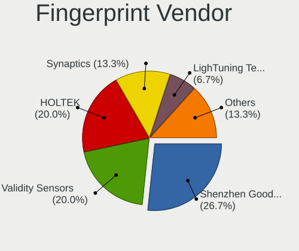

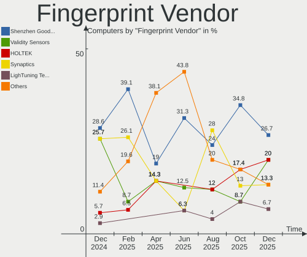

| Vendor                     | Computers | Percent |
|----------------------------|-----------|---------|
| Shenzhen Goodix Technology | 4         | 26.67%  |
| Validity Sensors           | 3         | 20%     |
| HOLTEK                     | 3         | 20%     |
| Synaptics                  | 2         | 13.33%  |
| LighTuning Technology      | 1         | 6.67%   |
| Focal-systems.Corp         | 1         | 6.67%   |
| Elan Microelectronics      | 1         | 6.67%   |

Fingerprint Model
-----------------

Fingerprint sensor models

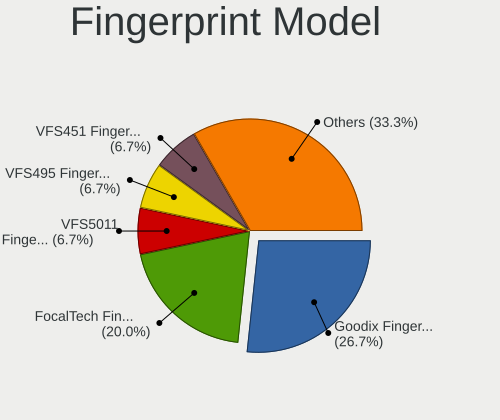

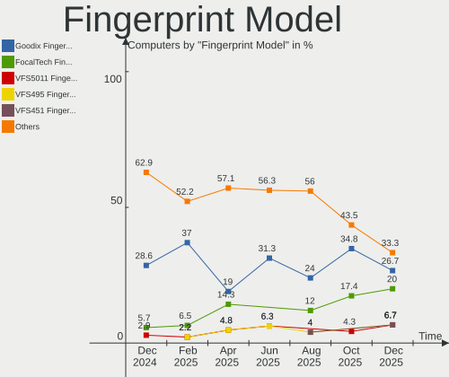

| Model                                            | Computers | Percent |
|--------------------------------------------------|-----------|---------|
| Shenzhen Goodix  Fingerprint Device              | 4         | 26.67%  |
| HOLTEK FocalTech Fingerprint Device              | 3         | 20%     |
| Validity Sensors VFS5011 Fingerprint Reader      | 1         | 6.67%   |
| Validity Sensors VFS495 Fingerprint Reader       | 1         | 6.67%   |
| Validity Sensors VFS451 Fingerprint Reader       | 1         | 6.67%   |
| Synaptics UWP WBDI Device                        | 1         | 6.67%   |
| Synaptics Metallica MOH Touch Fingerprint Reader | 1         | 6.67%   |
| LighTuning EgisTec Touch Fingerprint Sensor      | 1         | 6.67%   |
| Focal-systems.Corp FT9201Fingerprint.            | 1         | 6.67%   |
| Elan ELAN:Fingerprint                            | 1         | 6.67%   |

Chipcard Vendor
---------------

Chipcard module vendors

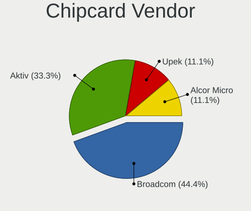

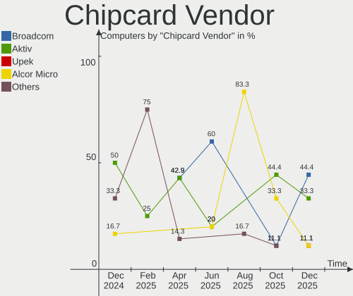

| Vendor      | Computers | Percent |
|-------------|-----------|---------|
| Broadcom    | 4         | 44.44%  |
| Aktiv       | 3         | 33.33%  |
| Upek        | 1         | 11.11%  |
| Alcor Micro | 1         | 11.11%  |

Chipcard Model
--------------

Chipcard module models

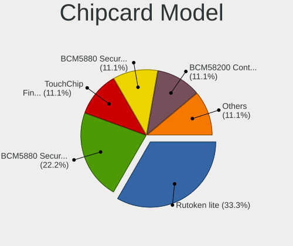

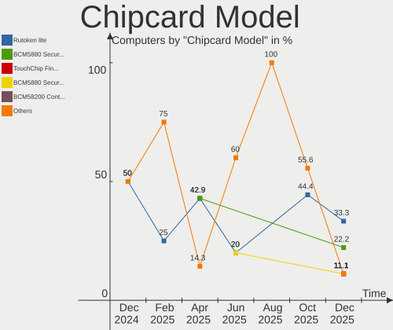

| Model                                                                        | Computers | Percent |
|------------------------------------------------------------------------------|-----------|---------|
| Aktiv Rutoken lite                                                           | 3         | 33.33%  |
| Broadcom BCM5880 Secure Applications Processor                               | 2         | 22.22%  |
| Upek TouchChip Fingerprint Coprocessor (WBF advanced mode)                   | 1         | 11.11%  |
| Broadcom BCM5880 Secure Applications Processor with fingerprint swipe sensor | 1         | 11.11%  |
| Broadcom BCM58200 ControlVault 3 (FingerPrint sensor + Contacted SmartCard)  | 1         | 11.11%  |
| Alcor Micro AU9540 Smartcard Reader                                          | 1         | 11.11%  |

Unsupported
-----------

Unsupported Devices
-------------------

Total unsupported devices on board

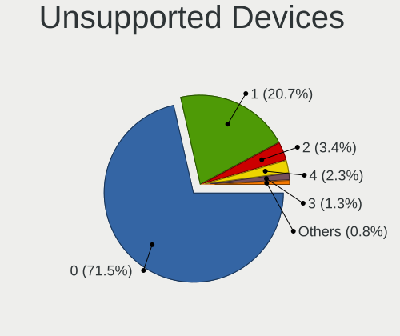

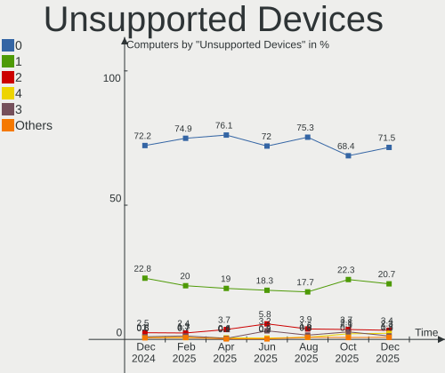

| Total | Computers | Percent |
|-------|-----------|---------|
| 0     | 338       | 71.46%  |
| 1     | 98        | 20.72%  |
| 2     | 16        | 3.38%   |
| 4     | 11        | 2.33%   |
| 3     | 6         | 1.27%   |
| 6     | 4         | 0.85%   |

Unsupported Device Types
------------------------

Types of unsupported devices

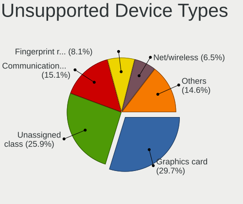

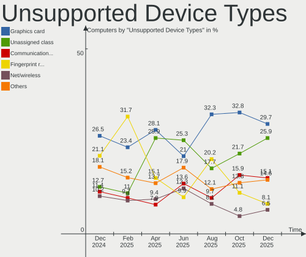

| Type                     | Computers | Percent |
|--------------------------|-----------|---------|
| Graphics card            | 55        | 29.73%  |
| Unassigned class         | 48        | 25.95%  |
| Communication controller | 28        | 15.14%  |
| Fingerprint reader       | 15        | 8.11%   |
| Net/wireless             | 12        | 6.49%   |
| Chipcard                 | 7         | 3.78%   |
| Bluetooth                | 6         | 3.24%   |
| Sound                    | 4         | 2.16%   |
| Camera                   | 3         | 1.62%   |
| Storage/raid             | 2         | 1.08%   |
| Net/ethernet             | 2         | 1.08%   |
| Multimedia controller    | 2         | 1.08%   |
| Network                  | 1         | 0.54%   |

