Linux in Russia - Hardware Trends
---------------------------------

A project to identify most popular hardware characteristics and track their change
over time based on data collected by Linux users at https://Linux-Hardware.org.

Anyone can contribute to this report by the [hw-probe](https://github.com/linuxhw/hw-probe) tool:

    sudo -E hw-probe -all -upload

This is a report for all computer types. See also reports for [desktops](/Location/Russia/Desktop/README.md) and [notebooks](/Location/Russia/Notebook/README.md).

Period: Oct, 2023.

Contents
--------

* [ System ](#system)
  - [ OS                       ](#os)
  - [ OS Family                ](#os-family)
  - [ Kernel                   ](#kernel)
  - [ Kernel Family            ](#kernel-family)
  - [ Kernel Major Ver.        ](#kernel-major-ver)
  - [ Arch                     ](#arch)
  - [ DE                       ](#de)
  - [ Display Server           ](#display-server)
  - [ Display Manager          ](#display-manager)
  - [ OS Lang                  ](#os-lang)
  - [ Boot Mode                ](#boot-mode)
  - [ Filesystem               ](#filesystem)
  - [ Part. scheme             ](#part-scheme)
  - [ Dual Boot with Linux/BSD ](#dual-boot-with-linuxbsd)
  - [ Dual Boot (Win)          ](#dual-boot-win)

* [ Board ](#board)
  - [ Vendor                   ](#vendor)
  - [ Model                    ](#model)
  - [ Model Family             ](#model-family)
  - [ MFG Year                 ](#mfg-year)
  - [ Form Factor              ](#form-factor)
  - [ Secure Boot              ](#secure-boot)
  - [ Coreboot                 ](#coreboot)
  - [ RAM Size                 ](#ram-size)
  - [ RAM Used                 ](#ram-used)
  - [ Total Drives             ](#total-drives)
  - [ Has CD-ROM               ](#has-cd-rom)
  - [ Has Ethernet             ](#has-ethernet)
  - [ Has WiFi                 ](#has-wifi)
  - [ Has Bluetooth            ](#has-bluetooth)

* [ Location ](#location)
  - [ Country                  ](#country)
  - [ City                     ](#city)

* [ Drives ](#drives)
  - [ Drive Vendor             ](#drive-vendor)
  - [ Drive Model              ](#drive-model)
  - [ HDD Vendor               ](#hdd-vendor)
  - [ SSD Vendor               ](#ssd-vendor)
  - [ Drive Kind               ](#drive-kind)
  - [ Drive Connector          ](#drive-connector)
  - [ Drive Size               ](#drive-size)
  - [ Space Total              ](#space-total)
  - [ Space Used               ](#space-used)
  - [ Malfunc. Drives          ](#malfunc-drives)
  - [ Malfunc. Drive Vendor    ](#malfunc-drive-vendor)
  - [ Malfunc. HDD Vendor      ](#malfunc-hdd-vendor)
  - [ Malfunc. Drive Kind      ](#malfunc-drive-kind)
  - [ Failed Drives            ](#failed-drives)
  - [ Failed Drive Vendor      ](#failed-drive-vendor)
  - [ Drive Status             ](#drive-status)

* [ Storage controller ](#storage-controller)
  - [ Storage Vendor           ](#storage-vendor)
  - [ Storage Model            ](#storage-model)
  - [ Storage Kind             ](#storage-kind)

* [ Processor ](#processor)
  - [ CPU Vendor               ](#cpu-vendor)
  - [ CPU Model                ](#cpu-model)
  - [ CPU Model Family         ](#cpu-model-family)
  - [ CPU Cores                ](#cpu-cores)
  - [ CPU Sockets              ](#cpu-sockets)
  - [ CPU Threads              ](#cpu-threads)
  - [ CPU Op-Modes             ](#cpu-op-modes)
  - [ CPU Microcode            ](#cpu-microcode)
  - [ CPU Microarch            ](#cpu-microarch)

* [ Graphics ](#graphics)
  - [ GPU Vendor               ](#gpu-vendor)
  - [ GPU Model                ](#gpu-model)
  - [ GPU Combo                ](#gpu-combo)
  - [ GPU Driver               ](#gpu-driver)
  - [ GPU Memory               ](#gpu-memory)

* [ Monitor ](#monitor)
  - [ Monitor Vendor           ](#monitor-vendor)
  - [ Monitor Model            ](#monitor-model)
  - [ Monitor Resolution       ](#monitor-resolution)
  - [ Monitor Diagonal         ](#monitor-diagonal)
  - [ Monitor Width            ](#monitor-width)
  - [ Aspect Ratio             ](#aspect-ratio)
  - [ Monitor Area             ](#monitor-area)
  - [ Pixel Density            ](#pixel-density)
  - [ Multiple Monitors        ](#multiple-monitors)

* [ Network ](#network)
  - [ Net Controller Vendor    ](#net-controller-vendor)
  - [ Net Controller Model     ](#net-controller-model)
  - [ Wireless Vendor          ](#wireless-vendor)
  - [ Wireless Model           ](#wireless-model)
  - [ Ethernet Vendor          ](#ethernet-vendor)
  - [ Ethernet Model           ](#ethernet-model)
  - [ Net Controller Kind      ](#net-controller-kind)
  - [ Used Controller          ](#used-controller)
  - [ NICs                     ](#nics)
  - [ IPv6                     ](#ipv6)

* [ Bluetooth ](#bluetooth)
  - [ Bluetooth Vendor         ](#bluetooth-vendor)
  - [ Bluetooth Model          ](#bluetooth-model)

* [ Sound ](#sound)
  - [ Sound Vendor             ](#sound-vendor)
  - [ Sound Model              ](#sound-model)

* [ Memory ](#memory)
  - [ Memory Vendor            ](#memory-vendor)
  - [ Memory Model             ](#memory-model)
  - [ Memory Kind              ](#memory-kind)
  - [ Memory Form Factor       ](#memory-form-factor)
  - [ Memory Size              ](#memory-size)
  - [ Memory Speed             ](#memory-speed)

* [ Printers & scanners ](#printers--scanners)
  - [ Printer Vendor           ](#printer-vendor)
  - [ Printer Model            ](#printer-model)
  - [ Scanner Vendor           ](#scanner-vendor)
  - [ Scanner Model            ](#scanner-model)

* [ Camera ](#camera)
  - [ Camera Vendor            ](#camera-vendor)
  - [ Camera Model             ](#camera-model)

* [ Security ](#security)
  - [ Fingerprint Vendor       ](#fingerprint-vendor)
  - [ Fingerprint Model        ](#fingerprint-model)
  - [ Chipcard Vendor          ](#chipcard-vendor)
  - [ Chipcard Model           ](#chipcard-model)

* [ Unsupported ](#unsupported)
  - [ Unsupported Devices      ](#unsupported-devices)
  - [ Unsupported Device Types ](#unsupported-device-types)

System
------

OS
--

Installed operating systems

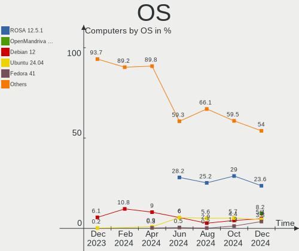

| Name                        | Computers | Percent |
|-----------------------------|-----------|---------|
| ROSA 12.4                   | 154       | 26.24%  |
| Ubuntu 22.04                | 87        | 14.82%  |
| Debian 12                   | 42        | 7.16%   |
| Red OS 7.3                  | 18        | 3.07%   |
| ROSA 12                     | 17        | 2.9%    |
| ALT Linux 10.2              | 17        | 2.9%    |
| Linux Mint 21.2             | 16        | 2.73%   |
| Fedora 38                   | 16        | 2.73%   |
| Ubuntu 23.10                | 15        | 2.56%   |
| Arch Rolling                | 14        | 2.39%   |
| Cyber Infra 5.0.1           | 11        | 1.87%   |
| ROSA R11.1                  | 9         | 1.53%   |
| Debian 11                   | 9         | 1.53%   |
| OpenMandriva 23.10          | 8         | 1.36%   |
| Manjaro                     | 8         | 1.36%   |
| OpenMandriva 23.08          | 7         | 1.19%   |
| ALT Linux 10.1              | 7         | 1.19%   |
| SteamOS 3.4.11              | 6         | 1.02%   |
| OpenMandriva 4.3            | 6         | 1.02%   |
| KDE neon 22.04              | 6         | 1.02%   |
| Pop!_OS 22.04               | 5         | 0.85%   |
| Gentoo 2.14                 | 5         | 0.85%   |
| Elementary 7.1              | 5         | 0.85%   |
| Ubuntu 23.04                | 4         | 0.68%   |
| ROSA 12.3                   | 4         | 0.68%   |
| org.kde.Platform 5.15-21.08 | 4         | 0.68%   |
| Fedora 39                   | 4         | 0.68%   |
| EndeavourOS Rolling         | 4         | 0.68%   |
| Xero Rolling                | 3         | 0.51%   |
| Nobara 38                   | 3         | 0.51%   |
| Kubuntu 22.04               | 3         | 0.51%   |
| Kali 2023.3                 | 3         | 0.51%   |
| Debian                      | 3         | 0.51%   |
| Xubuntu 22.04               | 2         | 0.34%   |
| Ubuntu 22.10                | 2         | 0.34%   |
| Ubuntu 20.04                | 2         | 0.34%   |
| ROSA 12.1                   | 2         | 0.34%   |
| OpenMandriva 23.01          | 2         | 0.34%   |
| NixOS 23.05                 | 2         | 0.34%   |
| MX 23                       | 2         | 0.34%   |

OS Family
---------

OS without a version

| Name             | Computers | Percent |
|------------------|-----------|---------|
| ROSA             | 190       | 32.37%  |
| Ubuntu           | 110       | 18.74%  |
| Debian           | 56        | 9.54%   |
| ALT Linux        | 26        | 4.43%   |
| OpenMandriva     | 25        | 4.26%   |
| Fedora           | 21        | 3.58%   |
| Red OS           | 19        | 3.24%   |
| Linux Mint       | 19        | 3.24%   |
| Arch             | 14        | 2.39%   |
| Manjaro          | 11        | 1.87%   |
| Cyber Infra      | 11        | 1.87%   |
| SteamOS          | 8         | 1.36%   |
| KDE neon         | 6         | 1.02%   |
| Pop!_OS          | 5         | 0.85%   |
| Gentoo           | 5         | 0.85%   |
| Elementary       | 5         | 0.85%   |
| org.kde.Platform | 4         | 0.68%   |
| Kubuntu          | 4         | 0.68%   |
| Kali             | 4         | 0.68%   |
| EndeavourOS      | 4         | 0.68%   |
| Xubuntu          | 3         | 0.51%   |
| Xero             | 3         | 0.51%   |
| Nobara           | 3         | 0.51%   |
| NixOS            | 3         | 0.51%   |
| openSUSE         | 2         | 0.34%   |
| MX               | 2         | 0.34%   |
| Lubuntu          | 2         | 0.34%   |
| Deepin           | 2         | 0.34%   |
| Astra Linux      | 2         | 0.34%   |
| ArcoLinux        | 2         | 0.34%   |
| Zorin            | 1         | 0.17%   |
| Ubuntu Unity     | 1         | 0.17%   |
| Ubuntu MATE      | 1         | 0.17%   |
| Taleui           | 1         | 0.17%   |
| Sparky           | 1         | 0.17%   |
| RELS             | 1         | 0.17%   |
| RELD             | 1         | 0.17%   |
| RED              | 1         | 0.17%   |
| PostmarketOS     | 1         | 0.17%   |
| Parrot           | 1         | 0.17%   |

Kernel
------

Version of the Linux kernel

| Version                             | Computers | Percent |
|-------------------------------------|-----------|---------|
| 6.1.46-generic-2rosa2021.1-x86_64   | 68        | 11.58%  |
| 5.19.0-38-generic                   | 55        | 9.37%   |
| 6.1.20-generic-2rosa2021.1-x86_64   | 47        | 8.01%   |
| 6.2.0-34-generic                    | 24        | 4.09%   |
| 6.1.58-generic-1rosa2021.1-x86_64   | 19        | 3.24%   |
| 6.2.0-35-generic                    | 16        | 2.73%   |
| 6.1.0-4-amd64                       | 15        | 2.56%   |
| 6.1.0-13-amd64                      | 14        | 2.39%   |
| 6.1.52-1.el7.3.x86_64               | 11        | 1.87%   |
| 3.10.0-1160.41.1.vz7.183.5          | 11        | 1.87%   |
| 6.5.0-9-generic                     | 9         | 1.53%   |
| 5.15.0-87-generic                   | 9         | 1.53%   |
| 5.10.184-generic-1rosa2021.1-x86_64 | 9         | 1.53%   |
| 6.5.7-arch1-1                       | 8         | 1.36%   |
| 6.5.5-desktop-1omv2390              | 7         | 1.19%   |
| 5.15.127-generic-1rosa2021.1-x86_64 | 7         | 1.19%   |
| 5.15.103-generic-1rosa2021.1-i686   | 7         | 1.19%   |
| 5.13.0-valve37-1-neptune            | 7         | 1.19%   |
| 6.5.7-200.fc38.x86_64               | 6         | 1.02%   |
| 6.4.11-desktop-1omv2390             | 6         | 1.02%   |
| 6.1.38-generic-1rosa2021.1-x86_64   | 6         | 1.02%   |
| 5.15.0-86-generic                   | 6         | 1.02%   |
| 6.5.5-1-MANJARO                     | 5         | 0.85%   |
| 6.2.0-33-generic                    | 5         | 0.85%   |
| 6.1.54-un-def-alt1                  | 5         | 0.85%   |
| 6.1.49-un-def-alt1                  | 5         | 0.85%   |
| 6.1.0-12-amd64                      | 5         | 0.85%   |
| 6.1.0-10-amd64                      | 5         | 0.85%   |
| 5.16.7-desktop-1omv4003             | 5         | 0.85%   |
| 6.5.4-76060504-generic              | 4         | 0.68%   |
| 6.5.0-5-generic                     | 4         | 0.68%   |
| 6.1.55-un-def-alt1                  | 4         | 0.68%   |
| 5.4.83-generic-2rosa-x86_64         | 4         | 0.68%   |
| 5.15.0-76-generic                   | 4         | 0.68%   |
| 6.5.9-arch2-1                       | 3         | 0.51%   |
| 6.5.6-200.fc38.x86_64               | 3         | 0.51%   |
| 6.5.5-200.fc38.x86_64               | 3         | 0.51%   |
| 6.2.0-26-generic                    | 3         | 0.51%   |
| 6.1.58-1-lts                        | 3         | 0.51%   |
| 5.15.131-1.el7.3.x86_64             | 3         | 0.51%   |

Kernel Family
-------------

Linux kernel without a distro release

| Version  | Computers | Percent |
|----------|-----------|---------|
| 6.1.46   | 70        | 11.93%  |
| 5.19.0   | 58        | 9.88%   |
| 6.2.0    | 49        | 8.35%   |
| 6.1.20   | 47        | 8.01%   |
| 6.1.0    | 43        | 7.33%   |
| 5.15.0   | 25        | 4.26%   |
| 6.5.5    | 23        | 3.92%   |
| 6.5.7    | 22        | 3.75%   |
| 6.1.58   | 22        | 3.75%   |
| 6.5.0    | 19        | 3.24%   |
| 6.1.52   | 12        | 2.04%   |
| 3.10.0   | 11        | 1.87%   |
| 5.10.184 | 9         | 1.53%   |
| 6.1.38   | 8         | 1.36%   |
| 5.15.127 | 8         | 1.36%   |
| 5.15.103 | 8         | 1.36%   |
| 6.5.8    | 7         | 1.19%   |
| 6.5.6    | 7         | 1.19%   |
| 5.13.0   | 7         | 1.19%   |
| 6.5.9    | 6         | 1.02%   |
| 6.5.4    | 6         | 1.02%   |
| 6.4.11   | 6         | 1.02%   |
| 6.1.49   | 6         | 1.02%   |
| 6.1.55   | 5         | 0.85%   |
| 6.1.54   | 5         | 0.85%   |
| 5.16.7   | 5         | 0.85%   |
| 5.10.0   | 5         | 0.85%   |
| 5.4.83   | 4         | 0.68%   |
| 5.15.75  | 4         | 0.68%   |
| 4.15.0   | 4         | 0.68%   |
| 5.15.131 | 3         | 0.51%   |
| 5.10.74  | 3         | 0.51%   |
| 6.5.3    | 2         | 0.34%   |
| 6.4.8    | 2         | 0.34%   |
| 6.4.0    | 2         | 0.34%   |
| 6.3.12   | 2         | 0.34%   |
| 6.3.0    | 2         | 0.34%   |
| 6.2.9    | 2         | 0.34%   |
| 6.2.16   | 2         | 0.34%   |
| 6.1.57   | 2         | 0.34%   |

Kernel Major Ver.
-----------------

Linux kernel major version

| Version | Computers | Percent |
|---------|-----------|---------|
| 6.1     | 232       | 39.52%  |
| 6.5     | 94        | 16.01%  |
| 5.19    | 58        | 9.88%   |
| 5.15    | 58        | 9.88%   |
| 6.2     | 55        | 9.37%   |
| 5.10    | 27        | 4.6%    |
| 6.4     | 12        | 2.04%   |
| 3.10    | 11        | 1.87%   |
| 5.4     | 9         | 1.53%   |
| 5.13    | 8         | 1.36%   |
| 5.16    | 6         | 1.02%   |
| 6.3     | 4         | 0.68%   |
| 4.15    | 4         | 0.68%   |
| 6.0     | 2         | 0.34%   |
| 6.6     | 1         | 0.17%   |
| 5.18    | 1         | 0.17%   |
| 5.14    | 1         | 0.17%   |
| 5.11    | 1         | 0.17%   |
| 4.9     | 1         | 0.17%   |
| 4.18    | 1         | 0.17%   |
| 4.1     | 1         | 0.17%   |

Arch
----

OS architecture (x86_64, i586, etc.)

| Name    | Computers | Percent |
|---------|-----------|---------|
| x86_64  | 567       | 96.59%  |
| i686    | 16        | 2.73%   |
| riscv64 | 2         | 0.34%   |
| aarch64 | 2         | 0.34%   |

DE
--

Desktop Environment

| Name              | Computers | Percent |
|-------------------|-----------|---------|
| KDE5              | 198       | 33.73%  |
| GNOME             | 154       | 26.24%  |
| Unknown           | 97        | 16.52%  |
| MATE              | 33        | 5.62%   |
| LXQt              | 28        | 4.77%   |
| X-Cinnamon        | 21        | 3.58%   |
| XFCE              | 20        | 3.41%   |
| KDE4              | 8         | 1.36%   |
| Pantheon          | 5         | 0.85%   |
| i3                | 5         | 0.85%   |
| Cinnamon          | 3         | 0.51%   |
| Unity             | 2         | 0.34%   |
| KDE               | 2         | 0.34%   |
| GNOME Flashback   | 2         | 0.34%   |
| fly               | 2         | 0.34%   |
| x-session-manager | 1         | 0.17%   |
| sway              | 1         | 0.17%   |
| LXDE              | 1         | 0.17%   |
| DWM               | 1         | 0.17%   |
| Deepin            | 1         | 0.17%   |
| DDE               | 1         | 0.17%   |
| Budgie            | 1         | 0.17%   |

Display Server
--------------

X11 or Wayland

| Name    | Computers | Percent |
|---------|-----------|---------|
| X11     | 258       | 43.95%  |
| Wayland | 230       | 39.18%  |
| Unknown | 83        | 14.14%  |
| Tty     | 16        | 2.73%   |

Display Manager
---------------

SDDM, LightDM, etc.

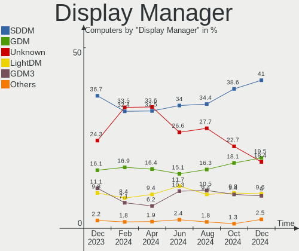

| Name    | Computers | Percent |
|---------|-----------|---------|
| Unknown | 181       | 30.83%  |
| SDDM    | 167       | 28.45%  |
| GDM     | 87        | 14.82%  |
| LightDM | 74        | 12.61%  |
| GDM3    | 68        | 11.58%  |
| KDM     | 8         | 1.36%   |
| LXDM    | 1         | 0.17%   |
| FLY-DM  | 1         | 0.17%   |

OS Lang
-------

Language

| Lang    | Computers | Percent |
|---------|-----------|---------|
| ru_RU   | 403       | 68.65%  |
| en_US   | 108       | 18.4%   |
| C       | 66        | 11.24%  |
| en_GB   | 5         | 0.85%   |
| Unknown | 3         | 0.51%   |
| ru_UA   | 1         | 0.17%   |
| en_AU   | 1         | 0.17%   |

Boot Mode
---------

EFI or BIOS

| Mode | Computers | Percent |
|------|-----------|---------|
| EFI  | 310       | 52.81%  |
| BIOS | 277       | 47.19%  |

Filesystem
----------

Type of filesystem

| Type    | Computers | Percent |
|---------|-----------|---------|
| Ext4    | 372       | 63.37%  |
| Overlay | 94        | 16.01%  |
| Btrfs   | 84        | 14.31%  |
| Tmpfs   | 25        | 4.26%   |
| Xfs     | 6         | 1.02%   |
| Zfs     | 2         | 0.34%   |
| F2fs    | 1         | 0.17%   |
| Ext2    | 1         | 0.17%   |
| Aufs    | 1         | 0.17%   |
| Unknown | 1         | 0.17%   |

Part. scheme
------------

Scheme of partitioning

| Type    | Computers | Percent |
|---------|-----------|---------|
| GPT     | 330       | 56.22%  |
| Unknown | 138       | 23.51%  |
| MBR     | 119       | 20.27%  |

Dual Boot with Linux/BSD
------------------------

Hosting more than one Linux/BSD

| Dual boot | Computers | Percent |
|-----------|-----------|---------|
| No        | 451       | 76.83%  |
| Yes       | 136       | 23.17%  |

Dual Boot (Win)
---------------

Hosting Linux and Windows

| Dual boot | Computers | Percent |
|-----------|-----------|---------|
| No        | 397       | 67.63%  |
| Yes       | 190       | 32.37%  |

Board
-----

Vendor
------

Motherboard manufacturer

| Name                              | Computers | Percent |
|-----------------------------------|-----------|---------|
| ASUSTek Computer                  | 99        | 16.87%  |
| Gigabyte Technology               | 56        | 9.54%   |
| Lenovo                            | 51        | 8.69%   |
| MSI                               | 43        | 7.33%   |
| Supermicro                        | 41        | 6.98%   |
| Hewlett-Packard                   | 39        | 6.64%   |
| Acer                              | 30        | 5.11%   |
| Unknown                           | 25        | 4.26%   |
| HUAWEI                            | 18        | 3.07%   |
| Dell                              | 18        | 3.07%   |
| ASRock                            | 18        | 3.07%   |
| ETegro Technologies               | 16        | 2.73%   |
| Valve                             | 8         | 1.36%   |
| Intel                             | 8         | 1.36%   |
| Apple                             | 8         | 1.36%   |
| Samsung Electronics               | 5         | 0.85%   |
| Maibenben                         | 5         | 0.85%   |
| Huanan                            | 5         | 0.85%   |
| HONOR                             | 5         | 0.85%   |
| Clevo                             | 5         | 0.85%   |
| Biostar                           | 5         | 0.85%   |
| XIAOMI                            | 4         | 0.68%   |
| Sony                              | 4         | 0.68%   |
| ANCOMP                            | 4         | 0.68%   |
| Toshiba                           | 3         | 0.51%   |
| Pegatron                          | 3         | 0.51%   |
| HPE                               | 3         | 0.51%   |
| ECS                               | 3         | 0.51%   |
| Timi                              | 2         | 0.34%   |
| TECNO                             | 2         | 0.34%   |
| realme                            | 2         | 0.34%   |
| Packard Bell                      | 2         | 0.34%   |
| MACHINIST                         | 2         | 0.34%   |
| Irbis                             | 2         | 0.34%   |
| ICL                               | 2         | 0.34%   |
| IBM                               | 2         | 0.34%   |
| Graviton                          | 2         | 0.34%   |
| Getac                             | 2         | 0.34%   |
| F-PLUS EQUIPMENT AND DEVELOPMENTS | 2         | 0.34%   |
| eMachines                         | 2         | 0.34%   |

Model
-----

Motherboard model

| Name                          | Computers | Percent |
|-------------------------------|-----------|---------|
| Unknown                       | 28        | 4.77%   |
| ETegro Hyperion RS125 G4      | 16        | 2.73%   |
| Valve Jupiter                 | 8         | 1.36%   |
| Supermicro X8DTU              | 7         | 1.19%   |
| Supermicro SYS-6018R-TDW      | 6         | 1.02%   |
| XIAOMI Redmi Book Pro 15 2023 | 4         | 0.68%   |
| Supermicro X10DRi             | 4         | 0.68%   |
| Supermicro SYS-1028R-TDW      | 4         | 0.68%   |
| HP Notebook                   | 4         | 0.68%   |
| Clevo NL41MU2                 | 4         | 0.68%   |
| ASUS All Series               | 4         | 0.68%   |
| Supermicro X9DRW              | 3         | 0.51%   |
| Supermicro SYS-6018R-MTR      | 3         | 0.51%   |
| Supermicro Super Server       | 3         | 0.51%   |
| MSI MS-7996                   | 3         | 0.51%   |
| HUAWEI BOM-WXX9               | 3         | 0.51%   |
| HPE ProLiant DL360 Gen10      | 3         | 0.51%   |
| Apple MacBookPro8,1           | 3         | 0.51%   |
| Acer Nitro AN515-57           | 3         | 0.51%   |
| TECNO MEGABOOK T1             | 2         | 0.34%   |
| realme RMNBXXXX               | 2         | 0.34%   |
| MSI Prestige 14Evo A12M       | 2         | 0.34%   |
| MSI MS-7C51                   | 2         | 0.34%   |
| MSI MS-7641                   | 2         | 0.34%   |
| Maibenben MaiBook X series    | 2         | 0.34%   |
| Intel X99                     | 2         | 0.34%   |
| Intel SKYBAY                  | 2         | 0.34%   |
| HUAWEI RLEF-XX                | 2         | 0.34%   |
| HUAWEI CREM-WXX9              | 2         | 0.34%   |
| HUAWEI BOHK-WAX9X             | 2         | 0.34%   |
| HONOR HYM-WXX                 | 2         | 0.34%   |
| HP ProLiant DL360 Gen9        | 2         | 0.34%   |
| HP Pavilion dv6               | 2         | 0.34%   |
| HP Laptop 15s-eq2xxx          | 2         | 0.34%   |
| HP Laptop 15-bw0xx            | 2         | 0.34%   |
| Gigabyte H510M H              | 2         | 0.34%   |
| Gigabyte GA-870A-UD3          | 2         | 0.34%   |
| Gigabyte B75M-D3V             | 2         | 0.34%   |
| Gigabyte B550M AORUS PRO-P    | 2         | 0.34%   |
| Gigabyte A320M-S2H            | 2         | 0.34%   |

Model Family
------------

Motherboard model prefix

| Name                     | Computers | Percent |
|--------------------------|-----------|---------|
| Unknown                  | 28        | 4.77%   |
| ASUS PRIME               | 17        | 2.9%    |
| ETegro Hyperion          | 16        | 2.73%   |
| Lenovo IdeaPad           | 12        | 2.04%   |
| Acer Aspire              | 12        | 2.04%   |
| Lenovo ThinkPad          | 11        | 1.87%   |
| HP Laptop                | 10        | 1.7%    |
| Valve Jupiter            | 8         | 1.36%   |
| Supermicro X8DTU         | 7         | 1.19%   |
| HP ProBook               | 7         | 1.19%   |
| HP Pavilion              | 7         | 1.19%   |
| Supermicro SYS-6018R-TDW | 6         | 1.02%   |
| Gigabyte B550M           | 6         | 1.02%   |
| Dell Inspiron            | 6         | 1.02%   |
| ASUS Zenbook             | 6         | 1.02%   |
| ASUS VivoBook            | 6         | 1.02%   |
| ASUS ROG                 | 6         | 1.02%   |
| XIAOMI Redmi             | 4         | 0.68%   |
| Supermicro X10DRi        | 4         | 0.68%   |
| Supermicro SYS-1028R-TDW | 4         | 0.68%   |
| Maibenben MaiBook        | 4         | 0.68%   |
| Lenovo ThinkCentre       | 4         | 0.68%   |
| HP Notebook              | 4         | 0.68%   |
| Clevo NL41MU2            | 4         | 0.68%   |
| ASUS TUF                 | 4         | 0.68%   |
| ASUS All                 | 4         | 0.68%   |
| Toshiba Satellite        | 3         | 0.51%   |
| Supermicro X9DRW         | 3         | 0.51%   |
| Supermicro SYS-6018R-MTR | 3         | 0.51%   |
| Supermicro Super         | 3         | 0.51%   |
| MSI MS-7996              | 3         | 0.51%   |
| Lenovo Legion            | 3         | 0.51%   |
| Lenovo IdeaCentre        | 3         | 0.51%   |
| HUAWEI BOM-WXX9          | 3         | 0.51%   |
| HPE ProLiant             | 3         | 0.51%   |
| Gigabyte B450M           | 3         | 0.51%   |
| Gigabyte A320M-S2H       | 3         | 0.51%   |
| Dell Vostro              | 3         | 0.51%   |
| Dell Latitude            | 3         | 0.51%   |
| ASUS P8H61-M             | 3         | 0.51%   |

MFG Year
--------

Motherboard manufacture year

| Year    | Computers | Percent |
|---------|-----------|---------|
| 2022    | 83        | 14.14%  |
| 2021    | 60        | 10.22%  |
| 2023    | 41        | 6.98%   |
| 2020    | 41        | 6.98%   |
| 2019    | 40        | 6.81%   |
| 2018    | 40        | 6.81%   |
| 2013    | 37        | 6.3%    |
| 2012    | 34        | 5.79%   |
| 2011    | 32        | 5.45%   |
| 2009    | 29        | 4.94%   |
| 2015    | 28        | 4.77%   |
| 2017    | 25        | 4.26%   |
| 2010    | 24        | 4.09%   |
| 2016    | 23        | 3.92%   |
| 2008    | 12        | 2.04%   |
| 2007    | 12        | 2.04%   |
| 2014    | 11        | 1.87%   |
| 2006    | 5         | 0.85%   |
| Unknown | 5         | 0.85%   |
| 2005    | 3         | 0.51%   |
| 2004    | 2         | 0.34%   |

Form Factor
-----------

Physical design of the computer

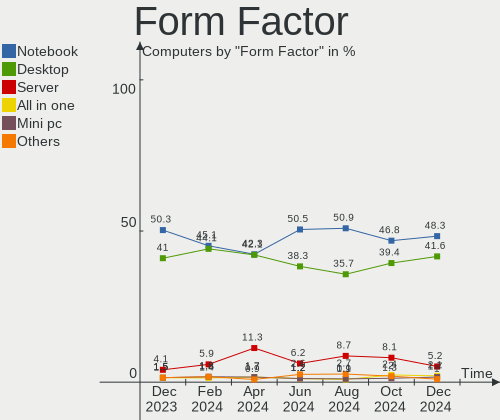

| Name           | Computers | Percent |
|----------------|-----------|---------|
| Notebook       | 268       | 45.66%  |
| Desktop        | 233       | 39.69%  |
| Server         | 60        | 10.22%  |
| All in one     | 11        | 1.87%   |
| System on chip | 4         | 0.68%   |
| Tablet         | 4         | 0.68%   |
| Mini pc        | 4         | 0.68%   |
| Convertible    | 3         | 0.51%   |

Secure Boot
-----------

Enabled or disabled

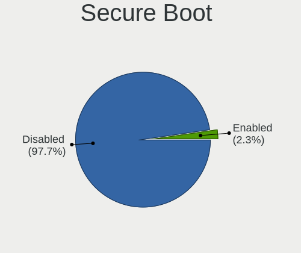

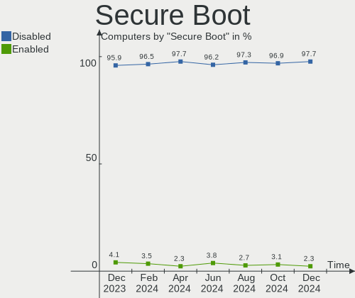

| State    | Computers | Percent |
|----------|-----------|---------|
| Disabled | 565       | 96.25%  |
| Enabled  | 22        | 3.75%   |

Coreboot
--------

Have coreboot on board

| Used | Computers | Percent |
|------|-----------|---------|
| No   | 587       | 100%    |

RAM Size
--------

Total RAM memory

| Size in GB      | Computers | Percent |
|-----------------|-----------|---------|
| 4.01-8.0        | 131       | 22.32%  |
| 16.01-24.0      | 128       | 21.81%  |
| 8.01-16.0       | 100       | 17.04%  |
| 3.01-4.0        | 70        | 11.93%  |
| 32.01-64.0      | 60        | 10.22%  |
| 64.01-256.0     | 37        | 6.3%    |
| 1.01-2.0        | 27        | 4.6%    |
| More than 256.0 | 11        | 1.87%   |
| 24.01-32.0      | 9         | 1.53%   |
| 2.01-3.0        | 8         | 1.36%   |
| 0.51-1.0        | 6         | 1.02%   |

RAM Used
--------

Used RAM memory

| Used GB     | Computers | Percent |
|-------------|-----------|---------|
| 1.01-2.0    | 210       | 35.78%  |
| 2.01-3.0    | 123       | 20.95%  |
| 4.01-8.0    | 74        | 12.61%  |
| 3.01-4.0    | 70        | 11.93%  |
| 0.51-1.0    | 59        | 10.05%  |
| 8.01-16.0   | 27        | 4.6%    |
| 0.01-0.5    | 10        | 1.7%    |
| 24.01-32.0  | 6         | 1.02%   |
| 16.01-24.0  | 4         | 0.68%   |
| 32.01-64.0  | 3         | 0.51%   |
| 64.01-256.0 | 1         | 0.17%   |

Total Drives
------------

Number of drives on board

| Drives | Computers | Percent |
|--------|-----------|---------|
| 1      | 340       | 57.92%  |
| 2      | 153       | 26.06%  |
| 3      | 41        | 6.98%   |
| 4      | 18        | 3.07%   |
| 5      | 8         | 1.36%   |
| 7      | 7         | 1.19%   |
| 10     | 5         | 0.85%   |
| 8      | 4         | 0.68%   |
| 6      | 4         | 0.68%   |
| 9      | 3         | 0.51%   |
| 0      | 2         | 0.34%   |
| 17     | 1         | 0.17%   |
| 11     | 1         | 0.17%   |

Has CD-ROM
----------

Has CD-ROM on board

| Presented | Computers | Percent |
|-----------|-----------|---------|
| No        | 476       | 81.09%  |
| Yes       | 111       | 18.91%  |

Has Ethernet
------------

Has Ethernet on board

| Presented | Computers | Percent |
|-----------|-----------|---------|
| Yes       | 493       | 83.99%  |
| No        | 94        | 16.01%  |

Has WiFi
--------

Has WiFi module

| Presented | Computers | Percent |
|-----------|-----------|---------|
| Yes       | 359       | 61.16%  |
| No        | 228       | 38.84%  |

Has Bluetooth
-------------

Has Bluetooth module

| Presented | Computers | Percent |
|-----------|-----------|---------|
| Yes       | 305       | 51.96%  |
| No        | 282       | 48.04%  |

Location
--------

Country
-------

Geographic location (country)

| Country | Computers | Percent |
|---------|-----------|---------|
| Russia  | 587       | 100%    |

City
----

Geographic location (city)

| City              | Computers | Percent |
|-------------------|-----------|---------|
| Moscow            | 209       | 35.6%   |
| St Petersburg     | 47        | 8.01%   |
| Voronezh          | 21        | 3.58%   |
| Yekaterinburg     | 16        | 2.73%   |
| Krasnodar         | 14        | 2.39%   |
| Rostov-on-Don     | 13        | 2.21%   |
| Novosibirsk       | 13        | 2.21%   |
| Perm              | 11        | 1.87%   |
| Nizhniy Novgorod  | 9         | 1.53%   |
| Chelyabinsk       | 9         | 1.53%   |
| Ufa               | 7         | 1.19%   |
| Yaroslavl         | 6         | 1.02%   |
| Saratov           | 6         | 1.02%   |
| Stavropol         | 5         | 0.85%   |
| Samara            | 5         | 0.85%   |
| Krasnoyarsk       | 5         | 0.85%   |
| Kazan’          | 5         | 0.85%   |
| Yoshkar-Ola       | 4         | 0.68%   |
| Volgograd         | 4         | 0.68%   |
| Vladivostok       | 4         | 0.68%   |
| Tolyatti          | 4         | 0.68%   |
| Smolensk          | 4         | 0.68%   |
| Shchelkovo        | 4         | 0.68%   |
| Obninsk           | 4         | 0.68%   |
| Magnitogorsk      | 4         | 0.68%   |
| Belgorod          | 4         | 0.68%   |
| Barnaul           | 4         | 0.68%   |
| Volzhsky          | 3         | 0.51%   |
| Tyumen            | 3         | 0.51%   |
| Tver              | 3         | 0.51%   |
| Surgut            | 3         | 0.51%   |
| Ramenskoye        | 3         | 0.51%   |
| Penza             | 3         | 0.51%   |
| Orenburg          | 3         | 0.51%   |
| Omsk              | 3         | 0.51%   |
| Novokuznetsk      | 3         | 0.51%   |
| Murmansk          | 3         | 0.51%   |
| Lipetsk           | 3         | 0.51%   |
| Yuzhno-Sakhalinsk | 2         | 0.34%   |
| Yakutsk           | 2         | 0.34%   |

Drives
------

Drive Vendor
------------

Hard drive vendors

| Vendor                      | Computers | Drives | Percent |
|-----------------------------|-----------|--------|---------|
| WDC                         | 118       | 137    | 13.49%  |
| Samsung Electronics         | 96        | 115    | 10.97%  |
| Seagate                     | 89        | 111    | 10.17%  |
| Kingston                    | 49        | 54     | 5.6%    |
| Toshiba                     | 43        | 59     | 4.91%   |
| Intel                       | 31        | 77     | 3.54%   |
| Micron Technology           | 25        | 64     | 2.86%   |
| Hitachi                     | 25        | 32     | 2.86%   |
| HGST                        | 25        | 39     | 2.86%   |
| Fujitsu                     | 25        | 43     | 2.86%   |
| Unknown                     | 23        | 24     | 2.63%   |
| A-DATA Technology           | 22        | 22     | 2.51%   |
| Apacer                      | 18        | 19     | 2.06%   |
| SanDisk                     | 17        | 17     | 1.94%   |
| SK hynix                    | 14        | 14     | 1.6%    |
| Crucial                     | 14        | 14     | 1.6%    |
| Silicon Motion              | 12        | 12     | 1.37%   |
| China                       | 12        | 12     | 1.37%   |
| KIOXIA                      | 11        | 12     | 1.26%   |
| Patriot                     | 9         | 9      | 1.03%   |
| Maxtor                      | 9         | 9      | 1.03%   |
| Smartbuy                    | 8         | 8      | 0.91%   |
| Phison Electronics          | 7         | 7      | 0.8%    |
| Hewlett-Packard             | 7         | 12     | 0.8%    |
| OCZ                         | 6         | 6      | 0.69%   |
| Netac                       | 6         | 6      | 0.69%   |
| KingSpec                    | 6         | 7      | 0.69%   |
| AMD                         | 6         | 6      | 0.69%   |
| SPCC                        | 5         | 5      | 0.57%   |
| Micron/Crucial Technology   | 5         | 6      | 0.57%   |
| JetFlash                    | 5         | 5      | 0.57%   |
| BIWIN                       | 5         | 5      | 0.57%   |
| Apple                       | 5         | 6      | 0.57%   |
| Unknown                     | 5         | 5      | 0.57%   |
| SCY                         | 4         | 4      | 0.46%   |
| Realtek Semiconductor       | 4         | 4      | 0.46%   |
| MAXIO Technology (Hangzhou) | 4         | 4      | 0.46%   |
| AGI                         | 4         | 4      | 0.46%   |
| XrayDisk                    | 3         | 3      | 0.34%   |
| Transcend                   | 3         | 3      | 0.34%   |

Drive Model
-----------

Hard drive models

| Model                                                        | Computers | Percent |
|--------------------------------------------------------------|-----------|---------|
| Fujitsu MBE2147RC 147GB                                      | 11        | 1.17%   |
| Seagate ST1000NM0033-9ZM173 1TB                              | 10        | 1.06%   |
| Kingston SA400S37480G 480GB SSD                              | 10        | 1.06%   |
| Fujitsu MBA3147RC 147GB                                      | 8         | 0.85%   |
| A-DATA SU650 240GB SSD                                       | 8         | 0.85%   |
| Seagate ST1000DM010-2EP102 1TB                               | 7         | 0.74%   |
| Samsung NVMe SSD Controller SM981/PM981/PM983 1TB            | 7         | 0.74%   |
| Samsung NVMe SSD Controller PM9A1/PM9A3/980PRO 1TB           | 7         | 0.74%   |
| Kingston SNVS500G 500GB                                      | 6         | 0.64%   |
| Kingston SA400S37240G 240GB SSD                              | 6         | 0.64%   |
| WDC WD10EZEX-08WN4A0 1TB                                     | 5         | 0.53%   |
| Toshiba MK0502TSKB 500GB                                     | 5         | 0.53%   |
| Toshiba DT01ACA050 500GB                                     | 5         | 0.53%   |
| Smartbuy SSD 120GB                                           | 5         | 0.53%   |
| Micron 5300_MTFDDAK1T9TDT 2TB SSD                            | 5         | 0.53%   |
| KIOXIA KBG50ZNV512G 512GB                                    | 5         | 0.53%   |
| JetFlash Transcend 128GB                                     | 5         | 0.53%   |
| Intel SSDPEKNU512GZ 512GB                                    | 5         | 0.53%   |
| Intel NVMe Datacenter SSD [3DNAND, Beta Rock Controller] 2TB | 5         | 0.53%   |
| HGST HTS721010A9E630 1TB                                     | 5         | 0.53%   |
| Unknown                                                      | 5         | 0.53%   |
| Toshiba MQ01ABF050 500GB                                     | 4         | 0.43%   |
| Silicon Motion SM2263EN/SM2263XT SSD Controller 256GB        | 4         | 0.43%   |
| Seagate ST500DM002-1BD142 500GB                              | 4         | 0.43%   |
| Seagate ST1000LM035-1RK172 1TB                               | 4         | 0.43%   |
| Seagate ST1000LM024 HN-M101MBB 1TB                           | 4         | 0.43%   |
| Sandisk WD Black SN750 / PC SN730 NVMe SSD 1024GB            | 4         | 0.43%   |
| Samsung SSD 980 PRO 1TB                                      | 4         | 0.43%   |
| Samsung SSD 860 EVO 1TB                                      | 4         | 0.43%   |
| Phison PS5013 E13 NVMe Controller 256GB                      | 4         | 0.43%   |
| Micron/Crucial P2 NVMe PCIe SSD 500GB                        | 4         | 0.43%   |
| Micron 2400_MTFDKBA512QFM 512GB                              | 4         | 0.43%   |
| Kingston SA400S37960G 960GB SSD                              | 4         | 0.43%   |
| Kingston SA400S37120G 120GB SSD                              | 4         | 0.43%   |
| Intel SSDSC2BB800G7 800GB                                    | 4         | 0.43%   |
| Intel SSDSC2BB480G7 480GB                                    | 4         | 0.43%   |
| HGST HTS541010A9E680 1TB                                     | 4         | 0.43%   |
| HGST HTE721010A9E630 1TB                                     | 4         | 0.43%   |
| Fujitsu MAX3147RC 147GB                                      | 4         | 0.43%   |
| BIWIN CE480T5D101-256 256GB                                  | 4         | 0.43%   |

HDD Vendor
----------

Hard disk drive vendors

| Vendor              | Computers | Drives | Percent |
|---------------------|-----------|--------|---------|
| WDC                 | 96        | 108    | 29.81%  |
| Seagate             | 88        | 110    | 27.33%  |
| Toshiba             | 37        | 52     | 11.49%  |
| Hitachi             | 25        | 32     | 7.76%   |
| HGST                | 25        | 39     | 7.76%   |
| Fujitsu             | 25        | 43     | 7.76%   |
| Samsung Electronics | 8         | 9      | 2.48%   |
| Maxtor              | 8         | 8      | 2.48%   |
| External            | 3         | 3      | 0.93%   |
| Unknown             | 2         | 2      | 0.62%   |
| USB                 | 1         | 1      | 0.31%   |
| IBM-ESXS            | 1         | 1      | 0.31%   |
| Hewlett-Packard     | 1         | 4      | 0.31%   |
| ASMT                | 1         | 1      | 0.31%   |
| Apple               | 1         | 1      | 0.31%   |

SSD Vendor
----------

Solid state drive vendors

| Vendor              | Computers | Drives | Percent |
|---------------------|-----------|--------|---------|
| Kingston            | 33        | 36     | 12%     |
| Samsung Electronics | 30        | 30     | 10.91%  |
| A-DATA Technology   | 19        | 19     | 6.91%   |
| Intel               | 16        | 37     | 5.82%   |
| Micron Technology   | 14        | 53     | 5.09%   |
| Apacer              | 14        | 15     | 5.09%   |
| Crucial             | 13        | 13     | 4.73%   |
| China               | 12        | 12     | 4.36%   |
| WDC                 | 10        | 11     | 3.64%   |
| Patriot             | 9         | 9      | 3.27%   |
| Smartbuy            | 8         | 8      | 2.91%   |
| OCZ                 | 6         | 6      | 2.18%   |
| KingSpec            | 6         | 7      | 2.18%   |
| SPCC                | 5         | 5      | 1.82%   |
| SanDisk             | 5         | 5      | 1.82%   |
| Hewlett-Packard     | 5         | 7      | 1.82%   |
| AMD                 | 5         | 5      | 1.82%   |
| Netac               | 4         | 4      | 1.45%   |
| AGI                 | 4         | 4      | 1.45%   |
| XrayDisk            | 3         | 3      | 1.09%   |
| Toshiba             | 3         | 3      | 1.09%   |
| Neo                 | 3         | 3      | 1.09%   |
| HPE                 | 3         | 3      | 1.09%   |
| Transcend           | 2         | 2      | 0.73%   |
| Team                | 2         | 2      | 0.73%   |
| SK hynix            | 2         | 2      | 0.73%   |
| Qumo                | 2         | 2      | 0.73%   |
| Plextor             | 2         | 2      | 0.73%   |
| KingFast            | 2         | 2      | 0.73%   |
| Kimtigo             | 2         | 2      | 0.73%   |
| DEXP                | 2         | 2      | 0.73%   |
| Azerty              | 2         | 2      | 0.73%   |
| ZHITAI              | 1         | 1      | 0.36%   |
| Zheino              | 1         | 1      | 0.36%   |
| SP                  | 1         | 1      | 0.36%   |
| SNR                 | 1         | 5      | 0.36%   |
| ShanDianZhe         | 1         | 1      | 0.36%   |
| Seagate             | 1         | 1      | 0.36%   |
| Realtek             | 1         | 1      | 0.36%   |
| PHD 3.0             | 1         | 1      | 0.36%   |

Drive Kind
----------

HDD or SSD

| Kind    | Computers | Drives | Percent |
|---------|-----------|--------|---------|
| HDD     | 273       | 414    | 35.36%  |
| NVMe    | 232       | 299    | 30.05%  |
| SSD     | 232       | 347    | 30.05%  |
| MMC     | 21        | 23     | 2.72%   |
| Unknown | 14        | 18     | 1.81%   |

Drive Connector
---------------

SATA, SAS, NVMe, etc.

| Type | Computers | Drives | Percent |
|------|-----------|--------|---------|
| SATA | 385       | 702    | 55.56%  |
| NVMe | 232       | 295    | 33.48%  |
| SAS  | 55        | 81     | 7.94%   |
| MMC  | 21        | 23     | 3.03%   |

Drive Size
----------

Size of hard drive

| Size in TB | Computers | Drives | Percent |
|------------|-----------|--------|---------|
| 0.01-0.5   | 312       | 444    | 61.3%   |
| 0.51-1.0   | 128       | 174    | 25.15%  |
| 1.01-2.0   | 41        | 80     | 8.06%   |
| 3.01-4.0   | 10        | 37     | 1.96%   |
| 2.01-3.0   | 9         | 9      | 1.77%   |
| 4.01-10.0  | 8         | 14     | 1.57%   |
| 10.01-20.0 | 1         | 3      | 0.2%    |

Space Total
-----------

Amount of disk space available on the file system

| Size in GB     | Computers | Percent |
|----------------|-----------|---------|
| 101-250        | 145       | 24.7%   |
| 251-500        | 118       | 20.1%   |
| Unknown        | 77        | 13.12%  |
| 501-1000       | 74        | 12.61%  |
| 1-20           | 43        | 7.33%   |
| 1001-2000      | 38        | 6.47%   |
| 51-100         | 38        | 6.47%   |
| More than 3000 | 29        | 4.94%   |
| 21-50          | 13        | 2.21%   |
| 2001-3000      | 12        | 2.04%   |

Space Used
----------

Amount of used disk space

| Used GB        | Computers | Percent |
|----------------|-----------|---------|
| 1-20           | 233       | 39.69%  |
| 21-50          | 90        | 15.33%  |
| Unknown        | 77        | 13.12%  |
| 101-250        | 57        | 9.71%   |
| 51-100         | 47        | 8.01%   |
| 251-500        | 38        | 6.47%   |
| 501-1000       | 18        | 3.07%   |
| More than 3000 | 13        | 2.21%   |
| 1001-2000      | 11        | 1.87%   |
| 2001-3000      | 3         | 0.51%   |

Malfunc. Drives
---------------

Drive models with a malfunction

| Model                                        | Computers | Drives | Percent |
|----------------------------------------------|-----------|--------|---------|
| Seagate ST500LT012-9WS142 500GB              | 3         | 3      | 3.23%   |
| Neo Forza NFS121SA312-6007000 120GB SSD      | 3         | 3      | 3.23%   |
| Intel SSDSC2BB800G7 800GB                    | 3         | 3      | 3.23%   |
| WDC WD5000AAKX-00ERMA0 500GB                 | 2         | 2      | 2.15%   |
| Toshiba MQ01ABF050 500GB                     | 2         | 2      | 2.15%   |
| Seagate ST3250410AS 250GB                    | 2         | 2      | 2.15%   |
| Micron Technology 5300_MTFDDAK1T9TDT 2TB SSD | 2         | 8      | 2.15%   |
| HGST HTS721010A9E630 1TB                     | 2         | 2      | 2.15%   |
| HGST HTS541010A9E680 1TB                     | 2         | 2      | 2.15%   |
| WDC WDS240G2G0A-00JH30 240GB SSD             | 1         | 1      | 1.08%   |
| WDC WD5002ABYS-02B1B0 500GB                  | 1         | 1      | 1.08%   |
| WDC WD5000LPVX-80V0TT0 500GB                 | 1         | 1      | 1.08%   |
| WDC WD5000AAKX-60U6AA0 500GB                 | 1         | 1      | 1.08%   |
| WDC WD5000AAKX-08ERMA0 500GB                 | 1         | 1      | 1.08%   |
| WDC WD5000AAKS-75A7B2 500GB                  | 1         | 1      | 1.08%   |
| WDC WD3200AAJS-00YZCA0 320GB                 | 1         | 1      | 1.08%   |
| WDC WD3200AAJB-00J3A0 320GB                  | 1         | 1      | 1.08%   |
| WDC WD2500BEVE-00A0HT0 250GB                 | 1         | 1      | 1.08%   |
| WDC WD2500AAKX-001CA0 250GB                  | 1         | 1      | 1.08%   |
| WDC WD1600AAJS-00L7A0 160GB                  | 1         | 1      | 1.08%   |
| WDC WD10EZEX-60ZF5A0 1TB                     | 1         | 1      | 1.08%   |
| WDC WD10EZEX-22MFCA0 1TB                     | 1         | 1      | 1.08%   |
| WDC WD10EZEX-08WN4A0 1TB                     | 1         | 1      | 1.08%   |
| WDC WD10EZEX-00BN5A0 1TB                     | 1         | 1      | 1.08%   |
| WDC WD10EALX-009BA0 1TB                      | 1         | 1      | 1.08%   |
| WDC WD Green 2.5 480GB SSD                   | 1         | 1      | 1.08%   |
| Toshiba MK5075GSX 500GB                      | 1         | 1      | 1.08%   |
| Toshiba MK3276GSX 320GB                      | 1         | 1      | 1.08%   |
| Toshiba MK2565GSX 250GB                      | 1         | 1      | 1.08%   |
| Toshiba MK0502TSKB 500GB                     | 1         | 1      | 1.08%   |
| Seagate ST9320325AS 320GB                    | 1         | 1      | 1.08%   |
| Seagate ST500LT012-1DG142 500GB              | 1         | 1      | 1.08%   |
| Seagate ST4000DM000-1F2168 4TB               | 1         | 1      | 1.08%   |
| Seagate ST380211AS 80GB                      | 1         | 1      | 1.08%   |
| Seagate ST360021A 64GB                       | 1         | 1      | 1.08%   |
| Seagate ST3500418AS 500GB                    | 1         | 1      | 1.08%   |
| Seagate ST3500413AS 500GB                    | 1         | 1      | 1.08%   |
| Seagate ST3500320AS 500GB                    | 1         | 1      | 1.08%   |
| Seagate ST3250318AS 250GB                    | 1         | 1      | 1.08%   |
| Seagate ST320LT020-9YG142 320GB              | 1         | 1      | 1.08%   |

Malfunc. Drive Vendor
---------------------

Vendors of faulty drives

| Vendor              | Computers | Drives | Percent |
|---------------------|-----------|--------|---------|
| Seagate             | 19        | 23     | 21.59%  |
| WDC                 | 18        | 19     | 20.45%  |
| Hitachi             | 8         | 8      | 9.09%   |
| HGST                | 8         | 8      | 9.09%   |
| Samsung Electronics | 6         | 6      | 6.82%   |
| Intel               | 6         | 6      | 6.82%   |
| Toshiba             | 5         | 6      | 5.68%   |
| Kingston            | 4         | 5      | 4.55%   |
| Neo                 | 3         | 3      | 3.41%   |
| Maxtor              | 3         | 3      | 3.41%   |
| Micron Technology   | 2         | 8      | 2.27%   |
| Phison              | 1         | 1      | 1.14%   |
| Kimtigo             | 1         | 1      | 1.14%   |
| Fujitsu             | 1         | 1      | 1.14%   |
| Corsair             | 1         | 1      | 1.14%   |
| Apacer              | 1         | 1      | 1.14%   |
| Actseno             | 1         | 1      | 1.14%   |

Malfunc. HDD Vendor
-------------------

Vendors of faulty HDD drives

| Vendor              | Computers | Drives | Percent |
|---------------------|-----------|--------|---------|
| Seagate             | 19        | 23     | 30.16%  |
| WDC                 | 16        | 17     | 25.4%   |
| Hitachi             | 8         | 8      | 12.7%   |
| HGST                | 8         | 8      | 12.7%   |
| Toshiba             | 5         | 6      | 7.94%   |
| Samsung Electronics | 3         | 3      | 4.76%   |
| Maxtor              | 3         | 3      | 4.76%   |
| Fujitsu             | 1         | 1      | 1.59%   |

Malfunc. Drive Kind
-------------------

Kinds of faulty drives

| Kind | Computers | Drives | Percent |
|------|-----------|--------|---------|
| HDD  | 60        | 69     | 70.59%  |
| SSD  | 22        | 29     | 25.88%  |
| NVMe | 3         | 3      | 3.53%   |

Failed Drives
-------------

Failed drive models

| Model                     | Computers | Drives | Percent |
|---------------------------|-----------|--------|---------|
| Intel SSDSC2BB480G7 480GB | 1         | 4      | 50%     |
| HGST HTS541010A9E680 1TB  | 1         | 1      | 50%     |

Failed Drive Vendor
-------------------

Failed drive vendors

| Vendor | Computers | Drives | Percent |
|--------|-----------|--------|---------|
| Intel  | 1         | 4      | 50%     |
| HGST   | 1         | 1      | 50%     |

Drive Status
------------

Number of failed and malfunc. drives

| Status   | Computers | Drives | Percent |
|----------|-----------|--------|---------|
| Works    | 393       | 710    | 59.82%  |
| Detected | 179       | 285    | 27.25%  |
| Malfunc  | 83        | 101    | 12.63%  |
| Failed   | 2         | 5      | 0.3%    |

Storage controller
------------------

Storage Vendor
--------------

Storage controller vendors

| Vendor                                  | Computers | Percent |
|-----------------------------------------|-----------|---------|
| Intel                                   | 363       | 46.07%  |
| AMD                                     | 114       | 14.47%  |
| Samsung Electronics                     | 63        | 7.99%   |
| SanDisk                                 | 27        | 3.43%   |
| Kingston Technology Company             | 21        | 2.66%   |
| LSI Logic / Symbios Logic               | 20        | 2.54%   |
| Phison Electronics                      | 17        | 2.16%   |
| Silicon Motion                          | 15        | 1.9%    |
| KIOXIA                                  | 13        | 1.65%   |
| JMicron Technology                      | 13        | 1.65%   |
| SK hynix                                | 12        | 1.52%   |
| Micron Technology                       | 11        | 1.4%    |
| MAXIO Technology (Hangzhou)             | 8         | 1.02%   |
| Marvell Technology Group                | 8         | 1.02%   |
| Adaptec                                 | 8         | 1.02%   |
| Nvidia                                  | 7         | 0.89%   |
| Micron/Crucial Technology               | 6         | 0.76%   |
| ASMedia Technology                      | 6         | 0.76%   |
| Shenzhen Longsys Electronics            | 5         | 0.63%   |
| Realtek Semiconductor                   | 5         | 0.63%   |
| INNOGRIT                                | 5         | 0.63%   |
| Broadcom / LSI                          | 5         | 0.63%   |
| ADATA Technology                        | 5         | 0.63%   |
| Shenzhen Shichuangyi Electronics        | 4         | 0.51%   |
| Hewlett-Packard                         | 3         | 0.38%   |
| VIA Technologies                        | 2         | 0.25%   |
| Union Memory (Shenzhen)                 | 2         | 0.25%   |
| Toshiba America Info Systems            | 2         | 0.25%   |
| Solid State Storage Technology          | 2         | 0.25%   |
| Silicon Integrated Systems [SiS]        | 2         | 0.25%   |
| O2 Micro                                | 2         | 0.25%   |
| Biwin Storage Technology                | 2         | 0.25%   |
| Apple                                   | 2         | 0.25%   |
| Yangtze Memory Technologies             | 1         | 0.13%   |
| Transcend                               | 1         | 0.13%   |
| Shenzhen Unionmemory Information System | 1         | 0.13%   |
| ShenZhen TIGO Semiconductor             | 1         | 0.13%   |
| Netac Technology                        | 1         | 0.13%   |
| Lite-On Technology                      | 1         | 0.13%   |
| Jiangsu Huacun Elec.                    | 1         | 0.13%   |

Storage Model
-------------

Storage controller models

| Model                                                                          | Computers | Percent |
|--------------------------------------------------------------------------------|-----------|---------|
| AMD FCH SATA Controller [AHCI mode]                                            | 71        | 7.55%   |
| Intel C610/X99 series chipset 6-Port SATA Controller [AHCI mode]               | 28        | 2.98%   |
| Intel C610/X99 series chipset sSATA Controller [AHCI mode]                     | 23        | 2.44%   |
| Samsung NVMe SSD Controller SM981/PM981/PM983                                  | 18        | 1.91%   |
| Samsung NVMe SSD Controller 980 (DRAM-less)                                    | 17        | 1.81%   |
| Intel Tiger Lake-LP SATA Controller                                            | 17        | 1.81%   |
| Intel C602 chipset 4-Port SATA Storage Control Unit                            | 17        | 1.81%   |
| Intel 7 Series Chipset Family 6-port SATA Controller [AHCI mode]               | 17        | 1.81%   |
| Samsung NVMe SSD Controller PM9A1/PM9A3/980PRO                                 | 16        | 1.7%    |
| Intel 500 Series Chipset Family SATA AHCI Controller                           | 16        | 1.7%    |
| Intel Cannon Lake PCH SATA AHCI Controller                                     | 15        | 1.59%   |
| Intel 6 Series/C200 Series Chipset Family 6 port Mobile SATA AHCI Controller   | 15        | 1.59%   |
| AMD 500 Series Chipset SATA Controller                                         | 14        | 1.49%   |
| Intel Volume Management Device NVMe RAID Controller                            | 13        | 1.38%   |
| Intel NM10/ICH7 Family SATA Controller [IDE mode]                              | 13        | 1.38%   |
| Intel 8 Series/C220 Series Chipset Family 6-port SATA Controller 1 [AHCI mode] | 13        | 1.38%   |
| Intel Q170/Q150/B150/H170/H110/Z170/CM236 Chipset SATA Controller [AHCI Mode]  | 12        | 1.28%   |
| Intel C620 Series Chipset Family SSATA Controller [AHCI mode]                  | 12        | 1.28%   |
| Intel C620 Series Chipset Family SATA Controller [AHCI mode]                   | 12        | 1.28%   |
| AMD SB7x0/SB8x0/SB9x0 SATA Controller [AHCI mode]                              | 12        | 1.28%   |
| AMD SB7x0/SB8x0/SB9x0 IDE Controller                                           | 12        | 1.28%   |
| LSI Logic / Symbios Logic SAS2004 PCI-Express Fusion-MPT SAS-2 [Spitfire]      | 11        | 1.17%   |
| Intel 82801JI (ICH10 Family) SATA AHCI Controller                              | 11        | 1.17%   |
| AMD FCH SATA Controller D                                                      | 11        | 1.17%   |
| Silicon Motion SM2263EN/SM2263XT (DRAM-less) NVMe SSD Controllers              | 10        | 1.06%   |
| Phison PS5013-E13 PCIe3 NVMe Controller (DRAM-less)                            | 10        | 1.06%   |
| Intel Sunrise Point-LP SATA Controller [AHCI mode]                             | 10        | 1.06%   |
| Intel Celeron/Pentium Silver Processor SATA Controller                         | 10        | 1.06%   |
| Intel C600/X79 series chipset 6-Port SATA AHCI Controller                      | 10        | 1.06%   |
| AMD 400 Series Chipset SATA Controller                                         | 10        | 1.06%   |
| SanDisk Extreme Pro / WD Black SN750 / PC SN730 / Red SN700 NVMe SSD           | 9         | 0.96%   |
| Intel 82801JI (ICH10 Family) 4 port SATA IDE Controller #1                     | 9         | 0.96%   |
| Intel 82801JI (ICH10 Family) 2 port SATA IDE Controller #2                     | 9         | 0.96%   |
| Intel 82801G (ICH7 Family) IDE Controller                                      | 9         | 0.96%   |
| SK hynix Gold P31/BC711/PC711 NVMe Solid State Drive                           | 8         | 0.85%   |
| MAXIO (Hangzhou) NVMe SSD Controller MAP1202                                   | 8         | 0.85%   |
| Intel 82801 Mobile SATA Controller [RAID mode]                                 | 8         | 0.85%   |
| AMD SB7x0/SB8x0/SB9x0 SATA Controller [IDE mode]                               | 8         | 0.85%   |
| KIOXIA NVMe SSD Controller BG4 (DRAM-less)                                     | 7         | 0.74%   |
| Kingston Company NV1 NVMe SSD SM2263XT                                         | 7         | 0.74%   |

Storage Kind
------------

Kind of storage controller (IDE, SATA, NVMe, SAS, ...)

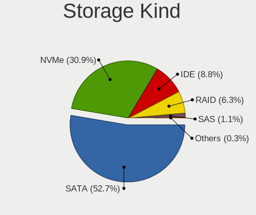

| Kind | Computers | Percent |
|------|-----------|---------|
| SATA | 393       | 50.32%  |
| NVMe | 232       | 29.71%  |
| IDE  | 85        | 10.88%  |
| RAID | 37        | 4.74%   |
| SAS  | 30        | 3.84%   |
| SCSI | 4         | 0.51%   |

Processor
---------

CPU Vendor
----------

Processor vendors

| Vendor        | Computers | Percent |
|---------------|-----------|---------|
| Intel         | 410       | 69.85%  |
| AMD           | 172       | 29.3%   |
| sifive,u74-mc | 2         | 0.34%   |
| ARM           | 2         | 0.34%   |
| Unknown       | 1         | 0.17%   |

CPU Model
---------

Processor models

| Model                                         | Computers | Percent |
|-----------------------------------------------|-----------|---------|
| Intel Xeon CPU E5-2620 v2 @ 2.10GHz           | 17        | 2.9%    |
| Intel 11th Gen Core i5-1135G7 @ 2.40GHz       | 12        | 2.04%   |
| Intel Xeon CPU E5-2620 v3 @ 2.40GHz           | 10        | 1.7%    |
| Intel Xeon Silver 4310 CPU @ 2.10GHz          | 9         | 1.53%   |
| Intel Core i5-10400 CPU @ 2.90GHz             | 8         | 1.36%   |
| AMD Custom APU 0405                           | 8         | 1.36%   |
| Intel 11th Gen Core i3-1115G4 @ 3.00GHz       | 7         | 1.19%   |
| AMD Ryzen 7 5800H with Radeon Graphics        | 6         | 1.02%   |
| AMD Ryzen 5 5500U with Radeon Graphics        | 6         | 1.02%   |
| Intel Xeon CPU E5-2680 v4 @ 2.40GHz           | 5         | 0.85%   |
| AMD Ryzen 5 3600 6-Core Processor             | 5         | 0.85%   |
| Intel Xeon CPU E5506 @ 2.13GHz                | 4         | 0.68%   |
| Intel Xeon CPU E5-2650 v4 @ 2.20GHz           | 4         | 0.68%   |
| Intel 12th Gen Core i5-1235U                  | 4         | 0.68%   |
| AMD Ryzen 7 7840HS w/ Radeon 780M Graphics    | 4         | 0.68%   |
| AMD Ryzen 7 5700U with Radeon Graphics        | 4         | 0.68%   |
| AMD Ryzen 5 PRO 4650G with Radeon Graphics    | 4         | 0.68%   |
| AMD Ryzen 5 5600H with Radeon Graphics        | 4         | 0.68%   |
| AMD Ryzen 5 5600G with Radeon Graphics        | 4         | 0.68%   |
| AMD Ryzen 5 3500U with Radeon Vega Mobile Gfx | 4         | 0.68%   |
| AMD Ryzen 3 5300U with Radeon Graphics        | 4         | 0.68%   |
| Intel Xeon Gold 6248 CPU @ 2.50GHz            | 3         | 0.51%   |
| Intel Xeon CPU X5670 @ 2.93GHz                | 3         | 0.51%   |
| Intel Xeon CPU E5-2620 v4 @ 2.10GHz           | 3         | 0.51%   |
| Intel Pentium CPU G4400 @ 3.30GHz             | 3         | 0.51%   |
| Intel Core i5-3470 CPU @ 3.20GHz              | 3         | 0.51%   |
| Intel Core i5-2430M CPU @ 2.40GHz             | 3         | 0.51%   |
| Intel Core i5-2410M CPU @ 2.30GHz             | 3         | 0.51%   |
| Intel Core i5-2400 CPU @ 3.10GHz              | 3         | 0.51%   |
| Intel Core i5-1035G1 CPU @ 1.00GHz            | 3         | 0.51%   |
| Intel Core i3-9100 CPU @ 3.60GHz              | 3         | 0.51%   |
| Intel Core i3-10100F CPU @ 3.60GHz            | 3         | 0.51%   |
| Intel Celeron J4125 CPU @ 2.00GHz             | 3         | 0.51%   |
| Intel Celeron CPU N3350 @ 1.10GHz             | 3         | 0.51%   |
| Intel 12th Gen Core i7-12700H                 | 3         | 0.51%   |
| Intel 12th Gen Core i7-1255U                  | 3         | 0.51%   |
| Intel 12th Gen Core i3-12100F                 | 3         | 0.51%   |
| Intel 11th Gen Core i7-1165G7 @ 2.80GHz       | 3         | 0.51%   |
| Intel 11th Gen Core i5-11400H @ 2.70GHz       | 3         | 0.51%   |
| Intel 11th Gen Core i3-1125G4 @ 2.00GHz       | 3         | 0.51%   |

CPU Model Family
----------------

Processor model prefix

| Model                   | Computers | Percent |
|-------------------------|-----------|---------|
| Other                   | 83        | 14.14%  |
| Intel Core i5           | 83        | 14.14%  |
| Intel Xeon              | 75        | 12.78%  |
| AMD Ryzen 5             | 40        | 6.81%   |
| Intel Core i7           | 39        | 6.64%   |
| AMD Ryzen 7             | 38        | 6.47%   |
| Intel Core i3           | 36        | 6.13%   |
| Intel Celeron           | 22        | 3.75%   |
| Intel Core 2 Duo        | 16        | 2.73%   |
| AMD Ryzen 3             | 15        | 2.56%   |
| Intel Pentium           | 13        | 2.21%   |
| Intel Xeon Silver       | 11        | 1.87%   |
| AMD Ryzen 9             | 10        | 1.7%    |
| Intel Pentium Dual-Core | 9         | 1.53%   |
| Intel Atom              | 7         | 1.19%   |
| AMD A6                  | 7         | 1.19%   |
| AMD FX                  | 6         | 1.02%   |
| Intel Core 2 Quad       | 5         | 0.85%   |
| Intel Core 2            | 5         | 0.85%   |
| Intel Xeon Gold         | 4         | 0.68%   |
| AMD Ryzen 5 PRO         | 4         | 0.68%   |
| AMD E2                  | 4         | 0.68%   |
| AMD Athlon II X2        | 4         | 0.68%   |
| Intel Genuine           | 3         | 0.51%   |
| AMD Phenom II X4        | 3         | 0.51%   |
| AMD Athlon II X4        | 3         | 0.51%   |
| AMD Athlon              | 3         | 0.51%   |
| AMD A8                  | 3         | 0.51%   |
| AMD A4                  | 3         | 0.51%   |
| Intel Pentium Silver    | 2         | 0.34%   |
| Intel Pentium 4         | 2         | 0.34%   |
| Intel Core i9           | 2         | 0.34%   |
| AMD Turion 64 X2 Mobile | 2         | 0.34%   |
| AMD Ryzen 3 PRO         | 2         | 0.34%   |
| AMD Phenom II X6        | 2         | 0.34%   |
| AMD Mobile Athlon 64    | 2         | 0.34%   |
| AMD A10                 | 2         | 0.34%   |
| Intel Pentium M         | 1         | 0.17%   |
| Intel Pentium Gold      | 1         | 0.17%   |
| Intel Pentium Dual      | 1         | 0.17%   |

CPU Cores
---------

Number of processor cores

| Number  | Computers | Percent |
|---------|-----------|---------|
| 4       | 183       | 31.18%  |
| 2       | 158       | 26.92%  |
| 8       | 61        | 10.39%  |
| 6       | 61        | 10.39%  |
| 12      | 54        | 9.2%    |
| 10      | 15        | 2.56%   |
| 1       | 13        | 2.21%   |
| 16      | 10        | 1.7%    |
| 24      | 6         | 1.02%   |
| 28      | 5         | 0.85%   |
| 14      | 5         | 0.85%   |
| 3       | 4         | 0.68%   |
| 40      | 3         | 0.51%   |
| Unknown | 3         | 0.51%   |
| 20      | 2         | 0.34%   |
| 64      | 1         | 0.17%   |
| 44      | 1         | 0.17%   |
| 32      | 1         | 0.17%   |
| 18      | 1         | 0.17%   |

CPU Sockets
-----------

Number of sockets

| Number  | Computers | Percent |
|---------|-----------|---------|
| 1       | 518       | 88.25%  |
| 2       | 66        | 11.24%  |
| Unknown | 3         | 0.51%   |

CPU Threads
-----------

Threads per core (Hyper-Threading)

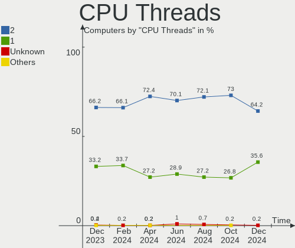

| Number  | Computers | Percent |
|---------|-----------|---------|
| 2       | 393       | 66.95%  |
| 1       | 191       | 32.54%  |
| Unknown | 3         | 0.51%   |

CPU Op-Modes
------------

CPU Operation Modes (32-bit, 64-bit)

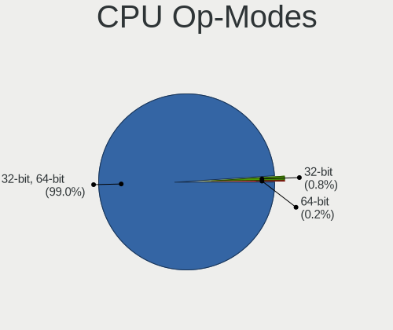

| Op mode        | Computers | Percent |
|----------------|-----------|---------|
| 32-bit, 64-bit | 581       | 98.98%  |
| 32-bit         | 4         | 0.68%   |
| Unknown        | 2         | 0.34%   |

CPU Microcode
-------------

Microcode number

| Number     | Computers | Percent |
|------------|-----------|---------|
| Unknown    | 172       | 29.3%   |
| 0x306e4    | 21        | 3.58%   |
| 0x1067a    | 19        | 3.24%   |
| 0x306a9    | 17        | 2.9%    |
| 0x206a7    | 17        | 2.9%    |
| 0x806c1    | 16        | 2.73%   |
| 0x406f1    | 14        | 2.39%   |
| 0x306f2    | 14        | 2.39%   |
| 0x306c3    | 11        | 1.87%   |
| 0x0a50000c | 11        | 1.87%   |
| 0x08108109 | 11        | 1.87%   |
| 0x606a6    | 10        | 1.7%    |
| 0xa0653    | 9         | 1.53%   |
| 0x206c2    | 9         | 1.53%   |
| 0x506e3    | 8         | 1.36%   |
| 0x906a3    | 7         | 1.19%   |
| 0x106a5    | 7         | 1.19%   |
| 0x08600106 | 7         | 1.19%   |
| 0x906eb    | 6         | 1.02%   |
| 0x906ea    | 6         | 1.02%   |
| 0x906e9    | 6         | 1.02%   |
| 0x906a4    | 6         | 1.02%   |
| 0x6fd      | 6         | 1.02%   |
| 0x0a704103 | 6         | 1.02%   |
| 0x08608103 | 6         | 1.02%   |
| 0x0a601203 | 5         | 0.85%   |
| 0x0a50000d | 5         | 0.85%   |
| 0x08701030 | 5         | 0.85%   |
| 0x906ed    | 4         | 0.68%   |
| 0x806d1    | 4         | 0.68%   |
| 0x706a8    | 4         | 0.68%   |
| 0x6f6      | 4         | 0.68%   |
| 0x506c9    | 4         | 0.68%   |
| 0x50657    | 4         | 0.68%   |
| 0x0a404102 | 4         | 0.68%   |
| 0x0800820d | 4         | 0.68%   |
| 0x06006705 | 4         | 0.68%   |
| 0x010000c8 | 4         | 0.68%   |
| 0x806ec    | 3         | 0.51%   |
| 0x406c3    | 3         | 0.51%   |

CPU Microarch
-------------

Microarchitecture

| Name             | Computers | Percent |
|------------------|-----------|---------|
| Unknown          | 61        | 10.39%  |
| KabyLake         | 51        | 8.69%   |
| IvyBridge        | 45        | 7.67%   |
| Haswell          | 36        | 6.13%   |
| TigerLake        | 32        | 5.45%   |
| Zen 3            | 30        | 5.11%   |
| SandyBridge      | 29        | 4.94%   |
| Alderlake Hybrid | 25        | 4.26%   |
| Penryn           | 24        | 4.09%   |
| Skylake          | 23        | 3.92%   |
| Zen 2            | 22        | 3.75%   |
| CometLake        | 21        | 3.58%   |
| Zen+             | 20        | 3.41%   |
| Broadwell        | 18        | 3.07%   |
| Westmere         | 16        | 2.73%   |
| Core             | 16        | 2.73%   |
| K10              | 15        | 2.56%   |
| IceLake          | 13        | 2.21%   |
| Silvermont       | 11        | 1.87%   |
| Nehalem          | 11        | 1.87%   |
| Goldmont plus    | 10        | 1.7%    |
| Piledriver       | 9         | 1.53%   |
| Excavator        | 9         | 1.53%   |
| K8 Hammer        | 8         | 1.36%   |
| Zen              | 7         | 1.19%   |
| Goldmont         | 6         | 1.02%   |
| K10 Llano        | 3         | 0.51%   |
| Bonnell          | 3         | 0.51%   |
| Puma             | 2         | 0.34%   |
| P6               | 2         | 0.34%   |
| NetBurst         | 2         | 0.34%   |
| Bulldozer        | 2         | 0.34%   |
| Bobcat           | 2         | 0.34%   |
| Tremont          | 1         | 0.17%   |
| K8 & K10 hybrid  | 1         | 0.17%   |
| Jaguar           | 1         | 0.17%   |

Graphics
--------

GPU Vendor
----------

Vendors of graphics cards

| Vendor                     | Computers | Percent |
|----------------------------|-----------|---------|
| Intel                      | 241       | 36.74%  |
| AMD                        | 189       | 28.81%  |
| Nvidia                     | 150       | 22.87%  |
| ASPEED Technology          | 52        | 7.93%   |
| Matrox Electronics Systems | 23        | 3.51%   |
| ATI Technologies           | 1         | 0.15%   |

GPU Model
---------

Graphics card models

| Model                                                                                    | Computers | Percent |
|------------------------------------------------------------------------------------------|-----------|---------|
| ASPEED Technology ASPEED Graphics Family                                                 | 52        | 7.68%   |
| Intel TigerLake-LP GT2 [Iris Xe Graphics]                                                | 22        | 3.25%   |
| AMD Cezanne [Radeon Vega Series / Radeon Vega Mobile Series]                             | 20        | 2.95%   |
| Intel 2nd Generation Core Processor Family Integrated Graphics Controller                | 19        | 2.81%   |
| Intel 3rd Gen Core processor Graphics Controller                                         | 14        | 2.07%   |
| AMD Lucienne                                                                             | 14        | 2.07%   |
| Matrox Electronics Systems MGA G200eW WPCM450                                            | 13        | 1.92%   |
| Intel CometLake-S GT2 [UHD Graphics 630]                                                 | 13        | 1.92%   |
| AMD Renoir [Radeon RX Vega 6 (Ryzen 4000/5000 Mobile Series)]                            | 13        | 1.92%   |
| AMD Picasso/Raven 2 [Radeon Vega Series / Radeon Vega Mobile Series]                     | 13        | 1.92%   |
| Intel Tiger Lake-LP GT2 [UHD Graphics G4]                                                | 10        | 1.48%   |
| Intel CoffeeLake-S GT2 [UHD Graphics 630]                                                | 10        | 1.48%   |
| Intel GeminiLake [UHD Graphics 600]                                                      | 9         | 1.33%   |
| Intel Alder Lake-P GT2 [Iris Xe Graphics]                                                | 8         | 1.18%   |
| AMD VanGogh [AMD Custom GPU 0405]                                                        | 8         | 1.18%   |
| AMD Stoney [Radeon R2/R3/R4/R5 Graphics]                                                 | 7         | 1.03%   |
| AMD Rembrandt [Radeon 680M]                                                              | 7         | 1.03%   |
| Nvidia GA107M [GeForce RTX 3050 Mobile]                                                  | 6         | 0.89%   |
| Intel Xeon E3-1200 v3/4th Gen Core Processor Integrated Graphics Controller              | 6         | 0.89%   |
| Intel TigerLake-H GT1 [UHD Graphics]                                                     | 6         | 0.89%   |
| Intel Atom/Celeron/Pentium Processor x5-E8000/J3xxx/N3xxx Integrated Graphics Controller | 6         | 0.89%   |
| AMD Phoenix1                                                                             | 6         | 0.89%   |
| AMD Ellesmere [Radeon RX 470/480/570/570X/580/580X/590]                                  | 6         | 0.89%   |
| Nvidia TU117M [GeForce GTX 1650 Mobile / Max-Q]                                          | 5         | 0.74%   |
| Intel UHD Graphics 620                                                                   | 5         | 0.74%   |
| Intel Skylake GT2 [HD Graphics 520]                                                      | 5         | 0.74%   |
| Intel HD Graphics 630                                                                    | 5         | 0.74%   |
| Intel HD Graphics 620                                                                    | 5         | 0.74%   |
| Intel HD Graphics 530                                                                    | 5         | 0.74%   |
| Intel HD Graphics 500                                                                    | 5         | 0.74%   |
| Intel CometLake-U GT2 [UHD Graphics]                                                     | 5         | 0.74%   |
| Intel Alder Lake-UP3 GT2 [Iris Xe Graphics]                                              | 5         | 0.74%   |
| Intel 82G33/G31 Express Integrated Graphics Controller                                   | 5         | 0.74%   |
| AMD Navi 23 [Radeon RX 6600/6600 XT/6600M]                                               | 5         | 0.74%   |
| AMD Lexa PRO [Radeon 540/540X/550/550X / RX 540X/550/550X]                               | 5         | 0.74%   |
| Nvidia TU116 [GeForce GTX 1660 SUPER]                                                    | 4         | 0.59%   |
| Nvidia GP108 [GeForce GT 1030]                                                           | 4         | 0.59%   |
| Nvidia GP107M [GeForce GTX 1050 Mobile]                                                  | 4         | 0.59%   |
| Nvidia GM107 [GeForce GTX 750 Ti]                                                        | 4         | 0.59%   |
| Nvidia GK208B [GeForce GT 710]                                                           | 4         | 0.59%   |

GPU Combo
---------

Combinations of graphics cards

| Name                    | Computers | Percent |
|-------------------------|-----------|---------|
| 1 x Intel               | 183       | 31.18%  |
| 1 x AMD                 | 154       | 26.24%  |
| 1 x Nvidia              | 86        | 14.65%  |
| 1 x ASPEED              | 51        | 8.69%   |
| Intel + Nvidia          | 47        | 8.01%   |
| 1 x Matrox              | 23        | 3.92%   |
| AMD + Nvidia            | 16        | 2.73%   |
| 2 x AMD                 | 12        | 2.04%   |
| Intel + AMD             | 7         | 1.19%   |
| Other                   | 6         | 1.02%   |
| 2 x Nvidia + 1 x ASPEED | 1         | 0.17%   |
| Intel + 2 x AMD         | 1         | 0.17%   |

GPU Driver
----------

Free vs proprietary

| Driver      | Computers | Percent |
|-------------|-----------|---------|
| Free        | 436       | 74.28%  |
| Unknown     | 87        | 14.82%  |
| Proprietary | 64        | 10.9%   |

GPU Memory
----------

Total video memory

| Size in GB | Computers | Percent |
|------------|-----------|---------|
| Unknown    | 349       | 59.45%  |
| 0.01-0.5   | 83        | 14.14%  |
| 1.01-2.0   | 55        | 9.37%   |
| 0.51-1.0   | 28        | 4.77%   |
| 7.01-8.0   | 26        | 4.43%   |
| 3.01-4.0   | 25        | 4.26%   |
| 5.01-6.0   | 12        | 2.04%   |
| 8.01-16.0  | 6         | 1.02%   |
| 2.01-3.0   | 2         | 0.34%   |
| 16.01-24.0 | 1         | 0.17%   |

Monitor
-------

Monitor Vendor
--------------

Monitor vendors

| Vendor                  | Computers | Percent |
|-------------------------|-----------|---------|
| BOE                     | 69        | 13.02%  |
| Samsung Electronics     | 66        | 12.45%  |
| AU Optronics            | 42        | 7.92%   |
| Chimei Innolux          | 41        | 7.74%   |
| Goldstar                | 33        | 6.23%   |
| LG Display              | 29        | 5.47%   |
| Acer                    | 23        | 4.34%   |
| Philips                 | 22        | 4.15%   |
| BenQ                    | 22        | 4.15%   |
| Dell                    | 20        | 3.77%   |
| AOC                     | 15        | 2.83%   |
| Chi Mei Optoelectronics | 10        | 1.89%   |
| ViewSonic               | 9         | 1.7%    |
| PANDA                   | 9         | 1.7%    |
| Hewlett-Packard         | 9         | 1.7%    |
| Valve                   | 8         | 1.51%   |
| Apple                   | 8         | 1.51%   |
| Lenovo                  | 7         | 1.32%   |
| Unknown                 | 5         | 0.94%   |
| TMX                     | 5         | 0.94%   |
| Ancor Communications    | 5         | 0.94%   |
| MSI                     | 4         | 0.75%   |
| Mi                      | 4         | 0.75%   |
| Iiyama                  | 4         | 0.75%   |
| SKG                     | 3         | 0.57%   |
| RTK                     | 3         | 0.57%   |
| LG Philips              | 3         | 0.57%   |
| HUAWEI                  | 3         | 0.57%   |
| CSO                     | 3         | 0.57%   |
| ASUSTek Computer        | 3         | 0.57%   |
| Sony                    | 2         | 0.38%   |
| Sharp                   | 2         | 0.38%   |
| RGT                     | 2         | 0.38%   |
| Packard Bell            | 2         | 0.38%   |
| NEC Computers           | 2         | 0.38%   |
| HHT                     | 2         | 0.38%   |
| FME                     | 2         | 0.38%   |
| ___                     | 1         | 0.19%   |
| YTH                     | 1         | 0.19%   |
| Yamaha                  | 1         | 0.19%   |

Monitor Model
-------------

Monitor models

| Model                                                                 | Computers | Percent |
|-----------------------------------------------------------------------|-----------|---------|
| Valve ANX7530 U VLV3001 800x1280 100x150mm 7.1-inch                   | 8         | 1.49%   |
| BOE LCD Monitor BOE0872 1920x1080 344x194mm 15.5-inch                 | 6         | 1.12%   |
| Chimei Innolux LCD Monitor CMN15F5 1920x1080 344x193mm 15.5-inch      | 5         | 0.93%   |
| Chimei Innolux LCD Monitor CMN15E7 1920x1080 344x193mm 15.5-inch      | 5         | 0.93%   |
| AOC Q27P2W AOC2702 2560x1440 597x336mm 27.0-inch                      | 5         | 0.93%   |
| TMX TL156MDMP31-0 TMX2005 3200x2000 336x210mm 15.6-inch               | 4         | 0.74%   |
| BenQ GW2270 BNQ78DB 1920x1080 476x268mm 21.5-inch                     | 4         | 0.74%   |
| AU Optronics LCD Monitor AUO21EC 1366x768 344x193mm 15.5-inch         | 4         | 0.74%   |
| Acer AL1917 ACRAD73 1280x1024 376x301mm 19.0-inch                     | 4         | 0.74%   |
| ViewSonic VA2261 Series VSC0F30 1920x1080 477x268mm 21.5-inch         | 3         | 0.56%   |
| Unknown LCD Monitor FFFF 2288x1287 2550x2550mm 142.0-inch             | 3         | 0.56%   |
| Samsung Electronics SyncMaster SAM01E1 1280x1024 376x301mm 19.0-inch  | 3         | 0.56%   |
| Samsung Electronics SyncMaster SAM011E 1280x1024 338x270mm 17.0-inch  | 3         | 0.56%   |
| RTK HDMI RTK2380 1920x1080 530x290mm 23.8-inch                        | 3         | 0.56%   |
| Philips PHL 243V7 PHLC155 1920x1080 530x300mm 24.0-inch               | 3         | 0.56%   |
| Philips PHL 223V5 PHLC0CF 1920x1080 477x268mm 21.5-inch               | 3         | 0.56%   |
| Dell S2340L DELD058 1920x1080 509x286mm 23.0-inch                     | 3         | 0.56%   |
| BOE LCD Monitor BOE0878 1920x1080 355x200mm 16.0-inch                 | 3         | 0.56%   |
| BOE LCD Monitor BOE0700 1920x1080 344x194mm 15.5-inch                 | 3         | 0.56%   |
| AU Optronics LCD Monitor AUO403D 1920x1080 309x173mm 13.9-inch        | 3         | 0.56%   |
| Acer V226HQL ACR0335 1920x1080 477x268mm 21.5-inch                    | 3         | 0.56%   |
| SKG AF27H1 SKG2722 1920x1080 600x330mm 27.0-inch                      | 2         | 0.37%   |
| Samsung Electronics LCD Monitor SEC544B 1600x900 382x214mm 17.2-inch  | 2         | 0.37%   |
| Samsung Electronics LCD Monitor SEC5441 1366x768 309x174mm 14.0-inch  | 2         | 0.37%   |
| Samsung Electronics LCD Monitor SEC314C 1920x1080 344x194mm 15.5-inch | 2         | 0.37%   |
| Samsung Electronics LCD Monitor SDC4161 1920x1080 344x194mm 15.5-inch | 2         | 0.37%   |
| Samsung Electronics C24F390 SAM0D2C 1920x1080 521x293mm 23.5-inch     | 2         | 0.37%   |
| RGT LCD Monitor RGT1352 1920x1080 480x270mm 21.7-inch                 | 2         | 0.37%   |
| PANDA LCD Monitor NCP004A 1920x1080 309x174mm 14.0-inch               | 2         | 0.37%   |
| Packard Bell Viseo203DX PKB03B1 1600x900 432x240mm 19.5-inch          | 2         | 0.37%   |
| Mi Monitor XMI23C3 1920x1080 527x293mm 23.7-inch                      | 2         | 0.37%   |
| LG Display LCD Monitor LGD05E5 1920x1080 344x194mm 15.5-inch          | 2         | 0.37%   |
| LG Display LCD Monitor LGD02F1 1366x768 344x194mm 15.5-inch           | 2         | 0.37%   |
| HUAWEI SSN-24 HWV6E4E 1920x1080 527x296mm 23.8-inch                   | 2         | 0.37%   |
| HHT ActivPanel V6 HHT0030 3840x2160 944x398mm 40.3-inch               | 2         | 0.37%   |
| Goldstar W2343 GSM5700 1920x1080 474x296mm 22.0-inch                  | 2         | 0.37%   |
| Goldstar Ultra HD GSM5B09 3840x2160 600x340mm 27.2-inch               | 2         | 0.37%   |
| Goldstar MP59G GSM5B34 1920x1080 480x270mm 21.7-inch                  | 2         | 0.37%   |
| Goldstar L1730S GSM438D 1280x1024 338x270mm 17.0-inch                 | 2         | 0.37%   |
| FME TS35505 FME7210 1920x1080 256x192mm 12.6-inch                     | 2         | 0.37%   |

Monitor Resolution
------------------

Monitor screen resolution

| Resolution         | Computers | Percent |
|--------------------|-----------|---------|
| 1920x1080 (FHD)    | 233       | 46.05%  |
| 1366x768 (WXGA)    | 60        | 11.86%  |
| 2560x1440 (QHD)    | 29        | 5.73%   |
| 1280x1024 (SXGA)   | 29        | 5.73%   |
| 3840x2160 (4K)     | 24        | 4.74%   |
| 1600x900 (HD+)     | 19        | 3.75%   |
| 1280x800 (WXGA)    | 13        | 2.57%   |
| 1920x1200 (WUXGA)  | 12        | 2.37%   |
| 1680x1050 (WSXGA+) | 11        | 2.17%   |
| 800x1280           | 8         | 1.58%   |
| 1440x900 (WXGA+)   | 8         | 1.58%   |
| 2560x1600          | 6         | 1.19%   |
| 2160x1440          | 6         | 1.19%   |
| 3440x1440          | 5         | 0.99%   |
| 3200x2000          | 4         | 0.79%   |
| 2880x1800          | 4         | 0.79%   |
| 1024x768 (XGA)     | 4         | 0.79%   |
| 2560x1080          | 3         | 0.59%   |
| 2520x1680          | 3         | 0.59%   |
| 2288x1287          | 3         | 0.59%   |
| 1360x768           | 3         | 0.59%   |
| 1024x600           | 3         | 0.59%   |
| 3000x2000          | 2         | 0.4%    |
| 2880x1620          | 2         | 0.4%    |
| 4480x1440          | 1         | 0.2%    |
| 3456x2160          | 1         | 0.2%    |
| 3200x1800 (QHD+)   | 1         | 0.2%    |
| 2880x1920          | 1         | 0.2%    |
| 2304x1440          | 1         | 0.2%    |
| 2240x1400          | 1         | 0.2%    |
| 2048x1152          | 1         | 0.2%    |
| 1920x540           | 1         | 0.2%    |
| 1920x1440          | 1         | 0.2%    |
| 1400x1050          | 1         | 0.2%    |
| 1280x720 (HD)      | 1         | 0.2%    |
| Unknown            | 1         | 0.2%    |

Monitor Diagonal
----------------

Diagonal size in inches

| Inches  | Computers | Percent |
|---------|-----------|---------|
| 15      | 148       | 28.03%  |
| 21      | 45        | 8.52%   |
| 27      | 43        | 8.14%   |
| 23      | 39        | 7.39%   |
| 14      | 37        | 7.01%   |
| 24      | 36        | 6.82%   |
| 17      | 35        | 6.63%   |
| 13      | 25        | 4.73%   |
| 19      | 24        | 4.55%   |
| 16      | 14        | 2.65%   |
| 31      | 10        | 1.89%   |
| Unknown | 10        | 1.89%   |
| 7       | 8         | 1.52%   |
| 20      | 7         | 1.33%   |
| 12      | 7         | 1.33%   |
| 34      | 6         | 1.14%   |
| 18      | 6         | 1.14%   |
| 22      | 4         | 0.76%   |
| 142     | 3         | 0.57%   |
| 72      | 3         | 0.57%   |
| 11      | 3         | 0.57%   |
| 10      | 3         | 0.57%   |
| 40      | 2         | 0.38%   |
| 28      | 2         | 0.38%   |
| 54      | 1         | 0.19%   |
| 52      | 1         | 0.19%   |
| 46      | 1         | 0.19%   |
| 39      | 1         | 0.19%   |
| 33      | 1         | 0.19%   |
| 32      | 1         | 0.19%   |
| 29      | 1         | 0.19%   |
| 25      | 1         | 0.19%   |

Monitor Width
-------------

Physical width

| Width in mm    | Computers | Percent |
|----------------|-----------|---------|
| 301-350        | 206       | 39.24%  |
| 501-600        | 113       | 21.52%  |
| 401-500        | 69        | 13.14%  |
| 351-400        | 53        | 10.1%   |
| 201-300        | 31        | 5.9%    |
| 601-700        | 15        | 2.86%   |
| Unknown        | 10        | 1.9%    |
| 701-800        | 8         | 1.52%   |
| 1-100          | 8         | 1.52%   |
| More than 2000 | 3         | 0.57%   |
| 1501-2000      | 3         | 0.57%   |
| 1001-1500      | 3         | 0.57%   |
| 901-1000       | 2         | 0.38%   |
| 801-900        | 1         | 0.19%   |

Aspect Ratio
------------

Proportional relationship between the width and the height

| Ratio   | Computers | Percent |
|---------|-----------|---------|
| 16/9    | 351       | 71.49%  |
| 16/10   | 62        | 12.63%  |
| 5/4     | 30        | 6.11%   |
| 3/2     | 13        | 2.65%   |
| 21/9    | 9         | 1.83%   |
| 4/3     | 8         | 1.63%   |
| 0.67    | 8         | 1.63%   |
| Unknown | 7         | 1.43%   |
| 1.00    | 3         | 0.61%   |

Monitor Area
------------

Area in inch²

| Area in inch² | Computers | Percent |
|----------------|-----------|---------|
| 101-110        | 151       | 28.65%  |
| 201-250        | 102       | 19.35%  |
| 81-90          | 54        | 10.25%  |
| 301-350        | 44        | 8.35%   |
| 151-200        | 40        | 7.59%   |
| 121-130        | 24        | 4.55%   |
| 351-500        | 20        | 3.8%    |
| 141-150        | 17        | 3.23%   |
| 251-300        | 13        | 2.47%   |
| Unknown        | 10        | 1.9%    |
| 71-80          | 9         | 1.71%   |
| More than 1000 | 8         | 1.52%   |
| 1-40           | 8         | 1.52%   |
| 111-120        | 7         | 1.33%   |
| 61-70          | 4         | 0.76%   |
| 501-1000       | 4         | 0.76%   |
| 51-60          | 3         | 0.57%   |
| 41-50          | 3         | 0.57%   |
| 131-140        | 3         | 0.57%   |
| 91-100         | 3         | 0.57%   |

Pixel Density
-------------

Pixels per inch

| Density       | Computers | Percent |
|---------------|-----------|---------|
| 51-100        | 188       | 36.22%  |
| 121-160       | 133       | 25.63%  |
| 101-120       | 124       | 23.89%  |
| 161-240       | 43        | 8.29%   |
| More than 240 | 12        | 2.31%   |
| Unknown       | 10        | 1.93%   |
| 1-50          | 9         | 1.73%   |

Multiple Monitors
-----------------

Total monitors connected

| Total | Computers | Percent |
|-------|-----------|---------|
| 1     | 418       | 71.21%  |
| 0     | 103       | 17.55%  |
| 2     | 61        | 10.39%  |
| 3     | 5         | 0.85%   |

Network
-------

Net Controller Vendor
---------------------

Controller vendors

| Vendor                           | Computers | Percent |
|----------------------------------|-----------|---------|
| Realtek Semiconductor            | 332       | 40.79%  |
| Intel                            | 245       | 30.1%   |
| Qualcomm Atheros                 | 66        | 8.11%   |
| Broadcom                         | 31        | 3.81%   |
| MediaTek                         | 28        | 3.44%   |
| Mellanox Technologies            | 13        | 1.6%    |
| Ralink Technology                | 10        | 1.23%   |
| Broadcom Limited                 | 9         | 1.11%   |
| Xiaomi                           | 7         | 0.86%   |
| Samsung Electronics              | 7         | 0.86%   |
| Ralink                           | 7         | 0.86%   |
| Nvidia                           | 7         | 0.86%   |
| TP-Link                          | 6         | 0.74%   |
| Marvell Technology Group         | 6         | 0.74%   |
| Qualcomm                         | 5         | 0.61%   |
| Unknown                          | 4         | 0.49%   |
| D-Link                           | 3         | 0.37%   |
| VIA Technologies                 | 2         | 0.25%   |
| Sierra Wireless                  | 2         | 0.25%   |
| OPPO Electronics                 | 2         | 0.25%   |
| IBM                              | 2         | 0.25%   |
| Huawei Technologies              | 2         | 0.25%   |
| Google                           | 2         | 0.25%   |
| ZTE WCDMA Technologies MSM       | 1         | 0.12%   |
| Vimtron Electronics              | 1         | 0.12%   |
| U-Blox                           | 1         | 0.12%   |
| SuperLead                        | 1         | 0.12%   |
| Silicon Integrated Systems [SiS] | 1         | 0.12%   |
| Qualcomm Atheros Communications  | 1         | 0.12%   |
| QinHeng Electronics              | 1         | 0.12%   |
| Microchip Technology             | 1         | 0.12%   |
| Mercucys                         | 1         | 0.12%   |
| JMicron Technology               | 1         | 0.12%   |
| ICS Advent                       | 1         | 0.12%   |
| HMD Global                       | 1         | 0.12%   |
| Hewlett-Packard                  | 1         | 0.12%   |
| ASUSTek Computer                 | 1         | 0.12%   |
| Apple                            | 1         | 0.12%   |
| American Megatrends              | 1         | 0.12%   |

Net Controller Model
--------------------

Controller models

| Model                                                             | Computers | Percent |
|-------------------------------------------------------------------|-----------|---------|
| Realtek RTL8111/8168/8411 PCI Express Gigabit Ethernet Controller | 226       | 24.41%  |
| Intel I350 Gigabit Network Connection                             | 44        | 4.75%   |
| Realtek RTL8822CE 802.11ac PCIe Wireless Network Adapter          | 32        | 3.46%   |
| Realtek RTL810xE PCI Express Fast Ethernet controller             | 28        | 3.02%   |
| Intel Wi-Fi 6 AX201                                               | 23        | 2.48%   |
| Qualcomm Atheros AR9285 Wireless Network Adapter (PCI-Express)    | 15        | 1.62%   |
| Realtek RTL8125 2.5GbE Controller                                 | 14        | 1.51%   |
| Realtek RTL8821CE 802.11ac PCIe Wireless Network Adapter          | 13        | 1.4%    |
| Intel Alder Lake-P PCH CNVi WiFi                                  | 13        | 1.4%    |
| MediaTek MT7921K (RZ608) Wi-Fi 6E 80MHz                           | 11        | 1.19%   |
| Intel Wi-Fi 6 AX200                                               | 11        | 1.19%   |
| Intel Wireless 8265 / 8275                                        | 10        | 1.08%   |
| Intel 82576 Gigabit Network Connection                            | 10        | 1.08%   |
| Ralink MT7601U Wireless Adapter                                   | 9         | 0.97%   |
| Qualcomm Atheros QCA9377 802.11ac Wireless Network Adapter        | 9         | 0.97%   |
| Qualcomm Atheros AR9485 Wireless Network Adapter                  | 9         | 0.97%   |
| Intel Ethernet Connection (14) I219-V                             | 9         | 0.97%   |
| Mellanox MT27800 Family [ConnectX-5]                              | 8         | 0.86%   |
| MediaTek MT7921 802.11ax PCI Express Wireless Network Adapter     | 8         | 0.86%   |
| Intel Ethernet Connection (7) I219-V                              | 8         | 0.86%   |
| Realtek 802.11ac NIC                                              | 7         | 0.76%   |
| MediaTek MT7922 802.11ax PCI Express Wireless Network Adapter     | 7         | 0.76%   |
| Intel Wireless 7265                                               | 7         | 0.76%   |
| Intel I211 Gigabit Network Connection                             | 7         | 0.76%   |
| Intel Ethernet Controller I225-V                                  | 7         | 0.76%   |
| Xiaomi Mi/Redmi series (RNDIS)                                    | 6         | 0.65%   |
| Samsung Galaxy series, misc. (tethering mode)                     | 6         | 0.65%   |
| Realtek RTL8188CE 802.11b/g/n WiFi Adapter                        | 6         | 0.65%   |
| Qualcomm Atheros QCA6174 802.11ac Wireless Network Adapter        | 6         | 0.65%   |
| Intel Wireless 3165                                               | 6         | 0.65%   |
| Intel Ethernet Controller 10-Gigabit X540-AT2                     | 6         | 0.65%   |
| Intel Ethernet Connection (2) I219-V                              | 6         | 0.65%   |
| Intel Cannon Lake PCH CNVi WiFi                                   | 6         | 0.65%   |
| Realtek RTL8153 Gigabit Ethernet Adapter                          | 5         | 0.54%   |
| Realtek Killer E2600 Gigabit Ethernet Controller                  | 5         | 0.54%   |
| Qualcomm Atheros AR8151 v2.0 Gigabit Ethernet                     | 5         | 0.54%   |
| Intel Wireless 8260                                               | 5         | 0.54%   |
| Intel Tiger Lake PCH CNVi WiFi                                    | 5         | 0.54%   |
| Intel PRO/Wireless 3945ABG [Golan] Network Connection             | 5         | 0.54%   |
| Intel Ethernet Controller E810-XXV for SFP                        | 5         | 0.54%   |

Wireless Vendor
---------------

Wireless vendors

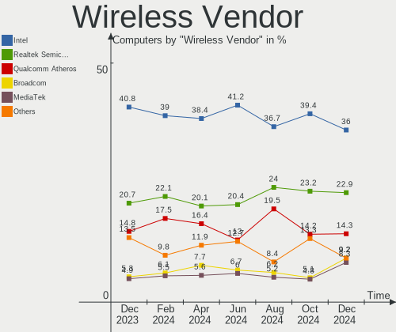

| Vendor                          | Computers | Percent |
|---------------------------------|-----------|---------|
| Intel                           | 137       | 37.03%  |
| Realtek Semiconductor           | 90        | 24.32%  |
| Qualcomm Atheros                | 50        | 13.51%  |
| MediaTek                        | 27        | 7.3%    |
| Broadcom                        | 23        | 6.22%   |
| Ralink Technology               | 10        | 2.7%    |
| Ralink                          | 7         | 1.89%   |
| TP-Link                         | 6         | 1.62%   |
| Broadcom Limited                | 4         | 1.08%   |
| Unknown                         | 4         | 1.08%   |
| Qualcomm                        | 3         | 0.81%   |
| D-Link                          | 3         | 0.81%   |
| Sierra Wireless                 | 2         | 0.54%   |
| Xiaomi                          | 1         | 0.27%   |
| Qualcomm Atheros Communications | 1         | 0.27%   |
| Mercucys                        | 1         | 0.27%   |
| ASUSTek Computer                | 1         | 0.27%   |

Wireless Model
--------------

Wireless models

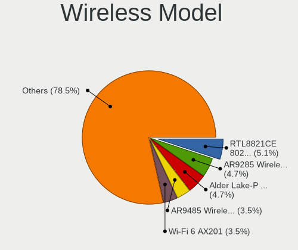

| Model                                                          | Computers | Percent |
|----------------------------------------------------------------|-----------|---------|
| Realtek RTL8822CE 802.11ac PCIe Wireless Network Adapter       | 32        | 8.65%   |
| Intel Wi-Fi 6 AX201                                            | 23        | 6.22%   |
| Qualcomm Atheros AR9285 Wireless Network Adapter (PCI-Express) | 15        | 4.05%   |
| Realtek RTL8821CE 802.11ac PCIe Wireless Network Adapter       | 13        | 3.51%   |
| Intel Alder Lake-P PCH CNVi WiFi                               | 13        | 3.51%   |
| MediaTek MT7921K (RZ608) Wi-Fi 6E 80MHz                        | 11        | 2.97%   |
| Intel Wi-Fi 6 AX200                                            | 11        | 2.97%   |
| Intel Wireless 8265 / 8275                                     | 10        | 2.7%    |
| Ralink MT7601U Wireless Adapter                                | 9         | 2.43%   |
| Qualcomm Atheros QCA9377 802.11ac Wireless Network Adapter     | 9         | 2.43%   |
| Qualcomm Atheros AR9485 Wireless Network Adapter               | 9         | 2.43%   |
| MediaTek MT7921 802.11ax PCI Express Wireless Network Adapter  | 8         | 2.16%   |
| Realtek 802.11ac NIC                                           | 7         | 1.89%   |
| MediaTek MT7922 802.11ax PCI Express Wireless Network Adapter  | 7         | 1.89%   |
| Intel Wireless 7265                                            | 7         | 1.89%   |
| Realtek RTL8188CE 802.11b/g/n WiFi Adapter                     | 6         | 1.62%   |
| Qualcomm Atheros QCA6174 802.11ac Wireless Network Adapter     | 6         | 1.62%   |
| Intel Wireless 3165                                            | 6         | 1.62%   |
| Intel Cannon Lake PCH CNVi WiFi                                | 6         | 1.62%   |
| Intel Wireless 8260                                            | 5         | 1.35%   |
| Intel Tiger Lake PCH CNVi WiFi                                 | 5         | 1.35%   |
| Intel PRO/Wireless 3945ABG [Golan] Network Connection          | 5         | 1.35%   |
| Intel Comet Lake PCH-LP CNVi WiFi                              | 5         | 1.35%   |
| Broadcom BCM43142 802.11b/g/n                                  | 5         | 1.35%   |
| Realtek RTL8723BE PCIe Wireless Network Adapter                | 4         | 1.08%   |
| Ralink RT3290 Wireless 802.11n 1T/1R PCIe                      | 4         | 1.08%   |
| Intel Wireless 7260                                            | 4         | 1.08%   |
| Intel Wi-Fi 6 AX210/AX211/AX411 160MHz                         | 4         | 1.08%   |
| Intel Cannon Point-LP CNVi [Wireless-AC]                       | 4         | 1.08%   |
| Broadcom BCM4313 802.11bgn Wireless Network Adapter            | 4         | 1.08%   |
| Unknown                                                        | 4         | 1.08%   |
| Realtek RTL8822BE 802.11a/b/g/n/ac WiFi adapter                | 3         | 0.81%   |
| Realtek RTL8821AE 802.11ac PCIe Wireless Network Adapter       | 3         | 0.81%   |
| Realtek RTL8723DE Wireless Network Adapter                     | 3         | 0.81%   |
| Realtek RTL8188EUS 802.11n Wireless Network Adapter            | 3         | 0.81%   |
| Realtek RTL8188EE Wireless Network Adapter                     | 3         | 0.81%   |
| Qualcomm QCNFA765 Wireless Network Adapter                     | 3         | 0.81%   |
| Qualcomm Atheros AR928X Wireless Network Adapter (PCI-Express) | 3         | 0.81%   |
| Intel Wireless-AC 9260                                         | 3         | 0.81%   |
| Intel Dual Band Wireless-AC 3168NGW [Stone Peak]               | 3         | 0.81%   |

Ethernet Vendor
---------------

Ethernet vendors

| Vendor                           | Computers | Percent |
|----------------------------------|-----------|---------|
| Realtek Semiconductor            | 286       | 53.66%  |
| Intel                            | 141       | 26.45%  |
| Qualcomm Atheros                 | 25        | 4.69%   |
| Broadcom                         | 16        | 3%      |
| Mellanox Technologies            | 12        | 2.25%   |
| Samsung Electronics              | 7         | 1.31%   |
| Nvidia                           | 7         | 1.31%   |
| Xiaomi                           | 6         | 1.13%   |
| Marvell Technology Group         | 6         | 1.13%   |
| Broadcom Limited                 | 5         | 0.94%   |
| VIA Technologies                 | 2         | 0.38%   |
| Qualcomm                         | 2         | 0.38%   |
| OPPO Electronics                 | 2         | 0.38%   |
| IBM                              | 2         | 0.38%   |
| Huawei Technologies              | 2         | 0.38%   |
| Google                           | 2         | 0.38%   |
| ZTE WCDMA Technologies MSM       | 1         | 0.19%   |
| Vimtron Electronics              | 1         | 0.19%   |
| Silicon Integrated Systems [SiS] | 1         | 0.19%   |
| Microchip Technology             | 1         | 0.19%   |
| MediaTek                         | 1         | 0.19%   |
| JMicron Technology               | 1         | 0.19%   |
| ICS Advent                       | 1         | 0.19%   |
| HMD Global                       | 1         | 0.19%   |
| Apple                            | 1         | 0.19%   |
| American Megatrends              | 1         | 0.19%   |

Ethernet Model
--------------

Ethernet models

| Model                                                             | Computers | Percent |
|-------------------------------------------------------------------|-----------|---------|
| Realtek RTL8111/8168/8411 PCI Express Gigabit Ethernet Controller | 226       | 41.09%  |
| Intel I350 Gigabit Network Connection                             | 44        | 8%      |
| Realtek RTL810xE PCI Express Fast Ethernet controller             | 28        | 5.09%   |
| Realtek RTL8125 2.5GbE Controller                                 | 14        | 2.55%   |
| Intel 82576 Gigabit Network Connection                            | 10        | 1.82%   |
| Intel Ethernet Connection (14) I219-V                             | 9         | 1.64%   |
| Mellanox MT27800 Family [ConnectX-5]                              | 8         | 1.45%   |
| Intel Ethernet Connection (7) I219-V                              | 8         | 1.45%   |
| Intel I211 Gigabit Network Connection                             | 7         | 1.27%   |
| Intel Ethernet Controller I225-V                                  | 7         | 1.27%   |
| Xiaomi Mi/Redmi series (RNDIS)                                    | 6         | 1.09%   |
| Samsung Galaxy series, misc. (tethering mode)                     | 6         | 1.09%   |
| Intel Ethernet Controller 10-Gigabit X540-AT2                     | 6         | 1.09%   |
| Intel Ethernet Connection (2) I219-V                              | 6         | 1.09%   |
| Realtek RTL8153 Gigabit Ethernet Adapter                          | 5         | 0.91%   |
| Realtek Killer E2600 Gigabit Ethernet Controller                  | 5         | 0.91%   |
| Qualcomm Atheros AR8151 v2.0 Gigabit Ethernet                     | 5         | 0.91%   |
| Intel Ethernet Controller E810-XXV for SFP                        | 5         | 0.91%   |
| Realtek RTL-8100/8101L/8139 PCI Fast Ethernet Adapter             | 4         | 0.73%   |
| Mellanox MT27710 Family [ConnectX-4 Lx]                           | 4         | 0.73%   |
| Intel I210 Gigabit Network Connection                             | 4         | 0.73%   |
| Intel Ethernet Connection (13) I219-V                             | 4         | 0.73%   |
| Realtek RTL8152 Fast Ethernet Adapter                             | 3         | 0.55%   |
| Qualcomm Atheros QCA8172 Fast Ethernet                            | 3         | 0.55%   |
| Qualcomm Atheros AR8161 Gigabit Ethernet                          | 3         | 0.55%   |
| Nvidia MCP61 Ethernet                                             | 3         | 0.55%   |
| Intel Ethernet Connection I219-LM                                 | 3         | 0.55%   |
| Intel Ethernet Connection (4) I219-LM                             | 3         | 0.55%   |
| Intel 82599ES 10-Gigabit SFI/SFP+ Network Connection              | 3         | 0.55%   |
| Intel 82574L Gigabit Network Connection                           | 3         | 0.55%   |
| Broadcom NetXtreme II BCM5709 Gigabit Ethernet                    | 3         | 0.55%   |
| Broadcom NetXtreme BCM57765 Gigabit Ethernet PCIe                 | 3         | 0.55%   |
| Broadcom NetXtreme BCM5719 Gigabit Ethernet PCIe                  | 3         | 0.55%   |
| VIA VT6105/VT6106S [Rhine-III]                                    | 2         | 0.36%   |
| Realtek RTL-8029(AS)                                              | 2         | 0.36%   |
| Qualcomm SDM630-MTP _SN:0B9EB96E                                  | 2         | 0.36%   |
| Qualcomm Atheros Killer E2500 Gigabit Ethernet Controller         | 2         | 0.36%   |
| Qualcomm Atheros Attansic L1 Gigabit Ethernet                     | 2         | 0.36%   |
| Qualcomm Atheros AR8151 v1.0 Gigabit Ethernet                     | 2         | 0.36%   |
| Qualcomm Atheros AR8132 Fast Ethernet                             | 2         | 0.36%   |

Net Controller Kind
-------------------

Ethernet, WiFi or modem

| Kind     | Computers | Percent |
|----------|-----------|---------|
| Ethernet | 493       | 57.53%  |
| WiFi     | 358       | 41.77%  |
| Modem    | 4         | 0.47%   |
| Unknown  | 2         | 0.23%   |

Used Controller
---------------

Currently used network controller

| Kind     | Computers | Percent |
|----------|-----------|---------|
| WiFi     | 281       | 50.27%  |
| Ethernet | 278       | 49.73%  |

NICs
----

Total network controllers on board

| Total | Computers | Percent |
|-------|-----------|---------|
| 2     | 294       | 50.09%  |
| 1     | 255       | 43.44%  |
| 0     | 13        | 2.21%   |
| 4     | 12        | 2.04%   |
| 6     | 7         | 1.19%   |
| 3     | 5         | 0.85%   |
| 8     | 1         | 0.17%   |

IPv6
----

IPv6 vs IPv4

| Used | Computers | Percent |
|------|-----------|---------|
| No   | 560       | 95.4%   |
| Yes  | 27        | 4.6%    |

Bluetooth
---------

Bluetooth Vendor
----------------

Controller vendors

| Vendor                          | Computers | Percent |
|---------------------------------|-----------|---------|
| Intel                           | 117       | 37.62%  |
| Realtek Semiconductor           | 44        | 14.15%  |
| Qualcomm Atheros Communications | 23        | 7.4%    |
| IMC Networks                    | 23        | 7.4%    |
| MediaTek                        | 17        | 5.47%   |
| Cambridge Silicon Radio         | 17        | 5.47%   |
| Foxconn / Hon Hai               | 14        | 4.5%    |
| Realtek                         | 11        | 3.54%   |
| Broadcom                        | 10        | 3.22%   |
| Lite-On Technology              | 8         | 2.57%   |
| Foxconn International           | 5         | 1.61%   |
| ASUSTek Computer                | 5         | 1.61%   |
| Apple                           | 5         | 1.61%   |
| Ralink                          | 4         | 1.29%   |
| TP-Link                         | 3         | 0.96%   |
| Toshiba                         | 2         | 0.64%   |
| Integrated System Solution      | 1         | 0.32%   |
| Hewlett-Packard                 | 1         | 0.32%   |
| Alps Electric                   | 1         | 0.32%   |

Bluetooth Model
---------------

Controller models

| Model                                               | Computers | Percent |
|-----------------------------------------------------|-----------|---------|
| Intel AX201 Bluetooth                               | 37        | 11.9%   |
| Realtek Bluetooth Radio                             | 34        | 10.93%  |
| Intel Bluetooth wireless interface                  | 31        | 9.97%   |
| Intel Bluetooth 9460/9560 Jefferson Peak (JfP)      | 20        | 6.43%   |
| MediaTek Wireless_Device                            | 17        | 5.47%   |
| Cambridge Silicon Radio Bluetooth Dongle (HCI mode) | 17        | 5.47%   |
| Intel AX200 Bluetooth                               | 12        | 3.86%   |
| IMC Networks Bluetooth Radio                        | 12        | 3.86%   |
| Realtek Bluetooth Radio                             | 11        | 3.54%   |
| Intel Bluetooth Device                              | 8         | 2.57%   |
| IMC Networks Wireless_Device                        | 8         | 2.57%   |
| Qualcomm Atheros  Bluetooth Device                  | 7         | 2.25%   |
| Qualcomm Atheros AR3011 Bluetooth                   | 7         | 2.25%   |
| Realtek  Bluetooth 4.2 Adapter                      | 5         | 1.61%   |
| Qualcomm Atheros QCA61x4 Bluetooth 4.0              | 5         | 1.61%   |
| Foxconn International BCM43142A0 Bluetooth module   | 5         | 1.61%   |
| Foxconn / Hon Hai Wireless_Device                   | 5         | 1.61%   |
| Ralink RT3290 Bluetooth                             | 4         | 1.29%   |
| Lite-On Qualcomm Atheros QCA9377 Bluetooth          | 4         | 1.29%   |
| Apple Bluetooth Host Controller                     | 4         | 1.29%   |
| TP-Link UB500 Adapter                               | 3         | 0.96%   |
| Realtek RTL8821A Bluetooth                          | 3         | 0.96%   |
| Qualcomm Atheros AR3012 Bluetooth 4.0               | 3         | 0.96%   |
| Intel Wireless-AC 3168 Bluetooth                    | 3         | 0.96%   |
| Intel AX210 Bluetooth                               | 3         | 0.96%   |
| IMC Networks Atheros AR3012 Bluetooth 4.0 Adapter   | 3         | 0.96%   |
| Foxconn / Hon Hai Bluetooth Device                  | 3         | 0.96%   |
| ASUS BT-253 Bluetooth Adapter                       | 3         | 0.96%   |
| Lite-On Bluetooth Radio                             | 2         | 0.64%   |
| Intel Wireless-AC 9260 Bluetooth Adapter            | 2         | 0.64%   |
| Broadcom BCM2045B (BDC-2.1)                         | 2         | 0.64%   |
| ASUS BT-183 Bluetooth 2.0+EDR adapter               | 2         | 0.64%   |
| Toshiba Integrated Bluetooth HCI                    | 1         | 0.32%   |
| Toshiba Askey Bluetooth Module                      | 1         | 0.32%   |
| Realtek RTL8822BE Bluetooth 4.2 Adapter             | 1         | 0.32%   |
| Realtek RTL8723A Bluetooth                          | 1         | 0.32%   |
| Qualcomm Atheros Bluetooth USB Host Controller      | 1         | 0.32%   |
| Lite-On Wireless_Device                             | 1         | 0.32%   |
| Lite-On Qualcomm Atheros Bluetooth                  | 1         | 0.32%   |
| Intel Centrino Bluetooth Wireless Transceiver       | 1         | 0.32%   |

Sound
-----

Sound Vendor
------------

Sound card vendors

| Vendor                                       | Computers | Percent |
|----------------------------------------------|-----------|---------|
| Intel                                        | 324       | 46.69%  |
| AMD                                          | 190       | 27.38%  |
| Nvidia                                       | 121       | 17.44%  |
| C-Media Electronics                          | 9         | 1.3%    |
| Creative Labs                                | 5         | 0.72%   |
| Texas Instruments                            | 4         | 0.58%   |
| Generalplus Technology                       | 4         | 0.58%   |
| Micro Star International                     | 3         | 0.43%   |
| Lenovo                                       | 3         | 0.43%   |
| SteelSeries ApS                              | 2         | 0.29%   |
| Silicon Integrated Systems [SiS]             | 2         | 0.29%   |
| Realtek Semiconductor                        | 2         | 0.29%   |
| Razer USA                                    | 2         | 0.29%   |
| Logitech                                     | 2         | 0.29%   |
| KTMicro                                      | 2         | 0.29%   |
| JMTek                                        | 2         | 0.29%   |
| Creative Technology                          | 2         | 0.29%   |
| Zoran Co. Personal Media Division (Nogatech) | 1         | 0.14%   |
| Yealink Network Technology                   | 1         | 0.14%   |
| VIA Technologies                             | 1         | 0.14%   |
| Shenzhen Riitek Technology                   | 1         | 0.14%   |
| Sennheiser Communications                    | 1         | 0.14%   |
| PreSonus Audio Electronics                   | 1         | 0.14%   |
| JBL                                          | 1         | 0.14%   |
| Huawei Technologies                          | 1         | 0.14%   |
| FiiO Electronics Technology                  | 1         | 0.14%   |
| EGO SYStems                                  | 1         | 0.14%   |
| BEHRINGER International                      | 1         | 0.14%   |
| ATI Technologies                             | 1         | 0.14%   |
| ASUSTek Computer                             | 1         | 0.14%   |
| Apple                                        | 1         | 0.14%   |
| Unknown                                      | 1         | 0.14%   |

Sound Model
-----------

Sound card models

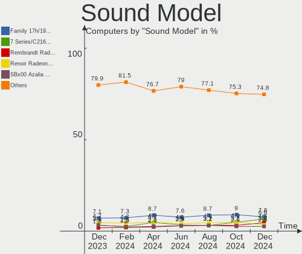

| Model                                                                      | Computers | Percent |
|----------------------------------------------------------------------------|-----------|---------|
| AMD Family 17h/19h HD Audio Controller                                     | 82        | 9.75%   |
| AMD Renoir Radeon High Definition Audio Controller                         | 49        | 5.83%   |
| Intel Tiger Lake-LP Smart Sound Technology Audio Controller                | 31        | 3.69%   |
| Intel 7 Series/C216 Chipset Family High Definition Audio Controller        | 26        | 3.09%   |
| Intel 6 Series/C200 Series Chipset Family High Definition Audio Controller | 26        | 3.09%   |
| AMD Rembrandt Radeon High Definition Audio Controller                      | 24        | 2.85%   |
| AMD SBx00 Azalia (Intel HDA)                                               | 22        | 2.62%   |
| Intel NM10/ICH7 Family High Definition Audio Controller                    | 20        | 2.38%   |
| Intel Alder Lake PCH-P High Definition Audio Controller                    | 20        | 2.38%   |
| Intel Cannon Lake PCH cAVS                                                 | 18        | 2.14%   |
| Intel Sunrise Point-LP HD Audio                                            | 16        | 1.9%    |
| AMD Raven/Raven2/Fenghuang HDMI/DP Audio Controller                        | 16        | 1.9%    |
| Intel Smart Sound Technology (SST) Audio Controller                        | 15        | 1.78%   |
| AMD Starship/Matisse HD Audio Controller                                   | 15        | 1.78%   |
| AMD Navi 21/23 HDMI/DP Audio Controller                                    | 14        | 1.66%   |
| Intel 8 Series/C220 Series Chipset High Definition Audio Controller        | 12        | 1.43%   |
| AMD FCH Azalia Controller                                                  | 12        | 1.43%   |
| Intel 82801I (ICH9 Family) HD Audio Controller                             | 11        | 1.31%   |
| Intel 100 Series/C230 Series Chipset Family HD Audio Controller            | 11        | 1.31%   |
| Nvidia Audio device                                                        | 10        | 1.19%   |
| Intel Celeron/Pentium Silver Processor High Definition Audio               | 10        | 1.19%   |
| AMD Ellesmere HDMI Audio [Radeon RX 470/480 / 570/580/590]                 | 10        | 1.19%   |
| Nvidia TU116 High Definition Audio Controller                              | 9         | 1.07%   |
| Intel 82801JI (ICH10 Family) HD Audio Controller                           | 9         | 1.07%   |
| Intel 5 Series/3400 Series Chipset High Definition Audio                   | 9         | 1.07%   |
| AMD Family 17h (Models 00h-0fh) HD Audio Controller                        | 9         | 1.07%   |
| AMD Family 15h (Models 60h-6fh) Audio Controller                           | 9         | 1.07%   |
| Nvidia GP107GL High Definition Audio Controller                            | 8         | 0.95%   |
| Nvidia GF108 High Definition Audio Controller                              | 8         | 0.95%   |
| Nvidia GA106 High Definition Audio Controller                              | 8         | 0.95%   |
| Intel Xeon E3-1200 v3/4th Gen Core Processor HD Audio Controller           | 8         | 0.95%   |
| Intel Tiger Lake-H HD Audio Controller                                     | 8         | 0.95%   |
| Intel 200 Series PCH HD Audio                                              | 8         | 0.95%   |
| Nvidia GK208 HDMI/DP Audio Controller                                      | 7         | 0.83%   |
| AMD Oland/Hainan/Cape Verde/Pitcairn HDMI Audio [Radeon HD 7000 Series]    | 7         | 0.83%   |
| AMD High Definition Audio Controller                                       | 7         | 0.83%   |
| AMD Baffin HDMI/DP Audio [Radeon RX 550 640SP / RX 560/560X]               | 7         | 0.83%   |
| Nvidia TU107 GeForce GTX 1650 High Definition Audio Controller             | 6         | 0.71%   |
| Nvidia GP104 High Definition Audio Controller                              | 6         | 0.71%   |
| Nvidia GA104 High Definition Audio Controller                              | 6         | 0.71%   |

Memory
------

Memory Vendor
-------------

Memory module vendors

| Vendor                             | Computers | Percent |
|------------------------------------|-----------|---------|
| Samsung Electronics                | 105       | 18.62%  |
| Kingston                           | 93        | 16.49%  |
| Unknown                            | 70        | 12.41%  |
| SK hynix                           | 57        | 10.11%  |
| Micron Technology                  | 48        | 8.51%   |
| Crucial                            | 27        | 4.79%   |
| AMD                                | 18        | 3.19%   |
| A-DATA Technology                  | 15        | 2.66%   |
| Unknown                            | 14        | 2.48%   |
| Transcend                          | 10        | 1.77%   |
| Apacer                             | 10        | 1.77%   |
| Unknown (ABCD)                     | 9         | 1.6%    |
| Ramaxel Technology                 | 9         | 1.6%    |
| Corsair                            | 9         | 1.6%    |
| Patriot                            | 8         | 1.42%   |
| Nanya Technology                   | 7         | 1.24%   |
| Elpida                             | 6         | 1.06%   |
| G.Skill                            | 5         | 0.89%   |
| Unknown (0x0BEC)                   | 4         | 0.71%   |
| ACPI Digital                       | 4         | 0.71%   |
| HPE                                | 3         | 0.53%   |
| Unknown (0x7FFF)                   | 2         | 0.35%   |
| Unknown (0x1636)                   | 2         | 0.35%   |
| Silicon Power                      | 2         | 0.35%   |
| Lexar Co Limited                   | 2         | 0.35%   |
| KingSpec                           | 2         | 0.35%   |
| Kimtigo Semiconductor (HK) Limited | 2         | 0.35%   |
| Foxline                            | 2         | 0.35%   |
| Unknown (8AD6)                     | 1         | 0.18%   |
| Unknown (0x0B92)                   | 1         | 0.18%   |
| Unknown (0x0B85)                   | 1         | 0.18%   |
| Unknown (0x0098000000000000)       | 1         | 0.18%   |
| Unknown (09D5)                     | 1         | 0.18%   |
| Shenzhen Giant Hui Kang Tech       | 1         | 0.18%   |
| Qimonda                            | 1         | 0.18%   |
| Patriot Memory                     | 1         | 0.18%   |
| Kingmax                            | 1         | 0.18%   |
| King Tiger                         | 1         | 0.18%   |
| KANMEIQi                           | 1         | 0.18%   |
| Hewlett-Packard                    | 1         | 0.18%   |

Memory Model
------------

Memory module models

| Model                                                            | Computers | Percent |
|------------------------------------------------------------------|-----------|---------|
| Unknown                                                          | 14        | 2.3%    |
| Samsung RAM M393A2K40DB3-CWE 16GB DIMM DDR4 3200MT/s             | 8         | 1.31%   |
| Unknown (ABCD) RAM 123456789012345678 2GB SODIMM LPDDR4 2400MT/s | 7         | 1.15%   |
| Samsung RAM M393B1K70CH0-CH9 8GB DIMM DDR3 1333MT/s              | 7         | 1.15%   |
| Unknown RAM Module 2GB SODIMM DDR2                               | 6         | 0.98%   |
| Unknown RAM Module 2GB DIMM DDR2 800MT/s                         | 6         | 0.98%   |
| Transcend RAM TS512MKR72W6H 4GB DIMM DDR3 1333MT/s               | 6         | 0.98%   |
| Samsung RAM M471A5244CB0-CTD 4GB SODIMM DDR4 3266MT/s            | 6         | 0.98%   |
| Micron RAM 36ASF4G72PZ-2G3B1 32GB DIMM DDR4 2400MT/s             | 6         | 0.98%   |
| Samsung RAM M471A1K43EB1-CWE 8GB SODIMM DDR4 3200MT/s            | 5         | 0.82%   |
| Kingston RAM 9965442-018.B00LF 8GB DIMM DDR3 1333MT/s            | 5         | 0.82%   |
| Kingston RAM 9965439-018.A00LF 1GB DIMM 1333MT/s                 | 5         | 0.82%   |
| Unknown RAM Module 4GB DIMM 1333MT/s                             | 4         | 0.66%   |
| Unknown RAM Module 2GB DIMM SDRAM                                | 4         | 0.66%   |
| Samsung RAM U6E3S4AA-MGCR 1GB Row Of Chips LPDDR4 4267MT/s       | 4         | 0.66%   |
| Samsung RAM M471A5244CB0-CWE 4GB SODIMM DDR4 3200MT/s            | 4         | 0.66%   |
| Samsung RAM M471A2K43EB1-CWE 16GB SODIMM DDR4 3200MT/s           | 4         | 0.66%   |
| Samsung RAM M386A4G40DM1-CRC 32GB DIMM DDR4 2400MT/s             | 4         | 0.66%   |
| Micron RAM 4ATF1G64HZ-3G2E1 8GB Row Of Chips DDR4 3200MT/s       | 4         | 0.66%   |
| Kingston RAM KF3200C16D4/8GX 8GB DIMM DDR4 3600MT/s              | 4         | 0.66%   |
| Kingston RAM 9965604-025.C00G 8GB DIMM DDR4 2133MT/s             | 4         | 0.66%   |
| Kingston RAM 9965596-004.B00G 4GB DIMM DDR4 2133MT/s             | 4         | 0.66%   |
| Kingston RAM 9965442-025.B00LF 8GB DIMM DDR3 1333MT/s            | 4         | 0.66%   |
| ACPI Digital RAM CMB6-DHDA1BAR08D00 16GB SODIMM DDR4 3200MT/s    | 4         | 0.66%   |
| A-DATA RAM Module 8GB SODIMM DDR4 3200MT/s                       | 4         | 0.66%   |
| SK hynix RAM HMT151R7BFR4C-H9 4GB DIMM 1333MT/s                  | 3         | 0.49%   |
| SK hynix RAM HMA81GS6AFR8N-UH 8GB SODIMM DDR4 2667MT/s           | 3         | 0.49%   |
| Samsung RAM M471B5273CH0-CH9 4GB SODIMM DDR3 1334MT/s            | 3         | 0.49%   |
| Micron RAM 9ASF51272PZ-2G3B1 4GB DIMM DDR4 2400MT/s              | 3         | 0.49%   |
| Micron RAM 4ATF51264HZ-3G2J1 4GB SODIMM DDR4 3200MT/s            | 3         | 0.49%   |
| Kingston RAM 9965447-062.A00LF 8GB DIMM 1333MT/s                 | 3         | 0.49%   |
| Kingston RAM 9965447-024.A00LF 4GB DIMM 1333MT/s                 | 3         | 0.49%   |
| HPE RAM P03052-091 32GB DIMM DDR4 3200MT/s                       | 3         | 0.49%   |
| Elpida RAM EBJ41UF8BCS0-DJ-F 4GB SODIMM DDR3 1334MT/s            | 3         | 0.49%   |
| Crucial RAM CT8G4SFRA266.C8FD1 8GB SODIMM DDR4 2667MT/s          | 3         | 0.49%   |
| Unknown RAM Module 4GB DIMM DDR3 1333MT/s                        | 2         | 0.33%   |
| Unknown RAM Module 4GB DIMM 1600MT/s                             | 2         | 0.33%   |
| Unknown RAM Module 2GB SODIMM DDR2 667MT/s                       | 2         | 0.33%   |
| Unknown RAM Module 2GB Row Of Chips LPDDR4 4267MT/s              | 2         | 0.33%   |
| Unknown RAM Module 2GB DIMM DDR 1333MT/s                         | 2         | 0.33%   |

Memory Kind
-----------

Memory module kinds

| Kind    | Computers | Percent |
|---------|-----------|---------|
| DDR4    | 233       | 47.45%  |
| DDR3    | 129       | 26.27%  |
| Unknown | 34        | 6.92%   |
| DDR2    | 30        | 6.11%   |
| LPDDR4  | 26        | 5.3%    |
| SDRAM   | 13        | 2.65%   |
| DDR5    | 11        | 2.24%   |
| LPDDR5  | 8         | 1.63%   |
| DDR     | 4         | 0.81%   |
| DRAM    | 2         | 0.41%   |
| LPDDR3  | 1         | 0.2%    |

Memory Form Factor
------------------

Physical design of the memory module

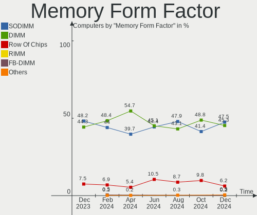

| Name         | Computers | Percent |
|--------------|-----------|---------|
| DIMM         | 241       | 49.39%  |
| SODIMM       | 208       | 42.62%  |
| Row Of Chips | 39        | 7.99%   |

Memory Size
-----------

Memory module size

| Size  | Computers | Percent |
|-------|-----------|---------|
| 8192  | 195       | 35.91%  |
| 4096  | 131       | 24.13%  |
| 2048  | 77        | 14.18%  |
| 16384 | 74        | 13.63%  |
| 1024  | 31        | 5.71%   |
| 32768 | 27        | 4.97%   |
| 512   | 5         | 0.92%   |
| 256   | 2         | 0.37%   |
| 65536 | 1         | 0.18%   |

Memory Speed
------------

Memory module speed

| Speed   | Computers | Percent |
|---------|-----------|---------|
| 3200    | 109       | 20.8%   |
| 1333    | 64        | 12.21%  |
| 2667    | 62        | 11.83%  |
| 1600    | 59        | 11.26%  |
| 2400    | 40        | 7.63%   |
| 2133    | 21        | 4.01%   |
| Unknown | 19        | 3.63%   |
| 800     | 15        | 2.86%   |
| 3600    | 14        | 2.67%   |
| 667     | 14        | 2.67%   |
| 4267    | 13        | 2.48%   |
| 1334    | 12        | 2.29%   |
| 6400    | 7         | 1.34%   |
| 4800    | 7         | 1.34%   |
| 3266    | 7         | 1.34%   |
| 1066    | 5         | 0.95%   |
| 400     | 5         | 0.95%   |
| 1866    | 4         | 0.76%   |
| 1067    | 4         | 0.76%   |
| 5600    | 3         | 0.57%   |
| 3733    | 3         | 0.57%   |
| 1867    | 3         | 0.57%   |
| 533     | 3         | 0.57%   |
| 4266    | 2         | 0.38%   |
| 4199    | 2         | 0.38%   |
| 3466    | 2         | 0.38%   |
| 3400    | 2         | 0.38%   |
| 3133    | 2         | 0.38%   |
| 2933    | 2         | 0.38%   |
| 2666    | 2         | 0.38%   |
| 8400    | 1         | 0.19%   |
| 7600    | 1         | 0.19%   |
| 5500    | 1         | 0.19%   |
| 3866    | 1         | 0.19%   |
| 3533    | 1         | 0.19%   |
| 3020    | 1         | 0.19%   |
| 3000    | 1         | 0.19%   |
| 2934    | 1         | 0.19%   |
| 2600    | 1         | 0.19%   |
| 2472    | 1         | 0.19%   |

Printers & scanners
-------------------

Printer Vendor
--------------

Printer device vendors

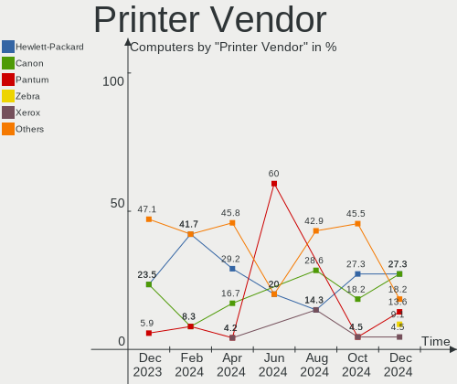

| Vendor              | Computers | Percent |
|---------------------|-----------|---------|
| Hewlett-Packard     | 4         | 28.57%  |
| Canon               | 4         | 28.57%  |
| Seiko Epson         | 1         | 7.14%   |
| Samsung Electronics | 1         | 7.14%   |
| Prolific Technology | 1         | 7.14%   |
| Pantum              | 1         | 7.14%   |
| Kyocera             | 1         | 7.14%   |
| Brother Industries  | 1         | 7.14%   |

Printer Model
-------------

Printer device models

| Model                         | Computers | Percent |
|-------------------------------|-----------|---------|
| HP LaserJet P1102             | 2         | 14.29%  |
| Seiko Epson L132 Series       | 1         | 7.14%   |
| Samsung M2070 Series          | 1         | 7.14%   |
| Prolific PL2305 Parallel Port | 1         | 7.14%   |
| Pantum P2200-series           | 1         | 7.14%   |
| Kyocera ECOSYS M2040dn        | 1         | 7.14%   |
| HP LaserJet P1005             | 1         | 7.14%   |
| HP LaserJet 1018              | 1         | 7.14%   |
| Canon MF4700 Series           | 1         | 7.14%   |
| Canon MF420 Series            | 1         | 7.14%   |
| Canon LBP810                  | 1         | 7.14%   |
| Canon G3010 series            | 1         | 7.14%   |
| Brother DCP-1510              | 1         | 7.14%   |

Scanner Vendor
--------------

Scanner device vendors

| Vendor         | Computers | Percent |
|----------------|-----------|---------|
| Seiko Epson    | 1         | 25%     |
| Plustek        | 1         | 25%     |
| Mustek Systems | 1         | 25%     |
| Canon          | 1         | 25%     |

Scanner Model
-------------

Scanner device models

| Model                                        | Computers | Percent |
|----------------------------------------------|-----------|---------|
| Seiko Epson GT-9700F [Perfection 2450 PHOTO] | 1         | 25%     |
| Plustek USB Scanner                          | 1         | 25%     |
| Mustek Systems BearPaw 2448 TA Plus          | 1         | 25%     |
| Canon CanoScan LiDE 110                      | 1         | 25%     |

Camera
------

Camera Vendor
-------------

Camera device vendors

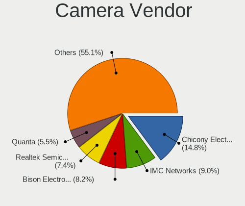

| Vendor                                 | Computers | Percent |
|----------------------------------------|-----------|---------|
| Chicony Electronics                    | 46        | 17.16%  |
| Quanta                                 | 27        | 10.07%  |
| IMC Networks                           | 19        | 7.09%   |
| Sunplus Innovation Technology          | 15        | 5.6%    |
| Realtek Semiconductor                  | 14        | 5.22%   |
| Bison Electronics                      | 13        | 4.85%   |
| Acer                                   | 12        | 4.48%   |
| SunplusIT                              | 11        | 4.1%    |
| Syntek                                 | 10        | 3.73%   |
| Microdia                               | 10        | 3.73%   |
| Logitech                               | 9         | 3.36%   |
| Cheng Uei Precision Industry (Foxlink) | 8         | 2.99%   |
| Z-Star Microelectronics                | 6         | 2.24%   |
| Sonix Technology                       | 6         | 2.24%   |
| Luxvisions Innotech Limited            | 6         | 2.24%   |
| Suyin                                  | 5         | 1.87%   |
| Silicon Motion                         | 5         | 1.87%   |
| Apple                                  | 5         | 1.87%   |
| Alcor Micro                            | 5         | 1.87%   |
| ShineTech                              | 3         | 1.12%   |
| Lite-On Technology                     | 3         | 1.12%   |
| KYE Systems (Mouse Systems)            | 3         | 1.12%   |
| USB Camera CS                          | 2         | 0.75%   |
| Ricoh                                  | 2         | 0.75%   |
| icSpring                               | 2         | 0.75%   |
| Hopewin Electronic Material            | 2         | 0.75%   |
| Cubeternet                             | 2         | 0.75%   |
| Y Media                                | 1         | 0.37%   |
| TXD                                    | 1         | 0.37%   |
| Tripath Technology                     | 1         | 0.37%   |
| Shine-optics                           | 1         | 0.37%   |
| Samsung Electronics                    | 1         | 0.37%   |
| Primax Electronics                     | 1         | 0.37%   |
| Microsoft                              | 1         | 0.37%   |
| lihappe8                               | 1         | 0.37%   |
| Lenovo                                 | 1         | 0.37%   |
| Jieli Technology                       | 1         | 0.37%   |
| Hewlett-Packard                        | 1         | 0.37%   |
| GEMBIRD                                | 1         | 0.37%   |
| DX-221104-A                            | 1         | 0.37%   |

Camera Model
------------

Camera device models

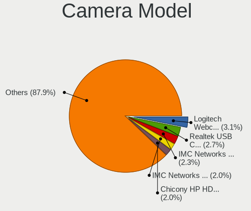

| Model                                               | Computers | Percent |
|-----------------------------------------------------|-----------|---------|
| Syntek Integrated Camera                            | 7         | 2.61%   |
| Quanta ov9734_techfront_camera                      | 7         | 2.61%   |
| IMC Networks USB2.0 HD UVC WebCam                   | 6         | 2.24%   |
| Realtek Integrated_Webcam_HD                        | 5         | 1.87%   |
| Quanta HD User Facing                               | 5         | 1.87%   |
| Chicony Integrated Camera                           | 5         | 1.87%   |
| Chicony HD WebCam                                   | 5         | 1.87%   |
| Chicony HD User Facing                              | 5         | 1.87%   |
| Bison Lenovo Integrated Webcam                      | 5         | 1.87%   |
| SunplusIT XiaoMi USB 2.0 Webcam                     | 4         | 1.49%   |
| Sonix USB2.0 FHD UVC WebCam                         | 4         | 1.49%   |
| Quanta HP TrueVision HD Camera                      | 4         | 1.49%   |
| Bison HD Webcam                                     | 4         | 1.49%   |
| Acer BisonCam,NB Pro                                | 4         | 1.49%   |
| Sunplus Asus Webcam                                 | 3         | 1.12%   |
| Realtek USB2.0 camera                               | 3         | 1.12%   |
| Realtek Lenovo EasyCamera                           | 3         | 1.12%   |
| Quanta HP Webcam                                    | 3         | 1.12%   |
| Microdia Integrated_Webcam_HD                       | 3         | 1.12%   |
| Luxvisions Innotech Limited HP TrueVision HD Camera | 3         | 1.12%   |
| IMC Networks Integrated Camera                      | 3         | 1.12%   |
| IMC Networks HD Camera                              | 3         | 1.12%   |
| Chicony VGA WebCam                                  | 3         | 1.12%   |
| Chicony EasyCamera                                  | 3         | 1.12%   |
| Apple FaceTime HD Camera                            | 3         | 1.12%   |
| Acer Integrated Camera                              | 3         | 1.12%   |
| Acer BisonCam, NB Pro                               | 3         | 1.12%   |
| Z-Star Venus USB2.0 Camera                          | 2         | 0.75%   |
| Z-Star A4 TECH USB2.0 PC Camera E                   | 2         | 0.75%   |
| USB Camera CS USB Camera CS                         | 2         | 0.75%   |
| SunplusIT USB Camera                                | 2         | 0.75%   |
| SunplusIT 720p HD Camera                            | 2         | 0.75%   |
| Sunplus USB Microphone                              | 2         | 0.75%   |
| Sunplus SPCA2281 Web Camera                         | 2         | 0.75%   |
| Silicon Motion WebCam SC-13HDL11939N                | 2         | 0.75%   |
| ShineTech HD Camera                                 | 2         | 0.75%   |
| Quanta VGA WebCam                                   | 2         | 0.75%   |
| Quanta USB HD Webcam                                | 2         | 0.75%   |
| Quanta FHD Camera                                   | 2         | 0.75%   |
| Microdia USB 2.0 Camera                             | 2         | 0.75%   |

Security
--------

Fingerprint Vendor
------------------

Fingerprint sensor vendors

| Vendor                             | Computers | Percent |
|------------------------------------|-----------|---------|
| Shenzhen Goodix Technology         | 19        | 44.19%  |
| Synaptics                          | 7         | 16.28%  |
| Validity Sensors                   | 4         | 9.3%    |
| Upek                               | 3         | 6.98%   |
| Realtek USB2.0 Finger Print Bridge | 2         | 4.65%   |
| Focal-systems.Corp                 | 2         | 4.65%   |
| Elan Microelectronics              | 2         | 4.65%   |
| AuthenTec                          | 2         | 4.65%   |
| STMicroelectronics                 | 1         | 2.33%   |
| FocalTech                          | 1         | 2.33%   |

Fingerprint Model
-----------------

Fingerprint sensor models

| Model                                                           | Computers | Percent |
|-----------------------------------------------------------------|-----------|---------|
| Shenzhen Goodix  Fingerprint Device                             | 17        | 39.53%  |
| Upek Biometric Touchchip/Touchstrip Fingerprint Sensor          | 3         | 6.98%   |
| Synaptics WBDI Fingerprint Reader USB 086                       | 2         | 4.65%   |
| Synaptics  WBDI                                                 | 2         | 4.65%   |
| Realtek USB2.0 Finger Print Bridge FocalTech Fingerprint Device | 2         | 4.65%   |
| Focal-systems.Corp FT9201Fingerprint.                           | 2         | 4.65%   |
| Validity Sensors VFS495 Fingerprint Reader                      | 1         | 2.33%   |
| Validity Sensors VFS 5011 fingerprint sensor                    | 1         | 2.33%   |
| Validity Sensors Synaptics WBDI                                 | 1         | 2.33%   |
| Validity Sensors Fingerprint scanner                            | 1         | 2.33%   |
| Synaptics WBDI                                                  | 1         | 2.33%   |
| Synaptics Prometheus MIS Touch Fingerprint Reader               | 1         | 2.33%   |
| Synaptics FS7604 Touch Fingerprint Sensor with PurePrint        | 1         | 2.33%   |
| STMicroelectronics Fingerprint Reader                           | 1         | 2.33%   |
| Shenzhen Goodix Fingerprint Reader                              | 1         | 2.33%   |
| Shenzhen Goodix FingerPrint                                     | 1         | 2.33%   |
| FocalTech Fingerprint Device                                    | 1         | 2.33%   |
| Elan ELAN:Fingerprint                                           | 1         | 2.33%   |
| Elan ELAN:ARM-M4                                                | 1         | 2.33%   |
| AuthenTec Fingerprint Sensor                                    | 1         | 2.33%   |
| AuthenTec AES2501 Fingerprint Sensor                            | 1         | 2.33%   |

Chipcard Vendor
---------------

Chipcard module vendors

| Vendor                    | Computers | Percent |
|---------------------------|-----------|---------|
| Broadcom                  | 3         | 30%     |
| Alcor Micro               | 2         | 20%     |
| Realtek Semiconductor     | 1         | 10%     |
| NXP Semiconductors        | 1         | 10%     |
| Aladdin R.D.              | 1         | 10%     |
| Aladdin Knowledge Systems | 1         | 10%     |
| Aktiv                     | 1         | 10%     |

Chipcard Model
--------------

Chipcard module models

| Model                                             | Computers | Percent |
|---------------------------------------------------|-----------|---------|
| Broadcom 5880                                     | 2         | 20%     |
| Alcor Micro AU9540 Smartcard Reader               | 2         | 20%     |
| Realtek Semiconductor Smart Card Reader Interface | 1         | 10%     |
| NXP Semiconductors PR533                          | 1         | 10%     |
| Broadcom 58200                                    | 1         | 10%     |
| Aladdin R.D. JaCarta                              | 1         | 10%     |
| Aladdin Knowledge Systems Token JC                | 1         | 10%     |
| Aktiv Rutoken lite                                | 1         | 10%     |

Unsupported
-----------

Unsupported Devices
-------------------

Total unsupported devices on board

| Total | Computers | Percent |
|-------|-----------|---------|
| 0     | 397       | 67.63%  |
| 1     | 113       | 19.25%  |
| 3     | 31        | 5.28%   |
| 4     | 25        | 4.26%   |
| 2     | 19        | 3.24%   |
| 6     | 1         | 0.17%   |
| 5     | 1         | 0.17%   |

Unsupported Device Types
------------------------

Types of unsupported devices

| Type                     | Computers | Percent |
|--------------------------|-----------|---------|
| Graphics card            | 90        | 31.36%  |
| Communication controller | 59        | 20.56%  |
| Unassigned class         | 46        | 16.03%  |
| Fingerprint reader       | 43        | 14.98%  |
| Net/wireless             | 12        | 4.18%   |
| Multimedia controller    | 11        | 3.83%   |
| Bluetooth                | 7         | 2.44%   |
| Chipcard                 | 6         | 2.09%   |
| Camera                   | 4         | 1.39%   |
| Storage                  | 2         | 0.7%    |
| Sound                    | 2         | 0.7%    |
| Net/ethernet             | 2         | 0.7%    |
| Storage/nvme             | 1         | 0.35%   |
| Flash memory             | 1         | 0.35%   |
| Card reader              | 1         | 0.35%   |

