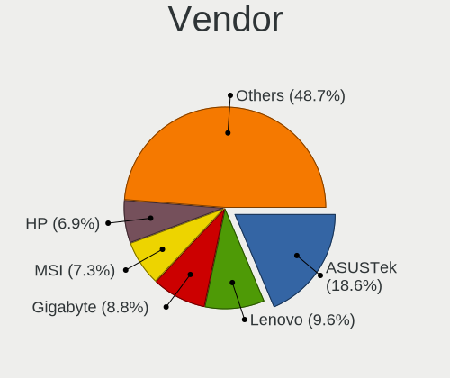
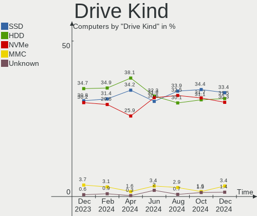
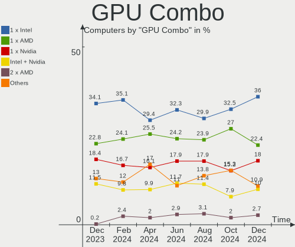
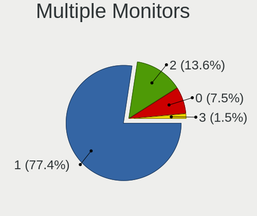
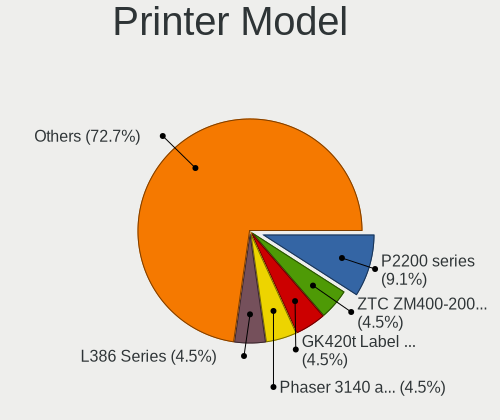

Linux in Russia - Hardware Trends
---------------------------------

A project to identify most popular hardware characteristics and track their change
over time based on data collected by Linux users at https://Linux-Hardware.org.

Anyone can contribute to this report by the [hw-probe](https://github.com/linuxhw/hw-probe) tool:

    sudo -E hw-probe -all -upload

This is a report for all computer types. See also reports for [desktops](/Location/Russia/Desktop/README.md) and [notebooks](/Location/Russia/Notebook/README.md).

Period: Sep, 2023.

Contents
--------

* [ System ](#system)
  - [ OS                       ](#os)
  - [ OS Family                ](#os-family)
  - [ Kernel                   ](#kernel)
  - [ Kernel Family            ](#kernel-family)
  - [ Kernel Major Ver.        ](#kernel-major-ver)
  - [ Arch                     ](#arch)
  - [ DE                       ](#de)
  - [ Display Server           ](#display-server)
  - [ Display Manager          ](#display-manager)
  - [ OS Lang                  ](#os-lang)
  - [ Boot Mode                ](#boot-mode)
  - [ Filesystem               ](#filesystem)
  - [ Part. scheme             ](#part-scheme)
  - [ Dual Boot with Linux/BSD ](#dual-boot-with-linuxbsd)
  - [ Dual Boot (Win)          ](#dual-boot-win)

* [ Board ](#board)
  - [ Vendor                   ](#vendor)
  - [ Model                    ](#model)
  - [ Model Family             ](#model-family)
  - [ MFG Year                 ](#mfg-year)
  - [ Form Factor              ](#form-factor)
  - [ Secure Boot              ](#secure-boot)
  - [ Coreboot                 ](#coreboot)
  - [ RAM Size                 ](#ram-size)
  - [ RAM Used                 ](#ram-used)
  - [ Total Drives             ](#total-drives)
  - [ Has CD-ROM               ](#has-cd-rom)
  - [ Has Ethernet             ](#has-ethernet)
  - [ Has WiFi                 ](#has-wifi)
  - [ Has Bluetooth            ](#has-bluetooth)

* [ Location ](#location)
  - [ Country                  ](#country)
  - [ City                     ](#city)

* [ Drives ](#drives)
  - [ Drive Vendor             ](#drive-vendor)
  - [ Drive Model              ](#drive-model)
  - [ HDD Vendor               ](#hdd-vendor)
  - [ SSD Vendor               ](#ssd-vendor)
  - [ Drive Kind               ](#drive-kind)
  - [ Drive Connector          ](#drive-connector)
  - [ Drive Size               ](#drive-size)
  - [ Space Total              ](#space-total)
  - [ Space Used               ](#space-used)
  - [ Malfunc. Drives          ](#malfunc-drives)
  - [ Malfunc. Drive Vendor    ](#malfunc-drive-vendor)
  - [ Malfunc. HDD Vendor      ](#malfunc-hdd-vendor)
  - [ Malfunc. Drive Kind      ](#malfunc-drive-kind)
  - [ Failed Drives            ](#failed-drives)
  - [ Failed Drive Vendor      ](#failed-drive-vendor)
  - [ Drive Status             ](#drive-status)

* [ Storage controller ](#storage-controller)
  - [ Storage Vendor           ](#storage-vendor)
  - [ Storage Model            ](#storage-model)
  - [ Storage Kind             ](#storage-kind)

* [ Processor ](#processor)
  - [ CPU Vendor               ](#cpu-vendor)
  - [ CPU Model                ](#cpu-model)
  - [ CPU Model Family         ](#cpu-model-family)
  - [ CPU Cores                ](#cpu-cores)
  - [ CPU Sockets              ](#cpu-sockets)
  - [ CPU Threads              ](#cpu-threads)
  - [ CPU Op-Modes             ](#cpu-op-modes)
  - [ CPU Microcode            ](#cpu-microcode)
  - [ CPU Microarch            ](#cpu-microarch)

* [ Graphics ](#graphics)
  - [ GPU Vendor               ](#gpu-vendor)
  - [ GPU Model                ](#gpu-model)
  - [ GPU Combo                ](#gpu-combo)
  - [ GPU Driver               ](#gpu-driver)
  - [ GPU Memory               ](#gpu-memory)

* [ Monitor ](#monitor)
  - [ Monitor Vendor           ](#monitor-vendor)
  - [ Monitor Model            ](#monitor-model)
  - [ Monitor Resolution       ](#monitor-resolution)
  - [ Monitor Diagonal         ](#monitor-diagonal)
  - [ Monitor Width            ](#monitor-width)
  - [ Aspect Ratio             ](#aspect-ratio)
  - [ Monitor Area             ](#monitor-area)
  - [ Pixel Density            ](#pixel-density)
  - [ Multiple Monitors        ](#multiple-monitors)

* [ Network ](#network)
  - [ Net Controller Vendor    ](#net-controller-vendor)
  - [ Net Controller Model     ](#net-controller-model)
  - [ Wireless Vendor          ](#wireless-vendor)
  - [ Wireless Model           ](#wireless-model)
  - [ Ethernet Vendor          ](#ethernet-vendor)
  - [ Ethernet Model           ](#ethernet-model)
  - [ Net Controller Kind      ](#net-controller-kind)
  - [ Used Controller          ](#used-controller)
  - [ NICs                     ](#nics)
  - [ IPv6                     ](#ipv6)

* [ Bluetooth ](#bluetooth)
  - [ Bluetooth Vendor         ](#bluetooth-vendor)
  - [ Bluetooth Model          ](#bluetooth-model)

* [ Sound ](#sound)
  - [ Sound Vendor             ](#sound-vendor)
  - [ Sound Model              ](#sound-model)

* [ Memory ](#memory)
  - [ Memory Vendor            ](#memory-vendor)
  - [ Memory Model             ](#memory-model)
  - [ Memory Kind              ](#memory-kind)
  - [ Memory Form Factor       ](#memory-form-factor)
  - [ Memory Size              ](#memory-size)
  - [ Memory Speed             ](#memory-speed)

* [ Printers & scanners ](#printers--scanners)
  - [ Printer Vendor           ](#printer-vendor)
  - [ Printer Model            ](#printer-model)
  - [ Scanner Vendor           ](#scanner-vendor)
  - [ Scanner Model            ](#scanner-model)

* [ Camera ](#camera)
  - [ Camera Vendor            ](#camera-vendor)
  - [ Camera Model             ](#camera-model)

* [ Security ](#security)
  - [ Fingerprint Vendor       ](#fingerprint-vendor)
  - [ Fingerprint Model        ](#fingerprint-model)
  - [ Chipcard Vendor          ](#chipcard-vendor)
  - [ Chipcard Model           ](#chipcard-model)

* [ Unsupported ](#unsupported)
  - [ Unsupported Devices      ](#unsupported-devices)
  - [ Unsupported Device Types ](#unsupported-device-types)

System
------

OS
--

Installed operating systems

| Name                         | Computers | Percent |
|------------------------------|-----------|---------|
| ROSA 12.4                    | 144       | 25.95%  |
| Ubuntu 22.04                 | 66        | 11.89%  |
| Debian 12                    | 45        | 8.11%   |
| OpenMandriva 23.08           | 29        | 5.23%   |
| Fedora 38                    | 29        | 5.23%   |
| Arch Rolling                 | 19        | 3.42%   |
| OpenMandriva 23.09           | 16        | 2.88%   |
| Linux Mint 21.2              | 16        | 2.88%   |
| ROSA 12                      | 14        | 2.52%   |
| Red OS 7.3                   | 11        | 1.98%   |
| ALT Linux 10.2               | 10        | 1.8%    |
| Ubuntu 23.04                 | 9         | 1.62%   |
| ROSA R11.1                   | 7         | 1.26%   |
| Manjaro                      | 7         | 1.26%   |
| Linux Mint 21.1              | 6         | 1.08%   |
| SteamOS 3.4.10               | 5         | 0.9%    |
| KDE neon 22.04               | 5         | 0.9%    |
| Kali 2023.3                  | 5         | 0.9%    |
| Debian 11                    | 5         | 0.9%    |
| Kubuntu 23.04                | 4         | 0.72%   |
| EndeavourOS Rolling          | 4         | 0.72%   |
| Cyber Infra 5.0.1            | 4         | 0.72%   |
| ArcoLinux Rolling            | 4         | 0.72%   |
| Ubuntu 23.10                 | 3         | 0.54%   |
| Ubuntu 20.04                 | 3         | 0.54%   |
| openSUSE Tumbleweed-XXXXXXXX | 3         | 0.54%   |
| OpenMandriva 4.3             | 3         | 0.54%   |
| Manjaro 23.0.1               | 3         | 0.54%   |
| Gentoo 2.14                  | 3         | 0.54%   |
| ALT Linux 10.1.900           | 3         | 0.54%   |
| ALT Linux 10.1               | 3         | 0.54%   |
| Zorin 16                     | 2         | 0.36%   |
| Xubuntu 20.04                | 2         | 0.36%   |
| Xero Rolling                 | 2         | 0.36%   |
| ROSA 13.0                    | 2         | 0.36%   |
| ROSA 12.2                    | 2         | 0.36%   |
| Pop!_OS 22.04                | 2         | 0.36%   |
| OpenMandriva 23.03           | 2         | 0.36%   |
| Manjaro 23.0.2               | 2         | 0.36%   |
| Manjaro 23.0.0               | 2         | 0.36%   |

OS Family
---------

OS without a version

| Name          | Computers | Percent |
|---------------|-----------|---------|
| ROSA          | 173       | 31.17%  |
| Ubuntu        | 83        | 14.95%  |
| Debian        | 52        | 9.37%   |
| OpenMandriva  | 51        | 9.19%   |
| Fedora        | 36        | 6.49%   |
| Linux Mint    | 24        | 4.32%   |
| ALT Linux     | 20        | 3.6%    |
| Arch          | 19        | 3.42%   |
| Manjaro       | 14        | 2.52%   |
| Red OS        | 12        | 2.16%   |
| SteamOS       | 5         | 0.9%    |
| Kubuntu       | 5         | 0.9%    |
| KDE neon      | 5         | 0.9%    |
| Kali          | 5         | 0.9%    |
| openSUSE      | 4         | 0.72%   |
| EndeavourOS   | 4         | 0.72%   |
| Cyber Infra   | 4         | 0.72%   |
| ArcoLinux     | 4         | 0.72%   |
| Xubuntu       | 3         | 0.54%   |
| Gentoo        | 3         | 0.54%   |
| Elementary    | 3         | 0.54%   |
| Zorin         | 2         | 0.36%   |
| Xero          | 2         | 0.36%   |
| Ubuntu MATE   | 2         | 0.36%   |
| Raspbian      | 2         | 0.36%   |
| Pop!_OS       | 2         | 0.36%   |
| LMDE          | 2         | 0.36%   |
| Clear Linux   | 2         | 0.36%   |
| Astra Linux   | 2         | 0.36%   |
| Ubuntu Unity  | 1         | 0.18%   |
| Ubuntu Studio | 1         | 0.18%   |
| Ubuntu Budgie | 1         | 0.18%   |
| MX            | 1         | 0.18%   |
| Lubuntu       | 1         | 0.18%   |
| Linux Lite    | 1         | 0.18%   |
| LFS           | 1         | 0.18%   |
| Green         | 1         | 0.18%   |
| antiX         | 1         | 0.18%   |
| Alpine        | 1         | 0.18%   |

Kernel
------

Version of the Linux kernel

| Version                             | Computers | Percent |
|-------------------------------------|-----------|---------|
| 6.1.46-generic-2rosa2021.1-x86_64   | 67        | 12.07%  |
| 6.1.20-generic-2rosa2021.1-x86_64   | 36        | 6.49%   |
| 5.15.0-69-generic                   | 33        | 5.95%   |
| 6.1.38-generic-1rosa2021.1-x86_64   | 28        | 5.05%   |
| 6.4.11-desktop-1omv2390             | 26        | 4.68%   |
| 6.2.0-32-generic                    | 23        | 4.14%   |
| 6.1.0-4-amd64                       | 16        | 2.88%   |
| 6.2.0-33-generic                    | 14        | 2.52%   |
| 6.4.15-200.fc38.x86_64              | 11        | 1.98%   |
| 6.1.0-10-amd64                      | 10        | 1.8%    |
| 6.5.3-arch1-1                       | 9         | 1.62%   |
| 6.1.0-12-amd64                      | 9         | 1.62%   |
| 6.1.0-11-amd64                      | 9         | 1.62%   |
| 5.15.0-84-generic                   | 9         | 1.62%   |
| 6.2.9-300.fc38.x86_64               | 8         | 1.44%   |
| 6.2.0-31-generic                    | 8         | 1.44%   |
| 6.4.12-arch1-1                      | 7         | 1.26%   |
| 5.15.127-generic-1rosa2021.1-x86_64 | 7         | 1.26%   |
| 5.15.0-82-generic                   | 7         | 1.26%   |
| 6.5.0-desktop-1omv2390              | 6         | 1.08%   |
| 5.10.184-generic-1rosa2021.1-x86_64 | 6         | 1.08%   |
| 6.4.13-200.fc38.x86_64              | 5         | 0.9%    |
| 6.1.44-1.el7.3.x86_64               | 5         | 0.9%    |
| 5.13.0-valve37-1-neptune            | 5         | 0.9%    |
| 6.5.2-desktop-1omv2390              | 4         | 0.72%   |
| 6.4.8-desktop-2omv2390              | 4         | 0.72%   |
| 5.4.83-generic-2rosa-i586           | 4         | 0.72%   |
| 5.15.103-generic-1rosa2021.1-i686   | 4         | 0.72%   |
| 5.10.0-25-amd64                     | 4         | 0.72%   |
| 3.10.0-1160.41.1.vz7.183.5          | 4         | 0.72%   |
| 6.5.3-desktop-1omv2390              | 3         | 0.54%   |
| 6.5.2-arch1-1                       | 3         | 0.54%   |
| 6.5.0-kali1-amd64                   | 3         | 0.54%   |
| 6.5.0-5-generic                     | 3         | 0.54%   |
| 6.2.0-26-generic                    | 3         | 0.54%   |
| 6.1.51-1-MANJARO                    | 3         | 0.54%   |
| 6.1.49-un-def-alt1                  | 3         | 0.54%   |
| 5.4.0-163-generic                   | 3         | 0.54%   |
| 5.15.125-1.el7.3.x86_64             | 3         | 0.54%   |
| 5.15.116-1-pve                      | 3         | 0.54%   |

Kernel Family
-------------

Linux kernel without a distro release

| Version  | Computers | Percent |
|----------|-----------|---------|
| 6.1.46   | 70        | 12.61%  |
| 5.15.0   | 60        | 10.81%  |
| 6.2.0    | 51        | 9.19%   |
| 6.1.0    | 46        | 8.29%   |
| 6.1.20   | 37        | 6.67%   |
| 6.1.38   | 33        | 5.95%   |
| 6.4.11   | 27        | 4.86%   |
| 6.5.3    | 18        | 3.24%   |
| 6.5.0    | 18        | 3.24%   |
| 6.4.15   | 13        | 2.34%   |
| 6.4.12   | 11        | 1.98%   |
| 6.5.2    | 8         | 1.44%   |
| 6.2.9    | 8         | 1.44%   |
| 5.15.127 | 7         | 1.26%   |
| 6.5.1    | 6         | 1.08%   |
| 6.4.13   | 6         | 1.08%   |
| 6.1.51   | 6         | 1.08%   |
| 6.1.49   | 6         | 1.08%   |
| 5.10.184 | 6         | 1.08%   |
| 6.5.4    | 5         | 0.9%    |
| 6.1.44   | 5         | 0.9%    |
| 5.13.0   | 5         | 0.9%    |
| 4.15.0   | 5         | 0.9%    |
| 6.5.5    | 4         | 0.72%   |
| 6.4.8    | 4         | 0.72%   |
| 5.4.83   | 4         | 0.72%   |
| 5.4.0    | 4         | 0.72%   |
| 5.19.0   | 4         | 0.72%   |
| 5.15.103 | 4         | 0.72%   |
| 5.10.0   | 4         | 0.72%   |
| 3.10.0   | 4         | 0.72%   |
| 6.6.0    | 3         | 0.54%   |
| 6.4.6    | 3         | 0.54%   |
| 5.15.72  | 3         | 0.54%   |
| 5.15.125 | 3         | 0.54%   |
| 5.15.116 | 3         | 0.54%   |
| 5.10.74  | 3         | 0.54%   |
| 6.3.12   | 2         | 0.36%   |
| 6.2.6    | 2         | 0.36%   |
| 6.2.16   | 2         | 0.36%   |

Kernel Major Ver.
-----------------

Linux kernel major version

| Version | Computers | Percent |
|---------|-----------|---------|
| 6.1     | 210       | 37.84%  |
| 5.15    | 85        | 15.32%  |
| 6.4     | 67        | 12.07%  |
| 6.2     | 65        | 11.71%  |
| 6.5     | 59        | 10.63%  |
| 5.10    | 25        | 4.5%    |
| 5.4     | 11        | 1.98%   |
| 5.13    | 5         | 0.9%    |
| 4.15    | 5         | 0.9%    |
| 5.19    | 4         | 0.72%   |
| 3.10    | 4         | 0.72%   |
| 6.6     | 3         | 0.54%   |
| 6.3     | 3         | 0.54%   |
| 5.16    | 3         | 0.54%   |
| 5.14    | 2         | 0.36%   |
| 5.17    | 1         | 0.18%   |
| 4.4     | 1         | 0.18%   |
| 4.19    | 1         | 0.18%   |
| 3.18    | 1         | 0.18%   |

Arch
----

OS architecture (x86_64, i586, etc.)

| Name    | Computers | Percent |
|---------|-----------|---------|
| x86_64  | 534       | 96.22%  |
| i686    | 15        | 2.7%    |
| aarch64 | 3         | 0.54%   |
| ppc     | 1         | 0.18%   |
| armv7l  | 1         | 0.18%   |
| armv6l  | 1         | 0.18%   |

DE
--

Desktop Environment

| Name       | Computers | Percent |
|------------|-----------|---------|
| KDE5       | 212       | 38.2%   |
| GNOME      | 148       | 26.67%  |
| Unknown    | 80        | 14.41%  |
| XFCE       | 27        | 4.86%   |
| LXQt       | 25        | 4.5%    |
| MATE       | 22        | 3.96%   |
| X-Cinnamon | 20        | 3.6%    |
| KDE4       | 5         | 0.9%    |
| i3         | 4         | 0.72%   |
| Cinnamon   | 4         | 0.72%   |
| Pantheon   | 3         | 0.54%   |
| Unity      | 1         | 0.18%   |
| LXDE       | 1         | 0.18%   |
| icewm      | 1         | 0.18%   |
| Hyprland   | 1         | 0.18%   |
| Budgie     | 1         | 0.18%   |

Display Server
--------------

X11 or Wayland

| Name    | Computers | Percent |
|---------|-----------|---------|
| Wayland | 254       | 45.77%  |
| X11     | 227       | 40.9%   |
| Unknown | 60        | 10.81%  |
| Tty     | 14        | 2.52%   |

Display Manager
---------------

SDDM, LightDM, etc.

| Name    | Computers | Percent |
|---------|-----------|---------|
| SDDM    | 191       | 34.41%  |
| Unknown | 160       | 28.83%  |
| GDM     | 82        | 14.77%  |
| LightDM | 71        | 12.79%  |
| GDM3    | 43        | 7.75%   |
| KDM     | 5         | 0.9%    |
| FLY-DM  | 2         | 0.36%   |
| SLIMSKI | 1         | 0.18%   |

OS Lang
-------

Language

| Lang    | Computers | Percent |
|---------|-----------|---------|
| ru_RU   | 396       | 71.35%  |
| en_US   | 107       | 19.28%  |
| C       | 43        | 7.75%   |
| Unknown | 5         | 0.9%    |
| en_GB   | 2         | 0.36%   |
| fr_FR   | 1         | 0.18%   |
| en_AG   | 1         | 0.18%   |

Boot Mode
---------

EFI or BIOS

| Mode | Computers | Percent |
|------|-----------|---------|
| EFI  | 295       | 53.15%  |
| BIOS | 260       | 46.85%  |

Filesystem
----------

Type of filesystem

| Type    | Computers | Percent |
|---------|-----------|---------|
| Ext4    | 359       | 64.68%  |
| Btrfs   | 81        | 14.59%  |
| Overlay | 80        | 14.41%  |
| Tmpfs   | 19        | 3.42%   |
| Zfs     | 5         | 0.9%    |
| F2fs    | 3         | 0.54%   |
| Xfs     | 2         | 0.36%   |
| Aufs    | 2         | 0.36%   |
| XXXXX   | 1         | 0.18%   |
| Rootfs  | 1         | 0.18%   |
| Ext2    | 1         | 0.18%   |
| Unknown | 1         | 0.18%   |

Part. scheme
------------

Scheme of partitioning

| Type    | Computers | Percent |
|---------|-----------|---------|
| GPT     | 321       | 57.84%  |
| MBR     | 118       | 21.26%  |
| Unknown | 116       | 20.9%   |

Dual Boot with Linux/BSD
------------------------

Hosting more than one Linux/BSD

| Dual boot | Computers | Percent |
|-----------|-----------|---------|
| No        | 432       | 77.84%  |
| Yes       | 123       | 22.16%  |

Dual Boot (Win)
---------------

Hosting Linux and Windows

| Dual boot | Computers | Percent |
|-----------|-----------|---------|
| No        | 344       | 61.98%  |
| Yes       | 211       | 38.02%  |

Board
-----

Vendor
------

Motherboard manufacturer

| Name                                 | Computers | Percent |
|--------------------------------------|-----------|---------|
| ASUSTek Computer                     | 104       | 18.74%  |
| Gigabyte Technology                  | 56        | 10.09%  |
| Lenovo                               | 50        | 9.01%   |
| Hewlett-Packard                      | 49        | 8.83%   |
| MSI                                  | 44        | 7.93%   |
| ASRock                               | 32        | 5.77%   |
| Acer                                 | 26        | 4.68%   |
| Supermicro                           | 23        | 4.14%   |
| HUAWEI                               | 17        | 3.06%   |
| Dell                                 | 16        | 2.88%   |
| Unknown                              | 13        | 2.34%   |
| Timi                                 | 10        | 1.8%    |
| Intel                                | 10        | 1.8%    |
| ETegro Technologies                  | 10        | 1.8%    |
| Apple                                | 7         | 1.26%   |
| Samsung Electronics                  | 6         | 1.08%   |
| Clevo                                | 6         | 1.08%   |
| Aquarius                             | 6         | 1.08%   |
| Valve                                | 5         | 0.9%    |
| Biostar                              | 5         | 0.9%    |
| Toshiba                              | 4         | 0.72%   |
| Maibenben                            | 3         | 0.54%   |
| HONOR                                | 3         | 0.54%   |
| Foxconn                              | 3         | 0.54%   |
| ECS                                  | 3         | 0.54%   |
| Sony                                 | 2         | 0.36%   |
| Raspberry Pi Foundation              | 2         | 0.36%   |
| Pegatron                             | 2         | 0.36%   |
| Notebook                             | 2         | 0.36%   |
| iRU                                  | 2         | 0.36%   |
| Intel Client Systems                 | 2         | 0.36%   |
| Infinix                              | 2         | 0.36%   |
| Huanan                               | 2         | 0.36%   |
| Fujitsu Siemens                      | 2         | 0.36%   |
| eMachines                            | 2         | 0.36%   |
| 3Logic Group                         | 2         | 0.36%   |
| Wistron                              | 1         | 0.18%   |
| TECNO                                | 1         | 0.18%   |
| Shenzhen Meigao Electronic Equipment | 1         | 0.18%   |
| ROMBICA                              | 1         | 0.18%   |

Model
-----

Motherboard model

| Name                                 | Computers | Percent |
|--------------------------------------|-----------|---------|
| Unknown                              | 14        | 2.52%   |
| ETegro Hyperion RS125 G4             | 10        | 1.8%    |
| ASUS All Series                      | 7         | 1.26%   |
| Supermicro X9DRW                     | 6         | 1.08%   |
| Valve Jupiter                        | 5         | 0.9%    |
| HP ProLiant DL360 Gen9               | 5         | 0.9%    |
| Supermicro SYS-5019S-ML              | 4         | 0.72%   |
| HUAWEI NBD-WXX9                      | 4         | 0.72%   |
| HUAWEI KLVL-WXXW                     | 4         | 0.72%   |
| HUAWEI BOM-WXX9                      | 4         | 0.72%   |
| Clevo NL41MU2                        | 4         | 0.72%   |
| Supermicro X8DTU                     | 3         | 0.54%   |
| MSI MS-7D73                          | 3         | 0.54%   |
| MSI MS-7C91                          | 3         | 0.54%   |
| Gigabyte H410M H V3                  | 3         | 0.54%   |
| Aquarius Cmp NS483                   | 3         | 0.54%   |
| Timi Redmi Book Pro 15 2022          | 2         | 0.36%   |
| Timi Redmi Book Pro 14S              | 2         | 0.36%   |
| Timi Redmi Book Pro 14 2022          | 2         | 0.36%   |
| Timi A35S                            | 2         | 0.36%   |
| Supermicro Super Server              | 2         | 0.36%   |
| MSI MS-7D76                          | 2         | 0.36%   |
| MSI MS-7C94                          | 2         | 0.36%   |
| MSI MS-7C56                          | 2         | 0.36%   |
| MSI MS-7B23                          | 2         | 0.36%   |
| MSI MS-7817                          | 2         | 0.36%   |
| Maibenben MaiBook M                  | 2         | 0.36%   |
| Lenovo IdeaPad Gaming 3 15IMH05 81Y4 | 2         | 0.36%   |
| Intel Client Systems LAPBC710        | 2         | 0.36%   |
| HONOR HYM-WXX                        | 2         | 0.36%   |
| HP ProBook 430 G5                    | 2         | 0.36%   |
| HP Pavilion DV6                      | 2         | 0.36%   |
| HP Laptop 15s-eq2xxx                 | 2         | 0.36%   |
| HP 630                               | 2         | 0.36%   |
| Gigabyte B450 AORUS M                | 2         | 0.36%   |
| Clevo W240EL/W250ELQ/W270ELQ         | 2         | 0.36%   |
| ASUS TUF B450M-PRO GAMING            | 2         | 0.36%   |
| ASUS P8H61-MX                        | 2         | 0.36%   |
| ASUS K50IJ                           | 2         | 0.36%   |
| ASUS H110M-R                         | 2         | 0.36%   |

Model Family
------------

Motherboard model prefix

| Name                    | Computers | Percent |
|-------------------------|-----------|---------|
| Acer Aspire             | 15        | 2.7%    |
| Lenovo IdeaPad          | 14        | 2.52%   |
| ASUS PRIME              | 14        | 2.52%   |
| Unknown                 | 14        | 2.52%   |
| ASUS VivoBook           | 12        | 2.16%   |
| Lenovo ThinkPad         | 11        | 1.98%   |
| ETegro Hyperion         | 10        | 1.8%    |
| ASUS TUF                | 10        | 1.8%    |
| HP ProBook              | 9         | 1.62%   |
| HP Pavilion             | 9         | 1.62%   |
| Lenovo ThinkCentre      | 7         | 1.26%   |
| HP Laptop               | 7         | 1.26%   |
| ASUS All                | 7         | 1.26%   |
| Timi Redmi              | 6         | 1.08%   |
| Supermicro X9DRW        | 6         | 1.08%   |
| HP ProLiant             | 6         | 1.08%   |
| Valve Jupiter           | 5         | 0.9%    |
| HP EliteBook            | 5         | 0.9%    |
| Dell Inspiron           | 5         | 0.9%    |
| ASUS ASUS               | 5         | 0.9%    |
| Acer Veriton            | 5         | 0.9%    |
| Supermicro SYS-5019S-ML | 4         | 0.72%   |
| HUAWEI NBD-WXX9         | 4         | 0.72%   |
| HUAWEI KLVL-WXXW        | 4         | 0.72%   |
| HUAWEI BOM-WXX9         | 4         | 0.72%   |
| Dell PowerEdge          | 4         | 0.72%   |
| Clevo NL41MU2           | 4         | 0.72%   |
| ASUS ZenBook            | 4         | 0.72%   |
| Supermicro X8DTU        | 3         | 0.54%   |
| MSI MS-7D73             | 3         | 0.54%   |
| MSI MS-7C91             | 3         | 0.54%   |
| Maibenben MaiBook       | 3         | 0.54%   |
| Gigabyte H410M          | 3         | 0.54%   |
| Gigabyte B450           | 3         | 0.54%   |
| ASUS ROG                | 3         | 0.54%   |
| ASUS P8H61-MX           | 3         | 0.54%   |
| ASUS P8H61-M            | 3         | 0.54%   |
| Aquarius Cmp            | 3         | 0.54%   |
| Toshiba Satellite       | 2         | 0.36%   |
| Timi A35S               | 2         | 0.36%   |

MFG Year
--------

Motherboard manufacture year

| Year    | Computers | Percent |
|---------|-----------|---------|
| 2022    | 78        | 14.05%  |
| 2021    | 65        | 11.71%  |
| 2020    | 50        | 9.01%   |
| 2013    | 44        | 7.93%   |
| 2012    | 37        | 6.67%   |
| 2011    | 37        | 6.67%   |
| 2018    | 36        | 6.49%   |
| 2019    | 35        | 6.31%   |
| 2023    | 29        | 5.23%   |
| 2009    | 24        | 4.32%   |
| 2017    | 20        | 3.6%    |
| 2016    | 19        | 3.42%   |
| 2010    | 16        | 2.88%   |
| 2008    | 16        | 2.88%   |
| 2014    | 15        | 2.7%    |
| 2007    | 13        | 2.34%   |
| 2015    | 12        | 2.16%   |
| Unknown | 6         | 1.08%   |
| 2006    | 2         | 0.36%   |
| 2005    | 1         | 0.18%   |

Form Factor
-----------

Physical design of the computer

| Name           | Computers | Percent |
|----------------|-----------|---------|
| Notebook       | 251       | 45.23%  |
| Desktop        | 239       | 43.06%  |
| Server         | 36        | 6.49%   |
| All in one     | 11        | 1.98%   |
| Mini pc        | 10        | 1.8%    |
| System on chip | 5         | 0.9%    |
| Convertible    | 3         | 0.54%   |

Secure Boot
-----------

Enabled or disabled

| State    | Computers | Percent |
|----------|-----------|---------|
| Disabled | 525       | 94.59%  |
| Enabled  | 30        | 5.41%   |

Coreboot
--------

Have coreboot on board

| Used | Computers | Percent |
|------|-----------|---------|
| No   | 555       | 100%    |

RAM Size
--------

Total RAM memory

| Size in GB      | Computers | Percent |
|-----------------|-----------|---------|
| 4.01-8.0        | 131       | 23.6%   |
| 16.01-24.0      | 120       | 21.62%  |
| 8.01-16.0       | 110       | 19.82%  |
| 3.01-4.0        | 67        | 12.07%  |
| 32.01-64.0      | 43        | 7.75%   |
| 64.01-256.0     | 38        | 6.85%   |
| 1.01-2.0        | 18        | 3.24%   |
| 24.01-32.0      | 13        | 2.34%   |
| 2.01-3.0        | 7         | 1.26%   |
| More than 256.0 | 3         | 0.54%   |
| 0.51-1.0        | 3         | 0.54%   |
| 0.01-0.5        | 2         | 0.36%   |

RAM Used
--------

Used RAM memory

| Used GB     | Computers | Percent |
|-------------|-----------|---------|
| 1.01-2.0    | 194       | 34.95%  |
| 2.01-3.0    | 134       | 24.14%  |
| 3.01-4.0    | 69        | 12.43%  |
| 4.01-8.0    | 63        | 11.35%  |
| 0.51-1.0    | 45        | 8.11%   |
| 8.01-16.0   | 21        | 3.78%   |
| 0.01-0.5    | 15        | 2.7%    |
| 32.01-64.0  | 4         | 0.72%   |
| 64.01-256.0 | 4         | 0.72%   |
| 16.01-24.0  | 4         | 0.72%   |
| 24.01-32.0  | 2         | 0.36%   |

Total Drives
------------

Number of drives on board

| Drives | Computers | Percent |
|--------|-----------|---------|
| 1      | 301       | 54.23%  |
| 2      | 142       | 25.59%  |
| 3      | 57        | 10.27%  |
| 4      | 23        | 4.14%   |
| 5      | 10        | 1.8%    |
| 11     | 5         | 0.9%    |
| 0      | 4         | 0.72%   |
| 7      | 3         | 0.54%   |
| 8      | 2         | 0.36%   |
| 6      | 2         | 0.36%   |
| 36     | 1         | 0.18%   |
| 16     | 1         | 0.18%   |
| 14     | 1         | 0.18%   |
| 12     | 1         | 0.18%   |
| 10     | 1         | 0.18%   |
| 9      | 1         | 0.18%   |

Has CD-ROM
----------

Has CD-ROM on board

| Presented | Computers | Percent |
|-----------|-----------|---------|
| No        | 438       | 78.92%  |
| Yes       | 117       | 21.08%  |

Has Ethernet
------------

Has Ethernet on board

| Presented | Computers | Percent |
|-----------|-----------|---------|
| Yes       | 468       | 84.32%  |
| No        | 87        | 15.68%  |

Has WiFi
--------

Has WiFi module

| Presented | Computers | Percent |
|-----------|-----------|---------|
| Yes       | 334       | 60.18%  |
| No        | 221       | 39.82%  |

Has Bluetooth
-------------

Has Bluetooth module

| Presented | Computers | Percent |
|-----------|-----------|---------|
| Yes       | 290       | 52.25%  |
| No        | 265       | 47.75%  |

Location
--------

Country
-------

Geographic location (country)

| Country | Computers | Percent |
|---------|-----------|---------|
| Russia  | 555       | 100%    |

City
----

Geographic location (city)

| City              | Computers | Percent |
|-------------------|-----------|---------|
| Moscow            | 157       | 28.29%  |
| St Petersburg     | 54        | 9.73%   |
| Voronezh          | 21        | 3.78%   |
| Chelyabinsk       | 13        | 2.34%   |
| Perm              | 12        | 2.16%   |
| Krasnodar         | 12        | 2.16%   |
| Yekaterinburg     | 11        | 1.98%   |
| Ufa               | 11        | 1.98%   |
| Krasnoyarsk       | 10        | 1.8%    |
| Rostov-on-Don     | 9         | 1.62%   |
| Novosibirsk       | 9         | 1.62%   |
| Nizhniy Novgorod  | 9         | 1.62%   |
| Samara            | 6         | 1.08%   |
| Volgograd         | 5         | 0.9%    |
| Vladivostok       | 5         | 0.9%    |
| Tolyatti          | 5         | 0.9%    |
| Ulyanovsk         | 4         | 0.72%   |
| Tyumen            | 4         | 0.72%   |
| Irkutsk           | 4         | 0.72%   |
| Barnaul           | 4         | 0.72%   |
| Balashikha        | 4         | 0.72%   |
| Arzamas           | 4         | 0.72%   |
| Yaroslavl         | 3         | 0.54%   |
| Volzhsky          | 3         | 0.54%   |
| Veliky Novgorod   | 3         | 0.54%   |
| Taganrog          | 3         | 0.54%   |
| Smolensk          | 3         | 0.54%   |
| Saratov           | 3         | 0.54%   |
| Omsk              | 3         | 0.54%   |
| Moscow Oblast     | 3         | 0.54%   |
| Lyubertsy         | 3         | 0.54%   |
| Kirov             | 3         | 0.54%   |
| Khabarovsk        | 3         | 0.54%   |
| Kazan’          | 3         | 0.54%   |
| Izhevsk           | 3         | 0.54%   |
| Belgorod          | 3         | 0.54%   |
| Balakovo          | 3         | 0.54%   |
| Zalari            | 2         | 0.36%   |
| Yuzhno-Sakhalinsk | 2         | 0.36%   |
| Yoshkar-Ola       | 2         | 0.36%   |

Drives
------

Drive Vendor
------------

Hard drive vendors

| Vendor                      | Computers | Drives | Percent |
|-----------------------------|-----------|--------|---------|
| WDC                         | 124       | 156    | 14.69%  |
| Seagate                     | 109       | 125    | 12.91%  |
| Samsung Electronics         | 94        | 111    | 11.14%  |
| Toshiba                     | 45        | 85     | 5.33%   |
| Kingston                    | 37        | 38     | 4.38%   |
| Fujitsu                     | 29        | 61     | 3.44%   |
| A-DATA Technology           | 25        | 26     | 2.96%   |
| SanDisk                     | 21        | 23     | 2.49%   |
| Hitachi                     | 21        | 21     | 2.49%   |
| Apacer                      | 20        | 20     | 2.37%   |
| Intel                       | 17        | 18     | 2.01%   |
| Unknown                     | 16        | 19     | 1.9%    |
| SK hynix                    | 16        | 16     | 1.9%    |
| Crucial                     | 16        | 16     | 1.9%    |
| Netac                       | 14        | 14     | 1.66%   |
| Micron Technology           | 13        | 17     | 1.54%   |
| Silicon Motion              | 12        | 12     | 1.42%   |
| Patriot                     | 11        | 11     | 1.3%    |
| HGST                        | 11        | 21     | 1.3%    |
| China                       | 11        | 11     | 1.3%    |
| AMD                         | 10        | 10     | 1.18%   |
| Hewlett-Packard             | 9         | 24     | 1.07%   |
| KIOXIA                      | 8         | 8      | 0.95%   |
| SPCC                        | 7         | 8      | 0.83%   |
| ADATA Technology            | 7         | 8      | 0.83%   |
| Unknown                     | 7         | 7      | 0.83%   |
| Plextor                     | 6         | 6      | 0.71%   |
| Phison Electronics          | 5         | 5      | 0.59%   |
| Phison                      | 5         | 5      | 0.59%   |
| MAXIO Technology (Hangzhou) | 5         | 5      | 0.59%   |
| XrayDisk                    | 4         | 4      | 0.47%   |
| Smartbuy                    | 4         | 4      | 0.47%   |
| OCZ                         | 4         | 4      | 0.47%   |
| Kingston Technology Company | 4         | 4      | 0.47%   |
| Gigabyte Technology         | 4         | 4      | 0.47%   |
| FORESEE                     | 4         | 4      | 0.47%   |
| BIWIN                       | 4         | 4      | 0.47%   |
| Apple                       | 4         | 4      | 0.47%   |
| Realtek Semiconductor       | 3         | 3      | 0.36%   |
| Micron/Crucial Technology   | 3         | 3      | 0.36%   |

Drive Model
-----------

Hard drive models

| Model                                               | Computers | Percent |
|-----------------------------------------------------|-----------|---------|
| Fujitsu MBE2147RC 147GB                             | 15        | 1.65%   |
| Toshiba DT01ACA050 500GB                            | 10        | 1.1%    |
| WDC WD10EZEX-08WN4A0 1TB                            | 9         | 0.99%   |
| Seagate ST1000LM024 HN-M101MBB 1TB                  | 8         | 0.88%   |
| Samsung NVMe SSD Controller PM9A1/PM9A3/980PRO 1TB  | 8         | 0.88%   |
| WDC WDS120G2G0A-00JH30 120GB SSD                    | 7         | 0.77%   |
| Seagate ST500DM002-1BD142 500GB                     | 7         | 0.77%   |
| Kingston SA400S37240G 240GB SSD                     | 7         | 0.77%   |
| Unknown                                             | 7         | 0.77%   |
| Toshiba MQ01ABF050 500GB                            | 6         | 0.66%   |
| Seagate ST3500418AS 500GB                           | 6         | 0.66%   |
| Seagate ST1000LM035-1RK172 1TB                      | 6         | 0.66%   |
| Kingston SA400S37480G 480GB SSD                     | 6         | 0.66%   |
| Fujitsu MBA3147RC 147GB                             | 6         | 0.66%   |
| A-DATA SU650 240GB SSD                              | 6         | 0.66%   |
| WDC WD20EZBX-00AYRA0 2TB                            | 5         | 0.55%   |
| Toshiba HDWD110 1TB                                 | 5         | 0.55%   |
| Seagate ST500LT012-1DG142 500GB                     | 5         | 0.55%   |
| Seagate ST1000DM010-2EP102 1TB                      | 5         | 0.55%   |
| Samsung SSD 970 EVO Plus 1TB                        | 5         | 0.55%   |
| Samsung SSD 860 EVO 500GB                           | 5         | 0.55%   |
| Samsung NVMe SSD Controller SM981/PM981/PM983 256GB | 5         | 0.55%   |
| Micron 2400_MTFDKBA512QFM 512GB                     | 5         | 0.55%   |
| HP MO0200JEFNV 200GB                                | 5         | 0.55%   |
| Fujitsu MAX3147RC 147GB                             | 5         | 0.55%   |
| Crucial CT240BX500SSD1 240GB                        | 5         | 0.55%   |
| WDC WD10EZEX-22MFCA0 1TB                            | 4         | 0.44%   |
| Unknown NVMe SSD Drive 512GB                        | 4         | 0.44%   |
| SK hynix HFM512GD3JX013N 512GB                      | 4         | 0.44%   |
| SK hynix BC511 HFM512GDJTNI-82A0A 512GB             | 4         | 0.44%   |
| Seagate ST1000DM003-1CH162 1TB                      | 4         | 0.44%   |
| KIOXIA KBG50ZNV512G 512GB                           | 4         | 0.44%   |
| Kingston SA400S37120G 120GB SSD                     | 4         | 0.44%   |
| Intel SSDPEKNU512GZ 512GB                           | 4         | 0.44%   |
| Hitachi HDS721050CLA362 500GB                       | 4         | 0.44%   |
| Crucial CT500MX500SSD1 500GB                        | 4         | 0.44%   |
| BIWIN CE480T5D101-256 256GB                         | 4         | 0.44%   |
| Apacer AS350 512GB SSD                              | 4         | 0.44%   |
| A-DATA SU650 120GB SSD                              | 4         | 0.44%   |
| WDC WDS500G2B0A-00SM50 500GB SSD                    | 3         | 0.33%   |

HDD Vendor
----------

Hard disk drive vendors

| Vendor              | Computers | Drives | Percent |
|---------------------|-----------|--------|---------|
| Seagate             | 107       | 122    | 32.33%  |
| WDC                 | 101       | 128    | 30.51%  |
| Toshiba             | 42        | 78     | 12.69%  |
| Fujitsu             | 29        | 61     | 8.76%   |
| Hitachi             | 21        | 21     | 6.34%   |
| HGST                | 11        | 21     | 3.32%   |
| Samsung Electronics | 6         | 6      | 1.81%   |
| Maxtor              | 3         | 3      | 0.91%   |
| Hewlett-Packard     | 2         | 6      | 0.6%    |
| Apple               | 2         | 2      | 0.6%    |
| TDAS                | 1         | 4      | 0.3%    |
| Initio              | 1         | 1      | 0.3%    |
| HPE                 | 1         | 2      | 0.3%    |
| External            | 1         | 1      | 0.3%    |
| DGC                 | 1         | 6      | 0.3%    |
| DELLBOSS            | 1         | 1      | 0.3%    |
| Unknown             | 1         | 1      | 0.3%    |

SSD Vendor
----------

Solid state drive vendors

| Vendor              | Computers | Drives | Percent |
|---------------------|-----------|--------|---------|
| Kingston            | 27        | 27     | 11.02%  |
| Samsung Electronics | 25        | 30     | 10.2%   |
| A-DATA Technology   | 20        | 21     | 8.16%   |
| WDC                 | 16        | 16     | 6.53%   |
| Crucial             | 16        | 16     | 6.53%   |
| Apacer              | 15        | 15     | 6.12%   |
| China               | 11        | 11     | 4.49%   |
| Patriot             | 10        | 10     | 4.08%   |
| AMD                 | 9         | 9      | 3.67%   |
| Netac               | 8         | 8      | 3.27%   |
| Hewlett-Packard     | 7         | 17     | 2.86%   |
| SPCC                | 6         | 6      | 2.45%   |
| Plextor             | 6         | 6      | 2.45%   |
| Intel               | 5         | 5      | 2.04%   |
| Smartbuy            | 4         | 4      | 1.63%   |
| SanDisk             | 4         | 4      | 1.63%   |
| OCZ                 | 4         | 4      | 1.63%   |
| Unknown             | 4         | 4      | 1.63%   |
| Micron Technology   | 3         | 7      | 1.22%   |
| KingSpec            | 3         | 4      | 1.22%   |
| XrayDisk            | 2         | 2      | 0.82%   |
| Transcend           | 2         | 2      | 0.82%   |
| TO Exter            | 2         | 2      | 0.82%   |
| Neo                 | 2         | 2      | 0.82%   |
| HS-SSD-E100         | 2         | 2      | 0.82%   |
| GOODRAM             | 2         | 2      | 0.82%   |
| Gigabyte Technology | 2         | 2      | 0.82%   |
| DEXP                | 2         | 2      | 0.82%   |
| Apple               | 2         | 2      | 0.82%   |
| ZHITAI              | 1         | 1      | 0.41%   |
| Team                | 1         | 1      | 0.41%   |
| Reeinno             | 1         | 1      | 0.41%   |
| Qumo                | 1         | 1      | 0.41%   |
| PHD 3.0             | 1         | 1      | 0.41%   |
| NT-256              | 1         | 1      | 0.41%   |
| NGFF                | 1         | 1      | 0.41%   |
| LS                  | 1         | 1      | 0.41%   |
| Londisk             | 1         | 1      | 0.41%   |
| Lexar               | 1         | 1      | 0.41%   |
| Lenovo              | 1         | 1      | 0.41%   |

Drive Kind
----------

HDD or SSD

| Kind    | Computers | Drives | Percent |
|---------|-----------|--------|---------|
| HDD     | 282       | 464    | 37.25%  |
| NVMe    | 239       | 272    | 31.57%  |
| SSD     | 213       | 266    | 28.14%  |
| MMC     | 13        | 17     | 1.72%   |
| Unknown | 10        | 13     | 1.32%   |

Drive Connector
---------------

SATA, SAS, NVMe, etc.

| Type | Computers | Drives | Percent |
|------|-----------|--------|---------|
| SATA | 367       | 672    | 55.27%  |
| NVMe | 239       | 272    | 35.99%  |
| SAS  | 45        | 71     | 6.78%   |
| MMC  | 13        | 17     | 1.96%   |

Drive Size
----------

Size of hard drive

| Size in TB | Computers | Drives | Percent |
|------------|-----------|--------|---------|
| 0.01-0.5   | 307       | 453    | 61.77%  |
| 0.51-1.0   | 134       | 173    | 26.96%  |
| 1.01-2.0   | 30        | 38     | 6.04%   |
| 2.01-3.0   | 9         | 41     | 1.81%   |
| 3.01-4.0   | 8         | 8      | 1.61%   |
| 4.01-10.0  | 7         | 11     | 1.41%   |
| 10.01-20.0 | 2         | 6      | 0.4%    |

Space Total
-----------

Amount of disk space available on the file system

| Size in GB     | Computers | Percent |
|----------------|-----------|---------|
| 101-250        | 125       | 22.52%  |
| 251-500        | 121       | 21.8%   |
| 501-1000       | 69        | 12.43%  |
| Unknown        | 65        | 11.71%  |
| 1-20           | 41        | 7.39%   |
| 1001-2000      | 39        | 7.03%   |
| 51-100         | 37        | 6.67%   |
| 21-50          | 22        | 3.96%   |
| More than 3000 | 20        | 3.6%    |
| 2001-3000      | 16        | 2.88%   |

Space Used
----------

Amount of used disk space

| Used GB        | Computers | Percent |
|----------------|-----------|---------|
| 1-20           | 223       | 40.18%  |
| 21-50          | 77        | 13.87%  |
| Unknown        | 65        | 11.71%  |
| 51-100         | 54        | 9.73%   |
| 101-250        | 51        | 9.19%   |
| 251-500        | 32        | 5.77%   |
| 501-1000       | 26        | 4.68%   |
| More than 3000 | 12        | 2.16%   |
| 1001-2000      | 11        | 1.98%   |
| 2001-3000      | 4         | 0.72%   |

Malfunc. Drives
---------------

Drive models with a malfunction

| Model                              | Computers | Drives | Percent |
|------------------------------------|-----------|--------|---------|
| WDC WD5000AAKX-001CA0 500GB        | 3         | 3      | 2.54%   |
| WDC WD5000AZLX-22JKKA0 500GB       | 2         | 3      | 1.69%   |
| WDC WD20EARS-00MVWB0 2TB           | 2         | 2      | 1.69%   |
| Seagate ST500LT012-1DG142 500GB    | 2         | 2      | 1.69%   |
| Seagate ST500DM002-1BD142 500GB    | 2         | 2      | 1.69%   |
| Seagate ST3500418AS 500GB          | 2         | 2      | 1.69%   |
| Seagate ST3250310AS 250GB          | 2         | 2      | 1.69%   |
| Seagate ST31000524AS 1TB           | 2         | 2      | 1.69%   |
| Seagate ST1000VX000-1CU162 1TB     | 2         | 2      | 1.69%   |
| Seagate ST1000LM024 HN-M101MBB 1TB | 2         | 2      | 1.69%   |
| Netac SSD 256GB                    | 2         | 2      | 1.69%   |
| Kingston SHFS37A120G 120GB SSD     | 2         | 2      | 1.69%   |
| Hitachi HDS721050CLA362 500GB      | 2         | 2      | 1.69%   |
| XPG GAMMIX S5 256GB                | 1         | 1      | 0.85%   |
| WDC WDS500G2B0A-00SM50 500GB SSD   | 1         | 1      | 0.85%   |
| WDC WDS120G2G0A-00JH30 120GB SSD   | 1         | 1      | 0.85%   |
| WDC WD7500BPVT-75HXZT3 752GB       | 1         | 1      | 0.85%   |
| WDC WD6400AAKS-65A7B2 640GB        | 1         | 1      | 0.85%   |
| WDC WD6000HLHX-01JJPV0 600GB       | 1         | 1      | 0.85%   |
| WDC WD5000LPVX-55V0TT0 500GB       | 1         | 1      | 0.85%   |
| WDC WD5000LPLX-08ZNTT0 500GB       | 1         | 1      | 0.85%   |
| WDC WD5000LPCX-60VHAT1 500GB       | 1         | 1      | 0.85%   |
| WDC WD5000AAKX-08ERMA0 500GB       | 1         | 1      | 0.85%   |
| WDC WD5000AAKX-00ERMA0 500GB       | 1         | 1      | 0.85%   |
| WDC WD40EFRX-68N32N0 4TB           | 1         | 1      | 0.85%   |
| WDC WD3200AAJS-22L7A0 320GB        | 1         | 1      | 0.85%   |
| WDC WD2500YD-01NVB1 256GB          | 1         | 1      | 0.85%   |
| WDC WD2500JD-40HBC0 250GB          | 1         | 1      | 0.85%   |
| WDC WD2500BEVT-22A23T0 208GB       | 1         | 1      | 0.85%   |
| WDC WD1600BEVT-60ZCT1 160GB        | 1         | 1      | 0.85%   |
| WDC WD1200BEVS-08RST2 120GB        | 1         | 1      | 0.85%   |
| WDC WD10PURZ-85U8XY0 1TB           | 1         | 1      | 0.85%   |
| WDC WD10JPCX-24UE4T0 1TB           | 1         | 1      | 0.85%   |
| WDC WD10EZRX-00L4HB0 1TB           | 1         | 1      | 0.85%   |
| WDC WD10EZEX-75M2NA0 1TB           | 1         | 1      | 0.85%   |
| WDC WD10EZEX-22MFCA0 1TB           | 1         | 1      | 0.85%   |
| WDC WD10EFRX-68JCSN0 1TB           | 1         | 1      | 0.85%   |
| WDC WD10EADS-65L5B1 1TB            | 1         | 1      | 0.85%   |
| WDC WD1003FBYX-01Y7B1 1TB          | 1         | 1      | 0.85%   |
| WDC WD1002FAEX-00Y9A0 1TB          | 1         | 1      | 0.85%   |

Malfunc. Drive Vendor
---------------------

Vendors of faulty drives

| Vendor                      | Computers | Drives | Percent |
|-----------------------------|-----------|--------|---------|
| WDC                         | 33        | 35     | 29.2%   |
| Seagate                     | 33        | 36     | 29.2%   |
| Hitachi                     | 9         | 9      | 7.96%   |
| Toshiba                     | 6         | 7      | 5.31%   |
| Samsung Electronics         | 6         | 7      | 5.31%   |
| Kingston                    | 4         | 4      | 3.54%   |
| Plextor                     | 2         | 2      | 1.77%   |
| Netac                       | 2         | 2      | 1.77%   |
| Maxtor                      | 2         | 2      | 1.77%   |
| China                       | 2         | 2      | 1.77%   |
| XPG                         | 1         | 1      | 0.88%   |
| SPCC                        | 1         | 1      | 0.88%   |
| SanDisk                     | 1         | 1      | 0.88%   |
| Qumo                        | 1         | 1      | 0.88%   |
| OCZ                         | 1         | 1      | 0.88%   |
| Neo                         | 1         | 1      | 0.88%   |
| MAXIO Technology (Hangzhou) | 1         | 1      | 0.88%   |
| Kingmax                     | 1         | 1      | 0.88%   |
| Kingchuxing                 | 1         | 1      | 0.88%   |
| Intel                       | 1         | 1      | 0.88%   |
| Fujitsu                     | 1         | 1      | 0.88%   |
| EX276687RUS                 | 1         | 1      | 0.88%   |
| Apple                       | 1         | 1      | 0.88%   |
| AMD                         | 1         | 1      | 0.88%   |

Malfunc. HDD Vendor
-------------------

Vendors of faulty HDD drives

| Vendor              | Computers | Drives | Percent |
|---------------------|-----------|--------|---------|
| Seagate             | 33        | 36     | 38.82%  |
| WDC                 | 30        | 32     | 35.29%  |
| Hitachi             | 9         | 9      | 10.59%  |
| Toshiba             | 6         | 7      | 7.06%   |
| Samsung Electronics | 4         | 4      | 4.71%   |
| Maxtor              | 2         | 2      | 2.35%   |
| Fujitsu             | 1         | 1      | 1.18%   |

Malfunc. Drive Kind
-------------------

Kinds of faulty drives

| Kind | Computers | Drives | Percent |
|------|-----------|--------|---------|
| HDD  | 79        | 91     | 74.53%  |
| SSD  | 24        | 25     | 22.64%  |
| NVMe | 3         | 4      | 2.83%   |

Failed Drives
-------------

Failed drive models

| Model                     | Computers | Drives | Percent |
|---------------------------|-----------|--------|---------|
| Seagate ST3320613AS 320GB | 1         | 1      | 100%    |

Failed Drive Vendor
-------------------

Failed drive vendors

| Vendor  | Computers | Drives | Percent |
|---------|-----------|--------|---------|
| Seagate | 1         | 1      | 100%    |

Drive Status
------------

Number of failed and malfunc. drives

| Status   | Computers | Drives | Percent |
|----------|-----------|--------|---------|
| Works    | 361       | 646    | 57.58%  |
| Detected | 163       | 265    | 26%     |
| Malfunc  | 102       | 120    | 16.27%  |
| Failed   | 1         | 1      | 0.16%   |

Storage controller
------------------

Storage Vendor
--------------

Storage controller vendors

| Vendor                                  | Computers | Percent |
|-----------------------------------------|-----------|---------|
| Intel                                   | 324       | 42.08%  |
| AMD                                     | 130       | 16.88%  |
| Samsung Electronics                     | 64        | 8.31%   |
| SanDisk                                 | 29        | 3.77%   |
| Silicon Motion                          | 22        | 2.86%   |
| Phison Electronics                      | 19        | 2.47%   |
| LSI Logic / Symbios Logic               | 17        | 2.21%   |
| SK hynix                                | 15        | 1.95%   |
| Kingston Technology Company             | 15        | 1.95%   |
| ADATA Technology                        | 14        | 1.82%   |
| MAXIO Technology (Hangzhou)             | 12        | 1.56%   |
| ASMedia Technology                      | 11        | 1.43%   |
| Nvidia                                  | 10        | 1.3%    |
| Micron Technology                       | 10        | 1.3%    |
| JMicron Technology                      | 10        | 1.3%    |
| KIOXIA                                  | 8         | 1.04%   |
| Marvell Technology Group                | 7         | 0.91%   |
| Hewlett-Packard                         | 7         | 0.91%   |
| Shenzhen Longsys Electronics            | 6         | 0.78%   |
| Broadcom / LSI                          | 6         | 0.78%   |
| Netac Technology                        | 5         | 0.65%   |
| INNOGRIT                                | 4         | 0.52%   |
| Adaptec                                 | 4         | 0.52%   |
| Union Memory (Shenzhen)                 | 3         | 0.39%   |
| Realtek Semiconductor                   | 3         | 0.39%   |
| Micron/Crucial Technology               | 3         | 0.39%   |
| Yangtze Memory Technologies             | 2         | 0.26%   |
| Toshiba America Info Systems            | 2         | 0.26%   |
| Seagate Technology                      | 2         | 0.26%   |
| O2 Micro                                | 2         | 0.26%   |
| VIA Technologies                        | 1         | 0.13%   |
| Shenzhen Unionmemory Information System | 1         | 0.13%   |
| Jiangsu Huacun Elec.                    | 1         | 0.13%   |
| Unknown                                 | 1         | 0.13%   |

Storage Model
-------------

Storage controller models

| Model                                                                                   | Computers | Percent |
|-----------------------------------------------------------------------------------------|-----------|---------|
| AMD FCH SATA Controller [AHCI mode]                                                     | 75        | 8.48%   |
| Samsung NVMe SSD Controller 980                                                         | 22        | 2.49%   |
| Intel 8 Series/C220 Series Chipset Family 6-port SATA Controller 1 [AHCI mode]          | 21        | 2.38%   |
| AMD 500 Series Chipset SATA Controller                                                  | 21        | 2.38%   |
| Intel 7 Series Chipset Family 6-port SATA Controller [AHCI mode]                        | 20        | 2.26%   |
| Samsung NVMe SSD Controller PM9A1/PM9A3/980PRO                                          | 18        | 2.04%   |
| Samsung NVMe SSD Controller SM981/PM981/PM983                                           | 17        | 1.92%   |
| Silicon Motion SM2263EN/SM2263XT (DRAM-less) NVMe SSD Controllers                       | 16        | 1.81%   |
| Intel Volume Management Device NVMe RAID Controller                                     | 16        | 1.81%   |
| AMD SB7x0/SB8x0/SB9x0 SATA Controller [AHCI mode]                                       | 16        | 1.81%   |
| AMD SB7x0/SB8x0/SB9x0 IDE Controller                                                    | 16        | 1.81%   |
| Intel 500 Series Chipset Family SATA AHCI Controller                                    | 15        | 1.7%    |
| AMD 400 Series Chipset SATA Controller                                                  | 15        | 1.7%    |
| Intel Q170/Q150/B150/H170/H110/Z170/CM236 Chipset SATA Controller [AHCI Mode]           | 14        | 1.58%   |
| Intel C602 chipset 4-Port SATA Storage Control Unit                                     | 14        | 1.58%   |
| Phison PS5013 E13 NVMe Controller                                                       | 12        | 1.36%   |
| Intel Sunrise Point-LP SATA Controller [AHCI mode]                                      | 12        | 1.36%   |
| Intel 6 Series/C200 Series Chipset Family 6 port Mobile SATA AHCI Controller            | 12        | 1.36%   |
| Intel 6 Series/C200 Series Chipset Family 6 port Desktop SATA AHCI Controller           | 12        | 1.36%   |
| MAXIO (Hangzhou) NVMe SSD Controller MAP1202                                            | 11        | 1.24%   |
| Intel Tiger Lake-LP SATA Controller                                                     | 11        | 1.24%   |
| Intel NM10/ICH7 Family SATA Controller [IDE mode]                                       | 11        | 1.24%   |
| Intel Cannon Lake PCH SATA AHCI Controller                                              | 11        | 1.24%   |
| Intel 82801G (ICH7 Family) IDE Controller                                               | 11        | 1.24%   |
| ASMedia ASM1062 Serial ATA Controller                                                   | 11        | 1.24%   |
| Intel Alder Lake-S PCH SATA Controller [AHCI Mode]                                      | 10        | 1.13%   |
| LSI Logic / Symbios Logic SAS2004 PCI-Express Fusion-MPT SAS-2 [Spitfire]               | 9         | 1.02%   |
| Intel 6 Series/C200 Series Chipset Family Desktop SATA Controller (IDE mode, ports 4-5) | 9         | 1.02%   |
| Intel 6 Series/C200 Series Chipset Family Desktop SATA Controller (IDE mode, ports 0-3) | 9         | 1.02%   |
| SK hynix Gold P31/BC711/PC711 NVMe Solid State Drive                                    | 8         | 0.9%    |
| Intel 82801 Mobile SATA Controller [RAID mode]                                          | 8         | 0.9%    |
| SanDisk WD Blue SN550 NVMe SSD                                                          | 7         | 0.79%   |
| Intel 82801JI (ICH10 Family) SATA AHCI Controller                                       | 7         | 0.79%   |
| Intel 82801IBM/IEM (ICH9M/ICH9M-E) 4 port SATA Controller [AHCI mode]                   | 7         | 0.79%   |
| Intel 400 Series Chipset Family SATA AHCI Controller                                    | 7         | 0.79%   |
| Intel 200 Series PCH SATA controller [AHCI mode]                                        | 7         | 0.79%   |
| AMD SB7x0/SB8x0/SB9x0 SATA Controller [IDE mode]                                        | 7         | 0.79%   |
| AMD FCH SATA Controller D                                                               | 7         | 0.79%   |
| Samsung NVMe SSD Controller SM961/PM961/SM963                                           | 6         | 0.68%   |
| Micron 2400 NVMe SSD (DRAM-less)                                                        | 6         | 0.68%   |

Storage Kind
------------

Kind of storage controller (IDE, SATA, NVMe, SAS, ...)

| Kind | Computers | Percent |
|------|-----------|---------|
| SATA | 381       | 49.67%  |
| NVMe | 238       | 31.03%  |
| IDE  | 75        | 9.78%   |
| RAID | 44        | 5.74%   |
| SAS  | 25        | 3.26%   |
| SCSI | 4         | 0.52%   |

Processor
---------

CPU Vendor
----------

Processor vendors

| Vendor       | Computers | Percent |
|--------------|-----------|---------|
| Intel        | 367       | 66.13%  |
| AMD          | 182       | 32.79%  |
| ARM          | 5         | 0.9%    |
| PowerBook5,6 | 1         | 0.18%   |

CPU Model
---------

Processor models

| Model                                         | Computers | Percent |
|-----------------------------------------------|-----------|---------|
| Intel Xeon CPU E5-2620 v2 @ 2.10GHz           | 11        | 1.98%   |
| AMD Ryzen 5 3600 6-Core Processor             | 11        | 1.98%   |
| Intel 11th Gen Core i5-1135G7 @ 2.40GHz       | 10        | 1.8%    |
| AMD Ryzen 5 5500U with Radeon Graphics        | 10        | 1.8%    |
| Intel 11th Gen Core i3-1115G4 @ 3.00GHz       | 9         | 1.62%   |
| Intel Xeon CPU E5-2680 v4 @ 2.40GHz           | 6         | 1.08%   |
| Intel 11th Gen Core i7-1165G7 @ 2.80GHz       | 6         | 1.08%   |
| AMD Ryzen 7 5700U with Radeon Graphics        | 6         | 1.08%   |
| Intel Core i7-10750H CPU @ 2.60GHz            | 5         | 0.9%    |
| AMD Custom APU 0405                           | 5         | 0.9%    |
| Intel Xeon CPU E3-1240 v6 @ 3.70GHz           | 4         | 0.72%   |
| Intel Pentium Gold G5400 CPU @ 3.70GHz        | 4         | 0.72%   |
| Intel Core i5-3210M CPU @ 2.50GHz             | 4         | 0.72%   |
| Intel Core i5-10400 CPU @ 2.90GHz             | 4         | 0.72%   |
| Intel Core i3-1005G1 CPU @ 1.20GHz            | 4         | 0.72%   |
| AMD Ryzen 7 5800H with Radeon Graphics        | 4         | 0.72%   |
| AMD Ryzen 7 5700G with Radeon Graphics        | 4         | 0.72%   |
| AMD Ryzen 7 1700 Eight-Core Processor         | 4         | 0.72%   |
| AMD Ryzen 5 3500U with Radeon Vega Mobile Gfx | 4         | 0.72%   |
| Intel Xeon CPU E5-2696 v4 @ 2.20GHz           | 3         | 0.54%   |
| Intel Pentium CPU B960 @ 2.20GHz              | 3         | 0.54%   |
| Intel Core i7-3630QM CPU @ 2.40GHz            | 3         | 0.54%   |
| Intel Core i5-8300H CPU @ 2.30GHz             | 3         | 0.54%   |
| Intel Core i5-6200U CPU @ 2.30GHz             | 3         | 0.54%   |
| Intel Core i5-2450M CPU @ 2.50GHz             | 3         | 0.54%   |
| Intel Core i3-2120 CPU @ 3.30GHz              | 3         | 0.54%   |
| Intel 12th Gen Core i5-12500H                 | 3         | 0.54%   |
| AMD Ryzen 9 7950X 16-Core Processor           | 3         | 0.54%   |
| AMD Ryzen 9 5900X 12-Core Processor           | 3         | 0.54%   |
| AMD Ryzen 7 7700X 8-Core Processor            | 3         | 0.54%   |
| AMD Ryzen 7 6800H with Radeon Graphics        | 3         | 0.54%   |
| AMD Ryzen 7 3700X 8-Core Processor            | 3         | 0.54%   |
| AMD Ryzen 5 6600H with Radeon Graphics        | 3         | 0.54%   |
| AMD Ryzen 5 5600X 6-Core Processor            | 3         | 0.54%   |
| AMD Ryzen 5 5600H with Radeon Graphics        | 3         | 0.54%   |
| AMD Phenom II X4 955 Processor                | 3         | 0.54%   |
| AMD FX-6300 Six-Core Processor                | 3         | 0.54%   |
| AMD E-350 Processor                           | 3         | 0.54%   |
| Intel Xeon Silver 4210R CPU @ 2.40GHz         | 2         | 0.36%   |
| Intel Xeon CPU X5670 @ 2.93GHz                | 2         | 0.36%   |

CPU Model Family
----------------

Processor model prefix

| Model                   | Computers | Percent |
|-------------------------|-----------|---------|
| Intel Core i5           | 76        | 13.69%  |
| Other                   | 69        | 12.43%  |
| Intel Xeon              | 53        | 9.55%   |
| AMD Ryzen 5             | 49        | 8.83%   |
| AMD Ryzen 7             | 45        | 8.11%   |
| Intel Core i7           | 37        | 6.67%   |
| Intel Core i3           | 37        | 6.67%   |
| Intel Celeron           | 27        | 4.86%   |
| Intel Pentium           | 18        | 3.24%   |
| AMD Ryzen 9             | 15        | 2.7%    |
| Intel Core 2 Duo        | 11        | 1.98%   |
| AMD Ryzen 3             | 11        | 1.98%   |
| Intel Pentium Gold      | 9         | 1.62%   |
| AMD FX                  | 9         | 1.62%   |
| Intel Atom              | 8         | 1.44%   |
| Intel Pentium Dual-Core | 7         | 1.26%   |
| AMD Phenom II X4        | 6         | 1.08%   |
| AMD Athlon 64 X2        | 4         | 0.72%   |
| AMD A4                  | 4         | 0.72%   |
| AMD A10                 | 4         | 0.72%   |
| Intel Xeon Silver       | 3         | 0.54%   |
| Intel Xeon Gold         | 3         | 0.54%   |
| Intel Core i9           | 3         | 0.54%   |
| AMD Ryzen 7 PRO         | 3         | 0.54%   |
| AMD E                   | 3         | 0.54%   |
| AMD A8                  | 3         | 0.54%   |
| AMD A6                  | 3         | 0.54%   |
| Intel Pentium Silver    | 2         | 0.36%   |
| Intel Pentium Dual      | 2         | 0.36%   |
| Intel Genuine           | 2         | 0.36%   |
| Intel Core 2 Quad       | 2         | 0.36%   |
| Intel Core 2            | 2         | 0.36%   |
| Intel Celeron M         | 2         | 0.36%   |
| Intel Celeron Dual-Core | 2         | 0.36%   |
| ARM BCM                 | 2         | 0.36%   |
| AMD E2                  | 2         | 0.36%   |
| AMD E1                  | 2         | 0.36%   |
| AMD Athlon II X3        | 2         | 0.36%   |
| AMD Athlon II X2        | 2         | 0.36%   |
| AMD Athlon              | 2         | 0.36%   |

CPU Cores
---------

Number of processor cores

| Number  | Computers | Percent |
|---------|-----------|---------|
| 2       | 179       | 32.25%  |
| 4       | 157       | 28.29%  |
| 6       | 66        | 11.89%  |
| 8       | 62        | 11.17%  |
| 12      | 30        | 5.41%   |
| 1       | 12        | 2.16%   |
| 16      | 10        | 1.8%    |
| 10      | 8         | 1.44%   |
| 28      | 7         | 1.26%   |
| 3       | 6         | 1.08%   |
| 24      | 4         | 0.72%   |
| 20      | 4         | 0.72%   |
| 44      | 3         | 0.54%   |
| 14      | 3         | 0.54%   |
| 64      | 1         | 0.18%   |
| 36      | 1         | 0.18%   |
| 18      | 1         | 0.18%   |
| Unknown | 1         | 0.18%   |

CPU Sockets
-----------

Number of sockets

| Number  | Computers | Percent |
|---------|-----------|---------|
| 1       | 512       | 92.25%  |
| 2       | 41        | 7.39%   |
| 3       | 1         | 0.18%   |
| Unknown | 1         | 0.18%   |

CPU Threads
-----------

Threads per core (Hyper-Threading)

| Number  | Computers | Percent |
|---------|-----------|---------|
| 2       | 390       | 70.27%  |
| 1       | 164       | 29.55%  |
| Unknown | 1         | 0.18%   |

CPU Op-Modes
------------

CPU Operation Modes (32-bit, 64-bit)

| Op mode        | Computers | Percent |
|----------------|-----------|---------|
| 32-bit, 64-bit | 548       | 98.74%  |
| 32-bit         | 4         | 0.72%   |
| Unknown        | 3         | 0.54%   |

CPU Microcode
-------------

Microcode number

| Number     | Computers | Percent |
|------------|-----------|---------|
| Unknown    | 167       | 30.09%  |
| 0x206a7    | 21        | 3.78%   |
| 0x306a9    | 17        | 3.06%   |
| 0x306e4    | 16        | 2.88%   |
| 0x1067a    | 15        | 2.7%    |
| 0x806c1    | 14        | 2.52%   |
| 0x306c3    | 13        | 2.34%   |
| 0x0a50000c | 13        | 2.34%   |
| 0x406f1    | 12        | 2.16%   |
| 0x0a601203 | 11        | 1.98%   |
| 0x906e9    | 10        | 1.8%    |
| 0x08608103 | 10        | 1.8%    |
| 0x0a20120a | 9         | 1.62%   |
| 0x08701021 | 9         | 1.62%   |
| 0xa0653    | 8         | 1.44%   |
| 0x08701030 | 8         | 1.44%   |
| 0x906ea    | 7         | 1.26%   |
| 0x206c2    | 7         | 1.26%   |
| 0x08108109 | 7         | 1.26%   |
| 0x010000c8 | 7         | 1.26%   |
| 0x6fd      | 6         | 1.08%   |
| 0x506e3    | 6         | 1.08%   |
| 0x0a50000d | 6         | 1.08%   |
| 0x0a404102 | 6         | 1.08%   |
| 0x906a3    | 5         | 0.9%    |
| 0x08608102 | 5         | 0.9%    |
| 0x06006705 | 5         | 0.9%    |
| 0x06001119 | 5         | 0.9%    |
| 0x40651    | 4         | 0.72%   |
| 0x106ca    | 4         | 0.72%   |
| 0x10676    | 4         | 0.72%   |
| 0x08600106 | 4         | 0.72%   |
| 0x08108102 | 4         | 0.72%   |
| 0x0800820d | 4         | 0.72%   |
| 0xa0671    | 3         | 0.54%   |
| 0x906eb    | 3         | 0.54%   |
| 0x90675    | 3         | 0.54%   |
| 0x706e5    | 3         | 0.54%   |
| 0x50654    | 3         | 0.54%   |
| 0x206d7    | 3         | 0.54%   |

CPU Microarch
-------------

Microarchitecture

| Name             | Computers | Percent |
|------------------|-----------|---------|
| Unknown          | 58        | 10.45%  |
| KabyLake         | 55        | 9.91%   |
| IvyBridge        | 45        | 8.11%   |
| TigerLake        | 35        | 6.31%   |
| Zen 3            | 34        | 6.13%   |
| SandyBridge      | 34        | 6.13%   |
| Haswell          | 31        | 5.59%   |
| Zen 2            | 25        | 4.5%    |
| CometLake        | 25        | 4.5%    |
| Alderlake Hybrid | 23        | 4.14%   |
| Penryn           | 22        | 3.96%   |
| Skylake          | 18        | 3.24%   |
| Zen+             | 15        | 2.7%    |
| Broadwell        | 14        | 2.52%   |
| Westmere         | 13        | 2.34%   |
| Piledriver       | 13        | 2.34%   |
| K10              | 13        | 2.34%   |
| Core             | 10        | 1.8%    |
| Silvermont       | 9         | 1.62%   |
| Icelake          | 9         | 1.62%   |
| Zen              | 8         | 1.44%   |
| Excavator        | 6         | 1.08%   |
| Bonnell          | 6         | 1.08%   |
| K8 Hammer        | 5         | 0.9%    |
| Tremont          | 4         | 0.72%   |
| Nehalem          | 4         | 0.72%   |
| Bobcat           | 4         | 0.72%   |
| P6               | 3         | 0.54%   |
| Jaguar           | 3         | 0.54%   |
| Goldmont plus    | 3         | 0.54%   |
| Steamroller      | 2         | 0.36%   |
| K10 Llano        | 2         | 0.36%   |
| Puma             | 1         | 0.18%   |
| K8 & K10 hybrid  | 1         | 0.18%   |
| Goldmont         | 1         | 0.18%   |
| Bulldozer        | 1         | 0.18%   |

Graphics
--------

GPU Vendor
----------

Vendors of graphics cards

| Vendor                     | Computers | Percent |
|----------------------------|-----------|---------|
| Intel                      | 243       | 38.27%  |
| Nvidia                     | 175       | 27.56%  |
| AMD                        | 171       | 26.93%  |
| Matrox Electronics Systems | 25        | 3.94%   |
| ASPEED Technology          | 21        | 3.31%   |

GPU Model
---------

Graphics card models

| Model                                                                       | Computers | Percent |
|-----------------------------------------------------------------------------|-----------|---------|
| Intel TigerLake-LP GT2 [Iris Xe Graphics]                                   | 23        | 3.52%   |
| Intel 2nd Generation Core Processor Family Integrated Graphics Controller   | 23        | 3.52%   |
| ASPEED Technology ASPEED Graphics Family                                    | 21        | 3.22%   |
| AMD Lucienne                                                                | 17        | 2.6%    |
| Intel 3rd Gen Core processor Graphics Controller                            | 16        | 2.45%   |
| AMD Cezanne [Radeon Vega Series / Radeon Vega Mobile Series]                | 16        | 2.45%   |
| Intel Tiger Lake-LP GT2 [UHD Graphics G4]                                   | 12        | 1.84%   |
| AMD Rembrandt [Radeon 680M]                                                 | 11        | 1.68%   |
| AMD Raphael                                                                 | 11        | 1.68%   |
| AMD Picasso/Raven 2 [Radeon Vega Series / Radeon Vega Mobile Series]        | 11        | 1.68%   |
| Nvidia GP107 [GeForce GTX 1050 Ti]                                          | 8         | 1.23%   |
| Matrox Electronics Systems MGA G200eW WPCM450                               | 8         | 1.23%   |
| Intel CoffeeLake-H GT2 [UHD Graphics 630]                                   | 8         | 1.23%   |
| Intel Xeon E3-1200 v3/4th Gen Core Processor Integrated Graphics Controller | 7         | 1.07%   |
| Intel CometLake-S GT2 [UHD Graphics 630]                                    | 7         | 1.07%   |
| Intel CometLake-H GT2 [UHD Graphics]                                        | 7         | 1.07%   |
| Intel CoffeeLake-S GT2 [UHD Graphics 630]                                   | 7         | 1.07%   |
| Intel Alder Lake-P Integrated Graphics Controller                           | 7         | 1.07%   |
| AMD Ellesmere [Radeon RX 470/480/570/570X/580/580X/590]                     | 7         | 1.07%   |
| Nvidia GA104 [GeForce RTX 3060]                                             | 6         | 0.92%   |
| Matrox Electronics Systems MGA G200EH                                       | 6         | 0.92%   |
| Matrox Electronics Systems G200eR2                                          | 6         | 0.92%   |
| Intel Haswell-ULT Integrated Graphics Controller                            | 6         | 0.92%   |
| Intel CoffeeLake-S GT1 [UHD Graphics 610]                                   | 6         | 0.92%   |
| Intel Atom Processor Z36xxx/Z37xxx Series Graphics & Display                | 6         | 0.92%   |
| Intel 4th Gen Core Processor Integrated Graphics Controller                 | 6         | 0.92%   |
| AMD Renoir                                                                  | 6         | 0.92%   |
| AMD Navi 22 [Radeon RX 6700/6700 XT/6750 XT / 6800M/6850M XT]               | 6         | 0.92%   |
| Nvidia TU116 [GeForce GTX 1660 SUPER]                                       | 5         | 0.77%   |
| Nvidia GP107 [GeForce GTX 1050]                                             | 5         | 0.77%   |
| Nvidia GA107M [GeForce RTX 3050 Mobile]                                     | 5         | 0.77%   |
| Intel UHD Graphics 620                                                      | 5         | 0.77%   |
| Intel Mobile 4 Series Chipset Integrated Graphics Controller                | 5         | 0.77%   |
| Intel Iris Plus Graphics G1 (Ice Lake)                                      | 5         | 0.77%   |
| Intel HD Graphics 530                                                       | 5         | 0.77%   |
| Intel Atom Processor D4xx/D5xx/N4xx/N5xx Integrated Graphics Controller     | 5         | 0.77%   |
| AMD VanGogh [AMD Custom GPU 0405]                                           | 5         | 0.77%   |
| AMD Stoney [Radeon R2/R3/R4/R5 Graphics]                                    | 5         | 0.77%   |
| AMD Barcelo                                                                 | 5         | 0.77%   |
| Nvidia TU117M [GeForce GTX 1650 Ti Mobile]                                  | 4         | 0.61%   |

GPU Combo
---------

Combinations of graphics cards

| Name           | Computers | Percent |
|----------------|-----------|---------|
| 1 x Intel      | 176       | 31.71%  |
| 1 x AMD        | 136       | 24.5%   |
| 1 x Nvidia     | 101       | 18.2%   |
| Intel + Nvidia | 53        | 9.55%   |
| 1 x Matrox     | 25        | 4.5%    |
| 1 x ASPEED     | 21        | 3.78%   |
| AMD + Nvidia   | 17        | 3.06%   |
| 2 x AMD        | 10        | 1.8%    |
| Intel + AMD    | 7         | 1.26%   |
| Other          | 5         | 0.9%    |
| 2 x Nvidia     | 2         | 0.36%   |
| 2 x Intel      | 2         | 0.36%   |

GPU Driver
----------

Free vs proprietary

| Driver      | Computers | Percent |
|-------------|-----------|---------|
| Free        | 419       | 75.5%   |
| Proprietary | 74        | 13.33%  |
| Unknown     | 62        | 11.17%  |

GPU Memory
----------

Total video memory

| Size in GB | Computers | Percent |
|------------|-----------|---------|
| Unknown    | 315       | 56.76%  |
| 0.01-0.5   | 81        | 14.59%  |
| 1.01-2.0   | 45        | 8.11%   |
| 0.51-1.0   | 36        | 6.49%   |
| 3.01-4.0   | 29        | 5.23%   |
| 7.01-8.0   | 25        | 4.5%    |
| 8.01-16.0  | 15        | 2.7%    |
| 5.01-6.0   | 8         | 1.44%   |
| 16.01-24.0 | 1         | 0.18%   |

Monitor
-------

Monitor Vendor
--------------

Monitor vendors

| Vendor                  | Computers | Percent |
|-------------------------|-----------|---------|
| Samsung Electronics     | 79        | 15.25%  |
| BOE                     | 60        | 11.58%  |
| Chimei Innolux          | 49        | 9.46%   |
| AU Optronics            | 36        | 6.95%   |
| Goldstar                | 33        | 6.37%   |
| LG Display              | 28        | 5.41%   |
| Philips                 | 21        | 4.05%   |
| Acer                    | 21        | 4.05%   |
| Dell                    | 17        | 3.28%   |
| BenQ                    | 14        | 2.7%    |
| AOC                     | 13        | 2.51%   |
| Hewlett-Packard         | 12        | 2.32%   |
| Chi Mei Optoelectronics | 11        | 2.12%   |
| Ancor Communications    | 8         | 1.54%   |
| ASUSTek Computer        | 7         | 1.35%   |
| Apple                   | 7         | 1.35%   |
| PANDA                   | 6         | 1.16%   |
| ViewSonic               | 5         | 0.97%   |
| Valve                   | 5         | 0.97%   |
| Iiyama                  | 5         | 0.97%   |
| Lenovo                  | 4         | 0.77%   |
| TMX                     | 3         | 0.58%   |
| Sony                    | 3         | 0.58%   |
| MStar                   | 3         | 0.58%   |
| Mi                      | 3         | 0.58%   |
| LG Philips              | 3         | 0.58%   |
| JDZ                     | 3         | 0.58%   |
| HUAWEI                  | 3         | 0.58%   |
| ___                     | 2         | 0.39%   |
| Unknown                 | 2         | 0.39%   |
| Sharp                   | 2         | 0.39%   |
| RTK                     | 2         | 0.39%   |
| RGT                     | 2         | 0.39%   |
| Quanta Display          | 2         | 0.39%   |
| Packard Bell            | 2         | 0.39%   |
| NEC Computers           | 2         | 0.39%   |
| MSI                     | 2         | 0.39%   |
| LG Electronics          | 2         | 0.39%   |
| InnoLux Display         | 2         | 0.39%   |
| HKC                     | 2         | 0.39%   |

Monitor Model
-------------

Monitor models

| Model                                                                 | Computers | Percent |
|-----------------------------------------------------------------------|-----------|---------|
| Chimei Innolux LCD Monitor CMN1521 1920x1080 344x193mm 15.5-inch      | 7         | 1.33%   |
| Chimei Innolux LCD Monitor CMN14D4 1920x1080 309x173mm 13.9-inch      | 6         | 1.14%   |
| Valve ANX7530 U VLV3001 800x1280 100x150mm 7.1-inch                   | 5         | 0.95%   |
| LG Display LCD Monitor LGD02DC 1366x768 344x194mm 15.5-inch           | 5         | 0.95%   |
| Chimei Innolux LCD Monitor CMN15E7 1920x1080 344x193mm 15.5-inch      | 4         | 0.76%   |
| BOE LCD Monitor BOE0893 2160x1440 296x197mm 14.0-inch                 | 4         | 0.76%   |
| BOE LCD Monitor BOE0877 1920x1080 309x173mm 13.9-inch                 | 4         | 0.76%   |
| BOE LCD Monitor BOE0872 1920x1080 344x194mm 15.5-inch                 | 4         | 0.76%   |
| BOE LCD Monitor BOE0700 1920x1080 344x194mm 15.5-inch                 | 4         | 0.76%   |
| Ancor Communications ASUS VB178 ACI1714 1280x1024 338x270mm 17.0-inch | 4         | 0.76%   |
| Samsung Electronics S24D300 SAM0B43 1920x1080 531x299mm 24.0-inch     | 3         | 0.57%   |
| Samsung Electronics LCD Monitor SDC4161 1920x1080 344x194mm 15.5-inch | 3         | 0.57%   |
| MStar Demo MST0030 1360x765 1150x650mm 52.0-inch                      | 3         | 0.57%   |
| JDZ LCD Monitor JDZE03D 1920x1080 344x194mm 15.5-inch                 | 3         | 0.57%   |
| Goldstar IPS FULLHD GSM5AB8 1920x1080 480x270mm 21.7-inch             | 3         | 0.57%   |
| Chimei Innolux LCD Monitor CMN15F5 1920x1080 344x193mm 15.5-inch      | 3         | 0.57%   |
| Chimei Innolux LCD Monitor CMN14FF 1920x1080 309x173mm 13.9-inch      | 3         | 0.57%   |
| BOE LCD Monitor BOE08F5 1920x1080 344x194mm 15.5-inch                 | 3         | 0.57%   |
| BOE LCD Monitor BOE0747 1920x1080 344x194mm 15.5-inch                 | 3         | 0.57%   |
| ___ LCDTV16 ___9000 1360x768                                          | 2         | 0.38%   |
| Unknown LCDTV16 9000 1360x768 1600x900mm 72.3-inch                    | 2         | 0.38%   |
| TMX TL156MDMP01-0 TMX1560 3200x2000 336x210mm 15.6-inch               | 2         | 0.38%   |
| Sony SDM-E96D SNYB500 1280x1024 376x301mm 19.0-inch                   | 2         | 0.38%   |
| Samsung Electronics SyncMaster SAM06A3 1360x768 410x230mm 18.5-inch   | 2         | 0.38%   |
| Samsung Electronics SyncMaster SAM0564 1360x768 410x230mm 18.5-inch   | 2         | 0.38%   |
| Samsung Electronics S24F350 SAM0D20 1920x1080 521x293mm 23.5-inch     | 2         | 0.38%   |
| Samsung Electronics LS27A600U SAM7173 2560x1440 597x337mm 27.0-inch   | 2         | 0.38%   |
| Samsung Electronics LCD Monitor SEC3945 1280x800 331x207mm 15.4-inch  | 2         | 0.38%   |
| Samsung Electronics LCD Monitor SEC384A 1366x768 344x194mm 15.5-inch  | 2         | 0.38%   |
| Samsung Electronics LCD Monitor SDC4150 3456x2160 336x210mm 15.6-inch | 2         | 0.38%   |
| Samsung Electronics LCD Monitor SDC4143 3840x2160 344x194mm 15.5-inch | 2         | 0.38%   |
| Samsung Electronics LCD Monitor SAM0659 1920x1080                     | 2         | 0.38%   |
| Samsung Electronics C32JG5x SAM0F54 2560x1440 697x392mm 31.5-inch     | 2         | 0.38%   |
| RGT LCD Monitor RGT1352 1920x1080 480x270mm 21.7-inch                 | 2         | 0.38%   |
| Philips PHL 247E6 PHLC0E7 1920x1080 521x293mm 23.5-inch               | 2         | 0.38%   |
| Philips PHL 243V5 PHLC0D1 1920x1080 521x293mm 23.5-inch               | 2         | 0.38%   |
| PANDA LCD Monitor NCP004D 1920x1080 344x194mm 15.5-inch               | 2         | 0.38%   |
| LG Philips LCD Monitor LPLBC00 1280x800 331x207mm 15.4-inch           | 2         | 0.38%   |
| LG Display LCD Monitor LGD05FA 1920x1080 309x174mm 14.0-inch          | 2         | 0.38%   |
| LG Display LCD Monitor LGD038E 1366x768 344x194mm 15.5-inch           | 2         | 0.38%   |

Monitor Resolution
------------------

Monitor screen resolution

| Resolution         | Computers | Percent |
|--------------------|-----------|---------|
| 1920x1080 (FHD)    | 254       | 49.8%   |
| 1366x768 (WXGA)    | 62        | 12.16%  |
| 2560x1440 (QHD)    | 32        | 6.27%   |
| 3840x2160 (4K)     | 28        | 5.49%   |
| 1280x1024 (SXGA)   | 25        | 4.9%    |
| 1600x900 (HD+)     | 14        | 2.75%   |
| 2560x1600          | 12        | 2.35%   |
| 1440x900 (WXGA+)   | 12        | 2.35%   |
| 1280x800 (WXGA)    | 8         | 1.57%   |
| 1024x768 (XGA)     | 7         | 1.37%   |
| 2160x1440          | 6         | 1.18%   |
| 1920x1200 (WUXGA)  | 6         | 1.18%   |
| 1680x1050 (WSXGA+) | 6         | 1.18%   |
| 800x1280           | 5         | 0.98%   |
| 1360x768           | 4         | 0.78%   |
| 1024x600           | 4         | 0.78%   |
| 2880x1800          | 3         | 0.59%   |
| 2560x1080          | 3         | 0.59%   |
| 3456x2160          | 2         | 0.39%   |
| 3440x1440          | 2         | 0.39%   |
| 3200x2000          | 2         | 0.39%   |
| Unknown            | 2         | 0.39%   |
| 5120x1440          | 1         | 0.2%    |
| 3840x2560          | 1         | 0.2%    |
| 3840x1100          | 1         | 0.2%    |
| 3840x1080          | 1         | 0.2%    |
| 3280x1080          | 1         | 0.2%    |
| 2944x1840          | 1         | 0.2%    |
| 2880x1620          | 1         | 0.2%    |
| 2800x1752          | 1         | 0.2%    |
| 1600x1200          | 1         | 0.2%    |
| 1400x1050          | 1         | 0.2%    |
| 1280x854           | 1         | 0.2%    |

Monitor Diagonal
----------------

Diagonal size in inches

| Inches  | Computers | Percent |
|---------|-----------|---------|
| 15      | 145       | 28.05%  |
| 27      | 43        | 8.32%   |
| 23      | 43        | 8.32%   |
| 14      | 38        | 7.35%   |
| 24      | 37        | 7.16%   |
| 21      | 35        | 6.77%   |
| 17      | 30        | 5.8%    |
| 13      | 28        | 5.42%   |
| 19      | 20        | 3.87%   |
| Unknown | 17        | 3.29%   |
| 31      | 10        | 1.93%   |
| 18      | 10        | 1.93%   |
| 16      | 10        | 1.93%   |
| 20      | 6         | 1.16%   |
| 34      | 5         | 0.97%   |
| 12      | 5         | 0.97%   |
| 7       | 5         | 0.97%   |
| 52      | 4         | 0.77%   |
| 10      | 4         | 0.77%   |
| 28      | 3         | 0.58%   |
| 72      | 2         | 0.39%   |
| 65      | 2         | 0.39%   |
| 40      | 2         | 0.39%   |
| 29      | 2         | 0.39%   |
| 22      | 2         | 0.39%   |
| 86      | 1         | 0.19%   |
| 84      | 1         | 0.19%   |
| 67      | 1         | 0.19%   |
| 54      | 1         | 0.19%   |
| 48      | 1         | 0.19%   |
| 43      | 1         | 0.19%   |
| 42      | 1         | 0.19%   |
| 32      | 1         | 0.19%   |
| 26      | 1         | 0.19%   |

Monitor Width
-------------

Physical width

| Width in mm | Computers | Percent |
|-------------|-----------|---------|
| 301-350     | 207       | 40.51%  |
| 501-600     | 120       | 23.48%  |
| 401-500     | 61        | 11.94%  |
| 351-400     | 37        | 7.24%   |
| 201-300     | 26        | 5.09%   |
| Unknown     | 17        | 3.33%   |
| 601-700     | 15        | 2.94%   |
| 1001-1500   | 9         | 1.76%   |
| 701-800     | 7         | 1.37%   |
| 1-100       | 5         | 0.98%   |
| 1501-2000   | 3         | 0.59%   |
| 901-1000    | 3         | 0.59%   |
| 801-900     | 1         | 0.2%    |

Aspect Ratio
------------

Proportional relationship between the width and the height

| Ratio   | Computers | Percent |
|---------|-----------|---------|
| 16/9    | 372       | 76.23%  |
| 16/10   | 50        | 10.25%  |
| 5/4     | 25        | 5.12%   |
| 4/3     | 10        | 2.05%   |
| 3/2     | 9         | 1.84%   |
| Unknown | 7         | 1.43%   |
| 21/9    | 6         | 1.23%   |
| 0.67    | 5         | 1.02%   |
| 32/9    | 1         | 0.2%    |
| 3.40    | 1         | 0.2%    |
| 0.56    | 1         | 0.2%    |
| 0.45    | 1         | 0.2%    |

Monitor Area
------------

Area in inch²

| Area in inch² | Computers | Percent |
|----------------|-----------|---------|
| 101-110        | 147       | 28.6%   |
| 201-250        | 98        | 19.07%  |
| 81-90          | 54        | 10.51%  |
| 301-350        | 45        | 8.75%   |
| 151-200        | 39        | 7.59%   |
| 351-500        | 20        | 3.89%   |
| 141-150        | 18        | 3.5%    |
| 121-130        | 17        | 3.31%   |
| Unknown        | 17        | 3.31%   |
| More than 1000 | 12        | 2.33%   |
| 71-80          | 11        | 2.14%   |
| 111-120        | 8         | 1.56%   |
| 251-300        | 6         | 1.17%   |
| 1-40           | 5         | 0.97%   |
| 501-1000       | 5         | 0.97%   |
| 61-70          | 4         | 0.78%   |
| 41-50          | 4         | 0.78%   |
| 131-140        | 2         | 0.39%   |
| 51-60          | 1         | 0.19%   |
| 91-100         | 1         | 0.19%   |

Pixel Density
-------------

Pixels per inch

| Density       | Computers | Percent |
|---------------|-----------|---------|
| 51-100        | 178       | 34.97%  |
| 121-160       | 133       | 26.13%  |
| 101-120       | 122       | 23.97%  |
| 161-240       | 39        | 7.66%   |
| Unknown       | 17        | 3.34%   |
| 1-50          | 11        | 2.16%   |
| More than 240 | 9         | 1.77%   |

Multiple Monitors
-----------------

Total monitors connected

| Total | Computers | Percent |
|-------|-----------|---------|
| 1     | 434       | 78.2%   |
| 0     | 71        | 12.79%  |
| 2     | 47        | 8.47%   |
| 3     | 2         | 0.36%   |
| 4     | 1         | 0.18%   |

Network
-------

Net Controller Vendor
---------------------

Controller vendors

| Vendor                     | Computers | Percent |
|----------------------------|-----------|---------|
| Realtek Semiconductor      | 331       | 43.04%  |
| Intel                      | 219       | 28.48%  |
| Qualcomm Atheros           | 68        | 8.84%   |
| Broadcom                   | 39        | 5.07%   |
| MediaTek                   | 34        | 4.42%   |
| Broadcom Limited           | 11        | 1.43%   |
| Nvidia                     | 8         | 1.04%   |
| TP-Link                    | 6         | 0.78%   |
| Marvell Technology Group   | 6         | 0.78%   |
| Ralink Technology          | 5         | 0.65%   |
| Ralink                     | 4         | 0.52%   |
| Huawei Technologies        | 4         | 0.52%   |
| Qualcomm                   | 3         | 0.39%   |
| Mellanox Technologies      | 3         | 0.39%   |
| Samsung Electronics        | 2         | 0.26%   |
| Dell                       | 2         | 0.26%   |
| Attansic Technology        | 2         | 0.26%   |
| ASIX Electronics           | 2         | 0.26%   |
| ZTE WCDMA Technologies MSM | 1         | 0.13%   |
| Xilinx                     | 1         | 0.13%   |
| Xiaomi                     | 1         | 0.13%   |
| T & A Mobile Phones        | 1         | 0.13%   |
| Spreadtrum Communications  | 1         | 0.13%   |
| QinHeng Electronics        | 1         | 0.13%   |
| NetGear                    | 1         | 0.13%   |
| MUCSE                      | 1         | 0.13%   |
| Microsoft                  | 1         | 0.13%   |
| Microchip Technology       | 1         | 0.13%   |
| Google                     | 1         | 0.13%   |
| DisplayLink                | 1         | 0.13%   |
| D-Link System              | 1         | 0.13%   |
| D-Link                     | 1         | 0.13%   |
| CUAV                       | 1         | 0.13%   |
| ASUSTek Computer           | 1         | 0.13%   |
| Aquantia                   | 1         | 0.13%   |
| Apple                      | 1         | 0.13%   |
| Allwinner Technology       | 1         | 0.13%   |
| 3Com                       | 1         | 0.13%   |

Net Controller Model
--------------------

Controller models

| Model                                                                   | Computers | Percent |
|-------------------------------------------------------------------------|-----------|---------|
| Realtek RTL8111/8168/8411 PCI Express Gigabit Ethernet Controller       | 229       | 26.69%  |
| Intel Wi-Fi 6 AX201                                                     | 29        | 3.38%   |
| Realtek RTL8125 2.5GbE Controller                                       | 27        | 3.15%   |
| Realtek RTL8822CE 802.11ac PCIe Wireless Network Adapter                | 21        | 2.45%   |
| Realtek RTL810xE PCI Express Fast Ethernet controller                   | 19        | 2.21%   |
| Intel I350 Gigabit Network Connection                                   | 18        | 2.1%    |
| Qualcomm Atheros AR9285 Wireless Network Adapter (PCI-Express)          | 15        | 1.75%   |
| Realtek RTL8821CE 802.11ac PCIe Wireless Network Adapter                | 11        | 1.28%   |
| Qualcomm Atheros AR9485 Wireless Network Adapter                        | 11        | 1.28%   |
| MediaTek MT7922 802.11ax PCI Express Wireless Network Adapter           | 11        | 1.28%   |
| MediaTek MT7921 802.11ax PCI Express Wireless Network Adapter           | 11        | 1.28%   |
| Intel Alder Lake-P PCH CNVi WiFi                                        | 11        | 1.28%   |
| Intel Wi-Fi 6 AX200                                                     | 10        | 1.17%   |
| Intel I211 Gigabit Network Connection                                   | 10        | 1.17%   |
| Realtek RTL8852BE PCIe 802.11ax Wireless Network Controller             | 9         | 1.05%   |
| Realtek RTL-8100/8101L/8139 PCI Fast Ethernet Adapter                   | 9         | 1.05%   |
| Qualcomm Atheros QCA9377 802.11ac Wireless Network Adapter              | 9         | 1.05%   |
| MediaTek MT7921K (RZ608) Wi-Fi 6E 80MHz                                 | 9         | 1.05%   |
| Intel Cannon Lake PCH CNVi WiFi                                         | 9         | 1.05%   |
| Realtek RTL8152 Fast Ethernet Adapter                                   | 8         | 0.93%   |
| Intel Wireless 8265 / 8275                                              | 8         | 0.93%   |
| Intel Wi-Fi 6 AX210/AX211/AX411 160MHz                                  | 8         | 0.93%   |
| Intel Ethernet Connection (14) I219-V                                   | 7         | 0.82%   |
| Intel Comet Lake PCH CNVi WiFi                                          | 7         | 0.82%   |
| Intel Wireless 3165                                                     | 6         | 0.7%    |
| Intel Ethernet Controller I225-V                                        | 6         | 0.7%    |
| Intel Dual Band Wireless-AC 3168NGW [Stone Peak]                        | 6         | 0.7%    |
| Intel 82599ES 10-Gigabit SFI/SFP+ Network Connection                    | 6         | 0.7%    |
| Broadcom BCM43142 802.11b/g/n                                           | 6         | 0.7%    |
| Broadcom BCM4313 802.11bgn Wireless Network Adapter                     | 6         | 0.7%    |
| Intel Wireless 7265                                                     | 5         | 0.58%   |
| Intel I210 Gigabit Network Connection                                   | 5         | 0.58%   |
| Intel Ethernet Connection (2) I219-V                                    | 5         | 0.58%   |
| Intel 82576 Gigabit Network Connection                                  | 5         | 0.58%   |
| Broadcom NetXtreme BCM5719 Gigabit Ethernet PCIe                        | 5         | 0.58%   |
| Realtek RTL8723BE PCIe Wireless Network Adapter                         | 4         | 0.47%   |
| Realtek 802.11ac NIC                                                    | 4         | 0.47%   |
| Qualcomm Atheros AR8161 Gigabit Ethernet                                | 4         | 0.47%   |
| Qualcomm Atheros AR242x / AR542x Wireless Network Adapter (PCI-Express) | 4         | 0.47%   |
| Nvidia MCP61 Ethernet                                                   | 4         | 0.47%   |

Wireless Vendor
---------------

Wireless vendors

| Vendor                | Computers | Percent |
|-----------------------|-----------|---------|
| Intel                 | 135       | 39.71%  |
| Realtek Semiconductor | 72        | 21.18%  |
| Qualcomm Atheros      | 52        | 15.29%  |
| MediaTek              | 31        | 9.12%   |
| Broadcom              | 23        | 6.76%   |
| TP-Link               | 6         | 1.76%   |
| Ralink Technology     | 5         | 1.47%   |
| Ralink                | 4         | 1.18%   |
| Broadcom Limited      | 4         | 1.18%   |
| Qualcomm              | 3         | 0.88%   |
| NetGear               | 1         | 0.29%   |
| Microsoft             | 1         | 0.29%   |
| D-Link System         | 1         | 0.29%   |
| D-Link                | 1         | 0.29%   |
| ASUSTek Computer      | 1         | 0.29%   |

Wireless Model
--------------

Wireless models

| Model                                                                   | Computers | Percent |
|-------------------------------------------------------------------------|-----------|---------|
| Intel Wi-Fi 6 AX201                                                     | 29        | 8.53%   |
| Realtek RTL8822CE 802.11ac PCIe Wireless Network Adapter                | 21        | 6.18%   |
| Qualcomm Atheros AR9285 Wireless Network Adapter (PCI-Express)          | 15        | 4.41%   |
| Realtek RTL8821CE 802.11ac PCIe Wireless Network Adapter                | 11        | 3.24%   |
| Qualcomm Atheros AR9485 Wireless Network Adapter                        | 11        | 3.24%   |
| MediaTek MT7922 802.11ax PCI Express Wireless Network Adapter           | 11        | 3.24%   |
| MediaTek MT7921 802.11ax PCI Express Wireless Network Adapter           | 11        | 3.24%   |
| Intel Alder Lake-P PCH CNVi WiFi                                        | 11        | 3.24%   |
| Intel Wi-Fi 6 AX200                                                     | 10        | 2.94%   |
| Realtek RTL8852BE PCIe 802.11ax Wireless Network Controller             | 9         | 2.65%   |
| Qualcomm Atheros QCA9377 802.11ac Wireless Network Adapter              | 9         | 2.65%   |
| MediaTek MT7921K (RZ608) Wi-Fi 6E 80MHz                                 | 9         | 2.65%   |
| Intel Cannon Lake PCH CNVi WiFi                                         | 9         | 2.65%   |
| Intel Wireless 8265 / 8275                                              | 8         | 2.35%   |
| Intel Wi-Fi 6 AX210/AX211/AX411 160MHz                                  | 8         | 2.35%   |
| Intel Comet Lake PCH CNVi WiFi                                          | 7         | 2.06%   |
| Intel Wireless 3165                                                     | 6         | 1.76%   |
| Intel Dual Band Wireless-AC 3168NGW [Stone Peak]                        | 6         | 1.76%   |
| Broadcom BCM43142 802.11b/g/n                                           | 6         | 1.76%   |
| Broadcom BCM4313 802.11bgn Wireless Network Adapter                     | 6         | 1.76%   |
| Intel Wireless 7265                                                     | 5         | 1.47%   |
| Realtek RTL8723BE PCIe Wireless Network Adapter                         | 4         | 1.18%   |
| Realtek 802.11ac NIC                                                    | 4         | 1.18%   |
| Qualcomm Atheros AR242x / AR542x Wireless Network Adapter (PCI-Express) | 4         | 1.18%   |
| Intel Dual Band Wireless-AC 3165 Plus Bluetooth                         | 4         | 1.18%   |
| Intel Centrino Wireless-N 2230                                          | 4         | 1.18%   |
| TP-Link 802.11n NIC                                                     | 3         | 0.88%   |
| Realtek RTL8723AE PCIe Wireless Network Adapter                         | 3         | 0.88%   |
| Realtek RTL8188EUS 802.11n Wireless Network Adapter                     | 3         | 0.88%   |
| Ralink RT3290 Wireless 802.11n 1T/1R PCIe                               | 3         | 0.88%   |
| Qualcomm QCNFA765 Wireless Network Adapter                              | 3         | 0.88%   |
| Qualcomm Atheros QCA9565 / AR9565 Wireless Network Adapter              | 3         | 0.88%   |
| Qualcomm Atheros AR9462 Wireless Network Adapter                        | 3         | 0.88%   |
| Intel Comet Lake PCH-LP CNVi WiFi                                       | 3         | 0.88%   |
| Broadcom Limited BCM4360 802.11ac Wireless Network Adapter              | 3         | 0.88%   |
| Broadcom BCM43228 802.11a/b/g/n                                         | 3         | 0.88%   |
| Realtek RTL8852AE 802.11ax PCIe Wireless Network Adapter                | 2         | 0.59%   |
| Realtek RTL8822BE 802.11a/b/g/n/ac WiFi adapter                         | 2         | 0.59%   |
| Realtek RTL8188EE Wireless Network Adapter                              | 2         | 0.59%   |
| Qualcomm Atheros AR9227 Wireless Network Adapter                        | 2         | 0.59%   |

Ethernet Vendor
---------------

Ethernet vendors

| Vendor                     | Computers | Percent |
|----------------------------|-----------|---------|
| Realtek Semiconductor      | 289       | 58.86%  |
| Intel                      | 110       | 22.4%   |
| Qualcomm Atheros           | 26        | 5.3%    |
| Broadcom                   | 20        | 4.07%   |
| Nvidia                     | 8         | 1.63%   |
| Broadcom Limited           | 7         | 1.43%   |
| Marvell Technology Group   | 6         | 1.22%   |
| MediaTek                   | 3         | 0.61%   |
| Samsung Electronics        | 2         | 0.41%   |
| Mellanox Technologies      | 2         | 0.41%   |
| Dell                       | 2         | 0.41%   |
| Attansic Technology        | 2         | 0.41%   |
| ASIX Electronics           | 2         | 0.41%   |
| ZTE WCDMA Technologies MSM | 1         | 0.2%    |
| Xiaomi                     | 1         | 0.2%    |
| T & A Mobile Phones        | 1         | 0.2%    |
| Spreadtrum Communications  | 1         | 0.2%    |
| MUCSE                      | 1         | 0.2%    |
| Microchip Technology       | 1         | 0.2%    |
| Huawei Technologies        | 1         | 0.2%    |
| Google                     | 1         | 0.2%    |
| DisplayLink                | 1         | 0.2%    |
| Aquantia                   | 1         | 0.2%    |
| Apple                      | 1         | 0.2%    |
| 3Com                       | 1         | 0.2%    |

Ethernet Model
--------------

Ethernet models

| Model                                                                         | Computers | Percent |
|-------------------------------------------------------------------------------|-----------|---------|
| Realtek RTL8111/8168/8411 PCI Express Gigabit Ethernet Controller             | 229       | 44.99%  |
| Realtek RTL8125 2.5GbE Controller                                             | 27        | 5.3%    |
| Realtek RTL810xE PCI Express Fast Ethernet controller                         | 19        | 3.73%   |
| Intel I350 Gigabit Network Connection                                         | 18        | 3.54%   |
| Intel I211 Gigabit Network Connection                                         | 10        | 1.96%   |
| Realtek RTL-8100/8101L/8139 PCI Fast Ethernet Adapter                         | 9         | 1.77%   |
| Realtek RTL8152 Fast Ethernet Adapter                                         | 8         | 1.57%   |
| Intel Ethernet Connection (14) I219-V                                         | 7         | 1.38%   |
| Intel Ethernet Controller I225-V                                              | 6         | 1.18%   |
| Intel 82599ES 10-Gigabit SFI/SFP+ Network Connection                          | 6         | 1.18%   |
| Intel I210 Gigabit Network Connection                                         | 5         | 0.98%   |
| Intel Ethernet Connection (2) I219-V                                          | 5         | 0.98%   |
| Intel 82576 Gigabit Network Connection                                        | 5         | 0.98%   |
| Broadcom NetXtreme BCM5719 Gigabit Ethernet PCIe                              | 5         | 0.98%   |
| Qualcomm Atheros AR8161 Gigabit Ethernet                                      | 4         | 0.79%   |
| Nvidia MCP61 Ethernet                                                         | 4         | 0.79%   |
| Intel Ethernet Controller 10-Gigabit X540-AT2                                 | 4         | 0.79%   |
| Intel Ethernet Connection (7) I219-V                                          | 4         | 0.79%   |
| Intel Ethernet Connection (13) I219-V                                         | 4         | 0.79%   |
| Intel Ethernet Connection (10) I219-V                                         | 4         | 0.79%   |
| Broadcom NetLink BCM57785 Gigabit Ethernet PCIe                               | 4         | 0.79%   |
| Realtek RTL8153 Gigabit Ethernet Adapter                                      | 3         | 0.59%   |
| Qualcomm Atheros Attansic L2 Fast Ethernet                                    | 3         | 0.59%   |
| Qualcomm Atheros AR8151 v2.0 Gigabit Ethernet                                 | 3         | 0.59%   |
| Qualcomm Atheros AR8121/AR8113/AR8114 Gigabit or Fast Ethernet                | 3         | 0.59%   |
| MediaTek Infinix SMART 6 HD                                                   | 3         | 0.59%   |
| Intel Ethernet Connection (16) I219-V                                         | 3         | 0.59%   |
| Intel 82579V Gigabit Network Connection                                       | 3         | 0.59%   |
| Broadcom Limited BCM57416 NetXtreme-E Dual-Media 10G RDMA Ethernet Controller | 3         | 0.59%   |
| Samsung Galaxy series, misc. (tethering mode)                                 | 2         | 0.39%   |
| Qualcomm Atheros QCA8172 Fast Ethernet                                        | 2         | 0.39%   |
| Qualcomm Atheros QCA8171 Gigabit Ethernet                                     | 2         | 0.39%   |
| Qualcomm Atheros Killer E220x Gigabit Ethernet Controller                     | 2         | 0.39%   |
| Qualcomm Atheros AR8162 Fast Ethernet                                         | 2         | 0.39%   |
| Qualcomm Atheros AR8152 v2.0 Fast Ethernet                                    | 2         | 0.39%   |
| Marvell Group 88E8055 PCI-E Gigabit Ethernet Controller                       | 2         | 0.39%   |
| Intel Ethernet Controller I226-V                                              | 2         | 0.39%   |
| Intel Ethernet Connection I217-V                                              | 2         | 0.39%   |
| Intel Ethernet Connection (7) I219-LM                                         | 2         | 0.39%   |
| Intel Ethernet Connection (4) I219-V                                          | 2         | 0.39%   |

Net Controller Kind
-------------------

Ethernet, WiFi or modem

| Kind     | Computers | Percent |
|----------|-----------|---------|
| Ethernet | 469       | 57.76%  |
| WiFi     | 334       | 41.13%  |
| Modem    | 6         | 0.74%   |
| Unknown  | 3         | 0.37%   |

Used Controller
---------------

Currently used network controller

| Kind     | Computers | Percent |
|----------|-----------|---------|
| Ethernet | 286       | 53.96%  |
| WiFi     | 244       | 46.04%  |

NICs
----

Total network controllers on board

| Total | Computers | Percent |
|-------|-----------|---------|
| 1     | 262       | 47.21%  |
| 2     | 253       | 45.59%  |
| 4     | 17        | 3.06%   |
| 0     | 11        | 1.98%   |
| 3     | 8         | 1.44%   |
| 8     | 2         | 0.36%   |
| 6     | 2         | 0.36%   |

IPv6
----

IPv6 vs IPv4

| Used | Computers | Percent |
|------|-----------|---------|
| No   | 528       | 95.14%  |
| Yes  | 27        | 4.86%   |

Bluetooth
---------

Bluetooth Vendor
----------------

Controller vendors

| Vendor                          | Computers | Percent |
|---------------------------------|-----------|---------|
| Intel                           | 121       | 41.44%  |
| Realtek Semiconductor           | 31        | 10.62%  |
| IMC Networks                    | 24        | 8.22%   |
| Qualcomm Atheros Communications | 18        | 6.16%   |
| MediaTek                        | 16        | 5.48%   |
| Foxconn / Hon Hai               | 12        | 4.11%   |
| Cambridge Silicon Radio         | 11        | 3.77%   |
| Lite-On Technology              | 10        | 3.42%   |
| Broadcom                        | 10        | 3.42%   |
| Realtek                         | 9         | 3.08%   |
| Apple                           | 7         | 2.4%    |
| Opticis                         | 6         | 2.05%   |
| Ralink                          | 3         | 1.03%   |
| Foxconn International           | 3         | 1.03%   |
| TP-Link                         | 2         | 0.68%   |
| Hewlett-Packard                 | 2         | 0.68%   |
| Actions                         | 2         | 0.68%   |
| Toshiba                         | 1         | 0.34%   |
| Edimax Technology               | 1         | 0.34%   |
| ASUSTek Computer                | 1         | 0.34%   |
| Alps Electric                   | 1         | 0.34%   |
| Unknown                         | 1         | 0.34%   |

Bluetooth Model
---------------

Controller models

| Model                                               | Computers | Percent |
|-----------------------------------------------------|-----------|---------|
| Intel AX201 Bluetooth                               | 43        | 14.73%  |
| Realtek Bluetooth Radio                             | 24        | 8.22%   |
| Intel Bluetooth wireless interface                  | 24        | 8.22%   |
| Intel Bluetooth 9460/9560 Jefferson Peak (JfP)      | 19        | 6.51%   |
| MediaTek Wireless_Device                            | 16        | 5.48%   |
| IMC Networks Bluetooth Radio                        | 12        | 4.11%   |
| Cambridge Silicon Radio Bluetooth Dongle (HCI mode) | 11        | 3.77%   |
| Intel AX200 Bluetooth                               | 10        | 3.42%   |
| Realtek Bluetooth Radio                             | 9         | 3.08%   |
| Intel AX210 Bluetooth                               | 7         | 2.4%    |
| Qualcomm Atheros AR3011 Bluetooth                   | 6         | 2.05%   |
| Opticis Bluetooth Radio                             | 6         | 2.05%   |
| Intel Wireless-AC 3168 Bluetooth                    | 6         | 2.05%   |
| IMC Networks Wireless_Device                        | 6         | 2.05%   |
| Foxconn / Hon Hai Wireless_Device                   | 6         | 2.05%   |
| Realtek  Bluetooth 4.2 Adapter                      | 5         | 1.71%   |
| Qualcomm Atheros  Bluetooth Device                  | 5         | 1.71%   |
| Qualcomm Atheros AR3012 Bluetooth 4.0               | 5         | 1.71%   |
| Intel Centrino Bluetooth Wireless Transceiver       | 4         | 1.37%   |
| Intel Bluetooth Device                              | 4         | 1.37%   |
| Apple Bluetooth Host Controller                     | 4         | 1.37%   |
| Ralink RT3290 Bluetooth                             | 3         | 1.03%   |
| Lite-On Wireless_Device                             | 3         | 1.03%   |
| IMC Networks Bluetooth Device                       | 3         | 1.03%   |
| Foxconn International BCM43142A0 Bluetooth module   | 3         | 1.03%   |
| Foxconn / Hon Hai Bluetooth Device                  | 3         | 1.03%   |
| TP-Link UB5A Adapter                                | 2         | 0.68%   |
| Realtek RTL8723A Bluetooth                          | 2         | 0.68%   |
| Lite-On Qualcomm Atheros QCA9377 Bluetooth          | 2         | 0.68%   |
| Lite-On Bluetooth Device                            | 2         | 0.68%   |
| Lite-On BCM43142A0                                  | 2         | 0.68%   |
| Intel Wireless-AC 9260 Bluetooth Adapter            | 2         | 0.68%   |
| Intel Centrino Advanced-N 6230 Bluetooth adapter    | 2         | 0.68%   |
| IMC Networks Atheros AR3012 Bluetooth 4.0 Adapter   | 2         | 0.68%   |
| HP Broadcom 2070 Bluetooth Combo                    | 2         | 0.68%   |
| Foxconn / Hon Hai MediaTek Bluetooth Adapter        | 2         | 0.68%   |
| Broadcom BCM2045B (BDC-2.1)                         | 2         | 0.68%   |
| Actions general adapter                             | 2         | 0.68%   |
| Toshiba Askey Bluetooth Module                      | 1         | 0.34%   |
| Qualcomm Atheros QCA61x4 Bluetooth 4.0              | 1         | 0.34%   |

Sound
-----

Sound Vendor
------------

Sound card vendors

| Vendor                                       | Computers | Percent |
|----------------------------------------------|-----------|---------|
| Intel                                        | 315       | 43.51%  |
| AMD                                          | 197       | 27.21%  |
| Nvidia                                       | 141       | 19.48%  |
| C-Media Electronics                          | 11        | 1.52%   |
| Micro Star International                     | 7         | 0.97%   |
| Creative Labs                                | 7         | 0.97%   |
| Generalplus Technology                       | 4         | 0.55%   |
| JMTek                                        | 3         | 0.41%   |
| VIA Technologies                             | 2         | 0.28%   |
| Texas Instruments                            | 2         | 0.28%   |
| Lenovo                                       | 2         | 0.28%   |
| GN Netcom                                    | 2         | 0.28%   |
| FIFINE Microphones                           | 2         | 0.28%   |
| BR23                                         | 2         | 0.28%   |
| ASUSTek Computer                             | 2         | 0.28%   |
| Zoran Co. Personal Media Division (Nogatech) | 1         | 0.14%   |
| Yamaha                                       | 1         | 0.14%   |
| Unknown (ABC)                                | 1         | 0.14%   |
| Sony                                         | 1         | 0.14%   |
| Samson Technologies                          | 1         | 0.14%   |
| RODE Microphones                             | 1         | 0.14%   |
| Razer USA                                    | 1         | 0.14%   |
| Promethean Limited                           | 1         | 0.14%   |
| Plantronics                                  | 1         | 0.14%   |
| miniDSP                                      | 1         | 0.14%   |
| Logitech                                     | 1         | 0.14%   |
| Kingston Technology                          | 1         | 0.14%   |
| JBL                                          | 1         | 0.14%   |
| Huawei Technologies                          | 1         | 0.14%   |
| Focusrite-Novation                           | 1         | 0.14%   |
| flydaymicrophone.com                         | 1         | 0.14%   |
| Creative Technology                          | 1         | 0.14%   |
| Conexant Systems                             | 1         | 0.14%   |
| Cayin                                        | 1         | 0.14%   |
| Cambridge Silicon Radio                      | 1         | 0.14%   |
| BY                                           | 1         | 0.14%   |
| BEHRINGER International                      | 1         | 0.14%   |
| Anlya.cn                                     | 1         | 0.14%   |
| AKG C44-USB Microphone                       | 1         | 0.14%   |
| Unknown                                      | 1         | 0.14%   |

Sound Model
-----------

Sound card models

| Model                                                                      | Computers | Percent |
|----------------------------------------------------------------------------|-----------|---------|
| AMD Family 17h/19h HD Audio Controller                                     | 80        | 9.23%   |
| AMD Renoir Radeon High Definition Audio Controller                         | 43        | 4.96%   |
| Intel Tiger Lake-LP Smart Sound Technology Audio Controller                | 35        | 4.04%   |
| Intel 6 Series/C200 Series Chipset Family High Definition Audio Controller | 33        | 3.81%   |
| AMD Rembrandt Radeon High Definition Audio Controller                      | 30        | 3.46%   |
| AMD Starship/Matisse HD Audio Controller                                   | 28        | 3.23%   |
| Intel 7 Series/C216 Chipset Family High Definition Audio Controller        | 27        | 3.11%   |
| AMD SBx00 Azalia (Intel HDA)                                               | 23        | 2.65%   |
| Intel 8 Series/C220 Series Chipset High Definition Audio Controller        | 22        | 2.54%   |
| Intel NM10/ICH7 Family High Definition Audio Controller                    | 20        | 2.31%   |
| Intel Cannon Lake PCH cAVS                                                 | 20        | 2.31%   |
| Nvidia GP107GL High Definition Audio Controller                            | 14        | 1.61%   |
| Nvidia GA104 High Definition Audio Controller                              | 14        | 1.61%   |
| Intel Sunrise Point-LP HD Audio                                            | 14        | 1.61%   |
| AMD Navi 21/23 HDMI/DP Audio Controller                                    | 14        | 1.61%   |
| Intel Alder Lake PCH-P High Definition Audio Controller                    | 13        | 1.5%    |
| Intel 100 Series/C230 Series Chipset Family HD Audio Controller            | 13        | 1.5%    |
| AMD Raven/Raven2/Fenghuang HDMI/DP Audio Controller                        | 13        | 1.5%    |
| Intel Smart Sound Technology (SST) Audio Controller                        | 12        | 1.38%   |
| AMD FCH Azalia Controller                                                  | 12        | 1.38%   |
| Nvidia TU107 GeForce GTX 1650 High Definition Audio Controller             | 11        | 1.27%   |
| Nvidia GF108 High Definition Audio Controller                              | 11        | 1.27%   |
| Intel Xeon E3-1200 v3/4th Gen Core Processor HD Audio Controller           | 11        | 1.27%   |
| Nvidia TU116 High Definition Audio Controller                              | 10        | 1.15%   |
| Nvidia Audio device                                                        | 10        | 1.15%   |
| Intel Alder Lake-S HD Audio Controller                                     | 10        | 1.15%   |
| Nvidia GA106 High Definition Audio Controller                              | 9         | 1.04%   |
| Intel 82801I (ICH9 Family) HD Audio Controller                             | 9         | 1.04%   |
| Intel Comet Lake PCH cAVS                                                  | 8         | 0.92%   |
| AMD Ellesmere HDMI Audio [Radeon RX 470/480 / 570/580/590]                 | 8         | 0.92%   |
| Nvidia TU106 High Definition Audio Controller                              | 7         | 0.81%   |
| Micro Star International USB Audio                                         | 7         | 0.81%   |
| Intel 82801JI (ICH10 Family) HD Audio Controller                           | 7         | 0.81%   |
| Intel 5 Series/3400 Series Chipset High Definition Audio                   | 7         | 0.81%   |
| Intel 200 Series PCH HD Audio                                              | 7         | 0.81%   |
| AMD Family 17h (Models 00h-0fh) HD Audio Controller                        | 7         | 0.81%   |
| Nvidia GM107 High Definition Audio Controller [GeForce 940MX]              | 6         | 0.69%   |
| Nvidia GK208 HDMI/DP Audio Controller                                      | 6         | 0.69%   |
| Intel Ice Lake-LP Smart Sound Technology Audio Controller                  | 6         | 0.69%   |
| Intel Haswell-ULT HD Audio Controller                                      | 6         | 0.69%   |

Memory
------

Memory Vendor
-------------

Memory module vendors

| Vendor                                  | Computers | Percent |
|-----------------------------------------|-----------|---------|
| Samsung Electronics                     | 102       | 19.47%  |
| Kingston                                | 77        | 14.69%  |
| SK hynix                                | 74        | 14.12%  |
| Unknown                                 | 62        | 11.83%  |
| Micron Technology                       | 40        | 7.63%   |
| Crucial                                 | 26        | 4.96%   |
| A-DATA Technology                       | 17        | 3.24%   |
| AMD                                     | 12        | 2.29%   |
| Patriot                                 | 11        | 2.1%    |
| Corsair                                 | 11        | 2.1%    |
| G.Skill                                 | 10        | 1.91%   |
| Unknown                                 | 9         | 1.72%   |
| Ramaxel Technology                      | 7         | 1.34%   |
| Hewlett-Packard                         | 6         | 1.15%   |
| Elpida                                  | 5         | 0.95%   |
| Apacer                                  | 5         | 0.95%   |
| ACPI Digital                            | 5         | 0.95%   |
| Foxline                                 | 4         | 0.76%   |
| Patriot Memory (PDP Systems)            | 3         | 0.57%   |
| Goldkey                                 | 3         | 0.57%   |
| Unknown (ABCD)                          | 2         | 0.38%   |
| Unknown (0x7FFF)                        | 2         | 0.38%   |
| Transcend                               | 2         | 0.38%   |
| Patriot Memory                          | 2         | 0.38%   |
| Nanya Technology                        | 2         | 0.38%   |
| Kingmax                                 | 2         | 0.38%   |
| GOODRAM                                 | 2         | 0.38%   |
| 48spaces                                | 2         | 0.38%   |
| Wilk Elektronik                         | 1         | 0.19%   |
| Wilk                                    | 1         | 0.19%   |
| Unknown (88BC)                          | 1         | 0.19%   |
| Unknown (0x1636)                        | 1         | 0.19%   |
| TakeMS                                  | 1         | 0.19%   |
| Silicon Power Computer & Communications | 1         | 0.19%   |
| Shenzhen Giant Hui Kang Tech            | 1         | 0.19%   |
| Qumo                                    | 1         | 0.19%   |
| Qimonda                                 | 1         | 0.19%   |
| PUSKILL                                 | 1         | 0.19%   |
| Netac                                   | 1         | 0.19%   |
| Lexar Co Limited                        | 1         | 0.19%   |

Memory Model
------------

Memory module models

| Model                                                            | Computers | Percent |
|------------------------------------------------------------------|-----------|---------|
| Unknown                                                          | 9         | 1.58%   |
| Unknown RAM Module 2GB SODIMM DDR2 667MT/s                       | 5         | 0.88%   |
| Unknown RAM Module 2GB DIMM 800MT/s                              | 5         | 0.88%   |
| Samsung RAM M471B5273DH0-CH9 4GB SODIMM DDR3 1334MT/s            | 5         | 0.88%   |
| Samsung RAM M471A5244CB0-CTD 4GB SODIMM DDR4 3266MT/s            | 5         | 0.88%   |
| Samsung RAM M471A1G44AB0-CWE 8GB Row Of Chips DDR4 3200MT/s      | 5         | 0.88%   |
| Kingston RAM 9965442-018.B00LF 8GB DIMM DDR3 1333MT/s            | 5         | 0.88%   |
| ACPI Digital RAM CMB6-DHDA1BAR08D00 16GB SODIMM DDR4 3200MT/s    | 5         | 0.88%   |
| Unknown RAM Module 2GB DIMM 1333MT/s                             | 4         | 0.7%    |
| Unknown RAM Module 1GB DIMM 800MT/s                              | 4         | 0.7%    |
| SK hynix RAM HMAA1GS6CJR6N-XN 8GB SODIMM DDR4 3200MT/s           | 4         | 0.7%    |
| Samsung RAM U6E3S4AA-MGCR 1GB Row Of Chips LPDDR4 4267MT/s       | 4         | 0.7%    |
| Samsung RAM M471B5173BH0-CK0 4GB SODIMM DDR3 1600MT/s            | 4         | 0.7%    |
| Samsung RAM M471A5244CB0-CWE 4GB SODIMM DDR4 3200MT/s            | 4         | 0.7%    |
| Samsung RAM M471A1G44AB0-CWE 8GB SODIMM DDR4 3200MT/s            | 4         | 0.7%    |
| Samsung RAM M393B5170EH1-CH9 4GB DIMM 1333MT/s                   | 4         | 0.7%    |
| Micron RAM 4ATF1G64HZ-3G2E1 8GB Row Of Chips DDR4 3200MT/s       | 4         | 0.7%    |
| Kingston RAM 9965442-025.B00LF 8GB DIMM DDR3 1333MT/s            | 4         | 0.7%    |
| Unknown RAM Module 8GB DIMM DDR3 1600MT/s                        | 3         | 0.53%   |
| Unknown RAM Module 4GB DIMM 1333MT/s                             | 3         | 0.53%   |
| Unknown RAM Module 2GB DIMM SDRAM                                | 3         | 0.53%   |
| Unknown RAM Module 2GB DIMM DDR2 800MT/s                         | 3         | 0.53%   |
| SK hynix RAM HMT351S6CFR8C-PB 4GB SODIMM DDR3 1600MT/s           | 3         | 0.53%   |
| SK hynix RAM HMA851S6DJR6N-XN 4GB SODIMM DDR4 3200MT/s           | 3         | 0.53%   |
| SK hynix RAM HMA81GS6DJR8N-XN 8192MB SODIMM DDR4 3200MT/s        | 3         | 0.53%   |
| Ramaxel RAM RMT3010EC58E8F1333 2GB SODIMM DDR3 1600MT/s          | 3         | 0.53%   |
| Micron RAM 8ATF1G64HZ-3G2R1 8GB SODIMM DDR4 3200MT/s             | 3         | 0.53%   |
| Micron RAM 53E1G32D4NQ-046WTE 1GB Row Of Chips LPDDR4 3200MT/s   | 3         | 0.53%   |
| Micron RAM 4ATF51264HZ-3G2J1 4GB SODIMM DDR4 3200MT/s            | 3         | 0.53%   |
| Kingston RAM KHX3200C16D4/16GX 16GB DIMM DDR4 3600MT/s           | 3         | 0.53%   |
| Kingston RAM 99U5702-095.A00G 8GB DIMM DDR4 2667MT/s             | 3         | 0.53%   |
| HP RAM 809084-091 32GB DIMM DDR4 2400MT/s                        | 3         | 0.53%   |
| Unknown RAM Module 8GB DIMM 1333MT/s                             | 2         | 0.35%   |
| Unknown RAM Module 2GB DIMM DDR2 400MT/s                         | 2         | 0.35%   |
| Unknown RAM Module 1GB SODIMM DDR3 1066MT/s                      | 2         | 0.35%   |
| Unknown RAM Module 1GB SODIMM DDR2 667MT/s                       | 2         | 0.35%   |
| Unknown (ABCD) RAM 123456789012345678 1GB SODIMM LPDDR4 2400MT/s | 2         | 0.35%   |
| Unknown (0x7FFF) RAM GRAVITON 8GB-288P01 8GB DIMM DDR4 2667MT/s  | 2         | 0.35%   |
| SK hynix RAM Module 4GB SODIMM DDR3 1600MT/s                     | 2         | 0.35%   |
| SK hynix RAM HMT351U6CFR8C-H9 4GB DIMM DDR3 1600MT/s             | 2         | 0.35%   |

Memory Kind
-----------

Memory module kinds

| Kind    | Computers | Percent |
|---------|-----------|---------|
| DDR4    | 214       | 46.72%  |
| DDR3    | 129       | 28.17%  |
| Unknown | 29        | 6.33%   |
| DDR2    | 26        | 5.68%   |
| DDR5    | 24        | 5.24%   |
| LPDDR4  | 22        | 4.8%    |
| SDRAM   | 7         | 1.53%   |
| LPDDR5  | 4         | 0.87%   |
| DDR     | 3         | 0.66%   |

Memory Form Factor
------------------

Physical design of the memory module

| Name         | Computers | Percent |
|--------------|-----------|---------|
| DIMM         | 229       | 50.22%  |
| SODIMM       | 187       | 41.01%  |
| Row Of Chips | 40        | 8.77%   |

Memory Size
-----------

Memory module size

| Size  | Computers | Percent |
|-------|-----------|---------|
| 8192  | 190       | 37.85%  |
| 4096  | 109       | 21.71%  |
| 2048  | 79        | 15.74%  |
| 16384 | 65        | 12.95%  |
| 32768 | 29        | 5.78%   |
| 1024  | 26        | 5.18%   |
| 512   | 2         | 0.4%    |
| 65536 | 1         | 0.2%    |
| 24576 | 1         | 0.2%    |

Memory Speed
------------

Memory module speed

| Speed   | Computers | Percent |
|---------|-----------|---------|
| 3200    | 91        | 18.5%   |
| 1600    | 71        | 14.43%  |
| 1333    | 57        | 11.59%  |
| 2667    | 54        | 10.98%  |
| 2400    | 33        | 6.71%   |
| 3600    | 19        | 3.86%   |
| 800     | 16        | 3.25%   |
| 4800    | 14        | 2.85%   |
| 667     | 14        | 2.85%   |
| 1334    | 11        | 2.24%   |
| 4267    | 10        | 2.03%   |
| Unknown | 10        | 2.03%   |
| 2133    | 9         | 1.83%   |
| 6400    | 6         | 1.22%   |
| 3266    | 6         | 1.22%   |
| 1066    | 6         | 1.22%   |
| 2666    | 5         | 1.02%   |
| 1866    | 5         | 1.02%   |
| 3400    | 4         | 0.81%   |
| 2933    | 4         | 0.81%   |
| 400     | 4         | 0.81%   |
| 6000    | 3         | 0.61%   |
| 5600    | 3         | 0.61%   |
| 3733    | 3         | 0.61%   |
| 3000    | 3         | 0.61%   |
| 1867    | 3         | 0.61%   |
| 533     | 3         | 0.61%   |
| 4266    | 2         | 0.41%   |
| 3533    | 2         | 0.41%   |
| 3333    | 2         | 0.41%   |
| 2800    | 2         | 0.41%   |
| 1067    | 2         | 0.41%   |
| 333     | 2         | 0.41%   |
| 49926   | 1         | 0.2%    |
| 6800    | 1         | 0.2%    |
| 5200    | 1         | 0.2%    |
| 4199    | 1         | 0.2%    |
| 3933    | 1         | 0.2%    |
| 3800    | 1         | 0.2%    |
| 3466    | 1         | 0.2%    |

Printers & scanners
-------------------

Printer Vendor
--------------

Printer device vendors

| Vendor              | Computers | Percent |
|---------------------|-----------|---------|
| Hewlett-Packard     | 10        | 43.48%  |
| Pantum              | 5         | 21.74%  |
| Xerox               | 3         | 13.04%  |
| Xiaomi              | 1         | 4.35%   |
| Seiko Epson         | 1         | 4.35%   |
| Samsung Electronics | 1         | 4.35%   |
| HIPER               | 1         | 4.35%   |
| Canon               | 1         | 4.35%   |

Printer Model
-------------

Printer device models

| Model                    | Computers | Percent |
|--------------------------|-----------|---------|
| Xerox Phaser 3020        | 2         | 8.7%    |
| Pantum P2200 series      | 2         | 8.7%    |
| HP LaserJet M14-M17      | 2         | 8.7%    |
| Xiaomi MiMouse 2         | 1         | 4.35%   |
| Xerox WorkCentre 3220    | 1         | 4.35%   |
| Seiko Epson L210 Series  | 1         | 4.35%   |
| Samsung SCX-3400 Series  | 1         | 4.35%   |
| Pantum M7100DW series    | 1         | 4.35%   |
| Pantum M6500-series      | 1         | 4.35%   |
| Pantum M6500 series      | 1         | 4.35%   |
| HIPER P-1120             | 1         | 4.35%   |
| HP LaserJet P2055 series | 1         | 4.35%   |
| HP LaserJet M109-M112    | 1         | 4.35%   |
| HP LaserJet 3050         | 1         | 4.35%   |
| HP LaserJet 1320         | 1         | 4.35%   |
| HP LaserJet 1020         | 1         | 4.35%   |
| HP Laser 107a            | 1         | 4.35%   |
| HP DeskJet 2300 series   | 1         | 4.35%   |
| HP DeskJet 2130 series   | 1         | 4.35%   |
| Canon LiDE 300           | 1         | 4.35%   |

Scanner Vendor
--------------

Scanner device vendors

| Vendor          | Computers | Percent |
|-----------------|-----------|---------|
| Hewlett-Packard | 1         | 50%     |
| Canon           | 1         | 50%     |

Scanner Model
-------------

Scanner device models

| Model                  | Computers | Percent |
|------------------------|-----------|---------|
| HP ScanJet 3400cse     | 1         | 50%     |
| Canon CanoScan LIDE 25 | 1         | 50%     |

Camera
------

Camera Vendor
-------------

Camera device vendors

| Vendor                                 | Computers | Percent |
|----------------------------------------|-----------|---------|
| Chicony Electronics                    | 42        | 15.56%  |
| IMC Networks                           | 40        | 14.81%  |
| Sunplus Innovation Technology          | 19        | 7.04%   |
| Quanta                                 | 19        | 7.04%   |
| Acer                                   | 16        | 5.93%   |
| Microdia                               | 13        | 4.81%   |
| Realtek Semiconductor                  | 12        | 4.44%   |
| Cheng Uei Precision Industry (Foxlink) | 12        | 4.44%   |
| Logitech                               | 9         | 3.33%   |
| Apple                                  | 8         | 2.96%   |
| Luxvisions Innotech Limited            | 7         | 2.59%   |
| Lite-On Technology                     | 7         | 2.59%   |
| Bison Electronics                      | 7         | 2.59%   |
| Suyin                                  | 6         | 2.22%   |
| Z-Star Microelectronics                | 5         | 1.85%   |
| Alcor Micro                            | 5         | 1.85%   |
| Syntek                                 | 4         | 1.48%   |
| SunplusIT                              | 4         | 1.48%   |
| Sonix Technology                       | 4         | 1.48%   |
| Silicon Motion                         | 4         | 1.48%   |
| Microsoft                              | 3         | 1.11%   |
| Creative Technology                    | 3         | 1.11%   |
| Lenovo                                 | 2         | 0.74%   |
| GEMBIRD                                | 2         | 0.74%   |
| Shinetech                              | 1         | 0.37%   |
| ShineOptics                            | 1         | 0.37%   |
| Shine-optics                           | 1         | 0.37%   |
| Ricoh                                  | 1         | 0.37%   |
| Primax Electronics                     | 1         | 0.37%   |
| KYE Systems (Mouse Systems)            | 1         | 0.37%   |
| Importek                               | 1         | 0.37%   |
| icSpring                               | 1         | 0.37%   |
| Hopewin Electronic Material            | 1         | 0.37%   |
| Hewlett-Packard                        | 1         | 0.37%   |
| Fifine K420                            | 1         | 0.37%   |
| DX-221104-A                            | 1         | 0.37%   |
| Cubeternet                             | 1         | 0.37%   |
| AVerMedia Technologies                 | 1         | 0.37%   |
| Arkmicro Technologies                  | 1         | 0.37%   |
| A4Tech                                 | 1         | 0.37%   |

Camera Model
------------

Camera device models

| Model                                         | Computers | Percent |
|-----------------------------------------------|-----------|---------|
| IMC Networks USB2.0 HD UVC WebCam             | 12        | 4.44%   |
| Quanta ov9734_techfront_camera                | 9         | 3.33%   |
| Chicony Integrated Camera                     | 7         | 2.59%   |
| IMC Networks USB2.0 VGA UVC WebCam            | 6         | 2.22%   |
| Acer BisonCam,NB Pro                          | 6         | 2.22%   |
| Sunplus XiaoMi USB 2.0 Webcam                 | 5         | 1.85%   |
| Microdia Integrated_Webcam_HD                 | 5         | 1.85%   |
| IMC Networks Integrated Camera                | 5         | 1.85%   |
| Chicony USB 2.0 Camera                        | 5         | 1.85%   |
| Acer BisonCam, NB Pro                         | 5         | 1.85%   |
| Microdia USB 2.0 Camera                       | 4         | 1.48%   |
| Logitech Webcam C270                          | 4         | 1.48%   |
| Chicony Lenovo EasyCamera                     | 4         | 1.48%   |
| Apple iPhone 5/5C/5S/6/SE/7/8/X/XR            | 4         | 1.48%   |
| Syntek Integrated Camera                      | 3         | 1.11%   |
| Sunplus Asus Webcam                           | 3         | 1.11%   |
| Quanta USB2.0 HD UVC WebCam                   | 3         | 1.11%   |
| Microsoft LifeCam HD-3000                     | 3         | 1.11%   |
| Luxvisions Innotech Limited HP HD Camera      | 3         | 1.11%   |
| IMC Networks XHC Camera                       | 3         | 1.11%   |
| IMC Networks ov9734_azurewave_camera          | 3         | 1.11%   |
| Chicony VGA Webcam                            | 3         | 1.11%   |
| Chicony HP HD Camera                          | 3         | 1.11%   |
| Chicony HD User Facing                        | 3         | 1.11%   |
| Z-Star A4 tech USB2.0 Camera                  | 2         | 0.74%   |
| SunplusIT HD Camera                           | 2         | 0.74%   |
| Sunplus Integrated_Webcam_HD                  | 2         | 0.74%   |
| Sonix USB2.0 HD UVC WebCam                    | 2         | 0.74%   |
| Quanta HP TrueVision HD Camera                | 2         | 0.74%   |
| Microdia Camera                               | 2         | 0.74%   |
| Luxvisions Innotech Limited Integrated Camera | 2         | 0.74%   |
| Lite-On Integrated Camera                     | 2         | 0.74%   |
| Lite-On HP Wide Vision HD Camera              | 2         | 0.74%   |
| Lite-On HP HD Camera                          | 2         | 0.74%   |
| Lenovo Integrated Webcam [R5U877]             | 2         | 0.74%   |
| IMC Networks XiaoMi Webcam                    | 2         | 0.74%   |
| IMC Networks UVC VGA Webcam                   | 2         | 0.74%   |
| IMC Networks HP TrueVision HD Camera          | 2         | 0.74%   |
| GEMBIRD USB2.0 PC CAMERA                      | 2         | 0.74%   |
| Chicony HP Truevision HD                      | 2         | 0.74%   |

Security
--------

Fingerprint Vendor
------------------

Fingerprint sensor vendors

| Vendor                             | Computers | Percent |
|------------------------------------|-----------|---------|
| Shenzhen Goodix Technology         | 20        | 45.45%  |
| Validity Sensors                   | 8         | 18.18%  |
| Synaptics                          | 5         | 11.36%  |
| AuthenTec                          | 3         | 6.82%   |
| Upek                               | 2         | 4.55%   |
| Realtek USB2.0 Finger Print Bridge | 2         | 4.55%   |
| Elan Microelectronics              | 2         | 4.55%   |
| LighTuning Technology              | 1         | 2.27%   |
| Focal-systems.Corp                 | 1         | 2.27%   |

Fingerprint Model
-----------------

Fingerprint sensor models

| Model                                                           | Computers | Percent |
|-----------------------------------------------------------------|-----------|---------|
| Shenzhen Goodix  FingerPrint Device                             | 19        | 43.18%  |
| Validity Sensors VFS495 Fingerprint Reader                      | 3         | 6.82%   |
| Validity Sensors Fingerprint scanner                            | 2         | 4.55%   |
| Upek Biometric Touchchip/Touchstrip Fingerprint Sensor          | 2         | 4.55%   |
| Synaptics FS7604 Touch Fingerprint Sensor with PurePrint        | 2         | 4.55%   |
| Realtek USB2.0 Finger Print Bridge FocalTech Fingerprint Device | 2         | 4.55%   |
| Elan ELAN:Fingerprint                                           | 2         | 4.55%   |
| Validity Sensors VFS471 Fingerprint Reader                      | 1         | 2.27%   |
| Validity Sensors VFS301 Fingerprint Reader                      | 1         | 2.27%   |
| Validity Sensors VFS 5011 fingerprint sensor                    | 1         | 2.27%   |
| Synaptics WBDI Fingerprint Reader USB 086                       | 1         | 2.27%   |
| Synaptics  FS7604 Touch Fingerprint Sensor with PurePrint       | 1         | 2.27%   |
| Synaptics Metallica MOH Touch Fingerprint Reader                | 1         | 2.27%   |
| Shenzhen Goodix Fingerprint Reader                              | 1         | 2.27%   |
| LighTuning Fingerprint Sensor                                   | 1         | 2.27%   |
| Focal-systems.Corp FT9201Fingerprint.                           | 1         | 2.27%   |
| AuthenTec AES2810                                               | 1         | 2.27%   |
| AuthenTec AES2501 Fingerprint Sensor                            | 1         | 2.27%   |
| AuthenTec AES1600                                               | 1         | 2.27%   |

Chipcard Vendor
---------------

Chipcard module vendors

| Vendor       | Computers | Percent |
|--------------|-----------|---------|
| Alcor Micro  | 1         | 50%     |
| Aladdin R.D. | 1         | 50%     |

Chipcard Model
--------------

Chipcard module models

| Model                               | Computers | Percent |
|-------------------------------------|-----------|---------|
| Alcor Micro AU9540 Smartcard Reader | 1         | 50%     |
| Aladdin R.D. JaCarta LT             | 1         | 50%     |

Unsupported
-----------

Unsupported Devices
-------------------

Total unsupported devices on board

| Total | Computers | Percent |
|-------|-----------|---------|
| 0     | 397       | 71.53%  |
| 1     | 109       | 19.64%  |
| 3     | 22        | 3.96%   |
| 2     | 17        | 3.06%   |
| 4     | 7         | 1.26%   |
| 6     | 3         | 0.54%   |

Unsupported Device Types
------------------------

Types of unsupported devices

| Type                     | Computers | Percent |
|--------------------------|-----------|---------|
| Graphics card            | 84        | 40.19%  |
| Fingerprint reader       | 44        | 21.05%  |
| Communication controller | 30        | 14.35%  |
| Unassigned class         | 17        | 8.13%   |
| Multimedia controller    | 11        | 5.26%   |
| Net/wireless             | 9         | 4.31%   |
| Bluetooth                | 4         | 1.91%   |
| Storage                  | 2         | 0.96%   |
| Net/ethernet             | 2         | 0.96%   |
| Sound                    | 1         | 0.48%   |
| Network                  | 1         | 0.48%   |
| Flash memory             | 1         | 0.48%   |
| Firewire controller      | 1         | 0.48%   |
| Card reader              | 1         | 0.48%   |
| Camera                   | 1         | 0.48%   |

