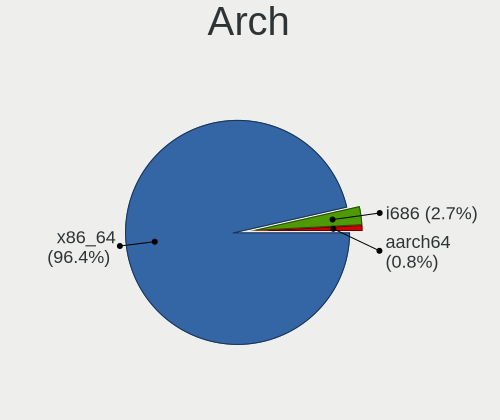
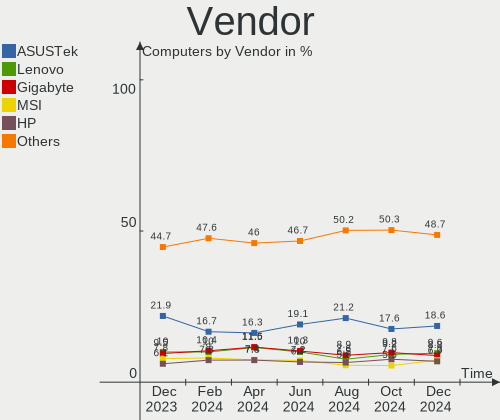
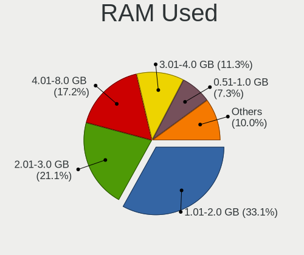
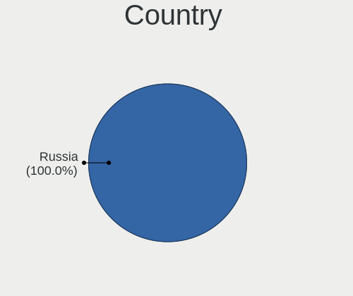
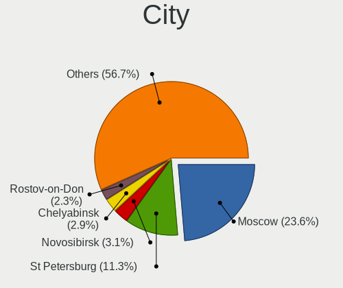
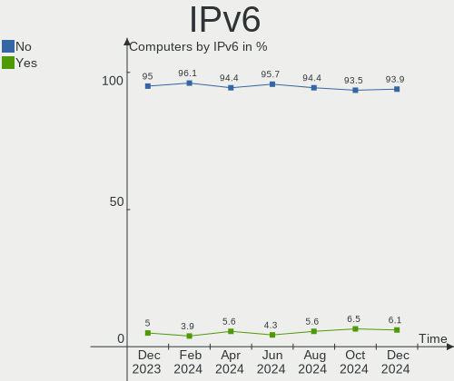

Linux in Russia - Hardware Trends
---------------------------------

A project to identify most popular hardware characteristics and track their change
over time based on data collected by Linux users at https://Linux-Hardware.org.

Anyone can contribute to this report by the [hw-probe](https://github.com/linuxhw/hw-probe) tool:

    sudo -E hw-probe -all -upload

This is a report for all computer types. See also reports for [desktops](/Location/Russia/Desktop/README.md) and [notebooks](/Location/Russia/Notebook/README.md).

Period: Nov, 2022.

Contents
--------

* [ System ](#system)
  - [ OS                       ](#os)
  - [ OS Family                ](#os-family)
  - [ Kernel                   ](#kernel)
  - [ Kernel Family            ](#kernel-family)
  - [ Kernel Major Ver.        ](#kernel-major-ver)
  - [ Arch                     ](#arch)
  - [ DE                       ](#de)
  - [ Display Server           ](#display-server)
  - [ Display Manager          ](#display-manager)
  - [ OS Lang                  ](#os-lang)
  - [ Boot Mode                ](#boot-mode)
  - [ Filesystem               ](#filesystem)
  - [ Part. scheme             ](#part-scheme)
  - [ Dual Boot with Linux/BSD ](#dual-boot-with-linuxbsd)
  - [ Dual Boot (Win)          ](#dual-boot-win)

* [ Board ](#board)
  - [ Vendor                   ](#vendor)
  - [ Model                    ](#model)
  - [ Model Family             ](#model-family)
  - [ MFG Year                 ](#mfg-year)
  - [ Form Factor              ](#form-factor)
  - [ Secure Boot              ](#secure-boot)
  - [ Coreboot                 ](#coreboot)
  - [ RAM Size                 ](#ram-size)
  - [ RAM Used                 ](#ram-used)
  - [ Total Drives             ](#total-drives)
  - [ Has CD-ROM               ](#has-cd-rom)
  - [ Has Ethernet             ](#has-ethernet)
  - [ Has WiFi                 ](#has-wifi)
  - [ Has Bluetooth            ](#has-bluetooth)

* [ Location ](#location)
  - [ Country                  ](#country)
  - [ City                     ](#city)

* [ Drives ](#drives)
  - [ Drive Vendor             ](#drive-vendor)
  - [ Drive Model              ](#drive-model)
  - [ HDD Vendor               ](#hdd-vendor)
  - [ SSD Vendor               ](#ssd-vendor)
  - [ Drive Kind               ](#drive-kind)
  - [ Drive Connector          ](#drive-connector)
  - [ Drive Size               ](#drive-size)
  - [ Space Total              ](#space-total)
  - [ Space Used               ](#space-used)
  - [ Malfunc. Drives          ](#malfunc-drives)
  - [ Malfunc. Drive Vendor    ](#malfunc-drive-vendor)
  - [ Malfunc. HDD Vendor      ](#malfunc-hdd-vendor)
  - [ Malfunc. Drive Kind      ](#malfunc-drive-kind)
  - [ Failed Drives            ](#failed-drives)
  - [ Failed Drive Vendor      ](#failed-drive-vendor)
  - [ Drive Status             ](#drive-status)

* [ Storage controller ](#storage-controller)
  - [ Storage Vendor           ](#storage-vendor)
  - [ Storage Model            ](#storage-model)
  - [ Storage Kind             ](#storage-kind)

* [ Processor ](#processor)
  - [ CPU Vendor               ](#cpu-vendor)
  - [ CPU Model                ](#cpu-model)
  - [ CPU Model Family         ](#cpu-model-family)
  - [ CPU Cores                ](#cpu-cores)
  - [ CPU Sockets              ](#cpu-sockets)
  - [ CPU Threads              ](#cpu-threads)
  - [ CPU Op-Modes             ](#cpu-op-modes)
  - [ CPU Microcode            ](#cpu-microcode)
  - [ CPU Microarch            ](#cpu-microarch)

* [ Graphics ](#graphics)
  - [ GPU Vendor               ](#gpu-vendor)
  - [ GPU Model                ](#gpu-model)
  - [ GPU Combo                ](#gpu-combo)
  - [ GPU Driver               ](#gpu-driver)
  - [ GPU Memory               ](#gpu-memory)

* [ Monitor ](#monitor)
  - [ Monitor Vendor           ](#monitor-vendor)
  - [ Monitor Model            ](#monitor-model)
  - [ Monitor Resolution       ](#monitor-resolution)
  - [ Monitor Diagonal         ](#monitor-diagonal)
  - [ Monitor Width            ](#monitor-width)
  - [ Aspect Ratio             ](#aspect-ratio)
  - [ Monitor Area             ](#monitor-area)
  - [ Pixel Density            ](#pixel-density)
  - [ Multiple Monitors        ](#multiple-monitors)

* [ Network ](#network)
  - [ Net Controller Vendor    ](#net-controller-vendor)
  - [ Net Controller Model     ](#net-controller-model)
  - [ Wireless Vendor          ](#wireless-vendor)
  - [ Wireless Model           ](#wireless-model)
  - [ Ethernet Vendor          ](#ethernet-vendor)
  - [ Ethernet Model           ](#ethernet-model)
  - [ Net Controller Kind      ](#net-controller-kind)
  - [ Used Controller          ](#used-controller)
  - [ NICs                     ](#nics)
  - [ IPv6                     ](#ipv6)

* [ Bluetooth ](#bluetooth)
  - [ Bluetooth Vendor         ](#bluetooth-vendor)
  - [ Bluetooth Model          ](#bluetooth-model)

* [ Sound ](#sound)
  - [ Sound Vendor             ](#sound-vendor)
  - [ Sound Model              ](#sound-model)

* [ Memory ](#memory)
  - [ Memory Vendor            ](#memory-vendor)
  - [ Memory Model             ](#memory-model)
  - [ Memory Kind              ](#memory-kind)
  - [ Memory Form Factor       ](#memory-form-factor)
  - [ Memory Size              ](#memory-size)
  - [ Memory Speed             ](#memory-speed)

* [ Printers & scanners ](#printers--scanners)
  - [ Printer Vendor           ](#printer-vendor)
  - [ Printer Model            ](#printer-model)
  - [ Scanner Vendor           ](#scanner-vendor)
  - [ Scanner Model            ](#scanner-model)

* [ Camera ](#camera)
  - [ Camera Vendor            ](#camera-vendor)
  - [ Camera Model             ](#camera-model)

* [ Security ](#security)
  - [ Fingerprint Vendor       ](#fingerprint-vendor)
  - [ Fingerprint Model        ](#fingerprint-model)
  - [ Chipcard Vendor          ](#chipcard-vendor)
  - [ Chipcard Model           ](#chipcard-model)

* [ Unsupported ](#unsupported)
  - [ Unsupported Devices      ](#unsupported-devices)
  - [ Unsupported Device Types ](#unsupported-device-types)

System
------

OS
--

Installed operating systems

| Name               | Computers | Percent |
|--------------------|-----------|---------|
| ROSA 12.3          | 203       | 35.93%  |
| Debian 11          | 57        | 10.09%  |
| ROSA 12.2          | 40        | 7.08%   |
| Ubuntu 22.04       | 30        | 5.31%   |
| Fedora 37          | 21        | 3.72%   |
| Linux Mint 21      | 19        | 3.36%   |
| ALT Linux 10.1     | 16        | 2.83%   |
| Arch Rolling       | 15        | 2.65%   |
| OpenMandriva 4.3   | 14        | 2.48%   |
| Red OS 7.3.1       | 9         | 1.59%   |
| ROSA R11.1         | 8         | 1.42%   |
| Red OS 7.3         | 7         | 1.24%   |
| Linux Mint 20.3    | 5         | 0.88%   |
| Gentoo 2.8         | 5         | 0.88%   |
| Xubuntu 22.04      | 4         | 0.71%   |
| Ubuntu 22.10       | 4         | 0.71%   |
| Red OS 7.3.2       | 4         | 0.71%   |
| OpenMandriva 4.50  | 4         | 0.71%   |
| MOS 10             | 4         | 0.71%   |
| Manjaro            | 4         | 0.71%   |
| Fedora 36          | 4         | 0.71%   |
| ALT Linux P10      | 4         | 0.71%   |
| ROSA 12.1          | 3         | 0.53%   |
| RELD 7.9           | 3         | 0.53%   |
| Pop!_OS 22.04      | 3         | 0.53%   |
| OpenMandriva 4.90  | 3         | 0.53%   |
| Kubuntu 22.04      | 3         | 0.53%   |
| KDE neon 22.04     | 3         | 0.53%   |
| Elementary 6.1     | 3         | 0.53%   |
| Debian             | 3         | 0.53%   |
| ArcoLinux Rolling  | 3         | 0.53%   |
| Zorin 16           | 2         | 0.35%   |
| ROSA R11           | 2         | 0.35%   |
| MX 21              | 2         | 0.35%   |
| Manjaro 22.0.0     | 2         | 0.35%   |
| Fedora 35          | 2         | 0.35%   |
| antiX 22           | 2         | 0.35%   |
| Xubuntu 20.04      | 1         | 0.18%   |
| Void Linux Rolling | 1         | 0.18%   |
| UbuntuDDE 20.04    | 1         | 0.18%   |

OS Family
---------

OS without a version

| Name         | Computers | Percent |
|--------------|-----------|---------|
| ROSA         | 259       | 45.84%  |
| Debian       | 62        | 10.97%  |
| Ubuntu       | 37        | 6.55%   |
| Fedora       | 27        | 4.78%   |
| Linux Mint   | 26        | 4.6%    |
| ALT Linux    | 25        | 4.42%   |
| Red OS       | 21        | 3.72%   |
| OpenMandriva | 21        | 3.72%   |
| Arch         | 15        | 2.65%   |
| Gentoo       | 8         | 1.42%   |
| Manjaro      | 7         | 1.24%   |
| Xubuntu      | 5         | 0.88%   |
| Kubuntu      | 5         | 0.88%   |
| Ubuntu MATE  | 3         | 0.53%   |
| RELD         | 3         | 0.53%   |
| Pop!_OS      | 3         | 0.53%   |
| KDE neon     | 3         | 0.53%   |
| Elementary   | 3         | 0.53%   |
| Clear Linux  | 3         | 0.53%   |
| ArcoLinux    | 3         | 0.53%   |
| Zorin        | 2         | 0.35%   |
| Ubuntu Unity | 2         | 0.35%   |
| MX           | 2         | 0.35%   |
| Endless      | 2         | 0.35%   |
| Artix        | 2         | 0.35%   |
| antiX        | 2         | 0.35%   |
| Void Linux   | 1         | 0.18%   |
| UbuntuDDE    | 1         | 0.18%   |
| SteamOS      | 1         | 0.18%   |
| Raspbian     | 1         | 0.18%   |
| openSUSE     | 1         | 0.18%   |
| Nobara       | 1         | 0.18%   |
| Lubuntu      | 1         | 0.18%   |
| Kali         | 1         | 0.18%   |
| EndeavourOS  | 1         | 0.18%   |
| Devuan       | 1         | 0.18%   |
| CentOS       | 1         | 0.18%   |
| CachyOS      | 1         | 0.18%   |
| BlackArch    | 1         | 0.18%   |
| Android      | 1         | 0.18%   |

Kernel
------

Version of the Linux kernel

| Version                                  | Computers | Percent |
|------------------------------------------|-----------|---------|
| 5.15.75-generic-1rosa2021.1-x86_64       | 66        | 11.68%  |
| 5.15.77-generic-1rosa2021.1-x86_64       | 49        | 8.67%   |
| 5.10.150-generic-1rosa2021.1-x86_64      | 44        | 7.79%   |
| 5.10.0-7-amd64                           | 37        | 6.55%   |
| 5.15.0-52-generic                        | 30        | 5.31%   |
| 5.15.0-53-generic                        | 28        | 4.96%   |
| 5.10.74-generic-2rosa2021.1-x86_64       | 28        | 4.96%   |
| 5.10.0-19-amd64                          | 14        | 2.48%   |
| 5.16.7-desktop-1omv4003                  | 13        | 2.3%    |
| 5.17.11-generic-2rosa2021.1-x86_64       | 12        | 2.12%   |
| 6.0.8-300.fc37.x86_64                    | 9         | 1.59%   |
| 5.15.75-generic-1rosa2021.1-i686         | 8         | 1.42%   |
| 5.10.118-generic-2rosa2021.1-x86_64      | 7         | 1.24%   |
| 5.15.35-5.el7.3.x86_64                   | 6         | 1.06%   |
| 6.0.9-300.fc37.x86_64                    | 5         | 0.88%   |
| 6.0.8-arch1-1                            | 5         | 0.88%   |
| 6.0.6.xm1-2.klp-xanmod-rosa2021.1-x86_64 | 5         | 0.88%   |
| 5.19.0-23-generic                        | 5         | 0.88%   |
| 5.15.76-un-def-alt1                      | 5         | 0.88%   |
| 5.4.0-131-generic                        | 4         | 0.71%   |
| 5.19.12-desktop-2omv4090                 | 4         | 0.71%   |
| 5.15.72-1.el7.3.x86_64                   | 4         | 0.71%   |
| 5.15.10-1.el7.x86_64                     | 4         | 0.71%   |
| 5.10.29-1.el7.x86_64                     | 4         | 0.71%   |
| 6.1.0-generic-0.rc5.1rosa2021.1-x86_64   | 3         | 0.53%   |
| 6.1.0-1-MANJARO                          | 3         | 0.53%   |
| 6.0.7.xm1-1.klp-xanmod-rosa2021.1-x86_64 | 3         | 0.53%   |
| 6.0.7-arch1-1                            | 3         | 0.53%   |
| 6.0.6.xm1-1.klp-xanmod-rosa2021.1-x86_64 | 3         | 0.53%   |
| 6.0.6-300.fc37.x86_64                    | 3         | 0.53%   |
| 6.0.6-1-MANJARO                          | 3         | 0.53%   |
| 5.18.18.xm1-1-xanmod-rosa2021.1-x86_64   | 3         | 0.53%   |
| 5.18.12-desktop-3omv4090                 | 3         | 0.53%   |
| 5.10.152-std-def-alt1                    | 3         | 0.53%   |
| 6.1.0-generic-0.rc4.1rosa2021.1-x86_64   | 2         | 0.35%   |
| 6.0.9-arch1-1                            | 2         | 0.35%   |
| 6.0.8-zen1-1-zen                         | 2         | 0.35%   |
| 6.0.7-zen1-1-zen                         | 2         | 0.35%   |
| 6.0.5-100.fc35.x86_64                    | 2         | 0.35%   |
| 6.0.10-arch2-1                           | 2         | 0.35%   |

Kernel Family
-------------

Linux kernel without a distro release

| Version  | Computers | Percent |
|----------|-----------|---------|
| 5.15.75  | 76        | 13.45%  |
| 5.15.0   | 64        | 11.33%  |
| 5.10.0   | 56        | 9.91%   |
| 5.15.77  | 51        | 9.03%   |
| 5.10.150 | 47        | 8.32%   |
| 5.10.74  | 29        | 5.13%   |
| 6.0.6    | 17        | 3.01%   |
| 6.0.8    | 16        | 2.83%   |
| 6.0.7    | 13        | 2.3%    |
| 5.16.7   | 13        | 2.3%    |
| 5.17.11  | 12        | 2.12%   |
| 6.0.9    | 11        | 1.95%   |
| 6.1.0    | 10        | 1.77%   |
| 5.19.0   | 9         | 1.59%   |
| 5.10.118 | 8         | 1.42%   |
| 5.15.76  | 7         | 1.24%   |
| 5.15.35  | 7         | 1.24%   |
| 6.0.0    | 6         | 1.06%   |
| 5.15.72  | 6         | 1.06%   |
| 4.15.0   | 6         | 1.06%   |
| 6.0.10   | 5         | 0.88%   |
| 5.4.0    | 5         | 0.88%   |
| 5.10.29  | 5         | 0.88%   |
| 5.19.12  | 4         | 0.71%   |
| 5.15.10  | 4         | 0.71%   |
| 6.0.5    | 3         | 0.53%   |
| 6.0.2    | 3         | 0.53%   |
| 5.4.83   | 3         | 0.53%   |
| 5.18.18  | 3         | 0.53%   |
| 5.18.12  | 3         | 0.53%   |
| 5.16.13  | 3         | 0.53%   |
| 5.15.74  | 3         | 0.53%   |
| 5.11.0   | 3         | 0.53%   |
| 5.10.152 | 3         | 0.53%   |
| 6.0.3    | 2         | 0.35%   |
| 5.19.17  | 2         | 0.35%   |
| 5.19.16  | 2         | 0.35%   |
| 5.15.79  | 2         | 0.35%   |
| 5.15.73  | 2         | 0.35%   |
| 5.10.71  | 2         | 0.35%   |

Kernel Major Ver.
-----------------

Linux kernel major version

| Version | Computers | Percent |
|---------|-----------|---------|
| 5.15    | 227       | 40.18%  |
| 5.10    | 161       | 28.5%   |
| 6.0     | 76        | 13.45%  |
| 5.19    | 19        | 3.36%   |
| 5.16    | 16        | 2.83%   |
| 5.17    | 14        | 2.48%   |
| 6.1     | 10        | 1.77%   |
| 5.4     | 10        | 1.77%   |
| 5.18    | 7         | 1.24%   |
| 4.15    | 6         | 1.06%   |
| 4.9     | 4         | 0.71%   |
| 5.11    | 3         | 0.53%   |
| 4.4     | 2         | 0.35%   |
| 4.19    | 2         | 0.35%   |
| 3.10    | 2         | 0.35%   |
| 5.7     | 1         | 0.18%   |
| 5.6     | 1         | 0.18%   |
| 5.14    | 1         | 0.18%   |
| 5.13    | 1         | 0.18%   |
| 5.0     | 1         | 0.18%   |
| 3.13    | 1         | 0.18%   |

Arch
----

OS architecture (x86_64, i586, etc.)

| Name    | Computers | Percent |
|---------|-----------|---------|
| x86_64  | 535       | 94.69%  |
| i686    | 24        | 4.25%   |
| aarch64 | 2         | 0.35%   |
| ppc     | 1         | 0.18%   |
| armv8l  | 1         | 0.18%   |
| armv7l  | 1         | 0.18%   |
| armv6l  | 1         | 0.18%   |

DE
--

Desktop Environment

| Name           | Computers | Percent |
|----------------|-----------|---------|
| KDE5           | 214       | 37.88%  |
| GNOME          | 159       | 28.14%  |
| Unknown        | 67        | 11.86%  |
| MATE           | 27        | 4.78%   |
| LXQt           | 27        | 4.78%   |
| X-Cinnamon     | 20        | 3.54%   |
| XFCE           | 18        | 3.19%   |
| KDE4           | 9         | 1.59%   |
| Cinnamon       | 6         | 1.06%   |
| Pantheon       | 3         | 0.53%   |
| i3             | 3         | 0.53%   |
| Unity          | 2         | 0.35%   |
| Trinity        | 2         | 0.35%   |
| sway           | 1         | 0.18%   |
| openbox        | 1         | 0.18%   |
| LXDE           | 1         | 0.18%   |
| KDE            | 1         | 0.18%   |
| icewm          | 1         | 0.18%   |
| i3-with-shmlog | 1         | 0.18%   |
| Hyprland       | 1         | 0.18%   |
| Deepin         | 1         | 0.18%   |

Display Server
--------------

X11 or Wayland

| Name    | Computers | Percent |
|---------|-----------|---------|
| Wayland | 261       | 46.19%  |
| X11     | 249       | 44.07%  |
| Unknown | 44        | 7.79%   |
| Tty     | 11        | 1.95%   |

Display Manager
---------------

SDDM, LightDM, etc.

| Name    | Computers | Percent |
|---------|-----------|---------|
| SDDM    | 201       | 35.58%  |
| GDM     | 136       | 24.07%  |
| Unknown | 114       | 20.18%  |
| LightDM | 69        | 12.21%  |
| GDM3    | 34        | 6.02%   |
| KDM     | 8         | 1.42%   |
| TDM     | 2         | 0.35%   |
| GREETD  | 1         | 0.18%   |

OS Lang
-------

Language

| Lang        | Computers | Percent |
|-------------|-----------|---------|
| ru_RU       | 449       | 79.47%  |
| en_US       | 73        | 12.92%  |
| Unknown     | 31        | 5.49%   |
| C           | 4         | 0.71%   |
| ru_RU.UTF_8 | 2         | 0.35%   |
| C.UTF8      | 2         | 0.35%   |
| zh_CN       | 1         | 0.18%   |
| POSIX       | 1         | 0.18%   |
| it_IT       | 1         | 0.18%   |
| en_GB       | 1         | 0.18%   |

Boot Mode
---------

EFI or BIOS

| Mode | Computers | Percent |
|------|-----------|---------|
| EFI  | 291       | 51.5%   |
| BIOS | 274       | 48.5%   |

Filesystem
----------

Type of filesystem

| Type    | Computers | Percent |
|---------|-----------|---------|
| Ext4    | 432       | 76.46%  |
| Overlay | 61        | 10.8%   |
| Btrfs   | 59        | 10.44%  |
| Xfs     | 6         | 1.06%   |
| Unknown | 3         | 0.53%   |
| Zfs     | 2         | 0.35%   |
| F2fs    | 2         | 0.35%   |

Part. scheme
------------

Scheme of partitioning

| Type    | Computers | Percent |
|---------|-----------|---------|
| GPT     | 337       | 59.65%  |
| MBR     | 168       | 29.73%  |
| Unknown | 60        | 10.62%  |

Dual Boot with Linux/BSD
------------------------

Hosting more than one Linux/BSD

| Dual boot | Computers | Percent |
|-----------|-----------|---------|
| No        | 448       | 79.29%  |
| Yes       | 117       | 20.71%  |

Dual Boot (Win)
---------------

Hosting Linux and Windows

| Dual boot | Computers | Percent |
|-----------|-----------|---------|
| No        | 318       | 56.28%  |
| Yes       | 247       | 43.72%  |

Board
-----

Vendor
------

Motherboard manufacturer

| Name                      | Computers | Percent |
|---------------------------|-----------|---------|
| ASUSTek Computer          | 128       | 22.65%  |
| Gigabyte Technology       | 61        | 10.8%   |
| Lenovo                    | 53        | 9.38%   |
| Acer                      | 42        | 7.43%   |
| MSI                       | 38        | 6.73%   |
| Hewlett-Packard           | 36        | 6.37%   |
| ASRock                    | 27        | 4.78%   |
| HUAWEI                    | 17        | 3.01%   |
| Dell                      | 17        | 3.01%   |
| ECS                       | 16        | 2.83%   |
| Unknown                   | 13        | 2.3%    |
| Samsung Electronics       | 12        | 2.12%   |
| Intel                     | 11        | 1.95%   |
| Apple                     | 8         | 1.42%   |
| Sony                      | 7         | 1.24%   |
| Toshiba                   | 6         | 1.06%   |
| Aquarius                  | 6         | 1.06%   |
| Pegatron                  | 4         | 0.71%   |
| Irbis                     | 4         | 0.71%   |
| Digma                     | 4         | 0.71%   |
| Biostar                   | 4         | 0.71%   |
| Fujitsu                   | 3         | 0.53%   |
| Clevo                     | 3         | 0.53%   |
| Timi                      | 2         | 0.35%   |
| Packard Bell              | 2         | 0.35%   |
| MACHINIST                 | 2         | 0.35%   |
| Huanan                    | 2         | 0.35%   |
| HONOR                     | 2         | 0.35%   |
| Haier                     | 2         | 0.35%   |
| Graviton                  | 2         | 0.35%   |
| eMachines                 | 2         | 0.35%   |
| Chuwi                     | 2         | 0.35%   |
| Valve                     | 1         | 0.18%   |
| T-Platforms               | 1         | 0.18%   |
| sunxi                     | 1         | 0.18%   |
| Shenzhen aopoo technology | 1         | 0.18%   |
| Sapphire                  | 1         | 0.18%   |
| RuggedPC                  | 1         | 0.18%   |
| Raspberry Pi Foundation   | 1         | 0.18%   |
| Quanta                    | 1         | 0.18%   |

Model
-----

Motherboard model

| Name                                 | Computers | Percent |
|--------------------------------------|-----------|---------|
| Unknown                              | 13        | 2.3%    |
| ECS H61H2-M13                        | 12        | 2.12%   |
| ASUS All Series                      | 8         | 1.42%   |
| HP Notebook                          | 4         | 0.71%   |
| Aquarius NS585                       | 4         | 0.71%   |
| Lenovo B590 20206                    | 3         | 0.53%   |
| HUAWEI NBD-WXX9                      | 3         | 0.53%   |
| HUAWEI CREM-WXX9                     | 3         | 0.53%   |
| HP Pavilion g6                       | 3         | 0.53%   |
| Gigabyte B450 AORUS ELITE            | 3         | 0.53%   |
| Clevo NL41MU2                        | 3         | 0.53%   |
| ASUS P5K                             | 3         | 0.53%   |
| Toshiba Satellite C660               | 2         | 0.35%   |
| Samsung 300E4C/300E5C/300E7C         | 2         | 0.35%   |
| MSI MS-7B89                          | 2         | 0.35%   |
| Lenovo ThinkBook 15 G3 ACL 21A4      | 2         | 0.35%   |
| Lenovo ThinkBook 15 G2 ITL 20VE      | 2         | 0.35%   |
| Lenovo IdeaPad Gaming 3 15ARH05 82EY | 2         | 0.35%   |
| Lenovo B590 20208                    | 2         | 0.35%   |
| Intel X79                            | 2         | 0.35%   |
| Intel H510-AIO T3                    | 2         | 0.35%   |
| HUAWEI KLVL-WXXW                     | 2         | 0.35%   |
| HUAWEI BOD-WXX9                      | 2         | 0.35%   |
| Huanan X99-BD4 V1.3                  | 2         | 0.35%   |
| HP ENVY m6                           | 2         | 0.35%   |
| Gigabyte G31M-ES2L                   | 2         | 0.35%   |
| Gigabyte A320M-H                     | 2         | 0.35%   |
| Digma EVE 15 C423 ES5069EW           | 2         | 0.35%   |
| Dell OptiPlex 7010                   | 2         | 0.35%   |
| ASUS X550CC                          | 2         | 0.35%   |
| ASUS PRIME H510M-K                   | 2         | 0.35%   |
| ASUS PRIME B450M-A                   | 2         | 0.35%   |
| ASUS P5KPL-AM EPU                    | 2         | 0.35%   |
| ASUS M5A97 EVO R2.0                  | 2         | 0.35%   |
| ASUS M5A78L LE                       | 2         | 0.35%   |
| ASUS K53SD                           | 2         | 0.35%   |
| ASUS H61M-K                          | 2         | 0.35%   |
| ASRock H55M-LE                       | 2         | 0.35%   |
| Aquarius NS685U R11                  | 2         | 0.35%   |
| Acer TravelMate 5760                 | 2         | 0.35%   |

Model Family
------------

Motherboard model prefix

| Name                  | Computers | Percent |
|-----------------------|-----------|---------|
| Acer Aspire           | 28        | 4.96%   |
| ASUS PRIME            | 15        | 2.65%   |
| Lenovo IdeaPad        | 13        | 2.3%    |
| Unknown               | 13        | 2.3%    |
| ECS H61H2-M13         | 12        | 2.12%   |
| Dell Inspiron         | 9         | 1.59%   |
| HP Pavilion           | 8         | 1.42%   |
| ASUS All              | 8         | 1.42%   |
| Lenovo ThinkPad       | 7         | 1.24%   |
| Toshiba Satellite     | 6         | 1.06%   |
| Lenovo ThinkBook      | 6         | 1.06%   |
| ASUS VivoBook         | 6         | 1.06%   |
| ASUS TUF              | 6         | 1.06%   |
| Lenovo B590           | 5         | 0.88%   |
| HP ENVY               | 5         | 0.88%   |
| ASUS P5K              | 5         | 0.88%   |
| HP Notebook           | 4         | 0.71%   |
| HP Laptop             | 4         | 0.71%   |
| Gigabyte B450         | 4         | 0.71%   |
| Digma EVE             | 4         | 0.71%   |
| ASUS ROG              | 4         | 0.71%   |
| ASUS M5A78L-M         | 4         | 0.71%   |
| Aquarius NS585        | 4         | 0.71%   |
| Acer TravelMate       | 4         | 0.71%   |
| Acer Extensa          | 4         | 0.71%   |
| Intel X79             | 3         | 0.53%   |
| HUAWEI NBD-WXX9       | 3         | 0.53%   |
| HUAWEI CREM-WXX9      | 3         | 0.53%   |
| Gigabyte B550         | 3         | 0.53%   |
| Gigabyte B450M        | 3         | 0.53%   |
| Dell OptiPlex         | 3         | 0.53%   |
| Clevo NL41MU2         | 3         | 0.53%   |
| ASUS P5KPL-AM         | 3         | 0.53%   |
| ASUS M5A97            | 3         | 0.53%   |
| ASUS M5A78L           | 3         | 0.53%   |
| Acer Nitro            | 3         | 0.53%   |
| Samsung 300E4C        | 2         | 0.35%   |
| Packard Bell EasyNote | 2         | 0.35%   |
| MSI MS-7B89           | 2         | 0.35%   |
| MACHINIST X99-RS9     | 2         | 0.35%   |

MFG Year
--------

Motherboard manufacture year

| Year    | Computers | Percent |
|---------|-----------|---------|
| 2021    | 67        | 11.86%  |
| 2011    | 60        | 10.62%  |
| 2020    | 47        | 8.32%   |
| 2012    | 47        | 8.32%   |
| 2018    | 43        | 7.61%   |
| 2022    | 38        | 6.73%   |
| 2019    | 36        | 6.37%   |
| 2013    | 30        | 5.31%   |
| 2010    | 29        | 5.13%   |
| 2015    | 26        | 4.6%    |
| 2014    | 25        | 4.42%   |
| 2009    | 25        | 4.42%   |
| 2008    | 21        | 3.72%   |
| 2016    | 20        | 3.54%   |
| 2007    | 18        | 3.19%   |
| 2017    | 17        | 3.01%   |
| Unknown | 6         | 1.06%   |
| 2005    | 4         | 0.71%   |
| 2006    | 3         | 0.53%   |
| 2004    | 3         | 0.53%   |

Form Factor
-----------

Physical design of the computer

| Name           | Computers | Percent |
|----------------|-----------|---------|
| Notebook       | 270       | 47.79%  |
| Desktop        | 261       | 46.19%  |
| All in one     | 16        | 2.83%   |
| Mini pc        | 5         | 0.88%   |
| Tablet         | 4         | 0.71%   |
| System on chip | 3         | 0.53%   |
| Server         | 3         | 0.53%   |
| Other          | 1         | 0.18%   |
| Phone          | 1         | 0.18%   |
| Convertible    | 1         | 0.18%   |

Secure Boot
-----------

Enabled or disabled

| State    | Computers | Percent |
|----------|-----------|---------|
| Disabled | 549       | 97.17%  |
| Enabled  | 16        | 2.83%   |

Coreboot
--------

Have coreboot on board

| Used | Computers | Percent |
|------|-----------|---------|
| No   | 565       | 100%    |

RAM Size
--------

Total RAM memory

| Size in GB      | Computers | Percent |
|-----------------|-----------|---------|
| 4.01-8.0        | 155       | 27.43%  |
| 3.01-4.0        | 109       | 19.29%  |
| 16.01-24.0      | 94        | 16.64%  |
| 8.01-16.0       | 93        | 16.46%  |
| 32.01-64.0      | 39        | 6.9%    |
| 1.01-2.0        | 31        | 5.49%   |
| 2.01-3.0        | 14        | 2.48%   |
| 24.01-32.0      | 9         | 1.59%   |
| 64.01-256.0     | 9         | 1.59%   |
| 0.51-1.0        | 5         | 0.88%   |
| 0.01-0.5        | 4         | 0.71%   |
| More than 256.0 | 3         | 0.53%   |

RAM Used
--------

Used RAM memory

| Used GB         | Computers | Percent |
|-----------------|-----------|---------|
| 1.01-2.0        | 216       | 38.23%  |
| 0.51-1.0        | 120       | 21.24%  |
| 2.01-3.0        | 99        | 17.52%  |
| 4.01-8.0        | 59        | 10.44%  |
| 3.01-4.0        | 34        | 6.02%   |
| 8.01-16.0       | 17        | 3.01%   |
| 0.01-0.5        | 16        | 2.83%   |
| More than 256.0 | 1         | 0.18%   |
| 24.01-32.0      | 1         | 0.18%   |
| 16.01-24.0      | 1         | 0.18%   |
| Unknown         | 1         | 0.18%   |

Total Drives
------------

Number of drives on board

| Drives | Computers | Percent |
|--------|-----------|---------|
| 1      | 313       | 55.4%   |
| 2      | 161       | 28.5%   |
| 3      | 44        | 7.79%   |
| 4      | 23        | 4.07%   |
| 5      | 14        | 2.48%   |
| 6      | 6         | 1.06%   |
| 7      | 2         | 0.35%   |
| 8      | 1         | 0.18%   |
| 0      | 1         | 0.18%   |

Has CD-ROM
----------

Has CD-ROM on board

| Presented | Computers | Percent |
|-----------|-----------|---------|
| No        | 384       | 67.96%  |
| Yes       | 181       | 32.04%  |

Has Ethernet
------------

Has Ethernet on board

| Presented | Computers | Percent |
|-----------|-----------|---------|
| Yes       | 490       | 86.73%  |
| No        | 75        | 13.27%  |

Has WiFi
--------

Has WiFi module

| Presented | Computers | Percent |
|-----------|-----------|---------|
| Yes       | 370       | 65.49%  |
| No        | 195       | 34.51%  |

Has Bluetooth
-------------

Has Bluetooth module

| Presented | Computers | Percent |
|-----------|-----------|---------|
| Yes       | 293       | 51.86%  |
| No        | 272       | 48.14%  |

Location
--------

Country
-------

Geographic location (country)

| Country | Computers | Percent |
|---------|-----------|---------|
| Russia  | 565       | 100%    |

City
----

Geographic location (city)

| City             | Computers | Percent |
|------------------|-----------|---------|
| Moscow           | 118       | 20.88%  |
| St Petersburg    | 61        | 10.8%   |
| Voronezh         | 45        | 7.96%   |
| Novosibirsk      | 17        | 3.01%   |
| Krasnodar        | 16        | 2.83%   |
| Perm             | 14        | 2.48%   |
| Yekaterinburg    | 11        | 1.95%   |
| Rostov-on-Don    | 11        | 1.95%   |
| Nizhniy Novgorod | 10        | 1.77%   |
| Kazan’         | 10        | 1.77%   |
| Krasnoyarsk      | 9         | 1.59%   |
| Ufa              | 8         | 1.42%   |
| Chelyabinsk      | 8         | 1.42%   |
| Samara           | 7         | 1.24%   |
| Volgograd        | 5         | 0.88%   |
| Taganrog         | 5         | 0.88%   |
| Serpukhov        | 5         | 0.88%   |
| Saratov          | 5         | 0.88%   |
| Novokuznetsk     | 5         | 0.88%   |
| Irkutsk          | 5         | 0.88%   |
| Tolyatti         | 4         | 0.71%   |
| Stavropol        | 4         | 0.71%   |
| Smolensk         | 4         | 0.71%   |
| Petrozavodsk     | 4         | 0.71%   |
| Orenburg         | 4         | 0.71%   |
| Omsk             | 4         | 0.71%   |
| Murom            | 4         | 0.71%   |
| Korolyov         | 4         | 0.71%   |
| Khabarovsk       | 4         | 0.71%   |
| Yaroslavl        | 3         | 0.53%   |
| Ulyanovsk        | 3         | 0.53%   |
| Tyumen           | 3         | 0.53%   |
| Salekhard        | 3         | 0.53%   |
| Odintsovo        | 3         | 0.53%   |
| Kaliningrad      | 3         | 0.53%   |
| Chepelëvo     | 3         | 0.53%   |
| Cheboksary       | 3         | 0.53%   |
| Bryansk          | 3         | 0.53%   |
| Belgorod         | 3         | 0.53%   |
| Yakutsk          | 2         | 0.35%   |

Drives
------

Drive Vendor
------------

Hard drive vendors

| Vendor                      | Computers | Drives | Percent |
|-----------------------------|-----------|--------|---------|
| WDC                         | 144       | 184    | 16.69%  |
| Seagate                     | 129       | 161    | 14.95%  |
| Samsung Electronics         | 88        | 105    | 10.2%   |
| Kingston                    | 61        | 64     | 7.07%   |
| Toshiba                     | 54        | 59     | 6.26%   |
| Hitachi                     | 46        | 47     | 5.33%   |
| Unknown                     | 31        | 34     | 3.59%   |
| China                       | 20        | 21     | 2.32%   |
| SanDisk                     | 19        | 20     | 2.2%    |
| SPCC                        | 17        | 18     | 1.97%   |
| A-DATA Technology           | 17        | 18     | 1.97%   |
| Intel                       | 15        | 16     | 1.74%   |
| HGST                        | 14        | 15     | 1.62%   |
| Crucial                     | 14        | 15     | 1.62%   |
| Apacer                      | 13        | 13     | 1.51%   |
| SK hynix                    | 12        | 12     | 1.39%   |
| Unknown                     | 9         | 9      | 1.04%   |
| Silicon Motion              | 7         | 7      | 0.81%   |
| Phison Electronics          | 7         | 7      | 0.81%   |
| Patriot                     | 7         | 7      | 0.81%   |
| Netac                       | 6         | 6      | 0.7%    |
| KingSpec                    | 6         | 6      | 0.7%    |
| AMD                         | 6         | 6      | 0.7%    |
| Phison                      | 5         | 5      | 0.58%   |
| OCZ                         | 5         | 7      | 0.58%   |
| Micron Technology           | 5         | 6      | 0.58%   |
| KIOXIA                      | 5         | 5      | 0.58%   |
| Fujitsu                     | 5         | 5      | 0.58%   |
| XrayDisk                    | 4         | 4      | 0.46%   |
| XPG                         | 4         | 4      | 0.46%   |
| Smartbuy                    | 4         | 4      | 0.46%   |
| Plextor                     | 4         | 5      | 0.46%   |
| JMicron Technology          | 4         | 4      | 0.46%   |
| BIWIN                       | 4         | 4      | 0.46%   |
| Vaseky                      | 3         | 3      | 0.35%   |
| Transcend                   | 3         | 3      | 0.35%   |
| Team                        | 3         | 3      | 0.35%   |
| Maxtor                      | 3         | 3      | 0.35%   |
| MAXIO Technology (Hangzhou) | 3         | 3      | 0.35%   |
| Kingmax                     | 3         | 3      | 0.35%   |

Drive Model
-----------

Hard drive models

| Model                                                | Computers | Percent |
|------------------------------------------------------|-----------|---------|
| Seagate ST1000DM010-2EP102 1TB                       | 15        | 1.59%   |
| Kingston SA400S37240G 240GB SSD                      | 15        | 1.59%   |
| Samsung SSD 860 EVO 250GB                            | 11        | 1.17%   |
| Hitachi HDS721050DLE630 500GB                        | 10        | 1.06%   |
| Samsung NVMe SSD Controller SM981/PM981/PM983 1TB    | 9         | 0.95%   |
| Unknown                                              | 9         | 0.95%   |
| WDC WD10EZEX-08WN4A0 1TB                             | 7         | 0.74%   |
| Toshiba DT01ACA100 1TB                               | 7         | 0.74%   |
| Kingston SA400S37480G 480GB SSD                      | 7         | 0.74%   |
| WDC WDS500G2B0A-00SM50 500GB SSD                     | 6         | 0.64%   |
| WDC WDS240G2G0A-00JH30 240GB SSD                     | 6         | 0.64%   |
| Toshiba DT01ACA050 500GB                             | 6         | 0.64%   |
| SPCC Solid State Disk 128GB                          | 6         | 0.64%   |
| Seagate ST500DM002-1BD142 500GB                      | 6         | 0.64%   |
| Samsung SSD 860 EVO 500GB                            | 6         | 0.64%   |
| Crucial CT240BX500SSD1 240GB                         | 6         | 0.64%   |
| WDC WD10EZEX-00BBHA0 1TB                             | 5         | 0.53%   |
| Unknown MMC Card  64GB                               | 5         | 0.53%   |
| Toshiba MQ01ABF050 500GB                             | 5         | 0.53%   |
| SPCC Solid State Disk 64GB                           | 5         | 0.53%   |
| Seagate ST2000DM008-2FR102 2TB                       | 5         | 0.53%   |
| Samsung NVMe SSD Controller PM9A1/PM9A3/980PRO 250GB | 5         | 0.53%   |
| Phison PS5013 E13 NVMe Controller 256GB              | 5         | 0.53%   |
| Kingston SA400S37120G 120GB SSD                      | 5         | 0.53%   |
| Hitachi HTS547575A9E384 752GB                        | 5         | 0.53%   |
| HGST HTS721010A9E630 1TB                             | 5         | 0.53%   |
| A-DATA SU800 512GB SSD                               | 5         | 0.53%   |
| WDC WD10JPVX-22JC3T0 1TB                             | 4         | 0.42%   |
| WDC WD10EZEX-22MFCA0 1TB                             | 4         | 0.42%   |
| WDC WD10EZEX-08M2NA0 1TB                             | 4         | 0.42%   |
| Toshiba HDWD110 1TB                                  | 4         | 0.42%   |
| Seagate ST500LT012-1DG142 500GB                      | 4         | 0.42%   |
| Seagate ST3500418AS 500GB                            | 4         | 0.42%   |
| Seagate ST3250410AS 250GB                            | 4         | 0.42%   |
| Seagate ST3160815AS 160GB                            | 4         | 0.42%   |
| Seagate ST2000DM008-2UB102 2TB                       | 4         | 0.42%   |
| Seagate ST2000DM006-2DM164 2TB                       | 4         | 0.42%   |
| Seagate ST1000LM035-1RK172 1TB                       | 4         | 0.42%   |
| Seagate ST1000LM024 HN-M101MBB 1TB                   | 4         | 0.42%   |
| Seagate ST1000DM003-1CH162 1TB                       | 4         | 0.42%   |

HDD Vendor
----------

Hard disk drive vendors

| Vendor              | Computers | Drives | Percent |
|---------------------|-----------|--------|---------|
| Seagate             | 127       | 158    | 33.51%  |
| WDC                 | 115       | 144    | 30.34%  |
| Toshiba             | 53        | 55     | 13.98%  |
| Hitachi             | 46        | 47     | 12.14%  |
| HGST                | 14        | 15     | 3.69%   |
| Samsung Electronics | 9         | 9      | 2.37%   |
| Fujitsu             | 5         | 5      | 1.32%   |
| Maxtor              | 3         | 3      | 0.79%   |
| Unknown             | 2         | 2      | 0.53%   |
| Apple               | 2         | 2      | 0.53%   |
| IBM/Hitachi         | 1         | 1      | 0.26%   |
| ASMT                | 1         | 2      | 0.26%   |
| Unknown             | 1         | 1      | 0.26%   |

SSD Vendor
----------

Solid state drive vendors

| Vendor              | Computers | Drives | Percent |
|---------------------|-----------|--------|---------|
| Kingston            | 47        | 49     | 16.73%  |
| Samsung Electronics | 39        | 44     | 13.88%  |
| WDC                 | 23        | 24     | 8.19%   |
| China               | 20        | 21     | 7.12%   |
| SPCC                | 16        | 17     | 5.69%   |
| Crucial             | 14        | 15     | 4.98%   |
| A-DATA Technology   | 13        | 14     | 4.63%   |
| SanDisk             | 10        | 11     | 3.56%   |
| Apacer              | 10        | 10     | 3.56%   |
| Patriot             | 6         | 6      | 2.14%   |
| Intel               | 6         | 6      | 2.14%   |
| OCZ                 | 5         | 7      | 1.78%   |
| KingSpec            | 5         | 5      | 1.78%   |
| Smartbuy            | 4         | 4      | 1.42%   |
| Plextor             | 4         | 4      | 1.42%   |
| Netac               | 4         | 4      | 1.42%   |
| AMD                 | 4         | 4      | 1.42%   |
| Vaseky              | 3         | 3      | 1.07%   |
| Toshiba             | 3         | 4      | 1.07%   |
| Team                | 3         | 3      | 1.07%   |
| Kingmax             | 3         | 3      | 1.07%   |
| Unknown             | 3         | 3      | 1.07%   |
| Zheino              | 2         | 2      | 0.71%   |
| XrayDisk            | 2         | 2      | 0.71%   |
| Transcend           | 2         | 2      | 0.71%   |
| Neo                 | 2         | 2      | 0.71%   |
| KingDian            | 2         | 2      | 0.71%   |
| Hewlett-Packard     | 2         | 2      | 0.71%   |
| Gigabyte Technology | 2         | 2      | 0.71%   |
| Foxline             | 2         | 2      | 0.71%   |
| WALRAM              | 1         | 1      | 0.36%   |
| SK hynix            | 1         | 1      | 0.36%   |
| Seagate             | 1         | 2      | 0.36%   |
| SATAFIRM            | 1         | 1      | 0.36%   |
| PNY                 | 1         | 2      | 0.36%   |
| Neo Forza           | 1         | 1      | 0.36%   |
| LITEONIT            | 1         | 1      | 0.36%   |
| LITEON              | 1         | 1      | 0.36%   |
| Kllisre             | 1         | 1      | 0.36%   |
| Kingchuxing         | 1         | 1      | 0.36%   |

Drive Kind
----------

HDD or SSD

| Kind    | Computers | Drives | Percent |
|---------|-----------|--------|---------|
| HDD     | 327       | 444    | 41.92%  |
| SSD     | 244       | 299    | 31.28%  |
| NVMe    | 166       | 185    | 21.28%  |
| MMC     | 32        | 37     | 4.1%    |
| Unknown | 11        | 12     | 1.41%   |

Drive Connector
---------------

SATA, SAS, NVMe, etc.

| Type | Computers | Drives | Percent |
|------|-----------|--------|---------|
| SATA | 451       | 740    | 68.23%  |
| NVMe | 164       | 183    | 24.81%  |
| MMC  | 32        | 37     | 4.84%   |
| SAS  | 14        | 17     | 2.12%   |

Drive Size
----------

Size of hard drive

| Size in TB | Computers | Drives | Percent |
|------------|-----------|--------|---------|
| 0.01-0.5   | 367       | 496    | 64.16%  |
| 0.51-1.0   | 147       | 170    | 25.7%   |
| 1.01-2.0   | 41        | 60     | 7.17%   |
| 2.01-3.0   | 8         | 8      | 1.4%    |
| 3.01-4.0   | 5         | 5      | 0.87%   |
| 4.01-10.0  | 3         | 3      | 0.52%   |
| 10.01-20.0 | 1         | 1      | 0.17%   |

Space Total
-----------

Amount of disk space available on the file system

| Size in GB     | Computers | Percent |
|----------------|-----------|---------|
| 101-250        | 141       | 24.96%  |
| 251-500        | 104       | 18.41%  |
| 501-1000       | 77        | 13.63%  |
| 1-20           | 58        | 10.27%  |
| 1001-2000      | 50        | 8.85%   |
| 51-100         | 45        | 7.96%   |
| Unknown        | 45        | 7.96%   |
| 21-50          | 17        | 3.01%   |
| More than 3000 | 15        | 2.65%   |
| 2001-3000      | 13        | 2.3%    |

Space Used
----------

Amount of used disk space

| Used GB        | Computers | Percent |
|----------------|-----------|---------|
| 1-20           | 265       | 46.9%   |
| 21-50          | 66        | 11.68%  |
| 101-250        | 50        | 8.85%   |
| 251-500        | 45        | 7.96%   |
| Unknown        | 45        | 7.96%   |
| 51-100         | 40        | 7.08%   |
| 501-1000       | 29        | 5.13%   |
| 1001-2000      | 16        | 2.83%   |
| More than 3000 | 6         | 1.06%   |
| 2001-3000      | 3         | 0.53%   |

Malfunc. Drives
---------------

Drive models with a malfunction

| Model                              | Computers | Drives | Percent |
|------------------------------------|-----------|--------|---------|
| Hitachi HDS721050DLE630 500GB      | 5         | 5      | 2.99%   |
| Seagate ST500DM002-1BD142 500GB    | 4         | 4      | 2.4%    |
| WDC WDS240G2G0A-00JH30 240GB SSD   | 3         | 3      | 1.8%    |
| WDC WD5000AAKS-00V1A0 500GB        | 3         | 4      | 1.8%    |
| Seagate ST3500418AS 500GB          | 3         | 3      | 1.8%    |
| Seagate ST320LT012-9WS14C 320GB    | 3         | 3      | 1.8%    |
| Hitachi HTS547575A9E384 752GB      | 3         | 3      | 1.8%    |
| Hitachi HTS541680J9SA00 80GB       | 3         | 3      | 1.8%    |
| WDC WD5000LPVX-55V0TT0 500GB       | 2         | 2      | 1.2%    |
| WDC WD5000AAKX-001CA0 500GB        | 2         | 2      | 1.2%    |
| WDC WD20EARS-00S8B1 2TB            | 2         | 2      | 1.2%    |
| WDC WD1600AAJS-00B4A0 160GB        | 2         | 2      | 1.2%    |
| WDC WD10EZEX-22MFCA0 1TB           | 2         | 2      | 1.2%    |
| WDC WD10EZEX-08WN4A0 1TB           | 2         | 3      | 1.2%    |
| Toshiba MK3275GSX 320GB            | 2         | 2      | 1.2%    |
| Seagate ST3250410AS 250GB          | 2         | 2      | 1.2%    |
| Seagate ST32000641AS 2TB           | 2         | 6      | 1.2%    |
| Seagate ST3000DM001-9YN166 3TB     | 2         | 2      | 1.2%    |
| Seagate ST1000LM024 HN-M101MBB 1TB | 2         | 2      | 1.2%    |
| Seagate ST1000DM010-2EP102 1TB     | 2         | 2      | 1.2%    |
| Hitachi HDS5C1050CLA382 500GB      | 2         | 2      | 1.2%    |
| HGST HTS545050A7E680 500GB         | 2         | 2      | 1.2%    |
| XrayDisk SSD 256GB                 | 1         | 1      | 0.6%    |
| XPG GAMMIX S5 512GB                | 1         | 1      | 0.6%    |
| WDC WDS480G2G0A-00JH30 480GB SSD   | 1         | 1      | 0.6%    |
| WDC WD800BB-56JKC0 80GB            | 1         | 1      | 0.6%    |
| WDC WD7500AAKS-00RBA0 752GB        | 1         | 1      | 0.6%    |
| WDC WD6400BEVT-16A0RT0 640GB       | 1         | 1      | 0.6%    |
| WDC WD5000LPCX-60VHAT0 500GB       | 1         | 1      | 0.6%    |
| WDC WD5000LPCX-21VHAT0 500GB       | 1         | 1      | 0.6%    |
| WDC WD5000BEVT-22A0RT0 500GB       | 1         | 1      | 0.6%    |
| WDC WD5000AAKS-75A7B2 500GB        | 1         | 1      | 0.6%    |
| WDC WD5000AAKS-00UU3A0 500GB       | 1         | 1      | 0.6%    |
| WDC WD5000AAKS-00D2B0 500GB        | 1         | 1      | 0.6%    |
| WDC WD3200AAKX-753CA1 320GB        | 1         | 1      | 0.6%    |
| WDC WD3200AAJS-22B4A0 320GB        | 1         | 1      | 0.6%    |
| WDC WD3200AAJB-56R1A0 320GB        | 1         | 1      | 0.6%    |
| WDC WD20EARX-00PASB0 2TB           | 1         | 1      | 0.6%    |
| WDC WD20EARS-00MVWB0 2TB           | 1         | 1      | 0.6%    |
| WDC WD1600JS-00NCB1 160GB          | 1         | 1      | 0.6%    |

Malfunc. Drive Vendor
---------------------

Vendors of faulty drives

| Vendor              | Computers | Drives | Percent |
|---------------------|-----------|--------|---------|
| Seagate             | 45        | 54     | 27.95%  |
| WDC                 | 41        | 44     | 25.47%  |
| Hitachi             | 24        | 24     | 14.91%  |
| Toshiba             | 15        | 15     | 9.32%   |
| Samsung Electronics | 6         | 6      | 3.73%   |
| Kingston            | 4         | 4      | 2.48%   |
| Maxtor              | 3         | 3      | 1.86%   |
| HGST                | 3         | 3      | 1.86%   |
| Kingmax             | 2         | 2      | 1.24%   |
| Fujitsu             | 2         | 2      | 1.24%   |
| XrayDisk            | 1         | 1      | 0.62%   |
| XPG                 | 1         | 1      | 0.62%   |
| Team                | 1         | 1      | 0.62%   |
| SPCC                | 1         | 1      | 0.62%   |
| SATAFIRM            | 1         | 1      | 0.62%   |
| SanDisk             | 1         | 1      | 0.62%   |
| PNY                 | 1         | 1      | 0.62%   |
| Plextor             | 1         | 1      | 0.62%   |
| OCZ                 | 1         | 1      | 0.62%   |
| Neo                 | 1         | 1      | 0.62%   |
| LITEONIT            | 1         | 1      | 0.62%   |
| KingSpec            | 1         | 1      | 0.62%   |
| Intel               | 1         | 1      | 0.62%   |
| Corsair             | 1         | 1      | 0.62%   |
| AMD                 | 1         | 1      | 0.62%   |
| Unknown             | 1         | 1      | 0.62%   |

Malfunc. HDD Vendor
-------------------

Vendors of faulty HDD drives

| Vendor              | Computers | Drives | Percent |
|---------------------|-----------|--------|---------|
| Seagate             | 45        | 54     | 33.58%  |
| WDC                 | 37        | 40     | 27.61%  |
| Hitachi             | 24        | 24     | 17.91%  |
| Toshiba             | 15        | 15     | 11.19%  |
| Samsung Electronics | 4         | 4      | 2.99%   |
| Maxtor              | 3         | 3      | 2.24%   |
| HGST                | 3         | 3      | 2.24%   |
| Fujitsu             | 2         | 2      | 1.49%   |
| Unknown             | 1         | 1      | 0.75%   |

Malfunc. Drive Kind
-------------------

Kinds of faulty drives

| Kind | Computers | Drives | Percent |
|------|-----------|--------|---------|
| HDD  | 125       | 146    | 83.33%  |
| SSD  | 21        | 23     | 14%     |
| NVMe | 4         | 4      | 2.67%   |

Failed Drives
-------------

Failed drive models

| Model                                           | Computers | Drives | Percent |
|-------------------------------------------------|-----------|--------|---------|
| WDC WD5000BEVT-35ZAT0 500GB                     | 1         | 1      | 20%     |
| Toshiba MK8025GAL 80GB                          | 1         | 1      | 20%     |
| Samsung Electronics MZMPC032HBCD-000H1 32GB SSD | 1         | 1      | 20%     |
| Hitachi HTS545050A7E380 500GB                   | 1         | 1      | 20%     |
| Hitachi HDS721050DLE630 500GB                   | 1         | 1      | 20%     |

Failed Drive Vendor
-------------------

Failed drive vendors

| Vendor              | Computers | Drives | Percent |
|---------------------|-----------|--------|---------|
| Hitachi             | 2         | 2      | 40%     |
| WDC                 | 1         | 1      | 20%     |
| Toshiba             | 1         | 1      | 20%     |
| Samsung Electronics | 1         | 1      | 20%     |

Drive Status
------------

Number of failed and malfunc. drives

| Status   | Computers | Drives | Percent |
|----------|-----------|--------|---------|
| Works    | 393       | 614    | 59.82%  |
| Malfunc  | 146       | 173    | 22.22%  |
| Detected | 113       | 185    | 17.2%   |
| Failed   | 5         | 5      | 0.76%   |

Storage controller
------------------

Storage Vendor
--------------

Storage controller vendors

| Vendor                           | Computers | Percent |
|----------------------------------|-----------|---------|
| Intel                            | 381       | 53.29%  |
| AMD                              | 117       | 16.36%  |
| Samsung Electronics              | 48        | 6.71%   |
| SanDisk                          | 24        | 3.36%   |
| Phison Electronics               | 18        | 2.52%   |
| Kingston Technology Company      | 16        | 2.24%   |
| Silicon Motion                   | 13        | 1.82%   |
| SK hynix                         | 11        | 1.54%   |
| Nvidia                           | 11        | 1.54%   |
| JMicron Technology               | 11        | 1.54%   |
| ASMedia Technology               | 11        | 1.54%   |
| Realtek Semiconductor            | 6         | 0.84%   |
| Micron Technology                | 5         | 0.7%    |
| ADATA Technology                 | 5         | 0.7%    |
| MAXIO Technology (Hangzhou)      | 4         | 0.56%   |
| Marvell Technology Group         | 4         | 0.56%   |
| KIOXIA                           | 4         | 0.56%   |
| VIA Technologies                 | 3         | 0.42%   |
| Lite-On Technology               | 3         | 0.42%   |
| INNOGRIT                         | 3         | 0.42%   |
| Solid State Storage Technology   | 2         | 0.28%   |
| Silicon Integrated Systems [SiS] | 2         | 0.28%   |
| Shenzhen Longsys Electronics     | 2         | 0.28%   |
| Netac Technology                 | 2         | 0.28%   |
| Broadcom / LSI                   | 2         | 0.28%   |
| Union Memory (Shenzhen)          | 1         | 0.14%   |
| Toshiba America Info Systems     | 1         | 0.14%   |
| Seagate Technology               | 1         | 0.14%   |
| LSI Logic / Symbios Logic        | 1         | 0.14%   |
| Lenovo                           | 1         | 0.14%   |
| Integrated Technology Express    | 1         | 0.14%   |
| Adaptec                          | 1         | 0.14%   |

Storage Model
-------------

Storage controller models

| Model                                                                                   | Computers | Percent |
|-----------------------------------------------------------------------------------------|-----------|---------|
| AMD FCH SATA Controller [AHCI mode]                                                     | 68        | 8.18%   |
| Intel 7 Series Chipset Family 6-port SATA Controller [AHCI mode]                        | 28        | 3.37%   |
| Intel 8 Series/C220 Series Chipset Family 6-port SATA Controller 1 [AHCI mode]          | 25        | 3.01%   |
| Samsung NVMe SSD Controller SM981/PM981/PM983                                           | 23        | 2.77%   |
| Intel 6 Series/C200 Series Chipset Family 6 port Desktop SATA AHCI Controller           | 22        | 2.65%   |
| Intel 6 Series/C200 Series Chipset Family 6 port Mobile SATA AHCI Controller            | 21        | 2.53%   |
| Intel 500 Series Chipset Family SATA AHCI Controller                                    | 19        | 2.29%   |
| AMD SB7x0/SB8x0/SB9x0 IDE Controller                                                    | 19        | 2.29%   |
| AMD 400 Series Chipset SATA Controller                                                  | 19        | 2.29%   |
| Samsung NVMe SSD Controller 980                                                         | 18        | 2.17%   |
| Intel Q170/Q150/B150/H170/H110/Z170/CM236 Chipset SATA Controller [AHCI Mode]           | 17        | 2.05%   |
| AMD SB7x0/SB8x0/SB9x0 SATA Controller [AHCI mode]                                       | 17        | 2.05%   |
| Intel NM10/ICH7 Family SATA Controller [IDE mode]                                       | 15        | 1.81%   |
| Phison PS5013 E13 NVMe Controller                                                       | 14        | 1.68%   |
| Intel 200 Series PCH SATA controller [AHCI mode]                                        | 13        | 1.56%   |
| Intel Cannon Lake PCH SATA AHCI Controller                                              | 12        | 1.44%   |
| Intel Celeron/Pentium Silver Processor SATA Controller                                  | 11        | 1.32%   |
| Intel 82801G (ICH7 Family) IDE Controller                                               | 11        | 1.32%   |
| Intel 82801 Mobile SATA Controller [RAID mode]                                          | 11        | 1.32%   |
| AMD SB7x0/SB8x0/SB9x0 SATA Controller [IDE mode]                                        | 11        | 1.32%   |
| AMD 500 Series Chipset SATA Controller                                                  | 11        | 1.32%   |
| Intel 6 Series/C200 Series Chipset Family Desktop SATA Controller (IDE mode, ports 4-5) | 10        | 1.2%    |
| Intel 6 Series/C200 Series Chipset Family Desktop SATA Controller (IDE mode, ports 0-3) | 10        | 1.2%    |
| Intel 7 Series/C210 Series Chipset Family 6-port SATA Controller [AHCI mode]            | 9         | 1.08%   |
| Intel 5 Series/3400 Series Chipset 6 port SATA AHCI Controller                          | 9         | 1.08%   |
| ASMedia ASM1062 Serial ATA Controller                                                   | 9         | 1.08%   |
| Silicon Motion SM2263EN/SM2263XT SSD Controller                                         | 8         | 0.96%   |
| SanDisk WD Blue SN550 NVMe SSD                                                          | 8         | 0.96%   |
| Kingston Company Company Non-Volatile memory controller                                 | 8         | 0.96%   |
| Intel Volume Management Device NVMe RAID Controller                                     | 8         | 0.96%   |
| Intel Tiger Lake-LP SATA Controller                                                     | 8         | 0.96%   |
| Intel Sunrise Point-LP SATA Controller [AHCI mode]                                      | 8         | 0.96%   |
| Intel 82801HM/HEM (ICH8M/ICH8M-E) IDE Controller                                        | 8         | 0.96%   |
| Intel 5 Series/3400 Series Chipset 4 port SATA AHCI Controller                          | 8         | 0.96%   |
| Intel Wildcat Point-LP SATA Controller [AHCI Mode]                                      | 7         | 0.84%   |
| Intel Celeron N3350/Pentium N4200/Atom E3900 Series SATA AHCI Controller                | 7         | 0.84%   |
| Intel Alder Lake-S PCH SATA Controller [AHCI Mode]                                      | 7         | 0.84%   |
| Intel 82801IBM/IEM (ICH9M/ICH9M-E) 4 port SATA Controller [AHCI mode]                   | 7         | 0.84%   |
| Intel 82801I (ICH9 Family) 2 port SATA Controller [IDE mode]                            | 7         | 0.84%   |
| SanDisk Non-Volatile memory controller                                                  | 6         | 0.72%   |

Storage Kind
------------

Kind of storage controller (IDE, SATA, NVMe, SAS, ...)

| Kind | Computers | Percent |
|------|-----------|---------|
| SATA | 424       | 58.73%  |
| NVMe | 164       | 22.71%  |
| IDE  | 106       | 14.68%  |
| RAID | 27        | 3.74%   |
| SAS  | 1         | 0.14%   |

Processor
---------

CPU Vendor
----------

Processor vendors

| Vendor       | Computers | Percent |
|--------------|-----------|---------|
| Intel        | 413       | 73.1%   |
| AMD          | 146       | 25.84%  |
| ARM          | 3         | 0.53%   |
| Qualcomm     | 1         | 0.18%   |
| PowerBook5,6 | 1         | 0.18%   |
| Unknown      | 1         | 0.18%   |

CPU Model
---------

Processor models

| Model                                         | Computers | Percent |
|-----------------------------------------------|-----------|---------|
| Intel Pentium CPU G630 @ 2.70GHz              | 12        | 2.12%   |
| Intel 11th Gen Core i5-1135G7 @ 2.40GHz       | 12        | 2.12%   |
| Intel Core i5-3210M CPU @ 2.50GHz             | 8         | 1.42%   |
| AMD Ryzen 7 5800H with Radeon Graphics        | 7         | 1.24%   |
| AMD Ryzen 5 5500U with Radeon Graphics        | 6         | 1.06%   |
| Intel Core i7-2670QM CPU @ 2.20GHz            | 5         | 0.88%   |
| Intel Core i5-10400 CPU @ 2.90GHz             | 5         | 0.88%   |
| Intel Core 2 Duo CPU E8400 @ 3.00GHz          | 5         | 0.88%   |
| Intel Celeron CPU N3350 @ 1.10GHz             | 5         | 0.88%   |
| AMD Ryzen 5 2600 Six-Core Processor           | 5         | 0.88%   |
| Intel Core i5-7400 CPU @ 3.00GHz              | 4         | 0.71%   |
| Intel Core i5-2410M CPU @ 2.30GHz             | 4         | 0.71%   |
| Intel Core i3-9100 CPU @ 3.60GHz              | 4         | 0.71%   |
| Intel 11th Gen Core i3-1115G4 @ 3.00GHz       | 4         | 0.71%   |
| AMD Ryzen 7 3700X 8-Core Processor            | 4         | 0.71%   |
| AMD Ryzen 5 5600G with Radeon Graphics        | 4         | 0.71%   |
| AMD Ryzen 5 3600 6-Core Processor             | 4         | 0.71%   |
| AMD Ryzen 5 3500U with Radeon Vega Mobile Gfx | 4         | 0.71%   |
| AMD FX-6300 Six-Core Processor                | 4         | 0.71%   |
| Intel Pentium CPU 2020M @ 2.40GHz             | 3         | 0.53%   |
| Intel Core i7-6700HQ CPU @ 2.60GHz            | 3         | 0.53%   |
| Intel Core i5-8250U CPU @ 1.60GHz             | 3         | 0.53%   |
| Intel Core i5-3450 CPU @ 3.10GHz              | 3         | 0.53%   |
| Intel Core i5-2450M CPU @ 2.50GHz             | 3         | 0.53%   |
| Intel Core i5 CPU M 540 @ 2.53GHz             | 3         | 0.53%   |
| Intel Core i3-2310M CPU @ 2.10GHz             | 3         | 0.53%   |
| Intel Core i3-10100 CPU @ 3.60GHz             | 3         | 0.53%   |
| Intel Core 2 Duo CPU P8400 @ 2.26GHz          | 3         | 0.53%   |
| Intel Celeron J4125 CPU @ 2.00GHz             | 3         | 0.53%   |
| AMD Ryzen 7 4800H with Radeon Graphics        | 3         | 0.53%   |
| AMD Ryzen 3 5300U with Radeon Graphics        | 3         | 0.53%   |
| AMD Ryzen 3 3200G with Radeon Vega Graphics   | 3         | 0.53%   |
| AMD Phenom II X4 925 Processor                | 3         | 0.53%   |
| AMD FX-4300 Quad-Core Processor               | 3         | 0.53%   |
| Intel Xeon CPU E5440 @ 2.83GHz                | 2         | 0.35%   |
| Intel Xeon CPU E5-2666 v3 @ 2.90GHz           | 2         | 0.35%   |
| Intel Xeon CPU E5-1650 0 @ 3.20GHz            | 2         | 0.35%   |
| Intel Xeon CPU E3-1270 v3 @ 3.50GHz           | 2         | 0.35%   |
| Intel Pentium Gold G5400 CPU @ 3.70GHz        | 2         | 0.35%   |
| Intel Pentium Dual-Core CPU T4500 @ 2.30GHz   | 2         | 0.35%   |

CPU Model Family
----------------

Processor model prefix

| Model                   | Computers | Percent |
|-------------------------|-----------|---------|
| Intel Core i5           | 110       | 19.47%  |
| Intel Core i3           | 63        | 11.15%  |
| Other                   | 46        | 8.14%   |
| Intel Pentium           | 39        | 6.9%    |
| AMD Ryzen 5             | 38        | 6.73%   |
| Intel Core i7           | 36        | 6.37%   |
| Intel Celeron           | 33        | 5.84%   |
| Intel Core 2 Duo        | 29        | 5.13%   |
| AMD Ryzen 7             | 23        | 4.07%   |
| Intel Xeon              | 20        | 3.54%   |
| AMD FX                  | 14        | 2.48%   |
| AMD Ryzen 3             | 13        | 2.3%    |
| Intel Atom              | 11        | 1.95%   |
| Intel Pentium Dual-Core | 8         | 1.42%   |
| AMD Ryzen 9             | 6         | 1.06%   |
| Intel Core 2 Quad       | 5         | 0.88%   |
| AMD Phenom II X4        | 5         | 0.88%   |
| AMD Athlon II X2        | 5         | 0.88%   |
| Intel Pentium M         | 4         | 0.71%   |
| Intel Pentium Gold      | 4         | 0.71%   |
| Intel Pentium Silver    | 3         | 0.53%   |
| Intel Genuine           | 3         | 0.53%   |
| AMD Ryzen 7 PRO         | 3         | 0.53%   |
| AMD E                   | 3         | 0.53%   |
| AMD Athlon II X4        | 3         | 0.53%   |
| AMD Athlon              | 3         | 0.53%   |
| AMD A6                  | 3         | 0.53%   |
| AMD A4                  | 3         | 0.53%   |
| AMD A10                 | 3         | 0.53%   |
| AMD Phenom II           | 2         | 0.35%   |
| AMD E2                  | 2         | 0.35%   |
| AMD E1                  | 2         | 0.35%   |
| AMD Athlon X2           | 2         | 0.35%   |
| Intel Xeon Silver       | 1         | 0.18%   |
| Intel Pentium Dual      | 1         | 0.18%   |
| Intel Core 2            | 1         | 0.18%   |
| Intel Celeron M         | 1         | 0.18%   |
| Intel Celeron D         | 1         | 0.18%   |
| ARM BCM                 | 1         | 0.18%   |
| ARM Allwinner           | 1         | 0.18%   |

CPU Cores
---------

Number of processor cores

| Number | Computers | Percent |
|--------|-----------|---------|
| 2      | 234       | 41.42%  |
| 4      | 182       | 32.21%  |
| 6      | 65        | 11.5%   |
| 8      | 37        | 6.55%   |
| 1      | 22        | 3.89%   |
| 12     | 8         | 1.42%   |
| 3      | 5         | 0.88%   |
| 24     | 3         | 0.53%   |
| 14     | 3         | 0.53%   |
| 10     | 3         | 0.53%   |
| 128    | 1         | 0.18%   |
| 18     | 1         | 0.18%   |
| 16     | 1         | 0.18%   |

CPU Sockets
-----------

Number of sockets

| Number | Computers | Percent |
|--------|-----------|---------|
| 1      | 559       | 98.94%  |
| 2      | 5         | 0.88%   |
| 4      | 1         | 0.18%   |

CPU Threads
-----------

Threads per core (Hyper-Threading)

| Number | Computers | Percent |
|--------|-----------|---------|
| 2      | 330       | 58.41%  |
| 1      | 235       | 41.59%  |

CPU Op-Modes
------------

CPU Operation Modes (32-bit, 64-bit)

| Op mode        | Computers | Percent |
|----------------|-----------|---------|
| 32-bit, 64-bit | 553       | 97.88%  |
| 32-bit         | 9         | 1.59%   |
| Unknown        | 3         | 0.53%   |

CPU Microcode
-------------

Microcode number

| Number     | Computers | Percent |
|------------|-----------|---------|
| Unknown    | 61        | 10.8%   |
| 0x206a7    | 50        | 8.85%   |
| 0x306a9    | 41        | 7.26%   |
| 0x1067a    | 25        | 4.42%   |
| 0x306c3    | 22        | 3.89%   |
| 0x906ea    | 17        | 3.01%   |
| 0x806c1    | 17        | 3.01%   |
| 0xa0653    | 16        | 2.83%   |
| 0x506e3    | 12        | 2.12%   |
| 0x08701021 | 12        | 2.12%   |
| 0x08108109 | 11        | 1.95%   |
| 0x906e9    | 10        | 1.77%   |
| 0x20655    | 10        | 1.77%   |
| 0x0a50000c | 10        | 1.77%   |
| 0x10676    | 9         | 1.59%   |
| 0x306d4    | 7         | 1.24%   |
| 0x20652    | 7         | 1.24%   |
| 0x0800820d | 7         | 1.24%   |
| 0x010000c8 | 7         | 1.24%   |
| 0x906eb    | 6         | 1.06%   |
| 0x6fd      | 6         | 1.06%   |
| 0x6fb      | 6         | 1.06%   |
| 0x406c4    | 6         | 1.06%   |
| 0x206d7    | 6         | 1.06%   |
| 0x08608103 | 6         | 1.06%   |
| 0x010000b6 | 6         | 1.06%   |
| 0x806ec    | 5         | 0.88%   |
| 0x806ea    | 5         | 0.88%   |
| 0x706a8    | 5         | 0.88%   |
| 0x706a1    | 5         | 0.88%   |
| 0x506c9    | 5         | 0.88%   |
| 0x306f2    | 5         | 0.88%   |
| 0x0a50000d | 5         | 0.88%   |
| 0x08001138 | 5         | 0.88%   |
| 0xa0671    | 4         | 0.71%   |
| 0x906a3    | 4         | 0.71%   |
| 0x406e3    | 4         | 0.71%   |
| 0x406c3    | 4         | 0.71%   |
| 0x106ca    | 4         | 0.71%   |
| 0x08600106 | 4         | 0.71%   |

CPU Microarch
-------------

Microarchitecture

| Name             | Computers | Percent |
|------------------|-----------|---------|
| SandyBridge      | 60        | 10.62%  |
| KabyLake         | 53        | 9.38%   |
| IvyBridge        | 43        | 7.61%   |
| Penryn           | 36        | 6.37%   |
| Haswell          | 35        | 6.19%   |
| Zen 2            | 25        | 4.42%   |
| Zen+             | 23        | 4.07%   |
| Zen 3            | 23        | 4.07%   |
| Unknown          | 23        | 4.07%   |
| CometLake        | 22        | 3.89%   |
| TigerLake        | 21        | 3.72%   |
| Westmere         | 18        | 3.19%   |
| Skylake          | 18        | 3.19%   |
| Silvermont       | 18        | 3.19%   |
| Piledriver       | 18        | 3.19%   |
| K10              | 18        | 3.19%   |
| Core             | 18        | 3.19%   |
| Goldmont plus    | 11        | 1.95%   |
| Zen              | 10        | 1.77%   |
| IceLake          | 10        | 1.77%   |
| Broadwell        | 9         | 1.59%   |
| Alderlake Hybrid | 8         | 1.42%   |
| P6               | 7         | 1.24%   |
| Goldmont         | 7         | 1.24%   |
| Bonnell          | 5         | 0.88%   |
| Puma             | 4         | 0.71%   |
| Nehalem          | 4         | 0.71%   |
| Tremont          | 3         | 0.53%   |
| K8 Hammer        | 3         | 0.53%   |
| Bobcat           | 3         | 0.53%   |
| K10 Llano        | 2         | 0.35%   |
| Bulldozer        | 2         | 0.35%   |
| Steamroller      | 1         | 0.18%   |
| NetBurst         | 1         | 0.18%   |
| K8 & K10 hybrid  | 1         | 0.18%   |
| Jaguar           | 1         | 0.18%   |
| Excavator        | 1         | 0.18%   |

Graphics
--------

GPU Vendor
----------

Vendors of graphics cards

| Vendor                           | Computers | Percent |
|----------------------------------|-----------|---------|
| Intel                            | 276       | 42.07%  |
| Nvidia                           | 235       | 35.82%  |
| AMD                              | 141       | 21.49%  |
| Matrox Electronics Systems       | 3         | 0.46%   |
| Silicon Integrated Systems [SiS] | 1         | 0.15%   |

GPU Model
---------

Graphics card models

| Model                                                                                    | Computers | Percent |
|------------------------------------------------------------------------------------------|-----------|---------|
| Intel 2nd Generation Core Processor Family Integrated Graphics Controller                | 35        | 5.17%   |
| Intel 3rd Gen Core processor Graphics Controller                                         | 25        | 3.69%   |
| Intel TigerLake-LP GT2 [Iris Xe Graphics]                                                | 16        | 2.36%   |
| AMD Picasso/Raven 2 [Radeon Vega Series / Radeon Vega Mobile Series]                     | 16        | 2.36%   |
| AMD Cezanne [Radeon Vega Series / Radeon Vega Mobile Series]                             | 16        | 2.36%   |
| Nvidia GF108 [GeForce GT 630]                                                            | 14        | 2.07%   |
| Nvidia GP107 [GeForce GTX 1050 Ti]                                                       | 11        | 1.62%   |
| Intel Atom/Celeron/Pentium Processor x5-E8000/J3xxx/N3xxx Integrated Graphics Controller | 11        | 1.62%   |
| Intel Core Processor Integrated Graphics Controller                                      | 10        | 1.48%   |
| Intel CometLake-S GT2 [UHD Graphics 630]                                                 | 10        | 1.48%   |
| AMD Ellesmere [Radeon RX 470/480/570/570X/580/580X/590]                                  | 10        | 1.48%   |
| Intel HD Graphics 530                                                                    | 9         | 1.33%   |
| Intel GeminiLake [UHD Graphics 600]                                                      | 9         | 1.33%   |
| AMD Lucienne                                                                             | 9         | 1.33%   |
| Intel Xeon E3-1200 v3/4th Gen Core Processor Integrated Graphics Controller              | 8         | 1.18%   |
| Intel Xeon E3-1200 v2/3rd Gen Core processor Graphics Controller                         | 8         | 1.18%   |
| Nvidia GF117M [GeForce 610M/710M/810M/820M / GT 620M/625M/630M/720M]                     | 7         | 1.03%   |
| Intel Mobile GM965/GL960 Integrated Graphics Controller (secondary)                      | 7         | 1.03%   |
| Intel Mobile GM965/GL960 Integrated Graphics Controller (primary)                        | 7         | 1.03%   |
| Intel HD Graphics 630                                                                    | 7         | 1.03%   |
| Intel CoffeeLake-S GT2 [UHD Graphics 630]                                                | 7         | 1.03%   |
| AMD Renoir                                                                               | 7         | 1.03%   |
| Nvidia GK208B [GeForce GT 730]                                                           | 6         | 0.89%   |
| Intel HD Graphics 500                                                                    | 6         | 0.89%   |
| Intel Atom Processor Z36xxx/Z37xxx Series Graphics & Display                             | 6         | 0.89%   |
| Intel 4th Gen Core Processor Integrated Graphics Controller                              | 6         | 0.89%   |
| AMD Thames [Radeon HD 7500M/7600M Series]                                                | 6         | 0.89%   |
| Nvidia TU116 [GeForce GTX 1660]                                                          | 5         | 0.74%   |
| Nvidia TU106 [GeForce RTX 2060 SUPER]                                                    | 5         | 0.74%   |
| Nvidia GP106 [GeForce GTX 1060 6GB]                                                      | 5         | 0.74%   |
| Nvidia GP106 [GeForce GTX 1060 3GB]                                                      | 5         | 0.74%   |
| Intel Tiger Lake-LP GT2 [UHD Graphics G4]                                                | 5         | 0.74%   |
| Intel HD Graphics 5500                                                                   | 5         | 0.74%   |
| Intel Alder Lake-P Integrated Graphics Controller                                        | 5         | 0.74%   |
| Intel 82G33/G31 Express Integrated Graphics Controller                                   | 5         | 0.74%   |
| AMD Navi 10 [Radeon RX 5600 OEM/5600 XT / 5700/5700 XT]                                  | 5         | 0.74%   |
| Nvidia TU117M [GeForce GTX 1650 Mobile / Max-Q]                                          | 4         | 0.59%   |
| Nvidia TU117 [GeForce GTX 1650]                                                          | 4         | 0.59%   |
| Nvidia GM108M [GeForce 840M]                                                             | 4         | 0.59%   |
| Nvidia GF108 [GeForce GT 430]                                                            | 4         | 0.59%   |

GPU Combo
---------

Combinations of graphics cards

| Name           | Computers | Percent |
|----------------|-----------|---------|
| 1 x Intel      | 189       | 33.45%  |
| 1 x Nvidia     | 154       | 27.26%  |
| 1 x AMD        | 109       | 19.29%  |
| Intel + Nvidia | 68        | 12.04%  |
| AMD + Nvidia   | 12        | 2.12%   |
| 2 x AMD        | 11        | 1.95%   |
| Intel + AMD    | 9         | 1.59%   |
| Other          | 8         | 1.42%   |
| 1 x Matrox     | 3         | 0.53%   |
| 2 x Intel      | 1         | 0.18%   |
| 1 x SiS        | 1         | 0.18%   |

GPU Driver
----------

Free vs proprietary

| Driver      | Computers | Percent |
|-------------|-----------|---------|
| Free        | 433       | 76.64%  |
| Proprietary | 82        | 14.51%  |
| Unknown     | 50        | 8.85%   |

GPU Memory
----------

Total video memory

| Size in GB | Computers | Percent |
|------------|-----------|---------|
| Unknown    | 295       | 52.21%  |
| 0.01-0.5   | 74        | 13.1%   |
| 1.01-2.0   | 60        | 10.62%  |
| 0.51-1.0   | 56        | 9.91%   |
| 3.01-4.0   | 32        | 5.66%   |
| 7.01-8.0   | 21        | 3.72%   |
| 5.01-6.0   | 14        | 2.48%   |
| 8.01-16.0  | 6         | 1.06%   |
| 2.01-3.0   | 5         | 0.88%   |
| 16.01-24.0 | 2         | 0.35%   |

Monitor
-------

Monitor Vendor
--------------

Monitor vendors

| Vendor                  | Computers | Percent |
|-------------------------|-----------|---------|
| Samsung Electronics     | 73        | 13.8%   |
| AU Optronics            | 51        | 9.64%   |
| BOE                     | 42        | 7.94%   |
| Chimei Innolux          | 39        | 7.37%   |
| LG Display              | 38        | 7.18%   |
| Goldstar                | 30        | 5.67%   |
| Acer                    | 28        | 5.29%   |
| Dell                    | 23        | 4.35%   |
| BenQ                    | 22        | 4.16%   |
| Philips                 | 19        | 3.59%   |
| AOC                     | 18        | 3.4%    |
| Ancor Communications    | 14        | 2.65%   |
| Chi Mei Optoelectronics | 13        | 2.46%   |
| Hewlett-Packard         | 12        | 2.27%   |
| Apple                   | 10        | 1.89%   |
| ViewSonic               | 9         | 1.7%    |
| NEC Computers           | 8         | 1.51%   |
| MSI                     | 7         | 1.32%   |
| PANDA                   | 5         | 0.95%   |
| CSO                     | 5         | 0.95%   |
| Mi                      | 4         | 0.76%   |
| Lenovo                  | 4         | 0.76%   |
| Iiyama                  | 4         | 0.76%   |
| Sony                    | 3         | 0.57%   |
| Sharp                   | 3         | 0.57%   |
| LG Philips              | 3         | 0.57%   |
| ASUSTek Computer        | 3         | 0.57%   |
| VIE                     | 2         | 0.38%   |
| Unknown                 | 2         | 0.38%   |
| Toshiba                 | 2         | 0.38%   |
| Panasonic               | 2         | 0.38%   |
| HUAWEI                  | 2         | 0.38%   |
| GDH                     | 2         | 0.38%   |
| Eizo                    | 2         | 0.38%   |
| CPT                     | 2         | 0.38%   |
| ___                     | 1         | 0.19%   |
| Yamaha                  | 1         | 0.19%   |
| Xiaomi                  | 1         | 0.19%   |
| Valve                   | 1         | 0.19%   |
| TMX                     | 1         | 0.19%   |

Monitor Model
-------------

Monitor models

| Model                                                                     | Computers | Percent |
|---------------------------------------------------------------------------|-----------|---------|
| BOE LCD Monitor BOE0872 1920x1080 344x194mm 15.5-inch                     | 5         | 0.94%   |
| Chimei Innolux LCD Monitor CMN15F5 1920x1080 344x193mm 15.5-inch          | 4         | 0.75%   |
| Chimei Innolux LCD Monitor CMN15DB 1366x768 344x193mm 15.5-inch           | 4         | 0.75%   |
| AU Optronics LCD Monitor AUO26EC 1366x768 344x193mm 15.5-inch             | 4         | 0.75%   |
| AU Optronics LCD Monitor AUO21EC 1366x768 344x193mm 15.5-inch             | 4         | 0.75%   |
| AOC 24V2W1G5 AOC2402 1920x1080 527x296mm 23.8-inch                        | 4         | 0.75%   |
| Samsung Electronics LCD Monitor SEC5441 1366x768 344x194mm 15.5-inch      | 3         | 0.56%   |
| LG Display LCD Monitor LGD02DC 1366x768 344x194mm 15.5-inch               | 3         | 0.56%   |
| Chimei Innolux LCD Monitor CMN1735 1920x1080 382x215mm 17.3-inch          | 3         | 0.56%   |
| Chimei Innolux LCD Monitor CMN1521 1920x1080 344x193mm 15.5-inch          | 3         | 0.56%   |
| Chimei Innolux LCD Monitor CMN14D4 1920x1080 309x173mm 13.9-inch          | 3         | 0.56%   |
| Chimei Innolux LCD Monitor CMN1404 1920x1080 309x173mm 13.9-inch          | 3         | 0.56%   |
| Chi Mei Optoelectronics LCD Monitor CMO1720 1920x1080 382x215mm 17.3-inch | 3         | 0.56%   |
| BOE LCD Monitor BOE092F 2520x1680 338x226mm 16.0-inch                     | 3         | 0.56%   |
| BOE LCD Monitor BOE0893 2160x1440 296x197mm 14.0-inch                     | 3         | 0.56%   |
| AU Optronics LCD Monitor AUO8174 1280x800 331x207mm 15.4-inch             | 3         | 0.56%   |
| AU Optronics LCD Monitor AUO22EC 1366x768 344x193mm 15.5-inch             | 3         | 0.56%   |
| Acer AL1716A ACRAD46 1280x1024 338x270mm 17.0-inch                        | 3         | 0.56%   |
| VIE IM27VL1 VIE2120 1920x1080 600x330mm 27.0-inch                         | 2         | 0.37%   |
| Sony Nvidia Defaul t Flat Panel SNY06FA 1600x900 360x200mm 16.2-inch      | 2         | 0.37%   |
| Samsung Electronics SyncMaster SAM036F 1440x900 428x255mm 19.6-inch       | 2         | 0.37%   |
| Samsung Electronics LCD Monitor SEC3646 1680x1050 330x210mm 15.4-inch     | 2         | 0.37%   |
| Samsung Electronics LCD Monitor SEC3245 1366x768 344x194mm 15.5-inch      | 2         | 0.37%   |
| Samsung Electronics C24F390 SAM0D2C 1920x1080 520x290mm 23.4-inch         | 2         | 0.37%   |
| Philips PHL 246V5 PHLC0C5 1920x1080 531x299mm 24.0-inch                   | 2         | 0.37%   |
| Philips PHL 243V5 PHLC0D1 1920x1080 521x293mm 23.5-inch                   | 2         | 0.37%   |
| PANDA LCD Monitor NCP004A 1920x1080 309x174mm 14.0-inch                   | 2         | 0.37%   |
| PANDA LCD Monitor NCP002D 1920x1080 344x194mm 15.5-inch                   | 2         | 0.37%   |
| Panasonic TV MEIA07D 1920x1080 698x392mm 31.5-inch                        | 2         | 0.37%   |
| MSI PRO 22X 10M MSI1462 1920x1080 595x336mm 26.9-inch                     | 2         | 0.37%   |
| Mi Monitor XMI3444 3440x1440 800x330mm 34.1-inch                          | 2         | 0.37%   |
| LG Display LP156WH2-TLAA LGD0230 1366x768 344x194mm 15.5-inch             | 2         | 0.37%   |
| LG Display LCD Monitor LGD060F 1920x1080 309x174mm 14.0-inch              | 2         | 0.37%   |
| LG Display LCD Monitor LGD05E5 1920x1080 344x194mm 15.5-inch              | 2         | 0.37%   |
| Lenovo AIO PC LEN2000 1920x1080 476x268mm 21.5-inch                       | 2         | 0.37%   |
| Iiyama PL2792Q IVM6637 2560x1440 597x336mm 27.0-inch                      | 2         | 0.37%   |
| Hewlett-Packard 27mq HPN3671 2560x1440 597x336mm 27.0-inch                | 2         | 0.37%   |
| Hewlett-Packard 24m HPN3577 1920x1080 527x297mm 23.8-inch                 | 2         | 0.37%   |
| Hewlett-Packard 24f HPN3545 1920x1080 527x296mm 23.8-inch                 | 2         | 0.37%   |
| Goldstar ULTRAWIDE GSM76F9 2560x1080 531x298mm 24.0-inch                  | 2         | 0.37%   |

Monitor Resolution
------------------

Monitor screen resolution

| Resolution         | Computers | Percent |
|--------------------|-----------|---------|
| 1920x1080 (FHD)    | 242       | 47.17%  |
| 1366x768 (WXGA)    | 90        | 17.54%  |
| 1280x1024 (SXGA)   | 31        | 6.04%   |
| 2560x1440 (QHD)    | 22        | 4.29%   |
| 3840x2160 (4K)     | 19        | 3.7%    |
| 1600x900 (HD+)     | 18        | 3.51%   |
| 1280x800 (WXGA)    | 17        | 3.31%   |
| 3440x1440          | 10        | 1.95%   |
| 1920x1200 (WUXGA)  | 10        | 1.95%   |
| 2560x1080          | 6         | 1.17%   |
| 1440x900 (WXGA+)   | 6         | 1.17%   |
| 1680x1050 (WSXGA+) | 5         | 0.97%   |
| 2560x1600          | 4         | 0.78%   |
| 2520x1680          | 4         | 0.78%   |
| 2160x1440          | 4         | 0.78%   |
| 1024x768 (XGA)     | 4         | 0.78%   |
| 1024x600           | 3         | 0.58%   |
| 3000x2000          | 2         | 0.39%   |
| 1600x1200          | 2         | 0.39%   |
| 1280x720 (HD)      | 2         | 0.39%   |
| 800x1280           | 1         | 0.19%   |
| 3840x2400          | 1         | 0.19%   |
| 3840x1080          | 1         | 0.19%   |
| 3200x2000          | 1         | 0.19%   |
| 3200x1080          | 1         | 0.19%   |
| 3120x2080          | 1         | 0.19%   |
| 2880x1620          | 1         | 0.19%   |
| 2288x1287          | 1         | 0.19%   |
| 1920x540           | 1         | 0.19%   |
| 1360x768           | 1         | 0.19%   |
| 1280x854           | 1         | 0.19%   |
| Unknown            | 1         | 0.19%   |

Monitor Diagonal
----------------

Diagonal size in inches

| Inches  | Computers | Percent |
|---------|-----------|---------|
| 15      | 147       | 27.79%  |
| 23      | 51        | 9.64%   |
| 21      | 45        | 8.51%   |
| 24      | 42        | 7.94%   |
| 17      | 39        | 7.37%   |
| 27      | 37        | 6.99%   |
| 13      | 30        | 5.67%   |
| 14      | 24        | 4.54%   |
| 19      | 18        | 3.4%    |
| 34      | 13        | 2.46%   |
| 16      | 10        | 1.89%   |
| Unknown | 9         | 1.7%    |
| 31      | 8         | 1.51%   |
| 20      | 7         | 1.32%   |
| 18      | 6         | 1.13%   |
| 12      | 6         | 1.13%   |
| 32      | 4         | 0.76%   |
| 54      | 3         | 0.57%   |
| 26      | 3         | 0.57%   |
| 22      | 3         | 0.57%   |
| 11      | 3         | 0.57%   |
| 10      | 3         | 0.57%   |
| 52      | 2         | 0.38%   |
| 48      | 2         | 0.38%   |
| 42      | 2         | 0.38%   |
| 36      | 2         | 0.38%   |
| 142     | 1         | 0.19%   |
| 84      | 1         | 0.19%   |
| 72      | 1         | 0.19%   |
| 43      | 1         | 0.19%   |
| 41      | 1         | 0.19%   |
| 40      | 1         | 0.19%   |
| 33      | 1         | 0.19%   |
| 29      | 1         | 0.19%   |
| 25      | 1         | 0.19%   |
| 7       | 1         | 0.19%   |

Monitor Width
-------------

Physical width

| Width in mm    | Computers | Percent |
|----------------|-----------|---------|
| 301-350        | 200       | 38.17%  |
| 501-600        | 126       | 24.05%  |
| 401-500        | 68        | 12.98%  |
| 351-400        | 40        | 7.63%   |
| 201-300        | 34        | 6.49%   |
| 701-800        | 19        | 3.63%   |
| 601-700        | 12        | 2.29%   |
| Unknown        | 9         | 1.72%   |
| 1001-1500      | 7         | 1.34%   |
| 901-1000       | 4         | 0.76%   |
| 1501-2000      | 2         | 0.38%   |
| More than 2000 | 1         | 0.19%   |
| 801-900        | 1         | 0.19%   |
| 1-100          | 1         | 0.19%   |

Aspect Ratio
------------

Proportional relationship between the width and the height

| Ratio   | Computers | Percent |
|---------|-----------|---------|
| 16/9    | 382       | 76.25%  |
| 16/10   | 46        | 9.18%   |
| 5/4     | 30        | 5.99%   |
| 21/9    | 14        | 2.79%   |
| 3/2     | 13        | 2.59%   |
| Unknown | 6         | 1.2%    |
| 4/3     | 5         | 1%      |
| 6/5     | 2         | 0.4%    |
| 32/9    | 1         | 0.2%    |
| 1.00    | 1         | 0.2%    |
| 0.67    | 1         | 0.2%    |

Monitor Area
------------

Area in inch²

| Area in inch² | Computers | Percent |
|----------------|-----------|---------|
| 101-110        | 147       | 27.95%  |
| 201-250        | 119       | 22.62%  |
| 81-90          | 42        | 7.98%   |
| 301-350        | 41        | 7.79%   |
| 151-200        | 36        | 6.84%   |
| 351-500        | 25        | 4.75%   |
| 141-150        | 23        | 4.37%   |
| 121-130        | 19        | 3.61%   |
| 71-80          | 10        | 1.9%    |
| 251-300        | 10        | 1.9%    |
| More than 1000 | 9         | 1.71%   |
| Unknown        | 9         | 1.71%   |
| 111-120        | 8         | 1.52%   |
| 501-1000       | 8         | 1.52%   |
| 61-70          | 6         | 1.14%   |
| 131-140        | 4         | 0.76%   |
| 51-60          | 3         | 0.57%   |
| 41-50          | 3         | 0.57%   |
| 91-100         | 3         | 0.57%   |
| 1-40           | 1         | 0.19%   |

Pixel Density
-------------

Pixels per inch

| Density       | Computers | Percent |
|---------------|-----------|---------|
| 51-100        | 208       | 40.23%  |
| 101-120       | 152       | 29.4%   |
| 121-160       | 114       | 22.05%  |
| 161-240       | 20        | 3.87%   |
| 1-50          | 9         | 1.74%   |
| Unknown       | 9         | 1.74%   |
| More than 240 | 5         | 0.97%   |

Multiple Monitors
-----------------

Total monitors connected

| Total | Computers | Percent |
|-------|-----------|---------|
| 1     | 448       | 79.29%  |
| 0     | 66        | 11.68%  |
| 2     | 47        | 8.32%   |
| 3     | 4         | 0.71%   |

Network
-------

Net Controller Vendor
---------------------

Controller vendors

| Vendor                           | Computers | Percent |
|----------------------------------|-----------|---------|
| Realtek Semiconductor            | 385       | 47.18%  |
| Intel                            | 166       | 20.34%  |
| Qualcomm Atheros                 | 117       | 14.34%  |
| Broadcom                         | 39        | 4.78%   |
| TP-Link                          | 13        | 1.59%   |
| MediaTek                         | 12        | 1.47%   |
| Marvell Technology Group         | 12        | 1.47%   |
| Ralink                           | 10        | 1.23%   |
| Nvidia                           | 8         | 0.98%   |
| Ralink Technology                | 7         | 0.86%   |
| Broadcom Limited                 | 4         | 0.49%   |
| Xiaomi                           | 3         | 0.37%   |
| Huawei Technologies              | 3         | 0.37%   |
| D-Link                           | 3         | 0.37%   |
| ASUSTek Computer                 | 3         | 0.37%   |
| VIA Technologies                 | 2         | 0.25%   |
| Samsung Electronics              | 2         | 0.25%   |
| OPPO Electronics                 | 2         | 0.25%   |
| Microchip Technology             | 2         | 0.25%   |
| ASIX Electronics                 | 2         | 0.25%   |
| U-Blox                           | 1         | 0.12%   |
| Standard Microsystems            | 1         | 0.12%   |
| Silicon Integrated Systems [SiS] | 1         | 0.12%   |
| Sierra Wireless                  | 1         | 0.12%   |
| Qualcomm Atheros Communications  | 1         | 0.12%   |
| Qualcomm                         | 1         | 0.12%   |
| QinHeng Electronics              | 1         | 0.12%   |
| Microsoft                        | 1         | 0.12%   |
| Micro Star International         | 1         | 0.12%   |
| LG Electronics                   | 1         | 0.12%   |
| JMicron Technology               | 1         | 0.12%   |
| IBM                              | 1         | 0.12%   |
| Gemtek                           | 1         | 0.12%   |
| dog hunter                       | 1         | 0.12%   |
| DisplayLink                      | 1         | 0.12%   |
| Dell                             | 1         | 0.12%   |
| D-Link System                    | 1         | 0.12%   |
| Attansic Technology              | 1         | 0.12%   |
| Aquantia                         | 1         | 0.12%   |
| Apple                            | 1         | 0.12%   |

Net Controller Model
--------------------

Controller models

| Model                                                                   | Computers | Percent |
|-------------------------------------------------------------------------|-----------|---------|
| Realtek RTL8111/8168/8411 PCI Express Gigabit Ethernet Controller       | 275       | 29.86%  |
| Realtek RTL810xE PCI Express Fast Ethernet controller                   | 40        | 4.34%   |
| Qualcomm Atheros AR9285 Wireless Network Adapter (PCI-Express)          | 18        | 1.95%   |
| Intel Wi-Fi 6 AX201                                                     | 18        | 1.95%   |
| Realtek RTL8822CE 802.11ac PCIe Wireless Network Adapter                | 17        | 1.85%   |
| Realtek RTL8821CE 802.11ac PCIe Wireless Network Adapter                | 16        | 1.74%   |
| Qualcomm Atheros AR9485 Wireless Network Adapter                        | 14        | 1.52%   |
| Realtek RTL8125 2.5GbE Controller                                       | 12        | 1.3%    |
| Qualcomm Atheros QCA9565 / AR9565 Wireless Network Adapter              | 12        | 1.3%    |
| Qualcomm Atheros QCA9377 802.11ac Wireless Network Adapter              | 12        | 1.3%    |
| Qualcomm Atheros AR8151 v2.0 Gigabit Ethernet                           | 11        | 1.19%   |
| Intel Wi-Fi 6 AX200                                                     | 11        | 1.19%   |
| Qualcomm Atheros AR8161 Gigabit Ethernet                                | 9         | 0.98%   |
| MediaTek MT7921 802.11ax PCI Express Wireless Network Adapter           | 9         | 0.98%   |
| Intel Dual Band Wireless-AC 3168NGW [Stone Peak]                        | 9         | 0.98%   |
| Realtek RTL-8100/8101L/8139 PCI Fast Ethernet Adapter                   | 8         | 0.87%   |
| Intel Wi-Fi 6 AX210/AX211/AX411 160MHz                                  | 8         | 0.87%   |
| Intel Ethernet Connection (2) I219-V                                    | 8         | 0.87%   |
| Intel Cannon Lake PCH CNVi WiFi                                         | 8         | 0.87%   |
| Broadcom BCM4313 802.11bgn Wireless Network Adapter                     | 8         | 0.87%   |
| Qualcomm Atheros QCA6174 802.11ac Wireless Network Adapter              | 7         | 0.76%   |
| Broadcom BCM43142 802.11b/g/n                                           | 7         | 0.76%   |
| Realtek RTL8723BE PCIe Wireless Network Adapter                         | 6         | 0.65%   |
| Qualcomm Atheros AR8121/AR8113/AR8114 Gigabit or Fast Ethernet          | 6         | 0.65%   |
| Qualcomm Atheros AR242x / AR542x Wireless Network Adapter (PCI-Express) | 6         | 0.65%   |
| Intel Wireless 8265 / 8275                                              | 6         | 0.65%   |
| Intel Wireless 7265                                                     | 6         | 0.65%   |
| Intel Wireless 7260                                                     | 6         | 0.65%   |
| Intel Ethernet Connection (13) I219-V                                   | 6         | 0.65%   |
| Realtek RTL8852AE 802.11ax PCIe Wireless Network Adapter                | 5         | 0.54%   |
| Realtek RTL8723BU 802.11b/g/n WLAN Adapter                              | 5         | 0.54%   |
| Realtek 802.11n WLAN Adapter                                            | 5         | 0.54%   |
| Ralink MT7601U Wireless Adapter                                         | 5         | 0.54%   |
| Ralink RT3290 Wireless 802.11n 1T/1R PCIe                               | 5         | 0.54%   |
| Qualcomm Atheros AR9462 Wireless Network Adapter                        | 5         | 0.54%   |
| Qualcomm Atheros AR9287 Wireless Network Adapter (PCI-Express)          | 5         | 0.54%   |
| Intel WiFi Link 5100                                                    | 5         | 0.54%   |
| Intel PRO/Wireless 3945ABG [Golan] Network Connection                   | 5         | 0.54%   |
| Intel I211 Gigabit Network Connection                                   | 5         | 0.54%   |
| Intel Ethernet Controller I225-V                                        | 5         | 0.54%   |

Wireless Vendor
---------------

Wireless vendors

| Vendor                          | Computers | Percent |
|---------------------------------|-----------|---------|
| Intel                           | 131       | 33.94%  |
| Realtek Semiconductor           | 88        | 22.8%   |
| Qualcomm Atheros                | 84        | 21.76%  |
| Broadcom                        | 25        | 6.48%   |
| TP-Link                         | 13        | 3.37%   |
| MediaTek                        | 11        | 2.85%   |
| Ralink                          | 10        | 2.59%   |
| Ralink Technology               | 7         | 1.81%   |
| D-Link                          | 3         | 0.78%   |
| Broadcom Limited                | 3         | 0.78%   |
| ASUSTek Computer                | 3         | 0.78%   |
| Sierra Wireless                 | 1         | 0.26%   |
| Qualcomm Atheros Communications | 1         | 0.26%   |
| Qualcomm                        | 1         | 0.26%   |
| Microsoft                       | 1         | 0.26%   |
| Micro Star International        | 1         | 0.26%   |
| Gemtek                          | 1         | 0.26%   |
| D-Link System                   | 1         | 0.26%   |
| AirTies Wireless Networks       | 1         | 0.26%   |

Wireless Model
--------------

Wireless models

| Model                                                                   | Computers | Percent |
|-------------------------------------------------------------------------|-----------|---------|
| Qualcomm Atheros AR9285 Wireless Network Adapter (PCI-Express)          | 18        | 4.66%   |
| Intel Wi-Fi 6 AX201                                                     | 18        | 4.66%   |
| Realtek RTL8822CE 802.11ac PCIe Wireless Network Adapter                | 17        | 4.4%    |
| Realtek RTL8821CE 802.11ac PCIe Wireless Network Adapter                | 16        | 4.15%   |
| Qualcomm Atheros AR9485 Wireless Network Adapter                        | 14        | 3.63%   |
| Qualcomm Atheros QCA9565 / AR9565 Wireless Network Adapter              | 12        | 3.11%   |
| Qualcomm Atheros QCA9377 802.11ac Wireless Network Adapter              | 12        | 3.11%   |
| Intel Wi-Fi 6 AX200                                                     | 11        | 2.85%   |
| MediaTek MT7921 802.11ax PCI Express Wireless Network Adapter           | 9         | 2.33%   |
| Intel Dual Band Wireless-AC 3168NGW [Stone Peak]                        | 9         | 2.33%   |
| Intel Wi-Fi 6 AX210/AX211/AX411 160MHz                                  | 8         | 2.07%   |
| Intel Cannon Lake PCH CNVi WiFi                                         | 8         | 2.07%   |
| Broadcom BCM4313 802.11bgn Wireless Network Adapter                     | 8         | 2.07%   |
| Qualcomm Atheros QCA6174 802.11ac Wireless Network Adapter              | 7         | 1.81%   |
| Broadcom BCM43142 802.11b/g/n                                           | 7         | 1.81%   |
| Realtek RTL8723BE PCIe Wireless Network Adapter                         | 6         | 1.55%   |
| Qualcomm Atheros AR242x / AR542x Wireless Network Adapter (PCI-Express) | 6         | 1.55%   |
| Intel Wireless 8265 / 8275                                              | 6         | 1.55%   |
| Intel Wireless 7265                                                     | 6         | 1.55%   |
| Intel Wireless 7260                                                     | 6         | 1.55%   |
| Realtek RTL8852AE 802.11ax PCIe Wireless Network Adapter                | 5         | 1.3%    |
| Realtek RTL8723BU 802.11b/g/n WLAN Adapter                              | 5         | 1.3%    |
| Realtek 802.11n WLAN Adapter                                            | 5         | 1.3%    |
| Ralink MT7601U Wireless Adapter                                         | 5         | 1.3%    |
| Ralink RT3290 Wireless 802.11n 1T/1R PCIe                               | 5         | 1.3%    |
| Qualcomm Atheros AR9462 Wireless Network Adapter                        | 5         | 1.3%    |
| Qualcomm Atheros AR9287 Wireless Network Adapter (PCI-Express)          | 5         | 1.3%    |
| Intel WiFi Link 5100                                                    | 5         | 1.3%    |
| Intel PRO/Wireless 3945ABG [Golan] Network Connection                   | 5         | 1.3%    |
| Intel Alder Lake-P PCH CNVi WiFi                                        | 5         | 1.3%    |
| TP-Link 802.11ac WLAN Adapter                                           | 3         | 0.78%   |
| Realtek RTL8192CU 802.11n WLAN Adapter                                  | 3         | 0.78%   |
| Realtek RTL8188EE Wireless Network Adapter                              | 3         | 0.78%   |
| Realtek RTL8188CE 802.11b/g/n WiFi Adapter                              | 3         | 0.78%   |
| Realtek 802.11n                                                         | 3         | 0.78%   |
| Realtek 802.11ac NIC                                                    | 3         | 0.78%   |
| Ralink RT3090 Wireless 802.11n 1T/1R PCIe                               | 3         | 0.78%   |
| Intel Wireless 3165                                                     | 3         | 0.78%   |
| Intel Centrino Wireless-N 130                                           | 3         | 0.78%   |
| Intel Centrino Advanced-N 6235                                          | 3         | 0.78%   |

Ethernet Vendor
---------------

Ethernet vendors

| Vendor                           | Computers | Percent |
|----------------------------------|-----------|---------|
| Realtek Semiconductor            | 344       | 66.15%  |
| Intel                            | 63        | 12.12%  |
| Qualcomm Atheros                 | 47        | 9.04%   |
| Broadcom                         | 19        | 3.65%   |
| Marvell Technology Group         | 12        | 2.31%   |
| Nvidia                           | 8         | 1.54%   |
| Xiaomi                           | 3         | 0.58%   |
| Huawei Technologies              | 3         | 0.58%   |
| VIA Technologies                 | 2         | 0.38%   |
| Samsung Electronics              | 2         | 0.38%   |
| OPPO Electronics                 | 2         | 0.38%   |
| Microchip Technology             | 2         | 0.38%   |
| ASIX Electronics                 | 2         | 0.38%   |
| Standard Microsystems            | 1         | 0.19%   |
| Silicon Integrated Systems [SiS] | 1         | 0.19%   |
| MediaTek                         | 1         | 0.19%   |
| LG Electronics                   | 1         | 0.19%   |
| JMicron Technology               | 1         | 0.19%   |
| IBM                              | 1         | 0.19%   |
| DisplayLink                      | 1         | 0.19%   |
| Broadcom Limited                 | 1         | 0.19%   |
| Attansic Technology              | 1         | 0.19%   |
| Aquantia                         | 1         | 0.19%   |
| Apple                            | 1         | 0.19%   |

Ethernet Model
--------------

Ethernet models

| Model                                                             | Computers | Percent |
|-------------------------------------------------------------------|-----------|---------|
| Realtek RTL8111/8168/8411 PCI Express Gigabit Ethernet Controller | 275       | 52.28%  |
| Realtek RTL810xE PCI Express Fast Ethernet controller             | 40        | 7.6%    |
| Realtek RTL8125 2.5GbE Controller                                 | 12        | 2.28%   |
| Qualcomm Atheros AR8151 v2.0 Gigabit Ethernet                     | 11        | 2.09%   |
| Qualcomm Atheros AR8161 Gigabit Ethernet                          | 9         | 1.71%   |
| Realtek RTL-8100/8101L/8139 PCI Fast Ethernet Adapter             | 8         | 1.52%   |
| Intel Ethernet Connection (2) I219-V                              | 8         | 1.52%   |
| Qualcomm Atheros AR8121/AR8113/AR8114 Gigabit or Fast Ethernet    | 6         | 1.14%   |
| Intel Ethernet Connection (13) I219-V                             | 6         | 1.14%   |
| Intel I211 Gigabit Network Connection                             | 5         | 0.95%   |
| Intel Ethernet Controller I225-V                                  | 5         | 0.95%   |
| Intel Ethernet Connection (14) I219-V                             | 5         | 0.95%   |
| Qualcomm Atheros Attansic L1 Gigabit Ethernet                     | 4         | 0.76%   |
| Qualcomm Atheros AR8131 Gigabit Ethernet                          | 4         | 0.76%   |
| Nvidia MCP61 Ethernet                                             | 4         | 0.76%   |
| Marvell Group 88E8055 PCI-E Gigabit Ethernet Controller           | 4         | 0.76%   |
| Intel Ethernet Connection (7) I219-V                              | 4         | 0.76%   |
| Xiaomi Mi/Redmi series (RNDIS)                                    | 3         | 0.57%   |
| Marvell Group 88E8056 PCI-E Gigabit Ethernet Controller           | 3         | 0.57%   |
| Intel WiMAX Connection 2400m                                      | 3         | 0.57%   |
| Intel 82579LM Gigabit Network Connection (Lewisville)             | 3         | 0.57%   |
| Broadcom NetXtreme BCM57765 Gigabit Ethernet PCIe                 | 3         | 0.57%   |
| Broadcom NetLink BCM5906M Fast Ethernet PCI Express               | 3         | 0.57%   |
| Broadcom NetLink BCM5787M Gigabit Ethernet PCI Express            | 3         | 0.57%   |
| VIA VT6105/VT6106S [Rhine-III]                                    | 2         | 0.38%   |
| Samsung Galaxy series, misc. (tethering mode)                     | 2         | 0.38%   |
| Realtek RTL8169 PCI Gigabit Ethernet Controller                   | 2         | 0.38%   |
| Realtek RTL8152 Fast Ethernet Adapter                             | 2         | 0.38%   |
| Realtek RTL-8110SC/8169SC Gigabit Ethernet                        | 2         | 0.38%   |
| Realtek Killer E2600 Gigabit Ethernet Controller                  | 2         | 0.38%   |
| Qualcomm Atheros QCA8171 Gigabit Ethernet                         | 2         | 0.38%   |
| Qualcomm Atheros Killer E2400 Gigabit Ethernet Controller         | 2         | 0.38%   |
| Qualcomm Atheros Killer E220x Gigabit Ethernet Controller         | 2         | 0.38%   |
| Qualcomm Atheros AR8132 Fast Ethernet                             | 2         | 0.38%   |
| OPPO SDM665-IDP _SN:18689828                                      | 2         | 0.38%   |
| Microchip SMSC9512/9514 Fast Ethernet Adapter                     | 2         | 0.38%   |
| Marvell Group 88E8057 PCI-E Gigabit Ethernet Controller           | 2         | 0.38%   |
| Marvell Group 88E8040 PCI-E Fast Ethernet Controller              | 2         | 0.38%   |
| Intel Ethernet Connection I217-LM                                 | 2         | 0.38%   |
| Intel Ethernet Connection (2) I218-V                              | 2         | 0.38%   |

Net Controller Kind
-------------------

Ethernet, WiFi or modem

| Kind     | Computers | Percent |
|----------|-----------|---------|
| Ethernet | 490       | 56.32%  |
| WiFi     | 371       | 42.64%  |
| Modem    | 8         | 0.92%   |
| Unknown  | 1         | 0.11%   |

Used Controller
---------------

Currently used network controller

| Kind     | Computers | Percent |
|----------|-----------|---------|
| Ethernet | 286       | 50.09%  |
| WiFi     | 284       | 49.74%  |
| Unknown  | 1         | 0.18%   |

NICs
----

Total network controllers on board

| Total | Computers | Percent |
|-------|-----------|---------|
| 2     | 271       | 47.96%  |
| 1     | 264       | 46.73%  |
| 0     | 20        | 3.54%   |
| 3     | 8         | 1.42%   |
| 10    | 1         | 0.18%   |
| 4     | 1         | 0.18%   |

IPv6
----

IPv6 vs IPv4

| Used | Computers | Percent |
|------|-----------|---------|
| No   | 535       | 94.69%  |
| Yes  | 30        | 5.31%   |

Bluetooth
---------

Bluetooth Vendor
----------------

Controller vendors

| Vendor                          | Computers | Percent |
|---------------------------------|-----------|---------|
| Intel                           | 106       | 35.81%  |
| Realtek Semiconductor           | 36        | 12.16%  |
| Qualcomm Atheros Communications | 26        | 8.78%   |
| IMC Networks                    | 23        | 7.77%   |
| Cambridge Silicon Radio         | 22        | 7.43%   |
| Broadcom                        | 16        | 5.41%   |
| Lite-On Technology              | 13        | 4.39%   |
| Foxconn / Hon Hai               | 11        | 3.72%   |
| Apple                           | 8         | 2.7%    |
| Realtek                         | 7         | 2.36%   |
| Toshiba                         | 5         | 1.69%   |
| Ralink                          | 5         | 1.69%   |
| ASUSTek Computer                | 4         | 1.35%   |
| Foxconn International           | 3         | 1.01%   |
| MediaTek                        | 2         | 0.68%   |
| Dell                            | 2         | 0.68%   |
| Alps Electric                   | 2         | 0.68%   |
| USI                             | 1         | 0.34%   |
| TP-Link                         | 1         | 0.34%   |
| Opticis                         | 1         | 0.34%   |
| Hewlett-Packard                 | 1         | 0.34%   |
| Unknown                         | 1         | 0.34%   |

Bluetooth Model
---------------

Controller models

| Model                                                                               | Computers | Percent |
|-------------------------------------------------------------------------------------|-----------|---------|
| Realtek Bluetooth Radio                                                             | 29        | 9.8%    |
| Intel AX201 Bluetooth                                                               | 26        | 8.78%   |
| Intel Bluetooth wireless interface                                                  | 23        | 7.77%   |
| Cambridge Silicon Radio Bluetooth Dongle (HCI mode)                                 | 22        | 7.43%   |
| Intel Bluetooth 9460/9560 Jefferson Peak (JfP)                                      | 13        | 4.39%   |
| Intel AX200 Bluetooth                                                               | 11        | 3.72%   |
| Intel Wireless-AC 3168 Bluetooth                                                    | 9         | 3.04%   |
| Qualcomm Atheros  Bluetooth Device                                                  | 8         | 2.7%    |
| Realtek Bluetooth Radio                                                             | 7         | 2.36%   |
| Intel AX210 Bluetooth                                                               | 7         | 2.36%   |
| Realtek  Bluetooth 4.2 Adapter                                                      | 6         | 2.03%   |
| Qualcomm Atheros AR3011 Bluetooth                                                   | 6         | 2.03%   |
| Intel Centrino Bluetooth Wireless Transceiver                                       | 6         | 2.03%   |
| IMC Networks Wireless_Device                                                        | 6         | 2.03%   |
| IMC Networks Bluetooth Radio                                                        | 6         | 2.03%   |
| IMC Networks Atheros AR3012 Bluetooth 4.0 Adapter                                   | 6         | 2.03%   |
| Ralink RT3290 Bluetooth                                                             | 5         | 1.69%   |
| Qualcomm Atheros AR3012 Bluetooth 4.0                                               | 5         | 1.69%   |
| Intel Centrino Advanced-N 6230 Bluetooth adapter                                    | 5         | 1.69%   |
| Broadcom BCM2045 Bluetooth                                                          | 5         | 1.69%   |
| Lite-On Bluetooth Device                                                            | 4         | 1.35%   |
| Lite-On Atheros AR3012 Bluetooth                                                    | 4         | 1.35%   |
| Intel Bluetooth Device                                                              | 4         | 1.35%   |
| Foxconn / Hon Hai Bluetooth Device                                                  | 4         | 1.35%   |
| Qualcomm Atheros QCA61x4 Bluetooth 4.0                                              | 3         | 1.01%   |
| Lite-On Qualcomm Atheros QCA9377 Bluetooth                                          | 3         | 1.01%   |
| IMC Networks Bluetooth Device                                                       | 3         | 1.01%   |
| Foxconn International BCM43142A0 Bluetooth module                                   | 3         | 1.01%   |
| Foxconn / Hon Hai Foxconn T77H114 BCM2070 [Single-Chip Bluetooth 2.1 + EDR Adapter] | 3         | 1.01%   |
| Apple Bluetooth Host Controller                                                     | 3         | 1.01%   |
| Toshiba Integrated Bluetooth HCI                                                    | 2         | 0.68%   |
| Toshiba Bluetooth Device                                                            | 2         | 0.68%   |
| MediaTek Wireless_Device                                                            | 2         | 0.68%   |
| Intel Wireless-AC 9260 Bluetooth Adapter                                            | 2         | 0.68%   |
| IMC Networks Asus Integrated Bluetooth module [AR3011]                              | 2         | 0.68%   |
| Foxconn / Hon Hai Wireless_Device                                                   | 2         | 0.68%   |
| Dell Wireless 365 Bluetooth                                                         | 2         | 0.68%   |
| Broadcom BCM20702A0                                                                 | 2         | 0.68%   |
| Apple Built-in Bluetooth 2.0+EDR HCI                                                | 2         | 0.68%   |
| Apple Bluetooth USB Host Controller                                                 | 2         | 0.68%   |

Sound
-----

Sound Vendor
------------

Sound card vendors

| Vendor                           | Computers | Percent |
|----------------------------------|-----------|---------|
| Intel                            | 398       | 50.32%  |
| Nvidia                           | 177       | 22.38%  |
| AMD                              | 166       | 20.99%  |
| C-Media Electronics              | 11        | 1.39%   |
| Creative Labs                    | 5         | 0.63%   |
| Creative Technology              | 4         | 0.51%   |
| Kingston Technology              | 3         | 0.38%   |
| Generalplus Technology           | 3         | 0.38%   |
| Texas Instruments                | 2         | 0.25%   |
| Silicon Integrated Systems [SiS] | 2         | 0.25%   |
| Logitech                         | 2         | 0.25%   |
| JMTek                            | 2         | 0.25%   |
| ASUSTek Computer                 | 2         | 0.25%   |
| VIA Technologies                 | 1         | 0.13%   |
| SlrTek                           | 1         | 0.13%   |
| Razer USA                        | 1         | 0.13%   |
| Promethean Limited               | 1         | 0.13%   |
| Pixart Imaging                   | 1         | 0.13%   |
| Micro Star International         | 1         | 0.13%   |
| GYROCOM C&C                      | 1         | 0.13%   |
| GN Netcom                        | 1         | 0.13%   |
| Giga-Byte Technology             | 1         | 0.13%   |
| FiiO Electronics Technology      | 1         | 0.13%   |
| fifine Microphones               | 1         | 0.13%   |
| ESS Technology                   | 1         | 0.13%   |
| AXELVOX                          | 1         | 0.13%   |
| Unknown                          | 1         | 0.13%   |

Sound Model
-----------

Sound card models

| Model                                                                                             | Computers | Percent |
|---------------------------------------------------------------------------------------------------|-----------|---------|
| AMD Family 17h/19h HD Audio Controller                                                            | 54        | 5.91%   |
| Intel 6 Series/C200 Series Chipset Family High Definition Audio Controller                        | 53        | 5.8%    |
| Intel 7 Series/C216 Chipset Family High Definition Audio Controller                               | 45        | 4.92%   |
| AMD Renoir Radeon High Definition Audio Controller                                                | 33        | 3.61%   |
| AMD SBx00 Azalia (Intel HDA)                                                                      | 30        | 3.28%   |
| Nvidia GF108 High Definition Audio Controller                                                     | 29        | 3.17%   |
| Intel 8 Series/C220 Series Chipset High Definition Audio Controller                               | 27        | 2.95%   |
| Intel Tiger Lake-LP Smart Sound Technology Audio Controller                                       | 21        | 2.3%    |
| Intel NM10/ICH7 Family High Definition Audio Controller                                           | 21        | 2.3%    |
| Intel 5 Series/3400 Series Chipset High Definition Audio                                          | 20        | 2.19%   |
| Intel 100 Series/C230 Series Chipset Family HD Audio Controller                                   | 20        | 2.19%   |
| AMD Starship/Matisse HD Audio Controller                                                          | 19        | 2.08%   |
| AMD Raven/Raven2/Fenghuang HDMI/DP Audio Controller                                               | 18        | 1.97%   |
| Nvidia GP107GL High Definition Audio Controller                                                   | 16        | 1.75%   |
| Intel Xeon E3-1200 v3/4th Gen Core Processor HD Audio Controller                                  | 16        | 1.75%   |
| Intel Cannon Lake PCH cAVS                                                                        | 16        | 1.75%   |
| Intel 82801I (ICH9 Family) HD Audio Controller                                                    | 16        | 1.75%   |
| Intel Audio device                                                                                | 14        | 1.53%   |
| Intel 200 Series PCH HD Audio                                                                     | 14        | 1.53%   |
| AMD FCH Azalia Controller                                                                         | 14        | 1.53%   |
| Nvidia High Definition Audio Controller                                                           | 13        | 1.42%   |
| Nvidia TU106 High Definition Audio Controller                                                     | 12        | 1.31%   |
| AMD Family 17h (Models 00h-0fh) HD Audio Controller                                               | 12        | 1.31%   |
| Nvidia GP106 High Definition Audio Controller                                                     | 11        | 1.2%    |
| Intel Celeron/Pentium Silver Processor High Definition Audio                                      | 11        | 1.2%    |
| Nvidia GK208 HDMI/DP Audio Controller                                                             | 10        | 1.09%   |
| Nvidia GA106 High Definition Audio Controller                                                     | 10        | 1.09%   |
| Intel Sunrise Point-LP HD Audio                                                                   | 10        | 1.09%   |
| Intel 82801H (ICH8 Family) HD Audio Controller                                                    | 10        | 1.09%   |
| AMD Ellesmere HDMI Audio [Radeon RX 470/480 / 570/580/590]                                        | 10        | 1.09%   |
| Nvidia TU116 High Definition Audio Controller                                                     | 9         | 0.98%   |
| Intel Broadwell-U Audio Controller                                                                | 9         | 0.98%   |
| Intel 82801JI (ICH10 Family) HD Audio Controller                                                  | 9         | 0.98%   |
| AMD Navi 21/23 HDMI/DP Audio Controller                                                           | 9         | 0.98%   |
| Nvidia TU107 GeForce GTX 1650 High Definition Audio Controller                                    | 8         | 0.88%   |
| Nvidia GK107 HDMI Audio Controller                                                                | 8         | 0.88%   |
| Intel Wildcat Point-LP High Definition Audio Controller                                           | 8         | 0.88%   |
| Intel Tiger Lake-H HD Audio Controller                                                            | 7         | 0.77%   |
| Intel Celeron N3350/Pentium N4200/Atom E3900 Series Audio Cluster                                 | 7         | 0.77%   |
| Intel Atom/Celeron/Pentium Processor x5-E8000/J3xxx/N3xxx Series High Definition Audio Controller | 7         | 0.77%   |

Memory
------

Memory Vendor
-------------

Memory module vendors

| Vendor                                           | Computers | Percent |
|--------------------------------------------------|-----------|---------|
| Kingston                                         | 91        | 15.8%   |
| Samsung Electronics                              | 89        | 15.45%  |
| Unknown                                          | 87        | 15.1%   |
| SK hynix                                         | 68        | 11.81%  |
| Micron Technology                                | 32        | 5.56%   |
| Patriot                                          | 26        | 4.51%   |
| Crucial                                          | 26        | 4.51%   |
| AMD                                              | 22        | 3.82%   |
| Corsair                                          | 15        | 2.6%    |
| Elpida                                           | 14        | 2.43%   |
| A-DATA Technology                                | 9         | 1.56%   |
| Unknown (ABCD)                                   | 8         | 1.39%   |
| Ramaxel Technology                               | 7         | 1.22%   |
| Unknown                                          | 7         | 1.22%   |
| G.Skill                                          | 6         | 1.04%   |
| Nanya Technology                                 | 5         | 0.87%   |
| Transcend                                        | 4         | 0.69%   |
| Kingmax                                          | 4         | 0.69%   |
| Foxline                                          | 4         | 0.69%   |
| ChangXin Memory                                  | 4         | 0.69%   |
| Apacer                                           | 4         | 0.69%   |
| Unifosa                                          | 3         | 0.52%   |
| Qumo                                             | 3         | 0.52%   |
| Hikvision                                        | 3         | 0.52%   |
| GOODRAM                                          | 3         | 0.52%   |
| ASint Technology                                 | 3         | 0.52%   |
| ACPI Digital                                     | 3         | 0.52%   |
| Vasekey                                          | 2         | 0.35%   |
| Ramos Technology                                 | 2         | 0.35%   |
| Patriot Memory (PDP Systems)                     | 2         | 0.35%   |
| MLLSE                                            | 2         | 0.35%   |
| Kllisre                                          | 2         | 0.35%   |
| Juhor                                            | 2         | 0.35%   |
| Goldkey                                          | 2         | 0.35%   |
| Unknown (89F7)                                   | 1         | 0.17%   |
| Unknown (0x393955353239352D3032322E4130304C4620) | 1         | 0.17%   |
| Unknown (0x0080)                                 | 1         | 0.17%   |
| Team                                             | 1         | 0.17%   |
| TakeMS                                           | 1         | 0.17%   |
| Silicon Power Computer & Communications          | 1         | 0.17%   |

Memory Model
------------

Memory module models

| Model                                                            | Computers | Percent |
|------------------------------------------------------------------|-----------|---------|
| Patriot RAM PSD32G13332 2GB DIMM DDR3 1333MT/s                   | 8         | 1.28%   |
| Samsung RAM M471B5273CH0-CH9 4GB SODIMM DDR3 1334MT/s            | 7         | 1.12%   |
| Unknown                                                          | 7         | 1.12%   |
| Unknown RAM Module 4GB DIMM 1333MT/s                             | 5         | 0.8%    |
| Unknown RAM Module 2GB DIMM 800MT/s                              | 5         | 0.8%    |
| Unknown (ABCD) RAM 123456789012345678 2GB SODIMM LPDDR4 2400MT/s | 5         | 0.8%    |
| SK hynix RAM HMT325S6CFR8C-PB 2GB SODIMM DDR3 1600MT/s           | 5         | 0.8%    |
| Samsung RAM M471B5173EB0-YK0 4GB SODIMM DDR3 1600MT/s            | 5         | 0.8%    |
| Samsung RAM M471A5244CB0-CTD 4GB SODIMM DDR4 3266MT/s            | 5         | 0.8%    |
| Micron RAM 4ATF1G64HZ-3G2E1 8GB Row Of Chips DDR4 3200MT/s       | 5         | 0.8%    |
| Unknown RAM Module 2GB DIMM SDRAM                                | 4         | 0.64%   |
| Unknown RAM Module 2GB DIMM DDR 1333MT/s                         | 4         | 0.64%   |
| Unknown RAM Module 1GB DIMM DDR2 800MT/s                         | 4         | 0.64%   |
| SK hynix RAM HMA851S6CJR6N-VK 4GB SODIMM DDR4 2667MT/s           | 4         | 0.64%   |
| Samsung RAM M471B5173QH0-YK0 4GB SODIMM DDR3 1600MT/s            | 4         | 0.64%   |
| Samsung RAM M471A5244CB0-CWE 4096MB SODIMM DDR4 3200MT/s         | 4         | 0.64%   |
| Patriot RAM PSD32G133381 2GB DIMM DDR3 1333MT/s                  | 4         | 0.64%   |
| Kingston RAM KHX2666C16/8G 8GB DIMM DDR4 3466MT/s                | 4         | 0.64%   |
| Elpida RAM EBJ41UF8BCS0-DJ-F 4GB SODIMM DDR3 1334MT/s            | 4         | 0.64%   |
| Crucial RAM CT8G4SFRA266.C8FD1 8GB SODIMM DDR4 2667MT/s          | 4         | 0.64%   |
| Unknown RAM Module 4GB DIMM SDRAM                                | 3         | 0.48%   |
| Unknown RAM Module 2GB DIMM DDR2 800MT/s                         | 3         | 0.48%   |
| Unknown RAM Module 2GB DIMM 1333MT/s                             | 3         | 0.48%   |
| Unknown RAM Module 1GB SODIMM DDR2 667MT/s                       | 3         | 0.48%   |
| Unknown RAM Module 1GB DIMM 800MT/s                              | 3         | 0.48%   |
| Unknown (ABCD) RAM 123456789012345678 4GB DIMM DDR4 2400MT/s     | 3         | 0.48%   |
| SK hynix RAM HMA81GS6DJR8N-XN 8GB SODIMM DDR4 3200MT/s           | 3         | 0.48%   |
| Samsung RAM M471B5773DH0-CH9 2GB SODIMM DDR3 1600MT/s            | 3         | 0.48%   |
| Samsung RAM M471A1K43DB1-CWE 8192MB SODIMM DDR4 3200MT/s         | 3         | 0.48%   |
| Patriot RAM 3200 C16 Series 16GB DIMM DDR4 3200MT/s              | 3         | 0.48%   |
| Micron RAM 8ATF1G64HZ-3G2J1 8GB SODIMM DDR4 3200MT/s             | 3         | 0.48%   |
| Kingston RAM KHX3200C16D4/8GX 8192MB DIMM DDR4 3600MT/s          | 3         | 0.48%   |
| Kingston RAM KF3200C16D4/8GX 8GB DIMM DDR4 3600MT/s              | 3         | 0.48%   |
| Kingston RAM 99U5469-046.A00LF 4GB SODIMM DDR3 1333MT/s          | 3         | 0.48%   |
| Kingston RAM 9905474-012.A00LF 2GB DIMM DDR3 1333MT/s            | 3         | 0.48%   |
| ChangXin Memory RAM DB4ABAM-MK 1GB Row Of Chips LPDDR4 3733MT/s  | 3         | 0.48%   |
| AMD RAM R534G1601S1S 4GB SODIMM DDR3 1600MT/s                    | 3         | 0.48%   |
| ACPI Digital RAM CMB6-DHDA1BAR08D00 16GB SODIMM DDR4 3200MT/s    | 3         | 0.48%   |
| Vasekey RAM LS48G6A53FP-2417CP 8192MB SODIMM DDR4 2667MT/s       | 2         | 0.32%   |
| Unknown RAM Module 8GB DIMM 1600MT/s                             | 2         | 0.32%   |

Memory Kind
-----------

Memory module kinds

| Kind    | Computers | Percent |
|---------|-----------|---------|
| DDR4    | 189       | 39.05%  |
| DDR3    | 175       | 36.16%  |
| DDR2    | 36        | 7.44%   |
| Unknown | 31        | 6.4%    |
| LPDDR4  | 20        | 4.13%   |
| SDRAM   | 17        | 3.51%   |
| DDR     | 12        | 2.48%   |
| DDR5    | 2         | 0.41%   |
| LPDDR5  | 1         | 0.21%   |
| LPDDR3  | 1         | 0.21%   |

Memory Form Factor
------------------

Physical design of the memory module

| Name         | Computers | Percent |
|--------------|-----------|---------|
| DIMM         | 234       | 47.85%  |
| SODIMM       | 223       | 45.6%   |
| Row Of Chips | 31        | 6.34%   |
| FB-DIMM      | 1         | 0.2%    |

Memory Size
-----------

Memory module size

| Size  | Computers | Percent |
|-------|-----------|---------|
| 4096  | 173       | 31.68%  |
| 8192  | 165       | 30.22%  |
| 2048  | 105       | 19.23%  |
| 16384 | 52        | 9.52%   |
| 1024  | 32        | 5.86%   |
| 32768 | 9         | 1.65%   |
| 512   | 7         | 1.28%   |
| 65536 | 2         | 0.37%   |
| 256   | 1         | 0.18%   |

Memory Speed
------------

Memory module speed

| Speed   | Computers | Percent |
|---------|-----------|---------|
| 1600    | 96        | 18.01%  |
| 1333    | 71        | 13.32%  |
| 3200    | 69        | 12.95%  |
| 2667    | 51        | 9.57%   |
| 2400    | 35        | 6.57%   |
| 800     | 29        | 5.44%   |
| 1334    | 23        | 4.32%   |
| Unknown | 21        | 3.94%   |
| 667     | 16        | 3%      |
| 2133    | 14        | 2.63%   |
| 3600    | 10        | 1.88%   |
| 3466    | 9         | 1.69%   |
| 1067    | 8         | 1.5%    |
| 2933    | 7         | 1.31%   |
| 1866    | 6         | 1.13%   |
| 1066    | 6         | 1.13%   |
| 4266    | 5         | 0.94%   |
| 3733    | 5         | 0.94%   |
| 3266    | 5         | 0.94%   |
| 2666    | 4         | 0.75%   |
| 533     | 4         | 0.75%   |
| 4267    | 3         | 0.56%   |
| 4199    | 3         | 0.56%   |
| 3400    | 3         | 0.56%   |
| 2048    | 3         | 0.56%   |
| 1867    | 3         | 0.56%   |
| 6400    | 2         | 0.38%   |
| 3333    | 2         | 0.38%   |
| 3066    | 2         | 0.38%   |
| 1800    | 2         | 0.38%   |
| 8400    | 1         | 0.19%   |
| 5200    | 1         | 0.19%   |
| 4800    | 1         | 0.19%   |
| 3866    | 1         | 0.19%   |
| 3500    | 1         | 0.19%   |
| 3334    | 1         | 0.19%   |
| 3100    | 1         | 0.19%   |
| 3000    | 1         | 0.19%   |
| 2866    | 1         | 0.19%   |
| 2733    | 1         | 0.19%   |

Printers & scanners
-------------------

Printer Vendor
--------------

Printer device vendors

| Vendor                 | Computers | Percent |
|------------------------|-----------|---------|
| Pantum                 | 4         | 30.77%  |
| Seiko Epson            | 2         | 15.38%  |
| Samsung Electronics    | 2         | 15.38%  |
| Hewlett-Packard        | 2         | 15.38%  |
| Xerox                  | 1         | 7.69%   |
| Panasonic (Matsushita) | 1         | 7.69%   |
| Canon                  | 1         | 7.69%   |

Printer Model
-------------

Printer device models

| Model                                 | Computers | Percent |
|---------------------------------------|-----------|---------|
| Xerox Phaser 3140 and 3155            | 1         | 7.69%   |
| Seiko Epson USB2.0 Printer (Hi-speed) | 1         | 7.69%   |
| Seiko Epson L3150 Series              | 1         | 7.69%   |
| Samsung ML-216x Series Laser Printer  | 1         | 7.69%   |
| Samsung Laser Printer                 | 1         | 7.69%   |
| Pantum P2200 series                   | 1         | 7.69%   |
| Pantum M6500-series                   | 1         | 7.69%   |
| Pantum M6500 series                   | 1         | 7.69%   |
| Pantum BM5100ADN series               | 1         | 7.69%   |
| Panasonic (Matsushita) KX-MB1500RU    | 1         | 7.69%   |
| HP Laserjet P1505                     | 1         | 7.69%   |
| HP LaserJet P1005                     | 1         | 7.69%   |
| Canon LaserShot LBP-1120 Printer      | 1         | 7.69%   |

Scanner Vendor
--------------

Scanner device vendors

| Vendor                      | Computers | Percent |
|-----------------------------|-----------|---------|
| Canon                       | 2         | 50%     |
| Hewlett-Packard             | 1         | 25%     |
| Acer Peripherals (now BenQ) | 1         | 25%     |

Scanner Model
-------------

Scanner device models

| Model                                       | Computers | Percent |
|---------------------------------------------|-----------|---------|
| Canon CanoScan LiDE 110                     | 2         | 50%     |
| HP ScanJet Pro 2000 s2                      | 1         | 25%     |
| Acer Peripherals (now BenQ) S2W 3300U/4300U | 1         | 25%     |

Camera
------

Camera Vendor
-------------

Camera device vendors

| Vendor                                 | Computers | Percent |
|----------------------------------------|-----------|---------|
| Chicony Electronics                    | 61        | 20.33%  |
| IMC Networks                           | 35        | 11.67%  |
| Acer                                   | 22        | 7.33%   |
| Logitech                               | 17        | 5.67%   |
| Microdia                               | 15        | 5%      |
| Suyin                                  | 14        | 4.67%   |
| Sunplus Innovation Technology          | 13        | 4.33%   |
| Realtek Semiconductor                  | 12        | 4%      |
| Alcor Micro                            | 12        | 4%      |
| Z-Star Microelectronics                | 11        | 3.67%   |
| Syntek                                 | 11        | 3.67%   |
| Quanta                                 | 11        | 3.67%   |
| Silicon Motion                         | 7         | 2.33%   |
| Cheng Uei Precision Industry (Foxlink) | 7         | 2.33%   |
| Apple                                  | 7         | 2.33%   |
| Y Media                                | 6         | 2%      |
| Ricoh                                  | 5         | 1.67%   |
| Sonix Technology                       | 4         | 1.33%   |
| Microsoft                              | 3         | 1%      |
| Luxvisions Innotech Limited            | 3         | 1%      |
| Samsung Electronics                    | 2         | 0.67%   |
| Lite-On Technology                     | 2         | 0.67%   |
| ANYKA                                  | 2         | 0.67%   |
| ALi                                    | 2         | 0.67%   |
| USB Camera CS                          | 1         | 0.33%   |
| Trust                                  | 1         | 0.33%   |
| SunplusIT                              | 1         | 0.33%   |
| SJ-180517-N                            | 1         | 0.33%   |
| ShineTech                              | 1         | 0.33%   |
| S1F0009330LB620L4100030N               | 1         | 0.33%   |
| Pixart Imaging                         | 1         | 0.33%   |
| LG Electronics                         | 1         | 0.33%   |
| KYE Systems (Mouse Systems)            | 1         | 0.33%   |
| Hewlett-Packard                        | 1         | 0.33%   |
| Google                                 | 1         | 0.33%   |
| Genesys Logic                          | 1         | 0.33%   |
| Cubeternet                             | 1         | 0.33%   |
| Creative Technology                    | 1         | 0.33%   |
| Arkmicro Technologies                  | 1         | 0.33%   |
| Unknown                                | 1         | 0.33%   |

Camera Model
------------

Camera device models

| Model                                   | Computers | Percent |
|-----------------------------------------|-----------|---------|
| Chicony Integrated Camera               | 11        | 3.65%   |
| Logitech Webcam C270                    | 9         | 2.99%   |
| IMC Networks USB2.0 HD UVC WebCam       | 9         | 2.99%   |
| Y Media USB Camera                      | 6         | 1.99%   |
| IMC Networks HD Camera                  | 6         | 1.99%   |
| Chicony VGA Webcam                      | 6         | 1.99%   |
| Syntek Integrated Camera                | 5         | 1.66%   |
| IMC Networks USB2.0 VGA UVC WebCam      | 5         | 1.66%   |
| IMC Networks Integrated Camera          | 5         | 1.66%   |
| Acer Integrated Camera                  | 5         | 1.66%   |
| Chicony HD WebCam                       | 4         | 1.33%   |
| Alcor Micro USB 2.0 PC Camera           | 4         | 1.33%   |
| Acer Lenovo Integrated Webcam           | 4         | 1.33%   |
| Acer BisonCam, NB Pro                   | 4         | 1.33%   |
| Z-Star A4 TECH USB2.0 PC Camera J       | 3         | 1%      |
| Suyin HP TrueVision HD                  | 3         | 1%      |
| Ricoh Sony Visual Communication Camera  | 3         | 1%      |
| Quanta ov9734_techfront_camera          | 3         | 1%      |
| Quanta HP TrueVision HD Camera          | 3         | 1%      |
| IMC Networks ov9734_azurewave_camera    | 3         | 1%      |
| Chicony USB 2.0 Camera                  | 3         | 1%      |
| Chicony HP Truevision HD                | 3         | 1%      |
| Chicony HD User Facing                  | 3         | 1%      |
| Alcor Micro Asus Integrated Webcam      | 3         | 1%      |
| Alcor Micro Acer Integrated Webcam      | 3         | 1%      |
| Acer BisonCam,NB Pro                    | 3         | 1%      |
| Z-Star WebCam SC-03FFL11739P            | 2         | 0.66%   |
| Z-Star Venus USB2.0 Camera              | 2         | 0.66%   |
| Z-Star Vega USB 2.0 Camera              | 2         | 0.66%   |
| Z-Star Lenovo USB2.0 UVC Camera         | 2         | 0.66%   |
| Syntek Lenovo EasyCamera                | 2         | 0.66%   |
| Suyin HD WebCam                         | 2         | 0.66%   |
| Suyin Acer CrystalEye Webcam            | 2         | 0.66%   |
| Suyin 1.3M HD WebCam                    | 2         | 0.66%   |
| Sunplus HD WebCam                       | 2         | 0.66%   |
| Sunplus Asus Webcam                     | 2         | 0.66%   |
| Sonix USB2.0 HD UVC WebCam              | 2         | 0.66%   |
| Silicon Motion WebCam SC-13HDL11939N    | 2         | 0.66%   |
| Silicon Motion Lenovo EasyCamera        | 2         | 0.66%   |
| Samsung Galaxy series, misc. (MTP mode) | 2         | 0.66%   |

Security
--------

Fingerprint Vendor
------------------

Fingerprint sensor vendors

| Vendor                     | Computers | Percent |
|----------------------------|-----------|---------|
| Shenzhen Goodix Technology | 19        | 50%     |
| Validity Sensors           | 8         | 21.05%  |
| Upek                       | 4         | 10.53%  |
| Synaptics                  | 4         | 10.53%  |
| LighTuning Technology      | 2         | 5.26%   |
| Elan Microelectronics      | 1         | 2.63%   |

Fingerprint Model
-----------------

Fingerprint sensor models

| Model                                                  | Computers | Percent |
|--------------------------------------------------------|-----------|---------|
| Shenzhen Goodix  Fingerprint Device                    | 18        | 47.37%  |
| Upek Biometric Touchchip/Touchstrip Fingerprint Sensor | 3         | 7.89%   |
| Validity Sensors VFS5011 Fingerprint Reader            | 2         | 5.26%   |
| Validity Sensors Swipe Fingerprint Sensor              | 2         | 5.26%   |
| Validity Sensors Fingerprint scanner                   | 2         | 5.26%   |
| Synaptics Prometheus MIS Touch Fingerprint Reader      | 2         | 5.26%   |
| Unknown                                                | 2         | 5.26%   |
| Validity Sensors VFS495 Fingerprint Reader             | 1         | 2.63%   |
| Validity Sensors VFS451 Fingerprint Reader             | 1         | 2.63%   |
| Upek TCS5B Fingerprint sensor                          | 1         | 2.63%   |
| Shenzhen Goodix FingerPrint                            | 1         | 2.63%   |
| LighTuning Fingerprint Reader                          | 1         | 2.63%   |
| LighTuning ES603 Swipe Fingerprint Sensor              | 1         | 2.63%   |
| Elan ELAN:Fingerprint                                  | 1         | 2.63%   |

Chipcard Vendor
---------------

Chipcard module vendors

| Vendor                | Computers | Percent |
|-----------------------|-----------|---------|
| Alcor Micro           | 4         | 57.14%  |
| Aktiv                 | 2         | 28.57%  |
| Advanced Card Systems | 1         | 14.29%  |

Chipcard Model
--------------

Chipcard module models

| Model                               | Computers | Percent |
|-------------------------------------|-----------|---------|
| Alcor Micro AU9540 Smartcard Reader | 4         | 57.14%  |
| Aktiv Rutoken lite                  | 2         | 28.57%  |
| Advanced Card Systems ACR39U        | 1         | 14.29%  |

Unsupported
-----------

Unsupported Devices
-------------------

Total unsupported devices on board

| Total | Computers | Percent |
|-------|-----------|---------|
| 0     | 424       | 75.04%  |
| 1     | 119       | 21.06%  |
| 2     | 16        | 2.83%   |
| 3     | 5         | 0.88%   |
| 5     | 1         | 0.18%   |

Unsupported Device Types
------------------------

Types of unsupported devices

| Type                     | Computers | Percent |
|--------------------------|-----------|---------|
| Graphics card            | 69        | 41.82%  |
| Fingerprint reader       | 38        | 23.03%  |
| Net/wireless             | 14        | 8.48%   |
| Multimedia controller    | 8         | 4.85%   |
| Communication controller | 8         | 4.85%   |
| Bluetooth                | 7         | 4.24%   |
| Camera                   | 6         | 3.64%   |
| Chipcard                 | 5         | 3.03%   |
| Net/ethernet             | 4         | 2.42%   |
| Unassigned class         | 2         | 1.21%   |
| Sound                    | 1         | 0.61%   |
| Modem                    | 1         | 0.61%   |
| Flash memory             | 1         | 0.61%   |
| Dvb card                 | 1         | 0.61%   |

