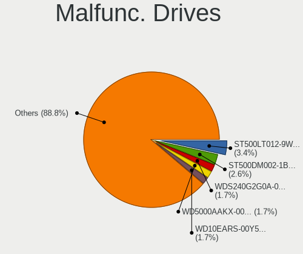
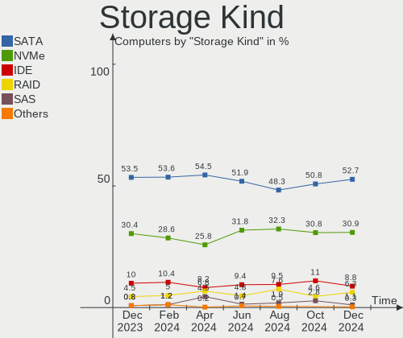
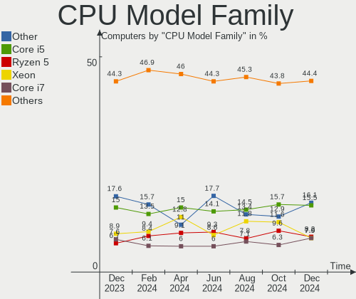
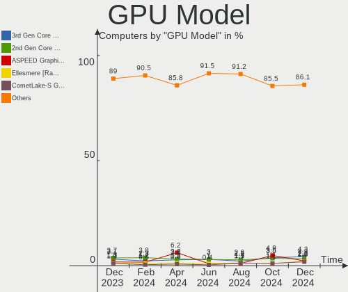
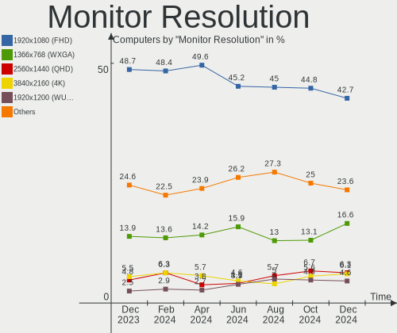
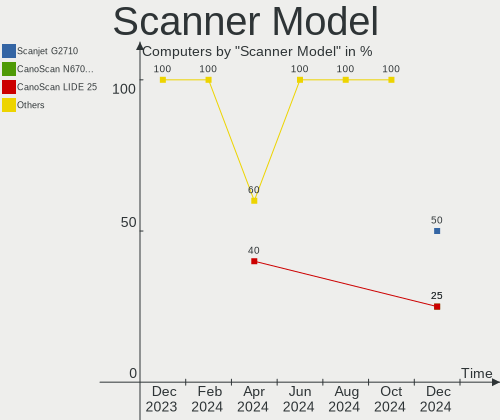

Linux in Russia - Hardware Trends
---------------------------------

A project to identify most popular hardware characteristics and track their change
over time based on data collected by Linux users at https://Linux-Hardware.org.

Anyone can contribute to this report by the [hw-probe](https://github.com/linuxhw/hw-probe) tool:

    sudo -E hw-probe -all -upload

This is a report for all computer types. See also reports for [desktops](/Location/Russia/Desktop/README.md) and [notebooks](/Location/Russia/Notebook/README.md).

Period: Apr, 2024.

Contents
--------

* [ System ](#system)
  - [ OS                       ](#os)
  - [ OS Family                ](#os-family)
  - [ Kernel                   ](#kernel)
  - [ Kernel Family            ](#kernel-family)
  - [ Kernel Major Ver.        ](#kernel-major-ver)
  - [ Arch                     ](#arch)
  - [ DE                       ](#de)
  - [ Display Server           ](#display-server)
  - [ Display Manager          ](#display-manager)
  - [ OS Lang                  ](#os-lang)
  - [ Boot Mode                ](#boot-mode)
  - [ Filesystem               ](#filesystem)
  - [ Part. scheme             ](#part-scheme)
  - [ Dual Boot with Linux/BSD ](#dual-boot-with-linuxbsd)
  - [ Dual Boot (Win)          ](#dual-boot-win)

* [ Board ](#board)
  - [ Vendor                   ](#vendor)
  - [ Model                    ](#model)
  - [ Model Family             ](#model-family)
  - [ MFG Year                 ](#mfg-year)
  - [ Form Factor              ](#form-factor)
  - [ Secure Boot              ](#secure-boot)
  - [ Coreboot                 ](#coreboot)
  - [ RAM Size                 ](#ram-size)
  - [ RAM Used                 ](#ram-used)
  - [ Total Drives             ](#total-drives)
  - [ Has CD-ROM               ](#has-cd-rom)
  - [ Has Ethernet             ](#has-ethernet)
  - [ Has WiFi                 ](#has-wifi)
  - [ Has Bluetooth            ](#has-bluetooth)

* [ Location ](#location)
  - [ Country                  ](#country)
  - [ City                     ](#city)

* [ Drives ](#drives)
  - [ Drive Vendor             ](#drive-vendor)
  - [ Drive Model              ](#drive-model)
  - [ HDD Vendor               ](#hdd-vendor)
  - [ SSD Vendor               ](#ssd-vendor)
  - [ Drive Kind               ](#drive-kind)
  - [ Drive Connector          ](#drive-connector)
  - [ Drive Size               ](#drive-size)
  - [ Space Total              ](#space-total)
  - [ Space Used               ](#space-used)
  - [ Malfunc. Drives          ](#malfunc-drives)
  - [ Malfunc. Drive Vendor    ](#malfunc-drive-vendor)
  - [ Malfunc. HDD Vendor      ](#malfunc-hdd-vendor)
  - [ Malfunc. Drive Kind      ](#malfunc-drive-kind)
  - [ Failed Drives            ](#failed-drives)
  - [ Failed Drive Vendor      ](#failed-drive-vendor)
  - [ Drive Status             ](#drive-status)

* [ Storage controller ](#storage-controller)
  - [ Storage Vendor           ](#storage-vendor)
  - [ Storage Model            ](#storage-model)
  - [ Storage Kind             ](#storage-kind)

* [ Processor ](#processor)
  - [ CPU Vendor               ](#cpu-vendor)
  - [ CPU Model                ](#cpu-model)
  - [ CPU Model Family         ](#cpu-model-family)
  - [ CPU Cores                ](#cpu-cores)
  - [ CPU Sockets              ](#cpu-sockets)
  - [ CPU Threads              ](#cpu-threads)
  - [ CPU Op-Modes             ](#cpu-op-modes)
  - [ CPU Microcode            ](#cpu-microcode)
  - [ CPU Microarch            ](#cpu-microarch)

* [ Graphics ](#graphics)
  - [ GPU Vendor               ](#gpu-vendor)
  - [ GPU Model                ](#gpu-model)
  - [ GPU Combo                ](#gpu-combo)
  - [ GPU Driver               ](#gpu-driver)
  - [ GPU Memory               ](#gpu-memory)

* [ Monitor ](#monitor)
  - [ Monitor Vendor           ](#monitor-vendor)
  - [ Monitor Model            ](#monitor-model)
  - [ Monitor Resolution       ](#monitor-resolution)
  - [ Monitor Diagonal         ](#monitor-diagonal)
  - [ Monitor Width            ](#monitor-width)
  - [ Aspect Ratio             ](#aspect-ratio)
  - [ Monitor Area             ](#monitor-area)
  - [ Pixel Density            ](#pixel-density)
  - [ Multiple Monitors        ](#multiple-monitors)

* [ Network ](#network)
  - [ Net Controller Vendor    ](#net-controller-vendor)
  - [ Net Controller Model     ](#net-controller-model)
  - [ Wireless Vendor          ](#wireless-vendor)
  - [ Wireless Model           ](#wireless-model)
  - [ Ethernet Vendor          ](#ethernet-vendor)
  - [ Ethernet Model           ](#ethernet-model)
  - [ Net Controller Kind      ](#net-controller-kind)
  - [ Used Controller          ](#used-controller)
  - [ NICs                     ](#nics)
  - [ IPv6                     ](#ipv6)

* [ Bluetooth ](#bluetooth)
  - [ Bluetooth Vendor         ](#bluetooth-vendor)
  - [ Bluetooth Model          ](#bluetooth-model)

* [ Sound ](#sound)
  - [ Sound Vendor             ](#sound-vendor)
  - [ Sound Model              ](#sound-model)

* [ Memory ](#memory)
  - [ Memory Vendor            ](#memory-vendor)
  - [ Memory Model             ](#memory-model)
  - [ Memory Kind              ](#memory-kind)
  - [ Memory Form Factor       ](#memory-form-factor)
  - [ Memory Size              ](#memory-size)
  - [ Memory Speed             ](#memory-speed)

* [ Printers & scanners ](#printers--scanners)
  - [ Printer Vendor           ](#printer-vendor)
  - [ Printer Model            ](#printer-model)
  - [ Scanner Vendor           ](#scanner-vendor)
  - [ Scanner Model            ](#scanner-model)

* [ Camera ](#camera)
  - [ Camera Vendor            ](#camera-vendor)
  - [ Camera Model             ](#camera-model)

* [ Security ](#security)
  - [ Fingerprint Vendor       ](#fingerprint-vendor)
  - [ Fingerprint Model        ](#fingerprint-model)
  - [ Chipcard Vendor          ](#chipcard-vendor)
  - [ Chipcard Model           ](#chipcard-model)

* [ Unsupported ](#unsupported)
  - [ Unsupported Devices      ](#unsupported-devices)
  - [ Unsupported Device Types ](#unsupported-device-types)

System
------

OS
--

Installed operating systems

| Name                         | Computers | Percent |
|------------------------------|-----------|---------|
| ROSA 12.5                    | 184       | 28.48%  |
| Ubuntu 22.04                 | 82        | 12.69%  |
| Debian 12                    | 58        | 8.98%   |
| Fedora 39                    | 23        | 3.56%   |
| Arch Rolling                 | 17        | 2.63%   |
| Fedora 40                    | 16        | 2.48%   |
| ROSA 12                      | 14        | 2.17%   |
| OpenMandriva 23.08           | 14        | 2.17%   |
| ROSA 13.0                    | 12        | 1.86%   |
| ROSA 12.4                    | 12        | 1.86%   |
| Cyber Infra 5.5.0            | 12        | 1.86%   |
| Ubuntu 20.04                 | 11        | 1.7%    |
| Debian 11                    | 11        | 1.7%    |
| Linux Mint 21.3              | 10        | 1.55%   |
| ROSA R11.1                   | 9         | 1.39%   |
| ArcoLinux Rolling            | 8         | 1.24%   |
| OpenMandriva 5.0             | 7         | 1.08%   |
| Gentoo 2.14                  | 7         | 1.08%   |
| ALT Linux 10.3               | 7         | 1.08%   |
| Ubuntu 24.04                 | 6         | 0.93%   |
| Manjaro 23.1.4               | 6         | 0.93%   |
| Manjaro                      | 6         | 0.93%   |
| ALT Linux 10.2               | 6         | 0.93%   |
| Red OS 7.3                   | 5         | 0.77%   |
| Ubuntu 23.10                 | 4         | 0.62%   |
| Red OS 8.0                   | 4         | 0.62%   |
| Pop!_OS 22.04                | 4         | 0.62%   |
| KDE neon 22.04               | 4         | 0.62%   |
| Elementary 7.1               | 4         | 0.62%   |
| ALT Linux 20240122           | 4         | 0.62%   |
| SteamOS 3.5.17               | 3         | 0.46%   |
| openSUSE Tumbleweed-XXXXXXXX | 3         | 0.46%   |
| OpenMandriva 24.01           | 3         | 0.46%   |
| EndeavourOS Rolling          | 3         | 0.46%   |
| Astra Linux 1.7_x86-64       | 3         | 0.46%   |
| Xubuntu 20.04                | 2         | 0.31%   |
| ROSA R11                     | 2         | 0.31%   |
| ROSA 2021.1                  | 2         | 0.31%   |
| ROSA 12.3                    | 2         | 0.31%   |
| org.kde.Platform 5.15-21.08  | 2         | 0.31%   |

OS Family
---------

OS without a version

| Name             | Computers | Percent |
|------------------|-----------|---------|
| ROSA             | 240       | 37.15%  |
| Ubuntu           | 104       | 16.1%   |
| Debian           | 70        | 10.84%  |
| Fedora           | 42        | 6.5%    |
| OpenMandriva     | 28        | 4.33%   |
| ALT Linux        | 20        | 3.1%    |
| Arch             | 17        | 2.63%   |
| Linux Mint       | 15        | 2.32%   |
| Manjaro          | 12        | 1.86%   |
| Cyber Infra      | 12        | 1.86%   |
| Gentoo           | 10        | 1.55%   |
| Red OS           | 9         | 1.39%   |
| Kubuntu          | 8         | 1.24%   |
| ArcoLinux        | 8         | 1.24%   |
| openSUSE         | 5         | 0.77%   |
| Xubuntu          | 4         | 0.62%   |
| Pop!_OS          | 4         | 0.62%   |
| KDE neon         | 4         | 0.62%   |
| Elementary       | 4         | 0.62%   |
| SteamOS          | 3         | 0.46%   |
| EndeavourOS      | 3         | 0.46%   |
| Astra Linux      | 3         | 0.46%   |
| Zorin            | 2         | 0.31%   |
| org.kde.Platform | 2         | 0.31%   |
| Oracle Linux     | 2         | 0.31%   |
| NixOS            | 2         | 0.31%   |
| Kali             | 2         | 0.31%   |
| Garuda Linux     | 2         | 0.31%   |
| Void Linux       | 1         | 0.15%   |
| Ultramarine      | 1         | 0.15%   |
| Ubuntu MATE      | 1         | 0.15%   |
| Rocky Linux      | 1         | 0.15%   |
| Progress Linux   | 1         | 0.15%   |
| Nobara           | 1         | 0.15%   |
| LMDE             | 1         | 0.15%   |
| Endless          | 1         | 0.15%   |
| Archcraft        | 1         | 0.15%   |

Kernel
------

Version of the Linux kernel

| Version                             | Computers | Percent |
|-------------------------------------|-----------|---------|
| 6.6.21-generic-8rosa2021.1-x86_64   | 110       | 17.03%  |
| 5.15.0-97-generic                   | 61        | 9.44%   |
| 6.1.81-generic-2rosa2021.1-x86_64   | 43        | 6.66%   |
| 6.1.0-4-amd64                       | 30        | 4.64%   |
| 6.5.0-27-generic                    | 17        | 2.63%   |
| 6.8.7-300.fc40.x86_64               | 13        | 2.01%   |
| 6.5.0-26-generic                    | 13        | 2.01%   |
| 3.10.0-1160.105.1.aip7.214.3        | 12        | 1.86%   |
| 6.4.11-desktop-1omv2390             | 11        | 1.7%    |
| 6.1.20-generic-2rosa2021.1-x86_64   | 10        | 1.55%   |
| 6.6.2-desktop-1omv2390              | 9         | 1.39%   |
| 6.1.0-18-amd64                      | 9         | 1.39%   |
| 6.1.58-generic-1rosa2021.1-x86_64   | 8         | 1.24%   |
| 5.15.0-102-generic                  | 8         | 1.24%   |
| 6.8.4-200.fc39.x86_64               | 7         | 1.08%   |
| 6.1.86-generic-1rosa2021.1-x86_64   | 7         | 1.08%   |
| 5.15.127-generic-1rosa2021.1-i686   | 7         | 1.08%   |
| 5.10.184-generic-1rosa2021.1-x86_64 | 7         | 1.08%   |
| 6.6.27-generic-2rosa2021.1-x86_64   | 6         | 0.93%   |
| 6.6.22-generic-2rosa2023.1-x86_64   | 6         | 0.93%   |
| 5.15.0-101-generic                  | 6         | 0.93%   |
| 6.7.10-200.fc39.x86_64              | 5         | 0.77%   |
| 6.6.27-generic-3rosa2021.1-x86_64   | 5         | 0.77%   |
| 6.1.0-20-amd64                      | 5         | 0.77%   |
| 6.8.2-arch2-1                       | 4         | 0.62%   |
| 6.8.0-76060800daily20240311-generic | 4         | 0.62%   |
| 6.7.11-200.fc39.x86_64              | 4         | 0.62%   |
| 6.6.6-1.red80.x86_64                | 4         | 0.62%   |
| 6.5.0-28-generic                    | 4         | 0.62%   |
| 6.1.83-un-def-alt1                  | 4         | 0.62%   |
| 6.1.0-0.deb11.17-amd64              | 4         | 0.62%   |
| 5.10.0-28-amd64                     | 4         | 0.62%   |
| 6.8.7-zen1-1-zen                    | 3         | 0.46%   |
| 6.8.5-201.fc39.x86_64               | 3         | 0.46%   |
| 6.8.0-31-generic                    | 3         | 0.46%   |
| 6.8.0-22-generic                    | 3         | 0.46%   |
| 6.6.19-1-MANJARO                    | 3         | 0.46%   |
| 6.5.6-300.fc39.x86_64               | 3         | 0.46%   |
| 6.5.13-3-pve                        | 3         | 0.46%   |
| 6.5.11-8-pve                        | 3         | 0.46%   |

Kernel Family
-------------

Linux kernel without a distro release

| Version  | Computers | Percent |
|----------|-----------|---------|
| 6.6.21   | 113       | 17.49%  |
| 5.15.0   | 87        | 13.47%  |
| 6.1.0    | 50        | 7.74%   |
| 6.1.81   | 44        | 6.81%   |
| 6.5.0    | 36        | 5.57%   |
| 6.8.7    | 28        | 4.33%   |
| 6.8.4    | 14        | 2.17%   |
| 6.6.27   | 13        | 2.01%   |
| 3.10.0   | 12        | 1.86%   |
| 6.4.11   | 11        | 1.7%    |
| 6.8.0    | 10        | 1.55%   |
| 6.1.20   | 10        | 1.55%   |
| 5.15.127 | 10        | 1.55%   |
| 6.8.2    | 9         | 1.39%   |
| 6.6.2    | 9         | 1.39%   |
| 6.8.5    | 8         | 1.24%   |
| 6.6.22   | 8         | 1.24%   |
| 6.5.11   | 8         | 1.24%   |
| 6.1.58   | 8         | 1.24%   |
| 5.10.184 | 8         | 1.24%   |
| 6.1.86   | 7         | 1.08%   |
| 4.15.0   | 7         | 1.08%   |
| 6.1.52   | 6         | 0.93%   |
| 5.10.0   | 6         | 0.93%   |
| 6.8.6    | 5         | 0.77%   |
| 6.7.11   | 5         | 0.77%   |
| 6.7.10   | 5         | 0.77%   |
| 6.6.6    | 5         | 0.77%   |
| 6.5.13   | 5         | 0.77%   |
| 6.1.85   | 5         | 0.77%   |
| 6.2.0    | 4         | 0.62%   |
| 6.1.83   | 4         | 0.62%   |
| 5.4.32   | 4         | 0.62%   |
| 5.4.0    | 4         | 0.62%   |
| 6.9.0    | 3         | 0.46%   |
| 6.6.28   | 3         | 0.46%   |
| 6.6.26   | 3         | 0.46%   |
| 6.6.25   | 3         | 0.46%   |
| 6.6.19   | 3         | 0.46%   |
| 6.5.6    | 3         | 0.46%   |

Kernel Major Ver.
-----------------

Linux kernel major version

| Version | Computers | Percent |
|---------|-----------|---------|
| 6.6     | 164       | 25.39%  |
| 6.1     | 146       | 22.6%   |
| 5.15    | 104       | 16.1%   |
| 6.8     | 79        | 12.23%  |
| 6.5     | 52        | 8.05%   |
| 5.10    | 22        | 3.41%   |
| 6.7     | 18        | 2.79%   |
| 6.4     | 13        | 2.01%   |
| 3.10    | 12        | 1.86%   |
| 5.4     | 9         | 1.39%   |
| 4.15    | 8         | 1.24%   |
| 6.2     | 6         | 0.93%   |
| 6.9     | 3         | 0.46%   |
| 5.16    | 2         | 0.31%   |
| 5.14    | 2         | 0.31%   |
| 4.9     | 2         | 0.31%   |
| 5.19    | 1         | 0.15%   |
| 5.17    | 1         | 0.15%   |
| 5.11    | 1         | 0.15%   |
| 4.18    | 1         | 0.15%   |

Arch
----

OS architecture (x86_64, i586, etc.)

| Name   | Computers | Percent |
|--------|-----------|---------|
| x86_64 | 632       | 97.83%  |
| i686   | 14        | 2.17%   |

DE
--

Desktop Environment

| Name            | Computers | Percent |
|-----------------|-----------|---------|
| KDE5            | 207       | 32.04%  |
| GNOME           | 159       | 24.61%  |
| Unknown         | 134       | 20.74%  |
| LXQt            | 31        | 4.8%    |
| XFCE            | 26        | 4.02%   |
| KDE6            | 20        | 3.1%    |
| MATE            | 19        | 2.94%   |
| X-Cinnamon      | 13        | 2.01%   |
| KDE4            | 9         | 1.39%   |
| Hyprland        | 6         | 0.93%   |
| sway            | 5         | 0.77%   |
| Pantheon        | 4         | 0.62%   |
| fly             | 4         | 0.62%   |
| GNOME Flashback | 2         | 0.31%   |
| GNOME Classic   | 2         | 0.31%   |
| Cinnamon        | 2         | 0.31%   |
| bspwm           | 2         | 0.31%   |
| KDE             | 1         | 0.15%   |

Display Server
--------------

X11 or Wayland

| Name    | Computers | Percent |
|---------|-----------|---------|
| Wayland | 313       | 48.45%  |
| X11     | 210       | 32.51%  |
| Unknown | 94        | 14.55%  |
| Tty     | 29        | 4.49%   |

Display Manager
---------------

SDDM, LightDM, etc.

| Name    | Computers | Percent |
|---------|-----------|---------|
| Unknown | 217       | 33.59%  |
| SDDM    | 210       | 32.51%  |
| GDM     | 106       | 16.41%  |
| LightDM | 61        | 9.44%   |
| GDM3    | 40        | 6.19%   |
| KDM     | 8         | 1.24%   |
| FLY-DM  | 2         | 0.31%   |
| LY-DM   | 1         | 0.15%   |
| Ly      | 1         | 0.15%   |

OS Lang
-------

Language

| Lang    | Computers | Percent |
|---------|-----------|---------|
| ru_RU   | 448       | 69.35%  |
| en_US   | 115       | 17.8%   |
| C       | 66        | 10.22%  |
| Unknown | 9         | 1.39%   |
| en_GB   | 3         | 0.46%   |
| ru      | 2         | 0.31%   |
| POSIX   | 1         | 0.15%   |
| eo      | 1         | 0.15%   |
| C.UTF8  | 1         | 0.15%   |

Boot Mode
---------

EFI or BIOS

| Mode | Computers | Percent |
|------|-----------|---------|
| EFI  | 335       | 51.86%  |
| BIOS | 311       | 48.14%  |

Filesystem
----------

Type of filesystem

| Type    | Computers | Percent |
|---------|-----------|---------|
| Ext4    | 398       | 61.61%  |
| Btrfs   | 109       | 16.87%  |
| Overlay | 106       | 16.41%  |
| Tmpfs   | 17        | 2.63%   |
| Xfs     | 6         | 0.93%   |
| Zfs     | 5         | 0.77%   |
| F2fs    | 3         | 0.46%   |
| XXXXXXX | 1         | 0.15%   |
| Unknown | 1         | 0.15%   |

Part. scheme
------------

Scheme of partitioning

| Type    | Computers | Percent |
|---------|-----------|---------|
| GPT     | 373       | 57.74%  |
| Unknown | 142       | 21.98%  |
| MBR     | 131       | 20.28%  |

Dual Boot with Linux/BSD
------------------------

Hosting more than one Linux/BSD

| Dual boot | Computers | Percent |
|-----------|-----------|---------|
| No        | 486       | 75.23%  |
| Yes       | 160       | 24.77%  |

Dual Boot (Win)
---------------

Hosting Linux and Windows

| Dual boot | Computers | Percent |
|-----------|-----------|---------|
| No        | 420       | 65.02%  |
| Yes       | 226       | 34.98%  |

Board
-----

Vendor
------

Motherboard manufacturer

| Name                | Computers | Percent |
|---------------------|-----------|---------|
| ASUSTek Computer    | 105       | 16.25%  |
| Gigabyte Technology | 75        | 11.61%  |
| Lenovo              | 74        | 11.46%  |
| Supermicro          | 50        | 7.74%   |
| MSI                 | 48        | 7.43%   |
| Hewlett-Packard     | 47        | 7.28%   |
| Acer                | 29        | 4.49%   |
| ASRock              | 27        | 4.18%   |
| HUAWEI              | 21        | 3.25%   |
| Dell                | 18        | 2.79%   |
| ETegro Technologies | 16        | 2.48%   |
| Intel               | 13        | 2.01%   |
| Unknown             | 11        | 1.7%    |
| Biostar             | 7         | 1.08%   |
| Maibenben           | 6         | 0.93%   |
| HONOR               | 6         | 0.93%   |
| Toshiba             | 5         | 0.77%   |
| Timi                | 4         | 0.62%   |
| Sony                | 4         | 0.62%   |
| Samsung Electronics | 4         | 0.62%   |
| ICL                 | 4         | 0.62%   |
| DEXP                | 4         | 0.62%   |
| XIAOMI              | 3         | 0.46%   |
| Valve               | 3         | 0.46%   |
| Packard Bell        | 3         | 0.46%   |
| ECS                 | 3         | 0.46%   |
| DEPO Computers      | 3         | 0.46%   |
| Aquarius            | 3         | 0.46%   |
| Apple               | 3         | 0.46%   |
| Softline            | 2         | 0.31%   |
| Notebook            | 2         | 0.31%   |
| MAXSUN              | 2         | 0.31%   |
| MACHENIKE           | 2         | 0.31%   |
| Irbis               | 2         | 0.31%   |
| eMachines           | 2         | 0.31%   |
| Clevo               | 2         | 0.31%   |
| Alienware           | 2         | 0.31%   |
| ZET                 | 1         | 0.15%   |
| TPS                 | 1         | 0.15%   |
| TECNO               | 1         | 0.15%   |

Model
-----

Motherboard model

| Name                                     | Computers | Percent |
|------------------------------------------|-----------|---------|
| Supermicro X9DRW                         | 16        | 2.48%   |
| ETegro Hyperion RS125 G4                 | 16        | 2.48%   |
| Unknown                                  | 13        | 2.01%   |
| Supermicro SYS-1029P-WTR                 | 12        | 1.86%   |
| Lenovo ThinkCentre M79 10JAS05300        | 9         | 1.39%   |
| HP ProLiant DL360 Gen9                   | 8         | 1.24%   |
| Supermicro X8DTU                         | 5         | 0.77%   |
| Supermicro SYS-6018R-TDW                 | 5         | 0.77%   |
| HUAWEI BOM-WXX9                          | 5         | 0.77%   |
| ASUS S20 K29                             | 5         | 0.77%   |
| ASUS All Series                          | 5         | 0.77%   |
| Intel X99                                | 4         | 0.62%   |
| Valve Jupiter                            | 3         | 0.46%   |
| MSI MS-7C96                              | 3         | 0.46%   |
| MSI MS-7B89                              | 3         | 0.46%   |
| Maibenben MaiBook M                      | 3         | 0.46%   |
| ICL RAY Si105.Mi                         | 3         | 0.46%   |
| ASUS M5A97 R2.0                          | 3         | 0.46%   |
| XIAOMI Redmi Book Pro 15 2023            | 2         | 0.31%   |
| Timi TM1701                              | 2         | 0.31%   |
| Supermicro SYS-6018R-MTR                 | 2         | 0.31%   |
| Supermicro Super Server                  | 2         | 0.31%   |
| Supermicro SSG-2028R-E1CR24L             | 2         | 0.31%   |
| Softline SMBox                           | 2         | 0.31%   |
| Samsung 350V5C/351V5C/3540VC/3440VC      | 2         | 0.31%   |
| MSI MS-7C56                              | 2         | 0.31%   |
| MSI MS-7C52                              | 2         | 0.31%   |
| MSI MS-7A38                              | 2         | 0.31%   |
| Lenovo G50-30 80G0                       | 2         | 0.31%   |
| Lenovo B590 20208                        | 2         | 0.31%   |
| Lenovo B50-80 80EW                       | 2         | 0.31%   |
| HUAWEI RH1288 V3                         | 2         | 0.31%   |
| HUAWEI NbDE-WXX9                         | 2         | 0.31%   |
| HONOR NMH-WDX9                           | 2         | 0.31%   |
| HONOR GLO-GXXX                           | 2         | 0.31%   |
| HP Pavilion g6                           | 2         | 0.31%   |
| HP Laptop 15-bw0xx                       | 2         | 0.31%   |
| HP EliteBook 845 14 inch G10 Notebook PC | 2         | 0.31%   |
| Gigabyte P75-D3                          | 2         | 0.31%   |
| Gigabyte B560 HD3                        | 2         | 0.31%   |

Model Family
------------

Motherboard model prefix

| Name                     | Computers | Percent |
|--------------------------|-----------|---------|
| Lenovo ThinkPad          | 20        | 3.1%    |
| Acer Aspire              | 20        | 3.1%    |
| Supermicro X9DRW         | 16        | 2.48%   |
| ETegro Hyperion          | 16        | 2.48%   |
| Lenovo ThinkCentre       | 14        | 2.17%   |
| Lenovo IdeaPad           | 13        | 2.01%   |
| Unknown                  | 13        | 2.01%   |
| Supermicro SYS-1029P-WTR | 12        | 1.86%   |
| HP ProLiant              | 10        | 1.55%   |
| ASUS VivoBook            | 10        | 1.55%   |
| ASUS PRIME               | 10        | 1.55%   |
| HP Pavilion              | 9         | 1.39%   |
| Gigabyte B450M           | 7         | 1.08%   |
| HP ProBook               | 6         | 0.93%   |
| HP Laptop                | 6         | 0.93%   |
| Dell OptiPlex            | 6         | 0.93%   |
| ASUS ROG                 | 6         | 0.93%   |
| Toshiba Satellite        | 5         | 0.77%   |
| Supermicro X8DTU         | 5         | 0.77%   |
| Supermicro SYS-6018R-TDW | 5         | 0.77%   |
| HUAWEI BOM-WXX9          | 5         | 0.77%   |
| HP EliteBook             | 5         | 0.77%   |
| Dell Inspiron            | 5         | 0.77%   |
| ASUS TUF                 | 5         | 0.77%   |
| ASUS S20                 | 5         | 0.77%   |
| ASUS All                 | 5         | 0.77%   |
| Maibenben MaiBook        | 4         | 0.62%   |
| Lenovo ThinkBook         | 4         | 0.62%   |
| Intel X99                | 4         | 0.62%   |
| Gigabyte B560M           | 4         | 0.62%   |
| Gigabyte A520M           | 4         | 0.62%   |
| ASUS M5A97               | 4         | 0.62%   |
| XIAOMI Redmi             | 3         | 0.46%   |
| Valve Jupiter            | 3         | 0.46%   |
| Packard Bell EasyNote    | 3         | 0.46%   |
| MSI MS-7C96              | 3         | 0.46%   |
| MSI MS-7B89              | 3         | 0.46%   |
| Lenovo Legion            | 3         | 0.46%   |
| Lenovo B590              | 3         | 0.46%   |
| ICL RAY                  | 3         | 0.46%   |

MFG Year
--------

Motherboard manufacture year

| Year | Computers | Percent |
|------|-----------|---------|
| 2012 | 74        | 11.46%  |
| 2021 | 60        | 9.29%   |
| 2020 | 54        | 8.36%   |
| 2023 | 52        | 8.05%   |
| 2018 | 46        | 7.12%   |
| 2022 | 45        | 6.97%   |
| 2019 | 44        | 6.81%   |
| 2013 | 42        | 6.5%    |
| 2016 | 40        | 6.19%   |
| 2015 | 30        | 4.64%   |
| 2009 | 28        | 4.33%   |
| 2017 | 26        | 4.02%   |
| 2011 | 26        | 4.02%   |
| 2010 | 21        | 3.25%   |
| 2014 | 20        | 3.1%    |
| 2008 | 18        | 2.79%   |
| 2024 | 9         | 1.39%   |
| 2007 | 6         | 0.93%   |
| 2006 | 3         | 0.46%   |
| 2005 | 1         | 0.15%   |
| 2003 | 1         | 0.15%   |

Form Factor
-----------

Physical design of the computer

| Name        | Computers | Percent |
|-------------|-----------|---------|
| Notebook    | 273       | 42.26%  |
| Desktop     | 272       | 42.11%  |
| Server      | 73        | 11.3%   |
| Mini pc     | 11        | 1.7%    |
| All in one  | 11        | 1.7%    |
| Convertible | 5         | 0.77%   |
| Tablet      | 1         | 0.15%   |

Secure Boot
-----------

Enabled or disabled

| State    | Computers | Percent |
|----------|-----------|---------|
| Disabled | 631       | 97.68%  |
| Enabled  | 15        | 2.32%   |

Coreboot
--------

Have coreboot on board

| Used | Computers | Percent |
|------|-----------|---------|
| No   | 645       | 99.85%  |
| Yes  | 1         | 0.15%   |

RAM Size
--------

Total RAM memory

| Size in GB      | Computers | Percent |
|-----------------|-----------|---------|
| 16.01-24.0      | 138       | 21.36%  |
| 4.01-8.0        | 136       | 21.05%  |
| 8.01-16.0       | 107       | 16.56%  |
| 32.01-64.0      | 84        | 13%     |
| 3.01-4.0        | 76        | 11.76%  |
| 64.01-256.0     | 47        | 7.28%   |
| 1.01-2.0        | 21        | 3.25%   |
| 24.01-32.0      | 16        | 2.48%   |
| More than 256.0 | 10        | 1.55%   |
| 2.01-3.0        | 8         | 1.24%   |
| 0.51-1.0        | 3         | 0.46%   |

RAM Used
--------

Used RAM memory

| Used GB     | Computers | Percent |
|-------------|-----------|---------|
| 1.01-2.0    | 210       | 32.51%  |
| 2.01-3.0    | 156       | 24.15%  |
| 4.01-8.0    | 86        | 13.31%  |
| 3.01-4.0    | 79        | 12.23%  |
| 0.51-1.0    | 70        | 10.84%  |
| 8.01-16.0   | 20        | 3.1%    |
| 24.01-32.0  | 10        | 1.55%   |
| 16.01-24.0  | 7         | 1.08%   |
| 0.01-0.5    | 4         | 0.62%   |
| 32.01-64.0  | 2         | 0.31%   |
| 64.01-256.0 | 2         | 0.31%   |

Total Drives
------------

Number of drives on board

| Drives | Computers | Percent |
|--------|-----------|---------|
| 1      | 335       | 51.86%  |
| 2      | 173       | 26.78%  |
| 3      | 67        | 10.37%  |
| 4      | 29        | 4.49%   |
| 10     | 14        | 2.17%   |
| 6      | 6         | 0.93%   |
| 5      | 6         | 0.93%   |
| 11     | 4         | 0.62%   |
| 8      | 4         | 0.62%   |
| 0      | 3         | 0.46%   |
| 9      | 2         | 0.31%   |
| 37     | 1         | 0.15%   |
| 35     | 1         | 0.15%   |
| 7      | 1         | 0.15%   |

Has CD-ROM
----------

Has CD-ROM on board

| Presented | Computers | Percent |
|-----------|-----------|---------|
| No        | 511       | 79.1%   |
| Yes       | 135       | 20.9%   |

Has Ethernet
------------

Has Ethernet on board

| Presented | Computers | Percent |
|-----------|-----------|---------|
| Yes       | 568       | 87.93%  |
| No        | 78        | 12.07%  |

Has WiFi
--------

Has WiFi module

| Presented | Computers | Percent |
|-----------|-----------|---------|
| Yes       | 370       | 57.28%  |
| No        | 276       | 42.72%  |

Has Bluetooth
-------------

Has Bluetooth module

| Presented | Computers | Percent |
|-----------|-----------|---------|
| No        | 325       | 50.31%  |
| Yes       | 321       | 49.69%  |

Location
--------

Country
-------

Geographic location (country)

| Country | Computers | Percent |
|---------|-----------|---------|
| Russia  | 646       | 100%    |

City
----

Geographic location (city)

| City             | Computers | Percent |
|------------------|-----------|---------|
| Moscow           | 230       | 35.6%   |
| St Petersburg    | 58        | 8.98%   |
| Voronezh         | 36        | 5.57%   |
| Yekaterinburg    | 16        | 2.48%   |
| Novosibirsk      | 15        | 2.32%   |
| Krasnodar        | 13        | 2.01%   |
| Nizhniy Novgorod | 9         | 1.39%   |
| Chelyabinsk      | 9         | 1.39%   |
| Veliky Novgorod  | 6         | 0.93%   |
| Rostov-on-Don    | 6         | 0.93%   |
| Omsk             | 6         | 0.93%   |
| Kazan’         | 6         | 0.93%   |
| Tyumen           | 5         | 0.77%   |
| Tomsk            | 5         | 0.77%   |
| Surgut           | 5         | 0.77%   |
| Stavropol        | 5         | 0.77%   |
| Saransk          | 5         | 0.77%   |
| Samara           | 5         | 0.77%   |
| Penza            | 5         | 0.77%   |
| Yaroslavl        | 4         | 0.62%   |
| Vladivostok      | 4         | 0.62%   |
| Tambov           | 4         | 0.62%   |
| Smolensk         | 4         | 0.62%   |
| Saratov          | 4         | 0.62%   |
| Ryazan           | 4         | 0.62%   |
| Perm             | 4         | 0.62%   |
| Murino           | 4         | 0.62%   |
| Lipetsk          | 4         | 0.62%   |
| Kursk            | 4         | 0.62%   |
| Kemerovo         | 4         | 0.62%   |
| Kazan'           | 4         | 0.62%   |
| Kaliningrad      | 4         | 0.62%   |
| Izhevsk          | 4         | 0.62%   |
| Zima             | 3         | 0.46%   |
| Volgograd        | 3         | 0.46%   |
| Vladimir         | 3         | 0.46%   |
| Ulyanovsk        | 3         | 0.46%   |
| Ufa              | 3         | 0.46%   |
| Sochi            | 3         | 0.46%   |
| Ramenskoye       | 3         | 0.46%   |

Drives
------

Drive Vendor
------------

Hard drive vendors

| Vendor                      | Computers | Drives | Percent |
|-----------------------------|-----------|--------|---------|
| WDC                         | 150       | 190    | 15.14%  |
| Seagate                     | 113       | 209    | 11.4%   |
| Samsung Electronics         | 108       | 206    | 10.9%   |
| Toshiba                     | 62        | 78     | 6.26%   |
| Kingston                    | 53        | 61     | 5.35%   |
| Sandisk                     | 37        | 41     | 3.73%   |
| Fujitsu                     | 34        | 75     | 3.43%   |
| Intel                       | 32        | 45     | 3.23%   |
| Hitachi                     | 31        | 42     | 3.13%   |
| A-DATA Technology           | 20        | 21     | 2.02%   |
| China                       | 19        | 20     | 1.92%   |
| Unknown                     | 18        | 19     | 1.82%   |
| SK hynix                    | 16        | 16     | 1.61%   |
| Crucial                     | 16        | 18     | 1.61%   |
| Apacer                      | 16        | 16     | 1.61%   |
| Silicon Motion              | 13        | 13     | 1.31%   |
| Phison Electronics          | 12        | 12     | 1.21%   |
| Micron Technology           | 12        | 12     | 1.21%   |
| KIOXIA                      | 12        | 12     | 1.21%   |
| HGST                        | 12        | 18     | 1.21%   |
| AMD                         | 12        | 13     | 1.21%   |
| KingSpec                    | 11        | 12     | 1.11%   |
| Netac                       | 10        | 10     | 1.01%   |
| Gigabyte Technology         | 9         | 9      | 0.91%   |
| SPCC                        | 8         | 8      | 0.81%   |
| MAXIO Technology (Hangzhou) | 8         | 8      | 0.81%   |
| Hewlett-Packard             | 8         | 19     | 0.81%   |
| Plextor                     | 7         | 8      | 0.71%   |
| Smartbuy                    | 6         | 7      | 0.61%   |
| Qumo                        | 6         | 6      | 0.61%   |
| Phison                      | 6         | 6      | 0.61%   |
| Kingston Technology Company | 6         | 6      | 0.61%   |
| Realtek Semiconductor       | 5         | 5      | 0.5%    |
| Unknown                     | 5         | 5      | 0.5%    |
| YMTC                        | 4         | 4      | 0.4%    |
| Patriot                     | 4         | 4      | 0.4%    |
| OCZ                         | 4         | 4      | 0.4%    |
| JMicron Technology          | 4         | 4      | 0.4%    |
| DEXP                        | 4         | 4      | 0.4%    |
| BIWIN                       | 4         | 4      | 0.4%    |

Drive Model
-----------

Hard drive models

| Model                                                 | Computers | Percent |
|-------------------------------------------------------|-----------|---------|
| Seagate ST500DM002-1BD142 500GB                       | 12        | 1.1%    |
| Seagate ST2000NX0403 2TB                              | 12        | 1.1%    |
| Samsung MZ7L3960HCJR-00A07 960GB SSD                  | 12        | 1.1%    |
| Samsung MZ7L3240HCHQ-00A07 240GB SSD                  | 12        | 1.1%    |
| Samsung MZ1L21T9 472GB                                | 12        | 1.1%    |
| Fujitsu MBA3147RC 147GB                               | 12        | 1.1%    |
| Samsung NVMe SSD Controller SM981/PM981/PM983 1TB     | 11        | 1.01%   |
| Seagate ST1000DM010-2EP102 1TB                        | 10        | 0.92%   |
| Fujitsu MBE2147RC 147GB                               | 10        | 0.92%   |
| Toshiba HDWD110 1TB                                   | 9         | 0.83%   |
| Kingston SA400S37240G 240GB SSD                       | 9         | 0.83%   |
| Kingston SA400S37480G 480GB SSD                       | 8         | 0.74%   |
| Silicon Motion SM2263EN/SM2263XT SSD Controller 256GB | 7         | 0.64%   |
| Fujitsu MAX3147RC 147GB                               | 7         | 0.64%   |
| Toshiba MK0502TSKB 500GB                              | 6         | 0.55%   |
| Toshiba DT01ACA050 500GB                              | 6         | 0.55%   |
| Seagate ST1000DM003-1CH162 1TB                        | 6         | 0.55%   |
| WDC WD5000AAKX-22ERMA0 500GB                          | 5         | 0.46%   |
| WDC WD10EZEX-08WN4A0 1TB                              | 5         | 0.46%   |
| Silicon Motion PCIe-8 SSD 512GB                       | 5         | 0.46%   |
| Samsung SSD 850 EVO 250GB                             | 5         | 0.46%   |
| Phison E12 NVMe Controller 2TB                        | 5         | 0.46%   |
| Kingston SA400S37120G 120GB SSD                       | 5         | 0.46%   |
| Fujitsu MBA3073RC 74GB                                | 5         | 0.46%   |
| Crucial CT480BX500SSD1 480GB                          | 5         | 0.46%   |
| Crucial CT240BX500SSD1 240GB                          | 5         | 0.46%   |
| Unknown                                               | 5         | 0.46%   |
| YMTC PC300-512GB-B                                    | 4         | 0.37%   |
| WDC WD10EZEX-00BBHA0 1TB                              | 4         | 0.37%   |
| Toshiba MQ01ABF050 500GB                              | 4         | 0.37%   |
| Toshiba DT01ACA100 1TB                                | 4         | 0.37%   |
| Seagate ST9600204SS 600GB                             | 4         | 0.37%   |
| Seagate ST1000NM0033-9ZM173 1TB                       | 4         | 0.37%   |
| Seagate ST1000LM035-1RK172 1TB                        | 4         | 0.37%   |
| Samsung SSD 870 EVO 500GB                             | 4         | 0.37%   |
| Samsung SSD 870 EVO 250GB                             | 4         | 0.37%   |
| Samsung SSD 870 EVO 1TB                               | 4         | 0.37%   |
| Samsung NVMe SSD Controller PM9A1/PM9A3/980PRO 1TB    | 4         | 0.37%   |
| KIOXIA KBG50ZNV512G 512GB                             | 4         | 0.37%   |
| KingSpec P3-256 256GB SSD                             | 4         | 0.37%   |

HDD Vendor
----------

Hard disk drive vendors

| Vendor              | Computers | Drives | Percent |
|---------------------|-----------|--------|---------|
| WDC                 | 132       | 165    | 33.08%  |
| Seagate             | 110       | 205    | 27.57%  |
| Toshiba             | 60        | 76     | 15.04%  |
| Fujitsu             | 34        | 75     | 8.52%   |
| Hitachi             | 31        | 42     | 7.77%   |
| HGST                | 12        | 18     | 3.01%   |
| Samsung Electronics | 10        | 10     | 2.51%   |
| JMicron Technology  | 3         | 3      | 0.75%   |
| Hewlett-Packard     | 3         | 10     | 0.75%   |
| Unknown             | 1         | 1      | 0.25%   |
| StoreJet            | 1         | 1      | 0.25%   |
| ACASIS              | 1         | 1      | 0.25%   |
| Unknown             | 1         | 1      | 0.25%   |

SSD Vendor
----------

Solid state drive vendors

| Vendor              | Computers | Drives | Percent |
|---------------------|-----------|--------|---------|
| Samsung Electronics | 60        | 95     | 17.05%  |
| Kingston            | 41        | 47     | 11.65%  |
| WDC                 | 19        | 21     | 5.4%    |
| China               | 19        | 20     | 5.4%    |
| Intel               | 18        | 27     | 5.11%   |
| SanDisk             | 17        | 21     | 4.83%   |
| A-DATA Technology   | 16        | 17     | 4.55%   |
| Crucial             | 15        | 15     | 4.26%   |
| AMD                 | 12        | 12     | 3.41%   |
| KingSpec            | 11        | 12     | 3.13%   |
| Apacer              | 11        | 11     | 3.13%   |
| Plextor             | 7         | 7      | 1.99%   |
| Netac               | 7         | 7      | 1.99%   |
| Smartbuy            | 6         | 7      | 1.7%    |
| Qumo                | 6         | 6      | 1.7%    |
| Gigabyte Technology | 6         | 6      | 1.7%    |
| SPCC                | 5         | 5      | 1.42%   |
| Patriot             | 4         | 4      | 1.14%   |
| OCZ                 | 4         | 4      | 1.14%   |
| DEXP                | 4         | 4      | 1.14%   |
| AGI                 | 4         | 4      | 1.14%   |
| XrayDisk            | 3         | 3      | 0.85%   |
| Seagate             | 3         | 4      | 0.85%   |
| Kimtigo             | 3         | 3      | 0.85%   |
| Hewlett-Packard     | 3         | 7      | 0.85%   |
| Transcend           | 2         | 2      | 0.57%   |
| Team                | 2         | 2      | 0.57%   |
| T-FORCE             | 2         | 2      | 0.57%   |
| RTS                 | 2         | 2      | 0.57%   |
| Neo                 | 2         | 2      | 0.57%   |
| Azerty              | 2         | 2      | 0.57%   |
| Apple               | 2         | 2      | 0.57%   |
| Unknown             | 2         | 2      | 0.57%   |
| Zheino              | 1         | 1      | 0.28%   |
| walram              | 1         | 1      | 0.28%   |
| USB3.0              | 1         | 1      | 0.28%   |
| Union Memory        | 1         | 1      | 0.28%   |
| Toshiba             | 1         | 1      | 0.28%   |
| SSSTC               | 1         | 1      | 0.28%   |
| SK hynix            | 1         | 1      | 0.28%   |

Drive Kind
----------

HDD or SSD

| Kind    | Computers | Drives | Percent |
|---------|-----------|--------|---------|
| HDD     | 341       | 608    | 38.1%   |
| SSD     | 305       | 421    | 34.08%  |
| NVMe    | 232       | 302    | 25.92%  |
| MMC     | 14        | 16     | 1.56%   |
| Unknown | 3         | 3      | 0.34%   |

Drive Connector
---------------

SATA, SAS, NVMe, etc.

| Type | Computers | Drives | Percent |
|------|-----------|--------|---------|
| SATA | 476       | 942    | 61.74%  |
| NVMe | 232       | 302    | 30.09%  |
| SAS  | 49        | 90     | 6.36%   |
| MMC  | 14        | 16     | 1.82%   |

Drive Size
----------

Size of hard drive

| Size in TB | Computers | Drives | Percent |
|------------|-----------|--------|---------|
| 0.01-0.5   | 395       | 590    | 60.4%   |
| 0.51-1.0   | 181       | 262    | 27.68%  |
| 1.01-2.0   | 49        | 99     | 7.49%   |
| 3.01-4.0   | 14        | 24     | 2.14%   |
| 4.01-10.0  | 6         | 18     | 0.92%   |
| 10.01-20.0 | 4         | 29     | 0.61%   |
| 2.01-3.0   | 3         | 3      | 0.46%   |
| 20.01-50.0 | 1         | 3      | 0.15%   |
| 0          | 1         | 1      | 0.15%   |

Space Total
-----------

Amount of disk space available on the file system

| Size in GB     | Computers | Percent |
|----------------|-----------|---------|
| 101-250        | 134       | 20.74%  |
| 251-500        | 130       | 20.12%  |
| Unknown        | 101       | 15.63%  |
| 501-1000       | 88        | 13.62%  |
| 1-20           | 42        | 6.5%    |
| More than 3000 | 40        | 6.19%   |
| 1001-2000      | 40        | 6.19%   |
| 51-100         | 31        | 4.8%    |
| 21-50          | 23        | 3.56%   |
| 2001-3000      | 17        | 2.63%   |

Space Used
----------

Amount of used disk space

| Used GB        | Computers | Percent |
|----------------|-----------|---------|
| 1-20           | 220       | 34.06%  |
| Unknown        | 101       | 15.63%  |
| 21-50          | 87        | 13.47%  |
| 101-250        | 81        | 12.54%  |
| 51-100         | 53        | 8.2%    |
| 251-500        | 42        | 6.5%    |
| 501-1000       | 31        | 4.8%    |
| 1001-2000      | 16        | 2.48%   |
| More than 3000 | 11        | 1.7%    |
| 2001-3000      | 4         | 0.62%   |

Malfunc. Drives
---------------

Drive models with a malfunction

| Model                            | Computers | Drives | Percent |
|----------------------------------|-----------|--------|---------|
| WDC WD5000AAKX-22ERMA0 500GB     | 2         | 2      | 1.79%   |
| Toshiba MQ01ABF050 500GB         | 2         | 2      | 1.79%   |
| Seagate ST500DM002-1BD142 500GB  | 2         | 2      | 1.79%   |
| Hitachi HTS545016B9A300 160GB    | 2         | 2      | 1.79%   |
| Hitachi HTS541612J9SA00 120GB    | 2         | 2      | 1.79%   |
| WDC WDS240G2G0A-00JH30 240GB SSD | 1         | 1      | 0.89%   |
| WDC WD800JD-00MSA1 80GB          | 1         | 1      | 0.89%   |
| WDC WD800AAJS-00B4A0 80GB        | 1         | 1      | 0.89%   |
| WDC WD7500BPVX-60JC3T0 752GB     | 1         | 1      | 0.89%   |
| WDC WD600BEVS-07LAT0 64GB        | 1         | 1      | 0.89%   |
| WDC WD5002ABYS-02B1B0 500GB      | 1         | 2      | 0.89%   |
| WDC WD5000LPVX-80V0TT0 500GB     | 1         | 1      | 0.89%   |
| WDC WD5000LPVX-22V0TT0 500GB     | 1         | 1      | 0.89%   |
| WDC WD5000AAKX-60U6AA0 500GB     | 1         | 1      | 0.89%   |
| WDC WD5000AAKS-00V1A0 500GB      | 1         | 1      | 0.89%   |
| WDC WD40PURX-64GVNY0 4TB         | 1         | 1      | 0.89%   |
| WDC WD40PURX-64GVNY0 1 4TB       | 1         | 1      | 0.89%   |
| WDC WD400BB-00DEA0 40GB          | 1         | 1      | 0.89%   |
| WDC WD3200BPVT-24ZEST0 320GB     | 1         | 1      | 0.89%   |
| WDC WD3200BEVT-26A23T0 320GB     | 1         | 1      | 0.89%   |
| WDC WD2500AAKS-00VSA0 250GB      | 1         | 1      | 0.89%   |
| WDC WD2500AAJS-08L7A0 250GB      | 1         | 1      | 0.89%   |
| WDC WD2500AAJS-00L7A0 250GB      | 1         | 1      | 0.89%   |
| WDC WD2000F9YZ-09N20L0 2TB       | 1         | 2      | 0.89%   |
| WDC WD1600BEVS-22RST0 160GB      | 1         | 1      | 0.89%   |
| WDC WD1600AAJS-00PSA0 160GB      | 1         | 1      | 0.89%   |
| WDC WD1503FYYS-02W0B0 1TB        | 1         | 1      | 0.89%   |
| WDC WD10SPZX-60Z10T0 1TB         | 1         | 1      | 0.89%   |
| WDC WD10PURX-64E5EY0 1TB         | 1         | 1      | 0.89%   |
| WDC WD10JPVT-60A1YT0 1TB         | 1         | 2      | 0.89%   |
| WDC WD10EZEX-60WN4A1 1TB         | 1         | 1      | 0.89%   |
| WDC WD10EZEX-22MFCA0 1TB         | 1         | 1      | 0.89%   |
| WDC WD10EZEX-00WN4A0 1TB         | 1         | 1      | 0.89%   |
| WDC WD10EZEX-00BN5A0 1TB         | 1         | 1      | 0.89%   |
| WDC WD10EADS-00M2B0 1TB          | 1         | 1      | 0.89%   |
| WDC WD1003FZEX-00MK2A0 1TB       | 1         | 1      | 0.89%   |
| WDC WD1003FZEX-00K3CA0 1TB       | 1         | 1      | 0.89%   |
| WDC WD1003FBYX-01Y7B1 1TB        | 1         | 1      | 0.89%   |
| WDC WD1002FAEX-00Y9A0 1TB        | 1         | 1      | 0.89%   |
| WDC WD Green M.2 2280 240GB      | 1         | 1      | 0.89%   |

Malfunc. Drive Vendor
---------------------

Vendors of faulty drives

| Vendor              | Computers | Drives | Percent |
|---------------------|-----------|--------|---------|
| WDC                 | 36        | 41     | 33.33%  |
| Seagate             | 15        | 15     | 13.89%  |
| Toshiba             | 12        | 13     | 11.11%  |
| Hitachi             | 10        | 11     | 9.26%   |
| Samsung Electronics | 7         | 7      | 6.48%   |
| Kingston            | 4         | 4      | 3.7%    |
| Intel               | 4         | 8      | 3.7%    |
| Plextor             | 2         | 2      | 1.85%   |
| Neo                 | 2         | 2      | 1.85%   |
| KingSpec            | 2         | 2      | 1.85%   |
| HGST                | 2         | 2      | 1.85%   |
| Apacer              | 2         | 2      | 1.85%   |
| walram              | 1         | 1      | 0.93%   |
| SSSTC               | 1         | 1      | 0.93%   |
| Smartbuy            | 1         | 1      | 0.93%   |
| SanDisk             | 1         | 1      | 0.93%   |
| Qumo                | 1         | 1      | 0.93%   |
| OCZ                 | 1         | 1      | 0.93%   |
| Fujitsu             | 1         | 1      | 0.93%   |
| DEXP                | 1         | 1      | 0.93%   |
| China               | 1         | 1      | 0.93%   |
| A-DATA Technology   | 1         | 1      | 0.93%   |

Malfunc. HDD Vendor
-------------------

Vendors of faulty HDD drives

| Vendor              | Computers | Drives | Percent |
|---------------------|-----------|--------|---------|
| WDC                 | 34        | 39     | 44.16%  |
| Seagate             | 15        | 15     | 19.48%  |
| Toshiba             | 11        | 12     | 14.29%  |
| Hitachi             | 10        | 11     | 12.99%  |
| Samsung Electronics | 4         | 4      | 5.19%   |
| HGST                | 2         | 2      | 2.6%    |
| Fujitsu             | 1         | 1      | 1.3%    |

Malfunc. Drive Kind
-------------------

Kinds of faulty drives

| Kind | Computers | Drives | Percent |
|------|-----------|--------|---------|
| HDD  | 74        | 84     | 70.48%  |
| SSD  | 28        | 32     | 26.67%  |
| NVMe | 3         | 3      | 2.86%   |

Failed Drives
-------------

Failed drive models

| Model                    | Computers | Drives | Percent |
|--------------------------|-----------|--------|---------|
| WDC WD10JPVX-75JC3T0 1TB | 1         | 1      | 100%    |

Failed Drive Vendor
-------------------

Failed drive vendors

| Vendor | Computers | Drives | Percent |
|--------|-----------|--------|---------|
| WDC    | 1         | 1      | 100%    |

Drive Status
------------

Number of failed and malfunc. drives

| Status   | Computers | Drives | Percent |
|----------|-----------|--------|---------|
| Works    | 462       | 957    | 63.81%  |
| Detected | 160       | 273    | 22.1%   |
| Malfunc  | 101       | 119    | 13.95%  |
| Failed   | 1         | 1      | 0.14%   |

Storage controller
------------------

Storage Vendor
--------------

Storage controller vendors

| Vendor                                  | Computers | Percent |
|-----------------------------------------|-----------|---------|
| Intel                                   | 405       | 46.23%  |
| AMD                                     | 151       | 17.24%  |
| Samsung Electronics                     | 54        | 6.16%   |
| Phison Electronics                      | 28        | 3.2%    |
| LSI Logic / Symbios Logic               | 25        | 2.85%   |
| SanDisk                                 | 23        | 2.63%   |
| Kingston Technology Company             | 19        | 2.17%   |
| SK hynix                                | 15        | 1.71%   |
| Silicon Motion                          | 15        | 1.71%   |
| ASMedia Technology                      | 15        | 1.71%   |
| MAXIO Technology (Hangzhou)             | 13        | 1.48%   |
| KIOXIA                                  | 12        | 1.37%   |
| Micron Technology                       | 11        | 1.26%   |
| Hewlett-Packard                         | 10        | 1.14%   |
| Adaptec                                 | 9         | 1.03%   |
| JMicron Technology                      | 8         | 0.91%   |
| Broadcom / LSI                          | 7         | 0.8%    |
| ADATA Technology                        | 7         | 0.8%    |
| Realtek Semiconductor                   | 6         | 0.68%   |
| Nvidia                                  | 6         | 0.68%   |
| Yangtze Memory Technologies             | 4         | 0.46%   |
| Silicon Integrated Systems [SiS]        | 3         | 0.34%   |
| Shenzhen Longsys Electronics            | 3         | 0.34%   |
| Micron/Crucial Technology               | 3         | 0.34%   |
| Solid State Storage Technology          | 2         | 0.23%   |
| Silicon Image                           | 2         | 0.23%   |
| Netac Technology                        | 2         | 0.23%   |
| Marvell Technology Group                | 2         | 0.23%   |
| INNOGRIT                                | 2         | 0.23%   |
| Hosin Global Electronics                | 2         | 0.23%   |
| Unknown                                 | 2         | 0.23%   |
| Zhaoxin                                 | 1         | 0.11%   |
| VIA Technologies                        | 1         | 0.11%   |
| Transcend                               | 1         | 0.11%   |
| Toshiba America Info Systems            | 1         | 0.11%   |
| Shenzhen Unionmemory Information System | 1         | 0.11%   |
| Shenzhen Shichuangyi Electronics        | 1         | 0.11%   |
| O2 Micro                                | 1         | 0.11%   |
| Lite-On Technology                      | 1         | 0.11%   |
| Integrated Technology Express           | 1         | 0.11%   |

Storage Model
-------------

Storage controller models

| Model                                                                                   | Computers | Percent |
|-----------------------------------------------------------------------------------------|-----------|---------|
| AMD FCH SATA Controller [AHCI mode]                                                     | 80        | 7.71%   |
| Intel C602 chipset 4-Port SATA Storage Control Unit                                     | 32        | 3.08%   |
| Intel C600/X79 series chipset 6-Port SATA AHCI Controller                               | 27        | 2.6%    |
| Intel 7 Series Chipset Family 6-port SATA Controller [AHCI mode]                        | 25        | 2.41%   |
| Intel C610/X99 series chipset 6-Port SATA Controller [AHCI mode]                        | 23        | 2.22%   |
| AMD 500 Series Chipset SATA Controller                                                  | 23        | 2.22%   |
| Samsung NVMe SSD Controller PM9A1/PM9A3/980PRO                                          | 22        | 2.12%   |
| AMD 400 Series Chipset SATA Controller                                                  | 20        | 1.93%   |
| Samsung NVMe SSD Controller SM981/PM981/PM983                                           | 19        | 1.83%   |
| Intel C610/X99 series chipset sSATA Controller [AHCI mode]                              | 17        | 1.64%   |
| Intel 200 Series PCH SATA controller [AHCI mode]                                        | 17        | 1.64%   |
| Intel 500 Series Chipset Family SATA AHCI Controller                                    | 16        | 1.54%   |
| ASMedia ASM1061/ASM1062 Serial ATA Controller                                           | 15        | 1.45%   |
| AMD SB7x0/SB8x0/SB9x0 SATA Controller [AHCI mode]                                       | 15        | 1.45%   |
| Intel Sunrise Point-LP SATA Controller [AHCI mode]                                      | 14        | 1.35%   |
| Intel SATA Controller [RAID Mode]                                                       | 14        | 1.35%   |
| Intel 8 Series/C220 Series Chipset Family 6-port SATA Controller 1 [AHCI mode]          | 14        | 1.35%   |
| AMD SB7x0/SB8x0/SB9x0 IDE Controller                                                    | 14        | 1.35%   |
| Intel Q170/Q150/B150/H170/H110/Z170/CM236 Chipset SATA Controller [AHCI Mode]           | 13        | 1.25%   |
| Intel C620 Series Chipset Family SSATA Controller [AHCI mode]                           | 13        | 1.25%   |
| Intel Alder Lake-S PCH SATA Controller [AHCI Mode]                                      | 13        | 1.25%   |
| MAXIO (Hangzhou) NVMe SSD Controller MAP1202 (DRAM-less)                                | 12        | 1.16%   |
| Intel 6 Series/C200 Series Chipset Family Desktop SATA Controller (IDE mode, ports 4-5) | 12        | 1.16%   |
| Intel 6 Series/C200 Series Chipset Family Desktop SATA Controller (IDE mode, ports 0-3) | 12        | 1.16%   |
| Intel 6 Series/C200 Series Chipset Family 6 port Mobile SATA AHCI Controller            | 12        | 1.16%   |
| LSI Logic / Symbios Logic SAS2004 PCI-Express Fusion-MPT SAS-2 [Spitfire]               | 11        | 1.06%   |
| LSI Logic / Symbios Logic MegaRAID SAS 2108 [Liberator]                                 | 11        | 1.06%   |
| Intel Cannon Lake PCH SATA AHCI Controller                                              | 11        | 1.06%   |
| Intel 7 Series/C210 Series Chipset Family 6-port SATA Controller [AHCI mode]            | 11        | 1.06%   |
| Silicon Motion SM2263EN/SM2263XT (DRAM-less) NVMe SSD Controllers                       | 10        | 0.96%   |
| Phison PS5013-E13 PCIe3 NVMe Controller (DRAM-less)                                     | 10        | 0.96%   |
| Intel 82801IBM/IEM (ICH9M/ICH9M-E) 4 port SATA Controller [AHCI mode]                   | 9         | 0.87%   |
| Intel 5 Series/3400 Series Chipset 6 port SATA AHCI Controller                          | 9         | 0.87%   |
| HP Smart Array Gen9 Controllers                                                         | 9         | 0.87%   |
| AMD SB7x0/SB8x0/SB9x0 SATA Controller [IDE mode]                                        | 9         | 0.87%   |
| AMD 600 Series Chipset SATA Controller                                                  | 9         | 0.87%   |
| SK hynix Gold P31/BC711/PC711 NVMe Solid State Drive                                    | 8         | 0.77%   |
| Phison E12 NVMe Controller                                                              | 8         | 0.77%   |
| Intel Wildcat Point-LP SATA Controller [AHCI Mode]                                      | 8         | 0.77%   |
| Intel Celeron/Pentium Silver Processor SATA Controller                                  | 8         | 0.77%   |

Storage Kind
------------

Kind of storage controller (IDE, SATA, NVMe, SAS, ...)

| Kind | Computers | Percent |
|------|-----------|---------|
| SATA | 489       | 54.45%  |
| NVMe | 232       | 25.84%  |
| IDE  | 74        | 8.24%   |
| RAID | 53        | 5.9%    |
| SAS  | 48        | 5.35%   |
| SCSI | 2         | 0.22%   |

Processor
---------

CPU Vendor
----------

Processor vendors

| Vendor       | Computers | Percent |
|--------------|-----------|---------|
| Intel        | 448       | 69.35%  |
| AMD          | 197       | 30.5%   |
| CentaurHauls | 1         | 0.15%   |

CPU Model
---------

Processor models

| Model                                         | Computers | Percent |
|-----------------------------------------------|-----------|---------|
| Intel Xeon CPU E5-2680 v2 @ 2.80GHz           | 19        | 2.94%   |
| Intel Xeon CPU E5-2680 v4 @ 2.40GHz           | 13        | 2.01%   |
| Intel Xeon Silver 4208 CPU @ 2.10GHz          | 12        | 1.86%   |
| Intel 11th Gen Core i5-1135G7 @ 2.40GHz       | 11        | 1.7%    |
| AMD Ryzen 5 5500U with Radeon Graphics        | 10        | 1.55%   |
| AMD PRO A8-8650B R7, 10 Compute Cores 4C+6G   | 9         | 1.39%   |
| Intel Core i5-9400 CPU @ 2.90GHz              | 8         | 1.24%   |
| AMD Ryzen 5 3600 6-Core Processor             | 8         | 1.24%   |
| Intel Xeon CPU E5-2620 v2 @ 2.10GHz           | 7         | 1.08%   |
| AMD Ryzen 5 5600G with Radeon Graphics        | 7         | 1.08%   |
| Intel Celeron CPU N3350 @ 1.10GHz             | 6         | 0.93%   |
| Intel Core i5-10400 CPU @ 2.90GHz             | 5         | 0.77%   |
| Intel Core i5-1035G1 CPU @ 1.00GHz            | 5         | 0.77%   |
| AMD Ryzen 7 5700U with Radeon Graphics        | 5         | 0.77%   |
| AMD Ryzen 5 3500U with Radeon Vega Mobile Gfx | 5         | 0.77%   |
| Intel Xeon CPU E5-2640 v2 @ 2.00GHz           | 4         | 0.62%   |
| Intel Core i5-3470 CPU @ 3.20GHz              | 4         | 0.62%   |
| Intel Core i5-3230M CPU @ 2.60GHz             | 4         | 0.62%   |
| Intel 13th Gen Core i7-13700H                 | 4         | 0.62%   |
| Intel 12th Gen Core i7-12700H                 | 4         | 0.62%   |
| Intel 11th Gen Core i5-1155G7 @ 2.50GHz       | 4         | 0.62%   |
| AMD Ryzen 9 7950X 16-Core Processor           | 4         | 0.62%   |
| AMD Ryzen 7 5800H with Radeon Graphics        | 4         | 0.62%   |
| AMD Ryzen 5 5600X 6-Core Processor            | 4         | 0.62%   |
| Intel Xeon CPU E5-2650 0 @ 2.00GHz            | 3         | 0.46%   |
| Intel Xeon CPU E5-2620 v4 @ 2.10GHz           | 3         | 0.46%   |
| Intel Xeon CPU E5-2620 v3 @ 2.40GHz           | 3         | 0.46%   |
| Intel Pentium CPU N3540 @ 2.16GHz             | 3         | 0.46%   |
| Intel Core i7-3630QM CPU @ 2.40GHz            | 3         | 0.46%   |
| Intel Core i5-8300H CPU @ 2.30GHz             | 3         | 0.46%   |
| Intel Core i5-8250U CPU @ 1.60GHz             | 3         | 0.46%   |
| Intel Core i5-3450 CPU @ 3.10GHz              | 3         | 0.46%   |
| Intel Core i5 CPU M 460 @ 2.53GHz             | 3         | 0.46%   |
| Intel Core i3-6100 CPU @ 3.70GHz              | 3         | 0.46%   |
| Intel Core i3-5005U CPU @ 2.00GHz             | 3         | 0.46%   |
| Intel Core i3-2120 CPU @ 3.30GHz              | 3         | 0.46%   |
| Intel Core i3-10100 CPU @ 3.60GHz             | 3         | 0.46%   |
| Intel Core i3 CPU 540 @ 3.07GHz               | 3         | 0.46%   |
| Intel Celeron J4125 CPU @ 2.00GHz             | 3         | 0.46%   |
| Intel Celeron CPU E1400 @ 2.00GHz             | 3         | 0.46%   |

CPU Model Family
----------------

Processor model prefix

| Model                   | Computers | Percent |
|-------------------------|-----------|---------|
| Intel Core i5           | 97        | 15.02%  |
| Intel Xeon              | 83        | 12.85%  |
| Other                   | 71        | 10.99%  |
| AMD Ryzen 5             | 59        | 9.13%   |
| Intel Core i3           | 51        | 7.89%   |
| Intel Core i7           | 39        | 6.04%   |
| AMD Ryzen 7             | 36        | 5.57%   |
| Intel Celeron           | 27        | 4.18%   |
| Intel Pentium           | 21        | 3.25%   |
| Intel Core 2 Duo        | 16        | 2.48%   |
| AMD Ryzen 3             | 15        | 2.32%   |
| AMD FX                  | 13        | 2.01%   |
| Intel Xeon Silver       | 12        | 1.86%   |
| AMD Ryzen 9             | 12        | 1.86%   |
| Intel Atom              | 9         | 1.39%   |
| AMD PRO A8              | 9         | 1.39%   |
| Intel Pentium Gold      | 7         | 1.08%   |
| AMD A8                  | 7         | 1.08%   |
| AMD A6                  | 5         | 0.77%   |
| Intel Pentium Dual-Core | 4         | 0.62%   |
| AMD A4                  | 4         | 0.62%   |
| AMD A10                 | 4         | 0.62%   |
| Intel Genuine           | 3         | 0.46%   |
| Intel Core i9           | 3         | 0.46%   |
| AMD Phenom II X4        | 3         | 0.46%   |
| AMD Athlon II X3        | 3         | 0.46%   |
| AMD Athlon              | 3         | 0.46%   |
| Intel Pentium Silver    | 2         | 0.31%   |
| Intel Pentium Dual      | 2         | 0.31%   |
| AMD Ryzen 5 PRO         | 2         | 0.31%   |
| AMD Ryzen 3 PRO         | 2         | 0.31%   |
| AMD Phenom II X2        | 2         | 0.31%   |
| AMD Athlon X4           | 2         | 0.31%   |
| AMD Athlon II X2        | 2         | 0.31%   |
| Intel Xeon Gold         | 1         | 0.15%   |
| Intel Pentium 4         | 1         | 0.15%   |
| Intel Core m3           | 1         | 0.15%   |
| Intel Core 2 Quad       | 1         | 0.15%   |
| Intel Core 2            | 1         | 0.15%   |
| Intel Celeron M         | 1         | 0.15%   |

CPU Cores
---------

Number of processor cores

| Number  | Computers | Percent |
|---------|-----------|---------|
| 2       | 189       | 29.26%  |
| 4       | 175       | 27.09%  |
| 6       | 90        | 13.93%  |
| 8       | 47        | 7.28%   |
| 12      | 31        | 4.8%    |
| 16      | 30        | 4.64%   |
| 20      | 24        | 3.72%   |
| 1       | 15        | 2.32%   |
| 28      | 13        | 2.01%   |
| 14      | 12        | 1.86%   |
| 10      | 7         | 1.08%   |
| 3       | 6         | 0.93%   |
| 32      | 2         | 0.31%   |
| 24      | 2         | 0.31%   |
| 48      | 1         | 0.15%   |
| 18      | 1         | 0.15%   |
| Unknown | 1         | 0.15%   |

CPU Sockets
-----------

Number of sockets

| Number | Computers | Percent |
|--------|-----------|---------|
| 1      | 563       | 87.15%  |
| 2      | 83        | 12.85%  |

CPU Threads
-----------

Threads per core (Hyper-Threading)

| Number  | Computers | Percent |
|---------|-----------|---------|
| 2       | 468       | 72.45%  |
| 1       | 176       | 27.24%  |
| 8       | 1         | 0.15%   |
| Unknown | 1         | 0.15%   |

CPU Op-Modes
------------

CPU Operation Modes (32-bit, 64-bit)

| Op mode        | Computers | Percent |
|----------------|-----------|---------|
| 32-bit, 64-bit | 639       | 98.92%  |
| 32-bit         | 7         | 1.08%   |

CPU Microcode
-------------

Microcode number

| Number     | Computers | Percent |
|------------|-----------|---------|
| Unknown    | 304       | 47.06%  |
| 0x306e4    | 31        | 4.8%    |
| 0x406f1    | 19        | 2.94%   |
| 0x306a9    | 18        | 2.79%   |
| 0x206a7    | 16        | 2.48%   |
| 0x50657    | 13        | 2.01%   |
| 0x06003106 | 12        | 1.86%   |
| 0x906ea    | 8         | 1.24%   |
| 0x806c1    | 8         | 1.24%   |
| 0x0a50000d | 8         | 1.24%   |
| 0x806ea    | 7         | 1.08%   |
| 0x6fd      | 7         | 1.08%   |
| 0x0a50000c | 7         | 1.08%   |
| 0x90675    | 6         | 0.93%   |
| 0x206c2    | 6         | 0.93%   |
| 0x506e3    | 5         | 0.77%   |
| 0x306c3    | 5         | 0.77%   |
| 0x08701030 | 5         | 0.77%   |
| 0x08001138 | 5         | 0.77%   |
| 0xb06a2    | 4         | 0.62%   |
| 0x306f2    | 4         | 0.62%   |
| 0x306d4    | 4         | 0.62%   |
| 0x1067a    | 4         | 0.62%   |
| 0x0a20120a | 4         | 0.62%   |
| 0x08701021 | 4         | 0.62%   |
| 0x08108109 | 4         | 0.62%   |
| 0x08101016 | 4         | 0.62%   |
| 0x06006705 | 4         | 0.62%   |
| 0x0600611a | 4         | 0.62%   |
| 0x010000c8 | 4         | 0.62%   |
| 0xa0671    | 3         | 0.46%   |
| 0x906e9    | 3         | 0.46%   |
| 0x106ca    | 3         | 0.46%   |
| 0x106c2    | 3         | 0.46%   |
| 0x0a404102 | 3         | 0.46%   |
| 0x0a20120e | 3         | 0.46%   |
| 0x08608104 | 3         | 0.46%   |
| 0x08608103 | 3         | 0.46%   |
| 0x08108102 | 3         | 0.46%   |
| 0x06001119 | 3         | 0.46%   |

CPU Microarch
-------------

Microarchitecture

| Name             | Computers | Percent |
|------------------|-----------|---------|
| IvyBridge        | 72        | 11.15%  |
| KabyLake         | 63        | 9.75%   |
| Unknown          | 56        | 8.67%   |
| SandyBridge      | 40        | 6.19%   |
| Zen 3            | 35        | 5.42%   |
| Broadwell        | 31        | 4.8%    |
| Skylake          | 30        | 4.64%   |
| Haswell          | 29        | 4.49%   |
| Alderlake Hybrid | 29        | 4.49%   |
| Zen 2            | 22        | 3.41%   |
| Westmere         | 20        | 3.1%    |
| Penryn           | 18        | 2.79%   |
| Zen+             | 17        | 2.63%   |
| TigerLake        | 17        | 2.63%   |
| Zen              | 15        | 2.32%   |
| Steamroller      | 15        | 2.32%   |
| Icelake          | 15        | 2.32%   |
| CometLake        | 15        | 2.32%   |
| Piledriver       | 14        | 2.17%   |
| Core             | 13        | 2.01%   |
| K10              | 12        | 1.86%   |
| Silvermont       | 11        | 1.7%    |
| Excavator        | 10        | 1.55%   |
| Goldmont plus    | 8         | 1.24%   |
| Goldmont         | 8         | 1.24%   |
| Bonnell          | 7         | 1.08%   |
| Nehalem          | 4         | 0.62%   |
| P6               | 3         | 0.46%   |
| K8 Hammer        | 3         | 0.46%   |
| Jaguar           | 3         | 0.46%   |
| Bulldozer        | 3         | 0.46%   |
| Bobcat           | 3         | 0.46%   |
| Tremont          | 1         | 0.15%   |
| Puma             | 1         | 0.15%   |
| NetBurst         | 1         | 0.15%   |
| K8 & K10 hybrid  | 1         | 0.15%   |
| K10 Llano        | 1         | 0.15%   |

Graphics
--------

GPU Vendor
----------

Vendors of graphics cards

| Vendor                           | Computers | Percent |
|----------------------------------|-----------|---------|
| Intel                            | 268       | 36.41%  |
| AMD                              | 201       | 27.31%  |
| Nvidia                           | 181       | 24.59%  |
| ASPEED Technology                | 47        | 6.39%   |
| Matrox Electronics Systems       | 34        | 4.62%   |
| Huawei Technologies              | 3         | 0.41%   |
| Zhaoxin                          | 1         | 0.14%   |
| Silicon Integrated Systems [SiS] | 1         | 0.14%   |

GPU Model
---------

Graphics card models

| Model                                                                                    | Computers | Percent |
|------------------------------------------------------------------------------------------|-----------|---------|
| ASPEED Technology ASPEED Graphics Family                                                 | 47        | 6.19%   |
| Intel 2nd Generation Core Processor Family Integrated Graphics Controller                | 24        | 3.16%   |
| Intel 3rd Gen Core processor Graphics Controller                                         | 21        | 2.77%   |
| AMD Cezanne [Radeon Vega Series / Radeon Vega Mobile Series]                             | 19        | 2.5%    |
| AMD Lucienne                                                                             | 17        | 2.24%   |
| Matrox Electronics Systems G200eR2                                                       | 16        | 2.11%   |
| Intel TigerLake-LP GT2 [Iris Xe Graphics]                                                | 15        | 1.98%   |
| Intel CoffeeLake-S GT2 [UHD Graphics 630]                                                | 14        | 1.84%   |
| AMD Kaveri [Radeon R7 Graphics]                                                          | 12        | 1.58%   |
| Intel Raptor Lake-P [Iris Xe Graphics]                                                   | 11        | 1.45%   |
| AMD Renoir [Radeon RX Vega 6 (Ryzen 4000/5000 Mobile Series)]                            | 10        | 1.32%   |
| AMD Picasso/Raven 2 [Radeon Vega Series / Radeon Vega Mobile Series]                     | 10        | 1.32%   |
| AMD Ellesmere [Radeon RX 470/480/570/570X/580/580X/590]                                  | 10        | 1.32%   |
| Matrox Electronics Systems MGA G200EH                                                    | 9         | 1.19%   |
| Intel UHD Graphics 620                                                                   | 9         | 1.19%   |
| Nvidia GF117M [GeForce 610M/710M/810M/820M / GT 620M/625M/630M/720M]                     | 8         | 1.05%   |
| Intel Core Processor Integrated Graphics Controller                                      | 8         | 1.05%   |
| Intel CoffeeLake-H GT2 [UHD Graphics 630]                                                | 8         | 1.05%   |
| AMD Raven Ridge [Radeon Vega Series / Radeon Vega Mobile Series]                         | 8         | 1.05%   |
| AMD Raphael                                                                              | 8         | 1.05%   |
| Nvidia GK208B [GeForce GT 710]                                                           | 7         | 0.92%   |
| Matrox Electronics Systems MGA G200eW WPCM450                                            | 7         | 0.92%   |
| Intel HD Graphics 5500                                                                   | 7         | 0.92%   |
| AMD Phoenix1                                                                             | 7         | 0.92%   |
| Nvidia GP107M [GeForce GTX 1050 Mobile]                                                  | 6         | 0.79%   |
| Intel Xeon E3-1200 v3/4th Gen Core Processor Integrated Graphics Controller              | 6         | 0.79%   |
| Intel Xeon E3-1200 v2/3rd Gen Core processor Graphics Controller                         | 6         | 0.79%   |
| Intel Mobile 4 Series Chipset Integrated Graphics Controller                             | 6         | 0.79%   |
| Intel Iris Plus Graphics G1 (Ice Lake)                                                   | 6         | 0.79%   |
| Intel HD Graphics 630                                                                    | 6         | 0.79%   |
| Intel HD Graphics 500                                                                    | 6         | 0.79%   |
| Intel GeminiLake [UHD Graphics 600]                                                      | 6         | 0.79%   |
| Intel CometLake-S GT2 [UHD Graphics 630]                                                 | 6         | 0.79%   |
| Intel Atom/Celeron/Pentium Processor x5-E8000/J3xxx/N3xxx Integrated Graphics Controller | 6         | 0.79%   |
| Intel 4 Series Chipset Integrated Graphics Controller                                    | 6         | 0.79%   |
| AMD Thames [Radeon HD 7500M/7600M Series]                                                | 6         | 0.79%   |
| Nvidia TU116 [GeForce GTX 1660 SUPER]                                                    | 5         | 0.66%   |
| Nvidia GP107 [GeForce GTX 1050 Ti]                                                       | 5         | 0.66%   |
| Intel Mobile 945GM/GMS/GME, 943/940GML Express Integrated Graphics Controller            | 5         | 0.66%   |
| Intel HD Graphics 620                                                                    | 5         | 0.66%   |

GPU Combo
---------

Combinations of graphics cards

| Name                    | Computers | Percent |
|-------------------------|-----------|---------|
| 1 x Intel               | 190       | 29.41%  |
| 1 x AMD                 | 165       | 25.54%  |
| 1 x Nvidia              | 104       | 16.1%   |
| Intel + Nvidia          | 64        | 9.91%   |
| 1 x ASPEED              | 45        | 6.97%   |
| 1 x Matrox              | 33        | 5.11%   |
| 2 x AMD                 | 13        | 2.01%   |
| Intel + AMD             | 11        | 1.7%    |
| AMD + Nvidia            | 11        | 1.7%    |
| 1 x Huawei Technologies | 3         | 0.46%   |
| Nvidia + ASPEED         | 2         | 0.31%   |
| Other                   | 1         | 0.15%   |
| 2 x Intel               | 1         | 0.15%   |
| 1 x Zhaoxin             | 1         | 0.15%   |
| 1 x SiS                 | 1         | 0.15%   |
| Nvidia + Matrox         | 1         | 0.15%   |

GPU Driver
----------

Free vs proprietary

| Driver      | Computers | Percent |
|-------------|-----------|---------|
| Free        | 466       | 72.14%  |
| Unknown     | 108       | 16.72%  |
| Proprietary | 72        | 11.15%  |

GPU Memory
----------

Total video memory

| Size in GB | Computers | Percent |
|------------|-----------|---------|
| Unknown    | 390       | 60.37%  |
| 0.01-0.5   | 74        | 11.46%  |
| 1.01-2.0   | 69        | 10.68%  |
| 0.51-1.0   | 33        | 5.11%   |
| 3.01-4.0   | 30        | 4.64%   |
| 7.01-8.0   | 25        | 3.87%   |
| 8.01-16.0  | 10        | 1.55%   |
| 5.01-6.0   | 8         | 1.24%   |
| 2.01-3.0   | 4         | 0.62%   |
| 16.01-24.0 | 3         | 0.46%   |

Monitor
-------

Monitor Vendor
--------------

Monitor vendors

| Vendor                  | Computers | Percent |
|-------------------------|-----------|---------|
| Samsung Electronics     | 73        | 12.92%  |
| BOE                     | 71        | 12.57%  |
| AU Optronics            | 60        | 10.62%  |
| LG Display              | 35        | 6.19%   |
| Chimei Innolux          | 30        | 5.31%   |
| Goldstar                | 28        | 4.96%   |
| Acer                    | 24        | 4.25%   |
| Philips                 | 21        | 3.72%   |
| Dell                    | 19        | 3.36%   |
| AOC                     | 18        | 3.19%   |
| BenQ                    | 16        | 2.83%   |
| Unknown                 | 14        | 2.48%   |
| ViewSonic               | 11        | 1.95%   |
| ASUSTek Computer        | 10        | 1.77%   |
| NEC Computers           | 9         | 1.59%   |
| Mi                      | 7         | 1.24%   |
| Lenovo                  | 7         | 1.24%   |
| Chi Mei Optoelectronics | 7         | 1.24%   |
| HUAWEI                  | 6         | 1.06%   |
| Hewlett-Packard         | 6         | 1.06%   |
| Ancor Communications    | 6         | 1.06%   |
| TMX                     | 5         | 0.88%   |
| Iiyama                  | 4         | 0.71%   |
| HannStar                | 4         | 0.71%   |
| CSO                     | 4         | 0.71%   |
| Apple                   | 4         | 0.71%   |
| Valve                   | 3         | 0.53%   |
| SAC                     | 3         | 0.53%   |
| Denver                  | 3         | 0.53%   |
| CHR                     | 3         | 0.53%   |
| AOpen                   | 3         | 0.53%   |
| Toshiba                 | 2         | 0.35%   |
| Sony                    | 2         | 0.35%   |
| Sharp                   | 2         | 0.35%   |
| PANDA                   | 2         | 0.35%   |
| Packard Bell            | 2         | 0.35%   |
| MSI                     | 2         | 0.35%   |
| MHT                     | 2         | 0.35%   |
| LG Philips              | 2         | 0.35%   |
| InfoVision              | 2         | 0.35%   |

Monitor Model
-------------

Monitor models

| Model                                                                 | Computers | Percent |
|-----------------------------------------------------------------------|-----------|---------|
| Unknown LCD Monitor FFFF 2288x1287 2550x2550mm 142.0-inch             | 14        | 2.44%   |
| BOE LCD Monitor BOE0872 1920x1080 344x194mm 15.5-inch                 | 9         | 1.57%   |
| BOE LCD Monitor BOE0877 1920x1080 309x173mm 13.9-inch                 | 6         | 1.05%   |
| BOE LCD Monitor BOE0747 1920x1080 344x194mm 15.5-inch                 | 5         | 0.87%   |
| Philips PHL 243V7 PHLC155 1920x1080 527x296mm 23.8-inch               | 4         | 0.7%    |
| HUAWEI SSN-24 HWV6E4E 1920x1080 527x296mm 23.8-inch                   | 4         | 0.7%    |
| Valve ANX7530 U VLV3001 800x1280 100x150mm 7.1-inch                   | 3         | 0.52%   |
| Samsung Electronics S24D300 SAM0B43 1920x1080 531x299mm 24.0-inch     | 3         | 0.52%   |
| LG Display LCD Monitor LGD02DC 1366x768 344x194mm 15.5-inch           | 3         | 0.52%   |
| Goldstar MP59G GSM5B34 1920x1080 480x270mm 21.7-inch                  | 3         | 0.52%   |
| Denver LM27-E230C LHCFFFF 1920x1080 598x336mm 27.0-inch               | 3         | 0.52%   |
| CHR ET2031I CHR7511 1600x900 518x333mm 24.2-inch                      | 3         | 0.52%   |
| Chimei Innolux LCD Monitor CMN15E7 1920x1080 344x193mm 15.5-inch      | 3         | 0.52%   |
| Chimei Innolux LCD Monitor CMN14D4 1920x1080 309x173mm 13.9-inch      | 3         | 0.52%   |
| BOE LCD Monitor BOE0953 1920x1080 382x215mm 17.3-inch                 | 3         | 0.52%   |
| BOE LCD Monitor BOE0687 1920x1080 344x193mm 15.5-inch                 | 3         | 0.52%   |
| AU Optronics LCD Monitor AUO38ED 1920x1080 344x193mm 15.5-inch        | 3         | 0.52%   |
| AU Optronics LCD Monitor AUO22EC 1366x768 344x193mm 15.5-inch         | 3         | 0.52%   |
| AU Optronics LCD Monitor AUO21EC 1366x768 344x193mm 15.5-inch         | 3         | 0.52%   |
| AOC 27G2G3 AOC2702 1920x1080 598x336mm 27.0-inch                      | 3         | 0.52%   |
| ViewSonic VA2231 Series VSCBB25 1920x1080 477x268mm 21.5-inch         | 2         | 0.35%   |
| TMX TL156MDMP31-0 TMX2005 3200x2000 336x210mm 15.6-inch               | 2         | 0.35%   |
| TMX TL142GVXP12-0 TMX2007 2520x1680 300x200mm 14.2-inch               | 2         | 0.35%   |
| Samsung Electronics U32J59x SAM0F52 3840x2160 697x392mm 31.5-inch     | 2         | 0.35%   |
| Samsung Electronics S22E390 SAM0C18 1920x1080 477x268mm 21.5-inch     | 2         | 0.35%   |
| Samsung Electronics S22D300 SAM0B3E 1920x1080 477x268mm 21.5-inch     | 2         | 0.35%   |
| Samsung Electronics LCD Monitor SDC4161 1920x1080 344x194mm 15.5-inch | 2         | 0.35%   |
| Samsung Electronics LCD Monitor SAM0A7A 1920x1080 480x270mm 21.7-inch | 2         | 0.35%   |
| Philips 236V4 PHLC0B3 1920x1080 510x287mm 23.0-inch                   | 2         | 0.35%   |
| Packard Bell Maestro236D PKB036E 1920x1080 509x286mm 23.0-inch        | 2         | 0.35%   |
| NEC Computers LCD72VM NEC6659 1280x1024 338x270mm 17.0-inch           | 2         | 0.35%   |
| Mi Redmi Monitor XMI23C3 1920x1080 527x293mm 23.7-inch                | 2         | 0.35%   |
| MHT HDMI MHT1910 1920x1080 520x320mm 24.0-inch                        | 2         | 0.35%   |
| LG Display LCD Monitor LGD05EC 1920x1080 309x174mm 14.0-inch          | 2         | 0.35%   |
| LG Display LCD Monitor LGD056D 1920x1080 382x215mm 17.3-inch          | 2         | 0.35%   |
| LG Display LCD Monitor LGD0521 1920x1080 309x174mm 14.0-inch          | 2         | 0.35%   |
| LG Display LCD Monitor LGD046F 1920x1080 340x190mm 15.3-inch          | 2         | 0.35%   |
| Lenovo LCD Monitor LEN40B0 1366x768 344x193mm 15.5-inch               | 2         | 0.35%   |
| Lenovo LCD Monitor LEN40A0 1366x768 309x174mm 14.0-inch               | 2         | 0.35%   |
| HHT ActivPanel V6 HHT0030 3840x2160 944x398mm 40.3-inch               | 2         | 0.35%   |

Monitor Resolution
------------------

Monitor screen resolution

| Resolution         | Computers | Percent |
|--------------------|-----------|---------|
| 1920x1080 (FHD)    | 272       | 49.64%  |
| 1366x768 (WXGA)    | 78        | 14.23%  |
| 3840x2160 (4K)     | 31        | 5.66%   |
| 2560x1440 (QHD)    | 21        | 3.83%   |
| 1600x900 (HD+)     | 20        | 3.65%   |
| 1280x1024 (SXGA)   | 20        | 3.65%   |
| 1920x1200 (WUXGA)  | 15        | 2.74%   |
| 2288x1287          | 14        | 2.55%   |
| 1280x800 (WXGA)    | 11        | 2.01%   |
| 1680x1050 (WSXGA+) | 10        | 1.82%   |
| 2560x1600          | 9         | 1.64%   |
| 1440x900 (WXGA+)   | 9         | 1.64%   |
| 2880x1800          | 6         | 1.09%   |
| 1024x600           | 4         | 0.73%   |
| 800x1280           | 3         | 0.55%   |
| 2560x1080          | 3         | 0.55%   |
| 2520x1680          | 3         | 0.55%   |
| 1024x768 (XGA)     | 3         | 0.55%   |
| 3440x1440          | 2         | 0.36%   |
| 3200x2000          | 2         | 0.36%   |
| 1360x768           | 2         | 0.36%   |
| 3840x2560          | 1         | 0.18%   |
| 3840x2400          | 1         | 0.18%   |
| 3120x2080          | 1         | 0.18%   |
| 2880x864           | 1         | 0.18%   |
| 2240x1400          | 1         | 0.18%   |
| 2160x1440          | 1         | 0.18%   |
| 1920x540           | 1         | 0.18%   |
| 1920x1280          | 1         | 0.18%   |
| 1600x1200          | 1         | 0.18%   |
| 1280x720 (HD)      | 1         | 0.18%   |

Monitor Diagonal
----------------

Diagonal size in inches

| Inches  | Computers | Percent |
|---------|-----------|---------|
| 15      | 148       | 26.15%  |
| 24      | 59        | 10.42%  |
| 23      | 44        | 7.77%   |
| 21      | 41        | 7.24%   |
| 27      | 40        | 7.07%   |
| 14      | 35        | 6.18%   |
| 17      | 32        | 5.65%   |
| 13      | 31        | 5.48%   |
| 19      | 20        | 3.53%   |
| 142     | 14        | 2.47%   |
| 20      | 11        | 1.94%   |
| 31      | 10        | 1.77%   |
| 16      | 10        | 1.77%   |
| Unknown | 9         | 1.59%   |
| 22      | 8         | 1.41%   |
| 12      | 7         | 1.24%   |
| 18      | 6         | 1.06%   |
| 11      | 6         | 1.06%   |
| 10      | 5         | 0.88%   |
| 40      | 4         | 0.71%   |
| 34      | 4         | 0.71%   |
| 49      | 3         | 0.53%   |
| 7       | 3         | 0.53%   |
| 48      | 2         | 0.35%   |
| 36      | 2         | 0.35%   |
| 32      | 2         | 0.35%   |
| 28      | 2         | 0.35%   |
| 26      | 2         | 0.35%   |
| 54      | 1         | 0.18%   |
| 52      | 1         | 0.18%   |
| 47      | 1         | 0.18%   |
| 46      | 1         | 0.18%   |
| 42      | 1         | 0.18%   |
| 29      | 1         | 0.18%   |

Monitor Width
-------------

Physical width

| Width in mm    | Computers | Percent |
|----------------|-----------|---------|
| 301-350        | 214       | 38.15%  |
| 501-600        | 135       | 24.06%  |
| 401-500        | 76        | 13.55%  |
| 351-400        | 38        | 6.77%   |
| 201-300        | 33        | 5.88%   |
| 601-700        | 17        | 3.03%   |
| More than 2000 | 14        | 2.5%    |
| 1001-1500      | 9         | 1.6%    |
| Unknown        | 9         | 1.6%    |
| 701-800        | 8         | 1.43%   |
| 901-1000       | 3         | 0.53%   |
| 1-100          | 3         | 0.53%   |
| 801-900        | 2         | 0.36%   |

Aspect Ratio
------------

Proportional relationship between the width and the height

| Ratio   | Computers | Percent |
|---------|-----------|---------|
| 16/9    | 394       | 73.92%  |
| 16/10   | 74        | 13.88%  |
| 5/4     | 20        | 3.75%   |
| 1.00    | 14        | 2.63%   |
| 3/2     | 8         | 1.5%    |
| 21/9    | 7         | 1.31%   |
| 4/3     | 6         | 1.13%   |
| 32/9    | 4         | 0.75%   |
| 0.67    | 3         | 0.56%   |
| Unknown | 2         | 0.38%   |
| 3.33    | 1         | 0.19%   |

Monitor Area
------------

Area in inch²

| Area in inch² | Computers | Percent |
|----------------|-----------|---------|
| 101-110        | 149       | 26.37%  |
| 201-250        | 118       | 20.88%  |
| 81-90          | 54        | 9.56%   |
| 151-200        | 46        | 8.14%   |
| 301-350        | 42        | 7.43%   |
| 251-300        | 23        | 4.07%   |
| 121-130        | 21        | 3.72%   |
| More than 1000 | 18        | 3.19%   |
| 351-500        | 18        | 3.19%   |
| 501-1000       | 12        | 2.12%   |
| 141-150        | 11        | 1.95%   |
| 111-120        | 9         | 1.59%   |
| Unknown        | 9         | 1.59%   |
| 71-80          | 8         | 1.42%   |
| 61-70          | 6         | 1.06%   |
| 51-60          | 6         | 1.06%   |
| 41-50          | 5         | 0.88%   |
| 91-100         | 5         | 0.88%   |
| 1-40           | 3         | 0.53%   |
| 131-140        | 2         | 0.35%   |

Pixel Density
-------------

Pixels per inch

| Density       | Computers | Percent |
|---------------|-----------|---------|
| 51-100        | 203       | 36.71%  |
| 121-160       | 152       | 27.49%  |
| 101-120       | 131       | 23.69%  |
| 161-240       | 29        | 5.24%   |
| 1-50          | 20        | 3.62%   |
| More than 240 | 9         | 1.63%   |
| Unknown       | 9         | 1.63%   |

Multiple Monitors
-----------------

Total monitors connected

| Total | Computers | Percent |
|-------|-----------|---------|
| 1     | 459       | 71.05%  |
| 0     | 123       | 19.04%  |
| 2     | 61        | 9.44%   |
| 3     | 3         | 0.46%   |

Network
-------

Net Controller Vendor
---------------------

Controller vendors

| Vendor                           | Computers | Percent |
|----------------------------------|-----------|---------|
| Realtek Semiconductor            | 376       | 41.96%  |
| Intel                            | 264       | 29.46%  |
| Qualcomm Atheros                 | 85        | 9.49%   |
| Broadcom                         | 58        | 6.47%   |
| MediaTek                         | 23        | 2.57%   |
| TP-Link                          | 17        | 1.9%    |
| Ralink                           | 8         | 0.89%   |
| ASIX Electronics                 | 8         | 0.89%   |
| Ralink Technology                | 6         | 0.67%   |
| Nvidia                           | 5         | 0.56%   |
| Marvell Technology Group         | 5         | 0.56%   |
| Broadcom Limited                 | 4         | 0.45%   |
| Silicon Integrated Systems [SiS] | 3         | 0.33%   |
| Qualcomm                         | 3         | 0.33%   |
| Aquantia                         | 3         | 0.33%   |
| Samsung Electronics              | 2         | 0.22%   |
| Microsoft                        | 2         | 0.22%   |
| Mercucys                         | 2         | 0.22%   |
| Huawei Technologies              | 2         | 0.22%   |
| Unknown                          | 2         | 0.22%   |
| ZyXEL Communications             | 1         | 0.11%   |
| ZTopInc                          | 1         | 0.11%   |
| Wilocity                         | 1         | 0.11%   |
| vivo                             | 1         | 0.11%   |
| Vimtron Electronics              | 1         | 0.11%   |
| Sigma Designs                    | 1         | 0.11%   |
| QinHeng Electronics              | 1         | 0.11%   |
| OPPO Electronics                 | 1         | 0.11%   |
| Mellanox Technologies            | 1         | 0.11%   |
| Google                           | 1         | 0.11%   |
| Fujian Newland Computer          | 1         | 0.11%   |
| Edimax Technology                | 1         | 0.11%   |
| DisplayLink                      | 1         | 0.11%   |
| Dell                             | 1         | 0.11%   |
| D-Link System                    | 1         | 0.11%   |
| D-Link                           | 1         | 0.11%   |
| Attansic Technology              | 1         | 0.11%   |
| ASUSTek Computer                 | 1         | 0.11%   |

Net Controller Model
--------------------

Controller models

| Model                                                                   | Computers | Percent |
|-------------------------------------------------------------------------|-----------|---------|
| Realtek RTL8111/8168/8211/8411 PCI Express Gigabit Ethernet Controller  | 289       | 28.25%  |
| Intel I350 Gigabit Network Connection                                   | 40        | 3.91%   |
| Realtek RTL810xE PCI Express Fast Ethernet controller                   | 25        | 2.44%   |
| Realtek RTL8125 2.5GbE Controller                                       | 21        | 2.05%   |
| Realtek RTL8822CE 802.11ac PCIe Wireless Network Adapter                | 19        | 1.86%   |
| Intel Wireless 8265 / 8275                                              | 15        | 1.47%   |
| Realtek RTL8821CE 802.11ac PCIe Wireless Network Adapter                | 14        | 1.37%   |
| Intel Wi-Fi 6 AX201                                                     | 14        | 1.37%   |
| Qualcomm Atheros AR9485 Wireless Network Adapter                        | 12        | 1.17%   |
| Intel Wi-Fi 6 AX200                                                     | 12        | 1.17%   |
| Intel Ethernet Controller X710 for 10GBASE-T                            | 12        | 1.17%   |
| Intel Ethernet Controller E810-XXV for SFP                              | 12        | 1.17%   |
| Intel Ethernet Connection X722 for 1GbE                                 | 12        | 1.17%   |
| Broadcom BCM57412 NetXtreme-E 10Gb RDMA Ethernet Controller             | 12        | 1.17%   |
| Qualcomm Atheros QCA9377 802.11ac Wireless Network Adapter              | 11        | 1.08%   |
| Intel Wireless 3165                                                     | 11        | 1.08%   |
| Intel Dual Band Wireless-AC 3168NGW [Stone Peak]                        | 11        | 1.08%   |
| Broadcom BCM43142 802.11b/g/n                                           | 11        | 1.08%   |
| Qualcomm Atheros QCA9565 / AR9565 Wireless Network Adapter              | 10        | 0.98%   |
| Qualcomm Atheros AR9285 Wireless Network Adapter (PCI-Express)          | 10        | 0.98%   |
| Intel Wireless 7265                                                     | 10        | 0.98%   |
| Intel Alder Lake-P PCH CNVi WiFi                                        | 10        | 0.98%   |
| Broadcom NetXtreme BCM5719 Gigabit Ethernet PCIe                        | 10        | 0.98%   |
| Intel Raptor Lake PCH CNVi WiFi                                         | 9         | 0.88%   |
| Qualcomm Atheros AR8151 v2.0 Gigabit Ethernet                           | 8         | 0.78%   |
| MediaTek MT7922 802.11ax PCI Express Wireless Network Adapter           | 8         | 0.78%   |
| MediaTek MT7921 802.11ax PCI Express Wireless Network Adapter           | 8         | 0.78%   |
| Intel Wi-Fi 6E(802.11ax) AX210/AX1675* 2x2 [Typhoon Peak]               | 8         | 0.78%   |
| Intel Ethernet Connection (2) I219-V                                    | 8         | 0.78%   |
| Intel 82579LM Gigabit Network Connection (Lewisville)                   | 8         | 0.78%   |
| Broadcom BCM4313 802.11bgn Wireless Network Adapter                     | 8         | 0.78%   |
| Realtek RTL8723BE PCIe Wireless Network Adapter                         | 7         | 0.68%   |
| Qualcomm Atheros AR8161 Gigabit Ethernet                                | 7         | 0.68%   |
| Intel Ethernet Controller I225-V                                        | 7         | 0.68%   |
| Intel Ethernet Controller 10-Gigabit X540-AT2                           | 7         | 0.68%   |
| Intel 82576 Gigabit Network Connection                                  | 7         | 0.68%   |
| ASIX AX88179 Gigabit Ethernet                                           | 7         | 0.68%   |
| Realtek RTL8153 Gigabit Ethernet Adapter                                | 6         | 0.59%   |
| Ralink MT7601U Wireless Adapter                                         | 5         | 0.49%   |
| Qualcomm Atheros AR242x / AR542x Wireless Network Adapter (PCI-Express) | 5         | 0.49%   |

Wireless Vendor
---------------

Wireless vendors

| Vendor                | Computers | Percent |
|-----------------------|-----------|---------|
| Intel                 | 146       | 38.12%  |
| Realtek Semiconductor | 76        | 19.84%  |
| Qualcomm Atheros      | 62        | 16.19%  |
| Broadcom              | 29        | 7.57%   |
| MediaTek              | 23        | 6.01%   |
| TP-Link               | 13        | 3.39%   |
| Ralink                | 8         | 2.09%   |
| Ralink Technology     | 6         | 1.57%   |
| Broadcom Limited      | 4         | 1.04%   |
| Qualcomm              | 3         | 0.78%   |
| Microsoft             | 2         | 0.52%   |
| Mercucys              | 2         | 0.52%   |
| Unknown               | 2         | 0.52%   |
| ZyXEL Communications  | 1         | 0.26%   |
| ZTopInc               | 1         | 0.26%   |
| Wilocity              | 1         | 0.26%   |
| Edimax Technology     | 1         | 0.26%   |
| Dell                  | 1         | 0.26%   |
| D-Link System         | 1         | 0.26%   |
| ASUSTek Computer      | 1         | 0.26%   |

Wireless Model
--------------

Wireless models

| Model                                                                   | Computers | Percent |
|-------------------------------------------------------------------------|-----------|---------|
| Realtek RTL8822CE 802.11ac PCIe Wireless Network Adapter                | 19        | 4.96%   |
| Intel Wireless 8265 / 8275                                              | 15        | 3.92%   |
| Realtek RTL8821CE 802.11ac PCIe Wireless Network Adapter                | 14        | 3.66%   |
| Intel Wi-Fi 6 AX201                                                     | 14        | 3.66%   |
| Qualcomm Atheros AR9485 Wireless Network Adapter                        | 12        | 3.13%   |
| Intel Wi-Fi 6 AX200                                                     | 12        | 3.13%   |
| Qualcomm Atheros QCA9377 802.11ac Wireless Network Adapter              | 11        | 2.87%   |
| Intel Wireless 3165                                                     | 11        | 2.87%   |
| Intel Dual Band Wireless-AC 3168NGW [Stone Peak]                        | 11        | 2.87%   |
| Broadcom BCM43142 802.11b/g/n                                           | 11        | 2.87%   |
| Qualcomm Atheros QCA9565 / AR9565 Wireless Network Adapter              | 10        | 2.61%   |
| Qualcomm Atheros AR9285 Wireless Network Adapter (PCI-Express)          | 10        | 2.61%   |
| Intel Wireless 7265                                                     | 10        | 2.61%   |
| Intel Alder Lake-P PCH CNVi WiFi                                        | 10        | 2.61%   |
| Intel Raptor Lake PCH CNVi WiFi                                         | 9         | 2.35%   |
| MediaTek MT7922 802.11ax PCI Express Wireless Network Adapter           | 8         | 2.09%   |
| MediaTek MT7921 802.11ax PCI Express Wireless Network Adapter           | 8         | 2.09%   |
| Intel Wi-Fi 6E(802.11ax) AX210/AX1675* 2x2 [Typhoon Peak]               | 8         | 2.09%   |
| Broadcom BCM4313 802.11bgn Wireless Network Adapter                     | 8         | 2.09%   |
| Realtek RTL8723BE PCIe Wireless Network Adapter                         | 7         | 1.83%   |
| Ralink MT7601U Wireless Adapter                                         | 5         | 1.31%   |
| Qualcomm Atheros AR242x / AR542x Wireless Network Adapter (PCI-Express) | 5         | 1.31%   |
| TP-Link 802.11ac NIC                                                    | 4         | 1.04%   |
| Qualcomm Atheros AR9462 Wireless Network Adapter                        | 4         | 1.04%   |
| MediaTek MT7921K (RZ608) Wi-Fi 6E 80MHz                                 | 4         | 1.04%   |
| Intel Wireless 7260                                                     | 4         | 1.04%   |
| Intel Ice Lake-LP PCH CNVi WiFi                                         | 4         | 1.04%   |
| Intel Cannon Lake PCH CNVi WiFi                                         | 4         | 1.04%   |
| TP-Link TL-WN722N v2/v3 [Realtek RTL8188EUS]                            | 3         | 0.78%   |
| Realtek RTL88x2bu [AC1200 Techkey]                                      | 3         | 0.78%   |
| Realtek RTL8723DE Wireless Network Adapter                              | 3         | 0.78%   |
| Realtek RTL8723AE PCIe Wireless Network Adapter                         | 3         | 0.78%   |
| Realtek RTL8192EU 802.11b/g/n WLAN Adapter                              | 3         | 0.78%   |
| Realtek RTL8192CU 802.11n WLAN Adapter                                  | 3         | 0.78%   |
| Realtek RTL8188CUS 802.11n WLAN Adapter                                 | 3         | 0.78%   |
| Ralink RT3290 Wireless 802.11n 1T/1R PCIe                               | 3         | 0.78%   |
| Ralink RT3090 Wireless 802.11n 1T/1R PCIe                               | 3         | 0.78%   |
| Qualcomm QCNFA765 Wireless Network Adapter                              | 3         | 0.78%   |
| Qualcomm Atheros QCA6174 802.11ac Wireless Network Adapter              | 3         | 0.78%   |
| Intel Tiger Lake PCH CNVi WiFi                                          | 3         | 0.78%   |

Ethernet Vendor
---------------

Ethernet vendors

| Vendor                           | Computers | Percent |
|----------------------------------|-----------|---------|
| Realtek Semiconductor            | 345       | 57.5%   |
| Intel                            | 156       | 26%     |
| Qualcomm Atheros                 | 31        | 5.17%   |
| Broadcom                         | 29        | 4.83%   |
| ASIX Electronics                 | 8         | 1.33%   |
| Nvidia                           | 5         | 0.83%   |
| Marvell Technology Group         | 5         | 0.83%   |
| TP-Link                          | 4         | 0.67%   |
| Silicon Integrated Systems [SiS] | 3         | 0.5%    |
| Aquantia                         | 3         | 0.5%    |
| Samsung Electronics              | 2         | 0.33%   |
| vivo                             | 1         | 0.17%   |
| Vimtron Electronics              | 1         | 0.17%   |
| OPPO Electronics                 | 1         | 0.17%   |
| Mellanox Technologies            | 1         | 0.17%   |
| Huawei Technologies              | 1         | 0.17%   |
| Google                           | 1         | 0.17%   |
| DisplayLink                      | 1         | 0.17%   |
| D-Link                           | 1         | 0.17%   |
| Attansic Technology              | 1         | 0.17%   |

Ethernet Model
--------------

Ethernet models

| Model                                                                  | Computers | Percent |
|------------------------------------------------------------------------|-----------|---------|
| Realtek RTL8111/8168/8211/8411 PCI Express Gigabit Ethernet Controller | 289       | 45.44%  |
| Intel I350 Gigabit Network Connection                                  | 40        | 6.29%   |
| Realtek RTL810xE PCI Express Fast Ethernet controller                  | 25        | 3.93%   |
| Realtek RTL8125 2.5GbE Controller                                      | 21        | 3.3%    |
| Intel Ethernet Controller X710 for 10GBASE-T                           | 12        | 1.89%   |
| Intel Ethernet Controller E810-XXV for SFP                             | 12        | 1.89%   |
| Intel Ethernet Connection X722 for 1GbE                                | 12        | 1.89%   |
| Broadcom BCM57412 NetXtreme-E 10Gb RDMA Ethernet Controller            | 12        | 1.89%   |
| Broadcom NetXtreme BCM5719 Gigabit Ethernet PCIe                       | 10        | 1.57%   |
| Qualcomm Atheros AR8151 v2.0 Gigabit Ethernet                          | 8         | 1.26%   |
| Intel Ethernet Connection (2) I219-V                                   | 8         | 1.26%   |
| Intel 82579LM Gigabit Network Connection (Lewisville)                  | 8         | 1.26%   |
| Qualcomm Atheros AR8161 Gigabit Ethernet                               | 7         | 1.1%    |
| Intel Ethernet Controller I225-V                                       | 7         | 1.1%    |
| Intel Ethernet Controller 10-Gigabit X540-AT2                          | 7         | 1.1%    |
| Intel 82576 Gigabit Network Connection                                 | 7         | 1.1%    |
| ASIX AX88179 Gigabit Ethernet                                          | 7         | 1.1%    |
| Realtek RTL8153 Gigabit Ethernet Adapter                               | 6         | 0.94%   |
| Intel Ethernet Connection (7) I219-V                                   | 5         | 0.79%   |
| Intel Ethernet Connection (7) I219-LM                                  | 5         | 0.79%   |
| Intel I210 Gigabit Network Connection                                  | 4         | 0.63%   |
| Intel Ethernet Connection (17) I219-V                                  | 4         | 0.63%   |
| Intel Ethernet Connection (13) I219-V                                  | 4         | 0.63%   |
| Intel 82574L Gigabit Network Connection                                | 4         | 0.63%   |
| TP-Link USB 10/100 LAN                                                 | 3         | 0.47%   |
| Realtek RTL8152 Fast Ethernet Adapter                                  | 3         | 0.47%   |
| Realtek RTL8111/8168/8411 PCI Express Gigabit Ethernet Controller      | 3         | 0.47%   |
| Qualcomm Atheros QCA8172 Fast Ethernet                                 | 3         | 0.47%   |
| Qualcomm Atheros AR8152 v2.0 Fast Ethernet                             | 3         | 0.47%   |
| Qualcomm Atheros AR8132 Fast Ethernet                                  | 3         | 0.47%   |
| Nvidia MCP61 Ethernet                                                  | 3         | 0.47%   |
| Marvell Group 88E8055 PCI-E Gigabit Ethernet Controller                | 3         | 0.47%   |
| Intel I211 Gigabit Network Connection                                  | 3         | 0.47%   |
| Intel Ethernet Connection (6) I219-V                                   | 3         | 0.47%   |
| Intel Ethernet Connection (4) I219-LM                                  | 3         | 0.47%   |
| Intel 82579V Gigabit Network Connection                                | 3         | 0.47%   |
| Broadcom NetLink BCM57780 Gigabit Ethernet PCIe                        | 3         | 0.47%   |
| Silicon Integrated Systems [SiS] 191 Gigabit Ethernet Adapter          | 2         | 0.31%   |
| Realtek RTL-8100/8101L/8139 PCI Fast Ethernet Adapter                  | 2         | 0.31%   |
| Qualcomm Atheros AR8121/AR8113/AR8114 Gigabit or Fast Ethernet         | 2         | 0.31%   |

Net Controller Kind
-------------------

Ethernet, WiFi or modem

| Kind     | Computers | Percent |
|----------|-----------|---------|
| Ethernet | 566       | 60.34%  |
| WiFi     | 369       | 39.34%  |
| Modem    | 3         | 0.32%   |

Used Controller
---------------

Currently used network controller

| Kind     | Computers | Percent |
|----------|-----------|---------|
| Ethernet | 341       | 55.09%  |
| WiFi     | 278       | 44.91%  |

NICs
----

Total network controllers on board

| Total | Computers | Percent |
|-------|-----------|---------|
| 1     | 307       | 47.52%  |
| 2     | 298       | 46.13%  |
| 8     | 15        | 2.32%   |
| 4     | 10        | 1.55%   |
| 3     | 6         | 0.93%   |
| 0     | 5         | 0.77%   |
| 6     | 3         | 0.46%   |
| 7     | 1         | 0.15%   |
| 5     | 1         | 0.15%   |

IPv6
----

IPv6 vs IPv4

| Used | Computers | Percent |
|------|-----------|---------|
| No   | 610       | 94.43%  |
| Yes  | 36        | 5.57%   |

Bluetooth
---------

Bluetooth Vendor
----------------

Controller vendors

| Vendor                          | Computers | Percent |
|---------------------------------|-----------|---------|
| Intel                           | 120       | 37.04%  |
| Realtek Semiconductor           | 41        | 12.65%  |
| Cambridge Silicon Radio         | 32        | 9.88%   |
| Qualcomm Atheros Communications | 21        | 6.48%   |
| IMC Networks                    | 17        | 5.25%   |
| Foxconn / Hon Hai               | 16        | 4.94%   |
| Lite-On Technology              | 15        | 4.63%   |
| Broadcom                        | 12        | 3.7%    |
| Realtek                         | 11        | 3.4%    |
| MediaTek                        | 9         | 2.78%   |
| ASUSTek Computer                | 8         | 2.47%   |
| Foxconn International           | 4         | 1.23%   |
| Apple                           | 4         | 1.23%   |
| TP-Link                         | 3         | 0.93%   |
| Ralink                          | 3         | 0.93%   |
| Toshiba                         | 2         | 0.62%   |
| Hewlett-Packard                 | 2         | 0.62%   |
| Ralink Technology               | 1         | 0.31%   |
| Alps Electric                   | 1         | 0.31%   |
| Actions                         | 1         | 0.31%   |
| Unknown                         | 1         | 0.31%   |

Bluetooth Model
---------------

Controller models

| Model                                               | Computers | Percent |
|-----------------------------------------------------|-----------|---------|
| Cambridge Silicon Radio Bluetooth Dongle (HCI mode) | 32        | 9.88%   |
| Realtek Bluetooth Radio                             | 28        | 8.64%   |
| Intel Bluetooth wireless interface                  | 26        | 8.02%   |
| Intel AX201 Bluetooth                               | 25        | 7.72%   |
| Intel Bluetooth 9460/9560 Jefferson Peak (JfP)      | 17        | 5.25%   |
| Intel Bluetooth Device                              | 15        | 4.63%   |
| Realtek Bluetooth Radio                             | 11        | 3.4%    |
| Intel AX200 Bluetooth                               | 11        | 3.4%    |
| Qualcomm Atheros  Bluetooth Device                  | 10        | 3.09%   |
| Intel Wireless-AC 3168 Bluetooth                    | 10        | 3.09%   |
| MediaTek Wireless_Device                            | 9         | 2.78%   |
| Intel AX211 Bluetooth                               | 7         | 2.16%   |
| Intel AX210 Bluetooth                               | 7         | 2.16%   |
| Realtek  Bluetooth 4.2 Adapter                      | 6         | 1.85%   |
| Lite-On Qualcomm Atheros QCA9377 Bluetooth          | 5         | 1.54%   |
| IMC Networks Wireless_Device                        | 5         | 1.54%   |
| IMC Networks Bluetooth Radio                        | 5         | 1.54%   |
| Foxconn / Hon Hai Wireless_Device                   | 5         | 1.54%   |
| Qualcomm Atheros AR3012 Bluetooth 4.0               | 4         | 1.23%   |
| Foxconn International BCM43142A0 Bluetooth module   | 4         | 1.23%   |
| Foxconn / Hon Hai Bluetooth Device                  | 4         | 1.23%   |
| TP-Link UB500 Adapter                               | 3         | 0.93%   |
| Realtek 802.11ac WLAN Adapter                       | 3         | 0.93%   |
| Ralink RT3290 Bluetooth                             | 3         | 0.93%   |
| Qualcomm Atheros AR3011 Bluetooth                   | 3         | 0.93%   |
| Lite-On Broadcom BCM43142A0 Bluetooth Device        | 3         | 0.93%   |
| IMC Networks Atheros AR3012 Bluetooth 4.0 Adapter   | 3         | 0.93%   |
| Foxconn / Hon Hai MediaTek Bluetooth Adapter        | 3         | 0.93%   |
| ASUS ASUS USB-BT500                                 | 3         | 0.93%   |
| Apple Bluetooth Host Controller                     | 3         | 0.93%   |
| Lite-On Wireless_Device                             | 2         | 0.62%   |
| Lite-On Qualcomm Atheros Bluetooth                  | 2         | 0.62%   |
| Intel Centrino Bluetooth Wireless Transceiver       | 2         | 0.62%   |
| HP Broadcom 2070 Bluetooth Combo                    | 2         | 0.62%   |
| Broadcom HP Portable Valentine                      | 2         | 0.62%   |
| Broadcom BCM20702 Bluetooth 4.0 [ThinkPad]          | 2         | 0.62%   |
| Broadcom BCM2045B (BDC-2) [Bluetooth Controller]    | 2         | 0.62%   |
| Toshiba RT Bluetooth Radio                          | 1         | 0.31%   |
| Toshiba Integrated Bluetooth HCI                    | 1         | 0.31%   |
| Realtek RTL8822BE Bluetooth 4.2 Adapter             | 1         | 0.31%   |

Sound
-----

Sound Vendor
------------

Sound card vendors

| Vendor                                       | Computers | Percent |
|----------------------------------------------|-----------|---------|
| Intel                                        | 358       | 45.55%  |
| AMD                                          | 217       | 27.61%  |
| Nvidia                                       | 138       | 17.56%  |
| C-Media Electronics                          | 10        | 1.27%   |
| Creative Labs                                | 9         | 1.15%   |
| Kingston Technology                          | 4         | 0.51%   |
| JMTek                                        | 4         | 0.51%   |
| Silicon Integrated Systems [SiS]             | 3         | 0.38%   |
| Micro Star International                     | 3         | 0.38%   |
| Generalplus Technology                       | 3         | 0.38%   |
| Realtek Semiconductor                        | 2         | 0.25%   |
| Razer USA                                    | 2         | 0.25%   |
| Logitech                                     | 2         | 0.25%   |
| JBL                                          | 2         | 0.25%   |
| Creative Technology                          | 2         | 0.25%   |
| Zoran Co. Personal Media Division (Nogatech) | 1         | 0.13%   |
| Zhaoxin                                      | 1         | 0.13%   |
| XMOS                                         | 1         | 0.13%   |
| SteelSeries ApS                              | 1         | 0.13%   |
| Stadium USB microphone                       | 1         | 0.13%   |
| PreSonus Audio Electronics                   | 1         | 0.13%   |
| Onkyo                                        | 1         | 0.13%   |
| Lenovo                                       | 1         | 0.13%   |
| Huawei Technologies                          | 1         | 0.13%   |
| Hewlett-Packard                              | 1         | 0.13%   |
| Goldvish                                     | 1         | 0.13%   |
| Focusrite-Novation                           | 1         | 0.13%   |
| fifinemicrophone.com                         | 1         | 0.13%   |
| fifine Microphone                            | 1         | 0.13%   |
| ESI Audiotechnik                             | 1         | 0.13%   |
| Elgato Systems                               | 1         | 0.13%   |
| EGO SYStems                                  | 1         | 0.13%   |
| Edifier Technology                           | 1         | 0.13%   |
| DigiTech                                     | 1         | 0.13%   |
| Comtrue                                      | 1         | 0.13%   |
| BY EDIFIER                                   | 1         | 0.13%   |
| BR25                                         | 1         | 0.13%   |
| Barco Display Systems                        | 1         | 0.13%   |
| ASUSTek Computer                             | 1         | 0.13%   |
| Arturia                                      | 1         | 0.13%   |

Sound Model
-----------

Sound card models

| Model                                                                      | Computers | Percent |
|----------------------------------------------------------------------------|-----------|---------|
| AMD Family 17h/19h HD Audio Controller                                     | 83        | 8.72%   |
| AMD Renoir Radeon High Definition Audio Controller                         | 47        | 4.94%   |
| Intel 7 Series/C216 Chipset Family High Definition Audio Controller        | 45        | 4.73%   |
| Intel 6 Series/C200 Series Chipset Family High Definition Audio Controller | 30        | 3.15%   |
| AMD FCH Azalia Controller                                                  | 27        | 2.84%   |
| AMD SBx00 Azalia (Intel HDA)                                               | 25        | 2.63%   |
| AMD Rembrandt Radeon High Definition Audio Controller                      | 22        | 2.31%   |
| AMD Starship/Matisse HD Audio Controller                                   | 20        | 2.1%    |
| Intel Sunrise Point-LP HD Audio                                            | 18        | 1.89%   |
| Intel Cannon Lake PCH cAVS                                                 | 18        | 1.89%   |
| Intel 200 Series PCH HD Audio                                              | 18        | 1.89%   |
| Intel Tiger Lake-LP Smart Sound Technology Audio Controller                | 17        | 1.79%   |
| AMD Raven/Raven2/Fenghuang HDMI/DP Audio Controller                        | 17        | 1.79%   |
| Nvidia GK208 HDMI/DP Audio Controller                                      | 16        | 1.68%   |
| Intel 8 Series/C220 Series Chipset High Definition Audio Controller        | 15        | 1.58%   |
| Intel 5 Series/3400 Series Chipset High Definition Audio                   | 15        | 1.58%   |
| Intel NM10/ICH7 Family High Definition Audio Controller                    | 14        | 1.47%   |
| Intel Alder Lake-S HD Audio Controller                                     | 13        | 1.37%   |
| Intel 100 Series/C230 Series Chipset Family HD Audio Controller            | 13        | 1.37%   |
| AMD Kaveri HDMI/DP Audio Controller                                        | 13        | 1.37%   |
| AMD Ellesmere HDMI Audio [Radeon RX 470/480 / 570/580/590]                 | 13        | 1.37%   |
| Nvidia GF108 High Definition Audio Controller                              | 12        | 1.26%   |
| Intel Raptor Lake-P/U/H cAVS                                               | 12        | 1.26%   |
| Intel Xeon E3-1200 v3/4th Gen Core Processor HD Audio Controller           | 11        | 1.16%   |
| AMD Navi 21/23 HDMI/DP Audio Controller                                    | 11        | 1.16%   |
| Nvidia GP107GL High Definition Audio Controller                            | 10        | 1.05%   |
| Intel Alder Lake PCH-P High Definition Audio Controller                    | 10        | 1.05%   |
| Intel 82801I (ICH9 Family) HD Audio Controller                             | 10        | 1.05%   |
| AMD Family 17h (Models 00h-0fh) HD Audio Controller                        | 10        | 1.05%   |
| Nvidia GA106 High Definition Audio Controller                              | 9         | 0.95%   |
| Nvidia Audio device                                                        | 9         | 0.95%   |
| Intel Tiger Lake-H HD Audio Controller                                     | 9         | 0.95%   |
| AMD Family 15h (Models 60h-6fh) Audio Controller                           | 9         | 0.95%   |
| Nvidia TU116 High Definition Audio Controller                              | 8         | 0.84%   |
| Intel Wildcat Point-LP High Definition Audio Controller                    | 8         | 0.84%   |
| Intel Smart Sound Technology (SST) Audio Controller                        | 8         | 0.84%   |
| Intel Celeron/Pentium Silver Processor High Definition Audio               | 8         | 0.84%   |
| Intel Celeron N3350/Pentium N4200/Atom E3900 Series Audio Cluster          | 8         | 0.84%   |
| Intel Broadwell-U Audio Controller                                         | 8         | 0.84%   |
| AMD Kabini HDMI/DP Audio                                                   | 8         | 0.84%   |

Memory
------

Memory Vendor
-------------

Memory module vendors

| Vendor                                  | Computers | Percent |
|-----------------------------------------|-----------|---------|
| Kingston                                | 116       | 17.5%   |
| Samsung Electronics                     | 112       | 16.89%  |
| Unknown                                 | 66        | 9.95%   |
| SK hynix                                | 65        | 9.8%    |
| Micron Technology                       | 59        | 8.9%    |
| Crucial                                 | 45        | 6.79%   |
| AMD                                     | 30        | 4.52%   |
| Unknown                                 | 26        | 3.92%   |
| A-DATA Technology                       | 14        | 2.11%   |
| Patriot                                 | 11        | 1.66%   |
| Corsair                                 | 10        | 1.51%   |
| Hewlett-Packard                         | 8         | 1.21%   |
| Unknown (ABCD)                          | 7         | 1.06%   |
| Ramaxel Technology                      | 7         | 1.06%   |
| Elpida                                  | 7         | 1.06%   |
| Transcend                               | 6         | 0.9%    |
| GOODRAM                                 | 6         | 0.9%    |
| Kllisre                                 | 5         | 0.75%   |
| G.Skill                                 | 5         | 0.75%   |
| Apacer                                  | 5         | 0.75%   |
| Nanya Technology                        | 4         | 0.6%    |
| Atermiter                               | 4         | 0.6%    |
| Unknown (0x0BEC)                        | 3         | 0.45%   |
| Netac                                   | 3         | 0.45%   |
| Goldkey                                 | 3         | 0.45%   |
| GeIL                                    | 3         | 0.45%   |
| ACPI Digital                            | 3         | 0.45%   |
| Patriot Memory (PDP Systems)            | 2         | 0.3%    |
| Patriot Memory                          | 2         | 0.3%    |
| KingSpec                                | 2         | 0.3%    |
| Juhor                                   | 2         | 0.3%    |
| Foxline                                 | 2         | 0.3%    |
| ChangXin Memory                         | 2         | 0.3%    |
| Unknown (89F7)                          | 1         | 0.15%   |
| Unknown (0x7FFF)                        | 1         | 0.15%   |
| Unknown (0x0CAB)                        | 1         | 0.15%   |
| Unknown (0000000080CE)                  | 1         | 0.15%   |
| Unifosa                                 | 1         | 0.15%   |
| TOP MEDIA                               | 1         | 0.15%   |
| Silicon Power Computer & Communications | 1         | 0.15%   |

Memory Model
------------

Memory module models

| Model                                                            | Computers | Percent |
|------------------------------------------------------------------|-----------|---------|
| Unknown                                                          | 26        | 3.54%   |
| Samsung RAM M393A8G40AB2-CWE 64GB DIMM DDR4 3200MT/s             | 12        | 1.63%   |
| Micron RAM 4ATF1G64HZ-3G2E1 8GB Row Of Chips DDR4 3200MT/s       | 7         | 0.95%   |
| Transcend RAM TS512MKR72W6H 4GB DIMM DDR3 1600MT/s               | 6         | 0.82%   |
| SK hynix RAM HMT425U6AFR6C-PB 2GB DIMM DDR3 1600MT/s             | 6         | 0.82%   |
| Kingston RAM ACR256X64D3U16C11G 2GB DIMM DDR3 1600MT/s           | 6         | 0.82%   |
| Unknown RAM Module 2GB SODIMM DDR2 667MT/s                       | 5         | 0.68%   |
| Samsung RAM M471A1K43EB1-CWE 8GB SODIMM DDR4 3200MT/s            | 5         | 0.68%   |
| Samsung RAM M471A1K43CB1-CRC 8GB SODIMM DDR4 2667MT/s            | 5         | 0.68%   |
| Crucial RAM CT8G4DFRA266.M16FG 8GB DIMM DDR4 2666MT/s            | 5         | 0.68%   |
| Unknown RAM Module 4GB DIMM 1333MT/s                             | 4         | 0.54%   |
| Unknown RAM Module 2GB DIMM SDRAM                                | 4         | 0.54%   |
| Unknown (ABCD) RAM 123456789012345678 2GB SODIMM LPDDR4 2400MT/s | 4         | 0.54%   |
| Samsung RAM M471A5244CB0-CTD 4GB SODIMM DDR4 3266MT/s            | 4         | 0.54%   |
| Samsung RAM M393B2G70QH0-CMA 16GB DIMM DDR3 1867MT/s             | 4         | 0.54%   |
| Samsung RAM M386B4G70DM0-CMA3 32GB DIMM DDR3 1867MT/s            | 4         | 0.54%   |
| Micron RAM 36KDZS2G72PZ-1G4D 16GB DIMM DDR3 1333MT/s             | 4         | 0.54%   |
| Kingston RAM 9965439-127.A00LF 4GB DIMM DDR3 1600MT/s            | 4         | 0.54%   |
| Crucial RAM CT8G4SFS832A.M8FR 8GB SODIMM DDR4 3200MT/s           | 4         | 0.54%   |
| AMD RAM R538G1601S2SL 8GB SODIMM DDR3 1600MT/s                   | 4         | 0.54%   |
| Unknown RAM Module 4GB DIMM SDRAM                                | 3         | 0.41%   |
| Unknown RAM Module 4GB DIMM DDR3 1600MT/s                        | 3         | 0.41%   |
| Unknown RAM Module 2GB SODIMM DDR2                               | 3         | 0.41%   |
| Unknown RAM Module 2GB DIMM 1333MT/s                             | 3         | 0.41%   |
| Unknown (ABCD) RAM 123456789012345678 4GB DIMM DDR4 2400MT/s     | 3         | 0.41%   |
| Samsung RAM M471B5273DH0-CH9 4GB SODIMM DDR3 1334MT/s            | 3         | 0.41%   |
| Samsung RAM M471B5273CH0-CH9 4GB SODIMM DDR3 1334MT/s            | 3         | 0.41%   |
| Samsung RAM M471B5173DB0-YK0 4GB SODIMM DDR3 1600MT/s            | 3         | 0.41%   |
| Samsung RAM M471A5244CB0-CWE 4GB SODIMM DDR4 3200MT/s            | 3         | 0.41%   |
| Samsung RAM M471A5244BB0-CRC 4GB SODIMM DDR4 2667MT/s            | 3         | 0.41%   |
| Samsung RAM M471A1G44AB0-CWE 8192MB SODIMM DDR4 3200MT/s         | 3         | 0.41%   |
| Samsung RAM M392B2G70AM0-YH9 16GB DIMM DDR3 1333MT/s             | 3         | 0.41%   |
| Micron RAM 9ASF51272PZ-2G3B1 4GB DIMM DRAM 2400MT/s              | 3         | 0.41%   |
| Micron RAM 4ATF51264HZ-2G6E1 4GB SODIMM DDR4 2667MT/s            | 3         | 0.41%   |
| Micron RAM 4ATF1G64HZ-3G2F1 8GB SODIMM DDR4 3200MT/s             | 3         | 0.41%   |
| Micron RAM 36ASF4G72PZ-2G3B1 32GB DIMM DDR4 2400MT/s             | 3         | 0.41%   |
| Micron RAM 36ASF2G72PZ-2G3B1 16GB DIMM DDR4 2400MT/s             | 3         | 0.41%   |
| Kingston RAM KHX1600C9D3/4GX 4GB DIMM DDR3 1600MT/s              | 3         | 0.41%   |
| Kingston RAM KF3200C16D4/8GX 8192MB DIMM DDR4 3600MT/s           | 3         | 0.41%   |
| Kingston RAM 9965596-004.B00G 4GB DIMM DDR4 2133MT/s             | 3         | 0.41%   |

Memory Kind
-----------

Memory module kinds

| Kind    | Computers | Percent |
|---------|-----------|---------|
| DDR4    | 254       | 45.36%  |
| DDR3    | 179       | 31.96%  |
| DDR2    | 25        | 4.46%   |
| Unknown | 23        | 4.11%   |
| DDR5    | 22        | 3.93%   |
| LPDDR4  | 18        | 3.21%   |
| SDRAM   | 14        | 2.5%    |
| DRAM    | 11        | 1.96%   |
| LPDDR5  | 10        | 1.79%   |
| DDR     | 3         | 0.54%   |
| LPDDR3  | 1         | 0.18%   |

Memory Form Factor
------------------

Physical design of the memory module

| Name         | Computers | Percent |
|--------------|-----------|---------|
| DIMM         | 303       | 54.69%  |
| SODIMM       | 220       | 39.71%  |
| Row Of Chips | 30        | 5.42%   |
| Unknown      | 1         | 0.18%   |

Memory Size
-----------

Memory module size

| Size   | Computers | Percent |
|--------|-----------|---------|
| 8192   | 223       | 35.45%  |
| 4096   | 151       | 24.01%  |
| 16384  | 95        | 15.1%   |
| 2048   | 79        | 12.56%  |
| 32768  | 40        | 6.36%   |
| 1024   | 22        | 3.5%    |
| 65536  | 13        | 2.07%   |
| 512    | 2         | 0.32%   |
| 131072 | 1         | 0.16%   |
| 24576  | 1         | 0.16%   |
| 12288  | 1         | 0.16%   |
| 1536   | 1         | 0.16%   |

Memory Speed
------------

Memory module speed

| Speed   | Computers | Percent |
|---------|-----------|---------|
| 1600    | 115       | 18.49%  |
| 3200    | 104       | 16.72%  |
| 1333    | 63        | 10.13%  |
| 2667    | 61        | 9.81%   |
| 2400    | 49        | 7.88%   |
| 2133    | 20        | 3.22%   |
| 1867    | 16        | 2.57%   |
| 1334    | 15        | 2.41%   |
| 667     | 15        | 2.41%   |
| Unknown | 15        | 2.41%   |
| 4800    | 13        | 2.09%   |
| 2666    | 12        | 1.93%   |
| 800     | 11        | 1.77%   |
| 3733    | 10        | 1.61%   |
| 3600    | 9         | 1.45%   |
| 1866    | 9         | 1.45%   |
| 6400    | 8         | 1.29%   |
| 3400    | 7         | 1.13%   |
| 3266    | 7         | 1.13%   |
| 5600    | 5         | 0.8%    |
| 1066    | 5         | 0.8%    |
| 2933    | 4         | 0.64%   |
| 533     | 4         | 0.64%   |
| 3000    | 3         | 0.48%   |
| 1067    | 3         | 0.48%   |
| 5200    | 2         | 0.32%   |
| 4267    | 2         | 0.32%   |
| 4266    | 2         | 0.32%   |
| 4199    | 2         | 0.32%   |
| 4000    | 2         | 0.32%   |
| 3933    | 2         | 0.32%   |
| 3866    | 2         | 0.32%   |
| 3533    | 2         | 0.32%   |
| 3334    | 2         | 0.32%   |
| 3333    | 2         | 0.32%   |
| 2048    | 2         | 0.32%   |
| 1800    | 2         | 0.32%   |
| 7500    | 1         | 0.16%   |
| 7400    | 1         | 0.16%   |
| 6000    | 1         | 0.16%   |

Printers & scanners
-------------------

Printer Vendor
--------------

Printer device vendors

| Vendor                 | Computers | Percent |
|------------------------|-----------|---------|
| Hewlett-Packard        | 7         | 29.17%  |
| Canon                  | 4         | 16.67%  |
| Samsung Electronics    | 3         | 12.5%   |
| Brother Industries     | 3         | 12.5%   |
| Xerox                  | 1         | 4.17%   |
| Seiko Epson            | 1         | 4.17%   |
| Prolific Technology    | 1         | 4.17%   |
| Pantum                 | 1         | 4.17%   |
| NXP Semiconductors     | 1         | 4.17%   |
| Kyocera                | 1         | 4.17%   |
| Custom Engineering SPA | 1         | 4.17%   |

Printer Model
-------------

Printer device models

| Model                           | Computers | Percent |
|---------------------------------|-----------|---------|
| Xerox Phaser 3010               | 1         | 4.17%   |
| Seiko Epson L210 Series         | 1         | 4.17%   |
| Samsung SCX-4200 series         | 1         | 4.17%   |
| Samsung M332x 382x 402x Series  | 1         | 4.17%   |
| Samsung M2070 Series            | 1         | 4.17%   |
| Prolific PL2305 Parallel Port   | 1         | 4.17%   |
| Pantum P2200 series             | 1         | 4.17%   |
| NXP Semiconductors Printer-80   | 1         | 4.17%   |
| Kyocera FS-1040                 | 1         | 4.17%   |
| HP LaserJet P2055 series        | 1         | 4.17%   |
| HP LaserJet 1320                | 1         | 4.17%   |
| HP LaserJet 1020                | 1         | 4.17%   |
| HP LaserJet 1010                | 1         | 4.17%   |
| HP DeskJet 3630 series          | 1         | 4.17%   |
| HP Deskjet 3520 series          | 1         | 4.17%   |
| HP DeskJet 2130 series          | 1         | 4.17%   |
| Custom Engineering SPA TG2480-H | 1         | 4.17%   |
| Canon MF210 Series              | 1         | 4.17%   |
| Canon LiDE 300                  | 1         | 4.17%   |
| Canon LBP3010/LBP3018/LBP3050   | 1         | 4.17%   |
| Canon CAPT USB Device           | 1         | 4.17%   |
| Brother HL-1210W series         | 1         | 4.17%   |
| Brother DCP-7057W               | 1         | 4.17%   |
| Brother DCP-1510                | 1         | 4.17%   |

Scanner Vendor
--------------

Scanner device vendors

| Vendor      | Computers | Percent |
|-------------|-----------|---------|
| Canon       | 4         | 80%     |
| Seiko Epson | 1         | 20%     |

Scanner Model
-------------

Scanner device models

| Model                                  | Computers | Percent |
|----------------------------------------|-----------|---------|
| Canon CanoScan LIDE 25                 | 2         | 40%     |
| Seiko Epson GT-7400U [Perfection 1270] | 1         | 20%     |
| Canon CanoScan LiDE 60                 | 1         | 20%     |
| Canon CanoScan LiDE 110                | 1         | 20%     |

Camera
------

Camera Vendor
-------------

Camera device vendors

| Vendor                                 | Computers | Percent |
|----------------------------------------|-----------|---------|
| Chicony Electronics                    | 56        | 17.83%  |
| IMC Networks                           | 40        | 12.74%  |
| Logitech                               | 22        | 7.01%   |
| Sunplus Innovation Technology          | 21        | 6.69%   |
| Realtek Semiconductor                  | 19        | 6.05%   |
| Quanta                                 | 19        | 6.05%   |
| Microdia                               | 18        | 5.73%   |
| Acer                                   | 13        | 4.14%   |
| Suyin                                  | 11        | 3.5%    |
| Cheng Uei Precision Industry (Foxlink) | 10        | 3.18%   |
| Syntek                                 | 8         | 2.55%   |
| Bison Electronics                      | 7         | 2.23%   |
| Apple                                  | 6         | 1.91%   |
| Silicon Motion                         | 5         | 1.59%   |
| Microsoft                              | 5         | 1.59%   |
| SunplusIT                              | 4         | 1.27%   |
| Luxvisions Innotech Limited            | 4         | 1.27%   |
| Sonix Technology                       | 3         | 0.96%   |
| Lite-On Technology                     | 3         | 0.96%   |
| GEMBIRD                                | 3         | 0.96%   |
| Creative Technology                    | 3         | 0.96%   |
| Z-Star Microelectronics                | 2         | 0.64%   |
| USB Camera CS                          | 2         | 0.64%   |
| Samsung Electronics                    | 2         | 0.64%   |
| Ricoh                                  | 2         | 0.64%   |
| KYE Systems (Mouse Systems)            | 2         | 0.64%   |
| Jieli Technology                       | 2         | 0.64%   |
| icSpring                               | 2         | 0.64%   |
| Alcor Micro                            | 2         | 0.64%   |
| Trust                                  | 1         | 0.32%   |
| Tripath Technology                     | 1         | 0.32%   |
| Razer USA                              | 1         | 0.32%   |
| Novatek Microelectronics               | 1         | 0.32%   |
| lihappe8                               | 1         | 0.32%   |
| Lenovo                                 | 1         | 0.32%   |
| kingcome                               | 1         | 0.32%   |
| HYGD-220831-A                          | 1         | 0.32%   |
| Hewlett-Packard                        | 1         | 0.32%   |
| Generalplus Technology                 | 1         | 0.32%   |
| DJI Technology                         | 1         | 0.32%   |

Camera Model
------------

Camera device models

| Model                                   | Computers | Percent |
|-----------------------------------------|-----------|---------|
| Logitech Webcam C270                    | 10        | 3.18%   |
| IMC Networks USB2.0 HD UVC WebCam       | 9         | 2.87%   |
| Chicony Integrated Camera               | 8         | 2.55%   |
| Syntek Integrated Camera                | 7         | 2.23%   |
| IMC Networks ov9734_azurewave_camera    | 7         | 2.23%   |
| Quanta ov9734_techfront_camera          | 6         | 1.91%   |
| Microdia Integrated_Webcam_HD           | 6         | 1.91%   |
| IMC Networks UVC VGA Webcam             | 6         | 1.91%   |
| Realtek USB Camera                      | 5         | 1.59%   |
| Realtek Lenovo EasyCamera               | 5         | 1.59%   |
| IMC Networks Integrated Camera          | 5         | 1.59%   |
| IMC Networks HD Camera                  | 5         | 1.59%   |
| Apple iPhone 5/5C/5S/6/SE/7/8/X         | 5         | 1.59%   |
| Acer Lenovo Integrated Webcam           | 5         | 1.59%   |
| Suyin HD WebCam                         | 4         | 1.27%   |
| Logitech Logitech Webcam C160           | 4         | 1.27%   |
| IMC Networks USB2.0 VGA UVC WebCam      | 4         | 1.27%   |
| Chicony VGA WebCam                      | 4         | 1.27%   |
| Chicony Integrated Camera (1280x720@30) | 4         | 1.27%   |
| Acer Integrated Camera                  | 4         | 1.27%   |
| Sunplus HD WebCam                       | 3         | 0.96%   |
| Sunplus Full HD webcam                  | 3         | 0.96%   |
| Quanta VGA Webcam                       | 3         | 0.96%   |
| Microdia USB 2.0 Camera                 | 3         | 0.96%   |
| GEMBIRD USB2.0 PC CAMERA                | 3         | 0.96%   |
| Chicony HD Webcam                       | 3         | 0.96%   |
| Chicony HD User Facing                  | 3         | 0.96%   |
| USB Camera CS USB Camera CS             | 2         | 0.64%   |
| Suyin Acer/Lenovo Webcam [CN0316]       | 2         | 0.64%   |
| SunplusIT XiaoMi USB 2.0 Webcam         | 2         | 0.64%   |
| Sunplus XiaoMi USB 2.0 Webcam           | 2         | 0.64%   |
| Sunplus USB2.0 camera                   | 2         | 0.64%   |
| Sunplus HesTongCamera                   | 2         | 0.64%   |
| Sunplus BKX Usb FHD Camera              | 2         | 0.64%   |
| Silicon Motion WebCam SC-13HDL11939N    | 2         | 0.64%   |
| Samsung Galaxy series, misc. (MTP mode) | 2         | 0.64%   |
| Ricoh Sony Vaio Integrated Webcam       | 2         | 0.64%   |
| Realtek Integrated_Webcam_HD            | 2         | 0.64%   |
| Realtek Acer 640 x 480 laptop camera    | 2         | 0.64%   |
| Quanta USB HD Webcam                    | 2         | 0.64%   |

Security
--------

Fingerprint Vendor
------------------

Fingerprint sensor vendors

| Vendor                     | Computers | Percent |
|----------------------------|-----------|---------|
| Shenzhen Goodix Technology | 20        | 37.04%  |
| Validity Sensors           | 11        | 20.37%  |
| Synaptics                  | 7         | 12.96%  |
| Upek                       | 6         | 11.11%  |
| STMicroelectronics         | 2         | 3.7%    |
| LighTuning Technology      | 2         | 3.7%    |
| FocalTech                  | 2         | 3.7%    |
| Elan Microelectronics      | 2         | 3.7%    |
| Next Biometrics            | 1         | 1.85%   |
| GDMicroelectronics         | 1         | 1.85%   |

Fingerprint Model
-----------------

Fingerprint sensor models

| Model                                                  | Computers | Percent |
|--------------------------------------------------------|-----------|---------|
| Shenzhen Goodix  FingerPrint Device                    | 20        | 37.04%  |
| Upek Biometric Touchchip/Touchstrip Fingerprint Sensor | 6         | 11.11%  |
| Validity Sensors VFS495 Fingerprint Reader             | 3         | 5.56%   |
| Validity Sensors VFS451 Fingerprint Reader             | 3         | 5.56%   |
| Validity Sensors VFS5011 Fingerprint Reader            | 2         | 3.7%    |
| Validity Sensors Fingerprint scanner                   | 2         | 3.7%    |
| Synaptics  WBDI                                        | 2         | 3.7%    |
| Synaptics Prometheus MIS Touch Fingerprint Reader      | 2         | 3.7%    |
| Synaptics Metallica MIS Touch Fingerprint Reader       | 2         | 3.7%    |
| STMicroelectronics Fingerprint Reader                  | 2         | 3.7%    |
| FocalTech Fingerprint Device                           | 2         | 3.7%    |
| Elan ELAN:Fingerprint                                  | 2         | 3.7%    |
| Validity Sensors VFS 5011 fingerprint sensor           | 1         | 1.85%   |
| Synaptics Metallica MOH Touch Fingerprint Reader       | 1         | 1.85%   |
| Next Biometrics NB-2020-U Fingerprint Reader           | 1         | 1.85%   |
| LighTuning Fingerprint Sensor                          | 1         | 1.85%   |
| LighTuning Fingerprint Reader                          | 1         | 1.85%   |
| GDMicroelectronics Touch Fingerprint Sensor            | 1         | 1.85%   |

Chipcard Vendor
---------------

Chipcard module vendors

| Vendor                    | Computers | Percent |
|---------------------------|-----------|---------|
| Upek                      | 2         | 28.57%  |
| Aladdin Knowledge Systems | 2         | 28.57%  |
| O2 Micro                  | 1         | 14.29%  |
| Broadcom                  | 1         | 14.29%  |
| Alcor Micro               | 1         | 14.29%  |

Chipcard Model
--------------

Chipcard module models

| Model                                                      | Computers | Percent |
|------------------------------------------------------------|-----------|---------|
| Upek TouchChip Fingerprint Coprocessor (WBF advanced mode) | 2         | 28.57%  |
| Aladdin Knowledge Systems Token JC                         | 2         | 28.57%  |
| O2 Micro OZ776 CCID Smartcard Reader                       | 1         | 14.29%  |
| Broadcom 5880                                              | 1         | 14.29%  |
| Alcor Micro AU9540 Smartcard Reader                        | 1         | 14.29%  |

Unsupported
-----------

Unsupported Devices
-------------------

Total unsupported devices on board

| Total | Computers | Percent |
|-------|-----------|---------|
| 0     | 411       | 63.62%  |
| 1     | 152       | 23.53%  |
| 3     | 43        | 6.66%   |
| 4     | 20        | 3.1%    |
| 2     | 18        | 2.79%   |
| 6     | 2         | 0.31%   |

Unsupported Device Types
------------------------

Types of unsupported devices

| Type                     | Computers | Percent |
|--------------------------|-----------|---------|
| Graphics card            | 127       | 36.92%  |
| Communication controller | 66        | 19.19%  |
| Fingerprint reader       | 54        | 15.7%   |
| Unassigned class         | 45        | 13.08%  |
| Net/wireless             | 15        | 4.36%   |
| Sound                    | 9         | 2.62%   |
| Multimedia controller    | 9         | 2.62%   |
| Bluetooth                | 6         | 1.74%   |
| Chipcard                 | 5         | 1.45%   |
| Camera                   | 3         | 0.87%   |
| Storage/raid             | 2         | 0.58%   |
| Storage/ata              | 1         | 0.29%   |
| Net/ethernet             | 1         | 0.29%   |
| Card reader              | 1         | 0.29%   |

