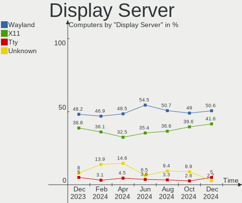
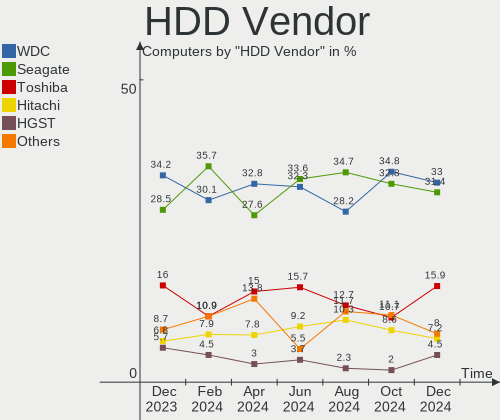
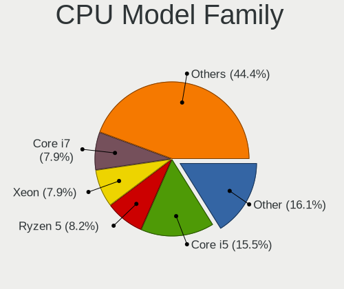
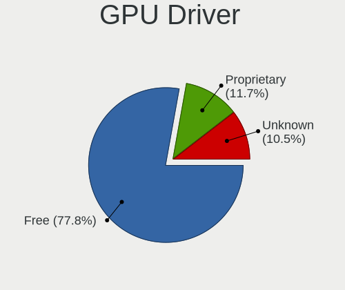
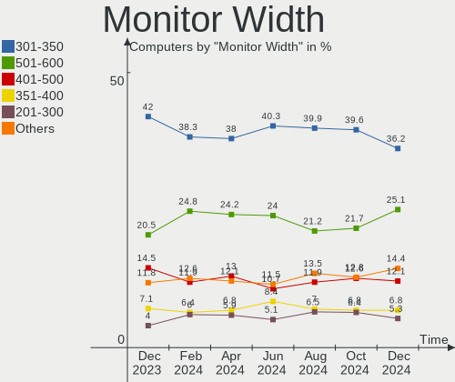
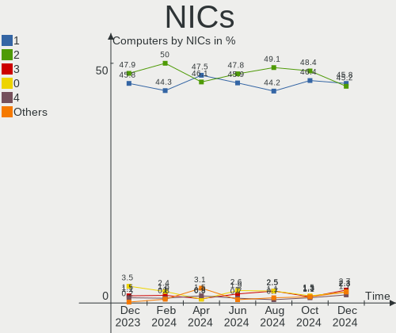
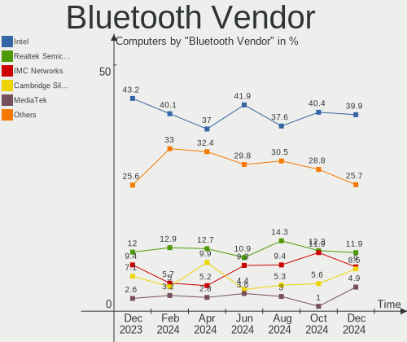
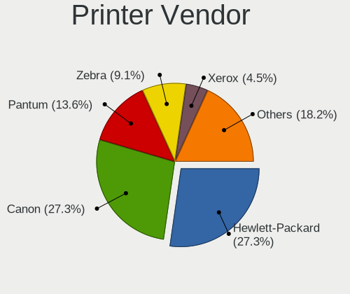
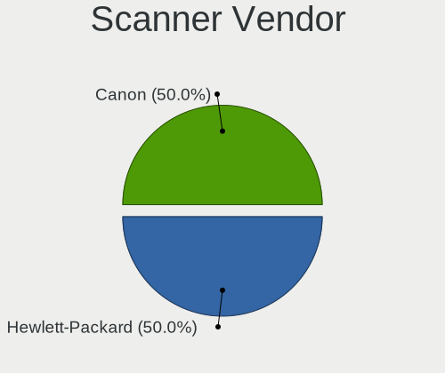

Linux in Russia - Hardware Trends
---------------------------------

A project to identify most popular hardware characteristics and track their change
over time based on data collected by Linux users at https://Linux-Hardware.org.

Anyone can contribute to this report by the [hw-probe](https://github.com/linuxhw/hw-probe) tool:

    sudo -E hw-probe -all -upload

This is a report for all computer types. See also reports for [desktops](/Location/Russia/Desktop/README.md) and [notebooks](/Location/Russia/Notebook/README.md).

Period: Jan, 2023.

Contents
--------

* [ System ](#system)
  - [ OS                       ](#os)
  - [ OS Family                ](#os-family)
  - [ Kernel                   ](#kernel)
  - [ Kernel Family            ](#kernel-family)
  - [ Kernel Major Ver.        ](#kernel-major-ver)
  - [ Arch                     ](#arch)
  - [ DE                       ](#de)
  - [ Display Server           ](#display-server)
  - [ Display Manager          ](#display-manager)
  - [ OS Lang                  ](#os-lang)
  - [ Boot Mode                ](#boot-mode)
  - [ Filesystem               ](#filesystem)
  - [ Part. scheme             ](#part-scheme)
  - [ Dual Boot with Linux/BSD ](#dual-boot-with-linuxbsd)
  - [ Dual Boot (Win)          ](#dual-boot-win)

* [ Board ](#board)
  - [ Vendor                   ](#vendor)
  - [ Model                    ](#model)
  - [ Model Family             ](#model-family)
  - [ MFG Year                 ](#mfg-year)
  - [ Form Factor              ](#form-factor)
  - [ Secure Boot              ](#secure-boot)
  - [ Coreboot                 ](#coreboot)
  - [ RAM Size                 ](#ram-size)
  - [ RAM Used                 ](#ram-used)
  - [ Total Drives             ](#total-drives)
  - [ Has CD-ROM               ](#has-cd-rom)
  - [ Has Ethernet             ](#has-ethernet)
  - [ Has WiFi                 ](#has-wifi)
  - [ Has Bluetooth            ](#has-bluetooth)

* [ Location ](#location)
  - [ Country                  ](#country)
  - [ City                     ](#city)

* [ Drives ](#drives)
  - [ Drive Vendor             ](#drive-vendor)
  - [ Drive Model              ](#drive-model)
  - [ HDD Vendor               ](#hdd-vendor)
  - [ SSD Vendor               ](#ssd-vendor)
  - [ Drive Kind               ](#drive-kind)
  - [ Drive Connector          ](#drive-connector)
  - [ Drive Size               ](#drive-size)
  - [ Space Total              ](#space-total)
  - [ Space Used               ](#space-used)
  - [ Malfunc. Drives          ](#malfunc-drives)
  - [ Malfunc. Drive Vendor    ](#malfunc-drive-vendor)
  - [ Malfunc. HDD Vendor      ](#malfunc-hdd-vendor)
  - [ Malfunc. Drive Kind      ](#malfunc-drive-kind)
  - [ Failed Drives            ](#failed-drives)
  - [ Failed Drive Vendor      ](#failed-drive-vendor)
  - [ Drive Status             ](#drive-status)

* [ Storage controller ](#storage-controller)
  - [ Storage Vendor           ](#storage-vendor)
  - [ Storage Model            ](#storage-model)
  - [ Storage Kind             ](#storage-kind)

* [ Processor ](#processor)
  - [ CPU Vendor               ](#cpu-vendor)
  - [ CPU Model                ](#cpu-model)
  - [ CPU Model Family         ](#cpu-model-family)
  - [ CPU Cores                ](#cpu-cores)
  - [ CPU Sockets              ](#cpu-sockets)
  - [ CPU Threads              ](#cpu-threads)
  - [ CPU Op-Modes             ](#cpu-op-modes)
  - [ CPU Microcode            ](#cpu-microcode)
  - [ CPU Microarch            ](#cpu-microarch)

* [ Graphics ](#graphics)
  - [ GPU Vendor               ](#gpu-vendor)
  - [ GPU Model                ](#gpu-model)
  - [ GPU Combo                ](#gpu-combo)
  - [ GPU Driver               ](#gpu-driver)
  - [ GPU Memory               ](#gpu-memory)

* [ Monitor ](#monitor)
  - [ Monitor Vendor           ](#monitor-vendor)
  - [ Monitor Model            ](#monitor-model)
  - [ Monitor Resolution       ](#monitor-resolution)
  - [ Monitor Diagonal         ](#monitor-diagonal)
  - [ Monitor Width            ](#monitor-width)
  - [ Aspect Ratio             ](#aspect-ratio)
  - [ Monitor Area             ](#monitor-area)
  - [ Pixel Density            ](#pixel-density)
  - [ Multiple Monitors        ](#multiple-monitors)

* [ Network ](#network)
  - [ Net Controller Vendor    ](#net-controller-vendor)
  - [ Net Controller Model     ](#net-controller-model)
  - [ Wireless Vendor          ](#wireless-vendor)
  - [ Wireless Model           ](#wireless-model)
  - [ Ethernet Vendor          ](#ethernet-vendor)
  - [ Ethernet Model           ](#ethernet-model)
  - [ Net Controller Kind      ](#net-controller-kind)
  - [ Used Controller          ](#used-controller)
  - [ NICs                     ](#nics)
  - [ IPv6                     ](#ipv6)

* [ Bluetooth ](#bluetooth)
  - [ Bluetooth Vendor         ](#bluetooth-vendor)
  - [ Bluetooth Model          ](#bluetooth-model)

* [ Sound ](#sound)
  - [ Sound Vendor             ](#sound-vendor)
  - [ Sound Model              ](#sound-model)

* [ Memory ](#memory)
  - [ Memory Vendor            ](#memory-vendor)
  - [ Memory Model             ](#memory-model)
  - [ Memory Kind              ](#memory-kind)
  - [ Memory Form Factor       ](#memory-form-factor)
  - [ Memory Size              ](#memory-size)
  - [ Memory Speed             ](#memory-speed)

* [ Printers & scanners ](#printers--scanners)
  - [ Printer Vendor           ](#printer-vendor)
  - [ Printer Model            ](#printer-model)
  - [ Scanner Vendor           ](#scanner-vendor)
  - [ Scanner Model            ](#scanner-model)

* [ Camera ](#camera)
  - [ Camera Vendor            ](#camera-vendor)
  - [ Camera Model             ](#camera-model)

* [ Security ](#security)
  - [ Fingerprint Vendor       ](#fingerprint-vendor)
  - [ Fingerprint Model        ](#fingerprint-model)
  - [ Chipcard Vendor          ](#chipcard-vendor)
  - [ Chipcard Model           ](#chipcard-model)

* [ Unsupported ](#unsupported)
  - [ Unsupported Devices      ](#unsupported-devices)
  - [ Unsupported Device Types ](#unsupported-device-types)

System
------

OS
--

Installed operating systems

| Name                         | Computers | Percent |
|------------------------------|-----------|---------|
| ROSA 12.3                    | 163       | 26.68%  |
| OpenMandriva 23.01           | 66        | 10.8%   |
| Debian 11                    | 42        | 6.87%   |
| Fedora 37                    | 31        | 5.07%   |
| Ubuntu 22.04                 | 27        | 4.42%   |
| Linux Mint 21.1              | 22        | 3.6%    |
| Ubuntu 22.10                 | 15        | 2.45%   |
| Red OS 7.3.2                 | 15        | 2.45%   |
| Arch Rolling                 | 15        | 2.45%   |
| ROSA R11.1                   | 13        | 2.13%   |
| ALT Linux 10.1               | 13        | 2.13%   |
| MOS 10                       | 12        | 1.96%   |
| Xubuntu 20.04                | 10        | 1.64%   |
| Red OS 7.3                   | 8         | 1.31%   |
| Ubuntu 18.04                 | 7         | 1.15%   |
| ROSA 12.2                    | 7         | 1.15%   |
| KDE neon 22.04               | 7         | 1.15%   |
| Debian                       | 7         | 1.15%   |
| OpenMandriva 4.3             | 6         | 0.98%   |
| Kubuntu 22.04                | 6         | 0.98%   |
| Ubuntu 20.04                 | 5         | 0.82%   |
| Pop!_OS 22.04                | 5         | 0.82%   |
| openSUSE Tumbleweed-XXXXXXXX | 5         | 0.82%   |
| Manjaro                      | 5         | 0.82%   |
| OpenMandriva 4.2             | 4         | 0.65%   |
| Manjaro 22.0.0               | 4         | 0.65%   |
| Linux Mint 20.3              | 4         | 0.65%   |
| ROSA 12                      | 3         | 0.49%   |
| R-Virtualization 7           | 3         | 0.49%   |
| LMDE 5                       | 3         | 0.49%   |
| Elementary 6.1               | 3         | 0.49%   |
| Zorin 16                     | 2         | 0.33%   |
| Xubuntu 22.04                | 2         | 0.33%   |
| org.kde.Platform 5.15-21.08  | 2         | 0.33%   |
| Nobara 36                    | 2         | 0.33%   |
| NixOS 23.05                  | 2         | 0.33%   |
| MX 21                        | 2         | 0.33%   |
| Manjaro 22.0                 | 2         | 0.33%   |
| Linux Mint 21                | 2         | 0.33%   |
| Kali 2022.4                  | 2         | 0.33%   |

OS Family
---------

OS without a version

| Name             | Computers | Percent |
|------------------|-----------|---------|
| ROSA             | 189       | 30.93%  |
| OpenMandriva     | 78        | 12.77%  |
| Ubuntu           | 54        | 8.84%   |
| Debian           | 50        | 8.18%   |
| Fedora           | 37        | 6.06%   |
| Linux Mint       | 30        | 4.91%   |
| ALT Linux        | 27        | 4.42%   |
| Red OS           | 24        | 3.93%   |
| Arch             | 15        | 2.45%   |
| Xubuntu          | 13        | 2.13%   |
| Manjaro          | 12        | 1.96%   |
| Kubuntu          | 7         | 1.15%   |
| KDE neon         | 7         | 1.15%   |
| openSUSE         | 6         | 0.98%   |
| Pop!_OS          | 5         | 0.82%   |
| SteamOS          | 3         | 0.49%   |
| R-Virtualization | 3         | 0.49%   |
| Nobara           | 3         | 0.49%   |
| LMDE             | 3         | 0.49%   |
| Kali             | 3         | 0.49%   |
| Elementary       | 3         | 0.49%   |
| Astra Linux      | 3         | 0.49%   |
| Zorin            | 2         | 0.33%   |
| Rocky Linux      | 2         | 0.33%   |
| PostmarketOS     | 2         | 0.33%   |
| org.kde.Platform | 2         | 0.33%   |
| NixOS            | 2         | 0.33%   |
| MX               | 2         | 0.33%   |
| Gentoo           | 2         | 0.33%   |
| Endless          | 2         | 0.33%   |
| Deepin           | 2         | 0.33%   |
| Xero             | 1         | 0.16%   |
| Ubuntu Unity     | 1         | 0.16%   |
| Ubuntu Studio    | 1         | 0.16%   |
| Ubuntu MATE      | 1         | 0.16%   |
| Solus            | 1         | 0.16%   |
| Slackware        | 1         | 0.16%   |
| RELS             | 1         | 0.16%   |
| RELD             | 1         | 0.16%   |
| Pear OS          | 1         | 0.16%   |

Kernel
------

Version of the Linux kernel

| Version                                   | Computers | Percent |
|-------------------------------------------|-----------|---------|
| 5.15.79-generic-1rosa2021.1-x86_64        | 66        | 10.8%   |
| 6.1.1-desktop-1omv2290                    | 64        | 10.47%  |
| 5.15.75-generic-1rosa2021.1-x86_64        | 46        | 7.53%   |
| 5.15.0-56-generic                         | 28        | 4.58%   |
| 5.10.0-2-amd64                            | 27        | 4.42%   |
| 5.15.0-57-generic                         | 18        | 2.95%   |
| 5.15.0-58-generic                         | 16        | 2.62%   |
| 5.10.155-generic-1rosa2021.1-x86_64       | 15        | 2.45%   |
| 5.19.0-29-generic                         | 12        | 1.96%   |
| 6.0.15-300.fc37.x86_64                    | 11        | 1.8%    |
| 5.15.78-2.el7.3.x86_64                    | 11        | 1.8%    |
| 5.4.0-138-generic                         | 9         | 1.47%   |
| 6.1.1-1-MANJARO                           | 8         | 1.31%   |
| 5.15.72-1.el7.3.x86_64                    | 8         | 1.31%   |
| 5.10.0-20-amd64                           | 8         | 1.31%   |
| 5.15.75-generic-1rosa2021.1-i686          | 7         | 1.15%   |
| 5.10.156-std-def-alt1                     | 7         | 1.15%   |
| 5.17.11-generic-2rosa2021.1-x86_64        | 6         | 0.98%   |
| 5.16.7-desktop-1omv4003                   | 6         | 0.98%   |
| 5.15.80-un-def-alt1                       | 6         | 0.98%   |
| 5.10.74-generic-2rosa2021.1-x86_64        | 6         | 0.98%   |
| 6.1.7-arch1-1                             | 5         | 0.82%   |
| 6.0.12-76060006-generic                   | 5         | 0.82%   |
| 6.1.7-200.fc37.x86_64                     | 4         | 0.65%   |
| 6.0.18-300.fc37.x86_64                    | 4         | 0.65%   |
| 5.4.0-137-generic                         | 4         | 0.65%   |
| 5.15.0-59-generic                         | 4         | 0.65%   |
| 5.10.14-desktop-1omv4002                  | 4         | 0.65%   |
| 6.1.6-200.fc37.x86_64                     | 3         | 0.49%   |
| 6.1.3-arch1-1                             | 3         | 0.49%   |
| 6.0.7-301.fc37.x86_64                     | 3         | 0.49%   |
| 6.0.12.xm1-1.klp-xanmod-rosa2021.1-x86_64 | 3         | 0.49%   |
| 5.4.83-generic-2rosa-x86_64               | 3         | 0.49%   |
| 5.4.32-generic-2rosa-i586                 | 3         | 0.49%   |
| 5.4.0-136-generic                         | 3         | 0.49%   |
| 5.4.0-135-generic                         | 3         | 0.49%   |
| 5.15.77-generic-1rosa2021.1-x86_64        | 3         | 0.49%   |
| 5.10.71-generic-1rosa2021.1-x86_64        | 3         | 0.49%   |
| 5.10.118-generic-2rosa2021.1-x86_64       | 3         | 0.49%   |
| 3.10.0-1062.12.1.rv7.131.10.1             | 3         | 0.49%   |

Kernel Family
-------------

Linux kernel without a distro release

| Version  | Computers | Percent |
|----------|-----------|---------|
| 6.1.1    | 73        | 11.95%  |
| 5.15.0   | 72        | 11.78%  |
| 5.15.79  | 67        | 10.97%  |
| 5.15.75  | 53        | 8.67%   |
| 5.10.0   | 46        | 7.53%   |
| 5.4.0    | 19        | 3.11%   |
| 5.19.0   | 17        | 2.78%   |
| 6.1.7    | 15        | 2.45%   |
| 5.10.155 | 15        | 2.45%   |
| 6.0.15   | 12        | 1.96%   |
| 6.0.0    | 12        | 1.96%   |
| 5.15.78  | 11        | 1.8%    |
| 5.15.72  | 10        | 1.64%   |
| 6.0.12   | 9         | 1.47%   |
| 6.1.4    | 8         | 1.31%   |
| 6.1.3    | 8         | 1.31%   |
| 5.15.80  | 8         | 1.31%   |
| 5.10.74  | 8         | 1.31%   |
| 5.10.156 | 7         | 1.15%   |
| 4.15.0   | 7         | 1.15%   |
| 6.1.0    | 6         | 0.98%   |
| 5.17.11  | 6         | 0.98%   |
| 5.16.7   | 6         | 0.98%   |
| 6.1.6    | 5         | 0.82%   |
| 5.4.32   | 5         | 0.82%   |
| 5.10.118 | 5         | 0.82%   |
| 3.10.0   | 5         | 0.82%   |
| 6.1.8    | 4         | 0.65%   |
| 6.1.2    | 4         | 0.65%   |
| 6.0.7    | 4         | 0.65%   |
| 6.0.18   | 4         | 0.65%   |
| 5.4.83   | 4         | 0.65%   |
| 5.15.77  | 4         | 0.65%   |
| 5.11.0   | 4         | 0.65%   |
| 5.10.14  | 4         | 0.65%   |
| 6.0.14   | 3         | 0.49%   |
| 5.15.86  | 3         | 0.49%   |
| 5.13.0   | 3         | 0.49%   |
| 5.10.71  | 3         | 0.49%   |
| 5.10.29  | 3         | 0.49%   |

Kernel Major Ver.
-----------------

Linux kernel major version

| Version | Computers | Percent |
|---------|-----------|---------|
| 5.15    | 235       | 38.46%  |
| 6.1     | 125       | 20.46%  |
| 5.10    | 100       | 16.37%  |
| 6.0     | 51        | 8.35%   |
| 5.4     | 29        | 4.75%   |
| 5.19    | 20        | 3.27%   |
| 5.16    | 9         | 1.47%   |
| 5.17    | 8         | 1.31%   |
| 4.15    | 7         | 1.15%   |
| 3.10    | 5         | 0.82%   |
| 5.14    | 4         | 0.65%   |
| 5.11    | 4         | 0.65%   |
| 5.13    | 3         | 0.49%   |
| 6.2     | 2         | 0.33%   |
| 4.9     | 2         | 0.33%   |
| 5.8     | 1         | 0.16%   |
| 5.18    | 1         | 0.16%   |
| 4.8     | 1         | 0.16%   |
| 4.19    | 1         | 0.16%   |
| 4.18    | 1         | 0.16%   |
| 3.4     | 1         | 0.16%   |
| 2.6     | 1         | 0.16%   |

Arch
----

OS architecture (x86_64, i586, etc.)

| Name        | Computers | Percent |
|-------------|-----------|---------|
| x86_64      | 584       | 95.58%  |
| i686        | 20        | 3.27%   |
| aarch64     | 3         | 0.49%   |
| armv7l      | 2         | 0.33%   |
| loongarch64 | 1         | 0.16%   |
| armv8l      | 1         | 0.16%   |

DE
--

Desktop Environment

| Name              | Computers | Percent |
|-------------------|-----------|---------|
| KDE5              | 237       | 38.79%  |
| GNOME             | 185       | 30.28%  |
| Unknown           | 47        | 7.69%   |
| MATE              | 39        | 6.38%   |
| XFCE              | 27        | 4.42%   |
| X-Cinnamon        | 24        | 3.93%   |
| LXQt              | 23        | 3.76%   |
| KDE4              | 7         | 1.15%   |
| Cinnamon          | 6         | 0.98%   |
| Pantheon          | 3         | 0.49%   |
| fly               | 2         | 0.33%   |
| Deepin            | 2         | 0.33%   |
| xmonad            | 1         | 0.16%   |
| Unity             | 1         | 0.16%   |
| steamos           | 1         | 0.16%   |
| openbox           | 1         | 0.16%   |
| LXDE              | 1         | 0.16%   |
| KDE               | 1         | 0.16%   |
| GNOME Flashback   | 1         | 0.16%   |
| awesome           | 1         | 0.16%   |
| /etc/X11/Xsession | 1         | 0.16%   |

Display Server
--------------

X11 or Wayland

| Name    | Computers | Percent |
|---------|-----------|---------|
| X11     | 345       | 56.46%  |
| Wayland | 219       | 35.84%  |
| Unknown | 35        | 5.73%   |
| Tty     | 12        | 1.96%   |

Display Manager
---------------

SDDM, LightDM, etc.

| Name    | Computers | Percent |
|---------|-----------|---------|
| SDDM    | 213       | 34.86%  |
| GDM     | 137       | 22.42%  |
| Unknown | 135       | 22.09%  |
| LightDM | 65        | 10.64%  |
| GDM3    | 47        | 7.69%   |
| KDM     | 7         | 1.15%   |
| XDM     | 2         | 0.33%   |
| FLY-DM  | 2         | 0.33%   |
| SLiM    | 1         | 0.16%   |
| Ly      | 1         | 0.16%   |
| LXDM    | 1         | 0.16%   |

OS Lang
-------

Language

| Lang    | Computers | Percent |
|---------|-----------|---------|
| ru_RU   | 466       | 76.27%  |
| en_US   | 105       | 17.18%  |
| Unknown | 27        | 4.42%   |
| C       | 4         | 0.65%   |
| en_GB   | 3         | 0.49%   |
| POSIX   | 2         | 0.33%   |
| ru_UA   | 1         | 0.16%   |
| it_IT   | 1         | 0.16%   |
| de_DE   | 1         | 0.16%   |
| ce_RU   | 1         | 0.16%   |

Boot Mode
---------

EFI or BIOS

| Mode | Computers | Percent |
|------|-----------|---------|
| EFI  | 333       | 54.5%   |
| BIOS | 278       | 45.5%   |

Filesystem
----------

Type of filesystem

| Type    | Computers | Percent |
|---------|-----------|---------|
| Ext4    | 432       | 70.7%   |
| Overlay | 98        | 16.04%  |
| Btrfs   | 73        | 11.95%  |
| Xfs     | 4         | 0.65%   |
| Zfs     | 1         | 0.16%   |
| F2fs    | 1         | 0.16%   |
| Ext3    | 1         | 0.16%   |
| Unknown | 1         | 0.16%   |

Part. scheme
------------

Scheme of partitioning

| Type    | Computers | Percent |
|---------|-----------|---------|
| GPT     | 346       | 56.63%  |
| MBR     | 176       | 28.81%  |
| Unknown | 89        | 14.57%  |

Dual Boot with Linux/BSD
------------------------

Hosting more than one Linux/BSD

| Dual boot | Computers | Percent |
|-----------|-----------|---------|
| No        | 478       | 78.23%  |
| Yes       | 133       | 21.77%  |

Dual Boot (Win)
---------------

Hosting Linux and Windows

| Dual boot | Computers | Percent |
|-----------|-----------|---------|
| No        | 379       | 62.03%  |
| Yes       | 232       | 37.97%  |

Board
-----

Vendor
------

Motherboard manufacturer

| Name                 | Computers | Percent |
|----------------------|-----------|---------|
| ASUSTek Computer     | 140       | 22.91%  |
| Gigabyte Technology  | 82        | 13.42%  |
| Lenovo               | 62        | 10.15%  |
| Hewlett-Packard      | 49        | 8.02%   |
| MSI                  | 39        | 6.38%   |
| Acer                 | 38        | 6.22%   |
| ASRock               | 37        | 6.06%   |
| Intel                | 17        | 2.78%   |
| Unknown              | 15        | 2.45%   |
| Samsung Electronics  | 11        | 1.8%    |
| Dell                 | 11        | 1.8%    |
| HUAWEI               | 9         | 1.47%   |
| Clevo                | 8         | 1.31%   |
| Timi                 | 6         | 0.98%   |
| Biostar              | 6         | 0.98%   |
| Sony                 | 5         | 0.82%   |
| Supermicro           | 4         | 0.65%   |
| Infinix              | 4         | 0.65%   |
| Huanan               | 4         | 0.65%   |
| HONOR                | 4         | 0.65%   |
| AZW                  | 4         | 0.65%   |
| Aquarius             | 4         | 0.65%   |
| Valve                | 3         | 0.49%   |
| Toshiba              | 3         | 0.49%   |
| ECS                  | 3         | 0.49%   |
| Chuwi                | 3         | 0.49%   |
| Notebook             | 2         | 0.33%   |
| Maibenben            | 2         | 0.33%   |
| Graviton             | 2         | 0.33%   |
| Digma                | 2         | 0.33%   |
| DEPO Computers       | 2         | 0.33%   |
| ZOTAC                | 1         | 0.16%   |
| ZoomSmart            | 1         | 0.16%   |
| Yadro                | 1         | 0.16%   |
| TI                   | 1         | 0.16%   |
| TECNO                | 1         | 0.16%   |
| Rockchip Electronics | 1         | 0.16%   |
| PLEXHD               | 1         | 0.16%   |
| Pegatron             | 1         | 0.16%   |
| OEM                  | 1         | 0.16%   |

Model
-----

Motherboard model

| Name                                     | Computers | Percent |
|------------------------------------------|-----------|---------|
| ASUS All Series                          | 21        | 3.44%   |
| Unknown                                  | 17        | 2.78%   |
| Gigabyte P85-D3                          | 6         | 0.98%   |
| Clevo NL41MU2                            | 5         | 0.82%   |
| MSI MS-7B89                              | 4         | 0.65%   |
| ASUS PRIME A320M-K                       | 4         | 0.65%   |
| Valve Jupiter                            | 3         | 0.49%   |
| Intel SKYBAY                             | 3         | 0.49%   |
| Infinix INBOOK X2 GEN11                  | 3         | 0.49%   |
| HP ProLiant DL360 Gen9                   | 3         | 0.49%   |
| HP Notebook                              | 3         | 0.49%   |
| Gigabyte H61M-S1                         | 3         | 0.49%   |
| Gigabyte H510M H                         | 3         | 0.49%   |
| ASUS VivoBook_ASUSLaptop X540MAR_A543MA  | 3         | 0.49%   |
| ASUS PRIME B450M-A                       | 3         | 0.49%   |
| ASUS P7H55-M                             | 3         | 0.49%   |
| ASUS M5A97 R2.0                          | 3         | 0.49%   |
| Timi Redmi Book Pro 15 2022              | 2         | 0.33%   |
| MSI MS-7C52                              | 2         | 0.33%   |
| MSI MS-7817                              | 2         | 0.33%   |
| Lenovo B570e HuronRiver Platform         | 2         | 0.33%   |
| Lenovo B560                              | 2         | 0.33%   |
| Intel X99                                | 2         | 0.33%   |
| Intel X79                                | 2         | 0.33%   |
| Intel Jasper Lake Client Platform        | 2         | 0.33%   |
| HUAWEI HVY-WXX9                          | 2         | 0.33%   |
| HUAWEI BOM-WXX9                          | 2         | 0.33%   |
| HP Pavilion dv6                          | 2         | 0.33%   |
| HP ENVY x360 Convertible 15-eu0xxx       | 2         | 0.33%   |
| Gigabyte H61M-S2PV                       | 2         | 0.33%   |
| Gigabyte GA-MA770T-UD3                   | 2         | 0.33%   |
| Gigabyte GA-MA770-UD3                    | 2         | 0.33%   |
| Gigabyte G41MT-S2                        | 2         | 0.33%   |
| Gigabyte B550M DS3H                      | 2         | 0.33%   |
| Gigabyte B450 AORUS ELITE                | 2         | 0.33%   |
| Gigabyte AB350M-DS3H V2                  | 2         | 0.33%   |
| Gigabyte A320M-S2H V2                    | 2         | 0.33%   |
| ASUS VivoBook_ASUSLaptop X7400PC_N7400PC | 2         | 0.33%   |
| ASUS VivoBook_ASUSLaptop M1503QA_M1503QA | 2         | 0.33%   |
| ASUS TUF Gaming FX505DT_FX505DT          | 2         | 0.33%   |

Model Family
------------

Motherboard model prefix

| Name               | Computers | Percent |
|--------------------|-----------|---------|
| Acer Aspire        | 30        | 4.91%   |
| ASUS All           | 21        | 3.44%   |
| Lenovo ThinkPad    | 18        | 2.95%   |
| Lenovo IdeaPad     | 17        | 2.78%   |
| ASUS PRIME         | 17        | 2.78%   |
| Unknown            | 17        | 2.78%   |
| ASUS VivoBook      | 12        | 1.96%   |
| HP ProBook         | 10        | 1.64%   |
| HP Pavilion        | 9         | 1.47%   |
| Dell Inspiron      | 7         | 1.15%   |
| Gigabyte P85-D3    | 6         | 0.98%   |
| ASUS ROG           | 6         | 0.98%   |
| HP Laptop          | 5         | 0.82%   |
| Gigabyte B450M     | 5         | 0.82%   |
| Clevo NL41MU2      | 5         | 0.82%   |
| ASUS TUF           | 5         | 0.82%   |
| MSI MS-7B89        | 4         | 0.65%   |
| Lenovo ThinkCentre | 4         | 0.65%   |
| Lenovo ThinkBook   | 4         | 0.65%   |
| Infinix INBOOK     | 4         | 0.65%   |
| Gigabyte B450      | 4         | 0.65%   |
| ASUS P8H77-V       | 4         | 0.65%   |
| ASUS P8H61-M       | 4         | 0.65%   |
| ASUS ASUS          | 4         | 0.65%   |
| Valve Jupiter      | 3         | 0.49%   |
| Toshiba Satellite  | 3         | 0.49%   |
| Timi Redmi         | 3         | 0.49%   |
| Intel X99          | 3         | 0.49%   |
| Intel SKYBAY       | 3         | 0.49%   |
| HP ProLiant        | 3         | 0.49%   |
| HP Notebook        | 3         | 0.49%   |
| HP ENVY            | 3         | 0.49%   |
| HP EliteBook       | 3         | 0.49%   |
| Gigabyte H61M-S1   | 3         | 0.49%   |
| Gigabyte H510M     | 3         | 0.49%   |
| Gigabyte B560M     | 3         | 0.49%   |
| Gigabyte A320M-S2H | 3         | 0.49%   |
| ASUS P8H61-MX      | 3         | 0.49%   |
| ASUS P7H55-M       | 3         | 0.49%   |
| ASUS P5G41T-M      | 3         | 0.49%   |

MFG Year
--------

Motherboard manufacture year

| Year    | Computers | Percent |
|---------|-----------|---------|
| 2021    | 70        | 11.46%  |
| 2022    | 68        | 11.13%  |
| 2019    | 59        | 9.66%   |
| 2012    | 55        | 9%      |
| 2020    | 54        | 8.84%   |
| 2018    | 44        | 7.2%    |
| 2013    | 43        | 7.04%   |
| 2011    | 36        | 5.89%   |
| 2010    | 33        | 5.4%    |
| 2017    | 30        | 4.91%   |
| 2014    | 30        | 4.91%   |
| 2009    | 26        | 4.26%   |
| 2008    | 17        | 2.78%   |
| 2016    | 15        | 2.45%   |
| 2015    | 11        | 1.8%    |
| 2007    | 5         | 0.82%   |
| Unknown | 5         | 0.82%   |
| 2006    | 4         | 0.65%   |
| 2005    | 4         | 0.65%   |
| 2003    | 2         | 0.33%   |

Form Factor
-----------

Physical design of the computer

| Name           | Computers | Percent |
|----------------|-----------|---------|
| Desktop        | 306       | 50.08%  |
| Notebook       | 262       | 42.88%  |
| All in one     | 10        | 1.64%   |
| Server         | 10        | 1.64%   |
| Convertible    | 7         | 1.15%   |
| Mini pc        | 7         | 1.15%   |
| System on chip | 4         | 0.65%   |
| Tablet         | 3         | 0.49%   |
| Other          | 1         | 0.16%   |
| Phone          | 1         | 0.16%   |

Secure Boot
-----------

Enabled or disabled

| State    | Computers | Percent |
|----------|-----------|---------|
| Disabled | 583       | 95.42%  |
| Enabled  | 28        | 4.58%   |

Coreboot
--------

Have coreboot on board

| Used | Computers | Percent |
|------|-----------|---------|
| No   | 611       | 100%    |

RAM Size
--------

Total RAM memory

| Size in GB      | Computers | Percent |
|-----------------|-----------|---------|
| 4.01-8.0        | 170       | 27.82%  |
| 16.01-24.0      | 120       | 19.64%  |
| 3.01-4.0        | 108       | 17.68%  |
| 8.01-16.0       | 107       | 17.51%  |
| 32.01-64.0      | 36        | 5.89%   |
| 1.01-2.0        | 30        | 4.91%   |
| 64.01-256.0     | 17        | 2.78%   |
| 24.01-32.0      | 11        | 1.8%    |
| 2.01-3.0        | 5         | 0.82%   |
| 0.51-1.0        | 5         | 0.82%   |
| More than 256.0 | 1         | 0.16%   |
| 0.01-0.5        | 1         | 0.16%   |

RAM Used
--------

Used RAM memory

| Used GB     | Computers | Percent |
|-------------|-----------|---------|
| 1.01-2.0    | 232       | 37.97%  |
| 2.01-3.0    | 131       | 21.44%  |
| 0.51-1.0    | 94        | 15.38%  |
| 4.01-8.0    | 69        | 11.29%  |
| 3.01-4.0    | 54        | 8.84%   |
| 8.01-16.0   | 14        | 2.29%   |
| 0.01-0.5    | 6         | 0.98%   |
| 16.01-24.0  | 4         | 0.65%   |
| 32.01-64.0  | 3         | 0.49%   |
| Unknown     | 2         | 0.33%   |
| 24.01-32.0  | 1         | 0.16%   |
| 64.01-256.0 | 1         | 0.16%   |

Total Drives
------------

Number of drives on board

| Drives | Computers | Percent |
|--------|-----------|---------|
| 1      | 347       | 56.79%  |
| 2      | 160       | 26.19%  |
| 3      | 50        | 8.18%   |
| 4      | 25        | 4.09%   |
| 5      | 10        | 1.64%   |
| 0      | 7         | 1.15%   |
| 28     | 3         | 0.49%   |
| 6      | 3         | 0.49%   |
| 7      | 2         | 0.33%   |
| 25     | 1         | 0.16%   |
| 11     | 1         | 0.16%   |
| 10     | 1         | 0.16%   |
| 8      | 1         | 0.16%   |

Has CD-ROM
----------

Has CD-ROM on board

| Presented | Computers | Percent |
|-----------|-----------|---------|
| No        | 465       | 76.1%   |
| Yes       | 146       | 23.9%   |

Has Ethernet
------------

Has Ethernet on board

| Presented | Computers | Percent |
|-----------|-----------|---------|
| Yes       | 529       | 86.58%  |
| No        | 82        | 13.42%  |

Has WiFi
--------

Has WiFi module

| Presented | Computers | Percent |
|-----------|-----------|---------|
| Yes       | 367       | 60.07%  |
| No        | 244       | 39.93%  |

Has Bluetooth
-------------

Has Bluetooth module

| Presented | Computers | Percent |
|-----------|-----------|---------|
| Yes       | 308       | 50.41%  |
| No        | 303       | 49.59%  |

Location
--------

Country
-------

Geographic location (country)

| Country | Computers | Percent |
|---------|-----------|---------|
| Russia  | 611       | 100%    |

City
----

Geographic location (city)

| City             | Computers | Percent |
|------------------|-----------|---------|
| Moscow           | 128       | 20.95%  |
| St Petersburg    | 56        | 9.17%   |
| Voronezh         | 49        | 8.02%   |
| Novosibirsk      | 20        | 3.27%   |
| Krasnodar        | 19        | 3.11%   |
| Chelyabinsk      | 11        | 1.8%    |
| Samara           | 10        | 1.64%   |
| Perm             | 10        | 1.64%   |
| Yekaterinburg    | 8         | 1.31%   |
| Oryol            | 8         | 1.31%   |
| Volgograd        | 7         | 1.15%   |
| Saratov          | 7         | 1.15%   |
| Yaroslavl        | 6         | 0.98%   |
| Vladivostok      | 6         | 0.98%   |
| Nizhniy Novgorod | 6         | 0.98%   |
| Murom            | 6         | 0.98%   |
| Krasnoyarsk      | 6         | 0.98%   |
| Tyumen           | 5         | 0.82%   |
| Stavropol        | 5         | 0.82%   |
| Kazan’         | 5         | 0.82%   |
| Ulyanovsk        | 4         | 0.65%   |
| Ufa              | 4         | 0.65%   |
| Tver             | 4         | 0.65%   |
| Smolensk         | 4         | 0.65%   |
| Saransk          | 4         | 0.65%   |
| Orenburg         | 4         | 0.65%   |
| Khabarovsk       | 4         | 0.65%   |
| Irkutsk          | 4         | 0.65%   |
| Cheboksary       | 4         | 0.65%   |
| Astrakhan        | 4         | 0.65%   |
| Zelenodolsk      | 3         | 0.49%   |
| Yakutsk          | 3         | 0.49%   |
| Vologda          | 3         | 0.49%   |
| Veliky Novgorod  | 3         | 0.49%   |
| Shchelkovo       | 3         | 0.49%   |
| Shakhtersk       | 3         | 0.49%   |
| Rostov-on-Don    | 3         | 0.49%   |
| Ramenskoye       | 3         | 0.49%   |
| Petrozavodsk     | 3         | 0.49%   |
| Penza            | 3         | 0.49%   |

Drives
------

Drive Vendor
------------

Hard drive vendors

| Vendor                      | Computers | Drives | Percent |
|-----------------------------|-----------|--------|---------|
| WDC                         | 155       | 189    | 16.68%  |
| Seagate                     | 131       | 188    | 14.1%   |
| Samsung Electronics         | 79        | 123    | 8.5%    |
| Kingston                    | 65        | 67     | 7%      |
| Toshiba                     | 55        | 57     | 5.92%   |
| China                       | 31        | 31     | 3.34%   |
| Hitachi                     | 29        | 52     | 3.12%   |
| Sandisk                     | 27        | 28     | 2.91%   |
| Intel                       | 22        | 25     | 2.37%   |
| Unknown                     | 20        | 23     | 2.15%   |
| SK hynix                    | 20        | 20     | 2.15%   |
| A-DATA Technology           | 18        | 21     | 1.94%   |
| Silicon Motion              | 17        | 17     | 1.83%   |
| Apacer                      | 16        | 16     | 1.72%   |
| Patriot                     | 14        | 14     | 1.51%   |
| HGST                        | 14        | 21     | 1.51%   |
| Crucial                     | 14        | 14     | 1.51%   |
| Netac                       | 13        | 17     | 1.4%    |
| SPCC                        | 12        | 13     | 1.29%   |
| Micron Technology           | 12        | 12     | 1.29%   |
| KIOXIA                      | 11        | 11     | 1.18%   |
| Unknown                     | 10        | 10     | 1.08%   |
| Smartbuy                    | 9         | 9      | 0.97%   |
| Gigabyte Technology         | 8         | 8      | 0.86%   |
| AMD                         | 8         | 8      | 0.86%   |
| Phison Electronics          | 6         | 8      | 0.65%   |
| Phison                      | 6         | 6      | 0.65%   |
| Kingston Technology Company | 6         | 6      | 0.65%   |
| GOODRAM                     | 6         | 8      | 0.65%   |
| FORESEE                     | 6         | 6      | 0.65%   |
| XrayDisk                    | 5         | 5      | 0.54%   |
| Qumo                        | 5         | 6      | 0.54%   |
| BIWIN                       | 5         | 5      | 0.54%   |
| Plextor                     | 4         | 4      | 0.43%   |
| XPG                         | 3         | 3      | 0.32%   |
| Transcend                   | 3         | 3      | 0.32%   |
| Realtek Semiconductor       | 3         | 3      | 0.32%   |
| Kingchuxing                 | 3         | 3      | 0.32%   |
| JMicron Technology          | 3         | 3      | 0.32%   |
| Team                        | 2         | 2      | 0.22%   |

Drive Model
-----------

Hard drive models

| Model                                                 | Computers | Percent |
|-------------------------------------------------------|-----------|---------|
| Toshiba DT01ACA050 500GB                              | 15        | 1.49%   |
| Kingston SA400S37240G 240GB SSD                       | 13        | 1.29%   |
| Seagate ST1000DM010-2EP102 1TB                        | 12        | 1.2%    |
| WDC WD10EZEX-00BBHA0 1TB                              | 11        | 1.1%    |
| Unknown                                               | 10        | 1%      |
| WDC WD5000AZLX-07K2TA0 500GB                          | 9         | 0.9%    |
| Kingston SA400S37120G 120GB SSD                       | 9         | 0.9%    |
| WDC WD10EZEX-08WN4A0 1TB                              | 8         | 0.8%    |
| Seagate ST500DM002-1BD142 500GB                       | 8         | 0.8%    |
| Toshiba MQ01ABF050 500GB                              | 7         | 0.7%    |
| Seagate ST1000LM035-1RK172 1TB                        | 7         | 0.7%    |
| Samsung SSD 860 EVO 250GB                             | 7         | 0.7%    |
| Samsung NVMe SSD Controller SM981/PM981/PM983 500GB   | 7         | 0.7%    |
| SK hynix BC501 NVMe Solid State Drive 512GB           | 6         | 0.6%    |
| Silicon Motion SM2263EN/SM2263XT SSD Controller 512GB | 6         | 0.6%    |
| Samsung SSD 870 EVO 500GB                             | 6         | 0.6%    |
| Samsung NVMe SSD Controller PM9A1/PM9A3/980PRO 512GB  | 6         | 0.6%    |
| Kingston SNVS500G 500GB                               | 6         | 0.6%    |
| Intel SSDPEKNU512GZ 512GB                             | 6         | 0.6%    |
| WDC WD5000AAKX-08U6AA0 500GB                          | 5         | 0.5%    |
| WDC WD2500AAJB-00J3A0 250GB                           | 5         | 0.5%    |
| Toshiba HDWD110 1TB                                   | 5         | 0.5%    |
| Smartbuy SSD 120GB                                    | 5         | 0.5%    |
| Seagate ST1000LM024 HN-M101MBB 1TB                    | 5         | 0.5%    |
| Patriot Burst Elite 120GB SSD                         | 5         | 0.5%    |
| Kingston SA400S37480G 480GB SSD                       | 5         | 0.5%    |
| China SSD 128GB                                       | 5         | 0.5%    |
| China SSD 120GB                                       | 5         | 0.5%    |
| BIWIN CE480T5D101-256 256GB                           | 5         | 0.5%    |
| WDC WDS120G2G0A-00JH30 120GB SSD                      | 4         | 0.4%    |
| Unknown MMC Card  32GB                                | 4         | 0.4%    |
| SPCC Solid State Disk 120GB                           | 4         | 0.4%    |
| Sandisk WD Black SN750 / PC SN730 NVMe SSD 1TB        | 4         | 0.4%    |
| Phison PS5013 E13 NVMe Controller 256GB               | 4         | 0.4%    |
| Netac SSD 1TB                                         | 4         | 0.4%    |
| KIOXIA KBG40ZNV256G 256GB                             | 4         | 0.4%    |
| Kingston Company A2000 NVMe SSD 1TB                   | 4         | 0.4%    |
| Kingston SUV400S37120G 120GB SSD                      | 4         | 0.4%    |
| Kingston RBUSC180DS37128GJ 128GB SSD                  | 4         | 0.4%    |
| Hitachi HDS721050CLA362 500GB                         | 4         | 0.4%    |

HDD Vendor
----------

Hard disk drive vendors

| Vendor              | Computers | Drives | Percent |
|---------------------|-----------|--------|---------|
| WDC                 | 132       | 162    | 35.11%  |
| Seagate             | 130       | 186    | 34.57%  |
| Toshiba             | 51        | 53     | 13.56%  |
| Hitachi             | 29        | 52     | 7.71%   |
| HGST                | 14        | 21     | 3.72%   |
| Samsung Electronics | 9         | 9      | 2.39%   |
| Unknown             | 3         | 3      | 0.8%    |
| Maxtor              | 2         | 2      | 0.53%   |
| Fujitsu             | 2         | 2      | 0.53%   |
| VSTORAGE            | 1         | 1      | 0.27%   |
| Lenovo              | 1         | 8      | 0.27%   |
| FreeBSD             | 1         | 1      | 0.27%   |
| External            | 1         | 1      | 0.27%   |

SSD Vendor
----------

Solid state drive vendors

| Vendor              | Computers | Drives | Percent |
|---------------------|-----------|--------|---------|
| Kingston            | 48        | 50     | 14.72%  |
| Samsung Electronics | 35        | 71     | 10.74%  |
| China               | 31        | 31     | 9.51%   |
| WDC                 | 16        | 16     | 4.91%   |
| A-DATA Technology   | 16        | 17     | 4.91%   |
| SanDisk             | 14        | 14     | 4.29%   |
| Patriot             | 14        | 14     | 4.29%   |
| Apacer              | 13        | 13     | 3.99%   |
| SPCC                | 12        | 13     | 3.68%   |
| Intel               | 12        | 14     | 3.68%   |
| Crucial             | 11        | 11     | 3.37%   |
| Netac               | 10        | 13     | 3.07%   |
| Unknown             | 9         | 9      | 2.76%   |
| Smartbuy            | 7         | 7      | 2.15%   |
| GOODRAM             | 6         | 8      | 1.84%   |
| AMD                 | 6         | 6      | 1.84%   |
| XrayDisk            | 5         | 5      | 1.53%   |
| Qumo                | 5         | 6      | 1.53%   |
| Micron Technology   | 5         | 5      | 1.53%   |
| Toshiba             | 4         | 4      | 1.23%   |
| Plextor             | 4         | 4      | 1.23%   |
| Gigabyte Technology | 4         | 4      | 1.23%   |
| Transcend           | 2         | 2      | 0.61%   |
| Team                | 2         | 2      | 0.61%   |
| NGFF                | 2         | 2      | 0.61%   |
| Kllisre             | 2         | 2      | 0.61%   |
| KingSpec            | 2         | 2      | 0.61%   |
| KingDian            | 2         | 2      | 0.61%   |
| Kingchuxing         | 2         | 2      | 0.61%   |
| JMicron Technology  | 2         | 2      | 0.61%   |
| GS                  | 2         | 2      | 0.61%   |
| Fanxiang            | 2         | 2      | 0.61%   |
| AXIOMTEK            | 2         | 2      | 0.61%   |
| SK hynix            | 1         | 1      | 0.31%   |
| Seagate             | 1         | 1      | 0.31%   |
| s60                 | 1         | 1      | 0.31%   |
| PNY                 | 1         | 1      | 0.31%   |
| Palit               | 1         | 1      | 0.31%   |
| OCZ                 | 1         | 1      | 0.31%   |
| MSATA 32            | 1         | 1      | 0.31%   |

Drive Kind
----------

HDD or SSD

| Kind    | Computers | Drives | Percent |
|---------|-----------|--------|---------|
| HDD     | 329       | 501    | 38.93%  |
| SSD     | 285       | 374    | 33.73%  |
| NVMe    | 202       | 220    | 23.91%  |
| MMC     | 20        | 23     | 2.37%   |
| Unknown | 9         | 9      | 1.07%   |

Drive Connector
---------------

SATA, SAS, NVMe, etc.

| Type | Computers | Drives | Percent |
|------|-----------|--------|---------|
| SATA | 473       | 841    | 66.43%  |
| NVMe | 201       | 219    | 28.23%  |
| MMC  | 20        | 23     | 2.81%   |
| SAS  | 18        | 44     | 2.53%   |

Drive Size
----------

Size of hard drive

| Size in TB | Computers | Drives | Percent |
|------------|-----------|--------|---------|
| 0.01-0.5   | 387       | 546    | 63.76%  |
| 0.51-1.0   | 157       | 185    | 25.86%  |
| 1.01-2.0   | 38        | 86     | 6.26%   |
| 2.01-3.0   | 11        | 33     | 1.81%   |
| 4.01-10.0  | 8         | 18     | 1.32%   |
| 3.01-4.0   | 6         | 7      | 0.99%   |

Space Total
-----------

Amount of disk space available on the file system

| Size in GB     | Computers | Percent |
|----------------|-----------|---------|
| 101-250        | 174       | 28.48%  |
| 251-500        | 139       | 22.75%  |
| 1-20           | 65        | 10.64%  |
| 501-1000       | 65        | 10.64%  |
| 1001-2000      | 43        | 7.04%   |
| 51-100         | 41        | 6.71%   |
| Unknown        | 36        | 5.89%   |
| 21-50          | 19        | 3.11%   |
| More than 3000 | 17        | 2.78%   |
| 2001-3000      | 12        | 1.96%   |

Space Used
----------

Amount of used disk space

| Used GB        | Computers | Percent |
|----------------|-----------|---------|
| 1-20           | 275       | 45.01%  |
| 21-50          | 93        | 15.22%  |
| 101-250        | 76        | 12.44%  |
| 51-100         | 49        | 8.02%   |
| 251-500        | 39        | 6.38%   |
| Unknown        | 36        | 5.89%   |
| 501-1000       | 23        | 3.76%   |
| 1001-2000      | 10        | 1.64%   |
| More than 3000 | 7         | 1.15%   |
| 2001-3000      | 3         | 0.49%   |

Malfunc. Drives
---------------

Drive models with a malfunction

| Model                                | Computers | Drives | Percent |
|--------------------------------------|-----------|--------|---------|
| Unknown                              | 4         | 4      | 3.08%   |
| WDC WD5000AAKX-08U6AA0 500GB         | 3         | 3      | 2.31%   |
| Seagate ST500DM002-1BD142 500GB      | 3         | 3      | 2.31%   |
| WDC WD10EZEX-08WN4A0 1TB             | 2         | 2      | 1.54%   |
| Toshiba MQ01ABF050 500GB             | 2         | 2      | 1.54%   |
| SK hynix BC711 HFM512GD3JX013N 512GB | 2         | 2      | 1.54%   |
| Seagate STM3250318AS 250GB           | 2         | 2      | 1.54%   |
| Seagate ST9250315AS 250GB            | 2         | 2      | 1.54%   |
| Seagate ST500LM012 HN-M500MBB 500GB  | 2         | 2      | 1.54%   |
| Seagate ST3808110AS 80GB             | 2         | 2      | 1.54%   |
| Seagate ST3320613AS 320GB            | 2         | 2      | 1.54%   |
| Seagate ST3250310AS 250GB            | 2         | 2      | 1.54%   |
| Seagate ST3120022A 120GB             | 2         | 2      | 1.54%   |
| Seagate ST1000LM024 HN-M101MBB 1TB   | 2         | 2      | 1.54%   |
| Seagate ST1000DM010-2EP102 1TB       | 2         | 2      | 1.54%   |
| Hitachi HTS541680J9SA00 80GB         | 2         | 2      | 1.54%   |
| XPG GAMMIX S5 256GB                  | 1         | 1      | 0.77%   |
| XPG GAMMIX S11 Pro 1TB               | 1         | 1      | 0.77%   |
| WDC WDS240G2G0A-00JH30 240GB SSD     | 1         | 1      | 0.77%   |
| WDC WDS120G2G0A-00JH30 120GB SSD     | 1         | 1      | 0.77%   |
| WDC WD7500BPVT-24HXZT3 752GB         | 1         | 1      | 0.77%   |
| WDC WD5001AALS-00L3B2 500GB          | 1         | 1      | 0.77%   |
| WDC WD5000LPCX-21VHAT0 500GB         | 1         | 1      | 0.77%   |
| WDC WD5000AZRX-00A8LB0 500GB         | 1         | 1      | 0.77%   |
| WDC WD5000AAKX-08ERMA0 500GB         | 1         | 1      | 0.77%   |
| WDC WD5000AAKX-001CA0 500GB          | 1         | 1      | 0.77%   |
| WDC WD5000AAKS-22V1A0 500GB          | 1         | 1      | 0.77%   |
| WDC WD5000AAKS-00UU3A0 500GB         | 1         | 1      | 0.77%   |
| WDC WD5000AAKS-007AA0 500GB          | 1         | 1      | 0.77%   |
| WDC WD30EZRX-00D8PB0 3TB             | 1         | 1      | 0.77%   |
| WDC WD2500BEVT-60ZCT1 250GB          | 1         | 1      | 0.77%   |
| WDC WD2500AAKX-001CA0 250GB          | 1         | 1      | 0.77%   |
| WDC WD2500AAJS-22L7A0 250GB          | 1         | 1      | 0.77%   |
| WDC WD2500AAJB-00J3A0 250GB          | 1         | 1      | 0.77%   |
| WDC WD20EZRX-00DC0B0 2TB             | 1         | 1      | 0.77%   |
| WDC WD20EARS-00MVWB0 2TB             | 1         | 1      | 0.77%   |
| WDC WD1600BEVT-22ZCT0 160GB          | 1         | 1      | 0.77%   |
| WDC WD10JPVX-22JC3T0 1TB             | 1         | 1      | 0.77%   |
| WDC WD10EZEX-60ZF5A0 1TB             | 1         | 1      | 0.77%   |
| WDC WD10EZEX-00ER1A0 1TB             | 1         | 1      | 0.77%   |

Malfunc. Drive Vendor
---------------------

Vendors of faulty drives

| Vendor                       | Computers | Drives | Percent |
|------------------------------|-----------|--------|---------|
| Seagate                      | 47        | 50     | 37.3%   |
| WDC                          | 27        | 28     | 21.43%  |
| Hitachi                      | 9         | 9      | 7.14%   |
| Toshiba                      | 8         | 8      | 6.35%   |
| HGST                         | 5         | 5      | 3.97%   |
| Unknown                      | 4         | 4      | 3.17%   |
| SK hynix                     | 3         | 3      | 2.38%   |
| Kingston                     | 3         | 3      | 2.38%   |
| China                        | 3         | 3      | 2.38%   |
| XPG                          | 2         | 2      | 1.59%   |
| Samsung Electronics          | 2         | 2      | 1.59%   |
| Fujitsu                      | 2         | 2      | 1.59%   |
| Shenzhen Longsys Electronics | 1         | 1      | 0.79%   |
| s60                          | 1         | 1      | 0.79%   |
| PNY                          | 1         | 1      | 0.79%   |
| Plextor                      | 1         | 1      | 0.79%   |
| Patriot                      | 1         | 1      | 0.79%   |
| Netac                        | 1         | 1      | 0.79%   |
| LITEON                       | 1         | 1      | 0.79%   |
| Intel                        | 1         | 1      | 0.79%   |
| Apacer                       | 1         | 1      | 0.79%   |
| AMD                          | 1         | 1      | 0.79%   |
| A-DATA Technology            | 1         | 1      | 0.79%   |

Malfunc. HDD Vendor
-------------------

Vendors of faulty HDD drives

| Vendor  | Computers | Drives | Percent |
|---------|-----------|--------|---------|
| Seagate | 47        | 50     | 48.96%  |
| WDC     | 25        | 26     | 26.04%  |
| Hitachi | 9         | 9      | 9.38%   |
| Toshiba | 8         | 8      | 8.33%   |
| HGST    | 5         | 5      | 5.21%   |
| Fujitsu | 2         | 2      | 2.08%   |

Malfunc. Drive Kind
-------------------

Kinds of faulty drives

| Kind | Computers | Drives | Percent |
|------|-----------|--------|---------|
| HDD  | 87        | 100    | 74.36%  |
| SSD  | 24        | 24     | 20.51%  |
| NVMe | 6         | 6      | 5.13%   |

Failed Drives
-------------

Failed drive models

| Model                           | Computers | Drives | Percent |
|---------------------------------|-----------|--------|---------|
| WDC WD7501AALS-00J7B0 752GB     | 1         | 1      | 25%     |
| Seagate ST250DM000-1BD141 250GB | 1         | 1      | 25%     |
| Intel SSDPEKKW256G7 256GB       | 1         | 1      | 25%     |
| Hitachi HTS545050A7E380 500GB   | 1         | 1      | 25%     |

Failed Drive Vendor
-------------------

Failed drive vendors

| Vendor  | Computers | Drives | Percent |
|---------|-----------|--------|---------|
| WDC     | 1         | 1      | 25%     |
| Seagate | 1         | 1      | 25%     |
| Intel   | 1         | 1      | 25%     |
| Hitachi | 1         | 1      | 25%     |

Drive Status
------------

Number of failed and malfunc. drives

| Status   | Computers | Drives | Percent |
|----------|-----------|--------|---------|
| Works    | 421       | 752    | 61.19%  |
| Detected | 149       | 241    | 21.66%  |
| Malfunc  | 114       | 130    | 16.57%  |
| Failed   | 4         | 4      | 0.58%   |

Storage controller
------------------

Storage Vendor
--------------

Storage controller vendors

| Vendor                           | Computers | Percent |
|----------------------------------|-----------|---------|
| Intel                            | 403       | 50.88%  |
| AMD                              | 131       | 16.54%  |
| Samsung Electronics              | 40        | 5.05%   |
| Silicon Motion                   | 26        | 3.28%   |
| Kingston Technology Company      | 23        | 2.9%    |
| SanDisk                          | 22        | 2.78%   |
| SK hynix                         | 19        | 2.4%    |
| Phison Electronics               | 16        | 2.02%   |
| ASMedia Technology               | 13        | 1.64%   |
| KIOXIA                           | 11        | 1.39%   |
| JMicron Technology               | 11        | 1.39%   |
| Nvidia                           | 10        | 1.26%   |
| Marvell Technology Group         | 9         | 1.14%   |
| Shenzhen Longsys Electronics     | 7         | 0.88%   |
| Micron Technology                | 7         | 0.88%   |
| Realtek Semiconductor            | 5         | 0.63%   |
| INNOGRIT                         | 5         | 0.63%   |
| ADATA Technology                 | 5         | 0.63%   |
| VIA Technologies                 | 4         | 0.51%   |
| Solid State Storage Technology   | 4         | 0.51%   |
| Micron/Crucial Technology        | 3         | 0.38%   |
| Hewlett-Packard                  | 3         | 0.38%   |
| Silicon Integrated Systems [SiS] | 2         | 0.25%   |
| O2 Micro                         | 2         | 0.25%   |
| Netac Technology                 | 2         | 0.25%   |
| MAXIO Technology (Hangzhou)      | 2         | 0.25%   |
| LSI Logic / Symbios Logic        | 2         | 0.25%   |
| Union Memory (Shenzhen)          | 1         | 0.13%   |
| Silicon Image                    | 1         | 0.13%   |
| Loongson Technology              | 1         | 0.13%   |
| Broadcom / LSI                   | 1         | 0.13%   |
| Adaptec                          | 1         | 0.13%   |

Storage Model
-------------

Storage controller models

| Model                                                                                   | Computers | Percent |
|-----------------------------------------------------------------------------------------|-----------|---------|
| AMD FCH SATA Controller [AHCI mode]                                                     | 81        | 8.79%   |
| Intel 8 Series/C220 Series Chipset Family 6-port SATA Controller 1 [AHCI mode]          | 35        | 3.8%    |
| AMD 400 Series Chipset SATA Controller                                                  | 27        | 2.93%   |
| Silicon Motion SM2263EN/SM2263XT SSD Controller                                         | 20        | 2.17%   |
| Intel 7 Series Chipset Family 6-port SATA Controller [AHCI mode]                        | 20        | 2.17%   |
| Intel NM10/ICH7 Family SATA Controller [IDE mode]                                       | 17        | 1.85%   |
| Intel 500 Series Chipset Family SATA AHCI Controller                                    | 17        | 1.85%   |
| Samsung NVMe SSD Controller SM981/PM981/PM983                                           | 16        | 1.74%   |
| Intel Sunrise Point-LP SATA Controller [AHCI mode]                                      | 16        | 1.74%   |
| Intel 82801G (ICH7 Family) IDE Controller                                               | 16        | 1.74%   |
| Intel 6 Series/C200 Series Chipset Family 6 port Mobile SATA AHCI Controller            | 16        | 1.74%   |
| AMD SB7x0/SB8x0/SB9x0 SATA Controller [AHCI mode]                                       | 16        | 1.74%   |
| Intel Comet Lake SATA AHCI Controller                                                   | 14        | 1.52%   |
| Intel Celeron/Pentium Silver Processor SATA Controller                                  | 14        | 1.52%   |
| Intel Atom Processor E3800 Series SATA AHCI Controller                                  | 14        | 1.52%   |
| Intel 6 Series/C200 Series Chipset Family 6 port Desktop SATA AHCI Controller           | 14        | 1.52%   |
| Samsung NVMe SSD Controller 980                                                         | 13        | 1.41%   |
| AMD SB7x0/SB8x0/SB9x0 IDE Controller                                                    | 13        | 1.41%   |
| Kingston Company Company Non-Volatile memory controller                                 | 12        | 1.3%    |
| Intel Volume Management Device NVMe RAID Controller                                     | 12        | 1.3%    |
| Intel Tiger Lake-LP SATA Controller                                                     | 12        | 1.3%    |
| Intel Alder Lake-S PCH SATA Controller [AHCI Mode]                                      | 12        | 1.3%    |
| Intel 7 Series/C210 Series Chipset Family 6-port SATA Controller [AHCI mode]            | 12        | 1.3%    |
| Intel 6 Series/C200 Series Chipset Family Desktop SATA Controller (IDE mode, ports 4-5) | 12        | 1.3%    |
| Intel 6 Series/C200 Series Chipset Family Desktop SATA Controller (IDE mode, ports 0-3) | 12        | 1.3%    |
| ASMedia ASM1062 Serial ATA Controller                                                   | 12        | 1.3%    |
| Intel 200 Series PCH SATA controller [AHCI mode]                                        | 11        | 1.19%   |
| Intel Cannon Lake PCH SATA AHCI Controller                                              | 10        | 1.09%   |
| AMD FCH SATA Controller D                                                               | 10        | 1.09%   |
| KIOXIA NVMe SSD Controller BG4                                                          | 9         | 0.98%   |
| Phison PS5013 E13 NVMe Controller                                                       | 8         | 0.87%   |
| Intel Q170/Q150/B150/H170/H110/Z170/CM236 Chipset SATA Controller [AHCI Mode]           | 8         | 0.87%   |
| AMD SB7x0/SB8x0/SB9x0 SATA Controller [IDE mode]                                        | 8         | 0.87%   |
| SK hynix Gold P31/PC711 NVMe Solid State Drive                                          | 7         | 0.76%   |
| SanDisk WD Blue SN550 NVMe SSD                                                          | 7         | 0.76%   |
| Samsung NVMe SSD Controller PM9A1/PM9A3/980PRO                                          | 7         | 0.76%   |
| Micron Non-Volatile memory controller                                                   | 7         | 0.76%   |
| Intel Jasper Lake SATA AHCI Controller                                                  | 7         | 0.76%   |
| Intel Celeron N3350/Pentium N4200/Atom E3900 Series SATA AHCI Controller                | 7         | 0.76%   |
| Intel Cannon Point-LP SATA Controller [AHCI Mode]                                       | 7         | 0.76%   |

Storage Kind
------------

Kind of storage controller (IDE, SATA, NVMe, SAS, ...)

| Kind | Computers | Percent |
|------|-----------|---------|
| SATA | 456       | 57.94%  |
| NVMe | 201       | 25.54%  |
| IDE  | 96        | 12.2%   |
| RAID | 29        | 3.68%   |
| SAS  | 5         | 0.64%   |

Processor
---------

CPU Vendor
----------

Processor vendors

| Vendor   | Computers | Percent |
|----------|-----------|---------|
| Intel    | 432       | 70.7%   |
| AMD      | 172       | 28.15%  |
| ARM      | 5         | 0.82%   |
| Qualcomm | 1         | 0.16%   |
| Loongson | 1         | 0.16%   |

CPU Model
---------

Processor models

| Model                                         | Computers | Percent |
|-----------------------------------------------|-----------|---------|
| Intel Celeron CPU J1800 @ 2.41GHz             | 11        | 1.8%    |
| Intel 11th Gen Core i5-1135G7 @ 2.40GHz       | 10        | 1.64%   |
| AMD Ryzen 5 5500U with Radeon Graphics        | 7         | 1.15%   |
| AMD Ryzen 5 2600 Six-Core Processor           | 7         | 1.15%   |
| Intel Core i5-3210M CPU @ 2.50GHz             | 6         | 0.98%   |
| AMD Ryzen 7 5800H with Radeon Graphics        | 6         | 0.98%   |
| AMD Ryzen 5 4600H with Radeon Graphics        | 6         | 0.98%   |
| Intel Core i5-4440 CPU @ 3.10GHz              | 5         | 0.82%   |
| Intel Core i5-10400 CPU @ 2.90GHz             | 5         | 0.82%   |
| Intel Core i3-6006U CPU @ 2.00GHz             | 5         | 0.82%   |
| Intel Core 2 Duo CPU E7500 @ 2.93GHz          | 5         | 0.82%   |
| AMD Ryzen 5 3500U with Radeon Vega Mobile Gfx | 5         | 0.82%   |
| Intel Xeon CPU E5-2680 v4 @ 2.40GHz           | 4         | 0.65%   |
| Intel Core i5-8265U CPU @ 1.60GHz             | 4         | 0.65%   |
| Intel Core i5-8250U CPU @ 1.60GHz             | 4         | 0.65%   |
| Intel Core i3-4160 CPU @ 3.60GHz              | 4         | 0.65%   |
| Intel Core i3-4130 CPU @ 3.40GHz              | 4         | 0.65%   |
| Intel Core i3-2100 CPU @ 3.10GHz              | 4         | 0.65%   |
| Intel 12th Gen Core i5-12400                  | 4         | 0.65%   |
| Intel 11th Gen Core i3-1115G4 @ 3.00GHz       | 4         | 0.65%   |
| AMD Ryzen 5 5600G with Radeon Graphics        | 4         | 0.65%   |
| AMD Ryzen 5 3600 6-Core Processor             | 4         | 0.65%   |
| Intel Pentium Gold G6405 CPU @ 4.10GHz        | 3         | 0.49%   |
| Intel Pentium CPU P6100 @ 2.00GHz             | 3         | 0.49%   |
| Intel Core i7-2600K CPU @ 3.40GHz             | 3         | 0.49%   |
| Intel Core i5-4200M CPU @ 2.50GHz             | 3         | 0.49%   |
| Intel Core i5-3470 CPU @ 3.20GHz              | 3         | 0.49%   |
| Intel Core i5-3450 CPU @ 3.10GHz              | 3         | 0.49%   |
| Intel Core i5-3230M CPU @ 2.60GHz             | 3         | 0.49%   |
| Intel Core i5-2430M CPU @ 2.40GHz             | 3         | 0.49%   |
| Intel Core i3-8100 CPU @ 3.60GHz              | 3         | 0.49%   |
| Intel Core i3-6100TE CPU @ 2.70GHz            | 3         | 0.49%   |
| Intel Core i3-2350M CPU @ 2.30GHz             | 3         | 0.49%   |
| Intel Core i3-10110U CPU @ 2.10GHz            | 3         | 0.49%   |
| Intel Celeron N5095 @ 2.00GHz                 | 3         | 0.49%   |
| Intel Celeron N4020 CPU @ 1.10GHz             | 3         | 0.49%   |
| Intel Celeron J4125 CPU @ 2.00GHz             | 3         | 0.49%   |
| Intel Celeron CPU N3350 @ 1.10GHz             | 3         | 0.49%   |
| Intel 12th Gen Core i7-12700H                 | 3         | 0.49%   |
| Intel 11th Gen Core i5-1155G7 @ 2.50GHz       | 3         | 0.49%   |

CPU Model Family
----------------

Processor model prefix

| Model                   | Computers | Percent |
|-------------------------|-----------|---------|
| Intel Core i5           | 98        | 16.04%  |
| Intel Core i3           | 72        | 11.78%  |
| Other                   | 62        | 10.15%  |
| AMD Ryzen 5             | 58        | 9.49%   |
| Intel Celeron           | 48        | 7.86%   |
| Intel Core i7           | 32        | 5.24%   |
| Intel Pentium           | 28        | 4.58%   |
| Intel Xeon              | 27        | 4.42%   |
| AMD Ryzen 7             | 26        | 4.26%   |
| Intel Core 2 Duo        | 20        | 3.27%   |
| AMD Ryzen 3             | 13        | 2.13%   |
| Intel Atom              | 11        | 1.8%    |
| Intel Pentium Gold      | 8         | 1.31%   |
| Intel Pentium Dual-Core | 7         | 1.15%   |
| AMD FX                  | 6         | 0.98%   |
| Intel Pentium Silver    | 5         | 0.82%   |
| AMD Ryzen 9             | 5         | 0.82%   |
| AMD Ryzen 7 PRO         | 5         | 0.82%   |
| AMD A8                  | 5         | 0.82%   |
| AMD A4                  | 5         | 0.82%   |
| Intel Pentium M         | 4         | 0.65%   |
| Intel Core 2 Quad       | 4         | 0.65%   |
| AMD Phenom II X6        | 4         | 0.65%   |
| AMD Phenom II X4        | 4         | 0.65%   |
| AMD Athlon II X2        | 4         | 0.65%   |
| AMD A6                  | 4         | 0.65%   |
| AMD A10                 | 4         | 0.65%   |
| Intel Pentium Dual      | 3         | 0.49%   |
| AMD Athlon 64 X2        | 3         | 0.49%   |
| Intel Xeon Silver       | 2         | 0.33%   |
| Intel Pentium 4         | 2         | 0.33%   |
| Intel Genuine           | 2         | 0.33%   |
| Intel Core 2            | 2         | 0.33%   |
| AMD Ryzen 5 PRO         | 2         | 0.33%   |
| AMD Ryzen 3 PRO         | 2         | 0.33%   |
| AMD Phenom II X3        | 2         | 0.33%   |
| AMD E1                  | 2         | 0.33%   |
| AMD Athlon X2           | 2         | 0.33%   |
| AMD Athlon II X4        | 2         | 0.33%   |
| AMD Athlon              | 2         | 0.33%   |

CPU Cores
---------

Number of processor cores

| Number | Computers | Percent |
|--------|-----------|---------|
| 2      | 230       | 37.64%  |
| 4      | 194       | 31.75%  |
| 6      | 89        | 14.57%  |
| 8      | 49        | 8.02%   |
| 1      | 21        | 3.44%   |
| 14     | 6         | 0.98%   |
| 10     | 5         | 0.82%   |
| 3      | 5         | 0.82%   |
| 24     | 4         | 0.65%   |
| 28     | 3         | 0.49%   |
| 12     | 3         | 0.49%   |
| 56     | 1         | 0.16%   |
| 16     | 1         | 0.16%   |

CPU Sockets
-----------

Number of sockets

| Number | Computers | Percent |
|--------|-----------|---------|
| 1      | 601       | 98.36%  |
| 2      | 9         | 1.47%   |
| 3      | 1         | 0.16%   |

CPU Threads
-----------

Threads per core (Hyper-Threading)

| Number | Computers | Percent |
|--------|-----------|---------|
| 2      | 372       | 60.88%  |
| 1      | 239       | 39.12%  |

CPU Op-Modes
------------

CPU Operation Modes (32-bit, 64-bit)

| Op mode        | Computers | Percent |
|----------------|-----------|---------|
| 32-bit, 64-bit | 598       | 97.87%  |
| 32-bit         | 8         | 1.31%   |
| Unknown        | 4         | 0.65%   |
| 64-bit         | 1         | 0.16%   |

CPU Microcode
-------------

Microcode number

| Number     | Computers | Percent |
|------------|-----------|---------|
| Unknown    | 89        | 14.57%  |
| 0x206a7    | 41        | 6.71%   |
| 0x306c3    | 36        | 5.89%   |
| 0x306a9    | 26        | 4.26%   |
| 0x806c1    | 20        | 3.27%   |
| 0x1067a    | 20        | 3.27%   |
| 0xa0653    | 17        | 2.78%   |
| 0x906ea    | 12        | 1.96%   |
| 0x0a50000c | 12        | 1.96%   |
| 0x806ea    | 11        | 1.8%    |
| 0x0800820d | 11        | 1.8%    |
| 0x30679    | 10        | 1.64%   |
| 0x806ec    | 9         | 1.47%   |
| 0x706a8    | 9         | 1.47%   |
| 0x0a50000d | 9         | 1.47%   |
| 0x906c0    | 8         | 1.31%   |
| 0x20655    | 8         | 1.31%   |
| 0x08608103 | 8         | 1.31%   |
| 0x08600106 | 8         | 1.31%   |
| 0x6fd      | 7         | 1.15%   |
| 0x406e3    | 7         | 1.15%   |
| 0x08701021 | 7         | 1.15%   |
| 0x08101016 | 7         | 1.15%   |
| 0xa0671    | 6         | 0.98%   |
| 0x906eb    | 6         | 0.98%   |
| 0x90675    | 6         | 0.98%   |
| 0x08108109 | 6         | 0.98%   |
| 0x08108102 | 6         | 0.98%   |
| 0x06001119 | 6         | 0.98%   |
| 0x906e9    | 5         | 0.82%   |
| 0x90672    | 5         | 0.82%   |
| 0x706e5    | 5         | 0.82%   |
| 0x706a1    | 5         | 0.82%   |
| 0x506e3    | 5         | 0.82%   |
| 0x406f1    | 5         | 0.82%   |
| 0x40651    | 5         | 0.82%   |
| 0x30678    | 5         | 0.82%   |
| 0x106ca    | 5         | 0.82%   |
| 0x10676    | 5         | 0.82%   |
| 0x906a3    | 4         | 0.65%   |

CPU Microarch
-------------

Microarchitecture

| Name             | Computers | Percent |
|------------------|-----------|---------|
| KabyLake         | 61        | 9.98%   |
| Haswell          | 51        | 8.35%   |
| SandyBridge      | 49        | 8.02%   |
| IvyBridge        | 36        | 5.89%   |
| Unknown          | 35        | 5.73%   |
| Zen 3            | 33        | 5.4%    |
| Zen+             | 28        | 4.58%   |
| Penryn           | 28        | 4.58%   |
| Zen 2            | 24        | 3.93%   |
| TigerLake        | 24        | 3.93%   |
| CometLake        | 24        | 3.93%   |
| Silvermont       | 20        | 3.27%   |
| Skylake          | 19        | 3.11%   |
| K10              | 19        | 3.11%   |
| Alderlake Hybrid | 17        | 2.78%   |
| Goldmont plus    | 14        | 2.29%   |
| Piledriver       | 13        | 2.13%   |
| Core             | 13        | 2.13%   |
| Zen              | 12        | 1.96%   |
| IceLake          | 12        | 1.96%   |
| Westmere         | 11        | 1.8%    |
| Broadwell        | 9         | 1.47%   |
| Bonnell          | 9         | 1.47%   |
| Tremont          | 8         | 1.31%   |
| Excavator        | 8         | 1.31%   |
| Goldmont         | 7         | 1.15%   |
| Nehalem          | 5         | 0.82%   |
| P6               | 4         | 0.65%   |
| K8 Hammer        | 4         | 0.65%   |
| Jaguar           | 4         | 0.65%   |
| NetBurst         | 3         | 0.49%   |
| K10 Llano        | 3         | 0.49%   |
| Puma             | 1         | 0.16%   |
| K8 & K10 hybrid  | 1         | 0.16%   |
| Bulldozer        | 1         | 0.16%   |
| Bobcat           | 1         | 0.16%   |

Graphics
--------

GPU Vendor
----------

Vendors of graphics cards

| Vendor                           | Computers | Percent |
|----------------------------------|-----------|---------|
| Intel                            | 313       | 44.91%  |
| Nvidia                           | 194       | 27.83%  |
| AMD                              | 178       | 25.54%  |
| Matrox Electronics Systems       | 6         | 0.86%   |
| ASPEED Technology                | 4         | 0.57%   |
| Silicon Integrated Systems [SiS] | 1         | 0.14%   |
| Loongson Technology              | 1         | 0.14%   |

GPU Model
---------

Graphics card models

| Model                                                                                    | Computers | Percent |
|------------------------------------------------------------------------------------------|-----------|---------|
| Intel 2nd Generation Core Processor Family Integrated Graphics Controller                | 31        | 4.29%   |
| AMD Cezanne [Radeon Vega Series / Radeon Vega Mobile Series]                             | 21        | 2.9%    |
| Intel TigerLake-LP GT2 [Iris Xe Graphics]                                                | 17        | 2.35%   |
| Intel 3rd Gen Core processor Graphics Controller                                         | 16        | 2.21%   |
| Intel Atom Processor Z36xxx/Z37xxx Series Graphics & Display                             | 15        | 2.07%   |
| AMD Picasso/Raven 2 [Radeon Vega Series / Radeon Vega Mobile Series]                     | 13        | 1.8%    |
| AMD Renoir                                                                               | 12        | 1.66%   |
| AMD Ellesmere [Radeon RX 470/480/570/570X/580/580X/590]                                  | 12        | 1.66%   |
| Intel Xeon E3-1200 v3/4th Gen Core Processor Integrated Graphics Controller              | 11        | 1.52%   |
| AMD Lucienne                                                                             | 11        | 1.52%   |
| Intel Xeon E3-1200 v2/3rd Gen Core processor Graphics Controller                         | 10        | 1.38%   |
| Intel GeminiLake [UHD Graphics 600]                                                      | 10        | 1.38%   |
| Intel CometLake-S GT2 [UHD Graphics 630]                                                 | 10        | 1.38%   |
| Intel CoffeeLake-S GT2 [UHD Graphics 630]                                                | 10        | 1.38%   |
| Intel 4th Generation Core Processor Family Integrated Graphics Controller                | 10        | 1.38%   |
| Intel JasperLake [UHD Graphics]                                                          | 8         | 1.11%   |
| Intel CometLake-U GT2 [UHD Graphics]                                                     | 8         | 1.11%   |
| AMD Raven Ridge [Radeon Vega Series / Radeon Vega Mobile Series]                         | 8         | 1.11%   |
| Nvidia GP107 [GeForce GTX 1050 Ti]                                                       | 7         | 0.97%   |
| Intel UHD Graphics 620                                                                   | 7         | 0.97%   |
| Intel Tiger Lake-LP GT2 [UHD Graphics G4]                                                | 7         | 0.97%   |
| Intel 4th Gen Core Processor Integrated Graphics Controller                              | 7         | 0.97%   |
| Intel 4 Series Chipset Integrated Graphics Controller                                    | 7         | 0.97%   |
| Nvidia GP108 [GeForce GT 1030]                                                           | 6         | 0.83%   |
| Nvidia GF108 [GeForce GT 630]                                                            | 6         | 0.83%   |
| Intel Skylake GT2 [HD Graphics 520]                                                      | 6         | 0.83%   |
| Intel HD Graphics 500                                                                    | 6         | 0.83%   |
| Intel Haswell-ULT Integrated Graphics Controller                                         | 6         | 0.83%   |
| Intel Core Processor Integrated Graphics Controller                                      | 6         | 0.83%   |
| Intel CoffeeLake-H GT2 [UHD Graphics 630]                                                | 6         | 0.83%   |
| Intel Alder Lake-S GT1 [UHD Graphics 730]                                                | 6         | 0.83%   |
| AMD Navi 24 [Radeon RX 6400/6500 XT/6500M]                                               | 6         | 0.83%   |
| Nvidia GF117M [GeForce 610M/710M/810M/820M / GT 620M/625M/630M/720M]                     | 5         | 0.69%   |
| Nvidia GA107M [GeForce RTX 3050 Mobile]                                                  | 5         | 0.69%   |
| Intel WhiskeyLake-U GT2 [UHD Graphics 620]                                               | 5         | 0.69%   |
| Intel HD Graphics 530                                                                    | 5         | 0.69%   |
| Intel Atom/Celeron/Pentium Processor x5-E8000/J3xxx/N3xxx Integrated Graphics Controller | 5         | 0.69%   |
| Intel Atom Processor D4xx/D5xx/N4xx/N5xx Integrated Graphics Controller                  | 5         | 0.69%   |
| Intel Alder Lake-P Integrated Graphics Controller                                        | 5         | 0.69%   |
| AMD Thames [Radeon HD 7500M/7600M Series]                                                | 5         | 0.69%   |

GPU Combo
---------

Combinations of graphics cards

| Name                    | Computers | Percent |
|-------------------------|-----------|---------|
| 1 x Intel               | 233       | 38.13%  |
| 1 x AMD                 | 136       | 22.26%  |
| 1 x Nvidia              | 123       | 20.13%  |
| Intel + Nvidia          | 57        | 9.33%   |
| 2 x AMD                 | 16        | 2.62%   |
| Intel + AMD             | 12        | 1.96%   |
| AMD + Nvidia            | 12        | 1.96%   |
| Other                   | 7         | 1.15%   |
| 1 x Matrox              | 6         | 0.98%   |
| 1 x ASPEED              | 3         | 0.49%   |
| 3 x AMD                 | 1         | 0.16%   |
| 2 x Intel               | 1         | 0.16%   |
| 1 x SiS                 | 1         | 0.16%   |
| 1 x Loongson Technology | 1         | 0.16%   |
| Intel + 2 x Nvidia      | 1         | 0.16%   |
| Intel + ASPEED          | 1         | 0.16%   |

GPU Driver
----------

Free vs proprietary

| Driver      | Computers | Percent |
|-------------|-----------|---------|
| Free        | 488       | 79.87%  |
| Proprietary | 71        | 11.62%  |
| Unknown     | 52        | 8.51%   |

GPU Memory
----------

Total video memory

| Size in GB | Computers | Percent |
|------------|-----------|---------|
| Unknown    | 352       | 57.61%  |
| 0.01-0.5   | 77        | 12.6%   |
| 1.01-2.0   | 65        | 10.64%  |
| 0.51-1.0   | 47        | 7.69%   |
| 3.01-4.0   | 27        | 4.42%   |
| 7.01-8.0   | 18        | 2.95%   |
| 8.01-16.0  | 9         | 1.47%   |
| 5.01-6.0   | 8         | 1.31%   |
| 2.01-3.0   | 6         | 0.98%   |
| 4.01-5.0   | 1         | 0.16%   |
| 16.01-24.0 | 1         | 0.16%   |

Monitor
-------

Monitor Vendor
--------------

Monitor vendors

| Vendor                  | Computers | Percent |
|-------------------------|-----------|---------|
| Samsung Electronics     | 78        | 13.07%  |
| BOE                     | 60        | 10.05%  |
| Chimei Innolux          | 40        | 6.7%    |
| LG Display              | 39        | 6.53%   |
| AU Optronics            | 39        | 6.53%   |
| Philips                 | 35        | 5.86%   |
| Goldstar                | 35        | 5.86%   |
| Acer                    | 32        | 5.36%   |
| Hewlett-Packard         | 20        | 3.35%   |
| BenQ                    | 19        | 3.18%   |
| Ancor Communications    | 18        | 3.02%   |
| Dell                    | 17        | 2.85%   |
| AOC                     | 16        | 2.68%   |
| Chi Mei Optoelectronics | 12        | 2.01%   |
| ASUSTek Computer        | 10        | 1.68%   |
| PANDA                   | 9         | 1.51%   |
| Lenovo                  | 9         | 1.51%   |
| ViewSonic               | 8         | 1.34%   |
| NEC Computers           | 7         | 1.17%   |
| TMX                     | 6         | 1.01%   |
| CSO                     | 6         | 1.01%   |
| Sony                    | 5         | 0.84%   |
| RTK                     | 5         | 0.84%   |
| HUAWEI                  | 5         | 0.84%   |
| LG Philips              | 4         | 0.67%   |
| InfoVision              | 4         | 0.67%   |
| HannStar                | 4         | 0.67%   |
| Sharp                   | 3         | 0.5%    |
| NCS                     | 3         | 0.5%    |
| MSI                     | 3         | 0.5%    |
| Mi                      | 3         | 0.5%    |
| Iiyama                  | 3         | 0.5%    |
| HHT                     | 3         | 0.5%    |
| Gigabyte Technology     | 3         | 0.5%    |
| Valve                   | 2         | 0.34%   |
| Unknown                 | 2         | 0.34%   |
| PRM                     | 2         | 0.34%   |
| CPT                     | 2         | 0.34%   |
| CHD                     | 2         | 0.34%   |
| AOpen                   | 2         | 0.34%   |

Monitor Model
-------------

Monitor models

| Model                                                                 | Computers | Percent |
|-----------------------------------------------------------------------|-----------|---------|
| Ancor Communications ASUS VS197 ACI19F2 1366x768 410x230mm 18.5-inch  | 9         | 1.5%    |
| Samsung Electronics SyncMaster SAM0248 1280x1024 380x300mm 19.1-inch  | 4         | 0.66%   |
| Philips PHL 243V7 PHLC155 1920x1080 527x296mm 23.8-inch               | 4         | 0.66%   |
| Chimei Innolux LCD Monitor CMN15E7 1920x1080 344x193mm 15.5-inch      | 4         | 0.66%   |
| Chimei Innolux LCD Monitor CMN15DB 1366x768 344x193mm 15.5-inch       | 4         | 0.66%   |
| BOE LCD Monitor BOE0893 2160x1440 296x197mm 14.0-inch                 | 4         | 0.66%   |
| BOE LCD Monitor BOE0872 1920x1080 344x194mm 15.5-inch                 | 4         | 0.66%   |
| TMX TL156MDMP01-0 TMX1560 3200x2000 336x210mm 15.6-inch               | 3         | 0.5%    |
| TMX TL140VDXP04-0 TMX1398 1920x1080 309x174mm 14.0-inch               | 3         | 0.5%    |
| Samsung Electronics LCD Monitor SEC324A 1366x768 344x194mm 15.5-inch  | 3         | 0.5%    |
| NCS LCD Monitor NCS2275 1920x1080 256x192mm 12.6-inch                 | 3         | 0.5%    |
| HUAWEI SSN-24 HWV6E4E 1920x1080 527x296mm 23.8-inch                   | 3         | 0.5%    |
| HHT ActivPanel V6 HHT0030 3840x2160 944x398mm 40.3-inch               | 3         | 0.5%    |
| Chimei Innolux LCD Monitor CMN1521 1920x1080 344x193mm 15.5-inch      | 3         | 0.5%    |
| BOE LCD Monitor BOE0878 1920x1080 355x200mm 16.0-inch                 | 3         | 0.5%    |
| BOE LCD Monitor BOE0700 1920x1080 344x194mm 15.5-inch                 | 3         | 0.5%    |
| Acer G246HL ACR02FF 1920x1080 531x299mm 24.0-inch                     | 3         | 0.5%    |
| Valve ANX7530 U VLV3001 800x1280 100x150mm 7.1-inch                   | 2         | 0.33%   |
| Unknown LCD Monitor FFFF 2288x1287 2550x2550mm 142.0-inch             | 2         | 0.33%   |
| Samsung Electronics SyncMaster SAM036E 1280x1024 376x301mm 19.0-inch  | 2         | 0.33%   |
| Samsung Electronics SME1920NR SAM06A4 1280x1024 376x301mm 19.0-inch   | 2         | 0.33%   |
| Samsung Electronics S24F350 SAM0D20 1920x1080 521x293mm 23.5-inch     | 2         | 0.33%   |
| Samsung Electronics S24D300 SAM0B43 1920x1080 531x299mm 24.0-inch     | 2         | 0.33%   |
| Samsung Electronics LCD Monitor SEC5441 1366x768 344x194mm 15.5-inch  | 2         | 0.33%   |
| Samsung Electronics LCD Monitor SDC416E 2880x1620 344x194mm 15.5-inch | 2         | 0.33%   |
| Samsung Electronics LCD Monitor SDC4154 2880x1800 302x189mm 14.0-inch | 2         | 0.33%   |
| Samsung Electronics LCD Monitor SAM07C0 1920x1080 890x500mm 40.2-inch | 2         | 0.33%   |
| Samsung Electronics C24F390 SAM0D2C 1920x1080 521x293mm 23.5-inch     | 2         | 0.33%   |
| RTK ZZX-FHD-HDR RTKBC33 1920x1080 597x336mm 27.0-inch                 | 2         | 0.33%   |
| Philips PHL 273V7 PHLC156 1920x1080 598x336mm 27.0-inch               | 2         | 0.33%   |
| Philips PHL 241V8 PHLC212 1920x1080 527x296mm 23.8-inch               | 2         | 0.33%   |
| Philips PHL 237E7 PHLC101 1920x1080 509x286mm 23.0-inch               | 2         | 0.33%   |
| Philips PHL 223V5 PHLC0CF 1920x1080 477x268mm 21.5-inch               | 2         | 0.33%   |
| PANDA LCD Monitor NCP004D 1920x1080 344x194mm 15.5-inch               | 2         | 0.33%   |
| PANDA LCD Monitor NCP004A 1920x1080 309x174mm 14.0-inch               | 2         | 0.33%   |
| LG Display LCD Monitor LGD060F 1920x1080 309x174mm 14.0-inch          | 2         | 0.33%   |
| LG Display LCD Monitor LGD0563 1920x1080 344x194mm 15.5-inch          | 2         | 0.33%   |
| LG Display LCD Monitor LGD03C4 1366x768 345x194mm 15.6-inch           | 2         | 0.33%   |
| LG Display LCD Monitor LGD0384 1366x768 344x194mm 15.5-inch           | 2         | 0.33%   |
| LG Display LCD Monitor LGD033A 1366x768 344x194mm 15.5-inch           | 2         | 0.33%   |

Monitor Resolution
------------------

Monitor screen resolution

| Resolution         | Computers | Percent |
|--------------------|-----------|---------|
| 1920x1080 (FHD)    | 295       | 51.75%  |
| 1366x768 (WXGA)    | 90        | 15.79%  |
| 1280x1024 (SXGA)   | 48        | 8.42%   |
| 2560x1440 (QHD)    | 25        | 4.39%   |
| 3840x2160 (4K)     | 22        | 3.86%   |
| 1600x900 (HD+)     | 12        | 2.11%   |
| 1440x900 (WXGA+)   | 11        | 1.93%   |
| 1680x1050 (WSXGA+) | 10        | 1.75%   |
| 2560x1600          | 9         | 1.58%   |
| 1920x1200 (WUXGA)  | 9         | 1.58%   |
| 1280x800 (WXGA)    | 5         | 0.88%   |
| 1024x600           | 5         | 0.88%   |
| 3440x1440          | 4         | 0.7%    |
| 2880x1800          | 4         | 0.7%    |
| 2160x1440          | 4         | 0.7%    |
| 800x1280           | 3         | 0.53%   |
| 3200x2000          | 3         | 0.53%   |
| 2880x1620          | 2         | 0.35%   |
| 2288x1287          | 2         | 0.35%   |
| 1024x768 (XGA)     | 2         | 0.35%   |
| 7680x2160          | 1         | 0.18%   |
| 2560x1080          | 1         | 0.18%   |
| 1920x540           | 1         | 0.18%   |
| 1280x720 (HD)      | 1         | 0.18%   |
| Unknown            | 1         | 0.18%   |

Monitor Diagonal
----------------

Diagonal size in inches

| Inches  | Computers | Percent |
|---------|-----------|---------|
| 15      | 149       | 25.08%  |
| 23      | 54        | 9.09%   |
| 24      | 53        | 8.92%   |
| 27      | 50        | 8.42%   |
| 21      | 45        | 7.58%   |
| 14      | 44        | 7.41%   |
| 17      | 36        | 6.06%   |
| 19      | 29        | 4.88%   |
| 13      | 21        | 3.54%   |
| 18      | 20        | 3.37%   |
| Unknown | 11        | 1.85%   |
| 31      | 10        | 1.68%   |
| 22      | 9         | 1.52%   |
| 16      | 9         | 1.52%   |
| 40      | 6         | 1.01%   |
| 12      | 6         | 1.01%   |
| 11      | 6         | 1.01%   |
| 34      | 5         | 0.84%   |
| 20      | 5         | 0.84%   |
| 10      | 5         | 0.84%   |
| 54      | 3         | 0.51%   |
| 52      | 3         | 0.51%   |
| 46      | 3         | 0.51%   |
| 142     | 2         | 0.34%   |
| 72      | 2         | 0.34%   |
| 32      | 2         | 0.34%   |
| 7       | 2         | 0.34%   |
| 65      | 1         | 0.17%   |
| 42      | 1         | 0.17%   |
| 28      | 1         | 0.17%   |
| 25      | 1         | 0.17%   |

Monitor Width
-------------

Physical width

| Width in mm    | Computers | Percent |
|----------------|-----------|---------|
| 301-350        | 224       | 38.36%  |
| 501-600        | 144       | 24.66%  |
| 401-500        | 82        | 14.04%  |
| 351-400        | 49        | 8.39%   |
| 201-300        | 28        | 4.79%   |
| 601-700        | 16        | 2.74%   |
| Unknown        | 11        | 1.88%   |
| 1001-1500      | 10        | 1.71%   |
| 701-800        | 7         | 1.2%    |
| 901-1000       | 4         | 0.68%   |
| 801-900        | 3         | 0.51%   |
| More than 2000 | 2         | 0.34%   |
| 1501-2000      | 2         | 0.34%   |
| 1-100          | 2         | 0.34%   |

Aspect Ratio
------------

Proportional relationship between the width and the height

| Ratio   | Computers | Percent |
|---------|-----------|---------|
| 16/9    | 421       | 76.27%  |
| 16/10   | 54        | 9.78%   |
| 5/4     | 45        | 8.15%   |
| 4/3     | 8         | 1.45%   |
| 21/9    | 8         | 1.45%   |
| 3/2     | 5         | 0.91%   |
| Unknown | 5         | 0.91%   |
| 1.00    | 2         | 0.36%   |
| 0.67    | 2         | 0.36%   |
| 32/9    | 1         | 0.18%   |
| 0.62    | 1         | 0.18%   |

Monitor Area
------------

Area in inch²

| Area in inch² | Computers | Percent |
|----------------|-----------|---------|
| 101-110        | 153       | 26.06%  |
| 201-250        | 128       | 21.81%  |
| 81-90          | 57        | 9.71%   |
| 301-350        | 51        | 8.69%   |
| 151-200        | 51        | 8.69%   |
| 141-150        | 36        | 6.13%   |
| 351-500        | 17        | 2.9%    |
| 121-130        | 14        | 2.39%   |
| 251-300        | 13        | 2.21%   |
| More than 1000 | 11        | 1.87%   |
| 71-80          | 11        | 1.87%   |
| Unknown        | 11        | 1.87%   |
| 501-1000       | 10        | 1.7%    |
| 51-60          | 6         | 1.02%   |
| 41-50          | 5         | 0.85%   |
| 111-120        | 5         | 0.85%   |
| 131-140        | 3         | 0.51%   |
| 61-70          | 2         | 0.34%   |
| 1-40           | 2         | 0.34%   |
| 91-100         | 1         | 0.17%   |

Pixel Density
-------------

Pixels per inch

| Density       | Computers | Percent |
|---------------|-----------|---------|
| 51-100        | 243       | 41.82%  |
| 121-160       | 146       | 25.13%  |
| 101-120       | 134       | 23.06%  |
| 161-240       | 22        | 3.79%   |
| 1-50          | 16        | 2.75%   |
| Unknown       | 11        | 1.89%   |
| More than 240 | 9         | 1.55%   |

Multiple Monitors
-----------------

Total monitors connected

| Total | Computers | Percent |
|-------|-----------|---------|
| 1     | 480       | 78.56%  |
| 2     | 66        | 10.8%   |
| 0     | 61        | 9.98%   |
| 3     | 4         | 0.65%   |

Network
-------

Net Controller Vendor
---------------------

Controller vendors

| Vendor                           | Computers | Percent |
|----------------------------------|-----------|---------|
| Realtek Semiconductor            | 406       | 48.05%  |
| Intel                            | 187       | 22.13%  |
| Qualcomm Atheros                 | 96        | 11.36%  |
| Broadcom                         | 36        | 4.26%   |
| MediaTek                         | 16        | 1.89%   |
| Ralink Technology                | 12        | 1.42%   |
| Marvell Technology Group         | 10        | 1.18%   |
| Ralink                           | 8         | 0.95%   |
| TP-Link                          | 7         | 0.83%   |
| Xiaomi                           | 6         | 0.71%   |
| Nvidia                           | 6         | 0.71%   |
| Broadcom Limited                 | 5         | 0.59%   |
| Samsung Electronics              | 4         | 0.47%   |
| Qualcomm Atheros Communications  | 4         | 0.47%   |
| OPPO Electronics                 | 4         | 0.47%   |
| Huawei Technologies              | 4         | 0.47%   |
| Qualcomm                         | 3         | 0.36%   |
| D-Link System                    | 3         | 0.36%   |
| ASIX Electronics                 | 3         | 0.36%   |
| VIA Technologies                 | 2         | 0.24%   |
| Silicon Integrated Systems [SiS] | 2         | 0.24%   |
| Mercucys                         | 2         | 0.24%   |
| ASUSTek Computer                 | 2         | 0.24%   |
| ZTE WCDMA Technologies MSM       | 1         | 0.12%   |
| U-Blox                           | 1         | 0.12%   |
| QinHeng Electronics              | 1         | 0.12%   |
| Microchip Technology             | 1         | 0.12%   |
| Mellanox Technologies            | 1         | 0.12%   |
| Loongson Technology              | 1         | 0.12%   |
| Lenovo                           | 1         | 0.12%   |
| JMicron Technology               | 1         | 0.12%   |
| Insyde Software                  | 1         | 0.12%   |
| IMC Networks                     | 1         | 0.12%   |
| ICS Advent                       | 1         | 0.12%   |
| Hewlett-Packard                  | 1         | 0.12%   |
| Gemtek                           | 1         | 0.12%   |
| Digitech Systems                 | 1         | 0.12%   |
| Attansic Technology              | 1         | 0.12%   |
| American Megatrends              | 1         | 0.12%   |
| 3Com                             | 1         | 0.12%   |

Net Controller Model
--------------------

Controller models

| Model                                                             | Computers | Percent |
|-------------------------------------------------------------------|-----------|---------|
| Realtek RTL8111/8168/8411 PCI Express Gigabit Ethernet Controller | 307       | 31.91%  |
| Realtek RTL810xE PCI Express Fast Ethernet controller             | 29        | 3.01%   |
| Realtek RTL8822CE 802.11ac PCIe Wireless Network Adapter          | 20        | 2.08%   |
| Intel Wi-Fi 6 AX201                                               | 19        | 1.98%   |
| Qualcomm Atheros AR9285 Wireless Network Adapter (PCI-Express)    | 18        | 1.87%   |
| Realtek RTL8821CE 802.11ac PCIe Wireless Network Adapter          | 15        | 1.56%   |
| Realtek RTL8125 2.5GbE Controller                                 | 14        | 1.46%   |
| Qualcomm Atheros QCA9377 802.11ac Wireless Network Adapter        | 12        | 1.25%   |
| Qualcomm Atheros AR9485 Wireless Network Adapter                  | 12        | 1.25%   |
| Intel Wireless 3165                                               | 12        | 1.25%   |
| Intel Wi-Fi 6 AX200                                               | 12        | 1.25%   |
| Broadcom BCM4313 802.11bgn Wireless Network Adapter               | 12        | 1.25%   |
| MediaTek MT7921 802.11ax PCI Express Wireless Network Adapter     | 10        | 1.04%   |
| Intel Wireless 8265 / 8275                                        | 10        | 1.04%   |
| Qualcomm Atheros QCA9565 / AR9565 Wireless Network Adapter        | 9         | 0.94%   |
| Qualcomm Atheros AR8151 v2.0 Gigabit Ethernet                     | 9         | 0.94%   |
| Realtek Realtek Network controller                                | 8         | 0.83%   |
| Ralink MT7601U Wireless Adapter                                   | 8         | 0.83%   |
| Intel Dual Band Wireless-AC 3168NGW [Stone Peak]                  | 8         | 0.83%   |
| Intel Alder Lake-P PCH CNVi WiFi                                  | 8         | 0.83%   |
| Realtek RTL8723BE PCIe Wireless Network Adapter                   | 7         | 0.73%   |
| Intel Ethernet Controller I225-V                                  | 7         | 0.73%   |
| Intel Ethernet Connection (13) I219-V                             | 7         | 0.73%   |
| Intel Comet Lake PCH-LP CNVi WiFi                                 | 7         | 0.73%   |
| Intel Cannon Lake PCH CNVi WiFi                                   | 7         | 0.73%   |
| Xiaomi Mi/Redmi series (RNDIS)                                    | 6         | 0.62%   |
| Realtek RTL8152 Fast Ethernet Adapter                             | 6         | 0.62%   |
| Qualcomm Atheros AR8161 Gigabit Ethernet                          | 6         | 0.62%   |
| Qualcomm Atheros AR8131 Gigabit Ethernet                          | 6         | 0.62%   |
| Intel Wireless 7265                                               | 6         | 0.62%   |
| Intel I211 Gigabit Network Connection                             | 6         | 0.62%   |
| Qualcomm Atheros AR9462 Wireless Network Adapter                  | 5         | 0.52%   |
| Nvidia MCP61 Ethernet                                             | 5         | 0.52%   |
| Intel Ethernet Connection (14) I219-V                             | 5         | 0.52%   |
| Intel Comet Lake PCH CNVi WiFi                                    | 5         | 0.52%   |
| Intel Cannon Point-LP CNVi [Wireless-AC]                          | 5         | 0.52%   |
| Intel Alder Lake-S PCH CNVi WiFi                                  | 5         | 0.52%   |
| Intel 82579LM Gigabit Network Connection (Lewisville)             | 5         | 0.52%   |
| Broadcom BCM43142 802.11b/g/n                                     | 5         | 0.52%   |
| TP-Link TL-WN722N v2/v3 [Realtek RTL8188EUS]                      | 4         | 0.42%   |

Wireless Vendor
---------------

Wireless vendors

| Vendor                          | Computers | Percent |
|---------------------------------|-----------|---------|
| Intel                           | 150       | 39.89%  |
| Realtek Semiconductor           | 82        | 21.81%  |
| Qualcomm Atheros                | 63        | 16.76%  |
| Broadcom                        | 26        | 6.91%   |
| MediaTek                        | 14        | 3.72%   |
| Ralink Technology               | 12        | 3.19%   |
| Ralink                          | 8         | 2.13%   |
| TP-Link                         | 7         | 1.86%   |
| Qualcomm Atheros Communications | 4         | 1.06%   |
| Mercucys                        | 2         | 0.53%   |
| D-Link System                   | 2         | 0.53%   |
| ASUSTek Computer                | 2         | 0.53%   |
| Qualcomm                        | 1         | 0.27%   |
| IMC Networks                    | 1         | 0.27%   |
| Gemtek                          | 1         | 0.27%   |
| Broadcom Limited                | 1         | 0.27%   |

Wireless Model
--------------

Wireless models

| Model                                                          | Computers | Percent |
|----------------------------------------------------------------|-----------|---------|
| Realtek RTL8822CE 802.11ac PCIe Wireless Network Adapter       | 20        | 5.32%   |
| Intel Wi-Fi 6 AX201                                            | 19        | 5.05%   |
| Qualcomm Atheros AR9285 Wireless Network Adapter (PCI-Express) | 18        | 4.79%   |
| Realtek RTL8821CE 802.11ac PCIe Wireless Network Adapter       | 15        | 3.99%   |
| Qualcomm Atheros QCA9377 802.11ac Wireless Network Adapter     | 12        | 3.19%   |
| Qualcomm Atheros AR9485 Wireless Network Adapter               | 12        | 3.19%   |
| Intel Wireless 3165                                            | 12        | 3.19%   |
| Intel Wi-Fi 6 AX200                                            | 12        | 3.19%   |
| Broadcom BCM4313 802.11bgn Wireless Network Adapter            | 12        | 3.19%   |
| MediaTek MT7921 802.11ax PCI Express Wireless Network Adapter  | 10        | 2.66%   |
| Intel Wireless 8265 / 8275                                     | 10        | 2.66%   |
| Qualcomm Atheros QCA9565 / AR9565 Wireless Network Adapter     | 9         | 2.39%   |
| Realtek Realtek Network controller                             | 8         | 2.13%   |
| Ralink MT7601U Wireless Adapter                                | 8         | 2.13%   |
| Intel Dual Band Wireless-AC 3168NGW [Stone Peak]               | 8         | 2.13%   |
| Intel Alder Lake-P PCH CNVi WiFi                               | 8         | 2.13%   |
| Realtek RTL8723BE PCIe Wireless Network Adapter                | 7         | 1.86%   |
| Intel Comet Lake PCH-LP CNVi WiFi                              | 7         | 1.86%   |
| Intel Cannon Lake PCH CNVi WiFi                                | 7         | 1.86%   |
| Intel Wireless 7265                                            | 6         | 1.6%    |
| Qualcomm Atheros AR9462 Wireless Network Adapter               | 5         | 1.33%   |
| Intel Comet Lake PCH CNVi WiFi                                 | 5         | 1.33%   |
| Intel Cannon Point-LP CNVi [Wireless-AC]                       | 5         | 1.33%   |
| Intel Alder Lake-S PCH CNVi WiFi                               | 5         | 1.33%   |
| Broadcom BCM43142 802.11b/g/n                                  | 5         | 1.33%   |
| TP-Link TL-WN722N v2/v3 [Realtek RTL8188EUS]                   | 4         | 1.06%   |
| Realtek 802.11ac NIC                                           | 4         | 1.06%   |
| Ralink RT3290 Wireless 802.11n 1T/1R PCIe                      | 4         | 1.06%   |
| Qualcomm Atheros AR9271 802.11n                                | 4         | 1.06%   |
| Intel Wireless-AC 9260                                         | 4         | 1.06%   |
| Intel Wi-Fi 6 AX210/AX211/AX411 160MHz                         | 4         | 1.06%   |
| Intel Dual Band Wireless-AC 3165 Plus Bluetooth                | 4         | 1.06%   |
| Realtek RTL8852AE 802.11ax PCIe Wireless Network Adapter       | 3         | 0.8%    |
| Realtek RTL8723AE PCIe Wireless Network Adapter                | 3         | 0.8%    |
| Realtek RTL8188CE 802.11b/g/n WiFi Adapter                     | 3         | 0.8%    |
| Ralink RT5370 Wireless Adapter                                 | 3         | 0.8%    |
| Intel Wireless 7260                                            | 3         | 0.8%    |
| Intel Wireless 3160                                            | 3         | 0.8%    |
| Intel WiMAX/WiFi Link 5150                                     | 3         | 0.8%    |
| Intel Tiger Lake PCH CNVi WiFi                                 | 3         | 0.8%    |

Ethernet Vendor
---------------

Ethernet vendors

| Vendor                           | Computers | Percent |
|----------------------------------|-----------|---------|
| Realtek Semiconductor            | 364       | 64.08%  |
| Intel                            | 84        | 14.79%  |
| Qualcomm Atheros                 | 46        | 8.1%    |
| Broadcom                         | 13        | 2.29%   |
| Marvell Technology Group         | 10        | 1.76%   |
| Xiaomi                           | 6         | 1.06%   |
| Nvidia                           | 6         | 1.06%   |
| Samsung Electronics              | 4         | 0.7%    |
| OPPO Electronics                 | 4         | 0.7%    |
| Broadcom Limited                 | 4         | 0.7%    |
| Huawei Technologies              | 3         | 0.53%   |
| ASIX Electronics                 | 3         | 0.53%   |
| VIA Technologies                 | 2         | 0.35%   |
| Silicon Integrated Systems [SiS] | 2         | 0.35%   |
| Qualcomm                         | 2         | 0.35%   |
| MediaTek                         | 2         | 0.35%   |
| ZTE WCDMA Technologies MSM       | 1         | 0.18%   |
| Microchip Technology             | 1         | 0.18%   |
| Mellanox Technologies            | 1         | 0.18%   |
| Loongson Technology              | 1         | 0.18%   |
| Lenovo                           | 1         | 0.18%   |
| JMicron Technology               | 1         | 0.18%   |
| Insyde Software                  | 1         | 0.18%   |
| ICS Advent                       | 1         | 0.18%   |
| Digitech Systems                 | 1         | 0.18%   |
| D-Link System                    | 1         | 0.18%   |
| Attansic Technology              | 1         | 0.18%   |
| American Megatrends              | 1         | 0.18%   |
| 3Com                             | 1         | 0.18%   |

Ethernet Model
--------------

Ethernet models

| Model                                                             | Computers | Percent |
|-------------------------------------------------------------------|-----------|---------|
| Realtek RTL8111/8168/8411 PCI Express Gigabit Ethernet Controller | 307       | 52.93%  |
| Realtek RTL810xE PCI Express Fast Ethernet controller             | 29        | 5%      |
| Realtek RTL8125 2.5GbE Controller                                 | 14        | 2.41%   |
| Qualcomm Atheros AR8151 v2.0 Gigabit Ethernet                     | 9         | 1.55%   |
| Intel Ethernet Controller I225-V                                  | 7         | 1.21%   |
| Intel Ethernet Connection (13) I219-V                             | 7         | 1.21%   |
| Xiaomi Mi/Redmi series (RNDIS)                                    | 6         | 1.03%   |
| Realtek RTL8152 Fast Ethernet Adapter                             | 6         | 1.03%   |
| Qualcomm Atheros AR8161 Gigabit Ethernet                          | 6         | 1.03%   |
| Qualcomm Atheros AR8131 Gigabit Ethernet                          | 6         | 1.03%   |
| Intel I211 Gigabit Network Connection                             | 6         | 1.03%   |
| Nvidia MCP61 Ethernet                                             | 5         | 0.86%   |
| Intel Ethernet Connection (14) I219-V                             | 5         | 0.86%   |
| Intel 82579LM Gigabit Network Connection (Lewisville)             | 5         | 0.86%   |
| Realtek RTL-8100/8101L/8139 PCI Fast Ethernet Adapter             | 4         | 0.69%   |
| Qualcomm Atheros QCA8171 Gigabit Ethernet                         | 4         | 0.69%   |
| Qualcomm Atheros AR8121/AR8113/AR8114 Gigabit or Fast Ethernet    | 4         | 0.69%   |
| OPPO SDM710-MTP _SN:2396E2D4                                      | 4         | 0.69%   |
| Intel Ethernet Connection I217-LM                                 | 4         | 0.69%   |
| Intel Ethernet Connection (6) I219-V                              | 4         | 0.69%   |
| Intel 82579V Gigabit Network Connection                           | 4         | 0.69%   |
| Samsung Galaxy series, misc. (tethering mode)                     | 3         | 0.52%   |
| Realtek RTL8153 Gigabit Ethernet Adapter                          | 3         | 0.52%   |
| Qualcomm Atheros AR8162 Fast Ethernet                             | 3         | 0.52%   |
| Qualcomm Atheros AR8151 v1.0 Gigabit Ethernet                     | 3         | 0.52%   |
| Marvell Group 88E8040 PCI-E Fast Ethernet Controller              | 3         | 0.52%   |
| Intel WiMAX Connection 2400m                                      | 3         | 0.52%   |
| Intel Ethernet Connection I219-LM                                 | 3         | 0.52%   |
| Intel Ethernet Connection (7) I219-V                              | 3         | 0.52%   |
| Intel Ethernet Connection (4) I219-LM                             | 3         | 0.52%   |
| Intel Ethernet Connection (2) I219-V                              | 3         | 0.52%   |
| Intel Ethernet Connection (17) I219-V                             | 3         | 0.52%   |
| Intel Ethernet Connection (11) I219-V                             | 3         | 0.52%   |
| Broadcom NetXtreme II BCM57810 10 Gigabit Ethernet                | 3         | 0.52%   |
| Broadcom NetXtreme BCM5719 Gigabit Ethernet PCIe                  | 3         | 0.52%   |
| Broadcom NetLink BCM57785 Gigabit Ethernet PCIe                   | 3         | 0.52%   |
| ASIX AX88179 Gigabit Ethernet                                     | 3         | 0.52%   |
| VIA VT6105/VT6106S [Rhine-III]                                    | 2         | 0.34%   |
| Qualcomm Atheros QCA8172 Fast Ethernet                            | 2         | 0.34%   |
| Qualcomm Atheros Killer E220x Gigabit Ethernet Controller         | 2         | 0.34%   |

Net Controller Kind
-------------------

Ethernet, WiFi or modem

| Kind     | Computers | Percent |
|----------|-----------|---------|
| Ethernet | 529       | 58.65%  |
| WiFi     | 367       | 40.69%  |
| Modem    | 5         | 0.55%   |
| Unknown  | 1         | 0.11%   |

Used Controller
---------------

Currently used network controller

| Kind     | Computers | Percent |
|----------|-----------|---------|
| Ethernet | 335       | 54.92%  |
| WiFi     | 275       | 45.08%  |

NICs
----

Total network controllers on board

| Total | Computers | Percent |
|-------|-----------|---------|
| 1     | 326       | 53.36%  |
| 2     | 258       | 42.23%  |
| 0     | 12        | 1.96%   |
| 3     | 8         | 1.31%   |
| 4     | 4         | 0.65%   |
| 6     | 3         | 0.49%   |

IPv6
----

IPv6 vs IPv4

| Used | Computers | Percent |
|------|-----------|---------|
| No   | 589       | 96.4%   |
| Yes  | 22        | 3.6%    |

Bluetooth
---------

Bluetooth Vendor
----------------

Controller vendors

| Vendor                          | Computers | Percent |
|---------------------------------|-----------|---------|
| Intel                           | 132       | 42.72%  |
| Realtek Semiconductor           | 36        | 11.65%  |
| IMC Networks                    | 24        | 7.77%   |
| Cambridge Silicon Radio         | 24        | 7.77%   |
| Lite-On Technology              | 16        | 5.18%   |
| Qualcomm Atheros Communications | 15        | 4.85%   |
| Foxconn / Hon Hai               | 13        | 4.21%   |
| Broadcom                        | 13        | 4.21%   |
| ASUSTek Computer                | 6         | 1.94%   |
| Realtek                         | 5         | 1.62%   |
| Ralink                          | 4         | 1.29%   |
| Opticis                         | 4         | 1.29%   |
| TP-Link                         | 3         | 0.97%   |
| MediaTek                        | 3         | 0.97%   |
| Hewlett-Packard                 | 3         | 0.97%   |
| Foxconn International           | 2         | 0.65%   |
| Apple                           | 2         | 0.65%   |
| Toshiba                         | 1         | 0.32%   |
| Integrated System Solution      | 1         | 0.32%   |
| Edimax Technology               | 1         | 0.32%   |
| Alps Electric                   | 1         | 0.32%   |

Bluetooth Model
---------------

Controller models

| Model                                               | Computers | Percent |
|-----------------------------------------------------|-----------|---------|
| Intel Bluetooth Device                              | 39        | 12.62%  |
| Intel Bluetooth wireless interface                  | 35        | 11.33%  |
| Realtek Bluetooth Radio                             | 29        | 9.39%   |
| Intel Bluetooth 9460/9560 Jefferson Peak (JfP)      | 28        | 9.06%   |
| Cambridge Silicon Radio Bluetooth Dongle (HCI mode) | 24        | 7.77%   |
| Intel AX200 Bluetooth                               | 12        | 3.88%   |
| IMC Networks Bluetooth Radio                        | 9         | 2.91%   |
| Intel Wireless-AC 3168 Bluetooth                    | 8         | 2.59%   |
| Qualcomm Atheros  Bluetooth Device                  | 7         | 2.27%   |
| IMC Networks Wireless_Device                        | 6         | 1.94%   |
| Foxconn / Hon Hai Bluetooth Device                  | 6         | 1.94%   |
| Realtek Bluetooth Radio                             | 5         | 1.62%   |
| Lite-On Bluetooth Device                            | 5         | 1.62%   |
| Intel Wireless-AC 9260 Bluetooth Adapter            | 5         | 1.62%   |
| Ralink RT3290 Bluetooth                             | 4         | 1.29%   |
| Qualcomm Atheros AR3012 Bluetooth 4.0               | 4         | 1.29%   |
| Opticis Bluetooth Radio                             | 4         | 1.29%   |
| Lite-On Bluetooth Radio                             | 4         | 1.29%   |
| Lite-On Atheros AR3012 Bluetooth                    | 4         | 1.29%   |
| IMC Networks Bluetooth Device                       | 4         | 1.29%   |
| Foxconn / Hon Hai Wireless_Device                   | 4         | 1.29%   |
| TP-Link TPuLink UB500 Adapter                       | 3         | 0.97%   |
| MediaTek Wireless_Device                            | 3         | 0.97%   |
| Intel AX210 Bluetooth                               | 3         | 0.97%   |
| Broadcom BCM2070 Bluetooth 2.1 + EDR                | 3         | 0.97%   |
| Realtek RTL8821A Bluetooth                          | 2         | 0.65%   |
| Realtek RTL8723A Bluetooth                          | 2         | 0.65%   |
| Realtek  Bluetooth 4.2 Adapter                      | 2         | 0.65%   |
| Qualcomm Atheros AR3011 Bluetooth                   | 2         | 0.65%   |
| Intel Centrino Bluetooth Wireless Transceiver       | 2         | 0.65%   |
| HP Broadcom 2070 Bluetooth Combo                    | 2         | 0.65%   |
| Foxconn International BCM43142A0 Bluetooth module   | 2         | 0.65%   |
| Broadcom BCM2070 Bluetooth Device                   | 2         | 0.65%   |
| Broadcom BCM2045 Bluetooth                          | 2         | 0.65%   |
| ASUS Broadcom BCM20702A0 Bluetooth                  | 2         | 0.65%   |
| Apple Bluetooth Host Controller                     | 2         | 0.65%   |
| Toshiba Integrated Bluetooth HCI                    | 1         | 0.32%   |
| Realtek RTL8723B Bluetooth                          | 1         | 0.32%   |
| Qualcomm Atheros QCA61x4 Bluetooth 4.0              | 1         | 0.32%   |
| Qualcomm Atheros AR9462 Bluetooth                   | 1         | 0.32%   |

Sound
-----

Sound Vendor
------------

Sound card vendors

| Vendor                           | Computers | Percent |
|----------------------------------|-----------|---------|
| Intel                            | 410       | 48.52%  |
| AMD                              | 205       | 24.26%  |
| Nvidia                           | 145       | 17.16%  |
| C-Media Electronics              | 19        | 2.25%   |
| Creative Technology              | 7         | 0.83%   |
| Creative Labs                    | 6         | 0.71%   |
| Texas Instruments                | 4         | 0.47%   |
| JMTek                            | 4         | 0.47%   |
| Generalplus Technology           | 4         | 0.47%   |
| Promethean Limited               | 3         | 0.36%   |
| Logitech                         | 3         | 0.36%   |
| Lenovo                           | 3         | 0.36%   |
| GN Netcom                        | 3         | 0.36%   |
| ASUSTek Computer                 | 3         | 0.36%   |
| Silicon Integrated Systems [SiS] | 2         | 0.24%   |
| Kingston Technology              | 2         | 0.24%   |
| Focusrite-Novation               | 2         | 0.24%   |
| Edifier Technology               | 2         | 0.24%   |
| VIA Technologies                 | 1         | 0.12%   |
| Sony                             | 1         | 0.12%   |
| Sennheiser Communications        | 1         | 0.12%   |
| Razer USA                        | 1         | 0.12%   |
| Pixart Imaging                   | 1         | 0.12%   |
| M-Audio                          | 1         | 0.12%   |
| Loongson Technology              | 1         | 0.12%   |
| KTMicro                          | 1         | 0.12%   |
| JBL                              | 1         | 0.12%   |
| Hewlett-Packard                  | 1         | 0.12%   |
| GYROCOM C&C                      | 1         | 0.12%   |
| Emotiva                          | 1         | 0.12%   |
| DSEA A/S                         | 1         | 0.12%   |
| DEXP BK-20                       | 1         | 0.12%   |
| Blue Microphones                 | 1         | 0.12%   |
| Audio-Technica                   | 1         | 0.12%   |
| Asahi Kasei Microsystems         | 1         | 0.12%   |
| A4Tech                           | 1         | 0.12%   |

Sound Model
-----------

Sound card models

| Model                                                                      | Computers | Percent |
|----------------------------------------------------------------------------|-----------|---------|
| AMD Family 17h/19h HD Audio Controller                                     | 74        | 7.49%   |
| AMD Renoir Radeon High Definition Audio Controller                         | 45        | 4.55%   |
| Intel 6 Series/C200 Series Chipset Family High Definition Audio Controller | 41        | 4.15%   |
| Intel 7 Series/C216 Chipset Family High Definition Audio Controller        | 38        | 3.85%   |
| Intel 8 Series/C220 Series Chipset High Definition Audio Controller        | 37        | 3.74%   |
| Intel NM10/ICH7 Family High Definition Audio Controller                    | 26        | 2.63%   |
| Intel Tiger Lake-LP Smart Sound Technology Audio Controller                | 24        | 2.43%   |
| AMD SBx00 Azalia (Intel HDA)                                               | 24        | 2.43%   |
| Intel Xeon E3-1200 v3/4th Gen Core Processor HD Audio Controller           | 22        | 2.23%   |
| Intel Sunrise Point-LP HD Audio                                            | 21        | 2.13%   |
| AMD Raven/Raven2/Fenghuang HDMI/DP Audio Controller                        | 19        | 1.92%   |
| Nvidia GF108 High Definition Audio Controller                              | 16        | 1.62%   |
| Intel Cannon Lake PCH cAVS                                                 | 16        | 1.62%   |
| AMD Starship/Matisse HD Audio Controller                                   | 16        | 1.62%   |
| AMD Family 17h (Models 00h-0fh) HD Audio Controller                        | 16        | 1.62%   |
| AMD Ellesmere HDMI Audio [Radeon RX 470/480 / 570/580/590]                 | 16        | 1.62%   |
| AMD FCH Azalia Controller                                                  | 15        | 1.52%   |
| Intel Celeron/Pentium Silver Processor High Definition Audio               | 14        | 1.42%   |
| Intel Atom Processor Z36xxx/Z37xxx Series High Definition Audio Controller | 14        | 1.42%   |
| AMD Navi 21/23 HDMI/DP Audio Controller                                    | 14        | 1.42%   |
| Intel Alder Lake-S HD Audio Controller                                     | 13        | 1.32%   |
| Intel 5 Series/3400 Series Chipset High Definition Audio                   | 13        | 1.32%   |
| Nvidia TU107 GeForce GTX 1650 High Definition Audio Controller             | 10        | 1.01%   |
| Nvidia GP107GL High Definition Audio Controller                            | 10        | 1.01%   |
| Nvidia GK208 HDMI/DP Audio Controller                                      | 10        | 1.01%   |
| Intel Audio device                                                         | 10        | 1.01%   |
| Intel 200 Series PCH HD Audio                                              | 10        | 1.01%   |
| Nvidia GA104 High Definition Audio Controller                              | 9         | 0.91%   |
| Intel Tiger Lake-H HD Audio Controller                                     | 9         | 0.91%   |
| Intel Comet Lake PCH-LP cAVS                                               | 9         | 0.91%   |
| Intel Cannon Point-LP High Definition Audio Controller                     | 9         | 0.91%   |
| Intel 82801I (ICH9 Family) HD Audio Controller                             | 9         | 0.91%   |
| Intel 100 Series/C230 Series Chipset Family HD Audio Controller            | 9         | 0.91%   |
| Nvidia TU116 High Definition Audio Controller                              | 8         | 0.81%   |
| Nvidia GP106 High Definition Audio Controller                              | 8         | 0.81%   |
| Intel Jasper Lake HD Audio                                                 | 8         | 0.81%   |
| Intel Comet Lake PCH cAVS                                                  | 8         | 0.81%   |
| Intel Alder Lake PCH-P High Definition Audio Controller                    | 8         | 0.81%   |
| Intel 82801JI (ICH10 Family) HD Audio Controller                           | 8         | 0.81%   |
| AMD Rembrandt Radeon High Definition Audio Controller                      | 8         | 0.81%   |

Memory
------

Memory Vendor
-------------

Memory module vendors

| Vendor                       | Computers | Percent |
|------------------------------|-----------|---------|
| Kingston                     | 99        | 17.25%  |
| Samsung Electronics          | 95        | 16.55%  |
| Unknown                      | 86        | 14.98%  |
| SK hynix                     | 60        | 10.45%  |
| Crucial                      | 37        | 6.45%   |
| Micron Technology            | 28        | 4.88%   |
| AMD                          | 21        | 3.66%   |
| Patriot                      | 19        | 3.31%   |
| Corsair                      | 13        | 2.26%   |
| A-DATA Technology            | 13        | 2.26%   |
| GOODRAM                      | 9         | 1.57%   |
| G.Skill                      | 8         | 1.39%   |
| Apacer                       | 7         | 1.22%   |
| Unknown (ABCD)               | 6         | 1.05%   |
| Ramaxel Technology           | 6         | 1.05%   |
| Qumo                         | 6         | 1.05%   |
| Nanya Technology             | 6         | 1.05%   |
| Unknown                      | 6         | 1.05%   |
| ACPI Digital                 | 5         | 0.87%   |
| Goldkey                      | 4         | 0.7%    |
| Kllisre                      | 3         | 0.52%   |
| Hewlett-Packard              | 3         | 0.52%   |
| Foxline                      | 3         | 0.52%   |
| PUSKILL                      | 2         | 0.35%   |
| Patriot Memory (PDP Systems) | 2         | 0.35%   |
| Patriot Memory               | 2         | 0.35%   |
| Elpida                       | 2         | 0.35%   |
| Uroad                        | 1         | 0.17%   |
| Unknown (8AF1)               | 1         | 0.17%   |
| Unknown (8AD6)               | 1         | 0.17%   |
| Unknown (89F7)               | 1         | 0.17%   |
| Unknown (0x5846)             | 1         | 0.17%   |
| Unknown (0x0DD5)             | 1         | 0.17%   |
| Unknown (0x0080)             | 1         | 0.17%   |
| Unknown (0B3D)               | 1         | 0.17%   |
| Transcend                    | 1         | 0.17%   |
| Toshiba                      | 1         | 0.17%   |
| Shenzhen Longsys             | 1         | 0.17%   |
| Ramos Technology             | 1         | 0.17%   |
| Neo Forza                    | 1         | 0.17%   |

Memory Model
------------

Memory module models

| Model                                                            | Computers | Percent |
|------------------------------------------------------------------|-----------|---------|
| Unknown RAM Module 2GB DIMM DDR2 800MT/s                         | 7         | 1.13%   |
| Samsung RAM M471A1K43EB1-CWE 8GB SODIMM DDR4 3200MT/s            | 6         | 0.97%   |
| Unknown                                                          | 6         | 0.97%   |
| Unknown RAM Module 2GB DIMM SDRAM                                | 5         | 0.81%   |
| Unknown RAM Module 2GB DIMM 800MT/s                              | 5         | 0.81%   |
| SK hynix RAM HMT451S6AFR8A-PB 4GB SODIMM DDR3 1600MT/s           | 5         | 0.81%   |
| Samsung RAM M471A5244CB0-CWE 4GB SODIMM DDR4 3200MT/s            | 5         | 0.81%   |
| Samsung RAM M471A5244CB0-CTD 4GB SODIMM DDR4 3266MT/s            | 5         | 0.81%   |
| Kingston RAM 99U5584-010.A00LF 4GB DIMM DDR3 1866MT/s            | 5         | 0.81%   |
| ACPI Digital RAM CMB6-DHDA1BAR08D00 16GB SODIMM DDR4 3200MT/s    | 5         | 0.81%   |
| Unknown RAM Module 4GB DIMM 1333MT/s                             | 4         | 0.65%   |
| Unknown RAM Module 2GB DIMM DDR3 1333MT/s                        | 4         | 0.65%   |
| Unknown RAM Module 1GB SODIMM LPDDR4 2400MT/s                    | 4         | 0.65%   |
| Kingston RAM 99U5469-069.A00LF 4GB DIMM DDR3 1600MT/s            | 4         | 0.65%   |
| Kingston RAM 99U5469-045.A00LF 4GB DIMM DDR3 1600MT/s            | 4         | 0.65%   |
| Unknown RAM Module 4GB DIMM DDR3 1333MT/s                        | 3         | 0.48%   |
| Unknown RAM Module 1GB DIMM DDR2 800MT/s                         | 3         | 0.48%   |
| Unknown (ABCD) RAM 123456789012345678 4GB DIMM DDR4 2400MT/s     | 3         | 0.48%   |
| Unknown (ABCD) RAM 123456789012345678 2GB SODIMM LPDDR4 2400MT/s | 3         | 0.48%   |
| SK hynix RAM HMA81GS6CJR8N-VK 8GB SODIMM DDR4 2667MT/s           | 3         | 0.48%   |
| Samsung RAM M471B5773DH0-CK0 2GB SODIMM DDR3 1600MT/s            | 3         | 0.48%   |
| Samsung RAM M471A5244CB0-CRC 4GB SODIMM DDR4 2667MT/s            | 3         | 0.48%   |
| Samsung RAM M471A1K43CB1-CTD 8GB SODIMM DDR4 2667MT/s            | 3         | 0.48%   |
| Samsung RAM M471A1G44BB0-CWE 8GB SODIMM DDR4 3200MT/s            | 3         | 0.48%   |
| Samsung RAM M471A1G44AB0-CWE 8GB Row Of Chips DDR4 3200MT/s      | 3         | 0.48%   |
| Samsung RAM 53E1G32D4NQ-046WTE 1GB Row Of Chips LPDDR4 3200MT/s  | 3         | 0.48%   |
| HP RAM 752372-081 32GB DIMM DDR4 2133MT/s                        | 3         | 0.48%   |
| Crucial RAM CT8G4SFS832A.M8FR 8GB SODIMM DDR4 3200MT/s           | 3         | 0.48%   |
| Unknown RAM Module 4GB DIMM DDR4 2400MT/s                        | 2         | 0.32%   |
| Unknown RAM Module 4GB DIMM DDR 1333MT/s                         | 2         | 0.32%   |
| Unknown RAM Module 2GB SODIMM LPDDR4 2400MT/s                    | 2         | 0.32%   |
| Unknown RAM Module 2GB DIMM SDRAM 800MT/s                        | 2         | 0.32%   |
| Unknown RAM Module 2GB DIMM 400MT/s                              | 2         | 0.32%   |
| Unknown RAM Module 1GB DIMM SDRAM                                | 2         | 0.32%   |
| Unknown RAM Module 1GB DIMM 800MT/s                              | 2         | 0.32%   |
| Unknown RAM Module 1024MB SODIMM SDRAM                           | 2         | 0.32%   |
| SK hynix RAM HMT351S6CFR8C-PB 4GB SODIMM DDR3 1600MT/s           | 2         | 0.32%   |
| SK hynix RAM HMT325S6CFR8C-PB 2GB SODIMM DDR3 1600MT/s           | 2         | 0.32%   |
| SK hynix RAM HMT325S6BFR8C-H9 2GB SODIMM DDR3 1333MT/s           | 2         | 0.32%   |
| SK hynix RAM HMAA1GS6CJR6N-XN 8GB SODIMM DDR4 3200MT/s           | 2         | 0.32%   |

Memory Kind
-----------

Memory module kinds

| Kind    | Computers | Percent |
|---------|-----------|---------|
| DDR4    | 219       | 44.51%  |
| DDR3    | 158       | 32.11%  |
| LPDDR4  | 25        | 5.08%   |
| Unknown | 23        | 4.67%   |
| DDR2    | 22        | 4.47%   |
| SDRAM   | 21        | 4.27%   |
| DDR     | 10        | 2.03%   |
| DDR5    | 7         | 1.42%   |
| LPDDR5  | 4         | 0.81%   |
| LPDDR3  | 2         | 0.41%   |
| DRAM    | 1         | 0.2%    |

Memory Form Factor
------------------

Physical design of the memory module

| Name         | Computers | Percent |
|--------------|-----------|---------|
| DIMM         | 252       | 51.12%  |
| SODIMM       | 210       | 42.6%   |
| Row Of Chips | 31        | 6.29%   |

Memory Size
-----------

Memory module size

| Size  | Computers | Percent |
|-------|-----------|---------|
| 8192  | 182       | 33.52%  |
| 4096  | 166       | 30.57%  |
| 2048  | 85        | 15.65%  |
| 16384 | 50        | 9.21%   |
| 1024  | 33        | 6.08%   |
| 32768 | 19        | 3.5%    |
| 512   | 6         | 1.1%    |
| 65536 | 1         | 0.18%   |
| 256   | 1         | 0.18%   |

Memory Speed
------------

Memory module speed

| Speed   | Computers | Percent |
|---------|-----------|---------|
| 1600    | 98        | 17.98%  |
| 3200    | 82        | 15.05%  |
| 2667    | 59        | 10.83%  |
| 1333    | 54        | 9.91%   |
| 2400    | 43        | 7.89%   |
| 2133    | 21        | 3.85%   |
| 800     | 21        | 3.85%   |
| Unknown | 16        | 2.94%   |
| 667     | 13        | 2.39%   |
| 3600    | 11        | 2.02%   |
| 3400    | 10        | 1.83%   |
| 2933    | 10        | 1.83%   |
| 2666    | 10        | 1.83%   |
| 1866    | 10        | 1.83%   |
| 1334    | 10        | 1.83%   |
| 3266    | 7         | 1.28%   |
| 1867    | 7         | 1.28%   |
| 6400    | 5         | 0.92%   |
| 4800    | 5         | 0.92%   |
| 3733    | 5         | 0.92%   |
| 3000    | 4         | 0.73%   |
| 1067    | 4         | 0.73%   |
| 1066    | 4         | 0.73%   |
| 533     | 4         | 0.73%   |
| 400     | 4         | 0.73%   |
| 2048    | 3         | 0.55%   |
| 5200    | 2         | 0.37%   |
| 4266    | 2         | 0.37%   |
| 4199    | 2         | 0.37%   |
| 3533    | 2         | 0.37%   |
| 3466    | 2         | 0.37%   |
| 2934    | 2         | 0.37%   |
| 2866    | 2         | 0.37%   |
| 1648    | 2         | 0.37%   |
| 266     | 2         | 0.37%   |
| 8400    | 1         | 0.18%   |
| 4267    | 1         | 0.18%   |
| 3866    | 1         | 0.18%   |
| 3334    | 1         | 0.18%   |
| 2800    | 1         | 0.18%   |

Printers & scanners
-------------------

Printer Vendor
--------------

Printer device vendors

| Vendor              | Computers | Percent |
|---------------------|-----------|---------|
| Hewlett-Packard     | 7         | 30.43%  |
| Canon               | 6         | 26.09%  |
| Seiko Epson         | 2         | 8.7%    |
| Kyocera             | 2         | 8.7%    |
| Brother Industries  | 2         | 8.7%    |
| Xerox               | 1         | 4.35%   |
| STMicroelectronics  | 1         | 4.35%   |
| Samsung Electronics | 1         | 4.35%   |
| Ricoh               | 1         | 4.35%   |

Printer Model
-------------

Printer device models

| Model                                                     | Computers | Percent |
|-----------------------------------------------------------|-----------|---------|
| Kyocera FS-1120MFP                                        | 2         | 8.7%    |
| Canon MF3110                                              | 2         | 8.7%    |
| Xerox WorkCentre 3220                                     | 1         | 4.35%   |
| STMicroelectronics LED badge -- mini LED display -- 11x44 | 1         | 4.35%   |
| Seiko Epson XP-100 Series                                 | 1         | 4.35%   |
| Seiko Epson L132 Series                                   | 1         | 4.35%   |
| Samsung M2070 Series                                      | 1         | 4.35%   |
| Ricoh Aficio SP 100SU                                     | 1         | 4.35%   |
| HP LaserJet P1102                                         | 1         | 4.35%   |
| HP LaserJet P1005                                         | 1         | 4.35%   |
| HP LaserJet 1018                                          | 1         | 4.35%   |
| HP LaserJet 1010                                          | 1         | 4.35%   |
| HP Ink Tank Wireless 410 series                           | 1         | 4.35%   |
| HP DeskJet F2492 All-in-One                               | 1         | 4.35%   |
| HP Color LaserJet 2605                                    | 1         | 4.35%   |
| Canon PIXMA MP280                                         | 1         | 4.35%   |
| Canon PIXMA MG2500 Series                                 | 1         | 4.35%   |
| Canon MP160                                               | 1         | 4.35%   |
| Canon LBP6030w/6018w                                      | 1         | 4.35%   |
| Brother HL-2130 series                                    | 1         | 4.35%   |
| Brother DCP-1510                                          | 1         | 4.35%   |

Scanner Vendor
--------------

Scanner device vendors

| Vendor                      | Computers | Percent |
|-----------------------------|-----------|---------|
| Canon                       | 2         | 40%     |
| Seiko Epson                 | 1         | 20%     |
| Hewlett-Packard             | 1         | 20%     |
| Acer Peripherals (now BenQ) | 1         | 20%     |

Scanner Model
-------------

Scanner device models

| Model                                                    | Computers | Percent |
|----------------------------------------------------------|-----------|---------|
| Seiko Epson GT-F500/GT-F550 [Perfection 2480/2580 PHOTO] | 1         | 20%     |
| HP ScanJet 2400c                                         | 1         | 20%     |
| Canon CanoScan N670U/N676U/LiDE 20                       | 1         | 20%     |
| Canon CanoScan LiDE 110                                  | 1         | 20%     |
| Acer Peripherals (now BenQ) Benq 5560                    | 1         | 20%     |

Camera
------

Camera Vendor
-------------

Camera device vendors

| Vendor                                 | Computers | Percent |
|----------------------------------------|-----------|---------|
| Chicony Electronics                    | 58        | 20.28%  |
| IMC Networks                           | 32        | 11.19%  |
| Acer                                   | 29        | 10.14%  |
| Quanta                                 | 21        | 7.34%   |
| Microdia                               | 19        | 6.64%   |
| Logitech                               | 18        | 6.29%   |
| Sunplus Innovation Technology          | 16        | 5.59%   |
| Realtek Semiconductor                  | 11        | 3.85%   |
| Suyin                                  | 10        | 3.5%    |
| Silicon Motion                         | 10        | 3.5%    |
| Cheng Uei Precision Industry (Foxlink) | 9         | 3.15%   |
| Luxvisions Innotech Limited            | 7         | 2.45%   |
| Syntek                                 | 5         | 1.75%   |
| Lite-On Technology                     | 5         | 1.75%   |
| Microsoft                              | 4         | 1.4%    |
| Alcor Micro                            | 4         | 1.4%    |
| SunplusIT                              | 3         | 1.05%   |
| Sonix Technology                       | 3         | 1.05%   |
| Unknown                                | 3         | 1.05%   |
| Z-Star Microelectronics                | 2         | 0.7%    |
| icSpring                               | 2         | 0.7%    |
| Aveo Technology                        | 2         | 0.7%    |
| ALi                                    | 2         | 0.7%    |
| Xiaomi                                 | 1         | 0.35%   |
| USB Camera CS                          | 1         | 0.35%   |
| Unknown                                | 1         | 0.35%   |
| Sunplus IT                             | 1         | 0.35%   |
| OPPO Electronics                       | 1         | 0.35%   |
| KYE Systems (Mouse Systems)            | 1         | 0.35%   |
| HY_JUNmeng                             | 1         | 0.35%   |
| Foxconn / Hon Hai                      | 1         | 0.35%   |
| Cubeternet                             | 1         | 0.35%   |
| Arkmicro Technologies                  | 1         | 0.35%   |
| A4Tech                                 | 1         | 0.35%   |

Camera Model
------------

Camera device models

| Model                                               | Computers | Percent |
|-----------------------------------------------------|-----------|---------|
| Chicony Integrated Camera                           | 11        | 3.82%   |
| IMC Networks USB2.0 HD UVC WebCam                   | 9         | 3.13%   |
| Microdia USB 2.0 Camera                             | 8         | 2.78%   |
| Acer Integrated Camera                              | 8         | 2.78%   |
| Logitech Webcam C270                                | 7         | 2.43%   |
| IMC Networks USB2.0 VGA UVC WebCam                  | 6         | 2.08%   |
| Quanta HD Camera                                    | 5         | 1.74%   |
| Chicony HD WebCam                                   | 5         | 1.74%   |
| Acer BisonCam,NB Pro                                | 5         | 1.74%   |
| Syntek Integrated Camera                            | 4         | 1.39%   |
| Microdia Camera                                     | 4         | 1.39%   |
| Acer Lenovo Integrated Webcam                       | 4         | 1.39%   |
| Sunplus XiaoMi USB 2.0 Webcam                       | 3         | 1.04%   |
| Sunplus HesTongCamera                               | 3         | 1.04%   |
| Sunplus HD WebCam                                   | 3         | 1.04%   |
| Sonix USB2.0 HD UVC WebCam                          | 3         | 1.04%   |
| Realtek Integrated_Webcam_HD                        | 3         | 1.04%   |
| Quanta HD User Facing                               | 3         | 1.04%   |
| Microdia Webcam Vitade AF                           | 3         | 1.04%   |
| Luxvisions Innotech Limited HP TrueVision HD Camera | 3         | 1.04%   |
| Logitech Webcam C310                                | 3         | 1.04%   |
| IMC Networks Integrated Camera                      | 3         | 1.04%   |
| IMC Networks HD Camera                              | 3         | 1.04%   |
| IMC Networks EasyCamera                             | 3         | 1.04%   |
| Chicony VGA Webcam                                  | 3         | 1.04%   |
| Chicony USB2.0 VGA UVC WebCam                       | 3         | 1.04%   |
| Chicony USB 2.0 Camera                              | 3         | 1.04%   |
| Chicony Lenovo EasyCamera                           | 3         | 1.04%   |
| Chicony HP Wide Vision HD Camera                    | 3         | 1.04%   |
| Chicony HP HD Camera                                | 3         | 1.04%   |
| Acer HD Webcam                                      | 3         | 1.04%   |
| Acer BisonCam, NB Pro                               | 3         | 1.04%   |
| Unknown                                             | 3         | 1.04%   |
| Suyin HD WebCam                                     | 2         | 0.69%   |
| Silicon Motion WebCam SCB-0385N                     | 2         | 0.69%   |
| Silicon Motion WebCam SC-03FFL11939N                | 2         | 0.69%   |
| Silicon Motion WebCam SC-0311139N                   | 2         | 0.69%   |
| Realtek Acer 640 x 480 laptop camera                | 2         | 0.69%   |
| Quanta HP Wide Vision HD Camera                     | 2         | 0.69%   |
| Quanta HP TrueVision HD Camera                      | 2         | 0.69%   |

Security
--------

Fingerprint Vendor
------------------

Fingerprint sensor vendors

| Vendor                     | Computers | Percent |
|----------------------------|-----------|---------|
| Shenzhen Goodix Technology | 15        | 37.5%   |
| Validity Sensors           | 7         | 17.5%   |
| Synaptics                  | 6         | 15%     |
| Elan Microelectronics      | 5         | 12.5%   |
| LighTuning Technology      | 4         | 10%     |
| Upek                       | 1         | 2.5%    |
| Microsoft                  | 1         | 2.5%    |
| AuthenTec                  | 1         | 2.5%    |

Fingerprint Model
-----------------

Fingerprint sensor models

| Model                                                  | Computers | Percent |
|--------------------------------------------------------|-----------|---------|
| Shenzhen Goodix  Fingerprint Device                    | 13        | 32.5%   |
| Elan ELAN:ARM-M4                                       | 4         | 10%     |
| Validity Sensors VFS 5011 fingerprint sensor           | 2         | 5%      |
| Validity Sensors Fingerprint scanner                   | 2         | 5%      |
| Synaptics Prometheus MIS Touch Fingerprint Reader      | 2         | 5%      |
| Shenzhen Goodix Fingerprint Reader                     | 2         | 5%      |
| LighTuning Fingerprint Reader                          | 2         | 5%      |
| Unknown                                                | 2         | 5%      |
| Validity Sensors VFS5011 Fingerprint Reader            | 1         | 2.5%    |
| Validity Sensors VFS471 Fingerprint Reader             | 1         | 2.5%    |
| Validity Sensors VFS451 Fingerprint Reader             | 1         | 2.5%    |
| Upek Biometric Touchchip/Touchstrip Fingerprint Sensor | 1         | 2.5%    |
| Synaptics Metallica MOH Touch Fingerprint Reader       | 1         | 2.5%    |
| Synaptics Metallica MIS Touch Fingerprint Reader       | 1         | 2.5%    |
| Microsoft Fingerprint Reader                           | 1         | 2.5%    |
| LighTuning Fingerprint Sensor                          | 1         | 2.5%    |
| LighTuning EgisTec Touch Fingerprint Sensor            | 1         | 2.5%    |
| Elan ELAN:Fingerprint                                  | 1         | 2.5%    |
| AuthenTec AES1600                                      | 1         | 2.5%    |

Chipcard Vendor
---------------

Chipcard module vendors

| Vendor                    | Computers | Percent |
|---------------------------|-----------|---------|
| Broadcom                  | 2         | 33.33%  |
| Alcor Micro               | 2         | 33.33%  |
| Aladdin Knowledge Systems | 1         | 16.67%  |
| Aktiv                     | 1         | 16.67%  |

Chipcard Model
--------------

Chipcard module models

| Model                               | Computers | Percent |
|-------------------------------------|-----------|---------|
| Alcor Micro AU9540 Smartcard Reader | 2         | 33.33%  |
| Broadcom 5880                       | 1         | 16.67%  |
| Broadcom 58200                      | 1         | 16.67%  |
| Aladdin Knowledge Systems Token JC  | 1         | 16.67%  |
| Aktiv Rutoken lite                  | 1         | 16.67%  |

Unsupported
-----------

Unsupported Devices
-------------------

Total unsupported devices on board

| Total | Computers | Percent |
|-------|-----------|---------|
| 0     | 444       | 72.67%  |
| 1     | 132       | 21.6%   |
| 2     | 28        | 4.58%   |
| 4     | 4         | 0.65%   |
| 3     | 3         | 0.49%   |

Unsupported Device Types
------------------------

Types of unsupported devices

| Type                     | Computers | Percent |
|--------------------------|-----------|---------|
| Graphics card            | 73        | 37.82%  |
| Fingerprint reader       | 40        | 20.73%  |
| Net/wireless             | 18        | 9.33%   |
| Communication controller | 13        | 6.74%   |
| Unassigned class         | 12        | 6.22%   |
| Multimedia controller    | 9         | 4.66%   |
| Camera                   | 6         | 3.11%   |
| Sound                    | 5         | 2.59%   |
| Bluetooth                | 5         | 2.59%   |
| Storage/raid             | 3         | 1.55%   |
| Chipcard                 | 3         | 1.55%   |
| Net/ethernet             | 2         | 1.04%   |
| Modem                    | 2         | 1.04%   |
| Tv card                  | 1         | 0.52%   |
| Dvb card                 | 1         | 0.52%   |

