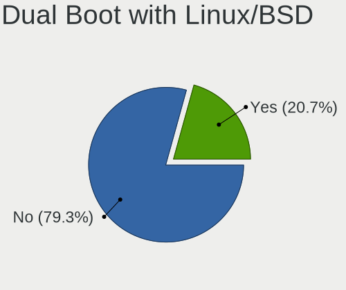
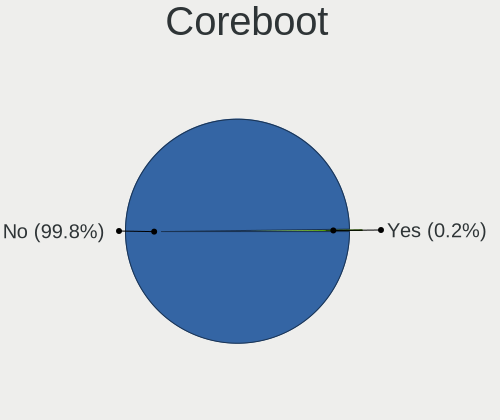
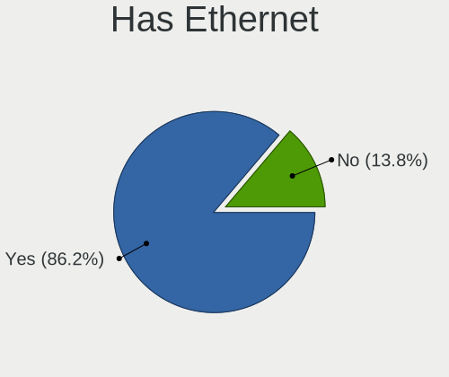
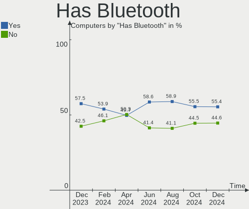
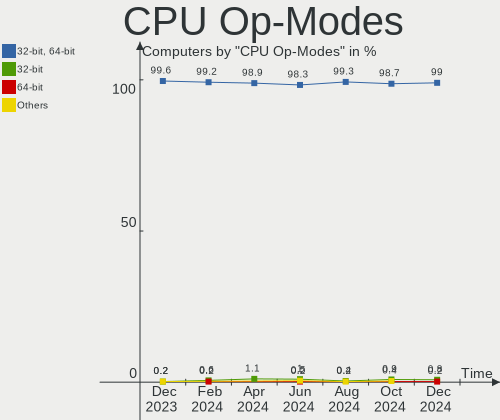
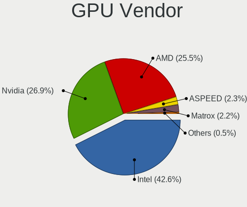
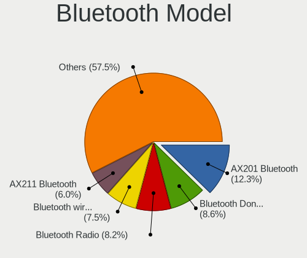

Linux in Russia - Hardware Trends
---------------------------------

A project to identify most popular hardware characteristics and track their change
over time based on data collected by Linux users at https://Linux-Hardware.org.

Anyone can contribute to this report by the [hw-probe](https://github.com/linuxhw/hw-probe) tool:

    sudo -E hw-probe -all -upload

This is a report for all computer types. See also reports for [desktops](/Location/Russia/Desktop/README.md) and [notebooks](/Location/Russia/Notebook/README.md).

Period: Aug, 2023.

Contents
--------

* [ System ](#system)
  - [ OS                       ](#os)
  - [ OS Family                ](#os-family)
  - [ Kernel                   ](#kernel)
  - [ Kernel Family            ](#kernel-family)
  - [ Kernel Major Ver.        ](#kernel-major-ver)
  - [ Arch                     ](#arch)
  - [ DE                       ](#de)
  - [ Display Server           ](#display-server)
  - [ Display Manager          ](#display-manager)
  - [ OS Lang                  ](#os-lang)
  - [ Boot Mode                ](#boot-mode)
  - [ Filesystem               ](#filesystem)
  - [ Part. scheme             ](#part-scheme)
  - [ Dual Boot with Linux/BSD ](#dual-boot-with-linuxbsd)
  - [ Dual Boot (Win)          ](#dual-boot-win)

* [ Board ](#board)
  - [ Vendor                   ](#vendor)
  - [ Model                    ](#model)
  - [ Model Family             ](#model-family)
  - [ MFG Year                 ](#mfg-year)
  - [ Form Factor              ](#form-factor)
  - [ Secure Boot              ](#secure-boot)
  - [ Coreboot                 ](#coreboot)
  - [ RAM Size                 ](#ram-size)
  - [ RAM Used                 ](#ram-used)
  - [ Total Drives             ](#total-drives)
  - [ Has CD-ROM               ](#has-cd-rom)
  - [ Has Ethernet             ](#has-ethernet)
  - [ Has WiFi                 ](#has-wifi)
  - [ Has Bluetooth            ](#has-bluetooth)

* [ Location ](#location)
  - [ Country                  ](#country)
  - [ City                     ](#city)

* [ Drives ](#drives)
  - [ Drive Vendor             ](#drive-vendor)
  - [ Drive Model              ](#drive-model)
  - [ HDD Vendor               ](#hdd-vendor)
  - [ SSD Vendor               ](#ssd-vendor)
  - [ Drive Kind               ](#drive-kind)
  - [ Drive Connector          ](#drive-connector)
  - [ Drive Size               ](#drive-size)
  - [ Space Total              ](#space-total)
  - [ Space Used               ](#space-used)
  - [ Malfunc. Drives          ](#malfunc-drives)
  - [ Malfunc. Drive Vendor    ](#malfunc-drive-vendor)
  - [ Malfunc. HDD Vendor      ](#malfunc-hdd-vendor)
  - [ Malfunc. Drive Kind      ](#malfunc-drive-kind)
  - [ Failed Drives            ](#failed-drives)
  - [ Failed Drive Vendor      ](#failed-drive-vendor)
  - [ Drive Status             ](#drive-status)

* [ Storage controller ](#storage-controller)
  - [ Storage Vendor           ](#storage-vendor)
  - [ Storage Model            ](#storage-model)
  - [ Storage Kind             ](#storage-kind)

* [ Processor ](#processor)
  - [ CPU Vendor               ](#cpu-vendor)
  - [ CPU Model                ](#cpu-model)
  - [ CPU Model Family         ](#cpu-model-family)
  - [ CPU Cores                ](#cpu-cores)
  - [ CPU Sockets              ](#cpu-sockets)
  - [ CPU Threads              ](#cpu-threads)
  - [ CPU Op-Modes             ](#cpu-op-modes)
  - [ CPU Microcode            ](#cpu-microcode)
  - [ CPU Microarch            ](#cpu-microarch)

* [ Graphics ](#graphics)
  - [ GPU Vendor               ](#gpu-vendor)
  - [ GPU Model                ](#gpu-model)
  - [ GPU Combo                ](#gpu-combo)
  - [ GPU Driver               ](#gpu-driver)
  - [ GPU Memory               ](#gpu-memory)

* [ Monitor ](#monitor)
  - [ Monitor Vendor           ](#monitor-vendor)
  - [ Monitor Model            ](#monitor-model)
  - [ Monitor Resolution       ](#monitor-resolution)
  - [ Monitor Diagonal         ](#monitor-diagonal)
  - [ Monitor Width            ](#monitor-width)
  - [ Aspect Ratio             ](#aspect-ratio)
  - [ Monitor Area             ](#monitor-area)
  - [ Pixel Density            ](#pixel-density)
  - [ Multiple Monitors        ](#multiple-monitors)

* [ Network ](#network)
  - [ Net Controller Vendor    ](#net-controller-vendor)
  - [ Net Controller Model     ](#net-controller-model)
  - [ Wireless Vendor          ](#wireless-vendor)
  - [ Wireless Model           ](#wireless-model)
  - [ Ethernet Vendor          ](#ethernet-vendor)
  - [ Ethernet Model           ](#ethernet-model)
  - [ Net Controller Kind      ](#net-controller-kind)
  - [ Used Controller          ](#used-controller)
  - [ NICs                     ](#nics)
  - [ IPv6                     ](#ipv6)

* [ Bluetooth ](#bluetooth)
  - [ Bluetooth Vendor         ](#bluetooth-vendor)
  - [ Bluetooth Model          ](#bluetooth-model)

* [ Sound ](#sound)
  - [ Sound Vendor             ](#sound-vendor)
  - [ Sound Model              ](#sound-model)

* [ Memory ](#memory)
  - [ Memory Vendor            ](#memory-vendor)
  - [ Memory Model             ](#memory-model)
  - [ Memory Kind              ](#memory-kind)
  - [ Memory Form Factor       ](#memory-form-factor)
  - [ Memory Size              ](#memory-size)
  - [ Memory Speed             ](#memory-speed)

* [ Printers & scanners ](#printers--scanners)
  - [ Printer Vendor           ](#printer-vendor)
  - [ Printer Model            ](#printer-model)
  - [ Scanner Vendor           ](#scanner-vendor)
  - [ Scanner Model            ](#scanner-model)

* [ Camera ](#camera)
  - [ Camera Vendor            ](#camera-vendor)
  - [ Camera Model             ](#camera-model)

* [ Security ](#security)
  - [ Fingerprint Vendor       ](#fingerprint-vendor)
  - [ Fingerprint Model        ](#fingerprint-model)
  - [ Chipcard Vendor          ](#chipcard-vendor)
  - [ Chipcard Model           ](#chipcard-model)

* [ Unsupported ](#unsupported)
  - [ Unsupported Devices      ](#unsupported-devices)
  - [ Unsupported Device Types ](#unsupported-device-types)

System
------

OS
--

Installed operating systems

| Name                         | Computers | Percent |
|------------------------------|-----------|---------|
| ROSA 12.4                    | 119       | 26.21%  |
| Ubuntu 22.04                 | 56        | 12.33%  |
| OpenMandriva 23.08           | 29        | 6.39%   |
| Fedora 38                    | 28        | 6.17%   |
| Debian 12                    | 27        | 5.95%   |
| Arch Rolling                 | 15        | 3.3%    |
| Linux Mint 21.2              | 13        | 2.86%   |
| ROSA R11.1                   | 9         | 1.98%   |
| Ubuntu 23.04                 | 7         | 1.54%   |
| ROSA 12                      | 7         | 1.54%   |
| Red OS 7.3.2                 | 7         | 1.54%   |
| ALT Linux 10.2               | 7         | 1.54%   |
| OpenMandriva 23.03           | 6         | 1.32%   |
| ROSA 12.3                    | 5         | 1.1%    |
| Pop!_OS 22.04                | 5         | 1.1%    |
| openSUSE Tumbleweed-XXXXXXXX | 5         | 1.1%    |
| OpenMandriva 4.3             | 5         | 1.1%    |
| Manjaro                      | 5         | 1.1%    |
| ArcoLinux Rolling            | 5         | 1.1%    |
| Xero Rolling                 | 4         | 0.88%   |
| Kali 2023.3                  | 4         | 0.88%   |
| Elementary 7                 | 4         | 0.88%   |
| ALT Linux 10.1               | 4         | 0.88%   |
| ROSA 13.0                    | 3         | 0.66%   |
| ROSA 12.2                    | 3         | 0.66%   |
| ROSA 12.1                    | 3         | 0.66%   |
| Red OS 7.3                   | 3         | 0.66%   |
| Linux Mint 21.1              | 3         | 0.66%   |
| Kubuntu 23.04                | 3         | 0.66%   |
| Fedora 36                    | 3         | 0.66%   |
| Ubuntu 20.04                 | 2         | 0.44%   |
| openSUSE Leap-15.5           | 2         | 0.44%   |
| Manjaro 23.0.0               | 2         | 0.44%   |
| Kubuntu 22.04                | 2         | 0.44%   |
| KDE neon 22.04               | 2         | 0.44%   |
| Gentoo 2.14                  | 2         | 0.44%   |
| Fedora 37                    | 2         | 0.44%   |
| Fedora 35                    | 2         | 0.44%   |
| EndeavourOS Rolling          | 2         | 0.44%   |
| Debian 11                    | 2         | 0.44%   |

OS Family
---------

OS without a version

| Name         | Computers | Percent |
|--------------|-----------|---------|
| ROSA         | 150       | 33.04%  |
| Ubuntu       | 65        | 14.32%  |
| OpenMandriva | 42        | 9.25%   |
| Fedora       | 35        | 7.71%   |
| Debian       | 30        | 6.61%   |
| Linux Mint   | 19        | 4.19%   |
| ALT Linux    | 17        | 3.74%   |
| Arch         | 15        | 3.3%    |
| Red OS       | 10        | 2.2%    |
| openSUSE     | 7         | 1.54%   |
| Manjaro      | 7         | 1.54%   |
| Kubuntu      | 6         | 1.32%   |
| ArcoLinux    | 6         | 1.32%   |
| Pop!_OS      | 5         | 1.1%    |
| Elementary   | 5         | 1.1%    |
| Xero         | 4         | 0.88%   |
| Kali         | 4         | 0.88%   |
| Gentoo       | 4         | 0.88%   |
| Xubuntu      | 2         | 0.44%   |
| SteamOS      | 2         | 0.44%   |
| KDE neon     | 2         | 0.44%   |
| EndeavourOS  | 2         | 0.44%   |
| Devuan       | 2         | 0.44%   |
| Void Linux   | 1         | 0.22%   |
| Uncom OS     | 1         | 0.22%   |
| Ubuntu Unity | 1         | 0.22%   |
| Solus        | 1         | 0.22%   |
| RELD         | 1         | 0.22%   |
| Raspbian     | 1         | 0.22%   |
| NixOS        | 1         | 0.22%   |
| MX           | 1         | 0.22%   |
| Endless      | 1         | 0.22%   |
| ChimeraOS    | 1         | 0.22%   |
| CentOS       | 1         | 0.22%   |
| Astra Linux  | 1         | 0.22%   |
| Android      | 1         | 0.22%   |

Kernel
------

Version of the Linux kernel

| Version                                  | Computers | Percent |
|------------------------------------------|-----------|---------|
| 6.1.38-generic-1rosa2021.1-x86_64        | 67        | 14.76%  |
| 6.1.20-generic-2rosa2021.1-x86_64        | 35        | 7.71%   |
| 5.15.0-69-generic                        | 28        | 6.17%   |
| 6.2.0-26-generic                         | 24        | 5.29%   |
| 6.4.8-desktop-2omv2390                   | 16        | 3.52%   |
| 6.4.11-desktop-1omv2390                  | 13        | 2.86%   |
| 6.1.0-4-amd64                            | 10        | 2.2%    |
| 6.2.9-300.fc38.x86_64                    | 9         | 1.98%   |
| 6.1.0-10-amd64                           | 8         | 1.76%   |
| 5.15.0-78-generic                        | 8         | 1.76%   |
| 5.19.0-50-generic                        | 7         | 1.54%   |
| 5.15.0-79-generic                        | 7         | 1.54%   |
| 6.2.6-desktop-1omv2390                   | 6         | 1.32%   |
| 6.1.0-11-amd64                           | 6         | 1.32%   |
| 5.15.117-generic-1rosa2021.1-x86_64      | 6         | 1.32%   |
| 5.10.74-generic-2rosa2021.1-x86_64       | 6         | 1.32%   |
| 6.4.11-200.fc38.x86_64                   | 5         | 1.1%    |
| 6.4.10-200.fc38.x86_64                   | 5         | 1.1%    |
| 6.2.0-27-generic                         | 5         | 1.1%    |
| 6.4.10-zen2-1-zen                        | 4         | 0.88%   |
| 6.4.10-arch1-1                           | 4         | 0.88%   |
| 5.16.7-desktop-1omv4003                  | 4         | 0.88%   |
| 6.4.9-arch1-1                            | 3         | 0.66%   |
| 6.4.9-200.fc38.x86_64                    | 3         | 0.66%   |
| 6.4.12-arch1-1                           | 3         | 0.66%   |
| 6.4.11-arch2-1                           | 3         | 0.66%   |
| 6.3.0-kali1-amd64                        | 3         | 0.66%   |
| 6.2.6-76060206-generic                   | 3         | 0.66%   |
| 6.1.38-un-def-alt1                       | 3         | 0.66%   |
| 5.15.87-1.el7.3.x86_64                   | 3         | 0.66%   |
| 5.15.103-generic-1rosa2021.1-i686        | 3         | 0.66%   |
| 6.4.7-200.fc38.x86_64                    | 2         | 0.44%   |
| 6.4.6-76060406-generic                   | 2         | 0.44%   |
| 6.4.5.xm1-1.klp-xanmod-rosa2021.1-x86_64 | 2         | 0.44%   |
| 6.4.12-200.fc38.x86_64                   | 2         | 0.44%   |
| 6.4.11-1-default                         | 2         | 0.44%   |
| 6.2.15-100.fc36.x86_64                   | 2         | 0.44%   |
| 6.1.42-un-def-alt1                       | 2         | 0.44%   |
| 6.1.41-1-MANJARO                         | 2         | 0.44%   |
| 6.1.38-generic-1rosa2021.1-arm64         | 2         | 0.44%   |

Kernel Family
-------------

Linux kernel without a distro release

| Version  | Computers | Percent |
|----------|-----------|---------|
| 6.1.38   | 74        | 16.3%   |
| 5.15.0   | 51        | 11.23%  |
| 6.1.20   | 37        | 8.15%   |
| 6.2.0    | 33        | 7.27%   |
| 6.4.11   | 28        | 6.17%   |
| 6.1.0    | 26        | 5.73%   |
| 6.4.8    | 17        | 3.74%   |
| 6.4.10   | 13        | 2.86%   |
| 5.19.0   | 11        | 2.42%   |
| 6.4.7    | 10        | 2.2%    |
| 6.4.9    | 9         | 1.98%   |
| 6.2.9    | 9         | 1.98%   |
| 6.2.6    | 9         | 1.98%   |
| 5.15.117 | 7         | 1.54%   |
| 6.4.6    | 6         | 1.32%   |
| 5.10.74  | 6         | 1.32%   |
| 4.15.0   | 6         | 1.32%   |
| 6.4.12   | 5         | 1.1%    |
| 5.16.7   | 4         | 0.88%   |
| 6.3.0    | 3         | 0.66%   |
| 6.2.16   | 3         | 0.66%   |
| 6.1.42   | 3         | 0.66%   |
| 6.1.41   | 3         | 0.66%   |
| 6.1.31   | 3         | 0.66%   |
| 6.0.12   | 3         | 0.66%   |
| 5.15.87  | 3         | 0.66%   |
| 5.15.72  | 3         | 0.66%   |
| 5.15.103 | 3         | 0.66%   |
| 4.9.155  | 3         | 0.66%   |
| 6.4.5    | 2         | 0.44%   |
| 6.4.3    | 2         | 0.44%   |
| 6.2.15   | 2         | 0.44%   |
| 6.1.46   | 2         | 0.44%   |
| 6.1.45   | 2         | 0.44%   |
| 5.4.0    | 2         | 0.44%   |
| 5.15.75  | 2         | 0.44%   |
| 5.14.21  | 2         | 0.44%   |
| 5.10.188 | 2         | 0.44%   |
| 5.10.184 | 2         | 0.44%   |
| 5.10.164 | 2         | 0.44%   |

Kernel Major Ver.
-----------------

Linux kernel major version

| Version | Computers | Percent |
|---------|-----------|---------|
| 6.1     | 154       | 33.92%  |
| 6.4     | 93        | 20.48%  |
| 5.15    | 74        | 16.3%   |
| 6.2     | 57        | 12.56%  |
| 5.10    | 20        | 4.41%   |
| 5.19    | 11        | 2.42%   |
| 6.3     | 9         | 1.98%   |
| 4.15    | 6         | 1.32%   |
| 6.0     | 5         | 1.1%    |
| 5.4     | 5         | 1.1%    |
| 5.16    | 5         | 1.1%    |
| 5.14    | 4         | 0.88%   |
| 4.9     | 4         | 0.88%   |
| 5.17    | 2         | 0.44%   |
| 5.13    | 2         | 0.44%   |
| 4.4     | 1         | 0.22%   |
| 4.18    | 1         | 0.22%   |
| 3.18    | 1         | 0.22%   |

Arch
----

OS architecture (x86_64, i586, etc.)

| Name    | Computers | Percent |
|---------|-----------|---------|
| x86_64  | 437       | 96.26%  |
| i686    | 8         | 1.76%   |
| aarch64 | 6         | 1.32%   |
| e2k     | 1         | 0.22%   |
| armv7l  | 1         | 0.22%   |
| armv6l  | 1         | 0.22%   |

DE
--

Desktop Environment

| Name       | Computers | Percent |
|------------|-----------|---------|
| KDE5       | 183       | 40.31%  |
| GNOME      | 118       | 25.99%  |
| Unknown    | 58        | 12.78%  |
| XFCE       | 25        | 5.51%   |
| X-Cinnamon | 17        | 3.74%   |
| LXQt       | 15        | 3.3%    |
| MATE       | 14        | 3.08%   |
| KDE4       | 9         | 1.98%   |
| Pantheon   | 5         | 1.1%    |
| LXDE       | 2         | 0.44%   |
| i3         | 2         | 0.44%   |
| Unity      | 1         | 0.22%   |
| sway       | 1         | 0.22%   |
| fluxbox    | 1         | 0.22%   |
| Cinnamon   | 1         | 0.22%   |
| Budgie     | 1         | 0.22%   |
| awesome    | 1         | 0.22%   |

Display Server
--------------

X11 or Wayland

| Name    | Computers | Percent |
|---------|-----------|---------|
| Wayland | 209       | 46.04%  |
| X11     | 185       | 40.75%  |
| Unknown | 48        | 10.57%  |
| Tty     | 12        | 2.64%   |

Display Manager
---------------

SDDM, LightDM, etc.

| Name    | Computers | Percent |
|---------|-----------|---------|
| SDDM    | 164       | 36.12%  |
| Unknown | 113       | 24.89%  |
| GDM     | 75        | 16.52%  |
| LightDM | 53        | 11.67%  |
| GDM3    | 39        | 8.59%   |
| KDM     | 8         | 1.76%   |
| SLiM    | 1         | 0.22%   |
| LXDM    | 1         | 0.22%   |

OS Lang
-------

Language

| Lang    | Computers | Percent |
|---------|-----------|---------|
| ru_RU   | 332       | 73.13%  |
| en_US   | 76        | 16.74%  |
| C       | 32        | 7.05%   |
| Unknown | 7         | 1.54%   |
| en_GB   | 2         | 0.44%   |
| zh_CN   | 1         | 0.22%   |
| ru_UA   | 1         | 0.22%   |
| pt_BR   | 1         | 0.22%   |
| POSIX   | 1         | 0.22%   |
| en_DK   | 1         | 0.22%   |

Boot Mode
---------

EFI or BIOS

| Mode | Computers | Percent |
|------|-----------|---------|
| EFI  | 247       | 54.41%  |
| BIOS | 207       | 45.59%  |

Filesystem
----------

Type of filesystem

| Type     | Computers | Percent |
|----------|-----------|---------|
| Ext4     | 290       | 63.88%  |
| Btrfs    | 70        | 15.42%  |
| Overlay  | 68        | 14.98%  |
| Tmpfs    | 21        | 4.63%   |
| Xfs      | 2         | 0.44%   |
| Reiserfs | 1         | 0.22%   |
| Aufs     | 1         | 0.22%   |
| Unknown  | 1         | 0.22%   |

Part. scheme
------------

Scheme of partitioning

| Type    | Computers | Percent |
|---------|-----------|---------|
| GPT     | 277       | 61.01%  |
| MBR     | 89        | 19.6%   |
| Unknown | 88        | 19.38%  |

Dual Boot with Linux/BSD
------------------------

Hosting more than one Linux/BSD

| Dual boot | Computers | Percent |
|-----------|-----------|---------|
| No        | 335       | 73.79%  |
| Yes       | 119       | 26.21%  |

Dual Boot (Win)
---------------

Hosting Linux and Windows

| Dual boot | Computers | Percent |
|-----------|-----------|---------|
| No        | 289       | 63.66%  |
| Yes       | 165       | 36.34%  |

Board
-----

Vendor
------

Motherboard manufacturer

| Name                 | Computers | Percent |
|----------------------|-----------|---------|
| ASUSTek Computer     | 101       | 22.25%  |
| Gigabyte Technology  | 46        | 10.13%  |
| Lenovo               | 37        | 8.15%   |
| Supermicro           | 32        | 7.05%   |
| MSI                  | 32        | 7.05%   |
| Hewlett-Packard      | 31        | 6.83%   |
| Acer                 | 26        | 5.73%   |
| ASRock               | 18        | 3.96%   |
| Dell                 | 17        | 3.74%   |
| HUAWEI               | 14        | 3.08%   |
| Intel                | 8         | 1.76%   |
| Timi                 | 7         | 1.54%   |
| Unknown              | 6         | 1.32%   |
| Huanan               | 5         | 1.1%    |
| Sony                 | 4         | 0.88%   |
| Apple                | 4         | 0.88%   |
| Samsung Electronics  | 3         | 0.66%   |
| Packard Bell         | 3         | 0.66%   |
| HONOR                | 3         | 0.66%   |
| Foxconn              | 3         | 0.66%   |
| DEPO Computers       | 3         | 0.66%   |
| Chuwi                | 3         | 0.66%   |
| Biostar              | 3         | 0.66%   |
| Valve                | 2         | 0.44%   |
| Teclast              | 2         | 0.44%   |
| Notebook             | 2         | 0.44%   |
| Irbis                | 2         | 0.44%   |
| Infinix              | 2         | 0.44%   |
| Fujitsu Siemens      | 2         | 0.44%   |
| Digma                | 2         | 0.44%   |
| AZW                  | 2         | 0.44%   |
| ZOTAC                | 1         | 0.22%   |
| Yadro Client Systems | 1         | 0.22%   |
| WeiBu                | 1         | 0.22%   |
| Toshiba              | 1         | 0.22%   |
| TECNO                | 1         | 0.22%   |
| Soyo                 | 1         | 0.22%   |
| RuggedPC             | 1         | 0.22%   |
| ROMBICA              | 1         | 0.22%   |
| Rockchip             | 1         | 0.22%   |

Model
-----

Motherboard model

| Name                                     | Computers | Percent |
|------------------------------------------|-----------|---------|
| Supermicro Super Server                  | 12        | 2.64%   |
| Unknown                                  | 7         | 1.54%   |
| HUAWEI BOM-WXX9                          | 6         | 1.32%   |
| Supermicro X8DTU                         | 4         | 0.88%   |
| ASUS All Series                          | 4         | 0.88%   |
| Supermicro X9DRW                         | 3         | 0.66%   |
| Supermicro X8DTT                         | 3         | 0.66%   |
| MSI MS-7D22                              | 3         | 0.66%   |
| Intel X99                                | 3         | 0.66%   |
| Gigabyte H61M-S2PV                       | 3         | 0.66%   |
| ASUS VivoBook_ASUSLaptop M1402IA_M1402IA | 3         | 0.66%   |
| Valve Jupiter                            | 2         | 0.44%   |
| Timi Redmi Book Pro 14 2022              | 2         | 0.44%   |
| Supermicro X7DWU                         | 2         | 0.44%   |
| MSI Modern 14 C12M                       | 2         | 0.44%   |
| HUAWEI BOD-WXX9                          | 2         | 0.44%   |
| HP ProLiant DL360 Gen9                   | 2         | 0.44%   |
| HP Pavilion 15                           | 2         | 0.44%   |
| Gigabyte B250M-DS3H                      | 2         | 0.44%   |
| Gigabyte AB350M-DS3H V2                  | 2         | 0.44%   |
| DEPO Computers DPA520S                   | 2         | 0.44%   |
| AZW SER                                  | 2         | 0.44%   |
| ASUS X550CC                              | 2         | 0.44%   |
| ASUS VivoBook_ASUSLaptop M6500QC_M6500QC | 2         | 0.44%   |
| ASUS VivoBook_ASUSLaptop M1403QA_M1403QA | 2         | 0.44%   |
| ASUS S20 K29                             | 2         | 0.44%   |
| ASUS P8H77-M PRO                         | 2         | 0.44%   |
| ASUS P8H61-MX                            | 2         | 0.44%   |
| ASUS M4A77TD                             | 2         | 0.44%   |
| ASRock H510M-HVS R2.0                    | 2         | 0.44%   |
| Acer Nitro AN515-52                      | 2         | 0.44%   |
| Acer Aspire V3-571G                      | 2         | 0.44%   |
| Acer Aspire E5-573G                      | 2         | 0.44%   |
| ZOTAC ZBOX-MI531/MI551/MI571             | 1         | 0.22%   |
| Yadro Client Systems KVADRA LE15T        | 1         | 0.22%   |
| WeiBu H310CX1B V1.0                      | 1         | 0.22%   |
| Toshiba Satellite C660                   | 1         | 0.22%   |
| Timi Xiaomi Book Pro 16 2022             | 1         | 0.22%   |
| Timi Xiaomi Book Air 13 2022             | 1         | 0.22%   |
| Timi TM1701                              | 1         | 0.22%   |

Model Family
------------

Motherboard model prefix

| Name                  | Computers | Percent |
|-----------------------|-----------|---------|
| Acer Aspire           | 17        | 3.74%   |
| Lenovo ThinkPad       | 14        | 3.08%   |
| ASUS VivoBook         | 14        | 3.08%   |
| Supermicro Super      | 12        | 2.64%   |
| Lenovo IdeaPad        | 10        | 2.2%    |
| ASUS PRIME            | 10        | 2.2%    |
| Unknown               | 7         | 1.54%   |
| HUAWEI BOM-WXX9       | 6         | 1.32%   |
| HP Pavilion           | 6         | 1.32%   |
| ASUS TUF              | 6         | 1.32%   |
| HP ProBook            | 5         | 1.1%    |
| HP Laptop             | 5         | 1.1%    |
| Dell Inspiron         | 5         | 1.1%    |
| Supermicro X8DTU      | 4         | 0.88%   |
| Lenovo ThinkBook      | 4         | 0.88%   |
| ASUS ZenBook          | 4         | 0.88%   |
| ASUS All              | 4         | 0.88%   |
| Supermicro X9DRW      | 3         | 0.66%   |
| Supermicro X8DTT      | 3         | 0.66%   |
| Packard Bell EasyNote | 3         | 0.66%   |
| MSI MS-7D22           | 3         | 0.66%   |
| Intel X99             | 3         | 0.66%   |
| HP EliteBook          | 3         | 0.66%   |
| Gigabyte H61M-S2PV    | 3         | 0.66%   |
| Gigabyte B450M        | 3         | 0.66%   |
| Dell Latitude         | 3         | 0.66%   |
| ASUS ROG              | 3         | 0.66%   |
| ASUS P8H61-M          | 3         | 0.66%   |
| ASUS P5K              | 3         | 0.66%   |
| Acer Extensa          | 3         | 0.66%   |
| Valve Jupiter         | 2         | 0.44%   |
| Timi Xiaomi           | 2         | 0.44%   |
| Timi Redmi            | 2         | 0.44%   |
| Supermicro X7DWU      | 2         | 0.44%   |
| MSI Modern            | 2         | 0.44%   |
| Infinix INBOOK        | 2         | 0.44%   |
| HUAWEI BOD-WXX9       | 2         | 0.44%   |
| Huanan X99-F8         | 2         | 0.44%   |
| HP ProLiant           | 2         | 0.44%   |
| Gigabyte X570         | 2         | 0.44%   |

MFG Year
--------

Motherboard manufacture year

| Year    | Computers | Percent |
|---------|-----------|---------|
| 2022    | 68        | 14.98%  |
| 2021    | 54        | 11.89%  |
| 2012    | 40        | 8.81%   |
| 2011    | 32        | 7.05%   |
| 2019    | 31        | 6.83%   |
| 2018    | 30        | 6.61%   |
| 2020    | 25        | 5.51%   |
| 2013    | 24        | 5.29%   |
| 2009    | 23        | 5.07%   |
| 2010    | 19        | 4.19%   |
| 2017    | 18        | 3.96%   |
| 2014    | 17        | 3.74%   |
| 2008    | 16        | 3.52%   |
| 2023    | 15        | 3.3%    |
| 2015    | 15        | 3.3%    |
| 2016    | 12        | 2.64%   |
| 2007    | 8         | 1.76%   |
| Unknown | 6         | 1.32%   |
| 2003    | 1         | 0.22%   |

Form Factor
-----------

Physical design of the computer

| Name           | Computers | Percent |
|----------------|-----------|---------|
| Notebook       | 214       | 47.14%  |
| Desktop        | 185       | 40.75%  |
| Server         | 31        | 6.83%   |
| System on chip | 6         | 1.32%   |
| All in one     | 6         | 1.32%   |
| Convertible    | 5         | 1.1%    |
| Mini pc        | 4         | 0.88%   |
| Tablet         | 2         | 0.44%   |
| Phone          | 1         | 0.22%   |

Secure Boot
-----------

Enabled or disabled

| State    | Computers | Percent |
|----------|-----------|---------|
| Disabled | 429       | 94.49%  |
| Enabled  | 25        | 5.51%   |

Coreboot
--------

Have coreboot on board

| Used | Computers | Percent |
|------|-----------|---------|
| No   | 453       | 99.78%  |
| Yes  | 1         | 0.22%   |

RAM Size
--------

Total RAM memory

| Size in GB      | Computers | Percent |
|-----------------|-----------|---------|
| 4.01-8.0        | 104       | 22.91%  |
| 16.01-24.0      | 92        | 20.26%  |
| 8.01-16.0       | 91        | 20.04%  |
| 3.01-4.0        | 64        | 14.1%   |
| 32.01-64.0      | 51        | 11.23%  |
| 64.01-256.0     | 16        | 3.52%   |
| 1.01-2.0        | 13        | 2.86%   |
| 24.01-32.0      | 11        | 2.42%   |
| 2.01-3.0        | 6         | 1.32%   |
| More than 256.0 | 3         | 0.66%   |
| 0.01-0.5        | 2         | 0.44%   |
| 0.51-1.0        | 1         | 0.22%   |

RAM Used
--------

Used RAM memory

| Used GB    | Computers | Percent |
|------------|-----------|---------|
| 1.01-2.0   | 162       | 35.68%  |
| 2.01-3.0   | 126       | 27.75%  |
| 3.01-4.0   | 53        | 11.67%  |
| 4.01-8.0   | 43        | 9.47%   |
| 0.51-1.0   | 40        | 8.81%   |
| 8.01-16.0  | 19        | 4.19%   |
| 0.01-0.5   | 5         | 1.1%    |
| 16.01-24.0 | 3         | 0.66%   |
| 24.01-32.0 | 2         | 0.44%   |
| 32.01-64.0 | 1         | 0.22%   |

Total Drives
------------

Number of drives on board

| Drives | Computers | Percent |
|--------|-----------|---------|
| 1      | 251       | 55.29%  |
| 2      | 117       | 25.77%  |
| 3      | 40        | 8.81%   |
| 4      | 20        | 4.41%   |
| 5      | 11        | 2.42%   |
| 7      | 3         | 0.66%   |
| 6      | 3         | 0.66%   |
| 11     | 2         | 0.44%   |
| 10     | 2         | 0.44%   |
| 8      | 2         | 0.44%   |
| 0      | 2         | 0.44%   |
| 40     | 1         | 0.22%   |

Has CD-ROM
----------

Has CD-ROM on board

| Presented | Computers | Percent |
|-----------|-----------|---------|
| No        | 354       | 77.97%  |
| Yes       | 100       | 22.03%  |

Has Ethernet
------------

Has Ethernet on board

| Presented | Computers | Percent |
|-----------|-----------|---------|
| Yes       | 381       | 83.92%  |
| No        | 73        | 16.08%  |

Has WiFi
--------

Has WiFi module

| Presented | Computers | Percent |
|-----------|-----------|---------|
| Yes       | 284       | 62.56%  |
| No        | 170       | 37.44%  |

Has Bluetooth
-------------

Has Bluetooth module

| Presented | Computers | Percent |
|-----------|-----------|---------|
| Yes       | 239       | 52.64%  |
| No        | 215       | 47.36%  |

Location
--------

Country
-------

Geographic location (country)

| Country | Computers | Percent |
|---------|-----------|---------|
| Russia  | 454       | 100%    |

City
----

Geographic location (city)

| City             | Computers | Percent |
|------------------|-----------|---------|
| Moscow           | 133       | 29.3%   |
| St Petersburg    | 38        | 8.37%   |
| Voronezh         | 20        | 4.41%   |
| Yekaterinburg    | 16        | 3.52%   |
| Novosibirsk      | 16        | 3.52%   |
| Krasnodar        | 10        | 2.2%    |
| Chelyabinsk      | 8         | 1.76%   |
| Volgograd        | 7         | 1.54%   |
| Perm             | 6         | 1.32%   |
| Nizhniy Novgorod | 6         | 1.32%   |
| Ufa              | 5         | 1.1%    |
| Tomsk            | 5         | 1.1%    |
| Samara           | 5         | 1.1%    |
| Orenburg         | 5         | 1.1%    |
| Vladivostok      | 4         | 0.88%   |
| Tolyatti         | 4         | 0.88%   |
| Omsk             | 4         | 0.88%   |
| Khabarovsk       | 4         | 0.88%   |
| Kazan’         | 4         | 0.88%   |
| Yoshkar-Ola      | 3         | 0.66%   |
| Yakutsk          | 3         | 0.66%   |
| Tyumen           | 3         | 0.66%   |
| Tula             | 3         | 0.66%   |
| Sochi            | 3         | 0.66%   |
| Smolensk         | 3         | 0.66%   |
| Rostov-on-Don    | 3         | 0.66%   |
| Penza            | 3         | 0.66%   |
| Mytishchi        | 3         | 0.66%   |
| Kostroma         | 3         | 0.66%   |
| Chita            | 3         | 0.66%   |
| Cheboksary       | 3         | 0.66%   |
| Barnaul          | 3         | 0.66%   |
| Taganrog         | 2         | 0.44%   |
| Syktyvkar        | 2         | 0.44%   |
| Surgut           | 2         | 0.44%   |
| Stavropol        | 2         | 0.44%   |
| Simferopol       | 2         | 0.44%   |
| Shchelkovo       | 2         | 0.44%   |
| Saratov          | 2         | 0.44%   |
| Ryazan           | 2         | 0.44%   |

Drives
------

Drive Vendor
------------

Hard drive vendors

| Vendor                      | Computers | Drives | Percent |
|-----------------------------|-----------|--------|---------|
| WDC                         | 111       | 179    | 15.5%   |
| Seagate                     | 78        | 98     | 10.89%  |
| Samsung Electronics         | 64        | 79     | 8.94%   |
| Toshiba                     | 42        | 48     | 5.87%   |
| Intel                       | 40        | 51     | 5.59%   |
| Kingston                    | 33        | 36     | 4.61%   |
| A-DATA Technology           | 28        | 29     | 3.91%   |
| China                       | 20        | 20     | 2.79%   |
| Apacer                      | 19        | 20     | 2.65%   |
| SanDisk                     | 17        | 17     | 2.37%   |
| SK hynix                    | 16        | 16     | 2.23%   |
| Unknown                     | 15        | 19     | 2.09%   |
| Silicon Motion              | 14        | 15     | 1.96%   |
| Micron Technology           | 14        | 14     | 1.96%   |
| Hitachi                     | 14        | 14     | 1.96%   |
| Crucial                     | 13        | 14     | 1.82%   |
| Fujitsu                     | 11        | 21     | 1.54%   |
| AMD                         | 11        | 11     | 1.54%   |
| Patriot                     | 10        | 10     | 1.4%    |
| Netac                       | 8         | 8      | 1.12%   |
| KIOXIA                      | 8         | 8      | 1.12%   |
| XrayDisk                    | 7         | 7      | 0.98%   |
| HGST                        | 7         | 7      | 0.98%   |
| Phison                      | 6         | 6      | 0.84%   |
| JMicron Technology          | 6         | 6      | 0.84%   |
| SPCC                        | 5         | 5      | 0.7%    |
| Smartbuy                    | 5         | 5      | 0.7%    |
| OCZ                         | 5         | 5      | 0.7%    |
| GOODRAM                     | 5         | 5      | 0.7%    |
| ADATA Technology            | 5         | 5      | 0.7%    |
| Unknown                     | 5         | 5      | 0.7%    |
| Kingston Technology Company | 4         | 4      | 0.56%   |
| Hewlett-Packard             | 4         | 9      | 0.56%   |
| Gigabyte Technology         | 4         | 4      | 0.56%   |
| Transcend                   | 3         | 3      | 0.42%   |
| Team                        | 3         | 3      | 0.42%   |
| Phison Electronics          | 3         | 3      | 0.42%   |
| FORESEE                     | 3         | 3      | 0.42%   |
| Digma                       | 3         | 3      | 0.42%   |
| MAXIO Technology (Hangzhou) | 2         | 3      | 0.28%   |

Drive Model
-----------

Hard drive models

| Model                                                 | Computers | Percent |
|-------------------------------------------------------|-----------|---------|
| Intel SSDPEKNU512GZ 512GB                             | 11        | 1.4%    |
| Kingston SA400S37240G 240GB SSD                       | 10        | 1.28%   |
| Intel SSDSC2BB150G7 150GB                             | 9         | 1.15%   |
| Seagate ST1000DM010-2EP102 1TB                        | 8         | 1.02%   |
| Samsung SSD 870 EVO 500GB                             | 8         | 1.02%   |
| Kingston SA400S37120G 120GB SSD                       | 8         | 1.02%   |
| Samsung NVMe SSD Controller SM981/PM981/PM983 500GB   | 7         | 0.89%   |
| WDC WDS240G2G0A-00JH30 240GB SSD                      | 6         | 0.77%   |
| WDC WD10EZEX-00BBHA0 1TB                              | 6         | 0.77%   |
| Fujitsu MBA3147RC 147GB                               | 6         | 0.77%   |
| Toshiba MQ04ABF100 1TB                                | 5         | 0.64%   |
| Toshiba MQ01ABD100 1TB                                | 5         | 0.64%   |
| Toshiba HDWD110 1TB                                   | 5         | 0.64%   |
| Seagate ST1000DM003-1CH162 1TB                        | 5         | 0.64%   |
| Crucial CT480BX500SSD1 480GB                          | 5         | 0.64%   |
| Unknown                                               | 5         | 0.64%   |
| WDC WD10EZEX-22MFCA0 1TB                              | 4         | 0.51%   |
| Toshiba MQ01ABF050 500GB                              | 4         | 0.51%   |
| Toshiba DT01ACA050 500GB                              | 4         | 0.51%   |
| Seagate ST3500418AS 500GB                             | 4         | 0.51%   |
| Samsung SSD 860 EVO 500GB                             | 4         | 0.51%   |
| JMicron Generic 1TB                                   | 4         | 0.51%   |
| Apacer AS350 512GB SSD                                | 4         | 0.51%   |
| A-DATA SU650 240GB SSD                                | 4         | 0.51%   |
| A-DATA SU650 120GB SSD                                | 4         | 0.51%   |
| WDC WDS500G2B0A-00SM50 500GB SSD                      | 3         | 0.38%   |
| WDC WDS120G2G0A-00JH30 120GB SSD                      | 3         | 0.38%   |
| WDC WD10EZEX-08WN4A0 1TB                              | 3         | 0.38%   |
| Unknown NVMe SSD Drive 512GB                          | 3         | 0.38%   |
| Unknown MMC Card  8GB                                 | 3         | 0.38%   |
| Unknown MMC Card  32GB                                | 3         | 0.38%   |
| SK hynix HFM512GD3JX013N 512GB                        | 3         | 0.38%   |
| Silicon Motion SM2263EN/SM2263XT SSD Controller 256GB | 3         | 0.38%   |
| Silicon Motion PCIe-8 SSD 512GB                       | 3         | 0.38%   |
| Seagate ST500LT012-1DG142 500GB                       | 3         | 0.38%   |
| Seagate ST31000528AS 1TB                              | 3         | 0.38%   |
| Seagate ST31000524AS 1TB                              | 3         | 0.38%   |
| Seagate ST2000DM006-2DM164 2TB                        | 3         | 0.38%   |
| Seagate ST1000LM035-1RK172 1TB                        | 3         | 0.38%   |
| Seagate ST1000LM024 HN-M101MBB 1TB                    | 3         | 0.38%   |

HDD Vendor
----------

Hard disk drive vendors

| Vendor              | Computers | Drives | Percent |
|---------------------|-----------|--------|---------|
| WDC                 | 86        | 145    | 35.39%  |
| Seagate             | 78        | 98     | 32.1%   |
| Toshiba             | 38        | 44     | 15.64%  |
| Hitachi             | 13        | 13     | 5.35%   |
| Fujitsu             | 11        | 21     | 4.53%   |
| HGST                | 7         | 7      | 2.88%   |
| Samsung Electronics | 3         | 3      | 1.23%   |
| USB3.0              | 1         | 1      | 0.41%   |
| USB                 | 1         | 1      | 0.41%   |
| Unknown             | 1         | 1      | 0.41%   |
| Min Yi U            | 1         | 1      | 0.41%   |
| Maxtor              | 1         | 1      | 0.41%   |
| Hewlett-Packard     | 1         | 4      | 0.41%   |
| ACASIS              | 1         | 1      | 0.41%   |

SSD Vendor
----------

Solid state drive vendors

| Vendor              | Computers | Drives | Percent |
|---------------------|-----------|--------|---------|
| Samsung Electronics | 31        | 35     | 11.19%  |
| Kingston            | 27        | 29     | 9.75%   |
| WDC                 | 23        | 27     | 8.3%    |
| Intel               | 23        | 34     | 8.3%    |
| A-DATA Technology   | 21        | 22     | 7.58%   |
| China               | 20        | 20     | 7.22%   |
| Apacer              | 15        | 16     | 5.42%   |
| AMD                 | 11        | 11     | 3.97%   |
| Crucial             | 10        | 11     | 3.61%   |
| Patriot             | 8         | 8      | 2.89%   |
| Netac               | 7         | 7      | 2.53%   |
| Smartbuy            | 5         | 5      | 1.81%   |
| SanDisk             | 5         | 5      | 1.81%   |
| OCZ                 | 5         | 5      | 1.81%   |
| GOODRAM             | 5         | 5      | 1.81%   |
| SPCC                | 4         | 4      | 1.44%   |
| JMicron Technology  | 4         | 4      | 1.44%   |
| Gigabyte Technology | 4         | 4      | 1.44%   |
| XrayDisk            | 3         | 3      | 1.08%   |
| Team                | 3         | 3      | 1.08%   |
| Digma               | 3         | 3      | 1.08%   |
| Transcend           | 2         | 2      | 0.72%   |
| SK hynix            | 2         | 2      | 0.72%   |
| Micron Technology   | 2         | 2      | 0.72%   |
| LITEON              | 2         | 2      | 0.72%   |
| Kingchuxing         | 2         | 2      | 0.72%   |
| HS-SSD-E100         | 2         | 2      | 0.72%   |
| Hewlett-Packard     | 2         | 4      | 0.72%   |
| Foxline             | 2         | 2      | 0.72%   |
| Apple               | 2         | 2      | 0.72%   |
| Vaseky              | 1         | 1      | 0.36%   |
| Toshiba             | 1         | 1      | 0.36%   |
| TO Exter            | 1         | 1      | 0.36%   |
| Teclast             | 1         | 1      | 0.36%   |
| SUNTRSI             | 1         | 1      | 0.36%   |
| ShanDianZhe         | 1         | 1      | 0.36%   |
| Radeon              | 1         | 1      | 0.36%   |
| Qumo                | 1         | 1      | 0.36%   |
| Neo                 | 1         | 1      | 0.36%   |
| Kingmax             | 1         | 1      | 0.36%   |

Drive Kind
----------

HDD or SSD

| Kind    | Computers | Drives | Percent |
|---------|-----------|--------|---------|
| SSD     | 233       | 303    | 37.34%  |
| HDD     | 201       | 341    | 32.21%  |
| NVMe    | 168       | 192    | 26.92%  |
| MMC     | 12        | 17     | 1.92%   |
| Unknown | 10        | 10     | 1.6%    |

Drive Connector
---------------

SATA, SAS, NVMe, etc.

| Type | Computers | Drives | Percent |
|------|-----------|--------|---------|
| SATA | 324       | 619    | 60.56%  |
| NVMe | 168       | 192    | 31.4%   |
| SAS  | 31        | 35     | 5.79%   |
| MMC  | 12        | 17     | 2.24%   |

Drive Size
----------

Size of hard drive

| Size in TB | Computers | Drives | Percent |
|------------|-----------|--------|---------|
| 0.01-0.5   | 270       | 383    | 62.79%  |
| 0.51-1.0   | 126       | 174    | 29.3%   |
| 1.01-2.0   | 23        | 31     | 5.35%   |
| 3.01-4.0   | 8         | 16     | 1.86%   |
| 10.01-20.0 | 2         | 39     | 0.47%   |
| 2.01-3.0   | 1         | 1      | 0.23%   |

Space Total
-----------

Amount of disk space available on the file system

| Size in GB     | Computers | Percent |
|----------------|-----------|---------|
| 101-250        | 108       | 23.79%  |
| 251-500        | 105       | 23.13%  |
| 501-1000       | 58        | 12.78%  |
| Unknown        | 48        | 10.57%  |
| 1-20           | 40        | 8.81%   |
| 51-100         | 30        | 6.61%   |
| 1001-2000      | 28        | 6.17%   |
| More than 3000 | 14        | 3.08%   |
| 21-50          | 12        | 2.64%   |
| 2001-3000      | 11        | 2.42%   |

Space Used
----------

Amount of used disk space

| Used GB        | Computers | Percent |
|----------------|-----------|---------|
| 1-20           | 203       | 44.71%  |
| 21-50          | 57        | 12.56%  |
| 101-250        | 52        | 11.45%  |
| Unknown        | 48        | 10.57%  |
| 51-100         | 35        | 7.71%   |
| 251-500        | 23        | 5.07%   |
| 501-1000       | 18        | 3.96%   |
| 1001-2000      | 9         | 1.98%   |
| More than 3000 | 5         | 1.1%    |
| 2001-3000      | 4         | 0.88%   |

Malfunc. Drives
---------------

Drive models with a malfunction

| Model                                 | Computers | Drives | Percent |
|---------------------------------------|-----------|--------|---------|
| WDC WDS240G2G0A-00JH30 240GB SSD      | 2         | 2      | 2.2%    |
| WDC WD10PURZ-85U8XY0 1TB              | 2         | 2      | 2.2%    |
| WDC WD10EALX-009BA0 1TB               | 2         | 2      | 2.2%    |
| Toshiba HDWD110 1TB                   | 2         | 2      | 2.2%    |
| Seagate ST500LT012-1DG142 500GB       | 2         | 2      | 2.2%    |
| Seagate ST1000LM035-1RK172 1TB        | 2         | 2      | 2.2%    |
| Seagate ST1000DM003-1CH162 1TB        | 2         | 2      | 2.2%    |
| LITEON CV8-8E128-HP 128GB SSD         | 2         | 2      | 2.2%    |
| HGST HTS541010A7E630 1TB              | 2         | 2      | 2.2%    |
| XrayDisk 512GB SSD                    | 1         | 1      | 1.1%    |
| WDC WDS240G2G0B-00EPW0 240GB SSD      | 1         | 1      | 1.1%    |
| WDC WD5003AZEX-00K3CA0 500GB          | 1         | 1      | 1.1%    |
| WDC WD5000LPVX-08V0TT5 500GB          | 1         | 1      | 1.1%    |
| WDC WD5000AAKX-60U6AA0 500GB          | 1         | 1      | 1.1%    |
| WDC WD5000AAKS-00E4A0 500GB           | 1         | 1      | 1.1%    |
| WDC WD5000AAKS-007AA0 500GB           | 1         | 1      | 1.1%    |
| WDC WD40PURX-64GVNY0 4TB              | 1         | 1      | 1.1%    |
| WDC WD4000AAKS-00TMA0 400GB           | 1         | 1      | 1.1%    |
| WDC WD3200BPVT-80ZEST0 320GB          | 1         | 1      | 1.1%    |
| WDC WD3200AAJS-00L7A0 320GB           | 1         | 1      | 1.1%    |
| WDC WD2500BEVT-80A23T0 250GB          | 1         | 1      | 1.1%    |
| WDC WD2500AAJS-00YZCA0 250GB          | 1         | 1      | 1.1%    |
| WDC WD1200BEVS-08RST2 120GB           | 1         | 1      | 1.1%    |
| WDC WD10EZRX-00L4HB0 1TB              | 1         | 1      | 1.1%    |
| WDC WD10EZEX-60ZF5A0 1TB              | 1         | 1      | 1.1%    |
| WDC WD10EZEX-22RKKA0 1TB              | 1         | 1      | 1.1%    |
| WDC WD10EZEX-22MFCA0 1TB              | 1         | 1      | 1.1%    |
| WDC WD1003FZEX-00MK2A0 1TB            | 1         | 1      | 1.1%    |
| WDC WD1002FBYS-02A6B0 1TB             | 1         | 1      | 1.1%    |
| Toshiba MQ01ABF050 500GB              | 1         | 1      | 1.1%    |
| Toshiba MQ01ABF032 320GB              | 1         | 1      | 1.1%    |
| Toshiba MQ01ABD100 1TB                | 1         | 1      | 1.1%    |
| Toshiba MQ01ABD050 500GB              | 1         | 1      | 1.1%    |
| Toshiba MQ01ABD032 320GB              | 1         | 1      | 1.1%    |
| Toshiba MK5075GSX 500GB               | 1         | 1      | 1.1%    |
| Toshiba MK3276GSX 320GB               | 1         | 1      | 1.1%    |
| Toshiba MG04ACA100N 1TB               | 1         | 1      | 1.1%    |
| Toshiba HDWD105 500GB                 | 1         | 1      | 1.1%    |
| Team T253X1120G 120GB SSD             | 1         | 1      | 1.1%    |
| SK hynix HFS128G39TND-N210A 128GB SSD | 1         | 1      | 1.1%    |

Malfunc. Drive Vendor
---------------------

Vendors of faulty drives

| Vendor              | Computers | Drives | Percent |
|---------------------|-----------|--------|---------|
| WDC                 | 24        | 25     | 27.27%  |
| Seagate             | 22        | 23     | 25%     |
| Toshiba             | 10        | 11     | 11.36%  |
| Intel               | 4         | 5      | 4.55%   |
| Samsung Electronics | 3         | 3      | 3.41%   |
| Netac               | 3         | 3      | 3.41%   |
| Hitachi             | 3         | 3      | 3.41%   |
| HGST                | 3         | 3      | 3.41%   |
| SK hynix            | 2         | 2      | 2.27%   |
| OCZ                 | 2         | 2      | 2.27%   |
| LITEON              | 2         | 2      | 2.27%   |
| China               | 2         | 2      | 2.27%   |
| XrayDisk            | 1         | 1      | 1.14%   |
| Team                | 1         | 1      | 1.14%   |
| Neo                 | 1         | 1      | 1.14%   |
| Maxtor              | 1         | 1      | 1.14%   |
| Kingston            | 1         | 1      | 1.14%   |
| Kingmax             | 1         | 1      | 1.14%   |
| Fujitsu             | 1         | 1      | 1.14%   |
| AMD                 | 1         | 1      | 1.14%   |

Malfunc. HDD Vendor
-------------------

Vendors of faulty HDD drives

| Vendor  | Computers | Drives | Percent |
|---------|-----------|--------|---------|
| Seagate | 22        | 23     | 36.07%  |
| WDC     | 21        | 22     | 34.43%  |
| Toshiba | 10        | 11     | 16.39%  |
| Hitachi | 3         | 3      | 4.92%   |
| HGST    | 3         | 3      | 4.92%   |
| Maxtor  | 1         | 1      | 1.64%   |
| Fujitsu | 1         | 1      | 1.64%   |

Malfunc. Drive Kind
-------------------

Kinds of faulty drives

| Kind | Computers | Drives | Percent |
|------|-----------|--------|---------|
| HDD  | 54        | 64     | 66.67%  |
| SSD  | 22        | 23     | 27.16%  |
| NVMe | 5         | 5      | 6.17%   |

Failed Drives
-------------

Failed drive models

| Model                     | Computers | Drives | Percent |
|---------------------------|-----------|--------|---------|
| Seagate ST3320613AS 320GB | 1         | 1      | 50%     |
| Seagate ST31000528AS 1TB  | 1         | 1      | 50%     |

Failed Drive Vendor
-------------------

Failed drive vendors

| Vendor  | Computers | Drives | Percent |
|---------|-----------|--------|---------|
| Seagate | 2         | 2      | 100%    |

Drive Status
------------

Number of failed and malfunc. drives

| Status   | Computers | Drives | Percent |
|----------|-----------|--------|---------|
| Works    | 314       | 530    | 60.5%   |
| Detected | 125       | 239    | 24.08%  |
| Malfunc  | 78        | 92     | 15.03%  |
| Failed   | 2         | 2      | 0.39%   |

Storage controller
------------------

Storage Vendor
--------------

Storage controller vendors

| Vendor                           | Computers | Percent |
|----------------------------------|-----------|---------|
| Intel                            | 286       | 47.35%  |
| AMD                              | 92        | 15.23%  |
| Samsung Electronics              | 38        | 6.29%   |
| SanDisk                          | 19        | 3.15%   |
| Silicon Motion                   | 17        | 2.81%   |
| Phison Electronics               | 16        | 2.65%   |
| SK hynix                         | 13        | 2.15%   |
| Micron Technology                | 12        | 1.99%   |
| LSI Logic / Symbios Logic        | 11        | 1.82%   |
| Kingston Technology Company      | 11        | 1.82%   |
| ASMedia Technology               | 10        | 1.66%   |
| Marvell Technology Group         | 9         | 1.49%   |
| KIOXIA                           | 9         | 1.49%   |
| ADATA Technology                 | 9         | 1.49%   |
| Nvidia                           | 8         | 1.32%   |
| JMicron Technology               | 7         | 1.16%   |
| Adaptec                          | 7         | 1.16%   |
| INNOGRIT                         | 5         | 0.83%   |
| Realtek Semiconductor            | 4         | 0.66%   |
| Shenzhen Longsys Electronics     | 3         | 0.5%    |
| Micron/Crucial Technology        | 3         | 0.5%    |
| MAXIO Technology (Hangzhou)      | 3         | 0.5%    |
| Hewlett-Packard                  | 3         | 0.5%    |
| VIA Technologies                 | 2         | 0.33%   |
| Toshiba America Info Systems     | 2         | 0.33%   |
| Solid State Storage Technology   | 1         | 0.17%   |
| Shenzhen Shichuangyi Electronics | 1         | 0.17%   |
| MCST                             | 1         | 0.17%   |
| Jiangsu Huacun Elec.             | 1         | 0.17%   |
| Broadcom / LSI                   | 1         | 0.17%   |

Storage Model
-------------

Storage controller models

| Model                                                                                   | Computers | Percent |
|-----------------------------------------------------------------------------------------|-----------|---------|
| AMD FCH SATA Controller [AHCI mode]                                                     | 54        | 7.55%   |
| Intel 7 Series Chipset Family 6-port SATA Controller [AHCI mode]                        | 18        | 2.52%   |
| AMD SB7x0/SB8x0/SB9x0 SATA Controller [AHCI mode]                                       | 18        | 2.52%   |
| Intel C610/X99 series chipset 6-Port SATA Controller [AHCI mode]                        | 17        | 2.38%   |
| Samsung NVMe SSD Controller 980                                                         | 15        | 2.1%    |
| Intel C610/X99 series chipset sSATA Controller [AHCI mode]                              | 15        | 2.1%    |
| Intel 200 Series PCH SATA controller [AHCI mode]                                        | 14        | 1.96%   |
| Intel 6 Series/C200 Series Chipset Family 6 port Mobile SATA AHCI Controller            | 13        | 1.82%   |
| AMD 400 Series Chipset SATA Controller                                                  | 13        | 1.82%   |
| Intel SSD 670p Series [Keystone Harbor]                                                 | 12        | 1.68%   |
| Samsung NVMe SSD Controller SM981/PM981/PM983                                           | 11        | 1.54%   |
| Intel 6 Series/C200 Series Chipset Family Desktop SATA Controller (IDE mode, ports 4-5) | 11        | 1.54%   |
| Intel 6 Series/C200 Series Chipset Family Desktop SATA Controller (IDE mode, ports 0-3) | 11        | 1.54%   |
| Silicon Motion SM2263EN/SM2263XT (DRAM-less) NVMe SSD Controllers                       | 10        | 1.4%    |
| Intel Sunrise Point-LP SATA Controller [AHCI mode]                                      | 10        | 1.4%    |
| Intel 82801G (ICH7 Family) IDE Controller                                               | 10        | 1.4%    |
| AMD SB7x0/SB8x0/SB9x0 IDE Controller                                                    | 10        | 1.4%    |
| Intel NM10/ICH7 Family SATA Controller [IDE mode]                                       | 9         | 1.26%   |
| Intel Comet Lake SATA AHCI Controller                                                   | 9         | 1.26%   |
| Intel 8 Series/C220 Series Chipset Family 6-port SATA Controller 1 [AHCI mode]          | 9         | 1.26%   |
| Intel 6 Series/C200 Series Chipset Family 6 port Desktop SATA AHCI Controller           | 9         | 1.26%   |
| Intel 500 Series Chipset Family SATA AHCI Controller                                    | 9         | 1.26%   |
| ASMedia ASM1062 Serial ATA Controller                                                   | 9         | 1.26%   |
| AMD 500 Series Chipset SATA Controller                                                  | 9         | 1.26%   |
| Phison PS5013 E13 NVMe Controller                                                       | 8         | 1.12%   |
| LSI Logic / Symbios Logic SAS1064ET PCI-Express Fusion-MPT SAS                          | 8         | 1.12%   |
| Intel Q170/Q150/B150/H170/H110/Z170/CM236 Chipset SATA Controller [AHCI Mode]           | 8         | 1.12%   |
| SK hynix Gold P31/BC711/PC711 NVMe Solid State Drive                                    | 7         | 0.98%   |
| Samsung NVMe SSD Controller PM9A1/PM9A3/980PRO                                          | 7         | 0.98%   |
| KIOXIA NVMe SSD Controller BG4 (DRAM-less)                                              | 7         | 0.98%   |
| Intel 82801 Mobile SATA Controller [RAID mode]                                          | 7         | 0.98%   |
| Intel Wildcat Point-LP SATA Controller [AHCI Mode]                                      | 6         | 0.84%   |
| Intel Volume Management Device NVMe RAID Controller                                     | 6         | 0.84%   |
| Intel Celeron/Pentium Silver Processor SATA Controller                                  | 6         | 0.84%   |
| Intel Alder Lake-P SATA AHCI Controller                                                 | 6         | 0.84%   |
| Intel 82801JI (ICH10 Family) 4 port SATA IDE Controller #1                              | 6         | 0.84%   |
| Intel 82801JI (ICH10 Family) 2 port SATA IDE Controller #2                              | 6         | 0.84%   |
| Silicon Motion Non-Volatile memory controller                                           | 5         | 0.7%    |
| Intel Tiger Lake-LP SATA Controller                                                     | 5         | 0.7%    |
| Intel C600/X79 series chipset 6-Port SATA AHCI Controller                               | 5         | 0.7%    |

Storage Kind
------------

Kind of storage controller (IDE, SATA, NVMe, SAS, ...)

| Kind | Computers | Percent |
|------|-----------|---------|
| SATA | 324       | 53.91%  |
| NVMe | 168       | 27.95%  |
| IDE  | 66        | 10.98%  |
| RAID | 29        | 4.83%   |
| SCSI | 8         | 1.33%   |
| SAS  | 6         | 1%      |

Processor
---------

CPU Vendor
----------

Processor vendors

| Vendor   | Computers | Percent |
|----------|-----------|---------|
| Intel    | 316       | 69.6%   |
| AMD      | 129       | 28.41%  |
| ARM      | 7         | 1.54%   |
| Qualcomm | 1         | 0.22%   |
| E8C-mITX | 1         | 0.22%   |

CPU Model
---------

Processor models

| Model                                         | Computers | Percent |
|-----------------------------------------------|-----------|---------|
| Intel Xeon CPU E5-2680 v4 @ 2.40GHz           | 14        | 3.08%   |
| AMD Ryzen 5 5600H with Radeon Graphics        | 8         | 1.76%   |
| AMD Ryzen 7 5700U with Radeon Graphics        | 7         | 1.54%   |
| AMD Ryzen 5 5500U with Radeon Graphics        | 7         | 1.54%   |
| Intel 12th Gen Core i5-1235U                  | 6         | 1.32%   |
| Intel 11th Gen Core i5-1135G7 @ 2.40GHz       | 6         | 1.32%   |
| Intel Core i3-5005U CPU @ 2.00GHz             | 5         | 1.1%    |
| AMD Ryzen 7 5800H with Radeon Graphics        | 5         | 1.1%    |
| Intel Core i5-8300H CPU @ 2.30GHz             | 4         | 0.88%   |
| Intel Core i5-10210U CPU @ 1.60GHz            | 4         | 0.88%   |
| Intel Core i3-2120 CPU @ 3.30GHz              | 4         | 0.88%   |
| Intel Core i3-2100 CPU @ 3.10GHz              | 4         | 0.88%   |
| Intel 11th Gen Core i3-1115G4 @ 3.00GHz       | 4         | 0.88%   |
| ARM Processor                                 | 4         | 0.88%   |
| AMD Ryzen 7 4800HS with Radeon Graphics       | 4         | 0.88%   |
| AMD Ryzen 5 3500U with Radeon Vega Mobile Gfx | 4         | 0.88%   |
| Intel Xeon CPU X5670 @ 2.93GHz                | 3         | 0.66%   |
| Intel Pentium CPU N3540 @ 2.16GHz             | 3         | 0.66%   |
| Intel Core i5-9400 CPU @ 2.90GHz              | 3         | 0.66%   |
| Intel Core i5-7200U CPU @ 2.50GHz             | 3         | 0.66%   |
| Intel Core i5-2450M CPU @ 2.50GHz             | 3         | 0.66%   |
| Intel Core i5-10400 CPU @ 2.90GHz             | 3         | 0.66%   |
| Intel Core i5-1035G1 CPU @ 1.00GHz            | 3         | 0.66%   |
| Intel Core i3-10110U CPU @ 2.10GHz            | 3         | 0.66%   |
| Intel Celeron N4020 CPU @ 1.10GHz             | 3         | 0.66%   |
| Intel 12th Gen Core i7-1260P                  | 3         | 0.66%   |
| Intel 12th Gen Core i7-1255U                  | 3         | 0.66%   |
| Intel 12th Gen Core i5-12400                  | 3         | 0.66%   |
| AMD Ryzen 9 5900X 12-Core Processor           | 3         | 0.66%   |
| AMD Ryzen 7 6800H with Radeon Graphics        | 3         | 0.66%   |
| AMD Ryzen 7 5800X 8-Core Processor            | 3         | 0.66%   |
| AMD Ryzen 5 5600G with Radeon Graphics        | 3         | 0.66%   |
| AMD FX-8350 Eight-Core Processor              | 3         | 0.66%   |
| Intel Xeon CPU X5570 @ 2.93GHz                | 2         | 0.44%   |
| Intel Xeon CPU E5450 @ 3.00GHz                | 2         | 0.44%   |
| Intel Xeon CPU E5-2696 v4 @ 2.20GHz           | 2         | 0.44%   |
| Intel Xeon CPU E5-2609 v2 @ 2.50GHz           | 2         | 0.44%   |
| Intel Pentium Dual-Core CPU E6500 @ 2.93GHz   | 2         | 0.44%   |
| Intel Pentium CPU G620 @ 2.60GHz              | 2         | 0.44%   |
| Intel Pentium CPU B970 @ 2.30GHz              | 2         | 0.44%   |

CPU Model Family
----------------

Processor model prefix

| Model                   | Computers | Percent |
|-------------------------|-----------|---------|
| Intel Core i5           | 70        | 15.42%  |
| Other                   | 54        | 11.89%  |
| Intel Xeon              | 51        | 11.23%  |
| Intel Core i3           | 47        | 10.35%  |
| AMD Ryzen 5             | 38        | 8.37%   |
| AMD Ryzen 7             | 33        | 7.27%   |
| Intel Core i7           | 26        | 5.73%   |
| Intel Pentium           | 21        | 4.63%   |
| Intel Celeron           | 19        | 4.19%   |
| Intel Core 2 Duo        | 14        | 3.08%   |
| AMD FX                  | 8         | 1.76%   |
| AMD Ryzen 9             | 6         | 1.32%   |
| Intel Atom              | 5         | 1.1%    |
| Intel Core 2 Quad       | 4         | 0.88%   |
| AMD Ryzen 3             | 4         | 0.88%   |
| AMD E                   | 4         | 0.88%   |
| AMD Athlon II X4        | 4         | 0.88%   |
| Intel Pentium Dual-Core | 3         | 0.66%   |
| AMD Athlon 64 X2        | 3         | 0.66%   |
| AMD Athlon              | 3         | 0.66%   |
| AMD A8                  | 3         | 0.66%   |
| Intel Pentium 4         | 2         | 0.44%   |
| Intel Core 2            | 2         | 0.44%   |
| AMD Phenom II X4        | 2         | 0.44%   |
| AMD Phenom II X3        | 2         | 0.44%   |
| AMD Athlon II X3        | 2         | 0.44%   |
| Intel Xeon Silver       | 1         | 0.22%   |
| Intel Pentium Silver    | 1         | 0.22%   |
| Intel Pentium Gold      | 1         | 0.22%   |
| Intel Pentium D         | 1         | 0.22%   |
| Intel Genuine           | 1         | 0.22%   |
| Intel Core i9           | 1         | 0.22%   |
| Intel Celeron Dual-Core | 1         | 0.22%   |
| ARM BCM                 | 1         | 0.22%   |
| ARM AArch64             | 1         | 0.22%   |
| AMD Ryzen 7 PRO         | 1         | 0.22%   |
| AMD Ryzen 5 PRO         | 1         | 0.22%   |
| AMD Ryzen 3 PRO         | 1         | 0.22%   |
| AMD PRO A10             | 1         | 0.22%   |
| AMD Phenom II X6        | 1         | 0.22%   |

CPU Cores
---------

Number of processor cores

| Number  | Computers | Percent |
|---------|-----------|---------|
| 2       | 143       | 31.5%   |
| 4       | 120       | 26.43%  |
| 6       | 59        | 13%     |
| 8       | 57        | 12.56%  |
| 12      | 20        | 4.41%   |
| 28      | 13        | 2.86%   |
| 10      | 13        | 2.86%   |
| 3       | 8         | 1.76%   |
| 1       | 8         | 1.76%   |
| 16      | 4         | 0.88%   |
| 14      | 3         | 0.66%   |
| 44      | 2         | 0.44%   |
| Unknown | 2         | 0.44%   |
| 24      | 1         | 0.22%   |
| 18      | 1         | 0.22%   |

CPU Sockets
-----------

Number of sockets

| Number  | Computers | Percent |
|---------|-----------|---------|
| 1       | 419       | 92.29%  |
| 2       | 34        | 7.49%   |
| Unknown | 1         | 0.22%   |

CPU Threads
-----------

Threads per core (Hyper-Threading)

| Number  | Computers | Percent |
|---------|-----------|---------|
| 2       | 309       | 68.06%  |
| 1       | 143       | 31.5%   |
| Unknown | 2         | 0.44%   |

CPU Op-Modes
------------

CPU Operation Modes (32-bit, 64-bit)

| Op mode        | Computers | Percent |
|----------------|-----------|---------|
| 32-bit, 64-bit | 449       | 98.9%   |
| Unknown        | 3         | 0.66%   |
| 32-bit         | 2         | 0.44%   |

CPU Microcode
-------------

Microcode number

| Number     | Computers | Percent |
|------------|-----------|---------|
| Unknown    | 152       | 33.48%  |
| 0x206a7    | 23        | 5.07%   |
| 0x0a50000c | 17        | 3.74%   |
| 0x406f1    | 16        | 3.52%   |
| 0x306a9    | 14        | 3.08%   |
| 0x1067a    | 13        | 2.86%   |
| 0x08608103 | 11        | 2.42%   |
| 0x906ea    | 10        | 2.2%    |
| 0x306c3    | 9         | 1.98%   |
| 0x906a4    | 8         | 1.76%   |
| 0x806ec    | 8         | 1.76%   |
| 0x0a50000d | 7         | 1.54%   |
| 0x08108109 | 7         | 1.54%   |
| 0x306d4    | 6         | 1.32%   |
| 0x206c2    | 6         | 1.32%   |
| 0x806c1    | 5         | 1.1%    |
| 0x506e3    | 5         | 1.1%    |
| 0x08001138 | 5         | 1.1%    |
| 0x906e9    | 4         | 0.88%   |
| 0x306e4    | 4         | 0.88%   |
| 0x106a5    | 4         | 0.88%   |
| 0x08600106 | 4         | 0.88%   |
| 0x08108102 | 4         | 0.88%   |
| 0x06000822 | 4         | 0.88%   |
| 0x01000086 | 4         | 0.88%   |
| 0xa0671    | 3         | 0.66%   |
| 0xa0655    | 3         | 0.66%   |
| 0x806e9    | 3         | 0.66%   |
| 0x706a8    | 3         | 0.66%   |
| 0x6fb      | 3         | 0.66%   |
| 0x306f2    | 3         | 0.66%   |
| 0x30678    | 3         | 0.66%   |
| 0x10676    | 3         | 0.66%   |
| 0x0a20120a | 3         | 0.66%   |
| 0x08701021 | 3         | 0.66%   |
| 0x08608102 | 3         | 0.66%   |
| 0x0800820d | 3         | 0.66%   |
| 0x06001119 | 3         | 0.66%   |
| 0x010000c8 | 3         | 0.66%   |
| 0xf29      | 2         | 0.44%   |

CPU Microarch
-------------

Microarchitecture

| Name             | Computers | Percent |
|------------------|-----------|---------|
| KabyLake         | 47        | 10.35%  |
| SandyBridge      | 39        | 8.59%   |
| Zen 3            | 36        | 7.93%   |
| Unknown          | 35        | 7.71%   |
| IvyBridge        | 29        | 6.39%   |
| Broadwell        | 25        | 5.51%   |
| Alderlake Hybrid | 23        | 5.07%   |
| Haswell          | 22        | 4.85%   |
| Penryn           | 20        | 4.41%   |
| CometLake        | 16        | 3.52%   |
| Zen+             | 14        | 3.08%   |
| K10              | 13        | 2.86%   |
| TigerLake        | 12        | 2.64%   |
| Skylake          | 12        | 2.64%   |
| Piledriver       | 12        | 2.64%   |
| Icelake          | 12        | 2.64%   |
| Zen 2            | 11        | 2.42%   |
| Westmere         | 11        | 2.42%   |
| Core             | 11        | 2.42%   |
| Silvermont       | 8         | 1.76%   |
| Nehalem          | 7         | 1.54%   |
| Zen              | 6         | 1.32%   |
| Goldmont plus    | 6         | 1.32%   |
| Bobcat           | 6         | 1.32%   |
| Goldmont         | 4         | 0.88%   |
| NetBurst         | 3         | 0.66%   |
| K8 Hammer        | 3         | 0.66%   |
| Bonnell          | 3         | 0.66%   |
| Tremont          | 2         | 0.44%   |
| K10 Llano        | 2         | 0.44%   |
| Excavator        | 2         | 0.44%   |
| Steamroller      | 1         | 0.22%   |
| Puma             | 1         | 0.22%   |

Graphics
--------

GPU Vendor
----------

Vendors of graphics cards

| Vendor                     | Computers | Percent |
|----------------------------|-----------|---------|
| Intel                      | 196       | 38.36%  |
| Nvidia                     | 144       | 28.18%  |
| AMD                        | 138       | 27.01%  |
| Matrox Electronics Systems | 18        | 3.52%   |
| ASPEED Technology          | 14        | 2.74%   |
| ATI Technologies           | 1         | 0.2%    |

GPU Model
---------

Graphics card models

| Model                                                                         | Computers | Percent |
|-------------------------------------------------------------------------------|-----------|---------|
| Intel 2nd Generation Core Processor Family Integrated Graphics Controller     | 21        | 3.95%   |
| AMD Cezanne [Radeon Vega Series / Radeon Vega Mobile Series]                  | 21        | 3.95%   |
| Intel 3rd Gen Core processor Graphics Controller                              | 17        | 3.2%    |
| AMD Lucienne                                                                  | 15        | 2.82%   |
| ASPEED Technology ASPEED Graphics Family                                      | 14        | 2.64%   |
| AMD Picasso/Raven 2 [Radeon Vega Series / Radeon Vega Mobile Series]          | 12        | 2.26%   |
| Matrox Electronics Systems MGA G200eW WPCM450                                 | 11        | 2.07%   |
| Intel TigerLake-LP GT2 [Iris Xe Graphics]                                     | 8         | 1.51%   |
| Intel CoffeeLake-S GT2 [UHD Graphics 630]                                     | 8         | 1.51%   |
| Intel Alder Lake-P Integrated Graphics Controller                             | 8         | 1.51%   |
| Nvidia GP107M [GeForce GTX 1050 Mobile]                                       | 7         | 1.32%   |
| Intel CometLake-U GT2 [UHD Graphics]                                          | 7         | 1.32%   |
| Intel Xeon E3-1200 v3/4th Gen Core Processor Integrated Graphics Controller   | 6         | 1.13%   |
| Intel HD Graphics 530                                                         | 6         | 1.13%   |
| Intel CoffeeLake-H GT2 [UHD Graphics 630]                                     | 6         | 1.13%   |
| Intel Atom Processor Z36xxx/Z37xxx Series Graphics & Display                  | 6         | 1.13%   |
| Intel Alder Lake-UP3 GT2 [Iris Xe Graphics]                                   | 6         | 1.13%   |
| AMD Renoir                                                                    | 6         | 1.13%   |
| AMD Ellesmere [Radeon RX 470/480/570/570X/580/580X/590]                       | 6         | 1.13%   |
| Nvidia GP107 [GeForce GTX 1050 Ti]                                            | 5         | 0.94%   |
| Nvidia GF108M [GeForce GT 620M/630M/635M/640M LE]                             | 5         | 0.94%   |
| Matrox Electronics Systems G200eR2                                            | 5         | 0.94%   |
| Intel Iris Plus Graphics G1 (Ice Lake)                                        | 5         | 0.94%   |
| Intel HD Graphics 620                                                         | 5         | 0.94%   |
| Intel HD Graphics 5500                                                        | 5         | 0.94%   |
| Intel Haswell-ULT Integrated Graphics Controller                              | 5         | 0.94%   |
| Intel GeminiLake [UHD Graphics 600]                                           | 5         | 0.94%   |
| Intel CometLake-S GT2 [UHD Graphics 630]                                      | 5         | 0.94%   |
| AMD Navi 22 [Radeon RX 6700/6700 XT/6750 XT / 6800M/6850M XT]                 | 5         | 0.94%   |
| Nvidia GP108 [GeForce GT 1030]                                                | 4         | 0.75%   |
| Nvidia GF119 [GeForce GT 520]                                                 | 4         | 0.75%   |
| Nvidia GA106 [GeForce RTX 3060 Lite Hash Rate]                                | 4         | 0.75%   |
| Intel WhiskeyLake-U GT2 [UHD Graphics 620]                                    | 4         | 0.75%   |
| Intel UHD Graphics 620                                                        | 4         | 0.75%   |
| Intel Tiger Lake-LP GT2 [UHD Graphics G4]                                     | 4         | 0.75%   |
| Intel CometLake-H GT2 [UHD Graphics]                                          | 4         | 0.75%   |
| AMD Sun XT [Radeon HD 8670A/8670M/8690M / R5 M330 / M430 / Radeon 520 Mobile] | 4         | 0.75%   |
| AMD Rembrandt [Radeon 680M]                                                   | 4         | 0.75%   |
| Nvidia TU117M [GeForce GTX 1650 Ti Mobile]                                    | 3         | 0.56%   |
| Nvidia GT218 [GeForce 210]                                                    | 3         | 0.56%   |

GPU Combo
---------

Combinations of graphics cards

| Name           | Computers | Percent |
|----------------|-----------|---------|
| 1 x Intel      | 137       | 30.18%  |
| 1 x AMD        | 111       | 24.45%  |
| 1 x Nvidia     | 88        | 19.38%  |
| Intel + Nvidia | 47        | 10.35%  |
| 1 x Matrox     | 18        | 3.96%   |
| 1 x ASPEED     | 14        | 3.08%   |
| 2 x AMD        | 13        | 2.86%   |
| Other          | 8         | 1.76%   |
| Intel + AMD    | 8         | 1.76%   |
| AMD + Nvidia   | 7         | 1.54%   |
| 2 x Intel      | 2         | 0.44%   |
| 2 x Nvidia     | 1         | 0.22%   |

GPU Driver
----------

Free vs proprietary

| Driver      | Computers | Percent |
|-------------|-----------|---------|
| Free        | 352       | 77.53%  |
| Unknown     | 56        | 12.33%  |
| Proprietary | 46        | 10.13%  |

GPU Memory
----------

Total video memory

| Size in GB | Computers | Percent |
|------------|-----------|---------|
| Unknown    | 243       | 53.52%  |
| 0.01-0.5   | 57        | 12.56%  |
| 1.01-2.0   | 54        | 11.89%  |
| 0.51-1.0   | 38        | 8.37%   |
| 7.01-8.0   | 23        | 5.07%   |
| 3.01-4.0   | 18        | 3.96%   |
| 8.01-16.0  | 11        | 2.42%   |
| 5.01-6.0   | 6         | 1.32%   |
| 2.01-3.0   | 4         | 0.88%   |

Monitor
-------

Monitor Vendor
--------------

Monitor vendors

| Vendor                  | Computers | Percent |
|-------------------------|-----------|---------|
| Samsung Electronics     | 58        | 13.81%  |
| BOE                     | 57        | 13.57%  |
| Chimei Innolux          | 35        | 8.33%   |
| AU Optronics            | 33        | 7.86%   |
| Goldstar                | 26        | 6.19%   |
| Acer                    | 25        | 5.95%   |
| LG Display              | 18        | 4.29%   |
| Philips                 | 15        | 3.57%   |
| Dell                    | 15        | 3.57%   |
| BenQ                    | 14        | 3.33%   |
| AOC                     | 11        | 2.62%   |
| Chi Mei Optoelectronics | 10        | 2.38%   |
| ViewSonic               | 8         | 1.9%    |
| Hewlett-Packard         | 7         | 1.67%   |
| PANDA                   | 6         | 1.43%   |
| MSI                     | 4         | 0.95%   |
| Lenovo                  | 4         | 0.95%   |
| InfoVision              | 4         | 0.95%   |
| ASUSTek Computer        | 4         | 0.95%   |
| Apple                   | 4         | 0.95%   |
| Toshiba                 | 3         | 0.71%   |
| Sony                    | 3         | 0.71%   |
| SKG                     | 3         | 0.71%   |
| Sharp                   | 3         | 0.71%   |
| RTK                     | 3         | 0.71%   |
| Mi                      | 3         | 0.71%   |
| HUAWEI                  | 3         | 0.71%   |
| CSO                     | 3         | 0.71%   |
| Valve                   | 2         | 0.48%   |
| NEC Computers           | 2         | 0.48%   |
| LG Electronics          | 2         | 0.48%   |
| Iiyama                  | 2         | 0.48%   |
| CVT                     | 2         | 0.48%   |
| Ancor Communications    | 2         | 0.48%   |
| XUE                     | 1         | 0.24%   |
| XCX                     | 1         | 0.24%   |
| Unknown                 | 1         | 0.24%   |
| TMX                     | 1         | 0.24%   |
| RGT                     | 1         | 0.24%   |
| Quanta Display          | 1         | 0.24%   |

Monitor Model
-------------

Monitor models

| Model                                                                    | Computers | Percent |
|--------------------------------------------------------------------------|-----------|---------|
| BOE LCD Monitor BOE0872 1920x1080 344x194mm 15.5-inch                    | 10        | 2.34%   |
| Philips PHL 243V7 PHLC155 1920x1080 527x296mm 23.8-inch                  | 4         | 0.94%   |
| PANDA LCD Monitor NCP0035 1920x1080 344x194mm 15.5-inch                  | 4         | 0.94%   |
| Chimei Innolux LCD Monitor CMN1521 1920x1080 344x193mm 15.5-inch         | 4         | 0.94%   |
| BOE LCD Monitor BOE0747 1920x1080 344x194mm 15.5-inch                    | 4         | 0.94%   |
| AU Optronics LCD Monitor AUO22EC 1366x768 344x193mm 15.5-inch            | 4         | 0.94%   |
| Chi Mei Optoelectronics LCD Monitor CMO15A7 1366x768 344x193mm 15.5-inch | 3         | 0.7%    |
| BOE LCD Monitor BOE0893 2160x1440 296x197mm 14.0-inch                    | 3         | 0.7%    |
| BOE LCD Monitor BOE0877 1920x1080 309x173mm 13.9-inch                    | 3         | 0.7%    |
| AU Optronics LCD Monitor AUO21ED 1920x1080 344x193mm 15.5-inch           | 3         | 0.7%    |
| Valve ANX7530 U VLV3001 800x1280 100x150mm 7.1-inch                      | 2         | 0.47%   |
| Toshiba TV TSB0108 1360x768 698x393mm 31.5-inch                          | 2         | 0.47%   |
| Samsung Electronics LCD Monitor SDC4161 1920x1080 344x194mm 15.5-inch    | 2         | 0.47%   |
| RTK 238 RTK2380 1920x1080 527x296mm 23.8-inch                            | 2         | 0.47%   |
| Mi Redmi Monitor XMI23C3 1920x1080 527x293mm 23.7-inch                   | 2         | 0.47%   |
| LG Display LCD Monitor LGD05D8 1920x1080 344x194mm 15.5-inch             | 2         | 0.47%   |
| Lenovo LCD Monitor LEN40B0 1366x768 345x194mm 15.6-inch                  | 2         | 0.47%   |
| InfoVision LCD Monitor IVO03F4 1920x1200 263x164mm 12.2-inch             | 2         | 0.47%   |
| Goldstar FULL HD GSM5B55 1920x1080 480x270mm 21.7-inch                   | 2         | 0.47%   |
| Chimei Innolux LCD Monitor CMN15F5 1920x1080 344x193mm 15.5-inch         | 2         | 0.47%   |
| Chimei Innolux LCD Monitor CMN15E7 1920x1080 344x193mm 15.5-inch         | 2         | 0.47%   |
| Chimei Innolux LCD Monitor CMN14D4 1920x1080 309x173mm 13.9-inch         | 2         | 0.47%   |
| Chimei Innolux LCD Monitor CMN1441 1920x1200 301x188mm 14.0-inch         | 2         | 0.47%   |
| Chi Mei Optoelectronics LCD Monitor CMO1592 1366x768 344x193mm 15.5-inch | 2         | 0.47%   |
| BOE LCD Monitor BOE0A92 2560x1600 302x189mm 14.0-inch                    | 2         | 0.47%   |
| BOE LCD Monitor BOE094C 1920x1200 302x188mm 14.0-inch                    | 2         | 0.47%   |
| BOE LCD Monitor BOE092E 1920x1080 310x173mm 14.0-inch                    | 2         | 0.47%   |
| BOE LCD Monitor BOE07CB 1920x1080 344x193mm 15.5-inch                    | 2         | 0.47%   |
| BOE LCD Monitor BOE0615 1366x768 309x173mm 13.9-inch                     | 2         | 0.47%   |
| AU Optronics LCD Monitor AUO61ED 1920x1080 344x194mm 15.5-inch           | 2         | 0.47%   |
| AU Optronics LCD Monitor AUO41EC 1366x768 344x193mm 15.5-inch            | 2         | 0.47%   |
| AU Optronics LCD Monitor AUO26EC 1366x768 344x193mm 15.5-inch            | 2         | 0.47%   |
| ASUSTek Computer VA24E AUS24D1 1920x1080 527x296mm 23.8-inch             | 2         | 0.47%   |
| AOC Q27G1WG4 AOC2701 2560x1440 597x336mm 27.0-inch                       | 2         | 0.47%   |
| AOC 27G2WG3 AOC2702 1920x1080 598x336mm 27.0-inch                        | 2         | 0.47%   |
| Acer K202HQL ACR040C 1600x900 432x240mm 19.5-inch                        | 2         | 0.47%   |
| XUE HDMI XUE1600 1920x1200 360x190mm 16.0-inch                           | 1         | 0.23%   |
| XCX LCD Monitor XCX0844 1366x768 256x144mm 11.6-inch                     | 1         | 0.23%   |
| ViewSonic VX2451 SERIES VSC2528 1920x1080 521x293mm 23.5-inch            | 1         | 0.23%   |
| ViewSonic VX2370 SERIES VSC342C 1920x1080 509x286mm 23.0-inch            | 1         | 0.23%   |

Monitor Resolution
------------------

Monitor screen resolution

| Resolution         | Computers | Percent |
|--------------------|-----------|---------|
| 1920x1080 (FHD)    | 198       | 48.06%  |
| 1366x768 (WXGA)    | 65        | 15.78%  |
| 3840x2160 (4K)     | 21        | 5.1%    |
| 1600x900 (HD+)     | 18        | 4.37%   |
| 1920x1200 (WUXGA)  | 15        | 3.64%   |
| 1440x900 (WXGA+)   | 14        | 3.4%    |
| 2560x1440 (QHD)    | 13        | 3.16%   |
| 1280x1024 (SXGA)   | 13        | 3.16%   |
| 2560x1600          | 8         | 1.94%   |
| 1680x1050 (WSXGA+) | 7         | 1.7%    |
| 1280x800 (WXGA)    | 6         | 1.46%   |
| 2160x1440          | 5         | 1.21%   |
| 3440x1440          | 4         | 0.97%   |
| 2560x1080          | 4         | 0.97%   |
| 1024x768 (XGA)     | 3         | 0.73%   |
| 800x1280           | 2         | 0.49%   |
| 3840x2400          | 2         | 0.49%   |
| 2880x1800          | 2         | 0.49%   |
| 1920x540           | 2         | 0.49%   |
| Unknown            | 2         | 0.49%   |
| 3840x1080          | 1         | 0.24%   |
| 3456x2160          | 1         | 0.24%   |
| 2944x1080          | 1         | 0.24%   |
| 2288x1287          | 1         | 0.24%   |
| 2160x1200          | 1         | 0.24%   |
| 1920x800           | 1         | 0.24%   |
| 1600x1200          | 1         | 0.24%   |
| 1280x720 (HD)      | 1         | 0.24%   |

Monitor Diagonal
----------------

Diagonal size in inches

| Inches  | Computers | Percent |
|---------|-----------|---------|
| 15      | 121       | 28.74%  |
| 23      | 37        | 8.79%   |
| 24      | 29        | 6.89%   |
| 14      | 29        | 6.89%   |
| 13      | 27        | 6.41%   |
| 27      | 25        | 5.94%   |
| 21      | 25        | 5.94%   |
| 17      | 23        | 5.46%   |
| 19      | 18        | 4.28%   |
| 31      | 10        | 2.38%   |
| 18      | 8         | 1.9%    |
| 16      | 8         | 1.9%    |
| Unknown | 8         | 1.9%    |
| 34      | 7         | 1.66%   |
| 11      | 7         | 1.66%   |
| 20      | 6         | 1.43%   |
| 12      | 5         | 1.19%   |
| 72      | 4         | 0.95%   |
| 22      | 4         | 0.95%   |
| 40      | 3         | 0.71%   |
| 84      | 2         | 0.48%   |
| 54      | 2         | 0.48%   |
| 28      | 2         | 0.48%   |
| 7       | 2         | 0.48%   |
| 142     | 1         | 0.24%   |
| 85      | 1         | 0.24%   |
| 52      | 1         | 0.24%   |
| 48      | 1         | 0.24%   |
| 46      | 1         | 0.24%   |
| 43      | 1         | 0.24%   |
| 39      | 1         | 0.24%   |
| 32      | 1         | 0.24%   |
| 26      | 1         | 0.24%   |

Monitor Width
-------------

Physical width

| Width in mm    | Computers | Percent |
|----------------|-----------|---------|
| 301-350        | 175       | 41.77%  |
| 501-600        | 87        | 20.76%  |
| 401-500        | 58        | 13.84%  |
| 201-300        | 30        | 7.16%   |
| 351-400        | 19        | 4.53%   |
| 601-700        | 14        | 3.34%   |
| 701-800        | 8         | 1.91%   |
| Unknown        | 8         | 1.91%   |
| 1501-2000      | 7         | 1.67%   |
| 1001-1500      | 5         | 1.19%   |
| 801-900        | 3         | 0.72%   |
| 901-1000       | 2         | 0.48%   |
| 1-100          | 2         | 0.48%   |
| More than 2000 | 1         | 0.24%   |

Aspect Ratio
------------

Proportional relationship between the width and the height

| Ratio   | Computers | Percent |
|---------|-----------|---------|
| 16/9    | 308       | 76.62%  |
| 16/10   | 48        | 11.94%  |
| 5/4     | 13        | 3.23%   |
| 21/9    | 9         | 2.24%   |
| 3/2     | 8         | 1.99%   |
| 4/3     | 7         | 1.74%   |
| Unknown | 6         | 1.49%   |
| 0.67    | 2         | 0.5%    |
| 1.00    | 1         | 0.25%   |

Monitor Area
------------

Area in inch²

| Area in inch² | Computers | Percent |
|----------------|-----------|---------|
| 101-110        | 123       | 29.43%  |
| 201-250        | 82        | 19.62%  |
| 81-90          | 45        | 10.77%  |
| 151-200        | 31        | 7.42%   |
| 301-350        | 26        | 6.22%   |
| 351-500        | 19        | 4.55%   |
| 141-150        | 16        | 3.83%   |
| 71-80          | 13        | 3.11%   |
| More than 1000 | 12        | 2.87%   |
| 121-130        | 12        | 2.87%   |
| Unknown        | 8         | 1.91%   |
| 51-60          | 7         | 1.67%   |
| 251-300        | 6         | 1.44%   |
| 111-120        | 6         | 1.44%   |
| 501-1000       | 6         | 1.44%   |
| 61-70          | 3         | 0.72%   |
| 1-40           | 2         | 0.48%   |
| 131-140        | 1         | 0.24%   |

Pixel Density
-------------

Pixels per inch

| Density       | Computers | Percent |
|---------------|-----------|---------|
| 51-100        | 152       | 37.35%  |
| 121-160       | 113       | 27.76%  |
| 101-120       | 82        | 20.15%  |
| 161-240       | 34        | 8.35%   |
| 1-50          | 12        | 2.95%   |
| Unknown       | 8         | 1.97%   |
| More than 240 | 6         | 1.47%   |

Multiple Monitors
-----------------

Total monitors connected

| Total | Computers | Percent |
|-------|-----------|---------|
| 1     | 353       | 77.75%  |
| 0     | 60        | 13.22%  |
| 2     | 35        | 7.71%   |
| 3     | 6         | 1.32%   |

Network
-------

Net Controller Vendor
---------------------

Controller vendors

| Vendor                                | Computers | Percent |
|---------------------------------------|-----------|---------|
| Realtek Semiconductor                 | 280       | 43.34%  |
| Intel                                 | 164       | 25.39%  |
| Qualcomm Atheros                      | 61        | 9.44%   |
| Broadcom                              | 23        | 3.56%   |
| MediaTek                              | 19        | 2.94%   |
| TP-Link                               | 9         | 1.39%   |
| Marvell Technology Group              | 8         | 1.24%   |
| Broadcom Limited                      | 8         | 1.24%   |
| Huawei Technologies                   | 7         | 1.08%   |
| Xiaomi                                | 6         | 0.93%   |
| Ralink                                | 6         | 0.93%   |
| Nvidia                                | 6         | 0.93%   |
| Ralink Technology                     | 5         | 0.77%   |
| Qualcomm                              | 4         | 0.62%   |
| ASIX Electronics                      | 4         | 0.62%   |
| ZTE WCDMA Technologies MSM            | 3         | 0.46%   |
| OPPO Electronics                      | 3         | 0.46%   |
| Mellanox Technologies                 | 3         | 0.46%   |
| Sierra Wireless                       | 2         | 0.31%   |
| Microsoft                             | 2         | 0.31%   |
| Lenovo                                | 2         | 0.31%   |
| JMicron Technology                    | 2         | 0.31%   |
| D-Link System                         | 2         | 0.31%   |
| Attansic Technology                   | 2         | 0.31%   |
| Xilinx                                | 1         | 0.15%   |
| vivo                                  | 1         | 0.15%   |
| U-Blox                                | 1         | 0.15%   |
| Samsung Electronics                   | 1         | 0.15%   |
| Qualcomm Atheros Communications       | 1         | 0.15%   |
| Oculus VR                             | 1         | 0.15%   |
| Microchip Technology                  | 1         | 0.15%   |
| Micro Star International              | 1         | 0.15%   |
| MCST                                  | 1         | 0.15%   |
| Insyde Software                       | 1         | 0.15%   |
| Edimax Technology                     | 1         | 0.15%   |
| Dell                                  | 1         | 0.15%   |
| D-Link                                | 1         | 0.15%   |
| Accton Technology                     | 1         | 0.15%   |
| 802.11g Adapter [Linksys WUSB54GC v3] | 1         | 0.15%   |

Net Controller Model
--------------------

Controller models

| Model                                                             | Computers | Percent |
|-------------------------------------------------------------------|-----------|---------|
| Realtek RTL8111/8168/8411 PCI Express Gigabit Ethernet Controller | 202       | 28.09%  |
| Realtek RTL810xE PCI Express Fast Ethernet controller             | 25        | 3.48%   |
| Intel Alder Lake-P PCH CNVi WiFi                                  | 17        | 2.36%   |
| Realtek RTL8822CE 802.11ac PCIe Wireless Network Adapter          | 13        | 1.81%   |
| MediaTek MT7921 802.11ax PCI Express Wireless Network Adapter     | 12        | 1.67%   |
| Realtek RTL8821CE 802.11ac PCIe Wireless Network Adapter          | 11        | 1.53%   |
| Qualcomm Atheros AR9285 Wireless Network Adapter (PCI-Express)    | 11        | 1.53%   |
| Intel Ethernet Controller 10-Gigabit X540-AT2                     | 11        | 1.53%   |
| Qualcomm Atheros QCA9377 802.11ac Wireless Network Adapter        | 10        | 1.39%   |
| Intel Wi-Fi 6 AX201                                               | 10        | 1.39%   |
| Realtek RTL8125 2.5GbE Controller                                 | 9         | 1.25%   |
| Qualcomm Atheros QCA9565 / AR9565 Wireless Network Adapter        | 9         | 1.25%   |
| Intel Wi-Fi 6 AX200                                               | 9         | 1.25%   |
| Realtek RTL8852BE PCIe 802.11ax Wireless Network Controller       | 8         | 1.11%   |
| Realtek 802.11ac NIC                                              | 8         | 1.11%   |
| Qualcomm Atheros AR8151 v2.0 Gigabit Ethernet                     | 8         | 1.11%   |
| Intel I350 Gigabit Network Connection                             | 8         | 1.11%   |
| Intel Comet Lake PCH-LP CNVi WiFi                                 | 8         | 1.11%   |
| Intel 82576 Gigabit Network Connection                            | 8         | 1.11%   |
| Intel Wireless 8265 / 8275                                        | 7         | 0.97%   |
| Realtek RTL8152 Fast Ethernet Adapter                             | 6         | 0.83%   |
| Qualcomm Atheros AR9485 Wireless Network Adapter                  | 6         | 0.83%   |
| Intel Cannon Lake PCH CNVi WiFi                                   | 6         | 0.83%   |
| Realtek RTL8723BE PCIe Wireless Network Adapter                   | 5         | 0.7%    |
| Realtek RTL8188EUS 802.11n Wireless Network Adapter               | 5         | 0.7%    |
| Intel I211 Gigabit Network Connection                             | 5         | 0.7%    |
| Intel 82574L Gigabit Network Connection                           | 5         | 0.7%    |
| Broadcom NetLink BCM57785 Gigabit Ethernet PCIe                   | 5         | 0.7%    |
| Broadcom BCM4313 802.11bgn Wireless Network Adapter               | 5         | 0.7%    |
| Xiaomi Mi/Redmi series (RNDIS)                                    | 4         | 0.56%   |
| Realtek RTL8852AE 802.11ax PCIe Wireless Network Adapter          | 4         | 0.56%   |
| Realtek RTL8153 Gigabit Ethernet Adapter                          | 4         | 0.56%   |
| Ralink MT7601U Wireless Adapter                                   | 4         | 0.56%   |
| Marvell Group 88E8056 PCI-E Gigabit Ethernet Controller           | 4         | 0.56%   |
| Intel Wireless-AC 9260                                            | 4         | 0.56%   |
| Intel Wireless 7265                                               | 4         | 0.56%   |
| Intel Ethernet Connection (2) I219-V                              | 4         | 0.56%   |
| Intel Comet Lake PCH CNVi WiFi                                    | 4         | 0.56%   |
| Intel 82579LM Gigabit Network Connection (Lewisville)             | 4         | 0.56%   |
| Huawei E353/E3131                                                 | 4         | 0.56%   |

Wireless Vendor
---------------

Wireless vendors

| Vendor                                | Computers | Percent |
|---------------------------------------|-----------|---------|
| Intel                                 | 106       | 35.81%  |
| Realtek Semiconductor                 | 75        | 25.34%  |
| Qualcomm Atheros                      | 45        | 15.2%   |
| MediaTek                              | 17        | 5.74%   |
| Broadcom                              | 13        | 4.39%   |
| TP-Link                               | 8         | 2.7%    |
| Broadcom Limited                      | 7         | 2.36%   |
| Ralink                                | 6         | 2.03%   |
| Ralink Technology                     | 5         | 1.69%   |
| Qualcomm                              | 3         | 1.01%   |
| Sierra Wireless                       | 2         | 0.68%   |
| Microsoft                             | 2         | 0.68%   |
| D-Link System                         | 2         | 0.68%   |
| Qualcomm Atheros Communications       | 1         | 0.34%   |
| Micro Star International              | 1         | 0.34%   |
| Edimax Technology                     | 1         | 0.34%   |
| D-Link                                | 1         | 0.34%   |
| 802.11g Adapter [Linksys WUSB54GC v3] | 1         | 0.34%   |

Wireless Model
--------------

Wireless models

| Model                                                          | Computers | Percent |
|----------------------------------------------------------------|-----------|---------|
| Intel Alder Lake-P PCH CNVi WiFi                               | 17        | 5.7%    |
| Realtek RTL8822CE 802.11ac PCIe Wireless Network Adapter       | 13        | 4.36%   |
| MediaTek MT7921 802.11ax PCI Express Wireless Network Adapter  | 12        | 4.03%   |
| Realtek RTL8821CE 802.11ac PCIe Wireless Network Adapter       | 11        | 3.69%   |
| Qualcomm Atheros AR9285 Wireless Network Adapter (PCI-Express) | 11        | 3.69%   |
| Qualcomm Atheros QCA9377 802.11ac Wireless Network Adapter     | 10        | 3.36%   |
| Intel Wi-Fi 6 AX201                                            | 10        | 3.36%   |
| Qualcomm Atheros QCA9565 / AR9565 Wireless Network Adapter     | 9         | 3.02%   |
| Intel Wi-Fi 6 AX200                                            | 9         | 3.02%   |
| Realtek RTL8852BE PCIe 802.11ax Wireless Network Controller    | 8         | 2.68%   |
| Realtek 802.11ac NIC                                           | 8         | 2.68%   |
| Intel Comet Lake PCH-LP CNVi WiFi                              | 8         | 2.68%   |
| Intel Wireless 8265 / 8275                                     | 7         | 2.35%   |
| Qualcomm Atheros AR9485 Wireless Network Adapter               | 6         | 2.01%   |
| Intel Cannon Lake PCH CNVi WiFi                                | 6         | 2.01%   |
| Realtek RTL8723BE PCIe Wireless Network Adapter                | 5         | 1.68%   |
| Realtek RTL8188EUS 802.11n Wireless Network Adapter            | 5         | 1.68%   |
| Broadcom BCM4313 802.11bgn Wireless Network Adapter            | 5         | 1.68%   |
| Realtek RTL8852AE 802.11ax PCIe Wireless Network Adapter       | 4         | 1.34%   |
| Ralink MT7601U Wireless Adapter                                | 4         | 1.34%   |
| Intel Wireless-AC 9260                                         | 4         | 1.34%   |
| Intel Wireless 7265                                            | 4         | 1.34%   |
| Intel Comet Lake PCH CNVi WiFi                                 | 4         | 1.34%   |
| Realtek RTL8723DE Wireless Network Adapter                     | 3         | 1.01%   |
| Realtek RTL8188FTV 802.11b/g/n 1T1R 2.4G WLAN Adapter          | 3         | 1.01%   |
| Realtek RTL8188EE Wireless Network Adapter                     | 3         | 1.01%   |
| Realtek 802.11n WLAN Adapter                                   | 3         | 1.01%   |
| Ralink RT3290 Wireless 802.11n 1T/1R PCIe                      | 3         | 1.01%   |
| Qualcomm Atheros AR9462 Wireless Network Adapter               | 3         | 1.01%   |
| MediaTek MT7921K (RZ608) Wi-Fi 6E 80MHz                        | 3         | 1.01%   |
| Intel Wi-Fi 6 AX210/AX211/AX411 160MHz                         | 3         | 1.01%   |
| Intel PRO/Wireless 3945ABG [Golan] Network Connection          | 3         | 1.01%   |
| Intel Ice Lake-LP PCH CNVi WiFi                                | 3         | 1.01%   |
| Broadcom Limited BCM4360 802.11ac Wireless Network Adapter     | 3         | 1.01%   |
| Broadcom BCM43142 802.11b/g/n                                  | 3         | 1.01%   |
| TP-Link TL-WN722N v2/v3 [Realtek RTL8188EUS]                   | 2         | 0.67%   |
| TP-Link AC600 wireless Realtek RTL8811AU [Archer T2U Nano]     | 2         | 0.67%   |
| TP-Link 802.11n NIC                                            | 2         | 0.67%   |
| Sierra Wireless EM7455                                         | 2         | 0.67%   |
| Realtek RTL8188CE 802.11b/g/n WiFi Adapter                     | 2         | 0.67%   |

Ethernet Vendor
---------------

Ethernet vendors

| Vendor                     | Computers | Percent |
|----------------------------|-----------|---------|
| Realtek Semiconductor      | 246       | 61.04%  |
| Intel                      | 76        | 18.86%  |
| Qualcomm Atheros           | 16        | 3.97%   |
| Broadcom                   | 12        | 2.98%   |
| Marvell Technology Group   | 8         | 1.99%   |
| Huawei Technologies        | 7         | 1.74%   |
| Xiaomi                     | 6         | 1.49%   |
| Nvidia                     | 6         | 1.49%   |
| ASIX Electronics           | 4         | 0.99%   |
| ZTE WCDMA Technologies MSM | 3         | 0.74%   |
| OPPO Electronics           | 3         | 0.74%   |
| MediaTek                   | 2         | 0.5%    |
| Lenovo                     | 2         | 0.5%    |
| JMicron Technology         | 2         | 0.5%    |
| Attansic Technology        | 2         | 0.5%    |
| TP-Link                    | 1         | 0.25%   |
| Samsung Electronics        | 1         | 0.25%   |
| Qualcomm                   | 1         | 0.25%   |
| Microchip Technology       | 1         | 0.25%   |
| MCST                       | 1         | 0.25%   |
| Insyde Software            | 1         | 0.25%   |
| Broadcom Limited           | 1         | 0.25%   |
| Accton Technology          | 1         | 0.25%   |

Ethernet Model
--------------

Ethernet models

| Model                                                             | Computers | Percent |
|-------------------------------------------------------------------|-----------|---------|
| Realtek RTL8111/8168/8411 PCI Express Gigabit Ethernet Controller | 202       | 48.91%  |
| Realtek RTL810xE PCI Express Fast Ethernet controller             | 25        | 6.05%   |
| Intel Ethernet Controller 10-Gigabit X540-AT2                     | 11        | 2.66%   |
| Realtek RTL8125 2.5GbE Controller                                 | 9         | 2.18%   |
| Qualcomm Atheros AR8151 v2.0 Gigabit Ethernet                     | 8         | 1.94%   |
| Intel I350 Gigabit Network Connection                             | 8         | 1.94%   |
| Intel 82576 Gigabit Network Connection                            | 8         | 1.94%   |
| Realtek RTL8152 Fast Ethernet Adapter                             | 6         | 1.45%   |
| Intel I211 Gigabit Network Connection                             | 5         | 1.21%   |
| Intel 82574L Gigabit Network Connection                           | 5         | 1.21%   |
| Broadcom NetLink BCM57785 Gigabit Ethernet PCIe                   | 5         | 1.21%   |
| Xiaomi Mi/Redmi series (RNDIS)                                    | 4         | 0.97%   |
| Realtek RTL8153 Gigabit Ethernet Adapter                          | 4         | 0.97%   |
| Marvell Group 88E8056 PCI-E Gigabit Ethernet Controller           | 4         | 0.97%   |
| Intel Ethernet Connection (2) I219-V                              | 4         | 0.97%   |
| Intel 82579LM Gigabit Network Connection (Lewisville)             | 4         | 0.97%   |
| Huawei E353/E3131                                                 | 4         | 0.97%   |
| Realtek RTL-8100/8101L/8139 PCI Fast Ethernet Adapter             | 3         | 0.73%   |
| OPPO OnePlus Nord                                                 | 3         | 0.73%   |
| Intel Ethernet Connection (16) I219-V                             | 3         | 0.73%   |
| Intel Ethernet Connection (10) I219-V                             | 3         | 0.73%   |
| Intel 82575EB Gigabit Network Connection                          | 3         | 0.73%   |
| Huawei MLA-L11                                                    | 3         | 0.73%   |
| ASIX AX88179 Gigabit Ethernet                                     | 3         | 0.73%   |
| ZTE WCDMA MSM Unisoc Phone                                        | 2         | 0.48%   |
| Xiaomi Mi/Redmi series (RNDIS + ADB)                              | 2         | 0.48%   |
| Qualcomm Atheros QCA8171 Gigabit Ethernet                         | 2         | 0.48%   |
| Qualcomm Atheros Attansic L1 Gigabit Ethernet                     | 2         | 0.48%   |
| Nvidia MCP77 Ethernet                                             | 2         | 0.48%   |
| Nvidia MCP61 Ethernet                                             | 2         | 0.48%   |
| MediaTek moto g22                                                 | 2         | 0.48%   |
| JMicron JMC250 PCI Express Gigabit Ethernet Controller            | 2         | 0.48%   |
| Intel Ethernet Controller X710 for 10GbE SFP+                     | 2         | 0.48%   |
| Intel Ethernet Controller I225-V                                  | 2         | 0.48%   |
| Intel Ethernet Connection (14) I219-V                             | 2         | 0.48%   |
| Intel Ethernet Connection (11) I219-LM                            | 2         | 0.48%   |
| Intel 82579V Gigabit Network Connection                           | 2         | 0.48%   |
| Broadcom NetXtreme BCM5719 Gigabit Ethernet PCIe                  | 2         | 0.48%   |
| Attansic AR8152 v2.0 Fast Ethernet                                | 2         | 0.48%   |
| ZTE WCDMA MSM SCSI CD-ROM 2.31                                    | 1         | 0.24%   |

Net Controller Kind
-------------------

Ethernet, WiFi or modem

| Kind     | Computers | Percent |
|----------|-----------|---------|
| Ethernet | 379       | 56.48%  |
| WiFi     | 284       | 42.32%  |
| Unknown  | 5         | 0.75%   |
| Modem    | 3         | 0.45%   |

Used Controller
---------------

Currently used network controller

| Kind     | Computers | Percent |
|----------|-----------|---------|
| WiFi     | 219       | 50.34%  |
| Ethernet | 216       | 49.66%  |

NICs
----

Total network controllers on board

| Total | Computers | Percent |
|-------|-----------|---------|
| 1     | 221       | 48.68%  |
| 2     | 189       | 41.63%  |
| 4     | 18        | 3.96%   |
| 0     | 16        | 3.52%   |
| 3     | 9         | 1.98%   |
| 10    | 1         | 0.22%   |

IPv6
----

IPv6 vs IPv4

| Used | Computers | Percent |
|------|-----------|---------|
| No   | 427       | 94.05%  |
| Yes  | 27        | 5.95%   |

Bluetooth
---------

Bluetooth Vendor
----------------

Controller vendors

| Vendor                          | Computers | Percent |
|---------------------------------|-----------|---------|
| Intel                           | 91        | 37.6%   |
| Realtek Semiconductor           | 31        | 12.81%  |
| IMC Networks                    | 27        | 11.16%  |
| Cambridge Silicon Radio         | 16        | 6.61%   |
| Lite-On Technology              | 15        | 6.2%    |
| Qualcomm Atheros Communications | 12        | 4.96%   |
| Realtek                         | 9         | 3.72%   |
| Foxconn / Hon Hai               | 9         | 3.72%   |
| Apple                           | 6         | 2.48%   |
| Broadcom                        | 5         | 2.07%   |
| ASUSTek Computer                | 5         | 2.07%   |
| MediaTek                        | 4         | 1.65%   |
| Ralink                          | 3         | 1.24%   |
| TP-Link                         | 2         | 0.83%   |
| Opticis                         | 2         | 0.83%   |
| Toshiba                         | 1         | 0.41%   |
| Micro Star International        | 1         | 0.41%   |
| HTC (High Tech Computer)        | 1         | 0.41%   |
| Foxconn International           | 1         | 0.41%   |
| Conwise Technology              | 1         | 0.41%   |

Bluetooth Model
---------------

Controller models

| Model                                               | Computers | Percent |
|-----------------------------------------------------|-----------|---------|
| Intel AX201 Bluetooth                               | 29        | 11.98%  |
| Realtek Bluetooth Radio                             | 26        | 10.74%  |
| Intel Bluetooth 9460/9560 Jefferson Peak (JfP)      | 18        | 7.44%   |
| Intel Bluetooth wireless interface                  | 17        | 7.02%   |
| Cambridge Silicon Radio Bluetooth Dongle (HCI mode) | 16        | 6.61%   |
| Intel Bluetooth Device                              | 11        | 4.55%   |
| IMC Networks Bluetooth Radio                        | 11        | 4.55%   |
| Intel AX200 Bluetooth                               | 9         | 3.72%   |
| IMC Networks Wireless_Device                        | 9         | 3.72%   |
| Realtek 802.11ac WLAN Adapter                       | 8         | 3.31%   |
| Lite-On Qualcomm Atheros QCA9377 Bluetooth          | 5         | 2.07%   |
| Realtek  Bluetooth 4.2 Adapter                      | 4         | 1.65%   |
| Qualcomm Atheros  Bluetooth Device                  | 4         | 1.65%   |
| Qualcomm Atheros AR3011 Bluetooth                   | 4         | 1.65%   |
| MediaTek Wireless_Device                            | 4         | 1.65%   |
| Intel Wireless-AC 9260 Bluetooth Adapter            | 4         | 1.65%   |
| Foxconn / Hon Hai Bluetooth Device                  | 4         | 1.65%   |
| Ralink RT3290 Bluetooth                             | 3         | 1.24%   |
| Lite-On Wireless_Device                             | 3         | 1.24%   |
| Lite-On Atheros AR3012 Bluetooth                    | 3         | 1.24%   |
| IMC Networks Bluetooth Device                       | 3         | 1.24%   |
| IMC Networks Atheros AR3012 Bluetooth 4.0 Adapter   | 3         | 1.24%   |
| Apple Bluetooth USB Host Controller                 | 3         | 1.24%   |
| TP-Link UB5A Adapter                                | 2         | 0.83%   |
| Opticis Bluetooth Radio                             | 2         | 0.83%   |
| Lite-On Broadcom BCM43142A0 Bluetooth Device        | 2         | 0.83%   |
| Lite-On Bluetooth Device                            | 2         | 0.83%   |
| Intel Centrino Bluetooth Wireless Transceiver       | 2         | 0.83%   |
| Broadcom BCM2070 Bluetooth 2.1 + EDR                | 2         | 0.83%   |
| ASUS ASUS USB-BT500                                 | 2         | 0.83%   |
| Apple Bluetooth Host Controller                     | 2         | 0.83%   |
| Toshiba Bluetooth Device                            | 1         | 0.41%   |
| Realtek RTL8821A Bluetooth                          | 1         | 0.41%   |
| Realtek Bluetooth Radio                             | 1         | 0.41%   |
| Qualcomm Atheros Bluetooth                          | 1         | 0.41%   |
| Qualcomm Atheros AR9462 Bluetooth                   | 1         | 0.41%   |
| Qualcomm Atheros AR3012 Bluetooth 4.0               | 1         | 0.41%   |
| Qualcomm Atheros AR3012 Bluetooth                   | 1         | 0.41%   |
| Micro Star International Bluetooth Device           | 1         | 0.41%   |
| Intel AX210 Bluetooth                               | 1         | 0.41%   |

Sound
-----

Sound Vendor
------------

Sound card vendors

| Vendor                                       | Computers | Percent |
|----------------------------------------------|-----------|---------|
| Intel                                        | 274       | 47%     |
| AMD                                          | 147       | 25.21%  |
| Nvidia                                       | 111       | 19.04%  |
| C-Media Electronics                          | 9         | 1.54%   |
| Logitech                                     | 5         | 0.86%   |
| Generalplus Technology                       | 5         | 0.86%   |
| JMTek                                        | 4         | 0.69%   |
| Realtek Semiconductor                        | 3         | 0.51%   |
| Creative Labs                                | 3         | 0.51%   |
| Samson Technologies                          | 2         | 0.34%   |
| FIFINE Microphones                           | 2         | 0.34%   |
| Creative Technology                          | 2         | 0.34%   |
| Zoran Co. Personal Media Division (Nogatech) | 1         | 0.17%   |
| Texas Instruments                            | 1         | 0.17%   |
| shw                                          | 1         | 0.17%   |
| Sennheiser Communications                    | 1         | 0.17%   |
| Samsung Electronics                          | 1         | 0.17%   |
| Razer USA                                    | 1         | 0.17%   |
| Nordic Semiconductor ASA                     | 1         | 0.17%   |
| MCST                                         | 1         | 0.17%   |
| M-Audio                                      | 1         | 0.17%   |
| Lenovo                                       | 1         | 0.17%   |
| Emotiva                                      | 1         | 0.17%   |
| Elgato Systems                               | 1         | 0.17%   |
| Dell                                         | 1         | 0.17%   |
| Conexant Systems                             | 1         | 0.17%   |
| Cayin                                        | 1         | 0.17%   |
| A4Tech                                       | 1         | 0.17%   |

Sound Model
-----------

Sound card models

| Model                                                                      | Computers | Percent |
|----------------------------------------------------------------------------|-----------|---------|
| AMD Family 17h/19h HD Audio Controller                                     | 57        | 8.14%   |
| AMD Renoir Radeon High Definition Audio Controller                         | 44        | 6.29%   |
| Intel 6 Series/C200 Series Chipset Family High Definition Audio Controller | 33        | 4.71%   |
| Intel 7 Series/C216 Chipset Family High Definition Audio Controller        | 28        | 4%      |
| AMD SBx00 Azalia (Intel HDA)                                               | 22        | 3.14%   |
| Intel Alder Lake PCH-P High Definition Audio Controller                    | 18        | 2.57%   |
| Nvidia GF108 High Definition Audio Controller                              | 15        | 2.14%   |
| Intel NM10/ICH7 Family High Definition Audio Controller                    | 14        | 2%      |
| AMD Starship/Matisse HD Audio Controller                                   | 14        | 2%      |
| Intel Sunrise Point-LP HD Audio                                            | 13        | 1.86%   |
| Intel 200 Series PCH HD Audio                                              | 13        | 1.86%   |
| Nvidia GP107GL High Definition Audio Controller                            | 12        | 1.71%   |
| Intel Tiger Lake-LP Smart Sound Technology Audio Controller                | 12        | 1.71%   |
| AMD Raven/Raven2/Fenghuang HDMI/DP Audio Controller                        | 12        | 1.71%   |
| AMD Navi 21/23 HDMI/DP Audio Controller                                    | 12        | 1.71%   |
| Intel 8 Series/C220 Series Chipset High Definition Audio Controller        | 11        | 1.57%   |
| Nvidia GA106 High Definition Audio Controller                              | 10        | 1.43%   |
| Intel Cannon Lake PCH cAVS                                                 | 10        | 1.43%   |
| Nvidia GK208 HDMI/DP Audio Controller                                      | 9         | 1.29%   |
| Intel Comet Lake PCH-LP cAVS                                               | 9         | 1.29%   |
| Intel 82801I (ICH9 Family) HD Audio Controller                             | 9         | 1.29%   |
| Intel 100 Series/C230 Series Chipset Family HD Audio Controller            | 9         | 1.29%   |
| AMD FCH Azalia Controller                                                  | 9         | 1.29%   |
| AMD Ellesmere HDMI Audio [Radeon RX 470/480 / 570/580/590]                 | 9         | 1.29%   |
| AMD Oland/Hainan/Cape Verde/Pitcairn HDMI Audio [Radeon HD 7000 Series]    | 8         | 1.14%   |
| AMD Family 17h (Models 00h-0fh) HD Audio Controller                        | 8         | 1.14%   |
| Nvidia High Definition Audio Controller                                    | 7         | 1%      |
| Intel Wildcat Point-LP High Definition Audio Controller                    | 7         | 1%      |
| Intel Broadwell-U Audio Controller                                         | 7         | 1%      |
| AMD Rembrandt Radeon High Definition Audio Controller                      | 7         | 1%      |
| Nvidia GA104 High Definition Audio Controller                              | 6         | 0.86%   |
| Intel Xeon E3-1200 v3/4th Gen Core Processor HD Audio Controller           | 6         | 0.86%   |
| Intel Tiger Lake-H HD Audio Controller                                     | 6         | 0.86%   |
| Intel Comet Lake PCH cAVS                                                  | 6         | 0.86%   |
| Intel Celeron/Pentium Silver Processor High Definition Audio               | 6         | 0.86%   |
| Intel 82801H (ICH8 Family) HD Audio Controller                             | 6         | 0.86%   |
| Nvidia TU116 High Definition Audio Controller                              | 5         | 0.71%   |
| Nvidia GK107 HDMI Audio Controller                                         | 5         | 0.71%   |
| Nvidia GF119 HDMI Audio Controller                                         | 5         | 0.71%   |
| Intel Smart Sound Technology (SST) Audio Controller                        | 5         | 0.71%   |

Memory
------

Memory Vendor
-------------

Memory module vendors

| Vendor                       | Computers | Percent |
|------------------------------|-----------|---------|
| Samsung Electronics          | 85        | 19.36%  |
| Kingston                     | 70        | 15.95%  |
| SK hynix                     | 61        | 13.9%   |
| Unknown                      | 58        | 13.21%  |
| Micron Technology            | 38        | 8.66%   |
| Crucial                      | 22        | 5.01%   |
| AMD                          | 18        | 4.1%    |
| A-DATA Technology            | 13        | 2.96%   |
| Patriot                      | 7         | 1.59%   |
| Unknown (ABCD)               | 5         | 1.14%   |
| Elpida                       | 5         | 1.14%   |
| Unknown                      | 5         | 1.14%   |
| Ramaxel Technology           | 4         | 0.91%   |
| Corsair                      | 4         | 0.91%   |
| Apacer                       | 4         | 0.91%   |
| Nanya Technology             | 3         | 0.68%   |
| ASint Technology             | 3         | 0.68%   |
| Qumo                         | 2         | 0.46%   |
| Patriot Memory (PDP Systems) | 2         | 0.46%   |
| Patriot Memory               | 2         | 0.46%   |
| Kllisre                      | 2         | 0.46%   |
| Hikvision                    | 2         | 0.46%   |
| Hewlett-Packard              | 2         | 0.46%   |
| G.Skill                      | 2         | 0.46%   |
| ChangXin Memory              | 2         | 0.46%   |
| Unknown (8AD6)               | 1         | 0.23%   |
| Unknown (7A89)               | 1         | 0.23%   |
| Unknown (0x0BEC)             | 1         | 0.23%   |
| Unknown (0x05FF)             | 1         | 0.23%   |
| Unknown (0B3D)               | 1         | 0.23%   |
| Unifosa                      | 1         | 0.23%   |
| Team                         | 1         | 0.23%   |
| Silicon Power                | 1         | 0.23%   |
| Ramos Technology             | 1         | 0.23%   |
| Neo Forza                    | 1         | 0.23%   |
| KingSpec                     | 1         | 0.23%   |
| Kingmax                      | 1         | 0.23%   |
| Huanan                       | 1         | 0.23%   |
| Goldkey                      | 1         | 0.23%   |
| GeIL                         | 1         | 0.23%   |

Memory Model
------------

Memory module models

| Model                                                            | Computers | Percent |
|------------------------------------------------------------------|-----------|---------|
| Samsung RAM M471A1K43EB1-CWE 8GB SODIMM DDR4 3200MT/s            | 8         | 1.64%   |
| Unknown RAM Module 2GB DIMM DDR2 800MT/s                         | 6         | 1.23%   |
| SK hynix RAM HMA851S6CJR6N-VK 4GB SODIMM DDR4 2667MT/s           | 6         | 1.23%   |
| Samsung RAM M471A5244CB0-CTD 4GB SODIMM DDR4 3266MT/s            | 6         | 1.23%   |
| Unknown (ABCD) RAM 123456789012345678 4GB SODIMM LPDDR4 2400MT/s | 5         | 1.02%   |
| Samsung RAM M471A1G44BB0-CWE 8GB SODIMM DDR4 3200MT/s            | 5         | 1.02%   |
| Unknown                                                          | 5         | 1.02%   |
| Samsung RAM M471A1G44AB0-CWE 8GB Row Of Chips DDR4 3200MT/s      | 4         | 0.82%   |
| Samsung RAM M393A2K40BB1-CRC 16GB DIMM DDR4 2400MT/s             | 4         | 0.82%   |
| Micron RAM 53E1G32D4NQ-046WTE 1GB Row Of Chips LPDDR4 3200MT/s   | 4         | 0.82%   |
| Micron RAM 4ATF1G64HZ-3G2F1 8GB SODIMM DDR4 3200MT/s             | 4         | 0.82%   |
| Kingston RAM KHX1600C9D3/4GX 4GB DIMM DDR3 1600MT/s              | 4         | 0.82%   |
| AMD RAM R534G1601S1S 4GB SODIMM DDR3 1600MT/s                    | 4         | 0.82%   |
| Unknown RAM Module 4GB DIMM 1333MT/s                             | 3         | 0.61%   |
| Unknown RAM Module 2GB SODIMM DDR2 667MT/s                       | 3         | 0.61%   |
| Unknown RAM Module 2GB DIMM DDR2 667MT/s                         | 3         | 0.61%   |
| SK hynix RAM H9JCNNNCP3MLYR-N6E 2GB Row Of Chips LPDDR5 6400MT/s | 3         | 0.61%   |
| Samsung RAM M393B1K70CH0-CH9 8GB DIMM 1333MT/s                   | 3         | 0.61%   |
| Kingston RAM 9965439-015.A00LF 1GB DIMM 1066MT/s                 | 3         | 0.61%   |
| Kingston RAM 9965439-006.A00LF 1GB DIMM 1066MT/s                 | 3         | 0.61%   |
| AMD RAM R538G1601S2SL 8GB SODIMM DDR3 1600MT/s                   | 3         | 0.61%   |
| Unknown RAM Module 4GB SODIMM DDR3 1600MT/s                      | 2         | 0.41%   |
| Unknown RAM Module 4GB SODIMM DDR3                               | 2         | 0.41%   |
| Unknown RAM Module 4GB DIMM SDRAM                                | 2         | 0.41%   |
| Unknown RAM Module 4GB DIMM DDR3 1333MT/s                        | 2         | 0.41%   |
| Unknown RAM Module 4GB DIMM 667MT/s                              | 2         | 0.41%   |
| Unknown RAM Module 2GB DIMM SDRAM 667MT/s                        | 2         | 0.41%   |
| Unknown RAM Module 2GB DIMM SDRAM                                | 2         | 0.41%   |
| Unknown RAM Module 2GB DIMM 667MT/s                              | 2         | 0.41%   |
| Unknown RAM Module 2GB DIMM 1333MT/s                             | 2         | 0.41%   |
| Unknown RAM Module 1GB DIMM 667MT/s                              | 2         | 0.41%   |
| SK hynix RAM HMT451S6BFR8A-PB 4GB SODIMM DDR3 1600MT/s           | 2         | 0.41%   |
| SK hynix RAM HMT151R7BFR4C-H9 4GB DIMM 1333MT/s                  | 2         | 0.41%   |
| SK hynix RAM HMAA1GS6CJR6N-XN 8GB SODIMM DDR4 3200MT/s           | 2         | 0.41%   |
| SK hynix RAM HMA851S6JJR6N-VK 4GB SODIMM DDR4 2667MT/s           | 2         | 0.41%   |
| SK hynix RAM HMA851S6DJR6N-XN 4GB SODIMM DDR4 3200MT/s           | 2         | 0.41%   |
| SK hynix RAM HMA82GR7MFR8N-UH 16GB DIMM DDR4 2400MT/s            | 2         | 0.41%   |
| SK hynix RAM HMA82GR7AFR8N-UH 16GB DIMM DDR4 2400MT/s            | 2         | 0.41%   |
| SK hynix RAM HMA81GS6AFR8N-UH 8GB SODIMM DDR4 2667MT/s           | 2         | 0.41%   |
| Samsung RAM Module 4GB DIMM 1066MT/s                             | 2         | 0.41%   |

Memory Kind
-----------

Memory module kinds

| Kind         | Computers | Percent |
|--------------|-----------|---------|
| DDR4         | 173       | 45.29%  |
| DDR3         | 118       | 30.89%  |
| Unknown      | 24        | 6.28%   |
| DDR2         | 22        | 5.76%   |
| LPDDR4       | 18        | 4.71%   |
| SDRAM        | 11        | 2.88%   |
| LPDDR5       | 7         | 1.83%   |
| DDR5         | 3         | 0.79%   |
| LPDDR3       | 2         | 0.52%   |
| DRAM         | 2         | 0.52%   |
| DDR2 FB-DIMM | 1         | 0.26%   |
| DDR          | 1         | 0.26%   |

Memory Form Factor
------------------

Physical design of the memory module

| Name         | Computers | Percent |
|--------------|-----------|---------|
| DIMM         | 184       | 48.68%  |
| SODIMM       | 158       | 41.8%   |
| Row Of Chips | 34        | 8.99%   |
| Chip         | 2         | 0.53%   |

Memory Size
-----------

Memory module size

| Size  | Computers | Percent |
|-------|-----------|---------|
| 8192  | 164       | 38.95%  |
| 4096  | 115       | 27.32%  |
| 16384 | 52        | 12.35%  |
| 2048  | 47        | 11.16%  |
| 1024  | 24        | 5.7%    |
| 32768 | 13        | 3.09%   |
| 512   | 4         | 0.95%   |
| 65536 | 1         | 0.24%   |
| 12288 | 1         | 0.24%   |

Memory Speed
------------

Memory module speed

| Speed   | Computers | Percent |
|---------|-----------|---------|
| 3200    | 74        | 18.14%  |
| 1600    | 68        | 16.67%  |
| 2400    | 43        | 10.54%  |
| 1333    | 42        | 10.29%  |
| 2667    | 36        | 8.82%   |
| 2133    | 19        | 4.66%   |
| 667     | 17        | 4.17%   |
| 3600    | 10        | 2.45%   |
| 800     | 10        | 2.45%   |
| Unknown | 10        | 2.45%   |
| 1334    | 9         | 2.21%   |
| 1066    | 8         | 1.96%   |
| 6400    | 7         | 1.72%   |
| 3266    | 6         | 1.47%   |
| 2933    | 6         | 1.47%   |
| 2666    | 5         | 1.23%   |
| 1867    | 4         | 0.98%   |
| 1067    | 4         | 0.98%   |
| 4800    | 3         | 0.74%   |
| 4267    | 3         | 0.74%   |
| 4266    | 3         | 0.74%   |
| 3733    | 3         | 0.74%   |
| 4199    | 2         | 0.49%   |
| 3800    | 2         | 0.49%   |
| 3400    | 2         | 0.49%   |
| 3333    | 2         | 0.49%   |
| 6800    | 1         | 0.25%   |
| 3533    | 1         | 0.25%   |
| 2866    | 1         | 0.25%   |
| 2800    | 1         | 0.25%   |
| 1866    | 1         | 0.25%   |
| 1648    | 1         | 0.25%   |
| 666     | 1         | 0.25%   |
| 533     | 1         | 0.25%   |
| 400     | 1         | 0.25%   |
| 333     | 1         | 0.25%   |

Printers & scanners
-------------------

Printer Vendor
--------------

Printer device vendors

| Vendor                 | Computers | Percent |
|------------------------|-----------|---------|
| Hewlett-Packard        | 8         | 47.06%  |
| Brother Industries     | 2         | 11.76%  |
| Xerox                  | 1         | 5.88%   |
| Samsung Electronics    | 1         | 5.88%   |
| Ricoh                  | 1         | 5.88%   |
| Pantum                 | 1         | 5.88%   |
| Kyocera                | 1         | 5.88%   |
| Custom Engineering SPA | 1         | 5.88%   |
| Canon                  | 1         | 5.88%   |

Printer Model
-------------

Printer device models

| Model                           | Computers | Percent |
|---------------------------------|-----------|---------|
| HP LaserJet P1102               | 3         | 17.65%  |
| Xerox WorkCentre 5016/5020      | 1         | 5.88%   |
| Samsung SCX-3200 Series         | 1         | 5.88%   |
| Ricoh SP 311DN                  | 1         | 5.88%   |
| Pantum P2500W-series            | 1         | 5.88%   |
| Kyocera FS-1016MFP              | 1         | 5.88%   |
| HP LaserJet P2055 series        | 1         | 5.88%   |
| HP LaserJet M14-M17             | 1         | 5.88%   |
| HP LaserJet 1200                | 1         | 5.88%   |
| HP LaserJet 1020                | 1         | 5.88%   |
| HP LaserJet 1010                | 1         | 5.88%   |
| Custom Engineering SPA TG2480-H | 1         | 5.88%   |
| Canon LBP810                    | 1         | 5.88%   |
| Brother MFC-L6900DW series      | 1         | 5.88%   |
| Brother DCP-1510                | 1         | 5.88%   |

Scanner Vendor
--------------

Scanner device vendors

| Vendor          | Computers | Percent |
|-----------------|-----------|---------|
| Canon           | 2         | 50%     |
| Seiko Epson     | 1         | 25%     |
| Hewlett-Packard | 1         | 25%     |

Scanner Model
-------------

Scanner device models

| Model                                             | Computers | Percent |
|---------------------------------------------------|-----------|---------|
| Canon CanoScan LiDE 200                           | 2         | 50%     |
| Seiko Epson GT-F650 [GT-S600/Perfection V10/V100] | 1         | 25%     |
| HP Scanjet G2710                                  | 1         | 25%     |

Camera
------

Camera Vendor
-------------

Camera device vendors

| Vendor                                 | Computers | Percent |
|----------------------------------------|-----------|---------|
| Chicony Electronics                    | 39        | 16.74%  |
| IMC Networks                           | 29        | 12.45%  |
| Quanta                                 | 22        | 9.44%   |
| Sunplus Innovation Technology          | 14        | 6.01%   |
| Logitech                               | 13        | 5.58%   |
| Microdia                               | 12        | 5.15%   |
| Bison Electronics                      | 12        | 5.15%   |
| Realtek Semiconductor                  | 11        | 4.72%   |
| Cheng Uei Precision Industry (Foxlink) | 8         | 3.43%   |
| Luxvisions Innotech Limited            | 7         | 3%      |
| Suyin                                  | 6         | 2.58%   |
| Sonix Technology                       | 5         | 2.15%   |
| Apple                                  | 5         | 2.15%   |
| Z-Star Microelectronics                | 4         | 1.72%   |
| Syntek                                 | 4         | 1.72%   |
| Shine-optics                           | 4         | 1.72%   |
| Lite-On Technology                     | 4         | 1.72%   |
| Acer                                   | 4         | 1.72%   |
| SunplusIT                              | 3         | 1.29%   |
| Silicon Motion                         | 3         | 1.29%   |
| Ricoh                                  | 3         | 1.29%   |
| Alcor Micro                            | 3         | 1.29%   |
| USB Camera CS                          | 2         | 0.86%   |
| Samsung Electronics                    | 2         | 0.86%   |
| icSpring                               | 2         | 0.86%   |
| Y Media                                | 1         | 0.43%   |
| Microsoft                              | 1         | 0.43%   |
| Lenovo                                 | 1         | 0.43%   |
| KYE Systems (Mouse Systems)            | 1         | 0.43%   |
| kingcome                               | 1         | 0.43%   |
| Hewlett-Packard                        | 1         | 0.43%   |
| Genesys Logic                          | 1         | 0.43%   |
| Fifine K420                            | 1         | 0.43%   |
| DigiTech                               | 1         | 0.43%   |
| Creative Technology                    | 1         | 0.43%   |
| Aveo Technology                        | 1         | 0.43%   |
| Unknown                                | 1         | 0.43%   |

Camera Model
------------

Camera device models

| Model                                             | Computers | Percent |
|---------------------------------------------------|-----------|---------|
| Quanta ov9734_techfront_camera                    | 10        | 4.26%   |
| IMC Networks USB2.0 HD UVC WebCam                 | 10        | 4.26%   |
| Chicony HD WebCam                                 | 6         | 2.55%   |
| IMC Networks USB2.0 VGA UVC WebCam                | 5         | 2.13%   |
| Z-Star Venus USB2.0 Camera                        | 4         | 1.7%    |
| Syntek Integrated Camera                          | 4         | 1.7%    |
| Shine-optics USB2.0 HD UVC WebCam                 | 4         | 1.7%    |
| Microdia Integrated_Webcam_HD                     | 4         | 1.7%    |
| Logitech Webcam C270                              | 4         | 1.7%    |
| Chicony VGA Webcam                                | 4         | 1.7%    |
| Bison Integrated Camera                           | 4         | 1.7%    |
| Suyin HP Truevision HD                            | 3         | 1.28%   |
| Sonix USB2.0 FHD UVC WebCam                       | 3         | 1.28%   |
| Realtek Integrated_Webcam_HD                      | 3         | 1.28%   |
| Luxvisions Innotech Limited Integrated Camera     | 3         | 1.28%   |
| IMC Networks HD Camera                            | 3         | 1.28%   |
| Chicony Integrated Camera                         | 3         | 1.28%   |
| Bison HD Webcam                                   | 3         | 1.28%   |
| Apple iPhone 5/5C/5S/6/SE/7/8/X                   | 3         | 1.28%   |
| USB Camera CS USB Camera CS                       | 2         | 0.85%   |
| Sunplus XiaoMi USB 2.0 Webcam                     | 2         | 0.85%   |
| Sunplus USB Microphone                            | 2         | 0.85%   |
| Sunplus PC Camera                                 | 2         | 0.85%   |
| Sunplus Integrated_Webcam_HD                      | 2         | 0.85%   |
| Sunplus HD WebCam                                 | 2         | 0.85%   |
| Sonix USB2.0 HD UVC WebCam                        | 2         | 0.85%   |
| Samsung Galaxy series, misc. (MTP mode)           | 2         | 0.85%   |
| Realtek HD WebCam                                 | 2         | 0.85%   |
| Quanta VGA WebCam                                 | 2         | 0.85%   |
| Quanta HP TrueVision HD Camera                    | 2         | 0.85%   |
| Quanta HD Webcam                                  | 2         | 0.85%   |
| Quanta HD User Facing                             | 2         | 0.85%   |
| Quanta HD Camera                                  | 2         | 0.85%   |
| Microdia GC02M2                                   | 2         | 0.85%   |
| Luxvisions Innotech Limited Integrated RGB Camera | 2         | 0.85%   |
| Logitech HD Webcam C910                           | 2         | 0.85%   |
| Lite-On Integrated Camera                         | 2         | 0.85%   |
| Lite-On HP Webcam                                 | 2         | 0.85%   |
| IMC Networks UVC VGA Webcam                       | 2         | 0.85%   |
| IMC Networks ov9734_azurewave_camera              | 2         | 0.85%   |

Security
--------

Fingerprint Vendor
------------------

Fingerprint sensor vendors

| Vendor                             | Computers | Percent |
|------------------------------------|-----------|---------|
| Shenzhen Goodix Technology         | 16        | 41.03%  |
| Validity Sensors                   | 7         | 17.95%  |
| Synaptics                          | 6         | 15.38%  |
| Elan Microelectronics              | 6         | 15.38%  |
| Realtek USB2.0 Finger Print Bridge | 2         | 5.13%   |
| Focal-systems.Corp                 | 1         | 2.56%   |
| AuthenTec                          | 1         | 2.56%   |

Fingerprint Model
-----------------

Fingerprint sensor models

| Model                                                                      | Computers | Percent |
|----------------------------------------------------------------------------|-----------|---------|
| Shenzhen Goodix  Fingerprint Device                                        | 15        | 38.46%  |
| Elan ELAN:Fingerprint                                                      | 4         | 10.26%  |
| Validity Sensors VFS495 Fingerprint Reader                                 | 3         | 7.69%   |
| Synaptics Prometheus MIS Touch Fingerprint Reader                          | 2         | 5.13%   |
| Realtek USB2.0 Finger Print Bridge FocalTech Fingerprint Device            | 2         | 5.13%   |
| Elan WBF Fingerprint Sensor                                                | 2         | 5.13%   |
| Validity Sensors VFS 5011 fingerprint sensor                               | 1         | 2.56%   |
| Validity Sensors Synaptics WBDI                                            | 1         | 2.56%   |
| Validity Sensors Synaptics VFS7552 Touch Fingerprint Sensor with PurePrint | 1         | 2.56%   |
| Validity Sensors Fingerprint scanner                                       | 1         | 2.56%   |
| Synaptics WBDI Fingerprint Reader USB 086                                  | 1         | 2.56%   |
| Synaptics UWP WBDI Device                                                  | 1         | 2.56%   |
| Synaptics FS7604 Touch Fingerprint Sensor with PurePrint                   | 1         | 2.56%   |
| Synaptics Fingerprint reader [HP G6]                                       | 1         | 2.56%   |
| Shenzhen Goodix FingerPrint                                                | 1         | 2.56%   |
| Focal-systems.Corp FT9201Fingerprint.                                      | 1         | 2.56%   |
| AuthenTec AES1660 Fingerprint Sensor                                       | 1         | 2.56%   |

Chipcard Vendor
---------------

Chipcard module vendors

| Vendor   | Computers | Percent |
|----------|-----------|---------|
| Broadcom | 2         | 100%    |

Chipcard Model
--------------

Chipcard module models

| Model                                                                        | Computers | Percent |
|------------------------------------------------------------------------------|-----------|---------|
| Broadcom BCM5880 Secure Applications Processor with fingerprint swipe sensor | 1         | 50%     |
| Broadcom 58200                                                               | 1         | 50%     |

Unsupported
-----------

Unsupported Devices
-------------------

Total unsupported devices on board

| Total | Computers | Percent |
|-------|-----------|---------|
| 0     | 327       | 72.03%  |
| 1     | 95        | 20.93%  |
| 2     | 13        | 2.86%   |
| 4     | 11        | 2.42%   |
| 3     | 5         | 1.1%    |
| 6     | 3         | 0.66%   |

Unsupported Device Types
------------------------

Types of unsupported devices

| Type                     | Computers | Percent |
|--------------------------|-----------|---------|
| Graphics card            | 60        | 35.09%  |
| Fingerprint reader       | 37        | 21.64%  |
| Unassigned class         | 21        | 12.28%  |
| Communication controller | 20        | 11.7%   |
| Net/wireless             | 9         | 5.26%   |
| Multimedia controller    | 9         | 5.26%   |
| Camera                   | 4         | 2.34%   |
| Bluetooth                | 4         | 2.34%   |
| Storage                  | 2         | 1.17%   |
| Network                  | 2         | 1.17%   |
| Sound                    | 1         | 0.58%   |
| Dvb card                 | 1         | 0.58%   |
| Chipcard                 | 1         | 0.58%   |

