Linux in Russia - Hardware Trends
---------------------------------

A project to identify most popular hardware characteristics and track their change
over time based on data collected by Linux users at https://Linux-Hardware.org.

Anyone can contribute to this report by the [hw-probe](https://github.com/linuxhw/hw-probe) tool:

    sudo -E hw-probe -all -upload

This is a report for all computer types. See also reports for [desktops](/Location/Russia/Desktop/README.md) and [notebooks](/Location/Russia/Notebook/README.md).

Period: Nov, 2023.

Contents
--------

* [ System ](#system)
  - [ OS                       ](#os)
  - [ OS Family                ](#os-family)
  - [ Kernel                   ](#kernel)
  - [ Kernel Family            ](#kernel-family)
  - [ Kernel Major Ver.        ](#kernel-major-ver)
  - [ Arch                     ](#arch)
  - [ DE                       ](#de)
  - [ Display Server           ](#display-server)
  - [ Display Manager          ](#display-manager)
  - [ OS Lang                  ](#os-lang)
  - [ Boot Mode                ](#boot-mode)
  - [ Filesystem               ](#filesystem)
  - [ Part. scheme             ](#part-scheme)
  - [ Dual Boot with Linux/BSD ](#dual-boot-with-linuxbsd)
  - [ Dual Boot (Win)          ](#dual-boot-win)

* [ Board ](#board)
  - [ Vendor                   ](#vendor)
  - [ Model                    ](#model)
  - [ Model Family             ](#model-family)
  - [ MFG Year                 ](#mfg-year)
  - [ Form Factor              ](#form-factor)
  - [ Secure Boot              ](#secure-boot)
  - [ Coreboot                 ](#coreboot)
  - [ RAM Size                 ](#ram-size)
  - [ RAM Used                 ](#ram-used)
  - [ Total Drives             ](#total-drives)
  - [ Has CD-ROM               ](#has-cd-rom)
  - [ Has Ethernet             ](#has-ethernet)
  - [ Has WiFi                 ](#has-wifi)
  - [ Has Bluetooth            ](#has-bluetooth)

* [ Location ](#location)
  - [ Country                  ](#country)
  - [ City                     ](#city)

* [ Drives ](#drives)
  - [ Drive Vendor             ](#drive-vendor)
  - [ Drive Model              ](#drive-model)
  - [ HDD Vendor               ](#hdd-vendor)
  - [ SSD Vendor               ](#ssd-vendor)
  - [ Drive Kind               ](#drive-kind)
  - [ Drive Connector          ](#drive-connector)
  - [ Drive Size               ](#drive-size)
  - [ Space Total              ](#space-total)
  - [ Space Used               ](#space-used)
  - [ Malfunc. Drives          ](#malfunc-drives)
  - [ Malfunc. Drive Vendor    ](#malfunc-drive-vendor)
  - [ Malfunc. HDD Vendor      ](#malfunc-hdd-vendor)
  - [ Malfunc. Drive Kind      ](#malfunc-drive-kind)
  - [ Failed Drives            ](#failed-drives)
  - [ Failed Drive Vendor      ](#failed-drive-vendor)
  - [ Drive Status             ](#drive-status)

* [ Storage controller ](#storage-controller)
  - [ Storage Vendor           ](#storage-vendor)
  - [ Storage Model            ](#storage-model)
  - [ Storage Kind             ](#storage-kind)

* [ Processor ](#processor)
  - [ CPU Vendor               ](#cpu-vendor)
  - [ CPU Model                ](#cpu-model)
  - [ CPU Model Family         ](#cpu-model-family)
  - [ CPU Cores                ](#cpu-cores)
  - [ CPU Sockets              ](#cpu-sockets)
  - [ CPU Threads              ](#cpu-threads)
  - [ CPU Op-Modes             ](#cpu-op-modes)
  - [ CPU Microcode            ](#cpu-microcode)
  - [ CPU Microarch            ](#cpu-microarch)

* [ Graphics ](#graphics)
  - [ GPU Vendor               ](#gpu-vendor)
  - [ GPU Model                ](#gpu-model)
  - [ GPU Combo                ](#gpu-combo)
  - [ GPU Driver               ](#gpu-driver)
  - [ GPU Memory               ](#gpu-memory)

* [ Monitor ](#monitor)
  - [ Monitor Vendor           ](#monitor-vendor)
  - [ Monitor Model            ](#monitor-model)
  - [ Monitor Resolution       ](#monitor-resolution)
  - [ Monitor Diagonal         ](#monitor-diagonal)
  - [ Monitor Width            ](#monitor-width)
  - [ Aspect Ratio             ](#aspect-ratio)
  - [ Monitor Area             ](#monitor-area)
  - [ Pixel Density            ](#pixel-density)
  - [ Multiple Monitors        ](#multiple-monitors)

* [ Network ](#network)
  - [ Net Controller Vendor    ](#net-controller-vendor)
  - [ Net Controller Model     ](#net-controller-model)
  - [ Wireless Vendor          ](#wireless-vendor)
  - [ Wireless Model           ](#wireless-model)
  - [ Ethernet Vendor          ](#ethernet-vendor)
  - [ Ethernet Model           ](#ethernet-model)
  - [ Net Controller Kind      ](#net-controller-kind)
  - [ Used Controller          ](#used-controller)
  - [ NICs                     ](#nics)
  - [ IPv6                     ](#ipv6)

* [ Bluetooth ](#bluetooth)
  - [ Bluetooth Vendor         ](#bluetooth-vendor)
  - [ Bluetooth Model          ](#bluetooth-model)

* [ Sound ](#sound)
  - [ Sound Vendor             ](#sound-vendor)
  - [ Sound Model              ](#sound-model)

* [ Memory ](#memory)
  - [ Memory Vendor            ](#memory-vendor)
  - [ Memory Model             ](#memory-model)
  - [ Memory Kind              ](#memory-kind)
  - [ Memory Form Factor       ](#memory-form-factor)
  - [ Memory Size              ](#memory-size)
  - [ Memory Speed             ](#memory-speed)

* [ Printers & scanners ](#printers--scanners)
  - [ Printer Vendor           ](#printer-vendor)
  - [ Printer Model            ](#printer-model)
  - [ Scanner Vendor           ](#scanner-vendor)
  - [ Scanner Model            ](#scanner-model)

* [ Camera ](#camera)
  - [ Camera Vendor            ](#camera-vendor)
  - [ Camera Model             ](#camera-model)

* [ Security ](#security)
  - [ Fingerprint Vendor       ](#fingerprint-vendor)
  - [ Fingerprint Model        ](#fingerprint-model)
  - [ Chipcard Vendor          ](#chipcard-vendor)
  - [ Chipcard Model           ](#chipcard-model)

* [ Unsupported ](#unsupported)
  - [ Unsupported Devices      ](#unsupported-devices)
  - [ Unsupported Device Types ](#unsupported-device-types)

System
------

OS
--

Installed operating systems

| Name                         | Computers | Percent |
|------------------------------|-----------|---------|
| ROSA 12.4                    | 137       | 20.57%  |
| Ubuntu 22.04                 | 102       | 15.32%  |
| Debian 12                    | 63        | 9.46%   |
| Red OS 7.3                   | 39        | 5.86%   |
| ROSA 12                      | 32        | 4.8%    |
| Fedora 39                    | 32        | 4.8%    |
| OpenMandriva 5.0             | 20        | 3%      |
| OpenMandriva 23.08           | 20        | 3%      |
| Arch Rolling                 | 16        | 2.4%    |
| Linux Mint 21.2              | 15        | 2.25%   |
| ALT Linux 10.1               | 13        | 1.95%   |
| ALT Linux 10.2               | 12        | 1.8%    |
| Ubuntu 23.10                 | 10        | 1.5%    |
| ROSA R11.1                   | 8         | 1.2%    |
| Manjaro                      | 8         | 1.2%    |
| Gentoo 2.14                  | 8         | 1.2%    |
| Debian 11                    | 8         | 1.2%    |
| ROSA 12.3                    | 6         | 0.9%    |
| Manjaro 23.1.0               | 6         | 0.9%    |
| Fedora 38                    | 6         | 0.9%    |
| ROSA 13.0                    | 5         | 0.75%   |
| OpenMandriva 23.11           | 5         | 0.75%   |
| ROSA 12.2                    | 4         | 0.6%    |
| openSUSE Leap-15.5           | 4         | 0.6%    |
| KDE neon 22.04               | 4         | 0.6%    |
| Ubuntu 23.04                 | 3         | 0.45%   |
| Ubuntu 20.04                 | 3         | 0.45%   |
| SteamOS 3.5.7                | 3         | 0.45%   |
| SteamOS 3.4.11               | 3         | 0.45%   |
| Red OS 7.3.1                 | 3         | 0.45%   |
| OpenMandriva 4.3             | 3         | 0.45%   |
| Kubuntu 23.10                | 3         | 0.45%   |
| Kali 2023.3                  | 3         | 0.45%   |
| Cyber Infra 5.5.0            | 3         | 0.45%   |
| ArcoLinux Rolling            | 3         | 0.45%   |
| Xubuntu 20.04                | 2         | 0.3%    |
| RELS 7.9                     | 2         | 0.3%    |
| Red OS 8.0                   | 2         | 0.3%    |
| Pop!_OS 22.04                | 2         | 0.3%    |
| openSUSE Tumbleweed-XXXXXXXX | 2         | 0.3%    |

OS Family
---------

OS without a version

| Name          | Computers | Percent |
|---------------|-----------|---------|
| ROSA          | 193       | 28.98%  |
| Ubuntu        | 119       | 17.87%  |
| Debian        | 73        | 10.96%  |
| OpenMandriva  | 48        | 7.21%   |
| Red OS        | 45        | 6.76%   |
| Fedora        | 41        | 6.16%   |
| ALT Linux     | 28        | 4.2%    |
| Linux Mint    | 17        | 2.55%   |
| Arch          | 16        | 2.4%    |
| Manjaro       | 15        | 2.25%   |
| Gentoo        | 8         | 1.2%    |
| SteamOS       | 6         | 0.9%    |
| openSUSE      | 6         | 0.9%    |
| Kubuntu       | 5         | 0.75%   |
| KDE neon      | 4         | 0.6%    |
| Xubuntu       | 3         | 0.45%   |
| Lubuntu       | 3         | 0.45%   |
| Kali          | 3         | 0.45%   |
| Cyber Infra   | 3         | 0.45%   |
| Artix         | 3         | 0.45%   |
| ArcoLinux     | 3         | 0.45%   |
| RELS          | 2         | 0.3%    |
| Pop!_OS       | 2         | 0.3%    |
| Elementary    | 2         | 0.3%    |
| Xero          | 1         | 0.15%   |
| Void Linux    | 1         | 0.15%   |
| Uncom OS      | 1         | 0.15%   |
| Ubuntu Unity  | 1         | 0.15%   |
| Ubuntu Budgie | 1         | 0.15%   |
| Ttk           | 1         | 0.15%   |
| RELD          | 1         | 0.15%   |
| RED           | 1         | 0.15%   |
| PureOS        | 1         | 0.15%   |
| Nobara        | 1         | 0.15%   |
| NixOS         | 1         | 0.15%   |
| MX            | 1         | 0.15%   |
| EndeavourOS   | 1         | 0.15%   |
| CentOS        | 1         | 0.15%   |
| antiX         | 1         | 0.15%   |
| Alteros       | 1         | 0.15%   |

Kernel
------

Version of the Linux kernel

| Version                                 | Computers | Percent |
|-----------------------------------------|-----------|---------|
| 6.1.58-generic-1rosa2021.1-x86_64       | 89        | 13.36%  |
| 5.19.0-38-generic                       | 62        | 9.31%   |
| 6.1.20-generic-2rosa2021.1-x86_64       | 43        | 6.46%   |
| 6.2.0-36-generic                        | 32        | 4.8%    |
| 6.1.0-4-amd64                           | 32        | 4.8%    |
| 6.6.2-desktop-1omv2390                  | 22        | 3.3%    |
| 6.1.52-1.el7.3.x86_64                   | 19        | 2.85%   |
| 6.1.0-13-amd64                          | 16        | 2.4%    |
| 6.2.0-37-generic                        | 15        | 2.25%   |
| 6.4.11-desktop-1omv2390                 | 13        | 1.95%   |
| 6.5.12-300.fc39.x86_64                  | 12        | 1.8%    |
| 6.1.46-generic-2rosa2021.1-x86_64       | 12        | 1.8%    |
| 6.5.11-300.fc39.x86_64                  | 10        | 1.5%    |
| 5.10.29-3.el7.x86_64                    | 10        | 1.5%    |
| 6.5.0-10-generic                        | 8         | 1.2%    |
| 5.15.0-88-generic                       | 8         | 1.2%    |
| 5.10.74-generic-2rosa2021.1-x86_64      | 7         | 1.05%   |
| 5.10.166-std-def-alt1                   | 7         | 1.05%   |
| 6.6.1-arch1-1                           | 6         | 0.9%    |
| 6.4.8-desktop-2omv2390                  | 6         | 0.9%    |
| 5.15.75-generic-1rosa2021.1-x86_64      | 5         | 0.75%   |
| 5.15.103-generic-1rosa2021.1-i686       | 5         | 0.75%   |
| 6.5.9-1-MANJARO                         | 4         | 0.6%    |
| 6.5.0-13-generic                        | 4         | 0.6%    |
| 6.2.16-3-pve                            | 4         | 0.6%    |
| 6.2.16-11-bpo11-pve                     | 4         | 0.6%    |
| 6.1.44-1.el7.3.x86_64                   | 4         | 0.6%    |
| 5.15.87-1.el7.3.x86_64                  | 4         | 0.6%    |
| 5.15.131-1.el7.3.x86_64                 | 4         | 0.6%    |
| 5.15.127-generic-1rosa2021.1-x86_64     | 4         | 0.6%    |
| 5.10.184-generic-1rosa2021.1-x86_64     | 4         | 0.6%    |
| 4.15.0-desktop-122.124.1rosa-x86_64     | 4         | 0.6%    |
| 6.6.1-zen1-1-zen                        | 3         | 0.45%   |
| 6.5.11-1-MANJARO                        | 3         | 0.45%   |
| 6.5.10.xm1-1.k-xanmod-rosa2021.1-x86_64 | 3         | 0.45%   |
| 6.5.0-kali3-amd64                       | 3         | 0.45%   |
| 6.1.57-gentoo                           | 3         | 0.45%   |
| 6.1.52-valve9-1-neptune-61              | 3         | 0.45%   |
| 5.14.21-150500.55.36-default            | 3         | 0.45%   |
| 5.13.0-valve37-1-neptune                | 3         | 0.45%   |

Kernel Family
-------------

Linux kernel without a distro release

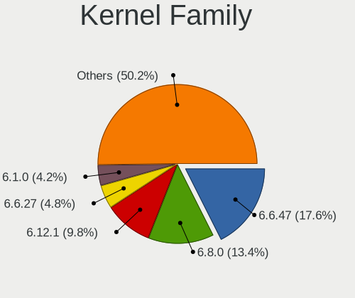

| Version  | Computers | Percent |
|----------|-----------|---------|
| 6.1.58   | 92        | 13.81%  |
| 5.19.0   | 62        | 9.31%   |
| 6.2.0    | 54        | 8.11%   |
| 6.1.0    | 52        | 7.81%   |
| 6.1.20   | 44        | 6.61%   |
| 6.6.2    | 26        | 3.9%    |
| 6.1.52   | 24        | 3.6%    |
| 6.5.0    | 22        | 3.3%    |
| 6.5.11   | 17        | 2.55%   |
| 5.15.0   | 17        | 2.55%   |
| 6.6.1    | 15        | 2.25%   |
| 6.5.12   | 14        | 2.1%    |
| 6.4.11   | 14        | 2.1%    |
| 6.2.16   | 13        | 1.95%   |
| 6.5.9    | 12        | 1.8%    |
| 6.1.46   | 12        | 1.8%    |
| 5.10.29  | 11        | 1.65%   |
| 6.5.10   | 10        | 1.5%    |
| 5.10.74  | 8         | 1.2%    |
| 6.1.57   | 7         | 1.05%   |
| 5.10.166 | 7         | 1.05%   |
| 4.15.0   | 7         | 1.05%   |
| 6.4.8    | 6         | 0.9%    |
| 6.1.60   | 6         | 0.9%    |
| 5.15.75  | 5         | 0.75%   |
| 5.15.127 | 5         | 0.75%   |
| 5.15.103 | 5         | 0.75%   |
| 3.10.0   | 5         | 0.75%   |
| 6.7.0    | 4         | 0.6%    |
| 6.6.0    | 4         | 0.6%    |
| 6.1.44   | 4         | 0.6%    |
| 5.15.87  | 4         | 0.6%    |
| 5.15.131 | 4         | 0.6%    |
| 5.14.21  | 4         | 0.6%    |
| 5.10.184 | 4         | 0.6%    |
| 6.5.7    | 3         | 0.45%   |
| 6.5.6    | 3         | 0.45%   |
| 6.5.3    | 3         | 0.45%   |
| 6.1.62   | 3         | 0.45%   |
| 5.13.0   | 3         | 0.45%   |

Kernel Major Ver.
-----------------

Linux kernel major version

| Version | Computers | Percent |
|---------|-----------|---------|
| 6.1     | 249       | 37.39%  |
| 6.5     | 90        | 13.51%  |
| 6.2     | 68        | 10.21%  |
| 5.19    | 62        | 9.31%   |
| 5.15    | 49        | 7.36%   |
| 6.6     | 46        | 6.91%   |
| 5.10    | 42        | 6.31%   |
| 6.4     | 22        | 3.3%    |
| 4.15    | 7         | 1.05%   |
| 5.4     | 6         | 0.9%    |
| 5.14    | 6         | 0.9%    |
| 3.10    | 5         | 0.75%   |
| 6.7     | 4         | 0.6%    |
| 5.16    | 3         | 0.45%   |
| 5.13    | 3         | 0.45%   |
| 4.9     | 2         | 0.3%    |
| 6.3     | 1         | 0.15%   |
| 3.18    | 1         | 0.15%   |

Arch
----

OS architecture (x86_64, i586, etc.)

| Name    | Computers | Percent |
|---------|-----------|---------|
| x86_64  | 651       | 97.75%  |
| i686    | 10        | 1.5%    |
| aarch64 | 3         | 0.45%   |
| riscv64 | 1         | 0.15%   |
| e2k     | 1         | 0.15%   |

DE
--

Desktop Environment

| Name       | Computers | Percent |
|------------|-----------|---------|
| KDE5       | 225       | 33.78%  |
| GNOME      | 164       | 24.62%  |
| Unknown    | 139       | 20.87%  |
| MATE       | 45        | 6.76%   |
| LXQt       | 31        | 4.65%   |
| X-Cinnamon | 18        | 2.7%    |
| XFCE       | 17        | 2.55%   |
| Cinnamon   | 9         | 1.35%   |
| KDE4       | 6         | 0.9%    |
| Pantheon   | 2         | 0.3%    |
| i3         | 2         | 0.3%    |
| Hyprland   | 2         | 0.3%    |
| Unity      | 1         | 0.15%   |
| openbox    | 1         | 0.15%   |
| LXDE       | 1         | 0.15%   |
| KDE        | 1         | 0.15%   |
| DWM        | 1         | 0.15%   |
| Budgie     | 1         | 0.15%   |

Display Server
--------------

X11 or Wayland

| Name    | Computers | Percent |
|---------|-----------|---------|
| Wayland | 268       | 40.24%  |
| X11     | 258       | 38.74%  |
| Unknown | 100       | 15.02%  |
| Tty     | 40        | 6.01%   |

Display Manager
---------------

SDDM, LightDM, etc.

| Name    | Computers | Percent |
|---------|-----------|---------|
| Unknown | 224       | 33.63%  |
| SDDM    | 189       | 28.38%  |
| GDM     | 131       | 19.67%  |
| LightDM | 61        | 9.16%   |
| GDM3    | 51        | 7.66%   |
| KDM     | 6         | 0.9%    |
| Ly      | 2         | 0.3%    |
| LXDM    | 1         | 0.15%   |
| LDM     | 1         | 0.15%   |

OS Lang
-------

Language

| Lang       | Computers | Percent |
|------------|-----------|---------|
| ru_RU      | 465       | 69.82%  |
| en_US      | 115       | 17.27%  |
| C          | 68        | 10.21%  |
| Unknown    | 8         | 1.2%    |
| en_GB      | 3         | 0.45%   |
| C.UTF8     | 2         | 0.3%    |
| ru_RU.UTF8 | 1         | 0.15%   |
| ru_RU-UTF8 | 1         | 0.15%   |
| ru         | 1         | 0.15%   |
| it_IT      | 1         | 0.15%   |
| en_DK      | 1         | 0.15%   |

Boot Mode
---------

EFI or BIOS

| Mode | Computers | Percent |
|------|-----------|---------|
| EFI  | 369       | 55.41%  |
| BIOS | 297       | 44.59%  |

Filesystem
----------

Type of filesystem

| Type    | Computers | Percent |
|---------|-----------|---------|
| Ext4    | 378       | 56.76%  |
| Overlay | 131       | 19.67%  |
| Btrfs   | 101       | 15.17%  |
| Tmpfs   | 31        | 4.65%   |
| Zfs     | 8         | 1.2%    |
| F2fs    | 7         | 1.05%   |
| Xfs     | 6         | 0.9%    |
| Ext3    | 2         | 0.3%    |
| Rootfs  | 1         | 0.15%   |
| Unknown | 1         | 0.15%   |

Part. scheme
------------

Scheme of partitioning

| Type    | Computers | Percent |
|---------|-----------|---------|
| GPT     | 391       | 58.71%  |
| Unknown | 147       | 22.07%  |
| MBR     | 128       | 19.22%  |

Dual Boot with Linux/BSD
------------------------

Hosting more than one Linux/BSD

| Dual boot | Computers | Percent |
|-----------|-----------|---------|
| No        | 512       | 76.88%  |
| Yes       | 154       | 23.12%  |

Dual Boot (Win)
---------------

Hosting Linux and Windows

| Dual boot | Computers | Percent |
|-----------|-----------|---------|
| No        | 441       | 66.22%  |
| Yes       | 225       | 33.78%  |

Board
-----

Vendor
------

Motherboard manufacturer

| Name                                 | Computers | Percent |
|--------------------------------------|-----------|---------|
| ASUSTek Computer                     | 120       | 18.02%  |
| Gigabyte Technology                  | 67        | 10.06%  |
| Lenovo                               | 59        | 8.86%   |
| Hewlett-Packard                      | 56        | 8.41%   |
| Supermicro                           | 51        | 7.66%   |
| MSI                                  | 42        | 6.31%   |
| Acer                                 | 31        | 4.65%   |
| ASRock                               | 25        | 3.75%   |
| Unknown                              | 24        | 3.6%    |
| HUAWEI                               | 23        | 3.45%   |
| Dell                                 | 19        | 2.85%   |
| Intel                                | 13        | 1.95%   |
| ICL                                  | 11        | 1.65%   |
| Aquarius                             | 10        | 1.5%    |
| Timi                                 | 9         | 1.35%   |
| Samsung Electronics                  | 9         | 1.35%   |
| ETegro Technologies                  | 8         | 1.2%    |
| Valve                                | 6         | 0.9%    |
| Huanan                               | 6         | 0.9%    |
| Apple                                | 5         | 0.75%   |
| Pegatron                             | 4         | 0.6%    |
| Toshiba                              | 3         | 0.45%   |
| Sony                                 | 3         | 0.45%   |
| Irbis                                | 3         | 0.45%   |
| IBM                                  | 3         | 0.45%   |
| HONOR                                | 3         | 0.45%   |
| Clevo                                | 3         | 0.45%   |
| Biostar                              | 3         | 0.45%   |
| AZW                                  | 3         | 0.45%   |
| Shenzhen Meigao Electronic Equipment | 2         | 0.3%    |
| Insyde                               | 2         | 0.3%    |
| Infinix                              | 2         | 0.3%    |
| Haier                                | 2         | 0.3%    |
| Fujitsu Siemens                      | 2         | 0.3%    |
| ECS                                  | 2         | 0.3%    |
| ZOTAC                                | 1         | 0.15%   |
| Unchartevice                         | 1         | 0.15%   |
| TECNO Mobile Limited                 | 1         | 0.15%   |
| TECNO                                | 1         | 0.15%   |
| SZMZ                                 | 1         | 0.15%   |

Model
-----

Motherboard model

| Name                                      | Computers | Percent |
|-------------------------------------------|-----------|---------|
| Unknown                                   | 24        | 3.6%    |
| Supermicro X9DRW                          | 15        | 2.25%   |
| Supermicro X8DTU                          | 10        | 1.5%    |
| ICL RAY Si105.Mi                          | 10        | 1.5%    |
| ETegro Hyperion RS125 G4                  | 8         | 1.2%    |
| ASUS All Series                           | 7         | 1.05%   |
| Aquarius NS585                            | 7         | 1.05%   |
| Valve Jupiter                             | 6         | 0.9%    |
| HP ProLiant DL360 Gen9                    | 6         | 0.9%    |
| Supermicro SYS-6018R-TDW                  | 5         | 0.75%   |
| Supermicro SYS-1028R-TDW                  | 4         | 0.6%    |
| Supermicro Super Server                   | 4         | 0.6%    |
| HP ProLiant SL230s Gen8                   | 4         | 0.6%    |
| Gigabyte A320M-S2H                        | 4         | 0.6%    |
| Timi Redmi Book Pro 15 2022               | 3         | 0.45%   |
| Supermicro X10DRi                         | 3         | 0.45%   |
| Intel X99                                 | 3         | 0.45%   |
| Intel WHITLEY                             | 3         | 0.45%   |
| Intel SKYBAY                              | 3         | 0.45%   |
| HUAWEI HVY-WXX9                           | 3         | 0.45%   |
| HUAWEI BOM-WXX9                           | 3         | 0.45%   |
| HP Pavilion g6                            | 3         | 0.45%   |
| HP Laptop 15-bw0xx                        | 3         | 0.45%   |
| Gigabyte B75M-D3V                         | 3         | 0.45%   |
| Gigabyte B450M S2H V2                     | 3         | 0.45%   |
| Clevo NL41MU2                             | 3         | 0.45%   |
| ASUS PRIME B350M-K                        | 3         | 0.45%   |
| Timi TM1701                               | 2         | 0.3%    |
| Supermicro SYS-6018R-MTR                  | 2         | 0.3%    |
| MSI MS-7C95                               | 2         | 0.3%    |
| MSI MS-7C91                               | 2         | 0.3%    |
| MSI MS-7996                               | 2         | 0.3%    |
| MSI MS-7641                               | 2         | 0.3%    |
| Lenovo ThinkPad T14 Gen 3 21AJS7P700      | 2         | 0.3%    |
| Lenovo IdeaPad L340-15API 81LW            | 2         | 0.3%    |
| Lenovo IdeaCentre AIO 3 24IIL5 F0FR004QRK | 2         | 0.3%    |
| Insyde Purley                             | 2         | 0.3%    |
| IBM System x3250 M3 -[4252K4G]-           | 2         | 0.3%    |
| HUAWEI CREF-XX                            | 2         | 0.3%    |
| HUAWEI BOD-WXX9                           | 2         | 0.3%    |

Model Family
------------

Motherboard model prefix

| Name                     | Computers | Percent |
|--------------------------|-----------|---------|
| Unknown                  | 24        | 3.6%    |
| Acer Aspire              | 22        | 3.3%    |
| ASUS VivoBook            | 21        | 3.15%   |
| Lenovo IdeaPad           | 16        | 2.4%    |
| ASUS PRIME               | 16        | 2.4%    |
| Supermicro X9DRW         | 15        | 2.25%   |
| HP ProLiant              | 15        | 2.25%   |
| Lenovo ThinkPad          | 11        | 1.65%   |
| ICL RAY                  | 11        | 1.65%   |
| Supermicro X8DTU         | 10        | 1.5%    |
| HP ProBook               | 10        | 1.5%    |
| ASUS ROG                 | 10        | 1.5%    |
| HP Pavilion              | 9         | 1.35%   |
| HP Laptop                | 8         | 1.2%    |
| ETegro Hyperion          | 8         | 1.2%    |
| ASUS All                 | 7         | 1.05%   |
| Aquarius NS585           | 7         | 1.05%   |
| Valve Jupiter            | 6         | 0.9%    |
| Gigabyte B450M           | 6         | 0.9%    |
| Gigabyte A320M-S2H       | 6         | 0.9%    |
| Supermicro SYS-6018R-TDW | 5         | 0.75%   |
| Lenovo IdeaCentre        | 5         | 0.75%   |
| Supermicro SYS-1028R-TDW | 4         | 0.6%    |
| Supermicro Super         | 4         | 0.6%    |
| MSI Modern               | 4         | 0.6%    |
| Lenovo ThinkBook         | 4         | 0.6%    |
| Intel X99                | 4         | 0.6%    |
| HP EliteBook             | 4         | 0.6%    |
| Gigabyte B550M           | 4         | 0.6%    |
| Dell Latitude            | 4         | 0.6%    |
| Dell Inspiron            | 4         | 0.6%    |
| ASUS TUF                 | 4         | 0.6%    |
| ASUS ASUS                | 4         | 0.6%    |
| Acer TravelMate          | 4         | 0.6%    |
| Toshiba Satellite        | 3         | 0.45%   |
| Timi Redmi               | 3         | 0.45%   |
| Supermicro X10DRi        | 3         | 0.45%   |
| Lenovo ThinkCentre       | 3         | 0.45%   |
| Lenovo Legion            | 3         | 0.45%   |
| Intel WHITLEY            | 3         | 0.45%   |

MFG Year
--------

Motherboard manufacture year

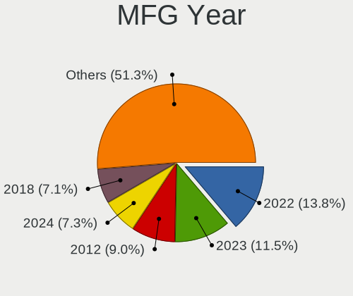

| Year    | Computers | Percent |
|---------|-----------|---------|
| 2022    | 90        | 13.51%  |
| 2020    | 64        | 9.61%   |
| 2021    | 61        | 9.16%   |
| 2013    | 51        | 7.66%   |
| 2012    | 51        | 7.66%   |
| 2018    | 50        | 7.51%   |
| 2023    | 44        | 6.61%   |
| 2019    | 41        | 6.16%   |
| 2011    | 40        | 6.01%   |
| 2017    | 33        | 4.95%   |
| 2015    | 24        | 3.6%    |
| 2016    | 23        | 3.45%   |
| 2010    | 22        | 3.3%    |
| 2009    | 18        | 2.7%    |
| 2014    | 17        | 2.55%   |
| 2008    | 14        | 2.1%    |
| 2007    | 12        | 1.8%    |
| Unknown | 5         | 0.75%   |
| 2006    | 4         | 0.6%    |
| 2005    | 2         | 0.3%    |

Form Factor
-----------

Physical design of the computer

| Name           | Computers | Percent |
|----------------|-----------|---------|
| Notebook       | 288       | 43.24%  |
| Desktop        | 271       | 40.69%  |
| Server         | 66        | 9.91%   |
| All in one     | 30        | 4.5%    |
| System on chip | 4         | 0.6%    |
| Mini pc        | 4         | 0.6%    |
| Convertible    | 2         | 0.3%    |
| Tablet         | 1         | 0.15%   |

Secure Boot
-----------

Enabled or disabled

| State    | Computers | Percent |
|----------|-----------|---------|
| Disabled | 645       | 96.85%  |
| Enabled  | 21        | 3.15%   |

Coreboot
--------

Have coreboot on board

| Used | Computers | Percent |
|------|-----------|---------|
| No   | 666       | 100%    |

RAM Size
--------

Total RAM memory

| Size in GB      | Computers | Percent |
|-----------------|-----------|---------|
| 16.01-24.0      | 164       | 24.62%  |
| 4.01-8.0        | 162       | 24.32%  |
| 8.01-16.0       | 121       | 18.17%  |
| 3.01-4.0        | 74        | 11.11%  |
| 32.01-64.0      | 60        | 9.01%   |
| 64.01-256.0     | 40        | 6.01%   |
| 24.01-32.0      | 12        | 1.8%    |
| More than 256.0 | 11        | 1.65%   |
| 2.01-3.0        | 10        | 1.5%    |
| 1.01-2.0        | 10        | 1.5%    |
| 0.51-1.0        | 2         | 0.3%    |

RAM Used
--------

Used RAM memory

| Used GB     | Computers | Percent |
|-------------|-----------|---------|
| 1.01-2.0    | 258       | 38.74%  |
| 2.01-3.0    | 139       | 20.87%  |
| 4.01-8.0    | 84        | 12.61%  |
| 3.01-4.0    | 77        | 11.56%  |
| 0.51-1.0    | 68        | 10.21%  |
| 8.01-16.0   | 24        | 3.6%    |
| 16.01-24.0  | 7         | 1.05%   |
| 0.01-0.5    | 5         | 0.75%   |
| 32.01-64.0  | 2         | 0.3%    |
| 64.01-256.0 | 2         | 0.3%    |

Total Drives
------------

Number of drives on board

| Drives | Computers | Percent |
|--------|-----------|---------|
| 1      | 391       | 58.71%  |
| 2      | 145       | 21.77%  |
| 3      | 58        | 8.71%   |
| 4      | 32        | 4.8%    |
| 5      | 11        | 1.65%   |
| 7      | 8         | 1.2%    |
| 6      | 6         | 0.9%    |
| 11     | 5         | 0.75%   |
| 0      | 3         | 0.45%   |
| 20     | 2         | 0.3%    |
| 13     | 2         | 0.3%    |
| 8      | 2         | 0.3%    |
| 19     | 1         | 0.15%   |

Has CD-ROM
----------

Has CD-ROM on board

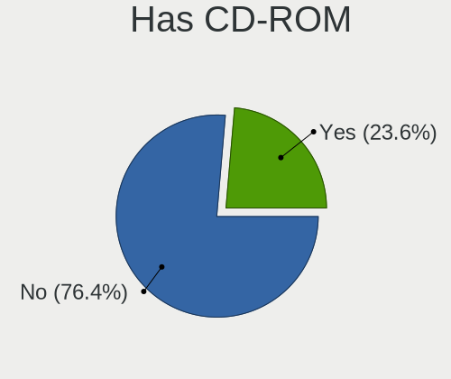

| Presented | Computers | Percent |
|-----------|-----------|---------|
| No        | 522       | 78.38%  |
| Yes       | 144       | 21.62%  |

Has Ethernet
------------

Has Ethernet on board

| Presented | Computers | Percent |
|-----------|-----------|---------|
| Yes       | 574       | 86.19%  |
| No        | 92        | 13.81%  |

Has WiFi
--------

Has WiFi module

| Presented | Computers | Percent |
|-----------|-----------|---------|
| Yes       | 399       | 59.91%  |
| No        | 267       | 40.09%  |

Has Bluetooth
-------------

Has Bluetooth module

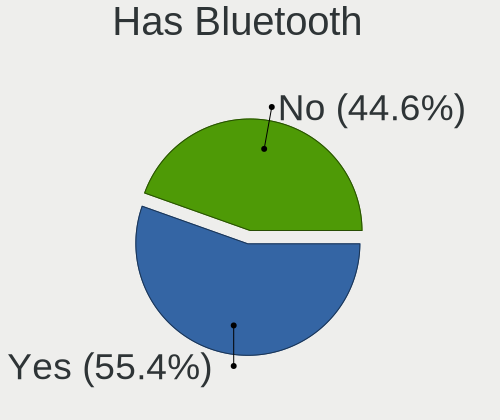

| Presented | Computers | Percent |
|-----------|-----------|---------|
| Yes       | 355       | 53.3%   |
| No        | 311       | 46.7%   |

Location
--------

Country
-------

Geographic location (country)

| Country | Computers | Percent |
|---------|-----------|---------|
| Russia  | 666       | 100%    |

City
----

Geographic location (city)

| City             | Computers | Percent |
|------------------|-----------|---------|
| Moscow           | 213       | 31.98%  |
| St Petersburg    | 68        | 10.21%  |
| Voronezh         | 45        | 6.76%   |
| Yekaterinburg    | 15        | 2.25%   |
| Novosibirsk      | 14        | 2.1%    |
| Krasnodar        | 14        | 2.1%    |
| Perm             | 12        | 1.8%    |
| Labytnangi       | 12        | 1.8%    |
| Samara           | 10        | 1.5%    |
| Rostov-on-Don    | 9         | 1.35%   |
| Novy Urengoy     | 9         | 1.35%   |
| Krasnoyarsk      | 9         | 1.35%   |
| Nizhniy Novgorod | 8         | 1.2%    |
| Ulyanovsk        | 7         | 1.05%   |
| Ufa              | 7         | 1.05%   |
| Smolensk         | 7         | 1.05%   |
| Kazan’         | 7         | 1.05%   |
| Vladivostok      | 6         | 0.9%    |
| Volgograd        | 5         | 0.75%   |
| Yaroslavl        | 4         | 0.6%    |
| Saratov          | 4         | 0.6%    |
| Petrozavodsk     | 4         | 0.6%    |
| Khabarovsk       | 4         | 0.6%    |
| Irkutsk          | 4         | 0.6%    |
| Cherepovets      | 4         | 0.6%    |
| Tver             | 3         | 0.45%   |
| Tomsk            | 3         | 0.45%   |
| Sergiyev Posad   | 3         | 0.45%   |
| Salekhard        | 3         | 0.45%   |
| Ryazan           | 3         | 0.45%   |
| Penza            | 3         | 0.45%   |
| Murom            | 3         | 0.45%   |
| Lipetsk          | 3         | 0.45%   |
| Barnaul          | 3         | 0.45%   |
| Zlatoust         | 2         | 0.3%    |
| Yakutsk          | 2         | 0.3%    |
| Ulan-Ude         | 2         | 0.3%    |
| Tyumen           | 2         | 0.3%    |
| Tula             | 2         | 0.3%    |
| Taganrog         | 2         | 0.3%    |

Drives
------

Drive Vendor
------------

Hard drive vendors

| Vendor                      | Computers | Drives | Percent |
|-----------------------------|-----------|--------|---------|
| WDC                         | 122       | 162    | 12.79%  |
| Samsung Electronics         | 109       | 138    | 11.43%  |
| Seagate                     | 86        | 110    | 9.01%   |
| Kingston                    | 56        | 67     | 5.87%   |
| Toshiba                     | 50        | 62     | 5.24%   |
| Fujitsu                     | 43        | 74     | 4.51%   |
| A-DATA Technology           | 43        | 46     | 4.51%   |
| Intel                       | 33        | 59     | 3.46%   |
| Sandisk                     | 26        | 26     | 2.73%   |
| Unknown                     | 22        | 23     | 2.31%   |
| Hitachi                     | 22        | 45     | 2.31%   |
| HGST                        | 21        | 29     | 2.2%    |
| China                       | 21        | 22     | 2.2%    |
| Micron Technology           | 18        | 18     | 1.89%   |
| Apacer                      | 17        | 18     | 1.78%   |
| Hewlett-Packard             | 15        | 59     | 1.57%   |
| Crucial                     | 14        | 16     | 1.47%   |
| SK hynix                    | 12        | 12     | 1.26%   |
| SPCC                        | 10        | 10     | 1.05%   |
| AMD                         | 10        | 10     | 1.05%   |
| Silicon Motion              | 9         | 9      | 0.94%   |
| Phison                      | 9         | 9      | 0.94%   |
| Patriot                     | 9         | 10     | 0.94%   |
| Netac                       | 8         | 9      | 0.84%   |
| MAXIO Technology (Hangzhou) | 7         | 7      | 0.73%   |
| DEXP                        | 7         | 7      | 0.73%   |
| Phison Electronics          | 6         | 6      | 0.63%   |
| OCZ                         | 6         | 6      | 0.63%   |
| KingSpec                    | 6         | 6      | 0.63%   |
| JMicron Technology          | 6         | 6      | 0.63%   |
| Transcend                   | 5         | 5      | 0.52%   |
| KIOXIA                      | 5         | 5      | 0.52%   |
| Kingston Technology Company | 5         | 5      | 0.52%   |
| GOODRAM                     | 5         | 5      | 0.52%   |
| XrayDisk                    | 4         | 4      | 0.42%   |
| XPG                         | 4         | 5      | 0.42%   |
| Apple                       | 4         | 4      | 0.42%   |
| SSSTC                       | 3         | 3      | 0.31%   |
| Smartbuy                    | 3         | 3      | 0.31%   |
| Qumo                        | 3         | 3      | 0.31%   |

Drive Model
-----------

Hard drive models

| Model                                               | Computers | Percent |
|-----------------------------------------------------|-----------|---------|
| Fujitsu MBA3147RC 147GB                             | 20        | 1.91%   |
| Kingston SA400S37480G 480GB SSD                     | 13        | 1.24%   |
| Samsung NVMe SSD Controller SM981/PM981/PM983 250GB | 12        | 1.15%   |
| Kingston SA400S37240G 240GB SSD                     | 12        | 1.15%   |
| Fujitsu MBE2147RC 147GB                             | 12        | 1.15%   |
| Fujitsu MAX3147RC 147GB                             | 10        | 0.95%   |
| A-DATA SU650 240GB SSD                              | 10        | 0.95%   |
| WDC WD10EZEX-00BBHA0 1TB                            | 7         | 0.67%   |
| Toshiba DT01ACA100 1TB                              | 7         | 0.67%   |
| Toshiba DT01ACA050 500GB                            | 7         | 0.67%   |
| A-DATA SU800 512GB SSD                              | 7         | 0.67%   |
| WDC WDS240G2G0A-00JH30 240GB SSD                    | 6         | 0.57%   |
| Toshiba MQ01ABF050 500GB                            | 6         | 0.57%   |
| Silicon Motion PCIe-8 SSD 512GB                     | 6         | 0.57%   |
| WDC WDS120G2G0A-00JH30 120GB SSD                    | 5         | 0.48%   |
| Toshiba HDWD120 2TB                                 | 5         | 0.48%   |
| Toshiba HDWD110 1TB                                 | 5         | 0.48%   |
| Seagate ST500DM002-1BD142 500GB                     | 5         | 0.48%   |
| Seagate ST3500418AS 500GB                           | 5         | 0.48%   |
| Samsung SSD 970 EVO Plus 1TB                        | 5         | 0.48%   |
| Samsung NVMe SSD Controller PM9A1/PM9A3/980PRO 2TB  | 5         | 0.48%   |
| Kingston SNVS500G 500GB                             | 5         | 0.48%   |
| Intel SSDPEKNU512GZ 512GB                           | 5         | 0.48%   |
| HGST HTE721010A9E630 1TB                            | 5         | 0.48%   |
| HP MO0200JEFNV 200GB                                | 5         | 0.48%   |
| Apacer AS350 512GB SSD                              | 5         | 0.48%   |
| WDC WDS250G2B0A-00SM50 250GB SSD                    | 4         | 0.38%   |
| WDC WD20EARX-00PASB0 2TB                            | 4         | 0.38%   |
| WDC WD10EZEX-08WN4A0 1TB                            | 4         | 0.38%   |
| Unknown MMC Card  64GB                              | 4         | 0.38%   |
| Unknown MMC Card  128GB                             | 4         | 0.38%   |
| SK hynix HFM512GD3JX013N 512GB                      | 4         | 0.38%   |
| Seagate ST1000LM024 HN-M101MBB 1TB                  | 4         | 0.38%   |
| Seagate ST1000DM010-2EP102 1TB                      | 4         | 0.38%   |
| Sandisk WD Blue SN550 NVMe SSD 512GB                | 4         | 0.38%   |
| Samsung SSD 860 EVO 250GB                           | 4         | 0.38%   |
| Samsung MZVL4512HBLU-00BTW 512GB                    | 4         | 0.38%   |
| Samsung MZALQ512HALU-000L2 512GB                    | 4         | 0.38%   |
| Phison PS5013 E13 NVMe Controller 512GB             | 4         | 0.38%   |
| Patriot P210 256GB SSD                              | 4         | 0.38%   |

HDD Vendor
----------

Hard disk drive vendors

| Vendor              | Computers | Drives | Percent |
|---------------------|-----------|--------|---------|
| WDC                 | 96        | 126    | 28.15%  |
| Seagate             | 85        | 107    | 24.93%  |
| Toshiba             | 47        | 59     | 13.78%  |
| Fujitsu             | 43        | 74     | 12.61%  |
| Hitachi             | 22        | 45     | 6.45%   |
| HGST                | 21        | 29     | 6.16%   |
| Samsung Electronics | 10        | 11     | 2.93%   |
| Hewlett-Packard     | 5         | 34     | 1.47%   |
| Unknown             | 3         | 3      | 0.88%   |
| HPE                 | 3         | 18     | 0.88%   |
| USB3.0              | 1         | 1      | 0.29%   |
| USB                 | 1         | 1      | 0.29%   |
| TO Exter            | 1         | 1      | 0.29%   |
| StoreJet            | 1         | 1      | 0.29%   |
| External            | 1         | 1      | 0.29%   |
| Apple               | 1         | 1      | 0.29%   |

SSD Vendor
----------

Solid state drive vendors

| Vendor              | Computers | Drives | Percent |
|---------------------|-----------|--------|---------|
| Kingston            | 44        | 51     | 13.06%  |
| Samsung Electronics | 42        | 53     | 12.46%  |
| A-DATA Technology   | 35        | 35     | 10.39%  |
| WDC                 | 25        | 25     | 7.42%   |
| China               | 21        | 22     | 6.23%   |
| Apacer              | 16        | 17     | 4.75%   |
| Intel               | 15        | 40     | 4.45%   |
| Crucial             | 11        | 11     | 3.26%   |
| AMD                 | 9         | 9      | 2.67%   |
| Patriot             | 8         | 9      | 2.37%   |
| SanDisk             | 7         | 7      | 2.08%   |
| DEXP                | 7         | 7      | 2.08%   |
| SPCC                | 6         | 6      | 1.78%   |
| OCZ                 | 6         | 6      | 1.78%   |
| Hewlett-Packard     | 6         | 17     | 1.78%   |
| Netac               | 5         | 5      | 1.48%   |
| GOODRAM             | 5         | 5      | 1.48%   |
| XrayDisk            | 4         | 4      | 1.19%   |
| KingSpec            | 4         | 4      | 1.19%   |
| JMicron Technology  | 4         | 4      | 1.19%   |
| Transcend           | 3         | 3      | 0.89%   |
| HYDRA               | 3         | 3      | 0.89%   |
| Digma               | 3         | 3      | 0.89%   |
| Azerty              | 3         | 3      | 0.89%   |
| Toshiba             | 2         | 2      | 0.59%   |
| Smartbuy            | 2         | 2      | 0.59%   |
| Reeinno             | 2         | 2      | 0.59%   |
| Qumo                | 2         | 2      | 0.59%   |
| Neo                 | 2         | 2      | 0.59%   |
| Micron Technology   | 2         | 2      | 0.59%   |
| KingFast            | 2         | 2      | 0.59%   |
| HS-SSD-E100         | 2         | 2      | 0.59%   |
| Apple               | 2         | 2      | 0.59%   |
| AGI                 | 2         | 2      | 0.59%   |
| Zheino              | 1         | 1      | 0.3%    |
| TMI                 | 1         | 2      | 0.3%    |
| Thinkplus           | 1         | 1      | 0.3%    |
| Team                | 1         | 1      | 0.3%    |
| SK hynix            | 1         | 1      | 0.3%    |
| SandForce           | 1         | 1      | 0.3%    |

Drive Kind
----------

HDD or SSD

| Kind    | Computers | Drives | Percent |
|---------|-----------|--------|---------|
| SSD     | 300       | 397    | 34.25%  |
| HDD     | 289       | 512    | 32.99%  |
| NVMe    | 250       | 284    | 28.54%  |
| MMC     | 19        | 20     | 2.17%   |
| Unknown | 18        | 21     | 2.05%   |

Drive Connector
---------------

SATA, SAS, NVMe, etc.

| Type | Computers | Drives | Percent |
|------|-----------|--------|---------|
| SATA | 449       | 849    | 57.64%  |
| NVMe | 250       | 284    | 32.09%  |
| SAS  | 61        | 81     | 7.83%   |
| MMC  | 19        | 20     | 2.44%   |

Drive Size
----------

Size of hard drive

| Size in TB | Computers | Drives | Percent |
|------------|-----------|--------|---------|
| 0.01-0.5   | 378       | 545    | 62.58%  |
| 0.51-1.0   | 152       | 223    | 25.17%  |
| 1.01-2.0   | 43        | 72     | 7.12%   |
| 3.01-4.0   | 14        | 37     | 2.32%   |
| 2.01-3.0   | 12        | 25     | 1.99%   |
| 4.01-10.0  | 5         | 7      | 0.83%   |

Space Total
-----------

Amount of disk space available on the file system

| Size in GB     | Computers | Percent |
|----------------|-----------|---------|
| 101-250        | 152       | 22.82%  |
| 251-500        | 137       | 20.57%  |
| Unknown        | 120       | 18.02%  |
| 501-1000       | 78        | 11.71%  |
| 1-20           | 51        | 7.66%   |
| 1001-2000      | 40        | 6.01%   |
| More than 3000 | 29        | 4.35%   |
| 51-100         | 29        | 4.35%   |
| 21-50          | 16        | 2.4%    |
| 2001-3000      | 14        | 2.1%    |

Space Used
----------

Amount of used disk space

| Used GB        | Computers | Percent |
|----------------|-----------|---------|
| 1-20           | 227       | 34.08%  |
| Unknown        | 120       | 18.02%  |
| 21-50          | 106       | 15.92%  |
| 101-250        | 60        | 9.01%   |
| 51-100         | 54        | 8.11%   |
| 251-500        | 46        | 6.91%   |
| 501-1000       | 25        | 3.75%   |
| 1001-2000      | 12        | 1.8%    |
| More than 3000 | 10        | 1.5%    |
| 2001-3000      | 5         | 0.75%   |
| 0              | 1         | 0.15%   |

Malfunc. Drives
---------------

Drive models with a malfunction

| Model                                          | Computers | Drives | Percent |
|------------------------------------------------|-----------|--------|---------|
| Seagate ST9250315AS 250GB                      | 3         | 3      | 2.78%   |
| Intel SSDSC2BB800G7 800GB                      | 3         | 3      | 2.78%   |
| HGST HTS541010A9E680 1TB                       | 3         | 3      | 2.78%   |
| WDC WD5002ABYS-02B1B0 500GB                    | 2         | 3      | 1.85%   |
| WDC WD5000LPVX-22V0TT0 500GB                   | 2         | 2      | 1.85%   |
| Seagate ST500DM002-1BD142 500GB                | 2         | 2      | 1.85%   |
| Seagate ST320LT012-9WS14C 320GB                | 2         | 2      | 1.85%   |
| Seagate ST1000NM0011 1TB                       | 2         | 2      | 1.85%   |
| Kingston SV300S37A120G 120GB SSD               | 2         | 2      | 1.85%   |
| Hitachi HDS721050CLA360 500GB                  | 2         | 2      | 1.85%   |
| XrayDisk 240GB SSD                             | 1         | 1      | 0.93%   |
| WDC WDS120G2G0A-00JH30 120GB SSD               | 1         | 1      | 0.93%   |
| WDC WD7502AAEX-00Y9A0 752GB                    | 1         | 1      | 0.93%   |
| WDC WD5002AALX-00J37A0 500GB                   | 1         | 1      | 0.93%   |
| WDC WD5000BEVT-22A0RT0 500GB                   | 1         | 1      | 0.93%   |
| WDC WD3200BPVT-24ZEST0 320GB                   | 1         | 1      | 0.93%   |
| WDC WD3200BEVT-80A0RT0 320GB                   | 1         | 1      | 0.93%   |
| WDC WD2502ABYS-23B7A0 39M4511 42C0463IBM 250GB | 1         | 2      | 0.93%   |
| WDC WD2500LPCX-24C6HT0 250GB                   | 1         | 1      | 0.93%   |
| WDC WD2500JS-00NCB1 250GB                      | 1         | 1      | 0.93%   |
| WDC WD20EFRX-68EUZN0 2TB                       | 1         | 1      | 0.93%   |
| WDC WD20EARX-00PASB0 2TB                       | 1         | 1      | 0.93%   |
| WDC WD20EARS-00MVWB0 2TB                       | 1         | 1      | 0.93%   |
| WDC WD1200BEVS-60UST0 120GB                    | 1         | 1      | 0.93%   |
| WDC WD1200BEVS-07LAT0 120GB                    | 1         | 1      | 0.93%   |
| WDC WD10JPVT-60A1YT0 1TB                       | 1         | 1      | 0.93%   |
| WDC WD10EZRX-00A8LB0 1TB                       | 1         | 1      | 0.93%   |
| WDC WD10EZEX-60M2NA0 1TB                       | 1         | 1      | 0.93%   |
| WDC WD1003FZEX-00K3CA0 1TB                     | 1         | 1      | 0.93%   |
| Toshiba MQ04ABF100 1TB                         | 1         | 1      | 0.93%   |
| Toshiba MQ01ABF050 500GB                       | 1         | 1      | 0.93%   |
| Toshiba MQ01ABD075 752GB                       | 1         | 1      | 0.93%   |
| Toshiba MK8034GSX 80GB                         | 1         | 1      | 0.93%   |
| Toshiba MK5075GSX 500GB                        | 1         | 1      | 0.93%   |
| Toshiba MK3259GSXP 320GB                       | 1         | 1      | 0.93%   |
| Toshiba MK2565GSX 250GB                        | 1         | 1      | 0.93%   |
| Toshiba DT01ACA100 1TB                         | 1         | 1      | 0.93%   |
| Toshiba DT01ACA050 500GB                       | 1         | 1      | 0.93%   |
| StoreJet Disk 1TB                              | 1         | 1      | 0.93%   |
| SK hynix HFS128G39TND-N210A 128GB SSD          | 1         | 1      | 0.93%   |

Malfunc. Drive Vendor
---------------------

Vendors of faulty drives

| Vendor              | Computers | Drives | Percent |
|---------------------|-----------|--------|---------|
| Seagate             | 27        | 29     | 25.96%  |
| WDC                 | 22        | 24     | 21.15%  |
| Toshiba             | 8         | 9      | 7.69%   |
| Samsung Electronics | 6         | 6      | 5.77%   |
| Hitachi             | 6         | 6      | 5.77%   |
| HGST                | 6         | 6      | 5.77%   |
| Kingston            | 5         | 5      | 4.81%   |
| Intel               | 4         | 7      | 3.85%   |
| Fujitsu             | 3         | 3      | 2.88%   |
| China               | 2         | 2      | 1.92%   |
| XrayDisk            | 1         | 1      | 0.96%   |
| StoreJet            | 1         | 1      | 0.96%   |
| SK hynix            | 1         | 1      | 0.96%   |
| SanDisk             | 1         | 1      | 0.96%   |
| SandForce           | 1         | 1      | 0.96%   |
| RADIUM              | 1         | 1      | 0.96%   |
| Patriot             | 1         | 1      | 0.96%   |
| OCZ                 | 1         | 1      | 0.96%   |
| Netac               | 1         | 1      | 0.96%   |
| Neo                 | 1         | 1      | 0.96%   |
| HYDRA               | 1         | 1      | 0.96%   |
| Crucial             | 1         | 1      | 0.96%   |
| Corsair             | 1         | 1      | 0.96%   |
| ACOS                | 1         | 1      | 0.96%   |
| A-DATA Technology   | 1         | 1      | 0.96%   |

Malfunc. HDD Vendor
-------------------

Vendors of faulty HDD drives

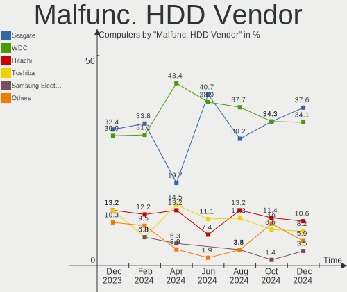

| Vendor              | Computers | Drives | Percent |
|---------------------|-----------|--------|---------|
| Seagate             | 27        | 29     | 35.53%  |
| WDC                 | 21        | 23     | 27.63%  |
| Toshiba             | 8         | 9      | 10.53%  |
| Hitachi             | 6         | 6      | 7.89%   |
| HGST                | 6         | 6      | 7.89%   |
| Samsung Electronics | 4         | 4      | 5.26%   |
| Fujitsu             | 3         | 3      | 3.95%   |
| StoreJet            | 1         | 1      | 1.32%   |

Malfunc. Drive Kind
-------------------

Kinds of faulty drives

| Kind | Computers | Drives | Percent |
|------|-----------|--------|---------|
| HDD  | 72        | 81     | 72%     |
| SSD  | 28        | 31     | 28%     |

Failed Drives
-------------

Failed drive models

| Model                    | Computers | Drives | Percent |
|--------------------------|-----------|--------|---------|
| HGST HTS541010A9E680 1TB | 1         | 1      | 100%    |

Failed Drive Vendor
-------------------

Failed drive vendors

| Vendor | Computers | Drives | Percent |
|--------|-----------|--------|---------|
| HGST   | 1         | 1      | 100%    |

Drive Status
------------

Number of failed and malfunc. drives

| Status   | Computers | Drives | Percent |
|----------|-----------|--------|---------|
| Works    | 455       | 854    | 60.75%  |
| Detected | 194       | 267    | 25.9%   |
| Malfunc  | 99        | 112    | 13.22%  |
| Failed   | 1         | 1      | 0.13%   |

Storage controller
------------------

Storage Vendor
--------------

Storage controller vendors

| Vendor                           | Computers | Percent |
|----------------------------------|-----------|---------|
| Intel                            | 412       | 45.78%  |
| AMD                              | 143       | 15.89%  |
| Samsung Electronics              | 64        | 7.11%   |
| LSI Logic / Symbios Logic        | 33        | 3.67%   |
| SanDisk                          | 29        | 3.22%   |
| Phison Electronics               | 24        | 2.67%   |
| Kingston Technology Company      | 20        | 2.22%   |
| Silicon Motion                   | 16        | 1.78%   |
| Micron Technology                | 16        | 1.78%   |
| ASMedia Technology               | 12        | 1.33%   |
| SK hynix                         | 11        | 1.22%   |
| Hewlett-Packard                  | 11        | 1.22%   |
| ADATA Technology                 | 11        | 1.22%   |
| Adaptec                          | 11        | 1.22%   |
| MAXIO Technology (Hangzhou)      | 10        | 1.11%   |
| Broadcom / LSI                   | 10        | 1.11%   |
| JMicron Technology               | 9         | 1%      |
| Realtek Semiconductor            | 6         | 0.67%   |
| Nvidia                           | 6         | 0.67%   |
| Marvell Technology Group         | 6         | 0.67%   |
| KIOXIA                           | 6         | 0.67%   |
| Micron/Crucial Technology        | 5         | 0.56%   |
| Solid State Storage Technology   | 4         | 0.44%   |
| Shenzhen Longsys Electronics     | 4         | 0.44%   |
| VIA Technologies                 | 3         | 0.33%   |
| Netac Technology                 | 3         | 0.33%   |
| INNOGRIT                         | 3         | 0.33%   |
| Union Memory (Shenzhen)          | 2         | 0.22%   |
| Transcend                        | 2         | 0.22%   |
| Shenzhen Shichuangyi Electronics | 2         | 0.22%   |
| O2 Micro                         | 2         | 0.22%   |
| Yangtze Memory Technologies      | 1         | 0.11%   |
| Seagate Technology               | 1         | 0.11%   |
| Hosin Global Electronics         | 1         | 0.11%   |
| Apple                            | 1         | 0.11%   |

Storage Model
-------------

Storage controller models

| Model                                                                                   | Computers | Percent |
|-----------------------------------------------------------------------------------------|-----------|---------|
| AMD FCH SATA Controller [AHCI mode]                                                     | 92        | 8.86%   |
| Intel 7 Series Chipset Family 6-port SATA Controller [AHCI mode]                        | 27        | 2.6%    |
| Samsung NVMe SSD Controller SM981/PM981/PM983                                           | 26        | 2.5%    |
| Intel 8 Series/C220 Series Chipset Family 6-port SATA Controller 1 [AHCI mode]          | 25        | 2.41%   |
| AMD 500 Series Chipset SATA Controller                                                  | 23        | 2.22%   |
| Intel C610/X99 series chipset 6-Port SATA Controller [AHCI mode]                        | 22        | 2.12%   |
| Samsung NVMe SSD Controller 980 (DRAM-less)                                             | 21        | 2.02%   |
| Intel 500 Series Chipset Family SATA AHCI Controller                                    | 20        | 1.93%   |
| AMD 400 Series Chipset SATA Controller                                                  | 18        | 1.73%   |
| Intel C610/X99 series chipset sSATA Controller [AHCI mode]                              | 17        | 1.64%   |
| Intel Cannon Lake PCH SATA AHCI Controller                                              | 16        | 1.54%   |
| Intel Sunrise Point-LP SATA Controller [AHCI mode]                                      | 15        | 1.45%   |
| Intel Comet Lake SATA AHCI Controller                                                   | 15        | 1.45%   |
| Intel 200 Series PCH SATA controller [AHCI mode]                                        | 14        | 1.35%   |
| LSI Logic / Symbios Logic MegaRAID SAS 2108 [Liberator]                                 | 13        | 1.25%   |
| Intel Volume Management Device NVMe RAID Controller                                     | 13        | 1.25%   |
| Intel C602 chipset 4-Port SATA Storage Control Unit                                     | 13        | 1.25%   |
| Intel 6 Series/C200 Series Chipset Family 6 port Mobile SATA AHCI Controller            | 13        | 1.25%   |
| Intel 6 Series/C200 Series Chipset Family 6 port Desktop SATA AHCI Controller           | 13        | 1.25%   |
| Intel Tiger Lake-LP SATA Controller                                                     | 12        | 1.16%   |
| Intel Q170/Q150/B150/H170/H110/Z170/CM236 Chipset SATA Controller [AHCI Mode]           | 12        | 1.16%   |
| Intel 82801 Mobile SATA Controller [RAID mode]                                          | 12        | 1.16%   |
| ASMedia ASM1062 Serial ATA Controller                                                   | 12        | 1.16%   |
| AMD SB7x0/SB8x0/SB9x0 SATA Controller [AHCI mode]                                       | 12        | 1.16%   |
| AMD FCH SATA Controller D                                                               | 12        | 1.16%   |
| Samsung NVMe SSD Controller PM9A1/PM9A3/980PRO                                          | 11        | 1.06%   |
| Phison PS5013-E13 PCIe3 NVMe Controller (DRAM-less)                                     | 11        | 1.06%   |
| MAXIO (Hangzhou) NVMe SSD Controller MAP1202                                            | 10        | 0.96%   |
| Intel Celeron/Pentium Silver Processor SATA Controller                                  | 10        | 0.96%   |
| HP Smart Array Gen9 Controllers                                                         | 10        | 0.96%   |
| Silicon Motion Non-Volatile memory controller                                           | 9         | 0.87%   |
| LSI Logic / Symbios Logic SAS1064ET PCI-Express Fusion-MPT SAS                          | 9         | 0.87%   |
| Intel SSD 670p Series [Keystone Harbor]                                                 | 9         | 0.87%   |
| AMD SB7x0/SB8x0/SB9x0 IDE Controller                                                    | 9         | 0.87%   |
| LSI Logic / Symbios Logic SAS2004 PCI-Express Fusion-MPT SAS-2 [Spitfire]               | 8         | 0.77%   |
| Intel NM10/ICH7 Family SATA Controller [IDE mode]                                       | 8         | 0.77%   |
| Intel 7 Series/C210 Series Chipset Family 6-port SATA Controller [AHCI mode]            | 8         | 0.77%   |
| Intel 6 Series/C200 Series Chipset Family Desktop SATA Controller (IDE mode, ports 4-5) | 8         | 0.77%   |
| Intel 6 Series/C200 Series Chipset Family Desktop SATA Controller (IDE mode, ports 0-3) | 8         | 0.77%   |
| SanDisk Ultra 3D / WD Blue SN550 NVMe SSD                                               | 7         | 0.67%   |

Storage Kind
------------

Kind of storage controller (IDE, SATA, NVMe, SAS, ...)

| Kind | Computers | Percent |
|------|-----------|---------|
| SATA | 466       | 52.13%  |
| NVMe | 250       | 27.96%  |
| IDE  | 75        | 8.39%   |
| RAID | 68        | 7.61%   |
| SAS  | 25        | 2.8%    |
| SCSI | 10        | 1.12%   |

Processor
---------

CPU Vendor
----------

Processor vendors

| Vendor        | Computers | Percent |
|---------------|-----------|---------|
| Intel         | 460       | 69.07%  |
| AMD           | 201       | 30.18%  |
| ARM           | 3         | 0.45%   |
| sifive,u74-mc | 1         | 0.15%   |
| EL2S4         | 1         | 0.15%   |

CPU Model
---------

Processor models

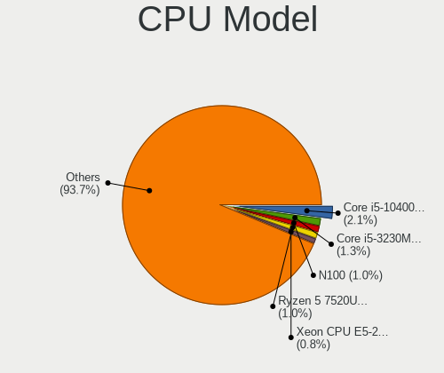

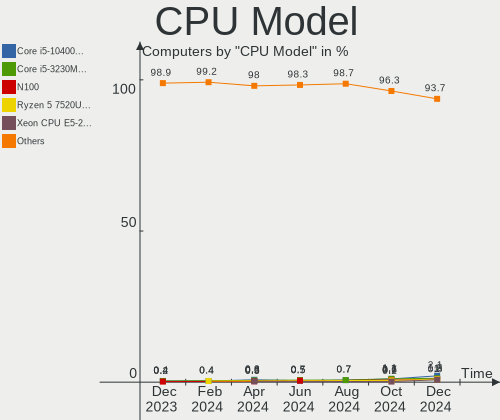

| Model                                      | Computers | Percent |
|--------------------------------------------|-----------|---------|
| Intel Core i5-10400 CPU @ 2.90GHz          | 13        | 1.95%   |
| Intel Xeon CPU E5-2680 v4 @ 2.40GHz        | 12        | 1.8%    |
| Intel Xeon CPU E5-2650 0 @ 2.00GHz         | 12        | 1.8%    |
| Intel 11th Gen Core i5-1135G7 @ 2.40GHz    | 12        | 1.8%    |
| Intel Core i3-9100 CPU @ 3.60GHz           | 10        | 1.5%    |
| Intel Xeon CPU X5670 @ 2.93GHz             | 9         | 1.35%   |
| Intel Xeon CPU E5-2620 v3 @ 2.40GHz        | 9         | 1.35%   |
| Intel Xeon CPU E5-2620 v2 @ 2.10GHz        | 9         | 1.35%   |
| AMD Ryzen 5 5600X 6-Core Processor         | 9         | 1.35%   |
| AMD Ryzen 5 5500U with Radeon Graphics     | 8         | 1.2%    |
| AMD Ryzen 7 5700U with Radeon Graphics     | 7         | 1.05%   |
| AMD Ryzen 5 PRO 4650G with Radeon Graphics | 7         | 1.05%   |
| AMD Ryzen 5 5600G with Radeon Graphics     | 7         | 1.05%   |
| Intel Core i5-3230M CPU @ 2.60GHz          | 6         | 0.9%    |
| Intel Core i5-10210U CPU @ 1.60GHz         | 6         | 0.9%    |
| Intel 12th Gen Core i5-1235U               | 6         | 0.9%    |
| AMD Custom APU 0405                        | 6         | 0.9%    |
| Intel Core i7-2600 CPU @ 3.40GHz           | 5         | 0.75%   |
| Intel Core i3-1005G1 CPU @ 1.20GHz         | 5         | 0.75%   |
| Intel Celeron N4020 CPU @ 1.10GHz          | 5         | 0.75%   |
| AMD Ryzen 7 5800H with Radeon Graphics     | 5         | 0.75%   |
| AMD Ryzen 5 4600H with Radeon Graphics     | 5         | 0.75%   |
| Intel Xeon CPU E5-2650 v4 @ 2.20GHz        | 4         | 0.6%    |
| Intel Xeon CPU E5-2640 v2 @ 2.00GHz        | 4         | 0.6%    |
| Intel Core i5-3210M CPU @ 2.50GHz          | 4         | 0.6%    |
| Intel Core i5-10400F CPU @ 2.90GHz         | 4         | 0.6%    |
| Intel Core i5-1035G1 CPU @ 1.00GHz         | 4         | 0.6%    |
| Intel 11th Gen Core i5-1155G7 @ 2.50GHz    | 4         | 0.6%    |
| AMD Ryzen 7 6800H with Radeon Graphics     | 4         | 0.6%    |
| AMD Ryzen 5 2600 Six-Core Processor        | 4         | 0.6%    |
| AMD Ryzen 3 3250U with Radeon Graphics     | 4         | 0.6%    |
| Intel Xeon Silver 4310 CPU @ 2.10GHz       | 3         | 0.45%   |
| Intel Xeon CPU X3470 @ 2.93GHz             | 3         | 0.45%   |
| Intel Pentium Gold G5400 CPU @ 3.70GHz     | 3         | 0.45%   |
| Intel Core i7-8550U CPU @ 1.80GHz          | 3         | 0.45%   |
| Intel Core i5-2400 CPU @ 3.10GHz           | 3         | 0.45%   |
| Intel Core i3-3240 CPU @ 3.40GHz           | 3         | 0.45%   |
| Intel Core i3-2310M CPU @ 2.10GHz          | 3         | 0.45%   |
| Intel Core i3-2120 CPU @ 3.30GHz           | 3         | 0.45%   |
| Intel Core i3-10100 CPU @ 3.60GHz          | 3         | 0.45%   |

CPU Model Family
----------------

Processor model prefix

| Model                   | Computers | Percent |
|-------------------------|-----------|---------|
| Intel Core i5           | 100       | 15.02%  |
| Intel Xeon              | 96        | 14.41%  |
| Other                   | 82        | 12.31%  |
| AMD Ryzen 5             | 59        | 8.86%   |
| Intel Core i3           | 58        | 8.71%   |
| Intel Core i7           | 40        | 6.01%   |
| AMD Ryzen 7             | 40        | 6.01%   |
| Intel Celeron           | 27        | 4.05%   |
| Intel Pentium           | 18        | 2.7%    |
| AMD Ryzen 9             | 15        | 2.25%   |
| AMD Ryzen 3             | 14        | 2.1%    |
| Intel Core 2 Duo        | 11        | 1.65%   |
| AMD A6                  | 9         | 1.35%   |
| AMD Ryzen 5 PRO         | 8         | 1.2%    |
| Intel Core 2            | 6         | 0.9%    |
| Intel Atom              | 6         | 0.9%    |
| Intel Pentium Gold      | 5         | 0.75%   |
| AMD A8                  | 5         | 0.75%   |
| Intel Xeon Silver       | 4         | 0.6%    |
| Intel Core i9           | 4         | 0.6%    |
| Intel Core 2 Quad       | 4         | 0.6%    |
| AMD Phenom II X4        | 4         | 0.6%    |
| AMD FX                  | 4         | 0.6%    |
| AMD Athlon              | 4         | 0.6%    |
| Intel Xeon Gold         | 3         | 0.45%   |
| Intel Pentium Silver    | 3         | 0.45%   |
| AMD Athlon II X2        | 3         | 0.45%   |
| AMD Athlon 64 X2        | 3         | 0.45%   |
| Intel Pentium Dual-Core | 2         | 0.3%    |
| AMD Turion 64 X2 Mobile | 2         | 0.3%    |
| AMD Ryzen 3 PRO         | 2         | 0.3%    |
| AMD E2                  | 2         | 0.3%    |
| AMD E                   | 2         | 0.3%    |
| AMD Athlon X4           | 2         | 0.3%    |
| AMD Athlon X2           | 2         | 0.3%    |
| AMD A4                  | 2         | 0.3%    |
| AMD A10                 | 2         | 0.3%    |
| Intel Pentium Dual      | 1         | 0.15%   |
| Intel Core Duo          | 1         | 0.15%   |
| Intel Celeron M         | 1         | 0.15%   |

CPU Cores
---------

Number of processor cores

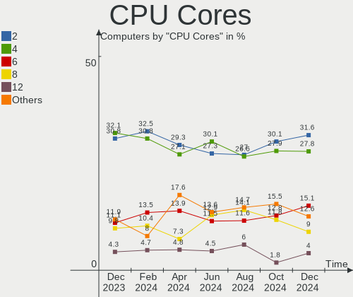

| Number  | Computers | Percent |
|---------|-----------|---------|
| 4       | 185       | 27.78%  |
| 2       | 179       | 26.88%  |
| 6       | 100       | 15.02%  |
| 8       | 62        | 9.31%   |
| 12      | 50        | 7.51%   |
| 16      | 24        | 3.6%    |
| 10      | 13        | 1.95%   |
| 28      | 12        | 1.8%    |
| 1       | 11        | 1.65%   |
| 24      | 9         | 1.35%   |
| 14      | 7         | 1.05%   |
| Unknown | 3         | 0.45%   |
| 44      | 2         | 0.3%    |
| 32      | 2         | 0.3%    |
| 18      | 2         | 0.3%    |
| 3       | 2         | 0.3%    |
| 48      | 1         | 0.15%   |
| 26      | 1         | 0.15%   |
| 20      | 1         | 0.15%   |

CPU Sockets
-----------

Number of sockets

| Number  | Computers | Percent |
|---------|-----------|---------|
| 1       | 579       | 86.94%  |
| 2       | 82        | 12.31%  |
| Unknown | 3         | 0.45%   |
| 6       | 1         | 0.15%   |
| 4       | 1         | 0.15%   |

CPU Threads
-----------

Threads per core (Hyper-Threading)

| Number  | Computers | Percent |
|---------|-----------|---------|
| 2       | 477       | 71.62%  |
| 1       | 186       | 27.93%  |
| Unknown | 3         | 0.45%   |

CPU Op-Modes
------------

CPU Operation Modes (32-bit, 64-bit)

| Op mode        | Computers | Percent |
|----------------|-----------|---------|
| 32-bit, 64-bit | 661       | 99.25%  |
| 32-bit         | 3         | 0.45%   |
| Unknown        | 2         | 0.3%    |

CPU Microcode
-------------

Microcode number

| Number     | Computers | Percent |
|------------|-----------|---------|
| Unknown    | 212       | 31.83%  |
| 0x306a9    | 24        | 3.6%    |
| 0x206a7    | 24        | 3.6%    |
| 0x406f1    | 20        | 3%      |
| 0x306c3    | 16        | 2.4%    |
| 0x306e4    | 15        | 2.25%   |
| 0x206c2    | 14        | 2.1%    |
| 0x08600106 | 14        | 2.1%    |
| 0xa0653    | 13        | 1.95%   |
| 0x306f2    | 13        | 1.95%   |
| 0x206d7    | 13        | 1.95%   |
| 0x806c1    | 12        | 1.8%    |
| 0x0a50000c | 11        | 1.65%   |
| 0x1067a    | 10        | 1.5%    |
| 0x08608103 | 10        | 1.5%    |
| 0x08108109 | 10        | 1.5%    |
| 0x906eb    | 9         | 1.35%   |
| 0x0a50000d | 9         | 1.35%   |
| 0x0a20120a | 8         | 1.2%    |
| 0x906ea    | 7         | 1.05%   |
| 0x906e9    | 7         | 1.05%   |
| 0x806ec    | 7         | 1.05%   |
| 0x506e3    | 7         | 1.05%   |
| 0x906a3    | 6         | 0.9%    |
| 0xa0671    | 5         | 0.75%   |
| 0x706e5    | 5         | 0.75%   |
| 0x6f6      | 5         | 0.75%   |
| 0x0a404102 | 5         | 0.75%   |
| 0x08701030 | 5         | 0.75%   |
| 0x0800820d | 5         | 0.75%   |
| 0x106ca    | 4         | 0.6%    |
| 0x0a201025 | 4         | 0.6%    |
| 0x08600104 | 4         | 0.6%    |
| 0x0810100b | 4         | 0.6%    |
| 0x010000c8 | 4         | 0.6%    |
| 0x90675    | 3         | 0.45%   |
| 0x806ea    | 3         | 0.45%   |
| 0x706a8    | 3         | 0.45%   |
| 0x606a6    | 3         | 0.45%   |
| 0x50657    | 3         | 0.45%   |

CPU Microarch
-------------

Microarchitecture

| Name             | Computers | Percent |
|------------------|-----------|---------|
| KabyLake         | 61        | 9.16%   |
| IvyBridge        | 54        | 8.11%   |
| Unknown          | 53        | 7.96%   |
| SandyBridge      | 51        | 7.66%   |
| Zen 3            | 46        | 6.91%   |
| Haswell          | 46        | 6.91%   |
| Zen 2            | 32        | 4.8%    |
| CometLake        | 29        | 4.35%   |
| Alderlake Hybrid | 29        | 4.35%   |
| Broadwell        | 28        | 4.2%    |
| TigerLake        | 25        | 3.75%   |
| Skylake          | 22        | 3.3%    |
| IceLake          | 21        | 3.15%   |
| Zen+             | 20        | 3%      |
| Westmere         | 20        | 3%      |
| Penryn           | 14        | 2.1%    |
| Zen              | 11        | 1.65%   |
| K10              | 11        | 1.65%   |
| Excavator        | 11        | 1.65%   |
| Core             | 11        | 1.65%   |
| Goldmont plus    | 10        | 1.5%    |
| Nehalem          | 8         | 1.2%    |
| Silvermont       | 6         | 0.9%    |
| Piledriver       | 6         | 0.9%    |
| K8 Hammer        | 6         | 0.9%    |
| K10 Llano        | 6         | 0.9%    |
| Goldmont         | 5         | 0.75%   |
| Bonnell          | 5         | 0.75%   |
| Steamroller      | 4         | 0.6%    |
| Tremont          | 3         | 0.45%   |
| Puma             | 2         | 0.3%    |
| P6               | 2         | 0.3%    |
| K8 & K10 hybrid  | 2         | 0.3%    |
| Bobcat           | 2         | 0.3%    |
| NetBurst         | 1         | 0.15%   |
| Jaguar           | 1         | 0.15%   |
| Gracemont        | 1         | 0.15%   |
| Bulldozer        | 1         | 0.15%   |

Graphics
--------

GPU Vendor
----------

Vendors of graphics cards

| Vendor                     | Computers | Percent |
|----------------------------|-----------|---------|
| Intel                      | 280       | 37.43%  |
| AMD                        | 200       | 26.74%  |
| Nvidia                     | 178       | 23.8%   |
| Matrox Electronics Systems | 49        | 6.55%   |
| ASPEED Technology          | 35        | 4.68%   |
| ATI Technologies           | 2         | 0.27%   |
| Silicon Motion             | 1         | 0.13%   |
| S3 Graphics                | 1         | 0.13%   |
| Red Hat                    | 1         | 0.13%   |
| Huawei Technologies        | 1         | 0.13%   |

GPU Model
---------

Graphics card models

| Model                                                                       | Computers | Percent |
|-----------------------------------------------------------------------------|-----------|---------|
| ASPEED Technology ASPEED Graphics Family                                    | 35        | 4.58%   |
| Intel 3rd Gen Core processor Graphics Controller                            | 24        | 3.14%   |
| AMD Renoir [Radeon RX Vega 6 (Ryzen 4000/5000 Mobile Series)]               | 24        | 3.14%   |
| Intel 2nd Generation Core Processor Family Integrated Graphics Controller   | 22        | 2.88%   |
| Intel TigerLake-LP GT2 [Iris Xe Graphics]                                   | 21        | 2.75%   |
| Intel CometLake-S GT2 [UHD Graphics 630]                                    | 20        | 2.61%   |
| AMD Cezanne [Radeon Vega Series / Radeon Vega Mobile Series]                | 19        | 2.48%   |
| Matrox Electronics Systems MGA G200eW WPCM450                               | 17        | 2.22%   |
| Matrox Electronics Systems MGA G200EH                                       | 15        | 1.96%   |
| AMD Picasso/Raven 2 [Radeon Vega Series / Radeon Vega Mobile Series]        | 15        | 1.96%   |
| AMD Lucienne                                                                | 15        | 1.96%   |
| Matrox Electronics Systems G200eR2                                          | 14        | 1.83%   |
| Intel CoffeeLake-S GT2 [UHD Graphics 630]                                   | 13        | 1.7%    |
| AMD Rembrandt [Radeon 680M]                                                 | 12        | 1.57%   |
| Intel Xeon E3-1200 v3/4th Gen Core Processor Integrated Graphics Controller | 11        | 1.44%   |
| Intel Alder Lake-P GT2 [Iris Xe Graphics]                                   | 11        | 1.44%   |
| Nvidia GF117M [GeForce 610M/710M/810M/820M / GT 620M/625M/630M/720M]        | 9         | 1.18%   |
| Intel Iris Plus Graphics G1 (Ice Lake)                                      | 9         | 1.18%   |
| Intel Xeon E3-1200 v2/3rd Gen Core processor Graphics Controller            | 8         | 1.05%   |
| Intel GeminiLake [UHD Graphics 600]                                         | 8         | 1.05%   |
| Intel CometLake-U GT2 [UHD Graphics]                                        | 8         | 1.05%   |
| AMD Ellesmere [Radeon RX 470/480/570/570X/580/580X/590]                     | 8         | 1.05%   |
| Intel Skylake GT2 [HD Graphics 520]                                         | 7         | 0.92%   |
| Intel HD Graphics 630                                                       | 7         | 0.92%   |
| Nvidia GP106 [GeForce GTX 1060 6GB]                                         | 6         | 0.78%   |
| Intel UHD Graphics 620                                                      | 6         | 0.78%   |
| Intel Alder Lake-UP3 GT2 [Iris Xe Graphics]                                 | 6         | 0.78%   |
| Intel 4th Gen Core Processor Integrated Graphics Controller                 | 6         | 0.78%   |
| AMD VanGogh [AMD Custom GPU 0405]                                           | 6         | 0.78%   |
| AMD Raven Ridge [Radeon Vega Series / Radeon Vega Mobile Series]            | 6         | 0.78%   |
| AMD Navi 23 [Radeon RX 6600/6600 XT/6600M]                                  | 6         | 0.78%   |
| Nvidia GK208B [GeForce GT 710]                                              | 5         | 0.65%   |
| Nvidia GA107M [GeForce RTX 3050 Mobile]                                     | 5         | 0.65%   |
| Intel HD Graphics 620                                                       | 5         | 0.65%   |
| Intel HD Graphics 530                                                       | 5         | 0.65%   |
| Intel Haswell-ULT Integrated Graphics Controller                            | 5         | 0.65%   |
| Intel Alder Lake-S GT1 [UHD Graphics 730]                                   | 5         | 0.65%   |
| AMD Stoney [Radeon R2/R3/R4/R5 Graphics]                                    | 5         | 0.65%   |
| AMD Navi 22 [Radeon RX 6700/6700 XT/6750 XT / 6800M/6850M XT]               | 5         | 0.65%   |
| AMD Lexa PRO [Radeon 540/540X/550/550X / RX 540X/550/550X]                  | 5         | 0.65%   |

GPU Combo
---------

Combinations of graphics cards

| Name                    | Computers | Percent |
|-------------------------|-----------|---------|
| 1 x Intel               | 211       | 31.68%  |
| 1 x AMD                 | 165       | 24.77%  |
| 1 x Nvidia              | 104       | 15.62%  |
| Intel + Nvidia          | 56        | 8.41%   |
| 1 x Matrox              | 49        | 7.36%   |
| 1 x ASPEED              | 35        | 5.26%   |
| AMD + Nvidia            | 17        | 2.55%   |
| 2 x AMD                 | 11        | 1.65%   |
| Intel + AMD             | 8         | 1.2%    |
| Other                   | 6         | 0.9%    |
| 1 x Silicon Motion      | 1         | 0.15%   |
| 1 x Red Hat             | 1         | 0.15%   |
| Intel + S3 Graphics     | 1         | 0.15%   |
| 1 x Huawei Technologies | 1         | 0.15%   |

GPU Driver
----------

Free vs proprietary

| Driver      | Computers | Percent |
|-------------|-----------|---------|
| Free        | 478       | 71.77%  |
| Unknown     | 126       | 18.92%  |
| Proprietary | 62        | 9.31%   |

GPU Memory
----------

Total video memory

| Size in GB | Computers | Percent |
|------------|-----------|---------|
| Unknown    | 398       | 59.76%  |
| 0.01-0.5   | 82        | 12.31%  |
| 1.01-2.0   | 69        | 10.36%  |
| 0.51-1.0   | 41        | 6.16%   |
| 3.01-4.0   | 23        | 3.45%   |
| 7.01-8.0   | 21        | 3.15%   |
| 5.01-6.0   | 16        | 2.4%    |
| 8.01-16.0  | 12        | 1.8%    |
| 2.01-3.0   | 3         | 0.45%   |
| 16.01-24.0 | 1         | 0.15%   |

Monitor
-------

Monitor Vendor
--------------

Monitor vendors

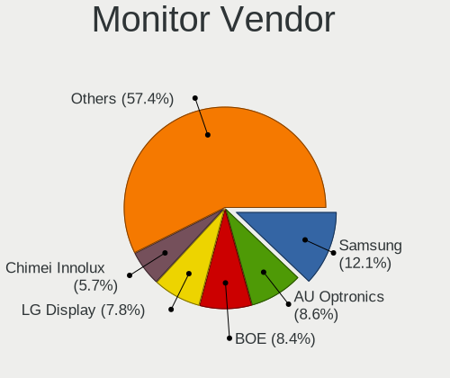

| Vendor                  | Computers | Percent |
|-------------------------|-----------|---------|
| Samsung Electronics     | 77        | 13.37%  |
| BOE                     | 64        | 11.11%  |
| Chimei Innolux          | 48        | 8.33%   |
| AU Optronics            | 35        | 6.08%   |
| LG Display              | 34        | 5.9%    |
| Philips                 | 32        | 5.56%   |
| Goldstar                | 31        | 5.38%   |
| Acer                    | 30        | 5.21%   |
| Dell                    | 19        | 3.3%    |
| BenQ                    | 15        | 2.6%    |
| AOC                     | 15        | 2.6%    |
| Hewlett-Packard         | 11        | 1.91%   |
| CHR                     | 11        | 1.91%   |
| Chi Mei Optoelectronics | 11        | 1.91%   |
| PANDA                   | 10        | 1.74%   |
| Lenovo                  | 8         | 1.39%   |
| Ancor Communications    | 8         | 1.39%   |
| Valve                   | 6         | 1.04%   |
| MSI                     | 6         | 1.04%   |
| Apple                   | 6         | 1.04%   |
| ViewSonic               | 5         | 0.87%   |
| HKC                     | 5         | 0.87%   |
| TMX                     | 4         | 0.69%   |
| Sharp                   | 4         | 0.69%   |
| HUAWEI                  | 4         | 0.69%   |
| ASUSTek Computer        | 4         | 0.69%   |
| Unknown                 | 3         | 0.52%   |
| Toshiba                 | 3         | 0.52%   |
| Sony                    | 3         | 0.52%   |
| SGT                     | 3         | 0.52%   |
| RTK                     | 3         | 0.52%   |
| Mi                      | 3         | 0.52%   |
| HHT                     | 3         | 0.52%   |
| CSO                     | 3         | 0.52%   |
| SAC                     | 2         | 0.35%   |
| RGT                     | 2         | 0.35%   |
| Quanta Display          | 2         | 0.35%   |
| Packard Bell            | 2         | 0.35%   |
| OOO                     | 2         | 0.35%   |
| NEC Computers           | 2         | 0.35%   |

Monitor Model
-------------

Monitor models

| Model                                                                    | Computers | Percent |
|--------------------------------------------------------------------------|-----------|---------|
| CHR CH7511B CHR7511 1920x1080 519x324mm 24.1-inch                        | 11        | 1.88%   |
| Valve ANX7530 U VLV3001 800x1280 100x150mm 7.1-inch                      | 6         | 1.02%   |
| BOE LCD Monitor BOE0872 1920x1080 344x194mm 15.5-inch                    | 6         | 1.02%   |
| Samsung Electronics LCD Monitor SDC4161 1920x1080 344x194mm 15.5-inch    | 5         | 0.85%   |
| Philips PHL 243V7 PHLC155 1920x1080 527x296mm 23.8-inch                  | 5         | 0.85%   |
| Philips PHL 243V5 PHLC0D1 1920x1080 521x293mm 23.5-inch                  | 5         | 0.85%   |
| Chimei Innolux LCD Monitor CMN15F5 1920x1080 344x193mm 15.5-inch         | 4         | 0.68%   |
| Chimei Innolux LCD Monitor CMN15E7 1920x1080 344x193mm 15.5-inch         | 4         | 0.68%   |
| Chi Mei Optoelectronics LCD Monitor CMO15A7 1366x768 344x193mm 15.5-inch | 4         | 0.68%   |
| Chi Mei Optoelectronics LCD Monitor CMO15A3 1366x768 344x194mm 15.5-inch | 4         | 0.68%   |
| Unknown LCD Monitor FFFF 2288x1287 2550x2550mm 142.0-inch                | 3         | 0.51%   |
| TMX LCD Monitor TMX1560 1920x1080 344x194mm 15.5-inch                    | 3         | 0.51%   |
| SGT XY238 SGT2386 1920x1080 530x290mm 23.8-inch                          | 3         | 0.51%   |
| Samsung Electronics C27F390 SAM0D32 1920x1080 598x336mm 27.0-inch        | 3         | 0.51%   |
| PANDA LCD Monitor NCP0035 1920x1080 309x174mm 14.0-inch                  | 3         | 0.51%   |
| LG Display LCD Monitor LGD05E5 1920x1080 344x194mm 15.5-inch             | 3         | 0.51%   |
| LG Display LCD Monitor LGD033A 1366x768 344x194mm 15.5-inch              | 3         | 0.51%   |
| Lenovo LEN-A350-B-A LENF908 1920x1080 527x296mm 23.8-inch                | 3         | 0.51%   |
| HUAWEI SSN-24 HWV6E4E 1920x1080 527x296mm 23.8-inch                      | 3         | 0.51%   |
| HHT ActivPanel V6 HHT0030 3840x2160 944x398mm 40.3-inch                  | 3         | 0.51%   |
| Chimei Innolux LCD Monitor CMN15D5 1920x1080 344x193mm 15.5-inch         | 3         | 0.51%   |
| Chimei Innolux LCD Monitor CMN142B 1920x1080 309x173mm 13.9-inch         | 3         | 0.51%   |
| BOE LCD Monitor BOE09CC 1920x1080 344x194mm 15.5-inch                    | 3         | 0.51%   |
| BOE LCD Monitor BOE0893 2160x1440 296x197mm 14.0-inch                    | 3         | 0.51%   |
| BOE LCD Monitor BOE0878 1920x1080 355x200mm 16.0-inch                    | 3         | 0.51%   |
| BOE LCD Monitor BOE0877 1920x1080 309x173mm 13.9-inch                    | 3         | 0.51%   |
| BOE LCD Monitor BOE0747 1920x1080 345x195mm 15.6-inch                    | 3         | 0.51%   |
| AU Optronics LCD Monitor AUO978F 1920x1080 382x215mm 17.3-inch           | 3         | 0.51%   |
| AU Optronics LCD Monitor AUO71EC 1366x768 344x193mm 15.5-inch            | 3         | 0.51%   |
| Toshiba LCD Monitor 1 1 5" LCD000D 1024x768 304x228mm 15.0-inch          | 2         | 0.34%   |
| Sony SDM-P232W SNY01D0 1920x1200 495x309mm 23.0-inch                     | 2         | 0.34%   |
| Samsung Electronics U28E590 SAM0C4D 3840x2160 610x350mm 27.7-inch        | 2         | 0.34%   |
| Samsung Electronics SyncMaster SAM0248 1280x1024 376x301mm 19.0-inch     | 2         | 0.34%   |
| Samsung Electronics S24F350 SAM0D20 1920x1080 521x293mm 23.5-inch        | 2         | 0.34%   |
| Samsung Electronics LCD Monitor SEC5441 1366x768 309x174mm 14.0-inch     | 2         | 0.34%   |
| Samsung Electronics LCD Monitor SEC4256 1600x900 382x215mm 17.3-inch     | 2         | 0.34%   |
| Samsung Electronics LCD Monitor SEC3859 1366x768 293x165mm 13.2-inch     | 2         | 0.34%   |
| RTK LCD Monitor RTK1D1A 1920x1080 1020x570mm 46.0-inch                   | 2         | 0.34%   |
| Philips PHL 223V5 PHLC0CF 1920x1080 477x268mm 21.5-inch                  | 2         | 0.34%   |
| Philips 226V4 PHLC0B1 1920x1080 477x268mm 21.5-inch                      | 2         | 0.34%   |

Monitor Resolution
------------------

Monitor screen resolution

| Resolution         | Computers | Percent |
|--------------------|-----------|---------|
| 1920x1080 (FHD)    | 283       | 51.08%  |
| 1366x768 (WXGA)    | 72        | 13%     |
| 1280x1024 (SXGA)   | 31        | 5.6%    |
| 2560x1440 (QHD)    | 30        | 5.42%   |
| 1600x900 (HD+)     | 25        | 4.51%   |
| 3840x2160 (4K)     | 22        | 3.97%   |
| 1920x1200 (WUXGA)  | 15        | 2.71%   |
| 1440x900 (WXGA+)   | 8         | 1.44%   |
| 2560x1600          | 7         | 1.26%   |
| 1280x800 (WXGA)    | 7         | 1.26%   |
| 800x1280           | 6         | 1.08%   |
| 1680x1050 (WSXGA+) | 6         | 1.08%   |
| 3440x1440          | 5         | 0.9%    |
| 2560x1080          | 4         | 0.72%   |
| 1024x768 (XGA)     | 4         | 0.72%   |
| 3200x2000          | 3         | 0.54%   |
| 2288x1287          | 3         | 0.54%   |
| 2160x1440          | 3         | 0.54%   |
| 1024x600           | 3         | 0.54%   |
| 2880x1800          | 2         | 0.36%   |
| 2880x1620          | 2         | 0.36%   |
| Unknown            | 2         | 0.36%   |
| 5120x1440          | 1         | 0.18%   |
| 4480x1440          | 1         | 0.18%   |
| 3840x2400          | 1         | 0.18%   |
| 3456x2160          | 1         | 0.18%   |
| 3200x1800 (QHD+)   | 1         | 0.18%   |
| 3120x2080          | 1         | 0.18%   |
| 2520x1680          | 1         | 0.18%   |
| 2048x1152          | 1         | 0.18%   |
| 1600x1200          | 1         | 0.18%   |
| 1400x1050          | 1         | 0.18%   |
| 1280x720 (HD)      | 1         | 0.18%   |

Monitor Diagonal
----------------

Diagonal size in inches

| Inches  | Computers | Percent |
|---------|-----------|---------|
| 15      | 152       | 26.3%   |
| 23      | 63        | 10.9%   |
| 24      | 55        | 9.52%   |
| 21      | 42        | 7.27%   |
| 14      | 35        | 6.06%   |
| 27      | 34        | 5.88%   |
| 17      | 34        | 5.88%   |
| 13      | 30        | 5.19%   |
| 19      | 25        | 4.33%   |
| 16      | 15        | 2.6%    |
| 31      | 11        | 1.9%    |
| 20      | 10        | 1.73%   |
| 34      | 9         | 1.56%   |
| Unknown | 8         | 1.38%   |
| 40      | 7         | 1.21%   |
| 22      | 6         | 1.04%   |
| 18      | 6         | 1.04%   |
| 7       | 6         | 1.04%   |
| 11      | 5         | 0.87%   |
| 26      | 4         | 0.69%   |
| 12      | 4         | 0.69%   |
| 10      | 4         | 0.69%   |
| 142     | 3         | 0.52%   |
| 32      | 3         | 0.52%   |
| 46      | 2         | 0.35%   |
| 86      | 1         | 0.17%   |
| 55      | 1         | 0.17%   |
| 49      | 1         | 0.17%   |
| 42      | 1         | 0.17%   |
| 25      | 1         | 0.17%   |

Monitor Width
-------------

Physical width

| Width in mm    | Computers | Percent |
|----------------|-----------|---------|
| 301-350        | 225       | 39.2%   |
| 501-600        | 149       | 25.96%  |
| 401-500        | 74        | 12.89%  |
| 351-400        | 44        | 7.67%   |
| 201-300        | 27        | 4.7%    |
| 601-700        | 13        | 2.26%   |
| 701-800        | 12        | 2.09%   |
| Unknown        | 8         | 1.39%   |
| 1-100          | 6         | 1.05%   |
| 1001-1500      | 5         | 0.87%   |
| 901-1000       | 5         | 0.87%   |
| More than 2000 | 3         | 0.52%   |
| 801-900        | 3         | 0.52%   |

Aspect Ratio
------------

Proportional relationship between the width and the height

| Ratio   | Computers | Percent |
|---------|-----------|---------|
| 16/9    | 400       | 74.21%  |
| 16/10   | 66        | 12.24%  |
| 5/4     | 31        | 5.75%   |
| 21/9    | 13        | 2.41%   |
| 4/3     | 8         | 1.48%   |
| 0.67    | 6         | 1.11%   |
| 3/2     | 5         | 0.93%   |
| Unknown | 5         | 0.93%   |
| 1.00    | 3         | 0.56%   |
| 32/9    | 1         | 0.19%   |
| 0.56    | 1         | 0.19%   |

Monitor Area
------------

Area in inch²

| Area in inch² | Computers | Percent |
|----------------|-----------|---------|
| 101-110        | 157       | 27.59%  |
| 201-250        | 126       | 22.14%  |
| 81-90          | 56        | 9.84%   |
| 151-200        | 45        | 7.91%   |
| 301-350        | 38        | 6.68%   |
| 351-500        | 23        | 4.04%   |
| 251-300        | 23        | 4.04%   |
| 141-150        | 20        | 3.51%   |
| 121-130        | 18        | 3.16%   |
| 501-1000       | 11        | 1.93%   |
| 111-120        | 9         | 1.58%   |
| 71-80          | 8         | 1.41%   |
| Unknown        | 8         | 1.41%   |
| 1-40           | 6         | 1.05%   |
| More than 1000 | 5         | 0.88%   |
| 51-60          | 5         | 0.88%   |
| 41-50          | 4         | 0.7%    |
| 61-70          | 3         | 0.53%   |
| 131-140        | 2         | 0.35%   |
| 91-100         | 2         | 0.35%   |

Pixel Density
-------------

Pixels per inch

| Density       | Computers | Percent |
|---------------|-----------|---------|
| 51-100        | 228       | 40.14%  |
| 121-160       | 149       | 26.23%  |
| 101-120       | 127       | 22.36%  |
| 161-240       | 41        | 7.22%   |
| More than 240 | 8         | 1.41%   |
| Unknown       | 8         | 1.41%   |
| 1-50          | 7         | 1.23%   |

Multiple Monitors
-----------------

Total monitors connected

| Total | Computers | Percent |
|-------|-----------|---------|
| 1     | 462       | 69.37%  |
| 0     | 135       | 20.27%  |
| 2     | 64        | 9.61%   |
| 3     | 5         | 0.75%   |

Network
-------

Net Controller Vendor
---------------------

Controller vendors

| Vendor                          | Computers | Percent |
|---------------------------------|-----------|---------|
| Realtek Semiconductor           | 402       | 43.27%  |
| Intel                           | 283       | 30.46%  |
| Qualcomm Atheros                | 72        | 7.75%   |
| Broadcom                        | 44        | 4.74%   |
| MediaTek                        | 35        | 3.77%   |
| TP-Link                         | 11        | 1.18%   |
| Marvell Technology Group        | 11        | 1.18%   |
| Ralink                          | 9         | 0.97%   |
| Broadcom Limited                | 8         | 0.86%   |
| Ralink Technology               | 6         | 0.65%   |
| Mellanox Technologies           | 5         | 0.54%   |
| Xiaomi                          | 4         | 0.43%   |
| Qualcomm                        | 4         | 0.43%   |
| Nvidia                          | 4         | 0.43%   |
| IBM                             | 3         | 0.32%   |
| D-Link System                   | 3         | 0.32%   |
| U-Blox                          | 2         | 0.22%   |
| Samsung Electronics             | 2         | 0.22%   |
| Emulex                          | 2         | 0.22%   |
| Attansic Technology             | 2         | 0.22%   |
| Aquantia                        | 2         | 0.22%   |
| Spreadtrum Communications       | 1         | 0.11%   |
| Shenzhen Goodix Technology      | 1         | 0.11%   |
| Qualcomm Atheros Communications | 1         | 0.11%   |
| QinHeng Electronics             | 1         | 0.11%   |
| NetGear                         | 1         | 0.11%   |
| Microsoft                       | 1         | 0.11%   |
| Lenovo                          | 1         | 0.11%   |
| ICS Advent                      | 1         | 0.11%   |
| Huawei Technologies             | 1         | 0.11%   |
| Google                          | 1         | 0.11%   |
| DisplayLink                     | 1         | 0.11%   |
| D-Link                          | 1         | 0.11%   |
| ASUSTek Computer                | 1         | 0.11%   |
| ASIX Electronics                | 1         | 0.11%   |
| AMD                             | 1         | 0.11%   |

Net Controller Model
--------------------

Controller models

| Model                                                             | Computers | Percent |
|-------------------------------------------------------------------|-----------|---------|
| Realtek RTL8111/8168/8411 PCI Express Gigabit Ethernet Controller | 298       | 28.6%   |
| Intel I350 Gigabit Network Connection                             | 47        | 4.51%   |
| Realtek RTL810xE PCI Express Fast Ethernet controller             | 22        | 2.11%   |
| Realtek RTL8125 2.5GbE Controller                                 | 20        | 1.92%   |
| Realtek RTL8822CE 802.11ac PCIe Wireless Network Adapter          | 19        | 1.82%   |
| Intel Alder Lake-P PCH CNVi WiFi                                  | 19        | 1.82%   |
| Intel Wi-Fi 6 AX201                                               | 18        | 1.73%   |
| MediaTek MT7921 802.11ax PCI Express Wireless Network Adapter     | 17        | 1.63%   |
| Intel Wireless 3165                                               | 17        | 1.63%   |
| Intel Wi-Fi 6 AX200                                               | 17        | 1.63%   |
| Realtek RTL8821CE 802.11ac PCIe Wireless Network Adapter          | 15        | 1.44%   |
| Intel 82576 Gigabit Network Connection                            | 14        | 1.34%   |
| Qualcomm Atheros AR9485 Wireless Network Adapter                  | 13        | 1.25%   |
| Qualcomm Atheros QCA9377 802.11ac Wireless Network Adapter        | 12        | 1.15%   |
| Intel Wireless 7265                                               | 12        | 1.15%   |
| Realtek RTL8153 Gigabit Ethernet Adapter                          | 11        | 1.06%   |
| Qualcomm Atheros AR9285 Wireless Network Adapter (PCI-Express)    | 11        | 1.06%   |
| Intel Ethernet Connection (2) I219-V                              | 10        | 0.96%   |
| Broadcom BCM4313 802.11bgn Wireless Network Adapter               | 10        | 0.96%   |
| Realtek RTL8852BE PCIe 802.11ax Wireless Network Controller       | 9         | 0.86%   |
| Intel Ethernet Controller I225-V                                  | 9         | 0.86%   |
| Qualcomm Atheros QCA9565 / AR9565 Wireless Network Adapter        | 8         | 0.77%   |
| MediaTek MT7922 802.11ax PCI Express Wireless Network Adapter     | 8         | 0.77%   |
| MediaTek MT7921K (RZ608) Wi-Fi 6E 80MHz                           | 8         | 0.77%   |
| Intel Wireless 8265 / 8275                                        | 8         | 0.77%   |
| Intel Cannon Lake PCH CNVi WiFi                                   | 8         | 0.77%   |
| Intel 82579LM Gigabit Network Connection (Lewisville)             | 8         | 0.77%   |
| Broadcom BCM43142 802.11b/g/n                                     | 8         | 0.77%   |
| Realtek RTL8723BE PCIe Wireless Network Adapter                   | 7         | 0.67%   |
| Realtek RTL8152 Fast Ethernet Adapter                             | 7         | 0.67%   |
| Realtek RTL-8100/8101L/8139 PCI Fast Ethernet Adapter             | 7         | 0.67%   |
| Qualcomm Atheros AR8151 v2.0 Gigabit Ethernet                     | 7         | 0.67%   |
| Intel Ice Lake-LP PCH CNVi WiFi                                   | 7         | 0.67%   |
| Intel 82599ES 10-Gigabit SFI/SFP+ Network Connection              | 7         | 0.67%   |
| Broadcom NetXtreme BCM5719 Gigabit Ethernet PCIe                  | 7         | 0.67%   |
| Intel Comet Lake PCH-LP CNVi WiFi                                 | 6         | 0.58%   |
| Intel Centrino Advanced-N 6205 [Taylor Peak]                      | 6         | 0.58%   |
| Intel 82574L Gigabit Network Connection                           | 6         | 0.58%   |
| Realtek RTL8723DE Wireless Network Adapter                        | 5         | 0.48%   |
| Qualcomm Atheros QCA8172 Fast Ethernet                            | 5         | 0.48%   |

Wireless Vendor
---------------

Wireless vendors

| Vendor                          | Computers | Percent |
|---------------------------------|-----------|---------|
| Intel                           | 165       | 40.64%  |
| Realtek Semiconductor           | 81        | 19.95%  |
| Qualcomm Atheros                | 52        | 12.81%  |
| MediaTek                        | 34        | 8.37%   |
| Broadcom                        | 31        | 7.64%   |
| TP-Link                         | 10        | 2.46%   |
| Ralink                          | 9         | 2.22%   |
| Ralink Technology               | 6         | 1.48%   |
| Broadcom Limited                | 6         | 1.48%   |
| Qualcomm                        | 4         | 0.99%   |
| Xiaomi                          | 1         | 0.25%   |
| Qualcomm Atheros Communications | 1         | 0.25%   |
| NetGear                         | 1         | 0.25%   |
| Microsoft                       | 1         | 0.25%   |
| Marvell Technology Group        | 1         | 0.25%   |
| D-Link System                   | 1         | 0.25%   |
| D-Link                          | 1         | 0.25%   |
| ASUSTek Computer                | 1         | 0.25%   |

Wireless Model
--------------

Wireless models

| Model                                                          | Computers | Percent |
|----------------------------------------------------------------|-----------|---------|
| Realtek RTL8822CE 802.11ac PCIe Wireless Network Adapter       | 19        | 4.68%   |
| Intel Alder Lake-P PCH CNVi WiFi                               | 19        | 4.68%   |
| Intel Wi-Fi 6 AX201                                            | 18        | 4.43%   |
| MediaTek MT7921 802.11ax PCI Express Wireless Network Adapter  | 17        | 4.19%   |
| Intel Wireless 3165                                            | 17        | 4.19%   |
| Intel Wi-Fi 6 AX200                                            | 17        | 4.19%   |
| Realtek RTL8821CE 802.11ac PCIe Wireless Network Adapter       | 15        | 3.69%   |
| Qualcomm Atheros AR9485 Wireless Network Adapter               | 13        | 3.2%    |
| Qualcomm Atheros QCA9377 802.11ac Wireless Network Adapter     | 12        | 2.96%   |
| Intel Wireless 7265                                            | 12        | 2.96%   |
| Qualcomm Atheros AR9285 Wireless Network Adapter (PCI-Express) | 11        | 2.71%   |
| Broadcom BCM4313 802.11bgn Wireless Network Adapter            | 10        | 2.46%   |
| Realtek RTL8852BE PCIe 802.11ax Wireless Network Controller    | 9         | 2.22%   |
| Qualcomm Atheros QCA9565 / AR9565 Wireless Network Adapter     | 8         | 1.97%   |
| MediaTek MT7922 802.11ax PCI Express Wireless Network Adapter  | 8         | 1.97%   |
| MediaTek MT7921K (RZ608) Wi-Fi 6E 80MHz                        | 8         | 1.97%   |
| Intel Wireless 8265 / 8275                                     | 8         | 1.97%   |
| Intel Cannon Lake PCH CNVi WiFi                                | 8         | 1.97%   |
| Broadcom BCM43142 802.11b/g/n                                  | 8         | 1.97%   |
| Realtek RTL8723BE PCIe Wireless Network Adapter                | 7         | 1.72%   |
| Intel Ice Lake-LP PCH CNVi WiFi                                | 7         | 1.72%   |
| Intel Comet Lake PCH-LP CNVi WiFi                              | 6         | 1.48%   |
| Intel Centrino Advanced-N 6205 [Taylor Peak]                   | 6         | 1.48%   |
| Realtek RTL8723DE Wireless Network Adapter                     | 5         | 1.23%   |
| Intel Wireless 8260                                            | 5         | 1.23%   |
| Intel Dual Band Wireless-AC 3168NGW [Stone Peak]               | 5         | 1.23%   |
| Qualcomm QCNFA765 Wireless Network Adapter                     | 4         | 0.99%   |
| Intel PRO/Wireless 3945ABG [Golan] Network Connection          | 4         | 0.99%   |
| Intel Cannon Point-LP CNVi [Wireless-AC]                       | 4         | 0.99%   |
| TP-Link Archer T2U PLUS [RTL8821AU]                            | 3         | 0.74%   |
| Realtek RTL88x2bu [AC1200 Techkey]                             | 3         | 0.74%   |
| Realtek RTL8188EE Wireless Network Adapter                     | 3         | 0.74%   |
| Ralink RT3090 Wireless 802.11n 1T/1R PCIe                      | 3         | 0.74%   |
| Intel Wireless-AC 9260                                         | 3         | 0.74%   |
| Intel Wi-Fi 6 AX210/AX211/AX411 160MHz                         | 3         | 0.74%   |
| Intel Centrino Wireless-N 130                                  | 3         | 0.74%   |
| Broadcom Limited BCM4313 802.11bgn Wireless Network Adapter    | 3         | 0.74%   |
| Broadcom BCM4360 802.11ac Dual Band Wireless Network Adapter   | 3         | 0.74%   |
| Broadcom BCM43228 802.11a/b/g/n                                | 3         | 0.74%   |
| Broadcom BCM4312 802.11b/g LP-PHY                              | 3         | 0.74%   |

Ethernet Vendor
---------------

Ethernet vendors

| Vendor                    | Computers | Percent |
|---------------------------|-----------|---------|
| Realtek Semiconductor     | 365       | 60.33%  |
| Intel                     | 148       | 24.46%  |
| Qualcomm Atheros          | 32        | 5.29%   |
| Broadcom                  | 16        | 2.64%   |
| Marvell Technology Group  | 10        | 1.65%   |
| Nvidia                    | 4         | 0.66%   |
| Mellanox Technologies     | 4         | 0.66%   |
| Xiaomi                    | 3         | 0.5%    |
| IBM                       | 3         | 0.5%    |
| Emulex                    | 2         | 0.33%   |
| D-Link System             | 2         | 0.33%   |
| Broadcom Limited          | 2         | 0.33%   |
| Attansic Technology       | 2         | 0.33%   |
| Aquantia                  | 2         | 0.33%   |
| TP-Link                   | 1         | 0.17%   |
| Spreadtrum Communications | 1         | 0.17%   |
| Samsung Electronics       | 1         | 0.17%   |
| MediaTek                  | 1         | 0.17%   |
| Lenovo                    | 1         | 0.17%   |
| ICS Advent                | 1         | 0.17%   |
| Huawei Technologies       | 1         | 0.17%   |
| Google                    | 1         | 0.17%   |
| DisplayLink               | 1         | 0.17%   |
| ASIX Electronics          | 1         | 0.17%   |

Ethernet Model
--------------

Ethernet models

| Model                                                             | Computers | Percent |
|-------------------------------------------------------------------|-----------|---------|
| Realtek RTL8111/8168/8411 PCI Express Gigabit Ethernet Controller | 298       | 47.38%  |
| Intel I350 Gigabit Network Connection                             | 47        | 7.47%   |
| Realtek RTL810xE PCI Express Fast Ethernet controller             | 22        | 3.5%    |
| Realtek RTL8125 2.5GbE Controller                                 | 20        | 3.18%   |
| Intel 82576 Gigabit Network Connection                            | 14        | 2.23%   |
| Realtek RTL8153 Gigabit Ethernet Adapter                          | 11        | 1.75%   |
| Intel Ethernet Connection (2) I219-V                              | 10        | 1.59%   |
| Intel Ethernet Controller I225-V                                  | 9         | 1.43%   |
| Intel 82579LM Gigabit Network Connection (Lewisville)             | 8         | 1.27%   |
| Realtek RTL8152 Fast Ethernet Adapter                             | 7         | 1.11%   |
| Realtek RTL-8100/8101L/8139 PCI Fast Ethernet Adapter             | 7         | 1.11%   |
| Qualcomm Atheros AR8151 v2.0 Gigabit Ethernet                     | 7         | 1.11%   |
| Intel 82599ES 10-Gigabit SFI/SFP+ Network Connection              | 7         | 1.11%   |
| Broadcom NetXtreme BCM5719 Gigabit Ethernet PCIe                  | 7         | 1.11%   |
| Intel 82574L Gigabit Network Connection                           | 6         | 0.95%   |
| Qualcomm Atheros QCA8172 Fast Ethernet                            | 5         | 0.79%   |
| Intel I211 Gigabit Network Connection                             | 5         | 0.79%   |
| Intel Ethernet Controller 10-Gigabit X540-AT2                     | 5         | 0.79%   |
| Intel Ethernet Connection (16) I219-V                             | 5         | 0.79%   |
| Qualcomm Atheros AR8162 Fast Ethernet                             | 4         | 0.64%   |
| Intel I210 Gigabit Network Connection                             | 4         | 0.64%   |
| Intel Ethernet Connection I219-LM                                 | 4         | 0.64%   |
| Intel Ethernet Connection (13) I219-V                             | 4         | 0.64%   |
| Qualcomm Atheros AR8152 v2.0 Fast Ethernet                        | 3         | 0.48%   |
| Mellanox MT27800 Family [ConnectX-5]                              | 3         | 0.48%   |
| Marvell Group 88E8056 PCI-E Gigabit Ethernet Controller           | 3         | 0.48%   |
| Marvell Group 88E8055 PCI-E Gigabit Ethernet Controller           | 3         | 0.48%   |
| Intel Ethernet Controller E810-XXV for SFP                        | 3         | 0.48%   |
| IBM RNDIS/CDC ETHER                                               | 3         | 0.48%   |
| Xiaomi Mi/Redmi series (RNDIS)                                    | 2         | 0.32%   |
| Realtek Killer E2600 Gigabit Ethernet Controller                  | 2         | 0.32%   |
| Qualcomm Atheros Killer E220x Gigabit Ethernet Controller         | 2         | 0.32%   |
| Qualcomm Atheros Attansic L1 Gigabit Ethernet                     | 2         | 0.32%   |
| Qualcomm Atheros AR8161 Gigabit Ethernet                          | 2         | 0.32%   |
| Qualcomm Atheros AR8121/AR8113/AR8114 Gigabit or Fast Ethernet    | 2         | 0.32%   |
| Nvidia MCP61 Ethernet                                             | 2         | 0.32%   |
| Marvell Group 88E8072 PCI-E Gigabit Ethernet Controller           | 2         | 0.32%   |
| Marvell Group 88E8001 Gigabit Ethernet Controller                 | 2         | 0.32%   |
| Intel Ethernet Connection I217-LM                                 | 2         | 0.32%   |
| Intel Ethernet Connection (7) I219-V                              | 2         | 0.32%   |

Net Controller Kind
-------------------

Ethernet, WiFi or modem

| Kind     | Computers | Percent |
|----------|-----------|---------|
| Ethernet | 573       | 58.65%  |
| WiFi     | 397       | 40.63%  |
| Modem    | 5         | 0.51%   |
| Unknown  | 2         | 0.2%    |

Used Controller
---------------

Currently used network controller

| Kind     | Computers | Percent |
|----------|-----------|---------|
| Ethernet | 379       | 58.58%  |
| WiFi     | 268       | 41.42%  |

NICs
----

Total network controllers on board

| Total | Computers | Percent |
|-------|-----------|---------|
| 2     | 340       | 51.05%  |
| 1     | 284       | 42.64%  |
| 4     | 11        | 1.65%   |
| 0     | 11        | 1.65%   |
| 3     | 9         | 1.35%   |
| 8     | 4         | 0.6%    |
| 10    | 3         | 0.45%   |
| 6     | 3         | 0.45%   |
| 5     | 1         | 0.15%   |

IPv6
----

IPv6 vs IPv4

| Used | Computers | Percent |
|------|-----------|---------|
| No   | 636       | 95.5%   |
| Yes  | 30        | 4.5%    |

Bluetooth
---------

Bluetooth Vendor
----------------

Controller vendors

| Vendor                          | Computers | Percent |
|---------------------------------|-----------|---------|
| Intel                           | 148       | 41.57%  |
| Realtek Semiconductor           | 39        | 10.96%  |
| IMC Networks                    | 36        | 10.11%  |
| Qualcomm Atheros Communications | 20        | 5.62%   |
| Cambridge Silicon Radio         | 16        | 4.49%   |
| Lite-On Technology              | 15        | 4.21%   |
| Foxconn / Hon Hai               | 13        | 3.65%   |
| Broadcom                        | 13        | 3.65%   |
| MediaTek                        | 11        | 3.09%   |
| ASUSTek Computer                | 10        | 2.81%   |
| Realtek                         | 8         | 2.25%   |
| Foxconn International           | 5         | 1.4%    |
| Apple                           | 4         | 1.12%   |
| TP-Link                         | 3         | 0.84%   |
| Opticis                         | 3         | 0.84%   |
| Hewlett-Packard                 | 3         | 0.84%   |
| Ralink                          | 2         | 0.56%   |
| Dell                            | 2         | 0.56%   |
| USI                             | 1         | 0.28%   |
| Toshiba                         | 1         | 0.28%   |
| Ralink Technology               | 1         | 0.28%   |
| Marvell Semiconductor           | 1         | 0.28%   |
| Integrated System Solution      | 1         | 0.28%   |

Bluetooth Model
---------------

Controller models

| Model                                               | Computers | Percent |
|-----------------------------------------------------|-----------|---------|
| Intel Bluetooth wireless interface                  | 43        | 12.08%  |
| Intel AX201 Bluetooth                               | 37        | 10.39%  |
| Realtek Bluetooth Radio                             | 27        | 7.58%   |
| Intel Bluetooth 9460/9560 Jefferson Peak (JfP)      | 23        | 6.46%   |
| Intel AX200 Bluetooth                               | 16        | 4.49%   |
| Cambridge Silicon Radio Bluetooth Dongle (HCI mode) | 16        | 4.49%   |
| IMC Networks Bluetooth Radio                        | 15        | 4.21%   |
| IMC Networks Wireless_Device                        | 13        | 3.65%   |
| Intel Bluetooth Device                              | 12        | 3.37%   |
| MediaTek Wireless_Device                            | 11        | 3.09%   |
| Realtek  Bluetooth 4.2 Adapter                      | 8         | 2.25%   |
| Realtek 802.11ac WLAN Adapter                       | 7         | 1.97%   |
| Qualcomm Atheros AR3011 Bluetooth                   | 7         | 1.97%   |
| Qualcomm Atheros AR3012 Bluetooth 4.0               | 6         | 1.69%   |
| Lite-On Qualcomm Atheros QCA9377 Bluetooth          | 5         | 1.4%    |
| Intel Wireless-AC 3168 Bluetooth                    | 5         | 1.4%    |
| IMC Networks Bluetooth Device                       | 5         | 1.4%    |
| Foxconn International BCM43142A0 Bluetooth module   | 5         | 1.4%    |
| Qualcomm Atheros  Bluetooth Device                  | 4         | 1.12%   |
| Intel Centrino Advanced-N 6230 Bluetooth adapter    | 4         | 1.12%   |
| Foxconn / Hon Hai Wireless_Device                   | 4         | 1.12%   |
| ASUS ASUS USB-BT500                                 | 4         | 1.12%   |
| TP-Link TP-Cdj+ UB5A Adapter                        | 3         | 0.84%   |
| Opticis Bluetooth Radio                             | 3         | 0.84%   |
| Lite-On Wireless_Device                             | 3         | 0.84%   |
| Intel Wireless-AC 9260 Bluetooth Adapter            | 3         | 0.84%   |
| Intel AX210 Bluetooth                               | 3         | 0.84%   |
| IMC Networks Atheros AR3012 Bluetooth 4.0 Adapter   | 3         | 0.84%   |
| HP Broadcom 2070 Bluetooth Combo                    | 3         | 0.84%   |
| Foxconn / Hon Hai MediaTek Bluetooth Adapter        | 3         | 0.84%   |
| Foxconn / Hon Hai Bluetooth Device                  | 3         | 0.84%   |
| Broadcom BCM2070 Bluetooth 2.1 + EDR                | 3         | 0.84%   |
| Realtek 802.11ac WLAN Adapter                       | 2         | 0.56%   |
| Ralink RT3290 Bluetooth                             | 2         | 0.56%   |
| Qualcomm Atheros AR3012 Bluetooth                   | 2         | 0.56%   |
| Lite-On Broadcom BCM43142A0 Bluetooth Device        | 2         | 0.56%   |
| Lite-On Bluetooth Device                            | 2         | 0.56%   |
| Intel Centrino Bluetooth Wireless Transceiver       | 2         | 0.56%   |
| Broadcom HP Portable Valentine                      | 2         | 0.56%   |
| Broadcom HP Portable Bumble Bee                     | 2         | 0.56%   |

Sound
-----

Sound Vendor
------------

Sound card vendors

| Vendor                                          | Computers | Percent |
|-------------------------------------------------|-----------|---------|
| Intel                                           | 365       | 45.57%  |
| AMD                                             | 223       | 27.84%  |
| Nvidia                                          | 129       | 16.1%   |
| C-Media Electronics                             | 16        | 2%      |
| Creative Labs                                   | 7         | 0.87%   |
| Creative Technology                             | 6         | 0.75%   |
| Micro Star International                        | 4         | 0.5%    |
| JMTek                                           | 4         | 0.5%    |
| Texas Instruments                               | 3         | 0.37%   |
| SteelSeries ApS                                 | 3         | 0.37%   |
| Logitech                                        | 3         | 0.37%   |
| Lenovo                                          | 3         | 0.37%   |
| Generalplus Technology                          | 3         | 0.37%   |
| BR25                                            | 3         | 0.37%   |
| ASUSTek Computer                                | 3         | 0.37%   |
| Zoran Co. Personal Media Division (Nogatech)    | 2         | 0.25%   |
| Razer USA                                       | 2         | 0.25%   |
| KTMicro                                         | 2         | 0.25%   |
| FiiO Electronics Technology                     | 2         | 0.25%   |
| Telink                                          | 1         | 0.12%   |
| somic                                           | 1         | 0.12%   |
| RODE Microphones                                | 1         | 0.12%   |
| OnePlus Technology (Shenzhen)                   | 1         | 0.12%   |
| miniDSP                                         | 1         | 0.12%   |
| M-Audio                                         | 1         | 0.12%   |
| Licensed by Sony Computer Entertainment America | 1         | 0.12%   |
| Kingston Technology                             | 1         | 0.12%   |
| Hewlett-Packard                                 | 1         | 0.12%   |
| fifine Microphones                              | 1         | 0.12%   |
| fifine Microphone                               | 1         | 0.12%   |
| DSEA A/S                                        | 1         | 0.12%   |
| DisplayLink                                     | 1         | 0.12%   |
| DCMT Technology                                 | 1         | 0.12%   |
| Cirrus Logic                                    | 1         | 0.12%   |
| Arturia                                         | 1         | 0.12%   |
| Apple                                           | 1         | 0.12%   |
| A4Tech                                          | 1         | 0.12%   |

Sound Model
-----------

Sound card models

| Model                                                                      | Computers | Percent |
|----------------------------------------------------------------------------|-----------|---------|
| AMD Family 17h/19h HD Audio Controller                                     | 100       | 10.29%  |
| AMD Renoir Radeon High Definition Audio Controller                         | 64        | 6.58%   |
| Intel 7 Series/C216 Chipset Family High Definition Audio Controller        | 42        | 4.32%   |
| Intel 6 Series/C200 Series Chipset Family High Definition Audio Controller | 34        | 3.5%    |
| Intel 8 Series/C220 Series Chipset High Definition Audio Controller        | 26        | 2.67%   |
| Intel Tiger Lake-LP Smart Sound Technology Audio Controller                | 25        | 2.57%   |
| AMD Starship/Matisse HD Audio Controller                                   | 24        | 2.47%   |
| Intel Alder Lake PCH-P High Definition Audio Controller                    | 23        | 2.37%   |
| AMD Rembrandt Radeon High Definition Audio Controller                      | 21        | 2.16%   |
| AMD Raven/Raven2/Fenghuang HDMI/DP Audio Controller                        | 21        | 2.16%   |
| Intel Cannon Lake PCH cAVS                                                 | 20        | 2.06%   |
| Intel Sunrise Point-LP HD Audio                                            | 18        | 1.85%   |
| AMD SBx00 Azalia (Intel HDA)                                               | 18        | 1.85%   |
| Intel Smart Sound Technology (SST) Audio Controller                        | 16        | 1.65%   |
| AMD Navi 21/23 HDMI/DP Audio Controller                                    | 16        | 1.65%   |
| AMD FCH Azalia Controller                                                  | 16        | 1.65%   |
| Intel NM10/ICH7 Family High Definition Audio Controller                    | 15        | 1.54%   |
| Intel Xeon E3-1200 v3/4th Gen Core Processor HD Audio Controller           | 14        | 1.44%   |
| Intel 200 Series PCH HD Audio                                              | 14        | 1.44%   |
| Nvidia TU116 High Definition Audio Controller                              | 12        | 1.23%   |
| AMD Family 15h (Models 60h-6fh) Audio Controller                           | 11        | 1.13%   |
| Nvidia GA106 High Definition Audio Controller                              | 10        | 1.03%   |
| Intel Ice Lake-LP Smart Sound Technology Audio Controller                  | 10        | 1.03%   |
| Intel Celeron/Pentium Silver Processor High Definition Audio               | 10        | 1.03%   |
| Intel 100 Series/C230 Series Chipset Family HD Audio Controller            | 10        | 1.03%   |
| Nvidia Audio device                                                        | 9         | 0.93%   |
| Intel Comet Lake PCH-LP cAVS                                               | 9         | 0.93%   |
| AMD Family 17h (Models 00h-0fh) HD Audio Controller                        | 9         | 0.93%   |
| AMD Ellesmere HDMI Audio [Radeon RX 470/480 / 570/580/590]                 | 9         | 0.93%   |
| Nvidia GP106 High Definition Audio Controller                              | 8         | 0.82%   |
| Nvidia GF108 High Definition Audio Controller                              | 8         | 0.82%   |
| Intel Comet Lake PCH cAVS                                                  | 8         | 0.82%   |
| Nvidia GP107GL High Definition Audio Controller                            | 7         | 0.72%   |
| Nvidia GK107 HDMI Audio Controller                                         | 7         | 0.72%   |
| Intel Tiger Lake-H HD Audio Controller                                     | 7         | 0.72%   |
| Intel 82801I (ICH9 Family) HD Audio Controller                             | 7         | 0.72%   |
| Intel 5 Series/3400 Series Chipset High Definition Audio                   | 7         | 0.72%   |
| AMD Baffin HDMI/DP Audio [Radeon RX 550 640SP / RX 560/560X]               | 7         | 0.72%   |
| Nvidia TU107 GeForce GTX 1650 High Definition Audio Controller             | 6         | 0.62%   |
| Nvidia TU106 High Definition Audio Controller                              | 6         | 0.62%   |

Memory
------

Memory Vendor
-------------

Memory module vendors

| Vendor                                  | Computers | Percent |
|-----------------------------------------|-----------|---------|
| Samsung Electronics                     | 121       | 18.82%  |
| Kingston                                | 112       | 17.42%  |
| Unknown                                 | 73        | 11.35%  |
| SK hynix                                | 60        | 9.33%   |
| Micron Technology                       | 55        | 8.55%   |
| Crucial                                 | 43        | 6.69%   |
| Unknown                                 | 22        | 3.42%   |
| A-DATA Technology                       | 21        | 3.27%   |
| Patriot                                 | 19        | 2.95%   |
| Hewlett-Packard                         | 14        | 2.18%   |
| AMD                                     | 13        | 2.02%   |
| Corsair                                 | 11        | 1.71%   |
| Ramaxel Technology                      | 8         | 1.24%   |
| Nanya Technology                        | 8         | 1.24%   |
| Apacer                                  | 7         | 1.09%   |
| Foxline                                 | 5         | 0.78%   |
| Elpida                                  | 5         | 0.78%   |
| ACPI Digital                            | 5         | 0.78%   |
| G.Skill                                 | 4         | 0.62%   |
| Unknown (ABCD)                          | 3         | 0.47%   |
| Transcend                               | 3         | 0.47%   |
| Kingmax                                 | 3         | 0.47%   |
| Unknown (0x7FFF)                        | 2         | 0.31%   |
| KingTiger                               | 2         | 0.31%   |
| KingSpec                                | 2         | 0.31%   |
| Unknown (0x0BEC)                        | 1         | 0.16%   |
| Unknown (0x00FFFFFFFFFFFFFF)            | 1         | 0.16%   |
| Tanbassh                                | 1         | 0.16%   |
| TakeMS                                  | 1         | 0.16%   |
| Silicon Power Computer & Communications | 1         | 0.16%   |
| Shenzhen Longsys                        | 1         | 0.16%   |
| SHARETRONIC                             | 1         | 0.16%   |
| Red Hat                                 | 1         | 0.16%   |
| Qimonda                                 | 1         | 0.16%   |
| PKI                                     | 1         | 0.16%   |
| Patriot Memory (PDP Systems)            | 1         | 0.16%   |
| Neo Forza                               | 1         | 0.16%   |
| MLLSE                                   | 1         | 0.16%   |
| Kimtigo                                 | 1         | 0.16%   |
| Juhor                                   | 1         | 0.16%   |

Memory Model
------------

Memory module models

| Model                                                            | Computers | Percent |
|------------------------------------------------------------------|-----------|---------|
| Unknown                                                          | 22        | 3.11%   |
| A-DATA RAM Module 16GB SODIMM DDR4 3200MT/s                      | 8         | 1.13%   |
| Samsung RAM M471A5244CB0-CTD 4GB SODIMM DDR4 3266MT/s            | 7         | 0.99%   |
| Samsung RAM M471A1K43EB1-CWE 8GB SODIMM DDR4 3200MT/s            | 7         | 0.99%   |
| Samsung RAM M471A1G44BB0-CWE 8GB SODIMM DDR4 3200MT/s            | 7         | 0.99%   |
| Crucial RAM CT8G4SFRA266.C8FD1 8GB SODIMM DDR4 2667MT/s          | 7         | 0.99%   |
| SK hynix RAM HMT151R7BFR4C-H9 4GB DIMM 1333MT/s                  | 5         | 0.71%   |
| Samsung RAM M471B5273DH0-CH9 4GB SODIMM DDR3 1334MT/s            | 5         | 0.71%   |
| Samsung RAM M471A1G44AB0-CWE 8GB SODIMM DDR4 3200MT/s            | 5         | 0.71%   |
| Kingston RAM 9965439-032.A00LF 2GB DIMM DDR3 1333MT/s            | 5         | 0.71%   |
| Kingston RAM 9965439-018.A00LF 1GB DIMM 1333MT/s                 | 5         | 0.71%   |
| ACPI Digital RAM CMB6-DHDA1BAR08D00 16GB SODIMM DDR4 3200MT/s    | 5         | 0.71%   |
| Unknown RAM Module 8GB DIMM DDR3 1600MT/s                        | 4         | 0.56%   |
| Unknown RAM Module 2GB DIMM DDR2 800MT/s                         | 4         | 0.56%   |
| Samsung RAM M471A5244CB0-CWE 4GB SODIMM DDR4 3200MT/s            | 4         | 0.56%   |
| Samsung RAM M471A1K43BB1-CRC 8192MB SODIMM DDR4 2667MT/s         | 4         | 0.56%   |
| Samsung RAM M393B5170EH1-CH9 4GB DIMM 1333MT/s                   | 4         | 0.56%   |
| Micron RAM 8ATF1G64HZ-3G2R1 8GB SODIMM DDR4 3200MT/s             | 4         | 0.56%   |
| Micron RAM 4ATF1G64HZ-3G2E1 8GB Row Of Chips DDR4 3200MT/s       | 4         | 0.56%   |
| Micron RAM 36ASF4G72PZ-2G3B1 32GB DIMM DDR4 2400MT/s             | 4         | 0.56%   |
| Kingston RAM 9965447-024.A00LF 4GB DIMM 1333MT/s                 | 4         | 0.56%   |
| Kingston RAM 9965442-018.B00LF 8GB DIMM DDR3 1333MT/s            | 4         | 0.56%   |
| HP RAM Module 4GB DIMM DDR3 1333MT/s                             | 4         | 0.56%   |
| HP RAM 809081-081 16GB DIMM DDR4 2400MT/s                        | 4         | 0.56%   |
| Unknown RAM Module 2GB SODIMM DDR2                               | 3         | 0.42%   |
| Unknown RAM Module 2GB DIMM DDR3 1333MT/s                        | 3         | 0.42%   |
| Unknown RAM Module 2GB DIMM 1333MT/s                             | 3         | 0.42%   |
| Unknown (ABCD) RAM 123456789012345678 2GB SODIMM LPDDR4 2400MT/s | 3         | 0.42%   |
| SK hynix RAM HMT41GS6AFR8A-PB 8GB SODIMM DDR3 1600MT/s           | 3         | 0.42%   |
| Samsung RAM M471A2G44BM0-CWE 16GB SODIMM DDR4 3200MT/s           | 3         | 0.42%   |
| Samsung RAM M471A1G44AB0-CWE 8GB Row Of Chips DDR4 3200MT/s      | 3         | 0.42%   |
| Samsung RAM M393A2K43FB3-CWE 16GB DIMM DDR4 3200MT/s             | 3         | 0.42%   |
| Patriot RAM PSD34G16002S 4GB SODIMM DDR3 1600MT/s                | 3         | 0.42%   |
| Patriot RAM 3200 C16 Series 16GB DIMM DDR4 3600MT/s              | 3         | 0.42%   |
| Micron RAM 4ATF1G64HZ-3G2F1 8GB SODIMM DDR4 3200MT/s             | 3         | 0.42%   |
| Kingston RAM KHX2400C15/8G 8GB DIMM DDR4 3400MT/s                | 3         | 0.42%   |
| Kingston RAM KF3200C16D4/8GX 8GB DIMM DDR4 3600MT/s              | 3         | 0.42%   |
| Kingston RAM 99U5702-095.A00G 8GB DIMM DDR4 2667MT/s             | 3         | 0.42%   |
| Kingston RAM 99U5584-007.A00LF 4GB DIMM DDR3 1333MT/s            | 3         | 0.42%   |
| Kingston RAM 9965604-025.C00G 8GB DIMM DDR4 2133MT/s             | 3         | 0.42%   |

Memory Kind
-----------

Memory module kinds

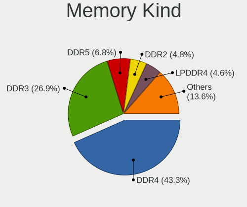

| Kind    | Computers | Percent |
|---------|-----------|---------|
| DDR4    | 282       | 50%     |
| DDR3    | 161       | 28.55%  |
| Unknown | 34        | 6.03%   |
| DDR2    | 23        | 4.08%   |
| LPDDR4  | 20        | 3.55%   |
| DDR5    | 16        | 2.84%   |
| SDRAM   | 10        | 1.77%   |
| LPDDR5  | 8         | 1.42%   |
| DDR     | 5         | 0.89%   |
| DRAM    | 4         | 0.71%   |
| RAM     | 1         | 0.18%   |

Memory Form Factor
------------------

Physical design of the memory module

| Name         | Computers | Percent |
|--------------|-----------|---------|
| DIMM         | 282       | 50.99%  |
| SODIMM       | 234       | 42.31%  |
| Row Of Chips | 36        | 6.51%   |
| Chip         | 1         | 0.18%   |

Memory Size
-----------

Memory module size

| Size  | Computers | Percent |
|-------|-----------|---------|
| 8192  | 228       | 36.83%  |
| 4096  | 147       | 23.75%  |
| 16384 | 93        | 15.02%  |
| 2048  | 85        | 13.73%  |
| 32768 | 33        | 5.33%   |
| 1024  | 26        | 4.2%    |
| 65536 | 3         | 0.48%   |
| 512   | 2         | 0.32%   |
| 12536 | 1         | 0.16%   |
| 256   | 1         | 0.16%   |

Memory Speed
------------

Memory module speed

| Speed   | Computers | Percent |
|---------|-----------|---------|
| 3200    | 123       | 20.36%  |
| 1333    | 81        | 13.41%  |
| 1600    | 68        | 11.26%  |
| 2667    | 64        | 10.6%   |
| 2400    | 46        | 7.62%   |
| 2133    | 29        | 4.8%    |
| 1334    | 16        | 2.65%   |
| 800     | 15        | 2.48%   |
| Unknown | 14        | 2.32%   |
| 3600    | 11        | 1.82%   |
| 667     | 11        | 1.82%   |
| 4800    | 10        | 1.66%   |
| 4267    | 10        | 1.66%   |
| 3266    | 9         | 1.49%   |
| 2666    | 9         | 1.49%   |
| 6400    | 8         | 1.32%   |
| 1866    | 8         | 1.32%   |
| 1066    | 8         | 1.32%   |
| 3400    | 6         | 0.99%   |
| 2933    | 6         | 0.99%   |
| 3800    | 5         | 0.83%   |
| 3733    | 5         | 0.83%   |
| 1067    | 4         | 0.66%   |
| 400     | 4         | 0.66%   |
| 5600    | 3         | 0.5%    |
| 4199    | 3         | 0.5%    |
| 2800    | 3         | 0.5%    |
| 533     | 3         | 0.5%    |
| 6000    | 2         | 0.33%   |
| 4266    | 2         | 0.33%   |
| 3133    | 2         | 0.33%   |
| 2866    | 2         | 0.33%   |
| 1867    | 2         | 0.33%   |
| 5200    | 1         | 0.17%   |
| 4400    | 1         | 0.17%   |
| 3333    | 1         | 0.17%   |
| 3000    | 1         | 0.17%   |
| 2934    | 1         | 0.17%   |
| 2600    | 1         | 0.17%   |
| 2187    | 1         | 0.17%   |

Printers & scanners
-------------------

Printer Vendor
--------------

Printer device vendors

| Vendor              | Computers | Percent |
|---------------------|-----------|---------|
| Hewlett-Packard     | 7         | 41.18%  |
| Samsung Electronics | 2         | 11.76%  |
| Pantum              | 2         | 11.76%  |
| Canon               | 2         | 11.76%  |
| Xerox               | 1         | 5.88%   |
| Seiko Epson         | 1         | 5.88%   |
| Kyocera             | 1         | 5.88%   |
| Brother Industries  | 1         | 5.88%   |

Printer Model
-------------

Printer device models

| Model                               | Computers | Percent |
|-------------------------------------|-----------|---------|
| Xerox VersaLink B405                | 1         | 5.88%   |
| Seiko Epson L1300 Series            | 1         | 5.88%   |
| Samsung SCX-4200 series             | 1         | 5.88%   |
| Samsung ML-2010P Mono Laser Printer | 1         | 5.88%   |
| Pantum M6500W series                | 1         | 5.88%   |
| Pantum M6500 series                 | 1         | 5.88%   |
| Kyocera FS-1135MFP                  | 1         | 5.88%   |
| HP LaserJet Professional P 1102w    | 1         | 5.88%   |
| HP LaserJet Pro M428-M429           | 1         | 5.88%   |
| HP LaserJet P2035                   | 1         | 5.88%   |
| HP LaserJet P1102                   | 1         | 5.88%   |
| HP LaserJet M402d                   | 1         | 5.88%   |
| HP LaserJet 1012                    | 1         | 5.88%   |
| HP LaserJet 1010                    | 1         | 5.88%   |
| Canon MF4800 Series                 | 1         | 5.88%   |
| Canon MF410 Series                  | 1         | 5.88%   |
| Brother DCP-7010                    | 1         | 5.88%   |

Scanner Vendor
--------------

Scanner device vendors

| Vendor          | Computers | Percent |
|-----------------|-----------|---------|
| Canon           | 2         | 66.67%  |
| Hewlett-Packard | 1         | 33.33%  |

Scanner Model
-------------

Scanner device models

| Model                   | Computers | Percent |
|-------------------------|-----------|---------|
| Canon CanoScan LiDE 110 | 2         | 66.67%  |
| HP ScanJet 7400c        | 1         | 33.33%  |

Camera
------

Camera Vendor
-------------

Camera device vendors

| Vendor                                 | Computers | Percent |
|----------------------------------------|-----------|---------|
| Chicony Electronics                    | 56        | 16.87%  |
| IMC Networks                           | 39        | 11.75%  |
| Realtek Semiconductor                  | 29        | 8.73%   |
| Quanta                                 | 23        | 6.93%   |
| Bison Electronics                      | 23        | 6.93%   |
| Microdia                               | 19        | 5.72%   |
| Sunplus Innovation Technology          | 18        | 5.42%   |
| Acer                                   | 16        | 4.82%   |
| Syntek                                 | 13        | 3.92%   |
| Logitech                               | 9         | 2.71%   |
| Suyin                                  | 7         | 2.11%   |
| Silicon Motion                         | 7         | 2.11%   |
| Luxvisions Innotech Limited            | 7         | 2.11%   |
| SunplusIT                              | 6         | 1.81%   |
| Sonix Technology                       | 6         | 1.81%   |
| Cheng Uei Precision Industry (Foxlink) | 6         | 1.81%   |
| Lite-On Technology                     | 5         | 1.51%   |
| icSpring                               | 5         | 1.51%   |
| Apple                                  | 4         | 1.2%    |
| Microsoft                              | 3         | 0.9%    |
| Alcor Micro                            | 3         | 0.9%    |
| Z-Star Microelectronics                | 2         | 0.6%    |
| USB Camera CS                          | 2         | 0.6%    |
| Shine-optics                           | 2         | 0.6%    |
| lihappe8                               | 2         | 0.6%    |
| KYE Systems (Mouse Systems)            | 2         | 0.6%    |
| GEMBIRD                                | 2         | 0.6%    |
| Creative Technology                    | 2         | 0.6%    |
| Y Media                                | 1         | 0.3%    |
| vivo                                   | 1         | 0.3%    |
| Shinetech                              | 1         | 0.3%    |
| Ricoh                                  | 1         | 0.3%    |
| Primax Electronics                     | 1         | 0.3%    |
| OmniVision Technologies                | 1         | 0.3%    |
| kingcome                               | 1         | 0.3%    |
| Jieli Technology                       | 1         | 0.3%    |
| Hy-UXGA(B5M2)-Camera                   | 1         | 0.3%    |
| Hopewin Electronic Material            | 1         | 0.3%    |
| Aveo Technology                        | 1         | 0.3%    |
| ALi                                    | 1         | 0.3%    |

Camera Model
------------

Camera device models

| Model                                | Computers | Percent |
|--------------------------------------|-----------|---------|
| Realtek USB Camera                   | 16        | 4.82%   |
| IMC Networks USB2.0 HD UVC WebCam    | 16        | 4.82%   |
| Chicony Integrated Camera            | 9         | 2.71%   |
| Syntek Integrated Camera             | 8         | 2.41%   |
| Acer BisonCam, NB Pro                | 8         | 2.41%   |
| Quanta ov9734_techfront_camera       | 6         | 1.81%   |
| icSpring camera                      | 5         | 1.51%   |
| Bison Lenovo Integrated Webcam       | 5         | 1.51%   |
| Bison Integrated Camera              | 5         | 1.51%   |
| SunplusIT USB Camera                 | 4         | 1.2%    |
| Sonix USB2.0 HD UVC WebCam           | 4         | 1.2%    |
| Realtek Integrated_Webcam_HD         | 4         | 1.2%    |
| Microdia Camera                      | 4         | 1.2%    |
| IMC Networks Integrated Camera       | 4         | 1.2%    |
| IMC Networks HD Camera               | 4         | 1.2%    |
| Chicony HD User Facing               | 4         | 1.2%    |
| Bison HD Webcam                      | 4         | 1.2%    |
| Syntek Lenovo EasyCamera             | 3         | 0.9%    |
| Sunplus HD WebCam                    | 3         | 0.9%    |
| Silicon Motion WebCam SCB-1100N      | 3         | 0.9%    |
| Quanta USB2.0 HD UVC WebCam          | 3         | 0.9%    |
| Quanta HP TrueVision HD Camera       | 3         | 0.9%    |
| Quanta FHD Camera                    | 3         | 0.9%    |
| Microdia USB 2.0 Camera              | 3         | 0.9%    |
| Lite-On HP HD Camera                 | 3         | 0.9%    |
| IMC Networks ov9734_azurewave_camera | 3         | 0.9%    |
| Chicony VGA WebCam                   | 3         | 0.9%    |
| Chicony Lenovo EasyCamera            | 3         | 0.9%    |
| Chicony HP HD Webcam                 | 3         | 0.9%    |
| Bison BisonCam,NB Pro                | 3         | 0.9%    |
| Acer BisonCam,NB Pro                 | 3         | 0.9%    |
| Z-Star Venus USB2.0 Camera           | 2         | 0.6%    |
| USB Camera CS USB Camera CS          | 2         | 0.6%    |
| Syntek EasyCamera                    | 2         | 0.6%    |
| Suyin USB2.0 UVC 1.3M WebCam         | 2         | 0.6%    |
| Suyin HP Truevision HD               | 2         | 0.6%    |
| Sunplus XiaoMi USB 2.0 Webcam        | 2         | 0.6%    |
| Sunplus Integrated_Webcam_HD         | 2         | 0.6%    |
| Sunplus HesTongCamera                | 2         | 0.6%    |
| Sunplus HD 720P webcam               | 2         | 0.6%    |

Security
--------

Fingerprint Vendor
------------------

Fingerprint sensor vendors

| Vendor                             | Computers | Percent |
|------------------------------------|-----------|---------|
| Shenzhen Goodix Technology         | 17        | 29.82%  |
| Validity Sensors                   | 14        | 24.56%  |
| Elan Microelectronics              | 12        | 21.05%  |
| Synaptics                          | 6         | 10.53%  |
| HOLTEK                             | 3         | 5.26%   |
| Realtek USB2.0 Finger Print Bridge | 2         | 3.51%   |
| LighTuning Technology              | 2         | 3.51%   |
| Focal-systems.Corp                 | 1         | 1.75%   |

Fingerprint Model
-----------------

Fingerprint sensor models

| Model                                                                      | Computers | Percent |
|----------------------------------------------------------------------------|-----------|---------|
| Shenzhen Goodix  Fingerprint Device                                        | 15        | 26.32%  |
| Elan ELAN:Fingerprint                                                      | 10        | 17.54%  |
| Validity Sensors VFS495 Fingerprint Reader                                 | 3         | 5.26%   |
| Synaptics Prometheus MIS Touch Fingerprint Reader                          | 3         | 5.26%   |
| HOLTEK FocalTech Fingerprint Device                                        | 3         | 5.26%   |
| Validity Sensors VFS471 Fingerprint Reader                                 | 2         | 3.51%   |
| Validity Sensors Fingerprint scanner                                       | 2         | 3.51%   |
| Synaptics UWP WBDI Device                                                  | 2         | 3.51%   |
| Shenzhen Goodix Fingerprint Reader                                         | 2         | 3.51%   |
| Realtek USB2.0 Finger Print Bridge FocalTech Fingerprint Device            | 2         | 3.51%   |
| Elan ELAN:ARM-M4                                                           | 2         | 3.51%   |
| Validity Sensors VFS7500 Touch Fingerprint Sensor                          | 1         | 1.75%   |
| Validity Sensors VFS5011 Fingerprint Reader                                | 1         | 1.75%   |
| Validity Sensors VFS491                                                    | 1         | 1.75%   |
| Validity Sensors VFS451 Fingerprint Reader                                 | 1         | 1.75%   |
| Validity Sensors VFS 5011 fingerprint sensor                               | 1         | 1.75%   |
| Validity Sensors Synaptics VFS7552 Touch Fingerprint Sensor with PurePrint | 1         | 1.75%   |
| Validity Sensors Swipe Fingerprint Sensor                                  | 1         | 1.75%   |
| Synaptics WBDI                                                             | 1         | 1.75%   |
| LighTuning Fingerprint Sensor                                              | 1         | 1.75%   |
| LighTuning Fingerprint Reader                                              | 1         | 1.75%   |
| Focal-systems.Corp FT9201Fingerprint.                                      | 1         | 1.75%   |

Chipcard Vendor
---------------

Chipcard module vendors

| Vendor      | Computers | Percent |
|-------------|-----------|---------|
| Aktiv       | 4         | 40%     |
| Alcor Micro | 3         | 30%     |
| Yubico.com  | 1         | 10%     |
| Upek        | 1         | 10%     |
| Broadcom    | 1         | 10%     |

Chipcard Model
--------------

Chipcard module models

| Model                                                      | Computers | Percent |
|------------------------------------------------------------|-----------|---------|
| Aktiv Rutoken lite                                         | 4         | 40%     |
| Alcor Micro AU9540 Smartcard Reader                        | 3         | 30%     |
| Yubico.com Yubikey 4/5 CCID                                | 1         | 10%     |
| Upek TouchChip Fingerprint Coprocessor (WBF advanced mode) | 1         | 10%     |
| Broadcom 5880                                              | 1         | 10%     |

Unsupported
-----------

Unsupported Devices
-------------------

Total unsupported devices on board

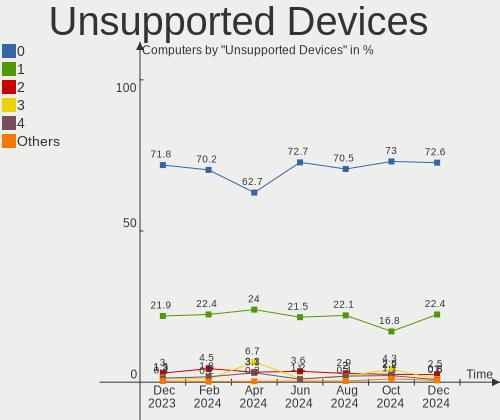

| Total | Computers | Percent |
|-------|-----------|---------|
| 0     | 423       | 63.51%  |
| 1     | 153       | 22.97%  |
| 2     | 35        | 5.26%   |
| 3     | 29        | 4.35%   |
| 4     | 22        | 3.3%    |
| 6     | 3         | 0.45%   |
| 5     | 1         | 0.15%   |

Unsupported Device Types
------------------------

Types of unsupported devices

| Type                     | Computers | Percent |
|--------------------------|-----------|---------|
| Graphics card            | 138       | 39.09%  |
| Communication controller | 58        | 16.43%  |
| Fingerprint reader       | 57        | 16.15%  |
| Unassigned class         | 43        | 12.18%  |
| Multimedia controller    | 13        | 3.68%   |
| Net/wireless             | 9         | 2.55%   |
| Camera                   | 7         | 1.98%   |
| Bluetooth                | 7         | 1.98%   |
| Sound                    | 4         | 1.13%   |
| Chipcard                 | 4         | 1.13%   |
| Net/ethernet             | 3         | 0.85%   |
| Flash memory             | 3         | 0.85%   |
| Storage/raid             | 2         | 0.57%   |
| Network                  | 2         | 0.57%   |
| Card reader              | 2         | 0.57%   |
| Storage/ide              | 1         | 0.28%   |

