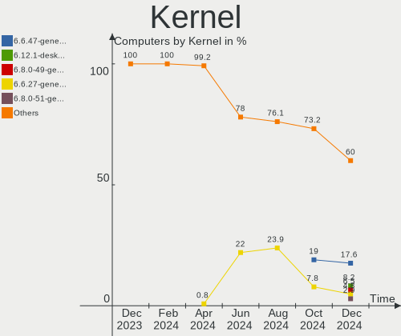
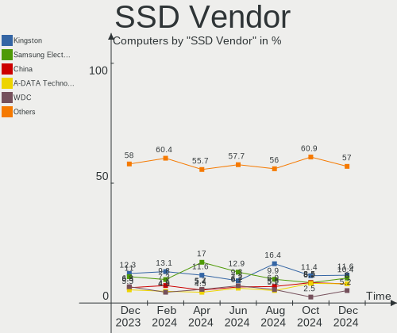
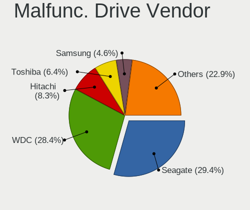
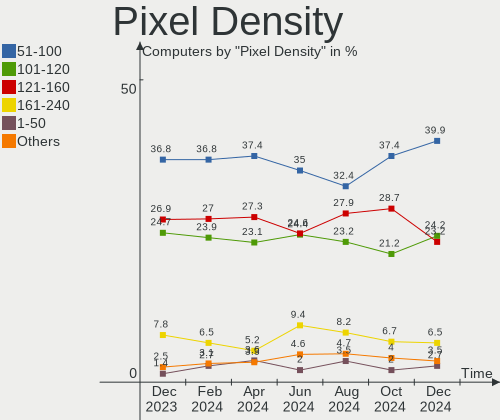

Linux in Russia - Hardware Trends
---------------------------------

A project to identify most popular hardware characteristics and track their change
over time based on data collected by Linux users at https://Linux-Hardware.org.

Anyone can contribute to this report by the [hw-probe](https://github.com/linuxhw/hw-probe) tool:

    sudo -E hw-probe -all -upload

This is a report for all computer types. See also reports for [desktops](/Location/Russia/Desktop/README.md) and [notebooks](/Location/Russia/Notebook/README.md).

Period: Jun, 2023.

Contents
--------

* [ System ](#system)
  - [ OS                       ](#os)
  - [ OS Family                ](#os-family)
  - [ Kernel                   ](#kernel)
  - [ Kernel Family            ](#kernel-family)
  - [ Kernel Major Ver.        ](#kernel-major-ver)
  - [ Arch                     ](#arch)
  - [ DE                       ](#de)
  - [ Display Server           ](#display-server)
  - [ Display Manager          ](#display-manager)
  - [ OS Lang                  ](#os-lang)
  - [ Boot Mode                ](#boot-mode)
  - [ Filesystem               ](#filesystem)
  - [ Part. scheme             ](#part-scheme)
  - [ Dual Boot with Linux/BSD ](#dual-boot-with-linuxbsd)
  - [ Dual Boot (Win)          ](#dual-boot-win)

* [ Board ](#board)
  - [ Vendor                   ](#vendor)
  - [ Model                    ](#model)
  - [ Model Family             ](#model-family)
  - [ MFG Year                 ](#mfg-year)
  - [ Form Factor              ](#form-factor)
  - [ Secure Boot              ](#secure-boot)
  - [ Coreboot                 ](#coreboot)
  - [ RAM Size                 ](#ram-size)
  - [ RAM Used                 ](#ram-used)
  - [ Total Drives             ](#total-drives)
  - [ Has CD-ROM               ](#has-cd-rom)
  - [ Has Ethernet             ](#has-ethernet)
  - [ Has WiFi                 ](#has-wifi)
  - [ Has Bluetooth            ](#has-bluetooth)

* [ Location ](#location)
  - [ Country                  ](#country)
  - [ City                     ](#city)

* [ Drives ](#drives)
  - [ Drive Vendor             ](#drive-vendor)
  - [ Drive Model              ](#drive-model)
  - [ HDD Vendor               ](#hdd-vendor)
  - [ SSD Vendor               ](#ssd-vendor)
  - [ Drive Kind               ](#drive-kind)
  - [ Drive Connector          ](#drive-connector)
  - [ Drive Size               ](#drive-size)
  - [ Space Total              ](#space-total)
  - [ Space Used               ](#space-used)
  - [ Malfunc. Drives          ](#malfunc-drives)
  - [ Malfunc. Drive Vendor    ](#malfunc-drive-vendor)
  - [ Malfunc. HDD Vendor      ](#malfunc-hdd-vendor)
  - [ Malfunc. Drive Kind      ](#malfunc-drive-kind)
  - [ Failed Drives            ](#failed-drives)
  - [ Failed Drive Vendor      ](#failed-drive-vendor)
  - [ Drive Status             ](#drive-status)

* [ Storage controller ](#storage-controller)
  - [ Storage Vendor           ](#storage-vendor)
  - [ Storage Model            ](#storage-model)
  - [ Storage Kind             ](#storage-kind)

* [ Processor ](#processor)
  - [ CPU Vendor               ](#cpu-vendor)
  - [ CPU Model                ](#cpu-model)
  - [ CPU Model Family         ](#cpu-model-family)
  - [ CPU Cores                ](#cpu-cores)
  - [ CPU Sockets              ](#cpu-sockets)
  - [ CPU Threads              ](#cpu-threads)
  - [ CPU Op-Modes             ](#cpu-op-modes)
  - [ CPU Microcode            ](#cpu-microcode)
  - [ CPU Microarch            ](#cpu-microarch)

* [ Graphics ](#graphics)
  - [ GPU Vendor               ](#gpu-vendor)
  - [ GPU Model                ](#gpu-model)
  - [ GPU Combo                ](#gpu-combo)
  - [ GPU Driver               ](#gpu-driver)
  - [ GPU Memory               ](#gpu-memory)

* [ Monitor ](#monitor)
  - [ Monitor Vendor           ](#monitor-vendor)
  - [ Monitor Model            ](#monitor-model)
  - [ Monitor Resolution       ](#monitor-resolution)
  - [ Monitor Diagonal         ](#monitor-diagonal)
  - [ Monitor Width            ](#monitor-width)
  - [ Aspect Ratio             ](#aspect-ratio)
  - [ Monitor Area             ](#monitor-area)
  - [ Pixel Density            ](#pixel-density)
  - [ Multiple Monitors        ](#multiple-monitors)

* [ Network ](#network)
  - [ Net Controller Vendor    ](#net-controller-vendor)
  - [ Net Controller Model     ](#net-controller-model)
  - [ Wireless Vendor          ](#wireless-vendor)
  - [ Wireless Model           ](#wireless-model)
  - [ Ethernet Vendor          ](#ethernet-vendor)
  - [ Ethernet Model           ](#ethernet-model)
  - [ Net Controller Kind      ](#net-controller-kind)
  - [ Used Controller          ](#used-controller)
  - [ NICs                     ](#nics)
  - [ IPv6                     ](#ipv6)

* [ Bluetooth ](#bluetooth)
  - [ Bluetooth Vendor         ](#bluetooth-vendor)
  - [ Bluetooth Model          ](#bluetooth-model)

* [ Sound ](#sound)
  - [ Sound Vendor             ](#sound-vendor)
  - [ Sound Model              ](#sound-model)

* [ Memory ](#memory)
  - [ Memory Vendor            ](#memory-vendor)
  - [ Memory Model             ](#memory-model)
  - [ Memory Kind              ](#memory-kind)
  - [ Memory Form Factor       ](#memory-form-factor)
  - [ Memory Size              ](#memory-size)
  - [ Memory Speed             ](#memory-speed)

* [ Printers & scanners ](#printers--scanners)
  - [ Printer Vendor           ](#printer-vendor)
  - [ Printer Model            ](#printer-model)
  - [ Scanner Vendor           ](#scanner-vendor)
  - [ Scanner Model            ](#scanner-model)

* [ Camera ](#camera)
  - [ Camera Vendor            ](#camera-vendor)
  - [ Camera Model             ](#camera-model)

* [ Security ](#security)
  - [ Fingerprint Vendor       ](#fingerprint-vendor)
  - [ Fingerprint Model        ](#fingerprint-model)
  - [ Chipcard Vendor          ](#chipcard-vendor)
  - [ Chipcard Model           ](#chipcard-model)

* [ Unsupported ](#unsupported)
  - [ Unsupported Devices      ](#unsupported-devices)
  - [ Unsupported Device Types ](#unsupported-device-types)

System
------

OS
--

Installed operating systems

| Name                         | Computers | Percent |
|------------------------------|-----------|---------|
| ROSA 12.4                    | 118       | 25.65%  |
| Debian 12                    | 59        | 12.83%  |
| Ubuntu 22.04                 | 47        | 10.22%  |
| Fedora 38                    | 22        | 4.78%   |
| OpenMandriva 23.03           | 14        | 3.04%   |
| Linux Mint 21.1              | 12        | 2.61%   |
| Ubuntu 23.04                 | 10        | 2.17%   |
| Debian 11                    | 10        | 2.17%   |
| Ubuntu 20.04                 | 8         | 1.74%   |
| Red OS 7.3.2                 | 8         | 1.74%   |
| ROSA R11.1                   | 7         | 1.52%   |
| ROSA 12                      | 7         | 1.52%   |
| ROSA 12.3                    | 6         | 1.3%    |
| Cyber Infra 5.0.1            | 6         | 1.3%    |
| ArcoLinux Rolling            | 6         | 1.3%    |
| Gentoo 2.13                  | 5         | 1.09%   |
| Arch Rolling                 | 5         | 1.09%   |
| Pop!_OS 22.04                | 4         | 0.87%   |
| OpenMandriva 4.2             | 4         | 0.87%   |
| Manjaro 23.0.0               | 4         | 0.87%   |
| ALT Linux 10.2               | 4         | 0.87%   |
| SteamOS 3.4.8                | 3         | 0.65%   |
| RELD 7.9                     | 3         | 0.65%   |
| openSUSE Tumbleweed-XXXXXXXX | 3         | 0.65%   |
| OpenMandriva 4.3             | 3         | 0.65%   |
| OpenMandriva 23.06           | 3         | 0.65%   |
| Manjaro                      | 3         | 0.65%   |
| Linux Mint 21                | 3         | 0.65%   |
| Kubuntu 23.04                | 3         | 0.65%   |
| Kubuntu 22.04                | 3         | 0.65%   |
| EndeavourOS Rolling          | 3         | 0.65%   |
| ALT Linux 10.1               | 3         | 0.65%   |
| Xubuntu 20.04                | 2         | 0.43%   |
| Ubuntu 22.10                 | 2         | 0.43%   |
| ROSA 13.0                    | 2         | 0.43%   |
| ROSA 12.2                    | 2         | 0.43%   |
| ROSA 12.1                    | 2         | 0.43%   |
| RED X4                       | 2         | 0.43%   |
| Parrot 5.3                   | 2         | 0.43%   |
| MOS 10                       | 2         | 0.43%   |

OS Family
---------

OS without a version

| Name         | Computers | Percent |
|--------------|-----------|---------|
| ROSA         | 146       | 31.74%  |
| Debian       | 71        | 15.43%  |
| Ubuntu       | 68        | 14.78%  |
| OpenMandriva | 25        | 5.43%   |
| Fedora       | 25        | 5.43%   |
| Linux Mint   | 15        | 3.26%   |
| ALT Linux    | 12        | 2.61%   |
| Red OS       | 9         | 1.96%   |
| Manjaro      | 8         | 1.74%   |
| Kubuntu      | 8         | 1.74%   |
| Cyber Infra  | 6         | 1.3%    |
| ArcoLinux    | 6         | 1.3%    |
| Gentoo       | 5         | 1.09%   |
| Arch         | 5         | 1.09%   |
| Pop!_OS      | 4         | 0.87%   |
| openSUSE     | 4         | 0.87%   |
| Xubuntu      | 3         | 0.65%   |
| SteamOS      | 3         | 0.65%   |
| RELD         | 3         | 0.65%   |
| Lubuntu      | 3         | 0.65%   |
| EndeavourOS  | 3         | 0.65%   |
| Ubuntu MATE  | 2         | 0.43%   |
| RED          | 2         | 0.43%   |
| Parrot       | 2         | 0.43%   |
| LMDE         | 2         | 0.43%   |
| Kali         | 2         | 0.43%   |
| Elementary   | 2         | 0.43%   |
| Artix        | 2         | 0.43%   |
| Zorin        | 1         | 0.22%   |
| Uncom        | 1         | 0.22%   |
| Raspbian     | 1         | 0.22%   |
| PureOS       | 1         | 0.22%   |
| PostmarketOS | 1         | 0.22%   |
| Nobara       | 1         | 0.22%   |
| NixOS        | 1         | 0.22%   |
| MX           | 1         | 0.22%   |
| Manjaro-ARM  | 1         | 0.22%   |
| KDE neon     | 1         | 0.22%   |
| Endless      | 1         | 0.22%   |
| CentOS       | 1         | 0.22%   |

Kernel
------

Version of the Linux kernel

| Version                             | Computers | Percent |
|-------------------------------------|-----------|---------|
| 6.1.20-generic-2rosa2021.1-x86_64   | 101       | 21.96%  |
| 6.1.0-4-amd64                       | 48        | 10.43%  |
| 5.15.0-69-generic                   | 36        | 7.83%   |
| 6.2.6-desktop-1omv2390              | 14        | 3.04%   |
| 5.19.0-43-generic                   | 13        | 2.83%   |
| 5.15.0-73-generic                   | 11        | 2.39%   |
| 6.1.0-9-amd64                       | 9         | 1.96%   |
| 5.10.0-23-amd64                     | 8         | 1.74%   |
| 6.3.8-200.fc38.x86_64               | 7         | 1.52%   |
| 5.15.0-75-generic                   | 7         | 1.52%   |
| 6.2.0-20-generic                    | 6         | 1.3%    |
| 3.10.0-1160.41.1.vz7.183.5          | 6         | 1.3%    |
| 5.15.87-1.el7.3.x86_64              | 5         | 1.09%   |
| 5.15.103-generic-1rosa2021.1-i686   | 5         | 1.09%   |
| 5.10.176-generic-1rosa2021.1-x86_64 | 5         | 1.09%   |
| 6.3.6-arch1-1                       | 4         | 0.87%   |
| 6.2.9-300.fc38.x86_64               | 4         | 0.87%   |
| 6.1.31-2-MANJARO                    | 4         | 0.87%   |
| 5.4.0-150-generic                   | 4         | 0.87%   |
| 5.19.0-45-generic                   | 4         | 0.87%   |
| 5.15.75-generic-1rosa2021.1-x86_64  | 4         | 0.87%   |
| 5.10.74-generic-2rosa2021.1-x86_64  | 4         | 0.87%   |
| 6.3.9-arch1-1                       | 3         | 0.65%   |
| 6.3.5-desktop-3omv2390              | 3         | 0.65%   |
| 6.3.5-200.fc38.x86_64               | 3         | 0.65%   |
| 6.3.4-201.fc38.x86_64               | 3         | 0.65%   |
| 6.2.6-76060206-generic              | 3         | 0.65%   |
| 6.1.34-generic-1rosa2021.1-x86_64   | 3         | 0.65%   |
| 5.4.83-generic-2rosa-i586           | 3         | 0.65%   |
| 5.15.72-un-def-alt1                 | 3         | 0.65%   |
| 5.13.0-valve36-1-neptune            | 3         | 0.65%   |
| 5.10.14-desktop-1omv4002            | 3         | 0.65%   |
| 6.4.0-060400-generic                | 2         | 0.43%   |
| 6.3.9-1-liquorix-amd64              | 2         | 0.43%   |
| 6.3.9-1-default                     | 2         | 0.43%   |
| 6.3.6-200.fc38.x86_64               | 2         | 0.43%   |
| 6.3.5-zen1-1-zen                    | 2         | 0.43%   |
| 6.3.5-2-MANJARO                     | 2         | 0.43%   |
| 6.2.15-300.fc38.x86_64              | 2         | 0.43%   |
| 6.2.0-24-generic                    | 2         | 0.43%   |

Kernel Family
-------------

Linux kernel without a distro release

| Version  | Computers | Percent |
|----------|-----------|---------|
| 6.1.20   | 102       | 22.17%  |
| 6.1.0    | 62        | 13.48%  |
| 5.15.0   | 58        | 12.61%  |
| 5.19.0   | 21        | 4.57%   |
| 6.2.6    | 17        | 3.7%    |
| 6.3.5    | 12        | 2.61%   |
| 6.2.0    | 12        | 2.61%   |
| 5.10.0   | 12        | 2.61%   |
| 6.3.9    | 10        | 2.17%   |
| 6.3.8    | 10        | 2.17%   |
| 5.4.0    | 10        | 2.17%   |
| 6.3.7    | 8         | 1.74%   |
| 6.1.34   | 7         | 1.52%   |
| 6.1.31   | 7         | 1.52%   |
| 5.15.103 | 7         | 1.52%   |
| 6.3.6    | 6         | 1.3%    |
| 3.10.0   | 6         | 1.3%    |
| 5.15.87  | 5         | 1.09%   |
| 5.15.75  | 5         | 1.09%   |
| 5.15.72  | 5         | 1.09%   |
| 5.10.74  | 5         | 1.09%   |
| 5.10.176 | 5         | 1.09%   |
| 6.2.9    | 4         | 0.87%   |
| 5.4.83   | 4         | 0.87%   |
| 6.3.4    | 3         | 0.65%   |
| 6.2.15   | 3         | 0.65%   |
| 6.1.30   | 3         | 0.65%   |
| 5.13.0   | 3         | 0.65%   |
| 5.10.14  | 3         | 0.65%   |
| 4.15.0   | 3         | 0.65%   |
| 6.4.0    | 2         | 0.43%   |
| 6.2.14   | 2         | 0.43%   |
| 6.1.35   | 2         | 0.43%   |
| 5.4.32   | 2         | 0.43%   |
| 5.16.13  | 2         | 0.43%   |
| 5.15.114 | 2         | 0.43%   |
| 5.15.102 | 2         | 0.43%   |
| 5.10.179 | 2         | 0.43%   |
| 5.10.164 | 2         | 0.43%   |
| 6.3.3    | 1         | 0.22%   |

Kernel Major Ver.
-----------------

Linux kernel major version

| Version | Computers | Percent |
|---------|-----------|---------|
| 6.1     | 187       | 40.65%  |
| 5.15    | 87        | 18.91%  |
| 6.3     | 52        | 11.3%   |
| 6.2     | 40        | 8.7%    |
| 5.10    | 32        | 6.96%   |
| 5.19    | 21        | 4.57%   |
| 5.4     | 20        | 4.35%   |
| 3.10    | 6         | 1.3%    |
| 5.16    | 3         | 0.65%   |
| 5.13    | 3         | 0.65%   |
| 4.15    | 3         | 0.65%   |
| 6.4     | 2         | 0.43%   |
| 5.14    | 2         | 0.43%   |
| 6.0     | 1         | 0.22%   |
| 5.11    | 1         | 0.22%   |

Arch
----

OS architecture (x86_64, i586, etc.)

| Name    | Computers | Percent |
|---------|-----------|---------|
| x86_64  | 444       | 96.52%  |
| i686    | 14        | 3.04%   |
| armv6l  | 1         | 0.22%   |
| aarch64 | 1         | 0.22%   |

DE
--

Desktop Environment

| Name            | Computers | Percent |
|-----------------|-----------|---------|
| KDE5            | 153       | 33.26%  |
| GNOME           | 111       | 24.13%  |
| Unknown         | 111       | 24.13%  |
| MATE            | 20        | 4.35%   |
| XFCE            | 16        | 3.48%   |
| LXQt            | 15        | 3.26%   |
| X-Cinnamon      | 13        | 2.83%   |
| KDE4            | 11        | 2.39%   |
| Pantheon        | 2         | 0.43%   |
| i3              | 2         | 0.43%   |
| Budgie          | 2         | 0.43%   |
| LXDE            | 1         | 0.22%   |
| KDE             | 1         | 0.22%   |
| GNOME Flashback | 1         | 0.22%   |
| Cinnamon        | 1         | 0.22%   |

Display Server
--------------

X11 or Wayland

| Name    | Computers | Percent |
|---------|-----------|---------|
| X11     | 182       | 39.57%  |
| Wayland | 173       | 37.61%  |
| Unknown | 96        | 20.87%  |
| Tty     | 9         | 1.96%   |

Display Manager
---------------

SDDM, LightDM, etc.

| Name    | Computers | Percent |
|---------|-----------|---------|
| Unknown | 168       | 36.52%  |
| SDDM    | 139       | 30.22%  |
| GDM     | 77        | 16.74%  |
| LightDM | 42        | 9.13%   |
| GDM3    | 23        | 5%      |
| KDM     | 11        | 2.39%   |

OS Lang
-------

Language

| Lang    | Computers | Percent |
|---------|-----------|---------|
| ru_RU   | 338       | 73.48%  |
| en_US   | 76        | 16.52%  |
| C       | 36        | 7.83%   |
| Unknown | 5         | 1.09%   |
| en_GB   | 3         | 0.65%   |
| ru_UA   | 1         | 0.22%   |
| POSIX   | 1         | 0.22%   |

Boot Mode
---------

EFI or BIOS

| Mode | Computers | Percent |
|------|-----------|---------|
| EFI  | 253       | 55%     |
| BIOS | 207       | 45%     |

Filesystem
----------

Type of filesystem

| Type    | Computers | Percent |
|---------|-----------|---------|
| Ext4    | 274       | 59.57%  |
| Overlay | 96        | 20.87%  |
| Btrfs   | 62        | 13.48%  |
| Tmpfs   | 14        | 3.04%   |
| Xfs     | 9         | 1.96%   |
| Zfs     | 4         | 0.87%   |
| Aufs    | 1         | 0.22%   |

Part. scheme
------------

Scheme of partitioning

| Type    | Computers | Percent |
|---------|-----------|---------|
| GPT     | 256       | 55.65%  |
| MBR     | 111       | 24.13%  |
| Unknown | 93        | 20.22%  |

Dual Boot with Linux/BSD
------------------------

Hosting more than one Linux/BSD

| Dual boot | Computers | Percent |
|-----------|-----------|---------|
| No        | 357       | 77.61%  |
| Yes       | 103       | 22.39%  |

Dual Boot (Win)
---------------

Hosting Linux and Windows

| Dual boot | Computers | Percent |
|-----------|-----------|---------|
| No        | 269       | 58.48%  |
| Yes       | 191       | 41.52%  |

Board
-----

Vendor
------

Motherboard manufacturer

| Name                    | Computers | Percent |
|-------------------------|-----------|---------|
| ASUSTek Computer        | 95        | 20.65%  |
| Gigabyte Technology     | 48        | 10.43%  |
| Lenovo                  | 40        | 8.7%    |
| Supermicro              | 36        | 7.83%   |
| MSI                     | 33        | 7.17%   |
| Hewlett-Packard         | 32        | 6.96%   |
| Acer                    | 23        | 5%      |
| Dell                    | 16        | 3.48%   |
| ASRock                  | 13        | 2.83%   |
| Aquarius                | 13        | 2.83%   |
| Unknown                 | 10        | 2.17%   |
| Timi                    | 8         | 1.74%   |
| HUAWEI                  | 8         | 1.74%   |
| Samsung Electronics     | 7         | 1.52%   |
| Intel                   | 5         | 1.09%   |
| Huanan                  | 5         | 1.09%   |
| ETegro Technologies     | 5         | 1.09%   |
| Apple                   | 5         | 1.09%   |
| Valve                   | 3         | 0.65%   |
| Maibenben               | 3         | 0.65%   |
| iRU                     | 3         | 0.65%   |
| HONOR                   | 3         | 0.65%   |
| ECS                     | 3         | 0.65%   |
| Biostar                 | 3         | 0.65%   |
| Toshiba                 | 2         | 0.43%   |
| Sony                    | 2         | 0.43%   |
| Packard Bell            | 2         | 0.43%   |
| Irbis                   | 2         | 0.43%   |
| Foxconn                 | 2         | 0.43%   |
| eMachines               | 2         | 0.43%   |
| Clevo                   | 2         | 0.43%   |
| 3Logic Group            | 2         | 0.43%   |
| Zvezda                  | 1         | 0.22%   |
| WeiBu                   | 1         | 0.22%   |
| TYAN Computer           | 1         | 0.22%   |
| TECNO                   | 1         | 0.22%   |
| realme                  | 1         | 0.22%   |
| Raspberry Pi Foundation | 1         | 0.22%   |
| Quanta                  | 1         | 0.22%   |
| Pegatron                | 1         | 0.22%   |

Model
-----

Motherboard model

| Name                                | Computers | Percent |
|-------------------------------------|-----------|---------|
| Unknown                             | 12        | 2.61%   |
| Supermicro X8DTU                    | 11        | 2.39%   |
| Aquarius NS585                      | 11        | 2.39%   |
| Supermicro Super Server             | 10        | 2.17%   |
| ASUS PRIME B450M-K                  | 10        | 2.17%   |
| Supermicro X9DRW                    | 7         | 1.52%   |
| ETegro Hyperion RS125 G4            | 5         | 1.09%   |
| Valve Jupiter                       | 3         | 0.65%   |
| Gigabyte B450M DS3H                 | 3         | 0.65%   |
| ASUS S20 K29                        | 3         | 0.65%   |
| ASUS All Series                     | 3         | 0.65%   |
| Timi RedmiBook Pro 14S              | 2         | 0.43%   |
| Timi Redmi Book Pro 14 2022         | 2         | 0.43%   |
| MSI MS-7D22                         | 2         | 0.43%   |
| MSI MS-7817                         | 2         | 0.43%   |
| Maibenben MaiBook X series          | 2         | 0.43%   |
| Lenovo ThinkCentre M820z 10SDS01600 | 2         | 0.43%   |
| HP ProLiant DL360 Gen9              | 2         | 0.43%   |
| HP Laptop 15s-eq1xxx                | 2         | 0.43%   |
| HP Laptop 15-bw0xx                  | 2         | 0.43%   |
| Gigabyte P55-USB3                   | 2         | 0.43%   |
| Gigabyte M68MT-S2                   | 2         | 0.43%   |
| Gigabyte M56S-S3                    | 2         | 0.43%   |
| Gigabyte H61M-DS2 REV 1.2           | 2         | 0.43%   |
| Gigabyte B450M S2H                  | 2         | 0.43%   |
| Gigabyte B360M-DS3H                 | 2         | 0.43%   |
| ECS G31T-M9                         | 2         | 0.43%   |
| Clevo NL41MU2                       | 2         | 0.43%   |
| ASUS TUF Gaming Z590-PLUS WIFI      | 2         | 0.43%   |
| ASUS PRIME H510M-K                  | 2         | 0.43%   |
| ASUS PRIME H310M-K                  | 2         | 0.43%   |
| ASUS P8Z77-V LE PLUS                | 2         | 0.43%   |
| ASUS P8B75-M LE                     | 2         | 0.43%   |
| ASUS M4A78T-E                       | 2         | 0.43%   |
| ASRock G31M-GS                      | 2         | 0.43%   |
| Acer Veriton ES2710G                | 2         | 0.43%   |
| Zvezda Altair Z                     | 1         | 0.22%   |
| WeiBu OEM                           | 1         | 0.22%   |
| TYAN S7010                          | 1         | 0.22%   |
| Toshiba Satellite U300              | 1         | 0.22%   |

Model Family
------------

Motherboard model prefix

| Name                  | Computers | Percent |
|-----------------------|-----------|---------|
| ASUS PRIME            | 26        | 5.65%   |
| Acer Aspire           | 14        | 3.04%   |
| Unknown               | 12        | 2.61%   |
| Supermicro X8DTU      | 11        | 2.39%   |
| ASUS VivoBook         | 11        | 2.39%   |
| Aquarius NS585        | 11        | 2.39%   |
| Supermicro Super      | 10        | 2.17%   |
| Lenovo IdeaPad        | 10        | 2.17%   |
| Supermicro X9DRW      | 7         | 1.52%   |
| HP Pavilion           | 7         | 1.52%   |
| Gigabyte B450M        | 7         | 1.52%   |
| Lenovo ThinkPad       | 6         | 1.3%    |
| Lenovo ThinkCentre    | 6         | 1.3%    |
| Dell Inspiron         | 6         | 1.3%    |
| ASUS ROG              | 6         | 1.3%    |
| HP Laptop             | 5         | 1.09%   |
| ETegro Hyperion       | 5         | 1.09%   |
| ASUS TUF              | 5         | 1.09%   |
| HP EliteBook          | 4         | 0.87%   |
| ASUS ASUS             | 4         | 0.87%   |
| Valve Jupiter         | 3         | 0.65%   |
| Timi RedmiBook        | 3         | 0.65%   |
| Timi Redmi            | 3         | 0.65%   |
| Maibenben MaiBook     | 3         | 0.65%   |
| Lenovo Legion         | 3         | 0.65%   |
| HP ProLiant           | 3         | 0.65%   |
| HP ProBook            | 3         | 0.65%   |
| Dell Latitude         | 3         | 0.65%   |
| ASUS Zenbook          | 3         | 0.65%   |
| ASUS S20              | 3         | 0.65%   |
| ASUS P8Z77-V          | 3         | 0.65%   |
| ASUS All              | 3         | 0.65%   |
| Acer Extensa          | 3         | 0.65%   |
| Toshiba Satellite     | 2         | 0.43%   |
| Packard Bell EasyNote | 2         | 0.43%   |
| MSI MS-7D22           | 2         | 0.43%   |
| MSI MS-7817           | 2         | 0.43%   |
| MSI Katana            | 2         | 0.43%   |
| Lenovo B590           | 2         | 0.43%   |
| Gigabyte P55-USB3     | 2         | 0.43%   |

MFG Year
--------

Motherboard manufacture year

| Year    | Computers | Percent |
|---------|-----------|---------|
| 2022    | 64        | 13.91%  |
| 2021    | 56        | 12.17%  |
| 2020    | 44        | 9.57%   |
| 2018    | 44        | 9.57%   |
| 2019    | 40        | 8.7%    |
| 2012    | 28        | 6.09%   |
| 2013    | 26        | 5.65%   |
| 2011    | 26        | 5.65%   |
| 2009    | 25        | 5.43%   |
| 2010    | 21        | 4.57%   |
| 2017    | 16        | 3.48%   |
| 2008    | 13        | 2.83%   |
| 2015    | 12        | 2.61%   |
| 2014    | 12        | 2.61%   |
| 2007    | 10        | 2.17%   |
| 2023    | 8         | 1.74%   |
| 2016    | 6         | 1.3%    |
| 2006    | 6         | 1.3%    |
| Unknown | 2         | 0.43%   |
| 2005    | 1         | 0.22%   |

Form Factor
-----------

Physical design of the computer

| Name           | Computers | Percent |
|----------------|-----------|---------|
| Notebook       | 204       | 44.35%  |
| Desktop        | 181       | 39.35%  |
| Server         | 49        | 10.65%  |
| All in one     | 12        | 2.61%   |
| Convertible    | 6         | 1.3%    |
| Mini pc        | 4         | 0.87%   |
| System on chip | 2         | 0.43%   |
| Tablet         | 2         | 0.43%   |

Secure Boot
-----------

Enabled or disabled

| State    | Computers | Percent |
|----------|-----------|---------|
| Disabled | 438       | 95.22%  |
| Enabled  | 22        | 4.78%   |

Coreboot
--------

Have coreboot on board

| Used | Computers | Percent |
|------|-----------|---------|
| No   | 460       | 100%    |

RAM Size
--------

Total RAM memory

| Size in GB      | Computers | Percent |
|-----------------|-----------|---------|
| 4.01-8.0        | 110       | 23.91%  |
| 16.01-24.0      | 95        | 20.65%  |
| 8.01-16.0       | 73        | 15.87%  |
| 3.01-4.0        | 63        | 13.7%   |
| 32.01-64.0      | 50        | 10.87%  |
| 64.01-256.0     | 21        | 4.57%   |
| 1.01-2.0        | 16        | 3.48%   |
| 24.01-32.0      | 11        | 2.39%   |
| 2.01-3.0        | 10        | 2.17%   |
| More than 256.0 | 6         | 1.3%    |
| 0.51-1.0        | 4         | 0.87%   |
| 0.01-0.5        | 1         | 0.22%   |

RAM Used
--------

Used RAM memory

| Used GB     | Computers | Percent |
|-------------|-----------|---------|
| 1.01-2.0    | 157       | 34.13%  |
| 2.01-3.0    | 98        | 21.3%   |
| 0.51-1.0    | 92        | 20%     |
| 4.01-8.0    | 47        | 10.22%  |
| 3.01-4.0    | 41        | 8.91%   |
| 8.01-16.0   | 14        | 3.04%   |
| 0.01-0.5    | 4         | 0.87%   |
| 32.01-64.0  | 2         | 0.43%   |
| 64.01-256.0 | 2         | 0.43%   |
| 16.01-24.0  | 2         | 0.43%   |
| 24.01-32.0  | 1         | 0.22%   |

Total Drives
------------

Number of drives on board

| Drives | Computers | Percent |
|--------|-----------|---------|
| 1      | 285       | 61.96%  |
| 2      | 88        | 19.13%  |
| 3      | 34        | 7.39%   |
| 4      | 24        | 5.22%   |
| 5      | 10        | 2.17%   |
| 0      | 6         | 1.3%    |
| 6      | 5         | 1.09%   |
| 11     | 2         | 0.43%   |
| 10     | 2         | 0.43%   |
| 17     | 1         | 0.22%   |
| 9      | 1         | 0.22%   |
| 8      | 1         | 0.22%   |
| 7      | 1         | 0.22%   |

Has CD-ROM
----------

Has CD-ROM on board

| Presented | Computers | Percent |
|-----------|-----------|---------|
| No        | 363       | 78.91%  |
| Yes       | 97        | 21.09%  |

Has Ethernet
------------

Has Ethernet on board

| Presented | Computers | Percent |
|-----------|-----------|---------|
| Yes       | 394       | 85.65%  |
| No        | 66        | 14.35%  |

Has WiFi
--------

Has WiFi module

| Presented | Computers | Percent |
|-----------|-----------|---------|
| Yes       | 270       | 58.7%   |
| No        | 190       | 41.3%   |

Has Bluetooth
-------------

Has Bluetooth module

| Presented | Computers | Percent |
|-----------|-----------|---------|
| Yes       | 236       | 51.3%   |
| No        | 224       | 48.7%   |

Location
--------

Country
-------

Geographic location (country)

| Country | Computers | Percent |
|---------|-----------|---------|
| Russia  | 460       | 100%    |

City
----

Geographic location (city)

| City             | Computers | Percent |
|------------------|-----------|---------|
| Moscow           | 140       | 30.43%  |
| Voronezh         | 51        | 11.09%  |
| St Petersburg    | 33        | 7.17%   |
| Novosibirsk      | 13        | 2.83%   |
| Samara           | 10        | 2.17%   |
| Perm             | 10        | 2.17%   |
| Yekaterinburg    | 8         | 1.74%   |
| Nizhniy Novgorod | 8         | 1.74%   |
| Volgograd        | 7         | 1.52%   |
| Saratov          | 7         | 1.52%   |
| Rostov-on-Don    | 7         | 1.52%   |
| Krasnodar        | 7         | 1.52%   |
| Yakutsk          | 4         | 0.87%   |
| Tyumen           | 4         | 0.87%   |
| Ryazan           | 4         | 0.87%   |
| Chelyabinsk      | 4         | 0.87%   |
| Ulyanovsk        | 3         | 0.65%   |
| Surgut           | 3         | 0.65%   |
| Stavropol        | 3         | 0.65%   |
| Orenburg         | 3         | 0.65%   |
| Omsk             | 3         | 0.65%   |
| Kirov            | 3         | 0.65%   |
| Khabarovsk       | 3         | 0.65%   |
| Kazan’         | 3         | 0.65%   |
| Ivanovo          | 3         | 0.65%   |
| Irkutsk          | 3         | 0.65%   |
| Zhukovskiy       | 2         | 0.43%   |
| Yaroslavl        | 2         | 0.43%   |
| Vyborg           | 2         | 0.43%   |
| Vladivostok      | 2         | 0.43%   |
| Ufa              | 2         | 0.43%   |
| Tambov           | 2         | 0.43%   |
| Smolensk         | 2         | 0.43%   |
| Lyubertsy        | 2         | 0.43%   |
| Kursk            | 2         | 0.43%   |
| Kazan'           | 2         | 0.43%   |
| Kaliningrad      | 2         | 0.43%   |
| Barnaul          | 2         | 0.43%   |
| Balashikha       | 2         | 0.43%   |
| Zlatoust         | 1         | 0.22%   |

Drives
------

Drive Vendor
------------

Hard drive vendors

| Vendor                      | Computers | Drives | Percent |
|-----------------------------|-----------|--------|---------|
| WDC                         | 92        | 112    | 14.26%  |
| Seagate                     | 65        | 87     | 10.08%  |
| Samsung Electronics         | 59        | 79     | 9.15%   |
| Toshiba                     | 46        | 55     | 7.13%   |
| Kingston                    | 36        | 44     | 5.58%   |
| Intel                       | 26        | 40     | 4.03%   |
| Crucial                     | 26        | 28     | 4.03%   |
| A-DATA Technology           | 24        | 25     | 3.72%   |
| Hitachi                     | 19        | 20     | 2.95%   |
| Fujitsu                     | 17        | 32     | 2.64%   |
| Unknown                     | 16        | 17     | 2.48%   |
| Netac                       | 15        | 17     | 2.33%   |
| Sandisk                     | 12        | 12     | 1.86%   |
| Apacer                      | 12        | 13     | 1.86%   |
| Micron Technology           | 10        | 13     | 1.55%   |
| HGST                        | 10        | 12     | 1.55%   |
| China                       | 10        | 10     | 1.55%   |
| Phison Electronics          | 8         | 9      | 1.24%   |
| KIOXIA                      | 8         | 8      | 1.24%   |
| SK hynix                    | 7         | 7      | 1.09%   |
| Hewlett-Packard             | 7         | 12     | 1.09%   |
| SPCC                        | 6         | 7      | 0.93%   |
| KingSpec                    | 6         | 6      | 0.93%   |
| Silicon Motion              | 5         | 5      | 0.78%   |
| Patriot                     | 5         | 5      | 0.78%   |
| OCZ                         | 5         | 5      | 0.78%   |
| Maxtor                      | 5         | 5      | 0.78%   |
| AMD                         | 5         | 5      | 0.78%   |
| XrayDisk                    | 4         | 5      | 0.62%   |
| Kingston Technology Company | 4         | 4      | 0.62%   |
| Unknown                     | 4         | 4      | 0.62%   |
| Plextor                     | 3         | 3      | 0.47%   |
| JMicron Technology          | 3         | 3      | 0.47%   |
| Foxline                     | 3         | 4      | 0.47%   |
| ADATA Technology            | 3         | 4      | 0.47%   |
| Realtek                     | 2         | 2      | 0.31%   |
| Phison                      | 2         | 2      | 0.31%   |
| Micron/Crucial Technology   | 2         | 2      | 0.31%   |
| GOODRAM                     | 2         | 2      | 0.31%   |
| Gigabyte Technology         | 2         | 2      | 0.31%   |

Drive Model
-----------

Hard drive models

| Model                                               | Computers | Percent |
|-----------------------------------------------------|-----------|---------|
| Crucial CT480BX500SSD1 480GB                        | 14        | 2.01%   |
| A-DATA SU800 512GB SSD                              | 11        | 1.58%   |
| Toshiba MQ01ABF050 500GB                            | 9         | 1.29%   |
| Fujitsu MBE2147RC 147GB                             | 9         | 1.29%   |
| Kingston SA400S37240G 240GB SSD                     | 7         | 1%      |
| Toshiba DT01ACA100 1TB                              | 5         | 0.72%   |
| Toshiba DT01ACA050 500GB                            | 5         | 0.72%   |
| Seagate ST1000LM035-1RK172 1TB                      | 5         | 0.72%   |
| Samsung SSD 970 EVO Plus 500GB                      | 5         | 0.72%   |
| Samsung NVMe SSD Controller SM981/PM981/PM983 250GB | 5         | 0.72%   |
| Intel SSDPEKNU512GZ 512GB                           | 5         | 0.72%   |
| Fujitsu MBA3147RC 147GB                             | 5         | 0.72%   |
| Crucial CT240BX500SSD1 240GB                        | 5         | 0.72%   |
| Toshiba HDWD110 1TB                                 | 4         | 0.57%   |
| Seagate ST1000DM010-2EP102 1TB                      | 4         | 0.57%   |
| Samsung SSD 860 EVO 250GB                           | 4         | 0.57%   |
| Samsung NVMe SSD Controller PM9A1/PM9A3/980PRO 2TB  | 4         | 0.57%   |
| Phison PS5013 E13 NVMe Controller 512GB             | 4         | 0.57%   |
| Kingston SA400S37960G 960GB SSD                     | 4         | 0.57%   |
| Unknown                                             | 4         | 0.57%   |
| WDC WDS500G2B0A-00SM50 500GB SSD                    | 3         | 0.43%   |
| WDC WDS240G2G0A-00JH30 240GB SSD                    | 3         | 0.43%   |
| WDC WD5000AAKX-08U6AA0 500GB                        | 3         | 0.43%   |
| WDC WD2500AAKS-00VSA0 250GB                         | 3         | 0.43%   |
| WDC WD10SPZX-22Z10T1 1TB                            | 3         | 0.43%   |
| WDC WD10EZEX-00BBHA0 1TB                            | 3         | 0.43%   |
| Toshiba MQ01ABD100 1TB                              | 3         | 0.43%   |
| SPCC Solid State Disk 256GB                         | 3         | 0.43%   |
| Seagate ST500LT012-1DG142 500GB                     | 3         | 0.43%   |
| Seagate ST3500418AS 500GB                           | 3         | 0.43%   |
| Seagate ST2000DM008-2FR102 2TB                      | 3         | 0.43%   |
| SanDisk NVMe SSD Drive 1TB                          | 3         | 0.43%   |
| Samsung SSD 870 EVO 250GB                           | 3         | 0.43%   |
| KIOXIA KBG50ZNV512G 512GB                           | 3         | 0.43%   |
| KingSpec NT-256 256GB SSD                           | 3         | 0.43%   |
| Intel SSD 660P Series 512GB                         | 3         | 0.43%   |
| Hitachi HTS547550A9E384 500GB                       | 3         | 0.43%   |
| HGST HUS726T6TALE6L4 6TB                            | 3         | 0.43%   |
| HGST HTS545050A7E680 500GB                          | 3         | 0.43%   |
| Crucial CT500MX500SSD1 500GB                        | 3         | 0.43%   |

HDD Vendor
----------

Hard disk drive vendors

| Vendor              | Computers | Drives | Percent |
|---------------------|-----------|--------|---------|
| WDC                 | 74        | 87     | 30.45%  |
| Seagate             | 64        | 86     | 26.34%  |
| Toshiba             | 43        | 48     | 17.7%   |
| Hitachi             | 19        | 20     | 7.82%   |
| Fujitsu             | 17        | 32     | 7%      |
| HGST                | 10        | 12     | 4.12%   |
| Maxtor              | 4         | 4      | 1.65%   |
| Samsung Electronics | 3         | 3      | 1.23%   |
| Unknown             | 2         | 2      | 0.82%   |
| Apple               | 2         | 2      | 0.82%   |
| USB3.0              | 1         | 1      | 0.41%   |
| MARSHAL             | 1         | 1      | 0.41%   |
| Lenovo              | 1         | 10     | 0.41%   |
| Hewlett-Packard     | 1         | 4      | 0.41%   |
| ASMT                | 1         | 1      | 0.41%   |

SSD Vendor
----------

Solid state drive vendors

| Vendor              | Computers | Drives | Percent |
|---------------------|-----------|--------|---------|
| Kingston            | 25        | 31     | 10.96%  |
| Crucial             | 25        | 27     | 10.96%  |
| Samsung Electronics | 24        | 36     | 10.53%  |
| A-DATA Technology   | 20        | 20     | 8.77%   |
| WDC                 | 14        | 15     | 6.14%   |
| Intel               | 12        | 24     | 5.26%   |
| China               | 10        | 10     | 4.39%   |
| Apacer              | 10        | 10     | 4.39%   |
| Netac               | 8         | 8      | 3.51%   |
| SPCC                | 6         | 7      | 2.63%   |
| KingSpec            | 6         | 6      | 2.63%   |
| OCZ                 | 5         | 5      | 2.19%   |
| Hewlett-Packard     | 5         | 7      | 2.19%   |
| XrayDisk            | 4         | 4      | 1.75%   |
| Patriot             | 4         | 4      | 1.75%   |
| AMD                 | 4         | 4      | 1.75%   |
| Plextor             | 3         | 3      | 1.32%   |
| Foxline             | 3         | 4      | 1.32%   |
| SanDisk             | 2         | 2      | 0.88%   |
| Micron Technology   | 2         | 5      | 0.88%   |
| GOODRAM             | 2         | 2      | 0.88%   |
| Digma               | 2         | 2      | 0.88%   |
| DEXP                | 2         | 2      | 0.88%   |
| Unknown             | 2         | 2      | 0.88%   |
| ZM                  | 1         | 1      | 0.44%   |
| Zheino              | 1         | 1      | 0.44%   |
| Wdxsky              | 1         | 1      | 0.44%   |
| USB                 | 1         | 1      | 0.44%   |
| Transcend           | 1         | 1      | 0.44%   |
| TO Exter            | 1         | 2      | 0.44%   |
| Team                | 1         | 1      | 0.44%   |
| SSSTC               | 1         | 1      | 0.44%   |
| Smartbuy            | 1         | 1      | 0.44%   |
| Seagate             | 1         | 1      | 0.44%   |
| SCCTS-602-256G      | 1         | 1      | 0.44%   |
| Q600S               | 1         | 1      | 0.44%   |
| Palit               | 1         | 1      | 0.44%   |
| OCZ-VERTEX3         | 1         | 1      | 0.44%   |
| Mstore              | 1         | 1      | 0.44%   |
| Maxtor              | 1         | 1      | 0.44%   |

Drive Kind
----------

HDD or SSD

| Kind    | Computers | Drives | Percent |
|---------|-----------|--------|---------|
| HDD     | 209       | 313    | 35.97%  |
| SSD     | 203       | 272    | 34.94%  |
| NVMe    | 151       | 188    | 25.99%  |
| MMC     | 14        | 15     | 2.41%   |
| Unknown | 4         | 4      | 0.69%   |

Drive Connector
---------------

SATA, SAS, NVMe, etc.

| Type | Computers | Drives | Percent |
|------|-----------|--------|---------|
| SATA | 330       | 559    | 63.34%  |
| NVMe | 151       | 184    | 28.98%  |
| SAS  | 26        | 34     | 4.99%   |
| MMC  | 14        | 15     | 2.69%   |

Drive Size
----------

Size of hard drive

| Size in TB | Computers | Drives | Percent |
|------------|-----------|--------|---------|
| 0.01-0.5   | 270       | 382    | 65.06%  |
| 0.51-1.0   | 107       | 132    | 25.78%  |
| 1.01-2.0   | 22        | 30     | 5.3%    |
| 3.01-4.0   | 8         | 14     | 1.93%   |
| 4.01-10.0  | 4         | 9      | 0.96%   |
| 2.01-3.0   | 2         | 2      | 0.48%   |
| 10.01-20.0 | 2         | 16     | 0.48%   |

Space Total
-----------

Amount of disk space available on the file system

| Size in GB     | Computers | Percent |
|----------------|-----------|---------|
| 101-250        | 110       | 23.91%  |
| 251-500        | 98        | 21.3%   |
| Unknown        | 90        | 19.57%  |
| 501-1000       | 49        | 10.65%  |
| 1-20           | 26        | 5.65%   |
| 1001-2000      | 24        | 5.22%   |
| 51-100         | 23        | 5%      |
| More than 3000 | 17        | 3.7%    |
| 21-50          | 15        | 3.26%   |
| 2001-3000      | 8         | 1.74%   |

Space Used
----------

Amount of used disk space

| Used GB        | Computers | Percent |
|----------------|-----------|---------|
| 1-20           | 194       | 42.17%  |
| Unknown        | 90        | 19.57%  |
| 21-50          | 60        | 13.04%  |
| 251-500        | 33        | 7.17%   |
| 101-250        | 29        | 6.3%    |
| 51-100         | 27        | 5.87%   |
| 1001-2000      | 14        | 3.04%   |
| 501-1000       | 10        | 2.17%   |
| More than 3000 | 3         | 0.65%   |

Malfunc. Drives
---------------

Drive models with a malfunction

| Model                                | Computers | Drives | Percent |
|--------------------------------------|-----------|--------|---------|
| Toshiba MQ01ABF050 500GB             | 4         | 4      | 4.71%   |
| Toshiba MQ01ABD100 1TB               | 2         | 2      | 2.35%   |
| Toshiba MK6034GSX 64GB               | 2         | 2      | 2.35%   |
| Seagate ST9500325AS 500GB            | 2         | 2      | 2.35%   |
| Seagate ST3320418AS 320GB            | 2         | 2      | 2.35%   |
| XrayDisk 512GB SSD                   | 1         | 1      | 1.18%   |
| WDC WDS240G2G0A-00JH30 240GB SSD     | 1         | 1      | 1.18%   |
| WDC WDS120G2G0A-00JH30 128GB SSD     | 1         | 2      | 1.18%   |
| WDC WD800JD-22MSA1 80GB              | 1         | 1      | 1.18%   |
| WDC WD5000AZLX-22JKKA0 500GB         | 1         | 1      | 1.18%   |
| WDC WD5000AAKX-221CA1 500GB          | 1         | 1      | 1.18%   |
| WDC WD5000AAKX-08U6AA0 500GB         | 1         | 1      | 1.18%   |
| WDC WD5000AAKX-00ERMA0 500GB         | 1         | 1      | 1.18%   |
| WDC WD5000AAKS-00A7B0 500GB          | 1         | 1      | 1.18%   |
| WDC WD3200BPVT-35ZEST0 320GB         | 1         | 1      | 1.18%   |
| WDC WD3200BPVT-22JJ5T0 320GB         | 1         | 1      | 1.18%   |
| WDC WD3200AAJS-00L7A0 320GB          | 1         | 1      | 1.18%   |
| WDC WD2500AAKS-00VSA0 250GB          | 1         | 1      | 1.18%   |
| WDC WD2500AAKS-00F0A0 250GB          | 1         | 1      | 1.18%   |
| WDC WD20EFRX-68EUZN0 2TB             | 1         | 1      | 1.18%   |
| WDC WD2005FBYZ-01YCBB3 2TB           | 1         | 1      | 1.18%   |
| WDC WD2002FAEX-007BA0 2TB            | 1         | 1      | 1.18%   |
| WDC WD1600AAJS-00B4A0 160GB          | 1         | 1      | 1.18%   |
| WDC WD10PURZ-85U8XY0 1TB             | 1         | 1      | 1.18%   |
| WDC WD10EZEX-00RKKA0 1TB             | 1         | 1      | 1.18%   |
| WDC WD10EADS-00P8B0 1TB              | 1         | 1      | 1.18%   |
| WDC WD Green 2.5 480GB SSD           | 1         | 1      | 1.18%   |
| Toshiba MK1637GSX 160GB              | 1         | 1      | 1.18%   |
| Toshiba MK0502TSKB 500GB             | 1         | 2      | 1.18%   |
| Toshiba HDWL120 2TB                  | 1         | 2      | 1.18%   |
| SSSTC CV8-8E128-HP 128GB SSD         | 1         | 1      | 1.18%   |
| SPCC Solid State Disk 256GB          | 1         | 1      | 1.18%   |
| SK hynix BC711 HFM256GD3JX013N 256GB | 1         | 1      | 1.18%   |
| Seagate ST9320423AS 320GB            | 1         | 1      | 1.18%   |
| Seagate ST9320325AS 320GB            | 1         | 1      | 1.18%   |
| Seagate ST3500630A 500GB             | 1         | 1      | 1.18%   |
| Seagate ST3500418AS 500GB            | 1         | 1      | 1.18%   |
| Seagate ST3500413AS 500GB            | 1         | 1      | 1.18%   |
| Seagate ST3400620AS 400GB            | 1         | 1      | 1.18%   |
| Seagate ST3250410AS 250GB            | 1         | 1      | 1.18%   |

Malfunc. Drive Vendor
---------------------

Vendors of faulty drives

| Vendor              | Computers | Drives | Percent |
|---------------------|-----------|--------|---------|
| WDC                 | 20        | 22     | 24.39%  |
| Seagate             | 20        | 22     | 24.39%  |
| Toshiba             | 11        | 13     | 13.41%  |
| Hitachi             | 7         | 7      | 8.54%   |
| Intel               | 4         | 8      | 4.88%   |
| Maxtor              | 3         | 3      | 3.66%   |
| Samsung Electronics | 2         | 2      | 2.44%   |
| Fujitsu             | 2         | 2      | 2.44%   |
| China               | 2         | 2      | 2.44%   |
| A-DATA Technology   | 2         | 2      | 2.44%   |
| XrayDisk            | 1         | 1      | 1.22%   |
| SSSTC               | 1         | 1      | 1.22%   |
| SPCC                | 1         | 1      | 1.22%   |
| SK hynix            | 1         | 1      | 1.22%   |
| OCZ                 | 1         | 1      | 1.22%   |
| MARSHAL             | 1         | 1      | 1.22%   |
| LITEONIT            | 1         | 1      | 1.22%   |
| HS-SSD-C100         | 1         | 1      | 1.22%   |
| AMD                 | 1         | 1      | 1.22%   |

Malfunc. HDD Vendor
-------------------

Vendors of faulty HDD drives

| Vendor              | Computers | Drives | Percent |
|---------------------|-----------|--------|---------|
| Seagate             | 20        | 22     | 31.75%  |
| WDC                 | 17        | 18     | 26.98%  |
| Toshiba             | 11        | 13     | 17.46%  |
| Hitachi             | 7         | 7      | 11.11%  |
| Maxtor              | 3         | 3      | 4.76%   |
| Samsung Electronics | 2         | 2      | 3.17%   |
| Fujitsu             | 2         | 2      | 3.17%   |
| MARSHAL             | 1         | 1      | 1.59%   |

Malfunc. Drive Kind
-------------------

Kinds of faulty drives

| Kind | Computers | Drives | Percent |
|------|-----------|--------|---------|
| HDD  | 60        | 68     | 75.95%  |
| SSD  | 18        | 23     | 22.78%  |
| NVMe | 1         | 1      | 1.27%   |

Failed Drives
-------------

Failed drive models

| Model                         | Computers | Drives | Percent |
|-------------------------------|-----------|--------|---------|
| Toshiba DT01ACA100 1TB        | 1         | 1      | 50%     |
| Hitachi HTS547550A9E384 500GB | 1         | 1      | 50%     |

Failed Drive Vendor
-------------------

Failed drive vendors

| Vendor  | Computers | Drives | Percent |
|---------|-----------|--------|---------|
| Toshiba | 1         | 1      | 50%     |
| Hitachi | 1         | 1      | 50%     |

Drive Status
------------

Number of failed and malfunc. drives

| Status   | Computers | Drives | Percent |
|----------|-----------|--------|---------|
| Works    | 318       | 527    | 62.97%  |
| Detected | 108       | 171    | 21.39%  |
| Malfunc  | 77        | 92     | 15.25%  |
| Failed   | 2         | 2      | 0.4%    |

Storage controller
------------------

Storage Vendor
--------------

Storage controller vendors

| Vendor                                  | Computers | Percent |
|-----------------------------------------|-----------|---------|
| Intel                                   | 311       | 50.9%   |
| AMD                                     | 90        | 14.73%  |
| Samsung Electronics                     | 38        | 6.22%   |
| SanDisk                                 | 18        | 2.95%   |
| LSI Logic / Symbios Logic               | 18        | 2.95%   |
| Phison Electronics                      | 16        | 2.62%   |
| Kingston Technology Company             | 16        | 2.62%   |
| Silicon Motion                          | 8         | 1.31%   |
| Nvidia                                  | 8         | 1.31%   |
| Micron Technology                       | 8         | 1.31%   |
| SK hynix                                | 7         | 1.15%   |
| Netac Technology                        | 7         | 1.15%   |
| KIOXIA                                  | 7         | 1.15%   |
| ADATA Technology                        | 7         | 1.15%   |
| Adaptec                                 | 6         | 0.98%   |
| Toshiba America Info Systems            | 5         | 0.82%   |
| JMicron Technology                      | 5         | 0.82%   |
| Broadcom / LSI                          | 5         | 0.82%   |
| Marvell Technology Group                | 4         | 0.65%   |
| ASMedia Technology                      | 4         | 0.65%   |
| INNOGRIT                                | 3         | 0.49%   |
| Hewlett-Packard                         | 3         | 0.49%   |
| VIA Technologies                        | 2         | 0.33%   |
| Solid State Storage Technology          | 2         | 0.33%   |
| Shenzhen Longsys Electronics            | 2         | 0.33%   |
| Micron/Crucial Technology               | 2         | 0.33%   |
| MAXIO Technology (Hangzhou)             | 2         | 0.33%   |
| Union Memory (Shenzhen)                 | 1         | 0.16%   |
| TenaFe                                  | 1         | 0.16%   |
| Shenzhen Unionmemory Information System | 1         | 0.16%   |
| Shenzhen Shichuangyi Electronics        | 1         | 0.16%   |
| Realtek Semiconductor                   | 1         | 0.16%   |
| O2 Micro                                | 1         | 0.16%   |
| Biwin Storage Technology                | 1         | 0.16%   |

Storage Model
-------------

Storage controller models

| Model                                                                                   | Computers | Percent |
|-----------------------------------------------------------------------------------------|-----------|---------|
| AMD FCH SATA Controller [AHCI mode]                                                     | 59        | 8.16%   |
| AMD 400 Series Chipset SATA Controller                                                  | 23        | 3.18%   |
| Intel Cannon Lake PCH SATA AHCI Controller                                              | 21        | 2.9%    |
| Intel 7 Series Chipset Family 6-port SATA Controller [AHCI mode]                        | 16        | 2.21%   |
| Samsung NVMe SSD Controller SM981/PM981/PM983                                           | 15        | 2.07%   |
| Intel NM10/ICH7 Family SATA Controller [IDE mode]                                       | 14        | 1.94%   |
| Intel 500 Series Chipset Family SATA AHCI Controller                                    | 13        | 1.8%    |
| AMD 500 Series Chipset SATA Controller                                                  | 13        | 1.8%    |
| Samsung NVMe SSD Controller PM9A1/PM9A3/980PRO                                          | 12        | 1.66%   |
| Intel Volume Management Device NVMe RAID Controller                                     | 12        | 1.66%   |
| Intel Sunrise Point-LP SATA Controller [AHCI mode]                                      | 12        | 1.66%   |
| Intel 82801G (ICH7 Family) IDE Controller                                               | 12        | 1.66%   |
| Intel C602 chipset 4-Port SATA Storage Control Unit                                     | 11        | 1.52%   |
| Intel 82801JI (ICH10 Family) SATA AHCI Controller                                       | 11        | 1.52%   |
| Intel 8 Series/C220 Series Chipset Family 6-port SATA Controller 1 [AHCI mode]          | 11        | 1.52%   |
| Intel 8 Series SATA Controller 1 [AHCI mode]                                            | 11        | 1.52%   |
| Intel 6 Series/C200 Series Chipset Family 6 port Mobile SATA AHCI Controller            | 11        | 1.52%   |
| Intel C610/X99 series chipset sSATA Controller [AHCI mode]                              | 10        | 1.38%   |
| Intel C610/X99 series chipset 6-Port SATA Controller [AHCI mode]                        | 10        | 1.38%   |
| Samsung NVMe SSD Controller 980                                                         | 9         | 1.24%   |
| Intel 200 Series PCH SATA controller [AHCI mode]                                        | 9         | 1.24%   |
| Intel SSD 660P Series                                                                   | 8         | 1.11%   |
| Intel Alder Lake-S PCH SATA Controller [AHCI Mode]                                      | 8         | 1.11%   |
| Phison PS5013 E13 NVMe Controller                                                       | 7         | 0.97%   |
| Netac Non-Volatile memory controller                                                    | 7         | 0.97%   |
| LSI Logic / Symbios Logic SAS1064ET PCI-Express Fusion-MPT SAS                          | 7         | 0.97%   |
| Intel Tiger Lake-LP SATA Controller                                                     | 7         | 0.97%   |
| Intel Comet Lake SATA AHCI Controller                                                   | 7         | 0.97%   |
| Intel Celeron/Pentium Silver Processor SATA Controller                                  | 7         | 0.97%   |
| Intel 82801JI (ICH10 Family) 4 port SATA IDE Controller #1                              | 7         | 0.97%   |
| Intel 82801JI (ICH10 Family) 2 port SATA IDE Controller #2                              | 7         | 0.97%   |
| Intel 7 Series/C210 Series Chipset Family 6-port SATA Controller [AHCI mode]            | 7         | 0.97%   |
| AMD SB7x0/SB8x0/SB9x0 IDE Controller                                                    | 7         | 0.97%   |
| Intel Celeron N3350/Pentium N4200/Atom E3900 Series SATA AHCI Controller                | 6         | 0.83%   |
| Intel 82801HM/HEM (ICH8M/ICH8M-E) IDE Controller                                        | 6         | 0.83%   |
| Intel 6 Series/C200 Series Chipset Family Desktop SATA Controller (IDE mode, ports 4-5) | 6         | 0.83%   |
| Intel 6 Series/C200 Series Chipset Family Desktop SATA Controller (IDE mode, ports 0-3) | 6         | 0.83%   |
| Intel 6 Series/C200 Series Chipset Family 6 port Desktop SATA AHCI Controller           | 6         | 0.83%   |
| AMD SB7x0/SB8x0/SB9x0 SATA Controller [AHCI mode]                                       | 6         | 0.83%   |
| SK hynix Gold P31/BC711/PC711 NVMe Solid State Drive                                    | 5         | 0.69%   |

Storage Kind
------------

Kind of storage controller (IDE, SATA, NVMe, SAS, ...)

| Kind | Computers | Percent |
|------|-----------|---------|
| SATA | 333       | 54.5%   |
| NVMe | 151       | 24.71%  |
| IDE  | 69        | 11.29%  |
| RAID | 33        | 5.4%    |
| SAS  | 17        | 2.78%   |
| SCSI | 8         | 1.31%   |

Processor
---------

CPU Vendor
----------

Processor vendors

| Vendor | Computers | Percent |
|--------|-----------|---------|
| Intel  | 337       | 73.26%  |
| AMD    | 121       | 26.3%   |
| ARM    | 2         | 0.43%   |

CPU Model
---------

Processor models

| Model                                       | Computers | Percent |
|---------------------------------------------|-----------|---------|
| Intel Core i3-9100 CPU @ 3.60GHz            | 12        | 2.61%   |
| Intel 11th Gen Core i5-1135G7 @ 2.40GHz     | 10        | 2.17%   |
| AMD Ryzen 5 3350G with Radeon Vega Graphics | 10        | 2.17%   |
| Intel Xeon CPU E5-2620 v2 @ 2.10GHz         | 9         | 1.96%   |
| Intel Xeon CPU E5-2680 v4 @ 2.40GHz         | 7         | 1.52%   |
| Intel Core i5-9400 CPU @ 2.90GHz            | 6         | 1.3%    |
| Intel Xeon CPU X5670 @ 2.93GHz              | 5         | 1.09%   |
| Intel Pentium Dual-Core CPU E6500 @ 2.93GHz | 4         | 0.87%   |
| Intel Core i7-10750H CPU @ 2.60GHz          | 4         | 0.87%   |
| Intel Core i5-1035G1 CPU @ 1.00GHz          | 4         | 0.87%   |
| Intel Core i3-10100F CPU @ 3.60GHz          | 4         | 0.87%   |
| AMD Ryzen 7 5800H with Radeon Graphics      | 4         | 0.87%   |
| AMD Ryzen 5 PRO 4650G with Radeon Graphics  | 4         | 0.87%   |
| Intel Xeon CPU E5506 @ 2.13GHz              | 3         | 0.65%   |
| Intel Xeon CPU E5450 @ 3.00GHz              | 3         | 0.65%   |
| Intel Pentium CPU 2117U @ 1.80GHz           | 3         | 0.65%   |
| Intel Core i5-10210U CPU @ 1.60GHz          | 3         | 0.65%   |
| Intel Core i3-4010U CPU @ 1.70GHz           | 3         | 0.65%   |
| Intel Core i3-2350M CPU @ 2.30GHz           | 3         | 0.65%   |
| Intel Core i3-10110U CPU @ 2.10GHz          | 3         | 0.65%   |
| Intel Core i3-10100 CPU @ 3.60GHz           | 3         | 0.65%   |
| Intel Celeron CPU N3350 @ 1.10GHz           | 3         | 0.65%   |
| Intel 12th Gen Core i7-12700H               | 3         | 0.65%   |
| Intel 12th Gen Core i7-12650H               | 3         | 0.65%   |
| Intel 12th Gen Core i3-12100                | 3         | 0.65%   |
| Intel 11th Gen Core i5-11400H @ 2.70GHz     | 3         | 0.65%   |
| Intel 11th Gen Core i3-1115G4 @ 3.00GHz     | 3         | 0.65%   |
| AMD Ryzen 9 5900X 12-Core Processor         | 3         | 0.65%   |
| AMD Ryzen 7 5800X 8-Core Processor          | 3         | 0.65%   |
| AMD Ryzen 7 5700U with Radeon Graphics      | 3         | 0.65%   |
| AMD Ryzen 5 5600H with Radeon Graphics      | 3         | 0.65%   |
| AMD Ryzen 5 5500U with Radeon Graphics      | 3         | 0.65%   |
| AMD Ryzen 5 2600 Six-Core Processor         | 3         | 0.65%   |
| AMD Custom APU 0405                         | 3         | 0.65%   |
| Intel Xeon CPU X5690 @ 3.47GHz              | 2         | 0.43%   |
| Intel Xeon CPU X5675 @ 3.07GHz              | 2         | 0.43%   |
| Intel Xeon CPU X3480 @ 3.07GHz              | 2         | 0.43%   |
| Intel Xeon CPU E5-2630 v4 @ 2.20GHz         | 2         | 0.43%   |
| Intel Pentium Dual-Core CPU E6300 @ 2.80GHz | 2         | 0.43%   |
| Intel Pentium D CPU 2.80GHz                 | 2         | 0.43%   |

CPU Model Family
----------------

Processor model prefix

| Model                   | Computers | Percent |
|-------------------------|-----------|---------|
| Intel Xeon              | 59        | 12.83%  |
| Intel Core i5           | 58        | 12.61%  |
| Other                   | 55        | 11.96%  |
| Intel Core i3           | 55        | 11.96%  |
| AMD Ryzen 5             | 38        | 8.26%   |
| AMD Ryzen 7             | 25        | 5.43%   |
| Intel Core i7           | 23        | 5%      |
| Intel Celeron           | 23        | 5%      |
| Intel Pentium           | 20        | 4.35%   |
| Intel Core 2 Duo        | 12        | 2.61%   |
| Intel Pentium Dual-Core | 7         | 1.52%   |
| Intel Atom              | 7         | 1.52%   |
| AMD Ryzen 9             | 7         | 1.52%   |
| AMD Ryzen 3             | 6         | 1.3%    |
| Intel Xeon Gold         | 4         | 0.87%   |
| AMD Ryzen 5 PRO         | 4         | 0.87%   |
| AMD FX                  | 4         | 0.87%   |
| AMD EPYC                | 4         | 0.87%   |
| AMD A4                  | 4         | 0.87%   |
| Intel Pentium D         | 3         | 0.65%   |
| Intel Core 2            | 3         | 0.65%   |
| AMD Athlon II X3        | 3         | 0.65%   |
| AMD A10                 | 3         | 0.65%   |
| Intel Pentium Gold      | 2         | 0.43%   |
| Intel Pentium Dual      | 2         | 0.43%   |
| Intel Core 2 Quad       | 2         | 0.43%   |
| Intel Celeron M         | 2         | 0.43%   |
| AMD Ryzen 7 PRO         | 2         | 0.43%   |
| AMD Phenom II X4        | 2         | 0.43%   |
| AMD Athlon II X4        | 2         | 0.43%   |
| AMD Athlon 64 X2        | 2         | 0.43%   |
| AMD Athlon              | 2         | 0.43%   |
| AMD A6                  | 2         | 0.43%   |
| Intel Xeon Silver       | 1         | 0.22%   |
| Intel Pentium Silver    | 1         | 0.22%   |
| Intel Core i9           | 1         | 0.22%   |
| Intel Core Duo          | 1         | 0.22%   |
| ARM BCM                 | 1         | 0.22%   |
| AMD Turion 64 X2 Mobile | 1         | 0.22%   |
| AMD Sempron             | 1         | 0.22%   |

CPU Cores
---------

Number of processor cores

| Number | Computers | Percent |
|--------|-----------|---------|
| 2      | 140       | 30.43%  |
| 4      | 133       | 28.91%  |
| 6      | 61        | 13.26%  |
| 8      | 41        | 8.91%   |
| 12     | 27        | 5.87%   |
| 10     | 12        | 2.61%   |
| 1      | 12        | 2.61%   |
| 16     | 8         | 1.74%   |
| 28     | 7         | 1.52%   |
| 24     | 6         | 1.3%    |
| 14     | 5         | 1.09%   |
| 3      | 4         | 0.87%   |
| 56     | 1         | 0.22%   |
| 36     | 1         | 0.22%   |
| 32     | 1         | 0.22%   |
| 20     | 1         | 0.22%   |

CPU Sockets
-----------

Number of sockets

| Number | Computers | Percent |
|--------|-----------|---------|
| 1      | 416       | 90.43%  |
| 2      | 44        | 9.57%   |

CPU Threads
-----------

Threads per core (Hyper-Threading)

| Number | Computers | Percent |
|--------|-----------|---------|
| 2      | 309       | 67.17%  |
| 1      | 151       | 32.83%  |

CPU Op-Modes
------------

CPU Operation Modes (32-bit, 64-bit)

| Op mode        | Computers | Percent |
|----------------|-----------|---------|
| 32-bit, 64-bit | 453       | 98.48%  |
| 32-bit         | 5         | 1.09%   |
| 64-bit         | 1         | 0.22%   |
| Unknown        | 1         | 0.22%   |

CPU Microcode
-------------

Microcode number

| Number     | Computers | Percent |
|------------|-----------|---------|
| Unknown    | 110       | 23.91%  |
| 0x306a9    | 19        | 4.13%   |
| 0x206a7    | 17        | 3.7%    |
| 0x1067a    | 17        | 3.7%    |
| 0x08108109 | 17        | 3.7%    |
| 0x906eb    | 13        | 2.83%   |
| 0x906ea    | 12        | 2.61%   |
| 0x306e4    | 12        | 2.61%   |
| 0x306c3    | 10        | 2.17%   |
| 0xa0653    | 9         | 1.96%   |
| 0x406f1    | 9         | 1.96%   |
| 0x206c2    | 9         | 1.96%   |
| 0x08600106 | 9         | 1.96%   |
| 0x40651    | 8         | 1.74%   |
| 0x106a5    | 8         | 1.74%   |
| 0x806ec    | 7         | 1.52%   |
| 0x0a50000c | 7         | 1.52%   |
| 0x906a3    | 6         | 1.3%    |
| 0x90675    | 6         | 1.3%    |
| 0x806c1    | 6         | 1.3%    |
| 0x806ea    | 5         | 1.09%   |
| 0x10676    | 5         | 1.09%   |
| 0x0a50000d | 5         | 1.09%   |
| 0x08608103 | 5         | 1.09%   |
| 0x806d1    | 4         | 0.87%   |
| 0x706a8    | 4         | 0.87%   |
| 0x6fd      | 4         | 0.87%   |
| 0x506c9    | 4         | 0.87%   |
| 0x0a404102 | 4         | 0.87%   |
| 0x0800820d | 4         | 0.87%   |
| 0xa0671    | 3         | 0.65%   |
| 0x906e9    | 3         | 0.65%   |
| 0x306f2    | 3         | 0.65%   |
| 0x106ca    | 3         | 0.65%   |
| 0x0a20120a | 3         | 0.65%   |
| 0x08101016 | 3         | 0.65%   |
| 0x010000c8 | 3         | 0.65%   |
| 0x010000c6 | 3         | 0.65%   |
| 0xf64      | 2         | 0.43%   |
| 0xa0652    | 2         | 0.43%   |

CPU Microarch
-------------

Microarchitecture

| Name             | Computers | Percent |
|------------------|-----------|---------|
| KabyLake         | 61        | 13.26%  |
| IvyBridge        | 35        | 7.61%   |
| Haswell          | 30        | 6.52%   |
| Zen 3            | 25        | 5.43%   |
| SandyBridge      | 25        | 5.43%   |
| Unknown          | 25        | 5.43%   |
| Zen+             | 24        | 5.22%   |
| Penryn           | 23        | 5%      |
| Alderlake Hybrid | 22        | 4.78%   |
| Zen 2            | 20        | 4.35%   |
| CometLake        | 19        | 4.13%   |
| TigerLake        | 17        | 3.7%    |
| Westmere         | 15        | 3.26%   |
| Broadwell        | 12        | 2.61%   |
| Nehalem          | 11        | 2.39%   |
| IceLake          | 11        | 2.39%   |
| Core             | 11        | 2.39%   |
| K10              | 10        | 2.17%   |
| Zen              | 8         | 1.74%   |
| Skylake          | 7         | 1.52%   |
| Piledriver       | 7         | 1.52%   |
| Goldmont plus    | 7         | 1.52%   |
| Goldmont         | 6         | 1.3%    |
| Silvermont       | 5         | 1.09%   |
| Bonnell          | 5         | 1.09%   |
| K8 Hammer        | 4         | 0.87%   |
| P6               | 3         | 0.65%   |
| NetBurst         | 3         | 0.65%   |
| Excavator        | 3         | 0.65%   |
| Tremont          | 1         | 0.22%   |
| Steamroller      | 1         | 0.22%   |
| Puma             | 1         | 0.22%   |
| K10 Llano        | 1         | 0.22%   |
| Jaguar           | 1         | 0.22%   |
| Bobcat           | 1         | 0.22%   |

Graphics
--------

GPU Vendor
----------

Vendors of graphics cards

| Vendor                     | Computers | Percent |
|----------------------------|-----------|---------|
| Intel                      | 214       | 40.3%   |
| Nvidia                     | 133       | 25.05%  |
| AMD                        | 129       | 24.29%  |
| Matrox Electronics Systems | 30        | 5.65%   |
| ASPEED Technology          | 23        | 4.33%   |
| VIA Technologies           | 1         | 0.19%   |
| Huawei Technologies        | 1         | 0.19%   |

GPU Model
---------

Graphics card models

| Model                                                                     | Computers | Percent |
|---------------------------------------------------------------------------|-----------|---------|
| ASPEED Technology ASPEED Graphics Family                                  | 23        | 4.18%   |
| Intel CoffeeLake-S GT2 [UHD Graphics 630]                                 | 22        | 4%      |
| AMD Picasso/Raven 2 [Radeon Vega Series / Radeon Vega Mobile Series]      | 18        | 3.27%   |
| Matrox Electronics Systems MGA G200eW WPCM450                             | 17        | 3.09%   |
| Intel 2nd Generation Core Processor Family Integrated Graphics Controller | 17        | 3.09%   |
| Intel TigerLake-LP GT2 [Iris Xe Graphics]                                 | 14        | 2.55%   |
| Intel 3rd Gen Core processor Graphics Controller                          | 14        | 2.55%   |
| AMD Cezanne [Radeon Vega Series / Radeon Vega Mobile Series]              | 14        | 2.55%   |
| Intel Haswell-ULT Integrated Graphics Controller                          | 12        | 2.18%   |
| AMD Renoir                                                                | 12        | 2.18%   |
| Matrox Electronics Systems G200eR2                                        | 8         | 1.45%   |
| Nvidia GF108 [GeForce GT 730]                                             | 7         | 1.27%   |
| Intel CometLake-U GT2 [UHD Graphics]                                      | 7         | 1.27%   |
| Nvidia GF117M [GeForce 610M/710M/810M/820M / GT 620M/625M/630M/720M]      | 6         | 1.09%   |
| Nvidia GA106M [GeForce RTX 3060 Mobile / Max-Q]                           | 6         | 1.09%   |
| Intel GeminiLake [UHD Graphics 600]                                       | 6         | 1.09%   |
| Intel CometLake-S GT2 [UHD Graphics 630]                                  | 6         | 1.09%   |
| Intel Alder Lake-P Integrated Graphics Controller                         | 6         | 1.09%   |
| AMD Lucienne                                                              | 6         | 1.09%   |
| AMD Ellesmere [Radeon RX 470/480/570/570X/580/580X/590]                   | 6         | 1.09%   |
| Intel TigerLake-H GT1 [UHD Graphics]                                      | 5         | 0.91%   |
| Intel CometLake-H GT2 [UHD Graphics]                                      | 5         | 0.91%   |
| Intel CoffeeLake-H GT2 [UHD Graphics 630]                                 | 5         | 0.91%   |
| AMD Rembrandt [Radeon 680M]                                               | 5         | 0.91%   |
| Nvidia TU117M [GeForce GTX 1650 Mobile / Max-Q]                           | 4         | 0.73%   |
| Nvidia GP106 [GeForce GTX 1060 6GB]                                       | 4         | 0.73%   |
| Nvidia GK208B [GeForce GT 710]                                            | 4         | 0.73%   |
| Intel UHD Graphics 620                                                    | 4         | 0.73%   |
| Intel Mobile GM965/GL960 Integrated Graphics Controller (secondary)       | 4         | 0.73%   |
| Intel Mobile GM965/GL960 Integrated Graphics Controller (primary)         | 4         | 0.73%   |
| Intel Mobile 4 Series Chipset Integrated Graphics Controller              | 4         | 0.73%   |
| Intel Iris Plus Graphics G1 (Ice Lake)                                    | 4         | 0.73%   |
| Intel HD Graphics 630                                                     | 4         | 0.73%   |
| Intel HD Graphics 500                                                     | 4         | 0.73%   |
| Intel 82G33/G31 Express Integrated Graphics Controller                    | 4         | 0.73%   |
| Intel 4 Series Chipset Integrated Graphics Controller                     | 4         | 0.73%   |
| Nvidia TU117 [GeForce GTX 1650]                                           | 3         | 0.55%   |
| Nvidia GK107 [GeForce GTX 650]                                            | 3         | 0.55%   |
| Nvidia GF116 [GeForce GTX 550 Ti]                                         | 3         | 0.55%   |
| Nvidia GF108 [GeForce GT 630]                                             | 3         | 0.55%   |

GPU Combo
---------

Combinations of graphics cards

| Name                    | Computers | Percent |
|-------------------------|-----------|---------|
| 1 x Intel               | 154       | 33.48%  |
| 1 x AMD                 | 103       | 22.39%  |
| 1 x Nvidia              | 73        | 15.87%  |
| Intel + Nvidia          | 44        | 9.57%   |
| 1 x Matrox              | 27        | 5.87%   |
| 1 x ASPEED              | 20        | 4.35%   |
| 2 x AMD                 | 9         | 1.96%   |
| AMD + Nvidia            | 9         | 1.96%   |
| Intel + AMD             | 7         | 1.52%   |
| Other                   | 3         | 0.65%   |
| 2 x Intel               | 3         | 0.65%   |
| Nvidia + Matrox         | 3         | 0.65%   |
| 3 x Nvidia + 1 x ASPEED | 1         | 0.22%   |
| 2 x Nvidia + 1 x ASPEED | 1         | 0.22%   |
| 1 x VIA                 | 1         | 0.22%   |
| 1 x Huawei Technologies | 1         | 0.22%   |
| AMD + ASPEED            | 1         | 0.22%   |

GPU Driver
----------

Free vs proprietary

| Driver      | Computers | Percent |
|-------------|-----------|---------|
| Free        | 315       | 68.48%  |
| Unknown     | 102       | 22.17%  |
| Proprietary | 43        | 9.35%   |

GPU Memory
----------

Total video memory

| Size in GB | Computers | Percent |
|------------|-----------|---------|
| Unknown    | 298       | 64.78%  |
| 0.01-0.5   | 46        | 10%     |
| 1.01-2.0   | 41        | 8.91%   |
| 0.51-1.0   | 26        | 5.65%   |
| 3.01-4.0   | 22        | 4.78%   |
| 7.01-8.0   | 9         | 1.96%   |
| 5.01-6.0   | 8         | 1.74%   |
| 8.01-16.0  | 7         | 1.52%   |
| 16.01-24.0 | 2         | 0.43%   |
| 24.01-32.0 | 1         | 0.22%   |

Monitor
-------

Monitor Vendor
--------------

Monitor vendors

| Vendor                  | Computers | Percent |
|-------------------------|-----------|---------|
| Samsung Electronics     | 52        | 14.05%  |
| BOE                     | 49        | 13.24%  |
| AU Optronics            | 41        | 11.08%  |
| Chimei Innolux          | 23        | 6.22%   |
| Acer                    | 18        | 4.86%   |
| LG Display              | 15        | 4.05%   |
| Goldstar                | 14        | 3.78%   |
| Philips                 | 13        | 3.51%   |
| Dell                    | 13        | 3.51%   |
| BenQ                    | 13        | 3.51%   |
| Hewlett-Packard         | 9         | 2.43%   |
| Lenovo                  | 8         | 2.16%   |
| Chi Mei Optoelectronics | 8         | 2.16%   |
| NEC Computers           | 7         | 1.89%   |
| ASUSTek Computer        | 6         | 1.62%   |
| AOC                     | 6         | 1.62%   |
| ViewSonic               | 5         | 1.35%   |
| Mi                      | 5         | 1.35%   |
| Apple                   | 5         | 1.35%   |
| PANDA                   | 4         | 1.08%   |
| Valve                   | 3         | 0.81%   |
| TMX                     | 3         | 0.81%   |
| MSI                     | 3         | 0.81%   |
| LG Philips              | 3         | 0.81%   |
| HUAWEI                  | 3         | 0.81%   |
| CSO                     | 3         | 0.81%   |
| Toshiba                 | 2         | 0.54%   |
| Sharp                   | 2         | 0.54%   |
| SGT                     | 2         | 0.54%   |
| InnoLux Display         | 2         | 0.54%   |
| InfoVision              | 2         | 0.54%   |
| Iiyama                  | 2         | 0.54%   |
| HKC                     | 2         | 0.54%   |
| HannStar                | 2         | 0.54%   |
| XYK                     | 1         | 0.27%   |
| XHS                     | 1         | 0.27%   |
| VSD                     | 1         | 0.27%   |
| Unknown (XXX)           | 1         | 0.27%   |
| TR_                     | 1         | 0.27%   |
| STA                     | 1         | 0.27%   |

Monitor Model
-------------

Monitor models

| Model                                                                    | Computers | Percent |
|--------------------------------------------------------------------------|-----------|---------|
| BOE LCD Monitor BOE0872 1920x1080 344x194mm 15.5-inch                    | 4         | 1.07%   |
| Valve ANX7530 U VLV3001 800x1280 100x150mm 7.1-inch                      | 3         | 0.8%    |
| LG Display LCD Monitor LGD033A 1366x768 344x194mm 15.5-inch              | 3         | 0.8%    |
| Chimei Innolux LCD Monitor CMN14D4 1920x1080 309x173mm 13.9-inch         | 3         | 0.8%    |
| BOE LCD Monitor BOE08D7 1920x1080 309x174mm 14.0-inch                    | 3         | 0.8%    |
| BenQ GW2270 BNQ78DB 1920x1080 480x270mm 21.7-inch                        | 3         | 0.8%    |
| AU Optronics LCD Monitor AUO38ED 1920x1080 344x193mm 15.5-inch           | 3         | 0.8%    |
| AU Optronics LCD Monitor AUO26EC 1366x768 344x193mm 15.5-inch            | 3         | 0.8%    |
| Toshiba ScreenXpert TSB8888 1080x2160                                    | 2         | 0.54%   |
| TMX TL156MDMP11-0 TMX1560 3200x2000 336x210mm 15.6-inch                  | 2         | 0.54%   |
| Samsung Electronics SyncMaster SAM036F 1440x900 428x255mm 19.6-inch      | 2         | 0.54%   |
| Samsung Electronics SyncMaster SAM02AD 1440x900 410x257mm 19.1-inch      | 2         | 0.54%   |
| Samsung Electronics LCD Monitor SDC416E 2880x1620 344x194mm 15.5-inch    | 2         | 0.54%   |
| Samsung Electronics LCD Monitor SDC4161 1920x1080 344x194mm 15.5-inch    | 2         | 0.54%   |
| Philips PHL 273V7 PHLC156 1920x1080 598x336mm 27.0-inch                  | 2         | 0.54%   |
| Philips PHL 243V7 PHLC155 1920x1080 527x296mm 23.8-inch                  | 2         | 0.54%   |
| Mi Monitor XMI3445 3440x1440 797x334mm 34.0-inch                         | 2         | 0.54%   |
| Lenovo LCD Monitor LEN1201 1920x1080 476x268mm 21.5-inch                 | 2         | 0.54%   |
| Goldstar ULTRAWIDE GSM59F1 2560x1080 673x284mm 28.8-inch                 | 2         | 0.54%   |
| Goldstar IPS FULLHD GSM5AB7 1920x1080 480x270mm 21.7-inch                | 2         | 0.54%   |
| Chimei Innolux LCD Monitor CMN1738 1920x1080 381x214mm 17.2-inch         | 2         | 0.54%   |
| Chimei Innolux LCD Monitor CMN15E7 1920x1080 344x193mm 15.5-inch         | 2         | 0.54%   |
| Chimei Innolux LCD Monitor CMN1521 1920x1080 344x193mm 15.5-inch         | 2         | 0.54%   |
| Chi Mei Optoelectronics LCD Monitor CMO15A2 1366x768 344x193mm 15.5-inch | 2         | 0.54%   |
| BOE LCD Monitor BOE0A92 2560x1600 302x189mm 14.0-inch                    | 2         | 0.54%   |
| BOE LCD Monitor BOE0A46 2560x1600 302x189mm 14.0-inch                    | 2         | 0.54%   |
| BOE LCD Monitor BOE092E 1920x1080 310x173mm 14.0-inch                    | 2         | 0.54%   |
| BOE LCD Monitor BOE0700 1920x1080 344x194mm 15.5-inch                    | 2         | 0.54%   |
| BOE LCD Monitor BOE06A5 1366x768 344x194mm 15.5-inch                     | 2         | 0.54%   |
| BOE LCD Monitor BOE0685 1600x900 382x215mm 17.3-inch                     | 2         | 0.54%   |
| AU Optronics LCD Monitor AUO403D 1920x1080 309x174mm 14.0-inch           | 2         | 0.54%   |
| AU Optronics LCD Monitor AUO22EC 1366x768 344x193mm 15.5-inch            | 2         | 0.54%   |
| AU Optronics LCD Monitor AUO21EC 1366x768 344x193mm 15.5-inch            | 2         | 0.54%   |
| Acer AL1511 ACRAD14 1024x768 304x228mm 15.0-inch                         | 2         | 0.54%   |
| XYK 21.5 XYK2150 1920x1080 477x268mm 21.5-inch                           | 1         | 0.27%   |
| XHS N2488HZ XHS2380 1920x1080 520x310mm 23.8-inch                        | 1         | 0.27%   |
| VSD HDMI1 VSD0101 2560x1440 597x336mm 27.0-inch                          | 1         | 0.27%   |
| ViewSonic VX2457 VSCB931 1920x1080 521x293mm 23.5-inch                   | 1         | 0.27%   |
| ViewSonic VX2363 Series VSC6B2F 1920x1080 509x286mm 23.0-inch            | 1         | 0.27%   |
| ViewSonic VA2465 SERIES VSCB730 1920x1080 520x290mm 23.4-inch            | 1         | 0.27%   |

Monitor Resolution
------------------

Monitor screen resolution

| Resolution         | Computers | Percent |
|--------------------|-----------|---------|
| 1920x1080 (FHD)    | 171       | 47.9%   |
| 1366x768 (WXGA)    | 53        | 14.85%  |
| 1280x1024 (SXGA)   | 19        | 5.32%   |
| 2560x1440 (QHD)    | 17        | 4.76%   |
| 1280x800 (WXGA)    | 13        | 3.64%   |
| 2560x1600          | 12        | 3.36%   |
| 1440x900 (WXGA+)   | 12        | 3.36%   |
| 1600x900 (HD+)     | 11        | 3.08%   |
| 3840x2160 (4K)     | 10        | 2.8%    |
| 1024x600           | 4         | 1.12%   |
| 800x1280           | 3         | 0.84%   |
| 2560x1080          | 3         | 0.84%   |
| 1920x1200 (WUXGA)  | 3         | 0.84%   |
| 1680x1050 (WSXGA+) | 3         | 0.84%   |
| 1600x1200          | 3         | 0.84%   |
| 3440x1440          | 2         | 0.56%   |
| 3200x2000          | 2         | 0.56%   |
| 2880x1800          | 2         | 0.56%   |
| 2880x1620          | 2         | 0.56%   |
| 2160x1440          | 2         | 0.56%   |
| 1024x768 (XGA)     | 2         | 0.56%   |
| 5760x2160          | 1         | 0.28%   |
| 3840x2560          | 1         | 0.28%   |
| 3840x1080          | 1         | 0.28%   |
| 2520x1680          | 1         | 0.28%   |
| 1400x1050          | 1         | 0.28%   |
| 1360x768           | 1         | 0.28%   |
| 1280x960           | 1         | 0.28%   |
| Unknown            | 1         | 0.28%   |

Monitor Diagonal
----------------

Diagonal size in inches

| Inches  | Computers | Percent |
|---------|-----------|---------|
| 15      | 98        | 26.56%  |
| 23      | 33        | 8.94%   |
| 14      | 32        | 8.67%   |
| 17      | 27        | 7.32%   |
| 24      | 26        | 7.05%   |
| 19      | 25        | 6.78%   |
| 21      | 24        | 6.5%    |
| 27      | 22        | 5.96%   |
| 13      | 19        | 5.15%   |
| 16      | 7         | 1.9%    |
| Unknown | 7         | 1.9%    |
| 20      | 5         | 1.36%   |
| 18      | 5         | 1.36%   |
| 11      | 5         | 1.36%   |
| 34      | 4         | 1.08%   |
| 31      | 4         | 1.08%   |
| 12      | 4         | 1.08%   |
| 10      | 4         | 1.08%   |
| 32      | 3         | 0.81%   |
| 7       | 3         | 0.81%   |
| 28      | 2         | 0.54%   |
| 26      | 2         | 0.54%   |
| 72      | 1         | 0.27%   |
| 57      | 1         | 0.27%   |
| 54      | 1         | 0.27%   |
| 52      | 1         | 0.27%   |
| 48      | 1         | 0.27%   |
| 40      | 1         | 0.27%   |
| 33      | 1         | 0.27%   |
| 29      | 1         | 0.27%   |

Monitor Width
-------------

Physical width

| Width in mm | Computers | Percent |
|-------------|-----------|---------|
| 301-350     | 144       | 39.56%  |
| 501-600     | 79        | 21.7%   |
| 401-500     | 48        | 13.19%  |
| 351-400     | 37        | 10.16%  |
| 201-300     | 26        | 7.14%   |
| 701-800     | 9         | 2.47%   |
| Unknown     | 7         | 1.92%   |
| 601-700     | 6         | 1.65%   |
| 1001-1500   | 3         | 0.82%   |
| 1-100       | 3         | 0.82%   |
| 801-900     | 1         | 0.27%   |
| 1501-2000   | 1         | 0.27%   |

Aspect Ratio
------------

Proportional relationship between the width and the height

| Ratio   | Computers | Percent |
|---------|-----------|---------|
| 16/9    | 255       | 73.7%   |
| 16/10   | 42        | 12.14%  |
| 5/4     | 17        | 4.91%   |
| 4/3     | 10        | 2.89%   |
| 3/2     | 6         | 1.73%   |
| Unknown | 6         | 1.73%   |
| 21/9    | 5         | 1.45%   |
| 0.67    | 3         | 0.87%   |
| 32/9    | 1         | 0.29%   |
| 0.56    | 1         | 0.29%   |

Monitor Area
------------

Area in inch²

| Area in inch² | Computers | Percent |
|----------------|-----------|---------|
| 101-110        | 99        | 27.12%  |
| 201-250        | 67        | 18.36%  |
| 81-90          | 42        | 11.51%  |
| 151-200        | 37        | 10.14%  |
| 301-350        | 25        | 6.85%   |
| 121-130        | 21        | 5.75%   |
| 351-500        | 14        | 3.84%   |
| 141-150        | 10        | 2.74%   |
| 71-80          | 9         | 2.47%   |
| Unknown        | 7         | 1.92%   |
| 111-120        | 6         | 1.64%   |
| 51-60          | 5         | 1.37%   |
| 251-300        | 5         | 1.37%   |
| More than 1000 | 4         | 1.1%    |
| 41-50          | 4         | 1.1%    |
| 61-70          | 3         | 0.82%   |
| 1-40           | 3         | 0.82%   |
| 501-1000       | 2         | 0.55%   |
| 131-140        | 1         | 0.27%   |
| 91-100         | 1         | 0.27%   |

Pixel Density
-------------

Pixels per inch

| Density       | Computers | Percent |
|---------------|-----------|---------|
| 51-100        | 132       | 36.46%  |
| 121-160       | 100       | 27.62%  |
| 101-120       | 87        | 24.03%  |
| 161-240       | 28        | 7.73%   |
| Unknown       | 7         | 1.93%   |
| More than 240 | 4         | 1.1%    |
| 1-50          | 4         | 1.1%    |

Multiple Monitors
-----------------

Total monitors connected

| Total | Computers | Percent |
|-------|-----------|---------|
| 1     | 311       | 67.61%  |
| 0     | 109       | 23.7%   |
| 2     | 38        | 8.26%   |
| 3     | 2         | 0.43%   |

Network
-------

Net Controller Vendor
---------------------

Controller vendors

| Vendor                          | Computers | Percent |
|---------------------------------|-----------|---------|
| Realtek Semiconductor           | 273       | 42.33%  |
| Intel                           | 194       | 30.08%  |
| Qualcomm Atheros                | 57        | 8.84%   |
| Broadcom                        | 26        | 4.03%   |
| MediaTek                        | 15        | 2.33%   |
| Broadcom Limited                | 12        | 1.86%   |
| Ralink Technology               | 9         | 1.4%    |
| Xiaomi                          | 7         | 1.09%   |
| Mellanox Technologies           | 7         | 1.09%   |
| Nvidia                          | 6         | 0.93%   |
| TP-Link                         | 5         | 0.78%   |
| Ralink                          | 5         | 0.78%   |
| Marvell Technology Group        | 4         | 0.62%   |
| Qualcomm                        | 3         | 0.47%   |
| OPPO Electronics                | 3         | 0.47%   |
| IBM                             | 2         | 0.31%   |
| ASIX Electronics                | 2         | 0.31%   |
| ZTE WCDMA Technologies MSM      | 1         | 0.16%   |
| Samsung Electronics             | 1         | 0.16%   |
| Qualcomm Atheros Communications | 1         | 0.16%   |
| QinHeng Electronics             | 1         | 0.16%   |
| Microchip Technology            | 1         | 0.16%   |
| Linksys                         | 1         | 0.16%   |
| LG Electronics                  | 1         | 0.16%   |
| JMicron Technology              | 1         | 0.16%   |
| Insyde Software                 | 1         | 0.16%   |
| Hewlett-Packard                 | 1         | 0.16%   |
| Glory                           | 1         | 0.16%   |
| Emulex                          | 1         | 0.16%   |
| D-Link                          | 1         | 0.16%   |
| Attansic Technology             | 1         | 0.16%   |
| AMD                             | 1         | 0.16%   |

Net Controller Model
--------------------

Controller models

| Model                                                             | Computers | Percent |
|-------------------------------------------------------------------|-----------|---------|
| Realtek RTL8111/8168/8411 PCI Express Gigabit Ethernet Controller | 199       | 28.11%  |
| Realtek RTL810xE PCI Express Fast Ethernet controller             | 20        | 2.82%   |
| Intel I350 Gigabit Network Connection                             | 19        | 2.68%   |
| Realtek RTL8821CE 802.11ac PCIe Wireless Network Adapter          | 16        | 2.26%   |
| Realtek RTL8125 2.5GbE Controller                                 | 16        | 2.26%   |
| Intel Cannon Lake PCH CNVi WiFi                                   | 16        | 2.26%   |
| Qualcomm Atheros AR9485 Wireless Network Adapter                  | 14        | 1.98%   |
| Intel Wi-Fi 6 AX201                                               | 13        | 1.84%   |
| Intel Wi-Fi 6 AX200                                               | 13        | 1.84%   |
| Intel 82576 Gigabit Network Connection                            | 11        | 1.55%   |
| Qualcomm Atheros QCA9565 / AR9565 Wireless Network Adapter        | 10        | 1.41%   |
| MediaTek MT7921 802.11ax PCI Express Wireless Network Adapter     | 9         | 1.27%   |
| Realtek RTL8822CE 802.11ac PCIe Wireless Network Adapter          | 8         | 1.13%   |
| Intel Alder Lake-P PCH CNVi WiFi                                  | 8         | 1.13%   |
| Realtek RTL8852BE PCIe 802.11ax Wireless Network Controller       | 7         | 0.99%   |
| Ralink MT7601U Wireless Adapter                                   | 7         | 0.99%   |
| Intel Wi-Fi 6 AX210/AX211/AX411 160MHz                            | 7         | 0.99%   |
| Intel I210 Gigabit Network Connection                             | 7         | 0.99%   |
| Qualcomm Atheros QCA9377 802.11ac Wireless Network Adapter        | 6         | 0.85%   |
| Qualcomm Atheros AR9285 Wireless Network Adapter (PCI-Express)    | 6         | 0.85%   |
| Intel Ethernet Controller I225-V                                  | 6         | 0.85%   |
| Intel Dual Band Wireless-AC 3165 Plus Bluetooth                   | 6         | 0.85%   |
| Intel Comet Lake PCH-LP CNVi WiFi                                 | 6         | 0.85%   |
| Intel Comet Lake PCH CNVi WiFi                                    | 6         | 0.85%   |
| Xiaomi Mi/Redmi series (RNDIS)                                    | 5         | 0.71%   |
| Intel Wireless 8265 / 8275                                        | 5         | 0.71%   |
| Intel Wireless 7265                                               | 5         | 0.71%   |
| Intel Wireless 3165                                               | 5         | 0.71%   |
| Intel Tiger Lake PCH CNVi WiFi                                    | 5         | 0.71%   |
| Intel Ethernet Controller 10-Gigabit X540-AT2                     | 5         | 0.71%   |
| Qualcomm Atheros AR8121/AR8113/AR8114 Gigabit or Fast Ethernet    | 4         | 0.56%   |
| Nvidia MCP61 Ethernet                                             | 4         | 0.56%   |
| Intel Ethernet Connection (17) I219-V                             | 4         | 0.56%   |
| Intel Ethernet Connection (14) I219-V                             | 4         | 0.56%   |
| Intel Ethernet Connection (11) I219-V                             | 4         | 0.56%   |
| Intel 82574L Gigabit Network Connection                           | 4         | 0.56%   |
| Broadcom BCM4313 802.11bgn Wireless Network Adapter               | 4         | 0.56%   |
| Realtek RTL8188CE 802.11b/g/n WiFi Adapter                        | 3         | 0.42%   |
| Realtek RTL8153 Gigabit Ethernet Adapter                          | 3         | 0.42%   |
| Realtek RTL-8100/8101L/8139 PCI Fast Ethernet Adapter             | 3         | 0.42%   |

Wireless Vendor
---------------

Wireless vendors

| Vendor                          | Computers | Percent |
|---------------------------------|-----------|---------|
| Intel                           | 117       | 42.86%  |
| Realtek Semiconductor           | 54        | 19.78%  |
| Qualcomm Atheros                | 42        | 15.38%  |
| MediaTek                        | 14        | 5.13%   |
| Broadcom                        | 13        | 4.76%   |
| Ralink Technology               | 9         | 3.3%    |
| Broadcom Limited                | 9         | 3.3%    |
| TP-Link                         | 5         | 1.83%   |
| Ralink                          | 5         | 1.83%   |
| Qualcomm                        | 2         | 0.73%   |
| Qualcomm Atheros Communications | 1         | 0.37%   |
| Linksys                         | 1         | 0.37%   |
| D-Link                          | 1         | 0.37%   |

Wireless Model
--------------

Wireless models

| Model                                                          | Computers | Percent |
|----------------------------------------------------------------|-----------|---------|
| Realtek RTL8821CE 802.11ac PCIe Wireless Network Adapter       | 16        | 5.84%   |
| Intel Cannon Lake PCH CNVi WiFi                                | 16        | 5.84%   |
| Qualcomm Atheros AR9485 Wireless Network Adapter               | 14        | 5.11%   |
| Intel Wi-Fi 6 AX201                                            | 13        | 4.74%   |
| Intel Wi-Fi 6 AX200                                            | 13        | 4.74%   |
| Qualcomm Atheros QCA9565 / AR9565 Wireless Network Adapter     | 10        | 3.65%   |
| MediaTek MT7921 802.11ax PCI Express Wireless Network Adapter  | 9         | 3.28%   |
| Realtek RTL8822CE 802.11ac PCIe Wireless Network Adapter       | 8         | 2.92%   |
| Intel Alder Lake-P PCH CNVi WiFi                               | 8         | 2.92%   |
| Realtek RTL8852BE PCIe 802.11ax Wireless Network Controller    | 7         | 2.55%   |
| Ralink MT7601U Wireless Adapter                                | 7         | 2.55%   |
| Intel Wi-Fi 6 AX210/AX211/AX411 160MHz                         | 7         | 2.55%   |
| Qualcomm Atheros QCA9377 802.11ac Wireless Network Adapter     | 6         | 2.19%   |
| Qualcomm Atheros AR9285 Wireless Network Adapter (PCI-Express) | 6         | 2.19%   |
| Intel Dual Band Wireless-AC 3165 Plus Bluetooth                | 6         | 2.19%   |
| Intel Comet Lake PCH-LP CNVi WiFi                              | 6         | 2.19%   |
| Intel Comet Lake PCH CNVi WiFi                                 | 6         | 2.19%   |
| Intel Wireless 8265 / 8275                                     | 5         | 1.82%   |
| Intel Wireless 7265                                            | 5         | 1.82%   |
| Intel Wireless 3165                                            | 5         | 1.82%   |
| Intel Tiger Lake PCH CNVi WiFi                                 | 5         | 1.82%   |
| Broadcom BCM4313 802.11bgn Wireless Network Adapter            | 4         | 1.46%   |
| Realtek RTL8188CE 802.11b/g/n WiFi Adapter                     | 3         | 1.09%   |
| Realtek 802.11ac NIC                                           | 3         | 1.09%   |
| Qualcomm Atheros AR9462 Wireless Network Adapter               | 3         | 1.09%   |
| MediaTek MT7922 802.11ax PCI Express Wireless Network Adapter  | 3         | 1.09%   |
| Intel WiFi Link 5100                                           | 3         | 1.09%   |
| Intel PRO/Wireless 3945ABG [Golan] Network Connection          | 3         | 1.09%   |
| Intel Dual Band Wireless-AC 3168NGW [Stone Peak]               | 3         | 1.09%   |
| Intel Alder Lake-S PCH CNVi WiFi                               | 3         | 1.09%   |
| Broadcom Limited BCM4312 802.11b/g LP-PHY                      | 3         | 1.09%   |
| TP-Link Archer T4U ver.3                                       | 2         | 0.73%   |
| Realtek RTL8723DE Wireless Network Adapter                     | 2         | 0.73%   |
| Realtek RTL8723BU 802.11b/g/n WLAN Adapter                     | 2         | 0.73%   |
| Realtek RTL8723BE PCIe Wireless Network Adapter                | 2         | 0.73%   |
| Realtek RTL8188EE Wireless Network Adapter                     | 2         | 0.73%   |
| Realtek 802.11n WLAN Adapter                                   | 2         | 0.73%   |
| Ralink RT3290 Wireless 802.11n 1T/1R PCIe                      | 2         | 0.73%   |
| Ralink RT3090 Wireless 802.11n 1T/1R PCIe                      | 2         | 0.73%   |
| Qualcomm QCNFA765 Wireless Network Adapter                     | 2         | 0.73%   |

Ethernet Vendor
---------------

Ethernet vendors

| Vendor                     | Computers | Percent |
|----------------------------|-----------|---------|
| Realtek Semiconductor      | 240       | 57.28%  |
| Intel                      | 99        | 23.63%  |
| Qualcomm Atheros           | 21        | 5.01%   |
| Broadcom                   | 17        | 4.06%   |
| Xiaomi                     | 7         | 1.67%   |
| Nvidia                     | 6         | 1.43%   |
| Mellanox Technologies      | 6         | 1.43%   |
| Marvell Technology Group   | 4         | 0.95%   |
| OPPO Electronics           | 3         | 0.72%   |
| Broadcom Limited           | 3         | 0.72%   |
| IBM                        | 2         | 0.48%   |
| ASIX Electronics           | 2         | 0.48%   |
| ZTE WCDMA Technologies MSM | 1         | 0.24%   |
| Qualcomm                   | 1         | 0.24%   |
| Microchip Technology       | 1         | 0.24%   |
| MediaTek                   | 1         | 0.24%   |
| LG Electronics             | 1         | 0.24%   |
| JMicron Technology         | 1         | 0.24%   |
| Insyde Software            | 1         | 0.24%   |
| Emulex                     | 1         | 0.24%   |
| Attansic Technology        | 1         | 0.24%   |

Ethernet Model
--------------

Ethernet models

| Model                                                             | Computers | Percent |
|-------------------------------------------------------------------|-----------|---------|
| Realtek RTL8111/8168/8411 PCI Express Gigabit Ethernet Controller | 199       | 46.5%   |
| Realtek RTL810xE PCI Express Fast Ethernet controller             | 20        | 4.67%   |
| Intel I350 Gigabit Network Connection                             | 19        | 4.44%   |
| Realtek RTL8125 2.5GbE Controller                                 | 16        | 3.74%   |
| Intel 82576 Gigabit Network Connection                            | 11        | 2.57%   |
| Intel I210 Gigabit Network Connection                             | 7         | 1.64%   |
| Intel Ethernet Controller I225-V                                  | 6         | 1.4%    |
| Xiaomi Mi/Redmi series (RNDIS)                                    | 5         | 1.17%   |
| Intel Ethernet Controller 10-Gigabit X540-AT2                     | 5         | 1.17%   |
| Qualcomm Atheros AR8121/AR8113/AR8114 Gigabit or Fast Ethernet    | 4         | 0.93%   |
| Nvidia MCP61 Ethernet                                             | 4         | 0.93%   |
| Intel Ethernet Connection (17) I219-V                             | 4         | 0.93%   |
| Intel Ethernet Connection (14) I219-V                             | 4         | 0.93%   |
| Intel Ethernet Connection (11) I219-V                             | 4         | 0.93%   |
| Intel 82574L Gigabit Network Connection                           | 4         | 0.93%   |
| Realtek RTL8153 Gigabit Ethernet Adapter                          | 3         | 0.7%    |
| Realtek RTL-8100/8101L/8139 PCI Fast Ethernet Adapter             | 3         | 0.7%    |
| Qualcomm Atheros Killer E220x Gigabit Ethernet Controller         | 3         | 0.7%    |
| Qualcomm Atheros AR8131 Gigabit Ethernet                          | 3         | 0.7%    |
| OPPO CPH2411                                                      | 3         | 0.7%    |
| Mellanox MT27800 Family [ConnectX-5]                              | 3         | 0.7%    |
| Intel Ethernet Connection (2) I219-V                              | 3         | 0.7%    |
| Intel Ethernet Connection (13) I219-V                             | 3         | 0.7%    |
| Intel Ethernet Connection (10) I219-V                             | 3         | 0.7%    |
| Xiaomi Mi/Redmi series (RNDIS + ADB)                              | 2         | 0.47%   |
| Qualcomm Atheros QCA8171 Gigabit Ethernet                         | 2         | 0.47%   |
| Qualcomm Atheros AR8162 Fast Ethernet                             | 2         | 0.47%   |
| Qualcomm Atheros AR8161 Gigabit Ethernet                          | 2         | 0.47%   |
| Nvidia MCP65 Ethernet                                             | 2         | 0.47%   |
| Mellanox MT27710 Family [ConnectX-4 Lx]                           | 2         | 0.47%   |
| Mellanox MT27520 Family [ConnectX-3 Pro]                          | 2         | 0.47%   |
| Marvell Group 88E8040 PCI-E Fast Ethernet Controller              | 2         | 0.47%   |
| Intel Ethernet Controller E810-XXV for SFP                        | 2         | 0.47%   |
| Intel Ethernet Connection X722 for 1GbE                           | 2         | 0.47%   |
| Intel Ethernet Connection (7) I219-V                              | 2         | 0.47%   |
| Intel Ethernet Connection (17) I219-LM                            | 2         | 0.47%   |
| Intel 82579LM Gigabit Network Connection (Lewisville)             | 2         | 0.47%   |
| IBM RNDIS/CDC ETHER                                               | 2         | 0.47%   |
| Broadcom NetXtreme BCM5764M Gigabit Ethernet PCIe                 | 2         | 0.47%   |
| Broadcom NetXtreme BCM5719 Gigabit Ethernet PCIe                  | 2         | 0.47%   |

Net Controller Kind
-------------------

Ethernet, WiFi or modem

| Kind     | Computers | Percent |
|----------|-----------|---------|
| Ethernet | 394       | 58.81%  |
| WiFi     | 270       | 40.3%   |
| Modem    | 5         | 0.75%   |
| Unknown  | 1         | 0.15%   |

Used Controller
---------------

Currently used network controller

| Kind     | Computers | Percent |
|----------|-----------|---------|
| Ethernet | 248       | 56.88%  |
| WiFi     | 188       | 43.12%  |

NICs
----

Total network controllers on board

| Total | Computers | Percent |
|-------|-----------|---------|
| 2     | 220       | 47.83%  |
| 1     | 207       | 45%     |
| 4     | 11        | 2.39%   |
| 0     | 11        | 2.39%   |
| 6     | 4         | 0.87%   |
| 3     | 4         | 0.87%   |
| 8     | 3         | 0.65%   |

IPv6
----

IPv6 vs IPv4

| Used | Computers | Percent |
|------|-----------|---------|
| No   | 442       | 96.09%  |
| Yes  | 18        | 3.91%   |

Bluetooth
---------

Bluetooth Vendor
----------------

Controller vendors

| Vendor                          | Computers | Percent |
|---------------------------------|-----------|---------|
| Intel                           | 103       | 43.46%  |
| Realtek Semiconductor           | 30        | 12.66%  |
| IMC Networks                    | 21        | 8.86%   |
| Cambridge Silicon Radio         | 18        | 7.59%   |
| Qualcomm Atheros Communications | 17        | 7.17%   |
| Lite-On Technology              | 9         | 3.8%    |
| Foxconn / Hon Hai               | 9         | 3.8%    |
| Apple                           | 6         | 2.53%   |
| Opticis                         | 5         | 2.11%   |
| Hewlett-Packard                 | 3         | 1.27%   |
| Dell                            | 3         | 1.27%   |
| Toshiba                         | 2         | 0.84%   |
| Realtek                         | 2         | 0.84%   |
| Ralink                          | 2         | 0.84%   |
| MediaTek                        | 2         | 0.84%   |
| Foxconn International           | 2         | 0.84%   |
| Ralink Technology               | 1         | 0.42%   |
| Broadcom                        | 1         | 0.42%   |
| ASUSTek Computer                | 1         | 0.42%   |

Bluetooth Model
---------------

Controller models

| Model                                               | Computers | Percent |
|-----------------------------------------------------|-----------|---------|
| Intel AX201 Bluetooth                               | 30        | 12.66%  |
| Realtek Bluetooth Radio                             | 24        | 10.13%  |
| Intel Bluetooth wireless interface                  | 21        | 8.86%   |
| Intel Bluetooth 9460/9560 Jefferson Peak (JfP)      | 21        | 8.86%   |
| Cambridge Silicon Radio Bluetooth Dongle (HCI mode) | 18        | 7.59%   |
| Intel AX200 Bluetooth                               | 13        | 5.49%   |
| Intel Bluetooth Device                              | 9         | 3.8%    |
| Qualcomm Atheros AR3012 Bluetooth 4.0               | 8         | 3.38%   |
| IMC Networks Wireless_Device                        | 8         | 3.38%   |
| IMC Networks Bluetooth Radio                        | 7         | 2.95%   |
| Realtek  Bluetooth 4.2 Adapter                      | 5         | 2.11%   |
| Opticis Bluetooth Radio                             | 5         | 2.11%   |
| Intel AX210 Bluetooth                               | 5         | 2.11%   |
| Qualcomm Atheros  Bluetooth Device                  | 4         | 1.69%   |
| Lite-On Atheros AR3012 Bluetooth                    | 3         | 1.27%   |
| IMC Networks Bluetooth Device                       | 3         | 1.27%   |
| IMC Networks Atheros AR3012 Bluetooth 4.0 Adapter   | 3         | 1.27%   |
| Foxconn / Hon Hai Bluetooth Device                  | 3         | 1.27%   |
| Dell Wireless 355 Bluetooth                         | 3         | 1.27%   |
| Apple Bluetooth USB Host Controller                 | 3         | 1.27%   |
| Realtek Bluetooth Radio                             | 2         | 0.84%   |
| Ralink RT3290 Bluetooth                             | 2         | 0.84%   |
| Qualcomm Atheros AR3011 Bluetooth                   | 2         | 0.84%   |
| MediaTek Wireless_Device                            | 2         | 0.84%   |
| Lite-On Wireless_Device                             | 2         | 0.84%   |
| Intel Wireless-AC 3168 Bluetooth                    | 2         | 0.84%   |
| HP Broadcom 2070 Bluetooth Combo                    | 2         | 0.84%   |
| Foxconn International BCM43142A0 Bluetooth module   | 2         | 0.84%   |
| Foxconn / Hon Hai Wireless_Device                   | 2         | 0.84%   |
| Apple Bluetooth Host Controller                     | 2         | 0.84%   |
| Toshiba Integrated Bluetooth HCI                    | 1         | 0.42%   |
| Toshiba Atheros AR3012 Bluetooth                    | 1         | 0.42%   |
| Realtek RTL8723B Bluetooth                          | 1         | 0.42%   |
| Ralink Motorola BC4 Bluetooth 3.0+HS Adapter        | 1         | 0.42%   |
| Qualcomm Atheros QCA61x4 Bluetooth 4.0              | 1         | 0.42%   |
| Qualcomm Atheros Bluetooth (AR3011)                 | 1         | 0.42%   |
| Qualcomm Atheros AR3012 Bluetooth                   | 1         | 0.42%   |
| Lite-On Qualcomm Atheros QCA9377 Bluetooth          | 1         | 0.42%   |
| Lite-On Qualcomm Atheros Bluetooth                  | 1         | 0.42%   |
| Lite-On Broadcom BCM43142A0 Bluetooth Device        | 1         | 0.42%   |

Sound
-----

Sound Vendor
------------

Sound card vendors

| Vendor                      | Computers | Percent |
|-----------------------------|-----------|---------|
| Intel                       | 278       | 50%     |
| AMD                         | 136       | 24.46%  |
| Nvidia                      | 99        | 17.81%  |
| C-Media Electronics         | 7         | 1.26%   |
| Creative Labs               | 5         | 0.9%    |
| Lenovo                      | 3         | 0.54%   |
| JMTek                       | 3         | 0.54%   |
| Generalplus Technology      | 3         | 0.54%   |
| Texas Instruments           | 2         | 0.36%   |
| Razer USA                   | 2         | 0.36%   |
| Creative Technology         | 2         | 0.36%   |
| XMOS                        | 1         | 0.18%   |
| Vitana                      | 1         | 0.18%   |
| VIA Technologies            | 1         | 0.18%   |
| PreSonus Audio Electronics  | 1         | 0.18%   |
| Nordic Semiconductor ASA    | 1         | 0.18%   |
| Micro Star International    | 1         | 0.18%   |
| Logitech                    | 1         | 0.18%   |
| KTMicro                     | 1         | 0.18%   |
| Huawei Technologies         | 1         | 0.18%   |
| Hewlett-Packard             | 1         | 0.18%   |
| FiiO Electronics Technology | 1         | 0.18%   |
| FIFINE Microphones          | 1         | 0.18%   |
| Blue Microphones            | 1         | 0.18%   |
| Audient                     | 1         | 0.18%   |
| Arturia                     | 1         | 0.18%   |
| Unknown                     | 1         | 0.18%   |

Sound Model
-----------

Sound card models

| Model                                                                      | Computers | Percent |
|----------------------------------------------------------------------------|-----------|---------|
| AMD Family 17h/19h HD Audio Controller                                     | 59        | 9.04%   |
| AMD Renoir Radeon High Definition Audio Controller                         | 30        | 4.59%   |
| Intel Cannon Lake PCH cAVS                                                 | 27        | 4.13%   |
| Intel 7 Series/C216 Chipset Family High Definition Audio Controller        | 24        | 3.68%   |
| Intel 6 Series/C200 Series Chipset Family High Definition Audio Controller | 22        | 3.37%   |
| Intel NM10/ICH7 Family High Definition Audio Controller                    | 20        | 3.06%   |
| Intel Tiger Lake-LP Smart Sound Technology Audio Controller                | 17        | 2.6%    |
| Nvidia GF108 High Definition Audio Controller                              | 14        | 2.14%   |
| Intel Sunrise Point-LP HD Audio                                            | 12        | 1.84%   |
| Intel Haswell-ULT HD Audio Controller                                      | 12        | 1.84%   |
| Intel 8 Series/C220 Series Chipset High Definition Audio Controller        | 12        | 1.84%   |
| Intel 8 Series HD Audio Controller                                         | 12        | 1.84%   |
| AMD Starship/Matisse HD Audio Controller                                   | 12        | 1.84%   |
| AMD SBx00 Azalia (Intel HDA)                                               | 12        | 1.84%   |
| Intel Alder Lake PCH-P High Definition Audio Controller                    | 11        | 1.68%   |
| AMD Raven/Raven2/Fenghuang HDMI/DP Audio Controller                        | 11        | 1.68%   |
| Nvidia TU107 GeForce GTX 1650 High Definition Audio Controller             | 9         | 1.38%   |
| Intel Smart Sound Technology (SST) Audio Controller                        | 9         | 1.38%   |
| Intel Alder Lake-S HD Audio Controller                                     | 9         | 1.38%   |
| AMD Family 17h (Models 00h-0fh) HD Audio Controller                        | 9         | 1.38%   |
| Nvidia GA106 High Definition Audio Controller                              | 8         | 1.23%   |
| Intel Tiger Lake-H HD Audio Controller                                     | 8         | 1.23%   |
| Intel Comet Lake PCH cAVS                                                  | 8         | 1.23%   |
| Intel 200 Series PCH HD Audio                                              | 8         | 1.23%   |
| AMD Rembrandt Radeon High Definition Audio Controller                      | 8         | 1.23%   |
| AMD Navi 21/23 HDMI/DP Audio Controller                                    | 8         | 1.23%   |
| Nvidia TU116 High Definition Audio Controller                              | 7         | 1.07%   |
| Nvidia GP106 High Definition Audio Controller                              | 7         | 1.07%   |
| Intel Comet Lake PCH-LP cAVS                                               | 7         | 1.07%   |
| Intel Celeron/Pentium Silver Processor High Definition Audio               | 7         | 1.07%   |
| Intel 82801I (ICH9 Family) HD Audio Controller                             | 7         | 1.07%   |
| Intel 82801H (ICH8 Family) HD Audio Controller                             | 7         | 1.07%   |
| Intel 5 Series/3400 Series Chipset High Definition Audio                   | 7         | 1.07%   |
| AMD FCH Azalia Controller                                                  | 7         | 1.07%   |
| Nvidia GK208 HDMI/DP Audio Controller                                      | 6         | 0.92%   |
| Intel Celeron N3350/Pentium N4200/Atom E3900 Series Audio Cluster          | 6         | 0.92%   |
| AMD Oland/Hainan/Cape Verde/Pitcairn HDMI Audio [Radeon HD 7000 Series]    | 6         | 0.92%   |
| AMD Ellesmere HDMI Audio [Radeon RX 470/480 / 570/580/590]                 | 6         | 0.92%   |
| Nvidia MCP61 High Definition Audio                                         | 5         | 0.77%   |
| Nvidia GP107GL High Definition Audio Controller                            | 5         | 0.77%   |

Memory
------

Memory Vendor
-------------

Memory module vendors

| Vendor                                  | Computers | Percent |
|-----------------------------------------|-----------|---------|
| Samsung Electronics                     | 96        | 20.96%  |
| Kingston                                | 67        | 14.63%  |
| Unknown                                 | 59        | 12.88%  |
| SK hynix                                | 50        | 10.92%  |
| Micron Technology                       | 40        | 8.73%   |
| Crucial                                 | 32        | 6.99%   |
| A-DATA Technology                       | 17        | 3.71%   |
| AMD                                     | 11        | 2.4%    |
| Elpida                                  | 9         | 1.97%   |
| Transcend                               | 8         | 1.75%   |
| G.Skill                                 | 7         | 1.53%   |
| Unknown (ABCD)                          | 6         | 1.31%   |
| Patriot                                 | 6         | 1.31%   |
| Corsair                                 | 6         | 1.31%   |
| Apacer                                  | 4         | 0.87%   |
| Unknown                                 | 4         | 0.87%   |
| Goldkey                                 | 3         | 0.66%   |
| Silicon Power                           | 2         | 0.44%   |
| Patriot Memory (PDP Systems)            | 2         | 0.44%   |
| Patriot Memory                          | 2         | 0.44%   |
| Nanya Technology                        | 2         | 0.44%   |
| Hewlett-Packard                         | 2         | 0.44%   |
| Unknown (0x5846)                        | 1         | 0.22%   |
| Unknown (0x0B7A)                        | 1         | 0.22%   |
| Unknown (0x0100)                        | 1         | 0.22%   |
| Unifosa                                 | 1         | 0.22%   |
| Team                                    | 1         | 0.22%   |
| Silicon Power Computer & Communications | 1         | 0.22%   |
| Shenzhen Longsys                        | 1         | 0.22%   |
| SHARETRONIC                             | 1         | 0.22%   |
| Ramos Technology                        | 1         | 0.22%   |
| Ramaxel Technology                      | 1         | 0.22%   |
| Qumo                                    | 1         | 0.22%   |
| PKI                                     | 1         | 0.22%   |
| Kimtigo                                 | 1         | 0.22%   |
| GOODRAM                                 | 1         | 0.22%   |
| Foxline                                 | 1         | 0.22%   |
| ChangXin Memory                         | 1         | 0.22%   |
| Avant                                   | 1         | 0.22%   |
| Atermiter                               | 1         | 0.22%   |

Memory Model
------------

Memory module models

| Model                                                            | Computers | Percent |
|------------------------------------------------------------------|-----------|---------|
| Samsung RAM M378A1K43DB2-CTD 8GB DIMM DDR4 4333MT/s              | 11        | 2.21%   |
| Crucial RAM CT8G4SFRA266.C8FD1 8GB SODIMM DDR4 2667MT/s          | 11        | 2.21%   |
| Unknown RAM Module 2GB DIMM SDRAM                                | 7         | 1.41%   |
| Samsung RAM M471A1K43EB1-CWE 8GB SODIMM DDR4 3200MT/s            | 7         | 1.41%   |
| Unknown (ABCD) RAM 123456789012345678 3GB SODIMM LPDDR4 2400MT/s | 5         | 1%      |
| Unknown RAM Module 2GB DIMM 1333MT/s                             | 4         | 0.8%    |
| Transcend RAM TS512MKR72W6H 4GB DIMM DDR3 1333MT/s               | 4         | 0.8%    |
| Samsung RAM M471A5244CB0-CTD 4GB SODIMM DDR4 3266MT/s            | 4         | 0.8%    |
| Samsung RAM M471A5244CB0-CRC 4GB SODIMM DDR4 2667MT/s            | 4         | 0.8%    |
| Samsung RAM M471A2K43EB1-CWE 16GB SODIMM DDR4 3200MT/s           | 4         | 0.8%    |
| Samsung RAM M471A1G44AB0-CWE 8GB SODIMM DDR4 3200MT/s            | 4         | 0.8%    |
| Samsung RAM M393B1K70CH0-CH9 8GB DIMM 1333MT/s                   | 4         | 0.8%    |
| Unknown                                                          | 4         | 0.8%    |
| Unknown RAM Module 1GB DIMM SDRAM                                | 3         | 0.6%    |
| SK hynix RAM HMT151R7BFR4C-H9 4GB DIMM 1333MT/s                  | 3         | 0.6%    |
| SK hynix RAM HMA851S6CJR6N-VK 8GB SODIMM DDR4 2667MT/s           | 3         | 0.6%    |
| Samsung RAM M471A1K43DB1-CTD 8GB SODIMM DDR4 2667MT/s            | 3         | 0.6%    |
| Samsung RAM M471A1G44AB0-CWE 8GB Row Of Chips DDR4 3200MT/s      | 3         | 0.6%    |
| Micron RAM 4ATF51264HZ-2G6E1 4GB SODIMM DDR4 2667MT/s            | 3         | 0.6%    |
| Micron RAM 4ATF1G64HZ-3G2E1 8GB SODIMM DDR4 3200MT/s             | 3         | 0.6%    |
| Kingston RAM 9965439-127.A00LF 4GB DIMM DDR3 1600MT/s            | 3         | 0.6%    |
| Kingston RAM 9965439-018.A00LF 1GB DIMM 1333MT/s                 | 3         | 0.6%    |
| G.Skill RAM F4-3200C16-8GVKB 8GB DIMM DDR4 3866MT/s              | 3         | 0.6%    |
| Crucial RAM CT8G4DFS8266.M8FE 8192MB DIMM DDR4 2667MT/s          | 3         | 0.6%    |
| A-DATA RAM DDR4 3200 8GB DIMM DDR4 3600MT/s                      | 3         | 0.6%    |
| Unknown RAM Module 4GB SODIMM DDR3 1600MT/s                      | 2         | 0.4%    |
| Unknown RAM Module 4GB SODIMM DDR3 1333MT/s                      | 2         | 0.4%    |
| Unknown RAM Module 4GB SODIMM DDR3                               | 2         | 0.4%    |
| Unknown RAM Module 4GB DIMM DDR 1333MT/s                         | 2         | 0.4%    |
| Unknown RAM Module 4GB DIMM 1333MT/s                             | 2         | 0.4%    |
| Unknown RAM Module 4GB DIMM 1066MT/s                             | 2         | 0.4%    |
| Unknown RAM Module 2GB DIMM DDR 1333MT/s                         | 2         | 0.4%    |
| Unknown RAM Module 2GB DIMM 400MT/s                              | 2         | 0.4%    |
| Unknown RAM Module 1GB DIMM 800MT/s                              | 2         | 0.4%    |
| Unknown RAM Module 1GB DIMM 667MT/s                              | 2         | 0.4%    |
| SK hynix RAM Module 4GB SODIMM DDR3 1600MT/s                     | 2         | 0.4%    |
| SK hynix RAM HMT351S6CFR8C-PB 4GB SODIMM DDR3 1600MT/s           | 2         | 0.4%    |
| SK hynix RAM HMT31GR7BFR4C-H9 8GB DIMM 1333MT/s                  | 2         | 0.4%    |
| SK hynix RAM HMA81GU6CJR8N-XN 8GB DIMM DDR4 3200MT/s             | 2         | 0.4%    |
| SK hynix RAM HMA81GS6JJR8N-VK 8GB SODIMM DDR4 2667MT/s           | 2         | 0.4%    |

Memory Kind
-----------

Memory module kinds

| Kind    | Computers | Percent |
|---------|-----------|---------|
| DDR4    | 192       | 47.88%  |
| DDR3    | 111       | 27.68%  |
| Unknown | 31        | 7.73%   |
| LPDDR4  | 18        | 4.49%   |
| DDR2    | 18        | 4.49%   |
| SDRAM   | 13        | 3.24%   |
| DDR5    | 6         | 1.5%    |
| LPDDR5  | 5         | 1.25%   |
| DDR     | 4         | 1%      |
| DRAM    | 2         | 0.5%    |
| LPDDR3  | 1         | 0.25%   |

Memory Form Factor
------------------

Physical design of the memory module

| Name         | Computers | Percent |
|--------------|-----------|---------|
| DIMM         | 200       | 50.63%  |
| SODIMM       | 170       | 43.04%  |
| Row Of Chips | 25        | 6.33%   |

Memory Size
-----------

Memory module size

| Size  | Computers | Percent |
|-------|-----------|---------|
| 8192  | 168       | 38.53%  |
| 4096  | 108       | 24.77%  |
| 16384 | 60        | 13.76%  |
| 2048  | 54        | 12.39%  |
| 1024  | 24        | 5.5%    |
| 32768 | 17        | 3.9%    |
| 512   | 3         | 0.69%   |
| 65536 | 1         | 0.23%   |
| 256   | 1         | 0.23%   |

Memory Speed
------------

Memory module speed

| Speed   | Computers | Percent |
|---------|-----------|---------|
| 3200    | 65        | 15.37%  |
| 2667    | 63        | 14.89%  |
| 1600    | 59        | 13.95%  |
| 1333    | 51        | 12.06%  |
| 2400    | 24        | 5.67%   |
| 3600    | 14        | 3.31%   |
| 667     | 14        | 3.31%   |
| Unknown | 13        | 3.07%   |
| 4333    | 11        | 2.6%    |
| 800     | 11        | 2.6%    |
| 2133    | 10        | 2.36%   |
| 4267    | 8         | 1.89%   |
| 1066    | 8         | 1.89%   |
| 3266    | 7         | 1.65%   |
| 1334    | 7         | 1.65%   |
| 6400    | 5         | 1.18%   |
| 4800    | 5         | 1.18%   |
| 3866    | 4         | 0.95%   |
| 2933    | 4         | 0.95%   |
| 3733    | 3         | 0.71%   |
| 1867    | 3         | 0.71%   |
| 1866    | 3         | 0.71%   |
| 533     | 3         | 0.71%   |
| 400     | 3         | 0.71%   |
| 3800    | 2         | 0.47%   |
| 3466    | 2         | 0.47%   |
| 2866    | 2         | 0.47%   |
| 2666    | 2         | 0.47%   |
| 2048    | 2         | 0.47%   |
| 975     | 2         | 0.47%   |
| 6000    | 1         | 0.24%   |
| 5354    | 1         | 0.24%   |
| 4802    | 1         | 0.24%   |
| 4199    | 1         | 0.24%   |
| 3933    | 1         | 0.24%   |
| 3333    | 1         | 0.24%   |
| 3000    | 1         | 0.24%   |
| 2800    | 1         | 0.24%   |
| 2200    | 1         | 0.24%   |
| 2134    | 1         | 0.24%   |

Printers & scanners
-------------------

Printer Vendor
--------------

Printer device vendors

| Vendor              | Computers | Percent |
|---------------------|-----------|---------|
| Samsung Electronics | 4         | 26.67%  |
| Pantum              | 3         | 20%     |
| Hewlett-Packard     | 3         | 20%     |
| Canon               | 3         | 20%     |
| NCR                 | 1         | 6.67%   |
| Brother Industries  | 1         | 6.67%   |

Printer Model
-------------

Printer device models

| Model                                | Computers | Percent |
|--------------------------------------|-----------|---------|
| Samsung SCX-3400 Series              | 1         | 6.67%   |
| Samsung SCX-3200 Series              | 1         | 6.67%   |
| Samsung ML-1640 Series Laser Printer | 1         | 6.67%   |
| Samsung M2070 Series                 | 1         | 6.67%   |
| Pantum P2500W series                 | 1         | 6.67%   |
| Pantum M6550NW series                | 1         | 6.67%   |
| Pantum M6500 series                  | 1         | 6.67%   |
| NCR Receipt Printer                  | 1         | 6.67%   |
| HP Smart Tank 500 series             | 1         | 6.67%   |
| HP LaserJet M14-M17                  | 1         | 6.67%   |
| HP Deskjet 1050 J410                 | 1         | 6.67%   |
| Canon MF4010 series                  | 1         | 6.67%   |
| Canon LBP6020                        | 1         | 6.67%   |
| Canon G3010 series                   | 1         | 6.67%   |
| Brother DCP-L2520DW                  | 1         | 6.67%   |

Scanner Vendor
--------------

Scanner device vendors

| Vendor          | Computers | Percent |
|-----------------|-----------|---------|
| Canon           | 2         | 66.67%  |
| Hewlett-Packard | 1         | 33.33%  |

Scanner Model
-------------

Scanner device models

| Model                         | Computers | Percent |
|-------------------------------|-----------|---------|
| HP ScanJet 3400cse            | 1         | 33.33%  |
| Canon CanoScan N1240U/LiDE 30 | 1         | 33.33%  |
| Canon CanoScan LiDE 110       | 1         | 33.33%  |

Camera
------

Camera Vendor
-------------

Camera device vendors

| Vendor                                 | Computers | Percent |
|----------------------------------------|-----------|---------|
| Acer                                   | 28        | 12.5%   |
| IMC Networks                           | 27        | 12.05%  |
| Chicony Electronics                    | 22        | 9.82%   |
| Quanta                                 | 13        | 5.8%    |
| Sunplus Innovation Technology          | 12        | 5.36%   |
| Realtek Semiconductor                  | 11        | 4.91%   |
| Microdia                               | 9         | 4.02%   |
| Suyin                                  | 8         | 3.57%   |
| Bison Electronics                      | 8         | 3.57%   |
| Syntek                                 | 7         | 3.13%   |
| SunplusIT                              | 7         | 3.13%   |
| Cheng Uei Precision Industry (Foxlink) | 7         | 3.13%   |
| Apple                                  | 6         | 2.68%   |
| Alcor Micro                            | 6         | 2.68%   |
| Luxvisions Innotech Limited            | 5         | 2.23%   |
| Logitech                               | 5         | 2.23%   |
| Sonix Technology                       | 4         | 1.79%   |
| Silicon Motion                         | 4         | 1.79%   |
| Z-Star Microelectronics                | 3         | 1.34%   |
| Microsoft                              | 3         | 1.34%   |
| USB Camera CS                          | 2         | 0.89%   |
| USB Camera                             | 2         | 0.89%   |
| OmniVision Technologies                | 2         | 0.89%   |
| Lite-On Technology                     | 2         | 0.89%   |
| Hopewin Electronic Material            | 2         | 0.89%   |
| Generalplus Technology                 | 2         | 0.89%   |
| GEMBIRD                                | 2         | 0.89%   |
| Cubeternet                             | 2         | 0.89%   |
| A4Tech                                 | 2         | 0.89%   |
| Unknown (3730304231385631394831)       | 1         | 0.45%   |
| lihappe8                               | 1         | 0.45%   |
| LG Electronics                         | 1         | 0.45%   |
| Lenovo                                 | 1         | 0.45%   |
| Jieli Technology                       | 1         | 0.45%   |
| HYGD-220628-A                          | 1         | 0.45%   |
| Hewlett-Packard                        | 1         | 0.45%   |
| Genesys Logic                          | 1         | 0.45%   |
| Denron                                 | 1         | 0.45%   |
| Creative Technology                    | 1         | 0.45%   |
| ALi                                    | 1         | 0.45%   |

Camera Model
------------

Camera device models

| Model                                                   | Computers | Percent |
|---------------------------------------------------------|-----------|---------|
| IMC Networks USB2.0 HD UVC WebCam                       | 12        | 5.36%   |
| Acer BisonCam, NB Pro                                   | 11        | 4.91%   |
| Syntek Integrated Camera                                | 6         | 2.68%   |
| Acer Integrated Camera                                  | 6         | 2.68%   |
| IMC Networks HD Camera                                  | 5         | 2.23%   |
| Sunplus XiaoMi USB 2.0 Webcam                           | 4         | 1.79%   |
| Acer HD Webcam                                          | 4         | 1.79%   |
| Suyin 1.3M HD WebCam                                    | 3         | 1.34%   |
| Realtek USB2.0 HD UVC WebCam                            | 3         | 1.34%   |
| Quanta HD User Facing                                   | 3         | 1.34%   |
| IMC Networks USB2.0 VGA UVC WebCam                      | 3         | 1.34%   |
| Bison Lenovo EasyCamera                                 | 3         | 1.34%   |
| Alcor Micro USB 2.0 PC Camera                           | 3         | 1.34%   |
| Acer Lenovo Integrated Webcam                           | 3         | 1.34%   |
| USB Camera USB Camera                                   | 2         | 0.89%   |
| USB Camera CS USB Camera CS                             | 2         | 0.89%   |
| SunplusIT XiaoMi USB 2.0 Webcam                         | 2         | 0.89%   |
| Sunplus Integrated_Webcam_HD                            | 2         | 0.89%   |
| Sonix USB2.0 HD UVC WebCam                              | 2         | 0.89%   |
| Sonix USB2.0 FHD UVC WebCam                             | 2         | 0.89%   |
| Quanta ov9734_techfront_camera                          | 2         | 0.89%   |
| Quanta HP TrueVision HD Camera                          | 2         | 0.89%   |
| OmniVision OV2640 Webcam                                | 2         | 0.89%   |
| Microsoft LifeCam Studio                                | 2         | 0.89%   |
| Microdia Webcam Vitade AF                               | 2         | 0.89%   |
| Microdia USB 2.0 Camera                                 | 2         | 0.89%   |
| Microdia Integrated_Webcam_HD                           | 2         | 0.89%   |
| Chicony VGA Webcam                                      | 2         | 0.89%   |
| Chicony USB 2.0 camera                                  | 2         | 0.89%   |
| Chicony Integrated Camera                               | 2         | 0.89%   |
| Chicony HP Truevision HD                                | 2         | 0.89%   |
| Chicony HP HD Webcam                                    | 2         | 0.89%   |
| Cheng Uei Precision Industry (Foxlink) HP TrueVision HD | 2         | 0.89%   |
| Bison BisonCam,NB Pro                                   | 2         | 0.89%   |
| Apple iPhone 5/5C/5S/6/SE/7/8/X                         | 2         | 0.89%   |
| Acer BisonCam,NB Pro                                    | 2         | 0.89%   |
| Z-Star Vimicro USB Camera (Phosphor)                    | 1         | 0.45%   |
| Z-Star Venus USB2.0 Camera                              | 1         | 0.45%   |
| Z-Star A4 TECH USB2.0 PC Camera J                       | 1         | 0.45%   |
| Unknown (3730304231385631394831) USB Camera             | 1         | 0.45%   |

Security
--------

Fingerprint Vendor
------------------

Fingerprint sensor vendors

| Vendor                             | Computers | Percent |
|------------------------------------|-----------|---------|
| Shenzhen Goodix Technology         | 7         | 28%     |
| Synaptics                          | 6         | 24%     |
| Validity Sensors                   | 5         | 20%     |
| Realtek USB2.0 Finger Print Bridge | 3         | 12%     |
| Elan Microelectronics              | 3         | 12%     |
| LighTuning Technology              | 1         | 4%      |

Fingerprint Model
-----------------

Fingerprint sensor models

| Model                                                           | Computers | Percent |
|-----------------------------------------------------------------|-----------|---------|
| Shenzhen Goodix  Fingerprint Device                             | 7         | 28%     |
| Realtek USB2.0 Finger Print Bridge FocalTech Fingerprint Device | 3         | 12%     |
| Validity Sensors VFS471 Fingerprint Reader                      | 2         | 8%      |
| Elan ELAN:ARM-M4                                                | 2         | 8%      |
| Validity Sensors VFS5011 Fingerprint Reader                     | 1         | 4%      |
| Validity Sensors VFS495 Fingerprint Reader                      | 1         | 4%      |
| Validity Sensors Fingerprint scanner                            | 1         | 4%      |
| Synaptics WBDI Fingerprint Reader USB 086                       | 1         | 4%      |
| Synaptics  VFS7552 Touch Fingerprint Sensor with PurePrint      | 1         | 4%      |
| Synaptics  FS7604 Touch Fingerprint Sensor with PurePrint       | 1         | 4%      |
| Synaptics Prometheus MIS Touch Fingerprint Reader               | 1         | 4%      |
| Synaptics Metallica MOH Touch Fingerprint Reader                | 1         | 4%      |
| Synaptics FS7604 Touch Fingerprint Sensor with PurePrint        | 1         | 4%      |
| LighTuning Fingerprint Reader                                   | 1         | 4%      |
| Elan ELAN:Fingerprint                                           | 1         | 4%      |

Chipcard Vendor
---------------

Chipcard module vendors

| Vendor      | Computers | Percent |
|-------------|-----------|---------|
| Alcor Micro | 2         | 66.67%  |
| Broadcom    | 1         | 33.33%  |

Chipcard Model
--------------

Chipcard module models

| Model                               | Computers | Percent |
|-------------------------------------|-----------|---------|
| Alcor Micro AU9540 Smartcard Reader | 2         | 66.67%  |
| Broadcom 5880                       | 1         | 33.33%  |

Unsupported
-----------

Unsupported Devices
-------------------

Total unsupported devices on board

| Total | Computers | Percent |
|-------|-----------|---------|
| 0     | 292       | 63.48%  |
| 1     | 129       | 28.04%  |
| 3     | 15        | 3.26%   |
| 4     | 11        | 2.39%   |
| 2     | 11        | 2.39%   |
| 5     | 2         | 0.43%   |

Unsupported Device Types
------------------------

Types of unsupported devices

| Type                     | Computers | Percent |
|--------------------------|-----------|---------|
| Graphics card            | 122       | 55.71%  |
| Communication controller | 29        | 13.24%  |
| Fingerprint reader       | 25        | 11.42%  |
| Unassigned class         | 18        | 8.22%   |
| Multimedia controller    | 8         | 3.65%   |
| Net/wireless             | 7         | 3.2%    |
| Camera                   | 5         | 2.28%   |
| Bluetooth                | 3         | 1.37%   |
| Storage                  | 1         | 0.46%   |
| Card reader              | 1         | 0.46%   |

