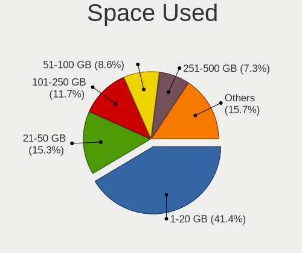
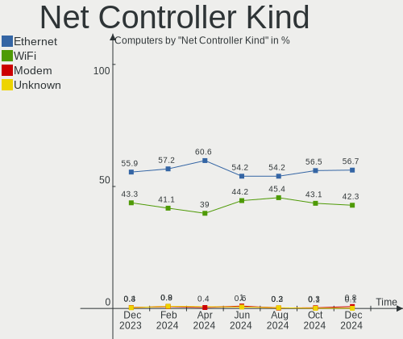
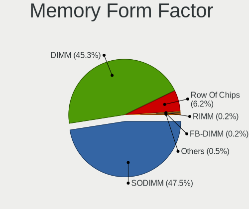
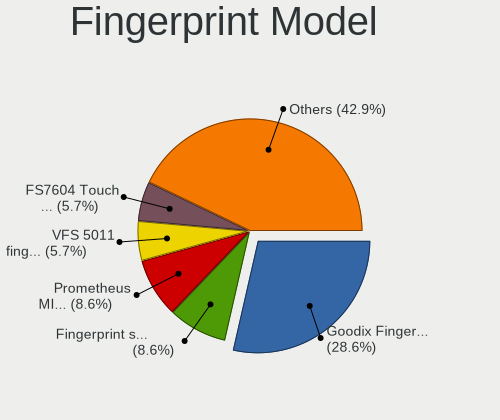
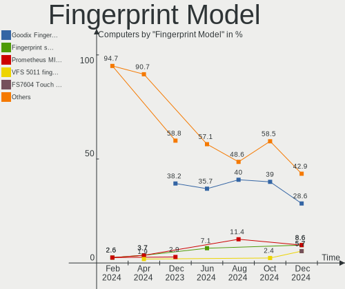
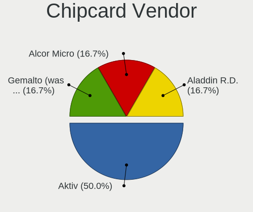

Linux in Russia - Hardware Trends
---------------------------------

A project to identify most popular hardware characteristics and track their change
over time based on data collected by Linux users at https://Linux-Hardware.org.

Anyone can contribute to this report by the [hw-probe](https://github.com/linuxhw/hw-probe) tool:

    sudo -E hw-probe -all -upload

This is a report for all computer types. See also reports for [desktops](/Location/Russia/Desktop/README.md) and [notebooks](/Location/Russia/Notebook/README.md).

Period: Jun, 2022.

Contents
--------

* [ System ](#system)
  - [ OS                       ](#os)
  - [ OS Family                ](#os-family)
  - [ Kernel                   ](#kernel)
  - [ Kernel Family            ](#kernel-family)
  - [ Kernel Major Ver.        ](#kernel-major-ver)
  - [ Arch                     ](#arch)
  - [ DE                       ](#de)
  - [ Display Server           ](#display-server)
  - [ Display Manager          ](#display-manager)
  - [ OS Lang                  ](#os-lang)
  - [ Boot Mode                ](#boot-mode)
  - [ Filesystem               ](#filesystem)
  - [ Part. scheme             ](#part-scheme)
  - [ Dual Boot with Linux/BSD ](#dual-boot-with-linuxbsd)
  - [ Dual Boot (Win)          ](#dual-boot-win)

* [ Board ](#board)
  - [ Vendor                   ](#vendor)
  - [ Model                    ](#model)
  - [ Model Family             ](#model-family)
  - [ MFG Year                 ](#mfg-year)
  - [ Form Factor              ](#form-factor)
  - [ Secure Boot              ](#secure-boot)
  - [ Coreboot                 ](#coreboot)
  - [ RAM Size                 ](#ram-size)
  - [ RAM Used                 ](#ram-used)
  - [ Total Drives             ](#total-drives)
  - [ Has CD-ROM               ](#has-cd-rom)
  - [ Has Ethernet             ](#has-ethernet)
  - [ Has WiFi                 ](#has-wifi)
  - [ Has Bluetooth            ](#has-bluetooth)

* [ Location ](#location)
  - [ Country                  ](#country)
  - [ City                     ](#city)

* [ Drives ](#drives)
  - [ Drive Vendor             ](#drive-vendor)
  - [ Drive Model              ](#drive-model)
  - [ HDD Vendor               ](#hdd-vendor)
  - [ SSD Vendor               ](#ssd-vendor)
  - [ Drive Kind               ](#drive-kind)
  - [ Drive Connector          ](#drive-connector)
  - [ Drive Size               ](#drive-size)
  - [ Space Total              ](#space-total)
  - [ Space Used               ](#space-used)
  - [ Malfunc. Drives          ](#malfunc-drives)
  - [ Malfunc. Drive Vendor    ](#malfunc-drive-vendor)
  - [ Malfunc. HDD Vendor      ](#malfunc-hdd-vendor)
  - [ Malfunc. Drive Kind      ](#malfunc-drive-kind)
  - [ Failed Drives            ](#failed-drives)
  - [ Failed Drive Vendor      ](#failed-drive-vendor)
  - [ Drive Status             ](#drive-status)

* [ Storage controller ](#storage-controller)
  - [ Storage Vendor           ](#storage-vendor)
  - [ Storage Model            ](#storage-model)
  - [ Storage Kind             ](#storage-kind)

* [ Processor ](#processor)
  - [ CPU Vendor               ](#cpu-vendor)
  - [ CPU Model                ](#cpu-model)
  - [ CPU Model Family         ](#cpu-model-family)
  - [ CPU Cores                ](#cpu-cores)
  - [ CPU Sockets              ](#cpu-sockets)
  - [ CPU Threads              ](#cpu-threads)
  - [ CPU Op-Modes             ](#cpu-op-modes)
  - [ CPU Microcode            ](#cpu-microcode)
  - [ CPU Microarch            ](#cpu-microarch)

* [ Graphics ](#graphics)
  - [ GPU Vendor               ](#gpu-vendor)
  - [ GPU Model                ](#gpu-model)
  - [ GPU Combo                ](#gpu-combo)
  - [ GPU Driver               ](#gpu-driver)
  - [ GPU Memory               ](#gpu-memory)

* [ Monitor ](#monitor)
  - [ Monitor Vendor           ](#monitor-vendor)
  - [ Monitor Model            ](#monitor-model)
  - [ Monitor Resolution       ](#monitor-resolution)
  - [ Monitor Diagonal         ](#monitor-diagonal)
  - [ Monitor Width            ](#monitor-width)
  - [ Aspect Ratio             ](#aspect-ratio)
  - [ Monitor Area             ](#monitor-area)
  - [ Pixel Density            ](#pixel-density)
  - [ Multiple Monitors        ](#multiple-monitors)

* [ Network ](#network)
  - [ Net Controller Vendor    ](#net-controller-vendor)
  - [ Net Controller Model     ](#net-controller-model)
  - [ Wireless Vendor          ](#wireless-vendor)
  - [ Wireless Model           ](#wireless-model)
  - [ Ethernet Vendor          ](#ethernet-vendor)
  - [ Ethernet Model           ](#ethernet-model)
  - [ Net Controller Kind      ](#net-controller-kind)
  - [ Used Controller          ](#used-controller)
  - [ NICs                     ](#nics)
  - [ IPv6                     ](#ipv6)

* [ Bluetooth ](#bluetooth)
  - [ Bluetooth Vendor         ](#bluetooth-vendor)
  - [ Bluetooth Model          ](#bluetooth-model)

* [ Sound ](#sound)
  - [ Sound Vendor             ](#sound-vendor)
  - [ Sound Model              ](#sound-model)

* [ Memory ](#memory)
  - [ Memory Vendor            ](#memory-vendor)
  - [ Memory Model             ](#memory-model)
  - [ Memory Kind              ](#memory-kind)
  - [ Memory Form Factor       ](#memory-form-factor)
  - [ Memory Size              ](#memory-size)
  - [ Memory Speed             ](#memory-speed)

* [ Printers & scanners ](#printers--scanners)
  - [ Printer Vendor           ](#printer-vendor)
  - [ Printer Model            ](#printer-model)
  - [ Scanner Vendor           ](#scanner-vendor)
  - [ Scanner Model            ](#scanner-model)

* [ Camera ](#camera)
  - [ Camera Vendor            ](#camera-vendor)
  - [ Camera Model             ](#camera-model)

* [ Security ](#security)
  - [ Fingerprint Vendor       ](#fingerprint-vendor)
  - [ Fingerprint Model        ](#fingerprint-model)
  - [ Chipcard Vendor          ](#chipcard-vendor)
  - [ Chipcard Model           ](#chipcard-model)

* [ Unsupported ](#unsupported)
  - [ Unsupported Devices      ](#unsupported-devices)
  - [ Unsupported Device Types ](#unsupported-device-types)

System
------

OS
--

Installed operating systems

| Name                         | Computers | Percent |
|------------------------------|-----------|---------|
| ROSA 12.2                    | 232       | 36.31%  |
| Debian 11                    | 141       | 22.07%  |
| Ubuntu 22.04                 | 44        | 6.89%   |
| ROSA R11.1                   | 27        | 4.23%   |
| Fedora 36                    | 25        | 3.91%   |
| Linux Mint 20.3              | 19        | 2.97%   |
| OpenMandriva 4.3             | 17        | 2.66%   |
| Ubuntu 20.04                 | 15        | 2.35%   |
| Red OS 7.3.1                 | 8         | 1.25%   |
| ACI 5.1.0                    | 8         | 1.25%   |
| Kubuntu 22.04                | 7         | 1.1%    |
| Manjaro                      | 5         | 0.78%   |
| Arch Rolling                 | 5         | 0.78%   |
| Xubuntu 20.04                | 4         | 0.63%   |
| ROSA 12.1                    | 4         | 0.63%   |
| Manjaro 21.3.1               | 4         | 0.63%   |
| Kali 2022.2                  | 4         | 0.63%   |
| Arch                         | 4         | 0.63%   |
| ALT Linux 10.0               | 4         | 0.63%   |
| Ubuntu 18.04                 | 3         | 0.47%   |
| Pop!_OS 22.04                | 3         | 0.47%   |
| MOS 10                       | 3         | 0.47%   |
| LMDE 5                       | 3         | 0.47%   |
| Gentoo 2.8                   | 3         | 0.47%   |
| Artix Rolling                | 3         | 0.47%   |
| Xubuntu 18.04                | 2         | 0.31%   |
| Ubuntu MATE 22.04            | 2         | 0.31%   |
| Ubuntu MATE 18.04            | 2         | 0.31%   |
| openSUSE Tumbleweed-XXXXXXXX | 2         | 0.31%   |
| Manjaro 21.2.6               | 2         | 0.31%   |
| KDE neon 20.04               | 2         | 0.31%   |
| Fedora 35                    | 2         | 0.31%   |
| Debian Testing               | 2         | 0.31%   |
| Xubuntu 22.04                | 1         | 0.16%   |
| Ubuntu Studio 22.04          | 1         | 0.16%   |
| Ubuntu 14.04                 | 1         | 0.16%   |
| ROSA R11                     | 1         | 0.16%   |
| ROSA R10                     | 1         | 0.16%   |
| ROSA 2019.05                 | 1         | 0.16%   |
| ROSA 12                      | 1         | 0.16%   |
| RED X4                       | 1         | 0.16%   |
| Red OS 7.3                   | 1         | 0.16%   |
| Raspbian 11                  | 1         | 0.16%   |
| Oracle Linux 8.6             | 1         | 0.16%   |
| Manjaro 21.3.0               | 1         | 0.16%   |
| Linux Mint 20.2              | 1         | 0.16%   |
| Linux Mint 19.3              | 1         | 0.16%   |
| Linux Mint 19.2              | 1         | 0.16%   |
| Kubuntu 22.10                | 1         | 0.16%   |
| Gentoo 2.7                   | 1         | 0.16%   |
| Garuda Linux Soaring         | 1         | 0.16%   |
| EndeavourOS Rolling          | 1         | 0.16%   |
| Elementary 6.1               | 1         | 0.16%   |
| Debian 8                     | 1         | 0.16%   |
| Debian 10                    | 1         | 0.16%   |
| Clear Linux 36470            | 1         | 0.16%   |
| Clear Linux 36450            | 1         | 0.16%   |
| Astra Linux 2.12.44          | 1         | 0.16%   |
| ArcoLinux Rolling            | 1         | 0.16%   |
| ALT Linux P9                 | 1         | 0.16%   |

OS Family
---------

OS without a version

| Name          | Computers | Percent |
|---------------|-----------|---------|
| ROSA          | 267       | 41.78%  |
| Debian        | 145       | 22.69%  |
| Ubuntu        | 63        | 9.86%   |
| Fedora        | 27        | 4.23%   |
| Linux Mint    | 22        | 3.44%   |
| OpenMandriva  | 17        | 2.66%   |
| Manjaro       | 12        | 1.88%   |
| Red OS        | 9         | 1.41%   |
| Arch          | 9         | 1.41%   |
| ALT Linux     | 9         | 1.41%   |
| Kubuntu       | 8         | 1.25%   |
| ACI           | 8         | 1.25%   |
| Xubuntu       | 7         | 1.1%    |
| Ubuntu MATE   | 4         | 0.63%   |
| Kali          | 4         | 0.63%   |
| Gentoo        | 4         | 0.63%   |
| Pop!_OS       | 3         | 0.47%   |
| LMDE          | 3         | 0.47%   |
| Artix         | 3         | 0.47%   |
| openSUSE      | 2         | 0.31%   |
| KDE neon      | 2         | 0.31%   |
| Clear Linux   | 2         | 0.31%   |
| Ubuntu Studio | 1         | 0.16%   |
| RED           | 1         | 0.16%   |
| Raspbian      | 1         | 0.16%   |
| Oracle Linux  | 1         | 0.16%   |
| Garuda Linux  | 1         | 0.16%   |
| EndeavourOS   | 1         | 0.16%   |
| Elementary    | 1         | 0.16%   |
| Astra Linux   | 1         | 0.16%   |
| ArcoLinux     | 1         | 0.16%   |

Kernel
------

Version of the Linux kernel

| Version                                   | Computers | Percent |
|-------------------------------------------|-----------|---------|
| 5.10.74-generic-2rosa2021.1-x86_64        | 147       | 23%     |
| 5.10.0-7-amd64                            | 128       | 20.03%  |
| 5.10.118-generic-2rosa2021.1-x86_64       | 37        | 5.79%   |
| 5.15.0-35-generic                         | 25        | 3.91%   |
| 5.16.7-desktop-1omv4003                   | 15        | 2.35%   |
| 5.4.83-generic-2rosa-x86_64               | 8         | 1.25%   |
| 5.18.3.xm1-1.klp-xanmod-rosa2021.1-x86_64 | 8         | 1.25%   |
| 3.10.0-1160.53.1.vz7.185.3                | 8         | 1.25%   |
| 5.4.0-113-generic                         | 7         | 1.1%    |
| 5.18.1.xm1-3.klp-xanmod-rosa2021.1-x86_64 | 7         | 1.1%    |
| 5.15.0-39-generic                         | 7         | 1.1%    |
| 5.15.0-37-generic                         | 7         | 1.1%    |
| 5.4.0-120-generic                         | 6         | 0.94%   |
| 5.17.12-300.fc36.x86_64                   | 6         | 0.94%   |
| 5.15.0-33-generic                         | 6         | 0.94%   |
| 5.4.0-121-generic                         | 5         | 0.78%   |
| 5.4.0-117-generic                         | 5         | 0.78%   |
| 5.17.13-300.fc36.x86_64                   | 5         | 0.78%   |
| 5.17.11-generic-2rosa2021.1-x86_64        | 5         | 0.78%   |
| 5.17.11-generic-1rosa2021.1-x86_64        | 5         | 0.78%   |
| 5.17.11-300.fc36.x86_64                   | 5         | 0.78%   |
| 5.10.0-14-amd64                           | 5         | 0.78%   |
| 4.15.0-desktop-122.124.1rosa-x86_64       | 5         | 0.78%   |
| 5.18.3-zen1-1-zen                         | 4         | 0.63%   |
| 5.15.43-generic-2rosa2021.1-x86_64        | 4         | 0.63%   |
| 5.15.35-1.el7.3.x86_64                    | 4         | 0.63%   |
| 5.15.0-40-generic                         | 4         | 0.63%   |
| 5.15.0-25-generic                         | 4         | 0.63%   |
| 5.10.74-generic-2rosa2021.1-i586          | 4         | 0.63%   |
| 5.10.0-15-amd64                           | 4         | 0.63%   |
| 5.4.83-generic-2rosa-i586                 | 3         | 0.47%   |
| 5.4.32-generic-2rosa-x86_64               | 3         | 0.47%   |
| 5.18.6.xm1-1.klp-xanmod-rosa2021.1-x86_64 | 3         | 0.47%   |
| 5.18.5-arch1-1                            | 3         | 0.47%   |
| 5.18.5-200.fc36.x86_64                    | 3         | 0.47%   |
| 5.18.4.xm1-1.klp-xanmod-rosa2021.1-x86_64 | 3         | 0.47%   |
| 5.17.5-76051705-generic                   | 3         | 0.47%   |
| 5.15.32-generic-6rosa2021.1-x86_64        | 3         | 0.47%   |
| 5.13.0-44-generic                         | 3         | 0.47%   |
| 4.15.0-desktop-122.124.1rosa-i586         | 3         | 0.47%   |
| 4.15.0-180-generic                        | 3         | 0.47%   |
| 5.4.32-generic-2rosa-i586                 | 2         | 0.31%   |
| 5.4.0-110-generic                         | 2         | 0.31%   |
| 5.18.6-1-MANJARO                          | 2         | 0.31%   |
| 5.18.3-051803-generic                     | 2         | 0.31%   |
| 5.18.2.xm1-3.klp-xanmod-rosa2021.1-x86_64 | 2         | 0.31%   |
| 5.18.1-arch1-1                            | 2         | 0.31%   |
| 5.18.1-1.el7.x86_64                       | 2         | 0.31%   |
| 5.17.5-300.fc36.x86_64                    | 2         | 0.31%   |
| 5.16.0-kali7-amd64                        | 2         | 0.31%   |
| 5.15.49-1-MANJARO                         | 2         | 0.31%   |
| 5.15.46-1-MANJARO                         | 2         | 0.31%   |
| 5.15.34-un-def-alt1                       | 2         | 0.31%   |
| 5.15.10-1.el7.x86_64                      | 2         | 0.31%   |
| 5.13.0-48-generic                         | 2         | 0.31%   |
| 5.10.82-std-def-alt1                      | 2         | 0.31%   |
| 5.4.197-1-lts54                           | 1         | 0.16%   |
| 5.4.181-std-def-alt1                      | 1         | 0.16%   |
| 5.4.17-2136.308.9.el8uek.x86_64           | 1         | 0.16%   |
| 5.4.150+                                  | 1         | 0.16%   |

Kernel Family
-------------

Linux kernel without a distro release

| Version  | Computers | Percent |
|----------|-----------|---------|
| 5.10.74  | 152       | 23.79%  |
| 5.10.0   | 141       | 22.07%  |
| 5.15.0   | 58        | 9.08%   |
| 5.10.118 | 40        | 6.26%   |
| 5.4.0    | 31        | 4.85%   |
| 5.18.3   | 15        | 2.35%   |
| 5.17.11  | 15        | 2.35%   |
| 5.16.7   | 15        | 2.35%   |
| 5.18.1   | 14        | 2.19%   |
| 4.15.0   | 13        | 2.03%   |
| 5.4.83   | 11        | 1.72%   |
| 5.18.5   | 9         | 1.41%   |
| 3.10.0   | 8         | 1.25%   |
| 5.18.6   | 7         | 1.1%    |
| 5.17.12  | 7         | 1.1%    |
| 5.18.4   | 6         | 0.94%   |
| 5.17.5   | 6         | 0.94%   |
| 5.13.0   | 6         | 0.94%   |
| 5.4.32   | 5         | 0.78%   |
| 5.18.2   | 5         | 0.78%   |
| 5.18.0   | 5         | 0.78%   |
| 5.17.13  | 5         | 0.78%   |
| 5.15.43  | 5         | 0.78%   |
| 5.15.35  | 5         | 0.78%   |
| 5.15.41  | 4         | 0.63%   |
| 5.15.32  | 4         | 0.63%   |
| 5.18.8   | 2         | 0.31%   |
| 5.17.9   | 2         | 0.31%   |
| 5.17.0   | 2         | 0.31%   |
| 5.16.0   | 2         | 0.31%   |
| 5.15.49  | 2         | 0.31%   |
| 5.15.46  | 2         | 0.31%   |
| 5.15.34  | 2         | 0.31%   |
| 5.15.10  | 2         | 0.31%   |
| 5.11.0   | 2         | 0.31%   |
| 5.10.82  | 2         | 0.31%   |
| 4.9.60   | 2         | 0.31%   |
| 4.9.155  | 2         | 0.31%   |
| 5.4.197  | 1         | 0.16%   |
| 5.4.181  | 1         | 0.16%   |
| 5.4.17   | 1         | 0.16%   |
| 5.4.150  | 1         | 0.16%   |
| 5.4.139  | 1         | 0.16%   |
| 5.17.14  | 1         | 0.16%   |
| 5.17.1   | 1         | 0.16%   |
| 5.16.2   | 1         | 0.16%   |
| 5.16.19  | 1         | 0.16%   |
| 5.16.13  | 1         | 0.16%   |
| 5.15.48  | 1         | 0.16%   |
| 5.15.44  | 1         | 0.16%   |
| 5.15.30  | 1         | 0.16%   |
| 5.14.10  | 1         | 0.16%   |
| 5.10.71  | 1         | 0.16%   |
| 5.10.57  | 1         | 0.16%   |
| 5.10.29  | 1         | 0.16%   |
| 5.10.125 | 1         | 0.16%   |
| 5.10.117 | 1         | 0.16%   |
| 5.0.0    | 1         | 0.16%   |
| 4.4.0    | 1         | 0.16%   |
| 4.19.0   | 1         | 0.16%   |

Kernel Major Ver.
-----------------

Linux kernel major version

| Version | Computers | Percent |
|---------|-----------|---------|
| 5.10    | 340       | 53.21%  |
| 5.15    | 87        | 13.62%  |
| 5.18    | 63        | 9.86%   |
| 5.4     | 52        | 8.14%   |
| 5.17    | 39        | 6.1%    |
| 5.16    | 20        | 3.13%   |
| 4.15    | 13        | 2.03%   |
| 3.10    | 8         | 1.25%   |
| 5.13    | 6         | 0.94%   |
| 4.9     | 4         | 0.63%   |
| 5.11    | 2         | 0.31%   |
| 5.14    | 1         | 0.16%   |
| 5.0     | 1         | 0.16%   |
| 4.4     | 1         | 0.16%   |
| 4.19    | 1         | 0.16%   |
| 3.0     | 1         | 0.16%   |

Arch
----

OS architecture (x86_64, i586, etc.)

| Name    | Computers | Percent |
|---------|-----------|---------|
| x86_64  | 617       | 96.56%  |
| i686    | 19        | 2.97%   |
| armv7l  | 1         | 0.16%   |
| armv6l  | 1         | 0.16%   |
| aarch64 | 1         | 0.16%   |

DE
--

Desktop Environment

| Name       | Computers | Percent |
|------------|-----------|---------|
| GNOME      | 204       | 31.92%  |
| KDE5       | 172       | 26.92%  |
| Unknown    | 150       | 23.47%  |
| LXQt       | 25        | 3.91%   |
| XFCE       | 21        | 3.29%   |
| KDE4       | 21        | 3.29%   |
| MATE       | 17        | 2.66%   |
| X-Cinnamon | 13        | 2.03%   |
| Cinnamon   | 7         | 1.1%    |
| Unity      | 3         | 0.47%   |
| sway       | 2         | 0.31%   |
| Pantheon   | 1         | 0.16%   |
| LXDE       | 1         | 0.16%   |
| i3         | 1         | 0.16%   |
| fly        | 1         | 0.16%   |

Display Server
--------------

X11 or Wayland

| Name    | Computers | Percent |
|---------|-----------|---------|
| Wayland | 267       | 41.78%  |
| X11     | 229       | 35.84%  |
| Unknown | 133       | 20.81%  |
| Tty     | 10        | 1.56%   |

Display Manager
---------------

SDDM, LightDM, etc.

| Name    | Computers | Percent |
|---------|-----------|---------|
| Unknown | 206       | 32.24%  |
| SDDM    | 153       | 23.94%  |
| GDM     | 153       | 23.94%  |
| LightDM | 53        | 8.29%   |
| GDM3    | 50        | 7.82%   |
| KDM     | 21        | 3.29%   |
| XDM     | 1         | 0.16%   |
| Ly      | 1         | 0.16%   |
| FLY-DM  | 1         | 0.16%   |

OS Lang
-------

Language

| Lang    | Computers | Percent |
|---------|-----------|---------|
| ru_RU   | 542       | 84.82%  |
| en_US   | 76        | 11.89%  |
| Unknown | 14        | 2.19%   |
| en_GB   | 3         | 0.47%   |
| C       | 2         | 0.31%   |
| fr_FR   | 1         | 0.16%   |
| en-US   | 1         | 0.16%   |

Boot Mode
---------

EFI or BIOS

| Mode | Computers | Percent |
|------|-----------|---------|
| BIOS | 330       | 51.64%  |
| EFI  | 309       | 48.36%  |

Filesystem
----------

Type of filesystem

| Type    | Computers | Percent |
|---------|-----------|---------|
| Ext4    | 421       | 65.88%  |
| Overlay | 150       | 23.47%  |
| Btrfs   | 63        | 9.86%   |
| Zfs     | 2         | 0.31%   |
| Xfs     | 2         | 0.31%   |
| Ext3    | 1         | 0.16%   |

Part. scheme
------------

Scheme of partitioning

| Type    | Computers | Percent |
|---------|-----------|---------|
| GPT     | 336       | 52.58%  |
| MBR     | 219       | 34.27%  |
| Unknown | 84        | 13.15%  |

Dual Boot with Linux/BSD
------------------------

Hosting more than one Linux/BSD

| Dual boot | Computers | Percent |
|-----------|-----------|---------|
| No        | 539       | 84.35%  |
| Yes       | 100       | 15.65%  |

Dual Boot (Win)
---------------

Hosting Linux and Windows

| Dual boot | Computers | Percent |
|-----------|-----------|---------|
| Yes       | 354       | 55.4%   |
| No        | 285       | 44.6%   |

Board
-----

Vendor
------

Motherboard manufacturer

| Name                    | Computers | Percent |
|-------------------------|-----------|---------|
| ASUSTek Computer        | 170       | 26.6%   |
| Gigabyte Technology     | 91        | 14.24%  |
| MSI                     | 49        | 7.67%   |
| Hewlett-Packard         | 43        | 6.73%   |
| ASRock                  | 42        | 6.57%   |
| Acer                    | 41        | 6.42%   |
| Lenovo                  | 40        | 6.26%   |
| Aquarius                | 32        | 5.01%   |
| Dell                    | 18        | 2.82%   |
| Samsung Electronics     | 13        | 2.03%   |
| Intel                   | 12        | 1.88%   |
| Unknown                 | 12        | 1.88%   |
| Supermicro              | 9         | 1.41%   |
| Huanan                  | 6         | 0.94%   |
| Toshiba                 | 4         | 0.63%   |
| HUAWEI                  | 4         | 0.63%   |
| ECS                     | 4         | 0.63%   |
| Timi                    | 3         | 0.47%   |
| HONOR                   | 3         | 0.47%   |
| Fujitsu                 | 3         | 0.47%   |
| 3Logic Group            | 3         | 0.47%   |
| Sony                    | 2         | 0.31%   |
| Packard Bell            | 2         | 0.31%   |
| Kraftway                | 2         | 0.31%   |
| Jumper                  | 2         | 0.31%   |
| ICL                     | 2         | 0.31%   |
| Haier                   | 2         | 0.31%   |
| Foxconn                 | 2         | 0.31%   |
| Biostar                 | 2         | 0.31%   |
| Apple                   | 2         | 0.31%   |
| ZOTAC                   | 1         | 0.16%   |
| Yadro                   | 1         | 0.16%   |
| Raspberry Pi Foundation | 1         | 0.16%   |
| PLEXHD                  | 1         | 0.16%   |
| Pegatron                | 1         | 0.16%   |
| Notebook                | 1         | 0.16%   |
| mtech                   | 1         | 0.16%   |
| Microsoft               | 1         | 0.16%   |
| MAINBRD                 | 1         | 0.16%   |
| JGINYUE                 | 1         | 0.16%   |
| iRU                     | 1         | 0.16%   |
| Google                  | 1         | 0.16%   |
| eMachines               | 1         | 0.16%   |
| Edelweiss               | 1         | 0.16%   |
| DNS                     | 1         | 0.16%   |
| Digma                   | 1         | 0.16%   |
| Chuwi                   | 1         | 0.16%   |
| ASRockRack              | 1         | 0.16%   |
| AMI                     | 1         | 0.16%   |

Model
-----

Motherboard model

| Name                             | Computers | Percent |
|----------------------------------|-----------|---------|
| ASUS S20 K29                     | 45        | 7.04%   |
| Aquarius NS585                   | 28        | 4.38%   |
| Gigabyte H410M S2H               | 15        | 2.35%   |
| Unknown                          | 14        | 2.19%   |
| ASUS All Series                  | 10        | 1.56%   |
| MSI MS-7721                      | 7         | 1.1%    |
| MSI MS-7996                      | 6         | 0.94%   |
| Supermicro SYS-6029P-WTRT        | 5         | 0.78%   |
| ASUS H110M-R                     | 5         | 0.78%   |
| Acer Aspire V3-571G              | 5         | 0.78%   |
| MSI MS-7817                      | 4         | 0.63%   |
| ASUS P8H67-M LE                  | 4         | 0.63%   |
| Supermicro Super Server          | 3         | 0.47%   |
| MSI MS-7A38                      | 3         | 0.47%   |
| Lenovo ThinkBook 15 G3 ACL 21A4  | 3         | 0.47%   |
| HP Pavilion g6                   | 3         | 0.47%   |
| HP Pavilion dv6                  | 3         | 0.47%   |
| Gigabyte H110M-S2V               | 3         | 0.47%   |
| ASUS P5KPL-AM SE                 | 3         | 0.47%   |
| Aquarius NS685U R11              | 3         | 0.47%   |
| Acer Swift SF314-43              | 3         | 0.47%   |
| MSI MS-7C37                      | 2         | 0.31%   |
| MSI MS-7895                      | 2         | 0.31%   |
| MSI MS-7808                      | 2         | 0.31%   |
| MSI MS-7758                      | 2         | 0.31%   |
| MSI MS-7752                      | 2         | 0.31%   |
| Lenovo G505s 20255               | 2         | 0.31%   |
| Jumper EZpad                     | 2         | 0.31%   |
| HP Laptop 14s-fq0xxx             | 2         | 0.31%   |
| HP EliteBook 855 G8 Notebook PC  | 2         | 0.31%   |
| HP 250 G7 Notebook PC            | 2         | 0.31%   |
| Gigabyte Z77-D3H                 | 2         | 0.31%   |
| Gigabyte X58A-UD3R               | 2         | 0.31%   |
| Gigabyte X470 AORUS ULTRA GAMING | 2         | 0.31%   |
| Gigabyte M61PME-S2P              | 2         | 0.31%   |
| Gigabyte H81M-S2V                | 2         | 0.31%   |
| Gigabyte F2A55M-HD2              | 2         | 0.31%   |
| Gigabyte B450 GAMING X           | 2         | 0.31%   |
| Gigabyte B360M H                 | 2         | 0.31%   |
| ASUS TUF B450M-PRO GAMING        | 2         | 0.31%   |
| ASUS PRIME H310M-R R2.0          | 2         | 0.31%   |
| ASUS PRIME B450M-A               | 2         | 0.31%   |
| ASUS PRIME A320M-K               | 2         | 0.31%   |
| ASUS P8H61-M LX3 R2.0            | 2         | 0.31%   |
| ASUS P5G41T-M LX2/GB             | 2         | 0.31%   |
| ASUS P5G41T-M LE                 | 2         | 0.31%   |
| ASUS M5A99X EVO R2.0             | 2         | 0.31%   |
| ASUS M5A97 R2.0                  | 2         | 0.31%   |
| ASUS H61M-K                      | 2         | 0.31%   |
| ASUS A68HM-K                     | 2         | 0.31%   |
| ASRock N68C-S UCC                | 2         | 0.31%   |
| ASRock H310CM-HDV                | 2         | 0.31%   |
| ASRock B460 Phantom Gaming 4     | 2         | 0.31%   |
| ASRock B450 Pro4                 | 2         | 0.31%   |
| ASRock ALiveXFire-eSATA2         | 2         | 0.31%   |
| ASRock A320M-HDV R4.0            | 2         | 0.31%   |
| ASRock 970 Pro3 R2.0             | 2         | 0.31%   |
| Acer Aspire A315-51              | 2         | 0.31%   |
| 3Logic Group Graviton N15i-K2    | 2         | 0.31%   |
| ZOTAC ZBOX-ECM73070C/53060C      | 1         | 0.16%   |

Model Family
------------

Motherboard model prefix

| Name                      | Computers | Percent |
|---------------------------|-----------|---------|
| ASUS S20                  | 45        | 7.04%   |
| Acer Aspire               | 29        | 4.54%   |
| Aquarius NS585            | 28        | 4.38%   |
| Gigabyte H410M            | 17        | 2.66%   |
| ASUS PRIME                | 14        | 2.19%   |
| Unknown                   | 14        | 2.19%   |
| ASUS VivoBook             | 12        | 1.88%   |
| Lenovo IdeaPad            | 10        | 1.56%   |
| HP Pavilion               | 10        | 1.56%   |
| ASUS All                  | 10        | 1.56%   |
| MSI MS-7721               | 7         | 1.1%    |
| ASUS ROG                  | 7         | 1.1%    |
| MSI MS-7996               | 6         | 0.94%   |
| Dell Inspiron             | 6         | 0.94%   |
| Supermicro SYS-6029P-WTRT | 5         | 0.78%   |
| Lenovo ThinkBook          | 5         | 0.78%   |
| HP Laptop                 | 5         | 0.78%   |
| HP EliteBook              | 5         | 0.78%   |
| HP 250                    | 5         | 0.78%   |
| ASUS H110M-R              | 5         | 0.78%   |
| Toshiba Satellite         | 4         | 0.63%   |
| MSI MS-7817               | 4         | 0.63%   |
| Gigabyte B450             | 4         | 0.63%   |
| Dell Vostro               | 4         | 0.63%   |
| ASUS TUF                  | 4         | 0.63%   |
| ASUS P8H67-M              | 4         | 0.63%   |
| ASUS P5KPL-AM             | 4         | 0.63%   |
| ASUS P5G41T-M             | 4         | 0.63%   |
| Aquarius NS685U           | 4         | 0.63%   |
| Acer Swift                | 4         | 0.63%   |
| Supermicro Super          | 3         | 0.47%   |
| MSI MS-7A38               | 3         | 0.47%   |
| Lenovo ThinkPad           | 3         | 0.47%   |
| HP ProBook                | 3         | 0.47%   |
| HP OMEN                   | 3         | 0.47%   |
| Gigabyte H110M-S2V        | 3         | 0.47%   |
| Dell OptiPlex             | 3         | 0.47%   |
| ASUS P8H61-M              | 3         | 0.47%   |
| ASUS M5A97                | 3         | 0.47%   |
| ASUS M5A78L-M             | 3         | 0.47%   |
| ASRock B450               | 3         | 0.47%   |
| ASRock A320M-HDV          | 3         | 0.47%   |
| 3Logic Group Graviton     | 3         | 0.47%   |
| Timi RedmiBook            | 2         | 0.31%   |
| Packard Bell EasyNote     | 2         | 0.31%   |
| MSI MS-7C37               | 2         | 0.31%   |
| MSI MS-7895               | 2         | 0.31%   |
| MSI MS-7808               | 2         | 0.31%   |
| MSI MS-7758               | 2         | 0.31%   |
| MSI MS-7752               | 2         | 0.31%   |
| Lenovo G505s              | 2         | 0.31%   |
| Lenovo B590               | 2         | 0.31%   |
| Jumper EZpad              | 2         | 0.31%   |
| Intel X99                 | 2         | 0.31%   |
| Intel X79                 | 2         | 0.31%   |
| HP ENVY                   | 2         | 0.31%   |
| HP Compaq                 | 2         | 0.31%   |
| Gigabyte Z77-D3H          | 2         | 0.31%   |
| Gigabyte X58A-UD3R        | 2         | 0.31%   |
| Gigabyte X470             | 2         | 0.31%   |

MFG Year
--------

Motherboard manufacture year

| Year    | Computers | Percent |
|---------|-----------|---------|
| 2020    | 130       | 20.34%  |
| 2021    | 65        | 10.17%  |
| 2012    | 65        | 10.17%  |
| 2018    | 50        | 7.82%   |
| 2010    | 40        | 6.26%   |
| 2019    | 39        | 6.1%    |
| 2011    | 35        | 5.48%   |
| 2013    | 32        | 5.01%   |
| 2014    | 29        | 4.54%   |
| 2009    | 25        | 3.91%   |
| 2008    | 24        | 3.76%   |
| 2017    | 23        | 3.6%    |
| 2016    | 22        | 3.44%   |
| 2022    | 17        | 2.66%   |
| 2007    | 17        | 2.66%   |
| 2015    | 15        | 2.35%   |
| 2006    | 8         | 1.25%   |
| Unknown | 2         | 0.31%   |
| 2005    | 1         | 0.16%   |

Form Factor
-----------

Physical design of the computer

| Name           | Computers | Percent |
|----------------|-----------|---------|
| Desktop        | 370       | 57.9%   |
| Notebook       | 243       | 38.03%  |
| Server         | 9         | 1.41%   |
| Mini pc        | 7         | 1.1%    |
| All in one     | 6         | 0.94%   |
| System on chip | 2         | 0.31%   |
| Tablet         | 1         | 0.16%   |
| Convertible    | 1         | 0.16%   |

Secure Boot
-----------

Enabled or disabled

| State    | Computers | Percent |
|----------|-----------|---------|
| Disabled | 616       | 96.4%   |
| Enabled  | 23        | 3.6%    |

Coreboot
--------

Have coreboot on board

| Used | Computers | Percent |
|------|-----------|---------|
| No   | 638       | 99.84%  |
| Yes  | 1         | 0.16%   |

RAM Size
--------

Total RAM memory

| Size in GB      | Computers | Percent |
|-----------------|-----------|---------|
| 4.01-8.0        | 213       | 33.33%  |
| 16.01-24.0      | 118       | 18.47%  |
| 8.01-16.0       | 112       | 17.53%  |
| 3.01-4.0        | 95        | 14.87%  |
| 32.01-64.0      | 36        | 5.63%   |
| 1.01-2.0        | 25        | 3.91%   |
| 64.01-256.0     | 11        | 1.72%   |
| 2.01-3.0        | 10        | 1.56%   |
| 24.01-32.0      | 8         | 1.25%   |
| More than 256.0 | 6         | 0.94%   |
| 0.51-1.0        | 3         | 0.47%   |
| 0.01-0.5        | 2         | 0.31%   |

RAM Used
--------

Used RAM memory

| Used GB         | Computers | Percent |
|-----------------|-----------|---------|
| 1.01-2.0        | 215       | 33.65%  |
| 0.51-1.0        | 210       | 32.86%  |
| 2.01-3.0        | 99        | 15.49%  |
| 4.01-8.0        | 49        | 7.67%   |
| 3.01-4.0        | 45        | 7.04%   |
| 8.01-16.0       | 10        | 1.56%   |
| More than 256.0 | 3         | 0.47%   |
| 0.01-0.5        | 3         | 0.47%   |
| 24.01-32.0      | 2         | 0.31%   |
| 64.01-256.0     | 2         | 0.31%   |
| Unknown         | 1         | 0.16%   |

Total Drives
------------

Number of drives on board

| Drives | Computers | Percent |
|--------|-----------|---------|
| 1      | 380       | 59.47%  |
| 2      | 149       | 23.32%  |
| 3      | 58        | 9.08%   |
| 4      | 20        | 3.13%   |
| 5      | 9         | 1.41%   |
| 8      | 6         | 0.94%   |
| 6      | 6         | 0.94%   |
| 7      | 5         | 0.78%   |
| 0      | 5         | 0.78%   |
| 9      | 1         | 0.16%   |

Has CD-ROM
----------

Has CD-ROM on board

| Presented | Computers | Percent |
|-----------|-----------|---------|
| No        | 469       | 73.4%   |
| Yes       | 170       | 26.6%   |

Has Ethernet
------------

Has Ethernet on board

| Presented | Computers | Percent |
|-----------|-----------|---------|
| Yes       | 582       | 91.08%  |
| No        | 57        | 8.92%   |

Has WiFi
--------

Has WiFi module

| Presented | Computers | Percent |
|-----------|-----------|---------|
| Yes       | 331       | 51.8%   |
| No        | 308       | 48.2%   |

Has Bluetooth
-------------

Has Bluetooth module

| Presented | Computers | Percent |
|-----------|-----------|---------|
| No        | 368       | 57.59%  |
| Yes       | 271       | 42.41%  |

Location
--------

Country
-------

Geographic location (country)

| Country | Computers | Percent |
|---------|-----------|---------|
| Russia  | 639       | 100%    |

City
----

Geographic location (city)

| City              | Computers | Percent |
|-------------------|-----------|---------|
| Voronezh          | 134       | 20.97%  |
| Moscow            | 100       | 15.65%  |
| St Petersburg     | 50        | 7.82%   |
| Cheboksary        | 26        | 4.07%   |
| Novosibirsk       | 24        | 3.76%   |
| Yekaterinburg     | 18        | 2.82%   |
| Krasnodar         | 16        | 2.5%    |
| Chelyabinsk       | 14        | 2.19%   |
| Samara            | 10        | 1.56%   |
| Krasnoyarsk       | 10        | 1.56%   |
| Rostov-on-Don     | 9         | 1.41%   |
| Vladivostok       | 8         | 1.25%   |
| Tyumen            | 8         | 1.25%   |
| Saratov           | 6         | 0.94%   |
| Perm              | 6         | 0.94%   |
| Yaroslavl         | 5         | 0.78%   |
| Tula              | 5         | 0.78%   |
| Omsk              | 5         | 0.78%   |
| Nizhniy Novgorod  | 5         | 0.78%   |
| Barnaul           | 5         | 0.78%   |
| Ulyanovsk         | 4         | 0.63%   |
| Ufa               | 4         | 0.63%   |
| Smolensk          | 4         | 0.63%   |
| Gul'kevichi       | 4         | 0.63%   |
| Bryansk           | 4         | 0.63%   |
| Yuzhno-Sakhalinsk | 3         | 0.47%   |
| Volgograd         | 3         | 0.47%   |
| Tver              | 3         | 0.47%   |
| Tolyatti          | 3         | 0.47%   |
| Stavropol         | 3         | 0.47%   |
| Sochi             | 3         | 0.47%   |
| Severodvinsk      | 3         | 0.47%   |
| Ryazan            | 3         | 0.47%   |
| Pskov             | 3         | 0.47%   |
| Penza             | 3         | 0.47%   |
| Orenburg          | 3         | 0.47%   |
| Murom             | 3         | 0.47%   |
| Murmansk          | 3         | 0.47%   |
| Khabarovsk        | 3         | 0.47%   |
| Kazan’          | 3         | 0.47%   |
| Yoshkar-Ola       | 2         | 0.31%   |
| Yessentuki        | 2         | 0.31%   |
| Yakutsk           | 2         | 0.31%   |
| Vladimir          | 2         | 0.31%   |
| Tomsk             | 2         | 0.31%   |
| Tambov            | 2         | 0.31%   |
| Syktyvkar         | 2         | 0.31%   |
| Surgut            | 2         | 0.31%   |
| Sergiyev Posad    | 2         | 0.31%   |
| Saransk           | 2         | 0.31%   |
| Prokop'yevsk      | 2         | 0.31%   |
| Petrozavodsk      | 2         | 0.31%   |
| Kursk             | 2         | 0.31%   |
| Kurgan            | 2         | 0.31%   |
| Kemerovo          | 2         | 0.31%   |
| Blagoveshchensk   | 2         | 0.31%   |
| Armavir           | 2         | 0.31%   |
| Zelenogorsk       | 1         | 0.16%   |
| Zarechnyy         | 1         | 0.16%   |
| Yessentukskaya    | 1         | 0.16%   |

Drives
------

Drive Vendor
------------

Hard drive vendors

| Vendor                         | Computers | Drives | Percent |
|--------------------------------|-----------|--------|---------|
| WDC                            | 168       | 204    | 17.39%  |
| Seagate                        | 140       | 170    | 14.49%  |
| Samsung Electronics            | 88        | 93     | 9.11%   |
| Toshiba                        | 84        | 113    | 8.7%    |
| Kingston                       | 75        | 78     | 7.76%   |
| A-DATA Technology              | 57        | 58     | 5.9%    |
| Crucial                        | 55        | 55     | 5.69%   |
| Hitachi                        | 37        | 39     | 3.83%   |
| China                          | 24        | 25     | 2.48%   |
| SanDisk                        | 19        | 19     | 1.97%   |
| Unknown                        | 18        | 21     | 1.86%   |
| Apacer                         | 16        | 17     | 1.66%   |
| Micron Technology              | 14        | 22     | 1.45%   |
| SPCC                           | 13        | 13     | 1.35%   |
| HGST                           | 13        | 14     | 1.35%   |
| Intel                          | 11        | 11     | 1.14%   |
| Gigabyte Technology            | 10        | 10     | 1.04%   |
| KingSpec                       | 9         | 9      | 0.93%   |
| SK hynix                       | 8         | 8      | 0.83%   |
| OCZ                            | 8         | 8      | 0.83%   |
| Netac                          | 6         | 6      | 0.62%   |
| Micron/Crucial Technology      | 6         | 6      | 0.62%   |
| Goodram                        | 6         | 6      | 0.62%   |
| Smartbuy                       | 5         | 5      | 0.52%   |
| Phison                         | 5         | 5      | 0.52%   |
| Maxtor                         | 5         | 5      | 0.52%   |
| AMD                            | 5         | 5      | 0.52%   |
| Transcend                      | 4         | 4      | 0.41%   |
| Silicon Motion                 | 4         | 5      | 0.41%   |
| XPG                            | 3         | 3      | 0.31%   |
| Plextor                        | 3         | 3      | 0.31%   |
| Fujitsu                        | 3         | 3      | 0.31%   |
| Foxline                        | 3         | 3      | 0.31%   |
| UMIS                           | 2         | 2      | 0.21%   |
| Realtek Semiconductor          | 2         | 2      | 0.21%   |
| Patriot                        | 2         | 2      | 0.21%   |
| KIOXIA                         | 2         | 2      | 0.21%   |
| KingDian                       | 2         | 2      | 0.21%   |
| Hewlett-Packard                | 2         | 2      | 0.21%   |
| Corsair                        | 2         | 2      | 0.21%   |
| Unknown                        | 2         | 2      | 0.21%   |
| WXC-M3                         | 1         | 1      | 0.1%    |
| WDC WDS                        | 1         | 1      | 0.1%    |
| WALRAM                         | 1         | 1      | 0.1%    |
| Vaseky                         | 1         | 1      | 0.1%    |
| Union Memory                   | 1         | 1      | 0.1%    |
| Tanbassh                       | 1         | 1      | 0.1%    |
| Solid State Storage Technology | 1         | 1      | 0.1%    |
| ShiJi                          | 1         | 1      | 0.1%    |
| SETHRISE                       | 1         | 1      | 0.1%    |
| Reeinno                        | 1         | 1      | 0.1%    |
| Realtek                        | 1         | 1      | 0.1%    |
| Palit                          | 1         | 1      | 0.1%    |
| NGFF                           | 1         | 1      | 0.1%    |
| Londisk                        | 1         | 1      | 0.1%    |
| KIOXIA-EXCERIA                 | 1         | 1      | 0.1%    |
| Kingmax                        | 1         | 1      | 0.1%    |
| Intenso                        | 1         | 1      | 0.1%    |
| HUAWEI                         | 1         | 1      | 0.1%    |
| HPE                            | 1         | 1      | 0.1%    |

Drive Model
-----------

Hard drive models

| Model                                             | Computers | Percent |
|---------------------------------------------------|-----------|---------|
| Crucial CT480BX500SSD1 480GB                      | 46        | 4.39%   |
| Kingston SA400S37240G 240GB SSD                   | 28        | 2.67%   |
| A-DATA SU800 512GB SSD                            | 28        | 2.67%   |
| Toshiba VT180 240GB SSD                           | 23        | 2.2%    |
| Toshiba DT01ACA050 500GB                          | 20        | 1.91%   |
| Toshiba HDWD110 1TB                               | 11        | 1.05%   |
| Seagate ST1000DM010-2EP102 1TB                    | 11        | 1.05%   |
| WDC WDS240G2G0A-00JH30 240GB SSD                  | 9         | 0.86%   |
| WDC WD10EZEX-08WN4A0 1TB                          | 9         | 0.86%   |
| Samsung SSD 860 EVO 250GB                         | 9         | 0.86%   |
| Seagate ST1000DM003-1CH162 1TB                    | 8         | 0.76%   |
| WDC WDS120G2G0A-00JH30 120GB SSD                  | 7         | 0.67%   |
| Seagate ST2000DM008-2FR102 2TB                    | 7         | 0.67%   |
| Seagate ST1000LM024 HN-M101MBB 1TB                | 7         | 0.67%   |
| Kingston SA400S37120G 120GB SSD                   | 7         | 0.67%   |
| Seagate ST500DM002-1BD142 500GB                   | 6         | 0.57%   |
| Kingston SV300S37A120G 120GB SSD                  | 6         | 0.57%   |
| Apacer AS350 128GB SSD                            | 6         | 0.57%   |
| WDC WD6003FRYZ-01F0DB0 6TB                        | 5         | 0.48%   |
| Toshiba MQ04ABF100 1TB                            | 5         | 0.48%   |
| Toshiba DT01ACA100 1TB                            | 5         | 0.48%   |
| SPCC Solid State Disk 128GB                       | 5         | 0.48%   |
| Seagate ST6000NM019B-2TG103 6TB                   | 5         | 0.48%   |
| Seagate ST1000DM003-1ER162 1TB                    | 5         | 0.48%   |
| Samsung NVMe SSD Drive 512GB                      | 5         | 0.48%   |
| Micron/Crucial CT500P5SSD8 500GB                  | 5         | 0.48%   |
| Micron 7300_MTFD 8TB                              | 5         | 0.48%   |
| Micron 5300_MTFDDAK960TDT 960GB SSD               | 5         | 0.48%   |
| Apacer AS350 256GB SSD                            | 5         | 0.48%   |
| A-DATA SU650 240GB SSD                            | 5         | 0.48%   |
| Seagate ST9320325AS 320GB                         | 4         | 0.38%   |
| Seagate ST500LT012-1DG142 500GB                   | 4         | 0.38%   |
| Seagate ST3250310AS 250GB                         | 4         | 0.38%   |
| Seagate ST2000DM006-2DM164 2TB                    | 4         | 0.38%   |
| Samsung SSD 970 EVO Plus 250GB                    | 4         | 0.38%   |
| Samsung SSD 850 EVO 250GB                         | 4         | 0.38%   |
| Samsung NVMe SSD Controller SM981/PM981/PM983 4TB | 4         | 0.38%   |
| HGST HTS545050A7E680 500GB                        | 4         | 0.38%   |
| WDC WDS240G2G0B-00EPW0 240GB SSD                  | 3         | 0.29%   |
| WDC WD5000LPLX-00ZNTT0 500GB                      | 3         | 0.29%   |
| WDC WD20PURZ-85GU6Y0 2TB                          | 3         | 0.29%   |
| WDC WD10JPLX-00MBPT0 1TB                          | 3         | 0.29%   |
| Unknown SD/MMC/MS PRO 128GB                       | 3         | 0.29%   |
| Toshiba MQ01ABD100 1TB                            | 3         | 0.29%   |
| Toshiba MG07ACA12TE 12TB                          | 3         | 0.29%   |
| Toshiba HDWD105 500GB                             | 3         | 0.29%   |
| SPCC Solid State Disk 256GB                       | 3         | 0.29%   |
| Seagate ST9500325AS 500GB                         | 3         | 0.29%   |
| Seagate ST3250318AS 250GB                         | 3         | 0.29%   |
| Seagate ST250DM000-1BD141 250GB                   | 3         | 0.29%   |
| Seagate ST1000NM0033-9ZM173 1TB                   | 3         | 0.29%   |
| Seagate ST1000LM035-1RK172 1TB                    | 3         | 0.29%   |
| Seagate Expansion 1TB                             | 3         | 0.29%   |
| Samsung HD502HJ 500GB                             | 3         | 0.29%   |
| OCZ VERTEX4 256GB SSD                             | 3         | 0.29%   |
| Kingston SUV500120G 120GB SSD                     | 3         | 0.29%   |
| Kingston SA1000M8240G 240GB                       | 3         | 0.29%   |
| Kingston NVMe SSD Drive 256GB                     | 3         | 0.29%   |
| Intel SSDPEKNU512GZ 512GB                         | 3         | 0.29%   |
| Hitachi HTS545032B9A300 320GB                     | 3         | 0.29%   |

HDD Vendor
----------

Hard disk drive vendors

| Vendor              | Computers | Drives | Percent |
|---------------------|-----------|--------|---------|
| WDC                 | 140       | 163    | 32.79%  |
| Seagate             | 140       | 170    | 32.79%  |
| Toshiba             | 72        | 87     | 16.86%  |
| Hitachi             | 37        | 39     | 8.67%   |
| Samsung Electronics | 13        | 13     | 3.04%   |
| HGST                | 13        | 14     | 3.04%   |
| Maxtor              | 5         | 5      | 1.17%   |
| Unknown             | 3         | 3      | 0.7%    |
| Fujitsu             | 3         | 3      | 0.7%    |
| ASMT                | 1         | 2      | 0.23%   |

SSD Vendor
----------

Solid state drive vendors

| Vendor              | Computers | Drives | Percent |
|---------------------|-----------|--------|---------|
| Kingston            | 60        | 60     | 14.67%  |
| Crucial             | 54        | 54     | 13.2%   |
| A-DATA Technology   | 49        | 49     | 11.98%  |
| Samsung Electronics | 35        | 37     | 8.56%   |
| WDC                 | 29        | 29     | 7.09%   |
| Toshiba             | 25        | 25     | 6.11%   |
| China               | 24        | 25     | 5.87%   |
| SanDisk             | 15        | 15     | 3.67%   |
| Apacer              | 15        | 16     | 3.67%   |
| SPCC                | 13        | 13     | 3.18%   |
| Micron Technology   | 12        | 15     | 2.93%   |
| KingSpec            | 9         | 9      | 2.2%    |
| OCZ                 | 8         | 8      | 1.96%   |
| Netac               | 6         | 6      | 1.47%   |
| Goodram             | 6         | 6      | 1.47%   |
| Smartbuy            | 5         | 5      | 1.22%   |
| Gigabyte Technology | 5         | 5      | 1.22%   |
| Intel               | 4         | 4      | 0.98%   |
| AMD                 | 4         | 4      | 0.98%   |
| Transcend           | 3         | 3      | 0.73%   |
| Plextor             | 3         | 3      | 0.73%   |
| Patriot             | 2         | 2      | 0.49%   |
| KingDian            | 2         | 2      | 0.49%   |
| Hewlett-Packard     | 2         | 2      | 0.49%   |
| Foxline             | 2         | 2      | 0.49%   |
| Corsair             | 2         | 2      | 0.49%   |
| WDC WDS             | 1         | 1      | 0.24%   |
| WALRAM              | 1         | 1      | 0.24%   |
| Vaseky              | 1         | 1      | 0.24%   |
| Union Memory        | 1         | 1      | 0.24%   |
| Phison              | 1         | 1      | 0.24%   |
| Palit               | 1         | 1      | 0.24%   |
| NGFF                | 1         | 1      | 0.24%   |
| Londisk             | 1         | 1      | 0.24%   |
| KIOXIA-EXCERIA      | 1         | 1      | 0.24%   |
| Kingmax             | 1         | 1      | 0.24%   |
| Intenso             | 1         | 1      | 0.24%   |
| HPE                 | 1         | 1      | 0.24%   |
| GS                  | 1         | 2      | 0.24%   |
| ExeGate             | 1         | 1      | 0.24%   |
| BHT                 | 1         | 1      | 0.24%   |

Drive Kind
----------

HDD or SSD

| Kind    | Computers | Drives | Percent |
|---------|-----------|--------|---------|
| SSD     | 362       | 417    | 41.85%  |
| HDD     | 353       | 499    | 40.81%  |
| NVMe    | 127       | 147    | 14.68%  |
| MMC     | 17        | 19     | 1.97%   |
| Unknown | 6         | 7      | 0.69%   |

Drive Connector
---------------

SATA, SAS, NVMe, etc.

| Type | Computers | Drives | Percent |
|------|-----------|--------|---------|
| SATA | 554       | 906    | 77.92%  |
| NVMe | 126       | 146    | 17.72%  |
| MMC  | 17        | 19     | 2.39%   |
| SAS  | 14        | 18     | 1.97%   |

Drive Size
----------

Size of hard drive

| Size in TB | Computers | Drives | Percent |
|------------|-----------|--------|---------|
| 0.01-0.5   | 444       | 590    | 63.07%  |
| 0.51-1.0   | 193       | 224    | 27.41%  |
| 1.01-2.0   | 41        | 47     | 5.82%   |
| 3.01-4.0   | 10        | 11     | 1.42%   |
| 4.01-10.0  | 7         | 23     | 0.99%   |
| 2.01-3.0   | 5         | 5      | 0.71%   |
| 10.01-20.0 | 4         | 16     | 0.57%   |

Space Total
-----------

Amount of disk space available on the file system

| Size in GB     | Computers | Percent |
|----------------|-----------|---------|
| 101-250        | 162       | 25.35%  |
| Unknown        | 135       | 21.13%  |
| 251-500        | 101       | 15.81%  |
| 501-1000       | 76        | 11.89%  |
| 1-20           | 51        | 7.98%   |
| 1001-2000      | 40        | 6.26%   |
| 51-100         | 26        | 4.07%   |
| More than 3000 | 21        | 3.29%   |
| 2001-3000      | 15        | 2.35%   |
| 21-50          | 12        | 1.88%   |

Space Used
----------

Amount of used disk space

| Used GB        | Computers | Percent |
|----------------|-----------|---------|
| 1-20           | 278       | 43.51%  |
| Unknown        | 135       | 21.13%  |
| 101-250        | 54        | 8.45%   |
| 21-50          | 52        | 8.14%   |
| 51-100         | 38        | 5.95%   |
| 251-500        | 31        | 4.85%   |
| 501-1000       | 25        | 3.91%   |
| 1001-2000      | 15        | 2.35%   |
| More than 3000 | 8         | 1.25%   |
| 2001-3000      | 3         | 0.47%   |

Malfunc. Drives
---------------

Drive models with a malfunction

| Model                              | Computers | Drives | Percent |
|------------------------------------|-----------|--------|---------|
| Seagate ST1000LM024 HN-M101MBB 1TB | 5         | 5      | 3.14%   |
| Seagate ST9320325AS 320GB          | 4         | 4      | 2.52%   |
| Seagate ST3250310AS 250GB          | 4         | 4      | 2.52%   |
| Seagate ST500DM002-1BD142 500GB    | 3         | 4      | 1.89%   |
| WDC WD5000AAKX-08U6AA0 500GB       | 2         | 2      | 1.26%   |
| WDC WD3200AAKX-001CA0 320GB        | 2         | 2      | 1.26%   |
| WDC WD3200AAKS-00B3A0 320GB        | 2         | 2      | 1.26%   |
| WDC WD10EZEX-00RKKA0 1TB           | 2         | 2      | 1.26%   |
| Toshiba MQ04ABF100 1TB             | 2         | 2      | 1.26%   |
| Toshiba DT01ACA100 1TB             | 2         | 2      | 1.26%   |
| Seagate ST9500420AS 500GB          | 2         | 2      | 1.26%   |
| Seagate ST500LT012-9WS142 500GB    | 2         | 2      | 1.26%   |
| Seagate ST3250318AS 250GB          | 2         | 2      | 1.26%   |
| Seagate ST320LT012-9WS14C 320GB    | 2         | 2      | 1.26%   |
| OCZ VERTEX4 256GB SSD              | 2         | 2      | 1.26%   |
| Kingston SV300S37A120G 120GB SSD   | 2         | 2      | 1.26%   |
| Hitachi HTS725050A9A364 500GB      | 2         | 2      | 1.26%   |
| Hitachi HTS542512K9SA00 120GB      | 2         | 2      | 1.26%   |
| Hitachi HDT725032VLA360 320GB      | 2         | 2      | 1.26%   |
| HGST HTS545050A7E680 500GB         | 2         | 2      | 1.26%   |
| China SSD 120GB                    | 2         | 2      | 1.26%   |
| WDC WDS240G2G0A-00JH30 240GB SSD   | 1         | 1      | 0.63%   |
| WDC WDS120G2G0A-00JH30 120GB SSD   | 1         | 1      | 0.63%   |
| WDC WD7500AARX-00N0YB0 752GB       | 1         | 1      | 0.63%   |
| WDC WD7500AARS-00Y5B1 752GB        | 1         | 1      | 0.63%   |
| WDC WD7500AARS-003BB1 752GB        | 1         | 1      | 0.63%   |
| WDC WD5001AALS-00E3A0 500GB        | 1         | 1      | 0.63%   |
| WDC WD5000LPLX-00ZNTT0 500GB       | 1         | 1      | 0.63%   |
| WDC WD5000BPVT-80HXZT3 500GB       | 1         | 1      | 0.63%   |
| WDC WD5000BPVT-22HXZT3 500GB       | 1         | 1      | 0.63%   |
| WDC WD5000AZRZ-00HTKB0 500GB       | 1         | 1      | 0.63%   |
| WDC WD5000AZLX-22JKKA0 500GB       | 1         | 1      | 0.63%   |
| WDC WD5000AAKX-08ERMA0 500GB       | 1         | 1      | 0.63%   |
| WDC WD5000AAKX-001CA0 500GB        | 1         | 1      | 0.63%   |
| WDC WD5000AAKS-00UU3A0 500GB       | 1         | 1      | 0.63%   |
| WDC WD5000AAKS-00A7B0 500GB        | 1         | 1      | 0.63%   |
| WDC WD5000AADS-00S9B0 500GB        | 1         | 1      | 0.63%   |
| WDC WD3202ABYS-02B7A0 320GB        | 1         | 1      | 0.63%   |
| WDC WD3200LPCX-24C6HT0 320GB       | 1         | 1      | 0.63%   |
| WDC WD3200AAKS-00UU3A0 320GB       | 1         | 1      | 0.63%   |
| WDC WD3200AAJS-65B4A0 320GB        | 1         | 1      | 0.63%   |
| WDC WD3200AAJS-08L7A0 320GB        | 1         | 1      | 0.63%   |
| WDC WD3200AAJS-00L7A0 320GB        | 1         | 1      | 0.63%   |
| WDC WD3200AAJB-00J3A0 320GB        | 1         | 1      | 0.63%   |
| WDC WD30PURX-64P6ZY0 3TB           | 1         | 1      | 0.63%   |
| WDC WD2500BUCT-63TWBY0 250GB       | 1         | 1      | 0.63%   |
| WDC WD2500BEKT-60A25T1 250GB       | 1         | 1      | 0.63%   |
| WDC WD2500AAKS-00UU3A0 250GB       | 1         | 1      | 0.63%   |
| WDC WD2500AAJS-00YZCA0 250GB       | 1         | 1      | 0.63%   |
| WDC WD20PURZ-85GU6Y0 2TB           | 1         | 1      | 0.63%   |
| WDC WD20EARS-00MVWB0 2TB           | 1         | 1      | 0.63%   |
| WDC WD2003FZEX-00Z4SA0 2TB         | 1         | 1      | 0.63%   |
| WDC WD15EARS-00MVWB0 1TB           | 1         | 1      | 0.63%   |
| WDC WD1502FYPS-01U1B1 1TB          | 1         | 1      | 0.63%   |
| WDC WD10SPZX-08Z10 1TB             | 1         | 1      | 0.63%   |
| WDC WD10JPVT-08A1YT2 1TB           | 1         | 1      | 0.63%   |
| WDC WD10JPCX-24UE4T0 1TB           | 1         | 1      | 0.63%   |
| WDC WD10EZEX-21WN4A0 1TB           | 1         | 1      | 0.63%   |
| WDC WD10EARS-00Y5B1 1TB            | 1         | 1      | 0.63%   |
| Toshiba MK6476GSX 640GB            | 1         | 1      | 0.63%   |

Malfunc. Drive Vendor
---------------------

Vendors of faulty drives

| Vendor              | Computers | Drives | Percent |
|---------------------|-----------|--------|---------|
| Seagate             | 48        | 52     | 30.97%  |
| WDC                 | 44        | 46     | 28.39%  |
| Hitachi             | 19        | 19     | 12.26%  |
| Toshiba             | 11        | 11     | 7.1%    |
| Samsung Electronics | 8         | 8      | 5.16%   |
| HGST                | 4         | 4      | 2.58%   |
| OCZ                 | 3         | 3      | 1.94%   |
| China               | 3         | 3      | 1.94%   |
| SK hynix            | 2         | 2      | 1.29%   |
| Maxtor              | 2         | 2      | 1.29%   |
| Kingston            | 2         | 2      | 1.29%   |
| SanDisk             | 1         | 1      | 0.65%   |
| Micron Technology   | 1         | 1      | 0.65%   |
| KingSpec            | 1         | 1      | 0.65%   |
| Kingmax             | 1         | 1      | 0.65%   |
| Intenso             | 1         | 1      | 0.65%   |
| Intel               | 1         | 1      | 0.65%   |
| Fujitsu             | 1         | 1      | 0.65%   |
| Apacer              | 1         | 1      | 0.65%   |
| AMD                 | 1         | 1      | 0.65%   |

Malfunc. HDD Vendor
-------------------

Vendors of faulty HDD drives

| Vendor              | Computers | Drives | Percent |
|---------------------|-----------|--------|---------|
| Seagate             | 48        | 52     | 35.82%  |
| WDC                 | 42        | 44     | 31.34%  |
| Hitachi             | 19        | 19     | 14.18%  |
| Toshiba             | 11        | 11     | 8.21%   |
| Samsung Electronics | 7         | 7      | 5.22%   |
| HGST                | 4         | 4      | 2.99%   |
| Maxtor              | 2         | 2      | 1.49%   |
| Fujitsu             | 1         | 1      | 0.75%   |

Malfunc. Drive Kind
-------------------

Kinds of faulty drives

| Kind | Computers | Drives | Percent |
|------|-----------|--------|---------|
| HDD  | 122       | 140    | 85.31%  |
| SSD  | 19        | 19     | 13.29%  |
| NVMe | 2         | 2      | 1.4%    |

Failed Drives
-------------

Failed drive models

| Model                             | Computers | Drives | Percent |
|-----------------------------------|-----------|--------|---------|
| Seagate ST9500325AS 500GB         | 1         | 1      | 50%     |
| Samsung Electronics SP2504C 250GB | 1         | 1      | 50%     |

Failed Drive Vendor
-------------------

Failed drive vendors

| Vendor              | Computers | Drives | Percent |
|---------------------|-----------|--------|---------|
| Seagate             | 1         | 1      | 50%     |
| Samsung Electronics | 1         | 1      | 50%     |

Drive Status
------------

Number of failed and malfunc. drives

| Status   | Computers | Drives | Percent |
|----------|-----------|--------|---------|
| Works    | 475       | 765    | 65.88%  |
| Malfunc  | 137       | 161    | 19%     |
| Detected | 107       | 161    | 14.84%  |
| Failed   | 2         | 2      | 0.28%   |

Storage controller
------------------

Storage Vendor
--------------

Storage controller vendors

| Vendor                         | Computers | Percent |
|--------------------------------|-----------|---------|
| Intel                          | 462       | 57.68%  |
| AMD                            | 142       | 17.73%  |
| Samsung Electronics            | 42        | 5.24%   |
| SanDisk                        | 15        | 1.87%   |
| Kingston Technology Company    | 15        | 1.87%   |
| JMicron Technology             | 15        | 1.87%   |
| Nvidia                         | 14        | 1.75%   |
| ASMedia Technology             | 12        | 1.5%    |
| Realtek Semiconductor          | 11        | 1.37%   |
| Phison Electronics             | 11        | 1.37%   |
| Marvell Technology Group       | 11        | 1.37%   |
| SK hynix                       | 9         | 1.12%   |
| Silicon Motion                 | 7         | 0.87%   |
| Micron/Crucial Technology      | 7         | 0.87%   |
| Micron Technology              | 7         | 0.87%   |
| VIA Technologies               | 4         | 0.5%    |
| Broadcom / LSI                 | 3         | 0.37%   |
| ADATA Technology               | 3         | 0.37%   |
| Union Memory (Shenzhen)        | 2         | 0.25%   |
| Silicon Image                  | 2         | 0.25%   |
| KIOXIA                         | 2         | 0.25%   |
| Unknown                        | 1         | 0.12%   |
| Toshiba America Info Systems   | 1         | 0.12%   |
| Solid State Storage Technology | 1         | 0.12%   |
| Shenzhen Longsys Electronics   | 1         | 0.12%   |
| Adaptec                        | 1         | 0.12%   |

Storage Model
-------------

Storage controller models

| Model                                                                                   | Computers | Percent |
|-----------------------------------------------------------------------------------------|-----------|---------|
| AMD FCH SATA Controller [AHCI mode]                                                     | 95        | 9.93%   |
| Intel 200 Series PCH SATA controller [AHCI mode]                                        | 58        | 6.06%   |
| Intel Cannon Lake PCH SATA AHCI Controller                                              | 39        | 4.08%   |
| Intel NM10/ICH7 Family SATA Controller [IDE mode]                                       | 31        | 3.24%   |
| Intel 8 Series/C220 Series Chipset Family 6-port SATA Controller 1 [AHCI mode]          | 29        | 3.03%   |
| Intel 7 Series Chipset Family 6-port SATA Controller [AHCI mode]                        | 28        | 2.93%   |
| AMD 400 Series Chipset SATA Controller                                                  | 28        | 2.93%   |
| Intel Q170/Q150/B150/H170/H110/Z170/CM236 Chipset SATA Controller [AHCI Mode]           | 23        | 2.4%    |
| Intel 82801G (ICH7 Family) IDE Controller                                               | 22        | 2.3%    |
| Samsung NVMe SSD Controller SM981/PM981/PM983                                           | 21        | 2.19%   |
| Intel 400 Series Chipset Family SATA AHCI Controller                                    | 19        | 1.99%   |
| AMD SB7x0/SB8x0/SB9x0 IDE Controller                                                    | 18        | 1.88%   |
| Intel Sunrise Point-LP SATA Controller [AHCI mode]                                      | 17        | 1.78%   |
| Samsung NVMe SSD Controller 980                                                         | 13        | 1.36%   |
| AMD SB7x0/SB8x0/SB9x0 SATA Controller [AHCI mode]                                       | 13        | 1.36%   |
| Intel 7 Series/C210 Series Chipset Family 6-port SATA Controller [AHCI mode]            | 12        | 1.25%   |
| Intel 6 Series/C200 Series Chipset Family 6 port Desktop SATA AHCI Controller           | 12        | 1.25%   |
| Intel 500 Series Chipset Family SATA AHCI Controller                                    | 12        | 1.25%   |
| ASMedia ASM1062 Serial ATA Controller                                                   | 12        | 1.25%   |
| AMD SB7x0/SB8x0/SB9x0 SATA Controller [IDE mode]                                        | 12        | 1.25%   |
| JMicron JMB363 SATA/IDE Controller                                                      | 11        | 1.15%   |
| Intel Comet Lake SATA AHCI Controller                                                   | 11        | 1.15%   |
| Intel 6 Series/C200 Series Chipset Family 6 port Mobile SATA AHCI Controller            | 11        | 1.15%   |
| Realtek Realtek Non-Volatile memory controller                                          | 10        | 1.04%   |
| Nvidia MCP61 SATA Controller                                                            | 9         | 0.94%   |
| Intel 82801 Mobile SATA Controller [RAID mode]                                          | 9         | 0.94%   |
| Intel 6 Series/C200 Series Chipset Family Desktop SATA Controller (IDE mode, ports 4-5) | 9         | 0.94%   |
| Intel 6 Series/C200 Series Chipset Family Desktop SATA Controller (IDE mode, ports 0-3) | 9         | 0.94%   |
| Intel Volume Management Device NVMe RAID Controller                                     | 8         | 0.84%   |
| Intel Tiger Lake-LP SATA Controller [AHCI mode]                                         | 8         | 0.84%   |
| Intel C610/X99 series chipset 6-Port SATA Controller [AHCI mode]                        | 8         | 0.84%   |
| Phison PS5013 E13 NVMe Controller                                                       | 7         | 0.73%   |
| Nvidia MCP61 IDE                                                                        | 7         | 0.73%   |
| Intel C600/X79 series chipset 6-Port SATA AHCI Controller                               | 7         | 0.73%   |
| Intel 5 Series/3400 Series Chipset 4 port SATA IDE Controller                           | 7         | 0.73%   |
| Intel 5 Series/3400 Series Chipset 4 port SATA AHCI Controller                          | 7         | 0.73%   |
| Intel 5 Series/3400 Series Chipset 2 port SATA IDE Controller                           | 7         | 0.73%   |
| AMD FCH SATA Controller D                                                               | 7         | 0.73%   |
| Silicon Motion SM2263EN/SM2263XT SSD Controller                                         | 6         | 0.63%   |
| Intel NM10/ICH7 Family SATA Controller [AHCI mode]                                      | 6         | 0.63%   |
| Intel Celeron/Pentium Silver Processor SATA Controller                                  | 6         | 0.63%   |
| Intel Celeron N3350/Pentium N4200/Atom E3900 Series SATA AHCI Controller                | 6         | 0.63%   |
| Intel Cannon Point-LP SATA Controller [AHCI Mode]                                       | 6         | 0.63%   |
| Intel 82801JI (ICH10 Family) 4 port SATA IDE Controller #1                              | 6         | 0.63%   |
| Intel 82801JI (ICH10 Family) 2 port SATA IDE Controller #2                              | 6         | 0.63%   |
| Intel 82801IBM/IEM (ICH9M/ICH9M-E) 4 port SATA Controller [AHCI mode]                   | 6         | 0.63%   |
| Intel 82801HM/HEM (ICH8M/ICH8M-E) IDE Controller                                        | 6         | 0.63%   |
| Intel 8 Series SATA Controller 1 [AHCI mode]                                            | 6         | 0.63%   |
| Intel 5 Series/3400 Series Chipset 6 port SATA AHCI Controller                          | 6         | 0.63%   |
| AMD 500 Series Chipset SATA Controller                                                  | 6         | 0.63%   |
| SanDisk WD Blue SN550 NVMe SSD                                                          | 5         | 0.52%   |
| Micron/Crucial Non-Volatile memory controller                                           | 5         | 0.52%   |
| Micron 7300 PRO NVMe SSD                                                                | 5         | 0.52%   |
| Kingston Company Company Non-Volatile memory controller                                 | 5         | 0.52%   |
| Kingston Company OM3PDP3 NVMe SSD                                                       | 5         | 0.52%   |
| Intel C620 Series Chipset Family SSATA Controller [AHCI mode]                           | 5         | 0.52%   |
| Intel C620 Series Chipset Family SATA Controller [AHCI mode]                            | 5         | 0.52%   |
| Intel C610/X99 series chipset sSATA Controller [AHCI mode]                              | 5         | 0.52%   |
| AMD SB600 Non-Raid-5 SATA                                                               | 5         | 0.52%   |
| AMD SB600 IDE                                                                           | 5         | 0.52%   |

Storage Kind
------------

Kind of storage controller (IDE, SATA, NVMe, SAS, ...)

| Kind | Computers | Percent |
|------|-----------|---------|
| SATA | 515       | 65.03%  |
| NVMe | 127       | 16.04%  |
| IDE  | 123       | 15.53%  |
| RAID | 24        | 3.03%   |
| SAS  | 3         | 0.38%   |

Processor
---------

CPU Vendor
----------

Processor vendors

| Vendor  | Computers | Percent |
|---------|-----------|---------|
| Intel   | 464       | 72.61%  |
| AMD     | 171       | 26.76%  |
| ARM     | 3         | 0.47%   |
| Unknown | 1         | 0.16%   |

CPU Model
---------

Processor models

| Model                                           | Computers | Percent |
|-------------------------------------------------|-----------|---------|
| Intel Core i5-9400 CPU @ 2.90GHz                | 48        | 7.51%   |
| Intel Core i3-9100 CPU @ 3.60GHz                | 28        | 4.38%   |
| Intel Core i3-10100 CPU @ 3.60GHz               | 16        | 2.5%    |
| Intel Pentium CPU G4400 @ 3.30GHz               | 7         | 1.1%    |
| Intel Core i5-10210U CPU @ 1.60GHz              | 7         | 1.1%    |
| AMD Ryzen 5 5500U with Radeon Graphics          | 7         | 1.1%    |
| Intel Core i5-7200U CPU @ 2.50GHz               | 6         | 0.94%   |
| Intel Xeon Gold 6226R CPU @ 2.90GHz             | 5         | 0.78%   |
| Intel Core i5-4460 CPU @ 3.20GHz                | 5         | 0.78%   |
| Intel Celeron CPU N3350 @ 1.10GHz               | 5         | 0.78%   |
| AMD Ryzen 7 2700 Eight-Core Processor           | 5         | 0.78%   |
| AMD A10-7700K Radeon R7, 10 Compute Cores 4C+6G | 5         | 0.78%   |
| Intel Pentium Gold G5400 CPU @ 3.70GHz          | 4         | 0.63%   |
| Intel Core i3-3120M CPU @ 2.50GHz               | 4         | 0.63%   |
| Intel Core 2 Duo CPU E7500 @ 2.93GHz            | 4         | 0.63%   |
| Intel 11th Gen Core i7-1165G7 @ 2.80GHz         | 4         | 0.63%   |
| AMD Ryzen 5 5600H with Radeon Graphics          | 4         | 0.63%   |
| AMD Ryzen 5 2600 Six-Core Processor             | 4         | 0.63%   |
| AMD Ryzen 3 3200G with Radeon Vega Graphics     | 4         | 0.63%   |
| AMD Ryzen 3 2200G with Radeon Vega Graphics     | 4         | 0.63%   |
| AMD FX-8350 Eight-Core Processor                | 4         | 0.63%   |
| Intel Pentium CPU 2020M @ 2.40GHz               | 3         | 0.47%   |
| Intel Core i7-7700K CPU @ 4.20GHz               | 3         | 0.47%   |
| Intel Core i7-4790 CPU @ 3.60GHz                | 3         | 0.47%   |
| Intel Core i5-8259U CPU @ 2.30GHz               | 3         | 0.47%   |
| Intel Core i5-8250U CPU @ 1.60GHz               | 3         | 0.47%   |
| Intel Core i5-6200U CPU @ 2.30GHz               | 3         | 0.47%   |
| Intel Core i3-7020U CPU @ 2.30GHz               | 3         | 0.47%   |
| Intel Core i3-6100 CPU @ 3.70GHz                | 3         | 0.47%   |
| Intel Core i3-4130 CPU @ 3.40GHz                | 3         | 0.47%   |
| Intel Core i3-3240 CPU @ 3.40GHz                | 3         | 0.47%   |
| Intel Core i3-3110M CPU @ 2.40GHz               | 3         | 0.47%   |
| Intel Core i3-2330M CPU @ 2.20GHz               | 3         | 0.47%   |
| Intel Core i3-2100 CPU @ 3.10GHz                | 3         | 0.47%   |
| Intel Core 2 Quad CPU Q6600 @ 2.40GHz           | 3         | 0.47%   |
| Intel Core 2 Duo CPU E8400 @ 3.00GHz            | 3         | 0.47%   |
| Intel Atom CPU D525 @ 1.80GHz                   | 3         | 0.47%   |
| AMD Ryzen 7 3700X 8-Core Processor              | 3         | 0.47%   |
| AMD Ryzen 5 5600G with Radeon Graphics          | 3         | 0.47%   |
| AMD Ryzen 5 3600 6-Core Processor               | 3         | 0.47%   |
| AMD Ryzen 5 3500U with Radeon Vega Mobile Gfx   | 3         | 0.47%   |
| AMD Ryzen 5 1600 Six-Core Processor             | 3         | 0.47%   |
| AMD Ryzen 3 5300U with Radeon Graphics          | 3         | 0.47%   |
| AMD Phenom II X6 1055T Processor                | 3         | 0.47%   |
| AMD Phenom II X4 955 Processor                  | 3         | 0.47%   |
| AMD A6-3410MX APU with Radeon HD Graphics       | 3         | 0.47%   |
| AMD A4-5300 APU with Radeon HD Graphics         | 3         | 0.47%   |
| Intel Xeon CPU X3440 @ 2.53GHz                  | 2         | 0.31%   |
| Intel Xeon CPU E5-2678 v3 @ 2.50GHz             | 2         | 0.31%   |
| Intel Xeon CPU E5-2650 v2 @ 2.60GHz             | 2         | 0.31%   |
| Intel Xeon CPU E5-2640 0 @ 2.50GHz              | 2         | 0.31%   |
| Intel Xeon CPU E5-2620 v4 @ 2.10GHz             | 2         | 0.31%   |
| Intel Xeon CPU E5-2620 0 @ 2.00GHz              | 2         | 0.31%   |
| Intel Pentium Dual-Core CPU T4500 @ 2.30GHz     | 2         | 0.31%   |
| Intel Pentium Dual-Core CPU T4300 @ 2.10GHz     | 2         | 0.31%   |
| Intel Pentium Dual-Core CPU E5400 @ 2.70GHz     | 2         | 0.31%   |
| Intel Pentium Dual-Core CPU E5300 @ 2.60GHz     | 2         | 0.31%   |
| Intel Pentium Dual CPU E2180 @ 2.00GHz          | 2         | 0.31%   |
| Intel Pentium CPU P6200 @ 2.13GHz               | 2         | 0.31%   |
| Intel Pentium CPU G4600 @ 3.60GHz               | 2         | 0.31%   |

CPU Model Family
----------------

Processor model prefix

| Model                   | Computers | Percent |
|-------------------------|-----------|---------|
| Intel Core i5           | 132       | 20.66%  |
| Intel Core i3           | 104       | 16.28%  |
| Intel Core i7           | 41        | 6.42%   |
| AMD Ryzen 5             | 41        | 6.42%   |
| Intel Pentium           | 31        | 4.85%   |
| Intel Xeon              | 28        | 4.38%   |
| Other                   | 26        | 4.07%   |
| Intel Celeron           | 24        | 3.76%   |
| Intel Core 2 Duo        | 23        | 3.6%    |
| AMD Ryzen 7             | 22        | 3.44%   |
| AMD Ryzen 3             | 16        | 2.5%    |
| Intel Pentium Dual-Core | 13        | 2.03%   |
| AMD A6                  | 11        | 1.72%   |
| Intel Atom              | 10        | 1.56%   |
| AMD FX                  | 10        | 1.56%   |
| AMD A10                 | 9         | 1.41%   |
| Intel Core 2 Quad       | 8         | 1.25%   |
| AMD Athlon 64 X2        | 8         | 1.25%   |
| AMD Phenom II X4        | 7         | 1.1%    |
| AMD A4                  | 7         | 1.1%    |
| Intel Pentium Gold      | 6         | 0.94%   |
| AMD A8                  | 6         | 0.94%   |
| Intel Xeon Gold         | 5         | 0.78%   |
| Intel Core 2            | 4         | 0.63%   |
| AMD Athlon II X2        | 4         | 0.63%   |
| Intel Pentium Silver    | 3         | 0.47%   |
| Intel Core i9           | 3         | 0.47%   |
| AMD Ryzen 9             | 3         | 0.47%   |
| AMD Phenom II X6        | 3         | 0.47%   |
| AMD Athlon II X4        | 3         | 0.47%   |
| AMD Athlon II X3        | 3         | 0.47%   |
| Intel Pentium Dual      | 2         | 0.31%   |
| Intel Pentium D         | 2         | 0.31%   |
| Intel Genuine           | 2         | 0.31%   |
| AMD Turion 64 X2 Mobile | 2         | 0.31%   |
| AMD Ryzen 7 PRO         | 2         | 0.31%   |
| AMD Ryzen 5 PRO         | 2         | 0.31%   |
| AMD Ryzen 3 PRO         | 2         | 0.31%   |
| Intel Pentium 4         | 1         | 0.16%   |
| ARM BCM                 | 1         | 0.16%   |
| ARM ARMv7               | 1         | 0.16%   |
| AMD V120                | 1         | 0.16%   |
| AMD PRO A10             | 1         | 0.16%   |
| AMD Phenom              | 1         | 0.16%   |
| AMD EPYC                | 1         | 0.16%   |
| AMD E2                  | 1         | 0.16%   |
| AMD E1                  | 1         | 0.16%   |
| AMD Athlon X4           | 1         | 0.16%   |
| AMD Athlon              | 1         | 0.16%   |

CPU Cores
---------

Number of processor cores

| Number | Computers | Percent |
|--------|-----------|---------|
| 2      | 242       | 37.87%  |
| 4      | 203       | 31.77%  |
| 6      | 112       | 17.53%  |
| 8      | 46        | 7.2%    |
| 1      | 15        | 2.35%   |
| 3      | 7         | 1.1%    |
| 32     | 5         | 0.78%   |
| 12     | 3         | 0.47%   |
| 24     | 2         | 0.31%   |
| 16     | 2         | 0.31%   |
| 10     | 2         | 0.31%   |

CPU Sockets
-----------

Number of sockets

| Number | Computers | Percent |
|--------|-----------|---------|
| 1      | 630       | 98.59%  |
| 2      | 9         | 1.41%   |

CPU Threads
-----------

Threads per core (Hyper-Threading)

| Number | Computers | Percent |
|--------|-----------|---------|
| 2      | 349       | 54.62%  |
| 1      | 290       | 45.38%  |

CPU Op-Modes
------------

CPU Operation Modes (32-bit, 64-bit)

| Op mode        | Computers | Percent |
|----------------|-----------|---------|
| 32-bit, 64-bit | 637       | 99.69%  |
| Unknown        | 2         | 0.31%   |

CPU Microcode
-------------

Microcode number

| Number     | Computers | Percent |
|------------|-----------|---------|
| Unknown    | 59        | 9.23%   |
| 0x906ea    | 58        | 9.08%   |
| 0x306a9    | 36        | 5.63%   |
| 0x206a7    | 33        | 5.16%   |
| 0x906eb    | 32        | 5.01%   |
| 0x306c3    | 28        | 4.38%   |
| 0x1067a    | 23        | 3.6%    |
| 0xa0653    | 22        | 3.44%   |
| 0x906e9    | 14        | 2.19%   |
| 0x506e3    | 14        | 2.19%   |
| 0x0a50000c | 12        | 1.88%   |
| 0x0800820d | 12        | 1.88%   |
| 0x806ec    | 11        | 1.72%   |
| 0x806ea    | 11        | 1.72%   |
| 0x806c1    | 11        | 1.72%   |
| 0x6fd      | 11        | 1.72%   |
| 0x08108109 | 11        | 1.72%   |
| 0x06001119 | 11        | 1.72%   |
| 0x806e9    | 9         | 1.41%   |
| 0x06003106 | 9         | 1.41%   |
| 0x010000c8 | 9         | 1.41%   |
| 0x106e5    | 8         | 1.25%   |
| 0x08600106 | 8         | 1.25%   |
| 0x306f2    | 7         | 1.1%    |
| 0x206d7    | 7         | 1.1%    |
| 0x08701021 | 7         | 1.1%    |
| 0xa0671    | 6         | 0.94%   |
| 0x6fb      | 6         | 0.94%   |
| 0x50657    | 6         | 0.94%   |
| 0x40651    | 6         | 0.94%   |
| 0x20655    | 6         | 0.94%   |
| 0x106ca    | 6         | 0.94%   |
| 0x06000852 | 6         | 0.94%   |
| 0xa0655    | 5         | 0.78%   |
| 0x20652    | 5         | 0.78%   |
| 0x03000027 | 5         | 0.78%   |
| 0x906ed    | 4         | 0.63%   |
| 0x506c9    | 4         | 0.63%   |
| 0x406e3    | 4         | 0.63%   |
| 0x10676    | 4         | 0.63%   |
| 0x08608103 | 4         | 0.63%   |
| 0x0810100b | 4         | 0.63%   |
| 0x010000db | 4         | 0.63%   |
| 0x706a8    | 3         | 0.47%   |
| 0x6f6      | 3         | 0.47%   |
| 0x306e4    | 3         | 0.47%   |
| 0x306d4    | 3         | 0.47%   |
| 0x30661    | 3         | 0.47%   |
| 0x08101016 | 3         | 0.47%   |
| 0x06006705 | 3         | 0.47%   |
| 0x010000dc | 3         | 0.47%   |
| 0x706a1    | 2         | 0.31%   |
| 0x506ca    | 2         | 0.31%   |
| 0x406f1    | 2         | 0.31%   |
| 0x30673    | 2         | 0.31%   |
| 0x106a5    | 2         | 0.31%   |
| 0x08608102 | 2         | 0.31%   |
| 0x08600104 | 2         | 0.31%   |
| 0x0600611a | 2         | 0.31%   |
| 0x06001116 | 2         | 0.31%   |

CPU Microarch
-------------

Microarchitecture

| Name             | Computers | Percent |
|------------------|-----------|---------|
| KabyLake         | 142       | 22.22%  |
| Haswell          | 47        | 7.36%   |
| SandyBridge      | 44        | 6.89%   |
| IvyBridge        | 42        | 6.57%   |
| Penryn           | 32        | 5.01%   |
| CometLake        | 28        | 4.38%   |
| Zen+             | 25        | 3.91%   |
| Zen 2            | 25        | 3.91%   |
| Skylake          | 24        | 3.76%   |
| Core             | 23        | 3.6%    |
| K10              | 22        | 3.44%   |
| Piledriver       | 21        | 3.29%   |
| Unknown          | 21        | 3.29%   |
| Zen 3            | 17        | 2.66%   |
| Zen              | 13        | 2.03%   |
| Westmere         | 13        | 2.03%   |
| TigerLake        | 11        | 1.72%   |
| Nehalem          | 11        | 1.72%   |
| Steamroller      | 10        | 1.56%   |
| K8 Hammer        | 10        | 1.56%   |
| Bonnell          | 9         | 1.41%   |
| K10 Llano        | 7         | 1.1%    |
| Goldmont plus    | 6         | 0.94%   |
| Goldmont         | 6         | 0.94%   |
| Silvermont       | 5         | 0.78%   |
| Icelake          | 5         | 0.78%   |
| Excavator        | 5         | 0.78%   |
| Broadwell        | 5         | 0.78%   |
| NetBurst         | 3         | 0.47%   |
| Puma             | 2         | 0.31%   |
| Bulldozer        | 2         | 0.31%   |
| Tremont          | 1         | 0.16%   |
| Jaguar           | 1         | 0.16%   |
| Alderlake Hybrid | 1         | 0.16%   |

Graphics
--------

GPU Vendor
----------

Vendors of graphics cards

| Vendor            | Computers | Percent |
|-------------------|-----------|---------|
| Intel             | 325       | 45.65%  |
| Nvidia            | 208       | 29.21%  |
| AMD               | 169       | 23.74%  |
| ASPEED Technology | 10        | 1.4%    |

GPU Model
---------

Graphics card models

| Model                                                                       | Computers | Percent |
|-----------------------------------------------------------------------------|-----------|---------|
| Intel CoffeeLake-S GT2 [UHD Graphics 630]                                   | 82        | 11.22%  |
| Intel 2nd Generation Core Processor Family Integrated Graphics Controller   | 23        | 3.15%   |
| Intel 3rd Gen Core processor Graphics Controller                            | 21        | 2.87%   |
| Intel CometLake-S GT2 [UHD Graphics 630]                                    | 20        | 2.74%   |
| AMD Ellesmere [Radeon RX 470/480/570/570X/580/580X/590]                     | 17        | 2.33%   |
| Intel Xeon E3-1200 v3/4th Gen Core Processor Integrated Graphics Controller | 13        | 1.78%   |
| AMD Renoir                                                                  | 13        | 1.78%   |
| AMD Cezanne                                                                 | 13        | 1.78%   |
| AMD Picasso/Raven 2 [Radeon Vega Series / Radeon Vega Mobile Series]        | 12        | 1.64%   |
| AMD Lucienne                                                                | 11        | 1.5%    |
| Nvidia GP107 [GeForce GTX 1050 Ti]                                          | 10        | 1.37%   |
| ASPEED Technology ASPEED Graphics Family                                    | 10        | 1.37%   |
| Intel Core Processor Integrated Graphics Controller                         | 9         | 1.23%   |
| Intel CometLake-U GT2 [UHD Graphics]                                        | 9         | 1.23%   |
| Intel HD Graphics 620                                                       | 8         | 1.09%   |
| AMD Thames [Radeon HD 7500M/7600M Series]                                   | 8         | 1.09%   |
| Nvidia GP107 [GeForce GTX 1050]                                             | 7         | 0.96%   |
| Nvidia GF117M [GeForce 610M/710M/810M/820M / GT 620M/625M/630M/720M]        | 7         | 0.96%   |
| Intel TigerLake-LP GT2 [Iris Xe Graphics]                                   | 7         | 0.96%   |
| Intel Mobile 4 Series Chipset Integrated Graphics Controller                | 7         | 0.96%   |
| Intel HD Graphics 630                                                       | 7         | 0.96%   |
| Intel HD Graphics 510                                                       | 7         | 0.96%   |
| Intel Haswell-ULT Integrated Graphics Controller                            | 7         | 0.96%   |
| Intel 4th Generation Core Processor Family Integrated Graphics Controller   | 7         | 0.96%   |
| Intel 4th Gen Core Processor Integrated Graphics Controller                 | 7         | 0.96%   |
| AMD Kaveri [Radeon R7 Graphics]                                             | 7         | 0.96%   |
| Nvidia GK208B [GeForce GT 710]                                              | 6         | 0.82%   |
| Intel HD Graphics 500                                                       | 6         | 0.82%   |
| Intel 82G33/G31 Express Integrated Graphics Controller                      | 6         | 0.82%   |
| AMD Raven Ridge [Radeon Vega Series / Radeon Vega Mobile Series]            | 6         | 0.82%   |
| Nvidia GT218 [GeForce 210]                                                  | 5         | 0.68%   |
| Nvidia GF116 [GeForce GTX 550 Ti]                                           | 5         | 0.68%   |
| Nvidia GF108 [GeForce GT 730]                                               | 5         | 0.68%   |
| Nvidia GF108 [GeForce GT 630]                                               | 5         | 0.68%   |
| Intel CoffeeLake-U GT3e [Iris Plus Graphics 655]                            | 5         | 0.68%   |
| Nvidia TU117 [GeForce GTX 1650]                                             | 4         | 0.55%   |
| Nvidia GP108 [GeForce GT 1030]                                              | 4         | 0.55%   |
| Nvidia GP106 [GeForce GTX 1060 3GB]                                         | 4         | 0.55%   |
| Nvidia GK107M [GeForce GT 730M]                                             | 4         | 0.55%   |
| Nvidia GF119 [GeForce GT 610]                                               | 4         | 0.55%   |
| Nvidia G94 [GeForce 9600 GT]                                                | 4         | 0.55%   |
| Nvidia G92 [GeForce GTS 250]                                                | 4         | 0.55%   |
| Intel Xeon E3-1200 v2/3rd Gen Core processor Graphics Controller            | 4         | 0.55%   |
| Intel UHD Graphics 620                                                      | 4         | 0.55%   |
| Intel Tiger Lake UHD Graphics                                               | 4         | 0.55%   |
| Intel Skylake GT2 [HD Graphics 520]                                         | 4         | 0.55%   |
| Intel GeminiLake [UHD Graphics 600]                                         | 4         | 0.55%   |
| Intel CoffeeLake-S GT1 [UHD Graphics 610]                                   | 4         | 0.55%   |
| Intel Atom Processor Z36xxx/Z37xxx Series Graphics & Display                | 4         | 0.55%   |
| Intel Atom Processor D4xx/D5xx/N4xx/N5xx Integrated Graphics Controller     | 4         | 0.55%   |
| Intel 4 Series Chipset Integrated Graphics Controller                       | 4         | 0.55%   |
| AMD Sumo [Radeon HD 6520G]                                                  | 4         | 0.55%   |
| AMD RS780L [Radeon 3000]                                                    | 4         | 0.55%   |
| AMD Lexa PRO [Radeon 540/540X/550/550X / RX 540X/550/550X]                  | 4         | 0.55%   |
| Nvidia GP108M [GeForce MX150]                                               | 3         | 0.41%   |
| Nvidia GP106 [GeForce GTX 1060 6GB]                                         | 3         | 0.41%   |
| Nvidia GM206 [GeForce GTX 960]                                              | 3         | 0.41%   |
| Nvidia GM108M [GeForce MX110]                                               | 3         | 0.41%   |
| Nvidia GM107 [GeForce GTX 750 Ti]                                           | 3         | 0.41%   |
| Nvidia GK208B [GeForce GT 730]                                              | 3         | 0.41%   |

GPU Combo
---------

Combinations of graphics cards

| Name            | Computers | Percent |
|-----------------|-----------|---------|
| 1 x Intel       | 259       | 40.53%  |
| 1 x Nvidia      | 146       | 22.85%  |
| 1 x AMD         | 133       | 20.81%  |
| Intel + Nvidia  | 51        | 7.98%   |
| 2 x AMD         | 16        | 2.5%    |
| Intel + AMD     | 11        | 1.72%   |
| 1 x ASPEED      | 9         | 1.41%   |
| AMD + Nvidia    | 9         | 1.41%   |
| Other           | 4         | 0.63%   |
| Nvidia + ASPEED | 1         | 0.16%   |

GPU Driver
----------

Free vs proprietary

| Driver      | Computers | Percent |
|-------------|-----------|---------|
| Free        | 423       | 66.2%   |
| Unknown     | 155       | 24.26%  |
| Proprietary | 61        | 9.55%   |

GPU Memory
----------

Total video memory

| Size in GB | Computers | Percent |
|------------|-----------|---------|
| Unknown    | 337       | 52.74%  |
| 1.01-2.0   | 79        | 12.36%  |
| 0.01-0.5   | 76        | 11.89%  |
| 0.51-1.0   | 65        | 10.17%  |
| 3.01-4.0   | 36        | 5.63%   |
| 7.01-8.0   | 22        | 3.44%   |
| 5.01-6.0   | 12        | 1.88%   |
| 2.01-3.0   | 4         | 0.63%   |
| 8.01-16.0  | 4         | 0.63%   |
| 4.01-5.0   | 3         | 0.47%   |
| 16.01-24.0 | 1         | 0.16%   |

Monitor
-------

Monitor Vendor
--------------

Monitor vendors

| Vendor                  | Computers | Percent |
|-------------------------|-----------|---------|
| Samsung Electronics     | 81        | 15.91%  |
| AU Optronics            | 53        | 10.41%  |
| BOE                     | 43        | 8.45%   |
| BenQ                    | 42        | 8.25%   |
| Goldstar                | 34        | 6.68%   |
| LG Display              | 30        | 5.89%   |
| Philips                 | 29        | 5.7%    |
| Acer                    | 27        | 5.3%    |
| Chimei Innolux          | 25        | 4.91%   |
| ViewSonic               | 16        | 3.14%   |
| AOC                     | 13        | 2.55%   |
| Dell                    | 12        | 2.36%   |
| Chi Mei Optoelectronics | 8         | 1.57%   |
| Iiyama                  | 7         | 1.38%   |
| PANDA                   | 6         | 1.18%   |
| Hewlett-Packard         | 6         | 1.18%   |
| ASUSTek Computer        | 6         | 1.18%   |
| Ancor Communications    | 6         | 1.18%   |
| Sony                    | 4         | 0.79%   |
| LG Philips              | 4         | 0.79%   |
| LG Electronics          | 4         | 0.79%   |
| Lenovo                  | 4         | 0.79%   |
| Sharp                   | 3         | 0.59%   |
| Packard Bell            | 3         | 0.59%   |
| Envision Peripherals    | 3         | 0.59%   |
| Unknown                 | 2         | 0.39%   |
| Toshiba                 | 2         | 0.39%   |
| SLD                     | 2         | 0.39%   |
| SGT                     | 2         | 0.39%   |
| NEC Computers           | 2         | 0.39%   |
| InfoVision              | 2         | 0.39%   |
| HUAWEI                  | 2         | 0.39%   |
| AOpen                   | 2         | 0.39%   |
| ___                     | 1         | 0.2%    |
| Xiaomi                  | 1         | 0.2%    |
| Vestel                  | 1         | 0.2%    |
| TR_                     | 1         | 0.2%    |
| TMX                     | 1         | 0.2%    |
| SIL                     | 1         | 0.2%    |
| RTK                     | 1         | 0.2%    |
| Panasonic               | 1         | 0.2%    |
| MSI                     | 1         | 0.2%    |
| Mi                      | 1         | 0.2%    |
| InnoLux Display         | 1         | 0.2%    |
| Idek Iiyama             | 1         | 0.2%    |
| HKC                     | 1         | 0.2%    |
| Haier                   | 1         | 0.2%    |
| GDH                     | 1         | 0.2%    |
| Fujitsu Siemens         | 1         | 0.2%    |
| ECS                     | 1         | 0.2%    |
| CTV                     | 1         | 0.2%    |
| CSO                     | 1         | 0.2%    |
| CPT                     | 1         | 0.2%    |
| CHR                     | 1         | 0.2%    |
| CHE                     | 1         | 0.2%    |
| Apple                   | 1         | 0.2%    |
| AGO                     | 1         | 0.2%    |

Monitor Model
-------------

Monitor models

| Model                                                                     | Computers | Percent |
|---------------------------------------------------------------------------|-----------|---------|
| BenQ GL2460 BNQ78CE 1920x1080 531x299mm 24.0-inch                         | 18        | 3.48%   |
| Philips 247EL PHLC084 1920x1080 521x293mm 23.5-inch                       | 7         | 1.35%   |
| BOE LCD Monitor BOE09C5 1920x1080 345x194mm 15.6-inch                     | 5         | 0.97%   |
| AU Optronics LCD Monitor AUO22EC 1366x768 344x193mm 15.5-inch             | 5         | 0.97%   |
| AU Optronics LCD Monitor AUO21EC 1366x768 344x193mm 15.5-inch             | 5         | 0.97%   |
| Philips PHL 243V7 PHLC155 1920x1080 527x296mm 23.8-inch                   | 4         | 0.77%   |
| LG Display LCD Monitor LGD02DC 1366x768 344x194mm 15.5-inch               | 4         | 0.77%   |
| Samsung Electronics S24F350 SAM0D20 1920x1080 521x293mm 23.5-inch         | 3         | 0.58%   |
| Philips PHL 223V5 PHLC0CF 1920x1080 477x268mm 21.5-inch                   | 3         | 0.58%   |
| LG Display LCD Monitor LGD038E 1366x768 344x194mm 15.5-inch               | 3         | 0.58%   |
| Goldstar ULTRAWIDE GSM59F1 2560x1080 673x284mm 28.8-inch                  | 3         | 0.58%   |
| Goldstar MP59G GSM5B34 1920x1080 480x270mm 21.7-inch                      | 3         | 0.58%   |
| BenQ GW2270 BNQ78DB 1920x1080 476x268mm 21.5-inch                         | 3         | 0.58%   |
| AOC 27V2G5 AOC2702 1920x1080 598x336mm 27.0-inch                          | 3         | 0.58%   |
| ViewSonic VX2363 Series VSC6B2F 1920x1080 509x286mm 23.0-inch             | 2         | 0.39%   |
| ViewSonic VA2231 Series VSCBB25 1920x1080 477x268mm 21.5-inch             | 2         | 0.39%   |
| SLD LCD Monitor SLD003C 1366x768 309x173mm 13.9-inch                      | 2         | 0.39%   |
| Sharp LCD Monitor SHP14AD 3840x2160 290x170mm 13.2-inch                   | 2         | 0.39%   |
| Samsung Electronics SyncMaster SAM01B7 1280x1024 338x270mm 17.0-inch      | 2         | 0.39%   |
| Samsung Electronics LCD Monitor SEC5441 1366x768 344x194mm 15.5-inch      | 2         | 0.39%   |
| Samsung Electronics LCD Monitor SEC3245 1280x800 261x163mm 12.1-inch      | 2         | 0.39%   |
| Samsung Electronics LCD Monitor SAM71A9 3840x2160 700x390mm 31.5-inch     | 2         | 0.39%   |
| Samsung Electronics C27F390 SAM0D32 1920x1080 598x336mm 27.0-inch         | 2         | 0.39%   |
| Philips PHL 273V5 PHLC0D2 1920x1080 598x336mm 27.0-inch                   | 2         | 0.39%   |
| Philips 220E PHLC02E 1920x1080 476x268mm 21.5-inch                        | 2         | 0.39%   |
| PANDA LCD Monitor NCP004D 1920x1080 344x194mm 15.5-inch                   | 2         | 0.39%   |
| LG Philips LCD Monitor LPLA002 1440x900 367x230mm 17.1-inch               | 2         | 0.39%   |
| LG Display LCD Monitor LGD0395 1366x768 344x194mm 15.5-inch               | 2         | 0.39%   |
| LG Display LCD Monitor LGD033A 1366x768 344x194mm 15.5-inch               | 2         | 0.39%   |
| LG Display LCD Monitor LGD02F2 1366x768 344x194mm 15.5-inch               | 2         | 0.39%   |
| InfoVision LCD Monitor IVO03F4 1024x600 223x125mm 10.1-inch               | 2         | 0.39%   |
| Iiyama PLX2783H IVM6648 1920x1080 598x336mm 27.0-inch                     | 2         | 0.39%   |
| HUAWEI AD80HW HWV2402 1920x1080 527x296mm 23.8-inch                       | 2         | 0.39%   |
| Goldstar ULTRAWIDE GSM76F9 2560x1080 531x298mm 24.0-inch                  | 2         | 0.39%   |
| Goldstar Ultra HD GSM5B09 3840x2160 600x340mm 27.2-inch                   | 2         | 0.39%   |
| Goldstar L192WS GSM4B32 1440x900 410x256mm 19.0-inch                      | 2         | 0.39%   |
| Goldstar IPS FULLHD GSM5AB8 1920x1080 480x270mm 21.7-inch                 | 2         | 0.39%   |
| Chimei Innolux LCD Monitor CMN1728 1600x900 382x215mm 17.3-inch           | 2         | 0.39%   |
| Chimei Innolux LCD Monitor CMN15DB 1366x768 344x193mm 15.5-inch           | 2         | 0.39%   |
| Chimei Innolux LCD Monitor CMN15D5 1920x1080 344x193mm 15.5-inch          | 2         | 0.39%   |
| Chimei Innolux LCD Monitor CMN151E 1920x1080 344x193mm 15.5-inch          | 2         | 0.39%   |
| Chimei Innolux LCD Monitor CMN14D4 1920x1080 309x173mm 13.9-inch          | 2         | 0.39%   |
| Chi Mei Optoelectronics LCD Monitor CMO1720 1920x1080 382x215mm 17.3-inch | 2         | 0.39%   |
| Chi Mei Optoelectronics LCD Monitor CMO15A7 1366x768 344x193mm 15.5-inch  | 2         | 0.39%   |
| BOE LCD Monitor BOE0878 1920x1080 355x200mm 16.0-inch                     | 2         | 0.39%   |
| BOE LCD Monitor BOE0747 1920x1080 344x194mm 15.5-inch                     | 2         | 0.39%   |
| BOE LCD Monitor BOE06A5 1366x768 344x194mm 15.5-inch                      | 2         | 0.39%   |
| BOE LCD Monitor BOE069C 1920x1080 344x193mm 15.5-inch                     | 2         | 0.39%   |
| BenQ G950A BNQ7898 1366x768 410x230mm 18.5-inch                           | 2         | 0.39%   |
| BenQ EW2775ZH BNQ7944 1920x1080 598x336mm 27.0-inch                       | 2         | 0.39%   |
| AU Optronics LCD Monitor AUOA08B 1920x1080 344x193mm 15.5-inch            | 2         | 0.39%   |
| AU Optronics LCD Monitor AUO403D 1920x1080 309x174mm 14.0-inch            | 2         | 0.39%   |
| AU Optronics LCD Monitor AUO38ED 1920x1080 344x193mm 15.5-inch            | 2         | 0.39%   |
| AU Optronics LCD Monitor AUO26EC 1366x768 344x193mm 15.5-inch             | 2         | 0.39%   |
| AU Optronics LCD Monitor AUO21ED 1920x1080 344x193mm 15.5-inch            | 2         | 0.39%   |
| AU Optronics LCD Monitor AUO20EC 1366x768 344x193mm 15.5-inch             | 2         | 0.39%   |
| AU Optronics LCD Monitor AUO203D 1920x1080 309x174mm 14.0-inch            | 2         | 0.39%   |
| AOC 2490W1 AOC2490 1920x1080 527x296mm 23.8-inch                          | 2         | 0.39%   |
| AOC 2470W AOC2470 1920x1080 521x293mm 23.5-inch                           | 2         | 0.39%   |
| Ancor Communications ASUS VS229 ACI22C2 1920x1080 477x268mm 21.5-inch     | 2         | 0.39%   |

Monitor Resolution
------------------

Monitor screen resolution

| Resolution         | Computers | Percent |
|--------------------|-----------|---------|
| 1920x1080 (FHD)    | 254       | 51.84%  |
| 1366x768 (WXGA)    | 88        | 17.96%  |
| 3840x2160 (4K)     | 24        | 4.9%    |
| 1280x1024 (SXGA)   | 22        | 4.49%   |
| 2560x1440 (QHD)    | 18        | 3.67%   |
| 1600x900 (HD+)     | 16        | 3.27%   |
| 1440x900 (WXGA+)   | 15        | 3.06%   |
| 1680x1050 (WSXGA+) | 10        | 2.04%   |
| 1280x800 (WXGA)    | 9         | 1.84%   |
| 2560x1080          | 7         | 1.43%   |
| 1920x1200 (WUXGA)  | 7         | 1.43%   |
| 2560x1600          | 3         | 0.61%   |
| 2160x1440          | 2         | 0.41%   |
| 1360x768           | 2         | 0.41%   |
| Unknown            | 2         | 0.41%   |
| 3456x2160          | 1         | 0.2%    |
| 3440x1440          | 1         | 0.2%    |
| 3200x900           | 1         | 0.2%    |
| 2944x1080          | 1         | 0.2%    |
| 2624x900           | 1         | 0.2%    |
| 2520x1680          | 1         | 0.2%    |
| 1920x540           | 1         | 0.2%    |
| 1600x1200          | 1         | 0.2%    |
| 1280x960           | 1         | 0.2%    |
| 1024x768 (XGA)     | 1         | 0.2%    |
| 1024x600           | 1         | 0.2%    |

Monitor Diagonal
----------------

Diagonal size in inches

| Inches  | Computers | Percent |
|---------|-----------|---------|
| 15      | 137       | 26.81%  |
| 24      | 56        | 10.96%  |
| 21      | 48        | 9.39%   |
| 23      | 44        | 8.61%   |
| 27      | 41        | 8.02%   |
| 17      | 27        | 5.28%   |
| 13      | 27        | 5.28%   |
| 19      | 20        | 3.91%   |
| 14      | 18        | 3.52%   |
| Unknown | 16        | 3.13%   |
| 31      | 14        | 2.74%   |
| 18      | 11        | 2.15%   |
| 20      | 8         | 1.57%   |
| 34      | 7         | 1.37%   |
| 22      | 6         | 1.17%   |
| 16      | 5         | 0.98%   |
| 72      | 4         | 0.78%   |
| 54      | 2         | 0.39%   |
| 52      | 2         | 0.39%   |
| 48      | 2         | 0.39%   |
| 46      | 2         | 0.39%   |
| 43      | 2         | 0.39%   |
| 12      | 2         | 0.39%   |
| 11      | 2         | 0.39%   |
| 85      | 1         | 0.2%    |
| 84      | 1         | 0.2%    |
| 41      | 1         | 0.2%    |
| 32      | 1         | 0.2%    |
| 28      | 1         | 0.2%    |
| 26      | 1         | 0.2%    |
| 25      | 1         | 0.2%    |
| 10      | 1         | 0.2%    |

Monitor Width
-------------

Physical width

| Width in mm | Computers | Percent |
|-------------|-----------|---------|
| 301-350     | 183       | 36.17%  |
| 501-600     | 136       | 26.88%  |
| 401-500     | 85        | 16.8%   |
| 351-400     | 25        | 4.94%   |
| 601-700     | 18        | 3.56%   |
| 201-300     | 18        | 3.56%   |
| Unknown     | 16        | 3.16%   |
| 701-800     | 8         | 1.58%   |
| 1001-1500   | 8         | 1.58%   |
| 1501-2000   | 6         | 1.19%   |
| 901-1000    | 3         | 0.59%   |

Aspect Ratio
------------

Proportional relationship between the width and the height

| Ratio   | Computers | Percent |
|---------|-----------|---------|
| 16/9    | 383       | 80.8%   |
| 16/10   | 44        | 9.28%   |
| 5/4     | 21        | 4.43%   |
| Unknown | 14        | 2.95%   |
| 21/9    | 7         | 1.48%   |
| 3/2     | 3         | 0.63%   |
| 4/3     | 2         | 0.42%   |

Monitor Area
------------

Area in inch²

| Area in inch² | Computers | Percent |
|----------------|-----------|---------|
| 101-110        | 139       | 27.47%  |
| 201-250        | 132       | 26.09%  |
| 301-350        | 42        | 8.3%    |
| 151-200        | 37        | 7.31%   |
| 81-90          | 34        | 6.72%   |
| 141-150        | 24        | 4.74%   |
| 351-500        | 23        | 4.55%   |
| Unknown        | 16        | 3.16%   |
| More than 1000 | 12        | 2.37%   |
| 71-80          | 11        | 2.17%   |
| 251-300        | 10        | 1.98%   |
| 121-130        | 8         | 1.58%   |
| 131-140        | 5         | 0.99%   |
| 501-1000       | 5         | 0.99%   |
| 111-120        | 3         | 0.59%   |
| 61-70          | 2         | 0.4%    |
| 51-60          | 2         | 0.4%    |
| 41-50          | 1         | 0.2%    |

Pixel Density
-------------

Pixels per inch

| Density       | Computers | Percent |
|---------------|-----------|---------|
| 51-100        | 211       | 42.37%  |
| 101-120       | 138       | 27.71%  |
| 121-160       | 97        | 19.48%  |
| 161-240       | 17        | 3.41%   |
| Unknown       | 16        | 3.21%   |
| 1-50          | 14        | 2.81%   |
| More than 240 | 5         | 1%      |

Multiple Monitors
-----------------

Total monitors connected

| Total | Computers | Percent |
|-------|-----------|---------|
| 1     | 413       | 64.63%  |
| 0     | 166       | 25.98%  |
| 2     | 57        | 8.92%   |
| 3     | 3         | 0.47%   |

Network
-------

Net Controller Vendor
---------------------

Controller vendors

| Vendor                            | Computers | Percent |
|-----------------------------------|-----------|---------|
| Realtek Semiconductor             | 455       | 51.88%  |
| Intel                             | 160       | 18.24%  |
| Qualcomm Atheros                  | 95        | 10.83%  |
| Broadcom                          | 43        | 4.9%    |
| Ralink                            | 18        | 2.05%   |
| Nvidia                            | 13        | 1.48%   |
| Marvell Technology Group          | 13        | 1.48%   |
| MediaTek                          | 11        | 1.25%   |
| TP-Link                           | 8         | 0.91%   |
| Mellanox Technologies             | 8         | 0.91%   |
| Broadcom Limited                  | 7         | 0.8%    |
| Ralink Technology                 | 6         | 0.68%   |
| Samsung Electronics               | 5         | 0.57%   |
| Huawei Technologies               | 5         | 0.57%   |
| VIA Technologies                  | 4         | 0.46%   |
| D-Link System                     | 3         | 0.34%   |
| ASUSTek Computer                  | 3         | 0.34%   |
| Xiaomi                            | 2         | 0.23%   |
| Sundance Technology Inc / IC Plus | 2         | 0.23%   |
| Qualcomm                          | 2         | 0.23%   |
| ASIX Electronics                  | 2         | 0.23%   |
| ZTE WCDMA Technologies MSM        | 1         | 0.11%   |
| Vimtron Electronics               | 1         | 0.11%   |
| Qualcomm Atheros Communications   | 1         | 0.11%   |
| OPPO Electronics                  | 1         | 0.11%   |
| NetGear                           | 1         | 0.11%   |
| Microsoft                         | 1         | 0.11%   |
| Microchip Technology              | 1         | 0.11%   |
| LSI                               | 1         | 0.11%   |
| LG Electronics                    | 1         | 0.11%   |
| Gemtek                            | 1         | 0.11%   |
| D-Link                            | 1         | 0.11%   |
| Belkin Components                 | 1         | 0.11%   |

Net Controller Model
--------------------

Controller models

| Model                                                             | Computers | Percent |
|-------------------------------------------------------------------|-----------|---------|
| Realtek RTL8111/8168/8411 PCI Express Gigabit Ethernet Controller | 378       | 39.17%  |
| Intel Cannon Lake PCH CNVi WiFi                                   | 32        | 3.32%   |
| Realtek RTL810xE PCI Express Fast Ethernet controller             | 30        | 3.11%   |
| Realtek RTL8821CE 802.11ac PCIe Wireless Network Adapter          | 16        | 1.66%   |
| Realtek RTL8822CE 802.11ac PCIe Wireless Network Adapter          | 14        | 1.45%   |
| Qualcomm Atheros QCA9377 802.11ac Wireless Network Adapter        | 13        | 1.35%   |
| Qualcomm Atheros AR9285 Wireless Network Adapter (PCI-Express)    | 12        | 1.24%   |
| Qualcomm Atheros AR9485 Wireless Network Adapter                  | 11        | 1.14%   |
| Qualcomm Atheros AR9462 Wireless Network Adapter                  | 11        | 1.14%   |
| Intel Wireless 7265                                               | 11        | 1.14%   |
| Intel Wi-Fi 6 AX200                                               | 11        | 1.14%   |
| Broadcom BCM4313 802.11bgn Wireless Network Adapter               | 11        | 1.14%   |
| Broadcom NetLink BCM57785 Gigabit Ethernet PCIe                   | 10        | 1.04%   |
| Nvidia MCP61 Ethernet                                             | 9         | 0.93%   |
| MediaTek MT7921 802.11ax PCI Express Wireless Network Adapter     | 9         | 0.93%   |
| Realtek RTL8125 2.5GbE Controller                                 | 8         | 0.83%   |
| Ralink RT3290 Wireless 802.11n 1T/1R PCIe                         | 8         | 0.83%   |
| Qualcomm Atheros QCA9565 / AR9565 Wireless Network Adapter        | 8         | 0.83%   |
| Mellanox MT27710 Family [ConnectX-4 Lx]                           | 8         | 0.83%   |
| Intel Ethernet Connection (2) I219-V                              | 8         | 0.83%   |
| Intel I211 Gigabit Network Connection                             | 7         | 0.73%   |
| Realtek RTL8188CE 802.11b/g/n WiFi Adapter                        | 6         | 0.62%   |
| Qualcomm Atheros QCA6174 802.11ac Wireless Network Adapter        | 6         | 0.62%   |
| Intel Wi-Fi 6 AX201                                               | 6         | 0.62%   |
| Broadcom BCM43142 802.11b/g/n                                     | 6         | 0.62%   |
| Samsung Galaxy series, misc. (tethering mode)                     | 5         | 0.52%   |
| Realtek RTL8723BE PCIe Wireless Network Adapter                   | 5         | 0.52%   |
| Ralink MT7601U Wireless Adapter                                   | 5         | 0.52%   |
| Qualcomm Atheros QCA8172 Fast Ethernet                            | 5         | 0.52%   |
| Qualcomm Atheros AR8151 v2.0 Gigabit Ethernet                     | 5         | 0.52%   |
| Qualcomm Atheros AR8131 Gigabit Ethernet                          | 5         | 0.52%   |
| Intel Wireless 3165                                               | 5         | 0.52%   |
| Intel Ethernet Connection X722 for 10GBASE-T                      | 5         | 0.52%   |
| Intel Ethernet Connection (7) I219-V                              | 5         | 0.52%   |
| Intel Ethernet Connection (14) I219-V                             | 5         | 0.52%   |
| Intel Comet Lake PCH-LP CNVi WiFi                                 | 5         | 0.52%   |
| VIA VT6105/VT6106S [Rhine-III]                                    | 4         | 0.41%   |
| Realtek RTL8188EUS 802.11n Wireless Network Adapter               | 4         | 0.41%   |
| Realtek 802.11ac NIC                                              | 4         | 0.41%   |
| Ralink RT5390 Wireless 802.11n 1T/1R PCIe                         | 4         | 0.41%   |
| Qualcomm Atheros AR8161 Gigabit Ethernet                          | 4         | 0.41%   |
| Marvell Group 88E8040 PCI-E Fast Ethernet Controller              | 4         | 0.41%   |
| Intel PRO/Wireless 3945ABG [Golan] Network Connection             | 4         | 0.41%   |
| Intel I350 Gigabit Network Connection                             | 4         | 0.41%   |
| Intel Ethernet Controller I225-V                                  | 4         | 0.41%   |
| Intel Ethernet Connection (6) I219-V                              | 4         | 0.41%   |
| Intel Dual Band Wireless-AC 3165 Plus Bluetooth                   | 4         | 0.41%   |
| Realtek RTL8192EE PCIe Wireless Network Adapter                   | 3         | 0.31%   |
| Realtek 802.11n WLAN Adapter                                      | 3         | 0.31%   |
| Qualcomm Atheros Killer E220x Gigabit Ethernet Controller         | 3         | 0.31%   |
| Qualcomm Atheros Attansic L2 Fast Ethernet                        | 3         | 0.31%   |
| Intel Wireless 7260                                               | 3         | 0.31%   |
| Intel Ethernet Connection I217-V                                  | 3         | 0.31%   |
| Intel Ethernet Connection (13) I219-V                             | 3         | 0.31%   |
| Intel Centrino Advanced-N 6205 [Taylor Peak]                      | 3         | 0.31%   |
| Intel Cannon Point-LP CNVi [Wireless-AC]                          | 3         | 0.31%   |
| Intel 82579V Gigabit Network Connection                           | 3         | 0.31%   |
| Xiaomi Mi/Redmi series (RNDIS)                                    | 2         | 0.21%   |
| TP-Link 802.11n NIC                                               | 2         | 0.21%   |
| TP-Link 802.11ac NIC                                              | 2         | 0.21%   |

Wireless Vendor
---------------

Wireless vendors

| Vendor                          | Computers | Percent |
|---------------------------------|-----------|---------|
| Intel                           | 107       | 31.94%  |
| Realtek Semiconductor           | 74        | 22.09%  |
| Qualcomm Atheros                | 69        | 20.6%   |
| Broadcom                        | 28        | 8.36%   |
| Ralink                          | 18        | 5.37%   |
| MediaTek                        | 10        | 2.99%   |
| TP-Link                         | 8         | 2.39%   |
| Ralink Technology               | 6         | 1.79%   |
| Broadcom Limited                | 5         | 1.49%   |
| ASUSTek Computer                | 3         | 0.9%    |
| Qualcomm Atheros Communications | 1         | 0.3%    |
| Qualcomm                        | 1         | 0.3%    |
| NetGear                         | 1         | 0.3%    |
| Microsoft                       | 1         | 0.3%    |
| Marvell Technology Group        | 1         | 0.3%    |
| D-Link System                   | 1         | 0.3%    |
| D-Link                          | 1         | 0.3%    |

Wireless Model
--------------

Wireless models

| Model                                                                   | Computers | Percent |
|-------------------------------------------------------------------------|-----------|---------|
| Intel Cannon Lake PCH CNVi WiFi                                         | 32        | 9.52%   |
| Realtek RTL8821CE 802.11ac PCIe Wireless Network Adapter                | 16        | 4.76%   |
| Realtek RTL8822CE 802.11ac PCIe Wireless Network Adapter                | 14        | 4.17%   |
| Qualcomm Atheros QCA9377 802.11ac Wireless Network Adapter              | 13        | 3.87%   |
| Qualcomm Atheros AR9285 Wireless Network Adapter (PCI-Express)          | 12        | 3.57%   |
| Qualcomm Atheros AR9485 Wireless Network Adapter                        | 11        | 3.27%   |
| Qualcomm Atheros AR9462 Wireless Network Adapter                        | 11        | 3.27%   |
| Intel Wireless 7265                                                     | 11        | 3.27%   |
| Intel Wi-Fi 6 AX200                                                     | 11        | 3.27%   |
| Broadcom BCM4313 802.11bgn Wireless Network Adapter                     | 11        | 3.27%   |
| MediaTek MT7921 802.11ax PCI Express Wireless Network Adapter           | 9         | 2.68%   |
| Ralink RT3290 Wireless 802.11n 1T/1R PCIe                               | 8         | 2.38%   |
| Qualcomm Atheros QCA9565 / AR9565 Wireless Network Adapter              | 8         | 2.38%   |
| Realtek RTL8188CE 802.11b/g/n WiFi Adapter                              | 6         | 1.79%   |
| Qualcomm Atheros QCA6174 802.11ac Wireless Network Adapter              | 6         | 1.79%   |
| Intel Wi-Fi 6 AX201                                                     | 6         | 1.79%   |
| Broadcom BCM43142 802.11b/g/n                                           | 6         | 1.79%   |
| Realtek RTL8723BE PCIe Wireless Network Adapter                         | 5         | 1.49%   |
| Ralink MT7601U Wireless Adapter                                         | 5         | 1.49%   |
| Intel Wireless 3165                                                     | 5         | 1.49%   |
| Intel Comet Lake PCH-LP CNVi WiFi                                       | 5         | 1.49%   |
| Realtek RTL8188EUS 802.11n Wireless Network Adapter                     | 4         | 1.19%   |
| Realtek 802.11ac NIC                                                    | 4         | 1.19%   |
| Ralink RT5390 Wireless 802.11n 1T/1R PCIe                               | 4         | 1.19%   |
| Intel PRO/Wireless 3945ABG [Golan] Network Connection                   | 4         | 1.19%   |
| Intel Dual Band Wireless-AC 3165 Plus Bluetooth                         | 4         | 1.19%   |
| Realtek RTL8192EE PCIe Wireless Network Adapter                         | 3         | 0.89%   |
| Realtek 802.11n WLAN Adapter                                            | 3         | 0.89%   |
| Intel Wireless 7260                                                     | 3         | 0.89%   |
| Intel Centrino Advanced-N 6205 [Taylor Peak]                            | 3         | 0.89%   |
| Intel Cannon Point-LP CNVi [Wireless-AC]                                | 3         | 0.89%   |
| TP-Link 802.11n NIC                                                     | 2         | 0.6%    |
| TP-Link 802.11ac NIC                                                    | 2         | 0.6%    |
| Realtek RTL8852AE 802.11ax PCIe Wireless Network Adapter                | 2         | 0.6%    |
| Realtek RTL8822BE 802.11a/b/g/n/ac WiFi adapter                         | 2         | 0.6%    |
| Realtek RTL8723DE Wireless Network Adapter                              | 2         | 0.6%    |
| Realtek RTL8723BU 802.11b/g/n WLAN Adapter                              | 2         | 0.6%    |
| Realtek RTL8192EU 802.11b/g/n WLAN Adapter                              | 2         | 0.6%    |
| Realtek RTL8188FTV 802.11b/g/n 1T1R 2.4G WLAN Adapter                   | 2         | 0.6%    |
| Ralink RT5392 PCIe Wireless Network Adapter                             | 2         | 0.6%    |
| Qualcomm Atheros AR9287 Wireless Network Adapter (PCI-Express)          | 2         | 0.6%    |
| Qualcomm Atheros AR242x / AR542x Wireless Network Adapter (PCI-Express) | 2         | 0.6%    |
| Intel Wireless 8265 / 8275                                              | 2         | 0.6%    |
| Intel Wireless 8260                                                     | 2         | 0.6%    |
| Intel Wi-Fi 6 AX210/AX211/AX411 160MHz                                  | 2         | 0.6%    |
| Intel PRO/Wireless 4965 AG or AGN [Kedron] Network Connection           | 2         | 0.6%    |
| Intel Dual Band Wireless-AC 3168NGW [Stone Peak]                        | 2         | 0.6%    |
| Intel Centrino Wireless-N 2230                                          | 2         | 0.6%    |
| Broadcom BCM4360 802.11ac Wireless Network Adapter                      | 2         | 0.6%    |
| Broadcom BCM43228 802.11a/b/g/n                                         | 2         | 0.6%    |
| Broadcom BCM4311 802.11b/g WLAN                                         | 2         | 0.6%    |
| TP-Link TL-WN822N Version 4 RTL8192EU                                   | 1         | 0.3%    |
| TP-Link TL-WN821N v5/v6 [RTL8192EU]                                     | 1         | 0.3%    |
| TP-Link TL-WN722N v2/v3 [Realtek RTL8188EUS]                            | 1         | 0.3%    |
| TP-Link Archer T4U ver.3                                                | 1         | 0.3%    |
| Realtek RTL8821AE 802.11ac PCIe Wireless Network Adapter                | 1         | 0.3%    |
| Realtek RTL8814AU 802.11a/b/g/n/ac Wireless Adapter                     | 1         | 0.3%    |
| Realtek RTL8812AE 802.11ac PCIe Wireless Network Adapter                | 1         | 0.3%    |
| Realtek RTL8811AU 802.11a/b/g/n/ac WLAN Adapter                         | 1         | 0.3%    |
| Realtek RTL8723AE PCIe Wireless Network Adapter                         | 1         | 0.3%    |

Ethernet Vendor
---------------

Ethernet vendors

| Vendor                            | Computers | Percent |
|-----------------------------------|-----------|---------|
| Realtek Semiconductor             | 422       | 68.06%  |
| Intel                             | 77        | 12.42%  |
| Qualcomm Atheros                  | 36        | 5.81%   |
| Broadcom                          | 20        | 3.23%   |
| Nvidia                            | 13        | 2.1%    |
| Marvell Technology Group          | 12        | 1.94%   |
| Mellanox Technologies             | 8         | 1.29%   |
| Samsung Electronics               | 5         | 0.81%   |
| VIA Technologies                  | 4         | 0.65%   |
| Huawei Technologies               | 4         | 0.65%   |
| Xiaomi                            | 2         | 0.32%   |
| Sundance Technology Inc / IC Plus | 2         | 0.32%   |
| D-Link System                     | 2         | 0.32%   |
| Broadcom Limited                  | 2         | 0.32%   |
| ASIX Electronics                  | 2         | 0.32%   |
| ZTE WCDMA Technologies MSM        | 1         | 0.16%   |
| Vimtron Electronics               | 1         | 0.16%   |
| Qualcomm                          | 1         | 0.16%   |
| OPPO Electronics                  | 1         | 0.16%   |
| Microchip Technology              | 1         | 0.16%   |
| MediaTek                          | 1         | 0.16%   |
| LG Electronics                    | 1         | 0.16%   |
| Gemtek                            | 1         | 0.16%   |
| Belkin Components                 | 1         | 0.16%   |

Ethernet Model
--------------

Ethernet models

| Model                                                                      | Computers | Percent |
|----------------------------------------------------------------------------|-----------|---------|
| Realtek RTL8111/8168/8411 PCI Express Gigabit Ethernet Controller          | 378       | 60.38%  |
| Realtek RTL810xE PCI Express Fast Ethernet controller                      | 30        | 4.79%   |
| Broadcom NetLink BCM57785 Gigabit Ethernet PCIe                            | 10        | 1.6%    |
| Nvidia MCP61 Ethernet                                                      | 9         | 1.44%   |
| Realtek RTL8125 2.5GbE Controller                                          | 8         | 1.28%   |
| Mellanox MT27710 Family [ConnectX-4 Lx]                                    | 8         | 1.28%   |
| Intel Ethernet Connection (2) I219-V                                       | 8         | 1.28%   |
| Intel I211 Gigabit Network Connection                                      | 7         | 1.12%   |
| Samsung Galaxy series, misc. (tethering mode)                              | 5         | 0.8%    |
| Qualcomm Atheros QCA8172 Fast Ethernet                                     | 5         | 0.8%    |
| Qualcomm Atheros AR8151 v2.0 Gigabit Ethernet                              | 5         | 0.8%    |
| Qualcomm Atheros AR8131 Gigabit Ethernet                                   | 5         | 0.8%    |
| Intel Ethernet Connection X722 for 10GBASE-T                               | 5         | 0.8%    |
| Intel Ethernet Connection (7) I219-V                                       | 5         | 0.8%    |
| Intel Ethernet Connection (14) I219-V                                      | 5         | 0.8%    |
| VIA VT6105/VT6106S [Rhine-III]                                             | 4         | 0.64%   |
| Qualcomm Atheros AR8161 Gigabit Ethernet                                   | 4         | 0.64%   |
| Marvell Group 88E8040 PCI-E Fast Ethernet Controller                       | 4         | 0.64%   |
| Intel I350 Gigabit Network Connection                                      | 4         | 0.64%   |
| Intel Ethernet Controller I225-V                                           | 4         | 0.64%   |
| Intel Ethernet Connection (6) I219-V                                       | 4         | 0.64%   |
| Qualcomm Atheros Killer E220x Gigabit Ethernet Controller                  | 3         | 0.48%   |
| Qualcomm Atheros Attansic L2 Fast Ethernet                                 | 3         | 0.48%   |
| Intel Ethernet Connection I217-V                                           | 3         | 0.48%   |
| Intel Ethernet Connection (13) I219-V                                      | 3         | 0.48%   |
| Intel 82579V Gigabit Network Connection                                    | 3         | 0.48%   |
| Xiaomi Mi/Redmi series (RNDIS)                                             | 2         | 0.32%   |
| Realtek RTL8153 Gigabit Ethernet Adapter                                   | 2         | 0.32%   |
| Realtek RTL-8110SC/8169SC Gigabit Ethernet                                 | 2         | 0.32%   |
| Realtek RTL-8100/8101L/8139 PCI Fast Ethernet Adapter                      | 2         | 0.32%   |
| Qualcomm Atheros Attansic L1 Gigabit Ethernet                              | 2         | 0.32%   |
| Qualcomm Atheros AR8151 v1.0 Gigabit Ethernet                              | 2         | 0.32%   |
| Qualcomm Atheros AR8132 Fast Ethernet                                      | 2         | 0.32%   |
| Qualcomm Atheros AR8121/AR8113/AR8114 Gigabit or Fast Ethernet             | 2         | 0.32%   |
| Nvidia MCP77 Ethernet                                                      | 2         | 0.32%   |
| Marvell Group 88E8056 PCI-E Gigabit Ethernet Controller                    | 2         | 0.32%   |
| Intel Ethernet Connection I218-LM                                          | 2         | 0.32%   |
| Intel Ethernet Connection I217-LM                                          | 2         | 0.32%   |
| Intel 82579LM Gigabit Network Connection (Lewisville)                      | 2         | 0.32%   |
| Intel 82574L Gigabit Network Connection                                    | 2         | 0.32%   |
| Huawei E353/E3131                                                          | 2         | 0.32%   |
| Huawei COL-L29                                                             | 2         | 0.32%   |
| D-Link System DGE-528T Gigabit Ethernet Adapter                            | 2         | 0.32%   |
| Broadcom NetXtreme BCM57765 Gigabit Ethernet PCIe                          | 2         | 0.32%   |
| Broadcom NetLink BCM57780 Gigabit Ethernet PCIe                            | 2         | 0.32%   |
| Broadcom BCM4401-B0 100Base-TX                                             | 2         | 0.32%   |
| ZTE WCDMA MSM SCSI CD-ROM 2.31                                             | 1         | 0.16%   |
| Vimtron Mobile Composite Device Bus                                        | 1         | 0.16%   |
| Sundance Inc / IC Plus IP1000 Family Gigabit Ethernet                      | 1         | 0.16%   |
| Sundance Inc / IC Plus IC Plus IP100A Integrated 10/100 Ethernet MAC + PHY | 1         | 0.16%   |
| Realtek RTL8169 PCI Gigabit Ethernet Controller                            | 1         | 0.16%   |
| Realtek Realtek Ethernet controller                                        | 1         | 0.16%   |
| Realtek Killer E3000 2.5GbE Controller                                     | 1         | 0.16%   |
| Realtek Killer E2600 Gigabit Ethernet Controller                           | 1         | 0.16%   |
| Qualcomm Redmi 9T                                                          | 1         | 0.16%   |
| Qualcomm Atheros QCA8171 Gigabit Ethernet                                  | 1         | 0.16%   |
| Qualcomm Atheros Killer E2400 Gigabit Ethernet Controller                  | 1         | 0.16%   |
| Qualcomm Atheros AR8152 v2.0 Fast Ethernet                                 | 1         | 0.16%   |
| OPPO Find X2 Lite                                                          | 1         | 0.16%   |
| Nvidia MCP67 Ethernet                                                      | 1         | 0.16%   |

Net Controller Kind
-------------------

Ethernet, WiFi or modem

| Kind     | Computers | Percent |
|----------|-----------|---------|
| Ethernet | 582       | 63.54%  |
| WiFi     | 331       | 36.14%  |
| Modem    | 2         | 0.22%   |
| Unknown  | 1         | 0.11%   |

Used Controller
---------------

Currently used network controller

| Kind     | Computers | Percent |
|----------|-----------|---------|
| Ethernet | 413       | 64.63%  |
| WiFi     | 226       | 35.37%  |

NICs
----

Total network controllers on board

| Total | Computers | Percent |
|-------|-----------|---------|
| 1     | 357       | 55.87%  |
| 2     | 255       | 39.91%  |
| 0     | 12        | 1.88%   |
| 6     | 7         | 1.1%    |
| 3     | 6         | 0.94%   |
| 8     | 1         | 0.16%   |
| 4     | 1         | 0.16%   |

IPv6
----

IPv6 vs IPv4

| Used | Computers | Percent |
|------|-----------|---------|
| No   | 626       | 97.97%  |
| Yes  | 13        | 2.03%   |

Bluetooth
---------

Bluetooth Vendor
----------------

Controller vendors

| Vendor                          | Computers | Percent |
|---------------------------------|-----------|---------|
| Intel                           | 92        | 33.58%  |
| Realtek Semiconductor           | 38        | 13.87%  |
| Qualcomm Atheros Communications | 25        | 9.12%   |
| Cambridge Silicon Radio         | 20        | 7.3%    |
| IMC Networks                    | 18        | 6.57%   |
| Broadcom                        | 17        | 6.2%    |
| Lite-On Technology              | 13        | 4.74%   |
| Foxconn / Hon Hai               | 12        | 4.38%   |
| Ralink                          | 8         | 2.92%   |
| Realtek                         | 6         | 2.19%   |
| Foxconn International           | 5         | 1.82%   |
| ASUSTek Computer                | 4         | 1.46%   |
| Toshiba                         | 3         | 1.09%   |
| Hewlett-Packard                 | 3         | 1.09%   |
| Dell                            | 3         | 1.09%   |
| Apple                           | 2         | 0.73%   |
| TP-Link                         | 1         | 0.36%   |
| Ralink Technology               | 1         | 0.36%   |
| MediaTek                        | 1         | 0.36%   |
| Integrated System Solution      | 1         | 0.36%   |
| Conwise Technology              | 1         | 0.36%   |

Bluetooth Model
---------------

Controller models

| Model                                                                               | Computers | Percent |
|-------------------------------------------------------------------------------------|-----------|---------|
| Intel Bluetooth 9460/9560 Jefferson Peak (JfP)                                      | 39        | 14.23%  |
| Realtek Bluetooth Radio                                                             | 29        | 10.58%  |
| Intel Bluetooth wireless interface                                                  | 26        | 9.49%   |
| Cambridge Silicon Radio Bluetooth Dongle (HCI mode)                                 | 20        | 7.3%    |
| Intel AX200 Bluetooth                                                               | 10        | 3.65%   |
| Qualcomm Atheros  Bluetooth Device                                                  | 9         | 3.28%   |
| Intel Bluetooth Device                                                              | 9         | 3.28%   |
| Foxconn / Hon Hai Bluetooth Device                                                  | 9         | 3.28%   |
| Realtek  Bluetooth 4.2 Adapter                                                      | 8         | 2.92%   |
| Ralink RT3290 Bluetooth                                                             | 8         | 2.92%   |
| Realtek Bluetooth Radio                                                             | 6         | 2.19%   |
| Qualcomm Atheros AR3012 Bluetooth 4.0                                               | 6         | 2.19%   |
| Qualcomm Atheros QCA61x4 Bluetooth 4.0                                              | 5         | 1.82%   |
| IMC Networks Wireless_Device                                                        | 5         | 1.82%   |
| IMC Networks Bluetooth Radio                                                        | 5         | 1.82%   |
| Foxconn International BCM43142A0 Bluetooth module                                   | 5         | 1.82%   |
| Broadcom BCM2045 Bluetooth                                                          | 5         | 1.82%   |
| Lite-On Bluetooth Device                                                            | 4         | 1.46%   |
| IMC Networks Bluetooth Device                                                       | 4         | 1.46%   |
| Broadcom BCM2070 Bluetooth 2.1 + EDR                                                | 4         | 1.46%   |
| Qualcomm Atheros AR3011 Bluetooth                                                   | 3         | 1.09%   |
| Lite-On Wireless_Device                                                             | 3         | 1.09%   |
| Lite-On Qualcomm Atheros QCA9377 Bluetooth                                          | 3         | 1.09%   |
| Intel Centrino Bluetooth Wireless Transceiver                                       | 3         | 1.09%   |
| Lite-On Atheros AR3012 Bluetooth                                                    | 2         | 0.73%   |
| Intel Wireless-AC 3168 Bluetooth                                                    | 2         | 0.73%   |
| Intel AX210 Bluetooth                                                               | 2         | 0.73%   |
| HP Broadcom 2070 Bluetooth Combo                                                    | 2         | 0.73%   |
| Dell Wireless 355 Bluetooth                                                         | 2         | 0.73%   |
| Broadcom Bluetooth 3.0 Dongle                                                       | 2         | 0.73%   |
| Broadcom BCM2070 Bluetooth Device                                                   | 2         | 0.73%   |
| Apple Bluetooth Host Controller                                                     | 2         | 0.73%   |
| TP-Link UB500 Adapter                                                               | 1         | 0.36%   |
| Toshiba Integrated Bluetooth HCI                                                    | 1         | 0.36%   |
| Toshiba Bluetooth USB Host Controller                                               | 1         | 0.36%   |
| Toshiba Askey Bluetooth Module                                                      | 1         | 0.36%   |
| Realtek RTL8723B Bluetooth                                                          | 1         | 0.36%   |
| Ralink CSR BS8510                                                                   | 1         | 0.36%   |
| Qualcomm Atheros Bluetooth USB Host Controller                                      | 1         | 0.36%   |
| Qualcomm Atheros Bluetooth (AR3011)                                                 | 1         | 0.36%   |
| MediaTek Wireless_Device                                                            | 1         | 0.36%   |
| Lite-On Broadcom BCM43142A0 Bluetooth Device                                        | 1         | 0.36%   |
| Intel Wireless-AC 9260 Bluetooth Adapter                                            | 1         | 0.36%   |
| Integrated System Solution KY-BT100 Bluetooth Adapter                               | 1         | 0.36%   |
| IMC Networks Bluetooth USB Host Controller                                          | 1         | 0.36%   |
| IMC Networks Bluetooth module                                                       | 1         | 0.36%   |
| IMC Networks Bluetooth                                                              | 1         | 0.36%   |
| IMC Networks Atheros AR3012 Bluetooth                                               | 1         | 0.36%   |
| HP Bluetooth 2.0 Interface [Broadcom BCM2045]                                       | 1         | 0.36%   |
| Foxconn / Hon Hai Wireless_Device                                                   | 1         | 0.36%   |
| Foxconn / Hon Hai Foxconn T77H114 BCM2070 [Single-Chip Bluetooth 2.1 + EDR Adapter] | 1         | 0.36%   |
| Foxconn / Hon Hai Acer Bluetooth module                                             | 1         | 0.36%   |
| Dell Broadcom BCM20702A0 Bluetooth                                                  | 1         | 0.36%   |
| Conwise CW6622                                                                      | 1         | 0.36%   |
| Broadcom HP Portable Bumble Bee                                                     | 1         | 0.36%   |
| Broadcom Bluetooth dongle                                                           | 1         | 0.36%   |
| Broadcom BCM20702A0                                                                 | 1         | 0.36%   |
| Broadcom BCM2045B (BDC-2.1) [Bluetooth Controller]                                  | 1         | 0.36%   |
| ASUS BT-270 Bluetooth Adapter                                                       | 1         | 0.36%   |
| ASUS BT-183 Bluetooth 2.0+EDR adapter                                               | 1         | 0.36%   |

Sound
-----

Sound Vendor
------------

Sound card vendors

| Vendor                    | Computers | Percent |
|---------------------------|-----------|---------|
| Intel                     | 449       | 52.7%   |
| AMD                       | 199       | 23.36%  |
| Nvidia                    | 150       | 17.61%  |
| C-Media Electronics       | 18        | 2.11%   |
| JMTek                     | 4         | 0.47%   |
| Texas Instruments         | 3         | 0.35%   |
| Logitech                  | 3         | 0.35%   |
| GN Netcom                 | 3         | 0.35%   |
| Generalplus Technology    | 3         | 0.35%   |
| Creative Labs             | 3         | 0.35%   |
| Kingston Technology       | 2         | 0.23%   |
| Creative Technology       | 2         | 0.23%   |
| SteelSeries ApS           | 1         | 0.12%   |
| ShareWave                 | 1         | 0.12%   |
| Sennheiser Communications | 1         | 0.12%   |
| Samsung Electronics       | 1         | 0.12%   |
| Samson Technologies       | 1         | 0.12%   |
| Nordic Semiconductor ASA  | 1         | 0.12%   |
| Microsoft                 | 1         | 0.12%   |
| Huawei Technologies       | 1         | 0.12%   |
| DEXP U700 microphone      | 1         | 0.12%   |
| Dell                      | 1         | 0.12%   |
| Conexant Systems          | 1         | 0.12%   |
| BY EDIFIER                | 1         | 0.12%   |
| ASUSTek Computer          | 1         | 0.12%   |

Sound Model
-----------

Sound card models

| Model                                                                      | Computers | Percent |
|----------------------------------------------------------------------------|-----------|---------|
| Intel 200 Series PCH HD Audio                                              | 59        | 5.93%   |
| AMD Family 17h/19h HD Audio Controller                                     | 57        | 5.73%   |
| Intel 7 Series/C216 Chipset Family High Definition Audio Controller        | 46        | 4.62%   |
| Intel Cannon Lake PCH cAVS                                                 | 41        | 4.12%   |
| Intel NM10/ICH7 Family High Definition Audio Controller                    | 37        | 3.72%   |
| AMD Renoir Radeon High Definition Audio Controller                         | 35        | 3.52%   |
| Intel 6 Series/C200 Series Chipset Family High Definition Audio Controller | 33        | 3.32%   |
| AMD FCH Azalia Controller                                                  | 33        | 3.32%   |
| Intel 8 Series/C220 Series Chipset High Definition Audio Controller        | 32        | 3.22%   |
| AMD SBx00 Azalia (Intel HDA)                                               | 29        | 2.91%   |
| Intel Xeon E3-1200 v3/4th Gen Core Processor HD Audio Controller           | 26        | 2.61%   |
| Intel 100 Series/C230 Series Chipset Family HD Audio Controller            | 22        | 2.21%   |
| Intel Sunrise Point-LP HD Audio                                            | 19        | 1.91%   |
| Intel 5 Series/3400 Series Chipset High Definition Audio                   | 19        | 1.91%   |
| Nvidia GP107GL High Definition Audio Controller                            | 18        | 1.81%   |
| Intel Comet Lake PCH-V cAVS                                                | 18        | 1.81%   |
| AMD Raven/Raven2/Fenghuang HDMI/DP Audio Controller                        | 18        | 1.81%   |
| AMD Family 17h (Models 00h-0fh) HD Audio Controller                        | 17        | 1.71%   |
| AMD Ellesmere HDMI Audio [Radeon RX 470/480 / 570/580/590]                 | 17        | 1.71%   |
| Nvidia GF108 High Definition Audio Controller                              | 16        | 1.61%   |
| AMD Starship/Matisse HD Audio Controller                                   | 14        | 1.41%   |
| Intel 82801I (ICH9 Family) HD Audio Controller                             | 12        | 1.21%   |
| Intel Tiger Lake-LP Smart Sound Technology Audio Controller                | 11        | 1.11%   |
| Nvidia High Definition Audio Controller                                    | 10        | 1.01%   |
| AMD Trinity HDMI Audio Controller                                          | 10        | 1.01%   |
| Nvidia GP106 High Definition Audio Controller                              | 9         | 0.9%    |
| Nvidia GK208 HDMI/DP Audio Controller                                      | 9         | 0.9%    |
| Intel Comet Lake PCH-LP cAVS                                               | 9         | 0.9%    |
| Intel 82801H (ICH8 Family) HD Audio Controller                             | 9         | 0.9%    |
| AMD Kaveri HDMI/DP Audio Controller                                        | 9         | 0.9%    |
| Nvidia MCP61 High Definition Audio                                         | 8         | 0.8%    |
| Intel Tiger Lake-H HD Audio Controller                                     | 8         | 0.8%    |
| Intel Cannon Point-LP High Definition Audio Controller                     | 8         | 0.8%    |
| Intel 82801JI (ICH10 Family) HD Audio Controller                           | 8         | 0.8%    |
| AMD Baffin HDMI/DP Audio [Radeon RX 550 640SP / RX 560/560X]               | 8         | 0.8%    |
| Nvidia GK107 HDMI Audio Controller                                         | 7         | 0.7%    |
| Nvidia Audio device                                                        | 7         | 0.7%    |
| Intel Haswell-ULT HD Audio Controller                                      | 7         | 0.7%    |
| Intel C600/X79 series chipset High Definition Audio Controller             | 7         | 0.7%    |
| Intel 8 Series HD Audio Controller                                         | 7         | 0.7%    |
| AMD Oland/Hainan/Cape Verde/Pitcairn HDMI Audio [Radeon HD 7000 Series]    | 7         | 0.7%    |
| Nvidia TU107 GeForce GTX 1650 High Definition Audio Controller             | 6         | 0.6%    |
| Nvidia GF116 High Definition Audio Controller                              | 6         | 0.6%    |
| Intel Celeron/Pentium Silver Processor High Definition Audio               | 6         | 0.6%    |
| Intel Celeron N3350/Pentium N4200/Atom E3900 Series Audio Cluster          | 6         | 0.6%    |
| Intel Audio device                                                         | 6         | 0.6%    |
| AMD BeaverCreek HDMI Audio [Radeon HD 6500D and 6400G-6600G series]        | 6         | 0.6%    |
| Nvidia TU106 High Definition Audio Controller                              | 5         | 0.5%    |
| Nvidia GM206 High Definition Audio Controller                              | 5         | 0.5%    |
| Nvidia GM107 High Definition Audio Controller [GeForce 940MX]              | 5         | 0.5%    |
| Nvidia GF119 HDMI Audio Controller                                         | 5         | 0.5%    |
| Intel C610/X99 series chipset HD Audio Controller                          | 5         | 0.5%    |
| C-Media Electronics CMI8788 [Oxygen HD Audio]                              | 5         | 0.5%    |
| AMD Navi 21/23 HDMI/DP Audio Controller                                    | 5         | 0.5%    |
| AMD Kabini HDMI/DP Audio                                                   | 5         | 0.5%    |
| AMD Family 15h (Models 60h-6fh) Audio Controller                           | 5         | 0.5%    |
| Nvidia TU104 HD Audio Controller                                           | 4         | 0.4%    |
| Nvidia GP108 High Definition Audio Controller                              | 4         | 0.4%    |
| Nvidia GA104 High Definition Audio Controller                              | 4         | 0.4%    |
| JMTek USB PnP Audio Device                                                 | 4         | 0.4%    |

Memory
------

Memory Vendor
-------------

Memory module vendors

| Vendor                | Computers | Percent |
|-----------------------|-----------|---------|
| Crucial               | 114       | 17.9%   |
| Unknown               | 106       | 16.64%  |
| Kingston              | 93        | 14.6%   |
| Samsung Electronics   | 85        | 13.34%  |
| SK hynix              | 70        | 10.99%  |
| Micron Technology     | 26        | 4.08%   |
| AMD                   | 18        | 2.83%   |
| Corsair               | 16        | 2.51%   |
| Patriot               | 13        | 2.04%   |
| Foxline               | 11        | 1.73%   |
| A-DATA Technology     | 9         | 1.41%   |
| Ramaxel Technology    | 8         | 1.26%   |
| Unknown (ABCD)        | 7         | 1.1%    |
| Nanya Technology      | 7         | 1.1%    |
| Goodram               | 6         | 0.94%   |
| KETECH                | 5         | 0.78%   |
| Elpida                | 5         | 0.78%   |
| Apacer                | 5         | 0.78%   |
| G.Skill               | 4         | 0.63%   |
| Qumo                  | 3         | 0.47%   |
| Kllisre               | 3         | 0.47%   |
| Kingmax               | 3         | 0.47%   |
| Unknown               | 3         | 0.47%   |
| Unifosa               | 2         | 0.31%   |
| Unknown (094A)        | 1         | 0.16%   |
| Transcend             | 1         | 0.16%   |
| Team                  | 1         | 0.16%   |
| SHARETRONIC           | 1         | 0.16%   |
| Ramos Technology      | 1         | 0.16%   |
| Qimonda               | 1         | 0.16%   |
| PLEXHD                | 1         | 0.16%   |
| Neo Forza             | 1         | 0.16%   |
| KingSpec              | 1         | 0.16%   |
| Kingmax Semiconductor | 1         | 0.16%   |
| Juhor                 | 1         | 0.16%   |
| Goldkey               | 1         | 0.16%   |
| Gigabyte Technology   | 1         | 0.16%   |
| ChangXin Memory       | 1         | 0.16%   |
| 48spaces              | 1         | 0.16%   |

Memory Model
------------

Memory module models

| Model                                                               | Computers | Percent |
|---------------------------------------------------------------------|-----------|---------|
| Crucial RAM CT8G4SFRA266.C8FD1 8GB SODIMM DDR4 2667MT/s             | 28        | 4.03%   |
| Crucial RAM CT8G4DFRA266.M16FG 8GB DIMM DDR4 2666MT/s               | 23        | 3.31%   |
| Crucial RAM CT8G4DFRA266.C8FN 8GB DIMM DDR4 2866MT/s                | 23        | 3.31%   |
| SK hynix RAM HMA82GU6JJR8N-VK 16GB DIMM DDR4 2667MT/s               | 16        | 2.3%    |
| Unknown RAM Module 2GB DIMM SDRAM                                   | 8         | 1.15%   |
| Foxline RAM FL2666D4S19-8G 8GB SODIMM DDR4 2667MT/s                 | 7         | 1.01%   |
| Crucial RAM CT4G4DFS8213.C8FAR2 4GB DIMM DDR4 2133MT/s              | 7         | 1.01%   |
| Unknown RAM Module 2GB DIMM DDR2 800MT/s                            | 5         | 0.72%   |
| Unknown RAM Module 2GB DIMM 1333MT/s                                | 5         | 0.72%   |
| Samsung RAM M393A8G40MB2-CVF 64GB DIMM DDR4 2933MT/s                | 5         | 0.72%   |
| Unknown RAM Module 8GB DIMM DDR3 1600MT/s                           | 4         | 0.58%   |
| Unknown RAM Module 2GB DIMM 800MT/s                                 | 4         | 0.58%   |
| Unknown RAM Module 2GB DIMM 400MT/s                                 | 4         | 0.58%   |
| Unknown (ABCD) RAM 123456789012345678 2048MB SODIMM LPDDR4 2400MT/s | 4         | 0.58%   |
| SK hynix RAM HMT351S6EFR8A-PB 4GB SODIMM DDR3 1600MT/s              | 4         | 0.58%   |
| Samsung RAM M471B5773DH0-CH9 2GB SODIMM DDR3 1600MT/s               | 4         | 0.58%   |
| Samsung RAM M471B5273DH0-CH9 4GB SODIMM DDR3 1334MT/s               | 4         | 0.58%   |
| Samsung RAM M471B5173EB0-YK0 4GB SODIMM DDR3 1600MT/s               | 4         | 0.58%   |
| Micron RAM 4ATF1G64HZ-3G2E2 8GB SODIMM DDR4 3200MT/s                | 4         | 0.58%   |
| Kingston RAM KHX2666C16/8G 8GB DIMM DDR4 3466MT/s                   | 4         | 0.58%   |
| KETECH RAM Module 8GB DIMM DDR3 1600MT/s                            | 4         | 0.58%   |
| Unknown RAM Module 2048MB DIMM 800MT/s                              | 3         | 0.43%   |
| Unknown RAM Module 1GB SODIMM DRAM                                  | 3         | 0.43%   |
| Unknown (ABCD) RAM 123456789012345678 2GB DIMM LPDDR4 2400MT/s      | 3         | 0.43%   |
| SK hynix RAM HMT451S6MFR8C-PB 4GB SODIMM DDR3 1600MT/s              | 3         | 0.43%   |
| SK hynix RAM DMT451E6AFR8C-PB 4GB DIMM DDR3 1600MT/s                | 3         | 0.43%   |
| Samsung RAM M471A1K43EB1-CWE 8GB SODIMM DDR4 3200MT/s               | 3         | 0.43%   |
| Samsung RAM M471A1G44AB0-CWE 8192MB SODIMM DDR4 3200MT/s            | 3         | 0.43%   |
| Samsung RAM M393B5170GB0 4GB DIMM DDR3 1866MT/s                     | 3         | 0.43%   |
| Samsung RAM M386A4G40DM0-CPB 32GB DIMM DDR4 2133MT/s                | 3         | 0.43%   |
| Micron RAM 4ATF51264HZ-2G3B1 4GB SODIMM DDR4 2400MT/s               | 3         | 0.43%   |
| Kingston RAM KHX1600C9S3L/8G 8GB SODIMM DDR3 1600MT/s               | 3         | 0.43%   |
| Kingston RAM ACR256X64D3S13C9G 2GB SODIMM DDR3 1334MT/s             | 3         | 0.43%   |
| Kingston RAM 99U5471-031.A00LF 8192MB DIMM DDR3 1333MT/s            | 3         | 0.43%   |
| AMD RAM R538G1601U2S 8GB DIMM DDR3 1600MT/s                         | 3         | 0.43%   |
| Unknown                                                             | 3         | 0.43%   |
| Unknown RAM Module 8GB SODIMM DDR3                                  | 2         | 0.29%   |
| Unknown RAM Module 8GB DIMM DDR3 1333MT/s                           | 2         | 0.29%   |
| Unknown RAM Module 4GB SODIMM DDR4 2133MT/s                         | 2         | 0.29%   |
| Unknown RAM Module 4GB SODIMM DDR2 800MT/s                          | 2         | 0.29%   |
| Unknown RAM Module 4GB DIMM DDR3 1600MT/s                           | 2         | 0.29%   |
| Unknown RAM Module 4GB DIMM 400MT/s                                 | 2         | 0.29%   |
| Unknown RAM Module 4096MB DIMM 1333MT/s                             | 2         | 0.29%   |
| Unknown RAM Module 2GB SODIMM DDR2 667MT/s                          | 2         | 0.29%   |
| Unknown RAM Module 2GB SODIMM 800MT/s                               | 2         | 0.29%   |
| Unknown RAM Module 2GB SODIMM 667MT/s                               | 2         | 0.29%   |
| Unknown RAM Module 2GB DIMM DDR2 667MT/s                            | 2         | 0.29%   |
| Unknown RAM Module 2GB DIMM DDR2 266MT/s                            | 2         | 0.29%   |
| Unknown RAM Module 2GB DIMM                                         | 2         | 0.29%   |
| Unknown RAM Module 2048MB DIMM DDR2 800MT/s                         | 2         | 0.29%   |
| Unknown RAM Module 1GB DIMM SDRAM                                   | 2         | 0.29%   |
| Unknown RAM Module 1GB DIMM DDR2 533MT/s                            | 2         | 0.29%   |
| Unknown RAM Module 1GB DIMM DDR2 333MT/s                            | 2         | 0.29%   |
| Unknown RAM Module 1GB DIMM 800MT/s                                 | 2         | 0.29%   |
| Unknown RAM Module 1024MB DIMM DDR2 266MT/s                         | 2         | 0.29%   |
| Unknown RAM 1600 CL9 Series 8192MB DIMM DDR3 1066MT/s               | 2         | 0.29%   |
| Unifosa RAM GU672203EP0200 1GB SODIMM DDR3 1333MT/s                 | 2         | 0.29%   |
| SK hynix RAM HMT451S6MFR8C-PB 4096MB SODIMM DDR3 1600MT/s           | 2         | 0.29%   |
| SK hynix RAM HMT41GS6AFR8A-PB 8192MB SODIMM DDR3 1600MT/s           | 2         | 0.29%   |
| SK hynix RAM HMT351U6CFR8C-H9 4GB DIMM DDR3 1600MT/s                | 2         | 0.29%   |

Memory Kind
-----------

Memory module kinds

| Kind    | Computers | Percent |
|---------|-----------|---------|
| DDR4    | 278       | 49.73%  |
| DDR3    | 174       | 31.13%  |
| Unknown | 36        | 6.44%   |
| DDR2    | 35        | 6.26%   |
| SDRAM   | 15        | 2.68%   |
| LPDDR4  | 11        | 1.97%   |
| DRAM    | 5         | 0.89%   |
| DDR     | 4         | 0.72%   |
| LPDDR3  | 1         | 0.18%   |

Memory Form Factor
------------------

Physical design of the memory module

| Name         | Computers | Percent |
|--------------|-----------|---------|
| DIMM         | 329       | 58.75%  |
| SODIMM       | 218       | 38.93%  |
| Row Of Chips | 12        | 2.14%   |
| Chip         | 1         | 0.18%   |

Memory Size
-----------

Memory module size

| Size  | Computers | Percent |
|-------|-----------|---------|
| 8192  | 256       | 40.83%  |
| 4096  | 176       | 28.07%  |
| 2048  | 98        | 15.63%  |
| 16384 | 48        | 7.66%   |
| 1024  | 31        | 4.94%   |
| 32768 | 10        | 1.59%   |
| 65536 | 5         | 0.8%    |
| 512   | 3         | 0.48%   |

Memory Speed
------------

Memory module speed

| Speed   | Computers | Percent |
|---------|-----------|---------|
| 1600    | 108       | 17.79%  |
| 2667    | 101       | 16.64%  |
| 1333    | 51        | 8.4%    |
| 3200    | 47        | 7.74%   |
| 2400    | 41        | 6.75%   |
| 2666    | 28        | 4.61%   |
| 800     | 28        | 4.61%   |
| 2133    | 27        | 4.45%   |
| 2866    | 24        | 3.95%   |
| 1334    | 21        | 3.46%   |
| Unknown | 20        | 3.29%   |
| 667     | 17        | 2.8%    |
| 2933    | 12        | 1.98%   |
| 3600    | 10        | 1.65%   |
| 1866    | 9         | 1.48%   |
| 3466    | 5         | 0.82%   |
| 1867    | 5         | 0.82%   |
| 1067    | 5         | 0.82%   |
| 400     | 5         | 0.82%   |
| 266     | 5         | 0.82%   |
| 1066    | 4         | 0.66%   |
| 533     | 4         | 0.66%   |
| 3733    | 3         | 0.49%   |
| 3500    | 2         | 0.33%   |
| 3400    | 2         | 0.33%   |
| 3334    | 2         | 0.33%   |
| 3000    | 2         | 0.33%   |
| 2800    | 2         | 0.33%   |
| 1800    | 2         | 0.33%   |
| 333     | 2         | 0.33%   |
| 5800    | 1         | 0.16%   |
| 4266    | 1         | 0.16%   |
| 4199    | 1         | 0.16%   |
| 3533    | 1         | 0.16%   |
| 3467    | 1         | 0.16%   |
| 3333    | 1         | 0.16%   |
| 3266    | 1         | 0.16%   |
| 3100    | 1         | 0.16%   |
| 3066    | 1         | 0.16%   |
| 2934    | 1         | 0.16%   |
| 2733    | 1         | 0.16%   |
| 1648    | 1         | 0.16%   |
| 1400    | 1         | 0.16%   |

Printers & scanners
-------------------

Printer Vendor
--------------

Printer device vendors

| Vendor              | Computers | Percent |
|---------------------|-----------|---------|
| Hewlett-Packard     | 6         | 33.33%  |
| Xerox               | 5         | 27.78%  |
| Samsung Electronics | 3         | 16.67%  |
| Brother Industries  | 2         | 11.11%  |
| Pantum              | 1         | 5.56%   |
| Canon               | 1         | 5.56%   |

Printer Model
-------------

Printer device models

| Model                               | Computers | Percent |
|-------------------------------------|-----------|---------|
| Xerox B205                          | 5         | 27.78%  |
| HP LaserJet P1005                   | 2         | 11.11%  |
| Samsung ML-2010P Mono Laser Printer | 1         | 5.56%   |
| Samsung ML-1210 Printer             | 1         | 5.56%   |
| Samsung M2020 Series                | 1         | 5.56%   |
| Pantum P2500W series                | 1         | 5.56%   |
| HP LaserJet P1102                   | 1         | 5.56%   |
| HP LaserJet 1200                    | 1         | 5.56%   |
| HP LaserJet 1022                    | 1         | 5.56%   |
| HP LaserJet 1010                    | 1         | 5.56%   |
| Canon LBP6000                       | 1         | 5.56%   |
| Brother Printer                     | 1         | 5.56%   |
| Brother DCP-7057 scanner/printer    | 1         | 5.56%   |

Scanner Vendor
--------------

Scanner device vendors

| Vendor | Computers | Percent |
|--------|-----------|---------|
| Canon  | 4         | 100%    |

Scanner Model
-------------

Scanner device models

| Model                   | Computers | Percent |
|-------------------------|-----------|---------|
| Canon CanoScan LiDE 220 | 1         | 25%     |
| Canon CanoScan LiDE 210 | 1         | 25%     |
| Canon CanoScan LiDE 100 | 1         | 25%     |
| Canon CanoScan 8800F    | 1         | 25%     |

Camera
------

Camera Vendor
-------------

Camera device vendors

| Vendor                                 | Computers | Percent |
|----------------------------------------|-----------|---------|
| Acer                                   | 47        | 17.28%  |
| Chicony Electronics                    | 46        | 16.91%  |
| IMC Networks                           | 26        | 9.56%   |
| Quanta                                 | 18        | 6.62%   |
| Logitech                               | 18        | 6.62%   |
| Realtek Semiconductor                  | 14        | 5.15%   |
| Z-Star Microelectronics                | 11        | 4.04%   |
| Suyin                                  | 11        | 4.04%   |
| Sunplus Innovation Technology          | 11        | 4.04%   |
| Microdia                               | 10        | 3.68%   |
| Cheng Uei Precision Industry (Foxlink) | 9         | 3.31%   |
| Microsoft                              | 7         | 2.57%   |
| Silicon Motion                         | 5         | 1.84%   |
| Creative Technology                    | 4         | 1.47%   |
| Unknown                                | 4         | 1.47%   |
| Syntek                                 | 3         | 1.1%    |
| Lite-On Technology                     | 3         | 1.1%    |
| Y Media                                | 2         | 0.74%   |
| SunplusIT                              | 2         | 0.74%   |
| KYE Systems (Mouse Systems)            | 2         | 0.74%   |
| Apple                                  | 2         | 0.74%   |
| Xiaomi                                 | 1         | 0.37%   |
| USB Camera CS                          | 1         | 0.37%   |
| Unknown                                | 1         | 0.37%   |
| Sonix Technology                       | 1         | 0.37%   |
| Ricoh                                  | 1         | 0.37%   |
| Primax Electronics                     | 1         | 0.37%   |
| Pixart Imaging                         | 1         | 0.37%   |
| OmniVision Technologies                | 1         | 0.37%   |
| Novatel Wireless                       | 1         | 0.37%   |
| Nebraska Furniture Mart                | 1         | 0.37%   |
| Lenovo                                 | 1         | 0.37%   |
| icSpring                               | 1         | 0.37%   |
| DigiTech                               | 1         | 0.37%   |
| Cubeternet                             | 1         | 0.37%   |
| Aveo Technology                        | 1         | 0.37%   |
| Arkmicro Technologies                  | 1         | 0.37%   |
| Alcor Micro                            | 1         | 0.37%   |

Camera Model
------------

Camera device models

| Model                                            | Computers | Percent |
|--------------------------------------------------|-----------|---------|
| Acer BisonCam, NB Pro                            | 27        | 9.85%   |
| Logitech Webcam C270                             | 11        | 4.01%   |
| IMC Networks USB2.0 HD UVC WebCam                | 11        | 4.01%   |
| Sunplus HD WebCam                                | 7         | 2.55%   |
| Chicony Integrated Camera                        | 6         | 2.19%   |
| Chicony HD WebCam                                | 6         | 2.19%   |
| Acer Integrated Camera                           | 5         | 1.82%   |
| Suyin HP TrueVision HD Integrated Webcam         | 4         | 1.46%   |
| Quanta VGA WebCam                                | 4         | 1.46%   |
| Quanta HD User Facing                            | 4         | 1.46%   |
| Microdia USB 2.0 Camera                          | 4         | 1.46%   |
| Chicony HP Truevision HD                         | 4         | 1.46%   |
| Acer EasyCamera                                  | 4         | 1.46%   |
| Unknown                                          | 4         | 1.46%   |
| Z-Star A4 TECH USB2.0 PC Camera J                | 3         | 1.09%   |
| Realtek Lenovo EasyCamera                        | 3         | 1.09%   |
| Quanta HP HD Camera                              | 3         | 1.09%   |
| Microdia Integrated_Webcam_HD                    | 3         | 1.09%   |
| IMC Networks USB2.0 VGA UVC WebCam               | 3         | 1.09%   |
| IMC Networks Integrated Camera                   | 3         | 1.09%   |
| Chicony USB2.0 HD UVC WebCam                     | 3         | 1.09%   |
| Chicony USB camera                               | 3         | 1.09%   |
| Chicony USB 2.0 Camera                           | 3         | 1.09%   |
| Acer Lenovo EasyCamera                           | 3         | 1.09%   |
| Z-Star Webcam                                    | 2         | 0.73%   |
| Z-Star A4 tech USB2.0 Camera                     | 2         | 0.73%   |
| Y Media USB Camera                               | 2         | 0.73%   |
| Syntek Integrated Camera                         | 2         | 0.73%   |
| Suyin Acer CrystalEye Webcam                     | 2         | 0.73%   |
| Sunplus Integrated_Webcam_HD                     | 2         | 0.73%   |
| Realtek Integrated Webcam                        | 2         | 0.73%   |
| Quanta HP Webcam                                 | 2         | 0.73%   |
| Quanta HP TrueVision HD Camera                   | 2         | 0.73%   |
| Microsoft LifeCam VX-800                         | 2         | 0.73%   |
| Microsoft LifeCam HD-3000                        | 2         | 0.73%   |
| Microdia Integrated Webcam                       | 2         | 0.73%   |
| Logitech HD Webcam C525                          | 2         | 0.73%   |
| IMC Networks HD Camera                           | 2         | 0.73%   |
| Chicony VGA WebCam                               | 2         | 0.73%   |
| Chicony Lenovo EasyCamera                        | 2         | 0.73%   |
| Chicony HD User Facing                           | 2         | 0.73%   |
| Cheng Uei Precision Industry (Foxlink) HD Camera | 2         | 0.73%   |
| Acer Lenovo Integrated Webcam                    | 2         | 0.73%   |
| Acer HD Webcam                                   | 2         | 0.73%   |
| Z-Star Vega USB 2.0 Camera                       | 1         | 0.36%   |
| Z-Star Lenovo USB2.0 UVC Camera                  | 1         | 0.36%   |
| Z-Star Lenovo IdeaCentre Web Camera              | 1         | 0.36%   |
| Z-Star A4 TECH HD PC Camera                      | 1         | 0.36%   |
| Xiaomi MI 9                                      | 1         | 0.36%   |
| USB Camera CS USB Camera CS                      | 1         | 0.36%   |
| Unknown HD camera                                | 1         | 0.36%   |
| Syntek Lenovo EasyCamera                         | 1         | 0.36%   |
| Suyin HP Truevision HD                           | 1         | 0.36%   |
| Suyin HD WebCam                                  | 1         | 0.36%   |
| Suyin HD Video WebCam                            | 1         | 0.36%   |
| Suyin Acer/HP Integrated Webcam [CN0314]         | 1         | 0.36%   |
| Suyin 2M Webcam                                  | 1         | 0.36%   |
| SunplusIT MTD camera                             | 1         | 0.36%   |
| SunplusIT HD Camera                              | 1         | 0.36%   |
| Sunplus HP Truevision Full HD                    | 1         | 0.36%   |

Security
--------

Fingerprint Vendor
------------------

Fingerprint sensor vendors

| Vendor                     | Computers | Percent |
|----------------------------|-----------|---------|
| Validity Sensors           | 11        | 33.33%  |
| Shenzhen Goodix Technology | 11        | 33.33%  |
| Elan Microelectronics      | 4         | 12.12%  |
| Synaptics                  | 2         | 6.06%   |
| AuthenTec                  | 2         | 6.06%   |
| Upek                       | 1         | 3.03%   |
| LighTuning Technology      | 1         | 3.03%   |
| Focal-systems.Corp         | 1         | 3.03%   |

Fingerprint Model
-----------------

Fingerprint sensor models

| Model                                                  | Computers | Percent |
|--------------------------------------------------------|-----------|---------|
| Shenzhen Goodix  Fingerprint Device                    | 11        | 33.33%  |
| Validity Sensors Fingerprint scanner                   | 5         | 15.15%  |
| Validity Sensors VFS5011 Fingerprint Reader            | 3         | 9.09%   |
| Elan ELAN:Fingerprint                                  | 2         | 6.06%   |
| Elan ELAN:ARM-M4                                       | 2         | 6.06%   |
| Unknown                                                | 2         | 6.06%   |
| Validity Sensors VFS495 Fingerprint Reader             | 1         | 3.03%   |
| Validity Sensors VFS491                                | 1         | 3.03%   |
| Validity Sensors VFS471 Fingerprint Reader             | 1         | 3.03%   |
| Upek Biometric Touchchip/Touchstrip Fingerprint Sensor | 1         | 3.03%   |
| LighTuning EgisTec Touch Fingerprint Sensor            | 1         | 3.03%   |
| Focal-systems.Corp FT9201Fingerprint.                  | 1         | 3.03%   |
| AuthenTec AES2810                                      | 1         | 3.03%   |
| AuthenTec AES1660 Fingerprint Sensor                   | 1         | 3.03%   |

Chipcard Vendor
---------------

Chipcard module vendors

| Vendor                | Computers | Percent |
|-----------------------|-----------|---------|
| Broadcom              | 2         | 50%     |
| Gemalto (was Gemplus) | 1         | 25%     |
| Aladdin R.D.          | 1         | 25%     |

Chipcard Model
--------------

Chipcard module models

| Model                                                  | Computers | Percent |
|--------------------------------------------------------|-----------|---------|
| Broadcom BCM5880 Secure Applications Processor         | 2         | 50%     |
| Gemalto (was Gemplus) Compact Smart Card Reader Writer | 1         | 25%     |
| Aladdin R.D. JaCarta                                   | 1         | 25%     |

Unsupported
-----------

Unsupported Devices
-------------------

Total unsupported devices on board

| Total | Computers | Percent |
|-------|-----------|---------|
| 0     | 404       | 63.22%  |
| 1     | 206       | 32.24%  |
| 2     | 22        | 3.44%   |
| 4     | 5         | 0.78%   |
| 3     | 2         | 0.31%   |

Unsupported Device Types
------------------------

Types of unsupported devices

| Type                     | Computers | Percent |
|--------------------------|-----------|---------|
| Graphics card            | 157       | 60.15%  |
| Fingerprint reader       | 33        | 12.64%  |
| Unassigned class         | 14        | 5.36%   |
| Communication controller | 14        | 5.36%   |
| Net/wireless             | 12        | 4.6%    |
| Multimedia controller    | 11        | 4.21%   |
| Bluetooth                | 9         | 3.45%   |
| Chipcard                 | 4         | 1.53%   |
| Network                  | 2         | 0.77%   |
| Storage                  | 1         | 0.38%   |
| Net/ethernet             | 1         | 0.38%   |
| Modem                    | 1         | 0.38%   |
| Flash memory             | 1         | 0.38%   |
| Camera                   | 1         | 0.38%   |

