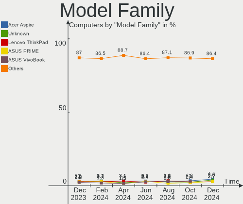
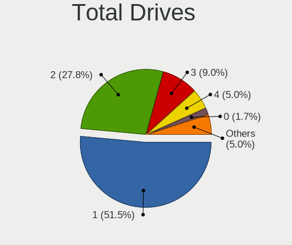
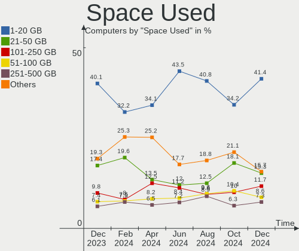
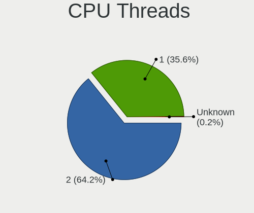
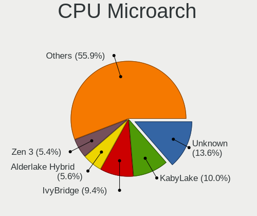
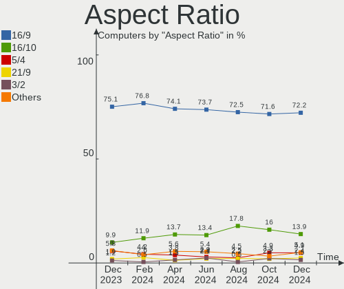
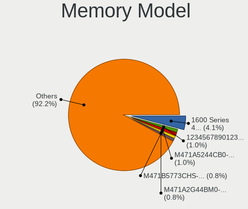
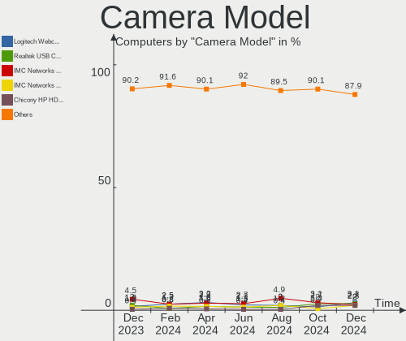
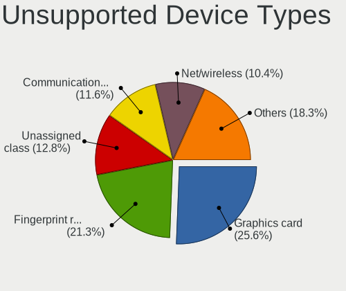

Linux in Russia - Hardware Trends
---------------------------------

A project to identify most popular hardware characteristics and track their change
over time based on data collected by Linux users at https://Linux-Hardware.org.

Anyone can contribute to this report by the [hw-probe](https://github.com/linuxhw/hw-probe) tool:

    sudo -E hw-probe -all -upload

This is a report for all computer types. See also reports for [desktops](/Location/Russia/Desktop/README.md) and [notebooks](/Location/Russia/Notebook/README.md).

Period: Dec, 2022.

Contents
--------

* [ System ](#system)
  - [ OS                       ](#os)
  - [ OS Family                ](#os-family)
  - [ Kernel                   ](#kernel)
  - [ Kernel Family            ](#kernel-family)
  - [ Kernel Major Ver.        ](#kernel-major-ver)
  - [ Arch                     ](#arch)
  - [ DE                       ](#de)
  - [ Display Server           ](#display-server)
  - [ Display Manager          ](#display-manager)
  - [ OS Lang                  ](#os-lang)
  - [ Boot Mode                ](#boot-mode)
  - [ Filesystem               ](#filesystem)
  - [ Part. scheme             ](#part-scheme)
  - [ Dual Boot with Linux/BSD ](#dual-boot-with-linuxbsd)
  - [ Dual Boot (Win)          ](#dual-boot-win)

* [ Board ](#board)
  - [ Vendor                   ](#vendor)
  - [ Model                    ](#model)
  - [ Model Family             ](#model-family)
  - [ MFG Year                 ](#mfg-year)
  - [ Form Factor              ](#form-factor)
  - [ Secure Boot              ](#secure-boot)
  - [ Coreboot                 ](#coreboot)
  - [ RAM Size                 ](#ram-size)
  - [ RAM Used                 ](#ram-used)
  - [ Total Drives             ](#total-drives)
  - [ Has CD-ROM               ](#has-cd-rom)
  - [ Has Ethernet             ](#has-ethernet)
  - [ Has WiFi                 ](#has-wifi)
  - [ Has Bluetooth            ](#has-bluetooth)

* [ Location ](#location)
  - [ Country                  ](#country)
  - [ City                     ](#city)

* [ Drives ](#drives)
  - [ Drive Vendor             ](#drive-vendor)
  - [ Drive Model              ](#drive-model)
  - [ HDD Vendor               ](#hdd-vendor)
  - [ SSD Vendor               ](#ssd-vendor)
  - [ Drive Kind               ](#drive-kind)
  - [ Drive Connector          ](#drive-connector)
  - [ Drive Size               ](#drive-size)
  - [ Space Total              ](#space-total)
  - [ Space Used               ](#space-used)
  - [ Malfunc. Drives          ](#malfunc-drives)
  - [ Malfunc. Drive Vendor    ](#malfunc-drive-vendor)
  - [ Malfunc. HDD Vendor      ](#malfunc-hdd-vendor)
  - [ Malfunc. Drive Kind      ](#malfunc-drive-kind)
  - [ Failed Drives            ](#failed-drives)
  - [ Failed Drive Vendor      ](#failed-drive-vendor)
  - [ Drive Status             ](#drive-status)

* [ Storage controller ](#storage-controller)
  - [ Storage Vendor           ](#storage-vendor)
  - [ Storage Model            ](#storage-model)
  - [ Storage Kind             ](#storage-kind)

* [ Processor ](#processor)
  - [ CPU Vendor               ](#cpu-vendor)
  - [ CPU Model                ](#cpu-model)
  - [ CPU Model Family         ](#cpu-model-family)
  - [ CPU Cores                ](#cpu-cores)
  - [ CPU Sockets              ](#cpu-sockets)
  - [ CPU Threads              ](#cpu-threads)
  - [ CPU Op-Modes             ](#cpu-op-modes)
  - [ CPU Microcode            ](#cpu-microcode)
  - [ CPU Microarch            ](#cpu-microarch)

* [ Graphics ](#graphics)
  - [ GPU Vendor               ](#gpu-vendor)
  - [ GPU Model                ](#gpu-model)
  - [ GPU Combo                ](#gpu-combo)
  - [ GPU Driver               ](#gpu-driver)
  - [ GPU Memory               ](#gpu-memory)

* [ Monitor ](#monitor)
  - [ Monitor Vendor           ](#monitor-vendor)
  - [ Monitor Model            ](#monitor-model)
  - [ Monitor Resolution       ](#monitor-resolution)
  - [ Monitor Diagonal         ](#monitor-diagonal)
  - [ Monitor Width            ](#monitor-width)
  - [ Aspect Ratio             ](#aspect-ratio)
  - [ Monitor Area             ](#monitor-area)
  - [ Pixel Density            ](#pixel-density)
  - [ Multiple Monitors        ](#multiple-monitors)

* [ Network ](#network)
  - [ Net Controller Vendor    ](#net-controller-vendor)
  - [ Net Controller Model     ](#net-controller-model)
  - [ Wireless Vendor          ](#wireless-vendor)
  - [ Wireless Model           ](#wireless-model)
  - [ Ethernet Vendor          ](#ethernet-vendor)
  - [ Ethernet Model           ](#ethernet-model)
  - [ Net Controller Kind      ](#net-controller-kind)
  - [ Used Controller          ](#used-controller)
  - [ NICs                     ](#nics)
  - [ IPv6                     ](#ipv6)

* [ Bluetooth ](#bluetooth)
  - [ Bluetooth Vendor         ](#bluetooth-vendor)
  - [ Bluetooth Model          ](#bluetooth-model)

* [ Sound ](#sound)
  - [ Sound Vendor             ](#sound-vendor)
  - [ Sound Model              ](#sound-model)

* [ Memory ](#memory)
  - [ Memory Vendor            ](#memory-vendor)
  - [ Memory Model             ](#memory-model)
  - [ Memory Kind              ](#memory-kind)
  - [ Memory Form Factor       ](#memory-form-factor)
  - [ Memory Size              ](#memory-size)
  - [ Memory Speed             ](#memory-speed)

* [ Printers & scanners ](#printers--scanners)
  - [ Printer Vendor           ](#printer-vendor)
  - [ Printer Model            ](#printer-model)
  - [ Scanner Vendor           ](#scanner-vendor)
  - [ Scanner Model            ](#scanner-model)

* [ Camera ](#camera)
  - [ Camera Vendor            ](#camera-vendor)
  - [ Camera Model             ](#camera-model)

* [ Security ](#security)
  - [ Fingerprint Vendor       ](#fingerprint-vendor)
  - [ Fingerprint Model        ](#fingerprint-model)
  - [ Chipcard Vendor          ](#chipcard-vendor)
  - [ Chipcard Model           ](#chipcard-model)

* [ Unsupported ](#unsupported)
  - [ Unsupported Devices      ](#unsupported-devices)
  - [ Unsupported Device Types ](#unsupported-device-types)

System
------

OS
--

Installed operating systems

| Name                         | Computers | Percent |
|------------------------------|-----------|---------|
| ROSA 12.3                    | 205       | 34.28%  |
| Ubuntu 22.04                 | 36        | 6.02%   |
| Debian 11                    | 33        | 5.52%   |
| Fedora 37                    | 25        | 4.18%   |
| OpenMandriva 4.3             | 24        | 4.01%   |
| Red OS 7.3.2                 | 18        | 3.01%   |
| Arch Rolling                 | 18        | 3.01%   |
| Ubuntu 20.04                 | 16        | 2.68%   |
| ROSA R11.1                   | 13        | 2.17%   |
| ROSA 12.2                    | 12        | 2.01%   |
| Linux Mint 21                | 12        | 2.01%   |
| ALT Linux 10.1               | 11        | 1.84%   |
| Manjaro                      | 10        | 1.67%   |
| OpenMandriva 22.12           | 9         | 1.51%   |
| Ubuntu 22.10                 | 8         | 1.34%   |
| Red OS 7.3                   | 7         | 1.17%   |
| MOS 10                       | 7         | 1.17%   |
| Pop!_OS 22.04                | 6         | 1%      |
| OpenMandriva 4.2             | 6         | 1%      |
| Gentoo 2.9                   | 6         | 1%      |
| Zorin 16                     | 5         | 0.84%   |
| Manjaro 22.0.0               | 5         | 0.84%   |
| Elementary 6.1               | 5         | 0.84%   |
| OpenMandriva 4.50            | 4         | 0.67%   |
| Linux Mint 20.3              | 4         | 0.67%   |
| Kubuntu 20.04                | 4         | 0.67%   |
| Debian                       | 4         | 0.67%   |
| Xubuntu 20.04                | 3         | 0.5%    |
| ROSA 12.1                    | 3         | 0.5%    |
| RELD 7.9                     | 3         | 0.5%    |
| openSUSE Tumbleweed-XXXXXXXX | 3         | 0.5%    |
| LMDE 5                       | 3         | 0.5%    |
| Linux Mint 21.1              | 3         | 0.5%    |
| KDE neon 22.04               | 3         | 0.5%    |
| Kali 2022.4                  | 3         | 0.5%    |
| Fedora 36                    | 3         | 0.5%    |
| Xubuntu 22.04                | 2         | 0.33%   |
| Ubuntu Unity 22.04           | 2         | 0.33%   |
| Ubuntu MATE 22.10            | 2         | 0.33%   |
| ROSA R11                     | 2         | 0.33%   |

OS Family
---------

OS without a version

| Name             | Computers | Percent |
|------------------|-----------|---------|
| ROSA             | 237       | 39.63%  |
| Ubuntu           | 62        | 10.37%  |
| OpenMandriva     | 43        | 7.19%   |
| Debian           | 40        | 6.69%   |
| Fedora           | 30        | 5.02%   |
| Red OS           | 28        | 4.68%   |
| ALT Linux        | 23        | 3.85%   |
| Linux Mint       | 22        | 3.68%   |
| Arch             | 18        | 3.01%   |
| Manjaro          | 15        | 2.51%   |
| Pop!_OS          | 7         | 1.17%   |
| Gentoo           | 7         | 1.17%   |
| Kubuntu          | 6         | 1%      |
| Zorin            | 5         | 0.84%   |
| Xubuntu          | 5         | 0.84%   |
| Kali             | 5         | 0.84%   |
| Elementary       | 5         | 0.84%   |
| openSUSE         | 4         | 0.67%   |
| RELD             | 3         | 0.5%    |
| LMDE             | 3         | 0.5%    |
| KDE neon         | 3         | 0.5%    |
| Ubuntu Unity     | 2         | 0.33%   |
| Ubuntu MATE      | 2         | 0.33%   |
| SteamOS          | 2         | 0.33%   |
| Slackware        | 2         | 0.33%   |
| Parrot           | 2         | 0.33%   |
| Cyber Infra      | 2         | 0.33%   |
| Astra Linux      | 2         | 0.33%   |
| ArcoLinux        | 2         | 0.33%   |
| Xero             | 1         | 0.17%   |
| Redcore          | 1         | 0.17%   |
| org.kde.Platform | 1         | 0.17%   |
| NixOS            | 1         | 0.17%   |
| Lubuntu          | 1         | 0.17%   |
| LinuxFX          | 1         | 0.17%   |
| LFS              | 1         | 0.17%   |
| Endless          | 1         | 0.17%   |
| Clear Linux      | 1         | 0.17%   |
| CentOS           | 1         | 0.17%   |
| Artix            | 1         | 0.17%   |

Kernel
------

Version of the Linux kernel

| Version                                   | Computers | Percent |
|-------------------------------------------|-----------|---------|
| 5.15.79-generic-1rosa2021.1-x86_64        | 75        | 12.54%  |
| 5.15.0-56-generic                         | 62        | 10.37%  |
| 5.15.75-generic-1rosa2021.1-x86_64        | 61        | 10.2%   |
| 5.10.155-generic-1rosa2021.1-x86_64       | 24        | 4.01%   |
| 5.16.7-desktop-1omv4003                   | 23        | 3.85%   |
| 5.10.0-7-amd64                            | 16        | 2.68%   |
| 5.15.72-1.el7.3.x86_64                    | 15        | 2.51%   |
| 6.0.12-300.fc37.x86_64                    | 11        | 1.84%   |
| 5.17.11-generic-2rosa2021.1-x86_64        | 11        | 1.84%   |
| 5.10.74-generic-2rosa2021.1-x86_64        | 10        | 1.67%   |
| 5.10.0-20-amd64                           | 10        | 1.67%   |
| 6.0.10-desktop-2omv22090                  | 9         | 1.51%   |
| 5.19.0-26-generic                         | 8         | 1.34%   |
| 5.15.77-generic-1rosa2021.1-x86_64        | 8         | 1.34%   |
| 5.4.0-135-generic                         | 7         | 1.17%   |
| 5.15.80-un-def-alt1                       | 7         | 1.17%   |
| 5.15.75-generic-1rosa2021.1-i686          | 7         | 1.17%   |
| 6.0.15-300.fc37.x86_64                    | 6         | 1%      |
| 5.10.156-std-def-alt1                     | 6         | 1%      |
| 5.10.118-generic-2rosa2021.1-x86_64       | 6         | 1%      |
| 5.10.0-19-amd64                           | 6         | 1%      |
| 6.0.6-76060006-generic                    | 5         | 0.84%   |
| 5.15.0-53-generic                         | 5         | 0.84%   |
| 5.10.14-desktop-1omv4002                  | 5         | 0.84%   |
| 6.0.12-zen1-1-zen                         | 4         | 0.67%   |
| 5.15.0-43-generic                         | 4         | 0.67%   |
| 4.15.0-desktop-122.124.1rosa-x86_64       | 4         | 0.67%   |
| 6.1.0-1-MANJARO                           | 3         | 0.5%    |
| 6.0.9-300.fc37.x86_64                     | 3         | 0.5%    |
| 6.0.12-arch1-1                            | 3         | 0.5%    |
| 6.0.0-2-amd64                             | 3         | 0.5%    |
| 5.4.32-generic-2rosa-x86_64               | 3         | 0.5%    |
| 5.15.10-1.el7.x86_64                      | 3         | 0.5%    |
| 5.15.0-57-generic                         | 3         | 0.5%    |
| 5.15.0-52-generic                         | 3         | 0.5%    |
| 6.1.0-generic-0.rc8.1rosa2021.1-x86_64    | 2         | 0.33%   |
| 6.0.7.xm1-1.klp-xanmod-rosa2021.1-x86_64  | 2         | 0.33%   |
| 6.0.12.xm1-1.klp-xanmod-rosa2021.1-x86_64 | 2         | 0.33%   |
| 6.0.11-zen1-1-zen                         | 2         | 0.33%   |
| 6.0.11-arch1-1                            | 2         | 0.33%   |

Kernel Family
-------------

Linux kernel without a distro release

| Version  | Computers | Percent |
|----------|-----------|---------|
| 5.15.0   | 81        | 13.55%  |
| 5.15.79  | 77        | 12.88%  |
| 5.15.75  | 68        | 11.37%  |
| 5.10.0   | 34        | 5.69%   |
| 5.10.155 | 25        | 4.18%   |
| 6.0.12   | 23        | 3.85%   |
| 5.16.7   | 23        | 3.85%   |
| 6.0.10   | 18        | 3.01%   |
| 5.15.72  | 16        | 2.68%   |
| 5.19.0   | 13        | 2.17%   |
| 5.15.80  | 13        | 2.17%   |
| 5.17.11  | 11        | 1.84%   |
| 5.10.74  | 11        | 1.84%   |
| 6.1.0    | 10        | 1.67%   |
| 6.0.11   | 10        | 1.67%   |
| 5.4.0    | 10        | 1.67%   |
| 6.0.0    | 9         | 1.51%   |
| 5.15.77  | 8         | 1.34%   |
| 4.15.0   | 8         | 1.34%   |
| 6.0.9    | 6         | 1%      |
| 6.0.15   | 6         | 1%      |
| 5.10.156 | 6         | 1%      |
| 5.10.118 | 6         | 1%      |
| 6.0.6    | 5         | 0.84%   |
| 5.11.0   | 5         | 0.84%   |
| 5.10.14  | 5         | 0.84%   |
| 5.4.32   | 4         | 0.67%   |
| 5.15.85  | 4         | 0.67%   |
| 5.10.29  | 4         | 0.67%   |
| 6.1.1    | 3         | 0.5%    |
| 5.18.0   | 3         | 0.5%    |
| 5.15.81  | 3         | 0.5%    |
| 5.15.78  | 3         | 0.5%    |
| 5.15.10  | 3         | 0.5%    |
| 3.10.0   | 3         | 0.5%    |
| 6.2.0    | 2         | 0.33%   |
| 6.0.8    | 2         | 0.33%   |
| 6.0.7    | 2         | 0.33%   |
| 5.19.5   | 2         | 0.33%   |
| 5.18.19  | 2         | 0.33%   |

Kernel Major Ver.
-----------------

Linux kernel major version

| Version | Computers | Percent |
|---------|-----------|---------|
| 5.15    | 287       | 47.99%  |
| 5.10    | 99        | 16.56%  |
| 6.0     | 84        | 14.05%  |
| 5.16    | 25        | 4.18%   |
| 5.19    | 19        | 3.18%   |
| 5.4     | 17        | 2.84%   |
| 6.1     | 13        | 2.17%   |
| 5.17    | 13        | 2.17%   |
| 4.15    | 9         | 1.51%   |
| 5.18    | 7         | 1.17%   |
| 5.11    | 6         | 1%      |
| 3.10    | 4         | 0.67%   |
| 4.19    | 3         | 0.5%    |
| 6.2     | 2         | 0.33%   |
| 5.14    | 2         | 0.33%   |
| 5.13    | 2         | 0.33%   |
| 4.9     | 2         | 0.33%   |
| 5.3     | 1         | 0.17%   |
| 4.4     | 1         | 0.17%   |
| 4.18    | 1         | 0.17%   |
| 3.18    | 1         | 0.17%   |

Arch
----

OS architecture (x86_64, i586, etc.)

| Name    | Computers | Percent |
|---------|-----------|---------|
| x86_64  | 579       | 96.82%  |
| i686    | 12        | 2.01%   |
| aarch64 | 4         | 0.67%   |
| armv7l  | 2         | 0.33%   |
| e2k     | 1         | 0.17%   |

DE
--

Desktop Environment

| Name          | Computers | Percent |
|---------------|-----------|---------|
| KDE5          | 247       | 41.3%   |
| GNOME         | 171       | 28.6%   |
| Unknown       | 42        | 7.02%   |
| MATE          | 32        | 5.35%   |
| LXQt          | 28        | 4.68%   |
| XFCE          | 23        | 3.85%   |
| X-Cinnamon    | 19        | 3.18%   |
| KDE4          | 12        | 2.01%   |
| Cinnamon      | 7         | 1.17%   |
| Pantheon      | 5         | 0.84%   |
| Unity         | 2         | 0.33%   |
| LXDE          | 2         | 0.33%   |
| X-Generic     | 1         | 0.17%   |
| Trinity       | 1         | 0.17%   |
| qtile         | 1         | 0.17%   |
| i3            | 1         | 0.17%   |
| Hyprland      | 1         | 0.17%   |
| GNOME Classic | 1         | 0.17%   |
| Deepin        | 1         | 0.17%   |
| bspwm         | 1         | 0.17%   |

Display Server
--------------

X11 or Wayland

| Name    | Computers | Percent |
|---------|-----------|---------|
| X11     | 306       | 51.17%  |
| Wayland | 251       | 41.97%  |
| Unknown | 29        | 4.85%   |
| Tty     | 12        | 2.01%   |

Display Manager
---------------

SDDM, LightDM, etc.

| Name    | Computers | Percent |
|---------|-----------|---------|
| SDDM    | 219       | 36.62%  |
| GDM     | 133       | 22.24%  |
| Unknown | 118       | 19.73%  |
| LightDM | 57        | 9.53%   |
| GDM3    | 53        | 8.86%   |
| KDM     | 12        | 2.01%   |
| XDM     | 2         | 0.33%   |
| WDM     | 1         | 0.17%   |
| TDM     | 1         | 0.17%   |
| LXDM    | 1         | 0.17%   |
| FLY-DM  | 1         | 0.17%   |

OS Lang
-------

Language

| Lang    | Computers | Percent |
|---------|-----------|---------|
| ru_RU   | 457       | 76.42%  |
| en_US   | 95        | 15.89%  |
| Unknown | 32        | 5.35%   |
| C       | 5         | 0.84%   |
| en_GB   | 4         | 0.67%   |
| uk_UA   | 1         | 0.17%   |
| it_IT   | 1         | 0.17%   |
| es_ES   | 1         | 0.17%   |
| en_RU   | 1         | 0.17%   |
| C.UTF8  | 1         | 0.17%   |

Boot Mode
---------

EFI or BIOS

| Mode | Computers | Percent |
|------|-----------|---------|
| EFI  | 318       | 53.18%  |
| BIOS | 280       | 46.82%  |

Filesystem
----------

Type of filesystem

| Type     | Computers | Percent |
|----------|-----------|---------|
| Ext4     | 457       | 76.42%  |
| Btrfs    | 61        | 10.2%   |
| Overlay  | 59        | 9.87%   |
| Xfs      | 10        | 1.67%   |
| Zfs      | 4         | 0.67%   |
| Reiserfs | 3         | 0.5%    |
| Tmpfs    | 1         | 0.17%   |
| F2fs     | 1         | 0.17%   |
| Ext2     | 1         | 0.17%   |
| Unknown  | 1         | 0.17%   |

Part. scheme
------------

Scheme of partitioning

| Type    | Computers | Percent |
|---------|-----------|---------|
| GPT     | 350       | 58.53%  |
| MBR     | 166       | 27.76%  |
| Unknown | 82        | 13.71%  |

Dual Boot with Linux/BSD
------------------------

Hosting more than one Linux/BSD

| Dual boot | Computers | Percent |
|-----------|-----------|---------|
| No        | 466       | 77.93%  |
| Yes       | 132       | 22.07%  |

Dual Boot (Win)
---------------

Hosting Linux and Windows

| Dual boot | Computers | Percent |
|-----------|-----------|---------|
| No        | 376       | 62.88%  |
| Yes       | 222       | 37.12%  |

Board
-----

Vendor
------

Motherboard manufacturer

| Name                           | Computers | Percent |
|--------------------------------|-----------|---------|
| ASUSTek Computer               | 147       | 24.58%  |
| Gigabyte Technology            | 91        | 15.22%  |
| Lenovo                         | 62        | 10.37%  |
| Hewlett-Packard                | 41        | 6.86%   |
| MSI                            | 36        | 6.02%   |
| ASRock                         | 31        | 5.18%   |
| Acer                           | 29        | 4.85%   |
| Dell                           | 22        | 3.68%   |
| Unknown                        | 13        | 2.17%   |
| Intel                          | 12        | 2.01%   |
| Aquarius                       | 9         | 1.51%   |
| HUAWEI                         | 8         | 1.34%   |
| Samsung Electronics            | 7         | 1.17%   |
| Pegatron                       | 7         | 1.17%   |
| Timi                           | 6         | 1%      |
| Clevo                          | 6         | 1%      |
| Apple                          | 5         | 0.84%   |
| Toshiba                        | 4         | 0.67%   |
| ICL                            | 4         | 0.67%   |
| Huanan                         | 4         | 0.67%   |
| HONOR                          | 4         | 0.67%   |
| 3Logic Group                   | 4         | 0.67%   |
| Supermicro                     | 3         | 0.5%    |
| Sony                           | 3         | 0.5%    |
| ECS                            | 3         | 0.5%    |
| Valve                          | 2         | 0.33%   |
| Raspberry Pi Foundation        | 2         | 0.33%   |
| MACHENIKE                      | 2         | 0.33%   |
| MACHCREATOR                    | 2         | 0.33%   |
| Kraftway                       | 2         | 0.33%   |
| Graviton                       | 2         | 0.33%   |
| eMachines                      | 2         | 0.33%   |
| Digma                          | 2         | 0.33%   |
| DEPO Computers                 | 2         | 0.33%   |
| Biostar                        | 2         | 0.33%   |
| AZW                            | 2         | 0.33%   |
| Xunlong                        | 1         | 0.17%   |
| Shanghai Zhaoxin Semiconductor | 1         | 0.17%   |
| Prestigio                      | 1         | 0.17%   |
| Phoenix                        | 1         | 0.17%   |

Model
-----

Motherboard model

| Name                                  | Computers | Percent |
|---------------------------------------|-----------|---------|
| Unknown                               | 13        | 2.17%   |
| ASUS All Series                       | 9         | 1.51%   |
| Gigabyte A320M-H                      | 4         | 0.67%   |
| Clevo NL41MU2                         | 4         | 0.67%   |
| Aquarius NS585                        | 4         | 0.67%   |
| Lenovo IdeaPad 330-15IKB 81DE         | 3         | 0.5%    |
| Gigabyte B450 GAMING X                | 3         | 0.5%    |
| ASUS PRIME B450M-K                    | 3         | 0.5%    |
| ASUS PRIME B450M-A                    | 3         | 0.5%    |
| 3Logic Group Graviton N15i-K2         | 3         | 0.5%    |
| Valve Jupiter                         | 2         | 0.33%   |
| Toshiba Satellite A300                | 2         | 0.33%   |
| Timi RedmiBook Pro 15S                | 2         | 0.33%   |
| Supermicro Super Server               | 2         | 0.33%   |
| Samsung 350V5C/351V5C/3540VC/3440VC   | 2         | 0.33%   |
| Pegatron C17A                         | 2         | 0.33%   |
| Pegatron C15B                         | 2         | 0.33%   |
| MSI MS-7C09                           | 2         | 0.33%   |
| MACHENIKE MACHCREATOR-16              | 2         | 0.33%   |
| Lenovo ThinkBook 15 G3 ACL 21A4       | 2         | 0.33%   |
| Lenovo IdeaPad L340-17IRH Gaming 81LL | 2         | 0.33%   |
| Lenovo IdeaPad L340-15API 81LW        | 2         | 0.33%   |
| Lenovo IdeaPad Gaming 3 15ARH05 82EY  | 2         | 0.33%   |
| Lenovo G700 20251                     | 2         | 0.33%   |
| Lenovo B590 20206                     | 2         | 0.33%   |
| Kraftway ACCORD                       | 2         | 0.33%   |
| Intel X99                             | 2         | 0.33%   |
| ICL RAY Si105.Mi                      | 2         | 0.33%   |
| HUAWEI KLVL-WXXW                      | 2         | 0.33%   |
| HP Laptop 15s-eq1xxx                  | 2         | 0.33%   |
| HP Laptop 15-bw0xx                    | 2         | 0.33%   |
| Gigabyte Z690 AORUS PRO               | 2         | 0.33%   |
| Gigabyte H61M-S2V-B3                  | 2         | 0.33%   |
| Gigabyte F2A68HM-DS2                  | 2         | 0.33%   |
| Gigabyte B450 I AORUS PRO WIFI        | 2         | 0.33%   |
| Gigabyte B365M DS3H                   | 2         | 0.33%   |
| Gigabyte 970A-DS3P                    | 2         | 0.33%   |
| Dell Inspiron 5490                    | 2         | 0.33%   |
| Dell Inspiron 1525                    | 2         | 0.33%   |
| Dell Inspiron 15-3552                 | 2         | 0.33%   |

Model Family
------------

Motherboard model prefix

| Name                  | Computers | Percent |
|-----------------------|-----------|---------|
| ASUS PRIME            | 26        | 4.35%   |
| Acer Aspire           | 23        | 3.85%   |
| Lenovo IdeaPad        | 22        | 3.68%   |
| Lenovo ThinkPad       | 15        | 2.51%   |
| Unknown               | 13        | 2.17%   |
| Dell Inspiron         | 11        | 1.84%   |
| ASUS All              | 9         | 1.51%   |
| HP Laptop             | 8         | 1.34%   |
| ASUS ROG              | 7         | 1.17%   |
| HP ProBook            | 6         | 1%      |
| HP Pavilion           | 6         | 1%      |
| Gigabyte B450         | 6         | 1%      |
| ASUS VivoBook         | 6         | 1%      |
| ASUS TUF              | 6         | 1%      |
| HP ENVY               | 5         | 0.84%   |
| Toshiba Satellite     | 4         | 0.67%   |
| Lenovo ThinkBook      | 4         | 0.67%   |
| Gigabyte A320M-H      | 4         | 0.67%   |
| Dell Vostro           | 4         | 0.67%   |
| Clevo NL41MU2         | 4         | 0.67%   |
| Aquarius NS585        | 4         | 0.67%   |
| 3Logic Group Graviton | 4         | 0.67%   |
| MSI Modern            | 3         | 0.5%    |
| Lenovo B590           | 3         | 0.5%    |
| HP EliteBook          | 3         | 0.5%    |
| Gigabyte B550M        | 3         | 0.5%    |
| Gigabyte B550         | 3         | 0.5%    |
| Dell OptiPlex         | 3         | 0.5%    |
| ASUS P8H61-M          | 3         | 0.5%    |
| ASUS P7H55-M          | 3         | 0.5%    |
| ASUS P5K              | 3         | 0.5%    |
| ASUS M5A97            | 3         | 0.5%    |
| ASUS M5A78L-M         | 3         | 0.5%    |
| ASUS ASUS             | 3         | 0.5%    |
| Acer Nitro            | 3         | 0.5%    |
| Valve Jupiter         | 2         | 0.33%   |
| Timi RedmiBook        | 2         | 0.33%   |
| Supermicro Super      | 2         | 0.33%   |
| Samsung 350V5C        | 2         | 0.33%   |
| RPi Raspberry         | 2         | 0.33%   |

MFG Year
--------

Motherboard manufacture year

| Year    | Computers | Percent |
|---------|-----------|---------|
| 2021    | 80        | 13.38%  |
| 2019    | 58        | 9.7%    |
| 2018    | 54        | 9.03%   |
| 2012    | 53        | 8.86%   |
| 2022    | 51        | 8.53%   |
| 2013    | 43        | 7.19%   |
| 2020    | 36        | 6.02%   |
| 2011    | 35        | 5.85%   |
| 2010    | 32        | 5.35%   |
| 2017    | 30        | 5.02%   |
| 2014    | 21        | 3.51%   |
| 2009    | 21        | 3.51%   |
| 2016    | 20        | 3.34%   |
| 2008    | 20        | 3.34%   |
| 2015    | 19        | 3.18%   |
| 2007    | 15        | 2.51%   |
| Unknown | 7         | 1.17%   |
| 2006    | 1         | 0.17%   |
| 2005    | 1         | 0.17%   |
| 2004    | 1         | 0.17%   |

Form Factor
-----------

Physical design of the computer

| Name           | Computers | Percent |
|----------------|-----------|---------|
| Desktop        | 282       | 47.16%  |
| Notebook       | 282       | 47.16%  |
| All in one     | 14        | 2.34%   |
| System on chip | 5         | 0.84%   |
| Convertible    | 5         | 0.84%   |
| Mini pc        | 5         | 0.84%   |
| Server         | 5         | 0.84%   |

Secure Boot
-----------

Enabled or disabled

| State    | Computers | Percent |
|----------|-----------|---------|
| Disabled | 572       | 95.65%  |
| Enabled  | 26        | 4.35%   |

Coreboot
--------

Have coreboot on board

| Used | Computers | Percent |
|------|-----------|---------|
| No   | 598       | 100%    |

RAM Size
--------

Total RAM memory

| Size in GB  | Computers | Percent |
|-------------|-----------|---------|
| 16.01-24.0  | 135       | 22.58%  |
| 4.01-8.0    | 134       | 22.41%  |
| 8.01-16.0   | 118       | 19.73%  |
| 3.01-4.0    | 103       | 17.22%  |
| 32.01-64.0  | 47        | 7.86%   |
| 1.01-2.0    | 24        | 4.01%   |
| 64.01-256.0 | 15        | 2.51%   |
| 24.01-32.0  | 9         | 1.51%   |
| 2.01-3.0    | 8         | 1.34%   |
| 0.51-1.0    | 5         | 0.84%   |

RAM Used
--------

Used RAM memory

| Used GB    | Computers | Percent |
|------------|-----------|---------|
| 1.01-2.0   | 232       | 38.8%   |
| 2.01-3.0   | 122       | 20.4%   |
| 0.51-1.0   | 95        | 15.89%  |
| 4.01-8.0   | 72        | 12.04%  |
| 3.01-4.0   | 44        | 7.36%   |
| 0.01-0.5   | 14        | 2.34%   |
| 8.01-16.0  | 13        | 2.17%   |
| 16.01-24.0 | 4         | 0.67%   |
| 32.01-64.0 | 1         | 0.17%   |
| Unknown    | 1         | 0.17%   |

Total Drives
------------

Number of drives on board

| Drives | Computers | Percent |
|--------|-----------|---------|
| 1      | 341       | 57.02%  |
| 2      | 161       | 26.92%  |
| 3      | 46        | 7.69%   |
| 4      | 29        | 4.85%   |
| 5      | 13        | 2.17%   |
| 0      | 3         | 0.5%    |
| 7      | 2         | 0.33%   |
| 6      | 2         | 0.33%   |
| 21     | 1         | 0.17%   |

Has CD-ROM
----------

Has CD-ROM on board

| Presented | Computers | Percent |
|-----------|-----------|---------|
| No        | 434       | 72.58%  |
| Yes       | 164       | 27.42%  |

Has Ethernet
------------

Has Ethernet on board

| Presented | Computers | Percent |
|-----------|-----------|---------|
| Yes       | 526       | 87.96%  |
| No        | 72        | 12.04%  |

Has WiFi
--------

Has WiFi module

| Presented | Computers | Percent |
|-----------|-----------|---------|
| Yes       | 392       | 65.55%  |
| No        | 206       | 34.45%  |

Has Bluetooth
-------------

Has Bluetooth module

| Presented | Computers | Percent |
|-----------|-----------|---------|
| Yes       | 332       | 55.52%  |
| No        | 266       | 44.48%  |

Location
--------

Country
-------

Geographic location (country)

| Country | Computers | Percent |
|---------|-----------|---------|
| Russia  | 598       | 100%    |

City
----

Geographic location (city)

| City             | Computers | Percent |
|------------------|-----------|---------|
| Moscow           | 144       | 24.08%  |
| St Petersburg    | 55        | 9.2%    |
| Voronezh         | 26        | 4.35%   |
| Krasnodar        | 23        | 3.85%   |
| Novosibirsk      | 22        | 3.68%   |
| Yekaterinburg    | 16        | 2.68%   |
| Nizhniy Novgorod | 12        | 2.01%   |
| Volgograd        | 11        | 1.84%   |
| Ufa              | 10        | 1.67%   |
| Rostov-on-Don    | 10        | 1.67%   |
| Perm             | 10        | 1.67%   |
| Chelyabinsk      | 7         | 1.17%   |
| Stavropol        | 6         | 1%      |
| Saransk          | 5         | 0.84%   |
| Salekhard        | 5         | 0.84%   |
| Orenburg         | 5         | 0.84%   |
| Omsk             | 5         | 0.84%   |
| Khabarovsk       | 5         | 0.84%   |
| Irkutsk          | 5         | 0.84%   |
| Tomsk            | 4         | 0.67%   |
| Saratov          | 4         | 0.67%   |
| Novorossiysk     | 4         | 0.67%   |
| Krasnoyarsk      | 4         | 0.67%   |
| Kemerovo         | 4         | 0.67%   |
| Yakutsk          | 3         | 0.5%    |
| Vladivostok      | 3         | 0.5%    |
| Vladimir         | 3         | 0.5%    |
| Ulyanovsk        | 3         | 0.5%    |
| Tyumen           | 3         | 0.5%    |
| Tambov           | 3         | 0.5%    |
| Smolensk         | 3         | 0.5%    |
| Samara           | 3         | 0.5%    |
| Podolsk          | 3         | 0.5%    |
| Novy Urengoy     | 3         | 0.5%    |
| Murom            | 3         | 0.5%    |
| Korolyov         | 3         | 0.5%    |
| Kirov            | 3         | 0.5%    |
| Cheboksary       | 3         | 0.5%    |
| Astrakhan        | 3         | 0.5%    |
| Zarech'ye        | 2         | 0.33%   |

Drives
------

Drive Vendor
------------

Hard drive vendors

| Vendor                         | Computers | Drives | Percent |
|--------------------------------|-----------|--------|---------|
| WDC                            | 142       | 162    | 15.29%  |
| Seagate                        | 133       | 152    | 14.32%  |
| Samsung Electronics            | 93        | 106    | 10.01%  |
| Toshiba                        | 68        | 86     | 7.32%   |
| Kingston                       | 63        | 70     | 6.78%   |
| A-DATA Technology              | 35        | 35     | 3.77%   |
| Hitachi                        | 29        | 33     | 3.12%   |
| SanDisk                        | 27        | 28     | 2.91%   |
| Intel                          | 24        | 27     | 2.58%   |
| Apacer                         | 21        | 21     | 2.26%   |
| China                          | 20        | 20     | 2.15%   |
| SK hynix                       | 19        | 20     | 2.05%   |
| AMD                            | 19        | 20     | 2.05%   |
| Unknown                        | 18        | 21     | 1.94%   |
| HGST                           | 17        | 19     | 1.83%   |
| Crucial                        | 13        | 13     | 1.4%    |
| Unknown                        | 12        | 12     | 1.29%   |
| SPCC                           | 11        | 11     | 1.18%   |
| Phison Electronics             | 11        | 12     | 1.18%   |
| Micron Technology              | 11        | 12     | 1.18%   |
| Netac                          | 8         | 10     | 0.86%   |
| Plextor                        | 7         | 7      | 0.75%   |
| Patriot                        | 7         | 7      | 0.75%   |
| KIOXIA                         | 7         | 7      | 0.75%   |
| KingSpec                       | 7         | 7      | 0.75%   |
| XrayDisk                       | 6         | 6      | 0.65%   |
| Silicon Motion                 | 6         | 6      | 0.65%   |
| Gigabyte Technology            | 6         | 7      | 0.65%   |
| SSSTC                          | 5         | 5      | 0.54%   |
| Smartbuy                       | 5         | 5      | 0.54%   |
| BIWIN                          | 5         | 5      | 0.54%   |
| Transcend                      | 4         | 4      | 0.43%   |
| JMicron Technology             | 4         | 4      | 0.43%   |
| Foxline                        | 4         | 4      | 0.43%   |
| Corsair                        | 4         | 4      | 0.43%   |
| UMIS                           | 3         | 3      | 0.32%   |
| GOODRAM                        | 3         | 3      | 0.32%   |
| XPG                            | 2         | 2      | 0.22%   |
| Solid State Storage Technology | 2         | 2      | 0.22%   |
| ShiJi                          | 2         | 3      | 0.22%   |

Drive Model
-----------

Hard drive models

| Model                                               | Computers | Percent |
|-----------------------------------------------------|-----------|---------|
| Seagate ST1000DM010-2EP102 1TB                      | 15        | 1.51%   |
| Samsung NVMe SSD Controller SM981/PM981/PM983 500GB | 13        | 1.31%   |
| Unknown                                             | 12        | 1.21%   |
| Kingston SA400S37240G 240GB SSD                     | 11        | 1.11%   |
| Toshiba MQ01ABF050 500GB                            | 10        | 1.01%   |
| Toshiba HDWD110 1TB                                 | 9         | 0.91%   |
| Toshiba DT01ACA100 1TB                              | 9         | 0.91%   |
| Kingston SA400S37120G 120GB SSD                     | 9         | 0.91%   |
| Seagate ST1000LM024 HN-M101MBB 1TB                  | 8         | 0.81%   |
| Phison PS5013 E13 NVMe Controller 512GB             | 8         | 0.81%   |
| Kingston SA400S37480G 480GB SSD                     | 8         | 0.81%   |
| WDC WDS120G2G0A-00JH30 120GB SSD                    | 7         | 0.71%   |
| WDC WD10EZEX-08WN4A0 1TB                            | 7         | 0.71%   |
| Toshiba DT01ACA050 500GB                            | 7         | 0.71%   |
| Seagate ST500DM002-1BD142 500GB                     | 7         | 0.71%   |
| Apacer AS350 128GB SSD                              | 7         | 0.71%   |
| A-DATA SU650 240GB SSD                              | 7         | 0.71%   |
| Seagate ST500LT012-1DG142 500GB                     | 6         | 0.61%   |
| Seagate ST3500418AS 500GB                           | 6         | 0.61%   |
| Samsung SSD 860 EVO 250GB                           | 6         | 0.61%   |
| Seagate ST1000LM035-1RK172 1TB                      | 5         | 0.5%    |
| Seagate ST1000DM003-1CH162 1TB                      | 5         | 0.5%    |
| Samsung NVMe SSD Controller PM9A1/PM9A3/980PRO 2TB  | 5         | 0.5%    |
| HGST HTS545050A7E380 500GB                          | 5         | 0.5%    |
| Crucial CT240BX500SSD1 240GB                        | 5         | 0.5%    |
| Apacer AS350 512GB SSD                              | 5         | 0.5%    |
| AMD R5SL120G 120GB SSD                              | 5         | 0.5%    |
| A-DATA SU800 512GB SSD                              | 5         | 0.5%    |
| SPCC Solid State Disk 128GB                         | 4         | 0.4%    |
| Seagate ST3320613AS 320GB                           | 4         | 0.4%    |
| Samsung SSD 980 500GB                               | 4         | 0.4%    |
| Samsung SSD 970 EVO Plus 250GB                      | 4         | 0.4%    |
| Samsung SSD 860 EVO 500GB                           | 4         | 0.4%    |
| Samsung MZALQ512HALU-000L2 512GB                    | 4         | 0.4%    |
| KIOXIA KBG40ZNV512G 512GB                           | 4         | 0.4%    |
| Kingston SHFS37A120G 120GB SSD                      | 4         | 0.4%    |
| HGST HTS541010A9E680 1TB                            | 4         | 0.4%    |
| BIWIN CE480T5D101-256 256GB                         | 4         | 0.4%    |
| WDC WDS500G2B0A-00SM50 500GB SSD                    | 3         | 0.3%    |
| WDC WD3200AAKS-00L9A0 320GB                         | 3         | 0.3%    |

HDD Vendor
----------

Hard disk drive vendors

| Vendor              | Computers | Drives | Percent |
|---------------------|-----------|--------|---------|
| Seagate             | 131       | 149    | 35.03%  |
| WDC                 | 120       | 132    | 32.09%  |
| Toshiba             | 63        | 79     | 16.84%  |
| Hitachi             | 29        | 33     | 7.75%   |
| HGST                | 17        | 19     | 4.55%   |
| Samsung Electronics | 12        | 12     | 3.21%   |
| Pioneer             | 1         | 1      | 0.27%   |
| AFAYA               | 1         | 1      | 0.27%   |

SSD Vendor
----------

Solid state drive vendors

| Vendor              | Computers | Drives | Percent |
|---------------------|-----------|--------|---------|
| Kingston            | 45        | 51     | 13.98%  |
| A-DATA Technology   | 31        | 31     | 9.63%   |
| Samsung Electronics | 26        | 28     | 8.07%   |
| WDC                 | 20        | 20     | 6.21%   |
| China               | 20        | 20     | 6.21%   |
| Apacer              | 16        | 16     | 4.97%   |
| AMD                 | 16        | 16     | 4.97%   |
| SanDisk             | 13        | 13     | 4.04%   |
| Crucial             | 13        | 13     | 4.04%   |
| Intel               | 12        | 14     | 3.73%   |
| SPCC                | 11        | 11     | 3.42%   |
| Unknown             | 8         | 8      | 2.48%   |
| Plextor             | 7         | 7      | 2.17%   |
| KingSpec            | 7         | 7      | 2.17%   |
| XrayDisk            | 6         | 6      | 1.86%   |
| Patriot             | 6         | 6      | 1.86%   |
| Smartbuy            | 5         | 5      | 1.55%   |
| Micron Technology   | 5         | 6      | 1.55%   |
| Toshiba             | 4         | 4      | 1.24%   |
| Netac               | 4         | 4      | 1.24%   |
| Gigabyte Technology | 4         | 5      | 1.24%   |
| Transcend           | 3         | 3      | 0.93%   |
| JMicron Technology  | 3         | 3      | 0.93%   |
| GOODRAM             | 3         | 3      | 0.93%   |
| Corsair             | 3         | 3      | 0.93%   |
| ShiJi               | 2         | 2      | 0.62%   |
| Qumo                | 2         | 2      | 0.62%   |
| KingFast            | 2         | 2      | 0.62%   |
| WALRAM              | 1         | 1      | 0.31%   |
| USB30               | 1         | 1      | 0.31%   |
| TO Exter            | 1         | 1      | 0.31%   |
| Team                | 1         | 1      | 0.31%   |
| TAMMUZ              | 1         | 1      | 0.31%   |
| SPCC Sol            | 1         | 1      | 0.31%   |
| SK hynix            | 1         | 1      | 0.31%   |
| Seagate             | 1         | 1      | 0.31%   |
| SATAFIRM            | 1         | 1      | 0.31%   |
| RUN                 | 1         | 1      | 0.31%   |
| OCZ-VERTEX3         | 1         | 1      | 0.31%   |
| OCZ-VERTEX          | 1         | 1      | 0.31%   |

Drive Kind
----------

HDD or SSD

| Kind    | Computers | Drives | Percent |
|---------|-----------|--------|---------|
| HDD     | 319       | 426    | 38.76%  |
| SSD     | 268       | 335    | 32.56%  |
| NVMe    | 209       | 237    | 25.39%  |
| MMC     | 18        | 22     | 2.19%   |
| Unknown | 9         | 8      | 1.09%   |

Drive Connector
---------------

SATA, SAS, NVMe, etc.

| Type | Computers | Drives | Percent |
|------|-----------|--------|---------|
| SATA | 448       | 752    | 65.02%  |
| NVMe | 209       | 237    | 30.33%  |
| MMC  | 18        | 22     | 2.61%   |
| SAS  | 14        | 17     | 2.03%   |

Drive Size
----------

Size of hard drive

| Size in TB | Computers | Drives | Percent |
|------------|-----------|--------|---------|
| 0.01-0.5   | 360       | 485    | 61.43%  |
| 0.51-1.0   | 167       | 192    | 28.5%   |
| 1.01-2.0   | 35        | 48     | 5.97%   |
| 3.01-4.0   | 11        | 15     | 1.88%   |
| 2.01-3.0   | 6         | 10     | 1.02%   |
| 4.01-10.0  | 5         | 9      | 0.85%   |
| 10.01-20.0 | 1         | 1      | 0.17%   |
| 0          | 1         | 1      | 0.17%   |

Space Total
-----------

Amount of disk space available on the file system

| Size in GB     | Computers | Percent |
|----------------|-----------|---------|
| 101-250        | 181       | 30.27%  |
| 251-500        | 114       | 19.06%  |
| 501-1000       | 79        | 13.21%  |
| 1-20           | 56        | 9.36%   |
| 1001-2000      | 47        | 7.86%   |
| 51-100         | 41        | 6.86%   |
| Unknown        | 29        | 4.85%   |
| More than 3000 | 22        | 3.68%   |
| 21-50          | 18        | 3.01%   |
| 2001-3000      | 11        | 1.84%   |

Space Used
----------

Amount of used disk space

| Used GB        | Computers | Percent |
|----------------|-----------|---------|
| 1-20           | 290       | 48.49%  |
| 21-50          | 81        | 13.55%  |
| 101-250        | 67        | 11.2%   |
| 51-100         | 47        | 7.86%   |
| 251-500        | 38        | 6.35%   |
| Unknown        | 29        | 4.85%   |
| 501-1000       | 17        | 2.84%   |
| 1001-2000      | 14        | 2.34%   |
| More than 3000 | 8         | 1.34%   |
| 2001-3000      | 7         | 1.17%   |

Malfunc. Drives
---------------

Drive models with a malfunction

| Model                            | Computers | Drives | Percent |
|----------------------------------|-----------|--------|---------|
| Seagate ST500LT012-9WS142 500GB  | 3         | 3      | 2.22%   |
| Seagate ST500DM002-1BD142 500GB  | 3         | 3      | 2.22%   |
| Seagate ST3320613AS 320GB        | 3         | 3      | 2.22%   |
| WDC WDS240G2G0A-00JH30 240GB SSD | 2         | 2      | 1.48%   |
| WDC WD3200AAKS-00L9A0 320GB      | 2         | 2      | 1.48%   |
| WDC WD2500AAKX-00ERMA0 250GB     | 2         | 2      | 1.48%   |
| Toshiba MQ01ABD100 1TB           | 2         | 2      | 1.48%   |
| Seagate ST9500325AS 500GB        | 2         | 2      | 1.48%   |
| Seagate ST9320325AS 320GB        | 2         | 2      | 1.48%   |
| Seagate ST500LT012-1DG142 500GB  | 2         | 2      | 1.48%   |
| Seagate ST1000DM010-2EP102 1TB   | 2         | 2      | 1.48%   |
| Seagate ST1000DM003-9YN162 1TB   | 2         | 2      | 1.48%   |
| Kingston SA400S37120G 120GB SSD  | 2         | 2      | 1.48%   |
| Hitachi HDS721616PLA380 160GB    | 2         | 2      | 1.48%   |
| HGST HTS545050A7E680 500GB       | 2         | 2      | 1.48%   |
| XrayDisk 512GB SSD               | 1         | 1      | 0.74%   |
| XrayDisk 240GB SSD               | 1         | 1      | 0.74%   |
| WDC WDS240G2G0B-00EPW0 240GB SSD | 1         | 1      | 0.74%   |
| WDC WDS100T2B0A-00SM50 1TB SSD   | 1         | 1      | 0.74%   |
| WDC WD7500BPKT-75PK4T0 752GB     | 1         | 1      | 0.74%   |
| WDC WD6401AALS-00L3B2 640GB      | 1         | 1      | 0.74%   |
| WDC WD6401AALS-00J7B0 640GB      | 1         | 1      | 0.74%   |
| WDC WD5000BPVT-22HXZT1 500GB     | 1         | 1      | 0.74%   |
| WDC WD5000BEVT-22A0RT0 500GB     | 1         | 1      | 0.74%   |
| WDC WD5000AAKX-22ERMA0 500GB     | 1         | 1      | 0.74%   |
| WDC WD5000AAKX-221CA0 500GB      | 1         | 1      | 0.74%   |
| WDC WD5000AADS-00S9B0 500GB      | 1         | 1      | 0.74%   |
| WDC WD3200BPVT-35ZEST0 320GB     | 1         | 1      | 0.74%   |
| WDC WD3200BEVT-60A23T0 320GB     | 1         | 1      | 0.74%   |
| WDC WD3200BEVT-22A23T0 320GB     | 1         | 1      | 0.74%   |
| WDC WD3200BEVT-00A0RT0 320GB     | 1         | 1      | 0.74%   |
| WDC WD3200AAKS-00SBA0 320GB      | 1         | 1      | 0.74%   |
| WDC WD2500BEVT-00ZCT0 250GB      | 1         | 1      | 0.74%   |
| WDC WD2500AAJS-00YZCA0 250GB     | 1         | 1      | 0.74%   |
| WDC WD2005FBYZ-01YCBB3 2TB       | 1         | 1      | 0.74%   |
| WDC WD1600BEVS-22RST0 160GB      | 1         | 1      | 0.74%   |
| WDC WD1600AAJS-08PSA0 160GB      | 1         | 1      | 0.74%   |
| WDC WD1600AAJB-00J3A0 160GB      | 1         | 1      | 0.74%   |
| WDC WD10EZEX-75ZF5A0 1TB         | 1         | 1      | 0.74%   |
| WDC WD10EZEX-22MFCA0 1TB         | 1         | 1      | 0.74%   |

Malfunc. Drive Vendor
---------------------

Vendors of faulty drives

| Vendor                | Computers | Drives | Percent |
|-----------------------|-----------|--------|---------|
| Seagate               | 45        | 47     | 34.35%  |
| WDC                   | 32        | 34     | 24.43%  |
| Hitachi               | 11        | 11     | 8.4%    |
| Toshiba               | 10        | 10     | 7.63%   |
| Samsung Electronics   | 6         | 6      | 4.58%   |
| Kingston              | 4         | 4      | 3.05%   |
| HGST                  | 4         | 4      | 3.05%   |
| A-DATA Technology     | 3         | 3      | 2.29%   |
| XrayDisk              | 2         | 2      | 1.53%   |
| SanDisk               | 2         | 2      | 1.53%   |
| Corsair               | 2         | 2      | 1.53%   |
| AMD                   | 2         | 2      | 1.53%   |
| Realtek Semiconductor | 1         | 1      | 0.76%   |
| OCZ-VERTEX3           | 1         | 1      | 0.76%   |
| Neo                   | 1         | 1      | 0.76%   |
| Micron Technology     | 1         | 1      | 0.76%   |
| Intel                 | 1         | 1      | 0.76%   |
| Espada                | 1         | 1      | 0.76%   |
| China                 | 1         | 1      | 0.76%   |
| Unknown               | 1         | 1      | 0.76%   |

Malfunc. HDD Vendor
-------------------

Vendors of faulty HDD drives

| Vendor              | Computers | Drives | Percent |
|---------------------|-----------|--------|---------|
| Seagate             | 45        | 47     | 44.55%  |
| WDC                 | 29        | 30     | 28.71%  |
| Hitachi             | 11        | 11     | 10.89%  |
| Toshiba             | 9         | 9      | 8.91%   |
| HGST                | 4         | 4      | 3.96%   |
| Samsung Electronics | 3         | 3      | 2.97%   |

Malfunc. Drive Kind
-------------------

Kinds of faulty drives

| Kind | Computers | Drives | Percent |
|------|-----------|--------|---------|
| HDD  | 95        | 104    | 75.4%   |
| SSD  | 29        | 29     | 23.02%  |
| NVMe | 2         | 2      | 1.59%   |

Failed Drives
-------------

Failed drive models

| Model                             | Computers | Drives | Percent |
|-----------------------------------|-----------|--------|---------|
| WDC WD800JB-00FMA0 80GB           | 1         | 1      | 14.29%  |
| WDC WD7501AALS-00J7B0 752GB       | 1         | 1      | 14.29%  |
| Seagate ST3250820AS 250GB         | 1         | 1      | 14.29%  |
| Samsung Electronics SSD 980 1TB   | 1         | 1      | 14.29%  |
| Samsung Electronics HM500JI 500GB | 1         | 1      | 14.29%  |
| Samsung Electronics HD503HI 500GB | 1         | 1      | 14.29%  |
| HGST HTS545050A7E380 500GB        | 1         | 1      | 14.29%  |

Failed Drive Vendor
-------------------

Failed drive vendors

| Vendor              | Computers | Drives | Percent |
|---------------------|-----------|--------|---------|
| Samsung Electronics | 3         | 3      | 42.86%  |
| WDC                 | 2         | 2      | 28.57%  |
| Seagate             | 1         | 1      | 14.29%  |
| HGST                | 1         | 1      | 14.29%  |

Drive Status
------------

Number of failed and malfunc. drives

| Status   | Computers | Drives | Percent |
|----------|-----------|--------|---------|
| Works    | 407       | 643    | 59.59%  |
| Detected | 152       | 243    | 22.25%  |
| Malfunc  | 118       | 135    | 17.28%  |
| Failed   | 6         | 7      | 0.88%   |

Storage controller
------------------

Storage Vendor
--------------

Storage controller vendors

| Vendor                         | Computers | Percent |
|--------------------------------|-----------|---------|
| Intel                          | 375       | 47.41%  |
| AMD                            | 151       | 19.09%  |
| Samsung Electronics            | 58        | 7.33%   |
| SanDisk                        | 23        | 2.91%   |
| Phison Electronics             | 19        | 2.4%    |
| Kingston Technology Company    | 19        | 2.4%    |
| SK hynix                       | 18        | 2.28%   |
| Nvidia                         | 17        | 2.15%   |
| JMicron Technology             | 16        | 2.02%   |
| Silicon Motion                 | 14        | 1.77%   |
| Marvell Technology Group       | 9         | 1.14%   |
| ASMedia Technology             | 8         | 1.01%   |
| Solid State Storage Technology | 7         | 0.88%   |
| Realtek Semiconductor          | 7         | 0.88%   |
| KIOXIA                         | 7         | 0.88%   |
| Micron Technology              | 6         | 0.76%   |
| INNOGRIT                       | 6         | 0.76%   |
| Netac Technology               | 5         | 0.63%   |
| MAXIO Technology (Hangzhou)    | 4         | 0.51%   |
| Union Memory (Shenzhen)        | 3         | 0.38%   |
| Toshiba America Info Systems   | 3         | 0.38%   |
| ADATA Technology               | 3         | 0.38%   |
| VIA Technologies               | 2         | 0.25%   |
| Hewlett-Packard                | 2         | 0.25%   |
| Unknown                        | 2         | 0.25%   |
| Zhaoxin                        | 1         | 0.13%   |
| Silicon Image                  | 1         | 0.13%   |
| Shenzhen Longsys Electronics   | 1         | 0.13%   |
| Seagate Technology             | 1         | 0.13%   |
| MCST                           | 1         | 0.13%   |
| LSI Logic / Symbios Logic      | 1         | 0.13%   |
| Integrated Technology Express  | 1         | 0.13%   |

Storage Model
-------------

Storage controller models

| Model                                                                                   | Computers | Percent |
|-----------------------------------------------------------------------------------------|-----------|---------|
| AMD FCH SATA Controller [AHCI mode]                                                     | 90        | 9.71%   |
| Intel 7 Series Chipset Family 6-port SATA Controller [AHCI mode]                        | 33        | 3.56%   |
| Samsung NVMe SSD Controller SM981/PM981/PM983                                           | 31        | 3.34%   |
| Intel 8 Series/C220 Series Chipset Family 6-port SATA Controller 1 [AHCI mode]          | 23        | 2.48%   |
| AMD 400 Series Chipset SATA Controller                                                  | 23        | 2.48%   |
| Samsung NVMe SSD Controller 980                                                         | 20        | 2.16%   |
| Intel 500 Series Chipset Family SATA AHCI Controller                                    | 20        | 2.16%   |
| Intel Q170/Q150/B150/H170/H110/Z170/CM236 Chipset SATA Controller [AHCI Mode]           | 18        | 1.94%   |
| AMD SB7x0/SB8x0/SB9x0 IDE Controller                                                    | 17        | 1.83%   |
| Intel Sunrise Point-LP SATA Controller [AHCI mode]                                      | 16        | 1.73%   |
| Intel 6 Series/C200 Series Chipset Family 6 port Mobile SATA AHCI Controller            | 16        | 1.73%   |
| AMD 500 Series Chipset SATA Controller                                                  | 16        | 1.73%   |
| AMD SB7x0/SB8x0/SB9x0 SATA Controller [AHCI mode]                                       | 15        | 1.62%   |
| Phison PS5013 E13 NVMe Controller                                                       | 14        | 1.51%   |
| Intel Comet Lake SATA AHCI Controller                                                   | 14        | 1.51%   |
| Intel Cannon Lake PCH SATA AHCI Controller                                              | 14        | 1.51%   |
| Intel NM10/ICH7 Family SATA Controller [IDE mode]                                       | 13        | 1.4%    |
| Intel Celeron/Pentium Silver Processor SATA Controller                                  | 12        | 1.29%   |
| SK hynix Gold P31/PC711 NVMe Solid State Drive                                          | 11        | 1.19%   |
| Silicon Motion SM2263EN/SM2263XT SSD Controller                                         | 11        | 1.19%   |
| JMicron JMB363 SATA/IDE Controller                                                      | 11        | 1.19%   |
| Intel Volume Management Device NVMe RAID Controller                                     | 11        | 1.19%   |
| Intel Tiger Lake-LP SATA Controller                                                     | 11        | 1.19%   |
| Intel 6 Series/C200 Series Chipset Family 6 port Desktop SATA AHCI Controller           | 11        | 1.19%   |
| Intel 6 Series/C200 Series Chipset Family Desktop SATA Controller (IDE mode, ports 4-5) | 10        | 1.08%   |
| Intel 6 Series/C200 Series Chipset Family Desktop SATA Controller (IDE mode, ports 0-3) | 10        | 1.08%   |
| Intel 200 Series PCH SATA controller [AHCI mode]                                        | 10        | 1.08%   |
| AMD SB7x0/SB8x0/SB9x0 SATA Controller [IDE mode]                                        | 10        | 1.08%   |
| AMD FCH SATA Controller D                                                               | 10        | 1.08%   |
| SanDisk WD Blue SN550 NVMe SSD                                                          | 9         | 0.97%   |
| Kingston Company Company Non-Volatile memory controller                                 | 9         | 0.97%   |
| Intel Cannon Point-LP SATA Controller [AHCI Mode]                                       | 9         | 0.97%   |
| Intel Alder Lake-S PCH SATA Controller [AHCI Mode]                                      | 9         | 0.97%   |
| Intel 8 Series SATA Controller 1 [AHCI mode]                                            | 9         | 0.97%   |
| Samsung NVMe SSD Controller PM9A1/PM9A3/980PRO                                          | 8         | 0.86%   |
| Nvidia MCP61 SATA Controller                                                            | 8         | 0.86%   |
| Nvidia MCP61 IDE                                                                        | 8         | 0.86%   |
| Intel 82801HM/HEM (ICH8M/ICH8M-E) IDE Controller                                        | 8         | 0.86%   |
| ASMedia ASM1062 Serial ATA Controller                                                   | 8         | 0.86%   |
| Solid State Storage Non-Volatile memory controller                                      | 7         | 0.76%   |

Storage Kind
------------

Kind of storage controller (IDE, SATA, NVMe, SAS, ...)

| Kind | Computers | Percent |
|------|-----------|---------|
| SATA | 459       | 57.45%  |
| NVMe | 209       | 26.16%  |
| IDE  | 107       | 13.39%  |
| RAID | 22        | 2.75%   |
| SAS  | 2         | 0.25%   |

Processor
---------

CPU Vendor
----------

Processor vendors

| Vendor       | Computers | Percent |
|--------------|-----------|---------|
| Intel        | 402       | 67.22%  |
| AMD          | 188       | 31.44%  |
| ARM          | 6         | 1%      |
| Elbrus-MCST  | 1         | 0.17%   |
| CentaurHauls | 1         | 0.17%   |

CPU Model
---------

Processor models

| Model                                         | Computers | Percent |
|-----------------------------------------------|-----------|---------|
| Intel 11th Gen Core i5-1135G7 @ 2.40GHz       | 12        | 2.01%   |
| Intel Core i5-10210U CPU @ 1.60GHz            | 11        | 1.84%   |
| AMD Ryzen 5 5500U with Radeon Graphics        | 9         | 1.51%   |
| AMD Ryzen 5 5600X 6-Core Processor            | 7         | 1.17%   |
| AMD Ryzen 5 2600 Six-Core Processor           | 7         | 1.17%   |
| Intel Core i5-8259U CPU @ 2.30GHz             | 6         | 1%      |
| Intel Core i5-8250U CPU @ 1.60GHz             | 6         | 1%      |
| AMD Ryzen 5 3500U with Radeon Vega Mobile Gfx | 6         | 1%      |
| Intel Core i3-10105 CPU @ 3.70GHz             | 5         | 0.84%   |
| AMD Ryzen 5 3600 6-Core Processor             | 5         | 0.84%   |
| Intel Core i7-10700 CPU @ 2.90GHz             | 4         | 0.67%   |
| Intel Core i5-3210M CPU @ 2.50GHz             | 4         | 0.67%   |
| Intel Core i5-2430M CPU @ 2.40GHz             | 4         | 0.67%   |
| Intel Core i5-2410M CPU @ 2.30GHz             | 4         | 0.67%   |
| Intel Core i5-10400 CPU @ 2.90GHz             | 4         | 0.67%   |
| Intel Core i3-9100 CPU @ 3.60GHz              | 4         | 0.67%   |
| Intel Core i3-4170 CPU @ 3.70GHz              | 4         | 0.67%   |
| Intel Celeron N4020 CPU @ 1.10GHz             | 4         | 0.67%   |
| Intel 11th Gen Core i5-11320H @ 3.20GHz       | 4         | 0.67%   |
| AMD Ryzen 7 5800H with Radeon Graphics        | 4         | 0.67%   |
| AMD Ryzen 5 3400G with Radeon Vega Graphics   | 4         | 0.67%   |
| Intel Pentium Dual-Core CPU E5400 @ 2.70GHz   | 3         | 0.5%    |
| Intel Pentium CPU B960 @ 2.20GHz              | 3         | 0.5%    |
| Intel Core i7-9750H CPU @ 2.60GHz             | 3         | 0.5%    |
| Intel Core i7-3630QM CPU @ 2.40GHz            | 3         | 0.5%    |
| Intel Core i7-2600K CPU @ 3.40GHz             | 3         | 0.5%    |
| Intel Core i5-9400F CPU @ 2.90GHz             | 3         | 0.5%    |
| Intel Core i5-9400 CPU @ 2.90GHz              | 3         | 0.5%    |
| Intel Core i5-8400 CPU @ 2.80GHz              | 3         | 0.5%    |
| Intel Core i5-8265U CPU @ 1.60GHz             | 3         | 0.5%    |
| Intel Core i5-7400 CPU @ 3.00GHz              | 3         | 0.5%    |
| Intel Core i5-4210M CPU @ 2.60GHz             | 3         | 0.5%    |
| Intel Core i5-3230M CPU @ 2.60GHz             | 3         | 0.5%    |
| Intel Core i3-3120M CPU @ 2.50GHz             | 3         | 0.5%    |
| Intel Core i3-2350M CPU @ 2.30GHz             | 3         | 0.5%    |
| Intel Core i3-2120 CPU @ 3.30GHz              | 3         | 0.5%    |
| Intel Celeron N5105 @ 2.00GHz                 | 3         | 0.5%    |
| Intel Atom CPU D2500 @ 1.86GHz                | 3         | 0.5%    |
| Intel 12th Gen Core i7-12700H                 | 3         | 0.5%    |
| Intel 11th Gen Core i7-11800H @ 2.30GHz       | 3         | 0.5%    |

CPU Model Family
----------------

Processor model prefix

| Model                   | Computers | Percent |
|-------------------------|-----------|---------|
| Intel Core i5           | 118       | 19.73%  |
| AMD Ryzen 5             | 63        | 10.54%  |
| Other                   | 60        | 10.03%  |
| Intel Core i3           | 59        | 9.87%   |
| Intel Core i7           | 45        | 7.53%   |
| Intel Celeron           | 28        | 4.68%   |
| AMD Ryzen 7             | 26        | 4.35%   |
| Intel Pentium           | 25        | 4.18%   |
| Intel Xeon              | 20        | 3.34%   |
| Intel Core 2 Duo        | 16        | 2.68%   |
| AMD Ryzen 3             | 16        | 2.68%   |
| AMD FX                  | 14        | 2.34%   |
| Intel Atom              | 11        | 1.84%   |
| Intel Pentium Dual-Core | 9         | 1.51%   |
| AMD Athlon II X2        | 9         | 1.51%   |
| AMD Ryzen 9             | 7         | 1.17%   |
| AMD A6                  | 6         | 1%      |
| AMD Phenom              | 5         | 0.84%   |
| Intel Genuine           | 4         | 0.67%   |
| Intel Core 2 Quad       | 4         | 0.67%   |
| AMD E2                  | 4         | 0.67%   |
| AMD Athlon              | 4         | 0.67%   |
| AMD A8                  | 4         | 0.67%   |
| AMD A10                 | 4         | 0.67%   |
| Intel Pentium Silver    | 3         | 0.5%    |
| AMD Athlon X2           | 3         | 0.5%    |
| AMD Athlon 64 X2        | 3         | 0.5%    |
| AMD A4                  | 3         | 0.5%    |
| Intel Pentium Gold      | 2         | 0.33%   |
| Intel Pentium Dual      | 2         | 0.33%   |
| AMD Ryzen 7 PRO         | 2         | 0.33%   |
| AMD Athlon X4           | 2         | 0.33%   |
| AMD Athlon II X4        | 2         | 0.33%   |
| AMD Athlon II X3        | 2         | 0.33%   |
| Intel Pentium D         | 1         | 0.17%   |
| Intel Core i9           | 1         | 0.17%   |
| Intel Celeron M         | 1         | 0.17%   |
| ARM ARMv7               | 1         | 0.17%   |
| ARM Allwinner           | 1         | 0.17%   |
| ARM AArch64             | 1         | 0.17%   |

CPU Cores
---------

Number of processor cores

| Number  | Computers | Percent |
|---------|-----------|---------|
| 4       | 216       | 36.12%  |
| 2       | 206       | 34.45%  |
| 6       | 73        | 12.21%  |
| 8       | 50        | 8.36%   |
| 1       | 17        | 2.84%   |
| 12      | 8         | 1.34%   |
| 3       | 8         | 1.34%   |
| 16      | 6         | 1%      |
| 14      | 4         | 0.67%   |
| 24      | 3         | 0.5%    |
| 10      | 3         | 0.5%    |
| Unknown | 2         | 0.33%   |
| 28      | 1         | 0.17%   |
| 18      | 1         | 0.17%   |

CPU Sockets
-----------

Number of sockets

| Number  | Computers | Percent |
|---------|-----------|---------|
| 1       | 590       | 98.66%  |
| 2       | 6         | 1%      |
| Unknown | 2         | 0.33%   |

CPU Threads
-----------

Threads per core (Hyper-Threading)

| Number  | Computers | Percent |
|---------|-----------|---------|
| 2       | 387       | 64.72%  |
| 1       | 207       | 34.62%  |
| Unknown | 2         | 0.33%   |
| 6       | 1         | 0.17%   |
| 4       | 1         | 0.17%   |

CPU Op-Modes
------------

CPU Operation Modes (32-bit, 64-bit)

| Op mode        | Computers | Percent |
|----------------|-----------|---------|
| 32-bit, 64-bit | 593       | 99.16%  |
| Unknown        | 4         | 0.67%   |
| 32-bit         | 1         | 0.17%   |

CPU Microcode
-------------

Microcode number

| Number     | Computers | Percent |
|------------|-----------|---------|
| Unknown    | 83        | 13.88%  |
| 0x306a9    | 40        | 6.69%   |
| 0x206a7    | 34        | 5.69%   |
| 0x306c3    | 28        | 4.68%   |
| 0x906ea    | 18        | 3.01%   |
| 0x806c1    | 17        | 2.84%   |
| 0x1067a    | 16        | 2.68%   |
| 0x806ec    | 14        | 2.34%   |
| 0x806ea    | 13        | 2.17%   |
| 0xa0653    | 12        | 2.01%   |
| 0x08701021 | 11        | 1.84%   |
| 0x08108109 | 11        | 1.84%   |
| 0x0800820d | 10        | 1.67%   |
| 0x506e3    | 9         | 1.51%   |
| 0x10676    | 9         | 1.51%   |
| 0x906a3    | 8         | 1.34%   |
| 0x706a8    | 8         | 1.34%   |
| 0x906e9    | 7         | 1.17%   |
| 0x08600104 | 7         | 1.17%   |
| 0x06001119 | 7         | 1.17%   |
| 0x906eb    | 6         | 1%      |
| 0x6fd      | 6         | 1%      |
| 0x406e3    | 6         | 1%      |
| 0x40651    | 6         | 1%      |
| 0x20655    | 6         | 1%      |
| 0x0a50000c | 6         | 1%      |
| 0x06000822 | 6         | 1%      |
| 0xa0671    | 5         | 0.84%   |
| 0xa0655    | 5         | 0.84%   |
| 0x406c4    | 5         | 0.84%   |
| 0x106ca    | 5         | 0.84%   |
| 0x0a50000d | 5         | 0.84%   |
| 0x08608103 | 5         | 0.84%   |
| 0x08108102 | 5         | 0.84%   |
| 0x010000c8 | 5         | 0.84%   |
| 0xa0652    | 4         | 0.67%   |
| 0x90675    | 4         | 0.67%   |
| 0x90672    | 4         | 0.67%   |
| 0x706a1    | 4         | 0.67%   |
| 0x6fb      | 4         | 0.67%   |

CPU Microarch
-------------

Microarchitecture

| Name             | Computers | Percent |
|------------------|-----------|---------|
| KabyLake         | 78        | 13.04%  |
| Haswell          | 45        | 7.53%   |
| SandyBridge      | 43        | 7.19%   |
| IvyBridge        | 43        | 7.19%   |
| Zen+             | 31        | 5.18%   |
| Zen 3            | 30        | 5.02%   |
| Unknown          | 30        | 5.02%   |
| Zen 2            | 28        | 4.68%   |
| Penryn           | 27        | 4.52%   |
| TigerLake        | 24        | 4.01%   |
| CometLake        | 21        | 3.51%   |
| K10              | 20        | 3.34%   |
| Piledriver       | 19        | 3.18%   |
| Skylake          | 18        | 3.01%   |
| Alderlake Hybrid | 16        | 2.68%   |
| Core             | 15        | 2.51%   |
| Zen              | 14        | 2.34%   |
| Westmere         | 13        | 2.17%   |
| Goldmont plus    | 12        | 2.01%   |
| Bonnell          | 10        | 1.67%   |
| IceLake          | 9         | 1.51%   |
| Excavator        | 9         | 1.51%   |
| Silvermont       | 7         | 1.17%   |
| K8 Hammer        | 4         | 0.67%   |
| K10 Llano        | 4         | 0.67%   |
| Broadwell        | 4         | 0.67%   |
| Tremont          | 3         | 0.5%    |
| Puma             | 3         | 0.5%    |
| Nehalem          | 3         | 0.5%    |
| K8 & K10 hybrid  | 3         | 0.5%    |
| Goldmont         | 3         | 0.5%    |
| Bulldozer        | 3         | 0.5%    |
| Steamroller      | 2         | 0.33%   |
| NetBurst         | 2         | 0.33%   |
| Bobcat           | 2         | 0.33%   |

Graphics
--------

GPU Vendor
----------

Vendors of graphics cards

| Vendor                     | Computers | Percent |
|----------------------------|-----------|---------|
| Intel                      | 280       | 40.11%  |
| Nvidia                     | 225       | 32.23%  |
| AMD                        | 188       | 26.93%  |
| Matrox Electronics Systems | 2         | 0.29%   |
| ASPEED Technology          | 2         | 0.29%   |
| Zhaoxin                    | 1         | 0.14%   |

GPU Model
---------

Graphics card models

| Model                                                                                    | Computers | Percent |
|------------------------------------------------------------------------------------------|-----------|---------|
| Intel 2nd Generation Core Processor Family Integrated Graphics Controller                | 28        | 3.86%   |
| Intel 3rd Gen Core processor Graphics Controller                                         | 26        | 3.59%   |
| Intel TigerLake-LP GT2 [Iris Xe Graphics]                                                | 23        | 3.17%   |
| AMD Picasso/Raven 2 [Radeon Vega Series / Radeon Vega Mobile Series]                     | 18        | 2.48%   |
| AMD Renoir                                                                               | 16        | 2.21%   |
| Intel CometLake-U GT2 [UHD Graphics]                                                     | 14        | 1.93%   |
| AMD Ellesmere [Radeon RX 470/480/570/570X/580/580X/590]                                  | 14        | 1.93%   |
| AMD Cezanne [Radeon Vega Series / Radeon Vega Mobile Series]                             | 13        | 1.79%   |
| Intel CometLake-S GT2 [UHD Graphics 630]                                                 | 12        | 1.66%   |
| Intel CoffeeLake-S GT2 [UHD Graphics 630]                                                | 12        | 1.66%   |
| AMD Lucienne                                                                             | 11        | 1.52%   |
| Intel Haswell-ULT Integrated Graphics Controller                                         | 10        | 1.38%   |
| Intel GeminiLake [UHD Graphics 600]                                                      | 9         | 1.24%   |
| AMD Navi 22 [Radeon RX 6700/6700 XT/6750 XT / 6800M]                                     | 9         | 1.24%   |
| Intel UHD Graphics 620                                                                   | 8         | 1.1%    |
| Intel 4th Gen Core Processor Integrated Graphics Controller                              | 8         | 1.1%    |
| Nvidia GP108 [GeForce GT 1030]                                                           | 7         | 0.97%   |
| Nvidia GK208B [GeForce GT 710]                                                           | 7         | 0.97%   |
| Nvidia GF117M [GeForce 610M/710M/810M/820M / GT 620M/625M/630M/720M]                     | 7         | 0.97%   |
| Nvidia GA106M [GeForce RTX 3060 Mobile / Max-Q]                                          | 7         | 0.97%   |
| Intel Xeon E3-1200 v3/4th Gen Core Processor Integrated Graphics Controller              | 7         | 0.97%   |
| Intel Mobile GM965/GL960 Integrated Graphics Controller (secondary)                      | 7         | 0.97%   |
| Intel Mobile GM965/GL960 Integrated Graphics Controller (primary)                        | 7         | 0.97%   |
| Intel CoffeeLake-U GT3e [Iris Plus Graphics 655]                                         | 7         | 0.97%   |
| Intel Alder Lake-P Integrated Graphics Controller                                        | 7         | 0.97%   |
| AMD Navi 23 [Radeon RX 6600/6600 XT/6600M]                                               | 7         | 0.97%   |
| Nvidia GP107 [GeForce GTX 1050 Ti]                                                       | 6         | 0.83%   |
| Nvidia GM107 [GeForce GTX 750 Ti]                                                        | 6         | 0.83%   |
| Intel Skylake GT2 [HD Graphics 520]                                                      | 6         | 0.83%   |
| Intel HD Graphics 530                                                                    | 6         | 0.83%   |
| Intel Atom/Celeron/Pentium Processor x5-E8000/J3xxx/N3xxx Integrated Graphics Controller | 6         | 0.83%   |
| AMD Raven Ridge [Radeon Vega Series / Radeon Vega Mobile Series]                         | 6         | 0.83%   |
| Nvidia GF108M [GeForce GT 540M]                                                          | 5         | 0.69%   |
| Intel Mobile 4 Series Chipset Integrated Graphics Controller                             | 5         | 0.69%   |
| Intel Core Processor Integrated Graphics Controller                                      | 5         | 0.69%   |
| Intel CoffeeLake-H GT2 [UHD Graphics 630]                                                | 5         | 0.69%   |
| Intel AlderLake-S GT1                                                                    | 5         | 0.69%   |
| AMD Stoney [Radeon R2/R3/R4/R5 Graphics]                                                 | 5         | 0.69%   |
| Nvidia TU117M [GeForce GTX 1650 Mobile / Max-Q]                                          | 4         | 0.55%   |
| Nvidia TU116 [GeForce GTX 1660]                                                          | 4         | 0.55%   |

GPU Combo
---------

Combinations of graphics cards

| Name           | Computers | Percent |
|----------------|-----------|---------|
| 1 x Intel      | 184       | 30.77%  |
| 1 x AMD        | 144       | 24.08%  |
| 1 x Nvidia     | 135       | 22.58%  |
| Intel + Nvidia | 77        | 12.88%  |
| 2 x AMD        | 19        | 3.18%   |
| AMD + Nvidia   | 13        | 2.17%   |
| Intel + AMD    | 11        | 1.84%   |
| Other          | 6         | 1%      |
| 2 x Intel      | 4         | 0.67%   |
| 1 x Matrox     | 2         | 0.33%   |
| 1 x ASPEED     | 2         | 0.33%   |
| 1 x Zhaoxin    | 1         | 0.17%   |

GPU Driver
----------

Free vs proprietary

| Driver      | Computers | Percent |
|-------------|-----------|---------|
| Free        | 464       | 77.59%  |
| Proprietary | 85        | 14.21%  |
| Unknown     | 49        | 8.19%   |

GPU Memory
----------

Total video memory

| Size in GB | Computers | Percent |
|------------|-----------|---------|
| Unknown    | 301       | 50.33%  |
| 0.01-0.5   | 81        | 13.55%  |
| 1.01-2.0   | 76        | 12.71%  |
| 0.51-1.0   | 51        | 8.53%   |
| 7.01-8.0   | 31        | 5.18%   |
| 3.01-4.0   | 29        | 4.85%   |
| 8.01-16.0  | 13        | 2.17%   |
| 5.01-6.0   | 11        | 1.84%   |
| 2.01-3.0   | 4         | 0.67%   |
| 16.01-24.0 | 1         | 0.17%   |

Monitor
-------

Monitor Vendor
--------------

Monitor vendors

| Vendor                  | Computers | Percent |
|-------------------------|-----------|---------|
| Samsung Electronics     | 82        | 13.95%  |
| BOE                     | 60        | 10.2%   |
| AU Optronics            | 56        | 9.52%   |
| Chimei Innolux          | 51        | 8.67%   |
| BenQ                    | 36        | 6.12%   |
| LG Display              | 32        | 5.44%   |
| Goldstar                | 27        | 4.59%   |
| Dell                    | 23        | 3.91%   |
| Philips                 | 20        | 3.4%    |
| AOC                     | 19        | 3.23%   |
| Acer                    | 19        | 3.23%   |
| ViewSonic               | 16        | 2.72%   |
| Hewlett-Packard         | 16        | 2.72%   |
| Chi Mei Optoelectronics | 11        | 1.87%   |
| Ancor Communications    | 8         | 1.36%   |
| NEC Computers           | 7         | 1.19%   |
| Lenovo                  | 7         | 1.19%   |
| PANDA                   | 5         | 0.85%   |
| Iiyama                  | 5         | 0.85%   |
| Apple                   | 5         | 0.85%   |
| VIE                     | 4         | 0.68%   |
| Sony                    | 4         | 0.68%   |
| LG Philips              | 4         | 0.68%   |
| LG Electronics          | 4         | 0.68%   |
| CSO                     | 4         | 0.68%   |
| ASUSTek Computer        | 4         | 0.68%   |
| Mi                      | 3         | 0.51%   |
| InfoVision              | 3         | 0.51%   |
| HannStar                | 3         | 0.51%   |
| TMX                     | 2         | 0.34%   |
| Sharp                   | 2         | 0.34%   |
| NLE                     | 2         | 0.34%   |
| JRY                     | 2         | 0.34%   |
| IPS                     | 2         | 0.34%   |
| HUAWEI                  | 2         | 0.34%   |
| HKC                     | 2         | 0.34%   |
| Haier                   | 2         | 0.34%   |
| Envision Peripherals    | 2         | 0.34%   |
| CHR                     | 2         | 0.34%   |
| Unknown                 | 2         | 0.34%   |

Monitor Model
-------------

Monitor models

| Model                                                                    | Computers | Percent |
|--------------------------------------------------------------------------|-----------|---------|
| BOE LCD Monitor BOE09C5 1920x1080 345x194mm 15.6-inch                    | 7         | 1.17%   |
| Samsung Electronics C24F390 SAM0D2C 1920x1080 521x293mm 23.5-inch        | 4         | 0.67%   |
| Philips PHL 243V7 PHLC155 1920x1080 527x296mm 23.8-inch                  | 4         | 0.67%   |
| Chimei Innolux LCD Monitor CMN15F5 1920x1080 344x193mm 15.5-inch         | 4         | 0.67%   |
| Chimei Innolux LCD Monitor CMN15C9 1366x768 344x193mm 15.5-inch          | 4         | 0.67%   |
| Chimei Innolux LCD Monitor CMN1521 1920x1080 344x193mm 15.5-inch         | 4         | 0.67%   |
| Chimei Innolux LCD Monitor CMN14D5 1920x1080 309x173mm 13.9-inch         | 4         | 0.67%   |
| Chimei Innolux LCD Monitor CMN14D4 1920x1080 309x173mm 13.9-inch         | 4         | 0.67%   |
| BOE LCD Monitor BOE069C 1920x1080 344x193mm 15.5-inch                    | 4         | 0.67%   |
| BenQ GW2270 BNQ78DB 1920x1080 480x270mm 21.7-inch                        | 4         | 0.67%   |
| AU Optronics LCD Monitor AUO21ED 1920x1080 344x193mm 15.5-inch           | 4         | 0.67%   |
| AOC 27V2G5 AOC2702 1920x1080 598x336mm 27.0-inch                         | 4         | 0.67%   |
| LG Display LCD Monitor LGD062E 1920x1080 344x194mm 15.5-inch             | 3         | 0.5%    |
| Chi Mei Optoelectronics LCD Monitor CMO15A7 1366x768 344x193mm 15.5-inch | 3         | 0.5%    |
| BOE LCD Monitor BOE0872 1920x1080 344x194mm 15.5-inch                    | 3         | 0.5%    |
| AU Optronics LCD Monitor AUO61ED 1920x1080 344x194mm 15.5-inch           | 3         | 0.5%    |
| AU Optronics LCD Monitor AUO21EC 1366x768 344x193mm 15.5-inch            | 3         | 0.5%    |
| AOC 1970W AOC1970 1366x768 410x230mm 18.5-inch                           | 3         | 0.5%    |
| ViewSonic VA2238 SERIES VSC6E26 1920x1080 477x268mm 21.5-inch            | 2         | 0.33%   |
| VIE H238 VIE2380 1920x1080 530x290mm 23.8-inch                           | 2         | 0.33%   |
| TMX TL156MDMP01-0 TMX1560 3200x2000 336x210mm 15.6-inch                  | 2         | 0.33%   |
| Samsung Electronics SyncMaster SAM0580 1280x1024 376x301mm 19.0-inch     | 2         | 0.33%   |
| Samsung Electronics S24D300 SAM0B43 1920x1080 531x299mm 24.0-inch        | 2         | 0.33%   |
| Samsung Electronics LCD Monitor SEC544B 1600x900 382x214mm 17.2-inch     | 2         | 0.33%   |
| Samsung Electronics LCD Monitor SEC4542 1366x768 309x174mm 14.0-inch     | 2         | 0.33%   |
| Samsung Electronics LCD Monitor SEC324A 1366x768 344x194mm 15.5-inch     | 2         | 0.33%   |
| Samsung Electronics C27F390 SAM0D32 1920x1080 598x336mm 27.0-inch        | 2         | 0.33%   |
| PANDA LCD Monitor NCP004D 1920x1080 344x194mm 15.5-inch                  | 2         | 0.33%   |
| NLE Newline NLE0032 3840x2160 944x398mm 40.3-inch                        | 2         | 0.33%   |
| LG Philips LCD Monitor LPL0301 1280x800 331x207mm 15.4-inch              | 2         | 0.33%   |
| LG Display LCD Monitor LGD0396 1600x900 382x215mm 17.3-inch              | 2         | 0.33%   |
| LG Display LCD Monitor LGD032E 1366x768 345x194mm 15.6-inch              | 2         | 0.33%   |
| LG Display LCD Monitor LGD02DC 1366x768 344x194mm 15.5-inch              | 2         | 0.33%   |
| LG Display LCD Monitor LGD02AC 1366x768 344x194mm 15.5-inch              | 2         | 0.33%   |
| Lenovo AIO PC LEN2000 1920x1080 476x268mm 21.5-inch                      | 2         | 0.33%   |
| IPS LCD Monitor IPS2700 2560x1440 597x336mm 27.0-inch                    | 2         | 0.33%   |
| Hewlett-Packard 24f HPN3545 1920x1080 527x296mm 23.8-inch                | 2         | 0.33%   |
| Hewlett-Packard 22es HWP331B 1920x1080 476x268mm 21.5-inch               | 2         | 0.33%   |
| Goldstar MP59G GSM5B34 1920x1080 480x270mm 21.7-inch                     | 2         | 0.33%   |
| Goldstar FULL HD GSM5B55 1920x1080 480x270mm 21.7-inch                   | 2         | 0.33%   |

Monitor Resolution
------------------

Monitor screen resolution

| Resolution         | Computers | Percent |
|--------------------|-----------|---------|
| 1920x1080 (FHD)    | 306       | 53.59%  |
| 1366x768 (WXGA)    | 84        | 14.71%  |
| 1280x1024 (SXGA)   | 32        | 5.6%    |
| 3840x2160 (4K)     | 22        | 3.85%   |
| 1600x900 (HD+)     | 22        | 3.85%   |
| 2560x1440 (QHD)    | 18        | 3.15%   |
| 1280x800 (WXGA)    | 15        | 2.63%   |
| 2560x1600          | 9         | 1.58%   |
| 1920x1200 (WUXGA)  | 9         | 1.58%   |
| 1680x1050 (WSXGA+) | 9         | 1.58%   |
| 1440x900 (WXGA+)   | 9         | 1.58%   |
| 3440x1440          | 4         | 0.7%    |
| 2560x1080          | 4         | 0.7%    |
| 1360x768           | 4         | 0.7%    |
| 1600x1200          | 3         | 0.53%   |
| Unknown            | 3         | 0.53%   |
| 800x1280           | 2         | 0.35%   |
| 3200x2000          | 2         | 0.35%   |
| 2880x1800          | 2         | 0.35%   |
| 2160x1440          | 2         | 0.35%   |
| 1280x720 (HD)      | 2         | 0.35%   |
| 5120x1080          | 1         | 0.18%   |
| 4480x1440          | 1         | 0.18%   |
| 3456x2160          | 1         | 0.18%   |
| 2944x1280          | 1         | 0.18%   |
| 2288x1287          | 1         | 0.18%   |
| 1820x1023          | 1         | 0.18%   |
| 1280x768           | 1         | 0.18%   |
| 1024x600           | 1         | 0.18%   |

Monitor Diagonal
----------------

Diagonal size in inches

| Inches  | Computers | Percent |
|---------|-----------|---------|
| 15      | 154       | 26.24%  |
| 21      | 58        | 9.88%   |
| 23      | 52        | 8.86%   |
| 24      | 47        | 8.01%   |
| 14      | 37        | 6.3%    |
| 17      | 36        | 6.13%   |
| 13      | 35        | 5.96%   |
| 27      | 32        | 5.45%   |
| 19      | 24        | 4.09%   |
| Unknown | 17        | 2.9%    |
| 20      | 14        | 2.39%   |
| 31      | 11        | 1.87%   |
| 40      | 10        | 1.7%    |
| 18      | 10        | 1.7%    |
| 16      | 8         | 1.36%   |
| 34      | 6         | 1.02%   |
| 11      | 6         | 1.02%   |
| 22      | 4         | 0.68%   |
| 12      | 4         | 0.68%   |
| 84      | 3         | 0.51%   |
| 26      | 3         | 0.51%   |
| 42      | 2         | 0.34%   |
| 10      | 2         | 0.34%   |
| 142     | 1         | 0.17%   |
| 54      | 1         | 0.17%   |
| 52      | 1         | 0.17%   |
| 47      | 1         | 0.17%   |
| 41      | 1         | 0.17%   |
| 36      | 1         | 0.17%   |
| 33      | 1         | 0.17%   |
| 32      | 1         | 0.17%   |
| 29      | 1         | 0.17%   |
| 28      | 1         | 0.17%   |
| 25      | 1         | 0.17%   |
| 7       | 1         | 0.17%   |

Monitor Width
-------------

Physical width

| Width in mm    | Computers | Percent |
|----------------|-----------|---------|
| 301-350        | 224       | 38.69%  |
| 501-600        | 127       | 21.93%  |
| 401-500        | 94        | 16.23%  |
| 351-400        | 46        | 7.94%   |
| 201-300        | 27        | 4.66%   |
| Unknown        | 17        | 2.94%   |
| 601-700        | 14        | 2.42%   |
| 701-800        | 9         | 1.55%   |
| 801-900        | 7         | 1.21%   |
| 901-1000       | 6         | 1.04%   |
| 1501-2000      | 3         | 0.52%   |
| 1001-1500      | 3         | 0.52%   |
| More than 2000 | 1         | 0.17%   |
| 1-100          | 1         | 0.17%   |

Aspect Ratio
------------

Proportional relationship between the width and the height

| Ratio   | Computers | Percent |
|---------|-----------|---------|
| 16/9    | 435       | 77.54%  |
| 16/10   | 60        | 10.7%   |
| 5/4     | 30        | 5.35%   |
| Unknown | 12        | 2.14%   |
| 4/3     | 10        | 1.78%   |
| 21/9    | 9         | 1.6%    |
| 3/2     | 2         | 0.36%   |
| 1.00    | 1         | 0.18%   |
| 0.67    | 1         | 0.18%   |
| 0.62    | 1         | 0.18%   |

Monitor Area
------------

Area in inch

| Area in inch | Computers | Percent |
|----------------|-----------|---------|
| 101-110        | 154       | 26.32%  |
| 201-250        | 131       | 22.39%  |
| 81-90          | 64        | 10.94%  |
| 151-200        | 55        | 9.4%    |
| 301-350        | 35        | 5.98%   |
| 121-130        | 22        | 3.76%   |
| 351-500        | 21        | 3.59%   |
| 141-150        | 20        | 3.42%   |
| Unknown        | 17        | 2.91%   |
| 501-1000       | 15        | 2.56%   |
| 251-300        | 14        | 2.39%   |
| 71-80          | 10        | 1.71%   |
| More than 1000 | 6         | 1.03%   |
| 51-60          | 6         | 1.03%   |
| 111-120        | 5         | 0.85%   |
| 131-140        | 3         | 0.51%   |
| 61-70          | 2         | 0.34%   |
| 41-50          | 2         | 0.34%   |
| 91-100         | 2         | 0.34%   |
| 1-40           | 1         | 0.17%   |

Pixel Density
-------------

Pixels per inch

| Density       | Computers | Percent |
|---------------|-----------|---------|
| 51-100        | 218       | 38.18%  |
| 101-120       | 153       | 26.8%   |
| 121-160       | 149       | 26.09%  |
| 161-240       | 20        | 3.5%    |
| Unknown       | 17        | 2.98%   |
| 1-50          | 9         | 1.58%   |
| More than 240 | 5         | 0.88%   |

Multiple Monitors
-----------------

Total monitors connected

| Total | Computers | Percent |
|-------|-----------|---------|
| 1     | 473       | 79.1%   |
| 2     | 65        | 10.87%  |
| 0     | 57        | 9.53%   |
| 3     | 3         | 0.5%    |

Network
-------

Net Controller Vendor
---------------------

Controller vendors

| Vendor                            | Computers | Percent |
|-----------------------------------|-----------|---------|
| Realtek Semiconductor             | 396       | 46.53%  |
| Intel                             | 206       | 24.21%  |
| Qualcomm Atheros                  | 106       | 12.46%  |
| Broadcom                          | 30        | 3.53%   |
| TP-Link                           | 15        | 1.76%   |
| MediaTek                          | 14        | 1.65%   |
| Nvidia                            | 13        | 1.53%   |
| Ralink Technology                 | 11        | 1.29%   |
| Marvell Technology Group          | 8         | 0.94%   |
| Ralink                            | 7         | 0.82%   |
| JMicron Technology                | 5         | 0.59%   |
| Xiaomi                            | 4         | 0.47%   |
| Broadcom Limited                  | 4         | 0.47%   |
| Microsoft                         | 3         | 0.35%   |
| ASUSTek Computer                  | 3         | 0.35%   |
| Samsung Electronics               | 2         | 0.24%   |
| Qualcomm                          | 2         | 0.24%   |
| Huawei Technologies               | 2         | 0.24%   |
| Emulex                            | 2         | 0.24%   |
| ASIX Electronics                  | 2         | 0.24%   |
| Apple                             | 2         | 0.24%   |
| ZyXEL Communications              | 1         | 0.12%   |
| Tenda                             | 1         | 0.12%   |
| Standard Microsystems             | 1         | 0.12%   |
| QinHeng Electronics               | 1         | 0.12%   |
| OPPO Electronics                  | 1         | 0.12%   |
| Mercucys                          | 1         | 0.12%   |
| MCST                              | 1         | 0.12%   |
| Manta                             | 1         | 0.12%   |
| IMC Networks                      | 1         | 0.12%   |
| Hewlett-Packard                   | 1         | 0.12%   |
| Gemtek                            | 1         | 0.12%   |
| Ericsson Business Mobile Networks | 1         | 0.12%   |
| DisplayLink                       | 1         | 0.12%   |
| Davicom Semiconductor             | 1         | 0.12%   |

Net Controller Model
--------------------

Controller models

| Model                                                             | Computers | Percent |
|-------------------------------------------------------------------|-----------|---------|
| Realtek RTL8111/8168/8411 PCI Express Gigabit Ethernet Controller | 304       | 31.5%   |
| Realtek RTL8822CE 802.11ac PCIe Wireless Network Adapter          | 23        | 2.38%   |
| Intel Wi-Fi 6 AX201                                               | 23        | 2.38%   |
| Qualcomm Atheros AR9285 Wireless Network Adapter (PCI-Express)    | 21        | 2.18%   |
| Intel Wi-Fi 6 AX200                                               | 20        | 2.07%   |
| Realtek RTL810xE PCI Express Fast Ethernet controller             | 19        | 1.97%   |
| Realtek RTL8821CE 802.11ac PCIe Wireless Network Adapter          | 17        | 1.76%   |
| Realtek RTL8125 2.5GbE Controller                                 | 16        | 1.66%   |
| Qualcomm Atheros AR9485 Wireless Network Adapter                  | 16        | 1.66%   |
| Intel Wireless 7265                                               | 15        | 1.55%   |
| Qualcomm Atheros QCA9377 802.11ac Wireless Network Adapter        | 14        | 1.45%   |
| Qualcomm Atheros QCA9565 / AR9565 Wireless Network Adapter        | 11        | 1.14%   |
| Qualcomm Atheros AR8151 v2.0 Gigabit Ethernet                     | 9         | 0.93%   |
| Intel I211 Gigabit Network Connection                             | 9         | 0.93%   |
| Intel Ethernet Controller I225-V                                  | 9         | 0.93%   |
| Intel Ethernet Connection (2) I219-V                              | 9         | 0.93%   |
| Intel Comet Lake PCH-LP CNVi WiFi                                 | 9         | 0.93%   |
| Intel Alder Lake-P PCH CNVi WiFi                                  | 9         | 0.93%   |
| Realtek RTL8723BE PCIe Wireless Network Adapter                   | 8         | 0.83%   |
| Ralink MT7601U Wireless Adapter                                   | 8         | 0.83%   |
| Intel Wireless 3165                                               | 8         | 0.83%   |
| Intel Cannon Lake PCH CNVi WiFi                                   | 8         | 0.83%   |
| Broadcom BCM4313 802.11bgn Wireless Network Adapter               | 8         | 0.83%   |
| Nvidia MCP61 Ethernet                                             | 7         | 0.73%   |
| Intel Wireless-AC 9260                                            | 7         | 0.73%   |
| Intel Wi-Fi 6 AX210/AX211/AX411 160MHz                            | 7         | 0.73%   |
| Intel Ethernet Connection (14) I219-V                             | 7         | 0.73%   |
| Qualcomm Atheros AR9462 Wireless Network Adapter                  | 6         | 0.62%   |
| Intel Ethernet Connection (7) I219-V                              | 6         | 0.62%   |
| Intel Ethernet Connection (13) I219-V                             | 6         | 0.62%   |
| Broadcom BCM43142 802.11b/g/n                                     | 6         | 0.62%   |
| Realtek RTL8153 Gigabit Ethernet Adapter                          | 5         | 0.52%   |
| Qualcomm Atheros AR8121/AR8113/AR8114 Gigabit or Fast Ethernet    | 5         | 0.52%   |
| MediaTek MT7921K (RZ608) Wi-Fi 6E 80MHz                           | 5         | 0.52%   |
| MediaTek MT7921 802.11ax PCI Express Wireless Network Adapter     | 5         | 0.52%   |
| Intel Wireless 7260                                               | 5         | 0.52%   |
| Intel Tiger Lake PCH CNVi WiFi                                    | 5         | 0.52%   |
| Intel Ethernet Connection (6) I219-V                              | 5         | 0.52%   |
| Intel Ethernet Connection (10) I219-V                             | 5         | 0.52%   |
| Intel Dual Band Wireless-AC 3168NGW [Stone Peak]                  | 5         | 0.52%   |

Wireless Vendor
---------------

Wireless vendors

| Vendor                | Computers | Percent |
|-----------------------|-----------|---------|
| Intel                 | 156       | 38.71%  |
| Realtek Semiconductor | 83        | 20.6%   |
| Qualcomm Atheros      | 83        | 20.6%   |
| Broadcom              | 22        | 5.46%   |
| TP-Link               | 13        | 3.23%   |
| MediaTek              | 13        | 3.23%   |
| Ralink Technology     | 11        | 2.73%   |
| Ralink                | 7         | 1.74%   |
| Microsoft             | 3         | 0.74%   |
| Broadcom Limited      | 3         | 0.74%   |
| ASUSTek Computer      | 3         | 0.74%   |
| ZyXEL Communications  | 1         | 0.25%   |
| Tenda                 | 1         | 0.25%   |
| Qualcomm              | 1         | 0.25%   |
| Mercucys              | 1         | 0.25%   |
| IMC Networks          | 1         | 0.25%   |
| Gemtek                | 1         | 0.25%   |

Wireless Model
--------------

Wireless models

| Model                                                                   | Computers | Percent |
|-------------------------------------------------------------------------|-----------|---------|
| Realtek RTL8822CE 802.11ac PCIe Wireless Network Adapter                | 23        | 5.69%   |
| Intel Wi-Fi 6 AX201                                                     | 23        | 5.69%   |
| Qualcomm Atheros AR9285 Wireless Network Adapter (PCI-Express)          | 21        | 5.2%    |
| Intel Wi-Fi 6 AX200                                                     | 20        | 4.95%   |
| Realtek RTL8821CE 802.11ac PCIe Wireless Network Adapter                | 17        | 4.21%   |
| Qualcomm Atheros AR9485 Wireless Network Adapter                        | 16        | 3.96%   |
| Intel Wireless 7265                                                     | 15        | 3.71%   |
| Qualcomm Atheros QCA9377 802.11ac Wireless Network Adapter              | 14        | 3.47%   |
| Qualcomm Atheros QCA9565 / AR9565 Wireless Network Adapter              | 11        | 2.72%   |
| Intel Comet Lake PCH-LP CNVi WiFi                                       | 9         | 2.23%   |
| Intel Alder Lake-P PCH CNVi WiFi                                        | 9         | 2.23%   |
| Realtek RTL8723BE PCIe Wireless Network Adapter                         | 8         | 1.98%   |
| Ralink MT7601U Wireless Adapter                                         | 8         | 1.98%   |
| Intel Wireless 3165                                                     | 8         | 1.98%   |
| Intel Cannon Lake PCH CNVi WiFi                                         | 8         | 1.98%   |
| Broadcom BCM4313 802.11bgn Wireless Network Adapter                     | 8         | 1.98%   |
| Intel Wireless-AC 9260                                                  | 7         | 1.73%   |
| Intel Wi-Fi 6 AX210/AX211/AX411 160MHz                                  | 7         | 1.73%   |
| Qualcomm Atheros AR9462 Wireless Network Adapter                        | 6         | 1.49%   |
| Broadcom BCM43142 802.11b/g/n                                           | 6         | 1.49%   |
| MediaTek MT7921K (RZ608) Wi-Fi 6E 80MHz                                 | 5         | 1.24%   |
| MediaTek MT7921 802.11ax PCI Express Wireless Network Adapter           | 5         | 1.24%   |
| Intel Wireless 7260                                                     | 5         | 1.24%   |
| Intel Tiger Lake PCH CNVi WiFi                                          | 5         | 1.24%   |
| Intel Dual Band Wireless-AC 3168NGW [Stone Peak]                        | 5         | 1.24%   |
| Intel Cannon Point-LP CNVi [Wireless-AC]                                | 5         | 1.24%   |
| Qualcomm Atheros AR242x / AR542x Wireless Network Adapter (PCI-Express) | 4         | 0.99%   |
| TP-Link TL-WN823N v2/v3 [Realtek RTL8192EU]                             | 3         | 0.74%   |
| Realtek RTL8723DE Wireless Network Adapter                              | 3         | 0.74%   |
| Realtek RTL8723AE PCIe Wireless Network Adapter                         | 3         | 0.74%   |
| Realtek RTL8188EUS 802.11n Wireless Network Adapter                     | 3         | 0.74%   |
| Realtek RTL8188CE 802.11b/g/n WiFi Adapter                              | 3         | 0.74%   |
| Realtek 802.11n WLAN Adapter                                            | 3         | 0.74%   |
| Ralink RT3290 Wireless 802.11n 1T/1R PCIe                               | 3         | 0.74%   |
| Qualcomm Atheros QCA6174 802.11ac Wireless Network Adapter              | 3         | 0.74%   |
| Qualcomm Atheros AR928X Wireless Network Adapter (PCI-Express)          | 3         | 0.74%   |
| Intel Wireless 8265 / 8275                                              | 3         | 0.74%   |
| Intel Comet Lake PCH CNVi WiFi                                          | 3         | 0.74%   |
| Intel Centrino Wireless-N 130                                           | 3         | 0.74%   |
| Intel Alder Lake-S PCH CNVi WiFi                                        | 3         | 0.74%   |

Ethernet Vendor
---------------

Ethernet vendors

| Vendor                   | Computers | Percent |
|--------------------------|-----------|---------|
| Realtek Semiconductor    | 356       | 65.08%  |
| Intel                    | 94        | 17.18%  |
| Qualcomm Atheros         | 37        | 6.76%   |
| Nvidia                   | 13        | 2.38%   |
| Broadcom                 | 10        | 1.83%   |
| Marvell Technology Group | 8         | 1.46%   |
| JMicron Technology       | 5         | 0.91%   |
| Xiaomi                   | 4         | 0.73%   |
| TP-Link                  | 2         | 0.37%   |
| Samsung Electronics      | 2         | 0.37%   |
| Emulex                   | 2         | 0.37%   |
| ASIX Electronics         | 2         | 0.37%   |
| Apple                    | 2         | 0.37%   |
| Standard Microsystems    | 1         | 0.18%   |
| Qualcomm                 | 1         | 0.18%   |
| OPPO Electronics         | 1         | 0.18%   |
| MediaTek                 | 1         | 0.18%   |
| MCST                     | 1         | 0.18%   |
| Huawei Technologies      | 1         | 0.18%   |
| Hewlett-Packard          | 1         | 0.18%   |
| DisplayLink              | 1         | 0.18%   |
| Davicom Semiconductor    | 1         | 0.18%   |
| Broadcom Limited         | 1         | 0.18%   |

Ethernet Model
--------------

Ethernet models

| Model                                                             | Computers | Percent |
|-------------------------------------------------------------------|-----------|---------|
| Realtek RTL8111/8168/8411 PCI Express Gigabit Ethernet Controller | 304       | 54.68%  |
| Realtek RTL810xE PCI Express Fast Ethernet controller             | 19        | 3.42%   |
| Realtek RTL8125 2.5GbE Controller                                 | 16        | 2.88%   |
| Qualcomm Atheros AR8151 v2.0 Gigabit Ethernet                     | 9         | 1.62%   |
| Intel I211 Gigabit Network Connection                             | 9         | 1.62%   |
| Intel Ethernet Controller I225-V                                  | 9         | 1.62%   |
| Intel Ethernet Connection (2) I219-V                              | 9         | 1.62%   |
| Nvidia MCP61 Ethernet                                             | 7         | 1.26%   |
| Intel Ethernet Connection (14) I219-V                             | 7         | 1.26%   |
| Intel Ethernet Connection (7) I219-V                              | 6         | 1.08%   |
| Intel Ethernet Connection (13) I219-V                             | 6         | 1.08%   |
| Realtek RTL8153 Gigabit Ethernet Adapter                          | 5         | 0.9%    |
| Qualcomm Atheros AR8121/AR8113/AR8114 Gigabit or Fast Ethernet    | 5         | 0.9%    |
| Intel Ethernet Connection (6) I219-V                              | 5         | 0.9%    |
| Intel Ethernet Connection (10) I219-V                             | 5         | 0.9%    |
| Xiaomi Mi/Redmi series (RNDIS)                                    | 4         | 0.72%   |
| Realtek RTL-8100/8101L/8139 PCI Fast Ethernet Adapter             | 4         | 0.72%   |
| Qualcomm Atheros AR8162 Fast Ethernet                             | 4         | 0.72%   |
| Intel Ethernet Connection I217-LM                                 | 4         | 0.72%   |
| Intel 82574L Gigabit Network Connection                           | 4         | 0.72%   |
| Realtek RTL8152 Fast Ethernet Adapter                             | 3         | 0.54%   |
| Realtek RTL-8110SC/8169SC Gigabit Ethernet                        | 3         | 0.54%   |
| Realtek Realtek Ethernet controller                               | 3         | 0.54%   |
| Qualcomm Atheros AR8132 Fast Ethernet                             | 3         | 0.54%   |
| Qualcomm Atheros AR8131 Gigabit Ethernet                          | 3         | 0.54%   |
| Nvidia MCP77 Ethernet                                             | 3         | 0.54%   |
| JMicron JMC250 PCI Express Gigabit Ethernet Controller            | 3         | 0.54%   |
| Intel I210 Gigabit Network Connection                             | 3         | 0.54%   |
| Intel Ethernet Connection (17) I219-V                             | 3         | 0.54%   |
| Intel Ethernet Connection (16) I219-V                             | 3         | 0.54%   |
| Samsung Galaxy series, misc. (tethering mode)                     | 2         | 0.36%   |
| Realtek RTL8169 PCI Gigabit Ethernet Controller                   | 2         | 0.36%   |
| Realtek Killer E2500 Gigabit Ethernet Controller                  | 2         | 0.36%   |
| Qualcomm Atheros QCA8172 Fast Ethernet                            | 2         | 0.36%   |
| Qualcomm Atheros QCA8171 Gigabit Ethernet                         | 2         | 0.36%   |
| Qualcomm Atheros Killer E220x Gigabit Ethernet Controller         | 2         | 0.36%   |
| Qualcomm Atheros Attansic L1 Gigabit Ethernet                     | 2         | 0.36%   |
| Qualcomm Atheros AR8161 Gigabit Ethernet                          | 2         | 0.36%   |
| Marvell Group 88E8040 PCI-E Fast Ethernet Controller              | 2         | 0.36%   |
| JMicron JMC260 PCI Express Fast Ethernet Controller               | 2         | 0.36%   |

Net Controller Kind
-------------------

Ethernet, WiFi or modem

| Kind     | Computers | Percent |
|----------|-----------|---------|
| Ethernet | 526       | 56.99%  |
| WiFi     | 392       | 42.47%  |
| Modem    | 3         | 0.33%   |
| Unknown  | 2         | 0.22%   |

Used Controller
---------------

Currently used network controller

| Kind     | Computers | Percent |
|----------|-----------|---------|
| Ethernet | 314       | 52.86%  |
| WiFi     | 280       | 47.14%  |

NICs
----

Total network controllers on board

| Total | Computers | Percent |
|-------|-----------|---------|
| 1     | 284       | 47.49%  |
| 2     | 283       | 47.32%  |
| 0     | 15        | 2.51%   |
| 3     | 10        | 1.67%   |
| 4     | 6         | 1%      |

IPv6
----

IPv6 vs IPv4

| Used | Computers | Percent |
|------|-----------|---------|
| No   | 569       | 95.15%  |
| Yes  | 29        | 4.85%   |

Bluetooth
---------

Bluetooth Vendor
----------------

Controller vendors

| Vendor                          | Computers | Percent |
|---------------------------------|-----------|---------|
| Intel                           | 144       | 43.24%  |
| Realtek Semiconductor           | 44        | 13.21%  |
| Qualcomm Atheros Communications | 28        | 8.41%   |
| Cambridge Silicon Radio         | 25        | 7.51%   |
| IMC Networks                    | 20        | 6.01%   |
| Foxconn / Hon Hai               | 14        | 4.2%    |
| Lite-On Technology              | 11        | 3.3%    |
| Broadcom                        | 11        | 3.3%    |
| Realtek                         | 7         | 2.1%    |
| Apple                           | 6         | 1.8%    |
| MediaTek                        | 5         | 1.5%    |
| TP-Link                         | 4         | 1.2%    |
| ASUSTek Computer                | 4         | 1.2%    |
| Ralink                          | 3         | 0.9%    |
| Opticis                         | 2         | 0.6%    |
| Foxconn International           | 2         | 0.6%    |
| Toshiba                         | 1         | 0.3%    |
| Hewlett-Packard                 | 1         | 0.3%    |
| Conwise Technology              | 1         | 0.3%    |

Bluetooth Model
---------------

Controller models

| Model                                               | Computers | Percent |
|-----------------------------------------------------|-----------|---------|
| Realtek Bluetooth Radio                             | 35        | 10.51%  |
| Intel AX201 Bluetooth                               | 35        | 10.51%  |
| Intel Bluetooth wireless interface                  | 34        | 10.21%  |
| Intel Bluetooth 9460/9560 Jefferson Peak (JfP)      | 25        | 7.51%   |
| Cambridge Silicon Radio Bluetooth Dongle (HCI mode) | 25        | 7.51%   |
| Intel AX200 Bluetooth                               | 20        | 6.01%   |
| Qualcomm Atheros  Bluetooth Device                  | 13        | 3.9%    |
| IMC Networks Bluetooth Radio                        | 9         | 2.7%    |
| Realtek  Bluetooth 4.2 Adapter                      | 7         | 2.1%    |
| Realtek Bluetooth Radio                             | 7         | 2.1%    |
| Intel Wireless-AC 9260 Bluetooth Adapter            | 7         | 2.1%    |
| Intel AX210 Bluetooth                               | 7         | 2.1%    |
| Qualcomm Atheros AR3011 Bluetooth                   | 6         | 1.8%    |
| Qualcomm Atheros AR3012 Bluetooth 4.0               | 5         | 1.5%    |
| MediaTek Wireless_Device                            | 5         | 1.5%    |
| Lite-On Bluetooth Device                            | 5         | 1.5%    |
| Intel Wireless-AC 3168 Bluetooth                    | 5         | 1.5%    |
| Intel Bluetooth Device                              | 5         | 1.5%    |
| TP-Link UB500 Adapter                               | 4         | 1.2%    |
| Ralink RT3290 Bluetooth                             | 3         | 0.9%    |
| Lite-On Qualcomm Atheros QCA9377 Bluetooth          | 3         | 0.9%    |
| Intel Centrino Bluetooth Wireless Transceiver       | 3         | 0.9%    |
| Intel Centrino Advanced-N 6230 Bluetooth adapter    | 3         | 0.9%    |
| IMC Networks Wireless_Device                        | 3         | 0.9%    |
| Foxconn / Hon Hai Wireless_Device                   | 3         | 0.9%    |
| Apple Bluetooth Host Controller                     | 3         | 0.9%    |
| Qualcomm Atheros AR9462 Bluetooth                   | 2         | 0.6%    |
| Opticis Bluetooth Radio                             | 2         | 0.6%    |
| Lite-On Atheros AR3012 Bluetooth                    | 2         | 0.6%    |
| IMC Networks Bluetooth                              | 2         | 0.6%    |
| IMC Networks Atheros AR3012 Bluetooth 4.0 Adapter   | 2         | 0.6%    |
| Foxconn International BCM43142A0 Bluetooth module   | 2         | 0.6%    |
| Foxconn / Hon Hai BT                                | 2         | 0.6%    |
| Foxconn / Hon Hai Broadcom BCM20702 Bluetooth       | 2         | 0.6%    |
| Foxconn / Hon Hai Bluetooth Device                  | 2         | 0.6%    |
| Broadcom BCM20702A0                                 | 2         | 0.6%    |
| Broadcom BCM20702 Bluetooth 4.0 [ThinkPad]          | 2         | 0.6%    |
| Broadcom BCM2070 Bluetooth 2.1 + EDR                | 2         | 0.6%    |
| Broadcom BCM2045 Bluetooth                          | 2         | 0.6%    |
| ASUS BT-253 Bluetooth Adapter                       | 2         | 0.6%    |

Sound
-----

Sound Vendor
------------

Sound card vendors

| Vendor                                       | Computers | Percent |
|----------------------------------------------|-----------|---------|
| Intel                                        | 387       | 45.37%  |
| AMD                                          | 210       | 24.62%  |
| Nvidia                                       | 178       | 20.87%  |
| C-Media Electronics                          | 21        | 2.46%   |
| Creative Labs                                | 6         | 0.7%    |
| Logitech                                     | 4         | 0.47%   |
| Creative Technology                          | 4         | 0.47%   |
| Texas Instruments                            | 2         | 0.23%   |
| Sony                                         | 2         | 0.23%   |
| KTMicro                                      | 2         | 0.23%   |
| Kingston Technology                          | 2         | 0.23%   |
| Giga-Byte Technology                         | 2         | 0.23%   |
| Generalplus Technology                       | 2         | 0.23%   |
| FiiO Electronics Technology                  | 2         | 0.23%   |
| Zoran Co. Personal Media Division (Nogatech) | 1         | 0.12%   |
| Zhaoxin                                      | 1         | 0.12%   |
| VIA Technologies                             | 1         | 0.12%   |
| TTGK Technology                              | 1         | 0.12%   |
| Trust                                        | 1         | 0.12%   |
| Solid State Logic                            | 1         | 0.12%   |
| Samson Technologies                          | 1         | 0.12%   |
| RODE Microphones                             | 1         | 0.12%   |
| RME                                          | 1         | 0.12%   |
| Promethean Limited                           | 1         | 0.12%   |
| Plantronics                                  | 1         | 0.12%   |
| Pixart Imaging                               | 1         | 0.12%   |
| miniDSP                                      | 1         | 0.12%   |
| Micro Star International                     | 1         | 0.12%   |
| MCST                                         | 1         | 0.12%   |
| Khadas                                       | 1         | 0.12%   |
| JBL                                          | 1         | 0.12%   |
| iCreate Technologies                         | 1         | 0.12%   |
| Harman International                         | 1         | 0.12%   |
| GN Netcom                                    | 1         | 0.12%   |
| Focusrite-Novation                           | 1         | 0.12%   |
| DigiTech                                     | 1         | 0.12%   |
| DEXP USB Lite                                | 1         | 0.12%   |
| BR25                                         | 1         | 0.12%   |
| Audio-Technica                               | 1         | 0.12%   |
| ASUSTek Computer                             | 1         | 0.12%   |

Sound Model
-----------

Sound card models

| Model                                                                      | Computers | Percent |
|----------------------------------------------------------------------------|-----------|---------|
| AMD Family 17h/19h HD Audio Controller                                     | 66        | 6.52%   |
| Intel 7 Series/C216 Chipset Family High Definition Audio Controller        | 45        | 4.45%   |
| AMD Renoir Radeon High Definition Audio Controller                         | 42        | 4.15%   |
| Intel 6 Series/C200 Series Chipset Family High Definition Audio Controller | 38        | 3.75%   |
| AMD SBx00 Azalia (Intel HDA)                                               | 29        | 2.87%   |
| Intel Tiger Lake-LP Smart Sound Technology Audio Controller                | 24        | 2.37%   |
| Intel 8 Series/C220 Series Chipset High Definition Audio Controller        | 24        | 2.37%   |
| AMD Starship/Matisse HD Audio Controller                                   | 23        | 2.27%   |
| AMD Raven/Raven2/Fenghuang HDMI/DP Audio Controller                        | 22        | 2.17%   |
| AMD Navi 21/23 HDMI/DP Audio Controller                                    | 21        | 2.08%   |
| Intel Cannon Lake PCH cAVS                                                 | 20        | 1.98%   |
| Intel NM10/ICH7 Family High Definition Audio Controller                    | 19        | 1.88%   |
| AMD Family 17h (Models 00h-0fh) HD Audio Controller                        | 19        | 1.88%   |
| Intel Sunrise Point-LP HD Audio                                            | 18        | 1.78%   |
| AMD FCH Azalia Controller                                                  | 18        | 1.78%   |
| Nvidia GK208 HDMI/DP Audio Controller                                      | 17        | 1.68%   |
| Intel 100 Series/C230 Series Chipset Family HD Audio Controller            | 16        | 1.58%   |
| Nvidia GF108 High Definition Audio Controller                              | 15        | 1.48%   |
| Intel Xeon E3-1200 v3/4th Gen Core Processor HD Audio Controller           | 15        | 1.48%   |
| Intel Comet Lake PCH-LP cAVS                                               | 14        | 1.38%   |
| Intel Audio device                                                         | 14        | 1.38%   |
| Intel 5 Series/3400 Series Chipset High Definition Audio                   | 14        | 1.38%   |
| AMD Ellesmere HDMI Audio [Radeon RX 470/480 / 570/580/590]                 | 14        | 1.38%   |
| Nvidia TU116 High Definition Audio Controller                              | 13        | 1.28%   |
| Nvidia GA106 High Definition Audio Controller                              | 13        | 1.28%   |
| Intel Celeron/Pentium Silver Processor High Definition Audio               | 12        | 1.19%   |
| Intel Cannon Point-LP High Definition Audio Controller                     | 11        | 1.09%   |
| Intel 82801I (ICH9 Family) HD Audio Controller                             | 11        | 1.09%   |
| Intel 200 Series PCH HD Audio                                              | 11        | 1.09%   |
| Nvidia TU106 High Definition Audio Controller                              | 10        | 0.99%   |
| Nvidia GP107GL High Definition Audio Controller                            | 10        | 0.99%   |
| Intel Haswell-ULT HD Audio Controller                                      | 10        | 0.99%   |
| Intel Alder Lake-S HD Audio Controller                                     | 10        | 0.99%   |
| Intel Alder Lake PCH-P High Definition Audio Controller                    | 10        | 0.99%   |
| Intel 82801H (ICH8 Family) HD Audio Controller                             | 10        | 0.99%   |
| Intel 8 Series HD Audio Controller                                         | 10        | 0.99%   |
| Nvidia GM107 High Definition Audio Controller [GeForce 940MX]              | 9         | 0.89%   |
| AMD Family 15h (Models 60h-6fh) Audio Controller                           | 9         | 0.89%   |
| Nvidia TU107 GeForce GTX 1650 High Definition Audio Controller             | 8         | 0.79%   |
| Nvidia MCP61 High Definition Audio                                         | 8         | 0.79%   |

Memory
------

Memory Vendor
-------------

Memory module vendors

| Vendor                             | Computers | Percent |
|------------------------------------|-----------|---------|
| Samsung Electronics                | 97        | 17.17%  |
| Unknown                            | 89        | 15.75%  |
| Kingston                           | 86        | 15.22%  |
| SK hynix                           | 64        | 11.33%  |
| Crucial                            | 40        | 7.08%   |
| Micron Technology                  | 28        | 4.96%   |
| AMD                                | 21        | 3.72%   |
| A-DATA Technology                  | 17        | 3.01%   |
| Corsair                            | 14        | 2.48%   |
| Patriot                            | 12        | 2.12%   |
| Foxline                            | 11        | 1.95%   |
| Unknown                            | 11        | 1.95%   |
| Ramaxel Technology                 | 8         | 1.42%   |
| Elpida                             | 7         | 1.24%   |
| Unknown (ABCD)                     | 6         | 1.06%   |
| Nanya Technology                   | 6         | 1.06%   |
| G.Skill                            | 5         | 0.88%   |
| ACPI Digital                       | 4         | 0.71%   |
| SHARETRONIC                        | 3         | 0.53%   |
| Qumo                               | 3         | 0.53%   |
| Hikvision                          | 3         | 0.53%   |
| GOODRAM                            | 3         | 0.53%   |
| Atermiter                          | 3         | 0.53%   |
| Apacer                             | 3         | 0.53%   |
| Unknown (89F7)                     | 2         | 0.35%   |
| Unknown (0x0DD5)                   | 2         | 0.35%   |
| Neo Forza                          | 2         | 0.35%   |
| Kllisre                            | 2         | 0.35%   |
| Kimtigo Semiconductor (HK) Limited | 2         | 0.35%   |
| Transcend                          | 1         | 0.18%   |
| TEXTORM                            | 1         | 0.18%   |
| Ramos Technology                   | 1         | 0.18%   |
| Patriot Memory (PDP Systems)       | 1         | 0.18%   |
| Patriot Memory                     | 1         | 0.18%   |
| KingSpec                           | 1         | 0.18%   |
| Kimtigo                            | 1         | 0.18%   |
| Kembona                            | 1         | 0.18%   |
| Golden Empire                      | 1         | 0.18%   |
| ChangXin Memory                    | 1         | 0.18%   |
| <Invalid>                          | 1         | 0.18%   |

Memory Model
------------

Memory module models

| Model                                                            | Computers | Percent |
|------------------------------------------------------------------|-----------|---------|
| Unknown                                                          | 11        | 1.79%   |
| Samsung RAM M471A5244CB0-CTD 4GB SODIMM DDR4 3266MT/s            | 9         | 1.46%   |
| Unknown RAM Module 2GB DIMM 800MT/s                              | 6         | 0.97%   |
| Unknown RAM Module 2GB DIMM DDR2 800MT/s                         | 5         | 0.81%   |
| Unknown (ABCD) RAM 123456789012345678 2GB SODIMM LPDDR4 2400MT/s | 5         | 0.81%   |
| SK hynix RAM HMA81GS6DJR8N-XN 8GB SODIMM DDR4 3200MT/s           | 5         | 0.81%   |
| Samsung RAM M471A1K43DB1-CWE 8GB SODIMM DDR4 3200MT/s            | 5         | 0.81%   |
| Foxline RAM FL2666D4S19-8G 8GB SODIMM DDR4 2667MT/s              | 5         | 0.81%   |
| Unknown RAM Module 1GB DIMM 800MT/s                              | 4         | 0.65%   |
| Samsung RAM M471B5173QH0-YK0 4GB SODIMM DDR3 1600MT/s            | 4         | 0.65%   |
| Samsung RAM M471A5244CB0-CRC 4GB SODIMM DDR4 2667MT/s            | 4         | 0.65%   |
| Ramaxel RAM RMSA3270ME86H9F-2666 4096MB SODIMM DDR4 2667MT/s     | 4         | 0.65%   |
| Crucial RAM CT8G4SFRA266.C8FD1 8GB SODIMM DDR4 2667MT/s          | 4         | 0.65%   |
| Crucial RAM CT8G4DFS8266.M8FD 8GB DIMM DDR4 3200MT/s             | 4         | 0.65%   |
| ACPI Digital RAM CMB6-DHDA1BAR08D00 16GB SODIMM DDR4 3200MT/s    | 4         | 0.65%   |
| Unknown RAM Module 8GB DIMM 1333MT/s                             | 3         | 0.49%   |
| Unknown RAM Module 4GB DIMM DDR3 1066MT/s                        | 3         | 0.49%   |
| Unknown RAM Module 4GB DIMM 1333MT/s                             | 3         | 0.49%   |
| Unknown RAM Module 2GB SODIMM DDR2 667MT/s                       | 3         | 0.49%   |
| SK hynix RAM HMT451S6BFR8A-PB 4GB SODIMM DDR3 1600MT/s           | 3         | 0.49%   |
| SK hynix RAM HMT451S6AFR8A-PB 4GB SODIMM DDR3 1600MT/s           | 3         | 0.49%   |
| SK hynix RAM HMT41GS6BFR8A-PB 8GB SODIMM DDR3 1600MT/s           | 3         | 0.49%   |
| SK hynix RAM HMA851S6CJR6N-XN 4GB SODIMM DDR4 3200MT/s           | 3         | 0.49%   |
| SK hynix RAM HMA851S6CJR6N-VK 4GB SODIMM DDR4 2667MT/s           | 3         | 0.49%   |
| SHARETRONIC RAM Module 4GB SODIMM DDR3 1333MT/s                  | 3         | 0.49%   |
| Samsung RAM M471B5773DH0-CK0 2048MB SODIMM DDR3 1600MT/s         | 3         | 0.49%   |
| Samsung RAM M471B5273DH0-CH9 4096MB SODIMM DDR3 1334MT/s         | 3         | 0.49%   |
| Samsung RAM M471A1K43EB1-CWE 8GB SODIMM DDR4 3200MT/s            | 3         | 0.49%   |
| Samsung RAM M471A1G44BB0-CWE 8GB SODIMM DDR4 3200MT/s            | 3         | 0.49%   |
| Patriot RAM PSD48G266681 8192MB DIMM DDR4 2934MT/s               | 3         | 0.49%   |
| Micron RAM 4ATS2G64HZ-3G2B1 16GB SODIMM DDR4 3200MT/s            | 3         | 0.49%   |
| Micron RAM 4ATF1G64HZ-3G2E1 8GB SODIMM DDR4 3200MT/s             | 3         | 0.49%   |
| Kingston RAM LV32D4S2S8HD-8 8GB SODIMM DDR4 3200MT/s             | 3         | 0.49%   |
| Kingston RAM KHX1600C9D3/4GX 4GB DIMM DDR3 2400MT/s              | 3         | 0.49%   |
| Kingston RAM KHX1600C10D3/ 8GB DIMM DDR3 1600MT/s                | 3         | 0.49%   |
| Kingston RAM KF3200C16D4/8GX 8GB DIMM DDR4 3600MT/s              | 3         | 0.49%   |
| Kingston RAM KF3200C16D4/16GX 16GB DIMM DDR4 3200MT/s            | 3         | 0.49%   |
| Hikvision RAM HKED4161DAA1D0MA1 16GB DIMM DDR4 2667MT/s          | 3         | 0.49%   |
| Elpida RAM EBJ40UG8EFU0 4GB SODIMM DDR3 1600MT/s                 | 3         | 0.49%   |
| A-DATA RAM DDR4 3200 16GB DIMM DDR4 3400MT/s                     | 3         | 0.49%   |

Memory Kind
-----------

Memory module kinds

| Kind    | Computers | Percent |
|---------|-----------|---------|
| DDR4    | 238       | 48.77%  |
| DDR3    | 149       | 30.53%  |
| Unknown | 37        | 7.58%   |
| DDR2    | 28        | 5.74%   |
| LPDDR4  | 13        | 2.66%   |
| SDRAM   | 9         | 1.84%   |
| DDR     | 7         | 1.43%   |
| DRAM    | 3         | 0.61%   |
| LPDDR5  | 2         | 0.41%   |
| DDR5    | 2         | 0.41%   |

Memory Form Factor
------------------

Physical design of the memory module

| Name         | Computers | Percent |
|--------------|-----------|---------|
| SODIMM       | 236       | 48.26%  |
| DIMM         | 233       | 47.65%  |
| Row Of Chips | 18        | 3.68%   |
| Chip         | 2         | 0.41%   |

Memory Size
-----------

Memory module size

| Size  | Computers | Percent |
|-------|-----------|---------|
| 8192  | 200       | 37.31%  |
| 4096  | 163       | 30.41%  |
| 2048  | 76        | 14.18%  |
| 16384 | 55        | 10.26%  |
| 1024  | 20        | 3.73%   |
| 32768 | 16        | 2.99%   |
| 512   | 3         | 0.56%   |
| 256   | 3         | 0.56%   |

Memory Speed
------------

Memory module speed

| Speed   | Computers | Percent |
|---------|-----------|---------|
| 1600    | 103       | 19.04%  |
| 3200    | 87        | 16.08%  |
| 2667    | 75        | 13.86%  |
| 2400    | 39        | 7.21%   |
| 1333    | 36        | 6.65%   |
| 800     | 27        | 4.99%   |
| 2133    | 16        | 2.96%   |
| 667     | 15        | 2.77%   |
| 1334    | 14        | 2.59%   |
| 1066    | 13        | 2.4%    |
| 3600    | 11        | 2.03%   |
| Unknown | 10        | 1.85%   |
| 3266    | 9         | 1.66%   |
| 3400    | 7         | 1.29%   |
| 2666    | 7         | 1.29%   |
| 2933    | 6         | 1.11%   |
| 1866    | 6         | 1.11%   |
| 3000    | 5         | 0.92%   |
| 3800    | 4         | 0.74%   |
| 533     | 4         | 0.74%   |
| 333     | 4         | 0.74%   |
| 4199    | 3         | 0.55%   |
| 3466    | 3         | 0.55%   |
| 2934    | 3         | 0.55%   |
| 1867    | 3         | 0.55%   |
| 400     | 3         | 0.55%   |
| 6400    | 2         | 0.37%   |
| 5200    | 2         | 0.37%   |
| 4800    | 2         | 0.37%   |
| 4267    | 2         | 0.37%   |
| 3733    | 2         | 0.37%   |
| 3666    | 2         | 0.37%   |
| 3333    | 2         | 0.37%   |
| 2134    | 2         | 0.37%   |
| 2048    | 2         | 0.37%   |
| 1067    | 2         | 0.37%   |
| 3533    | 1         | 0.18%   |
| 3500    | 1         | 0.18%   |
| 3066    | 1         | 0.18%   |
| 2866    | 1         | 0.18%   |

Printers & scanners
-------------------

Printer Vendor
--------------

Printer device vendors

| Vendor                 | Computers | Percent |
|------------------------|-----------|---------|
| Hewlett-Packard        | 7         | 33.33%  |
| Canon                  | 7         | 33.33%  |
| Pantum                 | 3         | 14.29%  |
| Samsung Electronics    | 2         | 9.52%   |
| Panasonic (Matsushita) | 1         | 4.76%   |
| Brother Industries     | 1         | 4.76%   |

Printer Model
-------------

Printer device models

| Model                             | Computers | Percent |
|-----------------------------------|-----------|---------|
| Canon MF4410                      | 2         | 9.52%   |
| Samsung SCX-472x Series           | 1         | 4.76%   |
| Samsung CLX-3180 Series           | 1         | 4.76%   |
| Pantum P2510 series               | 1         | 4.76%   |
| Pantum M6550NW series             | 1         | 4.76%   |
| Pantum BM5100ADN series           | 1         | 4.76%   |
| Panasonic (Matsushita) KX-MB283RU | 1         | 4.76%   |
| HP Officejet 7110 series          | 1         | 4.76%   |
| HP LaserJet 3200                  | 1         | 4.76%   |
| HP LaserJet 1320                  | 1         | 4.76%   |
| HP LaserJet 1200                  | 1         | 4.76%   |
| HP LaserJet 1015                  | 1         | 4.76%   |
| HP DeskJet 5810 series            | 1         | 4.76%   |
| HP DeskJet 2130 series            | 1         | 4.76%   |
| Canon PIXMA MP280                 | 1         | 4.76%   |
| Canon MF4010 series               | 1         | 4.76%   |
| Canon LBP6000                     | 1         | 4.76%   |
| Canon imageRUNNER1133 series      | 1         | 4.76%   |
| Canon G3010 series                | 1         | 4.76%   |
| Brother DCP-7057 scanner/printer  | 1         | 4.76%   |

Scanner Vendor
--------------

Scanner device vendors

| Vendor                      | Computers | Percent |
|-----------------------------|-----------|---------|
| Seiko Epson                 | 2         | 50%     |
| Canon                       | 1         | 25%     |
| Acer Peripherals (now BenQ) | 1         | 25%     |

Scanner Model
-------------

Scanner device models

| Model                                                    | Computers | Percent |
|----------------------------------------------------------|-----------|---------|
| Seiko Epson GT-F650 [GT-S600/Perfection V10/V100]        | 1         | 25%     |
| Seiko Epson GT-F500/GT-F550 [Perfection 2480/2580 PHOTO] | 1         | 25%     |
| Canon CanoScan LiDE 210                                  | 1         | 25%     |
| Acer Peripherals (now BenQ) Benq 5560                    | 1         | 25%     |

Camera
------

Camera Vendor
-------------

Camera device vendors

| Vendor                                 | Computers | Percent |
|----------------------------------------|-----------|---------|
| Chicony Electronics                    | 64        | 20.45%  |
| IMC Networks                           | 39        | 12.46%  |
| Acer                                   | 26        | 8.31%   |
| Realtek Semiconductor                  | 23        | 7.35%   |
| Quanta                                 | 17        | 5.43%   |
| Sunplus Innovation Technology          | 16        | 5.11%   |
| Microdia                               | 15        | 4.79%   |
| Suyin                                  | 13        | 4.15%   |
| Logitech                               | 13        | 4.15%   |
| Syntek                                 | 12        | 3.83%   |
| Lite-On Technology                     | 8         | 2.56%   |
| Alcor Micro                            | 8         | 2.56%   |
| Silicon Motion                         | 6         | 1.92%   |
| Z-Star Microelectronics                | 5         | 1.6%    |
| Luxvisions Innotech Limited            | 5         | 1.6%    |
| Apple                                  | 5         | 1.6%    |
| USB Camera                             | 4         | 1.28%   |
| KYE Systems (Mouse Systems)            | 4         | 1.28%   |
| SunplusIT                              | 3         | 0.96%   |
| Sonix Technology                       | 3         | 0.96%   |
| Microsoft                              | 3         | 0.96%   |
| Cheng Uei Precision Industry (Foxlink) | 3         | 0.96%   |
| Trust                                  | 2         | 0.64%   |
| Unknown                                | 2         | 0.64%   |
| Y Media                                | 1         | 0.32%   |
| USB Camera CS                          | 1         | 0.32%   |
| Tripath Technology                     | 1         | 0.32%   |
| Samsung Electronics                    | 1         | 0.32%   |
| OYT Tech                               | 1         | 0.32%   |
| lihappe8                               | 1         | 0.32%   |
| Importek                               | 1         | 0.32%   |
| Image Processor                        | 1         | 0.32%   |
| Hewlett-Packard                        | 1         | 0.32%   |
| Google                                 | 1         | 0.32%   |
| Genesys Logic                          | 1         | 0.32%   |
| Cubeternet                             | 1         | 0.32%   |
| ALi                                    | 1         | 0.32%   |
| A4Tech                                 | 1         | 0.32%   |

Camera Model
------------

Camera device models

| Model                                         | Computers | Percent |
|-----------------------------------------------|-----------|---------|
| Chicony Integrated Camera                     | 14        | 4.47%   |
| IMC Networks USB2.0 VGA UVC WebCam            | 7         | 2.24%   |
| Realtek Integrated_Webcam_HD                  | 6         | 1.92%   |
| Logitech Webcam C270                          | 6         | 1.92%   |
| IMC Networks USB2.0 HD UVC WebCam             | 6         | 1.92%   |
| IMC Networks Integrated Camera                | 6         | 1.92%   |
| IMC Networks HD Camera                        | 6         | 1.92%   |
| Quanta HP TrueVision HD Camera                | 5         | 1.6%    |
| Chicony USB2.0 HD UVC WebCam                  | 5         | 1.6%    |
| Chicony USB camera                            | 5         | 1.6%    |
| Chicony HD WebCam                             | 5         | 1.6%    |
| Alcor Micro Asus Integrated Webcam            | 5         | 1.6%    |
| Acer BisonCam,NB Pro                          | 5         | 1.6%    |
| Acer BisonCam, NB Pro                         | 5         | 1.6%    |
| USB Camera USB Camera                         | 4         | 1.28%   |
| Syntek Integrated Camera                      | 4         | 1.28%   |
| Sunplus XiaoMi USB 2.0 Webcam                 | 4         | 1.28%   |
| Realtek USB Camera                            | 4         | 1.28%   |
| Luxvisions Innotech Limited Integrated Camera | 4         | 1.28%   |
| Chicony HP HD Camera                          | 4         | 1.28%   |
| Acer HD Webcam                                | 4         | 1.28%   |
| Syntek Lenovo EasyCamera                      | 3         | 0.96%   |
| Silicon Motion WebCam SCB-1100N               | 3         | 0.96%   |
| Realtek USB2.0 camera                         | 3         | 0.96%   |
| Quanta VGA WebCam                             | 3         | 0.96%   |
| Microdia Sonix USB 2.0 Camera                 | 3         | 0.96%   |
| Microdia Integrated_Webcam_HD                 | 3         | 0.96%   |
| Lite-On Integrated Camera                     | 3         | 0.96%   |
| IMC Networks USB2.0 UVC HD Webcam             | 3         | 0.96%   |
| Chicony USB 2.0 Camera                        | 3         | 0.96%   |
| Chicony HP Wide Vision HD Camera              | 3         | 0.96%   |
| Chicony HD User Facing                        | 3         | 0.96%   |
| Acer Lenovo Integrated Webcam                 | 3         | 0.96%   |
| Syntek EasyCamera                             | 2         | 0.64%   |
| Suyin Integrated_Webcam_HD                    | 2         | 0.64%   |
| SunplusIT USB Camera                          | 2         | 0.64%   |
| Sunplus Integrated_Webcam_HD                  | 2         | 0.64%   |
| Sonix USB 2.0 Camera                          | 2         | 0.64%   |
| Silicon Motion WebCam SC-13HDL11939N          | 2         | 0.64%   |
| Realtek HP "Truevision HD" laptop camera      | 2         | 0.64%   |

Security
--------

Fingerprint Vendor
------------------

Fingerprint sensor vendors

| Vendor                     | Computers | Percent |
|----------------------------|-----------|---------|
| Shenzhen Goodix Technology | 15        | 35.71%  |
| Validity Sensors           | 10        | 23.81%  |
| Synaptics                  | 5         | 11.9%   |
| Elan Microelectronics      | 4         | 9.52%   |
| Upek                       | 2         | 4.76%   |
| LighTuning Technology      | 2         | 4.76%   |
| Focal-systems.Corp         | 2         | 4.76%   |
| Microsoft                  | 1         | 2.38%   |
| AuthenTec                  | 1         | 2.38%   |

Fingerprint Model
-----------------

Fingerprint sensor models

| Model                                                  | Computers | Percent |
|--------------------------------------------------------|-----------|---------|
| Shenzhen Goodix  Fingerprint Device                    | 14        | 33.33%  |
| Validity Sensors VFS495 Fingerprint Reader             | 4         | 9.52%   |
| Validity Sensors VFS 5011 fingerprint sensor           | 3         | 7.14%   |
| Synaptics Prometheus MIS Touch Fingerprint Reader      | 2         | 4.76%   |
| LighTuning Fingerprint Reader                          | 2         | 4.76%   |
| Focal-systems.Corp FT9201Fingerprint.                  | 2         | 4.76%   |
| Elan ELAN:Fingerprint                                  | 2         | 4.76%   |
| Elan ELAN:ARM-M4                                       | 2         | 4.76%   |
| Unknown                                                | 2         | 4.76%   |
| Validity Sensors VFS5011 Fingerprint Reader            | 1         | 2.38%   |
| Validity Sensors VFS451 Fingerprint Reader             | 1         | 2.38%   |
| Validity Sensors Swipe Fingerprint Sensor              | 1         | 2.38%   |
| Upek TCS5B Fingerprint sensor                          | 1         | 2.38%   |
| Upek Biometric Touchchip/Touchstrip Fingerprint Sensor | 1         | 2.38%   |
| Synaptics Metallica MOH Touch Fingerprint Reader       | 1         | 2.38%   |
| Shenzhen Goodix Fingerprint Reader                     | 1         | 2.38%   |
| Microsoft Fingerprint Reader                           | 1         | 2.38%   |
| AuthenTec AES1600                                      | 1         | 2.38%   |

Chipcard Vendor
---------------

Chipcard module vendors

| Vendor      | Computers | Percent |
|-------------|-----------|---------|
| Broadcom    | 2         | 28.57%  |
| Alcor Micro | 2         | 28.57%  |
| Upek        | 1         | 14.29%  |
| Lenovo      | 1         | 14.29%  |
| Aktiv       | 1         | 14.29%  |

Chipcard Model
--------------

Chipcard module models

| Model                                                      | Computers | Percent |
|------------------------------------------------------------|-----------|---------|
| Broadcom 58200                                             | 2         | 28.57%  |
| Alcor Micro AU9540 Smartcard Reader                        | 2         | 28.57%  |
| Upek TouchChip Fingerprint Coprocessor (WBF advanced mode) | 1         | 14.29%  |
| Lenovo Integrated Smart Card Reader                        | 1         | 14.29%  |
| Aktiv Rutoken lite                                         | 1         | 14.29%  |

Unsupported
-----------

Unsupported Devices
-------------------

Total unsupported devices on board

| Total | Computers | Percent |
|-------|-----------|---------|
| 0     | 445       | 74.41%  |
| 1     | 128       | 21.4%   |
| 2     | 19        | 3.18%   |
| 3     | 5         | 0.84%   |
| 4     | 1         | 0.17%   |

Unsupported Device Types
------------------------

Types of unsupported devices

| Type                     | Computers | Percent |
|--------------------------|-----------|---------|
| Graphics card            | 70        | 39.11%  |
| Fingerprint reader       | 42        | 23.46%  |
| Net/wireless             | 13        | 7.26%   |
| Multimedia controller    | 10        | 5.59%   |
| Communication controller | 8         | 4.47%   |
| Unassigned class         | 7         | 3.91%   |
| Chipcard                 | 6         | 3.35%   |
| Bluetooth                | 6         | 3.35%   |
| Sound                    | 5         | 2.79%   |
| Net/ethernet             | 4         | 2.23%   |
| Camera                   | 4         | 2.23%   |
| Storage/ide              | 1         | 0.56%   |
| Storage                  | 1         | 0.56%   |
| Network                  | 1         | 0.56%   |
| Card reader              | 1         | 0.56%   |

