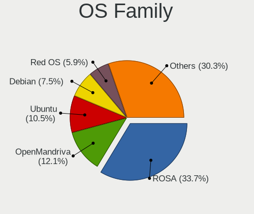
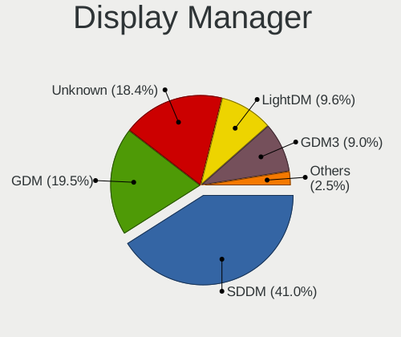
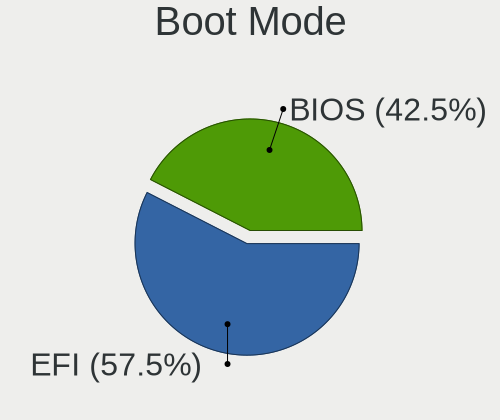
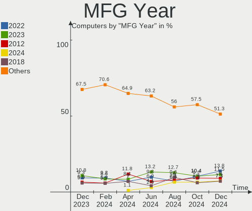
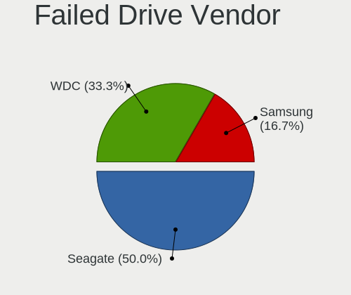
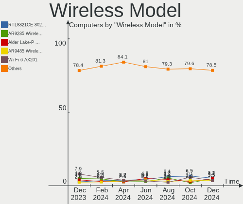

Linux in Russia - Hardware Trends
---------------------------------

A project to identify most popular hardware characteristics and track their change
over time based on data collected by Linux users at https://Linux-Hardware.org.

Anyone can contribute to this report by the [hw-probe](https://github.com/linuxhw/hw-probe) tool:

    sudo -E hw-probe -all -upload

This is a report for all computer types. See also reports for [desktops](/Location/Russia/Desktop/README.md) and [notebooks](/Location/Russia/Notebook/README.md).

Period: Dec, 2023.

Contents
--------

* [ System ](#system)
  - [ OS                       ](#os)
  - [ OS Family                ](#os-family)
  - [ Kernel                   ](#kernel)
  - [ Kernel Family            ](#kernel-family)
  - [ Kernel Major Ver.        ](#kernel-major-ver)
  - [ Arch                     ](#arch)
  - [ DE                       ](#de)
  - [ Display Server           ](#display-server)
  - [ Display Manager          ](#display-manager)
  - [ OS Lang                  ](#os-lang)
  - [ Boot Mode                ](#boot-mode)
  - [ Filesystem               ](#filesystem)
  - [ Part. scheme             ](#part-scheme)
  - [ Dual Boot with Linux/BSD ](#dual-boot-with-linuxbsd)
  - [ Dual Boot (Win)          ](#dual-boot-win)

* [ Board ](#board)
  - [ Vendor                   ](#vendor)
  - [ Model                    ](#model)
  - [ Model Family             ](#model-family)
  - [ MFG Year                 ](#mfg-year)
  - [ Form Factor              ](#form-factor)
  - [ Secure Boot              ](#secure-boot)
  - [ Coreboot                 ](#coreboot)
  - [ RAM Size                 ](#ram-size)
  - [ RAM Used                 ](#ram-used)
  - [ Total Drives             ](#total-drives)
  - [ Has CD-ROM               ](#has-cd-rom)
  - [ Has Ethernet             ](#has-ethernet)
  - [ Has WiFi                 ](#has-wifi)
  - [ Has Bluetooth            ](#has-bluetooth)

* [ Location ](#location)
  - [ Country                  ](#country)
  - [ City                     ](#city)

* [ Drives ](#drives)
  - [ Drive Vendor             ](#drive-vendor)
  - [ Drive Model              ](#drive-model)
  - [ HDD Vendor               ](#hdd-vendor)
  - [ SSD Vendor               ](#ssd-vendor)
  - [ Drive Kind               ](#drive-kind)
  - [ Drive Connector          ](#drive-connector)
  - [ Drive Size               ](#drive-size)
  - [ Space Total              ](#space-total)
  - [ Space Used               ](#space-used)
  - [ Malfunc. Drives          ](#malfunc-drives)
  - [ Malfunc. Drive Vendor    ](#malfunc-drive-vendor)
  - [ Malfunc. HDD Vendor      ](#malfunc-hdd-vendor)
  - [ Malfunc. Drive Kind      ](#malfunc-drive-kind)
  - [ Failed Drives            ](#failed-drives)
  - [ Failed Drive Vendor      ](#failed-drive-vendor)
  - [ Drive Status             ](#drive-status)

* [ Storage controller ](#storage-controller)
  - [ Storage Vendor           ](#storage-vendor)
  - [ Storage Model            ](#storage-model)
  - [ Storage Kind             ](#storage-kind)

* [ Processor ](#processor)
  - [ CPU Vendor               ](#cpu-vendor)
  - [ CPU Model                ](#cpu-model)
  - [ CPU Model Family         ](#cpu-model-family)
  - [ CPU Cores                ](#cpu-cores)
  - [ CPU Sockets              ](#cpu-sockets)
  - [ CPU Threads              ](#cpu-threads)
  - [ CPU Op-Modes             ](#cpu-op-modes)
  - [ CPU Microcode            ](#cpu-microcode)
  - [ CPU Microarch            ](#cpu-microarch)

* [ Graphics ](#graphics)
  - [ GPU Vendor               ](#gpu-vendor)
  - [ GPU Model                ](#gpu-model)
  - [ GPU Combo                ](#gpu-combo)
  - [ GPU Driver               ](#gpu-driver)
  - [ GPU Memory               ](#gpu-memory)

* [ Monitor ](#monitor)
  - [ Monitor Vendor           ](#monitor-vendor)
  - [ Monitor Model            ](#monitor-model)
  - [ Monitor Resolution       ](#monitor-resolution)
  - [ Monitor Diagonal         ](#monitor-diagonal)
  - [ Monitor Width            ](#monitor-width)
  - [ Aspect Ratio             ](#aspect-ratio)
  - [ Monitor Area             ](#monitor-area)
  - [ Pixel Density            ](#pixel-density)
  - [ Multiple Monitors        ](#multiple-monitors)

* [ Network ](#network)
  - [ Net Controller Vendor    ](#net-controller-vendor)
  - [ Net Controller Model     ](#net-controller-model)
  - [ Wireless Vendor          ](#wireless-vendor)
  - [ Wireless Model           ](#wireless-model)
  - [ Ethernet Vendor          ](#ethernet-vendor)
  - [ Ethernet Model           ](#ethernet-model)
  - [ Net Controller Kind      ](#net-controller-kind)
  - [ Used Controller          ](#used-controller)
  - [ NICs                     ](#nics)
  - [ IPv6                     ](#ipv6)

* [ Bluetooth ](#bluetooth)
  - [ Bluetooth Vendor         ](#bluetooth-vendor)
  - [ Bluetooth Model          ](#bluetooth-model)

* [ Sound ](#sound)
  - [ Sound Vendor             ](#sound-vendor)
  - [ Sound Model              ](#sound-model)

* [ Memory ](#memory)
  - [ Memory Vendor            ](#memory-vendor)
  - [ Memory Model             ](#memory-model)
  - [ Memory Kind              ](#memory-kind)
  - [ Memory Form Factor       ](#memory-form-factor)
  - [ Memory Size              ](#memory-size)
  - [ Memory Speed             ](#memory-speed)

* [ Printers & scanners ](#printers--scanners)
  - [ Printer Vendor           ](#printer-vendor)
  - [ Printer Model            ](#printer-model)
  - [ Scanner Vendor           ](#scanner-vendor)
  - [ Scanner Model            ](#scanner-model)

* [ Camera ](#camera)
  - [ Camera Vendor            ](#camera-vendor)
  - [ Camera Model             ](#camera-model)

* [ Security ](#security)
  - [ Fingerprint Vendor       ](#fingerprint-vendor)
  - [ Fingerprint Model        ](#fingerprint-model)
  - [ Chipcard Vendor          ](#chipcard-vendor)
  - [ Chipcard Model           ](#chipcard-model)

* [ Unsupported ](#unsupported)
  - [ Unsupported Devices      ](#unsupported-devices)
  - [ Unsupported Device Types ](#unsupported-device-types)

System
------

OS
--

Installed operating systems

| Name                   | Computers | Percent |
|------------------------|-----------|---------|
| ROSA 12.4              | 136       | 29.5%   |
| Ubuntu 22.04           | 49        | 10.63%  |
| Debian 12              | 28        | 6.07%   |
| Arch Rolling           | 21        | 4.56%   |
| OpenMandriva 5.0       | 19        | 4.12%   |
| Fedora 39              | 17        | 3.69%   |
| Linux Mint 21.2        | 15        | 3.25%   |
| ROSA 12                | 14        | 3.04%   |
| Ubuntu 23.10           | 13        | 2.82%   |
| Red OS 7.3             | 13        | 2.82%   |
| OpenMandriva 23.08     | 10        | 2.17%   |
| Manjaro                | 7         | 1.52%   |
| SteamOS 3.5.7          | 6         | 1.3%    |
| ROSA R11.1             | 6         | 1.3%    |
| Pop!_OS 22.04          | 6         | 1.3%    |
| ALT Linux 10.2         | 6         | 1.3%    |
| Debian 11              | 5         | 1.08%   |
| ALT Linux 10.1         | 5         | 1.08%   |
| OpenMandriva 23.11     | 4         | 0.87%   |
| Kubuntu 22.04          | 4         | 0.87%   |
| Xubuntu 20.04          | 3         | 0.65%   |
| ArcoLinux Rolling      | 3         | 0.65%   |
| Xero Rolling           | 2         | 0.43%   |
| ROSA 13.0              | 2         | 0.43%   |
| ROSA 12.2              | 2         | 0.43%   |
| OpenMandriva 4.2       | 2         | 0.43%   |
| OpenMandriva 23.90     | 2         | 0.43%   |
| Nobara 38              | 2         | 0.43%   |
| Manjaro 23.1.1         | 2         | 0.43%   |
| LMDE 6                 | 2         | 0.43%   |
| Linux Mint 20.3        | 2         | 0.43%   |
| Kubuntu 23.10          | 2         | 0.43%   |
| Fedora 38              | 2         | 0.43%   |
| EndeavourOS Rolling    | 2         | 0.43%   |
| Debian 10              | 2         | 0.43%   |
| Astra Linux 1.7_x86-64 | 2         | 0.43%   |
| Zorin 17               | 1         | 0.22%   |
| Zorin 16               | 1         | 0.22%   |
| Xubuntu 18.04          | 1         | 0.22%   |
| Void Linux Rolling     | 1         | 0.22%   |

OS Family
---------

OS without a version

| Name             | Computers | Percent |
|------------------|-----------|---------|
| ROSA             | 165       | 35.79%  |
| Ubuntu           | 65        | 14.1%   |
| OpenMandriva     | 38        | 8.24%   |
| Debian           | 35        | 7.59%   |
| Fedora           | 21        | 4.56%   |
| Arch             | 21        | 4.56%   |
| Linux Mint       | 17        | 3.69%   |
| Red OS           | 13        | 2.82%   |
| ALT Linux        | 13        | 2.82%   |
| SteamOS          | 10        | 2.17%   |
| Manjaro          | 10        | 2.17%   |
| Pop!_OS          | 7         | 1.52%   |
| Kubuntu          | 7         | 1.52%   |
| Xubuntu          | 4         | 0.87%   |
| ArcoLinux        | 3         | 0.65%   |
| Zorin            | 2         | 0.43%   |
| Xero             | 2         | 0.43%   |
| Nobara           | 2         | 0.43%   |
| MX               | 2         | 0.43%   |
| LMDE             | 2         | 0.43%   |
| EndeavourOS      | 2         | 0.43%   |
| Astra Linux      | 2         | 0.43%   |
| Void Linux       | 1         | 0.22%   |
| Ubuntu Unity     | 1         | 0.22%   |
| Sparky           | 1         | 0.22%   |
| Rocky Linux      | 1         | 0.22%   |
| Q4OS             | 1         | 0.22%   |
| PureOS           | 1         | 0.22%   |
| PostmarketOS     | 1         | 0.22%   |
| org.kde.Platform | 1         | 0.22%   |
| openSUSE         | 1         | 0.22%   |
| NixOS            | 1         | 0.22%   |
| Neptune OS       | 1         | 0.22%   |
| KDE neon         | 1         | 0.22%   |
| Kali             | 1         | 0.22%   |
| Guix             | 1         | 0.22%   |
| Elementary       | 1         | 0.22%   |
| Devuan           | 1         | 0.22%   |
| ChimeraOS        | 1         | 0.22%   |
| AlmaLinux        | 1         | 0.22%   |

Kernel
------

Version of the Linux kernel

| Version                             | Computers | Percent |
|-------------------------------------|-----------|---------|
| 6.1.58-generic-1rosa2021.1-x86_64   | 86        | 18.66%  |
| 6.1.20-generic-2rosa2021.1-x86_64   | 36        | 7.81%   |
| 5.19.0-38-generic                   | 23        | 4.99%   |
| 6.6.2-desktop-1omv2390              | 22        | 4.77%   |
| 6.2.0-39-generic                    | 19        | 4.12%   |
| 6.2.0-37-generic                    | 14        | 3.04%   |
| 5.15.0-91-generic                   | 12        | 2.6%    |
| 5.10.184-generic-1rosa2021.1-x86_64 | 11        | 2.39%   |
| 6.5.0-14-generic                    | 10        | 2.17%   |
| 6.1.52-1.el7.3.x86_64               | 9         | 1.95%   |
| 5.15.127-generic-1rosa2021.1-x86_64 | 8         | 1.74%   |
| 6.4.11-desktop-1omv2390             | 7         | 1.52%   |
| 6.1.0-16-amd64                      | 7         | 1.52%   |
| 6.1.52-valve9-1-neptune-61          | 6         | 1.3%    |
| 6.1.0-4-amd64                       | 6         | 1.3%    |
| 6.6.8-2-MANJARO                     | 5         | 1.08%   |
| 6.6.6-76060606-generic              | 5         | 1.08%   |
| 5.15.0-89-generic                   | 5         | 1.08%   |
| 6.6.8-arch1-1                       | 4         | 0.87%   |
| 6.6.7-arch1-1                       | 4         | 0.87%   |
| 6.6.4-200.fc39.x86_64               | 4         | 0.87%   |
| 6.5.0-13-generic                    | 4         | 0.87%   |
| 6.4.8-desktop-2omv2390              | 4         | 0.87%   |
| 6.6.7-zen1-1-zen                    | 3         | 0.65%   |
| 6.6.6-200.fc39.x86_64               | 3         | 0.65%   |
| 6.6.2-201.fc39.x86_64               | 3         | 0.65%   |
| 6.5.11-6-pve                        | 3         | 0.65%   |
| 6.5.11-4-pve                        | 3         | 0.65%   |
| 6.1.0-15-amd64                      | 3         | 0.65%   |
| 6.1.0-13-amd64                      | 3         | 0.65%   |
| 5.15.131-1.el7.3.x86_64             | 3         | 0.65%   |
| 5.10.74-generic-2rosa2021.1-x86_64  | 3         | 0.65%   |
| 5.10.198-std-def-alt1               | 3         | 0.65%   |
| 4.15.0-desktop-122.124.1rosa-i586   | 3         | 0.65%   |
| 6.6.8-200.fc39.x86_64               | 2         | 0.43%   |
| 6.6.5-zen1-1-zen                    | 2         | 0.43%   |
| 6.6.4-arch1-1                       | 2         | 0.43%   |
| 6.6.3-zen1-1-zen                    | 2         | 0.43%   |
| 6.6.3-arch1-1                       | 2         | 0.43%   |
| 6.5.6-300.fc39.x86_64               | 2         | 0.43%   |

Kernel Family
-------------

Linux kernel without a distro release

| Version  | Computers | Percent |
|----------|-----------|---------|
| 6.1.58   | 90        | 19.52%  |
| 6.1.20   | 36        | 7.81%   |
| 6.2.0    | 35        | 7.59%   |
| 6.6.2    | 28        | 6.07%   |
| 6.1.0    | 24        | 5.21%   |
| 5.19.0   | 23        | 4.99%   |
| 5.15.0   | 21        | 4.56%   |
| 6.5.0    | 18        | 3.9%    |
| 6.1.52   | 15        | 3.25%   |
| 6.6.8    | 14        | 3.04%   |
| 5.10.184 | 11        | 2.39%   |
| 6.6.7    | 10        | 2.17%   |
| 6.6.3    | 9         | 1.95%   |
| 5.15.127 | 9         | 1.95%   |
| 6.6.6    | 8         | 1.74%   |
| 6.4.11   | 8         | 1.74%   |
| 6.6.4    | 7         | 1.52%   |
| 6.5.11   | 6         | 1.3%    |
| 4.15.0   | 6         | 1.3%    |
| 6.6.5    | 4         | 0.87%   |
| 6.5.6    | 4         | 0.87%   |
| 6.4.8    | 4         | 0.87%   |
| 5.4.0    | 4         | 0.87%   |
| 5.10.74  | 4         | 0.87%   |
| 5.10.198 | 4         | 0.87%   |
| 6.1.69   | 3         | 0.65%   |
| 5.15.131 | 3         | 0.65%   |
| 6.3.7    | 2         | 0.43%   |
| 6.2.16   | 2         | 0.43%   |
| 6.1.67   | 2         | 0.43%   |
| 6.1.46   | 2         | 0.43%   |
| 6.1.38   | 2         | 0.43%   |
| 5.13.0   | 2         | 0.43%   |
| 5.10.164 | 2         | 0.43%   |
| 5.10.14  | 2         | 0.43%   |
| 5.10.0   | 2         | 0.43%   |
| 6.7.0    | 1         | 0.22%   |
| 6.6.0    | 1         | 0.22%   |
| 6.5.3    | 1         | 0.22%   |
| 6.5.13   | 1         | 0.22%   |

Kernel Major Ver.
-----------------

Linux kernel major version

| Version | Computers | Percent |
|---------|-----------|---------|
| 6.1     | 182       | 39.48%  |
| 6.6     | 81        | 17.57%  |
| 6.2     | 39        | 8.46%   |
| 5.15    | 37        | 8.03%   |
| 6.5     | 31        | 6.72%   |
| 5.10    | 29        | 6.29%   |
| 5.19    | 23        | 4.99%   |
| 6.4     | 13        | 2.82%   |
| 5.4     | 6         | 1.3%    |
| 4.15    | 6         | 1.3%    |
| 6.3     | 3         | 0.65%   |
| 5.17    | 2         | 0.43%   |
| 5.14    | 2         | 0.43%   |
| 5.13    | 2         | 0.43%   |
| 6.7     | 1         | 0.22%   |
| 6.0     | 1         | 0.22%   |
| 5.6     | 1         | 0.22%   |
| 5.11    | 1         | 0.22%   |
| 4.18    | 1         | 0.22%   |

Arch
----

OS architecture (x86_64, i586, etc.)

| Name    | Computers | Percent |
|---------|-----------|---------|
| x86_64  | 448       | 97.18%  |
| i686    | 8         | 1.74%   |
| aarch64 | 4         | 0.87%   |
| armv7l  | 1         | 0.22%   |

DE
--

Desktop Environment

| Name            | Computers | Percent |
|-----------------|-----------|---------|
| KDE5            | 184       | 39.91%  |
| GNOME           | 128       | 27.77%  |
| Unknown         | 51        | 11.06%  |
| XFCE            | 24        | 5.21%   |
| LXQt            | 19        | 4.12%   |
| MATE            | 18        | 3.9%    |
| X-Cinnamon      | 11        | 2.39%   |
| KDE4            | 6         | 1.3%    |
| i3              | 6         | 1.3%    |
| Cinnamon        | 5         | 1.08%   |
| fly             | 2         | 0.43%   |
| Unity           | 1         | 0.22%   |
| Pantheon        | 1         | 0.22%   |
| KDE6            | 1         | 0.22%   |
| Hyprland        | 1         | 0.22%   |
| GNOME Flashback | 1         | 0.22%   |
| GNOME Classic   | 1         | 0.22%   |
| awesome         | 1         | 0.22%   |

Display Server
--------------

X11 or Wayland

| Name    | Computers | Percent |
|---------|-----------|---------|
| Wayland | 222       | 48.16%  |
| X11     | 177       | 38.39%  |
| Unknown | 38        | 8.24%   |
| Tty     | 24        | 5.21%   |

Display Manager
---------------

SDDM, LightDM, etc.

| Name    | Computers | Percent |
|---------|-----------|---------|
| SDDM    | 169       | 36.66%  |
| Unknown | 113       | 24.51%  |
| GDM     | 74        | 16.05%  |
| GDM3    | 50        | 10.85%  |
| LightDM | 45        | 9.76%   |
| KDM     | 6         | 1.3%    |
| XDM     | 1         | 0.22%   |
| SLiM    | 1         | 0.22%   |
| LY-DM   | 1         | 0.22%   |
| FLY-DM  | 1         | 0.22%   |

OS Lang
-------

Language

| Lang    | Computers | Percent |
|---------|-----------|---------|
| ru_RU   | 338       | 73.32%  |
| en_US   | 91        | 19.74%  |
| C       | 29        | 6.29%   |
| POSIX   | 1         | 0.22%   |
| en_GB   | 1         | 0.22%   |
| Unknown | 1         | 0.22%   |

Boot Mode
---------

EFI or BIOS

| Mode | Computers | Percent |
|------|-----------|---------|
| EFI  | 243       | 52.71%  |
| BIOS | 218       | 47.29%  |

Filesystem
----------

Type of filesystem

| Type     | Computers | Percent |
|----------|-----------|---------|
| Ext4     | 295       | 63.99%  |
| Btrfs    | 67        | 14.53%  |
| Overlay  | 57        | 12.36%  |
| Tmpfs    | 26        | 5.64%   |
| Zfs      | 9         | 1.95%   |
| F2fs     | 4         | 0.87%   |
| Ext3     | 1         | 0.22%   |
| Bcachefs | 1         | 0.22%   |
| Unknown  | 1         | 0.22%   |

Part. scheme
------------

Scheme of partitioning

| Type    | Computers | Percent |
|---------|-----------|---------|
| GPT     | 264       | 57.27%  |
| MBR     | 113       | 24.51%  |
| Unknown | 84        | 18.22%  |

Dual Boot with Linux/BSD
------------------------

Hosting more than one Linux/BSD

| Dual boot | Computers | Percent |
|-----------|-----------|---------|
| No        | 362       | 78.52%  |
| Yes       | 99        | 21.48%  |

Dual Boot (Win)
---------------

Hosting Linux and Windows

| Dual boot | Computers | Percent |
|-----------|-----------|---------|
| No        | 297       | 64.43%  |
| Yes       | 164       | 35.57%  |

Board
-----

Vendor
------

Motherboard manufacturer

| Name                 | Computers | Percent |
|----------------------|-----------|---------|
| ASUSTek Computer     | 101       | 21.91%  |
| Lenovo               | 47        | 10.2%   |
| Gigabyte Technology  | 44        | 9.54%   |
| MSI                  | 36        | 7.81%   |
| Hewlett-Packard      | 28        | 6.07%   |
| Supermicro           | 25        | 5.42%   |
| Acer                 | 19        | 4.12%   |
| Dell                 | 18        | 3.9%    |
| HUAWEI               | 16        | 3.47%   |
| ASRock               | 14        | 3.04%   |
| Intel                | 11        | 2.39%   |
| Unknown              | 10        | 2.17%   |
| Valve                | 8         | 1.74%   |
| Toshiba              | 5         | 1.08%   |
| Irbis                | 5         | 1.08%   |
| Clevo                | 5         | 1.08%   |
| Apple                | 5         | 1.08%   |
| AZW                  | 4         | 0.87%   |
| Timi                 | 3         | 0.65%   |
| Sony                 | 3         | 0.65%   |
| Samsung Electronics  | 3         | 0.65%   |
| iRU                  | 3         | 0.65%   |
| Huanan               | 3         | 0.65%   |
| Biostar              | 3         | 0.65%   |
| Maibenben            | 2         | 0.43%   |
| ICL                  | 2         | 0.43%   |
| eMachines            | 2         | 0.43%   |
| DEXP                 | 2         | 0.43%   |
| ARDOR GAMING         | 2         | 0.43%   |
| XIAOMI               | 1         | 0.22%   |
| THTF                 | 1         | 0.22%   |
| TECNO Mobile Limited | 1         | 0.22%   |
| SZMZ                 | 1         | 0.22%   |
| ROMBICA              | 1         | 0.22%   |
| Rockchip             | 1         | 0.22%   |
| realme               | 1         | 0.22%   |
| Packard Bell         | 1         | 0.22%   |
| OEM                  | 1         | 0.22%   |
| Notebook             | 1         | 0.22%   |
| MouseComputer        | 1         | 0.22%   |

Model
-----

Motherboard model

| Name                                     | Computers | Percent |
|------------------------------------------|-----------|---------|
| Unknown                                  | 11        | 2.39%   |
| Valve Jupiter                            | 8         | 1.74%   |
| Supermicro X8DTU                         | 7         | 1.52%   |
| ASUS All Series                          | 6         | 1.3%    |
| Clevo NL41MU2                            | 5         | 1.08%   |
| Supermicro X9DRW                         | 4         | 0.87%   |
| Supermicro SYS-1028R-TDW                 | 4         | 0.87%   |
| MSI MS-7C56                              | 3         | 0.65%   |
| HUAWEI BOD-WXX9                          | 3         | 0.65%   |
| Supermicro X8DTT                         | 2         | 0.43%   |
| Supermicro SYS-6018R-MTR                 | 2         | 0.43%   |
| MSI MS-7D22                              | 2         | 0.43%   |
| MSI MS-7C52                              | 2         | 0.43%   |
| Lenovo IdeaPad S145-15API 81UT           | 2         | 0.43%   |
| Lenovo IdeaPad L340-15API 81LW           | 2         | 0.43%   |
| Intel X99                                | 2         | 0.43%   |
| ICL RAY Si105.Mi                         | 2         | 0.43%   |
| HUAWEI NBD-WXX9                          | 2         | 0.43%   |
| HUAWEI KLVL-WXXW                         | 2         | 0.43%   |
| HUAWEI BoDE-WXX9                         | 2         | 0.43%   |
| HP 250 G8 Notebook PC                    | 2         | 0.43%   |
| Gigabyte B450M DS3H                      | 2         | 0.43%   |
| Gigabyte A320M-H                         | 2         | 0.43%   |
| Gigabyte 970A-DS3P                       | 2         | 0.43%   |
| AZW MINI S                               | 2         | 0.43%   |
| ASUS X550CC                              | 2         | 0.43%   |
| ASUS VivoBook_ASUSLaptop M1603QA_M1603QA | 2         | 0.43%   |
| ASUS TUF Gaming B550M-PLUS               | 2         | 0.43%   |
| ASUS PRIME B360M-K                       | 2         | 0.43%   |
| ASUS PRIME A320M-K                       | 2         | 0.43%   |
| ASUS P8H61-M LX3 R2.0                    | 2         | 0.43%   |
| ASUS P8H61-M LX R2.0                     | 2         | 0.43%   |
| ASUS P8H61-M LX                          | 2         | 0.43%   |
| XIAOMI Redmi Book Pro 15 2023            | 1         | 0.22%   |
| Toshiba T20                              | 1         | 0.22%   |
| Toshiba Satellite U300                   | 1         | 0.22%   |
| Toshiba Satellite Pro C660               | 1         | 0.22%   |
| Toshiba Satellite C660                   | 1         | 0.22%   |
| Toshiba Satellite A200                   | 1         | 0.22%   |
| Timi TM1701                              | 1         | 0.22%   |

Model Family
------------

Motherboard model prefix

| Name                     | Computers | Percent |
|--------------------------|-----------|---------|
| Acer Aspire              | 14        | 3.04%   |
| Lenovo ThinkPad          | 13        | 2.82%   |
| Lenovo IdeaPad           | 12        | 2.6%    |
| ASUS PRIME               | 12        | 2.6%    |
| Unknown                  | 11        | 2.39%   |
| ASUS VivoBook            | 10        | 2.17%   |
| Valve Jupiter            | 8         | 1.74%   |
| Dell Inspiron            | 8         | 1.74%   |
| Supermicro X8DTU         | 7         | 1.52%   |
| HP Pavilion              | 7         | 1.52%   |
| ASUS ROG                 | 6         | 1.3%    |
| ASUS P8H61-M             | 6         | 1.3%    |
| ASUS All                 | 6         | 1.3%    |
| HP ProBook               | 5         | 1.08%   |
| Clevo NL41MU2            | 5         | 1.08%   |
| ASUS TUF                 | 5         | 1.08%   |
| Toshiba Satellite        | 4         | 0.87%   |
| Supermicro X9DRW         | 4         | 0.87%   |
| Supermicro SYS-1028R-TDW | 4         | 0.87%   |
| Lenovo V15               | 4         | 0.87%   |
| Lenovo ThinkCentre       | 4         | 0.87%   |
| MSI MS-7C56              | 3         | 0.65%   |
| HUAWEI BOD-WXX9          | 3         | 0.65%   |
| Gigabyte B450M           | 3         | 0.65%   |
| Dell Vostro              | 3         | 0.65%   |
| Dell Latitude            | 3         | 0.65%   |
| ASUS Zenbook             | 3         | 0.65%   |
| Supermicro X8DTT         | 2         | 0.43%   |
| Supermicro SYS-6018R-MTR | 2         | 0.43%   |
| MSI MS-7D22              | 2         | 0.43%   |
| MSI MS-7C52              | 2         | 0.43%   |
| MSI Modern               | 2         | 0.43%   |
| Maibenben MaiBook        | 2         | 0.43%   |
| Lenovo ThinkBook         | 2         | 0.43%   |
| Lenovo B590              | 2         | 0.43%   |
| Intel X99                | 2         | 0.43%   |
| ICL RAY                  | 2         | 0.43%   |
| HUAWEI NBD-WXX9          | 2         | 0.43%   |
| HUAWEI KLVL-WXXW         | 2         | 0.43%   |
| HUAWEI BoDE-WXX9         | 2         | 0.43%   |

MFG Year
--------

Motherboard manufacture year

| Year    | Computers | Percent |
|---------|-----------|---------|
| 2023    | 51        | 11.06%  |
| 2021    | 47        | 10.2%   |
| 2022    | 43        | 9.33%   |
| 2020    | 37        | 8.03%   |
| 2013    | 32        | 6.94%   |
| 2012    | 30        | 6.51%   |
| 2019    | 29        | 6.29%   |
| 2018    | 29        | 6.29%   |
| 2011    | 26        | 5.64%   |
| 2010    | 25        | 5.42%   |
| 2009    | 25        | 5.42%   |
| 2017    | 18        | 3.9%    |
| 2007    | 16        | 3.47%   |
| 2016    | 15        | 3.25%   |
| 2015    | 14        | 3.04%   |
| 2014    | 10        | 2.17%   |
| 2008    | 4         | 0.87%   |
| 2006    | 4         | 0.87%   |
| Unknown | 4         | 0.87%   |
| 2005    | 2         | 0.43%   |

Form Factor
-----------

Physical design of the computer

| Name           | Computers | Percent |
|----------------|-----------|---------|
| Notebook       | 232       | 50.33%  |
| Desktop        | 189       | 41%     |
| Server         | 19        | 4.12%   |
| Mini pc        | 7         | 1.52%   |
| All in one     | 7         | 1.52%   |
| System on chip | 4         | 0.87%   |
| Convertible    | 3         | 0.65%   |

Secure Boot
-----------

Enabled or disabled

| State    | Computers | Percent |
|----------|-----------|---------|
| Disabled | 442       | 95.88%  |
| Enabled  | 19        | 4.12%   |

Coreboot
--------

Have coreboot on board

| Used | Computers | Percent |
|------|-----------|---------|
| No   | 461       | 100%    |

RAM Size
--------

Total RAM memory

| Size in GB      | Computers | Percent |
|-----------------|-----------|---------|
| 4.01-8.0        | 106       | 22.99%  |
| 16.01-24.0      | 96        | 20.82%  |
| 8.01-16.0       | 87        | 18.87%  |
| 3.01-4.0        | 60        | 13.02%  |
| 32.01-64.0      | 42        | 9.11%   |
| 64.01-256.0     | 23        | 4.99%   |
| 1.01-2.0        | 18        | 3.9%    |
| 24.01-32.0      | 11        | 2.39%   |
| 2.01-3.0        | 11        | 2.39%   |
| More than 256.0 | 4         | 0.87%   |
| 0.51-1.0        | 2         | 0.43%   |
| 0.01-0.5        | 1         | 0.22%   |

RAM Used
--------

Used RAM memory

| Used GB     | Computers | Percent |
|-------------|-----------|---------|
| 1.01-2.0    | 178       | 38.61%  |
| 2.01-3.0    | 104       | 22.56%  |
| 4.01-8.0    | 65        | 14.1%   |
| 3.01-4.0    | 48        | 10.41%  |
| 0.51-1.0    | 38        | 8.24%   |
| 8.01-16.0   | 15        | 3.25%   |
| 0.01-0.5    | 6         | 1.3%    |
| 24.01-32.0  | 3         | 0.65%   |
| 16.01-24.0  | 2         | 0.43%   |
| 32.01-64.0  | 1         | 0.22%   |
| 64.01-256.0 | 1         | 0.22%   |

Total Drives
------------

Number of drives on board

| Drives | Computers | Percent |
|--------|-----------|---------|
| 1      | 270       | 58.57%  |
| 2      | 103       | 22.34%  |
| 3      | 39        | 8.46%   |
| 4      | 27        | 5.86%   |
| 5      | 10        | 2.17%   |
| 7      | 3         | 0.65%   |
| 6      | 3         | 0.65%   |
| 0      | 3         | 0.65%   |
| 10     | 2         | 0.43%   |
| 8      | 1         | 0.22%   |

Has CD-ROM
----------

Has CD-ROM on board

| Presented | Computers | Percent |
|-----------|-----------|---------|
| No        | 350       | 75.92%  |
| Yes       | 111       | 24.08%  |

Has Ethernet
------------

Has Ethernet on board

| Presented | Computers | Percent |
|-----------|-----------|---------|
| Yes       | 376       | 81.56%  |
| No        | 85        | 18.44%  |

Has WiFi
--------

Has WiFi module

| Presented | Computers | Percent |
|-----------|-----------|---------|
| Yes       | 300       | 65.08%  |
| No        | 161       | 34.92%  |

Has Bluetooth
-------------

Has Bluetooth module

| Presented | Computers | Percent |
|-----------|-----------|---------|
| Yes       | 265       | 57.48%  |
| No        | 196       | 42.52%  |

Location
--------

Country
-------

Geographic location (country)

| Country | Computers | Percent |
|---------|-----------|---------|
| Russia  | 461       | 100%    |

City
----

Geographic location (city)

| City              | Computers | Percent |
|-------------------|-----------|---------|
| Moscow            | 131       | 28.42%  |
| St Petersburg     | 40        | 8.68%   |
| Yekaterinburg     | 15        | 3.25%   |
| Voronezh          | 11        | 2.39%   |
| Novosibirsk       | 11        | 2.39%   |
| Krasnodar         | 10        | 2.17%   |
| Samara            | 9         | 1.95%   |
| Perm              | 9         | 1.95%   |
| Surgut            | 7         | 1.52%   |
| Volgograd         | 6         | 1.3%    |
| Tyumen            | 6         | 1.3%    |
| Chelyabinsk       | 6         | 1.3%    |
| Vladivostok       | 4         | 0.87%   |
| Stavropol         | 4         | 0.87%   |
| Sochi             | 4         | 0.87%   |
| Saratov           | 4         | 0.87%   |
| Nizhniy Novgorod  | 4         | 0.87%   |
| Lipetsk           | 4         | 0.87%   |
| Kirov             | 4         | 0.87%   |
| Kazan’          | 4         | 0.87%   |
| Kaliningrad       | 4         | 0.87%   |
| Yuzhno-Sakhalinsk | 3         | 0.65%   |
| Yakutsk           | 3         | 0.65%   |
| Ufa               | 3         | 0.65%   |
| Tver              | 3         | 0.65%   |
| Tula              | 3         | 0.65%   |
| Tambov            | 3         | 0.65%   |
| Smolensk          | 3         | 0.65%   |
| Shchelkovo        | 3         | 0.65%   |
| Sergiyev Posad    | 3         | 0.65%   |
| Orenburg          | 3         | 0.65%   |
| Omsk              | 3         | 0.65%   |
| Cheboksary        | 3         | 0.65%   |
| Bryansk           | 3         | 0.65%   |
| Balashikha        | 3         | 0.65%   |
| Rostov-on-Don     | 2         | 0.43%   |
| Ramenskoye        | 2         | 0.43%   |
| Penza             | 2         | 0.43%   |
| Ozersk            | 2         | 0.43%   |
| Oryol             | 2         | 0.43%   |

Drives
------

Drive Vendor
------------

Hard drive vendors

| Vendor                      | Computers | Drives | Percent |
|-----------------------------|-----------|--------|---------|
| WDC                         | 105       | 148    | 14.94%  |
| Seagate                     | 76        | 95     | 10.81%  |
| Samsung Electronics         | 69        | 79     | 9.82%   |
| Toshiba                     | 43        | 52     | 6.12%   |
| Kingston                    | 36        | 40     | 5.12%   |
| SanDisk                     | 26        | 26     | 3.7%    |
| Unknown                     | 25        | 27     | 3.56%   |
| Intel                       | 23        | 41     | 3.27%   |
| A-DATA Technology           | 22        | 22     | 3.13%   |
| Hitachi                     | 17        | 19     | 2.42%   |
| Micron Technology           | 15        | 15     | 2.13%   |
| HGST                        | 15        | 23     | 2.13%   |
| China                       | 14        | 14     | 1.99%   |
| Silicon Motion              | 13        | 13     | 1.85%   |
| Crucial                     | 13        | 13     | 1.85%   |
| SK hynix                    | 12        | 13     | 1.71%   |
| Apacer                      | 11        | 11     | 1.56%   |
| Phison Electronics          | 10        | 11     | 1.42%   |
| Patriot                     | 10        | 10     | 1.42%   |
| MAXIO Technology (Hangzhou) | 9         | 9      | 1.28%   |
| Fujitsu                     | 9         | 10     | 1.28%   |
| AMD                         | 9         | 10     | 1.28%   |
| Netac                       | 7         | 7      | 1%      |
| BIWIN                       | 6         | 6      | 0.85%   |
| ADATA Technology            | 6         | 7      | 0.85%   |
| XrayDisk                    | 5         | 5      | 0.71%   |
| SPCC                        | 5         | 5      | 0.71%   |
| Phison                      | 5         | 5      | 0.71%   |
| KingSpec                    | 5         | 5      | 0.71%   |
| Unknown                     | 5         | 5      | 0.71%   |
| Team                        | 4         | 4      | 0.57%   |
| XPG                         | 3         | 3      | 0.43%   |
| Transcend                   | 3         | 3      | 0.43%   |
| Smartbuy                    | 3         | 3      | 0.43%   |
| KIOXIA                      | 3         | 3      | 0.43%   |
| Kingston Technology Company | 3         | 3      | 0.43%   |
| Hewlett-Packard             | 3         | 4      | 0.43%   |
| Apple                       | 3         | 3      | 0.43%   |
| WALRAM                      | 2         | 2      | 0.28%   |
| Plextor                     | 2         | 2      | 0.28%   |

Drive Model
-----------

Hard drive models

| Model                                                 | Computers | Percent |
|-------------------------------------------------------|-----------|---------|
| Kingston SA400S37240G 240GB SSD                       | 10        | 1.3%    |
| Seagate ST500DM002-1BD142 500GB                       | 7         | 0.91%   |
| Toshiba MQ01ABF050 500GB                              | 6         | 0.78%   |
| MAXIO (Hangzhou) NVMe SSD Controller MAP1202 256GB    | 6         | 0.78%   |
| Toshiba HDWD110 1TB                                   | 5         | 0.65%   |
| Seagate ST1000DM010-2EP102 1TB                        | 5         | 0.65%   |
| Intel SSDSC2BB800G7 800GB                             | 5         | 0.65%   |
| Intel SSDPEKNU512GZ 512GB                             | 5         | 0.65%   |
| BIWIN CE480T5D101-256 256GB                           | 5         | 0.65%   |
| Unknown                                               | 5         | 0.65%   |
| WDC WDS120G2G0A-00JH30 120GB SSD                      | 4         | 0.52%   |
| Silicon Motion SM2263EN/SM2263XT SSD Controller 500GB | 4         | 0.52%   |
| Seagate ST9500325AS 500GB                             | 4         | 0.52%   |
| Samsung SSD 860 EVO 250GB                             | 4         | 0.52%   |
| Samsung NVMe SSD Controller SM981/PM981/PM983 512GB   | 4         | 0.52%   |
| Phison PS5013 E13 NVMe Controller 512GB               | 4         | 0.52%   |
| Phison E12 NVMe Controller 1TB                        | 4         | 0.52%   |
| Kingston SA400S37480G 480GB SSD                       | 4         | 0.52%   |
| Intel SSDSC2BB480G7 480GB                             | 4         | 0.52%   |
| HGST HTE721010A9E630 1TB                              | 4         | 0.52%   |
| Fujitsu MBA3147RC 147GB                               | 4         | 0.52%   |
| Crucial CT480BX500SSD1 480GB                          | 4         | 0.52%   |
| China SSD 128GB                                       | 4         | 0.52%   |
| A-DATA SU650 240GB SSD                                | 4         | 0.52%   |
| WDC WDS240G2G0A-00JH30 240GB SSD                      | 3         | 0.39%   |
| WDC WD5000AAKX-001CA0 500GB                           | 3         | 0.39%   |
| WDC WD20EZBX-00AYRA0 2TB                              | 3         | 0.39%   |
| WDC WD20EFRX-68EUZN0 2TB                              | 3         | 0.39%   |
| WDC WD10SPZX-21Z10T0 1TB                              | 3         | 0.39%   |
| Unknown NVMe SSD Drive 512GB                          | 3         | 0.39%   |
| Toshiba MQ01ABD032 320GB                              | 3         | 0.39%   |
| Toshiba HDWD130 3TB                                   | 3         | 0.39%   |
| Toshiba HDWD105 500GB                                 | 3         | 0.39%   |
| Toshiba DT01ACA100 1TB                                | 3         | 0.39%   |
| Toshiba DT01ACA050 500GB                              | 3         | 0.39%   |
| SK hynix HFM512GD3JX013N 512GB                        | 3         | 0.39%   |
| Silicon Motion PCIe-4 SSD 256GB                       | 3         | 0.39%   |
| Seagate ST500LT012-1DG142 500GB                       | 3         | 0.39%   |
| Seagate ST380815AS 80GB                               | 3         | 0.39%   |
| Seagate ST1000LM035-1RK172 1TB                        | 3         | 0.39%   |

HDD Vendor
----------

Hard disk drive vendors

| Vendor              | Computers | Drives | Percent |
|---------------------|-----------|--------|---------|
| WDC                 | 90        | 126    | 34.62%  |
| Seagate             | 75        | 94     | 28.85%  |
| Toshiba             | 42        | 51     | 16.15%  |
| Hitachi             | 17        | 19     | 6.54%   |
| HGST                | 15        | 23     | 5.77%   |
| Fujitsu             | 9         | 10     | 3.46%   |
| Samsung Electronics | 6         | 7      | 2.31%   |
| Maxtor              | 2         | 2      | 0.77%   |
| Unknown             | 1         | 1      | 0.38%   |
| Hewlett-Packard     | 1         | 2      | 0.38%   |
| External            | 1         | 1      | 0.38%   |
| ASMT                | 1         | 1      | 0.38%   |

SSD Vendor
----------

Solid state drive vendors

| Vendor              | Computers | Drives | Percent |
|---------------------|-----------|--------|---------|
| Kingston            | 27        | 31     | 12.39%  |
| Samsung Electronics | 24        | 26     | 11.01%  |
| WDC                 | 15        | 16     | 6.88%   |
| China               | 14        | 14     | 6.42%   |
| Crucial             | 13        | 13     | 5.96%   |
| Intel               | 12        | 29     | 5.5%    |
| A-DATA Technology   | 12        | 12     | 5.5%    |
| Apacer              | 10        | 10     | 4.59%   |
| Patriot             | 9         | 9      | 4.13%   |
| AMD                 | 7         | 8      | 3.21%   |
| SanDisk             | 6         | 6      | 2.75%   |
| KingSpec            | 5         | 5      | 2.29%   |
| XrayDisk            | 4         | 4      | 1.83%   |
| SPCC                | 4         | 4      | 1.83%   |
| Netac               | 4         | 4      | 1.83%   |
| Micron Technology   | 4         | 4      | 1.83%   |
| Team                | 3         | 3      | 1.38%   |
| WALRAM              | 2         | 2      | 0.92%   |
| Transcend           | 2         | 2      | 0.92%   |
| Smartbuy            | 2         | 2      | 0.92%   |
| Plextor             | 2         | 2      | 0.92%   |
| LITEON              | 2         | 2      | 0.92%   |
| GOODRAM             | 2         | 3      | 0.92%   |
| Gigabyte Technology | 2         | 2      | 0.92%   |
| Digma               | 2         | 2      | 0.92%   |
| DEXP                | 2         | 2      | 0.92%   |
| Apple               | 2         | 2      | 0.92%   |
| Unknown             | 2         | 2      | 0.92%   |
| Toshiba             | 1         | 1      | 0.46%   |
| ShiJi               | 1         | 1      | 0.46%   |
| Seagate             | 1         | 1      | 0.46%   |
| OCZ                 | 1         | 1      | 0.46%   |
| NT-2TB              | 1         | 1      | 0.46%   |
| Neo                 | 1         | 1      | 0.46%   |
| MMY                 | 1         | 1      | 0.46%   |
| LS                  | 1         | 1      | 0.46%   |
| Kingmax             | 1         | 1      | 0.46%   |
| KingFast            | 1         | 1      | 0.46%   |
| KingDian            | 1         | 1      | 0.46%   |
| JMicron Technology  | 1         | 1      | 0.46%   |

Drive Kind
----------

HDD or SSD

| Kind    | Computers | Drives | Percent |
|---------|-----------|--------|---------|
| HDD     | 216       | 337    | 34.39%  |
| SSD     | 193       | 244    | 30.73%  |
| NVMe    | 190       | 213    | 30.25%  |
| MMC     | 23        | 25     | 3.66%   |
| Unknown | 6         | 6      | 0.96%   |

Drive Connector
---------------

SATA, SAS, NVMe, etc.

| Type | Computers | Drives | Percent |
|------|-----------|--------|---------|
| SATA | 312       | 573    | 57.78%  |
| NVMe | 190       | 212    | 35.19%  |
| MMC  | 23        | 25     | 4.26%   |
| SAS  | 15        | 15     | 2.78%   |

Drive Size
----------

Size of hard drive

| Size in TB | Computers | Drives | Percent |
|------------|-----------|--------|---------|
| 0.01-0.5   | 244       | 339    | 59.08%  |
| 0.51-1.0   | 110       | 144    | 26.63%  |
| 1.01-2.0   | 31        | 49     | 7.51%   |
| 3.01-4.0   | 10        | 14     | 2.42%   |
| 2.01-3.0   | 10        | 13     | 2.42%   |
| 4.01-10.0  | 6         | 13     | 1.45%   |
| 10.01-20.0 | 2         | 9      | 0.48%   |

Space Total
-----------

Amount of disk space available on the file system

| Size in GB     | Computers | Percent |
|----------------|-----------|---------|
| 101-250        | 119       | 25.81%  |
| 251-500        | 92        | 19.96%  |
| 501-1000       | 57        | 12.36%  |
| Unknown        | 41        | 8.89%   |
| 1001-2000      | 37        | 8.03%   |
| 1-20           | 37        | 8.03%   |
| 51-100         | 33        | 7.16%   |
| 21-50          | 19        | 4.12%   |
| More than 3000 | 14        | 3.04%   |
| 2001-3000      | 12        | 2.6%    |

Space Used
----------

Amount of used disk space

| Used GB        | Computers | Percent |
|----------------|-----------|---------|
| 1-20           | 189       | 41%     |
| 21-50          | 75        | 16.27%  |
| 101-250        | 45        | 9.76%   |
| Unknown        | 41        | 8.89%   |
| 51-100         | 35        | 7.59%   |
| 501-1000       | 29        | 6.29%   |
| 251-500        | 28        | 6.07%   |
| 1001-2000      | 10        | 2.17%   |
| More than 3000 | 6         | 1.3%    |
| 0              | 3         | 0.65%   |

Malfunc. Drives
---------------

Drive models with a malfunction

| Model                           | Computers | Drives | Percent |
|---------------------------------|-----------|--------|---------|
| Seagate ST500DM002-1BD142 500GB | 4         | 4      | 4.26%   |
| Toshiba MQ01ABF050 500GB        | 3         | 3      | 3.19%   |
| Seagate ST9500325AS 500GB       | 3         | 3      | 3.19%   |
| Intel SSDSC2BB800G7 800GB       | 3         | 3      | 3.19%   |
| WDC WD5000AAKX-001CA0 500GB     | 2         | 2      | 2.13%   |
| Seagate ST380815AS 80GB         | 2         | 2      | 2.13%   |
| HGST HTS545050A7E680 500GB      | 2         | 2      | 2.13%   |
| WDC WD800BB-00JHC0 80GB         | 1         | 1      | 1.06%   |
| WDC WD7500BPVT-00HXZT3 752GB    | 1         | 1      | 1.06%   |
| WDC WD5002ABYS-02B1B0 500GB     | 1         | 2      | 1.06%   |
| WDC WD5002AALX-00J37A0 500GB    | 1         | 1      | 1.06%   |
| WDC WD5000AAKX-08U6AA0 500GB    | 1         | 1      | 1.06%   |
| WDC WD5000AAKX-00ERMA0 500GB    | 1         | 1      | 1.06%   |
| WDC WD5000AAKS-00V1A0 500GB     | 1         | 1      | 1.06%   |
| WDC WD3200BPVT-24ZEST0 320GB    | 1         | 1      | 1.06%   |
| WDC WD3200BEVT-80A0RT0 320GB    | 1         | 1      | 1.06%   |
| WDC WD3200AAJS-00L7A0 320GB     | 1         | 1      | 1.06%   |
| WDC WD2500YS-01SHB1 256GB       | 1         | 1      | 1.06%   |
| WDC WD2500BEVT-22A23T0 250GB    | 1         | 1      | 1.06%   |
| WDC WD20EFRX-68EUZN0 2TB        | 1         | 2      | 1.06%   |
| WDC WD2000F9YZ-09N20L0 2TB      | 1         | 2      | 1.06%   |
| WDC WD1600AAJS-00PSA0 160GB     | 1         | 1      | 1.06%   |
| WDC WD10JPVT-60A1YT0 1TB        | 1         | 1      | 1.06%   |
| WDC WD10EZRZ-00HTKB0 1TB        | 1         | 2      | 1.06%   |
| WDC WD10EZEX-60WN4A1 1TB        | 1         | 1      | 1.06%   |
| WDC WD10EFRX-68JCSN0 1TB        | 1         | 1      | 1.06%   |
| WDC WD10EARS-00Y5B1 1TB         | 1         | 2      | 1.06%   |
| WDC WD10EALS-00Z8A0 1TB         | 1         | 1      | 1.06%   |
| WDC WD Green 2.5 480GB          | 1         | 1      | 1.06%   |
| WDC WD Green 2.5 240GB SSD      | 1         | 1      | 1.06%   |
| Toshiba MQ01ABD032 320GB        | 1         | 1      | 1.06%   |
| Toshiba MK5075GSX 500GB         | 1         | 1      | 1.06%   |
| Toshiba MK3276GSX 320GB         | 1         | 1      | 1.06%   |
| Toshiba MK3265GSX 320GB         | 1         | 1      | 1.06%   |
| Toshiba MK1237GSX 120GB         | 1         | 1      | 1.06%   |
| Toshiba HDWD110 1TB             | 1         | 1      | 1.06%   |
| Toshiba DT01ACA050 500GB        | 1         | 1      | 1.06%   |
| Seagate ST9320325AS 320GB       | 1         | 1      | 1.06%   |
| Seagate ST500DM002-1BC142 500GB | 1         | 1      | 1.06%   |
| Seagate ST4000DM000-1F2168 4TB  | 1         | 1      | 1.06%   |

Malfunc. Drive Vendor
---------------------

Vendors of faulty drives

| Vendor              | Computers | Drives | Percent |
|---------------------|-----------|--------|---------|
| WDC                 | 23        | 30     | 25.56%  |
| Seagate             | 22        | 23     | 24.44%  |
| Toshiba             | 9         | 10     | 10%     |
| Hitachi             | 9         | 9      | 10%     |
| Intel               | 7         | 11     | 7.78%   |
| HGST                | 3         | 3      | 3.33%   |
| Samsung Electronics | 2         | 2      | 2.22%   |
| Maxtor              | 2         | 2      | 2.22%   |
| Fujitsu             | 2         | 2      | 2.22%   |
| A-DATA Technology   | 2         | 2      | 2.22%   |
| SanDisk             | 1         | 1      | 1.11%   |
| Plextor             | 1         | 1      | 1.11%   |
| OCZ                 | 1         | 1      | 1.11%   |
| Neo                 | 1         | 1      | 1.11%   |
| Micron Technology   | 1         | 1      | 1.11%   |
| Kingston            | 1         | 1      | 1.11%   |
| Kimtigo             | 1         | 1      | 1.11%   |
| CHN25SATAS1         | 1         | 1      | 1.11%   |
| China               | 1         | 1      | 1.11%   |

Malfunc. HDD Vendor
-------------------

Vendors of faulty HDD drives

| Vendor  | Computers | Drives | Percent |
|---------|-----------|--------|---------|
| Seagate | 22        | 23     | 32.35%  |
| WDC     | 21        | 28     | 30.88%  |
| Toshiba | 9         | 10     | 13.24%  |
| Hitachi | 9         | 9      | 13.24%  |
| HGST    | 3         | 3      | 4.41%   |
| Maxtor  | 2         | 2      | 2.94%   |
| Fujitsu | 2         | 2      | 2.94%   |

Malfunc. Drive Kind
-------------------

Kinds of faulty drives

| Kind | Computers | Drives | Percent |
|------|-----------|--------|---------|
| HDD  | 63        | 77     | 74.12%  |
| SSD  | 18        | 22     | 21.18%  |
| NVMe | 4         | 4      | 4.71%   |

Failed Drives
-------------

Failed drive models

| Model                            | Computers | Drives | Percent |
|----------------------------------|-----------|--------|---------|
| Samsung Electronics HD080HJ 80GB | 1         | 1      | 100%    |

Failed Drive Vendor
-------------------

Failed drive vendors

| Vendor              | Computers | Drives | Percent |
|---------------------|-----------|--------|---------|
| Samsung Electronics | 1         | 1      | 100%    |

Drive Status
------------

Number of failed and malfunc. drives

| Status   | Computers | Drives | Percent |
|----------|-----------|--------|---------|
| Works    | 314       | 514    | 59.47%  |
| Detected | 132       | 207    | 25%     |
| Malfunc  | 81        | 103    | 15.34%  |
| Failed   | 1         | 1      | 0.19%   |

Storage controller
------------------

Storage Vendor
--------------

Storage controller vendors

| Vendor                                  | Computers | Percent |
|-----------------------------------------|-----------|---------|
| Intel                                   | 288       | 47.45%  |
| AMD                                     | 89        | 14.66%  |
| Samsung Electronics                     | 42        | 6.92%   |
| Sandisk                                 | 25        | 4.12%   |
| Silicon Motion                          | 18        | 2.97%   |
| Phison Electronics                      | 18        | 2.97%   |
| ADATA Technology                        | 15        | 2.47%   |
| MAXIO Technology (Hangzhou)             | 14        | 2.31%   |
| Kingston Technology Company             | 12        | 1.98%   |
| SK hynix                                | 11        | 1.81%   |
| Micron Technology                       | 11        | 1.81%   |
| JMicron Technology                      | 10        | 1.65%   |
| LSI Logic / Symbios Logic               | 8         | 1.32%   |
| Nvidia                                  | 7         | 1.15%   |
| INNOGRIT                                | 6         | 0.99%   |
| Marvell Technology Group                | 5         | 0.82%   |
| Realtek Semiconductor                   | 3         | 0.49%   |
| KIOXIA                                  | 3         | 0.49%   |
| ASMedia Technology                      | 3         | 0.49%   |
| VIA Technologies                        | 2         | 0.33%   |
| Shenzhen Longsys Electronics            | 2         | 0.33%   |
| Netac Technology                        | 2         | 0.33%   |
| Hosin Global Electronics                | 2         | 0.33%   |
| Hewlett-Packard                         | 2         | 0.33%   |
| Adaptec                                 | 2         | 0.33%   |
| Yangtze Memory Technologies             | 1         | 0.16%   |
| Transcend                               | 1         | 0.16%   |
| Solid State Storage Technology          | 1         | 0.16%   |
| Silicon Integrated Systems [SiS]        | 1         | 0.16%   |
| Shenzhen Unionmemory Information System | 1         | 0.16%   |
| O2 Micro                                | 1         | 0.16%   |
| Lenovo                                  | 1         | 0.16%   |

Storage Model
-------------

Storage controller models

| Model                                                                          | Computers | Percent |
|--------------------------------------------------------------------------------|-----------|---------|
| AMD FCH SATA Controller [AHCI mode]                                            | 45        | 6.48%   |
| Samsung NVMe SSD Controller 980 (DRAM-less)                                    | 18        | 2.59%   |
| Intel 7 Series Chipset Family 6-port SATA Controller [AHCI mode]               | 16        | 2.31%   |
| Intel 6 Series/C200 Series Chipset Family 6 port Mobile SATA AHCI Controller   | 16        | 2.31%   |
| Intel Tiger Lake-LP SATA Controller                                            | 15        | 2.16%   |
| AMD SB7x0/SB8x0/SB9x0 SATA Controller [AHCI mode]                              | 15        | 2.16%   |
| AMD 500 Series Chipset SATA Controller                                         | 14        | 2.02%   |
| Samsung NVMe SSD Controller SM981/PM981/PM983                                  | 12        | 1.73%   |
| MAXIO (Hangzhou) NVMe SSD Controller MAP1202                                   | 12        | 1.73%   |
| Intel C610/X99 series chipset 6-Port SATA Controller [AHCI mode]               | 12        | 1.73%   |
| Intel 8 Series/C220 Series Chipset Family 6-port SATA Controller 1 [AHCI mode] | 12        | 1.73%   |
| AMD SB7x0/SB8x0/SB9x0 IDE Controller                                           | 12        | 1.73%   |
| Phison PS5013-E13 PCIe3 NVMe Controller (DRAM-less)                            | 10        | 1.44%   |
| Intel Celeron/Pentium Silver Processor SATA Controller                         | 10        | 1.44%   |
| Intel C610/X99 series chipset sSATA Controller [AHCI mode]                     | 10        | 1.44%   |
| Intel 82801JI (ICH10 Family) SATA AHCI Controller                              | 10        | 1.44%   |
| AMD 400 Series Chipset SATA Controller                                         | 10        | 1.44%   |
| Silicon Motion SM2263EN/SM2263XT (DRAM-less) NVMe SSD Controllers              | 9         | 1.3%    |
| Intel Volume Management Device NVMe RAID Controller                            | 9         | 1.3%    |
| Intel Q170/Q150/B150/H170/H110/Z170/CM236 Chipset SATA Controller [AHCI Mode]  | 9         | 1.3%    |
| Intel Alder Lake-P SATA AHCI Controller                                        | 9         | 1.3%    |
| Intel 8 Series SATA Controller 1 [AHCI mode]                                   | 9         | 1.3%    |
| SK hynix Gold P31/BC711/PC711 NVMe Solid State Drive                           | 8         | 1.15%   |
| Intel NM10/ICH7 Family SATA Controller [IDE mode]                              | 8         | 1.15%   |
| Intel Cannon Lake PCH SATA AHCI Controller                                     | 8         | 1.15%   |
| Intel 6 Series/C200 Series Chipset Family 6 port Desktop SATA AHCI Controller  | 8         | 1.15%   |
| Intel 500 Series Chipset Family SATA AHCI Controller                           | 8         | 1.15%   |
| AMD FCH SATA Controller D                                                      | 8         | 1.15%   |
| Silicon Motion Non-Volatile memory controller                                  | 7         | 1.01%   |
| Intel SSD 670p Series [Keystone Harbor]                                        | 7         | 1.01%   |
| Intel 82801G (ICH7 Family) IDE Controller                                      | 7         | 1.01%   |
| Intel 82801 Mobile SATA Controller [RAID mode]                                 | 7         | 1.01%   |
| ADATA XPG SX8200 Pro PCIe Gen3x4 M.2 2280 Solid State Drive                    | 7         | 1.01%   |
| Phison E12 NVMe Controller                                                     | 6         | 0.86%   |
| JMicron JMB363 SATA/IDE Controller                                             | 6         | 0.86%   |
| Intel Sunrise Point-LP SATA Controller [AHCI mode]                             | 6         | 0.86%   |
| Intel Comet Lake SATA AHCI Controller                                          | 6         | 0.86%   |
| Intel 82801HM/HEM (ICH8M/ICH8M-E) SATA Controller [AHCI mode]                  | 6         | 0.86%   |
| Intel 82801HM/HEM (ICH8M/ICH8M-E) IDE Controller                               | 6         | 0.86%   |
| Intel 5 Series/3400 Series Chipset 4 port SATA AHCI Controller                 | 6         | 0.86%   |

Storage Kind
------------

Kind of storage controller (IDE, SATA, NVMe, SAS, ...)

| Kind | Computers | Percent |
|------|-----------|---------|
| SATA | 332       | 53.38%  |
| NVMe | 189       | 30.39%  |
| IDE  | 63        | 10.13%  |
| RAID | 27        | 4.34%   |
| SAS  | 6         | 0.96%   |
| SCSI | 5         | 0.8%    |

Processor
---------

CPU Vendor
----------

Processor vendors

| Vendor | Computers | Percent |
|--------|-----------|---------|
| Intel  | 327       | 70.93%  |
| AMD    | 129       | 27.98%  |
| ARM    | 5         | 1.08%   |

CPU Model
---------

Processor models

| Model                                         | Computers | Percent |
|-----------------------------------------------|-----------|---------|
| Intel 11th Gen Core i5-1135G7 @ 2.40GHz       | 12        | 2.6%    |
| Intel 11th Gen Core i3-1115G4 @ 3.00GHz       | 9         | 1.95%   |
| AMD Custom APU 0405                           | 8         | 1.74%   |
| Intel Xeon CPU E5-2650 v4 @ 2.20GHz           | 5         | 1.08%   |
| Intel Xeon CPU X5670 @ 2.93GHz                | 4         | 0.87%   |
| Intel Xeon CPU E5-2680 v4 @ 2.40GHz           | 4         | 0.87%   |
| Intel Celeron N4020 CPU @ 1.10GHz             | 4         | 0.87%   |
| Intel Celeron CPU N3350 @ 1.10GHz             | 4         | 0.87%   |
| ARM Processor                                 | 4         | 0.87%   |
| AMD Ryzen 5 5500U with Radeon Graphics        | 4         | 0.87%   |
| AMD FX-6300 Six-Core Processor                | 4         | 0.87%   |
| Intel Pentium CPU B950 @ 2.10GHz              | 3         | 0.65%   |
| Intel Pentium CPU 2020M @ 2.40GHz             | 3         | 0.65%   |
| Intel Core i7-9750H CPU @ 2.60GHz             | 3         | 0.65%   |
| Intel Core i5-9400F CPU @ 2.90GHz             | 3         | 0.65%   |
| Intel Core i5-4200U CPU @ 1.60GHz             | 3         | 0.65%   |
| Intel Core i5-2400 CPU @ 3.10GHz              | 3         | 0.65%   |
| Intel Core i3-2350M CPU @ 2.30GHz             | 3         | 0.65%   |
| Intel Core i3-10100 CPU @ 3.60GHz             | 3         | 0.65%   |
| Intel 13th Gen Core i9-13900H                 | 3         | 0.65%   |
| Intel 12th Gen Core i7-1255U                  | 3         | 0.65%   |
| Intel 12th Gen Core i5-12500H                 | 3         | 0.65%   |
| Intel 11th Gen Core i5-1155G7 @ 2.50GHz       | 3         | 0.65%   |
| AMD Ryzen 7 5800X 8-Core Processor            | 3         | 0.65%   |
| AMD Ryzen 7 5800H with Radeon Graphics        | 3         | 0.65%   |
| AMD Ryzen 5 5600G with Radeon Graphics        | 3         | 0.65%   |
| AMD Ryzen 5 5600 6-Core Processor             | 3         | 0.65%   |
| AMD Ryzen 5 4500U with Radeon Graphics        | 3         | 0.65%   |
| AMD Ryzen 5 3600 6-Core Processor             | 3         | 0.65%   |
| AMD Ryzen 5 3500U with Radeon Vega Mobile Gfx | 3         | 0.65%   |
| AMD FX-8320E Eight-Core Processor             | 3         | 0.65%   |
| Intel Xeon CPU X5690 @ 3.47GHz                | 2         | 0.43%   |
| Intel Xeon CPU E5606 @ 2.13GHz                | 2         | 0.43%   |
| Intel Xeon CPU E5-2670 v3 @ 2.30GHz           | 2         | 0.43%   |
| Intel Xeon CPU E5-2620 v2 @ 2.10GHz           | 2         | 0.43%   |
| Intel Pentium Silver N6000 @ 1.10GHz          | 2         | 0.43%   |
| Intel Pentium CPU N3710 @ 1.60GHz             | 2         | 0.43%   |
| Intel Pentium CPU N3700 @ 1.60GHz             | 2         | 0.43%   |
| Intel Pentium CPU B960 @ 2.20GHz              | 2         | 0.43%   |
| Intel N95                                     | 2         | 0.43%   |

CPU Model Family
----------------

Processor model prefix

| Model                   | Computers | Percent |
|-------------------------|-----------|---------|
| Other                   | 81        | 17.57%  |
| Intel Core i5           | 69        | 14.97%  |
| Intel Xeon              | 41        | 8.89%   |
| Intel Core i7           | 35        | 7.59%   |
| Intel Core i3           | 33        | 7.16%   |
| AMD Ryzen 5             | 31        | 6.72%   |
| AMD Ryzen 7             | 27        | 5.86%   |
| Intel Celeron           | 25        | 5.42%   |
| Intel Pentium           | 20        | 4.34%   |
| AMD FX                  | 12        | 2.6%    |
| Intel Core 2 Duo        | 10        | 2.17%   |
| AMD Ryzen 3             | 10        | 2.17%   |
| Intel Atom              | 5         | 1.08%   |
| AMD Ryzen 9             | 5         | 1.08%   |
| Intel Pentium Dual-Core | 4         | 0.87%   |
| Intel Core 2 Quad       | 4         | 0.87%   |
| AMD Athlon              | 4         | 0.87%   |
| Intel Core 2            | 3         | 0.65%   |
| AMD Phenom II X4        | 3         | 0.65%   |
| AMD Athlon X4           | 3         | 0.65%   |
| AMD Athlon 64 X2        | 3         | 0.65%   |
| Intel Pentium Silver    | 2         | 0.43%   |
| Intel Pentium Dual      | 2         | 0.43%   |
| Intel Celeron Dual-Core | 2         | 0.43%   |
| AMD Ryzen 7 PRO         | 2         | 0.43%   |
| AMD Phenom II X6        | 2         | 0.43%   |
| AMD Athlon II X2        | 2         | 0.43%   |
| AMD A8                  | 2         | 0.43%   |
| AMD A10                 | 2         | 0.43%   |
| Intel Xeon Silver       | 1         | 0.22%   |
| Intel Pentium M         | 1         | 0.22%   |
| Intel Pentium Gold      | 1         | 0.22%   |
| Intel Pentium 4         | 1         | 0.22%   |
| Intel Core i9           | 1         | 0.22%   |
| Intel Celeron D         | 1         | 0.22%   |
| AMD Turion 64 Mobile    | 1         | 0.22%   |
| AMD Ryzen 5 PRO         | 1         | 0.22%   |
| AMD Phenom              | 1         | 0.22%   |
| AMD E2                  | 1         | 0.22%   |
| AMD E1                  | 1         | 0.22%   |

CPU Cores
---------

Number of processor cores

| Number  | Computers | Percent |
|---------|-----------|---------|
| 4       | 148       | 32.1%   |
| 2       | 142       | 30.8%   |
| 6       | 51        | 11.06%  |
| 8       | 45        | 9.76%   |
| 12      | 20        | 4.34%   |
| 1       | 12        | 2.6%    |
| 24      | 9         | 1.95%   |
| 10      | 8         | 1.74%   |
| 3       | 7         | 1.52%   |
| 14      | 6         | 1.3%    |
| 16      | 5         | 1.08%   |
| 28      | 3         | 0.65%   |
| Unknown | 2         | 0.43%   |
| 32      | 1         | 0.22%   |
| 22      | 1         | 0.22%   |
| 20      | 1         | 0.22%   |

CPU Sockets
-----------

Number of sockets

| Number  | Computers | Percent |
|---------|-----------|---------|
| 1       | 431       | 93.49%  |
| 2       | 28        | 6.07%   |
| Unknown | 2         | 0.43%   |

CPU Threads
-----------

Threads per core (Hyper-Threading)

| Number  | Computers | Percent |
|---------|-----------|---------|
| 2       | 305       | 66.16%  |
| 1       | 153       | 33.19%  |
| Unknown | 2         | 0.43%   |
| 4       | 1         | 0.22%   |

CPU Op-Modes
------------

CPU Operation Modes (32-bit, 64-bit)

| Op mode        | Computers | Percent |
|----------------|-----------|---------|
| 32-bit, 64-bit | 459       | 99.57%  |
| 32-bit         | 1         | 0.22%   |
| Unknown        | 1         | 0.22%   |

CPU Microcode
-------------

Microcode number

| Number     | Computers | Percent |
|------------|-----------|---------|
| Unknown    | 165       | 35.79%  |
| 0x206a7    | 19        | 4.12%   |
| 0x806c1    | 15        | 3.25%   |
| 0x306a9    | 15        | 3.25%   |
| 0x1067a    | 11        | 2.39%   |
| 0x306c3    | 9         | 1.95%   |
| 0xa0653    | 8         | 1.74%   |
| 0x406f1    | 7         | 1.52%   |
| 0x206c2    | 7         | 1.52%   |
| 0x0a50000d | 7         | 1.52%   |
| 0x906ea    | 6         | 1.3%    |
| 0x08608103 | 6         | 1.3%    |
| 0x6fd      | 5         | 1.08%   |
| 0x306e4    | 5         | 1.08%   |
| 0x20655    | 5         | 1.08%   |
| 0x0a50000c | 5         | 1.08%   |
| 0x08108109 | 5         | 1.08%   |
| 0x06003106 | 5         | 1.08%   |
| 0x906e9    | 4         | 0.87%   |
| 0x906a3    | 4         | 0.87%   |
| 0x806ea    | 4         | 0.87%   |
| 0x706e5    | 4         | 0.87%   |
| 0x40651    | 4         | 0.87%   |
| 0x08108102 | 4         | 0.87%   |
| 0x0800820d | 4         | 0.87%   |
| 0xb06e0    | 3         | 0.65%   |
| 0x906a4    | 3         | 0.65%   |
| 0x806ec    | 3         | 0.65%   |
| 0x706a8    | 3         | 0.65%   |
| 0x6fb      | 3         | 0.65%   |
| 0x6f6      | 3         | 0.65%   |
| 0x506e3    | 3         | 0.65%   |
| 0x506c9    | 3         | 0.65%   |
| 0x106a5    | 3         | 0.65%   |
| 0x0a20120a | 3         | 0.65%   |
| 0x0a201025 | 3         | 0.65%   |
| 0x08701021 | 3         | 0.65%   |
| 0x08600109 | 3         | 0.65%   |
| 0x08001138 | 3         | 0.65%   |
| 0x06000822 | 3         | 0.65%   |

CPU Microarch
-------------

Microarchitecture

| Name             | Computers | Percent |
|------------------|-----------|---------|
| KabyLake         | 43        | 9.33%   |
| IvyBridge        | 33        | 7.16%   |
| Unknown          | 32        | 6.94%   |
| TigerLake        | 30        | 6.51%   |
| Zen 3            | 29        | 6.29%   |
| Haswell          | 29        | 6.29%   |
| SandyBridge      | 27        | 5.86%   |
| Alderlake Hybrid | 26        | 5.64%   |
| Westmere         | 18        | 3.9%    |
| Zen 2            | 17        | 3.69%   |
| Penryn           | 15        | 3.25%   |
| Core             | 14        | 3.04%   |
| CometLake        | 14        | 3.04%   |
| Zen+             | 13        | 2.82%   |
| Broadwell        | 13        | 2.82%   |
| K10              | 12        | 2.6%    |
| Piledriver       | 11        | 2.39%   |
| Goldmont plus    | 10        | 2.17%   |
| Skylake          | 9         | 1.95%   |
| Silvermont       | 8         | 1.74%   |
| Nehalem          | 8         | 1.74%   |
| IceLake          | 8         | 1.74%   |
| Zen              | 7         | 1.52%   |
| Steamroller      | 6         | 1.3%    |
| Goldmont         | 5         | 1.08%   |
| K8 Hammer        | 4         | 0.87%   |
| Tremont          | 3         | 0.65%   |
| Gracemont        | 3         | 0.65%   |
| Bonnell          | 3         | 0.65%   |
| NetBurst         | 2         | 0.43%   |
| K10 Llano        | 2         | 0.43%   |
| Excavator        | 2         | 0.43%   |
| Bulldozer        | 2         | 0.43%   |
| P6               | 1         | 0.22%   |
| Jaguar           | 1         | 0.22%   |
| Bobcat           | 1         | 0.22%   |

Graphics
--------

GPU Vendor
----------

Vendors of graphics cards

| Vendor                           | Computers | Percent |
|----------------------------------|-----------|---------|
| Intel                            | 227       | 42.59%  |
| Nvidia                           | 150       | 28.14%  |
| AMD                              | 127       | 23.83%  |
| Matrox Electronics Systems       | 18        | 3.38%   |
| ASPEED Technology                | 10        | 1.88%   |
| Silicon Integrated Systems [SiS] | 1         | 0.19%   |

GPU Model
---------

Graphics card models

| Model                                                                                    | Computers | Percent |
|------------------------------------------------------------------------------------------|-----------|---------|
| Intel TigerLake-LP GT2 [Iris Xe Graphics]                                                | 20        | 3.66%   |
| Intel 2nd Generation Core Processor Family Integrated Graphics Controller                | 20        | 3.66%   |
| Intel 3rd Gen Core processor Graphics Controller                                         | 17        | 3.11%   |
| Matrox Electronics Systems MGA G200eW WPCM450                                            | 13        | 2.38%   |
| AMD Cezanne [Radeon Vega Series / Radeon Vega Mobile Series]                             | 13        | 2.38%   |
| Intel Tiger Lake-LP GT2 [UHD Graphics G4]                                                | 10        | 1.83%   |
| Intel Haswell-ULT Integrated Graphics Controller                                         | 10        | 1.83%   |
| Intel GeminiLake [UHD Graphics 600]                                                      | 10        | 1.83%   |
| ASPEED Technology ASPEED Graphics Family                                                 | 10        | 1.83%   |
| AMD Picasso/Raven 2 [Radeon Vega Series / Radeon Vega Mobile Series]                     | 10        | 1.83%   |
| Nvidia GK208B [GeForce GT 710]                                                           | 9         | 1.65%   |
| AMD VanGogh [AMD Custom GPU 0405]                                                        | 8         | 1.47%   |
| AMD Renoir [Radeon RX Vega 6 (Ryzen 4000/5000 Mobile Series)]                            | 8         | 1.47%   |
| AMD Lucienne                                                                             | 8         | 1.47%   |
| Nvidia TU117M [GeForce GTX 1650 Mobile / Max-Q]                                          | 7         | 1.28%   |
| Nvidia GP107 [GeForce GTX 1050 Ti]                                                       | 7         | 1.28%   |
| Nvidia GF117M [GeForce 610M/710M/810M/820M / GT 620M/625M/630M/720M]                     | 7         | 1.28%   |
| Intel Xeon E3-1200 v3/4th Gen Core Processor Integrated Graphics Controller              | 7         | 1.28%   |
| Intel CoffeeLake-S GT2 [UHD Graphics 630]                                                | 7         | 1.28%   |
| Intel CoffeeLake-H GT2 [UHD Graphics 630]                                                | 7         | 1.28%   |
| AMD Ellesmere [Radeon RX 470/480/570/570X/580/580X/590]                                  | 7         | 1.28%   |
| Nvidia GA107M [GeForce RTX 3050 Mobile]                                                  | 6         | 1.1%    |
| Intel Raptor Lake-P [Iris Xe Graphics]                                                   | 6         | 1.1%    |
| Intel CometLake-S GT2 [UHD Graphics 630]                                                 | 6         | 1.1%    |
| Intel Alder Lake-P GT2 [Iris Xe Graphics]                                                | 6         | 1.1%    |
| Nvidia GT218 [GeForce 210]                                                               | 5         | 0.92%   |
| Intel UHD Graphics 620                                                                   | 5         | 0.92%   |
| Intel Core Processor Integrated Graphics Controller                                      | 5         | 0.92%   |
| Intel CometLake-U GT2 [UHD Graphics]                                                     | 5         | 0.92%   |
| Nvidia GP107 [GeForce GTX 1050]                                                          | 4         | 0.73%   |
| Intel Mobile GM965/GL960 Integrated Graphics Controller (secondary)                      | 4         | 0.73%   |
| Intel Mobile GM965/GL960 Integrated Graphics Controller (primary)                        | 4         | 0.73%   |
| Intel HD Graphics 500                                                                    | 4         | 0.73%   |
| Intel Atom/Celeron/Pentium Processor x5-E8000/J3xxx/N3xxx Integrated Graphics Controller | 4         | 0.73%   |
| Intel Atom Processor Z36xxx/Z37xxx Series Graphics & Display                             | 4         | 0.73%   |
| Intel Alder Lake-N [UHD Graphics]                                                        | 4         | 0.73%   |
| Intel 4 Series Chipset Integrated Graphics Controller                                    | 4         | 0.73%   |
| AMD Navi 21 [Radeon RX 6800/6800 XT / 6900 XT]                                           | 4         | 0.73%   |
| AMD Barcelo                                                                              | 4         | 0.73%   |
| Nvidia TU116 [GeForce GTX 1660]                                                          | 3         | 0.55%   |

GPU Combo
---------

Combinations of graphics cards

| Name                    | Computers | Percent |
|-------------------------|-----------|---------|
| 1 x Intel               | 157       | 34.06%  |
| 1 x AMD                 | 105       | 22.78%  |
| 1 x Nvidia              | 85        | 18.44%  |
| Intel + Nvidia          | 53        | 11.5%   |
| 1 x Matrox              | 18        | 3.9%    |
| Intel + AMD             | 10        | 2.17%   |
| AMD + Nvidia            | 10        | 2.17%   |
| 1 x ASPEED              | 9         | 1.95%   |
| Other                   | 7         | 1.52%   |
| 2 x Intel               | 3         | 0.65%   |
| 3 x Nvidia + 1 x ASPEED | 1         | 0.22%   |
| 2 x AMD                 | 1         | 0.22%   |
| 1 x SiS                 | 1         | 0.22%   |
| 1 x Intel + 3 x Nvidia  | 1         | 0.22%   |

GPU Driver
----------

Free vs proprietary

| Driver      | Computers | Percent |
|-------------|-----------|---------|
| Free        | 354       | 76.79%  |
| Proprietary | 58        | 12.58%  |
| Unknown     | 49        | 10.63%  |

GPU Memory
----------

Total video memory

| Size in GB | Computers | Percent |
|------------|-----------|---------|
| Unknown    | 257       | 55.75%  |
| 1.01-2.0   | 54        | 11.71%  |
| 0.01-0.5   | 50        | 10.85%  |
| 0.51-1.0   | 44        | 9.54%   |
| 3.01-4.0   | 25        | 5.42%   |
| 7.01-8.0   | 13        | 2.82%   |
| 5.01-6.0   | 10        | 2.17%   |
| 8.01-16.0  | 6         | 1.3%    |
| 2.01-3.0   | 2         | 0.43%   |

Monitor
-------

Monitor Vendor
--------------

Monitor vendors

| Vendor                  | Computers | Percent |
|-------------------------|-----------|---------|
| BOE                     | 57        | 12.64%  |
| Samsung Electronics     | 54        | 11.97%  |
| AU Optronics            | 42        | 9.31%   |
| Chimei Innolux          | 30        | 6.65%   |
| AOC                     | 24        | 5.32%   |
| Philips                 | 23        | 5.1%    |
| LG Display              | 21        | 4.66%   |
| Goldstar                | 21        | 4.66%   |
| Dell                    | 21        | 4.66%   |
| Acer                    | 14        | 3.1%    |
| ViewSonic               | 11        | 2.44%   |
| BenQ                    | 10        | 2.22%   |
| PANDA                   | 9         | 2%      |
| Chi Mei Optoelectronics | 9         | 2%      |
| Valve                   | 8         | 1.77%   |
| Iiyama                  | 8         | 1.77%   |
| Sharp                   | 6         | 1.33%   |
| Apple                   | 5         | 1.11%   |
| NEC Computers           | 4         | 0.89%   |
| Lenovo                  | 4         | 0.89%   |
| Hewlett-Packard         | 4         | 0.89%   |
| RTK                     | 3         | 0.67%   |
| Mi                      | 3         | 0.67%   |
| HUAWEI                  | 3         | 0.67%   |
| CSO                     | 3         | 0.67%   |
| ASUSTek Computer        | 3         | 0.67%   |
| Ancor Communications    | 3         | 0.67%   |
| TMX                     | 2         | 0.44%   |
| SAC                     | 2         | 0.44%   |
| InfoVision              | 2         | 0.44%   |
| Gigabyte Technology     | 2         | 0.44%   |
| DIG                     | 2         | 0.44%   |
| Denver                  | 2         | 0.44%   |
| CHR                     | 2         | 0.44%   |
| CHD                     | 2         | 0.44%   |
| AGO                     | 2         | 0.44%   |
| XYM                     | 1         | 0.22%   |
| VIE                     | 1         | 0.22%   |
| Thomson                 | 1         | 0.22%   |
| STD                     | 1         | 0.22%   |

Monitor Model
-------------

Monitor models

| Model                                                                    | Computers | Percent |
|--------------------------------------------------------------------------|-----------|---------|
| Valve ANX7530 U VLV3001 800x1280 100x150mm 7.1-inch                      | 8         | 1.74%   |
| BOE LCD Monitor BOE0872 1920x1080 344x194mm 15.5-inch                    | 7         | 1.53%   |
| BOE LCD Monitor BOE0877 1920x1080 309x173mm 13.9-inch                    | 6         | 1.31%   |
| Chimei Innolux LCD Monitor CMN14D4 1920x1080 309x173mm 13.9-inch         | 4         | 0.87%   |
| BOE LCD Monitor BOE0812 1920x1080 344x194mm 15.5-inch                    | 4         | 0.87%   |
| BOE LCD Monitor BOE0747 1920x1080 344x194mm 15.5-inch                    | 4         | 0.87%   |
| BOE LCD Monitor BOE0700 1920x1080 344x194mm 15.5-inch                    | 4         | 0.87%   |
| PANDA LCD Monitor NCP0061 2560x1600 302x189mm 14.0-inch                  | 3         | 0.65%   |
| Mi Redmi Monitor XMI23C3 1920x1080 527x293mm 23.7-inch                   | 3         | 0.65%   |
| LG Display LCD Monitor LGD02DC 1366x768 344x194mm 15.5-inch              | 3         | 0.65%   |
| Chimei Innolux LCD Monitor CMN15E7 1920x1080 344x193mm 15.5-inch         | 3         | 0.65%   |
| Chi Mei Optoelectronics LCD Monitor CMO15A3 1366x768 344x193mm 15.5-inch | 3         | 0.65%   |
| AU Optronics LCD Monitor AUO21ED 1920x1080 344x193mm 15.5-inch           | 3         | 0.65%   |
| AU Optronics LCD Monitor AUO21EC 1366x768 344x193mm 15.5-inch            | 3         | 0.65%   |
| AOC 27G2G4 AOC2702 1920x1080 598x336mm 27.0-inch                         | 3         | 0.65%   |
| ViewSonic VA2231 Series VSCBB25 1920x1080 477x268mm 21.5-inch            | 2         | 0.44%   |
| Sharp LCD Monitor SHP1540 1920x1080 309x174mm 14.0-inch                  | 2         | 0.44%   |
| Samsung Electronics SyncMaster SAM01B7 1280x1024 340x270mm 17.1-inch     | 2         | 0.44%   |
| Samsung Electronics SA300/SA350 SAM0788 1366x768 410x230mm 18.5-inch     | 2         | 0.44%   |
| Samsung Electronics S22C200 SAM09AF 1920x1080 477x268mm 21.5-inch        | 2         | 0.44%   |
| Samsung Electronics LCD Monitor SEC5441 1366x768 344x194mm 15.5-inch     | 2         | 0.44%   |
| Samsung Electronics LCD Monitor SEC3945 1280x800 331x207mm 15.4-inch     | 2         | 0.44%   |
| Samsung Electronics LCD Monitor SDC4161 1920x1080 344x194mm 15.5-inch    | 2         | 0.44%   |
| Samsung Electronics C24F390 SAM0D2C 1920x1080 521x293mm 23.5-inch        | 2         | 0.44%   |
| Philips PHL 243V7 PHLC155 1920x1080 527x296mm 23.8-inch                  | 2         | 0.44%   |
| Philips PHL 193V5 PHLC0CD 1366x768 410x230mm 18.5-inch                   | 2         | 0.44%   |
| Lenovo LCD Monitor LEN40B2 1920x1080 344x193mm 15.5-inch                 | 2         | 0.44%   |
| InfoVision LCD Monitor IVO03F4 1920x1080 309x173mm 13.9-inch             | 2         | 0.44%   |
| HUAWEI SSN-24 HWV6E4E 1920x1080 527x296mm 23.8-inch                      | 2         | 0.44%   |
| Goldstar MP59G GSM5B35 1920x1080 480x270mm 21.7-inch                     | 2         | 0.44%   |
| Goldstar L1942 GSM4B85 1280x1024 376x301mm 19.0-inch                     | 2         | 0.44%   |
| Denver WH22FX9222 LHCFFFF 1920x1080 479x260mm 21.5-inch                  | 2         | 0.44%   |
| Dell SE2216H DELF071 1920x1080 476x268mm 21.5-inch                       | 2         | 0.44%   |
| Dell E2418HN DELA105 1920x1080 527x296mm 23.8-inch                       | 2         | 0.44%   |
| CHR CH7511B CHR7511 1920x1080 519x324mm 24.1-inch                        | 2         | 0.44%   |
| Chimei Innolux LCD Monitor CMN15F5 1920x1080 344x193mm 15.5-inch         | 2         | 0.44%   |
| Chimei Innolux LCD Monitor CMN15E8 1920x1080 344x193mm 15.5-inch         | 2         | 0.44%   |
| Chimei Innolux LCD Monitor CMN1521 1920x1080 344x193mm 15.5-inch         | 2         | 0.44%   |
| Chimei Innolux LCD Monitor CMN14FF 1920x1080 309x173mm 13.9-inch         | 2         | 0.44%   |
| Chi Mei Optoelectronics LCD Monitor CMO15A7 1366x768 344x193mm 15.5-inch | 2         | 0.44%   |

Monitor Resolution
------------------

Monitor screen resolution

| Resolution         | Computers | Percent |
|--------------------|-----------|---------|
| 1920x1080 (FHD)    | 215       | 49.2%   |
| 1366x768 (WXGA)    | 61        | 13.96%  |
| 1280x1024 (SXGA)   | 26        | 5.95%   |
| 3840x2160 (4K)     | 23        | 5.26%   |
| 2560x1440 (QHD)    | 19        | 4.35%   |
| 1600x900 (HD+)     | 15        | 3.43%   |
| 1920x1200 (WUXGA)  | 11        | 2.52%   |
| 1680x1050 (WSXGA+) | 10        | 2.29%   |
| 2560x1600          | 9         | 2.06%   |
| 800x1280           | 8         | 1.83%   |
| 1440x900 (WXGA+)   | 5         | 1.14%   |
| 1280x800 (WXGA)    | 5         | 1.14%   |
| 3440x1440          | 4         | 0.92%   |
| 2560x1080          | 3         | 0.69%   |
| 2160x1440          | 3         | 0.69%   |
| 1360x768           | 3         | 0.69%   |
| 1280x768           | 2         | 0.46%   |
| 1024x768 (XGA)     | 2         | 0.46%   |
| 3840x1080          | 1         | 0.23%   |
| 3456x2160          | 1         | 0.23%   |
| 3200x2000          | 1         | 0.23%   |
| 3200x1800 (QHD+)   | 1         | 0.23%   |
| 3120x2080          | 1         | 0.23%   |
| 3072x1920          | 1         | 0.23%   |
| 2520x1680          | 1         | 0.23%   |
| 2048x1152          | 1         | 0.23%   |
| 1920x540           | 1         | 0.23%   |
| 1600x1200          | 1         | 0.23%   |
| 1280x720 (HD)      | 1         | 0.23%   |
| 1024x600           | 1         | 0.23%   |
| Unknown            | 1         | 0.23%   |

Monitor Diagonal
----------------

Diagonal size in inches

| Inches  | Computers | Percent |
|---------|-----------|---------|
| 15      | 128       | 28.44%  |
| 21      | 40        | 8.89%   |
| 23      | 36        | 8%      |
| 24      | 31        | 6.89%   |
| 27      | 30        | 6.67%   |
| 13      | 28        | 6.22%   |
| 17      | 27        | 6%      |
| 14      | 24        | 5.33%   |
| 19      | 15        | 3.33%   |
| 18      | 12        | 2.67%   |
| 16      | 10        | 2.22%   |
| 7       | 8         | 1.78%   |
| Unknown | 8         | 1.78%   |
| 34      | 7         | 1.56%   |
| 22      | 6         | 1.33%   |
| 20      | 6         | 1.33%   |
| 31      | 5         | 1.11%   |
| 40      | 4         | 0.89%   |
| 12      | 4         | 0.89%   |
| 11      | 3         | 0.67%   |
| 49      | 2         | 0.44%   |
| 42      | 2         | 0.44%   |
| 32      | 2         | 0.44%   |
| 29      | 2         | 0.44%   |
| 28      | 2         | 0.44%   |
| 59      | 1         | 0.22%   |
| 57      | 1         | 0.22%   |
| 54      | 1         | 0.22%   |
| 52      | 1         | 0.22%   |
| 46      | 1         | 0.22%   |
| 43      | 1         | 0.22%   |
| 39      | 1         | 0.22%   |
| 10      | 1         | 0.22%   |

Monitor Width
-------------

Physical width

| Width in mm | Computers | Percent |
|-------------|-----------|---------|
| 301-350     | 188       | 41.96%  |
| 501-600     | 92        | 20.54%  |
| 401-500     | 66        | 14.73%  |
| 351-400     | 32        | 7.14%   |
| 201-300     | 18        | 4.02%   |
| 601-700     | 12        | 2.68%   |
| 701-800     | 10        | 2.23%   |
| 1-100       | 8         | 1.79%   |
| Unknown     | 8         | 1.79%   |
| 1001-1500   | 6         | 1.34%   |
| 801-900     | 4         | 0.89%   |
| 901-1000    | 4         | 0.89%   |

Aspect Ratio
------------

Proportional relationship between the width and the height

| Ratio   | Computers | Percent |
|---------|-----------|---------|
| 16/9    | 311       | 75.12%  |
| 16/10   | 41        | 9.9%    |
| 5/4     | 24        | 5.8%    |
| 4/3     | 8         | 1.93%   |
| 21/9    | 8         | 1.93%   |
| 0.67    | 8         | 1.93%   |
| 3/2     | 5         | 1.21%   |
| Unknown | 5         | 1.21%   |
| 32/9    | 2         | 0.48%   |
| 6/5     | 1         | 0.24%   |
| 0.56    | 1         | 0.24%   |

Monitor Area
------------

Area in inch²

| Area in inch² | Computers | Percent |
|----------------|-----------|---------|
| 101-110        | 129       | 28.99%  |
| 201-250        | 89        | 20%     |
| 81-90          | 48        | 10.79%  |
| 151-200        | 34        | 7.64%   |
| 301-350        | 30        | 6.74%   |
| 141-150        | 22        | 4.94%   |
| 351-500        | 16        | 3.6%    |
| 121-130        | 12        | 2.7%    |
| 501-1000       | 12        | 2.7%    |
| 251-300        | 9         | 2.02%   |
| 111-120        | 9         | 2.02%   |
| 1-40           | 8         | 1.8%    |
| Unknown        | 8         | 1.8%    |
| 71-80          | 5         | 1.12%   |
| More than 1000 | 4         | 0.9%    |
| 51-60          | 3         | 0.67%   |
| 131-140        | 3         | 0.67%   |
| 61-70          | 2         | 0.45%   |
| 41-50          | 1         | 0.22%   |
| 91-100         | 1         | 0.22%   |

Pixel Density
-------------

Pixels per inch

| Density       | Computers | Percent |
|---------------|-----------|---------|
| 51-100        | 160       | 36.61%  |
| 121-160       | 118       | 27%     |
| 101-120       | 108       | 24.71%  |
| 161-240       | 34        | 7.78%   |
| Unknown       | 8         | 1.83%   |
| 1-50          | 6         | 1.37%   |
| More than 240 | 3         | 0.69%   |

Multiple Monitors
-----------------

Total monitors connected

| Total | Computers | Percent |
|-------|-----------|---------|
| 1     | 346       | 75.05%  |
| 0     | 58        | 12.58%  |
| 2     | 51        | 11.06%  |
| 3     | 6         | 1.3%    |

Network
-------

Net Controller Vendor
---------------------

Controller vendors

| Vendor                           | Computers | Percent |
|----------------------------------|-----------|---------|
| Realtek Semiconductor            | 286       | 44.27%  |
| Intel                            | 178       | 27.55%  |
| Qualcomm Atheros                 | 59        | 9.13%   |
| Broadcom                         | 22        | 3.41%   |
| MediaTek                         | 16        | 2.48%   |
| Ralink Technology                | 12        | 1.86%   |
| Broadcom Limited                 | 9         | 1.39%   |
| Marvell Technology Group         | 8         | 1.24%   |
| Nvidia                           | 6         | 0.93%   |
| Ralink                           | 5         | 0.77%   |
| Xiaomi                           | 4         | 0.62%   |
| TP-Link                          | 4         | 0.62%   |
| D-Link System                    | 4         | 0.62%   |
| Mercucys                         | 3         | 0.46%   |
| Mellanox Technologies            | 3         | 0.46%   |
| Spreadtrum Communications        | 2         | 0.31%   |
| Samsung Electronics              | 2         | 0.31%   |
| Qualcomm Atheros Communications  | 2         | 0.31%   |
| Qualcomm                         | 2         | 0.31%   |
| ASUSTek Computer                 | 2         | 0.31%   |
| ZyXEL Communications             | 1         | 0.15%   |
| VIA Technologies                 | 1         | 0.15%   |
| VeriFone                         | 1         | 0.15%   |
| T & A Mobile Phones              | 1         | 0.15%   |
| Silicon Integrated Systems [SiS] | 1         | 0.15%   |
| OPPO Electronics                 | 1         | 0.15%   |
| OpenMoko                         | 1         | 0.15%   |
| Micro Star International         | 1         | 0.15%   |
| JMicron Technology               | 1         | 0.15%   |
| Huawei Technologies              | 1         | 0.15%   |
| Hisense                          | 1         | 0.15%   |
| Fibocom                          | 1         | 0.15%   |
| Espressif                        | 1         | 0.15%   |
| DisplayLink                      | 1         | 0.15%   |
| Attansic Technology              | 1         | 0.15%   |
| Apple                            | 1         | 0.15%   |
| Unknown                          | 1         | 0.15%   |

Net Controller Model
--------------------

Controller models

| Model                                                             | Computers | Percent |
|-------------------------------------------------------------------|-----------|---------|
| Realtek RTL8111/8168/8411 PCI Express Gigabit Ethernet Controller | 197       | 26.99%  |
| Intel Wi-Fi 6 AX201                                               | 24        | 3.29%   |
| Realtek RTL810xE PCI Express Fast Ethernet controller             | 23        | 3.15%   |
| Realtek RTL8822CE 802.11ac PCIe Wireless Network Adapter          | 22        | 3.01%   |
| Realtek RTL8125 2.5GbE Controller                                 | 18        | 2.47%   |
| Qualcomm Atheros AR9285 Wireless Network Adapter (PCI-Express)    | 15        | 2.05%   |
| Intel Alder Lake-P PCH CNVi WiFi                                  | 12        | 1.64%   |
| Intel 82576 Gigabit Network Connection                            | 11        | 1.51%   |
| Intel Wireless 7265                                               | 10        | 1.37%   |
| Intel I350 Gigabit Network Connection                             | 10        | 1.37%   |
| Intel Wireless 8265 / 8275                                        | 9         | 1.23%   |
| Realtek RTL8821CE 802.11ac PCIe Wireless Network Adapter          | 8         | 1.1%    |
| Qualcomm Atheros QCA9565 / AR9565 Wireless Network Adapter        | 8         | 1.1%    |
| Intel Wi-Fi 6 AX200                                               | 8         | 1.1%    |
| Intel Cannon Lake PCH CNVi WiFi                                   | 8         | 1.1%    |
| Broadcom BCM43142 802.11b/g/n                                     | 8         | 1.1%    |
| Realtek RTL8153 Gigabit Ethernet Adapter                          | 7         | 0.96%   |
| Ralink MT7601U Wireless Adapter                                   | 7         | 0.96%   |
| Qualcomm Atheros AR9485 Wireless Network Adapter                  | 7         | 0.96%   |
| Intel 82579LM Gigabit Network Connection (Lewisville)             | 7         | 0.96%   |
| Realtek RTL8852BE PCIe 802.11ax Wireless Network Controller       | 6         | 0.82%   |
| Qualcomm Atheros QCA9377 802.11ac Wireless Network Adapter        | 6         | 0.82%   |
| MediaTek MT7921 802.11ax PCI Express Wireless Network Adapter     | 6         | 0.82%   |
| Intel Ethernet Connection (13) I219-V                             | 6         | 0.82%   |
| Realtek RTL-8100/8101L/8139 PCI Fast Ethernet Adapter             | 5         | 0.68%   |
| Qualcomm Atheros AR8131 Gigabit Ethernet                          | 5         | 0.68%   |
| MediaTek MT7921K (RZ608) Wi-Fi 6E 80MHz                           | 5         | 0.68%   |
| Intel Wireless 3165                                               | 5         | 0.68%   |
| Intel Wi-Fi 6 AX210/AX211/AX411 160MHz                            | 5         | 0.68%   |
| Intel Raptor Lake PCH CNVi WiFi                                   | 5         | 0.68%   |
| Intel Ethernet Connection (7) I219-V                              | 5         | 0.68%   |
| Intel Comet Lake PCH-LP CNVi WiFi                                 | 5         | 0.68%   |
| Intel 82574L Gigabit Network Connection                           | 5         | 0.68%   |
| Realtek RTL8188EUS 802.11n Wireless Network Adapter               | 4         | 0.55%   |
| Ralink RT5370 Wireless Adapter                                    | 4         | 0.55%   |
| Ralink RT3290 Wireless 802.11n 1T/1R PCIe                         | 4         | 0.55%   |
| Qualcomm Atheros AR8151 v2.0 Gigabit Ethernet                     | 4         | 0.55%   |
| Intel Wireless-AC 9260                                            | 4         | 0.55%   |
| Xiaomi Mi/Redmi series (RNDIS)                                    | 3         | 0.41%   |
| Realtek RTL8852AE 802.11ax PCIe Wireless Network Adapter          | 3         | 0.41%   |

Wireless Vendor
---------------

Wireless vendors

| Vendor                          | Computers | Percent |
|---------------------------------|-----------|---------|
| Intel                           | 126       | 40.65%  |
| Realtek Semiconductor           | 66        | 21.29%  |
| Qualcomm Atheros                | 45        | 14.52%  |
| Broadcom                        | 16        | 5.16%   |
| MediaTek                        | 15        | 4.84%   |
| Ralink Technology               | 12        | 3.87%   |
| Broadcom Limited                | 7         | 2.26%   |
| Ralink                          | 5         | 1.61%   |
| TP-Link                         | 4         | 1.29%   |
| Mercucys                        | 3         | 0.97%   |
| Qualcomm Atheros Communications | 2         | 0.65%   |
| D-Link System                   | 2         | 0.65%   |
| ASUSTek Computer                | 2         | 0.65%   |
| ZyXEL Communications            | 1         | 0.32%   |
| Qualcomm                        | 1         | 0.32%   |
| Micro Star International        | 1         | 0.32%   |
| Fibocom                         | 1         | 0.32%   |
| Unknown                         | 1         | 0.32%   |

Wireless Model
--------------

Wireless models

| Model                                                          | Computers | Percent |
|----------------------------------------------------------------|-----------|---------|
| Intel Wi-Fi 6 AX201                                            | 24        | 7.72%   |
| Realtek RTL8822CE 802.11ac PCIe Wireless Network Adapter       | 22        | 7.07%   |
| Qualcomm Atheros AR9285 Wireless Network Adapter (PCI-Express) | 15        | 4.82%   |
| Intel Alder Lake-P PCH CNVi WiFi                               | 12        | 3.86%   |
| Intel Wireless 7265                                            | 10        | 3.22%   |
| Intel Wireless 8265 / 8275                                     | 9         | 2.89%   |
| Realtek RTL8821CE 802.11ac PCIe Wireless Network Adapter       | 8         | 2.57%   |
| Qualcomm Atheros QCA9565 / AR9565 Wireless Network Adapter     | 8         | 2.57%   |
| Intel Wi-Fi 6 AX200                                            | 8         | 2.57%   |
| Intel Cannon Lake PCH CNVi WiFi                                | 8         | 2.57%   |
| Broadcom BCM43142 802.11b/g/n                                  | 8         | 2.57%   |
| Ralink MT7601U Wireless Adapter                                | 7         | 2.25%   |
| Qualcomm Atheros AR9485 Wireless Network Adapter               | 7         | 2.25%   |
| Realtek RTL8852BE PCIe 802.11ax Wireless Network Controller    | 6         | 1.93%   |
| Qualcomm Atheros QCA9377 802.11ac Wireless Network Adapter     | 6         | 1.93%   |
| MediaTek MT7921 802.11ax PCI Express Wireless Network Adapter  | 6         | 1.93%   |
| MediaTek MT7921K (RZ608) Wi-Fi 6E 80MHz                        | 5         | 1.61%   |
| Intel Wireless 3165                                            | 5         | 1.61%   |
| Intel Wi-Fi 6 AX210/AX211/AX411 160MHz                         | 5         | 1.61%   |
| Intel Raptor Lake PCH CNVi WiFi                                | 5         | 1.61%   |
| Intel Comet Lake PCH-LP CNVi WiFi                              | 5         | 1.61%   |
| Realtek RTL8188EUS 802.11n Wireless Network Adapter            | 4         | 1.29%   |
| Ralink RT5370 Wireless Adapter                                 | 4         | 1.29%   |
| Ralink RT3290 Wireless 802.11n 1T/1R PCIe                      | 4         | 1.29%   |
| Intel Wireless-AC 9260                                         | 4         | 1.29%   |
| Realtek RTL8852AE 802.11ax PCIe Wireless Network Adapter       | 3         | 0.96%   |
| Realtek RTL8723BE PCIe Wireless Network Adapter                | 3         | 0.96%   |
| Realtek 802.11n WLAN Adapter                                   | 3         | 0.96%   |
| Realtek 802.11ac NIC                                           | 3         | 0.96%   |
| Qualcomm Atheros AR9462 Wireless Network Adapter               | 3         | 0.96%   |
| MediaTek MT7922 802.11ax PCI Express Wireless Network Adapter  | 3         | 0.96%   |
| Intel Dual Band Wireless-AC 3168NGW [Stone Peak]               | 3         | 0.96%   |
| Intel Cannon Point-LP CNVi [Wireless-AC]                       | 3         | 0.96%   |
| Broadcom Limited BCM4312 802.11b/g LP-PHY                      | 3         | 0.96%   |
| Broadcom BCM4313 802.11bgn Wireless Network Adapter            | 3         | 0.96%   |
| Realtek RTL8821AE 802.11ac PCIe Wireless Network Adapter       | 2         | 0.64%   |
| Realtek RTL8723BU 802.11b/g/n WLAN Adapter                     | 2         | 0.64%   |
| Realtek RTL8188CE 802.11b/g/n WiFi Adapter                     | 2         | 0.64%   |
| Qualcomm Atheros QCA6174 802.11ac Wireless Network Adapter     | 2         | 0.64%   |
| Qualcomm Atheros AR9271 802.11n                                | 2         | 0.64%   |

Ethernet Vendor
---------------

Ethernet vendors

| Vendor                           | Computers | Percent |
|----------------------------------|-----------|---------|
| Realtek Semiconductor            | 251       | 62.59%  |
| Intel                            | 85        | 21.2%   |
| Qualcomm Atheros                 | 19        | 4.74%   |
| Marvell Technology Group         | 8         | 2%      |
| Broadcom                         | 8         | 2%      |
| Nvidia                           | 6         | 1.5%    |
| Xiaomi                           | 4         | 1%      |
| Spreadtrum Communications        | 2         | 0.5%    |
| Samsung Electronics              | 2         | 0.5%    |
| D-Link System                    | 2         | 0.5%    |
| Broadcom Limited                 | 2         | 0.5%    |
| VIA Technologies                 | 1         | 0.25%   |
| Silicon Integrated Systems [SiS] | 1         | 0.25%   |
| Qualcomm                         | 1         | 0.25%   |
| OPPO Electronics                 | 1         | 0.25%   |
| Mellanox Technologies            | 1         | 0.25%   |
| MediaTek                         | 1         | 0.25%   |
| JMicron Technology               | 1         | 0.25%   |
| Huawei Technologies              | 1         | 0.25%   |
| Hisense                          | 1         | 0.25%   |
| DisplayLink                      | 1         | 0.25%   |
| Attansic Technology              | 1         | 0.25%   |
| Apple                            | 1         | 0.25%   |

Ethernet Model
--------------

Ethernet models

| Model                                                             | Computers | Percent |
|-------------------------------------------------------------------|-----------|---------|
| Realtek RTL8111/8168/8411 PCI Express Gigabit Ethernet Controller | 197       | 47.7%   |
| Realtek RTL810xE PCI Express Fast Ethernet controller             | 23        | 5.57%   |
| Realtek RTL8125 2.5GbE Controller                                 | 18        | 4.36%   |
| Intel 82576 Gigabit Network Connection                            | 11        | 2.66%   |
| Intel I350 Gigabit Network Connection                             | 10        | 2.42%   |
| Realtek RTL8153 Gigabit Ethernet Adapter                          | 7         | 1.69%   |
| Intel 82579LM Gigabit Network Connection (Lewisville)             | 7         | 1.69%   |
| Intel Ethernet Connection (13) I219-V                             | 6         | 1.45%   |
| Realtek RTL-8100/8101L/8139 PCI Fast Ethernet Adapter             | 5         | 1.21%   |
| Qualcomm Atheros AR8131 Gigabit Ethernet                          | 5         | 1.21%   |
| Intel Ethernet Connection (7) I219-V                              | 5         | 1.21%   |
| Intel 82574L Gigabit Network Connection                           | 5         | 1.21%   |
| Qualcomm Atheros AR8151 v2.0 Gigabit Ethernet                     | 4         | 0.97%   |
| Xiaomi Mi/Redmi series (RNDIS)                                    | 3         | 0.73%   |
| Realtek RTL8152 Fast Ethernet Adapter                             | 3         | 0.73%   |
| Qualcomm Atheros AR8161 Gigabit Ethernet                          | 3         | 0.73%   |
| Marvell Group 88E8053 PCI-E Gigabit Ethernet Controller           | 3         | 0.73%   |
| Intel Ethernet Connection I217-LM                                 | 3         | 0.73%   |
| Intel Ethernet Connection (2) I219-V                              | 3         | 0.73%   |
| Intel Ethernet Connection (10) I219-V                             | 3         | 0.73%   |
| Spreadtrum Unisoc Phone                                           | 2         | 0.48%   |
| Samsung Galaxy series, misc. (tethering mode)                     | 2         | 0.48%   |
| Realtek RTL-8110SC/8169SC Gigabit Ethernet                        | 2         | 0.48%   |
| Realtek Killer E2600 Gigabit Ethernet Controller                  | 2         | 0.48%   |
| Qualcomm Atheros QCA8172 Fast Ethernet                            | 2         | 0.48%   |
| Nvidia MCP61 Ethernet                                             | 2         | 0.48%   |
| Marvell Group 88E8055 PCI-E Gigabit Ethernet Controller           | 2         | 0.48%   |
| Marvell Group 88E8040 PCI-E Fast Ethernet Controller              | 2         | 0.48%   |
| Intel I211 Gigabit Network Connection                             | 2         | 0.48%   |
| Intel I210 Gigabit Network Connection                             | 2         | 0.48%   |
| Intel Ethernet Controller I226-V                                  | 2         | 0.48%   |
| Intel Ethernet Controller I225-V                                  | 2         | 0.48%   |
| Intel Ethernet Connection (4) I219-V                              | 2         | 0.48%   |
| Intel Ethernet Connection (4) I219-LM                             | 2         | 0.48%   |
| Intel Ethernet Connection (23) I219-V                             | 2         | 0.48%   |
| Intel Ethernet Connection (17) I219-V                             | 2         | 0.48%   |
| Intel Ethernet Connection (16) I219-V                             | 2         | 0.48%   |
| Intel Ethernet Connection (14) I219-V                             | 2         | 0.48%   |
| Intel Ethernet Connection (12) I219-V                             | 2         | 0.48%   |
| Intel 82599ES 10-Gigabit SFI/SFP+ Network Connection              | 2         | 0.48%   |

Net Controller Kind
-------------------

Ethernet, WiFi or modem

| Kind     | Computers | Percent |
|----------|-----------|---------|
| Ethernet | 376       | 55.29%  |
| WiFi     | 299       | 43.97%  |
| Modem    | 3         | 0.44%   |
| Unknown  | 2         | 0.29%   |

Used Controller
---------------

Currently used network controller

| Kind     | Computers | Percent |
|----------|-----------|---------|
| WiFi     | 233       | 52.01%  |
| Ethernet | 215       | 47.99%  |

NICs
----

Total network controllers on board

| Total | Computers | Percent |
|-------|-----------|---------|
| 2     | 221       | 47.94%  |
| 1     | 211       | 45.77%  |
| 0     | 16        | 3.47%   |
| 3     | 7         | 1.52%   |
| 4     | 5         | 1.08%   |
| 6     | 1         | 0.22%   |

IPv6
----

IPv6 vs IPv4

| Used | Computers | Percent |
|------|-----------|---------|
| No   | 439       | 95.23%  |
| Yes  | 22        | 4.77%   |

Bluetooth
---------

Bluetooth Vendor
----------------

Controller vendors

| Vendor                          | Computers | Percent |
|---------------------------------|-----------|---------|
| Intel                           | 115       | 43.23%  |
| Realtek Semiconductor           | 32        | 12.03%  |
| IMC Networks                    | 25        | 9.4%    |
| Cambridge Silicon Radio         | 19        | 7.14%   |
| Qualcomm Atheros Communications | 14        | 5.26%   |
| Lite-On Technology              | 9         | 3.38%   |
| Broadcom                        | 8         | 3.01%   |
| MediaTek                        | 7         | 2.63%   |
| Foxconn / Hon Hai               | 5         | 1.88%   |
| Apple                           | 5         | 1.88%   |
| Realtek                         | 4         | 1.5%    |
| Ralink                          | 4         | 1.5%    |
| Foxconn International           | 4         | 1.5%    |
| ASUSTek Computer                | 4         | 1.5%    |
| Dell                            | 3         | 1.13%   |
| Toshiba                         | 2         | 0.75%   |
| Hewlett-Packard                 | 2         | 0.75%   |
| TP-Link                         | 1         | 0.38%   |
| Ralink Technology               | 1         | 0.38%   |
| Micro Star International        | 1         | 0.38%   |
| Alps Electric                   | 1         | 0.38%   |

Bluetooth Model
---------------

Controller models

| Model                                               | Computers | Percent |
|-----------------------------------------------------|-----------|---------|
| Intel Bluetooth Device                              | 43        | 16.17%  |
| Realtek Bluetooth Radio                             | 28        | 10.53%  |
| Intel Bluetooth wireless interface                  | 26        | 9.77%   |
| Intel Bluetooth 9460/9560 Jefferson Peak (JfP)      | 23        | 8.65%   |
| Cambridge Silicon Radio Bluetooth Dongle (HCI mode) | 19        | 7.14%   |
| IMC Networks Wireless_Device                        | 9         | 3.38%   |
| Intel AX200 Bluetooth                               | 8         | 3.01%   |
| IMC Networks 802.11ac WLAN Adapter                  | 8         | 3.01%   |
| MediaTek Wireless_Device                            | 7         | 2.63%   |
| Qualcomm Atheros  Bluetooth Device                  | 6         | 2.26%   |
| Qualcomm Atheros AR3011 Bluetooth                   | 5         | 1.88%   |
| Intel AX210 Bluetooth                               | 5         | 1.88%   |
| IMC Networks Bluetooth Radio                        | 5         | 1.88%   |
| Realtek Bluetooth Radio                             | 4         | 1.5%    |
| Ralink RT3290 Bluetooth                             | 4         | 1.5%    |
| Foxconn International BCM43142A0 Bluetooth module   | 4         | 1.5%    |
| Apple Bluetooth USB Host Controller                 | 4         | 1.5%    |
| Lite-On Qualcomm Atheros QCA9377 Bluetooth          | 3         | 1.13%   |
| Lite-On Atheros AR3012 Bluetooth                    | 3         | 1.13%   |
| Intel Wireless-AC 3168 Bluetooth                    | 3         | 1.13%   |
| Intel Centrino Advanced-N 6230 Bluetooth adapter    | 3         | 1.13%   |
| Foxconn / Hon Hai Bluetooth Device                  | 3         | 1.13%   |
| Realtek  Bluetooth 4.2 Adapter                      | 2         | 0.75%   |
| Qualcomm Atheros AR3012 Bluetooth 4.0               | 2         | 0.75%   |
| Lite-On Bluetooth Device                            | 2         | 0.75%   |
| Intel Wireless-AC 9260 Bluetooth Adapter            | 2         | 0.75%   |
| Intel Centrino Bluetooth Wireless Transceiver       | 2         | 0.75%   |
| IMC Networks Atheros AR3012 Bluetooth 4.0 Adapter   | 2         | 0.75%   |
| HP Broadcom 2070 Bluetooth Combo                    | 2         | 0.75%   |
| Broadcom BCM43142 Bluetooth 4.0                     | 2         | 0.75%   |
| Broadcom BCM20702 Bluetooth 4.0 [ThinkPad]          | 2         | 0.75%   |
| TP-Link UB500 Adapter                               | 1         | 0.38%   |
| Toshiba Integrated Bluetooth HCI                    | 1         | 0.38%   |
| Toshiba Bluetooth Device                            | 1         | 0.38%   |
| Realtek RTL8821A Bluetooth                          | 1         | 0.38%   |
| Realtek RTL8723B Bluetooth                          | 1         | 0.38%   |
| Ralink Motorola BC4 Bluetooth 3.0+HS Adapter        | 1         | 0.38%   |
| Qualcomm Atheros Bluetooth                          | 1         | 0.38%   |
| Micro Star International Bluetooth Device           | 1         | 0.38%   |
| Lite-On Broadcom BCM43142A0 Bluetooth Device        | 1         | 0.38%   |

Sound
-----

Sound Vendor
------------

Sound card vendors

| Vendor                                       | Computers | Percent |
|----------------------------------------------|-----------|---------|
| Intel                                        | 290       | 47.93%  |
| AMD                                          | 143       | 23.64%  |
| Nvidia                                       | 116       | 19.17%  |
| C-Media Electronics                          | 15        | 2.48%   |
| JMTek                                        | 5         | 0.83%   |
| Lenovo                                       | 3         | 0.5%    |
| Unknown                                      | 3         | 0.5%    |
| Zoran Co. Personal Media Division (Nogatech) | 2         | 0.33%   |
| Focusrite-Novation                           | 2         | 0.33%   |
| Creative Technology                          | 2         | 0.33%   |
| Creative Labs                                | 2         | 0.33%   |
| Weltrend Semiconductor                       | 1         | 0.17%   |
| Tenx Technology                              | 1         | 0.17%   |
| Silicon Integrated Systems [SiS]             | 1         | 0.17%   |
| Shenzhen Riitek Technology                   | 1         | 0.17%   |
| Realtek Semiconductor                        | 1         | 0.17%   |
| Plantronics                                  | 1         | 0.17%   |
| Pixart Imaging                               | 1         | 0.17%   |
| Nordic Semiconductor ASA                     | 1         | 0.17%   |
| Microsoft                                    | 1         | 0.17%   |
| Micro Star International                     | 1         | 0.17%   |
| Medeli Electronics                           | 1         | 0.17%   |
| Logitech                                     | 1         | 0.17%   |
| KTMicro                                      | 1         | 0.17%   |
| Kingston Technology                          | 1         | 0.17%   |
| Hewlett-Packard                              | 1         | 0.17%   |
| Generalplus Technology                       | 1         | 0.17%   |
| Ensoniq                                      | 1         | 0.17%   |
| EGO SYStems                                  | 1         | 0.17%   |
| DCMT Technology                              | 1         | 0.17%   |
| Corsair                                      | 1         | 0.17%   |
| BR23                                         | 1         | 0.17%   |
| ASUSTek Computer                             | 1         | 0.17%   |

Sound Model
-----------

Sound card models

| Model                                                                      | Computers | Percent |
|----------------------------------------------------------------------------|-----------|---------|
| AMD Family 17h/19h HD Audio Controller                                     | 50        | 7.11%   |
| AMD Renoir Radeon High Definition Audio Controller                         | 33        | 4.69%   |
| Intel Tiger Lake-LP Smart Sound Technology Audio Controller                | 30        | 4.27%   |
| Intel 6 Series/C200 Series Chipset Family High Definition Audio Controller | 27        | 3.84%   |
| AMD SBx00 Azalia (Intel HDA)                                               | 23        | 3.27%   |
| Intel 7 Series/C216 Chipset Family High Definition Audio Controller        | 22        | 3.13%   |
| Intel Cannon Lake PCH cAVS                                                 | 17        | 2.42%   |
| AMD Starship/Matisse HD Audio Controller                                   | 17        | 2.42%   |
| Intel Alder Lake PCH-P High Definition Audio Controller                    | 16        | 2.28%   |
| Nvidia GP107GL High Definition Audio Controller                            | 14        | 1.99%   |
| Intel 8 Series/C220 Series Chipset High Definition Audio Controller        | 13        | 1.85%   |
| AMD Rembrandt Radeon High Definition Audio Controller                      | 13        | 1.85%   |
| Nvidia GK208 HDMI/DP Audio Controller                                      | 12        | 1.71%   |
| Intel NM10/ICH7 Family High Definition Audio Controller                    | 12        | 1.71%   |
| Nvidia GF108 High Definition Audio Controller                              | 11        | 1.56%   |
| Intel 5 Series/3400 Series Chipset High Definition Audio                   | 11        | 1.56%   |
| Nvidia TU116 High Definition Audio Controller                              | 10        | 1.42%   |
| Nvidia High Definition Audio Controller                                    | 10        | 1.42%   |
| Intel Sunrise Point-LP HD Audio                                            | 10        | 1.42%   |
| Intel Haswell-ULT HD Audio Controller                                      | 10        | 1.42%   |
| Intel Celeron/Pentium Silver Processor High Definition Audio               | 10        | 1.42%   |
| Intel 8 Series HD Audio Controller                                         | 10        | 1.42%   |
| AMD Raven/Raven2/Fenghuang HDMI/DP Audio Controller                        | 10        | 1.42%   |
| AMD FCH Azalia Controller                                                  | 10        | 1.42%   |
| AMD Ellesmere HDMI Audio [Radeon RX 470/480 / 570/580/590]                 | 10        | 1.42%   |
| Nvidia TU107 GeForce GTX 1650 High Definition Audio Controller             | 9         | 1.28%   |
| Intel 100 Series/C230 Series Chipset Family HD Audio Controller            | 9         | 1.28%   |
| Intel 82801I (ICH9 Family) HD Audio Controller                             | 8         | 1.14%   |
| Intel 82801H (ICH8 Family) HD Audio Controller                             | 8         | 1.14%   |
| AMD Oland/Hainan/Cape Verde/Pitcairn HDMI Audio [Radeon HD 7000 Series]    | 8         | 1.14%   |
| Intel Xeon E3-1200 v3/4th Gen Core Processor HD Audio Controller           | 7         | 1%      |
| Intel Raptor Lake-P/U/H cAVS                                               | 7         | 1%      |
| Intel 82801JI (ICH10 Family) HD Audio Controller                           | 7         | 1%      |
| AMD Navi 21/23 HDMI/DP Audio Controller                                    | 7         | 1%      |
| AMD Family 17h (Models 00h-0fh) HD Audio Controller                        | 7         | 1%      |
| Nvidia Audio device                                                        | 6         | 0.85%   |
| Intel Smart Sound Technology (SST) Audio Controller                        | 6         | 0.85%   |
| Intel Ice Lake-LP Smart Sound Technology Audio Controller                  | 6         | 0.85%   |
| Nvidia GF116 High Definition Audio Controller                              | 5         | 0.71%   |
| Intel Comet Lake PCH-LP cAVS                                               | 5         | 0.71%   |

Memory
------

Memory Vendor
-------------

Memory module vendors

| Vendor                                  | Computers | Percent |
|-----------------------------------------|-----------|---------|
| Samsung Electronics                     | 83        | 17.89%  |
| Kingston                                | 82        | 17.67%  |
| Unknown                                 | 54        | 11.64%  |
| SK hynix                                | 50        | 10.78%  |
| Micron Technology                       | 36        | 7.76%   |
| Unknown                                 | 16        | 3.45%   |
| A-DATA Technology                       | 15        | 3.23%   |
| Crucial                                 | 14        | 3.02%   |
| Patriot                                 | 13        | 2.8%    |
| AMD                                     | 10        | 2.16%   |
| Unknown (ABCD)                          | 8         | 1.72%   |
| Ramaxel Technology                      | 8         | 1.72%   |
| Elpida                                  | 7         | 1.51%   |
| Nanya Technology                        | 6         | 1.29%   |
| GOODRAM                                 | 6         | 1.29%   |
| ACPI Digital                            | 5         | 1.08%   |
| Kllisre                                 | 4         | 0.86%   |
| G.Skill                                 | 4         | 0.86%   |
| Apacer                                  | 4         | 0.86%   |
| Silicon Power                           | 3         | 0.65%   |
| Patriot Memory (PDP Systems)            | 3         | 0.65%   |
| Patriot Memory                          | 3         | 0.65%   |
| Corsair                                 | 3         | 0.65%   |
| ChangXin Memory                         | 3         | 0.65%   |
| Atermiter                               | 2         | 0.43%   |
| Unknown (8AF1)                          | 1         | 0.22%   |
| Unknown (89F7)                          | 1         | 0.22%   |
| Unknown (0x7FFF)                        | 1         | 0.22%   |
| Unknown (0x0CAB)                        | 1         | 0.22%   |
| Unknown (0x0BEC)                        | 1         | 0.22%   |
| Unknown (0x0B85)                        | 1         | 0.22%   |
| Unknown (0B7A)                          | 1         | 0.22%   |
| Unifosa                                 | 1         | 0.22%   |
| Transcend                               | 1         | 0.22%   |
| tigo                                    | 1         | 0.22%   |
| Silicon Power Computer & Communications | 1         | 0.22%   |
| SHARETRONIC                             | 1         | 0.22%   |
| Qimonda                                 | 1         | 0.22%   |
| PKI                                     | 1         | 0.22%   |
| Kingmax                                 | 1         | 0.22%   |

Memory Model
------------

Memory module models

| Model                                                            | Computers | Percent |
|------------------------------------------------------------------|-----------|---------|
| Unknown                                                          | 16        | 3.11%   |
| Samsung RAM M471A1K43EB1-CWE 8GB SODIMM DDR4 3200MT/s            | 6         | 1.17%   |
| Unknown (ABCD) RAM 123456789012345678 2GB SODIMM LPDDR4 2400MT/s | 5         | 0.97%   |
| Samsung RAM M471A5244CB0-CTD 4GB SODIMM DDR4 3266MT/s            | 5         | 0.97%   |
| Patriot RAM 3200 C16 Series 8GB DIMM DDR4 3600MT/s               | 5         | 0.97%   |
| ACPI Digital RAM CMB6-DHDA1BAR08D00 16GB SODIMM DDR4 3200MT/s    | 5         | 0.97%   |
| Samsung RAM U6E3S4AA-MGCR 1GB Row Of Chips LPDDR4 4267MT/s       | 4         | 0.78%   |
| Samsung RAM M471A5244CB0-CWE 4GB SODIMM DDR4 3200MT/s            | 4         | 0.78%   |
| Samsung RAM M471A2K43EB1-CWE 16GB SODIMM DDR4 3200MT/s           | 4         | 0.78%   |
| Micron RAM 36ASF2G72PZ-2G3B1 16GB DIMM DDR4 2400MT/s             | 4         | 0.78%   |
| Unknown RAM Module 2GB SODIMM DDR2                               | 3         | 0.58%   |
| Unknown RAM Module 2GB DIMM DDR 1333MT/s                         | 3         | 0.58%   |
| Unknown RAM Module 1GB SODIMM DDR2 533MT/s                       | 3         | 0.58%   |
| Unknown (ABCD) RAM 123456789012345678 2GB DIMM LPDDR4 2400MT/s   | 3         | 0.58%   |
| SK hynix RAM HMT151R7BFR4C-H9 4GB DIMM 1333MT/s                  | 3         | 0.58%   |
| Samsung RAM M471A5244CB0-CWE 4GB Row Of Chips DDR4 3200MT/s      | 3         | 0.58%   |
| Samsung RAM M471A5244CB0-CTD 4GB Row Of Chips DDR4 2667MT/s      | 3         | 0.58%   |
| Samsung RAM M471A1K43DB1-CTD 8GB SODIMM DDR4 2667MT/s            | 3         | 0.58%   |
| Ramaxel RAM RMSA3270ME86H9F-2666 4GB SODIMM DDR4 2667MT/s        | 3         | 0.58%   |
| Micron RAM 8ATF1G64HZ-3G2R1 8GB SODIMM DDR4 3200MT/s             | 3         | 0.58%   |
| Micron RAM 4ATF1G64HZ-3G2E2 8GB SODIMM DDR4 3200MT/s             | 3         | 0.58%   |
| Micron RAM 36ASF4G72PZ-2G3B1 32GB DIMM DDR4 2400MT/s             | 3         | 0.58%   |
| Kingston RAM KHX3000C15D4/8GX 8GB DIMM DDR4 3400MT/s             | 3         | 0.58%   |
| Kingston RAM KHX2400C15D4/8G 8GB DIMM DDR4 2400MT/s              | 3         | 0.58%   |
| G.Skill RAM F4-3200C16-8GVKB 8GB DIMM DDR4 3866MT/s              | 3         | 0.58%   |
| ChangXin Memory RAM DB4ABAM-MK 1GB Row Of Chips LPDDR4 3733MT/s  | 3         | 0.58%   |
| Unknown RAM Module 4GB DIMM DDR3 1600MT/s                        | 2         | 0.39%   |
| Unknown RAM Module 4GB DIMM DDR3 1333MT/s                        | 2         | 0.39%   |
| Unknown RAM Module 4GB DIMM DDR 1333MT/s                         | 2         | 0.39%   |
| Unknown RAM Module 4GB DIMM 1333MT/s                             | 2         | 0.39%   |
| Unknown RAM Module 2GB SODIMM DDR3 1333MT/s                      | 2         | 0.39%   |
| Unknown RAM Module 2GB DIMM DDR2 800MT/s                         | 2         | 0.39%   |
| Unknown RAM Module 2GB DIMM 800MT/s                              | 2         | 0.39%   |
| Unknown RAM Module 1GB SODIMM DDR2                               | 2         | 0.39%   |
| Unknown RAM Module 1GB DIMM 667MT/s                              | 2         | 0.39%   |
| Unknown RAM Module 1GB DIMM                                      | 2         | 0.39%   |
| SK hynix RAM Module 4GB SODIMM DDR3 1600MT/s                     | 2         | 0.39%   |
| SK hynix RAM HMT41GS6AFR8A-PB 8GB SODIMM DDR3 1600MT/s           | 2         | 0.39%   |
| SK hynix RAM HMT351S6CFR8C-PB 4GB SODIMM DDR3 1600MT/s           | 2         | 0.39%   |
| SK hynix RAM HMA81GS6CJR8N-VK 8GB SODIMM DDR4 2667MT/s           | 2         | 0.39%   |

Memory Kind
-----------

Memory module kinds

| Kind    | Computers | Percent |
|---------|-----------|---------|
| DDR4    | 174       | 43.83%  |
| DDR3    | 117       | 29.47%  |
| Unknown | 25        | 6.3%    |
| DDR2    | 23        | 5.79%   |
| LPDDR4  | 22        | 5.54%   |
| SDRAM   | 9         | 2.27%   |
| DDR5    | 8         | 2.02%   |
| DDR     | 7         | 1.76%   |
| LPDDR5  | 6         | 1.51%   |
| DRAM    | 5         | 1.26%   |
| LPDDR3  | 1         | 0.25%   |

Memory Form Factor
------------------

Physical design of the memory module

| Name         | Computers | Percent |
|--------------|-----------|---------|
| SODIMM       | 187       | 48.2%   |
| DIMM         | 172       | 44.33%  |
| Row Of Chips | 29        | 7.47%   |

Memory Size
-----------

Memory module size

| Size  | Computers | Percent |
|-------|-----------|---------|
| 8192  | 134       | 30.52%  |
| 4096  | 122       | 27.79%  |
| 16384 | 70        | 15.95%  |
| 2048  | 61        | 13.9%   |
| 1024  | 28        | 6.38%   |
| 32768 | 19        | 4.33%   |
| 512   | 4         | 0.91%   |
| 1536  | 1         | 0.23%   |

Memory Speed
------------

Memory module speed

| Speed   | Computers | Percent |
|---------|-----------|---------|
| 3200    | 74        | 17.54%  |
| 1600    | 65        | 15.4%   |
| 1333    | 51        | 12.09%  |
| 2667    | 41        | 9.72%   |
| 2400    | 36        | 8.53%   |
| Unknown | 12        | 2.84%   |
| 2133    | 11        | 2.61%   |
| 800     | 11        | 2.61%   |
| 667     | 11        | 2.61%   |
| 3600    | 10        | 2.37%   |
| 1334    | 10        | 2.37%   |
| 3400    | 8         | 1.9%    |
| 6400    | 7         | 1.66%   |
| 4267    | 7         | 1.66%   |
| 1066    | 7         | 1.66%   |
| 4800    | 5         | 1.18%   |
| 3266    | 5         | 1.18%   |
| 3866    | 4         | 0.95%   |
| 3733    | 4         | 0.95%   |
| 2048    | 4         | 0.95%   |
| 1866    | 4         | 0.95%   |
| 1867    | 3         | 0.71%   |
| 1067    | 3         | 0.71%   |
| 533     | 3         | 0.71%   |
| 5600    | 2         | 0.47%   |
| 4266    | 2         | 0.47%   |
| 3933    | 2         | 0.47%   |
| 2934    | 2         | 0.47%   |
| 2933    | 2         | 0.47%   |
| 975     | 2         | 0.47%   |
| 400     | 2         | 0.47%   |
| 3666    | 1         | 0.24%   |
| 3533    | 1         | 0.24%   |
| 3151    | 1         | 0.24%   |
| 3067    | 1         | 0.24%   |
| 3066    | 1         | 0.24%   |
| 2866    | 1         | 0.24%   |
| 2747    | 1         | 0.24%   |
| 2666    | 1         | 0.24%   |
| 2600    | 1         | 0.24%   |

Printers & scanners
-------------------

Printer Vendor
--------------

Printer device vendors

| Vendor                 | Computers | Percent |
|------------------------|-----------|---------|
| Hewlett-Packard        | 4         | 23.53%  |
| Canon                  | 4         | 23.53%  |
| Samsung Electronics    | 3         | 17.65%  |
| Seiko Epson            | 1         | 5.88%   |
| Pantum                 | 1         | 5.88%   |
| Panasonic (Matsushita) | 1         | 5.88%   |
| Oki Data               | 1         | 5.88%   |
| Lexmark International  | 1         | 5.88%   |
| Brother Industries     | 1         | 5.88%   |

Printer Model
-------------

Printer device models

| Model                                                        | Computers | Percent |
|--------------------------------------------------------------|-----------|---------|
| Seiko Epson L3100 Series                                     | 1         | 5.88%   |
| Samsung ML-2010P Mono Laser Printer                          | 1         | 5.88%   |
| Samsung M2070 Series                                         | 1         | 5.88%   |
| Samsung M2020 Series                                         | 1         | 5.88%   |
| Pantum M6500W-series                                         | 1         | 5.88%   |
| Panasonic (Matsushita) KX-MB2030 Multifunction Laser Printer | 1         | 5.88%   |
| Oki Data USB Device                                          | 1         | 5.88%   |
| Lexmark International MS421dn                                | 1         | 5.88%   |
| HP LaserJet P2055 series                                     | 1         | 5.88%   |
| HP LaserJet 1018                                             | 1         | 5.88%   |
| HP DeskJet 2700 series                                       | 1         | 5.88%   |
| HP DeskJet 2130 series                                       | 1         | 5.88%   |
| Canon MF440 Series                                           | 1         | 5.88%   |
| Canon MF4010 series                                          | 1         | 5.88%   |
| Canon MF3200 series                                          | 1         | 5.88%   |
| Canon LBP3010/LBP3018/LBP3050                                | 1         | 5.88%   |
| Brother DCP-7030                                             | 1         | 5.88%   |

Scanner Vendor
--------------

Scanner device vendors

| Vendor                      | Computers | Percent |
|-----------------------------|-----------|---------|
| Seiko Epson                 | 2         | 28.57%  |
| Mustek Systems              | 2         | 28.57%  |
| Hewlett-Packard             | 1         | 14.29%  |
| Canon                       | 1         | 14.29%  |
| Acer Peripherals (now BenQ) | 1         | 14.29%  |

Scanner Model
-------------

Scanner device models

| Model                                         | Computers | Percent |
|-----------------------------------------------|-----------|---------|
| Seiko Epson GT-9400UF [Perfection 3170]       | 1         | 14.29%  |
| Seiko Epson GT-9300UF [Perfection 2400 PHOTO] | 1         | 14.29%  |
| Mustek Systems BearPaw 2448 TA Plus           | 1         | 14.29%  |
| Mustek Systems BearPaw 1200 CU Plus           | 1         | 14.29%  |
| HP Scanjet 300                                | 1         | 14.29%  |
| Canon CanoScan LiDE 210                       | 1         | 14.29%  |
| Acer Peripherals (now BenQ) Benq 5560         | 1         | 14.29%  |

Camera
------

Camera Vendor
-------------

Camera device vendors

| Vendor                                 | Computers | Percent |
|----------------------------------------|-----------|---------|
| Chicony Electronics                    | 40        | 16.39%  |
| IMC Networks                           | 26        | 10.66%  |
| Quanta                                 | 23        | 9.43%   |
| Bison Electronics                      | 17        | 6.97%   |
| Realtek Semiconductor                  | 14        | 5.74%   |
| Microdia                               | 14        | 5.74%   |
| Logitech                               | 12        | 4.92%   |
| Syntek                                 | 9         | 3.69%   |
| Sunplus Innovation Technology          | 7         | 2.87%   |
| Suyin                                  | 6         | 2.46%   |
| SunplusIT                              | 6         | 2.46%   |
| Sonix Technology                       | 6         | 2.46%   |
| Cheng Uei Precision Industry (Foxlink) | 6         | 2.46%   |
| Z-Star Microelectronics                | 5         | 2.05%   |
| icSpring                               | 5         | 2.05%   |
| Luxvisions Innotech Limited            | 4         | 1.64%   |
| Apple                                  | 4         | 1.64%   |
| Alcor Micro                            | 4         | 1.64%   |
| Silicon Motion                         | 3         | 1.23%   |
| Ricoh                                  | 3         | 1.23%   |
| Acer                                   | 3         | 1.23%   |
| YGTek                                  | 2         | 0.82%   |
| USB Camera CS                          | 2         | 0.82%   |
| Samsung Electronics                    | 2         | 0.82%   |
| Microsoft                              | 2         | 0.82%   |
| Goodong                                | 2         | 0.82%   |
| Aveo Technology                        | 2         | 0.82%   |
| Shine-optics                           | 1         | 0.41%   |
| Pixart Imaging                         | 1         | 0.41%   |
| OPPO Electronics                       | 1         | 0.41%   |
| Lite-On Technology                     | 1         | 0.41%   |
| Image Processor                        | 1         | 0.41%   |
| Hy-UXGA(B5M2)-Camera                   | 1         | 0.41%   |
| Hopewin Electronic Material            | 1         | 0.41%   |
| Generalplus Technology                 | 1         | 0.41%   |
| DigiTech                               | 1         | 0.41%   |
| Cubeternet                             | 1         | 0.41%   |
| BT-TECH                                | 1         | 0.41%   |
| BRS 2Mp Camera                         | 1         | 0.41%   |
| A4Tech                                 | 1         | 0.41%   |

Camera Model
------------

Camera device models

| Model                                   | Computers | Percent |
|-----------------------------------------|-----------|---------|
| Quanta ov9734_techfront_camera          | 11        | 4.51%   |
| IMC Networks USB2.0 HD UVC WebCam       | 11        | 4.51%   |
| Syntek Integrated Camera                | 7         | 2.87%   |
| Chicony Integrated Camera               | 7         | 2.87%   |
| Realtek USB Camera                      | 6         | 2.46%   |
| icSpring camera                         | 5         | 2.05%   |
| Bison BisonCam,NB Pro                   | 5         | 2.05%   |
| Quanta HP TrueVision HD Camera          | 4         | 1.64%   |
| Microdia Integrated_Webcam_HD           | 4         | 1.64%   |
| Logitech Webcam C270                    | 4         | 1.64%   |
| Chicony HD User Facing                  | 4         | 1.64%   |
| Bison Lenovo Integrated Webcam          | 4         | 1.64%   |
| Sonix USB2.0 FHD UVC WebCam             | 3         | 1.23%   |
| Realtek USB2.0 HD UVC WebCam            | 3         | 1.23%   |
| Logitech Webcam C310                    | 3         | 1.23%   |
| IMC Networks Integrated Camera          | 3         | 1.23%   |
| Chicony USB2.0 Camera                   | 3         | 1.23%   |
| Chicony USB 2.0 Camera                  | 3         | 1.23%   |
| Chicony HD WebCam                       | 3         | 1.23%   |
| Bison Integrated Camera                 | 3         | 1.23%   |
| Alcor Micro USB 2.0 Camera              | 3         | 1.23%   |
| Z-Star Venus USB2.0 Camera              | 2         | 0.82%   |
| Z-Star A4 TECH USB2.0 PC Camera J       | 2         | 0.82%   |
| YGTek Webcam                            | 2         | 0.82%   |
| USB Camera CS USB Camera CS             | 2         | 0.82%   |
| Syntek EasyCamera                       | 2         | 0.82%   |
| Suyin Integrated_Webcam_HD              | 2         | 0.82%   |
| SunplusIT USB Camera                    | 2         | 0.82%   |
| Sunplus Integrated_Webcam_HD            | 2         | 0.82%   |
| Sunplus Full HD webcam                  | 2         | 0.82%   |
| Sonix USB2.0 HD UVC WebCam              | 2         | 0.82%   |
| Samsung Galaxy series, misc. (MTP mode) | 2         | 0.82%   |
| Realtek USB2.0 VGA UVC WebCam           | 2         | 0.82%   |
| Microdia USB Camera                     | 2         | 0.82%   |
| IMC Networks USB2.0 VGA UVC WebCam      | 2         | 0.82%   |
| IMC Networks 2M Integrated Webcam       | 2         | 0.82%   |
| Goodong USB Camera                      | 2         | 0.82%   |
| Chicony VGA Webcam                      | 2         | 0.82%   |
| Chicony Lenovo EasyCamera               | 2         | 0.82%   |
| Chicony Integrated Camera [ThinkPad]    | 2         | 0.82%   |

Security
--------

Fingerprint Vendor
------------------

Fingerprint sensor vendors

| Vendor                             | Computers | Percent |
|------------------------------------|-----------|---------|
| Shenzhen Goodix Technology         | 13        | 38.24%  |
| Elan Microelectronics              | 6         | 17.65%  |
| Synaptics                          | 5         | 14.71%  |
| Validity Sensors                   | 4         | 11.76%  |
| LighTuning Technology              | 2         | 5.88%   |
| Upek                               | 1         | 2.94%   |
| STMicroelectronics                 | 1         | 2.94%   |
| Realtek USB2.0 Finger Print Bridge | 1         | 2.94%   |
| HOLTEK                             | 1         | 2.94%   |

Fingerprint Model
-----------------

Fingerprint sensor models

| Model                                                           | Computers | Percent |
|-----------------------------------------------------------------|-----------|---------|
| Shenzhen Goodix  Fingerprint Device                             | 13        | 38.24%  |
| Elan ELAN:Fingerprint                                           | 4         | 11.76%  |
| Validity Sensors VFS495 Fingerprint Reader                      | 2         | 5.88%   |
| Synaptics Metallica MIS Touch Fingerprint Reader                | 2         | 5.88%   |
| Elan ELAN:ARM-M4                                                | 2         | 5.88%   |
| Validity Sensors VFS5011 Fingerprint Reader                     | 1         | 2.94%   |
| Validity Sensors VFS301 Fingerprint Reader                      | 1         | 2.94%   |
| Upek Biometric Touchchip/Touchstrip Fingerprint Sensor          | 1         | 2.94%   |
| Synaptics WBDI Fingerprint Reader USB 086                       | 1         | 2.94%   |
| Synaptics  FS7604 Touch Fingerprint Sensor with PurePrint       | 1         | 2.94%   |
| Synaptics Prometheus MIS Touch Fingerprint Reader               | 1         | 2.94%   |
| STMicroelectronics Fingerprint Reader                           | 1         | 2.94%   |
| Realtek USB2.0 Finger Print Bridge FocalTech Fingerprint Device | 1         | 2.94%   |
| LighTuning Fingerprint Sensor                                   | 1         | 2.94%   |
| LighTuning Fingerprint Reader                                   | 1         | 2.94%   |
| HOLTEK FocalTech Fingerprint Device                             | 1         | 2.94%   |

Chipcard Vendor
---------------

Chipcard module vendors

| Vendor                    | Computers | Percent |
|---------------------------|-----------|---------|
| Upek                      | 2         | 28.57%  |
| Lenovo                    | 1         | 14.29%  |
| Gemalto (was Gemplus)     | 1         | 14.29%  |
| Broadcom                  | 1         | 14.29%  |
| Alcor Micro               | 1         | 14.29%  |
| Aladdin Knowledge Systems | 1         | 14.29%  |

Chipcard Model
--------------

Chipcard module models

| Model                                                      | Computers | Percent |
|------------------------------------------------------------|-----------|---------|
| Upek TouchChip Fingerprint Coprocessor (WBF advanced mode) | 2         | 28.57%  |
| Lenovo Integrated Smart Card Reader                        | 1         | 14.29%  |
| Gemalto (was Gemplus) Compact Smart Card Reader Writer     | 1         | 14.29%  |
| Broadcom BCM5880 Secure Applications Processor             | 1         | 14.29%  |
| Alcor Micro AU9540 Smartcard Reader                        | 1         | 14.29%  |
| Aladdin Knowledge Systems Token JC                         | 1         | 14.29%  |

Unsupported
-----------

Unsupported Devices
-------------------

Total unsupported devices on board

| Total | Computers | Percent |
|-------|-----------|---------|
| 0     | 333       | 72.23%  |
| 1     | 100       | 21.69%  |
| 2     | 13        | 2.82%   |
| 3     | 7         | 1.52%   |
| 4     | 6         | 1.3%    |
| 10    | 1         | 0.22%   |
| 5     | 1         | 0.22%   |

Unsupported Device Types
------------------------

Types of unsupported devices

| Type                     | Computers | Percent |
|--------------------------|-----------|---------|
| Graphics card            | 57        | 35.63%  |
| Fingerprint reader       | 34        | 21.25%  |
| Communication controller | 18        | 11.25%  |
| Unassigned class         | 16        | 10%     |
| Net/wireless             | 8         | 5%      |
| Bluetooth                | 7         | 4.38%   |
| Camera                   | 5         | 3.13%   |
| Multimedia controller    | 4         | 2.5%    |
| Chipcard                 | 4         | 2.5%    |
| Sound                    | 2         | 1.25%   |
| Storage/raid             | 1         | 0.63%   |
| Network                  | 1         | 0.63%   |
| Modem                    | 1         | 0.63%   |
| Dvb card                 | 1         | 0.63%   |
| Card reader              | 1         | 0.63%   |

