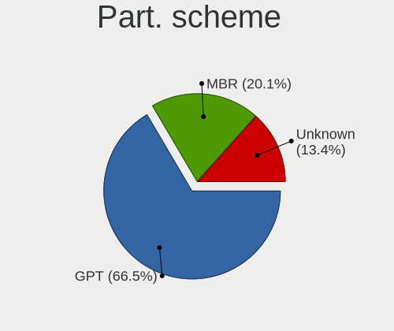
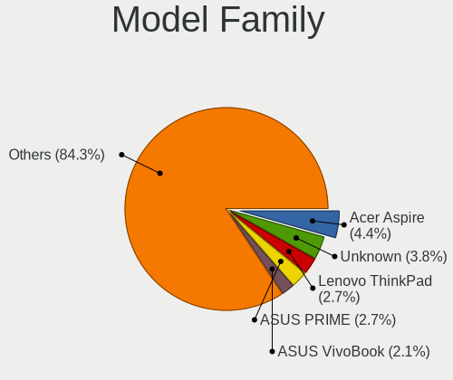
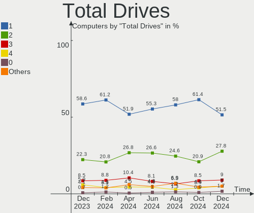
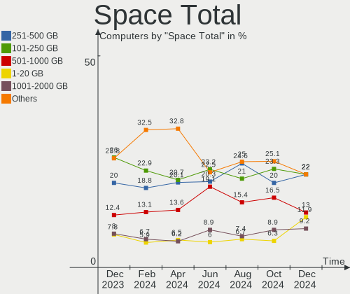
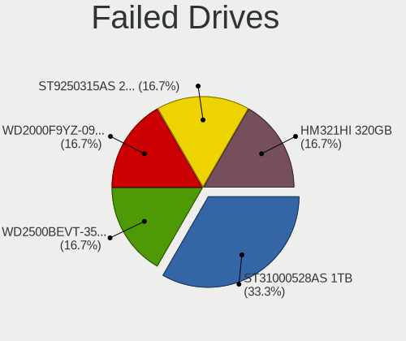
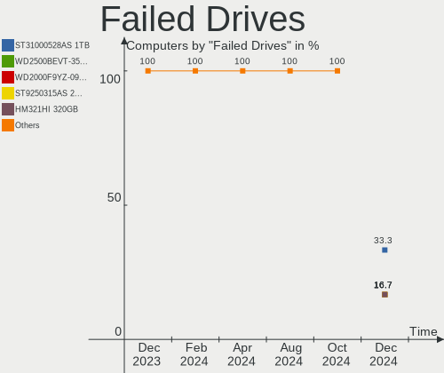
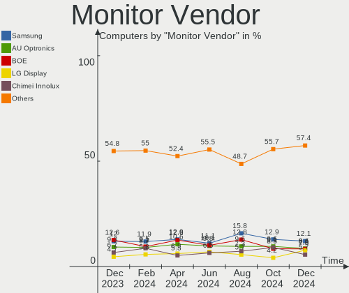
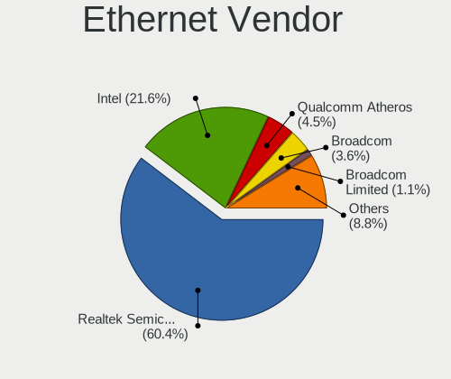
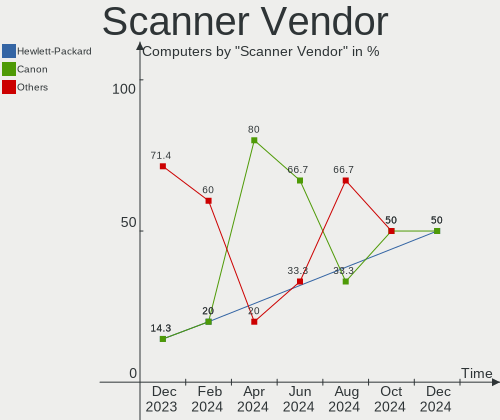

Linux in Russia - Hardware Trends
---------------------------------

A project to identify most popular hardware characteristics and track their change
over time based on data collected by Linux users at https://Linux-Hardware.org.

Anyone can contribute to this report by the [hw-probe](https://github.com/linuxhw/hw-probe) tool:

    sudo -E hw-probe -all -upload

This is a report for all computer types. See also reports for [desktops](/Location/Russia/Desktop/README.md) and [notebooks](/Location/Russia/Notebook/README.md).

Period: Feb, 2023.

Contents
--------

* [ System ](#system)
  - [ OS                       ](#os)
  - [ OS Family                ](#os-family)
  - [ Kernel                   ](#kernel)
  - [ Kernel Family            ](#kernel-family)
  - [ Kernel Major Ver.        ](#kernel-major-ver)
  - [ Arch                     ](#arch)
  - [ DE                       ](#de)
  - [ Display Server           ](#display-server)
  - [ Display Manager          ](#display-manager)
  - [ OS Lang                  ](#os-lang)
  - [ Boot Mode                ](#boot-mode)
  - [ Filesystem               ](#filesystem)
  - [ Part. scheme             ](#part-scheme)
  - [ Dual Boot with Linux/BSD ](#dual-boot-with-linuxbsd)
  - [ Dual Boot (Win)          ](#dual-boot-win)

* [ Board ](#board)
  - [ Vendor                   ](#vendor)
  - [ Model                    ](#model)
  - [ Model Family             ](#model-family)
  - [ MFG Year                 ](#mfg-year)
  - [ Form Factor              ](#form-factor)
  - [ Secure Boot              ](#secure-boot)
  - [ Coreboot                 ](#coreboot)
  - [ RAM Size                 ](#ram-size)
  - [ RAM Used                 ](#ram-used)
  - [ Total Drives             ](#total-drives)
  - [ Has CD-ROM               ](#has-cd-rom)
  - [ Has Ethernet             ](#has-ethernet)
  - [ Has WiFi                 ](#has-wifi)
  - [ Has Bluetooth            ](#has-bluetooth)

* [ Location ](#location)
  - [ Country                  ](#country)
  - [ City                     ](#city)

* [ Drives ](#drives)
  - [ Drive Vendor             ](#drive-vendor)
  - [ Drive Model              ](#drive-model)
  - [ HDD Vendor               ](#hdd-vendor)
  - [ SSD Vendor               ](#ssd-vendor)
  - [ Drive Kind               ](#drive-kind)
  - [ Drive Connector          ](#drive-connector)
  - [ Drive Size               ](#drive-size)
  - [ Space Total              ](#space-total)
  - [ Space Used               ](#space-used)
  - [ Malfunc. Drives          ](#malfunc-drives)
  - [ Malfunc. Drive Vendor    ](#malfunc-drive-vendor)
  - [ Malfunc. HDD Vendor      ](#malfunc-hdd-vendor)
  - [ Malfunc. Drive Kind      ](#malfunc-drive-kind)
  - [ Failed Drives            ](#failed-drives)
  - [ Failed Drive Vendor      ](#failed-drive-vendor)
  - [ Drive Status             ](#drive-status)

* [ Storage controller ](#storage-controller)
  - [ Storage Vendor           ](#storage-vendor)
  - [ Storage Model            ](#storage-model)
  - [ Storage Kind             ](#storage-kind)

* [ Processor ](#processor)
  - [ CPU Vendor               ](#cpu-vendor)
  - [ CPU Model                ](#cpu-model)
  - [ CPU Model Family         ](#cpu-model-family)
  - [ CPU Cores                ](#cpu-cores)
  - [ CPU Sockets              ](#cpu-sockets)
  - [ CPU Threads              ](#cpu-threads)
  - [ CPU Op-Modes             ](#cpu-op-modes)
  - [ CPU Microcode            ](#cpu-microcode)
  - [ CPU Microarch            ](#cpu-microarch)

* [ Graphics ](#graphics)
  - [ GPU Vendor               ](#gpu-vendor)
  - [ GPU Model                ](#gpu-model)
  - [ GPU Combo                ](#gpu-combo)
  - [ GPU Driver               ](#gpu-driver)
  - [ GPU Memory               ](#gpu-memory)

* [ Monitor ](#monitor)
  - [ Monitor Vendor           ](#monitor-vendor)
  - [ Monitor Model            ](#monitor-model)
  - [ Monitor Resolution       ](#monitor-resolution)
  - [ Monitor Diagonal         ](#monitor-diagonal)
  - [ Monitor Width            ](#monitor-width)
  - [ Aspect Ratio             ](#aspect-ratio)
  - [ Monitor Area             ](#monitor-area)
  - [ Pixel Density            ](#pixel-density)
  - [ Multiple Monitors        ](#multiple-monitors)

* [ Network ](#network)
  - [ Net Controller Vendor    ](#net-controller-vendor)
  - [ Net Controller Model     ](#net-controller-model)
  - [ Wireless Vendor          ](#wireless-vendor)
  - [ Wireless Model           ](#wireless-model)
  - [ Ethernet Vendor          ](#ethernet-vendor)
  - [ Ethernet Model           ](#ethernet-model)
  - [ Net Controller Kind      ](#net-controller-kind)
  - [ Used Controller          ](#used-controller)
  - [ NICs                     ](#nics)
  - [ IPv6                     ](#ipv6)

* [ Bluetooth ](#bluetooth)
  - [ Bluetooth Vendor         ](#bluetooth-vendor)
  - [ Bluetooth Model          ](#bluetooth-model)

* [ Sound ](#sound)
  - [ Sound Vendor             ](#sound-vendor)
  - [ Sound Model              ](#sound-model)

* [ Memory ](#memory)
  - [ Memory Vendor            ](#memory-vendor)
  - [ Memory Model             ](#memory-model)
  - [ Memory Kind              ](#memory-kind)
  - [ Memory Form Factor       ](#memory-form-factor)
  - [ Memory Size              ](#memory-size)
  - [ Memory Speed             ](#memory-speed)

* [ Printers & scanners ](#printers--scanners)
  - [ Printer Vendor           ](#printer-vendor)
  - [ Printer Model            ](#printer-model)
  - [ Scanner Vendor           ](#scanner-vendor)
  - [ Scanner Model            ](#scanner-model)

* [ Camera ](#camera)
  - [ Camera Vendor            ](#camera-vendor)
  - [ Camera Model             ](#camera-model)

* [ Security ](#security)
  - [ Fingerprint Vendor       ](#fingerprint-vendor)
  - [ Fingerprint Model        ](#fingerprint-model)
  - [ Chipcard Vendor          ](#chipcard-vendor)
  - [ Chipcard Model           ](#chipcard-model)

* [ Unsupported ](#unsupported)
  - [ Unsupported Devices      ](#unsupported-devices)
  - [ Unsupported Device Types ](#unsupported-device-types)

System
------

OS
--

Installed operating systems

| Name               | Computers | Percent |
|--------------------|-----------|---------|
| ROSA 12.3          | 129       | 26.49%  |
| Fedora 37          | 32        | 6.57%   |
| OpenMandriva 23.01 | 31        | 6.37%   |
| Debian 11          | 28        | 5.75%   |
| Ubuntu 22.04       | 25        | 5.13%   |
| Red OS 7.3.2       | 22        | 4.52%   |
| Linux Mint 21.1    | 14        | 2.87%   |
| Arch Rolling       | 13        | 2.67%   |
| Ubuntu 22.10       | 11        | 2.26%   |
| KDE neon 22.04     | 11        | 2.26%   |
| OpenMandriva 4.3   | 9         | 1.85%   |
| ALT Linux 10.1     | 9         | 1.85%   |
| ROSA R11.1         | 8         | 1.64%   |
| Manjaro            | 8         | 1.64%   |
| Red OS 7.3         | 7         | 1.44%   |
| MOS 10             | 7         | 1.44%   |
| Kali 2022.4        | 7         | 1.44%   |
| ROSA 12.2          | 6         | 1.23%   |
| Manjaro 22.0.4     | 6         | 1.23%   |
| Kubuntu 22.04      | 6         | 1.23%   |
| Gentoo 2.9         | 5         | 1.03%   |
| Cyber Infra 5.0.1  | 5         | 1.03%   |
| Ubuntu 20.04       | 4         | 0.82%   |
| SteamOS 3.4.4      | 4         | 0.82%   |
| Pop!_OS 22.04      | 4         | 0.82%   |
| Manjaro 22.0.3     | 4         | 0.82%   |
| Debian             | 4         | 0.82%   |
| ROSA 12.1          | 3         | 0.62%   |
| ROSA 12            | 3         | 0.62%   |
| Elementary 7       | 3         | 0.62%   |
| Xubuntu 22.04      | 2         | 0.41%   |
| Ubuntu MATE 20.04  | 2         | 0.41%   |
| Red OS 7.3.1       | 2         | 0.41%   |
| OpenMandriva 4.2   | 2         | 0.41%   |
| MX 21              | 2         | 0.41%   |
| Manjaro 22.0.2     | 2         | 0.41%   |
| Manjaro 22.0.1     | 2         | 0.41%   |
| Lubuntu 22.04      | 2         | 0.41%   |
| LMDE 5             | 2         | 0.41%   |
| Linux Mint 20.3    | 2         | 0.41%   |

OS Family
---------

OS without a version

| Name          | Computers | Percent |
|---------------|-----------|---------|
| ROSA          | 152       | 31.21%  |
| OpenMandriva  | 42        | 8.62%   |
| Ubuntu        | 41        | 8.42%   |
| Fedora        | 36        | 7.39%   |
| Debian        | 33        | 6.78%   |
| Red OS        | 31        | 6.37%   |
| Manjaro       | 22        | 4.52%   |
| Linux Mint    | 19        | 3.9%    |
| ALT Linux     | 17        | 3.49%   |
| Arch          | 13        | 2.67%   |
| KDE neon      | 11        | 2.26%   |
| Kali          | 8         | 1.64%   |
| Kubuntu       | 7         | 1.44%   |
| Gentoo        | 6         | 1.23%   |
| Xubuntu       | 5         | 1.03%   |
| SteamOS       | 5         | 1.03%   |
| Cyber Infra   | 5         | 1.03%   |
| Pop!_OS       | 4         | 0.82%   |
| Endless       | 3         | 0.62%   |
| Elementary    | 3         | 0.62%   |
| Zorin         | 2         | 0.41%   |
| Ubuntu MATE   | 2         | 0.41%   |
| MX            | 2         | 0.41%   |
| Lubuntu       | 2         | 0.41%   |
| LMDE          | 2         | 0.41%   |
| Alpine        | 2         | 0.41%   |
| Ubuntu Studio | 1         | 0.21%   |
| RELS          | 1         | 0.21%   |
| NixOS         | 1         | 0.21%   |
| Mageia        | 1         | 0.21%   |
| Gnoppix       | 1         | 0.21%   |
| EndeavourOS   | 1         | 0.21%   |
| Devuan        | 1         | 0.21%   |
| Clear Linux   | 1         | 0.21%   |
| Calculate     | 1         | 0.21%   |
| CachyOS       | 1         | 0.21%   |
| Artix         | 1         | 0.21%   |
| ArcoLinux     | 1         | 0.21%   |

Kernel
------

Version of the Linux kernel

| Version                                   | Computers | Percent |
|-------------------------------------------|-----------|---------|
| 5.15.79-generic-1rosa2021.1-x86_64        | 48        | 9.86%   |
| 5.15.75-generic-1rosa2021.1-x86_64        | 33        | 6.78%   |
| 6.1.1-desktop-1omv2290                    | 24        | 4.93%   |
| 5.15.0-58-generic                         | 23        | 4.72%   |
| 5.15.0-60-generic                         | 22        | 4.52%   |
| 5.10.0-2-amd64                            | 17        | 3.49%   |
| 5.10.155-generic-1rosa2021.1-x86_64       | 14        | 2.87%   |
| 5.15.87-1.el7.3.x86_64                    | 12        | 2.46%   |
| 5.19.0-32-generic                         | 11        | 2.26%   |
| 5.10.0-21-amd64                           | 9         | 1.85%   |
| 6.1.11-1-MANJARO                          | 8         | 1.64%   |
| 6.0.12.xm1-1.klp-xanmod-rosa2021.1-x86_64 | 8         | 1.64%   |
| 5.17.11-generic-2rosa2021.1-x86_64        | 8         | 1.64%   |
| 5.15.72-1.el7.3.x86_64                    | 8         | 1.64%   |
| 5.10.74-generic-2rosa2021.1-x86_64        | 8         | 1.64%   |
| 6.1.8-200.fc37.x86_64                     | 7         | 1.44%   |
| 6.1.4-desktop-1omv2301                    | 7         | 1.44%   |
| 6.0.0-kali6-amd64                         | 7         | 1.44%   |
| 5.19.0-31-generic                         | 7         | 1.44%   |
| 5.15.75-generic-1rosa2021.1-i686          | 6         | 1.23%   |
| 6.1.9-1-MANJARO                           | 5         | 1.03%   |
| 6.1.11-200.fc37.x86_64                    | 5         | 1.03%   |
| 5.4.0-137-generic                         | 5         | 1.03%   |
| 5.16.13-desktop-1omv4003                  | 5         | 1.03%   |
| 3.10.0-1160.41.1.vz7.183.5                | 5         | 1.03%   |
| 6.1.4-generic-1rosa2021.1-x86_64          | 4         | 0.82%   |
| 6.1.13-200.fc37.x86_64                    | 4         | 0.82%   |
| 5.16.7-desktop-1omv4003                   | 4         | 0.82%   |
| 5.15.78-2.el7.3.x86_64                    | 4         | 0.82%   |
| 5.13.0-valve36-1-neptune                  | 4         | 0.82%   |
| 6.1.9-200.fc37.x86_64                     | 3         | 0.62%   |
| 6.1.12-arch1-1                            | 3         | 0.62%   |
| 6.1.12-200.fc37.x86_64                    | 3         | 0.62%   |
| 6.1.12-1-MANJARO                          | 3         | 0.62%   |
| 6.1.12-060112-generic                     | 3         | 0.62%   |
| 6.1.10-generic-1rosa2021.1-x86_64         | 3         | 0.62%   |
| 6.1.10-200.fc37.x86_64                    | 3         | 0.62%   |
| 6.0.7.xm1-1.klp-xanmod-rosa2021.1-x86_64  | 3         | 0.62%   |
| 6.0.7-301.fc37.x86_64                     | 3         | 0.62%   |
| 5.15.0-43-generic                         | 3         | 0.62%   |

Kernel Family
-------------

Linux kernel without a distro release

| Version  | Computers | Percent |
|----------|-----------|---------|
| 5.15.0   | 54        | 11.09%  |
| 5.15.79  | 48        | 9.86%   |
| 5.15.75  | 39        | 8.01%   |
| 5.10.0   | 27        | 5.54%   |
| 5.19.0   | 25        | 5.13%   |
| 6.1.1    | 24        | 4.93%   |
| 6.1.12   | 17        | 3.49%   |
| 6.1.11   | 16        | 3.29%   |
| 6.1.8    | 14        | 2.87%   |
| 5.10.155 | 14        | 2.87%   |
| 6.1.9    | 13        | 2.67%   |
| 5.15.87  | 12        | 2.46%   |
| 6.1.4    | 11        | 2.26%   |
| 6.0.0    | 11        | 2.26%   |
| 6.1.10   | 10        | 2.05%   |
| 6.0.12   | 10        | 2.05%   |
| 5.15.72  | 9         | 1.85%   |
| 5.10.74  | 9         | 1.85%   |
| 5.17.11  | 8         | 1.64%   |
| 6.0.7    | 6         | 1.23%   |
| 5.4.0    | 6         | 1.23%   |
| 6.1.13   | 5         | 1.03%   |
| 5.16.13  | 5         | 1.03%   |
| 5.13.0   | 5         | 1.03%   |
| 3.10.0   | 5         | 1.03%   |
| 5.16.7   | 4         | 0.82%   |
| 5.15.78  | 4         | 0.82%   |
| 6.2.0    | 3         | 0.62%   |
| 5.4.83   | 3         | 0.62%   |
| 5.10.165 | 3         | 0.62%   |
| 5.10.164 | 3         | 0.62%   |
| 5.10.139 | 3         | 0.62%   |
| 6.1.6    | 2         | 0.41%   |
| 6.1.0    | 2         | 0.41%   |
| 6.0.8    | 2         | 0.41%   |
| 6.0.19   | 2         | 0.41%   |
| 5.4.32   | 2         | 0.41%   |
| 5.15.90  | 2         | 0.41%   |
| 5.15.88  | 2         | 0.41%   |
| 5.15.10  | 2         | 0.41%   |

Kernel Major Ver.
-----------------

Linux kernel major version

| Version | Computers | Percent |
|---------|-----------|---------|
| 5.15    | 184       | 37.78%  |
| 6.1     | 115       | 23.61%  |
| 5.10    | 70        | 14.37%  |
| 6.0     | 32        | 6.57%   |
| 5.19    | 26        | 5.34%   |
| 5.4     | 11        | 2.26%   |
| 5.17    | 10        | 2.05%   |
| 5.16    | 9         | 1.85%   |
| 5.13    | 5         | 1.03%   |
| 3.10    | 5         | 1.03%   |
| 6.2     | 4         | 0.82%   |
| 5.18    | 3         | 0.62%   |
| 5.14    | 3         | 0.62%   |
| 4.19    | 2         | 0.41%   |
| 4.15    | 2         | 0.41%   |
| 5.8     | 1         | 0.21%   |
| 5.5     | 1         | 0.21%   |
| 5.11    | 1         | 0.21%   |
| 4.9     | 1         | 0.21%   |
| 4.1     | 1         | 0.21%   |
| 3.13    | 1         | 0.21%   |

Arch
----

OS architecture (x86_64, i586, etc.)

| Name    | Computers | Percent |
|---------|-----------|---------|
| x86_64  | 471       | 96.71%  |
| i686    | 14        | 2.87%   |
| aarch64 | 2         | 0.41%   |

DE
--

Desktop Environment

| Name       | Computers | Percent |
|------------|-----------|---------|
| KDE5       | 200       | 41.07%  |
| GNOME      | 131       | 26.9%   |
| Unknown    | 42        | 8.62%   |
| MATE       | 36        | 7.39%   |
| XFCE       | 23        | 4.72%   |
| X-Cinnamon | 16        | 3.29%   |
| LXQt       | 16        | 3.29%   |
| KDE4       | 10        | 2.05%   |
| Pantheon   | 3         | 0.62%   |
| DWM        | 3         | 0.62%   |
| Cinnamon   | 2         | 0.41%   |
| Trinity    | 1         | 0.21%   |
| sway       | 1         | 0.21%   |
| LXDE       | 1         | 0.21%   |
| KDE        | 1         | 0.21%   |
| i3         | 1         | 0.21%   |

Display Server
--------------

X11 or Wayland

| Name    | Computers | Percent |
|---------|-----------|---------|
| X11     | 273       | 56.06%  |
| Wayland | 175       | 35.93%  |
| Unknown | 28        | 5.75%   |
| Tty     | 11        | 2.26%   |

Display Manager
---------------

SDDM, LightDM, etc.

| Name    | Computers | Percent |
|---------|-----------|---------|
| SDDM    | 169       | 34.7%   |
| Unknown | 108       | 22.18%  |
| GDM     | 104       | 21.36%  |
| LightDM | 57        | 11.7%   |
| GDM3    | 37        | 7.6%    |
| KDM     | 9         | 1.85%   |
| TDM     | 1         | 0.21%   |
| SLiM    | 1         | 0.21%   |
| GREETD  | 1         | 0.21%   |

OS Lang
-------

Language

| Lang    | Computers | Percent |
|---------|-----------|---------|
| ru_RU   | 373       | 76.59%  |
| en_US   | 86        | 17.66%  |
| Unknown | 12        | 2.46%   |
| en_GB   | 4         | 0.82%   |
| C       | 3         | 0.62%   |
| ru_UA   | 2         | 0.41%   |
| fr_FR   | 1         | 0.21%   |
| es_ES   | 1         | 0.21%   |
| en_DK   | 1         | 0.21%   |
| en_AG   | 1         | 0.21%   |
| de_DE   | 1         | 0.21%   |
| cv_RU   | 1         | 0.21%   |
| C.UTF8  | 1         | 0.21%   |

Boot Mode
---------

EFI or BIOS

| Mode | Computers | Percent |
|------|-----------|---------|
| EFI  | 260       | 53.39%  |
| BIOS | 227       | 46.61%  |

Filesystem
----------

Type of filesystem

| Type    | Computers | Percent |
|---------|-----------|---------|
| Ext4    | 370       | 75.98%  |
| Btrfs   | 68        | 13.96%  |
| Overlay | 42        | 8.62%   |
| Xfs     | 2         | 0.41%   |
| Jfs     | 2         | 0.41%   |
| Zfs     | 1         | 0.21%   |
| F2fs    | 1         | 0.21%   |
| Ext3    | 1         | 0.21%   |

Part. scheme
------------

Scheme of partitioning

| Type    | Computers | Percent |
|---------|-----------|---------|
| GPT     | 303       | 62.22%  |
| MBR     | 110       | 22.59%  |
| Unknown | 74        | 15.2%   |

Dual Boot with Linux/BSD
------------------------

Hosting more than one Linux/BSD

| Dual boot | Computers | Percent |
|-----------|-----------|---------|
| No        | 397       | 81.52%  |
| Yes       | 90        | 18.48%  |

Dual Boot (Win)
---------------

Hosting Linux and Windows

| Dual boot | Computers | Percent |
|-----------|-----------|---------|
| No        | 301       | 61.81%  |
| Yes       | 186       | 38.19%  |

Board
-----

Vendor
------

Motherboard manufacturer

| Name                | Computers | Percent |
|---------------------|-----------|---------|
| ASUSTek Computer    | 95        | 19.51%  |
| Gigabyte Technology | 51        | 10.47%  |
| Lenovo              | 45        | 9.24%   |
| MSI                 | 43        | 8.83%   |
| Hewlett-Packard     | 34        | 6.98%   |
| Acer                | 33        | 6.78%   |
| ASRock              | 27        | 5.54%   |
| Dell                | 15        | 3.08%   |
| Unknown             | 14        | 2.87%   |
| HUAWEI              | 13        | 2.67%   |
| Intel               | 8         | 1.64%   |
| Sony                | 6         | 1.23%   |
| Samsung Electronics | 6         | 1.23%   |
| Clevo               | 6         | 1.23%   |
| Timi                | 5         | 1.03%   |
| Supermicro          | 5         | 1.03%   |
| Valve               | 4         | 0.82%   |
| Toshiba             | 4         | 0.82%   |
| Biostar             | 4         | 0.82%   |
| Aquarius            | 4         | 0.82%   |
| OEM                 | 3         | 0.62%   |
| Huanan              | 3         | 0.62%   |
| HONOR               | 3         | 0.62%   |
| Haier               | 3         | 0.62%   |
| Graviton            | 3         | 0.62%   |
| AZW                 | 3         | 0.62%   |
| Apple               | 3         | 0.62%   |
| iRU                 | 2         | 0.41%   |
| ICL                 | 2         | 0.41%   |
| IBM                 | 2         | 0.41%   |
| Fujitsu             | 2         | 0.41%   |
| eMachines           | 2         | 0.41%   |
| ECS                 | 2         | 0.41%   |
| Compal              | 2         | 0.41%   |
| Chuwi               | 2         | 0.41%   |
| ZOTAC               | 1         | 0.21%   |
| WeiBu               | 1         | 0.21%   |
| THUNDEROBOT         | 1         | 0.21%   |
| TECNO               | 1         | 0.21%   |
| Teclast             | 1         | 0.21%   |

Model
-----

Motherboard model

| Name                                | Computers | Percent |
|-------------------------------------|-----------|---------|
| Unknown                             | 15        | 3.08%   |
| Clevo NL41MU2                       | 6         | 1.23%   |
| Valve Jupiter                       | 4         | 0.82%   |
| Supermicro AS -1014S-WTRT           | 4         | 0.82%   |
| ASUS All Series                     | 4         | 0.82%   |
| HUAWEI NBLB-WAX9N                   | 3         | 0.62%   |
| ASUS P8B75-V                        | 3         | 0.62%   |
| Samsung R519/R719                   | 2         | 0.41%   |
| OEM Intel H81                       | 2         | 0.41%   |
| MSI MS-7C37                         | 2         | 0.41%   |
| MSI Modern 14 B11MOU                | 2         | 0.41%   |
| Lenovo ThinkBook 15 G3 ACL 21A4     | 2         | 0.41%   |
| Lenovo IdeaPad 5 Pro 14ACN6 82L7    | 2         | 0.41%   |
| Lenovo IdeaPad 5 15ARE05 81YQ       | 2         | 0.41%   |
| Lenovo IdeaPad 330-15IKB 81DC       | 2         | 0.41%   |
| Lenovo B590 20208                   | 2         | 0.41%   |
| HUAWEI MRGF-XX                      | 2         | 0.41%   |
| HUAWEI KLVD-WXX9                    | 2         | 0.41%   |
| HUAWEI BOM-WXX9                     | 2         | 0.41%   |
| HONOR BMH-WCX9                      | 2         | 0.41%   |
| HP ProBook 440 G7                   | 2         | 0.41%   |
| HP Pavilion Gaming Laptop 17-cd1xxx | 2         | 0.41%   |
| Haier A1410ED                       | 2         | 0.41%   |
| Graviton M52i                       | 2         | 0.41%   |
| Gigabyte H61M-S1                    | 2         | 0.41%   |
| Gigabyte B550 AORUS ELITE V2        | 2         | 0.41%   |
| Gigabyte A320M-S2H                  | 2         | 0.41%   |
| Compal DIP00                        | 2         | 0.41%   |
| Biostar A320MH                      | 2         | 0.41%   |
| ASUS Zenbook UX535QE_UM535QE        | 2         | 0.41%   |
| ASUS X556UQ                         | 2         | 0.41%   |
| ASUS PRIME H510M-K                  | 2         | 0.41%   |
| ASUS P5K                            | 2         | 0.41%   |
| ASRock B450M Pro4                   | 2         | 0.41%   |
| ASRock AB350 Pro4                   | 2         | 0.41%   |
| Aquarius NS585                      | 2         | 0.41%   |
| Acer Aspire V3-771                  | 2         | 0.41%   |
| Acer Aspire A715-42G                | 2         | 0.41%   |
| Acer Aspire A315-59                 | 2         | 0.41%   |
| ZOTAC ZBOX-CI622/CI642/CI662NANO    | 1         | 0.21%   |

Model Family
------------

Motherboard model prefix

| Name               | Computers | Percent |
|--------------------|-----------|---------|
| Acer Aspire        | 25        | 5.13%   |
| Lenovo IdeaPad     | 16        | 3.29%   |
| Unknown            | 15        | 3.08%   |
| Lenovo ThinkPad    | 10        | 2.05%   |
| HP Pavilion        | 8         | 1.64%   |
| ASUS VivoBook      | 8         | 1.64%   |
| ASUS PRIME         | 7         | 1.44%   |
| HP ProBook         | 6         | 1.23%   |
| Clevo NL41MU2      | 6         | 1.23%   |
| ASUS ROG           | 6         | 1.23%   |
| Lenovo ThinkBook   | 5         | 1.03%   |
| Gigabyte B450M     | 5         | 1.03%   |
| Dell Inspiron      | 5         | 1.03%   |
| Valve Jupiter      | 4         | 0.82%   |
| Toshiba Satellite  | 4         | 0.82%   |
| Supermicro AS      | 4         | 0.82%   |
| HP Laptop          | 4         | 0.82%   |
| HP EliteBook       | 4         | 0.82%   |
| Gigabyte B550      | 4         | 0.82%   |
| ASUS ZenBook       | 4         | 0.82%   |
| ASUS All           | 4         | 0.82%   |
| MSI Modern         | 3         | 0.62%   |
| Lenovo B590        | 3         | 0.62%   |
| HUAWEI NBLB-WAX9N  | 3         | 0.62%   |
| Gigabyte B365M     | 3         | 0.62%   |
| Gigabyte A320M-S2H | 3         | 0.62%   |
| Dell Latitude      | 3         | 0.62%   |
| ASUS TUF           | 3         | 0.62%   |
| ASUS P8H61-M       | 3         | 0.62%   |
| ASUS P8B75-V       | 3         | 0.62%   |
| ASUS ASUS          | 3         | 0.62%   |
| ASRock B450M       | 3         | 0.62%   |
| Timi Xiaomi        | 2         | 0.41%   |
| Timi RedmiBook     | 2         | 0.41%   |
| Samsung R519       | 2         | 0.41%   |
| OEM Intel          | 2         | 0.41%   |
| MSI MS-7C37        | 2         | 0.41%   |
| MSI Alpha          | 2         | 0.41%   |
| Lenovo ThinkCentre | 2         | 0.41%   |
| Lenovo IdeaCentre  | 2         | 0.41%   |

MFG Year
--------

Motherboard manufacture year

| Year    | Computers | Percent |
|---------|-----------|---------|
| 2021    | 64        | 13.14%  |
| 2022    | 56        | 11.5%   |
| 2020    | 52        | 10.68%  |
| 2019    | 41        | 8.42%   |
| 2018    | 37        | 7.6%    |
| 2012    | 36        | 7.39%   |
| 2011    | 35        | 7.19%   |
| 2013    | 31        | 6.37%   |
| 2009    | 20        | 4.11%   |
| 2017    | 18        | 3.7%    |
| 2016    | 18        | 3.7%    |
| 2010    | 18        | 3.7%    |
| 2014    | 17        | 3.49%   |
| 2015    | 10        | 2.05%   |
| 2008    | 10        | 2.05%   |
| 2007    | 10        | 2.05%   |
| 2006    | 8         | 1.64%   |
| 2005    | 2         | 0.41%   |
| Unknown | 2         | 0.41%   |
| 2023    | 1         | 0.21%   |
| 2004    | 1         | 0.21%   |

Form Factor
-----------

Physical design of the computer

| Name           | Computers | Percent |
|----------------|-----------|---------|
| Notebook       | 244       | 50.1%   |
| Desktop        | 214       | 43.94%  |
| All in one     | 9         | 1.85%   |
| Server         | 7         | 1.44%   |
| Mini pc        | 6         | 1.23%   |
| Convertible    | 5         | 1.03%   |
| System on chip | 2         | 0.41%   |

Secure Boot
-----------

Enabled or disabled

| State    | Computers | Percent |
|----------|-----------|---------|
| Disabled | 467       | 95.89%  |
| Enabled  | 20        | 4.11%   |

Coreboot
--------

Have coreboot on board

| Used | Computers | Percent |
|------|-----------|---------|
| No   | 487       | 100%    |

RAM Size
--------

Total RAM memory

| Size in GB      | Computers | Percent |
|-----------------|-----------|---------|
| 4.01-8.0        | 127       | 26.08%  |
| 16.01-24.0      | 105       | 21.56%  |
| 8.01-16.0       | 104       | 21.36%  |
| 3.01-4.0        | 75        | 15.4%   |
| 32.01-64.0      | 26        | 5.34%   |
| 1.01-2.0        | 18        | 3.7%    |
| 64.01-256.0     | 10        | 2.05%   |
| 2.01-3.0        | 9         | 1.85%   |
| 24.01-32.0      | 7         | 1.44%   |
| More than 256.0 | 5         | 1.03%   |
| 0.51-1.0        | 1         | 0.21%   |

RAM Used
--------

Used RAM memory

| Used GB    | Computers | Percent |
|------------|-----------|---------|
| 1.01-2.0   | 168       | 34.5%   |
| 2.01-3.0   | 110       | 22.59%  |
| 0.51-1.0   | 65        | 13.35%  |
| 4.01-8.0   | 56        | 11.5%   |
| 3.01-4.0   | 51        | 10.47%  |
| 8.01-16.0  | 23        | 4.72%   |
| 0.01-0.5   | 8         | 1.64%   |
| 16.01-24.0 | 4         | 0.82%   |
| 32.01-64.0 | 1         | 0.21%   |
| Unknown    | 1         | 0.21%   |

Total Drives
------------

Number of drives on board

| Drives | Computers | Percent |
|--------|-----------|---------|
| 1      | 279       | 57.29%  |
| 2      | 129       | 26.49%  |
| 3      | 38        | 7.8%    |
| 4      | 21        | 4.31%   |
| 5      | 9         | 1.85%   |
| 6      | 7         | 1.44%   |
| 0      | 2         | 0.41%   |
| 10     | 1         | 0.21%   |
| 7      | 1         | 0.21%   |

Has CD-ROM
----------

Has CD-ROM on board

| Presented | Computers | Percent |
|-----------|-----------|---------|
| No        | 373       | 76.59%  |
| Yes       | 114       | 23.41%  |

Has Ethernet
------------

Has Ethernet on board

| Presented | Computers | Percent |
|-----------|-----------|---------|
| Yes       | 409       | 83.98%  |
| No        | 78        | 16.02%  |

Has WiFi
--------

Has WiFi module

| Presented | Computers | Percent |
|-----------|-----------|---------|
| Yes       | 333       | 68.38%  |
| No        | 154       | 31.62%  |

Has Bluetooth
-------------

Has Bluetooth module

| Presented | Computers | Percent |
|-----------|-----------|---------|
| Yes       | 262       | 53.8%   |
| No        | 225       | 46.2%   |

Location
--------

Country
-------

Geographic location (country)

| Country | Computers | Percent |
|---------|-----------|---------|
| Russia  | 487       | 100%    |

City
----

Geographic location (city)

| City                | Computers | Percent |
|---------------------|-----------|---------|
| Moscow              | 103       | 21.15%  |
| St Petersburg       | 56        | 11.5%   |
| Voronezh            | 21        | 4.31%   |
| Nizhniy Novgorod    | 14        | 2.87%   |
| Krasnodar           | 13        | 2.67%   |
| Yekaterinburg       | 11        | 2.26%   |
| Novosibirsk         | 9         | 1.85%   |
| Chelyabinsk         | 8         | 1.64%   |
| Ufa                 | 7         | 1.44%   |
| Samara              | 7         | 1.44%   |
| Lipetsk             | 7         | 1.44%   |
| Perm                | 6         | 1.23%   |
| Kaluga              | 6         | 1.23%   |
| Barnaul             | 6         | 1.23%   |
| Vladivostok         | 5         | 1.03%   |
| Omsk                | 5         | 1.03%   |
| Murom               | 5         | 1.03%   |
| Krasnoyarsk         | 5         | 1.03%   |
| Kazan’            | 5         | 1.03%   |
| Volgograd           | 4         | 0.82%   |
| Stavropol           | 4         | 0.82%   |
| Salekhard           | 4         | 0.82%   |
| Ryazan              | 4         | 0.82%   |
| Ulyanovsk           | 3         | 0.62%   |
| Tver                | 3         | 0.62%   |
| Smolensk            | 3         | 0.62%   |
| Orenburg            | 3         | 0.62%   |
| Naberezhnyye Chelny | 3         | 0.62%   |
| Mytishchi           | 3         | 0.62%   |
| Kirov               | 3         | 0.62%   |
| Izhevsk             | 3         | 0.62%   |
| Irkutsk             | 3         | 0.62%   |
| Donetsk             | 3         | 0.62%   |
| Bryansk             | 3         | 0.62%   |
| Belgorod            | 3         | 0.62%   |
| Astrakhan           | 3         | 0.62%   |
| Yoshkar-Ola         | 2         | 0.41%   |
| Ukhta               | 2         | 0.41%   |
| Tula                | 2         | 0.41%   |
| Tambov              | 2         | 0.41%   |

Drives
------

Drive Vendor
------------

Hard drive vendors

| Vendor                      | Computers | Drives | Percent |
|-----------------------------|-----------|--------|---------|
| WDC                         | 130       | 157    | 17.64%  |
| Seagate                     | 90        | 113    | 12.21%  |
| Samsung Electronics         | 76        | 101    | 10.31%  |
| Kingston                    | 50        | 53     | 6.78%   |
| Toshiba                     | 48        | 54     | 6.51%   |
| China                       | 21        | 22     | 2.85%   |
| A-DATA Technology           | 20        | 20     | 2.71%   |
| Intel                       | 19        | 19     | 2.58%   |
| Hitachi                     | 19        | 20     | 2.58%   |
| Sandisk                     | 18        | 18     | 2.44%   |
| Unknown                     | 17        | 17     | 2.31%   |
| SK hynix                    | 15        | 16     | 2.04%   |
| SPCC                        | 12        | 13     | 1.63%   |
| Micron Technology           | 11        | 11     | 1.49%   |
| Crucial                     | 9         | 9      | 1.22%   |
| Transcend                   | 8         | 8      | 1.09%   |
| Smartbuy                    | 8         | 8      | 1.09%   |
| Silicon Motion              | 8         | 9      | 1.09%   |
| Plextor                     | 8         | 8      | 1.09%   |
| Apacer                      | 8         | 9      | 1.09%   |
| Phison Electronics          | 7         | 7      | 0.95%   |
| Patriot                     | 7         | 7      | 0.95%   |
| Netac                       | 7         | 8      | 0.95%   |
| KIOXIA                      | 7         | 7      | 0.95%   |
| HGST                        | 7         | 7      | 0.95%   |
| BIWIN                       | 6         | 6      | 0.81%   |
| AMD                         | 6         | 6      | 0.81%   |
| Hewlett-Packard             | 5         | 12     | 0.68%   |
| Unknown                     | 5         | 5      | 0.68%   |
| XrayDisk                    | 4         | 4      | 0.54%   |
| OCZ                         | 4         | 4      | 0.54%   |
| Kingston Technology Company | 4         | 4      | 0.54%   |
| Gigabyte Technology         | 4         | 4      | 0.54%   |
| Team                        | 3         | 3      | 0.41%   |
| ShiJi                       | 3         | 3      | 0.41%   |
| Qumo                        | 3         | 3      | 0.41%   |
| Phison                      | 3         | 3      | 0.41%   |
| KingSpec                    | 3         | 3      | 0.41%   |
| GOODRAM                     | 3         | 3      | 0.41%   |
| UMIS                        | 2         | 2      | 0.27%   |

Drive Model
-----------

Hard drive models

| Model                                                | Computers | Percent |
|------------------------------------------------------|-----------|---------|
| Toshiba HDWD110 1TB                                  | 12        | 1.5%    |
| Kingston SA400S37240G 240GB SSD                      | 11        | 1.38%   |
| Seagate ST500DM002-1BD142 500GB                      | 10        | 1.25%   |
| WDC WDS240G2G0A-00JH30 240GB SSD                     | 9         | 1.13%   |
| Samsung NVMe SSD Controller SM981/PM981/PM983 250GB  | 8         | 1%      |
| WDC WD10EZEX-08WN4A0 1TB                             | 7         | 0.88%   |
| Samsung SSD 860 EVO 250GB                            | 7         | 0.88%   |
| Kingston SA400S37480G 480GB SSD                      | 7         | 0.88%   |
| Kingston SA400S37120G 120GB SSD                      | 7         | 0.88%   |
| Intel SSDPEKNU512GZ 512GB                            | 7         | 0.88%   |
| WDC WD10EZRZ-00HTKB0 1TB                             | 6         | 0.75%   |
| SPCC Solid State Disk 128GB                          | 6         | 0.75%   |
| Samsung NVMe SSD Controller PM9A1/PM9A3/980PRO 960GB | 6         | 0.75%   |
| BIWIN CE480T5D101-256 256GB                          | 6         | 0.75%   |
| Toshiba MQ01ABF050 500GB                             | 5         | 0.63%   |
| Toshiba DT01ACA050 500GB                             | 5         | 0.63%   |
| Seagate ST1000DM003-1CH162 1TB                       | 5         | 0.63%   |
| Phison PS5013 E13 NVMe Controller 500GB              | 5         | 0.63%   |
| Unknown                                              | 5         | 0.63%   |
| WDC WD10EZEX-08M2NA0 1TB                             | 4         | 0.5%    |
| Toshiba MQ01ABD100 1TB                               | 4         | 0.5%    |
| Seagate ST9320325AS 320GB                            | 4         | 0.5%    |
| Seagate ST4000NM000A-2HZ100 4TB                      | 4         | 0.5%    |
| Seagate ST3500418AS 500GB                            | 4         | 0.5%    |
| Samsung SSD 850 120GB                                | 4         | 0.5%    |
| Samsung MZ7L3480HBLT-00A07 480GB SSD                 | 4         | 0.5%    |
| Kingston SNVS500G 500GB                              | 4         | 0.5%    |
| A-DATA SU800 512GB SSD                               | 4         | 0.5%    |
| XrayDisk SSD 256GB                                   | 3         | 0.38%   |
| WDC WDS120G2G0A-00JH30 120GB SSD                     | 3         | 0.38%   |
| WDC WD5000AAKX-00ERMA0 500GB                         | 3         | 0.38%   |
| Unknown MMC Card  4GB                                | 3         | 0.38%   |
| Toshiba DT01ACA100 1TB                               | 3         | 0.38%   |
| Smartbuy SSD 120GB                                   | 3         | 0.38%   |
| Seagate ST250DM000-1BD141 250GB                      | 3         | 0.38%   |
| Seagate ST1000LM049-2GH172 1TB                       | 3         | 0.38%   |
| Seagate ST1000LM035-1RK172 1TB                       | 3         | 0.38%   |
| Sandisk WD Black SN750 / PC SN730 NVMe SSD 512GB     | 3         | 0.38%   |
| Samsung SSD 870 EVO 500GB                            | 3         | 0.38%   |
| Samsung SSD 860 EVO 500GB                            | 3         | 0.38%   |

HDD Vendor
----------

Hard disk drive vendors

| Vendor              | Computers | Drives | Percent |
|---------------------|-----------|--------|---------|
| WDC                 | 105       | 122    | 36.97%  |
| Seagate             | 90        | 113    | 31.69%  |
| Toshiba             | 44        | 49     | 15.49%  |
| Hitachi             | 19        | 20     | 6.69%   |
| Samsung Electronics | 10        | 11     | 3.52%   |
| HGST                | 7         | 7      | 2.46%   |
| Maxtor              | 2         | 2      | 0.7%    |
| Hewlett-Packard     | 2         | 9      | 0.7%    |
| Fujitsu             | 2         | 2      | 0.7%    |
| Unknown             | 1         | 1      | 0.35%   |
| IBM-ESXS            | 1         | 2      | 0.35%   |
| HGST HTS            | 1         | 1      | 0.35%   |

SSD Vendor
----------

Solid state drive vendors

| Vendor              | Computers | Drives | Percent |
|---------------------|-----------|--------|---------|
| Kingston            | 42        | 45     | 15.97%  |
| Samsung Electronics | 36        | 47     | 13.69%  |
| China               | 21        | 22     | 7.98%   |
| WDC                 | 19        | 20     | 7.22%   |
| A-DATA Technology   | 18        | 18     | 6.84%   |
| SPCC                | 10        | 11     | 3.8%    |
| Crucial             | 8         | 8      | 3.04%   |
| Smartbuy            | 7         | 7      | 2.66%   |
| SanDisk             | 7         | 7      | 2.66%   |
| Transcend           | 6         | 6      | 2.28%   |
| Plextor             | 6         | 6      | 2.28%   |
| Patriot             | 6         | 6      | 2.28%   |
| Apacer              | 6         | 6      | 2.28%   |
| Netac               | 5         | 5      | 1.9%    |
| Intel               | 5         | 5      | 1.9%    |
| AMD                 | 5         | 5      | 1.9%    |
| XrayDisk            | 4         | 4      | 1.52%   |
| OCZ                 | 4         | 4      | 1.52%   |
| Team                | 3         | 3      | 1.14%   |
| Qumo                | 3         | 3      | 1.14%   |
| Micron Technology   | 3         | 3      | 1.14%   |
| KingSpec            | 3         | 3      | 1.14%   |
| Hewlett-Packard     | 3         | 3      | 1.14%   |
| GOODRAM             | 3         | 3      | 1.14%   |
| TO Exter            | 2         | 2      | 0.76%   |
| Teclast             | 2         | 2      | 0.76%   |
| ShiJi               | 2         | 2      | 0.76%   |
| Neo                 | 2         | 2      | 0.76%   |
| LITEONIT            | 2         | 2      | 0.76%   |
| Corsair             | 2         | 2      | 0.76%   |
| Unknown             | 2         | 2      | 0.76%   |
| Toshiba             | 1         | 1      | 0.38%   |
| SWORDBILL           | 1         | 1      | 0.38%   |
| SK hynix            | 1         | 1      | 0.38%   |
| ROKOT               | 1         | 1      | 0.38%   |
| NT-1TB              | 1         | 1      | 0.38%   |
| Lite-On             | 1         | 1      | 0.38%   |
| Lexar               | 1         | 1      | 0.38%   |
| Kingmax             | 1         | 1      | 0.38%   |
| HS-SSD-C100         | 1         | 1      | 0.38%   |

Drive Kind
----------

HDD or SSD

| Kind    | Computers | Drives | Percent |
|---------|-----------|--------|---------|
| HDD     | 234       | 339    | 35.14%  |
| SSD     | 231       | 280    | 34.68%  |
| NVMe    | 177       | 193    | 26.58%  |
| MMC     | 21        | 21     | 3.15%   |
| Unknown | 3         | 4      | 0.45%   |

Drive Connector
---------------

SATA, SAS, NVMe, etc.

| Type | Computers | Drives | Percent |
|------|-----------|--------|---------|
| SATA | 358       | 607    | 62.7%   |
| NVMe | 177       | 192    | 31%     |
| MMC  | 21        | 21     | 3.68%   |
| SAS  | 15        | 17     | 2.63%   |

Drive Size
----------

Size of hard drive

| Size in TB | Computers | Drives | Percent |
|------------|-----------|--------|---------|
| 0.01-0.5   | 288       | 397    | 62.07%  |
| 0.51-1.0   | 134       | 165    | 28.88%  |
| 1.01-2.0   | 23        | 35     | 4.96%   |
| 3.01-4.0   | 9         | 10     | 1.94%   |
| 4.01-10.0  | 6         | 6      | 1.29%   |
| 2.01-3.0   | 4         | 6      | 0.86%   |

Space Total
-----------

Amount of disk space available on the file system

| Size in GB     | Computers | Percent |
|----------------|-----------|---------|
| 101-250        | 137       | 28.13%  |
| 251-500        | 95        | 19.51%  |
| 501-1000       | 62        | 12.73%  |
| 51-100         | 46        | 9.45%   |
| 1001-2000      | 41        | 8.42%   |
| 1-20           | 34        | 6.98%   |
| Unknown        | 24        | 4.93%   |
| 21-50          | 20        | 4.11%   |
| More than 3000 | 18        | 3.7%    |
| 2001-3000      | 10        | 2.05%   |

Space Used
----------

Amount of used disk space

| Used GB        | Computers | Percent |
|----------------|-----------|---------|
| 1-20           | 231       | 47.43%  |
| 21-50          | 66        | 13.55%  |
| 101-250        | 44        | 9.03%   |
| 51-100         | 44        | 9.03%   |
| 251-500        | 24        | 4.93%   |
| Unknown        | 24        | 4.93%   |
| 1001-2000      | 22        | 4.52%   |
| 501-1000       | 22        | 4.52%   |
| More than 3000 | 7         | 1.44%   |
| 2001-3000      | 3         | 0.62%   |

Malfunc. Drives
---------------

Drive models with a malfunction

| Model                               | Computers | Drives | Percent |
|-------------------------------------|-----------|--------|---------|
| Seagate ST500DM002-1BD142 500GB     | 5         | 5      | 4.72%   |
| WDC WDS240G2G0A-00JH30 240GB SSD    | 2         | 2      | 1.89%   |
| WDC WD5000AAKX-00ERMA0 500GB        | 2         | 2      | 1.89%   |
| Toshiba DT01ACA050 500GB            | 2         | 2      | 1.89%   |
| Seagate ST3500418AS 500GB           | 2         | 2      | 1.89%   |
| Seagate ST3250310AS 250GB           | 2         | 2      | 1.89%   |
| Seagate ST1000DM003-1CH162 1TB      | 2         | 2      | 1.89%   |
| Samsung Electronics SSD 870 EVO 1TB | 2         | 2      | 1.89%   |
| Hitachi HTS541612J9SA00 120GB       | 2         | 2      | 1.89%   |
| Hitachi HDS721050CLA360 500GB       | 2         | 2      | 1.89%   |
| WDC WD7500BPVT-24HXZT1 752GB        | 1         | 1      | 0.94%   |
| WDC WD6400BPVT-00HXZT1 640GB        | 1         | 1      | 0.94%   |
| WDC WD5000LPVX-22V0TT0 500GB        | 1         | 1      | 0.94%   |
| WDC WD5000LPCX-24VHAT0 500GB        | 1         | 1      | 0.94%   |
| WDC WD5000AAKX-60U6AA0 500GB        | 1         | 1      | 0.94%   |
| WDC WD5000AAKS-00V1A0 500GB         | 1         | 1      | 0.94%   |
| WDC WD5000AAKS-00A7B0 500GB         | 1         | 1      | 0.94%   |
| WDC WD3200LPCX-24C6HT0 320GB        | 1         | 1      | 0.94%   |
| WDC WD3200BPVT-22ZEST0 320GB        | 1         | 1      | 0.94%   |
| WDC WD3200AAKS-00B3A0 320GB         | 1         | 1      | 0.94%   |
| WDC WD3200AAJB-56R1A0 320GB         | 1         | 1      | 0.94%   |
| WDC WD20EARS-00MVWB0 2TB            | 1         | 1      | 0.94%   |
| WDC WD15EARX-00PASB0 1TB            | 1         | 1      | 0.94%   |
| WDC WD10JPVX-75JC3T0 1TB            | 1         | 1      | 0.94%   |
| WDC WD10EZRZ-00HTKB0 1TB            | 1         | 2      | 0.94%   |
| WDC WD10EZEX-75ZF5A0 1TB            | 1         | 1      | 0.94%   |
| WDC WD10EZEX-22MFCA0 1TB            | 1         | 1      | 0.94%   |
| WDC WD10EADS-00M2B0 1TB             | 1         | 1      | 0.94%   |
| WDC WD10EADS-00L5B1 1TB             | 1         | 1      | 0.94%   |
| WDC WD1001FALS-00J7B0 1TB           | 1         | 1      | 0.94%   |
| WDC WD10 SPZX-08Z10 1TB             | 1         | 1      | 0.94%   |
| Transcend TS32GMSA310 32GB SSD      | 1         | 1      | 0.94%   |
| Toshiba MK7559GSXP 752GB            | 1         | 1      | 0.94%   |
| Toshiba MK3265GSXN 320GB            | 1         | 1      | 0.94%   |
| Toshiba HDWF180 8TB                 | 1         | 1      | 0.94%   |
| Toshiba DT01ACA100 1TB              | 1         | 1      | 0.94%   |
| Seagate ST96812A 64GB               | 1         | 1      | 0.94%   |
| Seagate ST9500325AS 500GB           | 1         | 1      | 0.94%   |
| Seagate ST9320325AS 320GB           | 1         | 1      | 0.94%   |
| Seagate ST9250315AS 250GB           | 1         | 1      | 0.94%   |

Malfunc. Drive Vendor
---------------------

Vendors of faulty drives

| Vendor              | Computers | Drives | Percent |
|---------------------|-----------|--------|---------|
| Seagate             | 30        | 32     | 28.85%  |
| WDC                 | 25        | 26     | 24.04%  |
| Samsung Electronics | 10        | 10     | 9.62%   |
| Hitachi             | 9         | 9      | 8.65%   |
| Toshiba             | 6         | 6      | 5.77%   |
| OCZ                 | 3         | 3      | 2.88%   |
| Neo                 | 2         | 2      | 1.92%   |
| Intel               | 2         | 2      | 1.92%   |
| China               | 2         | 2      | 1.92%   |
| Transcend           | 1         | 1      | 0.96%   |
| Qumo                | 1         | 1      | 0.96%   |
| Netac               | 1         | 1      | 0.96%   |
| Maxtor              | 1         | 1      | 0.96%   |
| LITEONIT            | 1         | 1      | 0.96%   |
| Kingston            | 1         | 1      | 0.96%   |
| KingSpec            | 1         | 1      | 0.96%   |
| Kingmax             | 1         | 1      | 0.96%   |
| HGST HTS            | 1         | 1      | 0.96%   |
| Hewlett-Packard     | 1         | 1      | 0.96%   |
| FASTDISK            | 1         | 1      | 0.96%   |
| Corsair             | 1         | 1      | 0.96%   |
| AMD                 | 1         | 1      | 0.96%   |
| A-DATA Technology   | 1         | 1      | 0.96%   |
| Unknown             | 1         | 1      | 0.96%   |

Malfunc. HDD Vendor
-------------------

Vendors of faulty HDD drives

| Vendor              | Computers | Drives | Percent |
|---------------------|-----------|--------|---------|
| Seagate             | 30        | 32     | 40%     |
| WDC                 | 23        | 24     | 30.67%  |
| Hitachi             | 9         | 9      | 12%     |
| Toshiba             | 6         | 6      | 8%      |
| Samsung Electronics | 4         | 4      | 5.33%   |
| Maxtor              | 1         | 1      | 1.33%   |
| HGST HTS            | 1         | 1      | 1.33%   |
| Hewlett-Packard     | 1         | 1      | 1.33%   |

Malfunc. Drive Kind
-------------------

Kinds of faulty drives

| Kind | Computers | Drives | Percent |
|------|-----------|--------|---------|
| HDD  | 66        | 78     | 69.47%  |
| SSD  | 25        | 25     | 26.32%  |
| NVMe | 4         | 4      | 4.21%   |

Failed Drives
-------------

Failed drive models

| Model                        | Computers | Drives | Percent |
|------------------------------|-----------|--------|---------|
| WDC WD800JB-00JJC0 80GB      | 1         | 1      | 33.33%  |
| WDC WD2500BEVT-35A23T0 250GB | 1         | 1      | 33.33%  |
| IBM-ESXS ST9300605SS 304GB   | 1         | 2      | 33.33%  |

Failed Drive Vendor
-------------------

Failed drive vendors

| Vendor   | Computers | Drives | Percent |
|----------|-----------|--------|---------|
| WDC      | 2         | 2      | 66.67%  |
| IBM-ESXS | 1         | 2      | 33.33%  |

Drive Status
------------

Number of failed and malfunc. drives

| Status   | Computers | Drives | Percent |
|----------|-----------|--------|---------|
| Works    | 336       | 532    | 60.11%  |
| Detected | 129       | 194    | 23.08%  |
| Malfunc  | 91        | 107    | 16.28%  |
| Failed   | 3         | 4      | 0.54%   |

Storage controller
------------------

Storage Vendor
--------------

Storage controller vendors

| Vendor                         | Computers | Percent |
|--------------------------------|-----------|---------|
| Intel                          | 311       | 48.82%  |
| AMD                            | 108       | 16.95%  |
| Samsung Electronics            | 38        | 5.97%   |
| SanDisk                        | 25        | 3.92%   |
| Phison Electronics             | 17        | 2.67%   |
| Silicon Motion                 | 14        | 2.2%    |
| Nvidia                         | 14        | 2.2%    |
| SK hynix                       | 13        | 2.04%   |
| Kingston Technology Company    | 13        | 2.04%   |
| ASMedia Technology             | 12        | 1.88%   |
| JMicron Technology             | 9         | 1.41%   |
| Micron Technology              | 8         | 1.26%   |
| Marvell Technology Group       | 6         | 0.94%   |
| KIOXIA                         | 6         | 0.94%   |
| INNOGRIT                       | 6         | 0.94%   |
| Toshiba America Info Systems   | 5         | 0.78%   |
| Solid State Storage Technology | 5         | 0.78%   |
| Union Memory (Shenzhen)        | 3         | 0.47%   |
| Shenzhen Longsys Electronics   | 2         | 0.31%   |
| Realtek Semiconductor          | 2         | 0.31%   |
| O2 Micro                       | 2         | 0.31%   |
| Netac Technology               | 2         | 0.31%   |
| MAXIO Technology (Hangzhou)    | 2         | 0.31%   |
| LSI Logic / Symbios Logic      | 2         | 0.31%   |
| Hewlett-Packard                | 2         | 0.31%   |
| ADATA Technology               | 2         | 0.31%   |
| Yangtze Memory Technologies    | 1         | 0.16%   |
| VIA Technologies               | 1         | 0.16%   |
| Transcend                      | 1         | 0.16%   |
| Micron/Crucial Technology      | 1         | 0.16%   |
| Lite-On Technology             | 1         | 0.16%   |
| Integrated Technology Express  | 1         | 0.16%   |
| Areca Technology               | 1         | 0.16%   |
| Apple                          | 1         | 0.16%   |

Storage Model
-------------

Storage controller models

| Model                                                                                   | Computers | Percent |
|-----------------------------------------------------------------------------------------|-----------|---------|
| AMD FCH SATA Controller [AHCI mode]                                                     | 71        | 9.57%   |
| Intel 7 Series Chipset Family 6-port SATA Controller [AHCI mode]                        | 21        | 2.83%   |
| Intel 8 Series/C220 Series Chipset Family 6-port SATA Controller 1 [AHCI mode]          | 19        | 2.56%   |
| AMD SB7x0/SB8x0/SB9x0 IDE Controller                                                    | 18        | 2.43%   |
| Samsung NVMe SSD Controller 980                                                         | 15        | 2.02%   |
| Intel Celeron/Pentium Silver Processor SATA Controller                                  | 14        | 1.89%   |
| Intel 500 Series Chipset Family SATA AHCI Controller                                    | 14        | 1.89%   |
| Silicon Motion SM2263EN/SM2263XT SSD Controller                                         | 13        | 1.75%   |
| Intel Tiger Lake-LP SATA Controller                                                     | 13        | 1.75%   |
| AMD 400 Series Chipset SATA Controller                                                  | 13        | 1.75%   |
| Samsung NVMe SSD Controller SM981/PM981/PM983                                           | 12        | 1.62%   |
| Phison PS5013 E13 NVMe Controller                                                       | 12        | 1.62%   |
| Intel Sunrise Point-LP SATA Controller [AHCI mode]                                      | 12        | 1.62%   |
| Intel 6 Series/C200 Series Chipset Family 6 port Mobile SATA AHCI Controller            | 12        | 1.62%   |
| Intel 6 Series/C200 Series Chipset Family 6 port Desktop SATA AHCI Controller           | 12        | 1.62%   |
| ASMedia ASM1062 Serial ATA Controller                                                   | 12        | 1.62%   |
| AMD SB7x0/SB8x0/SB9x0 SATA Controller [AHCI mode]                                       | 12        | 1.62%   |
| Intel 6 Series/C200 Series Chipset Family Desktop SATA Controller (IDE mode, ports 4-5) | 11        | 1.48%   |
| Intel 6 Series/C200 Series Chipset Family Desktop SATA Controller (IDE mode, ports 0-3) | 11        | 1.48%   |
| AMD 500 Series Chipset SATA Controller                                                  | 11        | 1.48%   |
| SanDisk WD Black SN750 / PC SN730 NVMe SSD                                              | 10        | 1.35%   |
| Intel 82801 Mobile SATA Controller [RAID mode]                                          | 10        | 1.35%   |
| Samsung NVMe SSD Controller PM9A1/PM9A3/980PRO                                          | 9         | 1.21%   |
| Kingston Company Company Non-Volatile memory controller                                 | 9         | 1.21%   |
| Intel 400 Series Chipset Family SATA AHCI Controller                                    | 9         | 1.21%   |
| AMD SB7x0/SB8x0/SB9x0 SATA Controller [IDE mode]                                        | 9         | 1.21%   |
| Intel Non-Volatile memory controller                                                    | 8         | 1.08%   |
| Intel Comet Lake SATA AHCI Controller                                                   | 8         | 1.08%   |
| Intel Celeron N3350/Pentium N4200/Atom E3900 Series SATA AHCI Controller                | 8         | 1.08%   |
| Intel 82801IBM/IEM (ICH9M/ICH9M-E) 4 port SATA Controller [AHCI mode]                   | 8         | 1.08%   |
| Intel 8 Series SATA Controller 1 [AHCI mode]                                            | 8         | 1.08%   |
| Intel 200 Series PCH SATA controller [AHCI mode]                                        | 8         | 1.08%   |
| Micron Non-Volatile memory controller                                                   | 7         | 0.94%   |
| Intel Volume Management Device NVMe RAID Controller                                     | 7         | 0.94%   |
| Intel NM10/ICH7 Family SATA Controller [IDE mode]                                       | 7         | 0.94%   |
| Intel Alder Lake-S PCH SATA Controller [AHCI Mode]                                      | 7         | 0.94%   |
| AMD FCH SATA Controller D                                                               | 7         | 0.94%   |
| SanDisk Non-Volatile memory controller                                                  | 6         | 0.81%   |
| JMicron JMB363 SATA/IDE Controller                                                      | 6         | 0.81%   |
| Intel Q170/Q150/B150/H170/H110/Z170/CM236 Chipset SATA Controller [AHCI Mode]           | 6         | 0.81%   |

Storage Kind
------------

Kind of storage controller (IDE, SATA, NVMe, SAS, ...)

| Kind | Computers | Percent |
|------|-----------|---------|
| SATA | 357       | 55.43%  |
| NVMe | 177       | 27.48%  |
| IDE  | 84        | 13.04%  |
| RAID | 26        | 4.04%   |

Processor
---------

CPU Vendor
----------

Processor vendors

| Vendor   | Computers | Percent |
|----------|-----------|---------|
| Intel    | 334       | 68.58%  |
| AMD      | 151       | 31.01%  |
| Qualcomm | 1         | 0.21%   |
| ARM      | 1         | 0.21%   |

CPU Model
---------

Processor models

| Model                                         | Computers | Percent |
|-----------------------------------------------|-----------|---------|
| Intel 11th Gen Core i5-1135G7 @ 2.40GHz       | 11        | 2.26%   |
| AMD Ryzen 5 5500U with Radeon Graphics        | 8         | 1.64%   |
| Intel Core i7-8565U CPU @ 1.80GHz             | 5         | 1.03%   |
| Intel Core i5-10210U CPU @ 1.60GHz            | 5         | 1.03%   |
| Intel Core i3-10100 CPU @ 3.60GHz             | 5         | 1.03%   |
| Intel Celeron CPU N3350 @ 1.10GHz             | 5         | 1.03%   |
| Intel Core i5-9400 CPU @ 2.90GHz              | 4         | 0.82%   |
| Intel Core i5-8265U CPU @ 1.60GHz             | 4         | 0.82%   |
| Intel Core i5-3210M CPU @ 2.50GHz             | 4         | 0.82%   |
| Intel Core i5-2400 CPU @ 3.10GHz              | 4         | 0.82%   |
| Intel Core i3-10110U CPU @ 2.10GHz            | 4         | 0.82%   |
| AMD Ryzen 9 5900HX with Radeon Graphics       | 4         | 0.82%   |
| AMD Ryzen 7 5800H with Radeon Graphics        | 4         | 0.82%   |
| AMD Ryzen 7 5700U with Radeon Graphics        | 4         | 0.82%   |
| AMD Ryzen 5 3500U with Radeon Vega Mobile Gfx | 4         | 0.82%   |
| AMD EPYC 7352 24-Core Processor               | 4         | 0.82%   |
| AMD Custom APU 0405                           | 4         | 0.82%   |
| Intel Core i5-5200U CPU @ 2.20GHz             | 3         | 0.62%   |
| Intel Core i5-4570 CPU @ 3.20GHz              | 3         | 0.62%   |
| Intel Core i5-4200U CPU @ 1.60GHz             | 3         | 0.62%   |
| Intel Core i5-1035G1 CPU @ 1.00GHz            | 3         | 0.62%   |
| Intel Core i3-3240 CPU @ 3.40GHz              | 3         | 0.62%   |
| Intel Core i3-3220 CPU @ 3.30GHz              | 3         | 0.62%   |
| Intel Core i3-2120 CPU @ 3.30GHz              | 3         | 0.62%   |
| Intel Celeron N4000 CPU @ 1.10GHz             | 3         | 0.62%   |
| Intel Celeron J4125 CPU @ 2.00GHz             | 3         | 0.62%   |
| Intel 12th Gen Core i7-1260P                  | 3         | 0.62%   |
| Intel 12th Gen Core i7-1255U                  | 3         | 0.62%   |
| Intel 12th Gen Core i3-12100                  | 3         | 0.62%   |
| Intel 11th Gen Core i5-1155G7 @ 2.50GHz       | 3         | 0.62%   |
| AMD Ryzen 7 3700X 8-Core Processor            | 3         | 0.62%   |
| AMD Ryzen 5 5600X 6-Core Processor            | 3         | 0.62%   |
| AMD Ryzen 5 4500U with Radeon Graphics        | 3         | 0.62%   |
| AMD Ryzen 3 1200 Quad-Core Processor          | 3         | 0.62%   |
| AMD Phenom II X4 965 Processor                | 3         | 0.62%   |
| Intel Xeon CPU E5-2670 v2 @ 2.50GHz           | 2         | 0.41%   |
| Intel Pentium CPU N4200 @ 1.10GHz             | 2         | 0.41%   |
| Intel Core i7-6700K CPU @ 4.00GHz             | 2         | 0.41%   |
| Intel Core i7-2670QM CPU @ 2.20GHz            | 2         | 0.41%   |
| Intel Core i5-9300H CPU @ 2.40GHz             | 2         | 0.41%   |

CPU Model Family
----------------

Processor model prefix

| Model                   | Computers | Percent |
|-------------------------|-----------|---------|
| Intel Core i5           | 90        | 18.48%  |
| Intel Core i3           | 60        | 12.32%  |
| Other                   | 55        | 11.29%  |
| AMD Ryzen 5             | 40        | 8.21%   |
| Intel Celeron           | 36        | 7.39%   |
| Intel Core i7           | 29        | 5.95%   |
| AMD Ryzen 7             | 24        | 4.93%   |
| Intel Xeon              | 20        | 4.11%   |
| AMD Ryzen 9             | 12        | 2.46%   |
| Intel Pentium           | 11        | 2.26%   |
| Intel Core 2 Quad       | 10        | 2.05%   |
| Intel Core 2 Duo        | 9         | 1.85%   |
| Intel Atom              | 8         | 1.64%   |
| AMD FX                  | 8         | 1.64%   |
| AMD Ryzen 3             | 7         | 1.44%   |
| AMD A10                 | 6         | 1.23%   |
| AMD Athlon              | 5         | 1.03%   |
| Intel Pentium Dual-Core | 4         | 0.82%   |
| AMD Phenom II X4        | 4         | 0.82%   |
| AMD EPYC                | 4         | 0.82%   |
| AMD Athlon 64 X2        | 4         | 0.82%   |
| AMD Phenom II X6        | 3         | 0.62%   |
| AMD Athlon II X4        | 3         | 0.62%   |
| AMD Athlon II X2        | 3         | 0.62%   |
| Intel Pentium Dual      | 2         | 0.41%   |
| Intel Genuine           | 2         | 0.41%   |
| AMD Ryzen 7 PRO         | 2         | 0.41%   |
| AMD Ryzen 5 PRO         | 2         | 0.41%   |
| AMD E1                  | 2         | 0.41%   |
| AMD Athlon II X3        | 2         | 0.41%   |
| AMD Athlon 64           | 2         | 0.41%   |
| AMD A8                  | 2         | 0.41%   |
| AMD A6                  | 2         | 0.41%   |
| AMD A4                  | 2         | 0.41%   |
| Intel Xeon Gold         | 1         | 0.21%   |
| Intel Pentium Silver    | 1         | 0.21%   |
| Intel Pentium M         | 1         | 0.21%   |
| Intel Pentium Gold      | 1         | 0.21%   |
| Intel Celeron M         | 1         | 0.21%   |
| Intel Celeron Dual-Core | 1         | 0.21%   |

CPU Cores
---------

Number of processor cores

| Number  | Computers | Percent |
|---------|-----------|---------|
| 4       | 176       | 36.14%  |
| 2       | 165       | 33.88%  |
| 6       | 60        | 12.32%  |
| 8       | 40        | 8.21%   |
| 12      | 12        | 2.46%   |
| 1       | 11        | 2.26%   |
| 3       | 6         | 1.23%   |
| 24      | 5         | 1.03%   |
| 10      | 4         | 0.82%   |
| 20      | 2         | 0.41%   |
| 16      | 2         | 0.41%   |
| 14      | 2         | 0.41%   |
| 32      | 1         | 0.21%   |
| Unknown | 1         | 0.21%   |

CPU Sockets
-----------

Number of sockets

| Number  | Computers | Percent |
|---------|-----------|---------|
| 1       | 478       | 98.15%  |
| 2       | 8         | 1.64%   |
| Unknown | 1         | 0.21%   |

CPU Threads
-----------

Threads per core (Hyper-Threading)

| Number  | Computers | Percent |
|---------|-----------|---------|
| 2       | 316       | 64.89%  |
| 1       | 170       | 34.91%  |
| Unknown | 1         | 0.21%   |

CPU Op-Modes
------------

CPU Operation Modes (32-bit, 64-bit)

| Op mode        | Computers | Percent |
|----------------|-----------|---------|
| 32-bit, 64-bit | 480       | 98.56%  |
| 32-bit         | 4         | 0.82%   |
| Unknown        | 3         | 0.62%   |

CPU Microcode
-------------

Microcode number

| Number     | Computers | Percent |
|------------|-----------|---------|
| Unknown    | 82        | 16.84%  |
| 0x206a7    | 28        | 5.75%   |
| 0x306a9    | 26        | 5.34%   |
| 0x306c3    | 18        | 3.7%    |
| 0x1067a    | 16        | 3.29%   |
| 0x806c1    | 13        | 2.67%   |
| 0x0a50000c | 13        | 2.67%   |
| 0xa0653    | 11        | 2.26%   |
| 0x806ec    | 11        | 2.26%   |
| 0x08608103 | 10        | 2.05%   |
| 0x906ea    | 8         | 1.64%   |
| 0x706a1    | 8         | 1.64%   |
| 0x20655    | 8         | 1.64%   |
| 0x806ea    | 7         | 1.44%   |
| 0x506e3    | 7         | 1.44%   |
| 0x08108109 | 7         | 1.44%   |
| 0x706a8    | 6         | 1.23%   |
| 0x40651    | 6         | 1.23%   |
| 0x08701021 | 6         | 1.23%   |
| 0x0800820d | 6         | 1.23%   |
| 0x010000c8 | 6         | 1.23%   |
| 0x906a4    | 5         | 1.03%   |
| 0x806e9    | 5         | 1.03%   |
| 0x706e5    | 5         | 1.03%   |
| 0x506c9    | 5         | 1.03%   |
| 0x406e3    | 5         | 1.03%   |
| 0x08101016 | 5         | 1.03%   |
| 0x0810100b | 5         | 1.03%   |
| 0xa0652    | 4         | 0.82%   |
| 0x906ed    | 4         | 0.82%   |
| 0x906eb    | 4         | 0.82%   |
| 0x906e9    | 4         | 0.82%   |
| 0x906a3    | 4         | 0.82%   |
| 0x90672    | 4         | 0.82%   |
| 0x806eb    | 4         | 0.82%   |
| 0x6fd      | 4         | 0.82%   |
| 0x6fb      | 4         | 0.82%   |
| 0x106ca    | 4         | 0.82%   |
| 0x0a50000d | 4         | 0.82%   |
| 0x08600106 | 4         | 0.82%   |

CPU Microarch
-------------

Microarchitecture

| Name             | Computers | Percent |
|------------------|-----------|---------|
| KabyLake         | 53        | 10.88%  |
| SandyBridge      | 36        | 7.39%   |
| IvyBridge        | 34        | 6.98%   |
| Haswell          | 34        | 6.98%   |
| Unknown          | 32        | 6.57%   |
| Zen 3            | 26        | 5.34%   |
| Zen 2            | 22        | 4.52%   |
| Penryn           | 22        | 4.52%   |
| TigerLake        | 20        | 4.11%   |
| CometLake        | 20        | 4.11%   |
| Zen+             | 18        | 3.7%    |
| K10              | 17        | 3.49%   |
| Alderlake Hybrid | 17        | 3.49%   |
| Skylake          | 14        | 2.87%   |
| Goldmont plus    | 14        | 2.87%   |
| Zen              | 13        | 2.67%   |
| Westmere         | 11        | 2.26%   |
| Core             | 11        | 2.26%   |
| Icelake          | 10        | 2.05%   |
| Piledriver       | 9         | 1.85%   |
| Goldmont         | 8         | 1.64%   |
| Bonnell          | 7         | 1.44%   |
| K8 Hammer        | 6         | 1.23%   |
| Silvermont       | 5         | 1.03%   |
| Broadwell        | 5         | 1.03%   |
| Excavator        | 4         | 0.82%   |
| Steamroller      | 3         | 0.62%   |
| Puma             | 3         | 0.62%   |
| P6               | 2         | 0.41%   |
| Nehalem          | 2         | 0.41%   |
| Jaguar           | 2         | 0.41%   |
| Bulldozer        | 2         | 0.41%   |
| Bobcat           | 2         | 0.41%   |
| NetBurst         | 1         | 0.21%   |
| K8 & K10 hybrid  | 1         | 0.21%   |
| K10 Llano        | 1         | 0.21%   |

Graphics
--------

GPU Vendor
----------

Vendors of graphics cards

| Vendor                     | Computers | Percent |
|----------------------------|-----------|---------|
| Intel                      | 245       | 42.31%  |
| Nvidia                     | 175       | 30.22%  |
| AMD                        | 152       | 26.25%  |
| ASPEED Technology          | 5         | 0.86%   |
| Matrox Electronics Systems | 2         | 0.35%   |

GPU Model
---------

Graphics card models

| Model                                                                       | Computers | Percent |
|-----------------------------------------------------------------------------|-----------|---------|
| Intel 2nd Generation Core Processor Family Integrated Graphics Controller   | 23        | 3.87%   |
| Intel 3rd Gen Core processor Graphics Controller                            | 19        | 3.2%    |
| AMD Cezanne [Radeon Vega Series / Radeon Vega Mobile Series]                | 19        | 3.2%    |
| Intel TigerLake-LP GT2 [Iris Xe Graphics]                                   | 17        | 2.86%   |
| Nvidia GP107 [GeForce GTX 1050 Ti]                                          | 13        | 2.19%   |
| Intel GeminiLake [UHD Graphics 600]                                         | 13        | 2.19%   |
| AMD Lucienne                                                                | 13        | 2.19%   |
| AMD Picasso/Raven 2 [Radeon Vega Series / Radeon Vega Mobile Series]        | 11        | 1.85%   |
| Intel CometLake-U GT2 [UHD Graphics]                                        | 10        | 1.68%   |
| AMD Ellesmere [Radeon RX 470/480/570/570X/580/580X/590]                     | 10        | 1.68%   |
| Intel WhiskeyLake-U GT2 [UHD Graphics 620]                                  | 9         | 1.52%   |
| Intel CometLake-S GT2 [UHD Graphics 630]                                    | 9         | 1.52%   |
| Nvidia GF117M [GeForce 610M/710M/810M/820M / GT 620M/625M/630M/720M]        | 8         | 1.35%   |
| Intel Haswell-ULT Integrated Graphics Controller                            | 8         | 1.35%   |
| Intel Alder Lake-P Integrated Graphics Controller                           | 8         | 1.35%   |
| AMD Raven Ridge [Radeon Vega Series / Radeon Vega Mobile Series]            | 8         | 1.35%   |
| Nvidia GF108 [GeForce GT 430]                                               | 7         | 1.18%   |
| Intel Xeon E3-1200 v3/4th Gen Core Processor Integrated Graphics Controller | 7         | 1.18%   |
| Intel Mobile 4 Series Chipset Integrated Graphics Controller                | 7         | 1.18%   |
| AMD Renoir                                                                  | 7         | 1.18%   |
| Nvidia TU117M [GeForce GTX 1650 Mobile / Max-Q]                             | 6         | 1.01%   |
| Nvidia GP108 [GeForce GT 1030]                                              | 6         | 1.01%   |
| Intel Xeon E3-1200 v2/3rd Gen Core processor Graphics Controller            | 6         | 1.01%   |
| Intel Skylake GT2 [HD Graphics 520]                                         | 6         | 1.01%   |
| Intel HD Graphics 500                                                       | 6         | 1.01%   |
| Intel CoffeeLake-S GT2 [UHD Graphics 630]                                   | 6         | 1.01%   |
| Nvidia GK208B [GeForce GT 730]                                              | 5         | 0.84%   |
| Nvidia GA107M [GeForce RTX 3050 Ti Mobile]                                  | 5         | 0.84%   |
| Intel HD Graphics 620                                                       | 5         | 0.84%   |
| Intel Core Processor Integrated Graphics Controller                         | 5         | 0.84%   |
| ASPEED Technology ASPEED Graphics Family                                    | 5         | 0.84%   |
| AMD Rembrandt [Radeon 680M]                                                 | 5         | 0.84%   |
| Nvidia TU106 [GeForce RTX 2060 Rev. A]                                      | 4         | 0.67%   |
| Nvidia GK208B [GeForce GT 710]                                              | 4         | 0.67%   |
| Nvidia GF108 [GeForce GT 440]                                               | 4         | 0.67%   |
| Intel Iris Plus Graphics G1 (Ice Lake)                                      | 4         | 0.67%   |
| Intel HD Graphics 5500                                                      | 4         | 0.67%   |
| Intel CometLake-H GT2 [UHD Graphics]                                        | 4         | 0.67%   |
| Intel CoffeeLake-H GT2 [UHD Graphics 630]                                   | 4         | 0.67%   |
| Intel Atom Processor D4xx/D5xx/N4xx/N5xx Integrated Graphics Controller     | 4         | 0.67%   |

GPU Combo
---------

Combinations of graphics cards

| Name           | Computers | Percent |
|----------------|-----------|---------|
| 1 x Intel      | 166       | 34.09%  |
| 1 x AMD        | 113       | 23.2%   |
| 1 x Nvidia     | 98        | 20.12%  |
| Intel + Nvidia | 62        | 12.73%  |
| Intel + AMD    | 14        | 2.87%   |
| AMD + Nvidia   | 13        | 2.67%   |
| 2 x AMD        | 11        | 2.26%   |
| 1 x ASPEED     | 5         | 1.03%   |
| Other          | 2         | 0.41%   |
| 1 x Matrox     | 2         | 0.41%   |
| 2 x Nvidia     | 1         | 0.21%   |

GPU Driver
----------

Free vs proprietary

| Driver      | Computers | Percent |
|-------------|-----------|---------|
| Free        | 380       | 78.03%  |
| Proprietary | 69        | 14.17%  |
| Unknown     | 38        | 7.8%    |

GPU Memory
----------

Total video memory

| Size in GB | Computers | Percent |
|------------|-----------|---------|
| Unknown    | 259       | 53.18%  |
| 1.01-2.0   | 61        | 12.53%  |
| 0.01-0.5   | 59        | 12.11%  |
| 0.51-1.0   | 50        | 10.27%  |
| 3.01-4.0   | 28        | 5.75%   |
| 7.01-8.0   | 14        | 2.87%   |
| 5.01-6.0   | 8         | 1.64%   |
| 8.01-16.0  | 5         | 1.03%   |
| 2.01-3.0   | 3         | 0.62%   |

Monitor
-------

Monitor Vendor
--------------

Monitor vendors

| Vendor                  | Computers | Percent |
|-------------------------|-----------|---------|
| Samsung Electronics     | 62        | 13.48%  |
| AU Optronics            | 49        | 10.65%  |
| BOE                     | 43        | 9.35%   |
| Chimei Innolux          | 39        | 8.48%   |
| LG Display              | 32        | 6.96%   |
| Goldstar                | 21        | 4.57%   |
| Dell                    | 20        | 4.35%   |
| Philips                 | 17        | 3.7%    |
| Acer                    | 17        | 3.7%    |
| AOC                     | 15        | 3.26%   |
| Hewlett-Packard         | 14        | 3.04%   |
| BenQ                    | 13        | 2.83%   |
| ViewSonic               | 10        | 2.17%   |
| Chi Mei Optoelectronics | 9         | 1.96%   |
| PANDA                   | 8         | 1.74%   |
| Sony                    | 5         | 1.09%   |
| Iiyama                  | 5         | 1.09%   |
| CSO                     | 5         | 1.09%   |
| ASUSTek Computer        | 5         | 1.09%   |
| Ancor Communications    | 5         | 1.09%   |
| Valve                   | 4         | 0.87%   |
| Apple                   | 4         | 0.87%   |
| TMX                     | 3         | 0.65%   |
| Lenovo                  | 3         | 0.65%   |
| InfoVision              | 3         | 0.65%   |
| HannStar                | 3         | 0.65%   |
| SLD                     | 2         | 0.43%   |
| Sharp                   | 2         | 0.43%   |
| PAR                     | 2         | 0.43%   |
| Panasonic               | 2         | 0.43%   |
| NEC Computers           | 2         | 0.43%   |
| LG Philips              | 2         | 0.43%   |
| JDI                     | 2         | 0.43%   |
| HUAWEI                  | 2         | 0.43%   |
| HKC                     | 2         | 0.43%   |
| VIE                     | 1         | 0.22%   |
| Unknown                 | 1         | 0.22%   |
| Toshiba                 | 1         | 0.22%   |
| SKM                     | 1         | 0.22%   |
| SKG                     | 1         | 0.22%   |

Monitor Model
-------------

Monitor models

| Model                                                                    | Computers | Percent |
|--------------------------------------------------------------------------|-----------|---------|
| Valve ANX7530 U VLV3001 800x1280 100x150mm 7.1-inch                      | 4         | 0.85%   |
| Philips PHL 243V7 PHLC155 1920x1080 527x296mm 23.8-inch                  | 4         | 0.85%   |
| Chimei Innolux LCD Monitor CMN1404 1920x1080 309x173mm 13.9-inch         | 4         | 0.85%   |
| Samsung Electronics SyncMaster SAM01E1 1280x1024 376x301mm 19.0-inch     | 3         | 0.64%   |
| Samsung Electronics LCD Monitor SDC4161 1920x1080 344x194mm 15.5-inch    | 3         | 0.64%   |
| Chimei Innolux LCD Monitor CMN1728 1600x900 382x215mm 17.3-inch          | 3         | 0.64%   |
| Chimei Innolux LCD Monitor CMN15E7 1920x1080 344x193mm 15.5-inch         | 3         | 0.64%   |
| Chimei Innolux LCD Monitor CMN151E 1920x1080 344x193mm 15.5-inch         | 3         | 0.64%   |
| Chimei Innolux LCD Monitor CMN14D4 1920x1080 309x173mm 13.9-inch         | 3         | 0.64%   |
| BOE LCD Monitor BOE09C5 1920x1080 345x194mm 15.6-inch                    | 3         | 0.64%   |
| BOE LCD Monitor BOE0893 2160x1440 296x197mm 14.0-inch                    | 3         | 0.64%   |
| AU Optronics LCD Monitor AUO403D 1920x1080 309x173mm 13.9-inch           | 3         | 0.64%   |
| AU Optronics LCD Monitor AUO38ED 1920x1080 344x193mm 15.5-inch           | 3         | 0.64%   |
| AU Optronics LCD Monitor AUO21ED 1920x1080 344x193mm 15.5-inch           | 3         | 0.64%   |
| AU Optronics LCD Monitor AUO0100 1920x1080                               | 3         | 0.64%   |
| AOC 27G2G4 AOC2702 1920x1080 598x336mm 27.0-inch                         | 3         | 0.64%   |
| ViewSonic VX2363 Series VSC6B2F 1920x1080 509x286mm 23.0-inch            | 2         | 0.43%   |
| SLD LCD Monitor SLD003C 1366x768 309x173mm 13.9-inch                     | 2         | 0.43%   |
| Samsung Electronics S24D300 SAM0B43 1920x1080 531x299mm 24.0-inch        | 2         | 0.43%   |
| Samsung Electronics S24D300 SAM0B42 1920x1080 531x299mm 24.0-inch        | 2         | 0.43%   |
| PAR PAR1366X768 PAR1444 1366x768 344x193mm 15.5-inch                     | 2         | 0.43%   |
| PANDA LCD Monitor NCP004A 1920x1080 309x174mm 14.0-inch                  | 2         | 0.43%   |
| LG Display LCD Monitor LGD05E5 1920x1080 344x194mm 15.5-inch             | 2         | 0.43%   |
| LG Display LCD Monitor LGD0468 1366x768 344x194mm 15.5-inch              | 2         | 0.43%   |
| LG Display LCD Monitor LGD02DC 1366x768 344x194mm 15.5-inch              | 2         | 0.43%   |
| Goldstar L1753S GSM446F 1280x1024 338x270mm 17.0-inch                    | 2         | 0.43%   |
| Dell U2722D DEL422D 2560x1440 597x336mm 27.0-inch                        | 2         | 0.43%   |
| Dell U2414H DELA0A4 1920x1080 527x296mm 23.8-inch                        | 2         | 0.43%   |
| Dell U2412M DELA07A 1920x1200 518x324mm 24.1-inch                        | 2         | 0.43%   |
| CSO LCD Monitor CSO1402 2880x1800 302x188mm 14.0-inch                    | 2         | 0.43%   |
| Chimei Innolux LCD Monitor CMN15D5 1920x1080 344x193mm 15.5-inch         | 2         | 0.43%   |
| Chimei Innolux LCD Monitor CMN14D5 1920x1080 309x173mm 13.9-inch         | 2         | 0.43%   |
| Chimei Innolux LCD Monitor CMN142B 1920x1080 309x173mm 13.9-inch         | 2         | 0.43%   |
| Chi Mei Optoelectronics LCD Monitor CMO1721 1600x900 382x215mm 17.3-inch | 2         | 0.43%   |
| Chi Mei Optoelectronics LCD Monitor CMO15A7 1366x768 344x193mm 15.5-inch | 2         | 0.43%   |
| BOE LCD Monitor BOE0A21 1366x768 309x173mm 13.9-inch                     | 2         | 0.43%   |
| BOE LCD Monitor BOE0936 1920x1080 344x194mm 15.5-inch                    | 2         | 0.43%   |
| BOE LCD Monitor BOE0872 1920x1080 344x194mm 15.5-inch                    | 2         | 0.43%   |
| BOE LCD Monitor BOE07A3 1920x1080 344x193mm 15.5-inch                    | 2         | 0.43%   |
| BOE LCD Monitor BOE0742 1920x1080 309x173mm 13.9-inch                    | 2         | 0.43%   |

Monitor Resolution
------------------

Monitor screen resolution

| Resolution         | Computers | Percent |
|--------------------|-----------|---------|
| 1920x1080 (FHD)    | 215       | 48.64%  |
| 1366x768 (WXGA)    | 58        | 13.12%  |
| 1280x1024 (SXGA)   | 32        | 7.24%   |
| 3840x2160 (4K)     | 20        | 4.52%   |
| 2560x1440 (QHD)    | 19        | 4.3%    |
| 1600x900 (HD+)     | 19        | 4.3%    |
| 1920x1200 (WUXGA)  | 10        | 2.26%   |
| 1440x900 (WXGA+)   | 10        | 2.26%   |
| 2560x1600          | 8         | 1.81%   |
| 1280x800 (WXGA)    | 6         | 1.36%   |
| 2880x1800          | 5         | 1.13%   |
| 800x1280           | 4         | 0.9%    |
| 3440x1440          | 4         | 0.9%    |
| 2160x1440          | 4         | 0.9%    |
| 1680x1050 (WSXGA+) | 4         | 0.9%    |
| 1360x768           | 4         | 0.9%    |
| 1024x600           | 3         | 0.68%   |
| Unknown            | 3         | 0.68%   |
| 3120x2080          | 2         | 0.45%   |
| 2560x1080          | 2         | 0.45%   |
| 5760x2160          | 1         | 0.23%   |
| 3840x1080          | 1         | 0.23%   |
| 3200x2000          | 1         | 0.23%   |
| 3000x2000          | 1         | 0.23%   |
| 2880x1620          | 1         | 0.23%   |
| 2520x1680          | 1         | 0.23%   |
| 2304x1440          | 1         | 0.23%   |
| 2048x1152          | 1         | 0.23%   |
| 1920x540           | 1         | 0.23%   |
| 1024x576           | 1         | 0.23%   |

Monitor Diagonal
----------------

Diagonal size in inches

| Inches  | Computers | Percent |
|---------|-----------|---------|
| 15      | 117       | 25.32%  |
| 13      | 35        | 7.58%   |
| 27      | 33        | 7.14%   |
| 24      | 33        | 7.14%   |
| 14      | 32        | 6.93%   |
| 17      | 30        | 6.49%   |
| 23      | 28        | 6.06%   |
| 21      | 25        | 5.41%   |
| Unknown | 25        | 5.41%   |
| 19      | 22        | 4.76%   |
| 31      | 9         | 1.95%   |
| 16      | 8         | 1.73%   |
| 18      | 7         | 1.52%   |
| 34      | 6         | 1.3%    |
| 20      | 6         | 1.3%    |
| 11      | 6         | 1.3%    |
| 10      | 5         | 1.08%   |
| 25      | 4         | 0.87%   |
| 22      | 4         | 0.87%   |
| 12      | 4         | 0.87%   |
| 7       | 4         | 0.87%   |
| 72      | 3         | 0.65%   |
| 52      | 2         | 0.43%   |
| 40      | 2         | 0.43%   |
| 32      | 2         | 0.43%   |
| 28      | 2         | 0.43%   |
| 84      | 1         | 0.22%   |
| 69      | 1         | 0.22%   |
| 63      | 1         | 0.22%   |
| 54      | 1         | 0.22%   |
| 48      | 1         | 0.22%   |
| 46      | 1         | 0.22%   |
| 42      | 1         | 0.22%   |
| 26      | 1         | 0.22%   |

Monitor Width
-------------

Physical width

| Width in mm | Computers | Percent |
|-------------|-----------|---------|
| 301-350     | 180       | 39.13%  |
| 501-600     | 96        | 20.87%  |
| 401-500     | 48        | 10.43%  |
| 351-400     | 38        | 8.26%   |
| 201-300     | 35        | 7.61%   |
| Unknown     | 25        | 5.43%   |
| 601-700     | 12        | 2.61%   |
| 701-800     | 8         | 1.74%   |
| 1001-1500   | 6         | 1.3%    |
| 1501-2000   | 5         | 1.09%   |
| 1-100       | 4         | 0.87%   |
| 801-900     | 2         | 0.43%   |
| 901-1000    | 1         | 0.22%   |

Aspect Ratio
------------

Proportional relationship between the width and the height

| Ratio   | Computers | Percent |
|---------|-----------|---------|
| 16/9    | 319       | 73.67%  |
| 16/10   | 46        | 10.62%  |
| 5/4     | 25        | 5.77%   |
| Unknown | 19        | 4.39%   |
| 3/2     | 8         | 1.85%   |
| 21/9    | 6         | 1.39%   |
| 4/3     | 4         | 0.92%   |
| 0.67    | 4         | 0.92%   |
| 6/5     | 1         | 0.23%   |
| 32/9    | 1         | 0.23%   |

Monitor Area
------------

Area in inch²

| Area in inch² | Computers | Percent |
|----------------|-----------|---------|
| 101-110        | 118       | 25.65%  |
| 201-250        | 75        | 16.3%   |
| 81-90          | 53        | 11.52%  |
| 151-200        | 38        | 8.26%   |
| 301-350        | 35        | 7.61%   |
| Unknown        | 25        | 5.43%   |
| 121-130        | 19        | 4.13%   |
| 351-500        | 18        | 3.91%   |
| 71-80          | 12        | 2.61%   |
| 141-150        | 12        | 2.61%   |
| 251-300        | 11        | 2.39%   |
| More than 1000 | 10        | 2.17%   |
| 51-60          | 6         | 1.3%    |
| 111-120        | 6         | 1.3%    |
| 41-50          | 5         | 1.09%   |
| 1-40           | 4         | 0.87%   |
| 131-140        | 4         | 0.87%   |
| 501-1000       | 4         | 0.87%   |
| 61-70          | 3         | 0.65%   |
| 91-100         | 2         | 0.43%   |

Pixel Density
-------------

Pixels per inch

| Density       | Computers | Percent |
|---------------|-----------|---------|
| 51-100        | 156       | 34.44%  |
| 121-160       | 119       | 26.27%  |
| 101-120       | 102       | 22.52%  |
| 161-240       | 32        | 7.06%   |
| Unknown       | 25        | 5.52%   |
| More than 240 | 11        | 2.43%   |
| 1-50          | 8         | 1.77%   |

Multiple Monitors
-----------------

Total monitors connected

| Total | Computers | Percent |
|-------|-----------|---------|
| 1     | 382       | 78.44%  |
| 0     | 56        | 11.5%   |
| 2     | 48        | 9.86%   |
| 3     | 1         | 0.21%   |

Network
-------

Net Controller Vendor
---------------------

Controller vendors

| Vendor                          | Computers | Percent |
|---------------------------------|-----------|---------|
| Realtek Semiconductor           | 312       | 44.76%  |
| Intel                           | 171       | 24.53%  |
| Qualcomm Atheros                | 79        | 11.33%  |
| Broadcom                        | 26        | 3.73%   |
| TP-Link                         | 18        | 2.58%   |
| MediaTek                        | 15        | 2.15%   |
| Nvidia                          | 12        | 1.72%   |
| Ralink Technology               | 9         | 1.29%   |
| Broadcom Limited                | 7         | 1%      |
| Mellanox Technologies           | 5         | 0.72%   |
| Ralink                          | 4         | 0.57%   |
| D-Link System                   | 4         | 0.57%   |
| Samsung Electronics             | 3         | 0.43%   |
| Qualcomm Atheros Communications | 3         | 0.43%   |
| Marvell Technology Group        | 3         | 0.43%   |
| Huawei Technologies             | 3         | 0.43%   |
| Xiaomi                          | 2         | 0.29%   |
| Qualcomm                        | 2         | 0.29%   |
| ICS Advent                      | 2         | 0.29%   |
| Attansic Technology             | 2         | 0.29%   |
| ASIX Electronics                | 2         | 0.29%   |
| ZTE WCDMA Technologies MSM      | 1         | 0.14%   |
| Vimtron Electronics             | 1         | 0.14%   |
| VIA Technologies                | 1         | 0.14%   |
| T & A Mobile Phones             | 1         | 0.14%   |
| Seeed Technology                | 1         | 0.14%   |
| QinHeng Electronics             | 1         | 0.14%   |
| Metrologic Instruments          | 1         | 0.14%   |
| Mercucys                        | 1         | 0.14%   |
| JMicron Technology              | 1         | 0.14%   |
| Insyde Software                 | 1         | 0.14%   |
| IBM                             | 1         | 0.14%   |
| Hewlett-Packard                 | 1         | 0.14%   |
| Aquantia                        | 1         | 0.14%   |

Net Controller Model
--------------------

Controller models

| Model                                                             | Computers | Percent |
|-------------------------------------------------------------------|-----------|---------|
| Realtek RTL8111/8168/8411 PCI Express Gigabit Ethernet Controller | 223       | 27.98%  |
| Realtek RTL810xE PCI Express Fast Ethernet controller             | 29        | 3.64%   |
| Realtek RTL8822CE 802.11ac PCIe Wireless Network Adapter          | 19        | 2.38%   |
| Qualcomm Atheros AR9285 Wireless Network Adapter (PCI-Express)    | 18        | 2.26%   |
| Intel Wi-Fi 6 AX201                                               | 18        | 2.26%   |
| Realtek RTL8821CE 802.11ac PCIe Wireless Network Adapter          | 16        | 2.01%   |
| Qualcomm Atheros QCA9565 / AR9565 Wireless Network Adapter        | 15        | 1.88%   |
| Intel Wi-Fi 6 AX200                                               | 15        | 1.88%   |
| Realtek RTL8125 2.5GbE Controller                                 | 13        | 1.63%   |
| Intel Alder Lake-P PCH CNVi WiFi                                  | 10        | 1.25%   |
| Qualcomm Atheros QCA9377 802.11ac Wireless Network Adapter        | 9         | 1.13%   |
| Intel Comet Lake PCH-LP CNVi WiFi                                 | 9         | 1.13%   |
| MediaTek MT7921 802.11ax PCI Express Wireless Network Adapter     | 8         | 1%      |
| Ralink MT7601U Wireless Adapter                                   | 7         | 0.88%   |
| Qualcomm Atheros AR9462 Wireless Network Adapter                  | 7         | 0.88%   |
| Intel Wireless-AC 9260                                            | 7         | 0.88%   |
| Intel Ethernet Controller I225-V                                  | 7         | 0.88%   |
| Intel Ethernet Connection (13) I219-V                             | 7         | 0.88%   |
| Qualcomm Atheros AR9485 Wireless Network Adapter                  | 6         | 0.75%   |
| Intel Wireless 7260                                               | 6         | 0.75%   |
| Intel Wi-Fi 6 AX210/AX211/AX411 160MHz                            | 6         | 0.75%   |
| Intel Cannon Point-LP CNVi [Wireless-AC]                          | 6         | 0.75%   |
| Intel Cannon Lake PCH CNVi WiFi                                   | 6         | 0.75%   |
| Broadcom BCM43142 802.11b/g/n                                     | 6         | 0.75%   |
| TP-Link Archer T2U PLUS [RTL8821AU]                               | 5         | 0.63%   |
| Realtek RTL8188EUS 802.11n Wireless Network Adapter               | 5         | 0.63%   |
| Realtek 802.11n WLAN Adapter                                      | 5         | 0.63%   |
| Realtek 802.11ac NIC                                              | 5         | 0.63%   |
| Intel Wireless 8265 / 8275                                        | 5         | 0.63%   |
| Intel I211 Gigabit Network Connection                             | 5         | 0.63%   |
| Intel Comet Lake PCH CNVi WiFi                                    | 5         | 0.63%   |
| Intel 82579V Gigabit Network Connection                           | 5         | 0.63%   |
| Intel 82579LM Gigabit Network Connection (Lewisville)             | 5         | 0.63%   |
| TP-Link TL-WN722N v2/v3 [Realtek RTL8188EUS]                      | 4         | 0.5%    |
| Realtek RTL8852AE 802.11ax PCIe Wireless Network Adapter          | 4         | 0.5%    |
| Realtek RTL8152 Fast Ethernet Adapter                             | 4         | 0.5%    |
| Realtek Realtek Network controller                                | 4         | 0.5%    |
| Qualcomm Atheros Attansic L1 Gigabit Ethernet                     | 4         | 0.5%    |
| Qualcomm Atheros AR8151 v2.0 Gigabit Ethernet                     | 4         | 0.5%    |
| Qualcomm Atheros AR8131 Gigabit Ethernet                          | 4         | 0.5%    |

Wireless Vendor
---------------

Wireless vendors

| Vendor                          | Computers | Percent |
|---------------------------------|-----------|---------|
| Intel                           | 135       | 39.59%  |
| Realtek Semiconductor           | 80        | 23.46%  |
| Qualcomm Atheros                | 61        | 17.89%  |
| TP-Link                         | 16        | 4.69%   |
| Broadcom                        | 13        | 3.81%   |
| MediaTek                        | 12        | 3.52%   |
| Ralink Technology               | 9         | 2.64%   |
| Ralink                          | 4         | 1.17%   |
| Qualcomm Atheros Communications | 3         | 0.88%   |
| Broadcom Limited                | 3         | 0.88%   |
| Qualcomm                        | 2         | 0.59%   |
| D-Link System                   | 2         | 0.59%   |
| Mercucys                        | 1         | 0.29%   |

Wireless Model
--------------

Wireless models

| Model                                                          | Computers | Percent |
|----------------------------------------------------------------|-----------|---------|
| Realtek RTL8822CE 802.11ac PCIe Wireless Network Adapter       | 19        | 5.54%   |
| Qualcomm Atheros AR9285 Wireless Network Adapter (PCI-Express) | 18        | 5.25%   |
| Intel Wi-Fi 6 AX201                                            | 18        | 5.25%   |
| Realtek RTL8821CE 802.11ac PCIe Wireless Network Adapter       | 16        | 4.66%   |
| Qualcomm Atheros QCA9565 / AR9565 Wireless Network Adapter     | 15        | 4.37%   |
| Intel Wi-Fi 6 AX200                                            | 15        | 4.37%   |
| Intel Alder Lake-P PCH CNVi WiFi                               | 10        | 2.92%   |
| Qualcomm Atheros QCA9377 802.11ac Wireless Network Adapter     | 9         | 2.62%   |
| Intel Comet Lake PCH-LP CNVi WiFi                              | 9         | 2.62%   |
| Ralink MT7601U Wireless Adapter                                | 7         | 2.04%   |
| Qualcomm Atheros AR9462 Wireless Network Adapter               | 7         | 2.04%   |
| Intel Wireless-AC 9260                                         | 7         | 2.04%   |
| Qualcomm Atheros AR9485 Wireless Network Adapter               | 6         | 1.75%   |
| MediaTek MT7921 802.11ax PCI Express Wireless Network Adapter  | 6         | 1.75%   |
| Intel Wireless 7260                                            | 6         | 1.75%   |
| Intel Wi-Fi 6 AX210/AX211/AX411 160MHz                         | 6         | 1.75%   |
| Intel Cannon Point-LP CNVi [Wireless-AC]                       | 6         | 1.75%   |
| Intel Cannon Lake PCH CNVi WiFi                                | 6         | 1.75%   |
| Broadcom BCM43142 802.11b/g/n                                  | 6         | 1.75%   |
| TP-Link Archer T2U PLUS [RTL8821AU]                            | 5         | 1.46%   |
| Realtek RTL8188EUS 802.11n Wireless Network Adapter            | 5         | 1.46%   |
| Realtek 802.11n WLAN Adapter                                   | 5         | 1.46%   |
| Realtek 802.11ac NIC                                           | 5         | 1.46%   |
| Intel Wireless 8265 / 8275                                     | 5         | 1.46%   |
| Intel Comet Lake PCH CNVi WiFi                                 | 5         | 1.46%   |
| TP-Link TL-WN722N v2/v3 [Realtek RTL8188EUS]                   | 4         | 1.17%   |
| Realtek RTL8852AE 802.11ax PCIe Wireless Network Adapter       | 4         | 1.17%   |
| Realtek Realtek Network controller                             | 4         | 1.17%   |
| Intel Wireless 7265                                            | 4         | 1.17%   |
| Intel Wireless 3165                                            | 4         | 1.17%   |
| Intel Dual Band Wireless-AC 3168NGW [Stone Peak]               | 4         | 1.17%   |
| Realtek RTL8723BE PCIe Wireless Network Adapter                | 3         | 0.87%   |
| Realtek RTL8188EE Wireless Network Adapter                     | 3         | 0.87%   |
| Realtek RTL8188CE 802.11b/g/n WiFi Adapter                     | 3         | 0.87%   |
| Ralink RT3290 Wireless 802.11n 1T/1R PCIe                      | 3         | 0.87%   |
| Qualcomm Atheros QCA6174 802.11ac Wireless Network Adapter     | 3         | 0.87%   |
| MediaTek MT7921K (RZ608) Wi-Fi 6E 80MHz                        | 3         | 0.87%   |
| Intel WiFi Link 5100                                           | 3         | 0.87%   |
| Intel Centrino Advanced-N 6205 [Taylor Peak]                   | 3         | 0.87%   |
| Broadcom BCM4313 802.11bgn Wireless Network Adapter            | 3         | 0.87%   |

Ethernet Vendor
---------------

Ethernet vendors

| Vendor                     | Computers | Percent |
|----------------------------|-----------|---------|
| Realtek Semiconductor      | 274       | 62.99%  |
| Intel                      | 71        | 16.32%  |
| Qualcomm Atheros           | 27        | 6.21%   |
| Broadcom                   | 15        | 3.45%   |
| Nvidia                     | 12        | 2.76%   |
| Broadcom Limited           | 4         | 0.92%   |
| Samsung Electronics        | 3         | 0.69%   |
| MediaTek                   | 3         | 0.69%   |
| Marvell Technology Group   | 3         | 0.69%   |
| Xiaomi                     | 2         | 0.46%   |
| TP-Link                    | 2         | 0.46%   |
| ICS Advent                 | 2         | 0.46%   |
| Huawei Technologies        | 2         | 0.46%   |
| D-Link System              | 2         | 0.46%   |
| Attansic Technology        | 2         | 0.46%   |
| ASIX Electronics           | 2         | 0.46%   |
| ZTE WCDMA Technologies MSM | 1         | 0.23%   |
| Vimtron Electronics        | 1         | 0.23%   |
| VIA Technologies           | 1         | 0.23%   |
| T & A Mobile Phones        | 1         | 0.23%   |
| Mellanox Technologies      | 1         | 0.23%   |
| JMicron Technology         | 1         | 0.23%   |
| Insyde Software            | 1         | 0.23%   |
| IBM                        | 1         | 0.23%   |
| Aquantia                   | 1         | 0.23%   |

Ethernet Model
--------------

Ethernet models

| Model                                                                 | Computers | Percent |
|-----------------------------------------------------------------------|-----------|---------|
| Realtek RTL8111/8168/8411 PCI Express Gigabit Ethernet Controller     | 223       | 50.23%  |
| Realtek RTL810xE PCI Express Fast Ethernet controller                 | 29        | 6.53%   |
| Realtek RTL8125 2.5GbE Controller                                     | 13        | 2.93%   |
| Intel Ethernet Controller I225-V                                      | 7         | 1.58%   |
| Intel Ethernet Connection (13) I219-V                                 | 7         | 1.58%   |
| Intel I211 Gigabit Network Connection                                 | 5         | 1.13%   |
| Intel 82579V Gigabit Network Connection                               | 5         | 1.13%   |
| Intel 82579LM Gigabit Network Connection (Lewisville)                 | 5         | 1.13%   |
| Realtek RTL8152 Fast Ethernet Adapter                                 | 4         | 0.9%    |
| Qualcomm Atheros Attansic L1 Gigabit Ethernet                         | 4         | 0.9%    |
| Qualcomm Atheros AR8151 v2.0 Gigabit Ethernet                         | 4         | 0.9%    |
| Qualcomm Atheros AR8131 Gigabit Ethernet                              | 4         | 0.9%    |
| Nvidia MCP77 Ethernet                                                 | 4         | 0.9%    |
| Nvidia MCP61 Ethernet                                                 | 4         | 0.9%    |
| Intel I210 Gigabit Network Connection                                 | 4         | 0.9%    |
| Intel Ethernet Controller E810-XXV for SFP                            | 4         | 0.9%    |
| Intel Ethernet Connection (6) I219-V                                  | 4         | 0.9%    |
| Intel Ethernet Connection (17) I219-V                                 | 4         | 0.9%    |
| Intel Ethernet Connection (14) I219-V                                 | 4         | 0.9%    |
| Broadcom BCM57416 NetXtreme-E Dual-Media 10G RDMA Ethernet Controller | 4         | 0.9%    |
| Samsung Galaxy series, misc. (tethering mode)                         | 3         | 0.68%   |
| Realtek RTL8153 Gigabit Ethernet Adapter                              | 3         | 0.68%   |
| Qualcomm Atheros QCA8172 Fast Ethernet                                | 3         | 0.68%   |
| Qualcomm Atheros QCA8171 Gigabit Ethernet                             | 3         | 0.68%   |
| Qualcomm Atheros Killer E220x Gigabit Ethernet Controller             | 3         | 0.68%   |
| Nvidia CK804 Ethernet Controller                                      | 3         | 0.68%   |
| Intel Ethernet Connection (2) I219-V                                  | 3         | 0.68%   |
| Intel Ethernet Connection (16) I219-V                                 | 3         | 0.68%   |
| Intel Ethernet Connection (12) I219-V                                 | 3         | 0.68%   |
| Xiaomi Mi/Redmi series (RNDIS)                                        | 2         | 0.45%   |
| Realtek RTL8169 PCI Gigabit Ethernet Controller                       | 2         | 0.45%   |
| Realtek RTL-8100/8101L/8139 PCI Fast Ethernet Adapter                 | 2         | 0.45%   |
| Qualcomm Atheros AR8161 Gigabit Ethernet                              | 2         | 0.45%   |
| MediaTek MT7921 802.11ax PCI Express Wireless Network Adapter         | 2         | 0.45%   |
| Intel WiMAX Connection 2400m                                          | 2         | 0.45%   |
| Intel Ethernet Connection I217-LM                                     | 2         | 0.45%   |
| Intel Ethernet Connection (7) I219-V                                  | 2         | 0.45%   |
| Intel Ethernet Connection (2) I219-LM                                 | 2         | 0.45%   |
| ICS Advent DM9601 Fast Ethernet Adapter                               | 2         | 0.45%   |
| Huawei MLA-L11                                                        | 2         | 0.45%   |

Net Controller Kind
-------------------

Ethernet, WiFi or modem

| Kind     | Computers | Percent |
|----------|-----------|---------|
| Ethernet | 409       | 54.39%  |
| WiFi     | 333       | 44.28%  |
| Modem    | 5         | 0.66%   |
| Unknown  | 5         | 0.66%   |

Used Controller
---------------

Currently used network controller

| Kind     | Computers | Percent |
|----------|-----------|---------|
| Ethernet | 252       | 51.43%  |
| WiFi     | 238       | 48.57%  |

NICs
----

Total network controllers on board

| Total | Computers | Percent |
|-------|-----------|---------|
| 1     | 252       | 51.75%  |
| 2     | 211       | 43.33%  |
| 0     | 9         | 1.85%   |
| 3     | 7         | 1.44%   |
| 6     | 4         | 0.82%   |
| 4     | 4         | 0.82%   |

IPv6
----

IPv6 vs IPv4

| Used | Computers | Percent |
|------|-----------|---------|
| No   | 477       | 97.95%  |
| Yes  | 10        | 2.05%   |

Bluetooth
---------

Bluetooth Vendor
----------------

Controller vendors

| Vendor                          | Computers | Percent |
|---------------------------------|-----------|---------|
| Intel                           | 114       | 43.18%  |
| Realtek Semiconductor           | 36        | 13.64%  |
| Qualcomm Atheros Communications | 21        | 7.95%   |
| IMC Networks                    | 21        | 7.95%   |
| Lite-On Technology              | 16        | 6.06%   |
| Cambridge Silicon Radio         | 11        | 4.17%   |
| Foxconn / Hon Hai               | 10        | 3.79%   |
| Broadcom                        | 8         | 3.03%   |
| ASUSTek Computer                | 6         | 2.27%   |
| Realtek                         | 4         | 1.52%   |
| Ralink                          | 3         | 1.14%   |
| Opticis                         | 3         | 1.14%   |
| Foxconn International           | 3         | 1.14%   |
| Toshiba                         | 2         | 0.76%   |
| MediaTek                        | 2         | 0.76%   |
| Apple                           | 2         | 0.76%   |
| TP-Link                         | 1         | 0.38%   |
| Alps Electric                   | 1         | 0.38%   |

Bluetooth Model
---------------

Controller models

| Model                                               | Computers | Percent |
|-----------------------------------------------------|-----------|---------|
| Realtek Bluetooth Radio                             | 33        | 12.5%   |
| Intel AX201 Bluetooth                               | 31        | 11.74%  |
| Intel Bluetooth 9460/9560 Jefferson Peak (JfP)      | 25        | 9.47%   |
| Intel Bluetooth wireless interface                  | 20        | 7.58%   |
| Intel AX200 Bluetooth                               | 14        | 5.3%    |
| Cambridge Silicon Radio Bluetooth Dongle (HCI mode) | 11        | 4.17%   |
| Qualcomm Atheros  Bluetooth Device                  | 10        | 3.79%   |
| IMC Networks Bluetooth Radio                        | 9         | 3.41%   |
| Intel AX210 Bluetooth                               | 6         | 2.27%   |
| Lite-On Bluetooth Device                            | 5         | 1.89%   |
| Intel Wireless-AC 9260 Bluetooth Adapter            | 5         | 1.89%   |
| Intel Bluetooth Device                              | 5         | 1.89%   |
| IMC Networks Wireless_Device                        | 5         | 1.89%   |
| Foxconn / Hon Hai Bluetooth Device                  | 5         | 1.89%   |
| Realtek 802.11ac WLAN Adapter                       | 4         | 1.52%   |
| Qualcomm Atheros AR3012 Bluetooth 4.0               | 4         | 1.52%   |
| Qualcomm Atheros AR3011 Bluetooth                   | 4         | 1.52%   |
| Intel Wireless-AC 3168 Bluetooth                    | 4         | 1.52%   |
| Ralink RT3290 Bluetooth                             | 3         | 1.14%   |
| Opticis Bluetooth Radio                             | 3         | 1.14%   |
| Lite-On Wireless_Device                             | 3         | 1.14%   |
| Lite-On Qualcomm Atheros QCA9377 Bluetooth          | 3         | 1.14%   |
| Lite-On Atheros AR3012 Bluetooth                    | 3         | 1.14%   |
| Intel Centrino Bluetooth Wireless Transceiver       | 3         | 1.14%   |
| IMC Networks Bluetooth Device                       | 3         | 1.14%   |
| Foxconn International BCM43142A0 Bluetooth module   | 3         | 1.14%   |
| Foxconn / Hon Hai Wireless_Device                   | 3         | 1.14%   |
| Realtek  Bluetooth 4.2 Adapter                      | 2         | 0.76%   |
| Qualcomm Atheros QCA61x4 Bluetooth 4.0              | 2         | 0.76%   |
| MediaTek Wireless_Device                            | 2         | 0.76%   |
| Broadcom BCM2045B (BDC-2.1)                         | 2         | 0.76%   |
| ASUS BT-183 Bluetooth 2.0+EDR adapter               | 2         | 0.76%   |
| ASUS Broadcom BCM20702A0 Bluetooth                  | 2         | 0.76%   |
| TP-Link TPuLink UB500 Adapter                       | 1         | 0.38%   |
| Toshiba Integrated Bluetooth HCI                    | 1         | 0.38%   |
| Toshiba Integrated Bluetooth (Taiyo Yuden)          | 1         | 0.38%   |
| Realtek RTL8723B Bluetooth                          | 1         | 0.38%   |
| Qualcomm Atheros Bluetooth                          | 1         | 0.38%   |
| Lite-On Qualcomm Atheros Bluetooth                  | 1         | 0.38%   |
| Lite-On Bluetooth Radio                             | 1         | 0.38%   |

Sound
-----

Sound Vendor
------------

Sound card vendors

| Vendor                   | Computers | Percent |
|--------------------------|-----------|---------|
| Intel                    | 326       | 47.87%  |
| AMD                      | 160       | 23.49%  |
| Nvidia                   | 128       | 18.8%   |
| C-Media Electronics      | 24        | 3.52%   |
| Logitech                 | 4         | 0.59%   |
| JMTek                    | 3         | 0.44%   |
| Creative Labs            | 3         | 0.44%   |
| Texas Instruments        | 2         | 0.29%   |
| Promethean Limited       | 2         | 0.29%   |
| Kingston Technology      | 2         | 0.29%   |
| GN Netcom                | 2         | 0.29%   |
| Generalplus Technology   | 2         | 0.29%   |
| Yamaha                   | 1         | 0.15%   |
| XMOS                     | 1         | 0.15%   |
| VIA Technologies         | 1         | 0.15%   |
| Samsung Electronics      | 1         | 0.15%   |
| Realtek Semiconductor    | 1         | 0.15%   |
| Razer USA                | 1         | 0.15%   |
| Plantronics              | 1         | 0.15%   |
| Nordic Semiconductor ASA | 1         | 0.15%   |
| Micro Star International | 1         | 0.15%   |
| KTMicro                  | 1         | 0.15%   |
| iCreate Technologies     | 1         | 0.15%   |
| Google                   | 1         | 0.15%   |
| Goldvish                 | 1         | 0.15%   |
| Giga-Byte Technology     | 1         | 0.15%   |
| Focusrite-Novation       | 1         | 0.15%   |
| ESS Technology           | 1         | 0.15%   |
| EGO SYStems              | 1         | 0.15%   |
| DCMT Technology          | 1         | 0.15%   |
| Creative Technology      | 1         | 0.15%   |
| BY EDIFIER               | 1         | 0.15%   |
| BEHRINGER International  | 1         | 0.15%   |
| ASUSTek Computer         | 1         | 0.15%   |
| Unknown                  | 1         | 0.15%   |

Sound Model
-----------

Sound card models

| Model                                                                      | Computers | Percent |
|----------------------------------------------------------------------------|-----------|---------|
| AMD Family 17h/19h HD Audio Controller                                     | 65        | 7.96%   |
| AMD Renoir Radeon High Definition Audio Controller                         | 39        | 4.77%   |
| Intel 6 Series/C200 Series Chipset Family High Definition Audio Controller | 36        | 4.41%   |
| Intel 7 Series/C216 Chipset Family High Definition Audio Controller        | 30        | 3.67%   |
| Nvidia GF108 High Definition Audio Controller                              | 23        | 2.82%   |
| AMD SBx00 Azalia (Intel HDA)                                               | 21        | 2.57%   |
| Intel Tiger Lake-LP Smart Sound Technology Audio Controller                | 20        | 2.45%   |
| Intel 8 Series/C220 Series Chipset High Definition Audio Controller        | 19        | 2.33%   |
| Nvidia GP107GL High Definition Audio Controller                            | 18        | 2.2%    |
| Intel Sunrise Point-LP HD Audio                                            | 16        | 1.96%   |
| AMD Starship/Matisse HD Audio Controller                                   | 16        | 1.96%   |
| AMD Raven/Raven2/Fenghuang HDMI/DP Audio Controller                        | 16        | 1.96%   |
| Nvidia GK208 HDMI/DP Audio Controller                                      | 14        | 1.71%   |
| Intel Celeron/Pentium Silver Processor High Definition Audio               | 14        | 1.71%   |
| Intel 82801I (ICH9 Family) HD Audio Controller                             | 14        | 1.71%   |
| Intel Xeon E3-1200 v3/4th Gen Core Processor HD Audio Controller           | 13        | 1.59%   |
| Intel Alder Lake PCH-P High Definition Audio Controller                    | 13        | 1.59%   |
| Intel NM10/ICH7 Family High Definition Audio Controller                    | 12        | 1.47%   |
| Intel Cannon Point-LP High Definition Audio Controller                     | 12        | 1.47%   |
| AMD FCH Azalia Controller                                                  | 12        | 1.47%   |
| Intel 5 Series/3400 Series Chipset High Definition Audio                   | 11        | 1.35%   |
| AMD Ellesmere HDMI Audio [Radeon RX 470/480 / 570/580/590]                 | 11        | 1.35%   |
| Intel Comet Lake PCH-LP cAVS                                               | 10        | 1.22%   |
| Intel Cannon Lake PCH cAVS                                                 | 10        | 1.22%   |
| Intel Audio device                                                         | 9         | 1.1%    |
| AMD Rembrandt Radeon High Definition Audio Controller                      | 9         | 1.1%    |
| AMD Family 17h (Models 00h-0fh) HD Audio Controller                        | 9         | 1.1%    |
| Intel Haswell-ULT HD Audio Controller                                      | 8         | 0.98%   |
| Intel Celeron N3350/Pentium N4200/Atom E3900 Series Audio Cluster          | 8         | 0.98%   |
| Intel Alder Lake-S HD Audio Controller                                     | 8         | 0.98%   |
| Intel 8 Series HD Audio Controller                                         | 8         | 0.98%   |
| Intel 200 Series PCH HD Audio                                              | 8         | 0.98%   |
| Nvidia TU107 GeForce GTX 1650 High Definition Audio Controller             | 7         | 0.86%   |
| Nvidia TU106 High Definition Audio Controller                              | 7         | 0.86%   |
| Intel 82801H (ICH8 Family) HD Audio Controller                             | 7         | 0.86%   |
| Intel 100 Series/C230 Series Chipset Family HD Audio Controller            | 7         | 0.86%   |
| C-Media Electronics USB Advanced Audio Device                              | 7         | 0.86%   |
| AMD Navi 21/23 HDMI/DP Audio Controller                                    | 7         | 0.86%   |
| AMD Kabini HDMI/DP Audio                                                   | 7         | 0.86%   |
| Nvidia GP108 High Definition Audio Controller                              | 6         | 0.73%   |

Memory
------

Memory Vendor
-------------

Memory module vendors

| Vendor                                           | Computers | Percent |
|--------------------------------------------------|-----------|---------|
| Samsung Electronics                              | 84        | 18.54%  |
| Unknown                                          | 70        | 15.45%  |
| Kingston                                         | 62        | 13.69%  |
| SK hynix                                         | 49        | 10.82%  |
| Micron Technology                                | 31        | 6.84%   |
| Crucial                                          | 31        | 6.84%   |
| AMD                                              | 18        | 3.97%   |
| Unknown (ABCD)                                   | 12        | 2.65%   |
| Elpida                                           | 8         | 1.77%   |
| Patriot                                          | 7         | 1.55%   |
| Foxline                                          | 7         | 1.55%   |
| Corsair                                          | 7         | 1.55%   |
| A-DATA Technology                                | 7         | 1.55%   |
| Unknown                                          | 7         | 1.55%   |
| ACPI Digital                                     | 6         | 1.32%   |
| Ramaxel Technology                               | 5         | 1.1%    |
| Nanya Technology                                 | 4         | 0.88%   |
| Apacer                                           | 4         | 0.88%   |
| Goldkey                                          | 3         | 0.66%   |
| ASint Technology                                 | 3         | 0.66%   |
| Unknown (8AD6)                                   | 2         | 0.44%   |
| Kingmax                                          | 2         | 0.44%   |
| Innodisk                                         | 2         | 0.44%   |
| Atermiter                                        | 2         | 0.44%   |
| 48spaces                                         | 2         | 0.44%   |
| Unknown (89F7)                                   | 1         | 0.22%   |
| Unknown (0x393955353239352D3032322E4130304C4620) | 1         | 0.22%   |
| Unknown (0x0B45)                                 | 1         | 0.22%   |
| Unifosa                                          | 1         | 0.22%   |
| Transcend                                        | 1         | 0.22%   |
| Team                                             | 1         | 0.22%   |
| Silicon Power                                    | 1         | 0.22%   |
| Shenzhen Micro Innovation Industry               | 1         | 0.22%   |
| SHARETRONIC                                      | 1         | 0.22%   |
| Ramos Technology                                 | 1         | 0.22%   |
| Qumo                                             | 1         | 0.22%   |
| Netac                                            | 1         | 0.22%   |
| Lexar Co Limited                                 | 1         | 0.22%   |
| Kimtigo Semiconductor (HK) Limited               | 1         | 0.22%   |
| KETECH                                           | 1         | 0.22%   |

Memory Model
------------

Memory module models

| Model                                                            | Computers | Percent |
|------------------------------------------------------------------|-----------|---------|
| Unknown                                                          | 7         | 1.43%   |
| Unknown (ABCD) RAM 123456789012345678 2GB SODIMM LPDDR4 2400MT/s | 6         | 1.23%   |
| Unknown (ABCD) RAM 123456789012345678 2GB DIMM LPDDR4 2400MT/s   | 6         | 1.23%   |
| Samsung RAM M471A5244CB0-CTD 4GB SODIMM DDR4 3266MT/s            | 6         | 1.23%   |
| ACPI Digital RAM CMB6-DHDA1BAR08D00 16GB SODIMM DDR4 3200MT/s    | 6         | 1.23%   |
| Unknown RAM Module 4GB DIMM 1333MT/s                             | 5         | 1.02%   |
| SK hynix RAM HMT451S6BFR8A-PB 4GB SODIMM DDR3 1600MT/s           | 4         | 0.82%   |
| SK hynix RAM HMAA1GS6CJR6N-XN 8192MB SODIMM DDR4 3200MT/s        | 4         | 0.82%   |
| Samsung RAM M471B5173QH0-YK0 4GB SODIMM DDR3 1600MT/s            | 4         | 0.82%   |
| Samsung RAM M471B5173EB0-YK0 4GB SODIMM DDR3 1600MT/s            | 4         | 0.82%   |
| Samsung RAM M471A5244CB0-CWE 4GB SODIMM DDR4 3200MT/s            | 4         | 0.82%   |
| Samsung RAM M471A1K43DB1-CWE 8GB SODIMM DDR4 3200MT/s            | 4         | 0.82%   |
| Samsung RAM M393A8G40BB4-CWE 64GB DIMM DDR4 3200MT/s             | 4         | 0.82%   |
| Unknown RAM Module 8GB DIMM DDR3 1333MT/s                        | 3         | 0.61%   |
| Unknown RAM Module 8GB DIMM 1600MT/s                             | 3         | 0.61%   |
| Unknown RAM Module 4GB SODIMM DDR3                               | 3         | 0.61%   |
| Unknown RAM Module 2GB SODIMM DDR2 667MT/s                       | 3         | 0.61%   |
| Unknown RAM Module 2GB DIMM SDRAM 533MT/s                        | 3         | 0.61%   |
| Unknown RAM Module 2GB DIMM DDR2 800MT/s                         | 3         | 0.61%   |
| Unknown RAM Module 2GB DIMM DDR 1333MT/s                         | 3         | 0.61%   |
| SK hynix RAM HMA851S6DJR6N-XN 4GB SODIMM DDR4 3200MT/s           | 3         | 0.61%   |
| SK hynix RAM HMA81GS6DJR8N-XN 8GB SODIMM DDR4 3200MT/s           | 3         | 0.61%   |
| Samsung RAM M471A1K43EB1-CWE 8GB SODIMM DDR4 3200MT/s            | 3         | 0.61%   |
| Samsung RAM M471A1K43DB1-CTD 8GB SODIMM DDR4 2667MT/s            | 3         | 0.61%   |
| Micron RAM 4ATF1G64HZ-3G2E1 8GB SODIMM DDR4 3200MT/s             | 3         | 0.61%   |
| Kingston RAM 99U5584-005.A00LF 4096MB DIMM DDR3 1600MT/s         | 3         | 0.61%   |
| AMD RAM R9S48G3206U2S 8GB DIMM DDR4 3333MT/s                     | 3         | 0.61%   |
| Unknown RAM Module 4GB DIMM DDR 1333MT/s                         | 2         | 0.41%   |
| Unknown RAM Module 4GB DIMM 800MT/s                              | 2         | 0.41%   |
| Unknown RAM Module 4GB DIMM 667MT/s                              | 2         | 0.41%   |
| Unknown RAM Module 2GB SODIMM DDR2 800MT/s                       | 2         | 0.41%   |
| Unknown RAM Module 2GB DIMM DDR2 667MT/s                         | 2         | 0.41%   |
| Unknown RAM Module 1GB SODIMM DDR2 667MT/s                       | 2         | 0.41%   |
| Unknown RAM Module 1GB DIMM DDR2 800MT/s                         | 2         | 0.41%   |
| Unknown RAM Module 1GB DIMM                                      | 2         | 0.41%   |
| SK hynix RAM HMA81GS6AFR8N-UH 8GB SODIMM DDR4 2667MT/s           | 2         | 0.41%   |
| SK hynix RAM H9HCNNNCPMMLXR-NEE 8GB SODIMM LPDDR4 4266MT/s       | 2         | 0.41%   |
| SK hynix RAM H5AN8G6NCJR-VKC 4GB SODIMM DDR4 2667MT/s            | 2         | 0.41%   |
| Samsung RAM Module 8GB SODIMM DDR4 3200MT/s                      | 2         | 0.41%   |
| Samsung RAM M471A5244CB0-CWE 4GB Row Of Chips DDR4 3200MT/s      | 2         | 0.41%   |

Memory Kind
-----------

Memory module kinds

| Kind    | Computers | Percent |
|---------|-----------|---------|
| DDR4    | 180       | 45.8%   |
| DDR3    | 116       | 29.52%  |
| Unknown | 24        | 6.11%   |
| DDR2    | 22        | 5.6%    |
| LPDDR4  | 21        | 5.34%   |
| SDRAM   | 12        | 3.05%   |
| DDR     | 7         | 1.78%   |
| LPDDR5  | 4         | 1.02%   |
| LPDDR3  | 4         | 1.02%   |
| DDR5    | 3         | 0.76%   |

Memory Form Factor
------------------

Physical design of the memory module

| Name         | Computers | Percent |
|--------------|-----------|---------|
| SODIMM       | 183       | 46.68%  |
| DIMM         | 181       | 46.17%  |
| Row Of Chips | 26        | 6.63%   |
| FB-DIMM      | 2         | 0.51%   |

Memory Size
-----------

Memory module size

| Size  | Computers | Percent |
|-------|-----------|---------|
| 8192  | 150       | 34.56%  |
| 4096  | 128       | 29.49%  |
| 2048  | 64        | 14.75%  |
| 16384 | 46        | 10.6%   |
| 1024  | 23        | 5.3%    |
| 32768 | 12        | 2.76%   |
| 65536 | 4         | 0.92%   |
| 512   | 4         | 0.92%   |
| 1536  | 2         | 0.46%   |
| 256   | 1         | 0.23%   |

Memory Speed
------------

Memory module speed

| Speed   | Computers | Percent |
|---------|-----------|---------|
| 3200    | 84        | 19.58%  |
| 1600    | 76        | 17.72%  |
| 2667    | 41        | 9.56%   |
| 1333    | 41        | 9.56%   |
| 2400    | 39        | 9.09%   |
| 800     | 17        | 3.96%   |
| 667     | 17        | 3.96%   |
| 1334    | 12        | 2.8%    |
| 2133    | 11        | 2.56%   |
| Unknown | 10        | 2.33%   |
| 3266    | 9         | 2.1%    |
| 3600    | 8         | 1.86%   |
| 1866    | 5         | 1.17%   |
| 6400    | 4         | 0.93%   |
| 4800    | 4         | 0.93%   |
| 533     | 4         | 0.93%   |
| 4266    | 3         | 0.7%    |
| 3400    | 3         | 0.7%    |
| 3333    | 3         | 0.7%    |
| 2933    | 3         | 0.7%    |
| 2666    | 3         | 0.7%    |
| 1067    | 3         | 0.7%    |
| 1066    | 3         | 0.7%    |
| 4199    | 2         | 0.47%   |
| 4000    | 2         | 0.47%   |
| 3733    | 2         | 0.47%   |
| 3000    | 2         | 0.47%   |
| 2866    | 2         | 0.47%   |
| 2800    | 2         | 0.47%   |
| 1867    | 2         | 0.47%   |
| 1648    | 2         | 0.47%   |
| 4267    | 1         | 0.23%   |
| 3800    | 1         | 0.23%   |
| 3533    | 1         | 0.23%   |
| 3466    | 1         | 0.23%   |
| 3334    | 1         | 0.23%   |
| 3066    | 1         | 0.23%   |
| 2733    | 1         | 0.23%   |
| 2200    | 1         | 0.23%   |
| 400     | 1         | 0.23%   |

Printers & scanners
-------------------

Printer Vendor
--------------

Printer device vendors

| Vendor              | Computers | Percent |
|---------------------|-----------|---------|
| Canon               | 4         | 40%     |
| Samsung Electronics | 2         | 20%     |
| Kyocera             | 2         | 20%     |
| Hewlett-Packard     | 2         | 20%     |

Printer Model
-------------

Printer device models

| Model                   | Computers | Percent |
|-------------------------|-----------|---------|
| Samsung M2070 Series    | 1         | 10%     |
| Samsung CLX-3180 Series | 1         | 10%     |
| Kyocera Mita FS-1010    | 1         | 10%     |
| Kyocera FS-1040         | 1         | 10%     |
| HP LaserJet 1022        | 1         | 10%     |
| HP LaserJet 1018        | 1         | 10%     |
| Canon PIXMA MP230       | 1         | 10%     |
| Canon PIXMA MP190       | 1         | 10%     |
| Canon MF4320-4350       | 1         | 10%     |
| Canon LBP6000           | 1         | 10%     |

Scanner Vendor
--------------

Scanner device vendors

| Vendor          | Computers | Percent |
|-----------------|-----------|---------|
| Hewlett-Packard | 1         | 100%    |

Scanner Model
-------------

Scanner device models

| Model          | Computers | Percent |
|----------------|-----------|---------|
| HP Scanjet 300 | 1         | 100%    |

Camera
------

Camera Vendor
-------------

Camera device vendors

| Vendor                                 | Computers | Percent |
|----------------------------------------|-----------|---------|
| Chicony Electronics                    | 42        | 15.67%  |
| IMC Networks                           | 37        | 13.81%  |
| Acer                                   | 28        | 10.45%  |
| Sunplus Innovation Technology          | 21        | 7.84%   |
| Microdia                               | 19        | 7.09%   |
| Quanta                                 | 17        | 6.34%   |
| Logitech                               | 16        | 5.97%   |
| Realtek Semiconductor                  | 13        | 4.85%   |
| Suyin                                  | 9         | 3.36%   |
| icSpring                               | 6         | 2.24%   |
| Alcor Micro                            | 6         | 2.24%   |
| Cheng Uei Precision Industry (Foxlink) | 5         | 1.87%   |
| Syntek                                 | 4         | 1.49%   |
| Silicon Motion                         | 4         | 1.49%   |
| Luxvisions Innotech Limited            | 4         | 1.49%   |
| SunplusIT                              | 3         | 1.12%   |
| Ricoh                                  | 3         | 1.12%   |
| Lite-On Technology                     | 3         | 1.12%   |
| Z-Star Microelectronics                | 2         | 0.75%   |
| Sonix Technology                       | 2         | 0.75%   |
| GEMBIRD                                | 2         | 0.75%   |
| DLEQNA19IFK6G2                         | 2         | 0.75%   |
| Cubeternet                             | 2         | 0.75%   |
| Apple                                  | 2         | 0.75%   |
| USB Camera CS                          | 1         | 0.37%   |
| Unknown (3730304231443631474643)       | 1         | 0.37%   |
| Trust                                  | 1         | 0.37%   |
| Tripath Technology                     | 1         | 0.37%   |
| ShineTech                              | 1         | 0.37%   |
| Microsoft                              | 1         | 0.37%   |
| KYE Systems (Mouse Systems)            | 1         | 0.37%   |
| Hewlett-Packard                        | 1         | 0.37%   |
| Google                                 | 1         | 0.37%   |
| Goodong Industry                       | 1         | 0.37%   |
| Goodong                                | 1         | 0.37%   |
| AVerMedia Technologies                 | 1         | 0.37%   |
| Arkmicro Technologies                  | 1         | 0.37%   |
| ARC International                      | 1         | 0.37%   |
| Anker PowerConf C200                   | 1         | 0.37%   |
| ALi                                    | 1         | 0.37%   |

Camera Model
------------

Camera device models

| Model                                    | Computers | Percent |
|------------------------------------------|-----------|---------|
| IMC Networks USB2.0 HD UVC WebCam        | 13        | 4.85%   |
| Chicony Integrated Camera                | 9         | 3.36%   |
| Acer BisonCam,NB Pro                     | 8         | 2.99%   |
| Logitech Webcam C270                     | 7         | 2.61%   |
| Microdia Integrated_Webcam_HD            | 6         | 2.24%   |
| IMC Networks Integrated Camera           | 6         | 2.24%   |
| icSpring camera                          | 6         | 2.24%   |
| Acer Integrated Camera                   | 6         | 2.24%   |
| IMC Networks HD Camera                   | 5         | 1.87%   |
| Sunplus HD WebCam                        | 4         | 1.49%   |
| IMC Networks USB2.0 VGA UVC WebCam       | 4         | 1.49%   |
| Chicony HD WebCam                        | 4         | 1.49%   |
| Acer Lenovo Integrated Webcam            | 4         | 1.49%   |
| Sunplus Integrated_Webcam_HD             | 3         | 1.12%   |
| Ricoh Sony Visual Communication Camera   | 3         | 1.12%   |
| Quanta HP HD Camera                      | 3         | 1.12%   |
| Quanta HD Camera                         | 3         | 1.12%   |
| Microdia Camera                          | 3         | 1.12%   |
| Chicony USB2.0 HD UVC WebCam             | 3         | 1.12%   |
| Alcor Micro USB Camera                   | 3         | 1.12%   |
| Acer HD Webcam                           | 3         | 1.12%   |
| Sunplus XiaoMi USB 2.0 Webcam            | 2         | 0.75%   |
| Sunplus Hy HD Camera                     | 2         | 0.75%   |
| Sunplus Canyon CNS CWC5 Webcam           | 2         | 0.75%   |
| Sunplus ASUS Webcam                      | 2         | 0.75%   |
| Realtek USB2.0 VGA UVC WebCam            | 2         | 0.75%   |
| Realtek Acer 640 x 480 laptop camera     | 2         | 0.75%   |
| Quanta ov9734_techfront_camera           | 2         | 0.75%   |
| Quanta HD User Facing                    | 2         | 0.75%   |
| Quanta ACER HD User Facing               | 2         | 0.75%   |
| Microdia Webcam Vitade AF                | 2         | 0.75%   |
| Microdia Lenovo EasyCamera               | 2         | 0.75%   |
| Microdia CameraA                         | 2         | 0.75%   |
| Logitech Webcam C170                     | 2         | 0.75%   |
| Logitech HD Pro Webcam C920              | 2         | 0.75%   |
| Lite-On HP Wide Vision HD Camera         | 2         | 0.75%   |
| IMC Networks ov9734_azurewave_camera     | 2         | 0.75%   |
| DLEQNA19IFK6G2 HP TrueVision HD Camera   | 2         | 0.75%   |
| Chicony USB 2.0 Camera                   | 2         | 0.75%   |
| Chicony Lenovo Integrated Camera (0.3MP) | 2         | 0.75%   |

Security
--------

Fingerprint Vendor
------------------

Fingerprint sensor vendors

| Vendor                             | Computers | Percent |
|------------------------------------|-----------|---------|
| Shenzhen Goodix Technology         | 9         | 27.27%  |
| Synaptics                          | 7         | 21.21%  |
| Validity Sensors                   | 4         | 12.12%  |
| LighTuning Technology              | 4         | 12.12%  |
| Elan Microelectronics              | 3         | 9.09%   |
| Upek                               | 2         | 6.06%   |
| AuthenTec                          | 2         | 6.06%   |
| Realtek USB2.0 Finger Print Bridge | 1         | 3.03%   |
| Focal-systems.Corp                 | 1         | 3.03%   |

Fingerprint Model
-----------------

Fingerprint sensor models

| Model                                                           | Computers | Percent |
|-----------------------------------------------------------------|-----------|---------|
| Shenzhen Goodix  Fingerprint Device                             | 9         | 27.27%  |
| Unknown                                                         | 3         | 9.09%   |
| Synaptics Prometheus MIS Touch Fingerprint Reader               | 2         | 6.06%   |
| Synaptics Metallica MOH Touch Fingerprint Reader                | 2         | 6.06%   |
| Validity Sensors VFS491                                         | 1         | 3.03%   |
| Validity Sensors VFS 5011 fingerprint sensor                    | 1         | 3.03%   |
| Validity Sensors Swipe Fingerprint Sensor                       | 1         | 3.03%   |
| Validity Sensors Fingerprint scanner                            | 1         | 3.03%   |
| Upek TCS5B Fingerprint sensor                                   | 1         | 3.03%   |
| Upek Biometric Touchchip/Touchstrip Fingerprint Sensor          | 1         | 3.03%   |
| Realtek USB2.0 Finger Print Bridge FocalTech Fingerprint Device | 1         | 3.03%   |
| LighTuning Fingerprint Sensor                                   | 1         | 3.03%   |
| LighTuning Fingerprint Reader                                   | 1         | 3.03%   |
| LighTuning ES603 Swipe Fingerprint Sensor                       | 1         | 3.03%   |
| LighTuning EgisTec Touch Fingerprint Sensor                     | 1         | 3.03%   |
| Focal-systems.Corp FT9201Fingerprint.                           | 1         | 3.03%   |
| Elan fingerprint sensor [FeinTech FPS00200]                     | 1         | 3.03%   |
| Elan ELAN:Fingerprint                                           | 1         | 3.03%   |
| Elan ELAN:ARM-M4                                                | 1         | 3.03%   |
| AuthenTec AES1660 Fingerprint Sensor                            | 1         | 3.03%   |
| AuthenTec AES1600                                               | 1         | 3.03%   |

Chipcard Vendor
---------------

Chipcard module vendors

| Vendor       | Computers | Percent |
|--------------|-----------|---------|
| Alcor Micro  | 2         | 28.57%  |
| Upek         | 1         | 14.29%  |
| Lenovo       | 1         | 14.29%  |
| Broadcom     | 1         | 14.29%  |
| Aladdin R.D. | 1         | 14.29%  |
| Aktiv        | 1         | 14.29%  |

Chipcard Model
--------------

Chipcard module models

| Model                                                      | Computers | Percent |
|------------------------------------------------------------|-----------|---------|
| Alcor Micro AU9540 Smartcard Reader                        | 2         | 28.57%  |
| Upek TouchChip Fingerprint Coprocessor (WBF advanced mode) | 1         | 14.29%  |
| Lenovo Integrated Smart Card Reader                        | 1         | 14.29%  |
| Broadcom 58200                                             | 1         | 14.29%  |
| Aladdin R.D. Smart card reader JCR721                      | 1         | 14.29%  |
| Aktiv Rutoken lite                                         | 1         | 14.29%  |

Unsupported
-----------

Unsupported Devices
-------------------

Total unsupported devices on board

| Total | Computers | Percent |
|-------|-----------|---------|
| 0     | 357       | 73.31%  |
| 1     | 100       | 20.53%  |
| 2     | 24        | 4.93%   |
| 3     | 3         | 0.62%   |
| 4     | 2         | 0.41%   |
| 7     | 1         | 0.21%   |

Unsupported Device Types
------------------------

Types of unsupported devices

| Type                     | Computers | Percent |
|--------------------------|-----------|---------|
| Graphics card            | 61        | 37.89%  |
| Fingerprint reader       | 33        | 20.5%   |
| Net/wireless             | 23        | 14.29%  |
| Multimedia controller    | 9         | 5.59%   |
| Camera                   | 8         | 4.97%   |
| Bluetooth                | 7         | 4.35%   |
| Unassigned class         | 5         | 3.11%   |
| Chipcard                 | 5         | 3.11%   |
| Communication controller | 3         | 1.86%   |
| Sound                    | 2         | 1.24%   |
| Storage/raid             | 1         | 0.62%   |
| Storage                  | 1         | 0.62%   |
| Net/ethernet             | 1         | 0.62%   |
| Flash memory             | 1         | 0.62%   |
| Dvb card                 | 1         | 0.62%   |

