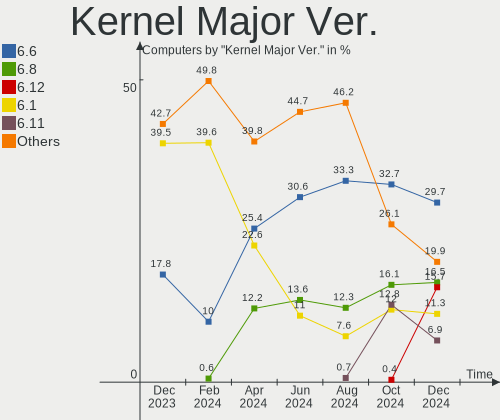
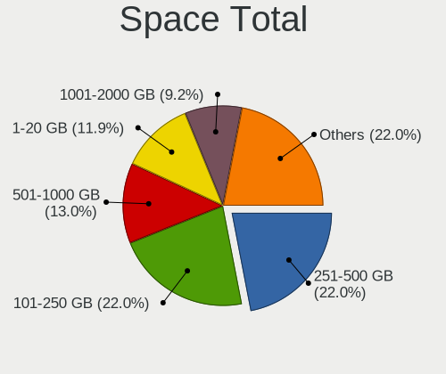
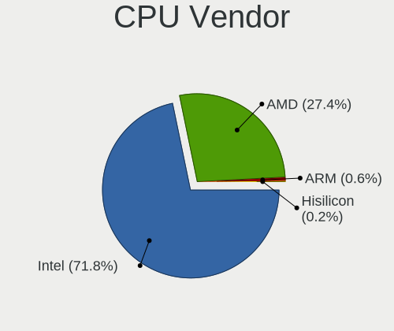
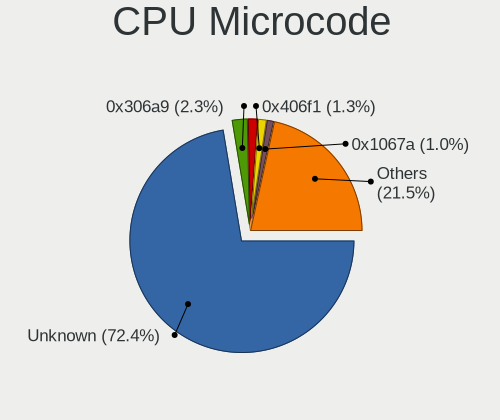
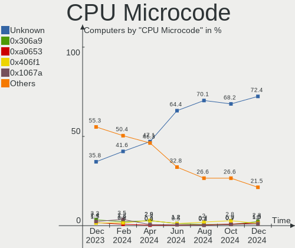
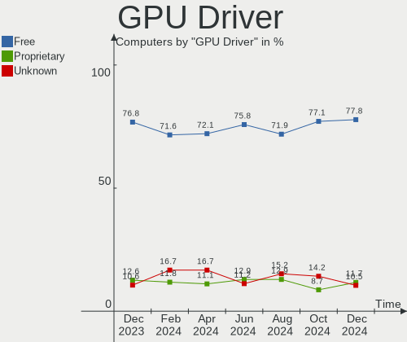
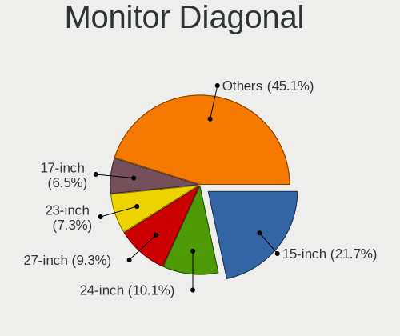
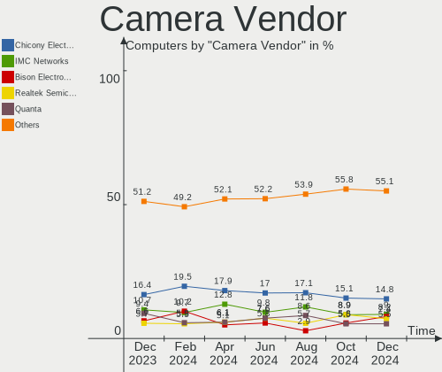

Linux in Russia - Hardware Trends
---------------------------------

A project to identify most popular hardware characteristics and track their change
over time based on data collected by Linux users at https://Linux-Hardware.org.

Anyone can contribute to this report by the [hw-probe](https://github.com/linuxhw/hw-probe) tool:

    sudo -E hw-probe -all -upload

This is a report for all computer types. See also reports for [desktops](/Location/Russia/Desktop/README.md) and [notebooks](/Location/Russia/Notebook/README.md).

Period: May, 2023.

Contents
--------

* [ System ](#system)
  - [ OS                       ](#os)
  - [ OS Family                ](#os-family)
  - [ Kernel                   ](#kernel)
  - [ Kernel Family            ](#kernel-family)
  - [ Kernel Major Ver.        ](#kernel-major-ver)
  - [ Arch                     ](#arch)
  - [ DE                       ](#de)
  - [ Display Server           ](#display-server)
  - [ Display Manager          ](#display-manager)
  - [ OS Lang                  ](#os-lang)
  - [ Boot Mode                ](#boot-mode)
  - [ Filesystem               ](#filesystem)
  - [ Part. scheme             ](#part-scheme)
  - [ Dual Boot with Linux/BSD ](#dual-boot-with-linuxbsd)
  - [ Dual Boot (Win)          ](#dual-boot-win)

* [ Board ](#board)
  - [ Vendor                   ](#vendor)
  - [ Model                    ](#model)
  - [ Model Family             ](#model-family)
  - [ MFG Year                 ](#mfg-year)
  - [ Form Factor              ](#form-factor)
  - [ Secure Boot              ](#secure-boot)
  - [ Coreboot                 ](#coreboot)
  - [ RAM Size                 ](#ram-size)
  - [ RAM Used                 ](#ram-used)
  - [ Total Drives             ](#total-drives)
  - [ Has CD-ROM               ](#has-cd-rom)
  - [ Has Ethernet             ](#has-ethernet)
  - [ Has WiFi                 ](#has-wifi)
  - [ Has Bluetooth            ](#has-bluetooth)

* [ Location ](#location)
  - [ Country                  ](#country)
  - [ City                     ](#city)

* [ Drives ](#drives)
  - [ Drive Vendor             ](#drive-vendor)
  - [ Drive Model              ](#drive-model)
  - [ HDD Vendor               ](#hdd-vendor)
  - [ SSD Vendor               ](#ssd-vendor)
  - [ Drive Kind               ](#drive-kind)
  - [ Drive Connector          ](#drive-connector)
  - [ Drive Size               ](#drive-size)
  - [ Space Total              ](#space-total)
  - [ Space Used               ](#space-used)
  - [ Malfunc. Drives          ](#malfunc-drives)
  - [ Malfunc. Drive Vendor    ](#malfunc-drive-vendor)
  - [ Malfunc. HDD Vendor      ](#malfunc-hdd-vendor)
  - [ Malfunc. Drive Kind      ](#malfunc-drive-kind)
  - [ Failed Drives            ](#failed-drives)
  - [ Failed Drive Vendor      ](#failed-drive-vendor)
  - [ Drive Status             ](#drive-status)

* [ Storage controller ](#storage-controller)
  - [ Storage Vendor           ](#storage-vendor)
  - [ Storage Model            ](#storage-model)
  - [ Storage Kind             ](#storage-kind)

* [ Processor ](#processor)
  - [ CPU Vendor               ](#cpu-vendor)
  - [ CPU Model                ](#cpu-model)
  - [ CPU Model Family         ](#cpu-model-family)
  - [ CPU Cores                ](#cpu-cores)
  - [ CPU Sockets              ](#cpu-sockets)
  - [ CPU Threads              ](#cpu-threads)
  - [ CPU Op-Modes             ](#cpu-op-modes)
  - [ CPU Microcode            ](#cpu-microcode)
  - [ CPU Microarch            ](#cpu-microarch)

* [ Graphics ](#graphics)
  - [ GPU Vendor               ](#gpu-vendor)
  - [ GPU Model                ](#gpu-model)
  - [ GPU Combo                ](#gpu-combo)
  - [ GPU Driver               ](#gpu-driver)
  - [ GPU Memory               ](#gpu-memory)

* [ Monitor ](#monitor)
  - [ Monitor Vendor           ](#monitor-vendor)
  - [ Monitor Model            ](#monitor-model)
  - [ Monitor Resolution       ](#monitor-resolution)
  - [ Monitor Diagonal         ](#monitor-diagonal)
  - [ Monitor Width            ](#monitor-width)
  - [ Aspect Ratio             ](#aspect-ratio)
  - [ Monitor Area             ](#monitor-area)
  - [ Pixel Density            ](#pixel-density)
  - [ Multiple Monitors        ](#multiple-monitors)

* [ Network ](#network)
  - [ Net Controller Vendor    ](#net-controller-vendor)
  - [ Net Controller Model     ](#net-controller-model)
  - [ Wireless Vendor          ](#wireless-vendor)
  - [ Wireless Model           ](#wireless-model)
  - [ Ethernet Vendor          ](#ethernet-vendor)
  - [ Ethernet Model           ](#ethernet-model)
  - [ Net Controller Kind      ](#net-controller-kind)
  - [ Used Controller          ](#used-controller)
  - [ NICs                     ](#nics)
  - [ IPv6                     ](#ipv6)

* [ Bluetooth ](#bluetooth)
  - [ Bluetooth Vendor         ](#bluetooth-vendor)
  - [ Bluetooth Model          ](#bluetooth-model)

* [ Sound ](#sound)
  - [ Sound Vendor             ](#sound-vendor)
  - [ Sound Model              ](#sound-model)

* [ Memory ](#memory)
  - [ Memory Vendor            ](#memory-vendor)
  - [ Memory Model             ](#memory-model)
  - [ Memory Kind              ](#memory-kind)
  - [ Memory Form Factor       ](#memory-form-factor)
  - [ Memory Size              ](#memory-size)
  - [ Memory Speed             ](#memory-speed)

* [ Printers & scanners ](#printers--scanners)
  - [ Printer Vendor           ](#printer-vendor)
  - [ Printer Model            ](#printer-model)
  - [ Scanner Vendor           ](#scanner-vendor)
  - [ Scanner Model            ](#scanner-model)

* [ Camera ](#camera)
  - [ Camera Vendor            ](#camera-vendor)
  - [ Camera Model             ](#camera-model)

* [ Security ](#security)
  - [ Fingerprint Vendor       ](#fingerprint-vendor)
  - [ Fingerprint Model        ](#fingerprint-model)
  - [ Chipcard Vendor          ](#chipcard-vendor)
  - [ Chipcard Model           ](#chipcard-model)

* [ Unsupported ](#unsupported)
  - [ Unsupported Devices      ](#unsupported-devices)
  - [ Unsupported Device Types ](#unsupported-device-types)

System
------

OS
--

Installed operating systems

| Name                         | Computers | Percent |
|------------------------------|-----------|---------|
| ROSA 12.4                    | 142       | 28.8%   |
| Debian 12                    | 61        | 12.37%  |
| Fedora 38                    | 24        | 4.87%   |
| Ubuntu 22.04                 | 21        | 4.26%   |
| OpenMandriva 23.03           | 15        | 3.04%   |
| Arch Rolling                 | 15        | 3.04%   |
| Red OS 7.3.2                 | 14        | 2.84%   |
| ROSA 12.3                    | 12        | 2.43%   |
| Linux Mint 21.1              | 11        | 2.23%   |
| Debian 11                    | 10        | 2.03%   |
| ALT Linux 10.1               | 10        | 2.03%   |
| Ubuntu 23.04                 | 9         | 1.83%   |
| Pop!_OS 22.04                | 9         | 1.83%   |
| ROSA 12                      | 8         | 1.62%   |
| Gentoo 2.13                  | 8         | 1.62%   |
| ROSA R11.1                   | 7         | 1.42%   |
| Manjaro                      | 6         | 1.22%   |
| Elementary 7                 | 6         | 1.22%   |
| Red OS 7.3                   | 5         | 1.01%   |
| MOS 10                       | 5         | 1.01%   |
| KDE neon 22.04               | 5         | 1.01%   |
| Ubuntu 20.04                 | 4         | 0.81%   |
| ROSA 12.1                    | 4         | 0.81%   |
| SteamOS 3.4.6                | 3         | 0.61%   |
| RELD 7.9                     | 3         | 0.61%   |
| openSUSE Tumbleweed-XXXXXXXX | 3         | 0.61%   |
| Linux Mint 20.3              | 3         | 0.61%   |
| Kali 2023.1                  | 3         | 0.61%   |
| Fedora 37                    | 3         | 0.61%   |
| ArcoLinux Rolling            | 3         | 0.61%   |
| Zorin 16                     | 2         | 0.41%   |
| Ubuntu 22.10                 | 2         | 0.41%   |
| ROSA R11                     | 2         | 0.41%   |
| OpenMandriva 4.3             | 2         | 0.41%   |
| OpenMandriva 23.01           | 2         | 0.41%   |
| Manjaro 22.1.3               | 2         | 0.41%   |
| LMDE 5                       | 2         | 0.41%   |
| Kubuntu 22.04                | 2         | 0.41%   |
| Fedora 39                    | 2         | 0.41%   |
| Xubuntu 23.04                | 1         | 0.2%    |

OS Family
---------

OS without a version

| Name          | Computers | Percent |
|---------------|-----------|---------|
| ROSA          | 180       | 36.51%  |
| Debian        | 72        | 14.6%   |
| Ubuntu        | 37        | 7.51%   |
| Fedora        | 30        | 6.09%   |
| Red OS        | 21        | 4.26%   |
| OpenMandriva  | 20        | 4.06%   |
| ALT Linux     | 19        | 3.85%   |
| Linux Mint    | 15        | 3.04%   |
| Arch          | 15        | 3.04%   |
| Manjaro       | 10        | 2.03%   |
| Pop!_OS       | 9         | 1.83%   |
| Gentoo        | 9         | 1.83%   |
| Elementary    | 6         | 1.22%   |
| KDE neon      | 5         | 1.01%   |
| SteamOS       | 4         | 0.81%   |
| openSUSE      | 4         | 0.81%   |
| Kali          | 4         | 0.81%   |
| RELD          | 3         | 0.61%   |
| ArcoLinux     | 3         | 0.61%   |
| Zorin         | 2         | 0.41%   |
| Xubuntu       | 2         | 0.41%   |
| LMDE          | 2         | 0.41%   |
| Kubuntu       | 2         | 0.41%   |
| Clear Linux   | 2         | 0.41%   |
| Ubuntu Unity  | 1         | 0.2%    |
| Ubuntu MATE   | 1         | 0.2%    |
| Ubuntu Budgie | 1         | 0.2%    |
| Solus         | 1         | 0.2%    |
| Rocky Linux   | 1         | 0.2%    |
| Raspbian      | 1         | 0.2%    |
| Nobara        | 1         | 0.2%    |
| NixOS         | 1         | 0.2%    |
| Endless       | 1         | 0.2%    |
| EndeavourOS   | 1         | 0.2%    |
| Cyber Infra   | 1         | 0.2%    |
| CentOS        | 1         | 0.2%    |
| Calculate     | 1         | 0.2%    |
| BunsenLabs    | 1         | 0.2%    |
| Artix         | 1         | 0.2%    |
| antiX         | 1         | 0.2%    |

Kernel
------

Version of the Linux kernel

| Version                                   | Computers | Percent |
|-------------------------------------------|-----------|---------|
| 6.1.20-generic-2rosa2021.1-x86_64         | 116       | 23.53%  |
| 6.1.0-4-amd64                             | 53        | 10.75%  |
| 5.19.0-41-generic                         | 22        | 4.46%   |
| 6.2.6-desktop-1omv2390                    | 15        | 3.04%   |
| 6.2.15-300.fc38.x86_64                    | 13        | 2.64%   |
| 5.15.103-generic-1rosa2021.1-x86_64       | 13        | 2.64%   |
| 6.2.0-20-generic                          | 11        | 2.23%   |
| 5.15.0-71-generic                         | 10        | 2.03%   |
| 6.2.6-76060206-generic                    | 9         | 1.83%   |
| 6.2.14-300.fc38.x86_64                    | 9         | 1.83%   |
| 5.19.0-42-generic                         | 8         | 1.62%   |
| 5.10.176-generic-1rosa2021.1-x86_64       | 8         | 1.62%   |
| 5.15.87-1.el7.3.x86_64                    | 7         | 1.42%   |
| 6.3.2-arch1-1                             | 5         | 1.01%   |
| 6.1.20-2.el7.3.x86_64                     | 5         | 1.01%   |
| 5.15.75-generic-1rosa2021.1-x86_64        | 5         | 1.01%   |
| 5.15.72-1.el7.3.x86_64                    | 5         | 1.01%   |
| 5.10.74-generic-2rosa2021.1-x86_64        | 5         | 1.01%   |
| 5.4.0-148-generic                         | 4         | 0.81%   |
| 5.15.0-72-generic                         | 4         | 0.81%   |
| 5.10.0-22-amd64                           | 4         | 0.81%   |
| 6.3.1-arch1-1                             | 3         | 0.61%   |
| 6.1.26-1-MANJARO                          | 3         | 0.61%   |
| 6.1.0-kali7-amd64                         | 3         | 0.61%   |
| 6.1.0-7-amd64                             | 3         | 0.61%   |
| 5.15.33-1.res7.x86_64                     | 3         | 0.61%   |
| 5.15.103-generic-1rosa2021.1-i686         | 3         | 0.61%   |
| 5.13.0-valve36-1-neptune                  | 3         | 0.61%   |
| 6.3.4-arch1-1                             | 2         | 0.41%   |
| 6.3.1-arch2-1                             | 2         | 0.41%   |
| 6.3.1-1-default                           | 2         | 0.41%   |
| 6.2.14-200.fc37.x86_64                    | 2         | 0.41%   |
| 6.2.13-zen-1-zen                          | 2         | 0.41%   |
| 6.2.12.xm1-1.klp-xanmod-rosa2021.1-x86_64 | 2         | 0.41%   |
| 6.1.30.xm1-1.klp-xanmod-rosa2021.1-x86_64 | 2         | 0.41%   |
| 6.1.26-un-def-alt1                        | 2         | 0.41%   |
| 6.1.21-v8+                                | 2         | 0.41%   |
| 6.1.19-gentoo-x86_64                      | 2         | 0.41%   |
| 5.4.83-generic-2rosa-x86_64               | 2         | 0.41%   |
| 5.4.83-generic-2rosa-i586                 | 2         | 0.41%   |

Kernel Family
-------------

Linux kernel without a distro release

| Version  | Computers | Percent |
|----------|-----------|---------|
| 6.1.20   | 122       | 24.75%  |
| 6.1.0    | 62        | 12.58%  |
| 5.19.0   | 32        | 6.49%   |
| 6.2.6    | 24        | 4.87%   |
| 5.15.0   | 18        | 3.65%   |
| 5.15.103 | 16        | 3.25%   |
| 6.2.14   | 15        | 3.04%   |
| 6.2.15   | 13        | 2.64%   |
| 6.2.0    | 12        | 2.43%   |
| 6.3.1    | 10        | 2.03%   |
| 6.3.2    | 9         | 1.83%   |
| 5.10.176 | 9         | 1.83%   |
| 5.15.72  | 8         | 1.62%   |
| 5.10.0   | 8         | 1.62%   |
| 5.15.87  | 7         | 1.42%   |
| 6.3.4    | 6         | 1.22%   |
| 6.2.13   | 6         | 1.22%   |
| 5.4.0    | 6         | 1.22%   |
| 5.15.75  | 6         | 1.22%   |
| 6.1.26   | 5         | 1.01%   |
| 5.10.74  | 5         | 1.01%   |
| 4.15.0   | 5         | 1.01%   |
| 6.1.30   | 4         | 0.81%   |
| 6.1.29   | 4         | 0.81%   |
| 5.4.83   | 4         | 0.81%   |
| 6.3.3    | 3         | 0.61%   |
| 6.3.0    | 3         | 0.61%   |
| 6.1.21   | 3         | 0.61%   |
| 5.15.33  | 3         | 0.61%   |
| 5.13.0   | 3         | 0.61%   |
| 6.4.0    | 2         | 0.41%   |
| 6.2.12   | 2         | 0.41%   |
| 6.1.25   | 2         | 0.41%   |
| 6.1.19   | 2         | 0.41%   |
| 5.17.11  | 2         | 0.41%   |
| 5.15.79  | 2         | 0.41%   |
| 5.15.77  | 2         | 0.41%   |
| 5.14.0   | 2         | 0.41%   |
| 5.10.179 | 2         | 0.41%   |
| 5.10.164 | 2         | 0.41%   |

Kernel Major Ver.
-----------------

Linux kernel major version

| Version | Computers | Percent |
|---------|-----------|---------|
| 6.1     | 207       | 41.99%  |
| 6.2     | 75        | 15.21%  |
| 5.15    | 67        | 13.59%  |
| 5.10    | 38        | 7.71%   |
| 5.19    | 33        | 6.69%   |
| 6.3     | 31        | 6.29%   |
| 5.4     | 10        | 2.03%   |
| 5.17    | 5         | 1.01%   |
| 4.15    | 5         | 1.01%   |
| 5.14    | 3         | 0.61%   |
| 5.13    | 3         | 0.61%   |
| 6.4     | 2         | 0.41%   |
| 6.0     | 2         | 0.41%   |
| 5.16    | 2         | 0.41%   |
| 4.9     | 2         | 0.41%   |
| 4.19    | 2         | 0.41%   |
| 3.10    | 2         | 0.41%   |
| 5.7     | 1         | 0.2%    |
| 5.0     | 1         | 0.2%    |
| 4.4     | 1         | 0.2%    |
| 4.14    | 1         | 0.2%    |

Arch
----

OS architecture (x86_64, i586, etc.)

| Name    | Computers | Percent |
|---------|-----------|---------|
| x86_64  | 479       | 97.16%  |
| i686    | 9         | 1.83%   |
| aarch64 | 5         | 1.01%   |

DE
--

Desktop Environment

| Name            | Computers | Percent |
|-----------------|-----------|---------|
| KDE5            | 167       | 33.87%  |
| GNOME           | 133       | 26.98%  |
| Unknown         | 76        | 15.42%  |
| MATE            | 26        | 5.27%   |
| LXQt            | 22        | 4.46%   |
| XFCE            | 21        | 4.26%   |
| X-Cinnamon      | 13        | 2.64%   |
| KDE4            | 10        | 2.03%   |
| Pantheon        | 6         | 1.22%   |
| i3              | 3         | 0.61%   |
| Cinnamon        | 3         | 0.61%   |
| Hyprland        | 2         | 0.41%   |
| Deepin          | 2         | 0.41%   |
| Budgie          | 2         | 0.41%   |
| Unity           | 1         | 0.2%    |
| Trinity         | 1         | 0.2%    |
| LXDE            | 1         | 0.2%    |
| icewm           | 1         | 0.2%    |
| GNOME Flashback | 1         | 0.2%    |
| bspwm           | 1         | 0.2%    |
| awesome         | 1         | 0.2%    |

Display Server
--------------

X11 or Wayland

| Name    | Computers | Percent |
|---------|-----------|---------|
| X11     | 217       | 44.02%  |
| Wayland | 201       | 40.77%  |
| Unknown | 63        | 12.78%  |
| Tty     | 12        | 2.43%   |

Display Manager
---------------

SDDM, LightDM, etc.

| Name    | Computers | Percent |
|---------|-----------|---------|
| Unknown | 153       | 31.03%  |
| SDDM    | 147       | 29.82%  |
| GDM     | 101       | 20.49%  |
| LightDM | 45        | 9.13%   |
| GDM3    | 35        | 7.1%    |
| KDM     | 10        | 2.03%   |
| TDM     | 1         | 0.2%    |
| LXDM    | 1         | 0.2%    |

OS Lang
-------

Language

| Lang       | Computers | Percent |
|------------|-----------|---------|
| ru_RU      | 404       | 81.95%  |
| en_US      | 72        | 14.6%   |
| Unknown    | 10        | 2.03%   |
| en_GB      | 2         | 0.41%   |
| C          | 2         | 0.41%   |
| ru_RU.UTF8 | 1         | 0.2%    |
| en_DK      | 1         | 0.2%    |
| C.UTF8     | 1         | 0.2%    |

Boot Mode
---------

EFI or BIOS

| Mode | Computers | Percent |
|------|-----------|---------|
| EFI  | 269       | 54.56%  |
| BIOS | 224       | 45.44%  |

Filesystem
----------

Type of filesystem

| Type    | Computers | Percent |
|---------|-----------|---------|
| Ext4    | 326       | 66.13%  |
| Btrfs   | 66        | 13.39%  |
| Overlay | 65        | 13.18%  |
| Tmpfs   | 16        | 3.25%   |
| Xfs     | 12        | 2.43%   |
| F2fs    | 2         | 0.41%   |
| Ext3    | 2         | 0.41%   |
| Ext2    | 2         | 0.41%   |
| Zfs     | 1         | 0.2%    |
| Aufs    | 1         | 0.2%    |

Part. scheme
------------

Scheme of partitioning

| Type    | Computers | Percent |
|---------|-----------|---------|
| GPT     | 270       | 54.77%  |
| MBR     | 143       | 29.01%  |
| Unknown | 80        | 16.23%  |

Dual Boot with Linux/BSD
------------------------

Hosting more than one Linux/BSD

| Dual boot | Computers | Percent |
|-----------|-----------|---------|
| No        | 414       | 83.98%  |
| Yes       | 79        | 16.02%  |

Dual Boot (Win)
---------------

Hosting Linux and Windows

| Dual boot | Computers | Percent |
|-----------|-----------|---------|
| No        | 296       | 60.04%  |
| Yes       | 197       | 39.96%  |

Board
-----

Vendor
------

Motherboard manufacturer

| Name                    | Computers | Percent |
|-------------------------|-----------|---------|
| ASUSTek Computer        | 110       | 22.31%  |
| Gigabyte Technology     | 66        | 13.39%  |
| MSI                     | 43        | 8.72%   |
| Hewlett-Packard         | 39        | 7.91%   |
| Lenovo                  | 35        | 7.1%    |
| Acer                    | 27        | 5.48%   |
| ASRock                  | 19        | 3.85%   |
| Unknown                 | 15        | 3.04%   |
| HUAWEI                  | 11        | 2.23%   |
| Samsung Electronics     | 10        | 2.03%   |
| Dell                    | 10        | 2.03%   |
| Clevo                   | 8         | 1.62%   |
| Aquarius                | 8         | 1.62%   |
| Supermicro              | 7         | 1.42%   |
| HONOR                   | 6         | 1.22%   |
| Apple                   | 5         | 1.01%   |
| Valve                   | 4         | 0.81%   |
| Toshiba                 | 4         | 0.81%   |
| Intel                   | 4         | 0.81%   |
| Digma                   | 4         | 0.81%   |
| Timi                    | 3         | 0.61%   |
| Raspberry Pi Foundation | 3         | 0.61%   |
| Packard Bell            | 3         | 0.61%   |
| ICL                     | 3         | 0.61%   |
| Huanan                  | 3         | 0.61%   |
| ECS                     | 3         | 0.61%   |
| Quanta                  | 2         | 0.41%   |
| OEM                     | 2         | 0.41%   |
| Maibenben               | 2         | 0.41%   |
| LTD Delovoy Office      | 2         | 0.41%   |
| iRU                     | 2         | 0.41%   |
| Irbis                   | 2         | 0.41%   |
| Graviton                | 2         | 0.41%   |
| eMachines               | 2         | 0.41%   |
| Biostar                 | 2         | 0.41%   |
| AZW                     | 2         | 0.41%   |
| THUNDEROBOT             | 1         | 0.2%    |
| Sony                    | 1         | 0.2%    |
| Rombica                 | 1         | 0.2%    |
| realme                  | 1         | 0.2%    |

Model
-----

Motherboard model

| Name                                 | Computers | Percent |
|--------------------------------------|-----------|---------|
| ASUS All Series                      | 22        | 4.46%   |
| Unknown                              | 18        | 3.65%   |
| Gigabyte H81M-S2V                    | 8         | 1.62%   |
| Clevo NL41MU2                        | 6         | 1.22%   |
| Valve Jupiter                        | 4         | 0.81%   |
| Aquarius NS585                       | 4         | 0.81%   |
| HP 255 G8 Notebook PC                | 3         | 0.61%   |
| ASRock B450 Gaming K4                | 3         | 0.61%   |
| Timi TM1701                          | 2         | 0.41%   |
| Supermicro Super Server              | 2         | 0.41%   |
| RPi Raspberry Pi 4 Model B Rev 1.4   | 2         | 0.41%   |
| Packard Bell DOT S                   | 2         | 0.41%   |
| MSI MS-7D22                          | 2         | 0.41%   |
| MSI MS-7C37                          | 2         | 0.41%   |
| MSI MS-7B17                          | 2         | 0.41%   |
| MSI MS-7592                          | 2         | 0.41%   |
| Maibenben MaiBook M                  | 2         | 0.41%   |
| Lenovo ThinkPad E14 Gen 3 20Y70044RT | 2         | 0.41%   |
| Lenovo ThinkCentre M70q 11DT003GRU   | 2         | 0.41%   |
| Intel B75                            | 2         | 0.41%   |
| ICL H510SB-TM                        | 2         | 0.41%   |
| HUAWEI CREM-WXX9                     | 2         | 0.41%   |
| HONOR HYM-WXX                        | 2         | 0.41%   |
| HONOR BBR-WAX9                       | 2         | 0.41%   |
| Gigabyte M68MT-S2                    | 2         | 0.41%   |
| Gigabyte M56S-S3                     | 2         | 0.41%   |
| Gigabyte H61M-S2PV                   | 2         | 0.41%   |
| Gigabyte B560 HD3                    | 2         | 0.41%   |
| Gigabyte B450M S2H                   | 2         | 0.41%   |
| Gigabyte B450 AORUS ELITE            | 2         | 0.41%   |
| ECS G31T-M9                          | 2         | 0.41%   |
| Digma EVE 11 C422 ES1068EW           | 2         | 0.41%   |
| AZW MINI S                           | 2         | 0.41%   |
| ASUS X550CC                          | 2         | 0.41%   |
| ASUS SABERTOOTH 990FX R2.0           | 2         | 0.41%   |
| ASUS P9X79                           | 2         | 0.41%   |
| ASUS P8H67-M                         | 2         | 0.41%   |
| ASUS P8H61-MX R2.0                   | 2         | 0.41%   |
| ASUS P5G41T-M LX                     | 2         | 0.41%   |
| ASUS P5G41T-M LE                     | 2         | 0.41%   |

Model Family
------------

Motherboard model prefix

| Name               | Computers | Percent |
|--------------------|-----------|---------|
| ASUS All           | 22        | 4.46%   |
| Acer Aspire        | 18        | 3.65%   |
| Unknown            | 18        | 3.65%   |
| ASUS PRIME         | 16        | 3.25%   |
| HP Laptop          | 9         | 1.83%   |
| Gigabyte H81M-S2V  | 8         | 1.62%   |
| Lenovo ThinkPad    | 7         | 1.42%   |
| HP ProBook         | 7         | 1.42%   |
| Dell Inspiron      | 6         | 1.22%   |
| Clevo NL41MU2      | 6         | 1.22%   |
| HP Pavilion        | 5         | 1.01%   |
| ASUS VivoBook      | 5         | 1.01%   |
| ASUS TUF           | 5         | 1.01%   |
| ASUS P5G41T-M      | 5         | 1.01%   |
| Valve Jupiter      | 4         | 0.81%   |
| Toshiba Satellite  | 4         | 0.81%   |
| Lenovo ThinkCentre | 4         | 0.81%   |
| Lenovo IdeaPad     | 4         | 0.81%   |
| ASUS ROG           | 4         | 0.81%   |
| ASRock B450        | 4         | 0.81%   |
| Aquarius NS585     | 4         | 0.81%   |
| RPi Raspberry      | 3         | 0.61%   |
| MSI Katana         | 3         | 0.61%   |
| Lenovo ThinkBook   | 3         | 0.61%   |
| Lenovo Legion      | 3         | 0.61%   |
| HP EliteBook       | 3         | 0.61%   |
| HP 255             | 3         | 0.61%   |
| Gigabyte B450M     | 3         | 0.61%   |
| Gigabyte B450      | 3         | 0.61%   |
| Digma EVE          | 3         | 0.61%   |
| ASUS P9X79         | 3         | 0.61%   |
| ASUS P8H67-M       | 3         | 0.61%   |
| Timi TM1701        | 2         | 0.41%   |
| Supermicro Super   | 2         | 0.41%   |
| Packard Bell DOT   | 2         | 0.41%   |
| MSI MS-7D22        | 2         | 0.41%   |
| MSI MS-7C37        | 2         | 0.41%   |
| MSI MS-7B17        | 2         | 0.41%   |
| MSI MS-7592        | 2         | 0.41%   |
| Maibenben MaiBook  | 2         | 0.41%   |

MFG Year
--------

Motherboard manufacture year

| Year    | Computers | Percent |
|---------|-----------|---------|
| 2022    | 71        | 14.4%   |
| 2012    | 57        | 11.56%  |
| 2021    | 56        | 11.36%  |
| 2020    | 41        | 8.32%   |
| 2011    | 40        | 8.11%   |
| 2019    | 39        | 7.91%   |
| 2018    | 37        | 7.51%   |
| 2013    | 23        | 4.67%   |
| 2010    | 22        | 4.46%   |
| 2009    | 21        | 4.26%   |
| 2014    | 20        | 4.06%   |
| 2016    | 15        | 3.04%   |
| 2017    | 14        | 2.84%   |
| 2015    | 8         | 1.62%   |
| 2008    | 7         | 1.42%   |
| 2007    | 7         | 1.42%   |
| 2023    | 5         | 1.01%   |
| Unknown | 5         | 1.01%   |
| 2006    | 4         | 0.81%   |
| 2003    | 1         | 0.2%    |

Form Factor
-----------

Physical design of the computer

| Name           | Computers | Percent |
|----------------|-----------|---------|
| Desktop        | 238       | 48.28%  |
| Notebook       | 218       | 44.22%  |
| Server         | 12        | 2.43%   |
| All in one     | 8         | 1.62%   |
| Mini pc        | 7         | 1.42%   |
| Convertible    | 5         | 1.01%   |
| System on chip | 4         | 0.81%   |
| Phone          | 1         | 0.2%    |

Secure Boot
-----------

Enabled or disabled

| State    | Computers | Percent |
|----------|-----------|---------|
| Disabled | 474       | 96.15%  |
| Enabled  | 19        | 3.85%   |

Coreboot
--------

Have coreboot on board

| Used | Computers | Percent |
|------|-----------|---------|
| No   | 493       | 100%    |

RAM Size
--------

Total RAM memory

| Size in GB      | Computers | Percent |
|-----------------|-----------|---------|
| 4.01-8.0        | 125       | 25.35%  |
| 8.01-16.0       | 103       | 20.89%  |
| 16.01-24.0      | 96        | 19.47%  |
| 3.01-4.0        | 75        | 15.21%  |
| 32.01-64.0      | 46        | 9.33%   |
| 1.01-2.0        | 15        | 3.04%   |
| 64.01-256.0     | 12        | 2.43%   |
| 2.01-3.0        | 11        | 2.23%   |
| 24.01-32.0      | 4         | 0.81%   |
| More than 256.0 | 3         | 0.61%   |
| 0.51-1.0        | 3         | 0.61%   |

RAM Used
--------

Used RAM memory

| Used GB    | Computers | Percent |
|------------|-----------|---------|
| 1.01-2.0   | 175       | 35.5%   |
| 2.01-3.0   | 98        | 19.88%  |
| 0.51-1.0   | 89        | 18.05%  |
| 4.01-8.0   | 59        | 11.97%  |
| 3.01-4.0   | 43        | 8.72%   |
| 8.01-16.0  | 17        | 3.45%   |
| 0.01-0.5   | 7         | 1.42%   |
| 32.01-64.0 | 3         | 0.61%   |
| 24.01-32.0 | 1         | 0.2%    |
| 16.01-24.0 | 1         | 0.2%    |

Total Drives
------------

Number of drives on board

| Drives | Computers | Percent |
|--------|-----------|---------|
| 1      | 293       | 59.43%  |
| 2      | 136       | 27.59%  |
| 3      | 38        | 7.71%   |
| 4      | 16        | 3.25%   |
| 5      | 6         | 1.22%   |
| 19     | 1         | 0.2%    |
| 8      | 1         | 0.2%    |
| 6      | 1         | 0.2%    |
| 0      | 1         | 0.2%    |

Has CD-ROM
----------

Has CD-ROM on board

| Presented | Computers | Percent |
|-----------|-----------|---------|
| No        | 381       | 77.28%  |
| Yes       | 112       | 22.72%  |

Has Ethernet
------------

Has Ethernet on board

| Presented | Computers | Percent |
|-----------|-----------|---------|
| Yes       | 437       | 88.64%  |
| No        | 56        | 11.36%  |

Has WiFi
--------

Has WiFi module

| Presented | Computers | Percent |
|-----------|-----------|---------|
| Yes       | 297       | 60.24%  |
| No        | 196       | 39.76%  |

Has Bluetooth
-------------

Has Bluetooth module

| Presented | Computers | Percent |
|-----------|-----------|---------|
| No        | 250       | 50.71%  |
| Yes       | 243       | 49.29%  |

Location
--------

Country
-------

Geographic location (country)

| Country | Computers | Percent |
|---------|-----------|---------|
| Russia  | 493       | 100%    |

City
----

Geographic location (city)

| City              | Computers | Percent |
|-------------------|-----------|---------|
| Moscow            | 123       | 24.95%  |
| Voronezh          | 58        | 11.76%  |
| St Petersburg     | 37        | 7.51%   |
| Yekaterinburg     | 13        | 2.64%   |
| Krasnodar         | 12        | 2.43%   |
| Volgograd         | 9         | 1.83%   |
| Perm              | 9         | 1.83%   |
| Nizhniy Novgorod  | 8         | 1.62%   |
| Rostov-on-Don     | 7         | 1.42%   |
| Omsk              | 7         | 1.42%   |
| Tyumen            | 6         | 1.22%   |
| Samara            | 6         | 1.22%   |
| Novosibirsk       | 6         | 1.22%   |
| Krasnoyarsk       | 6         | 1.22%   |
| Khabarovsk        | 6         | 1.22%   |
| Kaluga            | 6         | 1.22%   |
| Tomsk             | 5         | 1.01%   |
| Surgut            | 5         | 1.01%   |
| Vladivostok       | 4         | 0.81%   |
| Ufa               | 4         | 0.81%   |
| Saratov           | 4         | 0.81%   |
| Saransk           | 4         | 0.81%   |
| Kazan’          | 4         | 0.81%   |
| Bryansk           | 4         | 0.81%   |
| Yuzhno-Sakhalinsk | 3         | 0.61%   |
| Vladimir          | 3         | 0.61%   |
| Ulyanovsk         | 3         | 0.61%   |
| Oryol             | 3         | 0.61%   |
| Orenburg          | 3         | 0.61%   |
| Lipetsk           | 3         | 0.61%   |
| Kirov             | 3         | 0.61%   |
| Kanevskaya        | 3         | 0.61%   |
| Irkutsk           | 3         | 0.61%   |
| Chernogolovka     | 3         | 0.61%   |
| Chelyabinsk       | 3         | 0.61%   |
| Barnaul           | 3         | 0.61%   |
| Yaroslavl         | 2         | 0.41%   |
| Vorkuta           | 2         | 0.41%   |
| Taganrog          | 2         | 0.41%   |
| Stary Oskol       | 2         | 0.41%   |

Drives
------

Drive Vendor
------------

Hard drive vendors

| Vendor                      | Computers | Drives | Percent |
|-----------------------------|-----------|--------|---------|
| WDC                         | 123       | 151    | 17.25%  |
| Seagate                     | 86        | 92     | 12.06%  |
| Samsung Electronics         | 79        | 98     | 11.08%  |
| Toshiba                     | 44        | 47     | 6.17%   |
| Kingston                    | 43        | 46     | 6.03%   |
| Hitachi                     | 27        | 31     | 3.79%   |
| Sandisk                     | 25        | 25     | 3.51%   |
| A-DATA Technology           | 22        | 22     | 3.09%   |
| China                       | 18        | 19     | 2.52%   |
| Intel                       | 16        | 17     | 2.24%   |
| Unknown                     | 14        | 14     | 1.96%   |
| SPCC                        | 12        | 14     | 1.68%   |
| SK hynix                    | 10        | 10     | 1.4%    |
| KingSpec                    | 10        | 10     | 1.4%    |
| Crucial                     | 10        | 10     | 1.4%    |
| Apacer                      | 10        | 10     | 1.4%    |
| Unknown                     | 10        | 10     | 1.4%    |
| Phison Electronics          | 9         | 10     | 1.26%   |
| Transcend                   | 8         | 8      | 1.12%   |
| Netac                       | 8         | 8      | 1.12%   |
| HGST                        | 8         | 8      | 1.12%   |
| Patriot                     | 7         | 7      | 0.98%   |
| BIWIN                       | 7         | 7      | 0.98%   |
| AMD                         | 7         | 7      | 0.98%   |
| Micron Technology           | 6         | 6      | 0.84%   |
| KIOXIA                      | 6         | 6      | 0.84%   |
| ADATA Technology            | 6         | 6      | 0.84%   |
| Smartbuy                    | 5         | 5      | 0.7%    |
| Silicon Motion              | 5         | 5      | 0.7%    |
| Plextor                     | 4         | 4      | 0.56%   |
| Gigabyte Technology         | 4         | 4      | 0.56%   |
| Foxline                     | 4         | 4      | 0.56%   |
| XrayDisk                    | 3         | 3      | 0.42%   |
| Realtek Semiconductor       | 3         | 3      | 0.42%   |
| Kingston Technology Company | 3         | 3      | 0.42%   |
| Hewlett-Packard             | 3         | 6      | 0.42%   |
| XPG                         | 2         | 2      | 0.28%   |
| OCZ                         | 2         | 2      | 0.28%   |
| Neo                         | 2         | 2      | 0.28%   |
| MSI                         | 2         | 2      | 0.28%   |

Drive Model
-----------

Hard drive models

| Model                                                           | Computers | Percent |
|-----------------------------------------------------------------|-----------|---------|
| WDC WD5000AAKX-60U6AA0 500GB                                    | 15        | 2.01%   |
| Unknown                                                         | 10        | 1.34%   |
| Seagate ST1000DM003-1ER162 1TB                                  | 9         | 1.2%    |
| Toshiba DT01ACA050 500GB                                        | 8         | 1.07%   |
| Toshiba HDWD110 1TB                                             | 7         | 0.94%   |
| Seagate ST1000DM010-2EP102 1TB                                  | 7         | 0.94%   |
| Samsung NVMe SSD Controller SM981/PM981/PM983 256GB             | 7         | 0.94%   |
| Kingston SA400S37120G 120GB SSD                                 | 7         | 0.94%   |
| WDC WDS240G2G0A-00JH30 240GB SSD                                | 6         | 0.8%    |
| SPCC Solid State Disk 256GB                                     | 5         | 0.67%   |
| Seagate ST500DM002-1BD142 500GB                                 | 5         | 0.67%   |
| Phison E12 NVMe Controller 256GB                                | 5         | 0.67%   |
| Kingston SA400S37240G 240GB SSD                                 | 5         | 0.67%   |
| BIWIN CE480T5D101-256 256GB                                     | 5         | 0.67%   |
| ADATA XPG SX8200 Pro PCIe Gen3x4 M.2 2280 Solid State Drive 1TB | 5         | 0.67%   |
| Samsung SSD 860 EVO 500GB                                       | 4         | 0.54%   |
| Kingston SV300S37A120G 120GB SSD                                | 4         | 0.54%   |
| Kingston SA400S37480G 480GB SSD                                 | 4         | 0.54%   |
| Hitachi HTS547575A9E384 752GB                                   | 4         | 0.54%   |
| Crucial CT240BX500SSD1 240GB                                    | 4         | 0.54%   |
| China 128GB SSD                                                 | 4         | 0.54%   |
| A-DATA SU800 512GB SSD                                          | 4         | 0.54%   |
| WDC WD5000AAKX-00ERMA0 500GB                                    | 3         | 0.4%    |
| WDC WD10EZEX-22MFCA0 1TB                                        | 3         | 0.4%    |
| WDC WD10EZEX-08WN4A0 1TB                                        | 3         | 0.4%    |
| WDC WD10EZEX-00BBHA0 1TB                                        | 3         | 0.4%    |
| Unknown MMC Card  32GB                                          | 3         | 0.4%    |
| Toshiba MQ04ABF100 1TB                                          | 3         | 0.4%    |
| Toshiba HDWD105 500GB                                           | 3         | 0.4%    |
| Seagate ST500LT012-9WS142 500GB                                 | 3         | 0.4%    |
| Seagate ST250DM000-1BC141 250GB                                 | 3         | 0.4%    |
| Seagate ST1000DM003-1CH162 1TB                                  | 3         | 0.4%    |
| Sandisk WD Blue SN550 NVMe SSD 512GB                            | 3         | 0.4%    |
| Samsung SSD 980 500GB                                           | 3         | 0.4%    |
| Samsung SSD 980 1TB                                             | 3         | 0.4%    |
| Samsung SSD 870 EVO 500GB                                       | 3         | 0.4%    |
| Samsung NVMe SSD Controller PM9A1/PM9A3/980PRO 1TB              | 3         | 0.4%    |
| Samsung MZVL2512HCJQ-00B00 512GB                                | 3         | 0.4%    |
| Netac SSD 240GB                                                 | 3         | 0.4%    |
| Kingston SA400M8240G 240GB SSD                                  | 3         | 0.4%    |

HDD Vendor
----------

Hard disk drive vendors

| Vendor              | Computers | Drives | Percent |
|---------------------|-----------|--------|---------|
| WDC                 | 104       | 125    | 37.28%  |
| Seagate             | 85        | 91     | 30.47%  |
| Toshiba             | 41        | 44     | 14.7%   |
| Hitachi             | 27        | 31     | 9.68%   |
| Samsung Electronics | 9         | 9      | 3.23%   |
| HGST                | 8         | 8      | 2.87%   |
| Maxtor              | 2         | 2      | 0.72%   |
| USB3.0              | 1         | 1      | 0.36%   |
| Unknown             | 1         | 1      | 0.36%   |
| Hewlett-Packard     | 1         | 4      | 0.36%   |

SSD Vendor
----------

Solid state drive vendors

| Vendor              | Computers | Drives | Percent |
|---------------------|-----------|--------|---------|
| Kingston            | 33        | 35     | 13.64%  |
| Samsung Electronics | 25        | 36     | 10.33%  |
| China               | 18        | 19     | 7.44%   |
| WDC                 | 17        | 17     | 7.02%   |
| A-DATA Technology   | 13        | 13     | 5.37%   |
| SPCC                | 11        | 12     | 4.55%   |
| KingSpec            | 10        | 10     | 4.13%   |
| SanDisk             | 9         | 9      | 3.72%   |
| Crucial             | 9         | 9      | 3.72%   |
| Transcend           | 7         | 7      | 2.89%   |
| Intel               | 7         | 7      | 2.89%   |
| Apacer              | 7         | 7      | 2.89%   |
| AMD                 | 7         | 7      | 2.89%   |
| Patriot             | 6         | 6      | 2.48%   |
| Netac               | 6         | 6      | 2.48%   |
| Smartbuy            | 5         | 5      | 2.07%   |
| XrayDisk            | 3         | 3      | 1.24%   |
| Plextor             | 3         | 3      | 1.24%   |
| Gigabyte Technology | 3         | 3      | 1.24%   |
| Foxline             | 3         | 3      | 1.24%   |
| OCZ                 | 2         | 2      | 0.83%   |
| Neo                 | 2         | 2      | 0.83%   |
| Micron Technology   | 2         | 2      | 0.83%   |
| Hewlett-Packard     | 2         | 2      | 0.83%   |
| GOODRAM             | 2         | 2      | 0.83%   |
| Corsair             | 2         | 2      | 0.83%   |
| Unknown             | 2         | 2      | 0.83%   |
| ZM-SSD              | 1         | 1      | 0.41%   |
| ZHITAI              | 1         | 1      | 0.41%   |
| Wdxsky              | 1         | 1      | 0.41%   |
| Vaseky              | 1         | 1      | 0.41%   |
| Toshiba             | 1         | 1      | 0.41%   |
| TO Exter            | 1         | 1      | 0.41%   |
| TMI                 | 1         | 1      | 0.41%   |
| StoreJet            | 1         | 1      | 0.41%   |
| ShiJi               | 1         | 1      | 0.41%   |
| Seagate             | 1         | 1      | 0.41%   |
| Qumo                | 1         | 1      | 0.41%   |
| NGFF                | 1         | 1      | 0.41%   |
| MSI                 | 1         | 1      | 0.41%   |

Drive Kind
----------

HDD or SSD

| Kind    | Computers | Drives | Percent |
|---------|-----------|--------|---------|
| HDD     | 244       | 316    | 37.83%  |
| SSD     | 214       | 257    | 33.18%  |
| NVMe    | 164       | 187    | 25.43%  |
| MMC     | 20        | 21     | 3.1%    |
| Unknown | 3         | 3      | 0.47%   |

Drive Connector
---------------

SATA, SAS, NVMe, etc.

| Type | Computers | Drives | Percent |
|------|-----------|--------|---------|
| SATA | 361       | 560    | 64.7%   |
| NVMe | 164       | 187    | 29.39%  |
| MMC  | 20        | 21     | 3.58%   |
| SAS  | 13        | 16     | 2.33%   |

Drive Size
----------

Size of hard drive

| Size in TB | Computers | Drives | Percent |
|------------|-----------|--------|---------|
| 0.01-0.5   | 293       | 369    | 64.4%   |
| 0.51-1.0   | 123       | 141    | 27.03%  |
| 1.01-2.0   | 26        | 43     | 5.71%   |
| 3.01-4.0   | 7         | 14     | 1.54%   |
| 2.01-3.0   | 4         | 4      | 0.88%   |
| 10.01-20.0 | 1         | 1      | 0.22%   |
| 4.01-10.0  | 1         | 1      | 0.22%   |

Space Total
-----------

Amount of disk space available on the file system

| Size in GB     | Computers | Percent |
|----------------|-----------|---------|
| 101-250        | 132       | 26.77%  |
| 251-500        | 92        | 18.66%  |
| 501-1000       | 73        | 14.81%  |
| Unknown        | 60        | 12.17%  |
| 51-100         | 34        | 6.9%    |
| 1-20           | 30        | 6.09%   |
| 1001-2000      | 24        | 4.87%   |
| 2001-3000      | 18        | 3.65%   |
| 21-50          | 16        | 3.25%   |
| More than 3000 | 14        | 2.84%   |

Space Used
----------

Amount of used disk space

| Used GB        | Computers | Percent |
|----------------|-----------|---------|
| 1-20           | 190       | 38.54%  |
| 21-50          | 78        | 15.82%  |
| Unknown        | 60        | 12.17%  |
| 101-250        | 55        | 11.16%  |
| 51-100         | 44        | 8.92%   |
| 251-500        | 25        | 5.07%   |
| 501-1000       | 18        | 3.65%   |
| 1001-2000      | 17        | 3.45%   |
| More than 3000 | 3         | 0.61%   |
| 2001-3000      | 3         | 0.61%   |

Malfunc. Drives
---------------

Drive models with a malfunction

| Model                             | Computers | Drives | Percent |
|-----------------------------------|-----------|--------|---------|
| WDC WD5000AAKX-60U6AA0 500GB      | 12        | 12     | 11.21%  |
| WDC WD10EZEX-00RKKA0 1TB          | 2         | 2      | 1.87%   |
| Toshiba MQ04ABF100 1TB            | 2         | 2      | 1.87%   |
| Seagate ST9500325AS 500GB         | 2         | 2      | 1.87%   |
| Seagate ST500LT012-9WS142 500GB   | 2         | 2      | 1.87%   |
| Seagate ST3250410AS 250GB         | 2         | 2      | 1.87%   |
| Seagate ST1000DM003-1CH162 1TB    | 2         | 2      | 1.87%   |
| Samsung Electronics HM321HI 320GB | 2         | 2      | 1.87%   |
| Hitachi HTS543232A7A384 320GB     | 2         | 2      | 1.87%   |
| XrayDisk 512GB SSD                | 1         | 1      | 0.93%   |
| XPG GAMMIX S5 512GB               | 1         | 1      | 0.93%   |
| WDC WDS240G2G0B-00EPW0 240GB SSD  | 1         | 1      | 0.93%   |
| WDC WD800JD-00MSA1 80GB           | 1         | 1      | 0.93%   |
| WDC WD800JD-00HKA0 80GB           | 1         | 1      | 0.93%   |
| WDC WD800BB-75JHC0 80GB           | 1         | 1      | 0.93%   |
| WDC WD7500BPVT-00HXZT3 752GB      | 1         | 1      | 0.93%   |
| WDC WD7500AADS-00M2B0 752GB       | 1         | 1      | 0.93%   |
| WDC WD5000BPVT-75HXZT3 500GB      | 1         | 1      | 0.93%   |
| WDC WD5000BPVT-22HXZT3 500GB      | 1         | 1      | 0.93%   |
| WDC WD5000AAKX-00ERMA0 500GB      | 1         | 1      | 0.93%   |
| WDC WD5000AAKX-001CA0 500GB       | 1         | 1      | 0.93%   |
| WDC WD5000AAKS-00V6A0 500GB       | 1         | 1      | 0.93%   |
| WDC WD40EFRX-68WT0N0 4TB          | 1         | 1      | 0.93%   |
| WDC WD3200AAJS-56B4A0 320GB       | 1         | 1      | 0.93%   |
| WDC WD3200AAJS-00L7A0 320GB       | 1         | 1      | 0.93%   |
| WDC WD2500BEVT-60ZCT1 250GB       | 1         | 1      | 0.93%   |
| WDC WD2500AAKX-001CA0 250GB       | 1         | 1      | 0.93%   |
| WDC WD2500AAKS-00VSA0 250GB       | 1         | 1      | 0.93%   |
| WDC WD2500AAKS-00UU3A0 250GB      | 1         | 1      | 0.93%   |
| WDC WD2005FBYZ-01YCBB3 2TB        | 1         | 1      | 0.93%   |
| WDC WD10JPVX-60JC3T0 1TB          | 1         | 1      | 0.93%   |
| WDC WD10EZRZ-00Z5HB0 1TB          | 1         | 1      | 0.93%   |
| WDC WD10EZRZ-00HTKB0 1TB          | 1         | 1      | 0.93%   |
| WDC WD10EZEX-22MFCA0 1TB          | 1         | 1      | 0.93%   |
| WDC WD10EFRX-68PJCN0 1TB          | 1         | 1      | 0.93%   |
| Toshiba MQ01ABF050 500GB          | 1         | 1      | 0.93%   |
| Toshiba MK6459GSXP 640GB          | 1         | 1      | 0.93%   |
| Toshiba MK5075GSX 500GB           | 1         | 1      | 0.93%   |
| Toshiba MK3276GSX -63 320GB       | 1         | 1      | 0.93%   |
| Toshiba HDWD105 500GB             | 1         | 1      | 0.93%   |

Malfunc. Drive Vendor
---------------------

Vendors of faulty drives

| Vendor              | Computers | Drives | Percent |
|---------------------|-----------|--------|---------|
| WDC                 | 34        | 38     | 33.66%  |
| Seagate             | 23        | 24     | 22.77%  |
| Toshiba             | 8         | 9      | 7.92%   |
| Samsung Electronics | 8         | 11     | 7.92%   |
| Hitachi             | 8         | 8      | 7.92%   |
| Intel               | 4         | 4      | 3.96%   |
| Netac               | 2         | 2      | 1.98%   |
| Kingston            | 2         | 2      | 1.98%   |
| AMD                 | 2         | 2      | 1.98%   |
| XrayDisk            | 1         | 1      | 0.99%   |
| XPG                 | 1         | 1      | 0.99%   |
| SPCC                | 1         | 1      | 0.99%   |
| Smartbuy            | 1         | 1      | 0.99%   |
| SanDisk             | 1         | 1      | 0.99%   |
| ORICO               | 1         | 1      | 0.99%   |
| Neo                 | 1         | 1      | 0.99%   |
| HGST                | 1         | 1      | 0.99%   |
| A-DATA Technology   | 1         | 1      | 0.99%   |
| Unknown             | 1         | 1      | 0.99%   |

Malfunc. HDD Vendor
-------------------

Vendors of faulty HDD drives

| Vendor              | Computers | Drives | Percent |
|---------------------|-----------|--------|---------|
| WDC                 | 34        | 37     | 43.04%  |
| Seagate             | 23        | 24     | 29.11%  |
| Toshiba             | 8         | 9      | 10.13%  |
| Hitachi             | 8         | 8      | 10.13%  |
| Samsung Electronics | 5         | 5      | 6.33%   |
| HGST                | 1         | 1      | 1.27%   |

Malfunc. Drive Kind
-------------------

Kinds of faulty drives

| Kind | Computers | Drives | Percent |
|------|-----------|--------|---------|
| HDD  | 76        | 84     | 76.77%  |
| SSD  | 19        | 22     | 19.19%  |
| NVMe | 4         | 4      | 4.04%   |

Failed Drives
-------------

Failed drive models

| Model                       | Computers | Drives | Percent |
|-----------------------------|-----------|--------|---------|
| WDC WD10EZEX-60WN4A0 1TB    | 1         | 1      | 50%     |
| Hitachi HDS721010DLE630 1TB | 1         | 1      | 50%     |

Failed Drive Vendor
-------------------

Failed drive vendors

| Vendor  | Computers | Drives | Percent |
|---------|-----------|--------|---------|
| WDC     | 1         | 1      | 50%     |
| Hitachi | 1         | 1      | 50%     |

Drive Status
------------

Number of failed and malfunc. drives

| Status   | Computers | Drives | Percent |
|----------|-----------|--------|---------|
| Works    | 320       | 491    | 59.7%   |
| Detected | 123       | 181    | 22.95%  |
| Malfunc  | 91        | 110    | 16.98%  |
| Failed   | 2         | 2      | 0.37%   |

Storage controller
------------------

Storage Vendor
--------------

Storage controller vendors

| Vendor                         | Computers | Percent |
|--------------------------------|-----------|---------|
| Intel                          | 315       | 48.99%  |
| AMD                            | 110       | 17.11%  |
| Samsung Electronics            | 49        | 7.62%   |
| SanDisk                        | 24        | 3.73%   |
| Phison Electronics             | 15        | 2.33%   |
| ASMedia Technology             | 15        | 2.33%   |
| Kingston Technology Company    | 14        | 2.18%   |
| ADATA Technology               | 14        | 2.18%   |
| Silicon Motion                 | 11        | 1.71%   |
| SK hynix                       | 10        | 1.56%   |
| Nvidia                         | 8         | 1.24%   |
| JMicron Technology             | 8         | 1.24%   |
| Realtek Semiconductor          | 6         | 0.93%   |
| KIOXIA                         | 6         | 0.93%   |
| INNOGRIT                       | 6         | 0.93%   |
| Micron Technology              | 4         | 0.62%   |
| Adaptec                        | 4         | 0.62%   |
| VIA Technologies               | 3         | 0.47%   |
| Toshiba America Info Systems   | 3         | 0.47%   |
| Yangtze Memory Technologies    | 2         | 0.31%   |
| Solid State Storage Technology | 2         | 0.31%   |
| Shenzhen Longsys Electronics   | 2         | 0.31%   |
| Marvell Technology Group       | 2         | 0.31%   |
| Hewlett-Packard                | 2         | 0.31%   |
| Broadcom / LSI                 | 2         | 0.31%   |
| Union Memory (Shenzhen)        | 1         | 0.16%   |
| Netac Technology               | 1         | 0.16%   |
| Micron/Crucial Technology      | 1         | 0.16%   |
| LSI Logic / Symbios Logic      | 1         | 0.16%   |
| Biwin Storage Technology       | 1         | 0.16%   |
| Apple                          | 1         | 0.16%   |

Storage Model
-------------

Storage controller models

| Model                                                                                   | Computers | Percent |
|-----------------------------------------------------------------------------------------|-----------|---------|
| AMD FCH SATA Controller [AHCI mode]                                                     | 65        | 8.81%   |
| Intel 8 Series/C220 Series Chipset Family 6-port SATA Controller 1 [AHCI mode]          | 36        | 4.88%   |
| Intel 7 Series Chipset Family 6-port SATA Controller [AHCI mode]                        | 23        | 3.12%   |
| Intel 500 Series Chipset Family SATA AHCI Controller                                    | 21        | 2.85%   |
| Samsung NVMe SSD Controller 980                                                         | 19        | 2.57%   |
| Samsung NVMe SSD Controller SM981/PM981/PM983                                           | 18        | 2.44%   |
| Intel NM10/ICH7 Family SATA Controller [IDE mode]                                       | 15        | 2.03%   |
| ASMedia ASM1062 Serial ATA Controller                                                   | 15        | 2.03%   |
| Intel Comet Lake SATA AHCI Controller                                                   | 14        | 1.9%    |
| AMD SB7x0/SB8x0/SB9x0 SATA Controller [AHCI mode]                                       | 14        | 1.9%    |
| AMD 400 Series Chipset SATA Controller                                                  | 14        | 1.9%    |
| Intel 6 Series/C200 Series Chipset Family 6 port Mobile SATA AHCI Controller            | 13        | 1.76%   |
| AMD 500 Series Chipset SATA Controller                                                  | 13        | 1.76%   |
| Intel Cannon Lake PCH SATA AHCI Controller                                              | 12        | 1.63%   |
| Intel 200 Series PCH SATA controller [AHCI mode]                                        | 12        | 1.63%   |
| AMD SB7x0/SB8x0/SB9x0 IDE Controller                                                    | 12        | 1.63%   |
| Samsung NVMe SSD Controller PM9A1/PM9A3/980PRO                                          | 11        | 1.49%   |
| Intel 82801G (ICH7 Family) IDE Controller                                               | 11        | 1.49%   |
| Intel 6 Series/C200 Series Chipset Family Desktop SATA Controller (IDE mode, ports 4-5) | 11        | 1.49%   |
| Intel 6 Series/C200 Series Chipset Family Desktop SATA Controller (IDE mode, ports 0-3) | 11        | 1.49%   |
| Silicon Motion SM2263EN/SM2263XT SSD Controller                                         | 10        | 1.36%   |
| Intel Tiger Lake-LP SATA Controller                                                     | 10        | 1.36%   |
| Intel 82801IBM/IEM (ICH9M/ICH9M-E) 4 port SATA Controller [AHCI mode]                   | 10        | 1.36%   |
| AMD SB7x0/SB8x0/SB9x0 SATA Controller [IDE mode]                                        | 10        | 1.36%   |
| Intel Celeron/Pentium Silver Processor SATA Controller                                  | 9         | 1.22%   |
| AMD FCH SATA Controller D                                                               | 9         | 1.22%   |
| ADATA XPG SX8200 Pro PCIe Gen3x4 M.2 2280 Solid State Drive                             | 9         | 1.22%   |
| Phison PS5013 E13 NVMe Controller                                                       | 8         | 1.08%   |
| Intel C600/X79 series chipset 6-Port SATA AHCI Controller                               | 8         | 1.08%   |
| Intel 6 Series/C200 Series Chipset Family 6 port Desktop SATA AHCI Controller           | 8         | 1.08%   |
| SanDisk Non-Volatile memory controller                                                  | 7         | 0.95%   |
| Kingston Company Company Non-Volatile memory controller                                 | 7         | 0.95%   |
| Intel Alder Lake-S PCH SATA Controller [AHCI Mode]                                      | 7         | 0.95%   |
| Intel 82801 Mobile SATA Controller [RAID mode]                                          | 7         | 0.95%   |
| SK hynix Gold P31/PC711 NVMe Solid State Drive                                          | 6         | 0.81%   |
| SanDisk WD Blue SN550 NVMe SSD                                                          | 6         | 0.81%   |
| Intel Sunrise Point-LP SATA Controller [AHCI mode]                                      | 6         | 0.81%   |
| Intel Q170/Q150/B150/H170/H110/Z170/CM236 Chipset SATA Controller [AHCI Mode]           | 6         | 0.81%   |
| INNOGRIT Non-Volatile memory controller                                                 | 6         | 0.81%   |
| SanDisk WD Black SN750 / PC SN730 NVMe SSD                                              | 5         | 0.68%   |

Storage Kind
------------

Kind of storage controller (IDE, SATA, NVMe, SAS, ...)

| Kind | Computers | Percent |
|------|-----------|---------|
| SATA | 370       | 58.64%  |
| NVMe | 164       | 25.99%  |
| IDE  | 71        | 11.25%  |
| RAID | 20        | 3.17%   |
| SAS  | 6         | 0.95%   |

Processor
---------

CPU Vendor
----------

Processor vendors

| Vendor   | Computers | Percent |
|----------|-----------|---------|
| Intel    | 338       | 68.56%  |
| AMD      | 150       | 30.43%  |
| ARM      | 4         | 0.81%   |
| Qualcomm | 1         | 0.2%    |

CPU Model
---------

Processor models

| Model                                         | Computers | Percent |
|-----------------------------------------------|-----------|---------|
| Intel Pentium CPU G3420 @ 3.20GHz             | 15        | 3.04%   |
| Intel 11th Gen Core i5-1135G7 @ 2.40GHz       | 12        | 2.43%   |
| Intel Core i3-4130 CPU @ 3.40GHz              | 9         | 1.83%   |
| Intel Core i5-10210U CPU @ 1.60GHz            | 6         | 1.22%   |
| Intel Core i3-10100 CPU @ 3.60GHz             | 6         | 1.22%   |
| AMD Ryzen 7 5800H with Radeon Graphics        | 6         | 1.22%   |
| AMD Ryzen 5 5500U with Radeon Graphics        | 6         | 1.22%   |
| AMD Ryzen 5 5600H with Radeon Graphics        | 5         | 1.01%   |
| AMD Ryzen 5 3500U with Radeon Vega Mobile Gfx | 5         | 1.01%   |
| Intel Core i7-2670QM CPU @ 2.20GHz            | 4         | 0.81%   |
| Intel Core i5-3470 CPU @ 3.20GHz              | 4         | 0.81%   |
| Intel Core i3-9100 CPU @ 3.60GHz              | 4         | 0.81%   |
| Intel Core i3-2120 CPU @ 3.30GHz              | 4         | 0.81%   |
| AMD Ryzen 5 5600X 6-Core Processor            | 4         | 0.81%   |
| AMD Ryzen 5 3600 6-Core Processor             | 4         | 0.81%   |
| AMD Ryzen 5 3400G with Radeon Vega Graphics   | 4         | 0.81%   |
| AMD Custom APU 0405                           | 4         | 0.81%   |
| Intel Pentium Dual-Core CPU T4300 @ 2.10GHz   | 3         | 0.61%   |
| Intel Core i7-8550U CPU @ 1.80GHz             | 3         | 0.61%   |
| Intel Core i7-7700 CPU @ 3.60GHz              | 3         | 0.61%   |
| Intel Core i5-9400F CPU @ 2.90GHz             | 3         | 0.61%   |
| Intel Core i5-8300H CPU @ 2.30GHz             | 3         | 0.61%   |
| Intel Core i5-8265U CPU @ 1.60GHz             | 3         | 0.61%   |
| Intel Core i5-7300HQ CPU @ 2.50GHz            | 3         | 0.61%   |
| Intel Core i5-3570 CPU @ 3.40GHz              | 3         | 0.61%   |
| Intel Core i5-1035G1 CPU @ 1.00GHz            | 3         | 0.61%   |
| Intel Core i3-4330 CPU @ 3.50GHz              | 3         | 0.61%   |
| Intel Core i3-3110M CPU @ 2.40GHz             | 3         | 0.61%   |
| Intel Celeron J4005 CPU @ 2.00GHz             | 3         | 0.61%   |
| Intel 12th Gen Core i7-12700H                 | 3         | 0.61%   |
| Intel 11th Gen Core i7-1165G7 @ 2.80GHz       | 3         | 0.61%   |
| Intel 11th Gen Core i5-11400F @ 2.60GHz       | 3         | 0.61%   |
| Intel 11th Gen Core i3-1125G4 @ 2.00GHz       | 3         | 0.61%   |
| ARM Processor                                 | 3         | 0.61%   |
| AMD Ryzen 7 4800H with Radeon Graphics        | 3         | 0.61%   |
| AMD Ryzen 5 2600 Six-Core Processor           | 3         | 0.61%   |
| AMD Ryzen 3 1200 Quad-Core Processor          | 3         | 0.61%   |
| AMD FX-6300 Six-Core Processor                | 3         | 0.61%   |
| AMD Athlon II X2 250 Processor                | 3         | 0.61%   |
| Intel Xeon CPU E5-2670 v2 @ 2.50GHz           | 2         | 0.41%   |

CPU Model Family
----------------

Processor model prefix

| Model                   | Computers | Percent |
|-------------------------|-----------|---------|
| Intel Core i5           | 72        | 14.6%   |
| Other                   | 57        | 11.56%  |
| Intel Core i3           | 54        | 10.95%  |
| AMD Ryzen 5             | 40        | 8.11%   |
| Intel Core i7           | 38        | 7.71%   |
| Intel Pentium           | 30        | 6.09%   |
| Intel Celeron           | 28        | 5.68%   |
| AMD Ryzen 7             | 27        | 5.48%   |
| Intel Xeon              | 21        | 4.26%   |
| Intel Core 2 Duo        | 11        | 2.23%   |
| Intel Pentium Dual-Core | 9         | 1.83%   |
| AMD Ryzen 3             | 9         | 1.83%   |
| Intel Atom              | 8         | 1.62%   |
| AMD FX                  | 7         | 1.42%   |
| Intel Pentium Gold      | 5         | 1.01%   |
| Intel Core 2 Quad       | 5         | 1.01%   |
| AMD A8                  | 5         | 1.01%   |
| AMD Ryzen 9             | 4         | 0.81%   |
| AMD Phenom II X4        | 4         | 0.81%   |
| AMD E                   | 4         | 0.81%   |
| AMD Athlon              | 4         | 0.81%   |
| AMD A4                  | 4         | 0.81%   |
| AMD A10                 | 4         | 0.81%   |
| Intel Genuine           | 3         | 0.61%   |
| AMD Ryzen 7 PRO         | 3         | 0.61%   |
| AMD EPYC                | 3         | 0.61%   |
| AMD Athlon II X4        | 3         | 0.61%   |
| AMD Athlon II X2        | 3         | 0.61%   |
| AMD Athlon 64 X2        | 3         | 0.61%   |
| AMD A6                  | 3         | 0.61%   |
| Intel Core i9           | 2         | 0.41%   |
| AMD Phenom II X6        | 2         | 0.41%   |
| AMD Athlon X4           | 2         | 0.41%   |
| AMD Athlon II X3        | 2         | 0.41%   |
| Intel Pentium Silver    | 1         | 0.2%    |
| Intel Pentium Dual      | 1         | 0.2%    |
| Intel Core 2 Extreme    | 1         | 0.2%    |
| Intel Core 2            | 1         | 0.2%    |
| ARM BCM                 | 1         | 0.2%    |
| AMD Turion 64 Mobile    | 1         | 0.2%    |

CPU Cores
---------

Number of processor cores

| Number  | Computers | Percent |
|---------|-----------|---------|
| 4       | 180       | 36.51%  |
| 2       | 173       | 35.09%  |
| 6       | 58        | 11.76%  |
| 8       | 37        | 7.51%   |
| 1       | 8         | 1.62%   |
| 24      | 7         | 1.42%   |
| 12      | 7         | 1.42%   |
| 10      | 7         | 1.42%   |
| 16      | 6         | 1.22%   |
| 3       | 5         | 1.01%   |
| 14      | 3         | 0.61%   |
| 20      | 1         | 0.2%    |
| Unknown | 1         | 0.2%    |

CPU Sockets
-----------

Number of sockets

| Number  | Computers | Percent |
|---------|-----------|---------|
| 1       | 483       | 97.97%  |
| 2       | 9         | 1.83%   |
| Unknown | 1         | 0.2%    |

CPU Threads
-----------

Threads per core (Hyper-Threading)

| Number  | Computers | Percent |
|---------|-----------|---------|
| 2       | 306       | 62.07%  |
| 1       | 186       | 37.73%  |
| Unknown | 1         | 0.2%    |

CPU Op-Modes
------------

CPU Operation Modes (32-bit, 64-bit)

| Op mode        | Computers | Percent |
|----------------|-----------|---------|
| 32-bit, 64-bit | 490       | 99.39%  |
| 32-bit         | 2         | 0.41%   |
| Unknown        | 1         | 0.2%    |

CPU Microcode
-------------

Microcode number

| Number     | Computers | Percent |
|------------|-----------|---------|
| Unknown    | 122       | 24.75%  |
| 0x306c3    | 37        | 7.51%   |
| 0x206a7    | 26        | 5.27%   |
| 0x306a9    | 18        | 3.65%   |
| 0xa0653    | 17        | 3.45%   |
| 0x1067a    | 15        | 3.04%   |
| 0x806c1    | 14        | 2.84%   |
| 0x0a50000c | 14        | 2.84%   |
| 0x08108109 | 12        | 2.43%   |
| 0x906e9    | 9         | 1.83%   |
| 0x0800820d | 9         | 1.83%   |
| 0x906eb    | 6         | 1.22%   |
| 0x906ea    | 6         | 1.22%   |
| 0x08701021 | 6         | 1.22%   |
| 0x08608103 | 6         | 1.22%   |
| 0xa0671    | 5         | 1.01%   |
| 0x906c0    | 5         | 1.01%   |
| 0x806ec    | 5         | 1.01%   |
| 0x706a1    | 5         | 1.01%   |
| 0x206d7    | 5         | 1.01%   |
| 0x906a3    | 4         | 0.81%   |
| 0x706a8    | 4         | 0.81%   |
| 0x506e3    | 4         | 0.81%   |
| 0x306e4    | 4         | 0.81%   |
| 0x20655    | 4         | 0.81%   |
| 0x08600104 | 4         | 0.81%   |
| 0x010000c8 | 4         | 0.81%   |
| 0x906ed    | 3         | 0.61%   |
| 0x90672    | 3         | 0.61%   |
| 0x706e5    | 3         | 0.61%   |
| 0x6fd      | 3         | 0.61%   |
| 0x6fb      | 3         | 0.61%   |
| 0x306f2    | 3         | 0.61%   |
| 0x10676    | 3         | 0.61%   |
| 0x0a50000d | 3         | 0.61%   |
| 0x0a20120a | 3         | 0.61%   |
| 0x08101016 | 3         | 0.61%   |
| 0x0600611a | 3         | 0.61%   |
| 0x06003106 | 3         | 0.61%   |
| 0x03000014 | 3         | 0.61%   |

CPU Microarch
-------------

Microarchitecture

| Name             | Computers | Percent |
|------------------|-----------|---------|
| KabyLake         | 53        | 10.75%  |
| Haswell          | 49        | 9.94%   |
| SandyBridge      | 39        | 7.91%   |
| IvyBridge        | 33        | 6.69%   |
| Zen 3            | 29        | 5.88%   |
| Unknown          | 26        | 5.27%   |
| Penryn           | 25        | 5.07%   |
| Zen+             | 24        | 4.87%   |
| TigerLake        | 23        | 4.67%   |
| CometLake        | 23        | 4.67%   |
| Alderlake Hybrid | 18        | 3.65%   |
| Zen 2            | 17        | 3.45%   |
| K10              | 15        | 3.04%   |
| Piledriver       | 13        | 2.64%   |
| Icelake          | 11        | 2.23%   |
| Goldmont plus    | 9         | 1.83%   |
| Core             | 9         | 1.83%   |
| Westmere         | 8         | 1.62%   |
| Excavator        | 8         | 1.62%   |
| Skylake          | 7         | 1.42%   |
| Zen              | 6         | 1.22%   |
| Broadwell        | 6         | 1.22%   |
| Bonnell          | 6         | 1.22%   |
| Tremont          | 5         | 1.01%   |
| K8 Hammer        | 5         | 1.01%   |
| Goldmont         | 5         | 1.01%   |
| K10 Llano        | 4         | 0.81%   |
| Bobcat           | 4         | 0.81%   |
| Steamroller      | 3         | 0.61%   |
| Silvermont       | 3         | 0.61%   |
| Nehalem          | 3         | 0.61%   |
| Puma             | 2         | 0.41%   |
| NetBurst         | 1         | 0.2%    |
| Bulldozer        | 1         | 0.2%    |

Graphics
--------

GPU Vendor
----------

Vendors of graphics cards

| Vendor                     | Computers | Percent |
|----------------------------|-----------|---------|
| Intel                      | 232       | 41.35%  |
| Nvidia                     | 177       | 31.55%  |
| AMD                        | 142       | 25.31%  |
| Matrox Electronics Systems | 6         | 1.07%   |
| ASPEED Technology          | 4         | 0.71%   |

GPU Model
---------

Graphics card models

| Model                                                                       | Computers | Percent |
|-----------------------------------------------------------------------------|-----------|---------|
| Intel 2nd Generation Core Processor Family Integrated Graphics Controller   | 25        | 4.33%   |
| AMD Cezanne [Radeon Vega Series / Radeon Vega Mobile Series]                | 18        | 3.11%   |
| Intel TigerLake-LP GT2 [Iris Xe Graphics]                                   | 17        | 2.94%   |
| Intel Xeon E3-1200 v3/4th Gen Core Processor Integrated Graphics Controller | 16        | 2.77%   |
| Nvidia GF108 [GeForce GT 730]                                               | 15        | 2.6%    |
| Intel 3rd Gen Core processor Graphics Controller                            | 14        | 2.42%   |
| AMD Picasso/Raven 2 [Radeon Vega Series / Radeon Vega Mobile Series]        | 14        | 2.42%   |
| Intel CometLake-S GT2 [UHD Graphics 630]                                    | 12        | 2.08%   |
| Intel HD Graphics 630                                                       | 10        | 1.73%   |
| Nvidia GP108 [GeForce GT 1030]                                              | 9         | 1.56%   |
| Intel GeminiLake [UHD Graphics 600]                                         | 9         | 1.56%   |
| Intel 4th Generation Core Processor Family Integrated Graphics Controller   | 9         | 1.56%   |
| AMD Lucienne                                                                | 9         | 1.56%   |
| Intel CometLake-U GT2 [UHD Graphics]                                        | 8         | 1.38%   |
| Intel CoffeeLake-S GT2 [UHD Graphics 630]                                   | 8         | 1.38%   |
| Nvidia TU117 [GeForce GTX 1650]                                             | 7         | 1.21%   |
| Intel Xeon E3-1200 v2/3rd Gen Core processor Graphics Controller            | 7         | 1.21%   |
| AMD Lexa PRO [Radeon 540/540X/550/550X / RX 540X/550/550X]                  | 7         | 1.21%   |
| AMD Ellesmere [Radeon RX 470/480/570/570X/580/580X/590]                     | 7         | 1.21%   |
| Nvidia GP107 [GeForce GTX 1050 Ti]                                          | 6         | 1.04%   |
| Nvidia GF117M [GeForce 610M/710M/810M/820M / GT 620M/625M/630M/720M]        | 6         | 1.04%   |
| Nvidia GA106M [GeForce RTX 3060 Mobile / Max-Q]                             | 6         | 1.04%   |
| Intel Tiger Lake-LP GT2 [UHD Graphics G4]                                   | 6         | 1.04%   |
| Intel Mobile 4 Series Chipset Integrated Graphics Controller                | 6         | 1.04%   |
| Nvidia GP106 [GeForce GTX 1060 6GB]                                         | 5         | 0.87%   |
| Nvidia GF119 [GeForce GT 610]                                               | 5         | 0.87%   |
| Intel JasperLake [UHD Graphics]                                             | 5         | 0.87%   |
| Intel Haswell-ULT Integrated Graphics Controller                            | 5         | 0.87%   |
| Intel Alder Lake-P Integrated Graphics Controller                           | 5         | 0.87%   |
| AMD Renoir                                                                  | 5         | 0.87%   |
| Nvidia GP107M [GeForce GTX 1050 Mobile]                                     | 4         | 0.69%   |
| Nvidia GK208B [GeForce GT 730]                                              | 4         | 0.69%   |
| Intel HD Graphics 500                                                       | 4         | 0.69%   |
| Intel CoffeeLake-H GT2 [UHD Graphics 630]                                   | 4         | 0.69%   |
| Intel 4 Series Chipset Integrated Graphics Controller                       | 4         | 0.69%   |
| ASPEED Technology ASPEED Graphics Family                                    | 4         | 0.69%   |
| AMD VanGogh [AMD Custom GPU 0405]                                           | 4         | 0.69%   |
| AMD Seymour [Radeon HD 6400M/7400M Series]                                  | 4         | 0.69%   |
| AMD Raven Ridge [Radeon Vega Series / Radeon Vega Mobile Series]            | 4         | 0.69%   |
| AMD Navi 22 [Radeon RX 6700/6700 XT/6750 XT / 6800M/6850M XT]               | 4         | 0.69%   |

GPU Combo
---------

Combinations of graphics cards

| Name            | Computers | Percent |
|-----------------|-----------|---------|
| 1 x Intel       | 168       | 34.08%  |
| 1 x AMD         | 114       | 23.12%  |
| 1 x Nvidia      | 113       | 22.92%  |
| Intel + Nvidia  | 52        | 10.55%  |
| 2 x AMD         | 14        | 2.84%   |
| AMD + Nvidia    | 9         | 1.83%   |
| Other           | 5         | 1.01%   |
| 1 x Matrox      | 5         | 1.01%   |
| Intel + AMD     | 5         | 1.01%   |
| 1 x ASPEED      | 4         | 0.81%   |
| 2 x Intel       | 3         | 0.61%   |
| Nvidia + Matrox | 1         | 0.2%    |

GPU Driver
----------

Free vs proprietary

| Driver      | Computers | Percent |
|-------------|-----------|---------|
| Free        | 360       | 73.02%  |
| Unknown     | 68        | 13.79%  |
| Proprietary | 65        | 13.18%  |

GPU Memory
----------

Total video memory

| Size in GB | Computers | Percent |
|------------|-----------|---------|
| Unknown    | 283       | 57.4%   |
| 0.01-0.5   | 56        | 11.36%  |
| 1.01-2.0   | 54        | 10.95%  |
| 0.51-1.0   | 40        | 8.11%   |
| 3.01-4.0   | 23        | 4.67%   |
| 8.01-16.0  | 12        | 2.43%   |
| 5.01-6.0   | 11        | 2.23%   |
| 7.01-8.0   | 10        | 2.03%   |
| 2.01-3.0   | 2         | 0.41%   |
| 16.01-24.0 | 2         | 0.41%   |

Monitor
-------

Monitor Vendor
--------------

Monitor vendors

| Vendor                  | Computers | Percent |
|-------------------------|-----------|---------|
| Samsung Electronics     | 58        | 12.64%  |
| BOE                     | 52        | 11.33%  |
| AU Optronics            | 38        | 8.28%   |
| Chimei Innolux          | 34        | 7.41%   |
| Philips                 | 28        | 6.1%    |
| Acer                    | 28        | 6.1%    |
| LG Display              | 27        | 5.88%   |
| Goldstar                | 25        | 5.45%   |
| AOC                     | 19        | 4.14%   |
| Lenovo                  | 11        | 2.4%    |
| BenQ                    | 11        | 2.4%    |
| Dell                    | 10        | 2.18%   |
| Chi Mei Optoelectronics | 10        | 2.18%   |
| Hewlett-Packard         | 9         | 1.96%   |
| Ancor Communications    | 9         | 1.96%   |
| PANDA                   | 8         | 1.74%   |
| ASUSTek Computer        | 7         | 1.53%   |
| ViewSonic               | 6         | 1.31%   |
| NEC Computers           | 5         | 1.09%   |
| InfoVision              | 5         | 1.09%   |
| Iiyama                  | 5         | 1.09%   |
| Apple                   | 5         | 1.09%   |
| Valve                   | 4         | 0.87%   |
| MSI                     | 4         | 0.87%   |
| HUAWEI                  | 4         | 0.87%   |
| Sony                    | 3         | 0.65%   |
| Xiaomi                  | 2         | 0.44%   |
| RGT                     | 2         | 0.44%   |
| HannStar                | 2         | 0.44%   |
| ELSA                    | 2         | 0.44%   |
| CHR                     | 2         | 0.44%   |
| Unknown                 | 2         | 0.44%   |
| Unknown (XXX)           | 1         | 0.22%   |
| Unknown                 | 1         | 0.22%   |
| TMX                     | 1         | 0.22%   |
| Tianma XM               | 1         | 0.22%   |
| Sharp                   | 1         | 0.22%   |
| SGT                     | 1         | 0.22%   |
| RTK                     | 1         | 0.22%   |
| Panasonic               | 1         | 0.22%   |

Monitor Model
-------------

Monitor models

| Model                                                                    | Computers | Percent |
|--------------------------------------------------------------------------|-----------|---------|
| Chimei Innolux LCD Monitor CMN14D4 1920x1080 309x173mm 13.9-inch         | 7         | 1.51%   |
| Valve ANX7530 U VLV3001 800x1280 100x150mm 7.1-inch                      | 4         | 0.86%   |
| PANDA LCD Monitor NCP004D 1920x1080 344x194mm 15.5-inch                  | 4         | 0.86%   |
| LG Display LCD Monitor LGD02DC 1366x768 344x194mm 15.5-inch              | 4         | 0.86%   |
| Chi Mei Optoelectronics LCD Monitor CMO15A7 1366x768 344x193mm 15.5-inch | 4         | 0.86%   |
| BOE LCD Monitor BOE0877 1920x1080 309x173mm 13.9-inch                    | 4         | 0.86%   |
| AOC 27P2DG5 AOC2702 1920x1080 598x336mm 27.0-inch                        | 4         | 0.86%   |
| Philips PHL 243V7 PHLC155 1920x1080 527x296mm 23.8-inch                  | 3         | 0.65%   |
| PANDA LCD Monitor NCP004A 1920x1080 309x174mm 14.0-inch                  | 3         | 0.65%   |
| Lenovo TIO22Gen4 LEN111A 1920x1080 476x268mm 21.5-inch                   | 3         | 0.65%   |
| Iiyama PL2792Q IVM6637 2560x1440 597x336mm 27.0-inch                     | 3         | 0.65%   |
| BOE LCD Monitor BOE092F 2520x1680 338x226mm 16.0-inch                    | 3         | 0.65%   |
| BOE LCD Monitor BOE0878 1920x1080 355x200mm 16.0-inch                    | 3         | 0.65%   |
| AU Optronics LCD Monitor AUO61D2 1024x600 222x125mm 10.0-inch            | 3         | 0.65%   |
| AU Optronics LCD Monitor AUO405C 1366x768 256x144mm 11.6-inch            | 3         | 0.65%   |
| AU Optronics LCD Monitor AUO403D 1920x1080 309x173mm 13.9-inch           | 3         | 0.65%   |
| Xiaomi Mi TV XMD0076 3840x2160 800x450mm 36.1-inch                       | 2         | 0.43%   |
| Samsung Electronics SME2020N SAM06A6 1600x900 443x249mm 20.0-inch        | 2         | 0.43%   |
| Samsung Electronics SMB2230W SAM0640 1680x1050 474x296mm 22.0-inch       | 2         | 0.43%   |
| Samsung Electronics S24F350 SAM0D20 1920x1080 521x293mm 23.5-inch        | 2         | 0.43%   |
| Samsung Electronics S22D300 SAM0B3E 1920x1080 477x268mm 21.5-inch        | 2         | 0.43%   |
| Samsung Electronics LF27T450F SAM7099 1920x1080 597x336mm 27.0-inch      | 2         | 0.43%   |
| Samsung Electronics LCD Monitor SEC5441 1280x800 331x207mm 15.4-inch     | 2         | 0.43%   |
| Samsung Electronics LCD Monitor SEC3245 1366x768 344x194mm 15.5-inch     | 2         | 0.43%   |
| RGT LCD Monitor RGT1352 1920x1080 480x270mm 21.7-inch                    | 2         | 0.43%   |
| Philips PHL 273V7 PHLC156 1920x1080 598x336mm 27.0-inch                  | 2         | 0.43%   |
| Philips PHL 272V8 PHLC21A 1920x1080 598x336mm 27.0-inch                  | 2         | 0.43%   |
| Philips PHL 243V5 PHLC0D1 1920x1080 521x293mm 23.5-inch                  | 2         | 0.43%   |
| MSI MAG241C MSI3EA2 1920x1080 521x293mm 23.5-inch                        | 2         | 0.43%   |
| LG Display LCD Monitor LGD038E 1366x768 344x194mm 15.5-inch              | 2         | 0.43%   |
| LG Display LCD Monitor LGD033B 1366x768 344x194mm 15.5-inch              | 2         | 0.43%   |
| Goldstar FULL HD GSM5B55 1920x1080 480x270mm 21.7-inch                   | 2         | 0.43%   |
| Chimei Innolux LCD Monitor CMN15F5 1920x1080 344x193mm 15.5-inch         | 2         | 0.43%   |
| Chimei Innolux LCD Monitor CMN15C4 1920x1080 344x193mm 15.5-inch         | 2         | 0.43%   |
| Chimei Innolux LCD Monitor CMN1521 1920x1080 344x193mm 15.5-inch         | 2         | 0.43%   |
| Chimei Innolux LCD Monitor CMN1515 1920x1080 344x193mm 15.5-inch         | 2         | 0.43%   |
| Chi Mei Optoelectronics LCD Monitor CMO15A3 1366x768 344x193mm 15.5-inch | 2         | 0.43%   |
| Chi Mei Optoelectronics LCD Monitor CMO1592 1366x768 344x193mm 15.5-inch | 2         | 0.43%   |
| BOE LCD Monitor BOE09DE 1920x1080 309x174mm 14.0-inch                    | 2         | 0.43%   |
| BOE LCD Monitor BOE0936 1920x1080 344x194mm 15.5-inch                    | 2         | 0.43%   |

Monitor Resolution
------------------

Monitor screen resolution

| Resolution         | Computers | Percent |
|--------------------|-----------|---------|
| 1920x1080 (FHD)    | 223       | 50.11%  |
| 1366x768 (WXGA)    | 71        | 15.96%  |
| 3840x2160 (4K)     | 25        | 5.62%   |
| 2560x1440 (QHD)    | 22        | 4.94%   |
| 1280x1024 (SXGA)   | 18        | 4.04%   |
| 1600x900 (HD+)     | 15        | 3.37%   |
| 1920x1200 (WUXGA)  | 10        | 2.25%   |
| 1440x900 (WXGA+)   | 8         | 1.8%    |
| 1680x1050 (WSXGA+) | 6         | 1.35%   |
| 1280x800 (WXGA)    | 6         | 1.35%   |
| 1360x768           | 5         | 1.12%   |
| 800x1280           | 4         | 0.9%    |
| 1024x600           | 4         | 0.9%    |
| 3440x1440          | 3         | 0.67%   |
| 2560x1600          | 3         | 0.67%   |
| 2560x1080          | 3         | 0.67%   |
| 2520x1680          | 3         | 0.67%   |
| 2160x1440          | 3         | 0.67%   |
| 2880x1800          | 2         | 0.45%   |
| 1600x1200          | 2         | 0.45%   |
| 3840x2560          | 1         | 0.22%   |
| 3840x1440          | 1         | 0.22%   |
| 3072x1920          | 1         | 0.22%   |
| 3000x2000          | 1         | 0.22%   |
| 2288x1287          | 1         | 0.22%   |
| 1920x540           | 1         | 0.22%   |
| 1400x1050          | 1         | 0.22%   |
| 1280x720 (HD)      | 1         | 0.22%   |
| Unknown            | 1         | 0.22%   |

Monitor Diagonal
----------------

Diagonal size in inches

| Inches  | Computers | Percent |
|---------|-----------|---------|
| 15      | 111       | 24.24%  |
| 27      | 44        | 9.61%   |
| 21      | 44        | 9.61%   |
| 24      | 41        | 8.95%   |
| 23      | 34        | 7.42%   |
| 13      | 31        | 6.77%   |
| 14      | 30        | 6.55%   |
| 17      | 22        | 4.8%    |
| 19      | 13        | 2.84%   |
| 16      | 12        | 2.62%   |
| 18      | 11        | 2.4%    |
| 20      | 10        | 2.18%   |
| 31      | 9         | 1.97%   |
| 11      | 7         | 1.53%   |
| 34      | 6         | 1.31%   |
| 22      | 5         | 1.09%   |
| 10      | 5         | 1.09%   |
| 54      | 4         | 0.87%   |
| 7       | 4         | 0.87%   |
| Unknown | 3         | 0.66%   |
| 40      | 2         | 0.44%   |
| 32      | 2         | 0.44%   |
| 142     | 1         | 0.22%   |
| 84      | 1         | 0.22%   |
| 72      | 1         | 0.22%   |
| 52      | 1         | 0.22%   |
| 43      | 1         | 0.22%   |
| 42      | 1         | 0.22%   |
| 33      | 1         | 0.22%   |
| 28      | 1         | 0.22%   |

Monitor Width
-------------

Physical width

| Width in mm    | Computers | Percent |
|----------------|-----------|---------|
| 301-350        | 173       | 38.36%  |
| 501-600        | 110       | 24.39%  |
| 401-500        | 74        | 16.41%  |
| 201-300        | 28        | 6.21%   |
| 351-400        | 26        | 5.76%   |
| 601-700        | 12        | 2.66%   |
| 701-800        | 9         | 2%      |
| 1001-1500      | 5         | 1.11%   |
| 1-100          | 4         | 0.89%   |
| Unknown        | 3         | 0.67%   |
| 801-900        | 2         | 0.44%   |
| 1501-2000      | 2         | 0.44%   |
| 901-1000       | 2         | 0.44%   |
| More than 2000 | 1         | 0.22%   |

Aspect Ratio
------------

Proportional relationship between the width and the height

| Ratio   | Computers | Percent |
|---------|-----------|---------|
| 16/9    | 333       | 79.67%  |
| 16/10   | 39        | 9.33%   |
| 5/4     | 20        | 4.78%   |
| 3/2     | 8         | 1.91%   |
| 21/9    | 6         | 1.44%   |
| 4/3     | 4         | 0.96%   |
| 0.67    | 4         | 0.96%   |
| Unknown | 3         | 0.72%   |
| 1.00    | 1         | 0.24%   |

Monitor Area
------------

Area in inch²

| Area in inch² | Computers | Percent |
|----------------|-----------|---------|
| 101-110        | 116       | 25.49%  |
| 201-250        | 97        | 21.32%  |
| 81-90          | 49        | 10.77%  |
| 301-350        | 44        | 9.67%   |
| 151-200        | 38        | 8.35%   |
| 351-500        | 19        | 4.18%   |
| 141-150        | 19        | 4.18%   |
| 251-300        | 12        | 2.64%   |
| 71-80          | 11        | 2.42%   |
| More than 1000 | 8         | 1.76%   |
| 121-130        | 8         | 1.76%   |
| 111-120        | 8         | 1.76%   |
| 51-60          | 7         | 1.54%   |
| 41-50          | 5         | 1.1%    |
| 1-40           | 4         | 0.88%   |
| 501-1000       | 4         | 0.88%   |
| 131-140        | 3         | 0.66%   |
| Unknown        | 3         | 0.66%   |

Pixel Density
-------------

Pixels per inch

| Density       | Computers | Percent |
|---------------|-----------|---------|
| 51-100        | 172       | 38.39%  |
| 101-120       | 122       | 27.23%  |
| 121-160       | 114       | 25.45%  |
| 161-240       | 28        | 6.25%   |
| 1-50          | 7         | 1.56%   |
| Unknown       | 3         | 0.67%   |
| More than 240 | 2         | 0.45%   |

Multiple Monitors
-----------------

Total monitors connected

| Total | Computers | Percent |
|-------|-----------|---------|
| 1     | 361       | 73.23%  |
| 0     | 75        | 15.21%  |
| 2     | 56        | 11.36%  |
| 3     | 1         | 0.2%    |

Network
-------

Net Controller Vendor
---------------------

Controller vendors

| Vendor                          | Computers | Percent |
|---------------------------------|-----------|---------|
| Realtek Semiconductor           | 333       | 47.78%  |
| Intel                           | 157       | 22.53%  |
| Qualcomm Atheros                | 71        | 10.19%  |
| Broadcom                        | 27        | 3.87%   |
| MediaTek                        | 18        | 2.58%   |
| TP-Link                         | 13        | 1.87%   |
| Xiaomi                          | 8         | 1.15%   |
| Marvell Technology Group        | 8         | 1.15%   |
| Huawei Technologies             | 7         | 1%      |
| Nvidia                          | 6         | 0.86%   |
| Ralink Technology               | 5         | 0.72%   |
| Ralink                          | 5         | 0.72%   |
| Qualcomm                        | 4         | 0.57%   |
| Broadcom Limited                | 4         | 0.57%   |
| D-Link System                   | 3         | 0.43%   |
| ASIX Electronics                | 3         | 0.43%   |
| VIA Technologies                | 2         | 0.29%   |
| Qualcomm Atheros Communications | 2         | 0.29%   |
| NetGear                         | 2         | 0.29%   |
| Microsoft                       | 2         | 0.29%   |
| Mercucys                        | 2         | 0.29%   |
| ZyXEL Communications            | 1         | 0.14%   |
| ZTE WCDMA Technologies MSM      | 1         | 0.14%   |
| Youjie by Honeywell             | 1         | 0.14%   |
| Vimtron Electronics             | 1         | 0.14%   |
| Standard Microsystems           | 1         | 0.14%   |
| Samsung Electronics             | 1         | 0.14%   |
| OPPO Electronics                | 1         | 0.14%   |
| Mellanox Technologies           | 1         | 0.14%   |
| JMicron Technology              | 1         | 0.14%   |
| Insyde Software                 | 1         | 0.14%   |
| IBM                             | 1         | 0.14%   |
| Hewlett-Packard                 | 1         | 0.14%   |
| D-Link                          | 1         | 0.14%   |
| Aquantia                        | 1         | 0.14%   |
| Apple                           | 1         | 0.14%   |

Net Controller Model
--------------------

Controller models

| Model                                                             | Computers | Percent |
|-------------------------------------------------------------------|-----------|---------|
| Realtek RTL8111/8168/8411 PCI Express Gigabit Ethernet Controller | 260       | 33.04%  |
| Realtek RTL810xE PCI Express Fast Ethernet controller             | 20        | 2.54%   |
| Intel Wi-Fi 6 AX201                                               | 17        | 2.16%   |
| Realtek RTL8822CE 802.11ac PCIe Wireless Network Adapter          | 16        | 2.03%   |
| Qualcomm Atheros AR9285 Wireless Network Adapter (PCI-Express)    | 15        | 1.91%   |
| Realtek RTL8821CE 802.11ac PCIe Wireless Network Adapter          | 14        | 1.78%   |
| Realtek RTL8125 2.5GbE Controller                                 | 12        | 1.52%   |
| Qualcomm Atheros AR9485 Wireless Network Adapter                  | 11        | 1.4%    |
| Intel Wi-Fi 6 AX200                                               | 9         | 1.14%   |
| Intel Cannon Lake PCH CNVi WiFi                                   | 8         | 1.02%   |
| Xiaomi Mi/Redmi series (RNDIS)                                    | 7         | 0.89%   |
| Realtek 802.11n WLAN Adapter                                      | 7         | 0.89%   |
| Qualcomm Atheros AR8151 v2.0 Gigabit Ethernet                     | 7         | 0.89%   |
| Intel Wireless 8265 / 8275                                        | 7         | 0.89%   |
| Intel Wireless 3165                                               | 7         | 0.89%   |
| Intel Ethernet Controller I225-V                                  | 7         | 0.89%   |
| Intel Ethernet Connection (2) I219-V                              | 7         | 0.89%   |
| Intel Ethernet Connection (13) I219-V                             | 7         | 0.89%   |
| Intel Alder Lake-P PCH CNVi WiFi                                  | 7         | 0.89%   |
| Qualcomm Atheros QCA9565 / AR9565 Wireless Network Adapter        | 6         | 0.76%   |
| Qualcomm Atheros QCA9377 802.11ac Wireless Network Adapter        | 6         | 0.76%   |
| Qualcomm Atheros AR8131 Gigabit Ethernet                          | 6         | 0.76%   |
| MediaTek MT7922 802.11ax PCI Express Wireless Network Adapter     | 6         | 0.76%   |
| Intel Wi-Fi 6 AX210/AX211/AX411 160MHz                            | 6         | 0.76%   |
| Intel Dual Band Wireless-AC 3168NGW [Stone Peak]                  | 6         | 0.76%   |
| Realtek RTL8852AE 802.11ax PCIe Wireless Network Adapter          | 5         | 0.64%   |
| Ralink MT7601U Wireless Adapter                                   | 5         | 0.64%   |
| Qualcomm Atheros AR8161 Gigabit Ethernet                          | 5         | 0.64%   |
| MediaTek MT7921 802.11ax PCI Express Wireless Network Adapter     | 5         | 0.64%   |
| Intel Ethernet Connection (14) I219-V                             | 5         | 0.64%   |
| Intel Comet Lake PCH-LP CNVi WiFi                                 | 5         | 0.64%   |
| Intel Comet Lake PCH CNVi WiFi                                    | 5         | 0.64%   |
| Huawei ANE-LX1                                                    | 5         | 0.64%   |
| Realtek RTL8723DE Wireless Network Adapter                        | 4         | 0.51%   |
| Realtek RTL8723AE PCIe Wireless Network Adapter                   | 4         | 0.51%   |
| Realtek RTL8152 Fast Ethernet Adapter                             | 4         | 0.51%   |
| Qualcomm Atheros AR9462 Wireless Network Adapter                  | 4         | 0.51%   |
| Qualcomm Atheros AR8132 Fast Ethernet                             | 4         | 0.51%   |
| Intel Wireless 7265                                               | 4         | 0.51%   |
| Intel WiFi Link 5100                                              | 4         | 0.51%   |

Wireless Vendor
---------------

Wireless vendors

| Vendor                          | Computers | Percent |
|---------------------------------|-----------|---------|
| Intel                           | 114       | 37.38%  |
| Realtek Semiconductor           | 73        | 23.93%  |
| Qualcomm Atheros                | 50        | 16.39%  |
| Broadcom                        | 17        | 5.57%   |
| MediaTek                        | 16        | 5.25%   |
| TP-Link                         | 8         | 2.62%   |
| Ralink Technology               | 5         | 1.64%   |
| Ralink                          | 5         | 1.64%   |
| Broadcom Limited                | 4         | 1.31%   |
| Qualcomm                        | 3         | 0.98%   |
| Qualcomm Atheros Communications | 2         | 0.66%   |
| NetGear                         | 2         | 0.66%   |
| Microsoft                       | 2         | 0.66%   |
| Mercucys                        | 2         | 0.66%   |
| ZyXEL Communications            | 1         | 0.33%   |
| D-Link System                   | 1         | 0.33%   |

Wireless Model
--------------

Wireless models

| Model                                                          | Computers | Percent |
|----------------------------------------------------------------|-----------|---------|
| Intel Wi-Fi 6 AX201                                            | 17        | 5.52%   |
| Realtek RTL8822CE 802.11ac PCIe Wireless Network Adapter       | 16        | 5.19%   |
| Qualcomm Atheros AR9285 Wireless Network Adapter (PCI-Express) | 15        | 4.87%   |
| Realtek RTL8821CE 802.11ac PCIe Wireless Network Adapter       | 14        | 4.55%   |
| Qualcomm Atheros AR9485 Wireless Network Adapter               | 11        | 3.57%   |
| Intel Wi-Fi 6 AX200                                            | 9         | 2.92%   |
| Intel Cannon Lake PCH CNVi WiFi                                | 8         | 2.6%    |
| Realtek 802.11n WLAN Adapter                                   | 7         | 2.27%   |
| Intel Wireless 8265 / 8275                                     | 7         | 2.27%   |
| Intel Wireless 3165                                            | 7         | 2.27%   |
| Intel Alder Lake-P PCH CNVi WiFi                               | 7         | 2.27%   |
| Qualcomm Atheros QCA9565 / AR9565 Wireless Network Adapter     | 6         | 1.95%   |
| Qualcomm Atheros QCA9377 802.11ac Wireless Network Adapter     | 6         | 1.95%   |
| MediaTek MT7922 802.11ax PCI Express Wireless Network Adapter  | 6         | 1.95%   |
| Intel Wi-Fi 6 AX210/AX211/AX411 160MHz                         | 6         | 1.95%   |
| Intel Dual Band Wireless-AC 3168NGW [Stone Peak]               | 6         | 1.95%   |
| Realtek RTL8852AE 802.11ax PCIe Wireless Network Adapter       | 5         | 1.62%   |
| Ralink MT7601U Wireless Adapter                                | 5         | 1.62%   |
| MediaTek MT7921 802.11ax PCI Express Wireless Network Adapter  | 5         | 1.62%   |
| Intel Comet Lake PCH-LP CNVi WiFi                              | 5         | 1.62%   |
| Intel Comet Lake PCH CNVi WiFi                                 | 5         | 1.62%   |
| Realtek RTL8723DE Wireless Network Adapter                     | 4         | 1.3%    |
| Realtek RTL8723AE PCIe Wireless Network Adapter                | 4         | 1.3%    |
| Qualcomm Atheros AR9462 Wireless Network Adapter               | 4         | 1.3%    |
| Intel Wireless 7265                                            | 4         | 1.3%    |
| Intel WiFi Link 5100                                           | 4         | 1.3%    |
| Broadcom BCM43142 802.11b/g/n                                  | 4         | 1.3%    |
| Realtek RTL8188EUS 802.11n Wireless Network Adapter            | 3         | 0.97%   |
| Realtek 802.11ac NIC                                           | 3         | 0.97%   |
| Qualcomm QCNFA765 Wireless Network Adapter                     | 3         | 0.97%   |
| Intel Tiger Lake PCH CNVi WiFi                                 | 3         | 0.97%   |
| Broadcom BCM4360 802.11ac Wireless Network Adapter             | 3         | 0.97%   |
| Broadcom BCM4313 802.11bgn Wireless Network Adapter            | 3         | 0.97%   |
| TP-Link TL-WN722N v2/v3 [Realtek RTL8188EUS]                   | 2         | 0.65%   |
| Realtek RTL8852BE PCIe 802.11ax Wireless Network Controller    | 2         | 0.65%   |
| Realtek RTL8822BE 802.11a/b/g/n/ac WiFi adapter                | 2         | 0.65%   |
| Realtek RTL8723BE PCIe Wireless Network Adapter                | 2         | 0.65%   |
| Realtek RTL8192CU 802.11n WLAN Adapter                         | 2         | 0.65%   |
| Realtek RTL8188FTV 802.11b/g/n 1T1R 2.4G WLAN Adapter          | 2         | 0.65%   |
| Ralink RT3290 Wireless 802.11n 1T/1R PCIe                      | 2         | 0.65%   |

Ethernet Vendor
---------------

Ethernet vendors

| Vendor                     | Computers | Percent |
|----------------------------|-----------|---------|
| Realtek Semiconductor      | 300       | 64.1%   |
| Intel                      | 69        | 14.74%  |
| Qualcomm Atheros           | 32        | 6.84%   |
| Broadcom                   | 12        | 2.56%   |
| Xiaomi                     | 8         | 1.71%   |
| Marvell Technology Group   | 8         | 1.71%   |
| Nvidia                     | 6         | 1.28%   |
| Huawei Technologies        | 6         | 1.28%   |
| TP-Link                    | 5         | 1.07%   |
| ASIX Electronics           | 3         | 0.64%   |
| VIA Technologies           | 2         | 0.43%   |
| MediaTek                   | 2         | 0.43%   |
| D-Link System              | 2         | 0.43%   |
| ZTE WCDMA Technologies MSM | 1         | 0.21%   |
| Vimtron Electronics        | 1         | 0.21%   |
| Standard Microsystems      | 1         | 0.21%   |
| Samsung Electronics        | 1         | 0.21%   |
| Qualcomm                   | 1         | 0.21%   |
| OPPO Electronics           | 1         | 0.21%   |
| JMicron Technology         | 1         | 0.21%   |
| Insyde Software            | 1         | 0.21%   |
| IBM                        | 1         | 0.21%   |
| Hewlett-Packard            | 1         | 0.21%   |
| D-Link                     | 1         | 0.21%   |
| Aquantia                   | 1         | 0.21%   |
| Apple                      | 1         | 0.21%   |

Ethernet Model
--------------

Ethernet models

| Model                                                             | Computers | Percent |
|-------------------------------------------------------------------|-----------|---------|
| Realtek RTL8111/8168/8411 PCI Express Gigabit Ethernet Controller | 260       | 54.62%  |
| Realtek RTL810xE PCI Express Fast Ethernet controller             | 20        | 4.2%    |
| Realtek RTL8125 2.5GbE Controller                                 | 12        | 2.52%   |
| Xiaomi Mi/Redmi series (RNDIS)                                    | 7         | 1.47%   |
| Qualcomm Atheros AR8151 v2.0 Gigabit Ethernet                     | 7         | 1.47%   |
| Intel Ethernet Controller I225-V                                  | 7         | 1.47%   |
| Intel Ethernet Connection (2) I219-V                              | 7         | 1.47%   |
| Intel Ethernet Connection (13) I219-V                             | 7         | 1.47%   |
| Qualcomm Atheros AR8131 Gigabit Ethernet                          | 6         | 1.26%   |
| Qualcomm Atheros AR8161 Gigabit Ethernet                          | 5         | 1.05%   |
| Intel Ethernet Connection (14) I219-V                             | 5         | 1.05%   |
| Huawei ANE-LX1                                                    | 5         | 1.05%   |
| Realtek RTL8152 Fast Ethernet Adapter                             | 4         | 0.84%   |
| Qualcomm Atheros AR8132 Fast Ethernet                             | 4         | 0.84%   |
| Intel Ethernet Connection (11) I219-V                             | 4         | 0.84%   |
| Intel 82579V Gigabit Network Connection                           | 4         | 0.84%   |
| TP-Link Archer T2U PLUS [RTL8821AU]                               | 3         | 0.63%   |
| Realtek RTL8153 Gigabit Ethernet Adapter                          | 3         | 0.63%   |
| Realtek RTL-8100/8101L/8139 PCI Fast Ethernet Adapter             | 3         | 0.63%   |
| Qualcomm Atheros QCA8171 Gigabit Ethernet                         | 3         | 0.63%   |
| Qualcomm Atheros Attansic L1 Gigabit Ethernet                     | 3         | 0.63%   |
| Nvidia MCP61 Ethernet                                             | 3         | 0.63%   |
| Marvell Group 88E8040 PCI-E Fast Ethernet Controller              | 3         | 0.63%   |
| Intel I350 Gigabit Network Connection                             | 3         | 0.63%   |
| Intel I210 Gigabit Network Connection                             | 3         | 0.63%   |
| Intel Ethernet Connection (7) I219-V                              | 3         | 0.63%   |
| Intel Ethernet Connection (10) I219-V                             | 3         | 0.63%   |
| Intel 82579LM Gigabit Network Connection (Lewisville)             | 3         | 0.63%   |
| ASIX AX88179 Gigabit Ethernet                                     | 3         | 0.63%   |
| VIA VT6105/VT6106S [Rhine-III]                                    | 2         | 0.42%   |
| TP-Link M7200                                                     | 2         | 0.42%   |
| Realtek Killer E2600 Gigabit Ethernet Controller                  | 2         | 0.42%   |
| Nvidia MCP65 Ethernet                                             | 2         | 0.42%   |
| MediaTek TECNO SPARK 9T                                           | 2         | 0.42%   |
| Intel I211 Gigabit Network Connection                             | 2         | 0.42%   |
| Intel Ethernet Connection (2) I218-V                              | 2         | 0.42%   |
| Intel Ethernet Connection (16) I219-V                             | 2         | 0.42%   |
| D-Link System DGE-528T Gigabit Ethernet Adapter                   | 2         | 0.42%   |
| Broadcom NetXtreme BCM57765 Gigabit Ethernet PCIe                 | 2         | 0.42%   |
| Broadcom NetXtreme BCM5764M Gigabit Ethernet PCIe                 | 2         | 0.42%   |

Net Controller Kind
-------------------

Ethernet, WiFi or modem

| Kind     | Computers | Percent |
|----------|-----------|---------|
| Ethernet | 437       | 59.29%  |
| WiFi     | 297       | 40.3%   |
| Modem    | 2         | 0.27%   |
| Unknown  | 1         | 0.14%   |

Used Controller
---------------

Currently used network controller

| Kind     | Computers | Percent |
|----------|-----------|---------|
| Ethernet | 278       | 58.16%  |
| WiFi     | 200       | 41.84%  |

NICs
----

Total network controllers on board

| Total | Computers | Percent |
|-------|-----------|---------|
| 1     | 258       | 52.33%  |
| 2     | 211       | 42.8%   |
| 0     | 15        | 3.04%   |
| 3     | 4         | 0.81%   |
| 4     | 2         | 0.41%   |
| 8     | 1         | 0.2%    |
| 7     | 1         | 0.2%    |
| 6     | 1         | 0.2%    |

IPv6
----

IPv6 vs IPv4

| Used | Computers | Percent |
|------|-----------|---------|
| No   | 470       | 95.33%  |
| Yes  | 23        | 4.67%   |

Bluetooth
---------

Bluetooth Vendor
----------------

Controller vendors

| Vendor                          | Computers | Percent |
|---------------------------------|-----------|---------|
| Intel                           | 101       | 41.06%  |
| Realtek Semiconductor           | 40        | 16.26%  |
| Cambridge Silicon Radio         | 19        | 7.72%   |
| IMC Networks                    | 17        | 6.91%   |
| Qualcomm Atheros Communications | 13        | 5.28%   |
| Foxconn / Hon Hai               | 13        | 5.28%   |
| Lite-On Technology              | 9         | 3.66%   |
| Broadcom                        | 8         | 3.25%   |
| Realtek                         | 5         | 2.03%   |
| Apple                           | 5         | 2.03%   |
| Toshiba                         | 3         | 1.22%   |
| MediaTek                        | 3         | 1.22%   |
| ASUSTek Computer                | 3         | 1.22%   |
| Ralink                          | 2         | 0.81%   |
| Hewlett-Packard                 | 2         | 0.81%   |
| TP-Link                         | 1         | 0.41%   |
| Foxconn International           | 1         | 0.41%   |
| Actions                         | 1         | 0.41%   |

Bluetooth Model
---------------

Controller models

| Model                                               | Computers | Percent |
|-----------------------------------------------------|-----------|---------|
| Realtek Bluetooth Radio                             | 30        | 12.2%   |
| Intel AX201 Bluetooth                               | 30        | 12.2%   |
| Intel Bluetooth wireless interface                  | 20        | 8.13%   |
| Intel Bluetooth 9460/9560 Jefferson Peak (JfP)      | 20        | 8.13%   |
| Cambridge Silicon Radio Bluetooth Dongle (HCI mode) | 19        | 7.72%   |
| Intel AX200 Bluetooth                               | 9         | 3.66%   |
| IMC Networks Bluetooth Radio                        | 9         | 3.66%   |
| Realtek  Bluetooth 4.2 Adapter                      | 8         | 3.25%   |
| Intel Bluetooth Device                              | 7         | 2.85%   |
| Intel Wireless-AC 3168 Bluetooth                    | 6         | 2.44%   |
| Realtek Bluetooth Radio                             | 5         | 2.03%   |
| Intel AX210 Bluetooth                               | 5         | 2.03%   |
| Foxconn / Hon Hai Wireless_Device                   | 5         | 2.03%   |
| Qualcomm Atheros AR3011 Bluetooth                   | 4         | 1.63%   |
| Foxconn / Hon Hai Bluetooth Device                  | 4         | 1.63%   |
| Qualcomm Atheros  Bluetooth Device                  | 3         | 1.22%   |
| MediaTek Wireless_Device                            | 3         | 1.22%   |
| Lite-On Qualcomm Atheros QCA9377 Bluetooth          | 3         | 1.22%   |
| IMC Networks Wireless_Device                        | 3         | 1.22%   |
| Apple Bluetooth Host Controller                     | 3         | 1.22%   |
| Ralink RT3290 Bluetooth                             | 2         | 0.81%   |
| Qualcomm Atheros AR9462 Bluetooth                   | 2         | 0.81%   |
| Qualcomm Atheros AR3012 Bluetooth 4.0               | 2         | 0.81%   |
| Qualcomm Atheros AR3012 Bluetooth                   | 2         | 0.81%   |
| Lite-On Wireless_Device                             | 2         | 0.81%   |
| Lite-On Bluetooth Device                            | 2         | 0.81%   |
| Intel Wireless-AC 9260 Bluetooth Adapter            | 2         | 0.81%   |
| Intel Centrino Bluetooth Wireless Transceiver       | 2         | 0.81%   |
| HP Broadcom 2070 Bluetooth Combo                    | 2         | 0.81%   |
| Foxconn / Hon Hai Bluetooth USB Host Controller     | 2         | 0.81%   |
| Broadcom Bluetooth 2.1 Device                       | 2         | 0.81%   |
| TP-Link UB500 Adapter                               | 1         | 0.41%   |
| Toshiba RT Bluetooth Radio                          | 1         | 0.41%   |
| Toshiba Integrated Bluetooth HCI                    | 1         | 0.41%   |
| Toshiba Bluetooth USB Host Controller               | 1         | 0.41%   |
| Realtek RTL8822BE Bluetooth 4.2 Adapter             | 1         | 0.41%   |
| Realtek RTL8723A Bluetooth                          | 1         | 0.41%   |
| Lite-On Broadcom BCM43142A0 Bluetooth Device        | 1         | 0.41%   |
| Lite-On Atheros Bluetooth                           | 1         | 0.41%   |
| IMC Networks Bluetooth Device                       | 1         | 0.41%   |

Sound
-----

Sound Vendor
------------

Sound card vendors

| Vendor                                          | Computers | Percent |
|-------------------------------------------------|-----------|---------|
| Intel                                           | 323       | 46.68%  |
| AMD                                             | 163       | 23.55%  |
| Nvidia                                          | 138       | 19.94%  |
| C-Media Electronics                             | 19        | 2.75%   |
| Texas Instruments                               | 4         | 0.58%   |
| Lenovo                                          | 4         | 0.58%   |
| JMTek                                           | 3         | 0.43%   |
| Generalplus Technology                          | 3         | 0.43%   |
| Creative Labs                                   | 3         | 0.43%   |
| ASUSTek Computer                                | 3         | 0.43%   |
| Logitech                                        | 2         | 0.29%   |
| KTMicro                                         | 2         | 0.29%   |
| Kingston Technology                             | 2         | 0.29%   |
| Creative Technology                             | 2         | 0.29%   |
| BEHRINGER International                         | 2         | 0.29%   |
| Zoran Co. Personal Media Division (Nogatech)    | 1         | 0.14%   |
| Yamaha                                          | 1         | 0.14%   |
| VIA Technologies                                | 1         | 0.14%   |
| SteelSeries ApS                                 | 1         | 0.14%   |
| Sony                                            | 1         | 0.14%   |
| Sennheiser Communications                       | 1         | 0.14%   |
| RODE Microphones                                | 1         | 0.14%   |
| Realtek Semiconductor                           | 1         | 0.14%   |
| Razer USA                                       | 1         | 0.14%   |
| MV-SILICON                                      | 1         | 0.14%   |
| miniDSP                                         | 1         | 0.14%   |
| Micro Star International                        | 1         | 0.14%   |
| Licensed by Sony Computer Entertainment America | 1         | 0.14%   |
| Huawei Technologies                             | 1         | 0.14%   |
| Hewlett-Packard                                 | 1         | 0.14%   |
| fifine Microphones                              | 1         | 0.14%   |
| BY                                              | 1         | 0.14%   |
| Apple                                           | 1         | 0.14%   |
| A4Tech                                          | 1         | 0.14%   |

Sound Model
-----------

Sound card models

| Model                                                                      | Computers | Percent |
|----------------------------------------------------------------------------|-----------|---------|
| AMD Family 17h/19h HD Audio Controller                                     | 58        | 6.99%   |
| Intel 8 Series/C220 Series Chipset High Definition Audio Controller        | 39        | 4.7%    |
| Intel 6 Series/C200 Series Chipset Family High Definition Audio Controller | 34        | 4.1%    |
| AMD Renoir Radeon High Definition Audio Controller                         | 32        | 3.86%   |
| Intel 7 Series/C216 Chipset Family High Definition Audio Controller        | 29        | 3.49%   |
| Intel Xeon E3-1200 v3/4th Gen Core Processor HD Audio Controller           | 27        | 3.25%   |
| Intel Tiger Lake-LP Smart Sound Technology Audio Controller                | 23        | 2.77%   |
| AMD SBx00 Azalia (Intel HDA)                                               | 23        | 2.77%   |
| Nvidia GF108 High Definition Audio Controller                              | 22        | 2.65%   |
| Intel NM10/ICH7 Family High Definition Audio Controller                    | 21        | 2.53%   |
| AMD Raven/Raven2/Fenghuang HDMI/DP Audio Controller                        | 18        | 2.17%   |
| Intel Cannon Lake PCH cAVS                                                 | 17        | 2.05%   |
| AMD Starship/Matisse HD Audio Controller                                   | 17        | 2.05%   |
| AMD FCH Azalia Controller                                                  | 15        | 1.81%   |
| Intel Smart Sound Technology (SST) Audio Controller                        | 14        | 1.69%   |
| Intel 82801I (ICH9 Family) HD Audio Controller                             | 12        | 1.45%   |
| Intel 200 Series PCH HD Audio                                              | 12        | 1.45%   |
| Nvidia GA106 High Definition Audio Controller                              | 11        | 1.33%   |
| Nvidia GP107GL High Definition Audio Controller                            | 10        | 1.2%    |
| AMD Navi 21/23 HDMI/DP Audio Controller                                    | 10        | 1.2%    |
| Nvidia GP108 High Definition Audio Controller                              | 9         | 1.08%   |
| Intel Celeron/Pentium Silver Processor High Definition Audio               | 9         | 1.08%   |
| Intel Alder Lake PCH-P High Definition Audio Controller                    | 9         | 1.08%   |
| Intel 5 Series/3400 Series Chipset High Definition Audio                   | 9         | 1.08%   |
| AMD Family 17h (Models 00h-0fh) HD Audio Controller                        | 9         | 1.08%   |
| AMD Baffin HDMI/DP Audio [Radeon RX 550 640SP / RX 560/560X]               | 9         | 1.08%   |
| Nvidia TU116 High Definition Audio Controller                              | 8         | 0.96%   |
| Nvidia TU107 GeForce GTX 1650 High Definition Audio Controller             | 8         | 0.96%   |
| Intel Sunrise Point-LP HD Audio                                            | 8         | 0.96%   |
| Intel Comet Lake PCH-LP cAVS                                               | 8         | 0.96%   |
| AMD Family 15h (Models 60h-6fh) Audio Controller                           | 8         | 0.96%   |
| Nvidia GK208 HDMI/DP Audio Controller                                      | 7         | 0.84%   |
| Intel Tiger Lake-H HD Audio Controller                                     | 7         | 0.84%   |
| AMD Ellesmere HDMI Audio [Radeon RX 470/480 / 570/580/590]                 | 7         | 0.84%   |
| Nvidia GP106 High Definition Audio Controller                              | 6         | 0.72%   |
| Nvidia GF119 HDMI Audio Controller                                         | 6         | 0.72%   |
| Intel Comet Lake PCH cAVS                                                  | 6         | 0.72%   |
| Intel Alder Lake-S HD Audio Controller                                     | 6         | 0.72%   |
| Intel 82801H (ICH8 Family) HD Audio Controller                             | 6         | 0.72%   |
| Intel 100 Series/C230 Series Chipset Family HD Audio Controller            | 6         | 0.72%   |

Memory
------

Memory Vendor
-------------

Memory module vendors

| Vendor                             | Computers | Percent |
|------------------------------------|-----------|---------|
| Samsung Electronics                | 80        | 17.66%  |
| Kingston                           | 73        | 16.11%  |
| Unknown                            | 53        | 11.7%   |
| SK hynix                           | 49        | 10.82%  |
| Crucial                            | 30        | 6.62%   |
| Micron Technology                  | 23        | 5.08%   |
| A-DATA Technology                  | 21        | 4.64%   |
| Patriot                            | 17        | 3.75%   |
| AMD                                | 16        | 3.53%   |
| Unknown (ABCD)                     | 10        | 2.21%   |
| GOODRAM                            | 8         | 1.77%   |
| Elpida                             | 7         | 1.55%   |
| Unknown                            | 7         | 1.55%   |
| Ramaxel Technology                 | 6         | 1.32%   |
| Foxline                            | 6         | 1.32%   |
| Nanya Technology                   | 5         | 1.1%    |
| ACPI Digital                       | 5         | 1.1%    |
| G.Skill                            | 4         | 0.88%   |
| Corsair                            | 4         | 0.88%   |
| ASint Technology                   | 3         | 0.66%   |
| Apacer                             | 3         | 0.66%   |
| KingSpec                           | 2         | 0.44%   |
| Kingmax                            | 2         | 0.44%   |
| Atermiter                          | 2         | 0.44%   |
| Unknown (AB)                       | 1         | 0.22%   |
| Unknown (0x0B45)                   | 1         | 0.22%   |
| Transcend                          | 1         | 0.22%   |
| Team                               | 1         | 0.22%   |
| Silicon Power                      | 1         | 0.22%   |
| Ramos Technology                   | 1         | 0.22%   |
| Qumo                               | 1         | 0.22%   |
| Patriot Memory                     | 1         | 0.22%   |
| OCZ                                | 1         | 0.22%   |
| Lexar Co Limited                   | 1         | 0.22%   |
| Kllisre                            | 1         | 0.22%   |
| Kimtigo Semiconductor (HK) Limited | 1         | 0.22%   |
| Hikvision                          | 1         | 0.22%   |
| Hewlett-Packard                    | 1         | 0.22%   |
| Gold Key                           | 1         | 0.22%   |
| e2e4                               | 1         | 0.22%   |

Memory Model
------------

Memory module models

| Model                                                            | Computers | Percent |
|------------------------------------------------------------------|-----------|---------|
| Kingston RAM 99U5584-010.A00LF 4GB DIMM DDR3 1866MT/s            | 16        | 3.3%    |
| Unknown (ABCD) RAM 123456789012345678 2GB SODIMM LPDDR4 2400MT/s | 8         | 1.65%   |
| Unknown                                                          | 7         | 1.44%   |
| Unknown RAM Module 2GB DIMM 1333MT/s                             | 6         | 1.24%   |
| Samsung RAM M471A1K43EB1-CWE 8GB SODIMM DDR4 3200MT/s            | 6         | 1.24%   |
| Patriot RAM PSD38G13332 8GB DIMM DDR3 1333MT/s                   | 6         | 1.24%   |
| Unknown RAM Module 2GB DIMM 800MT/s                              | 5         | 1.03%   |
| Samsung RAM M471B5273DH0-CK0 4GB SODIMM DDR3 1600MT/s            | 5         | 1.03%   |
| Micron RAM 4ATF1G64HZ-3G2E1 8GB Row Of Chips DDR4 3200MT/s       | 5         | 1.03%   |
| ACPI Digital RAM CMB6-DHDA1BAR08D00 16GB SODIMM DDR4 3200MT/s    | 5         | 1.03%   |
| Unknown RAM Module 4GB DIMM 1333MT/s                             | 4         | 0.82%   |
| Unknown RAM Module 2GB DIMM SDRAM                                | 4         | 0.82%   |
| SK hynix RAM HMA851S6CJR6N-VK 4GB SODIMM DDR4 2667MT/s           | 4         | 0.82%   |
| SK hynix RAM HMA81GS6CJR8N-VK 8GB SODIMM DDR4 2667MT/s           | 4         | 0.82%   |
| Samsung RAM M471B5273DH0-CH9 4GB SODIMM DDR3 1334MT/s            | 4         | 0.82%   |
| Crucial RAM CT8G4SFRA266.C8FD1 8GB SODIMM DDR4 2667MT/s          | 4         | 0.82%   |
| A-DATA RAM Module 8GB SODIMM DDR4 3200MT/s                       | 4         | 0.82%   |
| A-DATA RAM DDR4 3200 8GB DIMM DDR4 3600MT/s                      | 4         | 0.82%   |
| Unknown RAM Module 4GB DIMM DDR3 1333MT/s                        | 3         | 0.62%   |
| Unknown RAM Module 2GB SODIMM DDR2 667MT/s                       | 3         | 0.62%   |
| Unknown RAM Module 1GB DIMM 800MT/s                              | 3         | 0.62%   |
| Samsung RAM U6E3S4AA-MGCR 1GB Row Of Chips LPDDR4 4267MT/s       | 3         | 0.62%   |
| Samsung RAM M471B5773DH0-CK0 2048MB SODIMM DDR3 1600MT/s         | 3         | 0.62%   |
| Samsung RAM M471B5773DH0-CH9 2GB SODIMM DDR3 1600MT/s            | 3         | 0.62%   |
| Samsung RAM M471A5244CB0-CWE 4GB SODIMM DDR4 3200MT/s            | 3         | 0.62%   |
| Kingston RAM KHX1600C10D3/4G 4GB DIMM DDR3 1866MT/s              | 3         | 0.62%   |
| Crucial RAM CT8G4DFS824A.C8FDD1 8GB DIMM DDR4 3200MT/s           | 3         | 0.62%   |
| Crucial RAM CT51264BA160BJ.C8F 4GB DIMM DDR3 1600MT/s            | 3         | 0.62%   |
| A-DATA RAM Module 16GB SODIMM DDR4 3200MT/s                      | 3         | 0.62%   |
| Unknown RAM Module 4GB DIMM DDR2 800MT/s                         | 2         | 0.41%   |
| Unknown RAM Module 4GB DIMM 1600MT/s                             | 2         | 0.41%   |
| Unknown (ABCD) RAM 123456789012345678 2GB DIMM LPDDR4 2400MT/s   | 2         | 0.41%   |
| SK hynix RAM HMT41GS6BFR8A-PB 8GB SODIMM DDR3 1600MT/s           | 2         | 0.41%   |
| SK hynix RAM HMAA1GS6CJR6N-XN 8GB SODIMM DDR4 3200MT/s           | 2         | 0.41%   |
| SK hynix RAM HMAA1GS6CJR6N-XN 8GB Row Of Chips DDR4 3200MT/s     | 2         | 0.41%   |
| SK hynix RAM HMA851S6JJR6N-VK 4GB SODIMM DDR4 2400MT/s           | 2         | 0.41%   |
| SK hynix RAM HMA81GS6DJR8N-XN 8GB SODIMM DDR4 3200MT/s           | 2         | 0.41%   |
| SK hynix RAM HMA81GS6AFR8N-UH 8GB SODIMM DDR4 2667MT/s           | 2         | 0.41%   |
| SK hynix RAM H5AN8G6NCJR-VKC 4GB SODIMM DDR4 2667MT/s            | 2         | 0.41%   |
| Samsung RAM M471B5673EH1-CF8 2GB SODIMM 4199MT/s                 | 2         | 0.41%   |

Memory Kind
-----------

Memory module kinds

| Kind    | Computers | Percent |
|---------|-----------|---------|
| DDR4    | 179       | 44.42%  |
| DDR3    | 131       | 32.51%  |
| Unknown | 26        | 6.45%   |
| LPDDR4  | 22        | 5.46%   |
| SDRAM   | 15        | 3.72%   |
| DDR2    | 15        | 3.72%   |
| DDR5    | 9         | 2.23%   |
| LPDDR5  | 3         | 0.74%   |
| LPDDR3  | 2         | 0.5%    |
| DRAM    | 1         | 0.25%   |

Memory Form Factor
------------------

Physical design of the memory module

| Name         | Computers | Percent |
|--------------|-----------|---------|
| DIMM         | 207       | 51.62%  |
| SODIMM       | 168       | 41.9%   |
| Row Of Chips | 26        | 6.48%   |

Memory Size
-----------

Memory module size

| Size  | Computers | Percent |
|-------|-----------|---------|
| 8192  | 166       | 37.39%  |
| 4096  | 133       | 29.95%  |
| 2048  | 61        | 13.74%  |
| 16384 | 53        | 11.94%  |
| 1024  | 15        | 3.38%   |
| 32768 | 11        | 2.48%   |
| 512   | 3         | 0.68%   |
| 65536 | 2         | 0.45%   |

Memory Speed
------------

Memory module speed

| Speed   | Computers | Percent |
|---------|-----------|---------|
| 3200    | 80        | 18.65%  |
| 1600    | 57        | 13.29%  |
| 2667    | 51        | 11.89%  |
| 1333    | 45        | 10.49%  |
| 2400    | 32        | 7.46%   |
| 1866    | 25        | 5.83%   |
| 2133    | 14        | 3.26%   |
| 1334    | 13        | 3.03%   |
| 800     | 13        | 3.03%   |
| 667     | 11        | 2.56%   |
| Unknown | 9         | 2.1%    |
| 3600    | 8         | 1.86%   |
| 4267    | 7         | 1.63%   |
| 1066    | 7         | 1.63%   |
| 4800    | 6         | 1.4%    |
| 6400    | 4         | 0.93%   |
| 4199    | 3         | 0.7%    |
| 3333    | 3         | 0.7%    |
| 3266    | 3         | 0.7%    |
| 3000    | 3         | 0.7%    |
| 2800    | 3         | 0.7%    |
| 3733    | 2         | 0.47%   |
| 3466    | 2         | 0.47%   |
| 3400    | 2         | 0.47%   |
| 3334    | 2         | 0.47%   |
| 2933    | 2         | 0.47%   |
| 2666    | 2         | 0.47%   |
| 533     | 2         | 0.47%   |
| 6000    | 1         | 0.23%   |
| 4802    | 1         | 0.23%   |
| 4266    | 1         | 0.23%   |
| 4133    | 1         | 0.23%   |
| 3866    | 1         | 0.23%   |
| 3800    | 1         | 0.23%   |
| 3066    | 1         | 0.23%   |
| 2200    | 1         | 0.23%   |
| 2187    | 1         | 0.23%   |
| 2134    | 1         | 0.23%   |
| 1867    | 1         | 0.23%   |
| 1800    | 1         | 0.23%   |

Printers & scanners
-------------------

Printer Vendor
--------------

Printer device vendors

| Vendor                 | Computers | Percent |
|------------------------|-----------|---------|
| Hewlett-Packard        | 8         | 42.11%  |
| Canon                  | 4         | 21.05%  |
| Brother Industries     | 2         | 10.53%  |
| Xerox                  | 1         | 5.26%   |
| Samsung Electronics    | 1         | 5.26%   |
| Pantum                 | 1         | 5.26%   |
| iDPRT                  | 1         | 5.26%   |
| Custom Engineering SPA | 1         | 5.26%   |

Printer Model
-------------

Printer device models

| Model                                | Computers | Percent |
|--------------------------------------|-----------|---------|
| HP LaserJet P2035                    | 2         | 10.53%  |
| Canon MF3010                         | 2         | 10.53%  |
| Xerox Phaser 3140 and 3155           | 1         | 5.26%   |
| Samsung ML-1640 Series Laser Printer | 1         | 5.26%   |
| Pantum M6550NW series                | 1         | 5.26%   |
| iDPRT iE4S2                          | 1         | 5.26%   |
| HP LaserJet P1102                    | 1         | 5.26%   |
| HP LaserJet P1006                    | 1         | 5.26%   |
| HP LaserJet P1005                    | 1         | 5.26%   |
| HP LaserJet 3055                     | 1         | 5.26%   |
| HP LaserJet 1022                     | 1         | 5.26%   |
| HP Laser 107a                        | 1         | 5.26%   |
| Custom Engineering SPA VKP80200dpi   | 1         | 5.26%   |
| Canon MF4010 series                  | 1         | 5.26%   |
| Canon G3010 series                   | 1         | 5.26%   |
| Brother HL-L2300D series             | 1         | 5.26%   |
| Brother HL-2240 series               | 1         | 5.26%   |

Scanner Vendor
--------------

Scanner device vendors

| Vendor          | Computers | Percent |
|-----------------|-----------|---------|
| Canon           | 2         | 40%     |
| Seiko Epson     | 1         | 20%     |
| Mustek Systems  | 1         | 20%     |
| Hewlett-Packard | 1         | 20%     |

Scanner Model
-------------

Scanner device models

| Model                                                       | Computers | Percent |
|-------------------------------------------------------------|-----------|---------|
| Seiko Epson GT-8200U/GT-8200UF [Perfection 1650/1650 PHOTO] | 1         | 20%     |
| Mustek Systems SNAPSCAN e22                                 | 1         | 20%     |
| HP ScanJet 3970c                                            | 1         | 20%     |
| Canon CanoScan N670U/N676U/LiDE 20                          | 1         | 20%     |
| Canon CanoScan LiDE 110                                     | 1         | 20%     |

Camera
------

Camera Vendor
-------------

Camera device vendors

| Vendor                                 | Computers | Percent |
|----------------------------------------|-----------|---------|
| Chicony Electronics                    | 43        | 17.41%  |
| Quanta                                 | 20        | 8.1%    |
| IMC Networks                           | 19        | 7.69%   |
| Realtek Semiconductor                  | 15        | 6.07%   |
| Acer                                   | 15        | 6.07%   |
| Sunplus Innovation Technology          | 14        | 5.67%   |
| Logitech                               | 11        | 4.45%   |
| Cheng Uei Precision Industry (Foxlink) | 9         | 3.64%   |
| Bison Electronics                      | 9         | 3.64%   |
| Z-Star Microelectronics                | 8         | 3.24%   |
| Suyin                                  | 8         | 3.24%   |
| Luxvisions Innotech Limited            | 6         | 2.43%   |
| Sonix Technology                       | 5         | 2.02%   |
| Silicon Motion                         | 5         | 2.02%   |
| Alcor Micro                            | 5         | 2.02%   |
| Y Media                                | 4         | 1.62%   |
| SunplusIT                              | 4         | 1.62%   |
| Microdia                               | 4         | 1.62%   |
| Hopewin Electronic Material            | 4         | 1.62%   |
| Apple                                  | 4         | 1.62%   |
| USB Camera CS                          | 3         | 1.21%   |
| icSpring                               | 3         | 1.21%   |
| Syntek                                 | 2         | 0.81%   |
| Microsoft                              | 2         | 0.81%   |
| Lite-On Technology                     | 2         | 0.81%   |
| KYE Systems (Mouse Systems)            | 2         | 0.81%   |
| Generalplus Technology                 | 2         | 0.81%   |
| Creative Technology                    | 2         | 0.81%   |
| ALi                                    | 2         | 0.81%   |
| A4Tech                                 | 2         | 0.81%   |
| Sunplus Technology                     | 1         | 0.4%    |
| ShineTech                              | 1         | 0.4%    |
| Samsung Electronics                    | 1         | 0.4%    |
| Primax Electronics                     | 1         | 0.4%    |
| Importek                               | 1         | 0.4%    |
| HYGD-220628-A                          | 1         | 0.4%    |
| HRY                                    | 1         | 0.4%    |
| Guillemot                              | 1         | 0.4%    |
| GEMBIRD                                | 1         | 0.4%    |
| BRS 2Mp Camera                         | 1         | 0.4%    |

Camera Model
------------

Camera device models

| Model                                               | Computers | Percent |
|-----------------------------------------------------|-----------|---------|
| Acer BisonCam,NB Pro                                | 7         | 2.83%   |
| IMC Networks HD Camera                              | 6         | 2.43%   |
| IMC Networks USB2.0 HD UVC WebCam                   | 5         | 2.02%   |
| Chicony HD WebCam                                   | 5         | 2.02%   |
| Acer BisonCam, NB Pro                               | 5         | 2.02%   |
| Y Media USB Camera                                  | 4         | 1.62%   |
| Chicony Integrated Camera                           | 4         | 1.62%   |
| Chicony HP HD Camera                                | 4         | 1.62%   |
| Z-Star Webcam                                       | 3         | 1.21%   |
| USB Camera CS USB Camera CS                         | 3         | 1.21%   |
| Suyin Acer/HP Integrated Webcam [CN0314]            | 3         | 1.21%   |
| Sonix USB2.0 HD UVC WebCam                          | 3         | 1.21%   |
| Realtek USB Camera                                  | 3         | 1.21%   |
| Realtek Integrated_Webcam_HD                        | 3         | 1.21%   |
| Quanta ov9734_techfront_camera                      | 3         | 1.21%   |
| Quanta HP Wide Vision HD Camera                     | 3         | 1.21%   |
| Quanta HD User Facing                               | 3         | 1.21%   |
| Luxvisions Innotech Limited Integrated Camera       | 3         | 1.21%   |
| IMC Networks Integrated Camera                      | 3         | 1.21%   |
| icSpring camera                                     | 3         | 1.21%   |
| Hopewin Electronic Material Integrated Camera       | 3         | 1.21%   |
| Bison Lenovo Integrated Webcam                      | 3         | 1.21%   |
| Bison Integrated Camera                             | 3         | 1.21%   |
| SunplusIT HD Camera                                 | 2         | 0.81%   |
| Sunplus Integrated_Webcam_HD                        | 2         | 0.81%   |
| Sunplus HD WebCam                                   | 2         | 0.81%   |
| Sunplus Full HD webcam                              | 2         | 0.81%   |
| Sunplus FHD Camera Microphone                       | 2         | 0.81%   |
| Sonix USB2.0 FHD UVC WebCam                         | 2         | 0.81%   |
| Silicon Motion WebCam SCB-1100N                     | 2         | 0.81%   |
| Silicon Motion WebCam SC-13HDL11939N                | 2         | 0.81%   |
| Realtek USB2.0 HD UVC WebCam                        | 2         | 0.81%   |
| Quanta USB HD Webcam                                | 2         | 0.81%   |
| Quanta HP TrueVision HD Camera                      | 2         | 0.81%   |
| Luxvisions Innotech Limited HP TrueVision HD Camera | 2         | 0.81%   |
| Logitech Webcam C170                                | 2         | 0.81%   |
| Logitech HD Webcam C525                             | 2         | 0.81%   |
| IMC Networks USB2.0 UVC HD Webcam                   | 2         | 0.81%   |
| IMC Networks ov9734_azurewave_camera                | 2         | 0.81%   |
| Generalplus GENERAL WEBCAM                          | 2         | 0.81%   |

Security
--------

Fingerprint Vendor
------------------

Fingerprint sensor vendors

| Vendor                             | Computers | Percent |
|------------------------------------|-----------|---------|
| Shenzhen Goodix Technology         | 15        | 37.5%   |
| Validity Sensors                   | 7         | 17.5%   |
| Synaptics                          | 4         | 10%     |
| Elan Microelectronics              | 4         | 10%     |
| STMicroelectronics                 | 2         | 5%      |
| Realtek USB2.0 Finger Print Bridge | 2         | 5%      |
| LighTuning Technology              | 2         | 5%      |
| AuthenTec                          | 2         | 5%      |
| Upek                               | 1         | 2.5%    |
| Focal-systems.Corp                 | 1         | 2.5%    |

Fingerprint Model
-----------------

Fingerprint sensor models

| Model                                                                      | Computers | Percent |
|----------------------------------------------------------------------------|-----------|---------|
| Shenzhen Goodix  FingerPrint Device                                        | 14        | 35%     |
| Validity Sensors VFS495 Fingerprint Reader                                 | 3         | 7.5%    |
| STMicroelectronics Fingerprint Reader                                      | 2         | 5%      |
| Realtek USB2.0 Finger Print Bridge FocalTech Fingerprint Device            | 2         | 5%      |
| Elan ELAN:Fingerprint                                                      | 2         | 5%      |
| Elan ELAN:ARM-M4                                                           | 2         | 5%      |
| Validity Sensors VFS5011 Fingerprint Reader                                | 1         | 2.5%    |
| Validity Sensors VFS451 Fingerprint Reader                                 | 1         | 2.5%    |
| Validity Sensors Synaptics VFS7552 Touch Fingerprint Sensor with PurePrint | 1         | 2.5%    |
| Validity Sensors Fingerprint scanner                                       | 1         | 2.5%    |
| Upek Biometric Touchchip/Touchstrip Fingerprint Sensor                     | 1         | 2.5%    |
| Synaptics WBDI Fingerprint Reader USB 086                                  | 1         | 2.5%    |
| Synaptics UWP WBDI Device                                                  | 1         | 2.5%    |
| Synaptics  WBDI                                                            | 1         | 2.5%    |
| Synaptics FS7604 Touch Fingerprint Sensor with PurePrint                   | 1         | 2.5%    |
| Shenzhen Goodix Fingerprint Reader                                         | 1         | 2.5%    |
| LighTuning Fingerprint Reader                                              | 1         | 2.5%    |
| LighTuning EgisTec Touch Fingerprint Sensor                                | 1         | 2.5%    |
| Focal-systems.Corp FT9201Fingerprint.                                      | 1         | 2.5%    |
| AuthenTec AES1660 Fingerprint Sensor                                       | 1         | 2.5%    |
| AuthenTec AES1600                                                          | 1         | 2.5%    |

Chipcard Vendor
---------------

Chipcard module vendors

| Vendor                    | Computers | Percent |
|---------------------------|-----------|---------|
| Broadcom                  | 1         | 25%     |
| Alcor Micro               | 1         | 25%     |
| Aladdin Knowledge Systems | 1         | 25%     |
| Aktiv                     | 1         | 25%     |

Chipcard Model
--------------

Chipcard module models

| Model                               | Computers | Percent |
|-------------------------------------|-----------|---------|
| Broadcom 58200                      | 1         | 25%     |
| Alcor Micro AU9540 Smartcard Reader | 1         | 25%     |
| Aladdin Knowledge Systems Token JC  | 1         | 25%     |
| Aktiv Rutoken lite                  | 1         | 25%     |

Unsupported
-----------

Unsupported Devices
-------------------

Total unsupported devices on board

| Total | Computers | Percent |
|-------|-----------|---------|
| 0     | 334       | 67.75%  |
| 1     | 130       | 26.37%  |
| 2     | 25        | 5.07%   |
| 3     | 3         | 0.61%   |
| 4     | 1         | 0.2%    |

Unsupported Device Types
------------------------

Types of unsupported devices

| Type                     | Computers | Percent |
|--------------------------|-----------|---------|
| Graphics card            | 79        | 43.65%  |
| Fingerprint reader       | 40        | 22.1%   |
| Net/wireless             | 21        | 11.6%   |
| Multimedia controller    | 9         | 4.97%   |
| Unassigned class         | 6         | 3.31%   |
| Communication controller | 5         | 2.76%   |
| Camera                   | 4         | 2.21%   |
| Bluetooth                | 4         | 2.21%   |
| Network                  | 3         | 1.66%   |
| Chipcard                 | 2         | 1.1%    |
| Storage/ide              | 1         | 0.55%   |
| Storage/ata              | 1         | 0.55%   |
| Storage                  | 1         | 0.55%   |
| Sound                    | 1         | 0.55%   |
| Net/ethernet             | 1         | 0.55%   |
| Flash memory             | 1         | 0.55%   |
| Firewire controller      | 1         | 0.55%   |
| Dvb card                 | 1         | 0.55%   |

