Linux in Russia - Hardware Trends (Desktops)
--------------------------------------------

A project to identify most popular hardware characteristics and track their change
over time based on data collected by Linux users at https://Linux-Hardware.org.

Anyone can contribute to this report by the [hw-probe](https://github.com/linuxhw/hw-probe) tool:

    sudo -E hw-probe -all -upload

Period: Dec, 2025.

Contents
--------

* [ System ](#system)
  - [ OS                       ](#os)
  - [ OS Family                ](#os-family)
  - [ Kernel                   ](#kernel)
  - [ Kernel Family            ](#kernel-family)
  - [ Kernel Major Ver.        ](#kernel-major-ver)
  - [ Arch                     ](#arch)
  - [ DE                       ](#de)
  - [ Display Server           ](#display-server)
  - [ Display Manager          ](#display-manager)
  - [ OS Lang                  ](#os-lang)
  - [ Boot Mode                ](#boot-mode)
  - [ Filesystem               ](#filesystem)
  - [ Part. scheme             ](#part-scheme)
  - [ Dual Boot with Linux/BSD ](#dual-boot-with-linuxbsd)
  - [ Dual Boot (Win)          ](#dual-boot-win)

* [ Board ](#board)
  - [ Vendor                   ](#vendor)
  - [ Model                    ](#model)
  - [ Model Family             ](#model-family)
  - [ MFG Year                 ](#mfg-year)
  - [ Form Factor              ](#form-factor)
  - [ Secure Boot              ](#secure-boot)
  - [ Coreboot                 ](#coreboot)
  - [ RAM Size                 ](#ram-size)
  - [ RAM Used                 ](#ram-used)
  - [ Total Drives             ](#total-drives)
  - [ Has CD-ROM               ](#has-cd-rom)
  - [ Has Ethernet             ](#has-ethernet)
  - [ Has WiFi                 ](#has-wifi)
  - [ Has Bluetooth            ](#has-bluetooth)

* [ Location ](#location)
  - [ Country                  ](#country)
  - [ City                     ](#city)

* [ Drives ](#drives)
  - [ Drive Vendor             ](#drive-vendor)
  - [ Drive Model              ](#drive-model)
  - [ HDD Vendor               ](#hdd-vendor)
  - [ SSD Vendor               ](#ssd-vendor)
  - [ Drive Kind               ](#drive-kind)
  - [ Drive Connector          ](#drive-connector)
  - [ Drive Size               ](#drive-size)
  - [ Space Total              ](#space-total)
  - [ Space Used               ](#space-used)
  - [ Malfunc. Drives          ](#malfunc-drives)
  - [ Malfunc. Drive Vendor    ](#malfunc-drive-vendor)
  - [ Malfunc. HDD Vendor      ](#malfunc-hdd-vendor)
  - [ Malfunc. Drive Kind      ](#malfunc-drive-kind)
  - [ Failed Drives            ](#failed-drives)
  - [ Failed Drive Vendor      ](#failed-drive-vendor)
  - [ Drive Status             ](#drive-status)

* [ Storage controller ](#storage-controller)
  - [ Storage Vendor           ](#storage-vendor)
  - [ Storage Model            ](#storage-model)
  - [ Storage Kind             ](#storage-kind)

* [ Processor ](#processor)
  - [ CPU Vendor               ](#cpu-vendor)
  - [ CPU Model                ](#cpu-model)
  - [ CPU Model Family         ](#cpu-model-family)
  - [ CPU Cores                ](#cpu-cores)
  - [ CPU Sockets              ](#cpu-sockets)
  - [ CPU Threads              ](#cpu-threads)
  - [ CPU Op-Modes             ](#cpu-op-modes)
  - [ CPU Microcode            ](#cpu-microcode)
  - [ CPU Microarch            ](#cpu-microarch)

* [ Graphics ](#graphics)
  - [ GPU Vendor               ](#gpu-vendor)
  - [ GPU Model                ](#gpu-model)
  - [ GPU Combo                ](#gpu-combo)
  - [ GPU Driver               ](#gpu-driver)
  - [ GPU Memory               ](#gpu-memory)

* [ Monitor ](#monitor)
  - [ Monitor Vendor           ](#monitor-vendor)
  - [ Monitor Model            ](#monitor-model)
  - [ Monitor Resolution       ](#monitor-resolution)
  - [ Monitor Diagonal         ](#monitor-diagonal)
  - [ Monitor Width            ](#monitor-width)
  - [ Aspect Ratio             ](#aspect-ratio)
  - [ Monitor Area             ](#monitor-area)
  - [ Pixel Density            ](#pixel-density)
  - [ Multiple Monitors        ](#multiple-monitors)

* [ Network ](#network)
  - [ Net Controller Vendor    ](#net-controller-vendor)
  - [ Net Controller Model     ](#net-controller-model)
  - [ Wireless Vendor          ](#wireless-vendor)
  - [ Wireless Model           ](#wireless-model)
  - [ Ethernet Vendor          ](#ethernet-vendor)
  - [ Ethernet Model           ](#ethernet-model)
  - [ Net Controller Kind      ](#net-controller-kind)
  - [ Used Controller          ](#used-controller)
  - [ NICs                     ](#nics)
  - [ IPv6                     ](#ipv6)

* [ Bluetooth ](#bluetooth)
  - [ Bluetooth Vendor         ](#bluetooth-vendor)
  - [ Bluetooth Model          ](#bluetooth-model)

* [ Sound ](#sound)
  - [ Sound Vendor             ](#sound-vendor)
  - [ Sound Model              ](#sound-model)

* [ Memory ](#memory)
  - [ Memory Vendor            ](#memory-vendor)
  - [ Memory Model             ](#memory-model)
  - [ Memory Kind              ](#memory-kind)
  - [ Memory Form Factor       ](#memory-form-factor)
  - [ Memory Size              ](#memory-size)
  - [ Memory Speed             ](#memory-speed)

* [ Printers & scanners ](#printers--scanners)
  - [ Printer Vendor           ](#printer-vendor)
  - [ Printer Model            ](#printer-model)
  - [ Scanner Vendor           ](#scanner-vendor)
  - [ Scanner Model            ](#scanner-model)

* [ Camera ](#camera)
  - [ Camera Vendor            ](#camera-vendor)
  - [ Camera Model             ](#camera-model)

* [ Security ](#security)
  - [ Fingerprint Vendor       ](#fingerprint-vendor)
  - [ Fingerprint Model        ](#fingerprint-model)
  - [ Chipcard Vendor          ](#chipcard-vendor)
  - [ Chipcard Model           ](#chipcard-model)

* [ Unsupported ](#unsupported)
  - [ Unsupported Devices      ](#unsupported-devices)
  - [ Unsupported Device Types ](#unsupported-device-types)

System
------

OS
--

Installed operating systems

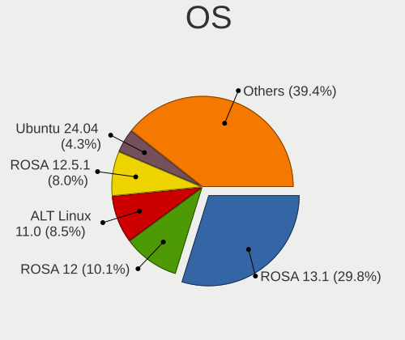

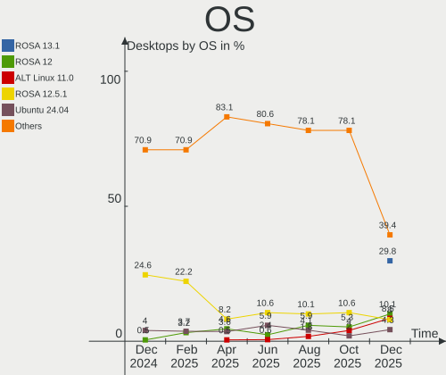

| Name                   | Desktops | Percent |
|------------------------|----------|---------|
| ROSA 13.1              | 56       | 29.79%  |
| ROSA 12                | 19       | 10.11%  |
| ALT Linux 11.0         | 16       | 8.51%   |
| ROSA 12.5.1            | 15       | 7.98%   |
| Ubuntu 24.04           | 8        | 4.26%   |
| Debian 13              | 8        | 4.26%   |
| Debian 12              | 8        | 4.26%   |
| OpenMandriva 25.90     | 7        | 3.72%   |
| Arch Rolling           | 7        | 3.72%   |
| Ubuntu 22.04           | 6        | 3.19%   |
| Zorin 18               | 3        | 1.6%    |
| ROSA R11               | 2        | 1.06%   |
| ROSA 13.0              | 2        | 1.06%   |
| Red OS 8.0             | 2        | 1.06%   |
| OpenMandriva 6.0       | 2        | 1.06%   |
| Manjaro 25.1.0         | 2        | 1.06%   |
| Linux Mint 22.2        | 2        | 1.06%   |
| Kubuntu 24.04          | 2        | 1.06%   |
| Gentoo 2.18            | 2        | 1.06%   |
| Fedora 43              | 2        | 1.06%   |
| Fedora 42              | 2        | 1.06%   |
| Ubuntu 20.04           | 1        | 0.53%   |
| Solus 4.8              | 1        | 0.53%   |
| ROSA R11.1             | 1        | 0.53%   |
| OpenMandriva 25.11     | 1        | 0.53%   |
| OpenMandriva 23.08     | 1        | 0.53%   |
| NixOS 26.05            | 1        | 0.53%   |
| Linux Mint 21          | 1        | 0.53%   |
| Kubuntu 25.10          | 1        | 0.53%   |
| Fedora 44              | 1        | 0.53%   |
| Elementary 8           | 1        | 0.53%   |
| Debian 10              | 1        | 0.53%   |
| Bazzite 43             | 1        | 0.53%   |
| Astra Linux 1.7_x86-64 | 1        | 0.53%   |
| ArcoLinux Rolling      | 1        | 0.53%   |
| ALT Linux 11.1         | 1        | 0.53%   |

OS Family
---------

OS without a version

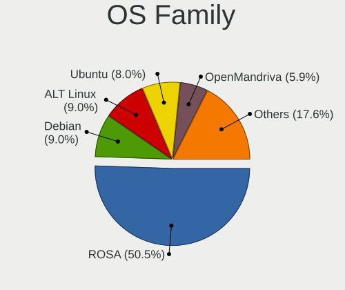

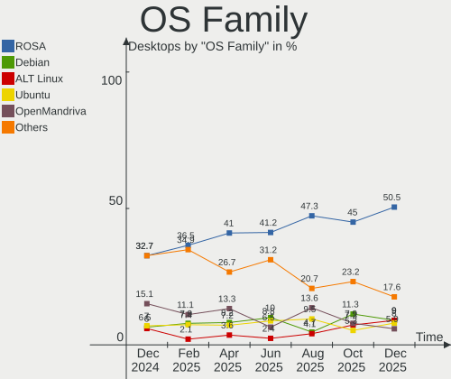

| Name         | Desktops | Percent |
|--------------|----------|---------|
| ROSA         | 95       | 50.53%  |
| Debian       | 17       | 9.04%   |
| ALT Linux    | 17       | 9.04%   |
| Ubuntu       | 15       | 7.98%   |
| OpenMandriva | 11       | 5.85%   |
| Arch         | 7        | 3.72%   |
| Fedora       | 5        | 2.66%   |
| Zorin        | 3        | 1.6%    |
| Linux Mint   | 3        | 1.6%    |
| Kubuntu      | 3        | 1.6%    |
| Red OS       | 2        | 1.06%   |
| Manjaro      | 2        | 1.06%   |
| Gentoo       | 2        | 1.06%   |
| Solus        | 1        | 0.53%   |
| NixOS        | 1        | 0.53%   |
| Elementary   | 1        | 0.53%   |
| Bazzite      | 1        | 0.53%   |
| Astra Linux  | 1        | 0.53%   |
| ArcoLinux    | 1        | 0.53%   |

Kernel
------

Version of the Linux kernel

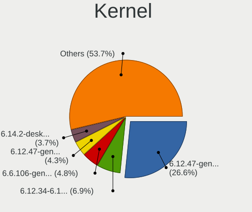

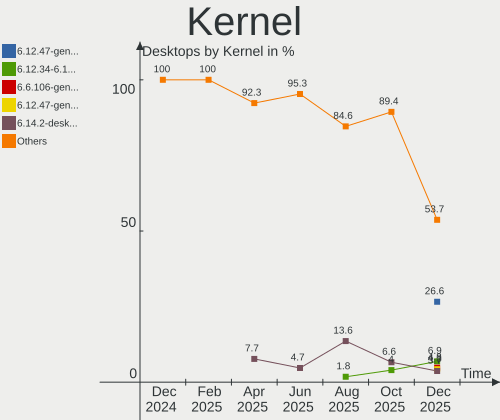

| Version                                  | Desktops | Percent |
|------------------------------------------|----------|---------|
| 6.12.47-generic-5rosa13-x86_64           | 50       | 26.6%   |
| 6.12.34-6.12-alt1                        | 13       | 6.91%   |
| 6.6.106-generic-3rosa2021.1-x86_64       | 9        | 4.79%   |
| 6.12.47-generic-5rosa2021.1-x86_64       | 8        | 4.26%   |
| 6.14.2-desktop-3omv2590                  | 7        | 3.72%   |
| 5.15.0-153-generic                       | 6        | 3.19%   |
| 6.14.0-37-generic                        | 4        | 2.13%   |
| 6.8.12-15-pve                            | 3        | 1.6%    |
| 6.14.0-36-generic                        | 3        | 1.6%    |
| 6.1.152-generic-2rosa2021.1-x86_64       | 3        | 1.6%    |
| 6.8.12-11-pve                            | 2        | 1.06%   |
| 6.8.0-88-generic                         | 2        | 1.06%   |
| 6.6.47-generic-1rosa2021.1-x86_64        | 2        | 1.06%   |
| 6.6.27-generic-3rosa2021.1-x86_64        | 2        | 1.06%   |
| 6.17.9-zen1-1-zen                        | 2        | 1.06%   |
| 6.17.9-arch1-1                           | 2        | 1.06%   |
| 6.17.7-desktop-1omv2590                  | 2        | 1.06%   |
| 6.12.59-6.12-alt1                        | 2        | 1.06%   |
| 6.12.57+deb13-amd64                      | 2        | 1.06%   |
| 6.12.56-1.red80.x86_64                   | 2        | 1.06%   |
| 6.12.47-generic-2rosa13-x86_64           | 2        | 1.06%   |
| 6.12.13-generic-4rosa13-x86_64           | 2        | 1.06%   |
| 6.1.46-generic-2rosa2021.1-x86_64        | 2        | 1.06%   |
| 4.15.0-desktop-45.1rosa-x86_64           | 2        | 1.06%   |
| 6.8.8-2-pve                              | 1        | 0.53%   |
| 6.8.4-2-pve                              | 1        | 0.53%   |
| 6.8.12-1-pve                             | 1        | 0.53%   |
| 6.8.0-71-generic                         | 1        | 0.53%   |
| 6.8.0-55-generic                         | 1        | 0.53%   |
| 6.8.0-49-generic                         | 1        | 0.53%   |
| 6.7.4-arch1-1                            | 1        | 0.53%   |
| 6.6.78-generic-2rosa2021.1-x86_64        | 1        | 0.53%   |
| 6.6.106-generic-1rosa2021.1-x86_64       | 1        | 0.53%   |
| 6.4.11-desktop-1omv2390                  | 1        | 0.53%   |
| 6.18.2-generic-2rosa13-x86_64            | 1        | 0.53%   |
| 6.18.1-arch1-2                           | 1        | 0.53%   |
| 6.18.0-desktop-1omv2590                  | 1        | 0.53%   |
| 6.18.0-559e608c4655-revert-f804a5895eba+ | 1        | 0.53%   |
| 6.18.0-2-cachyos                         | 1        | 0.53%   |
| 6.17.9-gentoo-dist                       | 1        | 0.53%   |

Kernel Family
-------------

Linux kernel without a distro release

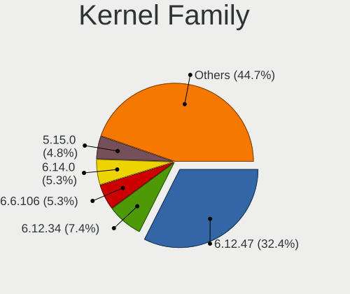

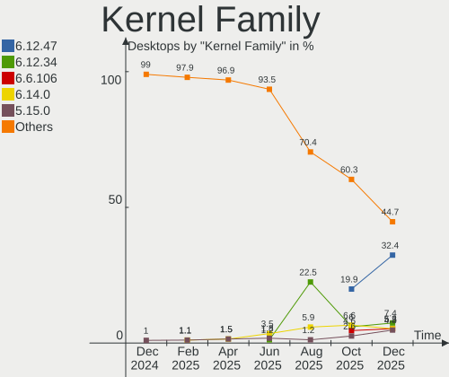

| Version | Desktops | Percent |
|---------|----------|---------|
| 6.12.47 | 61       | 32.45%  |
| 6.12.34 | 14       | 7.45%   |
| 6.6.106 | 10       | 5.32%   |
| 6.14.0  | 10       | 5.32%   |
| 5.15.0  | 9        | 4.79%   |
| 6.17.9  | 7        | 3.72%   |
| 6.14.2  | 7        | 3.72%   |
| 6.8.12  | 6        | 3.19%   |
| 6.8.0   | 5        | 2.66%   |
| 6.18.0  | 3        | 1.6%    |
| 6.17.7  | 3        | 1.6%    |
| 6.14.11 | 3        | 1.6%    |
| 6.1.152 | 3        | 1.6%    |
| 4.15.0  | 3        | 1.6%    |
| 6.6.47  | 2        | 1.06%   |
| 6.6.27  | 2        | 1.06%   |
| 6.17.8  | 2        | 1.06%   |
| 6.17.12 | 2        | 1.06%   |
| 6.17.10 | 2        | 1.06%   |
| 6.12.59 | 2        | 1.06%   |
| 6.12.57 | 2        | 1.06%   |
| 6.12.56 | 2        | 1.06%   |
| 6.12.13 | 2        | 1.06%   |
| 6.1.46  | 2        | 1.06%   |
| 6.8.8   | 1        | 0.53%   |
| 6.8.4   | 1        | 0.53%   |
| 6.7.4   | 1        | 0.53%   |
| 6.6.78  | 1        | 0.53%   |
| 6.4.11  | 1        | 0.53%   |
| 6.18.2  | 1        | 0.53%   |
| 6.18.1  | 1        | 0.53%   |
| 6.17.5  | 1        | 0.53%   |
| 6.17.4  | 1        | 0.53%   |
| 6.17.2  | 1        | 0.53%   |
| 6.17.13 | 1        | 0.53%   |
| 6.17.0  | 1        | 0.53%   |
| 6.15.5  | 1        | 0.53%   |
| 6.12.61 | 1        | 0.53%   |
| 6.12.48 | 1        | 0.53%   |
| 6.12.41 | 1        | 0.53%   |

Kernel Major Ver.
-----------------

Linux kernel major version

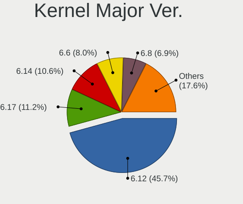

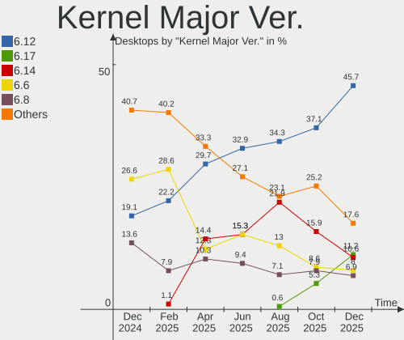

| Version | Desktops | Percent |
|---------|----------|---------|
| 6.12    | 86       | 45.74%  |
| 6.17    | 21       | 11.17%  |
| 6.14    | 20       | 10.64%  |
| 6.6     | 15       | 7.98%   |
| 6.8     | 13       | 6.91%   |
| 5.15    | 10       | 5.32%   |
| 6.1     | 9        | 4.79%   |
| 6.18    | 5        | 2.66%   |
| 4.15    | 3        | 1.6%    |
| 5.10    | 2        | 1.06%   |
| 6.7     | 1        | 0.53%   |
| 6.4     | 1        | 0.53%   |
| 6.15    | 1        | 0.53%   |
| 4.19    | 1        | 0.53%   |

Arch
----

OS architecture (x86_64, i586, etc.)

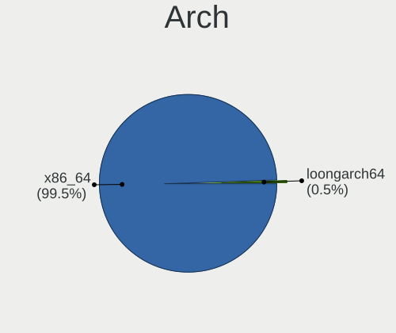

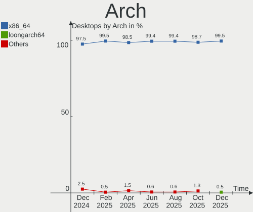

| Name        | Desktops | Percent |
|-------------|----------|---------|
| x86_64      | 187      | 99.47%  |
| loongarch64 | 1        | 0.53%   |

DE
--

Desktop Environment

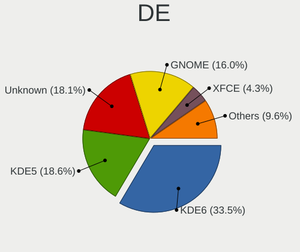

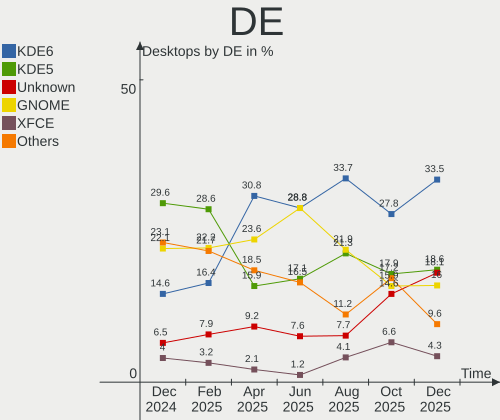

| Name       | Desktops | Percent |
|------------|----------|---------|
| KDE6       | 63       | 33.51%  |
| KDE5       | 35       | 18.62%  |
| Unknown    | 34       | 18.09%  |
| GNOME      | 30       | 15.96%  |
| XFCE       | 8        | 4.26%   |
| KDE4       | 5        | 2.66%   |
| LXQt       | 4        | 2.13%   |
| X-Cinnamon | 3        | 1.6%    |
| KDE        | 2        | 1.06%   |
| Pantheon   | 1        | 0.53%   |
| MATE       | 1        | 0.53%   |
| fly        | 1        | 0.53%   |
| Budgie     | 1        | 0.53%   |

Display Server
--------------

X11 or Wayland

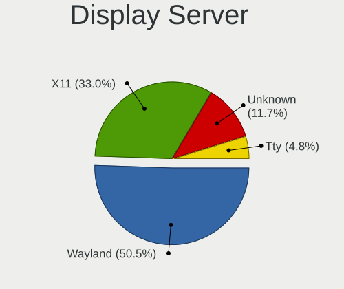

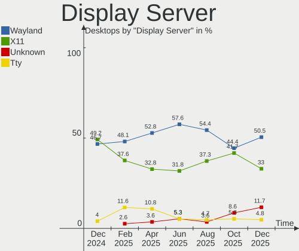

| Name    | Desktops | Percent |
|---------|----------|---------|
| Wayland | 95       | 50.53%  |
| X11     | 62       | 32.98%  |
| Unknown | 22       | 11.7%   |
| Tty     | 9        | 4.79%   |

Display Manager
---------------

SDDM, LightDM, etc.

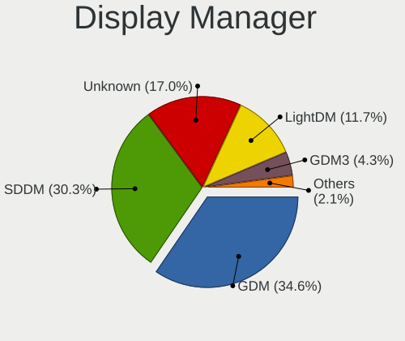

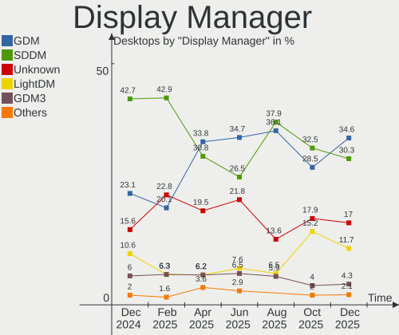

| Name    | Desktops | Percent |
|---------|----------|---------|
| GDM     | 65       | 34.57%  |
| SDDM    | 57       | 30.32%  |
| Unknown | 32       | 17.02%  |
| LightDM | 22       | 11.7%   |
| GDM3    | 8        | 4.26%   |
| KDM     | 3        | 1.6%    |
| FLY-DM  | 1        | 0.53%   |

OS Lang
-------

Language

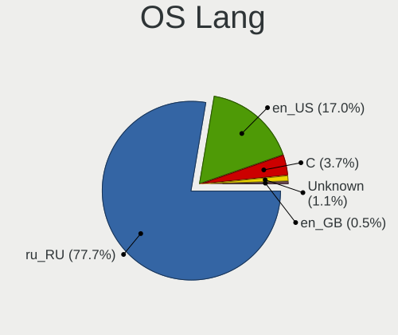

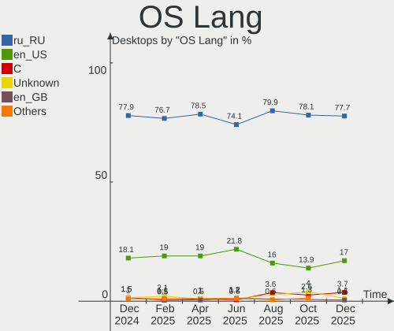

| Lang    | Desktops | Percent |
|---------|----------|---------|
| ru_RU   | 146      | 77.66%  |
| en_US   | 32       | 17.02%  |
| C       | 7        | 3.72%   |
| Unknown | 2        | 1.06%   |
| en_GB   | 1        | 0.53%   |

Boot Mode
---------

EFI or BIOS

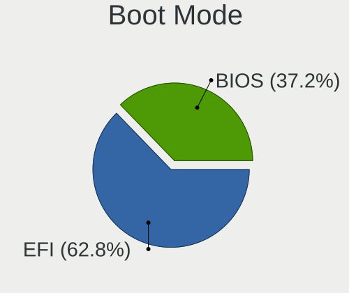

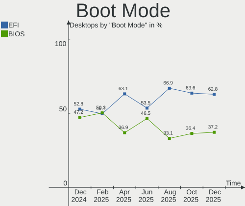

| Mode | Desktops | Percent |
|------|----------|---------|
| EFI  | 118      | 62.77%  |
| BIOS | 70       | 37.23%  |

Filesystem
----------

Type of filesystem

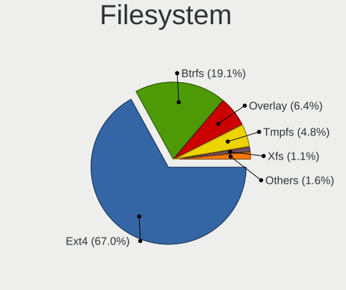

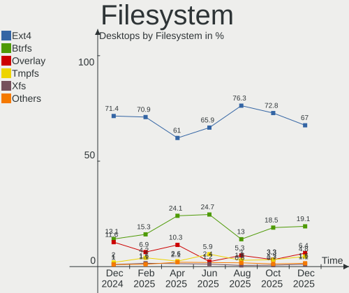

| Type    | Desktops | Percent |
|---------|----------|---------|
| Ext4    | 126      | 67.02%  |
| Btrfs   | 36       | 19.15%  |
| Overlay | 12       | 6.38%   |
| Tmpfs   | 9        | 4.79%   |
| Xfs     | 2        | 1.06%   |
| Zfs     | 1        | 0.53%   |
| F2fs    | 1        | 0.53%   |
| Ext3    | 1        | 0.53%   |

Part. scheme
------------

Scheme of partitioning

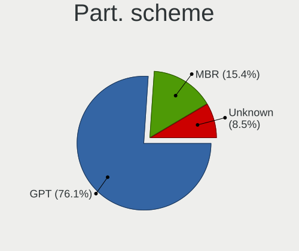

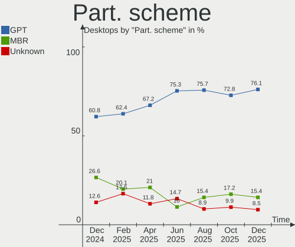

| Type    | Desktops | Percent |
|---------|----------|---------|
| GPT     | 143      | 76.06%  |
| MBR     | 29       | 15.43%  |
| Unknown | 16       | 8.51%   |

Dual Boot with Linux/BSD
------------------------

Hosting more than one Linux/BSD

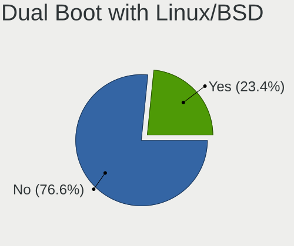

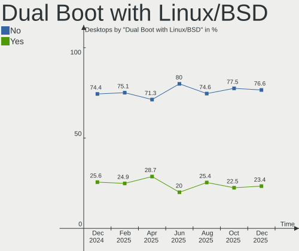

| Dual boot | Desktops | Percent |
|-----------|----------|---------|
| No        | 144      | 76.6%   |
| Yes       | 44       | 23.4%   |

Dual Boot (Win)
---------------

Hosting Linux and Windows

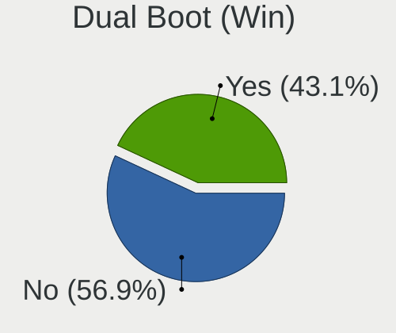

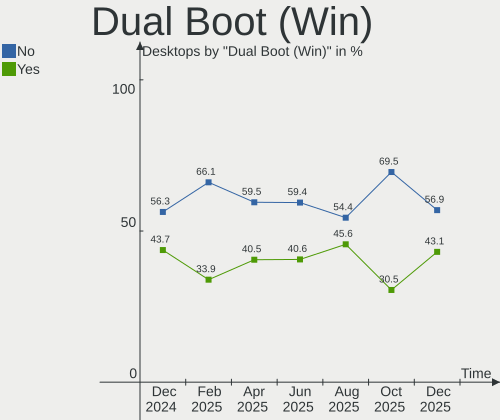

| Dual boot | Desktops | Percent |
|-----------|----------|---------|
| No        | 107      | 56.91%  |
| Yes       | 81       | 43.09%  |

Board
-----

Vendor
------

Motherboard manufacturer

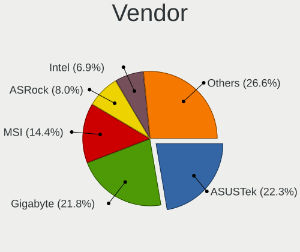

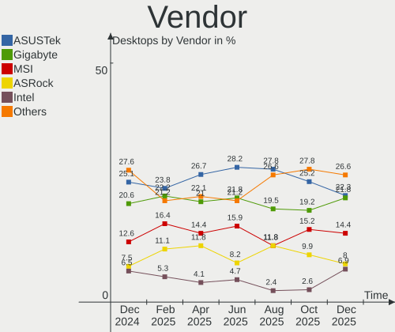

| Name                | Desktops | Percent |
|---------------------|----------|---------|
| ASUSTek Computer    | 42       | 22.34%  |
| Gigabyte Technology | 41       | 21.81%  |
| MSI                 | 27       | 14.36%  |
| ASRock              | 15       | 7.98%   |
| Intel               | 13       | 6.91%   |
| Unknown             | 8        | 4.26%   |
| Supermicro          | 5        | 2.66%   |
| Inspur              | 5        | 2.66%   |
| Huanan              | 4        | 2.13%   |
| MocTex              | 3        | 1.6%    |
| MAINBRD             | 3        | 1.6%    |
| Lenovo              | 3        | 1.6%    |
| Hewlett-Packard     | 3        | 1.6%    |
| Dell                | 3        | 1.6%    |
| Biostar             | 2        | 1.06%   |
| SHUANGWEI           | 1        | 0.53%   |
| RDW Computers       | 1        | 0.53%   |
| OEM                 | 1        | 0.53%   |
| Machinist           | 1        | 0.53%   |
| J&W                 | 1        | 0.53%   |
| Fujitsu Siemens     | 1        | 0.53%   |
| ECS                 | 1        | 0.53%   |
| Delta Computers     | 1        | 0.53%   |
| BESHTAU             | 1        | 0.53%   |
| AZW                 | 1        | 0.53%   |
| 3Q                  | 1        | 0.53%   |

Model
-----

Motherboard model

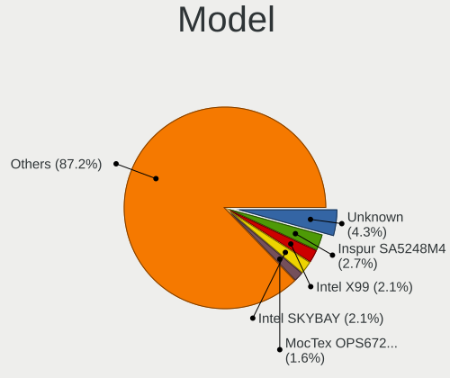

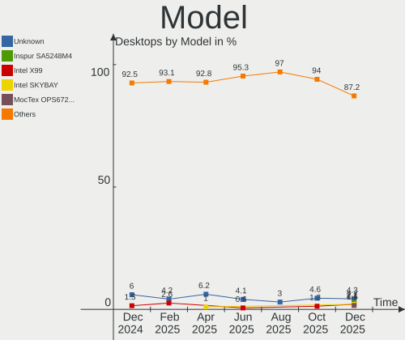

| Name                             | Desktops | Percent |
|----------------------------------|----------|---------|
| Unknown                          | 8        | 4.26%   |
| Inspur SA5248M4                  | 5        | 2.66%   |
| Intel X99                        | 4        | 2.13%   |
| Intel SKYBAY                     | 4        | 2.13%   |
| MocTex OPS6725-SHA               | 3        | 1.6%    |
| MAINBRD OPS72A-SHA               | 3        | 1.6%    |
| ASUS All Series                  | 3        | 1.6%    |
| Supermicro SYS-6018U-TR4+        | 2        | 1.06%   |
| MSI MPG B560 Trident A (MS-B926) | 2        | 1.06%   |
| Gigabyte H410M H V2              | 2        | 1.06%   |
| Gigabyte G31M-ES2L               | 2        | 1.06%   |
| Gigabyte F2A68HM-S1              | 2        | 1.06%   |
| ASUS P8H61-MX                    | 2        | 1.06%   |
| ASUS H110M-K                     | 2        | 1.06%   |
| ASRock B450M-HDV R4.0            | 2        | 1.06%   |
| Supermicro X9SCL/X9SCM           | 1        | 0.53%   |
| Supermicro SYS-6018R-TDW         | 1        | 0.53%   |
| Supermicro SYS-5039D-I           | 1        | 0.53%   |
| SHUANGWEI ST-X79M-2011 V2.0      | 1        | 0.53%   |
| RDW Computers B760 D5            | 1        | 0.53%   |
| OEM X79G                         | 1        | 0.53%   |
| MSI MS-7E56                      | 1        | 0.53%   |
| MSI MS-7E28                      | 1        | 0.53%   |
| MSI MS-7E25                      | 1        | 0.53%   |
| MSI MS-7E12                      | 1        | 0.53%   |
| MSI MS-7D85                      | 1        | 0.53%   |
| MSI MS-7D76                      | 1        | 0.53%   |
| MSI MS-7D51                      | 1        | 0.53%   |
| MSI MS-7D46                      | 1        | 0.53%   |
| MSI MS-7D25                      | 1        | 0.53%   |
| MSI MS-7D22                      | 1        | 0.53%   |
| MSI MS-7C96                      | 1        | 0.53%   |
| MSI MS-7C92                      | 1        | 0.53%   |
| MSI MS-7C56                      | 1        | 0.53%   |
| MSI MS-7C52                      | 1        | 0.53%   |
| MSI MS-7C51                      | 1        | 0.53%   |
| MSI MS-7C39                      | 1        | 0.53%   |
| MSI MS-7B89                      | 1        | 0.53%   |
| MSI MS-7B78                      | 1        | 0.53%   |
| MSI MS-7B48                      | 1        | 0.53%   |

Model Family
------------

Motherboard model prefix

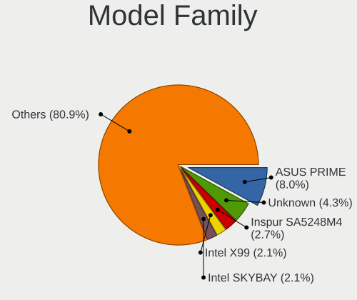

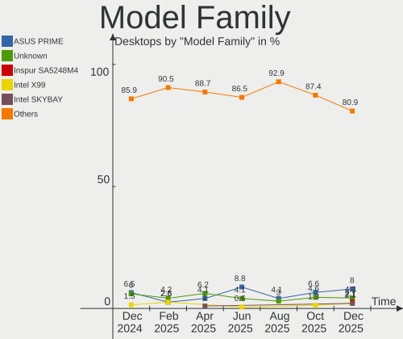

| Name                      | Desktops | Percent |
|---------------------------|----------|---------|
| ASUS PRIME                | 15       | 7.98%   |
| Unknown                   | 8        | 4.26%   |
| Inspur SA5248M4           | 5        | 2.66%   |
| Intel X99                 | 4        | 2.13%   |
| Intel SKYBAY              | 4        | 2.13%   |
| ASUS TUF                  | 4        | 2.13%   |
| MocTex OPS6725-SHA        | 3        | 1.6%    |
| MAINBRD OPS72A-SHA        | 3        | 1.6%    |
| Gigabyte H410M            | 3        | 1.6%    |
| Gigabyte B450M            | 3        | 1.6%    |
| ASUS All                  | 3        | 1.6%    |
| Supermicro SYS-6018U-TR4+ | 2        | 1.06%   |
| MSI MPG                   | 2        | 1.06%   |
| Lenovo ThinkCentre        | 2        | 1.06%   |
| Gigabyte G31M-ES2L        | 2        | 1.06%   |
| Gigabyte F2A68HM-S1       | 2        | 1.06%   |
| Dell OptiPlex             | 2        | 1.06%   |
| ASUS ROG                  | 2        | 1.06%   |
| ASUS P8H61-MX             | 2        | 1.06%   |
| ASUS H110M-K              | 2        | 1.06%   |
| ASRock H510M-HDV          | 2        | 1.06%   |
| ASRock B450M-HDV          | 2        | 1.06%   |
| ASRock B450M              | 2        | 1.06%   |
| Supermicro X9SCL          | 1        | 0.53%   |
| Supermicro SYS-6018R-TDW  | 1        | 0.53%   |
| Supermicro SYS-5039D-I    | 1        | 0.53%   |
| SHUANGWEI ST-X79M-2011    | 1        | 0.53%   |
| RDW Computers B760        | 1        | 0.53%   |
| OEM X79G                  | 1        | 0.53%   |
| MSI MS-7E56               | 1        | 0.53%   |
| MSI MS-7E28               | 1        | 0.53%   |
| MSI MS-7E25               | 1        | 0.53%   |
| MSI MS-7E12               | 1        | 0.53%   |
| MSI MS-7D85               | 1        | 0.53%   |
| MSI MS-7D76               | 1        | 0.53%   |
| MSI MS-7D51               | 1        | 0.53%   |
| MSI MS-7D46               | 1        | 0.53%   |
| MSI MS-7D25               | 1        | 0.53%   |
| MSI MS-7D22               | 1        | 0.53%   |
| MSI MS-7C96               | 1        | 0.53%   |

MFG Year
--------

Motherboard manufacture year

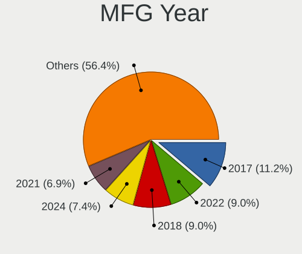

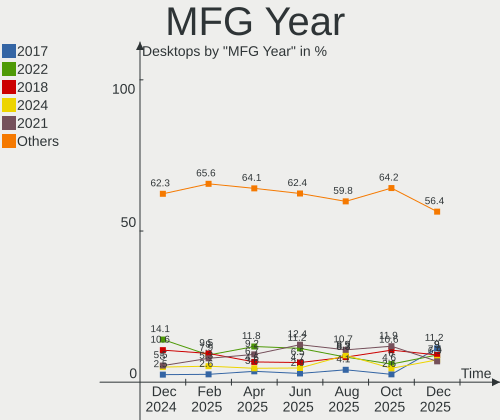

| Year    | Desktops | Percent |
|---------|----------|---------|
| 2017    | 21       | 11.17%  |
| 2022    | 17       | 9.04%   |
| 2018    | 17       | 9.04%   |
| 2024    | 14       | 7.45%   |
| 2021    | 13       | 6.91%   |
| 2012    | 12       | 6.38%   |
| 2011    | 12       | 6.38%   |
| 2023    | 11       | 5.85%   |
| 2020    | 11       | 5.85%   |
| 2019    | 11       | 5.85%   |
| 2025    | 8        | 4.26%   |
| 2015    | 8        | 4.26%   |
| 2014    | 7        | 3.72%   |
| 2013    | 7        | 3.72%   |
| 2016    | 4        | 2.13%   |
| 2010    | 3        | 1.6%    |
| 2009    | 3        | 1.6%    |
| 2008    | 3        | 1.6%    |
| 2007    | 3        | 1.6%    |
| 2006    | 2        | 1.06%   |
| Unknown | 1        | 0.53%   |

Form Factor
-----------

Physical design of the computer

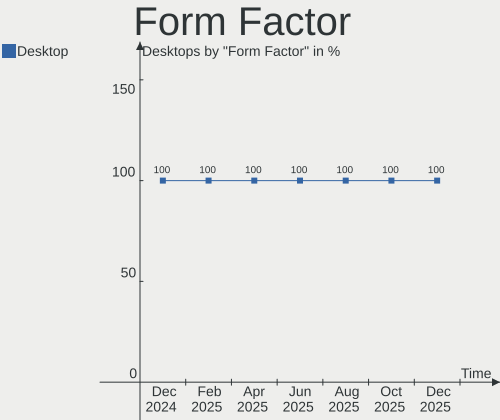

| Name    | Desktops | Percent |
|---------|----------|---------|
| Desktop | 188      | 100%    |

Secure Boot
-----------

Enabled or disabled

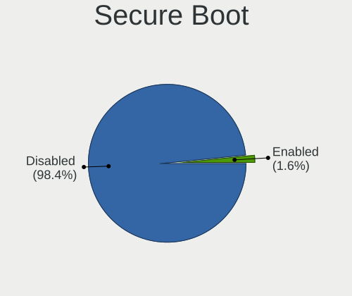

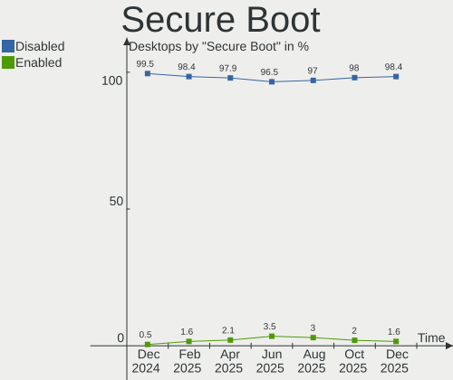

| State    | Desktops | Percent |
|----------|----------|---------|
| Disabled | 185      | 98.4%   |
| Enabled  | 3        | 1.6%    |

Coreboot
--------

Have coreboot on board

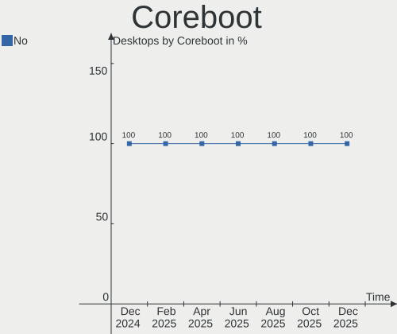

| Used | Desktops | Percent |
|------|----------|---------|
| No   | 188      | 100%    |

RAM Size
--------

Total RAM memory

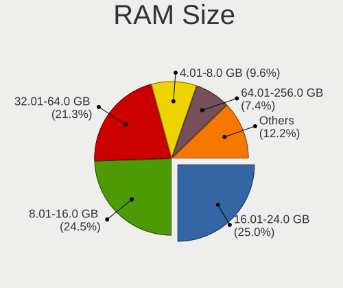

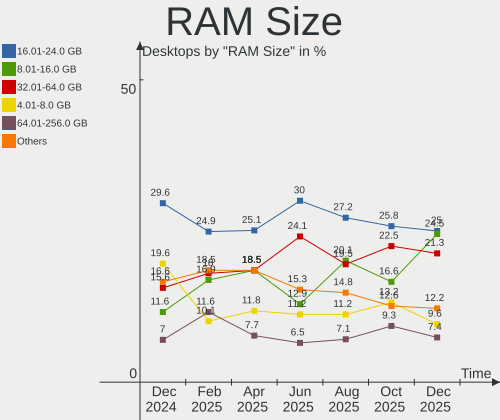

| Size in GB      | Desktops | Percent |
|-----------------|----------|---------|
| 16.01-24.0      | 47       | 25%     |
| 8.01-16.0       | 46       | 24.47%  |
| 32.01-64.0      | 40       | 21.28%  |
| 4.01-8.0        | 18       | 9.57%   |
| 64.01-256.0     | 14       | 7.45%   |
| 3.01-4.0        | 13       | 6.91%   |
| 24.01-32.0      | 5        | 2.66%   |
| More than 256.0 | 3        | 1.6%    |
| 2.01-3.0        | 1        | 0.53%   |
| 1.01-2.0        | 1        | 0.53%   |

RAM Used
--------

Used RAM memory

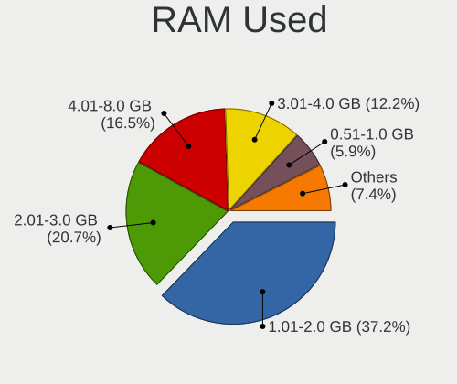

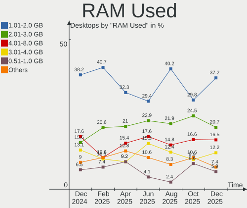

| Used GB    | Desktops | Percent |
|------------|----------|---------|
| 1.01-2.0   | 70       | 37.23%  |
| 2.01-3.0   | 39       | 20.74%  |
| 4.01-8.0   | 31       | 16.49%  |
| 3.01-4.0   | 23       | 12.23%  |
| 0.51-1.0   | 11       | 5.85%   |
| 8.01-16.0  | 8        | 4.26%   |
| 16.01-24.0 | 4        | 2.13%   |
| 24.01-32.0 | 2        | 1.06%   |

Total Drives
------------

Number of drives on board

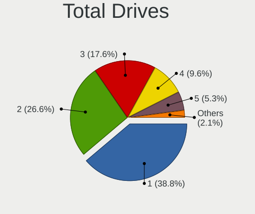

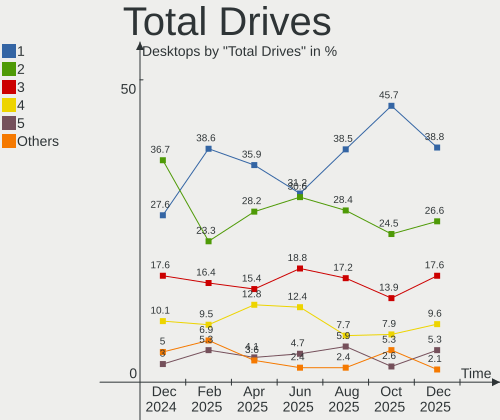

| Drives | Desktops | Percent |
|--------|----------|---------|
| 1      | 73       | 38.83%  |
| 2      | 50       | 26.6%   |
| 3      | 33       | 17.55%  |
| 4      | 18       | 9.57%   |
| 5      | 10       | 5.32%   |
| 6      | 2        | 1.06%   |
| 8      | 1        | 0.53%   |
| 0      | 1        | 0.53%   |

Has CD-ROM
----------

Has CD-ROM on board

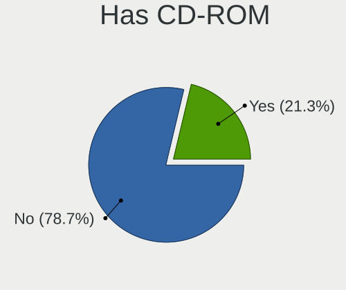

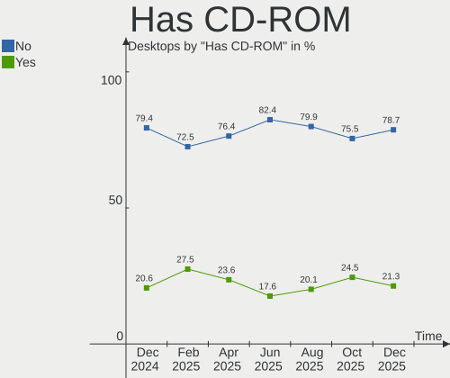

| Presented | Desktops | Percent |
|-----------|----------|---------|
| No        | 148      | 78.72%  |
| Yes       | 40       | 21.28%  |

Has Ethernet
------------

Has Ethernet on board

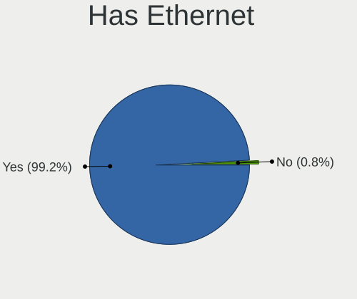

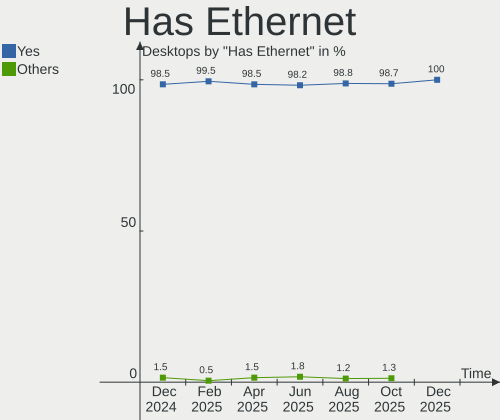

| Presented | Desktops | Percent |
|-----------|----------|---------|
| Yes       | 188      | 100%    |

Has WiFi
--------

Has WiFi module

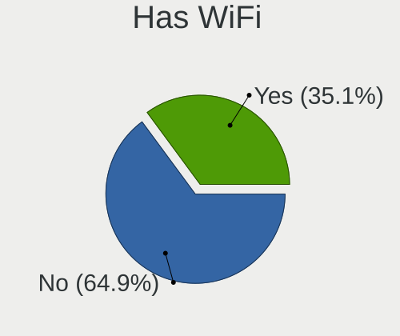

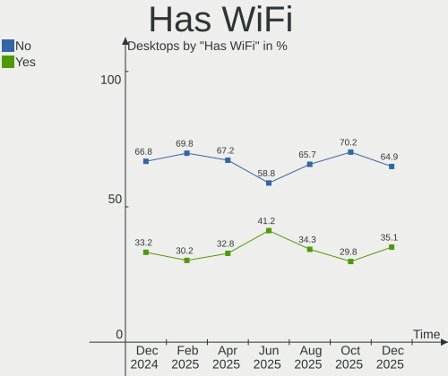

| Presented | Desktops | Percent |
|-----------|----------|---------|
| No        | 122      | 64.89%  |
| Yes       | 66       | 35.11%  |

Has Bluetooth
-------------

Has Bluetooth module

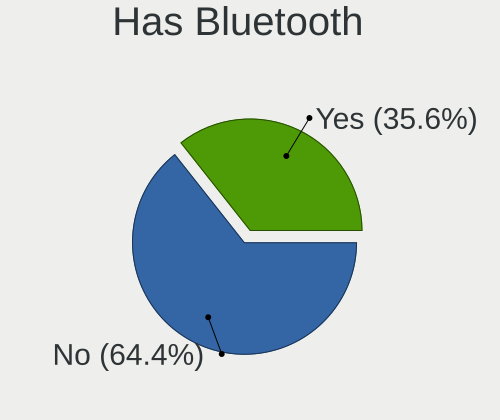

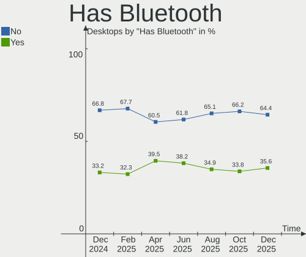

| Presented | Desktops | Percent |
|-----------|----------|---------|
| No        | 121      | 64.36%  |
| Yes       | 67       | 35.64%  |

Location
--------

Country
-------

Geographic location (country)

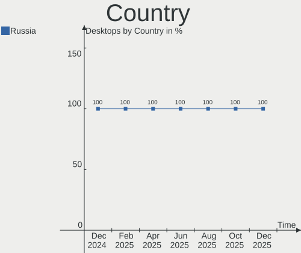

| Country | Desktops | Percent |
|---------|----------|---------|
| Russia  | 188      | 100%    |

City
----

Geographic location (city)

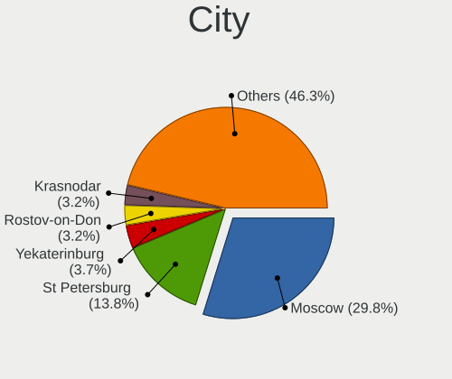

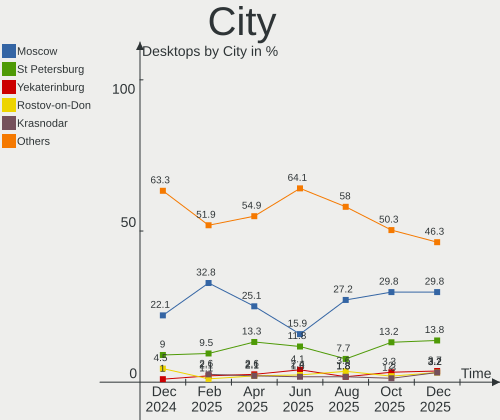

| City              | Desktops | Percent |
|-------------------|----------|---------|
| Moscow            | 56       | 29.79%  |
| St Petersburg     | 26       | 13.83%  |
| Yekaterinburg     | 7        | 3.72%   |
| Rostov-on-Don     | 6        | 3.19%   |
| Krasnodar         | 6        | 3.19%   |
| Kazan’          | 4        | 2.13%   |
| Voronezh          | 3        | 1.6%    |
| Vladivostok       | 3        | 1.6%    |
| Novosibirsk       | 3        | 1.6%    |
| Krasnoyarsk       | 3        | 1.6%    |
| Volgograd         | 2        | 1.06%   |
| Veliky Novgorod   | 2        | 1.06%   |
| Tver              | 2        | 1.06%   |
| Tula              | 2        | 1.06%   |
| Stavropol         | 2        | 1.06%   |
| Smolensk          | 2        | 1.06%   |
| Serpukhov         | 2        | 1.06%   |
| Perm              | 2        | 1.06%   |
| Nizhniy Novgorod  | 2        | 1.06%   |
| Lipetsk           | 2        | 1.06%   |
| Dzerzhinsky       | 2        | 1.06%   |
| Armavir           | 2        | 1.06%   |
| Angarsk           | 2        | 1.06%   |
| Zaural'skiy       | 1        | 0.53%   |
| Yakutsk           | 1        | 0.53%   |
| Volzhsky          | 1        | 0.53%   |
| Vladimir          | 1        | 0.53%   |
| Verkhnyaya Pyshma | 1        | 0.53%   |
| Velikiye Luki     | 1        | 0.53%   |
| Tomsk             | 1        | 0.53%   |
| Taganrog          | 1        | 0.53%   |
| Stary Oskol       | 1        | 0.53%   |
| Shishkin Les      | 1        | 0.53%   |
| Seversk           | 1        | 0.53%   |
| Severomorsk       | 1        | 0.53%   |
| Sergiyev Posad    | 1        | 0.53%   |
| Ryazan            | 1        | 0.53%   |
| Penza             | 1        | 0.53%   |
| Novy Urengoy      | 1        | 0.53%   |
| Noril'sk          | 1        | 0.53%   |

Drives
------

Drive Vendor
------------

Hard drive vendors

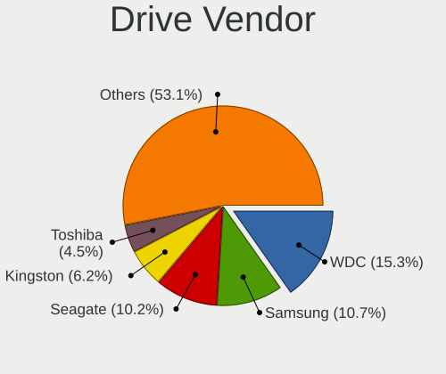

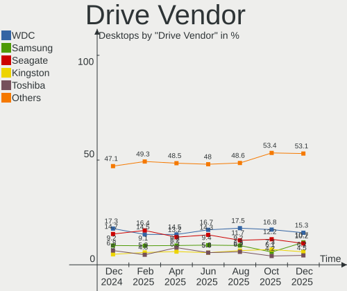

| Vendor                      | Desktops | Drives | Percent |
|-----------------------------|----------|--------|---------|
| WDC                         | 54       | 78     | 15.25%  |
| Samsung Electronics         | 38       | 48     | 10.73%  |
| Seagate                     | 36       | 43     | 10.17%  |
| Kingston                    | 22       | 26     | 6.21%   |
| Toshiba                     | 16       | 20     | 4.52%   |
| AMD                         | 12       | 13     | 3.39%   |
| Intel                       | 10       | 14     | 2.82%   |
| A-DATA Technology           | 10       | 10     | 2.82%   |
| Netac                       | 9        | 9      | 2.54%   |
| MAXIO Technology (Hangzhou) | 9        | 10     | 2.54%   |
| Hitachi                     | 9        | 11     | 2.54%   |
| China                       | 9        | 9      | 2.54%   |
| Apacer                      | 9        | 9      | 2.54%   |
| Silicon Motion              | 8        | 9      | 2.26%   |
| Sandisk                     | 7        | 7      | 1.98%   |
| KingSpec                    | 7        | 7      | 1.98%   |
| FORESEE                     | 7        | 7      | 1.98%   |
| ADATA Technology            | 6        | 7      | 1.69%   |
| Patriot                     | 5        | 5      | 1.41%   |
| Kingston Technology Company | 5        | 6      | 1.41%   |
| Realtek Semiconductor       | 4        | 4      | 1.13%   |
| Phison Electronics          | 4        | 4      | 1.13%   |
| SPCC                        | 3        | 3      | 0.85%   |
| Smartbuy                    | 3        | 3      | 0.85%   |
| OCZ                         | 3        | 3      | 0.85%   |
| MSI                         | 3        | 3      | 0.85%   |
| HGST                        | 3        | 6      | 0.85%   |
| DEXP                        | 3        | 3      | 0.85%   |
| Realtek                     | 2        | 2      | 0.56%   |
| QOPP                        | 2        | 2      | 0.56%   |
| Micron Technology           | 2        | 2      | 0.56%   |
| Maxtor                      | 2        | 2      | 0.56%   |
| KingFast                    | 2        | 2      | 0.56%   |
| GOODRAM                     | 2        | 2      | 0.56%   |
| Gigabyte Technology         | 2        | 2      | 0.56%   |
| Fujitsu                     | 2        | 2      | 0.56%   |
| Crucial                     | 2        | 2      | 0.56%   |
| Colorful                    | 2        | 2      | 0.56%   |
| XrayDisk                    | 1        | 1      | 0.28%   |
| VIEW                        | 1        | 1      | 0.28%   |

Drive Model
-----------

Hard drive models

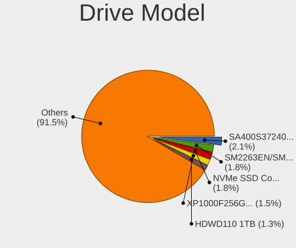

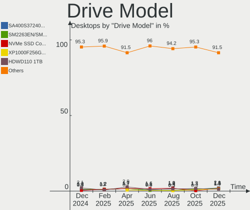

| Model                                                              | Desktops | Percent |
|--------------------------------------------------------------------|----------|---------|
| Kingston SA400S37240G 240GB SSD                                    | 8        | 2.06%   |
| Silicon Motion SM2263EN/SM2263XT SSD Controller 512GB              | 7        | 1.8%    |
| MAXIO (Hangzhou) NVMe SSD Controller MAP1202 2TB                   | 7        | 1.8%    |
| FORESEE XP1000F256G 256GB                                          | 6        | 1.54%   |
| Toshiba HDWD110 1TB                                                | 5        | 1.29%   |
| Toshiba DT01ACA050 500GB                                           | 5        | 1.29%   |
| Samsung SSD 870 EVO 500GB                                          | 5        | 1.29%   |
| Samsung NVMe SSD Controller SM981/PM981/PM983 1TB                  | 5        | 1.29%   |
| Seagate ST1000DM010-2EP102 1TB                                     | 4        | 1.03%   |
| Seagate ST1000DM003-1CH162 1TB                                     | 4        | 1.03%   |
| Kingston SA400S37480G 480GB SSD                                    | 4        | 1.03%   |
| WDC WDS120G2G0A-00JH30 120GB SSD                                   | 3        | 0.77%   |
| WDC WD5000AAKX-00ERMA0 500GB                                       | 3        | 0.77%   |
| WDC WD10EALS-00Z8A0 1TB                                            | 3        | 0.77%   |
| Samsung NVMe SSD Controller PM9A1/PM9A3/980PRO 1TB                 | 3        | 0.77%   |
| Samsung MZVLW128HEGR-00000 128GB                                   | 3        | 0.77%   |
| Kingston SA400S37120G 120GB SSD                                    | 3        | 0.77%   |
| Intel SSDSC2KB960G8 960GB                                          | 3        | 0.77%   |
| Intel SSDSC2BB480G7 480GB                                          | 3        | 0.77%   |
| Apacer AS350 256GB SSD                                             | 3        | 0.77%   |
| AMD R5SL240G 240GB SSD                                             | 3        | 0.77%   |
| ADATA XPG SX8200 Pro PCIe Gen3x4 M.2 2280 Solid State Drive 1024GB | 3        | 0.77%   |
| WDC WD40EZAZ-00SF3B0 4TB                                           | 2        | 0.51%   |
| WDC WD20EARX-00PASB0 2TB                                           | 2        | 0.51%   |
| WDC WD10EZRZ-00HTKB0 1TB                                           | 2        | 0.51%   |
| WDC WD10EARX-00N0YB0 1TB                                           | 2        | 0.51%   |
| SPCC Solid State Disk 256GB                                        | 2        | 0.51%   |
| Seagate ST500DM002-1BD142 500GB                                    | 2        | 0.51%   |
| Seagate ST3500418AS 500GB                                          | 2        | 0.51%   |
| Seagate ST3250310AS 250GB                                          | 2        | 0.51%   |
| Seagate ST1000LM049-2GH172 1TB                                     | 2        | 0.51%   |
| Seagate ST1000DM003-1SB10C 1TB                                     | 2        | 0.51%   |
| SanDisk SDSSDHP128G 128GB                                          | 2        | 0.51%   |
| Samsung SSD 990 PRO 1TB                                            | 2        | 0.51%   |
| Samsung SSD 990 EVO Plus 2TB                                       | 2        | 0.51%   |
| Samsung SSD 970 EVO Plus 2TB                                       | 2        | 0.51%   |
| Samsung SSD 870 EVO 250GB                                          | 2        | 0.51%   |
| Samsung SSD 860 EVO M.2 500GB                                      | 2        | 0.51%   |
| Samsung SSD 860 EVO 250GB                                          | 2        | 0.51%   |
| Samsung HM321HI 320GB                                              | 2        | 0.51%   |

HDD Vendor
----------

Hard disk drive vendors

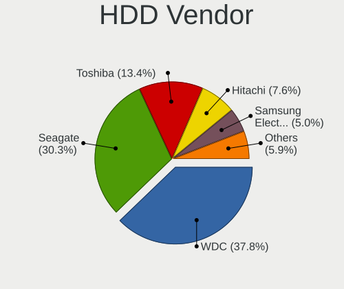

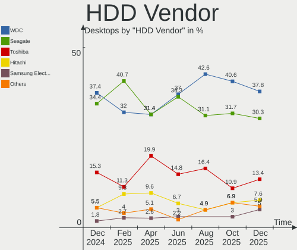

| Vendor              | Desktops | Drives | Percent |
|---------------------|----------|--------|---------|
| WDC                 | 45       | 68     | 37.82%  |
| Seagate             | 36       | 43     | 30.25%  |
| Toshiba             | 16       | 20     | 13.45%  |
| Hitachi             | 9        | 11     | 7.56%   |
| Samsung Electronics | 6        | 6      | 5.04%   |
| HGST                | 3        | 6      | 2.52%   |
| Maxtor              | 2        | 2      | 1.68%   |
| Fujitsu             | 2        | 2      | 1.68%   |

SSD Vendor
----------

Solid state drive vendors

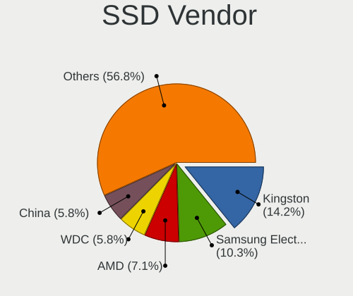

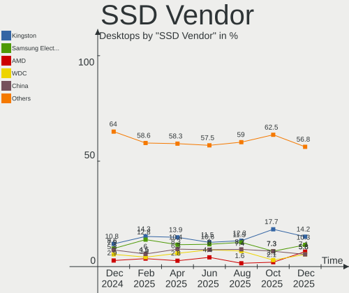

| Vendor              | Desktops | Drives | Percent |
|---------------------|----------|--------|---------|
| Kingston            | 22       | 26     | 14.19%  |
| Samsung Electronics | 16       | 17     | 10.32%  |
| AMD                 | 11       | 12     | 7.1%    |
| WDC                 | 9        | 9      | 5.81%   |
| China               | 9        | 9      | 5.81%   |
| Apacer              | 9        | 9      | 5.81%   |
| Intel               | 8        | 11     | 5.16%   |
| Netac               | 7        | 7      | 4.52%   |
| A-DATA Technology   | 6        | 6      | 3.87%   |
| Patriot             | 5        | 5      | 3.23%   |
| KingSpec            | 5        | 5      | 3.23%   |
| SanDisk             | 4        | 4      | 2.58%   |
| SPCC                | 3        | 3      | 1.94%   |
| Smartbuy            | 3        | 3      | 1.94%   |
| OCZ                 | 3        | 3      | 1.94%   |
| DEXP                | 3        | 3      | 1.94%   |
| QOPP                | 2        | 2      | 1.29%   |
| MSI                 | 2        | 2      | 1.29%   |
| Micron Technology   | 2        | 2      | 1.29%   |
| KingFast            | 2        | 2      | 1.29%   |
| GOODRAM             | 2        | 2      | 1.29%   |
| Gigabyte Technology | 2        | 2      | 1.29%   |
| Crucial             | 2        | 2      | 1.29%   |
| Colorful            | 2        | 2      | 1.29%   |
| XrayDisk            | 1        | 1      | 0.65%   |
| VIEW                | 1        | 1      | 0.65%   |
| UnionSine           | 1        | 1      | 0.65%   |
| Transcend           | 1        | 1      | 0.65%   |
| SOLIDIGM            | 1        | 1      | 0.65%   |
| MyDigitalSSD        | 1        | 1      | 0.65%   |
| LITEON              | 1        | 1      | 0.65%   |
| HS-SSD-E100N        | 1        | 1      | 0.65%   |
| ExeGate             | 1        | 1      | 0.65%   |
| Digma               | 1        | 1      | 0.65%   |
| BOLUNSHUAI          | 1        | 1      | 0.65%   |
| AXIOMTEK            | 1        | 1      | 0.65%   |
| ANKEJE              | 1        | 1      | 0.65%   |
| AGI                 | 1        | 1      | 0.65%   |
| 2.5"                | 1        | 1      | 0.65%   |
| Unknown             | 1        | 1      | 0.65%   |

Drive Kind
----------

HDD or SSD

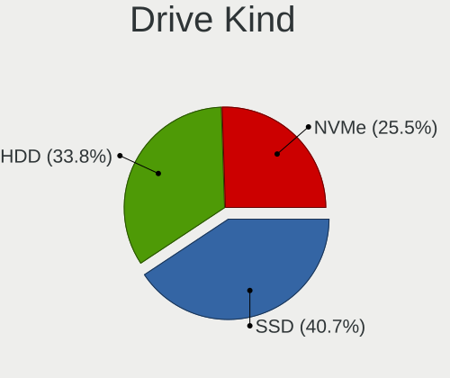

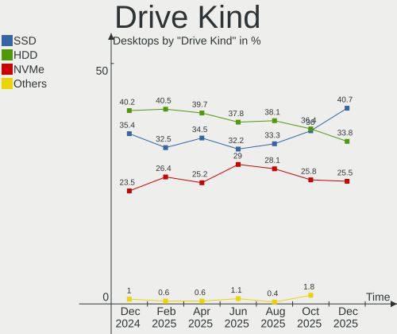

| Kind | Desktops | Drives | Percent |
|------|----------|--------|---------|
| SSD  | 118      | 164    | 40.69%  |
| HDD  | 98       | 158    | 33.79%  |
| NVMe | 74       | 95     | 25.52%  |

Drive Connector
---------------

SATA, SAS, NVMe, etc.

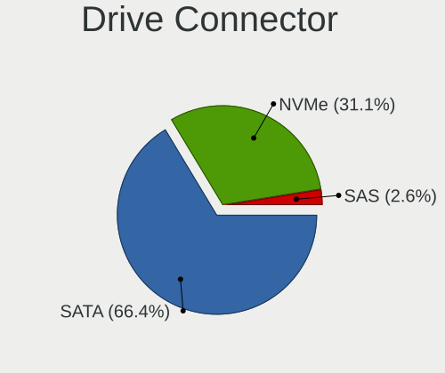

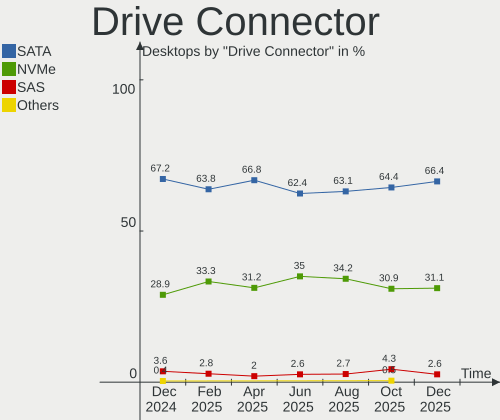

| Type | Desktops | Drives | Percent |
|------|----------|--------|---------|
| SATA | 156      | 318    | 66.38%  |
| NVMe | 73       | 93     | 31.06%  |
| SAS  | 6        | 6      | 2.55%   |

Drive Size
----------

Size of hard drive

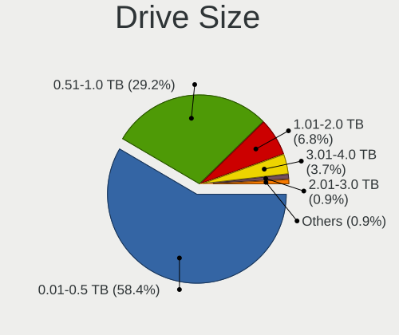

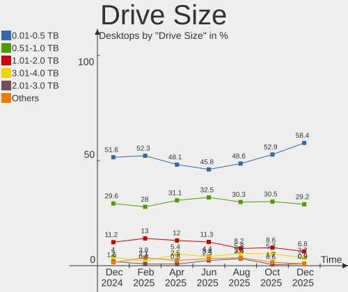

| Size in TB | Desktops | Drives | Percent |
|------------|----------|--------|---------|
| 0.01-0.5   | 128      | 191    | 58.45%  |
| 0.51-1.0   | 64       | 88     | 29.22%  |
| 1.01-2.0   | 15       | 25     | 6.85%   |
| 3.01-4.0   | 8        | 13     | 3.65%   |
| 2.01-3.0   | 2        | 2      | 0.91%   |
| 10.01-20.0 | 1        | 2      | 0.46%   |
| 4.01-10.0  | 1        | 1      | 0.46%   |

Space Total
-----------

Amount of disk space available on the file system

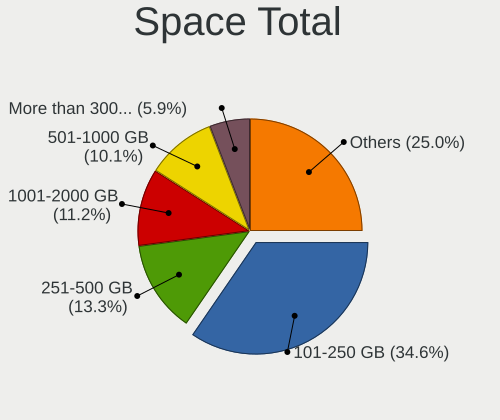

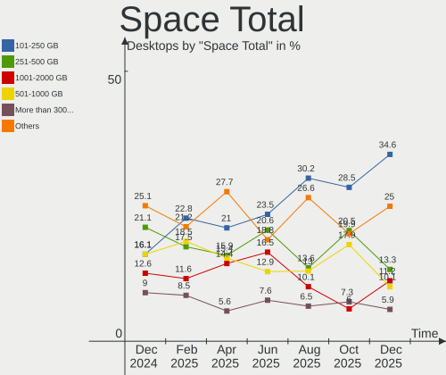

| Size in GB     | Desktops | Percent |
|----------------|----------|---------|
| 101-250        | 65       | 34.57%  |
| 251-500        | 25       | 13.3%   |
| 1001-2000      | 21       | 11.17%  |
| 501-1000       | 19       | 10.11%  |
| More than 3000 | 11       | 5.85%   |
| Unknown        | 11       | 5.85%   |
| 1-20           | 10       | 5.32%   |
| 21-50          | 9        | 4.79%   |
| 2001-3000      | 9        | 4.79%   |
| 51-100         | 8        | 4.26%   |

Space Used
----------

Amount of used disk space

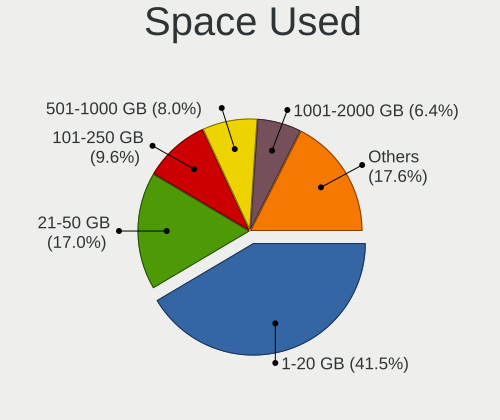

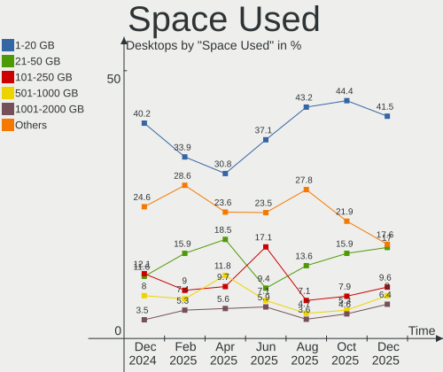

| Used GB        | Desktops | Percent |
|----------------|----------|---------|
| 1-20           | 78       | 41.49%  |
| 21-50          | 32       | 17.02%  |
| 101-250        | 18       | 9.57%   |
| 501-1000       | 15       | 7.98%   |
| 1001-2000      | 12       | 6.38%   |
| Unknown        | 11       | 5.85%   |
| 51-100         | 9        | 4.79%   |
| 251-500        | 7        | 3.72%   |
| More than 3000 | 5        | 2.66%   |
| 2001-3000      | 1        | 0.53%   |

Malfunc. Drives
---------------

Drive models with a malfunction

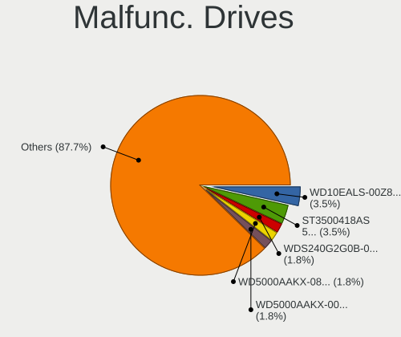

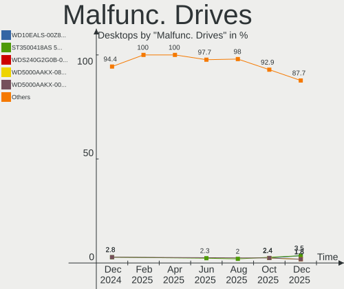

| Model                                                          | Desktops | Drives | Percent |
|----------------------------------------------------------------|----------|--------|---------|
| WDC WD10EALS-00Z8A0 1TB                                        | 2        | 2      | 3.51%   |
| Seagate ST3500418AS 500GB                                      | 2        | 2      | 3.51%   |
| WDC WDS240G2G0B-00EPW0 240GB SSD                               | 1        | 1      | 1.75%   |
| WDC WD5000AAKX-08U6AA0 500GB                                   | 1        | 1      | 1.75%   |
| WDC WD5000AAKX-00ERMA0 500GB                                   | 1        | 1      | 1.75%   |
| WDC WD5000AAKS-00V1A0 500GB                                    | 1        | 1      | 1.75%   |
| WDC WD5000AADS-00S9B0 500GB                                    | 1        | 1      | 1.75%   |
| WDC WD400BB-00JHA0 40GB                                        | 1        | 1      | 1.75%   |
| WDC WD3200AAJS-22L7A0 320GB                                    | 1        | 1      | 1.75%   |
| WDC WD3200AAJS-00L7A0 320GB                                    | 1        | 1      | 1.75%   |
| WDC WD3200AAJS-00B4A0 320GB                                    | 1        | 1      | 1.75%   |
| WDC WD20EARX-00PASB0 2TB                                       | 1        | 1      | 1.75%   |
| WDC WD20EARS-00MVWB0 2TB                                       | 1        | 1      | 1.75%   |
| WDC WD2000FYYZ-01UL1B0 2TB                                     | 1        | 1      | 1.75%   |
| WDC WD10EARS-00Y5B1 1TB                                        | 1        | 1      | 1.75%   |
| WDC WD10EARS-003BB1 1TB                                        | 1        | 1      | 1.75%   |
| WDC WD10EALX-009BA0 1TB                                        | 1        | 1      | 1.75%   |
| UnionSine SSD 128GB                                            | 1        | 1      | 1.75%   |
| Transcend TS256GSSD230S 256GB                                  | 1        | 1      | 1.75%   |
| Toshiba DT01ACA050 500GB                                       | 1        | 1      | 1.75%   |
| Seagate ST9160821AS 160GB                                      | 1        | 1      | 1.75%   |
| Seagate ST500LT012-1DG142 500GB                                | 1        | 1      | 1.75%   |
| Seagate ST380013AS 80GB                                        | 1        | 1      | 1.75%   |
| Seagate ST3250410AS 250GB                                      | 1        | 1      | 1.75%   |
| Seagate ST3250310AS 250GB                                      | 1        | 1      | 1.75%   |
| Seagate ST2000DL003-9VT166 2TB                                 | 1        | 1      | 1.75%   |
| Seagate ST1000LM035-1RK172 1TB                                 | 1        | 1      | 1.75%   |
| Seagate ST1000DM010-2EP102 1TB                                 | 1        | 1      | 1.75%   |
| Seagate ST1000DM003-9YN162 1TB                                 | 1        | 1      | 1.75%   |
| Seagate ST1000DM003-1SB10C 1TB                                 | 1        | 1      | 1.75%   |
| Seagate ST1000DM003-1CH162 1TB                                 | 1        | 1      | 1.75%   |
| Samsung Electronics SSD 870 EVO 500GB                          | 1        | 1      | 1.75%   |
| Samsung Electronics SSD 870 EVO 4TB                            | 1        | 1      | 1.75%   |
| Samsung Electronics SSD 870 EVO 250GB                          | 1        | 1      | 1.75%   |
| Samsung Electronics NVMe SSD Controller PM9A1/PM9A3/980PRO 1TB | 1        | 1      | 1.75%   |
| Samsung Electronics HM321HI 320GB                              | 1        | 1      | 1.75%   |
| Samsung Electronics HD253GJ 250GB                              | 1        | 1      | 1.75%   |
| Samsung Electronics HD161HJ 160GB                              | 1        | 1      | 1.75%   |
| Samsung Electronics HD120IJ 120GB                              | 1        | 1      | 1.75%   |
| Netac SSD 120GB                                                | 1        | 1      | 1.75%   |

Malfunc. Drive Vendor
---------------------

Vendors of faulty drives

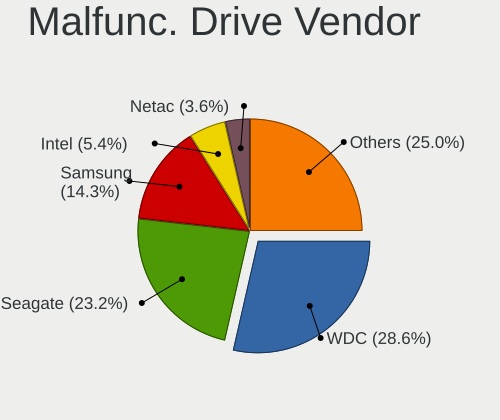

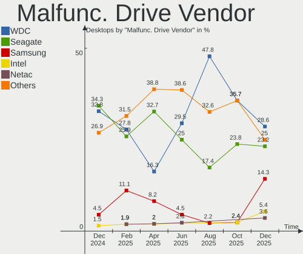

| Vendor                      | Desktops | Drives | Percent |
|-----------------------------|----------|--------|---------|
| WDC                         | 16       | 17     | 28.57%  |
| Seagate                     | 13       | 13     | 23.21%  |
| Samsung Electronics         | 8        | 8      | 14.29%  |
| Intel                       | 3        | 3      | 5.36%   |
| Netac                       | 2        | 2      | 3.57%   |
| Hitachi                     | 2        | 3      | 3.57%   |
| HGST                        | 2        | 5      | 3.57%   |
| UnionSine                   | 1        | 1      | 1.79%   |
| Transcend                   | 1        | 1      | 1.79%   |
| Toshiba                     | 1        | 1      | 1.79%   |
| MAXIO Technology (Hangzhou) | 1        | 1      | 1.79%   |
| Kingston                    | 1        | 1      | 1.79%   |
| Fujitsu                     | 1        | 1      | 1.79%   |
| ExeGate                     | 1        | 1      | 1.79%   |
| China                       | 1        | 1      | 1.79%   |
| AMD                         | 1        | 1      | 1.79%   |
| A-DATA Technology           | 1        | 1      | 1.79%   |

Malfunc. HDD Vendor
-------------------

Vendors of faulty HDD drives

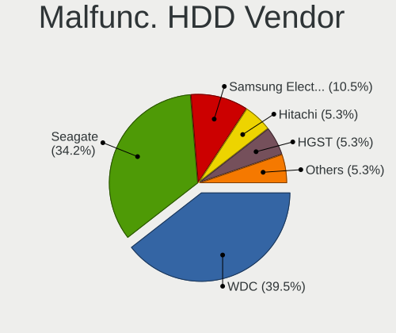

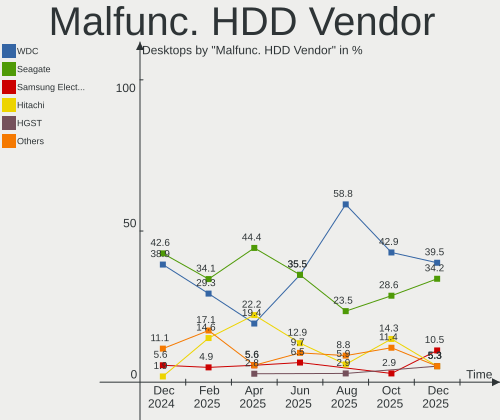

| Vendor              | Desktops | Drives | Percent |
|---------------------|----------|--------|---------|
| WDC                 | 15       | 16     | 39.47%  |
| Seagate             | 13       | 13     | 34.21%  |
| Samsung Electronics | 4        | 4      | 10.53%  |
| Hitachi             | 2        | 3      | 5.26%   |
| HGST                | 2        | 5      | 5.26%   |
| Toshiba             | 1        | 1      | 2.63%   |
| Fujitsu             | 1        | 1      | 2.63%   |

Malfunc. Drive Kind
-------------------

Kinds of faulty drives

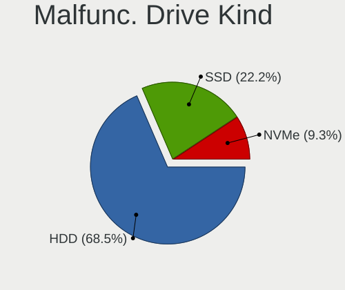

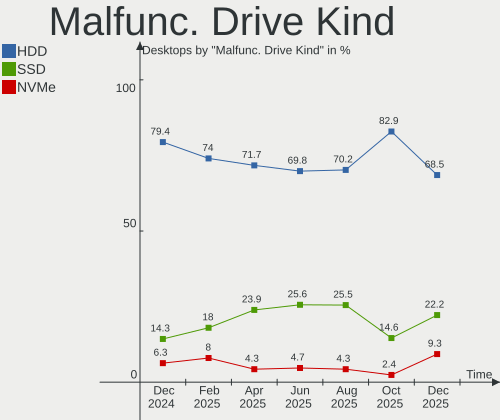

| Kind | Desktops | Drives | Percent |
|------|----------|--------|---------|
| HDD  | 37       | 43     | 68.52%  |
| SSD  | 12       | 13     | 22.22%  |
| NVMe | 5        | 5      | 9.26%   |

Failed Drives
-------------

Failed drive models

Zero info for selected period =(

Failed Drive Vendor
-------------------

Failed drive vendors

Zero info for selected period =(

Drive Status
------------

Number of failed and malfunc. drives

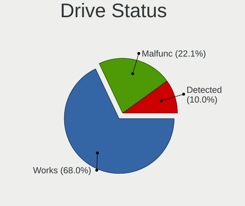

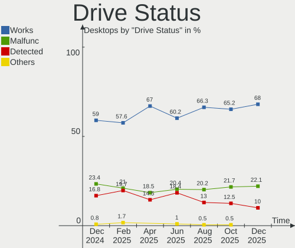

| Status   | Desktops | Drives | Percent |
|----------|----------|--------|---------|
| Works    | 157      | 301    | 67.97%  |
| Malfunc  | 51       | 61     | 22.08%  |
| Detected | 23       | 55     | 9.96%   |

Storage controller
------------------

Storage Vendor
--------------

Storage controller vendors

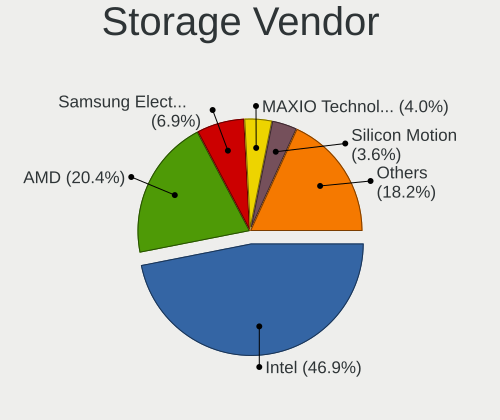

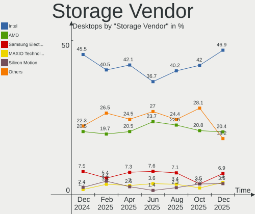

| Vendor                       | Desktops | Percent |
|------------------------------|----------|---------|
| Intel                        | 129      | 46.91%  |
| AMD                          | 56       | 20.36%  |
| Samsung Electronics          | 19       | 6.91%   |
| MAXIO Technology (Hangzhou)  | 11       | 4%      |
| Silicon Motion               | 10       | 3.64%   |
| ADATA Technology             | 8        | 2.91%   |
| Shenzhen Longsys Electronics | 7        | 2.55%   |
| Phison Electronics           | 6        | 2.18%   |
| Realtek Semiconductor        | 5        | 1.82%   |
| Kingston Technology Company  | 5        | 1.82%   |
| SanDisk                      | 4        | 1.45%   |
| ASMedia Technology           | 4        | 1.45%   |
| Netac Technology             | 2        | 0.73%   |
| Marvell Technology Group     | 2        | 0.73%   |
| JMicron Technology           | 2        | 0.73%   |
| VIA Technologies             | 1        | 0.36%   |
| Loongson Technology          | 1        | 0.36%   |
| KIOXIA                       | 1        | 0.36%   |
| INNOGRIT                     | 1        | 0.36%   |
| Biwin Storage Technology     | 1        | 0.36%   |

Storage Model
-------------

Storage controller models

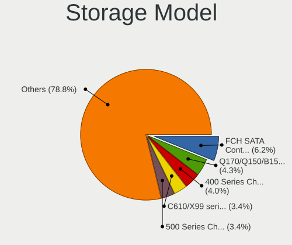

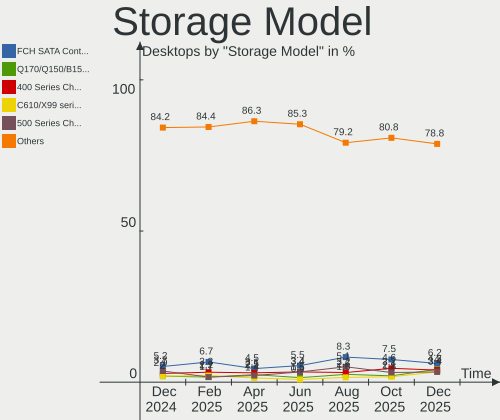

| Model                                                                                                              | Desktops | Percent |
|--------------------------------------------------------------------------------------------------------------------|----------|---------|
| AMD FCH SATA Controller [AHCI mode]                                                                                | 20       | 6.15%   |
| Intel Q170/Q150/B150/H170/H110/Z170/CM236 Chipset SATA Controller [AHCI Mode]                                      | 14       | 4.31%   |
| AMD 400 Series Chipset SATA Controller                                                                             | 13       | 4%      |
| Intel C610/X99 series chipset 6-Port SATA Controller [AHCI mode]                                                   | 11       | 3.38%   |
| Intel 500 Series Chipset Family SATA AHCI Controller                                                               | 11       | 3.38%   |
| AMD 600 Series Chipset SATA Controller                                                                             | 11       | 3.38%   |
| Intel 6 Series/C200 Series Chipset Family 6 port Desktop SATA AHCI Controller                                      | 10       | 3.08%   |
| Intel 200 Series PCH SATA controller [AHCI mode]                                                                   | 10       | 3.08%   |
| Silicon Motion SM2263EN/SM2263XT (DRAM-less) NVMe SSD Controllers                                                  | 9        | 2.77%   |
| Intel C610/X99 series chipset sSATA Controller [AHCI mode]                                                         | 9        | 2.77%   |
| Samsung NVMe SSD Controller SM981/PM981/PM983                                                                      | 8        | 2.46%   |
| MAXIO (Hangzhou) NVMe SSD Controller MAP1202 (DRAM-less)                                                           | 8        | 2.46%   |
| Intel NM10/ICH7 Family SATA Controller [IDE mode]                                                                  | 8        | 2.46%   |
| Intel 8 Series/C220 Series Chipset Family 6-port SATA Controller 1 [AHCI mode]                                     | 8        | 2.46%   |
| AMD 500 Series Chipset SATA Controller                                                                             | 8        | 2.46%   |
| Shenzhen Longsys FORESEE XP1000 / Lexar Professional CFexpress Type B Gold series, NM620 PCIe NVME SSD (DRAM-less) | 7        | 2.15%   |
| Intel Alder Lake-S PCH SATA Controller [AHCI Mode]                                                                 | 6        | 1.85%   |
| Intel Alder Lake-P SATA AHCI Controller                                                                            | 6        | 1.85%   |
| Intel 82801G (ICH7 Family) IDE Controller                                                                          | 6        | 1.85%   |
| Intel 7 Series/C210 Series Chipset Family 6-port SATA Controller [AHCI mode]                                       | 6        | 1.85%   |
| Intel Raptor Lake SATA AHCI Controller                                                                             | 5        | 1.54%   |
| AMD SB7x0/SB8x0/SB9x0 IDE Controller                                                                               | 5        | 1.54%   |
| Samsung NVMe SSD Controller PM9A1/PM9A3/980PRO                                                                     | 4        | 1.23%   |
| Intel Comet Lake SATA AHCI Controller                                                                              | 4        | 1.23%   |
| Intel C600/X79 series chipset 6-Port SATA AHCI Controller                                                          | 4        | 1.23%   |
| AMD SB7x0/SB8x0/SB9x0 SATA Controller [AHCI mode]                                                                  | 4        | 1.23%   |
| AMD A320 Chipset SATA Controller [AHCI mode]                                                                       | 4        | 1.23%   |
| AMD 300 Series Chipset SATA Controller                                                                             | 4        | 1.23%   |
| Samsung NVMe SSD Controller SM961/PM961/SM963                                                                      | 3        | 0.92%   |
| Samsung NVMe SSD Controller PM9C1a (DRAM-less)                                                                     | 3        | 0.92%   |
| Intel Volume Management Device NVMe RAID Controller                                                                | 3        | 0.92%   |
| Intel 6 Series/C200 Series Chipset Family Desktop SATA Controller (IDE mode, ports 4-5)                            | 3        | 0.92%   |
| Intel 6 Series/C200 Series Chipset Family Desktop SATA Controller (IDE mode, ports 0-3)                            | 3        | 0.92%   |
| ASMedia ASM1061/ASM1062 Serial ATA Controller                                                                      | 3        | 0.92%   |
| AMD SB7x0/SB8x0/SB9x0 SATA Controller [IDE mode]                                                                   | 3        | 0.92%   |
| AMD FCH SATA Controller [IDE mode]                                                                                 | 3        | 0.92%   |
| ADATA XPG SX8200 Pro PCIe Gen3x4 M.2 2280 Solid State Drive                                                        | 3        | 0.92%   |
| ADATA LEGEND 900 NVMe SSD (DRAM-less)                                                                              | 3        | 0.92%   |
| Samsung NVMe SSD Controller S4LV008[Pascal]                                                                        | 2        | 0.62%   |
| Samsung NVMe SSD Controller 980 (DRAM-less)                                                                        | 2        | 0.62%   |

Storage Kind
------------

Kind of storage controller (IDE, SATA, NVMe, SAS, ...)

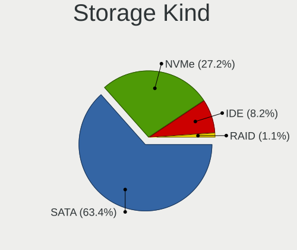

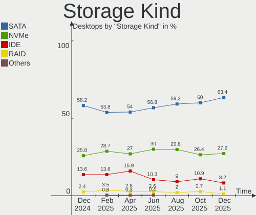

| Kind | Desktops | Percent |
|------|----------|---------|
| SATA | 170      | 63.43%  |
| NVMe | 73       | 27.24%  |
| IDE  | 22       | 8.21%   |
| RAID | 3        | 1.12%   |

Processor
---------

CPU Vendor
----------

Processor vendors

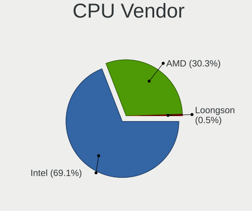

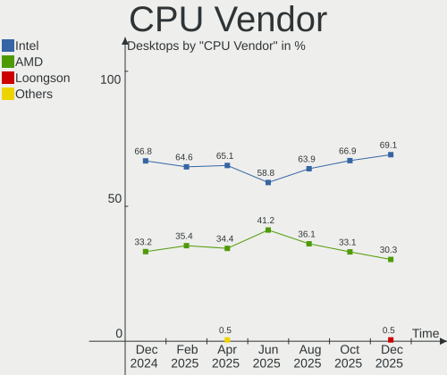

| Vendor   | Desktops | Percent |
|----------|----------|---------|
| Intel    | 130      | 69.15%  |
| AMD      | 57       | 30.32%  |
| Loongson | 1        | 0.53%   |

CPU Model
---------

Processor models

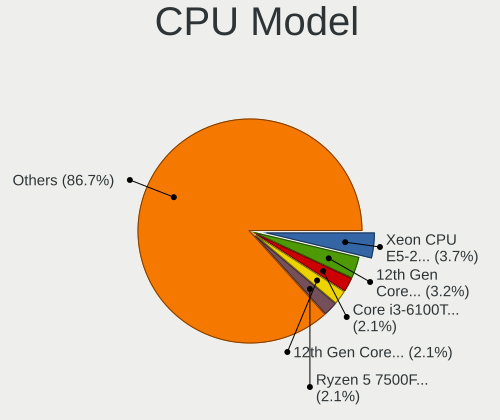

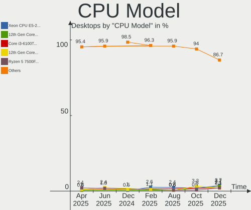

| Model                                        | Desktops | Percent |
|----------------------------------------------|----------|---------|
| Intel Xeon CPU E5-2680 v4 @ 2.40GHz          | 7        | 3.72%   |
| Intel 12th Gen Core i7-1280P                 | 6        | 3.19%   |
| Intel Core i3-6100TE CPU @ 2.70GHz           | 4        | 2.13%   |
| Intel 12th Gen Core i5-12400                 | 4        | 2.13%   |
| AMD Ryzen 5 7500F 6-Core Processor           | 4        | 2.13%   |
| AMD Ryzen 5 3600 6-Core Processor            | 3        | 1.6%    |
| AMD Ryzen 5 2600 Six-Core Processor          | 3        | 1.6%    |
| AMD Ryzen 5 1600 Six-Core Processor          | 3        | 1.6%    |
| AMD A10 PRO-7800B R7, 12 Compute Cores 4C+8G | 3        | 1.6%    |
| Intel Xeon CPU E5-2697A v4 @ 2.60GHz         | 2        | 1.06%   |
| Intel Xeon CPU E5-2690 v3 @ 2.60GHz          | 2        | 1.06%   |
| Intel Xeon CPU E5-2689 0 @ 2.60GHz           | 2        | 1.06%   |
| Intel Xeon CPU E5-2673 v3 @ 2.40GHz          | 2        | 1.06%   |
| Intel Xeon CPU E5-2670 0 @ 2.60GHz           | 2        | 1.06%   |
| Intel Xeon CPU E3-1240 V2 @ 3.40GHz          | 2        | 1.06%   |
| Intel Pentium CPU G4620 @ 3.70GHz            | 2        | 1.06%   |
| Intel Core i7-4790 CPU @ 3.60GHz             | 2        | 1.06%   |
| Intel Core i7-3770 CPU @ 3.40GHz             | 2        | 1.06%   |
| Intel Core i5-9400 CPU @ 2.90GHz             | 2        | 1.06%   |
| Intel Core i5-7400 CPU @ 3.00GHz             | 2        | 1.06%   |
| Intel Core i5-6500 CPU @ 3.20GHz             | 2        | 1.06%   |
| Intel Core i5-3470 CPU @ 3.20GHz             | 2        | 1.06%   |
| Intel Core i3-7100 CPU @ 3.90GHz             | 2        | 1.06%   |
| Intel Core i3-10105F CPU @ 3.70GHz           | 2        | 1.06%   |
| Intel Core 2 Duo CPU E7500 @ 2.93GHz         | 2        | 1.06%   |
| Intel 11th Gen Core i7-11700 @ 2.50GHz       | 2        | 1.06%   |
| Intel 11th Gen Core i5-11400F @ 2.60GHz      | 2        | 1.06%   |
| AMD Ryzen 9 5900X 12-Core Processor          | 2        | 1.06%   |
| AMD Ryzen 7 2700 Eight-Core Processor        | 2        | 1.06%   |
| AMD Ryzen 5 5600G with Radeon Graphics       | 2        | 1.06%   |
| AMD Ryzen 5 5600 6-Core Processor            | 2        | 1.06%   |
| AMD Ryzen 5 2600X Six-Core Processor         | 2        | 1.06%   |
| AMD Ryzen 3 3200G with Radeon Vega Graphics  | 2        | 1.06%   |
| AMD Ryzen 3 2200G with Radeon Vega Graphics  | 2        | 1.06%   |
| AMD FX-8350 Eight-Core Processor             | 2        | 1.06%   |
| Loongson Loongson 3A                         | 1        | 0.53%   |
| Intel Xeon CPU X5690 @ 3.47GHz               | 1        | 0.53%   |
| Intel Xeon CPU X5687 @ 3.60GHz               | 1        | 0.53%   |
| Intel Xeon CPU X3440 @ 2.53GHz               | 1        | 0.53%   |
| Intel Xeon CPU X3210 @ 2.13GHz               | 1        | 0.53%   |

CPU Model Family
----------------

Processor model prefix

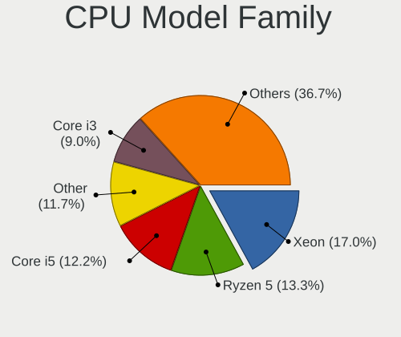

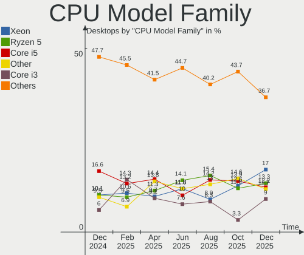

| Model                   | Desktops | Percent |
|-------------------------|----------|---------|
| Intel Xeon              | 32       | 17.02%  |
| AMD Ryzen 5             | 25       | 13.3%   |
| Intel Core i5           | 23       | 12.23%  |
| Other                   | 22       | 11.7%   |
| Intel Core i3           | 17       | 9.04%   |
| Intel Core i7           | 9        | 4.79%   |
| Intel Celeron           | 9        | 4.79%   |
| AMD Ryzen 7             | 9        | 4.79%   |
| Intel Pentium           | 6        | 3.19%   |
| AMD Ryzen 9             | 6        | 3.19%   |
| AMD FX                  | 5        | 2.66%   |
| Intel Core 2 Duo        | 4        | 2.13%   |
| AMD Ryzen 3             | 4        | 2.13%   |
| AMD A10                 | 4        | 2.13%   |
| Intel Pentium Gold      | 2        | 1.06%   |
| Intel Core 2 Quad       | 2        | 1.06%   |
| Intel Pentium Dual-Core | 1        | 0.53%   |
| Intel Pentium Dual      | 1        | 0.53%   |
| Intel Genuine           | 1        | 0.53%   |
| Intel Core i9           | 1        | 0.53%   |
| Intel Core              | 1        | 0.53%   |
| AMD Athlon X2           | 1        | 0.53%   |
| AMD Athlon II X3        | 1        | 0.53%   |
| AMD Athlon II X2        | 1        | 0.53%   |
| AMD A4                  | 1        | 0.53%   |

CPU Cores
---------

Number of processor cores

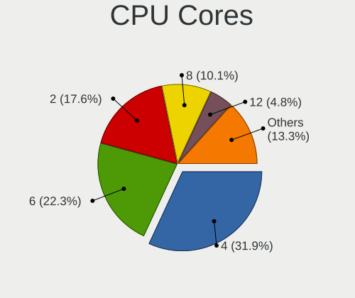

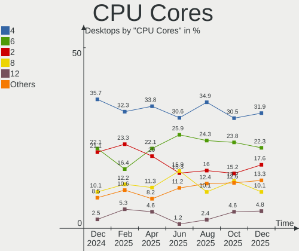

| Number | Desktops | Percent |
|--------|----------|---------|
| 4      | 60       | 31.91%  |
| 6      | 42       | 22.34%  |
| 2      | 33       | 17.55%  |
| 8      | 19       | 10.11%  |
| 12     | 9        | 4.79%   |
| 14     | 7        | 3.72%   |
| 28     | 6        | 3.19%   |
| 16     | 3        | 1.6%    |
| 32     | 2        | 1.06%   |
| 24     | 2        | 1.06%   |
| 3      | 2        | 1.06%   |
| 36     | 1        | 0.53%   |
| 10     | 1        | 0.53%   |
| 1      | 1        | 0.53%   |

CPU Sockets
-----------

Number of sockets

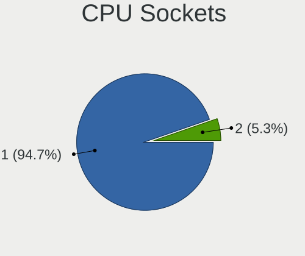

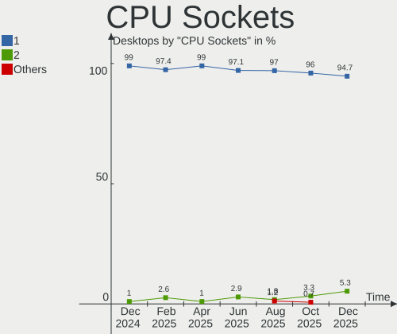

| Number | Desktops | Percent |
|--------|----------|---------|
| 1      | 178      | 94.68%  |
| 2      | 10       | 5.32%   |

CPU Threads
-----------

Threads per core (Hyper-Threading)

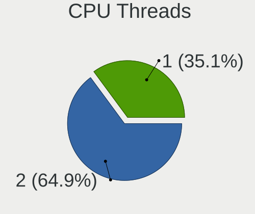

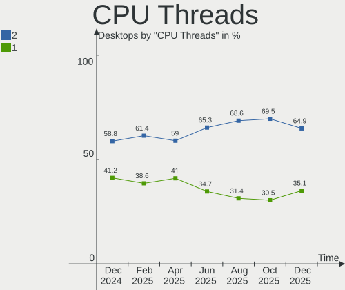

| Number | Desktops | Percent |
|--------|----------|---------|
| 2      | 122      | 64.89%  |
| 1      | 66       | 35.11%  |

CPU Op-Modes
------------

CPU Operation Modes (32-bit, 64-bit)

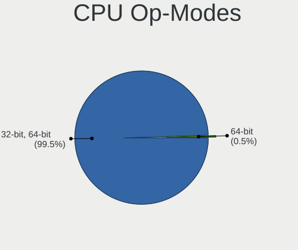

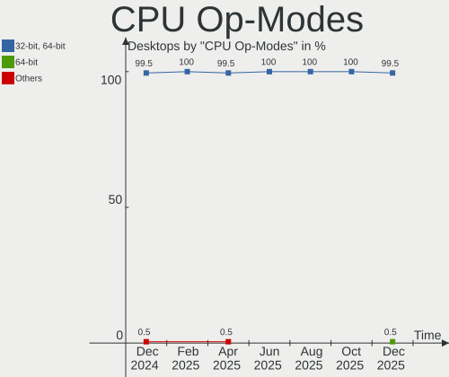

| Op mode        | Desktops | Percent |
|----------------|----------|---------|
| 32-bit, 64-bit | 187      | 99.47%  |
| 64-bit         | 1        | 0.53%   |

CPU Microcode
-------------

Microcode number

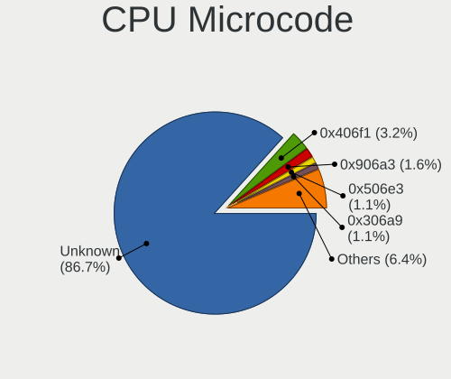

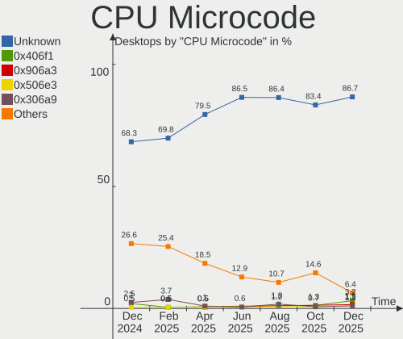

| Number     | Desktops | Percent |
|------------|----------|---------|
| Unknown    | 163      | 86.7%   |
| 0x406f1    | 6        | 3.19%   |
| 0x906a3    | 3        | 1.6%    |
| 0x506e3    | 2        | 1.06%   |
| 0x306a9    | 2        | 1.06%   |
| 0xa0653    | 1        | 0.53%   |
| 0x906e9    | 1        | 0.53%   |
| 0x6fd      | 1        | 0.53%   |
| 0x6fb      | 1        | 0.53%   |
| 0x306c3    | 1        | 0.53%   |
| 0x206a7    | 1        | 0.53%   |
| 0x20655    | 1        | 0.53%   |
| 0x1067a    | 1        | 0.53%   |
| 0x0a50000c | 1        | 0.53%   |
| 0x06000852 | 1        | 0.53%   |
| 0x06000822 | 1        | 0.53%   |
| 0x010000b7 | 1        | 0.53%   |

CPU Microarch
-------------

Microarchitecture

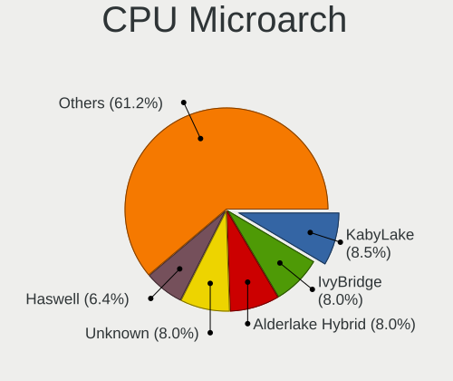

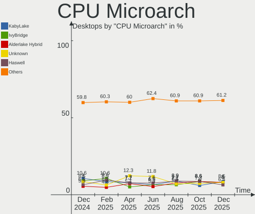

| Name             | Desktops | Percent |
|------------------|----------|---------|
| KabyLake         | 16       | 8.51%   |
| IvyBridge        | 15       | 7.98%   |
| Alderlake Hybrid | 15       | 7.98%   |
| Unknown          | 15       | 7.98%   |
| Haswell          | 12       | 6.38%   |
| Zen+             | 11       | 5.85%   |
| Zen 3            | 11       | 5.85%   |
| CometLake        | 11       | 5.85%   |
| Broadwell        | 11       | 5.85%   |
| Skylake          | 10       | 5.32%   |
| SandyBridge      | 10       | 5.32%   |
| Piledriver       | 7        | 3.72%   |
| Penryn           | 7        | 3.72%   |
| Zen              | 6        | 3.19%   |
| Icelake          | 5        | 2.66%   |
| Zen 2            | 4        | 2.13%   |
| Westmere         | 4        | 2.13%   |
| Core             | 4        | 2.13%   |
| Steamroller      | 3        | 1.6%    |
| Tremont          | 2        | 1.06%   |
| K10              | 2        | 1.06%   |
| Silvermont       | 1        | 0.53%   |
| Nehalem          | 1        | 0.53%   |
| Lunarlake Hybrid | 1        | 0.53%   |
| Gracemont        | 1        | 0.53%   |
| Goldmont plus    | 1        | 0.53%   |
| Goldmont         | 1        | 0.53%   |
| Bulldozer        | 1        | 0.53%   |

Graphics
--------

GPU Vendor
----------

Vendors of graphics cards

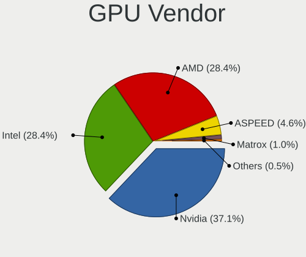

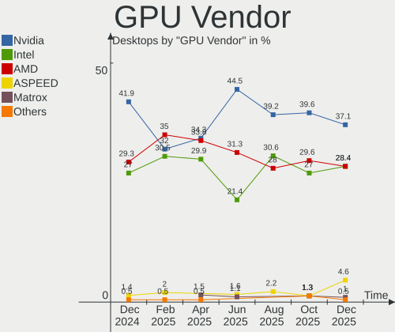

| Vendor                     | Desktops | Percent |
|----------------------------|----------|---------|
| Nvidia                     | 73       | 37.06%  |
| Intel                      | 56       | 28.43%  |
| AMD                        | 56       | 28.43%  |
| ASPEED Technology          | 9        | 4.57%   |
| Matrox Electronics Systems | 2        | 1.02%   |
| Loongson Technology        | 1        | 0.51%   |

GPU Model
---------

Graphics card models

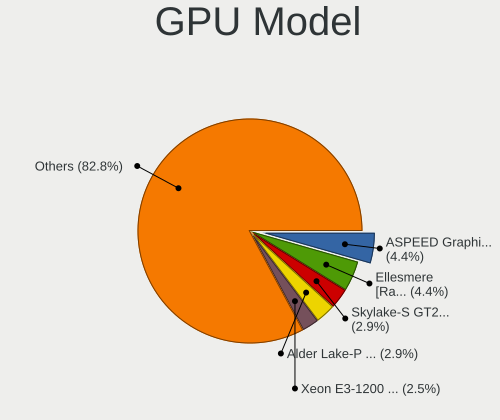

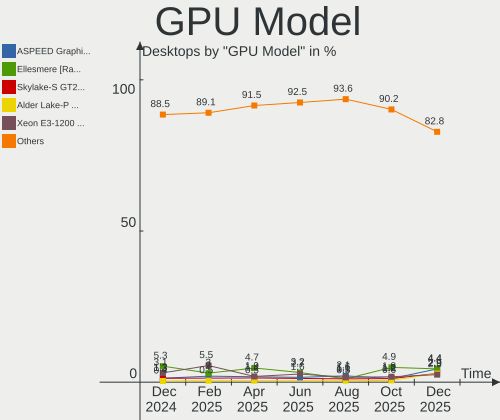

| Model                                                                       | Desktops | Percent |
|-----------------------------------------------------------------------------|----------|---------|
| ASPEED Technology ASPEED Graphics Family                                    | 9        | 4.41%   |
| AMD Ellesmere [Radeon RX 470/480/570/570X/580/580X/590]                     | 9        | 4.41%   |
| Intel Skylake-S GT2 [HD Graphics 530]                                       | 6        | 2.94%   |
| Intel Alder Lake-P GT2 [Iris Xe Graphics]                                   | 6        | 2.94%   |
| Intel Xeon E3-1200 v2/3rd Gen Core processor Graphics Controller            | 5        | 2.45%   |
| Nvidia GP107 [GeForce GTX 1050 Ti]                                          | 4        | 1.96%   |
| Nvidia GF108 [GeForce GT 440]                                               | 4        | 1.96%   |
| Intel CoffeeLake-S GT2 [UHD Graphics 630]                                   | 4        | 1.96%   |
| Intel Alder Lake-S GT1 [UHD Graphics 730]                                   | 4        | 1.96%   |
| AMD Polaris 20 XL [Radeon RX 580 2048SP]                                    | 4        | 1.96%   |
| AMD Granite Ridge [Radeon Graphics]                                         | 4        | 1.96%   |
| Nvidia TU117 [GeForce GTX 1650]                                             | 3        | 1.47%   |
| Nvidia TU106 [GeForce RTX 2060 SUPER]                                       | 3        | 1.47%   |
| Nvidia GP107 [GeForce GTX 1050]                                             | 3        | 1.47%   |
| Nvidia GM107 [GeForce GTX 750 Ti]                                           | 3        | 1.47%   |
| Nvidia GK208B [GeForce GT 710]                                              | 3        | 1.47%   |
| Nvidia GB203 [GeForce RTX 5070 Ti]                                          | 3        | 1.47%   |
| Nvidia AD104 [GeForce RTX 4070 SUPER]                                       | 3        | 1.47%   |
| Intel Xeon E3-1200 v3/4th Gen Core Processor Integrated Graphics Controller | 3        | 1.47%   |
| Intel Kaby Lake-S GT2 [HD Graphics 630]                                     | 3        | 1.47%   |
| Intel CometLake-S GT1 [UHD Graphics 610]                                    | 3        | 1.47%   |
| AMD Navi 44 [Radeon RX 9060 XT]                                             | 3        | 1.47%   |
| AMD Navi 22 [Radeon RX 6700/6700 XT/6750 XT / 6800M/6850M XT]               | 3        | 1.47%   |
| AMD Kaveri [Radeon R7 Graphics]                                             | 3        | 1.47%   |
| Nvidia GP106 [GeForce GTX 1060 6GB]                                         | 2        | 0.98%   |
| Nvidia GM107 [GeForce GTX 750]                                              | 2        | 0.98%   |
| Nvidia GK107 [GeForce GTX 650]                                              | 2        | 0.98%   |
| Nvidia GK107 [GeForce GT 640]                                               | 2        | 0.98%   |
| Nvidia GK106 [GeForce GTX 650 Ti]                                           | 2        | 0.98%   |
| Nvidia GF108 [GeForce GT 430]                                               | 2        | 0.98%   |
| Nvidia AD107 [GeForce RTX 4060]                                             | 2        | 0.98%   |
| Intel JasperLake [UHD Graphics]                                             | 2        | 0.98%   |
| Intel IvyBridge GT2 [HD Graphics 4000]                                      | 2        | 0.98%   |
| Intel CometLake-S GT2 [UHD Graphics 630]                                    | 2        | 0.98%   |
| Intel 82G33/G31 Express Integrated Graphics Controller                      | 2        | 0.98%   |
| Intel 2nd Generation Core Processor Family Integrated Graphics Controller   | 2        | 0.98%   |
| AMD RV515 [Radeon X1300/X1550]                                              | 2        | 0.98%   |
| AMD RV515 [Radeon X1300/X1550 Series] (Secondary)                           | 2        | 0.98%   |
| AMD Raven Ridge [Radeon Vega Series / Radeon Vega Mobile Series]            | 2        | 0.98%   |
| AMD Picasso/Raven 2 [Radeon Vega Series / Radeon Vega Mobile Series]        | 2        | 0.98%   |

GPU Combo
---------

Combinations of graphics cards

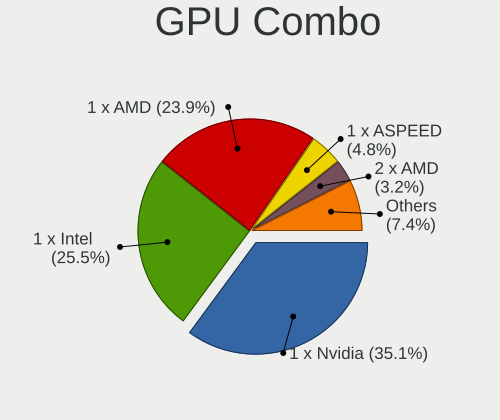

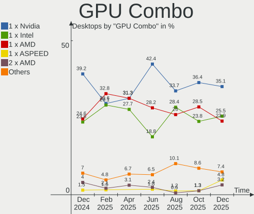

| Name                    | Desktops | Percent |
|-------------------------|----------|---------|
| 1 x Nvidia              | 66       | 35.11%  |
| 1 x Intel               | 48       | 25.53%  |
| 1 x AMD                 | 45       | 23.94%  |
| 1 x ASPEED              | 9        | 4.79%   |
| 2 x AMD                 | 6        | 3.19%   |
| Intel + Nvidia          | 5        | 2.66%   |
| 1 x Matrox              | 2        | 1.06%   |
| Intel + AMD             | 2        | 1.06%   |
| AMD + Nvidia            | 2        | 1.06%   |
| Other                   | 1        | 0.53%   |
| 2 x Intel               | 1        | 0.53%   |
| 1 x Loongson Technology | 1        | 0.53%   |

GPU Driver
----------

Free vs proprietary

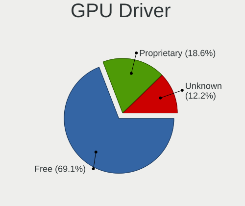

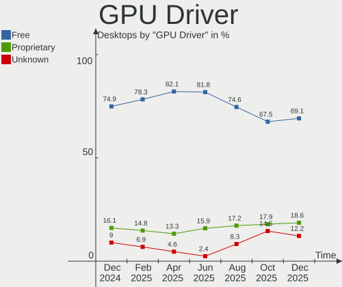

| Driver      | Desktops | Percent |
|-------------|----------|---------|
| Free        | 130      | 69.15%  |
| Proprietary | 35       | 18.62%  |
| Unknown     | 23       | 12.23%  |

GPU Memory
----------

Total video memory

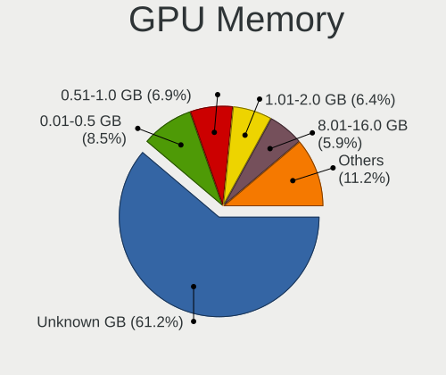

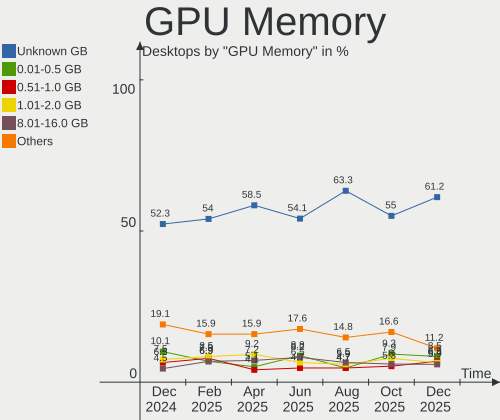

| Size in GB | Desktops | Percent |
|------------|----------|---------|
| Unknown    | 115      | 61.17%  |
| 0.01-0.5   | 16       | 8.51%   |
| 0.51-1.0   | 13       | 6.91%   |
| 1.01-2.0   | 12       | 6.38%   |
| 8.01-16.0  | 11       | 5.85%   |
| 7.01-8.0   | 9        | 4.79%   |
| 3.01-4.0   | 7        | 3.72%   |
| 5.01-6.0   | 2        | 1.06%   |
| 16.01-24.0 | 2        | 1.06%   |
| 2.01-3.0   | 1        | 0.53%   |

Monitor
-------

Monitor Vendor
--------------

Monitor vendors

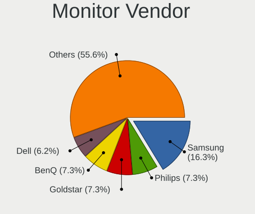

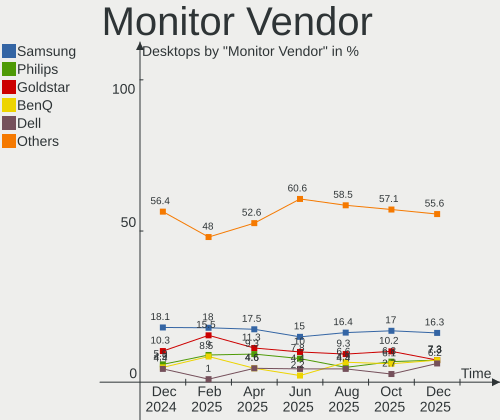

| Vendor               | Desktops | Percent |
|----------------------|----------|---------|
| Samsung Electronics  | 29       | 16.29%  |
| Philips              | 13       | 7.3%    |
| Goldstar             | 13       | 7.3%    |
| BenQ                 | 13       | 7.3%    |
| Dell                 | 11       | 6.18%   |
| AOC                  | 11       | 6.18%   |
| Acer                 | 11       | 6.18%   |
| Mi                   | 8        | 4.49%   |
| ViewSonic            | 7        | 3.93%   |
| Hewlett-Packard      | 7        | 3.93%   |
| SKG                  | 5        | 2.81%   |
| SAC                  | 5        | 2.81%   |
| Iiyama               | 4        | 2.25%   |
| HHT                  | 4        | 2.25%   |
| Ancor Communications | 4        | 2.25%   |
| ASUSTek Computer     | 3        | 1.69%   |
| VIE                  | 2        | 1.12%   |
| Unknown              | 2        | 1.12%   |
| Sony                 | 2        | 1.12%   |
| MSI                  | 2        | 1.12%   |
| HUAWEI               | 2        | 1.12%   |
| Unknown (ABC)        | 1        | 0.56%   |
| SYM                  | 1        | 0.56%   |
| STD                  | 1        | 0.56%   |
| Sharp                | 1        | 0.56%   |
| SGT                  | 1        | 0.56%   |
| Pixio                | 1        | 0.56%   |
| Novatek              | 1        | 0.56%   |
| MTK                  | 1        | 0.56%   |
| MStar                | 1        | 0.56%   |
| ICL                  | 1        | 0.56%   |
| HSI                  | 1        | 0.56%   |
| HJW                  | 1        | 0.56%   |
| Hitachi              | 1        | 0.56%   |
| Fujitsu Siemens      | 1        | 0.56%   |
| DET                  | 1        | 0.56%   |
| Denver               | 1        | 0.56%   |
| DENON                | 1        | 0.56%   |
| CTV                  | 1        | 0.56%   |
| AMT International    | 1        | 0.56%   |

Monitor Model
-------------

Monitor models

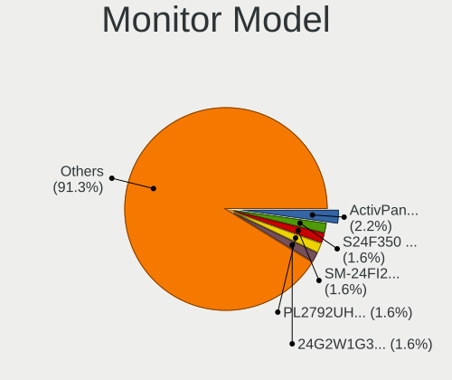

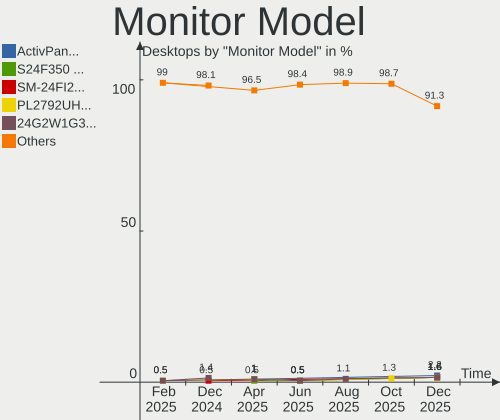

| Model                                                                | Desktops | Percent |
|----------------------------------------------------------------------|----------|---------|
| HHT ActivPanel V6 HHT0030 3840x2160 944x398mm 40.3-inch              | 4        | 2.19%   |
| Samsung Electronics S24F350 SAM0D20 1920x1080 521x293mm 23.5-inch    | 3        | 1.64%   |
| SAC SM-24FI221 SAC2453 1920x1080 530x290mm 23.8-inch                 | 3        | 1.64%   |
| Iiyama PL2792UH IVM664E 3840x2160 600x340mm 27.2-inch                | 3        | 1.64%   |
| AOC 24G2W1G3 AOC2402 1920x1080 527x296mm 23.8-inch                   | 3        | 1.64%   |
| Unknown LCD Monitor FFFF 2288x1287 2550x2550mm 142.0-inch            | 2        | 1.09%   |
| Philips PHL 273V7 PHLC156 1920x1080 598x336mm 27.0-inch              | 2        | 1.09%   |
| Philips PHL 223V5 PHLC0CF 1920x1080 477x268mm 21.5-inch              | 2        | 1.09%   |
| HUAWEI ZQE-CBA HWV6A25 3440x1440 797x334mm 34.0-inch                 | 2        | 1.09%   |
| Hewlett-Packard E273q HPN3474 2560x1440 597x336mm 27.0-inch          | 2        | 1.09%   |
| BenQ LCD BNQ801B 2560x1440 527x296mm 23.8-inch                       | 2        | 1.09%   |
| BenQ GL2450H BNQ78A7 1920x1080 531x298mm 24.0-inch                   | 2        | 1.09%   |
| ViewSonic VX2458 series VSC0437 1920x1080 521x293mm 23.5-inch        | 1        | 0.55%   |
| ViewSonic VX2453 Series VSC0C28 1920x1080 520x290mm 23.4-inch        | 1        | 0.55%   |
| ViewSonic VX2409 SERIES VSC6C2E 1920x1080 521x293mm 23.5-inch        | 1        | 0.55%   |
| ViewSonic VX2210 SERIES VSC172B 1920x1080 476x268mm 21.5-inch        | 1        | 0.55%   |
| ViewSonic VP171s VSCB716 1280x1024 338x270mm 17.0-inch               | 1        | 0.55%   |
| ViewSonic VA2719 Series VSCC132 1920x1080 598x336mm 27.0-inch        | 1        | 0.55%   |
| ViewSonic VA2407 Series VSC8C31 1920x1080 521x293mm 23.5-inch        | 1        | 0.55%   |
| ViewSonic VA2342 SERIES VSCFA2B 1920x1080 509x286mm 23.0-inch        | 1        | 0.55%   |
| VIE RE24BDB VIE0238 1920x1080 527x296mm 23.8-inch                    | 1        | 0.55%   |
| VIE DP VIE0875 1920x1080 597x336mm 27.0-inch                         | 1        | 0.55%   |
| Unknown (ABC) Q2722DFG ABC2700 2560x1440 530x280mm 23.6-inch         | 1        | 0.55%   |
| SYM ES2407A SYM2380 1920x1080 527x296mm 23.8-inch                    | 1        | 0.55%   |
| STD HDMI STD2020 1920x1080 520x310mm 23.8-inch                       | 1        | 0.55%   |
| Sony SDM-HS75P SNY2300 1280x1024 338x270mm 17.0-inch                 | 1        | 0.55%   |
| Sony LCD Monitor MS_9005 1920x1080                                   | 1        | 0.55%   |
| SKG H27T22 SKG2702 2560x1440 530x280mm 23.6-inch                     | 1        | 0.55%   |
| SKG DEXP DQ32N1 SKG3213 2560x1440 531x298mm 24.0-inch                | 1        | 0.55%   |
| SKG DEXP DQ27N2 SKG2771 2560x1440 531x298mm 24.0-inch                | 1        | 0.55%   |
| SKG DEXP DF27N1 SKG2713 1920x1080 597x336mm 27.0-inch                | 1        | 0.55%   |
| SKG AQ27H1 SKG2722 2560x1440 620x370mm 28.4-inch                     | 1        | 0.55%   |
| Sharp HDMI SHP1048 1920x1080 890x500mm 40.2-inch                     | 1        | 0.55%   |
| SGT HDMI SGT3200 2560x1440 600x330mm 27.0-inch                       | 1        | 0.55%   |
| Samsung Electronics SyncMaster SAM0580 1280x1024 376x301mm 19.0-inch | 1        | 0.55%   |
| Samsung Electronics SyncMaster SAM02F5 1920x1200                     | 1        | 0.55%   |
| Samsung Electronics SyncMaster SAM026E 1280x1024 376x301mm 19.0-inch | 1        | 0.55%   |
| Samsung Electronics SyncMaster SAM021C 1400x1050 408x300mm 19.9-inch | 1        | 0.55%   |
| Samsung Electronics SyncMaster SAM01E9 1280x1024 376x301mm 19.0-inch | 1        | 0.55%   |
| Samsung Electronics SyncMaster SAM01E1 1280x1024 376x301mm 19.0-inch | 1        | 0.55%   |

Monitor Resolution
------------------

Monitor screen resolution

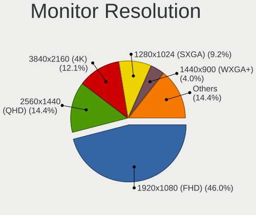

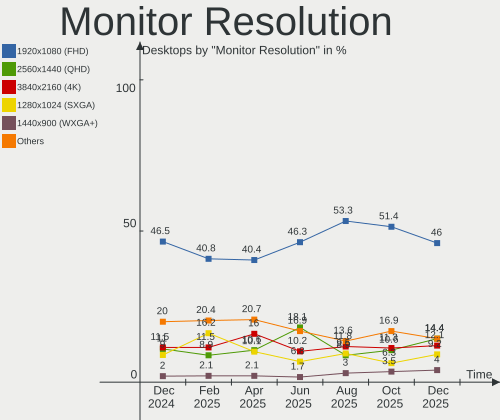

| Resolution         | Desktops | Percent |
|--------------------|----------|---------|
| 1920x1080 (FHD)    | 80       | 45.98%  |
| 2560x1440 (QHD)    | 25       | 14.37%  |
| 3840x2160 (4K)     | 21       | 12.07%  |
| 1280x1024 (SXGA)   | 16       | 9.2%    |
| 1440x900 (WXGA+)   | 7        | 4.02%   |
| 1680x1050 (WSXGA+) | 5        | 2.87%   |
| 3440x1440          | 4        | 2.3%    |
| 1366x768 (WXGA)    | 4        | 2.3%    |
| 1920x1200 (WUXGA)  | 3        | 1.72%   |
| 1600x900 (HD+)     | 3        | 1.72%   |
| 2288x1287          | 2        | 1.15%   |
| 1400x1050          | 2        | 1.15%   |
| 2560x1600          | 1        | 0.57%   |
| 1024x768 (XGA)     | 1        | 0.57%   |

Monitor Diagonal
----------------

Diagonal size in inches

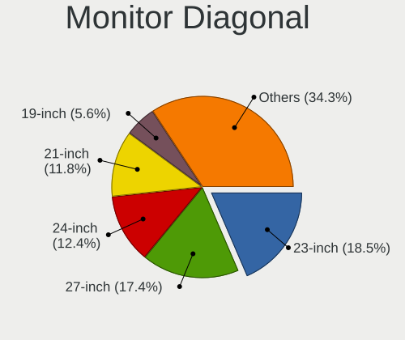

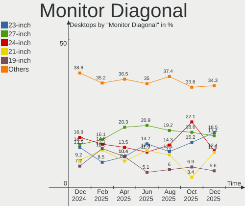

| Inches  | Desktops | Percent |
|---------|----------|---------|
| 23      | 33       | 18.54%  |
| 27      | 31       | 17.42%  |
| 24      | 22       | 12.36%  |
| 21      | 21       | 11.8%   |
| 19      | 10       | 5.62%   |
| 17      | 9        | 5.06%   |
| 34      | 7        | 3.93%   |
| 20      | 6        | 3.37%   |
| 40      | 5        | 2.81%   |
| 31      | 5        | 2.81%   |
| 18      | 5        | 2.81%   |
| Unknown | 4        | 2.25%   |
| 22      | 3        | 1.69%   |
| 142     | 2        | 1.12%   |
| 84      | 2        | 1.12%   |
| 54      | 2        | 1.12%   |
| 32      | 2        | 1.12%   |
| 26      | 2        | 1.12%   |
| 15      | 2        | 1.12%   |
| 64      | 1        | 0.56%   |
| 60      | 1        | 0.56%   |
| 52      | 1        | 0.56%   |
| 29      | 1        | 0.56%   |
| 28      | 1        | 0.56%   |

Monitor Width
-------------

Physical width

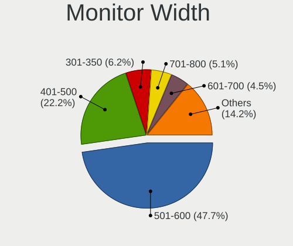

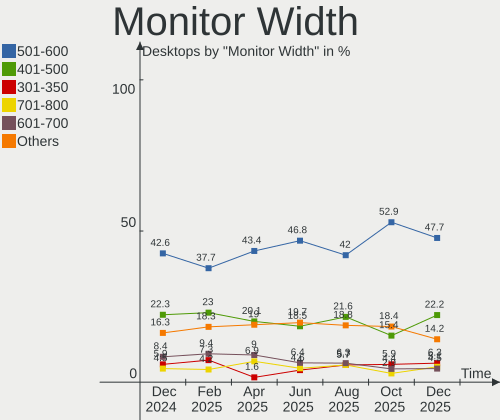

| Width in mm    | Desktops | Percent |
|----------------|----------|---------|
| 501-600        | 84       | 47.73%  |
| 401-500        | 39       | 22.16%  |
| 301-350        | 11       | 6.25%   |
| 701-800        | 9        | 5.11%   |
| 601-700        | 8        | 4.55%   |
| 351-400        | 7        | 3.98%   |
| 1001-1500      | 5        | 2.84%   |
| 901-1000       | 4        | 2.27%   |
| Unknown        | 4        | 2.27%   |
| More than 2000 | 2        | 1.14%   |
| 1501-2000      | 2        | 1.14%   |
| 801-900        | 1        | 0.57%   |

Aspect Ratio
------------

Proportional relationship between the width and the height

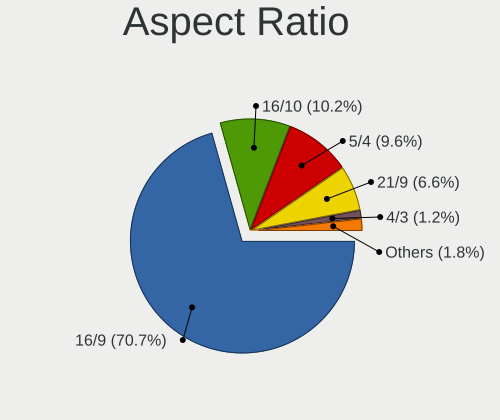

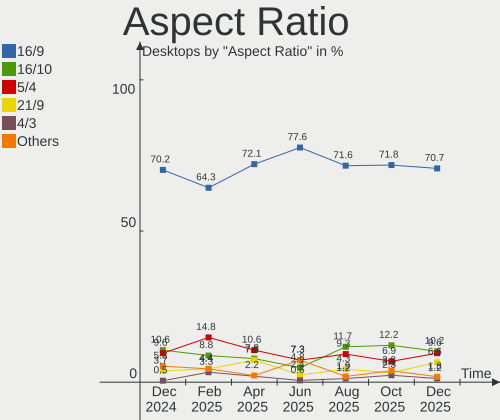

| Ratio   | Desktops | Percent |
|---------|----------|---------|
| 16/9    | 118      | 70.66%  |
| 16/10   | 17       | 10.18%  |
| 5/4     | 16       | 9.58%   |
| 21/9    | 11       | 6.59%   |
| 4/3     | 2        | 1.2%    |
| 1.00    | 2        | 1.2%    |
| Unknown | 1        | 0.6%    |

Monitor Area
------------

Area in inch²

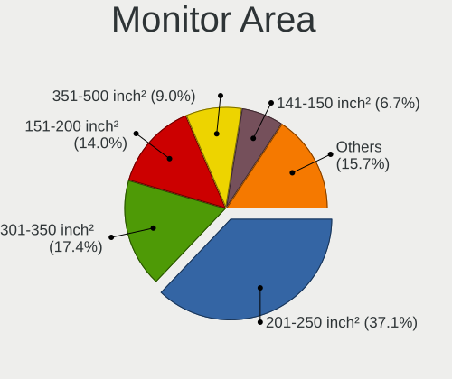

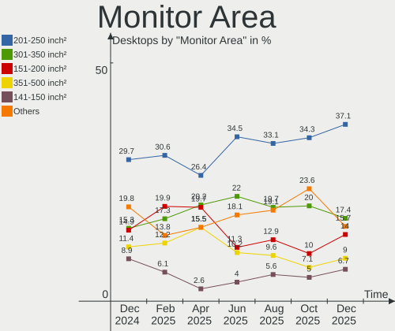

| Area in inch² | Desktops | Percent |
|----------------|----------|---------|
| 201-250        | 66       | 37.08%  |
| 301-350        | 31       | 17.42%  |
| 151-200        | 25       | 14.04%  |
| 351-500        | 16       | 8.99%   |
| 141-150        | 12       | 6.74%   |
| More than 1000 | 9        | 5.06%   |
| 251-300        | 8        | 4.49%   |
| 501-1000       | 5        | 2.81%   |
| Unknown        | 4        | 2.25%   |
| 101-110        | 2        | 1.12%   |

Pixel Density
-------------

Pixels per inch

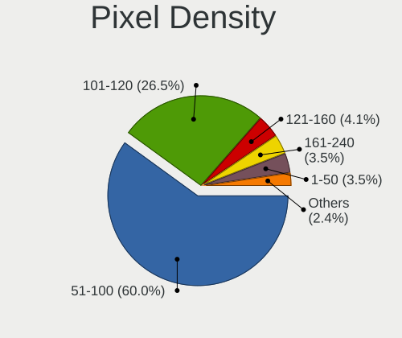

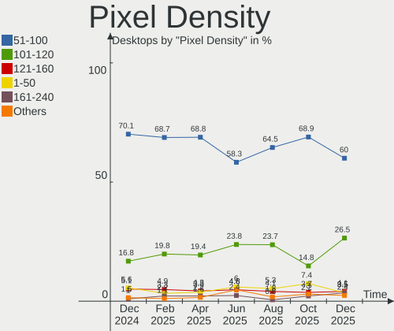

| Density | Desktops | Percent |
|---------|----------|---------|
| 51-100  | 102      | 60%     |
| 101-120 | 45       | 26.47%  |
| 121-160 | 7        | 4.12%   |
| 1-50    | 6        | 3.53%   |
| 161-240 | 6        | 3.53%   |
| Unknown | 4        | 2.35%   |

Multiple Monitors
-----------------

Total monitors connected

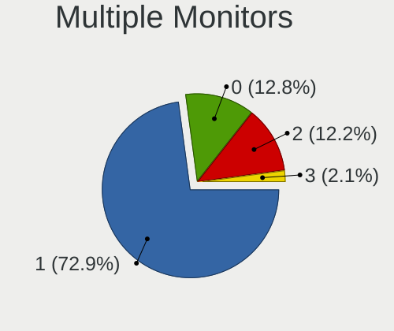

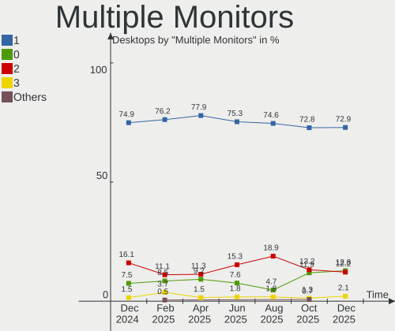

| Total | Desktops | Percent |
|-------|----------|---------|
| 1     | 137      | 72.87%  |
| 0     | 24       | 12.77%  |
| 2     | 23       | 12.23%  |
| 3     | 4        | 2.13%   |

Network
-------

Net Controller Vendor
---------------------

Controller vendors

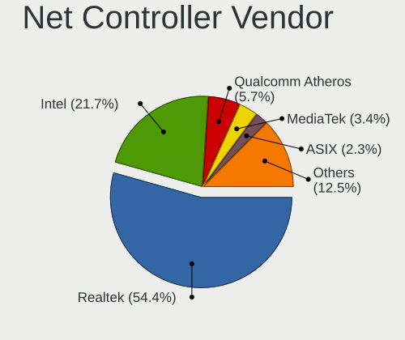

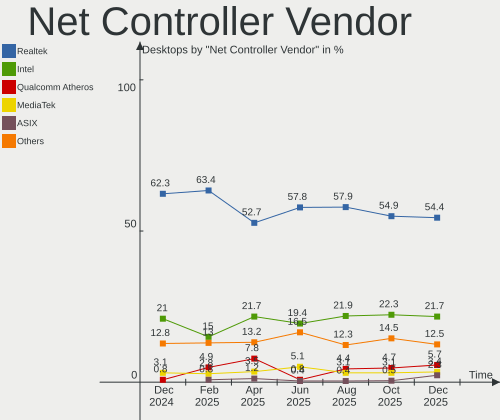

| Vendor                          | Desktops | Percent |
|---------------------------------|----------|---------|
| Realtek Semiconductor           | 143      | 54.37%  |
| Intel                           | 57       | 21.67%  |
| Qualcomm Atheros                | 15       | 5.7%    |
| MediaTek                        | 9        | 3.42%   |
| ASIX Electronics                | 6        | 2.28%   |
| Ralink Technology               | 5        | 1.9%    |
| TP-Link                         | 3        | 1.14%   |
| Ralink                          | 3        | 1.14%   |
| Marvell Technology Group        | 3        | 1.14%   |
| Broadcom                        | 3        | 1.14%   |
| Xiaomi                          | 2        | 0.76%   |
| Qualcomm Technologies           | 2        | 0.76%   |
| ZyXEL Communications            | 1        | 0.38%   |
| STMicroelectronics              | 1        | 0.38%   |
| Qualcomm Atheros Communications | 1        | 0.38%   |
| Qualcomm                        | 1        | 0.38%   |
| QinHeng Electronics             | 1        | 0.38%   |
| NetGear                         | 1        | 0.38%   |
| Motorola PCS                    | 1        | 0.38%   |
| Loongson Technology             | 1        | 0.38%   |
| Edimax Technology               | 1        | 0.38%   |
| D-Link System                   | 1        | 0.38%   |
| ASUSTek Computer                | 1        | 0.38%   |
| Aquantia                        | 1        | 0.38%   |

Net Controller Model
--------------------

Controller models

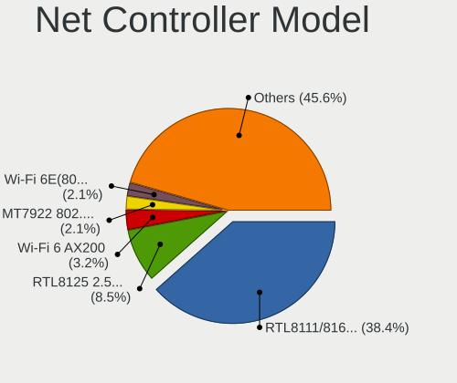

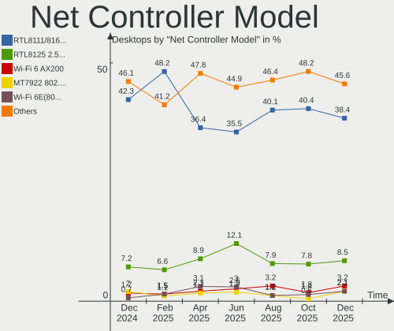

| Model                                                                  | Desktops | Percent |
|------------------------------------------------------------------------|----------|---------|
| Realtek RTL8111/8168/8211/8411 PCI Express Gigabit Ethernet Controller | 108      | 38.43%  |
| Realtek RTL8125 2.5GbE Controller                                      | 24       | 8.54%   |
| Intel Wi-Fi 6 AX200                                                    | 9        | 3.2%    |
| MediaTek MT7922 802.11ax PCI Express Wireless Network Adapter          | 6        | 2.14%   |
| Intel Wi-Fi 6E(802.11ax) AX210/AX1675* 2x2 [Typhoon Peak]              | 6        | 2.14%   |
| ASIX AX88179 Gigabit Ethernet                                          | 6        | 2.14%   |
| Intel 82599ES 10-Gigabit SFI/SFP+ Network Connection                   | 5        | 1.78%   |
| Realtek RTL8152 Fast Ethernet Adapter                                  | 4        | 1.42%   |
| Qualcomm Atheros AR8151 v2.0 Gigabit Ethernet                          | 4        | 1.42%   |
| Intel Ethernet Connection (2) I219-V                                   | 4        | 1.42%   |
| Intel Ethernet Connection (2) I219-LM                                  | 4        | 1.42%   |
| Realtek RTL8821CE 802.11ac PCIe Wireless Network Adapter               | 3        | 1.07%   |
| Realtek RTL810xE PCI Express Fast Ethernet controller                  | 3        | 1.07%   |
| Ralink MT7601U Wireless Adapter                                        | 3        | 1.07%   |
| Intel Wireless 7265                                                    | 3        | 1.07%   |
| Intel I350 Gigabit Network Connection                                  | 3        | 1.07%   |
| Intel I211 Gigabit Network Connection                                  | 3        | 1.07%   |
| Intel Ethernet Connection (11) I219-V                                  | 3        | 1.07%   |
| Intel Dual Band Wireless-AC 3168NGW [Stone Peak]                       | 3        | 1.07%   |
| Xiaomi Mi/Redmi series (RNDIS + ADB)                                   | 2        | 0.71%   |
| Realtek RTL8126 5GbE Controller                                        | 2        | 0.71%   |
| Realtek 802.11ac NIC                                                   | 2        | 0.71%   |
| Ralink RT5370 Wireless Adapter                                         | 2        | 0.71%   |
| Qualcomm WCN785x Wi-Fi 7(802.11be) 320MHz 2x2 [FastConnect 7800]       | 2        | 0.71%   |
| Qualcomm Atheros Attansic L1 Gigabit Ethernet                          | 2        | 0.71%   |
| Qualcomm Atheros AR8131 Gigabit Ethernet                               | 2        | 0.71%   |
| Intel Ethernet Controller I226-V                                       | 2        | 0.71%   |
| Intel Ethernet Controller I225-V                                       | 2        | 0.71%   |
| Intel 82566DM-2 Gigabit Network Connection                             | 2        | 0.71%   |
| ZyXEL NWD6505 802.11a/b/g/n/ac Wireless Adapter [MediaTek MT7610U]     | 1        | 0.36%   |
| TP-Link Archer T4U v2 [Realtek RTL8812AU]                              | 1        | 0.36%   |
| TP-Link 802.11n NIC                                                    | 1        | 0.36%   |
| TP-Link 802.11ac NIC                                                   | 1        | 0.36%   |
| STMicroelectronics Modem                                               | 1        | 0.36%   |
| Realtek RTL8922AE 802.11be PCIe Wireless Network Adapter               | 1        | 0.36%   |
| Realtek RTL8852BE PCIe 802.11ax Wireless Network Controller            | 1        | 0.36%   |
| Realtek RTL8188GU 802.11n WLAN Adapter (After Modeswitch)              | 1        | 0.36%   |
| Realtek RTL8188ETV Wireless LAN 802.11n Network Adapter                | 1        | 0.36%   |
| Realtek RTL8188EE Wireless Network Adapter                             | 1        | 0.36%   |
| Realtek RTL8187SE Wireless LAN Controller                              | 1        | 0.36%   |

Wireless Vendor
---------------

Wireless vendors

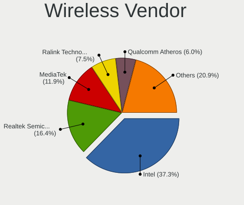

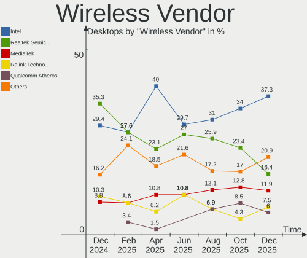

| Vendor                          | Desktops | Percent |
|---------------------------------|----------|---------|
| Intel                           | 25       | 37.31%  |
| Realtek Semiconductor           | 11       | 16.42%  |
| MediaTek                        | 8        | 11.94%  |
| Ralink Technology               | 5        | 7.46%   |
| Qualcomm Atheros                | 4        | 5.97%   |
| TP-Link                         | 3        | 4.48%   |
| Ralink                          | 3        | 4.48%   |
| ZyXEL Communications            | 1        | 1.49%   |
| Qualcomm Technologies           | 1        | 1.49%   |
| Qualcomm Atheros Communications | 1        | 1.49%   |
| NetGear                         | 1        | 1.49%   |
| Edimax Technology               | 1        | 1.49%   |
| D-Link System                   | 1        | 1.49%   |
| Broadcom                        | 1        | 1.49%   |
| ASUSTek Computer                | 1        | 1.49%   |

Wireless Model
--------------

Wireless models

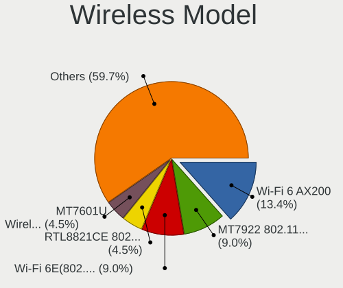

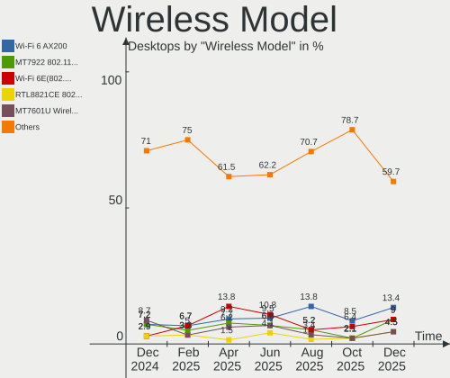

| Model                                                                | Desktops | Percent |
|----------------------------------------------------------------------|----------|---------|
| Intel Wi-Fi 6 AX200                                                  | 9        | 13.43%  |
| MediaTek MT7922 802.11ax PCI Express Wireless Network Adapter        | 6        | 8.96%   |
| Intel Wi-Fi 6E(802.11ax) AX210/AX1675* 2x2 [Typhoon Peak]            | 6        | 8.96%   |
| Realtek RTL8821CE 802.11ac PCIe Wireless Network Adapter             | 3        | 4.48%   |
| Ralink MT7601U Wireless Adapter                                      | 3        | 4.48%   |
| Intel Wireless 7265                                                  | 3        | 4.48%   |
| Intel Dual Band Wireless-AC 3168NGW [Stone Peak]                     | 3        | 4.48%   |
| Realtek 802.11ac NIC                                                 | 2        | 2.99%   |
| Ralink RT5370 Wireless Adapter                                       | 2        | 2.99%   |
| ZyXEL NWD6505 802.11a/b/g/n/ac Wireless Adapter [MediaTek MT7610U]   | 1        | 1.49%   |
| TP-Link Archer T4U v2 [Realtek RTL8812AU]                            | 1        | 1.49%   |
| TP-Link 802.11n NIC                                                  | 1        | 1.49%   |
| TP-Link 802.11ac NIC                                                 | 1        | 1.49%   |
| Realtek RTL8188GU 802.11n WLAN Adapter (After Modeswitch)            | 1        | 1.49%   |
| Realtek RTL8188ETV Wireless LAN 802.11n Network Adapter              | 1        | 1.49%   |
| Realtek RTL8188EE Wireless Network Adapter                           | 1        | 1.49%   |
| Realtek RTL8187SE Wireless LAN Controller                            | 1        | 1.49%   |
| Realtek RTL8187 Wireless Adapter                                     | 1        | 1.49%   |
| Realtek RTL-8185 IEEE 802.11a/b/g Wireless LAN Controller            | 1        | 1.49%   |
| Ralink RT5390 Wireless 802.11n 1T/1R PCIe                            | 1        | 1.49%   |
| Ralink RT3060 Wireless 802.11n 1T/1R                                 | 1        | 1.49%   |
| Ralink RT2561/RT61 rev B 802.11g                                     | 1        | 1.49%   |
| Qualcomm WCN785x Wi-Fi 7(802.11be) 320MHz 2x2 [FastConnect 7800]     | 1        | 1.49%   |
| Qualcomm Atheros AR9271 802.11n                                      | 1        | 1.49%   |
| Qualcomm Atheros AR9485 Wireless Network Adapter                     | 1        | 1.49%   |
| Qualcomm Atheros AR93xx Wireless Network Adapter                     | 1        | 1.49%   |
| Qualcomm Atheros AR9287 Wireless Network Adapter (PCI-Express)       | 1        | 1.49%   |
| Qualcomm Atheros AR5212/5213/2414 Wireless Network Adapter           | 1        | 1.49%   |
| NetGear WNA1100 Wireless-N 150 [Atheros AR9271]                      | 1        | 1.49%   |
| MediaTek MT7921 802.11ax PCIe Wireless Network Adapter [Filogic 330] | 1        | 1.49%   |
| MediaTek MT7612U 802.11a/b/g/n/ac Wireless Adapter                   | 1        | 1.49%   |
| Intel Wireless 3165                                                  | 1        | 1.49%   |
| Intel Wi-Fi 5(802.11ac) Wireless-AC 9x6x [Thunder Peak]              | 1        | 1.49%   |
| Intel Tiger Lake PCH CNVi WiFi                                       | 1        | 1.49%   |
| Intel Gemini Lake PCH CNVi WiFi                                      | 1        | 1.49%   |
| Edimax AC1750 USB                                                    | 1        | 1.49%   |
| D-Link System DWA-125 Wireless N 150 Adapter(rev.A1) [Ralink RT3070] | 1        | 1.49%   |
| Broadcom BCM4360 802.11ac Dual Band Wireless Network Adapter         | 1        | 1.49%   |
| ASUS USB-N10 802.11n Network Adapter [Realtek RTL8188SU]             | 1        | 1.49%   |

Ethernet Vendor
---------------

Ethernet vendors

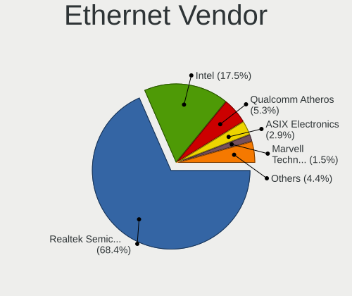

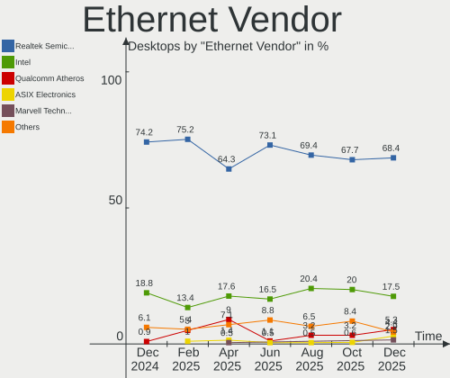

| Vendor                   | Desktops | Percent |
|--------------------------|----------|---------|
| Realtek Semiconductor    | 141      | 68.45%  |
| Intel                    | 36       | 17.48%  |
| Qualcomm Atheros         | 11       | 5.34%   |
| ASIX Electronics         | 6        | 2.91%   |
| Marvell Technology Group | 3        | 1.46%   |
| Xiaomi                   | 2        | 0.97%   |
| Broadcom                 | 2        | 0.97%   |
| Qualcomm Technologies    | 1        | 0.49%   |
| Qualcomm                 | 1        | 0.49%   |
| Motorola PCS             | 1        | 0.49%   |
| Loongson Technology      | 1        | 0.49%   |
| Aquantia                 | 1        | 0.49%   |

Ethernet Model
--------------

Ethernet models

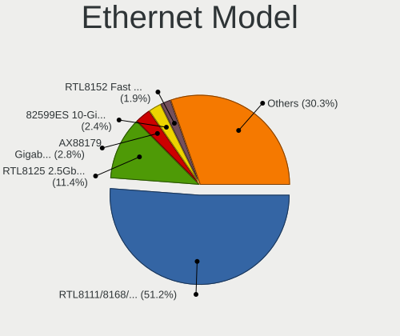

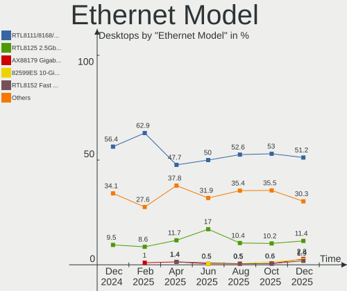

| Model                                                                  | Desktops | Percent |
|------------------------------------------------------------------------|----------|---------|
| Realtek RTL8111/8168/8211/8411 PCI Express Gigabit Ethernet Controller | 108      | 51.18%  |
| Realtek RTL8125 2.5GbE Controller                                      | 24       | 11.37%  |
| ASIX AX88179 Gigabit Ethernet                                          | 6        | 2.84%   |
| Intel 82599ES 10-Gigabit SFI/SFP+ Network Connection                   | 5        | 2.37%   |
| Realtek RTL8152 Fast Ethernet Adapter                                  | 4        | 1.9%    |
| Qualcomm Atheros AR8151 v2.0 Gigabit Ethernet                          | 4        | 1.9%    |
| Intel Ethernet Connection (2) I219-V                                   | 4        | 1.9%    |
| Intel Ethernet Connection (2) I219-LM                                  | 4        | 1.9%    |
| Realtek RTL810xE PCI Express Fast Ethernet controller                  | 3        | 1.42%   |
| Intel I350 Gigabit Network Connection                                  | 3        | 1.42%   |
| Intel I211 Gigabit Network Connection                                  | 3        | 1.42%   |
| Intel Ethernet Connection (11) I219-V                                  | 3        | 1.42%   |
| Xiaomi Mi/Redmi series (RNDIS + ADB)                                   | 2        | 0.95%   |
| Realtek RTL8126 5GbE Controller                                        | 2        | 0.95%   |
| Qualcomm Atheros Attansic L1 Gigabit Ethernet                          | 2        | 0.95%   |
| Qualcomm Atheros AR8131 Gigabit Ethernet                               | 2        | 0.95%   |
| Intel Ethernet Controller I226-V                                       | 2        | 0.95%   |
| Intel Ethernet Controller I225-V                                       | 2        | 0.95%   |
| Intel 82566DM-2 Gigabit Network Connection                             | 2        | 0.95%   |
| Realtek RTL8922AE 802.11be PCIe Wireless Network Adapter               | 1        | 0.47%   |
| Realtek RTL8852BE PCIe 802.11ax Wireless Network Controller            | 1        | 0.47%   |
| Realtek RTL-8100/8101L/8139 PCI Fast Ethernet Adapter                  | 1        | 0.47%   |
| Qualcomm YUPIK-QRD _SN:AC1D5909                                        | 1        | 0.47%   |
| Qualcomm WCN785x Wi-Fi 7(802.11be) 320MHz 2x2 [FastConnect 7800]       | 1        | 0.47%   |
| Qualcomm Atheros Killer E220x Gigabit Ethernet Controller              | 1        | 0.47%   |
| Qualcomm Atheros AR8161 Gigabit Ethernet                               | 1        | 0.47%   |
| Qualcomm Atheros AR8152 v2.0 Fast Ethernet                             | 1        | 0.47%   |
| Motorola PCS moto g100 pro                                             | 1        | 0.47%   |
| Marvell Group 88E8056 PCI-E Gigabit Ethernet Controller                | 1        | 0.47%   |
| Marvell Group 88E8053 PCI-E Gigabit Ethernet Controller                | 1        | 0.47%   |
| Marvell Group 88E8001 Gigabit Ethernet Controller                      | 1        | 0.47%   |
| Loongson 2K2000 / 7A2000 Chipset Gigabit Ethernet Controller           | 1        | 0.47%   |
| Intel I210 Gigabit Network Connection                                  | 1        | 0.47%   |
| Intel Ethernet Connection I219-LM                                      | 1        | 0.47%   |
| Intel Ethernet Connection (7) I219-V                                   | 1        | 0.47%   |
| Intel Ethernet Connection (17) I219-V                                  | 1        | 0.47%   |
| Intel Ethernet Connection (14) I219-V                                  | 1        | 0.47%   |
| Intel Ethernet Connection (10) I219-V                                  | 1        | 0.47%   |
| Intel 82579V Gigabit Network Connection                                | 1        | 0.47%   |
| Intel 82579LM Gigabit Network Connection (Lewisville)                  | 1        | 0.47%   |

Net Controller Kind
-------------------

Ethernet, WiFi or modem

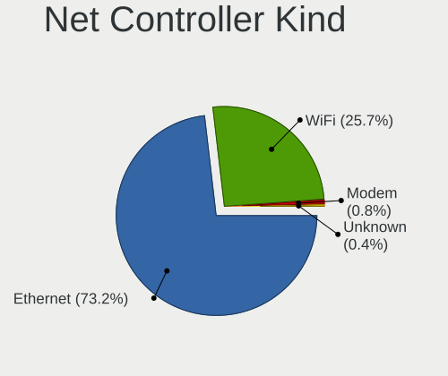

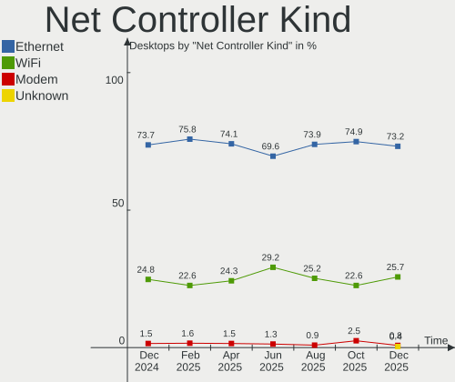

| Kind     | Desktops | Percent |
|----------|----------|---------|
| Ethernet | 188      | 73.15%  |
| WiFi     | 66       | 25.68%  |
| Modem    | 2        | 0.78%   |
| Unknown  | 1        | 0.39%   |

Used Controller
---------------

Currently used network controller

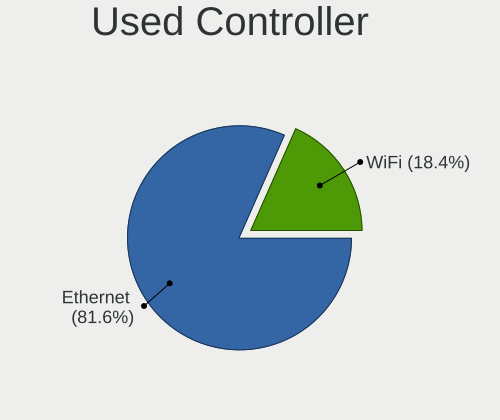

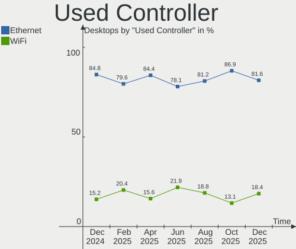

| Kind     | Desktops | Percent |
|----------|----------|---------|
| Ethernet | 151      | 81.62%  |
| WiFi     | 34       | 18.38%  |

NICs
----

Total network controllers on board

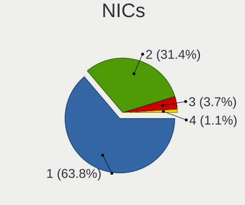

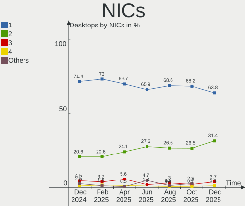

| Total | Desktops | Percent |
|-------|----------|---------|
| 1     | 120      | 63.83%  |
| 2     | 59       | 31.38%  |
| 3     | 7        | 3.72%   |
| 4     | 2        | 1.06%   |

IPv6
----

IPv6 vs IPv4

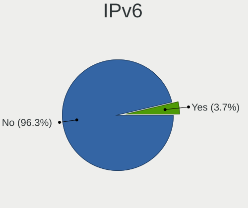

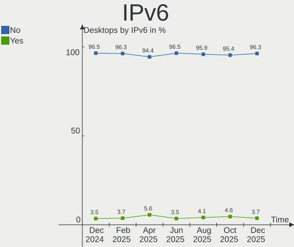

| Used | Desktops | Percent |
|------|----------|---------|
| No   | 181      | 96.28%  |
| Yes  | 7        | 3.72%   |

Bluetooth
---------

Bluetooth Vendor
----------------

Controller vendors

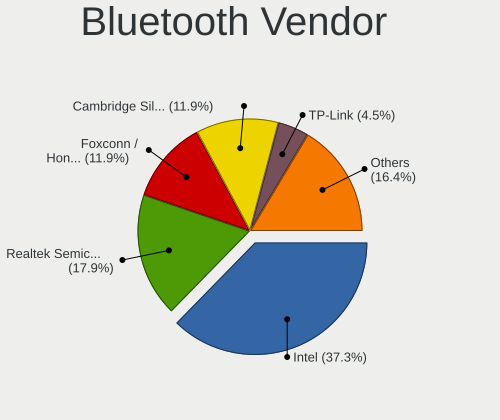

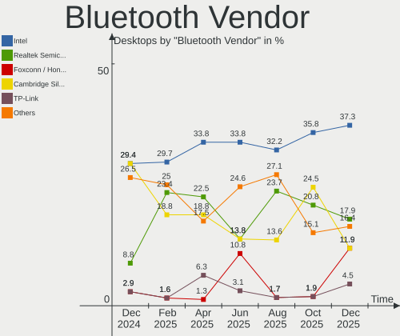

| Vendor                          | Desktops | Percent |
|---------------------------------|----------|---------|
| Intel                           | 25       | 37.31%  |
| Realtek Semiconductor           | 12       | 17.91%  |
| Foxconn / Hon Hai               | 8        | 11.94%  |
| Cambridge Silicon Radio         | 8        | 11.94%  |
| TP-Link                         | 3        | 4.48%   |
| MediaTek                        | 2        | 2.99%   |
| IMC Networks                    | 2        | 2.99%   |
| Unknown                         | 2        | 2.99%   |
| Qualcomm Atheros Communications | 1        | 1.49%   |
| Broadcom                        | 1        | 1.49%   |
| ASUSTek Computer                | 1        | 1.49%   |
| AICSemi                         | 1        | 1.49%   |
| Actions                         | 1        | 1.49%   |

Bluetooth Model
---------------

Controller models

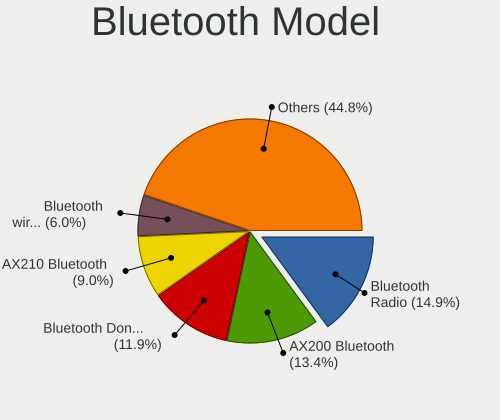

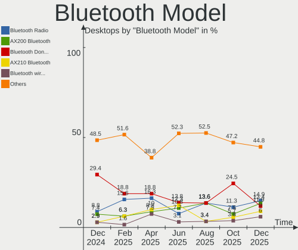

| Model                                               | Desktops | Percent |
|-----------------------------------------------------|----------|---------|
| Realtek Bluetooth Radio                             | 10       | 14.93%  |
| Intel AX200 Bluetooth                               | 9        | 13.43%  |
| Cambridge Silicon Radio Bluetooth Dongle (HCI mode) | 8        | 11.94%  |
| Intel AX210 Bluetooth                               | 6        | 8.96%   |
| Intel Bluetooth wireless interface                  | 4        | 5.97%   |
| Foxconn / Hon Hai Bluetooth Device                  | 4        | 5.97%   |
| TP-Link TP-T@- UB500 Adapter                        | 3        | 4.48%   |
| Intel Wireless-AC 3168 Bluetooth                    | 3        | 4.48%   |
| Foxconn / Hon Hai Wireless_Device                   | 3        | 4.48%   |
| MediaTek Wireless_Device                            | 2        | 2.99%   |
| Unknown                                             | 2        | 2.99%   |
| Realtek Bluetooth 5.4 Radio                         | 1        | 1.49%   |
| Realtek Bluetooth 5.3 Radio                         | 1        | 1.49%   |
| Qualcomm Atheros AR3011 Bluetooth                   | 1        | 1.49%   |
| Intel Wireless-AC 9260 Bluetooth Adapter            | 1        | 1.49%   |
| Intel Bluetooth 9460/9560 Jefferson Peak (JfP)      | 1        | 1.49%   |
| Intel AX201 Bluetooth                               | 1        | 1.49%   |
| IMC Networks Wireless_Device                        | 1        | 1.49%   |
| IMC Networks Bluetooth Radio                        | 1        | 1.49%   |
| Foxconn / Hon Hai MediaTek Bluetooth Adapter        | 1        | 1.49%   |
| Broadcom BCM20702A0 Bluetooth 4.0                   | 1        | 1.49%   |
| ASUS ASUS USB-BT500                                 | 1        | 1.49%   |
| AICSemi AIC 8800D80                                 | 1        | 1.49%   |
| Actions general adapter                             | 1        | 1.49%   |

Sound
-----

Sound Vendor
------------

Sound card vendors

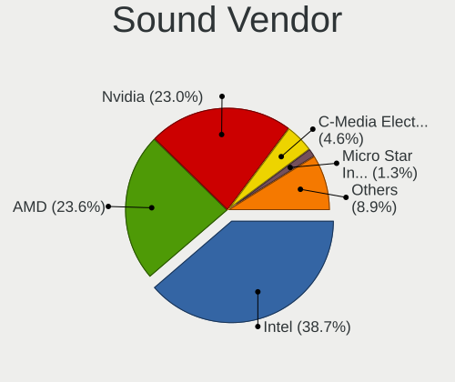

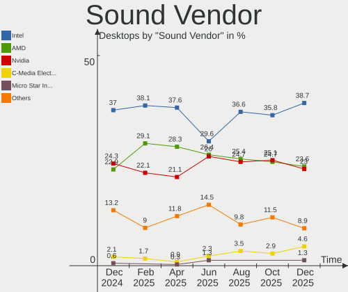

| Vendor                                       | Desktops | Percent |
|----------------------------------------------|----------|---------|
| Intel                                        | 118      | 38.69%  |
| AMD                                          | 72       | 23.61%  |
| Nvidia                                       | 70       | 22.95%  |
| C-Media Electronics                          | 14       | 4.59%   |
| Micro Star International                     | 4        | 1.31%   |
| JMTek                                        | 3        | 0.98%   |
| ASUSTek Computer                             | 3        | 0.98%   |
| MV-SILICON                                   | 2        | 0.66%   |
| Logitech                                     | 2        | 0.66%   |
| Unknown                                      | 2        | 0.66%   |
| Zoran Co. Personal Media Division (Nogatech) | 1        | 0.33%   |
| Yamaha                                       | 1        | 0.33%   |
| Texas Instruments                            | 1        | 0.33%   |
| Telink                                       | 1        | 0.33%   |
| Loongson Technology                          | 1        | 0.33%   |
| KTMicro                                      | 1        | 0.33%   |
| Kingston Technology                          | 1        | 0.33%   |
| Jieli Technology                             | 1        | 0.33%   |
| Hewlett-Packard                              | 1        | 0.33%   |
| Generalplus Technology                       | 1        | 0.33%   |
| Fifine Microphones                           | 1        | 0.33%   |
| Elite Silicon                                | 1        | 0.33%   |
| Creative Technology                          | 1        | 0.33%   |
| Creative Labs                                | 1        | 0.33%   |
| Arturia                                      | 1        | 0.33%   |

Sound Model
-----------

Sound card models

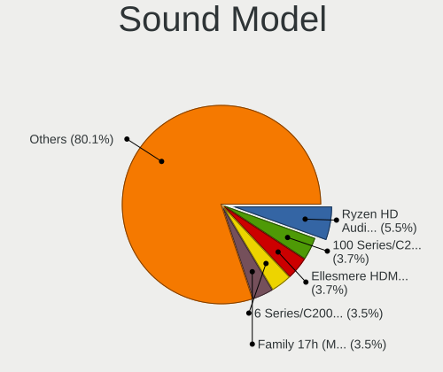

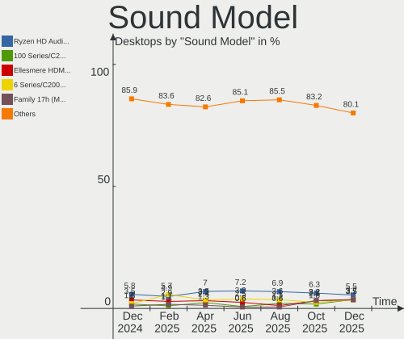

| Model                                                                      | Desktops | Percent |
|----------------------------------------------------------------------------|----------|---------|
| AMD Ryzen HD Audio Controller                                              | 19       | 5.48%   |
| Intel 100 Series/C230 Series Chipset Family HD Audio Controller            | 13       | 3.75%   |
| AMD Ellesmere HDMI Audio [Radeon RX 470/480 / 570/580/590]                 | 13       | 3.75%   |
| Intel 6 Series/C200 Series Chipset Family High Definition Audio Controller | 12       | 3.46%   |
| AMD Family 17h (Models 00h-0fh) HD Audio Controller                        | 12       | 3.46%   |
| Intel 200 Series PCH HD Audio                                              | 10       | 2.88%   |
| AMD Starship/Matisse HD Audio Controller                                   | 10       | 2.88%   |
| Nvidia GP107GL High Definition Audio Controller                            | 9        | 2.59%   |
| Nvidia GF108 High Definition Audio Controller                              | 8        | 2.31%   |
| Intel NM10/ICH7 Family High Definition Audio Controller                    | 8        | 2.31%   |
| Intel 7 Series/C216 Chipset Family High Definition Audio Controller        | 8        | 2.31%   |
| C-Media Electronics Audio Adapter (Unitek Y-247A)                          | 8        | 2.31%   |
| Intel 8 Series/C220 Series Chipset High Definition Audio Controller        | 7        | 2.02%   |
| AMD SBx00 Azalia (Intel HDA)                                               | 7        | 2.02%   |
| Nvidia GM107 High Definition Audio Controller [GeForce 940MX]              | 6        | 1.73%   |
| Intel Smart Sound Technology (SST) Audio Controller                        | 6        | 1.73%   |
| Intel Alder Lake PCH-P High Definition Audio Controller                    | 6        | 1.73%   |
| AMD FCH Azalia Controller                                                  | 6        | 1.73%   |
| Nvidia TU106 High Definition Audio Controller                              | 5        | 1.44%   |
| Nvidia GK208 HDMI/DP Audio Controller                                      | 5        | 1.44%   |
| Intel Tiger Lake-H HD Audio Controller                                     | 5        | 1.44%   |
| Intel Raptor Lake High Definition Audio Controller                         | 5        | 1.44%   |
| Intel C610/X99 series chipset HD Audio Controller                          | 5        | 1.44%   |
| Intel Alder Lake-S HD Audio Controller                                     | 5        | 1.44%   |
| AMD Radeon High Definition Audio Controller                                | 5        | 1.44%   |
| AMD Navi 21/23 HDMI/DP Audio Controller                                    | 5        | 1.44%   |
| Nvidia GK107 HDMI Audio Controller                                         | 4        | 1.15%   |
| Nvidia GB203 High Definition Audio Controller                              | 4        | 1.15%   |
| Micro Star International USB Audio                                         | 4        | 1.15%   |
| Intel Comet Lake PCH cAVS                                                  | 4        | 1.15%   |
| Intel C600/X79 series chipset High Definition Audio Controller             | 4        | 1.15%   |
| Intel 5 Series/3400 Series Chipset High Definition Audio                   | 4        | 1.15%   |
| AMD Renoir/Cezanne HDMI/DP Audio Controller                                | 4        | 1.15%   |
| AMD Raven/Raven2/Fenghuang HDMI/DP Audio Controller                        | 4        | 1.15%   |
| AMD Navi 31 HDMI/DP Audio                                                  | 4        | 1.15%   |
| Nvidia TU107 GeForce GTX 1650 High Definition Audio Controller             | 3        | 0.86%   |
| Nvidia High Definition Audio Controller                                    | 3        | 0.86%   |
| Nvidia GP106 High Definition Audio Controller                              | 3        | 0.86%   |
| Nvidia AD104 High Definition Audio Controller                              | 3        | 0.86%   |
| JMTek ME6S                                                                 | 3        | 0.86%   |

Memory
------

Memory Vendor
-------------

Memory module vendors

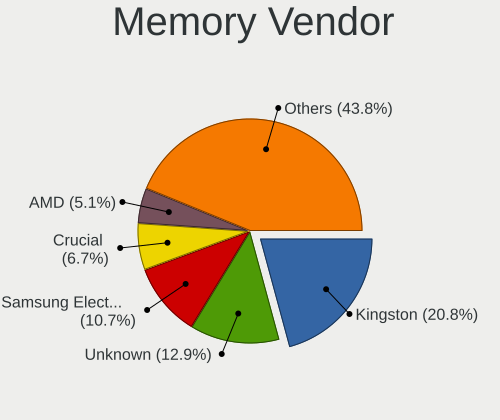

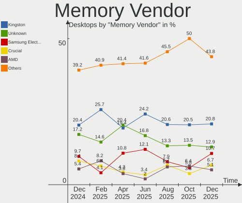

| Vendor                       | Desktops | Percent |
|------------------------------|----------|---------|
| Kingston                     | 37       | 20.79%  |
| Unknown                      | 23       | 12.92%  |
| Samsung Electronics          | 19       | 10.67%  |
| Crucial                      | 12       | 6.74%   |
| AMD                          | 9        | 5.06%   |
| Unknown                      | 9        | 5.06%   |
| Micron Technology            | 8        | 4.49%   |
| Corsair                      | 8        | 4.49%   |
| SK hynix                     | 7        | 3.93%   |
| Patriot                      | 7        | 3.93%   |
| A-DATA Technology            | 7        | 3.93%   |
| G.Skill                      | 4        | 2.25%   |
| Apacer                       | 4        | 2.25%   |
| Shenzhen Longsys             | 3        | 1.69%   |
| Unknown (89F7)               | 2        | 1.12%   |
| Gold Key                     | 2        | 1.12%   |
| Wilk                         | 1        | 0.56%   |
| Unknown (0x7FFF)             | 1        | 0.56%   |
| Unknown (0x0E9D)             | 1        | 0.56%   |
| Team                         | 1        | 0.56%   |
| TakeMS                       | 1        | 0.56%   |
| Shenzhen Shi Bolunshuai      | 1        | 0.56%   |
| Patriot Memory (PDP Systems) | 1        | 0.56%   |
| Patriot Memory               | 1        | 0.56%   |
| Kllisre                      | 1        | 0.56%   |
| KingSpec                     | 1        | 0.56%   |
| Kingmax                      | 1        | 0.56%   |
| Juhor                        | 1        | 0.56%   |
| Hikvision                    | 1        | 0.56%   |
| GOODRAM                      | 1        | 0.56%   |
| Foxline                      | 1        | 0.56%   |
| Atermiter                    | 1        | 0.56%   |
| 48spaces                     | 1        | 0.56%   |

Memory Model
------------

Memory module models

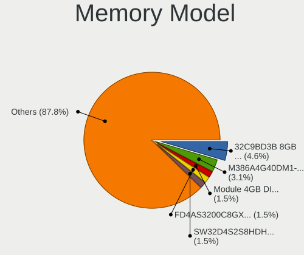

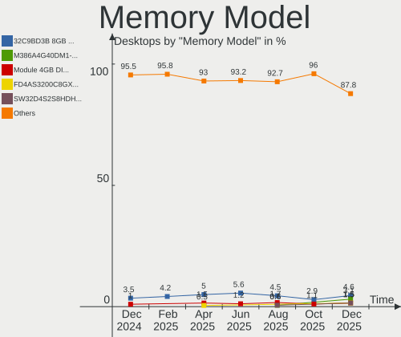

| Model                                                             | Desktops | Percent |
|-------------------------------------------------------------------|----------|---------|
| Unknown                                                           | 9        | 4.59%   |
| Samsung RAM M386A4G40DM1-CRC 32GB DIMM DDR4 2400MT/s              | 6        | 3.06%   |
| Unknown RAM Module 4GB DIMM 1333MT/s                              | 3        | 1.53%   |
| Shenzhen Longsys RAM FD4AS3200C8GXE 8GB SODIMM DDR4 3200MT/s      | 3        | 1.53%   |
| Kingston RAM SW32D4S2S8HDH-8 8GB SODIMM DDR4 3200MT/s             | 3        | 1.53%   |
| Unknown RAM Module 4GB DIMM SDRAM                                 | 2        | 1.02%   |
| Unknown RAM Module 2GB DIMM SDRAM                                 | 2        | 1.02%   |
| Unknown RAM Module 2GB DIMM DDR2 800MT/s                          | 2        | 1.02%   |
| Unknown RAM Module 2GB DIMM 800MT/s                               | 2        | 1.02%   |
| Unknown RAM Module 2GB DIMM 1333MT/s                              | 2        | 1.02%   |
| Samsung RAM M386A8K40BMB-CRC 64GB DIMM DDR4 2400MT/s              | 2        | 1.02%   |
| Samsung RAM M378A5244CB0-CRC 4GB DIMM DDR4 3066MT/s               | 2        | 1.02%   |
| Kingston RAM KF3200C16D4/8GX 8GiB DIMM DDR4 3600MT/s              | 2        | 1.02%   |
| G.Skill RAM F5-6000J3238G32G 32GB DIMM DDR5 6000MT/s              | 2        | 1.02%   |
| Crucial RAM CT8G4DFS824A.C8FE 8GB DIMM DDR4 3000MT/s              | 2        | 1.02%   |
| AMD RAM R748G2606U2S 8GB DIMM DDR4 3200MT/s                       | 2        | 1.02%   |
| Wilk RAM IRX2666D464L16S/8G 8GB DIMM DDR4 2933MT/s                | 1        | 0.51%   |
| Unknown RAM Module 8GB DIMM DDR4 2400MT/s                         | 1        | 0.51%   |
| Unknown RAM Module 8GB DIMM DDR3 800MT/s                          | 1        | 0.51%   |
| Unknown RAM Module 8GB DIMM DDR3 1600MT/s                         | 1        | 0.51%   |
| Unknown RAM Module 8GB DIMM DDR3 1333MT/s                         | 1        | 0.51%   |
| Unknown RAM Module 8GB DIMM 1333MT/s                              | 1        | 0.51%   |
| Unknown RAM Module 4GB DIMM DDR3 1333MT/s                         | 1        | 0.51%   |
| Unknown RAM Module 4GB DIMM DDR3 1067MT/s                         | 1        | 0.51%   |
| Unknown RAM Module 4GB DIMM 1600MT/s                              | 1        | 0.51%   |
| Unknown RAM Module 2GB DIMM DDR3 1067MT/s                         | 1        | 0.51%   |
| Unknown RAM Module 2GB DIMM 667MT/s                               | 1        | 0.51%   |
| Unknown RAM Module 2048MB DIMM SDRAM 533MT/s                      | 1        | 0.51%   |
| Unknown RAM Module 2048MB DIMM SDRAM                              | 1        | 0.51%   |
| Unknown RAM Module 1GB DIMM 800MT/s                               | 1        | 0.51%   |
| Unknown RAM Module 1024MB DIMM SDRAM 533MT/s                      | 1        | 0.51%   |
| Unknown RAM Module 1024MB DIMM DDR2 800MT/s                       | 1        | 0.51%   |
| Unknown RAM DDR4 NB 8G 2666 8GB SODIMM DDR4 2667MT/s              | 1        | 0.51%   |
| Unknown RAM 1866 CL10 Series 8192MB DIMM DDR3 933MT/s             | 1        | 0.51%   |
| Unknown (89F7) RAM Module 8GB DIMM DDR4 2133MT/s                  | 1        | 0.51%   |
| Unknown (89F7) RAM Module 8GB DIMM DDR3 1600MT/s                  | 1        | 0.51%   |
| Unknown (0x7FFF) RAM GRAVITON 8G4-USDM01 8GB SODIMM DDR4 3200MT/s | 1        | 0.51%   |
| Unknown (0x0E9D) RAM KINSOTIN8GB2666MHZ 8GB SODIMM DDR4 2667MT/s  | 1        | 0.51%   |
| Team RAM Elite-18 4GB DIMM DDR3 1866MT/s                          | 1        | 0.51%   |
| TakeMS RAM TMS2GB364E082139CM 2GB DIMM DDR3 1333MT/s              | 1        | 0.51%   |

Memory Kind
-----------

Memory module kinds

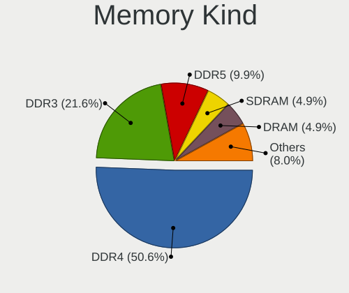

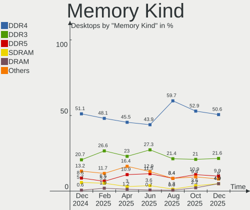

| Kind    | Desktops | Percent |
|---------|----------|---------|
| DDR4    | 82       | 50.62%  |
| DDR3    | 35       | 21.6%   |
| DDR5    | 16       | 9.88%   |
| SDRAM   | 8        | 4.94%   |
| DRAM    | 8        | 4.94%   |
| Unknown | 7        | 4.32%   |
| DDR2    | 6        | 3.7%    |

Memory Form Factor
------------------

Physical design of the memory module

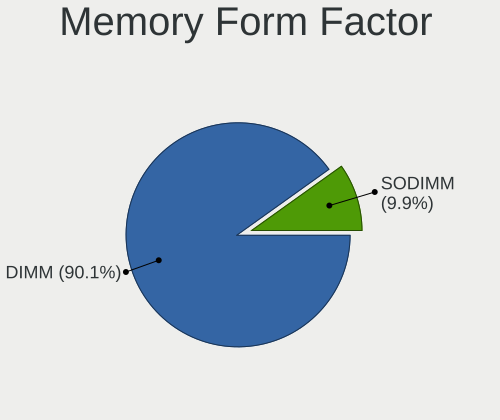

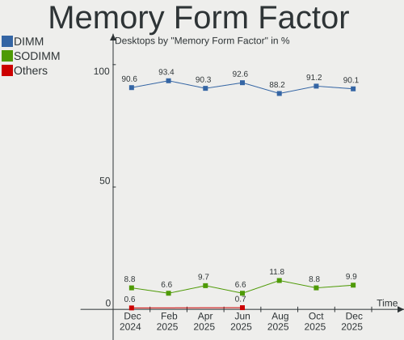

| Name   | Desktops | Percent |
|--------|----------|---------|
| DIMM   | 146      | 90.12%  |
| SODIMM | 16       | 9.88%   |

Memory Size
-----------

Memory module size

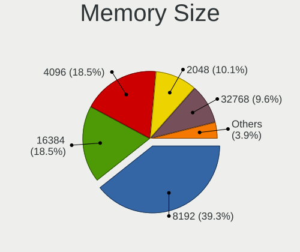

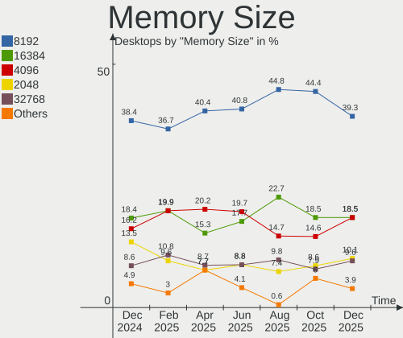

| Size  | Desktops | Percent |
|-------|----------|---------|
| 8192  | 70       | 39.33%  |
| 16384 | 33       | 18.54%  |
| 4096  | 33       | 18.54%  |
| 2048  | 18       | 10.11%  |
| 32768 | 17       | 9.55%   |
| 1024  | 3        | 1.69%   |
| 65536 | 2        | 1.12%   |
| 49152 | 2        | 1.12%   |

Memory Speed
------------

Memory module speed

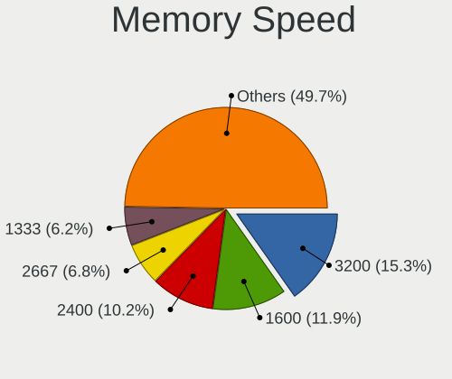

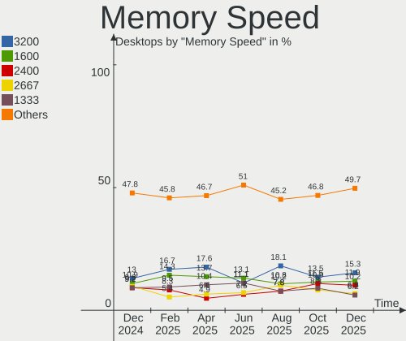

| Speed   | Desktops | Percent |
|---------|----------|---------|
| 3200    | 27       | 15.25%  |
| 1600    | 21       | 11.86%  |
| 2400    | 18       | 10.17%  |
| 2667    | 12       | 6.78%   |
| 1333    | 11       | 6.21%   |
| 2133    | 8        | 4.52%   |
| 800     | 8        | 4.52%   |
| 6000    | 7        | 3.95%   |
| 3400    | 7        | 3.95%   |
| 3800    | 5        | 2.82%   |
| Unknown | 5        | 2.82%   |
| 5600    | 4        | 2.26%   |
| 3600    | 4        | 2.26%   |
| 2800    | 4        | 2.26%   |
| 2666    | 4        | 2.26%   |
| 3066    | 3        | 1.69%   |
| 3000    | 3        | 1.69%   |
| 1866    | 3        | 1.69%   |
| 4800    | 2        | 1.13%   |
| 3466    | 2        | 1.13%   |
| 2933    | 2        | 1.13%   |
| 1800    | 2        | 1.13%   |
| 1648    | 2        | 1.13%   |
| 7000    | 1        | 0.56%   |
| 6400    | 1        | 0.56%   |
| 5400    | 1        | 0.56%   |
| 3500    | 1        | 0.56%   |
| 3467    | 1        | 0.56%   |
| 3333    | 1        | 0.56%   |
| 2934    | 1        | 0.56%   |
| 2866    | 1        | 0.56%   |
| 1867    | 1        | 0.56%   |
| 1067    | 1        | 0.56%   |
| 667     | 1        | 0.56%   |
| 533     | 1        | 0.56%   |
| 400     | 1        | 0.56%   |

Printers & scanners
-------------------

Printer Vendor
--------------

Printer device vendors

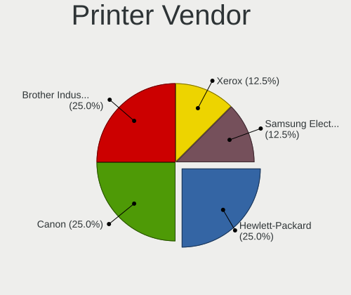

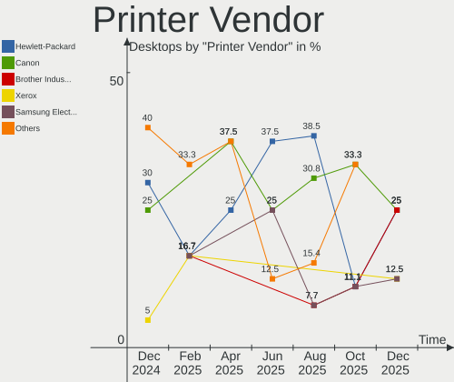

| Vendor              | Desktops | Percent |
|---------------------|----------|---------|
| Hewlett-Packard     | 2        | 25%     |
| Canon               | 2        | 25%     |
| Brother Industries  | 2        | 25%     |
| Xerox               | 1        | 12.5%   |
| Samsung Electronics | 1        | 12.5%   |

Printer Model
-------------

Printer device models

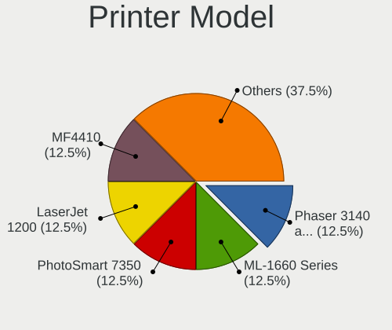

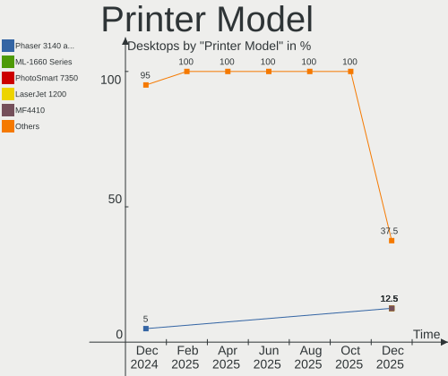

| Model                      | Desktops | Percent |
|----------------------------|----------|---------|
| Xerox Phaser 3140 and 3155 | 1        | 12.5%   |
| Samsung ML-1660 Series     | 1        | 12.5%   |
| HP PhotoSmart 7350         | 1        | 12.5%   |
| HP LaserJet 1200           | 1        | 12.5%   |
| Canon MF4410               | 1        | 12.5%   |
| Canon G2010 series         | 1        | 12.5%   |
| Brother HL-L2360D series   | 1        | 12.5%   |
| Brother HL-5250DN Printer  | 1        | 12.5%   |

Scanner Vendor
--------------

Scanner device vendors

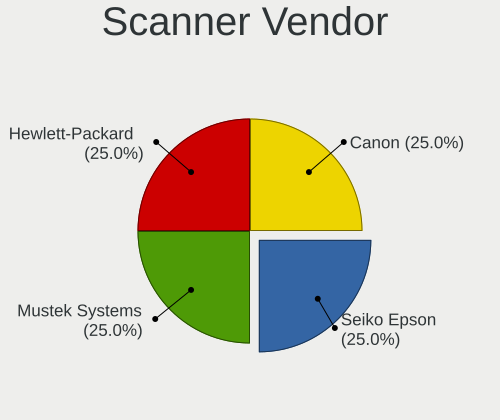

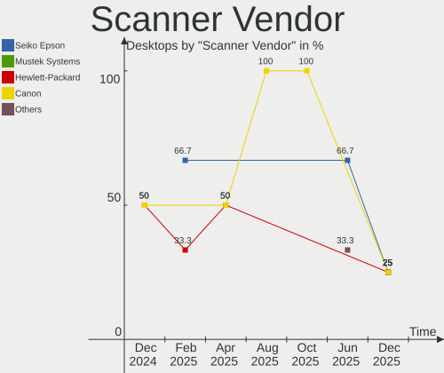

| Vendor          | Desktops | Percent |
|-----------------|----------|---------|
| Seiko Epson     | 1        | 25%     |
| Mustek Systems  | 1        | 25%     |
| Hewlett-Packard | 1        | 25%     |
| Canon           | 1        | 25%     |

Scanner Model
-------------

Scanner device models

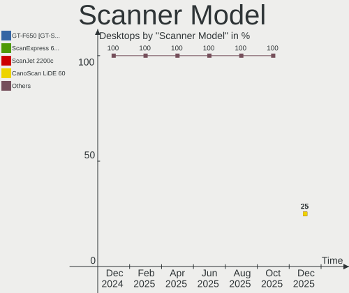

| Model                                             | Desktops | Percent |
|---------------------------------------------------|----------|---------|
| Seiko Epson GT-F650 [GT-S600/Perfection V10/V100] | 1        | 25%     |
| Mustek Systems ScanExpress 600 CU                 | 1        | 25%     |
| HP ScanJet 2200c                                  | 1        | 25%     |
| Canon CanoScan LiDE 60                            | 1        | 25%     |

Camera
------

Camera Vendor
-------------

Camera device vendors

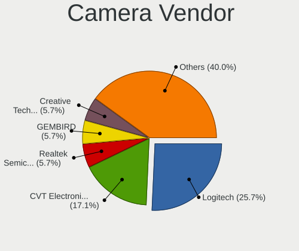

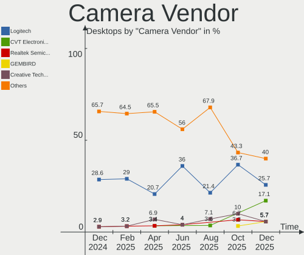

| Vendor                        | Desktops | Percent |
|-------------------------------|----------|---------|
| Logitech                      | 9        | 25.71%  |
| CVT Electronics.Co.           | 6        | 17.14%  |
| Realtek Semiconductor         | 2        | 5.71%   |
| GEMBIRD                       | 2        | 5.71%   |
| Creative Technology           | 2        | 5.71%   |
| A4Tech                        | 2        | 5.71%   |
| Z-Star Microelectronics       | 1        | 2.86%   |
| YLX-241221-K                  | 1        | 2.86%   |
| Sunplus Innovation Technology | 1        | 2.86%   |
| Remo Tech                     | 1        | 2.86%   |
| Microdia                      | 1        | 2.86%   |
| KYE Systems (Mouse Systems)   | 1        | 2.86%   |
| Jieli Technology              | 1        | 2.86%   |
| Hewlett-Packard               | 1        | 2.86%   |
| Chicony Electronics           | 1        | 2.86%   |
| Aveo Technology               | 1        | 2.86%   |
| Arkmicro Technologies         | 1        | 2.86%   |
| Alcor Micro                   | 1        | 2.86%   |

Camera Model
------------

Camera device models

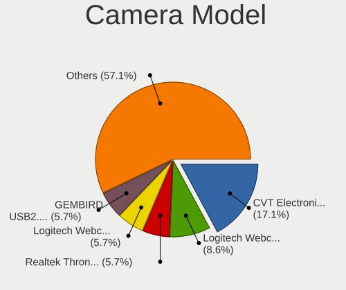

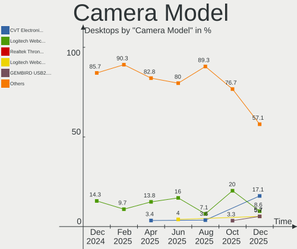

| Model                                   | Desktops | Percent |
|-----------------------------------------|----------|---------|
| CVT Electronics.Co. USB Camera          | 6        | 17.14%  |
| Logitech Webcam C270                    | 3        | 8.57%   |
| Realtek Thronmax Stream Go Pro Webcam   | 2        | 5.71%   |
| Logitech Webcam C930e                   | 2        | 5.71%   |
| GEMBIRD USB2.0 PC CAMERA                | 2        | 5.71%   |
| A4Tech FHD 1080P PC Camera              | 2        | 5.71%   |
| Z-Star Venus USB2.0 Camera              | 1        | 2.86%   |
| YLX-241221-K DEXP DWC-FHD04             | 1        | 2.86%   |
| Sunplus Full HD webcam                  | 1        | 2.86%   |
| Remo Tech OBSBOT Tiny 2                 | 1        | 2.86%   |
| Microdia Camera                         | 1        | 2.86%   |
| Logitech Webcam Pro 9000                | 1        | 2.86%   |
| Logitech Webcam C310                    | 1        | 2.86%   |
| Logitech Webcam C170                    | 1        | 2.86%   |
| Logitech QuickCam Pro 9000              | 1        | 2.86%   |
| KYE Systems (Mouse Systems) iSlim 321R  | 1        | 2.86%   |
| Jieli USB PHY 2.0                       | 1        | 2.86%   |
| HP Webcam HD 4310                       | 1        | 2.86%   |
| Creative VF0415 Live! Cam Vid. IM Ultra | 1        | 2.86%   |
| Creative Live! Cam Sync [VF0520]        | 1        | 2.86%   |
| Chicony HP Webcam                       | 1        | 2.86%   |
| Aveo Camera                             | 1        | 2.86%   |
| Arkmicro USB2.0 PC CAMERA               | 1        | 2.86%   |
| Alcor Micro USB 2.0 PC Camera           | 1        | 2.86%   |

Security
--------

Fingerprint Vendor
------------------

Fingerprint sensor vendors

Zero info for selected period =(

Fingerprint Model
-----------------

Fingerprint sensor models

Zero info for selected period =(

Chipcard Vendor
---------------

Chipcard module vendors

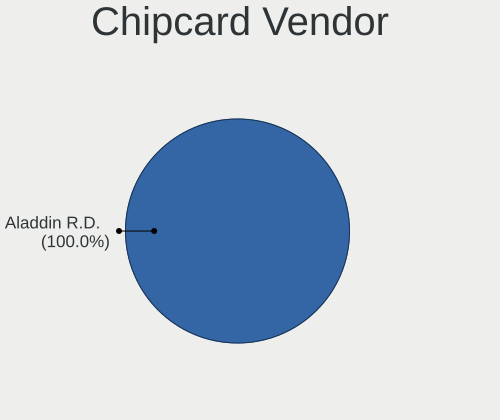

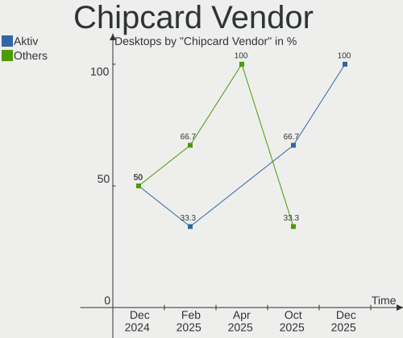

| Vendor | Desktops | Percent |
|--------|----------|---------|
| Aktiv  | 2        | 100%    |

Chipcard Model
--------------

Chipcard module models

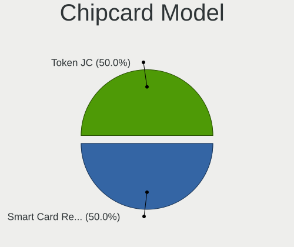

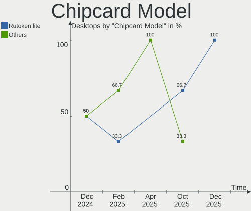

| Model              | Desktops | Percent |
|--------------------|----------|---------|
| Aktiv Rutoken lite | 2        | 100%    |

Unsupported
-----------

Unsupported Devices
-------------------

Total unsupported devices on board

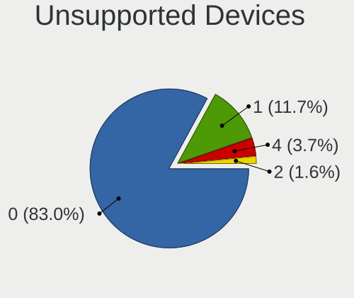

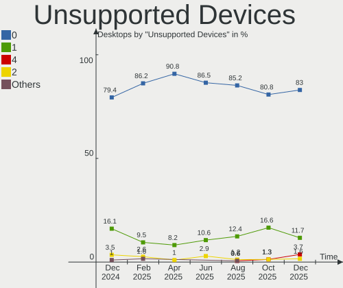

| Total | Desktops | Percent |
|-------|----------|---------|
| 0     | 156      | 82.98%  |
| 1     | 22       | 11.7%   |
| 4     | 7        | 3.72%   |
| 2     | 3        | 1.6%    |

Unsupported Device Types
------------------------

Types of unsupported devices

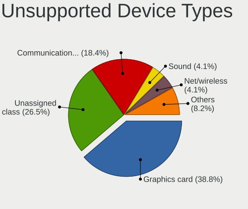

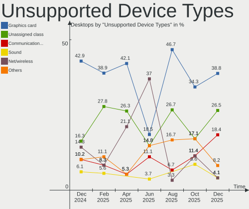

| Type                     | Desktops | Percent |
|--------------------------|----------|---------|
| Graphics card            | 19       | 38.78%  |
| Unassigned class         | 13       | 26.53%  |
| Communication controller | 9        | 18.37%  |
| Sound                    | 2        | 4.08%   |
| Net/wireless             | 2        | 4.08%   |
| Chipcard                 | 2        | 4.08%   |
| Network                  | 1        | 2.04%   |
| Bluetooth                | 1        | 2.04%   |

