Linux in Russia - Hardware Trends (Desktops)
--------------------------------------------

A project to identify most popular hardware characteristics and track their change
over time based on data collected by Linux users at https://Linux-Hardware.org.

Anyone can contribute to this report by the [hw-probe](https://github.com/linuxhw/hw-probe) tool:

    sudo -E hw-probe -all -upload

Period: Nov, 2022.

Contents
--------

* [ System ](#system)
  - [ OS                       ](#os)
  - [ OS Family                ](#os-family)
  - [ Kernel                   ](#kernel)
  - [ Kernel Family            ](#kernel-family)
  - [ Kernel Major Ver.        ](#kernel-major-ver)
  - [ Arch                     ](#arch)
  - [ DE                       ](#de)
  - [ Display Server           ](#display-server)
  - [ Display Manager          ](#display-manager)
  - [ OS Lang                  ](#os-lang)
  - [ Boot Mode                ](#boot-mode)
  - [ Filesystem               ](#filesystem)
  - [ Part. scheme             ](#part-scheme)
  - [ Dual Boot with Linux/BSD ](#dual-boot-with-linuxbsd)
  - [ Dual Boot (Win)          ](#dual-boot-win)

* [ Board ](#board)
  - [ Vendor                   ](#vendor)
  - [ Model                    ](#model)
  - [ Model Family             ](#model-family)
  - [ MFG Year                 ](#mfg-year)
  - [ Form Factor              ](#form-factor)
  - [ Secure Boot              ](#secure-boot)
  - [ Coreboot                 ](#coreboot)
  - [ RAM Size                 ](#ram-size)
  - [ RAM Used                 ](#ram-used)
  - [ Total Drives             ](#total-drives)
  - [ Has CD-ROM               ](#has-cd-rom)
  - [ Has Ethernet             ](#has-ethernet)
  - [ Has WiFi                 ](#has-wifi)
  - [ Has Bluetooth            ](#has-bluetooth)

* [ Location ](#location)
  - [ Country                  ](#country)
  - [ City                     ](#city)

* [ Drives ](#drives)
  - [ Drive Vendor             ](#drive-vendor)
  - [ Drive Model              ](#drive-model)
  - [ HDD Vendor               ](#hdd-vendor)
  - [ SSD Vendor               ](#ssd-vendor)
  - [ Drive Kind               ](#drive-kind)
  - [ Drive Connector          ](#drive-connector)
  - [ Drive Size               ](#drive-size)
  - [ Space Total              ](#space-total)
  - [ Space Used               ](#space-used)
  - [ Malfunc. Drives          ](#malfunc-drives)
  - [ Malfunc. Drive Vendor    ](#malfunc-drive-vendor)
  - [ Malfunc. HDD Vendor      ](#malfunc-hdd-vendor)
  - [ Malfunc. Drive Kind      ](#malfunc-drive-kind)
  - [ Failed Drives            ](#failed-drives)
  - [ Failed Drive Vendor      ](#failed-drive-vendor)
  - [ Drive Status             ](#drive-status)

* [ Storage controller ](#storage-controller)
  - [ Storage Vendor           ](#storage-vendor)
  - [ Storage Model            ](#storage-model)
  - [ Storage Kind             ](#storage-kind)

* [ Processor ](#processor)
  - [ CPU Vendor               ](#cpu-vendor)
  - [ CPU Model                ](#cpu-model)
  - [ CPU Model Family         ](#cpu-model-family)
  - [ CPU Cores                ](#cpu-cores)
  - [ CPU Sockets              ](#cpu-sockets)
  - [ CPU Threads              ](#cpu-threads)
  - [ CPU Op-Modes             ](#cpu-op-modes)
  - [ CPU Microcode            ](#cpu-microcode)
  - [ CPU Microarch            ](#cpu-microarch)

* [ Graphics ](#graphics)
  - [ GPU Vendor               ](#gpu-vendor)
  - [ GPU Model                ](#gpu-model)
  - [ GPU Combo                ](#gpu-combo)
  - [ GPU Driver               ](#gpu-driver)
  - [ GPU Memory               ](#gpu-memory)

* [ Monitor ](#monitor)
  - [ Monitor Vendor           ](#monitor-vendor)
  - [ Monitor Model            ](#monitor-model)
  - [ Monitor Resolution       ](#monitor-resolution)
  - [ Monitor Diagonal         ](#monitor-diagonal)
  - [ Monitor Width            ](#monitor-width)
  - [ Aspect Ratio             ](#aspect-ratio)
  - [ Monitor Area             ](#monitor-area)
  - [ Pixel Density            ](#pixel-density)
  - [ Multiple Monitors        ](#multiple-monitors)

* [ Network ](#network)
  - [ Net Controller Vendor    ](#net-controller-vendor)
  - [ Net Controller Model     ](#net-controller-model)
  - [ Wireless Vendor          ](#wireless-vendor)
  - [ Wireless Model           ](#wireless-model)
  - [ Ethernet Vendor          ](#ethernet-vendor)
  - [ Ethernet Model           ](#ethernet-model)
  - [ Net Controller Kind      ](#net-controller-kind)
  - [ Used Controller          ](#used-controller)
  - [ NICs                     ](#nics)
  - [ IPv6                     ](#ipv6)

* [ Bluetooth ](#bluetooth)
  - [ Bluetooth Vendor         ](#bluetooth-vendor)
  - [ Bluetooth Model          ](#bluetooth-model)

* [ Sound ](#sound)
  - [ Sound Vendor             ](#sound-vendor)
  - [ Sound Model              ](#sound-model)

* [ Memory ](#memory)
  - [ Memory Vendor            ](#memory-vendor)
  - [ Memory Model             ](#memory-model)
  - [ Memory Kind              ](#memory-kind)
  - [ Memory Form Factor       ](#memory-form-factor)
  - [ Memory Size              ](#memory-size)
  - [ Memory Speed             ](#memory-speed)

* [ Printers & scanners ](#printers--scanners)
  - [ Printer Vendor           ](#printer-vendor)
  - [ Printer Model            ](#printer-model)
  - [ Scanner Vendor           ](#scanner-vendor)
  - [ Scanner Model            ](#scanner-model)

* [ Camera ](#camera)
  - [ Camera Vendor            ](#camera-vendor)
  - [ Camera Model             ](#camera-model)

* [ Security ](#security)
  - [ Fingerprint Vendor       ](#fingerprint-vendor)
  - [ Fingerprint Model        ](#fingerprint-model)
  - [ Chipcard Vendor          ](#chipcard-vendor)
  - [ Chipcard Model           ](#chipcard-model)

* [ Unsupported ](#unsupported)
  - [ Unsupported Devices      ](#unsupported-devices)
  - [ Unsupported Device Types ](#unsupported-device-types)

System
------

OS
--

Installed operating systems

| Name              | Desktops | Percent |
|-------------------|----------|---------|
| ROSA 12.3         | 104      | 39.85%  |
| Debian 11         | 36       | 13.79%  |
| ROSA 12.2         | 19       | 7.28%   |
| Ubuntu 22.04      | 9        | 3.45%   |
| Fedora 37         | 7        | 2.68%   |
| Red OS 7.3.1      | 6        | 2.3%    |
| Arch Rolling      | 6        | 2.3%    |
| Red OS 7.3        | 5        | 1.92%   |
| ALT Linux 10.1    | 5        | 1.92%   |
| ROSA R11.1        | 4        | 1.53%   |
| OpenMandriva 4.3  | 4        | 1.53%   |
| Linux Mint 21     | 4        | 1.53%   |
| Linux Mint 20.3   | 4        | 1.53%   |
| ROSA 12.1         | 3        | 1.15%   |
| OpenMandriva 4.50 | 3        | 1.15%   |
| Gentoo 2.8        | 3        | 1.15%   |
| ROSA R11          | 2        | 0.77%   |
| Red OS 7.3.2      | 2        | 0.77%   |
| OpenMandriva 4.90 | 2        | 0.77%   |
| Manjaro           | 2        | 0.77%   |
| KDE neon 22.04    | 2        | 0.77%   |
| Fedora 36         | 2        | 0.77%   |
| Debian            | 2        | 0.77%   |
| ArcoLinux Rolling | 2        | 0.77%   |
| Xubuntu 22.04     | 1        | 0.38%   |
| UbuntuDDE 20.04   | 1        | 0.38%   |
| Ubuntu MATE 18.04 | 1        | 0.38%   |
| Ubuntu 22.10      | 1        | 0.38%   |
| Ubuntu 20.04      | 1        | 0.38%   |
| ROSA 2021.1       | 1        | 0.38%   |
| ROSA 12           | 1        | 0.38%   |
| Red OS 7.2        | 1        | 0.38%   |
| Pop!_OS 22.04     | 1        | 0.38%   |
| Nobara 36         | 1        | 0.38%   |
| MX 21             | 1        | 0.38%   |
| Manjaro 22.0.0    | 1        | 0.38%   |
| Linux Mint 20.2   | 1        | 0.38%   |
| Kubuntu 22.10     | 1        | 0.38%   |
| Kubuntu 12.04     | 1        | 0.38%   |
| Kali 2022.4       | 1        | 0.38%   |

OS Family
---------

OS without a version

| Name         | Desktops | Percent |
|--------------|----------|---------|
| ROSA         | 134      | 51.34%  |
| Debian       | 40       | 15.33%  |
| Red OS       | 14       | 5.36%   |
| Ubuntu       | 11       | 4.21%   |
| OpenMandriva | 9        | 3.45%   |
| Linux Mint   | 9        | 3.45%   |
| Fedora       | 9        | 3.45%   |
| Arch         | 6        | 2.3%    |
| ALT Linux    | 6        | 2.3%    |
| Gentoo       | 4        | 1.53%   |
| Manjaro      | 3        | 1.15%   |
| Kubuntu      | 2        | 0.77%   |
| KDE neon     | 2        | 0.77%   |
| ArcoLinux    | 2        | 0.77%   |
| Xubuntu      | 1        | 0.38%   |
| UbuntuDDE    | 1        | 0.38%   |
| Ubuntu MATE  | 1        | 0.38%   |
| Pop!_OS      | 1        | 0.38%   |
| Nobara       | 1        | 0.38%   |
| MX           | 1        | 0.38%   |
| Kali         | 1        | 0.38%   |
| Elementary   | 1        | 0.38%   |
| Clear Linux  | 1        | 0.38%   |
| CachyOS      | 1        | 0.38%   |

Kernel
------

Version of the Linux kernel

| Version                                  | Desktops | Percent |
|------------------------------------------|----------|---------|
| 5.15.75-generic-1rosa2021.1-x86_64       | 37       | 14.18%  |
| 5.10.0-7-amd64                           | 28       | 10.73%  |
| 5.15.77-generic-1rosa2021.1-x86_64       | 26       | 9.96%   |
| 5.10.150-generic-1rosa2021.1-x86_64      | 25       | 9.58%   |
| 5.10.74-generic-2rosa2021.1-x86_64       | 16       | 6.13%   |
| 5.15.0-52-generic                        | 11       | 4.21%   |
| 5.10.0-19-amd64                          | 7        | 2.68%   |
| 5.15.0-53-generic                        | 6        | 2.3%    |
| 6.0.8-arch1-1                            | 5        | 1.92%   |
| 6.0.8-300.fc37.x86_64                    | 5        | 1.92%   |
| 5.4.0-131-generic                        | 4        | 1.53%   |
| 5.17.11-generic-2rosa2021.1-x86_64       | 4        | 1.53%   |
| 5.16.7-desktop-1omv4003                  | 4        | 1.53%   |
| 5.15.35-5.el7.3.x86_64                   | 4        | 1.53%   |
| 6.0.6.xm1-2.klp-xanmod-rosa2021.1-x86_64 | 3        | 1.15%   |
| 5.19.12-desktop-2omv4090                 | 3        | 1.15%   |
| 5.15.10-1.el7.x86_64                     | 3        | 1.15%   |
| 5.10.29-1.el7.x86_64                     | 3        | 1.15%   |
| 6.1.0-generic-0.rc5.1rosa2021.1-x86_64   | 2        | 0.77%   |
| 6.0.7.xm1-1.klp-xanmod-rosa2021.1-x86_64 | 2        | 0.77%   |
| 6.0.6.xm1-1.klp-xanmod-rosa2021.1-x86_64 | 2        | 0.77%   |
| 6.0.6-1-MANJARO                          | 2        | 0.77%   |
| 5.19.0-23-generic                        | 2        | 0.77%   |
| 5.18.18.xm1-1-xanmod-rosa2021.1-x86_64   | 2        | 0.77%   |
| 5.18.12-desktop-3omv4090                 | 2        | 0.77%   |
| 5.15.75-generic-1rosa2021.1-i686         | 2        | 0.77%   |
| 5.15.72-1.el7.3.x86_64                   | 2        | 0.77%   |
| 5.10.71-generic-1rosa2021.1-x86_64       | 2        | 0.77%   |
| 5.10.150-generic-1rosa2021.1-i586        | 2        | 0.77%   |
| 5.10.118-generic-2rosa2021.1-x86_64      | 2        | 0.77%   |
| 4.15.0-desktop-45.1rosa-i586             | 2        | 0.77%   |
| 6.1.0-1-MANJARO                          | 1        | 0.38%   |
| 6.0.9-calculate                          | 1        | 0.38%   |
| 6.0.9-arch1-1                            | 1        | 0.38%   |
| 6.0.9-300.fc37.x86_64                    | 1        | 0.38%   |
| 6.0.9-200.fc36.x86_64                    | 1        | 0.38%   |
| 6.0.7-gentoo                             | 1        | 0.38%   |
| 6.0.7-arch1-1                            | 1        | 0.38%   |
| 6.0.7-301.fc37.x86_64                    | 1        | 0.38%   |
| 6.0.7-2-cachyos-bore                     | 1        | 0.38%   |

Kernel Family
-------------

Linux kernel without a distro release

| Version  | Desktops | Percent |
|----------|----------|---------|
| 5.15.75  | 39       | 14.94%  |
| 5.10.0   | 36       | 13.79%  |
| 5.10.150 | 28       | 10.73%  |
| 5.15.77  | 26       | 9.96%   |
| 5.15.0   | 19       | 7.28%   |
| 5.10.74  | 16       | 6.13%   |
| 6.0.8    | 10       | 3.83%   |
| 6.0.6    | 8        | 3.07%   |
| 6.0.7    | 6        | 2.3%    |
| 5.15.35  | 5        | 1.92%   |
| 6.0.9    | 4        | 1.53%   |
| 5.4.0    | 4        | 1.53%   |
| 5.19.0   | 4        | 1.53%   |
| 5.17.11  | 4        | 1.53%   |
| 5.16.7   | 4        | 1.53%   |
| 6.1.0    | 3        | 1.15%   |
| 6.0.0    | 3        | 1.15%   |
| 5.19.12  | 3        | 1.15%   |
| 5.15.72  | 3        | 1.15%   |
| 5.15.10  | 3        | 1.15%   |
| 5.10.29  | 3        | 1.15%   |
| 4.15.0   | 3        | 1.15%   |
| 5.18.18  | 2        | 0.77%   |
| 5.18.12  | 2        | 0.77%   |
| 5.15.76  | 2        | 0.77%   |
| 5.10.71  | 2        | 0.77%   |
| 5.10.118 | 2        | 0.77%   |
| 6.0.3    | 1        | 0.38%   |
| 6.0.2    | 1        | 0.38%   |
| 6.0.10   | 1        | 0.38%   |
| 5.4.83   | 1        | 0.38%   |
| 5.4.32   | 1        | 0.38%   |
| 5.19.16  | 1        | 0.38%   |
| 5.16.13  | 1        | 0.38%   |
| 5.15.74  | 1        | 0.38%   |
| 5.15.34  | 1        | 0.38%   |
| 5.11.0   | 1        | 0.38%   |
| 5.10.145 | 1        | 0.38%   |
| 5.10.123 | 1        | 0.38%   |
| 5.0.0    | 1        | 0.38%   |

Kernel Major Ver.
-----------------

Linux kernel major version

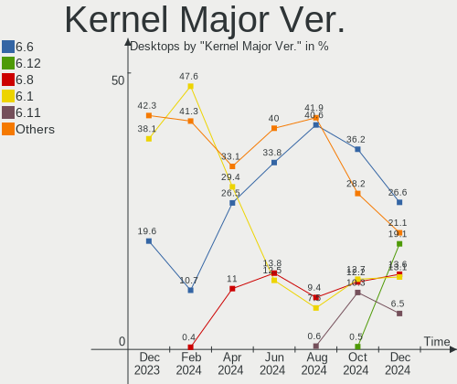

| Version | Desktops | Percent |
|---------|----------|---------|
| 5.15    | 99       | 37.93%  |
| 5.10    | 89       | 34.1%   |
| 6.0     | 34       | 13.03%  |
| 5.19    | 8        | 3.07%   |
| 5.4     | 6        | 2.3%    |
| 5.16    | 5        | 1.92%   |
| 5.18    | 4        | 1.53%   |
| 5.17    | 4        | 1.53%   |
| 6.1     | 3        | 1.15%   |
| 4.15    | 3        | 1.15%   |
| 4.19    | 2        | 0.77%   |
| 5.11    | 1        | 0.38%   |
| 5.0     | 1        | 0.38%   |
| 4.9     | 1        | 0.38%   |
| 3.13    | 1        | 0.38%   |

Arch
----

OS architecture (x86_64, i586, etc.)

| Name   | Desktops | Percent |
|--------|----------|---------|
| x86_64 | 252      | 96.55%  |
| i686   | 9        | 3.45%   |

DE
--

Desktop Environment

| Name           | Desktops | Percent |
|----------------|----------|---------|
| KDE5           | 99       | 37.93%  |
| GNOME          | 71       | 27.2%   |
| Unknown        | 40       | 15.33%  |
| MATE           | 12       | 4.6%    |
| XFCE           | 8        | 3.07%   |
| LXQt           | 8        | 3.07%   |
| X-Cinnamon     | 5        | 1.92%   |
| KDE4           | 5        | 1.92%   |
| Cinnamon       | 5        | 1.92%   |
| i3             | 3        | 1.15%   |
| Pantheon       | 1        | 0.38%   |
| KDE            | 1        | 0.38%   |
| i3-with-shmlog | 1        | 0.38%   |
| Hyprland       | 1        | 0.38%   |
| Deepin         | 1        | 0.38%   |

Display Server
--------------

X11 or Wayland

| Name    | Desktops | Percent |
|---------|----------|---------|
| Wayland | 122      | 46.74%  |
| X11     | 105      | 40.23%  |
| Unknown | 30       | 11.49%  |
| Tty     | 4        | 1.53%   |

Display Manager
---------------

SDDM, LightDM, etc.

| Name    | Desktops | Percent |
|---------|----------|---------|
| SDDM    | 95       | 36.4%   |
| GDM     | 74       | 28.35%  |
| Unknown | 55       | 21.07%  |
| LightDM | 25       | 9.58%   |
| GDM3    | 8        | 3.07%   |
| KDM     | 4        | 1.53%   |

OS Lang
-------

Language

| Lang    | Desktops | Percent |
|---------|----------|---------|
| ru_RU   | 218      | 83.52%  |
| en_US   | 24       | 9.2%    |
| Unknown | 17       | 6.51%   |
| en_GB   | 1        | 0.38%   |
| C.UTF8  | 1        | 0.38%   |

Boot Mode
---------

EFI or BIOS

| Mode | Desktops | Percent |
|------|----------|---------|
| BIOS | 142      | 54.41%  |
| EFI  | 119      | 45.59%  |

Filesystem
----------

Type of filesystem

| Type    | Desktops | Percent |
|---------|----------|---------|
| Ext4    | 198      | 75.86%  |
| Overlay | 37       | 14.18%  |
| Btrfs   | 22       | 8.43%   |
| Xfs     | 2        | 0.77%   |
| F2fs    | 2        | 0.77%   |

Part. scheme
------------

Scheme of partitioning

| Type    | Desktops | Percent |
|---------|----------|---------|
| GPT     | 153      | 58.62%  |
| MBR     | 87       | 33.33%  |
| Unknown | 21       | 8.05%   |

Dual Boot with Linux/BSD
------------------------

Hosting more than one Linux/BSD

| Dual boot | Desktops | Percent |
|-----------|----------|---------|
| No        | 201      | 77.01%  |
| Yes       | 60       | 22.99%  |

Dual Boot (Win)
---------------

Hosting Linux and Windows

| Dual boot | Desktops | Percent |
|-----------|----------|---------|
| Yes       | 145      | 55.56%  |
| No        | 116      | 44.44%  |

Board
-----

Vendor
------

Motherboard manufacturer

| Name                      | Desktops | Percent |
|---------------------------|----------|---------|
| ASUSTek Computer          | 84       | 32.18%  |
| Gigabyte Technology       | 59       | 22.61%  |
| MSI                       | 31       | 11.88%  |
| ASRock                    | 27       | 10.34%  |
| ECS                       | 16       | 6.13%   |
| Unknown                   | 7        | 2.68%   |
| Intel                     | 6        | 2.3%    |
| Hewlett-Packard           | 4        | 1.53%   |
| Dell                      | 4        | 1.53%   |
| Biostar                   | 4        | 1.53%   |
| Pegatron                  | 2        | 0.77%   |
| MACHINIST                 | 2        | 0.77%   |
| Lenovo                    | 2        | 0.77%   |
| Huanan                    | 2        | 0.77%   |
| Graviton                  | 2        | 0.77%   |
| Acer                      | 2        | 0.77%   |
| Shenzhen aopoo technology | 1        | 0.38%   |
| Sapphire                  | 1        | 0.38%   |
| Koloe                     | 1        | 0.38%   |
| JGINYUE                   | 1        | 0.38%   |
| Fujitsu                   | 1        | 0.38%   |
| Foxconn                   | 1        | 0.38%   |
| Apple                     | 1        | 0.38%   |

Model
-----

Motherboard model

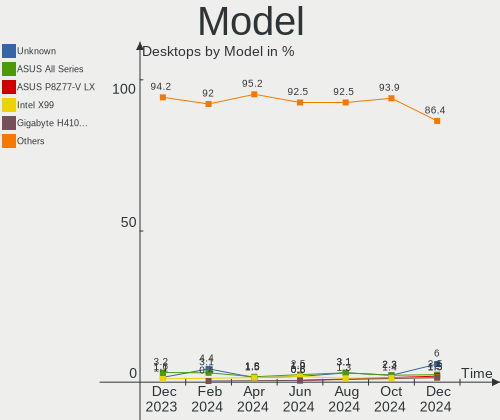

| Name                              | Desktops | Percent |
|-----------------------------------|----------|---------|
| ECS H61H2-M13                     | 12       | 4.6%    |
| ASUS All Series                   | 8        | 3.07%   |
| Unknown                           | 7        | 2.68%   |
| Gigabyte B450 AORUS ELITE         | 3        | 1.15%   |
| ASUS P5K                          | 3        | 1.15%   |
| MSI MS-7B89                       | 2        | 0.77%   |
| Intel X79                         | 2        | 0.77%   |
| Huanan X99-BD4 V1.3               | 2        | 0.77%   |
| Gigabyte G31M-ES2L                | 2        | 0.77%   |
| Gigabyte A320M-H                  | 2        | 0.77%   |
| Dell OptiPlex 7010                | 2        | 0.77%   |
| ASUS PRIME H510M-K                | 2        | 0.77%   |
| ASUS PRIME B450M-A                | 2        | 0.77%   |
| ASUS P5KPL-AM EPU                 | 2        | 0.77%   |
| ASUS M5A97 EVO R2.0               | 2        | 0.77%   |
| ASUS M5A78L LE                    | 2        | 0.77%   |
| ASUS H61M-K                       | 2        | 0.77%   |
| ASRock H55M-LE                    | 2        | 0.77%   |
| Shenzhen aopoo technology AC1-DP  | 1        | 0.38%   |
| Sapphire IPC-E350M1               | 1        | 0.38%   |
| Pegatron Pro 3010 Microtower PC   | 1        | 0.38%   |
| Pegatron Compaq dx2400 Microtower | 1        | 0.38%   |
| MSI MS-7D82                       | 1        | 0.38%   |
| MSI MS-7D23                       | 1        | 0.38%   |
| MSI MS-7D22                       | 1        | 0.38%   |
| MSI MS-7C84                       | 1        | 0.38%   |
| MSI MS-7C60                       | 1        | 0.38%   |
| MSI MS-7C51                       | 1        | 0.38%   |
| MSI MS-7C35                       | 1        | 0.38%   |
| MSI MS-7B98                       | 1        | 0.38%   |
| MSI MS-7B93                       | 1        | 0.38%   |
| MSI MS-7B87                       | 1        | 0.38%   |
| MSI MS-7B79                       | 1        | 0.38%   |
| MSI MS-7B47                       | 1        | 0.38%   |
| MSI MS-7B24                       | 1        | 0.38%   |
| MSI MS-7B17                       | 1        | 0.38%   |
| MSI MS-7A33                       | 1        | 0.38%   |
| MSI MS-7A15                       | 1        | 0.38%   |
| MSI MS-7A01                       | 1        | 0.38%   |
| MSI MS-7996                       | 1        | 0.38%   |

Model Family
------------

Motherboard model prefix

| Name                             | Desktops | Percent |
|----------------------------------|----------|---------|
| ASUS PRIME                       | 15       | 5.75%   |
| ECS H61H2-M13                    | 12       | 4.6%    |
| ASUS All                         | 8        | 3.07%   |
| Unknown                          | 7        | 2.68%   |
| ASUS P5K                         | 5        | 1.92%   |
| Gigabyte B450                    | 4        | 1.53%   |
| ASUS TUF                         | 4        | 1.53%   |
| ASUS M5A78L-M                    | 4        | 1.53%   |
| Intel X79                        | 3        | 1.15%   |
| Gigabyte B550                    | 3        | 1.15%   |
| Gigabyte B450M                   | 3        | 1.15%   |
| Dell OptiPlex                    | 3        | 1.15%   |
| ASUS P5KPL-AM                    | 3        | 1.15%   |
| ASUS M5A97                       | 3        | 1.15%   |
| ASUS M5A78L                      | 3        | 1.15%   |
| MSI MS-7B89                      | 2        | 0.77%   |
| MACHINIST X99-RS9                | 2        | 0.77%   |
| Huanan X99-BD4                   | 2        | 0.77%   |
| Gigabyte Z690                    | 2        | 0.77%   |
| Gigabyte X570S                   | 2        | 0.77%   |
| Gigabyte H310M                   | 2        | 0.77%   |
| Gigabyte G31M-ES2L               | 2        | 0.77%   |
| Gigabyte B365M                   | 2        | 0.77%   |
| Gigabyte A520M                   | 2        | 0.77%   |
| Gigabyte A320M-H                 | 2        | 0.77%   |
| ASUS P7H55-M                     | 2        | 0.77%   |
| ASUS H61M-K                      | 2        | 0.77%   |
| ASRock H55M-LE                   | 2        | 0.77%   |
| Shenzhen aopoo technology AC1-DP | 1        | 0.38%   |
| Sapphire IPC-E350M1              | 1        | 0.38%   |
| Pegatron Pro                     | 1        | 0.38%   |
| Pegatron Compaq                  | 1        | 0.38%   |
| MSI MS-7D82                      | 1        | 0.38%   |
| MSI MS-7D23                      | 1        | 0.38%   |
| MSI MS-7D22                      | 1        | 0.38%   |
| MSI MS-7C84                      | 1        | 0.38%   |
| MSI MS-7C60                      | 1        | 0.38%   |
| MSI MS-7C51                      | 1        | 0.38%   |
| MSI MS-7C35                      | 1        | 0.38%   |
| MSI MS-7B98                      | 1        | 0.38%   |

MFG Year
--------

Motherboard manufacture year

| Year | Desktops | Percent |
|------|----------|---------|
| 2018 | 31       | 11.88%  |
| 2011 | 29       | 11.11%  |
| 2021 | 23       | 8.81%   |
| 2012 | 23       | 8.81%   |
| 2020 | 19       | 7.28%   |
| 2013 | 18       | 6.9%    |
| 2009 | 16       | 6.13%   |
| 2008 | 13       | 4.98%   |
| 2022 | 12       | 4.6%    |
| 2019 | 12       | 4.6%    |
| 2016 | 12       | 4.6%    |
| 2010 | 12       | 4.6%    |
| 2017 | 11       | 4.21%   |
| 2015 | 9        | 3.45%   |
| 2014 | 9        | 3.45%   |
| 2007 | 9        | 3.45%   |
| 2006 | 1        | 0.38%   |
| 2005 | 1        | 0.38%   |
| 2004 | 1        | 0.38%   |

Form Factor
-----------

Physical design of the computer

| Name    | Desktops | Percent |
|---------|----------|---------|
| Desktop | 261      | 100%    |

Secure Boot
-----------

Enabled or disabled

| State    | Desktops | Percent |
|----------|----------|---------|
| Disabled | 260      | 99.62%  |
| Enabled  | 1        | 0.38%   |

Coreboot
--------

Have coreboot on board

| Used | Desktops | Percent |
|------|----------|---------|
| No   | 261      | 100%    |

RAM Size
--------

Total RAM memory

| Size in GB      | Desktops | Percent |
|-----------------|----------|---------|
| 16.01-24.0      | 61       | 23.37%  |
| 4.01-8.0        | 51       | 19.54%  |
| 8.01-16.0       | 45       | 17.24%  |
| 3.01-4.0        | 43       | 16.48%  |
| 32.01-64.0      | 30       | 11.49%  |
| 1.01-2.0        | 11       | 4.21%   |
| 2.01-3.0        | 9        | 3.45%   |
| 64.01-256.0     | 7        | 2.68%   |
| 24.01-32.0      | 2        | 0.77%   |
| More than 256.0 | 1        | 0.38%   |
| 0.51-1.0        | 1        | 0.38%   |

RAM Used
--------

Used RAM memory

| Used GB    | Desktops | Percent |
|------------|----------|---------|
| 1.01-2.0   | 101      | 38.7%   |
| 0.51-1.0   | 64       | 24.52%  |
| 2.01-3.0   | 45       | 17.24%  |
| 4.01-8.0   | 24       | 9.2%    |
| 3.01-4.0   | 13       | 4.98%   |
| 8.01-16.0  | 6        | 2.3%    |
| 0.01-0.5   | 5        | 1.92%   |
| 24.01-32.0 | 1        | 0.38%   |
| 16.01-24.0 | 1        | 0.38%   |
| Unknown    | 1        | 0.38%   |

Total Drives
------------

Number of drives on board

| Drives | Desktops | Percent |
|--------|----------|---------|
| 1      | 106      | 40.61%  |
| 2      | 75       | 28.74%  |
| 3      | 36       | 13.79%  |
| 4      | 22       | 8.43%   |
| 5      | 12       | 4.6%    |
| 6      | 6        | 2.3%    |
| 7      | 2        | 0.77%   |
| 8      | 1        | 0.38%   |
| 0      | 1        | 0.38%   |

Has CD-ROM
----------

Has CD-ROM on board

| Presented | Desktops | Percent |
|-----------|----------|---------|
| No        | 182      | 69.73%  |
| Yes       | 79       | 30.27%  |

Has Ethernet
------------

Has Ethernet on board

| Presented | Desktops | Percent |
|-----------|----------|---------|
| Yes       | 259      | 99.23%  |
| No        | 2        | 0.77%   |

Has WiFi
--------

Has WiFi module

| Presented | Desktops | Percent |
|-----------|----------|---------|
| No        | 183      | 70.11%  |
| Yes       | 78       | 29.89%  |

Has Bluetooth
-------------

Has Bluetooth module

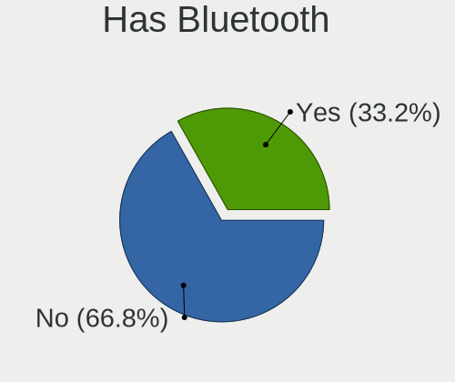

| Presented | Desktops | Percent |
|-----------|----------|---------|
| No        | 203      | 77.78%  |
| Yes       | 58       | 22.22%  |

Location
--------

Country
-------

Geographic location (country)

| Country | Desktops | Percent |
|---------|----------|---------|
| Russia  | 261      | 100%    |

City
----

Geographic location (city)

| City             | Desktops | Percent |
|------------------|----------|---------|
| Moscow           | 41       | 15.71%  |
| Voronezh         | 33       | 12.64%  |
| St Petersburg    | 23       | 8.81%   |
| Yekaterinburg    | 8        | 3.07%   |
| Novosibirsk      | 6        | 2.3%    |
| Ufa              | 5        | 1.92%   |
| Rostov-on-Don    | 5        | 1.92%   |
| Krasnoyarsk      | 5        | 1.92%   |
| Novokuznetsk     | 4        | 1.53%   |
| Krasnodar        | 4        | 1.53%   |
| Korolyov         | 4        | 1.53%   |
| Chelyabinsk      | 4        | 1.53%   |
| Stavropol        | 3        | 1.15%   |
| Salekhard        | 3        | 1.15%   |
| Perm             | 3        | 1.15%   |
| Omsk             | 3        | 1.15%   |
| Nizhniy Novgorod | 3        | 1.15%   |
| Khabarovsk       | 3        | 1.15%   |
| Kazan’         | 3        | 1.15%   |
| Irkutsk          | 3        | 1.15%   |
| Bryansk          | 3        | 1.15%   |
| Volgograd        | 2        | 0.77%   |
| Vladivostok      | 2        | 0.77%   |
| Ulyanovsk        | 2        | 0.77%   |
| Tyumen           | 2        | 0.77%   |
| Tolyatti         | 2        | 0.77%   |
| Tambov           | 2        | 0.77%   |
| Sterlitamak      | 2        | 0.77%   |
| Smolensk         | 2        | 0.77%   |
| Shushary         | 2        | 0.77%   |
| Serpukhov        | 2        | 0.77%   |
| Saratov          | 2        | 0.77%   |
| Samara           | 2        | 0.77%   |
| Petrozavodsk     | 2        | 0.77%   |
| Orenburg         | 2        | 0.77%   |
| Nizhny Tagil     | 2        | 0.77%   |
| Mytishchi        | 2        | 0.77%   |
| Murom            | 2        | 0.77%   |
| Lyubertsy        | 2        | 0.77%   |
| Ivanovo          | 2        | 0.77%   |

Drives
------

Drive Vendor
------------

Hard drive vendors

| Vendor              | Desktops | Drives | Percent |
|---------------------|----------|--------|---------|
| WDC                 | 99       | 136    | 20.84%  |
| Seagate             | 94       | 123    | 19.79%  |
| Samsung Electronics | 49       | 61     | 10.32%  |
| Kingston            | 37       | 40     | 7.79%   |
| Toshiba             | 32       | 35     | 6.74%   |
| Hitachi             | 26       | 27     | 5.47%   |
| China               | 11       | 12     | 2.32%   |
| SPCC                | 10       | 11     | 2.11%   |
| A-DATA Technology   | 9        | 10     | 1.89%   |
| SanDisk             | 8        | 8      | 1.68%   |
| Apacer              | 8        | 8      | 1.68%   |
| Patriot             | 6        | 6      | 1.26%   |
| Crucial             | 6        | 7      | 1.26%   |
| Netac               | 5        | 5      | 1.05%   |
| Intel               | 5        | 5      | 1.05%   |
| AMD                 | 5        | 5      | 1.05%   |
| XPG                 | 4        | 4      | 0.84%   |
| XrayDisk            | 3        | 3      | 0.63%   |
| Silicon Motion      | 3        | 3      | 0.63%   |
| OCZ                 | 3        | 5      | 0.63%   |
| Maxtor              | 3        | 3      | 0.63%   |
| KingSpec            | 3        | 3      | 0.63%   |
| Corsair             | 3        | 3      | 0.63%   |
| Unknown             | 3        | 3      | 0.63%   |
| Transcend           | 2        | 2      | 0.42%   |
| Team                | 2        | 2      | 0.42%   |
| Smartbuy            | 2        | 2      | 0.42%   |
| Plextor             | 2        | 3      | 0.42%   |
| Lite-On Technology  | 2        | 2      | 0.42%   |
| Kingmax             | 2        | 2      | 0.42%   |
| KingDian            | 2        | 2      | 0.42%   |
| HGST                | 2        | 2      | 0.42%   |
| Gigabyte Technology | 2        | 2      | 0.42%   |
| Foxline             | 2        | 2      | 0.42%   |
| Zheino              | 1        | 1      | 0.21%   |
| Vaseky              | 1        | 1      | 0.21%   |
| Unknown             | 1        | 1      | 0.21%   |
| SK hynix            | 1        | 1      | 0.21%   |
| PNY                 | 1        | 2      | 0.21%   |
| Phison Electronics  | 1        | 1      | 0.21%   |

Drive Model
-----------

Hard drive models

| Model                                                | Desktops | Percent |
|------------------------------------------------------|----------|---------|
| Seagate ST1000DM010-2EP102 1TB                       | 15       | 2.76%   |
| Kingston SA400S37240G 240GB SSD                      | 10       | 1.84%   |
| Hitachi HDS721050DLE630 500GB                        | 10       | 1.84%   |
| WDC WD10EZEX-08WN4A0 1TB                             | 7        | 1.29%   |
| Toshiba DT01ACA100 1TB                               | 7        | 1.29%   |
| Samsung SSD 860 EVO 250GB                            | 7        | 1.29%   |
| Toshiba DT01ACA050 500GB                             | 6        | 1.1%    |
| Samsung SSD 860 EVO 500GB                            | 6        | 1.1%    |
| WDC WD10EZEX-00BBHA0 1TB                             | 5        | 0.92%   |
| Seagate ST500DM002-1BD142 500GB                      | 5        | 0.92%   |
| Seagate ST2000DM008-2FR102 2TB                       | 5        | 0.92%   |
| WDC WD10EZEX-22MFCA0 1TB                             | 4        | 0.74%   |
| Toshiba HDWD110 1TB                                  | 4        | 0.74%   |
| SPCC Solid State Disk 128GB                          | 4        | 0.74%   |
| Seagate ST3500418AS 500GB                            | 4        | 0.74%   |
| Seagate ST3250410AS 250GB                            | 4        | 0.74%   |
| Seagate ST3160815AS 160GB                            | 4        | 0.74%   |
| Seagate ST2000DM008-2UB102 2TB                       | 4        | 0.74%   |
| Seagate ST2000DM006-2DM164 2TB                       | 4        | 0.74%   |
| Seagate ST1000DM003-1CH162 1TB                       | 4        | 0.74%   |
| Samsung NVMe SSD Controller SM981/PM981/PM983 1TB    | 4        | 0.74%   |
| Kingston SA400S37480G 480GB SSD                      | 4        | 0.74%   |
| Kingston SA400S37120G 120GB SSD                      | 4        | 0.74%   |
| Crucial CT240BX500SSD1 240GB                         | 4        | 0.74%   |
| WDC WDS500G2B0A-00SM50 500GB SSD                     | 3        | 0.55%   |
| WDC WDS240G2G0A-00JH30 240GB SSD                     | 3        | 0.55%   |
| WDC WDS120G2G0A-00JH30 120GB SSD                     | 3        | 0.55%   |
| WDC WD5000AAKS-00V1A0 500GB                          | 3        | 0.55%   |
| WDC WD10EZRX-00A8LB0 1TB                             | 3        | 0.55%   |
| WDC WD10EZEX-08M2NA0 1TB                             | 3        | 0.55%   |
| Toshiba HDWD120 2TB                                  | 3        | 0.55%   |
| SPCC Solid State Disk 64GB                           | 3        | 0.55%   |
| Seagate ST500DM002-1BC142 500GB                      | 3        | 0.55%   |
| Samsung SSD 980 500GB                                | 3        | 0.55%   |
| Samsung SSD 980 250GB                                | 3        | 0.55%   |
| Samsung SSD 970 EVO Plus 500GB                       | 3        | 0.55%   |
| Samsung NVMe SSD Controller PM9A1/PM9A3/980PRO 250GB | 3        | 0.55%   |
| Unknown                                              | 3        | 0.55%   |
| XPG GAMMIX S5 512GB                                  | 2        | 0.37%   |
| WDC WDS100T2B0C-00PXH0 1TB                           | 2        | 0.37%   |

HDD Vendor
----------

Hard disk drive vendors

| Vendor              | Desktops | Drives | Percent |
|---------------------|----------|--------|---------|
| Seagate             | 93       | 121    | 36.19%  |
| WDC                 | 89       | 118    | 34.63%  |
| Toshiba             | 32       | 34     | 12.45%  |
| Hitachi             | 26       | 27     | 10.12%  |
| Samsung Electronics | 9        | 9      | 3.5%    |
| Maxtor              | 3        | 3      | 1.17%   |
| HGST                | 2        | 2      | 0.78%   |
| Unknown             | 1        | 1      | 0.39%   |
| ASMT                | 1        | 2      | 0.39%   |
| Unknown             | 1        | 1      | 0.39%   |

SSD Vendor
----------

Solid state drive vendors

| Vendor              | Desktops | Drives | Percent |
|---------------------|----------|--------|---------|
| Kingston            | 31       | 33     | 19.75%  |
| Samsung Electronics | 23       | 25     | 14.65%  |
| WDC                 | 12       | 13     | 7.64%   |
| China               | 11       | 12     | 7.01%   |
| SPCC                | 9        | 10     | 5.73%   |
| Crucial             | 6        | 7      | 3.82%   |
| Apacer              | 6        | 6      | 3.82%   |
| A-DATA Technology   | 6        | 7      | 3.82%   |
| SanDisk             | 5        | 5      | 3.18%   |
| Patriot             | 5        | 5      | 3.18%   |
| OCZ                 | 3        | 5      | 1.91%   |
| Netac               | 3        | 3      | 1.91%   |
| Intel               | 3        | 3      | 1.91%   |
| AMD                 | 3        | 3      | 1.91%   |
| Team                | 2        | 2      | 1.27%   |
| Smartbuy            | 2        | 2      | 1.27%   |
| Plextor             | 2        | 2      | 1.27%   |
| KingSpec            | 2        | 2      | 1.27%   |
| Kingmax             | 2        | 2      | 1.27%   |
| KingDian            | 2        | 2      | 1.27%   |
| Foxline             | 2        | 2      | 1.27%   |
| Zheino              | 1        | 1      | 0.64%   |
| XrayDisk            | 1        | 1      | 0.64%   |
| Vaseky              | 1        | 1      | 0.64%   |
| Transcend           | 1        | 1      | 0.64%   |
| Toshiba             | 1        | 1      | 0.64%   |
| Seagate             | 1        | 2      | 0.64%   |
| PNY                 | 1        | 2      | 0.64%   |
| Neo Forza           | 1        | 1      | 0.64%   |
| Neo                 | 1        | 1      | 0.64%   |
| Kingchuxing         | 1        | 1      | 0.64%   |
| Kimtigo             | 1        | 1      | 0.64%   |
| JMicron Technology  | 1        | 1      | 0.64%   |
| GOODRAM             | 1        | 1      | 0.64%   |
| Gigabyte Technology | 1        | 1      | 0.64%   |
| Corsair             | 1        | 1      | 0.64%   |
| ADROITLARK          | 1        | 1      | 0.64%   |
| Unknown             | 1        | 1      | 0.64%   |

Drive Kind
----------

HDD or SSD

| Kind    | Desktops | Drives | Percent |
|---------|----------|--------|---------|
| HDD     | 207      | 318    | 51.11%  |
| SSD     | 127      | 170    | 31.36%  |
| NVMe    | 67       | 77     | 16.54%  |
| Unknown | 4        | 5      | 0.99%   |

Drive Connector
---------------

SATA, SAS, NVMe, etc.

| Type | Desktops | Drives | Percent |
|------|----------|--------|---------|
| SATA | 247      | 486    | 77.43%  |
| NVMe | 67       | 77     | 21%     |
| SAS  | 5        | 7      | 1.57%   |

Drive Size
----------

Size of hard drive

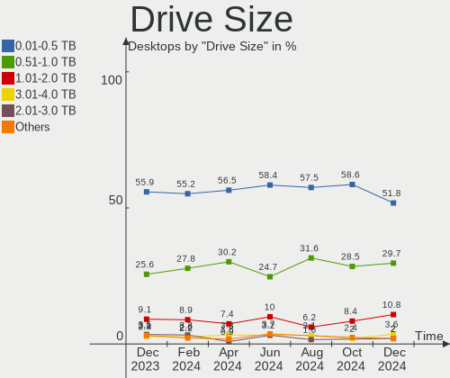

| Size in TB | Desktops | Drives | Percent |
|------------|----------|--------|---------|
| 0.01-0.5   | 204      | 305    | 57.95%  |
| 0.51-1.0   | 97       | 116    | 27.56%  |
| 1.01-2.0   | 36       | 52     | 10.23%  |
| 2.01-3.0   | 8        | 8      | 2.27%   |
| 3.01-4.0   | 4        | 4      | 1.14%   |
| 4.01-10.0  | 2        | 2      | 0.57%   |
| 10.01-20.0 | 1        | 1      | 0.28%   |

Space Total
-----------

Amount of disk space available on the file system

| Size in GB     | Desktops | Percent |
|----------------|----------|---------|
| 101-250        | 66       | 25.29%  |
| 501-1000       | 39       | 14.94%  |
| 251-500        | 38       | 14.56%  |
| 1001-2000      | 30       | 11.49%  |
| Unknown        | 29       | 11.11%  |
| 1-20           | 22       | 8.43%   |
| More than 3000 | 12       | 4.6%    |
| 2001-3000      | 9        | 3.45%   |
| 51-100         | 9        | 3.45%   |
| 21-50          | 7        | 2.68%   |

Space Used
----------

Amount of used disk space

| Used GB        | Desktops | Percent |
|----------------|----------|---------|
| 1-20           | 111      | 42.53%  |
| Unknown        | 29       | 11.11%  |
| 101-250        | 25       | 9.58%   |
| 21-50          | 24       | 9.2%    |
| 251-500        | 22       | 8.43%   |
| 51-100         | 15       | 5.75%   |
| 501-1000       | 14       | 5.36%   |
| 1001-2000      | 13       | 4.98%   |
| More than 3000 | 6        | 2.3%    |
| 2001-3000      | 2        | 0.77%   |

Malfunc. Drives
---------------

Drive models with a malfunction

| Model                            | Desktops | Drives | Percent |
|----------------------------------|----------|--------|---------|
| Hitachi HDS721050DLE630 500GB    | 5        | 5      | 4.31%   |
| WDC WD5000AAKS-00V1A0 500GB      | 3        | 4      | 2.59%   |
| Seagate ST500DM002-1BD142 500GB  | 3        | 3      | 2.59%   |
| Seagate ST3500418AS 500GB        | 3        | 3      | 2.59%   |
| WDC WD5000AAKX-001CA0 500GB      | 2        | 2      | 1.72%   |
| WDC WD20EARS-00S8B1 2TB          | 2        | 2      | 1.72%   |
| WDC WD1600AAJS-00B4A0 160GB      | 2        | 2      | 1.72%   |
| WDC WD10EZEX-22MFCA0 1TB         | 2        | 2      | 1.72%   |
| WDC WD10EZEX-08WN4A0 1TB         | 2        | 3      | 1.72%   |
| Seagate ST3250410AS 250GB        | 2        | 2      | 1.72%   |
| Seagate ST32000641AS 2TB         | 2        | 6      | 1.72%   |
| Seagate ST3000DM001-9YN166 3TB   | 2        | 2      | 1.72%   |
| Seagate ST1000DM010-2EP102 1TB   | 2        | 2      | 1.72%   |
| Hitachi HDS5C1050CLA382 500GB    | 2        | 2      | 1.72%   |
| XPG GAMMIX S5 512GB              | 1        | 1      | 0.86%   |
| WDC WDS480G2G0A-00JH30 480GB SSD | 1        | 1      | 0.86%   |
| WDC WD800BB-56JKC0 80GB          | 1        | 1      | 0.86%   |
| WDC WD7500AAKS-00RBA0 752GB      | 1        | 1      | 0.86%   |
| WDC WD6400BEVT-16A0RT0 640GB     | 1        | 1      | 0.86%   |
| WDC WD5000LPVX-55V0TT0 500GB     | 1        | 1      | 0.86%   |
| WDC WD5000LPCX-21VHAT0 500GB     | 1        | 1      | 0.86%   |
| WDC WD5000BEVT-22A0RT0 500GB     | 1        | 1      | 0.86%   |
| WDC WD5000AAKS-75A7B2 500GB      | 1        | 1      | 0.86%   |
| WDC WD5000AAKS-00UU3A0 500GB     | 1        | 1      | 0.86%   |
| WDC WD5000AAKS-00D2B0 500GB      | 1        | 1      | 0.86%   |
| WDC WD3200AAKX-753CA1 320GB      | 1        | 1      | 0.86%   |
| WDC WD3200AAJS-22B4A0 320GB      | 1        | 1      | 0.86%   |
| WDC WD3200AAJB-56R1A0 320GB      | 1        | 1      | 0.86%   |
| WDC WD20EARX-00PASB0 2TB         | 1        | 1      | 0.86%   |
| WDC WD20EARS-00MVWB0 2TB         | 1        | 1      | 0.86%   |
| WDC WD1600JS-00NCB1 160GB        | 1        | 1      | 0.86%   |
| WDC WD15EARS-00Z5B1 1TB          | 1        | 1      | 0.86%   |
| WDC WD10JPVX-60JC3T0 1TB         | 1        | 1      | 0.86%   |
| WDC WD10EZRX-00A8LB0 1TB         | 1        | 1      | 0.86%   |
| WDC WD10EZEX-75WN4A0 1TB         | 1        | 1      | 0.86%   |
| WDC WD10EZEX-60WN4A0 1TB         | 1        | 1      | 0.86%   |
| WDC WD10EALX-009BA0 1TB          | 1        | 1      | 0.86%   |
| WDC WD1002FAEX-00Z3A0 1TB        | 1        | 1      | 0.86%   |
| Toshiba MQ01ABD100 1TB           | 1        | 1      | 0.86%   |
| Toshiba MQ01ABD075 752GB         | 1        | 1      | 0.86%   |

Malfunc. Drive Vendor
---------------------

Vendors of faulty drives

| Vendor              | Desktops | Drives | Percent |
|---------------------|----------|--------|---------|
| WDC                 | 35       | 38     | 31.82%  |
| Seagate             | 35       | 44     | 31.82%  |
| Hitachi             | 14       | 14     | 12.73%  |
| Toshiba             | 5        | 5      | 4.55%   |
| Samsung Electronics | 5        | 5      | 4.55%   |
| Maxtor              | 3        | 3      | 2.73%   |
| Kingmax             | 2        | 2      | 1.82%   |
| XPG                 | 1        | 1      | 0.91%   |
| SPCC                | 1        | 1      | 0.91%   |
| PNY                 | 1        | 1      | 0.91%   |
| Plextor             | 1        | 1      | 0.91%   |
| Neo                 | 1        | 1      | 0.91%   |
| Kingston            | 1        | 1      | 0.91%   |
| KingSpec            | 1        | 1      | 0.91%   |
| Intel               | 1        | 1      | 0.91%   |
| Corsair             | 1        | 1      | 0.91%   |
| AMD                 | 1        | 1      | 0.91%   |
| Unknown             | 1        | 1      | 0.91%   |

Malfunc. HDD Vendor
-------------------

Vendors of faulty HDD drives

| Vendor              | Desktops | Drives | Percent |
|---------------------|----------|--------|---------|
| Seagate             | 35       | 44     | 36.46%  |
| WDC                 | 34       | 37     | 35.42%  |
| Hitachi             | 14       | 14     | 14.58%  |
| Toshiba             | 5        | 5      | 5.21%   |
| Samsung Electronics | 4        | 4      | 4.17%   |
| Maxtor              | 3        | 3      | 3.13%   |
| Unknown             | 1        | 1      | 1.04%   |

Malfunc. Drive Kind
-------------------

Kinds of faulty drives

| Kind | Desktops | Drives | Percent |
|------|----------|--------|---------|
| HDD  | 87       | 108    | 86.14%  |
| SSD  | 11       | 11     | 10.89%  |
| NVMe | 3        | 3      | 2.97%   |

Failed Drives
-------------

Failed drive models

| Model                         | Desktops | Drives | Percent |
|-------------------------------|----------|--------|---------|
| Hitachi HDS721050DLE630 500GB | 1        | 1      | 100%    |

Failed Drive Vendor
-------------------

Failed drive vendors

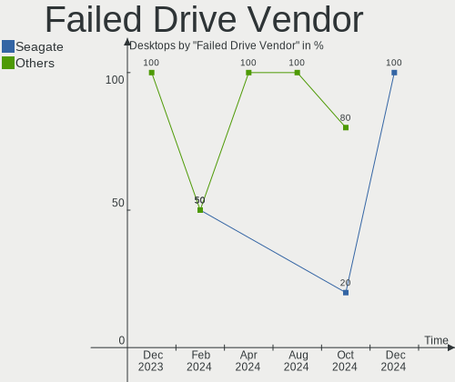

| Vendor  | Desktops | Drives | Percent |
|---------|----------|--------|---------|
| Hitachi | 1        | 1      | 100%    |

Drive Status
------------

Number of failed and malfunc. drives

| Status   | Desktops | Drives | Percent |
|----------|----------|--------|---------|
| Works    | 191      | 371    | 59.13%  |
| Malfunc  | 98       | 122    | 30.34%  |
| Detected | 33       | 76     | 10.22%  |
| Failed   | 1        | 1      | 0.31%   |

Storage controller
------------------

Storage Vendor
--------------

Storage controller vendors

| Vendor                        | Desktops | Percent |
|-------------------------------|----------|---------|
| Intel                         | 180      | 49.72%  |
| AMD                           | 73       | 20.17%  |
| Samsung Electronics           | 24       | 6.63%   |
| JMicron Technology            | 11       | 3.04%   |
| ASMedia Technology            | 11       | 3.04%   |
| Silicon Motion                | 9        | 2.49%   |
| SanDisk                       | 8        | 2.21%   |
| Nvidia                        | 7        | 1.93%   |
| Kingston Technology Company   | 7        | 1.93%   |
| Realtek Semiconductor         | 5        | 1.38%   |
| Phison Electronics            | 5        | 1.38%   |
| Marvell Technology Group      | 4        | 1.1%    |
| ADATA Technology              | 4        | 1.1%    |
| VIA Technologies              | 3        | 0.83%   |
| Lite-On Technology            | 3        | 0.83%   |
| Netac Technology              | 2        | 0.55%   |
| MAXIO Technology (Hangzhou)   | 2        | 0.55%   |
| SK hynix                      | 1        | 0.28%   |
| Micron Technology             | 1        | 0.28%   |
| LSI Logic / Symbios Logic     | 1        | 0.28%   |
| Integrated Technology Express | 1        | 0.28%   |

Storage Model
-------------

Storage controller models

| Model                                                                                   | Desktops | Percent |
|-----------------------------------------------------------------------------------------|----------|---------|
| AMD FCH SATA Controller [AHCI mode]                                                     | 30       | 6.61%   |
| Intel 6 Series/C200 Series Chipset Family 6 port Desktop SATA AHCI Controller           | 20       | 4.41%   |
| AMD 400 Series Chipset SATA Controller                                                  | 19       | 4.19%   |
| Intel Q170/Q150/B150/H170/H110/Z170/CM236 Chipset SATA Controller [AHCI Mode]           | 17       | 3.74%   |
| AMD SB7x0/SB8x0/SB9x0 IDE Controller                                                    | 16       | 3.52%   |
| Intel NM10/ICH7 Family SATA Controller [IDE mode]                                       | 15       | 3.3%    |
| Intel 8 Series/C220 Series Chipset Family 6-port SATA Controller 1 [AHCI mode]          | 15       | 3.3%    |
| Intel 500 Series Chipset Family SATA AHCI Controller                                    | 15       | 3.3%    |
| Samsung NVMe SSD Controller SM981/PM981/PM983                                           | 12       | 2.64%   |
| Intel 200 Series PCH SATA controller [AHCI mode]                                        | 12       | 2.64%   |
| AMD SB7x0/SB8x0/SB9x0 SATA Controller [IDE mode]                                        | 11       | 2.42%   |
| AMD SB7x0/SB8x0/SB9x0 SATA Controller [AHCI mode]                                       | 11       | 2.42%   |
| AMD 500 Series Chipset SATA Controller                                                  | 11       | 2.42%   |
| Intel 6 Series/C200 Series Chipset Family Desktop SATA Controller (IDE mode, ports 4-5) | 10       | 2.2%    |
| Intel 6 Series/C200 Series Chipset Family Desktop SATA Controller (IDE mode, ports 0-3) | 10       | 2.2%    |
| Intel 82801G (ICH7 Family) IDE Controller                                               | 9        | 1.98%   |
| Intel 7 Series/C210 Series Chipset Family 6-port SATA Controller [AHCI mode]            | 9        | 1.98%   |
| ASMedia ASM1062 Serial ATA Controller                                                   | 9        | 1.98%   |
| Silicon Motion SM2263EN/SM2263XT SSD Controller                                         | 8        | 1.76%   |
| Samsung NVMe SSD Controller 980                                                         | 8        | 1.76%   |
| Intel Cannon Lake PCH SATA AHCI Controller                                              | 7        | 1.54%   |
| Intel Alder Lake-S PCH SATA Controller [AHCI Mode]                                      | 7        | 1.54%   |
| Intel 82801I (ICH9 Family) 2 port SATA Controller [IDE mode]                            | 7        | 1.54%   |
| JMicron JMB363 SATA/IDE Controller                                                      | 6        | 1.32%   |
| Intel 82801JI (ICH10 Family) 2 port SATA IDE Controller #2                              | 6        | 1.32%   |
| Nvidia MCP61 SATA Controller                                                            | 5        | 1.1%    |
| Nvidia MCP61 IDE                                                                        | 5        | 1.1%    |
| JMicron JMB368 IDE controller                                                           | 5        | 1.1%    |
| Intel 82801JI (ICH10 Family) 4 port SATA IDE Controller #1                              | 5        | 1.1%    |
| Intel 82801IB (ICH9) 2 port SATA Controller [IDE mode]                                  | 5        | 1.1%    |
| Samsung NVMe SSD Controller PM9A1/PM9A3/980PRO                                          | 4        | 0.88%   |
| Kingston Company Company Non-Volatile memory controller                                 | 4        | 0.88%   |
| Intel 9 Series Chipset Family SATA Controller [AHCI Mode]                               | 4        | 0.88%   |
| Intel 82801JI (ICH10 Family) SATA AHCI Controller                                       | 4        | 0.88%   |
| Intel 7 Series/C210 Series Chipset Family 4-port SATA Controller [IDE mode]             | 4        | 0.88%   |
| Intel 7 Series/C210 Series Chipset Family 2-port SATA Controller [IDE mode]             | 4        | 0.88%   |
| Intel 5 Series/3400 Series Chipset 6 port SATA AHCI Controller                          | 4        | 0.88%   |
| AMD FCH SATA Controller D                                                               | 4        | 0.88%   |
| VIA VT6415 PATA IDE Host Controller                                                     | 3        | 0.66%   |
| SanDisk WD Blue SN550 NVMe SSD                                                          | 3        | 0.66%   |

Storage Kind
------------

Kind of storage controller (IDE, SATA, NVMe, SAS, ...)

| Kind | Desktops | Percent |
|------|----------|---------|
| SATA | 204      | 56.51%  |
| IDE  | 81       | 22.44%  |
| NVMe | 67       | 18.56%  |
| RAID | 8        | 2.22%   |
| SAS  | 1        | 0.28%   |

Processor
---------

CPU Vendor
----------

Processor vendors

| Vendor | Desktops | Percent |
|--------|----------|---------|
| Intel  | 181      | 69.35%  |
| AMD    | 80       | 30.65%  |

CPU Model
---------

Processor models

| Model                                       | Desktops | Percent |
|---------------------------------------------|----------|---------|
| Intel Pentium CPU G630 @ 2.70GHz            | 12       | 4.6%    |
| Intel Core 2 Duo CPU E8400 @ 3.00GHz        | 5        | 1.92%   |
| AMD Ryzen 5 2600 Six-Core Processor         | 5        | 1.92%   |
| Intel Core i5-7400 CPU @ 3.00GHz            | 4        | 1.53%   |
| Intel Core i5-10400 CPU @ 2.90GHz           | 4        | 1.53%   |
| AMD Ryzen 7 3700X 8-Core Processor          | 4        | 1.53%   |
| AMD Ryzen 5 5600G with Radeon Graphics      | 4        | 1.53%   |
| AMD Ryzen 5 3600 6-Core Processor           | 4        | 1.53%   |
| AMD FX-6300 Six-Core Processor              | 4        | 1.53%   |
| Intel Core i5-3450 CPU @ 3.10GHz            | 3        | 1.15%   |
| AMD Ryzen 3 3200G with Radeon Vega Graphics | 3        | 1.15%   |
| AMD Phenom II X4 925 Processor              | 3        | 1.15%   |
| AMD FX-4300 Quad-Core Processor             | 3        | 1.15%   |
| Intel Xeon CPU E5440 @ 2.83GHz              | 2        | 0.77%   |
| Intel Xeon CPU E5-2666 v3 @ 2.90GHz         | 2        | 0.77%   |
| Intel Xeon CPU E5-1650 0 @ 3.20GHz          | 2        | 0.77%   |
| Intel Xeon CPU E3-1270 v3 @ 3.50GHz         | 2        | 0.77%   |
| Intel Pentium Gold G5400 CPU @ 3.70GHz      | 2        | 0.77%   |
| Intel Pentium CPU G3220 @ 3.00GHz           | 2        | 0.77%   |
| Intel Core i7-8700K CPU @ 3.70GHz           | 2        | 0.77%   |
| Intel Core i7-4790 CPU @ 3.60GHz            | 2        | 0.77%   |
| Intel Core i7-3770K CPU @ 3.50GHz           | 2        | 0.77%   |
| Intel Core i5-9400F CPU @ 2.90GHz           | 2        | 0.77%   |
| Intel Core i5-9400 CPU @ 2.90GHz            | 2        | 0.77%   |
| Intel Core i5-8400 CPU @ 2.80GHz            | 2        | 0.77%   |
| Intel Core i5-6400T CPU @ 2.20GHz           | 2        | 0.77%   |
| Intel Core i5-3470 CPU @ 3.20GHz            | 2        | 0.77%   |
| Intel Core i5-3330 CPU @ 3.00GHz            | 2        | 0.77%   |
| Intel Core i5-10400F CPU @ 2.90GHz          | 2        | 0.77%   |
| Intel Core i3-7100 CPU @ 3.90GHz            | 2        | 0.77%   |
| Intel Core i3-6100 CPU @ 3.70GHz            | 2        | 0.77%   |
| Intel Core i3-2120 CPU @ 3.30GHz            | 2        | 0.77%   |
| Intel Core i3-10105 CPU @ 3.70GHz           | 2        | 0.77%   |
| Intel Core i3 CPU 550 @ 3.20GHz             | 2        | 0.77%   |
| Intel Core i3 CPU 540 @ 3.07GHz             | 2        | 0.77%   |
| Intel Core 2 Duo CPU E8200 @ 2.66GHz        | 2        | 0.77%   |
| Intel Core 2 Duo CPU E6550 @ 2.33GHz        | 2        | 0.77%   |
| Intel Celeron J4125 CPU @ 2.00GHz           | 2        | 0.77%   |
| Intel Celeron CPU J1800 @ 2.41GHz           | 2        | 0.77%   |
| AMD Ryzen 9 5900X 12-Core Processor         | 2        | 0.77%   |

CPU Model Family
----------------

Processor model prefix

| Model                   | Desktops | Percent |
|-------------------------|----------|---------|
| Intel Core i5           | 46       | 17.62%  |
| Intel Core i3           | 24       | 9.2%    |
| Intel Pentium           | 23       | 8.81%   |
| AMD Ryzen 5             | 21       | 8.05%   |
| Intel Xeon              | 19       | 7.28%   |
| Intel Core i7           | 15       | 5.75%   |
| Intel Core 2 Duo        | 15       | 5.75%   |
| AMD FX                  | 14       | 5.36%   |
| Intel Celeron           | 13       | 4.98%   |
| Other                   | 11       | 4.21%   |
| AMD Ryzen 7             | 9        | 3.45%   |
| Intel Core 2 Quad       | 5        | 1.92%   |
| AMD Ryzen 3             | 5        | 1.92%   |
| AMD Phenom II X4        | 5        | 1.92%   |
| AMD Athlon II X2        | 5        | 1.92%   |
| AMD Ryzen 9             | 4        | 1.53%   |
| Intel Pentium Gold      | 3        | 1.15%   |
| Intel Pentium Dual-Core | 3        | 1.15%   |
| AMD Ryzen 7 PRO         | 2        | 0.77%   |
| AMD Athlon X2           | 2        | 0.77%   |
| AMD Athlon II X4        | 2        | 0.77%   |
| AMD A4                  | 2        | 0.77%   |
| AMD A10                 | 2        | 0.77%   |
| Intel Pentium Dual      | 1        | 0.38%   |
| Intel Genuine           | 1        | 0.38%   |
| Intel Core 2            | 1        | 0.38%   |
| Intel Celeron D         | 1        | 0.38%   |
| AMD Ryzen Threadripper  | 1        | 0.38%   |
| AMD Ryzen 3 PRO         | 1        | 0.38%   |
| AMD Phenom II X6        | 1        | 0.38%   |
| AMD E                   | 1        | 0.38%   |
| AMD Athlon II X3        | 1        | 0.38%   |
| AMD Athlon 64           | 1        | 0.38%   |
| AMD Athlon              | 1        | 0.38%   |

CPU Cores
---------

Number of processor cores

| Number | Desktops | Percent |
|--------|----------|---------|
| 2      | 89       | 34.1%   |
| 4      | 82       | 31.42%  |
| 6      | 49       | 18.77%  |
| 8      | 17       | 6.51%   |
| 12     | 6        | 2.3%    |
| 1      | 6        | 2.3%    |
| 3      | 5        | 1.92%   |
| 10     | 3        | 1.15%   |
| 24     | 2        | 0.77%   |
| 18     | 1        | 0.38%   |
| 16     | 1        | 0.38%   |

CPU Sockets
-----------

Number of sockets

| Number | Desktops | Percent |
|--------|----------|---------|
| 1      | 259      | 99.23%  |
| 2      | 2        | 0.77%   |

CPU Threads
-----------

Threads per core (Hyper-Threading)

| Number | Desktops | Percent |
|--------|----------|---------|
| 2      | 133      | 50.96%  |
| 1      | 128      | 49.04%  |

CPU Op-Modes
------------

CPU Operation Modes (32-bit, 64-bit)

| Op mode        | Desktops | Percent |
|----------------|----------|---------|
| 32-bit, 64-bit | 261      | 100%    |

CPU Microcode
-------------

Microcode number

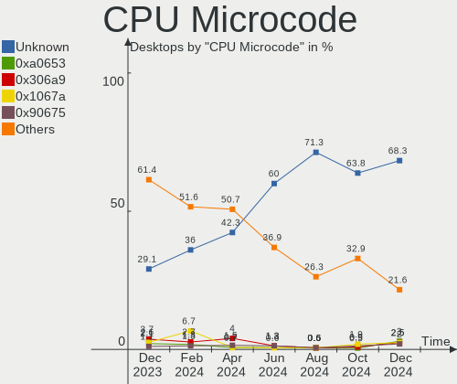

| Number     | Desktops | Percent |
|------------|----------|---------|
| 0x206a7    | 22       | 8.43%   |
| 0x1067a    | 17       | 6.51%   |
| Unknown    | 17       | 6.51%   |
| 0x306a9    | 16       | 6.13%   |
| 0x306c3    | 15       | 5.75%   |
| 0x906ea    | 13       | 4.98%   |
| 0xa0653    | 12       | 4.6%    |
| 0x08701021 | 12       | 4.6%    |
| 0x506e3    | 9        | 3.45%   |
| 0x906e9    | 8        | 3.07%   |
| 0x0800820d | 7        | 2.68%   |
| 0x6fb      | 5        | 1.92%   |
| 0x306f2    | 5        | 1.92%   |
| 0x206d7    | 5        | 1.92%   |
| 0x08001138 | 5        | 1.92%   |
| 0x010000b6 | 5        | 1.92%   |
| 0xa0671    | 4        | 1.53%   |
| 0x20655    | 4        | 1.53%   |
| 0x10676    | 4        | 1.53%   |
| 0x08108109 | 4        | 1.53%   |
| 0x06000822 | 4        | 1.53%   |
| 0x010000c8 | 4        | 1.53%   |
| 0xa0655    | 3        | 1.15%   |
| 0x90672    | 3        | 1.15%   |
| 0x0a50000d | 3        | 1.15%   |
| 0x0a50000c | 3        | 1.15%   |
| 0x0a201016 | 3        | 1.15%   |
| 0x06001119 | 3        | 1.15%   |
| 0x06000852 | 3        | 1.15%   |
| 0x906ed    | 2        | 0.77%   |
| 0x906eb    | 2        | 0.77%   |
| 0x90675    | 2        | 0.77%   |
| 0x706a8    | 2        | 0.77%   |
| 0x6fd      | 2        | 0.77%   |
| 0x6f6      | 2        | 0.77%   |
| 0x20652    | 2        | 0.77%   |
| 0x10677    | 2        | 0.77%   |
| 0x08701013 | 2        | 0.77%   |
| 0x0600081c | 2        | 0.77%   |
| 0x01000086 | 2        | 0.77%   |

CPU Microarch
-------------

Microarchitecture

| Name             | Desktops | Percent |
|------------------|----------|---------|
| SandyBridge      | 29       | 11.11%  |
| KabyLake         | 27       | 10.34%  |
| Penryn           | 23       | 8.81%   |
| Haswell          | 22       | 8.43%   |
| Zen 2            | 17       | 6.51%   |
| IvyBridge        | 17       | 6.51%   |
| Piledriver       | 15       | 5.75%   |
| CometLake        | 15       | 5.75%   |
| K10              | 14       | 5.36%   |
| Zen+             | 11       | 4.21%   |
| Zen 3            | 10       | 3.83%   |
| Skylake          | 10       | 3.83%   |
| Core             | 10       | 3.83%   |
| Zen              | 6        | 2.3%    |
| Westmere         | 6        | 2.3%    |
| Icelake          | 4        | 1.53%   |
| Alderlake Hybrid | 4        | 1.53%   |
| Silvermont       | 3        | 1.15%   |
| Goldmont plus    | 3        | 1.15%   |
| Unknown          | 3        | 1.15%   |
| Nehalem          | 2        | 0.77%   |
| K8 Hammer        | 2        | 0.77%   |
| Bulldozer        | 2        | 0.77%   |
| Tremont          | 1        | 0.38%   |
| Steamroller      | 1        | 0.38%   |
| NetBurst         | 1        | 0.38%   |
| K10 Llano        | 1        | 0.38%   |
| Goldmont         | 1        | 0.38%   |
| Bobcat           | 1        | 0.38%   |

Graphics
--------

GPU Vendor
----------

Vendors of graphics cards

| Vendor | Desktops | Percent |
|--------|----------|---------|
| Nvidia | 138      | 50.18%  |
| Intel  | 77       | 28%     |
| AMD    | 60       | 21.82%  |

GPU Model
---------

Graphics card models

| Model                                                                       | Desktops | Percent |
|-----------------------------------------------------------------------------|----------|---------|
| Nvidia GF108 [GeForce GT 630]                                               | 14       | 5%      |
| Nvidia GP107 [GeForce GTX 1050 Ti]                                          | 11       | 3.93%   |
| AMD Ellesmere [Radeon RX 470/480/570/570X/580/580X/590]                     | 10       | 3.57%   |
| Intel 2nd Generation Core Processor Family Integrated Graphics Controller   | 9        | 3.21%   |
| Intel Xeon E3-1200 v2/3rd Gen Core processor Graphics Controller            | 8        | 2.86%   |
| Intel Xeon E3-1200 v3/4th Gen Core Processor Integrated Graphics Controller | 7        | 2.5%    |
| Intel CometLake-S GT2 [UHD Graphics 630]                                    | 7        | 2.5%    |
| Nvidia GK208B [GeForce GT 730]                                              | 6        | 2.14%   |
| Intel HD Graphics 530                                                       | 6        | 2.14%   |
| Nvidia TU116 [GeForce GTX 1660]                                             | 5        | 1.79%   |
| Nvidia TU106 [GeForce RTX 2060 SUPER]                                       | 5        | 1.79%   |
| Nvidia GP106 [GeForce GTX 1060 6GB]                                         | 5        | 1.79%   |
| Nvidia GP106 [GeForce GTX 1060 3GB]                                         | 5        | 1.79%   |
| Intel HD Graphics 630                                                       | 5        | 1.79%   |
| Intel 82G33/G31 Express Integrated Graphics Controller                      | 5        | 1.79%   |
| AMD Navi 10 [Radeon RX 5600 OEM/5600 XT / 5700/5700 XT]                     | 5        | 1.79%   |
| Nvidia TU117 [GeForce GTX 1650]                                             | 4        | 1.43%   |
| Nvidia GF108 [GeForce GT 430]                                               | 4        | 1.43%   |
| Nvidia G94 [GeForce 9600 GT]                                                | 4        | 1.43%   |
| Intel Core Processor Integrated Graphics Controller                         | 4        | 1.43%   |
| Intel CoffeeLake-S GT1 [UHD Graphics 610]                                   | 4        | 1.43%   |
| AMD Navi 24 [Radeon RX 6400/6500 XT/6500M]                                  | 4        | 1.43%   |
| AMD Navi 23 [Radeon RX 6600/6600 XT/6600M]                                  | 4        | 1.43%   |
| AMD Cezanne [Radeon Vega Series / Radeon Vega Mobile Series]                | 4        | 1.43%   |
| Nvidia TU106 [GeForce RTX 2070]                                             | 3        | 1.07%   |
| Nvidia GT216 [GeForce GT 220]                                               | 3        | 1.07%   |
| Nvidia GP108 [GeForce GT 1030]                                              | 3        | 1.07%   |
| Nvidia GP107 [GeForce GTX 1050]                                             | 3        | 1.07%   |
| Nvidia GK107 [GeForce GTX 650]                                              | 3        | 1.07%   |
| Nvidia GA106 [GeForce RTX 3060]                                             | 3        | 1.07%   |
| Nvidia GA106 [GeForce RTX 3060 Lite Hash Rate]                              | 3        | 1.07%   |
| Intel GeminiLake [UHD Graphics 600]                                         | 3        | 1.07%   |
| Intel AlderLake-S GT1                                                       | 3        | 1.07%   |
| Intel 4 Series Chipset Integrated Graphics Controller                       | 3        | 1.07%   |
| AMD Picasso/Raven 2 [Radeon Vega Series / Radeon Vega Mobile Series]        | 3        | 1.07%   |
| Nvidia NV43 [GeForce 6600]                                                  | 2        | 0.71%   |
| Nvidia GT218 [GeForce 210]                                                  | 2        | 0.71%   |
| Nvidia GT215 [GeForce GT 240]                                               | 2        | 0.71%   |
| Nvidia GT215 [GeForce GT 220]                                               | 2        | 0.71%   |
| Nvidia GP104 [GeForce GTX 1070]                                             | 2        | 0.71%   |

GPU Combo
---------

Combinations of graphics cards

| Name           | Desktops | Percent |
|----------------|----------|---------|
| 1 x Nvidia     | 129      | 49.43%  |
| 1 x Intel      | 65       | 24.9%   |
| 1 x AMD        | 55       | 21.07%  |
| Intel + Nvidia | 7        | 2.68%   |
| 2 x AMD        | 4        | 1.53%   |
| AMD + Nvidia   | 1        | 0.38%   |

GPU Driver
----------

Free vs proprietary

| Driver      | Desktops | Percent |
|-------------|----------|---------|
| Free        | 179      | 68.58%  |
| Proprietary | 47       | 18.01%  |
| Unknown     | 35       | 13.41%  |

GPU Memory
----------

Total video memory

| Size in GB | Desktops | Percent |
|------------|----------|---------|
| Unknown    | 108      | 41.38%  |
| 0.51-1.0   | 32       | 12.26%  |
| 1.01-2.0   | 26       | 9.96%   |
| 3.01-4.0   | 25       | 9.58%   |
| 0.01-0.5   | 25       | 9.58%   |
| 7.01-8.0   | 21       | 8.05%   |
| 5.01-6.0   | 12       | 4.6%    |
| 2.01-3.0   | 5        | 1.92%   |
| 8.01-16.0  | 5        | 1.92%   |
| 16.01-24.0 | 2        | 0.77%   |

Monitor
-------

Monitor Vendor
--------------

Monitor vendors

| Vendor               | Desktops | Percent |
|----------------------|----------|---------|
| Samsung Electronics  | 45       | 19.07%  |
| Goldstar             | 26       | 11.02%  |
| Acer                 | 23       | 9.75%   |
| Dell                 | 22       | 9.32%   |
| BenQ                 | 21       | 8.9%    |
| Philips              | 17       | 7.2%    |
| AOC                  | 17       | 7.2%    |
| Ancor Communications | 12       | 5.08%   |
| ViewSonic            | 9        | 3.81%   |
| Hewlett-Packard      | 8        | 3.39%   |
| NEC Computers        | 7        | 2.97%   |
| MSI                  | 5        | 2.12%   |
| Mi                   | 3        | 1.27%   |
| Iiyama               | 3        | 1.27%   |
| Unknown              | 2        | 0.85%   |
| Panasonic            | 2        | 0.85%   |
| Eizo                 | 2        | 0.85%   |
| ASUSTek Computer     | 2        | 0.85%   |
| ___                  | 1        | 0.42%   |
| Yamaha               | 1        | 0.42%   |
| Xiaomi               | 1        | 0.42%   |
| SKY                  | 1        | 0.42%   |
| SJL                  | 1        | 0.42%   |
| HUAWEI               | 1        | 0.42%   |
| Haier                | 1        | 0.42%   |
| Fujitsu Siemens      | 1        | 0.42%   |
| Envision Peripherals | 1        | 0.42%   |
| Apple                | 1        | 0.42%   |

Monitor Model
-------------

Monitor models

| Model                                                               | Desktops | Percent |
|---------------------------------------------------------------------|----------|---------|
| AOC 24V2W1G5 AOC2402 1920x1080 527x296mm 23.8-inch                  | 3        | 1.24%   |
| Acer AL1716A ACRAD46 1280x1024 338x270mm 17.0-inch                  | 3        | 1.24%   |
| Samsung Electronics SyncMaster SAM036F 1440x900 428x255mm 19.6-inch | 2        | 0.83%   |
| Samsung Electronics C24F390 SAM0D2C 1920x1080 520x290mm 23.4-inch   | 2        | 0.83%   |
| Philips PHL 246V5 PHLC0C5 1920x1080 531x299mm 24.0-inch             | 2        | 0.83%   |
| Philips PHL 243V5 PHLC0D1 1920x1080 521x293mm 23.5-inch             | 2        | 0.83%   |
| Panasonic TV MEIA07D 1920x1080 698x392mm 31.5-inch                  | 2        | 0.83%   |
| Mi Monitor XMI3444 3440x1440 800x330mm 34.1-inch                    | 2        | 0.83%   |
| Hewlett-Packard 24m HPN3577 1920x1080 527x297mm 23.8-inch           | 2        | 0.83%   |
| Hewlett-Packard 24f HPN3545 1920x1080 527x296mm 23.8-inch           | 2        | 0.83%   |
| Goldstar ULTRAWIDE GSM76F9 2560x1080 531x298mm 24.0-inch            | 2        | 0.83%   |
| Goldstar FULL HD GSM5B55 1920x1080 480x270mm 21.7-inch              | 2        | 0.83%   |
| Goldstar FULL HD GSM5B54 1920x1080 480x270mm 21.7-inch              | 2        | 0.83%   |
| Dell U2410 DELF015 1920x1200 518x324mm 24.1-inch                    | 2        | 0.83%   |
| Dell U2312HM DEL4072 1920x1080 510x287mm 23.0-inch                  | 2        | 0.83%   |
| Dell P2419HC DELA11D 1920x1080 527x296mm 23.8-inch                  | 2        | 0.83%   |
| BenQ XL2410T BNQ7F02 1920x1080 521x293mm 23.5-inch                  | 2        | 0.83%   |
| BenQ T90X BNQ76AF 1280x1024 376x301mm 19.0-inch                     | 2        | 0.83%   |
| BenQ GW2270 BNQ78DB 1920x1080 480x270mm 21.7-inch                   | 2        | 0.83%   |
| BenQ G2020HD BNQ781E 1600x900 443x249mm 20.0-inch                   | 2        | 0.83%   |
| BenQ FP91G+ BNQ76A5 1280x1024 376x301mm 19.0-inch                   | 2        | 0.83%   |
| ASUSTek Computer VA24E AUS24D1 1920x1080 527x296mm 23.8-inch        | 2        | 0.83%   |
| AOC Q27G2G4 AOC2702 2560x1440 597x336mm 27.0-inch                   | 2        | 0.83%   |
| AOC 22P1W AOC2201 1920x1080 477x268mm 21.5-inch                     | 2        | 0.83%   |
| Acer S220HQL ACR0281 1920x1080 477x268mm 21.5-inch                  | 2        | 0.83%   |
| ___ LCDTV16 ___0101 1360x768                                        | 1        | 0.41%   |
| Yamaha RX-V477 YMH31A8 1920x540 708x398mm 32.0-inch                 | 1        | 0.41%   |
| Xiaomi Mi TV XMD0076 3840x2160 800x450mm 36.1-inch                  | 1        | 0.41%   |
| ViewSonic VX4380 SERIES VSC5B34 3840x2160 941x529mm 42.5-inch       | 1        | 0.41%   |
| ViewSonic VP171s VSCB716 1280x1024 338x270mm 17.0-inch              | 1        | 0.41%   |
| ViewSonic VG500 VSC3D08 1024x768 304x228mm 15.0-inch                | 1        | 0.41%   |
| ViewSonic VE720m VSC021E 1280x1024 338x270mm 17.0-inch              | 1        | 0.41%   |
| ViewSonic VA703-3Series VSC631E 1280x1024 338x270mm 17.0-inch       | 1        | 0.41%   |
| ViewSonic VA2431 Series VSCD824 1920x1080 521x293mm 23.5-inch       | 1        | 0.41%   |
| ViewSonic VA2014 SERIES VSC6026 1600x900 443x249mm 20.0-inch        | 1        | 0.41%   |
| ViewSonic VA2013wSERIES VSCF122 1600x900 443x249mm 20.0-inch        | 1        | 0.41%   |
| ViewSonic VA1903a VSC8A31 1366x768 410x230mm 18.5-inch              | 1        | 0.41%   |
| Unknown LCD TV 0101 1920x1080 1600x900mm 72.3-inch                  | 1        | 0.41%   |
| Unknown LCD Monitor FFFF 2288x1287 2550x2550mm 142.0-inch           | 1        | 0.41%   |
| SKY Skyworth TV SKY1402 3840x2160 708x398mm 32.0-inch               | 1        | 0.41%   |

Monitor Resolution
------------------

Monitor screen resolution

| Resolution         | Desktops | Percent |
|--------------------|----------|---------|
| 1920x1080 (FHD)    | 124      | 53.68%  |
| 1280x1024 (SXGA)   | 29       | 12.55%  |
| 2560x1440 (QHD)    | 17       | 7.36%   |
| 3840x2160 (4K)     | 14       | 6.06%   |
| 3440x1440          | 7        | 3.03%   |
| 1600x900 (HD+)     | 7        | 3.03%   |
| 1920x1200 (WUXGA)  | 6        | 2.6%    |
| 1366x768 (WXGA)    | 6        | 2.6%    |
| 2560x1080          | 4        | 1.73%   |
| 1440x900 (WXGA+)   | 4        | 1.73%   |
| 1680x1050 (WSXGA+) | 3        | 1.3%    |
| 1600x1200          | 2        | 0.87%   |
| 1280x720 (HD)      | 2        | 0.87%   |
| 3840x1080          | 1        | 0.43%   |
| 3200x1080          | 1        | 0.43%   |
| 2288x1287          | 1        | 0.43%   |
| 1920x540           | 1        | 0.43%   |
| 1024x768 (XGA)     | 1        | 0.43%   |
| Unknown            | 1        | 0.43%   |

Monitor Diagonal
----------------

Diagonal size in inches

| Inches  | Desktops | Percent |
|---------|----------|---------|
| 23      | 42       | 17.8%   |
| 24      | 38       | 16.1%   |
| 21      | 35       | 14.83%  |
| 27      | 25       | 10.59%  |
| 19      | 17       | 7.2%    |
| 17      | 16       | 6.78%   |
| 34      | 10       | 4.24%   |
| 20      | 7        | 2.97%   |
| Unknown | 7        | 2.97%   |
| 31      | 6        | 2.54%   |
| 18      | 6        | 2.54%   |
| 32      | 4        | 1.69%   |
| 22      | 3        | 1.27%   |
| 54      | 2        | 0.85%   |
| 48      | 2        | 0.85%   |
| 42      | 2        | 0.85%   |
| 36      | 2        | 0.85%   |
| 142     | 1        | 0.42%   |
| 84      | 1        | 0.42%   |
| 72      | 1        | 0.42%   |
| 43      | 1        | 0.42%   |
| 41      | 1        | 0.42%   |
| 40      | 1        | 0.42%   |
| 33      | 1        | 0.42%   |
| 29      | 1        | 0.42%   |
| 26      | 1        | 0.42%   |
| 25      | 1        | 0.42%   |
| 16      | 1        | 0.42%   |
| 15      | 1        | 0.42%   |

Monitor Width
-------------

Physical width

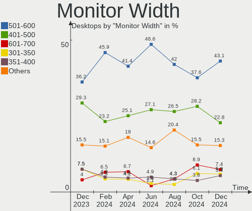

| Width in mm    | Desktops | Percent |
|----------------|----------|---------|
| 501-600        | 100      | 42.92%  |
| 401-500        | 57       | 24.46%  |
| 301-350        | 18       | 7.73%   |
| 701-800        | 16       | 6.87%   |
| 351-400        | 13       | 5.58%   |
| 601-700        | 10       | 4.29%   |
| Unknown        | 7        | 3%      |
| 1001-1500      | 4        | 1.72%   |
| 901-1000       | 4        | 1.72%   |
| 1501-2000      | 2        | 0.86%   |
| More than 2000 | 1        | 0.43%   |
| 801-900        | 1        | 0.43%   |

Aspect Ratio
------------

Proportional relationship between the width and the height

| Ratio   | Desktops | Percent |
|---------|----------|---------|
| 16/9    | 164      | 72.25%  |
| 5/4     | 28       | 12.33%  |
| 16/10   | 12       | 5.29%   |
| 21/9    | 11       | 4.85%   |
| Unknown | 5        | 2.2%    |
| 6/5     | 2        | 0.88%   |
| 4/3     | 2        | 0.88%   |
| 32/9    | 1        | 0.44%   |
| 3/2     | 1        | 0.44%   |
| 1.00    | 1        | 0.44%   |

Monitor Area
------------

Area in inch²

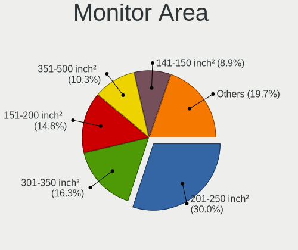

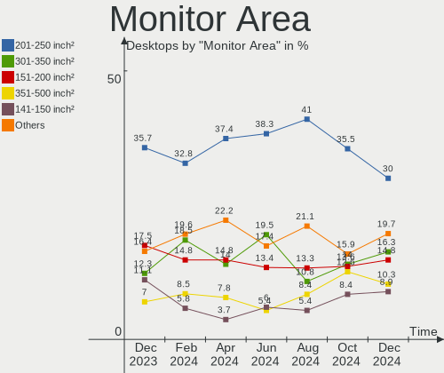

| Area in inch² | Desktops | Percent |
|----------------|----------|---------|
| 201-250        | 102      | 43.78%  |
| 151-200        | 31       | 13.3%   |
| 301-350        | 27       | 11.59%  |
| 141-150        | 22       | 9.44%   |
| 351-500        | 20       | 8.58%   |
| 251-300        | 8        | 3.43%   |
| 501-1000       | 8        | 3.43%   |
| Unknown        | 7        | 3%      |
| More than 1000 | 6        | 2.58%   |
| 131-140        | 1        | 0.43%   |
| 101-110        | 1        | 0.43%   |

Pixel Density
-------------

Pixels per inch

| Density | Desktops | Percent |
|---------|----------|---------|
| 51-100  | 155      | 68.28%  |
| 101-120 | 51       | 22.47%  |
| 121-160 | 7        | 3.08%   |
| Unknown | 7        | 3.08%   |
| 1-50    | 6        | 2.64%   |
| 161-240 | 1        | 0.44%   |

Multiple Monitors
-----------------

Total monitors connected

| Total | Desktops | Percent |
|-------|----------|---------|
| 1     | 198      | 75.86%  |
| 0     | 40       | 15.33%  |
| 2     | 21       | 8.05%   |
| 3     | 2        | 0.77%   |

Network
-------

Net Controller Vendor
---------------------

Controller vendors

| Vendor                    | Desktops | Percent |
|---------------------------|----------|---------|
| Realtek Semiconductor     | 202      | 61.03%  |
| Intel                     | 53       | 16.01%  |
| Qualcomm Atheros          | 27       | 8.16%   |
| TP-Link                   | 7        | 2.11%   |
| Ralink Technology         | 6        | 1.81%   |
| Nvidia                    | 5        | 1.51%   |
| Marvell Technology Group  | 4        | 1.21%   |
| MediaTek                  | 3        | 0.91%   |
| VIA Technologies          | 2        | 0.6%    |
| Samsung Electronics       | 2        | 0.6%    |
| OPPO Electronics          | 2        | 0.6%    |
| Huawei Technologies       | 2        | 0.6%    |
| D-Link                    | 2        | 0.6%    |
| ASIX Electronics          | 2        | 0.6%    |
| Xiaomi                    | 1        | 0.3%    |
| Ralink                    | 1        | 0.3%    |
| QinHeng Electronics       | 1        | 0.3%    |
| Micro Star International  | 1        | 0.3%    |
| Gemtek                    | 1        | 0.3%    |
| dog hunter                | 1        | 0.3%    |
| D-Link System             | 1        | 0.3%    |
| Broadcom Limited          | 1        | 0.3%    |
| Broadcom                  | 1        | 0.3%    |
| ASUSTek Computer          | 1        | 0.3%    |
| Aquantia                  | 1        | 0.3%    |
| AirTies Wireless Networks | 1        | 0.3%    |

Net Controller Model
--------------------

Controller models

| Model                                                             | Desktops | Percent |
|-------------------------------------------------------------------|----------|---------|
| Realtek RTL8111/8168/8411 PCI Express Gigabit Ethernet Controller | 162      | 44.75%  |
| Realtek RTL810xE PCI Express Fast Ethernet controller             | 14       | 3.87%   |
| Realtek RTL8125 2.5GbE Controller                                 | 12       | 3.31%   |
| Intel Wi-Fi 6 AX200                                               | 8        | 2.21%   |
| Intel Ethernet Connection (2) I219-V                              | 8        | 2.21%   |
| Qualcomm Atheros AR8121/AR8113/AR8114 Gigabit or Fast Ethernet    | 6        | 1.66%   |
| Realtek RTL8821CE 802.11ac PCIe Wireless Network Adapter          | 5        | 1.38%   |
| Ralink MT7601U Wireless Adapter                                   | 5        | 1.38%   |
| Intel I211 Gigabit Network Connection                             | 5        | 1.38%   |
| Intel Ethernet Controller I225-V                                  | 5        | 1.38%   |
| Intel Ethernet Connection (14) I219-V                             | 5        | 1.38%   |
| Realtek RTL-8100/8101L/8139 PCI Fast Ethernet Adapter             | 4        | 1.1%    |
| Qualcomm Atheros Attansic L1 Gigabit Ethernet                     | 4        | 1.1%    |
| Nvidia MCP61 Ethernet                                             | 4        | 1.1%    |
| Intel Dual Band Wireless-AC 3168NGW [Stone Peak]                  | 4        | 1.1%    |
| Realtek RTL8192CU 802.11n WLAN Adapter                            | 3        | 0.83%   |
| Realtek 802.11ac NIC                                              | 3        | 0.83%   |
| Qualcomm Atheros AR8161 Gigabit Ethernet                          | 3        | 0.83%   |
| Qualcomm Atheros AR8151 v2.0 Gigabit Ethernet                     | 3        | 0.83%   |
| Marvell Group 88E8056 PCI-E Gigabit Ethernet Controller           | 3        | 0.83%   |
| Intel Wi-Fi 6 AX210/AX211/AX411 160MHz                            | 3        | 0.83%   |
| Intel Ethernet Connection (7) I219-V                              | 3        | 0.83%   |
| Intel Alder Lake-S PCH CNVi WiFi                                  | 3        | 0.83%   |
| VIA VT6105/VT6106S [Rhine-III]                                    | 2        | 0.55%   |
| TP-Link TL-WN722N v2/v3 [Realtek RTL8188EUS]                      | 2        | 0.55%   |
| Samsung Galaxy series, misc. (tethering mode)                     | 2        | 0.55%   |
| Realtek RTL8812AE 802.11ac PCIe Wireless Network Adapter          | 2        | 0.55%   |
| Realtek RTL8811AU 802.11a/b/g/n/ac WLAN Adapter                   | 2        | 0.55%   |
| Realtek RTL8192EE PCIe Wireless Network Adapter                   | 2        | 0.55%   |
| Realtek RTL8188EUS 802.11n Wireless Network Adapter               | 2        | 0.55%   |
| Realtek RTL8188CE 802.11b/g/n WiFi Adapter                        | 2        | 0.55%   |
| Realtek RTL8169 PCI Gigabit Ethernet Controller                   | 2        | 0.55%   |
| Realtek RTL-8110SC/8169SC Gigabit Ethernet                        | 2        | 0.55%   |
| Qualcomm Atheros QCA8171 Gigabit Ethernet                         | 2        | 0.55%   |
| Qualcomm Atheros AR9287 Wireless Network Adapter (PCI-Express)    | 2        | 0.55%   |
| Qualcomm Atheros AR8131 Gigabit Ethernet                          | 2        | 0.55%   |
| OPPO SDM665-IDP _SN:18689828                                      | 2        | 0.55%   |
| Intel Wireless 7265                                               | 2        | 0.55%   |
| Intel Ethernet Connection (2) I218-V                              | 2        | 0.55%   |
| Intel 82579V Gigabit Network Connection                           | 2        | 0.55%   |

Wireless Vendor
---------------

Wireless vendors

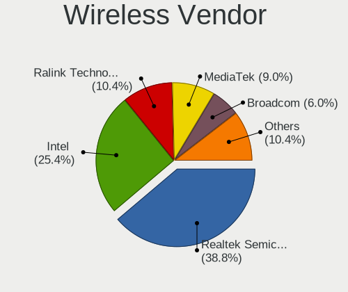

| Vendor                    | Desktops | Percent |
|---------------------------|----------|---------|
| Realtek Semiconductor     | 27       | 33.33%  |
| Intel                     | 23       | 28.4%   |
| TP-Link                   | 7        | 8.64%   |
| Ralink Technology         | 6        | 7.41%   |
| Qualcomm Atheros          | 6        | 7.41%   |
| MediaTek                  | 2        | 2.47%   |
| D-Link                    | 2        | 2.47%   |
| Ralink                    | 1        | 1.23%   |
| Micro Star International  | 1        | 1.23%   |
| Gemtek                    | 1        | 1.23%   |
| D-Link System             | 1        | 1.23%   |
| Broadcom Limited          | 1        | 1.23%   |
| Broadcom                  | 1        | 1.23%   |
| ASUSTek Computer          | 1        | 1.23%   |
| AirTies Wireless Networks | 1        | 1.23%   |

Wireless Model
--------------

Wireless models

| Model                                                          | Desktops | Percent |
|----------------------------------------------------------------|----------|---------|
| Intel Wi-Fi 6 AX200                                            | 8        | 9.88%   |
| Realtek RTL8821CE 802.11ac PCIe Wireless Network Adapter       | 5        | 6.17%   |
| Ralink MT7601U Wireless Adapter                                | 5        | 6.17%   |
| Intel Dual Band Wireless-AC 3168NGW [Stone Peak]               | 4        | 4.94%   |
| Realtek RTL8192CU 802.11n WLAN Adapter                         | 3        | 3.7%    |
| Realtek 802.11ac NIC                                           | 3        | 3.7%    |
| Intel Wi-Fi 6 AX210/AX211/AX411 160MHz                         | 3        | 3.7%    |
| Intel Alder Lake-S PCH CNVi WiFi                               | 3        | 3.7%    |
| TP-Link TL-WN722N v2/v3 [Realtek RTL8188EUS]                   | 2        | 2.47%   |
| Realtek RTL8812AE 802.11ac PCIe Wireless Network Adapter       | 2        | 2.47%   |
| Realtek RTL8811AU 802.11a/b/g/n/ac WLAN Adapter                | 2        | 2.47%   |
| Realtek RTL8192EE PCIe Wireless Network Adapter                | 2        | 2.47%   |
| Realtek RTL8188EUS 802.11n Wireless Network Adapter            | 2        | 2.47%   |
| Realtek RTL8188CE 802.11b/g/n WiFi Adapter                     | 2        | 2.47%   |
| Qualcomm Atheros AR9287 Wireless Network Adapter (PCI-Express) | 2        | 2.47%   |
| Intel Wireless 7265                                            | 2        | 2.47%   |
| TP-Link Archer T9UH v1 [Realtek RTL8814AU]                     | 1        | 1.23%   |
| TP-Link Archer T4U ver.3                                       | 1        | 1.23%   |
| TP-Link Archer T2U PLUS [RTL8821AU]                            | 1        | 1.23%   |
| TP-Link 802.11n NIC                                            | 1        | 1.23%   |
| TP-Link 802.11ac NIC                                           | 1        | 1.23%   |
| Realtek RTL8822CE 802.11ac PCIe Wireless Network Adapter       | 1        | 1.23%   |
| Realtek RTL8812AU 802.11a/b/g/n/ac 2T2R DB WLAN Adapter        | 1        | 1.23%   |
| Realtek RTL8192EU 802.11b/g/n WLAN Adapter                     | 1        | 1.23%   |
| Realtek RTL8188EE Wireless Network Adapter                     | 1        | 1.23%   |
| Realtek RTL8187 Wireless Adapter                               | 1        | 1.23%   |
| Realtek 802.11n                                                | 1        | 1.23%   |
| Ralink MT7610U ("Archer T2U" 2.4G+5G WLAN Adapter              | 1        | 1.23%   |
| Ralink RT5392 PCIe Wireless Network Adapter                    | 1        | 1.23%   |
| Qualcomm Atheros QCA6174 802.11ac Wireless Network Adapter     | 1        | 1.23%   |
| Qualcomm Atheros AR9285 Wireless Network Adapter (PCI-Express) | 1        | 1.23%   |
| Qualcomm Atheros AR9227 Wireless Network Adapter               | 1        | 1.23%   |
| Qualcomm Atheros AR5212/5213/2414 Wireless Network Adapter     | 1        | 1.23%   |
| Micro Star International RT2573                                | 1        | 1.23%   |
| MediaTek MT7921K (RZ608) Wi-Fi 6E 80MHz                        | 1        | 1.23%   |
| MediaTek MT7921 802.11ax PCI Express Wireless Network Adapter  | 1        | 1.23%   |
| Intel Wireless-AC 9260                                         | 1        | 1.23%   |
| Intel Centrino Wireless-N 2230                                 | 1        | 1.23%   |
| Intel Cannon Lake PCH CNVi WiFi                                | 1        | 1.23%   |
| Gemtek WUBR-177G [Ralink RT2571W]                              | 1        | 1.23%   |

Ethernet Vendor
---------------

Ethernet vendors

| Vendor                   | Desktops | Percent |
|--------------------------|----------|---------|
| Realtek Semiconductor    | 196      | 70.5%   |
| Intel                    | 39       | 14.03%  |
| Qualcomm Atheros         | 21       | 7.55%   |
| Nvidia                   | 5        | 1.8%    |
| Marvell Technology Group | 4        | 1.44%   |
| VIA Technologies         | 2        | 0.72%   |
| Samsung Electronics      | 2        | 0.72%   |
| OPPO Electronics         | 2        | 0.72%   |
| Huawei Technologies      | 2        | 0.72%   |
| ASIX Electronics         | 2        | 0.72%   |
| Xiaomi                   | 1        | 0.36%   |
| MediaTek                 | 1        | 0.36%   |
| Aquantia                 | 1        | 0.36%   |

Ethernet Model
--------------

Ethernet models

| Model                                                             | Desktops | Percent |
|-------------------------------------------------------------------|----------|---------|
| Realtek RTL8111/8168/8411 PCI Express Gigabit Ethernet Controller | 162      | 58.06%  |
| Realtek RTL810xE PCI Express Fast Ethernet controller             | 14       | 5.02%   |
| Realtek RTL8125 2.5GbE Controller                                 | 12       | 4.3%    |
| Intel Ethernet Connection (2) I219-V                              | 8        | 2.87%   |
| Qualcomm Atheros AR8121/AR8113/AR8114 Gigabit or Fast Ethernet    | 6        | 2.15%   |
| Intel I211 Gigabit Network Connection                             | 5        | 1.79%   |
| Intel Ethernet Controller I225-V                                  | 5        | 1.79%   |
| Intel Ethernet Connection (14) I219-V                             | 5        | 1.79%   |
| Realtek RTL-8100/8101L/8139 PCI Fast Ethernet Adapter             | 4        | 1.43%   |
| Qualcomm Atheros Attansic L1 Gigabit Ethernet                     | 4        | 1.43%   |
| Nvidia MCP61 Ethernet                                             | 4        | 1.43%   |
| Qualcomm Atheros AR8161 Gigabit Ethernet                          | 3        | 1.08%   |
| Qualcomm Atheros AR8151 v2.0 Gigabit Ethernet                     | 3        | 1.08%   |
| Marvell Group 88E8056 PCI-E Gigabit Ethernet Controller           | 3        | 1.08%   |
| Intel Ethernet Connection (7) I219-V                              | 3        | 1.08%   |
| VIA VT6105/VT6106S [Rhine-III]                                    | 2        | 0.72%   |
| Samsung Galaxy series, misc. (tethering mode)                     | 2        | 0.72%   |
| Realtek RTL8169 PCI Gigabit Ethernet Controller                   | 2        | 0.72%   |
| Realtek RTL-8110SC/8169SC Gigabit Ethernet                        | 2        | 0.72%   |
| Qualcomm Atheros QCA8171 Gigabit Ethernet                         | 2        | 0.72%   |
| Qualcomm Atheros AR8131 Gigabit Ethernet                          | 2        | 0.72%   |
| OPPO SDM665-IDP _SN:18689828                                      | 2        | 0.72%   |
| Intel Ethernet Connection (2) I218-V                              | 2        | 0.72%   |
| Intel 82579V Gigabit Network Connection                           | 2        | 0.72%   |
| Intel 82579LM Gigabit Network Connection (Lewisville)             | 2        | 0.72%   |
| ASIX AX88179 Gigabit Ethernet                                     | 2        | 0.72%   |
| Xiaomi Mi/Redmi series (RNDIS)                                    | 1        | 0.36%   |
| Qualcomm Atheros Killer E2400 Gigabit Ethernet Controller         | 1        | 0.36%   |
| Nvidia CK804 Ethernet Controller                                  | 1        | 0.36%   |
| MediaTek N152DL                                                   | 1        | 0.36%   |
| Marvell Group 88E8057 PCI-E Gigabit Ethernet Controller           | 1        | 0.36%   |
| Intel NM10/ICH7 Family LAN Controller                             | 1        | 0.36%   |
| Intel Ethernet Connection I217-LM                                 | 1        | 0.36%   |
| Intel Ethernet Connection (11) I219-LM                            | 1        | 0.36%   |
| Intel Ethernet Connection (10) I219-V                             | 1        | 0.36%   |
| Intel 82574L Gigabit Network Connection                           | 1        | 0.36%   |
| Intel 82567LF-2 Gigabit Network Connection                        | 1        | 0.36%   |
| Intel 82562V-2 10/100 Network Connection                          | 1        | 0.36%   |
| Intel 80003ES2LAN Gigabit Ethernet Controller (Copper)            | 1        | 0.36%   |
| Huawei SNE-LX1                                                    | 1        | 0.36%   |

Net Controller Kind
-------------------

Ethernet, WiFi or modem

| Kind     | Desktops | Percent |
|----------|----------|---------|
| Ethernet | 259      | 76.4%   |
| WiFi     | 78       | 23.01%  |
| Modem    | 2        | 0.59%   |

Used Controller
---------------

Currently used network controller

| Kind     | Desktops | Percent |
|----------|----------|---------|
| Ethernet | 215      | 82.69%  |
| WiFi     | 45       | 17.31%  |

NICs
----

Total network controllers on board

| Total | Desktops | Percent |
|-------|----------|---------|
| 1     | 202      | 77.39%  |
| 2     | 53       | 20.31%  |
| 3     | 5        | 1.92%   |
| 0     | 1        | 0.38%   |

IPv6
----

IPv6 vs IPv4

| Used | Desktops | Percent |
|------|----------|---------|
| No   | 249      | 95.4%   |
| Yes  | 12       | 4.6%    |

Bluetooth
---------

Bluetooth Vendor
----------------

Controller vendors

| Vendor                          | Desktops | Percent |
|---------------------------------|----------|---------|
| Intel                           | 22       | 37.93%  |
| Cambridge Silicon Radio         | 16       | 27.59%  |
| Realtek Semiconductor           | 9        | 15.52%  |
| Broadcom                        | 3        | 5.17%   |
| ASUSTek Computer                | 3        | 5.17%   |
| IMC Networks                    | 2        | 3.45%   |
| TP-Link                         | 1        | 1.72%   |
| Qualcomm Atheros Communications | 1        | 1.72%   |
| MediaTek                        | 1        | 1.72%   |

Bluetooth Model
---------------

Controller models

| Model                                               | Desktops | Percent |
|-----------------------------------------------------|----------|---------|
| Cambridge Silicon Radio Bluetooth Dongle (HCI mode) | 16       | 27.59%  |
| Realtek Bluetooth Radio                             | 8        | 13.79%  |
| Intel AX200 Bluetooth                               | 8        | 13.79%  |
| Intel Wireless-AC 3168 Bluetooth                    | 4        | 6.9%    |
| Intel Bluetooth wireless interface                  | 2        | 3.45%   |
| Intel AX210 Bluetooth                               | 2        | 3.45%   |
| Intel AX201 Bluetooth                               | 2        | 3.45%   |
| TP-Link UB500 Adapter                               | 1        | 1.72%   |
| Realtek  Bluetooth 4.2 Adapter                      | 1        | 1.72%   |
| Qualcomm Atheros AR3011 Bluetooth                   | 1        | 1.72%   |
| MediaTek Wireless_Device                            | 1        | 1.72%   |
| Intel Wireless-AC 9260 Bluetooth Adapter            | 1        | 1.72%   |
| Intel Centrino Bluetooth Wireless Transceiver       | 1        | 1.72%   |
| Intel Bluetooth Device                              | 1        | 1.72%   |
| Intel Bluetooth 9460/9560 Jefferson Peak (JfP)      | 1        | 1.72%   |
| IMC Networks Wireless_Device                        | 1        | 1.72%   |
| IMC Networks Bluetooth Radio                        | 1        | 1.72%   |
| Broadcom HP Portable Bumble Bee                     | 1        | 1.72%   |
| Broadcom BCM20702A0                                 | 1        | 1.72%   |
| Broadcom BCM2045 Bluetooth                          | 1        | 1.72%   |
| ASUS Qualcomm Bluetooth 4.1                         | 1        | 1.72%   |
| ASUS Broadcom BCM20702A0 Bluetooth                  | 1        | 1.72%   |
| ASUS ASUS USB-BT500                                 | 1        | 1.72%   |

Sound
-----

Sound Vendor
------------

Sound card vendors

| Vendor                      | Desktops | Percent |
|-----------------------------|----------|---------|
| Intel                       | 178      | 40.45%  |
| Nvidia                      | 130      | 29.55%  |
| AMD                         | 95       | 21.59%  |
| C-Media Electronics         | 8        | 1.82%   |
| Creative Labs               | 5        | 1.14%   |
| Kingston Technology         | 3        | 0.68%   |
| Creative Technology         | 3        | 0.68%   |
| JMTek                       | 2        | 0.45%   |
| Generalplus Technology      | 2        | 0.45%   |
| VIA Technologies            | 1        | 0.23%   |
| Texas Instruments           | 1        | 0.23%   |
| SlrTek                      | 1        | 0.23%   |
| Razer USA                   | 1        | 0.23%   |
| Pixart Imaging              | 1        | 0.23%   |
| Micro Star International    | 1        | 0.23%   |
| Logitech                    | 1        | 0.23%   |
| GN Netcom                   | 1        | 0.23%   |
| Giga-Byte Technology        | 1        | 0.23%   |
| FiiO Electronics Technology | 1        | 0.23%   |
| ESS Technology              | 1        | 0.23%   |
| AXELVOX                     | 1        | 0.23%   |
| ASUSTek Computer            | 1        | 0.23%   |
| Unknown                     | 1        | 0.23%   |

Sound Model
-----------

Sound card models

| Model                                                                      | Desktops | Percent |
|----------------------------------------------------------------------------|----------|---------|
| Intel 6 Series/C200 Series Chipset Family High Definition Audio Controller | 30       | 6.16%   |
| AMD SBx00 Azalia (Intel HDA)                                               | 24       | 4.93%   |
| Nvidia GF108 High Definition Audio Controller                              | 19       | 3.9%    |
| AMD Starship/Matisse HD Audio Controller                                   | 19       | 3.9%    |
| Intel 8 Series/C220 Series Chipset High Definition Audio Controller        | 17       | 3.49%   |
| Intel 100 Series/C230 Series Chipset Family HD Audio Controller            | 17       | 3.49%   |
| Nvidia GP107GL High Definition Audio Controller                            | 14       | 2.87%   |
| Intel NM10/ICH7 Family High Definition Audio Controller                    | 14       | 2.87%   |
| Intel 200 Series PCH HD Audio                                              | 13       | 2.67%   |
| Intel 7 Series/C216 Chipset Family High Definition Audio Controller        | 12       | 2.46%   |
| AMD Family 17h/19h HD Audio Controller                                     | 12       | 2.46%   |
| AMD Family 17h (Models 00h-0fh) HD Audio Controller                        | 12       | 2.46%   |
| Intel Audio device                                                         | 11       | 2.26%   |
| Nvidia GP106 High Definition Audio Controller                              | 10       | 2.05%   |
| AMD Ellesmere HDMI Audio [Radeon RX 470/480 / 570/580/590]                 | 10       | 2.05%   |
| Nvidia TU106 High Definition Audio Controller                              | 9        | 1.85%   |
| Intel 82801JI (ICH10 Family) HD Audio Controller                           | 9        | 1.85%   |
| AMD Navi 21/23 HDMI/DP Audio Controller                                    | 9        | 1.85%   |
| Nvidia TU116 High Definition Audio Controller                              | 8        | 1.64%   |
| Nvidia GK208 HDMI/DP Audio Controller                                      | 8        | 1.64%   |
| Intel Xeon E3-1200 v3/4th Gen Core Processor HD Audio Controller           | 8        | 1.64%   |
| Intel 82801I (ICH9 Family) HD Audio Controller                             | 8        | 1.64%   |
| Nvidia GA106 High Definition Audio Controller                              | 7        | 1.44%   |
| Intel Cannon Lake PCH cAVS                                                 | 7        | 1.44%   |
| AMD Renoir Radeon High Definition Audio Controller                         | 7        | 1.44%   |
| AMD Navi 10 HDMI Audio                                                     | 7        | 1.44%   |
| Nvidia High Definition Audio Controller                                    | 6        | 1.23%   |
| Intel Alder Lake-S HD Audio Controller                                     | 6        | 1.23%   |
| Intel 5 Series/3400 Series Chipset High Definition Audio                   | 6        | 1.23%   |
| Nvidia MCP61 High Definition Audio                                         | 5        | 1.03%   |
| Nvidia GK107 HDMI Audio Controller                                         | 5        | 1.03%   |
| AMD Oland/Hainan/Cape Verde/Pitcairn HDMI Audio [Radeon HD 7000 Series]    | 5        | 1.03%   |
| AMD FCH Azalia Controller                                                  | 5        | 1.03%   |
| Nvidia TU107 GeForce GTX 1650 High Definition Audio Controller             | 4        | 0.82%   |
| Nvidia GP104 High Definition Audio Controller                              | 4        | 0.82%   |
| Nvidia GF116 High Definition Audio Controller                              | 4        | 0.82%   |
| Intel Tiger Lake-H HD Audio Controller                                     | 4        | 0.82%   |
| Intel 9 Series Chipset Family HD Audio Controller                          | 4        | 0.82%   |
| AMD Raven/Raven2/Fenghuang HDMI/DP Audio Controller                        | 4        | 0.82%   |
| Nvidia GT216 HDMI Audio Controller                                         | 3        | 0.62%   |

Memory
------

Memory Vendor
-------------

Memory module vendors

| Vendor                                  | Desktops | Percent |
|-----------------------------------------|----------|---------|
| Unknown                                 | 62       | 24.03%  |
| Kingston                                | 52       | 20.16%  |
| Patriot                                 | 24       | 9.3%    |
| Samsung Electronics                     | 19       | 7.36%   |
| SK hynix                                | 12       | 4.65%   |
| Crucial                                 | 12       | 4.65%   |
| Corsair                                 | 11       | 4.26%   |
| AMD                                     | 11       | 4.26%   |
| G.Skill                                 | 6        | 2.33%   |
| Unknown                                 | 5        | 1.94%   |
| Micron Technology                       | 3        | 1.16%   |
| Hikvision                               | 3        | 1.16%   |
| GOODRAM                                 | 3        | 1.16%   |
| A-DATA Technology                       | 3        | 1.16%   |
| Unknown (ABCD)                          | 2        | 0.78%   |
| Qumo                                    | 2        | 0.78%   |
| Kllisre                                 | 2        | 0.78%   |
| Kingmax                                 | 2        | 0.78%   |
| Juhor                                   | 2        | 0.78%   |
| Goldkey                                 | 2        | 0.78%   |
| Elpida                                  | 2        | 0.78%   |
| Apacer                                  | 2        | 0.78%   |
| Unknown (0x0080)                        | 1        | 0.39%   |
| Transcend                               | 1        | 0.39%   |
| Team                                    | 1        | 0.39%   |
| TakeMS                                  | 1        | 0.39%   |
| Silicon Power Computer & Communications | 1        | 0.39%   |
| Shenzhen Micro Innovation Industry      | 1        | 0.39%   |
| Ramos Technology                        | 1        | 0.39%   |
| Ramaxel Technology                      | 1        | 0.39%   |
| Patriot Memory (PDP Systems)            | 1        | 0.39%   |
| Neo Forza                               | 1        | 0.39%   |
| Nanya Technology                        | 1        | 0.39%   |
| MLLSE                                   | 1        | 0.39%   |
| Golden Empire                           | 1        | 0.39%   |
| GeIL                                    | 1        | 0.39%   |
| Foxline                                 | 1        | 0.39%   |
| ASint Technology                        | 1        | 0.39%   |

Memory Model
------------

Memory module models

| Model                                                        | Desktops | Percent |
|--------------------------------------------------------------|----------|---------|
| Patriot RAM PSD32G13332 2GB DIMM DDR3 1333MT/s               | 8        | 2.78%   |
| Unknown RAM Module 4GB DIMM 1333MT/s                         | 5        | 1.74%   |
| Unknown RAM Module 2GB DIMM 800MT/s                          | 5        | 1.74%   |
| Unknown                                                      | 5        | 1.74%   |
| Unknown RAM Module 2GB DIMM SDRAM                            | 4        | 1.39%   |
| Unknown RAM Module 2GB DIMM DDR 1333MT/s                     | 4        | 1.39%   |
| Unknown RAM Module 1GB DIMM DDR2 800MT/s                     | 4        | 1.39%   |
| Patriot RAM PSD32G133381 2GB DIMM DDR3 1333MT/s              | 4        | 1.39%   |
| Kingston RAM KHX2666C16/8G 8GB DIMM DDR4 3466MT/s            | 4        | 1.39%   |
| Unknown RAM Module 4GB DIMM SDRAM                            | 3        | 1.04%   |
| Unknown RAM Module 2GB DIMM DDR2 800MT/s                     | 3        | 1.04%   |
| Unknown RAM Module 2GB DIMM 1333MT/s                         | 3        | 1.04%   |
| Unknown RAM Module 1GB DIMM 800MT/s                          | 3        | 1.04%   |
| Patriot RAM 3200 C16 Series 16GB DIMM DDR4 3200MT/s          | 3        | 1.04%   |
| Kingston RAM KHX3200C16D4/8GX 8192MB DIMM DDR4 3600MT/s      | 3        | 1.04%   |
| Kingston RAM KF3200C16D4/8GX 8GB DIMM DDR4 3600MT/s          | 3        | 1.04%   |
| Kingston RAM 9905474-012.A00LF 2GB DIMM DDR3 1333MT/s        | 3        | 1.04%   |
| Unknown RAM Module 8GB DIMM 1600MT/s                         | 2        | 0.69%   |
| Unknown RAM Module 2048MB DIMM DDR2 800MT/s                  | 2        | 0.69%   |
| Unknown RAM Module 2048MB DIMM 1333MT/s                      | 2        | 0.69%   |
| Unknown RAM Module 1024MB DIMM DDR2 800MT/s                  | 2        | 0.69%   |
| Unknown (ABCD) RAM 123456789012345678 4GB DIMM DDR4 2400MT/s | 2        | 0.69%   |
| Samsung RAM M378A5244CB0-CRC 4GB DIMM DDR4 3066MT/s          | 2        | 0.69%   |
| Qumo RAM QUM3U-8G1600C11000 8GB DIMM 1066MT/s                | 2        | 0.69%   |
| Kingston RAM Module 2GB DIMM DDR2 800MT/s                    | 2        | 0.69%   |
| Kingston RAM KHX2400C15/8G 8GB DIMM DDR4 3400MT/s            | 2        | 0.69%   |
| Kingston RAM 99U5474-010.A00LF 2GB DIMM DDR3 1333MT/s        | 2        | 0.69%   |
| Kingston RAM 9905474-052.A00LF 2GB DIMM DDR3 1333MT/s        | 2        | 0.69%   |
| Kingston RAM 9905471-011.A00LF 4096MB DIMM DDR3 1600MT/s     | 2        | 0.69%   |
| Kingston RAM 9905402-193.A00LF 2GB DIMM DDR3 1333MT/s        | 2        | 0.69%   |
| Crucial RAM CT8G4DFS824A.C8FDD1 8GB DIMM DDR4 3200MT/s       | 2        | 0.69%   |
| Corsair RAM CMK16GX4M2B3000C15 8GB DIMM DDR4 3200MT/s        | 2        | 0.69%   |
| AMD RAM R748G2606U2S 8GB DIMM DDR4 3200MT/s                  | 2        | 0.69%   |
| Unknown RAM Module 8GB DIMM DDR4 2667MT/s                    | 1        | 0.35%   |
| Unknown RAM Module 8GB DIMM DDR4 2133MT/s                    | 1        | 0.35%   |
| Unknown RAM Module 8GB DIMM DDR3 1866MT/s                    | 1        | 0.35%   |
| Unknown RAM Module 8GB DIMM DDR3 1333MT/s                    | 1        | 0.35%   |
| Unknown RAM Module 8GB DIMM DDR 1333MT/s                     | 1        | 0.35%   |
| Unknown RAM Module 8GB DIMM 1333MT/s                         | 1        | 0.35%   |
| Unknown RAM Module 4GB DIMM DDR3 1600MT/s                    | 1        | 0.35%   |

Memory Kind
-----------

Memory module kinds

| Kind    | Desktops | Percent |
|---------|----------|---------|
| DDR4    | 99       | 42.13%  |
| DDR3    | 68       | 28.94%  |
| Unknown | 28       | 11.91%  |
| DDR2    | 18       | 7.66%   |
| SDRAM   | 10       | 4.26%   |
| DDR     | 7        | 2.98%   |
| LPDDR4  | 3        | 1.28%   |
| DDR5    | 2        | 0.85%   |

Memory Form Factor
------------------

Physical design of the memory module

| Name         | Desktops | Percent |
|--------------|----------|---------|
| DIMM         | 225      | 96.15%  |
| SODIMM       | 7        | 2.99%   |
| Row Of Chips | 1        | 0.43%   |
| FB-DIMM      | 1        | 0.43%   |

Memory Size
-----------

Memory module size

| Size  | Desktops | Percent |
|-------|----------|---------|
| 8192  | 84       | 32.94%  |
| 4096  | 64       | 25.1%   |
| 2048  | 47       | 18.43%  |
| 16384 | 33       | 12.94%  |
| 1024  | 17       | 6.67%   |
| 32768 | 7        | 2.75%   |
| 512   | 2        | 0.78%   |
| 256   | 1        | 0.39%   |

Memory Speed
------------

Memory module speed

| Speed   | Desktops | Percent |
|---------|----------|---------|
| 1333    | 49       | 19.29%  |
| 1600    | 31       | 12.2%   |
| 800     | 23       | 9.06%   |
| 3200    | 20       | 7.87%   |
| 2667    | 19       | 7.48%   |
| 2400    | 16       | 6.3%    |
| 3600    | 10       | 3.94%   |
| 2133    | 10       | 3.94%   |
| 3466    | 9        | 3.54%   |
| Unknown | 9        | 3.54%   |
| 2933    | 6        | 2.36%   |
| 1866    | 6        | 2.36%   |
| 667     | 6        | 2.36%   |
| 1066    | 5        | 1.97%   |
| 2666    | 4        | 1.57%   |
| 3400    | 3        | 1.18%   |
| 3333    | 2        | 0.79%   |
| 3066    | 2        | 0.79%   |
| 1867    | 2        | 0.79%   |
| 1800    | 2        | 0.79%   |
| 1067    | 2        | 0.79%   |
| 6400    | 1        | 0.39%   |
| 5200    | 1        | 0.39%   |
| 4267    | 1        | 0.39%   |
| 4266    | 1        | 0.39%   |
| 3866    | 1        | 0.39%   |
| 3733    | 1        | 0.39%   |
| 3500    | 1        | 0.39%   |
| 3334    | 1        | 0.39%   |
| 3100    | 1        | 0.39%   |
| 3000    | 1        | 0.39%   |
| 2866    | 1        | 0.39%   |
| 2733    | 1        | 0.39%   |
| 2187    | 1        | 0.39%   |
| 2134    | 1        | 0.39%   |
| 2048    | 1        | 0.39%   |
| 1904    | 1        | 0.39%   |
| 1648    | 1        | 0.39%   |
| 400     | 1        | 0.39%   |

Printers & scanners
-------------------

Printer Vendor
--------------

Printer device vendors

| Vendor              | Desktops | Percent |
|---------------------|----------|---------|
| Pantum              | 4        | 36.36%  |
| Samsung Electronics | 2        | 18.18%  |
| Hewlett-Packard     | 2        | 18.18%  |
| Xerox               | 1        | 9.09%   |
| Seiko Epson         | 1        | 9.09%   |
| Canon               | 1        | 9.09%   |

Printer Model
-------------

Printer device models

| Model                                 | Desktops | Percent |
|---------------------------------------|----------|---------|
| Xerox Phaser 3140 and 3155            | 1        | 9.09%   |
| Seiko Epson USB2.0 Printer (Hi-speed) | 1        | 9.09%   |
| Samsung ML-216x Series Laser Printer  | 1        | 9.09%   |
| Samsung Laser Printer                 | 1        | 9.09%   |
| Pantum P2200 series                   | 1        | 9.09%   |
| Pantum M6500-series                   | 1        | 9.09%   |
| Pantum M6500 series                   | 1        | 9.09%   |
| Pantum BM5100ADN series               | 1        | 9.09%   |
| HP Laserjet P1505                     | 1        | 9.09%   |
| HP LaserJet P1005                     | 1        | 9.09%   |
| Canon LaserShot LBP-1120 Printer      | 1        | 9.09%   |

Scanner Vendor
--------------

Scanner device vendors

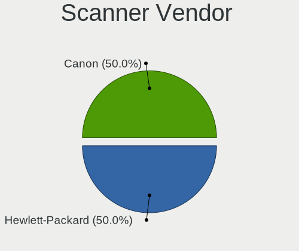

| Vendor                      | Desktops | Percent |
|-----------------------------|----------|---------|
| Canon                       | 2        | 50%     |
| Hewlett-Packard             | 1        | 25%     |
| Acer Peripherals (now BenQ) | 1        | 25%     |

Scanner Model
-------------

Scanner device models

| Model                                       | Desktops | Percent |
|---------------------------------------------|----------|---------|
| Canon CanoScan LiDE 110                     | 2        | 50%     |
| HP ScanJet Pro 2000 s2                      | 1        | 25%     |
| Acer Peripherals (now BenQ) S2W 3300U/4300U | 1        | 25%     |

Camera
------

Camera Vendor
-------------

Camera device vendors

| Vendor                        | Desktops | Percent |
|-------------------------------|----------|---------|
| Logitech                      | 16       | 35.56%  |
| Z-Star Microelectronics       | 5        | 11.11%  |
| Sunplus Innovation Technology | 3        | 6.67%   |
| Microsoft                     | 3        | 6.67%   |
| Microdia                      | 3        | 6.67%   |
| Realtek Semiconductor         | 2        | 4.44%   |
| Trust                         | 1        | 2.22%   |
| SJ-180517-N                   | 1        | 2.22%   |
| Samsung Electronics           | 1        | 2.22%   |
| Pixart Imaging                | 1        | 2.22%   |
| KYE Systems (Mouse Systems)   | 1        | 2.22%   |
| Hewlett-Packard               | 1        | 2.22%   |
| Genesys Logic                 | 1        | 2.22%   |
| Cubeternet                    | 1        | 2.22%   |
| Creative Technology           | 1        | 2.22%   |
| Chicony Electronics           | 1        | 2.22%   |
| Arkmicro Technologies         | 1        | 2.22%   |
| ANYKA                         | 1        | 2.22%   |
| Alcor Micro                   | 1        | 2.22%   |

Camera Model
------------

Camera device models

| Model                                       | Desktops | Percent |
|---------------------------------------------|----------|---------|
| Logitech Webcam C270                        | 9        | 20%     |
| Z-Star A4 TECH USB2.0 PC Camera J           | 3        | 6.67%   |
| Z-Star Venus USB2.0 Camera                  | 2        | 4.44%   |
| Logitech HD Webcam C615                     | 2        | 4.44%   |
| Trust Canyon CNS-CWC6 Webcam                | 1        | 2.22%   |
| Sunplus Full HD webcam                      | 1        | 2.22%   |
| Sunplus FHD Camera Microphone               | 1        | 2.22%   |
| Sunplus Canyon CNS-CWC5 Webcam              | 1        | 2.22%   |
| SJ-180517-N 1080P Webcam                    | 1        | 2.22%   |
| Samsung Galaxy series, misc. (MTP mode)     | 1        | 2.22%   |
| Realtek HD webcam                           | 1        | 2.22%   |
| Realtek HD 720P Webcam                      | 1        | 2.22%   |
| Pixart Imaging Multimedia audio controller  | 1        | 2.22%   |
| Microsoft LifeCam VX-700                    | 1        | 2.22%   |
| Microsoft LifeCam VX-5000                   | 1        | 2.22%   |
| Microsoft LifeCam HD-3000                   | 1        | 2.22%   |
| Microdia Integrated Camera                  | 1        | 2.22%   |
| Microdia Defender G-Lens 2577 HD720p Camera | 1        | 2.22%   |
| Microdia Camera                             | 1        | 2.22%   |
| Logitech Webcam C925e                       | 1        | 2.22%   |
| Logitech Webcam C310                        | 1        | 2.22%   |
| Logitech Webcam C210                        | 1        | 2.22%   |
| Logitech Webcam B500                        | 1        | 2.22%   |
| Logitech Quickcam 3000 For Business         | 1        | 2.22%   |
| KYE Systems (Mouse Systems) FaceCam 2020    | 1        | 2.22%   |
| HP Webcam HD 4310                           | 1        | 2.22%   |
| Genesys Logic Camera                        | 1        | 2.22%   |
| Cubeternet GL-UPC822 UVC WebCam             | 1        | 2.22%   |
| Creative VF0690 Live! Cam Socialize HD AF   | 1        | 2.22%   |
| Chicony HP High Definition 1MP Webcam       | 1        | 2.22%   |
| Arkmicro USB2.0 PC CAMERA                   | 1        | 2.22%   |
| ANYKA V380 FHD Camera                       | 1        | 2.22%   |
| Alcor Micro USB 2.0 PC Camera               | 1        | 2.22%   |

Security
--------

Fingerprint Vendor
------------------

Fingerprint sensor vendors

Zero info for selected period =(

Fingerprint Model
-----------------

Fingerprint sensor models

Zero info for selected period =(

Chipcard Vendor
---------------

Chipcard module vendors

| Vendor                | Desktops | Percent |
|-----------------------|----------|---------|
| Aktiv                 | 1        | 50%     |
| Advanced Card Systems | 1        | 50%     |

Chipcard Model
--------------

Chipcard module models

| Model                        | Desktops | Percent |
|------------------------------|----------|---------|
| Aktiv Rutoken lite           | 1        | 50%     |
| Advanced Card Systems ACR39U | 1        | 50%     |

Unsupported
-----------

Unsupported Devices
-------------------

Total unsupported devices on board

| Total | Desktops | Percent |
|-------|----------|---------|
| 0     | 210      | 80.46%  |
| 1     | 48       | 18.39%  |
| 2     | 2        | 0.77%   |
| 3     | 1        | 0.38%   |

Unsupported Device Types
------------------------

Types of unsupported devices

| Type                     | Desktops | Percent |
|--------------------------|----------|---------|
| Graphics card            | 41       | 77.36%  |
| Net/wireless             | 4        | 7.55%   |
| Net/ethernet             | 2        | 3.77%   |
| Multimedia controller    | 2        | 3.77%   |
| Unassigned class         | 1        | 1.89%   |
| Communication controller | 1        | 1.89%   |
| Chipcard                 | 1        | 1.89%   |
| Camera                   | 1        | 1.89%   |

