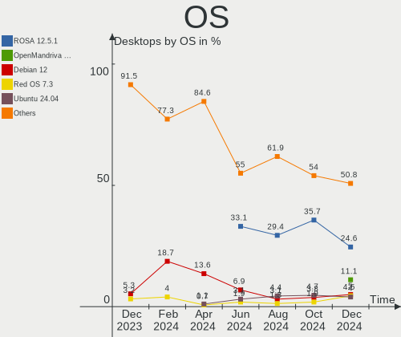
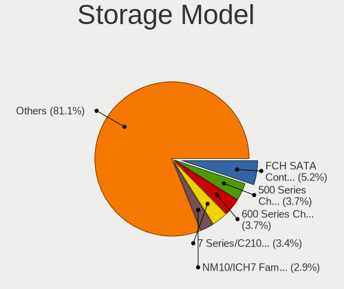
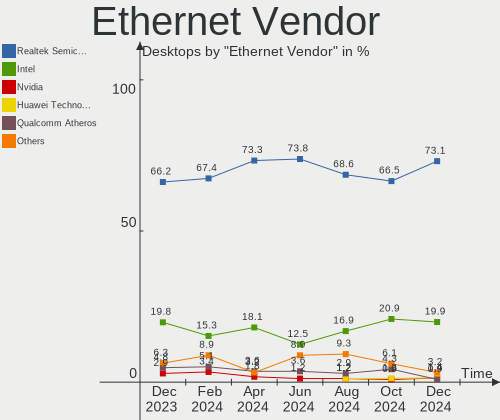
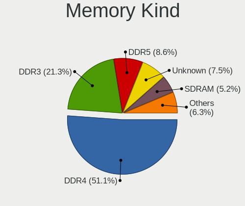
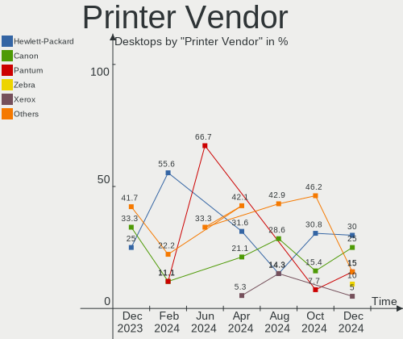
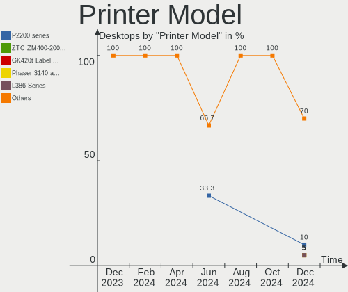

Linux in Russia - Hardware Trends (Desktops)
--------------------------------------------

A project to identify most popular hardware characteristics and track their change
over time based on data collected by Linux users at https://Linux-Hardware.org.

Anyone can contribute to this report by the [hw-probe](https://github.com/linuxhw/hw-probe) tool:

    sudo -E hw-probe -all -upload

Period: Jul, 2023.

Contents
--------

* [ System ](#system)
  - [ OS                       ](#os)
  - [ OS Family                ](#os-family)
  - [ Kernel                   ](#kernel)
  - [ Kernel Family            ](#kernel-family)
  - [ Kernel Major Ver.        ](#kernel-major-ver)
  - [ Arch                     ](#arch)
  - [ DE                       ](#de)
  - [ Display Server           ](#display-server)
  - [ Display Manager          ](#display-manager)
  - [ OS Lang                  ](#os-lang)
  - [ Boot Mode                ](#boot-mode)
  - [ Filesystem               ](#filesystem)
  - [ Part. scheme             ](#part-scheme)
  - [ Dual Boot with Linux/BSD ](#dual-boot-with-linuxbsd)
  - [ Dual Boot (Win)          ](#dual-boot-win)

* [ Board ](#board)
  - [ Vendor                   ](#vendor)
  - [ Model                    ](#model)
  - [ Model Family             ](#model-family)
  - [ MFG Year                 ](#mfg-year)
  - [ Form Factor              ](#form-factor)
  - [ Secure Boot              ](#secure-boot)
  - [ Coreboot                 ](#coreboot)
  - [ RAM Size                 ](#ram-size)
  - [ RAM Used                 ](#ram-used)
  - [ Total Drives             ](#total-drives)
  - [ Has CD-ROM               ](#has-cd-rom)
  - [ Has Ethernet             ](#has-ethernet)
  - [ Has WiFi                 ](#has-wifi)
  - [ Has Bluetooth            ](#has-bluetooth)

* [ Location ](#location)
  - [ Country                  ](#country)
  - [ City                     ](#city)

* [ Drives ](#drives)
  - [ Drive Vendor             ](#drive-vendor)
  - [ Drive Model              ](#drive-model)
  - [ HDD Vendor               ](#hdd-vendor)
  - [ SSD Vendor               ](#ssd-vendor)
  - [ Drive Kind               ](#drive-kind)
  - [ Drive Connector          ](#drive-connector)
  - [ Drive Size               ](#drive-size)
  - [ Space Total              ](#space-total)
  - [ Space Used               ](#space-used)
  - [ Malfunc. Drives          ](#malfunc-drives)
  - [ Malfunc. Drive Vendor    ](#malfunc-drive-vendor)
  - [ Malfunc. HDD Vendor      ](#malfunc-hdd-vendor)
  - [ Malfunc. Drive Kind      ](#malfunc-drive-kind)
  - [ Failed Drives            ](#failed-drives)
  - [ Failed Drive Vendor      ](#failed-drive-vendor)
  - [ Drive Status             ](#drive-status)

* [ Storage controller ](#storage-controller)
  - [ Storage Vendor           ](#storage-vendor)
  - [ Storage Model            ](#storage-model)
  - [ Storage Kind             ](#storage-kind)

* [ Processor ](#processor)
  - [ CPU Vendor               ](#cpu-vendor)
  - [ CPU Model                ](#cpu-model)
  - [ CPU Model Family         ](#cpu-model-family)
  - [ CPU Cores                ](#cpu-cores)
  - [ CPU Sockets              ](#cpu-sockets)
  - [ CPU Threads              ](#cpu-threads)
  - [ CPU Op-Modes             ](#cpu-op-modes)
  - [ CPU Microcode            ](#cpu-microcode)
  - [ CPU Microarch            ](#cpu-microarch)

* [ Graphics ](#graphics)
  - [ GPU Vendor               ](#gpu-vendor)
  - [ GPU Model                ](#gpu-model)
  - [ GPU Combo                ](#gpu-combo)
  - [ GPU Driver               ](#gpu-driver)
  - [ GPU Memory               ](#gpu-memory)

* [ Monitor ](#monitor)
  - [ Monitor Vendor           ](#monitor-vendor)
  - [ Monitor Model            ](#monitor-model)
  - [ Monitor Resolution       ](#monitor-resolution)
  - [ Monitor Diagonal         ](#monitor-diagonal)
  - [ Monitor Width            ](#monitor-width)
  - [ Aspect Ratio             ](#aspect-ratio)
  - [ Monitor Area             ](#monitor-area)
  - [ Pixel Density            ](#pixel-density)
  - [ Multiple Monitors        ](#multiple-monitors)

* [ Network ](#network)
  - [ Net Controller Vendor    ](#net-controller-vendor)
  - [ Net Controller Model     ](#net-controller-model)
  - [ Wireless Vendor          ](#wireless-vendor)
  - [ Wireless Model           ](#wireless-model)
  - [ Ethernet Vendor          ](#ethernet-vendor)
  - [ Ethernet Model           ](#ethernet-model)
  - [ Net Controller Kind      ](#net-controller-kind)
  - [ Used Controller          ](#used-controller)
  - [ NICs                     ](#nics)
  - [ IPv6                     ](#ipv6)

* [ Bluetooth ](#bluetooth)
  - [ Bluetooth Vendor         ](#bluetooth-vendor)
  - [ Bluetooth Model          ](#bluetooth-model)

* [ Sound ](#sound)
  - [ Sound Vendor             ](#sound-vendor)
  - [ Sound Model              ](#sound-model)

* [ Memory ](#memory)
  - [ Memory Vendor            ](#memory-vendor)
  - [ Memory Model             ](#memory-model)
  - [ Memory Kind              ](#memory-kind)
  - [ Memory Form Factor       ](#memory-form-factor)
  - [ Memory Size              ](#memory-size)
  - [ Memory Speed             ](#memory-speed)

* [ Printers & scanners ](#printers--scanners)
  - [ Printer Vendor           ](#printer-vendor)
  - [ Printer Model            ](#printer-model)
  - [ Scanner Vendor           ](#scanner-vendor)
  - [ Scanner Model            ](#scanner-model)

* [ Camera ](#camera)
  - [ Camera Vendor            ](#camera-vendor)
  - [ Camera Model             ](#camera-model)

* [ Security ](#security)
  - [ Fingerprint Vendor       ](#fingerprint-vendor)
  - [ Fingerprint Model        ](#fingerprint-model)
  - [ Chipcard Vendor          ](#chipcard-vendor)
  - [ Chipcard Model           ](#chipcard-model)

* [ Unsupported ](#unsupported)
  - [ Unsupported Devices      ](#unsupported-devices)
  - [ Unsupported Device Types ](#unsupported-device-types)

System
------

OS
--

Installed operating systems

| Name                 | Desktops | Percent |
|----------------------|----------|---------|
| ROSA 12.4            | 63       | 32.31%  |
| Debian 12            | 50       | 25.64%  |
| Fedora 38            | 10       | 5.13%   |
| Xubuntu 20.04        | 9        | 4.62%   |
| Arch Rolling         | 8        | 4.1%    |
| OpenMandriva 23.03   | 4        | 2.05%   |
| Ubuntu 22.04         | 3        | 1.54%   |
| OpenMandriva 23.07   | 3        | 1.54%   |
| Ubuntu 23.04         | 2        | 1.03%   |
| ROSA R11.1           | 2        | 1.03%   |
| ROSA 12              | 2        | 1.03%   |
| OpenMandriva 4.2     | 2        | 1.03%   |
| Linux Mint 21.2      | 2        | 1.03%   |
| Linux Mint 21.1      | 2        | 1.03%   |
| Kubuntu 22.04        | 2        | 1.03%   |
| Kali 2023.2          | 2        | 1.03%   |
| Debian 11            | 2        | 1.03%   |
| Xero Rolling         | 1        | 0.51%   |
| Ubuntu MATE 22.04    | 1        | 0.51%   |
| Ubuntu 20.04         | 1        | 0.51%   |
| Trisquel 11.0        | 1        | 0.51%   |
| ROSA 13.0            | 1        | 0.51%   |
| ROSA 12.3            | 1        | 0.51%   |
| RELD 7.9             | 1        | 0.51%   |
| Red OS 7.3.2         | 1        | 0.51%   |
| openSUSE Leap-15.5   | 1        | 0.51%   |
| OpenMandriva 23.01   | 1        | 0.51%   |
| Nobara 38            | 1        | 0.51%   |
| Manjaro 23.0.0       | 1        | 0.51%   |
| Manjaro              | 1        | 0.51%   |
| Lubuntu 20.04        | 1        | 0.51%   |
| Linux Mint 20.3      | 1        | 0.51%   |
| Kubuntu 23.04        | 1        | 0.51%   |
| Gentoo 2.13          | 1        | 0.51%   |
| Garuda Linux Soaring | 1        | 0.51%   |
| Endless 5.0.5        | 1        | 0.51%   |
| Elementary 7         | 1        | 0.51%   |
| Debian               | 1        | 0.51%   |
| CentOS 7             | 1        | 0.51%   |
| CentOS 6             | 1        | 0.51%   |

OS Family
---------

OS without a version

| Name         | Desktops | Percent |
|--------------|----------|---------|
| ROSA         | 69       | 35.38%  |
| Debian       | 53       | 27.18%  |
| OpenMandriva | 10       | 5.13%   |
| Fedora       | 10       | 5.13%   |
| Xubuntu      | 9        | 4.62%   |
| Arch         | 8        | 4.1%    |
| Ubuntu       | 6        | 3.08%   |
| Linux Mint   | 5        | 2.56%   |
| Kubuntu      | 3        | 1.54%   |
| ALT Linux    | 3        | 1.54%   |
| Manjaro      | 2        | 1.03%   |
| Kali         | 2        | 1.03%   |
| CentOS       | 2        | 1.03%   |
| Xero         | 1        | 0.51%   |
| Ubuntu MATE  | 1        | 0.51%   |
| Trisquel     | 1        | 0.51%   |
| RELD         | 1        | 0.51%   |
| Red OS       | 1        | 0.51%   |
| openSUSE     | 1        | 0.51%   |
| Nobara       | 1        | 0.51%   |
| Lubuntu      | 1        | 0.51%   |
| Gentoo       | 1        | 0.51%   |
| Garuda Linux | 1        | 0.51%   |
| Endless      | 1        | 0.51%   |
| Elementary   | 1        | 0.51%   |
| ArcoLinux    | 1        | 0.51%   |

Kernel
------

Version of the Linux kernel

| Version                                   | Desktops | Percent |
|-------------------------------------------|----------|---------|
| 6.1.0-4-amd64                             | 41       | 21.03%  |
| 6.1.20-generic-2rosa2021.1-x86_64         | 27       | 13.85%  |
| 6.1.38-generic-1rosa2021.1-x86_64         | 20       | 10.26%  |
| 5.4.0-156-generic                         | 9        | 4.62%   |
| 6.4.4-arch1-1                             | 5        | 2.56%   |
| 6.2.6-desktop-1omv2390                    | 5        | 2.56%   |
| 6.3.8-200.fc38.x86_64                     | 4        | 2.05%   |
| 6.1.0-9-amd64                             | 4        | 2.05%   |
| 5.15.117-generic-1rosa2021.1-x86_64       | 4        | 2.05%   |
| 6.1.0-10-amd64                            | 3        | 1.54%   |
| 5.19.0-46-generic                         | 3        | 1.54%   |
| 6.4.6-200.fc38.x86_64                     | 2        | 1.03%   |
| 6.3.5-desktop-3omv2390                    | 2        | 1.03%   |
| 6.2.16-3-pve                              | 2        | 1.03%   |
| 6.1.30.xm1-1.klp-xanmod-rosa2021.1-x86_64 | 2        | 1.03%   |
| 5.15.103-generic-1rosa2021.1-x86_64       | 2        | 1.03%   |
| 5.15.0-78-generic                         | 2        | 1.03%   |
| 5.10.184-generic-1rosa2021.1-x86_64       | 2        | 1.03%   |
| 5.10.176-generic-1rosa2021.1-x86_64       | 2        | 1.03%   |
| 5.10.14-desktop-1omv4002                  | 2        | 1.03%   |
| 6.4.7-zen1-1-zen                          | 1        | 0.51%   |
| 6.4.6-zen1-1-zen                          | 1        | 0.51%   |
| 6.4.4-zen1-1-zen                          | 1        | 0.51%   |
| 6.4.4-200.fc38.x86_64                     | 1        | 0.51%   |
| 6.4.3-1-MANJARO                           | 1        | 0.51%   |
| 6.4.1-zen2-1-zen                          | 1        | 0.51%   |
| 6.4.0-1-amd64                             | 1        | 0.51%   |
| 6.4.0-060400-generic                      | 1        | 0.51%   |
| 6.3.9-arch1-1                             | 1        | 0.51%   |
| 6.3.8-400.unixcart.fc38.x86_64            | 1        | 0.51%   |
| 6.3.7-200.fc38.x86_64                     | 1        | 0.51%   |
| 6.3.3-arch1-1                             | 1        | 0.51%   |
| 6.3.12.xm1-1.klp-xanmod-rosa2021.1-x86_64 | 1        | 0.51%   |
| 6.3.11-200.fc38.x86_64                    | 1        | 0.51%   |
| 6.3.10-200.fsync.fc38.x86_64              | 1        | 0.51%   |
| 6.2.12.xm1-1.klp-xanmod-rosa2021.1-x86_64 | 1        | 0.51%   |
| 6.2.0-26-generic                          | 1        | 0.51%   |
| 6.2.0-25-generic                          | 1        | 0.51%   |
| 6.2.0-24-generic                          | 1        | 0.51%   |
| 6.1.38-generic-1rosa2023.1-x86_64         | 1        | 0.51%   |

Kernel Family
-------------

Linux kernel without a distro release

| Version  | Desktops | Percent |
|----------|----------|---------|
| 6.1.0    | 50       | 25.64%  |
| 6.1.20   | 27       | 13.85%  |
| 6.1.38   | 21       | 10.77%  |
| 5.4.0    | 10       | 5.13%   |
| 5.15.0   | 9        | 4.62%   |
| 6.4.4    | 7        | 3.59%   |
| 6.3.8    | 5        | 2.56%   |
| 6.2.6    | 5        | 2.56%   |
| 5.15.117 | 5        | 2.56%   |
| 5.19.0   | 4        | 2.05%   |
| 6.4.6    | 3        | 1.54%   |
| 6.2.0    | 3        | 1.54%   |
| 5.15.103 | 3        | 1.54%   |
| 6.4.0    | 2        | 1.03%   |
| 6.3.5    | 2        | 1.03%   |
| 6.2.16   | 2        | 1.03%   |
| 6.1.30   | 2        | 1.03%   |
| 5.10.74  | 2        | 1.03%   |
| 5.10.184 | 2        | 1.03%   |
| 5.10.176 | 2        | 1.03%   |
| 5.10.14  | 2        | 1.03%   |
| 5.10.0   | 2        | 1.03%   |
| 6.4.7    | 1        | 0.51%   |
| 6.4.3    | 1        | 0.51%   |
| 6.4.1    | 1        | 0.51%   |
| 6.3.9    | 1        | 0.51%   |
| 6.3.7    | 1        | 0.51%   |
| 6.3.3    | 1        | 0.51%   |
| 6.3.12   | 1        | 0.51%   |
| 6.3.11   | 1        | 0.51%   |
| 6.3.10   | 1        | 0.51%   |
| 6.2.12   | 1        | 0.51%   |
| 6.1.31   | 1        | 0.51%   |
| 6.1.1    | 1        | 0.51%   |
| 5.9.16   | 1        | 0.51%   |
| 5.4.32   | 1        | 0.51%   |
| 5.17.11  | 1        | 0.51%   |
| 5.15.78  | 1        | 0.51%   |
| 5.15.75  | 1        | 0.51%   |
| 5.14.21  | 1        | 0.51%   |

Kernel Major Ver.
-----------------

Linux kernel major version

| Version | Desktops | Percent |
|---------|----------|---------|
| 6.1     | 102      | 52.31%  |
| 5.15    | 19       | 9.74%   |
| 6.4     | 15       | 7.69%   |
| 6.3     | 13       | 6.67%   |
| 5.10    | 13       | 6.67%   |
| 6.2     | 11       | 5.64%   |
| 5.4     | 11       | 5.64%   |
| 5.19    | 4        | 2.05%   |
| 5.9     | 1        | 0.51%   |
| 5.17    | 1        | 0.51%   |
| 5.14    | 1        | 0.51%   |
| 5.11    | 1        | 0.51%   |
| 4.15    | 1        | 0.51%   |
| 3.10    | 1        | 0.51%   |
| 2.6     | 1        | 0.51%   |

Arch
----

OS architecture (x86_64, i586, etc.)

| Name   | Desktops | Percent |
|--------|----------|---------|
| x86_64 | 193      | 98.97%  |
| i686   | 2        | 1.03%   |

DE
--

Desktop Environment

| Name       | Desktops | Percent |
|------------|----------|---------|
| KDE5       | 55       | 28.21%  |
| GNOME      | 54       | 27.69%  |
| Unknown    | 49       | 25.13%  |
| XFCE       | 18       | 9.23%   |
| MATE       | 6        | 3.08%   |
| LXQt       | 5        | 2.56%   |
| X-Cinnamon | 4        | 2.05%   |
| Cinnamon   | 2        | 1.03%   |
| Pantheon   | 1        | 0.51%   |
| i3         | 1        | 0.51%   |

Display Server
--------------

X11 or Wayland

| Name    | Desktops | Percent |
|---------|----------|---------|
| X11     | 75       | 38.46%  |
| Wayland | 70       | 35.9%   |
| Unknown | 43       | 22.05%  |
| Tty     | 7        | 3.59%   |

Display Manager
---------------

SDDM, LightDM, etc.

| Name    | Desktops | Percent |
|---------|----------|---------|
| Unknown | 65       | 33.33%  |
| SDDM    | 57       | 29.23%  |
| GDM     | 40       | 20.51%  |
| LightDM | 26       | 13.33%  |
| GDM3    | 7        | 3.59%   |

OS Lang
-------

Language

| Lang       | Desktops | Percent |
|------------|----------|---------|
| ru_RU      | 159      | 81.54%  |
| en_US      | 29       | 14.87%  |
| en_GB      | 2        | 1.03%   |
| C          | 2        | 1.03%   |
| Unknown    | 2        | 1.03%   |
| ru_RU.UTF8 | 1        | 0.51%   |

Boot Mode
---------

EFI or BIOS

| Mode | Desktops | Percent |
|------|----------|---------|
| BIOS | 114      | 58.46%  |
| EFI  | 81       | 41.54%  |

Filesystem
----------

Type of filesystem

| Type    | Desktops | Percent |
|---------|----------|---------|
| Ext4    | 122      | 62.56%  |
| Overlay | 49       | 25.13%  |
| Btrfs   | 18       | 9.23%   |
| Xfs     | 3        | 1.54%   |
| Tmpfs   | 2        | 1.03%   |
| F2fs    | 1        | 0.51%   |

Part. scheme
------------

Scheme of partitioning

| Type    | Desktops | Percent |
|---------|----------|---------|
| GPT     | 97       | 49.74%  |
| MBR     | 80       | 41.03%  |
| Unknown | 18       | 9.23%   |

Dual Boot with Linux/BSD
------------------------

Hosting more than one Linux/BSD

| Dual boot | Desktops | Percent |
|-----------|----------|---------|
| No        | 161      | 82.56%  |
| Yes       | 34       | 17.44%  |

Dual Boot (Win)
---------------

Hosting Linux and Windows

| Dual boot | Desktops | Percent |
|-----------|----------|---------|
| Yes       | 107      | 54.87%  |
| No        | 88       | 45.13%  |

Board
-----

Vendor
------

Motherboard manufacturer

| Name                                 | Desktops | Percent |
|--------------------------------------|----------|---------|
| Gigabyte Technology                  | 50       | 25.64%  |
| ASUSTek Computer                     | 41       | 21.03%  |
| ASRock                               | 39       | 20%     |
| MSI                                  | 18       | 9.23%   |
| Unknown                              | 8        | 4.1%    |
| Lenovo                               | 4        | 2.05%   |
| Intel                                | 4        | 2.05%   |
| Biostar                              | 4        | 2.05%   |
| Supermicro                           | 3        | 1.54%   |
| Hewlett-Packard                      | 3        | 1.54%   |
| AZW                                  | 3        | 1.54%   |
| Huanan                               | 2        | 1.03%   |
| ECS                                  | 2        | 1.03%   |
| Dell                                 | 2        | 1.03%   |
| Acer                                 | 2        | 1.03%   |
| SiS Technology                       | 1        | 0.51%   |
| Shenzhen Meigao Electronic Equipment | 1        | 0.51%   |
| PC Partner                           | 1        | 0.51%   |
| OEM                                  | 1        | 0.51%   |
| MACHINIST                            | 1        | 0.51%   |
| Kupi deshego edition                 | 1        | 0.51%   |
| iRU                                  | 1        | 0.51%   |
| iEi                                  | 1        | 0.51%   |
| Foxconn                              | 1        | 0.51%   |
| EPoX Computer                        | 1        | 0.51%   |

Model
-----

Motherboard model

| Name                                                         | Desktops | Percent |
|--------------------------------------------------------------|----------|---------|
| ASRock H470M-HVS                                             | 20       | 10.26%  |
| ASUS All Series                                              | 10       | 5.13%   |
| Gigabyte H81M-S2V                                            | 9        | 4.62%   |
| Unknown                                                      | 8        | 4.1%    |
| Gigabyte A320M-S2H V2                                        | 7        | 3.59%   |
| MSI MS-7996                                                  | 3        | 1.54%   |
| Supermicro X8ST3                                             | 2        | 1.03%   |
| MSI MS-7A38                                                  | 2        | 1.03%   |
| Gigabyte Z77-DS3H                                            | 2        | 1.03%   |
| Gigabyte Z490 UD                                             | 2        | 1.03%   |
| AZW MINI S                                                   | 2        | 1.03%   |
| ASUS PRIME H510M-K                                           | 2        | 1.03%   |
| Supermicro X7DWE                                             | 1        | 0.51%   |
| SiS 760                                                      | 1        | 0.51%   |
| Shenzhen Meigao Electronic Equipment HX99G                   | 1        | 0.51%   |
| PC Partner A512-H110                                         | 1        | 0.51%   |
| OEM X79G                                                     | 1        | 0.51%   |
| MSI MS-7D53                                                  | 1        | 0.51%   |
| MSI MS-7D32                                                  | 1        | 0.51%   |
| MSI MS-7D23                                                  | 1        | 0.51%   |
| MSI MS-7C91                                                  | 1        | 0.51%   |
| MSI MS-7C75                                                  | 1        | 0.51%   |
| MSI MS-7C52                                                  | 1        | 0.51%   |
| MSI MS-7C37                                                  | 1        | 0.51%   |
| MSI MS-7916                                                  | 1        | 0.51%   |
| MSI MS-7895                                                  | 1        | 0.51%   |
| MSI MS-7818                                                  | 1        | 0.51%   |
| MSI MS-7788                                                  | 1        | 0.51%   |
| MSI MS-7758                                                  | 1        | 0.51%   |
| MSI MS-7640                                                  | 1        | 0.51%   |
| MACHINIST X99-RS9 V3.0                                       | 1        | 0.51%   |
| Lenovo ThinkCentre M92p 3227K58                              | 1        | 0.51%   |
| Lenovo ThinkCentre M90p 3853W1B                              | 1        | 0.51%   |
| Lenovo ThinkCentre M81 5049C12                               | 1        | 0.51%   |
| Lenovo IdeaCentre Q190 10115                                 | 1        | 0.51%   |
| Kupi deshego edition X99Z-V102                               | 1        | 0.51%   |
| iRU H5TM-ITX                                                 | 1        | 0.51%   |
| Intel X79 (INTEL Xeon E5/Corei7 DMI2 - C600/C200 Cipset V306 | 1        | 0.51%   |
| Intel X64                                                    | 1        | 0.51%   |
| Intel DG45ID AAE27729-307                                    | 1        | 0.51%   |

Model Family
------------

Motherboard model prefix

| Name                                       | Desktops | Percent |
|--------------------------------------------|----------|---------|
| ASRock H470M-HVS                           | 20       | 10.26%  |
| ASUS PRIME                                 | 12       | 6.15%   |
| ASUS All                                   | 10       | 5.13%   |
| Gigabyte H81M-S2V                          | 9        | 4.62%   |
| Unknown                                    | 8        | 4.1%    |
| Gigabyte A320M-S2H                         | 7        | 3.59%   |
| MSI MS-7996                                | 3        | 1.54%   |
| Lenovo ThinkCentre                         | 3        | 1.54%   |
| Gigabyte Z490                              | 3        | 1.54%   |
| Supermicro X8ST3                           | 2        | 1.03%   |
| MSI MS-7A38                                | 2        | 1.03%   |
| Gigabyte Z77-DS3H                          | 2        | 1.03%   |
| Gigabyte X570                              | 2        | 1.03%   |
| AZW MINI                                   | 2        | 1.03%   |
| ASUS ROG                                   | 2        | 1.03%   |
| Supermicro X7DWE                           | 1        | 0.51%   |
| SiS 760                                    | 1        | 0.51%   |
| Shenzhen Meigao Electronic Equipment HX99G | 1        | 0.51%   |
| PC Partner A512-H110                       | 1        | 0.51%   |
| OEM X79G                                   | 1        | 0.51%   |
| MSI MS-7D53                                | 1        | 0.51%   |
| MSI MS-7D32                                | 1        | 0.51%   |
| MSI MS-7D23                                | 1        | 0.51%   |
| MSI MS-7C91                                | 1        | 0.51%   |
| MSI MS-7C75                                | 1        | 0.51%   |
| MSI MS-7C52                                | 1        | 0.51%   |
| MSI MS-7C37                                | 1        | 0.51%   |
| MSI MS-7916                                | 1        | 0.51%   |
| MSI MS-7895                                | 1        | 0.51%   |
| MSI MS-7818                                | 1        | 0.51%   |
| MSI MS-7788                                | 1        | 0.51%   |
| MSI MS-7758                                | 1        | 0.51%   |
| MSI MS-7640                                | 1        | 0.51%   |
| MACHINIST X99-RS9                          | 1        | 0.51%   |
| Lenovo IdeaCentre                          | 1        | 0.51%   |
| Kupi deshego edition X99Z-V102             | 1        | 0.51%   |
| iRU H5TM-ITX                               | 1        | 0.51%   |
| Intel X79                                  | 1        | 0.51%   |
| Intel X64                                  | 1        | 0.51%   |
| Intel DG45ID                               | 1        | 0.51%   |

MFG Year
--------

Motherboard manufacture year

| Year | Desktops | Percent |
|------|----------|---------|
| 2021 | 34       | 17.44%  |
| 2018 | 25       | 12.82%  |
| 2014 | 19       | 9.74%   |
| 2020 | 17       | 8.72%   |
| 2013 | 14       | 7.18%   |
| 2012 | 14       | 7.18%   |
| 2022 | 10       | 5.13%   |
| 2010 | 10       | 5.13%   |
| 2019 | 9        | 4.62%   |
| 2009 | 8        | 4.1%    |
| 2015 | 7        | 3.59%   |
| 2016 | 5        | 2.56%   |
| 2023 | 4        | 2.05%   |
| 2017 | 4        | 2.05%   |
| 2011 | 4        | 2.05%   |
| 2008 | 4        | 2.05%   |
| 2007 | 4        | 2.05%   |
| 2006 | 2        | 1.03%   |
| 2004 | 1        | 0.51%   |

Form Factor
-----------

Physical design of the computer

| Name    | Desktops | Percent |
|---------|----------|---------|
| Desktop | 195      | 100%    |

Secure Boot
-----------

Enabled or disabled

| State    | Desktops | Percent |
|----------|----------|---------|
| Disabled | 195      | 100%    |

Coreboot
--------

Have coreboot on board

| Used | Desktops | Percent |
|------|----------|---------|
| No   | 195      | 100%    |

RAM Size
--------

Total RAM memory

| Size in GB      | Desktops | Percent |
|-----------------|----------|---------|
| 4.01-8.0        | 42       | 21.54%  |
| 32.01-64.0      | 39       | 20%     |
| 16.01-24.0      | 33       | 16.92%  |
| 8.01-16.0       | 31       | 15.9%   |
| 3.01-4.0        | 25       | 12.82%  |
| 64.01-256.0     | 10       | 5.13%   |
| 24.01-32.0      | 7        | 3.59%   |
| 1.01-2.0        | 5        | 2.56%   |
| 2.01-3.0        | 2        | 1.03%   |
| More than 256.0 | 1        | 0.51%   |

RAM Used
--------

Used RAM memory

| Used GB   | Desktops | Percent |
|-----------|----------|---------|
| 1.01-2.0  | 67       | 34.36%  |
| 0.51-1.0  | 48       | 24.62%  |
| 2.01-3.0  | 28       | 14.36%  |
| 4.01-8.0  | 27       | 13.85%  |
| 3.01-4.0  | 13       | 6.67%   |
| 8.01-16.0 | 8        | 4.1%    |
| 0.01-0.5  | 3        | 1.54%   |
| Unknown   | 1        | 0.51%   |

Total Drives
------------

Number of drives on board

| Drives | Desktops | Percent |
|--------|----------|---------|
| 1      | 86       | 44.1%   |
| 2      | 55       | 28.21%  |
| 3      | 29       | 14.87%  |
| 4      | 14       | 7.18%   |
| 5      | 4        | 2.05%   |
| 7      | 2        | 1.03%   |
| 6      | 2        | 1.03%   |
| 26     | 1        | 0.51%   |
| 9      | 1        | 0.51%   |
| 0      | 1        | 0.51%   |

Has CD-ROM
----------

Has CD-ROM on board

| Presented | Desktops | Percent |
|-----------|----------|---------|
| No        | 145      | 74.36%  |
| Yes       | 50       | 25.64%  |

Has Ethernet
------------

Has Ethernet on board

| Presented | Desktops | Percent |
|-----------|----------|---------|
| Yes       | 194      | 99.49%  |
| No        | 1        | 0.51%   |

Has WiFi
--------

Has WiFi module

| Presented | Desktops | Percent |
|-----------|----------|---------|
| No        | 134      | 68.72%  |
| Yes       | 61       | 31.28%  |

Has Bluetooth
-------------

Has Bluetooth module

| Presented | Desktops | Percent |
|-----------|----------|---------|
| No        | 146      | 74.87%  |
| Yes       | 49       | 25.13%  |

Location
--------

Country
-------

Geographic location (country)

| Country | Desktops | Percent |
|---------|----------|---------|
| Russia  | 195      | 100%    |

City
----

Geographic location (city)

| City                     | Desktops | Percent |
|--------------------------|----------|---------|
| Voronezh                 | 51       | 26.15%  |
| Moscow                   | 31       | 15.9%   |
| St Petersburg            | 16       | 8.21%   |
| Rostov-on-Don            | 6        | 3.08%   |
| Ufa                      | 5        | 2.56%   |
| Samara                   | 5        | 2.56%   |
| Krasnodar                | 5        | 2.56%   |
| Volgograd                | 4        | 2.05%   |
| Tomsk                    | 4        | 2.05%   |
| Yoshkar-Ola              | 3        | 1.54%   |
| Vladivostok              | 3        | 1.54%   |
| Perm                     | 3        | 1.54%   |
| Chelyabinsk              | 3        | 1.54%   |
| Tyumen                   | 2        | 1.03%   |
| Novosibirsk              | 2        | 1.03%   |
| Novocherkassk            | 2        | 1.03%   |
| Naberezhnyye Chelny      | 2        | 1.03%   |
| Lyubertsy                | 2        | 1.03%   |
| Khabarovsk               | 2        | 1.03%   |
| Kemerovo                 | 2        | 1.03%   |
| Kazan’                 | 2        | 1.03%   |
| Irkutsk                  | 2        | 1.03%   |
| Blagoveshchensk          | 2        | 1.03%   |
| Zlatoust                 | 1        | 0.51%   |
| Zhukovskiy               | 1        | 0.51%   |
| Zaraysk                  | 1        | 0.51%   |
| Yeysk                    | 1        | 0.51%   |
| Vologda                  | 1        | 0.51%   |
| Tver                     | 1        | 0.51%   |
| Tuchkovo                 | 1        | 0.51%   |
| Tosno                    | 1        | 0.51%   |
| Tolyatti                 | 1        | 0.51%   |
| Sosnogorsk               | 1        | 0.51%   |
| Serpukhov                | 1        | 0.51%   |
| Saratov                  | 1        | 0.51%   |
| Saransk                  | 1        | 0.51%   |
| Podolsk                  | 1        | 0.51%   |
| Petropavlovsk-Kamchatsky | 1        | 0.51%   |
| Osinniki                 | 1        | 0.51%   |
| Orenburg                 | 1        | 0.51%   |

Drives
------

Drive Vendor
------------

Hard drive vendors

| Vendor                | Desktops | Drives  | Percent |
|-----------------------|----------|---------|---------|
| WDC                   | 62       | 86      | 18.08%  |
| Seagate               | 48       | 59      | 13.99%  |
| Samsung Electronics   | 38       | 50      | 11.08%  |
| Toshiba               | 31       | 34      | 9.04%   |
| Kingston              | 23       | 26      | 6.71%   |
| Netac                 | 22       | 22      | 6.41%   |
| Crucial               | 16       | 16      | 4.66%   |
| Hitachi               | 11       | 34      | 3.21%   |
| A-DATA Technology     | 9        | 11      | 2.62%   |
| China                 | 8        | 8       | 2.33%   |
| SanDisk               | 6        | 6       | 1.75%   |
| Silicon Motion        | 5        | 5       | 1.46%   |
| Plextor               | 5        | 5       | 1.46%   |
| AMD                   | 5        | 5       | 1.46%   |
| XrayDisk              | 4        | 4       | 1.17%   |
| KingSpec              | 4        | 4       | 1.17%   |
| Apacer                | 4        | 4       | 1.17%   |
| Transcend             | 3        | 3       | 0.87%   |
| JMicron Technology    | 3        | 3       | 0.87%   |
| Intel                 | 3        | 3       | 0.87%   |
| HGST                  | 3        | 4       | 0.87%   |
| SPCC                  | 2        | 2       | 0.58%   |
| Patriot               | 2        | 2       | 0.58%   |
| NGFF                  | 2        | 2       | 0.58%   |
| Maxtor                | 2        | 2       | 0.58%   |
| ADATA Technology      | 2        | 2       | 0.58%   |
| Team                  | 1        | 1       | 0.29%   |
| Smartbuy              | 1        | 1       | 0.29%   |
| Realtek Semiconductor | 1        | 1       | 0.29%   |
| Qumo                  | 1        | 1       | 0.29%   |
| Phison                | 1        | 1       | 0.29%   |
| OCZ-VERT              | 1        | 1       | 0.29%   |
| OCZ                   | 1        | 1       | 0.29%   |
| Mstore                | 1        | 1       | 0.29%   |
| MSI                   | 1        | 1       | 0.29%   |
| Mass                  | 1        | Unknown | 0.29%   |
| KIOXIA                | 1        | 1       | 0.29%   |
| Kingchuxing           | 1        | 1       | 0.29%   |
| HS-SSD-E100N          | 1        | 1       | 0.29%   |
| GOODRAM               | 1        | 1       | 0.29%   |

Drive Model
-----------

Hard drive models

| Model                                               | Desktops | Percent |
|-----------------------------------------------------|----------|---------|
| Netac SSD 240GB                                     | 20       | 5.19%   |
| Toshiba HDWD110 1TB                                 | 18       | 4.68%   |
| Seagate ST1000DM003-1ER162 1TB                      | 12       | 3.12%   |
| Crucial CT240BX500SSD1 240GB                        | 9        | 2.34%   |
| Samsung SSD 870 EVO 500GB                           | 7        | 1.82%   |
| WDC WDS120G2G0A-00JH30 120GB SSD                    | 5        | 1.3%    |
| WDC WD10EZEX-08WN4A0 1TB                            | 5        | 1.3%    |
| Kingston SA400S37240G 240GB SSD                     | 5        | 1.3%    |
| WDC WDS240G2G0A-00JH30 240GB SSD                    | 4        | 1.04%   |
| Seagate ST1000DM010-2EP102 1TB                      | 4        | 1.04%   |
| Kingston SA400S37120G 120GB SSD                     | 4        | 1.04%   |
| Seagate ST2000DM008-2FR102 2TB                      | 3        | 0.78%   |
| Seagate ST1000DM003-1SB102 1TB                      | 3        | 0.78%   |
| Samsung SSD 860 EVO 500GB                           | 3        | 0.78%   |
| Kingston SV300S37A120G 120GB SSD                    | 3        | 0.78%   |
| Kingston SA400S37480G 480GB SSD                     | 3        | 0.78%   |
| A-DATA SU650 240GB SSD                              | 3        | 0.78%   |
| WDC WD5000AAKX-08U6AA0 500GB                        | 2        | 0.52%   |
| WDC WD42PURZ-85B4YY0 4TB                            | 2        | 0.52%   |
| WDC WD2500AAKX-001CA0 250GB                         | 2        | 0.52%   |
| WDC WD10EZEX-60WN4A1 1TB                            | 2        | 0.52%   |
| WDC WD10EZEX-60WN4A0 1TB                            | 2        | 0.52%   |
| WDC WD10EZEX-08M2NA0 1TB                            | 2        | 0.52%   |
| WDC WD10EZEX-00RKKA0 1TB                            | 2        | 0.52%   |
| WDC WD10EZEX-00BN5A0 1TB                            | 2        | 0.52%   |
| WDC WD1002FAEX-00Z3A0 1TB                           | 2        | 0.52%   |
| Toshiba MQ04ABF100 1TB                              | 2        | 0.52%   |
| Toshiba DT01ACA100 1TB                              | 2        | 0.52%   |
| Toshiba DT01ACA050 500GB                            | 2        | 0.52%   |
| SPCC Solid State Disk 128GB                         | 2        | 0.52%   |
| Seagate ST500DM002-1BD142 500GB                     | 2        | 0.52%   |
| Seagate ST380011A 80GB                              | 2        | 0.52%   |
| Seagate ST3500418AS 500GB                           | 2        | 0.52%   |
| Seagate ST2000DM001-1ER164 2TB                      | 2        | 0.52%   |
| SanDisk SSD PLUS 240GB                              | 2        | 0.52%   |
| Samsung SSD 870 EVO 1TB                             | 2        | 0.52%   |
| Samsung NVMe SSD Controller SM981/PM981/PM983 500GB | 2        | 0.52%   |
| Samsung NVMe SSD Controller PM9A1/PM9A3/980PRO 1TB  | 2        | 0.52%   |
| Kingston SHFS37A120G 120GB SSD                      | 2        | 0.52%   |
| JMicron Generic 512GB                               | 2        | 0.52%   |

HDD Vendor
----------

Hard disk drive vendors

| Vendor              | Desktops | Drives | Percent |
|---------------------|----------|--------|---------|
| WDC                 | 52       | 72     | 33.33%  |
| Seagate             | 48       | 59     | 30.77%  |
| Toshiba             | 30       | 32     | 19.23%  |
| Hitachi             | 11       | 34     | 7.05%   |
| Samsung Electronics | 7        | 8      | 4.49%   |
| JMicron Technology  | 3        | 3      | 1.92%   |
| HGST                | 3        | 4      | 1.92%   |
| Maxtor              | 2        | 2      | 1.28%   |

SSD Vendor
----------

Solid state drive vendors

| Vendor              | Desktops | Drives | Percent |
|---------------------|----------|--------|---------|
| Samsung Electronics | 25       | 29     | 16.03%  |
| Netac               | 21       | 21     | 13.46%  |
| Kingston            | 19       | 21     | 12.18%  |
| Crucial             | 16       | 16     | 10.26%  |
| WDC                 | 14       | 14     | 8.97%   |
| China               | 8        | 8      | 5.13%   |
| A-DATA Technology   | 8        | 8      | 5.13%   |
| AMD                 | 5        | 5      | 3.21%   |
| SanDisk             | 4        | 4      | 2.56%   |
| Plextor             | 4        | 4      | 2.56%   |
| KingSpec            | 4        | 4      | 2.56%   |
| Apacer              | 4        | 4      | 2.56%   |
| XrayDisk            | 3        | 3      | 1.92%   |
| Transcend           | 3        | 3      | 1.92%   |
| SPCC                | 2        | 2      | 1.28%   |
| Patriot             | 2        | 2      | 1.28%   |
| NGFF                | 2        | 2      | 1.28%   |
| Team                | 1        | 1      | 0.64%   |
| Qumo                | 1        | 1      | 0.64%   |
| OCZ-VERT            | 1        | 1      | 0.64%   |
| OCZ                 | 1        | 1      | 0.64%   |
| Mstore              | 1        | 1      | 0.64%   |
| MSI                 | 1        | 1      | 0.64%   |
| GOODRAM             | 1        | 1      | 0.64%   |
| ExeGate             | 1        | 1      | 0.64%   |
| DEXP                | 1        | 1      | 0.64%   |
| Corsair             | 1        | 1      | 0.64%   |
| AirDisk             | 1        | 1      | 0.64%   |
| AGI                 | 1        | 1      | 0.64%   |

Drive Kind
----------

HDD or SSD

| Kind    | Desktops | Drives | Percent |
|---------|----------|--------|---------|
| HDD     | 130      | 214    | 44.22%  |
| SSD     | 129      | 162    | 43.88%  |
| NVMe    | 32       | 43     | 10.88%  |
| Unknown | 2        | 1      | 0.68%   |
| MMC     | 1        | 1      | 0.34%   |

Drive Connector
---------------

SATA, SAS, NVMe, etc.

| Type | Desktops | Drives | Percent |
|------|----------|--------|---------|
| SATA | 188      | 346    | 81.74%  |
| NVMe | 32       | 43     | 13.91%  |
| SAS  | 9        | 31     | 3.91%   |
| MMC  | 1        | 1      | 0.43%   |

Drive Size
----------

Size of hard drive

| Size in TB | Desktops | Drives | Percent |
|------------|----------|--------|---------|
| 0.01-0.5   | 148      | 197    | 53.24%  |
| 0.51-1.0   | 87       | 102    | 31.29%  |
| 1.01-2.0   | 19       | 49     | 6.83%   |
| 3.01-4.0   | 12       | 16     | 4.32%   |
| 4.01-10.0  | 7        | 7      | 2.52%   |
| 2.01-3.0   | 4        | 4      | 1.44%   |
| 10.01-20.0 | 1        | 1      | 0.36%   |

Space Total
-----------

Amount of disk space available on the file system

| Size in GB     | Desktops | Percent |
|----------------|----------|---------|
| Unknown        | 45       | 23.08%  |
| 101-250        | 34       | 17.44%  |
| 501-1000       | 28       | 14.36%  |
| 251-500        | 24       | 12.31%  |
| More than 3000 | 18       | 9.23%   |
| 1001-2000      | 15       | 7.69%   |
| 1-20           | 11       | 5.64%   |
| 2001-3000      | 8        | 4.1%    |
| 51-100         | 8        | 4.1%    |
| 21-50          | 4        | 2.05%   |

Space Used
----------

Amount of used disk space

| Used GB        | Desktops | Percent |
|----------------|----------|---------|
| 1-20           | 63       | 32.31%  |
| Unknown        | 45       | 23.08%  |
| 21-50          | 19       | 9.74%   |
| 101-250        | 15       | 7.69%   |
| 501-1000       | 12       | 6.15%   |
| 51-100         | 11       | 5.64%   |
| 1001-2000      | 9        | 4.62%   |
| 251-500        | 8        | 4.1%    |
| More than 3000 | 7        | 3.59%   |
| 2001-3000      | 6        | 3.08%   |

Malfunc. Drives
---------------

Drive models with a malfunction

| Model                                 | Desktops | Drives | Percent |
|---------------------------------------|----------|--------|---------|
| Toshiba DT01ACA100 1TB                | 2        | 3      | 4.08%   |
| WDC WDS240G2G0A-00JH30 240GB SSD      | 1        | 1      | 2.04%   |
| WDC WDS120G2G0A-00JH30 120GB SSD      | 1        | 1      | 2.04%   |
| WDC WD800AAJB-00J3A0 80GB             | 1        | 1      | 2.04%   |
| WDC WD7500BPKX-80HPJT0 752GB          | 1        | 1      | 2.04%   |
| WDC WD7500AADS-00M2B0 752GB           | 1        | 1      | 2.04%   |
| WDC WD5001AALS-00L3B2 500GB           | 1        | 1      | 2.04%   |
| WDC WD5000LPVX-22V0TT0 500GB          | 1        | 1      | 2.04%   |
| WDC WD5000AZLX-22JKKA0 500GB          | 1        | 1      | 2.04%   |
| WDC WD5000AAKX-22ERMA0 500GB          | 1        | 1      | 2.04%   |
| WDC WD5000AAKX-08U6AA0 500GB          | 1        | 1      | 2.04%   |
| WDC WD3200AAJS-00L7A0 320GB           | 1        | 1      | 2.04%   |
| WDC WD2500AAKX-001CA0 250GB           | 1        | 1      | 2.04%   |
| WDC WD20EFRX-68EUZN0 2TB              | 1        | 1      | 2.04%   |
| WDC WD20EARS-00S8B1 2TB               | 1        | 1      | 2.04%   |
| WDC WD10EZRZ-00HTKB0 1TB              | 1        | 1      | 2.04%   |
| WDC WD10EZEX-60WN4A1 1TB              | 1        | 1      | 2.04%   |
| WDC WD10EZEX-08WN4A0 1TB              | 1        | 1      | 2.04%   |
| WDC WD10EZEX-00RKKA0 1TB              | 1        | 1      | 2.04%   |
| WDC WD10EFRX-68JCSN0 1TB              | 1        | 1      | 2.04%   |
| WDC WD10EARS-00Y5B1 1TB               | 1        | 1      | 2.04%   |
| Seagate ST500DM002-1BD142 500GB       | 1        | 1      | 2.04%   |
| Seagate ST4000NM0035-1V4107 4TB       | 1        | 1      | 2.04%   |
| Seagate ST3500418AS 500GB             | 1        | 1      | 2.04%   |
| Seagate ST3500410AS 500GB             | 1        | 1      | 2.04%   |
| Seagate ST3250820A 250GB              | 1        | 1      | 2.04%   |
| Seagate ST3120827AS 120GB             | 1        | 1      | 2.04%   |
| Seagate ST2000DL003-9VT166 2TB        | 1        | 1      | 2.04%   |
| Seagate ST1500DL003-9VT16L 1TB        | 1        | 1      | 2.04%   |
| Seagate ST1000DX002-2DV162 1TB        | 1        | 1      | 2.04%   |
| Seagate ST1000DM003-1SB102 1TB        | 1        | 1      | 2.04%   |
| SanDisk SDSSDXPS240G 240GB            | 1        | 1      | 2.04%   |
| Samsung Electronics SSD 980 PRO 250GB | 1        | 1      | 2.04%   |
| Samsung Electronics SSD 870 EVO 500GB | 1        | 1      | 2.04%   |
| Samsung Electronics SSD 870 EVO 250GB | 1        | 1      | 2.04%   |
| Samsung Electronics HD503HI 500GB     | 1        | 2      | 2.04%   |
| Samsung Electronics HD401LJ 400GB     | 1        | 1      | 2.04%   |
| Samsung Electronics HD321KJ 320GB     | 1        | 1      | 2.04%   |
| Plextor PX-128M5Pro 128GB SSD         | 1        | 1      | 2.04%   |
| Maxtor STM3160815AS 160GB             | 1        | 1      | 2.04%   |

Malfunc. Drive Vendor
---------------------

Vendors of faulty drives

| Vendor              | Desktops | Drives | Percent |
|---------------------|----------|--------|---------|
| WDC                 | 19       | 20     | 39.58%  |
| Seagate             | 10       | 10     | 20.83%  |
| Samsung Electronics | 6        | 7      | 12.5%   |
| Hitachi             | 3        | 3      | 6.25%   |
| Toshiba             | 2        | 3      | 4.17%   |
| Maxtor              | 2        | 2      | 4.17%   |
| SanDisk             | 1        | 1      | 2.08%   |
| Plextor             | 1        | 1      | 2.08%   |
| Kingston            | 1        | 1      | 2.08%   |
| KingSpec            | 1        | 1      | 2.08%   |
| ExeGate             | 1        | 1      | 2.08%   |
| China               | 1        | 1      | 2.08%   |

Malfunc. HDD Vendor
-------------------

Vendors of faulty HDD drives

| Vendor              | Desktops | Drives | Percent |
|---------------------|----------|--------|---------|
| WDC                 | 17       | 18     | 45.95%  |
| Seagate             | 10       | 10     | 27.03%  |
| Samsung Electronics | 3        | 4      | 8.11%   |
| Hitachi             | 3        | 3      | 8.11%   |
| Toshiba             | 2        | 3      | 5.41%   |
| Maxtor              | 2        | 2      | 5.41%   |

Malfunc. Drive Kind
-------------------

Kinds of faulty drives

| Kind | Desktops | Drives | Percent |
|------|----------|--------|---------|
| HDD  | 32       | 40     | 74.42%  |
| SSD  | 10       | 10     | 23.26%  |
| NVMe | 1        | 1      | 2.33%   |

Failed Drives
-------------

Failed drive models

Zero info for selected period =(

Failed Drive Vendor
-------------------

Failed drive vendors

Zero info for selected period =(

Drive Status
------------

Number of failed and malfunc. drives

| Status   | Desktops | Drives | Percent |
|----------|----------|--------|---------|
| Works    | 158      | 302    | 69%     |
| Malfunc  | 41       | 51     | 17.9%   |
| Detected | 30       | 68     | 13.1%   |

Storage controller
------------------

Storage Vendor
--------------

Storage controller vendors

| Vendor                           | Desktops | Percent |
|----------------------------------|----------|---------|
| Intel                            | 146      | 57.25%  |
| AMD                              | 43       | 16.86%  |
| ASMedia Technology               | 13       | 5.1%    |
| JMicron Technology               | 9        | 3.53%   |
| Samsung Electronics              | 8        | 3.14%   |
| Silicon Motion                   | 6        | 2.35%   |
| Kingston Technology Company      | 5        | 1.96%   |
| ADATA Technology                 | 4        | 1.57%   |
| Phison Electronics               | 3        | 1.18%   |
| Nvidia                           | 3        | 1.18%   |
| Adaptec                          | 3        | 1.18%   |
| SanDisk                          | 2        | 0.78%   |
| Realtek Semiconductor            | 2        | 0.78%   |
| VIA Technologies                 | 1        | 0.39%   |
| Toshiba America Info Systems     | 1        | 0.39%   |
| Toshiba                          | 1        | 0.39%   |
| Silicon Integrated Systems [SiS] | 1        | 0.39%   |
| Marvell Technology Group         | 1        | 0.39%   |
| Lite-On Technology               | 1        | 0.39%   |
| KIOXIA                           | 1        | 0.39%   |
| INNOGRIT                         | 1        | 0.39%   |

Storage Model
-------------

Storage controller models

| Model                                                                          | Desktops | Percent |
|--------------------------------------------------------------------------------|----------|---------|
| Intel 8 Series/C220 Series Chipset Family 6-port SATA Controller 1 [AHCI mode] | 23       | 7.67%   |
| AMD FCH SATA Controller [AHCI mode]                                            | 23       | 7.67%   |
| Intel Comet Lake SATA AHCI Controller                                          | 22       | 7.33%   |
| ASMedia ASM1062 Serial ATA Controller                                          | 12       | 4%      |
| Intel Q170/Q150/B150/H170/H110/Z170/CM236 Chipset SATA Controller [AHCI Mode]  | 8        | 2.67%   |
| Intel Cannon Lake PCH SATA AHCI Controller                                     | 8        | 2.67%   |
| Intel 6 Series/C200 Series Chipset Family 6 port Desktop SATA AHCI Controller  | 8        | 2.67%   |
| Intel 500 Series Chipset Family SATA AHCI Controller                           | 8        | 2.67%   |
| AMD 400 Series Chipset SATA Controller                                         | 8        | 2.67%   |
| Intel NM10/ICH7 Family SATA Controller [IDE mode]                              | 7        | 2.33%   |
| Intel 82801G (ICH7 Family) IDE Controller                                      | 7        | 2.33%   |
| Intel 7 Series/C210 Series Chipset Family 6-port SATA Controller [AHCI mode]   | 7        | 2.33%   |
| AMD 300 Series Chipset SATA Controller                                         | 7        | 2.33%   |
| Silicon Motion SM2263EN/SM2263XT (DRAM-less) NVMe SSD Controllers              | 6        | 2%      |
| JMicron JMB363 SATA/IDE Controller                                             | 6        | 2%      |
| Intel 200 Series PCH SATA controller [AHCI mode]                               | 5        | 1.67%   |
| AMD SB7x0/SB8x0/SB9x0 IDE Controller                                           | 5        | 1.67%   |
| AMD 500 Series Chipset SATA Controller                                         | 5        | 1.67%   |
| Samsung NVMe SSD Controller PM9A1/PM9A3/980PRO                                 | 4        | 1.33%   |
| Intel C600/X79 series chipset 6-Port SATA AHCI Controller                      | 4        | 1.33%   |
| Intel 82801JI (ICH10 Family) 2 port SATA IDE Controller #2                     | 4        | 1.33%   |
| Intel 5 Series/3400 Series Chipset 6 port SATA AHCI Controller                 | 4        | 1.33%   |
| AMD FCH SATA Controller D                                                      | 4        | 1.33%   |
| Samsung NVMe SSD Controller SM981/PM981/PM983                                  | 3        | 1%      |
| JMicron JMB368 IDE controller                                                  | 3        | 1%      |
| Intel 9 Series Chipset Family SATA Controller [AHCI Mode]                      | 3        | 1%      |
| Intel 82801JI (ICH10 Family) SATA AHCI Controller                              | 3        | 1%      |
| Intel 82801JI (ICH10 Family) 4 port SATA IDE Controller #1                     | 3        | 1%      |
| AMD SB7x0/SB8x0/SB9x0 SATA Controller [IDE mode]                               | 3        | 1%      |
| AMD SB7x0/SB8x0/SB9x0 SATA Controller [AHCI mode]                              | 3        | 1%      |
| Adaptec AAC-RAID                                                               | 3        | 1%      |
| Phison PS5013 E13 NVMe Controller                                              | 2        | 0.67%   |
| Nvidia MCP61 SATA Controller                                                   | 2        | 0.67%   |
| Nvidia MCP61 IDE                                                               | 2        | 0.67%   |
| Intel SATA Controller [RAID mode]                                              | 2        | 0.67%   |
| Intel Jasper Lake SATA AHCI Controller                                         | 2        | 0.67%   |
| Intel Elkhart Lake SATA AHCI                                                   | 2        | 0.67%   |
| Intel Celeron N3350/Pentium N4200/Atom E3900 Series SATA AHCI Controller       | 2        | 0.67%   |
| Intel C610/X99 series chipset 6-Port SATA Controller [AHCI mode]               | 2        | 0.67%   |
| Intel Alder Lake-S PCH SATA Controller [AHCI Mode]                             | 2        | 0.67%   |

Storage Kind
------------

Kind of storage controller (IDE, SATA, NVMe, SAS, ...)

| Kind | Desktops | Percent |
|------|----------|---------|
| SATA | 168      | 69.42%  |
| IDE  | 36       | 14.88%  |
| NVMe | 32       | 13.22%  |
| RAID | 6        | 2.48%   |

Processor
---------

CPU Vendor
----------

Processor vendors

| Vendor | Desktops | Percent |
|--------|----------|---------|
| Intel  | 146      | 74.87%  |
| AMD    | 49       | 25.13%  |

CPU Model
---------

Processor models

| Model                                       | Desktops | Percent |
|---------------------------------------------|----------|---------|
| Intel Core i7-10700 CPU @ 2.90GHz           | 21       | 10.77%  |
| Intel Core i3-4130 CPU @ 3.40GHz            | 11       | 5.64%   |
| AMD Ryzen 3 2200G with Radeon Vega Graphics | 10       | 5.13%   |
| Intel Pentium CPU G4560 @ 3.50GHz           | 3        | 1.54%   |
| Intel Pentium CPU G4400 @ 3.30GHz           | 3        | 1.54%   |
| Intel Core i7-4790K CPU @ 4.00GHz           | 3        | 1.54%   |
| Intel Core i5 CPU 650 @ 3.20GHz             | 3        | 1.54%   |
| Intel Core i3-8100 CPU @ 3.60GHz            | 3        | 1.54%   |
| Intel Xeon CPU E5520 @ 2.27GHz              | 2        | 1.03%   |
| Intel Xeon CPU E5-2670 v2 @ 2.50GHz         | 2        | 1.03%   |
| Intel Xeon CPU E5-2420 0 @ 1.90GHz          | 2        | 1.03%   |
| Intel Xeon CPU E3-1240 V2 @ 3.40GHz         | 2        | 1.03%   |
| Intel Core i7-9700 CPU @ 3.00GHz            | 2        | 1.03%   |
| Intel Core i7-4790 CPU @ 3.60GHz            | 2        | 1.03%   |
| Intel Core i5-8400 CPU @ 2.80GHz            | 2        | 1.03%   |
| Intel Core i5-4430 CPU @ 3.00GHz            | 2        | 1.03%   |
| Intel Core i5-3570 CPU @ 3.40GHz            | 2        | 1.03%   |
| Intel Core i5-2400 CPU @ 3.10GHz            | 2        | 1.03%   |
| Intel Core i3-3220 CPU @ 3.30GHz            | 2        | 1.03%   |
| Intel Core i3-10105F CPU @ 3.70GHz          | 2        | 1.03%   |
| Intel Core 2 Quad CPU Q6600 @ 2.40GHz       | 2        | 1.03%   |
| Intel Celeron N5095 @ 2.00GHz               | 2        | 1.03%   |
| Intel Celeron J6412 @ 2.00GHz               | 2        | 1.03%   |
| Intel 11th Gen Core i5-11400 @ 2.60GHz      | 2        | 1.03%   |
| AMD Ryzen 9 5900X 12-Core Processor         | 2        | 1.03%   |
| AMD Ryzen 7 3700X 8-Core Processor          | 2        | 1.03%   |
| AMD Ryzen 5 2600 Six-Core Processor         | 2        | 1.03%   |
| AMD Phenom II X6 1055T Processor            | 2        | 1.03%   |
| Intel Xeon CPU X3440 @ 2.53GHz              | 1        | 0.51%   |
| Intel Xeon CPU L5420 @ 2.50GHz              | 1        | 0.51%   |
| Intel Xeon CPU E5410 @ 2.33GHz              | 1        | 0.51%   |
| Intel Xeon CPU E5-2689 0 @ 2.60GHz          | 1        | 0.51%   |
| Intel Xeon CPU E5-2683 v4 @ 2.10GHz         | 1        | 0.51%   |
| Intel Xeon CPU E5-2678 v3 @ 2.50GHz         | 1        | 0.51%   |
| Intel Xeon CPU E5-2670 v3 @ 2.30GHz         | 1        | 0.51%   |
| Intel Xeon CPU E5-2640 0 @ 2.50GHz          | 1        | 0.51%   |
| Intel Xeon CPU E5-2620 v3 @ 2.40GHz         | 1        | 0.51%   |
| Intel Xeon CPU E31230 @ 3.20GHz             | 1        | 0.51%   |
| Intel Xeon CPU E3-1265L v3 @ 2.50GHz        | 1        | 0.51%   |
| Intel Pentium Gold G5420 CPU @ 3.80GHz      | 1        | 0.51%   |

CPU Model Family
----------------

Processor model prefix

| Model                   | Desktops | Percent |
|-------------------------|----------|---------|
| Intel Core i7           | 32       | 16.41%  |
| Intel Core i3           | 28       | 14.36%  |
| Intel Core i5           | 21       | 10.77%  |
| Intel Xeon              | 19       | 9.74%   |
| Intel Pentium           | 13       | 6.67%   |
| AMD Ryzen 3             | 11       | 5.64%   |
| Other                   | 8        | 4.1%    |
| Intel Celeron           | 8        | 4.1%    |
| AMD Ryzen 5             | 8        | 4.1%    |
| AMD Ryzen 7             | 7        | 3.59%   |
| Intel Core 2 Quad       | 5        | 2.56%   |
| AMD Ryzen 9             | 5        | 2.56%   |
| Intel Core 2 Duo        | 4        | 2.05%   |
| AMD Phenom II X6        | 3        | 1.54%   |
| Intel Pentium Dual-Core | 2        | 1.03%   |
| Intel Core i9           | 2        | 1.03%   |
| AMD FX                  | 2        | 1.03%   |
| AMD Athlon 64           | 2        | 1.03%   |
| AMD Athlon              | 2        | 1.03%   |
| Intel Pentium Gold      | 1        | 0.51%   |
| Intel Pentium D         | 1        | 0.51%   |
| Intel Genuine           | 1        | 0.51%   |
| Intel Core 2            | 1        | 0.51%   |
| AMD Ryzen 5 PRO         | 1        | 0.51%   |
| AMD Phenom              | 1        | 0.51%   |
| AMD Athlon X4           | 1        | 0.51%   |
| AMD Athlon II X4        | 1        | 0.51%   |
| AMD Athlon II X2        | 1        | 0.51%   |
| AMD Athlon 64 X2        | 1        | 0.51%   |
| AMD A8                  | 1        | 0.51%   |
| AMD A4                  | 1        | 0.51%   |
| AMD A10                 | 1        | 0.51%   |

CPU Cores
---------

Number of processor cores

| Number | Desktops | Percent |
|--------|----------|---------|
| 4      | 67       | 34.36%  |
| 2      | 55       | 28.21%  |
| 8      | 35       | 17.95%  |
| 6      | 23       | 11.79%  |
| 12     | 6        | 3.08%   |
| 1      | 3        | 1.54%   |
| 14     | 2        | 1.03%   |
| 10     | 2        | 1.03%   |
| 24     | 1        | 0.51%   |
| 16     | 1        | 0.51%   |

CPU Sockets
-----------

Number of sockets

| Number | Desktops | Percent |
|--------|----------|---------|
| 1      | 194      | 99.49%  |
| 2      | 1        | 0.51%   |

CPU Threads
-----------

Threads per core (Hyper-Threading)

| Number | Desktops | Percent |
|--------|----------|---------|
| 2      | 117      | 60%     |
| 1      | 78       | 40%     |

CPU Op-Modes
------------

CPU Operation Modes (32-bit, 64-bit)

| Op mode        | Desktops | Percent |
|----------------|----------|---------|
| 32-bit, 64-bit | 195      | 100%    |

CPU Microcode
-------------

Microcode number

| Number     | Desktops | Percent |
|------------|----------|---------|
| Unknown    | 39       | 20%     |
| 0x306c3    | 24       | 12.31%  |
| 0xa0655    | 21       | 10.77%  |
| 0x306a9    | 8        | 4.1%    |
| 0x08101016 | 8        | 4.1%    |
| 0x206a7    | 7        | 3.59%   |
| 0x1067a    | 7        | 3.59%   |
| 0x506e3    | 5        | 2.56%   |
| 0x906eb    | 4        | 2.05%   |
| 0x206d7    | 4        | 2.05%   |
| 0x0810100b | 4        | 2.05%   |
| 0x0800820d | 4        | 2.05%   |
| 0xa0653    | 3        | 1.54%   |
| 0x906ed    | 3        | 1.54%   |
| 0x906e9    | 3        | 1.54%   |
| 0x6fb      | 3        | 1.54%   |
| 0x0a601203 | 3        | 1.54%   |
| 0x06001119 | 3        | 1.54%   |
| 0xa0671    | 2        | 1.03%   |
| 0x906ea    | 2        | 1.03%   |
| 0x306e4    | 2        | 1.03%   |
| 0x20655    | 2        | 1.03%   |
| 0x106e5    | 2        | 1.03%   |
| 0x0a20120a | 2        | 1.03%   |
| 0x08701021 | 2        | 1.03%   |
| 0x08108109 | 2        | 1.03%   |
| 0x010000bf | 2        | 1.03%   |
| 0xf64      | 1        | 0.51%   |
| 0xb06e0    | 1        | 0.51%   |
| 0x90661    | 1        | 0.51%   |
| 0x806e9    | 1        | 0.51%   |
| 0x6fd      | 1        | 0.51%   |
| 0x506c9    | 1        | 0.51%   |
| 0x406c3    | 1        | 0.51%   |
| 0x40651    | 1        | 0.51%   |
| 0x306f2    | 1        | 0.51%   |
| 0x20652    | 1        | 0.51%   |
| 0x106a5    | 1        | 0.51%   |
| 0x10676    | 1        | 0.51%   |
| 0x0a50000c | 1        | 0.51%   |

CPU Microarch
-------------

Microarchitecture

| Name             | Desktops | Percent |
|------------------|----------|---------|
| Haswell          | 31       | 15.9%   |
| CometLake        | 28       | 14.36%  |
| KabyLake         | 16       | 8.21%   |
| IvyBridge        | 13       | 6.67%   |
| Zen              | 12       | 6.15%   |
| SandyBridge      | 12       | 6.15%   |
| Penryn           | 9        | 4.62%   |
| Zen 3            | 7        | 3.59%   |
| Zen+             | 6        | 3.08%   |
| Skylake          | 6        | 3.08%   |
| K10              | 6        | 3.08%   |
| Zen 2            | 5        | 2.56%   |
| Piledriver       | 5        | 2.56%   |
| Nehalem          | 5        | 2.56%   |
| Core             | 5        | 2.56%   |
| Unknown          | 5        | 2.56%   |
| Tremont          | 4        | 2.05%   |
| Icelake          | 4        | 2.05%   |
| Westmere         | 3        | 1.54%   |
| K8 Hammer        | 3        | 1.54%   |
| Silvermont       | 2        | 1.03%   |
| Goldmont         | 2        | 1.03%   |
| Alderlake Hybrid | 2        | 1.03%   |
| Steamroller      | 1        | 0.51%   |
| NetBurst         | 1        | 0.51%   |
| Gracemont        | 1        | 0.51%   |
| Broadwell        | 1        | 0.51%   |

Graphics
--------

GPU Vendor
----------

Vendors of graphics cards

| Vendor                                       | Desktops | Percent |
|----------------------------------------------|----------|---------|
| Nvidia                                       | 91       | 42.52%  |
| Intel                                        | 68       | 31.78%  |
| AMD                                          | 52       | 24.3%   |
| Matrox Electronics Systems                   | 2        | 0.93%   |
| XGI Technology (eXtreme Graphics Innovation) | 1        | 0.47%   |

GPU Model
---------

Graphics card models

| Model                                                                       | Desktops | Percent |
|-----------------------------------------------------------------------------|----------|---------|
| Nvidia TU106 [GeForce RTX 2060 Rev. A]                                      | 21       | 9.72%   |
| Intel 4th Generation Core Processor Family Integrated Graphics Controller   | 12       | 5.56%   |
| AMD Raven Ridge [Radeon Vega Series / Radeon Vega Mobile Series]            | 12       | 5.56%   |
| Nvidia GF108 [GeForce GT 730]                                               | 11       | 5.09%   |
| Intel Xeon E3-1200 v3/4th Gen Core Processor Integrated Graphics Controller | 9        | 4.17%   |
| AMD Ellesmere [Radeon RX 470/480/570/570X/580/580X/590]                     | 8        | 3.7%    |
| Intel CoffeeLake-S GT2 [UHD Graphics 630]                                   | 6        | 2.78%   |
| Nvidia GP107 [GeForce GTX 1050 Ti]                                          | 5        | 2.31%   |
| Intel 2nd Generation Core Processor Family Integrated Graphics Controller   | 4        | 1.85%   |
| Nvidia GP107 [GeForce GTX 1050]                                             | 3        | 1.39%   |
| Nvidia GM204 [GeForce GTX 980]                                              | 3        | 1.39%   |
| Nvidia GA102 [GeForce RTX 3080 Ti]                                          | 3        | 1.39%   |
| Intel Xeon E3-1200 v2/3rd Gen Core processor Graphics Controller            | 3        | 1.39%   |
| Intel HD Graphics 510                                                       | 3        | 1.39%   |
| Intel Core Processor Integrated Graphics Controller                         | 3        | 1.39%   |
| Intel 4 Series Chipset Integrated Graphics Controller                       | 3        | 1.39%   |
| AMD Navi 22 [Radeon RX 6700/6700 XT/6750 XT / 6800M/6850M XT]               | 3        | 1.39%   |
| AMD Lexa PRO [Radeon 540/540X/550/550X / RX 540X/550/550X]                  | 3        | 1.39%   |
| Nvidia TU116 [GeForce GTX 1660 SUPER]                                       | 2        | 0.93%   |
| Nvidia GT215 [GeForce GT 240]                                               | 2        | 0.93%   |
| Nvidia GP108 [GeForce GT 1030]                                              | 2        | 0.93%   |
| Nvidia GP106 [GeForce GTX 1060 6GB]                                         | 2        | 0.93%   |
| Nvidia GK106 [GeForce GTX 660]                                              | 2        | 0.93%   |
| Nvidia GF119 [GeForce GT 520]                                               | 2        | 0.93%   |
| Nvidia GF108 [GeForce GT 630]                                               | 2        | 0.93%   |
| Nvidia GF108 [GeForce GT 430]                                               | 2        | 0.93%   |
| Nvidia G84 [GeForce 8600 GT]                                                | 2        | 0.93%   |
| Matrox Electronics Systems MGA G200eW WPCM450                               | 2        | 0.93%   |
| Intel RocketLake-S GT1 [UHD Graphics 730]                                   | 2        | 0.93%   |
| Intel JasperLake [UHD Graphics]                                             | 2        | 0.93%   |
| Intel HD Graphics 530                                                       | 2        | 0.93%   |
| Intel HD Graphics 500                                                       | 2        | 0.93%   |
| Intel Elkhart Lake [UHD Graphics Gen11 16EU]                                | 2        | 0.93%   |
| AMD Raphael                                                                 | 2        | 0.93%   |
| AMD Navi 24 [Radeon RX 6400/6500 XT/6500M]                                  | 2        | 0.93%   |
| AMD Navi 23 [Radeon RX 6600/6600 XT/6600M]                                  | 2        | 0.93%   |
| AMD Navi 10 [Radeon RX 5600 OEM/5600 XT / 5700/5700 XT]                     | 2        | 0.93%   |
| AMD Cezanne [Radeon Vega Series / Radeon Vega Mobile Series]                | 2        | 0.93%   |
| XGI Technology (eXtreme Graphics Innovation) Z9s/Z9m (XG21 core)            | 1        | 0.46%   |
| Nvidia TU116 [GeForce GTX 1660 Ti]                                          | 1        | 0.46%   |

GPU Combo
---------

Combinations of graphics cards

| Name           | Desktops | Percent |
|----------------|----------|---------|
| 1 x Nvidia     | 75       | 38.46%  |
| 1 x Intel      | 51       | 26.15%  |
| 1 x AMD        | 47       | 24.1%   |
| Intel + Nvidia | 14       | 7.18%   |
| 2 x AMD        | 2        | 1.03%   |
| 1 x Matrox     | 2        | 1.03%   |
| AMD + Nvidia   | 2        | 1.03%   |
| 1 x XGI        | 1        | 0.51%   |
| Intel + AMD    | 1        | 0.51%   |

GPU Driver
----------

Free vs proprietary

| Driver      | Desktops | Percent |
|-------------|----------|---------|
| Free        | 112      | 57.44%  |
| Unknown     | 42       | 21.54%  |
| Proprietary | 41       | 21.03%  |

GPU Memory
----------

Total video memory

| Size in GB | Desktops | Percent |
|------------|----------|---------|
| Unknown    | 103      | 52.82%  |
| 1.01-2.0   | 28       | 14.36%  |
| 0.51-1.0   | 14       | 7.18%   |
| 7.01-8.0   | 12       | 6.15%   |
| 3.01-4.0   | 12       | 6.15%   |
| 0.01-0.5   | 11       | 5.64%   |
| 8.01-16.0  | 8        | 4.1%    |
| 5.01-6.0   | 5        | 2.56%   |
| 2.01-3.0   | 1        | 0.51%   |
| 16.01-24.0 | 1        | 0.51%   |

Monitor
-------

Monitor Vendor
--------------

Monitor vendors

| Vendor               | Desktops | Percent |
|----------------------|----------|---------|
| Samsung Electronics  | 25       | 14.88%  |
| Goldstar             | 19       | 11.31%  |
| BenQ                 | 13       | 7.74%   |
| AOC                  | 12       | 7.14%   |
| Acer                 | 12       | 7.14%   |
| Packard Bell         | 11       | 6.55%   |
| PKB                  | 9        | 5.36%   |
| ViewSonic            | 8        | 4.76%   |
| Philips              | 8        | 4.76%   |
| Ancor Communications | 7        | 4.17%   |
| Hewlett-Packard      | 6        | 3.57%   |
| Dell                 | 6        | 3.57%   |
| ASUSTek Computer     | 4        | 2.38%   |
| NEC Computers        | 3        | 1.79%   |
| HUAWEI               | 3        | 1.79%   |
| Unknown              | 2        | 1.19%   |
| Panasonic            | 2        | 1.19%   |
| MSI                  | 2        | 1.19%   |
| Mi                   | 2        | 1.19%   |
| Iiyama               | 2        | 1.19%   |
| CHR                  | 2        | 1.19%   |
| VSD                  | 1        | 0.6%    |
| RGT                  | 1        | 0.6%    |
| Plain Tree Systems   | 1        | 0.6%    |
| MStar                | 1        | 0.6%    |
| ITE                  | 1        | 0.6%    |
| Haier                | 1        | 0.6%    |
| GMN                  | 1        | 0.6%    |
| Envision Peripherals | 1        | 0.6%    |
| DIG                  | 1        | 0.6%    |
| D&T                  | 1        | 0.6%    |

Monitor Model
-------------

Monitor models

| Model                                                                   | Desktops | Percent |
|-------------------------------------------------------------------------|----------|---------|
| PKB LCD Monitor Viseo223DX 1920x1080                                    | 9        | 5.17%   |
| Packard Bell Viseo223DX PKB0385 1920x1080 477x268mm 21.5-inch           | 9        | 5.17%   |
| Packard Bell Viseo243D PKB0386 1920x1080 531x299mm 24.0-inch            | 2        | 1.15%   |
| HUAWEI AD80HW HWV2402 1920x1080 530x300mm 24.0-inch                     | 2        | 1.15%   |
| CHR CH7511B CHR7511 1024x768 430x290mm 20.4-inch                        | 2        | 1.15%   |
| BenQ GW2270 BNQ78DB 1920x1080 476x268mm 21.5-inch                       | 2        | 1.15%   |
| ASUSTek Computer VG289 AUS28BA 3840x2160 620x340mm 27.8-inch            | 2        | 1.15%   |
| AOC 22B2WG5 AOC2202 1920x1080 477x268mm 21.5-inch                       | 2        | 1.15%   |
| Acer AL1716 ACRAD51 1280x1024 340x270mm 17.1-inch                       | 2        | 1.15%   |
| VSD HDMI1 VSD0101 2560x1440 597x336mm 27.0-inch                         | 1        | 0.57%   |
| ViewSonic VX2753 SERIES VSC7228 1920x1080 597x336mm 27.0-inch           | 1        | 0.57%   |
| ViewSonic VX2210 SERIES VSC172B 1920x1080 476x268mm 21.5-inch           | 1        | 0.57%   |
| ViewSonic VP2365 SERIES VSC7C28 1920x1080 509x286mm 23.0-inch           | 1        | 0.57%   |
| ViewSonic VG700b-2 VSCB50B 1280x1024 338x270mm 17.0-inch                | 1        | 0.57%   |
| ViewSonic VA2465 SERIES VSCB730 1920x1080 521x293mm 23.5-inch           | 1        | 0.57%   |
| ViewSonic VA2223-FHD VSC9239 1920x1080 477x268mm 21.5-inch              | 1        | 0.57%   |
| ViewSonic VA2216w-4 VSC2029 1680x1050 495x291mm 22.6-inch               | 1        | 0.57%   |
| ViewSonic LCD Monitor VX2453 Series 1920x1080                           | 1        | 0.57%   |
| Unknown LCD Monitor HISENSE 3840x2160                                   | 1        | 0.57%   |
| Unknown LCD Monitor FFFF 2288x1287 2550x2550mm 142.0-inch               | 1        | 0.57%   |
| Samsung Electronics U32J59x SAM0F52 3840x2160 697x392mm 31.5-inch       | 1        | 0.57%   |
| Samsung Electronics U32H85x SAM0E3C 3840x2160 697x392mm 31.5-inch       | 1        | 0.57%   |
| Samsung Electronics U28E590 SAM0C4D 3840x2160 607x345mm 27.5-inch       | 1        | 0.57%   |
| Samsung Electronics SyncMaster SAM011E 1280x1024 338x270mm 17.0-inch    | 1        | 0.57%   |
| Samsung Electronics SyncMaster SAM010B 1280x1024 340x270mm 17.1-inch    | 1        | 0.57%   |
| Samsung Electronics SMS22A100 SAM0868 1920x1080 477x268mm 21.5-inch     | 1        | 0.57%   |
| Samsung Electronics SMEX2220 SAM0685 1920x1080 477x268mm 21.5-inch      | 1        | 0.57%   |
| Samsung Electronics SME1920NR SAM06A4 1280x1024 376x301mm 19.0-inch     | 1        | 0.57%   |
| Samsung Electronics S24R35x SAM100E 1920x1080 527x296mm 23.8-inch       | 1        | 0.57%   |
| Samsung Electronics S24E390 SAM0C1A 1920x1080 521x293mm 23.5-inch       | 1        | 0.57%   |
| Samsung Electronics S24D590 SAM0B47 1920x1080 521x293mm 23.5-inch       | 1        | 0.57%   |
| Samsung Electronics S23C350 SAM0A34 1920x1080 510x287mm 23.0-inch       | 1        | 0.57%   |
| Samsung Electronics S22C300 SAM0A20 1920x1080 477x268mm 21.5-inch       | 1        | 0.57%   |
| Samsung Electronics S22C200 SAM09AF 1920x1080 477x268mm 21.5-inch       | 1        | 0.57%   |
| Samsung Electronics S22B370 SAM0899 1920x1080 477x268mm 21.5-inch       | 1        | 0.57%   |
| Samsung Electronics S19C200 SAM09B3 1440x900 408x255mm 18.9-inch        | 1        | 0.57%   |
| Samsung Electronics LCD Monitor SAM712A 3840x1600 1872x1053mm 84.6-inch | 1        | 0.57%   |
| Samsung Electronics LCD Monitor SAM7103 3840x2160 700x390mm 31.5-inch   | 1        | 0.57%   |
| Samsung Electronics LCD Monitor SAM090B 1920x1080 890x500mm 40.2-inch   | 1        | 0.57%   |
| Samsung Electronics LCD Monitor LC27G7xT 4480x1440                      | 1        | 0.57%   |

Monitor Resolution
------------------

Monitor screen resolution

| Resolution         | Desktops | Percent |
|--------------------|----------|---------|
| 1920x1080 (FHD)    | 84       | 53.85%  |
| 3840x2160 (4K)     | 14       | 8.97%   |
| 2560x1440 (QHD)    | 14       | 8.97%   |
| 1280x1024 (SXGA)   | 12       | 7.69%   |
| 2560x1080          | 4        | 2.56%   |
| 1680x1050 (WSXGA+) | 4        | 2.56%   |
| 1600x900 (HD+)     | 4        | 2.56%   |
| 1440x900 (WXGA+)   | 4        | 2.56%   |
| 1920x1200 (WUXGA)  | 3        | 1.92%   |
| 3440x1440          | 2        | 1.28%   |
| 4480x1440          | 1        | 0.64%   |
| 3840x1600          | 1        | 0.64%   |
| 3840x1080          | 1        | 0.64%   |
| 2560x1600          | 1        | 0.64%   |
| 2288x1287          | 1        | 0.64%   |
| 1920x540           | 1        | 0.64%   |
| 1600x1200          | 1        | 0.64%   |
| 1366x768 (WXGA)    | 1        | 0.64%   |
| 1152x864           | 1        | 0.64%   |
| 1024x768 (XGA)     | 1        | 0.64%   |
| Unknown            | 1        | 0.64%   |

Monitor Diagonal
----------------

Diagonal size in inches

| Inches  | Desktops | Percent |
|---------|----------|---------|
| 21      | 38       | 22.75%  |
| 24      | 28       | 16.77%  |
| 27      | 19       | 11.38%  |
| 23      | 16       | 9.58%   |
| Unknown | 13       | 7.78%   |
| 19      | 8        | 4.79%   |
| 17      | 7        | 4.19%   |
| 31      | 6        | 3.59%   |
| 34      | 4        | 2.4%    |
| 22      | 4        | 2.4%    |
| 20      | 4        | 2.4%    |
| 18      | 3        | 1.8%    |
| 15      | 3        | 1.8%    |
| 26      | 2        | 1.2%    |
| 142     | 1        | 0.6%    |
| 84      | 1        | 0.6%    |
| 54      | 1        | 0.6%    |
| 49      | 1        | 0.6%    |
| 43      | 1        | 0.6%    |
| 40      | 1        | 0.6%    |
| 36      | 1        | 0.6%    |
| 35      | 1        | 0.6%    |
| 33      | 1        | 0.6%    |
| 32      | 1        | 0.6%    |
| 29      | 1        | 0.6%    |
| 28      | 1        | 0.6%    |

Monitor Width
-------------

Physical width

| Width in mm    | Desktops | Percent |
|----------------|----------|---------|
| 501-600        | 57       | 34.97%  |
| 401-500        | 53       | 32.52%  |
| Unknown        | 13       | 7.98%   |
| 601-700        | 12       | 7.36%   |
| 301-350        | 10       | 6.13%   |
| 701-800        | 7        | 4.29%   |
| 351-400        | 4        | 2.45%   |
| 801-900        | 2        | 1.23%   |
| 1001-1500      | 2        | 1.23%   |
| More than 2000 | 1        | 0.61%   |
| 1501-2000      | 1        | 0.61%   |
| 901-1000       | 1        | 0.61%   |

Aspect Ratio
------------

Proportional relationship between the width and the height

| Ratio   | Desktops | Percent |
|---------|----------|---------|
| 16/9    | 104      | 66.67%  |
| 16/10   | 16       | 10.26%  |
| Unknown | 13       | 8.33%   |
| 5/4     | 11       | 7.05%   |
| 21/9    | 6        | 3.85%   |
| 4/3     | 4        | 2.56%   |
| 32/9    | 1        | 0.64%   |
| 1.00    | 1        | 0.64%   |

Monitor Area
------------

Area in inch²

| Area in inch² | Desktops | Percent |
|----------------|----------|---------|
| 201-250        | 59       | 36.2%   |
| 151-200        | 30       | 18.4%   |
| 301-350        | 20       | 12.27%  |
| 351-500        | 14       | 8.59%   |
| Unknown        | 13       | 7.98%   |
| 251-300        | 9        | 5.52%   |
| 141-150        | 8        | 4.91%   |
| 501-1000       | 4        | 2.45%   |
| More than 1000 | 3        | 1.84%   |
| 111-120        | 2        | 1.23%   |
| 101-110        | 1        | 0.61%   |

Pixel Density
-------------

Pixels per inch

| Density | Desktops | Percent |
|---------|----------|---------|
| 51-100  | 82       | 51.57%  |
| 101-120 | 50       | 31.45%  |
| Unknown | 13       | 8.18%   |
| 121-160 | 7        | 4.4%    |
| 1-50    | 4        | 2.52%   |
| 161-240 | 3        | 1.89%   |

Multiple Monitors
-----------------

Total monitors connected

| Total | Desktops | Percent |
|-------|----------|---------|
| 1     | 122      | 62.56%  |
| 0     | 50       | 25.64%  |
| 2     | 21       | 10.77%  |
| 3     | 2        | 1.03%   |

Network
-------

Net Controller Vendor
---------------------

Controller vendors

| Vendor                           | Desktops | Percent |
|----------------------------------|----------|---------|
| Realtek Semiconductor            | 154      | 62.35%  |
| Intel                            | 46       | 18.62%  |
| Qualcomm Atheros                 | 15       | 6.07%   |
| Ralink Technology                | 6        | 2.43%   |
| Ralink                           | 6        | 2.43%   |
| MediaTek                         | 4        | 1.62%   |
| TP-Link                          | 3        | 1.21%   |
| Marvell Technology Group         | 2        | 0.81%   |
| VIA Technologies                 | 1        | 0.4%    |
| Tehuti Networks                  | 1        | 0.4%    |
| STMicroelectronics               | 1        | 0.4%    |
| Silicon Integrated Systems [SiS] | 1        | 0.4%    |
| Nvidia                           | 1        | 0.4%    |
| Microsoft                        | 1        | 0.4%    |
| Huawei Technologies              | 1        | 0.4%    |
| D-Link                           | 1        | 0.4%    |
| Broadcom Limited                 | 1        | 0.4%    |
| Broadcom                         | 1        | 0.4%    |
| ASUSTek Computer                 | 1        | 0.4%    |

Net Controller Model
--------------------

Controller models

| Model                                                             | Desktops | Percent |
|-------------------------------------------------------------------|----------|---------|
| Realtek RTL8111/8168/8411 PCI Express Gigabit Ethernet Controller | 133      | 48.54%  |
| Realtek RTL8125 2.5GbE Controller                                 | 10       | 3.65%   |
| Intel I211 Gigabit Network Connection                             | 6        | 2.19%   |
| Intel Ethernet Controller I225-V                                  | 6        | 2.19%   |
| Ralink MT7601U Wireless Adapter                                   | 5        | 1.82%   |
| Intel Wi-Fi 6 AX200                                               | 5        | 1.82%   |
| Realtek RTL-8100/8101L/8139 PCI Fast Ethernet Adapter             | 4        | 1.46%   |
| Intel Wireless 3165                                               | 4        | 1.46%   |
| Realtek RTL810xE PCI Express Fast Ethernet controller             | 3        | 1.09%   |
| Qualcomm Atheros AR9485 Wireless Network Adapter                  | 3        | 1.09%   |
| Intel Ethernet Connection (7) I219-V                              | 3        | 1.09%   |
| Intel Ethernet Connection (2) I218-V                              | 3        | 1.09%   |
| Intel Ethernet Connection (14) I219-V                             | 3        | 1.09%   |
| Intel 82579LM Gigabit Network Connection (Lewisville)             | 3        | 1.09%   |
| Realtek RTL8822CE 802.11ac PCIe Wireless Network Adapter          | 2        | 0.73%   |
| Realtek RTL8188EUS 802.11n Wireless Network Adapter               | 2        | 0.73%   |
| Realtek RTL8188EE Wireless Network Adapter                        | 2        | 0.73%   |
| Realtek 802.11ac NIC                                              | 2        | 0.73%   |
| Ralink RT5360 Wireless 802.11n 1T/1R                              | 2        | 0.73%   |
| Ralink RT2561/RT61 rev B 802.11g                                  | 2        | 0.73%   |
| Qualcomm Atheros QCA8171 Gigabit Ethernet                         | 2        | 0.73%   |
| Qualcomm Atheros Killer E220x Gigabit Ethernet Controller         | 2        | 0.73%   |
| Qualcomm Atheros AR9227 Wireless Network Adapter                  | 2        | 0.73%   |
| MediaTek MT7922 802.11ax PCI Express Wireless Network Adapter     | 2        | 0.73%   |
| MediaTek MT7921K (RZ608) Wi-Fi 6E 80MHz                           | 2        | 0.73%   |
| Intel Wireless-AC 9260                                            | 2        | 0.73%   |
| Intel Wi-Fi 6 AX210/AX211/AX411 160MHz                            | 2        | 0.73%   |
| Intel Ethernet Connection I217-V                                  | 2        | 0.73%   |
| Intel Ethernet Connection I217-LM                                 | 2        | 0.73%   |
| Intel Ethernet Connection (2) I219-V                              | 2        | 0.73%   |
| Intel 82574L Gigabit Network Connection                           | 2        | 0.73%   |
| VIA VT6105/VT6106S [Rhine-III]                                    | 1        | 0.36%   |
| TP-Link Archer T4U ver.3                                          | 1        | 0.36%   |
| TP-Link Archer T4U v2 [Realtek RTL8812AU]                         | 1        | 0.36%   |
| TP-Link Archer T2U PLUS [RTL8821AU]                               | 1        | 0.36%   |
| Tehuti Networks TN9710P 10GBase-T/NBASE-T Ethernet Adapter        | 1        | 0.36%   |
| STMicroelectronics Virtual COM Port                               | 1        | 0.36%   |
| Silicon Integrated Systems [SiS] SiS900 PCI Fast Ethernet         | 1        | 0.36%   |
| Realtek RTL8821CE 802.11ac PCIe Wireless Network Adapter          | 1        | 0.36%   |
| Realtek RTL8192EE PCIe Wireless Network Adapter                   | 1        | 0.36%   |

Wireless Vendor
---------------

Wireless vendors

| Vendor                | Desktops | Percent |
|-----------------------|----------|---------|
| Intel                 | 20       | 30.77%  |
| Realtek Semiconductor | 16       | 24.62%  |
| Ralink Technology     | 6        | 9.23%   |
| Ralink                | 6        | 9.23%   |
| Qualcomm Atheros      | 5        | 7.69%   |
| MediaTek              | 4        | 6.15%   |
| TP-Link               | 3        | 4.62%   |
| Microsoft             | 1        | 1.54%   |
| D-Link                | 1        | 1.54%   |
| Broadcom Limited      | 1        | 1.54%   |
| Broadcom              | 1        | 1.54%   |
| ASUSTek Computer      | 1        | 1.54%   |

Wireless Model
--------------

Wireless models

| Model                                                                | Desktops | Percent |
|----------------------------------------------------------------------|----------|---------|
| Ralink MT7601U Wireless Adapter                                      | 5        | 7.69%   |
| Intel Wi-Fi 6 AX200                                                  | 5        | 7.69%   |
| Intel Wireless 3165                                                  | 4        | 6.15%   |
| Qualcomm Atheros AR9485 Wireless Network Adapter                     | 3        | 4.62%   |
| Realtek RTL8822CE 802.11ac PCIe Wireless Network Adapter             | 2        | 3.08%   |
| Realtek RTL8188EUS 802.11n Wireless Network Adapter                  | 2        | 3.08%   |
| Realtek RTL8188EE Wireless Network Adapter                           | 2        | 3.08%   |
| Realtek 802.11ac NIC                                                 | 2        | 3.08%   |
| Ralink RT5360 Wireless 802.11n 1T/1R                                 | 2        | 3.08%   |
| Ralink RT2561/RT61 rev B 802.11g                                     | 2        | 3.08%   |
| Qualcomm Atheros AR9227 Wireless Network Adapter                     | 2        | 3.08%   |
| MediaTek MT7922 802.11ax PCI Express Wireless Network Adapter        | 2        | 3.08%   |
| MediaTek MT7921K (RZ608) Wi-Fi 6E 80MHz                              | 2        | 3.08%   |
| Intel Wireless-AC 9260                                               | 2        | 3.08%   |
| Intel Wi-Fi 6 AX210/AX211/AX411 160MHz                               | 2        | 3.08%   |
| TP-Link Archer T4U ver.3                                             | 1        | 1.54%   |
| TP-Link Archer T4U v2 [Realtek RTL8812AU]                            | 1        | 1.54%   |
| TP-Link Archer T2U PLUS [RTL8821AU]                                  | 1        | 1.54%   |
| Realtek RTL8821CE 802.11ac PCIe Wireless Network Adapter             | 1        | 1.54%   |
| Realtek RTL8192EE PCIe Wireless Network Adapter                      | 1        | 1.54%   |
| Realtek RTL8192CE PCIe Wireless Network Adapter                      | 1        | 1.54%   |
| Realtek RTL8188SU 802.11n WLAN Adapter                               | 1        | 1.54%   |
| Realtek RTL8188CE 802.11b/g/n WiFi Adapter                           | 1        | 1.54%   |
| Realtek RTL8187 Wireless Adapter                                     | 1        | 1.54%   |
| Realtek RTL-8185 IEEE 802.11a/b/g Wireless LAN Controller            | 1        | 1.54%   |
| Realtek Realtek WLAN controller                                      | 1        | 1.54%   |
| Ralink RT2870/RT3070 Wireless Adapter                                | 1        | 1.54%   |
| Ralink RT3090 Wireless 802.11n 1T/1R PCIe                            | 1        | 1.54%   |
| Ralink RT3060 Wireless 802.11n 1T/1R                                 | 1        | 1.54%   |
| Microsoft Xbox Wireless Adapter for Windows                          | 1        | 1.54%   |
| Intel Wireless 7265                                                  | 1        | 1.54%   |
| Intel Wireless 3160                                                  | 1        | 1.54%   |
| Intel Tiger Lake PCH CNVi WiFi                                       | 1        | 1.54%   |
| Intel Centrino Wireless-N 2230                                       | 1        | 1.54%   |
| Intel Centrino Advanced-N 6205 [Taylor Peak]                         | 1        | 1.54%   |
| Intel Cannon Lake PCH CNVi WiFi                                      | 1        | 1.54%   |
| Intel Alder Lake-S PCH CNVi WiFi                                     | 1        | 1.54%   |
| D-Link DWA-131 Wireless N Nano Adapter (Rev. E1) [Realtek RTL8192EU] | 1        | 1.54%   |
| Broadcom Limited BCM4360 802.11ac Wireless Network Adapter           | 1        | 1.54%   |
| Broadcom BCM4352 802.11ac Wireless Network Adapter                   | 1        | 1.54%   |

Ethernet Vendor
---------------

Ethernet vendors

| Vendor                           | Desktops | Percent |
|----------------------------------|----------|---------|
| Realtek Semiconductor            | 150      | 74.26%  |
| Intel                            | 36       | 17.82%  |
| Qualcomm Atheros                 | 10       | 4.95%   |
| Marvell Technology Group         | 2        | 0.99%   |
| VIA Technologies                 | 1        | 0.5%    |
| Tehuti Networks                  | 1        | 0.5%    |
| Silicon Integrated Systems [SiS] | 1        | 0.5%    |
| Nvidia                           | 1        | 0.5%    |

Ethernet Model
--------------

Ethernet models

| Model                                                             | Desktops | Percent |
|-------------------------------------------------------------------|----------|---------|
| Realtek RTL8111/8168/8411 PCI Express Gigabit Ethernet Controller | 133      | 64.25%  |
| Realtek RTL8125 2.5GbE Controller                                 | 10       | 4.83%   |
| Intel I211 Gigabit Network Connection                             | 6        | 2.9%    |
| Intel Ethernet Controller I225-V                                  | 6        | 2.9%    |
| Realtek RTL-8100/8101L/8139 PCI Fast Ethernet Adapter             | 4        | 1.93%   |
| Realtek RTL810xE PCI Express Fast Ethernet controller             | 3        | 1.45%   |
| Intel Ethernet Connection (7) I219-V                              | 3        | 1.45%   |
| Intel Ethernet Connection (2) I218-V                              | 3        | 1.45%   |
| Intel Ethernet Connection (14) I219-V                             | 3        | 1.45%   |
| Intel 82579LM Gigabit Network Connection (Lewisville)             | 3        | 1.45%   |
| Qualcomm Atheros QCA8171 Gigabit Ethernet                         | 2        | 0.97%   |
| Qualcomm Atheros Killer E220x Gigabit Ethernet Controller         | 2        | 0.97%   |
| Intel Ethernet Connection I217-V                                  | 2        | 0.97%   |
| Intel Ethernet Connection I217-LM                                 | 2        | 0.97%   |
| Intel Ethernet Connection (2) I219-V                              | 2        | 0.97%   |
| Intel 82574L Gigabit Network Connection                           | 2        | 0.97%   |
| VIA VT6105/VT6106S [Rhine-III]                                    | 1        | 0.48%   |
| Tehuti Networks TN9710P 10GBase-T/NBASE-T Ethernet Adapter        | 1        | 0.48%   |
| Silicon Integrated Systems [SiS] SiS900 PCI Fast Ethernet         | 1        | 0.48%   |
| Realtek RTL-8110SC/8169SC Gigabit Ethernet                        | 1        | 0.48%   |
| Qualcomm Atheros Attansic L1 Gigabit Ethernet                     | 1        | 0.48%   |
| Qualcomm Atheros AR8161 Gigabit Ethernet                          | 1        | 0.48%   |
| Qualcomm Atheros AR8152 v2.0 Fast Ethernet                        | 1        | 0.48%   |
| Qualcomm Atheros AR8151 v2.0 Gigabit Ethernet                     | 1        | 0.48%   |
| Qualcomm Atheros AR8132 Fast Ethernet                             | 1        | 0.48%   |
| Qualcomm Atheros AR8121/AR8113/AR8114 Gigabit or Fast Ethernet    | 1        | 0.48%   |
| Nvidia MCP77 Ethernet                                             | 1        | 0.48%   |
| Marvell Group 88E8056 PCI-E Gigabit Ethernet Controller           | 1        | 0.48%   |
| Marvell Group 88E8055 PCI-E Gigabit Ethernet Controller           | 1        | 0.48%   |
| Marvell Group 88E8001 Gigabit Ethernet Controller                 | 1        | 0.48%   |
| Intel Ethernet Connection I218-V                                  | 1        | 0.48%   |
| Intel Ethernet Connection (11) I219-V                             | 1        | 0.48%   |
| Intel 82579V Gigabit Network Connection                           | 1        | 0.48%   |
| Intel 82578DM Gigabit Network Connection                          | 1        | 0.48%   |
| Intel 82567LF-2 Gigabit Network Connection                        | 1        | 0.48%   |
| Intel 82541GI Gigabit Ethernet Controller                         | 1        | 0.48%   |
| Intel 80003ES2LAN Gigabit Ethernet Controller (Copper)            | 1        | 0.48%   |

Net Controller Kind
-------------------

Ethernet, WiFi or modem

| Kind     | Desktops | Percent |
|----------|----------|---------|
| Ethernet | 194      | 75.49%  |
| WiFi     | 61       | 23.74%  |
| Modem    | 2        | 0.78%   |

Used Controller
---------------

Currently used network controller

| Kind     | Desktops | Percent |
|----------|----------|---------|
| Ethernet | 159      | 83.25%  |
| WiFi     | 32       | 16.75%  |

NICs
----

Total network controllers on board

| Total | Desktops | Percent |
|-------|----------|---------|
| 1     | 134      | 68.72%  |
| 2     | 54       | 27.69%  |
| 3     | 5        | 2.56%   |
| 4     | 1        | 0.51%   |
| 0     | 1        | 0.51%   |

IPv6
----

IPv6 vs IPv4

| Used | Desktops | Percent |
|------|----------|---------|
| No   | 190      | 97.44%  |
| Yes  | 5        | 2.56%   |

Bluetooth
---------

Bluetooth Vendor
----------------

Controller vendors

| Vendor                          | Desktops | Percent |
|---------------------------------|----------|---------|
| Intel                           | 19       | 37.25%  |
| Cambridge Silicon Radio         | 11       | 21.57%  |
| Realtek Semiconductor           | 8        | 15.69%  |
| Qualcomm Atheros Communications | 3        | 5.88%   |
| MediaTek                        | 3        | 5.88%   |
| ASUSTek Computer                | 3        | 5.88%   |
| Foxconn / Hon Hai               | 1        | 1.96%   |
| Broadcom                        | 1        | 1.96%   |
| Apple                           | 1        | 1.96%   |
| Actions                         | 1        | 1.96%   |

Bluetooth Model
---------------

Controller models

| Model                                               | Desktops | Percent |
|-----------------------------------------------------|----------|---------|
| Cambridge Silicon Radio Bluetooth Dongle (HCI mode) | 11       | 21.57%  |
| Realtek Bluetooth Radio                             | 7        | 13.73%  |
| Intel Bluetooth wireless interface                  | 6        | 11.76%  |
| Intel AX200 Bluetooth                               | 5        | 9.8%    |
| MediaTek Wireless_Device                            | 3        | 5.88%   |
| Intel Wireless-AC 9260 Bluetooth Adapter            | 2        | 3.92%   |
| Intel Bluetooth 9460/9560 Jefferson Peak (JfP)      | 2        | 3.92%   |
| Intel AX210 Bluetooth                               | 2        | 3.92%   |
| ASUS BCM20702A0                                     | 2        | 3.92%   |
| Realtek Bluetooth 5.1 Radio                         | 1        | 1.96%   |
| Qualcomm Atheros Bluetooth USB Host Controller      | 1        | 1.96%   |
| Qualcomm Atheros Bluetooth (AR3011)                 | 1        | 1.96%   |
| Qualcomm Atheros AR3011 Bluetooth                   | 1        | 1.96%   |
| Intel Centrino Bluetooth Wireless Transceiver       | 1        | 1.96%   |
| Intel Bluetooth Device                              | 1        | 1.96%   |
| Foxconn / Hon Hai Wireless_Device                   | 1        | 1.96%   |
| Broadcom BCM2045 Bluetooth                          | 1        | 1.96%   |
| ASUS 2045 Bluetooth 2.0 Device with trace filter    | 1        | 1.96%   |
| Apple Bluetooth USB Host Controller                 | 1        | 1.96%   |
| Actions general adapter                             | 1        | 1.96%   |

Sound
-----

Sound Vendor
------------

Sound card vendors

| Vendor                                       | Desktops | Percent |
|----------------------------------------------|----------|---------|
| Intel                                        | 134      | 40.85%  |
| Nvidia                                       | 90       | 27.44%  |
| AMD                                          | 63       | 19.21%  |
| C-Media Electronics                          | 9        | 2.74%   |
| VIA Technologies                             | 2        | 0.61%   |
| Texas Instruments                            | 2        | 0.61%   |
| Razer USA                                    | 2        | 0.61%   |
| Micro Star International                     | 2        | 0.61%   |
| Logitech                                     | 2        | 0.61%   |
| KTMicro                                      | 2        | 0.61%   |
| Elgato Systems                               | 2        | 0.61%   |
| Creative Technology                          | 2        | 0.61%   |
| ASUSTek Computer                             | 2        | 0.61%   |
| Zoran Co. Personal Media Division (Nogatech) | 1        | 0.3%    |
| XMOS                                         | 1        | 0.3%    |
| Thesycon Systemsoftware & Consulting         | 1        | 0.3%    |
| SteelSeries ApS                              | 1        | 0.3%    |
| Silicon Integrated Systems [SiS]             | 1        | 0.3%    |
| RODE Microphones                             | 1        | 0.3%    |
| Kingston Technology                          | 1        | 0.3%    |
| JMTek                                        | 1        | 0.3%    |
| Harman International                         | 1        | 0.3%    |
| GN Netcom                                    | 1        | 0.3%    |
| Generalplus Technology                       | 1        | 0.3%    |
| FiiO Electronics Technology                  | 1        | 0.3%    |
| fifine Microphones                           | 1        | 0.3%    |
| Emotiva                                      | 1        | 0.3%    |

Sound Model
-----------

Sound card models

| Model                                                                      | Desktops | Percent |
|----------------------------------------------------------------------------|----------|---------|
| Intel 8 Series/C220 Series Chipset High Definition Audio Controller        | 24       | 6.4%    |
| Nvidia TU106 High Definition Audio Controller                              | 23       | 6.13%   |
| Intel Comet Lake PCH cAVS                                                  | 22       | 5.87%   |
| Intel Xeon E3-1200 v3/4th Gen Core Processor HD Audio Controller           | 19       | 5.07%   |
| AMD Family 17h/19h HD Audio Controller                                     | 19       | 5.07%   |
| Nvidia GF108 High Definition Audio Controller                              | 16       | 4.27%   |
| AMD Raven/Raven2/Fenghuang HDMI/DP Audio Controller                        | 13       | 3.47%   |
| Intel 7 Series/C216 Chipset Family High Definition Audio Controller        | 10       | 2.67%   |
| Intel 6 Series/C200 Series Chipset Family High Definition Audio Controller | 10       | 2.67%   |
| AMD Starship/Matisse HD Audio Controller                                   | 9        | 2.4%    |
| Nvidia GP107GL High Definition Audio Controller                            | 8        | 2.13%   |
| Intel Cannon Lake PCH cAVS                                                 | 8        | 2.13%   |
| Intel 100 Series/C230 Series Chipset Family HD Audio Controller            | 8        | 2.13%   |
| AMD Navi 21/23 HDMI/DP Audio Controller                                    | 8        | 2.13%   |
| AMD Ellesmere HDMI Audio [Radeon RX 470/480 / 570/580/590]                 | 8        | 2.13%   |
| Intel Smart Sound Technology (SST) Audio Controller                        | 5        | 1.33%   |
| Intel NM10/ICH7 Family High Definition Audio Controller                    | 5        | 1.33%   |
| Intel 5 Series/3400 Series Chipset High Definition Audio                   | 5        | 1.33%   |
| AMD SBx00 Azalia (Intel HDA)                                               | 5        | 1.33%   |
| Intel 200 Series PCH HD Audio                                              | 4        | 1.07%   |
| AMD FCH Azalia Controller                                                  | 4        | 1.07%   |
| AMD Family 17h (Models 00h-0fh) HD Audio Controller                        | 4        | 1.07%   |
| Nvidia TU116 High Definition Audio Controller                              | 3        | 0.8%    |
| Nvidia High Definition Audio Controller                                    | 3        | 0.8%    |
| Nvidia GM204 High Definition Audio Controller                              | 3        | 0.8%    |
| Nvidia GF119 HDMI Audio Controller                                         | 3        | 0.8%    |
| Nvidia GA102 High Definition Audio Controller                              | 3        | 0.8%    |
| Intel Tiger Lake-H HD Audio Controller                                     | 3        | 0.8%    |
| Intel C600/X79 series chipset High Definition Audio Controller             | 3        | 0.8%    |
| Intel 82801JI (ICH10 Family) HD Audio Controller                           | 3        | 0.8%    |
| Intel 82801I (ICH9 Family) HD Audio Controller                             | 3        | 0.8%    |
| C-Media Electronics Audio Adapter (Unitek Y-247A)                          | 3        | 0.8%    |
| AMD Renoir Radeon High Definition Audio Controller                         | 3        | 0.8%    |
| AMD Rembrandt Radeon High Definition Audio Controller                      | 3        | 0.8%    |
| AMD Navi 10 HDMI Audio                                                     | 3        | 0.8%    |
| AMD Baffin HDMI/DP Audio [Radeon RX 550 640SP / RX 560/560X]               | 3        | 0.8%    |
| Nvidia TU104 HD Audio Controller                                           | 2        | 0.53%   |
| Nvidia MCP61 High Definition Audio                                         | 2        | 0.53%   |
| Nvidia GP108 High Definition Audio Controller                              | 2        | 0.53%   |
| Nvidia GP106 High Definition Audio Controller                              | 2        | 0.53%   |

Memory
------

Memory Vendor
-------------

Memory module vendors

| Vendor                                  | Desktops | Percent |
|-----------------------------------------|----------|---------|
| Kingston                                | 40       | 21.28%  |
| Unknown                                 | 30       | 15.96%  |
| Hikvision                               | 18       | 9.57%   |
| Samsung Electronics                     | 16       | 8.51%   |
| SK hynix                                | 15       | 7.98%   |
| Patriot                                 | 15       | 7.98%   |
| Crucial                                 | 11       | 5.85%   |
| AMD                                     | 9        | 4.79%   |
| Micron Technology                       | 5        | 2.66%   |
| Corsair                                 | 4        | 2.13%   |
| Qumo                                    | 3        | 1.6%    |
| Unknown                                 | 3        | 1.6%    |
| Unknown (ABCD)                          | 2        | 1.06%   |
| GOODRAM                                 | 2        | 1.06%   |
| A-DATA Technology                       | 2        | 1.06%   |
| Wilk                                    | 1        | 0.53%   |
| Unknown (0x5846)                        | 1        | 0.53%   |
| Unknown (0x0B7A)                        | 1        | 0.53%   |
| Silicon Power Computer & Communications | 1        | 0.53%   |
| Ramaxel Technology                      | 1        | 0.53%   |
| Patriot Memory (PDP Systems)            | 1        | 0.53%   |
| Kingmax                                 | 1        | 0.53%   |
| KingFast                                | 1        | 0.53%   |
| Juhor                                   | 1        | 0.53%   |
| G.Skill                                 | 1        | 0.53%   |
| Elpida                                  | 1        | 0.53%   |
| Atermiter                               | 1        | 0.53%   |
| Apacer                                  | 1        | 0.53%   |

Memory Model
------------

Memory module models

| Model                                                             | Desktops | Percent |
|-------------------------------------------------------------------|----------|---------|
| Hikvision RAM HKED4161DAA1D0MA1 16GB DIMM DDR4 2667MT/s           | 18       | 8.61%   |
| Unknown RAM Module 1GB DIMM SDRAM                                 | 4        | 1.91%   |
| Patriot RAM PSD38G13332 8GB DIMM DDR3 1333MT/s                    | 4        | 1.91%   |
| Kingston RAM KHX1600C9D3/4GX 4GB DIMM DDR3 1600MT/s               | 4        | 1.91%   |
| Kingston RAM 99U5584-010.A00LF 4GB DIMM 1866MT/s                  | 4        | 1.91%   |
| Unknown RAM Module 4GB DIMM SDRAM                                 | 3        | 1.44%   |
| Unknown RAM Module 2GB DIMM 800MT/s                               | 3        | 1.44%   |
| SK hynix RAM HMA82GU6JJR8N-VK 16GB DIMM DDR4 2667MT/s             | 3        | 1.44%   |
| Kingston RAM KHX1600C10D3/8G 8GB DIMM DDR3 1600MT/s               | 3        | 1.44%   |
| Kingston RAM 9905702-120.A00G 8GB DIMM DDR4 2667MT/s              | 3        | 1.44%   |
| Crucial RAM CT4G4DFS8213.C8FAR2 4GB DIMM DDR4 2133MT/s            | 3        | 1.44%   |
| Unknown                                                           | 3        | 1.44%   |
| Unknown RAM Module 8GB DIMM 1333MT/s                              | 2        | 0.96%   |
| Unknown RAM Module 4GB DIMM 1333MT/s                              | 2        | 0.96%   |
| Unknown RAM Module 2GB DIMM SDRAM                                 | 2        | 0.96%   |
| Unknown (ABCD) RAM 123456789012345678 1536MB DIMM LPDDR4 2400MT/s | 2        | 0.96%   |
| SK hynix RAM HMT41GS6BFR8A-PB 8GB SODIMM DDR3 1600MT/s            | 2        | 0.96%   |
| Samsung RAM M393B5170GB0 4GB DIMM DDR3 1866MT/s                   | 2        | 0.96%   |
| Samsung RAM M378A1K43CB2-CTD 8GB DIMM DDR4 3266MT/s               | 2        | 0.96%   |
| Patriot RAM 3200 C16 Series 8192MB DIMM DDR4 3266MT/s             | 2        | 0.96%   |
| Kingston RAM KF3200C16D4/16GX 16GB DIMM DDR4 3200MT/s             | 2        | 0.96%   |
| AMD RAM R744G2606U1S 4GB DIMM DDR4 3200MT/s                       | 2        | 0.96%   |
| AMD RAM R5S38G1601U2S 8GB DIMM DDR3 1600MT/s                      | 2        | 0.96%   |
| Wilk RAM IRX3000D464L16S/8G 8GB DIMM DDR4 3200MT/s                | 1        | 0.48%   |
| Unknown RAM Module 8GB DIMM DDR3 1600MT/s                         | 1        | 0.48%   |
| Unknown RAM Module 512MB DIMM SDRAM                               | 1        | 0.48%   |
| Unknown RAM Module 512MB DIMM DDR2 533MT/s                        | 1        | 0.48%   |
| Unknown RAM Module 512MB DIMM                                     | 1        | 0.48%   |
| Unknown RAM Module 4GB DIMM 800MT/s                               | 1        | 0.48%   |
| Unknown RAM Module 4GB DIMM 667MT/s                               | 1        | 0.48%   |
| Unknown RAM Module 4GB DIMM 1066MT/s                              | 1        | 0.48%   |
| Unknown RAM Module 4096MB DIMM DDR3 1600MT/s                      | 1        | 0.48%   |
| Unknown RAM Module 2GB DIMM DDR3 1333MT/s                         | 1        | 0.48%   |
| Unknown RAM Module 2GB DIMM DDR3 1067MT/s                         | 1        | 0.48%   |
| Unknown RAM Module 2GB DIMM DDR2 800MT/s                          | 1        | 0.48%   |
| Unknown RAM Module 2GB DIMM DDR2 533MT/s                          | 1        | 0.48%   |
| Unknown RAM Module 2GB DIMM DDR 1333MT/s                          | 1        | 0.48%   |
| Unknown RAM Module 2GB DIMM 667MT/s                               | 1        | 0.48%   |
| Unknown RAM Module 1GB DIMM DDR2 800MT/s                          | 1        | 0.48%   |
| Unknown RAM Module 1GB DIMM DDR                                   | 1        | 0.48%   |

Memory Kind
-----------

Memory module kinds

| Kind         | Desktops | Percent |
|--------------|----------|---------|
| DDR4         | 79       | 44.63%  |
| DDR3         | 56       | 31.64%  |
| Unknown      | 16       | 9.04%   |
| SDRAM        | 10       | 5.65%   |
| DDR2         | 6        | 3.39%   |
| DDR5         | 4        | 2.26%   |
| LPDDR4       | 3        | 1.69%   |
| DDR          | 2        | 1.13%   |
| DDR2 FB-DIMM | 1        | 0.56%   |

Memory Form Factor
------------------

Physical design of the memory module

| Name         | Desktops | Percent |
|--------------|----------|---------|
| DIMM         | 164      | 93.71%  |
| SODIMM       | 10       | 5.71%   |
| Row Of Chips | 1        | 0.57%   |

Memory Size
-----------

Memory module size

| Size  | Desktops | Percent |
|-------|----------|---------|
| 8192  | 61       | 31.44%  |
| 4096  | 53       | 27.32%  |
| 16384 | 39       | 20.1%   |
| 2048  | 19       | 9.79%   |
| 1024  | 11       | 5.67%   |
| 32768 | 7        | 3.61%   |
| 512   | 3        | 1.55%   |
| 65536 | 1        | 0.52%   |

Memory Speed
------------

Memory module speed

| Speed   | Desktops | Percent |
|---------|----------|---------|
| 2667    | 34       | 17.99%  |
| 1600    | 27       | 14.29%  |
| 1333    | 20       | 10.58%  |
| 2400    | 15       | 7.94%   |
| 3200    | 13       | 6.88%   |
| 1866    | 9        | 4.76%   |
| 800     | 9        | 4.76%   |
| Unknown | 9        | 4.76%   |
| 2133    | 8        | 4.23%   |
| 3266    | 5        | 2.65%   |
| 4800    | 4        | 2.12%   |
| 1867    | 4        | 2.12%   |
| 2933    | 3        | 1.59%   |
| 667     | 3        | 1.59%   |
| 3600    | 2        | 1.06%   |
| 3400    | 2        | 1.06%   |
| 2800    | 2        | 1.06%   |
| 2666    | 2        | 1.06%   |
| 1648    | 2        | 1.06%   |
| 1066    | 2        | 1.06%   |
| 6800    | 1        | 0.53%   |
| 6000    | 1        | 0.53%   |
| 4199    | 1        | 0.53%   |
| 3800    | 1        | 0.53%   |
| 3666    | 1        | 0.53%   |
| 3333    | 1        | 0.53%   |
| 3100    | 1        | 0.53%   |
| 2866    | 1        | 0.53%   |
| 2200    | 1        | 0.53%   |
| 2134    | 1        | 0.53%   |
| 1800    | 1        | 0.53%   |
| 1067    | 1        | 0.53%   |
| 533     | 1        | 0.53%   |
| 400     | 1        | 0.53%   |

Printers & scanners
-------------------

Printer Vendor
--------------

Printer device vendors

| Vendor              | Desktops | Percent |
|---------------------|----------|---------|
| Canon               | 2        | 50%     |
| Samsung Electronics | 1        | 25%     |
| Hewlett-Packard     | 1        | 25%     |

Printer Model
-------------

Printer device models

| Model                  | Desktops | Percent |
|------------------------|----------|---------|
| Samsung M2020 Series   | 1        | 25%     |
| HP DeskJet 2130 series | 1        | 25%     |
| Canon MF4410           | 1        | 25%     |
| Canon MF3010           | 1        | 25%     |

Scanner Vendor
--------------

Scanner device vendors

| Vendor          | Desktops | Percent |
|-----------------|----------|---------|
| Hewlett-Packard | 1        | 100%    |

Scanner Model
-------------

Scanner device models

| Model            | Desktops | Percent |
|------------------|----------|---------|
| HP ScanJet 2400c | 1        | 100%    |

Camera
------

Camera Vendor
-------------

Camera device vendors

| Vendor                        | Desktops | Percent |
|-------------------------------|----------|---------|
| Logitech                      | 7        | 33.33%  |
| Sunplus Innovation Technology | 4        | 19.05%  |
| Microsoft                     | 2        | 9.52%   |
| Z-Star Microelectronics       | 1        | 4.76%   |
| Microdia                      | 1        | 4.76%   |
| Hewlett-Packard               | 1        | 4.76%   |
| AVerMedia Technologies        | 1        | 4.76%   |
| Aveo Technology               | 1        | 4.76%   |
| Arkmicro Technologies         | 1        | 4.76%   |
| Apple                         | 1        | 4.76%   |
| Alcor Micro                   | 1        | 4.76%   |

Camera Model
------------

Camera device models

| Model                           | Desktops | Percent |
|---------------------------------|----------|---------|
| Logitech Webcam C270            | 4        | 19.05%  |
| Z-Star Venus USB2.0 Camera      | 1        | 4.76%   |
| Sunplus NH_USB CAMERA2          | 1        | 4.76%   |
| Sunplus Integrated_Webcam_HD    | 1        | 4.76%   |
| Sunplus FULL HD webcam          | 1        | 4.76%   |
| Sunplus 2K FHD camera           | 1        | 4.76%   |
| Microsoft LifeCam VX-2000       | 1        | 4.76%   |
| Microsoft LifeCam HD-3000       | 1        | 4.76%   |
| Microdia Camera                 | 1        | 4.76%   |
| Logitech Webcam C170            | 1        | 4.76%   |
| Logitech HD Webcam C615         | 1        | 4.76%   |
| Logitech BRIO Ultra HD Webcam   | 1        | 4.76%   |
| HP Webcam HD 4310               | 1        | 4.76%   |
| AVerMedia Live Streamer CAM 313 | 1        | 4.76%   |
| Aveo Camera                     | 1        | 4.76%   |
| Arkmicro USB2.0 PC CAMERA       | 1        | 4.76%   |
| Apple iPhone 5/5C/5S/6/SE/7/8/X | 1        | 4.76%   |
| Alcor Micro USB 2.0 PC Camera   | 1        | 4.76%   |

Security
--------

Fingerprint Vendor
------------------

Fingerprint sensor vendors

Zero info for selected period =(

Fingerprint Model
-----------------

Fingerprint sensor models

Zero info for selected period =(

Chipcard Vendor
---------------

Chipcard module vendors

Zero info for selected period =(

Chipcard Model
--------------

Chipcard module models

Zero info for selected period =(

Unsupported
-----------

Unsupported Devices
-------------------

Total unsupported devices on board

| Total | Desktops | Percent |
|-------|----------|---------|
| 0     | 139      | 71.28%  |
| 1     | 54       | 27.69%  |
| 3     | 1        | 0.51%   |
| 2     | 1        | 0.51%   |

Unsupported Device Types
------------------------

Types of unsupported devices

| Type                     | Desktops | Percent |
|--------------------------|----------|---------|
| Graphics card            | 44       | 75.86%  |
| Communication controller | 4        | 6.9%    |
| Unassigned class         | 3        | 5.17%   |
| Net/wireless             | 3        | 5.17%   |
| Sound                    | 2        | 3.45%   |
| Net/ethernet             | 1        | 1.72%   |
| Multimedia controller    | 1        | 1.72%   |

