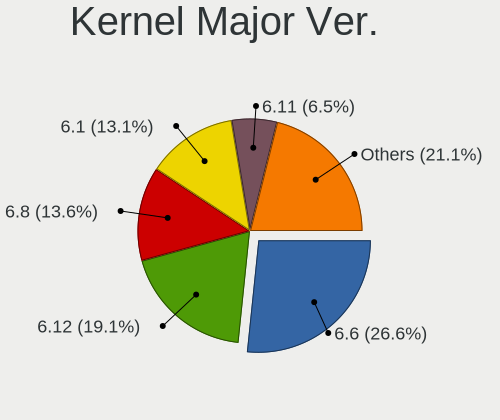
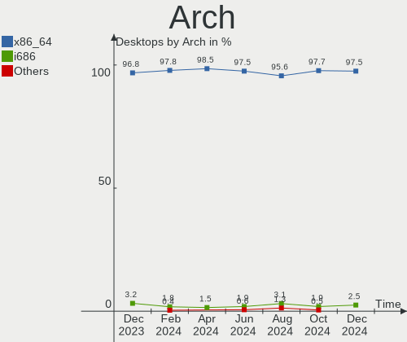
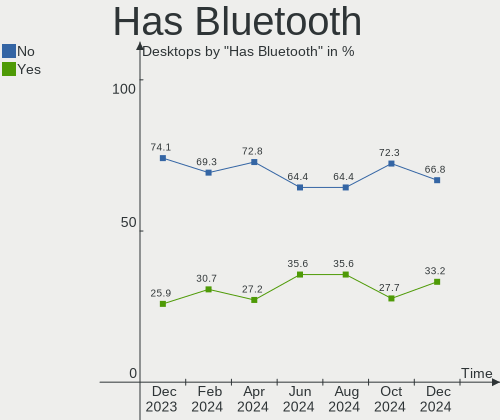
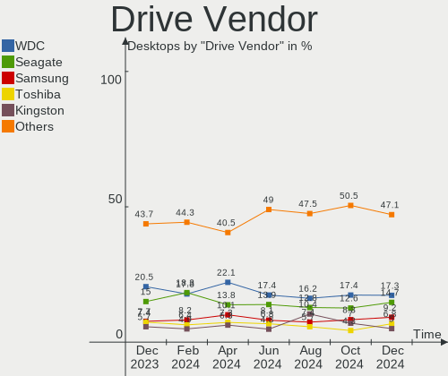
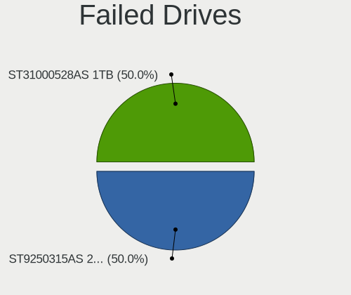
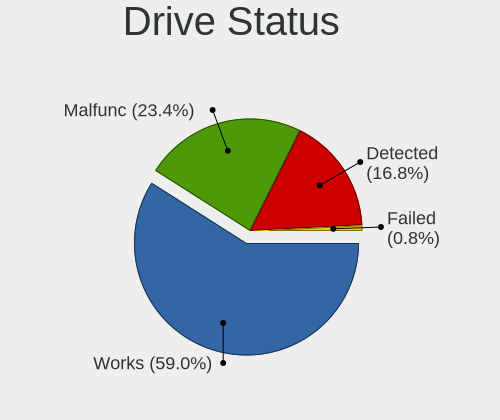
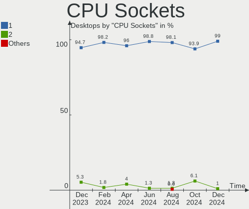
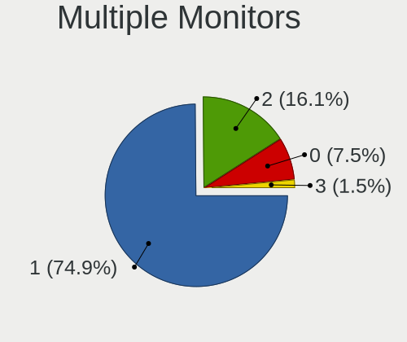
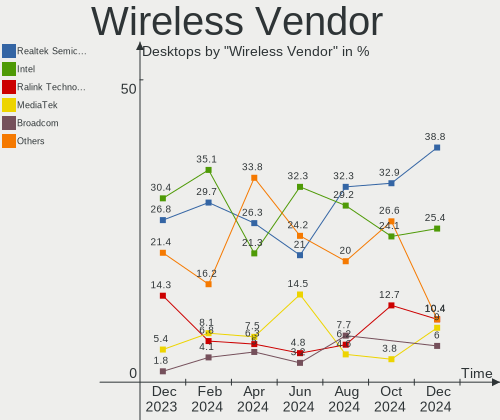
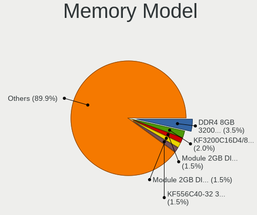

Linux in Russia - Hardware Trends (Desktops)
--------------------------------------------

A project to identify most popular hardware characteristics and track their change
over time based on data collected by Linux users at https://Linux-Hardware.org.

Anyone can contribute to this report by the [hw-probe](https://github.com/linuxhw/hw-probe) tool:

    sudo -E hw-probe -all -upload

Period: Dec, 2023.

Contents
--------

* [ System ](#system)
  - [ OS                       ](#os)
  - [ OS Family                ](#os-family)
  - [ Kernel                   ](#kernel)
  - [ Kernel Family            ](#kernel-family)
  - [ Kernel Major Ver.        ](#kernel-major-ver)
  - [ Arch                     ](#arch)
  - [ DE                       ](#de)
  - [ Display Server           ](#display-server)
  - [ Display Manager          ](#display-manager)
  - [ OS Lang                  ](#os-lang)
  - [ Boot Mode                ](#boot-mode)
  - [ Filesystem               ](#filesystem)
  - [ Part. scheme             ](#part-scheme)
  - [ Dual Boot with Linux/BSD ](#dual-boot-with-linuxbsd)
  - [ Dual Boot (Win)          ](#dual-boot-win)

* [ Board ](#board)
  - [ Vendor                   ](#vendor)
  - [ Model                    ](#model)
  - [ Model Family             ](#model-family)
  - [ MFG Year                 ](#mfg-year)
  - [ Form Factor              ](#form-factor)
  - [ Secure Boot              ](#secure-boot)
  - [ Coreboot                 ](#coreboot)
  - [ RAM Size                 ](#ram-size)
  - [ RAM Used                 ](#ram-used)
  - [ Total Drives             ](#total-drives)
  - [ Has CD-ROM               ](#has-cd-rom)
  - [ Has Ethernet             ](#has-ethernet)
  - [ Has WiFi                 ](#has-wifi)
  - [ Has Bluetooth            ](#has-bluetooth)

* [ Location ](#location)
  - [ Country                  ](#country)
  - [ City                     ](#city)

* [ Drives ](#drives)
  - [ Drive Vendor             ](#drive-vendor)
  - [ Drive Model              ](#drive-model)
  - [ HDD Vendor               ](#hdd-vendor)
  - [ SSD Vendor               ](#ssd-vendor)
  - [ Drive Kind               ](#drive-kind)
  - [ Drive Connector          ](#drive-connector)
  - [ Drive Size               ](#drive-size)
  - [ Space Total              ](#space-total)
  - [ Space Used               ](#space-used)
  - [ Malfunc. Drives          ](#malfunc-drives)
  - [ Malfunc. Drive Vendor    ](#malfunc-drive-vendor)
  - [ Malfunc. HDD Vendor      ](#malfunc-hdd-vendor)
  - [ Malfunc. Drive Kind      ](#malfunc-drive-kind)
  - [ Failed Drives            ](#failed-drives)
  - [ Failed Drive Vendor      ](#failed-drive-vendor)
  - [ Drive Status             ](#drive-status)

* [ Storage controller ](#storage-controller)
  - [ Storage Vendor           ](#storage-vendor)
  - [ Storage Model            ](#storage-model)
  - [ Storage Kind             ](#storage-kind)

* [ Processor ](#processor)
  - [ CPU Vendor               ](#cpu-vendor)
  - [ CPU Model                ](#cpu-model)
  - [ CPU Model Family         ](#cpu-model-family)
  - [ CPU Cores                ](#cpu-cores)
  - [ CPU Sockets              ](#cpu-sockets)
  - [ CPU Threads              ](#cpu-threads)
  - [ CPU Op-Modes             ](#cpu-op-modes)
  - [ CPU Microcode            ](#cpu-microcode)
  - [ CPU Microarch            ](#cpu-microarch)

* [ Graphics ](#graphics)
  - [ GPU Vendor               ](#gpu-vendor)
  - [ GPU Model                ](#gpu-model)
  - [ GPU Combo                ](#gpu-combo)
  - [ GPU Driver               ](#gpu-driver)
  - [ GPU Memory               ](#gpu-memory)

* [ Monitor ](#monitor)
  - [ Monitor Vendor           ](#monitor-vendor)
  - [ Monitor Model            ](#monitor-model)
  - [ Monitor Resolution       ](#monitor-resolution)
  - [ Monitor Diagonal         ](#monitor-diagonal)
  - [ Monitor Width            ](#monitor-width)
  - [ Aspect Ratio             ](#aspect-ratio)
  - [ Monitor Area             ](#monitor-area)
  - [ Pixel Density            ](#pixel-density)
  - [ Multiple Monitors        ](#multiple-monitors)

* [ Network ](#network)
  - [ Net Controller Vendor    ](#net-controller-vendor)
  - [ Net Controller Model     ](#net-controller-model)
  - [ Wireless Vendor          ](#wireless-vendor)
  - [ Wireless Model           ](#wireless-model)
  - [ Ethernet Vendor          ](#ethernet-vendor)
  - [ Ethernet Model           ](#ethernet-model)
  - [ Net Controller Kind      ](#net-controller-kind)
  - [ Used Controller          ](#used-controller)
  - [ NICs                     ](#nics)
  - [ IPv6                     ](#ipv6)

* [ Bluetooth ](#bluetooth)
  - [ Bluetooth Vendor         ](#bluetooth-vendor)
  - [ Bluetooth Model          ](#bluetooth-model)

* [ Sound ](#sound)
  - [ Sound Vendor             ](#sound-vendor)
  - [ Sound Model              ](#sound-model)

* [ Memory ](#memory)
  - [ Memory Vendor            ](#memory-vendor)
  - [ Memory Model             ](#memory-model)
  - [ Memory Kind              ](#memory-kind)
  - [ Memory Form Factor       ](#memory-form-factor)
  - [ Memory Size              ](#memory-size)
  - [ Memory Speed             ](#memory-speed)

* [ Printers & scanners ](#printers--scanners)
  - [ Printer Vendor           ](#printer-vendor)
  - [ Printer Model            ](#printer-model)
  - [ Scanner Vendor           ](#scanner-vendor)
  - [ Scanner Model            ](#scanner-model)

* [ Camera ](#camera)
  - [ Camera Vendor            ](#camera-vendor)
  - [ Camera Model             ](#camera-model)

* [ Security ](#security)
  - [ Fingerprint Vendor       ](#fingerprint-vendor)
  - [ Fingerprint Model        ](#fingerprint-model)
  - [ Chipcard Vendor          ](#chipcard-vendor)
  - [ Chipcard Model           ](#chipcard-model)

* [ Unsupported ](#unsupported)
  - [ Unsupported Devices      ](#unsupported-devices)
  - [ Unsupported Device Types ](#unsupported-device-types)

System
------

OS
--

Installed operating systems

| Name                        | Desktops | Percent |
|-----------------------------|----------|---------|
| ROSA 12.4                   | 66       | 34.92%  |
| Ubuntu 22.04                | 21       | 11.11%  |
| OpenMandriva 5.0            | 10       | 5.29%   |
| Debian 12                   | 10       | 5.29%   |
| Arch Rolling                | 8        | 4.23%   |
| Red OS 7.3                  | 6        | 3.17%   |
| Manjaro                     | 5        | 2.65%   |
| Linux Mint 21.2             | 5        | 2.65%   |
| Fedora 39                   | 5        | 2.65%   |
| Ubuntu 23.10                | 4        | 2.12%   |
| OpenMandriva 23.11          | 4        | 2.12%   |
| OpenMandriva 23.08          | 4        | 2.12%   |
| ROSA R11.1                  | 3        | 1.59%   |
| ALT Linux 10.2              | 3        | 1.59%   |
| ALT Linux 10.1              | 3        | 1.59%   |
| ROSA 12                     | 2        | 1.06%   |
| Pop!_OS 22.04               | 2        | 1.06%   |
| OpenMandriva 4.2            | 2        | 1.06%   |
| Nobara 38                   | 2        | 1.06%   |
| Debian 10                   | 2        | 1.06%   |
| Xubuntu 20.04               | 1        | 0.53%   |
| Xubuntu 18.04               | 1        | 0.53%   |
| Xero Rolling                | 1        | 0.53%   |
| Ubuntu 23.04                | 1        | 0.53%   |
| Ubuntu 20.04                | 1        | 0.53%   |
| SteamOS 4                   | 1        | 0.53%   |
| ROSA 2021.1                 | 1        | 0.53%   |
| ROSA 13.0                   | 1        | 0.53%   |
| PureOS 10.x                 | 1        | 0.53%   |
| Pop!_OS 20.04               | 1        | 0.53%   |
| org.kde.Platform 5.15-21.08 | 1        | 0.53%   |
| OpenMandriva 23.90          | 1        | 0.53%   |
| MX 21                       | 1        | 0.53%   |
| Linux Mint 20.3             | 1        | 0.53%   |
| KDE neon 22.04              | 1        | 0.53%   |
| Guix                        | 1        | 0.53%   |
| Fedora 30                   | 1        | 0.53%   |
| Debian 11                   | 1        | 0.53%   |
| ChimeraOS 44-1              | 1        | 0.53%   |
| ArcoLinux Rolling           | 1        | 0.53%   |

OS Family
---------

OS without a version

| Name             | Desktops | Percent |
|------------------|----------|---------|
| ROSA             | 73       | 38.62%  |
| Ubuntu           | 27       | 14.29%  |
| OpenMandriva     | 21       | 11.11%  |
| Debian           | 13       | 6.88%   |
| Arch             | 8        | 4.23%   |
| ALT Linux        | 7        | 3.7%    |
| Red OS           | 6        | 3.17%   |
| Linux Mint       | 6        | 3.17%   |
| Fedora           | 6        | 3.17%   |
| Manjaro          | 5        | 2.65%   |
| Pop!_OS          | 3        | 1.59%   |
| Xubuntu          | 2        | 1.06%   |
| Nobara           | 2        | 1.06%   |
| Xero             | 1        | 0.53%   |
| SteamOS          | 1        | 0.53%   |
| PureOS           | 1        | 0.53%   |
| org.kde.Platform | 1        | 0.53%   |
| MX               | 1        | 0.53%   |
| KDE neon         | 1        | 0.53%   |
| Guix             | 1        | 0.53%   |
| ChimeraOS        | 1        | 0.53%   |
| ArcoLinux        | 1        | 0.53%   |
| AlmaLinux        | 1        | 0.53%   |

Kernel
------

Version of the Linux kernel

| Version                             | Desktops | Percent |
|-------------------------------------|----------|---------|
| 6.1.58-generic-1rosa2021.1-x86_64   | 34       | 17.99%  |
| 6.1.20-generic-2rosa2021.1-x86_64   | 19       | 10.05%  |
| 6.6.2-desktop-1omv2390              | 13       | 6.88%   |
| 5.19.0-38-generic                   | 10       | 5.29%   |
| 5.10.184-generic-1rosa2021.1-x86_64 | 7        | 3.7%    |
| 6.2.0-37-generic                    | 6        | 3.17%   |
| 5.15.0-91-generic                   | 6        | 3.17%   |
| 6.1.52-1.el7.3.x86_64               | 5        | 2.65%   |
| 6.2.0-39-generic                    | 4        | 2.12%   |
| 6.1.0-4-amd64                       | 4        | 2.12%   |
| 5.15.127-generic-1rosa2021.1-x86_64 | 4        | 2.12%   |
| 6.5.0-14-generic                    | 3        | 1.59%   |
| 6.4.8-desktop-2omv2390              | 3        | 1.59%   |
| 6.6.8-arch1-1                       | 2        | 1.06%   |
| 6.6.8-2-MANJARO                     | 2        | 1.06%   |
| 6.6.7-zen1-1-zen                    | 2        | 1.06%   |
| 6.6.6-76060606-generic              | 2        | 1.06%   |
| 6.6.2-201.fc39.x86_64               | 2        | 1.06%   |
| 6.4.11-desktop-1omv2390             | 2        | 1.06%   |
| 6.1.0-16-amd64                      | 2        | 1.06%   |
| 5.15.0-89-generic                   | 2        | 1.06%   |
| 5.10.164-std-def-alt1               | 2        | 1.06%   |
| 5.10.14-desktop-1omv4002            | 2        | 1.06%   |
| 4.15.0-desktop-122.124.1rosa-i586   | 2        | 1.06%   |
| 6.6.8-200.fc39.x86_64               | 1        | 0.53%   |
| 6.6.7-202.fsync.fc38.x86_64         | 1        | 0.53%   |
| 6.6.5-zen1-1-zen                    | 1        | 0.53%   |
| 6.6.5-x64v2-xanmod1-1               | 1        | 0.53%   |
| 6.6.5-arch1-1                       | 1        | 0.53%   |
| 6.6.4-arch1-1                       | 1        | 0.53%   |
| 6.6.4-200.fc39.x86_64               | 1        | 0.53%   |
| 6.6.3-zen1-1-zen                    | 1        | 0.53%   |
| 6.6.3-desktop-1omv2390              | 1        | 0.53%   |
| 6.6.3-arch1-1                       | 1        | 0.53%   |
| 6.6.3-203.fsync.fc38.x86_64         | 1        | 0.53%   |
| 6.6.3-1-MANJARO                     | 1        | 0.53%   |
| 6.6.2                               | 1        | 0.53%   |
| 6.5.6-chos1-chimeraos-1             | 1        | 0.53%   |
| 6.5.13-7-MANJARO                    | 1        | 0.53%   |
| 6.5.12-300.fc39.x86_64              | 1        | 0.53%   |

Kernel Family
-------------

Linux kernel without a distro release

| Version  | Desktops | Percent |
|----------|----------|---------|
| 6.1.58   | 35       | 18.52%  |
| 6.1.20   | 19       | 10.05%  |
| 6.6.2    | 16       | 8.47%   |
| 6.2.0    | 11       | 5.82%   |
| 5.19.0   | 10       | 5.29%   |
| 5.15.0   | 9        | 4.76%   |
| 6.1.0    | 8        | 4.23%   |
| 5.10.184 | 7        | 3.7%    |
| 6.6.8    | 5        | 2.65%   |
| 6.6.3    | 5        | 2.65%   |
| 6.1.52   | 5        | 2.65%   |
| 5.15.127 | 5        | 2.65%   |
| 6.5.0    | 4        | 2.12%   |
| 6.6.7    | 3        | 1.59%   |
| 6.6.5    | 3        | 1.59%   |
| 6.4.8    | 3        | 1.59%   |
| 4.15.0   | 3        | 1.59%   |
| 6.6.6    | 2        | 1.06%   |
| 6.6.4    | 2        | 1.06%   |
| 6.5.11   | 2        | 1.06%   |
| 6.4.11   | 2        | 1.06%   |
| 5.4.0    | 2        | 1.06%   |
| 5.10.74  | 2        | 1.06%   |
| 5.10.198 | 2        | 1.06%   |
| 5.10.164 | 2        | 1.06%   |
| 5.10.14  | 2        | 1.06%   |
| 6.5.6    | 1        | 0.53%   |
| 6.5.13   | 1        | 0.53%   |
| 6.5.12   | 1        | 0.53%   |
| 6.3.7    | 1        | 0.53%   |
| 6.2.16   | 1        | 0.53%   |
| 6.1.69   | 1        | 0.53%   |
| 6.1.67   | 1        | 0.53%   |
| 6.1.66   | 1        | 0.53%   |
| 6.1.63   | 1        | 0.53%   |
| 6.1.46   | 1        | 0.53%   |
| 6.0.12   | 1        | 0.53%   |
| 5.6.13   | 1        | 0.53%   |
| 5.4.106  | 1        | 0.53%   |
| 5.17.11  | 1        | 0.53%   |

Kernel Major Ver.
-----------------

Linux kernel major version

| Version | Desktops | Percent |
|---------|----------|---------|
| 6.1     | 72       | 38.1%   |
| 6.6     | 36       | 19.05%  |
| 5.10    | 17       | 8.99%   |
| 5.15    | 16       | 8.47%   |
| 6.2     | 12       | 6.35%   |
| 5.19    | 10       | 5.29%   |
| 6.5     | 9        | 4.76%   |
| 6.4     | 5        | 2.65%   |
| 5.4     | 3        | 1.59%   |
| 4.15    | 3        | 1.59%   |
| 6.3     | 1        | 0.53%   |
| 6.0     | 1        | 0.53%   |
| 5.6     | 1        | 0.53%   |
| 5.17    | 1        | 0.53%   |
| 5.11    | 1        | 0.53%   |
| 4.18    | 1        | 0.53%   |

Arch
----

OS architecture (x86_64, i586, etc.)

| Name   | Desktops | Percent |
|--------|----------|---------|
| x86_64 | 183      | 96.83%  |
| i686   | 6        | 3.17%   |

DE
--

Desktop Environment

| Name       | Desktops | Percent |
|------------|----------|---------|
| KDE5       | 76       | 40.21%  |
| GNOME      | 53       | 28.04%  |
| Unknown    | 25       | 13.23%  |
| MATE       | 9        | 4.76%   |
| XFCE       | 8        | 4.23%   |
| LXQt       | 8        | 4.23%   |
| X-Cinnamon | 3        | 1.59%   |
| KDE4       | 3        | 1.59%   |
| KDE6       | 1        | 0.53%   |
| i3         | 1        | 0.53%   |
| Cinnamon   | 1        | 0.53%   |
| awesome    | 1        | 0.53%   |

Display Server
--------------

X11 or Wayland

| Name    | Desktops | Percent |
|---------|----------|---------|
| Wayland | 87       | 46.03%  |
| X11     | 72       | 38.1%   |
| Unknown | 19       | 10.05%  |
| Tty     | 11       | 5.82%   |

Display Manager
---------------

SDDM, LightDM, etc.

| Name    | Desktops | Percent |
|---------|----------|---------|
| SDDM    | 67       | 35.45%  |
| Unknown | 53       | 28.04%  |
| GDM     | 34       | 17.99%  |
| GDM3    | 16       | 8.47%   |
| LightDM | 15       | 7.94%   |
| KDM     | 3        | 1.59%   |
| XDM     | 1        | 0.53%   |

OS Lang
-------

Language

| Lang  | Desktops | Percent |
|-------|----------|---------|
| ru_RU | 145      | 76.72%  |
| en_US | 33       | 17.46%  |
| C     | 11       | 5.82%   |

Boot Mode
---------

EFI or BIOS

| Mode | Desktops | Percent |
|------|----------|---------|
| BIOS | 114      | 60.32%  |
| EFI  | 75       | 39.68%  |

Filesystem
----------

Type of filesystem

| Type    | Desktops | Percent |
|---------|----------|---------|
| Ext4    | 121      | 64.02%  |
| Overlay | 26       | 13.76%  |
| Btrfs   | 24       | 12.7%   |
| Tmpfs   | 12       | 6.35%   |
| Zfs     | 4        | 2.12%   |
| F2fs    | 2        | 1.06%   |

Part. scheme
------------

Scheme of partitioning

| Type    | Desktops | Percent |
|---------|----------|---------|
| GPT     | 98       | 51.85%  |
| MBR     | 54       | 28.57%  |
| Unknown | 37       | 19.58%  |

Dual Boot with Linux/BSD
------------------------

Hosting more than one Linux/BSD

| Dual boot | Desktops | Percent |
|-----------|----------|---------|
| No        | 145      | 76.72%  |
| Yes       | 44       | 23.28%  |

Dual Boot (Win)
---------------

Hosting Linux and Windows

| Dual boot | Desktops | Percent |
|-----------|----------|---------|
| No        | 117      | 61.9%   |
| Yes       | 72       | 38.1%   |

Board
-----

Vendor
------

Motherboard manufacturer

| Name                | Desktops | Percent |
|---------------------|----------|---------|
| ASUSTek Computer    | 58       | 30.69%  |
| Gigabyte Technology | 42       | 22.22%  |
| MSI                 | 28       | 14.81%  |
| ASRock              | 14       | 7.41%   |
| Supermicro          | 10       | 5.29%   |
| Intel               | 7        | 3.7%    |
| Lenovo              | 4        | 2.12%   |
| Hewlett-Packard     | 4        | 2.12%   |
| Huanan              | 3        | 1.59%   |
| Biostar             | 3        | 1.59%   |
| AZW                 | 3        | 1.59%   |
| Unknown             | 3        | 1.59%   |
| SZMZ                | 1        | 0.53%   |
| OEM                 | 1        | 0.53%   |
| JUXIESHI            | 1        | 0.53%   |
| iRU                 | 1        | 0.53%   |
| INTECH PRO          | 1        | 0.53%   |
| HJS                 | 1        | 0.53%   |
| Foxconn             | 1        | 0.53%   |
| DFI                 | 1        | 0.53%   |
| Dell                | 1        | 0.53%   |
| Acer                | 1        | 0.53%   |

Model
-----

Motherboard model

| Name                       | Desktops | Percent |
|----------------------------|----------|---------|
| ASUS All Series            | 6        | 3.17%   |
| Supermicro SYS-1028R-TDW   | 4        | 2.12%   |
| MSI MS-7C56                | 3        | 1.59%   |
| Unknown                    | 3        | 1.59%   |
| Supermicro SYS-6018R-MTR   | 2        | 1.06%   |
| MSI MS-7D22                | 2        | 1.06%   |
| MSI MS-7C52                | 2        | 1.06%   |
| Intel X99                  | 2        | 1.06%   |
| Gigabyte B450M DS3H        | 2        | 1.06%   |
| Gigabyte A320M-H           | 2        | 1.06%   |
| Gigabyte 970A-DS3P         | 2        | 1.06%   |
| AZW MINI S                 | 2        | 1.06%   |
| ASUS TUF Gaming B550M-PLUS | 2        | 1.06%   |
| ASUS PRIME B360M-K         | 2        | 1.06%   |
| ASUS PRIME A320M-K         | 2        | 1.06%   |
| ASUS P8H61-M LX3 R2.0      | 2        | 1.06%   |
| ASUS P8H61-M LX R2.0       | 2        | 1.06%   |
| ASUS P8H61-M LX            | 2        | 1.06%   |
| SZMZ X99-S3                | 1        | 0.53%   |
| Supermicro X9DRW           | 1        | 0.53%   |
| Supermicro X8SIL           | 1        | 0.53%   |
| Supermicro SYS-7048GR-TR   | 1        | 0.53%   |
| Supermicro Flagman TX111.3 | 1        | 0.53%   |
| OEM X79G                   | 1        | 0.53%   |
| MSI MS-7D89                | 1        | 0.53%   |
| MSI MS-7D78                | 1        | 0.53%   |
| MSI MS-7C95                | 1        | 0.53%   |
| MSI MS-7C91                | 1        | 0.53%   |
| MSI MS-7C83                | 1        | 0.53%   |
| MSI MS-7C75                | 1        | 0.53%   |
| MSI MS-7C51                | 1        | 0.53%   |
| MSI MS-7B79                | 1        | 0.53%   |
| MSI MS-7B22                | 1        | 0.53%   |
| MSI MS-7A34                | 1        | 0.53%   |
| MSI MS-7996                | 1        | 0.53%   |
| MSI MS-7895                | 1        | 0.53%   |
| MSI MS-7758                | 1        | 0.53%   |
| MSI MS-7721                | 1        | 0.53%   |
| MSI MS-7680                | 1        | 0.53%   |
| MSI MS-7641                | 1        | 0.53%   |

Model Family
------------

Motherboard model prefix

| Name                     | Desktops | Percent |
|--------------------------|----------|---------|
| ASUS PRIME               | 12       | 6.35%   |
| ASUS P8H61-M             | 6        | 3.17%   |
| ASUS All                 | 6        | 3.17%   |
| Supermicro SYS-1028R-TDW | 4        | 2.12%   |
| MSI MS-7C56              | 3        | 1.59%   |
| Gigabyte B450M           | 3        | 1.59%   |
| ASUS TUF                 | 3        | 1.59%   |
| Unknown                  | 3        | 1.59%   |
| Supermicro SYS-6018R-MTR | 2        | 1.06%   |
| MSI MS-7D22              | 2        | 1.06%   |
| MSI MS-7C52              | 2        | 1.06%   |
| Lenovo ThinkCentre       | 2        | 1.06%   |
| Intel X99                | 2        | 1.06%   |
| Huanan X99-F8            | 2        | 1.06%   |
| Gigabyte B550            | 2        | 1.06%   |
| Gigabyte A320M-S2H       | 2        | 1.06%   |
| Gigabyte A320M-H         | 2        | 1.06%   |
| Gigabyte 970A-DS3P       | 2        | 1.06%   |
| AZW MINI                 | 2        | 1.06%   |
| ASUS ROG                 | 2        | 1.06%   |
| ASUS P5G41T-M            | 2        | 1.06%   |
| ASUS M5A78L-M            | 2        | 1.06%   |
| ASRock B450M             | 2        | 1.06%   |
| SZMZ X99-S3              | 1        | 0.53%   |
| Supermicro X9DRW         | 1        | 0.53%   |
| Supermicro X8SIL         | 1        | 0.53%   |
| Supermicro SYS-7048GR-TR | 1        | 0.53%   |
| Supermicro Flagman       | 1        | 0.53%   |
| OEM X79G                 | 1        | 0.53%   |
| MSI MS-7D89              | 1        | 0.53%   |
| MSI MS-7D78              | 1        | 0.53%   |
| MSI MS-7C95              | 1        | 0.53%   |
| MSI MS-7C91              | 1        | 0.53%   |
| MSI MS-7C83              | 1        | 0.53%   |
| MSI MS-7C75              | 1        | 0.53%   |
| MSI MS-7C51              | 1        | 0.53%   |
| MSI MS-7B79              | 1        | 0.53%   |
| MSI MS-7B22              | 1        | 0.53%   |
| MSI MS-7A34              | 1        | 0.53%   |
| MSI MS-7996              | 1        | 0.53%   |

MFG Year
--------

Motherboard manufacture year

| Year | Desktops | Percent |
|------|----------|---------|
| 2018 | 19       | 10.05%  |
| 2020 | 16       | 8.47%   |
| 2012 | 16       | 8.47%   |
| 2021 | 15       | 7.94%   |
| 2019 | 14       | 7.41%   |
| 2013 | 14       | 7.41%   |
| 2009 | 13       | 6.88%   |
| 2023 | 12       | 6.35%   |
| 2016 | 11       | 5.82%   |
| 2011 | 11       | 5.82%   |
| 2010 | 9        | 4.76%   |
| 2017 | 8        | 4.23%   |
| 2015 | 8        | 4.23%   |
| 2022 | 7        | 3.7%    |
| 2007 | 6        | 3.17%   |
| 2014 | 5        | 2.65%   |
| 2006 | 3        | 1.59%   |
| 2008 | 1        | 0.53%   |
| 2005 | 1        | 0.53%   |

Form Factor
-----------

Physical design of the computer

| Name    | Desktops | Percent |
|---------|----------|---------|
| Desktop | 189      | 100%    |

Secure Boot
-----------

Enabled or disabled

| State    | Desktops | Percent |
|----------|----------|---------|
| Disabled | 185      | 97.88%  |
| Enabled  | 4        | 2.12%   |

Coreboot
--------

Have coreboot on board

| Used | Desktops | Percent |
|------|----------|---------|
| No   | 189      | 100%    |

RAM Size
--------

Total RAM memory

| Size in GB      | Desktops | Percent |
|-----------------|----------|---------|
| 8.01-16.0       | 42       | 22.22%  |
| 16.01-24.0      | 39       | 20.63%  |
| 4.01-8.0        | 30       | 15.87%  |
| 32.01-64.0      | 22       | 11.64%  |
| 3.01-4.0        | 22       | 11.64%  |
| 64.01-256.0     | 16       | 8.47%   |
| 24.01-32.0      | 5        | 2.65%   |
| 1.01-2.0        | 5        | 2.65%   |
| 2.01-3.0        | 4        | 2.12%   |
| More than 256.0 | 3        | 1.59%   |
| 0.51-1.0        | 1        | 0.53%   |

RAM Used
--------

Used RAM memory

| Used GB    | Desktops | Percent |
|------------|----------|---------|
| 1.01-2.0   | 78       | 41.27%  |
| 2.01-3.0   | 39       | 20.63%  |
| 4.01-8.0   | 30       | 15.87%  |
| 3.01-4.0   | 16       | 8.47%   |
| 0.51-1.0   | 15       | 7.94%   |
| 8.01-16.0  | 7        | 3.7%    |
| 0.01-0.5   | 3        | 1.59%   |
| 24.01-32.0 | 1        | 0.53%   |

Total Drives
------------

Number of drives on board

| Drives | Desktops | Percent |
|--------|----------|---------|
| 1      | 75       | 39.68%  |
| 2      | 43       | 22.75%  |
| 3      | 30       | 15.87%  |
| 4      | 23       | 12.17%  |
| 5      | 9        | 4.76%   |
| 7      | 3        | 1.59%   |
| 6      | 3        | 1.59%   |
| 10     | 2        | 1.06%   |
| 0      | 1        | 0.53%   |

Has CD-ROM
----------

Has CD-ROM on board

| Presented | Desktops | Percent |
|-----------|----------|---------|
| No        | 132      | 69.84%  |
| Yes       | 57       | 30.16%  |

Has Ethernet
------------

Has Ethernet on board

| Presented | Desktops | Percent |
|-----------|----------|---------|
| Yes       | 189      | 100%    |

Has WiFi
--------

Has WiFi module

| Presented | Desktops | Percent |
|-----------|----------|---------|
| No        | 132      | 69.84%  |
| Yes       | 57       | 30.16%  |

Has Bluetooth
-------------

Has Bluetooth module

| Presented | Desktops | Percent |
|-----------|----------|---------|
| No        | 140      | 74.07%  |
| Yes       | 49       | 25.93%  |

Location
--------

Country
-------

Geographic location (country)

| Country | Desktops | Percent |
|---------|----------|---------|
| Russia  | 189      | 100%    |

City
----

Geographic location (city)

| City              | Desktops | Percent |
|-------------------|----------|---------|
| Moscow            | 47       | 24.87%  |
| St Petersburg     | 16       | 8.47%   |
| Voronezh          | 8        | 4.23%   |
| Yekaterinburg     | 6        | 3.17%   |
| Tyumen            | 5        | 2.65%   |
| Perm              | 5        | 2.65%   |
| Novosibirsk       | 5        | 2.65%   |
| Stavropol         | 4        | 2.12%   |
| Samara            | 4        | 2.12%   |
| Krasnodar         | 4        | 2.12%   |
| Volgograd         | 3        | 1.59%   |
| Tambov            | 3        | 1.59%   |
| Smolensk          | 3        | 1.59%   |
| Saratov           | 3        | 1.59%   |
| Bryansk           | 3        | 1.59%   |
| Tver              | 2        | 1.06%   |
| Sochi             | 2        | 1.06%   |
| Shchelkovo        | 2        | 1.06%   |
| Rostov-on-Don     | 2        | 1.06%   |
| Ozersk            | 2        | 1.06%   |
| Omsk              | 2        | 1.06%   |
| Nizhnekamsk       | 2        | 1.06%   |
| Lipetsk           | 2        | 1.06%   |
| Kirov             | 2        | 1.06%   |
| Dubna             | 2        | 1.06%   |
| Arzamas           | 2        | 1.06%   |
| Zlatoust          | 1        | 0.53%   |
| Zheleznodorozhnyy | 1        | 0.53%   |
| Yuzhnoural'sk     | 1        | 0.53%   |
| Yuzhno-Sakhalinsk | 1        | 0.53%   |
| Yakutsk           | 1        | 0.53%   |
| Yablonitsy        | 1        | 0.53%   |
| Vyksa             | 1        | 0.53%   |
| Ulyanovsk         | 1        | 0.53%   |
| Ufa               | 1        | 0.53%   |
| Tula              | 1        | 0.53%   |
| Shebekino         | 1        | 0.53%   |
| Severnyy          | 1        | 0.53%   |
| Severin           | 1        | 0.53%   |
| Sergiyev Posad    | 1        | 0.53%   |

Drives
------

Drive Vendor
------------

Hard drive vendors

| Vendor                      | Desktops | Drives | Percent |
|-----------------------------|----------|--------|---------|
| WDC                         | 75       | 113    | 20.49%  |
| Seagate                     | 55       | 70     | 15.03%  |
| Samsung Electronics         | 28       | 35     | 7.65%   |
| Toshiba                     | 27       | 35     | 7.38%   |
| Kingston                    | 21       | 24     | 5.74%   |
| A-DATA Technology           | 15       | 15     | 4.1%    |
| Hitachi                     | 12       | 13     | 3.28%   |
| Intel                       | 9        | 26     | 2.46%   |
| HGST                        | 8        | 12     | 2.19%   |
| Patriot                     | 7        | 7      | 1.91%   |
| Crucial                     | 7        | 7      | 1.91%   |
| AMD                         | 7        | 7      | 1.91%   |
| Sandisk                     | 6        | 6      | 1.64%   |
| MAXIO Technology (Hangzhou) | 6        | 6      | 1.64%   |
| China                       | 6        | 6      | 1.64%   |
| Apacer                      | 6        | 6      | 1.64%   |
| Silicon Motion              | 5        | 5      | 1.37%   |
| Netac                       | 5        | 5      | 1.37%   |
| ADATA Technology            | 5        | 6      | 1.37%   |
| Phison Electronics          | 4        | 5      | 1.09%   |
| Unknown                     | 3        | 3      | 0.82%   |
| SPCC                        | 3        | 3      | 0.82%   |
| Unknown                     | 3        | 3      | 0.82%   |
| XrayDisk                    | 2        | 2      | 0.55%   |
| XPG                         | 2        | 2      | 0.55%   |
| Team                        | 2        | 2      | 0.55%   |
| Smartbuy                    | 2        | 2      | 0.55%   |
| Plextor                     | 2        | 2      | 0.55%   |
| Phison                      | 2        | 2      | 0.55%   |
| Micron Technology           | 2        | 2      | 0.55%   |
| Maxtor                      | 2        | 2      | 0.55%   |
| Kingston Technology Company | 2        | 2      | 0.55%   |
| GOODRAM                     | 2        | 3      | 0.55%   |
| Gigabyte Technology         | 2        | 2      | 0.55%   |
| DEXP                        | 2        | 2      | 0.55%   |
| WALRAM                      | 1        | 1      | 0.27%   |
| Transcend                   | 1        | 1      | 0.27%   |
| OCZ                         | 1        | 1      | 0.27%   |
| NT-2TB                      | 1        | 1      | 0.27%   |
| LITEON                      | 1        | 1      | 0.27%   |

Drive Model
-----------

Hard drive models

| Model                                                 | Desktops | Percent |
|-------------------------------------------------------|----------|---------|
| Toshiba HDWD110 1TB                                   | 5        | 1.19%   |
| Seagate ST500DM002-1BD142 500GB                       | 5        | 1.19%   |
| Seagate ST1000DM010-2EP102 1TB                        | 5        | 1.19%   |
| Kingston SA400S37240G 240GB SSD                       | 5        | 1.19%   |
| WDC WDS120G2G0A-00JH30 120GB SSD                      | 4        | 0.95%   |
| MAXIO (Hangzhou) NVMe SSD Controller MAP1202 256GB    | 4        | 0.95%   |
| Intel SSDSC2BB800G7 800GB                             | 4        | 0.95%   |
| Intel SSDSC2BB480G7 480GB                             | 4        | 0.95%   |
| HGST HTE721010A9E630 1TB                              | 4        | 0.95%   |
| WDC WD5000AAKX-001CA0 500GB                           | 3        | 0.72%   |
| WDC WD20EZBX-00AYRA0 2TB                              | 3        | 0.72%   |
| Toshiba HDWD130 3TB                                   | 3        | 0.72%   |
| Toshiba HDWD105 500GB                                 | 3        | 0.72%   |
| Toshiba DT01ACA100 1TB                                | 3        | 0.72%   |
| Toshiba DT01ACA050 500GB                              | 3        | 0.72%   |
| Silicon Motion SM2263EN/SM2263XT SSD Controller 500GB | 3        | 0.72%   |
| Seagate ST380815AS 80GB                               | 3        | 0.72%   |
| Samsung SSD 860 EVO 250GB                             | 3        | 0.72%   |
| Samsung NVMe SSD Controller SM981/PM981/PM983 512GB   | 3        | 0.72%   |
| Kingston SA400S37480G 480GB SSD                       | 3        | 0.72%   |
| Crucial CT480BX500SSD1 480GB                          | 3        | 0.72%   |
| Crucial CT120BX500SSD1 120GB                          | 3        | 0.72%   |
| Unknown                                               | 3        | 0.72%   |
| XPG GAMMIX S11 Pro 256GB                              | 2        | 0.48%   |
| WDC WDS500G2B0A-00SM50 500GB SSD                      | 2        | 0.48%   |
| WDC WD40EZAZ-00SF3B0 4TB                              | 2        | 0.48%   |
| WDC WD20EFRX-68EUZN0 2TB                              | 2        | 0.48%   |
| WDC WD20EARX-00PASB0 2TB                              | 2        | 0.48%   |
| WDC WD10EZRZ-00HTKB0 1TB                              | 2        | 0.48%   |
| WDC WD10EZEX-22MFCA0 1TB                              | 2        | 0.48%   |
| WDC WD10EZEX-08WN4A0 1TB                              | 2        | 0.48%   |
| WDC WD10EZEX-08M2NA0 1TB                              | 2        | 0.48%   |
| WDC WD10EZEX-00BBHA0 1TB                              | 2        | 0.48%   |
| WDC WD10EARS-00Y5B1 1TB                               | 2        | 0.48%   |
| WDC WD1002FAEX-00Z3A0 1TB                             | 2        | 0.48%   |
| Toshiba HDWL110 1TB                                   | 2        | 0.48%   |
| Seagate ST9320325AS 320GB                             | 2        | 0.48%   |
| Seagate ST380011A 80GB                                | 2        | 0.48%   |
| Seagate ST3160318AS 160GB                             | 2        | 0.48%   |
| Seagate ST2000DM008-2FR102 2TB                        | 2        | 0.48%   |

HDD Vendor
----------

Hard disk drive vendors

| Vendor              | Desktops | Drives | Percent |
|---------------------|----------|--------|---------|
| WDC                 | 68       | 100    | 37.99%  |
| Seagate             | 55       | 70     | 30.73%  |
| Toshiba             | 26       | 34     | 14.53%  |
| Hitachi             | 12       | 13     | 6.7%    |
| HGST                | 8        | 12     | 4.47%   |
| Samsung Electronics | 6        | 7      | 3.35%   |
| Maxtor              | 2        | 2      | 1.12%   |
| Unknown             | 1        | 1      | 0.56%   |
| Fujitsu             | 1        | 1      | 0.56%   |

SSD Vendor
----------

Solid state drive vendors

| Vendor              | Desktops | Drives | Percent |
|---------------------|----------|--------|---------|
| Kingston            | 16       | 19     | 12.9%   |
| Samsung Electronics | 12       | 14     | 9.68%   |
| WDC                 | 10       | 11     | 8.06%   |
| Intel               | 9        | 26     | 7.26%   |
| Patriot             | 7        | 7      | 5.65%   |
| Crucial             | 7        | 7      | 5.65%   |
| A-DATA Technology   | 7        | 7      | 5.65%   |
| China               | 6        | 6      | 4.84%   |
| Apacer              | 5        | 5      | 4.03%   |
| AMD                 | 5        | 5      | 4.03%   |
| Netac               | 4        | 4      | 3.23%   |
| SanDisk             | 3        | 3      | 2.42%   |
| XrayDisk            | 2        | 2      | 1.61%   |
| SPCC                | 2        | 2      | 1.61%   |
| Plextor             | 2        | 2      | 1.61%   |
| GOODRAM             | 2        | 3      | 1.61%   |
| Gigabyte Technology | 2        | 2      | 1.61%   |
| DEXP                | 2        | 2      | 1.61%   |
| WALRAM              | 1        | 1      | 0.81%   |
| Transcend           | 1        | 1      | 0.81%   |
| Toshiba             | 1        | 1      | 0.81%   |
| Team                | 1        | 1      | 0.81%   |
| Smartbuy            | 1        | 1      | 0.81%   |
| OCZ                 | 1        | 1      | 0.81%   |
| NT-2TB              | 1        | 1      | 0.81%   |
| Micron Technology   | 1        | 1      | 0.81%   |
| LITEON              | 1        | 1      | 0.81%   |
| KingSpec            | 1        | 1      | 0.81%   |
| Kingmax             | 1        | 1      | 0.81%   |
| KingDian            | 1        | 1      | 0.81%   |
| JDa                 | 1        | 1      | 0.81%   |
| Hoodisk             | 1        | 1      | 0.81%   |
| Digma               | 1        | 1      | 0.81%   |
| DeltaTech           | 1        | 1      | 0.81%   |
| Corsair             | 1        | 1      | 0.81%   |
| CHN25SATAS1         | 1        | 1      | 0.81%   |
| BR                  | 1        | 1      | 0.81%   |
| AXIOMTEK            | 1        | 1      | 0.81%   |
| Unknown             | 1        | 1      | 0.81%   |

Drive Kind
----------

HDD or SSD

| Kind    | Desktops | Drives | Percent |
|---------|----------|--------|---------|
| HDD     | 140      | 240    | 46.05%  |
| SSD     | 103      | 148    | 33.88%  |
| NVMe    | 57       | 70     | 18.75%  |
| Unknown | 3        | 3      | 0.99%   |
| MMC     | 1        | 1      | 0.33%   |

Drive Connector
---------------

SATA, SAS, NVMe, etc.

| Type | Desktops | Drives | Percent |
|------|----------|--------|---------|
| SATA | 172      | 389    | 74.14%  |
| NVMe | 57       | 70     | 24.57%  |
| SAS  | 2        | 2      | 0.86%   |
| MMC  | 1        | 1      | 0.43%   |

Drive Size
----------

Size of hard drive

| Size in TB | Desktops | Drives | Percent |
|------------|----------|--------|---------|
| 0.01-0.5   | 142      | 221    | 55.91%  |
| 0.51-1.0   | 65       | 91     | 25.59%  |
| 1.01-2.0   | 23       | 32     | 9.06%   |
| 2.01-3.0   | 9        | 11     | 3.54%   |
| 3.01-4.0   | 7        | 11     | 2.76%   |
| 4.01-10.0  | 6        | 13     | 2.36%   |
| 10.01-20.0 | 2        | 9      | 0.79%   |

Space Total
-----------

Amount of disk space available on the file system

| Size in GB     | Desktops | Percent |
|----------------|----------|---------|
| 101-250        | 38       | 20.11%  |
| 251-500        | 33       | 17.46%  |
| 501-1000       | 24       | 12.7%   |
| 1001-2000      | 22       | 11.64%  |
| Unknown        | 18       | 9.52%   |
| 1-20           | 16       | 8.47%   |
| 51-100         | 13       | 6.88%   |
| More than 3000 | 11       | 5.82%   |
| 2001-3000      | 9        | 4.76%   |
| 21-50          | 5        | 2.65%   |

Space Used
----------

Amount of used disk space

| Used GB        | Desktops | Percent |
|----------------|----------|---------|
| 1-20           | 68       | 35.98%  |
| 21-50          | 30       | 15.87%  |
| Unknown        | 18       | 9.52%   |
| 251-500        | 16       | 8.47%   |
| 51-100         | 16       | 8.47%   |
| 101-250        | 12       | 6.35%   |
| 501-1000       | 12       | 6.35%   |
| 1001-2000      | 9        | 4.76%   |
| More than 3000 | 6        | 3.17%   |
| 0              | 2        | 1.06%   |

Malfunc. Drives
---------------

Drive models with a malfunction

| Model                           | Desktops | Drives | Percent |
|---------------------------------|----------|--------|---------|
| Seagate ST500DM002-1BD142 500GB | 4        | 4      | 6.25%   |
| Intel SSDSC2BB800G7 800GB       | 3        | 3      | 4.69%   |
| WDC WD5000AAKX-001CA0 500GB     | 2        | 2      | 3.13%   |
| Seagate ST380815AS 80GB         | 2        | 2      | 3.13%   |
| WDC WD800BB-00JHC0 80GB         | 1        | 1      | 1.56%   |
| WDC WD7500BPVT-00HXZT3 752GB    | 1        | 1      | 1.56%   |
| WDC WD5002ABYS-02B1B0 500GB     | 1        | 2      | 1.56%   |
| WDC WD5002AALX-00J37A0 500GB    | 1        | 1      | 1.56%   |
| WDC WD5000AAKX-08U6AA0 500GB    | 1        | 1      | 1.56%   |
| WDC WD5000AAKX-00ERMA0 500GB    | 1        | 1      | 1.56%   |
| WDC WD5000AAKS-00V1A0 500GB     | 1        | 1      | 1.56%   |
| WDC WD3200BEVT-80A0RT0 320GB    | 1        | 1      | 1.56%   |
| WDC WD3200AAJS-00L7A0 320GB     | 1        | 1      | 1.56%   |
| WDC WD2500YS-01SHB1 256GB       | 1        | 1      | 1.56%   |
| WDC WD20EFRX-68EUZN0 2TB        | 1        | 2      | 1.56%   |
| WDC WD1600AAJS-00PSA0 160GB     | 1        | 1      | 1.56%   |
| WDC WD10EZRZ-00HTKB0 1TB        | 1        | 2      | 1.56%   |
| WDC WD10EZEX-60WN4A1 1TB        | 1        | 1      | 1.56%   |
| WDC WD10EFRX-68JCSN0 1TB        | 1        | 1      | 1.56%   |
| WDC WD10EARS-00Y5B1 1TB         | 1        | 2      | 1.56%   |
| WDC WD10EALS-00Z8A0 1TB         | 1        | 1      | 1.56%   |
| WDC WD Green 2.5 480GB          | 1        | 1      | 1.56%   |
| WDC WD Green 2.5 240GB SSD      | 1        | 1      | 1.56%   |
| Toshiba HDWD110 1TB             | 1        | 1      | 1.56%   |
| Toshiba DT01ACA050 500GB        | 1        | 1      | 1.56%   |
| Seagate ST9320325AS 320GB       | 1        | 1      | 1.56%   |
| Seagate ST500DM002-1BC142 500GB | 1        | 1      | 1.56%   |
| Seagate ST4000DM000-1F2168 4TB  | 1        | 1      | 1.56%   |
| Seagate ST380011A 80GB          | 1        | 1      | 1.56%   |
| Seagate ST3250620NS 250GB       | 1        | 1      | 1.56%   |
| Seagate ST3250310AS 250GB       | 1        | 1      | 1.56%   |
| Seagate ST3160811AS 160GB       | 1        | 1      | 1.56%   |
| Seagate ST31000524AS 1TB        | 1        | 1      | 1.56%   |
| Seagate ST3000VX010-2E3166 3TB  | 1        | 1      | 1.56%   |
| Seagate ST2000DM006-2DM164 2TB  | 1        | 1      | 1.56%   |
| Seagate ST2000DL003-9VT166 2TB  | 1        | 1      | 1.56%   |
| Seagate ST1000NM0011 1TB        | 1        | 2      | 1.56%   |
| Plextor PX-128M5Pro 128GB SSD   | 1        | 1      | 1.56%   |
| OCZ VERTEX4 256GB SSD           | 1        | 1      | 1.56%   |
| Maxtor STM3250310AS 250GB       | 1        | 1      | 1.56%   |

Malfunc. Drive Vendor
---------------------

Vendors of faulty drives

| Vendor            | Desktops | Drives | Percent |
|-------------------|----------|--------|---------|
| WDC               | 19       | 25     | 31.15%  |
| Seagate           | 18       | 19     | 29.51%  |
| Hitachi           | 7        | 7      | 11.48%  |
| Intel             | 5        | 9      | 8.2%    |
| Toshiba           | 2        | 2      | 3.28%   |
| Maxtor            | 2        | 2      | 3.28%   |
| A-DATA Technology | 2        | 2      | 3.28%   |
| Plextor           | 1        | 1      | 1.64%   |
| OCZ               | 1        | 1      | 1.64%   |
| Kingston          | 1        | 1      | 1.64%   |
| Fujitsu           | 1        | 1      | 1.64%   |
| CHN25SATAS1       | 1        | 1      | 1.64%   |
| China             | 1        | 1      | 1.64%   |

Malfunc. HDD Vendor
-------------------

Vendors of faulty HDD drives

| Vendor  | Desktops | Drives | Percent |
|---------|----------|--------|---------|
| Seagate | 18       | 19     | 38.3%   |
| WDC     | 17       | 23     | 36.17%  |
| Hitachi | 7        | 7      | 14.89%  |
| Toshiba | 2        | 2      | 4.26%   |
| Maxtor  | 2        | 2      | 4.26%   |
| Fujitsu | 1        | 1      | 2.13%   |

Malfunc. Drive Kind
-------------------

Kinds of faulty drives

| Kind | Desktops | Drives | Percent |
|------|----------|--------|---------|
| HDD  | 42       | 54     | 75%     |
| SSD  | 13       | 17     | 23.21%  |
| NVMe | 1        | 1      | 1.79%   |

Failed Drives
-------------

Failed drive models

| Model                            | Desktops | Drives | Percent |
|----------------------------------|----------|--------|---------|
| Samsung Electronics HD080HJ 80GB | 1        | 1      | 100%    |

Failed Drive Vendor
-------------------

Failed drive vendors

| Vendor              | Desktops | Drives | Percent |
|---------------------|----------|--------|---------|
| Samsung Electronics | 1        | 1      | 100%    |

Drive Status
------------

Number of failed and malfunc. drives

| Status   | Desktops | Drives | Percent |
|----------|----------|--------|---------|
| Works    | 131      | 280    | 56.22%  |
| Malfunc  | 52       | 72     | 22.32%  |
| Detected | 49       | 109    | 21.03%  |
| Failed   | 1        | 1      | 0.43%   |

Storage controller
------------------

Storage Vendor
--------------

Storage controller vendors

| Vendor                      | Desktops | Percent |
|-----------------------------|----------|---------|
| Intel                       | 114      | 42.38%  |
| AMD                         | 67       | 24.91%  |
| ADATA Technology            | 12       | 4.46%   |
| Samsung Electronics         | 11       | 4.09%   |
| Phison Electronics          | 9        | 3.35%   |
| JMicron Technology          | 9        | 3.35%   |
| Silicon Motion              | 8        | 2.97%   |
| MAXIO Technology (Hangzhou) | 8        | 2.97%   |
| Kingston Technology Company | 7        | 2.6%    |
| Nvidia                      | 6        | 2.23%   |
| SanDisk                     | 5        | 1.86%   |
| Marvell Technology Group    | 4        | 1.49%   |
| ASMedia Technology          | 3        | 1.12%   |
| VIA Technologies            | 2        | 0.74%   |
| Realtek Semiconductor       | 2        | 0.74%   |
| Micron Technology           | 1        | 0.37%   |
| INNOGRIT                    | 1        | 0.37%   |

Storage Model
-------------

Storage controller models

| Model                                                                                   | Desktops | Percent |
|-----------------------------------------------------------------------------------------|----------|---------|
| AMD FCH SATA Controller [AHCI mode]                                                     | 26       | 7.81%   |
| AMD 500 Series Chipset SATA Controller                                                  | 14       | 4.2%    |
| AMD SB7x0/SB8x0/SB9x0 SATA Controller [AHCI mode]                                       | 13       | 3.9%    |
| Intel C610/X99 series chipset 6-Port SATA Controller [AHCI mode]                        | 12       | 3.6%    |
| AMD SB7x0/SB8x0/SB9x0 IDE Controller                                                    | 12       | 3.6%    |
| Intel C610/X99 series chipset sSATA Controller [AHCI mode]                              | 10       | 3%      |
| Intel 8 Series/C220 Series Chipset Family 6-port SATA Controller 1 [AHCI mode]          | 10       | 3%      |
| AMD 400 Series Chipset SATA Controller                                                  | 10       | 3%      |
| Intel Q170/Q150/B150/H170/H110/Z170/CM236 Chipset SATA Controller [AHCI Mode]           | 8        | 2.4%    |
| Intel NM10/ICH7 Family SATA Controller [IDE mode]                                       | 8        | 2.4%    |
| AMD FCH SATA Controller D                                                               | 8        | 2.4%    |
| Intel 6 Series/C200 Series Chipset Family 6 port Desktop SATA AHCI Controller           | 7        | 2.1%    |
| Silicon Motion SM2263EN/SM2263XT (DRAM-less) NVMe SSD Controllers                       | 6        | 1.8%    |
| MAXIO (Hangzhou) NVMe SSD Controller MAP1202                                            | 6        | 1.8%    |
| JMicron JMB363 SATA/IDE Controller                                                      | 6        | 1.8%    |
| Intel 500 Series Chipset Family SATA AHCI Controller                                    | 6        | 1.8%    |
| ADATA XPG SX8200 Pro PCIe Gen3x4 M.2 2280 Solid State Drive                             | 6        | 1.8%    |
| Samsung NVMe SSD Controller SM981/PM981/PM983                                           | 5        | 1.5%    |
| Phison PS5013-E13 PCIe3 NVMe Controller (DRAM-less)                                     | 5        | 1.5%    |
| Intel Cannon Lake PCH SATA AHCI Controller                                              | 5        | 1.5%    |
| Intel 82801G (ICH7 Family) IDE Controller                                               | 5        | 1.5%    |
| Intel 7 Series/C210 Series Chipset Family 6-port SATA Controller [AHCI mode]            | 5        | 1.5%    |
| Intel 6 Series/C200 Series Chipset Family Desktop SATA Controller (IDE mode, ports 4-5) | 5        | 1.5%    |
| Intel 6 Series/C200 Series Chipset Family Desktop SATA Controller (IDE mode, ports 0-3) | 5        | 1.5%    |
| AMD SB7x0/SB8x0/SB9x0 SATA Controller [IDE mode]                                        | 5        | 1.5%    |
| Intel Alder Lake-S PCH SATA Controller [AHCI Mode]                                      | 4        | 1.2%    |
| Intel 5 Series/3400 Series Chipset 6 port SATA AHCI Controller                          | 4        | 1.2%    |
| Intel 200 Series PCH SATA controller [AHCI mode]                                        | 4        | 1.2%    |
| Phison E12 NVMe Controller                                                              | 3        | 0.9%    |
| Kingston Company A2000 NVMe SSD SM2263EN                                                | 3        | 0.9%    |
| JMicron JMB368 IDE controller                                                           | 3        | 0.9%    |
| Intel 82801JI (ICH10 Family) SATA AHCI Controller                                       | 3        | 0.9%    |
| Intel 700 Series Chipset Family SATA AHCI Controller                                    | 3        | 0.9%    |
| Intel 400 Series Chipset Family SATA AHCI Controller                                    | 3        | 0.9%    |
| AMD 300 Series Chipset SATA Controller                                                  | 3        | 0.9%    |
| VIA VT6415 PATA IDE Host Controller                                                     | 2        | 0.6%    |
| SanDisk Ultra 3D / WD Blue SN550 NVMe SSD                                               | 2        | 0.6%    |
| Samsung NVMe SSD Controller S4LV008[Pascal]                                             | 2        | 0.6%    |
| Samsung NVMe SSD Controller PM9A1/PM9A3/980PRO                                          | 2        | 0.6%    |
| Samsung NVMe SSD Controller 980 (DRAM-less)                                             | 2        | 0.6%    |

Storage Kind
------------

Kind of storage controller (IDE, SATA, NVMe, SAS, ...)

| Kind | Desktops | Percent |
|------|----------|---------|
| SATA | 160      | 59.04%  |
| NVMe | 57       | 21.03%  |
| IDE  | 50       | 18.45%  |
| RAID | 3        | 1.11%   |
| SAS  | 1        | 0.37%   |

Processor
---------

CPU Vendor
----------

Processor vendors

| Vendor | Desktops | Percent |
|--------|----------|---------|
| Intel  | 115      | 60.85%  |
| AMD    | 74       | 39.15%  |

CPU Model
---------

Processor models

| Model                                       | Desktops | Percent |
|---------------------------------------------|----------|---------|
| Intel Xeon CPU E5-2650 v4 @ 2.20GHz         | 5        | 2.65%   |
| Intel Xeon CPU E5-2680 v4 @ 2.40GHz         | 4        | 2.12%   |
| AMD FX-6300 Six-Core Processor              | 4        | 2.12%   |
| Intel Core i5-9400F CPU @ 2.90GHz           | 3        | 1.59%   |
| Intel Core i5-2400 CPU @ 3.10GHz            | 3        | 1.59%   |
| Intel Core i3-10100 CPU @ 3.60GHz           | 3        | 1.59%   |
| AMD Ryzen 7 5800X 8-Core Processor          | 3        | 1.59%   |
| AMD Ryzen 5 5600G with Radeon Graphics      | 3        | 1.59%   |
| AMD Ryzen 5 5600 6-Core Processor           | 3        | 1.59%   |
| AMD Ryzen 5 3600 6-Core Processor           | 3        | 1.59%   |
| AMD FX-8320E Eight-Core Processor           | 3        | 1.59%   |
| Intel Xeon CPU E5-2670 v3 @ 2.30GHz         | 2        | 1.06%   |
| Intel Core i5-8400 CPU @ 2.80GHz            | 2        | 1.06%   |
| Intel Core i5-4570 CPU @ 3.20GHz            | 2        | 1.06%   |
| Intel Core i5-4430 CPU @ 3.00GHz            | 2        | 1.06%   |
| Intel Core i3-7100 CPU @ 3.90GHz            | 2        | 1.06%   |
| Intel Core i3-10100F CPU @ 3.60GHz          | 2        | 1.06%   |
| Intel Core 2 Quad CPU Q9550 @ 2.83GHz       | 2        | 1.06%   |
| Intel Core 2 Quad CPU Q6600 @ 2.40GHz       | 2        | 1.06%   |
| Intel 13th Gen Core i9-13900K               | 2        | 1.06%   |
| Intel 12th Gen Core i3-12100                | 2        | 1.06%   |
| AMD Ryzen 9 3900X 12-Core Processor         | 2        | 1.06%   |
| AMD Ryzen 7 5700X 8-Core Processor          | 2        | 1.06%   |
| AMD Ryzen 7 5700G with Radeon Graphics      | 2        | 1.06%   |
| AMD Ryzen 7 2700 Eight-Core Processor       | 2        | 1.06%   |
| AMD Ryzen 5 5600X 6-Core Processor          | 2        | 1.06%   |
| AMD Ryzen 5 3500X 6-Core Processor          | 2        | 1.06%   |
| AMD Ryzen 3 3200G with Radeon Vega Graphics | 2        | 1.06%   |
| AMD FX-8300 Eight-Core Processor            | 2        | 1.06%   |
| AMD Athlon 3000G with Radeon Vega Graphics  | 2        | 1.06%   |
| Intel Xeon CPU X3430 @ 2.40GHz              | 1        | 0.53%   |
| Intel Xeon CPU E5540 @ 2.53GHz              | 1        | 0.53%   |
| Intel Xeon CPU E5405 @ 2.00GHz              | 1        | 0.53%   |
| Intel Xeon CPU E5-2697A v4 @ 2.60GHz        | 1        | 0.53%   |
| Intel Xeon CPU E5-2696 v4 @ 2.20GHz         | 1        | 0.53%   |
| Intel Xeon CPU E5-2678 v3 @ 2.50GHz         | 1        | 0.53%   |
| Intel Xeon CPU E5-2670 v2 @ 2.50GHz         | 1        | 0.53%   |
| Intel Xeon CPU E5-2640 v3 @ 2.60GHz         | 1        | 0.53%   |
| Intel Xeon CPU E5-2609 v2 @ 2.50GHz         | 1        | 0.53%   |
| Intel Xeon CPU E5-1603 v3 @ 2.80GHz         | 1        | 0.53%   |

CPU Model Family
----------------

Processor model prefix

| Model                   | Desktops | Percent |
|-------------------------|----------|---------|
| Intel Xeon              | 23       | 12.17%  |
| Intel Core i5           | 23       | 12.17%  |
| AMD Ryzen 5             | 17       | 8.99%   |
| Intel Core i3           | 15       | 7.94%   |
| Intel Core i7           | 14       | 7.41%   |
| AMD FX                  | 12       | 6.35%   |
| Other                   | 11       | 5.82%   |
| AMD Ryzen 7             | 11       | 5.82%   |
| Intel Celeron           | 7        | 3.7%    |
| Intel Pentium           | 5        | 2.65%   |
| AMD Ryzen 3             | 5        | 2.65%   |
| Intel Core 2 Quad       | 4        | 2.12%   |
| Intel Core 2 Duo        | 4        | 2.12%   |
| AMD Ryzen 9             | 3        | 1.59%   |
| AMD Phenom II X4        | 3        | 1.59%   |
| AMD Athlon X4           | 3        | 1.59%   |
| AMD Athlon 64 X2        | 3        | 1.59%   |
| AMD Athlon              | 3        | 1.59%   |
| Intel Pentium Dual-Core | 2        | 1.06%   |
| Intel Atom              | 2        | 1.06%   |
| AMD Phenom II X6        | 2        | 1.06%   |
| AMD Athlon II X2        | 2        | 1.06%   |
| AMD A8                  | 2        | 1.06%   |
| AMD A10                 | 2        | 1.06%   |
| Intel Pentium Gold      | 1        | 0.53%   |
| Intel Pentium Dual      | 1        | 0.53%   |
| Intel Pentium 4         | 1        | 0.53%   |
| Intel Core i9           | 1        | 0.53%   |
| Intel Celeron D         | 1        | 0.53%   |
| AMD Ryzen 7 PRO         | 1        | 0.53%   |
| AMD Ryzen 5 PRO         | 1        | 0.53%   |
| AMD Phenom              | 1        | 0.53%   |
| AMD E                   | 1        | 0.53%   |
| AMD Athlon II X3        | 1        | 0.53%   |
| AMD A6                  | 1        | 0.53%   |

CPU Cores
---------

Number of processor cores

| Number | Desktops | Percent |
|--------|----------|---------|
| 4      | 62       | 32.8%   |
| 2      | 45       | 23.81%  |
| 6      | 29       | 15.34%  |
| 8      | 19       | 10.05%  |
| 24     | 8        | 4.23%   |
| 3      | 7        | 3.7%    |
| 12     | 6        | 3.17%   |
| 1      | 4        | 2.12%   |
| 28     | 3        | 1.59%   |
| 16     | 2        | 1.06%   |
| 32     | 1        | 0.53%   |
| 22     | 1        | 0.53%   |
| 14     | 1        | 0.53%   |
| 10     | 1        | 0.53%   |

CPU Sockets
-----------

Number of sockets

| Number | Desktops | Percent |
|--------|----------|---------|
| 1      | 179      | 94.71%  |
| 2      | 10       | 5.29%   |

CPU Threads
-----------

Threads per core (Hyper-Threading)

| Number | Desktops | Percent |
|--------|----------|---------|
| 2      | 113      | 59.79%  |
| 1      | 76       | 40.21%  |

CPU Op-Modes
------------

CPU Operation Modes (32-bit, 64-bit)

| Op mode        | Desktops | Percent |
|----------------|----------|---------|
| 32-bit, 64-bit | 189      | 100%    |

CPU Microcode
-------------

Microcode number

| Number     | Desktops | Percent |
|------------|----------|---------|
| Unknown    | 55       | 29.1%   |
| 0x306c3    | 8        | 4.23%   |
| 0x406f1    | 7        | 3.7%    |
| 0x306a9    | 7        | 3.7%    |
| 0x206a7    | 6        | 3.17%   |
| 0x1067a    | 5        | 2.65%   |
| 0x06003106 | 5        | 2.65%   |
| 0xa0653    | 4        | 2.12%   |
| 0x0800820d | 4        | 2.12%   |
| 0x906ea    | 3        | 1.59%   |
| 0x906e9    | 3        | 1.59%   |
| 0x506e3    | 3        | 1.59%   |
| 0x0a50000d | 3        | 1.59%   |
| 0x0a20120a | 3        | 1.59%   |
| 0x0a201025 | 3        | 1.59%   |
| 0x08701021 | 3        | 1.59%   |
| 0x08108109 | 3        | 1.59%   |
| 0x08001138 | 3        | 1.59%   |
| 0x06000822 | 3        | 1.59%   |
| 0xb06e0    | 2        | 1.06%   |
| 0x90675    | 2        | 1.06%   |
| 0x6fb      | 2        | 1.06%   |
| 0x306e4    | 2        | 1.06%   |
| 0x20655    | 2        | 1.06%   |
| 0x106e5    | 2        | 1.06%   |
| 0x0a20120e | 2        | 1.06%   |
| 0x08600109 | 2        | 1.06%   |
| 0x08101016 | 2        | 1.06%   |
| 0x06000852 | 2        | 1.06%   |
| 0x06000613 | 2        | 1.06%   |
| 0x00000000 | 2        | 1.06%   |
| 0xf64      | 1        | 0.53%   |
| 0xb0671    | 1        | 0.53%   |
| 0xa0671    | 1        | 0.53%   |
| 0xa0655    | 1        | 0.53%   |
| 0x906ed    | 1        | 0.53%   |
| 0x906a3    | 1        | 0.53%   |
| 0x90672    | 1        | 0.53%   |
| 0x706a8    | 1        | 0.53%   |
| 0x706a1    | 1        | 0.53%   |

CPU Microarch
-------------

Microarchitecture

| Name             | Desktops | Percent |
|------------------|----------|---------|
| Zen 3            | 16       | 8.47%   |
| Haswell          | 16       | 8.47%   |
| KabyLake         | 13       | 6.88%   |
| IvyBridge        | 12       | 6.35%   |
| Zen 2            | 11       | 5.82%   |
| Piledriver       | 11       | 5.82%   |
| Broadwell        | 11       | 5.82%   |
| K10              | 10       | 5.29%   |
| SandyBridge      | 9        | 4.76%   |
| CometLake        | 9        | 4.76%   |
| Penryn           | 8        | 4.23%   |
| Zen+             | 7        | 3.7%    |
| Alderlake Hybrid | 7        | 3.7%    |
| Steamroller      | 6        | 3.17%   |
| Nehalem          | 6        | 3.17%   |
| Zen              | 5        | 2.65%   |
| Skylake          | 5        | 2.65%   |
| Core             | 4        | 2.12%   |
| K8 Hammer        | 3        | 1.59%   |
| Unknown          | 3        | 1.59%   |
| Westmere         | 2        | 1.06%   |
| NetBurst         | 2        | 1.06%   |
| Gracemont        | 2        | 1.06%   |
| Goldmont plus    | 2        | 1.06%   |
| Bulldozer        | 2        | 1.06%   |
| Bonnell          | 2        | 1.06%   |
| Silvermont       | 1        | 0.53%   |
| K10 Llano        | 1        | 0.53%   |
| Icelake          | 1        | 0.53%   |
| Goldmont         | 1        | 0.53%   |
| Bobcat           | 1        | 0.53%   |

Graphics
--------

GPU Vendor
----------

Vendors of graphics cards

| Vendor                     | Desktops | Percent |
|----------------------------|----------|---------|
| Nvidia                     | 84       | 42.86%  |
| AMD                        | 54       | 27.55%  |
| Intel                      | 48       | 24.49%  |
| ASPEED Technology          | 7        | 3.57%   |
| Matrox Electronics Systems | 3        | 1.53%   |

GPU Model
---------

Graphics card models

| Model                                                                       | Desktops | Percent |
|-----------------------------------------------------------------------------|----------|---------|
| Nvidia GK208B [GeForce GT 710]                                              | 9        | 4.48%   |
| Nvidia GP107 [GeForce GTX 1050 Ti]                                          | 7        | 3.48%   |
| Intel Xeon E3-1200 v3/4th Gen Core Processor Integrated Graphics Controller | 7        | 3.48%   |
| ASPEED Technology ASPEED Graphics Family                                    | 7        | 3.48%   |
| AMD Ellesmere [Radeon RX 470/480/570/570X/580/580X/590]                     | 7        | 3.48%   |
| Intel 2nd Generation Core Processor Family Integrated Graphics Controller   | 6        | 2.99%   |
| Nvidia GT218 [GeForce 210]                                                  | 5        | 2.49%   |
| Nvidia GP107 [GeForce GTX 1050]                                             | 4        | 1.99%   |
| Intel 4 Series Chipset Integrated Graphics Controller                       | 4        | 1.99%   |
| AMD Navi 21 [Radeon RX 6800/6800 XT / 6900 XT]                              | 4        | 1.99%   |
| AMD Cezanne [Radeon Vega Series / Radeon Vega Mobile Series]                | 4        | 1.99%   |
| Nvidia TU116 [GeForce GTX 1660]                                             | 3        | 1.49%   |
| Nvidia TU116 [GeForce GTX 1650]                                             | 3        | 1.49%   |
| Nvidia GP104 [GeForce GTX 1070]                                             | 3        | 1.49%   |
| Nvidia GF119 [GeForce GT 610]                                               | 3        | 1.49%   |
| Nvidia GF116 [GeForce GTS 450 Rev. 2]                                       | 3        | 1.49%   |
| Nvidia GF108 [GeForce GT 430]                                               | 3        | 1.49%   |
| Intel Raptor Lake-S GT1 [UHD Graphics 770]                                  | 3        | 1.49%   |
| Intel CometLake-S GT2 [UHD Graphics 630]                                    | 3        | 1.49%   |
| Intel CoffeeLake-S GT2 [UHD Graphics 630]                                   | 3        | 1.49%   |
| Intel Alder Lake-S GT1 [UHD Graphics 730]                                   | 3        | 1.49%   |
| AMD Polaris 20 XL [Radeon RX 580 2048SP]                                    | 3        | 1.49%   |
| Nvidia TU117 [GeForce GTX 1650]                                             | 2        | 1%      |
| Nvidia TU116 [GeForce GTX 1660 Ti]                                          | 2        | 1%      |
| Nvidia GP106 [GeForce GTX 1060 6GB]                                         | 2        | 1%      |
| Nvidia GF116 [GeForce GTX 550 Ti]                                           | 2        | 1%      |
| Nvidia GA106 [Geforce RTX 3050]                                             | 2        | 1%      |
| Matrox Electronics Systems MGA G200eW WPCM450                               | 2        | 1%      |
| Intel Xeon E3-1200 v2/3rd Gen Core processor Graphics Controller            | 2        | 1%      |
| Intel GeminiLake [UHD Graphics 600]                                         | 2        | 1%      |
| Intel Alder Lake-N [UHD Graphics]                                           | 2        | 1%      |
| AMD Renoir [Radeon RX Vega 6 (Ryzen 4000/5000 Mobile Series)]               | 2        | 1%      |
| AMD Raven Ridge [Radeon Vega Series / Radeon Vega Mobile Series]            | 2        | 1%      |
| AMD Picasso/Raven 2 [Radeon Vega Series / Radeon Vega Mobile Series]        | 2        | 1%      |
| AMD Oland [Radeon HD 8570 / R5 430 OEM / R7 240/340 / Radeon 520 OEM]       | 2        | 1%      |
| AMD Navi 23 [Radeon RX 6600/6600 XT/6600M]                                  | 2        | 1%      |
| AMD Lexa PRO [Radeon 540/540X/550/550X / RX 540X/550/550X]                  | 2        | 1%      |
| AMD Curacao PRO [Radeon R7 370 / R9 270/370 OEM]                            | 2        | 1%      |
| AMD Cape Verde XT [Radeon HD 7770/8760 / R7 250X]                           | 2        | 1%      |
| AMD Baffin [Radeon RX 460/560D / Pro 450/455/460/555/555X/560/560X]         | 2        | 1%      |

GPU Combo
---------

Combinations of graphics cards

| Name                    | Desktops | Percent |
|-------------------------|----------|---------|
| 1 x Nvidia              | 79       | 41.8%   |
| 1 x AMD                 | 53       | 28.04%  |
| 1 x Intel               | 42       | 22.22%  |
| 1 x ASPEED              | 6        | 3.17%   |
| 1 x Matrox              | 3        | 1.59%   |
| Intel + Nvidia          | 3        | 1.59%   |
| Other                   | 1        | 0.53%   |
| 3 x Nvidia + 1 x ASPEED | 1        | 0.53%   |
| 1 x Intel + 3 x Nvidia  | 1        | 0.53%   |

GPU Driver
----------

Free vs proprietary

| Driver      | Desktops | Percent |
|-------------|----------|---------|
| Free        | 131      | 69.31%  |
| Proprietary | 35       | 18.52%  |
| Unknown     | 23       | 12.17%  |

GPU Memory
----------

Total video memory

| Size in GB | Desktops | Percent |
|------------|----------|---------|
| Unknown    | 78       | 41.27%  |
| 1.01-2.0   | 26       | 13.76%  |
| 0.51-1.0   | 25       | 13.23%  |
| 3.01-4.0   | 17       | 8.99%   |
| 0.01-0.5   | 17       | 8.99%   |
| 7.01-8.0   | 11       | 5.82%   |
| 5.01-6.0   | 9        | 4.76%   |
| 8.01-16.0  | 5        | 2.65%   |
| 2.01-3.0   | 1        | 0.53%   |

Monitor
-------

Monitor Vendor
--------------

Monitor vendors

| Vendor               | Desktops | Percent |
|----------------------|----------|---------|
| Samsung Electronics  | 30       | 16.85%  |
| AOC                  | 22       | 12.36%  |
| Philips              | 17       | 9.55%   |
| Goldstar             | 16       | 8.99%   |
| Dell                 | 14       | 7.87%   |
| Acer                 | 11       | 6.18%   |
| ViewSonic            | 9        | 5.06%   |
| BenQ                 | 8        | 4.49%   |
| Iiyama               | 6        | 3.37%   |
| Hewlett-Packard      | 4        | 2.25%   |
| Ancor Communications | 3        | 1.69%   |
| SAC                  | 2        | 1.12%   |
| NEC Computers        | 2        | 1.12%   |
| Mi                   | 2        | 1.12%   |
| Gigabyte Technology  | 2        | 1.12%   |
| DIG                  | 2        | 1.12%   |
| ASUSTek Computer     | 2        | 1.12%   |
| XYM                  | 1        | 0.56%   |
| VIE                  | 1        | 0.56%   |
| Thomson              | 1        | 0.56%   |
| STD                  | 1        | 0.56%   |
| SGT                  | 1        | 0.56%   |
| RTK                  | 1        | 0.56%   |
| RGT                  | 1        | 0.56%   |
| PVT                  | 1        | 0.56%   |
| PPP                  | 1        | 0.56%   |
| Packard Bell         | 1        | 0.56%   |
| MStar                | 1        | 0.56%   |
| MSI                  | 1        | 0.56%   |
| MiTAC                | 1        | 0.56%   |
| IPS                  | 1        | 0.56%   |
| HUAWEI               | 1        | 0.56%   |
| HHT                  | 1        | 0.56%   |
| Fujitsu Siemens      | 1        | 0.56%   |
| Envision Peripherals | 1        | 0.56%   |
| Denver               | 1        | 0.56%   |
| CTV                  | 1        | 0.56%   |
| CHD                  | 1        | 0.56%   |
| Belinea              | 1        | 0.56%   |
| AGO                  | 1        | 0.56%   |

Monitor Model
-------------

Monitor models

| Model                                                                | Desktops | Percent |
|----------------------------------------------------------------------|----------|---------|
| Samsung Electronics SyncMaster SAM01B7 1280x1024 340x270mm 17.1-inch | 2        | 1.1%    |
| Samsung Electronics SA300/SA350 SAM0788 1366x768 410x230mm 18.5-inch | 2        | 1.1%    |
| Samsung Electronics S22C200 SAM09AF 1920x1080 477x268mm 21.5-inch    | 2        | 1.1%    |
| Samsung Electronics C24F390 SAM0D2C 1920x1080 521x293mm 23.5-inch    | 2        | 1.1%    |
| Mi Redmi Monitor XMI23C3 1920x1080 527x293mm 23.7-inch               | 2        | 1.1%    |
| Goldstar MP59G GSM5B35 1920x1080 480x270mm 21.7-inch                 | 2        | 1.1%    |
| Goldstar L1942 GSM4B85 1280x1024 376x301mm 19.0-inch                 | 2        | 1.1%    |
| Dell SE2216H DELF071 1920x1080 476x268mm 21.5-inch                   | 2        | 1.1%    |
| AOC 27G2G4 AOC2702 1920x1080 598x336mm 27.0-inch                     | 2        | 1.1%    |
| AOC 22B2WG5 AOC2202 1920x1080 477x268mm 21.5-inch                    | 2        | 1.1%    |
| XYM MF2401 XYM2403 1920x1080 530x290mm 23.8-inch                     | 1        | 0.55%   |
| ViewSonic VX2370 SERIES VSC342C 1920x1080 509x286mm 23.0-inch        | 1        | 0.55%   |
| ViewSonic VP2770 SERIES VSC832B 2560x1440 597x336mm 27.0-inch        | 1        | 0.55%   |
| ViewSonic VA916 Series VSC7C20 1280x1024 376x301mm 19.0-inch         | 1        | 0.55%   |
| ViewSonic VA703-4SERIES VSC6A1E 1280x1024 340x270mm 17.1-inch        | 1        | 0.55%   |
| ViewSonic VA2261 Series VSC0F30 1920x1080 477x268mm 21.5-inch        | 1        | 0.55%   |
| ViewSonic VA2231 Series VSCBB25 1920x1080 477x268mm 21.5-inch        | 1        | 0.55%   |
| ViewSonic VA2216w-2 VSC2920 1680x1050 495x291mm 22.6-inch            | 1        | 0.55%   |
| ViewSonic VA2046 SERIES VSC6D2E 1600x900 430x240mm 19.4-inch         | 1        | 0.55%   |
| ViewSonic VA2012wSERIES VSC6A1C 1680x1050 433x271mm 20.1-inch        | 1        | 0.55%   |
| VIE IM27VL1 VIE1919 1920x1080 600x330mm 27.0-inch                    | 1        | 0.55%   |
| Thomson TCL SMART TV TMN5655 1920x1080 1209x680mm 54.6-inch          | 1        | 0.55%   |
| STD F2722DF STD27EA 2560x1440 597x336mm 27.0-inch                    | 1        | 0.55%   |
| SGT XY238 SGT2386 1920x1080 530x290mm 23.8-inch                      | 1        | 0.55%   |
| Samsung Electronics SyncMaster SAM0598 1360x768 410x230mm 18.5-inch  | 1        | 0.55%   |
| Samsung Electronics SyncMaster SAM0594 1680x1050 459x296mm 21.5-inch | 1        | 0.55%   |
| Samsung Electronics SyncMaster SAM036E 1280x1024 376x301mm 19.0-inch | 1        | 0.55%   |
| Samsung Electronics SyncMaster SAM0213 1680x1050 408x306mm 20.1-inch | 1        | 0.55%   |
| Samsung Electronics SyncMaster SAM01DF 1280x1024 376x301mm 19.0-inch | 1        | 0.55%   |
| Samsung Electronics SyncMaster SAM017F 1280x1024 338x270mm 17.0-inch | 1        | 0.55%   |
| Samsung Electronics SyncMaster SAM0115 1280x1024 380x300mm 19.1-inch | 1        | 0.55%   |
| Samsung Electronics SME1920NR SAM06A4 1280x1024 376x301mm 19.0-inch  | 1        | 0.55%   |
| Samsung Electronics SMB1930N SAM0632 1366x768 410x230mm 18.5-inch    | 1        | 0.55%   |
| Samsung Electronics S24R35x SAM100F 1920x1080 527x296mm 23.8-inch    | 1        | 0.55%   |
| Samsung Electronics S24F350 SAM0D21 1920x1080 521x293mm 23.5-inch    | 1        | 0.55%   |
| Samsung Electronics S24F350 SAM0D20 1920x1080 521x293mm 23.5-inch    | 1        | 0.55%   |
| Samsung Electronics S24D332 SAM0F5E 1920x1080 531x299mm 24.0-inch    | 1        | 0.55%   |
| Samsung Electronics S24C31x SAM7311 1920x1080 521x293mm 23.5-inch    | 1        | 0.55%   |
| Samsung Electronics S22D300 SAM0B3E 1920x1080 477x268mm 21.5-inch    | 1        | 0.55%   |
| Samsung Electronics S22C450 SAM09C4 1920x1080 477x268mm 21.5-inch    | 1        | 0.55%   |

Monitor Resolution
------------------

Monitor screen resolution

| Resolution         | Desktops | Percent |
|--------------------|----------|---------|
| 1920x1080 (FHD)    | 88       | 50%     |
| 1280x1024 (SXGA)   | 25       | 14.2%   |
| 3840x2160 (4K)     | 14       | 7.95%   |
| 2560x1440 (QHD)    | 10       | 5.68%   |
| 1680x1050 (WSXGA+) | 8        | 4.55%   |
| 1366x768 (WXGA)    | 7        | 3.98%   |
| 3440x1440          | 4        | 2.27%   |
| 1920x1200 (WUXGA)  | 4        | 2.27%   |
| 1600x900 (HD+)     | 3        | 1.7%    |
| 2560x1080          | 2        | 1.14%   |
| 1360x768           | 2        | 1.14%   |
| 3840x1080          | 1        | 0.57%   |
| 2560x1600          | 1        | 0.57%   |
| 2048x1152          | 1        | 0.57%   |
| 1920x540           | 1        | 0.57%   |
| 1600x1200          | 1        | 0.57%   |
| 1440x900 (WXGA+)   | 1        | 0.57%   |
| 1280x768           | 1        | 0.57%   |
| 1024x768 (XGA)     | 1        | 0.57%   |
| Unknown            | 1        | 0.57%   |

Monitor Diagonal
----------------

Diagonal size in inches

| Inches  | Desktops | Percent |
|---------|----------|---------|
| 21      | 33       | 18.75%  |
| 23      | 27       | 15.34%  |
| 27      | 21       | 11.93%  |
| 24      | 18       | 10.23%  |
| 19      | 14       | 7.95%   |
| 17      | 12       | 6.82%   |
| 18      | 9        | 5.11%   |
| Unknown | 7        | 3.98%   |
| 34      | 6        | 3.41%   |
| 20      | 5        | 2.84%   |
| 40      | 4        | 2.27%   |
| 22      | 4        | 2.27%   |
| 32      | 2        | 1.14%   |
| 31      | 2        | 1.14%   |
| 29      | 2        | 1.14%   |
| 54      | 1        | 0.57%   |
| 52      | 1        | 0.57%   |
| 49      | 1        | 0.57%   |
| 46      | 1        | 0.57%   |
| 43      | 1        | 0.57%   |
| 42      | 1        | 0.57%   |
| 39      | 1        | 0.57%   |
| 28      | 1        | 0.57%   |
| 15      | 1        | 0.57%   |
| 12      | 1        | 0.57%   |

Monitor Width
-------------

Physical width

| Width in mm | Desktops | Percent |
|-------------|----------|---------|
| 501-600     | 63       | 36.21%  |
| 401-500     | 52       | 29.89%  |
| 351-400     | 13       | 7.47%   |
| 301-350     | 13       | 7.47%   |
| 701-800     | 8        | 4.6%    |
| Unknown     | 7        | 4.02%   |
| 601-700     | 6        | 3.45%   |
| 801-900     | 4        | 2.3%    |
| 1001-1500   | 4        | 2.3%    |
| 901-1000    | 3        | 1.72%   |
| 201-300     | 1        | 0.57%   |

Aspect Ratio
------------

Proportional relationship between the width and the height

| Ratio   | Desktops | Percent |
|---------|----------|---------|
| 16/9    | 111      | 66.47%  |
| 5/4     | 24       | 14.37%  |
| 16/10   | 13       | 7.78%   |
| 21/9    | 7        | 4.19%   |
| 4/3     | 5        | 2.99%   |
| Unknown | 5        | 2.99%   |
| 6/5     | 1        | 0.6%    |
| 32/9    | 1        | 0.6%    |

Monitor Area
------------

Area in inch

| Area in inch | Desktops | Percent |
|----------------|----------|---------|
| 201-250        | 63       | 36.84%  |
| 151-200        | 30       | 17.54%  |
| 301-350        | 21       | 12.28%  |
| 141-150        | 19       | 11.11%  |
| 351-500        | 11       | 6.43%   |
| 501-1000       | 10       | 5.85%   |
| Unknown        | 7        | 4.09%   |
| 251-300        | 6        | 3.51%   |
| More than 1000 | 2        | 1.17%   |
| 71-80          | 1        | 0.58%   |
| 101-110        | 1        | 0.58%   |

Pixel Density
-------------

Pixels per inch

| Density | Desktops | Percent |
|---------|----------|---------|
| 51-100  | 110      | 64.71%  |
| 101-120 | 44       | 25.88%  |
| Unknown | 7        | 4.12%   |
| 1-50    | 4        | 2.35%   |
| 161-240 | 4        | 2.35%   |
| 121-160 | 1        | 0.59%   |

Multiple Monitors
-----------------

Total monitors connected

| Total | Desktops | Percent |
|-------|----------|---------|
| 1     | 141      | 74.6%   |
| 0     | 27       | 14.29%  |
| 2     | 19       | 10.05%  |
| 3     | 2        | 1.06%   |

Network
-------

Net Controller Vendor
---------------------

Controller vendors

| Vendor                          | Desktops | Percent |
|---------------------------------|----------|---------|
| Realtek Semiconductor           | 140      | 56.91%  |
| Intel                           | 51       | 20.73%  |
| Qualcomm Atheros                | 12       | 4.88%   |
| Ralink Technology               | 8        | 3.25%   |
| Nvidia                          | 6        | 2.44%   |
| TP-Link                         | 4        | 1.63%   |
| MediaTek                        | 3        | 1.22%   |
| Marvell Technology Group        | 3        | 1.22%   |
| D-Link System                   | 3        | 1.22%   |
| Xiaomi                          | 2        | 0.81%   |
| Mercucys                        | 2        | 0.81%   |
| Broadcom                        | 2        | 0.81%   |
| ZyXEL Communications            | 1        | 0.41%   |
| VIA Technologies                | 1        | 0.41%   |
| VeriFone                        | 1        | 0.41%   |
| T & A Mobile Phones             | 1        | 0.41%   |
| Spreadtrum Communications       | 1        | 0.41%   |
| Qualcomm Atheros Communications | 1        | 0.41%   |
| Qualcomm                        | 1        | 0.41%   |
| Mellanox Technologies           | 1        | 0.41%   |
| Hisense                         | 1        | 0.41%   |
| ASUSTek Computer                | 1        | 0.41%   |

Net Controller Model
--------------------

Controller models

| Model                                                             | Desktops | Percent |
|-------------------------------------------------------------------|----------|---------|
| Realtek RTL8111/8168/8411 PCI Express Gigabit Ethernet Controller | 116      | 42.34%  |
| Realtek RTL8125 2.5GbE Controller                                 | 14       | 5.11%   |
| Ralink MT7601U Wireless Adapter                                   | 6        | 2.19%   |
| Intel I350 Gigabit Network Connection                             | 6        | 2.19%   |
| Intel Wireless 7265                                               | 5        | 1.82%   |
| Realtek RTL-8100/8101L/8139 PCI Fast Ethernet Adapter             | 4        | 1.46%   |
| Realtek RTL810xE PCI Express Fast Ethernet controller             | 3        | 1.09%   |
| Qualcomm Atheros AR8151 v2.0 Gigabit Ethernet                     | 3        | 1.09%   |
| Intel Wi-Fi 6 AX200                                               | 3        | 1.09%   |
| Intel Ethernet Connection I217-LM                                 | 3        | 1.09%   |
| Intel Ethernet Connection (7) I219-V                              | 3        | 1.09%   |
| Intel Ethernet Connection (2) I219-V                              | 3        | 1.09%   |
| Intel Dual Band Wireless-AC 3168NGW [Stone Peak]                  | 3        | 1.09%   |
| Realtek RTL8188EUS 802.11n Wireless Network Adapter               | 2        | 0.73%   |
| Realtek RTL8153 Gigabit Ethernet Adapter                          | 2        | 0.73%   |
| Realtek RTL-8110SC/8169SC Gigabit Ethernet                        | 2        | 0.73%   |
| Realtek 802.11ac NIC                                              | 2        | 0.73%   |
| Ralink RT5370 Wireless Adapter                                    | 2        | 0.73%   |
| Qualcomm Atheros AR8161 Gigabit Ethernet                          | 2        | 0.73%   |
| Qualcomm Atheros AR8131 Gigabit Ethernet                          | 2        | 0.73%   |
| Nvidia MCP61 Ethernet                                             | 2        | 0.73%   |
| MediaTek MT7921K (RZ608) Wi-Fi 6E 80MHz                           | 2        | 0.73%   |
| Marvell Group 88E8053 PCI-E Gigabit Ethernet Controller           | 2        | 0.73%   |
| Intel Wireless-AC 9260                                            | 2        | 0.73%   |
| Intel I211 Gigabit Network Connection                             | 2        | 0.73%   |
| Intel I210 Gigabit Network Connection                             | 2        | 0.73%   |
| Intel Ethernet Connection (17) I219-V                             | 2        | 0.73%   |
| Intel Ethernet Connection (14) I219-V                             | 2        | 0.73%   |
| Intel Ethernet Connection (12) I219-V                             | 2        | 0.73%   |
| Intel Ethernet Connection (10) I219-V                             | 2        | 0.73%   |
| Intel 82579LM Gigabit Network Connection (Lewisville)             | 2        | 0.73%   |
| Intel 82574L Gigabit Network Connection                           | 2        | 0.73%   |
| ZyXEL NWD2205 802.11n Wireless N Adapter [Realtek RTL8192CU]      | 1        | 0.36%   |
| Xiaomi Mi/Redmi series (RNDIS)                                    | 1        | 0.36%   |
| Xiaomi Mi/Redmi series (RNDIS + ADB)                              | 1        | 0.36%   |
| VIA VT6105/VT6106S [Rhine-III]                                    | 1        | 0.36%   |
| VeriFone Trident USB Device 1.1                                   | 1        | 0.36%   |
| TP-Link TL-WN821N Version 5 RTL8192EU                             | 1        | 0.36%   |
| TP-Link TL-WN722N v2/v3 [Realtek RTL8188EUS]                      | 1        | 0.36%   |
| TP-Link Archer T4U ver.3                                          | 1        | 0.36%   |

Wireless Vendor
---------------

Wireless vendors

| Vendor                          | Desktops | Percent |
|---------------------------------|----------|---------|
| Intel                           | 19       | 32.76%  |
| Realtek Semiconductor           | 15       | 25.86%  |
| Ralink Technology               | 8        | 13.79%  |
| TP-Link                         | 4        | 6.9%    |
| MediaTek                        | 3        | 5.17%   |
| Qualcomm Atheros                | 2        | 3.45%   |
| Mercucys                        | 2        | 3.45%   |
| ZyXEL Communications            | 1        | 1.72%   |
| Qualcomm Atheros Communications | 1        | 1.72%   |
| D-Link System                   | 1        | 1.72%   |
| Broadcom                        | 1        | 1.72%   |
| ASUSTek Computer                | 1        | 1.72%   |

Wireless Model
--------------

Wireless models

| Model                                                           | Desktops | Percent |
|-----------------------------------------------------------------|----------|---------|
| Ralink MT7601U Wireless Adapter                                 | 6        | 10.17%  |
| Intel Wireless 7265                                             | 5        | 8.47%   |
| Intel Wi-Fi 6 AX200                                             | 3        | 5.08%   |
| Intel Dual Band Wireless-AC 3168NGW [Stone Peak]                | 3        | 5.08%   |
| Realtek RTL8188EUS 802.11n Wireless Network Adapter             | 2        | 3.39%   |
| Realtek 802.11ac NIC                                            | 2        | 3.39%   |
| Ralink RT5370 Wireless Adapter                                  | 2        | 3.39%   |
| MediaTek MT7921K (RZ608) Wi-Fi 6E 80MHz                         | 2        | 3.39%   |
| Intel Wireless-AC 9260                                          | 2        | 3.39%   |
| ZyXEL NWD2205 802.11n Wireless N Adapter [Realtek RTL8192CU]    | 1        | 1.69%   |
| TP-Link TL-WN821N Version 5 RTL8192EU                           | 1        | 1.69%   |
| TP-Link TL-WN722N v2/v3 [Realtek RTL8188EUS]                    | 1        | 1.69%   |
| TP-Link Archer T4U ver.3                                        | 1        | 1.69%   |
| TP-Link Archer T3U [Realtek RTL8812BU]                          | 1        | 1.69%   |
| Realtek RTL8852BE PCIe 802.11ax Wireless Network Controller     | 1        | 1.69%   |
| Realtek RTL8852AE 802.11ax PCIe Wireless Network Adapter        | 1        | 1.69%   |
| Realtek RTL8822CE 802.11ac PCIe Wireless Network Adapter        | 1        | 1.69%   |
| Realtek RTL8821CE 802.11ac PCIe Wireless Network Adapter        | 1        | 1.69%   |
| Realtek RTL8821AE 802.11ac PCIe Wireless Network Adapter        | 1        | 1.69%   |
| Realtek RTL8811AU 802.11a/b/g/n/ac WLAN Adapter                 | 1        | 1.69%   |
| Realtek RTL8192EU 802.11b/g/n WLAN Adapter                      | 1        | 1.69%   |
| Realtek RTL8192CU 802.11n WLAN Adapter                          | 1        | 1.69%   |
| Realtek RTL8188FTV 802.11b/g/n 1T1R 2.4G WLAN Adapter           | 1        | 1.69%   |
| Realtek RTL8188EE Wireless Network Adapter                      | 1        | 1.69%   |
| Realtek RTL8188CE 802.11b/g/n WiFi Adapter                      | 1        | 1.69%   |
| Realtek RTL8187 Wireless Adapter                                | 1        | 1.69%   |
| Qualcomm Atheros QCA6174 802.11ac Wireless Network Adapter      | 1        | 1.69%   |
| Qualcomm Atheros AR9271 802.11n                                 | 1        | 1.69%   |
| Qualcomm Atheros AR9485 Wireless Network Adapter                | 1        | 1.69%   |
| Mercucys MW300UM RTL8192EU wifi                                 | 1        | 1.69%   |
| Mercucys 802.11n NIC                                            | 1        | 1.69%   |
| MediaTek MT7922 802.11ax PCI Express Wireless Network Adapter   | 1        | 1.69%   |
| Intel Wireless-AC                                               | 1        | 1.69%   |
| Intel Wireless 8260                                             | 1        | 1.69%   |
| Intel Wi-Fi 6 AX210/AX211/AX411 160MHz                          | 1        | 1.69%   |
| Intel CNVi: Wi-Fi                                               | 1        | 1.69%   |
| Intel Cannon Lake PCH CNVi WiFi                                 | 1        | 1.69%   |
| Intel 700 Series Chipset Family Wi-Fi                           | 1        | 1.69%   |
| D-Link System DWA-126 802.11n Wireless Adapter [Atheros AR9271] | 1        | 1.69%   |
| Broadcom BCM4360 802.11ac Dual Band Wireless Network Adapter    | 1        | 1.69%   |

Ethernet Vendor
---------------

Ethernet vendors

| Vendor                    | Desktops | Percent |
|---------------------------|----------|---------|
| Realtek Semiconductor     | 137      | 66.83%  |
| Intel                     | 39       | 19.02%  |
| Qualcomm Atheros          | 10       | 4.88%   |
| Nvidia                    | 6        | 2.93%   |
| Marvell Technology Group  | 3        | 1.46%   |
| Xiaomi                    | 2        | 0.98%   |
| D-Link System             | 2        | 0.98%   |
| VIA Technologies          | 1        | 0.49%   |
| Spreadtrum Communications | 1        | 0.49%   |
| Qualcomm                  | 1        | 0.49%   |
| Mellanox Technologies     | 1        | 0.49%   |
| Hisense                   | 1        | 0.49%   |
| Broadcom                  | 1        | 0.49%   |

Ethernet Model
--------------

Ethernet models

| Model                                                             | Desktops | Percent |
|-------------------------------------------------------------------|----------|---------|
| Realtek RTL8111/8168/8411 PCI Express Gigabit Ethernet Controller | 116      | 54.46%  |
| Realtek RTL8125 2.5GbE Controller                                 | 14       | 6.57%   |
| Intel I350 Gigabit Network Connection                             | 6        | 2.82%   |
| Realtek RTL-8100/8101L/8139 PCI Fast Ethernet Adapter             | 4        | 1.88%   |
| Realtek RTL810xE PCI Express Fast Ethernet controller             | 3        | 1.41%   |
| Qualcomm Atheros AR8151 v2.0 Gigabit Ethernet                     | 3        | 1.41%   |
| Intel Ethernet Connection I217-LM                                 | 3        | 1.41%   |
| Intel Ethernet Connection (7) I219-V                              | 3        | 1.41%   |
| Intel Ethernet Connection (2) I219-V                              | 3        | 1.41%   |
| Realtek RTL8153 Gigabit Ethernet Adapter                          | 2        | 0.94%   |
| Realtek RTL-8110SC/8169SC Gigabit Ethernet                        | 2        | 0.94%   |
| Qualcomm Atheros AR8161 Gigabit Ethernet                          | 2        | 0.94%   |
| Qualcomm Atheros AR8131 Gigabit Ethernet                          | 2        | 0.94%   |
| Nvidia MCP61 Ethernet                                             | 2        | 0.94%   |
| Marvell Group 88E8053 PCI-E Gigabit Ethernet Controller           | 2        | 0.94%   |
| Intel I211 Gigabit Network Connection                             | 2        | 0.94%   |
| Intel I210 Gigabit Network Connection                             | 2        | 0.94%   |
| Intel Ethernet Connection (17) I219-V                             | 2        | 0.94%   |
| Intel Ethernet Connection (14) I219-V                             | 2        | 0.94%   |
| Intel Ethernet Connection (12) I219-V                             | 2        | 0.94%   |
| Intel Ethernet Connection (10) I219-V                             | 2        | 0.94%   |
| Intel 82579LM Gigabit Network Connection (Lewisville)             | 2        | 0.94%   |
| Intel 82574L Gigabit Network Connection                           | 2        | 0.94%   |
| Xiaomi Mi/Redmi series (RNDIS)                                    | 1        | 0.47%   |
| Xiaomi Mi/Redmi series (RNDIS + ADB)                              | 1        | 0.47%   |
| VIA VT6105/VT6106S [Rhine-III]                                    | 1        | 0.47%   |
| Spreadtrum Unisoc Phone                                           | 1        | 0.47%   |
| Realtek RTL8152 Fast Ethernet Adapter                             | 1        | 0.47%   |
| Qualcomm FP3                                                      | 1        | 0.47%   |
| Qualcomm Atheros Attansic L1 Gigabit Ethernet                     | 1        | 0.47%   |
| Qualcomm Atheros AR8152 v2.0 Fast Ethernet                        | 1        | 0.47%   |
| Qualcomm Atheros AR8132 Fast Ethernet                             | 1        | 0.47%   |
| Nvidia MCP77 Ethernet                                             | 1        | 0.47%   |
| Nvidia MCP67 Ethernet                                             | 1        | 0.47%   |
| Nvidia MCP55 Ethernet                                             | 1        | 0.47%   |
| Nvidia MCP51 Ethernet Controller                                  | 1        | 0.47%   |
| Mellanox MT27520 Family [ConnectX-3 Pro]                          | 1        | 0.47%   |
| Marvell Group 88E8056 PCI-E Gigabit Ethernet Controller           | 1        | 0.47%   |
| Intel Ethernet Controller X550                                    | 1        | 0.47%   |
| Intel Ethernet Controller I226-V                                  | 1        | 0.47%   |

Net Controller Kind
-------------------

Ethernet, WiFi or modem

| Kind     | Desktops | Percent |
|----------|----------|---------|
| Ethernet | 189      | 76.52%  |
| WiFi     | 56       | 22.67%  |
| Modem    | 2        | 0.81%   |

Used Controller
---------------

Currently used network controller

| Kind     | Desktops | Percent |
|----------|----------|---------|
| Ethernet | 150      | 80.65%  |
| WiFi     | 36       | 19.35%  |

NICs
----

Total network controllers on board

| Total | Desktops | Percent |
|-------|----------|---------|
| 1     | 128      | 67.72%  |
| 2     | 54       | 28.57%  |
| 4     | 3        | 1.59%   |
| 3     | 3        | 1.59%   |
| 0     | 1        | 0.53%   |

IPv6
----

IPv6 vs IPv4

| Used | Desktops | Percent |
|------|----------|---------|
| No   | 177      | 93.65%  |
| Yes  | 12       | 6.35%   |

Bluetooth
---------

Bluetooth Vendor
----------------

Controller vendors

| Vendor                  | Desktops | Percent |
|-------------------------|----------|---------|
| Intel                   | 16       | 32.65%  |
| Cambridge Silicon Radio | 16       | 32.65%  |
| Realtek Semiconductor   | 9        | 18.37%  |
| MediaTek                | 3        | 6.12%   |
| ASUSTek Computer        | 3        | 6.12%   |
| TP-Link                 | 1        | 2.04%   |
| Broadcom                | 1        | 2.04%   |

Bluetooth Model
---------------

Controller models

| Model                                               | Desktops | Percent |
|-----------------------------------------------------|----------|---------|
| Cambridge Silicon Radio Bluetooth Dongle (HCI mode) | 16       | 32.65%  |
| Realtek Bluetooth Radio                             | 9        | 18.37%  |
| Intel Bluetooth wireless interface                  | 5        | 10.2%   |
| MediaTek Wireless_Device                            | 3        | 6.12%   |
| Intel Wireless-AC 3168 Bluetooth                    | 3        | 6.12%   |
| Intel Bluetooth Device                              | 3        | 6.12%   |
| Intel AX200 Bluetooth                               | 3        | 6.12%   |
| TP-Link UB500 Adapter                               | 1        | 2.04%   |
| Intel Bluetooth 9460/9560 Jefferson Peak (JfP)      | 1        | 2.04%   |
| Intel AX210 Bluetooth                               | 1        | 2.04%   |
| Broadcom Bluetooth                                  | 1        | 2.04%   |
| ASUS Qualcomm Bluetooth 4.1                         | 1        | 2.04%   |
| ASUS Bluetooth Radio                                | 1        | 2.04%   |
| ASUS Bluetooth Device                               | 1        | 2.04%   |

Sound
-----

Sound Vendor
------------

Sound card vendors

| Vendor                                       | Desktops | Percent |
|----------------------------------------------|----------|---------|
| Intel                                        | 100      | 33.22%  |
| AMD                                          | 82       | 27.24%  |
| Nvidia                                       | 80       | 26.58%  |
| C-Media Electronics                          | 7        | 2.33%   |
| JMTek                                        | 5        | 1.66%   |
| Unknown                                      | 3        | 1%      |
| Zoran Co. Personal Media Division (Nogatech) | 2        | 0.66%   |
| Creative Labs                                | 2        | 0.66%   |
| Weltrend Semiconductor                       | 1        | 0.33%   |
| Tenx Technology                              | 1        | 0.33%   |
| Shenzhen Riitek Technology                   | 1        | 0.33%   |
| Plantronics                                  | 1        | 0.33%   |
| Pixart Imaging                               | 1        | 0.33%   |
| Microsoft                                    | 1        | 0.33%   |
| Micro Star International                     | 1        | 0.33%   |
| Medeli Electronics                           | 1        | 0.33%   |
| Logitech                                     | 1        | 0.33%   |
| KTMicro                                      | 1        | 0.33%   |
| Kingston Technology                          | 1        | 0.33%   |
| Hewlett-Packard                              | 1        | 0.33%   |
| Generalplus Technology                       | 1        | 0.33%   |
| Focusrite-Novation                           | 1        | 0.33%   |
| Ensoniq                                      | 1        | 0.33%   |
| EGO SYStems                                  | 1        | 0.33%   |
| DCMT Technology                              | 1        | 0.33%   |
| Creative Technology                          | 1        | 0.33%   |
| Corsair                                      | 1        | 0.33%   |
| ASUSTek Computer                             | 1        | 0.33%   |

Sound Model
-----------

Sound card models

| Model                                                                      | Desktops | Percent |
|----------------------------------------------------------------------------|----------|---------|
| AMD SBx00 Azalia (Intel HDA)                                               | 20       | 5.8%    |
| AMD Starship/Matisse HD Audio Controller                                   | 17       | 4.93%   |
| AMD Family 17h/19h HD Audio Controller                                     | 13       | 3.77%   |
| Nvidia GP107GL High Definition Audio Controller                            | 12       | 3.48%   |
| Intel 8 Series/C220 Series Chipset High Definition Audio Controller        | 11       | 3.19%   |
| Intel 6 Series/C200 Series Chipset Family High Definition Audio Controller | 11       | 3.19%   |
| AMD Ellesmere HDMI Audio [Radeon RX 470/480 / 570/580/590]                 | 10       | 2.9%    |
| Nvidia TU116 High Definition Audio Controller                              | 9        | 2.61%   |
| Nvidia GK208 HDMI/DP Audio Controller                                      | 9        | 2.61%   |
| Intel NM10/ICH7 Family High Definition Audio Controller                    | 8        | 2.32%   |
| Intel 100 Series/C230 Series Chipset Family HD Audio Controller            | 8        | 2.32%   |
| AMD Oland/Hainan/Cape Verde/Pitcairn HDMI Audio [Radeon HD 7000 Series]    | 8        | 2.32%   |
| AMD FCH Azalia Controller                                                  | 8        | 2.32%   |
| Nvidia High Definition Audio Controller                                    | 7        | 2.03%   |
| AMD Navi 21/23 HDMI/DP Audio Controller                                    | 7        | 2.03%   |
| AMD Family 17h (Models 00h-0fh) HD Audio Controller                        | 7        | 2.03%   |
| Nvidia GF108 High Definition Audio Controller                              | 6        | 1.74%   |
| Intel Cannon Lake PCH cAVS                                                 | 6        | 1.74%   |
| Intel 82801JI (ICH10 Family) HD Audio Controller                           | 6        | 1.74%   |
| AMD Renoir Radeon High Definition Audio Controller                         | 6        | 1.74%   |
| Nvidia GF116 High Definition Audio Controller                              | 5        | 1.45%   |
| Intel Xeon E3-1200 v3/4th Gen Core Processor HD Audio Controller           | 5        | 1.45%   |
| Intel C610/X99 series chipset HD Audio Controller                          | 5        | 1.45%   |
| Intel 7 Series/C216 Chipset Family High Definition Audio Controller        | 5        | 1.45%   |
| Nvidia GP104 High Definition Audio Controller                              | 4        | 1.16%   |
| JMTek USB PnP Audio Device                                                 | 4        | 1.16%   |
| Intel Smart Sound Technology (SST) Audio Controller                        | 4        | 1.16%   |
| Intel Alder Lake-S HD Audio Controller                                     | 4        | 1.16%   |
| Intel 5 Series/3400 Series Chipset High Definition Audio                   | 4        | 1.16%   |
| Intel 200 Series PCH HD Audio                                              | 4        | 1.16%   |
| AMD Raven/Raven2/Fenghuang HDMI/DP Audio Controller                        | 4        | 1.16%   |
| AMD Baffin HDMI/DP Audio [Radeon RX 550 640SP / RX 560/560X]               | 4        | 1.16%   |
| Nvidia GP106 High Definition Audio Controller                              | 3        | 0.87%   |
| Nvidia GF119 HDMI Audio Controller                                         | 3        | 0.87%   |
| Intel Comet Lake PCH-V cAVS                                                | 3        | 0.87%   |
| Intel 82801I (ICH9 Family) HD Audio Controller                             | 3        | 0.87%   |
| Unknown                                                                    | 3        | 0.87%   |
| Zoran Co. Personal Media Division (Nogatech) USB Audio and HID             | 2        | 0.58%   |
| Nvidia TU107 GeForce GTX 1650 High Definition Audio Controller             | 2        | 0.58%   |
| Nvidia TU104 HD Audio Controller                                           | 2        | 0.58%   |

Memory
------

Memory Vendor
-------------

Memory module vendors

| Vendor                             | Desktops | Percent |
|------------------------------------|----------|---------|
| Kingston                           | 45       | 24.46%  |
| Unknown                            | 33       | 17.93%  |
| Patriot                            | 13       | 7.07%   |
| SK hynix                           | 11       | 5.98%   |
| Unknown                            | 11       | 5.98%   |
| Samsung Electronics                | 9        | 4.89%   |
| Micron Technology                  | 9        | 4.89%   |
| Crucial                            | 6        | 3.26%   |
| AMD                                | 6        | 3.26%   |
| A-DATA Technology                  | 6        | 3.26%   |
| GOODRAM                            | 5        | 2.72%   |
| G.Skill                            | 4        | 2.17%   |
| Patriot Memory                     | 3        | 1.63%   |
| Silicon Power                      | 2        | 1.09%   |
| Patriot Memory (PDP Systems)       | 2        | 1.09%   |
| Corsair                            | 2        | 1.09%   |
| Apacer                             | 2        | 1.09%   |
| Unknown (ABCD)                     | 1        | 0.54%   |
| Unknown (89F7)                     | 1        | 0.54%   |
| Unknown (0x0B85)                   | 1        | 0.54%   |
| Unknown (0B7A)                     | 1        | 0.54%   |
| Unifosa                            | 1        | 0.54%   |
| Nanya Technology                   | 1        | 0.54%   |
| Kllisre                            | 1        | 0.54%   |
| Kingmax                            | 1        | 0.54%   |
| King Tiger                         | 1        | 0.54%   |
| Kimtigo Semiconductor (HK) Limited | 1        | 0.54%   |
| Goldkey                            | 1        | 0.54%   |
| Golden Empire                      | 1        | 0.54%   |
| GeIL                               | 1        | 0.54%   |
| Atermiter                          | 1        | 0.54%   |
| Ankowall                           | 1        | 0.54%   |

Memory Model
------------

Memory module models

| Model                                                  | Desktops | Percent |
|--------------------------------------------------------|----------|---------|
| Unknown                                                | 11       | 5.34%   |
| Patriot RAM 3200 C16 Series 8GB DIMM DDR4 3600MT/s     | 5        | 2.43%   |
| Micron RAM 36ASF2G72PZ-2G3B1 16GB DIMM DDR4 2400MT/s   | 4        | 1.94%   |
| Unknown RAM Module 2GB DIMM DDR 1333MT/s               | 3        | 1.46%   |
| Micron RAM 36ASF4G72PZ-2G3B1 32GB DIMM DDR4 2400MT/s   | 3        | 1.46%   |
| Kingston RAM KHX3000C15D4/8GX 8GB DIMM DDR4 3400MT/s   | 3        | 1.46%   |
| Kingston RAM KHX2400C15D4/8G 8GB DIMM DDR4 2400MT/s    | 3        | 1.46%   |
| G.Skill RAM F4-3200C16-8GVKB 8GB DIMM DDR4 3866MT/s    | 3        | 1.46%   |
| Unknown RAM Module 4GB DIMM DDR3 1600MT/s              | 2        | 0.97%   |
| Unknown RAM Module 4GB DIMM DDR3 1333MT/s              | 2        | 0.97%   |
| Unknown RAM Module 4GB DIMM DDR 1333MT/s               | 2        | 0.97%   |
| Unknown RAM Module 4GB DIMM 1333MT/s                   | 2        | 0.97%   |
| Unknown RAM Module 2GB DIMM DDR2 800MT/s               | 2        | 0.97%   |
| Unknown RAM Module 2GB DIMM 800MT/s                    | 2        | 0.97%   |
| Unknown RAM Module 1GB DIMM 667MT/s                    | 2        | 0.97%   |
| Unknown RAM Module 1GB DIMM                            | 2        | 0.97%   |
| Samsung RAM M378B5173BH0-CH9 4GB DIMM DDR3 1867MT/s    | 2        | 0.97%   |
| Patriot RAM PSD48G266681 8GB DIMM DDR4 2934MT/s        | 2        | 0.97%   |
| Kingston RAM KHX2400C15/8G 8GB DIMM DDR4 3400MT/s      | 2        | 0.97%   |
| Kingston RAM KHX1600C9D3/4GX 4096MB DIMM DDR3 1600MT/s | 2        | 0.97%   |
| Kingston RAM KF3200C16D4/32GX 32GB DIMM DDR4 3933MT/s  | 2        | 0.97%   |
| Kingston RAM 99U5471-012.A00LF 4GB DIMM DDR3 1600MT/s  | 2        | 0.97%   |
| Unknown RAM Module 8GB DIMM DDR4 2667MT/s              | 1        | 0.49%   |
| Unknown RAM Module 8GB DIMM DDR3 1600MT/s              | 1        | 0.49%   |
| Unknown RAM Module 8GB DIMM 1333MT/s                   | 1        | 0.49%   |
| Unknown RAM Module 512MB DIMM SDRAM                    | 1        | 0.49%   |
| Unknown RAM Module 512MB DIMM DDR2 667MT/s             | 1        | 0.49%   |
| Unknown RAM Module 2GB SODIMM DDR3 1066MT/s            | 1        | 0.49%   |
| Unknown RAM Module 2GB DIMM SDRAM 800MT/s              | 1        | 0.49%   |
| Unknown RAM Module 2GB DIMM SDRAM 667MT/s              | 1        | 0.49%   |
| Unknown RAM Module 2GB DIMM DDR2 667MT/s               | 1        | 0.49%   |
| Unknown RAM Module 2GB DIMM DDR 800MT/s                | 1        | 0.49%   |
| Unknown RAM Module 2GB DIMM 1333MT/s                   | 1        | 0.49%   |
| Unknown RAM Module 2GB DIMM                            | 1        | 0.49%   |
| Unknown RAM Module 2048MB DIMM DDR2 667MT/s            | 1        | 0.49%   |
| Unknown RAM Module 2048MB DIMM DDR2 400MT/s            | 1        | 0.49%   |
| Unknown RAM Module 1GB DIMM DDR2 800MT/s               | 1        | 0.49%   |
| Unknown RAM Module 1GB DIMM DDR2 667MT/s               | 1        | 0.49%   |
| Unknown RAM Module 1GB DIMM DDR                        | 1        | 0.49%   |
| Unknown RAM Module 1GB DIMM 800MT/s                    | 1        | 0.49%   |

Memory Kind
-----------

Memory module kinds

| Kind    | Desktops | Percent |
|---------|----------|---------|
| DDR4    | 73       | 45.34%  |
| DDR3    | 46       | 28.57%  |
| Unknown | 14       | 8.7%    |
| DDR2    | 8        | 4.97%   |
| DDR     | 6        | 3.73%   |
| SDRAM   | 5        | 3.11%   |
| DRAM    | 5        | 3.11%   |
| DDR5    | 3        | 1.86%   |
| LPDDR4  | 1        | 0.62%   |

Memory Form Factor
------------------

Physical design of the memory module

| Name   | Desktops | Percent |
|--------|----------|---------|
| DIMM   | 148      | 94.87%  |
| SODIMM | 8        | 5.13%   |

Memory Size
-----------

Memory module size

| Size  | Desktops | Percent |
|-------|----------|---------|
| 8192  | 51       | 28.49%  |
| 4096  | 46       | 25.7%   |
| 2048  | 29       | 16.2%   |
| 16384 | 24       | 13.41%  |
| 32768 | 17       | 9.5%    |
| 1024  | 10       | 5.59%   |
| 512   | 2        | 1.12%   |

Memory Speed
------------

Memory module speed

| Speed   | Desktops | Percent |
|---------|----------|---------|
| 1333    | 27       | 15.52%  |
| 1600    | 26       | 14.94%  |
| 2400    | 18       | 10.34%  |
| 3200    | 12       | 6.9%    |
| 2667    | 12       | 6.9%    |
| 3600    | 10       | 5.75%   |
| 3400    | 8        | 4.6%    |
| 800     | 8        | 4.6%    |
| 667     | 6        | 3.45%   |
| 2133    | 5        | 2.87%   |
| Unknown | 5        | 2.87%   |
| 3866    | 4        | 2.3%    |
| 1867    | 3        | 1.72%   |
| 1866    | 3        | 1.72%   |
| 4800    | 2        | 1.15%   |
| 3933    | 2        | 1.15%   |
| 2934    | 2        | 1.15%   |
| 2933    | 2        | 1.15%   |
| 2048    | 2        | 1.15%   |
| 1066    | 2        | 1.15%   |
| 6400    | 1        | 0.57%   |
| 3733    | 1        | 0.57%   |
| 3666    | 1        | 0.57%   |
| 3533    | 1        | 0.57%   |
| 3266    | 1        | 0.57%   |
| 3151    | 1        | 0.57%   |
| 3067    | 1        | 0.57%   |
| 3066    | 1        | 0.57%   |
| 2866    | 1        | 0.57%   |
| 2747    | 1        | 0.57%   |
| 2666    | 1        | 0.57%   |
| 1800    | 1        | 0.57%   |
| 1648    | 1        | 0.57%   |
| 400     | 1        | 0.57%   |
| 32      | 1        | 0.57%   |

Printers & scanners
-------------------

Printer Vendor
--------------

Printer device vendors

| Vendor              | Desktops | Percent |
|---------------------|----------|---------|
| Canon               | 4        | 33.33%  |
| Samsung Electronics | 3        | 25%     |
| Hewlett-Packard     | 3        | 25%     |
| Seiko Epson         | 1        | 8.33%   |
| Brother Industries  | 1        | 8.33%   |

Printer Model
-------------

Printer device models

| Model                               | Desktops | Percent |
|-------------------------------------|----------|---------|
| Seiko Epson L3100 Series            | 1        | 8.33%   |
| Samsung ML-2010P Mono Laser Printer | 1        | 8.33%   |
| Samsung M2070 Series                | 1        | 8.33%   |
| Samsung M2020 Series                | 1        | 8.33%   |
| HP LaserJet 1018                    | 1        | 8.33%   |
| HP DeskJet 2700 series              | 1        | 8.33%   |
| HP DeskJet 2130 series              | 1        | 8.33%   |
| Canon MF440 Series                  | 1        | 8.33%   |
| Canon MF4010 series                 | 1        | 8.33%   |
| Canon MF3200 series                 | 1        | 8.33%   |
| Canon LBP3010/LBP3018/LBP3050       | 1        | 8.33%   |
| Brother DCP-7030                    | 1        | 8.33%   |

Scanner Vendor
--------------

Scanner device vendors

| Vendor                      | Desktops | Percent |
|-----------------------------|----------|---------|
| Seiko Epson                 | 2        | 33.33%  |
| Mustek Systems              | 1        | 16.67%  |
| Hewlett-Packard             | 1        | 16.67%  |
| Canon                       | 1        | 16.67%  |
| Acer Peripherals (now BenQ) | 1        | 16.67%  |

Scanner Model
-------------

Scanner device models

| Model                                         | Desktops | Percent |
|-----------------------------------------------|----------|---------|
| Seiko Epson GT-9400UF [Perfection 3170]       | 1        | 16.67%  |
| Seiko Epson GT-9300UF [Perfection 2400 PHOTO] | 1        | 16.67%  |
| Mustek Systems BearPaw 2448 TA Plus           | 1        | 16.67%  |
| HP Scanjet 300                                | 1        | 16.67%  |
| Canon CanoScan LiDE 210                       | 1        | 16.67%  |
| Acer Peripherals (now BenQ) Benq 5560         | 1        | 16.67%  |

Camera
------

Camera Vendor
-------------

Camera device vendors

| Vendor                        | Desktops | Percent |
|-------------------------------|----------|---------|
| Logitech                      | 11       | 32.35%  |
| Z-Star Microelectronics       | 4        | 11.76%  |
| Sunplus Innovation Technology | 3        | 8.82%   |
| YGTek                         | 2        | 5.88%   |
| SunplusIT                     | 2        | 5.88%   |
| Microsoft                     | 2        | 5.88%   |
| Microdia                      | 2        | 5.88%   |
| Aveo Technology               | 2        | 5.88%   |
| Quanta                        | 1        | 2.94%   |
| Pixart Imaging                | 1        | 2.94%   |
| Generalplus Technology        | 1        | 2.94%   |
| Cubeternet                    | 1        | 2.94%   |
| BT-TECH                       | 1        | 2.94%   |
| Unknown                       | 1        | 2.94%   |

Camera Model
------------

Camera device models

| Model                                       | Desktops | Percent |
|---------------------------------------------|----------|---------|
| Logitech Webcam C310                        | 3        | 8.82%   |
| Logitech Webcam C270                        | 3        | 8.82%   |
| Z-Star A4 TECH USB2.0 PC Camera J           | 2        | 5.88%   |
| YGTek Webcam                                | 2        | 5.88%   |
| Z-Star Venus USB2.0 Camera                  | 1        | 2.94%   |
| Z-Star A4 TECH USB2.0 PC Camera E           | 1        | 2.94%   |
| SunplusIT USB Camera                        | 1        | 2.94%   |
| SunplusIT USB 2.0 Camera                    | 1        | 2.94%   |
| Sunplus Lihappe8 Webcam L0485A2SP           | 1        | 2.94%   |
| Sunplus Full HD webcam                      | 1        | 2.94%   |
| Sunplus 2-USB 2.0 Camera                    | 1        | 2.94%   |
| Quanta HP Display Camera                    | 1        | 2.94%   |
| Pixart Imaging GE 1.3 MP MiniCam Pro        | 1        | 2.94%   |
| Microsoft Xbox NUI Camera                   | 1        | 2.94%   |
| Microsoft LifeCam Cinema                    | 1        | 2.94%   |
| Microdia Integrated Camera                  | 1        | 2.94%   |
| Microdia Defender G-Lens 2577 HD720p Camera | 1        | 2.94%   |
| Logitech Webcam C210                        | 1        | 2.94%   |
| Logitech QuickCam Pro for Notebooks         | 1        | 2.94%   |
| Logitech Logitech Webcam C160               | 1        | 2.94%   |
| Logitech Logitech Webcam C100               | 1        | 2.94%   |
| Logitech C505e HD Webcam                    | 1        | 2.94%   |
| Generalplus GENERAL WEBCAM                  | 1        | 2.94%   |
| Cubeternet GL-UPC822 UVC WebCam             | 1        | 2.94%   |
| BT-TECH UVC-CAMERA                          | 1        | 2.94%   |
| Aveo USB2.0 Camera                          | 1        | 2.94%   |
| Aveo Camera                                 | 1        | 2.94%   |
| Unknown                                     | 1        | 2.94%   |

Security
--------

Fingerprint Vendor
------------------

Fingerprint sensor vendors

Zero info for selected period =(

Fingerprint Model
-----------------

Fingerprint sensor models

Zero info for selected period =(

Chipcard Vendor
---------------

Chipcard module vendors

| Vendor                    | Desktops | Percent |
|---------------------------|----------|---------|
| Aladdin Knowledge Systems | 1        | 100%    |

Chipcard Model
--------------

Chipcard module models

| Model                              | Desktops | Percent |
|------------------------------------|----------|---------|
| Aladdin Knowledge Systems Token JC | 1        | 100%    |

Unsupported
-----------

Unsupported Devices
-------------------

Total unsupported devices on board

| Total | Desktops | Percent |
|-------|----------|---------|
| 0     | 155      | 82.01%  |
| 1     | 21       | 11.11%  |
| 4     | 6        | 3.17%   |
| 2     | 3        | 1.59%   |
| 3     | 2        | 1.06%   |
| 10    | 1        | 0.53%   |
| 5     | 1        | 0.53%   |

Unsupported Device Types
------------------------

Types of unsupported devices

| Type                     | Desktops | Percent |
|--------------------------|----------|---------|
| Graphics card            | 24       | 44.44%  |
| Unassigned class         | 14       | 25.93%  |
| Communication controller | 11       | 20.37%  |
| Net/wireless             | 2        | 3.7%    |
| Storage/raid             | 1        | 1.85%   |
| Sound                    | 1        | 1.85%   |
| Dvb card                 | 1        | 1.85%   |

