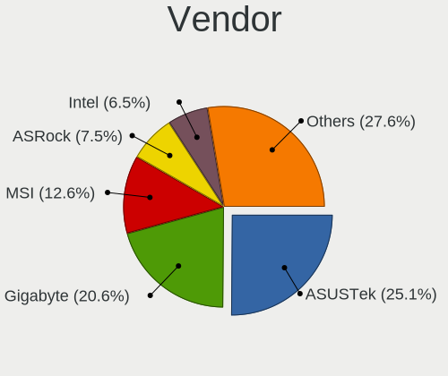
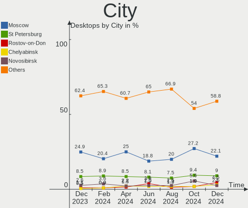
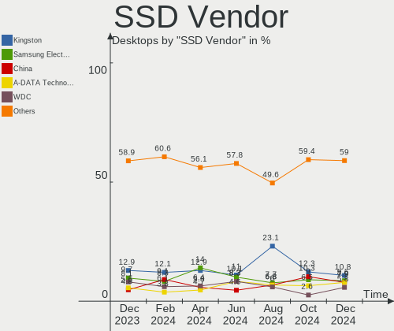
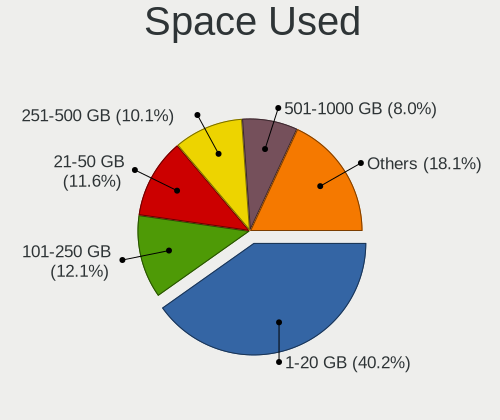
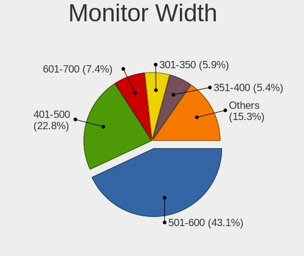

Linux in Russia - Hardware Trends (Desktops)
--------------------------------------------

A project to identify most popular hardware characteristics and track their change
over time based on data collected by Linux users at https://Linux-Hardware.org.

Anyone can contribute to this report by the [hw-probe](https://github.com/linuxhw/hw-probe) tool:

    sudo -E hw-probe -all -upload

Period: Sep, 2022.

Contents
--------

* [ System ](#system)
  - [ OS                       ](#os)
  - [ OS Family                ](#os-family)
  - [ Kernel                   ](#kernel)
  - [ Kernel Family            ](#kernel-family)
  - [ Kernel Major Ver.        ](#kernel-major-ver)
  - [ Arch                     ](#arch)
  - [ DE                       ](#de)
  - [ Display Server           ](#display-server)
  - [ Display Manager          ](#display-manager)
  - [ OS Lang                  ](#os-lang)
  - [ Boot Mode                ](#boot-mode)
  - [ Filesystem               ](#filesystem)
  - [ Part. scheme             ](#part-scheme)
  - [ Dual Boot with Linux/BSD ](#dual-boot-with-linuxbsd)
  - [ Dual Boot (Win)          ](#dual-boot-win)

* [ Board ](#board)
  - [ Vendor                   ](#vendor)
  - [ Model                    ](#model)
  - [ Model Family             ](#model-family)
  - [ MFG Year                 ](#mfg-year)
  - [ Form Factor              ](#form-factor)
  - [ Secure Boot              ](#secure-boot)
  - [ Coreboot                 ](#coreboot)
  - [ RAM Size                 ](#ram-size)
  - [ RAM Used                 ](#ram-used)
  - [ Total Drives             ](#total-drives)
  - [ Has CD-ROM               ](#has-cd-rom)
  - [ Has Ethernet             ](#has-ethernet)
  - [ Has WiFi                 ](#has-wifi)
  - [ Has Bluetooth            ](#has-bluetooth)

* [ Location ](#location)
  - [ Country                  ](#country)
  - [ City                     ](#city)

* [ Drives ](#drives)
  - [ Drive Vendor             ](#drive-vendor)
  - [ Drive Model              ](#drive-model)
  - [ HDD Vendor               ](#hdd-vendor)
  - [ SSD Vendor               ](#ssd-vendor)
  - [ Drive Kind               ](#drive-kind)
  - [ Drive Connector          ](#drive-connector)
  - [ Drive Size               ](#drive-size)
  - [ Space Total              ](#space-total)
  - [ Space Used               ](#space-used)
  - [ Malfunc. Drives          ](#malfunc-drives)
  - [ Malfunc. Drive Vendor    ](#malfunc-drive-vendor)
  - [ Malfunc. HDD Vendor      ](#malfunc-hdd-vendor)
  - [ Malfunc. Drive Kind      ](#malfunc-drive-kind)
  - [ Failed Drives            ](#failed-drives)
  - [ Failed Drive Vendor      ](#failed-drive-vendor)
  - [ Drive Status             ](#drive-status)

* [ Storage controller ](#storage-controller)
  - [ Storage Vendor           ](#storage-vendor)
  - [ Storage Model            ](#storage-model)
  - [ Storage Kind             ](#storage-kind)

* [ Processor ](#processor)
  - [ CPU Vendor               ](#cpu-vendor)
  - [ CPU Model                ](#cpu-model)
  - [ CPU Model Family         ](#cpu-model-family)
  - [ CPU Cores                ](#cpu-cores)
  - [ CPU Sockets              ](#cpu-sockets)
  - [ CPU Threads              ](#cpu-threads)
  - [ CPU Op-Modes             ](#cpu-op-modes)
  - [ CPU Microcode            ](#cpu-microcode)
  - [ CPU Microarch            ](#cpu-microarch)

* [ Graphics ](#graphics)
  - [ GPU Vendor               ](#gpu-vendor)
  - [ GPU Model                ](#gpu-model)
  - [ GPU Combo                ](#gpu-combo)
  - [ GPU Driver               ](#gpu-driver)
  - [ GPU Memory               ](#gpu-memory)

* [ Monitor ](#monitor)
  - [ Monitor Vendor           ](#monitor-vendor)
  - [ Monitor Model            ](#monitor-model)
  - [ Monitor Resolution       ](#monitor-resolution)
  - [ Monitor Diagonal         ](#monitor-diagonal)
  - [ Monitor Width            ](#monitor-width)
  - [ Aspect Ratio             ](#aspect-ratio)
  - [ Monitor Area             ](#monitor-area)
  - [ Pixel Density            ](#pixel-density)
  - [ Multiple Monitors        ](#multiple-monitors)

* [ Network ](#network)
  - [ Net Controller Vendor    ](#net-controller-vendor)
  - [ Net Controller Model     ](#net-controller-model)
  - [ Wireless Vendor          ](#wireless-vendor)
  - [ Wireless Model           ](#wireless-model)
  - [ Ethernet Vendor          ](#ethernet-vendor)
  - [ Ethernet Model           ](#ethernet-model)
  - [ Net Controller Kind      ](#net-controller-kind)
  - [ Used Controller          ](#used-controller)
  - [ NICs                     ](#nics)
  - [ IPv6                     ](#ipv6)

* [ Bluetooth ](#bluetooth)
  - [ Bluetooth Vendor         ](#bluetooth-vendor)
  - [ Bluetooth Model          ](#bluetooth-model)

* [ Sound ](#sound)
  - [ Sound Vendor             ](#sound-vendor)
  - [ Sound Model              ](#sound-model)

* [ Memory ](#memory)
  - [ Memory Vendor            ](#memory-vendor)
  - [ Memory Model             ](#memory-model)
  - [ Memory Kind              ](#memory-kind)
  - [ Memory Form Factor       ](#memory-form-factor)
  - [ Memory Size              ](#memory-size)
  - [ Memory Speed             ](#memory-speed)

* [ Printers & scanners ](#printers--scanners)
  - [ Printer Vendor           ](#printer-vendor)
  - [ Printer Model            ](#printer-model)
  - [ Scanner Vendor           ](#scanner-vendor)
  - [ Scanner Model            ](#scanner-model)

* [ Camera ](#camera)
  - [ Camera Vendor            ](#camera-vendor)
  - [ Camera Model             ](#camera-model)

* [ Security ](#security)
  - [ Fingerprint Vendor       ](#fingerprint-vendor)
  - [ Fingerprint Model        ](#fingerprint-model)
  - [ Chipcard Vendor          ](#chipcard-vendor)
  - [ Chipcard Model           ](#chipcard-model)

* [ Unsupported ](#unsupported)
  - [ Unsupported Devices      ](#unsupported-devices)
  - [ Unsupported Device Types ](#unsupported-device-types)

System
------

OS
--

Installed operating systems

| Name                         | Desktops | Percent |
|------------------------------|----------|---------|
| ROSA 12.2                    | 99       | 35.23%  |
| Debian 11                    | 53       | 18.86%  |
| Xubuntu 20.04                | 25       | 8.9%    |
| ROSA R11.1                   | 11       | 3.91%   |
| OpenMandriva 4.3             | 11       | 3.91%   |
| Fedora 36                    | 9        | 3.2%    |
| Ubuntu 22.04                 | 8        | 2.85%   |
| Red OS 7.3.1                 | 8        | 2.85%   |
| Linux Mint 21                | 8        | 2.85%   |
| Ubuntu 20.04                 | 4        | 1.42%   |
| OpenMandriva 4.50            | 4        | 1.42%   |
| Manjaro 22.0.0               | 3        | 1.07%   |
| KDE neon 20.04               | 3        | 1.07%   |
| ROSA 12.1                    | 2        | 0.71%   |
| openSUSE Tumbleweed-XXXXXXXX | 2        | 0.71%   |
| openSUSE Leap-15.4           | 2        | 0.71%   |
| Manjaro                      | 2        | 0.71%   |
| Kubuntu 22.04                | 2        | 0.71%   |
| EndeavourOS Rolling          | 2        | 0.71%   |
| Elementary 6.1               | 2        | 0.71%   |
| Arch                         | 2        | 0.71%   |
| Ubuntu MATE 18.04            | 1        | 0.36%   |
| Ubuntu 22.10                 | 1        | 0.36%   |
| Ubuntu 21.10                 | 1        | 0.36%   |
| Trisquel 10.0.1              | 1        | 0.36%   |
| ROSA R11                     | 1        | 0.36%   |
| ROSA 12                      | 1        | 0.36%   |
| RED X4                       | 1        | 0.36%   |
| Red OS 7.3.2                 | 1        | 0.36%   |
| Red OS 7.3                   | 1        | 0.36%   |
| Manjaro 21.3.7               | 1        | 0.36%   |
| Mageia 8                     | 1        | 0.36%   |
| LMDE 5                       | 1        | 0.36%   |
| Linux Mint 20.3              | 1        | 0.36%   |
| Debian 11-updates            | 1        | 0.36%   |
| Clear Linux 36010            | 1        | 0.36%   |
| Astra Linux 1.7_x86-64       | 1        | 0.36%   |
| Arch Rolling                 | 1        | 0.36%   |
| ALT Linux 10.1               | 1        | 0.36%   |
| ALT Linux 10.0               | 1        | 0.36%   |

OS Family
---------

OS without a version

| Name         | Desktops | Percent |
|--------------|----------|---------|
| ROSA         | 114      | 40.57%  |
| Debian       | 54       | 19.22%  |
| Xubuntu      | 25       | 8.9%    |
| OpenMandriva | 15       | 5.34%   |
| Ubuntu       | 14       | 4.98%   |
| Red OS       | 10       | 3.56%   |
| Linux Mint   | 9        | 3.2%    |
| Fedora       | 9        | 3.2%    |
| Manjaro      | 6        | 2.14%   |
| openSUSE     | 4        | 1.42%   |
| KDE neon     | 3        | 1.07%   |
| Arch         | 3        | 1.07%   |
| Kubuntu      | 2        | 0.71%   |
| EndeavourOS  | 2        | 0.71%   |
| Elementary   | 2        | 0.71%   |
| ALT Linux    | 2        | 0.71%   |
| Ubuntu MATE  | 1        | 0.36%   |
| Trisquel     | 1        | 0.36%   |
| RED          | 1        | 0.36%   |
| Mageia       | 1        | 0.36%   |
| LMDE         | 1        | 0.36%   |
| Clear Linux  | 1        | 0.36%   |
| Astra Linux  | 1        | 0.36%   |

Kernel
------

Version of the Linux kernel

| Version                                | Desktops | Percent |
|----------------------------------------|----------|---------|
| 5.10.0-7-amd64                         | 48       | 17.08%  |
| 5.10.74-generic-2rosa2021.1-x86_64     | 43       | 15.3%   |
| 5.10.118-generic-2rosa2021.1-x86_64    | 39       | 13.88%  |
| 5.4.0-126-generic                      | 17       | 6.05%   |
| 5.16.7-desktop-1omv4003                | 11       | 3.91%   |
| 5.4.0-125-generic                      | 10       | 3.56%   |
| 5.15.0-48-generic                      | 10       | 3.56%   |
| 5.15.0-47-generic                      | 9        | 3.2%    |
| 5.15.0-46-generic                      | 7        | 2.49%   |
| 5.15.43-generic-2rosa2021.1-x86_64     | 6        | 2.14%   |
| 5.18.18.xm1-1-xanmod-rosa2021.1-x86_64 | 5        | 1.78%   |
| 5.15.35-5.el7.3.x86_64                 | 5        | 1.78%   |
| 5.19.5-desktop-1omv4090                | 4        | 1.42%   |
| 5.4.83-generic-2rosa-x86_64            | 3        | 1.07%   |
| 5.19.8-200.fc36.x86_64                 | 3        | 1.07%   |
| 5.17.11-generic-2rosa2021.1-x86_64     | 3        | 1.07%   |
| 5.15.10-1.el7.x86_64                   | 3        | 1.07%   |
| 6.0.0-1-MANJARO                        | 2        | 0.71%   |
| 5.4.83-generic-2rosa-i586              | 2        | 0.71%   |
| 5.19.9-200.fc36.x86_64                 | 2        | 0.71%   |
| 5.19.10-arch1-1                        | 2        | 0.71%   |
| 5.17.5-300.fc36.x86_64                 | 2        | 0.71%   |
| 5.15.35-4.el7.3.x86_64                 | 2        | 0.71%   |
| 5.14.21-150400.24.18-default           | 2        | 0.71%   |
| 5.10.0-18-amd64                        | 2        | 0.71%   |
| 5.10.0-17-amd64                        | 2        | 0.71%   |
| 4.9.155-nrj-desktop-1rosa-x86_64       | 2        | 0.71%   |
| 4.15.0-desktop-122.124.1rosa-x86_64    | 2        | 0.71%   |
| 5.5.19-generic-1rosa-x86_64            | 1        | 0.36%   |
| 5.4.32-generic-2rosa-x86_64            | 1        | 0.36%   |
| 5.4.32-generic-2rosa-i586              | 1        | 0.36%   |
| 5.19.9-arch1-1                         | 1        | 0.36%   |
| 5.19.8-1-default                       | 1        | 0.36%   |
| 5.19.7-arch1-1                         | 1        | 0.36%   |
| 5.19.7-1-MANJARO                       | 1        | 0.36%   |
| 5.19.6-xm1.0.fc36.x86_64               | 1        | 0.36%   |
| 5.19.4-200.fc36.x86_64                 | 1        | 0.36%   |
| 5.19.2-1-default                       | 1        | 0.36%   |
| 5.19.11-arch1-1                        | 1        | 0.36%   |
| 5.19.0-18-generic                      | 1        | 0.36%   |

Kernel Family
-------------

Linux kernel without a distro release

| Version  | Desktops | Percent |
|----------|----------|---------|
| 5.10.0   | 53       | 18.86%  |
| 5.10.74  | 44       | 15.66%  |
| 5.10.118 | 40       | 14.23%  |
| 5.4.0    | 27       | 9.61%   |
| 5.15.0   | 27       | 9.61%   |
| 5.16.7   | 11       | 3.91%   |
| 5.15.35  | 7        | 2.49%   |
| 5.18.18  | 6        | 2.14%   |
| 5.15.43  | 6        | 2.14%   |
| 5.4.83   | 5        | 1.78%   |
| 5.19.8   | 4        | 1.42%   |
| 5.19.5   | 4        | 1.42%   |
| 5.19.9   | 3        | 1.07%   |
| 5.17.11  | 3        | 1.07%   |
| 5.15.10  | 3        | 1.07%   |
| 4.15.0   | 3        | 1.07%   |
| 6.0.0    | 2        | 0.71%   |
| 5.4.32   | 2        | 0.71%   |
| 5.19.7   | 2        | 0.71%   |
| 5.19.10  | 2        | 0.71%   |
| 5.19.0   | 2        | 0.71%   |
| 5.17.5   | 2        | 0.71%   |
| 5.15.65  | 2        | 0.71%   |
| 5.14.21  | 2        | 0.71%   |
| 4.9.155  | 2        | 0.71%   |
| 5.5.19   | 1        | 0.36%   |
| 5.19.6   | 1        | 0.36%   |
| 5.19.4   | 1        | 0.36%   |
| 5.19.2   | 1        | 0.36%   |
| 5.19.11  | 1        | 0.36%   |
| 5.18.17  | 1        | 0.36%   |
| 5.18.14  | 1        | 0.36%   |
| 5.18.0   | 1        | 0.36%   |
| 5.16.13  | 1        | 0.36%   |
| 5.15.67  | 1        | 0.36%   |
| 5.15.63  | 1        | 0.36%   |
| 5.15.62  | 1        | 0.36%   |
| 5.15.34  | 1        | 0.36%   |
| 5.13.19  | 1        | 0.36%   |
| 5.13.0   | 1        | 0.36%   |

Kernel Major Ver.
-----------------

Linux kernel major version

| Version | Desktops | Percent |
|---------|----------|---------|
| 5.10    | 138      | 49.11%  |
| 5.15    | 49       | 17.44%  |
| 5.4     | 34       | 12.1%   |
| 5.19    | 21       | 7.47%   |
| 5.16    | 12       | 4.27%   |
| 5.18    | 9        | 3.2%    |
| 5.17    | 5        | 1.78%   |
| 4.15    | 3        | 1.07%   |
| 6.0     | 2        | 0.71%   |
| 5.14    | 2        | 0.71%   |
| 5.13    | 2        | 0.71%   |
| 4.9     | 2        | 0.71%   |
| 5.5     | 1        | 0.36%   |
| 5.0     | 1        | 0.36%   |

Arch
----

OS architecture (x86_64, i586, etc.)

| Name   | Desktops | Percent |
|--------|----------|---------|
| x86_64 | 276      | 98.22%  |
| i686   | 5        | 1.78%   |

DE
--

Desktop Environment

| Name            | Desktops | Percent |
|-----------------|----------|---------|
| KDE5            | 81       | 28.83%  |
| GNOME           | 72       | 25.62%  |
| Unknown         | 50       | 17.79%  |
| XFCE            | 32       | 11.39%  |
| MATE            | 13       | 4.63%   |
| LXQt            | 10       | 3.56%   |
| X-Cinnamon      | 8        | 2.85%   |
| KDE4            | 8        | 2.85%   |
| Pantheon        | 2        | 0.71%   |
| Cinnamon        | 2        | 0.71%   |
| KDE             | 1        | 0.36%   |
| GNOME Flashback | 1        | 0.36%   |
| GNOME Classic   | 1        | 0.36%   |

Display Server
--------------

X11 or Wayland

| Name    | Desktops | Percent |
|---------|----------|---------|
| X11     | 130      | 46.26%  |
| Wayland | 100      | 35.59%  |
| Unknown | 48       | 17.08%  |
| Tty     | 3        | 1.07%   |

Display Manager
---------------

SDDM, LightDM, etc.

| Name    | Desktops | Percent |
|---------|----------|---------|
| Unknown | 80       | 28.47%  |
| SDDM    | 73       | 25.98%  |
| GDM     | 71       | 25.27%  |
| LightDM | 36       | 12.81%  |
| GDM3    | 12       | 4.27%   |
| KDM     | 8        | 2.85%   |
| FLY-DM  | 1        | 0.36%   |

OS Lang
-------

Language

| Lang    | Desktops | Percent |
|---------|----------|---------|
| ru_RU   | 244      | 86.83%  |
| en_US   | 24       | 8.54%   |
| Unknown | 10       | 3.56%   |
| C       | 2        | 0.71%   |
| ba_RU   | 1        | 0.36%   |

Boot Mode
---------

EFI or BIOS

| Mode | Desktops | Percent |
|------|----------|---------|
| BIOS | 177      | 62.99%  |
| EFI  | 104      | 37.01%  |

Filesystem
----------

Type of filesystem

| Type    | Desktops | Percent |
|---------|----------|---------|
| Ext4    | 193      | 68.68%  |
| Overlay | 60       | 21.35%  |
| Btrfs   | 24       | 8.54%   |
| Zfs     | 3        | 1.07%   |
| Xfs     | 1        | 0.36%   |

Part. scheme
------------

Scheme of partitioning

| Type    | Desktops | Percent |
|---------|----------|---------|
| GPT     | 122      | 43.42%  |
| MBR     | 116      | 41.28%  |
| Unknown | 43       | 15.3%   |

Dual Boot with Linux/BSD
------------------------

Hosting more than one Linux/BSD

| Dual boot | Desktops | Percent |
|-----------|----------|---------|
| No        | 235      | 83.63%  |
| Yes       | 46       | 16.37%  |

Dual Boot (Win)
---------------

Hosting Linux and Windows

| Dual boot | Desktops | Percent |
|-----------|----------|---------|
| Yes       | 141      | 50.18%  |
| No        | 140      | 49.82%  |

Board
-----

Vendor
------

Motherboard manufacturer

| Name                | Desktops | Percent |
|---------------------|----------|---------|
| Gigabyte Technology | 83       | 29.54%  |
| ASUSTek Computer    | 74       | 26.33%  |
| ASRock              | 49       | 17.44%  |
| MSI                 | 18       | 6.41%   |
| ECS                 | 15       | 5.34%   |
| Huanan              | 8        | 2.85%   |
| Lenovo              | 6        | 2.14%   |
| Hewlett-Packard     | 5        | 1.78%   |
| Intel               | 4        | 1.42%   |
| Unknown             | 4        | 1.42%   |
| MACHINIST           | 3        | 1.07%   |
| Biostar             | 3        | 1.07%   |
| Foxconn             | 2        | 0.71%   |
| Dell                | 2        | 0.71%   |
| Thecus              | 1        | 0.36%   |
| RDW                 | 1        | 0.36%   |
| Pegatron            | 1        | 0.36%   |
| JGINYUE             | 1        | 0.36%   |
| Colorful Technology | 1        | 0.36%   |

Model
-----

Motherboard model

| Name                               | Desktops | Percent |
|------------------------------------|----------|---------|
| ASRock H470M-HVS                   | 17       | 6.05%   |
| Gigabyte H410M S2H                 | 15       | 5.34%   |
| ECS G31T-M9                        | 13       | 4.63%   |
| ASUS All Series                    | 12       | 4.27%   |
| Unknown                            | 4        | 1.42%   |
| MSI MS-7A38                        | 3        | 1.07%   |
| MSI MS-7680                        | 3        | 1.07%   |
| MACHINIST B75 PRO V1.0             | 3        | 1.07%   |
| HP Compaq Pro 6300 MT              | 3        | 1.07%   |
| Gigabyte M56S-S3                   | 3        | 1.07%   |
| Gigabyte 970A-DS3P                 | 3        | 1.07%   |
| ASUS S20 K29                       | 3        | 1.07%   |
| MSI MS-7996                        | 2        | 0.71%   |
| MSI MS-7599                        | 2        | 0.71%   |
| Gigabyte H81M-S2V                  | 2        | 0.71%   |
| Gigabyte H61M-S2PV                 | 2        | 0.71%   |
| Gigabyte H110M-S2                  | 2        | 0.71%   |
| Gigabyte B550 AORUS ELITE V2       | 2        | 0.71%   |
| Gigabyte A320M-H                   | 2        | 0.71%   |
| ASUS TUF Gaming Z590-PLUS WIFI     | 2        | 0.71%   |
| ASUS PRIME B360-PLUS               | 2        | 0.71%   |
| ASUS P8H61-MX R2.0                 | 2        | 0.71%   |
| ASUS P8H61-M LE                    | 2        | 0.71%   |
| ASUS M3N78-VM                      | 2        | 0.71%   |
| ASUS H110M-R                       | 2        | 0.71%   |
| ASRock B450M Pro4-F                | 2        | 0.71%   |
| Thecus N2810                       | 1        | 0.36%   |
| RDW RDW-MB-B450M V.1               | 1        | 0.36%   |
| Pegatron Compaq dx2400 Microtower  | 1        | 0.36%   |
| MSI MS-7C39                        | 1        | 0.36%   |
| MSI MS-7B89                        | 1        | 0.36%   |
| MSI MS-7B86                        | 1        | 0.36%   |
| MSI MS-7A70                        | 1        | 0.36%   |
| MSI MS-7733                        | 1        | 0.36%   |
| MSI MS-7641                        | 1        | 0.36%   |
| MSI MS-7592                        | 1        | 0.36%   |
| MSI MS-7253                        | 1        | 0.36%   |
| Lenovo ThinkCentre M92p 32361B5    | 1        | 0.36%   |
| Lenovo ThinkCentre M700 10JNS05E00 | 1        | 0.36%   |
| Lenovo ThinkCentre M58 8910A8U     | 1        | 0.36%   |

Model Family
------------

Motherboard model prefix

| Name               | Desktops | Percent |
|--------------------|----------|---------|
| ASRock H470M-HVS   | 17       | 6.05%   |
| Gigabyte H410M     | 15       | 5.34%   |
| ASUS PRIME         | 14       | 4.98%   |
| ECS G31T-M9        | 13       | 4.63%   |
| ASUS All           | 12       | 4.27%   |
| ASUS TUF           | 6        | 2.14%   |
| ASUS P8H61-M       | 4        | 1.42%   |
| Unknown            | 4        | 1.42%   |
| MSI MS-7A38        | 3        | 1.07%   |
| MSI MS-7680        | 3        | 1.07%   |
| MACHINIST B75      | 3        | 1.07%   |
| Lenovo ThinkCentre | 3        | 1.07%   |
| HP Compaq          | 3        | 1.07%   |
| Gigabyte M56S-S3   | 3        | 1.07%   |
| Gigabyte B550      | 3        | 1.07%   |
| Gigabyte 970A-DS3P | 3        | 1.07%   |
| ASUS S20           | 3        | 1.07%   |
| MSI MS-7996        | 2        | 0.71%   |
| MSI MS-7599        | 2        | 0.71%   |
| Lenovo IdeaCentre  | 2        | 0.71%   |
| HP ProDesk         | 2        | 0.71%   |
| Gigabyte Z390      | 2        | 0.71%   |
| Gigabyte H81M-S2V  | 2        | 0.71%   |
| Gigabyte H61M-S2PV | 2        | 0.71%   |
| Gigabyte H61M-DS2  | 2        | 0.71%   |
| Gigabyte H110M-S2  | 2        | 0.71%   |
| Gigabyte B550M     | 2        | 0.71%   |
| Gigabyte B450M     | 2        | 0.71%   |
| Gigabyte B450      | 2        | 0.71%   |
| Gigabyte A520M     | 2        | 0.71%   |
| Gigabyte A320M-H   | 2        | 0.71%   |
| ASUS ROG           | 2        | 0.71%   |
| ASUS P8H61-MX      | 2        | 0.71%   |
| ASUS P5G41T-M      | 2        | 0.71%   |
| ASUS Maximus       | 2        | 0.71%   |
| ASUS M3N78-VM      | 2        | 0.71%   |
| ASUS H110M-R       | 2        | 0.71%   |
| ASRock B450M       | 2        | 0.71%   |
| Thecus N2810       | 1        | 0.36%   |
| RDW RDW-MB-B450M   | 1        | 0.36%   |

MFG Year
--------

Motherboard manufacture year

| Year | Desktops | Percent |
|------|----------|---------|
| 2021 | 38       | 13.52%  |
| 2020 | 36       | 12.81%  |
| 2012 | 32       | 11.39%  |
| 2013 | 24       | 8.54%   |
| 2018 | 21       | 7.47%   |
| 2009 | 21       | 7.47%   |
| 2019 | 17       | 6.05%   |
| 2016 | 15       | 5.34%   |
| 2011 | 13       | 4.63%   |
| 2008 | 12       | 4.27%   |
| 2010 | 11       | 3.91%   |
| 2022 | 9        | 3.2%    |
| 2017 | 9        | 3.2%    |
| 2007 | 9        | 3.2%    |
| 2014 | 8        | 2.85%   |
| 2015 | 5        | 1.78%   |
| 2006 | 1        | 0.36%   |

Form Factor
-----------

Physical design of the computer

| Name    | Desktops | Percent |
|---------|----------|---------|
| Desktop | 281      | 100%    |

Secure Boot
-----------

Enabled or disabled

| State    | Desktops | Percent |
|----------|----------|---------|
| Disabled | 278      | 98.93%  |
| Enabled  | 3        | 1.07%   |

Coreboot
--------

Have coreboot on board

| Used | Desktops | Percent |
|------|----------|---------|
| No   | 281      | 100%    |

RAM Size
--------

Total RAM memory

| Size in GB  | Desktops | Percent |
|-------------|----------|---------|
| 16.01-24.0  | 70       | 24.91%  |
| 4.01-8.0    | 50       | 17.79%  |
| 3.01-4.0    | 48       | 17.08%  |
| 32.01-64.0  | 43       | 15.3%   |
| 8.01-16.0   | 35       | 12.46%  |
| 1.01-2.0    | 19       | 6.76%   |
| 64.01-256.0 | 7        | 2.49%   |
| 24.01-32.0  | 6        | 2.14%   |
| 2.01-3.0    | 2        | 0.71%   |
| 0.51-1.0    | 1        | 0.36%   |

RAM Used
--------

Used RAM memory

| Used GB   | Desktops | Percent |
|-----------|----------|---------|
| 1.01-2.0  | 114      | 40.57%  |
| 0.51-1.0  | 92       | 32.74%  |
| 2.01-3.0  | 33       | 11.74%  |
| 4.01-8.0  | 22       | 7.83%   |
| 3.01-4.0  | 15       | 5.34%   |
| 8.01-16.0 | 5        | 1.78%   |

Total Drives
------------

Number of drives on board

| Drives | Desktops | Percent |
|--------|----------|---------|
| 1      | 139      | 49.47%  |
| 2      | 76       | 27.05%  |
| 3      | 38       | 13.52%  |
| 4      | 16       | 5.69%   |
| 6      | 5        | 1.78%   |
| 5      | 5        | 1.78%   |
| 0      | 2        | 0.71%   |

Has CD-ROM
----------

Has CD-ROM on board

| Presented | Desktops | Percent |
|-----------|----------|---------|
| No        | 214      | 76.16%  |
| Yes       | 67       | 23.84%  |

Has Ethernet
------------

Has Ethernet on board

| Presented | Desktops | Percent |
|-----------|----------|---------|
| Yes       | 280      | 99.64%  |
| No        | 1        | 0.36%   |

Has WiFi
--------

Has WiFi module

| Presented | Desktops | Percent |
|-----------|----------|---------|
| No        | 212      | 75.44%  |
| Yes       | 69       | 24.56%  |

Has Bluetooth
-------------

Has Bluetooth module

| Presented | Desktops | Percent |
|-----------|----------|---------|
| No        | 236      | 83.99%  |
| Yes       | 45       | 16.01%  |

Location
--------

Country
-------

Geographic location (country)

| Country | Desktops | Percent |
|---------|----------|---------|
| Russia  | 281      | 100%    |

City
----

Geographic location (city)

| City              | Desktops | Percent |
|-------------------|----------|---------|
| Voronezh          | 72       | 25.62%  |
| Moscow            | 37       | 13.17%  |
| St Petersburg     | 20       | 7.12%   |
| Yekaterinburg     | 9        | 3.2%    |
| Novosibirsk       | 7        | 2.49%   |
| Nizhniy Novgorod  | 7        | 2.49%   |
| Krasnodar         | 7        | 2.49%   |
| Chelyabinsk       | 7        | 2.49%   |
| Vladivostok       | 6        | 2.14%   |
| Saratov           | 6        | 2.14%   |
| Perm              | 4        | 1.42%   |
| Yaroslavl         | 3        | 1.07%   |
| Tyumen            | 3        | 1.07%   |
| Rostov-on-Don     | 3        | 1.07%   |
| Irkutsk           | 3        | 1.07%   |
| Volgograd         | 2        | 0.71%   |
| Ufa               | 2        | 0.71%   |
| Tver              | 2        | 0.71%   |
| Tula              | 2        | 0.71%   |
| Sochi             | 2        | 0.71%   |
| Shchelkovo        | 2        | 0.71%   |
| Samara            | 2        | 0.71%   |
| Podolsk           | 2        | 0.71%   |
| Petrozavodsk      | 2        | 0.71%   |
| Penza             | 2        | 0.71%   |
| Noril'sk          | 2        | 0.71%   |
| Murom             | 2        | 0.71%   |
| Murmansk          | 2        | 0.71%   |
| Krasnoyarsk       | 2        | 0.71%   |
| Kirov             | 2        | 0.71%   |
| Kemerovo          | 2        | 0.71%   |
| Blagoveshchensk   | 2        | 0.71%   |
| Barnaul           | 2        | 0.71%   |
| Arkhangelsk       | 2        | 0.71%   |
| Unknown           | 2        | 0.71%   |
| Yuzhno-Sakhalinsk | 1        | 0.36%   |
| Yoshkar-Ola       | 1        | 0.36%   |
| Yelets            | 1        | 0.36%   |
| Vologda           | 1        | 0.36%   |
| Vidnoye           | 1        | 0.36%   |

Drives
------

Drive Vendor
------------

Hard drive vendors

| Vendor                       | Desktops | Drives | Percent |
|------------------------------|----------|--------|---------|
| WDC                          | 84       | 106    | 17.61%  |
| Seagate                      | 72       | 92     | 15.09%  |
| Toshiba                      | 56       | 56     | 11.74%  |
| Samsung Electronics          | 39       | 45     | 8.18%   |
| Kingston                     | 38       | 41     | 7.97%   |
| Netac                        | 23       | 23     | 4.82%   |
| Hitachi                      | 22       | 23     | 4.61%   |
| A-DATA Technology            | 14       | 15     | 2.94%   |
| SanDisk                      | 13       | 13     | 2.73%   |
| Crucial                      | 10       | 12     | 2.1%    |
| HGST                         | 8        | 9      | 1.68%   |
| China                        | 8        | 8      | 1.68%   |
| SPCC                         | 7        | 8      | 1.47%   |
| AMD                          | 7        | 7      | 1.47%   |
| Apacer                       | 6        | 7      | 1.26%   |
| Transcend                    | 5        | 5      | 1.05%   |
| Patriot                      | 4        | 5      | 0.84%   |
| Smartbuy                     | 3        | 4      | 0.63%   |
| KingSpec                     | 3        | 3      | 0.63%   |
| JMicron Technology           | 3        | 3      | 0.63%   |
| Intel                        | 3        | 3      | 0.63%   |
| Gigabyte Technology          | 3        | 3      | 0.63%   |
| WALRAM                       | 2        | 2      | 0.42%   |
| Silicon Motion               | 2        | 2      | 0.42%   |
| Shenzhen Longsys Electronics | 2        | 2      | 0.42%   |
| Plextor                      | 2        | 2      | 0.42%   |
| Phison                       | 2        | 2      | 0.42%   |
| KingFast                     | 2        | 2      | 0.42%   |
| Hikvision                    | 2        | 2      | 0.42%   |
| External                     | 2        | 2      | 0.42%   |
| Corsair                      | 2        | 2      | 0.42%   |
| Unknown                      | 2        | 2      | 0.42%   |
| Yunhaitian                   | 1        | 1      | 0.21%   |
| XrayDisk                     | 1        | 1      | 0.21%   |
| XPG                          | 1        | 1      | 0.21%   |
| Vaseky                       | 1        | 1      | 0.21%   |
| Unknown                      | 1        | 1      | 0.21%   |
| UMIS                         | 1        | 1      | 0.21%   |
| SK hynix                     | 1        | 1      | 0.21%   |
| Reeioon                      | 1        | 1      | 0.21%   |

Drive Model
-----------

Hard drive models

| Model                            | Desktops | Percent |
|----------------------------------|----------|---------|
| Toshiba HDWD110 1TB              | 24       | 4.58%   |
| Kingston SA400S37240G 240GB SSD  | 20       | 3.82%   |
| Netac SSD 240GB                  | 18       | 3.44%   |
| Toshiba DT01ACA050 500GB         | 11       | 2.1%    |
| Seagate ST500DM002-1BD142 500GB  | 9        | 1.72%   |
| Seagate ST1000DM010-2EP102 1TB   | 9        | 1.72%   |
| Hitachi HDS721050CLA362 500GB    | 9        | 1.72%   |
| WDC WDS500G2B0A-00SM50 500GB SSD | 7        | 1.34%   |
| Seagate ST3500418AS 500GB        | 6        | 1.15%   |
| Crucial CT480BX500SSD1 480GB     | 6        | 1.15%   |
| WDC WDS240G2G0A-00JH30 240GB SSD | 5        | 0.95%   |
| Samsung SSD 860 EVO 250GB        | 5        | 0.95%   |
| WDC WDS240G2G0B-00EPW0 240GB SSD | 4        | 0.76%   |
| Samsung SSD 860 EVO 500GB        | 4        | 0.76%   |
| WDC WD5000AAKX-60U6AA0 500GB     | 3        | 0.57%   |
| WDC WD10EZEX-00BN5A0 1TB         | 3        | 0.57%   |
| Toshiba HDWD120 2TB              | 3        | 0.57%   |
| Toshiba HDWD105 500GB            | 3        | 0.57%   |
| SPCC Solid State Disk 128GB      | 3        | 0.57%   |
| Seagate ST3320613AS 320GB        | 3        | 0.57%   |
| Seagate ST3250310AS 250GB        | 3        | 0.57%   |
| Seagate ST2000DM001-1CH164 2TB   | 3        | 0.57%   |
| Seagate ST1000DM003-1CH162 1TB   | 3        | 0.57%   |
| SanDisk SDSSDA120G 120GB         | 3        | 0.57%   |
| Samsung SSD 970 EVO Plus 250GB   | 3        | 0.57%   |
| Samsung SSD 970 EVO Plus 1TB     | 3        | 0.57%   |
| Kingston SV300S37A120G 120GB SSD | 3        | 0.57%   |
| Kingston SA400S37480G 480GB SSD  | 3        | 0.57%   |
| Crucial CT240BX500SSD1 240GB     | 3        | 0.57%   |
| Apacer AS350 128GB SSD           | 3        | 0.57%   |
| AMD R5SL120G 120GB SSD           | 3        | 0.57%   |
| WDC WD5000AAKX-083CA1 500GB      | 2        | 0.38%   |
| WDC WD5000AAKX-00ERMA0 500GB     | 2        | 0.38%   |
| WDC WD3200AAKS-00L9A0 320GB      | 2        | 0.38%   |
| WDC WD2500AAKS-00B3A0 250GB      | 2        | 0.38%   |
| WDC WD20EZAZ-00L9GB0 2TB         | 2        | 0.38%   |
| WDC WD15EARS-00MVWB0 1TB         | 2        | 0.38%   |
| Toshiba DT01ACA300 3TB           | 2        | 0.38%   |
| SPCC Solid State Disk 64GB       | 2        | 0.38%   |
| Smartbuy SSD 240GB               | 2        | 0.38%   |

HDD Vendor
----------

Hard disk drive vendors

| Vendor              | Desktops | Drives | Percent |
|---------------------|----------|--------|---------|
| Seagate             | 72       | 91     | 30.51%  |
| WDC                 | 70       | 82     | 29.66%  |
| Toshiba             | 55       | 55     | 23.31%  |
| Hitachi             | 22       | 23     | 9.32%   |
| HGST                | 8        | 9      | 3.39%   |
| Samsung Electronics | 7        | 7      | 2.97%   |
| Maxtor              | 1        | 1      | 0.42%   |
| HGST HTS            | 1        | 1      | 0.42%   |

SSD Vendor
----------

Solid state drive vendors

| Vendor              | Desktops | Drives | Percent |
|---------------------|----------|--------|---------|
| Kingston            | 31       | 32     | 16.94%  |
| WDC                 | 21       | 24     | 11.48%  |
| Netac               | 21       | 21     | 11.48%  |
| Samsung Electronics | 15       | 17     | 8.2%    |
| A-DATA Technology   | 11       | 12     | 6.01%   |
| Crucial             | 10       | 12     | 5.46%   |
| China               | 8        | 8      | 4.37%   |
| SPCC                | 6        | 7      | 3.28%   |
| SanDisk             | 6        | 6      | 3.28%   |
| AMD                 | 6        | 6      | 3.28%   |
| Transcend           | 5        | 5      | 2.73%   |
| Apacer              | 5        | 6      | 2.73%   |
| Patriot             | 4        | 5      | 2.19%   |
| Smartbuy            | 3        | 4      | 1.64%   |
| KingSpec            | 3        | 3      | 1.64%   |
| Gigabyte Technology | 3        | 3      | 1.64%   |
| WALRAM              | 2        | 2      | 1.09%   |
| Plextor             | 2        | 2      | 1.09%   |
| Corsair             | 2        | 2      | 1.09%   |
| Yunhaitian          | 1        | 1      | 0.55%   |
| XrayDisk            | 1        | 1      | 0.55%   |
| Vaseky              | 1        | 1      | 0.55%   |
| Toshiba             | 1        | 1      | 0.55%   |
| Reeioon             | 1        | 1      | 0.55%   |
| Palit               | 1        | 1      | 0.55%   |
| OCZ-VERTEX3         | 1        | 1      | 0.55%   |
| OCZ-VERTEX          | 1        | 1      | 0.55%   |
| OCZ                 | 1        | 1      | 0.55%   |
| NGFF                | 1        | 1      | 0.55%   |
| Neo                 | 1        | 1      | 0.55%   |
| KODAK               | 1        | 1      | 0.55%   |
| KingFast            | 1        | 1      | 0.55%   |
| KingDian            | 1        | 1      | 0.55%   |
| Intel               | 1        | 1      | 0.55%   |
| HS-SSD-E100         | 1        | 1      | 0.55%   |
| Hewlett-Packard     | 1        | 1      | 0.55%   |
| Colorful            | 1        | 1      | 0.55%   |
| Unknown             | 1        | 1      | 0.55%   |

Drive Kind
----------

HDD or SSD

| Kind    | Desktops | Drives | Percent |
|---------|----------|--------|---------|
| HDD     | 196      | 269    | 47.12%  |
| SSD     | 161      | 196    | 38.7%   |
| NVMe    | 53       | 66     | 12.74%  |
| Unknown | 5        | 5      | 1.2%    |
| MMC     | 1        | 1      | 0.24%   |

Drive Connector
---------------

SATA, SAS, NVMe, etc.

| Type | Desktops | Drives | Percent |
|------|----------|--------|---------|
| SATA | 267      | 466    | 82.15%  |
| NVMe | 50       | 62     | 15.38%  |
| SAS  | 7        | 8      | 2.15%   |
| MMC  | 1        | 1      | 0.31%   |

Drive Size
----------

Size of hard drive

| Size in TB | Desktops | Drives | Percent |
|------------|----------|--------|---------|
| 0.01-0.5   | 233      | 317    | 65.08%  |
| 0.51-1.0   | 86       | 103    | 24.02%  |
| 1.01-2.0   | 20       | 24     | 5.59%   |
| 3.01-4.0   | 9        | 10     | 2.51%   |
| 2.01-3.0   | 7        | 8      | 1.96%   |
| 10.01-20.0 | 2        | 2      | 0.56%   |
| 4.01-10.0  | 1        | 1      | 0.28%   |

Space Total
-----------

Amount of disk space available on the file system

| Size in GB     | Desktops | Percent |
|----------------|----------|---------|
| 101-250        | 74       | 26.33%  |
| Unknown        | 53       | 18.86%  |
| 251-500        | 49       | 17.44%  |
| 501-1000       | 33       | 11.74%  |
| 1-20           | 22       | 7.83%   |
| 1001-2000      | 15       | 5.34%   |
| 51-100         | 13       | 4.63%   |
| 2001-3000      | 8        | 2.85%   |
| More than 3000 | 7        | 2.49%   |
| 21-50          | 7        | 2.49%   |

Space Used
----------

Amount of used disk space

| Used GB   | Desktops | Percent |
|-----------|----------|---------|
| 1-20      | 110      | 39.15%  |
| Unknown   | 53       | 18.86%  |
| 51-100    | 36       | 12.81%  |
| 101-250   | 24       | 8.54%   |
| 21-50     | 21       | 7.47%   |
| 251-500   | 14       | 4.98%   |
| 501-1000  | 14       | 4.98%   |
| 1001-2000 | 6        | 2.14%   |
| 2001-3000 | 3        | 1.07%   |

Malfunc. Drives
---------------

Drive models with a malfunction

| Model                            | Desktops | Drives | Percent |
|----------------------------------|----------|--------|---------|
| Seagate ST500DM002-1BD142 500GB  | 5        | 5      | 5.38%   |
| Seagate ST3500418AS 500GB        | 5        | 6      | 5.38%   |
| Hitachi HDS721050CLA362 500GB    | 4        | 4      | 4.3%    |
| Seagate ST3250310AS 250GB        | 3        | 3      | 3.23%   |
| Toshiba HDWD110 1TB              | 2        | 2      | 2.15%   |
| Toshiba DT01ACA050 500GB         | 2        | 2      | 2.15%   |
| Seagate ST3320613AS 320GB        | 2        | 2      | 2.15%   |
| Seagate ST3250410AS 250GB        | 2        | 2      | 2.15%   |
| WDC WDS240G2G0A-00JH30 240GB SSD | 1        | 2      | 1.08%   |
| WDC WDS120G2G0B-00EPW0 120GB SSD | 1        | 1      | 1.08%   |
| WDC WD800JD-60LSA5 80GB          | 1        | 1      | 1.08%   |
| WDC WD800BB-56JKC0 80GB          | 1        | 1      | 1.08%   |
| WDC WD6400AARS-00Y5B1 640GB      | 1        | 1      | 1.08%   |
| WDC WD5000AAKX-60U6AA0 500GB     | 1        | 1      | 1.08%   |
| WDC WD5000AAKX-083CA1 500GB      | 1        | 1      | 1.08%   |
| WDC WD5000AAKX-00ERMA0 500GB     | 1        | 1      | 1.08%   |
| WDC WD5000AADS-00S9B0 500GB      | 1        | 1      | 1.08%   |
| WDC WD3200AAKS-75L9A0 320GB      | 1        | 1      | 1.08%   |
| WDC WD3200AAKS-00L9A0 320GB      | 1        | 1      | 1.08%   |
| WDC WD3200AAJS-00L7A0 320GB      | 1        | 1      | 1.08%   |
| WDC WD3200AAJB-00J3A0 320GB      | 1        | 1      | 1.08%   |
| WDC WD2500AAKS-00VSA0 250GB      | 1        | 1      | 1.08%   |
| WDC WD2500AAKS-00B3A0 250GB      | 1        | 1      | 1.08%   |
| WDC WD2500AAJS-00L7A0 250GB      | 1        | 1      | 1.08%   |
| WDC WD20EARS-00S8B1 2TB          | 1        | 1      | 1.08%   |
| WDC WD20EADS-00R6B0 2TB          | 1        | 1      | 1.08%   |
| WDC WD15EARS-00MVWB0 1TB         | 1        | 1      | 1.08%   |
| WDC WD1200BEVS-07LAT0 120GB      | 1        | 1      | 1.08%   |
| WDC WD10EZEX-00RKKA0 1TB         | 1        | 1      | 1.08%   |
| WDC WD10EZEX-00BN5A0 1TB         | 1        | 1      | 1.08%   |
| WDC WD10EARS-00MVWB0 1TB         | 1        | 1      | 1.08%   |
| WDC WD10EADS-00M2B0 1TB          | 1        | 1      | 1.08%   |
| WDC WD1003FBYX-01Y7B1 1TB        | 1        | 1      | 1.08%   |
| Transcend TS120GSSD220S 120GB    | 1        | 1      | 1.08%   |
| Toshiba MK1637GSX 160GB          | 1        | 1      | 1.08%   |
| Toshiba HDWD120 2TB              | 1        | 1      | 1.08%   |
| Toshiba HDWD105 500GB            | 1        | 1      | 1.08%   |
| Toshiba DT01ACA100 1TB           | 1        | 1      | 1.08%   |
| Seagate ST9500420AS 500GB        | 1        | 1      | 1.08%   |
| Seagate ST9320328CS 320GB        | 1        | 1      | 1.08%   |

Malfunc. Drive Vendor
---------------------

Vendors of faulty drives

| Vendor              | Desktops | Drives | Percent |
|---------------------|----------|--------|---------|
| Seagate             | 30       | 40     | 36.14%  |
| WDC                 | 24       | 26     | 28.92%  |
| Hitachi             | 9        | 9      | 10.84%  |
| Toshiba             | 8        | 8      | 9.64%   |
| Samsung Electronics | 6        | 6      | 7.23%   |
| Transcend           | 1        | 1      | 1.2%    |
| Reeioon             | 1        | 1      | 1.2%    |
| OCZ-VERTEX3         | 1        | 1      | 1.2%    |
| Neo                 | 1        | 1      | 1.2%    |
| AMD                 | 1        | 1      | 1.2%    |
| A-DATA Technology   | 1        | 1      | 1.2%    |

Malfunc. HDD Vendor
-------------------

Vendors of faulty HDD drives

| Vendor              | Desktops | Drives | Percent |
|---------------------|----------|--------|---------|
| Seagate             | 30       | 40     | 41.1%   |
| WDC                 | 22       | 23     | 30.14%  |
| Hitachi             | 9        | 9      | 12.33%  |
| Toshiba             | 8        | 8      | 10.96%  |
| Samsung Electronics | 4        | 4      | 5.48%   |

Malfunc. Drive Kind
-------------------

Kinds of faulty drives

| Kind | Desktops | Drives | Percent |
|------|----------|--------|---------|
| HDD  | 67       | 84     | 87.01%  |
| SSD  | 9        | 10     | 11.69%  |
| NVMe | 1        | 1      | 1.3%    |

Failed Drives
-------------

Failed drive models

| Model                   | Desktops | Drives | Percent |
|-------------------------|----------|--------|---------|
| WDC WD800BB-22JHA0 80GB | 1        | 1      | 100%    |

Failed Drive Vendor
-------------------

Failed drive vendors

| Vendor | Desktops | Drives | Percent |
|--------|----------|--------|---------|
| WDC    | 1        | 1      | 100%    |

Drive Status
------------

Number of failed and malfunc. drives

| Status   | Desktops | Drives | Percent |
|----------|----------|--------|---------|
| Works    | 201      | 337    | 61.85%  |
| Malfunc  | 74       | 95     | 22.77%  |
| Detected | 49       | 104    | 15.08%  |
| Failed   | 1        | 1      | 0.31%   |

Storage controller
------------------

Storage Vendor
--------------

Storage controller vendors

| Vendor                       | Desktops | Percent |
|------------------------------|----------|---------|
| Intel                        | 205      | 57.91%  |
| AMD                          | 62       | 17.51%  |
| Samsung Electronics          | 18       | 5.08%   |
| Nvidia                       | 13       | 3.67%   |
| Kingston Technology Company  | 8        | 2.26%   |
| SanDisk                      | 7        | 1.98%   |
| JMicron Technology           | 6        | 1.69%   |
| ASMedia Technology           | 6        | 1.69%   |
| Silicon Motion               | 5        | 1.41%   |
| Marvell Technology Group     | 4        | 1.13%   |
| Phison Electronics           | 3        | 0.85%   |
| ADATA Technology             | 3        | 0.85%   |
| VIA Technologies             | 2        | 0.56%   |
| Shenzhen Longsys Electronics | 2        | 0.56%   |
| Realtek Semiconductor        | 2        | 0.56%   |
| Netac Technology             | 2        | 0.56%   |
| MAXIO Technology (Hangzhou)  | 2        | 0.56%   |
| Union Memory (Shenzhen)      | 1        | 0.28%   |
| SK hynix                     | 1        | 0.28%   |
| Silicon Image                | 1        | 0.28%   |
| Seagate Technology           | 1        | 0.28%   |

Storage Model
-------------

Storage controller models

| Model                                                                                   | Desktops | Percent |
|-----------------------------------------------------------------------------------------|----------|---------|
| AMD FCH SATA Controller [AHCI mode]                                                     | 29       | 6.35%   |
| Intel NM10/ICH7 Family SATA Controller [IDE mode]                                       | 25       | 5.47%   |
| Intel Comet Lake SATA AHCI Controller                                                   | 22       | 4.81%   |
| Intel 82801G (ICH7 Family) IDE Controller                                               | 21       | 4.6%    |
| Intel 8 Series/C220 Series Chipset Family 6-port SATA Controller 1 [AHCI mode]          | 19       | 4.16%   |
| Intel 7 Series/C210 Series Chipset Family 6-port SATA Controller [AHCI mode]            | 18       | 3.94%   |
| AMD 400 Series Chipset SATA Controller                                                  | 16       | 3.5%    |
| Intel 400 Series Chipset Family SATA AHCI Controller                                    | 15       | 3.28%   |
| AMD SB7x0/SB8x0/SB9x0 IDE Controller                                                    | 14       | 3.06%   |
| Intel 200 Series PCH SATA controller [AHCI mode]                                        | 13       | 2.84%   |
| Intel Q170/Q150/B150/H170/H110/Z170/CM236 Chipset SATA Controller [AHCI Mode]           | 12       | 2.63%   |
| Intel 6 Series/C200 Series Chipset Family Desktop SATA Controller (IDE mode, ports 4-5) | 12       | 2.63%   |
| Intel 6 Series/C200 Series Chipset Family Desktop SATA Controller (IDE mode, ports 0-3) | 12       | 2.63%   |
| AMD 500 Series Chipset SATA Controller                                                  | 12       | 2.63%   |
| Samsung NVMe SSD Controller SM981/PM981/PM983                                           | 10       | 2.19%   |
| Intel 6 Series/C200 Series Chipset Family 6 port Desktop SATA AHCI Controller           | 10       | 2.19%   |
| Intel 500 Series Chipset Family SATA AHCI Controller                                    | 10       | 2.19%   |
| AMD SB7x0/SB8x0/SB9x0 SATA Controller [AHCI mode]                                       | 10       | 2.19%   |
| Intel Cannon Lake PCH SATA AHCI Controller                                              | 9        | 1.97%   |
| Nvidia MCP61 SATA Controller                                                            | 6        | 1.31%   |
| Nvidia MCP61 IDE                                                                        | 6        | 1.31%   |
| Intel C610/X99 series chipset 6-Port SATA Controller [AHCI mode]                        | 6        | 1.31%   |
| ASMedia ASM1062 Serial ATA Controller                                                   | 6        | 1.31%   |
| AMD SB7x0/SB8x0/SB9x0 SATA Controller [IDE mode]                                        | 6        | 1.31%   |
| Silicon Motion SM2263EN/SM2263XT SSD Controller                                         | 5        | 1.09%   |
| Samsung NVMe SSD Controller 980                                                         | 5        | 1.09%   |
| AMD FCH SATA Controller D                                                               | 5        | 1.09%   |
| SanDisk Non-Volatile memory controller                                                  | 4        | 0.88%   |
| Nvidia MCP65 SATA Controller                                                            | 4        | 0.88%   |
| Nvidia MCP65 IDE                                                                        | 4        | 0.88%   |
| Kingston Company Company Non-Volatile memory controller                                 | 3        | 0.66%   |
| Kingston Company KC2000 NVMe SSD                                                        | 3        | 0.66%   |
| Intel Volume Management Device NVMe RAID Controller                                     | 3        | 0.66%   |
| Intel Alder Lake-S PCH SATA Controller [AHCI Mode]                                      | 3        | 0.66%   |
| Intel 9 Series Chipset Family SATA Controller [AHCI Mode]                               | 3        | 0.66%   |
| Intel 82801JI (ICH10 Family) SATA AHCI Controller                                       | 3        | 0.66%   |
| Shenzhen Longsys Electronics Non-Volatile memory controller                             | 2        | 0.44%   |
| SanDisk WD Blue SN500 / PC SN520 NVMe SSD                                               | 2        | 0.44%   |
| Samsung NVMe SSD Controller SM961/PM961/SM963                                           | 2        | 0.44%   |
| Samsung NVMe SSD Controller PM9A1/PM9A3/980PRO                                          | 2        | 0.44%   |

Storage Kind
------------

Kind of storage controller (IDE, SATA, NVMe, SAS, ...)

| Kind | Desktops | Percent |
|------|----------|---------|
| SATA | 220      | 61.62%  |
| IDE  | 81       | 22.69%  |
| NVMe | 50       | 14.01%  |
| RAID | 6        | 1.68%   |

Processor
---------

CPU Vendor
----------

Processor vendors

| Vendor | Desktops | Percent |
|--------|----------|---------|
| Intel  | 205      | 72.95%  |
| AMD    | 76       | 27.05%  |

CPU Model
---------

Processor models

| Model                                       | Desktops | Percent |
|---------------------------------------------|----------|---------|
| Intel Core i7-10700 CPU @ 2.90GHz           | 18       | 6.41%   |
| Intel Core i3-10100 CPU @ 3.60GHz           | 15       | 5.34%   |
| Intel Pentium Dual-Core CPU E6500 @ 2.93GHz | 9        | 3.2%    |
| Intel Core i5-9400 CPU @ 2.90GHz            | 5        | 1.78%   |
| Intel Pentium CPU G4400 @ 3.30GHz           | 4        | 1.42%   |
| Intel Core 2 Duo CPU E8400 @ 3.00GHz        | 4        | 1.42%   |
| AMD Ryzen 5 5600X 6-Core Processor          | 4        | 1.42%   |
| Intel Xeon CPU E5-2678 v3 @ 2.50GHz         | 3        | 1.07%   |
| Intel Pentium CPU G840 @ 2.80GHz            | 3        | 1.07%   |
| Intel Pentium CPU G3420 @ 3.20GHz           | 3        | 1.07%   |
| Intel Core i7-4770 CPU @ 3.40GHz            | 3        | 1.07%   |
| Intel Core i7-3770K CPU @ 3.50GHz           | 3        | 1.07%   |
| Intel Core i5-3570K CPU @ 3.40GHz           | 3        | 1.07%   |
| Intel Core i5-10400F CPU @ 2.90GHz          | 3        | 1.07%   |
| Intel Core 2 Duo CPU E7500 @ 2.93GHz        | 3        | 1.07%   |
| Intel Celeron CPU E3300 @ 2.50GHz           | 3        | 1.07%   |
| AMD Ryzen 7 5700G with Radeon Graphics      | 3        | 1.07%   |
| AMD Ryzen 5 3500X 6-Core Processor          | 3        | 1.07%   |
| AMD Ryzen 5 2600 Six-Core Processor         | 3        | 1.07%   |
| AMD FX-8350 Eight-Core Processor            | 3        | 1.07%   |
| AMD Athlon 64 X2 Dual Core Processor 5000+  | 3        | 1.07%   |
| Intel Xeon CPU E5450 @ 3.00GHz              | 2        | 0.71%   |
| Intel Xeon CPU E5-2690 v3 @ 2.60GHz         | 2        | 0.71%   |
| Intel Xeon CPU E5-2666 v3 @ 2.90GHz         | 2        | 0.71%   |
| Intel Xeon CPU E3-1220 V2 @ 3.10GHz         | 2        | 0.71%   |
| Intel Pentium Gold G5420 CPU @ 3.80GHz      | 2        | 0.71%   |
| Intel Pentium Dual-Core CPU E5200 @ 2.50GHz | 2        | 0.71%   |
| Intel Pentium CPU G850 @ 2.90GHz            | 2        | 0.71%   |
| Intel Pentium CPU G4560 @ 3.50GHz           | 2        | 0.71%   |
| Intel Pentium CPU G3220 @ 3.00GHz           | 2        | 0.71%   |
| Intel Core i7-8700 CPU @ 3.20GHz            | 2        | 0.71%   |
| Intel Core i7-4790K CPU @ 4.00GHz           | 2        | 0.71%   |
| Intel Core i5-3470 CPU @ 3.20GHz            | 2        | 0.71%   |
| Intel Core i5-3450 CPU @ 3.10GHz            | 2        | 0.71%   |
| Intel Core i5-3330 CPU @ 3.00GHz            | 2        | 0.71%   |
| Intel Core i3-9100F CPU @ 3.60GHz           | 2        | 0.71%   |
| Intel Core i3-9100 CPU @ 3.60GHz            | 2        | 0.71%   |
| Intel Core i3-7100 CPU @ 3.90GHz            | 2        | 0.71%   |
| Intel Core i3-4130 CPU @ 3.40GHz            | 2        | 0.71%   |
| Intel Core i3-3240 CPU @ 3.40GHz            | 2        | 0.71%   |

CPU Model Family
----------------

Processor model prefix

| Model                   | Desktops | Percent |
|-------------------------|----------|---------|
| Intel Core i3           | 42       | 14.95%  |
| Intel Core i7           | 32       | 11.39%  |
| Intel Core i5           | 30       | 10.68%  |
| Intel Pentium           | 23       | 8.19%   |
| Intel Xeon              | 20       | 7.12%   |
| AMD Ryzen 5             | 20       | 7.12%   |
| Intel Pentium Dual-Core | 12       | 4.27%   |
| Intel Celeron           | 12       | 4.27%   |
| Intel Core 2 Duo        | 11       | 3.91%   |
| AMD FX                  | 10       | 3.56%   |
| Other                   | 9        | 3.2%    |
| AMD Athlon 64 X2        | 9        | 3.2%    |
| AMD Ryzen 7             | 7        | 2.49%   |
| AMD Ryzen 3             | 5        | 1.78%   |
| Intel Pentium Gold      | 4        | 1.42%   |
| AMD Athlon II X4        | 4        | 1.42%   |
| Intel Core 2 Quad       | 3        | 1.07%   |
| Intel Core 2            | 3        | 1.07%   |
| AMD Ryzen 5 PRO         | 2        | 0.71%   |
| AMD Ryzen 3 PRO         | 2        | 0.71%   |
| AMD Phenom II X4        | 2        | 0.71%   |
| AMD Athlon X4           | 2        | 0.71%   |
| AMD Athlon II X2        | 2        | 0.71%   |
| Intel Pentium Dual      | 1        | 0.36%   |
| Intel Genuine           | 1        | 0.36%   |
| Intel Core i9           | 1        | 0.36%   |
| Intel Atom              | 1        | 0.36%   |
| AMD Ryzen Threadripper  | 1        | 0.36%   |
| AMD Ryzen 9             | 1        | 0.36%   |
| AMD PRO A8              | 1        | 0.36%   |
| AMD Phenom              | 1        | 0.36%   |
| AMD E1                  | 1        | 0.36%   |
| AMD Athlon II X3        | 1        | 0.36%   |
| AMD Athlon 64           | 1        | 0.36%   |
| AMD Athlon              | 1        | 0.36%   |
| AMD A6                  | 1        | 0.36%   |
| AMD A4                  | 1        | 0.36%   |
| AMD A10                 | 1        | 0.36%   |

CPU Cores
---------

Number of processor cores

| Number | Desktops | Percent |
|--------|----------|---------|
| 2      | 103      | 36.65%  |
| 4      | 92       | 32.74%  |
| 6      | 35       | 12.46%  |
| 8      | 33       | 11.74%  |
| 12     | 5        | 1.78%   |
| 10     | 3        | 1.07%   |
| 3      | 3        | 1.07%   |
| 1      | 3        | 1.07%   |
| 16     | 2        | 0.71%   |
| 24     | 1        | 0.36%   |
| 20     | 1        | 0.36%   |

CPU Sockets
-----------

Number of sockets

| Number | Desktops | Percent |
|--------|----------|---------|
| 1      | 279      | 99.29%  |
| 2      | 2        | 0.71%   |

CPU Threads
-----------

Threads per core (Hyper-Threading)

| Number | Desktops | Percent |
|--------|----------|---------|
| 2      | 150      | 53.38%  |
| 1      | 131      | 46.62%  |

CPU Op-Modes
------------

CPU Operation Modes (32-bit, 64-bit)

| Op mode        | Desktops | Percent |
|----------------|----------|---------|
| 32-bit, 64-bit | 281      | 100%    |

CPU Microcode
-------------

Microcode number

| Number     | Desktops | Percent |
|------------|----------|---------|
| 0x1067a    | 27       | 9.61%   |
| Unknown    | 27       | 9.61%   |
| 0x306a9    | 22       | 7.83%   |
| 0xa0655    | 21       | 7.47%   |
| 0xa0653    | 21       | 7.47%   |
| 0x306c3    | 20       | 7.12%   |
| 0x206a7    | 15       | 5.34%   |
| 0x906ea    | 11       | 3.91%   |
| 0x506e3    | 8        | 2.85%   |
| 0x0800820d | 8        | 2.85%   |
| 0x306f2    | 7        | 2.49%   |
| 0x906e9    | 6        | 2.14%   |
| 0x08701021 | 6        | 2.14%   |
| 0x06000852 | 6        | 2.14%   |
| 0x010000c8 | 6        | 2.14%   |
| 0xa0671    | 5        | 1.78%   |
| 0x906eb    | 4        | 1.42%   |
| 0x0a201016 | 4        | 1.42%   |
| 0x08001138 | 4        | 1.42%   |
| 0x6f6      | 3        | 1.07%   |
| 0x08101016 | 3        | 1.07%   |
| 0x06001119 | 3        | 1.07%   |
| 0x90672    | 2        | 0.71%   |
| 0x706a8    | 2        | 0.71%   |
| 0x6fd      | 2        | 0.71%   |
| 0x406c4    | 2        | 0.71%   |
| 0x306e4    | 2        | 0.71%   |
| 0x206d7    | 2        | 0.71%   |
| 0x20655    | 2        | 0.71%   |
| 0x0a50000d | 2        | 0.71%   |
| 0x0a50000c | 2        | 0.71%   |
| 0x08600106 | 2        | 0.71%   |
| 0x06003106 | 2        | 0.71%   |
| 0x06000822 | 2        | 0.71%   |
| 0x906ed    | 1        | 0.36%   |
| 0x90675    | 1        | 0.36%   |
| 0x6fb      | 1        | 0.36%   |
| 0x506e8    | 1        | 0.36%   |
| 0x506c9    | 1        | 0.36%   |
| 0x30661    | 1        | 0.36%   |

CPU Microarch
-------------

Microarchitecture

| Name             | Desktops | Percent |
|------------------|----------|---------|
| CometLake        | 42       | 14.95%  |
| Haswell          | 30       | 10.68%  |
| Penryn           | 29       | 10.32%  |
| IvyBridge        | 26       | 9.25%   |
| KabyLake         | 25       | 8.9%    |
| SandyBridge      | 19       | 6.76%   |
| Piledriver       | 12       | 4.27%   |
| Zen 3            | 11       | 3.91%   |
| Zen              | 10       | 3.56%   |
| K8 Hammer        | 10       | 3.56%   |
| K10              | 10       | 3.56%   |
| Zen+             | 9        | 3.2%    |
| Zen 2            | 9        | 3.2%    |
| Skylake          | 9        | 3.2%    |
| Core             | 6        | 2.14%   |
| Unknown          | 5        | 1.78%   |
| Silvermont       | 3        | 1.07%   |
| Westmere         | 2        | 0.71%   |
| Steamroller      | 2        | 0.71%   |
| Icelake          | 2        | 0.71%   |
| Goldmont plus    | 2        | 0.71%   |
| Alderlake Hybrid | 2        | 0.71%   |
| Puma             | 1        | 0.36%   |
| Nehalem          | 1        | 0.36%   |
| K10 Llano        | 1        | 0.36%   |
| Goldmont         | 1        | 0.36%   |
| Bulldozer        | 1        | 0.36%   |
| Bonnell          | 1        | 0.36%   |

Graphics
--------

GPU Vendor
----------

Vendors of graphics cards

| Vendor                     | Desktops | Percent |
|----------------------------|----------|---------|
| Nvidia                     | 131      | 44.56%  |
| Intel                      | 94       | 31.97%  |
| AMD                        | 68       | 23.13%  |
| Matrox Electronics Systems | 1        | 0.34%   |

GPU Model
---------

Graphics card models

| Model                                                                       | Desktops | Percent |
|-----------------------------------------------------------------------------|----------|---------|
| Nvidia TU106 [GeForce RTX 2060 Rev. A]                                      | 19       | 6.38%   |
| Intel CometLake-S GT2 [UHD Graphics 630]                                    | 18       | 6.04%   |
| Intel Xeon E3-1200 v3/4th Gen Core Processor Integrated Graphics Controller | 10       | 3.36%   |
| AMD Ellesmere [Radeon RX 470/480/570/570X/580/580X/590]                     | 10       | 3.36%   |
| Intel CoffeeLake-S GT2 [UHD Graphics 630]                                   | 9        | 3.02%   |
| Intel 82G33/G31 Express Integrated Graphics Controller                      | 8        | 2.68%   |
| Intel 2nd Generation Core Processor Family Integrated Graphics Controller   | 8        | 2.68%   |
| Nvidia GP107 [GeForce GTX 1050 Ti]                                          | 7        | 2.35%   |
| Nvidia GK208B [GeForce GT 710]                                              | 7        | 2.35%   |
| Nvidia GF108 [GeForce GT 730]                                               | 7        | 2.35%   |
| Intel Xeon E3-1200 v2/3rd Gen Core processor Graphics Controller            | 7        | 2.35%   |
| Nvidia GK208B [GeForce GT 730]                                              | 6        | 2.01%   |
| Nvidia GP106 [GeForce GTX 1060 3GB]                                         | 5        | 1.68%   |
| Intel HD Graphics 510                                                       | 5        | 1.68%   |
| Intel 4 Series Chipset Integrated Graphics Controller                       | 5        | 1.68%   |
| AMD Cezanne                                                                 | 5        | 1.68%   |
| Nvidia TU117 [GeForce GTX 1650]                                             | 4        | 1.34%   |
| Intel 4th Generation Core Processor Family Integrated Graphics Controller   | 4        | 1.34%   |
| AMD Navi 23 [Radeon RX 6600/6600 XT/6600M]                                  | 4        | 1.34%   |
| Nvidia GP108 [GeForce GT 1030]                                              | 3        | 1.01%   |
| Nvidia G86 [GeForce 8500 GT]                                                | 3        | 1.01%   |
| Intel HD Graphics 630                                                       | 3        | 1.01%   |
| AMD Raven Ridge [Radeon Vega Series / Radeon Vega Mobile Series]            | 3        | 1.01%   |
| AMD Navi 14 [Radeon RX 5500/5500M / Pro 5500M]                              | 3        | 1.01%   |
| AMD Lexa PRO [Radeon 540/540X/550/550X / RX 540X/550/550X]                  | 3        | 1.01%   |
| AMD Baffin [Radeon RX 550 640SP / RX 560/560X]                              | 3        | 1.01%   |
| Nvidia TU116 [GeForce GTX 1660]                                             | 2        | 0.67%   |
| Nvidia TU116 [GeForce GTX 1660 SUPER]                                       | 2        | 0.67%   |
| Nvidia TU106 [GeForce RTX 2060 SUPER]                                       | 2        | 0.67%   |
| Nvidia GT218 [GeForce 210]                                                  | 2        | 0.67%   |
| Nvidia GP106 [GeForce GTX 1060 6GB]                                         | 2        | 0.67%   |
| Nvidia GP104 [GeForce GTX 1070 Ti]                                          | 2        | 0.67%   |
| Nvidia GM206 [GeForce GTX 960]                                              | 2        | 0.67%   |
| Nvidia GM107 [GeForce GTX 750 Ti]                                           | 2        | 0.67%   |
| Nvidia GK107 [GeForce GT 740]                                               | 2        | 0.67%   |
| Nvidia GK107 [GeForce GT 640]                                               | 2        | 0.67%   |
| Nvidia GK106 [GeForce GTX 660]                                              | 2        | 0.67%   |
| Nvidia GF116 [GeForce GTX 550 Ti]                                           | 2        | 0.67%   |
| Nvidia GF116 [GeForce GTS 450 Rev. 2]                                       | 2        | 0.67%   |
| Nvidia GF108 [GeForce GT 440]                                               | 2        | 0.67%   |

GPU Combo
---------

Combinations of graphics cards

| Name            | Desktops | Percent |
|-----------------|----------|---------|
| 1 x Nvidia      | 122      | 43.42%  |
| 1 x Intel       | 84       | 29.89%  |
| 1 x AMD         | 62       | 22.06%  |
| Intel + Nvidia  | 6        | 2.14%   |
| 2 x AMD         | 3        | 1.07%   |
| 2 x Nvidia      | 1        | 0.36%   |
| Nvidia + Matrox | 1        | 0.36%   |
| Intel + AMD     | 1        | 0.36%   |
| AMD + Nvidia    | 1        | 0.36%   |

GPU Driver
----------

Free vs proprietary

| Driver      | Desktops | Percent |
|-------------|----------|---------|
| Free        | 194      | 69.04%  |
| Unknown     | 56       | 19.93%  |
| Proprietary | 31       | 11.03%  |

GPU Memory
----------

Total video memory

| Size in GB | Desktops | Percent |
|------------|----------|---------|
| Unknown    | 133      | 47.33%  |
| 0.51-1.0   | 43       | 15.3%   |
| 1.01-2.0   | 32       | 11.39%  |
| 3.01-4.0   | 28       | 9.96%   |
| 7.01-8.0   | 16       | 5.69%   |
| 0.01-0.5   | 13       | 4.63%   |
| 2.01-3.0   | 7        | 2.49%   |
| 5.01-6.0   | 6        | 2.14%   |
| 8.01-16.0  | 3        | 1.07%   |

Monitor
-------

Monitor Vendor
--------------

Monitor vendors

| Vendor               | Desktops | Percent |
|----------------------|----------|---------|
| Samsung Electronics  | 45       | 18.99%  |
| AOC                  | 35       | 14.77%  |
| Goldstar             | 28       | 11.81%  |
| Philips              | 22       | 9.28%   |
| Acer                 | 18       | 7.59%   |
| BenQ                 | 16       | 6.75%   |
| Hewlett-Packard      | 8        | 3.38%   |
| Dell                 | 8        | 3.38%   |
| ViewSonic            | 7        | 2.95%   |
| Ancor Communications | 6        | 2.53%   |
| Lenovo               | 5        | 2.11%   |
| Sony                 | 4        | 1.69%   |
| Iiyama               | 4        | 1.69%   |
| Envision Peripherals | 4        | 1.69%   |
| LG Electronics       | 3        | 1.27%   |
| ASUSTek Computer     | 3        | 1.27%   |
| Panasonic            | 2        | 0.84%   |
| HUAWEI               | 2        | 0.84%   |
| ___                  | 1        | 0.42%   |
| Wacom Tech           | 1        | 0.42%   |
| Unknown (XXX)        | 1        | 0.42%   |
| Unknown              | 1        | 0.42%   |
| SKY                  | 1        | 0.42%   |
| RoverScan            | 1        | 0.42%   |
| Plain Tree Systems   | 1        | 0.42%   |
| Packard Bell         | 1        | 0.42%   |
| MSI                  | 1        | 0.42%   |
| Mi                   | 1        | 0.42%   |
| KTC                  | 1        | 0.42%   |
| HKC                  | 1        | 0.42%   |
| Fujitsu Siemens      | 1        | 0.42%   |
| DENON                | 1        | 0.42%   |
| CTV                  | 1        | 0.42%   |
| CHR                  | 1        | 0.42%   |
| AGO                  | 1        | 0.42%   |

Monitor Model
-------------

Monitor models

| Model                                                                | Desktops | Percent |
|----------------------------------------------------------------------|----------|---------|
| AOC 24B2W1G5 AOC2402 1920x1080 527x296mm 23.8-inch                   | 17       | 7.02%   |
| Goldstar W1943 GSM4BAD 1360x768 406x229mm 18.4-inch                  | 6        | 2.48%   |
| Philips PHL 243V7 PHLC155 1920x1080 527x296mm 23.8-inch              | 5        | 2.07%   |
| Samsung Electronics SyncMaster SAM036E 1280x1024 380x300mm 19.1-inch | 3        | 1.24%   |
| Samsung Electronics SyncMaster SAM01E1 1280x1024 376x301mm 19.0-inch | 2        | 0.83%   |
| Samsung Electronics SMB2230N SAM0635 1920x1080 477x268mm 21.5-inch   | 2        | 0.83%   |
| Samsung Electronics S24F350 SAM0D20 1920x1080 521x293mm 23.5-inch    | 2        | 0.83%   |
| Samsung Electronics S22C200 SAM09B7 1920x1080 477x268mm 21.5-inch    | 2        | 0.83%   |
| Panasonic TV MEIA07D 1920x1080 698x392mm 31.5-inch                   | 2        | 0.83%   |
| Lenovo LEN LT2452pwC LEN1144 1920x1200 518x324mm 24.1-inch           | 2        | 0.83%   |
| Goldstar QHD GSM7729 2560x1440 697x392mm 31.5-inch                   | 2        | 0.83%   |
| Goldstar FULL HD GSM5B55 1920x1080 480x270mm 21.7-inch               | 2        | 0.83%   |
| Envision Peripherals LED 2471h ENV2471 1920x1080 531x299mm 24.0-inch | 2        | 0.83%   |
| BenQ GW2270 BNQ78DB 1920x1080 476x268mm 21.5-inch                    | 2        | 0.83%   |
| AOC 24P1X AOC2401 1920x1200 518x324mm 24.1-inch                      | 2        | 0.83%   |
| AOC 2460G5 AOC2460 1920x1080 531x299mm 24.0-inch                     | 2        | 0.83%   |
| AOC 22B2WG5 AOC2202 1920x1080 477x268mm 21.5-inch                    | 2        | 0.83%   |
| Acer VA200HQ ACR0514 1366x768 434x236mm 19.4-inch                    | 2        | 0.83%   |
| ___ LCDTV16 ___0101 1920x1080                                        | 1        | 0.41%   |
| Wacom Tech LCD Monitor Cintiq W1310                                  | 1        | 0.41%   |
| ViewSonic VX2451 SERIES VSC2528 1920x1080 521x293mm 23.5-inch        | 1        | 0.41%   |
| ViewSonic VP191s VSCB916 1280x1024 376x301mm 19.0-inch               | 1        | 0.41%   |
| ViewSonic VA916 Series VSC7C20 1280x1024 376x301mm 19.0-inch         | 1        | 0.41%   |
| ViewSonic VA703-3Series VSC631E 1280x1024 338x270mm 17.0-inch        | 1        | 0.41%   |
| ViewSonic VA2465 SERIES VSCB730 1920x1080 521x293mm 23.5-inch        | 1        | 0.41%   |
| ViewSonic VA2407 SERIES VSC8C31 1920x1080 521x293mm 23.5-inch        | 1        | 0.41%   |
| ViewSonic VA1903a VSC8A31 1366x768 410x230mm 18.5-inch               | 1        | 0.41%   |
| Unknown LCDTV16 0101 1920x1080 1600x900mm 72.3-inch                  | 1        | 0.41%   |
| Unknown (XXX) Union TV XXX2841 1920x1080 1209x680mm 54.6-inch        | 1        | 0.41%   |
| Sony TV SNYDF02 1600x900 708x398mm 32.0-inch                         | 1        | 0.41%   |
| Sony TV SNY4803 1920x1080 1330x750mm 60.1-inch                       | 1        | 0.41%   |
| Sony TV *00 SNYF303 1920x1080 1218x685mm 55.0-inch                   | 1        | 0.41%   |
| Sony SDM-S73 SNY2770 1280x1024 359x287mm 18.1-inch                   | 1        | 0.41%   |
| SKY Skyworth SKY0030 1920x540 708x398mm 32.0-inch                    | 1        | 0.41%   |
| Samsung Electronics U32J59x SAM0F52 3840x2160 697x392mm 31.5-inch    | 1        | 0.41%   |
| Samsung Electronics SyncMaster SAM05F9 1920x1080                     | 1        | 0.41%   |
| Samsung Electronics SyncMaster SAM0580 1280x1024 376x301mm 19.0-inch | 1        | 0.41%   |
| Samsung Electronics SyncMaster SAM0571 1920x1080 510x287mm 23.0-inch | 1        | 0.41%   |
| Samsung Electronics SyncMaster SAM044C 1680x1050 474x296mm 22.0-inch | 1        | 0.41%   |
| Samsung Electronics SyncMaster SAM02F8 1440x900 408x225mm 18.3-inch  | 1        | 0.41%   |

Monitor Resolution
------------------

Monitor screen resolution

| Resolution         | Desktops | Percent |
|--------------------|----------|---------|
| 1920x1080 (FHD)    | 122      | 53.74%  |
| 1280x1024 (SXGA)   | 21       | 9.25%   |
| 2560x1440 (QHD)    | 14       | 6.17%   |
| 3840x2160 (4K)     | 12       | 5.29%   |
| 1680x1050 (WSXGA+) | 10       | 4.41%   |
| 1600x900 (HD+)     | 9        | 3.96%   |
| 1440x900 (WXGA+)   | 8        | 3.52%   |
| 1360x768           | 7        | 3.08%   |
| 1366x768 (WXGA)    | 6        | 2.64%   |
| 1920x1200 (WUXGA)  | 4        | 1.76%   |
| 2560x1080          | 3        | 1.32%   |
| 1024x768 (XGA)     | 3        | 1.32%   |
| 3440x1440          | 2        | 0.88%   |
| Unknown            | 2        | 0.88%   |
| 5120x1440          | 1        | 0.44%   |
| 3840x1080          | 1        | 0.44%   |
| 1920x540           | 1        | 0.44%   |
| 1152x864           | 1        | 0.44%   |

Monitor Diagonal
----------------

Diagonal size in inches

| Inches  | Desktops | Percent |
|---------|----------|---------|
| 23      | 43       | 18.22%  |
| 24      | 34       | 14.41%  |
| 21      | 34       | 14.41%  |
| 27      | 23       | 9.75%   |
| 19      | 22       | 9.32%   |
| 18      | 13       | 5.51%   |
| 20      | 10       | 4.24%   |
| Unknown | 10       | 4.24%   |
| 31      | 9        | 3.81%   |
| 17      | 6        | 2.54%   |
| 22      | 5        | 2.12%   |
| 15      | 5        | 2.12%   |
| 54      | 4        | 1.69%   |
| 32      | 4        | 1.69%   |
| 72      | 2        | 0.85%   |
| 34      | 2        | 0.85%   |
| 28      | 2        | 0.85%   |
| 75      | 1        | 0.42%   |
| 60      | 1        | 0.42%   |
| 48      | 1        | 0.42%   |
| 40      | 1        | 0.42%   |
| 33      | 1        | 0.42%   |
| 29      | 1        | 0.42%   |
| 25      | 1        | 0.42%   |
| 12      | 1        | 0.42%   |

Monitor Width
-------------

Physical width

| Width in mm | Desktops | Percent |
|-------------|----------|---------|
| 501-600     | 94       | 40.87%  |
| 401-500     | 68       | 29.57%  |
| 351-400     | 16       | 6.96%   |
| 601-700     | 13       | 5.65%   |
| 301-350     | 11       | 4.78%   |
| Unknown     | 10       | 4.35%   |
| 701-800     | 7        | 3.04%   |
| 1001-1500   | 6        | 2.61%   |
| 1501-2000   | 3        | 1.3%    |
| 801-900     | 1        | 0.43%   |
| 201-300     | 1        | 0.43%   |

Aspect Ratio
------------

Proportional relationship between the width and the height

| Ratio   | Desktops | Percent |
|---------|----------|---------|
| 16/9    | 155      | 70.14%  |
| 16/10   | 25       | 11.31%  |
| 5/4     | 20       | 9.05%   |
| Unknown | 9        | 4.07%   |
| 4/3     | 5        | 2.26%   |
| 21/9    | 4        | 1.81%   |
| 6/5     | 2        | 0.9%    |
| 3/2     | 1        | 0.45%   |

Monitor Area
------------

Area in inch

| Area in inch | Desktops | Percent |
|----------------|----------|---------|
| 201-250        | 96       | 41.2%   |
| 151-200        | 39       | 16.74%  |
| 301-350        | 24       | 10.3%   |
| 351-500        | 17       | 7.3%    |
| 141-150        | 17       | 7.3%    |
| 251-300        | 14       | 6.01%   |
| Unknown        | 10       | 4.29%   |
| More than 1000 | 9        | 3.86%   |
| 101-110        | 3        | 1.29%   |
| 111-120        | 2        | 0.86%   |
| 71-80          | 1        | 0.43%   |
| 501-1000       | 1        | 0.43%   |

Pixel Density
-------------

Pixels per inch

| Density | Desktops | Percent |
|---------|----------|---------|
| 51-100  | 158      | 70.54%  |
| 101-120 | 40       | 17.86%  |
| Unknown | 10       | 4.46%   |
| 1-50    | 8        | 3.57%   |
| 161-240 | 4        | 1.79%   |
| 121-160 | 4        | 1.79%   |

Multiple Monitors
-----------------

Total monitors connected

| Total | Desktops | Percent |
|-------|----------|---------|
| 1     | 191      | 67.97%  |
| 0     | 61       | 21.71%  |
| 2     | 27       | 9.61%   |
| 3     | 2        | 0.71%   |

Network
-------

Net Controller Vendor
---------------------

Controller vendors

| Vendor                          | Desktops | Percent |
|---------------------------------|----------|---------|
| Realtek Semiconductor           | 216      | 62.43%  |
| Intel                           | 53       | 15.32%  |
| Qualcomm Atheros                | 21       | 6.07%   |
| Ralink Technology               | 12       | 3.47%   |
| Nvidia                          | 11       | 3.18%   |
| TP-Link                         | 10       | 2.89%   |
| VIA Technologies                | 3        | 0.87%   |
| Huawei Technologies             | 3        | 0.87%   |
| Marvell Technology Group        | 2        | 0.58%   |
| Broadcom                        | 2        | 0.58%   |
| Aquantia                        | 2        | 0.58%   |
| ZyXEL Communications            | 1        | 0.29%   |
| Xiaomi                          | 1        | 0.29%   |
| Samsung Electronics             | 1        | 0.29%   |
| Qualcomm Atheros Communications | 1        | 0.29%   |
| OPPO Electronics                | 1        | 0.29%   |
| NetGear                         | 1        | 0.29%   |
| Microsoft                       | 1        | 0.29%   |
| Micro Star International        | 1        | 0.29%   |
| Gemtek                          | 1        | 0.29%   |
| D-Link System                   | 1        | 0.29%   |
| D-Link                          | 1        | 0.29%   |

Net Controller Model
--------------------

Controller models

| Model                                                             | Desktops | Percent |
|-------------------------------------------------------------------|----------|---------|
| Realtek RTL8111/8168/8411 PCI Express Gigabit Ethernet Controller | 180      | 48.91%  |
| Realtek RTL810xE PCI Express Fast Ethernet controller             | 17       | 4.62%   |
| Ralink MT7601U Wireless Adapter                                   | 10       | 2.72%   |
| Realtek RTL8125 2.5GbE Controller                                 | 8        | 2.17%   |
| Qualcomm Atheros AR8151 v2.0 Gigabit Ethernet                     | 6        | 1.63%   |
| Intel Wi-Fi 6 AX210/AX211/AX411 160MHz                            | 6        | 1.63%   |
| Nvidia MCP61 Ethernet                                             | 5        | 1.36%   |
| Intel I211 Gigabit Network Connection                             | 5        | 1.36%   |
| Intel Ethernet Controller I225-V                                  | 5        | 1.36%   |
| Intel 82579V Gigabit Network Connection                           | 5        | 1.36%   |
| Intel 82579LM Gigabit Network Connection (Lewisville)             | 5        | 1.36%   |
| Realtek 802.11ac NIC                                              | 4        | 1.09%   |
| Intel Ethernet Connection (2) I219-V                              | 4        | 1.09%   |
| TP-Link TL-WN722N v2/v3 [Realtek RTL8188EUS]                      | 3        | 0.82%   |
| Realtek RTL8192EE PCIe Wireless Network Adapter                   | 3        | 0.82%   |
| Realtek RTL8192CU 802.11n WLAN Adapter                            | 3        | 0.82%   |
| Realtek RTL8188CE 802.11b/g/n WiFi Adapter                        | 3        | 0.82%   |
| Qualcomm Atheros AR8131 Gigabit Ethernet                          | 3        | 0.82%   |
| Nvidia MCP65 Ethernet                                             | 3        | 0.82%   |
| Intel Ethernet Connection (14) I219-V                             | 3        | 0.82%   |
| Intel Dual Band Wireless-AC 3168NGW [Stone Peak]                  | 3        | 0.82%   |
| VIA VT6105/VT6106S [Rhine-III]                                    | 2        | 0.54%   |
| Realtek RTL8821CE 802.11ac PCIe Wireless Network Adapter          | 2        | 0.54%   |
| Realtek RTL8188EUS 802.11n Wireless Network Adapter               | 2        | 0.54%   |
| Realtek RTL-8100/8101L/8139 PCI Fast Ethernet Adapter             | 2        | 0.54%   |
| Ralink RT2870/RT3070 Wireless Adapter                             | 2        | 0.54%   |
| Qualcomm Atheros QCA8171 Gigabit Ethernet                         | 2        | 0.54%   |
| Qualcomm Atheros AR8152 v2.0 Fast Ethernet                        | 2        | 0.54%   |
| Qualcomm Atheros AR8121/AR8113/AR8114 Gigabit or Fast Ethernet    | 2        | 0.54%   |
| Nvidia MCP77 Ethernet                                             | 2        | 0.54%   |
| Marvell Group 88E8056 PCI-E Gigabit Ethernet Controller           | 2        | 0.54%   |
| Intel Wi-Fi 6 AX200                                               | 2        | 0.54%   |
| Intel Tiger Lake PCH CNVi WiFi                                    | 2        | 0.54%   |
| Intel Ethernet Connection (7) I219-V                              | 2        | 0.54%   |
| Intel Ethernet Connection (11) I219-V                             | 2        | 0.54%   |
| Intel 82574L Gigabit Network Connection                           | 2        | 0.54%   |
| Intel 82557/8/9/0/1 Ethernet Pro 100                              | 2        | 0.54%   |
| ZyXEL NWD2105 802.11bgn Wireless Adapter [Ralink RT3070]          | 1        | 0.27%   |
| Xiaomi Mi/Redmi series (RNDIS)                                    | 1        | 0.27%   |
| VIA VT6102/VT6103 [Rhine-II]                                      | 1        | 0.27%   |

Wireless Vendor
---------------

Wireless vendors

| Vendor                          | Desktops | Percent |
|---------------------------------|----------|---------|
| Realtek Semiconductor           | 19       | 27.14%  |
| Intel                           | 19       | 27.14%  |
| Ralink Technology               | 12       | 17.14%  |
| TP-Link                         | 9        | 12.86%  |
| Qualcomm Atheros                | 3        | 4.29%   |
| ZyXEL Communications            | 1        | 1.43%   |
| Qualcomm Atheros Communications | 1        | 1.43%   |
| NetGear                         | 1        | 1.43%   |
| Microsoft                       | 1        | 1.43%   |
| Micro Star International        | 1        | 1.43%   |
| Gemtek                          | 1        | 1.43%   |
| D-Link                          | 1        | 1.43%   |
| Broadcom                        | 1        | 1.43%   |

Wireless Model
--------------

Wireless models

| Model                                                    | Desktops | Percent |
|----------------------------------------------------------|----------|---------|
| Ralink MT7601U Wireless Adapter                          | 10       | 14.08%  |
| Intel Wi-Fi 6 AX210/AX211/AX411 160MHz                   | 6        | 8.45%   |
| Realtek 802.11ac NIC                                     | 4        | 5.63%   |
| TP-Link TL-WN722N v2/v3 [Realtek RTL8188EUS]             | 3        | 4.23%   |
| Realtek RTL8192EE PCIe Wireless Network Adapter          | 3        | 4.23%   |
| Realtek RTL8192CU 802.11n WLAN Adapter                   | 3        | 4.23%   |
| Realtek RTL8188CE 802.11b/g/n WiFi Adapter               | 3        | 4.23%   |
| Intel Dual Band Wireless-AC 3168NGW [Stone Peak]         | 3        | 4.23%   |
| Realtek RTL8821CE 802.11ac PCIe Wireless Network Adapter | 2        | 2.82%   |
| Realtek RTL8188EUS 802.11n Wireless Network Adapter      | 2        | 2.82%   |
| Ralink RT2870/RT3070 Wireless Adapter                    | 2        | 2.82%   |
| Intel Wi-Fi 6 AX200                                      | 2        | 2.82%   |
| Intel Tiger Lake PCH CNVi WiFi                           | 2        | 2.82%   |
| ZyXEL NWD2105 802.11bgn Wireless Adapter [Ralink RT3070] | 1        | 1.41%   |
| TP-Link TL-WN823N v2/v3 [Realtek RTL8192EU]              | 1        | 1.41%   |
| TP-Link TL-WN822N Version 4 RTL8192EU                    | 1        | 1.41%   |
| TP-Link Archer T4U ver.3                                 | 1        | 1.41%   |
| TP-Link Archer T2U PLUS [RTL8821AU]                      | 1        | 1.41%   |
| TP-Link 802.11n NIC                                      | 1        | 1.41%   |
| TP-Link 802.11ac NIC                                     | 1        | 1.41%   |
| Realtek RTL8822BE 802.11a/b/g/n/ac WiFi adapter          | 1        | 1.41%   |
| Realtek RTL8821AE 802.11ac PCIe Wireless Network Adapter | 1        | 1.41%   |
| Realtek RTL8187 Wireless Adapter                         | 1        | 1.41%   |
| Qualcomm Atheros AR9271 802.11n                          | 1        | 1.41%   |
| Qualcomm Atheros AR9485 Wireless Network Adapter         | 1        | 1.41%   |
| Qualcomm Atheros AR93xx Wireless Network Adapter         | 1        | 1.41%   |
| Qualcomm Atheros AR9227 Wireless Network Adapter         | 1        | 1.41%   |
| NetGear WNDA3100v3 802.11abgn 2x2:2 [MediaTek MT7632U]   | 1        | 1.41%   |
| Microsoft XBOX ACC                                       | 1        | 1.41%   |
| Micro Star International RT2573                          | 1        | 1.41%   |
| Intel Wireless-AC 9260                                   | 1        | 1.41%   |
| Intel Wireless 7260                                      | 1        | 1.41%   |
| Intel Wireless 3160                                      | 1        | 1.41%   |
| Intel Comet Lake PCH CNVi WiFi                           | 1        | 1.41%   |
| Intel Centrino Wireless-N 2230                           | 1        | 1.41%   |
| Intel Alder Lake-S PCH CNVi WiFi                         | 1        | 1.41%   |
| Gemtek WUBR-177G [Ralink RT2571W]                        | 1        | 1.41%   |
| D-Link 802.11 n WLAN                                     | 1        | 1.41%   |
| Broadcom BCM4352 802.11ac Wireless Network Adapter       | 1        | 1.41%   |

Ethernet Vendor
---------------

Ethernet vendors

| Vendor                   | Desktops | Percent |
|--------------------------|----------|---------|
| Realtek Semiconductor    | 207      | 70.89%  |
| Intel                    | 41       | 14.04%  |
| Qualcomm Atheros         | 18       | 6.16%   |
| Nvidia                   | 11       | 3.77%   |
| VIA Technologies         | 3        | 1.03%   |
| Marvell Technology Group | 2        | 0.68%   |
| Huawei Technologies      | 2        | 0.68%   |
| Aquantia                 | 2        | 0.68%   |
| Xiaomi                   | 1        | 0.34%   |
| TP-Link                  | 1        | 0.34%   |
| Samsung Electronics      | 1        | 0.34%   |
| OPPO Electronics         | 1        | 0.34%   |
| D-Link System            | 1        | 0.34%   |
| Broadcom                 | 1        | 0.34%   |

Ethernet Model
--------------

Ethernet models

| Model                                                             | Desktops | Percent |
|-------------------------------------------------------------------|----------|---------|
| Realtek RTL8111/8168/8411 PCI Express Gigabit Ethernet Controller | 180      | 60.81%  |
| Realtek RTL810xE PCI Express Fast Ethernet controller             | 17       | 5.74%   |
| Realtek RTL8125 2.5GbE Controller                                 | 8        | 2.7%    |
| Qualcomm Atheros AR8151 v2.0 Gigabit Ethernet                     | 6        | 2.03%   |
| Nvidia MCP61 Ethernet                                             | 5        | 1.69%   |
| Intel I211 Gigabit Network Connection                             | 5        | 1.69%   |
| Intel Ethernet Controller I225-V                                  | 5        | 1.69%   |
| Intel 82579V Gigabit Network Connection                           | 5        | 1.69%   |
| Intel 82579LM Gigabit Network Connection (Lewisville)             | 5        | 1.69%   |
| Intel Ethernet Connection (2) I219-V                              | 4        | 1.35%   |
| Qualcomm Atheros AR8131 Gigabit Ethernet                          | 3        | 1.01%   |
| Nvidia MCP65 Ethernet                                             | 3        | 1.01%   |
| Intel Ethernet Connection (14) I219-V                             | 3        | 1.01%   |
| VIA VT6105/VT6106S [Rhine-III]                                    | 2        | 0.68%   |
| Realtek RTL-8100/8101L/8139 PCI Fast Ethernet Adapter             | 2        | 0.68%   |
| Qualcomm Atheros QCA8171 Gigabit Ethernet                         | 2        | 0.68%   |
| Qualcomm Atheros AR8152 v2.0 Fast Ethernet                        | 2        | 0.68%   |
| Qualcomm Atheros AR8121/AR8113/AR8114 Gigabit or Fast Ethernet    | 2        | 0.68%   |
| Nvidia MCP77 Ethernet                                             | 2        | 0.68%   |
| Marvell Group 88E8056 PCI-E Gigabit Ethernet Controller           | 2        | 0.68%   |
| Intel Ethernet Connection (7) I219-V                              | 2        | 0.68%   |
| Intel Ethernet Connection (11) I219-V                             | 2        | 0.68%   |
| Intel 82574L Gigabit Network Connection                           | 2        | 0.68%   |
| Intel 82557/8/9/0/1 Ethernet Pro 100                              | 2        | 0.68%   |
| Xiaomi Mi/Redmi series (RNDIS)                                    | 1        | 0.34%   |
| VIA VT6102/VT6103 [Rhine-II]                                      | 1        | 0.34%   |
| TP-Link USB 10/100 LAN                                            | 1        | 0.34%   |
| Samsung Galaxy series, misc. (tethering mode)                     | 1        | 0.34%   |
| Realtek RTL-8110SC/8169SC Gigabit Ethernet                        | 1        | 0.34%   |
| Qualcomm Atheros Killer E2500 Gigabit Ethernet Controller         | 1        | 0.34%   |
| Qualcomm Atheros AR8161 Gigabit Ethernet                          | 1        | 0.34%   |
| Qualcomm Atheros AR8132 Fast Ethernet                             | 1        | 0.34%   |
| OPPO RMX2117                                                      | 1        | 0.34%   |
| Nvidia MCP55 Ethernet                                             | 1        | 0.34%   |
| Intel I210 Gigabit Network Connection                             | 1        | 0.34%   |
| Intel Ethernet Connection I217-LM                                 | 1        | 0.34%   |
| Intel Ethernet Connection (2) I219-LM                             | 1        | 0.34%   |
| Intel 82583V Gigabit Network Connection                           | 1        | 0.34%   |
| Intel 82573L Gigabit Ethernet Controller                          | 1        | 0.34%   |
| Intel 82567LM-3 Gigabit Network Connection                        | 1        | 0.34%   |

Net Controller Kind
-------------------

Ethernet, WiFi or modem

| Kind     | Desktops | Percent |
|----------|----------|---------|
| Ethernet | 280      | 80%     |
| WiFi     | 69       | 19.71%  |
| Modem    | 1        | 0.29%   |

Used Controller
---------------

Currently used network controller

| Kind     | Desktops | Percent |
|----------|----------|---------|
| Ethernet | 237      | 85.56%  |
| WiFi     | 40       | 14.44%  |

NICs
----

Total network controllers on board

| Total | Desktops | Percent |
|-------|----------|---------|
| 1     | 233      | 82.92%  |
| 2     | 42       | 14.95%  |
| 3     | 5        | 1.78%   |
| 0     | 1        | 0.36%   |

IPv6
----

IPv6 vs IPv4

| Used | Desktops | Percent |
|------|----------|---------|
| No   | 272      | 96.8%   |
| Yes  | 9        | 3.2%    |

Bluetooth
---------

Bluetooth Vendor
----------------

Controller vendors

| Vendor                          | Desktops | Percent |
|---------------------------------|----------|---------|
| Intel                           | 18       | 40%     |
| Cambridge Silicon Radio         | 17       | 37.78%  |
| Realtek Semiconductor           | 5        | 11.11%  |
| ASUSTek Computer                | 2        | 4.44%   |
| Qualcomm Atheros Communications | 1        | 2.22%   |
| IMC Networks                    | 1        | 2.22%   |
| Broadcom                        | 1        | 2.22%   |

Bluetooth Model
---------------

Controller models

| Model                                               | Desktops | Percent |
|-----------------------------------------------------|----------|---------|
| Cambridge Silicon Radio Bluetooth Dongle (HCI mode) | 17       | 37.78%  |
| Intel AX210 Bluetooth                               | 6        | 13.33%  |
| Realtek Bluetooth Radio                             | 5        | 11.11%  |
| Intel AX201 Bluetooth                               | 4        | 8.89%   |
| Intel Wireless-AC 3168 Bluetooth                    | 3        | 6.67%   |
| Intel Bluetooth wireless interface                  | 2        | 4.44%   |
| Intel AX200 Bluetooth                               | 2        | 4.44%   |
| Qualcomm Atheros AR3011 Bluetooth                   | 1        | 2.22%   |
| Intel Centrino Bluetooth Wireless Transceiver       | 1        | 2.22%   |
| IMC Networks Bluetooth Radio                        | 1        | 2.22%   |
| Broadcom BCM20702A0 Bluetooth 4.0                   | 1        | 2.22%   |
| ASUS Broadcom BCM20702A0 Bluetooth                  | 1        | 2.22%   |
| ASUS Bluetooth Radio                                | 1        | 2.22%   |

Sound
-----

Sound Vendor
------------

Sound card vendors

| Vendor                 | Desktops | Percent |
|------------------------|----------|---------|
| Intel                  | 201      | 43.51%  |
| Nvidia                 | 124      | 26.84%  |
| AMD                    | 95       | 20.56%  |
| C-Media Electronics    | 9        | 1.95%   |
| Creative Labs          | 5        | 1.08%   |
| JMTek                  | 4        | 0.87%   |
| Texas Instruments      | 3        | 0.65%   |
| Logitech               | 3        | 0.65%   |
| Sony                   | 2        | 0.43%   |
| XMOS                   | 1        | 0.22%   |
| VIA Technologies       | 1        | 0.22%   |
| Turtle Beach           | 1        | 0.22%   |
| ShareWave              | 1        | 0.22%   |
| Razer USA              | 1        | 0.22%   |
| Plantronics            | 1        | 0.22%   |
| Pixart Imaging         | 1        | 0.22%   |
| Medeli Electronics     | 1        | 0.22%   |
| Lenovo                 | 1        | 0.22%   |
| GN Netcom              | 1        | 0.22%   |
| Generalplus Technology | 1        | 0.22%   |
| Ensoniq                | 1        | 0.22%   |
| DSEA A/S               | 1        | 0.22%   |
| Creative Technology    | 1        | 0.22%   |
| ASUSTek Computer       | 1        | 0.22%   |
| (LCS) USB Audio Device | 1        | 0.22%   |

Sound Model
-----------

Sound card models

| Model                                                                      | Desktops | Percent |
|----------------------------------------------------------------------------|----------|---------|
| Intel NM10/ICH7 Family High Definition Audio Controller                    | 26       | 5.17%   |
| Intel Comet Lake PCH cAVS                                                  | 23       | 4.57%   |
| Nvidia TU106 High Definition Audio Controller                              | 22       | 4.37%   |
| Intel 6 Series/C200 Series Chipset Family High Definition Audio Controller | 22       | 4.37%   |
| Intel 7 Series/C216 Chipset Family High Definition Audio Controller        | 21       | 4.17%   |
| Intel 8 Series/C220 Series Chipset High Definition Audio Controller        | 20       | 3.98%   |
| AMD SBx00 Azalia (Intel HDA)                                               | 16       | 3.18%   |
| Intel Comet Lake PCH-V cAVS                                                | 15       | 2.98%   |
| Nvidia GK208 HDMI/DP Audio Controller                                      | 13       | 2.58%   |
| Intel 200 Series PCH HD Audio                                              | 13       | 2.58%   |
| AMD Starship/Matisse HD Audio Controller                                   | 13       | 2.58%   |
| AMD Family 17h (Models 00h-0fh) HD Audio Controller                        | 13       | 2.58%   |
| Nvidia GF108 High Definition Audio Controller                              | 12       | 2.39%   |
| Intel 100 Series/C230 Series Chipset Family HD Audio Controller            | 12       | 2.39%   |
| AMD Family 17h/19h HD Audio Controller                                     | 12       | 2.39%   |
| Intel Xeon E3-1200 v3/4th Gen Core Processor HD Audio Controller           | 11       | 2.19%   |
| AMD Ellesmere HDMI Audio [Radeon RX 470/480 / 570/580/590]                 | 10       | 1.99%   |
| Intel Cannon Lake PCH cAVS                                                 | 9        | 1.79%   |
| AMD Oland/Hainan/Cape Verde/Pitcairn HDMI Audio [Radeon HD 7000 Series]    | 8        | 1.59%   |
| AMD Navi 21/23 HDMI/DP Audio Controller                                    | 8        | 1.59%   |
| Nvidia GP107GL High Definition Audio Controller                            | 7        | 1.39%   |
| Nvidia GP106 High Definition Audio Controller                              | 7        | 1.39%   |
| AMD Renoir Radeon High Definition Audio Controller                         | 7        | 1.39%   |
| AMD FCH Azalia Controller                                                  | 7        | 1.39%   |
| Intel C610/X99 series chipset HD Audio Controller                          | 6        | 1.19%   |
| AMD Baffin HDMI/DP Audio [Radeon RX 550 640SP / RX 560/560X]               | 6        | 1.19%   |
| Nvidia TU116 High Definition Audio Controller                              | 5        | 0.99%   |
| Nvidia MCP61 High Definition Audio                                         | 5        | 0.99%   |
| Nvidia GK107 HDMI Audio Controller                                         | 5        | 0.99%   |
| Nvidia GF116 High Definition Audio Controller                              | 5        | 0.99%   |
| Intel Tiger Lake-H HD Audio Controller                                     | 5        | 0.99%   |
| Intel 82801JI (ICH10 Family) HD Audio Controller                           | 5        | 0.99%   |
| Nvidia TU107 GeForce GTX 1650 High Definition Audio Controller             | 4        | 0.8%    |
| Nvidia MCP65 High Definition Audio                                         | 4        | 0.8%    |
| Intel Audio device                                                         | 4        | 0.8%    |
| AMD Raven/Raven2/Fenghuang HDMI/DP Audio Controller                        | 4        | 0.8%    |
| Nvidia GP108 High Definition Audio Controller                              | 3        | 0.6%    |
| Nvidia GP104 High Definition Audio Controller                              | 3        | 0.6%    |
| Nvidia GM206 High Definition Audio Controller                              | 3        | 0.6%    |
| Nvidia GK106 HDMI Audio Controller                                         | 3        | 0.6%    |

Memory
------

Memory Vendor
-------------

Memory module vendors

| Vendor                       | Desktops | Percent |
|------------------------------|----------|---------|
| Unknown                      | 61       | 23.19%  |
| Kingston                     | 44       | 16.73%  |
| SK hynix                     | 26       | 9.89%   |
| Crucial                      | 26       | 9.89%   |
| Hikvision                    | 17       | 6.46%   |
| AMD                          | 17       | 6.46%   |
| Samsung Electronics          | 15       | 5.7%    |
| Patriot                      | 8        | 3.04%   |
| Corsair                      | 8        | 3.04%   |
| Micron Technology            | 5        | 1.9%    |
| GOODRAM                      | 4        | 1.52%   |
| G.Skill                      | 3        | 1.14%   |
| A-DATA Technology            | 3        | 1.14%   |
| Wilk Elektronik              | 2        | 0.76%   |
| Unknown (ABCD)               | 2        | 0.76%   |
| Ramaxel Technology           | 2        | 0.76%   |
| Nanya Technology             | 2        | 0.76%   |
| Kingmax                      | 2        | 0.76%   |
| Unknown                      | 2        | 0.76%   |
| Wilk                         | 1        | 0.38%   |
| Unknown (8AFD)               | 1        | 0.38%   |
| Silicon Power                | 1        | 0.38%   |
| Ramos Technology             | 1        | 0.38%   |
| Qumo                         | 1        | 0.38%   |
| Patriot Memory (PDP Systems) | 1        | 0.38%   |
| Patriot Memory               | 1        | 0.38%   |
| MLLSE                        | 1        | 0.38%   |
| Kllisre                      | 1        | 0.38%   |
| KETECH                       | 1        | 0.38%   |
| Golden Empire                | 1        | 0.38%   |
| Elpida                       | 1        | 0.38%   |
| Atermiter                    | 1        | 0.38%   |
| Apacer                       | 1        | 0.38%   |

Memory Model
------------

Memory module models

| Model                                                           | Desktops | Percent |
|-----------------------------------------------------------------|----------|---------|
| Hikvision RAM HKED4161DAA1D0MA1 16GB DIMM DDR4 2667MT/s         | 17       | 5.99%   |
| Unknown RAM Module 2GB DIMM SDRAM                               | 15       | 5.28%   |
| SK hynix RAM HMA82GU6JJR8N-VK 16GB DIMM DDR4 2667MT/s           | 15       | 5.28%   |
| Unknown RAM Module 1GB DIMM 800MT/s                             | 5        | 1.76%   |
| Unknown RAM Module 4GB DIMM 1333MT/s                            | 4        | 1.41%   |
| Unknown RAM Module 2GB DIMM 800MT/s                             | 4        | 1.41%   |
| AMD RAM R9S48G3206U2S 8GB DIMM DDR4 3200MT/s                    | 4        | 1.41%   |
| Unknown RAM Module 4GB DIMM SDRAM                               | 3        | 1.06%   |
| Unknown RAM Module 4GB DIMM DDR3 1333MT/s                       | 3        | 1.06%   |
| Unknown RAM Module 4096MB DIMM DDR3 1333MT/s                    | 3        | 1.06%   |
| Crucial RAM CT4G4DFS8213.C8FAR2 4GB DIMM DDR4 2133MT/s          | 3        | 1.06%   |
| AMD RAM R534G1601U1S 4GB DIMM DDR3 1600MT/s                     | 3        | 1.06%   |
| Unknown RAM Module 8GB DIMM DDR4 2667MT/s                       | 2        | 0.7%    |
| Unknown RAM Module 4GB DIMM 667MT/s                             | 2        | 0.7%    |
| Unknown RAM Module 2GB DIMM 667MT/s                             | 2        | 0.7%    |
| Unknown RAM Module 2GB DIMM 400MT/s                             | 2        | 0.7%    |
| Unknown RAM Module 1GB DIMM SDRAM                               | 2        | 0.7%    |
| Unknown RAM Module 1GB DIMM DDR2 800MT/s                        | 2        | 0.7%    |
| Unknown RAM Module 1GB DIMM                                     | 2        | 0.7%    |
| Unknown (ABCD) RAM 123456789012345678 2048MB DIMM DDR3 2133MT/s | 2        | 0.7%    |
| Samsung RAM M378A5244CB0-CTD 4GB DIMM DDR4 3334MT/s             | 2        | 0.7%    |
| Samsung RAM M378A1K43CB2-CRC 8GB DIMM DDR4 3500MT/s             | 2        | 0.7%    |
| Ramaxel RAM RMUA5110ME78HAF-2666 8GB DIMM DDR4 2667MT/s         | 2        | 0.7%    |
| Kingston RAM KHX1866C10D3/8G 8GB DIMM DDR3 2133MT/s             | 2        | 0.7%    |
| Kingston RAM 99U5474-026.A00LF 4GB DIMM DDR3 1333MT/s           | 2        | 0.7%    |
| Kingston RAM 9905713-017.A00G 4GB DIMM DDR4 2866MT/s            | 2        | 0.7%    |
| Kingston RAM 9905471-017.A00LF 4096MB DIMM DDR3 1333MT/s        | 2        | 0.7%    |
| Crucial RAM CT8G4DFRA32A.M8FR 8GB DIMM DDR4 3200MT/s            | 2        | 0.7%    |
| Crucial RAM CT8G4DFRA266.M16FG 8GB DIMM DDR4 2666MT/s           | 2        | 0.7%    |
| Crucial RAM CT102464BD160B.M16 8GB DIMM DDR3 1600MT/s           | 2        | 0.7%    |
| A-DATA RAM DDR4 3200 16GB DIMM DDR4 3400MT/s                    | 2        | 0.7%    |
| Unknown                                                         | 2        | 0.7%    |
| Wilk RAM GR2666D464L19S/8G 8GB DIMM DDR4 2667MT/s               | 1        | 0.35%   |
| Wilk Elektronik RAM IRP3600D4V64L18/16G 16GB DIMM DDR4 3600MT/s | 1        | 0.35%   |
| Wilk Elektronik RAM IRP3600D4V64L17/16G 16GB DIMM DDR4 3600MT/s | 1        | 0.35%   |
| Unknown RAM Module 8GB DIMM DDR4 2400MT/s                       | 1        | 0.35%   |
| Unknown RAM Module 8GB DIMM DDR3 1600MT/s                       | 1        | 0.35%   |
| Unknown RAM Module 8GB DIMM 1600MT/s                            | 1        | 0.35%   |
| Unknown RAM Module 4GB DIMM 1066MT/s                            | 1        | 0.35%   |
| Unknown RAM Module 4096MB DIMM DDR3 1066MT/s                    | 1        | 0.35%   |

Memory Kind
-----------

Memory module kinds

| Kind    | Desktops | Percent |
|---------|----------|---------|
| DDR4    | 111      | 45.68%  |
| DDR3    | 72       | 29.63%  |
| Unknown | 29       | 11.93%  |
| SDRAM   | 20       | 8.23%   |
| DDR2    | 9        | 3.7%    |
| LPDDR4  | 2        | 0.82%   |

Memory Form Factor
------------------

Physical design of the memory module

| Name   | Desktops | Percent |
|--------|----------|---------|
| DIMM   | 235      | 97.51%  |
| SODIMM | 5        | 2.07%   |
| RIMM   | 1        | 0.41%   |

Memory Size
-----------

Memory module size

| Size  | Desktops | Percent |
|-------|----------|---------|
| 8192  | 74       | 29.02%  |
| 4096  | 68       | 26.67%  |
| 16384 | 52       | 20.39%  |
| 2048  | 41       | 16.08%  |
| 1024  | 16       | 6.27%   |
| 32768 | 4        | 1.57%   |

Memory Speed
------------

Memory module speed

| Speed   | Desktops | Percent |
|---------|----------|---------|
| 2667    | 45       | 17.37%  |
| 1600    | 43       | 16.6%   |
| 1333    | 27       | 10.42%  |
| Unknown | 22       | 8.49%   |
| 800     | 19       | 7.34%   |
| 2133    | 15       | 5.79%   |
| 3200    | 12       | 4.63%   |
| 2400    | 11       | 4.25%   |
| 667     | 7        | 2.7%    |
| 3600    | 5        | 1.93%   |
| 3400    | 5        | 1.93%   |
| 2933    | 5        | 1.93%   |
| 2666    | 5        | 1.93%   |
| 3000    | 4        | 1.54%   |
| 1866    | 4        | 1.54%   |
| 1066    | 4        | 1.54%   |
| 2866    | 3        | 1.16%   |
| 1867    | 3        | 1.16%   |
| 3500    | 2        | 0.77%   |
| 3334    | 2        | 0.77%   |
| 1067    | 2        | 0.77%   |
| 400     | 2        | 0.77%   |
| 5600    | 1        | 0.39%   |
| 4333    | 1        | 0.39%   |
| 3800    | 1        | 0.39%   |
| 3333    | 1        | 0.39%   |
| 3100    | 1        | 0.39%   |
| 2934    | 1        | 0.39%   |
| 2800    | 1        | 0.39%   |
| 2733    | 1        | 0.39%   |
| 2134    | 1        | 0.39%   |
| 1800    | 1        | 0.39%   |
| 1648    | 1        | 0.39%   |
| 333     | 1        | 0.39%   |

Printers & scanners
-------------------

Printer Vendor
--------------

Printer device vendors

| Vendor                 | Desktops | Percent |
|------------------------|----------|---------|
| Hewlett-Packard        | 5        | 38.46%  |
| Canon                  | 3        | 23.08%  |
| Samsung Electronics    | 2        | 15.38%  |
| Xerox                  | 1        | 7.69%   |
| Seiko Epson            | 1        | 7.69%   |
| Panasonic (Matsushita) | 1        | 7.69%   |

Printer Model
-------------

Printer device models

| Model                              | Desktops | Percent |
|------------------------------------|----------|---------|
| Canon LBP2900                      | 2        | 15.38%  |
| Xerox WorkCentre 3119 Series       | 1        | 7.69%   |
| Seiko Epson L222 Series            | 1        | 7.69%   |
| Samsung SCX-4200 series            | 1        | 7.69%   |
| Samsung M2070 Series               | 1        | 7.69%   |
| Panasonic (Matsushita) KX-MB1500RU | 1        | 7.69%   |
| HP LaserJet P1102                  | 1        | 7.69%   |
| HP LaserJet 1150                   | 1        | 7.69%   |
| HP LaserJet 1020                   | 1        | 7.69%   |
| HP DeskJet 5810 series             | 1        | 7.69%   |
| HP DeskJet 2300 series             | 1        | 7.69%   |
| Canon LaserShot LBP-1120 Printer   | 1        | 7.69%   |

Scanner Vendor
--------------

Scanner device vendors

| Vendor                      | Desktops | Percent |
|-----------------------------|----------|---------|
| Acer Peripherals (now BenQ) | 2        | 66.67%  |
| Hewlett-Packard             | 1        | 33.33%  |

Scanner Model
-------------

Scanner device models

| Model                                       | Desktops | Percent |
|---------------------------------------------|----------|---------|
| HP ScanJet 2200c                            | 1        | 33.33%  |
| Acer Peripherals (now BenQ) S2W 3300U/4300U | 1        | 33.33%  |
| Acer Peripherals (now BenQ) Benq 5000       | 1        | 33.33%  |

Camera
------

Camera Vendor
-------------

Camera device vendors

| Vendor                        | Desktops | Percent |
|-------------------------------|----------|---------|
| Logitech                      | 10       | 25.64%  |
| Microdia                      | 4        | 10.26%  |
| Microsoft                     | 3        | 7.69%   |
| A4Tech                        | 3        | 7.69%   |
| Realtek Semiconductor         | 2        | 5.13%   |
| Pixart Imaging                | 2        | 5.13%   |
| KYE Systems (Mouse Systems)   | 2        | 5.13%   |
| Generalplus Technology        | 2        | 5.13%   |
| WCM_USB                       | 1        | 2.56%   |
| Unknown                       | 1        | 2.56%   |
| Sunplus Innovation Technology | 1        | 2.56%   |
| Razer USA                     | 1        | 2.56%   |
| IMC Networks                  | 1        | 2.56%   |
| Hewlett-Packard               | 1        | 2.56%   |
| Creative Technology           | 1        | 2.56%   |
| Chicony Electronics           | 1        | 2.56%   |
| AVerMedia Technologies        | 1        | 2.56%   |
| Aveo Technology               | 1        | 2.56%   |
| AlcorMicroCorp                | 1        | 2.56%   |

Camera Model
------------

Camera device models

| Model                                     | Desktops | Percent |
|-------------------------------------------|----------|---------|
| Pixart Imaging GE 1.3 MP MiniCam Pro      | 2        | 5.13%   |
| Microsoft LifeCam VX-2000                 | 2        | 5.13%   |
| Microdia USB 2.0 Camera                   | 2        | 5.13%   |
| Logitech Webcam C270                      | 2        | 5.13%   |
| Logitech Logitech Webcam C100             | 2        | 5.13%   |
| Generalplus GENERAL WEBCAM                | 2        | 5.13%   |
| A4Tech FHD 1080P PC Camera                | 2        | 5.13%   |
| WCM_USB WEB CAM                           | 1        | 2.56%   |
| Unknown HD camera                         | 1        | 2.56%   |
| Sunplus PAPALOOK_229AF                    | 1        | 2.56%   |
| Realtek USB Camera                        | 1        | 2.56%   |
| Realtek Integrated_Webcam_HD              | 1        | 2.56%   |
| Razer USA Gaming Webcam [Kiyo]            | 1        | 2.56%   |
| Microsoft LifeCam HD-5000                 | 1        | 2.56%   |
| Microdia MSI Starcam Racer                | 1        | 2.56%   |
| Microdia Camera                           | 1        | 2.56%   |
| Logitech Webcam C925e                     | 1        | 2.56%   |
| Logitech Webcam C310                      | 1        | 2.56%   |
| Logitech Webcam C300                      | 1        | 2.56%   |
| Logitech Webcam C120                      | 1        | 2.56%   |
| Logitech C922 Pro Stream Webcam           | 1        | 2.56%   |
| Logitech B525 HD Webcam                   | 1        | 2.56%   |
| KYE Systems (Mouse Systems) FaceCam 1000X | 1        | 2.56%   |
| KYE Systems (Mouse Systems) eFace 2025    | 1        | 2.56%   |
| IMC Networks XHC Camera                   | 1        | 2.56%   |
| HP Webcam HD 4310                         | 1        | 2.56%   |
| Creative VF0380 Live! Cam Optia Pro       | 1        | 2.56%   |
| Chicony USB2.0 HD UVC WebCam              | 1        | 2.56%   |
| AVerMedia Live Streamer CAM 313           | 1        | 2.56%   |
| Aveo USB2.0 Camera                        | 1        | 2.56%   |
| AlcorMicroCorp SHUNCCM                    | 1        | 2.56%   |
| A4Tech Full HD 720P PC Camera             | 1        | 2.56%   |

Security
--------

Fingerprint Vendor
------------------

Fingerprint sensor vendors

Zero info for selected period =(

Fingerprint Model
-----------------

Fingerprint sensor models

Zero info for selected period =(

Chipcard Vendor
---------------

Chipcard module vendors

Zero info for selected period =(

Chipcard Model
--------------

Chipcard module models

Zero info for selected period =(

Unsupported
-----------

Unsupported Devices
-------------------

Total unsupported devices on board

| Total | Desktops | Percent |
|-------|----------|---------|
| 0     | 203      | 72.24%  |
| 1     | 76       | 27.05%  |
| 2     | 2        | 0.71%   |

Unsupported Device Types
------------------------

Types of unsupported devices

| Type                     | Desktops | Percent |
|--------------------------|----------|---------|
| Graphics card            | 67       | 83.75%  |
| Unassigned class         | 7        | 8.75%   |
| Net/wireless             | 2        | 2.5%    |
| Communication controller | 2        | 2.5%    |
| Storage/ide              | 1        | 1.25%   |
| Multimedia controller    | 1        | 1.25%   |

