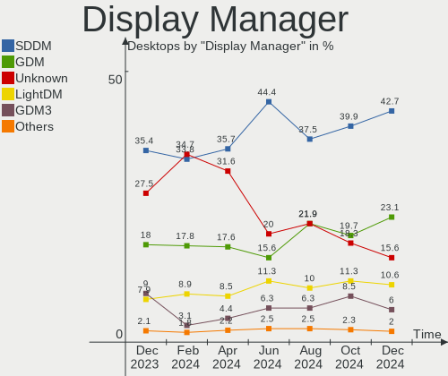
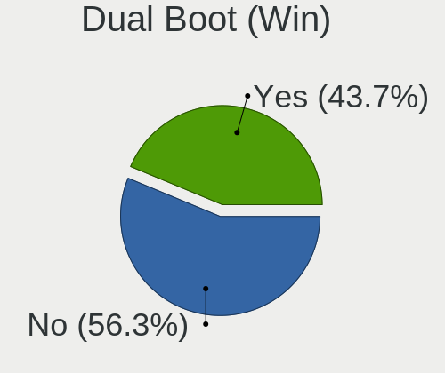
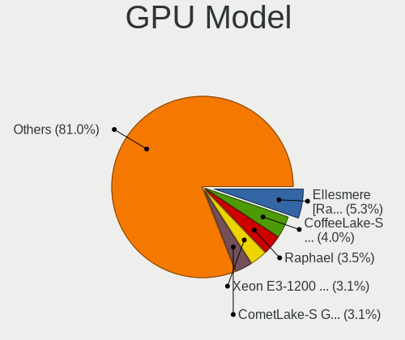
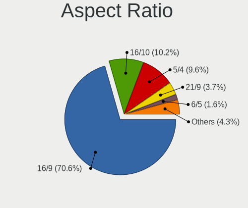
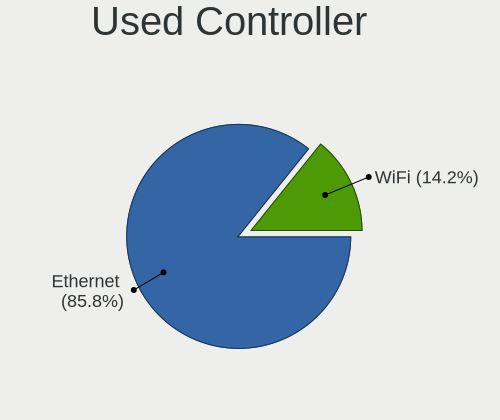

Linux in Russia - Hardware Trends (Desktops)
--------------------------------------------

A project to identify most popular hardware characteristics and track their change
over time based on data collected by Linux users at https://Linux-Hardware.org.

Anyone can contribute to this report by the [hw-probe](https://github.com/linuxhw/hw-probe) tool:

    sudo -E hw-probe -all -upload

Period: Jun, 2022.

Contents
--------

* [ System ](#system)
  - [ OS                       ](#os)
  - [ OS Family                ](#os-family)
  - [ Kernel                   ](#kernel)
  - [ Kernel Family            ](#kernel-family)
  - [ Kernel Major Ver.        ](#kernel-major-ver)
  - [ Arch                     ](#arch)
  - [ DE                       ](#de)
  - [ Display Server           ](#display-server)
  - [ Display Manager          ](#display-manager)
  - [ OS Lang                  ](#os-lang)
  - [ Boot Mode                ](#boot-mode)
  - [ Filesystem               ](#filesystem)
  - [ Part. scheme             ](#part-scheme)
  - [ Dual Boot with Linux/BSD ](#dual-boot-with-linuxbsd)
  - [ Dual Boot (Win)          ](#dual-boot-win)

* [ Board ](#board)
  - [ Vendor                   ](#vendor)
  - [ Model                    ](#model)
  - [ Model Family             ](#model-family)
  - [ MFG Year                 ](#mfg-year)
  - [ Form Factor              ](#form-factor)
  - [ Secure Boot              ](#secure-boot)
  - [ Coreboot                 ](#coreboot)
  - [ RAM Size                 ](#ram-size)
  - [ RAM Used                 ](#ram-used)
  - [ Total Drives             ](#total-drives)
  - [ Has CD-ROM               ](#has-cd-rom)
  - [ Has Ethernet             ](#has-ethernet)
  - [ Has WiFi                 ](#has-wifi)
  - [ Has Bluetooth            ](#has-bluetooth)

* [ Location ](#location)
  - [ Country                  ](#country)
  - [ City                     ](#city)

* [ Drives ](#drives)
  - [ Drive Vendor             ](#drive-vendor)
  - [ Drive Model              ](#drive-model)
  - [ HDD Vendor               ](#hdd-vendor)
  - [ SSD Vendor               ](#ssd-vendor)
  - [ Drive Kind               ](#drive-kind)
  - [ Drive Connector          ](#drive-connector)
  - [ Drive Size               ](#drive-size)
  - [ Space Total              ](#space-total)
  - [ Space Used               ](#space-used)
  - [ Malfunc. Drives          ](#malfunc-drives)
  - [ Malfunc. Drive Vendor    ](#malfunc-drive-vendor)
  - [ Malfunc. HDD Vendor      ](#malfunc-hdd-vendor)
  - [ Malfunc. Drive Kind      ](#malfunc-drive-kind)
  - [ Failed Drives            ](#failed-drives)
  - [ Failed Drive Vendor      ](#failed-drive-vendor)
  - [ Drive Status             ](#drive-status)

* [ Storage controller ](#storage-controller)
  - [ Storage Vendor           ](#storage-vendor)
  - [ Storage Model            ](#storage-model)
  - [ Storage Kind             ](#storage-kind)

* [ Processor ](#processor)
  - [ CPU Vendor               ](#cpu-vendor)
  - [ CPU Model                ](#cpu-model)
  - [ CPU Model Family         ](#cpu-model-family)
  - [ CPU Cores                ](#cpu-cores)
  - [ CPU Sockets              ](#cpu-sockets)
  - [ CPU Threads              ](#cpu-threads)
  - [ CPU Op-Modes             ](#cpu-op-modes)
  - [ CPU Microcode            ](#cpu-microcode)
  - [ CPU Microarch            ](#cpu-microarch)

* [ Graphics ](#graphics)
  - [ GPU Vendor               ](#gpu-vendor)
  - [ GPU Model                ](#gpu-model)
  - [ GPU Combo                ](#gpu-combo)
  - [ GPU Driver               ](#gpu-driver)
  - [ GPU Memory               ](#gpu-memory)

* [ Monitor ](#monitor)
  - [ Monitor Vendor           ](#monitor-vendor)
  - [ Monitor Model            ](#monitor-model)
  - [ Monitor Resolution       ](#monitor-resolution)
  - [ Monitor Diagonal         ](#monitor-diagonal)
  - [ Monitor Width            ](#monitor-width)
  - [ Aspect Ratio             ](#aspect-ratio)
  - [ Monitor Area             ](#monitor-area)
  - [ Pixel Density            ](#pixel-density)
  - [ Multiple Monitors        ](#multiple-monitors)

* [ Network ](#network)
  - [ Net Controller Vendor    ](#net-controller-vendor)
  - [ Net Controller Model     ](#net-controller-model)
  - [ Wireless Vendor          ](#wireless-vendor)
  - [ Wireless Model           ](#wireless-model)
  - [ Ethernet Vendor          ](#ethernet-vendor)
  - [ Ethernet Model           ](#ethernet-model)
  - [ Net Controller Kind      ](#net-controller-kind)
  - [ Used Controller          ](#used-controller)
  - [ NICs                     ](#nics)
  - [ IPv6                     ](#ipv6)

* [ Bluetooth ](#bluetooth)
  - [ Bluetooth Vendor         ](#bluetooth-vendor)
  - [ Bluetooth Model          ](#bluetooth-model)

* [ Sound ](#sound)
  - [ Sound Vendor             ](#sound-vendor)
  - [ Sound Model              ](#sound-model)

* [ Memory ](#memory)
  - [ Memory Vendor            ](#memory-vendor)
  - [ Memory Model             ](#memory-model)
  - [ Memory Kind              ](#memory-kind)
  - [ Memory Form Factor       ](#memory-form-factor)
  - [ Memory Size              ](#memory-size)
  - [ Memory Speed             ](#memory-speed)

* [ Printers & scanners ](#printers--scanners)
  - [ Printer Vendor           ](#printer-vendor)
  - [ Printer Model            ](#printer-model)
  - [ Scanner Vendor           ](#scanner-vendor)
  - [ Scanner Model            ](#scanner-model)

* [ Camera ](#camera)
  - [ Camera Vendor            ](#camera-vendor)
  - [ Camera Model             ](#camera-model)

* [ Security ](#security)
  - [ Fingerprint Vendor       ](#fingerprint-vendor)
  - [ Fingerprint Model        ](#fingerprint-model)
  - [ Chipcard Vendor          ](#chipcard-vendor)
  - [ Chipcard Model           ](#chipcard-model)

* [ Unsupported ](#unsupported)
  - [ Unsupported Devices      ](#unsupported-devices)
  - [ Unsupported Device Types ](#unsupported-device-types)

System
------

OS
--

Installed operating systems

| Name                         | Desktops | Percent |
|------------------------------|----------|---------|
| ROSA 12.2                    | 121      | 32.7%   |
| Debian 11                    | 107      | 28.92%  |
| Ubuntu 22.04                 | 36       | 9.73%   |
| ROSA R11.1                   | 13       | 3.51%   |
| OpenMandriva 4.3             | 12       | 3.24%   |
| Linux Mint 20.3              | 11       | 2.97%   |
| Ubuntu 20.04                 | 8        | 2.16%   |
| Fedora 36                    | 7        | 1.89%   |
| Red OS 7.3.1                 | 5        | 1.35%   |
| Xubuntu 20.04                | 4        | 1.08%   |
| ROSA 12.1                    | 3        | 0.81%   |
| Manjaro                      | 3        | 0.81%   |
| Arch Rolling                 | 3        | 0.81%   |
| ALT Linux 10.0               | 3        | 0.81%   |
| Ubuntu MATE 18.04            | 2        | 0.54%   |
| Ubuntu 18.04                 | 2        | 0.54%   |
| Manjaro 21.3.1               | 2        | 0.54%   |
| Kubuntu 22.04                | 2        | 0.54%   |
| Artix Rolling                | 2        | 0.54%   |
| ROSA R11                     | 1        | 0.27%   |
| ROSA R10                     | 1        | 0.27%   |
| ROSA 2019.05                 | 1        | 0.27%   |
| ROSA 12                      | 1        | 0.27%   |
| RED X4                       | 1        | 0.27%   |
| Pop!_OS 22.04                | 1        | 0.27%   |
| Oracle Linux 8.6             | 1        | 0.27%   |
| openSUSE Tumbleweed-XXXXXXXX | 1        | 0.27%   |
| MOS 10                       | 1        | 0.27%   |
| Manjaro 21.3.0               | 1        | 0.27%   |
| Manjaro 21.2.6               | 1        | 0.27%   |
| Linux Mint 19.3              | 1        | 0.27%   |
| Linux Mint 19.2              | 1        | 0.27%   |
| Kubuntu 22.10                | 1        | 0.27%   |
| KDE neon 20.04               | 1        | 0.27%   |
| Kali 2022.2                  | 1        | 0.27%   |
| Gentoo 2.8                   | 1        | 0.27%   |
| Gentoo 2.7                   | 1        | 0.27%   |
| Fedora 35                    | 1        | 0.27%   |
| ArcoLinux Rolling            | 1        | 0.27%   |
| Arch                         | 1        | 0.27%   |
| ALT Linux P9                 | 1        | 0.27%   |
| ALT Linux 10.1               | 1        | 0.27%   |
| ACI 5.1.0                    | 1        | 0.27%   |

OS Family
---------

OS without a version

| Name         | Desktops | Percent |
|--------------|----------|---------|
| ROSA         | 141      | 38.11%  |
| Debian       | 107      | 28.92%  |
| Ubuntu       | 46       | 12.43%  |
| Linux Mint   | 13       | 3.51%   |
| OpenMandriva | 12       | 3.24%   |
| Fedora       | 8        | 2.16%   |
| Manjaro      | 7        | 1.89%   |
| ALT Linux    | 6        | 1.62%   |
| Red OS       | 5        | 1.35%   |
| Xubuntu      | 4        | 1.08%   |
| Arch         | 4        | 1.08%   |
| Kubuntu      | 3        | 0.81%   |
| Ubuntu MATE  | 2        | 0.54%   |
| Gentoo       | 2        | 0.54%   |
| Artix        | 2        | 0.54%   |
| RED          | 1        | 0.27%   |
| Pop!_OS      | 1        | 0.27%   |
| Oracle Linux | 1        | 0.27%   |
| openSUSE     | 1        | 0.27%   |
| KDE neon     | 1        | 0.27%   |
| Kali         | 1        | 0.27%   |
| ArcoLinux    | 1        | 0.27%   |
| ACI          | 1        | 0.27%   |

Kernel
------

Version of the Linux kernel

| Version                                   | Desktops | Percent |
|-------------------------------------------|----------|---------|
| 5.10.0-7-amd64                            | 99       | 26.76%  |
| 5.10.74-generic-2rosa2021.1-x86_64        | 73       | 19.73%  |
| 5.15.0-35-generic                         | 20       | 5.41%   |
| 5.10.118-generic-2rosa2021.1-x86_64       | 17       | 4.59%   |
| 5.16.7-desktop-1omv4003                   | 11       | 2.97%   |
| 5.18.3.xm1-1.klp-xanmod-rosa2021.1-x86_64 | 7        | 1.89%   |
| 5.18.1.xm1-3.klp-xanmod-rosa2021.1-x86_64 | 6        | 1.62%   |
| 5.4.0-120-generic                         | 5        | 1.35%   |
| 5.17.11-generic-2rosa2021.1-x86_64        | 5        | 1.35%   |
| 5.15.0-37-generic                         | 5        | 1.35%   |
| 5.4.0-121-generic                         | 4        | 1.08%   |
| 5.15.0-33-generic                         | 4        | 1.08%   |
| 5.4.83-generic-2rosa-x86_64               | 3        | 0.81%   |
| 5.4.0-117-generic                         | 3        | 0.81%   |
| 5.4.0-113-generic                         | 3        | 0.81%   |
| 5.18.6.xm1-1.klp-xanmod-rosa2021.1-x86_64 | 3        | 0.81%   |
| 5.17.12-300.fc36.x86_64                   | 3        | 0.81%   |
| 5.17.11-generic-1rosa2021.1-x86_64        | 3        | 0.81%   |
| 5.15.43-generic-2rosa2021.1-x86_64        | 3        | 0.81%   |
| 5.15.35-1.el7.3.x86_64                    | 3        | 0.81%   |
| 5.15.0-39-generic                         | 3        | 0.81%   |
| 5.15.0-25-generic                         | 3        | 0.81%   |
| 5.10.0-14-amd64                           | 3        | 0.81%   |
| 4.15.0-desktop-122.124.1rosa-x86_64       | 3        | 0.81%   |
| 4.15.0-180-generic                        | 3        | 0.81%   |
| 5.4.32-generic-2rosa-x86_64               | 2        | 0.54%   |
| 5.4.0-110-generic                         | 2        | 0.54%   |
| 5.18.5-arch1-1                            | 2        | 0.54%   |
| 5.18.4.xm1-1.klp-xanmod-rosa2021.1-x86_64 | 2        | 0.54%   |
| 5.15.46-1-MANJARO                         | 2        | 0.54%   |
| 5.15.34-un-def-alt1                       | 2        | 0.54%   |
| 5.15.10-1.el7.x86_64                      | 2        | 0.54%   |
| 5.15.0-40-generic                         | 2        | 0.54%   |
| 4.15.0-desktop-122.124.1rosa-i586         | 2        | 0.54%   |
| 5.4.83-generic-2rosa-i586                 | 1        | 0.27%   |
| 5.4.32-generic-2rosa-i586                 | 1        | 0.27%   |
| 5.4.197-1-lts54                           | 1        | 0.27%   |
| 5.4.181-std-def-alt1                      | 1        | 0.27%   |
| 5.4.17-2136.308.9.el8uek.x86_64           | 1        | 0.27%   |
| 5.4.139-nickel-4rosa2019.05-x86_64        | 1        | 0.27%   |
| 5.4.0-99-generic                          | 1        | 0.27%   |
| 5.4.0-54-generic                          | 1        | 0.27%   |
| 5.18.8.xm1-1.klp-xanmod-rosa2021.1-x86_64 | 1        | 0.27%   |
| 5.18.6-1-MANJARO                          | 1        | 0.27%   |
| 5.18.6-051806-generic                     | 1        | 0.27%   |
| 5.18.5-zen1-1-zen                         | 1        | 0.27%   |
| 5.18.5-1-MANJARO                          | 1        | 0.27%   |
| 5.18.4-xanmod1-x64v2                      | 1        | 0.27%   |
| 5.18.3-1-MANJARO                          | 1        | 0.27%   |
| 5.18.3-051803-generic                     | 1        | 0.27%   |
| 5.18.2.xm1-3.klp-xanmod-rosa2021.1-x86_64 | 1        | 0.27%   |
| 5.18.1-zen1-1-zen                         | 1        | 0.27%   |
| 5.18.1-generic-2rosa2021.1-x86_64         | 1        | 0.27%   |
| 5.18.0-1-MANJARO                          | 1        | 0.27%   |
| 5.17.9-1-default                          | 1        | 0.27%   |
| 5.17.5-76051705-generic                   | 1        | 0.27%   |
| 5.17.5-300.fc36.x86_64                    | 1        | 0.27%   |
| 5.17.14-300.fc36.x86_64                   | 1        | 0.27%   |
| 5.17.13-300.fc36.x86_64                   | 1        | 0.27%   |
| 5.17.12-lqx1-1-lqx                        | 1        | 0.27%   |

Kernel Family
-------------

Linux kernel without a distro release

| Version  | Desktops | Percent |
|----------|----------|---------|
| 5.10.0   | 105      | 28.38%  |
| 5.10.74  | 73       | 19.73%  |
| 5.15.0   | 40       | 10.81%  |
| 5.4.0    | 19       | 5.14%   |
| 5.10.118 | 17       | 4.59%   |
| 5.16.7   | 11       | 2.97%   |
| 4.15.0   | 10       | 2.7%    |
| 5.18.3   | 9        | 2.43%   |
| 5.17.11  | 9        | 2.43%   |
| 5.18.1   | 8        | 2.16%   |
| 5.18.6   | 5        | 1.35%   |
| 5.4.83   | 4        | 1.08%   |
| 5.18.5   | 4        | 1.08%   |
| 5.17.12  | 4        | 1.08%   |
| 5.15.43  | 4        | 1.08%   |
| 5.15.35  | 4        | 1.08%   |
| 5.4.32   | 3        | 0.81%   |
| 5.18.4   | 3        | 0.81%   |
| 5.17.5   | 2        | 0.54%   |
| 5.15.46  | 2        | 0.54%   |
| 5.15.41  | 2        | 0.54%   |
| 5.15.34  | 2        | 0.54%   |
| 5.15.10  | 2        | 0.54%   |
| 5.4.197  | 1        | 0.27%   |
| 5.4.181  | 1        | 0.27%   |
| 5.4.17   | 1        | 0.27%   |
| 5.4.139  | 1        | 0.27%   |
| 5.18.8   | 1        | 0.27%   |
| 5.18.2   | 1        | 0.27%   |
| 5.18.0   | 1        | 0.27%   |
| 5.17.9   | 1        | 0.27%   |
| 5.17.14  | 1        | 0.27%   |
| 5.17.13  | 1        | 0.27%   |
| 5.17.0   | 1        | 0.27%   |
| 5.16.19  | 1        | 0.27%   |
| 5.16.13  | 1        | 0.27%   |
| 5.16.0   | 1        | 0.27%   |
| 5.15.48  | 1        | 0.27%   |
| 5.15.44  | 1        | 0.27%   |
| 5.15.32  | 1        | 0.27%   |
| 5.14.10  | 1        | 0.27%   |
| 5.13.0   | 1        | 0.27%   |
| 5.11.0   | 1        | 0.27%   |
| 5.10.82  | 1        | 0.27%   |
| 5.10.71  | 1        | 0.27%   |
| 5.10.57  | 1        | 0.27%   |
| 5.10.117 | 1        | 0.27%   |
| 5.0.0    | 1        | 0.27%   |
| 4.9.60   | 1        | 0.27%   |
| 4.9.155  | 1        | 0.27%   |
| 3.10.0   | 1        | 0.27%   |

Kernel Major Ver.
-----------------

Linux kernel major version

| Version | Desktops | Percent |
|---------|----------|---------|
| 5.10    | 199      | 53.78%  |
| 5.15    | 59       | 15.95%  |
| 5.18    | 32       | 8.65%   |
| 5.4     | 30       | 8.11%   |
| 5.17    | 19       | 5.14%   |
| 5.16    | 14       | 3.78%   |
| 4.15    | 10       | 2.7%    |
| 4.9     | 2        | 0.54%   |
| 5.14    | 1        | 0.27%   |
| 5.13    | 1        | 0.27%   |
| 5.11    | 1        | 0.27%   |
| 5.0     | 1        | 0.27%   |
| 3.10    | 1        | 0.27%   |

Arch
----

OS architecture (x86_64, i586, etc.)

| Name   | Desktops | Percent |
|--------|----------|---------|
| x86_64 | 363      | 98.11%  |
| i686   | 7        | 1.89%   |

DE
--

Desktop Environment

| Name       | Desktops | Percent |
|------------|----------|---------|
| GNOME      | 117      | 31.62%  |
| Unknown    | 108      | 29.19%  |
| KDE5       | 92       | 24.86%  |
| KDE4       | 14       | 3.78%   |
| XFCE       | 11       | 2.97%   |
| MATE       | 9        | 2.43%   |
| Cinnamon   | 6        | 1.62%   |
| X-Cinnamon | 5        | 1.35%   |
| LXQt       | 5        | 1.35%   |
| Unity      | 2        | 0.54%   |
| i3         | 1        | 0.27%   |

Display Server
--------------

X11 or Wayland

| Name    | Desktops | Percent |
|---------|----------|---------|
| Wayland | 133      | 35.95%  |
| X11     | 128      | 34.59%  |
| Unknown | 102      | 27.57%  |
| Tty     | 7        | 1.89%   |

Display Manager
---------------

SDDM, LightDM, etc.

| Name    | Desktops | Percent |
|---------|----------|---------|
| Unknown | 132      | 35.68%  |
| GDM     | 83       | 22.43%  |
| SDDM    | 76       | 20.54%  |
| GDM3    | 39       | 10.54%  |
| LightDM | 26       | 7.03%   |
| KDM     | 14       | 3.78%   |

OS Lang
-------

Language

| Lang    | Desktops | Percent |
|---------|----------|---------|
| ru_RU   | 315      | 85.14%  |
| en_US   | 43       | 11.62%  |
| Unknown | 9        | 2.43%   |
| en_GB   | 2        | 0.54%   |
| C       | 1        | 0.27%   |

Boot Mode
---------

EFI or BIOS

| Mode | Desktops | Percent |
|------|----------|---------|
| BIOS | 237      | 64.05%  |
| EFI  | 133      | 35.95%  |

Filesystem
----------

Type of filesystem

| Type    | Desktops | Percent |
|---------|----------|---------|
| Ext4    | 228      | 61.62%  |
| Overlay | 112      | 30.27%  |
| Btrfs   | 27       | 7.3%    |
| Xfs     | 2        | 0.54%   |
| Ext3    | 1        | 0.27%   |

Part. scheme
------------

Scheme of partitioning

| Type    | Desktops | Percent |
|---------|----------|---------|
| GPT     | 164      | 44.32%  |
| MBR     | 163      | 44.05%  |
| Unknown | 43       | 11.62%  |

Dual Boot with Linux/BSD
------------------------

Hosting more than one Linux/BSD

| Dual boot | Desktops | Percent |
|-----------|----------|---------|
| No        | 298      | 80.54%  |
| Yes       | 72       | 19.46%  |

Dual Boot (Win)
---------------

Hosting Linux and Windows

| Dual boot | Desktops | Percent |
|-----------|----------|---------|
| Yes       | 241      | 65.14%  |
| No        | 129      | 34.86%  |

Board
-----

Vendor
------

Motherboard manufacturer

| Name                | Desktops | Percent |
|---------------------|----------|---------|
| ASUSTek Computer    | 141      | 38.11%  |
| Gigabyte Technology | 90       | 24.32%  |
| MSI                 | 44       | 11.89%  |
| ASRock              | 42       | 11.35%  |
| Intel               | 8        | 2.16%   |
| Unknown             | 8        | 2.16%   |
| Huanan              | 6        | 1.62%   |
| Dell                | 5        | 1.35%   |
| ECS                 | 4        | 1.08%   |
| Acer                | 4        | 1.08%   |
| Hewlett-Packard     | 3        | 0.81%   |
| Foxconn             | 2        | 0.54%   |
| Biostar             | 2        | 0.54%   |
| Yadro               | 1        | 0.27%   |
| Supermicro          | 1        | 0.27%   |
| PLEXHD              | 1        | 0.27%   |
| MAINBRD             | 1        | 0.27%   |
| Lenovo              | 1        | 0.27%   |
| Kraftway            | 1        | 0.27%   |
| JGINYUE             | 1        | 0.27%   |
| Fujitsu             | 1        | 0.27%   |
| ASRockRack          | 1        | 0.27%   |
| AMI                 | 1        | 0.27%   |
| 3Logic Group        | 1        | 0.27%   |

Model
-----

Motherboard model

| Name                             | Desktops | Percent |
|----------------------------------|----------|---------|
| ASUS S20 K29                     | 45       | 12.16%  |
| Gigabyte H410M S2H               | 15       | 4.05%   |
| ASUS All Series                  | 10       | 2.7%    |
| Unknown                          | 8        | 2.16%   |
| MSI MS-7721                      | 7        | 1.89%   |
| MSI MS-7996                      | 6        | 1.62%   |
| ASUS H110M-R                     | 5        | 1.35%   |
| MSI MS-7817                      | 4        | 1.08%   |
| ASUS P8H67-M LE                  | 4        | 1.08%   |
| MSI MS-7A38                      | 3        | 0.81%   |
| Gigabyte H110M-S2V               | 3        | 0.81%   |
| ASUS P5KPL-AM SE                 | 3        | 0.81%   |
| MSI MS-7C37                      | 2        | 0.54%   |
| MSI MS-7895                      | 2        | 0.54%   |
| MSI MS-7808                      | 2        | 0.54%   |
| MSI MS-7758                      | 2        | 0.54%   |
| MSI MS-7752                      | 2        | 0.54%   |
| Gigabyte Z77-D3H                 | 2        | 0.54%   |
| Gigabyte X58A-UD3R               | 2        | 0.54%   |
| Gigabyte X470 AORUS ULTRA GAMING | 2        | 0.54%   |
| Gigabyte M61PME-S2P              | 2        | 0.54%   |
| Gigabyte H81M-S2V                | 2        | 0.54%   |
| Gigabyte F2A55M-HD2              | 2        | 0.54%   |
| Gigabyte B450 GAMING X           | 2        | 0.54%   |
| Gigabyte B360M H                 | 2        | 0.54%   |
| ASUS TUF B450M-PRO GAMING        | 2        | 0.54%   |
| ASUS PRIME H310M-R R2.0          | 2        | 0.54%   |
| ASUS PRIME B450M-A               | 2        | 0.54%   |
| ASUS PRIME A320M-K               | 2        | 0.54%   |
| ASUS P8H61-M LX3 R2.0            | 2        | 0.54%   |
| ASUS P5G41T-M LX2/GB             | 2        | 0.54%   |
| ASUS P5G41T-M LE                 | 2        | 0.54%   |
| ASUS M5A99X EVO R2.0             | 2        | 0.54%   |
| ASUS M5A97 R2.0                  | 2        | 0.54%   |
| ASUS H61M-K                      | 2        | 0.54%   |
| ASUS A68HM-K                     | 2        | 0.54%   |
| ASRock N68C-S UCC                | 2        | 0.54%   |
| ASRock H310CM-HDV                | 2        | 0.54%   |
| ASRock B460 Phantom Gaming 4     | 2        | 0.54%   |
| ASRock B450 Pro4                 | 2        | 0.54%   |
| ASRock ALiveXFire-eSATA2         | 2        | 0.54%   |
| ASRock A320M-HDV R4.0            | 2        | 0.54%   |
| ASRock 970 Pro3 R2.0             | 2        | 0.54%   |
| Yadro TB560-D4                   | 1        | 0.27%   |
| Supermicro SSG-5028R-E1CR12L     | 1        | 0.27%   |
| PLEXHD X79 Turbo                 | 1        | 0.27%   |
| MSI MS-7D09                      | 1        | 0.27%   |
| MSI MS-7C91                      | 1        | 0.27%   |
| MSI MS-7C75                      | 1        | 0.27%   |
| MSI MS-7B98                      | 1        | 0.27%   |
| MSI MS-7B93                      | 1        | 0.27%   |
| MSI MS-7B86                      | 1        | 0.27%   |
| MSI MS-7B53                      | 1        | 0.27%   |
| MSI MS-7A71                      | 1        | 0.27%   |
| MSI MS-7994                      | 1        | 0.27%   |
| MSI MS-7835                      | 1        | 0.27%   |
| MSI MS-7673                      | 1        | 0.27%   |
| MSI MS-7641                      | 1        | 0.27%   |
| MSI MS-7599                      | 1        | 0.27%   |
| MSI GEG                          | 1        | 0.27%   |

Model Family
------------

Motherboard model prefix

| Name                         | Desktops | Percent |
|------------------------------|----------|---------|
| ASUS S20                     | 45       | 12.16%  |
| Gigabyte H410M               | 17       | 4.59%   |
| ASUS PRIME                   | 14       | 3.78%   |
| ASUS All                     | 10       | 2.7%    |
| Unknown                      | 8        | 2.16%   |
| MSI MS-7721                  | 7        | 1.89%   |
| MSI MS-7996                  | 6        | 1.62%   |
| ASUS H110M-R                 | 5        | 1.35%   |
| MSI MS-7817                  | 4        | 1.08%   |
| Gigabyte B450                | 4        | 1.08%   |
| ASUS TUF                     | 4        | 1.08%   |
| ASUS ROG                     | 4        | 1.08%   |
| ASUS P8H67-M                 | 4        | 1.08%   |
| ASUS P5KPL-AM                | 4        | 1.08%   |
| ASUS P5G41T-M                | 4        | 1.08%   |
| MSI MS-7A38                  | 3        | 0.81%   |
| Gigabyte H110M-S2V           | 3        | 0.81%   |
| Dell OptiPlex                | 3        | 0.81%   |
| ASUS P8H61-M                 | 3        | 0.81%   |
| ASUS M5A97                   | 3        | 0.81%   |
| ASUS M5A78L-M                | 3        | 0.81%   |
| ASRock B450                  | 3        | 0.81%   |
| ASRock A320M-HDV             | 3        | 0.81%   |
| Acer Aspire                  | 3        | 0.81%   |
| MSI MS-7C37                  | 2        | 0.54%   |
| MSI MS-7895                  | 2        | 0.54%   |
| MSI MS-7808                  | 2        | 0.54%   |
| MSI MS-7758                  | 2        | 0.54%   |
| MSI MS-7752                  | 2        | 0.54%   |
| Intel X99                    | 2        | 0.54%   |
| Intel X79                    | 2        | 0.54%   |
| Gigabyte Z77-D3H             | 2        | 0.54%   |
| Gigabyte X58A-UD3R           | 2        | 0.54%   |
| Gigabyte X470                | 2        | 0.54%   |
| Gigabyte M61PME-S2P          | 2        | 0.54%   |
| Gigabyte H81M-S2V            | 2        | 0.54%   |
| Gigabyte F2A55M-HD2          | 2        | 0.54%   |
| Gigabyte B450M               | 2        | 0.54%   |
| Gigabyte B360M               | 2        | 0.54%   |
| Gigabyte A320M-S2H           | 2        | 0.54%   |
| ASUS P7H55-M                 | 2        | 0.54%   |
| ASUS P5GC-MX                 | 2        | 0.54%   |
| ASUS M5A99X                  | 2        | 0.54%   |
| ASUS H61M-K                  | 2        | 0.54%   |
| ASUS A68HM-K                 | 2        | 0.54%   |
| ASRock N68C-S                | 2        | 0.54%   |
| ASRock H310CM-HDV            | 2        | 0.54%   |
| ASRock B460                  | 2        | 0.54%   |
| ASRock B450M                 | 2        | 0.54%   |
| ASRock ALiveXFire-eSATA2     | 2        | 0.54%   |
| ASRock 970                   | 2        | 0.54%   |
| Yadro TB560-D4               | 1        | 0.27%   |
| Supermicro SSG-5028R-E1CR12L | 1        | 0.27%   |
| PLEXHD X79                   | 1        | 0.27%   |
| MSI MS-7D09                  | 1        | 0.27%   |
| MSI MS-7C91                  | 1        | 0.27%   |
| MSI MS-7C75                  | 1        | 0.27%   |
| MSI MS-7B98                  | 1        | 0.27%   |
| MSI MS-7B93                  | 1        | 0.27%   |
| MSI MS-7B86                  | 1        | 0.27%   |

MFG Year
--------

Motherboard manufacture year

| Year | Desktops | Percent |
|------|----------|---------|
| 2020 | 80       | 21.62%  |
| 2012 | 38       | 10.27%  |
| 2018 | 34       | 9.19%   |
| 2010 | 26       | 7.03%   |
| 2019 | 25       | 6.76%   |
| 2021 | 21       | 5.68%   |
| 2009 | 20       | 5.41%   |
| 2014 | 18       | 4.86%   |
| 2011 | 18       | 4.86%   |
| 2016 | 16       | 4.32%   |
| 2013 | 15       | 4.05%   |
| 2015 | 13       | 3.51%   |
| 2008 | 13       | 3.51%   |
| 2017 | 11       | 2.97%   |
| 2007 | 11       | 2.97%   |
| 2022 | 6        | 1.62%   |
| 2006 | 4        | 1.08%   |
| 2005 | 1        | 0.27%   |

Form Factor
-----------

Physical design of the computer

| Name    | Desktops | Percent |
|---------|----------|---------|
| Desktop | 370      | 100%    |

Secure Boot
-----------

Enabled or disabled

| State    | Desktops | Percent |
|----------|----------|---------|
| Disabled | 363      | 98.11%  |
| Enabled  | 7        | 1.89%   |

Coreboot
--------

Have coreboot on board

| Used | Desktops | Percent |
|------|----------|---------|
| No   | 370      | 100%    |

RAM Size
--------

Total RAM memory

| Size in GB      | Desktops | Percent |
|-----------------|----------|---------|
| 16.01-24.0      | 95       | 25.68%  |
| 4.01-8.0        | 94       | 25.41%  |
| 8.01-16.0       | 66       | 17.84%  |
| 3.01-4.0        | 50       | 13.51%  |
| 32.01-64.0      | 30       | 8.11%   |
| 1.01-2.0        | 12       | 3.24%   |
| 24.01-32.0      | 8        | 2.16%   |
| 64.01-256.0     | 8        | 2.16%   |
| 2.01-3.0        | 6        | 1.62%   |
| More than 256.0 | 1        | 0.27%   |

RAM Used
--------

Used RAM memory

| Used GB    | Desktops | Percent |
|------------|----------|---------|
| 0.51-1.0   | 138      | 37.3%   |
| 1.01-2.0   | 117      | 31.62%  |
| 2.01-3.0   | 52       | 14.05%  |
| 4.01-8.0   | 29       | 7.84%   |
| 3.01-4.0   | 28       | 7.57%   |
| 8.01-16.0  | 4        | 1.08%   |
| 24.01-32.0 | 2        | 0.54%   |

Total Drives
------------

Number of drives on board

| Drives | Desktops | Percent |
|--------|----------|---------|
| 1      | 181      | 48.92%  |
| 2      | 97       | 26.22%  |
| 3      | 51       | 13.78%  |
| 4      | 19       | 5.14%   |
| 5      | 8        | 2.16%   |
| 6      | 6        | 1.62%   |
| 7      | 3        | 0.81%   |
| 0      | 3        | 0.81%   |
| 9      | 1        | 0.27%   |
| 8      | 1        | 0.27%   |

Has CD-ROM
----------

Has CD-ROM on board

| Presented | Desktops | Percent |
|-----------|----------|---------|
| No        | 279      | 75.41%  |
| Yes       | 91       | 24.59%  |

Has Ethernet
------------

Has Ethernet on board

| Presented | Desktops | Percent |
|-----------|----------|---------|
| Yes       | 370      | 100%    |

Has WiFi
--------

Has WiFi module

| Presented | Desktops | Percent |
|-----------|----------|---------|
| No        | 295      | 79.73%  |
| Yes       | 75       | 20.27%  |

Has Bluetooth
-------------

Has Bluetooth module

| Presented | Desktops | Percent |
|-----------|----------|---------|
| No        | 316      | 85.41%  |
| Yes       | 54       | 14.59%  |

Location
--------

Country
-------

Geographic location (country)

| Country | Desktops | Percent |
|---------|----------|---------|
| Russia  | 370      | 100%    |

City
----

Geographic location (city)

| City              | Desktops | Percent |
|-------------------|----------|---------|
| Voronezh          | 102      | 27.57%  |
| Moscow            | 38       | 10.27%  |
| Cheboksary        | 26       | 7.03%   |
| St Petersburg     | 20       | 5.41%   |
| Chelyabinsk       | 10       | 2.7%    |
| Novosibirsk       | 9        | 2.43%   |
| Yekaterinburg     | 8        | 2.16%   |
| Krasnodar         | 8        | 2.16%   |
| Vladivostok       | 7        | 1.89%   |
| Samara            | 7        | 1.89%   |
| Krasnoyarsk       | 5        | 1.35%   |
| Tyumen            | 4        | 1.08%   |
| Rostov-on-Don     | 4        | 1.08%   |
| Omsk              | 4        | 1.08%   |
| Nizhniy Novgorod  | 4        | 1.08%   |
| Ulyanovsk         | 3        | 0.81%   |
| Tolyatti          | 3        | 0.81%   |
| Sochi             | 3        | 0.81%   |
| Saratov           | 3        | 0.81%   |
| Gul'kevichi       | 3        | 0.81%   |
| Yaroslavl         | 2        | 0.54%   |
| Yakutsk           | 2        | 0.54%   |
| Syktyvkar         | 2        | 0.54%   |
| Stavropol         | 2        | 0.54%   |
| Smolensk          | 2        | 0.54%   |
| Severodvinsk      | 2        | 0.54%   |
| Sergiyev Posad    | 2        | 0.54%   |
| Saransk           | 2        | 0.54%   |
| Ryazan            | 2        | 0.54%   |
| Prokop'yevsk      | 2        | 0.54%   |
| Penza             | 2        | 0.54%   |
| Orenburg          | 2        | 0.54%   |
| Murom             | 2        | 0.54%   |
| Khabarovsk        | 2        | 0.54%   |
| Kazan’          | 2        | 0.54%   |
| Bryansk           | 2        | 0.54%   |
| Zelenogorsk       | 1        | 0.27%   |
| Zarechnyy         | 1        | 0.27%   |
| Yuzhno-Sakhalinsk | 1        | 0.27%   |
| Yoshkar-Ola       | 1        | 0.27%   |
| Yessentukskaya    | 1        | 0.27%   |
| Yessentuki        | 1        | 0.27%   |
| Yelizovo          | 1        | 0.27%   |
| Vologda           | 1        | 0.27%   |
| Volgograd         | 1        | 0.27%   |
| Volgodonsk        | 1        | 0.27%   |
| Vladimir          | 1        | 0.27%   |
| Vladikavkaz       | 1        | 0.27%   |
| Veliky Novgorod   | 1        | 0.27%   |
| Uglich            | 1        | 0.27%   |
| Ufa               | 1        | 0.27%   |
| Tula              | 1        | 0.27%   |
| Tomsk             | 1        | 0.27%   |
| Tambov            | 1        | 0.27%   |
| Taganrog          | 1        | 0.27%   |
| Surgut            | 1        | 0.27%   |
| Sterlitamak       | 1        | 0.27%   |
| Slantsy           | 1        | 0.27%   |
| Shumerlya         | 1        | 0.27%   |
| Serebryanskiy     | 1        | 0.27%   |

Drives
------

Drive Vendor
------------

Hard drive vendors

| Vendor                | Desktops | Drives | Percent |
|-----------------------|----------|--------|---------|
| WDC                   | 114      | 143    | 18.42%  |
| Seagate               | 108      | 132    | 17.45%  |
| Toshiba               | 61       | 81     | 9.85%   |
| Samsung Electronics   | 52       | 55     | 8.4%    |
| Crucial               | 52       | 52     | 8.4%    |
| Kingston              | 51       | 54     | 8.24%   |
| Hitachi               | 23       | 25     | 3.72%   |
| A-DATA Technology     | 20       | 21     | 3.23%   |
| China                 | 18       | 19     | 2.91%   |
| SPCC                  | 12       | 12     | 1.94%   |
| Apacer                | 12       | 13     | 1.94%   |
| OCZ                   | 8        | 8      | 1.29%   |
| Gigabyte Technology   | 7        | 7      | 1.13%   |
| SanDisk               | 6        | 6      | 0.97%   |
| KingSpec              | 6        | 6      | 0.97%   |
| HGST                  | 6        | 7      | 0.97%   |
| Maxtor                | 5        | 5      | 0.81%   |
| Smartbuy              | 4        | 4      | 0.65%   |
| Silicon Motion        | 4        | 5      | 0.65%   |
| AMD                   | 4        | 4      | 0.65%   |
| Transcend             | 3        | 3      | 0.48%   |
| Plextor               | 3        | 3      | 0.48%   |
| Phison                | 3        | 3      | 0.48%   |
| Intel                 | 3        | 3      | 0.48%   |
| Goodram               | 3        | 3      | 0.48%   |
| XPG                   | 2        | 2      | 0.32%   |
| Unknown               | 2        | 3      | 0.32%   |
| Realtek Semiconductor | 2        | 2      | 0.32%   |
| Netac                 | 2        | 2      | 0.32%   |
| Micron Technology     | 2        | 3      | 0.32%   |
| KingDian              | 2        | 2      | 0.32%   |
| Corsair               | 2        | 2      | 0.32%   |
| WXC-M3                | 1        | 1      | 0.16%   |
| WALRAM                | 1        | 1      | 0.16%   |
| SK hynix              | 1        | 1      | 0.16%   |
| SETHRISE              | 1        | 1      | 0.16%   |
| Patriot               | 1        | 1      | 0.16%   |
| Palit                 | 1        | 1      | 0.16%   |
| NGFF                  | 1        | 1      | 0.16%   |
| KIOXIA-EXCERIA        | 1        | 1      | 0.16%   |
| Kingmax               | 1        | 1      | 0.16%   |
| Intenso               | 1        | 1      | 0.16%   |
| HUAWEI                | 1        | 1      | 0.16%   |
| Hewlett-Packard       | 1        | 1      | 0.16%   |
| Fujitsu               | 1        | 1      | 0.16%   |
| Foxline               | 1        | 1      | 0.16%   |
| ExeGate               | 1        | 1      | 0.16%   |
| ASMT                  | 1        | 2      | 0.16%   |
| addlink               | 1        | 1      | 0.16%   |

Drive Model
-----------

Hard drive models

| Model                              | Desktops | Percent |
|------------------------------------|----------|---------|
| Crucial CT480BX500SSD1 480GB       | 45       | 6.53%   |
| Toshiba VT180 240GB SSD            | 23       | 3.34%   |
| Kingston SA400S37240G 240GB SSD    | 21       | 3.05%   |
| Toshiba DT01ACA050 500GB           | 20       | 2.9%    |
| Toshiba HDWD110 1TB                | 11       | 1.6%    |
| Seagate ST1000DM010-2EP102 1TB     | 11       | 1.6%    |
| WDC WD10EZEX-08WN4A0 1TB           | 9        | 1.31%   |
| Samsung SSD 860 EVO 250GB          | 8        | 1.16%   |
| Seagate ST2000DM008-2FR102 2TB     | 7        | 1.02%   |
| Seagate ST1000DM003-1CH162 1TB     | 7        | 1.02%   |
| WDC WDS120G2G0A-00JH30 120GB SSD   | 6        | 0.87%   |
| Seagate ST500DM002-1BD142 500GB    | 6        | 0.87%   |
| Kingston SV300S37A120G 120GB SSD   | 6        | 0.87%   |
| Kingston SA400S37120G 120GB SSD    | 6        | 0.87%   |
| WDC WDS240G2G0A-00JH30 240GB SSD   | 5        | 0.73%   |
| Toshiba DT01ACA100 1TB             | 5        | 0.73%   |
| Seagate ST1000DM003-1ER162 1TB     | 5        | 0.73%   |
| Apacer AS350 128GB SSD             | 5        | 0.73%   |
| A-DATA SU650 240GB SSD             | 5        | 0.73%   |
| SPCC Solid State Disk 128GB        | 4        | 0.58%   |
| Seagate ST3250310AS 250GB          | 4        | 0.58%   |
| Seagate ST2000DM006-2DM164 2TB     | 4        | 0.58%   |
| Seagate ST1000LM024 HN-M101MBB 1TB | 4        | 0.58%   |
| Samsung SSD 970 EVO Plus 250GB     | 4        | 0.58%   |
| Apacer AS350 256GB SSD             | 4        | 0.58%   |
| WDC WDS240G2G0B-00EPW0 240GB SSD   | 3        | 0.44%   |
| WDC WD20PURZ-85GU6Y0 2TB           | 3        | 0.44%   |
| Toshiba HDWD105 500GB              | 3        | 0.44%   |
| SPCC Solid State Disk 256GB        | 3        | 0.44%   |
| Seagate ST3250318AS 250GB          | 3        | 0.44%   |
| Seagate ST250DM000-1BD141 250GB    | 3        | 0.44%   |
| Seagate ST1000NM0033-9ZM173 1TB    | 3        | 0.44%   |
| Samsung HD502HJ 500GB              | 3        | 0.44%   |
| OCZ VERTEX4 256GB SSD              | 3        | 0.44%   |
| Kingston SA1000M8240G 240GB        | 3        | 0.44%   |
| Hitachi HDT725032VLA360 320GB      | 3        | 0.44%   |
| China SSD 120GB                    | 3        | 0.44%   |
| China SATA SSD 128GB               | 3        | 0.44%   |
| Apacer AS350 512GB SSD             | 3        | 0.44%   |
| A-DATA SX6000PNP 256GB             | 3        | 0.44%   |
| A-DATA SU800 128GB SSD             | 3        | 0.44%   |
| XPG GAMMIX S5 1TB                  | 2        | 0.29%   |
| WDC WDS240G1G0A-00SS50 240GB SSD   | 2        | 0.29%   |
| WDC WD800JD-22MSA1 80GB            | 2        | 0.29%   |
| WDC WD5000LPLX-00ZNTT0 500GB       | 2        | 0.29%   |
| WDC WD5000AZRZ-00HTKB0 500GB       | 2        | 0.29%   |
| WDC WD5000AAKX-08ERMA0 500GB       | 2        | 0.29%   |
| WDC WD5000AAKX-001CA0 500GB        | 2        | 0.29%   |
| WDC WD3200AAKX-001CA0 320GB        | 2        | 0.29%   |
| WDC WD3200AAKS-00B3A0 320GB        | 2        | 0.29%   |
| WDC WD20EZRZ-00Z5HB0 2TB           | 2        | 0.29%   |
| WDC WD20EZAZ-00L9GB0 2TB           | 2        | 0.29%   |
| WDC WD10JPLX-00MBPT0 1TB           | 2        | 0.29%   |
| WDC WD10EZEX-75M2NA0 1TB           | 2        | 0.29%   |
| WDC WD10EZEX-00RKKA0 1TB           | 2        | 0.29%   |
| WDC WD1003FZEX-00K3CA0 1TB         | 2        | 0.29%   |
| Toshiba HDWD130 3TB                | 2        | 0.29%   |
| SPCC Solid State Disk 512GB        | 2        | 0.29%   |
| SPCC Solid State Disk 120GB        | 2        | 0.29%   |
| Seagate ST9500325AS 500GB          | 2        | 0.29%   |

HDD Vendor
----------

Hard disk drive vendors

| Vendor              | Desktops | Drives | Percent |
|---------------------|----------|--------|---------|
| Seagate             | 108      | 132    | 34.95%  |
| WDC                 | 102      | 120    | 33.01%  |
| Toshiba             | 51       | 57     | 16.5%   |
| Hitachi             | 23       | 25     | 7.44%   |
| Samsung Electronics | 12       | 12     | 3.88%   |
| HGST                | 6        | 7      | 1.94%   |
| Maxtor              | 5        | 5      | 1.62%   |
| Fujitsu             | 1        | 1      | 0.32%   |
| ASMT                | 1        | 2      | 0.32%   |

SSD Vendor
----------

Solid state drive vendors

| Vendor              | Desktops | Drives | Percent |
|---------------------|----------|--------|---------|
| Crucial             | 51       | 51     | 18.35%  |
| Kingston            | 46       | 46     | 16.55%  |
| Toshiba             | 24       | 24     | 8.63%   |
| Samsung Electronics | 22       | 23     | 7.91%   |
| WDC                 | 20       | 20     | 7.19%   |
| China               | 18       | 19     | 6.47%   |
| A-DATA Technology   | 14       | 14     | 5.04%   |
| SPCC                | 12       | 12     | 4.32%   |
| Apacer              | 12       | 13     | 4.32%   |
| OCZ                 | 8        | 8      | 2.88%   |
| KingSpec            | 6        | 6      | 2.16%   |
| SanDisk             | 5        | 5      | 1.8%    |
| Smartbuy            | 4        | 4      | 1.44%   |
| Gigabyte Technology | 4        | 4      | 1.44%   |
| Transcend           | 3        | 3      | 1.08%   |
| Plextor             | 3        | 3      | 1.08%   |
| Goodram             | 3        | 3      | 1.08%   |
| AMD                 | 3        | 3      | 1.08%   |
| Netac               | 2        | 2      | 0.72%   |
| KingDian            | 2        | 2      | 0.72%   |
| Intel               | 2        | 2      | 0.72%   |
| Corsair             | 2        | 2      | 0.72%   |
| WALRAM              | 1        | 1      | 0.36%   |
| Phison              | 1        | 1      | 0.36%   |
| Patriot             | 1        | 1      | 0.36%   |
| Palit               | 1        | 1      | 0.36%   |
| NGFF                | 1        | 1      | 0.36%   |
| Micron Technology   | 1        | 2      | 0.36%   |
| KIOXIA-EXCERIA      | 1        | 1      | 0.36%   |
| Kingmax             | 1        | 1      | 0.36%   |
| Intenso             | 1        | 1      | 0.36%   |
| Hewlett-Packard     | 1        | 1      | 0.36%   |
| Foxline             | 1        | 1      | 0.36%   |
| ExeGate             | 1        | 1      | 0.36%   |

Drive Kind
----------

HDD or SSD

| Kind    | Desktops | Drives | Percent |
|---------|----------|--------|---------|
| HDD     | 242      | 361    | 45.32%  |
| SSD     | 236      | 282    | 44.19%  |
| NVMe    | 52       | 60     | 9.74%   |
| Unknown | 3        | 4      | 0.56%   |
| MMC     | 1        | 1      | 0.19%   |

Drive Connector
---------------

SATA, SAS, NVMe, etc.

| Type | Desktops | Drives | Percent |
|------|----------|--------|---------|
| SATA | 354      | 640    | 85.92%  |
| NVMe | 52       | 60     | 12.62%  |
| SAS  | 5        | 7      | 1.21%   |
| MMC  | 1        | 1      | 0.24%   |

Drive Size
----------

Size of hard drive

| Size in TB | Desktops | Drives | Percent |
|------------|----------|--------|---------|
| 0.01-0.5   | 307      | 430    | 64.09%  |
| 0.51-1.0   | 116      | 145    | 24.22%  |
| 1.01-2.0   | 37       | 43     | 7.72%   |
| 3.01-4.0   | 10       | 11     | 2.09%   |
| 2.01-3.0   | 5        | 5      | 1.04%   |
| 10.01-20.0 | 2        | 6      | 0.42%   |
| 4.01-10.0  | 2        | 3      | 0.42%   |

Space Total
-----------

Amount of disk space available on the file system

| Size in GB     | Desktops | Percent |
|----------------|----------|---------|
| Unknown        | 99       | 26.76%  |
| 101-250        | 89       | 24.05%  |
| 501-1000       | 43       | 11.62%  |
| 251-500        | 41       | 11.08%  |
| 1-20           | 31       | 8.38%   |
| 1001-2000      | 28       | 7.57%   |
| 51-100         | 14       | 3.78%   |
| More than 3000 | 11       | 2.97%   |
| 2001-3000      | 11       | 2.97%   |
| 21-50          | 3        | 0.81%   |

Space Used
----------

Amount of used disk space

| Used GB        | Desktops | Percent |
|----------------|----------|---------|
| 1-20           | 144      | 38.92%  |
| Unknown        | 99       | 26.76%  |
| 101-250        | 31       | 8.38%   |
| 21-50          | 25       | 6.76%   |
| 51-100         | 20       | 5.41%   |
| 251-500        | 19       | 5.14%   |
| 501-1000       | 18       | 4.86%   |
| 1001-2000      | 9        | 2.43%   |
| 2001-3000      | 3        | 0.81%   |
| More than 3000 | 2        | 0.54%   |

Malfunc. Drives
---------------

Drive models with a malfunction

| Model                              | Desktops | Drives | Percent |
|------------------------------------|----------|--------|---------|
| Seagate ST3250310AS 250GB          | 4        | 4      | 3.74%   |
| Seagate ST500DM002-1BD142 500GB    | 3        | 4      | 2.8%    |
| WDC WD3200AAKX-001CA0 320GB        | 2        | 2      | 1.87%   |
| WDC WD3200AAKS-00B3A0 320GB        | 2        | 2      | 1.87%   |
| WDC WD10EZEX-00RKKA0 1TB           | 2        | 2      | 1.87%   |
| Toshiba DT01ACA100 1TB             | 2        | 2      | 1.87%   |
| Seagate ST3250318AS 250GB          | 2        | 2      | 1.87%   |
| Seagate ST1000LM024 HN-M101MBB 1TB | 2        | 2      | 1.87%   |
| OCZ VERTEX4 256GB SSD              | 2        | 2      | 1.87%   |
| Kingston SV300S37A120G 120GB SSD   | 2        | 2      | 1.87%   |
| Hitachi HDT725032VLA360 320GB      | 2        | 2      | 1.87%   |
| China SSD 120GB                    | 2        | 2      | 1.87%   |
| WDC WDS120G2G0A-00JH30 120GB SSD   | 1        | 1      | 0.93%   |
| WDC WD7500AARX-00N0YB0 752GB       | 1        | 1      | 0.93%   |
| WDC WD7500AARS-00Y5B1 752GB        | 1        | 1      | 0.93%   |
| WDC WD7500AARS-003BB1 752GB        | 1        | 1      | 0.93%   |
| WDC WD5001AALS-00E3A0 500GB        | 1        | 1      | 0.93%   |
| WDC WD5000AZRZ-00HTKB0 500GB       | 1        | 1      | 0.93%   |
| WDC WD5000AZLX-22JKKA0 500GB       | 1        | 1      | 0.93%   |
| WDC WD5000AAKX-08U6AA0 500GB       | 1        | 1      | 0.93%   |
| WDC WD5000AAKX-08ERMA0 500GB       | 1        | 1      | 0.93%   |
| WDC WD5000AAKX-001CA0 500GB        | 1        | 1      | 0.93%   |
| WDC WD5000AAKS-00UU3A0 500GB       | 1        | 1      | 0.93%   |
| WDC WD5000AAKS-00A7B0 500GB        | 1        | 1      | 0.93%   |
| WDC WD5000AADS-00S9B0 500GB        | 1        | 1      | 0.93%   |
| WDC WD3202ABYS-02B7A0 320GB        | 1        | 1      | 0.93%   |
| WDC WD3200AAKS-00UU3A0 320GB       | 1        | 1      | 0.93%   |
| WDC WD3200AAJS-65B4A0 320GB        | 1        | 1      | 0.93%   |
| WDC WD3200AAJS-08L7A0 320GB        | 1        | 1      | 0.93%   |
| WDC WD3200AAJS-00L7A0 320GB        | 1        | 1      | 0.93%   |
| WDC WD3200AAJB-00J3A0 320GB        | 1        | 1      | 0.93%   |
| WDC WD30PURX-64P6ZY0 3TB           | 1        | 1      | 0.93%   |
| WDC WD2500AAKS-00UU3A0 250GB       | 1        | 1      | 0.93%   |
| WDC WD2500AAJS-00YZCA0 250GB       | 1        | 1      | 0.93%   |
| WDC WD20PURZ-85GU6Y0 2TB           | 1        | 1      | 0.93%   |
| WDC WD20EARS-00MVWB0 2TB           | 1        | 1      | 0.93%   |
| WDC WD2003FZEX-00Z4SA0 2TB         | 1        | 1      | 0.93%   |
| WDC WD15EARS-00MVWB0 1TB           | 1        | 1      | 0.93%   |
| WDC WD1502FYPS-01U1B1 1TB          | 1        | 1      | 0.93%   |
| WDC WD10JPCX-24UE4T0 1TB           | 1        | 1      | 0.93%   |
| WDC WD10EZEX-21WN4A0 1TB           | 1        | 1      | 0.93%   |
| WDC WD10EARS-00Y5B1 1TB            | 1        | 1      | 0.93%   |
| Toshiba MK3265GSX 320GB            | 1        | 1      | 0.93%   |
| Toshiba MK1652GSX 160GB            | 1        | 1      | 0.93%   |
| Seagate ST9500325AS 500GB          | 1        | 1      | 0.93%   |
| Seagate ST9320325AS 320GB          | 1        | 1      | 0.93%   |
| Seagate ST500DM002-1BC142 500GB    | 1        | 1      | 0.93%   |
| Seagate ST4000NM0035-1V4107 4TB    | 1        | 2      | 0.93%   |
| Seagate ST380013AS 80GB            | 1        | 1      | 0.93%   |
| Seagate ST3500418AS 500GB          | 1        | 1      | 0.93%   |
| Seagate ST3500413AS 500GB          | 1        | 1      | 0.93%   |
| Seagate ST3250410AS 250GB          | 1        | 1      | 0.93%   |
| Seagate ST3160827AS 160GB          | 1        | 1      | 0.93%   |
| Seagate ST3160815AS 160GB          | 1        | 1      | 0.93%   |
| Seagate ST3160811AS 160GB          | 1        | 1      | 0.93%   |
| Seagate ST3160215A 160GB           | 1        | 1      | 0.93%   |
| Seagate ST31500341AS 1TB           | 1        | 1      | 0.93%   |
| Seagate ST3120814A 120GB           | 1        | 1      | 0.93%   |
| Seagate ST3120022A 120GB           | 1        | 1      | 0.93%   |
| Seagate ST31000524AS 1TB           | 1        | 1      | 0.93%   |

Malfunc. Drive Vendor
---------------------

Vendors of faulty drives

| Vendor              | Desktops | Drives | Percent |
|---------------------|----------|--------|---------|
| WDC                 | 34       | 36     | 33.01%  |
| Seagate             | 33       | 37     | 32.04%  |
| Hitachi             | 10       | 10     | 9.71%   |
| Samsung Electronics | 6        | 6      | 5.83%   |
| Toshiba             | 4        | 4      | 3.88%   |
| OCZ                 | 3        | 3      | 2.91%   |
| Maxtor              | 2        | 2      | 1.94%   |
| Kingston            | 2        | 2      | 1.94%   |
| China               | 2        | 2      | 1.94%   |
| SanDisk             | 1        | 1      | 0.97%   |
| KingSpec            | 1        | 1      | 0.97%   |
| Kingmax             | 1        | 1      | 0.97%   |
| Intenso             | 1        | 1      | 0.97%   |
| HGST                | 1        | 1      | 0.97%   |
| Fujitsu             | 1        | 1      | 0.97%   |
| Apacer              | 1        | 1      | 0.97%   |

Malfunc. HDD Vendor
-------------------

Vendors of faulty HDD drives

| Vendor              | Desktops | Drives | Percent |
|---------------------|----------|--------|---------|
| WDC                 | 33       | 35     | 36.67%  |
| Seagate             | 33       | 37     | 36.67%  |
| Hitachi             | 10       | 10     | 11.11%  |
| Samsung Electronics | 6        | 6      | 6.67%   |
| Toshiba             | 4        | 4      | 4.44%   |
| Maxtor              | 2        | 2      | 2.22%   |
| HGST                | 1        | 1      | 1.11%   |
| Fujitsu             | 1        | 1      | 1.11%   |

Malfunc. Drive Kind
-------------------

Kinds of faulty drives

| Kind | Desktops | Drives | Percent |
|------|----------|--------|---------|
| HDD  | 78       | 96     | 85.71%  |
| SSD  | 13       | 13     | 14.29%  |

Failed Drives
-------------

Failed drive models

| Model                             | Desktops | Drives | Percent |
|-----------------------------------|----------|--------|---------|
| Seagate ST9500325AS 500GB         | 1        | 1      | 50%     |
| Samsung Electronics SP2504C 250GB | 1        | 1      | 50%     |

Failed Drive Vendor
-------------------

Failed drive vendors

| Vendor              | Desktops | Drives | Percent |
|---------------------|----------|--------|---------|
| Seagate             | 1        | 1      | 50%     |
| Samsung Electronics | 1        | 1      | 50%     |

Drive Status
------------

Number of failed and malfunc. drives

| Status   | Desktops | Drives | Percent |
|----------|----------|--------|---------|
| Works    | 292      | 507    | 68.07%  |
| Malfunc  | 86       | 109    | 20.05%  |
| Detected | 49       | 90     | 11.42%  |
| Failed   | 2        | 2      | 0.47%   |

Storage controller
------------------

Storage Vendor
--------------

Storage controller vendors

| Vendor                      | Desktops | Percent |
|-----------------------------|----------|---------|
| Intel                       | 262      | 56.22%  |
| AMD                         | 93       | 19.96%  |
| Samsung Electronics         | 19       | 4.08%   |
| JMicron Technology          | 14       | 3%      |
| Nvidia                      | 12       | 2.58%   |
| ASMedia Technology          | 12       | 2.58%   |
| Marvell Technology Group    | 10       | 2.15%   |
| Realtek Semiconductor       | 9        | 1.93%   |
| Silicon Motion              | 6        | 1.29%   |
| Phison Electronics          | 6        | 1.29%   |
| Kingston Technology Company | 5        | 1.07%   |
| VIA Technologies            | 4        | 0.86%   |
| SanDisk                     | 4        | 0.86%   |
| SK hynix                    | 2        | 0.43%   |
| Silicon Image               | 2        | 0.43%   |
| ADATA Technology            | 2        | 0.43%   |
| Micron/Crucial Technology   | 1        | 0.21%   |
| Micron Technology           | 1        | 0.21%   |
| Broadcom / LSI              | 1        | 0.21%   |
| Adaptec                     | 1        | 0.21%   |

Storage Model
-------------

Storage controller models

| Model                                                                                   | Desktops | Percent |
|-----------------------------------------------------------------------------------------|----------|---------|
| Intel 200 Series PCH SATA controller [AHCI mode]                                        | 58       | 9.8%    |
| AMD FCH SATA Controller [AHCI mode]                                                     | 51       | 8.61%   |
| Intel NM10/ICH7 Family SATA Controller [IDE mode]                                       | 31       | 5.24%   |
| AMD 400 Series Chipset SATA Controller                                                  | 28       | 4.73%   |
| Intel Q170/Q150/B150/H170/H110/Z170/CM236 Chipset SATA Controller [AHCI Mode]           | 22       | 3.72%   |
| Intel 82801G (ICH7 Family) IDE Controller                                               | 22       | 3.72%   |
| Intel 8 Series/C220 Series Chipset Family 6-port SATA Controller 1 [AHCI mode]          | 22       | 3.72%   |
| AMD SB7x0/SB8x0/SB9x0 IDE Controller                                                    | 18       | 3.04%   |
| Intel 400 Series Chipset Family SATA AHCI Controller                                    | 17       | 2.87%   |
| Samsung NVMe SSD Controller SM981/PM981/PM983                                           | 12       | 2.03%   |
| Intel 7 Series/C210 Series Chipset Family 6-port SATA Controller [AHCI mode]            | 12       | 2.03%   |
| ASMedia ASM1062 Serial ATA Controller                                                   | 12       | 2.03%   |
| AMD SB7x0/SB8x0/SB9x0 SATA Controller [IDE mode]                                        | 12       | 2.03%   |
| AMD SB7x0/SB8x0/SB9x0 SATA Controller [AHCI mode]                                       | 12       | 2.03%   |
| JMicron JMB363 SATA/IDE Controller                                                      | 11       | 1.86%   |
| Intel Cannon Lake PCH SATA AHCI Controller                                              | 11       | 1.86%   |
| Intel 6 Series/C200 Series Chipset Family 6 port Desktop SATA AHCI Controller           | 11       | 1.86%   |
| Intel 500 Series Chipset Family SATA AHCI Controller                                    | 11       | 1.86%   |
| Nvidia MCP61 SATA Controller                                                            | 9        | 1.52%   |
| Realtek Realtek Non-Volatile memory controller                                          | 8        | 1.35%   |
| Intel 6 Series/C200 Series Chipset Family Desktop SATA Controller (IDE mode, ports 4-5) | 8        | 1.35%   |
| Intel 6 Series/C200 Series Chipset Family Desktop SATA Controller (IDE mode, ports 0-3) | 8        | 1.35%   |
| Nvidia MCP61 IDE                                                                        | 7        | 1.18%   |
| Intel C600/X79 series chipset 6-Port SATA AHCI Controller                               | 7        | 1.18%   |
| Intel 5 Series/3400 Series Chipset 4 port SATA IDE Controller                           | 7        | 1.18%   |
| Intel 5 Series/3400 Series Chipset 2 port SATA IDE Controller                           | 7        | 1.18%   |
| AMD FCH SATA Controller D                                                               | 7        | 1.18%   |
| Intel C610/X99 series chipset 6-Port SATA Controller [AHCI mode]                        | 6        | 1.01%   |
| Intel 82801JI (ICH10 Family) 4 port SATA IDE Controller #1                              | 6        | 1.01%   |
| Intel 82801JI (ICH10 Family) 2 port SATA IDE Controller #2                              | 6        | 1.01%   |
| AMD 500 Series Chipset SATA Controller                                                  | 6        | 1.01%   |
| Silicon Motion SM2263EN/SM2263XT SSD Controller                                         | 5        | 0.84%   |
| VIA VT6415 PATA IDE Host Controller                                                     | 4        | 0.68%   |
| Intel 7 Series/C210 Series Chipset Family 4-port SATA Controller [IDE mode]             | 4        | 0.68%   |
| Intel 7 Series/C210 Series Chipset Family 2-port SATA Controller [IDE mode]             | 4        | 0.68%   |
| Intel 5 Series/3400 Series Chipset 6 port SATA AHCI Controller                          | 4        | 0.68%   |
| AMD 300 Series Chipset SATA Controller                                                  | 4        | 0.68%   |
| SanDisk WD Blue SN550 NVMe SSD                                                          | 3        | 0.51%   |
| Samsung NVMe SSD Controller SM961/PM961/SM963                                           | 3        | 0.51%   |
| Kingston Company U-SNS8154P3 NVMe SSD                                                   | 3        | 0.51%   |
| Kingston Company Company Non-Volatile memory controller                                 | 3        | 0.51%   |
| JMicron JMB368 IDE controller                                                           | 3        | 0.51%   |
| Intel C610/X99 series chipset sSATA Controller [AHCI mode]                              | 3        | 0.51%   |
| Intel Alder Lake-S PCH SATA Controller [AHCI Mode]                                      | 3        | 0.51%   |
| Intel 82801HR/HO/HH (ICH8R/DO/DH) 2 port SATA Controller [IDE mode]                     | 3        | 0.51%   |
| Intel 82801H (ICH8 Family) 4 port SATA Controller [IDE mode]                            | 3        | 0.51%   |
| AMD FCH SATA Controller [IDE mode]                                                      | 3        | 0.51%   |
| SK hynix BC501 NVMe Solid State Drive                                                   | 2        | 0.34%   |
| Samsung NVMe SSD Controller PM9A1/PM9A3/980PRO                                          | 2        | 0.34%   |
| Samsung NVMe SSD Controller 980                                                         | 2        | 0.34%   |
| Phison PS5013 E13 NVMe Controller                                                       | 2        | 0.34%   |
| Phison E12 NVMe Controller                                                              | 2        | 0.34%   |
| Nvidia MCP78S [GeForce 8200] IDE                                                        | 2        | 0.34%   |
| Nvidia MCP78S [GeForce 8200] AHCI Controller                                            | 2        | 0.34%   |
| Marvell Group 88SE91A3 SATA-600 Controller                                              | 2        | 0.34%   |
| Marvell Group 88SE9172 SATA 6Gb/s Controller                                            | 2        | 0.34%   |
| Marvell Group 88SE912x SATA 6Gb/s Controller [IDE mode]                                 | 2        | 0.34%   |
| Marvell Group 88SE6111/6121 SATA II / PATA Controller                                   | 2        | 0.34%   |
| Intel Sunrise Point-LP SATA Controller [AHCI mode]                                      | 2        | 0.34%   |
| Intel SATA Controller [RAID mode]                                                       | 2        | 0.34%   |

Storage Kind
------------

Kind of storage controller (IDE, SATA, NVMe, SAS, ...)

| Kind | Desktops | Percent |
|------|----------|---------|
| SATA | 291      | 64.1%   |
| IDE  | 101      | 22.25%  |
| NVMe | 53       | 11.67%  |
| RAID | 8        | 1.76%   |
| SAS  | 1        | 0.22%   |

Processor
---------

CPU Vendor
----------

Processor vendors

| Vendor | Desktops | Percent |
|--------|----------|---------|
| Intel  | 264      | 71.35%  |
| AMD    | 106      | 28.65%  |

CPU Model
---------

Processor models

| Model                                           | Desktops | Percent |
|-------------------------------------------------|----------|---------|
| Intel Core i5-9400 CPU @ 2.90GHz                | 48       | 12.97%  |
| Intel Core i3-10100 CPU @ 3.60GHz               | 16       | 4.32%   |
| Intel Pentium CPU G4400 @ 3.30GHz               | 7        | 1.89%   |
| Intel Core i5-4460 CPU @ 3.20GHz                | 5        | 1.35%   |
| AMD Ryzen 7 2700 Eight-Core Processor           | 5        | 1.35%   |
| AMD A10-7700K Radeon R7, 10 Compute Cores 4C+6G | 5        | 1.35%   |
| Intel Pentium Gold G5400 CPU @ 3.70GHz          | 4        | 1.08%   |
| Intel Core 2 Duo CPU E7500 @ 2.93GHz            | 4        | 1.08%   |
| AMD Ryzen 5 2600 Six-Core Processor             | 4        | 1.08%   |
| AMD Ryzen 3 3200G with Radeon Vega Graphics     | 4        | 1.08%   |
| AMD Ryzen 3 2200G with Radeon Vega Graphics     | 4        | 1.08%   |
| AMD FX-8350 Eight-Core Processor                | 4        | 1.08%   |
| Intel Core i7-7700K CPU @ 4.20GHz               | 3        | 0.81%   |
| Intel Core i7-4790 CPU @ 3.60GHz                | 3        | 0.81%   |
| Intel Core i3-4130 CPU @ 3.40GHz                | 3        | 0.81%   |
| Intel Core i3-2100 CPU @ 3.10GHz                | 3        | 0.81%   |
| Intel Core 2 Quad CPU Q6600 @ 2.40GHz           | 3        | 0.81%   |
| Intel Core 2 Duo CPU E8400 @ 3.00GHz            | 3        | 0.81%   |
| AMD Ryzen 7 3700X 8-Core Processor              | 3        | 0.81%   |
| AMD Ryzen 5 5600G with Radeon Graphics          | 3        | 0.81%   |
| AMD Ryzen 5 3600 6-Core Processor               | 3        | 0.81%   |
| AMD Ryzen 5 1600 Six-Core Processor             | 3        | 0.81%   |
| AMD Phenom II X6 1055T Processor                | 3        | 0.81%   |
| AMD Phenom II X4 955 Processor                  | 3        | 0.81%   |
| AMD A4-5300 APU with Radeon HD Graphics         | 3        | 0.81%   |
| Intel Xeon CPU X3440 @ 2.53GHz                  | 2        | 0.54%   |
| Intel Xeon CPU E5-2678 v3 @ 2.50GHz             | 2        | 0.54%   |
| Intel Xeon CPU E5-2650 v2 @ 2.60GHz             | 2        | 0.54%   |
| Intel Xeon CPU E5-2640 0 @ 2.50GHz              | 2        | 0.54%   |
| Intel Xeon CPU E5-2620 0 @ 2.00GHz              | 2        | 0.54%   |
| Intel Pentium Dual-Core CPU E5400 @ 2.70GHz     | 2        | 0.54%   |
| Intel Pentium Dual-Core CPU E5300 @ 2.60GHz     | 2        | 0.54%   |
| Intel Pentium Dual CPU E2180 @ 2.00GHz          | 2        | 0.54%   |
| Intel Pentium CPU G4600 @ 3.60GHz               | 2        | 0.54%   |
| Intel Pentium CPU G3240 @ 3.10GHz               | 2        | 0.54%   |
| Intel Core i7-6700 CPU @ 3.40GHz                | 2        | 0.54%   |
| Intel Core i7-4770 CPU @ 3.40GHz                | 2        | 0.54%   |
| Intel Core i5-7600 CPU @ 3.50GHz                | 2        | 0.54%   |
| Intel Core i5-3470 CPU @ 3.20GHz                | 2        | 0.54%   |
| Intel Core i5-3330 CPU @ 3.00GHz                | 2        | 0.54%   |
| Intel Core i5 CPU 760 @ 2.80GHz                 | 2        | 0.54%   |
| Intel Core i3-7100 CPU @ 3.90GHz                | 2        | 0.54%   |
| Intel Core i3-6100 CPU @ 3.70GHz                | 2        | 0.54%   |
| Intel Core i3-3240 CPU @ 3.40GHz                | 2        | 0.54%   |
| Intel Core i3-3225 CPU @ 3.30GHz                | 2        | 0.54%   |
| Intel Core 2 Duo CPU E6550 @ 2.33GHz            | 2        | 0.54%   |
| Intel Celeron G4920 CPU @ 3.20GHz               | 2        | 0.54%   |
| Intel Atom CPU D525 @ 1.80GHz                   | 2        | 0.54%   |
| Intel 12th Gen Core i7-12700K                   | 2        | 0.54%   |
| AMD Ryzen 7 2700X Eight-Core Processor          | 2        | 0.54%   |
| AMD Ryzen 5 PRO 4650G with Radeon Graphics      | 2        | 0.54%   |
| AMD Ryzen 5 5600X 6-Core Processor              | 2        | 0.54%   |
| AMD Ryzen 5 3500 6-Core Processor               | 2        | 0.54%   |
| AMD Phenom II X4 945 Processor                  | 2        | 0.54%   |
| AMD Athlon II X2 240 Processor                  | 2        | 0.54%   |
| AMD Athlon 64 X2 Dual Core Processor 6000+      | 2        | 0.54%   |
| AMD Athlon 64 X2 Dual Core Processor 5000+      | 2        | 0.54%   |
| AMD A8-9600 RADEON R7, 10 COMPUTE CORES 4C+6G   | 2        | 0.54%   |
| AMD A6-7400K Radeon R5, 6 Compute Cores 2C+4G   | 2        | 0.54%   |
| Intel Xeon CPU X3470 @ 2.93GHz                  | 1        | 0.27%   |

CPU Model Family
----------------

Processor model prefix

| Model                   | Desktops | Percent |
|-------------------------|----------|---------|
| Intel Core i5           | 80       | 21.62%  |
| Intel Core i3           | 45       | 12.16%  |
| Intel Core i7           | 26       | 7.03%   |
| Intel Xeon              | 25       | 6.76%   |
| AMD Ryzen 5             | 22       | 5.95%   |
| Intel Pentium           | 19       | 5.14%   |
| Intel Core 2 Duo        | 14       | 3.78%   |
| AMD Ryzen 7             | 12       | 3.24%   |
| Other                   | 11       | 2.97%   |
| AMD Ryzen 3             | 10       | 2.7%    |
| AMD FX                  | 10       | 2.7%    |
| Intel Pentium Dual-Core | 8        | 2.16%   |
| Intel Core 2 Quad       | 8        | 2.16%   |
| AMD Phenom II X4        | 7        | 1.89%   |
| AMD Athlon 64 X2        | 7        | 1.89%   |
| Intel Celeron           | 6        | 1.62%   |
| Intel Pentium Gold      | 5        | 1.35%   |
| Intel Atom              | 5        | 1.35%   |
| AMD A4                  | 5        | 1.35%   |
| AMD A10                 | 5        | 1.35%   |
| AMD Athlon II X2        | 4        | 1.08%   |
| AMD A6                  | 4        | 1.08%   |
| Intel Core i9           | 3        | 0.81%   |
| AMD Phenom II X6        | 3        | 0.81%   |
| AMD Athlon II X4        | 3        | 0.81%   |
| AMD Athlon II X3        | 3        | 0.81%   |
| AMD A8                  | 3        | 0.81%   |
| Intel Pentium Dual      | 2        | 0.54%   |
| Intel Pentium D         | 2        | 0.54%   |
| Intel Core 2            | 2        | 0.54%   |
| AMD Ryzen 5 PRO         | 2        | 0.54%   |
| Intel Pentium Silver    | 1        | 0.27%   |
| Intel Pentium 4         | 1        | 0.27%   |
| Intel Genuine           | 1        | 0.27%   |
| AMD Ryzen 9             | 1        | 0.27%   |
| AMD Ryzen 3 PRO         | 1        | 0.27%   |
| AMD PRO A10             | 1        | 0.27%   |
| AMD Phenom              | 1        | 0.27%   |
| AMD EPYC                | 1        | 0.27%   |
| AMD Athlon X4           | 1        | 0.27%   |

CPU Cores
---------

Number of processor cores

| Number | Desktops | Percent |
|--------|----------|---------|
| 4      | 112      | 30.27%  |
| 2      | 111      | 30%     |
| 6      | 94       | 25.41%  |
| 8      | 29       | 7.84%   |
| 1      | 8        | 2.16%   |
| 3      | 7        | 1.89%   |
| 12     | 3        | 0.81%   |
| 24     | 2        | 0.54%   |
| 16     | 2        | 0.54%   |
| 10     | 2        | 0.54%   |

CPU Sockets
-----------

Number of sockets

| Number | Desktops | Percent |
|--------|----------|---------|
| 1      | 368      | 99.46%  |
| 2      | 2        | 0.54%   |

CPU Threads
-----------

Threads per core (Hyper-Threading)

| Number | Desktops | Percent |
|--------|----------|---------|
| 2      | 186      | 50.27%  |
| 1      | 184      | 49.73%  |

CPU Op-Modes
------------

CPU Operation Modes (32-bit, 64-bit)

| Op mode        | Desktops | Percent |
|----------------|----------|---------|
| 32-bit, 64-bit | 370      | 100%    |

CPU Microcode
-------------

Microcode number

| Number     | Desktops | Percent |
|------------|----------|---------|
| 0x906ea    | 55       | 14.86%  |
| Unknown    | 35       | 9.46%   |
| 0x306c3    | 22       | 5.95%   |
| 0xa0653    | 19       | 5.14%   |
| 0x1067a    | 17       | 4.59%   |
| 0x206a7    | 15       | 4.05%   |
| 0x906e9    | 13       | 3.51%   |
| 0x506e3    | 13       | 3.51%   |
| 0x306a9    | 13       | 3.51%   |
| 0x0800820d | 12       | 3.24%   |
| 0x06003106 | 9        | 2.43%   |
| 0x010000c8 | 8        | 2.16%   |
| 0x206d7    | 7        | 1.89%   |
| 0x106e5    | 7        | 1.89%   |
| 0x08701021 | 7        | 1.89%   |
| 0xa0671    | 6        | 1.62%   |
| 0x6fb      | 6        | 1.62%   |
| 0x306f2    | 6        | 1.62%   |
| 0x06000852 | 6        | 1.62%   |
| 0xa0655    | 5        | 1.35%   |
| 0x06001119 | 5        | 1.35%   |
| 0x906ed    | 4        | 1.08%   |
| 0x906eb    | 4        | 1.08%   |
| 0x6fd      | 4        | 1.08%   |
| 0x08600106 | 4        | 1.08%   |
| 0x08108109 | 4        | 1.08%   |
| 0x010000db | 4        | 1.08%   |
| 0x306e4    | 3        | 0.81%   |
| 0x10676    | 3        | 0.81%   |
| 0x0a50000c | 3        | 0.81%   |
| 0x010000dc | 3        | 0.81%   |
| 0x6f6      | 2        | 0.54%   |
| 0x30661    | 2        | 0.54%   |
| 0x20655    | 2        | 0.54%   |
| 0x106ca    | 2        | 0.54%   |
| 0x106a5    | 2        | 0.54%   |
| 0x08101016 | 2        | 0.54%   |
| 0x0810100b | 2        | 0.54%   |
| 0x0600611a | 2        | 0.54%   |
| 0x0600063e | 2        | 0.54%   |
| 0x010000b6 | 2        | 0.54%   |
| 0xf65      | 1        | 0.27%   |
| 0xf64      | 1        | 0.27%   |
| 0xf62      | 1        | 0.27%   |
| 0x906c0    | 1        | 0.27%   |
| 0x90675    | 1        | 0.27%   |
| 0x90672    | 1        | 0.27%   |
| 0x806e9    | 1        | 0.27%   |
| 0x806c1    | 1        | 0.27%   |
| 0x50657    | 1        | 0.27%   |
| 0x406f1    | 1        | 0.27%   |
| 0x406e3    | 1        | 0.27%   |
| 0x406c4    | 1        | 0.27%   |
| 0x206c2    | 1        | 0.27%   |
| 0x20652    | 1        | 0.27%   |
| 0x10677    | 1        | 0.27%   |
| 0x0a50000d | 1        | 0.27%   |
| 0x0a201205 | 1        | 0.27%   |
| 0x0a201204 | 1        | 0.27%   |
| 0x0a201016 | 1        | 0.27%   |

CPU Microarch
-------------

Microarchitecture

| Name             | Desktops | Percent |
|------------------|----------|---------|
| KabyLake         | 79       | 21.35%  |
| Haswell          | 32       | 8.65%   |
| SandyBridge      | 24       | 6.49%   |
| CometLake        | 24       | 6.49%   |
| Penryn           | 23       | 6.22%   |
| K10              | 21       | 5.68%   |
| IvyBridge        | 19       | 5.14%   |
| Zen+             | 17       | 4.59%   |
| Zen 2            | 16       | 4.32%   |
| Skylake          | 15       | 4.05%   |
| Piledriver       | 13       | 3.51%   |
| Core             | 12       | 3.24%   |
| Steamroller      | 10       | 2.7%    |
| Nehalem          | 10       | 2.7%    |
| Zen              | 9        | 2.43%   |
| Zen 3            | 7        | 1.89%   |
| K8 Hammer        | 7        | 1.89%   |
| Unknown          | 6        | 1.62%   |
| Westmere         | 5        | 1.35%   |
| Bonnell          | 4        | 1.08%   |
| NetBurst         | 3        | 0.81%   |
| Icelake          | 3        | 0.81%   |
| K10 Llano        | 2        | 0.54%   |
| Excavator        | 2        | 0.54%   |
| Bulldozer        | 2        | 0.54%   |
| Tremont          | 1        | 0.27%   |
| TigerLake        | 1        | 0.27%   |
| Silvermont       | 1        | 0.27%   |
| Broadwell        | 1        | 0.27%   |
| Alderlake Hybrid | 1        | 0.27%   |

Graphics
--------

GPU Vendor
----------

Vendors of graphics cards

| Vendor            | Desktops | Percent |
|-------------------|----------|---------|
| Intel             | 147      | 38.48%  |
| Nvidia            | 144      | 37.7%   |
| AMD               | 89       | 23.3%   |
| ASPEED Technology | 2        | 0.52%   |

GPU Model
---------

Graphics card models

| Model                                                                       | Desktops | Percent |
|-----------------------------------------------------------------------------|----------|---------|
| Intel CoffeeLake-S GT2 [UHD Graphics 630]                                   | 54       | 14.06%  |
| Intel CometLake-S GT2 [UHD Graphics 630]                                    | 18       | 4.69%   |
| AMD Ellesmere [Radeon RX 470/480/570/570X/580/580X/590]                     | 17       | 4.43%   |
| Intel Xeon E3-1200 v3/4th Gen Core Processor Integrated Graphics Controller | 13       | 3.39%   |
| Nvidia GP107 [GeForce GTX 1050 Ti]                                          | 10       | 2.6%    |
| Nvidia GP107 [GeForce GTX 1050]                                             | 7        | 1.82%   |
| Intel HD Graphics 510                                                       | 7        | 1.82%   |
| Intel 4th Generation Core Processor Family Integrated Graphics Controller   | 7        | 1.82%   |
| AMD Kaveri [Radeon R7 Graphics]                                             | 7        | 1.82%   |
| Nvidia GK208B [GeForce GT 710]                                              | 6        | 1.56%   |
| Intel HD Graphics 630                                                       | 6        | 1.56%   |
| Intel 82G33/G31 Express Integrated Graphics Controller                      | 6        | 1.56%   |
| Nvidia GT218 [GeForce 210]                                                  | 5        | 1.3%    |
| Nvidia GF116 [GeForce GTX 550 Ti]                                           | 5        | 1.3%    |
| Nvidia GF108 [GeForce GT 730]                                               | 5        | 1.3%    |
| Nvidia GF108 [GeForce GT 630]                                               | 5        | 1.3%    |
| Nvidia TU117 [GeForce GTX 1650]                                             | 4        | 1.04%   |
| Nvidia GP108 [GeForce GT 1030]                                              | 4        | 1.04%   |
| Nvidia GP106 [GeForce GTX 1060 3GB]                                         | 4        | 1.04%   |
| Nvidia GF119 [GeForce GT 610]                                               | 4        | 1.04%   |
| Nvidia G94 [GeForce 9600 GT]                                                | 4        | 1.04%   |
| Nvidia G92 [GeForce GTS 250]                                                | 4        | 1.04%   |
| Intel CoffeeLake-S GT1 [UHD Graphics 610]                                   | 4        | 1.04%   |
| Intel 4 Series Chipset Integrated Graphics Controller                       | 4        | 1.04%   |
| Intel 2nd Generation Core Processor Family Integrated Graphics Controller   | 4        | 1.04%   |
| AMD RS780L [Radeon 3000]                                                    | 4        | 1.04%   |
| AMD Renoir                                                                  | 4        | 1.04%   |
| AMD Lexa PRO [Radeon 540/540X/550/550X / RX 540X/550/550X]                  | 4        | 1.04%   |
| Nvidia GP106 [GeForce GTX 1060 6GB]                                         | 3        | 0.78%   |
| Nvidia GM206 [GeForce GTX 960]                                              | 3        | 0.78%   |
| Nvidia GM107 [GeForce GTX 750 Ti]                                           | 3        | 0.78%   |
| Nvidia GK208B [GeForce GT 730]                                              | 3        | 0.78%   |
| Nvidia GK107 [GeForce GTX 650]                                              | 3        | 0.78%   |
| Nvidia G86 [GeForce 8500 GT]                                                | 3        | 0.78%   |
| Intel RocketLake-S GT1 [UHD Graphics 750]                                   | 3        | 0.78%   |
| Intel Core Processor Integrated Graphics Controller                         | 3        | 0.78%   |
| AMD Trinity 2 [Radeon HD 7480D]                                             | 3        | 0.78%   |
| AMD Raven Ridge [Radeon Vega Series / Radeon Vega Mobile Series]            | 3        | 0.78%   |
| AMD Picasso/Raven 2 [Radeon Vega Series / Radeon Vega Mobile Series]        | 3        | 0.78%   |
| AMD Cezanne                                                                 | 3        | 0.78%   |
| AMD Cape Verde XT [Radeon HD 7770/8760 / R7 250X]                           | 3        | 0.78%   |
| AMD Baffin [Radeon RX 550 640SP / RX 560/560X]                              | 3        | 0.78%   |
| Nvidia TU104 [GeForce RTX 2070 SUPER]                                       | 2        | 0.52%   |
| Nvidia NV43 [GeForce 6600]                                                  | 2        | 0.52%   |
| Nvidia GT218 [ION]                                                          | 2        | 0.52%   |
| Nvidia GT216 [GeForce GT 220]                                               | 2        | 0.52%   |
| Nvidia GM206 [GeForce GTX 950]                                              | 2        | 0.52%   |
| Nvidia GM204 [GeForce GTX 970]                                              | 2        | 0.52%   |
| Nvidia GA104 [GeForce RTX 3060 Ti Lite Hash Rate]                           | 2        | 0.52%   |
| Nvidia G92 [GeForce 9800 GT]                                                | 2        | 0.52%   |
| Nvidia G84 [GeForce 8600 GT]                                                | 2        | 0.52%   |
| Nvidia C61 [GeForce 6150SE nForce 430]                                      | 2        | 0.52%   |
| Intel Xeon E3-1200 v2/3rd Gen Core processor Graphics Controller            | 2        | 0.52%   |
| Intel IvyBridge GT2 [HD Graphics 4000]                                      | 2        | 0.52%   |
| Intel HD Graphics 530                                                       | 2        | 0.52%   |
| Intel Atom Processor D2xxx/N2xxx Integrated Graphics Controller             | 2        | 0.52%   |
| ASPEED Technology ASPEED Graphics Family                                    | 2        | 0.52%   |
| AMD Wani [Radeon R5/R6/R7 Graphics]                                         | 2        | 0.52%   |
| AMD Turks XT [Radeon HD 6670/7670]                                          | 2        | 0.52%   |
| AMD RV770 [Radeon HD 4850]                                                  | 2        | 0.52%   |

GPU Combo
---------

Combinations of graphics cards

| Name            | Desktops | Percent |
|-----------------|----------|---------|
| 1 x Intel       | 138      | 37.3%   |
| 1 x Nvidia      | 134      | 36.22%  |
| 1 x AMD         | 85       | 22.97%  |
| Intel + Nvidia  | 6        | 1.62%   |
| 2 x AMD         | 2        | 0.54%   |
| AMD + Nvidia    | 2        | 0.54%   |
| Other           | 1        | 0.27%   |
| Nvidia + ASPEED | 1        | 0.27%   |
| 1 x ASPEED      | 1        | 0.27%   |

GPU Driver
----------

Free vs proprietary

| Driver      | Desktops | Percent |
|-------------|----------|---------|
| Free        | 201      | 54.32%  |
| Unknown     | 119      | 32.16%  |
| Proprietary | 50       | 13.51%  |

GPU Memory
----------

Total video memory

| Size in GB | Desktops | Percent |
|------------|----------|---------|
| Unknown    | 182      | 49.19%  |
| 0.51-1.0   | 47       | 12.7%   |
| 1.01-2.0   | 36       | 9.73%   |
| 3.01-4.0   | 32       | 8.65%   |
| 0.01-0.5   | 31       | 8.38%   |
| 7.01-8.0   | 22       | 5.95%   |
| 5.01-6.0   | 8        | 2.16%   |
| 2.01-3.0   | 4        | 1.08%   |
| 8.01-16.0  | 4        | 1.08%   |
| 4.01-5.0   | 3        | 0.81%   |
| 16.01-24.0 | 1        | 0.27%   |

Monitor
-------

Monitor Vendor
--------------

Monitor vendors

| Vendor               | Desktops | Percent |
|----------------------|----------|---------|
| Samsung Electronics  | 50       | 19.31%  |
| BenQ                 | 39       | 15.06%  |
| Philips              | 28       | 10.81%  |
| Goldstar             | 26       | 10.04%  |
| Acer                 | 22       | 8.49%   |
| ViewSonic            | 14       | 5.41%   |
| AOC                  | 12       | 4.63%   |
| Dell                 | 10       | 3.86%   |
| Iiyama               | 6        | 2.32%   |
| Hewlett-Packard      | 5        | 1.93%   |
| ASUSTek Computer     | 5        | 1.93%   |
| Ancor Communications | 4        | 1.54%   |
| Sony                 | 3        | 1.16%   |
| LG Electronics       | 3        | 1.16%   |
| Envision Peripherals | 3        | 1.16%   |
| Unknown              | 2        | 0.77%   |
| Toshiba              | 2        | 0.77%   |
| SGT                  | 2        | 0.77%   |
| Packard Bell         | 2        | 0.77%   |
| NEC Computers        | 2        | 0.77%   |
| ___                  | 1        | 0.39%   |
| Xiaomi               | 1        | 0.39%   |
| Vestel               | 1        | 0.39%   |
| SIL                  | 1        | 0.39%   |
| Sharp                | 1        | 0.39%   |
| RTK                  | 1        | 0.39%   |
| Panasonic            | 1        | 0.39%   |
| MSI                  | 1        | 0.39%   |
| Mi                   | 1        | 0.39%   |
| Idek Iiyama          | 1        | 0.39%   |
| HUAWEI               | 1        | 0.39%   |
| HKC                  | 1        | 0.39%   |
| Haier                | 1        | 0.39%   |
| GDH                  | 1        | 0.39%   |
| Fujitsu Siemens      | 1        | 0.39%   |
| ECS                  | 1        | 0.39%   |
| CTV                  | 1        | 0.39%   |
| AOpen                | 1        | 0.39%   |
| AGO                  | 1        | 0.39%   |

Monitor Model
-------------

Monitor models

| Model                                                                | Desktops | Percent |
|----------------------------------------------------------------------|----------|---------|
| BenQ GL2460 BNQ78CE 1920x1080 531x299mm 24.0-inch                    | 18       | 6.77%   |
| Philips 247EL PHLC084 1920x1080 521x293mm 23.5-inch                  | 7        | 2.63%   |
| Philips PHL 243V7 PHLC155 1920x1080 527x296mm 23.8-inch              | 4        | 1.5%    |
| Philips PHL 223V5 PHLC0CF 1920x1080 477x268mm 21.5-inch              | 3        | 1.13%   |
| Goldstar ULTRAWIDE GSM59F1 2560x1080 673x284mm 28.8-inch             | 3        | 1.13%   |
| Goldstar MP59G GSM5B34 1920x1080 480x270mm 21.7-inch                 | 3        | 1.13%   |
| BenQ GW2270 BNQ78DB 1920x1080 476x268mm 21.5-inch                    | 3        | 1.13%   |
| AOC 27V2G5 AOC2702 1920x1080 598x336mm 27.0-inch                     | 3        | 1.13%   |
| ViewSonic VX2363 Series VSC6B2F 1920x1080 509x286mm 23.0-inch        | 2        | 0.75%   |
| Samsung Electronics SyncMaster SAM01B7 1280x1024 338x270mm 17.0-inch | 2        | 0.75%   |
| Samsung Electronics S24F350 SAM0D20 1920x1080 521x293mm 23.5-inch    | 2        | 0.75%   |
| Philips PHL 273V5 PHLC0D2 1920x1080 598x336mm 27.0-inch              | 2        | 0.75%   |
| Philips 220E PHLC02E 1920x1080 476x268mm 21.5-inch                   | 2        | 0.75%   |
| Iiyama PLX2783H IVM6648 1920x1080 598x336mm 27.0-inch                | 2        | 0.75%   |
| Goldstar Ultra HD GSM5B09 3840x2160 600x340mm 27.2-inch              | 2        | 0.75%   |
| AOC 2490W1 AOC2490 1920x1080 527x296mm 23.8-inch                     | 2        | 0.75%   |
| AOC 2470W AOC2470 1920x1080 521x293mm 23.5-inch                      | 2        | 0.75%   |
| Acer V226HQL ACR0335 1920x1080 477x268mm 21.5-inch                   | 2        | 0.75%   |
| Acer G246HYL ACR035B 1920x1080 527x296mm 23.8-inch                   | 2        | 0.75%   |
| ___ LCD TV ___0101 1360x768                                          | 1        | 0.38%   |
| Xiaomi Mi TV XMD00E1 3840x2160 708x398mm 32.0-inch                   | 1        | 0.38%   |
| ViewSonic VX2458 Series VSC36AF 1920x1080 521x293mm 23.5-inch        | 1        | 0.38%   |
| ViewSonic VX2239 SERIES VSC5225 1920x1080 480x270mm 21.7-inch        | 1        | 0.38%   |
| ViewSonic VX2235wm-EU VSC591E 1680x1050 474x296mm 22.0-inch          | 1        | 0.38%   |
| ViewSonic VP920 Series VSCB01C 1280x1024 376x301mm 19.0-inch         | 1        | 0.38%   |
| ViewSonic VE710b VSCF618 1280x1024 338x270mm 17.0-inch               | 1        | 0.38%   |
| ViewSonic VA2719 Series VSCC132 1920x1080 598x336mm 27.0-inch        | 1        | 0.38%   |
| ViewSonic VA2407 SERIES VSC8C31 1920x1080 521x293mm 23.5-inch        | 1        | 0.38%   |
| ViewSonic VA2238 SERIES VSC6E26 1920x1080 477x268mm 21.5-inch        | 1        | 0.38%   |
| ViewSonic VA2231 Series VSCBB25 1920x1080 477x268mm 21.5-inch        | 1        | 0.38%   |
| ViewSonic VA2216w-4 VSC2029 1680x1050 495x291mm 22.6-inch            | 1        | 0.38%   |
| ViewSonic VA2038 SERIES VSC6C26 1600x900 443x249mm 20.0-inch         | 1        | 0.38%   |
| ViewSonic PJD5555LW VSC3A30 1920x1080                                | 1        | 0.38%   |
| Vestel LCD Monitor 49UHD_LCD_TV                                      | 1        | 0.38%   |
| Unknown LCD TV 0101 1920x1080 1600x900mm 72.3-inch                   | 1        | 0.38%   |
| Unknown LCD Monitor SAMSUNG 1920x1080                                | 1        | 0.38%   |
| Toshiba TV TSB0108 1920x540                                          | 1        | 0.38%   |
| Toshiba T2091W LCD2091 1600x900 443x249mm 20.0-inch                  | 1        | 0.38%   |
| Sony TV SNYEE01 1920x1080                                            | 1        | 0.38%   |
| Sony TV SNYC901 1920x1080                                            | 1        | 0.38%   |
| Sony TV *30 SNYB905 3840x2160 1882x1058mm 85.0-inch                  | 1        | 0.38%   |
| SIL J226 SIL01C6 1680x1050 480x270mm 21.7-inch                       | 1        | 0.38%   |
| Sharp LCD Monitor SHP14AD 3840x2160 290x170mm 13.2-inch              | 1        | 0.38%   |
| SGT Monitor SGT2700 2560x1440 601x329mm 27.0-inch                    | 1        | 0.38%   |
| SGT Monitor SGT2380 1920x1080 527x296mm 23.8-inch                    | 1        | 0.38%   |
| Samsung Electronics U32J59x SAM0F52 3840x2160 697x392mm 31.5-inch    | 1        | 0.38%   |
| Samsung Electronics U28E590 SAM0C4E 3840x2160 608x345mm 27.5-inch    | 1        | 0.38%   |
| Samsung Electronics SyncMaster SAM0570 1920x1080 510x287mm 23.0-inch | 1        | 0.38%   |
| Samsung Electronics SyncMaster SAM0560 1440x900 408x255mm 18.9-inch  | 1        | 0.38%   |
| Samsung Electronics SyncMaster SAM04D3 1920x1080 531x298mm 24.0-inch | 1        | 0.38%   |
| Samsung Electronics SyncMaster SAM03D0 1440x900 410x257mm 19.1-inch  | 1        | 0.38%   |
| Samsung Electronics SyncMaster SAM036E 1280x1024 376x301mm 19.0-inch | 1        | 0.38%   |
| Samsung Electronics SyncMaster SAM0274 1440x900 410x257mm 19.1-inch  | 1        | 0.38%   |
| Samsung Electronics SyncMaster SAM01E1 1280x1024 376x301mm 19.0-inch | 1        | 0.38%   |
| Samsung Electronics SyncMaster SAM014C 1280x1024 338x270mm 17.0-inch | 1        | 0.38%   |
| Samsung Electronics SyncMaster SAM011F 1280x1024 380x300mm 19.1-inch | 1        | 0.38%   |
| Samsung Electronics SyncMaster SAM011E 1280x1024 338x270mm 17.0-inch | 1        | 0.38%   |
| Samsung Electronics SyncMaster SAM00C8 1280x1024 338x270mm 17.0-inch | 1        | 0.38%   |
| Samsung Electronics SMS23A550H SAM07CA 1920x1080 509x286mm 23.0-inch | 1        | 0.38%   |
| Samsung Electronics SMBX2331 SAM076F 1920x1080 509x286mm 23.0-inch   | 1        | 0.38%   |

Monitor Resolution
------------------

Monitor screen resolution

| Resolution         | Desktops | Percent |
|--------------------|----------|---------|
| 1920x1080 (FHD)    | 143      | 57.43%  |
| 1280x1024 (SXGA)   | 21       | 8.43%   |
| 3840x2160 (4K)     | 20       | 8.03%   |
| 2560x1440 (QHD)    | 15       | 6.02%   |
| 1440x900 (WXGA+)   | 8        | 3.21%   |
| 1366x768 (WXGA)    | 8        | 3.21%   |
| 1680x1050 (WSXGA+) | 7        | 2.81%   |
| 1600x900 (HD+)     | 7        | 2.81%   |
| 1920x1200 (WUXGA)  | 5        | 2.01%   |
| 2560x1080          | 3        | 1.2%    |
| 1360x768           | 2        | 0.8%    |
| Unknown            | 2        | 0.8%    |
| 3440x1440          | 1        | 0.4%    |
| 3200x900           | 1        | 0.4%    |
| 2944x1080          | 1        | 0.4%    |
| 2624x900           | 1        | 0.4%    |
| 1920x540           | 1        | 0.4%    |
| 1600x1200          | 1        | 0.4%    |
| 1280x960           | 1        | 0.4%    |
| 1024x768 (XGA)     | 1        | 0.4%    |

Monitor Diagonal
----------------

Diagonal size in inches

| Inches  | Desktops | Percent |
|---------|----------|---------|
| 24      | 51       | 19.62%  |
| 21      | 40       | 15.38%  |
| 23      | 35       | 13.46%  |
| 27      | 34       | 13.08%  |
| 19      | 17       | 6.54%   |
| Unknown | 15       | 5.77%   |
| 17      | 13       | 5%      |
| 31      | 12       | 4.62%   |
| 18      | 9        | 3.46%   |
| 20      | 6        | 2.31%   |
| 22      | 5        | 1.92%   |
| 72      | 4        | 1.54%   |
| 34      | 4        | 1.54%   |
| 52      | 2        | 0.77%   |
| 48      | 2        | 0.77%   |
| 43      | 2        | 0.77%   |
| 85      | 1        | 0.38%   |
| 54      | 1        | 0.38%   |
| 46      | 1        | 0.38%   |
| 41      | 1        | 0.38%   |
| 32      | 1        | 0.38%   |
| 28      | 1        | 0.38%   |
| 25      | 1        | 0.38%   |
| 15      | 1        | 0.38%   |
| 13      | 1        | 0.38%   |

Monitor Width
-------------

Physical width

| Width in mm | Desktops | Percent |
|-------------|----------|---------|
| 501-600     | 114      | 44.53%  |
| 401-500     | 69       | 26.95%  |
| 601-700     | 16       | 6.25%   |
| Unknown     | 15       | 5.86%   |
| 301-350     | 14       | 5.47%   |
| 351-400     | 8        | 3.13%   |
| 1001-1500   | 6        | 2.34%   |
| 701-800     | 5        | 1.95%   |
| 1501-2000   | 5        | 1.95%   |
| 901-1000    | 3        | 1.17%   |
| 201-300     | 1        | 0.39%   |

Aspect Ratio
------------

Proportional relationship between the width and the height

| Ratio   | Desktops | Percent |
|---------|----------|---------|
| 16/9    | 184      | 75.72%  |
| 5/4     | 20       | 8.23%   |
| 16/10   | 20       | 8.23%   |
| Unknown | 13       | 5.35%   |
| 21/9    | 4        | 1.65%   |
| 4/3     | 2        | 0.82%   |

Monitor Area
------------

Area in inch²

| Area in inch² | Desktops | Percent |
|----------------|----------|---------|
| 201-250        | 112      | 43.92%  |
| 301-350        | 34       | 13.33%  |
| 151-200        | 31       | 12.16%  |
| 141-150        | 21       | 8.24%   |
| 351-500        | 18       | 7.06%   |
| Unknown        | 15       | 5.88%   |
| More than 1000 | 10       | 3.92%   |
| 251-300        | 8        | 3.14%   |
| 501-1000       | 4        | 1.57%   |
| 71-80          | 1        | 0.39%   |
| 101-110        | 1        | 0.39%   |

Pixel Density
-------------

Pixels per inch

| Density       | Desktops | Percent |
|---------------|----------|---------|
| 51-100        | 161      | 64.4%   |
| 101-120       | 48       | 19.2%   |
| Unknown       | 15       | 6%      |
| 1-50          | 12       | 4.8%    |
| 121-160       | 9        | 3.6%    |
| 161-240       | 4        | 1.6%    |
| More than 240 | 1        | 0.4%    |

Multiple Monitors
-----------------

Total monitors connected

| Total | Desktops | Percent |
|-------|----------|---------|
| 1     | 216      | 58.38%  |
| 0     | 122      | 32.97%  |
| 2     | 30       | 8.11%   |
| 3     | 2        | 0.54%   |

Network
-------

Net Controller Vendor
---------------------

Controller vendors

| Vendor                            | Desktops | Percent |
|-----------------------------------|----------|---------|
| Realtek Semiconductor             | 291      | 65.84%  |
| Intel                             | 54       | 12.22%  |
| Qualcomm Atheros                  | 26       | 5.88%   |
| Nvidia                            | 12       | 2.71%   |
| Ralink                            | 8        | 1.81%   |
| TP-Link                           | 7        | 1.58%   |
| Ralink Technology                 | 5        | 1.13%   |
| Broadcom                          | 5        | 1.13%   |
| VIA Technologies                  | 4        | 0.9%    |
| Huawei Technologies               | 4        | 0.9%    |
| D-Link System                     | 3        | 0.68%   |
| ASUSTek Computer                  | 3        | 0.68%   |
| Sundance Technology Inc / IC Plus | 2        | 0.45%   |
| Marvell Technology Group          | 2        | 0.45%   |
| ZTE WCDMA Technologies MSM        | 1        | 0.23%   |
| Xiaomi                            | 1        | 0.23%   |
| Vimtron Electronics               | 1        | 0.23%   |
| Samsung Electronics               | 1        | 0.23%   |
| Qualcomm                          | 1        | 0.23%   |
| OPPO Electronics                  | 1        | 0.23%   |
| NetGear                           | 1        | 0.23%   |
| Microsoft                         | 1        | 0.23%   |
| Mellanox Technologies             | 1        | 0.23%   |
| MediaTek                          | 1        | 0.23%   |
| LSI                               | 1        | 0.23%   |
| Gemtek                            | 1        | 0.23%   |
| D-Link                            | 1        | 0.23%   |
| Broadcom Limited                  | 1        | 0.23%   |
| Belkin Components                 | 1        | 0.23%   |
| ASIX Electronics                  | 1        | 0.23%   |

Net Controller Model
--------------------

Controller models

| Model                                                                      | Desktops | Percent |
|----------------------------------------------------------------------------|----------|---------|
| Realtek RTL8111/8168/8411 PCI Express Gigabit Ethernet Controller          | 267      | 55.86%  |
| Realtek RTL810xE PCI Express Fast Ethernet controller                      | 12       | 2.51%   |
| Nvidia MCP61 Ethernet                                                      | 9        | 1.88%   |
| Intel Ethernet Connection (2) I219-V                                       | 8        | 1.67%   |
| Realtek RTL8125 2.5GbE Controller                                          | 7        | 1.46%   |
| Intel Wi-Fi 6 AX200                                                        | 7        | 1.46%   |
| Intel I211 Gigabit Network Connection                                      | 7        | 1.46%   |
| Intel Ethernet Connection (7) I219-V                                       | 5        | 1.05%   |
| Intel Ethernet Connection (14) I219-V                                      | 5        | 1.05%   |
| VIA VT6105/VT6106S [Rhine-III]                                             | 4        | 0.84%   |
| Realtek RTL8821CE 802.11ac PCIe Wireless Network Adapter                   | 4        | 0.84%   |
| Realtek RTL8188EUS 802.11n Wireless Network Adapter                        | 4        | 0.84%   |
| Ralink MT7601U Wireless Adapter                                            | 4        | 0.84%   |
| Ralink RT5390 Wireless 802.11n 1T/1R PCIe                                  | 4        | 0.84%   |
| Qualcomm Atheros AR8161 Gigabit Ethernet                                   | 4        | 0.84%   |
| Intel Ethernet Controller I225-V                                           | 4        | 0.84%   |
| Realtek RTL8192EE PCIe Wireless Network Adapter                            | 3        | 0.63%   |
| Realtek RTL8188CE 802.11b/g/n WiFi Adapter                                 | 3        | 0.63%   |
| Realtek 802.11ac NIC                                                       | 3        | 0.63%   |
| Qualcomm Atheros Attansic L2 Fast Ethernet                                 | 3        | 0.63%   |
| Qualcomm Atheros AR8151 v2.0 Gigabit Ethernet                              | 3        | 0.63%   |
| Qualcomm Atheros AR8131 Gigabit Ethernet                                   | 3        | 0.63%   |
| Intel 82579V Gigabit Network Connection                                    | 3        | 0.63%   |
| TP-Link 802.11ac NIC                                                       | 2        | 0.42%   |
| Realtek RTL8192EU 802.11b/g/n WLAN Adapter                                 | 2        | 0.42%   |
| Realtek RTL-8110SC/8169SC Gigabit Ethernet                                 | 2        | 0.42%   |
| Ralink RT5392 PCIe Wireless Network Adapter                                | 2        | 0.42%   |
| Qualcomm Atheros Attansic L1 Gigabit Ethernet                              | 2        | 0.42%   |
| Qualcomm Atheros AR8151 v1.0 Gigabit Ethernet                              | 2        | 0.42%   |
| Qualcomm Atheros AR8121/AR8113/AR8114 Gigabit or Fast Ethernet             | 2        | 0.42%   |
| Nvidia MCP77 Ethernet                                                      | 2        | 0.42%   |
| Marvell Group 88E8056 PCI-E Gigabit Ethernet Controller                    | 2        | 0.42%   |
| Intel Ethernet Connection I217-V                                           | 2        | 0.42%   |
| Intel Dual Band Wireless-AC 3165 Plus Bluetooth                            | 2        | 0.42%   |
| Intel Cannon Lake PCH CNVi WiFi                                            | 2        | 0.42%   |
| Intel 82574L Gigabit Network Connection                                    | 2        | 0.42%   |
| Huawei COL-L29                                                             | 2        | 0.42%   |
| D-Link System DGE-528T Gigabit Ethernet Adapter                            | 2        | 0.42%   |
| Broadcom BCM4360 802.11ac Wireless Network Adapter                         | 2        | 0.42%   |
| ZTE WCDMA MSM SCSI CD-ROM 2.31                                             | 1        | 0.21%   |
| Xiaomi Mi/Redmi series (RNDIS)                                             | 1        | 0.21%   |
| Vimtron Mobile Composite Device Bus                                        | 1        | 0.21%   |
| TP-Link TL-WN822N Version 4 RTL8192EU                                      | 1        | 0.21%   |
| TP-Link TL-WN821N v5/v6 [RTL8192EU]                                        | 1        | 0.21%   |
| TP-Link TL-WN722N v2/v3 [Realtek RTL8188EUS]                               | 1        | 0.21%   |
| TP-Link Archer T4U ver.3                                                   | 1        | 0.21%   |
| TP-Link 802.11n NIC                                                        | 1        | 0.21%   |
| Sundance Inc / IC Plus IP1000 Family Gigabit Ethernet                      | 1        | 0.21%   |
| Sundance Inc / IC Plus IC Plus IP100A Integrated 10/100 Ethernet MAC + PHY | 1        | 0.21%   |
| Samsung Galaxy series, misc. (tethering mode)                              | 1        | 0.21%   |
| Realtek RTL8822BE 802.11a/b/g/n/ac WiFi adapter                            | 1        | 0.21%   |
| Realtek RTL8812AE 802.11ac PCIe Wireless Network Adapter                   | 1        | 0.21%   |
| Realtek RTL8811AU 802.11a/b/g/n/ac WLAN Adapter                            | 1        | 0.21%   |
| Realtek RTL8192CU 802.11n WLAN Adapter                                     | 1        | 0.21%   |
| Realtek RTL8192CE PCIe Wireless Network Adapter                            | 1        | 0.21%   |
| Realtek RTL8188FTV 802.11b/g/n 1T1R 2.4G WLAN Adapter                      | 1        | 0.21%   |
| Realtek RTL8188CUS 802.11n WLAN Adapter                                    | 1        | 0.21%   |
| Realtek RTL8169 PCI Gigabit Ethernet Controller                            | 1        | 0.21%   |
| Realtek RTL-8100/8101L/8139 PCI Fast Ethernet Adapter                      | 1        | 0.21%   |
| Ralink RT5370 Wireless Adapter                                             | 1        | 0.21%   |

Wireless Vendor
---------------

Wireless vendors

| Vendor                | Desktops | Percent |
|-----------------------|----------|---------|
| Realtek Semiconductor | 25       | 32.47%  |
| Intel                 | 17       | 22.08%  |
| Ralink                | 8        | 10.39%  |
| TP-Link               | 7        | 9.09%   |
| Ralink Technology     | 5        | 6.49%   |
| Qualcomm Atheros      | 5        | 6.49%   |
| ASUSTek Computer      | 3        | 3.9%    |
| Broadcom              | 2        | 2.6%    |
| NetGear               | 1        | 1.3%    |
| Microsoft             | 1        | 1.3%    |
| D-Link System         | 1        | 1.3%    |
| D-Link                | 1        | 1.3%    |
| Broadcom Limited      | 1        | 1.3%    |

Wireless Model
--------------

Wireless models

| Model                                                                | Desktops | Percent |
|----------------------------------------------------------------------|----------|---------|
| Intel Wi-Fi 6 AX200                                                  | 7        | 8.97%   |
| Realtek RTL8821CE 802.11ac PCIe Wireless Network Adapter             | 4        | 5.13%   |
| Realtek RTL8188EUS 802.11n Wireless Network Adapter                  | 4        | 5.13%   |
| Ralink MT7601U Wireless Adapter                                      | 4        | 5.13%   |
| Ralink RT5390 Wireless 802.11n 1T/1R PCIe                            | 4        | 5.13%   |
| Realtek RTL8192EE PCIe Wireless Network Adapter                      | 3        | 3.85%   |
| Realtek RTL8188CE 802.11b/g/n WiFi Adapter                           | 3        | 3.85%   |
| Realtek 802.11ac NIC                                                 | 3        | 3.85%   |
| TP-Link 802.11ac NIC                                                 | 2        | 2.56%   |
| Realtek RTL8192EU 802.11b/g/n WLAN Adapter                           | 2        | 2.56%   |
| Ralink RT5392 PCIe Wireless Network Adapter                          | 2        | 2.56%   |
| Intel Dual Band Wireless-AC 3165 Plus Bluetooth                      | 2        | 2.56%   |
| Intel Cannon Lake PCH CNVi WiFi                                      | 2        | 2.56%   |
| Broadcom BCM4360 802.11ac Wireless Network Adapter                   | 2        | 2.56%   |
| TP-Link TL-WN822N Version 4 RTL8192EU                                | 1        | 1.28%   |
| TP-Link TL-WN821N v5/v6 [RTL8192EU]                                  | 1        | 1.28%   |
| TP-Link TL-WN722N v2/v3 [Realtek RTL8188EUS]                         | 1        | 1.28%   |
| TP-Link Archer T4U ver.3                                             | 1        | 1.28%   |
| TP-Link 802.11n NIC                                                  | 1        | 1.28%   |
| Realtek RTL8822BE 802.11a/b/g/n/ac WiFi adapter                      | 1        | 1.28%   |
| Realtek RTL8812AE 802.11ac PCIe Wireless Network Adapter             | 1        | 1.28%   |
| Realtek RTL8811AU 802.11a/b/g/n/ac WLAN Adapter                      | 1        | 1.28%   |
| Realtek RTL8192CU 802.11n WLAN Adapter                               | 1        | 1.28%   |
| Realtek RTL8192CE PCIe Wireless Network Adapter                      | 1        | 1.28%   |
| Realtek RTL8188FTV 802.11b/g/n 1T1R 2.4G WLAN Adapter                | 1        | 1.28%   |
| Realtek RTL8188CUS 802.11n WLAN Adapter                              | 1        | 1.28%   |
| Ralink RT5370 Wireless Adapter                                       | 1        | 1.28%   |
| Ralink RT5360 Wireless 802.11n 1T/1R                                 | 1        | 1.28%   |
| Ralink RT2561/RT61 rev B 802.11g                                     | 1        | 1.28%   |
| Qualcomm Atheros AR9485 Wireless Network Adapter                     | 1        | 1.28%   |
| Qualcomm Atheros AR9287 Wireless Network Adapter (PCI-Express)       | 1        | 1.28%   |
| Qualcomm Atheros AR9227 Wireless Network Adapter                     | 1        | 1.28%   |
| Qualcomm Atheros AR5212/5213/2414 Wireless Network Adapter           | 1        | 1.28%   |
| Qualcomm Atheros AR2417 Wireless Network Adapter [AR5007G 802.11bg]  | 1        | 1.28%   |
| NetGear WNA1000M 802.11bgn [Realtek RTL8188CUS]                      | 1        | 1.28%   |
| Microsoft XBOX ACC                                                   | 1        | 1.28%   |
| Intel Wireless-AC 9260                                               | 1        | 1.28%   |
| Intel Wireless 8260                                                  | 1        | 1.28%   |
| Intel Wireless 7265                                                  | 1        | 1.28%   |
| Intel Wi-Fi 6 AX210/AX211/AX411 160MHz                               | 1        | 1.28%   |
| Intel Centrino Advanced-N 6205 [Taylor Peak]                         | 1        | 1.28%   |
| Intel Alder Lake-S PCH CNVi WiFi                                     | 1        | 1.28%   |
| D-Link System DWA-125 Wireless N 150 Adapter(rev.A2) [Ralink RT3070] | 1        | 1.28%   |
| D-Link DWA-140 RangeBooster N Adapter(rev.B3) [Ralink RT5372]        | 1        | 1.28%   |
| Broadcom Limited BCM4331 802.11a/b/g/n                               | 1        | 1.28%   |
| ASUS USB-N13 802.11n Network Adapter (rev. B1) [Realtek RTL8192CU]   | 1        | 1.28%   |
| ASUS Realtek 8188EUS [USB-N10 Nano]                                  | 1        | 1.28%   |
| ASUS AC51 802.11a/b/g/n/ac Wireless Adapter [Mediatek MT7610U]       | 1        | 1.28%   |

Ethernet Vendor
---------------

Ethernet vendors

| Vendor                            | Desktops | Percent |
|-----------------------------------|----------|---------|
| Realtek Semiconductor             | 287      | 72.84%  |
| Intel                             | 46       | 11.68%  |
| Qualcomm Atheros                  | 22       | 5.58%   |
| Nvidia                            | 12       | 3.05%   |
| VIA Technologies                  | 4        | 1.02%   |
| Huawei Technologies               | 3        | 0.76%   |
| Broadcom                          | 3        | 0.76%   |
| Sundance Technology Inc / IC Plus | 2        | 0.51%   |
| Marvell Technology Group          | 2        | 0.51%   |
| D-Link System                     | 2        | 0.51%   |
| ZTE WCDMA Technologies MSM        | 1        | 0.25%   |
| Xiaomi                            | 1        | 0.25%   |
| Vimtron Electronics               | 1        | 0.25%   |
| Samsung Electronics               | 1        | 0.25%   |
| Qualcomm                          | 1        | 0.25%   |
| OPPO Electronics                  | 1        | 0.25%   |
| Mellanox Technologies             | 1        | 0.25%   |
| MediaTek                          | 1        | 0.25%   |
| Gemtek                            | 1        | 0.25%   |
| Belkin Components                 | 1        | 0.25%   |
| ASIX Electronics                  | 1        | 0.25%   |

Ethernet Model
--------------

Ethernet models

| Model                                                                      | Desktops | Percent |
|----------------------------------------------------------------------------|----------|---------|
| Realtek RTL8111/8168/8411 PCI Express Gigabit Ethernet Controller          | 267      | 67.09%  |
| Realtek RTL810xE PCI Express Fast Ethernet controller                      | 12       | 3.02%   |
| Nvidia MCP61 Ethernet                                                      | 9        | 2.26%   |
| Intel Ethernet Connection (2) I219-V                                       | 8        | 2.01%   |
| Realtek RTL8125 2.5GbE Controller                                          | 7        | 1.76%   |
| Intel I211 Gigabit Network Connection                                      | 7        | 1.76%   |
| Intel Ethernet Connection (7) I219-V                                       | 5        | 1.26%   |
| Intel Ethernet Connection (14) I219-V                                      | 5        | 1.26%   |
| VIA VT6105/VT6106S [Rhine-III]                                             | 4        | 1.01%   |
| Qualcomm Atheros AR8161 Gigabit Ethernet                                   | 4        | 1.01%   |
| Intel Ethernet Controller I225-V                                           | 4        | 1.01%   |
| Qualcomm Atheros Attansic L2 Fast Ethernet                                 | 3        | 0.75%   |
| Qualcomm Atheros AR8151 v2.0 Gigabit Ethernet                              | 3        | 0.75%   |
| Qualcomm Atheros AR8131 Gigabit Ethernet                                   | 3        | 0.75%   |
| Intel 82579V Gigabit Network Connection                                    | 3        | 0.75%   |
| Realtek RTL-8110SC/8169SC Gigabit Ethernet                                 | 2        | 0.5%    |
| Qualcomm Atheros Attansic L1 Gigabit Ethernet                              | 2        | 0.5%    |
| Qualcomm Atheros AR8151 v1.0 Gigabit Ethernet                              | 2        | 0.5%    |
| Qualcomm Atheros AR8121/AR8113/AR8114 Gigabit or Fast Ethernet             | 2        | 0.5%    |
| Nvidia MCP77 Ethernet                                                      | 2        | 0.5%    |
| Marvell Group 88E8056 PCI-E Gigabit Ethernet Controller                    | 2        | 0.5%    |
| Intel Ethernet Connection I217-V                                           | 2        | 0.5%    |
| Intel 82574L Gigabit Network Connection                                    | 2        | 0.5%    |
| Huawei COL-L29                                                             | 2        | 0.5%    |
| D-Link System DGE-528T Gigabit Ethernet Adapter                            | 2        | 0.5%    |
| ZTE WCDMA MSM SCSI CD-ROM 2.31                                             | 1        | 0.25%   |
| Xiaomi Mi/Redmi series (RNDIS)                                             | 1        | 0.25%   |
| Vimtron Mobile Composite Device Bus                                        | 1        | 0.25%   |
| Sundance Inc / IC Plus IP1000 Family Gigabit Ethernet                      | 1        | 0.25%   |
| Sundance Inc / IC Plus IC Plus IP100A Integrated 10/100 Ethernet MAC + PHY | 1        | 0.25%   |
| Samsung Galaxy series, misc. (tethering mode)                              | 1        | 0.25%   |
| Realtek RTL8169 PCI Gigabit Ethernet Controller                            | 1        | 0.25%   |
| Realtek RTL-8100/8101L/8139 PCI Fast Ethernet Adapter                      | 1        | 0.25%   |
| Qualcomm Redmi 9T                                                          | 1        | 0.25%   |
| Qualcomm Atheros QCA8171 Gigabit Ethernet                                  | 1        | 0.25%   |
| Qualcomm Atheros Killer E2400 Gigabit Ethernet Controller                  | 1        | 0.25%   |
| Qualcomm Atheros Killer E220x Gigabit Ethernet Controller                  | 1        | 0.25%   |
| OPPO Find X2 Lite                                                          | 1        | 0.25%   |
| Nvidia MCP55 Ethernet                                                      | 1        | 0.25%   |
| Mellanox MT27710 Family [ConnectX-4 Lx]                                    | 1        | 0.25%   |
| MediaTek TECNO SPARK 3                                                     | 1        | 0.25%   |
| Marvell Group 88E8001 Gigabit Ethernet Controller                          | 1        | 0.25%   |
| Intel NM10/ICH7 Family LAN Controller                                      | 1        | 0.25%   |
| Intel I350 Gigabit Network Connection                                      | 1        | 0.25%   |
| Intel Ethernet Controller X550                                             | 1        | 0.25%   |
| Intel Ethernet Connection I219-LM                                          | 1        | 0.25%   |
| Intel Ethernet Connection I217-LM                                          | 1        | 0.25%   |
| Intel Ethernet Connection (7) I219-LM                                      | 1        | 0.25%   |
| Intel Ethernet Connection (5) I219-LM                                      | 1        | 0.25%   |
| Intel Ethernet Connection (13) I219-V                                      | 1        | 0.25%   |
| Intel Ethernet Connection (12) I219-V                                      | 1        | 0.25%   |
| Intel 82557/8/9/0/1 Ethernet Pro 100                                       | 1        | 0.25%   |
| Huawei E353/E3131                                                          | 1        | 0.25%   |
| Gemtek WLTUBA-107 [Yota 4G LTE]                                            | 1        | 0.25%   |
| Broadcom NetXtreme BCM5764M Gigabit Ethernet PCIe                          | 1        | 0.25%   |
| Broadcom NetLink BCM57781 Gigabit Ethernet PCIe                            | 1        | 0.25%   |
| Broadcom NetLink BCM57780 Gigabit Ethernet PCIe                            | 1        | 0.25%   |
| Belkin Components F5D5050 100Mbps Ethernet                                 | 1        | 0.25%   |
| ASIX AX88772B                                                              | 1        | 0.25%   |

Net Controller Kind
-------------------

Ethernet, WiFi or modem

| Kind     | Desktops | Percent |
|----------|----------|---------|
| Ethernet | 370      | 82.77%  |
| WiFi     | 75       | 16.78%  |
| Modem    | 2        | 0.45%   |

Used Controller
---------------

Currently used network controller

| Kind     | Desktops | Percent |
|----------|----------|---------|
| Ethernet | 331      | 90.44%  |
| WiFi     | 35       | 9.56%   |

NICs
----

Total network controllers on board

| Total | Desktops | Percent |
|-------|----------|---------|
| 1     | 302      | 81.62%  |
| 2     | 60       | 16.22%  |
| 3     | 5        | 1.35%   |
| 0     | 2        | 0.54%   |
| 8     | 1        | 0.27%   |

IPv6
----

IPv6 vs IPv4

| Used | Desktops | Percent |
|------|----------|---------|
| No   | 362      | 97.84%  |
| Yes  | 8        | 2.16%   |

Bluetooth
---------

Bluetooth Vendor
----------------

Controller vendors

| Vendor                          | Desktops | Percent |
|---------------------------------|----------|---------|
| Cambridge Silicon Radio         | 20       | 36.36%  |
| Intel                           | 15       | 27.27%  |
| Realtek Semiconductor           | 10       | 18.18%  |
| Broadcom                        | 3        | 5.45%   |
| Qualcomm Atheros Communications | 2        | 3.64%   |
| ASUSTek Computer                | 2        | 3.64%   |
| TP-Link                         | 1        | 1.82%   |
| Integrated System Solution      | 1        | 1.82%   |
| Conwise Technology              | 1        | 1.82%   |

Bluetooth Model
---------------

Controller models

| Model                                                 | Desktops | Percent |
|-------------------------------------------------------|----------|---------|
| Cambridge Silicon Radio Bluetooth Dongle (HCI mode)   | 20       | 36.36%  |
| Realtek Bluetooth Radio                               | 10       | 18.18%  |
| Intel AX200 Bluetooth                                 | 6        | 10.91%  |
| Intel Bluetooth wireless interface                    | 4        | 7.27%   |
| Intel Bluetooth 9460/9560 Jefferson Peak (JfP)        | 2        | 3.64%   |
| TP-Link UB500 Adapter                                 | 1        | 1.82%   |
| Qualcomm Atheros Bluetooth USB Host Controller        | 1        | 1.82%   |
| Qualcomm Atheros AR3011 Bluetooth                     | 1        | 1.82%   |
| Intel Wireless-AC 9260 Bluetooth Adapter              | 1        | 1.82%   |
| Intel Bluetooth Device                                | 1        | 1.82%   |
| Intel AX210 Bluetooth                                 | 1        | 1.82%   |
| Integrated System Solution KY-BT100 Bluetooth Adapter | 1        | 1.82%   |
| Conwise CW6622                                        | 1        | 1.82%   |
| Broadcom Bluetooth dongle                             | 1        | 1.82%   |
| Broadcom Bluetooth 3.0 Dongle                         | 1        | 1.82%   |
| Broadcom BCM2045 Bluetooth                            | 1        | 1.82%   |
| ASUS Bluetooth Radio                                  | 1        | 1.82%   |
| ASUS 2045 Bluetooth 2.0 Device with trace filter      | 1        | 1.82%   |

Sound
-----

Sound Vendor
------------

Sound card vendors

| Vendor                    | Desktops | Percent |
|---------------------------|----------|---------|
| Intel                     | 259      | 46.58%  |
| AMD                       | 130      | 23.38%  |
| Nvidia                    | 125      | 22.48%  |
| C-Media Electronics       | 16       | 2.88%   |
| Generalplus Technology    | 3        | 0.54%   |
| Creative Labs             | 3        | 0.54%   |
| Logitech                  | 2        | 0.36%   |
| Kingston Technology       | 2        | 0.36%   |
| JMTek                     | 2        | 0.36%   |
| GN Netcom                 | 2        | 0.36%   |
| Creative Technology       | 2        | 0.36%   |
| Texas Instruments         | 1        | 0.18%   |
| ShareWave                 | 1        | 0.18%   |
| Sennheiser Communications | 1        | 0.18%   |
| Samson Technologies       | 1        | 0.18%   |
| Nordic Semiconductor ASA  | 1        | 0.18%   |
| Microsoft                 | 1        | 0.18%   |
| Huawei Technologies       | 1        | 0.18%   |
| Dell                      | 1        | 0.18%   |
| BY EDIFIER                | 1        | 0.18%   |
| ASUSTek Computer          | 1        | 0.18%   |

Sound Model
-----------

Sound card models

| Model                                                                      | Desktops | Percent |
|----------------------------------------------------------------------------|----------|---------|
| Intel 200 Series PCH HD Audio                                              | 59       | 9.46%   |
| Intel NM10/ICH7 Family High Definition Audio Controller                    | 31       | 4.97%   |
| Intel 8 Series/C220 Series Chipset High Definition Audio Controller        | 25       | 4.01%   |
| AMD SBx00 Azalia (Intel HDA)                                               | 25       | 4.01%   |
| Intel 100 Series/C230 Series Chipset Family HD Audio Controller            | 22       | 3.53%   |
| Intel Xeon E3-1200 v3/4th Gen Core Processor HD Audio Controller           | 19       | 3.04%   |
| Intel 6 Series/C200 Series Chipset Family High Definition Audio Controller | 19       | 3.04%   |
| Nvidia GP107GL High Definition Audio Controller                            | 17       | 2.72%   |
| Intel Comet Lake PCH-V cAVS                                                | 17       | 2.72%   |
| Intel 7 Series/C216 Chipset Family High Definition Audio Controller        | 17       | 2.72%   |
| AMD FCH Azalia Controller                                                  | 17       | 2.72%   |
| AMD Family 17h/19h HD Audio Controller                                     | 17       | 2.72%   |
| AMD Family 17h (Models 00h-0fh) HD Audio Controller                        | 17       | 2.72%   |
| AMD Ellesmere HDMI Audio [Radeon RX 470/480 / 570/580/590]                 | 17       | 2.72%   |
| AMD Starship/Matisse HD Audio Controller                                   | 14       | 2.24%   |
| Nvidia GF108 High Definition Audio Controller                              | 12       | 1.92%   |
| Intel Cannon Lake PCH cAVS                                                 | 10       | 1.6%    |
| Intel 5 Series/3400 Series Chipset High Definition Audio                   | 10       | 1.6%    |
| Nvidia GK208 HDMI/DP Audio Controller                                      | 9        | 1.44%   |
| AMD Kaveri HDMI/DP Audio Controller                                        | 9        | 1.44%   |
| Nvidia MCP61 High Definition Audio                                         | 8        | 1.28%   |
| Nvidia GP106 High Definition Audio Controller                              | 8        | 1.28%   |
| Intel 82801JI (ICH10 Family) HD Audio Controller                           | 8        | 1.28%   |
| AMD Renoir Radeon High Definition Audio Controller                         | 8        | 1.28%   |
| AMD Baffin HDMI/DP Audio [Radeon RX 550 640SP / RX 560/560X]               | 8        | 1.28%   |
| Nvidia High Definition Audio Controller                                    | 7        | 1.12%   |
| Intel C600/X79 series chipset High Definition Audio Controller             | 7        | 1.12%   |
| Nvidia GF116 High Definition Audio Controller                              | 6        | 0.96%   |
| Intel Tiger Lake-H HD Audio Controller                                     | 6        | 0.96%   |
| AMD Raven/Raven2/Fenghuang HDMI/DP Audio Controller                        | 6        | 0.96%   |
| AMD Oland/Hainan/Cape Verde/Pitcairn HDMI Audio [Radeon HD 7000 Series]    | 6        | 0.96%   |
| Nvidia TU107 GeForce GTX 1650 High Definition Audio Controller             | 5        | 0.8%    |
| Nvidia GM206 High Definition Audio Controller                              | 5        | 0.8%    |
| Nvidia GM107 High Definition Audio Controller [GeForce 940MX]              | 5        | 0.8%    |
| Nvidia GK107 HDMI Audio Controller                                         | 5        | 0.8%    |
| Intel C610/X99 series chipset HD Audio Controller                          | 5        | 0.8%    |
| Intel Audio device                                                         | 5        | 0.8%    |
| C-Media Electronics CMI8788 [Oxygen HD Audio]                              | 5        | 0.8%    |
| Nvidia TU104 HD Audio Controller                                           | 4        | 0.64%   |
| Nvidia GP108 High Definition Audio Controller                              | 4        | 0.64%   |
| Nvidia GF119 HDMI Audio Controller                                         | 4        | 0.64%   |
| C-Media Electronics Audio Adapter (Unitek Y-247A)                          | 4        | 0.64%   |
| AMD Navi 21/23 HDMI/DP Audio Controller                                    | 4        | 0.64%   |
| Nvidia TU106 High Definition Audio Controller                              | 3        | 0.48%   |
| Nvidia GP104 High Definition Audio Controller                              | 3        | 0.48%   |
| Nvidia GM204 High Definition Audio Controller                              | 3        | 0.48%   |
| Nvidia GK106 HDMI Audio Controller                                         | 3        | 0.48%   |
| Nvidia GA104 High Definition Audio Controller                              | 3        | 0.48%   |
| Intel Alder Lake-S HD Audio Controller                                     | 3        | 0.48%   |
| Intel 82801I (ICH9 Family) HD Audio Controller                             | 3        | 0.48%   |
| Intel 82801H (ICH8 Family) HD Audio Controller                             | 3        | 0.48%   |
| Generalplus Technology IMYB 7.1 Channel                                    | 3        | 0.48%   |
| AMD Navi 10 HDMI Audio                                                     | 3        | 0.48%   |
| Nvidia MCP72XE/MCP72P/MCP78U/MCP78S High Definition Audio                  | 2        | 0.32%   |
| Nvidia GT216 HDMI Audio Controller                                         | 2        | 0.32%   |
| Nvidia GA102 High Definition Audio Controller                              | 2        | 0.32%   |
| Nvidia Audio device                                                        | 2        | 0.32%   |
| JMTek USB PnP Audio Device                                                 | 2        | 0.32%   |
| Intel Sunrise Point-LP HD Audio                                            | 2        | 0.32%   |
| Intel Comet Lake PCH cAVS                                                  | 2        | 0.32%   |

Memory
------

Memory Vendor
-------------

Memory module vendors

| Vendor                | Desktops | Percent |
|-----------------------|----------|---------|
| Unknown               | 81       | 22.13%  |
| Crucial               | 79       | 21.58%  |
| Kingston              | 60       | 16.39%  |
| SK hynix              | 31       | 8.47%   |
| Samsung Electronics   | 25       | 6.83%   |
| Corsair               | 15       | 4.1%    |
| AMD                   | 13       | 3.55%   |
| Patriot               | 11       | 3.01%   |
| Goodram               | 6        | 1.64%   |
| Micron Technology     | 5        | 1.37%   |
| KETECH                | 5        | 1.37%   |
| G.Skill               | 4        | 1.09%   |
| A-DATA Technology     | 4        | 1.09%   |
| Kingmax               | 3        | 0.82%   |
| Foxline               | 3        | 0.82%   |
| Apacer                | 3        | 0.82%   |
| Unknown               | 3        | 0.82%   |
| Unifosa               | 2        | 0.55%   |
| Qumo                  | 2        | 0.55%   |
| Unknown (094A)        | 1        | 0.27%   |
| Team                  | 1        | 0.27%   |
| PLEXHD                | 1        | 0.27%   |
| Neo Forza             | 1        | 0.27%   |
| Nanya Technology      | 1        | 0.27%   |
| Kllisre               | 1        | 0.27%   |
| KingSpec              | 1        | 0.27%   |
| Kingmax Semiconductor | 1        | 0.27%   |
| Juhor                 | 1        | 0.27%   |
| Gigabyte Technology   | 1        | 0.27%   |
| ChangXin Memory       | 1        | 0.27%   |

Memory Model
------------

Memory module models

| Model                                                    | Desktops | Percent |
|----------------------------------------------------------|----------|---------|
| Crucial RAM CT8G4DFRA266.M16FG 8GB DIMM DDR4 2666MT/s    | 23       | 5.61%   |
| Crucial RAM CT8G4DFRA266.C8FN 8GB DIMM DDR4 2866MT/s     | 23       | 5.61%   |
| SK hynix RAM HMA82GU6JJR8N-VK 16GB DIMM DDR4 2667MT/s    | 16       | 3.9%    |
| Unknown RAM Module 2GB DIMM SDRAM                        | 8        | 1.95%   |
| Crucial RAM CT4G4DFS8213.C8FAR2 4GB DIMM DDR4 2133MT/s   | 7        | 1.71%   |
| Unknown RAM Module 2GB DIMM DDR2 800MT/s                 | 5        | 1.22%   |
| Unknown RAM Module 2GB DIMM 1333MT/s                     | 5        | 1.22%   |
| Unknown RAM Module 8GB DIMM DDR3 1600MT/s                | 4        | 0.98%   |
| Unknown RAM Module 2GB DIMM 800MT/s                      | 4        | 0.98%   |
| Unknown RAM Module 2GB DIMM 400MT/s                      | 4        | 0.98%   |
| Kingston RAM KHX2666C16/8G 8GB DIMM DDR4 3466MT/s        | 4        | 0.98%   |
| KETECH RAM Module 8GB DIMM DDR3 1600MT/s                 | 4        | 0.98%   |
| Unknown RAM Module 2048MB DIMM 800MT/s                   | 3        | 0.73%   |
| SK hynix RAM DMT451E6AFR8C-PB 4GB DIMM DDR3 1600MT/s     | 3        | 0.73%   |
| Samsung RAM M393B5170GB0 4GB DIMM DDR3 1866MT/s          | 3        | 0.73%   |
| Kingston RAM 99U5471-031.A00LF 8192MB DIMM DDR3 1333MT/s | 3        | 0.73%   |
| AMD RAM R538G1601U2S 8GB DIMM DDR3 1600MT/s              | 3        | 0.73%   |
| Unknown                                                  | 3        | 0.73%   |
| Unknown RAM Module 8GB DIMM DDR3 1333MT/s                | 2        | 0.49%   |
| Unknown RAM Module 4GB DIMM DDR3 1600MT/s                | 2        | 0.49%   |
| Unknown RAM Module 4GB DIMM 400MT/s                      | 2        | 0.49%   |
| Unknown RAM Module 4096MB DIMM 1333MT/s                  | 2        | 0.49%   |
| Unknown RAM Module 2GB DIMM DDR2 667MT/s                 | 2        | 0.49%   |
| Unknown RAM Module 2GB DIMM DDR2 266MT/s                 | 2        | 0.49%   |
| Unknown RAM Module 2GB DIMM                              | 2        | 0.49%   |
| Unknown RAM Module 2048MB DIMM DDR2 800MT/s              | 2        | 0.49%   |
| Unknown RAM Module 1GB DIMM SDRAM                        | 2        | 0.49%   |
| Unknown RAM Module 1GB DIMM DDR2 533MT/s                 | 2        | 0.49%   |
| Unknown RAM Module 1GB DIMM DDR2 333MT/s                 | 2        | 0.49%   |
| Unknown RAM Module 1GB DIMM 800MT/s                      | 2        | 0.49%   |
| Unknown RAM Module 1024MB DIMM DDR2 266MT/s              | 2        | 0.49%   |
| Unknown RAM 1600 CL9 Series 8192MB DIMM DDR3 1066MT/s    | 2        | 0.49%   |
| Unifosa RAM GU672203EP0200 1GB SODIMM DDR3 1333MT/s      | 2        | 0.49%   |
| SK hynix RAM HMT351U6CFR8C-H9 4GB DIMM DDR3 1600MT/s     | 2        | 0.49%   |
| SK hynix RAM HMT351U6CFR8C-H9 4GB DIMM DDR3 1333MT/s     | 2        | 0.49%   |
| Samsung RAM M378B5273DH0-CH9 4GB DIMM DDR3 2133MT/s      | 2        | 0.49%   |
| Samsung RAM M378A1K43CB2-CTD 8192MB DIMM DDR4 3200MT/s   | 2        | 0.49%   |
| Samsung RAM M378A1K43CB2-CRC 8GB DIMM DDR4 3500MT/s      | 2        | 0.49%   |
| Patriot RAM PSD38G13332 8GB DIMM DDR3 1333MT/s           | 2        | 0.49%   |
| Kingston RAM KHX1600C9D3/4GX 4GB DIMM DDR3 2400MT/s      | 2        | 0.49%   |
| Kingston RAM KHX1600C10D3/8GX 8GB DIMM DDR3 1600MT/s     | 2        | 0.49%   |
| Kingston RAM KHX1600C10D3/8G 8GB DIMM DDR3 1600MT/s      | 2        | 0.49%   |
| Kingston RAM KF3200C16D4/8GX 8GB DIMM DDR4 3600MT/s      | 2        | 0.49%   |
| Kingston RAM 99U5584-005.A00LF 4GB DIMM DDR3 1600MT/s    | 2        | 0.49%   |
| Kingston RAM 99U5471-060.A00LF 8GB DIMM DDR3 1333MT/s    | 2        | 0.49%   |
| Kingston RAM 9905702-120.A00G 8GB DIMM DDR4 2667MT/s     | 2        | 0.49%   |
| KETECH RAM Module 2GB DIMM DDR3 1600MT/s                 | 2        | 0.49%   |
| Goodram RAM GR1333D364L9/4G 4GB DIMM DDR3 1600MT/s       | 2        | 0.49%   |
| Crucial RAM CT8G4DFS8266.M8FD 8GB DIMM DDR4 2667MT/s     | 2        | 0.49%   |
| Crucial RAM BLS4G3D1609DS1S00. 4GB DIMM DDR3 1600MT/s    | 2        | 0.49%   |
| Corsair RAM CMZ8GX3M2A1600C9 4GB DIMM DDR3 1600MT/s      | 2        | 0.49%   |
| Corsair RAM CMX8GX3M1A1333C9 8192MB DIMM DDR3 1333MT/s   | 2        | 0.49%   |
| AMD RAM R7416G2606U2S 16GB DIMM DDR4 2666MT/s            | 2        | 0.49%   |
| AMD RAM R5S38G1601U2S 8GB DIMM DDR3 1600MT/s             | 2        | 0.49%   |
| Unknown RAM Module 8GB DIMM DDR3 800MT/s                 | 1        | 0.24%   |
| Unknown RAM Module 8GB DIMM 667MT/s                      | 1        | 0.24%   |
| Unknown RAM Module 8GB DIMM 1333MT/s                     | 1        | 0.24%   |
| Unknown RAM Module 8192MB DIMM DDR3 1333MT/s             | 1        | 0.24%   |
| Unknown RAM Module 8192MB DIMM 400MT/s                   | 1        | 0.24%   |
| Unknown RAM Module 8192MB DIMM 1600MT/s                  | 1        | 0.24%   |

Memory Kind
-----------

Memory module kinds

| Kind    | Desktops | Percent |
|---------|----------|---------|
| DDR4    | 166      | 50.61%  |
| DDR3    | 92       | 28.05%  |
| Unknown | 32       | 9.76%   |
| DDR2    | 20       | 6.1%    |
| SDRAM   | 14       | 4.27%   |
| DDR     | 3        | 0.91%   |
| DRAM    | 1        | 0.3%    |

Memory Form Factor
------------------

Physical design of the memory module

| Name   | Desktops | Percent |
|--------|----------|---------|
| DIMM   | 315      | 96.33%  |
| SODIMM | 12       | 3.67%   |

Memory Size
-----------

Memory module size

| Size  | Desktops | Percent |
|-------|----------|---------|
| 8192  | 158      | 42.47%  |
| 4096  | 84       | 22.58%  |
| 2048  | 61       | 16.4%   |
| 16384 | 40       | 10.75%  |
| 1024  | 21       | 5.65%   |
| 32768 | 6        | 1.61%   |
| 512   | 2        | 0.54%   |

Memory Speed
------------

Memory module speed

| Speed   | Desktops | Percent |
|---------|----------|---------|
| 1600    | 51       | 14.29%  |
| 1333    | 45       | 12.61%  |
| 2667    | 37       | 10.36%  |
| 2666    | 28       | 7.84%   |
| 2866    | 24       | 6.72%   |
| 800     | 21       | 5.88%   |
| 2133    | 19       | 5.32%   |
| 2400    | 18       | 5.04%   |
| 3200    | 16       | 4.48%   |
| Unknown | 12       | 3.36%   |
| 3600    | 10       | 2.8%    |
| 1866    | 9        | 2.52%   |
| 2933    | 7        | 1.96%   |
| 667     | 7        | 1.96%   |
| 3466    | 5        | 1.4%    |
| 1867    | 5        | 1.4%    |
| 400     | 5        | 1.4%    |
| 266     | 5        | 1.4%    |
| 3733    | 3        | 0.84%   |
| 533     | 3        | 0.84%   |
| 3500    | 2        | 0.56%   |
| 3400    | 2        | 0.56%   |
| 3334    | 2        | 0.56%   |
| 3000    | 2        | 0.56%   |
| 2800    | 2        | 0.56%   |
| 1800    | 2        | 0.56%   |
| 1066    | 2        | 0.56%   |
| 333     | 2        | 0.56%   |
| 5800    | 1        | 0.28%   |
| 3533    | 1        | 0.28%   |
| 3467    | 1        | 0.28%   |
| 3333    | 1        | 0.28%   |
| 3100    | 1        | 0.28%   |
| 3066    | 1        | 0.28%   |
| 2934    | 1        | 0.28%   |
| 2733    | 1        | 0.28%   |
| 1648    | 1        | 0.28%   |
| 1400    | 1        | 0.28%   |
| 1067    | 1        | 0.28%   |

Printers & scanners
-------------------

Printer Vendor
--------------

Printer device vendors

| Vendor             | Desktops | Percent |
|--------------------|----------|---------|
| Hewlett-Packard    | 5        | 45.45%  |
| Xerox              | 3        | 27.27%  |
| Brother Industries | 2        | 18.18%  |
| Pantum             | 1        | 9.09%   |

Printer Model
-------------

Printer device models

| Model                            | Desktops | Percent |
|----------------------------------|----------|---------|
| Xerox B205                       | 3        | 27.27%  |
| HP LaserJet P1005                | 2        | 18.18%  |
| Pantum P2500W series             | 1        | 9.09%   |
| HP LaserJet P1102                | 1        | 9.09%   |
| HP LaserJet 1200                 | 1        | 9.09%   |
| HP LaserJet 1010                 | 1        | 9.09%   |
| Brother Printer                  | 1        | 9.09%   |
| Brother DCP-7057 scanner/printer | 1        | 9.09%   |

Scanner Vendor
--------------

Scanner device vendors

| Vendor | Desktops | Percent |
|--------|----------|---------|
| Canon  | 4        | 100%    |

Scanner Model
-------------

Scanner device models

| Model                   | Desktops | Percent |
|-------------------------|----------|---------|
| Canon CanoScan LiDE 220 | 1        | 25%     |
| Canon CanoScan LiDE 210 | 1        | 25%     |
| Canon CanoScan LiDE 100 | 1        | 25%     |
| Canon CanoScan 8800F    | 1        | 25%     |

Camera
------

Camera Vendor
-------------

Camera device vendors

| Vendor                        | Desktops | Percent |
|-------------------------------|----------|---------|
| Logitech                      | 16       | 33.33%  |
| Microsoft                     | 6        | 12.5%   |
| Z-Star Microelectronics       | 5        | 10.42%  |
| Creative Technology           | 4        | 8.33%   |
| Microdia                      | 3        | 6.25%   |
| Realtek Semiconductor         | 2        | 4.17%   |
| KYE Systems (Mouse Systems)   | 2        | 4.17%   |
| Xiaomi                        | 1        | 2.08%   |
| Unknown                       | 1        | 2.08%   |
| Sunplus Innovation Technology | 1        | 2.08%   |
| Pixart Imaging                | 1        | 2.08%   |
| Novatel Wireless              | 1        | 2.08%   |
| Cubeternet                    | 1        | 2.08%   |
| Aveo Technology               | 1        | 2.08%   |
| Arkmicro Technologies         | 1        | 2.08%   |
| Alcor Micro                   | 1        | 2.08%   |
| Unknown                       | 1        | 2.08%   |

Camera Model
------------

Camera device models

| Model                                       | Desktops | Percent |
|---------------------------------------------|----------|---------|
| Logitech Webcam C270                        | 10       | 20.83%  |
| Z-Star A4 TECH USB2.0 PC Camera J           | 2        | 4.17%   |
| Z-Star A4 tech USB2.0 Camera                | 2        | 4.17%   |
| Microsoft LifeCam VX-800                    | 2        | 4.17%   |
| Microsoft LifeCam HD-3000                   | 2        | 4.17%   |
| Microdia USB 2.0 Camera                     | 2        | 4.17%   |
| Logitech HD Webcam C525                     | 2        | 4.17%   |
| Z-Star A4 TECH HD PC Camera                 | 1        | 2.08%   |
| Xiaomi MI 9                                 | 1        | 2.08%   |
| Unknown HD camera                           | 1        | 2.08%   |
| Sunplus 2K FHD camera                       | 1        | 2.08%   |
| Realtek FULL HD 1080P Webcam                | 1        | 2.08%   |
| Realtek 1080p Camera                        | 1        | 2.08%   |
| Pixart Imaging GE 1.3 MP MiniCam Pro        | 1        | 2.08%   |
| Novatel Wireless Merlin U740 (non-Vodafone) | 1        | 2.08%   |
| Microsoft LifeCam VX-500 [1357]             | 1        | 2.08%   |
| Microsoft LifeCam VX-2000                   | 1        | 2.08%   |
| Microdia Webcam Vitade AF                   | 1        | 2.08%   |
| Logitech Webcam C925e                       | 1        | 2.08%   |
| Logitech Webcam C310                        | 1        | 2.08%   |
| Logitech Logitech Webcam C160               | 1        | 2.08%   |
| Logitech HD Pro Webcam C920                 | 1        | 2.08%   |
| KYE Systems (Mouse Systems) iSlim 2020AF    | 1        | 2.08%   |
| KYE Systems (Mouse Systems) Genius Webcam   | 1        | 2.08%   |
| Cubeternet GL-UPC822 UVC WebCam             | 1        | 2.08%   |
| Creative VF0690 Live! Cam Socialize HD AF   | 1        | 2.08%   |
| Creative Live! Cam Sync 1080p               | 1        | 2.08%   |
| Creative Live! Cam inPerson HD VF0720       | 1        | 2.08%   |
| Creative Live! Cam Chat HD [VF0700]         | 1        | 2.08%   |
| Aveo USB2.0 Camera                          | 1        | 2.08%   |
| Arkmicro USB2.0 PC CAMERA                   | 1        | 2.08%   |
| Alcor Micro USB 2.0 PC Camera               | 1        | 2.08%   |
| Unknown                                     | 1        | 2.08%   |

Security
--------

Fingerprint Vendor
------------------

Fingerprint sensor vendors

Zero info for selected period =(

Fingerprint Model
-----------------

Fingerprint sensor models

Zero info for selected period =(

Chipcard Vendor
---------------

Chipcard module vendors

| Vendor       | Desktops | Percent |
|--------------|----------|---------|
| Aladdin R.D. | 1        | 100%    |

Chipcard Model
--------------

Chipcard module models

| Model                | Desktops | Percent |
|----------------------|----------|---------|
| Aladdin R.D. JaCarta | 1        | 100%    |

Unsupported
-----------

Unsupported Devices
-------------------

Total unsupported devices on board

| Total | Desktops | Percent |
|-------|----------|---------|
| 0     | 250      | 67.57%  |
| 1     | 113      | 30.54%  |
| 2     | 6        | 1.62%   |
| 3     | 1        | 0.27%   |

Unsupported Device Types
------------------------

Types of unsupported devices

| Type                     | Desktops | Percent |
|--------------------------|----------|---------|
| Graphics card            | 103      | 81.75%  |
| Net/wireless             | 7        | 5.56%   |
| Unassigned class         | 6        | 4.76%   |
| Communication controller | 5        | 3.97%   |
| Network                  | 1        | 0.79%   |
| Net/ethernet             | 1        | 0.79%   |
| Multimedia controller    | 1        | 0.79%   |
| Modem                    | 1        | 0.79%   |
| Chipcard                 | 1        | 0.79%   |

