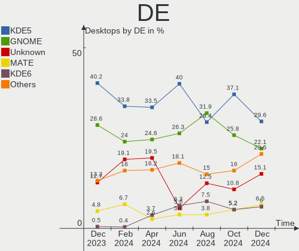
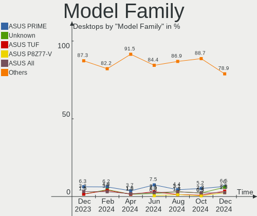
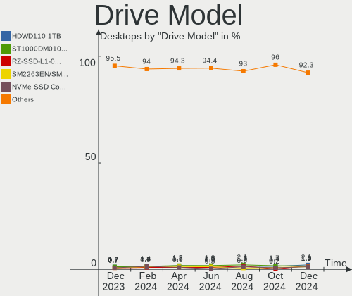
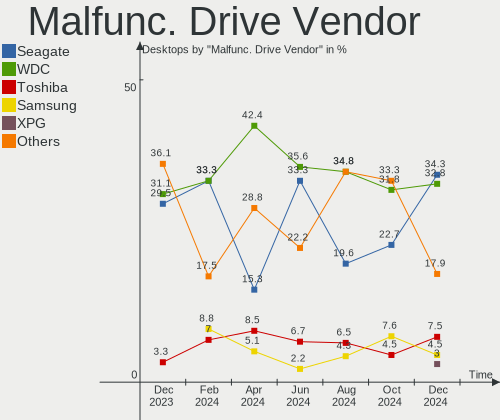
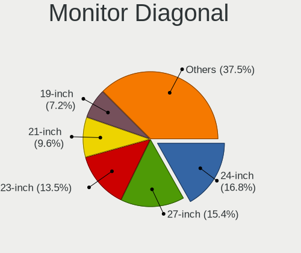
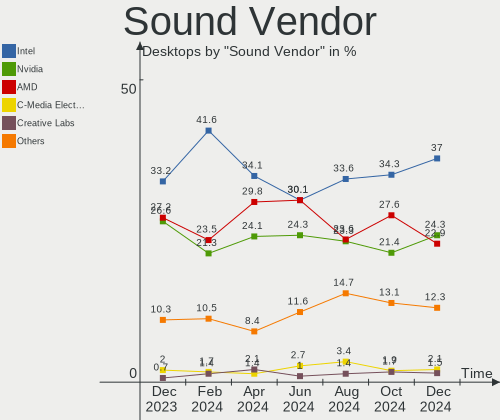

Linux in Russia - Hardware Trends (Desktops)
--------------------------------------------

A project to identify most popular hardware characteristics and track their change
over time based on data collected by Linux users at https://Linux-Hardware.org.

Anyone can contribute to this report by the [hw-probe](https://github.com/linuxhw/hw-probe) tool:

    sudo -E hw-probe -all -upload

Period: May, 2023.

Contents
--------

* [ System ](#system)
  - [ OS                       ](#os)
  - [ OS Family                ](#os-family)
  - [ Kernel                   ](#kernel)
  - [ Kernel Family            ](#kernel-family)
  - [ Kernel Major Ver.        ](#kernel-major-ver)
  - [ Arch                     ](#arch)
  - [ DE                       ](#de)
  - [ Display Server           ](#display-server)
  - [ Display Manager          ](#display-manager)
  - [ OS Lang                  ](#os-lang)
  - [ Boot Mode                ](#boot-mode)
  - [ Filesystem               ](#filesystem)
  - [ Part. scheme             ](#part-scheme)
  - [ Dual Boot with Linux/BSD ](#dual-boot-with-linuxbsd)
  - [ Dual Boot (Win)          ](#dual-boot-win)

* [ Board ](#board)
  - [ Vendor                   ](#vendor)
  - [ Model                    ](#model)
  - [ Model Family             ](#model-family)
  - [ MFG Year                 ](#mfg-year)
  - [ Form Factor              ](#form-factor)
  - [ Secure Boot              ](#secure-boot)
  - [ Coreboot                 ](#coreboot)
  - [ RAM Size                 ](#ram-size)
  - [ RAM Used                 ](#ram-used)
  - [ Total Drives             ](#total-drives)
  - [ Has CD-ROM               ](#has-cd-rom)
  - [ Has Ethernet             ](#has-ethernet)
  - [ Has WiFi                 ](#has-wifi)
  - [ Has Bluetooth            ](#has-bluetooth)

* [ Location ](#location)
  - [ Country                  ](#country)
  - [ City                     ](#city)

* [ Drives ](#drives)
  - [ Drive Vendor             ](#drive-vendor)
  - [ Drive Model              ](#drive-model)
  - [ HDD Vendor               ](#hdd-vendor)
  - [ SSD Vendor               ](#ssd-vendor)
  - [ Drive Kind               ](#drive-kind)
  - [ Drive Connector          ](#drive-connector)
  - [ Drive Size               ](#drive-size)
  - [ Space Total              ](#space-total)
  - [ Space Used               ](#space-used)
  - [ Malfunc. Drives          ](#malfunc-drives)
  - [ Malfunc. Drive Vendor    ](#malfunc-drive-vendor)
  - [ Malfunc. HDD Vendor      ](#malfunc-hdd-vendor)
  - [ Malfunc. Drive Kind      ](#malfunc-drive-kind)
  - [ Failed Drives            ](#failed-drives)
  - [ Failed Drive Vendor      ](#failed-drive-vendor)
  - [ Drive Status             ](#drive-status)

* [ Storage controller ](#storage-controller)
  - [ Storage Vendor           ](#storage-vendor)
  - [ Storage Model            ](#storage-model)
  - [ Storage Kind             ](#storage-kind)

* [ Processor ](#processor)
  - [ CPU Vendor               ](#cpu-vendor)
  - [ CPU Model                ](#cpu-model)
  - [ CPU Model Family         ](#cpu-model-family)
  - [ CPU Cores                ](#cpu-cores)
  - [ CPU Sockets              ](#cpu-sockets)
  - [ CPU Threads              ](#cpu-threads)
  - [ CPU Op-Modes             ](#cpu-op-modes)
  - [ CPU Microcode            ](#cpu-microcode)
  - [ CPU Microarch            ](#cpu-microarch)

* [ Graphics ](#graphics)
  - [ GPU Vendor               ](#gpu-vendor)
  - [ GPU Model                ](#gpu-model)
  - [ GPU Combo                ](#gpu-combo)
  - [ GPU Driver               ](#gpu-driver)
  - [ GPU Memory               ](#gpu-memory)

* [ Monitor ](#monitor)
  - [ Monitor Vendor           ](#monitor-vendor)
  - [ Monitor Model            ](#monitor-model)
  - [ Monitor Resolution       ](#monitor-resolution)
  - [ Monitor Diagonal         ](#monitor-diagonal)
  - [ Monitor Width            ](#monitor-width)
  - [ Aspect Ratio             ](#aspect-ratio)
  - [ Monitor Area             ](#monitor-area)
  - [ Pixel Density            ](#pixel-density)
  - [ Multiple Monitors        ](#multiple-monitors)

* [ Network ](#network)
  - [ Net Controller Vendor    ](#net-controller-vendor)
  - [ Net Controller Model     ](#net-controller-model)
  - [ Wireless Vendor          ](#wireless-vendor)
  - [ Wireless Model           ](#wireless-model)
  - [ Ethernet Vendor          ](#ethernet-vendor)
  - [ Ethernet Model           ](#ethernet-model)
  - [ Net Controller Kind      ](#net-controller-kind)
  - [ Used Controller          ](#used-controller)
  - [ NICs                     ](#nics)
  - [ IPv6                     ](#ipv6)

* [ Bluetooth ](#bluetooth)
  - [ Bluetooth Vendor         ](#bluetooth-vendor)
  - [ Bluetooth Model          ](#bluetooth-model)

* [ Sound ](#sound)
  - [ Sound Vendor             ](#sound-vendor)
  - [ Sound Model              ](#sound-model)

* [ Memory ](#memory)
  - [ Memory Vendor            ](#memory-vendor)
  - [ Memory Model             ](#memory-model)
  - [ Memory Kind              ](#memory-kind)
  - [ Memory Form Factor       ](#memory-form-factor)
  - [ Memory Size              ](#memory-size)
  - [ Memory Speed             ](#memory-speed)

* [ Printers & scanners ](#printers--scanners)
  - [ Printer Vendor           ](#printer-vendor)
  - [ Printer Model            ](#printer-model)
  - [ Scanner Vendor           ](#scanner-vendor)
  - [ Scanner Model            ](#scanner-model)

* [ Camera ](#camera)
  - [ Camera Vendor            ](#camera-vendor)
  - [ Camera Model             ](#camera-model)

* [ Security ](#security)
  - [ Fingerprint Vendor       ](#fingerprint-vendor)
  - [ Fingerprint Model        ](#fingerprint-model)
  - [ Chipcard Vendor          ](#chipcard-vendor)
  - [ Chipcard Model           ](#chipcard-model)

* [ Unsupported ](#unsupported)
  - [ Unsupported Devices      ](#unsupported-devices)
  - [ Unsupported Device Types ](#unsupported-device-types)

System
------

OS
--

Installed operating systems

| Name               | Desktops | Percent |
|--------------------|----------|---------|
| ROSA 12.4          | 74       | 31.09%  |
| Debian 12          | 49       | 20.59%  |
| OpenMandriva 23.03 | 10       | 4.2%    |
| Fedora 38          | 10       | 4.2%    |
| ROSA 12.3          | 8        | 3.36%   |
| Linux Mint 21.1    | 7        | 2.94%   |
| Ubuntu 22.04       | 6        | 2.52%   |
| Red OS 7.3.2       | 5        | 2.1%    |
| ALT Linux 10.1     | 5        | 2.1%    |
| ROSA R11.1         | 4        | 1.68%   |
| Manjaro            | 4        | 1.68%   |
| Gentoo 2.13        | 4        | 1.68%   |
| Debian 11          | 4        | 1.68%   |
| Arch Rolling       | 4        | 1.68%   |
| Pop!_OS 22.04      | 3        | 1.26%   |
| KDE neon 22.04     | 3        | 1.26%   |
| Ubuntu 23.04       | 2        | 0.84%   |
| ROSA 12.1          | 2        | 0.84%   |
| ROSA 12            | 2        | 0.84%   |
| Red OS 7.3         | 2        | 0.84%   |
| OpenMandriva 23.01 | 2        | 0.84%   |
| Fedora 37          | 2        | 0.84%   |
| ArcoLinux Rolling  | 2        | 0.84%   |
| Ubuntu MATE 18.04  | 1        | 0.42%   |
| Ubuntu 20.04       | 1        | 0.42%   |
| Ubuntu 18.04       | 1        | 0.42%   |
| Solus 4.3          | 1        | 0.42%   |
| ROSA R11           | 1        | 0.42%   |
| ROSA 13.0          | 1        | 0.42%   |
| ROSA 12.2          | 1        | 0.42%   |
| RELD 7.9           | 1        | 0.42%   |
| Red OS 7.3.1       | 1        | 0.42%   |
| openSUSE Leap-15.4 | 1        | 0.42%   |
| OpenMandriva 4.50  | 1        | 0.42%   |
| OpenMandriva 4.3   | 1        | 0.42%   |
| Manjaro 22.1.3     | 1        | 0.42%   |
| LMDE 5             | 1        | 0.42%   |
| Linux Mint 20.3    | 1        | 0.42%   |
| Kali 2023.2        | 1        | 0.42%   |
| Kali 2023.1        | 1        | 0.42%   |

OS Family
---------

OS without a version

| Name         | Desktops | Percent |
|--------------|----------|---------|
| ROSA         | 93       | 39.08%  |
| Debian       | 54       | 22.69%  |
| OpenMandriva | 14       | 5.88%   |
| Fedora       | 13       | 5.46%   |
| Ubuntu       | 10       | 4.2%    |
| Red OS       | 8        | 3.36%   |
| Linux Mint   | 8        | 3.36%   |
| ALT Linux    | 7        | 2.94%   |
| Manjaro      | 5        | 2.1%    |
| Gentoo       | 4        | 1.68%   |
| Arch         | 4        | 1.68%   |
| Pop!_OS      | 3        | 1.26%   |
| KDE neon     | 3        | 1.26%   |
| Kali         | 2        | 0.84%   |
| ArcoLinux    | 2        | 0.84%   |
| Ubuntu MATE  | 1        | 0.42%   |
| Solus        | 1        | 0.42%   |
| RELD         | 1        | 0.42%   |
| openSUSE     | 1        | 0.42%   |
| LMDE         | 1        | 0.42%   |
| Elementary   | 1        | 0.42%   |
| Clear Linux  | 1        | 0.42%   |
| antiX        | 1        | 0.42%   |

Kernel
------

Version of the Linux kernel

| Version                                                  | Desktops | Percent |
|----------------------------------------------------------|----------|---------|
| 6.1.20-generic-2rosa2021.1-x86_64                        | 54       | 22.69%  |
| 6.1.0-4-amd64                                            | 47       | 19.75%  |
| 6.2.6-desktop-1omv2390                                   | 10       | 4.2%    |
| 5.15.103-generic-1rosa2021.1-x86_64                      | 7        | 2.94%   |
| 5.19.0-41-generic                                        | 6        | 2.52%   |
| 5.10.176-generic-1rosa2021.1-x86_64                      | 6        | 2.52%   |
| 6.2.15-300.fc38.x86_64                                   | 5        | 2.1%    |
| 6.2.14-300.fc38.x86_64                                   | 5        | 2.1%    |
| 5.15.0-71-generic                                        | 4        | 1.68%   |
| 6.2.6-76060206-generic                                   | 3        | 1.26%   |
| 5.15.75-generic-1rosa2021.1-x86_64                       | 3        | 1.26%   |
| 5.15.0-72-generic                                        | 3        | 1.26%   |
| 5.10.74-generic-2rosa2021.1-x86_64                       | 3        | 1.26%   |
| 6.3.1-arch1-1                                            | 2        | 0.84%   |
| 6.2.12.xm1-1.klp-xanmod-rosa2021.1-x86_64                | 2        | 0.84%   |
| 6.2.0-20-generic                                         | 2        | 0.84%   |
| 6.1.30.xm1-1.klp-xanmod-rosa2021.1-x86_64                | 2        | 0.84%   |
| 6.1.20-2.el7.3.x86_64                                    | 2        | 0.84%   |
| 5.19.0-40-generic                                        | 2        | 0.84%   |
| 5.17.11-generic-2rosa2021.1-x86_64                       | 2        | 0.84%   |
| 5.15.87-1.el7.3.x86_64                                   | 2        | 0.84%   |
| 5.10.155-generic-1rosa2021.1-x86_64                      | 2        | 0.84%   |
| 5.10.0-23-amd64                                          | 2        | 0.84%   |
| 6.4.0-0.rc3.20230526git0d85b27b0cc6.32.fc39.x86_64+debug | 1        | 0.42%   |
| 6.3.4-gentoo-c17                                         | 1        | 0.42%   |
| 6.3.4-gentoo                                             | 1        | 0.42%   |
| 6.3.4-arch1-1                                            | 1        | 0.42%   |
| 6.3.3-1-MANJARO                                          | 1        | 0.42%   |
| 6.3.2-zen1-1-zen                                         | 1        | 0.42%   |
| 6.3.1-generic-1rosa2021.1-x86_64                         | 1        | 0.42%   |
| 6.3.0-gentoo                                             | 1        | 0.42%   |
| 6.3.0-1-MANJARO                                          | 1        | 0.42%   |
| 6.2.7-arch1-1                                            | 1        | 0.42%   |
| 6.2.14-232.current                                       | 1        | 0.42%   |
| 6.2.14-200.fc37.x86_64                                   | 1        | 0.42%   |
| 6.2.13-200.fc37.x86_64                                   | 1        | 0.42%   |
| 6.2.13-1304.native                                       | 1        | 0.42%   |
| 6.2.10-x64v1-xanmod1-1                                   | 1        | 0.42%   |
| 6.2.0-060200-generic                                     | 1        | 0.42%   |
| 6.1.4-desktop-1omv2301                                   | 1        | 0.42%   |

Kernel Family
-------------

Linux kernel without a distro release

| Version  | Desktops | Percent |
|----------|----------|---------|
| 6.1.20   | 57       | 23.95%  |
| 6.1.0    | 50       | 21.01%  |
| 6.2.6    | 13       | 5.46%   |
| 5.19.0   | 9        | 3.78%   |
| 5.15.0   | 8        | 3.36%   |
| 6.2.14   | 7        | 2.94%   |
| 5.15.103 | 7        | 2.94%   |
| 5.10.176 | 7        | 2.94%   |
| 6.2.15   | 5        | 2.1%    |
| 5.15.75  | 4        | 1.68%   |
| 5.10.0   | 4        | 1.68%   |
| 6.3.4    | 3        | 1.26%   |
| 6.3.1    | 3        | 1.26%   |
| 6.2.0    | 3        | 1.26%   |
| 6.1.30   | 3        | 1.26%   |
| 5.10.74  | 3        | 1.26%   |
| 4.15.0   | 3        | 1.26%   |
| 6.3.0    | 2        | 0.84%   |
| 6.2.13   | 2        | 0.84%   |
| 6.2.12   | 2        | 0.84%   |
| 6.1.26   | 2        | 0.84%   |
| 5.4.83   | 2        | 0.84%   |
| 5.4.0    | 2        | 0.84%   |
| 5.17.11  | 2        | 0.84%   |
| 5.15.87  | 2        | 0.84%   |
| 5.15.72  | 2        | 0.84%   |
| 5.10.155 | 2        | 0.84%   |
| 6.4.0    | 1        | 0.42%   |
| 6.3.3    | 1        | 0.42%   |
| 6.3.2    | 1        | 0.42%   |
| 6.2.7    | 1        | 0.42%   |
| 6.2.10   | 1        | 0.42%   |
| 6.1.4    | 1        | 0.42%   |
| 6.1.29   | 1        | 0.42%   |
| 6.1.25   | 1        | 0.42%   |
| 6.1.1    | 1        | 0.42%   |
| 6.0.12   | 1        | 0.42%   |
| 6.0.0    | 1        | 0.42%   |
| 5.19.5   | 1        | 0.42%   |
| 5.17.1   | 1        | 0.42%   |

Kernel Major Ver.
-----------------

Linux kernel major version

| Version | Desktops | Percent |
|---------|----------|---------|
| 6.1     | 116      | 48.74%  |
| 6.2     | 34       | 14.29%  |
| 5.15    | 27       | 11.34%  |
| 5.10    | 24       | 10.08%  |
| 6.3     | 10       | 4.2%    |
| 5.19    | 10       | 4.2%    |
| 5.4     | 4        | 1.68%   |
| 5.17    | 3        | 1.26%   |
| 4.15    | 3        | 1.26%   |
| 6.0     | 2        | 0.84%   |
| 6.4     | 1        | 0.42%   |
| 5.16    | 1        | 0.42%   |
| 5.14    | 1        | 0.42%   |
| 5.0     | 1        | 0.42%   |
| 4.19    | 1        | 0.42%   |

Arch
----

OS architecture (x86_64, i586, etc.)

| Name   | Desktops | Percent |
|--------|----------|---------|
| x86_64 | 234      | 98.32%  |
| i686   | 4        | 1.68%   |

DE
--

Desktop Environment

| Name       | Desktops | Percent |
|------------|----------|---------|
| KDE5       | 81       | 34.03%  |
| GNOME      | 58       | 24.37%  |
| Unknown    | 53       | 22.27%  |
| MATE       | 12       | 5.04%   |
| XFCE       | 8        | 3.36%   |
| LXQt       | 8        | 3.36%   |
| X-Cinnamon | 7        | 2.94%   |
| KDE4       | 5        | 2.1%    |
| Pantheon   | 1        | 0.42%   |
| icewm      | 1        | 0.42%   |
| i3         | 1        | 0.42%   |
| Hyprland   | 1        | 0.42%   |
| Cinnamon   | 1        | 0.42%   |
| Budgie     | 1        | 0.42%   |

Display Server
--------------

X11 or Wayland

| Name    | Desktops | Percent |
|---------|----------|---------|
| Wayland | 93       | 39.08%  |
| X11     | 92       | 38.66%  |
| Unknown | 50       | 21.01%  |
| Tty     | 3        | 1.26%   |

Display Manager
---------------

SDDM, LightDM, etc.

| Name    | Desktops | Percent |
|---------|----------|---------|
| Unknown | 87       | 36.55%  |
| SDDM    | 69       | 28.99%  |
| GDM     | 51       | 21.43%  |
| LightDM | 16       | 6.72%   |
| GDM3    | 9        | 3.78%   |
| KDM     | 5        | 2.1%    |
| LXDM    | 1        | 0.42%   |

OS Lang
-------

Language

| Lang       | Desktops | Percent |
|------------|----------|---------|
| ru_RU      | 211      | 88.66%  |
| en_US      | 22       | 9.24%   |
| Unknown    | 3        | 1.26%   |
| ru_RU.UTF8 | 1        | 0.42%   |
| C          | 1        | 0.42%   |

Boot Mode
---------

EFI or BIOS

| Mode | Desktops | Percent |
|------|----------|---------|
| BIOS | 131      | 55.04%  |
| EFI  | 107      | 44.96%  |

Filesystem
----------

Type of filesystem

| Type    | Desktops | Percent |
|---------|----------|---------|
| Ext4    | 141      | 59.24%  |
| Overlay | 55       | 23.11%  |
| Btrfs   | 27       | 11.34%  |
| Tmpfs   | 8        | 3.36%   |
| Xfs     | 4        | 1.68%   |
| Ext3    | 2        | 0.84%   |
| F2fs    | 1        | 0.42%   |

Part. scheme
------------

Scheme of partitioning

| Type    | Desktops | Percent |
|---------|----------|---------|
| GPT     | 115      | 48.32%  |
| MBR     | 90       | 37.82%  |
| Unknown | 33       | 13.87%  |

Dual Boot with Linux/BSD
------------------------

Hosting more than one Linux/BSD

| Dual boot | Desktops | Percent |
|-----------|----------|---------|
| No        | 197      | 82.77%  |
| Yes       | 41       | 17.23%  |

Dual Boot (Win)
---------------

Hosting Linux and Windows

| Dual boot | Desktops | Percent |
|-----------|----------|---------|
| No        | 125      | 52.52%  |
| Yes       | 113      | 47.48%  |

Board
-----

Vendor
------

Motherboard manufacturer

| Name                | Desktops | Percent |
|---------------------|----------|---------|
| ASUSTek Computer    | 81       | 34.03%  |
| Gigabyte Technology | 66       | 27.73%  |
| MSI                 | 34       | 14.29%  |
| ASRock              | 19       | 7.98%   |
| Unknown             | 5        | 2.1%    |
| Hewlett-Packard     | 4        | 1.68%   |
| Intel               | 3        | 1.26%   |
| Huanan              | 3        | 1.26%   |
| ECS                 | 3        | 1.26%   |
| Acer                | 3        | 1.26%   |
| OEM                 | 2        | 0.84%   |
| Lenovo              | 2        | 0.84%   |
| Biostar             | 2        | 0.84%   |
| AZW                 | 2        | 0.84%   |
| Aquarius            | 2        | 0.84%   |
| Supermicro          | 1        | 0.42%   |
| Maxtang             | 1        | 0.42%   |
| MACHINIST           | 1        | 0.42%   |
| iRU                 | 1        | 0.42%   |
| Graviton            | 1        | 0.42%   |
| DEPO Computers      | 1        | 0.42%   |
| Dell                | 1        | 0.42%   |

Model
-----

Motherboard model

| Name                       | Desktops | Percent |
|----------------------------|----------|---------|
| ASUS All Series            | 22       | 9.24%   |
| Gigabyte H81M-S2V          | 8        | 3.36%   |
| Unknown                    | 5        | 2.1%    |
| ASRock B450 Gaming K4      | 3        | 1.26%   |
| MSI MS-7D22                | 2        | 0.84%   |
| MSI MS-7C37                | 2        | 0.84%   |
| MSI MS-7B17                | 2        | 0.84%   |
| MSI MS-7592                | 2        | 0.84%   |
| Intel B75                  | 2        | 0.84%   |
| Gigabyte M68MT-S2          | 2        | 0.84%   |
| Gigabyte M56S-S3           | 2        | 0.84%   |
| Gigabyte H61M-S2PV         | 2        | 0.84%   |
| Gigabyte B560 HD3          | 2        | 0.84%   |
| Gigabyte B450M S2H         | 2        | 0.84%   |
| Gigabyte B450 AORUS ELITE  | 2        | 0.84%   |
| ECS G31T-M9                | 2        | 0.84%   |
| AZW MINI S                 | 2        | 0.84%   |
| ASUS SABERTOOTH 990FX R2.0 | 2        | 0.84%   |
| ASUS P9X79                 | 2        | 0.84%   |
| ASUS P8H67-M               | 2        | 0.84%   |
| ASUS P8H61-MX R2.0         | 2        | 0.84%   |
| ASUS P5G41T-M LX           | 2        | 0.84%   |
| ASUS P5G41T-M LE           | 2        | 0.84%   |
| ASRock A320M-DVS R4.0      | 2        | 0.84%   |
| Supermicro X5DPA           | 1        | 0.42%   |
| OEM X99-Turbo              | 1        | 0.42%   |
| OEM X79G                   | 1        | 0.42%   |
| MSI PPPPP-CCC#MMMMMMMM     | 1        | 0.42%   |
| MSI MS-7E07                | 1        | 0.42%   |
| MSI MS-7D97                | 1        | 0.42%   |
| MSI MS-7D73                | 1        | 0.42%   |
| MSI MS-7D48                | 1        | 0.42%   |
| MSI MS-7D25                | 1        | 0.42%   |
| MSI MS-7D18                | 1        | 0.42%   |
| MSI MS-7D14                | 1        | 0.42%   |
| MSI MS-7D09                | 1        | 0.42%   |
| MSI MS-7C91                | 1        | 0.42%   |
| MSI MS-7C75                | 1        | 0.42%   |
| MSI MS-7C52                | 1        | 0.42%   |
| MSI MS-7B38                | 1        | 0.42%   |

Model Family
------------

Motherboard model prefix

| Name                   | Desktops | Percent |
|------------------------|----------|---------|
| ASUS All               | 22       | 9.24%   |
| ASUS PRIME             | 16       | 6.72%   |
| Gigabyte H81M-S2V      | 8        | 3.36%   |
| ASUS P5G41T-M          | 5        | 2.1%    |
| Unknown                | 5        | 2.1%    |
| ASUS TUF               | 4        | 1.68%   |
| ASRock B450            | 4        | 1.68%   |
| Gigabyte B450M         | 3        | 1.26%   |
| Gigabyte B450          | 3        | 1.26%   |
| ASUS P9X79             | 3        | 1.26%   |
| ASUS P8H67-M           | 3        | 1.26%   |
| MSI MS-7D22            | 2        | 0.84%   |
| MSI MS-7C37            | 2        | 0.84%   |
| MSI MS-7B17            | 2        | 0.84%   |
| MSI MS-7592            | 2        | 0.84%   |
| Intel B75              | 2        | 0.84%   |
| HP ProDesk             | 2        | 0.84%   |
| Gigabyte M68MT-S2      | 2        | 0.84%   |
| Gigabyte M56S-S3       | 2        | 0.84%   |
| Gigabyte H61M-S2PV     | 2        | 0.84%   |
| Gigabyte B560          | 2        | 0.84%   |
| Gigabyte A320M-S2H     | 2        | 0.84%   |
| ECS G31T-M9            | 2        | 0.84%   |
| AZW MINI               | 2        | 0.84%   |
| ASUS SABERTOOTH        | 2        | 0.84%   |
| ASUS ROG               | 2        | 0.84%   |
| ASUS P8H61-MX          | 2        | 0.84%   |
| ASUS P8H61-M           | 2        | 0.84%   |
| ASUS M5A97             | 2        | 0.84%   |
| ASRock A320M-DVS       | 2        | 0.84%   |
| Acer Veriton           | 2        | 0.84%   |
| Supermicro X5DPA       | 1        | 0.42%   |
| OEM X99-Turbo          | 1        | 0.42%   |
| OEM X79G               | 1        | 0.42%   |
| MSI PPPPP-CCC#MMMMMMMM | 1        | 0.42%   |
| MSI MS-7E07            | 1        | 0.42%   |
| MSI MS-7D97            | 1        | 0.42%   |
| MSI MS-7D73            | 1        | 0.42%   |
| MSI MS-7D48            | 1        | 0.42%   |
| MSI MS-7D25            | 1        | 0.42%   |

MFG Year
--------

Motherboard manufacture year

| Year | Desktops | Percent |
|------|----------|---------|
| 2012 | 34       | 14.29%  |
| 2018 | 27       | 11.34%  |
| 2021 | 26       | 10.92%  |
| 2022 | 21       | 8.82%   |
| 2020 | 16       | 6.72%   |
| 2011 | 16       | 6.72%   |
| 2010 | 16       | 6.72%   |
| 2014 | 14       | 5.88%   |
| 2009 | 14       | 5.88%   |
| 2019 | 13       | 5.46%   |
| 2013 | 12       | 5.04%   |
| 2016 | 8        | 3.36%   |
| 2017 | 5        | 2.1%    |
| 2007 | 5        | 2.1%    |
| 2015 | 4        | 1.68%   |
| 2006 | 3        | 1.26%   |
| 2008 | 2        | 0.84%   |
| 2023 | 1        | 0.42%   |
| 2003 | 1        | 0.42%   |

Form Factor
-----------

Physical design of the computer

| Name    | Desktops | Percent |
|---------|----------|---------|
| Desktop | 238      | 100%    |

Secure Boot
-----------

Enabled or disabled

| State    | Desktops | Percent |
|----------|----------|---------|
| Disabled | 232      | 97.48%  |
| Enabled  | 6        | 2.52%   |

Coreboot
--------

Have coreboot on board

| Used | Desktops | Percent |
|------|----------|---------|
| No   | 238      | 100%    |

RAM Size
--------

Total RAM memory

| Size in GB  | Desktops | Percent |
|-------------|----------|---------|
| 16.01-24.0  | 50       | 21.01%  |
| 8.01-16.0   | 50       | 21.01%  |
| 4.01-8.0    | 45       | 18.91%  |
| 32.01-64.0  | 38       | 15.97%  |
| 3.01-4.0    | 38       | 15.97%  |
| 1.01-2.0    | 5        | 2.1%    |
| 2.01-3.0    | 4        | 1.68%   |
| 64.01-256.0 | 4        | 1.68%   |
| 24.01-32.0  | 3        | 1.26%   |
| 0.51-1.0    | 1        | 0.42%   |

RAM Used
--------

Used RAM memory

| Used GB    | Desktops | Percent |
|------------|----------|---------|
| 1.01-2.0   | 80       | 33.61%  |
| 0.51-1.0   | 59       | 24.79%  |
| 2.01-3.0   | 48       | 20.17%  |
| 4.01-8.0   | 24       | 10.08%  |
| 3.01-4.0   | 14       | 5.88%   |
| 8.01-16.0  | 8        | 3.36%   |
| 0.01-0.5   | 2        | 0.84%   |
| 32.01-64.0 | 1        | 0.42%   |
| 24.01-32.0 | 1        | 0.42%   |
| 16.01-24.0 | 1        | 0.42%   |

Total Drives
------------

Number of drives on board

| Drives | Desktops | Percent |
|--------|----------|---------|
| 1      | 114      | 47.9%   |
| 2      | 76       | 31.93%  |
| 3      | 30       | 12.61%  |
| 4      | 14       | 5.88%   |
| 5      | 4        | 1.68%   |

Has CD-ROM
----------

Has CD-ROM on board

| Presented | Desktops | Percent |
|-----------|----------|---------|
| No        | 181      | 76.05%  |
| Yes       | 57       | 23.95%  |

Has Ethernet
------------

Has Ethernet on board

| Presented | Desktops | Percent |
|-----------|----------|---------|
| Yes       | 237      | 99.58%  |
| No        | 1        | 0.42%   |

Has WiFi
--------

Has WiFi module

| Presented | Desktops | Percent |
|-----------|----------|---------|
| No        | 173      | 72.69%  |
| Yes       | 65       | 27.31%  |

Has Bluetooth
-------------

Has Bluetooth module

| Presented | Desktops | Percent |
|-----------|----------|---------|
| No        | 183      | 76.89%  |
| Yes       | 55       | 23.11%  |

Location
--------

Country
-------

Geographic location (country)

| Country | Desktops | Percent |
|---------|----------|---------|
| Russia  | 238      | 100%    |

City
----

Geographic location (city)

| City              | Desktops | Percent |
|-------------------|----------|---------|
| Voronezh          | 49       | 20.59%  |
| Moscow            | 40       | 16.81%  |
| St Petersburg     | 14       | 5.88%   |
| Yekaterinburg     | 8        | 3.36%   |
| Perm              | 6        | 2.52%   |
| Krasnodar         | 6        | 2.52%   |
| Volgograd         | 5        | 2.1%    |
| Rostov-on-Don     | 4        | 1.68%   |
| Nizhniy Novgorod  | 4        | 1.68%   |
| Vladivostok       | 3        | 1.26%   |
| Ulyanovsk         | 3        | 1.26%   |
| Tomsk             | 3        | 1.26%   |
| Samara            | 3        | 1.26%   |
| Omsk              | 3        | 1.26%   |
| Krasnoyarsk       | 3        | 1.26%   |
| Kanevskaya        | 3        | 1.26%   |
| Bryansk           | 3        | 1.26%   |
| Vladimir          | 2        | 0.84%   |
| Tyumen            | 2        | 0.84%   |
| Saratov           | 2        | 0.84%   |
| Saransk           | 2        | 0.84%   |
| Orenburg          | 2        | 0.84%   |
| Novosibirsk       | 2        | 0.84%   |
| Kirov             | 2        | 0.84%   |
| Khabarovsk        | 2        | 0.84%   |
| Kazan’          | 2        | 0.84%   |
| Irkutsk           | 2        | 0.84%   |
| Dolgoprudnyy      | 2        | 0.84%   |
| Zlatoust          | 1        | 0.42%   |
| Zhukovskiy        | 1        | 0.42%   |
| Zheleznodorozhnyy | 1        | 0.42%   |
| Zelenodolsk       | 1        | 0.42%   |
| Volgodonsk        | 1        | 0.42%   |
| Vikhorevka        | 1        | 0.42%   |
| Ufa               | 1        | 0.42%   |
| Troitsk           | 1        | 0.42%   |
| Tolyatti          | 1        | 0.42%   |
| Tambov            | 1        | 0.42%   |
| Surgut            | 1        | 0.42%   |
| Stary Oskol       | 1        | 0.42%   |

Drives
------

Drive Vendor
------------

Hard drive vendors

| Vendor              | Desktops | Drives | Percent |
|---------------------|----------|--------|---------|
| WDC                 | 87       | 104    | 22.03%  |
| Seagate             | 64       | 70     | 16.2%   |
| Samsung Electronics | 34       | 39     | 8.61%   |
| Toshiba             | 27       | 28     | 6.84%   |
| Kingston            | 26       | 29     | 6.58%   |
| Hitachi             | 12       | 13     | 3.04%   |
| Intel               | 9        | 10     | 2.28%   |
| A-DATA Technology   | 9        | 9      | 2.28%   |
| KingSpec            | 8        | 8      | 2.03%   |
| China               | 8        | 8      | 2.03%   |
| SanDisk             | 7        | 7      | 1.77%   |
| Crucial             | 7        | 7      | 1.77%   |
| SPCC                | 6        | 8      | 1.52%   |
| Patriot             | 6        | 6      | 1.52%   |
| Apacer              | 6        | 6      | 1.52%   |
| AMD                 | 6        | 6      | 1.52%   |
| Transcend           | 5        | 5      | 1.27%   |
| Netac               | 5        | 5      | 1.27%   |
| HGST                | 4        | 4      | 1.01%   |
| Foxline             | 4        | 4      | 1.01%   |
| Smartbuy            | 3        | 3      | 0.76%   |
| Silicon Motion      | 3        | 3      | 0.76%   |
| Plextor             | 3        | 3      | 0.76%   |
| Gigabyte Technology | 3        | 3      | 0.76%   |
| ADATA Technology    | 3        | 3      | 0.76%   |
| Unknown             | 3        | 3      | 0.76%   |
| XrayDisk            | 2        | 2      | 0.51%   |
| XPG                 | 2        | 2      | 0.51%   |
| Unknown             | 2        | 2      | 0.51%   |
| Phison Electronics  | 2        | 3      | 0.51%   |
| OCZ                 | 2        | 2      | 0.51%   |
| Neo                 | 2        | 2      | 0.51%   |
| MSI                 | 2        | 2      | 0.51%   |
| Maxtor              | 2        | 2      | 0.51%   |
| Corsair             | 2        | 2      | 0.51%   |
| Colorful            | 2        | 2      | 0.51%   |
| ZM-SSD              | 1        | 1      | 0.25%   |
| ZHITAI              | 1        | 1      | 0.25%   |
| USB3.0              | 1        | 1      | 0.25%   |
| TO Exter            | 1        | 1      | 0.25%   |

Drive Model
-----------

Hard drive models

| Model                            | Desktops | Percent |
|----------------------------------|----------|---------|
| WDC WD5000AAKX-60U6AA0 500GB     | 15       | 3.55%   |
| Seagate ST1000DM003-1ER162 1TB   | 9        | 2.13%   |
| Toshiba DT01ACA050 500GB         | 8        | 1.89%   |
| Toshiba HDWD110 1TB              | 7        | 1.65%   |
| Seagate ST1000DM010-2EP102 1TB   | 7        | 1.65%   |
| Seagate ST500DM002-1BD142 500GB  | 5        | 1.18%   |
| Kingston SA400S37120G 120GB SSD  | 5        | 1.18%   |
| Kingston SA400S37480G 480GB SSD  | 4        | 0.95%   |
| WDC WDS240G2G0A-00JH30 240GB SSD | 3        | 0.71%   |
| WDC WD5000AAKX-00ERMA0 500GB     | 3        | 0.71%   |
| WDC WD10EZEX-22MFCA0 1TB         | 3        | 0.71%   |
| WDC WD10EZEX-08WN4A0 1TB         | 3        | 0.71%   |
| WDC WD10EZEX-00BBHA0 1TB         | 3        | 0.71%   |
| Toshiba HDWD105 500GB            | 3        | 0.71%   |
| Seagate ST250DM000-1BC141 250GB  | 3        | 0.71%   |
| Seagate ST1000DM003-1CH162 1TB   | 3        | 0.71%   |
| Samsung SSD 870 EVO 500GB        | 3        | 0.71%   |
| Netac SSD 240GB                  | 3        | 0.71%   |
| Kingston SA400S37240G 240GB SSD  | 3        | 0.71%   |
| KingSpec P3-128 128GB SSD        | 3        | 0.71%   |
| Crucial CT240BX500SSD1 240GB     | 3        | 0.71%   |
| China 128GB SSD                  | 3        | 0.71%   |
| Unknown                          | 3        | 0.71%   |
| XrayDisk 512GB SSD               | 2        | 0.47%   |
| WDC WDS500G2B0A-00SM50 500GB SSD | 2        | 0.47%   |
| WDC WDS240G1G0A-00SS50 240GB SSD | 2        | 0.47%   |
| WDC WDS100T2B0C-00PXH0 1TB       | 2        | 0.47%   |
| WDC WD5000AAKX-08ANVA0 500GB     | 2        | 0.47%   |
| WDC WD5000AAKX-001CA0 500GB      | 2        | 0.47%   |
| WDC WD2500AAKS-00VSA0 250GB      | 2        | 0.47%   |
| WDC WD1600AAJS-00L7A0 160GB      | 2        | 0.47%   |
| WDC WD10EZEX-60ZF5A0 1TB         | 2        | 0.47%   |
| WDC WD10EZEX-00RKKA0 1TB         | 2        | 0.47%   |
| WDC WD10EZEX-00BN5A0 1TB         | 2        | 0.47%   |
| WDC WD1002FAEX-00Y9A0 1TB        | 2        | 0.47%   |
| Transcend TS128GSSD340K 128GB    | 2        | 0.47%   |
| Toshiba DT01ACA100 1TB           | 2        | 0.47%   |
| SPCC Solid State Disk 256GB      | 2        | 0.47%   |
| Smartbuy SSD 120GB               | 2        | 0.47%   |
| Seagate ST500DM002-1BC142 500GB  | 2        | 0.47%   |

HDD Vendor
----------

Hard disk drive vendors

| Vendor              | Desktops | Drives | Percent |
|---------------------|----------|--------|---------|
| WDC                 | 81       | 91     | 40.91%  |
| Seagate             | 63       | 69     | 31.82%  |
| Toshiba             | 27       | 28     | 13.64%  |
| Hitachi             | 12       | 13     | 6.06%   |
| Samsung Electronics | 7        | 7      | 3.54%   |
| HGST                | 4        | 4      | 2.02%   |
| Maxtor              | 2        | 2      | 1.01%   |
| USB3.0              | 1        | 1      | 0.51%   |
| Unknown             | 1        | 1      | 0.51%   |

SSD Vendor
----------

Solid state drive vendors

| Vendor              | Desktops | Drives | Percent |
|---------------------|----------|--------|---------|
| Kingston            | 19       | 21     | 13.29%  |
| Samsung Electronics | 14       | 15     | 9.79%   |
| WDC                 | 11       | 11     | 7.69%   |
| KingSpec            | 8        | 8      | 5.59%   |
| China               | 8        | 8      | 5.59%   |
| Crucial             | 7        | 7      | 4.9%    |
| SPCC                | 6        | 7      | 4.2%    |
| AMD                 | 6        | 6      | 4.2%    |
| SanDisk             | 5        | 5      | 3.5%    |
| Patriot             | 5        | 5      | 3.5%    |
| A-DATA Technology   | 5        | 5      | 3.5%    |
| Transcend           | 4        | 4      | 2.8%    |
| Netac               | 4        | 4      | 2.8%    |
| Intel               | 4        | 4      | 2.8%    |
| Smartbuy            | 3        | 3      | 2.1%    |
| Foxline             | 3        | 3      | 2.1%    |
| Apacer              | 3        | 3      | 2.1%    |
| XrayDisk            | 2        | 2      | 1.4%    |
| Plextor             | 2        | 2      | 1.4%    |
| OCZ                 | 2        | 2      | 1.4%    |
| Neo                 | 2        | 2      | 1.4%    |
| Gigabyte Technology | 2        | 2      | 1.4%    |
| Corsair             | 2        | 2      | 1.4%    |
| Unknown             | 2        | 2      | 1.4%    |
| ZM-SSD              | 1        | 1      | 0.7%    |
| ZHITAI              | 1        | 1      | 0.7%    |
| TO Exter            | 1        | 1      | 0.7%    |
| TMI                 | 1        | 1      | 0.7%    |
| StoreJet            | 1        | 1      | 0.7%    |
| Seagate             | 1        | 1      | 0.7%    |
| NGFF                | 1        | 1      | 0.7%    |
| MSI                 | 1        | 1      | 0.7%    |
| KingDian            | 1        | 1      | 0.7%    |
| HYDRA               | 1        | 1      | 0.7%    |
| Hewlett-Packard     | 1        | 1      | 0.7%    |
| e2e4                | 1        | 1      | 0.7%    |
| Crypto              | 1        | 1      | 0.7%    |
| Colorful            | 1        | 1      | 0.7%    |

Drive Kind
----------

HDD or SSD

| Kind    | Desktops | Drives | Percent |
|---------|----------|--------|---------|
| HDD     | 166      | 216    | 47.84%  |
| SSD     | 123      | 147    | 35.45%  |
| NVMe    | 56       | 67     | 16.14%  |
| MMC     | 1        | 1      | 0.29%   |
| Unknown | 1        | 1      | 0.29%   |

Drive Connector
---------------

SATA, SAS, NVMe, etc.

| Type | Desktops | Drives | Percent |
|------|----------|--------|---------|
| SATA | 217      | 355    | 76.68%  |
| NVMe | 56       | 67     | 19.79%  |
| SAS  | 9        | 9      | 3.18%   |
| MMC  | 1        | 1      | 0.35%   |

Drive Size
----------

Size of hard drive

| Size in TB | Desktops | Drives | Percent |
|------------|----------|--------|---------|
| 0.01-0.5   | 180      | 234    | 62.07%  |
| 0.51-1.0   | 81       | 98     | 27.93%  |
| 1.01-2.0   | 19       | 21     | 6.55%   |
| 3.01-4.0   | 4        | 4      | 1.38%   |
| 2.01-3.0   | 4        | 4      | 1.38%   |
| 10.01-20.0 | 1        | 1      | 0.34%   |
| 4.01-10.0  | 1        | 1      | 0.34%   |

Space Total
-----------

Amount of disk space available on the file system

| Size in GB     | Desktops | Percent |
|----------------|----------|---------|
| 101-250        | 55       | 23.11%  |
| Unknown        | 48       | 20.17%  |
| 251-500        | 33       | 13.87%  |
| 501-1000       | 30       | 12.61%  |
| 1001-2000      | 18       | 7.56%   |
| 2001-3000      | 14       | 5.88%   |
| 51-100         | 13       | 5.46%   |
| 1-20           | 12       | 5.04%   |
| More than 3000 | 10       | 4.2%    |
| 21-50          | 5        | 2.1%    |

Space Used
----------

Amount of used disk space

| Used GB        | Desktops | Percent |
|----------------|----------|---------|
| 1-20           | 79       | 33.19%  |
| Unknown        | 48       | 20.17%  |
| 101-250        | 31       | 13.03%  |
| 21-50          | 29       | 12.18%  |
| 1001-2000      | 15       | 6.3%    |
| 251-500        | 12       | 5.04%   |
| 51-100         | 11       | 4.62%   |
| 501-1000       | 10       | 4.2%    |
| More than 3000 | 2        | 0.84%   |
| 2001-3000      | 1        | 0.42%   |

Malfunc. Drives
---------------

Drive models with a malfunction

| Model                            | Desktops | Drives | Percent |
|----------------------------------|----------|--------|---------|
| WDC WD5000AAKX-60U6AA0 500GB     | 12       | 12     | 16.67%  |
| WDC WD10EZEX-00RKKA0 1TB         | 2        | 2      | 2.78%   |
| Seagate ST3250410AS 250GB        | 2        | 2      | 2.78%   |
| Seagate ST1000DM003-1CH162 1TB   | 2        | 2      | 2.78%   |
| XrayDisk 512GB SSD               | 1        | 1      | 1.39%   |
| XPG GAMMIX S5 512GB              | 1        | 1      | 1.39%   |
| WDC WDS240G2G0B-00EPW0 240GB SSD | 1        | 1      | 1.39%   |
| WDC WD800JD-00MSA1 80GB          | 1        | 1      | 1.39%   |
| WDC WD800JD-00HKA0 80GB          | 1        | 1      | 1.39%   |
| WDC WD800BB-75JHC0 80GB          | 1        | 1      | 1.39%   |
| WDC WD7500AADS-00M2B0 752GB      | 1        | 1      | 1.39%   |
| WDC WD5000AAKX-00ERMA0 500GB     | 1        | 1      | 1.39%   |
| WDC WD5000AAKX-001CA0 500GB      | 1        | 1      | 1.39%   |
| WDC WD5000AAKS-00V6A0 500GB      | 1        | 1      | 1.39%   |
| WDC WD40EFRX-68WT0N0 4TB         | 1        | 1      | 1.39%   |
| WDC WD3200AAJS-56B4A0 320GB      | 1        | 1      | 1.39%   |
| WDC WD3200AAJS-00L7A0 320GB      | 1        | 1      | 1.39%   |
| WDC WD2500BEVT-60ZCT1 250GB      | 1        | 1      | 1.39%   |
| WDC WD2500AAKX-001CA0 250GB      | 1        | 1      | 1.39%   |
| WDC WD2500AAKS-00VSA0 250GB      | 1        | 1      | 1.39%   |
| WDC WD2500AAKS-00UU3A0 250GB     | 1        | 1      | 1.39%   |
| WDC WD2005FBYZ-01YCBB3 2TB       | 1        | 1      | 1.39%   |
| WDC WD10JPVX-60JC3T0 1TB         | 1        | 1      | 1.39%   |
| WDC WD10EZRZ-00Z5HB0 1TB         | 1        | 1      | 1.39%   |
| WDC WD10EZRZ-00HTKB0 1TB         | 1        | 1      | 1.39%   |
| WDC WD10EZEX-22MFCA0 1TB         | 1        | 1      | 1.39%   |
| WDC WD10EFRX-68PJCN0 1TB         | 1        | 1      | 1.39%   |
| Toshiba MK6459GSXP 640GB         | 1        | 1      | 1.39%   |
| Toshiba MK3276GSX -63 320GB      | 1        | 1      | 1.39%   |
| Toshiba HDWD105 500GB            | 1        | 1      | 1.39%   |
| Toshiba DT01ACA100 1TB           | 1        | 1      | 1.39%   |
| Toshiba DT01ACA050 500GB         | 1        | 1      | 1.39%   |
| Smartbuy SSD 240GB               | 1        | 1      | 1.39%   |
| Seagate ST500NM0011 500GB        | 1        | 1      | 1.39%   |
| Seagate ST500DM002-1BC142 500GB  | 1        | 1      | 1.39%   |
| Seagate ST3500413AS 500GB        | 1        | 1      | 1.39%   |
| Seagate ST3320613AS 320GB        | 1        | 1      | 1.39%   |
| Seagate ST3320418AS 320GB        | 1        | 1      | 1.39%   |
| Seagate ST3250310AS 250GB        | 1        | 1      | 1.39%   |
| Seagate ST3160815AS 160GB        | 1        | 1      | 1.39%   |

Malfunc. Drive Vendor
---------------------

Vendors of faulty drives

| Vendor              | Desktops | Drives | Percent |
|---------------------|----------|--------|---------|
| WDC                 | 31       | 35     | 46.27%  |
| Seagate             | 13       | 14     | 19.4%   |
| Toshiba             | 5        | 5      | 7.46%   |
| Samsung Electronics | 4        | 4      | 5.97%   |
| Intel               | 2        | 2      | 2.99%   |
| AMD                 | 2        | 2      | 2.99%   |
| XrayDisk            | 1        | 1      | 1.49%   |
| XPG                 | 1        | 1      | 1.49%   |
| Smartbuy            | 1        | 1      | 1.49%   |
| ORICO               | 1        | 1      | 1.49%   |
| Netac               | 1        | 1      | 1.49%   |
| Neo                 | 1        | 1      | 1.49%   |
| Hitachi             | 1        | 1      | 1.49%   |
| HGST                | 1        | 1      | 1.49%   |
| A-DATA Technology   | 1        | 1      | 1.49%   |
| Unknown             | 1        | 1      | 1.49%   |

Malfunc. HDD Vendor
-------------------

Vendors of faulty HDD drives

| Vendor              | Desktops | Drives | Percent |
|---------------------|----------|--------|---------|
| WDC                 | 31       | 34     | 57.41%  |
| Seagate             | 13       | 14     | 24.07%  |
| Toshiba             | 5        | 5      | 9.26%   |
| Samsung Electronics | 3        | 3      | 5.56%   |
| Hitachi             | 1        | 1      | 1.85%   |
| HGST                | 1        | 1      | 1.85%   |

Malfunc. Drive Kind
-------------------

Kinds of faulty drives

| Kind | Desktops | Drives | Percent |
|------|----------|--------|---------|
| HDD  | 52       | 58     | 78.79%  |
| SSD  | 11       | 11     | 16.67%  |
| NVMe | 3        | 3      | 4.55%   |

Failed Drives
-------------

Failed drive models

| Model                       | Desktops | Drives | Percent |
|-----------------------------|----------|--------|---------|
| WDC WD10EZEX-60WN4A0 1TB    | 1        | 1      | 50%     |
| Hitachi HDS721010DLE630 1TB | 1        | 1      | 50%     |

Failed Drive Vendor
-------------------

Failed drive vendors

| Vendor  | Desktops | Drives | Percent |
|---------|----------|--------|---------|
| WDC     | 1        | 1      | 50%     |
| Hitachi | 1        | 1      | 50%     |

Drive Status
------------

Number of failed and malfunc. drives

| Status   | Desktops | Drives | Percent |
|----------|----------|--------|---------|
| Works    | 161      | 273    | 59.63%  |
| Malfunc  | 61       | 72     | 22.59%  |
| Detected | 46       | 85     | 17.04%  |
| Failed   | 2        | 2      | 0.74%   |

Storage controller
------------------

Storage Vendor
--------------

Storage controller vendors

| Vendor                         | Desktops | Percent |
|--------------------------------|----------|---------|
| Intel                          | 159      | 48.77%  |
| AMD                            | 73       | 22.39%  |
| Samsung Electronics            | 15       | 4.6%    |
| ASMedia Technology             | 14       | 4.29%   |
| Kingston Technology Company    | 9        | 2.76%   |
| Silicon Motion                 | 8        | 2.45%   |
| Phison Electronics             | 8        | 2.45%   |
| Nvidia                         | 8        | 2.45%   |
| JMicron Technology             | 8        | 2.45%   |
| ADATA Technology               | 7        | 2.15%   |
| SanDisk                        | 4        | 1.23%   |
| VIA Technologies               | 3        | 0.92%   |
| Realtek Semiconductor          | 3        | 0.92%   |
| Marvell Technology Group       | 2        | 0.61%   |
| Solid State Storage Technology | 1        | 0.31%   |
| SK hynix                       | 1        | 0.31%   |
| Netac Technology               | 1        | 0.31%   |
| Broadcom / LSI                 | 1        | 0.31%   |
| Biwin Storage Technology       | 1        | 0.31%   |

Storage Model
-------------

Storage controller models

| Model                                                                                   | Desktops | Percent |
|-----------------------------------------------------------------------------------------|----------|---------|
| AMD FCH SATA Controller [AHCI mode]                                                     | 34       | 8.37%   |
| Intel 8 Series/C220 Series Chipset Family 6-port SATA Controller 1 [AHCI mode]          | 32       | 7.88%   |
| Intel 500 Series Chipset Family SATA AHCI Controller                                    | 17       | 4.19%   |
| Intel NM10/ICH7 Family SATA Controller [IDE mode]                                       | 15       | 3.69%   |
| ASMedia ASM1062 Serial ATA Controller                                                   | 14       | 3.45%   |
| AMD 400 Series Chipset SATA Controller                                                  | 14       | 3.45%   |
| AMD 500 Series Chipset SATA Controller                                                  | 13       | 3.2%    |
| Intel 82801G (ICH7 Family) IDE Controller                                               | 11       | 2.71%   |
| Intel 6 Series/C200 Series Chipset Family Desktop SATA Controller (IDE mode, ports 4-5) | 11       | 2.71%   |
| Intel 6 Series/C200 Series Chipset Family Desktop SATA Controller (IDE mode, ports 0-3) | 11       | 2.71%   |
| Intel 200 Series PCH SATA controller [AHCI mode]                                        | 11       | 2.71%   |
| AMD SB7x0/SB8x0/SB9x0 SATA Controller [AHCI mode]                                       | 11       | 2.71%   |
| AMD SB7x0/SB8x0/SB9x0 IDE Controller                                                    | 11       | 2.71%   |
| AMD SB7x0/SB8x0/SB9x0 SATA Controller [IDE mode]                                        | 9        | 2.22%   |
| Intel Cannon Lake PCH SATA AHCI Controller                                              | 8        | 1.97%   |
| Intel 6 Series/C200 Series Chipset Family 6 port Desktop SATA AHCI Controller           | 8        | 1.97%   |
| AMD FCH SATA Controller D                                                               | 8        | 1.97%   |
| Silicon Motion SM2263EN/SM2263XT SSD Controller                                         | 7        | 1.72%   |
| Samsung NVMe SSD Controller SM981/PM981/PM983                                           | 6        | 1.48%   |
| Samsung NVMe SSD Controller PM9A1/PM9A3/980PRO                                          | 6        | 1.48%   |
| Intel Q170/Q150/B150/H170/H110/Z170/CM236 Chipset SATA Controller [AHCI Mode]           | 6        | 1.48%   |
| Intel Alder Lake-S PCH SATA Controller [AHCI Mode]                                      | 6        | 1.48%   |
| Phison PS5013 E13 NVMe Controller                                                       | 5        | 1.23%   |
| Intel C600/X79 series chipset 6-Port SATA AHCI Controller                               | 5        | 1.23%   |
| Samsung NVMe SSD Controller 980                                                         | 4        | 0.99%   |
| Nvidia MCP61 SATA Controller                                                            | 4        | 0.99%   |
| Kingston Company Company Non-Volatile memory controller                                 | 4        | 0.99%   |
| Intel Comet Lake SATA AHCI Controller                                                   | 4        | 0.99%   |
| Intel 7 Series/C210 Series Chipset Family 6-port SATA Controller [AHCI mode]            | 4        | 0.99%   |
| ADATA XPG SX8200 Pro PCIe Gen3x4 M.2 2280 Solid State Drive                             | 4        | 0.99%   |
| Realtek NVMe Controller                                                                 | 3        | 0.74%   |
| JMicron JMB368 IDE controller                                                           | 3        | 0.74%   |
| JMicron JMB363 SATA/IDE Controller                                                      | 3        | 0.74%   |
| Intel 8 Series/C220 Series Chipset Family 4-port SATA Controller 1 [IDE mode]           | 3        | 0.74%   |
| AMD FCH SATA Controller [IDE mode]                                                      | 3        | 0.74%   |
| AMD FCH IDE Controller                                                                  | 3        | 0.74%   |
| VIA VT6415 PATA IDE Host Controller                                                     | 2        | 0.49%   |
| SanDisk WD Blue SN550 NVMe SSD                                                          | 2        | 0.49%   |
| Phison E12 NVMe Controller                                                              | 2        | 0.49%   |
| Nvidia MCP65 SATA Controller                                                            | 2        | 0.49%   |

Storage Kind
------------

Kind of storage controller (IDE, SATA, NVMe, SAS, ...)

| Kind | Desktops | Percent |
|------|----------|---------|
| SATA | 193      | 61.08%  |
| IDE  | 61       | 19.3%   |
| NVMe | 56       | 17.72%  |
| RAID | 5        | 1.58%   |
| SAS  | 1        | 0.32%   |

Processor
---------

CPU Vendor
----------

Processor vendors

| Vendor | Desktops | Percent |
|--------|----------|---------|
| Intel  | 156      | 65.55%  |
| AMD    | 82       | 34.45%  |

CPU Model
---------

Processor models

| Model                                       | Desktops | Percent |
|---------------------------------------------|----------|---------|
| Intel Pentium CPU G3420 @ 3.20GHz           | 15       | 6.3%    |
| Intel Core i3-4130 CPU @ 3.40GHz            | 9        | 3.78%   |
| Intel Core i3-10100 CPU @ 3.60GHz           | 5        | 2.1%    |
| Intel Core i5-3470 CPU @ 3.20GHz            | 4        | 1.68%   |
| Intel Core i3-2120 CPU @ 3.30GHz            | 4        | 1.68%   |
| AMD Ryzen 5 5600X 6-Core Processor          | 4        | 1.68%   |
| AMD Ryzen 5 3600 6-Core Processor           | 4        | 1.68%   |
| Intel Core i7-7700 CPU @ 3.60GHz            | 3        | 1.26%   |
| Intel Core i5-9400F CPU @ 2.90GHz           | 3        | 1.26%   |
| Intel Core i5-3570 CPU @ 3.40GHz            | 3        | 1.26%   |
| Intel Core i3-4330 CPU @ 3.50GHz            | 3        | 1.26%   |
| Intel 11th Gen Core i5-11400F @ 2.60GHz     | 3        | 1.26%   |
| AMD Ryzen 5 3400G with Radeon Vega Graphics | 3        | 1.26%   |
| AMD Ryzen 5 2600 Six-Core Processor         | 3        | 1.26%   |
| AMD Ryzen 3 1200 Quad-Core Processor        | 3        | 1.26%   |
| AMD FX-6300 Six-Core Processor              | 3        | 1.26%   |
| AMD Athlon II X2 250 Processor              | 3        | 1.26%   |
| Intel Pentium Dual-Core CPU E6600 @ 3.06GHz | 2        | 0.84%   |
| Intel Core i7-3820 CPU @ 3.60GHz            | 2        | 0.84%   |
| Intel Core i5-8400 CPU @ 2.80GHz            | 2        | 0.84%   |
| Intel Core i5-4460 CPU @ 3.20GHz            | 2        | 0.84%   |
| Intel Core i5-2310 CPU @ 2.90GHz            | 2        | 0.84%   |
| Intel Core i5-2300 CPU @ 2.80GHz            | 2        | 0.84%   |
| Intel Core i5 CPU 750 @ 2.67GHz             | 2        | 0.84%   |
| Intel Core i3-9100F CPU @ 3.60GHz           | 2        | 0.84%   |
| Intel Core i3-10105 CPU @ 3.70GHz           | 2        | 0.84%   |
| Intel Core 2 Quad CPU Q6600 @ 2.40GHz       | 2        | 0.84%   |
| Intel Celeron N5095 @ 2.00GHz               | 2        | 0.84%   |
| Intel Celeron CPU E3400 @ 2.60GHz           | 2        | 0.84%   |
| Intel 12th Gen Core i9-12900K               | 2        | 0.84%   |
| Intel 11th Gen Core i5-11400 @ 2.60GHz      | 2        | 0.84%   |
| AMD Ryzen 9 5900X 12-Core Processor         | 2        | 0.84%   |
| AMD Ryzen 7 5700G with Radeon Graphics      | 2        | 0.84%   |
| AMD Ryzen 7 3700X 8-Core Processor          | 2        | 0.84%   |
| AMD Ryzen 7 2700 Eight-Core Processor       | 2        | 0.84%   |
| AMD Ryzen 5 5600G with Radeon Graphics      | 2        | 0.84%   |
| AMD Phenom II X4 965 Processor              | 2        | 0.84%   |
| AMD FX-8350 Eight-Core Processor            | 2        | 0.84%   |
| AMD Athlon II X3 425 Processor              | 2        | 0.84%   |
| AMD Athlon 64 X2 Dual Core Processor 5000+  | 2        | 0.84%   |

CPU Model Family
----------------

Processor model prefix

| Model                   | Desktops | Percent |
|-------------------------|----------|---------|
| Intel Core i5           | 37       | 15.55%  |
| Intel Core i3           | 31       | 13.03%  |
| Intel Pentium           | 22       | 9.24%   |
| AMD Ryzen 5             | 22       | 9.24%   |
| Other                   | 14       | 5.88%   |
| Intel Xeon              | 13       | 5.46%   |
| Intel Core i7           | 12       | 5.04%   |
| AMD Ryzen 7             | 11       | 4.62%   |
| Intel Celeron           | 8        | 3.36%   |
| AMD FX                  | 7        | 2.94%   |
| AMD Ryzen 3             | 6        | 2.52%   |
| Intel Pentium Dual-Core | 5        | 2.1%    |
| Intel Core 2 Quad       | 5        | 2.1%    |
| Intel Core 2 Duo        | 4        | 1.68%   |
| AMD Phenom II X4        | 4        | 1.68%   |
| AMD Ryzen 9             | 3        | 1.26%   |
| AMD E                   | 3        | 1.26%   |
| AMD Athlon II X4        | 3        | 1.26%   |
| AMD Athlon II X2        | 3        | 1.26%   |
| AMD Athlon 64 X2        | 3        | 1.26%   |
| AMD Athlon              | 3        | 1.26%   |
| Intel Pentium Gold      | 2        | 0.84%   |
| Intel Core i9           | 2        | 0.84%   |
| AMD Phenom II X6        | 2        | 0.84%   |
| AMD Athlon X4           | 2        | 0.84%   |
| AMD Athlon II X3        | 2        | 0.84%   |
| AMD A8                  | 2        | 0.84%   |
| Intel Core 2            | 1        | 0.42%   |
| AMD Ryzen 7 PRO         | 1        | 0.42%   |
| AMD PRO A10             | 1        | 0.42%   |
| AMD Athlon X2           | 1        | 0.42%   |
| AMD Athlon 64           | 1        | 0.42%   |
| AMD A4                  | 1        | 0.42%   |
| AMD A10                 | 1        | 0.42%   |

CPU Cores
---------

Number of processor cores

| Number | Desktops | Percent |
|--------|----------|---------|
| 4      | 83       | 34.87%  |
| 2      | 77       | 32.35%  |
| 6      | 38       | 15.97%  |
| 8      | 17       | 7.14%   |
| 10     | 5        | 2.1%    |
| 3      | 5        | 2.1%    |
| 16     | 4        | 1.68%   |
| 12     | 4        | 1.68%   |
| 1      | 4        | 1.68%   |
| 24     | 1        | 0.42%   |

CPU Sockets
-----------

Number of sockets

| Number | Desktops | Percent |
|--------|----------|---------|
| 1      | 236      | 99.16%  |
| 2      | 2        | 0.84%   |

CPU Threads
-----------

Threads per core (Hyper-Threading)

| Number | Desktops | Percent |
|--------|----------|---------|
| 2      | 129      | 54.2%   |
| 1      | 109      | 45.8%   |

CPU Op-Modes
------------

CPU Operation Modes (32-bit, 64-bit)

| Op mode        | Desktops | Percent |
|----------------|----------|---------|
| 32-bit, 64-bit | 237      | 99.58%  |
| 32-bit         | 1        | 0.42%   |

CPU Microcode
-------------

Microcode number

| Number     | Desktops | Percent |
|------------|----------|---------|
| Unknown    | 46       | 19.33%  |
| 0x306c3    | 34       | 14.29%  |
| 0xa0653    | 11       | 4.62%   |
| 0x306a9    | 10       | 4.2%    |
| 0x1067a    | 10       | 4.2%    |
| 0x206a7    | 9        | 3.78%   |
| 0x0800820d | 9        | 3.78%   |
| 0x906e9    | 8        | 3.36%   |
| 0x08701021 | 6        | 2.52%   |
| 0x08108109 | 6        | 2.52%   |
| 0xa0671    | 5        | 2.1%    |
| 0x906ea    | 4        | 1.68%   |
| 0x206d7    | 4        | 1.68%   |
| 0x0a50000c | 4        | 1.68%   |
| 0x906ed    | 3        | 1.26%   |
| 0x90672    | 3        | 1.26%   |
| 0x506e3    | 3        | 1.26%   |
| 0x306f2    | 3        | 1.26%   |
| 0x0a20120a | 3        | 1.26%   |
| 0x06003106 | 3        | 1.26%   |
| 0x010000c8 | 3        | 1.26%   |
| 0x010000c6 | 3        | 1.26%   |
| 0xa0655    | 2        | 0.84%   |
| 0x906eb    | 2        | 0.84%   |
| 0x906c0    | 2        | 0.84%   |
| 0x6fb      | 2        | 0.84%   |
| 0x306e4    | 2        | 0.84%   |
| 0x106e5    | 2        | 0.84%   |
| 0x0a601203 | 2        | 0.84%   |
| 0x08701013 | 2        | 0.84%   |
| 0x08101016 | 2        | 0.84%   |
| 0x0600611a | 2        | 0.84%   |
| 0x06001119 | 2        | 0.84%   |
| 0x06000822 | 2        | 0.84%   |
| 0x010000bf | 2        | 0.84%   |
| 0x90675    | 1        | 0.42%   |
| 0x706a8    | 1        | 0.42%   |
| 0x6fd      | 1        | 0.42%   |
| 0x506ca    | 1        | 0.42%   |
| 0x20655    | 1        | 0.42%   |

CPU Microarch
-------------

Microarchitecture

| Name             | Desktops | Percent |
|------------------|----------|---------|
| Haswell          | 39       | 16.39%  |
| KabyLake         | 22       | 9.24%   |
| Zen+             | 16       | 6.72%   |
| IvyBridge        | 16       | 6.72%   |
| CometLake        | 16       | 6.72%   |
| SandyBridge      | 14       | 5.88%   |
| Penryn           | 14       | 5.88%   |
| Zen 3            | 13       | 5.46%   |
| K10              | 13       | 5.46%   |
| Zen 2            | 9        | 3.78%   |
| Piledriver       | 8        | 3.36%   |
| Alderlake Hybrid | 8        | 3.36%   |
| Icelake          | 6        | 2.52%   |
| Zen              | 5        | 2.1%    |
| Core             | 5        | 2.1%    |
| K8 Hammer        | 4        | 1.68%   |
| Unknown          | 4        | 1.68%   |
| Westmere         | 3        | 1.26%   |
| Steamroller      | 3        | 1.26%   |
| Skylake          | 3        | 1.26%   |
| Nehalem          | 3        | 1.26%   |
| Excavator        | 3        | 1.26%   |
| Bobcat           | 3        | 1.26%   |
| Tremont          | 2        | 0.84%   |
| Silvermont       | 1        | 0.42%   |
| NetBurst         | 1        | 0.42%   |
| K10 Llano        | 1        | 0.42%   |
| Goldmont plus    | 1        | 0.42%   |
| Goldmont         | 1        | 0.42%   |
| Bulldozer        | 1        | 0.42%   |

Graphics
--------

GPU Vendor
----------

Vendors of graphics cards

| Vendor | Desktops | Percent |
|--------|----------|---------|
| Nvidia | 112      | 43.92%  |
| Intel  | 75       | 29.41%  |
| AMD    | 68       | 26.67%  |

GPU Model
---------

Graphics card models

| Model                                                                       | Desktops | Percent |
|-----------------------------------------------------------------------------|----------|---------|
| Intel Xeon E3-1200 v3/4th Gen Core Processor Integrated Graphics Controller | 16       | 6.2%    |
| Nvidia GF108 [GeForce GT 730]                                               | 15       | 5.81%   |
| Nvidia GP108 [GeForce GT 1030]                                              | 9        | 3.49%   |
| Intel 4th Generation Core Processor Family Integrated Graphics Controller   | 9        | 3.49%   |
| Nvidia TU117 [GeForce GTX 1650]                                             | 7        | 2.71%   |
| Intel Xeon E3-1200 v2/3rd Gen Core processor Graphics Controller            | 7        | 2.71%   |
| Intel CometLake-S GT2 [UHD Graphics 630]                                    | 7        | 2.71%   |
| AMD Lexa PRO [Radeon 540/540X/550/550X / RX 540X/550/550X]                  | 7        | 2.71%   |
| AMD Ellesmere [Radeon RX 470/480/570/570X/580/580X/590]                     | 7        | 2.71%   |
| Nvidia GP107 [GeForce GTX 1050 Ti]                                          | 6        | 2.33%   |
| AMD Picasso/Raven 2 [Radeon Vega Series / Radeon Vega Mobile Series]        | 6        | 2.33%   |
| Nvidia GP106 [GeForce GTX 1060 6GB]                                         | 5        | 1.94%   |
| Intel HD Graphics 630                                                       | 5        | 1.94%   |
| Nvidia GK208B [GeForce GT 730]                                              | 4        | 1.55%   |
| Intel CoffeeLake-S GT2 [UHD Graphics 630]                                   | 4        | 1.55%   |
| Intel 4 Series Chipset Integrated Graphics Controller                       | 4        | 1.55%   |
| Intel 2nd Generation Core Processor Family Integrated Graphics Controller   | 4        | 1.55%   |
| AMD Navi 22 [Radeon RX 6700/6700 XT/6750 XT / 6800M/6850M XT]               | 4        | 1.55%   |
| AMD Navi 21 [Radeon RX 6800/6800 XT / 6900 XT]                              | 4        | 1.55%   |
| AMD Cezanne [Radeon Vega Series / Radeon Vega Mobile Series]                | 4        | 1.55%   |
| Nvidia GT216 [GeForce GT 220]                                               | 3        | 1.16%   |
| Nvidia GK106 [GeForce GTX 660]                                              | 3        | 1.16%   |
| Nvidia GF119 [GeForce GT 610]                                               | 3        | 1.16%   |
| Nvidia GA106 [Geforce RTX 3050]                                             | 3        | 1.16%   |
| Nvidia G94 [GeForce 9600 GT]                                                | 3        | 1.16%   |
| Intel AlderLake-S GT1                                                       | 3        | 1.16%   |
| AMD Raven Ridge [Radeon Vega Series / Radeon Vega Mobile Series]            | 3        | 1.16%   |
| AMD Navi 10 [Radeon RX 5600 OEM/5600 XT / 5700/5700 XT]                     | 3        | 1.16%   |
| Nvidia TU116 [GeForce GTX 1660]                                             | 2        | 0.78%   |
| Nvidia TU106 [GeForce RTX 2060 Rev. A]                                      | 2        | 0.78%   |
| Nvidia GM107 [GeForce GTX 750]                                              | 2        | 0.78%   |
| Nvidia GK208B [GeForce GT 710]                                              | 2        | 0.78%   |
| Nvidia GK106 [GeForce GTX 650 Ti]                                           | 2        | 0.78%   |
| Nvidia GF116 [GeForce GTX 550 Ti]                                           | 2        | 0.78%   |
| Nvidia GA106 [GeForce RTX 3060]                                             | 2        | 0.78%   |
| Intel JasperLake [UHD Graphics]                                             | 2        | 0.78%   |
| Intel HD Graphics 510                                                       | 2        | 0.78%   |
| Intel DG2 [Arc A380]                                                        | 2        | 0.78%   |
| AMD Wrestler [Radeon HD 6310]                                               | 2        | 0.78%   |
| AMD RV710 [Radeon HD 4350/4550]                                             | 2        | 0.78%   |

GPU Combo
---------

Combinations of graphics cards

| Name           | Desktops | Percent |
|----------------|----------|---------|
| 1 x Nvidia     | 100      | 42.02%  |
| 1 x AMD        | 63       | 26.47%  |
| 1 x Intel      | 58       | 24.37%  |
| Intel + Nvidia | 10       | 4.2%    |
| 2 x Intel      | 2        | 0.84%   |
| 2 x AMD        | 2        | 0.84%   |
| AMD + Nvidia   | 2        | 0.84%   |
| Intel + AMD    | 1        | 0.42%   |

GPU Driver
----------

Free vs proprietary

| Driver      | Desktops | Percent |
|-------------|----------|---------|
| Free        | 142      | 59.66%  |
| Unknown     | 54       | 22.69%  |
| Proprietary | 42       | 17.65%  |

GPU Memory
----------

Total video memory

| Size in GB | Desktops | Percent |
|------------|----------|---------|
| Unknown    | 117      | 49.16%  |
| 1.01-2.0   | 29       | 12.18%  |
| 0.51-1.0   | 24       | 10.08%  |
| 3.01-4.0   | 19       | 7.98%   |
| 0.01-0.5   | 16       | 6.72%   |
| 8.01-16.0  | 12       | 5.04%   |
| 5.01-6.0   | 9        | 3.78%   |
| 7.01-8.0   | 8        | 3.36%   |
| 2.01-3.0   | 2        | 0.84%   |
| 16.01-24.0 | 2        | 0.84%   |

Monitor
-------

Monitor Vendor
--------------

Monitor vendors

| Vendor               | Desktops | Percent |
|----------------------|----------|---------|
| Samsung Electronics  | 31       | 16.15%  |
| Goldstar             | 23       | 11.98%  |
| Acer                 | 23       | 11.98%  |
| Philips              | 18       | 9.38%   |
| AOC                  | 17       | 8.85%   |
| Hewlett-Packard      | 8        | 4.17%   |
| Dell                 | 8        | 4.17%   |
| BenQ                 | 8        | 4.17%   |
| Ancor Communications | 8        | 4.17%   |
| ASUSTek Computer     | 7        | 3.65%   |
| ViewSonic            | 5        | 2.6%    |
| NEC Computers        | 5        | 2.6%    |
| MSI                  | 3        | 1.56%   |
| Iiyama               | 3        | 1.56%   |
| Xiaomi               | 2        | 1.04%   |
| Sony                 | 2        | 1.04%   |
| RGT                  | 2        | 1.04%   |
| Lenovo               | 2        | 1.04%   |
| HUAWEI               | 2        | 1.04%   |
| Unknown              | 2        | 1.04%   |
| Unknown (XXX)        | 1        | 0.52%   |
| SGT                  | 1        | 0.52%   |
| RTK                  | 1        | 0.52%   |
| Panasonic            | 1        | 0.52%   |
| MYS                  | 1        | 0.52%   |
| MStar                | 1        | 0.52%   |
| Mi                   | 1        | 0.52%   |
| HGC                  | 1        | 0.52%   |
| FOU                  | 1        | 0.52%   |
| Envision Peripherals | 1        | 0.52%   |
| ELSA                 | 1        | 0.52%   |
| CHR                  | 1        | 0.52%   |
| CHD                  | 1        | 0.52%   |

Monitor Model
-------------

Monitor models

| Model                                                                 | Desktops | Percent |
|-----------------------------------------------------------------------|----------|---------|
| AOC 27P2DG5 AOC2702 1920x1080 598x336mm 27.0-inch                     | 4        | 2.05%   |
| Philips PHL 243V7 PHLC155 1920x1080 527x296mm 23.8-inch               | 3        | 1.54%   |
| Xiaomi Mi TV XMD0076 3840x2160 800x450mm 36.1-inch                    | 2        | 1.03%   |
| Samsung Electronics SMB2230W SAM0640 1680x1050 474x296mm 22.0-inch    | 2        | 1.03%   |
| Samsung Electronics LF27T450F SAM7099 1920x1080 597x336mm 27.0-inch   | 2        | 1.03%   |
| RGT LCD Monitor RGT1352 1920x1080 480x270mm 21.7-inch                 | 2        | 1.03%   |
| Philips PHL 273V7 PHLC156 1920x1080 598x336mm 27.0-inch               | 2        | 1.03%   |
| Philips PHL 272V8 PHLC21A 1920x1080 598x336mm 27.0-inch               | 2        | 1.03%   |
| Philips PHL 243V5 PHLC0D1 1920x1080 521x293mm 23.5-inch               | 2        | 1.03%   |
| MSI MAG241C MSI3EA2 1920x1080 521x293mm 23.5-inch                     | 2        | 1.03%   |
| Iiyama PL2792Q IVM6637 2560x1440 597x336mm 27.0-inch                  | 2        | 1.03%   |
| Goldstar FULL HD GSM5B55 1920x1080 480x270mm 21.7-inch                | 2        | 1.03%   |
| AOC 24B2W1G5 AOC2402 1920x1080 527x296mm 23.8-inch                    | 2        | 1.03%   |
| AOC 2280W AOC2280 1920x1080 477x268mm 21.5-inch                       | 2        | 1.03%   |
| Ancor Communications ASUS VP228 ACI22C3 1920x1080 476x268mm 21.5-inch | 2        | 1.03%   |
| Unknown                                                               | 2        | 1.03%   |
| ViewSonic VX2753 SERIES VSC7228 1920x1080 597x336mm 27.0-inch         | 1        | 0.51%   |
| ViewSonic VX2363 Series VSC6B2F 1920x1080 509x286mm 23.0-inch         | 1        | 0.51%   |
| ViewSonic VA703-3Series VSC631E 1280x1024 338x270mm 17.0-inch         | 1        | 0.51%   |
| ViewSonic VA2261 VSC0F30 1920x1080 477x268mm 21.5-inch                | 1        | 0.51%   |
| ViewSonic VA1912 SERIES VSCBA2B 1366x768 410x230mm 18.5-inch          | 1        | 0.51%   |
| Unknown (XXX) Beyond TV XXX2851 3840x2160 1209x680mm 54.6-inch        | 1        | 0.51%   |
| Sony TV SNYC901 1920x1080                                             | 1        | 0.51%   |
| Sony SDM-E76D SNYB300 1280x1024 338x270mm 17.0-inch                   | 1        | 0.51%   |
| SGT XY238 SGT2386 1920x1080 530x290mm 23.8-inch                       | 1        | 0.51%   |
| Samsung Electronics U32J59x SAM0F52 3840x2160 697x392mm 31.5-inch     | 1        | 0.51%   |
| Samsung Electronics U28E590 SAM0C4E 3840x2160 608x345mm 27.5-inch     | 1        | 0.51%   |
| Samsung Electronics SyncMaster SAM036E 1280x1024 376x301mm 19.0-inch  | 1        | 0.51%   |
| Samsung Electronics SyncMaster SAM01E1 1280x1024 376x301mm 19.0-inch  | 1        | 0.51%   |
| Samsung Electronics SME2020N SAM06A6 1600x900 443x249mm 20.0-inch     | 1        | 0.51%   |
| Samsung Electronics SME1920N SAM06A3 1360x768 410x230mm 18.5-inch     | 1        | 0.51%   |
| Samsung Electronics SME1720NR SAM0696 1280x1024 338x270mm 17.0-inch   | 1        | 0.51%   |
| Samsung Electronics SMBX2250 SAM071B 1920x1080 480x270mm 21.7-inch    | 1        | 0.51%   |
| Samsung Electronics SMB2230HD SAM070B 1920x1080 476x268mm 21.5-inch   | 1        | 0.51%   |
| Samsung Electronics S24F350 SAM0D20 1920x1080 521x293mm 23.5-inch     | 1        | 0.51%   |
| Samsung Electronics S24D332 SAM0F5E 1920x1080 531x299mm 24.0-inch     | 1        | 0.51%   |
| Samsung Electronics S24D300 SAM0B43 1920x1080 531x299mm 24.0-inch     | 1        | 0.51%   |
| Samsung Electronics S24D300 SAM0B42 1920x1080 531x299mm 24.0-inch     | 1        | 0.51%   |
| Samsung Electronics S23E200 SAM0C72 1920x1080 510x287mm 23.0-inch     | 1        | 0.51%   |
| Samsung Electronics S22B300 SAM08A9 1600x900 443x249mm 20.0-inch      | 1        | 0.51%   |

Monitor Resolution
------------------

Monitor screen resolution

| Resolution         | Desktops | Percent |
|--------------------|----------|---------|
| 1920x1080 (FHD)    | 96       | 51.61%  |
| 3840x2160 (4K)     | 18       | 9.68%   |
| 1280x1024 (SXGA)   | 18       | 9.68%   |
| 2560x1440 (QHD)    | 17       | 9.14%   |
| 1440x900 (WXGA+)   | 6        | 3.23%   |
| 1366x768 (WXGA)    | 6        | 3.23%   |
| 1680x1050 (WSXGA+) | 5        | 2.69%   |
| 1600x900 (HD+)     | 5        | 2.69%   |
| 2560x1080          | 3        | 1.61%   |
| 1920x1200 (WUXGA)  | 3        | 1.61%   |
| 1360x768           | 3        | 1.61%   |
| 1600x1200          | 2        | 1.08%   |
| 3840x2560          | 1        | 0.54%   |
| 3840x1440          | 1        | 0.54%   |
| 1280x720 (HD)      | 1        | 0.54%   |
| Unknown            | 1        | 0.54%   |

Monitor Diagonal
----------------

Diagonal size in inches

| Inches  | Desktops | Percent |
|---------|----------|---------|
| 27      | 34       | 17.89%  |
| 24      | 32       | 16.84%  |
| 23      | 27       | 14.21%  |
| 21      | 27       | 14.21%  |
| 19      | 11       | 5.79%   |
| 17      | 11       | 5.79%   |
| 18      | 10       | 5.26%   |
| 20      | 8        | 4.21%   |
| 31      | 7        | 3.68%   |
| 54      | 4        | 2.11%   |
| 22      | 4        | 2.11%   |
| 34      | 3        | 1.58%   |
| Unknown | 3        | 1.58%   |
| 84      | 1        | 0.53%   |
| 72      | 1        | 0.53%   |
| 52      | 1        | 0.53%   |
| 43      | 1        | 0.53%   |
| 42      | 1        | 0.53%   |
| 40      | 1        | 0.53%   |
| 33      | 1        | 0.53%   |
| 28      | 1        | 0.53%   |
| 14      | 1        | 0.53%   |

Monitor Width
-------------

Physical width

| Width in mm | Desktops | Percent |
|-------------|----------|---------|
| 501-600     | 85       | 46.2%   |
| 401-500     | 52       | 28.26%  |
| 301-350     | 11       | 5.98%   |
| 601-700     | 10       | 5.43%   |
| 351-400     | 8        | 4.35%   |
| 1001-1500   | 5        | 2.72%   |
| 701-800     | 4        | 2.17%   |
| Unknown     | 3        | 1.63%   |
| 1501-2000   | 2        | 1.09%   |
| 901-1000    | 2        | 1.09%   |
| 801-900     | 1        | 0.54%   |
| 201-300     | 1        | 0.54%   |

Aspect Ratio
------------

Proportional relationship between the width and the height

| Ratio   | Desktops | Percent |
|---------|----------|---------|
| 16/9    | 132      | 74.16%  |
| 5/4     | 19       | 10.67%  |
| 16/10   | 17       | 9.55%   |
| 4/3     | 3        | 1.69%   |
| 21/9    | 3        | 1.69%   |
| Unknown | 3        | 1.69%   |
| 3/2     | 1        | 0.56%   |

Monitor Area
------------

Area in inch²

| Area in inch² | Desktops | Percent |
|----------------|----------|---------|
| 201-250        | 71       | 37.57%  |
| 301-350        | 34       | 17.99%  |
| 151-200        | 30       | 15.87%  |
| 141-150        | 18       | 9.52%   |
| 351-500        | 12       | 6.35%   |
| 251-300        | 10       | 5.29%   |
| More than 1000 | 7        | 3.7%    |
| 501-1000       | 3        | 1.59%   |
| Unknown        | 3        | 1.59%   |
| 101-110        | 1        | 0.53%   |

Pixel Density
-------------

Pixels per inch

| Density | Desktops | Percent |
|---------|----------|---------|
| 51-100  | 128      | 69.95%  |
| 101-120 | 39       | 21.31%  |
| 1-50    | 5        | 2.73%   |
| 121-160 | 5        | 2.73%   |
| 161-240 | 3        | 1.64%   |
| Unknown | 3        | 1.64%   |

Multiple Monitors
-----------------

Total monitors connected

| Total | Desktops | Percent |
|-------|----------|---------|
| 1     | 158      | 66.39%  |
| 0     | 58       | 24.37%  |
| 2     | 22       | 9.24%   |

Network
-------

Net Controller Vendor
---------------------

Controller vendors

| Vendor                          | Desktops | Percent |
|---------------------------------|----------|---------|
| Realtek Semiconductor           | 180      | 60%     |
| Intel                           | 54       | 18%     |
| Qualcomm Atheros                | 17       | 5.67%   |
| TP-Link                         | 9        | 3%      |
| Nvidia                          | 6        | 2%      |
| Ralink Technology               | 4        | 1.33%   |
| MediaTek                        | 4        | 1.33%   |
| D-Link System                   | 3        | 1%      |
| VIA Technologies                | 2        | 0.67%   |
| Qualcomm Atheros Communications | 2        | 0.67%   |
| NetGear                         | 2        | 0.67%   |
| Microsoft                       | 2        | 0.67%   |
| Mercucys                        | 2        | 0.67%   |
| Huawei Technologies             | 2        | 0.67%   |
| Broadcom                        | 2        | 0.67%   |
| ZTE WCDMA Technologies MSM      | 1        | 0.33%   |
| Youjie by Honeywell             | 1        | 0.33%   |
| Xiaomi                          | 1        | 0.33%   |
| Vimtron Electronics             | 1        | 0.33%   |
| Ralink                          | 1        | 0.33%   |
| Qualcomm                        | 1        | 0.33%   |
| Marvell Technology Group        | 1        | 0.33%   |
| Broadcom Limited                | 1        | 0.33%   |
| Aquantia                        | 1        | 0.33%   |

Net Controller Model
--------------------

Controller models

| Model                                                             | Desktops | Percent |
|-------------------------------------------------------------------|----------|---------|
| Realtek RTL8111/8168/8411 PCI Express Gigabit Ethernet Controller | 162      | 49.39%  |
| Realtek RTL8125 2.5GbE Controller                                 | 10       | 3.05%   |
| Intel Ethernet Controller I225-V                                  | 7        | 2.13%   |
| Intel Ethernet Connection (2) I219-V                              | 7        | 2.13%   |
| Realtek RTL810xE PCI Express Fast Ethernet controller             | 6        | 1.83%   |
| Qualcomm Atheros AR8131 Gigabit Ethernet                          | 5        | 1.52%   |
| Intel Wi-Fi 6 AX200                                               | 5        | 1.52%   |
| Intel Ethernet Connection (14) I219-V                             | 5        | 1.52%   |
| Ralink MT7601U Wireless Adapter                                   | 4        | 1.22%   |
| Realtek RTL8188EUS 802.11n Wireless Network Adapter               | 3        | 0.91%   |
| Qualcomm Atheros AR8151 v2.0 Gigabit Ethernet                     | 3        | 0.91%   |
| Nvidia MCP61 Ethernet                                             | 3        | 0.91%   |
| Intel Wireless 3165                                               | 3        | 0.91%   |
| Intel Wi-Fi 6 AX210/AX211/AX411 160MHz                            | 3        | 0.91%   |
| Intel Ethernet Connection (7) I219-V                              | 3        | 0.91%   |
| Intel 82579V Gigabit Network Connection                           | 3        | 0.91%   |
| VIA VT6105/VT6106S [Rhine-III]                                    | 2        | 0.61%   |
| TP-Link TL-WN722N v2/v3 [Realtek RTL8188EUS]                      | 2        | 0.61%   |
| TP-Link Archer T2U PLUS [RTL8821AU]                               | 2        | 0.61%   |
| Realtek RTL8192CU 802.11n WLAN Adapter                            | 2        | 0.61%   |
| Realtek RTL8188FTV 802.11b/g/n 1T1R 2.4G WLAN Adapter             | 2        | 0.61%   |
| Realtek RTL-8100/8101L/8139 PCI Fast Ethernet Adapter             | 2        | 0.61%   |
| Realtek 802.11ac NIC                                              | 2        | 0.61%   |
| Qualcomm Atheros AR9271 802.11n                                   | 2        | 0.61%   |
| Qualcomm Atheros Attansic L1 Gigabit Ethernet                     | 2        | 0.61%   |
| Qualcomm Atheros AR5212/5213/2414 Wireless Network Adapter        | 2        | 0.61%   |
| Nvidia MCP65 Ethernet                                             | 2        | 0.61%   |
| Microsoft XBOX ACC                                                | 2        | 0.61%   |
| MediaTek MT7922 802.11ax PCI Express Wireless Network Adapter     | 2        | 0.61%   |
| Intel Wireless-AC 9260                                            | 2        | 0.61%   |
| Intel I211 Gigabit Network Connection                             | 2        | 0.61%   |
| Intel Ethernet Connection (2) I218-V                              | 2        | 0.61%   |
| Intel Ethernet Connection (10) I219-V                             | 2        | 0.61%   |
| Intel Dual Band Wireless-AC 3168NGW [Stone Peak]                  | 2        | 0.61%   |
| Intel Cannon Lake PCH CNVi WiFi                                   | 2        | 0.61%   |
| Intel Alder Lake-S PCH CNVi WiFi                                  | 2        | 0.61%   |
| Intel 82579LM Gigabit Network Connection (Lewisville)             | 2        | 0.61%   |
| Huawei ANE-LX1                                                    | 2        | 0.61%   |
| D-Link System DGE-528T Gigabit Ethernet Adapter                   | 2        | 0.61%   |
| Broadcom BCM4360 802.11ac Wireless Network Adapter                | 2        | 0.61%   |

Wireless Vendor
---------------

Wireless vendors

| Vendor                          | Desktops | Percent |
|---------------------------------|----------|---------|
| Intel                           | 24       | 34.29%  |
| Realtek Semiconductor           | 15       | 21.43%  |
| TP-Link                         | 7        | 10%     |
| Ralink Technology               | 4        | 5.71%   |
| Qualcomm Atheros                | 4        | 5.71%   |
| MediaTek                        | 3        | 4.29%   |
| Qualcomm Atheros Communications | 2        | 2.86%   |
| NetGear                         | 2        | 2.86%   |
| Microsoft                       | 2        | 2.86%   |
| Mercucys                        | 2        | 2.86%   |
| Broadcom                        | 2        | 2.86%   |
| Ralink                          | 1        | 1.43%   |
| D-Link System                   | 1        | 1.43%   |
| Broadcom Limited                | 1        | 1.43%   |

Wireless Model
--------------

Wireless models

| Model                                                               | Desktops | Percent |
|---------------------------------------------------------------------|----------|---------|
| Intel Wi-Fi 6 AX200                                                 | 5        | 7.14%   |
| Ralink MT7601U Wireless Adapter                                     | 4        | 5.71%   |
| Realtek RTL8188EUS 802.11n Wireless Network Adapter                 | 3        | 4.29%   |
| Intel Wireless 3165                                                 | 3        | 4.29%   |
| Intel Wi-Fi 6 AX210/AX211/AX411 160MHz                              | 3        | 4.29%   |
| TP-Link TL-WN722N v2/v3 [Realtek RTL8188EUS]                        | 2        | 2.86%   |
| Realtek RTL8192CU 802.11n WLAN Adapter                              | 2        | 2.86%   |
| Realtek RTL8188FTV 802.11b/g/n 1T1R 2.4G WLAN Adapter               | 2        | 2.86%   |
| Realtek 802.11ac NIC                                                | 2        | 2.86%   |
| Qualcomm Atheros AR9271 802.11n                                     | 2        | 2.86%   |
| Qualcomm Atheros AR5212/5213/2414 Wireless Network Adapter          | 2        | 2.86%   |
| Microsoft XBOX ACC                                                  | 2        | 2.86%   |
| MediaTek MT7922 802.11ax PCI Express Wireless Network Adapter       | 2        | 2.86%   |
| Intel Wireless-AC 9260                                              | 2        | 2.86%   |
| Intel Dual Band Wireless-AC 3168NGW [Stone Peak]                    | 2        | 2.86%   |
| Intel Cannon Lake PCH CNVi WiFi                                     | 2        | 2.86%   |
| Intel Alder Lake-S PCH CNVi WiFi                                    | 2        | 2.86%   |
| Broadcom BCM4360 802.11ac Wireless Network Adapter                  | 2        | 2.86%   |
| TP-Link TL-WN822N Version 4 RTL8192EU                               | 1        | 1.43%   |
| TP-Link TL-WN821N Version 5 RTL8192EU                               | 1        | 1.43%   |
| TP-Link Archer T3U [Realtek RTL8812BU]                              | 1        | 1.43%   |
| TP-Link Archer T1U 802.11a/n/ac Wireless Adapter [MediaTek MT7610U] | 1        | 1.43%   |
| TP-Link 802.11ac NIC                                                | 1        | 1.43%   |
| Realtek RTL8852BE PCIe 802.11ax Wireless Network Controller         | 1        | 1.43%   |
| Realtek RTL8821CE 802.11ac PCIe Wireless Network Adapter            | 1        | 1.43%   |
| Realtek RTL8192EE PCIe Wireless Network Adapter                     | 1        | 1.43%   |
| Realtek RTL8188SU 802.11n WLAN Adapter                              | 1        | 1.43%   |
| Realtek RTL8188EE Wireless Network Adapter                          | 1        | 1.43%   |
| Realtek 802.11ac WLAN Adapter                                       | 1        | 1.43%   |
| Ralink RT3060 Wireless 802.11n 1T/1R                                | 1        | 1.43%   |
| Qualcomm Atheros AR9485 Wireless Network Adapter                    | 1        | 1.43%   |
| Qualcomm Atheros AR9285 Wireless Network Adapter (PCI-Express)      | 1        | 1.43%   |
| NetGear WNDA3100v3 802.11abgn 2x2:2 [MediaTek MT7632U]              | 1        | 1.43%   |
| NetGear WNA1100 Wireless-N 150 [Atheros AR9271]                     | 1        | 1.43%   |
| Mercucys MW300UM RTL8192EU wifi                                     | 1        | 1.43%   |
| Mercucys 802.11n NIC                                                | 1        | 1.43%   |
| MediaTek MT7612U 802.11a/b/g/n/ac Wireless Adapter                  | 1        | 1.43%   |
| Intel Wireless 8265 / 8275                                          | 1        | 1.43%   |
| Intel Wireless 7265                                                 | 1        | 1.43%   |
| Intel Tiger Lake PCH CNVi WiFi                                      | 1        | 1.43%   |

Ethernet Vendor
---------------

Ethernet vendors

| Vendor                     | Desktops | Percent |
|----------------------------|----------|---------|
| Realtek Semiconductor      | 178      | 70.92%  |
| Intel                      | 39       | 15.54%  |
| Qualcomm Atheros           | 13       | 5.18%   |
| Nvidia                     | 6        | 2.39%   |
| VIA Technologies           | 2        | 0.8%    |
| TP-Link                    | 2        | 0.8%    |
| Huawei Technologies        | 2        | 0.8%    |
| D-Link System              | 2        | 0.8%    |
| ZTE WCDMA Technologies MSM | 1        | 0.4%    |
| Xiaomi                     | 1        | 0.4%    |
| Vimtron Electronics        | 1        | 0.4%    |
| Qualcomm                   | 1        | 0.4%    |
| MediaTek                   | 1        | 0.4%    |
| Marvell Technology Group   | 1        | 0.4%    |
| Aquantia                   | 1        | 0.4%    |

Ethernet Model
--------------

Ethernet models

| Model                                                             | Desktops | Percent |
|-------------------------------------------------------------------|----------|---------|
| Realtek RTL8111/8168/8411 PCI Express Gigabit Ethernet Controller | 162      | 63.04%  |
| Realtek RTL8125 2.5GbE Controller                                 | 10       | 3.89%   |
| Intel Ethernet Controller I225-V                                  | 7        | 2.72%   |
| Intel Ethernet Connection (2) I219-V                              | 7        | 2.72%   |
| Realtek RTL810xE PCI Express Fast Ethernet controller             | 6        | 2.33%   |
| Qualcomm Atheros AR8131 Gigabit Ethernet                          | 5        | 1.95%   |
| Intel Ethernet Connection (14) I219-V                             | 5        | 1.95%   |
| Qualcomm Atheros AR8151 v2.0 Gigabit Ethernet                     | 3        | 1.17%   |
| Nvidia MCP61 Ethernet                                             | 3        | 1.17%   |
| Intel Ethernet Connection (7) I219-V                              | 3        | 1.17%   |
| Intel 82579V Gigabit Network Connection                           | 3        | 1.17%   |
| VIA VT6105/VT6106S [Rhine-III]                                    | 2        | 0.78%   |
| TP-Link Archer T2U PLUS [RTL8821AU]                               | 2        | 0.78%   |
| Realtek RTL-8100/8101L/8139 PCI Fast Ethernet Adapter             | 2        | 0.78%   |
| Qualcomm Atheros Attansic L1 Gigabit Ethernet                     | 2        | 0.78%   |
| Nvidia MCP65 Ethernet                                             | 2        | 0.78%   |
| Intel I211 Gigabit Network Connection                             | 2        | 0.78%   |
| Intel Ethernet Connection (2) I218-V                              | 2        | 0.78%   |
| Intel Ethernet Connection (10) I219-V                             | 2        | 0.78%   |
| Intel 82579LM Gigabit Network Connection (Lewisville)             | 2        | 0.78%   |
| Huawei ANE-LX1                                                    | 2        | 0.78%   |
| D-Link System DGE-528T Gigabit Ethernet Adapter                   | 2        | 0.78%   |
| ZTE WCDMA MSM Yota Router                                         | 1        | 0.39%   |
| Xiaomi Mi/Redmi series (RNDIS)                                    | 1        | 0.39%   |
| Vimtron Mobile Composite Device Bus                               | 1        | 0.39%   |
| Realtek RTL8169 PCI Gigabit Ethernet Controller                   | 1        | 0.39%   |
| Qualcomm Fairphone 4 5G                                           | 1        | 0.39%   |
| Qualcomm Atheros QCA8171 Gigabit Ethernet                         | 1        | 0.39%   |
| Qualcomm Atheros AR8161 Gigabit Ethernet                          | 1        | 0.39%   |
| Qualcomm Atheros AR8132 Fast Ethernet                             | 1        | 0.39%   |
| Nvidia CK804 Ethernet Controller                                  | 1        | 0.39%   |
| MediaTek TECNO SPARK 9T                                           | 1        | 0.39%   |
| Marvell Group 88E8001 Gigabit Ethernet Controller                 | 1        | 0.39%   |
| Intel Ethernet Connection I217-LM                                 | 1        | 0.39%   |
| Intel Ethernet Connection (5) I219-LM                             | 1        | 0.39%   |
| Intel Ethernet Connection (17) I219-V                             | 1        | 0.39%   |
| Intel Ethernet Connection (11) I219-V                             | 1        | 0.39%   |
| Intel 82599ES 10-Gigabit SFI/SFP+ Network Connection              | 1        | 0.39%   |
| Intel 82583V Gigabit Network Connection                           | 1        | 0.39%   |
| Intel 82575EB Gigabit Network Connection                          | 1        | 0.39%   |

Net Controller Kind
-------------------

Ethernet, WiFi or modem

| Kind     | Desktops | Percent |
|----------|----------|---------|
| Ethernet | 237      | 78.22%  |
| WiFi     | 65       | 21.45%  |
| Modem    | 1        | 0.33%   |

Used Controller
---------------

Currently used network controller

| Kind     | Desktops | Percent |
|----------|----------|---------|
| Ethernet | 201      | 86.27%  |
| WiFi     | 32       | 13.73%  |

NICs
----

Total network controllers on board

| Total | Desktops | Percent |
|-------|----------|---------|
| 1     | 190      | 79.83%  |
| 2     | 44       | 18.49%  |
| 3     | 2        | 0.84%   |
| 7     | 1        | 0.42%   |
| 0     | 1        | 0.42%   |

IPv6
----

IPv6 vs IPv4

| Used | Desktops | Percent |
|------|----------|---------|
| No   | 231      | 97.06%  |
| Yes  | 7        | 2.94%   |

Bluetooth
---------

Bluetooth Vendor
----------------

Controller vendors

| Vendor                          | Desktops | Percent |
|---------------------------------|----------|---------|
| Intel                           | 24       | 42.11%  |
| Cambridge Silicon Radio         | 17       | 29.82%  |
| Realtek Semiconductor           | 7        | 12.28%  |
| ASUSTek Computer                | 2        | 3.51%   |
| TP-Link                         | 1        | 1.75%   |
| Qualcomm Atheros Communications | 1        | 1.75%   |
| MediaTek                        | 1        | 1.75%   |
| IMC Networks                    | 1        | 1.75%   |
| Foxconn / Hon Hai               | 1        | 1.75%   |
| Apple                           | 1        | 1.75%   |
| Actions                         | 1        | 1.75%   |

Bluetooth Model
---------------

Controller models

| Model                                               | Desktops | Percent |
|-----------------------------------------------------|----------|---------|
| Cambridge Silicon Radio Bluetooth Dongle (HCI mode) | 17       | 29.82%  |
| Realtek Bluetooth Radio                             | 7        | 12.28%  |
| Intel Bluetooth wireless interface                  | 5        | 8.77%   |
| Intel AX200 Bluetooth                               | 5        | 8.77%   |
| Intel AX210 Bluetooth                               | 3        | 5.26%   |
| Intel AX201 Bluetooth                               | 3        | 5.26%   |
| Intel Wireless-AC 9260 Bluetooth Adapter            | 2        | 3.51%   |
| Intel Wireless-AC 3168 Bluetooth                    | 2        | 3.51%   |
| Intel Bluetooth Device                              | 2        | 3.51%   |
| Intel Bluetooth 9460/9560 Jefferson Peak (JfP)      | 2        | 3.51%   |
| TP-Link UB500 Adapter                               | 1        | 1.75%   |
| Qualcomm Atheros AR3011 Bluetooth                   | 1        | 1.75%   |
| MediaTek Wireless_Device                            | 1        | 1.75%   |
| IMC Networks Bluetooth Radio                        | 1        | 1.75%   |
| Foxconn / Hon Hai Wireless_Device                   | 1        | 1.75%   |
| ASUS Broadcom BCM20702A0 Bluetooth                  | 1        | 1.75%   |
| ASUS ASUS USB-BT500                                 | 1        | 1.75%   |
| Apple Bluetooth Host Controller                     | 1        | 1.75%   |
| Actions general adapter                             | 1        | 1.75%   |

Sound
-----

Sound Vendor
------------

Sound card vendors

| Vendor                                          | Desktops | Percent |
|-------------------------------------------------|----------|---------|
| Intel                                           | 152      | 38.19%  |
| Nvidia                                          | 108      | 27.14%  |
| AMD                                             | 92       | 23.12%  |
| C-Media Electronics                             | 11       | 2.76%   |
| Texas Instruments                               | 3        | 0.75%   |
| Creative Labs                                   | 3        | 0.75%   |
| Logitech                                        | 2        | 0.5%    |
| KTMicro                                         | 2        | 0.5%    |
| Kingston Technology                             | 2        | 0.5%    |
| JMTek                                           | 2        | 0.5%    |
| BEHRINGER International                         | 2        | 0.5%    |
| ASUSTek Computer                                | 2        | 0.5%    |
| Zoran Co. Personal Media Division (Nogatech)    | 1        | 0.25%   |
| Yamaha                                          | 1        | 0.25%   |
| VIA Technologies                                | 1        | 0.25%   |
| SteelSeries ApS                                 | 1        | 0.25%   |
| Sennheiser Communications                       | 1        | 0.25%   |
| RODE Microphones                                | 1        | 0.25%   |
| Razer USA                                       | 1        | 0.25%   |
| MV-SILICON                                      | 1        | 0.25%   |
| miniDSP                                         | 1        | 0.25%   |
| Micro Star International                        | 1        | 0.25%   |
| Licensed by Sony Computer Entertainment America | 1        | 0.25%   |
| Huawei Technologies                             | 1        | 0.25%   |
| Hewlett-Packard                                 | 1        | 0.25%   |
| Generalplus Technology                          | 1        | 0.25%   |
| Creative Technology                             | 1        | 0.25%   |
| BY                                              | 1        | 0.25%   |
| A4Tech                                          | 1        | 0.25%   |

Sound Model
-----------

Sound card models

| Model                                                                      | Desktops | Percent |
|----------------------------------------------------------------------------|----------|---------|
| Intel 8 Series/C220 Series Chipset High Definition Audio Controller        | 35       | 7.45%   |
| Intel Xeon E3-1200 v3/4th Gen Core Processor HD Audio Controller           | 24       | 5.11%   |
| Intel 6 Series/C200 Series Chipset Family High Definition Audio Controller | 19       | 4.04%   |
| AMD SBx00 Azalia (Intel HDA)                                               | 19       | 4.04%   |
| Nvidia GF108 High Definition Audio Controller                              | 18       | 3.83%   |
| AMD Starship/Matisse HD Audio Controller                                   | 17       | 3.62%   |
| AMD Family 17h/19h HD Audio Controller                                     | 17       | 3.62%   |
| Intel NM10/ICH7 Family High Definition Audio Controller                    | 15       | 3.19%   |
| Intel Smart Sound Technology (SST) Audio Controller                        | 12       | 2.55%   |
| Intel 200 Series PCH HD Audio                                              | 11       | 2.34%   |
| AMD Navi 21/23 HDMI/DP Audio Controller                                    | 10       | 2.13%   |
| Nvidia GP108 High Definition Audio Controller                              | 9        | 1.91%   |
| AMD Raven/Raven2/Fenghuang HDMI/DP Audio Controller                        | 9        | 1.91%   |
| AMD Family 17h (Models 00h-0fh) HD Audio Controller                        | 9        | 1.91%   |
| AMD Baffin HDMI/DP Audio [Radeon RX 550 640SP / RX 560/560X]               | 9        | 1.91%   |
| Nvidia TU107 GeForce GTX 1650 High Definition Audio Controller             | 8        | 1.7%    |
| Intel Cannon Lake PCH cAVS                                                 | 8        | 1.7%    |
| Nvidia GP107GL High Definition Audio Controller                            | 7        | 1.49%   |
| AMD Ellesmere HDMI Audio [Radeon RX 470/480 / 570/580/590]                 | 7        | 1.49%   |
| Nvidia TU116 High Definition Audio Controller                              | 6        | 1.28%   |
| Nvidia GP106 High Definition Audio Controller                              | 6        | 1.28%   |
| Nvidia GK208 HDMI/DP Audio Controller                                      | 6        | 1.28%   |
| AMD FCH Azalia Controller                                                  | 6        | 1.28%   |
| Nvidia GK106 HDMI Audio Controller                                         | 5        | 1.06%   |
| Nvidia GA106 High Definition Audio Controller                              | 5        | 1.06%   |
| Intel Tiger Lake-H HD Audio Controller                                     | 5        | 1.06%   |
| Intel C600/X79 series chipset High Definition Audio Controller             | 5        | 1.06%   |
| Intel Alder Lake-S HD Audio Controller                                     | 5        | 1.06%   |
| Intel 7 Series/C216 Chipset Family High Definition Audio Controller        | 5        | 1.06%   |
| Intel 5 Series/3400 Series Chipset High Definition Audio                   | 5        | 1.06%   |
| Intel 100 Series/C230 Series Chipset Family HD Audio Controller            | 5        | 1.06%   |
| AMD Renoir Radeon High Definition Audio Controller                         | 5        | 1.06%   |
| AMD Oland/Hainan/Cape Verde/Pitcairn HDMI Audio [Radeon HD 7000 Series]    | 5        | 1.06%   |
| Nvidia MCP61 High Definition Audio                                         | 4        | 0.85%   |
| Nvidia GM107 High Definition Audio Controller [GeForce 940MX]              | 4        | 0.85%   |
| Nvidia GF119 HDMI Audio Controller                                         | 4        | 0.85%   |
| Intel DG2 Audio Controller                                                 | 4        | 0.85%   |
| Texas Instruments PCM2902 Audio Codec                                      | 3        | 0.64%   |
| Nvidia TU106 High Definition Audio Controller                              | 3        | 0.64%   |
| Nvidia High Definition Audio Controller                                    | 3        | 0.64%   |

Memory
------

Memory Vendor
-------------

Memory module vendors

| Vendor                             | Desktops | Percent |
|------------------------------------|----------|---------|
| Kingston                           | 55       | 24.12%  |
| Unknown                            | 43       | 18.86%  |
| Samsung Electronics                | 20       | 8.77%   |
| Crucial                            | 20       | 8.77%   |
| AMD                                | 14       | 6.14%   |
| Patriot                            | 12       | 5.26%   |
| A-DATA Technology                  | 12       | 5.26%   |
| GOODRAM                            | 7        | 3.07%   |
| SK hynix                           | 6        | 2.63%   |
| Unknown                            | 5        | 2.19%   |
| G.Skill                            | 4        | 1.75%   |
| Foxline                            | 4        | 1.75%   |
| Micron Technology                  | 3        | 1.32%   |
| Apacer                             | 3        | 1.32%   |
| Unknown (ABCD)                     | 2        | 0.88%   |
| Kingmax                            | 2        | 0.88%   |
| Corsair                            | 2        | 0.88%   |
| Atermiter                          | 2        | 0.88%   |
| Unknown (AB)                       | 1        | 0.44%   |
| Team                               | 1        | 0.44%   |
| Silicon Power                      | 1        | 0.44%   |
| Ramos Technology                   | 1        | 0.44%   |
| Patriot Memory                     | 1        | 0.44%   |
| OCZ                                | 1        | 0.44%   |
| KingSpec                           | 1        | 0.44%   |
| Kimtigo Semiconductor (HK) Limited | 1        | 0.44%   |
| Hikvision                          | 1        | 0.44%   |
| Gold Key                           | 1        | 0.44%   |
| Elpida                             | 1        | 0.44%   |
| e2e4                               | 1        | 0.44%   |

Memory Model
------------

Memory module models

| Model                                                          | Desktops | Percent |
|----------------------------------------------------------------|----------|---------|
| Kingston RAM 99U5584-010.A00LF 4GB DIMM DDR3 1866MT/s          | 16       | 6.4%    |
| Unknown RAM Module 2GB DIMM 1333MT/s                           | 6        | 2.4%    |
| Patriot RAM PSD38G13332 8GB DIMM DDR3 1333MT/s                 | 6        | 2.4%    |
| Unknown RAM Module 2GB DIMM 800MT/s                            | 5        | 2%      |
| Unknown                                                        | 5        | 2%      |
| Unknown RAM Module 4GB DIMM 1333MT/s                           | 4        | 1.6%    |
| Unknown RAM Module 2GB DIMM SDRAM                              | 4        | 1.6%    |
| A-DATA RAM DDR4 3200 8GB DIMM DDR4 3600MT/s                    | 4        | 1.6%    |
| Unknown RAM Module 4GB DIMM DDR3 1333MT/s                      | 3        | 1.2%    |
| Unknown RAM Module 1GB DIMM 800MT/s                            | 3        | 1.2%    |
| Kingston RAM KHX1600C10D3/4G 4GB DIMM DDR3 1866MT/s            | 3        | 1.2%    |
| Crucial RAM CT8G4DFS824A.C8FDD1 8GB DIMM DDR4 3200MT/s         | 3        | 1.2%    |
| Crucial RAM CT51264BA160BJ.C8F 4GB DIMM DDR3 1600MT/s          | 3        | 1.2%    |
| Unknown RAM Module 4GB DIMM DDR2 800MT/s                       | 2        | 0.8%    |
| Unknown RAM Module 4GB DIMM 1600MT/s                           | 2        | 0.8%    |
| Unknown (ABCD) RAM 123456789012345678 2GB DIMM LPDDR4 2400MT/s | 2        | 0.8%    |
| Samsung RAM M393B1K70DH0 8GB DIMM DDR3 1333MT/s                | 2        | 0.8%    |
| Samsung RAM M378A5244CB0-CTD 4GB DIMM DDR4 3334MT/s            | 2        | 0.8%    |
| Samsung RAM M378A1K43EB2-CWE 8GB DIMM DDR4 3200MT/s            | 2        | 0.8%    |
| Kingston RAM KHX1866C10D3/8G 8GB DIMM DDR3 2133MT/s            | 2        | 0.8%    |
| Kingston RAM KF3200C16D4/16GX 16GB DIMM DDR4 3200MT/s          | 2        | 0.8%    |
| Kingston RAM 99U5584-003.A00LF 4GB DIMM DDR3 1600MT/s          | 2        | 0.8%    |
| Kingston RAM 99U5471-020.A00LF 4GB DIMM DDR3 1600MT/s          | 2        | 0.8%    |
| Kingston RAM 9905474-012.A00LF 2GB DIMM DDR3 1333MT/s          | 2        | 0.8%    |
| Crucial RAM CT102464BA160B.C16 8GB DIMM DDR3 1600MT/s          | 2        | 0.8%    |
| AMD RAM R7S48G2606U2S 8192MB DIMM DDR4 2667MT/s                | 2        | 0.8%    |
| AMD RAM R748G2606U2S-U 8GB DIMM DDR4 3200MT/s                  | 2        | 0.8%    |
| AMD RAM R748G2606U2S 8GB DIMM DDR4 3200MT/s                    | 2        | 0.8%    |
| AMD RAM R748G2400U2S 8GB DIMM DDR4 2400MT/s                    | 2        | 0.8%    |
| Unknown RAM Module 8GB DIMM DDR4 2667MT/s                      | 1        | 0.4%    |
| Unknown RAM Module 8GB DIMM DDR3 1866MT/s                      | 1        | 0.4%    |
| Unknown RAM Module 8GB DIMM 1600MT/s                           | 1        | 0.4%    |
| Unknown RAM Module 8GB DIMM 1333MT/s                           | 1        | 0.4%    |
| Unknown RAM Module 8GB DIMM 1066MT/s                           | 1        | 0.4%    |
| Unknown RAM Module 8192MB DIMM DDR3 1333MT/s                   | 1        | 0.4%    |
| Unknown RAM Module 512MB DIMM DDR2 667MT/s                     | 1        | 0.4%    |
| Unknown RAM Module 512MB DIMM 66MT/s                           | 1        | 0.4%    |
| Unknown RAM Module 4GB DIMM SDRAM                              | 1        | 0.4%    |
| Unknown RAM Module 4GB DIMM 1066MT/s                           | 1        | 0.4%    |
| Unknown RAM Module 4096MB DIMM 1800MT/s                        | 1        | 0.4%    |

Memory Kind
-----------

Memory module kinds

| Kind    | Desktops | Percent |
|---------|----------|---------|
| DDR4    | 80       | 39.22%  |
| DDR3    | 73       | 35.78%  |
| Unknown | 26       | 12.75%  |
| SDRAM   | 11       | 5.39%   |
| DDR5    | 6        | 2.94%   |
| DDR2    | 4        | 1.96%   |
| LPDDR4  | 2        | 0.98%   |
| LPDDR3  | 1        | 0.49%   |
| DRAM    | 1        | 0.49%   |

Memory Form Factor
------------------

Physical design of the memory module

| Name   | Desktops | Percent |
|--------|----------|---------|
| DIMM   | 195      | 96.53%  |
| SODIMM | 7        | 3.47%   |

Memory Size
-----------

Memory module size

| Size  | Desktops | Percent |
|-------|----------|---------|
| 8192  | 79       | 34.65%  |
| 4096  | 72       | 31.58%  |
| 2048  | 33       | 14.47%  |
| 16384 | 25       | 10.96%  |
| 32768 | 8        | 3.51%   |
| 1024  | 8        | 3.51%   |
| 512   | 3        | 1.32%   |

Memory Speed
------------

Memory module speed

| Speed   | Desktops | Percent |
|---------|----------|---------|
| 1333    | 33       | 15.07%  |
| 1600    | 27       | 12.33%  |
| 1866    | 24       | 10.96%  |
| 3200    | 21       | 9.59%   |
| 2667    | 19       | 8.68%   |
| 2400    | 13       | 5.94%   |
| 800     | 10       | 4.57%   |
| 2133    | 9        | 4.11%   |
| 3600    | 8        | 3.65%   |
| Unknown | 7        | 3.2%    |
| 1066    | 4        | 1.83%   |
| 667     | 4        | 1.83%   |
| 4800    | 3        | 1.37%   |
| 3333    | 3        | 1.37%   |
| 3000    | 3        | 1.37%   |
| 2800    | 3        | 1.37%   |
| 3466    | 2        | 0.91%   |
| 3400    | 2        | 0.91%   |
| 3334    | 2        | 0.91%   |
| 3266    | 2        | 0.91%   |
| 2666    | 2        | 0.91%   |
| 6400    | 1        | 0.46%   |
| 6000    | 1        | 0.46%   |
| 4802    | 1        | 0.46%   |
| 4266    | 1        | 0.46%   |
| 4133    | 1        | 0.46%   |
| 3866    | 1        | 0.46%   |
| 3800    | 1        | 0.46%   |
| 3066    | 1        | 0.46%   |
| 2933    | 1        | 0.46%   |
| 2200    | 1        | 0.46%   |
| 2187    | 1        | 0.46%   |
| 2134    | 1        | 0.46%   |
| 1867    | 1        | 0.46%   |
| 1800    | 1        | 0.46%   |
| 1400    | 1        | 0.46%   |
| 533     | 1        | 0.46%   |
| 166     | 1        | 0.46%   |
| 66      | 1        | 0.46%   |

Printers & scanners
-------------------

Printer Vendor
--------------

Printer device vendors

| Vendor                 | Desktops | Percent |
|------------------------|----------|---------|
| Hewlett-Packard        | 4        | 33.33%  |
| Canon                  | 3        | 25%     |
| Xerox                  | 1        | 8.33%   |
| Samsung Electronics    | 1        | 8.33%   |
| Pantum                 | 1        | 8.33%   |
| Custom Engineering SPA | 1        | 8.33%   |
| Brother Industries     | 1        | 8.33%   |

Printer Model
-------------

Printer device models

| Model                                | Desktops | Percent |
|--------------------------------------|----------|---------|
| Xerox Phaser 3140 and 3155           | 1        | 8.33%   |
| Samsung ML-1640 Series Laser Printer | 1        | 8.33%   |
| Pantum M6550NW series                | 1        | 8.33%   |
| HP LaserJet P2035                    | 1        | 8.33%   |
| HP LaserJet P1006                    | 1        | 8.33%   |
| HP LaserJet 3055                     | 1        | 8.33%   |
| HP LaserJet 1022                     | 1        | 8.33%   |
| Custom Engineering SPA VKP80200dpi   | 1        | 8.33%   |
| Canon MF4010 series                  | 1        | 8.33%   |
| Canon MF3010                         | 1        | 8.33%   |
| Canon G3010 series                   | 1        | 8.33%   |
| Brother HL-2240 series               | 1        | 8.33%   |

Scanner Vendor
--------------

Scanner device vendors

| Vendor          | Desktops | Percent |
|-----------------|----------|---------|
| Canon           | 2        | 66.67%  |
| Hewlett-Packard | 1        | 33.33%  |

Scanner Model
-------------

Scanner device models

| Model                              | Desktops | Percent |
|------------------------------------|----------|---------|
| HP ScanJet 3970c                   | 1        | 33.33%  |
| Canon CanoScan N670U/N676U/LiDE 20 | 1        | 33.33%  |
| Canon CanoScan LiDE 110            | 1        | 33.33%  |

Camera
------

Camera Vendor
-------------

Camera device vendors

| Vendor                        | Desktops | Percent |
|-------------------------------|----------|---------|
| Logitech                      | 10       | 29.41%  |
| Z-Star Microelectronics       | 3        | 8.82%   |
| Sunplus Innovation Technology | 3        | 8.82%   |
| Microsoft                     | 2        | 5.88%   |
| KYE Systems (Mouse Systems)   | 2        | 5.88%   |
| Generalplus Technology        | 2        | 5.88%   |
| Creative Technology           | 2        | 5.88%   |
| A4Tech                        | 2        | 5.88%   |
| SunplusIT                     | 1        | 2.94%   |
| Realtek Semiconductor         | 1        | 2.94%   |
| Microdia                      | 1        | 2.94%   |
| Guillemot                     | 1        | 2.94%   |
| GEMBIRD                       | 1        | 2.94%   |
| Chicony Electronics           | 1        | 2.94%   |
| AVerMedia Technologies        | 1        | 2.94%   |
| Alcor Micro                   | 1        | 2.94%   |

Camera Model
------------

Camera device models

| Model                                          | Desktops | Percent |
|------------------------------------------------|----------|---------|
| Sunplus Full HD webcam                         | 2        | 5.88%   |
| Logitech HD Webcam C525                        | 2        | 5.88%   |
| Generalplus GENERAL WEBCAM                     | 2        | 5.88%   |
| A4Tech FHD 1080P PC Camera                     | 2        | 5.88%   |
| Z-Star Venus USB2.0 Camera                     | 1        | 2.94%   |
| Z-Star A4 TECH USB2.0 PC Camera J              | 1        | 2.94%   |
| Z-Star A4 TECH USB2.0 PC Camera E              | 1        | 2.94%   |
| SunplusIT USB Camera                           | 1        | 2.94%   |
| Sunplus USB Microphone                         | 1        | 2.94%   |
| Realtek HD 720P Webcam                         | 1        | 2.94%   |
| Microsoft LifeCam VX-500 [1357]                | 1        | 2.94%   |
| Microsoft LifeCam VX-2000                      | 1        | 2.94%   |
| Microdia Camera                                | 1        | 2.94%   |
| Logitech Webcam C310                           | 1        | 2.94%   |
| Logitech Webcam C300                           | 1        | 2.94%   |
| Logitech Webcam C270                           | 1        | 2.94%   |
| Logitech Webcam C170                           | 1        | 2.94%   |
| Logitech Webcam C110                           | 1        | 2.94%   |
| Logitech Logitech Webcam C160                  | 1        | 2.94%   |
| Logitech HD Webcam C910                        | 1        | 2.94%   |
| Logitech HD Pro Webcam C920                    | 1        | 2.94%   |
| KYE Systems (Mouse Systems) Genius FaceCam 320 | 1        | 2.94%   |
| KYE Systems (Mouse Systems) Genius eFace 1325R | 1        | 2.94%   |
| Guillemot Dualpix HD720p for Notebooks         | 1        | 2.94%   |
| GEMBIRD USB2.0 PC CAMERA                       | 1        | 2.94%   |
| Creative VF0530 Live! Cam Chat IM              | 1        | 2.94%   |
| Creative Live! Cam Sync 1080p                  | 1        | 2.94%   |
| Chicony Gateway Webcam                         | 1        | 2.94%   |
| AVerMedia PW310O Webcam                        | 1        | 2.94%   |
| Alcor Micro USB 2.0 PC Camera                  | 1        | 2.94%   |

Security
--------

Fingerprint Vendor
------------------

Fingerprint sensor vendors

Zero info for selected period =(

Fingerprint Model
-----------------

Fingerprint sensor models

Zero info for selected period =(

Chipcard Vendor
---------------

Chipcard module vendors

| Vendor                    | Desktops | Percent |
|---------------------------|----------|---------|
| Aladdin Knowledge Systems | 1        | 100%    |

Chipcard Model
--------------

Chipcard module models

| Model                              | Desktops | Percent |
|------------------------------------|----------|---------|
| Aladdin Knowledge Systems Token JC | 1        | 100%    |

Unsupported
-----------

Unsupported Devices
-------------------

Total unsupported devices on board

| Total | Desktops | Percent |
|-------|----------|---------|
| 0     | 164      | 68.91%  |
| 1     | 62       | 26.05%  |
| 2     | 11       | 4.62%   |
| 3     | 1        | 0.42%   |

Unsupported Device Types
------------------------

Types of unsupported devices

| Type                     | Desktops | Percent |
|--------------------------|----------|---------|
| Graphics card            | 57       | 73.08%  |
| Net/wireless             | 12       | 15.38%  |
| Unassigned class         | 3        | 3.85%   |
| Storage/ata              | 1        | 1.28%   |
| Sound                    | 1        | 1.28%   |
| Network                  | 1        | 1.28%   |
| Net/ethernet             | 1        | 1.28%   |
| Firewire controller      | 1        | 1.28%   |
| Communication controller | 1        | 1.28%   |

