Linux in Russia - Hardware Trends (Desktops)
--------------------------------------------

A project to identify most popular hardware characteristics and track their change
over time based on data collected by Linux users at https://Linux-Hardware.org.

Anyone can contribute to this report by the [hw-probe](https://github.com/linuxhw/hw-probe) tool:

    sudo -E hw-probe -all -upload

Period: Apr, 2023.

Contents
--------

* [ System ](#system)
  - [ OS                       ](#os)
  - [ OS Family                ](#os-family)
  - [ Kernel                   ](#kernel)
  - [ Kernel Family            ](#kernel-family)
  - [ Kernel Major Ver.        ](#kernel-major-ver)
  - [ Arch                     ](#arch)
  - [ DE                       ](#de)
  - [ Display Server           ](#display-server)
  - [ Display Manager          ](#display-manager)
  - [ OS Lang                  ](#os-lang)
  - [ Boot Mode                ](#boot-mode)
  - [ Filesystem               ](#filesystem)
  - [ Part. scheme             ](#part-scheme)
  - [ Dual Boot with Linux/BSD ](#dual-boot-with-linuxbsd)
  - [ Dual Boot (Win)          ](#dual-boot-win)

* [ Board ](#board)
  - [ Vendor                   ](#vendor)
  - [ Model                    ](#model)
  - [ Model Family             ](#model-family)
  - [ MFG Year                 ](#mfg-year)
  - [ Form Factor              ](#form-factor)
  - [ Secure Boot              ](#secure-boot)
  - [ Coreboot                 ](#coreboot)
  - [ RAM Size                 ](#ram-size)
  - [ RAM Used                 ](#ram-used)
  - [ Total Drives             ](#total-drives)
  - [ Has CD-ROM               ](#has-cd-rom)
  - [ Has Ethernet             ](#has-ethernet)
  - [ Has WiFi                 ](#has-wifi)
  - [ Has Bluetooth            ](#has-bluetooth)

* [ Location ](#location)
  - [ Country                  ](#country)
  - [ City                     ](#city)

* [ Drives ](#drives)
  - [ Drive Vendor             ](#drive-vendor)
  - [ Drive Model              ](#drive-model)
  - [ HDD Vendor               ](#hdd-vendor)
  - [ SSD Vendor               ](#ssd-vendor)
  - [ Drive Kind               ](#drive-kind)
  - [ Drive Connector          ](#drive-connector)
  - [ Drive Size               ](#drive-size)
  - [ Space Total              ](#space-total)
  - [ Space Used               ](#space-used)
  - [ Malfunc. Drives          ](#malfunc-drives)
  - [ Malfunc. Drive Vendor    ](#malfunc-drive-vendor)
  - [ Malfunc. HDD Vendor      ](#malfunc-hdd-vendor)
  - [ Malfunc. Drive Kind      ](#malfunc-drive-kind)
  - [ Failed Drives            ](#failed-drives)
  - [ Failed Drive Vendor      ](#failed-drive-vendor)
  - [ Drive Status             ](#drive-status)

* [ Storage controller ](#storage-controller)
  - [ Storage Vendor           ](#storage-vendor)
  - [ Storage Model            ](#storage-model)
  - [ Storage Kind             ](#storage-kind)

* [ Processor ](#processor)
  - [ CPU Vendor               ](#cpu-vendor)
  - [ CPU Model                ](#cpu-model)
  - [ CPU Model Family         ](#cpu-model-family)
  - [ CPU Cores                ](#cpu-cores)
  - [ CPU Sockets              ](#cpu-sockets)
  - [ CPU Threads              ](#cpu-threads)
  - [ CPU Op-Modes             ](#cpu-op-modes)
  - [ CPU Microcode            ](#cpu-microcode)
  - [ CPU Microarch            ](#cpu-microarch)

* [ Graphics ](#graphics)
  - [ GPU Vendor               ](#gpu-vendor)
  - [ GPU Model                ](#gpu-model)
  - [ GPU Combo                ](#gpu-combo)
  - [ GPU Driver               ](#gpu-driver)
  - [ GPU Memory               ](#gpu-memory)

* [ Monitor ](#monitor)
  - [ Monitor Vendor           ](#monitor-vendor)
  - [ Monitor Model            ](#monitor-model)
  - [ Monitor Resolution       ](#monitor-resolution)
  - [ Monitor Diagonal         ](#monitor-diagonal)
  - [ Monitor Width            ](#monitor-width)
  - [ Aspect Ratio             ](#aspect-ratio)
  - [ Monitor Area             ](#monitor-area)
  - [ Pixel Density            ](#pixel-density)
  - [ Multiple Monitors        ](#multiple-monitors)

* [ Network ](#network)
  - [ Net Controller Vendor    ](#net-controller-vendor)
  - [ Net Controller Model     ](#net-controller-model)
  - [ Wireless Vendor          ](#wireless-vendor)
  - [ Wireless Model           ](#wireless-model)
  - [ Ethernet Vendor          ](#ethernet-vendor)
  - [ Ethernet Model           ](#ethernet-model)
  - [ Net Controller Kind      ](#net-controller-kind)
  - [ Used Controller          ](#used-controller)
  - [ NICs                     ](#nics)
  - [ IPv6                     ](#ipv6)

* [ Bluetooth ](#bluetooth)
  - [ Bluetooth Vendor         ](#bluetooth-vendor)
  - [ Bluetooth Model          ](#bluetooth-model)

* [ Sound ](#sound)
  - [ Sound Vendor             ](#sound-vendor)
  - [ Sound Model              ](#sound-model)

* [ Memory ](#memory)
  - [ Memory Vendor            ](#memory-vendor)
  - [ Memory Model             ](#memory-model)
  - [ Memory Kind              ](#memory-kind)
  - [ Memory Form Factor       ](#memory-form-factor)
  - [ Memory Size              ](#memory-size)
  - [ Memory Speed             ](#memory-speed)

* [ Printers & scanners ](#printers--scanners)
  - [ Printer Vendor           ](#printer-vendor)
  - [ Printer Model            ](#printer-model)
  - [ Scanner Vendor           ](#scanner-vendor)
  - [ Scanner Model            ](#scanner-model)

* [ Camera ](#camera)
  - [ Camera Vendor            ](#camera-vendor)
  - [ Camera Model             ](#camera-model)

* [ Security ](#security)
  - [ Fingerprint Vendor       ](#fingerprint-vendor)
  - [ Fingerprint Model        ](#fingerprint-model)
  - [ Chipcard Vendor          ](#chipcard-vendor)
  - [ Chipcard Model           ](#chipcard-model)

* [ Unsupported ](#unsupported)
  - [ Unsupported Devices      ](#unsupported-devices)
  - [ Unsupported Device Types ](#unsupported-device-types)

System
------

OS
--

Installed operating systems

| Name                   | Desktops | Percent |
|------------------------|----------|---------|
| ROSA 12.4              | 88       | 40.37%  |
| OpenMandriva 23.03     | 24       | 11.01%  |
| ROSA 12.3              | 12       | 5.5%    |
| Debian 11              | 10       | 4.59%   |
| Ubuntu 22.04           | 7        | 3.21%   |
| Fedora 38              | 6        | 2.75%   |
| Debian 12              | 6        | 2.75%   |
| Red OS 7.3             | 5        | 2.29%   |
| OpenMandriva 4.3       | 5        | 2.29%   |
| Linux Mint 21.1        | 5        | 2.29%   |
| Arch Rolling           | 5        | 2.29%   |
| ROSA R11.1             | 4        | 1.83%   |
| ROSA 12.2              | 4        | 1.83%   |
| ROSA 12.1              | 4        | 1.83%   |
| Red OS 7.3.2           | 3        | 1.38%   |
| Zorin 16               | 2        | 0.92%   |
| OpenMandriva 23.01     | 2        | 0.92%   |
| Manjaro                | 2        | 0.92%   |
| Fedora 37              | 2        | 0.92%   |
| ALT Linux 10.1         | 2        | 0.92%   |
| Ubuntu Unity 20.04     | 1        | 0.46%   |
| Ubuntu Studio 22.04    | 1        | 0.46%   |
| Ubuntu 23.04           | 1        | 0.46%   |
| Ubuntu 22.10           | 1        | 0.46%   |
| Ubuntu 20.04           | 1        | 0.46%   |
| ROSA 12                | 1        | 0.46%   |
| Red OS 7.3.1           | 1        | 0.46%   |
| OpenMandriva 4.2       | 1        | 0.46%   |
| MX 21                  | 1        | 0.46%   |
| MOS 10                 | 1        | 0.46%   |
| Manjaro 22.1.0         | 1        | 0.46%   |
| LMDE 5                 | 1        | 0.46%   |
| Lilidog 22             | 1        | 0.46%   |
| Kubuntu 22.04          | 1        | 0.46%   |
| Kali 2023.1            | 1        | 0.46%   |
| Kali 2022.4            | 1        | 0.46%   |
| EndeavourOS Rolling    | 1        | 0.46%   |
| Elementary 7           | 1        | 0.46%   |
| Debian 10              | 1        | 0.46%   |
| Astra Linux 1.7_x86-64 | 1        | 0.46%   |

OS Family
---------

OS without a version

| Name          | Desktops | Percent |
|---------------|----------|---------|
| ROSA          | 113      | 51.83%  |
| OpenMandriva  | 32       | 14.68%  |
| Debian        | 17       | 7.8%    |
| Ubuntu        | 10       | 4.59%   |
| Red OS        | 9        | 4.13%   |
| Fedora        | 8        | 3.67%   |
| Linux Mint    | 5        | 2.29%   |
| Arch          | 5        | 2.29%   |
| Manjaro       | 3        | 1.38%   |
| ALT Linux     | 3        | 1.38%   |
| Zorin         | 2        | 0.92%   |
| Kali          | 2        | 0.92%   |
| Ubuntu Unity  | 1        | 0.46%   |
| Ubuntu Studio | 1        | 0.46%   |
| MX            | 1        | 0.46%   |
| LMDE          | 1        | 0.46%   |
| Lilidog       | 1        | 0.46%   |
| Kubuntu       | 1        | 0.46%   |
| EndeavourOS   | 1        | 0.46%   |
| Elementary    | 1        | 0.46%   |
| Astra Linux   | 1        | 0.46%   |

Kernel
------

Version of the Linux kernel

| Version                                   | Desktops | Percent |
|-------------------------------------------|----------|---------|
| 6.1.20-generic-2rosa2021.1-x86_64         | 57       | 26.15%  |
| 6.2.6-desktop-1omv2390                    | 24       | 11.01%  |
| 5.15.103-generic-1rosa2021.1-x86_64       | 13       | 5.96%   |
| 5.10.0-21-amd64                           | 8        | 3.67%   |
| 5.10.74-generic-2rosa2021.1-x86_64        | 7        | 3.21%   |
| 6.1.0-4-amd64                             | 5        | 2.29%   |
| 6.0.12.xm1-1.klp-xanmod-rosa2021.1-x86_64 | 4        | 1.83%   |
| 5.19.0-40-generic                         | 4        | 1.83%   |
| 5.19.0-38-generic                         | 4        | 1.83%   |
| 5.15.87-1.el7.3.x86_64                    | 4        | 1.83%   |
| 5.15.0-69-generic                         | 4        | 1.83%   |
| 5.10.176-generic-1rosa2021.1-x86_64       | 4        | 1.83%   |
| 5.10.155-generic-1rosa2021.1-x86_64       | 4        | 1.83%   |
| 6.2.11-300.fc38.x86_64                    | 3        | 1.38%   |
| 5.16.13-desktop-1omv4003                  | 3        | 1.38%   |
| 5.15.79-generic-1rosa2021.1-x86_64        | 3        | 1.38%   |
| 5.15.75-generic-1rosa2021.1-x86_64        | 3        | 1.38%   |
| 5.10.74-generic-2rosa2021.1-i586          | 3        | 1.38%   |
| 6.2.10-arch1-1                            | 2        | 0.92%   |
| 6.1.20.xm1-1.klp-xanmod-rosa2021.1-x86_64 | 2        | 0.92%   |
| 6.1.1-desktop-1omv2290                    | 2        | 0.92%   |
| 5.4.32-generic-2rosa-x86_64               | 2        | 0.92%   |
| 5.17.11-generic-2rosa2021.1-x86_64        | 2        | 0.92%   |
| 5.16.7-desktop-1omv4003                   | 2        | 0.92%   |
| 5.15.0-70-generic                         | 2        | 0.92%   |
| 5.15.0-58-generic                         | 2        | 0.92%   |
| 5.14.9-1.el7.x86_64                       | 2        | 0.92%   |
| 5.10.29-1.el7.x86_64                      | 2        | 0.92%   |
| 5.10.0-20-amd64                           | 2        | 0.92%   |
| 6.3.0-generic-0.rc6.1rosa2021.1-x86_64    | 1        | 0.46%   |
| 6.3.0-1-MANJARO                           | 1        | 0.46%   |
| 6.2.9-200.fc37.x86_64                     | 1        | 0.46%   |
| 6.2.8-300.fc38.x86_64                     | 1        | 0.46%   |
| 6.2.8-200.fc37.x86_64                     | 1        | 0.46%   |
| 6.2.2-arch1-1                             | 1        | 0.46%   |
| 6.2.13-300.fc38.x86_64                    | 1        | 0.46%   |
| 6.2.12-zen1-1-zen                         | 1        | 0.46%   |
| 6.2.12-arch1-1                            | 1        | 0.46%   |
| 6.2.12-300.fc38.x86_64                    | 1        | 0.46%   |
| 6.2.11.xm1-1.klp-xanmod-rosa2021.1-x86_64 | 1        | 0.46%   |

Kernel Family
-------------

Linux kernel without a distro release

| Version  | Desktops | Percent |
|----------|----------|---------|
| 6.1.20   | 60       | 27.52%  |
| 6.2.6    | 24       | 11.01%  |
| 5.15.103 | 13       | 5.96%   |
| 5.10.0   | 11       | 5.05%   |
| 5.19.0   | 10       | 4.59%   |
| 5.15.0   | 10       | 4.59%   |
| 5.10.74  | 10       | 4.59%   |
| 6.1.0    | 7        | 3.21%   |
| 6.2.11   | 5        | 2.29%   |
| 5.10.176 | 5        | 2.29%   |
| 6.0.12   | 4        | 1.83%   |
| 5.15.87  | 4        | 1.83%   |
| 5.10.155 | 4        | 1.83%   |
| 6.2.12   | 3        | 1.38%   |
| 5.16.13  | 3        | 1.38%   |
| 5.15.79  | 3        | 1.38%   |
| 5.15.75  | 3        | 1.38%   |
| 6.3.0    | 2        | 0.92%   |
| 6.2.8    | 2        | 0.92%   |
| 6.2.10   | 2        | 0.92%   |
| 6.1.1    | 2        | 0.92%   |
| 5.4.32   | 2        | 0.92%   |
| 5.17.11  | 2        | 0.92%   |
| 5.16.7   | 2        | 0.92%   |
| 5.14.9   | 2        | 0.92%   |
| 5.10.29  | 2        | 0.92%   |
| 6.2.9    | 1        | 0.46%   |
| 6.2.2    | 1        | 0.46%   |
| 6.2.13   | 1        | 0.46%   |
| 6.2.0    | 1        | 0.46%   |
| 6.1.19   | 1        | 0.46%   |
| 6.1.15   | 1        | 0.46%   |
| 6.1.14   | 1        | 0.46%   |
| 6.0.0    | 1        | 0.46%   |
| 5.4.150  | 1        | 0.46%   |
| 5.4.0    | 1        | 0.46%   |
| 5.15.77  | 1        | 0.46%   |
| 5.15.72  | 1        | 0.46%   |
| 5.15.107 | 1        | 0.46%   |
| 5.15.106 | 1        | 0.46%   |

Kernel Major Ver.
-----------------

Linux kernel major version

| Version | Desktops | Percent |
|---------|----------|---------|
| 6.1     | 72       | 33.03%  |
| 6.2     | 40       | 18.35%  |
| 5.15    | 37       | 16.97%  |
| 5.10    | 36       | 16.51%  |
| 5.19    | 10       | 4.59%   |
| 6.0     | 5        | 2.29%   |
| 5.16    | 5        | 2.29%   |
| 5.4     | 4        | 1.83%   |
| 6.3     | 2        | 0.92%   |
| 5.17    | 2        | 0.92%   |
| 5.14    | 2        | 0.92%   |
| 4.9     | 1        | 0.46%   |
| 4.19    | 1        | 0.46%   |
| 4.15    | 1        | 0.46%   |

Arch
----

OS architecture (x86_64, i586, etc.)

| Name   | Desktops | Percent |
|--------|----------|---------|
| x86_64 | 213      | 97.71%  |
| i686   | 5        | 2.29%   |

DE
--

Desktop Environment

| Name             | Desktops | Percent |
|------------------|----------|---------|
| KDE5             | 107      | 49.08%  |
| GNOME            | 50       | 22.94%  |
| LXQt             | 14       | 6.42%   |
| MATE             | 12       | 5.5%    |
| Unknown          | 12       | 5.5%    |
| XFCE             | 9        | 4.13%   |
| X-Cinnamon       | 6        | 2.75%   |
| KDE4             | 2        | 0.92%   |
| Cinnamon         | 2        | 0.92%   |
| Unity            | 1        | 0.46%   |
| Pantheon         | 1        | 0.46%   |
| lightdm-xsession | 1        | 0.46%   |
| fly              | 1        | 0.46%   |

Display Server
--------------

X11 or Wayland

| Name    | Desktops | Percent |
|---------|----------|---------|
| X11     | 103      | 47.25%  |
| Wayland | 100      | 45.87%  |
| Unknown | 8        | 3.67%   |
| Tty     | 7        | 3.21%   |

Display Manager
---------------

SDDM, LightDM, etc.

| Name    | Desktops | Percent |
|---------|----------|---------|
| SDDM    | 101      | 46.33%  |
| GDM     | 58       | 26.61%  |
| Unknown | 27       | 12.39%  |
| LightDM | 20       | 9.17%   |
| GDM3    | 9        | 4.13%   |
| KDM     | 2        | 0.92%   |
| FLY-DM  | 1        | 0.46%   |

OS Lang
-------

Language

| Lang    | Desktops | Percent |
|---------|----------|---------|
| ru_RU   | 191      | 87.61%  |
| en_US   | 23       | 10.55%  |
| en_GB   | 1        | 0.46%   |
| en_DK   | 1        | 0.46%   |
| C       | 1        | 0.46%   |
| Unknown | 1        | 0.46%   |

Boot Mode
---------

EFI or BIOS

| Mode | Desktops | Percent |
|------|----------|---------|
| EFI  | 114      | 52.29%  |
| BIOS | 104      | 47.71%  |

Filesystem
----------

Type of filesystem

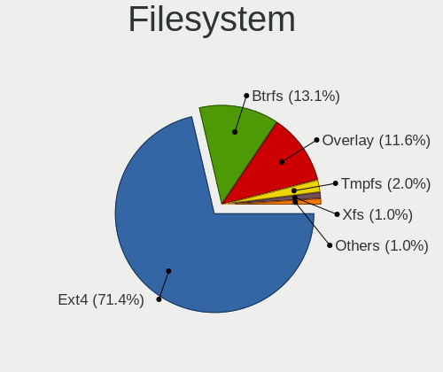

| Type    | Desktops | Percent |
|---------|----------|---------|
| Ext4    | 169      | 77.52%  |
| Overlay | 23       | 10.55%  |
| Btrfs   | 17       | 7.8%    |
| Tmpfs   | 3        | 1.38%   |
| Xfs     | 2        | 0.92%   |
| F2fs    | 2        | 0.92%   |
| Zfs     | 1        | 0.46%   |
| Ext3    | 1        | 0.46%   |

Part. scheme
------------

Scheme of partitioning

| Type    | Desktops | Percent |
|---------|----------|---------|
| GPT     | 130      | 59.63%  |
| MBR     | 72       | 33.03%  |
| Unknown | 16       | 7.34%   |

Dual Boot with Linux/BSD
------------------------

Hosting more than one Linux/BSD

| Dual boot | Desktops | Percent |
|-----------|----------|---------|
| No        | 164      | 75.23%  |
| Yes       | 54       | 24.77%  |

Dual Boot (Win)
---------------

Hosting Linux and Windows

| Dual boot | Desktops | Percent |
|-----------|----------|---------|
| No        | 120      | 55.05%  |
| Yes       | 98       | 44.95%  |

Board
-----

Vendor
------

Motherboard manufacturer

| Name                | Desktops | Percent |
|---------------------|----------|---------|
| ASUSTek Computer    | 57       | 26.15%  |
| Gigabyte Technology | 49       | 22.48%  |
| ASRock              | 29       | 13.3%   |
| MSI                 | 27       | 12.39%  |
| Intel               | 8        | 3.67%   |
| Hewlett-Packard     | 6        | 2.75%   |
| Biostar             | 6        | 2.75%   |
| Unknown             | 5        | 2.29%   |
| Huanan              | 4        | 1.83%   |
| ECS                 | 4        | 1.83%   |
| Acer                | 4        | 1.83%   |
| Lenovo              | 3        | 1.38%   |
| MACHINIST           | 2        | 0.92%   |
| Foxconn             | 2        | 0.92%   |
| AZW                 | 2        | 0.92%   |
| X79P motherboard    | 1        | 0.46%   |
| Techvision          | 1        | 0.46%   |
| Nvidia              | 1        | 0.46%   |
| Graviton            | 1        | 0.46%   |
| EPoX Computer       | 1        | 0.46%   |
| Dinson              | 1        | 0.46%   |
| DEPO Computers      | 1        | 0.46%   |
| Dell                | 1        | 0.46%   |
| ASL                 | 1        | 0.46%   |
| Aquarius            | 1        | 0.46%   |

Model
-----

Motherboard model

| Name                             | Desktops | Percent |
|----------------------------------|----------|---------|
| Unknown                          | 6        | 2.75%   |
| ASUS All Series                  | 4        | 1.83%   |
| Gigabyte A320M-S2H               | 3        | 1.38%   |
| Gigabyte A320M-H                 | 3        | 1.38%   |
| MSI MS-7C95                      | 2        | 0.92%   |
| MSI MS-7B89                      | 2        | 0.92%   |
| MSI MS-7592                      | 2        | 0.92%   |
| Gigabyte H410M H V3              | 2        | 0.92%   |
| Gigabyte A320M-S2H V2            | 2        | 0.92%   |
| ASUS PRIME A320M-K               | 2        | 0.92%   |
| ASUS P5KPL-AM                    | 2        | 0.92%   |
| ASUS P5K                         | 2        | 0.92%   |
| ASUS M5A78L LE                   | 2        | 0.92%   |
| ASRock A320M-DVS R4.0            | 2        | 0.92%   |
| ASRock 970 Pro3 R2.0             | 2        | 0.92%   |
| X79P motherboard Socket LGA-2011 | 1        | 0.46%   |
| Techvision TVI7309X              | 1        | 0.46%   |
| Nvidia MCP7A                     | 1        | 0.46%   |
| MSI PRO B300 DP20ZA (MS-B0A2)    | 1        | 0.46%   |
| MSI PPPPP-CCC#MMMMMMMM           | 1        | 0.46%   |
| MSI MS-7E07                      | 1        | 0.46%   |
| MSI MS-7D75                      | 1        | 0.46%   |
| MSI MS-7D67                      | 1        | 0.46%   |
| MSI MS-7D48                      | 1        | 0.46%   |
| MSI MS-7D42                      | 1        | 0.46%   |
| MSI MS-7D25                      | 1        | 0.46%   |
| MSI MS-7D22                      | 1        | 0.46%   |
| MSI MS-7C94                      | 1        | 0.46%   |
| MSI MS-7C91                      | 1        | 0.46%   |
| MSI MS-7C90                      | 1        | 0.46%   |
| MSI MS-7C56                      | 1        | 0.46%   |
| MSI MS-7B84                      | 1        | 0.46%   |
| MSI MS-7B79                      | 1        | 0.46%   |
| MSI MS-7A36                      | 1        | 0.46%   |
| MSI MS-7A15                      | 1        | 0.46%   |
| MSI MS-7996                      | 1        | 0.46%   |
| MSI MS-7817                      | 1        | 0.46%   |
| MSI MS-7681                      | 1        | 0.46%   |
| MSI MS-7673                      | 1        | 0.46%   |
| MACHINIST X99-RS9 V3.1           | 1        | 0.46%   |

Model Family
------------

Motherboard model prefix

| Name                    | Desktops | Percent |
|-------------------------|----------|---------|
| ASUS PRIME              | 10       | 4.59%   |
| Unknown                 | 6        | 2.75%   |
| Gigabyte A320M-S2H      | 5        | 2.29%   |
| Gigabyte B550           | 4        | 1.83%   |
| ASUS ROG                | 4        | 1.83%   |
| ASUS P5KPL-AM           | 4        | 1.83%   |
| ASUS All                | 4        | 1.83%   |
| Gigabyte H310M          | 3        | 1.38%   |
| Gigabyte A320M-H        | 3        | 1.38%   |
| ASUS P5K                | 3        | 1.38%   |
| MSI MS-7C95             | 2        | 0.92%   |
| MSI MS-7B89             | 2        | 0.92%   |
| MSI MS-7592             | 2        | 0.92%   |
| HP Compaq               | 2        | 0.92%   |
| Gigabyte H61M-DS2       | 2        | 0.92%   |
| Gigabyte H410M          | 2        | 0.92%   |
| Gigabyte B550M          | 2        | 0.92%   |
| Gigabyte B365M          | 2        | 0.92%   |
| ASUS P8H61-M            | 2        | 0.92%   |
| ASUS M5A78L             | 2        | 0.92%   |
| ASRock H510M-HDV        | 2        | 0.92%   |
| ASRock B450             | 2        | 0.92%   |
| ASRock A320M-DVS        | 2        | 0.92%   |
| ASRock 970              | 2        | 0.92%   |
| Acer Aspire             | 2        | 0.92%   |
| X79P motherboard Socket | 1        | 0.46%   |
| Techvision TVI7309X     | 1        | 0.46%   |
| Nvidia MCP7A            | 1        | 0.46%   |
| MSI PRO                 | 1        | 0.46%   |
| MSI PPPPP-CCC#MMMMMMMM  | 1        | 0.46%   |
| MSI MS-7E07             | 1        | 0.46%   |
| MSI MS-7D75             | 1        | 0.46%   |
| MSI MS-7D67             | 1        | 0.46%   |
| MSI MS-7D48             | 1        | 0.46%   |
| MSI MS-7D42             | 1        | 0.46%   |
| MSI MS-7D25             | 1        | 0.46%   |
| MSI MS-7D22             | 1        | 0.46%   |
| MSI MS-7C94             | 1        | 0.46%   |
| MSI MS-7C91             | 1        | 0.46%   |
| MSI MS-7C90             | 1        | 0.46%   |

MFG Year
--------

Motherboard manufacture year

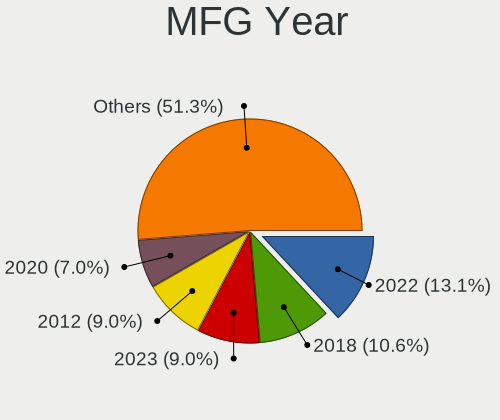

| Year | Desktops | Percent |
|------|----------|---------|
| 2018 | 27       | 12.39%  |
| 2022 | 21       | 9.63%   |
| 2012 | 20       | 9.17%   |
| 2011 | 18       | 8.26%   |
| 2020 | 17       | 7.8%    |
| 2021 | 15       | 6.88%   |
| 2019 | 14       | 6.42%   |
| 2010 | 12       | 5.5%    |
| 2017 | 11       | 5.05%   |
| 2014 | 11       | 5.05%   |
| 2013 | 9        | 4.13%   |
| 2015 | 8        | 3.67%   |
| 2008 | 8        | 3.67%   |
| 2007 | 8        | 3.67%   |
| 2016 | 7        | 3.21%   |
| 2009 | 7        | 3.21%   |
| 2005 | 3        | 1.38%   |
| 2006 | 2        | 0.92%   |

Form Factor
-----------

Physical design of the computer

| Name    | Desktops | Percent |
|---------|----------|---------|
| Desktop | 218      | 100%    |

Secure Boot
-----------

Enabled or disabled

| State    | Desktops | Percent |
|----------|----------|---------|
| Disabled | 217      | 99.54%  |
| Enabled  | 1        | 0.46%   |

Coreboot
--------

Have coreboot on board

| Used | Desktops | Percent |
|------|----------|---------|
| No   | 218      | 100%    |

RAM Size
--------

Total RAM memory

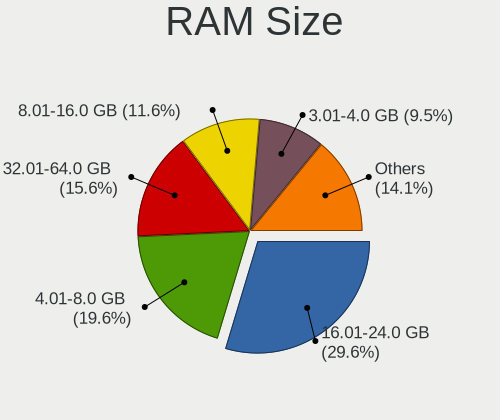

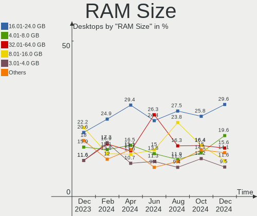

| Size in GB  | Desktops | Percent |
|-------------|----------|---------|
| 16.01-24.0  | 52       | 23.85%  |
| 4.01-8.0    | 44       | 20.18%  |
| 8.01-16.0   | 36       | 16.51%  |
| 3.01-4.0    | 35       | 16.06%  |
| 32.01-64.0  | 27       | 12.39%  |
| 24.01-32.0  | 7        | 3.21%   |
| 64.01-256.0 | 7        | 3.21%   |
| 2.01-3.0    | 5        | 2.29%   |
| 1.01-2.0    | 5        | 2.29%   |

RAM Used
--------

Used RAM memory

| Used GB    | Desktops | Percent |
|------------|----------|---------|
| 1.01-2.0   | 85       | 38.99%  |
| 2.01-3.0   | 50       | 22.94%  |
| 0.51-1.0   | 33       | 15.14%  |
| 4.01-8.0   | 21       | 9.63%   |
| 3.01-4.0   | 19       | 8.72%   |
| 8.01-16.0  | 6        | 2.75%   |
| 0.01-0.5   | 2        | 0.92%   |
| 24.01-32.0 | 1        | 0.46%   |
| 16.01-24.0 | 1        | 0.46%   |

Total Drives
------------

Number of drives on board

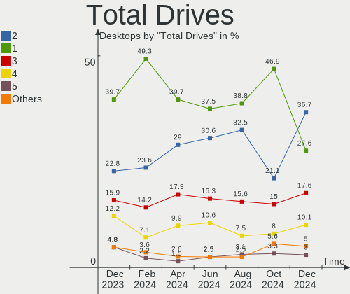

| Drives | Desktops | Percent |
|--------|----------|---------|
| 1      | 95       | 43.58%  |
| 2      | 58       | 26.61%  |
| 3      | 37       | 16.97%  |
| 4      | 16       | 7.34%   |
| 5      | 5        | 2.29%   |
| 0      | 3        | 1.38%   |
| 6      | 2        | 0.92%   |
| 8      | 1        | 0.46%   |
| 7      | 1        | 0.46%   |

Has CD-ROM
----------

Has CD-ROM on board

| Presented | Desktops | Percent |
|-----------|----------|---------|
| No        | 167      | 76.61%  |
| Yes       | 51       | 23.39%  |

Has Ethernet
------------

Has Ethernet on board

| Presented | Desktops | Percent |
|-----------|----------|---------|
| Yes       | 216      | 99.08%  |
| No        | 2        | 0.92%   |

Has WiFi
--------

Has WiFi module

| Presented | Desktops | Percent |
|-----------|----------|---------|
| No        | 146      | 66.97%  |
| Yes       | 72       | 33.03%  |

Has Bluetooth
-------------

Has Bluetooth module

| Presented | Desktops | Percent |
|-----------|----------|---------|
| No        | 159      | 72.94%  |
| Yes       | 59       | 27.06%  |

Location
--------

Country
-------

Geographic location (country)

| Country | Desktops | Percent |
|---------|----------|---------|
| Russia  | 218      | 100%    |

City
----

Geographic location (city)

| City             | Desktops | Percent |
|------------------|----------|---------|
| Moscow           | 39       | 17.89%  |
| St Petersburg    | 19       | 8.72%   |
| Yekaterinburg    | 8        | 3.67%   |
| Krasnodar        | 8        | 3.67%   |
| Voronezh         | 6        | 2.75%   |
| Novosibirsk      | 6        | 2.75%   |
| Samara           | 5        | 2.29%   |
| Nizhniy Novgorod | 5        | 2.29%   |
| Ufa              | 4        | 1.83%   |
| Balashikha       | 4        | 1.83%   |
| Vladivostok      | 3        | 1.38%   |
| Ulyanovsk        | 3        | 1.38%   |
| Rostov-on-Don    | 3        | 1.38%   |
| Murmansk         | 3        | 1.38%   |
| Kumertau         | 3        | 1.38%   |
| Krasnoyarsk      | 3        | 1.38%   |
| Cheboksary       | 3        | 1.38%   |
| Tambov           | 2        | 0.92%   |
| Taganrog         | 2        | 0.92%   |
| Salekhard        | 2        | 0.92%   |
| Ryazan           | 2        | 0.92%   |
| Reutov           | 2        | 0.92%   |
| Perm             | 2        | 0.92%   |
| Orenburg         | 2        | 0.92%   |
| Novy Urengoy     | 2        | 0.92%   |
| Mytishchi        | 2        | 0.92%   |
| Lytkarino        | 2        | 0.92%   |
| Khabarovsk       | 2        | 0.92%   |
| Irkutsk          | 2        | 0.92%   |
| Chelyabinsk      | 2        | 0.92%   |
| Barnaul          | 2        | 0.92%   |
| Zhukovskiy       | 1        | 0.46%   |
| Yoshkar-Ola      | 1        | 0.46%   |
| Yeysk            | 1        | 0.46%   |
| Yartsevo         | 1        | 0.46%   |
| Yaroslavl        | 1        | 0.46%   |
| Yakutsk          | 1        | 0.46%   |
| Vyksa            | 1        | 0.46%   |
| Voskresensk      | 1        | 0.46%   |
| Vologda          | 1        | 0.46%   |

Drives
------

Drive Vendor
------------

Hard drive vendors

| Vendor                      | Desktops | Drives | Percent |
|-----------------------------|----------|--------|---------|
| WDC                         | 79       | 112    | 20.95%  |
| Seagate                     | 63       | 75     | 16.71%  |
| Samsung Electronics         | 36       | 45     | 9.55%   |
| Kingston                    | 22       | 27     | 5.84%   |
| Toshiba                     | 21       | 21     | 5.57%   |
| Hitachi                     | 14       | 15     | 3.71%   |
| China                       | 13       | 13     | 3.45%   |
| A-DATA Technology           | 12       | 13     | 3.18%   |
| SanDisk                     | 9        | 9      | 2.39%   |
| Crucial                     | 8        | 8      | 2.12%   |
| Apacer                      | 8        | 8      | 2.12%   |
| Silicon Motion              | 7        | 8      | 1.86%   |
| Smartbuy                    | 6        | 6      | 1.59%   |
| Patriot                     | 4        | 4      | 1.06%   |
| KingSpec                    | 4        | 4      | 1.06%   |
| Intel                       | 4        | 4      | 1.06%   |
| HGST                        | 4        | 4      | 1.06%   |
| Gigabyte Technology         | 4        | 4      | 1.06%   |
| XrayDisk                    | 3        | 3      | 0.8%    |
| XPG                         | 3        | 3      | 0.8%    |
| Unknown                     | 3        | 3      | 0.8%    |
| SPCC                        | 3        | 3      | 0.8%    |
| Netac                       | 3        | 3      | 0.8%    |
| Digma                       | 3        | 3      | 0.8%    |
| AMD                         | 3        | 3      | 0.8%    |
| Transcend                   | 2        | 2      | 0.53%   |
| TAMMUZ                      | 2        | 3      | 0.53%   |
| Neo                         | 2        | 2      | 0.53%   |
| MAXIO Technology (Hangzhou) | 2        | 2      | 0.53%   |
| KingDian                    | 2        | 2      | 0.53%   |
| Hewlett-Packard             | 2        | 2      | 0.53%   |
| Azerty                      | 2        | 2      | 0.53%   |
| Yeestor                     | 1        | 1      | 0.27%   |
| Team                        | 1        | 2      | 0.27%   |
| StoreJet                    | 1        | 1      | 0.27%   |
| Reletech                    | 1        | 1      | 0.27%   |
| PNY                         | 1        | 1      | 0.27%   |
| Plextor                     | 1        | 1      | 0.27%   |
| Pioneer                     | 1        | 1      | 0.27%   |
| Phison                      | 1        | 1      | 0.27%   |

Drive Model
-----------

Hard drive models

| Model                                                  | Desktops | Percent |
|--------------------------------------------------------|----------|---------|
| WDC WD10EZEX-08WN4A0 1TB                               | 8        | 1.86%   |
| Seagate ST1000DM010-2EP102 1TB                         | 8        | 1.86%   |
| Kingston SA400S37240G 240GB SSD                        | 8        | 1.86%   |
| WDC WDS240G2G0A-00JH30 240GB SSD                       | 5        | 1.16%   |
| Toshiba DT01ACA050 500GB                               | 5        | 1.16%   |
| WDC WDS120G2G0A-00JH30 120GB SSD                       | 4        | 0.93%   |
| Seagate ST3500418AS 500GB                              | 4        | 0.93%   |
| Kingston SA400S37480G 480GB SSD                        | 4        | 0.93%   |
| WDC WDS500G2B0A-00SM50 500GB SSD                       | 3        | 0.7%    |
| WDC WD2500AAKX-00ERMA0 250GB                           | 3        | 0.7%    |
| WDC WD20EZBX-00AYRA0 2TB                               | 3        | 0.7%    |
| WDC WD10EZEX-00BBHA0 1TB                               | 3        | 0.7%    |
| Toshiba HDWD110 1TB                                    | 3        | 0.7%    |
| Smartbuy SSD 120GB                                     | 3        | 0.7%    |
| Seagate ST9500325AS 500GB                              | 3        | 0.7%    |
| Seagate ST3250824AS 250GB                              | 3        | 0.7%    |
| Seagate ST3250310AS 250GB                              | 3        | 0.7%    |
| Seagate ST3160811AS 160GB                              | 3        | 0.7%    |
| Samsung SSD 980 PRO 250GB                              | 3        | 0.7%    |
| Samsung SSD 860 EVO 500GB                              | 3        | 0.7%    |
| Samsung NVMe SSD Controller SM981/PM981/PM983 1TB      | 3        | 0.7%    |
| Samsung HM321HI 320GB                                  | 3        | 0.7%    |
| Kingston SA400S37120G 120GB SSD                        | 3        | 0.7%    |
| Apacer AS350 128GB SSD                                 | 3        | 0.7%    |
| XrayDisk SSD 256GB                                     | 2        | 0.47%   |
| XPG GAMMIX S11 Pro 1TB                                 | 2        | 0.47%   |
| WDC WDS240G2G0B-00EPW0 240GB SSD                       | 2        | 0.47%   |
| WDC WDS120G2G0B-00EPW0 120GB SSD                       | 2        | 0.47%   |
| WDC WD5000AAKX-00ERMA0 500GB                           | 2        | 0.47%   |
| WDC WD5000AADS-00S9B0 500GB                            | 2        | 0.47%   |
| WDC WD30EZRX-00D8PB0 3TB                               | 2        | 0.47%   |
| WDC WD10EZRZ-00HTKB0 1TB                               | 2        | 0.47%   |
| WDC WD10EZEX-22MFCA0 1TB                               | 2        | 0.47%   |
| WDC WD10EZEX-00ZF5A0 1TB                               | 2        | 0.47%   |
| WDC WD10EADS-00L5B1 1TB                                | 2        | 0.47%   |
| Unknown NVMe SSD Drive 256GB                           | 2        | 0.47%   |
| Toshiba MQ01ABF050 500GB                               | 2        | 0.47%   |
| Toshiba DT01ACA200 2TB                                 | 2        | 0.47%   |
| TAMMUZ SSD 240GB                                       | 2        | 0.47%   |
| Silicon Motion SM2263EN/SM2263XT SSD Controller 1024GB | 2        | 0.47%   |

HDD Vendor
----------

Hard disk drive vendors

| Vendor              | Desktops | Drives | Percent |
|---------------------|----------|--------|---------|
| WDC                 | 64       | 88     | 35.75%  |
| Seagate             | 63       | 75     | 35.2%   |
| Toshiba             | 20       | 20     | 11.17%  |
| Hitachi             | 14       | 15     | 7.82%   |
| Samsung Electronics | 8        | 10     | 4.47%   |
| HGST                | 4        | 4      | 2.23%   |
| Unknown             | 1        | 1      | 0.56%   |
| StoreJet            | 1        | 1      | 0.56%   |
| Maxtor              | 1        | 1      | 0.56%   |
| JMicron Technology  | 1        | 1      | 0.56%   |
| Fujitsu             | 1        | 1      | 0.56%   |
| ASMT                | 1        | 2      | 0.56%   |

SSD Vendor
----------

Solid state drive vendors

| Vendor              | Desktops | Drives | Percent |
|---------------------|----------|--------|---------|
| Kingston            | 19       | 22     | 12.58%  |
| WDC                 | 18       | 19     | 11.92%  |
| Samsung Electronics | 14       | 14     | 9.27%   |
| China               | 12       | 12     | 7.95%   |
| A-DATA Technology   | 11       | 11     | 7.28%   |
| Crucial             | 8        | 8      | 5.3%    |
| Apacer              | 7        | 7      | 4.64%   |
| Smartbuy            | 6        | 6      | 3.97%   |
| SanDisk             | 6        | 6      | 3.97%   |
| Patriot             | 4        | 4      | 2.65%   |
| KingSpec            | 4        | 4      | 2.65%   |
| Gigabyte Technology | 4        | 4      | 2.65%   |
| XrayDisk            | 3        | 3      | 1.99%   |
| SPCC                | 3        | 3      | 1.99%   |
| Digma               | 3        | 3      | 1.99%   |
| TAMMUZ              | 2        | 3      | 1.32%   |
| Netac               | 2        | 2      | 1.32%   |
| Neo                 | 2        | 2      | 1.32%   |
| KingDian            | 2        | 2      | 1.32%   |
| Intel               | 2        | 2      | 1.32%   |
| Azerty              | 2        | 2      | 1.32%   |
| AMD                 | 2        | 2      | 1.32%   |
| Transcend           | 1        | 1      | 0.66%   |
| Toshiba             | 1        | 1      | 0.66%   |
| Team                | 1        | 2      | 0.66%   |
| PNY                 | 1        | 1      | 0.66%   |
| Plextor             | 1        | 1      | 0.66%   |
| Pioneer             | 1        | 1      | 0.66%   |
| Palit               | 1        | 1      | 0.66%   |
| OCZ                 | 1        | 1      | 0.66%   |
| NGFF                | 1        | 1      | 0.66%   |
| Lenovo              | 1        | 1      | 0.66%   |
| Kingchuxing         | 1        | 1      | 0.66%   |
| Hewlett-Packard     | 1        | 1      | 0.66%   |
| GOODRAM             | 1        | 1      | 0.66%   |
| AXIOMTEK            | 1        | 1      | 0.66%   |
| Unknown             | 1        | 1      | 0.66%   |

Drive Kind
----------

HDD or SSD

| Kind    | Desktops | Drives | Percent |
|---------|----------|--------|---------|
| HDD     | 143      | 219    | 43.87%  |
| SSD     | 127      | 157    | 38.96%  |
| NVMe    | 54       | 66     | 16.56%  |
| Unknown | 2        | 2      | 0.61%   |

Drive Connector
---------------

SATA, SAS, NVMe, etc.

| Type | Desktops | Drives | Percent |
|------|----------|--------|---------|
| SATA | 197      | 371    | 76.65%  |
| NVMe | 54       | 66     | 21.01%  |
| SAS  | 6        | 7      | 2.33%   |

Drive Size
----------

Size of hard drive

| Size in TB | Desktops | Drives | Percent |
|------------|----------|--------|---------|
| 0.01-0.5   | 166      | 240    | 60.58%  |
| 0.51-1.0   | 75       | 96     | 27.37%  |
| 1.01-2.0   | 22       | 23     | 8.03%   |
| 2.01-3.0   | 5        | 7      | 1.82%   |
| 3.01-4.0   | 4        | 6      | 1.46%   |
| 4.01-10.0  | 2        | 4      | 0.73%   |

Space Total
-----------

Amount of disk space available on the file system

| Size in GB     | Desktops | Percent |
|----------------|----------|---------|
| 101-250        | 73       | 33.49%  |
| 251-500        | 32       | 14.68%  |
| 501-1000       | 32       | 14.68%  |
| 1001-2000      | 20       | 9.17%   |
| 1-20           | 15       | 6.88%   |
| 21-50          | 12       | 5.5%    |
| 51-100         | 11       | 5.05%   |
| 2001-3000      | 9        | 4.13%   |
| Unknown        | 9        | 4.13%   |
| More than 3000 | 5        | 2.29%   |

Space Used
----------

Amount of used disk space

| Used GB   | Desktops | Percent |
|-----------|----------|---------|
| 1-20      | 102      | 46.79%  |
| 21-50     | 28       | 12.84%  |
| 51-100    | 24       | 11.01%  |
| 101-250   | 22       | 10.09%  |
| 251-500   | 11       | 5.05%   |
| 1001-2000 | 10       | 4.59%   |
| 501-1000  | 9        | 4.13%   |
| Unknown   | 9        | 4.13%   |
| 2001-3000 | 3        | 1.38%   |

Malfunc. Drives
---------------

Drive models with a malfunction

| Model                                   | Desktops | Drives | Percent |
|-----------------------------------------|----------|--------|---------|
| Seagate ST3500418AS 500GB               | 3        | 3      | 3.66%   |
| Seagate ST3250824AS 250GB               | 3        | 3      | 3.66%   |
| Seagate ST3250310AS 250GB               | 3        | 3      | 3.66%   |
| WDC WD10EZEX-22MFCA0 1TB                | 2        | 2      | 2.44%   |
| Toshiba DT01ACA200 2TB                  | 2        | 2      | 2.44%   |
| Seagate ST9500325AS 500GB               | 2        | 2      | 2.44%   |
| Seagate ST3250318AS 250GB               | 2        | 2      | 2.44%   |
| Seagate ST3160811AS 160GB               | 2        | 2      | 2.44%   |
| Samsung Electronics HM321HI 320GB       | 2        | 2      | 2.44%   |
| Neo Forza NFS121SA312-6007000 120GB SSD | 2        | 2      | 2.44%   |
| WDC WD5000AAKX-60U6AA0 500GB            | 1        | 1      | 1.22%   |
| WDC WD5000AAKX-083CA1 500GB             | 1        | 1      | 1.22%   |
| WDC WD5000AAKX-001CA0 500GB             | 1        | 1      | 1.22%   |
| WDC WD5000AAKS-007AA0 500GB             | 1        | 1      | 1.22%   |
| WDC WD5000AADS-00S9B0 500GB             | 1        | 1      | 1.22%   |
| WDC WD3200AAKX-001CA0 320GB             | 1        | 1      | 1.22%   |
| WDC WD2500JS-00NCB1 250GB               | 1        | 1      | 1.22%   |
| WDC WD2500BEVT-60ZCT1 250GB             | 1        | 1      | 1.22%   |
| WDC WD20EZRX-00DC0B0 2TB                | 1        | 1      | 1.22%   |
| WDC WD20EARX-00PASB0 2TB                | 1        | 1      | 1.22%   |
| WDC WD20EARS-00S8B1 2TB                 | 1        | 1      | 1.22%   |
| WDC WD1600AAJS-00L7A0 160GB             | 1        | 1      | 1.22%   |
| WDC WD15EARS-22MVWB0 1TB                | 1        | 1      | 1.22%   |
| WDC WD10JPVX-08JC3T5 1TB                | 1        | 1      | 1.22%   |
| WDC WD10EZEX-00MFCA0 1TB                | 1        | 1      | 1.22%   |
| WDC WD10EFRX-68JCSN0 1TB                | 1        | 2      | 1.22%   |
| WDC WD10EARS-00Y5B1 1TB                 | 1        | 1      | 1.22%   |
| WDC WD1002FAEX-00Z3A0 1TB               | 1        | 1      | 1.22%   |
| WDC WD1001FALS-00J7B0 1TB               | 1        | 1      | 1.22%   |
| Toshiba MQ04ABF100 1TB                  | 1        | 1      | 1.22%   |
| Toshiba MQ01ABD100 1TB                  | 1        | 1      | 1.22%   |
| Toshiba HDWD105 500GB                   | 1        | 1      | 1.22%   |
| Silicon Motion APS-SE20 1TB             | 1        | 1      | 1.22%   |
| Seagate ST500DM002-1BD142 500GB         | 1        | 1      | 1.22%   |
| Seagate ST3640323AS 640GB               | 1        | 1      | 1.22%   |
| Seagate ST3320620A 320GB                | 1        | 1      | 1.22%   |
| Seagate ST320DM000-1BC14C 320GB         | 1        | 1      | 1.22%   |
| Seagate ST31500341AS 1TB                | 1        | 1      | 1.22%   |
| Seagate ST31000528AS 1TB                | 1        | 1      | 1.22%   |
| Seagate ST31000524NS 1TB                | 1        | 1      | 1.22%   |

Malfunc. Drive Vendor
---------------------

Vendors of faulty drives

| Vendor              | Desktops | Drives | Percent |
|---------------------|----------|--------|---------|
| Seagate             | 26       | 26     | 32.1%   |
| WDC                 | 20       | 22     | 24.69%  |
| Hitachi             | 9        | 9      | 11.11%  |
| Samsung Electronics | 6        | 6      | 7.41%   |
| Toshiba             | 5        | 5      | 6.17%   |
| Neo                 | 2        | 2      | 2.47%   |
| Apacer              | 2        | 2      | 2.47%   |
| Silicon Motion      | 1        | 1      | 1.23%   |
| PNY                 | 1        | 1      | 1.23%   |
| Netac               | 1        | 1      | 1.23%   |
| Kingston            | 1        | 1      | 1.23%   |
| KingSpec            | 1        | 1      | 1.23%   |
| KingDian            | 1        | 1      | 1.23%   |
| Intel               | 1        | 1      | 1.23%   |
| Fujitsu             | 1        | 1      | 1.23%   |
| China               | 1        | 1      | 1.23%   |
| Azerty              | 1        | 1      | 1.23%   |
| AMD                 | 1        | 1      | 1.23%   |

Malfunc. HDD Vendor
-------------------

Vendors of faulty HDD drives

| Vendor              | Desktops | Drives | Percent |
|---------------------|----------|--------|---------|
| Seagate             | 26       | 26     | 39.39%  |
| WDC                 | 20       | 22     | 30.3%   |
| Hitachi             | 9        | 9      | 13.64%  |
| Toshiba             | 5        | 5      | 7.58%   |
| Samsung Electronics | 5        | 5      | 7.58%   |
| Fujitsu             | 1        | 1      | 1.52%   |

Malfunc. Drive Kind
-------------------

Kinds of faulty drives

| Kind | Desktops | Drives | Percent |
|------|----------|--------|---------|
| HDD  | 58       | 68     | 80.56%  |
| SSD  | 11       | 12     | 15.28%  |
| NVMe | 3        | 3      | 4.17%   |

Failed Drives
-------------

Failed drive models

Zero info for selected period =(

Failed Drive Vendor
-------------------

Failed drive vendors

Zero info for selected period =(

Drive Status
------------

Number of failed and malfunc. drives

| Status   | Desktops | Drives | Percent |
|----------|----------|--------|---------|
| Works    | 171      | 307    | 64.04%  |
| Malfunc  | 67       | 83     | 25.09%  |
| Detected | 29       | 54     | 10.86%  |

Storage controller
------------------

Storage Vendor
--------------

Storage controller vendors

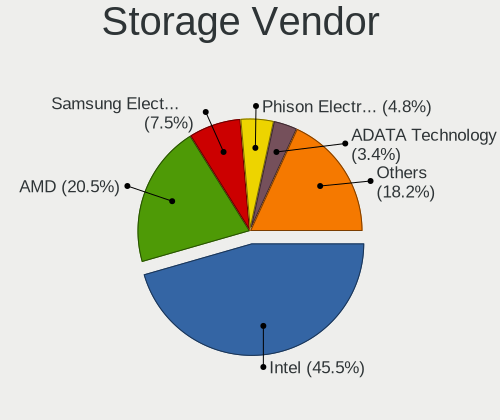

| Vendor                      | Desktops | Percent |
|-----------------------------|----------|---------|
| Intel                       | 133      | 44.04%  |
| AMD                         | 76       | 25.17%  |
| Samsung Electronics         | 18       | 5.96%   |
| Silicon Motion              | 12       | 3.97%   |
| Nvidia                      | 10       | 3.31%   |
| ASMedia Technology          | 10       | 3.31%   |
| Marvell Technology Group    | 8        | 2.65%   |
| SanDisk                     | 7        | 2.32%   |
| JMicron Technology          | 7        | 2.32%   |
| Kingston Technology Company | 5        | 1.66%   |
| MAXIO Technology (Hangzhou) | 4        | 1.32%   |
| ADATA Technology            | 4        | 1.32%   |
| Netac Technology            | 3        | 0.99%   |
| Phison Electronics          | 2        | 0.66%   |
| VIA Technologies            | 1        | 0.33%   |
| Realtek Semiconductor       | 1        | 0.33%   |
| Micron/Crucial Technology   | 1        | 0.33%   |

Storage Model
-------------

Storage controller models

| Model                                                                                   | Desktops | Percent |
|-----------------------------------------------------------------------------------------|----------|---------|
| AMD FCH SATA Controller [AHCI mode]                                                     | 36       | 9.45%   |
| Intel 6 Series/C200 Series Chipset Family 6 port Desktop SATA AHCI Controller           | 18       | 4.72%   |
| AMD 500 Series Chipset SATA Controller                                                  | 18       | 4.72%   |
| Intel 8 Series/C220 Series Chipset Family 6-port SATA Controller 1 [AHCI mode]          | 13       | 3.41%   |
| AMD SB7x0/SB8x0/SB9x0 IDE Controller                                                    | 13       | 3.41%   |
| Intel NM10/ICH7 Family SATA Controller [IDE mode]                                       | 12       | 3.15%   |
| AMD FCH SATA Controller D                                                               | 12       | 3.15%   |
| Silicon Motion SM2263EN/SM2263XT SSD Controller                                         | 11       | 2.89%   |
| AMD 400 Series Chipset SATA Controller                                                  | 11       | 2.89%   |
| ASMedia ASM1062 Serial ATA Controller                                                   | 10       | 2.62%   |
| Intel Q170/Q150/B150/H170/H110/Z170/CM236 Chipset SATA Controller [AHCI Mode]           | 9        | 2.36%   |
| Intel Cannon Lake PCH SATA AHCI Controller                                              | 9        | 2.36%   |
| Intel 82801G (ICH7 Family) IDE Controller                                               | 9        | 2.36%   |
| Samsung NVMe SSD Controller SM981/PM981/PM983                                           | 8        | 2.1%    |
| Intel 6 Series/C200 Series Chipset Family Desktop SATA Controller (IDE mode, ports 4-5) | 8        | 2.1%    |
| Intel 6 Series/C200 Series Chipset Family Desktop SATA Controller (IDE mode, ports 0-3) | 8        | 2.1%    |
| Samsung NVMe SSD Controller PM9A1/PM9A3/980PRO                                          | 7        | 1.84%   |
| Intel 200 Series PCH SATA controller [AHCI mode]                                        | 7        | 1.84%   |
| AMD SB7x0/SB8x0/SB9x0 SATA Controller [IDE mode]                                        | 7        | 1.84%   |
| AMD SB7x0/SB8x0/SB9x0 SATA Controller [AHCI mode]                                       | 7        | 1.84%   |
| Intel 500 Series Chipset Family SATA AHCI Controller                                    | 6        | 1.57%   |
| Intel SATA Controller [RAID mode]                                                       | 5        | 1.31%   |
| AMD FCH SATA Controller [IDE mode]                                                      | 5        | 1.31%   |
| Nvidia MCP61 SATA Controller                                                            | 4        | 1.05%   |
| MAXIO (Hangzhou) NVMe SSD Controller MAP1202                                            | 4        | 1.05%   |
| Intel 82801IB (ICH9) 2 port SATA Controller [IDE mode]                                  | 4        | 1.05%   |
| Intel 82801I (ICH9 Family) 2 port SATA Controller [IDE mode]                            | 4        | 1.05%   |
| Samsung NVMe SSD Controller 980                                                         | 3        | 0.79%   |
| Nvidia MCP61 IDE                                                                        | 3        | 0.79%   |
| Netac Non-Volatile memory controller                                                    | 3        | 0.79%   |
| JMicron JMB368 IDE controller                                                           | 3        | 0.79%   |
| Intel Jasper Lake SATA AHCI Controller                                                  | 3        | 0.79%   |
| Intel C600/X79 series chipset SATA RAID Controller                                      | 3        | 0.79%   |
| Intel Alder Lake-S PCH SATA Controller [AHCI Mode]                                      | 3        | 0.79%   |
| Intel 82801JI (ICH10 Family) SATA AHCI Controller                                       | 3        | 0.79%   |
| Intel 7 Series/C210 Series Chipset Family 6-port SATA Controller [AHCI mode]            | 3        | 0.79%   |
| Intel 5 Series/3400 Series Chipset 6 port SATA AHCI Controller                          | 3        | 0.79%   |
| AMD FCH IDE Controller                                                                  | 3        | 0.79%   |
| AMD 300 Series Chipset SATA Controller                                                  | 3        | 0.79%   |
| ADATA XPG SX8200 Pro PCIe Gen3x4 M.2 2280 Solid State Drive                             | 3        | 0.79%   |

Storage Kind
------------

Kind of storage controller (IDE, SATA, NVMe, SAS, ...)

| Kind | Desktops | Percent |
|------|----------|---------|
| SATA | 170      | 57.82%  |
| IDE  | 62       | 21.09%  |
| NVMe | 54       | 18.37%  |
| RAID | 8        | 2.72%   |

Processor
---------

CPU Vendor
----------

Processor vendors

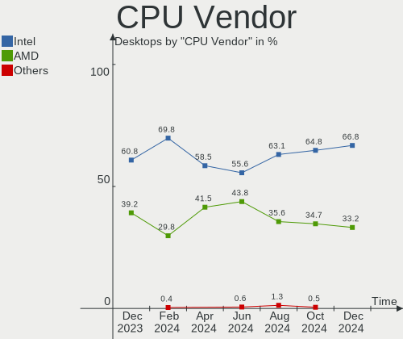

| Vendor | Desktops | Percent |
|--------|----------|---------|
| Intel  | 133      | 61.01%  |
| AMD    | 85       | 38.99%  |

CPU Model
---------

Processor models

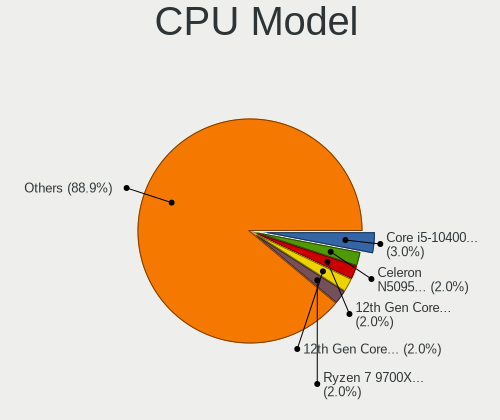

| Model                                       | Desktops | Percent |
|---------------------------------------------|----------|---------|
| AMD Ryzen 5 5600X 6-Core Processor          | 6        | 2.75%   |
| AMD Ryzen 5 3600 6-Core Processor           | 5        | 2.29%   |
| Intel Core i5-2400 CPU @ 3.10GHz            | 4        | 1.83%   |
| AMD Ryzen 7 7700X 8-Core Processor          | 4        | 1.83%   |
| AMD Ryzen 7 5700G with Radeon Graphics      | 4        | 1.83%   |
| AMD Ryzen 5 5600G with Radeon Graphics      | 4        | 1.83%   |
| Intel Pentium CPU G4400 @ 3.30GHz           | 3        | 1.38%   |
| Intel Core 2 Duo CPU E4500 @ 2.20GHz        | 3        | 1.38%   |
| AMD Ryzen 3 3200G with Radeon Vega Graphics | 3        | 1.38%   |
| Intel Xeon CPU E5-2690 0 @ 2.90GHz          | 2        | 0.92%   |
| Intel Xeon CPU E5-2640 0 @ 2.50GHz          | 2        | 0.92%   |
| Intel Pentium Gold G5400 CPU @ 3.70GHz      | 2        | 0.92%   |
| Intel Core i7-2600 CPU @ 3.40GHz            | 2        | 0.92%   |
| Intel Core i5-9400 CPU @ 2.90GHz            | 2        | 0.92%   |
| Intel Core i5-7400 CPU @ 3.00GHz            | 2        | 0.92%   |
| Intel Core i5-4460 CPU @ 3.20GHz            | 2        | 0.92%   |
| Intel Core i5-3570 CPU @ 3.40GHz            | 2        | 0.92%   |
| Intel Core i5-3470 CPU @ 3.20GHz            | 2        | 0.92%   |
| Intel Core i5-10500H CPU @ 2.50GHz          | 2        | 0.92%   |
| Intel Core i5-10400F CPU @ 2.90GHz          | 2        | 0.92%   |
| Intel Core i3-9100F CPU @ 3.60GHz           | 2        | 0.92%   |
| Intel Core i3-4130 CPU @ 3.40GHz            | 2        | 0.92%   |
| Intel Core i3-3220 CPU @ 3.30GHz            | 2        | 0.92%   |
| Intel Core i3-10100 CPU @ 3.60GHz           | 2        | 0.92%   |
| Intel Core i3 CPU 550 @ 3.20GHz             | 2        | 0.92%   |
| Intel Core i3 CPU 540 @ 3.07GHz             | 2        | 0.92%   |
| Intel Core 2 Quad CPU Q9550 @ 2.83GHz       | 2        | 0.92%   |
| Intel Core 2 Quad CPU Q6600 @ 2.40GHz       | 2        | 0.92%   |
| Intel Core 2 Duo CPU E8400 @ 3.00GHz        | 2        | 0.92%   |
| Intel Core 2 Duo CPU E6750 @ 2.66GHz        | 2        | 0.92%   |
| Intel Celeron N5105 @ 2.00GHz               | 2        | 0.92%   |
| Intel Celeron CPU G1620 @ 2.70GHz           | 2        | 0.92%   |
| Intel Celeron CPU E3400 @ 2.60GHz           | 2        | 0.92%   |
| AMD Ryzen 7 5800X 8-Core Processor          | 2        | 0.92%   |
| AMD Ryzen 7 2700X Eight-Core Processor      | 2        | 0.92%   |
| AMD Ryzen 7 2700 Eight-Core Processor       | 2        | 0.92%   |
| AMD Ryzen 5 1600 Six-Core Processor         | 2        | 0.92%   |
| AMD Ryzen 3 2200G with Radeon Vega Graphics | 2        | 0.92%   |
| AMD Phenom II X4 965 Processor              | 2        | 0.92%   |
| AMD FX-4300 Quad-Core Processor             | 2        | 0.92%   |

CPU Model Family
----------------

Processor model prefix

| Model                   | Desktops | Percent |
|-------------------------|----------|---------|
| Intel Core i5           | 33       | 15.14%  |
| AMD Ryzen 5             | 24       | 11.01%  |
| Intel Core i3           | 23       | 10.55%  |
| AMD Ryzen 7             | 18       | 8.26%   |
| Intel Xeon              | 17       | 7.8%    |
| Intel Celeron           | 15       | 6.88%   |
| Intel Core 2 Duo        | 12       | 5.5%    |
| Intel Pentium           | 11       | 5.05%   |
| AMD FX                  | 10       | 4.59%   |
| Intel Core i7           | 7        | 3.21%   |
| AMD Ryzen 3             | 6        | 2.75%   |
| Other                   | 5        | 2.29%   |
| Intel Core 2 Quad       | 5        | 2.29%   |
| AMD Phenom II X4        | 4        | 1.83%   |
| AMD A8                  | 4        | 1.83%   |
| AMD Athlon II X2        | 3        | 1.38%   |
| Intel Pentium Gold      | 2        | 0.92%   |
| Intel Pentium Dual-Core | 2        | 0.92%   |
| Intel Pentium 4         | 1        | 0.46%   |
| AMD Sempron             | 1        | 0.46%   |
| AMD Ryzen 9             | 1        | 0.46%   |
| AMD Ryzen 7 PRO         | 1        | 0.46%   |
| AMD Ryzen 5 PRO         | 1        | 0.46%   |
| AMD Ryzen 3 PRO         | 1        | 0.46%   |
| AMD Phenom              | 1        | 0.46%   |
| AMD E2                  | 1        | 0.46%   |
| AMD Athlon X4           | 1        | 0.46%   |
| AMD Athlon X2           | 1        | 0.46%   |
| AMD Athlon II X4        | 1        | 0.46%   |
| AMD Athlon II X3        | 1        | 0.46%   |
| AMD Athlon 64 X2        | 1        | 0.46%   |
| AMD Athlon 64           | 1        | 0.46%   |
| AMD Athlon              | 1        | 0.46%   |
| AMD A6                  | 1        | 0.46%   |
| AMD A10                 | 1        | 0.46%   |

CPU Cores
---------

Number of processor cores

| Number | Desktops | Percent |
|--------|----------|---------|
| 4      | 75       | 34.4%   |
| 2      | 66       | 30.28%  |
| 6      | 38       | 17.43%  |
| 8      | 22       | 10.09%  |
| 1      | 6        | 2.75%   |
| 3      | 4        | 1.83%   |
| 12     | 3        | 1.38%   |
| 36     | 1        | 0.46%   |
| 24     | 1        | 0.46%   |
| 16     | 1        | 0.46%   |
| 10     | 1        | 0.46%   |

CPU Sockets
-----------

Number of sockets

| Number | Desktops | Percent |
|--------|----------|---------|
| 1      | 215      | 98.62%  |
| 2      | 3        | 1.38%   |

CPU Threads
-----------

Threads per core (Hyper-Threading)

| Number | Desktops | Percent |
|--------|----------|---------|
| 2      | 112      | 51.38%  |
| 1      | 106      | 48.62%  |

CPU Op-Modes
------------

CPU Operation Modes (32-bit, 64-bit)

| Op mode        | Desktops | Percent |
|----------------|----------|---------|
| 32-bit, 64-bit | 218      | 100%    |

CPU Microcode
-------------

Microcode number

| Number     | Desktops | Percent |
|------------|----------|---------|
| Unknown    | 41       | 18.81%  |
| 0x306a9    | 12       | 5.5%    |
| 0x306c3    | 11       | 5.05%   |
| 0x206a7    | 10       | 4.59%   |
| 0x1067a    | 8        | 3.67%   |
| 0x906ea    | 7        | 3.21%   |
| 0x0800820d | 7        | 3.21%   |
| 0x0a601203 | 6        | 2.75%   |
| 0xa0653    | 5        | 2.29%   |
| 0x906e9    | 5        | 2.29%   |
| 0x506e3    | 5        | 2.29%   |
| 0x6fd      | 4        | 1.83%   |
| 0x6fb      | 4        | 1.83%   |
| 0x0a50000d | 4        | 1.83%   |
| 0x08701021 | 4        | 1.83%   |
| 0x010000c8 | 4        | 1.83%   |
| 0x306f2    | 3        | 1.38%   |
| 0x206d7    | 3        | 1.38%   |
| 0x20655    | 3        | 1.38%   |
| 0x0a50000c | 3        | 1.38%   |
| 0x0a20120a | 3        | 1.38%   |
| 0x08108109 | 3        | 1.38%   |
| 0x06001119 | 3        | 1.38%   |
| 0xa0652    | 2        | 0.92%   |
| 0x906ed    | 2        | 0.92%   |
| 0x906eb    | 2        | 0.92%   |
| 0x906c0    | 2        | 0.92%   |
| 0x0a201016 | 2        | 0.92%   |
| 0x08600106 | 2        | 0.92%   |
| 0x08108102 | 2        | 0.92%   |
| 0x08001138 | 2        | 0.92%   |
| 0x06003106 | 2        | 0.92%   |
| 0x06000822 | 2        | 0.92%   |
| 0x03000014 | 2        | 0.92%   |
| 0x010000b6 | 2        | 0.92%   |
| 0xf49      | 1        | 0.46%   |
| 0xf43      | 1        | 0.46%   |
| 0x906ec    | 1        | 0.46%   |
| 0x90675    | 1        | 0.46%   |
| 0x90672    | 1        | 0.46%   |

CPU Microarch
-------------

Microarchitecture

| Name             | Desktops | Percent |
|------------------|----------|---------|
| KabyLake         | 20       | 9.17%   |
| Zen 3            | 19       | 8.72%   |
| SandyBridge      | 19       | 8.72%   |
| Haswell          | 18       | 8.26%   |
| Penryn           | 14       | 6.42%   |
| IvyBridge        | 14       | 6.42%   |
| Zen+             | 12       | 5.5%    |
| Zen 2            | 10       | 4.59%   |
| Piledriver       | 10       | 4.59%   |
| Core             | 10       | 4.59%   |
| K10              | 9        | 4.13%   |
| CometLake        | 9        | 4.13%   |
| Skylake          | 8        | 3.67%   |
| Unknown          | 7        | 3.21%   |
| Zen              | 6        | 2.75%   |
| Westmere         | 6        | 2.75%   |
| Tremont          | 3        | 1.38%   |
| K8 Hammer        | 3        | 1.38%   |
| K10 Llano        | 3        | 1.38%   |
| Bulldozer        | 3        | 1.38%   |
| Alderlake Hybrid | 3        | 1.38%   |
| Steamroller      | 2        | 0.92%   |
| Silvermont       | 2        | 0.92%   |
| NetBurst         | 2        | 0.92%   |
| Goldmont plus    | 2        | 0.92%   |
| Jaguar           | 1        | 0.46%   |
| Icelake          | 1        | 0.46%   |
| Goldmont         | 1        | 0.46%   |
| Excavator        | 1        | 0.46%   |

Graphics
--------

GPU Vendor
----------

Vendors of graphics cards

| Vendor            | Desktops | Percent |
|-------------------|----------|---------|
| Nvidia            | 96       | 41.92%  |
| AMD               | 76       | 33.19%  |
| Intel             | 56       | 24.45%  |
| ASPEED Technology | 1        | 0.44%   |

GPU Model
---------

Graphics card models

| Model                                                                       | Desktops | Percent |
|-----------------------------------------------------------------------------|----------|---------|
| Nvidia GP107 [GeForce GTX 1050 Ti]                                          | 8        | 3.45%   |
| AMD Ellesmere [Radeon RX 470/480/570/570X/580/580X/590]                     | 8        | 3.45%   |
| Intel Xeon E3-1200 v2/3rd Gen Core processor Graphics Controller            | 7        | 3.02%   |
| Nvidia GK208B [GeForce GT 710]                                              | 6        | 2.59%   |
| Intel CoffeeLake-S GT2 [UHD Graphics 630]                                   | 6        | 2.59%   |
| AMD Cezanne [Radeon Vega Series / Radeon Vega Mobile Series]                | 6        | 2.59%   |
| Nvidia GP108 [GeForce GT 1030]                                              | 5        | 2.16%   |
| Intel 2nd Generation Core Processor Family Integrated Graphics Controller   | 5        | 2.16%   |
| Nvidia TU117 [GeForce GTX 1650]                                             | 4        | 1.72%   |
| Nvidia GM107 [GeForce GTX 750 Ti]                                           | 4        | 1.72%   |
| Nvidia GK208B [GeForce GT 730]                                              | 4        | 1.72%   |
| Nvidia GA106 [GeForce RTX 3060 Lite Hash Rate]                              | 4        | 1.72%   |
| Intel Xeon E3-1200 v3/4th Gen Core Processor Integrated Graphics Controller | 4        | 1.72%   |
| Intel 4 Series Chipset Integrated Graphics Controller                       | 4        | 1.72%   |
| AMD Picasso/Raven 2 [Radeon Vega Series / Radeon Vega Mobile Series]        | 4        | 1.72%   |
| AMD Navi 23 [Radeon RX 6600/6600 XT/6600M]                                  | 4        | 1.72%   |
| AMD Navi 10 [Radeon RX 5600 OEM/5600 XT / 5700/5700 XT]                     | 4        | 1.72%   |
| Nvidia GM107 [GeForce GTX 750]                                              | 3        | 1.29%   |
| Nvidia GK107 [GeForce GTX 650]                                              | 3        | 1.29%   |
| Nvidia GF116 [GeForce GTX 550 Ti]                                           | 3        | 1.29%   |
| Nvidia GF108 [GeForce GT 430]                                               | 3        | 1.29%   |
| Nvidia G96C [GeForce 9500 GT]                                               | 3        | 1.29%   |
| Intel JasperLake [UHD Graphics]                                             | 3        | 1.29%   |
| AMD Renoir                                                                  | 3        | 1.29%   |
| AMD Raven Ridge [Radeon Vega Series / Radeon Vega Mobile Series]            | 3        | 1.29%   |
| AMD Raphael                                                                 | 3        | 1.29%   |
| AMD Navi 24 [Radeon RX 6400/6500 XT/6500M]                                  | 3        | 1.29%   |
| Nvidia TU116 [GeForce GTX 1660 SUPER]                                       | 2        | 0.86%   |
| Nvidia GP107 [GeForce GTX 1050]                                             | 2        | 0.86%   |
| Nvidia GM206 [GeForce GTX 960]                                              | 2        | 0.86%   |
| Nvidia GM204 [GeForce GTX 970]                                              | 2        | 0.86%   |
| Nvidia GF119 [GeForce GT 610]                                               | 2        | 0.86%   |
| Nvidia GF108 [GeForce GT 730]                                               | 2        | 0.86%   |
| Nvidia GF108 [GeForce GT 630]                                               | 2        | 0.86%   |
| Nvidia GF108 [GeForce GT 440]                                               | 2        | 0.86%   |
| Nvidia G94 [GeForce 9600 GT]                                                | 2        | 0.86%   |
| Nvidia AD104 [GeForce RTX 4070 Ti]                                          | 2        | 0.86%   |
| Intel HD Graphics 530                                                       | 2        | 0.86%   |
| Intel GeminiLake [UHD Graphics 600]                                         | 2        | 0.86%   |
| Intel Core Processor Integrated Graphics Controller                         | 2        | 0.86%   |

GPU Combo
---------

Combinations of graphics cards

| Name            | Desktops | Percent |
|-----------------|----------|---------|
| 1 x Nvidia      | 93       | 42.66%  |
| 1 x AMD         | 69       | 31.65%  |
| 1 x Intel       | 47       | 21.56%  |
| 2 x AMD         | 2        | 0.92%   |
| Intel + AMD     | 2        | 0.92%   |
| AMD + Nvidia    | 2        | 0.92%   |
| Intel + 2 x AMD | 1        | 0.46%   |
| Intel + Nvidia  | 1        | 0.46%   |
| 1 x ASPEED      | 1        | 0.46%   |

GPU Driver
----------

Free vs proprietary

| Driver      | Desktops | Percent |
|-------------|----------|---------|
| Free        | 171      | 78.44%  |
| Proprietary | 34       | 15.6%   |
| Unknown     | 13       | 5.96%   |

GPU Memory
----------

Total video memory

| Size in GB | Desktops | Percent |
|------------|----------|---------|
| Unknown    | 80       | 36.7%   |
| 1.01-2.0   | 34       | 15.6%   |
| 0.01-0.5   | 33       | 15.14%  |
| 0.51-1.0   | 28       | 12.84%  |
| 3.01-4.0   | 22       | 10.09%  |
| 7.01-8.0   | 12       | 5.5%    |
| 5.01-6.0   | 5        | 2.29%   |
| 8.01-16.0  | 3        | 1.38%   |
| 16.01-24.0 | 1        | 0.46%   |

Monitor
-------

Monitor Vendor
--------------

Monitor vendors

| Vendor               | Desktops | Percent |
|----------------------|----------|---------|
| Samsung Electronics  | 51       | 24.06%  |
| Acer                 | 25       | 11.79%  |
| Goldstar             | 22       | 10.38%  |
| Philips              | 18       | 8.49%   |
| AOC                  | 11       | 5.19%   |
| Hewlett-Packard      | 9        | 4.25%   |
| BenQ                 | 9        | 4.25%   |
| ViewSonic            | 8        | 3.77%   |
| ASUSTek Computer     | 8        | 3.77%   |
| Ancor Communications | 6        | 2.83%   |
| NEC Computers        | 4        | 1.89%   |
| Mi                   | 4        | 1.89%   |
| Iiyama               | 4        | 1.89%   |
| Sony                 | 3        | 1.42%   |
| MSI                  | 3        | 1.42%   |
| Dell                 | 3        | 1.42%   |
| SGT                  | 2        | 0.94%   |
| LG Electronics       | 2        | 0.94%   |
| JRY                  | 2        | 0.94%   |
| Unknown              | 2        | 0.94%   |
| Xiaomi               | 1        | 0.47%   |
| Xiangye              | 1        | 0.47%   |
| Toshiba              | 1        | 0.47%   |
| Panasonic            | 1        | 0.47%   |
| Lenovo               | 1        | 0.47%   |
| Idek Iiyama          | 1        | 0.47%   |
| HPN                  | 1        | 0.47%   |
| HJW                  | 1        | 0.47%   |
| HHT                  | 1        | 0.47%   |
| Haier                | 1        | 0.47%   |
| GDH                  | 1        | 0.47%   |
| CTV                  | 1        | 0.47%   |
| CHO                  | 1        | 0.47%   |
| BOE                  | 1        | 0.47%   |
| BDL                  | 1        | 0.47%   |
| AGO                  | 1        | 0.47%   |

Monitor Model
-------------

Monitor models

| Model                                                                | Desktops | Percent |
|----------------------------------------------------------------------|----------|---------|
| SGT XY238 SGT2386 1920x1080 530x290mm 23.8-inch                      | 2        | 0.93%   |
| Samsung Electronics SyncMaster SAM01E1 1280x1024 376x301mm 19.0-inch | 2        | 0.93%   |
| Samsung Electronics S24D300 SAM0B43 1920x1080 531x299mm 24.0-inch    | 2        | 0.93%   |
| Samsung Electronics S24D300 SAM0B42 1920x1080 531x299mm 24.0-inch    | 2        | 0.93%   |
| Samsung Electronics C32F391 SAM0D34 1920x1080 698x393mm 31.5-inch    | 2        | 0.93%   |
| Samsung Electronics C27F390 SAM0D32 1920x1080 598x336mm 27.0-inch    | 2        | 0.93%   |
| Philips PHL 243V7 PHLC155 1920x1080 527x296mm 23.8-inch              | 2        | 0.93%   |
| Goldstar ULTRAWIDE GSM59F1 2560x1080 673x284mm 28.8-inch             | 2        | 0.93%   |
| BenQ E900 BNQ7903 1280x1024 376x301mm 19.0-inch                      | 2        | 0.93%   |
| ASUSTek Computer VA279 AUS27D1 1920x1080 598x336mm 27.0-inch         | 2        | 0.93%   |
| AOC 27G2G4 AOC2702 1920x1080 598x336mm 27.0-inch                     | 2        | 0.93%   |
| Acer V193HQV ACR0133 1366x768 410x230mm 18.5-inch                    | 2        | 0.93%   |
| Acer SA240Y ACR057F 1920x1080 527x296mm 23.8-inch                    | 2        | 0.93%   |
| Unknown                                                              | 2        | 0.93%   |
| Xiaomi Mi TV XMD0076 3840x2160 800x450mm 36.1-inch                   | 1        | 0.47%   |
| Xiangye XY2400 XYE2400 2560x1440 531x299mm 24.0-inch                 | 1        | 0.47%   |
| ViewSonic VX2753 SERIES VSC7228 1920x1080 597x336mm 27.0-inch        | 1        | 0.47%   |
| ViewSonic VG2030wm VSCA51E 1680x1050 433x270mm 20.1-inch             | 1        | 0.47%   |
| ViewSonic VA2432-FHD VSCB639 1920x1080 527x296mm 23.8-inch           | 1        | 0.47%   |
| ViewSonic VA2407 Series VSC8C31 1920x1080 521x293mm 23.5-inch        | 1        | 0.47%   |
| ViewSonic VA2238 SERIES VSC6E26 1920x1080 477x268mm 21.5-inch        | 1        | 0.47%   |
| ViewSonic VA2232 Series VSC8224 1680x1050 474x296mm 22.0-inch        | 1        | 0.47%   |
| ViewSonic VA2216w-4 VSC2029 1680x1050 495x291mm 22.6-inch            | 1        | 0.47%   |
| ViewSonic LCD Monitor VA2448 SERIES 3840x1080                        | 1        | 0.47%   |
| Toshiba LCD Monitor TV                                               | 1        | 0.47%   |
| Sony TV SNYC901 1920x1080                                            | 1        | 0.47%   |
| Sony SDM-X95F/K SNY4800 1280x1024 376x301mm 19.0-inch                | 1        | 0.47%   |
| Sony SDM-P232W SNY01D0 1920x1200 495x309mm 23.0-inch                 | 1        | 0.47%   |
| Samsung Electronics U32J59x SAM0F52 3840x2160 697x392mm 31.5-inch    | 1        | 0.47%   |
| Samsung Electronics T19C350 SAM0AB6 1366x768 410x230mm 18.5-inch     | 1        | 0.47%   |
| Samsung Electronics SyncMaster SAM0594 1680x1050 459x296mm 21.5-inch | 1        | 0.47%   |
| Samsung Electronics SyncMaster SAM0580 1280x1024 376x301mm 19.0-inch | 1        | 0.47%   |
| Samsung Electronics SyncMaster SAM0522 1600x900 443x249mm 20.0-inch  | 1        | 0.47%   |
| Samsung Electronics SyncMaster SAM047D 1360x768 410x230mm 18.5-inch  | 1        | 0.47%   |
| Samsung Electronics SyncMaster SAM0304 1680x1050 494x320mm 23.2-inch | 1        | 0.47%   |
| Samsung Electronics SyncMaster SAM027D 1680x1050 433x271mm 20.1-inch | 1        | 0.47%   |
| Samsung Electronics SyncMaster SAM0274 1440x900 410x257mm 19.1-inch  | 1        | 0.47%   |
| Samsung Electronics SyncMaster SAM0248 1280x1024 376x301mm 19.0-inch | 1        | 0.47%   |
| Samsung Electronics SyncMaster SAM0213 1680x1050 408x306mm 20.1-inch | 1        | 0.47%   |
| Samsung Electronics SyncMaster SAM01F9 1280x1024 376x301mm 19.0-inch | 1        | 0.47%   |

Monitor Resolution
------------------

Monitor screen resolution

| Resolution         | Desktops | Percent |
|--------------------|----------|---------|
| 1920x1080 (FHD)    | 97       | 46.86%  |
| 1280x1024 (SXGA)   | 28       | 13.53%  |
| 3840x2160 (4K)     | 15       | 7.25%   |
| 2560x1440 (QHD)    | 12       | 5.8%    |
| 1680x1050 (WSXGA+) | 12       | 5.8%    |
| 1366x768 (WXGA)    | 11       | 5.31%   |
| 1920x1200 (WUXGA)  | 7        | 3.38%   |
| 1600x900 (HD+)     | 5        | 2.42%   |
| 1440x900 (WXGA+)   | 5        | 2.42%   |
| 2560x1080          | 3        | 1.45%   |
| 1360x768           | 3        | 1.45%   |
| 1024x768 (XGA)     | 3        | 1.45%   |
| 3840x1080          | 2        | 0.97%   |
| Unknown            | 2        | 0.97%   |
| 1400x1050          | 1        | 0.48%   |
| 1280x720 (HD)      | 1        | 0.48%   |

Monitor Diagonal
----------------

Diagonal size in inches

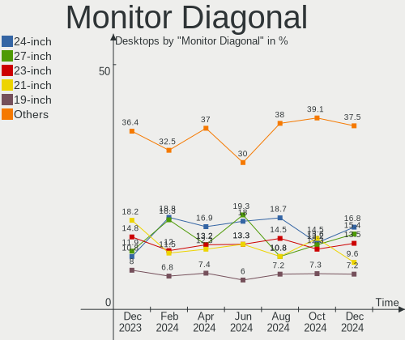

| Inches  | Desktops | Percent |
|---------|----------|---------|
| 24      | 30       | 14.15%  |
| 27      | 28       | 13.21%  |
| 23      | 26       | 12.26%  |
| 21      | 26       | 12.26%  |
| 19      | 19       | 8.96%   |
| 18      | 13       | 6.13%   |
| Unknown | 12       | 5.66%   |
| 17      | 10       | 4.72%   |
| 20      | 9        | 4.25%   |
| 31      | 7        | 3.3%    |
| 22      | 5        | 2.36%   |
| 40      | 4        | 1.89%   |
| 32      | 4        | 1.89%   |
| 34      | 3        | 1.42%   |
| 15      | 3        | 1.42%   |
| 54      | 2        | 0.94%   |
| 26      | 2        | 0.94%   |
| 99      | 1        | 0.47%   |
| 72      | 1        | 0.47%   |
| 63      | 1        | 0.47%   |
| 52      | 1        | 0.47%   |
| 43      | 1        | 0.47%   |
| 28      | 1        | 0.47%   |
| 25      | 1        | 0.47%   |
| 16      | 1        | 0.47%   |
| 12      | 1        | 0.47%   |

Monitor Width
-------------

Physical width

| Width in mm    | Desktops | Percent |
|----------------|----------|---------|
| 501-600        | 82       | 38.86%  |
| 401-500        | 58       | 27.49%  |
| 351-400        | 16       | 7.58%   |
| 301-350        | 14       | 6.64%   |
| Unknown        | 12       | 5.69%   |
| 601-700        | 10       | 4.74%   |
| 701-800        | 7        | 3.32%   |
| 1001-1500      | 4        | 1.9%    |
| 801-900        | 3        | 1.42%   |
| 901-1000       | 2        | 0.95%   |
| More than 2000 | 1        | 0.47%   |
| 201-300        | 1        | 0.47%   |
| 1501-2000      | 1        | 0.47%   |

Aspect Ratio
------------

Proportional relationship between the width and the height

| Ratio   | Desktops | Percent |
|---------|----------|---------|
| 16/9    | 130      | 65%     |
| 5/4     | 26       | 13%     |
| 16/10   | 22       | 11%     |
| Unknown | 11       | 5.5%    |
| 4/3     | 6        | 3%      |
| 21/9    | 4        | 2%      |
| 3/2     | 1        | 0.5%    |

Monitor Area
------------

Area in inch

| Area in inch | Desktops | Percent |
|----------------|----------|---------|
| 201-250        | 65       | 30.95%  |
| 151-200        | 40       | 19.05%  |
| 301-350        | 28       | 13.33%  |
| 141-150        | 21       | 10%     |
| 351-500        | 15       | 7.14%   |
| 251-300        | 13       | 6.19%   |
| Unknown        | 12       | 5.71%   |
| More than 1000 | 6        | 2.86%   |
| 501-1000       | 5        | 2.38%   |
| 101-110        | 3        | 1.43%   |
| 71-80          | 1        | 0.48%   |
| 131-140        | 1        | 0.48%   |

Pixel Density
-------------

Pixels per inch

| Density | Desktops | Percent |
|---------|----------|---------|
| 51-100  | 145      | 71.78%  |
| 101-120 | 33       | 16.34%  |
| Unknown | 12       | 5.94%   |
| 1-50    | 5        | 2.48%   |
| 121-160 | 4        | 1.98%   |
| 161-240 | 3        | 1.49%   |

Multiple Monitors
-----------------

Total monitors connected

| Total | Desktops | Percent |
|-------|----------|---------|
| 1     | 179      | 82.11%  |
| 2     | 23       | 10.55%  |
| 0     | 16       | 7.34%   |

Network
-------

Net Controller Vendor
---------------------

Controller vendors

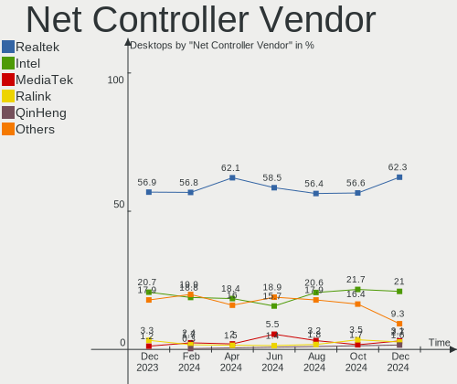

| Vendor                   | Desktops | Percent |
|--------------------------|----------|---------|
| Realtek Semiconductor    | 161      | 57.71%  |
| Intel                    | 52       | 18.64%  |
| Qualcomm Atheros         | 19       | 6.81%   |
| Nvidia                   | 9        | 3.23%   |
| TP-Link                  | 6        | 2.15%   |
| MediaTek                 | 5        | 1.79%   |
| Ralink Technology        | 4        | 1.43%   |
| Ralink                   | 3        | 1.08%   |
| D-Link System            | 3        | 1.08%   |
| Broadcom                 | 3        | 1.08%   |
| VIA Technologies         | 2        | 0.72%   |
| Marvell Technology Group | 2        | 0.72%   |
| ASUSTek Computer         | 2        | 0.72%   |
| ZyXEL Communications     | 1        | 0.36%   |
| Tenda                    | 1        | 0.36%   |
| Samsung Electronics      | 1        | 0.36%   |
| Qualcomm                 | 1        | 0.36%   |
| OPPO Electronics         | 1        | 0.36%   |
| Mercucys                 | 1        | 0.36%   |
| Huawei Technologies      | 1        | 0.36%   |
| Broadcom Limited         | 1        | 0.36%   |

Net Controller Model
--------------------

Controller models

| Model                                                                | Desktops | Percent |
|----------------------------------------------------------------------|----------|---------|
| Realtek RTL8111/8168/8411 PCI Express Gigabit Ethernet Controller    | 135      | 44.55%  |
| Realtek RTL8125 2.5GbE Controller                                    | 16       | 5.28%   |
| Intel Wi-Fi 6 AX200                                                  | 9        | 2.97%   |
| Intel Dual Band Wireless-AC 3168NGW [Stone Peak]                     | 8        | 2.64%   |
| Realtek RTL810xE PCI Express Fast Ethernet controller                | 6        | 1.98%   |
| Intel Ethernet Controller I225-V                                     | 5        | 1.65%   |
| Qualcomm Atheros Attansic L1 Gigabit Ethernet                        | 4        | 1.32%   |
| Intel I211 Gigabit Network Connection                                | 4        | 1.32%   |
| Intel Ethernet Connection (2) I219-V                                 | 4        | 1.32%   |
| TP-Link TL-WN821N v5/v6 [RTL8192EU]                                  | 3        | 0.99%   |
| Realtek 802.11ac NIC                                                 | 3        | 0.99%   |
| Ralink MT7601U Wireless Adapter                                      | 3        | 0.99%   |
| Qualcomm Atheros AR8151 v2.0 Gigabit Ethernet                        | 3        | 0.99%   |
| Nvidia MCP61 Ethernet                                                | 3        | 0.99%   |
| TP-Link TL-WN823N v2/v3 [Realtek RTL8192EU]                          | 2        | 0.66%   |
| Realtek RTL88x2bu [AC1200 Techkey]                                   | 2        | 0.66%   |
| Realtek RTL8822CE 802.11ac PCIe Wireless Network Adapter             | 2        | 0.66%   |
| Realtek RTL8188EUS 802.11n Wireless Network Adapter                  | 2        | 0.66%   |
| Realtek RTL8188EE Wireless Network Adapter                           | 2        | 0.66%   |
| Realtek RTL8153 Gigabit Ethernet Adapter                             | 2        | 0.66%   |
| Qualcomm Atheros AR8161 Gigabit Ethernet                             | 2        | 0.66%   |
| Qualcomm Atheros AR8152 v2.0 Fast Ethernet                           | 2        | 0.66%   |
| Qualcomm Atheros AR5212/5213/2414 Wireless Network Adapter           | 2        | 0.66%   |
| MediaTek MT7921K (RZ608) Wi-Fi 6E 80MHz                              | 2        | 0.66%   |
| Intel Wireless 3165                                                  | 2        | 0.66%   |
| Intel Wi-Fi 6 AX210/AX211/AX411 160MHz                               | 2        | 0.66%   |
| Intel I210 Gigabit Network Connection                                | 2        | 0.66%   |
| Intel Ethernet Connection (7) I219-V                                 | 2        | 0.66%   |
| Intel Ethernet Connection (14) I219-V                                | 2        | 0.66%   |
| Intel Alder Lake-S PCH CNVi WiFi                                     | 2        | 0.66%   |
| Intel 82579V Gigabit Network Connection                              | 2        | 0.66%   |
| Intel 82578DM Gigabit Network Connection                             | 2        | 0.66%   |
| D-Link System DWA-125 Wireless N 150 Adapter(rev.A2) [Ralink RT3070] | 2        | 0.66%   |
| ZyXEL NWD2205 802.11n Wireless N Adapter [Realtek RTL8192CU]         | 1        | 0.33%   |
| VIA VT6105/VT6106S [Rhine-III]                                       | 1        | 0.33%   |
| VIA VIA VNT-6656 [WiFi 802.11b/g USB Dongle]                         | 1        | 0.33%   |
| TP-Link 802.11ac WLAN Adapter                                        | 1        | 0.33%   |
| Tenda U12                                                            | 1        | 0.33%   |
| Samsung Galaxy series, misc. (tethering mode)                        | 1        | 0.33%   |
| Realtek RTL8821AE 802.11ac PCIe Wireless Network Adapter             | 1        | 0.33%   |

Wireless Vendor
---------------

Wireless vendors

| Vendor                | Desktops | Percent |
|-----------------------|----------|---------|
| Intel                 | 27       | 35.53%  |
| Realtek Semiconductor | 15       | 19.74%  |
| TP-Link               | 6        | 7.89%   |
| Qualcomm Atheros      | 6        | 7.89%   |
| MediaTek              | 5        | 6.58%   |
| Ralink Technology     | 4        | 5.26%   |
| Ralink                | 3        | 3.95%   |
| D-Link System         | 2        | 2.63%   |
| Broadcom              | 2        | 2.63%   |
| ASUSTek Computer      | 2        | 2.63%   |
| ZyXEL Communications  | 1        | 1.32%   |
| VIA Technologies      | 1        | 1.32%   |
| Tenda                 | 1        | 1.32%   |
| Mercucys              | 1        | 1.32%   |

Wireless Model
--------------

Wireless models

| Model                                                                | Desktops | Percent |
|----------------------------------------------------------------------|----------|---------|
| Intel Wi-Fi 6 AX200                                                  | 9        | 11.84%  |
| Intel Dual Band Wireless-AC 3168NGW [Stone Peak]                     | 8        | 10.53%  |
| TP-Link TL-WN821N v5/v6 [RTL8192EU]                                  | 3        | 3.95%   |
| Realtek 802.11ac NIC                                                 | 3        | 3.95%   |
| Ralink MT7601U Wireless Adapter                                      | 3        | 3.95%   |
| TP-Link TL-WN823N v2/v3 [Realtek RTL8192EU]                          | 2        | 2.63%   |
| Realtek RTL88x2bu [AC1200 Techkey]                                   | 2        | 2.63%   |
| Realtek RTL8822CE 802.11ac PCIe Wireless Network Adapter             | 2        | 2.63%   |
| Realtek RTL8188EUS 802.11n Wireless Network Adapter                  | 2        | 2.63%   |
| Realtek RTL8188EE Wireless Network Adapter                           | 2        | 2.63%   |
| Qualcomm Atheros AR5212/5213/2414 Wireless Network Adapter           | 2        | 2.63%   |
| MediaTek MT7921K (RZ608) Wi-Fi 6E 80MHz                              | 2        | 2.63%   |
| Intel Wireless 3165                                                  | 2        | 2.63%   |
| Intel Wi-Fi 6 AX210/AX211/AX411 160MHz                               | 2        | 2.63%   |
| Intel Alder Lake-S PCH CNVi WiFi                                     | 2        | 2.63%   |
| D-Link System DWA-125 Wireless N 150 Adapter(rev.A2) [Ralink RT3070] | 2        | 2.63%   |
| ZyXEL NWD2205 802.11n Wireless N Adapter [Realtek RTL8192CU]         | 1        | 1.32%   |
| VIA VIA VNT-6656 [WiFi 802.11b/g USB Dongle]                         | 1        | 1.32%   |
| TP-Link 802.11ac WLAN Adapter                                        | 1        | 1.32%   |
| Tenda U12                                                            | 1        | 1.32%   |
| Realtek RTL8821AE 802.11ac PCIe Wireless Network Adapter             | 1        | 1.32%   |
| Realtek RTL8192EU 802.11b/g/n WLAN Adapter                           | 1        | 1.32%   |
| Realtek RTL8192CU 802.11n WLAN Adapter                               | 1        | 1.32%   |
| Realtek RTL8188CUS 802.11n WLAN Adapter                              | 1        | 1.32%   |
| Ralink RT2501/RT2573 Wireless Adapter                                | 1        | 1.32%   |
| Ralink RT5360 Wireless 802.11n 1T/1R                                 | 1        | 1.32%   |
| Ralink RT3060 Wireless 802.11n 1T/1R                                 | 1        | 1.32%   |
| Ralink RT2790 Wireless 802.11n 1T/2R PCIe                            | 1        | 1.32%   |
| Qualcomm Atheros AR93xx Wireless Network Adapter                     | 1        | 1.32%   |
| Qualcomm Atheros AR9287 Wireless Network Adapter (PCI-Express)       | 1        | 1.32%   |
| Qualcomm Atheros AR9285 Wireless Network Adapter (PCI-Express)       | 1        | 1.32%   |
| Qualcomm Atheros AR9227 Wireless Network Adapter                     | 1        | 1.32%   |
| Mercucys 802.11n NIC                                                 | 1        | 1.32%   |
| MediaTek MT7922 802.11ax PCI Express Wireless Network Adapter        | 1        | 1.32%   |
| MediaTek MT7921 802.11ax PCI Express Wireless Network Adapter        | 1        | 1.32%   |
| MediaTek 802.11 n WLAN                                               | 1        | 1.32%   |
| Intel Wireless 8260                                                  | 1        | 1.32%   |
| Intel Wireless 7265                                                  | 1        | 1.32%   |
| Intel PRO/Wireless 4965 AG or AGN [Kedron] Network Connection        | 1        | 1.32%   |
| Intel 700 Series Chipset Family Wi-Fi                                | 1        | 1.32%   |

Ethernet Vendor
---------------

Ethernet vendors

| Vendor                   | Desktops | Percent |
|--------------------------|----------|---------|
| Realtek Semiconductor    | 158      | 70.85%  |
| Intel                    | 32       | 14.35%  |
| Qualcomm Atheros         | 14       | 6.28%   |
| Nvidia                   | 9        | 4.04%   |
| Marvell Technology Group | 2        | 0.9%    |
| VIA Technologies         | 1        | 0.45%   |
| Samsung Electronics      | 1        | 0.45%   |
| Qualcomm                 | 1        | 0.45%   |
| OPPO Electronics         | 1        | 0.45%   |
| Huawei Technologies      | 1        | 0.45%   |
| D-Link System            | 1        | 0.45%   |
| Broadcom Limited         | 1        | 0.45%   |
| Broadcom                 | 1        | 0.45%   |

Ethernet Model
--------------

Ethernet models

| Model                                                             | Desktops | Percent |
|-------------------------------------------------------------------|----------|---------|
| Realtek RTL8111/8168/8411 PCI Express Gigabit Ethernet Controller | 135      | 59.47%  |
| Realtek RTL8125 2.5GbE Controller                                 | 16       | 7.05%   |
| Realtek RTL810xE PCI Express Fast Ethernet controller             | 6        | 2.64%   |
| Intel Ethernet Controller I225-V                                  | 5        | 2.2%    |
| Qualcomm Atheros Attansic L1 Gigabit Ethernet                     | 4        | 1.76%   |
| Intel I211 Gigabit Network Connection                             | 4        | 1.76%   |
| Intel Ethernet Connection (2) I219-V                              | 4        | 1.76%   |
| Qualcomm Atheros AR8151 v2.0 Gigabit Ethernet                     | 3        | 1.32%   |
| Nvidia MCP61 Ethernet                                             | 3        | 1.32%   |
| Realtek RTL8153 Gigabit Ethernet Adapter                          | 2        | 0.88%   |
| Qualcomm Atheros AR8161 Gigabit Ethernet                          | 2        | 0.88%   |
| Qualcomm Atheros AR8152 v2.0 Fast Ethernet                        | 2        | 0.88%   |
| Intel I210 Gigabit Network Connection                             | 2        | 0.88%   |
| Intel Ethernet Connection (7) I219-V                              | 2        | 0.88%   |
| Intel Ethernet Connection (14) I219-V                             | 2        | 0.88%   |
| Intel 82579V Gigabit Network Connection                           | 2        | 0.88%   |
| Intel 82578DM Gigabit Network Connection                          | 2        | 0.88%   |
| VIA VT6105/VT6106S [Rhine-III]                                    | 1        | 0.44%   |
| Samsung Galaxy series, misc. (tethering mode)                     | 1        | 0.44%   |
| Realtek RTL8152 Fast Ethernet Adapter                             | 1        | 0.44%   |
| Realtek RTL-8100/8101L/8139 PCI Fast Ethernet Adapter             | 1        | 0.44%   |
| Qualcomm Nokia XR20                                               | 1        | 0.44%   |
| Qualcomm Atheros QCA8171 Gigabit Ethernet                         | 1        | 0.44%   |
| Qualcomm Atheros AR8151 v1.0 Gigabit Ethernet                     | 1        | 0.44%   |
| Qualcomm Atheros AR8121/AR8113/AR8114 Gigabit or Fast Ethernet    | 1        | 0.44%   |
| OPPO KALAMA-MTP_CID:0437_SN:AEEEF597                              | 1        | 0.44%   |
| Nvidia MCP79 Ethernet                                             | 1        | 0.44%   |
| Nvidia MCP77 Ethernet                                             | 1        | 0.44%   |
| Nvidia MCP73 Ethernet                                             | 1        | 0.44%   |
| Nvidia MCP67 Ethernet                                             | 1        | 0.44%   |
| Nvidia MCP51 Ethernet Controller                                  | 1        | 0.44%   |
| Nvidia CK8S Ethernet Controller                                   | 1        | 0.44%   |
| Marvell Group 88E8056 PCI-E Gigabit Ethernet Controller           | 1        | 0.44%   |
| Marvell Group 88E8050 PCI-E ASF Gigabit Ethernet Controller       | 1        | 0.44%   |
| Intel NM10/ICH7 Family LAN Controller                             | 1        | 0.44%   |
| Intel Ethernet Connection I219-LM                                 | 1        | 0.44%   |
| Intel Ethernet Connection I217-V                                  | 1        | 0.44%   |
| Intel Ethernet Connection I217-LM                                 | 1        | 0.44%   |
| Intel Ethernet Connection (2) I219-LM                             | 1        | 0.44%   |
| Intel Ethernet Connection (10) I219-V                             | 1        | 0.44%   |

Net Controller Kind
-------------------

Ethernet, WiFi or modem

| Kind     | Desktops | Percent |
|----------|----------|---------|
| Ethernet | 216      | 75%     |
| WiFi     | 72       | 25%     |

Used Controller
---------------

Currently used network controller

| Kind     | Desktops | Percent |
|----------|----------|---------|
| Ethernet | 183      | 83.56%  |
| WiFi     | 36       | 16.44%  |

NICs
----

Total network controllers on board

| Total | Desktops | Percent |
|-------|----------|---------|
| 1     | 164      | 75.23%  |
| 2     | 50       | 22.94%  |
| 3     | 2        | 0.92%   |
| 4     | 1        | 0.46%   |
| 0     | 1        | 0.46%   |

IPv6
----

IPv6 vs IPv4

| Used | Desktops | Percent |
|------|----------|---------|
| No   | 209      | 95.87%  |
| Yes  | 9        | 4.13%   |

Bluetooth
---------

Bluetooth Vendor
----------------

Controller vendors

| Vendor                  | Desktops | Percent |
|-------------------------|----------|---------|
| Intel                   | 24       | 40.68%  |
| Cambridge Silicon Radio | 18       | 30.51%  |
| Realtek Semiconductor   | 7        | 11.86%  |
| MediaTek                | 3        | 5.08%   |
| IMC Networks            | 2        | 3.39%   |
| Broadcom                | 2        | 3.39%   |
| ASUSTek Computer        | 2        | 3.39%   |
| Actions                 | 1        | 1.69%   |

Bluetooth Model
---------------

Controller models

| Model                                               | Desktops | Percent |
|-----------------------------------------------------|----------|---------|
| Cambridge Silicon Radio Bluetooth Dongle (HCI mode) | 18       | 30.51%  |
| Intel AX200 Bluetooth                               | 9        | 15.25%  |
| Intel Wireless-AC 3168 Bluetooth                    | 8        | 13.56%  |
| Realtek Bluetooth Radio                             | 7        | 11.86%  |
| MediaTek Wireless_Device                            | 3        | 5.08%   |
| Intel Bluetooth Device                              | 3        | 5.08%   |
| Intel Bluetooth wireless interface                  | 2        | 3.39%   |
| Intel AX210 Bluetooth                               | 2        | 3.39%   |
| IMC Networks Wireless_Device                        | 1        | 1.69%   |
| IMC Networks Bluetooth Radio                        | 1        | 1.69%   |
| Broadcom Bluetooth 3.0 Dongle                       | 1        | 1.69%   |
| Broadcom Bluetooth 2.0+eDR dongle                   | 1        | 1.69%   |
| ASUS Bluetooth Radio                                | 1        | 1.69%   |
| ASUS 2045 Bluetooth 2.0 Device with trace filter    | 1        | 1.69%   |
| Actions general adapter                             | 1        | 1.69%   |

Sound
-----

Sound Vendor
------------

Sound card vendors

| Vendor                   | Desktops | Percent |
|--------------------------|----------|---------|
| Intel                    | 127      | 36.6%   |
| AMD                      | 96       | 27.67%  |
| Nvidia                   | 90       | 25.94%  |
| C-Media Electronics      | 6        | 1.73%   |
| Generalplus Technology   | 4        | 1.15%   |
| Creative Labs            | 4        | 1.15%   |
| Logitech                 | 3        | 0.86%   |
| JMTek                    | 3        | 0.86%   |
| Micro Star International | 2        | 0.58%   |
| KTMicro                  | 2        | 0.58%   |
| Creative Technology      | 2        | 0.58%   |
| Samsung Electronics      | 1        | 0.29%   |
| Realtek Semiconductor    | 1        | 0.29%   |
| Razer USA                | 1        | 0.29%   |
| Kingston Technology      | 1        | 0.29%   |
| iCreate Technologies     | 1        | 0.29%   |
| Barco Display Systems    | 1        | 0.29%   |
| ASUSTek Computer         | 1        | 0.29%   |
| Unknown                  | 1        | 0.29%   |

Sound Model
-----------

Sound card models

| Model                                                                      | Desktops | Percent |
|----------------------------------------------------------------------------|----------|---------|
| Intel 6 Series/C200 Series Chipset Family High Definition Audio Controller | 26       | 6.36%   |
| AMD Family 17h/19h HD Audio Controller                                     | 25       | 6.11%   |
| AMD Starship/Matisse HD Audio Controller                                   | 17       | 4.16%   |
| AMD SBx00 Azalia (Intel HDA)                                               | 14       | 3.42%   |
| Intel NM10/ICH7 Family High Definition Audio Controller                    | 12       | 2.93%   |
| Intel 8 Series/C220 Series Chipset High Definition Audio Controller        | 12       | 2.93%   |
| AMD Renoir Radeon High Definition Audio Controller                         | 12       | 2.93%   |
| Nvidia GP107GL High Definition Audio Controller                            | 11       | 2.69%   |
| Intel 200 Series PCH HD Audio                                              | 11       | 2.69%   |
| Nvidia GK208 HDMI/DP Audio Controller                                      | 10       | 2.44%   |
| AMD Navi 21/23 HDMI/DP Audio Controller                                    | 10       | 2.44%   |
| Nvidia GF108 High Definition Audio Controller                              | 9        | 2.2%    |
| Intel Cannon Lake PCH cAVS                                                 | 9        | 2.2%    |
| Intel 100 Series/C230 Series Chipset Family HD Audio Controller            | 9        | 2.2%    |
| AMD FCH Azalia Controller                                                  | 9        | 2.2%    |
| AMD Family 17h (Models 00h-0fh) HD Audio Controller                        | 9        | 2.2%    |
| Nvidia GM107 High Definition Audio Controller [GeForce 940MX]              | 8        | 1.96%   |
| AMD Ellesmere HDMI Audio [Radeon RX 470/480 / 570/580/590]                 | 8        | 1.96%   |
| Intel 7 Series/C216 Chipset Family High Definition Audio Controller        | 7        | 1.71%   |
| AMD Raven/Raven2/Fenghuang HDMI/DP Audio Controller                        | 7        | 1.71%   |
| Intel Xeon E3-1200 v3/4th Gen Core Processor HD Audio Controller           | 6        | 1.47%   |
| Nvidia GP108 High Definition Audio Controller                              | 5        | 1.22%   |
| Nvidia GA106 High Definition Audio Controller                              | 5        | 1.22%   |
| Intel Smart Sound Technology (SST) Audio Controller                        | 5        | 1.22%   |
| Intel 82801JI (ICH10 Family) HD Audio Controller                           | 5        | 1.22%   |
| Intel 5 Series/3400 Series Chipset High Definition Audio                   | 5        | 1.22%   |
| AMD Navi 10 HDMI Audio                                                     | 5        | 1.22%   |
| AMD Baffin HDMI/DP Audio [Radeon RX 550 640SP / RX 560/560X]               | 5        | 1.22%   |
| Nvidia TU107 GeForce GTX 1650 High Definition Audio Controller             | 4        | 0.98%   |
| Nvidia MCP61 High Definition Audio                                         | 4        | 0.98%   |
| Intel 82801I (ICH9 Family) HD Audio Controller                             | 4        | 0.98%   |
| Nvidia TU116 High Definition Audio Controller                              | 3        | 0.73%   |
| Nvidia GK107 HDMI Audio Controller                                         | 3        | 0.73%   |
| Nvidia GF119 HDMI Audio Controller                                         | 3        | 0.73%   |
| Nvidia GF116 High Definition Audio Controller                              | 3        | 0.73%   |
| JMTek USB PnP Audio Device                                                 | 3        | 0.73%   |
| Intel Jasper Lake HD Audio                                                 | 3        | 0.73%   |
| Intel Alder Lake-S HD Audio Controller                                     | 3        | 0.73%   |
| Generalplus Technology USB Audio Device                                    | 3        | 0.73%   |
| AMD Turks HDMI Audio [Radeon HD 6500/6600 / 6700M Series]                  | 3        | 0.73%   |

Memory
------

Memory Vendor
-------------

Memory module vendors

| Vendor                             | Desktops | Percent |
|------------------------------------|----------|---------|
| Unknown                            | 50       | 22.73%  |
| Kingston                           | 43       | 19.55%  |
| Samsung Electronics                | 21       | 9.55%   |
| AMD                                | 17       | 7.73%   |
| Crucial                            | 14       | 6.36%   |
| A-DATA Technology                  | 10       | 4.55%   |
| Patriot                            | 9        | 4.09%   |
| Micron Technology                  | 8        | 3.64%   |
| SK hynix                           | 6        | 2.73%   |
| GOODRAM                            | 5        | 2.27%   |
| Apacer                             | 5        | 2.27%   |
| Unknown                            | 5        | 2.27%   |
| Corsair                            | 4        | 1.82%   |
| Foxline                            | 3        | 1.36%   |
| Silicon Power                      | 2        | 0.91%   |
| Ramaxel Technology                 | 2        | 0.91%   |
| Qumo                               | 2        | 0.91%   |
| Kllisre                            | 2        | 0.91%   |
| Goldkey                            | 2        | 0.91%   |
| Toshiba                            | 1        | 0.45%   |
| TOP MEDIA                          | 1        | 0.45%   |
| Qimonda                            | 1        | 0.45%   |
| Nanya Technology                   | 1        | 0.45%   |
| Kingmax Semiconductor              | 1        | 0.45%   |
| Kingmax                            | 1        | 0.45%   |
| Kimtigo Semiconductor (HK) Limited | 1        | 0.45%   |
| KETECH                             | 1        | 0.45%   |
| G.Skill                            | 1        | 0.45%   |
| Elpida                             | 1        | 0.45%   |

Memory Model
------------

Memory module models

| Model                                                 | Desktops | Percent |
|-------------------------------------------------------|----------|---------|
| Unknown RAM Module 2GB DIMM DDR2 800MT/s              | 7        | 2.82%   |
| Unknown RAM Module 4GB DIMM 1333MT/s                  | 5        | 2.02%   |
| Unknown                                               | 5        | 2.02%   |
| Unknown RAM Module 2GB DIMM SDRAM                     | 4        | 1.61%   |
| Unknown RAM Module 2GB DIMM 800MT/s                   | 4        | 1.61%   |
| Kingston RAM KF3200C16D4/16GX 16GB DIMM DDR4 3200MT/s | 4        | 1.61%   |
| Unknown RAM Module 2GB DIMM 1333MT/s                  | 3        | 1.21%   |
| AMD RAM R744G2606U1S 4GB DIMM DDR4 3200MT/s           | 3        | 1.21%   |
| A-DATA RAM DDR4 3200 8GB DIMM DDR4 3600MT/s           | 3        | 1.21%   |
| Unknown RAM Module 4GB DIMM 1600MT/s                  | 2        | 0.81%   |
| Unknown RAM Module 4GB DIMM 1066MT/s                  | 2        | 0.81%   |
| Unknown RAM Module 2GB DIMM DDR3 1333MT/s             | 2        | 0.81%   |
| Unknown RAM Module 2GB DIMM 1600MT/s                  | 2        | 0.81%   |
| Unknown RAM Module 2048MB DIMM DDR2 800MT/s           | 2        | 0.81%   |
| Unknown RAM Module 1GB DIMM DDR2 800MT/s              | 2        | 0.81%   |
| Unknown RAM DDR4 NB 8G 2666 8GB SODIMM DDR4 2667MT/s  | 2        | 0.81%   |
| Samsung RAM M393B1K70DH0 8192MB DIMM DDR3             | 2        | 0.81%   |
| Samsung RAM M393A2G40DB0-CPB 16GB DIMM DDR4 2133MT/s  | 2        | 0.81%   |
| Samsung RAM M378B5273DH0-CH9 4GB DIMM DDR3 2133MT/s   | 2        | 0.81%   |
| Samsung RAM M378B5173QH0-CK0 4GB DIMM DDR3 1600MT/s   | 2        | 0.81%   |
| Samsung RAM M378A1K43CB2-CTD 8GB DIMM DDR4 3266MT/s   | 2        | 0.81%   |
| Qumo RAM QUM3U-8G1600C11000 8GB DIMM 1066MT/s         | 2        | 0.81%   |
| Kingston RAM KHX2133C14D4/4G 4GB DIMM DDR4 2933MT/s   | 2        | 0.81%   |
| Kingston RAM KHX1866C9D3/8GX 8GB DIMM DDR3 1866MT/s   | 2        | 0.81%   |
| Kingston RAM KF560C36-16 16GB DIMM DDR5 6000MT/s      | 2        | 0.81%   |
| Kingston RAM 99U5471-012.A00LF 4GB DIMM DDR3 1600MT/s | 2        | 0.81%   |
| Kingston RAM 9905713-017.A00G 4GB DIMM DDR4 2866MT/s  | 2        | 0.81%   |
| AMD RAM R9S432G3206U2K 16GB DIMM DDR4 3200MT/s        | 2        | 0.81%   |
| AMD RAM R7S48G2606U2S 8GB DIMM DDR4 2667MT/s          | 2        | 0.81%   |
| AMD RAM R748G2606U2S-U 8GB DIMM DDR4 3200MT/s         | 2        | 0.81%   |
| Unknown RAM Module 8GB DIMM DDR4 2667MT/s             | 1        | 0.4%    |
| Unknown RAM Module 8GB DIMM DDR4 2133MT/s             | 1        | 0.4%    |
| Unknown RAM Module 8GB DIMM 1600MT/s                  | 1        | 0.4%    |
| Unknown RAM Module 8GB DIMM 1333MT/s                  | 1        | 0.4%    |
| Unknown RAM Module 512MB DIMM DDR2 667MT/s            | 1        | 0.4%    |
| Unknown RAM Module 512MB DIMM 400MT/s                 | 1        | 0.4%    |
| Unknown RAM Module 4GB DIMM SDRAM 1066MT/s            | 1        | 0.4%    |
| Unknown RAM Module 4GB DIMM DDR3 1333MT/s             | 1        | 0.4%    |
| Unknown RAM Module 4GB DIMM DDR2 800MT/s              | 1        | 0.4%    |
| Unknown RAM Module 4GB DIMM DDR 1333MT/s              | 1        | 0.4%    |

Memory Kind
-----------

Memory module kinds

| Kind    | Desktops | Percent |
|---------|----------|---------|
| DDR4    | 85       | 43.15%  |
| DDR3    | 55       | 27.92%  |
| Unknown | 25       | 12.69%  |
| DDR2    | 15       | 7.61%   |
| SDRAM   | 8        | 4.06%   |
| DDR5    | 5        | 2.54%   |
| DDR     | 3        | 1.52%   |
| DRAM    | 1        | 0.51%   |

Memory Form Factor
------------------

Physical design of the memory module

| Name   | Desktops | Percent |
|--------|----------|---------|
| DIMM   | 181      | 92.35%  |
| SODIMM | 15       | 7.65%   |

Memory Size
-----------

Memory module size

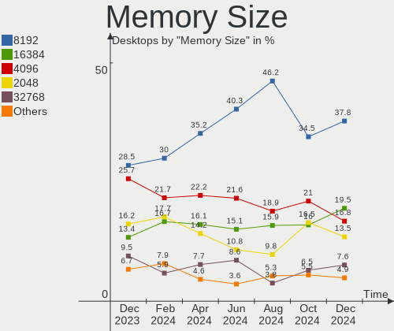

| Size  | Desktops | Percent |
|-------|----------|---------|
| 8192  | 80       | 35.87%  |
| 4096  | 59       | 26.46%  |
| 2048  | 40       | 17.94%  |
| 16384 | 25       | 11.21%  |
| 1024  | 10       | 4.48%   |
| 32768 | 7        | 3.14%   |
| 512   | 2        | 0.9%    |

Memory Speed
------------

Memory module speed

| Speed   | Desktops | Percent |
|---------|----------|---------|
| 1600    | 35       | 15.63%  |
| 1333    | 26       | 11.61%  |
| 3200    | 21       | 9.38%   |
| 2667    | 20       | 8.93%   |
| 800     | 18       | 8.04%   |
| 2133    | 12       | 5.36%   |
| 2400    | 11       | 4.91%   |
| 1866    | 8        | 3.57%   |
| 3600    | 7        | 3.13%   |
| 2666    | 7        | 3.13%   |
| 1066    | 6        | 2.68%   |
| Unknown | 5        | 2.23%   |
| 2933    | 4        | 1.79%   |
| 3400    | 3        | 1.34%   |
| 3266    | 3        | 1.34%   |
| 1867    | 3        | 1.34%   |
| 667     | 3        | 1.34%   |
| 400     | 3        | 1.34%   |
| 6000    | 2        | 0.89%   |
| 4800    | 2        | 0.89%   |
| 3466    | 2        | 0.89%   |
| 3000    | 2        | 0.89%   |
| 2866    | 2        | 0.89%   |
| 1067    | 2        | 0.89%   |
| 6400    | 1        | 0.45%   |
| 5200    | 1        | 0.45%   |
| 4802    | 1        | 0.45%   |
| 4000    | 1        | 0.45%   |
| 3933    | 1        | 0.45%   |
| 3800    | 1        | 0.45%   |
| 3733    | 1        | 0.45%   |
| 3334    | 1        | 0.45%   |
| 3333    | 1        | 0.45%   |
| 2448    | 1        | 0.45%   |
| 2200    | 1        | 0.45%   |
| 2187    | 1        | 0.45%   |
| 2000    | 1        | 0.45%   |
| 1800    | 1        | 0.45%   |
| 1334    | 1        | 0.45%   |
| 533     | 1        | 0.45%   |

Printers & scanners
-------------------

Printer Vendor
--------------

Printer device vendors

| Vendor              | Desktops | Percent |
|---------------------|----------|---------|
| Seiko Epson         | 4        | 30.77%  |
| Hewlett-Packard     | 3        | 23.08%  |
| Canon               | 2        | 15.38%  |
| Xerox               | 1        | 7.69%   |
| Samsung Electronics | 1        | 7.69%   |
| QinHeng Electronics | 1        | 7.69%   |
| Brother Industries  | 1        | 7.69%   |

Printer Model
-------------

Printer device models

| Model                    | Desktops | Percent |
|--------------------------|----------|---------|
| Seiko Epson L120 Series  | 2        | 15.38%  |
| Xerox VersaLink B405     | 1        | 7.69%   |
| Seiko Epson M2140 Series | 1        | 7.69%   |
| Seiko Epson L222 Series  | 1        | 7.69%   |
| Samsung M2070 Series     | 1        | 7.69%   |
| QinHeng CH340S           | 1        | 7.69%   |
| HP LaserJet P1005        | 1        | 7.69%   |
| HP LaserJet M402dn       | 1        | 7.69%   |
| HP LaserJet 1200         | 1        | 7.69%   |
| Canon PIXMA MP280        | 1        | 7.69%   |
| Canon LBP6020            | 1        | 7.69%   |
| Brother HL-1110 series   | 1        | 7.69%   |

Scanner Vendor
--------------

Scanner device vendors

| Vendor          | Desktops | Percent |
|-----------------|----------|---------|
| Seiko Epson     | 1        | 33.33%  |
| Hewlett-Packard | 1        | 33.33%  |
| Canon           | 1        | 33.33%  |

Scanner Model
-------------

Scanner device models

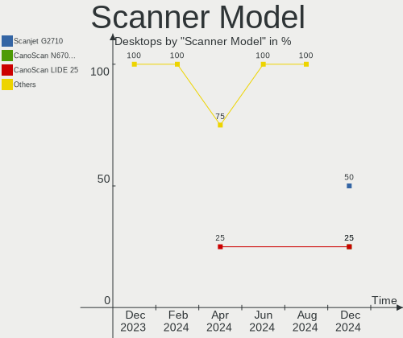

| Model                                             | Desktops | Percent |
|---------------------------------------------------|----------|---------|
| Seiko Epson GT-F650 [GT-S600/Perfection V10/V100] | 1        | 33.33%  |
| HP ScanJet 3400cse                                | 1        | 33.33%  |
| Canon CanoScan LiDE 110                           | 1        | 33.33%  |

Camera
------

Camera Vendor
-------------

Camera device vendors

| Vendor                        | Desktops | Percent |
|-------------------------------|----------|---------|
| Logitech                      | 7        | 21.88%  |
| Z-Star Microelectronics       | 3        | 9.38%   |
| Microsoft                     | 3        | 9.38%   |
| Cubeternet                    | 3        | 9.38%   |
| SunplusIT                     | 2        | 6.25%   |
| Sunplus Innovation Technology | 2        | 6.25%   |
| Microdia                      | 2        | 6.25%   |
| GEMBIRD                       | 2        | 6.25%   |
| Realtek Semiconductor         | 1        | 3.13%   |
| Pixart Imaging                | 1        | 3.13%   |
| Lenovo                        | 1        | 3.13%   |
| KYE Systems (Mouse Systems)   | 1        | 3.13%   |
| Jieli Technology              | 1        | 3.13%   |
| Chicony Electronics           | 1        | 3.13%   |
| ANYKA                         | 1        | 3.13%   |
| A4Tech                        | 1        | 3.13%   |

Camera Model
------------

Camera device models

| Model                                       | Desktops | Percent |
|---------------------------------------------|----------|---------|
| Logitech Webcam C270                        | 3        | 9.38%   |
| Z-Star Venus USB2.0 Camera                  | 2        | 6.25%   |
| SunplusIT USB Camera                        | 2        | 6.25%   |
| Sunplus Canyon CNS-CWC5 Webcam              | 2        | 6.25%   |
| Logitech Webcam C110                        | 2        | 6.25%   |
| GEMBIRD USB2.0 PC CAMERA                    | 2        | 6.25%   |
| Cubeternet GL-UPC822 UVC WebCam             | 2        | 6.25%   |
| Z-Star Vimicro USB Camera (Altair)          | 1        | 3.13%   |
| Realtek FULL HD WEB CAM                     | 1        | 3.13%   |
| Pixart Imaging GE 1.3 MP MiniCam Pro        | 1        | 3.13%   |
| Microsoft LifeCam VX-800                    | 1        | 3.13%   |
| Microsoft LifeCam VX-2000                   | 1        | 3.13%   |
| Microsoft LifeCam HD-3000                   | 1        | 3.13%   |
| Microdia Defender G-Lens 2577 HD720p Camera | 1        | 3.13%   |
| Microdia Camera                             | 1        | 3.13%   |
| Logitech Webcam C300                        | 1        | 3.13%   |
| Logitech Webcam C210                        | 1        | 3.13%   |
| Lenovo 500 RGB Camera                       | 1        | 3.13%   |
| KYE Systems (Mouse Systems) FaceCam 1005    | 1        | 3.13%   |
| Jieli USB PHY 2.0                           | 1        | 3.13%   |
| Cubeternet USB2.0 Camera                    | 1        | 3.13%   |
| Chicony HP High Definition 1MP Webcam       | 1        | 3.13%   |
| ANYKA HD WebCam 2MP                         | 1        | 3.13%   |
| A4Tech FHD 1080P PC Camera                  | 1        | 3.13%   |

Security
--------

Fingerprint Vendor
------------------

Fingerprint sensor vendors

Zero info for selected period =(

Fingerprint Model
-----------------

Fingerprint sensor models

Zero info for selected period =(

Chipcard Vendor
---------------

Chipcard module vendors

Zero info for selected period =(

Chipcard Model
--------------

Chipcard module models

Zero info for selected period =(

Unsupported
-----------

Unsupported Devices
-------------------

Total unsupported devices on board

| Total | Desktops | Percent |
|-------|----------|---------|
| 0     | 194      | 88.99%  |
| 1     | 21       | 9.63%   |
| 2     | 3        | 1.38%   |

Unsupported Device Types
------------------------

Types of unsupported devices

| Type                     | Desktops | Percent |
|--------------------------|----------|---------|
| Graphics card            | 16       | 61.54%  |
| Unassigned class         | 5        | 19.23%  |
| Net/wireless             | 4        | 15.38%  |
| Communication controller | 1        | 3.85%   |

