Linux in Russia - Hardware Trends (Desktops)
--------------------------------------------

A project to identify most popular hardware characteristics and track their change
over time based on data collected by Linux users at https://Linux-Hardware.org.

Anyone can contribute to this report by the [hw-probe](https://github.com/linuxhw/hw-probe) tool:

    sudo -E hw-probe -all -upload

Period: Oct, 2023.

Contents
--------

* [ System ](#system)
  - [ OS                       ](#os)
  - [ OS Family                ](#os-family)
  - [ Kernel                   ](#kernel)
  - [ Kernel Family            ](#kernel-family)
  - [ Kernel Major Ver.        ](#kernel-major-ver)
  - [ Arch                     ](#arch)
  - [ DE                       ](#de)
  - [ Display Server           ](#display-server)
  - [ Display Manager          ](#display-manager)
  - [ OS Lang                  ](#os-lang)
  - [ Boot Mode                ](#boot-mode)
  - [ Filesystem               ](#filesystem)
  - [ Part. scheme             ](#part-scheme)
  - [ Dual Boot with Linux/BSD ](#dual-boot-with-linuxbsd)
  - [ Dual Boot (Win)          ](#dual-boot-win)

* [ Board ](#board)
  - [ Vendor                   ](#vendor)
  - [ Model                    ](#model)
  - [ Model Family             ](#model-family)
  - [ MFG Year                 ](#mfg-year)
  - [ Form Factor              ](#form-factor)
  - [ Secure Boot              ](#secure-boot)
  - [ Coreboot                 ](#coreboot)
  - [ RAM Size                 ](#ram-size)
  - [ RAM Used                 ](#ram-used)
  - [ Total Drives             ](#total-drives)
  - [ Has CD-ROM               ](#has-cd-rom)
  - [ Has Ethernet             ](#has-ethernet)
  - [ Has WiFi                 ](#has-wifi)
  - [ Has Bluetooth            ](#has-bluetooth)

* [ Location ](#location)
  - [ Country                  ](#country)
  - [ City                     ](#city)

* [ Drives ](#drives)
  - [ Drive Vendor             ](#drive-vendor)
  - [ Drive Model              ](#drive-model)
  - [ HDD Vendor               ](#hdd-vendor)
  - [ SSD Vendor               ](#ssd-vendor)
  - [ Drive Kind               ](#drive-kind)
  - [ Drive Connector          ](#drive-connector)
  - [ Drive Size               ](#drive-size)
  - [ Space Total              ](#space-total)
  - [ Space Used               ](#space-used)
  - [ Malfunc. Drives          ](#malfunc-drives)
  - [ Malfunc. Drive Vendor    ](#malfunc-drive-vendor)
  - [ Malfunc. HDD Vendor      ](#malfunc-hdd-vendor)
  - [ Malfunc. Drive Kind      ](#malfunc-drive-kind)
  - [ Failed Drives            ](#failed-drives)
  - [ Failed Drive Vendor      ](#failed-drive-vendor)
  - [ Drive Status             ](#drive-status)

* [ Storage controller ](#storage-controller)
  - [ Storage Vendor           ](#storage-vendor)
  - [ Storage Model            ](#storage-model)
  - [ Storage Kind             ](#storage-kind)

* [ Processor ](#processor)
  - [ CPU Vendor               ](#cpu-vendor)
  - [ CPU Model                ](#cpu-model)
  - [ CPU Model Family         ](#cpu-model-family)
  - [ CPU Cores                ](#cpu-cores)
  - [ CPU Sockets              ](#cpu-sockets)
  - [ CPU Threads              ](#cpu-threads)
  - [ CPU Op-Modes             ](#cpu-op-modes)
  - [ CPU Microcode            ](#cpu-microcode)
  - [ CPU Microarch            ](#cpu-microarch)

* [ Graphics ](#graphics)
  - [ GPU Vendor               ](#gpu-vendor)
  - [ GPU Model                ](#gpu-model)
  - [ GPU Combo                ](#gpu-combo)
  - [ GPU Driver               ](#gpu-driver)
  - [ GPU Memory               ](#gpu-memory)

* [ Monitor ](#monitor)
  - [ Monitor Vendor           ](#monitor-vendor)
  - [ Monitor Model            ](#monitor-model)
  - [ Monitor Resolution       ](#monitor-resolution)
  - [ Monitor Diagonal         ](#monitor-diagonal)
  - [ Monitor Width            ](#monitor-width)
  - [ Aspect Ratio             ](#aspect-ratio)
  - [ Monitor Area             ](#monitor-area)
  - [ Pixel Density            ](#pixel-density)
  - [ Multiple Monitors        ](#multiple-monitors)

* [ Network ](#network)
  - [ Net Controller Vendor    ](#net-controller-vendor)
  - [ Net Controller Model     ](#net-controller-model)
  - [ Wireless Vendor          ](#wireless-vendor)
  - [ Wireless Model           ](#wireless-model)
  - [ Ethernet Vendor          ](#ethernet-vendor)
  - [ Ethernet Model           ](#ethernet-model)
  - [ Net Controller Kind      ](#net-controller-kind)
  - [ Used Controller          ](#used-controller)
  - [ NICs                     ](#nics)
  - [ IPv6                     ](#ipv6)

* [ Bluetooth ](#bluetooth)
  - [ Bluetooth Vendor         ](#bluetooth-vendor)
  - [ Bluetooth Model          ](#bluetooth-model)

* [ Sound ](#sound)
  - [ Sound Vendor             ](#sound-vendor)
  - [ Sound Model              ](#sound-model)

* [ Memory ](#memory)
  - [ Memory Vendor            ](#memory-vendor)
  - [ Memory Model             ](#memory-model)
  - [ Memory Kind              ](#memory-kind)
  - [ Memory Form Factor       ](#memory-form-factor)
  - [ Memory Size              ](#memory-size)
  - [ Memory Speed             ](#memory-speed)

* [ Printers & scanners ](#printers--scanners)
  - [ Printer Vendor           ](#printer-vendor)
  - [ Printer Model            ](#printer-model)
  - [ Scanner Vendor           ](#scanner-vendor)
  - [ Scanner Model            ](#scanner-model)

* [ Camera ](#camera)
  - [ Camera Vendor            ](#camera-vendor)
  - [ Camera Model             ](#camera-model)

* [ Security ](#security)
  - [ Fingerprint Vendor       ](#fingerprint-vendor)
  - [ Fingerprint Model        ](#fingerprint-model)
  - [ Chipcard Vendor          ](#chipcard-vendor)
  - [ Chipcard Model           ](#chipcard-model)

* [ Unsupported ](#unsupported)
  - [ Unsupported Devices      ](#unsupported-devices)
  - [ Unsupported Device Types ](#unsupported-device-types)

System
------

OS
--

Installed operating systems

| Name                         | Desktops | Percent |
|------------------------------|----------|---------|
| ROSA 12.4                    | 78       | 33.48%  |
| Debian 12                    | 24       | 10.3%   |
| Ubuntu 22.04                 | 21       | 9.01%   |
| Red OS 7.3                   | 10       | 4.29%   |
| ROSA 12                      | 7        | 3%      |
| ROSA R11.1                   | 5        | 2.15%   |
| OpenMandriva 4.3             | 5        | 2.15%   |
| Manjaro                      | 5        | 2.15%   |
| Fedora 38                    | 5        | 2.15%   |
| OpenMandriva 23.10           | 4        | 1.72%   |
| Arch Rolling                 | 4        | 1.72%   |
| Ubuntu 23.10                 | 3        | 1.29%   |
| Pop!_OS 22.04                | 3        | 1.29%   |
| OpenMandriva 23.08           | 3        | 1.29%   |
| Linux Mint 21.2              | 3        | 1.29%   |
| Elementary 7.1               | 3        | 1.29%   |
| ALT Linux 10.2               | 3        | 1.29%   |
| Xero Rolling                 | 2        | 0.86%   |
| Ubuntu 23.04                 | 2        | 0.86%   |
| ROSA 12.1                    | 2        | 0.86%   |
| org.kde.Platform 5.15-21.08  | 2        | 0.86%   |
| OpenMandriva 23.01           | 2        | 0.86%   |
| NixOS 23.05                  | 2        | 0.86%   |
| EndeavourOS Rolling          | 2        | 0.86%   |
| Debian                       | 2        | 0.86%   |
| Xubuntu 22.04                | 1        | 0.43%   |
| Ubuntu Unity 18.04           | 1        | 0.43%   |
| Ubuntu 22.10                 | 1        | 0.43%   |
| Ubuntu 20.04                 | 1        | 0.43%   |
| Sparky 7.1                   | 1        | 0.43%   |
| ROSA 13.0                    | 1        | 0.43%   |
| RELS 7.9                     | 1        | 0.43%   |
| openSUSE Tumbleweed-XXXXXXXX | 1        | 0.43%   |
| openSUSE Leap-15.5           | 1        | 0.43%   |
| OpenMandriva 4.2             | 1        | 0.43%   |
| OpenMandriva 23.03           | 1        | 0.43%   |
| Nobara 38                    | 1        | 0.43%   |
| NixOS 23.11                  | 1        | 0.43%   |
| MX 23                        | 1        | 0.43%   |
| Manjaro 23.0.4               | 1        | 0.43%   |

OS Family
---------

OS without a version

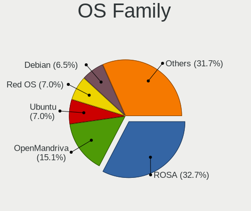

| Name             | Desktops | Percent |
|------------------|----------|---------|
| ROSA             | 93       | 39.91%  |
| Debian           | 29       | 12.45%  |
| Ubuntu           | 28       | 12.02%  |
| OpenMandriva     | 16       | 6.87%   |
| Red OS           | 10       | 4.29%   |
| Manjaro          | 7        | 3%      |
| Fedora           | 6        | 2.58%   |
| Linux Mint       | 5        | 2.15%   |
| ALT Linux        | 5        | 2.15%   |
| Arch             | 4        | 1.72%   |
| Pop!_OS          | 3        | 1.29%   |
| NixOS            | 3        | 1.29%   |
| Elementary       | 3        | 1.29%   |
| Xero             | 2        | 0.86%   |
| org.kde.Platform | 2        | 0.86%   |
| openSUSE         | 2        | 0.86%   |
| EndeavourOS      | 2        | 0.86%   |
| Xubuntu          | 1        | 0.43%   |
| Ubuntu Unity     | 1        | 0.43%   |
| Sparky           | 1        | 0.43%   |
| RELS             | 1        | 0.43%   |
| Nobara           | 1        | 0.43%   |
| MX               | 1        | 0.43%   |
| Lubuntu          | 1        | 0.43%   |
| Kubuntu          | 1        | 0.43%   |
| KDE neon         | 1        | 0.43%   |
| Kali             | 1        | 0.43%   |
| CentOS           | 1        | 0.43%   |
| Astra Linux      | 1        | 0.43%   |
| ArcoLinux        | 1        | 0.43%   |

Kernel
------

Version of the Linux kernel

| Version                             | Desktops | Percent |
|-------------------------------------|----------|---------|
| 6.1.46-generic-2rosa2021.1-x86_64   | 39       | 16.74%  |
| 6.1.20-generic-2rosa2021.1-x86_64   | 22       | 9.44%   |
| 5.19.0-38-generic                   | 16       | 6.87%   |
| 6.1.58-generic-1rosa2021.1-x86_64   | 11       | 4.72%   |
| 6.1.0-4-amd64                       | 11       | 4.72%   |
| 6.1.52-1.el7.3.x86_64               | 7        | 3%      |
| 6.1.0-13-amd64                      | 5        | 2.15%   |
| 5.15.0-87-generic                   | 5        | 2.15%   |
| 6.2.0-34-generic                    | 4        | 1.72%   |
| 6.1.0-12-amd64                      | 4        | 1.72%   |
| 5.16.7-desktop-1omv4003             | 4        | 1.72%   |
| 6.5.5-desktop-1omv2390              | 3        | 1.29%   |
| 6.5.5-1-MANJARO                     | 3        | 1.29%   |
| 6.5.4-76060504-generic              | 3        | 1.29%   |
| 6.4.11-desktop-1omv2390             | 3        | 1.29%   |
| 6.2.0-35-generic                    | 3        | 1.29%   |
| 5.4.83-generic-2rosa-x86_64         | 3        | 1.29%   |
| 5.15.103-generic-1rosa2021.1-i686   | 3        | 1.29%   |
| 6.5.8-arch1-1                       | 2        | 0.86%   |
| 6.5.7-arch1-1                       | 2        | 0.86%   |
| 6.5.7-200.fc38.x86_64               | 2        | 0.86%   |
| 6.5.7                               | 2        | 0.86%   |
| 6.5.6-200.fc38.x86_64               | 2        | 0.86%   |
| 6.5.0-9-generic                     | 2        | 0.86%   |
| 6.1.49-un-def-alt1                  | 2        | 0.86%   |
| 6.1.38-2.el7.3.x86_64               | 2        | 0.86%   |
| 6.1.1-desktop-1omv2290              | 2        | 0.86%   |
| 6.1.0-9-amd64                       | 2        | 0.86%   |
| 6.1.0-10-amd64                      | 2        | 0.86%   |
| 5.15.127-generic-1rosa2021.1-x86_64 | 2        | 0.86%   |
| 5.10.74-generic-2rosa2021.1-x86_64  | 2        | 0.86%   |
| 5.10.184-generic-1rosa2021.1-x86_64 | 2        | 0.86%   |
| 6.6.0-1-MANJARO                     | 1        | 0.43%   |
| 6.5.9-zen2-1-zen                    | 1        | 0.43%   |
| 6.5.9-arch2-1                       | 1        | 0.43%   |
| 6.5.8-1-default                     | 1        | 0.43%   |
| 6.5.6-200.fsync.fc38.x86_64         | 1        | 0.43%   |
| 6.5.5-zen1-1-zen                    | 1        | 0.43%   |
| 6.5.5-200.fc38.x86_64               | 1        | 0.43%   |
| 6.5.5-100.fc37.x86_64               | 1        | 0.43%   |

Kernel Family
-------------

Linux kernel without a distro release

| Version  | Desktops | Percent |
|----------|----------|---------|
| 6.1.46   | 40       | 17.17%  |
| 6.1.0    | 24       | 10.3%   |
| 6.1.20   | 22       | 9.44%   |
| 5.19.0   | 18       | 7.73%   |
| 6.1.58   | 12       | 5.15%   |
| 6.5.5    | 9        | 3.86%   |
| 6.2.0    | 8        | 3.43%   |
| 5.15.0   | 8        | 3.43%   |
| 6.1.52   | 7        | 3%      |
| 6.5.7    | 6        | 2.58%   |
| 6.5.0    | 5        | 2.15%   |
| 5.16.7   | 4        | 1.72%   |
| 5.15.103 | 4        | 1.72%   |
| 6.5.8    | 3        | 1.29%   |
| 6.5.6    | 3        | 1.29%   |
| 6.5.4    | 3        | 1.29%   |
| 6.4.11   | 3        | 1.29%   |
| 6.1.49   | 3        | 1.29%   |
| 6.1.38   | 3        | 1.29%   |
| 5.4.83   | 3        | 1.29%   |
| 5.10.74  | 3        | 1.29%   |
| 6.5.9    | 2        | 0.86%   |
| 6.5.3    | 2        | 0.86%   |
| 6.1.1    | 2        | 0.86%   |
| 5.15.127 | 2        | 0.86%   |
| 5.10.184 | 2        | 0.86%   |
| 5.10.0   | 2        | 0.86%   |
| 4.15.0   | 2        | 0.86%   |
| 6.6.0    | 1        | 0.43%   |
| 6.5.1    | 1        | 0.43%   |
| 6.4.9    | 1        | 0.43%   |
| 6.4.8    | 1        | 0.43%   |
| 6.4.0    | 1        | 0.43%   |
| 6.3.12   | 1        | 0.43%   |
| 6.3.0    | 1        | 0.43%   |
| 6.2.6    | 1        | 0.43%   |
| 6.2.16   | 1        | 0.43%   |
| 6.2.1    | 1        | 0.43%   |
| 6.1.57   | 1        | 0.43%   |
| 6.1.55   | 1        | 0.43%   |

Kernel Major Ver.
-----------------

Linux kernel major version

| Version | Desktops | Percent |
|---------|----------|---------|
| 6.1     | 119      | 51.07%  |
| 6.5     | 34       | 14.59%  |
| 5.19    | 18       | 7.73%   |
| 5.15    | 16       | 6.87%   |
| 6.2     | 11       | 4.72%   |
| 5.10    | 11       | 4.72%   |
| 6.4     | 6        | 2.58%   |
| 5.4     | 5        | 2.15%   |
| 5.16    | 5        | 2.15%   |
| 6.3     | 2        | 0.86%   |
| 4.15    | 2        | 0.86%   |
| 6.6     | 1        | 0.43%   |
| 5.14    | 1        | 0.43%   |
| 5.11    | 1        | 0.43%   |
| 4.18    | 1        | 0.43%   |

Arch
----

OS architecture (x86_64, i586, etc.)

| Name   | Desktops | Percent |
|--------|----------|---------|
| x86_64 | 227      | 97.42%  |
| i686   | 6        | 2.58%   |

DE
--

Desktop Environment

| Name              | Desktops | Percent |
|-------------------|----------|---------|
| KDE5              | 89       | 38.2%   |
| GNOME             | 56       | 24.03%  |
| Unknown           | 34       | 14.59%  |
| MATE              | 15       | 6.44%   |
| XFCE              | 9        | 3.86%   |
| LXQt              | 9        | 3.86%   |
| X-Cinnamon        | 5        | 2.15%   |
| KDE4              | 4        | 1.72%   |
| Pantheon          | 3        | 1.29%   |
| i3                | 3        | 1.29%   |
| x-session-manager | 1        | 0.43%   |
| Unity             | 1        | 0.43%   |
| sway              | 1        | 0.43%   |
| KDE               | 1        | 0.43%   |
| fly               | 1        | 0.43%   |
| Cinnamon          | 1        | 0.43%   |

Display Server
--------------

X11 or Wayland

| Name    | Desktops | Percent |
|---------|----------|---------|
| X11     | 101      | 43.35%  |
| Wayland | 92       | 39.48%  |
| Unknown | 34       | 14.59%  |
| Tty     | 6        | 2.58%   |

Display Manager
---------------

SDDM, LightDM, etc.

| Name    | Desktops | Percent |
|---------|----------|---------|
| SDDM    | 83       | 35.62%  |
| Unknown | 63       | 27.04%  |
| GDM     | 41       | 17.6%   |
| LightDM | 25       | 10.73%  |
| GDM3    | 15       | 6.44%   |
| KDM     | 4        | 1.72%   |
| LXDM    | 1        | 0.43%   |
| FLY-DM  | 1        | 0.43%   |

OS Lang
-------

Language

| Lang  | Desktops | Percent |
|-------|----------|---------|
| ru_RU | 178      | 76.39%  |
| en_US | 36       | 15.45%  |
| C     | 16       | 6.87%   |
| en_GB | 2        | 0.86%   |
| en_AU | 1        | 0.43%   |

Boot Mode
---------

EFI or BIOS

| Mode | Desktops | Percent |
|------|----------|---------|
| BIOS | 121      | 51.93%  |
| EFI  | 112      | 48.07%  |

Filesystem
----------

Type of filesystem

| Type    | Desktops | Percent |
|---------|----------|---------|
| Ext4    | 154      | 66.09%  |
| Overlay | 35       | 15.02%  |
| Btrfs   | 34       | 14.59%  |
| Tmpfs   | 7        | 3%      |
| Xfs     | 2        | 0.86%   |
| F2fs    | 1        | 0.43%   |

Part. scheme
------------

Scheme of partitioning

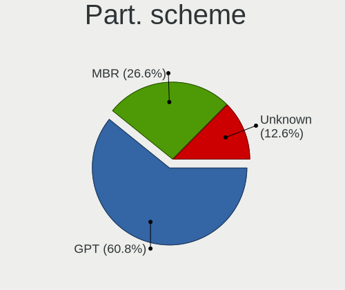

| Type    | Desktops | Percent |
|---------|----------|---------|
| GPT     | 123      | 52.79%  |
| MBR     | 64       | 27.47%  |
| Unknown | 46       | 19.74%  |

Dual Boot with Linux/BSD
------------------------

Hosting more than one Linux/BSD

| Dual boot | Desktops | Percent |
|-----------|----------|---------|
| No        | 169      | 72.53%  |
| Yes       | 64       | 27.47%  |

Dual Boot (Win)
---------------

Hosting Linux and Windows

| Dual boot | Desktops | Percent |
|-----------|----------|---------|
| No        | 140      | 60.09%  |
| Yes       | 93       | 39.91%  |

Board
-----

Vendor
------

Motherboard manufacturer

| Name                                 | Desktops | Percent |
|--------------------------------------|----------|---------|
| ASUSTek Computer                     | 60       | 25.75%  |
| Gigabyte Technology                  | 56       | 24.03%  |
| MSI                                  | 30       | 12.88%  |
| ASRock                               | 18       | 7.73%   |
| Supermicro                           | 16       | 6.87%   |
| Unknown                              | 11       | 4.72%   |
| Intel                                | 6        | 2.58%   |
| Lenovo                               | 5        | 2.15%   |
| Huanan                               | 5        | 2.15%   |
| Biostar                              | 5        | 2.15%   |
| ECS                                  | 3        | 1.29%   |
| Pegatron                             | 2        | 0.86%   |
| MACHINIST                            | 2        | 0.86%   |
| AZW                                  | 2        | 0.86%   |
| Acer                                 | 2        | 0.86%   |
| 3Logic Group                         | 2        | 0.86%   |
| Yadro                                | 1        | 0.43%   |
| WinFast                              | 1        | 0.43%   |
| Shenzhen Meigao Electronic Equipment | 1        | 0.43%   |
| QBIC                                 | 1        | 0.43%   |
| OEM                                  | 1        | 0.43%   |
| Hewlett-Packard                      | 1        | 0.43%   |
| DEPO Computers                       | 1        | 0.43%   |
| Dell                                 | 1        | 0.43%   |

Model
-----

Motherboard model

| Name                                            | Desktops | Percent |
|-------------------------------------------------|----------|---------|
| Unknown                                         | 11       | 4.72%   |
| Supermicro SYS-6018R-TDW                        | 6        | 2.58%   |
| Supermicro SYS-1028R-TDW                        | 4        | 1.72%   |
| ASUS All Series                                 | 4        | 1.72%   |
| Supermicro SYS-6018R-MTR                        | 3        | 1.29%   |
| MSI MS-7996                                     | 3        | 1.29%   |
| MSI MS-7C51                                     | 2        | 0.86%   |
| MSI MS-7641                                     | 2        | 0.86%   |
| Intel X99                                       | 2        | 0.86%   |
| Intel SKYBAY                                    | 2        | 0.86%   |
| Gigabyte H510M H                                | 2        | 0.86%   |
| Gigabyte GA-870A-UD3                            | 2        | 0.86%   |
| Gigabyte B75M-D3V                               | 2        | 0.86%   |
| Gigabyte B550M AORUS PRO-P                      | 2        | 0.86%   |
| Gigabyte A320M-S2H                              | 2        | 0.86%   |
| Gigabyte 970A-DS3P                              | 2        | 0.86%   |
| ASUS PRIME H510M-K                              | 2        | 0.86%   |
| ASUS PRIME H510M-A                              | 2        | 0.86%   |
| ASUS PRIME B450M-K                              | 2        | 0.86%   |
| ASUS PRIME A320M-K                              | 2        | 0.86%   |
| ASUS P5K PRO                                    | 2        | 0.86%   |
| ASRock N68C-GS FX                               | 2        | 0.86%   |
| 3Logic Group Graviton                           | 2        | 0.86%   |
| Yadro TB560-D4                                  | 1        | 0.43%   |
| WinFast 761GXK8MC                               | 1        | 0.43%   |
| Supermicro X9DRW                                | 1        | 0.43%   |
| Supermicro PIO-628U-TR4T+-ST031                 | 1        | 0.43%   |
| Supermicro PIO-618U-T4T+-ST031                  | 1        | 0.43%   |
| Shenzhen Meigao Electronic Equipment UM773 Lite | 1        | 0.43%   |
| QBIC BXT-512-7100U                              | 1        | 0.43%   |
| Pegatron Pro 3010 Microtower PC                 | 1        | 0.43%   |
| Pegatron 520-1000ru                             | 1        | 0.43%   |
| OEM X79G                                        | 1        | 0.43%   |
| MSI MS-7D73                                     | 1        | 0.43%   |
| MSI MS-7D67                                     | 1        | 0.43%   |
| MSI MS-7D54                                     | 1        | 0.43%   |
| MSI MS-7D46                                     | 1        | 0.43%   |
| MSI MS-7D24                                     | 1        | 0.43%   |
| MSI MS-7C96                                     | 1        | 0.43%   |
| MSI MS-7C95                                     | 1        | 0.43%   |

Model Family
------------

Motherboard model prefix

| Name                                       | Desktops | Percent |
|--------------------------------------------|----------|---------|
| ASUS PRIME                                 | 17       | 7.3%    |
| Unknown                                    | 11       | 4.72%   |
| Supermicro SYS-6018R-TDW                   | 6        | 2.58%   |
| Gigabyte B550M                             | 6        | 2.58%   |
| Supermicro SYS-1028R-TDW                   | 4        | 1.72%   |
| ASUS All                                   | 4        | 1.72%   |
| Supermicro SYS-6018R-MTR                   | 3        | 1.29%   |
| MSI MS-7996                                | 3        | 1.29%   |
| Gigabyte B450M                             | 3        | 1.29%   |
| Gigabyte A320M-S2H                         | 3        | 1.29%   |
| ASUS TUF                                   | 3        | 1.29%   |
| ASUS ROG                                   | 3        | 1.29%   |
| ASUS P8H61-M                               | 3        | 1.29%   |
| ASUS P5K                                   | 3        | 1.29%   |
| MSI MS-7C51                                | 2        | 0.86%   |
| MSI MS-7641                                | 2        | 0.86%   |
| Lenovo IdeaCentre                          | 2        | 0.86%   |
| Intel X99                                  | 2        | 0.86%   |
| Intel SKYBAY                               | 2        | 0.86%   |
| Intel H81                                  | 2        | 0.86%   |
| Gigabyte X570                              | 2        | 0.86%   |
| Gigabyte H510M                             | 2        | 0.86%   |
| Gigabyte GA-870A-UD3                       | 2        | 0.86%   |
| Gigabyte B75M-D3V                          | 2        | 0.86%   |
| Gigabyte 970A-DS3P                         | 2        | 0.86%   |
| ASUS P5KPL-AM                              | 2        | 0.86%   |
| ASUS P5G41T-M                              | 2        | 0.86%   |
| ASRock X570                                | 2        | 0.86%   |
| ASRock N68C-GS                             | 2        | 0.86%   |
| 3Logic Group Graviton                      | 2        | 0.86%   |
| Yadro TB560-D4                             | 1        | 0.43%   |
| WinFast 761GXK8MC                          | 1        | 0.43%   |
| Supermicro X9DRW                           | 1        | 0.43%   |
| Supermicro PIO-628U-TR4T+-ST031            | 1        | 0.43%   |
| Supermicro PIO-618U-T4T+-ST031             | 1        | 0.43%   |
| Shenzhen Meigao Electronic Equipment UM773 | 1        | 0.43%   |
| QBIC BXT-512-7100U                         | 1        | 0.43%   |
| Pegatron Pro                               | 1        | 0.43%   |
| Pegatron 520-1000ru                        | 1        | 0.43%   |
| OEM X79G                                   | 1        | 0.43%   |

MFG Year
--------

Motherboard manufacture year

| Year    | Desktops | Percent |
|---------|----------|---------|
| 2018    | 27       | 11.59%  |
| 2022    | 24       | 10.3%   |
| 2021    | 22       | 9.44%   |
| 2020    | 19       | 8.15%   |
| 2012    | 18       | 7.73%   |
| 2009    | 17       | 7.3%    |
| 2019    | 16       | 6.87%   |
| 2015    | 13       | 5.58%   |
| 2011    | 11       | 4.72%   |
| 2016    | 10       | 4.29%   |
| 2017    | 9        | 3.86%   |
| 2013    | 9        | 3.86%   |
| 2010    | 9        | 3.86%   |
| 2023    | 7        | 3%      |
| 2008    | 6        | 2.58%   |
| 2014    | 5        | 2.15%   |
| 2007    | 5        | 2.15%   |
| 2006    | 2        | 0.86%   |
| 2005    | 2        | 0.86%   |
| 2004    | 1        | 0.43%   |
| Unknown | 1        | 0.43%   |

Form Factor
-----------

Physical design of the computer

| Name    | Desktops | Percent |
|---------|----------|---------|
| Desktop | 233      | 100%    |

Secure Boot
-----------

Enabled or disabled

| State    | Desktops | Percent |
|----------|----------|---------|
| Disabled | 230      | 98.71%  |
| Enabled  | 3        | 1.29%   |

Coreboot
--------

Have coreboot on board

| Used | Desktops | Percent |
|------|----------|---------|
| No   | 233      | 100%    |

RAM Size
--------

Total RAM memory

| Size in GB      | Desktops | Percent |
|-----------------|----------|---------|
| 16.01-24.0      | 56       | 24.03%  |
| 8.01-16.0       | 40       | 17.17%  |
| 32.01-64.0      | 36       | 15.45%  |
| 4.01-8.0        | 32       | 13.73%  |
| 3.01-4.0        | 27       | 11.59%  |
| 64.01-256.0     | 16       | 6.87%   |
| 1.01-2.0        | 14       | 6.01%   |
| 24.01-32.0      | 6        | 2.58%   |
| More than 256.0 | 5        | 2.15%   |
| 2.01-3.0        | 1        | 0.43%   |

RAM Used
--------

Used RAM memory

| Used GB    | Desktops | Percent |
|------------|----------|---------|
| 1.01-2.0   | 97       | 41.63%  |
| 2.01-3.0   | 38       | 16.31%  |
| 4.01-8.0   | 29       | 12.45%  |
| 0.51-1.0   | 27       | 11.59%  |
| 3.01-4.0   | 18       | 7.73%   |
| 8.01-16.0  | 15       | 6.44%   |
| 0.01-0.5   | 4        | 1.72%   |
| 24.01-32.0 | 2        | 0.86%   |
| 16.01-24.0 | 2        | 0.86%   |
| 32.01-64.0 | 1        | 0.43%   |

Total Drives
------------

Number of drives on board

| Drives | Desktops | Percent |
|--------|----------|---------|
| 1      | 97       | 41.63%  |
| 2      | 69       | 29.61%  |
| 3      | 32       | 13.73%  |
| 4      | 14       | 6.01%   |
| 5      | 7        | 3%      |
| 7      | 5        | 2.15%   |
| 8      | 3        | 1.29%   |
| 6      | 3        | 1.29%   |
| 0      | 2        | 0.86%   |
| 17     | 1        | 0.43%   |

Has CD-ROM
----------

Has CD-ROM on board

| Presented | Desktops | Percent |
|-----------|----------|---------|
| No        | 188      | 80.69%  |
| Yes       | 45       | 19.31%  |

Has Ethernet
------------

Has Ethernet on board

| Presented | Desktops | Percent |
|-----------|----------|---------|
| Yes       | 231      | 99.14%  |
| No        | 2        | 0.86%   |

Has WiFi
--------

Has WiFi module

| Presented | Desktops | Percent |
|-----------|----------|---------|
| No        | 158      | 67.81%  |
| Yes       | 75       | 32.19%  |

Has Bluetooth
-------------

Has Bluetooth module

| Presented | Desktops | Percent |
|-----------|----------|---------|
| No        | 173      | 74.25%  |
| Yes       | 60       | 25.75%  |

Location
--------

Country
-------

Geographic location (country)

| Country | Desktops | Percent |
|---------|----------|---------|
| Russia  | 233      | 100%    |

City
----

Geographic location (city)

| City             | Desktops | Percent |
|------------------|----------|---------|
| Moscow           | 61       | 26.18%  |
| Voronezh         | 15       | 6.44%   |
| St Petersburg    | 11       | 4.72%   |
| Krasnodar        | 6        | 2.58%   |
| Chelyabinsk      | 6        | 2.58%   |
| Perm             | 5        | 2.15%   |
| Rostov-on-Don    | 4        | 1.72%   |
| Yaroslavl        | 3        | 1.29%   |
| Volgograd        | 3        | 1.29%   |
| Tver             | 3        | 1.29%   |
| Stavropol        | 3        | 1.29%   |
| Saratov          | 3        | 1.29%   |
| Ramenskoye       | 3        | 1.29%   |
| Penza            | 3        | 1.29%   |
| Novokuznetsk     | 3        | 1.29%   |
| Nizhniy Novgorod | 3        | 1.29%   |
| Murmansk         | 3        | 1.29%   |
| Magnitogorsk     | 3        | 1.29%   |
| Yoshkar-Ola      | 2        | 0.86%   |
| Yekaterinburg    | 2        | 0.86%   |
| Yakutsk          | 2        | 0.86%   |
| Volzhsky         | 2        | 0.86%   |
| Vladivostok      | 2        | 0.86%   |
| Tula             | 2        | 0.86%   |
| Tolyatti         | 2        | 0.86%   |
| Taganrog         | 2        | 0.86%   |
| Surgut           | 2        | 0.86%   |
| Shchelkovo       | 2        | 0.86%   |
| Sergiyev Posad   | 2        | 0.86%   |
| Samara           | 2        | 0.86%   |
| Omsk             | 2        | 0.86%   |
| Novosibirsk      | 2        | 0.86%   |
| Krasnoyarsk      | 2        | 0.86%   |
| Kirov            | 2        | 0.86%   |
| Belgorod         | 2        | 0.86%   |
| Zheleznogorsk    | 1        | 0.43%   |
| Zelenodolsk      | 1        | 0.43%   |
| Yeysk            | 1        | 0.43%   |
| Vladimir         | 1        | 0.43%   |
| Verkhnyaya Salda | 1        | 0.43%   |

Drives
------

Drive Vendor
------------

Hard drive vendors

| Vendor                      | Desktops | Drives | Percent |
|-----------------------------|----------|--------|---------|
| WDC                         | 73       | 90     | 17.06%  |
| Seagate                     | 65       | 84     | 15.19%  |
| Samsung Electronics         | 42       | 56     | 9.81%   |
| Toshiba                     | 21       | 32     | 4.91%   |
| Kingston                    | 20       | 23     | 4.67%   |
| Apacer                      | 13       | 14     | 3.04%   |
| Intel                       | 12       | 29     | 2.8%    |
| Hitachi                     | 11       | 16     | 2.57%   |
| Crucial                     | 11       | 11     | 2.57%   |
| A-DATA Technology           | 11       | 11     | 2.57%   |
| Maxtor                      | 9        | 9      | 2.1%    |
| HGST                        | 9        | 13     | 2.1%    |
| Patriot                     | 7        | 7      | 1.64%   |
| China                       | 7        | 7      | 1.64%   |
| Unknown                     | 6        | 6      | 1.4%    |
| Smartbuy                    | 6        | 6      | 1.4%    |
| SanDisk                     | 6        | 6      | 1.4%    |
| Silicon Motion              | 5        | 5      | 1.17%   |
| OCZ                         | 5        | 5      | 1.17%   |
| KingSpec                    | 5        | 6      | 1.17%   |
| Netac                       | 4        | 4      | 0.93%   |
| Fujitsu                     | 4        | 4      | 0.93%   |
| XrayDisk                    | 3        | 3      | 0.7%    |
| Team                        | 3        | 3      | 0.7%    |
| Realtek Semiconductor       | 3        | 3      | 0.7%    |
| Plextor                     | 3        | 3      | 0.7%    |
| Phison Electronics          | 3        | 3      | 0.7%    |
| Neo                         | 3        | 3      | 0.7%    |
| Micron/Crucial Technology   | 3        | 3      | 0.7%    |
| MAXIO Technology (Hangzhou) | 3        | 3      | 0.7%    |
| AMD                         | 3        | 3      | 0.7%    |
| AGI                         | 3        | 3      | 0.7%    |
| Transcend                   | 2        | 2      | 0.47%   |
| SPCC                        | 2        | 2      | 0.47%   |
| Micron Technology           | 2        | 2      | 0.47%   |
| Kingston Technology Company | 2        | 2      | 0.47%   |
| JMicron Technology          | 2        | 2      | 0.47%   |
| DEXP                        | 2        | 2      | 0.47%   |
| Azerty                      | 2        | 2      | 0.47%   |
| ZTE                         | 1        | 1      | 0.23%   |

Drive Model
-----------

Hard drive models

| Model                                                 | Desktops | Percent |
|-------------------------------------------------------|----------|---------|
| Seagate ST1000DM010-2EP102 1TB                        | 7        | 1.46%   |
| Samsung NVMe SSD Controller SM981/PM981/PM983 1TB     | 7        | 1.46%   |
| Seagate ST1000NM0033-9ZM173 1TB                       | 6        | 1.25%   |
| WDC WD10EZEX-08WN4A0 1TB                              | 5        | 1.04%   |
| Toshiba DT01ACA050 500GB                              | 5        | 1.04%   |
| Smartbuy SSD 120GB                                    | 4        | 0.83%   |
| Seagate ST500DM002-1BD142 500GB                       | 4        | 0.83%   |
| Samsung SSD 980 PRO 1TB                               | 4        | 0.83%   |
| Kingston SNVS500G 500GB                               | 4        | 0.83%   |
| Intel SSDSC2BB800G7 800GB                             | 4        | 0.83%   |
| Intel SSDSC2BB480G7 480GB                             | 4        | 0.83%   |
| HGST HTE721010A9E630 1TB                              | 4        | 0.83%   |
| Apacer AS340 480GB SSD                                | 4        | 0.83%   |
| A-DATA SU650 240GB SSD                                | 4        | 0.83%   |
| WDC WD5000AAKX-00ERMA0 500GB                          | 3        | 0.63%   |
| Toshiba DT01ACA100 1TB                                | 3        | 0.63%   |
| Silicon Motion SM2263EN/SM2263XT SSD Controller 256GB | 3        | 0.63%   |
| Seagate ST3500418AS 500GB                             | 3        | 0.63%   |
| Seagate ST2000DM008-2FR102 2TB                        | 3        | 0.63%   |
| Seagate ST1000NM0008-2F2100 1TB                       | 3        | 0.63%   |
| Seagate ST1000DM003-1ER162 1TB                        | 3        | 0.63%   |
| Samsung SSD 980 1TB                                   | 3        | 0.63%   |
| Samsung SSD 870 EVO 500GB                             | 3        | 0.63%   |
| Samsung SSD 860 EVO 250GB                             | 3        | 0.63%   |
| Samsung SSD 860 EVO 1TB                               | 3        | 0.63%   |
| Samsung NVMe SSD Controller PM9A1/PM9A3/980PRO 1TB    | 3        | 0.63%   |
| Neo Forza NFS121SA312-6007000 120GB SSD               | 3        | 0.63%   |
| Kingston SNVS250G 250GB                               | 3        | 0.63%   |
| Kingston SA400S37480G 480GB SSD                       | 3        | 0.63%   |
| Fujitsu MAX3147RC 147GB                               | 3        | 0.63%   |
| Crucial CT480BX500SSD1 480GB                          | 3        | 0.63%   |
| Apacer AS2280P4 256GB                                 | 3        | 0.63%   |
| WDC WDS240G2G0A-00JH30 240GB SSD                      | 2        | 0.42%   |
| WDC WDS120G2G0A-00JH30 120GB SSD                      | 2        | 0.42%   |
| WDC WD5000LPVX-22V0TT0 500GB                          | 2        | 0.42%   |
| WDC WD5000AAKX-22ERMA0 500GB                          | 2        | 0.42%   |
| WDC WD1600AAJS-00L7A0 160GB                           | 2        | 0.42%   |
| WDC WD10EZEX-60ZF5A0 1TB                              | 2        | 0.42%   |
| WDC WD10EZEX-22MFCA0 1TB                              | 2        | 0.42%   |
| WDC WD10EZEX-00BBHA0 1TB                              | 2        | 0.42%   |

HDD Vendor
----------

Hard disk drive vendors

| Vendor              | Desktops | Drives | Percent |
|---------------------|----------|--------|---------|
| WDC                 | 67       | 79     | 34.36%  |
| Seagate             | 65       | 84     | 33.33%  |
| Toshiba             | 21       | 31     | 10.77%  |
| Hitachi             | 11       | 16     | 5.64%   |
| HGST                | 9        | 13     | 4.62%   |
| Maxtor              | 8        | 8      | 4.1%    |
| Samsung Electronics | 7        | 8      | 3.59%   |
| Fujitsu             | 4        | 4      | 2.05%   |
| Unknown             | 2        | 2      | 1.03%   |
| ASMT                | 1        | 1      | 0.51%   |

SSD Vendor
----------

Solid state drive vendors

| Vendor              | Desktops | Drives | Percent |
|---------------------|----------|--------|---------|
| Samsung Electronics | 16       | 16     | 10.32%  |
| Kingston            | 12       | 13     | 7.74%   |
| Crucial             | 10       | 10     | 6.45%   |
| A-DATA Technology   | 10       | 10     | 6.45%   |
| Intel               | 9        | 26     | 5.81%   |
| Apacer              | 9        | 10     | 5.81%   |
| WDC                 | 7        | 8      | 4.52%   |
| Patriot             | 7        | 7      | 4.52%   |
| China               | 7        | 7      | 4.52%   |
| Smartbuy            | 6        | 6      | 3.87%   |
| OCZ                 | 5        | 5      | 3.23%   |
| KingSpec            | 5        | 6      | 3.23%   |
| XrayDisk            | 3        | 3      | 1.94%   |
| Netac               | 3        | 3      | 1.94%   |
| Neo                 | 3        | 3      | 1.94%   |
| AMD                 | 3        | 3      | 1.94%   |
| AGI                 | 3        | 3      | 1.94%   |
| Team                | 2        | 2      | 1.29%   |
| SPCC                | 2        | 2      | 1.29%   |
| SanDisk             | 2        | 2      | 1.29%   |
| Plextor             | 2        | 2      | 1.29%   |
| Micron Technology   | 2        | 2      | 1.29%   |
| DEXP                | 2        | 2      | 1.29%   |
| Azerty              | 2        | 2      | 1.29%   |
| ZHITAI              | 1        | 1      | 0.65%   |
| Transcend           | 1        | 1      | 0.65%   |
| Toshiba             | 1        | 1      | 0.65%   |
| SP                  | 1        | 1      | 0.65%   |
| ShanDianZhe         | 1        | 1      | 0.65%   |
| Realtek             | 1        | 1      | 0.65%   |
| Qumo                | 1        | 1      | 0.65%   |
| PHD 3.0             | 1        | 1      | 0.65%   |
| Maxtor              | 1        | 1      | 0.65%   |
| Londisk             | 1        | 1      | 0.65%   |
| KIOXIA-EXCERIA      | 1        | 1      | 0.65%   |
| KingFast            | 1        | 1      | 0.65%   |
| KingDian            | 1        | 1      | 0.65%   |
| Kimtigo             | 1        | 1      | 0.65%   |
| HS-SSD-C100         | 1        | 1      | 0.65%   |
| Hewlett-Packard     | 1        | 1      | 0.65%   |

Drive Kind
----------

HDD or SSD

| Kind    | Desktops | Drives | Percent |
|---------|----------|--------|---------|
| HDD     | 152      | 246    | 43.3%   |
| SSD     | 122      | 176    | 34.76%  |
| NVMe    | 73       | 94     | 20.8%   |
| Unknown | 3        | 3      | 0.85%   |
| MMC     | 1        | 1      | 0.28%   |

Drive Connector
---------------

SATA, SAS, NVMe, etc.

| Type | Desktops | Drives | Percent |
|------|----------|--------|---------|
| SATA | 199      | 411    | 68.86%  |
| NVMe | 73       | 91     | 25.26%  |
| SAS  | 16       | 17     | 5.54%   |
| MMC  | 1        | 1      | 0.35%   |

Drive Size
----------

Size of hard drive

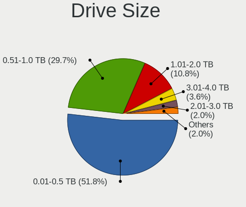

| Size in TB | Desktops | Drives | Percent |
|------------|----------|--------|---------|
| 0.01-0.5   | 162      | 248    | 58.06%  |
| 0.51-1.0   | 73       | 105    | 26.16%  |
| 1.01-2.0   | 22       | 34     | 7.89%   |
| 2.01-3.0   | 8        | 8      | 2.87%   |
| 3.01-4.0   | 7        | 13     | 2.51%   |
| 4.01-10.0  | 6        | 11     | 2.15%   |
| 10.01-20.0 | 1        | 3      | 0.36%   |

Space Total
-----------

Amount of disk space available on the file system

| Size in GB     | Desktops | Percent |
|----------------|----------|---------|
| 101-250        | 54       | 23.18%  |
| 251-500        | 39       | 16.74%  |
| 501-1000       | 33       | 14.16%  |
| Unknown        | 28       | 12.02%  |
| 1001-2000      | 22       | 9.44%   |
| 1-20           | 16       | 6.87%   |
| More than 3000 | 14       | 6.01%   |
| 51-100         | 13       | 5.58%   |
| 21-50          | 7        | 3%      |
| 2001-3000      | 7        | 3%      |

Space Used
----------

Amount of used disk space

| Used GB        | Desktops | Percent |
|----------------|----------|---------|
| 1-20           | 94       | 40.34%  |
| 101-250        | 29       | 12.45%  |
| Unknown        | 28       | 12.02%  |
| 21-50          | 25       | 10.73%  |
| 251-500        | 15       | 6.44%   |
| 51-100         | 15       | 6.44%   |
| 501-1000       | 12       | 5.15%   |
| 1001-2000      | 7        | 3%      |
| More than 3000 | 6        | 2.58%   |
| 2001-3000      | 2        | 0.86%   |

Malfunc. Drives
---------------

Drive models with a malfunction

| Model                                                         | Desktops | Drives | Percent |
|---------------------------------------------------------------|----------|--------|---------|
| Neo Forza NFS121SA312-6007000 120GB SSD                       | 3        | 3      | 5.36%   |
| Intel SSDSC2BB800G7 800GB                                     | 3        | 3      | 5.36%   |
| WDC WD5000AAKX-00ERMA0 500GB                                  | 2        | 2      | 3.57%   |
| Seagate ST3250410AS 250GB                                     | 2        | 2      | 3.57%   |
| WDC WDS240G2G0A-00JH30 240GB SSD                              | 1        | 1      | 1.79%   |
| WDC WD5000LPVX-80V0TT0 500GB                                  | 1        | 1      | 1.79%   |
| WDC WD5000AAKX-60U6AA0 500GB                                  | 1        | 1      | 1.79%   |
| WDC WD5000AAKX-08ERMA0 500GB                                  | 1        | 1      | 1.79%   |
| WDC WD5000AAKS-75A7B2 500GB                                   | 1        | 1      | 1.79%   |
| WDC WD3200AAJS-00YZCA0 320GB                                  | 1        | 1      | 1.79%   |
| WDC WD3200AAJB-00J3A0 320GB                                   | 1        | 1      | 1.79%   |
| WDC WD2500AAKX-001CA0 250GB                                   | 1        | 1      | 1.79%   |
| WDC WD1600AAJS-00L7A0 160GB                                   | 1        | 1      | 1.79%   |
| WDC WD10EZEX-60ZF5A0 1TB                                      | 1        | 1      | 1.79%   |
| WDC WD10EZEX-22MFCA0 1TB                                      | 1        | 1      | 1.79%   |
| WDC WD10EZEX-08WN4A0 1TB                                      | 1        | 1      | 1.79%   |
| WDC WD10EZEX-00BN5A0 1TB                                      | 1        | 1      | 1.79%   |
| WDC WD10EALX-009BA0 1TB                                       | 1        | 1      | 1.79%   |
| WDC WD Green 2.5 480GB SSD                                    | 1        | 1      | 1.79%   |
| Toshiba MK3276GSX 320GB                                       | 1        | 1      | 1.79%   |
| Seagate ST9320325AS 320GB                                     | 1        | 1      | 1.79%   |
| Seagate ST500LT012-9WS142 500GB                               | 1        | 1      | 1.79%   |
| Seagate ST4000DM000-1F2168 4TB                                | 1        | 1      | 1.79%   |
| Seagate ST380211AS 80GB                                       | 1        | 1      | 1.79%   |
| Seagate ST360021A 64GB                                        | 1        | 1      | 1.79%   |
| Seagate ST3500418AS 500GB                                     | 1        | 1      | 1.79%   |
| Seagate ST3500413AS 500GB                                     | 1        | 1      | 1.79%   |
| Seagate ST3500320AS 500GB                                     | 1        | 1      | 1.79%   |
| Seagate ST3250318AS 250GB                                     | 1        | 1      | 1.79%   |
| Seagate ST320LT020-9YG142 320GB                               | 1        | 1      | 1.79%   |
| Seagate ST320LT012-9WS14C 320GB                               | 1        | 1      | 1.79%   |
| Seagate ST3200827AS 200GB                                     | 1        | 1      | 1.79%   |
| Seagate ST3160812A 160GB                                      | 1        | 1      | 1.79%   |
| Seagate ST31000524AS 1TB                                      | 1        | 1      | 1.79%   |
| Seagate ST1000DM010-2EP102 1TB                                | 1        | 1      | 1.79%   |
| Samsung Electronics SSD 870 EVO 500GB                         | 1        | 1      | 1.79%   |
| Samsung Electronics NVMe SSD Controller SM981/PM981/PM983 1TB | 1        | 1      | 1.79%   |
| Samsung Electronics HD501LJ 500GB                             | 1        | 1      | 1.79%   |
| Samsung Electronics HD120IJ 120GB                             | 1        | 1      | 1.79%   |
| Maxtor STM3500320AS 500GB                                     | 1        | 1      | 1.79%   |

Malfunc. Drive Vendor
---------------------

Vendors of faulty drives

| Vendor              | Desktops | Drives | Percent |
|---------------------|----------|--------|---------|
| WDC                 | 16       | 17     | 30.77%  |
| Seagate             | 14       | 17     | 26.92%  |
| Samsung Electronics | 4        | 4      | 7.69%   |
| Neo                 | 3        | 3      | 5.77%   |
| Maxtor              | 3        | 3      | 5.77%   |
| Intel               | 3        | 3      | 5.77%   |
| Hitachi             | 3        | 3      | 5.77%   |
| Kingston            | 2        | 2      | 3.85%   |
| Toshiba             | 1        | 1      | 1.92%   |
| HGST                | 1        | 1      | 1.92%   |
| Fujitsu             | 1        | 1      | 1.92%   |
| Corsair             | 1        | 1      | 1.92%   |

Malfunc. HDD Vendor
-------------------

Vendors of faulty HDD drives

| Vendor              | Desktops | Drives | Percent |
|---------------------|----------|--------|---------|
| WDC                 | 14       | 15     | 35.9%   |
| Seagate             | 14       | 17     | 35.9%   |
| Maxtor              | 3        | 3      | 7.69%   |
| Hitachi             | 3        | 3      | 7.69%   |
| Samsung Electronics | 2        | 2      | 5.13%   |
| Toshiba             | 1        | 1      | 2.56%   |
| HGST                | 1        | 1      | 2.56%   |
| Fujitsu             | 1        | 1      | 2.56%   |

Malfunc. Drive Kind
-------------------

Kinds of faulty drives

| Kind | Desktops | Drives | Percent |
|------|----------|--------|---------|
| HDD  | 37       | 43     | 74%     |
| SSD  | 12       | 12     | 24%     |
| NVMe | 1        | 1      | 2%      |

Failed Drives
-------------

Failed drive models

| Model                     | Desktops | Drives | Percent |
|---------------------------|----------|--------|---------|
| Intel SSDSC2BB480G7 480GB | 1        | 4      | 50%     |
| HGST HTS541010A9E680 1TB  | 1        | 1      | 50%     |

Failed Drive Vendor
-------------------

Failed drive vendors

| Vendor | Desktops | Drives | Percent |
|--------|----------|--------|---------|
| Intel  | 1        | 4      | 50%     |
| HGST   | 1        | 1      | 50%     |

Drive Status
------------

Number of failed and malfunc. drives

| Status   | Desktops | Drives | Percent |
|----------|----------|--------|---------|
| Works    | 166      | 350    | 61.03%  |
| Detected | 56       | 109    | 20.59%  |
| Malfunc  | 48       | 56     | 17.65%  |
| Failed   | 2        | 5      | 0.74%   |

Storage controller
------------------

Storage Vendor
--------------

Storage controller vendors

| Vendor                           | Desktops | Percent |
|----------------------------------|----------|---------|
| Intel                            | 149      | 43.7%   |
| AMD                              | 76       | 22.29%  |
| Samsung Electronics              | 24       | 7.04%   |
| Kingston Technology Company      | 12       | 3.52%   |
| JMicron Technology               | 11       | 3.23%   |
| Phison Electronics               | 10       | 2.93%   |
| SanDisk                          | 7        | 2.05%   |
| Marvell Technology Group         | 7        | 2.05%   |
| ASMedia Technology               | 6        | 1.76%   |
| Silicon Motion                   | 5        | 1.47%   |
| MAXIO Technology (Hangzhou)      | 5        | 1.47%   |
| Realtek Semiconductor            | 4        | 1.17%   |
| Nvidia                           | 4        | 1.17%   |
| Micron/Crucial Technology        | 4        | 1.17%   |
| Silicon Integrated Systems [SiS] | 2        | 0.59%   |
| Broadcom / LSI                   | 2        | 0.59%   |
| ADATA Technology                 | 2        | 0.59%   |
| VIA Technologies                 | 1        | 0.29%   |
| Union Memory (Shenzhen)          | 1        | 0.29%   |
| Transcend                        | 1        | 0.29%   |
| SK hynix                         | 1        | 0.29%   |
| Shenzhen Longsys Electronics     | 1        | 0.29%   |
| LSI Logic / Symbios Logic        | 1        | 0.29%   |
| Lite-On Technology               | 1        | 0.29%   |
| INNOGRIT                         | 1        | 0.29%   |
| Hosin Global Electronics         | 1        | 0.29%   |
| Biwin Storage Technology         | 1        | 0.29%   |
| Adaptec                          | 1        | 0.29%   |

Storage Model
-------------

Storage controller models

| Model                                                                                   | Desktops | Percent |
|-----------------------------------------------------------------------------------------|----------|---------|
| AMD FCH SATA Controller [AHCI mode]                                                     | 39       | 8.99%   |
| Intel C610/X99 series chipset 6-Port SATA Controller [AHCI mode]                        | 20       | 4.61%   |
| Intel C610/X99 series chipset sSATA Controller [AHCI mode]                              | 15       | 3.46%   |
| Intel 500 Series Chipset Family SATA AHCI Controller                                    | 15       | 3.46%   |
| AMD 500 Series Chipset SATA Controller                                                  | 14       | 3.23%   |
| Intel NM10/ICH7 Family SATA Controller [IDE mode]                                       | 12       | 2.76%   |
| Samsung NVMe SSD Controller SM981/PM981/PM983                                           | 11       | 2.53%   |
| AMD SB7x0/SB8x0/SB9x0 IDE Controller                                                    | 11       | 2.53%   |
| AMD FCH SATA Controller D                                                               | 11       | 2.53%   |
| Intel Q170/Q150/B150/H170/H110/Z170/CM236 Chipset SATA Controller [AHCI Mode]           | 10       | 2.3%    |
| Intel 8 Series/C220 Series Chipset Family 6-port SATA Controller 1 [AHCI mode]          | 10       | 2.3%    |
| AMD 400 Series Chipset SATA Controller                                                  | 10       | 2.3%    |
| Samsung NVMe SSD Controller PM9A1/PM9A3/980PRO                                          | 8        | 1.84%   |
| Intel Cannon Lake PCH SATA AHCI Controller                                              | 8        | 1.84%   |
| Intel 82801G (ICH7 Family) IDE Controller                                               | 8        | 1.84%   |
| AMD SB7x0/SB8x0/SB9x0 SATA Controller [IDE mode]                                        | 8        | 1.84%   |
| AMD SB7x0/SB8x0/SB9x0 SATA Controller [AHCI mode]                                       | 8        | 1.84%   |
| Intel 7 Series/C210 Series Chipset Family 4-port SATA Controller [IDE mode]             | 7        | 1.61%   |
| Intel 7 Series/C210 Series Chipset Family 2-port SATA Controller [IDE mode]             | 7        | 1.61%   |
| JMicron JMB363 SATA/IDE Controller                                                      | 6        | 1.38%   |
| Intel 6 Series/C200 Series Chipset Family Desktop SATA Controller (IDE mode, ports 4-5) | 6        | 1.38%   |
| Intel 6 Series/C200 Series Chipset Family Desktop SATA Controller (IDE mode, ports 0-3) | 6        | 1.38%   |
| Intel 200 Series PCH SATA controller [AHCI mode]                                        | 6        | 1.38%   |
| Silicon Motion SM2263EN/SM2263XT (DRAM-less) NVMe SSD Controllers                       | 5        | 1.15%   |
| Phison PS5013-E13 PCIe3 NVMe Controller (DRAM-less)                                     | 5        | 1.15%   |
| MAXIO (Hangzhou) NVMe SSD Controller MAP1202                                            | 5        | 1.15%   |
| Kingston Company NV1 NVMe SSD SM2263XT                                                  | 5        | 1.15%   |
| Intel Alder Lake-S PCH SATA Controller [AHCI Mode]                                      | 5        | 1.15%   |
| Intel 82801JI (ICH10 Family) 4 port SATA IDE Controller #1                              | 5        | 1.15%   |
| Intel 82801JI (ICH10 Family) 2 port SATA IDE Controller #2                              | 5        | 1.15%   |
| ASMedia ASM1062 Serial ATA Controller                                                   | 5        | 1.15%   |
| Samsung NVMe SSD Controller 980 (DRAM-less)                                             | 4        | 0.92%   |
| Intel 6 Series/C200 Series Chipset Family 6 port Desktop SATA AHCI Controller           | 4        | 0.92%   |
| Nvidia MCP61 SATA Controller                                                            | 3        | 0.69%   |
| Nvidia MCP61 IDE                                                                        | 3        | 0.69%   |
| JMicron JMB368 IDE controller                                                           | 3        | 0.69%   |
| Intel SATA Controller [RAID mode]                                                       | 3        | 0.69%   |
| Intel C600/X79 series chipset 6-Port SATA AHCI Controller                               | 3        | 0.69%   |
| Intel 82801JI (ICH10 Family) SATA AHCI Controller                                       | 3        | 0.69%   |
| Intel 82801I (ICH9 Family) 2 port SATA Controller [IDE mode]                            | 3        | 0.69%   |

Storage Kind
------------

Kind of storage controller (IDE, SATA, NVMe, SAS, ...)

| Kind | Desktops | Percent |
|------|----------|---------|
| SATA | 182      | 56.17%  |
| NVMe | 73       | 22.53%  |
| IDE  | 59       | 18.21%  |
| RAID | 6        | 1.85%   |
| SAS  | 4        | 1.23%   |

Processor
---------

CPU Vendor
----------

Processor vendors

| Vendor  | Desktops | Percent |
|---------|----------|---------|
| Intel   | 149      | 63.95%  |
| AMD     | 83       | 35.62%  |
| Unknown | 1        | 0.43%   |

CPU Model
---------

Processor models

| Model                                       | Desktops | Percent |
|---------------------------------------------|----------|---------|
| Intel Core i5-10400 CPU @ 2.90GHz           | 7        | 3%      |
| Intel Xeon CPU E5-2620 v3 @ 2.40GHz         | 6        | 2.58%   |
| AMD Ryzen 5 3600 6-Core Processor           | 5        | 2.15%   |
| Intel Xeon CPU E5-2650 v4 @ 2.20GHz         | 4        | 1.72%   |
| AMD Ryzen 5 PRO 4650G with Radeon Graphics  | 4        | 1.72%   |
| AMD Ryzen 5 5600G with Radeon Graphics      | 4        | 1.72%   |
| Intel Xeon CPU E5-2620 v4 @ 2.10GHz         | 3        | 1.29%   |
| Intel Pentium CPU G4400 @ 3.30GHz           | 3        | 1.29%   |
| Intel Core i5-3470 CPU @ 3.20GHz            | 3        | 1.29%   |
| Intel Core i5-2400 CPU @ 3.10GHz            | 3        | 1.29%   |
| Intel Core i3-10100F CPU @ 3.60GHz          | 3        | 1.29%   |
| Intel 12th Gen Core i3-12100F               | 3        | 1.29%   |
| AMD Ryzen 9 7950X 16-Core Processor         | 3        | 1.29%   |
| AMD Ryzen 7 5700G with Radeon Graphics      | 3        | 1.29%   |
| AMD Ryzen 7 2700 Eight-Core Processor       | 3        | 1.29%   |
| AMD Ryzen 5 2600 Six-Core Processor         | 3        | 1.29%   |
| AMD Ryzen 3 2200G with Radeon Vega Graphics | 3        | 1.29%   |
| AMD Athlon II X2 250 Processor              | 3        | 1.29%   |
| Intel Xeon CPU E5-2680 v4 @ 2.40GHz         | 2        | 0.86%   |
| Intel Xeon CPU E5-2678 v3 @ 2.50GHz         | 2        | 0.86%   |
| Intel Xeon CPU E5-2670 v2 @ 2.50GHz         | 2        | 0.86%   |
| Intel Pentium Dual-Core CPU E5400 @ 2.70GHz | 2        | 0.86%   |
| Intel Pentium Dual-Core CPU E5300 @ 2.60GHz | 2        | 0.86%   |
| Intel Core i7-9700K CPU @ 3.60GHz           | 2        | 0.86%   |
| Intel Core i7-4790K CPU @ 4.00GHz           | 2        | 0.86%   |
| Intel Core i7 CPU 950 @ 3.07GHz             | 2        | 0.86%   |
| Intel Core i5-10600K CPU @ 4.10GHz          | 2        | 0.86%   |
| Intel Core i5 CPU 760 @ 2.80GHz             | 2        | 0.86%   |
| Intel Core i3-8100 CPU @ 3.60GHz            | 2        | 0.86%   |
| Intel Core i3-6100TE CPU @ 2.70GHz          | 2        | 0.86%   |
| Intel Core i3-4150 CPU @ 3.50GHz            | 2        | 0.86%   |
| Intel Core i3-3220 CPU @ 3.30GHz            | 2        | 0.86%   |
| Intel Core 2 Quad CPU Q9400 @ 2.66GHz       | 2        | 0.86%   |
| Intel Core 2 Duo CPU E8400 @ 3.00GHz        | 2        | 0.86%   |
| Intel Core 2 Duo CPU E7500 @ 2.93GHz        | 2        | 0.86%   |
| Intel 11th Gen Core i7-11700 @ 2.50GHz      | 2        | 0.86%   |
| Intel 11th Gen Core i7-1165G7 @ 2.80GHz     | 2        | 0.86%   |
| AMD Ryzen 9 5950X 16-Core Processor         | 2        | 0.86%   |
| AMD Ryzen 7 7700X 8-Core Processor          | 2        | 0.86%   |
| AMD Ryzen 5 5600 6-Core Processor           | 2        | 0.86%   |

CPU Model Family
----------------

Processor model prefix

| Model                   | Desktops | Percent |
|-------------------------|----------|---------|
| Intel Core i5           | 33       | 14.16%  |
| Intel Xeon              | 30       | 12.88%  |
| AMD Ryzen 5             | 19       | 8.15%   |
| Intel Core i3           | 18       | 7.73%   |
| Intel Core i7           | 17       | 7.3%    |
| AMD Ryzen 7             | 13       | 5.58%   |
| Other                   | 11       | 4.72%   |
| Intel Core 2 Duo        | 8        | 3.43%   |
| Intel Celeron           | 8        | 3.43%   |
| AMD Ryzen 9             | 8        | 3.43%   |
| Intel Pentium Dual-Core | 7        | 3%      |
| AMD Ryzen 3             | 7        | 3%      |
| AMD FX                  | 6        | 2.58%   |
| Intel Pentium           | 5        | 2.15%   |
| Intel Core 2 Quad       | 5        | 2.15%   |
| AMD Ryzen 5 PRO         | 4        | 1.72%   |
| AMD Athlon II X2        | 4        | 1.72%   |
| AMD Phenom II X4        | 3        | 1.29%   |
| AMD Athlon II X4        | 3        | 1.29%   |
| Intel Pentium 4         | 2        | 0.86%   |
| Intel Core i9           | 2        | 0.86%   |
| Intel Core 2            | 2        | 0.86%   |
| AMD Ryzen 3 PRO         | 2        | 0.86%   |
| AMD Phenom II X6        | 2        | 0.86%   |
| AMD Athlon              | 2        | 0.86%   |
| AMD A8                  | 2        | 0.86%   |
| Intel Pentium Gold      | 1        | 0.43%   |
| Intel Genuine           | 1        | 0.43%   |
| AMD Sempron             | 1        | 0.43%   |
| AMD Phenom II X3        | 1        | 0.43%   |
| AMD Mobile Athlon 64    | 1        | 0.43%   |
| AMD Athlon II X3        | 1        | 0.43%   |
| AMD Athlon Dual Core    | 1        | 0.43%   |
| AMD A6                  | 1        | 0.43%   |
| AMD A4                  | 1        | 0.43%   |
| AMD A10                 | 1        | 0.43%   |

CPU Cores
---------

Number of processor cores

| Number | Desktops | Percent |
|--------|----------|---------|
| 4      | 76       | 32.62%  |
| 2      | 52       | 22.32%  |
| 6      | 38       | 16.31%  |
| 8      | 25       | 10.73%  |
| 12     | 9        | 3.86%   |
| 16     | 8        | 3.43%   |
| 1      | 7        | 3%      |
| 10     | 6        | 2.58%   |
| 24     | 5        | 2.15%   |
| 3      | 4        | 1.72%   |
| 28     | 2        | 0.86%   |
| 18     | 1        | 0.43%   |

CPU Sockets
-----------

Number of sockets

| Number | Desktops | Percent |
|--------|----------|---------|
| 1      | 216      | 92.7%   |
| 2      | 17       | 7.3%    |

CPU Threads
-----------

Threads per core (Hyper-Threading)

| Number | Desktops | Percent |
|--------|----------|---------|
| 2      | 141      | 60.52%  |
| 1      | 92       | 39.48%  |

CPU Op-Modes
------------

CPU Operation Modes (32-bit, 64-bit)

| Op mode        | Desktops | Percent |
|----------------|----------|---------|
| 32-bit, 64-bit | 231      | 99.14%  |
| 32-bit         | 2        | 0.86%   |

CPU Microcode
-------------

Microcode number

| Number     | Desktops | Percent |
|------------|----------|---------|
| Unknown    | 56       | 24.03%  |
| 0x1067a    | 15       | 6.44%   |
| 0x306c3    | 10       | 4.29%   |
| 0x406f1    | 9        | 3.86%   |
| 0x306f2    | 9        | 3.86%   |
| 0xa0653    | 8        | 3.43%   |
| 0x506e3    | 7        | 3%      |
| 0x306a9    | 7        | 3%      |
| 0x206a7    | 6        | 2.58%   |
| 0x0a601203 | 5        | 2.15%   |
| 0x08701030 | 5        | 2.15%   |
| 0x08108109 | 5        | 2.15%   |
| 0x306e4    | 4        | 1.72%   |
| 0x0a50000d | 4        | 1.72%   |
| 0x0a50000c | 4        | 1.72%   |
| 0x08600106 | 4        | 1.72%   |
| 0x0800820d | 4        | 1.72%   |
| 0x010000c8 | 4        | 1.72%   |
| 0x906eb    | 3        | 1.29%   |
| 0x906ea    | 3        | 1.29%   |
| 0x0a20120a | 3        | 1.29%   |
| 0x08701021 | 3        | 1.29%   |
| 0xa0655    | 2        | 0.86%   |
| 0x906ed    | 2        | 0.86%   |
| 0x906e9    | 2        | 0.86%   |
| 0x90675    | 2        | 0.86%   |
| 0x6fd      | 2        | 0.86%   |
| 0x106e5    | 2        | 0.86%   |
| 0x106a5    | 2        | 0.86%   |
| 0x08101016 | 2        | 0.86%   |
| 0x08001138 | 2        | 0.86%   |
| 0x06001119 | 2        | 0.86%   |
| 0x06000822 | 2        | 0.86%   |
| 0x010000c6 | 2        | 0.86%   |
| 0x01000086 | 2        | 0.86%   |
| 0xf41      | 1        | 0.43%   |
| 0xf34      | 1        | 0.43%   |
| 0xb06f2    | 1        | 0.43%   |
| 0xa0671    | 1        | 0.43%   |
| 0xa0652    | 1        | 0.43%   |

CPU Microarch
-------------

Microarchitecture

| Name             | Desktops | Percent |
|------------------|----------|---------|
| Haswell          | 24       | 10.3%   |
| Zen 3            | 18       | 7.73%   |
| Penryn           | 18       | 7.73%   |
| CometLake        | 18       | 7.73%   |
| KabyLake         | 16       | 6.87%   |
| Zen 2            | 14       | 6.01%   |
| K10              | 13       | 5.58%   |
| IvyBridge        | 13       | 5.58%   |
| Zen+             | 11       | 4.72%   |
| Skylake          | 11       | 4.72%   |
| SandyBridge      | 9        | 3.86%   |
| Broadwell        | 9        | 3.86%   |
| Unknown          | 9        | 3.86%   |
| Piledriver       | 7        | 3%      |
| Zen              | 6        | 2.58%   |
| Core             | 6        | 2.58%   |
| Alderlake Hybrid | 5        | 2.15%   |
| Nehalem          | 4        | 1.72%   |
| K8 Hammer        | 3        | 1.29%   |
| Westmere         | 2        | 0.86%   |
| TigerLake        | 2        | 0.86%   |
| Silvermont       | 2        | 0.86%   |
| NetBurst         | 2        | 0.86%   |
| Icelake          | 2        | 0.86%   |
| Goldmont plus    | 2        | 0.86%   |
| Goldmont         | 2        | 0.86%   |
| Excavator        | 2        | 0.86%   |
| Bulldozer        | 2        | 0.86%   |
| K10 Llano        | 1        | 0.43%   |

Graphics
--------

GPU Vendor
----------

Vendors of graphics cards

| Vendor                     | Desktops | Percent |
|----------------------------|----------|---------|
| AMD                        | 86       | 34.96%  |
| Nvidia                     | 84       | 34.15%  |
| Intel                      | 59       | 23.98%  |
| ASPEED Technology          | 15       | 6.1%    |
| Matrox Electronics Systems | 1        | 0.41%   |
| ATI Technologies           | 1        | 0.41%   |

GPU Model
---------

Graphics card models

| Model                                                                       | Desktops | Percent |
|-----------------------------------------------------------------------------|----------|---------|
| ASPEED Technology ASPEED Graphics Family                                    | 15       | 5.98%   |
| Intel CometLake-S GT2 [UHD Graphics 630]                                    | 12       | 4.78%   |
| AMD Cezanne [Radeon Vega Series / Radeon Vega Mobile Series]                | 8        | 3.19%   |
| Intel Xeon E3-1200 v3/4th Gen Core Processor Integrated Graphics Controller | 6        | 2.39%   |
| AMD Ellesmere [Radeon RX 470/480/570/570X/580/580X/590]                     | 6        | 2.39%   |
| Intel 82G33/G31 Express Integrated Graphics Controller                      | 5        | 1.99%   |
| AMD Renoir [Radeon RX Vega 6 (Ryzen 4000/5000 Mobile Series)]               | 5        | 1.99%   |
| AMD Lexa PRO [Radeon 540/540X/550/550X / RX 540X/550/550X]                  | 5        | 1.99%   |
| Nvidia TU116 [GeForce GTX 1660 SUPER]                                       | 4        | 1.59%   |
| Nvidia GP108 [GeForce GT 1030]                                              | 4        | 1.59%   |
| Nvidia GM107 [GeForce GTX 750 Ti]                                           | 4        | 1.59%   |
| Nvidia GK208B [GeForce GT 710]                                              | 4        | 1.59%   |
| Intel Xeon E3-1200 v2/3rd Gen Core processor Graphics Controller            | 4        | 1.59%   |
| Intel HD Graphics 530                                                       | 4        | 1.59%   |
| AMD Raphael                                                                 | 4        | 1.59%   |
| AMD Polaris 20 XL [Radeon RX 580 2048SP]                                    | 4        | 1.59%   |
| AMD Picasso/Raven 2 [Radeon Vega Series / Radeon Vega Mobile Series]        | 4        | 1.59%   |
| AMD Navi 23 [Radeon RX 6600/6600 XT/6600M]                                  | 4        | 1.59%   |
| Nvidia TU104 [GeForce RTX 2070 SUPER]                                       | 3        | 1.2%    |
| Nvidia GT218 [GeForce 210]                                                  | 3        | 1.2%    |
| Nvidia GP107 [GeForce GTX 1050]                                             | 3        | 1.2%    |
| Nvidia GP107 [GeForce GTX 1050 Ti]                                          | 3        | 1.2%    |
| Nvidia GA106 [GeForce RTX 3060 Lite Hash Rate]                              | 3        | 1.2%    |
| Intel HD Graphics 510                                                       | 3        | 1.2%    |
| Intel CoffeeLake-S GT2 [UHD Graphics 630]                                   | 3        | 1.2%    |
| Intel 4 Series Chipset Integrated Graphics Controller                       | 3        | 1.2%    |
| AMD Raven Ridge [Radeon Vega Series / Radeon Vega Mobile Series]            | 3        | 1.2%    |
| AMD Oland PRO [Radeon R7 240/340 / Radeon 520]                              | 3        | 1.2%    |
| AMD Navi 24 [Radeon RX 6400/6500 XT/6500M]                                  | 3        | 1.2%    |
| AMD Navi 10 [Radeon RX 5600 OEM/5600 XT / 5700/5700 XT]                     | 3        | 1.2%    |
| Nvidia TU116 [GeForce GTX 1650]                                             | 2        | 0.8%    |
| Nvidia GP106 [GeForce GTX 1060 6GB]                                         | 2        | 0.8%    |
| Nvidia GP106 [GeForce GTX 1060 3GB]                                         | 2        | 0.8%    |
| Nvidia GP104 [GeForce GTX 1060 6GB]                                         | 2        | 0.8%    |
| Nvidia GM206 [GeForce GTX 950]                                              | 2        | 0.8%    |
| Nvidia GF119 [GeForce GT 610]                                               | 2        | 0.8%    |
| Nvidia GF114 [GeForce GTX 560 Ti]                                           | 2        | 0.8%    |
| Nvidia GA104 [GeForce RTX 3070 Ti]                                          | 2        | 0.8%    |
| Nvidia GA104 [GeForce RTX 3060 Ti Lite Hash Rate]                           | 2        | 0.8%    |
| Nvidia G96C [GeForce 9500 GT]                                               | 2        | 0.8%    |

GPU Combo
---------

Combinations of graphics cards

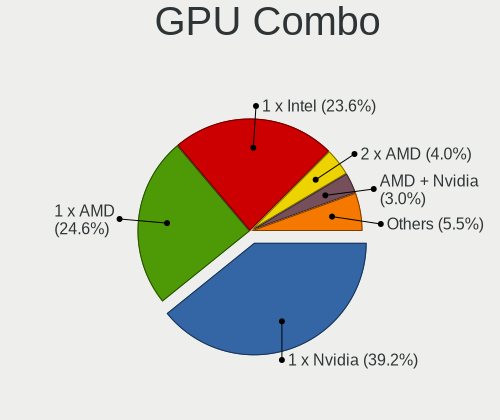

| Name            | Desktops | Percent |
|-----------------|----------|---------|
| 1 x AMD         | 77       | 33.05%  |
| 1 x Nvidia      | 73       | 31.33%  |
| 1 x Intel       | 49       | 21.03%  |
| 1 x ASPEED      | 15       | 6.44%   |
| Intel + Nvidia  | 6        | 2.58%   |
| AMD + Nvidia    | 5        | 2.15%   |
| 2 x AMD         | 4        | 1.72%   |
| Other           | 2        | 0.86%   |
| 1 x Matrox      | 1        | 0.43%   |
| Intel + 2 x AMD | 1        | 0.43%   |

GPU Driver
----------

Free vs proprietary

| Driver      | Desktops | Percent |
|-------------|----------|---------|
| Free        | 158      | 67.81%  |
| Unknown     | 38       | 16.31%  |
| Proprietary | 37       | 15.88%  |

GPU Memory
----------

Total video memory

| Size in GB | Desktops | Percent |
|------------|----------|---------|
| Unknown    | 101      | 43.35%  |
| 1.01-2.0   | 33       | 14.16%  |
| 0.01-0.5   | 28       | 12.02%  |
| 7.01-8.0   | 24       | 10.3%   |
| 3.01-4.0   | 14       | 6.01%   |
| 0.51-1.0   | 14       | 6.01%   |
| 5.01-6.0   | 10       | 4.29%   |
| 8.01-16.0  | 6        | 2.58%   |
| 2.01-3.0   | 2        | 0.86%   |
| 16.01-24.0 | 1        | 0.43%   |

Monitor
-------

Monitor Vendor
--------------

Monitor vendors

| Vendor               | Desktops | Percent |
|----------------------|----------|---------|
| Samsung Electronics  | 33       | 15.87%  |
| Goldstar             | 26       | 12.5%   |
| Acer                 | 20       | 9.62%   |
| Philips              | 19       | 9.13%   |
| BenQ                 | 19       | 9.13%   |
| Dell                 | 14       | 6.73%   |
| AOC                  | 12       | 5.77%   |
| ViewSonic            | 8        | 3.85%   |
| Hewlett-Packard      | 5        | 2.4%    |
| Ancor Communications | 5        | 2.4%    |
| Unknown              | 4        | 1.92%   |
| MSI                  | 4        | 1.92%   |
| RTK                  | 3        | 1.44%   |
| Mi                   | 3        | 1.44%   |
| Iiyama               | 3        | 1.44%   |
| ASUSTek Computer     | 3        | 1.44%   |
| SKG                  | 2        | 0.96%   |
| Packard Bell         | 2        | 0.96%   |
| HUAWEI               | 2        | 0.96%   |
| HHT                  | 2        | 0.96%   |
| ___                  | 1        | 0.48%   |
| Yamaha               | 1        | 0.48%   |
| XYK                  | 1        | 0.48%   |
| XHS                  | 1        | 0.48%   |
| Sony                 | 1        | 0.48%   |
| RGT                  | 1        | 0.48%   |
| OUT                  | 1        | 0.48%   |
| NEC Computers        | 1        | 0.48%   |
| MKD                  | 1        | 0.48%   |
| LG Electronics       | 1        | 0.48%   |
| Lenovo               | 1        | 0.48%   |
| Konka                | 1        | 0.48%   |
| ITE                  | 1        | 0.48%   |
| HannStar             | 1        | 0.48%   |
| Gigabyte Technology  | 1        | 0.48%   |
| Fujitsu Siemens      | 1        | 0.48%   |
| BOE                  | 1        | 0.48%   |
| AVX                  | 1        | 0.48%   |
| Unknown              | 1        | 0.48%   |

Monitor Model
-------------

Monitor models

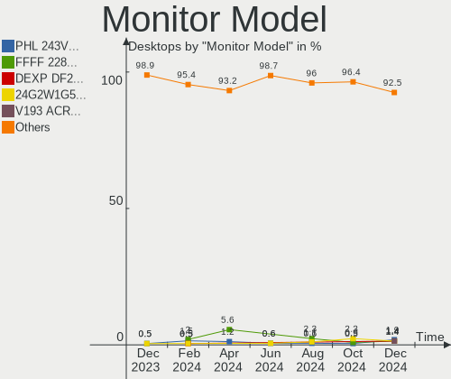

| Model                                                                | Desktops | Percent |
|----------------------------------------------------------------------|----------|---------|
| ViewSonic VA2261 Series VSC0F30 1920x1080 477x268mm 21.5-inch        | 3        | 1.4%    |
| Unknown LCD Monitor FFFF 2288x1287 2550x2550mm 142.0-inch            | 3        | 1.4%    |
| Samsung Electronics SyncMaster SAM01E1 1280x1024 376x301mm 19.0-inch | 3        | 1.4%    |
| RTK HDMI RTK2380 1920x1080 530x290mm 23.8-inch                       | 3        | 1.4%    |
| Philips PHL 223V5 PHLC0CF 1920x1080 477x268mm 21.5-inch              | 3        | 1.4%    |
| Dell S2340L DELD058 1920x1080 509x286mm 23.0-inch                    | 3        | 1.4%    |
| AOC Q27P2W AOC2702 2560x1440 597x336mm 27.0-inch                     | 3        | 1.4%    |
| Acer AL1917 ACRAD73 1280x1024 376x301mm 19.0-inch                    | 3        | 1.4%    |
| Samsung Electronics SyncMaster SAM011E 1280x1024 338x270mm 17.0-inch | 2        | 0.93%   |
| Samsung Electronics C24F390 SAM0D2C 1920x1080 521x293mm 23.5-inch    | 2        | 0.93%   |
| Philips PHL 243V7 PHLC155 1920x1080 530x300mm 24.0-inch              | 2        | 0.93%   |
| Packard Bell Viseo203DX PKB03B1 1600x900 432x240mm 19.5-inch         | 2        | 0.93%   |
| Mi Monitor XMI23C3 1920x1080 527x293mm 23.7-inch                     | 2        | 0.93%   |
| HHT ActivPanel V6 HHT0030 3840x2160 944x398mm 40.3-inch              | 2        | 0.93%   |
| Goldstar W2343 GSM5700 1920x1080 474x296mm 22.0-inch                 | 2        | 0.93%   |
| Goldstar MP59G GSM5B34 1920x1080 480x270mm 21.7-inch                 | 2        | 0.93%   |
| Goldstar L1730S GSM438D 1280x1024 338x270mm 17.0-inch                | 2        | 0.93%   |
| Dell U2412M DELA07A 1920x1200 518x324mm 24.1-inch                    | 2        | 0.93%   |
| BenQ SW270C BNQ7F74 2560x1440 600x340mm 27.2-inch                    | 2        | 0.93%   |
| BenQ GW2270 BNQ78DB 1920x1080 476x268mm 21.5-inch                    | 2        | 0.93%   |
| BenQ GL2780 BNQ78EC 1920x1080 598x336mm 27.0-inch                    | 2        | 0.93%   |
| BenQ G2220HD BNQ7821 1920x1080 477x268mm 21.5-inch                   | 2        | 0.93%   |
| Acer V226HQL ACR0335 1920x1080 477x268mm 21.5-inch                   | 2        | 0.93%   |
| ___ LCD TV ___9000 1360x768                                          | 1        | 0.47%   |
| Yamaha RX-V477 YMH31A8 1920x540                                      | 1        | 0.47%   |
| XYK 21.5 XYK2150 1920x1080 477x268mm 21.5-inch                       | 1        | 0.47%   |
| XHS N221 XHSA215 1920x1080 480x260mm 21.5-inch                       | 1        | 0.47%   |
| ViewSonic XG270QG VSCF838 2560x1440 608x355mm 27.7-inch              | 1        | 0.47%   |
| ViewSonic VP2765 SERIES VSC9F28 1920x1080 600x340mm 27.2-inch        | 1        | 0.47%   |
| ViewSonic VG2030wm VSCA51E 1680x1050 433x270mm 20.1-inch             | 1        | 0.47%   |
| ViewSonic VA2407 Series VSC8C31 1920x1080 521x293mm 23.5-inch        | 1        | 0.47%   |
| ViewSonic VA2246 SERIES VSC6F2E 1920x1080 480x270mm 21.7-inch        | 1        | 0.47%   |
| ViewSonic VA1912w-4 VSC711C 1440x900 410x260mm 19.1-inch             | 1        | 0.47%   |
| Unknown LCDTV16 9000 1360x768 1600x900mm 72.3-inch                   | 1        | 0.47%   |
| Sony TV SNYC901 1920x1080                                            | 1        | 0.47%   |
| SKG DEXP DF24H1 SKG2413 1920x1080 597x336mm 27.0-inch                | 1        | 0.47%   |
| SKG AF27H1 SKG2722 1920x1080 600x330mm 27.0-inch                     | 1        | 0.47%   |
| Samsung Electronics U32J59x SAM0F52 3840x2160 697x392mm 31.5-inch    | 1        | 0.47%   |
| Samsung Electronics U28E590 SAM0C4E 3840x2160 608x345mm 27.5-inch    | 1        | 0.47%   |
| Samsung Electronics SyncMaster SAM0594 1680x1050 459x296mm 21.5-inch | 1        | 0.47%   |

Monitor Resolution
------------------

Monitor screen resolution

| Resolution         | Desktops | Percent |
|--------------------|----------|---------|
| 1920x1080 (FHD)    | 97       | 47.32%  |
| 1280x1024 (SXGA)   | 23       | 11.22%  |
| 3840x2160 (4K)     | 17       | 8.29%   |
| 2560x1440 (QHD)    | 17       | 8.29%   |
| 1680x1050 (WSXGA+) | 10       | 4.88%   |
| 1920x1200 (WUXGA)  | 7        | 3.41%   |
| 1366x768 (WXGA)    | 6        | 2.93%   |
| 3440x1440          | 5        | 2.44%   |
| 1600x900 (HD+)     | 5        | 2.44%   |
| 1440x900 (WXGA+)   | 5        | 2.44%   |
| 2288x1287          | 3        | 1.46%   |
| 1360x768           | 3        | 1.46%   |
| 2560x1080          | 2        | 0.98%   |
| 4480x1440          | 1        | 0.49%   |
| 1920x540           | 1        | 0.49%   |
| 1400x1050          | 1        | 0.49%   |
| 1280x720 (HD)      | 1        | 0.49%   |
| Unknown            | 1        | 0.49%   |

Monitor Diagonal
----------------

Diagonal size in inches

| Inches  | Desktops | Percent |
|---------|----------|---------|
| 21      | 37       | 17.7%   |
| 23      | 30       | 14.35%  |
| 27      | 27       | 12.92%  |
| 24      | 27       | 12.92%  |
| 19      | 21       | 10.05%  |
| 31      | 10       | 4.78%   |
| 17      | 9        | 4.31%   |
| 20      | 7        | 3.35%   |
| Unknown | 7        | 3.35%   |
| 34      | 6        | 2.87%   |
| 18      | 6        | 2.87%   |
| 22      | 4        | 1.91%   |
| 142     | 3        | 1.44%   |
| 72      | 3        | 1.44%   |
| 40      | 2        | 0.96%   |
| 54      | 1        | 0.48%   |
| 52      | 1        | 0.48%   |
| 46      | 1        | 0.48%   |
| 39      | 1        | 0.48%   |
| 33      | 1        | 0.48%   |
| 32      | 1        | 0.48%   |
| 28      | 1        | 0.48%   |
| 25      | 1        | 0.48%   |
| 16      | 1        | 0.48%   |
| 15      | 1        | 0.48%   |

Monitor Width
-------------

Physical width

| Width in mm    | Desktops | Percent |
|----------------|----------|---------|
| 501-600        | 79       | 38.35%  |
| 401-500        | 61       | 29.61%  |
| 351-400        | 16       | 7.77%   |
| 601-700        | 13       | 6.31%   |
| 301-350        | 10       | 4.85%   |
| 701-800        | 8        | 3.88%   |
| Unknown        | 7        | 3.4%    |
| More than 2000 | 3        | 1.46%   |
| 1501-2000      | 3        | 1.46%   |
| 1001-1500      | 3        | 1.46%   |
| 901-1000       | 2        | 0.97%   |
| 801-900        | 1        | 0.49%   |

Aspect Ratio
------------

Proportional relationship between the width and the height

| Ratio   | Desktops | Percent |
|---------|----------|---------|
| 16/9    | 132      | 67.01%  |
| 5/4     | 24       | 12.18%  |
| 16/10   | 22       | 11.17%  |
| 21/9    | 8        | 4.06%   |
| Unknown | 6        | 3.05%   |
| 1.00    | 3        | 1.52%   |
| 4/3     | 1        | 0.51%   |
| 3/2     | 1        | 0.51%   |

Monitor Area
------------

Area in inch

| Area in inch | Desktops | Percent |
|----------------|----------|---------|
| 201-250        | 80       | 38.65%  |
| 151-200        | 36       | 17.39%  |
| 301-350        | 27       | 13.04%  |
| 351-500        | 19       | 9.18%   |
| 141-150        | 14       | 6.76%   |
| 251-300        | 10       | 4.83%   |
| More than 1000 | 8        | 3.86%   |
| Unknown        | 7        | 3.38%   |
| 501-1000       | 4        | 1.93%   |
| 111-120        | 1        | 0.48%   |
| 101-110        | 1        | 0.48%   |

Pixel Density
-------------

Pixels per inch

| Density | Desktops | Percent |
|---------|----------|---------|
| 51-100  | 127      | 63.18%  |
| 101-120 | 51       | 25.37%  |
| 1-50    | 9        | 4.48%   |
| Unknown | 7        | 3.48%   |
| 121-160 | 4        | 1.99%   |
| 161-240 | 3        | 1.49%   |

Multiple Monitors
-----------------

Total monitors connected

| Total | Desktops | Percent |
|-------|----------|---------|
| 1     | 166      | 71.24%  |
| 0     | 38       | 16.31%  |
| 2     | 27       | 11.59%  |
| 3     | 2        | 0.86%   |

Network
-------

Net Controller Vendor
---------------------

Controller vendors

| Vendor                           | Desktops | Percent |
|----------------------------------|----------|---------|
| Realtek Semiconductor            | 165      | 54.82%  |
| Intel                            | 75       | 24.92%  |
| Qualcomm Atheros                 | 10       | 3.32%   |
| MediaTek                         | 10       | 3.32%   |
| Ralink Technology                | 9        | 2.99%   |
| TP-Link                          | 4        | 1.33%   |
| Nvidia                           | 4        | 1.33%   |
| Ralink                           | 3        | 1%      |
| Xiaomi                           | 2        | 0.66%   |
| VIA Technologies                 | 2        | 0.66%   |
| Samsung Electronics              | 2        | 0.66%   |
| Marvell Technology Group         | 2        | 0.66%   |
| D-Link                           | 2        | 0.66%   |
| Broadcom                         | 2        | 0.66%   |
| ZTE WCDMA Technologies MSM       | 1        | 0.33%   |
| Vimtron Electronics              | 1        | 0.33%   |
| Silicon Integrated Systems [SiS] | 1        | 0.33%   |
| QinHeng Electronics              | 1        | 0.33%   |
| OPPO Electronics                 | 1        | 0.33%   |
| Mercucys                         | 1        | 0.33%   |
| Huawei Technologies              | 1        | 0.33%   |
| HMD Global                       | 1        | 0.33%   |
| ASUSTek Computer                 | 1        | 0.33%   |

Net Controller Model
--------------------

Controller models

| Model                                                             | Desktops | Percent |
|-------------------------------------------------------------------|----------|---------|
| Realtek RTL8111/8168/8411 PCI Express Gigabit Ethernet Controller | 135      | 41.03%  |
| Realtek RTL8125 2.5GbE Controller                                 | 12       | 3.65%   |
| Intel I350 Gigabit Network Connection                             | 11       | 3.34%   |
| Ralink MT7601U Wireless Adapter                                   | 9        | 2.74%   |
| Intel Ethernet Connection (14) I219-V                             | 9        | 2.74%   |
| MediaTek MT7921K (RZ608) Wi-Fi 6E 80MHz                           | 8        | 2.43%   |
| Intel Wi-Fi 6 AX200                                               | 7        | 2.13%   |
| Intel I211 Gigabit Network Connection                             | 7        | 2.13%   |
| Intel Ethernet Connection (7) I219-V                              | 6        | 1.82%   |
| Intel Ethernet Connection (2) I219-V                              | 6        | 1.82%   |
| Realtek RTL810xE PCI Express Fast Ethernet controller             | 5        | 1.52%   |
| Realtek 802.11ac NIC                                              | 5        | 1.52%   |
| Intel Ethernet Controller I225-V                                  | 4        | 1.22%   |
| Realtek RTL8188EUS 802.11n Wireless Network Adapter               | 3        | 0.91%   |
| Realtek RTL8188CE 802.11b/g/n WiFi Adapter                        | 3        | 0.91%   |
| Realtek RTL-8100/8101L/8139 PCI Fast Ethernet Adapter             | 3        | 0.91%   |
| Nvidia MCP61 Ethernet                                             | 3        | 0.91%   |
| Intel Wireless 7265                                               | 3        | 0.91%   |
| Intel I210 Gigabit Network Connection                             | 3        | 0.91%   |
| Intel Cannon Lake PCH CNVi WiFi                                   | 3        | 0.91%   |
| VIA VT6105/VT6106S [Rhine-III]                                    | 2        | 0.61%   |
| TP-Link AC600 wireless Realtek RTL8811AU [Archer T2U Nano]        | 2        | 0.61%   |
| Realtek RTL8822CE 802.11ac PCIe Wireless Network Adapter          | 2        | 0.61%   |
| Realtek RTL8821CE 802.11ac PCIe Wireless Network Adapter          | 2        | 0.61%   |
| Realtek RTL8152 Fast Ethernet Adapter                             | 2        | 0.61%   |
| Realtek RTL-8029(AS)                                              | 2        | 0.61%   |
| Ralink RT5390 Wireless 802.11n 1T/1R PCIe                         | 2        | 0.61%   |
| Qualcomm Atheros AR8151 v2.0 Gigabit Ethernet                     | 2        | 0.61%   |
| Qualcomm Atheros AR8151 v1.0 Gigabit Ethernet                     | 2        | 0.61%   |
| Qualcomm Atheros AR5212/5213/2414 Wireless Network Adapter        | 2        | 0.61%   |
| Marvell Group 88E8056 PCI-E Gigabit Ethernet Controller           | 2        | 0.61%   |
| Intel Wi-Fi 6 AX210/AX211/AX411 160MHz                            | 2        | 0.61%   |
| Intel Ethernet Controller I226-V                                  | 2        | 0.61%   |
| Intel Ethernet Controller 10-Gigabit X540-AT2                     | 2        | 0.61%   |
| Intel Ethernet Connection I217-V                                  | 2        | 0.61%   |
| Intel Ethernet Connection (17) I219-V                             | 2        | 0.61%   |
| ZTE WCDMA MSM DEMO Mobile Boardband                               | 1        | 0.3%    |
| Xiaomi Mi/Redmi series (RNDIS)                                    | 1        | 0.3%    |
| Xiaomi MediaTek MT7601U [MI WiFi]                                 | 1        | 0.3%    |
| Vimtron Mobile Composite Device Bus                               | 1        | 0.3%    |

Wireless Vendor
---------------

Wireless vendors

| Vendor                | Desktops | Percent |
|-----------------------|----------|---------|
| Intel                 | 23       | 29.49%  |
| Realtek Semiconductor | 20       | 25.64%  |
| MediaTek              | 10       | 12.82%  |
| Ralink Technology     | 9        | 11.54%  |
| TP-Link               | 4        | 5.13%   |
| Ralink                | 3        | 3.85%   |
| Qualcomm Atheros      | 3        | 3.85%   |
| D-Link                | 2        | 2.56%   |
| Xiaomi                | 1        | 1.28%   |
| Mercucys              | 1        | 1.28%   |
| Broadcom              | 1        | 1.28%   |
| ASUSTek Computer      | 1        | 1.28%   |

Wireless Model
--------------

Wireless models

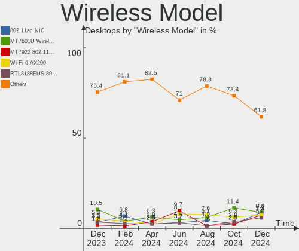

| Model                                                                         | Desktops | Percent |
|-------------------------------------------------------------------------------|----------|---------|
| Ralink MT7601U Wireless Adapter                                               | 9        | 11.54%  |
| MediaTek MT7921K (RZ608) Wi-Fi 6E 80MHz                                       | 8        | 10.26%  |
| Intel Wi-Fi 6 AX200                                                           | 7        | 8.97%   |
| Realtek 802.11ac NIC                                                          | 5        | 6.41%   |
| Realtek RTL8188EUS 802.11n Wireless Network Adapter                           | 3        | 3.85%   |
| Realtek RTL8188CE 802.11b/g/n WiFi Adapter                                    | 3        | 3.85%   |
| Intel Wireless 7265                                                           | 3        | 3.85%   |
| Intel Cannon Lake PCH CNVi WiFi                                               | 3        | 3.85%   |
| TP-Link AC600 wireless Realtek RTL8811AU [Archer T2U Nano]                    | 2        | 2.56%   |
| Realtek RTL8822CE 802.11ac PCIe Wireless Network Adapter                      | 2        | 2.56%   |
| Realtek RTL8821CE 802.11ac PCIe Wireless Network Adapter                      | 2        | 2.56%   |
| Ralink RT5390 Wireless 802.11n 1T/1R PCIe                                     | 2        | 2.56%   |
| Qualcomm Atheros AR5212/5213/2414 Wireless Network Adapter                    | 2        | 2.56%   |
| Intel Wi-Fi 6 AX210/AX211/AX411 160MHz                                        | 2        | 2.56%   |
| Xiaomi MediaTek MT7601U [MI WiFi]                                             | 1        | 1.28%   |
| TP-Link Archer T2U PLUS [RTL8821AU]                                           | 1        | 1.28%   |
| TP-Link 802.11ac NIC                                                          | 1        | 1.28%   |
| Realtek RTL8852BE PCIe 802.11ax Wireless Network Controller                   | 1        | 1.28%   |
| Realtek RTL8192EU 802.11b/g/n WLAN Adapter                                    | 1        | 1.28%   |
| Realtek RTL8192EE PCIe Wireless Network Adapter                               | 1        | 1.28%   |
| Realtek RTL8188FTV 802.11b/g/n 1T1R 2.4G WLAN Adapter                         | 1        | 1.28%   |
| Realtek RTL8188EE Wireless Network Adapter                                    | 1        | 1.28%   |
| Ralink RT3060 Wireless 802.11n 1T/1R                                          | 1        | 1.28%   |
| Qualcomm Atheros AR2413/AR2414 Wireless Network Adapter [AR5005G(S) 802.11bg] | 1        | 1.28%   |
| Mercucys 802.11n NIC                                                          | 1        | 1.28%   |
| MediaTek MT7922 802.11ax PCI Express Wireless Network Adapter                 | 1        | 1.28%   |
| MediaTek MT7921 802.11ax PCI Express Wireless Network Adapter                 | 1        | 1.28%   |
| Intel Wireless-AC 9260                                                        | 1        | 1.28%   |
| Intel Wireless 8260                                                           | 1        | 1.28%   |
| Intel Wireless 7260                                                           | 1        | 1.28%   |
| Intel Wireless 3165                                                           | 1        | 1.28%   |
| Intel Wireless 3160                                                           | 1        | 1.28%   |
| Intel Dual Band Wireless-AC 3165 Plus Bluetooth                               | 1        | 1.28%   |
| Intel Centrino Wireless-N 2230                                                | 1        | 1.28%   |
| Intel 700 Series Chipset Family Wi-Fi                                         | 1        | 1.28%   |
| D-Link DWA-140 RangeBooster N Adapter(rev.B3) [Ralink RT5372]                 | 1        | 1.28%   |
| D-Link 802.11 n WLAN                                                          | 1        | 1.28%   |
| Broadcom BCM4360 802.11ac Dual Band Wireless Network Adapter                  | 1        | 1.28%   |
| ASUS USB-AC56 802.11a/b/g/n/ac Wireless Adapter [Realtek RTL8812AU]           | 1        | 1.28%   |

Ethernet Vendor
---------------

Ethernet vendors

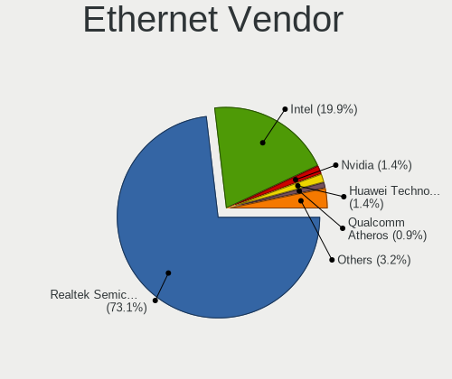

| Vendor                           | Desktops | Percent |
|----------------------------------|----------|---------|
| Realtek Semiconductor            | 159      | 65.16%  |
| Intel                            | 60       | 24.59%  |
| Qualcomm Atheros                 | 7        | 2.87%   |
| Nvidia                           | 4        | 1.64%   |
| VIA Technologies                 | 2        | 0.82%   |
| Samsung Electronics              | 2        | 0.82%   |
| Marvell Technology Group         | 2        | 0.82%   |
| ZTE WCDMA Technologies MSM       | 1        | 0.41%   |
| Xiaomi                           | 1        | 0.41%   |
| Vimtron Electronics              | 1        | 0.41%   |
| Silicon Integrated Systems [SiS] | 1        | 0.41%   |
| OPPO Electronics                 | 1        | 0.41%   |
| Huawei Technologies              | 1        | 0.41%   |
| HMD Global                       | 1        | 0.41%   |
| Broadcom                         | 1        | 0.41%   |

Ethernet Model
--------------

Ethernet models

| Model                                                             | Desktops | Percent |
|-------------------------------------------------------------------|----------|---------|
| Realtek RTL8111/8168/8411 PCI Express Gigabit Ethernet Controller | 135      | 54%     |
| Realtek RTL8125 2.5GbE Controller                                 | 12       | 4.8%    |
| Intel I350 Gigabit Network Connection                             | 11       | 4.4%    |
| Intel Ethernet Connection (14) I219-V                             | 9        | 3.6%    |
| Intel I211 Gigabit Network Connection                             | 7        | 2.8%    |
| Intel Ethernet Connection (7) I219-V                              | 6        | 2.4%    |
| Intel Ethernet Connection (2) I219-V                              | 6        | 2.4%    |
| Realtek RTL810xE PCI Express Fast Ethernet controller             | 5        | 2%      |
| Intel Ethernet Controller I225-V                                  | 4        | 1.6%    |
| Realtek RTL-8100/8101L/8139 PCI Fast Ethernet Adapter             | 3        | 1.2%    |
| Nvidia MCP61 Ethernet                                             | 3        | 1.2%    |
| Intel I210 Gigabit Network Connection                             | 3        | 1.2%    |
| VIA VT6105/VT6106S [Rhine-III]                                    | 2        | 0.8%    |
| Realtek RTL8152 Fast Ethernet Adapter                             | 2        | 0.8%    |
| Realtek RTL-8029(AS)                                              | 2        | 0.8%    |
| Qualcomm Atheros AR8151 v2.0 Gigabit Ethernet                     | 2        | 0.8%    |
| Qualcomm Atheros AR8151 v1.0 Gigabit Ethernet                     | 2        | 0.8%    |
| Marvell Group 88E8056 PCI-E Gigabit Ethernet Controller           | 2        | 0.8%    |
| Intel Ethernet Controller I226-V                                  | 2        | 0.8%    |
| Intel Ethernet Controller 10-Gigabit X540-AT2                     | 2        | 0.8%    |
| Intel Ethernet Connection I217-V                                  | 2        | 0.8%    |
| Intel Ethernet Connection (17) I219-V                             | 2        | 0.8%    |
| ZTE WCDMA MSM DEMO Mobile Boardband                               | 1        | 0.4%    |
| Xiaomi Mi/Redmi series (RNDIS)                                    | 1        | 0.4%    |
| Vimtron Mobile Composite Device Bus                               | 1        | 0.4%    |
| Silicon Integrated Systems [SiS] SiS900 PCI Fast Ethernet         | 1        | 0.4%    |
| Samsung GT-I9070 (network tethering, USB debugging enabled)       | 1        | 0.4%    |
| Samsung Galaxy series, misc. (tethering mode)                     | 1        | 0.4%    |
| Realtek RTL8169 PCI Gigabit Ethernet Controller                   | 1        | 0.4%    |
| Realtek RTL-8110SC/8169SC Gigabit Ethernet                        | 1        | 0.4%    |
| Realtek Killer E3000 2.5GbE Controller                            | 1        | 0.4%    |
| Realtek Killer E2600 Gigabit Ethernet Controller                  | 1        | 0.4%    |
| Qualcomm Atheros Attansic L1 Gigabit Ethernet                     | 1        | 0.4%    |
| Qualcomm Atheros AR8131 Gigabit Ethernet                          | 1        | 0.4%    |
| Qualcomm Atheros AR8121/AR8113/AR8114 Gigabit or Fast Ethernet    | 1        | 0.4%    |
| OPPO RMX2027                                                      | 1        | 0.4%    |
| Nvidia CK804 Ethernet Controller                                  | 1        | 0.4%    |
| Intel NM10/ICH7 Family LAN Controller                             | 1        | 0.4%    |
| Intel Ethernet Connection I219-V                                  | 1        | 0.4%    |
| Intel Ethernet Connection I219-LM                                 | 1        | 0.4%    |

Net Controller Kind
-------------------

Ethernet, WiFi or modem

| Kind     | Desktops | Percent |
|----------|----------|---------|
| Ethernet | 231      | 75.49%  |
| WiFi     | 74       | 24.18%  |
| Modem    | 1        | 0.33%   |

Used Controller
---------------

Currently used network controller

| Kind     | Desktops | Percent |
|----------|----------|---------|
| Ethernet | 183      | 79.22%  |
| WiFi     | 48       | 20.78%  |

NICs
----

Total network controllers on board

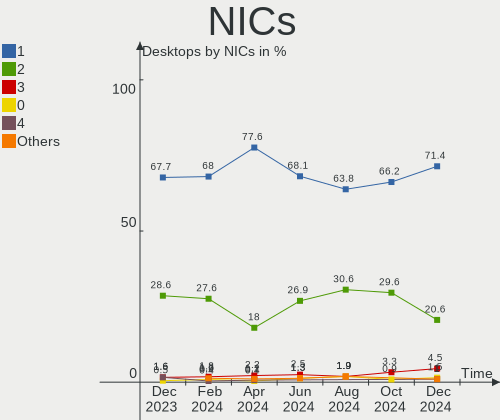

| Total | Desktops | Percent |
|-------|----------|---------|
| 1     | 156      | 66.95%  |
| 2     | 71       | 30.47%  |
| 4     | 2        | 0.86%   |
| 3     | 2        | 0.86%   |
| 6     | 1        | 0.43%   |
| 0     | 1        | 0.43%   |

IPv6
----

IPv6 vs IPv4

| Used | Desktops | Percent |
|------|----------|---------|
| No   | 225      | 96.57%  |
| Yes  | 8        | 3.43%   |

Bluetooth
---------

Bluetooth Vendor
----------------

Controller vendors

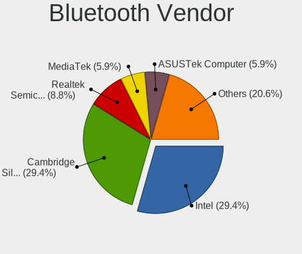

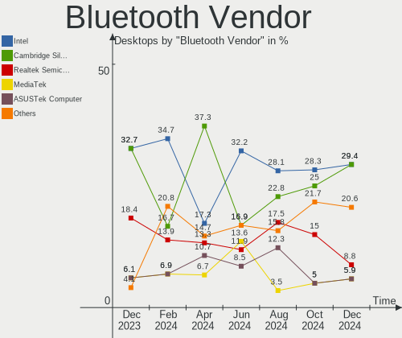

| Vendor                     | Desktops | Percent |
|----------------------------|----------|---------|
| Intel                      | 20       | 31.75%  |
| Cambridge Silicon Radio    | 14       | 22.22%  |
| Realtek Semiconductor      | 10       | 15.87%  |
| MediaTek                   | 10       | 15.87%  |
| TP-Link                    | 3        | 4.76%   |
| Broadcom                   | 3        | 4.76%   |
| Realtek                    | 1        | 1.59%   |
| Integrated System Solution | 1        | 1.59%   |
| IMC Networks               | 1        | 1.59%   |

Bluetooth Model
---------------

Controller models

| Model                                               | Desktops | Percent |
|-----------------------------------------------------|----------|---------|
| Cambridge Silicon Radio Bluetooth Dongle (HCI mode) | 14       | 22.22%  |
| Realtek Bluetooth Radio                             | 10       | 15.87%  |
| MediaTek Wireless_Device                            | 10       | 15.87%  |
| Intel AX200 Bluetooth                               | 8        | 12.7%   |
| Intel Bluetooth wireless interface                  | 6        | 9.52%   |
| TP-Link UB500 Adapter                               | 3        | 4.76%   |
| Intel Bluetooth 9460/9560 Jefferson Peak (JfP)      | 3        | 4.76%   |
| Realtek Bluetooth Radio                             | 1        | 1.59%   |
| Intel Centrino Bluetooth Wireless Transceiver       | 1        | 1.59%   |
| Intel Bluetooth Device                              | 1        | 1.59%   |
| Intel AX210 Bluetooth                               | 1        | 1.59%   |
| Integrated System Solution Bluetooth Device         | 1        | 1.59%   |
| IMC Networks Wireless_Device                        | 1        | 1.59%   |
| Broadcom BCM920702 Bluetooth 4.0 Zero Touch Dongle  | 1        | 1.59%   |
| Broadcom BCM20702A0 Bluetooth 4.0                   | 1        | 1.59%   |
| Broadcom BCM2045 Bluetooth                          | 1        | 1.59%   |

Sound
-----

Sound Vendor
------------

Sound card vendors

| Vendor                                       | Desktops | Percent |
|----------------------------------------------|----------|---------|
| Intel                                        | 128      | 36.78%  |
| AMD                                          | 98       | 28.16%  |
| Nvidia                                       | 80       | 22.99%  |
| Creative Labs                                | 5        | 1.44%   |
| Generalplus Technology                       | 4        | 1.15%   |
| C-Media Electronics                          | 4        | 1.15%   |
| Micro Star International                     | 3        | 0.86%   |
| Texas Instruments                            | 2        | 0.57%   |
| Silicon Integrated Systems [SiS]             | 2        | 0.57%   |
| Razer USA                                    | 2        | 0.57%   |
| Logitech                                     | 2        | 0.57%   |
| KTMicro                                      | 2        | 0.57%   |
| JMTek                                        | 2        | 0.57%   |
| Zoran Co. Personal Media Division (Nogatech) | 1        | 0.29%   |
| Yealink Network Technology                   | 1        | 0.29%   |
| SteelSeries ApS                              | 1        | 0.29%   |
| Shenzhen Riitek Technology                   | 1        | 0.29%   |
| Sennheiser Communications                    | 1        | 0.29%   |
| Lenovo                                       | 1        | 0.29%   |
| JBL                                          | 1        | 0.29%   |
| FiiO Electronics Technology                  | 1        | 0.29%   |
| EGO SYStems                                  | 1        | 0.29%   |
| Creative Technology                          | 1        | 0.29%   |
| BEHRINGER International                      | 1        | 0.29%   |
| ATI Technologies                             | 1        | 0.29%   |
| ASUSTek Computer                             | 1        | 0.29%   |
| Unknown                                      | 1        | 0.29%   |

Sound Model
-----------

Sound card models

| Model                                                                      | Desktops | Percent |
|----------------------------------------------------------------------------|----------|---------|
| AMD Family 17h/19h HD Audio Controller                                     | 30       | 7.21%   |
| AMD SBx00 Azalia (Intel HDA)                                               | 16       | 3.85%   |
| AMD Renoir Radeon High Definition Audio Controller                         | 16       | 3.85%   |
| AMD Starship/Matisse HD Audio Controller                                   | 15       | 3.61%   |
| Intel Smart Sound Technology (SST) Audio Controller                        | 14       | 3.37%   |
| Intel NM10/ICH7 Family High Definition Audio Controller                    | 13       | 3.13%   |
| AMD Navi 21/23 HDMI/DP Audio Controller                                    | 11       | 2.64%   |
| Intel 8 Series/C220 Series Chipset High Definition Audio Controller        | 10       | 2.4%    |
| Intel 6 Series/C200 Series Chipset Family High Definition Audio Controller | 10       | 2.4%    |
| AMD Ellesmere HDMI Audio [Radeon RX 470/480 / 570/580/590]                 | 10       | 2.4%    |
| AMD Family 17h (Models 00h-0fh) HD Audio Controller                        | 9        | 2.16%   |
| Nvidia TU116 High Definition Audio Controller                              | 8        | 1.92%   |
| Intel Cannon Lake PCH cAVS                                                 | 8        | 1.92%   |
| Intel 82801JI (ICH10 Family) HD Audio Controller                           | 8        | 1.92%   |
| Intel 7 Series/C216 Chipset Family High Definition Audio Controller        | 8        | 1.92%   |
| Intel 200 Series PCH HD Audio                                              | 8        | 1.92%   |
| Intel 100 Series/C230 Series Chipset Family HD Audio Controller            | 8        | 1.92%   |
| Intel Xeon E3-1200 v3/4th Gen Core Processor HD Audio Controller           | 7        | 1.68%   |
| AMD Raven/Raven2/Fenghuang HDMI/DP Audio Controller                        | 7        | 1.68%   |
| AMD Oland/Hainan/Cape Verde/Pitcairn HDMI Audio [Radeon HD 7000 Series]    | 7        | 1.68%   |
| Nvidia GP107GL High Definition Audio Controller                            | 6        | 1.44%   |
| AMD Baffin HDMI/DP Audio [Radeon RX 550 640SP / RX 560/560X]               | 6        | 1.44%   |
| Nvidia GP104 High Definition Audio Controller                              | 5        | 1.2%    |
| Nvidia GA104 High Definition Audio Controller                              | 5        | 1.2%    |
| Intel C610/X99 series chipset HD Audio Controller                          | 5        | 1.2%    |
| Intel Alder Lake-S HD Audio Controller                                     | 5        | 1.2%    |
| AMD Rembrandt Radeon High Definition Audio Controller                      | 5        | 1.2%    |
| Nvidia TU104 HD Audio Controller                                           | 4        | 0.96%   |
| Nvidia GP108 High Definition Audio Controller                              | 4        | 0.96%   |
| Nvidia GP106 High Definition Audio Controller                              | 4        | 0.96%   |
| Nvidia GM107 High Definition Audio Controller [GeForce 940MX]              | 4        | 0.96%   |
| Nvidia GK208 HDMI/DP Audio Controller                                      | 4        | 0.96%   |
| Nvidia GA106 High Definition Audio Controller                              | 4        | 0.96%   |
| Intel 82801I (ICH9 Family) HD Audio Controller                             | 4        | 0.96%   |
| Intel 5 Series/3400 Series Chipset High Definition Audio                   | 4        | 0.96%   |
| Generalplus Technology USB Audio Device                                    | 4        | 0.96%   |
| AMD FCH Azalia Controller                                                  | 4        | 0.96%   |
| Nvidia MCP61 High Definition Audio                                         | 3        | 0.72%   |
| Nvidia High Definition Audio Controller                                    | 3        | 0.72%   |
| Nvidia GF119 HDMI Audio Controller                                         | 3        | 0.72%   |

Memory
------

Memory Vendor
-------------

Memory module vendors

| Vendor                             | Desktops | Percent |
|------------------------------------|----------|---------|
| Kingston                           | 47       | 20.61%  |
| Unknown                            | 46       | 20.18%  |
| Crucial                            | 23       | 10.09%  |
| Samsung Electronics                | 20       | 8.77%   |
| Micron Technology                  | 13       | 5.7%    |
| AMD                                | 13       | 5.7%    |
| Corsair                            | 8        | 3.51%   |
| Unknown                            | 8        | 3.51%   |
| A-DATA Technology                  | 7        | 3.07%   |
| Apacer                             | 6        | 2.63%   |
| Patriot                            | 5        | 2.19%   |
| G.Skill                            | 5        | 2.19%   |
| SK hynix                           | 4        | 1.75%   |
| Unknown (ABCD)                     | 2        | 0.88%   |
| Unknown (0x7FFF)                   | 2        | 0.88%   |
| Unknown (0x1636)                   | 2        | 0.88%   |
| Silicon Power                      | 2        | 0.88%   |
| KingSpec                           | 2        | 0.88%   |
| Unknown (8AD6)                     | 1        | 0.44%   |
| Unknown (0x0B85)                   | 1        | 0.44%   |
| Unknown (09D5)                     | 1        | 0.44%   |
| Transcend                          | 1        | 0.44%   |
| Qimonda                            | 1        | 0.44%   |
| Patriot Memory                     | 1        | 0.44%   |
| Kingmax                            | 1        | 0.44%   |
| Kimtigo Semiconductor (HK) Limited | 1        | 0.44%   |
| Gigabyte Technology                | 1        | 0.44%   |
| GeIL                               | 1        | 0.44%   |
| Foxline                            | 1        | 0.44%   |
| Elpida                             | 1        | 0.44%   |
| Atermiter                          | 1        | 0.44%   |

Memory Model
------------

Memory module models

| Model                                                           | Desktops | Percent |
|-----------------------------------------------------------------|----------|---------|
| Unknown                                                         | 8        | 3.28%   |
| Unknown RAM Module 2GB DIMM DDR2 800MT/s                        | 6        | 2.46%   |
| Micron RAM 36ASF4G72PZ-2G3B1 32GB DIMM DDR4 2400MT/s            | 6        | 2.46%   |
| Unknown RAM Module 4GB DIMM 1333MT/s                            | 4        | 1.64%   |
| Unknown RAM Module 2GB DIMM SDRAM                               | 4        | 1.64%   |
| Kingston RAM KF3200C16D4/8GX 8GB DIMM DDR4 3600MT/s             | 4        | 1.64%   |
| Kingston RAM 9965596-004.B00G 4GB DIMM DDR4 2133MT/s            | 4        | 1.64%   |
| Micron RAM 9ASF51272PZ-2G3B1 4GB DIMM DDR4 2400MT/s             | 3        | 1.23%   |
| Unknown RAM Module 4GB DIMM DDR3 1333MT/s                       | 2        | 0.82%   |
| Unknown RAM Module 4GB DIMM 1600MT/s                            | 2        | 0.82%   |
| Unknown RAM Module 2GB DIMM DDR 1333MT/s                        | 2        | 0.82%   |
| Unknown RAM Module 2GB DIMM 400MT/s                             | 2        | 0.82%   |
| Unknown RAM Module 1GB DIMM 667MT/s                             | 2        | 0.82%   |
| Unknown RAM Module 1GB DIMM                                     | 2        | 0.82%   |
| Unknown (ABCD) RAM 123456789012345678 2GB DIMM LPDDR4 2400MT/s  | 2        | 0.82%   |
| Unknown (0x7FFF) RAM GRAVITON 8GB-288P01 8GB DIMM DDR4 2667MT/s | 2        | 0.82%   |
| Unknown (0x1636) RAM 6.6.6 16GB DIMM DDR4 2667MT/s              | 2        | 0.82%   |
| Samsung RAM M471A2K43EB1-CWE 16GB SODIMM DDR4 3200MT/s          | 2        | 0.82%   |
| Samsung RAM M386A4G40DM1-CRC 32GB DIMM DDR4 2400MT/s            | 2        | 0.82%   |
| Kingston RAM KHX3466C16D4/8GX 8GB DIMM DDR4 3466MT/s            | 2        | 0.82%   |
| Kingston RAM KHX3200C16D4/16GX 16GB DIMM DDR4 3600MT/s          | 2        | 0.82%   |
| Kingston RAM 9965596-004.B01G 4GB DIMM DDR4 2133MT/s            | 2        | 0.82%   |
| AMD RAM R7S48G2606U2S 8GB DIMM DDR4 3133MT/s                    | 2        | 0.82%   |
| AMD RAM R748G2606U2S 8GB DIMM DDR4 3200MT/s                     | 2        | 0.82%   |
| Unknown RAM Module 8GB SODIMM DDR4 2133MT/s                     | 1        | 0.41%   |
| Unknown RAM Module 8GB DIMM DDR3 1600MT/s                       | 1        | 0.41%   |
| Unknown RAM Module 8GB DIMM DDR3 1333MT/s                       | 1        | 0.41%   |
| Unknown RAM Module 512MB DIMM 400MT/s                           | 1        | 0.41%   |
| Unknown RAM Module 4GB DIMM SDRAM 533MT/s                       | 1        | 0.41%   |
| Unknown RAM Module 4GB DIMM SDRAM                               | 1        | 0.41%   |
| Unknown RAM Module 4GB DIMM 800MT/s                             | 1        | 0.41%   |
| Unknown RAM Module 2GB DIMM SDRAM 667MT/s                       | 1        | 0.41%   |
| Unknown RAM Module 2GB DIMM SDRAM 533MT/s                       | 1        | 0.41%   |
| Unknown RAM Module 2GB DIMM DDR2 667MT/s                        | 1        | 0.41%   |
| Unknown RAM Module 2GB DIMM 800MT/s                             | 1        | 0.41%   |
| Unknown RAM Module 2GB DIMM 1333MT/s                            | 1        | 0.41%   |
| Unknown RAM Module 2GB DIMM 1066MT/s                            | 1        | 0.41%   |
| Unknown RAM Module 2GB DIMM                                     | 1        | 0.41%   |
| Unknown RAM Module 256MB DIMM SDRAM                             | 1        | 0.41%   |
| Unknown RAM Module 2048MB DIMM DDR2 667MT/s                     | 1        | 0.41%   |

Memory Kind
-----------

Memory module kinds

| Kind    | Desktops | Percent |
|---------|----------|---------|
| DDR4    | 104      | 53.06%  |
| DDR3    | 37       | 18.88%  |
| Unknown | 23       | 11.73%  |
| DDR2    | 12       | 6.12%   |
| SDRAM   | 8        | 4.08%   |
| DDR5    | 6        | 3.06%   |
| DDR     | 3        | 1.53%   |
| LPDDR4  | 2        | 1.02%   |
| DRAM    | 1        | 0.51%   |

Memory Form Factor
------------------

Physical design of the memory module

| Name   | Desktops | Percent |
|--------|----------|---------|
| DIMM   | 178      | 91.28%  |
| SODIMM | 17       | 8.72%   |

Memory Size
-----------

Memory module size

| Size  | Desktops | Percent |
|-------|----------|---------|
| 8192  | 76       | 34.86%  |
| 4096  | 44       | 20.18%  |
| 16384 | 34       | 15.6%   |
| 2048  | 30       | 13.76%  |
| 32768 | 16       | 7.34%   |
| 1024  | 14       | 6.42%   |
| 512   | 2        | 0.92%   |
| 65536 | 1        | 0.46%   |
| 256   | 1        | 0.46%   |

Memory Speed
------------

Memory module speed

| Speed   | Desktops | Percent |
|---------|----------|---------|
| 3200    | 32       | 14.81%  |
| 2667    | 27       | 12.5%   |
| 1600    | 22       | 10.19%  |
| 1333    | 21       | 9.72%   |
| 2400    | 19       | 8.8%    |
| 3600    | 14       | 6.48%   |
| 2133    | 12       | 5.56%   |
| 800     | 11       | 5.09%   |
| Unknown | 9        | 4.17%   |
| 667     | 7        | 3.24%   |
| 400     | 5        | 2.31%   |
| 4800    | 4        | 1.85%   |
| 1866    | 4        | 1.85%   |
| 1867    | 3        | 1.39%   |
| 3466    | 2        | 0.93%   |
| 3400    | 2        | 0.93%   |
| 3266    | 2        | 0.93%   |
| 3133    | 2        | 0.93%   |
| 2933    | 2        | 0.93%   |
| 2666    | 2        | 0.93%   |
| 1066    | 2        | 0.93%   |
| 7600    | 1        | 0.46%   |
| 5600    | 1        | 0.46%   |
| 3866    | 1        | 0.46%   |
| 3733    | 1        | 0.46%   |
| 3533    | 1        | 0.46%   |
| 3020    | 1        | 0.46%   |
| 3000    | 1        | 0.46%   |
| 2934    | 1        | 0.46%   |
| 2472    | 1        | 0.46%   |
| 2465    | 1        | 0.46%   |
| 1800    | 1        | 0.46%   |
| 533     | 1        | 0.46%   |

Printers & scanners
-------------------

Printer Vendor
--------------

Printer device vendors

| Vendor              | Desktops | Percent |
|---------------------|----------|---------|
| Hewlett-Packard     | 3        | 27.27%  |
| Canon               | 3        | 27.27%  |
| Seiko Epson         | 1        | 9.09%   |
| Samsung Electronics | 1        | 9.09%   |
| Prolific Technology | 1        | 9.09%   |
| Pantum              | 1        | 9.09%   |
| Brother Industries  | 1        | 9.09%   |

Printer Model
-------------

Printer device models

| Model                         | Desktops | Percent |
|-------------------------------|----------|---------|
| Seiko Epson L132 Series       | 1        | 9.09%   |
| Samsung M2070 Series          | 1        | 9.09%   |
| Prolific PL2305 Parallel Port | 1        | 9.09%   |
| Pantum P2200-series           | 1        | 9.09%   |
| HP LaserJet P1102             | 1        | 9.09%   |
| HP LaserJet P1005             | 1        | 9.09%   |
| HP LaserJet 1018              | 1        | 9.09%   |
| Canon MF4700 Series           | 1        | 9.09%   |
| Canon MF420 Series            | 1        | 9.09%   |
| Canon G3010 series            | 1        | 9.09%   |
| Brother DCP-1510              | 1        | 9.09%   |

Scanner Vendor
--------------

Scanner device vendors

| Vendor         | Desktops | Percent |
|----------------|----------|---------|
| Plustek        | 1        | 33.33%  |
| Mustek Systems | 1        | 33.33%  |
| Canon          | 1        | 33.33%  |

Scanner Model
-------------

Scanner device models

| Model                               | Desktops | Percent |
|-------------------------------------|----------|---------|
| Plustek USB Scanner                 | 1        | 33.33%  |
| Mustek Systems BearPaw 2448 TA Plus | 1        | 33.33%  |
| Canon CanoScan LiDE 110             | 1        | 33.33%  |

Camera
------

Camera Vendor
-------------

Camera device vendors

| Vendor                        | Desktops | Percent |
|-------------------------------|----------|---------|
| Logitech                      | 8        | 25.81%  |
| Z-Star Microelectronics       | 4        | 12.9%   |
| Sunplus Innovation Technology | 4        | 12.9%   |
| KYE Systems (Mouse Systems)   | 3        | 9.68%   |
| SunplusIT                     | 2        | 6.45%   |
| Cubeternet                    | 2        | 6.45%   |
| Realtek Semiconductor         | 1        | 3.23%   |
| Microsoft                     | 1        | 3.23%   |
| lihappe8                      | 1        | 3.23%   |
| Jieli Technology              | 1        | 3.23%   |
| Hewlett-Packard               | 1        | 3.23%   |
| GEMBIRD                       | 1        | 3.23%   |
| Chicony Electronics           | 1        | 3.23%   |
| Arkmicro Technologies         | 1        | 3.23%   |

Camera Model
------------

Camera device models

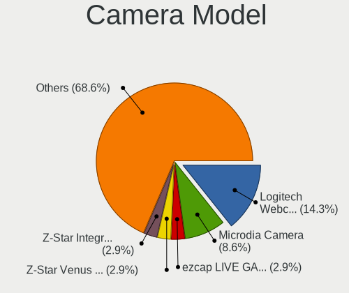

| Model                                            | Desktops | Percent |
|--------------------------------------------------|----------|---------|
| Z-Star A4 TECH USB2.0 PC Camera E                | 2        | 6.45%   |
| Sunplus USB Microphone                           | 2        | 6.45%   |
| Logitech Webcam C270                             | 2        | 6.45%   |
| Z-Star Venus USB2.0 Camera                       | 1        | 3.23%   |
| Z-Star Traveler TV 6500 SF Dia-scanner           | 1        | 3.23%   |
| SunplusIT USB Camera                             | 1        | 3.23%   |
| SunplusIT AEEVISION Camera                       | 1        | 3.23%   |
| Sunplus ZET USB WEBCAM                           | 1        | 3.23%   |
| Sunplus Full HD webcam                           | 1        | 3.23%   |
| Realtek Integrated_Webcam_HD                     | 1        | 3.23%   |
| Microsoft LifeCam VX-2000                        | 1        | 3.23%   |
| Logitech Webcam C930e                            | 1        | 3.23%   |
| Logitech Webcam C170                             | 1        | 3.23%   |
| Logitech Logitech Webcam C160                    | 1        | 3.23%   |
| Logitech HD Webcam C510                          | 1        | 3.23%   |
| Logitech C920 PRO HD Webcam                      | 1        | 3.23%   |
| Logitech BRIO Ultra HD Webcam                    | 1        | 3.23%   |
| lihappe8 USB 2.0 Camera                          | 1        | 3.23%   |
| KYE Systems (Mouse Systems) Slim 1322AF          | 1        | 3.23%   |
| KYE Systems (Mouse Systems) iSlim 320            | 1        | 3.23%   |
| KYE Systems (Mouse Systems) Genius iLook 1321 V2 | 1        | 3.23%   |
| Jieli USB PHY 2.0                                | 1        | 3.23%   |
| HP Webcam 3110                                   | 1        | 3.23%   |
| GEMBIRD USB2.0 PC CAMERA                         | 1        | 3.23%   |
| Cubeternet USB2.0 Camera                         | 1        | 3.23%   |
| Cubeternet GL-UPC822 UVC WebCam                  | 1        | 3.23%   |
| Chicony HP High Definition 1MP Webcam            | 1        | 3.23%   |
| Arkmicro USB2.0 PC CAMERA                        | 1        | 3.23%   |

Security
--------

Fingerprint Vendor
------------------

Fingerprint sensor vendors

Zero info for selected period =(

Fingerprint Model
-----------------

Fingerprint sensor models

Zero info for selected period =(

Chipcard Vendor
---------------

Chipcard module vendors

| Vendor                    | Desktops | Percent |
|---------------------------|----------|---------|
| Realtek Semiconductor     | 1        | 50%     |
| Aladdin Knowledge Systems | 1        | 50%     |

Chipcard Model
--------------

Chipcard module models

| Model                                             | Desktops | Percent |
|---------------------------------------------------|----------|---------|
| Realtek Semiconductor Smart Card Reader Interface | 1        | 50%     |
| Aladdin Knowledge Systems Token JC                | 1        | 50%     |

Unsupported
-----------

Unsupported Devices
-------------------

Total unsupported devices on board

| Total | Desktops | Percent |
|-------|----------|---------|
| 0     | 181      | 77.68%  |
| 1     | 30       | 12.88%  |
| 4     | 15       | 6.44%   |
| 2     | 6        | 2.58%   |
| 3     | 1        | 0.43%   |

Unsupported Device Types
------------------------

Types of unsupported devices

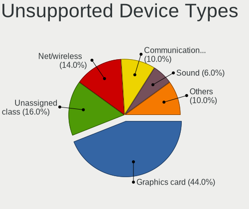

| Type                     | Desktops | Percent |
|--------------------------|----------|---------|
| Graphics card            | 39       | 45.88%  |
| Unassigned class         | 21       | 24.71%  |
| Communication controller | 17       | 20%     |
| Net/wireless             | 4        | 4.71%   |
| Net/ethernet             | 2        | 2.35%   |
| Multimedia controller    | 1        | 1.18%   |
| Bluetooth                | 1        | 1.18%   |

