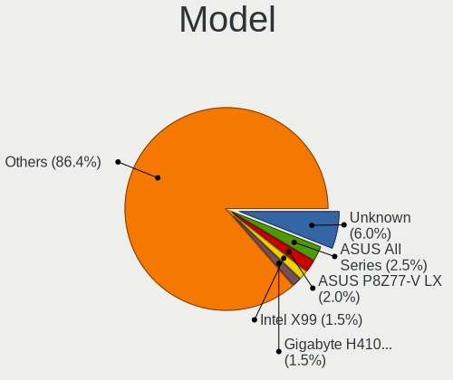
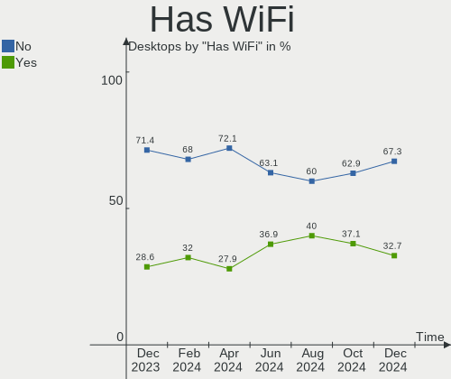
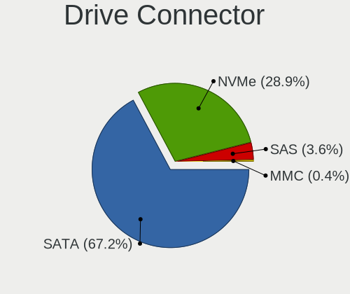
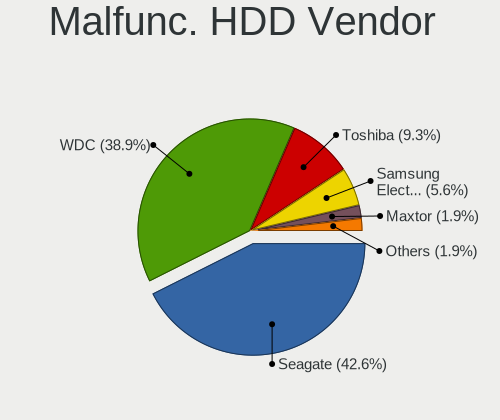
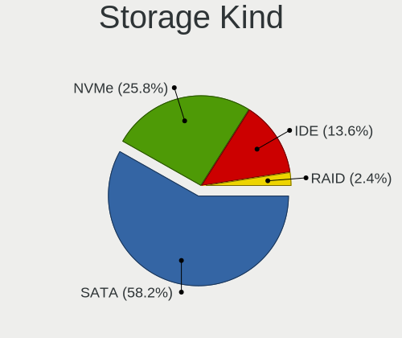
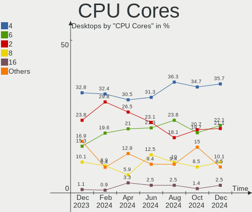
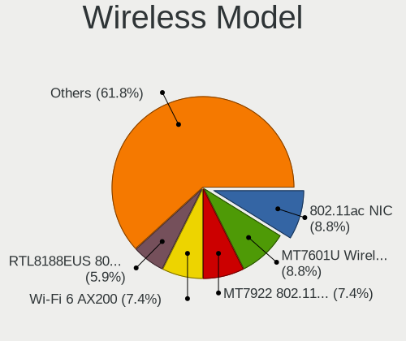

Linux in Russia - Hardware Trends (Desktops)
--------------------------------------------

A project to identify most popular hardware characteristics and track their change
over time based on data collected by Linux users at https://Linux-Hardware.org.

Anyone can contribute to this report by the [hw-probe](https://github.com/linuxhw/hw-probe) tool:

    sudo -E hw-probe -all -upload

Period: Jul, 2022.

Contents
--------

* [ System ](#system)
  - [ OS                       ](#os)
  - [ OS Family                ](#os-family)
  - [ Kernel                   ](#kernel)
  - [ Kernel Family            ](#kernel-family)
  - [ Kernel Major Ver.        ](#kernel-major-ver)
  - [ Arch                     ](#arch)
  - [ DE                       ](#de)
  - [ Display Server           ](#display-server)
  - [ Display Manager          ](#display-manager)
  - [ OS Lang                  ](#os-lang)
  - [ Boot Mode                ](#boot-mode)
  - [ Filesystem               ](#filesystem)
  - [ Part. scheme             ](#part-scheme)
  - [ Dual Boot with Linux/BSD ](#dual-boot-with-linuxbsd)
  - [ Dual Boot (Win)          ](#dual-boot-win)

* [ Board ](#board)
  - [ Vendor                   ](#vendor)
  - [ Model                    ](#model)
  - [ Model Family             ](#model-family)
  - [ MFG Year                 ](#mfg-year)
  - [ Form Factor              ](#form-factor)
  - [ Secure Boot              ](#secure-boot)
  - [ Coreboot                 ](#coreboot)
  - [ RAM Size                 ](#ram-size)
  - [ RAM Used                 ](#ram-used)
  - [ Total Drives             ](#total-drives)
  - [ Has CD-ROM               ](#has-cd-rom)
  - [ Has Ethernet             ](#has-ethernet)
  - [ Has WiFi                 ](#has-wifi)
  - [ Has Bluetooth            ](#has-bluetooth)

* [ Location ](#location)
  - [ Country                  ](#country)
  - [ City                     ](#city)

* [ Drives ](#drives)
  - [ Drive Vendor             ](#drive-vendor)
  - [ Drive Model              ](#drive-model)
  - [ HDD Vendor               ](#hdd-vendor)
  - [ SSD Vendor               ](#ssd-vendor)
  - [ Drive Kind               ](#drive-kind)
  - [ Drive Connector          ](#drive-connector)
  - [ Drive Size               ](#drive-size)
  - [ Space Total              ](#space-total)
  - [ Space Used               ](#space-used)
  - [ Malfunc. Drives          ](#malfunc-drives)
  - [ Malfunc. Drive Vendor    ](#malfunc-drive-vendor)
  - [ Malfunc. HDD Vendor      ](#malfunc-hdd-vendor)
  - [ Malfunc. Drive Kind      ](#malfunc-drive-kind)
  - [ Failed Drives            ](#failed-drives)
  - [ Failed Drive Vendor      ](#failed-drive-vendor)
  - [ Drive Status             ](#drive-status)

* [ Storage controller ](#storage-controller)
  - [ Storage Vendor           ](#storage-vendor)
  - [ Storage Model            ](#storage-model)
  - [ Storage Kind             ](#storage-kind)

* [ Processor ](#processor)
  - [ CPU Vendor               ](#cpu-vendor)
  - [ CPU Model                ](#cpu-model)
  - [ CPU Model Family         ](#cpu-model-family)
  - [ CPU Cores                ](#cpu-cores)
  - [ CPU Sockets              ](#cpu-sockets)
  - [ CPU Threads              ](#cpu-threads)
  - [ CPU Op-Modes             ](#cpu-op-modes)
  - [ CPU Microcode            ](#cpu-microcode)
  - [ CPU Microarch            ](#cpu-microarch)

* [ Graphics ](#graphics)
  - [ GPU Vendor               ](#gpu-vendor)
  - [ GPU Model                ](#gpu-model)
  - [ GPU Combo                ](#gpu-combo)
  - [ GPU Driver               ](#gpu-driver)
  - [ GPU Memory               ](#gpu-memory)

* [ Monitor ](#monitor)
  - [ Monitor Vendor           ](#monitor-vendor)
  - [ Monitor Model            ](#monitor-model)
  - [ Monitor Resolution       ](#monitor-resolution)
  - [ Monitor Diagonal         ](#monitor-diagonal)
  - [ Monitor Width            ](#monitor-width)
  - [ Aspect Ratio             ](#aspect-ratio)
  - [ Monitor Area             ](#monitor-area)
  - [ Pixel Density            ](#pixel-density)
  - [ Multiple Monitors        ](#multiple-monitors)

* [ Network ](#network)
  - [ Net Controller Vendor    ](#net-controller-vendor)
  - [ Net Controller Model     ](#net-controller-model)
  - [ Wireless Vendor          ](#wireless-vendor)
  - [ Wireless Model           ](#wireless-model)
  - [ Ethernet Vendor          ](#ethernet-vendor)
  - [ Ethernet Model           ](#ethernet-model)
  - [ Net Controller Kind      ](#net-controller-kind)
  - [ Used Controller          ](#used-controller)
  - [ NICs                     ](#nics)
  - [ IPv6                     ](#ipv6)

* [ Bluetooth ](#bluetooth)
  - [ Bluetooth Vendor         ](#bluetooth-vendor)
  - [ Bluetooth Model          ](#bluetooth-model)

* [ Sound ](#sound)
  - [ Sound Vendor             ](#sound-vendor)
  - [ Sound Model              ](#sound-model)

* [ Memory ](#memory)
  - [ Memory Vendor            ](#memory-vendor)
  - [ Memory Model             ](#memory-model)
  - [ Memory Kind              ](#memory-kind)
  - [ Memory Form Factor       ](#memory-form-factor)
  - [ Memory Size              ](#memory-size)
  - [ Memory Speed             ](#memory-speed)

* [ Printers & scanners ](#printers--scanners)
  - [ Printer Vendor           ](#printer-vendor)
  - [ Printer Model            ](#printer-model)
  - [ Scanner Vendor           ](#scanner-vendor)
  - [ Scanner Model            ](#scanner-model)

* [ Camera ](#camera)
  - [ Camera Vendor            ](#camera-vendor)
  - [ Camera Model             ](#camera-model)

* [ Security ](#security)
  - [ Fingerprint Vendor       ](#fingerprint-vendor)
  - [ Fingerprint Model        ](#fingerprint-model)
  - [ Chipcard Vendor          ](#chipcard-vendor)
  - [ Chipcard Model           ](#chipcard-model)

* [ Unsupported ](#unsupported)
  - [ Unsupported Devices      ](#unsupported-devices)
  - [ Unsupported Device Types ](#unsupported-device-types)

System
------

OS
--

Installed operating systems

| Name                | Desktops | Percent |
|---------------------|----------|---------|
| ROSA 12.2           | 157      | 48.46%  |
| Debian 11           | 48       | 14.81%  |
| ROSA R11.1          | 14       | 4.32%   |
| OpenMandriva 4.3    | 14       | 4.32%   |
| Fedora 36           | 14       | 4.32%   |
| Linux Mint 20.3     | 12       | 3.7%    |
| OpenMandriva 4.90   | 10       | 3.09%   |
| Ubuntu 22.04        | 5        | 1.54%   |
| Red OS 7.3.1        | 4        | 1.23%   |
| Ubuntu 20.04        | 3        | 0.93%   |
| KDE neon 20.04      | 3        | 0.93%   |
| Debian 10           | 3        | 0.93%   |
| Arch Rolling        | 3        | 0.93%   |
| ROSA R11            | 2        | 0.62%   |
| Red OS 7.3          | 2        | 0.62%   |
| OpenMandriva 4.2    | 2        | 0.62%   |
| Linux Mint 19.3     | 2        | 0.62%   |
| Astra Linux 2.12.44 | 2        | 0.62%   |
| ALT Linux 10.0      | 2        | 0.62%   |
| Xubuntu 22.04       | 1        | 0.31%   |
| Xubuntu 18.04       | 1        | 0.31%   |
| Void Linux          | 1        | 0.31%   |
| Ubuntu 16.04        | 1        | 0.31%   |
| ROSA 12.1           | 1        | 0.31%   |
| Pop!_OS 21.04       | 1        | 0.31%   |
| Manjaro 21.3.5      | 1        | 0.31%   |
| Manjaro 21.3.3      | 1        | 0.31%   |
| Manjaro 21.3.2      | 1        | 0.31%   |
| Manjaro 21.3.1      | 1        | 0.31%   |
| Manjaro             | 1        | 0.31%   |
| Kubuntu 22.04       | 1        | 0.31%   |
| Kubuntu 20.04       | 1        | 0.31%   |
| Kali 2022.2         | 1        | 0.31%   |
| Gentoo 2.8          | 1        | 0.31%   |
| EndeavourOS Rolling | 1        | 0.31%   |
| EndeavourOS         | 1        | 0.31%   |
| Debian Testing      | 1        | 0.31%   |
| Artix Rolling       | 1        | 0.31%   |
| Arch                | 1        | 0.31%   |
| ALT Linux P10       | 1        | 0.31%   |
| AlmaLinux 8.6       | 1        | 0.31%   |

OS Family
---------

OS without a version

| Name         | Desktops | Percent |
|--------------|----------|---------|
| ROSA         | 174      | 53.7%   |
| Debian       | 52       | 16.05%  |
| OpenMandriva | 26       | 8.02%   |
| Linux Mint   | 14       | 4.32%   |
| Fedora       | 14       | 4.32%   |
| Ubuntu       | 9        | 2.78%   |
| Red OS       | 6        | 1.85%   |
| Manjaro      | 5        | 1.54%   |
| Arch         | 4        | 1.23%   |
| KDE neon     | 3        | 0.93%   |
| ALT Linux    | 3        | 0.93%   |
| Xubuntu      | 2        | 0.62%   |
| Kubuntu      | 2        | 0.62%   |
| EndeavourOS  | 2        | 0.62%   |
| Astra Linux  | 2        | 0.62%   |
| Void Linux   | 1        | 0.31%   |
| Pop!_OS      | 1        | 0.31%   |
| Kali         | 1        | 0.31%   |
| Gentoo       | 1        | 0.31%   |
| Artix        | 1        | 0.31%   |
| AlmaLinux    | 1        | 0.31%   |

Kernel
------

Version of the Linux kernel

| Version                                        | Desktops | Percent |
|------------------------------------------------|----------|---------|
| 5.10.74-generic-2rosa2021.1-x86_64             | 61       | 18.83%  |
| 5.10.118-generic-2rosa2021.1-x86_64            | 52       | 16.05%  |
| 5.10.0-7-amd64                                 | 45       | 13.89%  |
| 5.18.8.xm1-1.klp-xanmod-rosa2021.1-x86_64      | 13       | 4.01%   |
| 5.16.7-desktop-1omv4003                        | 13       | 4.01%   |
| 5.15.43-generic-2rosa2021.1-x86_64             | 12       | 3.7%    |
| 5.18.12-desktop-3omv4090                       | 10       | 3.09%   |
| 5.17.11-generic-2rosa2021.1-x86_64             | 7        | 2.16%   |
| 5.18.13-200.fc36.x86_64                        | 6        | 1.85%   |
| 5.15.0-41-generic                              | 6        | 1.85%   |
| 5.4.0-122-generic                              | 5        | 1.54%   |
| 5.4.32-generic-2rosa-i586                      | 4        | 1.23%   |
| 5.18.9-200.fc36.x86_64                         | 4        | 1.23%   |
| 5.4.83-generic-2rosa-x86_64                    | 3        | 0.93%   |
| 5.4.0-91-generic                               | 3        | 0.93%   |
| 5.15.10-1.el7.x86_64                           | 3        | 0.93%   |
| 4.15.0-desktop-122.124.1rosa-x86_64            | 3        | 0.93%   |
| 5.4.83-generic-2rosa-i586                      | 2        | 0.62%   |
| 5.4.0-121-generic                              | 2        | 0.62%   |
| 5.18.6-arch1-1                                 | 2        | 0.62%   |
| 5.18.11-200.fc36.x86_64                        | 2        | 0.62%   |
| 5.18.1.xm1-3.klp-xanmod-rosa2021.1-x86_64      | 2        | 0.62%   |
| 5.15.0-33-generic                              | 2        | 0.62%   |
| 5.13.0-52-generic                              | 2        | 0.62%   |
| 5.10.71-generic-1rosa2021.1-x86_64             | 2        | 0.62%   |
| 5.10.0-16-amd64                                | 2        | 0.62%   |
| 5.10.0-1038.40-generic                         | 2        | 0.62%   |
| 5.4.32-generic-2rosa-x86_64                    | 1        | 0.31%   |
| 5.4.166-1-pve                                  | 1        | 0.31%   |
| 5.4.150-generic-1rosa2021.1-x86_64             | 1        | 0.31%   |
| 5.4.0-81-generic                               | 1        | 0.31%   |
| 5.4.0-109-generic                              | 1        | 0.31%   |
| 5.4.0-107-generic                              | 1        | 0.31%   |
| 5.4.0-105-generic                              | 1        | 0.31%   |
| 5.19.0-1-MANJARO                               | 1        | 0.31%   |
| 5.19.0-0.rc5.39.fc37.x86_64                    | 1        | 0.31%   |
| 5.18.9_1                                       | 1        | 0.31%   |
| 5.18.9-gentoo                                  | 1        | 0.31%   |
| 5.18.9-arch1-1                                 | 1        | 0.31%   |
| 5.18.7-200.fc36.x86_64                         | 1        | 0.31%   |
| 5.18.2.xm1-3.klp-xanmod-rosa2021.1-x86_64      | 1        | 0.31%   |
| 5.18.15.xm1-1.klp-xanmod-rosa2021.1-x86_64     | 1        | 0.31%   |
| 5.18.14.xm1-1.klp-xanmod-rosa2021.1-x86_64     | 1        | 0.31%   |
| 5.18.12-zen1-1-zen                             | 1        | 0.31%   |
| 5.18.12-arch1-1                                | 1        | 0.31%   |
| 5.18.12-3-MANJARO                              | 1        | 0.31%   |
| 5.18.10.xm1-1.klp-xanmod-rosa2021.1-x86_64     | 1        | 0.31%   |
| 5.18.10-lqx1-1-lqx                             | 1        | 0.31%   |
| 5.18.10-200.fc36.x86_64                        | 1        | 0.31%   |
| 5.18.10-1-MANJARO                              | 1        | 0.31%   |
| 5.18.0-2-amd64                                 | 1        | 0.31%   |
| 5.18.0-14.2-liquorix-amd64                     | 1        | 0.31%   |
| 5.18.0-1-rt11-MANJARO                          | 1        | 0.31%   |
| 5.16.19-generic-2rosa2021.1-x86_64             | 1        | 0.31%   |
| 5.16.13-desktop-1omv4003                       | 1        | 0.31%   |
| 5.15.58.xm1-1.klp-xanmod-lts-rosa2021.1-x86_64 | 1        | 0.31%   |
| 5.15.55-1-MANJARO                              | 1        | 0.31%   |
| 5.15.53-un-def-alt1                            | 1        | 0.31%   |
| 5.15.51-xanmod1-tt-1                           | 1        | 0.31%   |
| 5.15.43-generic-1rosa2021.1-x86_64             | 1        | 0.31%   |

Kernel Family
-------------

Linux kernel without a distro release

| Version  | Desktops | Percent |
|----------|----------|---------|
| 5.10.74  | 62       | 19.14%  |
| 5.10.118 | 52       | 16.05%  |
| 5.10.0   | 50       | 15.43%  |
| 5.4.0    | 14       | 4.32%   |
| 5.18.8   | 13       | 4.01%   |
| 5.18.12  | 13       | 4.01%   |
| 5.16.7   | 13       | 4.01%   |
| 5.15.43  | 13       | 4.01%   |
| 5.15.0   | 11       | 3.4%    |
| 5.18.9   | 7        | 2.16%   |
| 5.17.11  | 7        | 2.16%   |
| 4.15.0   | 7        | 2.16%   |
| 5.18.13  | 6        | 1.85%   |
| 5.4.83   | 5        | 1.54%   |
| 5.4.32   | 5        | 1.54%   |
| 5.18.10  | 4        | 1.23%   |
| 5.18.0   | 3        | 0.93%   |
| 5.15.10  | 3        | 0.93%   |
| 5.13.0   | 3        | 0.93%   |
| 5.19.0   | 2        | 0.62%   |
| 5.18.6   | 2        | 0.62%   |
| 5.18.11  | 2        | 0.62%   |
| 5.18.1   | 2        | 0.62%   |
| 5.15.35  | 2        | 0.62%   |
| 5.10.71  | 2        | 0.62%   |
| 5.4.166  | 1        | 0.31%   |
| 5.4.150  | 1        | 0.31%   |
| 5.18.7   | 1        | 0.31%   |
| 5.18.2   | 1        | 0.31%   |
| 5.18.15  | 1        | 0.31%   |
| 5.18.14  | 1        | 0.31%   |
| 5.16.19  | 1        | 0.31%   |
| 5.16.13  | 1        | 0.31%   |
| 5.15.58  | 1        | 0.31%   |
| 5.15.55  | 1        | 0.31%   |
| 5.15.53  | 1        | 0.31%   |
| 5.15.51  | 1        | 0.31%   |
| 5.15.34  | 1        | 0.31%   |
| 5.11.22  | 1        | 0.31%   |
| 5.11.12  | 1        | 0.31%   |
| 5.11.0   | 1        | 0.31%   |
| 5.10.29  | 1        | 0.31%   |
| 5.10.14  | 1        | 0.31%   |
| 5.10.128 | 1        | 0.31%   |
| 4.19.0   | 1        | 0.31%   |
| 4.18.0   | 1        | 0.31%   |

Kernel Major Ver.
-----------------

Linux kernel major version

| Version | Desktops | Percent |
|---------|----------|---------|
| 5.10    | 169      | 52.16%  |
| 5.18    | 56       | 17.28%  |
| 5.15    | 34       | 10.49%  |
| 5.4     | 26       | 8.02%   |
| 5.16    | 15       | 4.63%   |
| 5.17    | 7        | 2.16%   |
| 4.15    | 7        | 2.16%   |
| 5.13    | 3        | 0.93%   |
| 5.11    | 3        | 0.93%   |
| 5.19    | 2        | 0.62%   |
| 4.19    | 1        | 0.31%   |
| 4.18    | 1        | 0.31%   |

Arch
----

OS architecture (x86_64, i586, etc.)

| Name   | Desktops | Percent |
|--------|----------|---------|
| x86_64 | 314      | 96.91%  |
| i686   | 10       | 3.09%   |

DE
--

Desktop Environment

| Name       | Desktops | Percent |
|------------|----------|---------|
| KDE5       | 119      | 36.73%  |
| GNOME      | 98       | 30.25%  |
| Unknown    | 50       | 15.43%  |
| LXQt       | 16       | 4.94%   |
| KDE4       | 10       | 3.09%   |
| X-Cinnamon | 9        | 2.78%   |
| XFCE       | 8        | 2.47%   |
| MATE       | 5        | 1.54%   |
| Cinnamon   | 3        | 0.93%   |
| Unity      | 2        | 0.62%   |
| fly        | 2        | 0.62%   |
| Budgie     | 1        | 0.31%   |
| bspwm      | 1        | 0.31%   |

Display Server
--------------

X11 or Wayland

| Name    | Desktops | Percent |
|---------|----------|---------|
| Wayland | 144      | 44.44%  |
| X11     | 130      | 40.12%  |
| Unknown | 45       | 13.89%  |
| Tty     | 5        | 1.54%   |

Display Manager
---------------

SDDM, LightDM, etc.

| Name    | Desktops | Percent |
|---------|----------|---------|
| SDDM    | 114      | 35.19%  |
| GDM     | 100      | 30.86%  |
| Unknown | 69       | 21.3%   |
| LightDM | 22       | 6.79%   |
| KDM     | 10       | 3.09%   |
| GDM3    | 6        | 1.85%   |
| FLY-DM  | 2        | 0.62%   |
| SLiM    | 1        | 0.31%   |

OS Lang
-------

Language

| Lang    | Desktops | Percent |
|---------|----------|---------|
| ru_RU   | 292      | 90.12%  |
| en_US   | 21       | 6.48%   |
| Unknown | 8        | 2.47%   |
| C       | 2        | 0.62%   |
| en_AG   | 1        | 0.31%   |

Boot Mode
---------

EFI or BIOS

| Mode | Desktops | Percent |
|------|----------|---------|
| BIOS | 173      | 53.4%   |
| EFI  | 151      | 46.6%   |

Filesystem
----------

Type of filesystem

| Type    | Desktops | Percent |
|---------|----------|---------|
| Ext4    | 226      | 69.75%  |
| Overlay | 70       | 21.6%   |
| Btrfs   | 24       | 7.41%   |
| Xfs     | 2        | 0.62%   |
| F2fs    | 2        | 0.62%   |

Part. scheme
------------

Scheme of partitioning

| Type    | Desktops | Percent |
|---------|----------|---------|
| GPT     | 179      | 55.25%  |
| MBR     | 114      | 35.19%  |
| Unknown | 31       | 9.57%   |

Dual Boot with Linux/BSD
------------------------

Hosting more than one Linux/BSD

| Dual boot | Desktops | Percent |
|-----------|----------|---------|
| No        | 238      | 73.46%  |
| Yes       | 86       | 26.54%  |

Dual Boot (Win)
---------------

Hosting Linux and Windows

| Dual boot | Desktops | Percent |
|-----------|----------|---------|
| Yes       | 183      | 56.48%  |
| No        | 141      | 43.52%  |

Board
-----

Vendor
------

Motherboard manufacturer

| Name                | Desktops | Percent |
|---------------------|----------|---------|
| ASUSTek Computer    | 96       | 29.63%  |
| Gigabyte Technology | 85       | 26.23%  |
| ASRock              | 41       | 12.65%  |
| MSI                 | 40       | 12.35%  |
| Intel               | 13       | 4.01%   |
| ECS                 | 7        | 2.16%   |
| Dell                | 5        | 1.54%   |
| Biostar             | 5        | 1.54%   |
| Huanan              | 4        | 1.23%   |
| DEPO Computers      | 4        | 1.23%   |
| Acer                | 4        | 1.23%   |
| Supermicro          | 3        | 0.93%   |
| Hewlett-Packard     | 3        | 0.93%   |
| Pegatron            | 2        | 0.62%   |
| Lenovo              | 2        | 0.62%   |
| AZW                 | 2        | 0.62%   |
| OEM                 | 1        | 0.31%   |
| MB                  | 1        | 0.31%   |
| Machinist/Runing    | 1        | 0.31%   |
| MACHINIST           | 1        | 0.31%   |
| Foxconn             | 1        | 0.31%   |
| American Megatrends | 1        | 0.31%   |
| ABIT                | 1        | 0.31%   |
| Unknown             | 1        | 0.31%   |

Model
-----

Motherboard model

| Name                              | Desktops | Percent |
|-----------------------------------|----------|---------|
| MSI MS-7996                       | 12       | 3.7%    |
| ASUS All Series                   | 10       | 3.09%   |
| ASRock H470M-HVS                  | 10       | 3.09%   |
| Intel X99                         | 4        | 1.23%   |
| ECS G31T-M9                       | 4        | 1.23%   |
| DEPO Computers DPH310T            | 4        | 1.23%   |
| MSI MS-7529                       | 3        | 0.93%   |
| Gigabyte A320M-S2H V2             | 3        | 0.93%   |
| ASUS PRIME X470-PRO               | 3        | 0.93%   |
| ASUS PRIME B450M-K                | 3        | 0.93%   |
| ASUS P8H61-M LX3 R2.0             | 3        | 0.93%   |
| ASUS M5A78L-M LX3                 | 3        | 0.93%   |
| ASUS H110M-R                      | 3        | 0.93%   |
| MSI MS-7B86                       | 2        | 0.62%   |
| MSI MS-7A71                       | 2        | 0.62%   |
| MSI MS-7895                       | 2        | 0.62%   |
| Intel Pro, Std, Elt Series        | 2        | 0.62%   |
| Gigabyte X470 AORUS GAMING 7 WIFI | 2        | 0.62%   |
| Gigabyte H61M-S1                  | 2        | 0.62%   |
| Gigabyte B450M S2H                | 2        | 0.62%   |
| Gigabyte AB350M-DS3H V2           | 2        | 0.62%   |
| Gigabyte A320M-H                  | 2        | 0.62%   |
| ECS GF8100VM-M5                   | 2        | 0.62%   |
| Dell OptiPlex 755                 | 2        | 0.62%   |
| ASUS TUF B450M-PRO GAMING         | 2        | 0.62%   |
| ASUS PRIME B550-PLUS              | 2        | 0.62%   |
| ASUS PRIME A320M-K                | 2        | 0.62%   |
| ASUS P8H67-M LE                   | 2        | 0.62%   |
| ASUS P5KPL-AM                     | 2        | 0.62%   |
| ASUS P5K                          | 2        | 0.62%   |
| ASUS M5A97 R2.0                   | 2        | 0.62%   |
| ASUS M4A77TD                      | 2        | 0.62%   |
| ASRock B550M Pro4                 | 2        | 0.62%   |
| ASRock A320M-DVS R4.0             | 2        | 0.62%   |
| Supermicro X9SCL/X9SCM            | 1        | 0.31%   |
| Supermicro SYS-5018R-WR           | 1        | 0.31%   |
| Supermicro C7Q67                  | 1        | 0.31%   |
| Pegatron IPPPV-D3G                | 1        | 0.31%   |
| Pegatron FL448AA-ACB a6652ru      | 1        | 0.31%   |
| OEM ZXE CRB                       | 1        | 0.31%   |
| MSI MS-7D46                       | 1        | 0.31%   |
| MSI MS-7D25                       | 1        | 0.31%   |
| MSI MS-7D13                       | 1        | 0.31%   |
| MSI MS-7C91                       | 1        | 0.31%   |
| MSI MS-7C89                       | 1        | 0.31%   |
| MSI MS-7C81                       | 1        | 0.31%   |
| MSI MS-7C35                       | 1        | 0.31%   |
| MSI MS-7C02                       | 1        | 0.31%   |
| MSI MS-7B47                       | 1        | 0.31%   |
| MSI MS-7A74                       | 1        | 0.31%   |
| MSI MS-7A70                       | 1        | 0.31%   |
| MSI MS-7A15                       | 1        | 0.31%   |
| MSI MS-7924                       | 1        | 0.31%   |
| MSI MS-7808                       | 1        | 0.31%   |
| MSI MS-7677                       | 1        | 0.31%   |
| MSI MS-7599                       | 1        | 0.31%   |
| MSI MS-7236                       | 1        | 0.31%   |
| MSI MS-7142                       | 1        | 0.31%   |
| MSI MPG B460 Trident AS (MS-B926) | 1        | 0.31%   |
| MB A320-SF110                     | 1        | 0.31%   |

Model Family
------------

Motherboard model prefix

| Name                    | Desktops | Percent |
|-------------------------|----------|---------|
| ASUS PRIME              | 19       | 5.86%   |
| MSI MS-7996             | 12       | 3.7%    |
| ASUS All                | 10       | 3.09%   |
| ASRock H470M-HVS        | 10       | 3.09%   |
| ASUS P8H61-M            | 7        | 2.16%   |
| Gigabyte B450M          | 6        | 1.85%   |
| ASUS M5A78L-M           | 6        | 1.85%   |
| Intel X99               | 4        | 1.23%   |
| Gigabyte B550M          | 4        | 1.23%   |
| Gigabyte A320M-S2H      | 4        | 1.23%   |
| ECS G31T-M9             | 4        | 1.23%   |
| DEPO Computers DPH310T  | 4        | 1.23%   |
| Dell OptiPlex           | 4        | 1.23%   |
| ASUS ROG                | 4        | 1.23%   |
| MSI MS-7529             | 3        | 0.93%   |
| Gigabyte X470           | 3        | 0.93%   |
| Gigabyte AB350M-DS3H    | 3        | 0.93%   |
| ASUS TUF                | 3        | 0.93%   |
| ASUS P5K                | 3        | 0.93%   |
| ASUS H110M-R            | 3        | 0.93%   |
| MSI MS-7B86             | 2        | 0.62%   |
| MSI MS-7A71             | 2        | 0.62%   |
| MSI MS-7895             | 2        | 0.62%   |
| Intel X79               | 2        | 0.62%   |
| Intel Pro               | 2        | 0.62%   |
| Gigabyte X570           | 2        | 0.62%   |
| Gigabyte H61M-S1        | 2        | 0.62%   |
| Gigabyte H61M-DS2       | 2        | 0.62%   |
| Gigabyte B660M          | 2        | 0.62%   |
| Gigabyte AB350-Gaming   | 2        | 0.62%   |
| Gigabyte A320M-H        | 2        | 0.62%   |
| ECS GF8100VM-M5         | 2        | 0.62%   |
| ASUS P8H67-M            | 2        | 0.62%   |
| ASUS P5P43TD            | 2        | 0.62%   |
| ASUS P5KPL-AM           | 2        | 0.62%   |
| ASUS P5G41T-M           | 2        | 0.62%   |
| ASUS M5A97              | 2        | 0.62%   |
| ASUS M4A77TD            | 2        | 0.62%   |
| ASRock B550M            | 2        | 0.62%   |
| ASRock B450M            | 2        | 0.62%   |
| ASRock A320M-HDV        | 2        | 0.62%   |
| ASRock A320M-DVS        | 2        | 0.62%   |
| Acer Aspire             | 2        | 0.62%   |
| Supermicro X9SCL        | 1        | 0.31%   |
| Supermicro SYS-5018R-WR | 1        | 0.31%   |
| Supermicro C7Q67        | 1        | 0.31%   |
| Pegatron IPPPV-D3G      | 1        | 0.31%   |
| Pegatron FL448AA-ACB    | 1        | 0.31%   |
| OEM ZXE                 | 1        | 0.31%   |
| MSI MS-7D46             | 1        | 0.31%   |
| MSI MS-7D25             | 1        | 0.31%   |
| MSI MS-7D13             | 1        | 0.31%   |
| MSI MS-7C91             | 1        | 0.31%   |
| MSI MS-7C89             | 1        | 0.31%   |
| MSI MS-7C81             | 1        | 0.31%   |
| MSI MS-7C35             | 1        | 0.31%   |
| MSI MS-7C02             | 1        | 0.31%   |
| MSI MS-7B47             | 1        | 0.31%   |
| MSI MS-7A74             | 1        | 0.31%   |
| MSI MS-7A70             | 1        | 0.31%   |

MFG Year
--------

Motherboard manufacture year

| Year | Desktops | Percent |
|------|----------|---------|
| 2018 | 39       | 12.04%  |
| 2021 | 29       | 8.95%   |
| 2012 | 27       | 8.33%   |
| 2020 | 26       | 8.02%   |
| 2019 | 25       | 7.72%   |
| 2009 | 25       | 7.72%   |
| 2016 | 21       | 6.48%   |
| 2010 | 19       | 5.86%   |
| 2015 | 17       | 5.25%   |
| 2017 | 16       | 4.94%   |
| 2013 | 16       | 4.94%   |
| 2011 | 16       | 4.94%   |
| 2008 | 16       | 4.94%   |
| 2014 | 10       | 3.09%   |
| 2022 | 8        | 2.47%   |
| 2007 | 8        | 2.47%   |
| 2006 | 4        | 1.23%   |
| 2005 | 1        | 0.31%   |
| 2001 | 1        | 0.31%   |

Form Factor
-----------

Physical design of the computer

| Name    | Desktops | Percent |
|---------|----------|---------|
| Desktop | 324      | 100%    |

Secure Boot
-----------

Enabled or disabled

| State    | Desktops | Percent |
|----------|----------|---------|
| Disabled | 321      | 99.07%  |
| Enabled  | 3        | 0.93%   |

Coreboot
--------

Have coreboot on board

| Used | Desktops | Percent |
|------|----------|---------|
| No   | 324      | 100%    |

RAM Size
--------

Total RAM memory

| Size in GB  | Desktops | Percent |
|-------------|----------|---------|
| 16.01-24.0  | 79       | 24.38%  |
| 8.01-16.0   | 71       | 21.91%  |
| 4.01-8.0    | 51       | 15.74%  |
| 3.01-4.0    | 46       | 14.2%   |
| 32.01-64.0  | 45       | 13.89%  |
| 1.01-2.0    | 14       | 4.32%   |
| 64.01-256.0 | 8        | 2.47%   |
| 24.01-32.0  | 3        | 0.93%   |
| 2.01-3.0    | 3        | 0.93%   |
| 0.51-1.0    | 3        | 0.93%   |
| 0.01-0.5    | 1        | 0.31%   |

RAM Used
--------

Used RAM memory

| Used GB     | Desktops | Percent |
|-------------|----------|---------|
| 1.01-2.0    | 151      | 46.6%   |
| 0.51-1.0    | 89       | 27.47%  |
| 2.01-3.0    | 41       | 12.65%  |
| 3.01-4.0    | 18       | 5.56%   |
| 4.01-8.0    | 15       | 4.63%   |
| 8.01-16.0   | 5        | 1.54%   |
| 0.01-0.5    | 2        | 0.62%   |
| 24.01-32.0  | 1        | 0.31%   |
| 64.01-256.0 | 1        | 0.31%   |
| 16.01-24.0  | 1        | 0.31%   |

Total Drives
------------

Number of drives on board

| Drives | Desktops | Percent |
|--------|----------|---------|
| 1      | 125      | 38.58%  |
| 2      | 87       | 26.85%  |
| 3      | 60       | 18.52%  |
| 4      | 34       | 10.49%  |
| 5      | 11       | 3.4%    |
| 6      | 4        | 1.23%   |
| 8      | 2        | 0.62%   |
| 7      | 1        | 0.31%   |

Has CD-ROM
----------

Has CD-ROM on board

| Presented | Desktops | Percent |
|-----------|----------|---------|
| No        | 225      | 69.44%  |
| Yes       | 99       | 30.56%  |

Has Ethernet
------------

Has Ethernet on board

| Presented | Desktops | Percent |
|-----------|----------|---------|
| Yes       | 320      | 98.77%  |
| No        | 4        | 1.23%   |

Has WiFi
--------

Has WiFi module

| Presented | Desktops | Percent |
|-----------|----------|---------|
| No        | 243      | 75%     |
| Yes       | 81       | 25%     |

Has Bluetooth
-------------

Has Bluetooth module

| Presented | Desktops | Percent |
|-----------|----------|---------|
| No        | 251      | 77.47%  |
| Yes       | 73       | 22.53%  |

Location
--------

Country
-------

Geographic location (country)

| Country | Desktops | Percent |
|---------|----------|---------|
| Russia  | 324      | 100%    |

City
----

Geographic location (city)

| City             | Desktops | Percent |
|------------------|----------|---------|
| Moscow           | 53       | 16.36%  |
| Voronezh         | 47       | 14.51%  |
| Novosibirsk      | 16       | 4.94%   |
| St Petersburg    | 14       | 4.32%   |
| Chelyabinsk      | 10       | 3.09%   |
| Perm             | 8        | 2.47%   |
| Krasnodar        | 8        | 2.47%   |
| Yekaterinburg    | 7        | 2.16%   |
| Yaroslavl        | 5        | 1.54%   |
| Rostov-on-Don    | 5        | 1.54%   |
| Nizhniy Novgorod | 5        | 1.54%   |
| Irkutsk          | 5        | 1.54%   |
| Ufa              | 4        | 1.23%   |
| Tomsk            | 4        | 1.23%   |
| Salekhard        | 4        | 1.23%   |
| Kazan’         | 4        | 1.23%   |
| Izhevsk          | 4        | 1.23%   |
| Cheboksary       | 4        | 1.23%   |
| Volgograd        | 3        | 0.93%   |
| Vladivostok      | 3        | 0.93%   |
| Tula             | 3        | 0.93%   |
| Surgut           | 3        | 0.93%   |
| Omsk             | 3        | 0.93%   |
| Krasnoyarsk      | 3        | 0.93%   |
| Khabarovsk       | 3        | 0.93%   |
| Vladimir         | 2        | 0.62%   |
| Veliky Novgorod  | 2        | 0.62%   |
| Ulyanovsk        | 2        | 0.62%   |
| Tyumen           | 2        | 0.62%   |
| Stavropol        | 2        | 0.62%   |
| Penza            | 2        | 0.62%   |
| Ozersk           | 2        | 0.62%   |
| Orenburg         | 2        | 0.62%   |
| Novokuznetsk     | 2        | 0.62%   |
| Mytishchi        | 2        | 0.62%   |
| Murmansk         | 2        | 0.62%   |
| Moscow Oblast    | 2        | 0.62%   |
| Lipetsk          | 2        | 0.62%   |
| Korolyov         | 2        | 0.62%   |
| Belovo           | 2        | 0.62%   |
| Belgorod         | 2        | 0.62%   |
| Barnaul          | 2        | 0.62%   |
| Zvenigorod       | 1        | 0.31%   |
| Zheleznogorsk    | 1        | 0.31%   |
| Yoshkar-Ola      | 1        | 0.31%   |
| Yessentuki       | 1        | 0.31%   |
| Yelets           | 1        | 0.31%   |
| Vladikavkaz      | 1        | 0.31%   |
| Vidnoye          | 1        | 0.31%   |
| Varna            | 1        | 0.31%   |
| Uyskoye          | 1        | 0.31%   |
| Ulan-Ude         | 1        | 0.31%   |
| Tver             | 1        | 0.31%   |
| Tsimlyansk       | 1        | 0.31%   |
| Temryuk          | 1        | 0.31%   |
| Taganrog         | 1        | 0.31%   |
| Syktyvkar        | 1        | 0.31%   |
| Sudzha           | 1        | 0.31%   |
| Sovetsk          | 1        | 0.31%   |
| Smolensk         | 1        | 0.31%   |

Drives
------

Drive Vendor
------------

Hard drive vendors

| Vendor              | Desktops | Drives | Percent |
|---------------------|----------|--------|---------|
| Seagate             | 128      | 153    | 20.19%  |
| WDC                 | 117      | 151    | 18.45%  |
| Samsung Electronics | 60       | 75     | 9.46%   |
| Toshiba             | 48       | 50     | 7.57%   |
| Kingston            | 31       | 32     | 4.89%   |
| Hitachi             | 26       | 29     | 4.1%    |
| A-DATA Technology   | 22       | 26     | 3.47%   |
| SPCC                | 21       | 21     | 3.31%   |
| China               | 18       | 20     | 2.84%   |
| Netac               | 15       | 15     | 2.37%   |
| Apacer              | 15       | 16     | 2.37%   |
| SanDisk             | 13       | 13     | 2.05%   |
| Crucial             | 10       | 10     | 1.58%   |
| Intel               | 9        | 14     | 1.42%   |
| HGST                | 8        | 10     | 1.26%   |
| GOODRAM             | 8        | 8      | 1.26%   |
| Plextor             | 7        | 7      | 1.1%    |
| Patriot             | 7        | 7      | 1.1%    |
| AMD                 | 7        | 7      | 1.1%    |
| Smartbuy            | 6        | 7      | 0.95%   |
| Maxtor              | 5        | 5      | 0.79%   |
| Gigabyte Technology | 5        | 5      | 0.79%   |
| OCZ                 | 4        | 4      | 0.63%   |
| KingSpec            | 3        | 3      | 0.47%   |
| XrayDisk            | 2        | 2      | 0.32%   |
| XPG                 | 2        | 2      | 0.32%   |
| SK hynix            | 2        | 3      | 0.32%   |
| Silicon Motion      | 2        | 2      | 0.32%   |
| Qumo                | 2        | 2      | 0.32%   |
| Phison              | 2        | 2      | 0.32%   |
| NGFF                | 2        | 2      | 0.32%   |
| Kllisre             | 2        | 2      | 0.32%   |
| Fujitsu             | 2        | 2      | 0.32%   |
| Corsair             | 2        | 3      | 0.32%   |
| ZTE                 | 1        | 1      | 0.16%   |
| walram              | 1        | 1      | 0.16%   |
| Transcend           | 1        | 1      | 0.16%   |
| Team                | 1        | 1      | 0.16%   |
| T-FORCE             | 1        | 1      | 0.16%   |
| SATAFIRM            | 1        | 1      | 0.16%   |
| s60                 | 1        | 1      | 0.16%   |
| Reeinno             | 1        | 1      | 0.16%   |
| PHD 3.0             | 1        | 1      | 0.16%   |
| ORICO               | 1        | 1      | 0.16%   |
| OCZ-VERTEX3         | 1        | 1      | 0.16%   |
| Netac SS            | 1        | 1      | 0.16%   |
| Neo                 | 1        | 1      | 0.16%   |
| Intenso             | 1        | 1      | 0.16%   |
| IBM-ESXS            | 1        | 1      | 0.16%   |
| Hewlett-Packard     | 1        | 1      | 0.16%   |
| External            | 1        | 1      | 0.16%   |
| ASMT106x            | 1        | 1      | 0.16%   |
| ASMT                | 1        | 2      | 0.16%   |
| Apple               | 1        | 1      | 0.16%   |
| Unknown             | 1        | 1      | 0.16%   |

Drive Model
-----------

Hard drive models

| Model                              | Desktops | Percent |
|------------------------------------|----------|---------|
| Toshiba HDWD110 1TB                | 15       | 2.12%   |
| Seagate ST500DM002-1BD142 500GB    | 13       | 1.83%   |
| Seagate ST1000DM010-2EP102 1TB     | 12       | 1.69%   |
| Netac SSD 240GB                    | 11       | 1.55%   |
| SPCC Solid State Disk 120GB        | 9        | 1.27%   |
| Seagate ST1000DM003-1CH162 1TB     | 9        | 1.27%   |
| WDC WDS240G2G0A-00JH30 240GB SSD   | 7        | 0.99%   |
| WDC WD10EZEX-08WN4A0 1TB           | 7        | 0.99%   |
| Toshiba DT01ACA100 1TB             | 7        | 0.99%   |
| Toshiba DT01ACA050 500GB           | 7        | 0.99%   |
| Seagate ST3500418AS 500GB          | 6        | 0.85%   |
| Seagate ST2000DM008-2FR102 2TB     | 6        | 0.85%   |
| Kingston SA400S37240G 240GB SSD    | 6        | 0.85%   |
| SPCC Solid State Disk 128GB        | 5        | 0.71%   |
| Seagate ST1000LM024 HN-M101MBB 1TB | 5        | 0.71%   |
| Hitachi HDS721050CLA362 500GB      | 5        | 0.71%   |
| Hitachi HDS721010CLA332 1TB        | 5        | 0.71%   |
| Crucial CT240BX500SSD1 240GB       | 5        | 0.71%   |
| Apacer AS2280P4 256GB              | 5        | 0.71%   |
| WDC WDS240G2G0B-00EPW0 240GB SSD   | 4        | 0.56%   |
| Seagate ST3500413AS 500GB          | 4        | 0.56%   |
| Seagate ST1000LM049-2GH172 1TB     | 4        | 0.56%   |
| Samsung SSD 860 EVO 500GB          | 4        | 0.56%   |
| Samsung SSD 860 EVO 250GB          | 4        | 0.56%   |
| Samsung SSD 850 EVO 120GB          | 4        | 0.56%   |
| Kingston SV300S37A120G 120GB SSD   | 4        | 0.56%   |
| Kingston SA400S37480G 480GB SSD    | 4        | 0.56%   |
| WDC WDS240G1G0A-00SS50 240GB SSD   | 3        | 0.42%   |
| WDC WD5000AAKX-08U6AA0 500GB       | 3        | 0.42%   |
| WDC WD5000AADS-00S9B0 500GB        | 3        | 0.42%   |
| WDC WD30EFRX-68EUZN0 3TB           | 3        | 0.42%   |
| Toshiba HDWE140 4TB                | 3        | 0.42%   |
| Seagate ST380815AS 80GB            | 3        | 0.42%   |
| Seagate ST3320620AS 320GB          | 3        | 0.42%   |
| Seagate ST3250410AS 250GB          | 3        | 0.42%   |
| Seagate ST3250318AS 250GB          | 3        | 0.42%   |
| Seagate ST31000524AS 1TB           | 3        | 0.42%   |
| Seagate ST250DM000-1BD141 250GB    | 3        | 0.42%   |
| Seagate ST2000DM006-2DM164 2TB     | 3        | 0.42%   |
| Seagate ST2000DM001-1ER164 2TB     | 3        | 0.42%   |
| Samsung SSD 980 1TB                | 3        | 0.42%   |
| Samsung SSD 970 EVO Plus 250GB     | 3        | 0.42%   |
| Samsung SSD 870 QVO 1TB            | 3        | 0.42%   |
| Kingston SA400S37120G 120GB SSD    | 3        | 0.42%   |
| Gigabyte GP-GSTFS31120GNTD 120GB   | 3        | 0.42%   |
| China SSD 240GB                    | 3        | 0.42%   |
| China SSD 120GB                    | 3        | 0.42%   |
| China 120GB SSD                    | 3        | 0.42%   |
| Apacer AS350 512GB SSD             | 3        | 0.42%   |
| Apacer AS350 256GB SSD             | 3        | 0.42%   |
| Apacer AS350 128GB SSD             | 3        | 0.42%   |
| WDC WDS500G2B0A-00SM50 500GB SSD   | 2        | 0.28%   |
| WDC WDS120G2G0B-00EPW0 120GB SSD   | 2        | 0.28%   |
| WDC WDS120G2G0A-00JH30 120GB SSD   | 2        | 0.28%   |
| WDC WDS120G1G0A-00SS50 120GB SSD   | 2        | 0.28%   |
| WDC WD6401AALS-00J7B1 640GB        | 2        | 0.28%   |
| WDC WD5000AAKX-001CA0 500GB        | 2        | 0.28%   |
| WDC WD3200AAKX-00ERMA0 320GB       | 2        | 0.28%   |
| WDC WD3200AAKS-00L9A0 320GB        | 2        | 0.28%   |
| WDC WD20EZRX-00D8PB0 2TB           | 2        | 0.28%   |

HDD Vendor
----------

Hard disk drive vendors

| Vendor              | Desktops | Drives | Percent |
|---------------------|----------|--------|---------|
| Seagate             | 126      | 151    | 38.18%  |
| WDC                 | 98       | 121    | 29.7%   |
| Toshiba             | 47       | 49     | 14.24%  |
| Hitachi             | 26       | 29     | 7.88%   |
| Samsung Electronics | 13       | 13     | 3.94%   |
| HGST                | 8        | 10     | 2.42%   |
| Maxtor              | 5        | 5      | 1.52%   |
| Fujitsu             | 2        | 2      | 0.61%   |
| SATAFIRM            | 1        | 1      | 0.3%    |
| PHD 3.0             | 1        | 1      | 0.3%    |
| ASMT106x            | 1        | 1      | 0.3%    |
| ASMT                | 1        | 2      | 0.3%    |
| Apple               | 1        | 1      | 0.3%    |

SSD Vendor
----------

Solid state drive vendors

| Vendor              | Desktops | Drives | Percent |
|---------------------|----------|--------|---------|
| Samsung Electronics | 30       | 33     | 12.66%  |
| WDC                 | 24       | 25     | 10.13%  |
| Kingston            | 22       | 22     | 9.28%   |
| SPCC                | 19       | 19     | 8.02%   |
| China               | 18       | 20     | 7.59%   |
| A-DATA Technology   | 15       | 16     | 6.33%   |
| Netac               | 14       | 14     | 5.91%   |
| Crucial             | 10       | 10     | 4.22%   |
| SanDisk             | 9        | 9      | 3.8%    |
| Intel               | 8        | 11     | 3.38%   |
| Apacer              | 8        | 9      | 3.38%   |
| Plextor             | 7        | 7      | 2.95%   |
| Patriot             | 7        | 7      | 2.95%   |
| GOODRAM             | 7        | 7      | 2.95%   |
| Smartbuy            | 6        | 7      | 2.53%   |
| AMD                 | 6        | 6      | 2.53%   |
| OCZ                 | 4        | 4      | 1.69%   |
| KingSpec            | 3        | 3      | 1.27%   |
| Gigabyte Technology | 3        | 3      | 1.27%   |
| Qumo                | 2        | 2      | 0.84%   |
| NGFF                | 2        | 2      | 0.84%   |
| XrayDisk            | 1        | 1      | 0.42%   |
| walram              | 1        | 1      | 0.42%   |
| Transcend           | 1        | 1      | 0.42%   |
| Toshiba             | 1        | 1      | 0.42%   |
| Team                | 1        | 1      | 0.42%   |
| T-FORCE             | 1        | 1      | 0.42%   |
| s60                 | 1        | 1      | 0.42%   |
| OCZ-VERTEX3         | 1        | 1      | 0.42%   |
| Neo                 | 1        | 1      | 0.42%   |
| Intenso             | 1        | 1      | 0.42%   |
| Hewlett-Packard     | 1        | 1      | 0.42%   |
| Corsair             | 1        | 1      | 0.42%   |
| Unknown             | 1        | 1      | 0.42%   |

Drive Kind
----------

HDD or SSD

| Kind    | Desktops | Drives | Percent |
|---------|----------|--------|---------|
| HDD     | 260      | 386    | 49.43%  |
| SSD     | 187      | 249    | 35.55%  |
| NVMe    | 73       | 91     | 13.88%  |
| Unknown | 6        | 6      | 1.14%   |

Drive Connector
---------------

SATA, SAS, NVMe, etc.

| Type | Desktops | Drives | Percent |
|------|----------|--------|---------|
| SATA | 311      | 624    | 78.73%  |
| NVMe | 72       | 90     | 18.23%  |
| SAS  | 12       | 18     | 3.04%   |

Drive Size
----------

Size of hard drive

| Size in TB | Desktops | Drives | Percent |
|------------|----------|--------|---------|
| 0.01-0.5   | 263      | 386    | 56.44%  |
| 0.51-1.0   | 144      | 178    | 30.9%   |
| 1.01-2.0   | 39       | 47     | 8.37%   |
| 2.01-3.0   | 9        | 11     | 1.93%   |
| 3.01-4.0   | 6        | 7      | 1.29%   |
| 4.01-10.0  | 5        | 6      | 1.07%   |

Space Total
-----------

Amount of disk space available on the file system

| Size in GB     | Desktops | Percent |
|----------------|----------|---------|
| 101-250        | 83       | 25.62%  |
| Unknown        | 49       | 15.12%  |
| 501-1000       | 42       | 12.96%  |
| 251-500        | 39       | 12.04%  |
| 1-20           | 36       | 11.11%  |
| 1001-2000      | 29       | 8.95%   |
| 51-100         | 15       | 4.63%   |
| 2001-3000      | 14       | 4.32%   |
| 21-50          | 9        | 2.78%   |
| More than 3000 | 8        | 2.47%   |

Space Used
----------

Amount of used disk space

| Used GB        | Desktops | Percent |
|----------------|----------|---------|
| 1-20           | 161      | 49.69%  |
| Unknown        | 49       | 15.12%  |
| 21-50          | 25       | 7.72%   |
| 101-250        | 21       | 6.48%   |
| 251-500        | 20       | 6.17%   |
| 1001-2000      | 15       | 4.63%   |
| 501-1000       | 13       | 4.01%   |
| 51-100         | 13       | 4.01%   |
| More than 3000 | 4        | 1.23%   |
| 2001-3000      | 3        | 0.93%   |

Malfunc. Drives
---------------

Drive models with a malfunction

| Model                            | Desktops | Drives | Percent |
|----------------------------------|----------|--------|---------|
| Seagate ST500DM002-1BD142 500GB  | 6        | 6      | 5.22%   |
| Seagate ST3500418AS 500GB        | 4        | 5      | 3.48%   |
| Seagate ST1000DM003-1CH162 1TB   | 4        | 6      | 3.48%   |
| WDC WD5000AAKX-08U6AA0 500GB     | 3        | 4      | 2.61%   |
| Seagate ST3500413AS 500GB        | 3        | 3      | 2.61%   |
| WDC WD5000AADS-00S9B0 500GB      | 2        | 2      | 1.74%   |
| Seagate ST250DM000-1BD141 250GB  | 2        | 2      | 1.74%   |
| Hitachi HDS721010CLA332 1TB      | 2        | 2      | 1.74%   |
| WDC WDS240G2G0A-00JH30 240GB SSD | 1        | 1      | 0.87%   |
| WDC WDS120G2G0A-00JH30 120GB SSD | 1        | 1      | 0.87%   |
| WDC WD8000AARS-00Y5B1 800GB      | 1        | 1      | 0.87%   |
| WDC WD7500AADS-00L5B1 752GB      | 1        | 1      | 0.87%   |
| WDC WD6401AALS-00J7B1 640GB      | 1        | 1      | 0.87%   |
| WDC WD5001AALS-00E3A0 500GB      | 1        | 1      | 0.87%   |
| WDC WD5000BPVT-22HXZT1 500GB     | 1        | 1      | 0.87%   |
| WDC WD5000AAKX-60U6AA0 500GB     | 1        | 1      | 0.87%   |
| WDC WD5000AAKS-22A7B2 500GB      | 1        | 1      | 0.87%   |
| WDC WD5000AAKS-007AA0 500GB      | 1        | 1      | 0.87%   |
| WDC WD400BB-23DEA0 40GB          | 1        | 1      | 0.87%   |
| WDC WD3200AAKX-00ERMA0 320GB     | 1        | 1      | 0.87%   |
| WDC WD3200AAKX-001CA0 320GB      | 1        | 1      | 0.87%   |
| WDC WD3200AAKS-00B3A0 320GB      | 1        | 1      | 0.87%   |
| WDC WD2500AAJS-00L7A0 250GB      | 1        | 1      | 0.87%   |
| WDC WD2500AAJB-00J3A0 250GB      | 1        | 1      | 0.87%   |
| WDC WD20EZRX-00D8PB0 2TB         | 1        | 1      | 0.87%   |
| WDC WD20EARX-00PASB0 2TB         | 1        | 1      | 0.87%   |
| WDC WD20EARS-00S8B1 2TB          | 1        | 1      | 0.87%   |
| WDC WD20EARS-00MVWB0 2TB         | 1        | 1      | 0.87%   |
| WDC WD1600AAJS-00L7A0 160GB      | 1        | 1      | 0.87%   |
| WDC WD15EARS-00MVWB0 1TB         | 1        | 1      | 0.87%   |
| WDC WD10EZEX-60M2NA0 1TB         | 1        | 1      | 0.87%   |
| WDC WD10EZEX-22MFCA0 1TB         | 1        | 1      | 0.87%   |
| WDC WD10EALS-002BA0 1TB          | 1        | 1      | 0.87%   |
| WDC WD10EADS-00M2B0 1TB          | 1        | 1      | 0.87%   |
| walram SSD 120G                  | 1        | 1      | 0.87%   |
| Toshiba MK6465GSX 640GB          | 1        | 1      | 0.87%   |
| Toshiba HDWD120 2TB              | 1        | 1      | 0.87%   |
| Toshiba HDWD105 500GB            | 1        | 1      | 0.87%   |
| SPCC SSD162 120GB                | 1        | 1      | 0.87%   |
| SPCC Solid State Disk 120GB      | 1        | 1      | 0.87%   |
| SPCC M.2 SSD 128GB               | 1        | 1      | 0.87%   |
| Seagate ST96812AS 64GB           | 1        | 1      | 0.87%   |
| Seagate ST9500325AS 500GB        | 1        | 1      | 0.87%   |
| Seagate ST9320325AS 320GB        | 1        | 1      | 0.87%   |
| Seagate ST9250315AS 250GB        | 1        | 1      | 0.87%   |
| Seagate ST500LT012-1DG142 500GB  | 1        | 1      | 0.87%   |
| Seagate ST3750330NS 752GB        | 1        | 1      | 0.87%   |
| Seagate ST3500620AS 500GB        | 1        | 1      | 0.87%   |
| Seagate ST3500412AS 500GB        | 1        | 1      | 0.87%   |
| Seagate ST3500410AS 500GB        | 1        | 1      | 0.87%   |
| Seagate ST3400620AS 400GB        | 1        | 1      | 0.87%   |
| Seagate ST3320613AS 320GB        | 1        | 1      | 0.87%   |
| Seagate ST3250318AS 250GB        | 1        | 1      | 0.87%   |
| Seagate ST3250310AS 250GB        | 1        | 1      | 0.87%   |
| Seagate ST320LT022-1AE142 320GB  | 1        | 1      | 0.87%   |
| Seagate ST3160318AS 160GB        | 1        | 1      | 0.87%   |
| Seagate ST31500341AS 1TB         | 1        | 1      | 0.87%   |
| Seagate ST3120813AS 120GB        | 1        | 1      | 0.87%   |
| Seagate ST31000524AS 1TB         | 1        | 1      | 0.87%   |
| Seagate ST31000340NS 1TB         | 1        | 1      | 0.87%   |

Malfunc. Drive Vendor
---------------------

Vendors of faulty drives

| Vendor              | Desktops | Drives | Percent |
|---------------------|----------|--------|---------|
| Seagate             | 41       | 45     | 36.94%  |
| WDC                 | 28       | 32     | 25.23%  |
| Samsung Electronics | 8        | 8      | 7.21%   |
| Hitachi             | 7        | 7      | 6.31%   |
| Toshiba             | 3        | 3      | 2.7%    |
| SPCC                | 3        | 3      | 2.7%    |
| A-DATA Technology   | 3        | 3      | 2.7%    |
| Intel               | 2        | 2      | 1.8%    |
| HGST                | 2        | 2      | 1.8%    |
| Fujitsu             | 2        | 2      | 1.8%    |
| walram              | 1        | 1      | 0.9%    |
| SanDisk             | 1        | 1      | 0.9%    |
| s60                 | 1        | 1      | 0.9%    |
| Qumo                | 1        | 1      | 0.9%    |
| Plextor             | 1        | 1      | 0.9%    |
| OCZ-VERTEX3         | 1        | 1      | 0.9%    |
| OCZ                 | 1        | 1      | 0.9%    |
| Neo                 | 1        | 1      | 0.9%    |
| Maxtor              | 1        | 1      | 0.9%    |
| Kingston            | 1        | 1      | 0.9%    |
| Intenso             | 1        | 1      | 0.9%    |
| China               | 1        | 1      | 0.9%    |

Malfunc. HDD Vendor
-------------------

Vendors of faulty HDD drives

| Vendor              | Desktops | Drives | Percent |
|---------------------|----------|--------|---------|
| Seagate             | 41       | 45     | 45.56%  |
| WDC                 | 28       | 30     | 31.11%  |
| Hitachi             | 7        | 7      | 7.78%   |
| Samsung Electronics | 6        | 6      | 6.67%   |
| Toshiba             | 3        | 3      | 3.33%   |
| HGST                | 2        | 2      | 2.22%   |
| Fujitsu             | 2        | 2      | 2.22%   |
| Maxtor              | 1        | 1      | 1.11%   |

Malfunc. Drive Kind
-------------------

Kinds of faulty drives

| Kind | Desktops | Drives | Percent |
|------|----------|--------|---------|
| HDD  | 82       | 96     | 79.61%  |
| SSD  | 19       | 21     | 18.45%  |
| NVMe | 2        | 2      | 1.94%   |

Failed Drives
-------------

Failed drive models

| Model                             | Desktops | Drives | Percent |
|-----------------------------------|----------|--------|---------|
| WDC WD10EZEX-60WN4A0 1TB          | 1        | 1      | 25%     |
| Toshiba MQ01ABD032 320GB          | 1        | 1      | 25%     |
| Samsung Electronics HM320HJ 320GB | 1        | 1      | 25%     |
| Hitachi HDS721010CLA332 1TB       | 1        | 1      | 25%     |

Failed Drive Vendor
-------------------

Failed drive vendors

| Vendor              | Desktops | Drives | Percent |
|---------------------|----------|--------|---------|
| WDC                 | 1        | 1      | 25%     |
| Toshiba             | 1        | 1      | 25%     |
| Samsung Electronics | 1        | 1      | 25%     |
| Hitachi             | 1        | 1      | 25%     |

Drive Status
------------

Number of failed and malfunc. drives

| Status   | Desktops | Drives | Percent |
|----------|----------|--------|---------|
| Works    | 261      | 520    | 64.6%   |
| Malfunc  | 97       | 119    | 24.01%  |
| Detected | 43       | 89     | 10.64%  |
| Failed   | 3        | 4      | 0.74%   |

Storage controller
------------------

Storage Vendor
--------------

Storage controller vendors

| Vendor                      | Desktops | Percent |
|-----------------------------|----------|---------|
| Intel                       | 210      | 48.5%   |
| AMD                         | 100      | 23.09%  |
| Samsung Electronics         | 23       | 5.31%   |
| Phison Electronics          | 14       | 3.23%   |
| JMicron Technology          | 13       | 3%      |
| Nvidia                      | 10       | 2.31%   |
| Silicon Motion              | 9        | 2.08%   |
| SanDisk                     | 9        | 2.08%   |
| Marvell Technology Group    | 9        | 2.08%   |
| Kingston Technology Company | 9        | 2.08%   |
| ASMedia Technology          | 8        | 1.85%   |
| ADATA Technology            | 6        | 1.39%   |
| Realtek Semiconductor       | 5        | 1.15%   |
| VIA Technologies            | 3        | 0.69%   |
| SK hynix                    | 2        | 0.46%   |
| Broadcom / LSI              | 2        | 0.46%   |
| Zhaoxin                     | 1        | 0.23%   |

Storage Model
-------------

Storage controller models

| Model                                                                                   | Desktops | Percent |
|-----------------------------------------------------------------------------------------|----------|---------|
| AMD FCH SATA Controller [AHCI mode]                                                     | 44       | 7.82%   |
| Intel Q170/Q150/B150/H170/H110/Z170/CM236 Chipset SATA Controller [AHCI Mode]           | 23       | 4.09%   |
| Intel NM10/ICH7 Family SATA Controller [IDE mode]                                       | 23       | 4.09%   |
| Intel 200 Series PCH SATA controller [AHCI mode]                                        | 23       | 4.09%   |
| AMD 400 Series Chipset SATA Controller                                                  | 23       | 4.09%   |
| AMD SB7x0/SB8x0/SB9x0 IDE Controller                                                    | 22       | 3.91%   |
| Intel 6 Series/C200 Series Chipset Family 6 port Desktop SATA AHCI Controller           | 19       | 3.37%   |
| AMD SB7x0/SB8x0/SB9x0 SATA Controller [AHCI mode]                                       | 16       | 2.84%   |
| Intel 82801G (ICH7 Family) IDE Controller                                               | 15       | 2.66%   |
| Intel 8 Series/C220 Series Chipset Family 6-port SATA Controller 1 [AHCI mode]          | 15       | 2.66%   |
| Samsung NVMe SSD Controller SM981/PM981/PM983                                           | 14       | 2.49%   |
| AMD SB7x0/SB8x0/SB9x0 SATA Controller [IDE mode]                                        | 14       | 2.49%   |
| AMD 500 Series Chipset SATA Controller                                                  | 13       | 2.31%   |
| Intel Comet Lake SATA AHCI Controller                                                   | 11       | 1.95%   |
| Intel 6 Series/C200 Series Chipset Family Desktop SATA Controller (IDE mode, ports 4-5) | 11       | 1.95%   |
| Intel 6 Series/C200 Series Chipset Family Desktop SATA Controller (IDE mode, ports 0-3) | 11       | 1.95%   |
| AMD FCH SATA Controller D                                                               | 11       | 1.95%   |
| Silicon Motion SM2263EN/SM2263XT SSD Controller                                         | 9        | 1.6%    |
| Phison PS5013 E13 NVMe Controller                                                       | 9        | 1.6%    |
| Intel C610/X99 series chipset 6-Port SATA Controller [AHCI mode]                        | 8        | 1.42%   |
| Intel 7 Series/C210 Series Chipset Family 6-port SATA Controller [AHCI mode]            | 8        | 1.42%   |
| Intel Alder Lake-S PCH SATA Controller [AHCI Mode]                                      | 7        | 1.24%   |
| Intel 500 Series Chipset Family SATA AHCI Controller                                    | 7        | 1.24%   |
| ASMedia ASM1062 Serial ATA Controller                                                   | 7        | 1.24%   |
| AMD 300 Series Chipset SATA Controller                                                  | 7        | 1.24%   |
| JMicron JMB368 IDE controller                                                           | 6        | 1.07%   |
| JMicron JMB363 SATA/IDE Controller                                                      | 6        | 1.07%   |
| Intel 82801I (ICH9 Family) 2 port SATA Controller [IDE mode]                            | 6        | 1.07%   |
| ADATA XPG SX8200 Pro PCIe Gen3x4 M.2 2280 Solid State Drive                             | 6        | 1.07%   |
| Samsung NVMe SSD Controller 980                                                         | 5        | 0.89%   |
| Realtek Realtek Non-Volatile memory controller                                          | 5        | 0.89%   |
| Intel SATA Controller [RAID mode]                                                       | 5        | 0.89%   |
| Intel 82801IR/IO/IH (ICH9R/DO/DH) 6 port SATA Controller [AHCI mode]                    | 5        | 0.89%   |
| Intel 400 Series Chipset Family SATA AHCI Controller                                    | 5        | 0.89%   |
| SanDisk WD Blue SN550 NVMe SSD                                                          | 4        | 0.71%   |
| Phison E12 NVMe Controller                                                              | 4        | 0.71%   |
| Nvidia MCP78S [GeForce 8200] IDE                                                        | 4        | 0.71%   |
| Intel Cannon Lake PCH SATA AHCI Controller                                              | 4        | 0.71%   |
| Intel C610/X99 series chipset sSATA Controller [AHCI mode]                              | 4        | 0.71%   |
| Intel 82801JI (ICH10 Family) 4 port SATA IDE Controller #1                              | 4        | 0.71%   |
| Intel 82801JI (ICH10 Family) 2 port SATA IDE Controller #2                              | 4        | 0.71%   |
| Intel 82801IB (ICH9) 2 port SATA Controller [IDE mode]                                  | 4        | 0.71%   |
| AMD FCH SATA Controller [IDE mode]                                                      | 4        | 0.71%   |
| Samsung NVMe SSD Controller SM961/PM961/SM963                                           | 3        | 0.53%   |
| Samsung NVMe SSD Controller PM9A1/PM9A3/980PRO                                          | 3        | 0.53%   |
| Nvidia MCP78S [GeForce 8200] SATA Controller (non-AHCI mode)                            | 3        | 0.53%   |
| Nvidia MCP61 SATA Controller                                                            | 3        | 0.53%   |
| Marvell Group 88SE6111/6121 SATA II / PATA Controller                                   | 3        | 0.53%   |
| Marvell Group 88SE6101/6102 single-port PATA133 interface                               | 3        | 0.53%   |
| Kingston Company SNVS2000G [NV1 NVMe PCIe SSD 2TB]                                      | 3        | 0.53%   |
| Intel Celeron/Pentium Silver Processor SATA Controller                                  | 3        | 0.53%   |
| Intel 9 Series Chipset Family SATA Controller [AHCI Mode]                               | 3        | 0.53%   |
| Intel 82801JI (ICH10 Family) SATA AHCI Controller                                       | 3        | 0.53%   |
| Intel 5 Series/3400 Series Chipset 4 port SATA IDE Controller                           | 3        | 0.53%   |
| Intel 5 Series/3400 Series Chipset 2 port SATA IDE Controller                           | 3        | 0.53%   |
| VIA VT6415 PATA IDE Host Controller                                                     | 2        | 0.36%   |
| SanDisk WD PC SN810 / Black SN850 NVMe SSD                                              | 2        | 0.36%   |
| SanDisk Non-Volatile memory controller                                                  | 2        | 0.36%   |
| Nvidia MCP61 IDE                                                                        | 2        | 0.36%   |
| Kingston Company U-SNS8154P3 NVMe SSD                                                   | 2        | 0.36%   |

Storage Kind
------------

Kind of storage controller (IDE, SATA, NVMe, SAS, ...)

| Kind | Desktops | Percent |
|------|----------|---------|
| SATA | 257      | 58.54%  |
| IDE  | 98       | 22.32%  |
| NVMe | 72       | 16.4%   |
| RAID | 10       | 2.28%   |
| SAS  | 2        | 0.46%   |

Processor
---------

CPU Vendor
----------

Processor vendors

| Vendor       | Desktops | Percent |
|--------------|----------|---------|
| Intel        | 213      | 65.74%  |
| AMD          | 110      | 33.95%  |
| CentaurHauls | 1        | 0.31%   |

CPU Model
---------

Processor models

| Model                                         | Desktops | Percent |
|-----------------------------------------------|----------|---------|
| Intel Core i7-10700 CPU @ 2.90GHz             | 11       | 3.4%    |
| Intel Core i3-6100 CPU @ 3.70GHz              | 7        | 2.16%   |
| AMD Ryzen 5 3600 6-Core Processor             | 7        | 2.16%   |
| Intel Core i5-9400 CPU @ 2.90GHz              | 6        | 1.85%   |
| Intel Core i7-7700K CPU @ 4.20GHz             | 5        | 1.54%   |
| Intel Core i3-2100 CPU @ 3.10GHz              | 5        | 1.54%   |
| Intel Pentium Dual-Core CPU E6500 @ 2.93GHz   | 4        | 1.23%   |
| Intel Pentium CPU G4600 @ 3.60GHz             | 4        | 1.23%   |
| Intel Core i5-9400F CPU @ 2.90GHz             | 4        | 1.23%   |
| Intel Core i5-10400 CPU @ 2.90GHz             | 4        | 1.23%   |
| AMD Ryzen 7 2700X Eight-Core Processor        | 4        | 1.23%   |
| AMD Ryzen 5 PRO 4650G with Radeon Graphics    | 4        | 1.23%   |
| AMD Ryzen 5 5600X 6-Core Processor            | 4        | 1.23%   |
| AMD Ryzen 5 2600 Six-Core Processor           | 4        | 1.23%   |
| AMD Ryzen 5 1600 Six-Core Processor           | 4        | 1.23%   |
| AMD A8-9600 RADEON R7, 10 COMPUTE CORES 4C+6G | 4        | 1.23%   |
| Intel Pentium CPU G4560 @ 3.50GHz             | 3        | 0.93%   |
| Intel Pentium CPU G4400 @ 3.30GHz             | 3        | 0.93%   |
| Intel Core i7-2600K CPU @ 3.40GHz             | 3        | 0.93%   |
| Intel Core i5-8600K CPU @ 3.60GHz             | 3        | 0.93%   |
| Intel Core i5-7400 CPU @ 3.00GHz              | 3        | 0.93%   |
| Intel Core i5-3570 CPU @ 3.40GHz              | 3        | 0.93%   |
| AMD Ryzen 7 2700 Eight-Core Processor         | 3        | 0.93%   |
| AMD Ryzen 3 3200G with Radeon Vega Graphics   | 3        | 0.93%   |
| AMD Ryzen 3 2200G with Radeon Vega Graphics   | 3        | 0.93%   |
| AMD Phenom II X6 1055T Processor              | 3        | 0.93%   |
| AMD Athlon II X2 250 Processor                | 3        | 0.93%   |
| AMD A4-6300 APU with Radeon HD Graphics       | 3        | 0.93%   |
| Intel Xeon CPU L5420 @ 2.50GHz                | 2        | 0.62%   |
| Intel Xeon CPU E5-2678 v3 @ 2.50GHz           | 2        | 0.62%   |
| Intel Xeon CPU E5-2666 v3 @ 2.90GHz           | 2        | 0.62%   |
| Intel Xeon CPU E5-1650 0 @ 3.20GHz            | 2        | 0.62%   |
| Intel Pentium Dual-Core CPU E6300 @ 2.80GHz   | 2        | 0.62%   |
| Intel Pentium Dual CPU E2180 @ 2.00GHz        | 2        | 0.62%   |
| Intel Pentium CPU G620 @ 2.60GHz              | 2        | 0.62%   |
| Intel Pentium CPU G3220 @ 3.00GHz             | 2        | 0.62%   |
| Intel Pentium CPU G2130 @ 3.20GHz             | 2        | 0.62%   |
| Intel Core i7-4770 CPU @ 3.40GHz              | 2        | 0.62%   |
| Intel Core i7 CPU 950 @ 3.07GHz               | 2        | 0.62%   |
| Intel Core i5-6500 CPU @ 3.20GHz              | 2        | 0.62%   |
| Intel Core i5-10400F CPU @ 2.90GHz            | 2        | 0.62%   |
| Intel Core i5 CPU 650 @ 3.20GHz               | 2        | 0.62%   |
| Intel Core i3-3240 CPU @ 3.40GHz              | 2        | 0.62%   |
| Intel Core i3-2120 CPU @ 3.30GHz              | 2        | 0.62%   |
| Intel Core 2 Quad CPU Q9650 @ 3.00GHz         | 2        | 0.62%   |
| Intel Core 2 Quad CPU Q9550 @ 2.83GHz         | 2        | 0.62%   |
| Intel Core 2 Duo CPU E7500 @ 2.93GHz          | 2        | 0.62%   |
| Intel Core 2 Duo CPU E6550 @ 2.33GHz          | 2        | 0.62%   |
| Intel Core 2 Duo CPU E4500 @ 2.20GHz          | 2        | 0.62%   |
| Intel Celeron CPU G1610 @ 2.60GHz             | 2        | 0.62%   |
| Intel 12th Gen Core i7-12700                  | 2        | 0.62%   |
| Intel 12th Gen Core i5-12600K                 | 2        | 0.62%   |
| AMD Ryzen 9 5900X 12-Core Processor           | 2        | 0.62%   |
| AMD Ryzen 7 3800X 8-Core Processor            | 2        | 0.62%   |
| AMD Ryzen 7 3700X 8-Core Processor            | 2        | 0.62%   |
| AMD Ryzen 5 3600X 6-Core Processor            | 2        | 0.62%   |
| AMD Ryzen 3 1200 Quad-Core Processor          | 2        | 0.62%   |
| AMD Phenom II X4 955 Processor                | 2        | 0.62%   |
| AMD Phenom II X4 945 Processor                | 2        | 0.62%   |
| AMD FX-8350 Eight-Core Processor              | 2        | 0.62%   |

CPU Model Family
----------------

Processor model prefix

| Model                   | Desktops | Percent |
|-------------------------|----------|---------|
| Intel Core i5           | 49       | 15.12%  |
| Intel Core i7           | 30       | 9.26%   |
| Intel Core i3           | 27       | 8.33%   |
| Intel Xeon              | 24       | 7.41%   |
| AMD Ryzen 5             | 24       | 7.41%   |
| Intel Pentium           | 22       | 6.79%   |
| Other                   | 13       | 4.01%   |
| Intel Celeron           | 12       | 3.7%    |
| AMD Ryzen 7             | 11       | 3.4%    |
| Intel Core 2 Duo        | 10       | 3.09%   |
| AMD FX                  | 10       | 3.09%   |
| Intel Core 2 Quad       | 9        | 2.78%   |
| AMD Ryzen 3             | 9        | 2.78%   |
| Intel Pentium Dual-Core | 7        | 2.16%   |
| AMD Phenom II X4        | 7        | 2.16%   |
| AMD Ryzen 5 PRO         | 6        | 1.85%   |
| AMD Athlon II X2        | 6        | 1.85%   |
| AMD Phenom II X6        | 4        | 1.23%   |
| AMD Athlon 64 X2        | 4        | 1.23%   |
| AMD A8                  | 4        | 1.23%   |
| AMD A4                  | 4        | 1.23%   |
| AMD A10                 | 4        | 1.23%   |
| Intel Pentium Dual      | 3        | 0.93%   |
| Intel Atom              | 3        | 0.93%   |
| AMD Ryzen 9             | 3        | 0.93%   |
| AMD Phenom              | 3        | 0.93%   |
| Intel Pentium Gold      | 2        | 0.62%   |
| Intel Core 2            | 2        | 0.62%   |
| AMD Athlon II X4        | 2        | 0.62%   |
| AMD Athlon              | 2        | 0.62%   |
| Intel Pentium Silver    | 1        | 0.31%   |
| Intel Pentium 4         | 1        | 0.31%   |
| Intel Genuine           | 1        | 0.31%   |
| AMD Ryzen 7 PRO         | 1        | 0.31%   |
| AMD Ryzen 3 PRO         | 1        | 0.31%   |
| AMD Phenom II X3        | 1        | 0.31%   |
| AMD Athlon II X3        | 1        | 0.31%   |
| AMD Athlon 64           | 1        | 0.31%   |

CPU Cores
---------

Number of processor cores

| Number | Desktops | Percent |
|--------|----------|---------|
| 2      | 107      | 33.02%  |
| 4      | 96       | 29.63%  |
| 6      | 62       | 19.14%  |
| 8      | 25       | 7.72%   |
| 1      | 9        | 2.78%   |
| 12     | 8        | 2.47%   |
| 16     | 5        | 1.54%   |
| 3      | 5        | 1.54%   |
| 10     | 4        | 1.23%   |
| 24     | 2        | 0.62%   |
| 22     | 1        | 0.31%   |

CPU Sockets
-----------

Number of sockets

| Number | Desktops | Percent |
|--------|----------|---------|
| 1      | 320      | 98.77%  |
| 2      | 4        | 1.23%   |

CPU Threads
-----------

Threads per core (Hyper-Threading)

| Number | Desktops | Percent |
|--------|----------|---------|
| 2      | 176      | 54.32%  |
| 1      | 147      | 45.37%  |
| 6      | 1        | 0.31%   |

CPU Op-Modes
------------

CPU Operation Modes (32-bit, 64-bit)

| Op mode        | Desktops | Percent |
|----------------|----------|---------|
| 32-bit, 64-bit | 323      | 99.69%  |
| 32-bit         | 1        | 0.31%   |

CPU Microcode
-------------

Microcode number

| Number     | Desktops | Percent |
|------------|----------|---------|
| Unknown    | 24       | 7.41%   |
| 0x1067a    | 21       | 6.48%   |
| 0x206a7    | 20       | 6.17%   |
| 0x506e3    | 18       | 5.56%   |
| 0x306c3    | 17       | 5.25%   |
| 0x306a9    | 16       | 4.94%   |
| 0x906e9    | 15       | 4.63%   |
| 0xa0655    | 13       | 4.01%   |
| 0x906ea    | 13       | 4.01%   |
| 0x08701021 | 13       | 4.01%   |
| 0x0800820d | 13       | 4.01%   |
| 0x010000c8 | 10       | 3.09%   |
| 0xa0653    | 8        | 2.47%   |
| 0x306f2    | 7        | 2.16%   |
| 0x90672    | 6        | 1.85%   |
| 0x6fd      | 6        | 1.85%   |
| 0x08600106 | 6        | 1.85%   |
| 0x06000852 | 6        | 1.85%   |
| 0x08101016 | 5        | 1.54%   |
| 0x06001119 | 5        | 1.54%   |
| 0x906ed    | 4        | 1.23%   |
| 0x206d7    | 4        | 1.23%   |
| 0x0a201016 | 4        | 1.23%   |
| 0x08108109 | 4        | 1.23%   |
| 0x010000dc | 4        | 1.23%   |
| 0x010000db | 4        | 1.23%   |
| 0x6fb      | 3        | 0.93%   |
| 0x08001138 | 3        | 0.93%   |
| 0xa0671    | 2        | 0.62%   |
| 0x706a8    | 2        | 0.62%   |
| 0x6f6      | 2        | 0.62%   |
| 0x406f1    | 2        | 0.62%   |
| 0x20652    | 2        | 0.62%   |
| 0x106e5    | 2        | 0.62%   |
| 0x106a5    | 2        | 0.62%   |
| 0x10676    | 2        | 0.62%   |
| 0x0600611a | 2        | 0.62%   |
| 0x06003106 | 2        | 0.62%   |
| 0x010000c7 | 2        | 0.62%   |
| 0x010000b6 | 2        | 0.62%   |
| 0xf24      | 1        | 0.31%   |
| 0x906eb    | 1        | 0.31%   |
| 0x906c0    | 1        | 0.31%   |
| 0x90675    | 1        | 0.31%   |
| 0x706a1    | 1        | 0.31%   |
| 0x6f7      | 1        | 0.31%   |
| 0x406c4    | 1        | 0.31%   |
| 0x306e4    | 1        | 0.31%   |
| 0x30678    | 1        | 0.31%   |
| 0x30661    | 1        | 0.31%   |
| 0x20655    | 1        | 0.31%   |
| 0x106ca    | 1        | 0.31%   |
| 0x106c2    | 1        | 0.31%   |
| 0x10677    | 1        | 0.31%   |
| 0x10661    | 1        | 0.31%   |
| 0x0a20120a | 1        | 0.31%   |
| 0x08701013 | 1        | 0.31%   |
| 0x0810100b | 1        | 0.31%   |
| 0x08001129 | 1        | 0.31%   |
| 0x08001126 | 1        | 0.31%   |

CPU Microarch
-------------

Microarchitecture

| Name             | Desktops | Percent |
|------------------|----------|---------|
| KabyLake         | 35       | 10.8%   |
| SandyBridge      | 26       | 8.02%   |
| Penryn           | 26       | 8.02%   |
| K10              | 26       | 8.02%   |
| Haswell          | 25       | 7.72%   |
| Zen 2            | 22       | 6.79%   |
| CometLake        | 22       | 6.79%   |
| Skylake          | 18       | 5.56%   |
| IvyBridge        | 18       | 5.56%   |
| Zen+             | 17       | 5.25%   |
| Piledriver       | 15       | 4.63%   |
| Core             | 13       | 4.01%   |
| Zen              | 11       | 3.4%    |
| Zen 3            | 7        | 2.16%   |
| Unknown          | 7        | 2.16%   |
| K8 Hammer        | 5        | 1.54%   |
| Nehalem          | 4        | 1.23%   |
| Excavator        | 4        | 1.23%   |
| Alderlake Hybrid | 4        | 1.23%   |
| Westmere         | 3        | 0.93%   |
| Steamroller      | 3        | 0.93%   |
| Goldmont plus    | 3        | 0.93%   |
| Broadwell        | 3        | 0.93%   |
| Bonnell          | 3        | 0.93%   |
| Silvermont       | 2        | 0.62%   |
| Tremont          | 1        | 0.31%   |
| NetBurst         | 1        | 0.31%   |

Graphics
--------

GPU Vendor
----------

Vendors of graphics cards

| Vendor                     | Desktops | Percent |
|----------------------------|----------|---------|
| Nvidia                     | 179      | 53.92%  |
| AMD                        | 85       | 25.6%   |
| Intel                      | 65       | 19.58%  |
| Zhaoxin                    | 1        | 0.3%    |
| Matrox Electronics Systems | 1        | 0.3%    |
| ASPEED Technology          | 1        | 0.3%    |

GPU Model
---------

Graphics card models

| Model                                                                       | Desktops | Percent |
|-----------------------------------------------------------------------------|----------|---------|
| Nvidia GP107 [GeForce GTX 1050 Ti]                                          | 16       | 4.72%   |
| Nvidia TU106 [GeForce RTX 2060 Rev. A]                                      | 14       | 4.13%   |
| AMD Ellesmere [Radeon RX 470/480/570/570X/580/580X/590]                     | 13       | 3.83%   |
| Nvidia GK208B [GeForce GT 710]                                              | 10       | 2.95%   |
| Intel CoffeeLake-S GT2 [UHD Graphics 630]                                   | 10       | 2.95%   |
| Nvidia GT218 [GeForce 210]                                                  | 9        | 2.65%   |
| Intel Xeon E3-1200 v3/4th Gen Core Processor Integrated Graphics Controller | 8        | 2.36%   |
| Nvidia GF116 [GeForce GTX 550 Ti]                                           | 7        | 2.06%   |
| AMD Lexa PRO [Radeon 540/540X/550/550X / RX 540X/550/550X]                  | 7        | 2.06%   |
| Nvidia GK208B [GeForce GT 730]                                              | 6        | 1.77%   |
| AMD Renoir                                                                  | 6        | 1.77%   |
| Nvidia GP106 [GeForce GTX 1060 6GB]                                         | 5        | 1.47%   |
| Nvidia GP106 [GeForce GTX 1060 3GB]                                         | 5        | 1.47%   |
| Nvidia GF108 [GeForce GT 630]                                               | 5        | 1.47%   |
| Intel 82G33/G31 Express Integrated Graphics Controller                      | 5        | 1.47%   |
| Intel 2nd Generation Core Processor Family Integrated Graphics Controller   | 5        | 1.47%   |
| AMD Navi 10 [Radeon RX 5600 OEM/5600 XT / 5700/5700 XT]                     | 5        | 1.47%   |
| Nvidia GT215 [GeForce GT 240]                                               | 4        | 1.18%   |
| Nvidia GP107 [GeForce GTX 1050]                                             | 4        | 1.18%   |
| Nvidia GP104 [GeForce GTX 1070]                                             | 4        | 1.18%   |
| Nvidia GM107 [GeForce GTX 750 Ti]                                           | 4        | 1.18%   |
| Nvidia GK107 [GeForce GTX 650]                                              | 4        | 1.18%   |
| Nvidia GK104 [GeForce GTX 760]                                              | 4        | 1.18%   |
| Nvidia G86 [GeForce 8500 GT]                                                | 4        | 1.18%   |
| Intel Xeon E3-1200 v2/3rd Gen Core processor Graphics Controller            | 4        | 1.18%   |
| Intel HD Graphics 530                                                       | 4        | 1.18%   |
| Intel CometLake-S GT2 [UHD Graphics 630]                                    | 4        | 1.18%   |
| AMD Turks XT [Radeon HD 6670/7670]                                          | 4        | 1.18%   |
| AMD Raven Ridge [Radeon Vega Series / Radeon Vega Mobile Series]            | 4        | 1.18%   |
| AMD Picasso/Raven 2 [Radeon Vega Series / Radeon Vega Mobile Series]        | 4        | 1.18%   |
| AMD Baffin [Radeon RX 550 640SP / RX 560/560X]                              | 4        | 1.18%   |
| Nvidia TU117 [GeForce GTX 1650]                                             | 3        | 0.88%   |
| Nvidia TU106 [GeForce RTX 2070 Rev. A]                                      | 3        | 0.88%   |
| Nvidia GM206 [GeForce GTX 950]                                              | 3        | 0.88%   |
| Nvidia GM204 [GeForce GTX 970]                                              | 3        | 0.88%   |
| Nvidia GM107 [GeForce GTX 750]                                              | 3        | 0.88%   |
| Nvidia GK106 [GeForce GTX 660]                                              | 3        | 0.88%   |
| Nvidia G96C [GeForce 9500 GT]                                               | 3        | 0.88%   |
| Nvidia G92 [GeForce GTS 250]                                                | 3        | 0.88%   |
| Intel HD Graphics 630                                                       | 3        | 0.88%   |
| Intel 82Q35 Express Integrated Graphics Controller                          | 3        | 0.88%   |
| AMD Navi 14 [Radeon RX 5500/5500M / Pro 5500M]                              | 3        | 0.88%   |
| Nvidia TU116 [GeForce GTX 1660 SUPER]                                       | 2        | 0.59%   |
| Nvidia TU116 [GeForce GTX 1650]                                             | 2        | 0.59%   |
| Nvidia TU116 [GeForce GTX 1650 SUPER]                                       | 2        | 0.59%   |
| Nvidia GT216 [GeForce GT 220]                                               | 2        | 0.59%   |
| Nvidia GP102 [GeForce GTX 1080 Ti]                                          | 2        | 0.59%   |
| Nvidia GM206 [GeForce GTX 960]                                              | 2        | 0.59%   |
| Nvidia GK107 [GeForce GT 740]                                               | 2        | 0.59%   |
| Nvidia GK106 [GeForce GTX 650 Ti]                                           | 2        | 0.59%   |
| Nvidia GF108 [GeForce GT 730]                                               | 2        | 0.59%   |
| Nvidia GF108 [GeForce GT 440]                                               | 2        | 0.59%   |
| Nvidia GF106 [GeForce GTS 450]                                              | 2        | 0.59%   |
| Nvidia GA104 [GeForce RTX 3070 Ti]                                          | 2        | 0.59%   |
| Nvidia G94 [GeForce 9600 GT]                                                | 2        | 0.59%   |
| Intel HD Graphics 610                                                       | 2        | 0.59%   |
| Intel HD Graphics 510                                                       | 2        | 0.59%   |
| Intel GeminiLake [UHD Graphics 600]                                         | 2        | 0.59%   |
| Intel Core Processor Integrated Graphics Controller                         | 2        | 0.59%   |
| Intel AlderLake-S GT1                                                       | 2        | 0.59%   |

GPU Combo
---------

Combinations of graphics cards

| Name             | Desktops | Percent |
|------------------|----------|---------|
| 1 x Nvidia       | 171      | 52.78%  |
| 1 x AMD          | 77       | 23.77%  |
| 1 x Intel        | 60       | 18.52%  |
| 2 x AMD          | 5        | 1.54%   |
| Intel + Nvidia   | 3        | 0.93%   |
| 2 x Nvidia       | 2        | 0.62%   |
| AMD + Nvidia     | 2        | 0.62%   |
| Nvidia + Zhaoxin | 1        | 0.31%   |
| 1 x Matrox       | 1        | 0.31%   |
| Intel + AMD      | 1        | 0.31%   |
| 1 x ASPEED       | 1        | 0.31%   |

GPU Driver
----------

Free vs proprietary

| Driver      | Desktops | Percent |
|-------------|----------|---------|
| Free        | 228      | 70.37%  |
| Unknown     | 56       | 17.28%  |
| Proprietary | 40       | 12.35%  |

GPU Memory
----------

Total video memory

| Size in GB | Desktops | Percent |
|------------|----------|---------|
| Unknown    | 115      | 35.49%  |
| 0.51-1.0   | 50       | 15.43%  |
| 1.01-2.0   | 45       | 13.89%  |
| 3.01-4.0   | 41       | 12.65%  |
| 0.01-0.5   | 35       | 10.8%   |
| 7.01-8.0   | 22       | 6.79%   |
| 5.01-6.0   | 8        | 2.47%   |
| 2.01-3.0   | 5        | 1.54%   |
| 8.01-16.0  | 3        | 0.93%   |

Monitor
-------

Monitor Vendor
--------------

Monitor vendors

| Vendor               | Desktops | Percent |
|----------------------|----------|---------|
| Samsung Electronics  | 64       | 23.02%  |
| Goldstar             | 47       | 16.91%  |
| BenQ                 | 22       | 7.91%   |
| AOC                  | 21       | 7.55%   |
| Acer                 | 21       | 7.55%   |
| ViewSonic            | 17       | 6.12%   |
| Philips              | 15       | 5.4%    |
| Dell                 | 12       | 4.32%   |
| Iiyama               | 10       | 3.6%    |
| Hewlett-Packard      | 7        | 2.52%   |
| ASUSTek Computer     | 7        | 2.52%   |
| Sony                 | 5        | 1.8%    |
| NEC Computers        | 4        | 1.44%   |
| Ancor Communications | 3        | 1.08%   |
| AGO                  | 3        | 1.08%   |
| Lenovo               | 2        | 0.72%   |
| Idek Iiyama          | 2        | 0.72%   |
| RTK                  | 1        | 0.36%   |
| Plain Tree Systems   | 1        | 0.36%   |
| Panasonic            | 1        | 0.36%   |
| Packard Bell         | 1        | 0.36%   |
| OUT                  | 1        | 0.36%   |
| Mi                   | 1        | 0.36%   |
| LOS                  | 1        | 0.36%   |
| LG Electronics       | 1        | 0.36%   |
| HUAWEI               | 1        | 0.36%   |
| HannStar             | 1        | 0.36%   |
| Haier                | 1        | 0.36%   |
| Gigabyte Technology  | 1        | 0.36%   |
| Envision Peripherals | 1        | 0.36%   |
| Daewoo               | 1        | 0.36%   |
| CS_                  | 1        | 0.36%   |
| AOpen                | 1        | 0.36%   |

Monitor Model
-------------

Monitor models

| Model                                                                | Desktops | Percent |
|----------------------------------------------------------------------|----------|---------|
| Samsung Electronics S24D300 SAM0B43 1920x1080 531x299mm 24.0-inch    | 5        | 1.76%   |
| AOC 27G2G4 AOC2702 1920x1080 598x336mm 27.0-inch                     | 5        | 1.76%   |
| ViewSonic VA2719-2K VSC6B34 2560x1440 597x336mm 27.0-inch            | 4        | 1.41%   |
| Samsung Electronics S24F350 SAM0D20 1920x1080 521x293mm 23.5-inch    | 4        | 1.41%   |
| Goldstar ULTRAWIDE GSM59F1 2560x1080 673x284mm 28.8-inch             | 3        | 1.06%   |
| Goldstar FULL HD GSM5B55 1920x1080 480x270mm 21.7-inch               | 3        | 1.06%   |
| AGO LCD Monitor AGO0001 1920x1080 256x192mm 12.6-inch                | 3        | 1.06%   |
| Samsung Electronics SyncMaster SAM036E 1280x1024 376x301mm 19.0-inch | 2        | 0.7%    |
| Samsung Electronics SyncMaster SAM01E1 1280x1024 376x301mm 19.0-inch | 2        | 0.7%    |
| Samsung Electronics S24E390 SAM0C1A 1920x1080 521x293mm 23.5-inch    | 2        | 0.7%    |
| Philips PHL 272V8 PHLC21A 1920x1080 600x340mm 27.2-inch              | 2        | 0.7%    |
| Philips PHL 243V7 PHLC155 1920x1080 527x296mm 23.8-inch              | 2        | 0.7%    |
| Goldstar W2042 GSM4E7E 1680x1050 434x270mm 20.1-inch                 | 2        | 0.7%    |
| Goldstar W1942 GSM4B6F 1440x900 408x255mm 18.9-inch                  | 2        | 0.7%    |
| Goldstar ULTRAWIDE GSM76F9 2560x1080 531x298mm 24.0-inch             | 2        | 0.7%    |
| Goldstar L1952S GSM4AE0 1280x1024 376x301mm 19.0-inch                | 2        | 0.7%    |
| Goldstar L1718S GSM443C 1280x1024 338x270mm 17.0-inch                | 2        | 0.7%    |
| Goldstar HDR 4K GSM7707 3840x2160 600x340mm 27.2-inch                | 2        | 0.7%    |
| Goldstar HDR 4K GSM7706 3840x2160 600x340mm 27.2-inch                | 2        | 0.7%    |
| BenQ ML2441 BNQ7588 1920x1080 521x293mm 23.5-inch                    | 2        | 0.7%    |
| BenQ GW2480 BNQ78E7 1920x1080 527x296mm 23.8-inch                    | 2        | 0.7%    |
| AOC 24G2W1G4 AOC2402 1920x1080 530x300mm 24.0-inch                   | 2        | 0.7%    |
| AOC 24G2W1G4 AOC2402 1920x1080 527x296mm 23.8-inch                   | 2        | 0.7%    |
| AOC 2260W AOC2260 1920x1080 477x268mm 21.5-inch                      | 2        | 0.7%    |
| Acer V226HQL ACR0335 1920x1080 477x268mm 21.5-inch                   | 2        | 0.7%    |
| Acer K222HQL ACR03E1 1920x1080 477x268mm 21.5-inch                   | 2        | 0.7%    |
| Acer AL1716 ACRAD46 1280x1024 338x270mm 17.0-inch                    | 2        | 0.7%    |
| ViewSonic VX2458-mhd VSC0437 1920x1080 521x293mm 23.5-inch           | 1        | 0.35%   |
| ViewSonic VX2370 SERIES VSC342C 1920x1080 509x286mm 23.0-inch        | 1        | 0.35%   |
| ViewSonic VG2439 Series VSCD22B 1920x1080 521x293mm 23.5-inch        | 1        | 0.35%   |
| ViewSonic VA926 Series VSC7D20 1280x1024 376x301mm 19.0-inch         | 1        | 0.35%   |
| ViewSonic VA2465 SERIES VSCB730 1920x1080 521x293mm 23.5-inch        | 1        | 0.35%   |
| ViewSonic VA2261 Series VSC0F30 1920x1080 477x268mm 21.5-inch        | 1        | 0.35%   |
| ViewSonic VA2238 SERIES VSC6E26 1920x1080 477x268mm 21.5-inch        | 1        | 0.35%   |
| ViewSonic VA2038 SERIES VSC6C26 1600x900 443x249mm 20.0-inch         | 1        | 0.35%   |
| ViewSonic VA1931 Series VSC5826 1366x768 410x230mm 18.5-inch         | 1        | 0.35%   |
| ViewSonic VA1916w-6 VSCF91F 1440x900 410x256mm 19.0-inch             | 1        | 0.35%   |
| ViewSonic VA1911 SERIES VSCB72B 1366x768 410x230mm 18.5-inch         | 1        | 0.35%   |
| ViewSonic LCD Monitor VSCC132 1920x1080 600x340mm 27.2-inch          | 1        | 0.35%   |
| ViewSonic LCD Monitor VSC8C31 1920x1080 520x290mm 23.4-inch          | 1        | 0.35%   |
| Sony TV SNYE903 1920x1080                                            | 1        | 0.35%   |
| Sony TV SNYC901 1920x1080                                            | 1        | 0.35%   |
| Sony TV SNY6F02 1360x768                                             | 1        | 0.35%   |
| Sony TV SNY0001 1920x540 735x420mm 33.3-inch                         | 1        | 0.35%   |
| Sony SDM-HS95P SNY2600 1280x1024 376x301mm 19.0-inch                 | 1        | 0.35%   |
| Samsung Electronics U32J59x SAM0F52 3840x2160 697x392mm 31.5-inch    | 1        | 0.35%   |
| Samsung Electronics U32H85x SAM0E3C 3840x2160 697x392mm 31.5-inch    | 1        | 0.35%   |
| Samsung Electronics U28E590 SAM0C4D 3840x2160 607x345mm 27.5-inch    | 1        | 0.35%   |
| Samsung Electronics SyncMaster SAM0564 1360x768 410x230mm 18.5-inch  | 1        | 0.35%   |
| Samsung Electronics SyncMaster SAM04EA 1680x1050 478x300mm 22.2-inch | 1        | 0.35%   |
| Samsung Electronics SyncMaster SAM0481 1680x1050 474x296mm 22.0-inch | 1        | 0.35%   |
| Samsung Electronics SyncMaster SAM047D 1360x768 410x230mm 18.5-inch  | 1        | 0.35%   |
| Samsung Electronics SyncMaster SAM03D0 1440x900 410x257mm 19.1-inch  | 1        | 0.35%   |
| Samsung Electronics SyncMaster SAM0292 1280x1024 376x301mm 19.0-inch | 1        | 0.35%   |
| Samsung Electronics SyncMaster SAM0285 1440x900 410x257mm 19.1-inch  | 1        | 0.35%   |
| Samsung Electronics SyncMaster SAM0255 1680x1050 474x296mm 22.0-inch | 1        | 0.35%   |
| Samsung Electronics SyncMaster SAM022B 1280x1024 340x270mm 17.1-inch | 1        | 0.35%   |
| Samsung Electronics SyncMaster SAM011F 1280x1024 376x301mm 19.0-inch | 1        | 0.35%   |
| Samsung Electronics SyncMaster SAM011E 1280x1024 338x270mm 17.0-inch | 1        | 0.35%   |
| Samsung Electronics SME1920N SAM06A3 1366x768 410x230mm 18.5-inch    | 1        | 0.35%   |

Monitor Resolution
------------------

Monitor screen resolution

| Resolution         | Desktops | Percent |
|--------------------|----------|---------|
| 1920x1080 (FHD)    | 129      | 47.96%  |
| 1280x1024 (SXGA)   | 30       | 11.15%  |
| 2560x1440 (QHD)    | 25       | 9.29%   |
| 3840x2160 (4K)     | 21       | 7.81%   |
| 1680x1050 (WSXGA+) | 12       | 4.46%   |
| 1366x768 (WXGA)    | 12       | 4.46%   |
| 1440x900 (WXGA+)   | 8        | 2.97%   |
| 2560x1080          | 7        | 2.6%    |
| 1600x900 (HD+)     | 6        | 2.23%   |
| 1360x768           | 4        | 1.49%   |
| 1600x1200          | 3        | 1.12%   |
| 1280x720 (HD)      | 3        | 1.12%   |
| 1920x1200 (WUXGA)  | 2        | 0.74%   |
| 3440x1440          | 1        | 0.37%   |
| 3200x1080          | 1        | 0.37%   |
| 2560x1600          | 1        | 0.37%   |
| 1920x540           | 1        | 0.37%   |
| 1152x864           | 1        | 0.37%   |
| 1024x768 (XGA)     | 1        | 0.37%   |
| Unknown            | 1        | 0.37%   |

Monitor Diagonal
----------------

Diagonal size in inches

| Inches  | Desktops | Percent |
|---------|----------|---------|
| 27      | 42       | 15%     |
| 23      | 41       | 14.64%  |
| 21      | 40       | 14.29%  |
| 24      | 32       | 11.43%  |
| 19      | 22       | 7.86%   |
| 18      | 17       | 6.07%   |
| 17      | 16       | 5.71%   |
| 22      | 10       | 3.57%   |
| 31      | 9        | 3.21%   |
| 20      | 9        | 3.21%   |
| Unknown | 9        | 3.21%   |
| 34      | 8        | 2.86%   |
| 84      | 3        | 1.07%   |
| 72      | 3        | 1.07%   |
| 15      | 3        | 1.07%   |
| 12      | 3        | 1.07%   |
| 54      | 2        | 0.71%   |
| 46      | 2        | 0.71%   |
| 33      | 2        | 0.71%   |
| 26      | 2        | 0.71%   |
| 52      | 1        | 0.36%   |
| 42      | 1        | 0.36%   |
| 32      | 1        | 0.36%   |
| 29      | 1        | 0.36%   |
| 16      | 1        | 0.36%   |

Monitor Width
-------------

Physical width

| Width in mm | Desktops | Percent |
|-------------|----------|---------|
| 501-600     | 108      | 39.71%  |
| 401-500     | 83       | 30.51%  |
| 301-350     | 19       | 6.99%   |
| 351-400     | 16       | 5.88%   |
| 701-800     | 11       | 4.04%   |
| 601-700     | 11       | 4.04%   |
| Unknown     | 9        | 3.31%   |
| 1501-2000   | 6        | 2.21%   |
| 1001-1500   | 5        | 1.84%   |
| 201-300     | 3        | 1.1%    |
| 901-1000    | 1        | 0.37%   |

Aspect Ratio
------------

Proportional relationship between the width and the height

| Ratio   | Desktops | Percent |
|---------|----------|---------|
| 16/9    | 185      | 70.08%  |
| 5/4     | 31       | 11.74%  |
| 16/10   | 24       | 9.09%   |
| 4/3     | 8        | 3.03%   |
| 21/9    | 8        | 3.03%   |
| Unknown | 6        | 2.27%   |
| 3/2     | 2        | 0.76%   |

Monitor Area
------------

Area in inch²

| Area in inch² | Desktops | Percent |
|----------------|----------|---------|
| 201-250        | 101      | 36.86%  |
| 151-200        | 46       | 16.79%  |
| 301-350        | 44       | 16.06%  |
| 141-150        | 29       | 10.58%  |
| 351-500        | 21       | 7.66%   |
| More than 1000 | 9        | 3.28%   |
| Unknown        | 9        | 3.28%   |
| 251-300        | 5        | 1.82%   |
| 71-80          | 3        | 1.09%   |
| 501-1000       | 3        | 1.09%   |
| 111-120        | 2        | 0.73%   |
| 101-110        | 2        | 0.73%   |

Pixel Density
-------------

Pixels per inch

| Density | Desktops | Percent |
|---------|----------|---------|
| 51-100  | 179      | 67.04%  |
| 101-120 | 55       | 20.6%   |
| 1-50    | 9        | 3.37%   |
| 161-240 | 9        | 3.37%   |
| Unknown | 9        | 3.37%   |
| 121-160 | 6        | 2.25%   |

Multiple Monitors
-----------------

Total monitors connected

| Total | Desktops | Percent |
|-------|----------|---------|
| 1     | 236      | 72.84%  |
| 0     | 58       | 17.9%   |
| 2     | 29       | 8.95%   |
| 3     | 1        | 0.31%   |

Network
-------

Net Controller Vendor
---------------------

Controller vendors

| Vendor                            | Desktops | Percent |
|-----------------------------------|----------|---------|
| Realtek Semiconductor             | 240      | 60.61%  |
| Intel                             | 66       | 16.67%  |
| Qualcomm Atheros                  | 25       | 6.31%   |
| Ralink Technology                 | 12       | 3.03%   |
| Nvidia                            | 10       | 2.53%   |
| TP-Link                           | 6        | 1.52%   |
| Xiaomi                            | 5        | 1.26%   |
| Ralink                            | 4        | 1.01%   |
| ZTE WCDMA Technologies MSM        | 3        | 0.76%   |
| VIA Technologies                  | 3        | 0.76%   |
| Broadcom                          | 3        | 0.76%   |
| Sundance Technology Inc / IC Plus | 2        | 0.51%   |
| Qualcomm Atheros Communications   | 2        | 0.51%   |
| Marvell Technology Group          | 2        | 0.51%   |
| D-Link System                     | 2        | 0.51%   |
| D-Link                            | 2        | 0.51%   |
| Vimtron Electronics               | 1        | 0.25%   |
| Motorola PCS                      | 1        | 0.25%   |
| MediaTek                          | 1        | 0.25%   |
| IMC Networks                      | 1        | 0.25%   |
| ICS Advent                        | 1        | 0.25%   |
| Broadcom Limited                  | 1        | 0.25%   |
| ASUSTek Computer                  | 1        | 0.25%   |
| Aquantia                          | 1        | 0.25%   |
| 3Com                              | 1        | 0.25%   |

Net Controller Model
--------------------

Controller models

| Model                                                                      | Desktops | Percent |
|----------------------------------------------------------------------------|----------|---------|
| Realtek RTL8111/8168/8411 PCI Express Gigabit Ethernet Controller          | 208      | 47.71%  |
| Realtek RTL810xE PCI Express Fast Ethernet controller                      | 12       | 2.75%   |
| Realtek RTL8125 2.5GbE Controller                                          | 10       | 2.29%   |
| Intel Wi-Fi 6 AX200                                                        | 8        | 1.83%   |
| Intel I211 Gigabit Network Connection                                      | 8        | 1.83%   |
| Intel Ethernet Connection (2) I219-V                                       | 8        | 1.83%   |
| Ralink MT7601U Wireless Adapter                                            | 7        | 1.61%   |
| Intel Ethernet Controller I225-V                                           | 5        | 1.15%   |
| Intel 82574L Gigabit Network Connection                                    | 5        | 1.15%   |
| Xiaomi Mi/Redmi series (RNDIS)                                             | 4        | 0.92%   |
| Realtek RTL-8100/8101L/8139 PCI Fast Ethernet Adapter                      | 4        | 0.92%   |
| Qualcomm Atheros Attansic L1 Gigabit Ethernet                              | 4        | 0.92%   |
| Nvidia MCP77 Ethernet                                                      | 4        | 0.92%   |
| Intel Wireless-AC 9260                                                     | 4        | 0.92%   |
| Intel Wireless 3165                                                        | 4        | 0.92%   |
| Intel 82579V Gigabit Network Connection                                    | 4        | 0.92%   |
| Intel 82579LM Gigabit Network Connection (Lewisville)                      | 4        | 0.92%   |
| Intel 82566DM-2 Gigabit Network Connection                                 | 4        | 0.92%   |
| Realtek RTL-8110SC/8169SC Gigabit Ethernet                                 | 3        | 0.69%   |
| Realtek 802.11ac NIC                                                       | 3        | 0.69%   |
| Ralink RT2870/RT3070 Wireless Adapter                                      | 3        | 0.69%   |
| Qualcomm Atheros QCA8171 Gigabit Ethernet                                  | 3        | 0.69%   |
| Qualcomm Atheros AR8131 Gigabit Ethernet                                   | 3        | 0.69%   |
| Nvidia MCP61 Ethernet                                                      | 3        | 0.69%   |
| Intel Wi-Fi 6 AX210/AX211/AX411 160MHz                                     | 3        | 0.69%   |
| ZTE WCDMA MSM ZTE MSM                                                      | 2        | 0.46%   |
| VIA VT6105/VT6106S [Rhine-III]                                             | 2        | 0.46%   |
| TP-Link TL-WN722N v2/v3 [Realtek RTL8188EUS]                               | 2        | 0.46%   |
| Sundance Inc / IC Plus IC Plus IP100A Integrated 10/100 Ethernet MAC + PHY | 2        | 0.46%   |
| Realtek RTL8821CE 802.11ac PCIe Wireless Network Adapter                   | 2        | 0.46%   |
| Realtek RTL8192EU 802.11b/g/n WLAN Adapter                                 | 2        | 0.46%   |
| Realtek RTL8188CE 802.11b/g/n WiFi Adapter                                 | 2        | 0.46%   |
| Realtek RTL8169 PCI Gigabit Ethernet Controller                            | 2        | 0.46%   |
| Ralink RT5370 Wireless Adapter                                             | 2        | 0.46%   |
| Qualcomm Atheros AR9485 Wireless Network Adapter                           | 2        | 0.46%   |
| Qualcomm Atheros AR8161 Gigabit Ethernet                                   | 2        | 0.46%   |
| Qualcomm Atheros AR8152 v2.0 Fast Ethernet                                 | 2        | 0.46%   |
| Qualcomm Atheros AR8151 v2.0 Gigabit Ethernet                              | 2        | 0.46%   |
| Qualcomm Atheros AR8121/AR8113/AR8114 Gigabit or Fast Ethernet             | 2        | 0.46%   |
| Marvell Group 88E8056 PCI-E Gigabit Ethernet Controller                    | 2        | 0.46%   |
| Intel I210 Gigabit Network Connection                                      | 2        | 0.46%   |
| Intel Ethernet Connection I217-LM                                          | 2        | 0.46%   |
| Intel Ethernet Connection (7) I219-V                                       | 2        | 0.46%   |
| Intel Ethernet Connection (14) I219-V                                      | 2        | 0.46%   |
| Intel Cannon Lake PCH CNVi WiFi                                            | 2        | 0.46%   |
| Intel Alder Lake-S PCH CNVi WiFi                                           | 2        | 0.46%   |
| D-Link System DGE-528T Gigabit Ethernet Adapter                            | 2        | 0.46%   |
| Broadcom BCM4360 802.11ac Wireless Network Adapter                         | 2        | 0.46%   |
| ZTE WCDMA MSM ZTE Blade A71                                                | 1        | 0.23%   |
| Xiaomi Mi/Redmi series (RNDIS + ADB)                                       | 1        | 0.23%   |
| Vimtron Mobile Composite Device Bus                                        | 1        | 0.23%   |
| VIA VT6102/VT6103 [Rhine-II]                                               | 1        | 0.23%   |
| TP-Link TL-WN821N v5/v6 [RTL8192EU]                                        | 1        | 0.23%   |
| TP-Link Archer T2U PLUS [RTL8821AU]                                        | 1        | 0.23%   |
| TP-Link AC600 wireless Realtek RTL8811AU [Archer T2U Nano]                 | 1        | 0.23%   |
| TP-Link 802.11n NIC                                                        | 1        | 0.23%   |
| Realtek RTL8814AU 802.11a/b/g/n/ac Wireless Adapter                        | 1        | 0.23%   |
| Realtek RTL8812AU 802.11a/b/g/n/ac 2T2R DB WLAN Adapter                    | 1        | 0.23%   |
| Realtek RTL8812AE 802.11ac PCIe Wireless Network Adapter                   | 1        | 0.23%   |
| Realtek RTL8811AU 802.11a/b/g/n/ac WLAN Adapter                            | 1        | 0.23%   |

Wireless Vendor
---------------

Wireless vendors

| Vendor                          | Desktops | Percent |
|---------------------------------|----------|---------|
| Intel                           | 27       | 32.14%  |
| Realtek Semiconductor           | 20       | 23.81%  |
| Ralink Technology               | 12       | 14.29%  |
| TP-Link                         | 6        | 7.14%   |
| Qualcomm Atheros                | 5        | 5.95%   |
| Ralink                          | 4        | 4.76%   |
| Broadcom                        | 3        | 3.57%   |
| Qualcomm Atheros Communications | 2        | 2.38%   |
| MediaTek                        | 1        | 1.19%   |
| IMC Networks                    | 1        | 1.19%   |
| D-Link                          | 1        | 1.19%   |
| Broadcom Limited                | 1        | 1.19%   |
| ASUSTek Computer                | 1        | 1.19%   |

Wireless Model
--------------

Wireless models

| Model                                                                                | Desktops | Percent |
|--------------------------------------------------------------------------------------|----------|---------|
| Intel Wi-Fi 6 AX200                                                                  | 8        | 9.52%   |
| Ralink MT7601U Wireless Adapter                                                      | 7        | 8.33%   |
| Intel Wireless-AC 9260                                                               | 4        | 4.76%   |
| Intel Wireless 3165                                                                  | 4        | 4.76%   |
| Realtek 802.11ac NIC                                                                 | 3        | 3.57%   |
| Ralink RT2870/RT3070 Wireless Adapter                                                | 3        | 3.57%   |
| Intel Wi-Fi 6 AX210/AX211/AX411 160MHz                                               | 3        | 3.57%   |
| TP-Link TL-WN722N v2/v3 [Realtek RTL8188EUS]                                         | 2        | 2.38%   |
| Realtek RTL8821CE 802.11ac PCIe Wireless Network Adapter                             | 2        | 2.38%   |
| Realtek RTL8192EU 802.11b/g/n WLAN Adapter                                           | 2        | 2.38%   |
| Realtek RTL8188CE 802.11b/g/n WiFi Adapter                                           | 2        | 2.38%   |
| Ralink RT5370 Wireless Adapter                                                       | 2        | 2.38%   |
| Qualcomm Atheros AR9485 Wireless Network Adapter                                     | 2        | 2.38%   |
| Intel Cannon Lake PCH CNVi WiFi                                                      | 2        | 2.38%   |
| Intel Alder Lake-S PCH CNVi WiFi                                                     | 2        | 2.38%   |
| Broadcom BCM4360 802.11ac Wireless Network Adapter                                   | 2        | 2.38%   |
| TP-Link TL-WN821N v5/v6 [RTL8192EU]                                                  | 1        | 1.19%   |
| TP-Link Archer T2U PLUS [RTL8821AU]                                                  | 1        | 1.19%   |
| TP-Link AC600 wireless Realtek RTL8811AU [Archer T2U Nano]                           | 1        | 1.19%   |
| TP-Link 802.11n NIC                                                                  | 1        | 1.19%   |
| Realtek RTL8814AU 802.11a/b/g/n/ac Wireless Adapter                                  | 1        | 1.19%   |
| Realtek RTL8812AU 802.11a/b/g/n/ac 2T2R DB WLAN Adapter                              | 1        | 1.19%   |
| Realtek RTL8812AE 802.11ac PCIe Wireless Network Adapter                             | 1        | 1.19%   |
| Realtek RTL8811AU 802.11a/b/g/n/ac WLAN Adapter                                      | 1        | 1.19%   |
| Realtek RTL8723DE Wireless Network Adapter                                           | 1        | 1.19%   |
| Realtek RTL8192EE PCIe Wireless Network Adapter                                      | 1        | 1.19%   |
| Realtek RTL8192CU 802.11n WLAN Adapter                                               | 1        | 1.19%   |
| Realtek RTL8192CE PCIe Wireless Network Adapter                                      | 1        | 1.19%   |
| Realtek RTL8188EUS 802.11n Wireless Network Adapter                                  | 1        | 1.19%   |
| Realtek RTL8188EE Wireless Network Adapter                                           | 1        | 1.19%   |
| Realtek RTL8188CUS 802.11n WLAN Adapter                                              | 1        | 1.19%   |
| Ralink RT5392 PCIe Wireless Network Adapter                                          | 1        | 1.19%   |
| Ralink RT3090 Wireless 802.11n 1T/1R PCIe                                            | 1        | 1.19%   |
| Ralink RT3060 Wireless 802.11n 1T/1R                                                 | 1        | 1.19%   |
| Ralink RT2561/RT61 rev B 802.11g                                                     | 1        | 1.19%   |
| Qualcomm Atheros TP-Link TL-WN821N v3 / TL-WN822N v2 802.11n [Atheros AR7010+AR9287] | 1        | 1.19%   |
| Qualcomm Atheros AR9271 802.11n                                                      | 1        | 1.19%   |
| Qualcomm Atheros AR9462 Wireless Network Adapter                                     | 1        | 1.19%   |
| Qualcomm Atheros AR93xx Wireless Network Adapter                                     | 1        | 1.19%   |
| Qualcomm Atheros AR9285 Wireless Network Adapter (PCI-Express)                       | 1        | 1.19%   |
| MediaTek MT7921 802.11ax PCI Express Wireless Network Adapter                        | 1        | 1.19%   |
| Intel Wireless 8260                                                                  | 1        | 1.19%   |
| Intel Wireless 7265                                                                  | 1        | 1.19%   |
| Intel Wireless 3160                                                                  | 1        | 1.19%   |
| Intel Tiger Lake PCH CNVi WiFi                                                       | 1        | 1.19%   |
| IMC Networks RTL8191S WLAN Adapter                                                   | 1        | 1.19%   |
| D-Link DWA-125 11n Adapter                                                           | 1        | 1.19%   |
| Broadcom Limited BCM4331 802.11a/b/g/n                                               | 1        | 1.19%   |
| Broadcom BCM4318 [AirForce One 54g] 802.11g Wireless LAN Controller                  | 1        | 1.19%   |
| ASUS USB-AC56 802.11a/b/g/n/ac Wireless Adapter [Realtek RTL8812AU]                  | 1        | 1.19%   |

Ethernet Vendor
---------------

Ethernet vendors

| Vendor                            | Desktops | Percent |
|-----------------------------------|----------|---------|
| Realtek Semiconductor             | 237      | 69.5%   |
| Intel                             | 50       | 14.66%  |
| Qualcomm Atheros                  | 22       | 6.45%   |
| Nvidia                            | 10       | 2.93%   |
| Xiaomi                            | 5        | 1.47%   |
| VIA Technologies                  | 3        | 0.88%   |
| ZTE WCDMA Technologies MSM        | 2        | 0.59%   |
| Sundance Technology Inc / IC Plus | 2        | 0.59%   |
| Marvell Technology Group          | 2        | 0.59%   |
| D-Link System                     | 2        | 0.59%   |
| Vimtron Electronics               | 1        | 0.29%   |
| Motorola PCS                      | 1        | 0.29%   |
| ICS Advent                        | 1        | 0.29%   |
| D-Link                            | 1        | 0.29%   |
| Aquantia                          | 1        | 0.29%   |
| 3Com                              | 1        | 0.29%   |

Ethernet Model
--------------

Ethernet models

| Model                                                                      | Desktops | Percent |
|----------------------------------------------------------------------------|----------|---------|
| Realtek RTL8111/8168/8411 PCI Express Gigabit Ethernet Controller          | 208      | 59.26%  |
| Realtek RTL810xE PCI Express Fast Ethernet controller                      | 12       | 3.42%   |
| Realtek RTL8125 2.5GbE Controller                                          | 10       | 2.85%   |
| Intel I211 Gigabit Network Connection                                      | 8        | 2.28%   |
| Intel Ethernet Connection (2) I219-V                                       | 8        | 2.28%   |
| Intel Ethernet Controller I225-V                                           | 5        | 1.42%   |
| Intel 82574L Gigabit Network Connection                                    | 5        | 1.42%   |
| Xiaomi Mi/Redmi series (RNDIS)                                             | 4        | 1.14%   |
| Realtek RTL-8100/8101L/8139 PCI Fast Ethernet Adapter                      | 4        | 1.14%   |
| Qualcomm Atheros Attansic L1 Gigabit Ethernet                              | 4        | 1.14%   |
| Nvidia MCP77 Ethernet                                                      | 4        | 1.14%   |
| Intel 82579V Gigabit Network Connection                                    | 4        | 1.14%   |
| Intel 82579LM Gigabit Network Connection (Lewisville)                      | 4        | 1.14%   |
| Intel 82566DM-2 Gigabit Network Connection                                 | 4        | 1.14%   |
| Realtek RTL-8110SC/8169SC Gigabit Ethernet                                 | 3        | 0.85%   |
| Qualcomm Atheros QCA8171 Gigabit Ethernet                                  | 3        | 0.85%   |
| Qualcomm Atheros AR8131 Gigabit Ethernet                                   | 3        | 0.85%   |
| Nvidia MCP61 Ethernet                                                      | 3        | 0.85%   |
| ZTE WCDMA MSM ZTE MSM                                                      | 2        | 0.57%   |
| VIA VT6105/VT6106S [Rhine-III]                                             | 2        | 0.57%   |
| Sundance Inc / IC Plus IC Plus IP100A Integrated 10/100 Ethernet MAC + PHY | 2        | 0.57%   |
| Realtek RTL8169 PCI Gigabit Ethernet Controller                            | 2        | 0.57%   |
| Qualcomm Atheros AR8161 Gigabit Ethernet                                   | 2        | 0.57%   |
| Qualcomm Atheros AR8152 v2.0 Fast Ethernet                                 | 2        | 0.57%   |
| Qualcomm Atheros AR8151 v2.0 Gigabit Ethernet                              | 2        | 0.57%   |
| Qualcomm Atheros AR8121/AR8113/AR8114 Gigabit or Fast Ethernet             | 2        | 0.57%   |
| Marvell Group 88E8056 PCI-E Gigabit Ethernet Controller                    | 2        | 0.57%   |
| Intel I210 Gigabit Network Connection                                      | 2        | 0.57%   |
| Intel Ethernet Connection I217-LM                                          | 2        | 0.57%   |
| Intel Ethernet Connection (7) I219-V                                       | 2        | 0.57%   |
| Intel Ethernet Connection (14) I219-V                                      | 2        | 0.57%   |
| D-Link System DGE-528T Gigabit Ethernet Adapter                            | 2        | 0.57%   |
| Xiaomi Mi/Redmi series (RNDIS + ADB)                                       | 1        | 0.28%   |
| Vimtron Mobile Composite Device Bus                                        | 1        | 0.28%   |
| VIA VT6102/VT6103 [Rhine-II]                                               | 1        | 0.28%   |
| Realtek Killer E3000 2.5GbE Controller                                     | 1        | 0.28%   |
| Qualcomm Atheros Killer E2500 Gigabit Ethernet Controller                  | 1        | 0.28%   |
| Qualcomm Atheros Killer E2400 Gigabit Ethernet Controller                  | 1        | 0.28%   |
| Qualcomm Atheros Killer E220x Gigabit Ethernet Controller                  | 1        | 0.28%   |
| Qualcomm Atheros AR8132 Fast Ethernet                                      | 1        | 0.28%   |
| Nvidia MCP79 Ethernet                                                      | 1        | 0.28%   |
| Nvidia MCP65 Ethernet                                                      | 1        | 0.28%   |
| Nvidia MCP55 Ethernet                                                      | 1        | 0.28%   |
| Motorola PCS moto g(9) play                                                | 1        | 0.28%   |
| Intel NM10/ICH7 Family LAN Controller                                      | 1        | 0.28%   |
| Intel I350 Gigabit Network Connection                                      | 1        | 0.28%   |
| Intel Ethernet Connection I219-LM                                          | 1        | 0.28%   |
| Intel Ethernet Connection (2) I218-V                                       | 1        | 0.28%   |
| Intel Ethernet Connection (2) I218-LM                                      | 1        | 0.28%   |
| Intel Ethernet Connection (17) I219-V                                      | 1        | 0.28%   |
| Intel Ethernet Connection (12) I219-V                                      | 1        | 0.28%   |
| Intel Ethernet Connection (11) I219-V                                      | 1        | 0.28%   |
| Intel 82583V Gigabit Network Connection                                    | 1        | 0.28%   |
| Intel 82576 Gigabit Network Connection                                     | 1        | 0.28%   |
| Intel 82557/8/9/0/1 Ethernet Pro 100                                       | 1        | 0.28%   |
| ICS Advent DM9601 Fast Ethernet Adapter                                    | 1        | 0.28%   |
| D-Link DUB-E100 Fast Ethernet Adapter(rev.B1) [ASIX AX88772]               | 1        | 0.28%   |
| Aquantia Ethernet controller                                               | 1        | 0.28%   |
| 3Com 3c905C-TX/TX-M [Tornado]                                              | 1        | 0.28%   |

Net Controller Kind
-------------------

Ethernet, WiFi or modem

| Kind     | Desktops | Percent |
|----------|----------|---------|
| Ethernet | 320      | 79.6%   |
| WiFi     | 81       | 20.15%  |
| Unknown  | 1        | 0.25%   |

Used Controller
---------------

Currently used network controller

| Kind     | Desktops | Percent |
|----------|----------|---------|
| Ethernet | 277      | 85.23%  |
| WiFi     | 48       | 14.77%  |

NICs
----

Total network controllers on board

| Total | Desktops | Percent |
|-------|----------|---------|
| 1     | 246      | 75.93%  |
| 2     | 72       | 22.22%  |
| 0     | 3        | 0.93%   |
| 3     | 2        | 0.62%   |
| 4     | 1        | 0.31%   |

IPv6
----

IPv6 vs IPv4

| Used | Desktops | Percent |
|------|----------|---------|
| No   | 311      | 95.99%  |
| Yes  | 13       | 4.01%   |

Bluetooth
---------

Bluetooth Vendor
----------------

Controller vendors

| Vendor                     | Desktops | Percent |
|----------------------------|----------|---------|
| Cambridge Silicon Radio    | 37       | 48.68%  |
| Intel                      | 24       | 31.58%  |
| Realtek Semiconductor      | 6        | 7.89%   |
| Broadcom                   | 4        | 5.26%   |
| Integrated System Solution | 2        | 2.63%   |
| IMC Networks               | 2        | 2.63%   |
| Apple                      | 1        | 1.32%   |

Bluetooth Model
---------------

Controller models

| Model                                                 | Desktops | Percent |
|-------------------------------------------------------|----------|---------|
| Cambridge Silicon Radio Bluetooth Dongle (HCI mode)   | 37       | 48.68%  |
| Intel AX200 Bluetooth                                 | 8        | 10.53%  |
| Intel Bluetooth wireless interface                    | 7        | 9.21%   |
| Realtek Bluetooth Radio                               | 3        | 3.95%   |
| Intel Bluetooth Device                                | 3        | 3.95%   |
| Intel Bluetooth 9460/9560 Jefferson Peak (JfP)        | 3        | 3.95%   |
| Realtek  Bluetooth 4.2 Adapter                        | 2        | 2.63%   |
| Intel AX210 Bluetooth                                 | 2        | 2.63%   |
| Realtek Bluetooth 5.1 Radio                           | 1        | 1.32%   |
| Intel AX201 Bluetooth                                 | 1        | 1.32%   |
| Integrated System Solution KY-BT100 Bluetooth Adapter | 1        | 1.32%   |
| Integrated System Solution Bluetooth Device           | 1        | 1.32%   |
| IMC Networks Wireless_Device                          | 1        | 1.32%   |
| IMC Networks Bluetooth Device                         | 1        | 1.32%   |
| Broadcom Bluetooth 3.0 USB Dongle                     | 1        | 1.32%   |
| Broadcom Bluetooth 2.0+eDR dongle                     | 1        | 1.32%   |
| Broadcom BCM20702A0 Bluetooth 4.0                     | 1        | 1.32%   |
| Broadcom BCM2045 Bluetooth                            | 1        | 1.32%   |
| Apple Bluetooth USB Host Controller                   | 1        | 1.32%   |

Sound
-----

Sound Vendor
------------

Sound card vendors

| Vendor                     | Desktops | Percent |
|----------------------------|----------|---------|
| Intel                      | 207      | 36.51%  |
| Nvidia                     | 163      | 28.75%  |
| AMD                        | 129      | 22.75%  |
| C-Media Electronics        | 19       | 3.35%   |
| Creative Technology        | 6        | 1.06%   |
| SteelSeries ApS            | 3        | 0.53%   |
| Razer USA                  | 3        | 0.53%   |
| JMTek                      | 3        | 0.53%   |
| Creative Labs              | 3        | 0.53%   |
| ASUSTek Computer           | 3        | 0.53%   |
| Yamaha                     | 2        | 0.35%   |
| VIA Technologies           | 2        | 0.35%   |
| Texas Instruments          | 2        | 0.35%   |
| KTMicro                    | 2        | 0.35%   |
| Kingston Technology        | 2        | 0.35%   |
| Zhaoxin                    | 1        | 0.18%   |
| XMOS                       | 1        | 0.18%   |
| Xiaomi                     | 1        | 0.18%   |
| Unknown                    | 1        | 0.18%   |
| PreSonus Audio Electronics | 1        | 0.18%   |
| Microdia                   | 1        | 0.18%   |
| Logitech                   | 1        | 0.18%   |
| GN Netcom                  | 1        | 0.18%   |
| Emotiva                    | 1        | 0.18%   |
| EGO SYStems                | 1        | 0.18%   |
| DigiTech                   | 1        | 0.18%   |
| DCMT Technology            | 1        | 0.18%   |
| BY EDIFIER                 | 1        | 0.18%   |
| Biforst Technology         | 1        | 0.18%   |
| BEHRINGER International    | 1        | 0.18%   |
| Audient                    | 1        | 0.18%   |
| A4Tech                     | 1        | 0.18%   |
| Unknown                    | 1        | 0.18%   |

Sound Model
-----------

Sound card models

| Model                                                                      | Desktops | Percent |
|----------------------------------------------------------------------------|----------|---------|
| AMD SBx00 Azalia (Intel HDA)                                               | 31       | 4.91%   |
| Intel 6 Series/C200 Series Chipset Family High Definition Audio Controller | 28       | 4.43%   |
| Intel NM10/ICH7 Family High Definition Audio Controller                    | 24       | 3.8%    |
| Intel 200 Series PCH HD Audio                                              | 23       | 3.64%   |
| Intel 100 Series/C230 Series Chipset Family HD Audio Controller            | 23       | 3.64%   |
| AMD Starship/Matisse HD Audio Controller                                   | 21       | 3.32%   |
| Nvidia GP107GL High Definition Audio Controller                            | 20       | 3.16%   |
| Nvidia TU106 High Definition Audio Controller                              | 18       | 2.85%   |
| Nvidia GK208 HDMI/DP Audio Controller                                      | 17       | 2.69%   |
| AMD Family 17h (Models 00h-0fh) HD Audio Controller                        | 17       | 2.69%   |
| AMD Family 17h/19h HD Audio Controller                                     | 16       | 2.53%   |
| Intel 8 Series/C220 Series Chipset High Definition Audio Controller        | 15       | 2.37%   |
| Nvidia High Definition Audio Controller                                    | 13       | 2.06%   |
| AMD Ellesmere HDMI Audio [Radeon RX 470/480 / 570/580/590]                 | 13       | 2.06%   |
| Intel Comet Lake PCH cAVS                                                  | 11       | 1.74%   |
| Intel 7 Series/C216 Chipset Family High Definition Audio Controller        | 11       | 1.74%   |
| AMD Baffin HDMI/DP Audio [Radeon RX 550 640SP / RX 560/560X]               | 11       | 1.74%   |
| Nvidia GP106 High Definition Audio Controller                              | 10       | 1.58%   |
| Nvidia GF108 High Definition Audio Controller                              | 10       | 1.58%   |
| Intel 82801I (ICH9 Family) HD Audio Controller                             | 10       | 1.58%   |
| Intel C610/X99 series chipset HD Audio Controller                          | 9        | 1.42%   |
| Nvidia GF116 High Definition Audio Controller                              | 8        | 1.27%   |
| Intel Xeon E3-1200 v3/4th Gen Core Processor HD Audio Controller           | 8        | 1.27%   |
| Intel Alder Lake-S HD Audio Controller                                     | 8        | 1.27%   |
| C-Media Electronics USB Audio Device                                       | 8        | 1.27%   |
| AMD Navi 10 HDMI Audio                                                     | 8        | 1.27%   |
| AMD FCH Azalia Controller                                                  | 8        | 1.27%   |
| Nvidia TU116 High Definition Audio Controller                              | 7        | 1.11%   |
| Nvidia GM107 High Definition Audio Controller [GeForce 940MX]              | 7        | 1.11%   |
| Intel 82801JI (ICH10 Family) HD Audio Controller                           | 7        | 1.11%   |
| AMD Raven/Raven2/Fenghuang HDMI/DP Audio Controller                        | 7        | 1.11%   |
| Nvidia GK107 HDMI Audio Controller                                         | 6        | 0.95%   |
| Nvidia GK104 HDMI Audio Controller                                         | 6        | 0.95%   |
| Intel Comet Lake PCH-V cAVS                                                | 6        | 0.95%   |
| Intel Cannon Lake PCH cAVS                                                 | 6        | 0.95%   |
| AMD Renoir Radeon High Definition Audio Controller                         | 6        | 0.95%   |
| Nvidia GP104 High Definition Audio Controller                              | 5        | 0.79%   |
| Nvidia GM206 High Definition Audio Controller                              | 5        | 0.79%   |
| Nvidia GK106 HDMI Audio Controller                                         | 5        | 0.79%   |
| Intel Audio device                                                         | 5        | 0.79%   |
| Intel 5 Series/3400 Series Chipset High Definition Audio                   | 5        | 0.79%   |
| C-Media Electronics CMI8738/CMI8768 PCI Audio                              | 5        | 0.79%   |
| AMD Oland/Hainan/Cape Verde/Pitcairn HDMI Audio [Radeon HD 7000 Series]    | 5        | 0.79%   |
| Nvidia MCP72XE/MCP72P/MCP78U/MCP78S High Definition Audio                  | 4        | 0.63%   |
| Nvidia GM204 High Definition Audio Controller                              | 4        | 0.63%   |
| Nvidia GA104 High Definition Audio Controller                              | 4        | 0.63%   |
| AMD Turks HDMI Audio [Radeon HD 6500/6600 / 6700M Series]                  | 4        | 0.63%   |
| AMD Trinity HDMI Audio Controller                                          | 4        | 0.63%   |
| AMD Family 15h (Models 60h-6fh) Audio Controller                           | 4        | 0.63%   |
| Nvidia TU107 GeForce GTX 1650 High Definition Audio Controller             | 3        | 0.47%   |
| Nvidia MCP61 High Definition Audio                                         | 3        | 0.47%   |
| JMTek USB PnP Audio Device                                                 | 3        | 0.47%   |
| Intel Celeron/Pentium Silver Processor High Definition Audio               | 3        | 0.47%   |
| Intel C600/X79 series chipset High Definition Audio Controller             | 3        | 0.47%   |
| Intel 9 Series Chipset Family HD Audio Controller                          | 3        | 0.47%   |
| Yamaha Steinberg UR12                                                      | 2        | 0.32%   |
| Nvidia GT216 HDMI Audio Controller                                         | 2        | 0.32%   |
| Nvidia GP102 HDMI Audio Controller                                         | 2        | 0.32%   |
| Nvidia GF106 High Definition Audio Controller                              | 2        | 0.32%   |
| Nvidia GA106 High Definition Audio Controller                              | 2        | 0.32%   |

Memory
------

Memory Vendor
-------------

Memory module vendors

| Vendor              | Desktops | Percent |
|---------------------|----------|---------|
| Unknown             | 78       | 23.49%  |
| Kingston            | 75       | 22.59%  |
| Crucial             | 33       | 9.94%   |
| Samsung Electronics | 24       | 7.23%   |
| Corsair             | 15       | 4.52%   |
| SK hynix            | 14       | 4.22%   |
| AMD                 | 14       | 4.22%   |
| Patriot             | 11       | 3.31%   |
| Hikvision           | 10       | 3.01%   |
| Unknown             | 7        | 2.11%   |
| GOODRAM             | 6        | 1.81%   |
| A-DATA Technology   | 6        | 1.81%   |
| Foxline             | 5        | 1.51%   |
| Silicon Power       | 3        | 0.9%    |
| Micron Technology   | 3        | 0.9%    |
| Goldkey             | 3        | 0.9%    |
| Atermiter           | 3        | 0.9%    |
| Transcend           | 2        | 0.6%    |
| Qumo                | 2        | 0.6%    |
| Nanya Technology    | 2        | 0.6%    |
| G.Skill             | 2        | 0.6%    |
| Apacer              | 2        | 0.6%    |
| Unknown (8AFD)      | 1        | 0.3%    |
| Unknown (0x5846)    | 1        | 0.3%    |
| Ramaxel Technology  | 1        | 0.3%    |
| OCZ                 | 1        | 0.3%    |
| Lexar Co Limited    | 1        | 0.3%    |
| Kllisre             | 1        | 0.3%    |
| KingSpec            | 1        | 0.3%    |
| Kingmax             | 1        | 0.3%    |
| KETECH              | 1        | 0.3%    |
| Hewlett-Packard     | 1        | 0.3%    |
| Gigabyte Technology | 1        | 0.3%    |
| Ankowall            | 1        | 0.3%    |

Memory Model
------------

Memory module models

| Model                                                   | Desktops | Percent |
|---------------------------------------------------------|----------|---------|
| Unknown RAM Module 4GB DIMM 1333MT/s                    | 13       | 3.5%    |
| Hikvision RAM HKED4161DAA1D0MA1 16GB DIMM DDR4 2667MT/s | 10       | 2.7%    |
| Unknown RAM Module 2GB DIMM 1333MT/s                    | 9        | 2.43%   |
| Crucial RAM CT8G4DFD8213.C16FAR2 8GB DIMM DDR4 2133MT/s | 7        | 1.89%   |
| Unknown                                                 | 7        | 1.89%   |
| Unknown RAM Module 2GB DIMM SDRAM                       | 6        | 1.62%   |
| Kingston RAM KHX3200C16D4/8GX 8GB DIMM DDR4 3600MT/s    | 6        | 1.62%   |
| Unknown RAM Module 2GB DIMM DDR2 800MT/s                | 5        | 1.35%   |
| Unknown RAM Module 2GB DIMM 800MT/s                     | 5        | 1.35%   |
| Unknown RAM Module 2GB DIMM DDR3 1333MT/s               | 4        | 1.08%   |
| Foxline RAM FL2666D4S19-8G 8GB SODIMM DDR4 2667MT/s     | 4        | 1.08%   |
| Unknown RAM Module 8GB DIMM DDR3 1333MT/s               | 3        | 0.81%   |
| Unknown RAM Module 2048MB DIMM DDR2 800MT/s             | 3        | 0.81%   |
| Unknown RAM Module 1GB DIMM 667MT/s                     | 3        | 0.81%   |
| Patriot RAM 3200 C16 Series 8GB DIMM DDR4 3200MT/s      | 3        | 0.81%   |
| Crucial RAM CT4G4DFS8213.C8FAR2 4GB DIMM DDR4 2133MT/s  | 3        | 0.81%   |
| Corsair RAM CMK16GX4M2D2666C16 8GB DIMM DDR4 2667MT/s   | 3        | 0.81%   |
| Unknown RAM Module 8192MB DIMM DDR3 1600MT/s            | 2        | 0.54%   |
| Unknown RAM Module 512MB DIMM SDRAM                     | 2        | 0.54%   |
| Unknown RAM Module 4GB DIMM DDR3 1333MT/s               | 2        | 0.54%   |
| Unknown RAM Module 4GB DIMM 1066MT/s                    | 2        | 0.54%   |
| Unknown RAM Module 2GB DIMM DDR2 667MT/s                | 2        | 0.54%   |
| Unknown RAM Module 2GB DIMM 667MT/s                     | 2        | 0.54%   |
| Unknown RAM Module 2048MB DIMM SDRAM                    | 2        | 0.54%   |
| Unknown RAM Module 1024MB DIMM DDR2 800MT/s             | 2        | 0.54%   |
| Samsung RAM M393B1K70DH0 8192MB DIMM DDR3 1866MT/s      | 2        | 0.54%   |
| Samsung RAM M378A5244CB0-CTD 4GB DIMM DDR4 3334MT/s     | 2        | 0.54%   |
| Samsung RAM M378A5244CB0-CRC 4096MB DIMM DDR4 3066MT/s  | 2        | 0.54%   |
| Samsung RAM M378A1K43BB2-CRC 8GB DIMM DDR4 3400MT/s     | 2        | 0.54%   |
| Patriot RAM PSD34G13332 4GB DIMM DDR3 1600MT/s          | 2        | 0.54%   |
| Kingston RAM KHX3200C16D4/16GX 16GB DIMM DDR4 3600MT/s  | 2        | 0.54%   |
| Kingston RAM KHX2400C15/8G 8GB DIMM DDR4 2933MT/s       | 2        | 0.54%   |
| Kingston RAM KHX1600C10D3/8G 4096MB DIMM DDR3 1600MT/s  | 2        | 0.54%   |
| Kingston RAM KF2666C15S4/8G 8GB SODIMM DDR4 2667MT/s    | 2        | 0.54%   |
| Kingston RAM 99U5584-005.A00LF 4GB DIMM DDR3 1600MT/s   | 2        | 0.54%   |
| Kingston RAM 99U5474-028.A00LF 4GB DIMM DDR3 1600MT/s   | 2        | 0.54%   |
| Kingston RAM 99U5474-010.A00LF 2GB DIMM DDR3 1333MT/s   | 2        | 0.54%   |
| Kingston RAM 99P5474-013.A00LF 4GB DIMM DDR3 1600MT/s   | 2        | 0.54%   |
| Kingston RAM 9905702-136.A00G 8GB DIMM DDR4 2667MT/s    | 2        | 0.54%   |
| Kingston RAM 9905702-120.A00G 8GB DIMM DDR4 2667MT/s    | 2        | 0.54%   |
| Kingston RAM 9905471-001.A01LF 2GB DIMM 1600MT/s        | 2        | 0.54%   |
| GOODRAM RAM GR1600D364L11/8G 8GB DIMM DDR3 1600MT/s     | 2        | 0.54%   |
| Crucial RAM CT8G4DFS824A.M8FH 8GB DIMM DDR4 2400MT/s    | 2        | 0.54%   |
| Crucial RAM CT8G4DFS824A.C8FDD1 8GB DIMM DDR4 3200MT/s  | 2        | 0.54%   |
| Corsair RAM CMZ8GX3M2A1600C9 4GB DIMM DDR3 1600MT/s     | 2        | 0.54%   |
| Corsair RAM CMK16GX4M2B3200C16 8GB DIMM DDR4 3600MT/s   | 2        | 0.54%   |
| AMD RAM R9S48G3206U2S 8GB DIMM DDR4 3200MT/s            | 2        | 0.54%   |
| AMD RAM R744G2606U1S-U 4GB DIMM DDR4 2666MT/s           | 2        | 0.54%   |
| AMD RAM R744G2606U1S 4GB DIMM DDR4 2866MT/s             | 2        | 0.54%   |
| A-DATA RAM DDR4 3200 8GB DIMM DDR4 3400MT/s             | 2        | 0.54%   |
| Unknown RAM Module 8GB DIMM DDR4 2667MT/s               | 1        | 0.27%   |
| Unknown RAM Module 8GB DIMM 1333MT/s                    | 1        | 0.27%   |
| Unknown RAM Module 512MB DIMM DDR 667MT/s               | 1        | 0.27%   |
| Unknown RAM Module 4GB DIMM DDR3 800MT/s                | 1        | 0.27%   |
| Unknown RAM Module 4096MB DIMM SDRAM                    | 1        | 0.27%   |
| Unknown RAM Module 4096MB DIMM 1333MT/s                 | 1        | 0.27%   |
| Unknown RAM Module 2GB DIMM DDR2 400MT/s                | 1        | 0.27%   |
| Unknown RAM Module 2GB DIMM DDR 1333MT/s                | 1        | 0.27%   |
| Unknown RAM Module 2GB DIMM 400MT/s                     | 1        | 0.27%   |
| Unknown RAM Module 2GB DIMM 1066MT/s                    | 1        | 0.27%   |

Memory Kind
-----------

Memory module kinds

| Kind    | Desktops | Percent |
|---------|----------|---------|
| DDR4    | 142      | 47.97%  |
| DDR3    | 76       | 25.68%  |
| Unknown | 38       | 12.84%  |
| DDR2    | 19       | 6.42%   |
| SDRAM   | 17       | 5.74%   |
| DDR     | 3        | 1.01%   |
| DDR5    | 1        | 0.34%   |

Memory Form Factor
------------------

Physical design of the memory module

| Name   | Desktops | Percent |
|--------|----------|---------|
| DIMM   | 281      | 95.9%   |
| SODIMM | 12       | 4.1%    |

Memory Size
-----------

Memory module size

| Size  | Desktops | Percent |
|-------|----------|---------|
| 8192  | 119      | 36.73%  |
| 4096  | 82       | 25.31%  |
| 2048  | 61       | 18.83%  |
| 16384 | 34       | 10.49%  |
| 1024  | 17       | 5.25%   |
| 32768 | 7        | 2.16%   |
| 512   | 4        | 1.23%   |

Memory Speed
------------

Memory module speed

| Speed   | Desktops | Percent |
|---------|----------|---------|
| 1333    | 47       | 14.64%  |
| 1600    | 42       | 13.08%  |
| 2667    | 39       | 12.15%  |
| 2400    | 26       | 8.1%    |
| 2133    | 24       | 7.48%   |
| 800     | 21       | 6.54%   |
| 3200    | 20       | 6.23%   |
| 3600    | 14       | 4.36%   |
| Unknown | 14       | 4.36%   |
| 667     | 10       | 3.12%   |
| 2933    | 8        | 2.49%   |
| 2666    | 6        | 1.87%   |
| 3400    | 5        | 1.56%   |
| 1867    | 5        | 1.56%   |
| 400     | 5        | 1.56%   |
| 2866    | 4        | 1.25%   |
| 1866    | 4        | 1.25%   |
| 4800    | 3        | 0.93%   |
| 3466    | 3        | 0.93%   |
| 1066    | 3        | 0.93%   |
| 3733    | 2        | 0.62%   |
| 3334    | 2        | 0.62%   |
| 3066    | 2        | 0.62%   |
| 1400    | 2        | 0.62%   |
| 65535   | 1        | 0.31%   |
| 57535   | 1        | 0.31%   |
| 5200    | 1        | 0.31%   |
| 3467    | 1        | 0.31%   |
| 3333    | 1        | 0.31%   |
| 3000    | 1        | 0.31%   |
| 2733    | 1        | 0.31%   |
| 2134    | 1        | 0.31%   |
| 1800    | 1        | 0.31%   |
| 1639    | 1        | 0.31%   |

Printers & scanners
-------------------

Printer Vendor
--------------

Printer device vendors

| Vendor                 | Desktops | Percent |
|------------------------|----------|---------|
| Hewlett-Packard        | 5        | 26.32%  |
| Samsung Electronics    | 4        | 21.05%  |
| Canon                  | 4        | 21.05%  |
| Brother Industries     | 2        | 10.53%  |
| Xerox                  | 1        | 5.26%   |
| Pantum                 | 1        | 5.26%   |
| Panasonic (Matsushita) | 1        | 5.26%   |
| NXP Semiconductors     | 1        | 5.26%   |

Printer Model
-------------

Printer device models

| Model                                | Desktops | Percent |
|--------------------------------------|----------|---------|
| Xerox Phaser 3140 and 3155           | 1        | 5.26%   |
| Samsung SCX-4500 Laser Printer       | 1        | 5.26%   |
| Samsung SCX-4216F Scanner            | 1        | 5.26%   |
| Samsung ML-216x Series Laser Printer | 1        | 5.26%   |
| Samsung CLX-3180 Series              | 1        | 5.26%   |
| Pantum P2200 series                  | 1        | 5.26%   |
| Panasonic (Matsushita) KX-MB1500RU   | 1        | 5.26%   |
| NXP Semiconductors Printer-80        | 1        | 5.26%   |
| HP LaserJet P2055 series             | 1        | 5.26%   |
| HP LaserJet P1005                    | 1        | 5.26%   |
| HP LaserJet 1020                     | 1        | 5.26%   |
| HP LaserJet 1010                     | 1        | 5.26%   |
| HP DeskJet 5810 series               | 1        | 5.26%   |
| Canon PIXMA MG2500 Series            | 1        | 5.26%   |
| Canon LBP3010/LBP3018/LBP3050        | 1        | 5.26%   |
| Canon G2010 series                   | 1        | 5.26%   |
| Canon G1010 series                   | 1        | 5.26%   |
| Brother DCP-7057 scanner/printer     | 1        | 5.26%   |
| Brother DCP-7010                     | 1        | 5.26%   |

Scanner Vendor
--------------

Scanner device vendors

| Vendor      | Desktops | Percent |
|-------------|----------|---------|
| Canon       | 4        | 80%     |
| Seiko Epson | 1        | 20%     |

Scanner Model
-------------

Scanner device models

| Model                                                   | Desktops | Percent |
|---------------------------------------------------------|----------|---------|
| Canon CanoScan LiDE 100                                 | 2        | 40%     |
| Seiko Epson GT-F720 [GT-S620/Perfection V30/V300 Photo] | 1        | 20%     |
| Canon CanoScan N670U/N676U/LiDE 20                      | 1        | 20%     |
| Canon CanoScan LIDE 25                                  | 1        | 20%     |

Camera
------

Camera Vendor
-------------

Camera device vendors

| Vendor                      | Desktops | Percent |
|-----------------------------|----------|---------|
| Logitech                    | 22       | 40%     |
| Z-Star Microelectronics     | 8        | 14.55%  |
| Microsoft                   | 6        | 10.91%  |
| KYE Systems (Mouse Systems) | 4        | 7.27%   |
| Microdia                    | 2        | 3.64%   |
| Hewlett-Packard             | 2        | 3.64%   |
| Chicony Electronics         | 2        | 3.64%   |
| Aveo Technology             | 2        | 3.64%   |
| Unknown                     | 1        | 1.82%   |
| SunplusIT                   | 1        | 1.82%   |
| Jieli Technology            | 1        | 1.82%   |
| IMC Networks                | 1        | 1.82%   |
| Google                      | 1        | 1.82%   |
| Fushicai                    | 1        | 1.82%   |
| Creative Technology         | 1        | 1.82%   |

Camera Model
------------

Camera device models

| Model                                               | Desktops | Percent |
|-----------------------------------------------------|----------|---------|
| Logitech Webcam C270                                | 12       | 21.82%  |
| Z-Star Venus USB2.0 Camera                          | 5        | 9.09%   |
| Z-Star Vimicro USB Camera (Altair)                  | 2        | 3.64%   |
| Microsoft LifeCam VX-800                            | 2        | 3.64%   |
| Logitech Webcam C310                                | 2        | 3.64%   |
| Logitech HD Pro Webcam C920                         | 2        | 3.64%   |
| Logitech C922 Pro Stream Webcam                     | 2        | 3.64%   |
| KYE Systems (Mouse Systems) FaceCam 1000X           | 2        | 3.64%   |
| HP Webcam HD 4310                                   | 2        | 3.64%   |
| Z-Star A4 TECH USB2.0 PC Camera J                   | 1        | 1.82%   |
| Unknown HD camera                                   | 1        | 1.82%   |
| SunplusIT MTD camera                                | 1        | 1.82%   |
| Microsoft Microsoft LifeCam HD-6000 for Notebooks | 1        | 1.82%   |
| Microsoft LifeCam VX-2000                           | 1        | 1.82%   |
| Microsoft LifeCam Studio                            | 1        | 1.82%   |
| Microsoft LifeCam HD-3000                           | 1        | 1.82%   |
| Microdia Camera                                     | 1        | 1.82%   |
| Microdia Amcrest AWC2198 USB Webcam                 | 1        | 1.82%   |
| Logitech Webcam C170                                | 1        | 1.82%   |
| Logitech Logitech Webcam C160                       | 1        | 1.82%   |
| Logitech HD Webcam C615                             | 1        | 1.82%   |
| Logitech C505 HD Webcam                             | 1        | 1.82%   |
| KYE Systems (Mouse Systems) iSlim 2020AF            | 1        | 1.82%   |
| KYE Systems (Mouse Systems) FaceCam 310             | 1        | 1.82%   |
| Jieli USB PHY 2.0                                   | 1        | 1.82%   |
| IMC Networks Integrated Camera                      | 1        | 1.82%   |
| Google Nexus/Pixel Device (MTP + debug)             | 1        | 1.82%   |
| Fushicai USB 2.0 Camera                             | 1        | 1.82%   |
| Creative Live! Cam Chat HD [VF0700]                 | 1        | 1.82%   |
| Chicony Integrated Camera                           | 1        | 1.82%   |
| Chicony Gateway Webcam                              | 1        | 1.82%   |
| Aveo USB2.0 UVC PC Camera                           | 1        | 1.82%   |
| Aveo USB2.0 Camera                                  | 1        | 1.82%   |

Security
--------

Fingerprint Vendor
------------------

Fingerprint sensor vendors

Zero info for selected period =(

Fingerprint Model
-----------------

Fingerprint sensor models

Zero info for selected period =(

Chipcard Vendor
---------------

Chipcard module vendors

Zero info for selected period =(

Chipcard Model
--------------

Chipcard module models

Zero info for selected period =(

Unsupported
-----------

Unsupported Devices
-------------------

Total unsupported devices on board

| Total | Desktops | Percent |
|-------|----------|---------|
| 0     | 243      | 75%     |
| 1     | 75       | 23.15%  |
| 2     | 5        | 1.54%   |
| 6     | 1        | 0.31%   |

Unsupported Device Types
------------------------

Types of unsupported devices

| Type                     | Desktops | Percent |
|--------------------------|----------|---------|
| Graphics card            | 59       | 68.6%   |
| Unassigned class         | 10       | 11.63%  |
| Net/wireless             | 7        | 8.14%   |
| Sound                    | 3        | 3.49%   |
| Communication controller | 3        | 3.49%   |
| Storage/ide              | 1        | 1.16%   |
| Multimedia controller    | 1        | 1.16%   |
| Camera                   | 1        | 1.16%   |
| Bluetooth                | 1        | 1.16%   |

