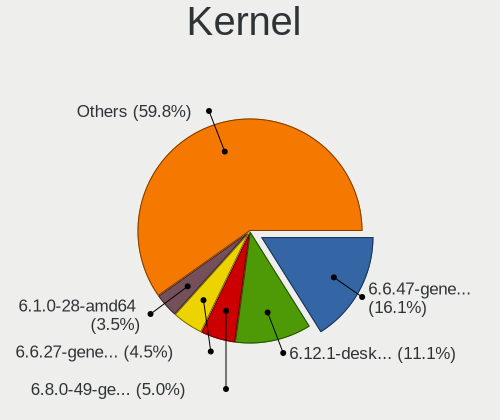
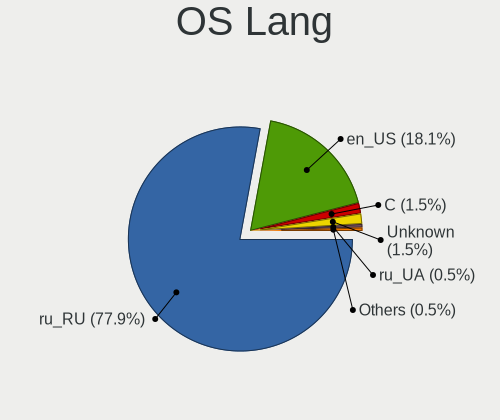
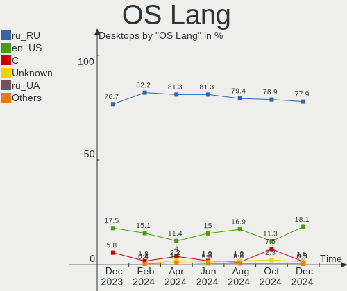
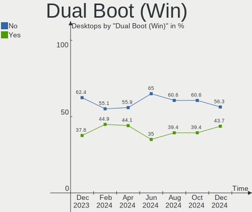
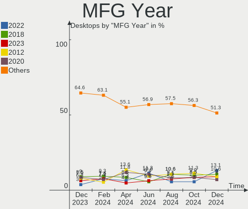
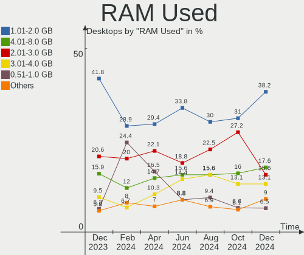
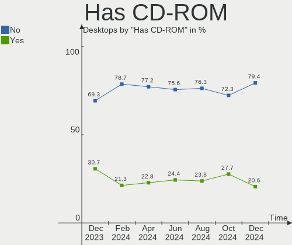
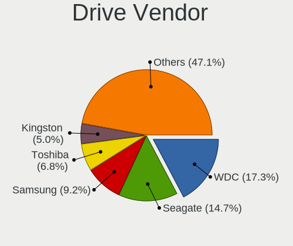

Linux in Russia - Hardware Trends (Desktops)
--------------------------------------------

A project to identify most popular hardware characteristics and track their change
over time based on data collected by Linux users at https://Linux-Hardware.org.

Anyone can contribute to this report by the [hw-probe](https://github.com/linuxhw/hw-probe) tool:

    sudo -E hw-probe -all -upload

Period: Sep, 2023.

Contents
--------

* [ System ](#system)
  - [ OS                       ](#os)
  - [ OS Family                ](#os-family)
  - [ Kernel                   ](#kernel)
  - [ Kernel Family            ](#kernel-family)
  - [ Kernel Major Ver.        ](#kernel-major-ver)
  - [ Arch                     ](#arch)
  - [ DE                       ](#de)
  - [ Display Server           ](#display-server)
  - [ Display Manager          ](#display-manager)
  - [ OS Lang                  ](#os-lang)
  - [ Boot Mode                ](#boot-mode)
  - [ Filesystem               ](#filesystem)
  - [ Part. scheme             ](#part-scheme)
  - [ Dual Boot with Linux/BSD ](#dual-boot-with-linuxbsd)
  - [ Dual Boot (Win)          ](#dual-boot-win)

* [ Board ](#board)
  - [ Vendor                   ](#vendor)
  - [ Model                    ](#model)
  - [ Model Family             ](#model-family)
  - [ MFG Year                 ](#mfg-year)
  - [ Form Factor              ](#form-factor)
  - [ Secure Boot              ](#secure-boot)
  - [ Coreboot                 ](#coreboot)
  - [ RAM Size                 ](#ram-size)
  - [ RAM Used                 ](#ram-used)
  - [ Total Drives             ](#total-drives)
  - [ Has CD-ROM               ](#has-cd-rom)
  - [ Has Ethernet             ](#has-ethernet)
  - [ Has WiFi                 ](#has-wifi)
  - [ Has Bluetooth            ](#has-bluetooth)

* [ Location ](#location)
  - [ Country                  ](#country)
  - [ City                     ](#city)

* [ Drives ](#drives)
  - [ Drive Vendor             ](#drive-vendor)
  - [ Drive Model              ](#drive-model)
  - [ HDD Vendor               ](#hdd-vendor)
  - [ SSD Vendor               ](#ssd-vendor)
  - [ Drive Kind               ](#drive-kind)
  - [ Drive Connector          ](#drive-connector)
  - [ Drive Size               ](#drive-size)
  - [ Space Total              ](#space-total)
  - [ Space Used               ](#space-used)
  - [ Malfunc. Drives          ](#malfunc-drives)
  - [ Malfunc. Drive Vendor    ](#malfunc-drive-vendor)
  - [ Malfunc. HDD Vendor      ](#malfunc-hdd-vendor)
  - [ Malfunc. Drive Kind      ](#malfunc-drive-kind)
  - [ Failed Drives            ](#failed-drives)
  - [ Failed Drive Vendor      ](#failed-drive-vendor)
  - [ Drive Status             ](#drive-status)

* [ Storage controller ](#storage-controller)
  - [ Storage Vendor           ](#storage-vendor)
  - [ Storage Model            ](#storage-model)
  - [ Storage Kind             ](#storage-kind)

* [ Processor ](#processor)
  - [ CPU Vendor               ](#cpu-vendor)
  - [ CPU Model                ](#cpu-model)
  - [ CPU Model Family         ](#cpu-model-family)
  - [ CPU Cores                ](#cpu-cores)
  - [ CPU Sockets              ](#cpu-sockets)
  - [ CPU Threads              ](#cpu-threads)
  - [ CPU Op-Modes             ](#cpu-op-modes)
  - [ CPU Microcode            ](#cpu-microcode)
  - [ CPU Microarch            ](#cpu-microarch)

* [ Graphics ](#graphics)
  - [ GPU Vendor               ](#gpu-vendor)
  - [ GPU Model                ](#gpu-model)
  - [ GPU Combo                ](#gpu-combo)
  - [ GPU Driver               ](#gpu-driver)
  - [ GPU Memory               ](#gpu-memory)

* [ Monitor ](#monitor)
  - [ Monitor Vendor           ](#monitor-vendor)
  - [ Monitor Model            ](#monitor-model)
  - [ Monitor Resolution       ](#monitor-resolution)
  - [ Monitor Diagonal         ](#monitor-diagonal)
  - [ Monitor Width            ](#monitor-width)
  - [ Aspect Ratio             ](#aspect-ratio)
  - [ Monitor Area             ](#monitor-area)
  - [ Pixel Density            ](#pixel-density)
  - [ Multiple Monitors        ](#multiple-monitors)

* [ Network ](#network)
  - [ Net Controller Vendor    ](#net-controller-vendor)
  - [ Net Controller Model     ](#net-controller-model)
  - [ Wireless Vendor          ](#wireless-vendor)
  - [ Wireless Model           ](#wireless-model)
  - [ Ethernet Vendor          ](#ethernet-vendor)
  - [ Ethernet Model           ](#ethernet-model)
  - [ Net Controller Kind      ](#net-controller-kind)
  - [ Used Controller          ](#used-controller)
  - [ NICs                     ](#nics)
  - [ IPv6                     ](#ipv6)

* [ Bluetooth ](#bluetooth)
  - [ Bluetooth Vendor         ](#bluetooth-vendor)
  - [ Bluetooth Model          ](#bluetooth-model)

* [ Sound ](#sound)
  - [ Sound Vendor             ](#sound-vendor)
  - [ Sound Model              ](#sound-model)

* [ Memory ](#memory)
  - [ Memory Vendor            ](#memory-vendor)
  - [ Memory Model             ](#memory-model)
  - [ Memory Kind              ](#memory-kind)
  - [ Memory Form Factor       ](#memory-form-factor)
  - [ Memory Size              ](#memory-size)
  - [ Memory Speed             ](#memory-speed)

* [ Printers & scanners ](#printers--scanners)
  - [ Printer Vendor           ](#printer-vendor)
  - [ Printer Model            ](#printer-model)
  - [ Scanner Vendor           ](#scanner-vendor)
  - [ Scanner Model            ](#scanner-model)

* [ Camera ](#camera)
  - [ Camera Vendor            ](#camera-vendor)
  - [ Camera Model             ](#camera-model)

* [ Security ](#security)
  - [ Fingerprint Vendor       ](#fingerprint-vendor)
  - [ Fingerprint Model        ](#fingerprint-model)
  - [ Chipcard Vendor          ](#chipcard-vendor)
  - [ Chipcard Model           ](#chipcard-model)

* [ Unsupported ](#unsupported)
  - [ Unsupported Devices      ](#unsupported-devices)
  - [ Unsupported Device Types ](#unsupported-device-types)

System
------

OS
--

Installed operating systems

| Name                         | Desktops | Percent |
|------------------------------|----------|---------|
| ROSA 12.4                    | 77       | 32.22%  |
| Debian 12                    | 24       | 10.04%  |
| OpenMandriva 23.08           | 18       | 7.53%   |
| Ubuntu 22.04                 | 12       | 5.02%   |
| OpenMandriva 23.09           | 10       | 4.18%   |
| Arch Rolling                 | 10       | 4.18%   |
| Linux Mint 21.2              | 6        | 2.51%   |
| Red OS 7.3                   | 5        | 2.09%   |
| Fedora 38                    | 5        | 2.09%   |
| ROSA 12                      | 4        | 1.67%   |
| Manjaro                      | 4        | 1.67%   |
| Linux Mint 21.1              | 4        | 1.67%   |
| KDE neon 22.04               | 4        | 1.67%   |
| Ubuntu 23.04                 | 3        | 1.26%   |
| ROSA R11.1                   | 3        | 1.26%   |
| Kubuntu 23.04                | 3        | 1.26%   |
| Kali 2023.3                  | 3        | 1.26%   |
| Debian 11                    | 3        | 1.26%   |
| ALT Linux 10.2               | 3        | 1.26%   |
| OpenMandriva 4.3             | 2        | 0.84%   |
| OpenMandriva 23.03           | 2        | 0.84%   |
| Manjaro 23.0.0               | 2        | 0.84%   |
| Elementary 7                 | 2        | 0.84%   |
| Debian                       | 2        | 0.84%   |
| ArcoLinux Rolling            | 2        | 0.84%   |
| ALT Linux 10.1               | 2        | 0.84%   |
| ALT Linux 10                 | 2        | 0.84%   |
| Ubuntu Studio 23.10          | 1        | 0.42%   |
| Ubuntu MATE 22.04            | 1        | 0.42%   |
| Ubuntu 22.10                 | 1        | 0.42%   |
| Ubuntu 20.04                 | 1        | 0.42%   |
| ROSA 13.0                    | 1        | 0.42%   |
| ROSA 12.2                    | 1        | 0.42%   |
| ROSA 12.1                    | 1        | 0.42%   |
| Pop!_OS 22.04                | 1        | 0.42%   |
| openSUSE Tumbleweed-XXXXXXXX | 1        | 0.42%   |
| openSUSE Leap-15.5           | 1        | 0.42%   |
| MX 23                        | 1        | 0.42%   |
| Manjaro 23.0.1               | 1        | 0.42%   |
| LMDE 5                       | 1        | 0.42%   |

OS Family
---------

OS without a version

| Name          | Desktops | Percent |
|---------------|----------|---------|
| ROSA          | 87       | 36.4%   |
| OpenMandriva  | 32       | 13.39%  |
| Debian        | 29       | 12.13%  |
| Ubuntu        | 17       | 7.11%   |
| Linux Mint    | 11       | 4.6%    |
| Arch          | 10       | 4.18%   |
| ALT Linux     | 10       | 4.18%   |
| Manjaro       | 7        | 2.93%   |
| Fedora        | 6        | 2.51%   |
| Red OS        | 5        | 2.09%   |
| Kubuntu       | 4        | 1.67%   |
| KDE neon      | 4        | 1.67%   |
| Kali          | 3        | 1.26%   |
| openSUSE      | 2        | 0.84%   |
| Elementary    | 2        | 0.84%   |
| ArcoLinux     | 2        | 0.84%   |
| Ubuntu Studio | 1        | 0.42%   |
| Ubuntu MATE   | 1        | 0.42%   |
| Pop!_OS       | 1        | 0.42%   |
| MX            | 1        | 0.42%   |
| LMDE          | 1        | 0.42%   |
| Gentoo        | 1        | 0.42%   |
| EndeavourOS   | 1        | 0.42%   |
| Clear Linux   | 1        | 0.42%   |

Kernel
------

Version of the Linux kernel

| Version                                                  | Desktops | Percent |
|----------------------------------------------------------|----------|---------|
| 6.1.46-generic-2rosa2021.1-x86_64                        | 39       | 16.32%  |
| 6.1.20-generic-2rosa2021.1-x86_64                        | 18       | 7.53%   |
| 6.4.11-desktop-1omv2390                                  | 17       | 7.11%   |
| 6.1.38-generic-1rosa2021.1-x86_64                        | 12       | 5.02%   |
| 6.1.0-4-amd64                                            | 9        | 3.77%   |
| 6.2.0-32-generic                                         | 7        | 2.93%   |
| 6.1.0-10-amd64                                           | 7        | 2.93%   |
| 6.5.3-arch1-1                                            | 5        | 2.09%   |
| 6.5.0-desktop-1omv2390                                   | 5        | 2.09%   |
| 6.4.15-200.fc38.x86_64                                   | 5        | 2.09%   |
| 6.1.0-12-amd64                                           | 5        | 2.09%   |
| 6.2.0-33-generic                                         | 4        | 1.67%   |
| 6.1.44-1.el7.3.x86_64                                    | 4        | 1.67%   |
| 5.15.0-69-generic                                        | 4        | 1.67%   |
| 6.2.0-31-generic                                         | 3        | 1.26%   |
| 6.1.0-11-amd64                                           | 3        | 1.26%   |
| 5.15.0-82-generic                                        | 3        | 1.26%   |
| 5.10.184-generic-1rosa2021.1-x86_64                      | 3        | 1.26%   |
| 6.5.3-desktop-1omv2390                                   | 2        | 0.84%   |
| 6.5.3-1-MANJARO                                          | 2        | 0.84%   |
| 6.5.0-kali1-amd64                                        | 2        | 0.84%   |
| 6.4.12-arch1-1                                           | 2        | 0.84%   |
| 6.2.6-desktop-1omv2390                                   | 2        | 0.84%   |
| 6.1.49-un-def-alt1                                       | 2        | 0.84%   |
| 5.19.0-50-generic                                        | 2        | 0.84%   |
| 5.15.127-generic-1rosa2021.1-x86_64                      | 2        | 0.84%   |
| 5.15.116-1-pve                                           | 2        | 0.84%   |
| 5.15.0-84-generic                                        | 2        | 0.84%   |
| 5.10.164-std-def-alt1                                    | 2        | 0.84%   |
| 5.10.0-25-amd64                                          | 2        | 0.84%   |
| 6.6.0-0.rc0.20230829git1c59d383390f.59.fc40.x86_64+debug | 1        | 0.42%   |
| 6.5.5-desktop-1omv2390                                   | 1        | 0.42%   |
| 6.5.4-arch2-1                                            | 1        | 0.42%   |
| 6.5.3-zen1-1-zen                                         | 1        | 0.42%   |
| 6.5.2-desktop-1omv2390                                   | 1        | 0.42%   |
| 6.5.2-arch1-1                                            | 1        | 0.42%   |
| 6.5.2-1357.native                                        | 1        | 0.42%   |
| 6.5.1-desktop-1omv2390                                   | 1        | 0.42%   |
| 6.5.1-060501-generic                                     | 1        | 0.42%   |
| 6.5.0.xm1-1.klp-xanmod-rosa2021.1-x86_64                 | 1        | 0.42%   |

Kernel Family
-------------

Linux kernel without a distro release

| Version  | Desktops | Percent |
|----------|----------|---------|
| 6.1.46   | 39       | 16.32%  |
| 6.1.0    | 25       | 10.46%  |
| 6.1.20   | 18       | 7.53%   |
| 6.4.11   | 17       | 7.11%   |
| 6.2.0    | 16       | 6.69%   |
| 5.15.0   | 16       | 6.69%   |
| 6.1.38   | 15       | 6.28%   |
| 6.5.3    | 10       | 4.18%   |
| 6.5.0    | 9        | 3.77%   |
| 6.4.15   | 7        | 2.93%   |
| 6.4.12   | 4        | 1.67%   |
| 6.1.49   | 4        | 1.67%   |
| 6.1.44   | 4        | 1.67%   |
| 5.19.0   | 4        | 1.67%   |
| 6.5.2    | 3        | 1.26%   |
| 5.10.184 | 3        | 1.26%   |
| 6.5.1    | 2        | 0.84%   |
| 6.2.6    | 2        | 0.84%   |
| 6.1.51   | 2        | 0.84%   |
| 5.15.127 | 2        | 0.84%   |
| 5.15.116 | 2        | 0.84%   |
| 5.10.74  | 2        | 0.84%   |
| 5.10.164 | 2        | 0.84%   |
| 5.10.0   | 2        | 0.84%   |
| 4.15.0   | 2        | 0.84%   |
| 6.6.0    | 1        | 0.42%   |
| 6.5.5    | 1        | 0.42%   |
| 6.5.4    | 1        | 0.42%   |
| 6.4.8    | 1        | 0.42%   |
| 6.4.6    | 1        | 0.42%   |
| 6.4.2    | 1        | 0.42%   |
| 6.4.0    | 1        | 0.42%   |
| 6.2.16   | 1        | 0.42%   |
| 6.2.12   | 1        | 0.42%   |
| 6.1.53   | 1        | 0.42%   |
| 6.1.29   | 1        | 0.42%   |
| 5.4.83   | 1        | 0.42%   |
| 5.4.28   | 1        | 0.42%   |
| 5.4.0    | 1        | 0.42%   |
| 5.16.7   | 1        | 0.42%   |

Kernel Major Ver.
-----------------

Linux kernel major version

| Version | Desktops | Percent |
|---------|----------|---------|
| 6.1     | 109      | 45.61%  |
| 6.4     | 32       | 13.39%  |
| 6.5     | 26       | 10.88%  |
| 5.15    | 25       | 10.46%  |
| 6.2     | 20       | 8.37%   |
| 5.10    | 14       | 5.86%   |
| 5.19    | 4        | 1.67%   |
| 5.4     | 3        | 1.26%   |
| 5.16    | 2        | 0.84%   |
| 4.15    | 2        | 0.84%   |
| 6.6     | 1        | 0.42%   |
| 5.14    | 1        | 0.42%   |

Arch
----

OS architecture (x86_64, i586, etc.)

| Name   | Desktops | Percent |
|--------|----------|---------|
| x86_64 | 234      | 97.91%  |
| i686   | 5        | 2.09%   |

DE
--

Desktop Environment

| Name       | Desktops | Percent |
|------------|----------|---------|
| KDE5       | 117      | 48.95%  |
| GNOME      | 50       | 20.92%  |
| Unknown    | 28       | 11.72%  |
| XFCE       | 11       | 4.6%    |
| LXQt       | 11       | 4.6%    |
| MATE       | 9        | 3.77%   |
| X-Cinnamon | 6        | 2.51%   |
| Pantheon   | 2        | 0.84%   |
| KDE4       | 2        | 0.84%   |
| Cinnamon   | 2        | 0.84%   |
| i3         | 1        | 0.42%   |

Display Server
--------------

X11 or Wayland

| Name    | Desktops | Percent |
|---------|----------|---------|
| Wayland | 113      | 47.28%  |
| X11     | 98       | 41%     |
| Unknown | 20       | 8.37%   |
| Tty     | 8        | 3.35%   |

Display Manager
---------------

SDDM, LightDM, etc.

| Name    | Desktops | Percent |
|---------|----------|---------|
| SDDM    | 106      | 44.35%  |
| Unknown | 60       | 25.1%   |
| GDM     | 36       | 15.06%  |
| LightDM | 26       | 10.88%  |
| GDM3    | 9        | 3.77%   |
| KDM     | 2        | 0.84%   |

OS Lang
-------

Language

| Lang    | Desktops | Percent |
|---------|----------|---------|
| ru_RU   | 186      | 77.82%  |
| en_US   | 44       | 18.41%  |
| C       | 7        | 2.93%   |
| en_GB   | 1        | 0.42%   |
| Unknown | 1        | 0.42%   |

Boot Mode
---------

EFI or BIOS

| Mode | Desktops | Percent |
|------|----------|---------|
| EFI  | 120      | 50.21%  |
| BIOS | 119      | 49.79%  |

Filesystem
----------

Type of filesystem

| Type    | Desktops | Percent |
|---------|----------|---------|
| Ext4    | 172      | 71.97%  |
| Overlay | 33       | 13.81%  |
| Btrfs   | 22       | 9.21%   |
| Tmpfs   | 4        | 1.67%   |
| Zfs     | 3        | 1.26%   |
| F2fs    | 2        | 0.84%   |
| Xfs     | 1        | 0.42%   |
| Ext2    | 1        | 0.42%   |
| Aufs    | 1        | 0.42%   |

Part. scheme
------------

Scheme of partitioning

| Type    | Desktops | Percent |
|---------|----------|---------|
| GPT     | 142      | 59.41%  |
| MBR     | 62       | 25.94%  |
| Unknown | 35       | 14.64%  |

Dual Boot with Linux/BSD
------------------------

Hosting more than one Linux/BSD

| Dual boot | Desktops | Percent |
|-----------|----------|---------|
| No        | 188      | 78.66%  |
| Yes       | 51       | 21.34%  |

Dual Boot (Win)
---------------

Hosting Linux and Windows

| Dual boot | Desktops | Percent |
|-----------|----------|---------|
| No        | 130      | 54.39%  |
| Yes       | 109      | 45.61%  |

Board
-----

Vendor
------

Motherboard manufacturer

| Name                                 | Desktops | Percent |
|--------------------------------------|----------|---------|
| ASUSTek Computer                     | 59       | 24.69%  |
| Gigabyte Technology                  | 55       | 23.01%  |
| MSI                                  | 36       | 15.06%  |
| ASRock                               | 32       | 13.39%  |
| Supermicro                           | 9        | 3.77%   |
| Intel                                | 7        | 2.93%   |
| Unknown                              | 6        | 2.51%   |
| Hewlett-Packard                      | 5        | 2.09%   |
| Biostar                              | 5        | 2.09%   |
| Lenovo                               | 4        | 1.67%   |
| Foxconn                              | 3        | 1.26%   |
| ECS                                  | 3        | 1.26%   |
| Huanan                               | 2        | 0.84%   |
| Acer                                 | 2        | 0.84%   |
| 3Logic Group                         | 2        | 0.84%   |
| Wistron                              | 1        | 0.42%   |
| Shenzhen Meigao Electronic Equipment | 1        | 0.42%   |
| Pegatron                             | 1        | 0.42%   |
| OEM                                  | 1        | 0.42%   |
| MACHINIST                            | 1        | 0.42%   |
| iEi                                  | 1        | 0.42%   |
| DEPO Computers                       | 1        | 0.42%   |
| Dell                                 | 1        | 0.42%   |
| AZW                                  | 1        | 0.42%   |

Model
-----

Motherboard model

| Name                                            | Desktops | Percent |
|-------------------------------------------------|----------|---------|
| ASUS All Series                                 | 7        | 2.93%   |
| Unknown                                         | 6        | 2.51%   |
| Supermicro SYS-5019S-ML                         | 4        | 1.67%   |
| MSI MS-7D73                                     | 3        | 1.26%   |
| MSI MS-7C91                                     | 3        | 1.26%   |
| Gigabyte H410M H V3                             | 3        | 1.26%   |
| MSI MS-7D76                                     | 2        | 0.84%   |
| MSI MS-7C94                                     | 2        | 0.84%   |
| MSI MS-7C56                                     | 2        | 0.84%   |
| MSI MS-7B23                                     | 2        | 0.84%   |
| MSI MS-7817                                     | 2        | 0.84%   |
| Gigabyte B450 AORUS M                           | 2        | 0.84%   |
| ASUS TUF B450M-PRO GAMING                       | 2        | 0.84%   |
| ASUS P8H61-MX                                   | 2        | 0.84%   |
| ASUS H110M-R                                    | 2        | 0.84%   |
| ASRock H510M-HVS R2.0                           | 2        | 0.84%   |
| 3Logic Group Graviton                           | 2        | 0.84%   |
| Wistron ProLiant ML110 G6                       | 1        | 0.42%   |
| Supermicro X9DRW                                | 1        | 0.42%   |
| Supermicro X9DR3-F                              | 1        | 0.42%   |
| Supermicro SYS-6018R-MTR                        | 1        | 0.42%   |
| Supermicro PIO-628U-TR4T+-ST031                 | 1        | 0.42%   |
| Supermicro PIO-618U-T4T+-ST031                  | 1        | 0.42%   |
| Shenzhen Meigao Electronic Equipment UM773 Lite | 1        | 0.42%   |
| Pegatron IPMSB-H61                              | 1        | 0.42%   |
| OEM Intel H81                                   | 1        | 0.42%   |
| MSI PRO H610 DP21 13M (MS-B0A4)                 | 1        | 0.42%   |
| MSI MS-7D89                                     | 1        | 0.42%   |
| MSI MS-7D75                                     | 1        | 0.42%   |
| MSI MS-7D54                                     | 1        | 0.42%   |
| MSI MS-7D46                                     | 1        | 0.42%   |
| MSI MS-7D22                                     | 1        | 0.42%   |
| MSI MS-7C96                                     | 1        | 0.42%   |
| MSI MS-7C88                                     | 1        | 0.42%   |
| MSI MS-7C83                                     | 1        | 0.42%   |
| MSI MS-7C52                                     | 1        | 0.42%   |
| MSI MS-7C51                                     | 1        | 0.42%   |
| MSI MS-7B93                                     | 1        | 0.42%   |
| MSI MS-7B89                                     | 1        | 0.42%   |
| MSI MS-7A15                                     | 1        | 0.42%   |

Model Family
------------

Motherboard model prefix

| Name                                       | Desktops | Percent |
|--------------------------------------------|----------|---------|
| ASUS PRIME                                 | 14       | 5.86%   |
| ASUS TUF                                   | 7        | 2.93%   |
| ASUS All                                   | 7        | 2.93%   |
| Unknown                                    | 6        | 2.51%   |
| Supermicro SYS-5019S-ML                    | 4        | 1.67%   |
| MSI MS-7D73                                | 3        | 1.26%   |
| MSI MS-7C91                                | 3        | 1.26%   |
| Gigabyte H410M                             | 3        | 1.26%   |
| Gigabyte B450                              | 3        | 1.26%   |
| ASUS P8H61-MX                              | 3        | 1.26%   |
| ASUS P8H61-M                               | 3        | 1.26%   |
| MSI MS-7D76                                | 2        | 0.84%   |
| MSI MS-7C94                                | 2        | 0.84%   |
| MSI MS-7C56                                | 2        | 0.84%   |
| MSI MS-7B23                                | 2        | 0.84%   |
| MSI MS-7817                                | 2        | 0.84%   |
| Lenovo ThinkCentre                         | 2        | 0.84%   |
| Intel H81                                  | 2        | 0.84%   |
| HP Compaq                                  | 2        | 0.84%   |
| Gigabyte X570                              | 2        | 0.84%   |
| Gigabyte B550M                             | 2        | 0.84%   |
| ASUS H110M-R                               | 2        | 0.84%   |
| ASRock H510M-HVS                           | 2        | 0.84%   |
| ASRock B450M                               | 2        | 0.84%   |
| ASRock B450                                | 2        | 0.84%   |
| ASRock A320M-HDV                           | 2        | 0.84%   |
| Acer Veriton                               | 2        | 0.84%   |
| 3Logic Group Graviton                      | 2        | 0.84%   |
| Wistron ProLiant                           | 1        | 0.42%   |
| Supermicro X9DRW                           | 1        | 0.42%   |
| Supermicro X9DR3-F                         | 1        | 0.42%   |
| Supermicro SYS-6018R-MTR                   | 1        | 0.42%   |
| Supermicro PIO-628U-TR4T+-ST031            | 1        | 0.42%   |
| Supermicro PIO-618U-T4T+-ST031             | 1        | 0.42%   |
| Shenzhen Meigao Electronic Equipment UM773 | 1        | 0.42%   |
| Pegatron IPMSB-H61                         | 1        | 0.42%   |
| OEM Intel                                  | 1        | 0.42%   |
| MSI PRO                                    | 1        | 0.42%   |
| MSI MS-7D89                                | 1        | 0.42%   |
| MSI MS-7D75                                | 1        | 0.42%   |

MFG Year
--------

Motherboard manufacture year

| Year | Desktops | Percent |
|------|----------|---------|
| 2022 | 30       | 12.55%  |
| 2020 | 25       | 10.46%  |
| 2018 | 22       | 9.21%   |
| 2021 | 20       | 8.37%   |
| 2013 | 18       | 7.53%   |
| 2012 | 16       | 6.69%   |
| 2019 | 15       | 6.28%   |
| 2011 | 15       | 6.28%   |
| 2009 | 14       | 5.86%   |
| 2017 | 10       | 4.18%   |
| 2016 | 10       | 4.18%   |
| 2010 | 10       | 4.18%   |
| 2008 | 10       | 4.18%   |
| 2014 | 8        | 3.35%   |
| 2007 | 7        | 2.93%   |
| 2023 | 6        | 2.51%   |
| 2015 | 2        | 0.84%   |
| 2006 | 1        | 0.42%   |

Form Factor
-----------

Physical design of the computer

| Name    | Desktops | Percent |
|---------|----------|---------|
| Desktop | 239      | 100%    |

Secure Boot
-----------

Enabled or disabled

| State    | Desktops | Percent |
|----------|----------|---------|
| Disabled | 233      | 97.49%  |
| Enabled  | 6        | 2.51%   |

Coreboot
--------

Have coreboot on board

| Used | Desktops | Percent |
|------|----------|---------|
| No   | 239      | 100%    |

RAM Size
--------

Total RAM memory

| Size in GB  | Desktops | Percent |
|-------------|----------|---------|
| 16.01-24.0  | 55       | 23.01%  |
| 8.01-16.0   | 47       | 19.67%  |
| 4.01-8.0    | 35       | 14.64%  |
| 3.01-4.0    | 35       | 14.64%  |
| 32.01-64.0  | 30       | 12.55%  |
| 64.01-256.0 | 25       | 10.46%  |
| 24.01-32.0  | 6        | 2.51%   |
| 1.01-2.0    | 4        | 1.67%   |
| 2.01-3.0    | 2        | 0.84%   |

RAM Used
--------

Used RAM memory

| Used GB     | Desktops | Percent |
|-------------|----------|---------|
| 1.01-2.0    | 85       | 35.56%  |
| 2.01-3.0    | 55       | 23.01%  |
| 3.01-4.0    | 31       | 12.97%  |
| 0.51-1.0    | 24       | 10.04%  |
| 4.01-8.0    | 21       | 8.79%   |
| 8.01-16.0   | 8        | 3.35%   |
| 0.01-0.5    | 7        | 2.93%   |
| 16.01-24.0  | 3        | 1.26%   |
| 32.01-64.0  | 2        | 0.84%   |
| 24.01-32.0  | 2        | 0.84%   |
| 64.01-256.0 | 1        | 0.42%   |

Total Drives
------------

Number of drives on board

| Drives | Desktops | Percent |
|--------|----------|---------|
| 1      | 98       | 41%     |
| 2      | 69       | 28.87%  |
| 3      | 33       | 13.81%  |
| 4      | 21       | 8.79%   |
| 5      | 8        | 3.35%   |
| 6      | 2        | 0.84%   |
| 0      | 2        | 0.84%   |
| 16     | 1        | 0.42%   |
| 12     | 1        | 0.42%   |
| 10     | 1        | 0.42%   |
| 9      | 1        | 0.42%   |
| 8      | 1        | 0.42%   |
| 7      | 1        | 0.42%   |

Has CD-ROM
----------

Has CD-ROM on board

| Presented | Desktops | Percent |
|-----------|----------|---------|
| No        | 185      | 77.41%  |
| Yes       | 54       | 22.59%  |

Has Ethernet
------------

Has Ethernet on board

| Presented | Desktops | Percent |
|-----------|----------|---------|
| Yes       | 236      | 98.74%  |
| No        | 3        | 1.26%   |

Has WiFi
--------

Has WiFi module

| Presented | Desktops | Percent |
|-----------|----------|---------|
| No        | 172      | 71.97%  |
| Yes       | 67       | 28.03%  |

Has Bluetooth
-------------

Has Bluetooth module

| Presented | Desktops | Percent |
|-----------|----------|---------|
| No        | 180      | 75.31%  |
| Yes       | 59       | 24.69%  |

Location
--------

Country
-------

Geographic location (country)

| Country | Desktops | Percent |
|---------|----------|---------|
| Russia  | 239      | 100%    |

City
----

Geographic location (city)

| City             | Desktops | Percent |
|------------------|----------|---------|
| Moscow           | 46       | 19.25%  |
| St Petersburg    | 21       | 8.79%   |
| Voronezh         | 11       | 4.6%    |
| Ufa              | 10       | 4.18%   |
| Krasnoyarsk      | 7        | 2.93%   |
| Yekaterinburg    | 6        | 2.51%   |
| Novosibirsk      | 6        | 2.51%   |
| Krasnodar        | 5        | 2.09%   |
| Ulyanovsk        | 4        | 1.67%   |
| Tolyatti         | 4        | 1.67%   |
| Nizhniy Novgorod | 4        | 1.67%   |
| Chelyabinsk      | 4        | 1.67%   |
| Vladivostok      | 3        | 1.26%   |
| Veliky Novgorod  | 3        | 1.26%   |
| Taganrog         | 3        | 1.26%   |
| Perm             | 3        | 1.26%   |
| Balakovo         | 3        | 1.26%   |
| Arzamas          | 3        | 1.26%   |
| Zalari           | 2        | 0.84%   |
| Yaroslavl        | 2        | 0.84%   |
| Volzhsky         | 2        | 0.84%   |
| Volgograd        | 2        | 0.84%   |
| Tula             | 2        | 0.84%   |
| Tomsk            | 2        | 0.84%   |
| Tkhamakha        | 2        | 0.84%   |
| Smolensk         | 2        | 0.84%   |
| Samara           | 2        | 0.84%   |
| Orenburg         | 2        | 0.84%   |
| Novokuznetsk     | 2        | 0.84%   |
| Magadan          | 2        | 0.84%   |
| Lyubertsy        | 2        | 0.84%   |
| Izhevsk          | 2        | 0.84%   |
| Irkutsk          | 2        | 0.84%   |
| Cheboksary       | 2        | 0.84%   |
| Zhukovskiy       | 1        | 0.42%   |
| Yelets           | 1        | 0.42%   |
| Yartsevo         | 1        | 0.42%   |
| Yakutsk          | 1        | 0.42%   |
| Vologda          | 1        | 0.42%   |
| Volgodonsk       | 1        | 0.42%   |

Drives
------

Drive Vendor
------------

Hard drive vendors

| Vendor                      | Desktops | Drives | Percent |
|-----------------------------|----------|--------|---------|
| WDC                         | 88       | 118    | 19.82%  |
| Seagate                     | 71       | 80     | 15.99%  |
| Samsung Electronics         | 45       | 58     | 10.14%  |
| Kingston                    | 25       | 26     | 5.63%   |
| Toshiba                     | 24       | 26     | 5.41%   |
| A-DATA Technology           | 15       | 16     | 3.38%   |
| Apacer                      | 14       | 14     | 3.15%   |
| Hitachi                     | 12       | 12     | 2.7%    |
| Netac                       | 10       | 10     | 2.25%   |
| Patriot                     | 9        | 9      | 2.03%   |
| Crucial                     | 8        | 8      | 1.8%    |
| AMD                         | 7        | 7      | 1.58%   |
| Plextor                     | 6        | 6      | 1.35%   |
| Intel                       | 6        | 7      | 1.35%   |
| China                       | 6        | 6      | 1.35%   |
| Silicon Motion              | 5        | 5      | 1.13%   |
| SanDisk                     | 5        | 7      | 1.13%   |
| HGST                        | 5        | 9      | 1.13%   |
| Fujitsu                     | 5        | 5      | 1.13%   |
| SPCC                        | 4        | 5      | 0.9%    |
| Smartbuy                    | 4        | 4      | 0.9%    |
| OCZ                         | 4        | 4      | 0.9%    |
| MAXIO Technology (Hangzhou) | 4        | 4      | 0.9%    |
| ADATA Technology            | 4        | 5      | 0.9%    |
| Unknown                     | 4        | 4      | 0.9%    |
| Realtek Semiconductor       | 3        | 3      | 0.68%   |
| Maxtor                      | 3        | 3      | 0.68%   |
| KingSpec                    | 3        | 4      | 0.68%   |
| Hewlett-Packard             | 3        | 5      | 0.68%   |
| GOODRAM                     | 3        | 3      | 0.68%   |
| Gigabyte Technology         | 3        | 3      | 0.68%   |
| XPG                         | 2        | 3      | 0.45%   |
| MSI                         | 2        | 2      | 0.45%   |
| Kingston Technology Company | 2        | 2      | 0.45%   |
| ZHITAI                      | 1        | 1      | 0.23%   |
| XrayDisk                    | 1        | 1      | 0.23%   |
| Unknown                     | 1        | 1      | 0.23%   |
| Transcend                   | 1        | 1      | 0.23%   |
| Team                        | 1        | 1      | 0.23%   |
| TDAS                        | 1        | 4      | 0.23%   |

Drive Model
-----------

Hard drive models

| Model                                                             | Desktops | Percent |
|-------------------------------------------------------------------|----------|---------|
| Toshiba DT01ACA050 500GB                                          | 10       | 2.02%   |
| WDC WD10EZEX-08WN4A0 1TB                                          | 9        | 1.82%   |
| Seagate ST500DM002-1BD142 500GB                                   | 7        | 1.42%   |
| Kingston SA400S37240G 240GB SSD                                   | 7        | 1.42%   |
| Seagate ST3500418AS 500GB                                         | 6        | 1.21%   |
| WDC WD20EZBX-00AYRA0 2TB                                          | 5        | 1.01%   |
| Toshiba HDWD110 1TB                                               | 5        | 1.01%   |
| Seagate ST1000DM010-2EP102 1TB                                    | 5        | 1.01%   |
| Samsung SSD 970 EVO Plus 1TB                                      | 5        | 1.01%   |
| A-DATA SU650 240GB SSD                                            | 5        | 1.01%   |
| WDC WD10EZEX-22MFCA0 1TB                                          | 4        | 0.81%   |
| Seagate ST1000DM003-1CH162 1TB                                    | 4        | 0.81%   |
| Kingston SA400S37120G 120GB SSD                                   | 4        | 0.81%   |
| Hitachi HDS721050CLA362 500GB                                     | 4        | 0.81%   |
| A-DATA SU650 120GB SSD                                            | 4        | 0.81%   |
| Unknown                                                           | 4        | 0.81%   |
| WDC WD5000AAKX-001CA0 500GB                                       | 3        | 0.61%   |
| Seagate ST1000DM003-1ER162 1TB                                    | 3        | 0.61%   |
| Samsung SSD 980 PRO 1TB                                           | 3        | 0.61%   |
| Samsung SSD 980 250GB                                             | 3        | 0.61%   |
| Samsung SSD 970 EVO Plus 250GB                                    | 3        | 0.61%   |
| Samsung SSD 860 EVO 500GB                                         | 3        | 0.61%   |
| Samsung NVMe SSD Controller SM981/PM981/PM983 256GB               | 3        | 0.61%   |
| Samsung NVMe SSD Controller PM9A1/PM9A3/980PRO 1TB                | 3        | 0.61%   |
| Kingston SA400S37480G 480GB SSD                                   | 3        | 0.61%   |
| Fujitsu MAX3147RC 147GB                                           | 3        | 0.61%   |
| Crucial CT500MX500SSD1 500GB                                      | 3        | 0.61%   |
| Apacer AS340 480GB SSD                                            | 3        | 0.61%   |
| Apacer AS2280P4 256GB                                             | 3        | 0.61%   |
| AMD R5SL240G 240GB SSD                                            | 3        | 0.61%   |
| ADATA XPG SX8200 Pro PCIe Gen3x4 M.2 2280 Solid State Drive 256GB | 3        | 0.61%   |
| WDC WDS500G2B0A-00SM50 500GB SSD                                  | 2        | 0.4%    |
| WDC WDS120G2G0A-00JH30 120GB SSD                                  | 2        | 0.4%    |
| WDC WD5000AZLX-22JKKA0 500GB                                      | 2        | 0.4%    |
| WDC WD5000AZLX-00K2TA0 500GB                                      | 2        | 0.4%    |
| WDC WD40EZAZ-00SF3B0 4TB                                          | 2        | 0.4%    |
| WDC WD20EZAZ-00L9GB0 2TB                                          | 2        | 0.4%    |
| WDC WD20EFRX-68EUZN0 2TB                                          | 2        | 0.4%    |
| WDC WD20EARS-00MVWB0 2TB                                          | 2        | 0.4%    |
| WDC WD10EZRZ-00HTKB0 1TB                                          | 2        | 0.4%    |

HDD Vendor
----------

Hard disk drive vendors

| Vendor              | Desktops | Drives | Percent |
|---------------------|----------|--------|---------|
| WDC                 | 79       | 106    | 38.35%  |
| Seagate             | 71       | 80     | 34.47%  |
| Toshiba             | 24       | 26     | 11.65%  |
| Hitachi             | 12       | 12     | 5.83%   |
| HGST                | 5        | 9      | 2.43%   |
| Fujitsu             | 5        | 5      | 2.43%   |
| Samsung Electronics | 4        | 4      | 1.94%   |
| Maxtor              | 3        | 3      | 1.46%   |
| TDAS                | 1        | 4      | 0.49%   |
| HPE                 | 1        | 2      | 0.49%   |
| Hewlett-Packard     | 1        | 2      | 0.49%   |

SSD Vendor
----------

Solid state drive vendors

| Vendor              | Desktops | Drives | Percent |
|---------------------|----------|--------|---------|
| Kingston            | 21       | 21     | 14.29%  |
| Samsung Electronics | 13       | 15     | 8.84%   |
| A-DATA Technology   | 13       | 14     | 8.84%   |
| Apacer              | 9        | 9      | 6.12%   |
| WDC                 | 8        | 8      | 5.44%   |
| Patriot             | 8        | 8      | 5.44%   |
| Crucial             | 8        | 8      | 5.44%   |
| AMD                 | 7        | 7      | 4.76%   |
| Plextor             | 6        | 6      | 4.08%   |
| Netac               | 6        | 6      | 4.08%   |
| China               | 6        | 6      | 4.08%   |
| Smartbuy            | 4        | 4      | 2.72%   |
| OCZ                 | 4        | 4      | 2.72%   |
| Unknown             | 4        | 4      | 2.72%   |
| SPCC                | 3        | 3      | 2.04%   |
| KingSpec            | 3        | 4      | 2.04%   |
| Intel               | 2        | 2      | 1.36%   |
| Hewlett-Packard     | 2        | 2      | 1.36%   |
| GOODRAM             | 2        | 2      | 1.36%   |
| Gigabyte Technology | 2        | 2      | 1.36%   |
| ZHITAI              | 1        | 1      | 0.68%   |
| Transcend           | 1        | 1      | 0.68%   |
| Reeinno             | 1        | 1      | 0.68%   |
| Qumo                | 1        | 1      | 0.68%   |
| PHD 3.0             | 1        | 1      | 0.68%   |
| Neo                 | 1        | 1      | 0.68%   |
| LS                  | 1        | 1      | 0.68%   |
| Lenovo              | 1        | 1      | 0.68%   |
| HS-SSD-E100         | 1        | 1      | 0.68%   |
| Foxline             | 1        | 1      | 0.68%   |
| EX276687RUS         | 1        | 1      | 0.68%   |
| e2e4                | 1        | 1      | 0.68%   |
| DEXP                | 1        | 1      | 0.68%   |
| Colorful            | 1        | 1      | 0.68%   |
| BR                  | 1        | 1      | 0.68%   |
| AGI                 | 1        | 1      | 0.68%   |

Drive Kind
----------

HDD or SSD

| Kind    | Desktops | Drives | Percent |
|---------|----------|--------|---------|
| HDD     | 162      | 253    | 43.43%  |
| SSD     | 121      | 151    | 32.44%  |
| NVMe    | 88       | 112    | 23.59%  |
| Unknown | 2        | 2      | 0.54%   |

Drive Connector
---------------

SATA, SAS, NVMe, etc.

| Type | Desktops | Drives | Percent |
|------|----------|--------|---------|
| SATA | 204      | 394    | 67.77%  |
| NVMe | 88       | 112    | 29.24%  |
| SAS  | 9        | 12     | 2.99%   |

Drive Size
----------

Size of hard drive

| Size in TB | Desktops | Drives | Percent |
|------------|----------|--------|---------|
| 0.01-0.5   | 173      | 247    | 59.04%  |
| 0.51-1.0   | 75       | 97     | 25.6%   |
| 1.01-2.0   | 23       | 30     | 7.85%   |
| 2.01-3.0   | 8        | 8      | 2.73%   |
| 3.01-4.0   | 7        | 7      | 2.39%   |
| 4.01-10.0  | 5        | 9      | 1.71%   |
| 10.01-20.0 | 2        | 6      | 0.68%   |

Space Total
-----------

Amount of disk space available on the file system

| Size in GB     | Desktops | Percent |
|----------------|----------|---------|
| 101-250        | 53       | 22.18%  |
| 251-500        | 51       | 21.34%  |
| 501-1000       | 27       | 11.3%   |
| 1-20           | 23       | 9.62%   |
| 1001-2000      | 19       | 7.95%   |
| Unknown        | 19       | 7.95%   |
| 51-100         | 16       | 6.69%   |
| More than 3000 | 14       | 5.86%   |
| 2001-3000      | 11       | 4.6%    |
| 21-50          | 6        | 2.51%   |

Space Used
----------

Amount of used disk space

| Used GB        | Desktops | Percent |
|----------------|----------|---------|
| 1-20           | 99       | 41.42%  |
| 21-50          | 28       | 11.72%  |
| 101-250        | 26       | 10.88%  |
| 51-100         | 19       | 7.95%   |
| Unknown        | 19       | 7.95%   |
| 501-1000       | 16       | 6.69%   |
| 251-500        | 14       | 5.86%   |
| More than 3000 | 8        | 3.35%   |
| 1001-2000      | 7        | 2.93%   |
| 2001-3000      | 3        | 1.26%   |

Malfunc. Drives
---------------

Drive models with a malfunction

| Model                            | Desktops | Drives | Percent |
|----------------------------------|----------|--------|---------|
| WDC WD5000AAKX-001CA0 500GB      | 3        | 3      | 3.61%   |
| WDC WD5000AZLX-22JKKA0 500GB     | 2        | 3      | 2.41%   |
| WDC WD20EARS-00MVWB0 2TB         | 2        | 2      | 2.41%   |
| Seagate ST500DM002-1BD142 500GB  | 2        | 2      | 2.41%   |
| Seagate ST3500418AS 500GB        | 2        | 2      | 2.41%   |
| Seagate ST3250310AS 250GB        | 2        | 2      | 2.41%   |
| Seagate ST31000524AS 1TB         | 2        | 2      | 2.41%   |
| Seagate ST1000VX000-1CU162 1TB   | 2        | 2      | 2.41%   |
| Kingston SHFS37A120G 120GB SSD   | 2        | 2      | 2.41%   |
| Hitachi HDS721050CLA362 500GB    | 2        | 2      | 2.41%   |
| XPG GAMMIX S5 256GB              | 1        | 1      | 1.2%    |
| WDC WDS500G2B0A-00SM50 500GB SSD | 1        | 1      | 1.2%    |
| WDC WD6400AAKS-65A7B2 640GB      | 1        | 1      | 1.2%    |
| WDC WD6000HLHX-01JJPV0 600GB     | 1        | 1      | 1.2%    |
| WDC WD5000AAKX-08ERMA0 500GB     | 1        | 1      | 1.2%    |
| WDC WD5000AAKX-00ERMA0 500GB     | 1        | 1      | 1.2%    |
| WDC WD40EFRX-68N32N0 4TB         | 1        | 1      | 1.2%    |
| WDC WD3200AAJS-22L7A0 320GB      | 1        | 1      | 1.2%    |
| WDC WD2500YD-01NVB1 256GB        | 1        | 1      | 1.2%    |
| WDC WD2500JD-40HBC0 250GB        | 1        | 1      | 1.2%    |
| WDC WD1600BEVT-60ZCT1 160GB      | 1        | 1      | 1.2%    |
| WDC WD10PURZ-85U8XY0 1TB         | 1        | 1      | 1.2%    |
| WDC WD10EZRX-00L4HB0 1TB         | 1        | 1      | 1.2%    |
| WDC WD10EZEX-75M2NA0 1TB         | 1        | 1      | 1.2%    |
| WDC WD10EZEX-22MFCA0 1TB         | 1        | 1      | 1.2%    |
| WDC WD10EFRX-68JCSN0 1TB         | 1        | 1      | 1.2%    |
| WDC WD10EADS-65L5B1 1TB          | 1        | 1      | 1.2%    |
| WDC WD1003FBYX-01Y7B1 1TB        | 1        | 1      | 1.2%    |
| WDC WD1002FAEX-00Y9A0 1TB        | 1        | 1      | 1.2%    |
| WDC WD Green 2.5 480GB SSD       | 1        | 1      | 1.2%    |
| Toshiba MQ01ABD050 500GB         | 1        | 1      | 1.2%    |
| Toshiba MK3276GSX -63 320GB      | 1        | 1      | 1.2%    |
| SPCC Solid State Disk 64GB       | 1        | 1      | 1.2%    |
| Seagate STM3500418AS 500GB       | 1        | 1      | 1.2%    |
| Seagate ST9750420AS 752GB        | 1        | 1      | 1.2%    |
| Seagate ST4000DM000-1F2168 4TB   | 1        | 1      | 1.2%    |
| Seagate ST380811AS 80GB          | 1        | 1      | 1.2%    |
| Seagate ST3500312CS 500GB        | 1        | 1      | 1.2%    |
| Seagate ST3320613AS 320GB        | 1        | 1      | 1.2%    |
| Seagate ST3250410AS 250GB        | 1        | 1      | 1.2%    |

Malfunc. Drive Vendor
---------------------

Vendors of faulty drives

| Vendor                      | Desktops | Drives | Percent |
|-----------------------------|----------|--------|---------|
| WDC                         | 25       | 27     | 31.25%  |
| Seagate                     | 23       | 24     | 28.75%  |
| Hitachi                     | 6        | 6      | 7.5%    |
| Samsung Electronics         | 5        | 6      | 6.25%   |
| Kingston                    | 3        | 3      | 3.75%   |
| Toshiba                     | 2        | 2      | 2.5%    |
| Plextor                     | 2        | 2      | 2.5%    |
| Maxtor                      | 2        | 2      | 2.5%    |
| China                       | 2        | 2      | 2.5%    |
| XPG                         | 1        | 1      | 1.25%   |
| SPCC                        | 1        | 1      | 1.25%   |
| Qumo                        | 1        | 1      | 1.25%   |
| OCZ                         | 1        | 1      | 1.25%   |
| Netac                       | 1        | 1      | 1.25%   |
| Neo                         | 1        | 1      | 1.25%   |
| MAXIO Technology (Hangzhou) | 1        | 1      | 1.25%   |
| Fujitsu                     | 1        | 1      | 1.25%   |
| EX276687RUS                 | 1        | 1      | 1.25%   |
| AMD                         | 1        | 1      | 1.25%   |

Malfunc. HDD Vendor
-------------------

Vendors of faulty HDD drives

| Vendor              | Desktops | Drives | Percent |
|---------------------|----------|--------|---------|
| WDC                 | 23       | 25     | 38.33%  |
| Seagate             | 23       | 24     | 38.33%  |
| Hitachi             | 6        | 6      | 10%     |
| Samsung Electronics | 3        | 3      | 5%      |
| Toshiba             | 2        | 2      | 3.33%   |
| Maxtor              | 2        | 2      | 3.33%   |
| Fujitsu             | 1        | 1      | 1.67%   |

Malfunc. Drive Kind
-------------------

Kinds of faulty drives

| Kind | Desktops | Drives | Percent |
|------|----------|--------|---------|
| HDD  | 54       | 63     | 73.97%  |
| SSD  | 16       | 17     | 21.92%  |
| NVMe | 3        | 4      | 4.11%   |

Failed Drives
-------------

Failed drive models

| Model                     | Desktops | Drives | Percent |
|---------------------------|----------|--------|---------|
| Seagate ST3320613AS 320GB | 1        | 1      | 100%    |

Failed Drive Vendor
-------------------

Failed drive vendors

| Vendor  | Desktops | Drives | Percent |
|---------|----------|--------|---------|
| Seagate | 1        | 1      | 100%    |

Drive Status
------------

Number of failed and malfunc. drives

| Status   | Desktops | Drives | Percent |
|----------|----------|--------|---------|
| Works    | 164      | 331    | 58.36%  |
| Malfunc  | 69       | 84     | 24.56%  |
| Detected | 47       | 102    | 16.73%  |
| Failed   | 1        | 1      | 0.36%   |

Storage controller
------------------

Storage Vendor
--------------

Storage controller vendors

| Vendor                       | Desktops | Percent |
|------------------------------|----------|---------|
| Intel                        | 140      | 38.46%  |
| AMD                          | 90       | 24.73%  |
| Samsung Electronics          | 30       | 8.24%   |
| Silicon Motion               | 12       | 3.3%    |
| Phison Electronics           | 10       | 2.75%   |
| ASMedia Technology           | 10       | 2.75%   |
| SanDisk                      | 9        | 2.47%   |
| Nvidia                       | 9        | 2.47%   |
| JMicron Technology           | 9        | 2.47%   |
| MAXIO Technology (Hangzhou)  | 8        | 2.2%    |
| ADATA Technology             | 8        | 2.2%    |
| Kingston Technology Company  | 7        | 1.92%   |
| Marvell Technology Group     | 5        | 1.37%   |
| Netac Technology             | 4        | 1.1%    |
| Realtek Semiconductor        | 3        | 0.82%   |
| Broadcom / LSI               | 3        | 0.82%   |
| Adaptec                      | 3        | 0.82%   |
| VIA Technologies             | 1        | 0.27%   |
| Shenzhen Longsys Electronics | 1        | 0.27%   |
| Seagate Technology           | 1        | 0.27%   |
| Micron/Crucial Technology    | 1        | 0.27%   |

Storage Model
-------------

Storage controller models

| Model                                                                                   | Desktops | Percent |
|-----------------------------------------------------------------------------------------|----------|---------|
| AMD FCH SATA Controller [AHCI mode]                                                     | 40       | 8.93%   |
| AMD 500 Series Chipset SATA Controller                                                  | 21       | 4.69%   |
| AMD SB7x0/SB8x0/SB9x0 IDE Controller                                                    | 15       | 3.35%   |
| AMD 400 Series Chipset SATA Controller                                                  | 15       | 3.35%   |
| Intel 8 Series/C220 Series Chipset Family 6-port SATA Controller 1 [AHCI mode]          | 14       | 3.13%   |
| Intel Q170/Q150/B150/H170/H110/Z170/CM236 Chipset SATA Controller [AHCI Mode]           | 13       | 2.9%    |
| Intel 500 Series Chipset Family SATA AHCI Controller                                    | 13       | 2.9%    |
| Silicon Motion SM2263EN/SM2263XT (DRAM-less) NVMe SSD Controllers                       | 11       | 2.46%   |
| Samsung NVMe SSD Controller SM981/PM981/PM983                                           | 11       | 2.46%   |
| Samsung NVMe SSD Controller PM9A1/PM9A3/980PRO                                          | 11       | 2.46%   |
| Intel NM10/ICH7 Family SATA Controller [IDE mode]                                       | 11       | 2.46%   |
| AMD SB7x0/SB8x0/SB9x0 SATA Controller [AHCI mode]                                       | 11       | 2.46%   |
| ASMedia ASM1062 Serial ATA Controller                                                   | 10       | 2.23%   |
| Intel Alder Lake-S PCH SATA Controller [AHCI Mode]                                      | 9        | 2.01%   |
| Intel 6 Series/C200 Series Chipset Family Desktop SATA Controller (IDE mode, ports 4-5) | 9        | 2.01%   |
| Intel 6 Series/C200 Series Chipset Family Desktop SATA Controller (IDE mode, ports 0-3) | 9        | 2.01%   |
| Intel 82801G (ICH7 Family) IDE Controller                                               | 8        | 1.79%   |
| Intel 6 Series/C200 Series Chipset Family 6 port Desktop SATA AHCI Controller           | 8        | 1.79%   |
| MAXIO (Hangzhou) NVMe SSD Controller MAP1202                                            | 7        | 1.56%   |
| AMD SB7x0/SB8x0/SB9x0 SATA Controller [IDE mode]                                        | 7        | 1.56%   |
| AMD FCH SATA Controller D                                                               | 7        | 1.56%   |
| Samsung NVMe SSD Controller 980                                                         | 6        | 1.34%   |
| Phison PS5013 E13 NVMe Controller                                                       | 6        | 1.34%   |
| Intel Cannon Lake PCH SATA AHCI Controller                                              | 6        | 1.34%   |
| Intel 200 Series PCH SATA controller [AHCI mode]                                        | 6        | 1.34%   |
| Nvidia MCP61 SATA Controller                                                            | 5        | 1.12%   |
| JMicron JMB363 SATA/IDE Controller                                                      | 5        | 1.12%   |
| ADATA XPG SX8200 Pro PCIe Gen3x4 M.2 2280 Solid State Drive                             | 5        | 1.12%   |
| Samsung NVMe SSD Controller SM961/PM961/SM963                                           | 4        | 0.89%   |
| Nvidia MCP61 IDE                                                                        | 4        | 0.89%   |
| Netac Non-Volatile memory controller                                                    | 4        | 0.89%   |
| Intel Volume Management Device NVMe RAID Controller                                     | 4        | 0.89%   |
| Intel 9 Series Chipset Family SATA Controller [AHCI Mode]                               | 4        | 0.89%   |
| Intel 82801JI (ICH10 Family) SATA AHCI Controller                                       | 4        | 0.89%   |
| Intel 400 Series Chipset Family SATA AHCI Controller                                    | 4        | 0.89%   |
| SanDisk WD Blue SN550 NVMe SSD                                                          | 3        | 0.67%   |
| Kingston Company KC3000/Renegade NVMe SSD                                               | 3        | 0.67%   |
| JMicron JMB368 IDE controller                                                           | 3        | 0.67%   |
| Intel C610/X99 series chipset sSATA Controller [AHCI mode]                              | 3        | 0.67%   |
| Intel C610/X99 series chipset 6-Port SATA Controller [AHCI mode]                        | 3        | 0.67%   |

Storage Kind
------------

Kind of storage controller (IDE, SATA, NVMe, SAS, ...)

| Kind | Desktops | Percent |
|------|----------|---------|
| SATA | 192      | 53.48%  |
| NVMe | 88       | 24.51%  |
| IDE  | 61       | 16.99%  |
| RAID | 13       | 3.62%   |
| SAS  | 5        | 1.39%   |

Processor
---------

CPU Vendor
----------

Processor vendors

| Vendor | Desktops | Percent |
|--------|----------|---------|
| Intel  | 140      | 58.58%  |
| AMD    | 99       | 41.42%  |

CPU Model
---------

Processor models

| Model                                       | Desktops | Percent |
|---------------------------------------------|----------|---------|
| AMD Ryzen 5 3600 6-Core Processor           | 11       | 4.6%    |
| Intel Xeon CPU E3-1240 v6 @ 3.70GHz         | 4        | 1.67%   |
| AMD Ryzen 7 5700G with Radeon Graphics      | 4        | 1.67%   |
| AMD Ryzen 7 1700 Eight-Core Processor       | 4        | 1.67%   |
| Intel Pentium Gold G5400 CPU @ 3.70GHz      | 3        | 1.26%   |
| Intel Core i5-10400 CPU @ 2.90GHz           | 3        | 1.26%   |
| Intel Core i3-2120 CPU @ 3.30GHz            | 3        | 1.26%   |
| AMD Ryzen 9 7950X 16-Core Processor         | 3        | 1.26%   |
| AMD Ryzen 9 5900X 12-Core Processor         | 3        | 1.26%   |
| AMD Ryzen 7 7700X 8-Core Processor          | 3        | 1.26%   |
| AMD Ryzen 7 3700X 8-Core Processor          | 3        | 1.26%   |
| AMD Ryzen 5 5600X 6-Core Processor          | 3        | 1.26%   |
| AMD Phenom II X4 955 Processor              | 3        | 1.26%   |
| AMD FX-6300 Six-Core Processor              | 3        | 1.26%   |
| Intel Xeon CPU E5-2680 v4 @ 2.40GHz         | 2        | 0.84%   |
| Intel Pentium Gold G5420 CPU @ 3.80GHz      | 2        | 0.84%   |
| Intel Pentium CPU G620 @ 2.60GHz            | 2        | 0.84%   |
| Intel Pentium CPU G3420 @ 3.20GHz           | 2        | 0.84%   |
| Intel Core i5-7400 CPU @ 3.00GHz            | 2        | 0.84%   |
| Intel Core i5-4570 CPU @ 3.20GHz            | 2        | 0.84%   |
| Intel Core i5-3470 CPU @ 3.20GHz            | 2        | 0.84%   |
| Intel Core i5-10400F CPU @ 2.90GHz          | 2        | 0.84%   |
| Intel Core i3-7100 CPU @ 3.90GHz            | 2        | 0.84%   |
| Intel Core i3-2100 CPU @ 3.10GHz            | 2        | 0.84%   |
| Intel Core i3-10100 CPU @ 3.60GHz           | 2        | 0.84%   |
| Intel Core i3 CPU 550 @ 3.20GHz             | 2        | 0.84%   |
| Intel Core 2 Duo CPU E4500 @ 2.20GHz        | 2        | 0.84%   |
| Intel Celeron G5905 CPU @ 3.50GHz           | 2        | 0.84%   |
| Intel 13th Gen Core i9-13900K               | 2        | 0.84%   |
| AMD Ryzen 9 7900X 12-Core Processor         | 2        | 0.84%   |
| AMD Ryzen 7 PRO 3700 8-Core Processor       | 2        | 0.84%   |
| AMD Ryzen 7 5800X3D 8-Core Processor        | 2        | 0.84%   |
| AMD Ryzen 5 7600X 6-Core Processor          | 2        | 0.84%   |
| AMD Ryzen 5 5600G with Radeon Graphics      | 2        | 0.84%   |
| AMD Ryzen 3 2200G with Radeon Vega Graphics | 2        | 0.84%   |
| AMD Ryzen 3 1200 Quad-Core Processor        | 2        | 0.84%   |
| AMD Phenom II X4 965 Processor              | 2        | 0.84%   |
| AMD FX-4350 Quad-Core Processor             | 2        | 0.84%   |
| AMD E-350 Processor                         | 2        | 0.84%   |
| AMD Athlon 64 X2 Dual Core Processor 4200+  | 2        | 0.84%   |

CPU Model Family
----------------

Processor model prefix

| Model                   | Desktops | Percent |
|-------------------------|----------|---------|
| Intel Core i5           | 28       | 11.72%  |
| AMD Ryzen 5             | 24       | 10.04%  |
| Intel Xeon              | 23       | 9.62%   |
| Intel Core i3           | 19       | 7.95%   |
| AMD Ryzen 7             | 19       | 7.95%   |
| Other                   | 15       | 6.28%   |
| Intel Celeron           | 12       | 5.02%   |
| AMD Ryzen 9             | 12       | 5.02%   |
| Intel Pentium           | 10       | 4.18%   |
| Intel Core i7           | 9        | 3.77%   |
| AMD FX                  | 9        | 3.77%   |
| AMD Ryzen 3             | 7        | 2.93%   |
| Intel Pentium Gold      | 6        | 2.51%   |
| Intel Core 2 Duo        | 6        | 2.51%   |
| AMD Phenom II X4        | 6        | 2.51%   |
| Intel Pentium Dual-Core | 5        | 2.09%   |
| AMD Athlon 64 X2        | 4        | 1.67%   |
| AMD A10                 | 3        | 1.26%   |
| Intel Core i9           | 2        | 0.84%   |
| Intel Core 2 Quad       | 2        | 0.84%   |
| AMD Ryzen 7 PRO         | 2        | 0.84%   |
| AMD E                   | 2        | 0.84%   |
| AMD Athlon II X3        | 2        | 0.84%   |
| AMD Athlon II X2        | 2        | 0.84%   |
| AMD A8                  | 2        | 0.84%   |
| Intel Pentium Dual      | 1        | 0.42%   |
| Intel Core 2            | 1        | 0.42%   |
| Intel Atom              | 1        | 0.42%   |
| AMD Ryzen 3 PRO         | 1        | 0.42%   |
| AMD Phenom              | 1        | 0.42%   |
| AMD Athlon X4           | 1        | 0.42%   |
| AMD Athlon              | 1        | 0.42%   |
| AMD A4                  | 1        | 0.42%   |

CPU Cores
---------

Number of processor cores

| Number | Desktops | Percent |
|--------|----------|---------|
| 4      | 71       | 29.71%  |
| 2      | 69       | 28.87%  |
| 6      | 34       | 14.23%  |
| 8      | 30       | 12.55%  |
| 12     | 9        | 3.77%   |
| 16     | 6        | 2.51%   |
| 3      | 6        | 2.51%   |
| 24     | 4        | 1.67%   |
| 1      | 4        | 1.67%   |
| 10     | 3        | 1.26%   |
| 28     | 2        | 0.84%   |
| 18     | 1        | 0.42%   |

CPU Sockets
-----------

Number of sockets

| Number | Desktops | Percent |
|--------|----------|---------|
| 1      | 234      | 97.91%  |
| 2      | 5        | 2.09%   |

CPU Threads
-----------

Threads per core (Hyper-Threading)

| Number | Desktops | Percent |
|--------|----------|---------|
| 2      | 148      | 61.92%  |
| 1      | 91       | 38.08%  |

CPU Op-Modes
------------

CPU Operation Modes (32-bit, 64-bit)

| Op mode        | Desktops | Percent |
|----------------|----------|---------|
| 32-bit, 64-bit | 239      | 100%    |

CPU Microcode
-------------

Microcode number

| Number     | Desktops | Percent |
|------------|----------|---------|
| Unknown    | 61       | 25.52%  |
| 0x906e9    | 10       | 4.18%   |
| 0x1067a    | 10       | 4.18%   |
| 0x0a601203 | 10       | 4.18%   |
| 0x306c3    | 9        | 3.77%   |
| 0x206a7    | 9        | 3.77%   |
| 0x0a20120a | 9        | 3.77%   |
| 0x08701021 | 9        | 3.77%   |
| 0x08701030 | 8        | 3.35%   |
| 0xa0653    | 6        | 2.51%   |
| 0x306a9    | 6        | 2.51%   |
| 0x406f1    | 5        | 2.09%   |
| 0x010000c8 | 5        | 2.09%   |
| 0x0800820d | 4        | 1.67%   |
| 0x06001119 | 4        | 1.67%   |
| 0xa0671    | 3        | 1.26%   |
| 0x6fd      | 3        | 1.26%   |
| 0x506e3    | 3        | 1.26%   |
| 0x0a50000d | 3        | 1.26%   |
| 0x0a50000c | 3        | 1.26%   |
| 0x08108109 | 3        | 1.26%   |
| 0x08101016 | 3        | 1.26%   |
| 0xb0671    | 2        | 0.84%   |
| 0x90675    | 2        | 0.84%   |
| 0x90672    | 2        | 0.84%   |
| 0x306e4    | 2        | 0.84%   |
| 0x20655    | 2        | 0.84%   |
| 0x106e5    | 2        | 0.84%   |
| 0x10676    | 2        | 0.84%   |
| 0x0a404102 | 2        | 0.84%   |
| 0x0a201016 | 2        | 0.84%   |
| 0x08001138 | 2        | 0.84%   |
| 0x06003106 | 2        | 0.84%   |
| 0x0600081c | 2        | 0.84%   |
| 0x05000028 | 2        | 0.84%   |
| 0xb06f5    | 1        | 0.42%   |
| 0xa0652    | 1        | 0.42%   |
| 0x906ed    | 1        | 0.42%   |
| 0x906eb    | 1        | 0.42%   |
| 0x906ea    | 1        | 0.42%   |

CPU Microarch
-------------

Microarchitecture

| Name             | Desktops | Percent |
|------------------|----------|---------|
| KabyLake         | 22       | 9.21%   |
| Zen 2            | 20       | 8.37%   |
| Zen 3            | 18       | 7.53%   |
| Haswell          | 18       | 7.53%   |
| CometLake        | 16       | 6.69%   |
| Penryn           | 14       | 5.86%   |
| IvyBridge        | 14       | 5.86%   |
| Unknown          | 14       | 5.86%   |
| SandyBridge      | 13       | 5.44%   |
| Piledriver       | 12       | 5.02%   |
| K10              | 11       | 4.6%    |
| Alderlake Hybrid | 10       | 4.18%   |
| Zen              | 8        | 3.35%   |
| Zen+             | 7        | 2.93%   |
| Core             | 6        | 2.51%   |
| Skylake          | 5        | 2.09%   |
| Broadwell        | 5        | 2.09%   |
| K8 Hammer        | 4        | 1.67%   |
| Westmere         | 3        | 1.26%   |
| Silvermont       | 3        | 1.26%   |
| Nehalem          | 3        | 1.26%   |
| Icelake          | 3        | 1.26%   |
| Steamroller      | 2        | 0.84%   |
| Bobcat           | 2        | 0.84%   |
| Tremont          | 1        | 0.42%   |
| TigerLake        | 1        | 0.42%   |
| Goldmont plus    | 1        | 0.42%   |
| Excavator        | 1        | 0.42%   |
| Bulldozer        | 1        | 0.42%   |
| Bonnell          | 1        | 0.42%   |

Graphics
--------

GPU Vendor
----------

Vendors of graphics cards

| Vendor                     | Desktops | Percent |
|----------------------------|----------|---------|
| Nvidia                     | 107      | 42.46%  |
| AMD                        | 75       | 29.76%  |
| Intel                      | 60       | 23.81%  |
| ASPEED Technology          | 7        | 2.78%   |
| Matrox Electronics Systems | 3        | 1.19%   |

GPU Model
---------

Graphics card models

| Model                                                                       | Desktops | Percent |
|-----------------------------------------------------------------------------|----------|---------|
| AMD Raphael                                                                 | 9        | 3.49%   |
| Nvidia GP107 [GeForce GTX 1050 Ti]                                          | 8        | 3.1%    |
| Intel Xeon E3-1200 v3/4th Gen Core Processor Integrated Graphics Controller | 7        | 2.71%   |
| ASPEED Technology ASPEED Graphics Family                                    | 7        | 2.71%   |
| AMD Ellesmere [Radeon RX 470/480/570/570X/580/580X/590]                     | 7        | 2.71%   |
| Nvidia GA104 [GeForce RTX 3060]                                             | 6        | 2.33%   |
| Nvidia TU116 [GeForce GTX 1660 SUPER]                                       | 5        | 1.94%   |
| Nvidia GP107 [GeForce GTX 1050]                                             | 5        | 1.94%   |
| Intel CometLake-S GT2 [UHD Graphics 630]                                    | 5        | 1.94%   |
| AMD Navi 22 [Radeon RX 6700/6700 XT/6750 XT / 6800M/6850M XT]               | 5        | 1.94%   |
| AMD Cezanne [Radeon Vega Series / Radeon Vega Mobile Series]                | 5        | 1.94%   |
| Nvidia GM107 [GeForce GTX 750 Ti]                                           | 4        | 1.55%   |
| Nvidia GF108 [GeForce GT 730]                                               | 4        | 1.55%   |
| Nvidia GA106 [GeForce RTX 3060 Lite Hash Rate]                              | 4        | 1.55%   |
| Nvidia G96C [GeForce 9500 GT]                                               | 4        | 1.55%   |
| Intel Xeon E3-1200 v2/3rd Gen Core processor Graphics Controller            | 4        | 1.55%   |
| Intel HD Graphics 630                                                       | 4        | 1.55%   |
| Intel CoffeeLake-S GT2 [UHD Graphics 630]                                   | 4        | 1.55%   |
| Intel CoffeeLake-S GT1 [UHD Graphics 610]                                   | 4        | 1.55%   |
| Intel 2nd Generation Core Processor Family Integrated Graphics Controller   | 4        | 1.55%   |
| Nvidia TU117 [GeForce GTX 1650]                                             | 3        | 1.16%   |
| Nvidia GT218 [GeForce 210]                                                  | 3        | 1.16%   |
| Nvidia GP108 [GeForce GT 1030]                                              | 3        | 1.16%   |
| Nvidia GP106 [GeForce GTX 1060 6GB]                                         | 3        | 1.16%   |
| Nvidia GK208B [GeForce GT 730]                                              | 3        | 1.16%   |
| Intel CometLake-S GT1 [UHD Graphics 610]                                    | 3        | 1.16%   |
| Intel Alder Lake-S GT1 [UHD Graphics 730]                                   | 3        | 1.16%   |
| Intel 4 Series Chipset Integrated Graphics Controller                       | 3        | 1.16%   |
| AMD Raven Ridge [Radeon Vega Series / Radeon Vega Mobile Series]            | 3        | 1.16%   |
| AMD Picasso/Raven 2 [Radeon Vega Series / Radeon Vega Mobile Series]        | 3        | 1.16%   |
| AMD Navi 23 [Radeon RX 6600/6600 XT/6600M]                                  | 3        | 1.16%   |
| AMD Lexa PRO [Radeon 540/540X/550/550X / RX 540X/550/550X]                  | 3        | 1.16%   |
| Nvidia TU106 [GeForce RTX 2070 Rev. A]                                      | 2        | 0.78%   |
| Nvidia TU106 [GeForce RTX 2060 SUPER]                                       | 2        | 0.78%   |
| Nvidia TU104 [GeForce RTX 2070 SUPER]                                       | 2        | 0.78%   |
| Nvidia GP104 [GeForce GTX 1070]                                             | 2        | 0.78%   |
| Nvidia GP102 [GeForce GTX 1080 Ti]                                          | 2        | 0.78%   |
| Nvidia GM204 [GeForce GTX 970]                                              | 2        | 0.78%   |
| Nvidia GK107 [GeForce GTX 650]                                              | 2        | 0.78%   |
| Nvidia GA104 [GeForce RTX 3070 Lite Hash Rate]                              | 2        | 0.78%   |

GPU Combo
---------

Combinations of graphics cards

| Name           | Desktops | Percent |
|----------------|----------|---------|
| 1 x Nvidia     | 96       | 40.17%  |
| 1 x AMD        | 66       | 27.62%  |
| 1 x Intel      | 53       | 22.18%  |
| 1 x ASPEED     | 7        | 2.93%   |
| AMD + Nvidia   | 6        | 2.51%   |
| 2 x AMD        | 3        | 1.26%   |
| 1 x Matrox     | 3        | 1.26%   |
| Intel + Nvidia | 3        | 1.26%   |
| 2 x Nvidia     | 2        | 0.84%   |

GPU Driver
----------

Free vs proprietary

| Driver      | Desktops | Percent |
|-------------|----------|---------|
| Free        | 174      | 72.8%   |
| Proprietary | 47       | 19.67%  |
| Unknown     | 18       | 7.53%   |

GPU Memory
----------

Total video memory

| Size in GB | Desktops | Percent |
|------------|----------|---------|
| Unknown    | 103      | 43.1%   |
| 0.01-0.5   | 27       | 11.3%   |
| 7.01-8.0   | 23       | 9.62%   |
| 0.51-1.0   | 23       | 9.62%   |
| 3.01-4.0   | 22       | 9.21%   |
| 1.01-2.0   | 21       | 8.79%   |
| 8.01-16.0  | 14       | 5.86%   |
| 5.01-6.0   | 5        | 2.09%   |
| 16.01-24.0 | 1        | 0.42%   |

Monitor
-------

Monitor Vendor
--------------

Monitor vendors

| Vendor               | Desktops | Percent |
|----------------------|----------|---------|
| Samsung Electronics  | 46       | 20.35%  |
| Goldstar             | 28       | 12.39%  |
| Acer                 | 21       | 9.29%   |
| Philips              | 17       | 7.52%   |
| BenQ                 | 14       | 6.19%   |
| Dell                 | 13       | 5.75%   |
| Hewlett-Packard      | 11       | 4.87%   |
| AOC                  | 9        | 3.98%   |
| Ancor Communications | 8        | 3.54%   |
| ASUSTek Computer     | 6        | 2.65%   |
| Iiyama               | 5        | 2.21%   |
| ViewSonic            | 4        | 1.77%   |
| MStar                | 3        | 1.33%   |
| HUAWEI               | 3        | 1.33%   |
| ___                  | 2        | 0.88%   |
| Unknown              | 2        | 0.88%   |
| Sony                 | 2        | 0.88%   |
| RTK                  | 2        | 0.88%   |
| Packard Bell         | 2        | 0.88%   |
| NEC Computers        | 2        | 0.88%   |
| MSI                  | 2        | 0.88%   |
| Mi                   | 2        | 0.88%   |
| LG Electronics       | 2        | 0.88%   |
| Unknown              | 2        | 0.88%   |
| TCH                  | 1        | 0.44%   |
| SKG                  | 1        | 0.44%   |
| Sharp                | 1        | 0.44%   |
| SAC                  | 1        | 0.44%   |
| MiTAC                | 1        | 0.44%   |
| InnoLux Display      | 1        | 0.44%   |
| HKC                  | 1        | 0.44%   |
| HHT                  | 1        | 0.44%   |
| Haier                | 1        | 0.44%   |
| GreenWood            | 1        | 0.44%   |
| Gigabyte Technology  | 1        | 0.44%   |
| DZM                  | 1        | 0.44%   |
| DOF                  | 1        | 0.44%   |
| Daewoo               | 1        | 0.44%   |
| CHR                  | 1        | 0.44%   |
| CHD                  | 1        | 0.44%   |

Monitor Model
-------------

Monitor models

| Model                                                                 | Desktops | Percent |
|-----------------------------------------------------------------------|----------|---------|
| Ancor Communications ASUS VB178 ACI1714 1280x1024 338x270mm 17.0-inch | 4        | 1.72%   |
| Samsung Electronics S24D300 SAM0B43 1920x1080 531x299mm 24.0-inch     | 3        | 1.29%   |
| MStar Demo MST0030 1360x765 1150x650mm 52.0-inch                      | 3        | 1.29%   |
| Goldstar IPS FULLHD GSM5AB8 1920x1080 480x270mm 21.7-inch             | 3        | 1.29%   |
| ___ LCDTV16 ___9000 1360x768                                          | 2        | 0.86%   |
| Unknown LCDTV16 9000 1360x768 1600x900mm 72.3-inch                    | 2        | 0.86%   |
| Sony SDM-E96D SNYB500 1280x1024 376x301mm 19.0-inch                   | 2        | 0.86%   |
| Samsung Electronics SyncMaster SAM06A3 1360x768 410x230mm 18.5-inch   | 2        | 0.86%   |
| Samsung Electronics SyncMaster SAM0564 1360x768 410x230mm 18.5-inch   | 2        | 0.86%   |
| Samsung Electronics LCD Monitor SAM0659 1920x1080                     | 2        | 0.86%   |
| Samsung Electronics C32JG5x SAM0F54 2560x1440 697x392mm 31.5-inch     | 2        | 0.86%   |
| Philips PHL 247E6 PHLC0E7 1920x1080 521x293mm 23.5-inch               | 2        | 0.86%   |
| Philips PHL 243V5 PHLC0D1 1920x1080 521x293mm 23.5-inch               | 2        | 0.86%   |
| Iiyama PL2792H IVM664F 1920x1080 598x336mm 27.0-inch                  | 2        | 0.86%   |
| Hewlett-Packard LP3065 HWP2690 2560x1600 641x400mm 29.7-inch          | 2        | 0.86%   |
| Goldstar L1942 GSM4B85 1280x1024 376x301mm 19.0-inch                  | 2        | 0.86%   |
| Goldstar IPS FULLHD GSM5AB6 1920x1080 480x270mm 21.7-inch             | 2        | 0.86%   |
| Goldstar HDR 4K GSM7707 3840x2160 600x340mm 27.2-inch                 | 2        | 0.86%   |
| Goldstar 27GL850 GSM5B7F 2560x1440 597x336mm 27.0-inch                | 2        | 0.86%   |
| Dell S2415H DELA0B5 1920x1080 530x300mm 24.0-inch                     | 2        | 0.86%   |
| BenQ T90X BNQ76AF 1280x1024 376x301mm 19.0-inch                       | 2        | 0.86%   |
| ASUSTek Computer VA24E AUS24D1 1920x1080 527x296mm 23.8-inch          | 2        | 0.86%   |
| AOC 27B2 AOC2702 1920x1080 598x336mm 27.0-inch                        | 2        | 0.86%   |
| AOC 2243W AOC2243 1920x1080 477x268mm 21.5-inch                       | 2        | 0.86%   |
| Acer VG270U P ACR06CF 2560x1440 597x336mm 27.0-inch                   | 2        | 0.86%   |
| Acer VG240Y ACR0673 1920x1080 527x296mm 23.8-inch                     | 2        | 0.86%   |
| Unknown                                                               | 2        | 0.86%   |
| ViewSonic VA2419 Series VSC7B32 1920x1080 527x296mm 23.8-inch         | 1        | 0.43%   |
| ViewSonic VA2232 Series VSC8224 1680x1050 474x296mm 22.0-inch         | 1        | 0.43%   |
| ViewSonic VA2223-FHD VSC9239 1920x1080 477x268mm 21.5-inch            | 1        | 0.43%   |
| ViewSonic VA2046 SERIES VSC6D2E 1600x900 430x240mm 19.4-inch          | 1        | 0.43%   |
| TCH TYPE-C TCH5600 1920x1080 344x194mm 15.5-inch                      | 1        | 0.43%   |
| SKG AF27H1 SKG2722 1920x1080 600x330mm 27.0-inch                      | 1        | 0.43%   |
| Sharp HDMI SHP111D 1920x1080 631x354mm 28.5-inch                      | 1        | 0.43%   |
| Samsung Electronics SyncMaster SAM05F8 1920x1080 510x287mm 23.0-inch  | 1        | 0.43%   |
| Samsung Electronics SyncMaster SAM0593 1920x1080 477x268mm 21.5-inch  | 1        | 0.43%   |
| Samsung Electronics SyncMaster SAM0526 1920x1080 510x287mm 23.0-inch  | 1        | 0.43%   |
| Samsung Electronics SyncMaster SAM0521 1600x900 443x249mm 20.0-inch   | 1        | 0.43%   |
| Samsung Electronics SyncMaster SAM0459 1680x1050 459x296mm 21.5-inch  | 1        | 0.43%   |
| Samsung Electronics SyncMaster SAM02AD 1440x900 410x257mm 19.1-inch   | 1        | 0.43%   |

Monitor Resolution
------------------

Monitor screen resolution

| Resolution         | Desktops | Percent |
|--------------------|----------|---------|
| 1920x1080 (FHD)    | 109      | 48.88%  |
| 2560x1440 (QHD)    | 25       | 11.21%  |
| 1280x1024 (SXGA)   | 22       | 9.87%   |
| 3840x2160 (4K)     | 17       | 7.62%   |
| 1440x900 (WXGA+)   | 10       | 4.48%   |
| 1600x900 (HD+)     | 6        | 2.69%   |
| 1680x1050 (WSXGA+) | 5        | 2.24%   |
| 1024x768 (XGA)     | 5        | 2.24%   |
| 1366x768 (WXGA)    | 4        | 1.79%   |
| 1360x768           | 4        | 1.79%   |
| 2560x1600          | 3        | 1.35%   |
| 3440x1440          | 2        | 0.9%    |
| 1920x1200 (WUXGA)  | 2        | 0.9%    |
| Unknown            | 2        | 0.9%    |
| 5120x1440          | 1        | 0.45%   |
| 3840x2560          | 1        | 0.45%   |
| 3840x1080          | 1        | 0.45%   |
| 3280x1080          | 1        | 0.45%   |
| 2560x1080          | 1        | 0.45%   |
| 1600x1200          | 1        | 0.45%   |
| 1400x1050          | 1        | 0.45%   |

Monitor Diagonal
----------------

Diagonal size in inches

| Inches  | Desktops | Percent |
|---------|----------|---------|
| 23      | 35       | 15.49%  |
| 24      | 32       | 14.16%  |
| 27      | 31       | 13.72%  |
| 21      | 31       | 13.72%  |
| 19      | 19       | 8.41%   |
| Unknown | 12       | 5.31%   |
| 17      | 11       | 4.87%   |
| 18      | 10       | 4.42%   |
| 31      | 7        | 3.1%    |
| 15      | 6        | 2.65%   |
| 20      | 5        | 2.21%   |
| 52      | 4        | 1.77%   |
| 34      | 3        | 1.33%   |
| 28      | 3        | 1.33%   |
| 72      | 2        | 0.88%   |
| 40      | 2        | 0.88%   |
| 29      | 2        | 0.88%   |
| 22      | 2        | 0.88%   |
| 84      | 1        | 0.44%   |
| 65      | 1        | 0.44%   |
| 54      | 1        | 0.44%   |
| 48      | 1        | 0.44%   |
| 43      | 1        | 0.44%   |
| 42      | 1        | 0.44%   |
| 26      | 1        | 0.44%   |
| 16      | 1        | 0.44%   |
| 12      | 1        | 0.44%   |

Monitor Width
-------------

Physical width

| Width in mm | Desktops | Percent |
|-------------|----------|---------|
| 501-600     | 96       | 43.24%  |
| 401-500     | 56       | 25.23%  |
| 301-350     | 18       | 8.11%   |
| Unknown     | 12       | 5.41%   |
| 601-700     | 11       | 4.95%   |
| 351-400     | 11       | 4.95%   |
| 1001-1500   | 7        | 3.15%   |
| 701-800     | 3        | 1.35%   |
| 1501-2000   | 3        | 1.35%   |
| 901-1000    | 3        | 1.35%   |
| 801-900     | 1        | 0.45%   |
| 201-300     | 1        | 0.45%   |

Aspect Ratio
------------

Proportional relationship between the width and the height

| Ratio   | Desktops | Percent |
|---------|----------|---------|
| 16/9    | 155      | 71.76%  |
| 5/4     | 22       | 10.19%  |
| 16/10   | 17       | 7.87%   |
| 4/3     | 8        | 3.7%    |
| Unknown | 7        | 3.24%   |
| 21/9    | 4        | 1.85%   |
| 3/2     | 2        | 0.93%   |
| 32/9    | 1        | 0.46%   |

Monitor Area
------------

Area in inch

| Area in inch | Desktops | Percent |
|----------------|----------|---------|
| 201-250        | 83       | 37.22%  |
| 151-200        | 37       | 16.59%  |
| 301-350        | 33       | 14.8%   |
| 141-150        | 18       | 8.07%   |
| 351-500        | 14       | 6.28%   |
| Unknown        | 12       | 5.38%   |
| More than 1000 | 9        | 4.04%   |
| 101-110        | 6        | 2.69%   |
| 501-1000       | 5        | 2.24%   |
| 251-300        | 4        | 1.79%   |
| 71-80          | 1        | 0.45%   |
| 111-120        | 1        | 0.45%   |

Pixel Density
-------------

Pixels per inch

| Density | Desktops | Percent |
|---------|----------|---------|
| 51-100  | 135      | 61.09%  |
| 101-120 | 55       | 24.89%  |
| Unknown | 12       | 5.43%   |
| 1-50    | 8        | 3.62%   |
| 161-240 | 7        | 3.17%   |
| 121-160 | 4        | 1.81%   |

Multiple Monitors
-----------------

Total monitors connected

| Total | Desktops | Percent |
|-------|----------|---------|
| 1     | 194      | 81.17%  |
| 2     | 22       | 9.21%   |
| 0     | 22       | 9.21%   |
| 4     | 1        | 0.42%   |

Network
-------

Net Controller Vendor
---------------------

Controller vendors

| Vendor                     | Desktops | Percent |
|----------------------------|----------|---------|
| Realtek Semiconductor      | 170      | 56.48%  |
| Intel                      | 72       | 23.92%  |
| MediaTek                   | 12       | 3.99%   |
| Qualcomm Atheros           | 11       | 3.65%   |
| Nvidia                     | 7        | 2.33%   |
| TP-Link                    | 6        | 1.99%   |
| Broadcom                   | 4        | 1.33%   |
| Ralink Technology          | 3        | 1%      |
| Huawei Technologies        | 2        | 0.66%   |
| ZTE WCDMA Technologies MSM | 1        | 0.33%   |
| Xilinx                     | 1        | 0.33%   |
| T & A Mobile Phones        | 1        | 0.33%   |
| QinHeng Electronics        | 1        | 0.33%   |
| NetGear                    | 1        | 0.33%   |
| MUCSE                      | 1        | 0.33%   |
| Microsoft                  | 1        | 0.33%   |
| Mellanox Technologies      | 1        | 0.33%   |
| Marvell Technology Group   | 1        | 0.33%   |
| D-Link                     | 1        | 0.33%   |
| CUAV                       | 1        | 0.33%   |
| ASUSTek Computer           | 1        | 0.33%   |
| Aquantia                   | 1        | 0.33%   |
| 3Com                       | 1        | 0.33%   |

Net Controller Model
--------------------

Controller models

| Model                                                             | Desktops | Percent |
|-------------------------------------------------------------------|----------|---------|
| Realtek RTL8111/8168/8411 PCI Express Gigabit Ethernet Controller | 135      | 40.66%  |
| Realtek RTL8125 2.5GbE Controller                                 | 25       | 7.53%   |
| Intel I211 Gigabit Network Connection                             | 8        | 2.41%   |
| Intel Wi-Fi 6 AX210/AX211/AX411 160MHz                            | 7        | 2.11%   |
| Realtek RTL-8100/8101L/8139 PCI Fast Ethernet Adapter             | 6        | 1.81%   |
| Intel Ethernet Controller I225-V                                  | 6        | 1.81%   |
| Intel Ethernet Connection (14) I219-V                             | 6        | 1.81%   |
| MediaTek MT7922 802.11ax PCI Express Wireless Network Adapter     | 5        | 1.51%   |
| MediaTek MT7921K (RZ608) Wi-Fi 6E 80MHz                           | 5        | 1.51%   |
| Intel I210 Gigabit Network Connection                             | 5        | 1.51%   |
| Intel Ethernet Connection (2) I219-V                              | 5        | 1.51%   |
| Intel Dual Band Wireless-AC 3168NGW [Stone Peak]                  | 5        | 1.51%   |
| Realtek RTL810xE PCI Express Fast Ethernet controller             | 4        | 1.2%    |
| Nvidia MCP61 Ethernet                                             | 4        | 1.2%    |
| Intel Wi-Fi 6 AX200                                               | 4        | 1.2%    |
| Intel Ethernet Connection (7) I219-V                              | 4        | 1.2%    |
| Intel 82599ES 10-Gigabit SFI/SFP+ Network Connection              | 4        | 1.2%    |
| TP-Link 802.11n NIC                                               | 3        | 0.9%    |
| Realtek 802.11ac NIC                                              | 3        | 0.9%    |
| Qualcomm Atheros Attansic L2 Fast Ethernet                        | 3        | 0.9%    |
| Realtek RTL8188EUS 802.11n Wireless Network Adapter               | 2        | 0.6%    |
| Realtek RTL8188EE Wireless Network Adapter                        | 2        | 0.6%    |
| Realtek RTL8152 Fast Ethernet Adapter                             | 2        | 0.6%    |
| Qualcomm Atheros QCA8171 Gigabit Ethernet                         | 2        | 0.6%    |
| Qualcomm Atheros AR9227 Wireless Network Adapter                  | 2        | 0.6%    |
| Qualcomm Atheros AR8151 v2.0 Gigabit Ethernet                     | 2        | 0.6%    |
| MediaTek Infinix SMART 6 HD                                       | 2        | 0.6%    |
| Intel I350 Gigabit Network Connection                             | 2        | 0.6%    |
| Intel Ethernet Controller I226-V                                  | 2        | 0.6%    |
| Intel Ethernet Controller 10-Gigabit X540-AT2                     | 2        | 0.6%    |
| Intel Ethernet Connection I217-V                                  | 2        | 0.6%    |
| Intel Centrino Wireless-N 2230                                    | 2        | 0.6%    |
| ZTE WCDMA MSM ZXIC Mobile Boardband                               | 1        | 0.3%    |
| Xilinx Network controller                                         | 1        | 0.3%    |
| TP-Link TL-WN722N v2/v3 [Realtek RTL8188EUS]                      | 1        | 0.3%    |
| TP-Link Archer T3U [Realtek RTL8812BU]                            | 1        | 0.3%    |
| TP-Link 802.11ac WLAN Adapter                                     | 1        | 0.3%    |
| T & A Mobile Phones Alcatel 1                                     | 1        | 0.3%    |
| Realtek RTL88x2bu [AC1200 Techkey]                                | 1        | 0.3%    |
| Realtek RTL8852AE 802.11ax PCIe Wireless Network Adapter          | 1        | 0.3%    |

Wireless Vendor
---------------

Wireless vendors

| Vendor                | Desktops | Percent |
|-----------------------|----------|---------|
| Intel                 | 27       | 39.13%  |
| Realtek Semiconductor | 16       | 23.19%  |
| MediaTek              | 10       | 14.49%  |
| TP-Link               | 6        | 8.7%    |
| Ralink Technology     | 3        | 4.35%   |
| Qualcomm Atheros      | 2        | 2.9%    |
| NetGear               | 1        | 1.45%   |
| Microsoft             | 1        | 1.45%   |
| D-Link                | 1        | 1.45%   |
| Broadcom              | 1        | 1.45%   |
| ASUSTek Computer      | 1        | 1.45%   |

Wireless Model
--------------

Wireless models

| Model                                                              | Desktops | Percent |
|--------------------------------------------------------------------|----------|---------|
| Intel Wi-Fi 6 AX210/AX211/AX411 160MHz                             | 7        | 10.14%  |
| MediaTek MT7922 802.11ax PCI Express Wireless Network Adapter      | 5        | 7.25%   |
| MediaTek MT7921K (RZ608) Wi-Fi 6E 80MHz                            | 5        | 7.25%   |
| Intel Dual Band Wireless-AC 3168NGW [Stone Peak]                   | 5        | 7.25%   |
| Intel Wi-Fi 6 AX200                                                | 4        | 5.8%    |
| TP-Link 802.11n NIC                                                | 3        | 4.35%   |
| Realtek 802.11ac NIC                                               | 3        | 4.35%   |
| Realtek RTL8188EUS 802.11n Wireless Network Adapter                | 2        | 2.9%    |
| Realtek RTL8188EE Wireless Network Adapter                         | 2        | 2.9%    |
| Qualcomm Atheros AR9227 Wireless Network Adapter                   | 2        | 2.9%    |
| Intel Centrino Wireless-N 2230                                     | 2        | 2.9%    |
| TP-Link TL-WN722N v2/v3 [Realtek RTL8188EUS]                       | 1        | 1.45%   |
| TP-Link Archer T3U [Realtek RTL8812BU]                             | 1        | 1.45%   |
| TP-Link 802.11ac WLAN Adapter                                      | 1        | 1.45%   |
| Realtek RTL88x2bu [AC1200 Techkey]                                 | 1        | 1.45%   |
| Realtek RTL8852AE 802.11ax PCIe Wireless Network Adapter           | 1        | 1.45%   |
| Realtek RTL8812AU 802.11a/b/g/n/ac 2T2R DB WLAN Adapter            | 1        | 1.45%   |
| Realtek RTL8811AU 802.11a/b/g/n/ac WLAN Adapter                    | 1        | 1.45%   |
| Realtek RTL8192EU 802.11b/g/n WLAN Adapter                         | 1        | 1.45%   |
| Realtek RTL8192CU 802.11n WLAN Adapter                             | 1        | 1.45%   |
| Realtek RTL8192CE PCIe Wireless Network Adapter                    | 1        | 1.45%   |
| Realtek RTL8188FTV 802.11b/g/n 1T1R 2.4G WLAN Adapter              | 1        | 1.45%   |
| Realtek RTL8188CE 802.11b/g/n WiFi Adapter                         | 1        | 1.45%   |
| Ralink RT2870/RT3070 Wireless Adapter                              | 1        | 1.45%   |
| Ralink MT7610U ("Archer T2U" 2.4G+5G WLAN Adapter                  | 1        | 1.45%   |
| Ralink MT7601U Wireless Adapter                                    | 1        | 1.45%   |
| NetGear WNA1100 Wireless-N 150 [Atheros AR9271]                    | 1        | 1.45%   |
| Microsoft Xbox Wireless Adapter for Windows                        | 1        | 1.45%   |
| Intel Wireless-AC 9260                                             | 1        | 1.45%   |
| Intel Wireless 8265 / 8275                                         | 1        | 1.45%   |
| Intel Wireless 8260                                                | 1        | 1.45%   |
| Intel Wireless 7260                                                | 1        | 1.45%   |
| Intel Dual Band Wireless-AC 3165 Plus Bluetooth                    | 1        | 1.45%   |
| Intel Comet Lake PCH CNVi WiFi                                     | 1        | 1.45%   |
| Intel Cannon Lake PCH CNVi WiFi                                    | 1        | 1.45%   |
| Intel Alder Lake-S PCH CNVi WiFi                                   | 1        | 1.45%   |
| Intel 700 Series Chipset Family Wi-Fi                              | 1        | 1.45%   |
| D-Link DWA-125 Wireless N 150 Adapter(rev.D1) [Realtek RTL8188ETV] | 1        | 1.45%   |
| Broadcom BCM43228 802.11a/b/g/n                                    | 1        | 1.45%   |
| ASUS N10 Nano 802.11n Network Adapter [Realtek RTL8192CU]          | 1        | 1.45%   |

Ethernet Vendor
---------------

Ethernet vendors

| Vendor                     | Desktops | Percent |
|----------------------------|----------|---------|
| Realtek Semiconductor      | 165      | 66.53%  |
| Intel                      | 54       | 21.77%  |
| Qualcomm Atheros           | 9        | 3.63%   |
| Nvidia                     | 7        | 2.82%   |
| Broadcom                   | 3        | 1.21%   |
| MediaTek                   | 2        | 0.81%   |
| ZTE WCDMA Technologies MSM | 1        | 0.4%    |
| T & A Mobile Phones        | 1        | 0.4%    |
| MUCSE                      | 1        | 0.4%    |
| Mellanox Technologies      | 1        | 0.4%    |
| Marvell Technology Group   | 1        | 0.4%    |
| Huawei Technologies        | 1        | 0.4%    |
| Aquantia                   | 1        | 0.4%    |
| 3Com                       | 1        | 0.4%    |

Ethernet Model
--------------

Ethernet models

| Model                                                             | Desktops | Percent |
|-------------------------------------------------------------------|----------|---------|
| Realtek RTL8111/8168/8411 PCI Express Gigabit Ethernet Controller | 135      | 52.12%  |
| Realtek RTL8125 2.5GbE Controller                                 | 25       | 9.65%   |
| Intel I211 Gigabit Network Connection                             | 8        | 3.09%   |
| Realtek RTL-8100/8101L/8139 PCI Fast Ethernet Adapter             | 6        | 2.32%   |
| Intel Ethernet Controller I225-V                                  | 6        | 2.32%   |
| Intel Ethernet Connection (14) I219-V                             | 6        | 2.32%   |
| Intel I210 Gigabit Network Connection                             | 5        | 1.93%   |
| Intel Ethernet Connection (2) I219-V                              | 5        | 1.93%   |
| Realtek RTL810xE PCI Express Fast Ethernet controller             | 4        | 1.54%   |
| Nvidia MCP61 Ethernet                                             | 4        | 1.54%   |
| Intel Ethernet Connection (7) I219-V                              | 4        | 1.54%   |
| Intel 82599ES 10-Gigabit SFI/SFP+ Network Connection              | 4        | 1.54%   |
| Qualcomm Atheros Attansic L2 Fast Ethernet                        | 3        | 1.16%   |
| Realtek RTL8152 Fast Ethernet Adapter                             | 2        | 0.77%   |
| Qualcomm Atheros QCA8171 Gigabit Ethernet                         | 2        | 0.77%   |
| Qualcomm Atheros AR8151 v2.0 Gigabit Ethernet                     | 2        | 0.77%   |
| MediaTek Infinix SMART 6 HD                                       | 2        | 0.77%   |
| Intel I350 Gigabit Network Connection                             | 2        | 0.77%   |
| Intel Ethernet Controller I226-V                                  | 2        | 0.77%   |
| Intel Ethernet Controller 10-Gigabit X540-AT2                     | 2        | 0.77%   |
| Intel Ethernet Connection I217-V                                  | 2        | 0.77%   |
| ZTE WCDMA MSM ZXIC Mobile Boardband                               | 1        | 0.39%   |
| T & A Mobile Phones Alcatel 1                                     | 1        | 0.39%   |
| Qualcomm Atheros AR8131 Gigabit Ethernet                          | 1        | 0.39%   |
| Qualcomm Atheros AR8121/AR8113/AR8114 Gigabit or Fast Ethernet    | 1        | 0.39%   |
| Nvidia MCP77 Ethernet                                             | 1        | 0.39%   |
| Nvidia MCP73 Ethernet                                             | 1        | 0.39%   |
| Nvidia MCP65 Ethernet                                             | 1        | 0.39%   |
| MUCSE Ethernet Controller N10 Series for 10GbE (Quad-port)        | 1        | 0.39%   |
| Mellanox MT27500 Family [ConnectX-3]                              | 1        | 0.39%   |
| Marvell Group 88E8056 PCI-E Gigabit Ethernet Controller           | 1        | 0.39%   |
| Intel NM10/ICH7 Family LAN Controller                             | 1        | 0.39%   |
| Intel Ethernet Connection I217-LM                                 | 1        | 0.39%   |
| Intel Ethernet Connection (2) I219-LM                             | 1        | 0.39%   |
| Intel Ethernet Connection (2) I218-V                              | 1        | 0.39%   |
| Intel Ethernet Connection (17) I219-V                             | 1        | 0.39%   |
| Intel Ethernet Connection (12) I219-V                             | 1        | 0.39%   |
| Intel Ethernet Connection (10) I219-V                             | 1        | 0.39%   |
| Intel 82579V Gigabit Network Connection                           | 1        | 0.39%   |
| Intel 82567V-2 Gigabit Network Connection                         | 1        | 0.39%   |

Net Controller Kind
-------------------

Ethernet, WiFi or modem

| Kind     | Desktops | Percent |
|----------|----------|---------|
| Ethernet | 236      | 76.87%  |
| WiFi     | 67       | 21.82%  |
| Modem    | 3        | 0.98%   |
| Unknown  | 1        | 0.33%   |

Used Controller
---------------

Currently used network controller

| Kind     | Desktops | Percent |
|----------|----------|---------|
| Ethernet | 198      | 85.34%  |
| WiFi     | 34       | 14.66%  |

NICs
----

Total network controllers on board

| Total | Desktops | Percent |
|-------|----------|---------|
| 1     | 164      | 68.62%  |
| 2     | 59       | 24.69%  |
| 3     | 7        | 2.93%   |
| 4     | 6        | 2.51%   |
| 0     | 3        | 1.26%   |

IPv6
----

IPv6 vs IPv4

| Used | Desktops | Percent |
|------|----------|---------|
| No   | 231      | 96.65%  |
| Yes  | 8        | 3.35%   |

Bluetooth
---------

Bluetooth Vendor
----------------

Controller vendors

| Vendor                  | Desktops | Percent |
|-------------------------|----------|---------|
| Intel                   | 24       | 40.68%  |
| MediaTek                | 12       | 20.34%  |
| Cambridge Silicon Radio | 10       | 16.95%  |
| Realtek Semiconductor   | 5        | 8.47%   |
| TP-Link                 | 2        | 3.39%   |
| Broadcom                | 2        | 3.39%   |
| Actions                 | 2        | 3.39%   |
| Realtek                 | 1        | 1.69%   |
| ASUSTek Computer        | 1        | 1.69%   |

Bluetooth Model
---------------

Controller models

| Model                                               | Desktops | Percent |
|-----------------------------------------------------|----------|---------|
| MediaTek Wireless_Device                            | 12       | 20.34%  |
| Cambridge Silicon Radio Bluetooth Dongle (HCI mode) | 10       | 16.95%  |
| Intel AX210 Bluetooth                               | 6        | 10.17%  |
| Realtek Bluetooth Radio                             | 5        | 8.47%   |
| Intel Wireless-AC 3168 Bluetooth                    | 5        | 8.47%   |
| Intel AX200 Bluetooth                               | 4        | 6.78%   |
| Intel Bluetooth 9460/9560 Jefferson Peak (JfP)      | 3        | 5.08%   |
| TP-Link UB5A Adapter                                | 2        | 3.39%   |
| Intel Centrino Bluetooth Wireless Transceiver       | 2        | 3.39%   |
| Intel Bluetooth wireless interface                  | 2        | 3.39%   |
| Actions general adapter                             | 2        | 3.39%   |
| Realtek Bluetooth Radio                             | 1        | 1.69%   |
| Intel Wireless-AC 9260 Bluetooth Adapter            | 1        | 1.69%   |
| Intel Bluetooth Device                              | 1        | 1.69%   |
| Broadcom HP Portable Bumble Bee                     | 1        | 1.69%   |
| Broadcom Bluetooth 3.0 Dongle                       | 1        | 1.69%   |
| ASUS ASUS USB-BT500                                 | 1        | 1.69%   |

Sound
-----

Sound Vendor
------------

Sound card vendors

| Vendor                   | Desktops | Percent |
|--------------------------|----------|---------|
| Intel                    | 125      | 32.3%   |
| AMD                      | 109      | 28.17%  |
| Nvidia                   | 101      | 26.1%   |
| Micro Star International | 7        | 1.81%   |
| Creative Labs            | 7        | 1.81%   |
| C-Media Electronics      | 7        | 1.81%   |
| Generalplus Technology   | 3        | 0.78%   |
| VIA Technologies         | 2        | 0.52%   |
| JMTek                    | 2        | 0.52%   |
| FIFINE Microphones       | 2        | 0.52%   |
| BR23                     | 2        | 0.52%   |
| ASUSTek Computer         | 2        | 0.52%   |
| Yamaha                   | 1        | 0.26%   |
| Texas Instruments        | 1        | 0.26%   |
| Sony                     | 1        | 0.26%   |
| Samson Technologies      | 1        | 0.26%   |
| RODE Microphones         | 1        | 0.26%   |
| Razer USA                | 1        | 0.26%   |
| Plantronics              | 1        | 0.26%   |
| miniDSP                  | 1        | 0.26%   |
| Logitech                 | 1        | 0.26%   |
| Kingston Technology      | 1        | 0.26%   |
| JBL                      | 1        | 0.26%   |
| Huawei Technologies      | 1        | 0.26%   |
| Focusrite-Novation       | 1        | 0.26%   |
| flydaymicrophone.com     | 1        | 0.26%   |
| Creative Technology      | 1        | 0.26%   |
| Cayin                    | 1        | 0.26%   |
| BY                       | 1        | 0.26%   |
| AKG C44-USB Microphone   | 1        | 0.26%   |

Sound Model
-----------

Sound card models

| Model                                                                      | Desktops | Percent |
|----------------------------------------------------------------------------|----------|---------|
| AMD Starship/Matisse HD Audio Controller                                   | 28       | 6.22%   |
| AMD Family 17h/19h HD Audio Controller                                     | 27       | 6%      |
| AMD SBx00 Azalia (Intel HDA)                                               | 18       | 4%      |
| Intel 6 Series/C200 Series Chipset Family High Definition Audio Controller | 17       | 3.78%   |
| Intel 8 Series/C220 Series Chipset High Definition Audio Controller        | 15       | 3.33%   |
| Nvidia GA104 High Definition Audio Controller                              | 13       | 2.89%   |
| AMD Navi 21/23 HDMI/DP Audio Controller                                    | 13       | 2.89%   |
| Nvidia GP107GL High Definition Audio Controller                            | 12       | 2.67%   |
| Intel NM10/ICH7 Family High Definition Audio Controller                    | 12       | 2.67%   |
| AMD Rembrandt Radeon High Definition Audio Controller                      | 11       | 2.44%   |
| Intel Smart Sound Technology (SST) Audio Controller                        | 10       | 2.22%   |
| Intel 100 Series/C230 Series Chipset Family HD Audio Controller            | 10       | 2.22%   |
| Intel Alder Lake-S HD Audio Controller                                     | 9        | 2%      |
| Nvidia TU116 High Definition Audio Controller                              | 8        | 1.78%   |
| AMD Ellesmere HDMI Audio [Radeon RX 470/480 / 570/580/590]                 | 8        | 1.78%   |
| Nvidia GF108 High Definition Audio Controller                              | 7        | 1.56%   |
| Micro Star International USB Audio                                         | 7        | 1.56%   |
| Intel Cannon Lake PCH cAVS                                                 | 7        | 1.56%   |
| Intel 7 Series/C216 Chipset Family High Definition Audio Controller        | 7        | 1.56%   |
| AMD Renoir Radeon High Definition Audio Controller                         | 7        | 1.56%   |
| AMD Family 17h (Models 00h-0fh) HD Audio Controller                        | 7        | 1.56%   |
| Nvidia GM107 High Definition Audio Controller [GeForce 940MX]              | 6        | 1.33%   |
| Nvidia GA106 High Definition Audio Controller                              | 6        | 1.33%   |
| Intel Xeon E3-1200 v3/4th Gen Core Processor HD Audio Controller           | 6        | 1.33%   |
| Intel 82801JI (ICH10 Family) HD Audio Controller                           | 6        | 1.33%   |
| Intel 200 Series PCH HD Audio                                              | 6        | 1.33%   |
| AMD Raven/Raven2/Fenghuang HDMI/DP Audio Controller                        | 6        | 1.33%   |
| Nvidia MCP61 High Definition Audio                                         | 5        | 1.11%   |
| Nvidia GK208 HDMI/DP Audio Controller                                      | 5        | 1.11%   |
| C-Media Electronics USB Audio Device                                       | 5        | 1.11%   |
| AMD Oland/Hainan/Cape Verde/Pitcairn HDMI Audio [Radeon HD 7000 Series]    | 5        | 1.11%   |
| AMD FCH Azalia Controller                                                  | 5        | 1.11%   |
| Nvidia TU106 High Definition Audio Controller                              | 4        | 0.89%   |
| Nvidia High Definition Audio Controller                                    | 4        | 0.89%   |
| Nvidia GM204 High Definition Audio Controller                              | 4        | 0.89%   |
| Intel 9 Series Chipset Family HD Audio Controller                          | 4        | 0.89%   |
| Nvidia TU107 GeForce GTX 1650 High Definition Audio Controller             | 3        | 0.67%   |
| Nvidia GP108 High Definition Audio Controller                              | 3        | 0.67%   |
| Nvidia GP106 High Definition Audio Controller                              | 3        | 0.67%   |
| Nvidia GK107 HDMI Audio Controller                                         | 3        | 0.67%   |

Memory
------

Memory Vendor
-------------

Memory module vendors

| Vendor                       | Desktops | Percent |
|------------------------------|----------|---------|
| Kingston                     | 48       | 21.05%  |
| Unknown                      | 41       | 17.98%  |
| Samsung Electronics          | 18       | 7.89%   |
| Crucial                      | 18       | 7.89%   |
| SK hynix                     | 12       | 5.26%   |
| A-DATA Technology            | 11       | 4.82%   |
| G.Skill                      | 10       | 4.39%   |
| AMD                          | 10       | 4.39%   |
| Corsair                      | 8        | 3.51%   |
| Unknown                      | 8        | 3.51%   |
| Patriot                      | 6        | 2.63%   |
| Micron Technology            | 6        | 2.63%   |
| Apacer                       | 4        | 1.75%   |
| Patriot Memory (PDP Systems) | 3        | 1.32%   |
| Unknown (0x7FFF)             | 2        | 0.88%   |
| Patriot Memory               | 2        | 0.88%   |
| Kingmax                      | 2        | 0.88%   |
| GOODRAM                      | 2        | 0.88%   |
| Foxline                      | 2        | 0.88%   |
| Wilk Elektronik              | 1        | 0.44%   |
| Wilk                         | 1        | 0.44%   |
| Unknown (0x1636)             | 1        | 0.44%   |
| TakeMS                       | 1        | 0.44%   |
| Qumo                         | 1        | 0.44%   |
| Qimonda                      | 1        | 0.44%   |
| Netac                        | 1        | 0.44%   |
| Nanya Technology             | 1        | 0.44%   |
| Kllisre                      | 1        | 0.44%   |
| Juhor                        | 1        | 0.44%   |
| Hikvision                    | 1        | 0.44%   |
| Goldkey                      | 1        | 0.44%   |
| Gigabyte Technology          | 1        | 0.44%   |
| GeIL                         | 1        | 0.44%   |
| Elpida                       | 1        | 0.44%   |

Memory Model
------------

Memory module models

| Model                                                                | Desktops | Percent |
|----------------------------------------------------------------------|----------|---------|
| Unknown                                                              | 8        | 3.21%   |
| Unknown RAM Module 2GB DIMM 800MT/s                                  | 5        | 2.01%   |
| Unknown RAM Module 2GB DIMM 1333MT/s                                 | 4        | 1.61%   |
| Unknown RAM Module 1GB DIMM 800MT/s                                  | 4        | 1.61%   |
| Unknown RAM Module 8GB DIMM DDR3 1600MT/s                            | 3        | 1.2%    |
| Unknown RAM Module 4GB DIMM 1333MT/s                                 | 3        | 1.2%    |
| Unknown RAM Module 2GB DIMM SDRAM                                    | 3        | 1.2%    |
| Unknown RAM Module 2GB DIMM DDR2 800MT/s                             | 3        | 1.2%    |
| Kingston RAM KHX3200C16D4/16GX 16GB DIMM DDR4 3600MT/s               | 3        | 1.2%    |
| Kingston RAM 99U5702-095.A00G 8GB DIMM DDR4 2667MT/s                 | 3        | 1.2%    |
| Unknown RAM Module 8GB DIMM 1333MT/s                                 | 2        | 0.8%    |
| Unknown RAM Module 2GB DIMM DDR2 400MT/s                             | 2        | 0.8%    |
| Unknown (0x7FFF) RAM GRAVITON 8GB-288P01 8GB DIMM DDR4 2667MT/s      | 2        | 0.8%    |
| SK hynix RAM HMT351U6CFR8C-H9 4GB DIMM DDR3 1600MT/s                 | 2        | 0.8%    |
| Samsung RAM M386A4G40DM1-CRC 32GB DIMM DDR4 2400MT/s                 | 2        | 0.8%    |
| Samsung RAM M378B5673GB0-CH9 2048MB DIMM DDR3 1333MT/s               | 2        | 0.8%    |
| Patriot Memory (PDP Systems) RAM PSD48G266681 8GB DIMM DDR4 2667MT/s | 2        | 0.8%    |
| Kingston RAM KF560C36-16 16GB DIMM DDR5 6000MT/s                     | 2        | 0.8%    |
| Kingston RAM KF3733C19D4/16GX 16GB DIMM DDR4 3733MT/s                | 2        | 0.8%    |
| Kingston RAM KF3200C16D4/16GX 16GB DIMM DDR4 3200MT/s                | 2        | 0.8%    |
| Kingston RAM 9965684-040.A00G 8GB DIMM DDR4 2667MT/s                 | 2        | 0.8%    |
| G.Skill RAM F4-3200C16-16GTZR 16GB DIMM DDR4 3600MT/s                | 2        | 0.8%    |
| A-DATA RAM DDR4 3200 8GB DIMM DDR4 3600MT/s                          | 2        | 0.8%    |
| A-DATA RAM DDR4 3000 8GB DIMM DDR4 3600MT/s                          | 2        | 0.8%    |
| Wilk RAM IRX2666D464L16S/8G 8GB DIMM DDR4 2666MT/s                   | 1        | 0.4%    |
| Wilk Elektronik RAM IRP3600D4V64L17/16G 16GB DIMM DDR4 3600MT/s      | 1        | 0.4%    |
| Unknown RAM Module 8GB DIMM DDR4 2667MT/s                            | 1        | 0.4%    |
| Unknown RAM Module 8GB DIMM DDR3 1333MT/s                            | 1        | 0.4%    |
| Unknown RAM Module 8GB DIMM 667MT/s                                  | 1        | 0.4%    |
| Unknown RAM Module 8GB DIMM 1066MT/s                                 | 1        | 0.4%    |
| Unknown RAM Module 2GB DIMM SDRAM 667MT/s                            | 1        | 0.4%    |
| Unknown RAM Module 2GB DIMM DDR3 1332MT/s                            | 1        | 0.4%    |
| Unknown RAM Module 2GB DIMM DDR 1333MT/s                             | 1        | 0.4%    |
| Unknown RAM Module 2GB DIMM 667MT/s                                  | 1        | 0.4%    |
| Unknown RAM Module 2GB DIMM 400MT/s                                  | 1        | 0.4%    |
| Unknown RAM Module 2GB DIMM 1066MT/s                                 | 1        | 0.4%    |
| Unknown RAM Module 2048MB DIMM SDRAM                                 | 1        | 0.4%    |
| Unknown RAM Module 2048MB DIMM DDR3 1333MT/s                         | 1        | 0.4%    |
| Unknown RAM Module 2048MB DIMM DDR 1333MT/s                          | 1        | 0.4%    |
| Unknown RAM Module 1GB DIMM DDR2 667MT/s                             | 1        | 0.4%    |

Memory Kind
-----------

Memory module kinds

| Kind    | Desktops | Percent |
|---------|----------|---------|
| DDR4    | 98       | 48.28%  |
| DDR3    | 45       | 22.17%  |
| Unknown | 23       | 11.33%  |
| DDR5    | 15       | 7.39%   |
| DDR2    | 12       | 5.91%   |
| SDRAM   | 6        | 2.96%   |
| LPDDR4  | 2        | 0.99%   |
| DDR     | 2        | 0.99%   |

Memory Form Factor
------------------

Physical design of the memory module

| Name         | Desktops | Percent |
|--------------|----------|---------|
| DIMM         | 190      | 93.6%   |
| SODIMM       | 12       | 5.91%   |
| Row Of Chips | 1        | 0.49%   |

Memory Size
-----------

Memory module size

| Size  | Desktops | Percent |
|-------|----------|---------|
| 8192  | 85       | 38.81%  |
| 2048  | 37       | 16.89%  |
| 4096  | 34       | 15.53%  |
| 16384 | 30       | 13.7%   |
| 32768 | 19       | 8.68%   |
| 1024  | 12       | 5.48%   |
| 24576 | 1        | 0.46%   |
| 512   | 1        | 0.46%   |

Memory Speed
------------

Memory module speed

| Speed   | Desktops | Percent |
|---------|----------|---------|
| 1600    | 29       | 12.78%  |
| 1333    | 26       | 11.45%  |
| 2667    | 24       | 10.57%  |
| 3200    | 22       | 9.69%   |
| 3600    | 19       | 8.37%   |
| 2400    | 14       | 6.17%   |
| 800     | 13       | 5.73%   |
| 4800    | 6        | 2.64%   |
| 667     | 6        | 2.64%   |
| 1866    | 5        | 2.2%    |
| Unknown | 5        | 2.2%    |
| 3400    | 4        | 1.76%   |
| 2666    | 4        | 1.76%   |
| 2133    | 4        | 1.76%   |
| 6000    | 3        | 1.32%   |
| 3000    | 3        | 1.32%   |
| 2933    | 3        | 1.32%   |
| 1867    | 3        | 1.32%   |
| 1066    | 3        | 1.32%   |
| 400     | 3        | 1.32%   |
| 6400    | 2        | 0.88%   |
| 5600    | 2        | 0.88%   |
| 3733    | 2        | 0.88%   |
| 3533    | 2        | 0.88%   |
| 3333    | 2        | 0.88%   |
| 2800    | 2        | 0.88%   |
| 49926   | 1        | 0.44%   |
| 6800    | 1        | 0.44%   |
| 5200    | 1        | 0.44%   |
| 4266    | 1        | 0.44%   |
| 3933    | 1        | 0.44%   |
| 3800    | 1        | 0.44%   |
| 3466    | 1        | 0.44%   |
| 3334    | 1        | 0.44%   |
| 3266    | 1        | 0.44%   |
| 2465    | 1        | 0.44%   |
| 2000    | 1        | 0.44%   |
| 1800    | 1        | 0.44%   |
| 1648    | 1        | 0.44%   |
| 1332    | 1        | 0.44%   |

Printers & scanners
-------------------

Printer Vendor
--------------

Printer device vendors

| Vendor          | Desktops | Percent |
|-----------------|----------|---------|
| Hewlett-Packard | 7        | 41.18%  |
| Pantum          | 4        | 23.53%  |
| Xerox           | 3        | 17.65%  |
| Seiko Epson     | 1        | 5.88%   |
| HIPER           | 1        | 5.88%   |
| Canon           | 1        | 5.88%   |

Printer Model
-------------

Printer device models

| Model                    | Desktops | Percent |
|--------------------------|----------|---------|
| Xerox Phaser 3020        | 2        | 11.76%  |
| Pantum P2200 series      | 2        | 11.76%  |
| Xerox WorkCentre 3220    | 1        | 5.88%   |
| Seiko Epson L210 Series  | 1        | 5.88%   |
| Pantum M6500-series      | 1        | 5.88%   |
| Pantum M6500 series      | 1        | 5.88%   |
| HIPER P-1120             | 1        | 5.88%   |
| HP LaserJet P2055 series | 1        | 5.88%   |
| HP LaserJet M14-M17      | 1        | 5.88%   |
| HP LaserJet M109-M112    | 1        | 5.88%   |
| HP LaserJet 3050         | 1        | 5.88%   |
| HP LaserJet 1320         | 1        | 5.88%   |
| HP LaserJet 1020         | 1        | 5.88%   |
| HP DeskJet 2130 series   | 1        | 5.88%   |
| Canon LiDE 300           | 1        | 5.88%   |

Scanner Vendor
--------------

Scanner device vendors

| Vendor          | Desktops | Percent |
|-----------------|----------|---------|
| Hewlett-Packard | 1        | 50%     |
| Canon           | 1        | 50%     |

Scanner Model
-------------

Scanner device models

| Model                  | Desktops | Percent |
|------------------------|----------|---------|
| HP ScanJet 3400cse     | 1        | 50%     |
| Canon CanoScan LIDE 25 | 1        | 50%     |

Camera
------

Camera Vendor
-------------

Camera device vendors

| Vendor                        | Desktops | Percent |
|-------------------------------|----------|---------|
| Logitech                      | 6        | 18.18%  |
| Z-Star Microelectronics       | 3        | 9.09%   |
| Microsoft                     | 3        | 9.09%   |
| Microdia                      | 3        | 9.09%   |
| Creative Technology           | 3        | 9.09%   |
| Sunplus Innovation Technology | 2        | 6.06%   |
| GEMBIRD                       | 2        | 6.06%   |
| Chicony Electronics           | 2        | 6.06%   |
| Realtek Semiconductor         | 1        | 3.03%   |
| KYE Systems (Mouse Systems)   | 1        | 3.03%   |
| Hewlett-Packard               | 1        | 3.03%   |
| Fifine K420                   | 1        | 3.03%   |
| Cubeternet                    | 1        | 3.03%   |
| AVerMedia Technologies        | 1        | 3.03%   |
| Arkmicro Technologies         | 1        | 3.03%   |
| Apple                         | 1        | 3.03%   |
| A4Tech                        | 1        | 3.03%   |

Camera Model
------------

Camera device models

| Model                                     | Desktops | Percent |
|-------------------------------------------|----------|---------|
| Microsoft LifeCam HD-3000                 | 3        | 9.09%   |
| Z-Star A4 tech USB2.0 Camera              | 2        | 6.06%   |
| Microdia Camera                           | 2        | 6.06%   |
| Logitech Webcam C270                      | 2        | 6.06%   |
| GEMBIRD USB2.0 PC CAMERA                  | 2        | 6.06%   |
| Z-Star A4 TECH USB2.0 PC Camera J         | 1        | 3.03%   |
| Sunplus USB Microphone                    | 1        | 3.03%   |
| Sunplus HD720P Webcam                     | 1        | 3.03%   |
| Realtek Full HD webcam                    | 1        | 3.03%   |
| Microdia USB camera                       | 1        | 3.03%   |
| Logitech Quickcam 3000 For Business       | 1        | 3.03%   |
| Logitech HD Webcam C910                   | 1        | 3.03%   |
| Logitech HD Webcam C525                   | 1        | 3.03%   |
| Logitech C922 Pro Stream Webcam           | 1        | 3.03%   |
| KYE Systems (Mouse Systems) FaceCam 1000X | 1        | 3.03%   |
| HP Webcam HD 4310                         | 1        | 3.03%   |
| Fifine K420 Fifine K420                   | 1        | 3.03%   |
| Cubeternet GL-UPC822 UVC WebCam           | 1        | 3.03%   |
| Creative VF0530 Live! Cam Chat IM         | 1        | 3.03%   |
| Creative Live! Cam Sync HD [VF0770]       | 1        | 3.03%   |
| Creative Live! Cam Sync 1080p             | 1        | 3.03%   |
| Chicony Integrated_Webcam_1.3M            | 1        | 3.03%   |
| Chicony HP High Definition 1MP Webcam     | 1        | 3.03%   |
| AVerMedia Live Streamer CAM 313           | 1        | 3.03%   |
| Arkmicro USB2.0 PC CAMERA                 | 1        | 3.03%   |
| Apple iPhone 5/5C/5S/6/SE/7/8/X/XR        | 1        | 3.03%   |
| A4Tech FHD 1080P PC Camera                | 1        | 3.03%   |

Security
--------

Fingerprint Vendor
------------------

Fingerprint sensor vendors

| Vendor                | Desktops | Percent |
|-----------------------|----------|---------|
| LighTuning Technology | 1        | 100%    |

Fingerprint Model
-----------------

Fingerprint sensor models

| Model                         | Desktops | Percent |
|-------------------------------|----------|---------|
| LighTuning Fingerprint Sensor | 1        | 100%    |

Chipcard Vendor
---------------

Chipcard module vendors

| Vendor       | Desktops | Percent |
|--------------|----------|---------|
| Aladdin R.D. | 1        | 100%    |

Chipcard Model
--------------

Chipcard module models

| Model                   | Desktops | Percent |
|-------------------------|----------|---------|
| Aladdin R.D. JaCarta LT | 1        | 100%    |

Unsupported
-----------

Unsupported Devices
-------------------

Total unsupported devices on board

| Total | Desktops | Percent |
|-------|----------|---------|
| 0     | 209      | 87.45%  |
| 1     | 21       | 8.79%   |
| 4     | 4        | 1.67%   |
| 2     | 4        | 1.67%   |
| 3     | 1        | 0.42%   |

Unsupported Device Types
------------------------

Types of unsupported devices

| Type                     | Desktops | Percent |
|--------------------------|----------|---------|
| Graphics card            | 22       | 52.38%  |
| Communication controller | 6        | 14.29%  |
| Unassigned class         | 4        | 9.52%   |
| Net/wireless             | 4        | 9.52%   |
| Storage                  | 1        | 2.38%   |
| Net/ethernet             | 1        | 2.38%   |
| Multimedia controller    | 1        | 2.38%   |
| Firewire controller      | 1        | 2.38%   |
| Fingerprint reader       | 1        | 2.38%   |
| Bluetooth                | 1        | 2.38%   |

