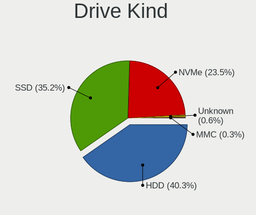
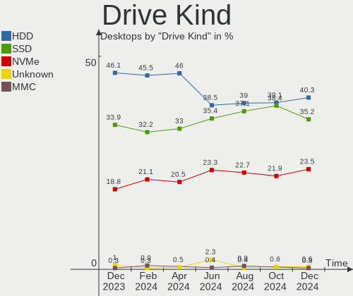
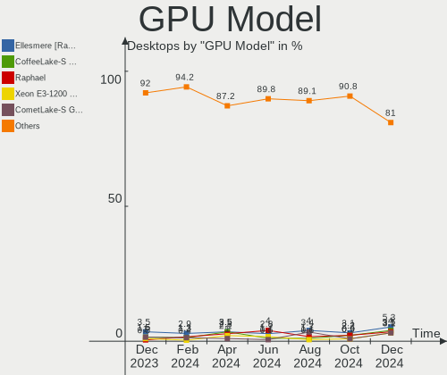
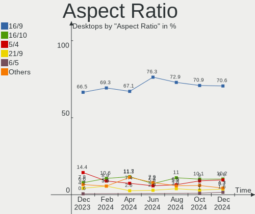
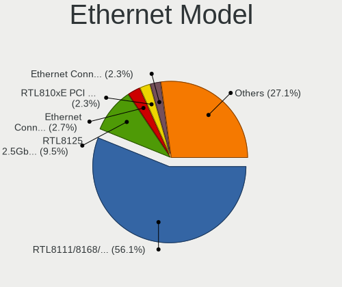
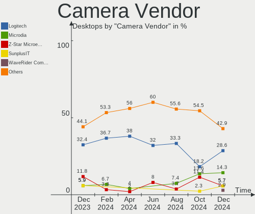
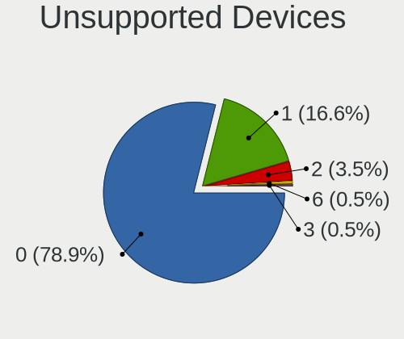

Linux in Russia - Hardware Trends (Desktops)
--------------------------------------------

A project to identify most popular hardware characteristics and track their change
over time based on data collected by Linux users at https://Linux-Hardware.org.

Anyone can contribute to this report by the [hw-probe](https://github.com/linuxhw/hw-probe) tool:

    sudo -E hw-probe -all -upload

Period: Feb, 2023.

Contents
--------

* [ System ](#system)
  - [ OS                       ](#os)
  - [ OS Family                ](#os-family)
  - [ Kernel                   ](#kernel)
  - [ Kernel Family            ](#kernel-family)
  - [ Kernel Major Ver.        ](#kernel-major-ver)
  - [ Arch                     ](#arch)
  - [ DE                       ](#de)
  - [ Display Server           ](#display-server)
  - [ Display Manager          ](#display-manager)
  - [ OS Lang                  ](#os-lang)
  - [ Boot Mode                ](#boot-mode)
  - [ Filesystem               ](#filesystem)
  - [ Part. scheme             ](#part-scheme)
  - [ Dual Boot with Linux/BSD ](#dual-boot-with-linuxbsd)
  - [ Dual Boot (Win)          ](#dual-boot-win)

* [ Board ](#board)
  - [ Vendor                   ](#vendor)
  - [ Model                    ](#model)
  - [ Model Family             ](#model-family)
  - [ MFG Year                 ](#mfg-year)
  - [ Form Factor              ](#form-factor)
  - [ Secure Boot              ](#secure-boot)
  - [ Coreboot                 ](#coreboot)
  - [ RAM Size                 ](#ram-size)
  - [ RAM Used                 ](#ram-used)
  - [ Total Drives             ](#total-drives)
  - [ Has CD-ROM               ](#has-cd-rom)
  - [ Has Ethernet             ](#has-ethernet)
  - [ Has WiFi                 ](#has-wifi)
  - [ Has Bluetooth            ](#has-bluetooth)

* [ Location ](#location)
  - [ Country                  ](#country)
  - [ City                     ](#city)

* [ Drives ](#drives)
  - [ Drive Vendor             ](#drive-vendor)
  - [ Drive Model              ](#drive-model)
  - [ HDD Vendor               ](#hdd-vendor)
  - [ SSD Vendor               ](#ssd-vendor)
  - [ Drive Kind               ](#drive-kind)
  - [ Drive Connector          ](#drive-connector)
  - [ Drive Size               ](#drive-size)
  - [ Space Total              ](#space-total)
  - [ Space Used               ](#space-used)
  - [ Malfunc. Drives          ](#malfunc-drives)
  - [ Malfunc. Drive Vendor    ](#malfunc-drive-vendor)
  - [ Malfunc. HDD Vendor      ](#malfunc-hdd-vendor)
  - [ Malfunc. Drive Kind      ](#malfunc-drive-kind)
  - [ Failed Drives            ](#failed-drives)
  - [ Failed Drive Vendor      ](#failed-drive-vendor)
  - [ Drive Status             ](#drive-status)

* [ Storage controller ](#storage-controller)
  - [ Storage Vendor           ](#storage-vendor)
  - [ Storage Model            ](#storage-model)
  - [ Storage Kind             ](#storage-kind)

* [ Processor ](#processor)
  - [ CPU Vendor               ](#cpu-vendor)
  - [ CPU Model                ](#cpu-model)
  - [ CPU Model Family         ](#cpu-model-family)
  - [ CPU Cores                ](#cpu-cores)
  - [ CPU Sockets              ](#cpu-sockets)
  - [ CPU Threads              ](#cpu-threads)
  - [ CPU Op-Modes             ](#cpu-op-modes)
  - [ CPU Microcode            ](#cpu-microcode)
  - [ CPU Microarch            ](#cpu-microarch)

* [ Graphics ](#graphics)
  - [ GPU Vendor               ](#gpu-vendor)
  - [ GPU Model                ](#gpu-model)
  - [ GPU Combo                ](#gpu-combo)
  - [ GPU Driver               ](#gpu-driver)
  - [ GPU Memory               ](#gpu-memory)

* [ Monitor ](#monitor)
  - [ Monitor Vendor           ](#monitor-vendor)
  - [ Monitor Model            ](#monitor-model)
  - [ Monitor Resolution       ](#monitor-resolution)
  - [ Monitor Diagonal         ](#monitor-diagonal)
  - [ Monitor Width            ](#monitor-width)
  - [ Aspect Ratio             ](#aspect-ratio)
  - [ Monitor Area             ](#monitor-area)
  - [ Pixel Density            ](#pixel-density)
  - [ Multiple Monitors        ](#multiple-monitors)

* [ Network ](#network)
  - [ Net Controller Vendor    ](#net-controller-vendor)
  - [ Net Controller Model     ](#net-controller-model)
  - [ Wireless Vendor          ](#wireless-vendor)
  - [ Wireless Model           ](#wireless-model)
  - [ Ethernet Vendor          ](#ethernet-vendor)
  - [ Ethernet Model           ](#ethernet-model)
  - [ Net Controller Kind      ](#net-controller-kind)
  - [ Used Controller          ](#used-controller)
  - [ NICs                     ](#nics)
  - [ IPv6                     ](#ipv6)

* [ Bluetooth ](#bluetooth)
  - [ Bluetooth Vendor         ](#bluetooth-vendor)
  - [ Bluetooth Model          ](#bluetooth-model)

* [ Sound ](#sound)
  - [ Sound Vendor             ](#sound-vendor)
  - [ Sound Model              ](#sound-model)

* [ Memory ](#memory)
  - [ Memory Vendor            ](#memory-vendor)
  - [ Memory Model             ](#memory-model)
  - [ Memory Kind              ](#memory-kind)
  - [ Memory Form Factor       ](#memory-form-factor)
  - [ Memory Size              ](#memory-size)
  - [ Memory Speed             ](#memory-speed)

* [ Printers & scanners ](#printers--scanners)
  - [ Printer Vendor           ](#printer-vendor)
  - [ Printer Model            ](#printer-model)
  - [ Scanner Vendor           ](#scanner-vendor)
  - [ Scanner Model            ](#scanner-model)

* [ Camera ](#camera)
  - [ Camera Vendor            ](#camera-vendor)
  - [ Camera Model             ](#camera-model)

* [ Security ](#security)
  - [ Fingerprint Vendor       ](#fingerprint-vendor)
  - [ Fingerprint Model        ](#fingerprint-model)
  - [ Chipcard Vendor          ](#chipcard-vendor)
  - [ Chipcard Model           ](#chipcard-model)

* [ Unsupported ](#unsupported)
  - [ Unsupported Devices      ](#unsupported-devices)
  - [ Unsupported Device Types ](#unsupported-device-types)

System
------

OS
--

Installed operating systems

| Name               | Desktops | Percent |
|--------------------|----------|---------|
| ROSA 12.3          | 72       | 33.64%  |
| OpenMandriva 23.01 | 18       | 8.41%   |
| Debian 11          | 15       | 7.01%   |
| Red OS 7.3.2       | 9        | 4.21%   |
| Fedora 37          | 9        | 4.21%   |
| Ubuntu 22.04       | 7        | 3.27%   |
| OpenMandriva 4.3   | 7        | 3.27%   |
| ALT Linux 10.1     | 7        | 3.27%   |
| Linux Mint 21.1    | 6        | 2.8%    |
| Red OS 7.3         | 5        | 2.34%   |
| Manjaro            | 5        | 2.34%   |
| Arch Rolling       | 5        | 2.34%   |
| Ubuntu 22.10       | 4        | 1.87%   |
| ROSA R11.1         | 4        | 1.87%   |
| ROSA 12.2          | 3        | 1.4%    |
| ROSA 12.1          | 3        | 1.4%    |
| Kubuntu 22.04      | 3        | 1.4%    |
| KDE neon 22.04     | 3        | 1.4%    |
| Ubuntu MATE 20.04  | 2        | 0.93%   |
| Red OS 7.3.1       | 2        | 0.93%   |
| Manjaro 22.0.3     | 2        | 0.93%   |
| Kali 2022.4        | 2        | 0.93%   |
| Debian             | 2        | 0.93%   |
| Zorin 15           | 1        | 0.47%   |
| Xubuntu 22.04      | 1        | 0.47%   |
| Xubuntu 20.04      | 1        | 0.47%   |
| Ubuntu 20.04       | 1        | 0.47%   |
| ROSA R11           | 1        | 0.47%   |
| ROSA 12            | 1        | 0.47%   |
| ROSA 1.0           | 1        | 0.47%   |
| Pop!_OS 22.04      | 1        | 0.47%   |
| MOS 10             | 1        | 0.47%   |
| Manjaro 22.0.4     | 1        | 0.47%   |
| Mageia 8           | 1        | 0.47%   |
| Linux Mint 21      | 1        | 0.47%   |
| Kubuntu 12.04      | 1        | 0.47%   |
| Gentoo 2.9         | 1        | 0.47%   |
| Fedora 35          | 1        | 0.47%   |
| Elementary 7       | 1        | 0.47%   |
| Devuan 5           | 1        | 0.47%   |

OS Family
---------

OS without a version

| Name         | Desktops | Percent |
|--------------|----------|---------|
| ROSA         | 85       | 39.72%  |
| OpenMandriva | 25       | 11.68%  |
| Debian       | 17       | 7.94%   |
| Red OS       | 16       | 7.48%   |
| Ubuntu       | 12       | 5.61%   |
| Fedora       | 10       | 4.67%   |
| Manjaro      | 8        | 3.74%   |
| ALT Linux    | 8        | 3.74%   |
| Linux Mint   | 7        | 3.27%   |
| Arch         | 5        | 2.34%   |
| Kubuntu      | 4        | 1.87%   |
| KDE neon     | 3        | 1.4%    |
| Xubuntu      | 2        | 0.93%   |
| Ubuntu MATE  | 2        | 0.93%   |
| Kali         | 2        | 0.93%   |
| Zorin        | 1        | 0.47%   |
| Pop!_OS      | 1        | 0.47%   |
| Mageia       | 1        | 0.47%   |
| Gentoo       | 1        | 0.47%   |
| Elementary   | 1        | 0.47%   |
| Devuan       | 1        | 0.47%   |
| Calculate    | 1        | 0.47%   |
| CachyOS      | 1        | 0.47%   |

Kernel
------

Version of the Linux kernel

| Version                                   | Desktops | Percent |
|-------------------------------------------|----------|---------|
| 5.15.79-generic-1rosa2021.1-x86_64        | 26       | 12.15%  |
| 5.15.75-generic-1rosa2021.1-x86_64        | 17       | 7.94%   |
| 6.1.1-desktop-1omv2290                    | 12       | 5.61%   |
| 5.15.0-60-generic                         | 12       | 5.61%   |
| 5.10.155-generic-1rosa2021.1-x86_64       | 11       | 5.14%   |
| 5.10.0-2-amd64                            | 11       | 5.14%   |
| 5.15.0-58-generic                         | 7        | 3.27%   |
| 6.1.4-desktop-1omv2301                    | 6        | 2.8%    |
| 5.17.11-generic-2rosa2021.1-x86_64        | 6        | 2.8%    |
| 5.15.87-1.el7.3.x86_64                    | 6        | 2.8%    |
| 5.10.74-generic-2rosa2021.1-x86_64        | 5        | 2.34%   |
| 6.1.11-200.fc37.x86_64                    | 4        | 1.87%   |
| 5.16.13-desktop-1omv4003                  | 4        | 1.87%   |
| 6.1.9-1-MANJARO                           | 3        | 1.4%    |
| 6.0.7.xm1-1.klp-xanmod-rosa2021.1-x86_64  | 3        | 1.4%    |
| 6.0.12.xm1-1.klp-xanmod-rosa2021.1-x86_64 | 3        | 1.4%    |
| 5.19.0-32-generic                         | 3        | 1.4%    |
| 5.16.7-desktop-1omv4003                   | 3        | 1.4%    |
| 5.15.72-1.el7.3.x86_64                    | 3        | 1.4%    |
| 5.10.0-21-amd64                           | 3        | 1.4%    |
| 6.1.4-generic-1rosa2021.1-x86_64          | 2        | 0.93%   |
| 6.1.12-arch1-1                            | 2        | 0.93%   |
| 6.1.12-200.fc37.x86_64                    | 2        | 0.93%   |
| 6.1.11-1-MANJARO                          | 2        | 0.93%   |
| 6.1.10-generic-1rosa2021.1-x86_64         | 2        | 0.93%   |
| 6.0.19-4-MANJARO                          | 2        | 0.93%   |
| 6.0.0-kali6-amd64                         | 2        | 0.93%   |
| 5.19.0-29-generic                         | 2        | 0.93%   |
| 5.15.75-generic-1rosa2021.1-i686          | 2        | 0.93%   |
| 5.15.10-1.el7.x86_64                      | 2        | 0.93%   |
| 5.10.29-1.el7.x86_64                      | 2        | 0.93%   |
| 5.10.165-std-def-alt1                     | 2        | 0.93%   |
| 5.10.164-std-def-alt1                     | 2        | 0.93%   |
| 6.1.9-arch1-1                             | 1        | 0.47%   |
| 6.1.9-200.fc37.x86_64                     | 1        | 0.47%   |
| 6.1.8-200.fc37.x86_64                     | 1        | 0.47%   |
| 6.1.8-1-1000hz                            | 1        | 0.47%   |
| 6.1.13-x64v1-xanmod1                      | 1        | 0.47%   |
| 6.1.13-200.fc37.x86_64                    | 1        | 0.47%   |
| 6.1.12-lqx4-1-lqx                         | 1        | 0.47%   |

Kernel Family
-------------

Linux kernel without a distro release

| Version  | Desktops | Percent |
|----------|----------|---------|
| 5.15.79  | 26       | 12.15%  |
| 5.15.0   | 21       | 9.81%   |
| 5.15.75  | 19       | 8.88%   |
| 5.10.0   | 15       | 7.01%   |
| 6.1.1    | 12       | 5.61%   |
| 5.10.155 | 11       | 5.14%   |
| 6.1.4    | 8        | 3.74%   |
| 6.1.12   | 7        | 3.27%   |
| 5.19.0   | 7        | 3.27%   |
| 6.1.11   | 6        | 2.8%    |
| 5.17.11  | 6        | 2.8%    |
| 5.15.87  | 6        | 2.8%    |
| 5.10.74  | 6        | 2.8%    |
| 6.1.9    | 5        | 2.34%   |
| 6.1.10   | 4        | 1.87%   |
| 5.16.13  | 4        | 1.87%   |
| 5.15.72  | 4        | 1.87%   |
| 6.0.7    | 3        | 1.4%    |
| 6.0.12   | 3        | 1.4%    |
| 6.0.0    | 3        | 1.4%    |
| 5.16.7   | 3        | 1.4%    |
| 6.1.8    | 2        | 0.93%   |
| 6.1.13   | 2        | 0.93%   |
| 6.0.19   | 2        | 0.93%   |
| 5.4.83   | 2        | 0.93%   |
| 5.4.0    | 2        | 0.93%   |
| 5.15.10  | 2        | 0.93%   |
| 5.10.29  | 2        | 0.93%   |
| 5.10.165 | 2        | 0.93%   |
| 5.10.164 | 2        | 0.93%   |
| 6.0.6    | 1        | 0.47%   |
| 5.5.19   | 1        | 0.47%   |
| 5.4.32   | 1        | 0.47%   |
| 5.19.7   | 1        | 0.47%   |
| 5.18.19  | 1        | 0.47%   |
| 5.18.11  | 1        | 0.47%   |
| 5.15.90  | 1        | 0.47%   |
| 5.15.88  | 1        | 0.47%   |
| 5.15.82  | 1        | 0.47%   |
| 5.15.78  | 1        | 0.47%   |

Kernel Major Ver.
-----------------

Linux kernel major version

| Version | Desktops | Percent |
|---------|----------|---------|
| 5.15    | 84       | 39.25%  |
| 6.1     | 46       | 21.5%   |
| 5.10    | 40       | 18.69%  |
| 6.0     | 12       | 5.61%   |
| 5.19    | 8        | 3.74%   |
| 5.16    | 7        | 3.27%   |
| 5.17    | 6        | 2.8%    |
| 5.4     | 5        | 2.34%   |
| 5.18    | 2        | 0.93%   |
| 5.5     | 1        | 0.47%   |
| 5.14    | 1        | 0.47%   |
| 4.15    | 1        | 0.47%   |
| 3.13    | 1        | 0.47%   |

Arch
----

OS architecture (x86_64, i586, etc.)

| Name   | Desktops | Percent |
|--------|----------|---------|
| x86_64 | 208      | 97.2%   |
| i686   | 6        | 2.8%    |

DE
--

Desktop Environment

| Name       | Desktops | Percent |
|------------|----------|---------|
| KDE5       | 95       | 44.39%  |
| GNOME      | 50       | 23.36%  |
| MATE       | 19       | 8.88%   |
| Unknown    | 19       | 8.88%   |
| XFCE       | 8        | 3.74%   |
| LXQt       | 7        | 3.27%   |
| X-Cinnamon | 6        | 2.8%    |
| KDE4       | 5        | 2.34%   |
| Pantheon   | 1        | 0.47%   |
| LXDE       | 1        | 0.47%   |
| i3         | 1        | 0.47%   |
| DWM        | 1        | 0.47%   |
| Cinnamon   | 1        | 0.47%   |

Display Server
--------------

X11 or Wayland

| Name    | Desktops | Percent |
|---------|----------|---------|
| X11     | 117      | 54.67%  |
| Wayland | 78       | 36.45%  |
| Unknown | 14       | 6.54%   |
| Tty     | 5        | 2.34%   |

Display Manager
---------------

SDDM, LightDM, etc.

| Name    | Desktops | Percent |
|---------|----------|---------|
| SDDM    | 85       | 39.72%  |
| GDM     | 50       | 23.36%  |
| Unknown | 39       | 18.22%  |
| LightDM | 24       | 11.21%  |
| GDM3    | 12       | 5.61%   |
| KDM     | 4        | 1.87%   |

OS Lang
-------

Language

| Lang    | Desktops | Percent |
|---------|----------|---------|
| ru_RU   | 176      | 82.24%  |
| en_US   | 26       | 12.15%  |
| Unknown | 6        | 2.8%    |
| ru_UA   | 2        | 0.93%   |
| en_GB   | 2        | 0.93%   |
| cv_RU   | 1        | 0.47%   |
| C       | 1        | 0.47%   |

Boot Mode
---------

EFI or BIOS

| Mode | Desktops | Percent |
|------|----------|---------|
| BIOS | 123      | 57.48%  |
| EFI  | 91       | 42.52%  |

Filesystem
----------

Type of filesystem

| Type    | Desktops | Percent |
|---------|----------|---------|
| Ext4    | 161      | 75.23%  |
| Overlay | 24       | 11.21%  |
| Btrfs   | 24       | 11.21%  |
| Jfs     | 2        | 0.93%   |
| Xfs     | 1        | 0.47%   |
| F2fs    | 1        | 0.47%   |
| Ext3    | 1        | 0.47%   |

Part. scheme
------------

Scheme of partitioning

| Type    | Desktops | Percent |
|---------|----------|---------|
| GPT     | 129      | 60.28%  |
| MBR     | 61       | 28.5%   |
| Unknown | 24       | 11.21%  |

Dual Boot with Linux/BSD
------------------------

Hosting more than one Linux/BSD

| Dual boot | Desktops | Percent |
|-----------|----------|---------|
| No        | 160      | 74.77%  |
| Yes       | 54       | 25.23%  |

Dual Boot (Win)
---------------

Hosting Linux and Windows

| Dual boot | Desktops | Percent |
|-----------|----------|---------|
| No        | 111      | 51.87%  |
| Yes       | 103      | 48.13%  |

Board
-----

Vendor
------

Motherboard manufacturer

| Name                | Desktops | Percent |
|---------------------|----------|---------|
| ASUSTek Computer    | 53       | 24.77%  |
| Gigabyte Technology | 50       | 23.36%  |
| MSI                 | 34       | 15.89%  |
| ASRock              | 27       | 12.62%  |
| Intel               | 6        | 2.8%    |
| Unknown             | 6        | 2.8%    |
| Hewlett-Packard     | 4        | 1.87%   |
| Biostar             | 4        | 1.87%   |
| OEM                 | 3        | 1.4%    |
| Huanan              | 3        | 1.4%    |
| AZW                 | 3        | 1.4%    |
| Lenovo              | 2        | 0.93%   |
| ECS                 | 2        | 0.93%   |
| Compal              | 2        | 0.93%   |
| Aquarius            | 2        | 0.93%   |
| Acer                | 2        | 0.93%   |
| Seeed Studio        | 1        | 0.47%   |
| Quanta              | 1        | 0.47%   |
| Pegatron            | 1        | 0.47%   |
| MAINBRD             | 1        | 0.47%   |
| Kllisre             | 1        | 0.47%   |
| JGINYUE             | 1        | 0.47%   |
| iRU                 | 1        | 0.47%   |
| ICL                 | 1        | 0.47%   |
| Foxconn             | 1        | 0.47%   |
| EPoX Computer       | 1        | 0.47%   |
| Dell                | 1        | 0.47%   |

Model
-----

Motherboard model

| Name                              | Desktops | Percent |
|-----------------------------------|----------|---------|
| Unknown                           | 7        | 3.27%   |
| ASUS All Series                   | 4        | 1.87%   |
| ASUS P8B75-V                      | 3        | 1.4%    |
| OEM Intel H81                     | 2        | 0.93%   |
| MSI MS-7C37                       | 2        | 0.93%   |
| Gigabyte H61M-S1                  | 2        | 0.93%   |
| Gigabyte B550 AORUS ELITE V2      | 2        | 0.93%   |
| Gigabyte A320M-S2H                | 2        | 0.93%   |
| Compal DIP00                      | 2        | 0.93%   |
| Biostar A320MH                    | 2        | 0.93%   |
| ASUS PRIME H510M-K                | 2        | 0.93%   |
| ASUS P5K                          | 2        | 0.93%   |
| ASRock B450M Pro4                 | 2        | 0.93%   |
| ASRock AB350 Pro4                 | 2        | 0.93%   |
| Seeed Studio ODYSSEY-X86J4105     | 1        | 0.47%   |
| Quanta 120-1200er                 | 1        | 0.47%   |
| Pegatron Compaq dx2400 Microtower | 1        | 0.47%   |
| MSI MS-7D54                       | 1        | 0.47%   |
| MSI MS-7D46                       | 1        | 0.47%   |
| MSI MS-7D22                       | 1        | 0.47%   |
| MSI MS-7D15                       | 1        | 0.47%   |
| MSI MS-7C91                       | 1        | 0.47%   |
| MSI MS-7C83                       | 1        | 0.47%   |
| MSI MS-7B98                       | 1        | 0.47%   |
| MSI MS-7B89                       | 1        | 0.47%   |
| MSI MS-7B87                       | 1        | 0.47%   |
| MSI MS-7B86                       | 1        | 0.47%   |
| MSI MS-7B79                       | 1        | 0.47%   |
| MSI MS-7A38                       | 1        | 0.47%   |
| MSI MS-7A36                       | 1        | 0.47%   |
| MSI MS-7A15                       | 1        | 0.47%   |
| MSI MS-7996                       | 1        | 0.47%   |
| MSI MS-7971                       | 1        | 0.47%   |
| MSI MS-7922                       | 1        | 0.47%   |
| MSI MS-7918                       | 1        | 0.47%   |
| MSI MS-7846                       | 1        | 0.47%   |
| MSI MS-7845                       | 1        | 0.47%   |
| MSI MS-7758                       | 1        | 0.47%   |
| MSI MS-7732                       | 1        | 0.47%   |
| MSI MS-7599                       | 1        | 0.47%   |

Model Family
------------

Motherboard model prefix

| Name                          | Desktops | Percent |
|-------------------------------|----------|---------|
| ASUS PRIME                    | 7        | 3.27%   |
| Unknown                       | 7        | 3.27%   |
| Gigabyte B450M                | 5        | 2.34%   |
| Gigabyte B550                 | 4        | 1.87%   |
| ASUS All                      | 4        | 1.87%   |
| Gigabyte B365M                | 3        | 1.4%    |
| Gigabyte A320M-S2H            | 3        | 1.4%    |
| ASUS ROG                      | 3        | 1.4%    |
| ASUS P8H61-M                  | 3        | 1.4%    |
| ASUS P8B75-V                  | 3        | 1.4%    |
| ASRock B450M                  | 3        | 1.4%    |
| OEM Intel                     | 2        | 0.93%   |
| MSI MS-7C37                   | 2        | 0.93%   |
| HP ProLiant                   | 2        | 0.93%   |
| Gigabyte H61M-S1              | 2        | 0.93%   |
| Gigabyte H410M                | 2        | 0.93%   |
| Gigabyte B550M                | 2        | 0.93%   |
| Compal DIP00                  | 2        | 0.93%   |
| Biostar A320MH                | 2        | 0.93%   |
| ASUS TUF                      | 2        | 0.93%   |
| ASUS P7H55-M                  | 2        | 0.93%   |
| ASUS P5K                      | 2        | 0.93%   |
| ASRock X370                   | 2        | 0.93%   |
| ASRock AB350                  | 2        | 0.93%   |
| Seeed Studio ODYSSEY-X86J4105 | 1        | 0.47%   |
| Quanta 120-1200er             | 1        | 0.47%   |
| Pegatron Compaq               | 1        | 0.47%   |
| MSI MS-7D54                   | 1        | 0.47%   |
| MSI MS-7D46                   | 1        | 0.47%   |
| MSI MS-7D22                   | 1        | 0.47%   |
| MSI MS-7D15                   | 1        | 0.47%   |
| MSI MS-7C91                   | 1        | 0.47%   |
| MSI MS-7C83                   | 1        | 0.47%   |
| MSI MS-7B98                   | 1        | 0.47%   |
| MSI MS-7B89                   | 1        | 0.47%   |
| MSI MS-7B87                   | 1        | 0.47%   |
| MSI MS-7B86                   | 1        | 0.47%   |
| MSI MS-7B79                   | 1        | 0.47%   |
| MSI MS-7A38                   | 1        | 0.47%   |
| MSI MS-7A36                   | 1        | 0.47%   |

MFG Year
--------

Motherboard manufacture year

| Year | Desktops | Percent |
|------|----------|---------|
| 2021 | 22       | 10.28%  |
| 2020 | 22       | 10.28%  |
| 2012 | 21       | 9.81%   |
| 2019 | 18       | 8.41%   |
| 2018 | 18       | 8.41%   |
| 2011 | 18       | 8.41%   |
| 2013 | 15       | 7.01%   |
| 2009 | 12       | 5.61%   |
| 2010 | 10       | 4.67%   |
| 2017 | 9        | 4.21%   |
| 2022 | 8        | 3.74%   |
| 2016 | 7        | 3.27%   |
| 2014 | 7        | 3.27%   |
| 2007 | 7        | 3.27%   |
| 2006 | 7        | 3.27%   |
| 2015 | 5        | 2.34%   |
| 2008 | 5        | 2.34%   |
| 2005 | 2        | 0.93%   |
| 2023 | 1        | 0.47%   |

Form Factor
-----------

Physical design of the computer

| Name    | Desktops | Percent |
|---------|----------|---------|
| Desktop | 214      | 100%    |

Secure Boot
-----------

Enabled or disabled

| State    | Desktops | Percent |
|----------|----------|---------|
| Disabled | 212      | 99.07%  |
| Enabled  | 2        | 0.93%   |

Coreboot
--------

Have coreboot on board

| Used | Desktops | Percent |
|------|----------|---------|
| No   | 214      | 100%    |

RAM Size
--------

Total RAM memory

| Size in GB  | Desktops | Percent |
|-------------|----------|---------|
| 16.01-24.0  | 53       | 24.77%  |
| 8.01-16.0   | 53       | 24.77%  |
| 4.01-8.0    | 36       | 16.82%  |
| 3.01-4.0    | 34       | 15.89%  |
| 32.01-64.0  | 17       | 7.94%   |
| 64.01-256.0 | 9        | 4.21%   |
| 24.01-32.0  | 4        | 1.87%   |
| 1.01-2.0    | 4        | 1.87%   |
| 2.01-3.0    | 3        | 1.4%    |
| 0.51-1.0    | 1        | 0.47%   |

RAM Used
--------

Used RAM memory

| Used GB    | Desktops | Percent |
|------------|----------|---------|
| 1.01-2.0   | 77       | 35.98%  |
| 2.01-3.0   | 47       | 21.96%  |
| 0.51-1.0   | 34       | 15.89%  |
| 3.01-4.0   | 22       | 10.28%  |
| 4.01-8.0   | 19       | 8.88%   |
| 8.01-16.0  | 9        | 4.21%   |
| 0.01-0.5   | 3        | 1.4%    |
| 32.01-64.0 | 1        | 0.47%   |
| 16.01-24.0 | 1        | 0.47%   |
| Unknown    | 1        | 0.47%   |

Total Drives
------------

Number of drives on board

| Drives | Desktops | Percent |
|--------|----------|---------|
| 1      | 87       | 40.65%  |
| 2      | 61       | 28.5%   |
| 3      | 32       | 14.95%  |
| 4      | 20       | 9.35%   |
| 6      | 7        | 3.27%   |
| 5      | 5        | 2.34%   |
| 10     | 1        | 0.47%   |
| 7      | 1        | 0.47%   |

Has CD-ROM
----------

Has CD-ROM on board

| Presented | Desktops | Percent |
|-----------|----------|---------|
| No        | 154      | 71.96%  |
| Yes       | 60       | 28.04%  |

Has Ethernet
------------

Has Ethernet on board

| Presented | Desktops | Percent |
|-----------|----------|---------|
| Yes       | 212      | 99.07%  |
| No        | 2        | 0.93%   |

Has WiFi
--------

Has WiFi module

| Presented | Desktops | Percent |
|-----------|----------|---------|
| No        | 143      | 66.82%  |
| Yes       | 71       | 33.18%  |

Has Bluetooth
-------------

Has Bluetooth module

| Presented | Desktops | Percent |
|-----------|----------|---------|
| No        | 168      | 78.5%   |
| Yes       | 46       | 21.5%   |

Location
--------

Country
-------

Geographic location (country)

| Country | Desktops | Percent |
|---------|----------|---------|
| Russia  | 214      | 100%    |

City
----

Geographic location (city)

| City                | Desktops | Percent |
|---------------------|----------|---------|
| Moscow              | 39       | 18.22%  |
| St Petersburg       | 21       | 9.81%   |
| Voronezh            | 13       | 6.07%   |
| Nizhniy Novgorod    | 7        | 3.27%   |
| Yekaterinburg       | 6        | 2.8%    |
| Krasnodar           | 5        | 2.34%   |
| Murom               | 4        | 1.87%   |
| Kazan’            | 4        | 1.87%   |
| Barnaul             | 4        | 1.87%   |
| Volgograd           | 3        | 1.4%    |
| Stavropol           | 3        | 1.4%    |
| Samara              | 3        | 1.4%    |
| Salekhard           | 3        | 1.4%    |
| Omsk                | 3        | 1.4%    |
| Lipetsk             | 3        | 1.4%    |
| Krasnoyarsk         | 3        | 1.4%    |
| Chelyabinsk         | 3        | 1.4%    |
| Ulyanovsk           | 2        | 0.93%   |
| Smolensk            | 2        | 0.93%   |
| Reutov              | 2        | 0.93%   |
| Orenburg            | 2        | 0.93%   |
| Novosibirsk         | 2        | 0.93%   |
| Naberezhnyye Chelny | 2        | 0.93%   |
| Kemerovo            | 2        | 0.93%   |
| Kaluga              | 2        | 0.93%   |
| Irkutsk             | 2        | 0.93%   |
| Donetsk             | 2        | 0.93%   |
| Blagoveshchensk     | 2        | 0.93%   |
| Zheleznogorsk       | 1        | 0.47%   |
| Yaya                | 1        | 0.47%   |
| Yaroslavl           | 1        | 0.47%   |
| Yalutorovsk         | 1        | 0.47%   |
| Vyazma              | 1        | 0.47%   |
| Votkinsk            | 1        | 0.47%   |
| Vladivostok         | 1        | 0.47%   |
| Vladimir            | 1        | 0.47%   |
| Vidnoye             | 1        | 0.47%   |
| Ukhta               | 1        | 0.47%   |
| Ufa                 | 1        | 0.47%   |
| Tyumen              | 1        | 0.47%   |

Drives
------

Drive Vendor
------------

Hard drive vendors

| Vendor                      | Desktops | Drives | Percent |
|-----------------------------|----------|--------|---------|
| WDC                         | 85       | 111    | 21.46%  |
| Seagate                     | 67       | 89     | 16.92%  |
| Samsung Electronics         | 32       | 41     | 8.08%   |
| Toshiba                     | 31       | 37     | 7.83%   |
| Kingston                    | 25       | 28     | 6.31%   |
| A-DATA Technology           | 16       | 16     | 4.04%   |
| China                       | 14       | 14     | 3.54%   |
| Hitachi                     | 12       | 13     | 3.03%   |
| SPCC                        | 8        | 9      | 2.02%   |
| Plextor                     | 8        | 8      | 2.02%   |
| Silicon Motion              | 7        | 8      | 1.77%   |
| Smartbuy                    | 6        | 6      | 1.52%   |
| Intel                       | 6        | 6      | 1.52%   |
| Apacer                      | 6        | 7      | 1.52%   |
| Netac                       | 5        | 5      | 1.26%   |
| Transcend                   | 4        | 4      | 1.01%   |
| SanDisk                     | 4        | 4      | 1.01%   |
| Patriot                     | 4        | 4      | 1.01%   |
| OCZ                         | 4        | 4      | 1.01%   |
| HGST                        | 4        | 4      | 1.01%   |
| AMD                         | 4        | 4      | 1.01%   |
| XrayDisk                    | 3        | 3      | 0.76%   |
| Qumo                        | 3        | 3      | 0.76%   |
| KingSpec                    | 3        | 3      | 0.76%   |
| Hewlett-Packard             | 3        | 10     | 0.76%   |
| Crucial                     | 3        | 3      | 0.76%   |
| Maxtor                      | 2        | 2      | 0.51%   |
| LITEONIT                    | 2        | 2      | 0.51%   |
| Kingston Technology Company | 2        | 2      | 0.51%   |
| GOODRAM                     | 2        | 2      | 0.51%   |
| Unknown                     | 2        | 2      | 0.51%   |
| Unknown                     | 1        | 1      | 0.25%   |
| Team                        | 1        | 1      | 0.25%   |
| Realtek Semiconductor       | 1        | 1      | 0.25%   |
| Realtek                     | 1        | 1      | 0.25%   |
| R5SL240G                    | 1        | 1      | 0.25%   |
| Phison                      | 1        | 1      | 0.25%   |
| NT-1TB                      | 1        | 1      | 0.25%   |
| Neo                         | 1        | 1      | 0.25%   |
| Min Yi U                    | 1        | 1      | 0.25%   |

Drive Model
-----------

Hard drive models

| Model                                                 | Desktops | Percent |
|-------------------------------------------------------|----------|---------|
| Toshiba HDWD110 1TB                                   | 12       | 2.67%   |
| Seagate ST500DM002-1BD142 500GB                       | 10       | 2.22%   |
| WDC WDS240G2G0A-00JH30 240GB SSD                      | 7        | 1.56%   |
| WDC WD10EZEX-08WN4A0 1TB                              | 7        | 1.56%   |
| WDC WD10EZRZ-00HTKB0 1TB                              | 6        | 1.33%   |
| Kingston SA400S37240G 240GB SSD                       | 6        | 1.33%   |
| Toshiba DT01ACA050 500GB                              | 5        | 1.11%   |
| Seagate ST1000DM003-1CH162 1TB                        | 5        | 1.11%   |
| Samsung SSD 860 EVO 250GB                             | 5        | 1.11%   |
| WDC WD10EZEX-08M2NA0 1TB                              | 4        | 0.89%   |
| SPCC Solid State Disk 128GB                           | 4        | 0.89%   |
| Seagate ST3500418AS 500GB                             | 4        | 0.89%   |
| Samsung SSD 850 120GB                                 | 4        | 0.89%   |
| Samsung NVMe SSD Controller SM981/PM981/PM983 250GB   | 4        | 0.89%   |
| Kingston SNVS500G 500GB                               | 4        | 0.89%   |
| Kingston SA400S37480G 480GB SSD                       | 4        | 0.89%   |
| XrayDisk SSD 256GB                                    | 3        | 0.67%   |
| WDC WD5000AAKX-00ERMA0 500GB                          | 3        | 0.67%   |
| Toshiba DT01ACA100 1TB                                | 3        | 0.67%   |
| Smartbuy SSD 120GB                                    | 3        | 0.67%   |
| Seagate ST250DM000-1BD141 250GB                       | 3        | 0.67%   |
| Kingston SA400S37120G 120GB SSD                       | 3        | 0.67%   |
| Hitachi HDS721050CLA360 500GB                         | 3        | 0.67%   |
| WDC WDS120G2G0A-00JH30 120GB SSD                      | 2        | 0.44%   |
| WDC WD20EARS-00MVWB0 2TB                              | 2        | 0.44%   |
| WDC WD10EZEX-22MFCA0 1TB                              | 2        | 0.44%   |
| WDC WD10EZEX-00BN5A0 1TB                              | 2        | 0.44%   |
| WDC WD10EADS-00L5B1 1TB                               | 2        | 0.44%   |
| Toshiba HDWD120 2TB                                   | 2        | 0.44%   |
| Toshiba HDWD105 500GB                                 | 2        | 0.44%   |
| Toshiba DT01ACA200 2TB                                | 2        | 0.44%   |
| Silicon Motion SM2263EN/SM2263XT SSD Controller 512GB | 2        | 0.44%   |
| Seagate ST9320325AS 320GB                             | 2        | 0.44%   |
| Seagate ST380815AS 80GB                               | 2        | 0.44%   |
| Seagate ST3250410AS 250GB                             | 2        | 0.44%   |
| Seagate ST3250310AS 250GB                             | 2        | 0.44%   |
| Seagate ST3160815AS 160GB                             | 2        | 0.44%   |
| Seagate ST31000528AS 1TB                              | 2        | 0.44%   |
| Seagate ST2000DM008-2UB102 2TB                        | 2        | 0.44%   |
| Seagate ST2000DM008-2FR102 2TB                        | 2        | 0.44%   |

HDD Vendor
----------

Hard disk drive vendors

| Vendor              | Desktops | Drives | Percent |
|---------------------|----------|--------|---------|
| WDC                 | 75       | 92     | 36.95%  |
| Seagate             | 67       | 89     | 33%     |
| Toshiba             | 31       | 36     | 15.27%  |
| Hitachi             | 12       | 13     | 5.91%   |
| Samsung Electronics | 9        | 10     | 4.43%   |
| HGST                | 4        | 4      | 1.97%   |
| Maxtor              | 2        | 2      | 0.99%   |
| Hewlett-Packard     | 2        | 9      | 0.99%   |
| Fujitsu             | 1        | 1      | 0.49%   |

SSD Vendor
----------

Solid state drive vendors

| Vendor              | Desktops | Drives | Percent |
|---------------------|----------|--------|---------|
| Kingston            | 20       | 23     | 13.07%  |
| Samsung Electronics | 17       | 21     | 11.11%  |
| WDC                 | 14       | 15     | 9.15%   |
| China               | 14       | 14     | 9.15%   |
| A-DATA Technology   | 14       | 14     | 9.15%   |
| SPCC                | 6        | 7      | 3.92%   |
| Plextor             | 6        | 6      | 3.92%   |
| Smartbuy            | 5        | 5      | 3.27%   |
| SanDisk             | 4        | 4      | 2.61%   |
| OCZ                 | 4        | 4      | 2.61%   |
| Apacer              | 4        | 4      | 2.61%   |
| XrayDisk            | 3        | 3      | 1.96%   |
| Transcend           | 3        | 3      | 1.96%   |
| Qumo                | 3        | 3      | 1.96%   |
| Patriot             | 3        | 3      | 1.96%   |
| Netac               | 3        | 3      | 1.96%   |
| KingSpec            | 3        | 3      | 1.96%   |
| Intel               | 3        | 3      | 1.96%   |
| Crucial             | 3        | 3      | 1.96%   |
| AMD                 | 3        | 3      | 1.96%   |
| LITEONIT            | 2        | 2      | 1.31%   |
| GOODRAM             | 2        | 2      | 1.31%   |
| Toshiba             | 1        | 1      | 0.65%   |
| Team                | 1        | 1      | 0.65%   |
| NT-1TB              | 1        | 1      | 0.65%   |
| Neo                 | 1        | 1      | 0.65%   |
| Micron Technology   | 1        | 1      | 0.65%   |
| Lite-On             | 1        | 1      | 0.65%   |
| Kingmax             | 1        | 1      | 0.65%   |
| HS-SSD-C100         | 1        | 1      | 0.65%   |
| Hewlett-Packard     | 1        | 1      | 0.65%   |
| Foxline             | 1        | 1      | 0.65%   |
| FORESEE             | 1        | 1      | 0.65%   |
| Corsair             | 1        | 1      | 0.65%   |
| BR                  | 1        | 1      | 0.65%   |
| Unknown             | 1        | 1      | 0.65%   |

Drive Kind
----------

HDD or SSD

| Kind    | Desktops | Drives | Percent |
|---------|----------|--------|---------|
| HDD     | 156      | 256    | 47.56%  |
| SSD     | 125      | 162    | 38.11%  |
| NVMe    | 44       | 51     | 13.41%  |
| MMC     | 2        | 2      | 0.61%   |
| Unknown | 1        | 2      | 0.3%    |

Drive Connector
---------------

SATA, SAS, NVMe, etc.

| Type | Desktops | Drives | Percent |
|------|----------|--------|---------|
| SATA | 204      | 411    | 79.07%  |
| NVMe | 44       | 50     | 17.05%  |
| SAS  | 8        | 10     | 3.1%    |
| MMC  | 2        | 2      | 0.78%   |

Drive Size
----------

Size of hard drive

| Size in TB | Desktops | Drives | Percent |
|------------|----------|--------|---------|
| 0.01-0.5   | 166      | 255    | 57.84%  |
| 0.51-1.0   | 85       | 112    | 29.62%  |
| 1.01-2.0   | 21       | 33     | 7.32%   |
| 4.01-10.0  | 6        | 6      | 2.09%   |
| 3.01-4.0   | 5        | 6      | 1.74%   |
| 2.01-3.0   | 4        | 6      | 1.39%   |

Space Total
-----------

Amount of disk space available on the file system

| Size in GB     | Desktops | Percent |
|----------------|----------|---------|
| 101-250        | 50       | 23.36%  |
| 251-500        | 37       | 17.29%  |
| 501-1000       | 33       | 15.42%  |
| 51-100         | 20       | 9.35%   |
| 1001-2000      | 19       | 8.88%   |
| More than 3000 | 15       | 7.01%   |
| 1-20           | 11       | 5.14%   |
| Unknown        | 11       | 5.14%   |
| 21-50          | 9        | 4.21%   |
| 2001-3000      | 9        | 4.21%   |

Space Used
----------

Amount of used disk space

| Used GB        | Desktops | Percent |
|----------------|----------|---------|
| 1-20           | 95       | 44.39%  |
| 21-50          | 24       | 11.21%  |
| 51-100         | 21       | 9.81%   |
| 101-250        | 16       | 7.48%   |
| 1001-2000      | 16       | 7.48%   |
| 501-1000       | 13       | 6.07%   |
| Unknown        | 11       | 5.14%   |
| 251-500        | 10       | 4.67%   |
| More than 3000 | 6        | 2.8%    |
| 2001-3000      | 2        | 0.93%   |

Malfunc. Drives
---------------

Drive models with a malfunction

| Model                            | Desktops | Drives | Percent |
|----------------------------------|----------|--------|---------|
| Seagate ST500DM002-1BD142 500GB  | 5        | 5      | 6.67%   |
| WDC WDS240G2G0A-00JH30 240GB SSD | 2        | 2      | 2.67%   |
| WDC WD5000AAKX-00ERMA0 500GB     | 2        | 2      | 2.67%   |
| Toshiba DT01ACA050 500GB         | 2        | 2      | 2.67%   |
| Seagate ST3500418AS 500GB        | 2        | 2      | 2.67%   |
| Seagate ST3250310AS 250GB        | 2        | 2      | 2.67%   |
| Seagate ST1000DM003-1CH162 1TB   | 2        | 2      | 2.67%   |
| Hitachi HDS721050CLA360 500GB    | 2        | 2      | 2.67%   |
| WDC WD7500BPVT-24HXZT1 752GB     | 1        | 1      | 1.33%   |
| WDC WD5000AAKX-60U6AA0 500GB     | 1        | 1      | 1.33%   |
| WDC WD5000AAKS-00V1A0 500GB      | 1        | 1      | 1.33%   |
| WDC WD5000AAKS-00A7B0 500GB      | 1        | 1      | 1.33%   |
| WDC WD3200AAKS-00B3A0 320GB      | 1        | 1      | 1.33%   |
| WDC WD3200AAJB-56R1A0 320GB      | 1        | 1      | 1.33%   |
| WDC WD20EARS-00MVWB0 2TB         | 1        | 1      | 1.33%   |
| WDC WD15EARX-00PASB0 1TB         | 1        | 1      | 1.33%   |
| WDC WD10EZRZ-00HTKB0 1TB         | 1        | 2      | 1.33%   |
| WDC WD10EZEX-75ZF5A0 1TB         | 1        | 1      | 1.33%   |
| WDC WD10EZEX-22MFCA0 1TB         | 1        | 1      | 1.33%   |
| WDC WD10EADS-00M2B0 1TB          | 1        | 1      | 1.33%   |
| WDC WD10EADS-00L5B1 1TB          | 1        | 1      | 1.33%   |
| WDC WD1001FALS-00J7B0 1TB        | 1        | 1      | 1.33%   |
| Toshiba MK7559GSXP 752GB         | 1        | 1      | 1.33%   |
| Toshiba MK3265GSXN 320GB         | 1        | 1      | 1.33%   |
| Toshiba HDWF180 8TB              | 1        | 1      | 1.33%   |
| Toshiba DT01ACA100 1TB           | 1        | 1      | 1.33%   |
| Seagate ST9160310AS 160GB        | 1        | 1      | 1.33%   |
| Seagate ST500LT012-9WS142 500GB  | 1        | 1      | 1.33%   |
| Seagate ST500DM005 HD502HJ 500GB | 1        | 1      | 1.33%   |
| Seagate ST3808110AS 80GB         | 1        | 1      | 1.33%   |
| Seagate ST3750640AS 752GB        | 1        | 1      | 1.33%   |
| Seagate ST3500630AS 500GB        | 1        | 1      | 1.33%   |
| Seagate ST3500413AS 500GB        | 1        | 1      | 1.33%   |
| Seagate ST3320613AS 320GB        | 1        | 1      | 1.33%   |
| Seagate ST3250410AS 250GB        | 1        | 1      | 1.33%   |
| Seagate ST3160827AS 160GB        | 1        | 1      | 1.33%   |
| Seagate ST3120811AS 120GB        | 1        | 1      | 1.33%   |
| Seagate ST31000528AS 1TB         | 1        | 1      | 1.33%   |
| Seagate ST3000VX010-2E3166 3TB   | 1        | 1      | 1.33%   |
| Seagate ST250DM000-1BD141 250GB  | 1        | 1      | 1.33%   |

Malfunc. Drive Vendor
---------------------

Vendors of faulty drives

| Vendor              | Desktops | Drives | Percent |
|---------------------|----------|--------|---------|
| Seagate             | 24       | 26     | 32.88%  |
| WDC                 | 18       | 19     | 24.66%  |
| Toshiba             | 6        | 6      | 8.22%   |
| Hitachi             | 6        | 6      | 8.22%   |
| Samsung Electronics | 5        | 5      | 6.85%   |
| OCZ                 | 3        | 3      | 4.11%   |
| Qumo                | 1        | 1      | 1.37%   |
| Netac               | 1        | 1      | 1.37%   |
| Neo                 | 1        | 1      | 1.37%   |
| Maxtor              | 1        | 1      | 1.37%   |
| LITEONIT            | 1        | 1      | 1.37%   |
| KingSpec            | 1        | 1      | 1.37%   |
| Kingmax             | 1        | 1      | 1.37%   |
| Hewlett-Packard     | 1        | 1      | 1.37%   |
| Corsair             | 1        | 1      | 1.37%   |
| AMD                 | 1        | 1      | 1.37%   |
| A-DATA Technology   | 1        | 1      | 1.37%   |

Malfunc. HDD Vendor
-------------------

Vendors of faulty HDD drives

| Vendor              | Desktops | Drives | Percent |
|---------------------|----------|--------|---------|
| Seagate             | 24       | 26     | 42.11%  |
| WDC                 | 16       | 17     | 28.07%  |
| Toshiba             | 6        | 6      | 10.53%  |
| Hitachi             | 6        | 6      | 10.53%  |
| Samsung Electronics | 3        | 3      | 5.26%   |
| Maxtor              | 1        | 1      | 1.75%   |
| Hewlett-Packard     | 1        | 1      | 1.75%   |

Malfunc. Drive Kind
-------------------

Kinds of faulty drives

| Kind | Desktops | Drives | Percent |
|------|----------|--------|---------|
| HDD  | 49       | 60     | 75.38%  |
| SSD  | 14       | 14     | 21.54%  |
| NVMe | 2        | 2      | 3.08%   |

Failed Drives
-------------

Failed drive models

| Model                   | Desktops | Drives | Percent |
|-------------------------|----------|--------|---------|
| WDC WD800JB-00JJC0 80GB | 1        | 1      | 100%    |

Failed Drive Vendor
-------------------

Failed drive vendors

| Vendor | Desktops | Drives | Percent |
|--------|----------|--------|---------|
| WDC    | 1        | 1      | 100%    |

Drive Status
------------

Number of failed and malfunc. drives

| Status   | Desktops | Drives | Percent |
|----------|----------|--------|---------|
| Works    | 154      | 307    | 58.56%  |
| Malfunc  | 61       | 76     | 23.19%  |
| Detected | 47       | 89     | 17.87%  |
| Failed   | 1        | 1      | 0.38%   |

Storage controller
------------------

Storage Vendor
--------------

Storage controller vendors

| Vendor                         | Desktops | Percent |
|--------------------------------|----------|---------|
| Intel                          | 136      | 47.72%  |
| AMD                            | 65       | 22.81%  |
| Nvidia                         | 14       | 4.91%   |
| Silicon Motion                 | 10       | 3.51%   |
| JMicron Technology             | 9        | 3.16%   |
| Samsung Electronics            | 8        | 2.81%   |
| ASMedia Technology             | 8        | 2.81%   |
| Kingston Technology Company    | 7        | 2.46%   |
| Phison Electronics             | 6        | 2.11%   |
| Marvell Technology Group       | 6        | 2.11%   |
| SanDisk                        | 4        | 1.4%    |
| Realtek Semiconductor          | 2        | 0.7%    |
| Hewlett-Packard                | 2        | 0.7%    |
| VIA Technologies               | 1        | 0.35%   |
| Solid State Storage Technology | 1        | 0.35%   |
| Shenzhen Longsys Electronics   | 1        | 0.35%   |
| Netac Technology               | 1        | 0.35%   |
| MAXIO Technology (Hangzhou)    | 1        | 0.35%   |
| Lite-On Technology             | 1        | 0.35%   |
| Integrated Technology Express  | 1        | 0.35%   |
| ADATA Technology               | 1        | 0.35%   |

Storage Model
-------------

Storage controller models

| Model                                                                                   | Desktops | Percent |
|-----------------------------------------------------------------------------------------|----------|---------|
| AMD FCH SATA Controller [AHCI mode]                                                     | 31       | 8.31%   |
| Intel 8 Series/C220 Series Chipset Family 6-port SATA Controller 1 [AHCI mode]          | 15       | 4.02%   |
| AMD SB7x0/SB8x0/SB9x0 IDE Controller                                                    | 15       | 4.02%   |
| AMD 400 Series Chipset SATA Controller                                                  | 13       | 3.49%   |
| Intel 6 Series/C200 Series Chipset Family 6 port Desktop SATA AHCI Controller           | 12       | 3.22%   |
| Intel 6 Series/C200 Series Chipset Family Desktop SATA Controller (IDE mode, ports 4-5) | 11       | 2.95%   |
| Intel 6 Series/C200 Series Chipset Family Desktop SATA Controller (IDE mode, ports 0-3) | 11       | 2.95%   |
| Intel 500 Series Chipset Family SATA AHCI Controller                                    | 11       | 2.95%   |
| AMD 500 Series Chipset SATA Controller                                                  | 11       | 2.95%   |
| Silicon Motion SM2263EN/SM2263XT SSD Controller                                         | 9        | 2.41%   |
| AMD SB7x0/SB8x0/SB9x0 SATA Controller [IDE mode]                                        | 9        | 2.41%   |
| AMD SB7x0/SB8x0/SB9x0 SATA Controller [AHCI mode]                                       | 9        | 2.41%   |
| Intel 200 Series PCH SATA controller [AHCI mode]                                        | 8        | 2.14%   |
| ASMedia ASM1062 Serial ATA Controller                                                   | 8        | 2.14%   |
| Intel NM10/ICH7 Family SATA Controller [IDE mode]                                       | 7        | 1.88%   |
| AMD FCH SATA Controller D                                                               | 7        | 1.88%   |
| Samsung NVMe SSD Controller SM981/PM981/PM983                                           | 6        | 1.61%   |
| JMicron JMB363 SATA/IDE Controller                                                      | 6        | 1.61%   |
| Intel Q170/Q150/B150/H170/H110/Z170/CM236 Chipset SATA Controller [AHCI Mode]           | 6        | 1.61%   |
| Intel 7 Series/C210 Series Chipset Family 6-port SATA Controller [AHCI mode]            | 6        | 1.61%   |
| Intel 400 Series Chipset Family SATA AHCI Controller                                    | 6        | 1.61%   |
| Nvidia MCP61 SATA Controller                                                            | 5        | 1.34%   |
| Nvidia MCP61 IDE                                                                        | 5        | 1.34%   |
| Kingston Company Company Non-Volatile memory controller                                 | 5        | 1.34%   |
| Intel 82801G (ICH7 Family) IDE Controller                                               | 5        | 1.34%   |
| Intel 5 Series/3400 Series Chipset 4 port SATA IDE Controller                           | 5        | 1.34%   |
| Intel 5 Series/3400 Series Chipset 2 port SATA IDE Controller                           | 5        | 1.34%   |
| Intel Celeron/Pentium Silver Processor SATA Controller                                  | 4        | 1.07%   |
| Intel Alder Lake-S PCH SATA Controller [AHCI Mode]                                      | 4        | 1.07%   |
| Intel 9 Series Chipset Family SATA Controller [AHCI Mode]                               | 4        | 1.07%   |
| Intel 82801I (ICH9 Family) 2 port SATA Controller [IDE mode]                            | 4        | 1.07%   |
| Intel 7 Series/C210 Series Chipset Family 4-port SATA Controller [IDE mode]             | 4        | 1.07%   |
| Intel 7 Series/C210 Series Chipset Family 2-port SATA Controller [IDE mode]             | 4        | 1.07%   |
| AMD 300 Series Chipset SATA Controller                                                  | 4        | 1.07%   |
| Phison PS5013 E13 NVMe Controller                                                       | 3        | 0.8%    |
| Nvidia MCP78S [GeForce 8200] SATA Controller (non-AHCI mode)                            | 3        | 0.8%    |
| Nvidia MCP78S [GeForce 8200] IDE                                                        | 3        | 0.8%    |
| Nvidia CK804 Serial ATA Controller                                                      | 3        | 0.8%    |
| Nvidia CK804 IDE                                                                        | 3        | 0.8%    |
| JMicron JMB368 IDE controller                                                           | 3        | 0.8%    |

Storage Kind
------------

Kind of storage controller (IDE, SATA, NVMe, SAS, ...)

| Kind | Desktops | Percent |
|------|----------|---------|
| SATA | 165      | 58.1%   |
| IDE  | 70       | 24.65%  |
| NVMe | 44       | 15.49%  |
| RAID | 5        | 1.76%   |

Processor
---------

CPU Vendor
----------

Processor vendors

| Vendor | Desktops | Percent |
|--------|----------|---------|
| Intel  | 136      | 63.55%  |
| AMD    | 78       | 36.45%  |

CPU Model
---------

Processor models

| Model                                       | Desktops | Percent |
|---------------------------------------------|----------|---------|
| Intel Core i3-10100 CPU @ 3.60GHz           | 5        | 2.34%   |
| Intel Core i5-9400 CPU @ 2.90GHz            | 4        | 1.87%   |
| Intel Core i5-2400 CPU @ 3.10GHz            | 4        | 1.87%   |
| Intel Core i5-4570 CPU @ 3.20GHz            | 3        | 1.4%    |
| Intel Core i3-3240 CPU @ 3.40GHz            | 3        | 1.4%    |
| Intel Core i3-3220 CPU @ 3.30GHz            | 3        | 1.4%    |
| Intel Core i3-2120 CPU @ 3.30GHz            | 3        | 1.4%    |
| AMD Ryzen 7 3700X 8-Core Processor          | 3        | 1.4%    |
| AMD Ryzen 5 5600X 6-Core Processor          | 3        | 1.4%    |
| AMD Ryzen 3 1200 Quad-Core Processor        | 3        | 1.4%    |
| AMD Phenom II X4 965 Processor              | 3        | 1.4%    |
| Intel Xeon CPU E5-2670 v2 @ 2.50GHz         | 2        | 0.93%   |
| Intel Core i7-6700K CPU @ 4.00GHz           | 2        | 0.93%   |
| Intel Core i5-7442EQ CPU @ 2.10GHz          | 2        | 0.93%   |
| Intel Core i5-4670K CPU @ 3.40GHz           | 2        | 0.93%   |
| Intel Core i5-10400 CPU @ 2.90GHz           | 2        | 0.93%   |
| Intel Core i3-9100F CPU @ 3.60GHz           | 2        | 0.93%   |
| Intel Core i3-6100 CPU @ 3.70GHz            | 2        | 0.93%   |
| Intel Core i3-4130 CPU @ 3.40GHz            | 2        | 0.93%   |
| Intel Core i3-2100 CPU @ 3.10GHz            | 2        | 0.93%   |
| Intel Core i3-10100F CPU @ 3.60GHz          | 2        | 0.93%   |
| Intel Core i3 CPU 550 @ 3.20GHz             | 2        | 0.93%   |
| Intel Core i3 CPU 540 @ 3.07GHz             | 2        | 0.93%   |
| Intel Core 2 Quad CPU Q9550 @ 2.83GHz       | 2        | 0.93%   |
| Intel Core 2 Quad CPU Q9300 @ 2.50GHz       | 2        | 0.93%   |
| Intel Core 2 Quad CPU Q6600 @ 2.40GHz       | 2        | 0.93%   |
| Intel Celeron J4125 CPU @ 2.00GHz           | 2        | 0.93%   |
| Intel Celeron CPU G530 @ 2.40GHz            | 2        | 0.93%   |
| Intel 12th Gen Core i7-12700K               | 2        | 0.93%   |
| AMD Ryzen 7 5700G with Radeon Graphics      | 2        | 0.93%   |
| AMD Ryzen 7 2700X Eight-Core Processor      | 2        | 0.93%   |
| AMD Ryzen 5 5600G with Radeon Graphics      | 2        | 0.93%   |
| AMD Ryzen 5 3600X 6-Core Processor          | 2        | 0.93%   |
| AMD Ryzen 5 3600 6-Core Processor           | 2        | 0.93%   |
| AMD Ryzen 5 3500X 6-Core Processor          | 2        | 0.93%   |
| AMD Ryzen 5 2400G with Radeon Vega Graphics | 2        | 0.93%   |
| AMD Phenom II X6 1100T Processor            | 2        | 0.93%   |
| AMD Athlon 64 X2 Dual Core Processor 6000+  | 2        | 0.93%   |
| AMD Athlon 64 Processor 3200+               | 2        | 0.93%   |
| AMD Athlon 3000G with Radeon Vega Graphics  | 2        | 0.93%   |

CPU Model Family
----------------

Processor model prefix

| Model                   | Desktops | Percent |
|-------------------------|----------|---------|
| Intel Core i5           | 38       | 17.76%  |
| Intel Core i3           | 31       | 14.49%  |
| Intel Xeon              | 18       | 8.41%   |
| AMD Ryzen 5             | 18       | 8.41%   |
| Intel Celeron           | 11       | 5.14%   |
| Intel Core 2 Quad       | 10       | 4.67%   |
| AMD Ryzen 7             | 10       | 4.67%   |
| Other                   | 9        | 4.21%   |
| AMD FX                  | 8        | 3.74%   |
| Intel Core i7           | 6        | 2.8%    |
| Intel Pentium           | 5        | 2.34%   |
| AMD Ryzen 3             | 5        | 2.34%   |
| AMD Ryzen 9             | 4        | 1.87%   |
| AMD Phenom II X4        | 4        | 1.87%   |
| AMD Athlon 64 X2        | 4        | 1.87%   |
| AMD Athlon              | 4        | 1.87%   |
| Intel Core 2 Duo        | 3        | 1.4%    |
| AMD Phenom II X6        | 3        | 1.4%    |
| AMD Athlon II X4        | 3        | 1.4%    |
| AMD Athlon II X2        | 3        | 1.4%    |
| AMD A10                 | 3        | 1.4%    |
| Intel Pentium Dual      | 2        | 0.93%   |
| AMD Athlon II X3        | 2        | 0.93%   |
| AMD Athlon 64           | 2        | 0.93%   |
| Intel Pentium Gold      | 1        | 0.47%   |
| Intel Pentium Dual-Core | 1        | 0.47%   |
| Intel Atom              | 1        | 0.47%   |
| AMD Ryzen 5 PRO         | 1        | 0.47%   |
| AMD Phenom II X3        | 1        | 0.47%   |
| AMD Phenom              | 1        | 0.47%   |
| AMD A8                  | 1        | 0.47%   |
| AMD A6                  | 1        | 0.47%   |

CPU Cores
---------

Number of processor cores

| Number | Desktops | Percent |
|--------|----------|---------|
| 4      | 83       | 38.79%  |
| 2      | 57       | 26.64%  |
| 6      | 40       | 18.69%  |
| 8      | 13       | 6.07%   |
| 12     | 6        | 2.8%    |
| 3      | 6        | 2.8%    |
| 1      | 4        | 1.87%   |
| 20     | 2        | 0.93%   |
| 16     | 2        | 0.93%   |
| 24     | 1        | 0.47%   |

CPU Sockets
-----------

Number of sockets

| Number | Desktops | Percent |
|--------|----------|---------|
| 1      | 209      | 97.66%  |
| 2      | 5        | 2.34%   |

CPU Threads
-----------

Threads per core (Hyper-Threading)

| Number | Desktops | Percent |
|--------|----------|---------|
| 2      | 113      | 52.8%   |
| 1      | 101      | 47.2%   |

CPU Op-Modes
------------

CPU Operation Modes (32-bit, 64-bit)

| Op mode        | Desktops | Percent |
|----------------|----------|---------|
| 32-bit, 64-bit | 214      | 100%    |

CPU Microcode
-------------

Microcode number

| Number     | Desktops | Percent |
|------------|----------|---------|
| Unknown    | 31       | 14.49%  |
| 0x206a7    | 18       | 8.41%   |
| 0x306c3    | 16       | 7.48%   |
| 0x306a9    | 12       | 5.61%   |
| 0xa0653    | 10       | 4.67%   |
| 0x1067a    | 7        | 3.27%   |
| 0x506e3    | 6        | 2.8%    |
| 0x08701021 | 6        | 2.8%    |
| 0x0800820d | 6        | 2.8%    |
| 0x010000c8 | 6        | 2.8%    |
| 0x08101016 | 5        | 2.34%   |
| 0x906ed    | 4        | 1.87%   |
| 0x906ea    | 4        | 1.87%   |
| 0x20655    | 4        | 1.87%   |
| 0xa0671    | 3        | 1.4%    |
| 0x906e9    | 3        | 1.4%    |
| 0x90672    | 3        | 1.4%    |
| 0x6fb      | 3        | 1.4%    |
| 0x306f2    | 3        | 1.4%    |
| 0x206d7    | 3        | 1.4%    |
| 0x10677    | 3        | 1.4%    |
| 0x0a20120a | 3        | 1.4%    |
| 0x0810100b | 3        | 1.4%    |
| 0x06000852 | 3        | 1.4%    |
| 0x906eb    | 2        | 0.93%   |
| 0x706a8    | 2        | 0.93%   |
| 0x706a1    | 2        | 0.93%   |
| 0x6fd      | 2        | 0.93%   |
| 0x306e4    | 2        | 0.93%   |
| 0x0a50000d | 2        | 0.93%   |
| 0x0a50000c | 2        | 0.93%   |
| 0x0a201016 | 2        | 0.93%   |
| 0x08701013 | 2        | 0.93%   |
| 0x08108109 | 2        | 0.93%   |
| 0x08001137 | 2        | 0.93%   |
| 0x06000822 | 2        | 0.93%   |
| 0x00000000 | 2        | 0.93%   |
| 0xf49      | 1        | 0.47%   |
| 0xa0655    | 1        | 0.47%   |
| 0x906a2    | 1        | 0.47%   |

CPU Microarch
-------------

Microarchitecture

| Name             | Desktops | Percent |
|------------------|----------|---------|
| SandyBridge      | 22       | 10.28%  |
| Haswell          | 22       | 10.28%  |
| K10              | 17       | 7.94%   |
| IvyBridge        | 17       | 7.94%   |
| KabyLake         | 14       | 6.54%   |
| CometLake        | 14       | 6.54%   |
| Penryn           | 12       | 5.61%   |
| Zen 2            | 11       | 5.14%   |
| Zen+             | 10       | 4.67%   |
| Zen 3            | 10       | 4.67%   |
| Zen              | 10       | 4.67%   |
| Skylake          | 7        | 3.27%   |
| Piledriver       | 6        | 2.8%    |
| K8 Hammer        | 6        | 2.8%    |
| Core             | 6        | 2.8%    |
| Westmere         | 4        | 1.87%   |
| Goldmont plus    | 4        | 1.87%   |
| Alderlake Hybrid | 4        | 1.87%   |
| Steamroller      | 3        | 1.4%    |
| Icelake          | 3        | 1.4%    |
| Unknown          | 3        | 1.4%    |
| Nehalem          | 2        | 0.93%   |
| Bulldozer        | 2        | 0.93%   |
| TigerLake        | 1        | 0.47%   |
| NetBurst         | 1        | 0.47%   |
| K10 Llano        | 1        | 0.47%   |
| Excavator        | 1        | 0.47%   |
| Bonnell          | 1        | 0.47%   |

Graphics
--------

GPU Vendor
----------

Vendors of graphics cards

| Vendor                     | Desktops | Percent |
|----------------------------|----------|---------|
| Nvidia                     | 102      | 44.93%  |
| AMD                        | 67       | 29.52%  |
| Intel                      | 57       | 25.11%  |
| Matrox Electronics Systems | 1        | 0.44%   |

GPU Model
---------

Graphics card models

| Model                                                                       | Desktops | Percent |
|-----------------------------------------------------------------------------|----------|---------|
| Nvidia GP107 [GeForce GTX 1050 Ti]                                          | 13       | 5.65%   |
| AMD Ellesmere [Radeon RX 470/480/570/570X/580/580X/590]                     | 10       | 4.35%   |
| Intel 2nd Generation Core Processor Family Integrated Graphics Controller   | 9        | 3.91%   |
| Intel CometLake-S GT2 [UHD Graphics 630]                                    | 8        | 3.48%   |
| Nvidia GF108 [GeForce GT 430]                                               | 7        | 3.04%   |
| Intel Xeon E3-1200 v3/4th Gen Core Processor Integrated Graphics Controller | 7        | 3.04%   |
| Nvidia GP108 [GeForce GT 1030]                                              | 6        | 2.61%   |
| Intel Xeon E3-1200 v2/3rd Gen Core processor Graphics Controller            | 6        | 2.61%   |
| AMD Raven Ridge [Radeon Vega Series / Radeon Vega Mobile Series]            | 6        | 2.61%   |
| Nvidia GK208B [GeForce GT 730]                                              | 5        | 2.17%   |
| Nvidia TU106 [GeForce RTX 2060 Rev. A]                                      | 4        | 1.74%   |
| Nvidia GK208B [GeForce GT 710]                                              | 4        | 1.74%   |
| Nvidia GF108 [GeForce GT 440]                                               | 4        | 1.74%   |
| Intel GeminiLake [UHD Graphics 600]                                         | 4        | 1.74%   |
| Intel CoffeeLake-S GT2 [UHD Graphics 630]                                   | 4        | 1.74%   |
| Nvidia GM206 [GeForce GTX 960]                                              | 3        | 1.3%    |
| Nvidia GF108 [GeForce GT 630]                                               | 3        | 1.3%    |
| Nvidia G96C [GeForce 9500 GT]                                               | 3        | 1.3%    |
| Intel 4th Generation Core Processor Family Integrated Graphics Controller   | 3        | 1.3%    |
| AMD RS780L [Radeon 3000]                                                    | 3        | 1.3%    |
| AMD Navi 23 [Radeon RX 6600/6600 XT/6600M]                                  | 3        | 1.3%    |
| AMD Cezanne [Radeon Vega Series / Radeon Vega Mobile Series]                | 3        | 1.3%    |
| Nvidia TU117 [GeForce GTX 1650]                                             | 2        | 0.87%   |
| Nvidia GT218 [GeForce 210]                                                  | 2        | 0.87%   |
| Nvidia GP106 [GeForce GTX 1060 6GB]                                         | 2        | 0.87%   |
| Nvidia GM204 [GeForce GTX 970]                                              | 2        | 0.87%   |
| Nvidia GM107 [GeForce GTX 750]                                              | 2        | 0.87%   |
| Nvidia GK208 [GeForce GT 630 Rev. 2]                                        | 2        | 0.87%   |
| Nvidia GF114 [GeForce GTX 560]                                              | 2        | 0.87%   |
| Nvidia GF108 [GeForce GT 730]                                               | 2        | 0.87%   |
| Nvidia GA106 [Geforce RTX 3050]                                             | 2        | 0.87%   |
| Nvidia G92 [GeForce GTS 250]                                                | 2        | 0.87%   |
| Nvidia G73 [GeForce 7600 GS]                                                | 2        | 0.87%   |
| Intel HD Graphics 630                                                       | 2        | 0.87%   |
| Intel 3rd Gen Core processor Graphics Controller                            | 2        | 0.87%   |
| AMD Turks XT [Radeon HD 6670/7670]                                          | 2        | 0.87%   |
| AMD RV730 PRO [Radeon HD 4650]                                              | 2        | 0.87%   |
| AMD RV710 [Radeon HD 4350/4550]                                             | 2        | 0.87%   |
| AMD Redwood PRO [Radeon HD 5550/5570/5630/6510/6610/7570]                   | 2        | 0.87%   |
| AMD Picasso/Raven 2 [Radeon Vega Series / Radeon Vega Mobile Series]        | 2        | 0.87%   |

GPU Combo
---------

Combinations of graphics cards

| Name           | Desktops | Percent |
|----------------|----------|---------|
| 1 x Nvidia     | 95       | 44.39%  |
| 1 x AMD        | 60       | 28.04%  |
| 1 x Intel      | 46       | 21.5%   |
| Intel + Nvidia | 5        | 2.34%   |
| Intel + AMD    | 3        | 1.4%    |
| 2 x AMD        | 2        | 0.93%   |
| 2 x Nvidia     | 1        | 0.47%   |
| 1 x Matrox     | 1        | 0.47%   |
| AMD + Nvidia   | 1        | 0.47%   |

GPU Driver
----------

Free vs proprietary

| Driver      | Desktops | Percent |
|-------------|----------|---------|
| Free        | 156      | 72.9%   |
| Proprietary | 36       | 16.82%  |
| Unknown     | 22       | 10.28%  |

GPU Memory
----------

Total video memory

| Size in GB | Desktops | Percent |
|------------|----------|---------|
| Unknown    | 75       | 35.05%  |
| 0.51-1.0   | 35       | 16.36%  |
| 1.01-2.0   | 33       | 15.42%  |
| 3.01-4.0   | 22       | 10.28%  |
| 0.01-0.5   | 21       | 9.81%   |
| 7.01-8.0   | 13       | 6.07%   |
| 5.01-6.0   | 7        | 3.27%   |
| 8.01-16.0  | 5        | 2.34%   |
| 2.01-3.0   | 3        | 1.4%    |

Monitor
-------

Monitor Vendor
--------------

Monitor vendors

| Vendor               | Desktops | Percent |
|----------------------|----------|---------|
| Samsung Electronics  | 44       | 23.91%  |
| Goldstar             | 20       | 10.87%  |
| Dell                 | 17       | 9.24%   |
| Philips              | 15       | 8.15%   |
| Acer                 | 15       | 8.15%   |
| AOC                  | 12       | 6.52%   |
| BenQ                 | 11       | 5.98%   |
| Hewlett-Packard      | 9        | 4.89%   |
| ViewSonic            | 8        | 4.35%   |
| Ancor Communications | 4        | 2.17%   |
| Sony                 | 3        | 1.63%   |
| Iiyama               | 3        | 1.63%   |
| ASUSTek Computer     | 2        | 1.09%   |
| VIE                  | 1        | 0.54%   |
| Unknown              | 1        | 0.54%   |
| Toshiba              | 1        | 0.54%   |
| SKG                  | 1        | 0.54%   |
| Sharp                | 1        | 0.54%   |
| S2-Tek               | 1        | 0.54%   |
| Panasonic            | 1        | 0.54%   |
| OOO                  | 1        | 0.54%   |
| NEC Computers        | 1        | 0.54%   |
| MStar                | 1        | 0.54%   |
| MiTAC                | 1        | 0.54%   |
| Mi                   | 1        | 0.54%   |
| LG Electronics       | 1        | 0.54%   |
| JINGLITAI            | 1        | 0.54%   |
| Idek Iiyama          | 1        | 0.54%   |
| HUAWEI               | 1        | 0.54%   |
| Fujitsu Siemens      | 1        | 0.54%   |
| CHR                  | 1        | 0.54%   |
| CHO                  | 1        | 0.54%   |
| Belinea              | 1        | 0.54%   |
| AVT                  | 1        | 0.54%   |

Monitor Model
-------------

Monitor models

| Model                                                                 | Desktops | Percent |
|-----------------------------------------------------------------------|----------|---------|
| Philips PHL 243V7 PHLC155 1920x1080 527x296mm 23.8-inch               | 4        | 2.07%   |
| Samsung Electronics SyncMaster SAM01E1 1280x1024 376x301mm 19.0-inch  | 3        | 1.55%   |
| AOC 27G2G4 AOC2702 1920x1080 598x336mm 27.0-inch                      | 3        | 1.55%   |
| ViewSonic VX2363 Series VSC6B2F 1920x1080 509x286mm 23.0-inch         | 2        | 1.04%   |
| Samsung Electronics S24D300 SAM0B42 1920x1080 531x299mm 24.0-inch     | 2        | 1.04%   |
| Goldstar L1753S GSM446F 1280x1024 338x270mm 17.0-inch                 | 2        | 1.04%   |
| Dell U2722D DEL422D 2560x1440 597x336mm 27.0-inch                     | 2        | 1.04%   |
| BenQ VW2430 BNQ7B2E 1920x1080 531x299mm 24.0-inch                     | 2        | 1.04%   |
| BenQ GL2460 BNQ78CE 1920x1080 531x299mm 24.0-inch                     | 2        | 1.04%   |
| Acer AL1716 ACRAD46 1280x1024 338x270mm 17.0-inch                     | 2        | 1.04%   |
| ViewSonic VX2370 SERIES VSC342C 1920x1080 509x286mm 23.0-inch         | 1        | 0.52%   |
| ViewSonic VX2239 SERIES VSC5225 1920x1080 480x270mm 21.7-inch         | 1        | 0.52%   |
| ViewSonic VA703-3Series VSC631E 1280x1024 338x270mm 17.0-inch         | 1        | 0.52%   |
| ViewSonic VA2719-2K VSC6B34 2560x1440 597x336mm 27.0-inch             | 1        | 0.52%   |
| ViewSonic VA2248 SERIES VSC0E28 1920x1080 477x268mm 21.5-inch         | 1        | 0.52%   |
| ViewSonic LCD Monitor VE710 Series 1280x1024                          | 1        | 0.52%   |
| VIE G270 VIE2708 2560x1440 597x336mm 27.0-inch                        | 1        | 0.52%   |
| Unknown LCD TV 9000 1360x768 1600x900mm 72.3-inch                     | 1        | 0.52%   |
| Toshiba LCD Monitor TV                                                | 1        | 0.52%   |
| Sony TV SNY7E02 1920x1080                                             | 1        | 0.52%   |
| Sony SDM-HS95P SNY2500 1280x1024 376x301mm 19.0-inch                  | 1        | 0.52%   |
| Sony HDMI TV SNY0264 1920x540                                         | 1        | 0.52%   |
| SKG Q3202S SKG3202 1920x1080 698x392mm 31.5-inch                      | 1        | 0.52%   |
| Sharp HDMI SHP111D 1920x1080 631x354mm 28.5-inch                      | 1        | 0.52%   |
| Samsung Electronics U32J59x SAM0F52 3840x2160 697x392mm 31.5-inch     | 1        | 0.52%   |
| Samsung Electronics SyncMaster SAM05F7 1920x1080 510x287mm 23.0-inch  | 1        | 0.52%   |
| Samsung Electronics SyncMaster SAM0564 1360x768 410x230mm 18.5-inch   | 1        | 0.52%   |
| Samsung Electronics SyncMaster SAM0473 2048x1152 510x287mm 23.0-inch  | 1        | 0.52%   |
| Samsung Electronics SyncMaster SAM0370 1680x1050 459x296mm 21.5-inch  | 1        | 0.52%   |
| Samsung Electronics SyncMaster SAM0285 1440x900 410x257mm 19.1-inch   | 1        | 0.52%   |
| Samsung Electronics SyncMaster SAM0248 1280x1024 376x301mm 19.0-inch  | 1        | 0.52%   |
| Samsung Electronics SyncMaster SAM01F9 1280x1024 376x301mm 19.0-inch  | 1        | 0.52%   |
| Samsung Electronics SyncMaster SAM0169 1280x1024 376x301mm 19.0-inch  | 1        | 0.52%   |
| Samsung Electronics SyncMaster SAM0107 1280x1024 312x234mm 15.4-inch  | 1        | 0.52%   |
| Samsung Electronics SyncMaster SAM00A3 1280x1024 338x270mm 17.0-inch  | 1        | 0.52%   |
| Samsung Electronics SMEX2220 SAM0686 1920x1080 477x268mm 21.5-inch    | 1        | 0.52%   |
| Samsung Electronics SA300/SA350 SAM078F 1920x1080 477x268mm 21.5-inch | 1        | 0.52%   |
| Samsung Electronics S27E390 SAM0C1C 1920x1080 598x336mm 27.0-inch     | 1        | 0.52%   |
| Samsung Electronics S24R35xFZ SAM71A8 1920x1080 527x296mm 23.8-inch   | 1        | 0.52%   |
| Samsung Electronics S24D300 SAM0B43 1920x1080 531x299mm 24.0-inch     | 1        | 0.52%   |

Monitor Resolution
------------------

Monitor screen resolution

| Resolution         | Desktops | Percent |
|--------------------|----------|---------|
| 1920x1080 (FHD)    | 80       | 44.2%   |
| 1280x1024 (SXGA)   | 30       | 16.57%  |
| 2560x1440 (QHD)    | 16       | 8.84%   |
| 3840x2160 (4K)     | 14       | 7.73%   |
| 1440x900 (WXGA+)   | 9        | 4.97%   |
| 1600x900 (HD+)     | 7        | 3.87%   |
| 1920x1200 (WUXGA)  | 5        | 2.76%   |
| 1360x768           | 4        | 2.21%   |
| 3440x1440          | 3        | 1.66%   |
| 1680x1050 (WSXGA+) | 3        | 1.66%   |
| Unknown            | 3        | 1.66%   |
| 2560x1080          | 2        | 1.1%    |
| 5760x2160          | 1        | 0.55%   |
| 3840x1080          | 1        | 0.55%   |
| 2048x1152          | 1        | 0.55%   |
| 1920x540           | 1        | 0.55%   |
| 1366x768 (WXGA)    | 1        | 0.55%   |

Monitor Diagonal
----------------

Diagonal size in inches

| Inches  | Desktops | Percent |
|---------|----------|---------|
| 27      | 27       | 14.44%  |
| 24      | 24       | 12.83%  |
| 19      | 21       | 11.23%  |
| Unknown | 20       | 10.7%   |
| 23      | 19       | 10.16%  |
| 21      | 19       | 10.16%  |
| 31      | 8        | 4.28%   |
| 17      | 8        | 4.28%   |
| 20      | 6        | 3.21%   |
| 18      | 6        | 3.21%   |
| 34      | 5        | 2.67%   |
| 72      | 3        | 1.6%    |
| 25      | 3        | 1.6%    |
| 52      | 2        | 1.07%   |
| 32      | 2        | 1.07%   |
| 28      | 2        | 1.07%   |
| 22      | 2        | 1.07%   |
| 16      | 2        | 1.07%   |
| 84      | 1        | 0.53%   |
| 63      | 1        | 0.53%   |
| 54      | 1        | 0.53%   |
| 48      | 1        | 0.53%   |
| 42      | 1        | 0.53%   |
| 40      | 1        | 0.53%   |
| 15      | 1        | 0.53%   |
| 14      | 1        | 0.53%   |

Monitor Width
-------------

Physical width

| Width in mm | Desktops | Percent |
|-------------|----------|---------|
| 501-600     | 71       | 38.17%  |
| 401-500     | 39       | 20.97%  |
| Unknown     | 20       | 10.75%  |
| 351-400     | 15       | 8.06%   |
| 601-700     | 11       | 5.91%   |
| 301-350     | 11       | 5.91%   |
| 701-800     | 7        | 3.76%   |
| 1001-1500   | 5        | 2.69%   |
| 1501-2000   | 4        | 2.15%   |
| 801-900     | 1        | 0.54%   |
| 201-300     | 1        | 0.54%   |
| 901-1000    | 1        | 0.54%   |

Aspect Ratio
------------

Proportional relationship between the width and the height

| Ratio   | Desktops | Percent |
|---------|----------|---------|
| 16/9    | 111      | 61.33%  |
| 5/4     | 23       | 12.71%  |
| 16/10   | 19       | 10.5%   |
| Unknown | 18       | 9.94%   |
| 21/9    | 5        | 2.76%   |
| 4/3     | 3        | 1.66%   |
| 6/5     | 1        | 0.55%   |
| 32/9    | 1        | 0.55%   |

Monitor Area
------------

Area in inch²

| Area in inch² | Desktops | Percent |
|----------------|----------|---------|
| 201-250        | 53       | 28.65%  |
| 151-200        | 35       | 18.92%  |
| 301-350        | 28       | 15.14%  |
| Unknown        | 20       | 10.81%  |
| 351-500        | 16       | 8.65%   |
| 141-150        | 10       | 5.41%   |
| More than 1000 | 9        | 4.86%   |
| 251-300        | 8        | 4.32%   |
| 501-1000       | 2        | 1.08%   |
| 131-140        | 1        | 0.54%   |
| 121-130        | 1        | 0.54%   |
| 111-120        | 1        | 0.54%   |
| 101-110        | 1        | 0.54%   |

Pixel Density
-------------

Pixels per inch

| Density | Desktops | Percent |
|---------|----------|---------|
| 51-100  | 116      | 64.09%  |
| 101-120 | 33       | 18.23%  |
| Unknown | 20       | 11.05%  |
| 1-50    | 7        | 3.87%   |
| 121-160 | 3        | 1.66%   |
| 161-240 | 2        | 1.1%    |

Multiple Monitors
-----------------

Total monitors connected

| Total | Desktops | Percent |
|-------|----------|---------|
| 1     | 163      | 76.17%  |
| 0     | 32       | 14.95%  |
| 2     | 19       | 8.88%   |

Network
-------

Net Controller Vendor
---------------------

Controller vendors

| Vendor                          | Desktops | Percent |
|---------------------------------|----------|---------|
| Realtek Semiconductor           | 157      | 56.47%  |
| Intel                           | 52       | 18.71%  |
| Qualcomm Atheros                | 13       | 4.68%   |
| TP-Link                         | 12       | 4.32%   |
| Nvidia                          | 12       | 4.32%   |
| Ralink Technology               | 8        | 2.88%   |
| D-Link System                   | 4        | 1.44%   |
| Qualcomm Atheros Communications | 2        | 0.72%   |
| Huawei Technologies             | 2        | 0.72%   |
| Broadcom                        | 2        | 0.72%   |
| Vimtron Electronics             | 1        | 0.36%   |
| VIA Technologies                | 1        | 0.36%   |
| T & A Mobile Phones             | 1        | 0.36%   |
| Seeed Technology                | 1        | 0.36%   |
| Samsung Electronics             | 1        | 0.36%   |
| Ralink                          | 1        | 0.36%   |
| QinHeng Electronics             | 1        | 0.36%   |
| Metrologic Instruments          | 1        | 0.36%   |
| Mercucys                        | 1        | 0.36%   |
| Mellanox Technologies           | 1        | 0.36%   |
| MediaTek                        | 1        | 0.36%   |
| Marvell Technology Group        | 1        | 0.36%   |
| Broadcom Limited                | 1        | 0.36%   |
| Aquantia                        | 1        | 0.36%   |

Net Controller Model
--------------------

Controller models

| Model                                                             | Desktops | Percent |
|-------------------------------------------------------------------|----------|---------|
| Realtek RTL8111/8168/8411 PCI Express Gigabit Ethernet Controller | 132      | 42.72%  |
| Realtek RTL8125 2.5GbE Controller                                 | 11       | 3.56%   |
| Realtek RTL810xE PCI Express Fast Ethernet controller             | 7        | 2.27%   |
| Intel Wi-Fi 6 AX200                                               | 7        | 2.27%   |
| Intel Ethernet Controller I225-V                                  | 7        | 2.27%   |
| Ralink MT7601U Wireless Adapter                                   | 6        | 1.94%   |
| Intel Wi-Fi 6 AX210/AX211/AX411 160MHz                            | 5        | 1.62%   |
| Intel I211 Gigabit Network Connection                             | 5        | 1.62%   |
| TP-Link Archer T2U PLUS [RTL8821AU]                               | 4        | 1.29%   |
| Realtek RTL8188EUS 802.11n Wireless Network Adapter               | 4        | 1.29%   |
| Realtek 802.11ac NIC                                              | 4        | 1.29%   |
| Nvidia MCP77 Ethernet                                             | 4        | 1.29%   |
| Nvidia MCP61 Ethernet                                             | 4        | 1.29%   |
| Intel 82579V Gigabit Network Connection                           | 4        | 1.29%   |
| TP-Link TL-WN722N v2/v3 [Realtek RTL8188EUS]                      | 3        | 0.97%   |
| Qualcomm Atheros Attansic L1 Gigabit Ethernet                     | 3        | 0.97%   |
| Nvidia CK804 Ethernet Controller                                  | 3        | 0.97%   |
| Intel Wireless 3165                                               | 3        | 0.97%   |
| Intel I210 Gigabit Network Connection                             | 3        | 0.97%   |
| Intel Ethernet Connection (2) I219-V                              | 3        | 0.97%   |
| Intel Ethernet Connection (14) I219-V                             | 3        | 0.97%   |
| Intel Ethernet Connection (12) I219-V                             | 3        | 0.97%   |
| Intel Dual Band Wireless-AC 3168NGW [Stone Peak]                  | 3        | 0.97%   |
| Realtek RTL8192EU 802.11b/g/n WLAN Adapter                        | 2        | 0.65%   |
| Realtek RTL8192CU 802.11n WLAN Adapter                            | 2        | 0.65%   |
| Realtek RTL8188CE 802.11b/g/n WiFi Adapter                        | 2        | 0.65%   |
| Realtek RTL8169 PCI Gigabit Ethernet Controller                   | 2        | 0.65%   |
| Realtek RTL-8100/8101L/8139 PCI Fast Ethernet Adapter             | 2        | 0.65%   |
| Qualcomm Atheros QCA8171 Gigabit Ethernet                         | 2        | 0.65%   |
| Qualcomm Atheros Killer E220x Gigabit Ethernet Controller         | 2        | 0.65%   |
| Qualcomm Atheros AR8151 v2.0 Gigabit Ethernet                     | 2        | 0.65%   |
| Intel Wireless 7260                                               | 2        | 0.65%   |
| Intel Ethernet Connection I217-LM                                 | 2        | 0.65%   |
| Intel Ethernet Connection (7) I219-V                              | 2        | 0.65%   |
| Intel Ethernet Connection (2) I219-LM                             | 2        | 0.65%   |
| Intel 82579LM Gigabit Network Connection (Lewisville)             | 2        | 0.65%   |
| Huawei MLA-L11                                                    | 2        | 0.65%   |
| Vimtron Mobile Composite Device Bus                               | 1        | 0.32%   |
| VIA VT6105/VT6106S [Rhine-III]                                    | 1        | 0.32%   |
| TP-Link TL-WN823N v2/v3 [Realtek RTL8192EU]                       | 1        | 0.32%   |

Wireless Vendor
---------------

Wireless vendors

| Vendor                          | Desktops | Percent |
|---------------------------------|----------|---------|
| Intel                           | 24       | 32.88%  |
| Realtek Semiconductor           | 19       | 26.03%  |
| TP-Link                         | 12       | 16.44%  |
| Ralink Technology               | 8        | 10.96%  |
| Qualcomm Atheros Communications | 2        | 2.74%   |
| Qualcomm Atheros                | 2        | 2.74%   |
| D-Link System                   | 2        | 2.74%   |
| Ralink                          | 1        | 1.37%   |
| Mercucys                        | 1        | 1.37%   |
| MediaTek                        | 1        | 1.37%   |
| Broadcom                        | 1        | 1.37%   |

Wireless Model
--------------

Wireless models

| Model                                                                         | Desktops | Percent |
|-------------------------------------------------------------------------------|----------|---------|
| Intel Wi-Fi 6 AX200                                                           | 7        | 9.59%   |
| Ralink MT7601U Wireless Adapter                                               | 6        | 8.22%   |
| Intel Wi-Fi 6 AX210/AX211/AX411 160MHz                                        | 5        | 6.85%   |
| TP-Link Archer T2U PLUS [RTL8821AU]                                           | 4        | 5.48%   |
| Realtek RTL8188EUS 802.11n Wireless Network Adapter                           | 4        | 5.48%   |
| Realtek 802.11ac NIC                                                          | 4        | 5.48%   |
| TP-Link TL-WN722N v2/v3 [Realtek RTL8188EUS]                                  | 3        | 4.11%   |
| Intel Wireless 3165                                                           | 3        | 4.11%   |
| Intel Dual Band Wireless-AC 3168NGW [Stone Peak]                              | 3        | 4.11%   |
| Realtek RTL8192EU 802.11b/g/n WLAN Adapter                                    | 2        | 2.74%   |
| Realtek RTL8192CU 802.11n WLAN Adapter                                        | 2        | 2.74%   |
| Realtek RTL8188CE 802.11b/g/n WiFi Adapter                                    | 2        | 2.74%   |
| Intel Wireless 7260                                                           | 2        | 2.74%   |
| TP-Link TL-WN823N v2/v3 [Realtek RTL8192EU]                                   | 1        | 1.37%   |
| TP-Link TL-WN821N v5/v6 [RTL8192EU]                                           | 1        | 1.37%   |
| TP-Link 802.11n NIC                                                           | 1        | 1.37%   |
| TP-Link 802.11ac WLAN Adapter                                                 | 1        | 1.37%   |
| TP-Link 802.11ac NIC                                                          | 1        | 1.37%   |
| Realtek RTL88x2bu [AC1200 Techkey]                                            | 1        | 1.37%   |
| Realtek RTL8811AU 802.11a/b/g/n/ac WLAN Adapter                               | 1        | 1.37%   |
| Realtek RTL8192EE PCIe Wireless Network Adapter                               | 1        | 1.37%   |
| Realtek RTL8188GU 802.11n WLAN Adapter (After Modeswitch)                     | 1        | 1.37%   |
| Realtek 802.11n WLAN Adapter                                                  | 1        | 1.37%   |
| Ralink RT5370 Wireless Adapter                                                | 1        | 1.37%   |
| Ralink MT7610U ("Archer T2U" 2.4G+5G WLAN Adapter                             | 1        | 1.37%   |
| Ralink RT3090 Wireless 802.11n 1T/1R PCIe                                     | 1        | 1.37%   |
| Qualcomm Atheros QCA9565 / AR9565 Wireless Network Adapter                    | 1        | 1.37%   |
| Qualcomm Atheros TP-Link TL-WN322G v3 / TL-WN422G v2 802.11g [Atheros AR9271] | 1        | 1.37%   |
| Qualcomm Atheros AR9271 802.11n                                               | 1        | 1.37%   |
| Qualcomm Atheros AR9285 Wireless Network Adapter (PCI-Express)                | 1        | 1.37%   |
| Mercucys MW300UM RTL8192EU wifi                                               | 1        | 1.37%   |
| MediaTek MT7921K (RZ608) Wi-Fi 6E 80MHz                                       | 1        | 1.37%   |
| Intel Wireless-AC 9260                                                        | 1        | 1.37%   |
| Intel Wireless 3160                                                           | 1        | 1.37%   |
| Intel Gemini Lake PCH CNVi WiFi                                               | 1        | 1.37%   |
| Intel Alder Lake-P PCH CNVi WiFi                                              | 1        | 1.37%   |
| D-Link System DWA-125 Wireless N 150 Adapter(rev.A2) [Ralink RT3070]          | 1        | 1.37%   |
| D-Link System AirPlus G DWL-G122 Wireless Adapter(rev.C1) [Ralink RT2571W]    | 1        | 1.37%   |
| Broadcom BCM4360 802.11ac Wireless Network Adapter                            | 1        | 1.37%   |

Ethernet Vendor
---------------

Ethernet vendors

| Vendor                   | Desktops | Percent |
|--------------------------|----------|---------|
| Realtek Semiconductor    | 152      | 67.56%  |
| Intel                    | 37       | 16.44%  |
| Nvidia                   | 12       | 5.33%   |
| Qualcomm Atheros         | 11       | 4.89%   |
| Huawei Technologies      | 2        | 0.89%   |
| D-Link System            | 2        | 0.89%   |
| Vimtron Electronics      | 1        | 0.44%   |
| VIA Technologies         | 1        | 0.44%   |
| T & A Mobile Phones      | 1        | 0.44%   |
| Samsung Electronics      | 1        | 0.44%   |
| Mellanox Technologies    | 1        | 0.44%   |
| Marvell Technology Group | 1        | 0.44%   |
| Broadcom Limited         | 1        | 0.44%   |
| Broadcom                 | 1        | 0.44%   |
| Aquantia                 | 1        | 0.44%   |

Ethernet Model
--------------

Ethernet models

| Model                                                             | Desktops | Percent |
|-------------------------------------------------------------------|----------|---------|
| Realtek RTL8111/8168/8411 PCI Express Gigabit Ethernet Controller | 132      | 56.65%  |
| Realtek RTL8125 2.5GbE Controller                                 | 11       | 4.72%   |
| Realtek RTL810xE PCI Express Fast Ethernet controller             | 7        | 3%      |
| Intel Ethernet Controller I225-V                                  | 7        | 3%      |
| Intel I211 Gigabit Network Connection                             | 5        | 2.15%   |
| Nvidia MCP77 Ethernet                                             | 4        | 1.72%   |
| Nvidia MCP61 Ethernet                                             | 4        | 1.72%   |
| Intel 82579V Gigabit Network Connection                           | 4        | 1.72%   |
| Qualcomm Atheros Attansic L1 Gigabit Ethernet                     | 3        | 1.29%   |
| Nvidia CK804 Ethernet Controller                                  | 3        | 1.29%   |
| Intel I210 Gigabit Network Connection                             | 3        | 1.29%   |
| Intel Ethernet Connection (2) I219-V                              | 3        | 1.29%   |
| Intel Ethernet Connection (14) I219-V                             | 3        | 1.29%   |
| Intel Ethernet Connection (12) I219-V                             | 3        | 1.29%   |
| Realtek RTL8169 PCI Gigabit Ethernet Controller                   | 2        | 0.86%   |
| Realtek RTL-8100/8101L/8139 PCI Fast Ethernet Adapter             | 2        | 0.86%   |
| Qualcomm Atheros QCA8171 Gigabit Ethernet                         | 2        | 0.86%   |
| Qualcomm Atheros Killer E220x Gigabit Ethernet Controller         | 2        | 0.86%   |
| Qualcomm Atheros AR8151 v2.0 Gigabit Ethernet                     | 2        | 0.86%   |
| Intel Ethernet Connection I217-LM                                 | 2        | 0.86%   |
| Intel Ethernet Connection (7) I219-V                              | 2        | 0.86%   |
| Intel Ethernet Connection (2) I219-LM                             | 2        | 0.86%   |
| Intel 82579LM Gigabit Network Connection (Lewisville)             | 2        | 0.86%   |
| Huawei MLA-L11                                                    | 2        | 0.86%   |
| Vimtron Mobile Composite Device Bus                               | 1        | 0.43%   |
| VIA VT6105/VT6106S [Rhine-III]                                    | 1        | 0.43%   |
| T & A Mobile Phones Android                                       | 1        | 0.43%   |
| Samsung Galaxy series, misc. (tethering mode)                     | 1        | 0.43%   |
| Realtek RTL8153 Gigabit Ethernet Adapter                          | 1        | 0.43%   |
| Realtek RTL8152 Fast Ethernet Adapter                             | 1        | 0.43%   |
| Qualcomm Atheros AR8152 v2.0 Fast Ethernet                        | 1        | 0.43%   |
| Qualcomm Atheros AR8131 Gigabit Ethernet                          | 1        | 0.43%   |
| Nvidia MCP79 Ethernet                                             | 1        | 0.43%   |
| Mellanox MT27500 Family [ConnectX-3]                              | 1        | 0.43%   |
| Marvell Group 88E8056 PCI-E Gigabit Ethernet Controller           | 1        | 0.43%   |
| Intel Ethernet Controller I225-LM                                 | 1        | 0.43%   |
| Intel Ethernet Connection (2) I218-V                              | 1        | 0.43%   |
| Intel Ethernet Connection (17) I219-V                             | 1        | 0.43%   |
| Intel Ethernet Connection (13) I219-V                             | 1        | 0.43%   |
| Intel Ethernet Connection (10) I219-V                             | 1        | 0.43%   |

Net Controller Kind
-------------------

Ethernet, WiFi or modem

| Kind     | Desktops | Percent |
|----------|----------|---------|
| Ethernet | 212      | 74.13%  |
| WiFi     | 71       | 24.83%  |
| Modem    | 3        | 1.05%   |

Used Controller
---------------

Currently used network controller

| Kind     | Desktops | Percent |
|----------|----------|---------|
| Ethernet | 170      | 81.34%  |
| WiFi     | 39       | 18.66%  |

NICs
----

Total network controllers on board

| Total | Desktops | Percent |
|-------|----------|---------|
| 1     | 170      | 79.44%  |
| 2     | 35       | 16.36%  |
| 3     | 5        | 2.34%   |
| 4     | 4        | 1.87%   |

IPv6
----

IPv6 vs IPv4

| Used | Desktops | Percent |
|------|----------|---------|
| No   | 212      | 99.07%  |
| Yes  | 2        | 0.93%   |

Bluetooth
---------

Bluetooth Vendor
----------------

Controller vendors

| Vendor                          | Desktops | Percent |
|---------------------------------|----------|---------|
| Intel                           | 22       | 46.81%  |
| Cambridge Silicon Radio         | 11       | 23.4%   |
| Realtek Semiconductor           | 6        | 12.77%  |
| ASUSTek Computer                | 3        | 6.38%   |
| Broadcom                        | 2        | 4.26%   |
| TP-Link                         | 1        | 2.13%   |
| Qualcomm Atheros Communications | 1        | 2.13%   |
| MediaTek                        | 1        | 2.13%   |

Bluetooth Model
---------------

Controller models

| Model                                               | Desktops | Percent |
|-----------------------------------------------------|----------|---------|
| Cambridge Silicon Radio Bluetooth Dongle (HCI mode) | 11       | 23.4%   |
| Realtek Bluetooth Radio                             | 6        | 12.77%  |
| Intel AX200 Bluetooth                               | 6        | 12.77%  |
| Intel Bluetooth wireless interface                  | 5        | 10.64%  |
| Intel AX210 Bluetooth                               | 5        | 10.64%  |
| Intel Wireless-AC 3168 Bluetooth                    | 3        | 6.38%   |
| ASUS Broadcom BCM20702A0 Bluetooth                  | 2        | 4.26%   |
| TP-Link TPuLink UB500 Adapter                       | 1        | 2.13%   |
| Qualcomm Atheros  Bluetooth Device                  | 1        | 2.13%   |
| MediaTek Wireless_Device                            | 1        | 2.13%   |
| Intel Wireless-AC 9260 Bluetooth Adapter            | 1        | 2.13%   |
| Intel Bluetooth Device                              | 1        | 2.13%   |
| Intel Bluetooth 9460/9560 Jefferson Peak (JfP)      | 1        | 2.13%   |
| Broadcom Bluetooth 3.0 Dongle                       | 1        | 2.13%   |
| Broadcom BCM2035 Bluetooth dongle                   | 1        | 2.13%   |
| ASUS ASUS USB-BT500                                 | 1        | 2.13%   |

Sound
-----

Sound Vendor
------------

Sound card vendors

| Vendor                   | Desktops | Percent |
|--------------------------|----------|---------|
| Intel                    | 131      | 36.49%  |
| Nvidia                   | 97       | 27.02%  |
| AMD                      | 86       | 23.96%  |
| C-Media Electronics      | 17       | 4.74%   |
| JMTek                    | 3        | 0.84%   |
| Creative Labs            | 3        | 0.84%   |
| Logitech                 | 2        | 0.56%   |
| Kingston Technology      | 2        | 0.56%   |
| XMOS                     | 1        | 0.28%   |
| VIA Technologies         | 1        | 0.28%   |
| Texas Instruments        | 1        | 0.28%   |
| Samsung Electronics      | 1        | 0.28%   |
| Plantronics              | 1        | 0.28%   |
| Nordic Semiconductor ASA | 1        | 0.28%   |
| Micro Star International | 1        | 0.28%   |
| KTMicro                  | 1        | 0.28%   |
| iCreate Technologies     | 1        | 0.28%   |
| Goldvish                 | 1        | 0.28%   |
| GN Netcom                | 1        | 0.28%   |
| Giga-Byte Technology     | 1        | 0.28%   |
| Generalplus Technology   | 1        | 0.28%   |
| Focusrite-Novation       | 1        | 0.28%   |
| ESS Technology           | 1        | 0.28%   |
| BY EDIFIER               | 1        | 0.28%   |
| ASUSTek Computer         | 1        | 0.28%   |
| Unknown                  | 1        | 0.28%   |

Sound Model
-----------

Sound card models

| Model                                                                      | Desktops | Percent |
|----------------------------------------------------------------------------|----------|---------|
| Intel 6 Series/C200 Series Chipset Family High Definition Audio Controller | 24       | 5.74%   |
| AMD SBx00 Azalia (Intel HDA)                                               | 18       | 4.31%   |
| Nvidia GP107GL High Definition Audio Controller                            | 16       | 3.83%   |
| Nvidia GF108 High Definition Audio Controller                              | 16       | 3.83%   |
| AMD Starship/Matisse HD Audio Controller                                   | 16       | 3.83%   |
| AMD Family 17h/19h HD Audio Controller                                     | 16       | 3.83%   |
| Intel 8 Series/C220 Series Chipset High Definition Audio Controller        | 15       | 3.59%   |
| Nvidia GK208 HDMI/DP Audio Controller                                      | 12       | 2.87%   |
| Intel 7 Series/C216 Chipset Family High Definition Audio Controller        | 11       | 2.63%   |
| AMD Ellesmere HDMI Audio [Radeon RX 470/480 / 570/580/590]                 | 11       | 2.63%   |
| Intel Xeon E3-1200 v3/4th Gen Core Processor HD Audio Controller           | 9        | 2.15%   |
| AMD Family 17h (Models 00h-0fh) HD Audio Controller                        | 9        | 2.15%   |
| Intel Audio device                                                         | 8        | 1.91%   |
| Intel 200 Series PCH HD Audio                                              | 8        | 1.91%   |
| AMD Raven/Raven2/Fenghuang HDMI/DP Audio Controller                        | 8        | 1.91%   |
| Nvidia TU106 High Definition Audio Controller                              | 6        | 1.44%   |
| Nvidia GP108 High Definition Audio Controller                              | 6        | 1.44%   |
| Intel NM10/ICH7 Family High Definition Audio Controller                    | 6        | 1.44%   |
| Intel Comet Lake PCH-V cAVS                                                | 6        | 1.44%   |
| Intel 100 Series/C230 Series Chipset Family HD Audio Controller            | 6        | 1.44%   |
| AMD Oland/Hainan/Cape Verde/Pitcairn HDMI Audio [Radeon HD 7000 Series]    | 6        | 1.44%   |
| AMD Navi 21/23 HDMI/DP Audio Controller                                    | 6        | 1.44%   |
| Nvidia MCP61 High Definition Audio                                         | 5        | 1.2%    |
| Intel 82801JI (ICH10 Family) HD Audio Controller                           | 5        | 1.2%    |
| Intel 5 Series/3400 Series Chipset High Definition Audio                   | 5        | 1.2%    |
| C-Media Electronics USB Audio Device                                       | 5        | 1.2%    |
| AMD RV710/730 HDMI Audio [Radeon HD 4000 series]                           | 5        | 1.2%    |
| AMD Renoir Radeon High Definition Audio Controller                         | 5        | 1.2%    |
| Nvidia MCP72XE/MCP72P/MCP78U/MCP78S High Definition Audio                  | 4        | 0.96%   |
| Intel Celeron/Pentium Silver Processor High Definition Audio               | 4        | 0.96%   |
| Intel Cannon Lake PCH cAVS                                                 | 4        | 0.96%   |
| Intel Alder Lake-S HD Audio Controller                                     | 4        | 0.96%   |
| Intel 9 Series Chipset Family HD Audio Controller                          | 4        | 0.96%   |
| Intel 82801I (ICH9 Family) HD Audio Controller                             | 4        | 0.96%   |
| AMD Redwood HDMI Audio [Radeon HD 5000 Series]                             | 4        | 0.96%   |
| AMD FCH Azalia Controller                                                  | 4        | 0.96%   |
| Nvidia GP106 High Definition Audio Controller                              | 3        | 0.72%   |
| Nvidia GM206 High Definition Audio Controller                              | 3        | 0.72%   |
| Nvidia GM107 High Definition Audio Controller [GeForce 940MX]              | 3        | 0.72%   |
| Nvidia GK107 HDMI Audio Controller                                         | 3        | 0.72%   |

Memory
------

Memory Vendor
-------------

Memory module vendors

| Vendor                             | Desktops | Percent |
|------------------------------------|----------|---------|
| Unknown                            | 52       | 24.88%  |
| Kingston                           | 33       | 15.79%  |
| Crucial                            | 22       | 10.53%  |
| Samsung Electronics                | 18       | 8.61%   |
| AMD                                | 16       | 7.66%   |
| SK hynix                           | 10       | 4.78%   |
| Corsair                            | 7        | 3.35%   |
| Patriot                            | 6        | 2.87%   |
| Foxline                            | 5        | 2.39%   |
| A-DATA Technology                  | 5        | 2.39%   |
| Unknown                            | 5        | 2.39%   |
| Micron Technology                  | 4        | 1.91%   |
| Unknown (ABCD)                     | 3        | 1.44%   |
| Kingmax                            | 2        | 0.96%   |
| Innodisk                           | 2        | 0.96%   |
| Elpida                             | 2        | 0.96%   |
| Atermiter                          | 2        | 0.96%   |
| Apacer                             | 2        | 0.96%   |
| Unknown (89F7)                     | 1        | 0.48%   |
| Unknown (0x0B45)                   | 1        | 0.48%   |
| Unifosa                            | 1        | 0.48%   |
| Transcend                          | 1        | 0.48%   |
| Shenzhen Micro Innovation Industry | 1        | 0.48%   |
| Ramos Technology                   | 1        | 0.48%   |
| Qumo                               | 1        | 0.48%   |
| Netac                              | 1        | 0.48%   |
| Nanya Technology                   | 1        | 0.48%   |
| KETECH                             | 1        | 0.48%   |
| Juhor                              | 1        | 0.48%   |
| GOODRAM                            | 1        | 0.48%   |
| Goldkey                            | 1        | 0.48%   |

Memory Model
------------

Memory module models

| Model                                                          | Desktops | Percent |
|----------------------------------------------------------------|----------|---------|
| Unknown RAM Module 4GB DIMM 1333MT/s                           | 5        | 2.14%   |
| Unknown                                                        | 5        | 2.14%   |
| Unknown RAM Module 8GB DIMM DDR3 1333MT/s                      | 3        | 1.28%   |
| Unknown RAM Module 8GB DIMM 1600MT/s                           | 3        | 1.28%   |
| Unknown RAM Module 2GB DIMM SDRAM 533MT/s                      | 3        | 1.28%   |
| Unknown RAM Module 2GB DIMM DDR2 800MT/s                       | 3        | 1.28%   |
| Unknown RAM Module 2GB DIMM DDR 1333MT/s                       | 3        | 1.28%   |
| Unknown (ABCD) RAM 123456789012345678 2GB DIMM LPDDR4 2400MT/s | 3        | 1.28%   |
| Kingston RAM 99U5584-005.A00LF 4096MB DIMM DDR3 1600MT/s       | 3        | 1.28%   |
| AMD RAM R9S48G3206U2S 8GB DIMM DDR4 3333MT/s                   | 3        | 1.28%   |
| Unknown RAM Module 4GB DIMM DDR 1333MT/s                       | 2        | 0.85%   |
| Unknown RAM Module 4GB DIMM 800MT/s                            | 2        | 0.85%   |
| Unknown RAM Module 4GB DIMM 667MT/s                            | 2        | 0.85%   |
| Unknown RAM Module 2GB DIMM DDR2 667MT/s                       | 2        | 0.85%   |
| Unknown RAM Module 1GB DIMM DDR2 800MT/s                       | 2        | 0.85%   |
| Unknown RAM Module 1GB DIMM                                    | 2        | 0.85%   |
| Samsung RAM M471A5244CB0-CWE 4GB SODIMM DDR4 3200MT/s          | 2        | 0.85%   |
| Kingston RAM KHX3200C16D4/8GX 8GB DIMM DDR4 3600MT/s           | 2        | 0.85%   |
| Kingston RAM KHX3200C16D4/32GX 32GB DIMM DDR4 3200MT/s         | 2        | 0.85%   |
| Innodisk RAM M4SS-4GSSN50J-E 4GB SODIMM DDR4 2400MT/s          | 2        | 0.85%   |
| Foxline RAM FL3200D4U22-16G 16GB DIMM DDR4 3200MT/s            | 2        | 0.85%   |
| AMD RAM R748G2606U2S 8GB DIMM DDR4 3200MT/s                    | 2        | 0.85%   |
| AMD RAM R748G2400U2S 8GB DIMM DDR4 2400MT/s                    | 2        | 0.85%   |
| AMD RAM R744G2606U1S 4GB DIMM DDR4 2866MT/s                    | 2        | 0.85%   |
| Unknown RAM Module 8GB SODIMM DDR3 1600MT/s                    | 1        | 0.43%   |
| Unknown RAM Module 8GB DIMM DDR3                               | 1        | 0.43%   |
| Unknown RAM Module 8GB DIMM 400MT/s                            | 1        | 0.43%   |
| Unknown RAM Module 8GB DIMM 1333MT/s                           | 1        | 0.43%   |
| Unknown RAM Module 512MB DIMM SDRAM 533MT/s                    | 1        | 0.43%   |
| Unknown RAM Module 512MB DIMM SDRAM                            | 1        | 0.43%   |
| Unknown RAM Module 512MB DIMM                                  | 1        | 0.43%   |
| Unknown RAM Module 4GB FB-DIMM DDR2 667MT/s                    | 1        | 0.43%   |
| Unknown RAM Module 4GB DIMM SDRAM 533MT/s                      | 1        | 0.43%   |
| Unknown RAM Module 4GB DIMM DDR3 1333MT/s                      | 1        | 0.43%   |
| Unknown RAM Module 4GB DIMM 1066MT/s                           | 1        | 0.43%   |
| Unknown RAM Module 4096MB DIMM 667MT/s                         | 1        | 0.43%   |
| Unknown RAM Module 4096MB DIMM 1600MT/s                        | 1        | 0.43%   |
| Unknown RAM Module 2GB DIMM SDRAM 800MT/s                      | 1        | 0.43%   |
| Unknown RAM Module 2GB DIMM SDRAM 667MT/s                      | 1        | 0.43%   |
| Unknown RAM Module 2GB DIMM SDRAM 1066MT/s                     | 1        | 0.43%   |

Memory Kind
-----------

Memory module kinds

| Kind    | Desktops | Percent |
|---------|----------|---------|
| DDR4    | 76       | 41.3%   |
| DDR3    | 55       | 29.89%  |
| Unknown | 21       | 11.41%  |
| DDR2    | 12       | 6.52%   |
| SDRAM   | 11       | 5.98%   |
| DDR     | 5        | 2.72%   |
| LPDDR4  | 3        | 1.63%   |
| DDR5    | 1        | 0.54%   |

Memory Form Factor
------------------

Physical design of the memory module

| Name    | Desktops | Percent |
|---------|----------|---------|
| DIMM    | 167      | 91.76%  |
| SODIMM  | 14       | 7.69%   |
| FB-DIMM | 1        | 0.55%   |

Memory Size
-----------

Memory module size

| Size  | Desktops | Percent |
|-------|----------|---------|
| 8192  | 69       | 33.17%  |
| 4096  | 63       | 30.29%  |
| 2048  | 30       | 14.42%  |
| 16384 | 20       | 9.62%   |
| 1024  | 13       | 6.25%   |
| 32768 | 8        | 3.85%   |
| 512   | 4        | 1.92%   |
| 256   | 1        | 0.48%   |

Memory Speed
------------

Memory module speed

| Speed   | Desktops | Percent |
|---------|----------|---------|
| 1600    | 34       | 16.92%  |
| 1333    | 31       | 15.42%  |
| 2400    | 18       | 8.96%   |
| 3200    | 16       | 7.96%   |
| 2667    | 12       | 5.97%   |
| 800     | 12       | 5.97%   |
| 667     | 9        | 4.48%   |
| 3600    | 8        | 3.98%   |
| 2133    | 6        | 2.99%   |
| 1866    | 5        | 2.49%   |
| Unknown | 5        | 2.49%   |
| 3266    | 4        | 1.99%   |
| 3400    | 3        | 1.49%   |
| 3333    | 3        | 1.49%   |
| 2666    | 3        | 1.49%   |
| 1066    | 3        | 1.49%   |
| 533     | 3        | 1.49%   |
| 4000    | 2        | 1%      |
| 3000    | 2        | 1%      |
| 2933    | 2        | 1%      |
| 2866    | 2        | 1%      |
| 2800    | 2        | 1%      |
| 1648    | 2        | 1%      |
| 1334    | 2        | 1%      |
| 4800    | 1        | 0.5%    |
| 4199    | 1        | 0.5%    |
| 3800    | 1        | 0.5%    |
| 3533    | 1        | 0.5%    |
| 3466    | 1        | 0.5%    |
| 3334    | 1        | 0.5%    |
| 3066    | 1        | 0.5%    |
| 2733    | 1        | 0.5%    |
| 2200    | 1        | 0.5%    |
| 1867    | 1        | 0.5%    |
| 400     | 1        | 0.5%    |
| 333     | 1        | 0.5%    |

Printers & scanners
-------------------

Printer Vendor
--------------

Printer device vendors

| Vendor              | Desktops | Percent |
|---------------------|----------|---------|
| Samsung Electronics | 2        | 28.57%  |
| Kyocera             | 2        | 28.57%  |
| Canon               | 2        | 28.57%  |
| Hewlett-Packard     | 1        | 14.29%  |

Printer Model
-------------

Printer device models

| Model                   | Desktops | Percent |
|-------------------------|----------|---------|
| Samsung M2070 Series    | 1        | 14.29%  |
| Samsung CLX-3180 Series | 1        | 14.29%  |
| Kyocera Mita FS-1010    | 1        | 14.29%  |
| Kyocera FS-1040         | 1        | 14.29%  |
| HP LaserJet 1018        | 1        | 14.29%  |
| Canon MF4320-4350       | 1        | 14.29%  |
| Canon LBP6000           | 1        | 14.29%  |

Scanner Vendor
--------------

Scanner device vendors

Zero info for selected period =(

Scanner Model
-------------

Scanner device models

Zero info for selected period =(

Camera
------

Camera Vendor
-------------

Camera device vendors

| Vendor                        | Desktops | Percent |
|-------------------------------|----------|---------|
| Logitech                      | 14       | 38.89%  |
| Microdia                      | 5        | 13.89%  |
| Sunplus Innovation Technology | 4        | 11.11%  |
| GEMBIRD                       | 2        | 5.56%   |
| Z-Star Microelectronics       | 1        | 2.78%   |
| Trust                         | 1        | 2.78%   |
| Microsoft                     | 1        | 2.78%   |
| KYE Systems (Mouse Systems)   | 1        | 2.78%   |
| Google                        | 1        | 2.78%   |
| Cubeternet                    | 1        | 2.78%   |
| Chicony Electronics           | 1        | 2.78%   |
| Arkmicro Technologies         | 1        | 2.78%   |
| ARC International             | 1        | 2.78%   |
| Anker PowerConf C200          | 1        | 2.78%   |
| Alcor Micro                   | 1        | 2.78%   |

Camera Model
------------

Camera device models

| Model                                             | Desktops | Percent |
|---------------------------------------------------|----------|---------|
| Logitech Webcam C270                              | 5        | 13.89%  |
| Microdia Camera                                   | 3        | 8.33%   |
| Logitech Webcam C170                              | 2        | 5.56%   |
| Logitech HD Pro Webcam C920                       | 2        | 5.56%   |
| Z-Star A4 TECH HD PC Camera                       | 1        | 2.78%   |
| Trust WB-6250X Webcam                             | 1        | 2.78%   |
| Sunplus ZET USB WEBCAM                            | 1        | 2.78%   |
| Sunplus HD 720P webcam                            | 1        | 2.78%   |
| Sunplus Full HD webcam                            | 1        | 2.78%   |
| Sunplus Canyon CNS CWC5 Webcam                    | 1        | 2.78%   |
| Microsoft LifeCam VX-2000                         | 1        | 2.78%   |
| Microdia Sonix USB 2.0 Camera                     | 1        | 2.78%   |
| Microdia Integrated Camera                        | 1        | 2.78%   |
| Logitech Webcam C930e                             | 1        | 2.78%   |
| Logitech Webcam C200                              | 1        | 2.78%   |
| Logitech StreamCam                                | 1        | 2.78%   |
| Logitech HD Webcam C615                           | 1        | 2.78%   |
| Logitech HD Webcam C525                           | 1        | 2.78%   |
| KYE Systems (Mouse Systems) FaceCam 1000X         | 1        | 2.78%   |
| Google Nexus/Pixel Device (MTP + debug)           | 1        | 2.78%   |
| GEMBIRD USB2.0 PC CAMERA                          | 1        | 2.78%   |
| GEMBIRD Generic UVC 1.00 camera [AppoTech AX2311] | 1        | 2.78%   |
| Cubeternet GL-UPC822 UVC WebCam                   | 1        | 2.78%   |
| Chicony HP 0.3MP Webcam                           | 1        | 2.78%   |
| Arkmicro USB2.0 PC CAMERA                         | 1        | 2.78%   |
| ARC International Camera                          | 1        | 2.78%   |
| Anker PowerConf C200 Anker PowerConf C200         | 1        | 2.78%   |
| Alcor Micro USB FHD Camera                        | 1        | 2.78%   |

Security
--------

Fingerprint Vendor
------------------

Fingerprint sensor vendors

| Vendor                | Desktops | Percent |
|-----------------------|----------|---------|
| LighTuning Technology | 1        | 100%    |

Fingerprint Model
-----------------

Fingerprint sensor models

| Model                         | Desktops | Percent |
|-------------------------------|----------|---------|
| LighTuning Fingerprint Sensor | 1        | 100%    |

Chipcard Vendor
---------------

Chipcard module vendors

| Vendor       | Desktops | Percent |
|--------------|----------|---------|
| Aladdin R.D. | 1        | 50%     |
| Aktiv        | 1        | 50%     |

Chipcard Model
--------------

Chipcard module models

| Model                                 | Desktops | Percent |
|---------------------------------------|----------|---------|
| Aladdin R.D. Smart card reader JCR721 | 1        | 50%     |
| Aktiv Rutoken lite                    | 1        | 50%     |

Unsupported
-----------

Unsupported Devices
-------------------

Total unsupported devices on board

| Total | Desktops | Percent |
|-------|----------|---------|
| 0     | 171      | 79.91%  |
| 1     | 38       | 17.76%  |
| 2     | 4        | 1.87%   |
| 3     | 1        | 0.47%   |

Unsupported Device Types
------------------------

Types of unsupported devices

| Type               | Desktops | Percent |
|--------------------|----------|---------|
| Graphics card      | 28       | 57.14%  |
| Net/wireless       | 10       | 20.41%  |
| Unassigned class   | 4        | 8.16%   |
| Camera             | 2        | 4.08%   |
| Sound              | 1        | 2.04%   |
| Net/ethernet       | 1        | 2.04%   |
| Fingerprint reader | 1        | 2.04%   |
| Dvb card           | 1        | 2.04%   |
| Bluetooth          | 1        | 2.04%   |

