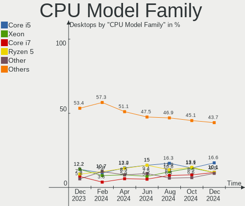
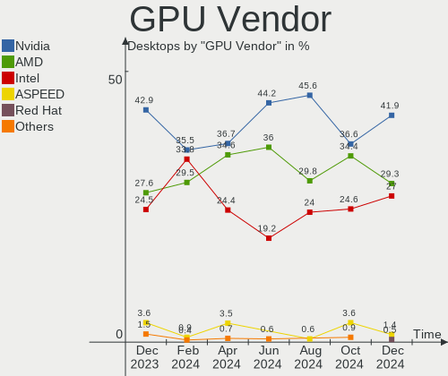
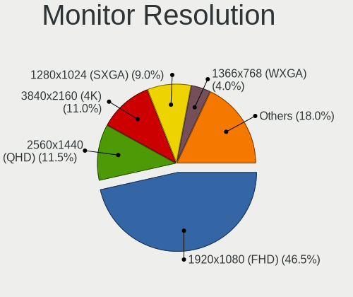

Linux in Russia - Hardware Trends (Desktops)
--------------------------------------------

A project to identify most popular hardware characteristics and track their change
over time based on data collected by Linux users at https://Linux-Hardware.org.

Anyone can contribute to this report by the [hw-probe](https://github.com/linuxhw/hw-probe) tool:

    sudo -E hw-probe -all -upload

Period: Apr, 2024.

Contents
--------

* [ System ](#system)
  - [ OS                       ](#os)
  - [ OS Family                ](#os-family)
  - [ Kernel                   ](#kernel)
  - [ Kernel Family            ](#kernel-family)
  - [ Kernel Major Ver.        ](#kernel-major-ver)
  - [ Arch                     ](#arch)
  - [ DE                       ](#de)
  - [ Display Server           ](#display-server)
  - [ Display Manager          ](#display-manager)
  - [ OS Lang                  ](#os-lang)
  - [ Boot Mode                ](#boot-mode)
  - [ Filesystem               ](#filesystem)
  - [ Part. scheme             ](#part-scheme)
  - [ Dual Boot with Linux/BSD ](#dual-boot-with-linuxbsd)
  - [ Dual Boot (Win)          ](#dual-boot-win)

* [ Board ](#board)
  - [ Vendor                   ](#vendor)
  - [ Model                    ](#model)
  - [ Model Family             ](#model-family)
  - [ MFG Year                 ](#mfg-year)
  - [ Form Factor              ](#form-factor)
  - [ Secure Boot              ](#secure-boot)
  - [ Coreboot                 ](#coreboot)
  - [ RAM Size                 ](#ram-size)
  - [ RAM Used                 ](#ram-used)
  - [ Total Drives             ](#total-drives)
  - [ Has CD-ROM               ](#has-cd-rom)
  - [ Has Ethernet             ](#has-ethernet)
  - [ Has WiFi                 ](#has-wifi)
  - [ Has Bluetooth            ](#has-bluetooth)

* [ Location ](#location)
  - [ Country                  ](#country)
  - [ City                     ](#city)

* [ Drives ](#drives)
  - [ Drive Vendor             ](#drive-vendor)
  - [ Drive Model              ](#drive-model)
  - [ HDD Vendor               ](#hdd-vendor)
  - [ SSD Vendor               ](#ssd-vendor)
  - [ Drive Kind               ](#drive-kind)
  - [ Drive Connector          ](#drive-connector)
  - [ Drive Size               ](#drive-size)
  - [ Space Total              ](#space-total)
  - [ Space Used               ](#space-used)
  - [ Malfunc. Drives          ](#malfunc-drives)
  - [ Malfunc. Drive Vendor    ](#malfunc-drive-vendor)
  - [ Malfunc. HDD Vendor      ](#malfunc-hdd-vendor)
  - [ Malfunc. Drive Kind      ](#malfunc-drive-kind)
  - [ Failed Drives            ](#failed-drives)
  - [ Failed Drive Vendor      ](#failed-drive-vendor)
  - [ Drive Status             ](#drive-status)

* [ Storage controller ](#storage-controller)
  - [ Storage Vendor           ](#storage-vendor)
  - [ Storage Model            ](#storage-model)
  - [ Storage Kind             ](#storage-kind)

* [ Processor ](#processor)
  - [ CPU Vendor               ](#cpu-vendor)
  - [ CPU Model                ](#cpu-model)
  - [ CPU Model Family         ](#cpu-model-family)
  - [ CPU Cores                ](#cpu-cores)
  - [ CPU Sockets              ](#cpu-sockets)
  - [ CPU Threads              ](#cpu-threads)
  - [ CPU Op-Modes             ](#cpu-op-modes)
  - [ CPU Microcode            ](#cpu-microcode)
  - [ CPU Microarch            ](#cpu-microarch)

* [ Graphics ](#graphics)
  - [ GPU Vendor               ](#gpu-vendor)
  - [ GPU Model                ](#gpu-model)
  - [ GPU Combo                ](#gpu-combo)
  - [ GPU Driver               ](#gpu-driver)
  - [ GPU Memory               ](#gpu-memory)

* [ Monitor ](#monitor)
  - [ Monitor Vendor           ](#monitor-vendor)
  - [ Monitor Model            ](#monitor-model)
  - [ Monitor Resolution       ](#monitor-resolution)
  - [ Monitor Diagonal         ](#monitor-diagonal)
  - [ Monitor Width            ](#monitor-width)
  - [ Aspect Ratio             ](#aspect-ratio)
  - [ Monitor Area             ](#monitor-area)
  - [ Pixel Density            ](#pixel-density)
  - [ Multiple Monitors        ](#multiple-monitors)

* [ Network ](#network)
  - [ Net Controller Vendor    ](#net-controller-vendor)
  - [ Net Controller Model     ](#net-controller-model)
  - [ Wireless Vendor          ](#wireless-vendor)
  - [ Wireless Model           ](#wireless-model)
  - [ Ethernet Vendor          ](#ethernet-vendor)
  - [ Ethernet Model           ](#ethernet-model)
  - [ Net Controller Kind      ](#net-controller-kind)
  - [ Used Controller          ](#used-controller)
  - [ NICs                     ](#nics)
  - [ IPv6                     ](#ipv6)

* [ Bluetooth ](#bluetooth)
  - [ Bluetooth Vendor         ](#bluetooth-vendor)
  - [ Bluetooth Model          ](#bluetooth-model)

* [ Sound ](#sound)
  - [ Sound Vendor             ](#sound-vendor)
  - [ Sound Model              ](#sound-model)

* [ Memory ](#memory)
  - [ Memory Vendor            ](#memory-vendor)
  - [ Memory Model             ](#memory-model)
  - [ Memory Kind              ](#memory-kind)
  - [ Memory Form Factor       ](#memory-form-factor)
  - [ Memory Size              ](#memory-size)
  - [ Memory Speed             ](#memory-speed)

* [ Printers & scanners ](#printers--scanners)
  - [ Printer Vendor           ](#printer-vendor)
  - [ Printer Model            ](#printer-model)
  - [ Scanner Vendor           ](#scanner-vendor)
  - [ Scanner Model            ](#scanner-model)

* [ Camera ](#camera)
  - [ Camera Vendor            ](#camera-vendor)
  - [ Camera Model             ](#camera-model)

* [ Security ](#security)
  - [ Fingerprint Vendor       ](#fingerprint-vendor)
  - [ Fingerprint Model        ](#fingerprint-model)
  - [ Chipcard Vendor          ](#chipcard-vendor)
  - [ Chipcard Model           ](#chipcard-model)

* [ Unsupported ](#unsupported)
  - [ Unsupported Devices      ](#unsupported-devices)
  - [ Unsupported Device Types ](#unsupported-device-types)

System
------

OS
--

Installed operating systems

| Name                         | Desktops | Percent |
|------------------------------|----------|---------|
| ROSA 12.5                    | 89       | 32.72%  |
| Debian 12                    | 37       | 13.6%   |
| Ubuntu 22.04                 | 18       | 6.62%   |
| Fedora 39                    | 11       | 4.04%   |
| OpenMandriva 23.08           | 7        | 2.57%   |
| ROSA 13.0                    | 6        | 2.21%   |
| ROSA 12.4                    | 6        | 2.21%   |
| Fedora 40                    | 6        | 2.21%   |
| Arch Rolling                 | 6        | 2.21%   |
| Ubuntu 20.04                 | 5        | 1.84%   |
| ROSA R11.1                   | 5        | 1.84%   |
| Linux Mint 21.3              | 4        | 1.47%   |
| Debian 11                    | 4        | 1.47%   |
| Ubuntu 24.04                 | 3        | 1.1%    |
| ROSA 12                      | 3        | 1.1%    |
| OpenMandriva 5.0             | 3        | 1.1%    |
| Gentoo 2.14                  | 3        | 1.1%    |
| ArcoLinux Rolling            | 3        | 1.1%    |
| ALT Linux 10.2               | 3        | 1.1%    |
| Xubuntu 20.04                | 2        | 0.74%   |
| ROSA R11                     | 2        | 0.74%   |
| ROSA 2021.1                  | 2        | 0.74%   |
| ROSA 12.3                    | 2        | 0.74%   |
| Red OS 7.3                   | 2        | 0.74%   |
| Oracle Linux 9.3             | 2        | 0.74%   |
| openSUSE Tumbleweed-XXXXXXXX | 2        | 0.74%   |
| OpenMandriva 24.01           | 2        | 0.74%   |
| Manjaro 23.1.4               | 2        | 0.74%   |
| Kubuntu 24.04                | 2        | 0.74%   |
| Fedora 41                    | 2        | 0.74%   |
| EndeavourOS Rolling          | 2        | 0.74%   |
| ALT Linux 20240122           | 2        | 0.74%   |
| ALT Linux 10.3               | 2        | 0.74%   |
| Zorin 17                     | 1        | 0.37%   |
| Xubuntu 22.04                | 1        | 0.37%   |
| Ultramarine 39               | 1        | 0.37%   |
| ROSA R9                      | 1        | 0.37%   |
| Rocky Linux 8.9              | 1        | 0.37%   |
| Red OS 8.0                   | 1        | 0.37%   |
| Progress Linux 5+            | 1        | 0.37%   |

OS Family
---------

OS without a version

| Name             | Desktops | Percent |
|------------------|----------|---------|
| ROSA             | 116      | 42.65%  |
| Debian           | 42       | 15.44%  |
| Ubuntu           | 26       | 9.56%   |
| Fedora           | 19       | 6.99%   |
| OpenMandriva     | 12       | 4.41%   |
| ALT Linux        | 8        | 2.94%   |
| Linux Mint       | 6        | 2.21%   |
| Arch             | 6        | 2.21%   |
| Kubuntu          | 4        | 1.47%   |
| Xubuntu          | 3        | 1.1%    |
| Red OS           | 3        | 1.1%    |
| openSUSE         | 3        | 1.1%    |
| Gentoo           | 3        | 1.1%    |
| ArcoLinux        | 3        | 1.1%    |
| Oracle Linux     | 2        | 0.74%   |
| Manjaro          | 2        | 0.74%   |
| EndeavourOS      | 2        | 0.74%   |
| Zorin            | 1        | 0.37%   |
| Ultramarine      | 1        | 0.37%   |
| Rocky Linux      | 1        | 0.37%   |
| Progress Linux   | 1        | 0.37%   |
| Pop!_OS          | 1        | 0.37%   |
| org.kde.Platform | 1        | 0.37%   |
| NixOS            | 1        | 0.37%   |
| LMDE             | 1        | 0.37%   |
| KDE neon         | 1        | 0.37%   |
| Garuda Linux     | 1        | 0.37%   |
| Elementary       | 1        | 0.37%   |
| Astra Linux      | 1        | 0.37%   |

Kernel
------

Version of the Linux kernel

| Version                             | Desktops | Percent |
|-------------------------------------|----------|---------|
| 6.6.21-generic-8rosa2021.1-x86_64   | 50       | 18.38%  |
| 6.1.0-4-amd64                       | 28       | 10.29%  |
| 6.1.81-generic-2rosa2021.1-x86_64   | 20       | 7.35%   |
| 5.15.0-97-generic                   | 9        | 3.31%   |
| 6.5.0-27-generic                    | 6        | 2.21%   |
| 6.5.0-26-generic                    | 6        | 2.21%   |
| 6.4.11-desktop-1omv2390             | 6        | 2.21%   |
| 6.6.2-desktop-1omv2390              | 5        | 1.84%   |
| 6.1.58-generic-1rosa2021.1-x86_64   | 5        | 1.84%   |
| 6.1.20-generic-2rosa2021.1-x86_64   | 5        | 1.84%   |
| 6.8.7-300.fc40.x86_64               | 4        | 1.47%   |
| 6.1.86-generic-1rosa2021.1-x86_64   | 4        | 1.47%   |
| 5.15.0-101-generic                  | 4        | 1.47%   |
| 5.10.184-generic-1rosa2021.1-x86_64 | 4        | 1.47%   |
| 6.8.5-201.fc39.x86_64               | 3        | 1.1%    |
| 6.8.4-200.fc39.x86_64               | 3        | 1.1%    |
| 6.1.0-0.deb11.17-amd64              | 3        | 1.1%    |
| 5.15.0-105-generic                  | 3        | 1.1%    |
| 5.15.0-102-generic                  | 3        | 1.1%    |
| 6.9.0-0.rc3.31.fc41.x86_64+debug    | 2        | 0.74%   |
| 6.8.7-zen1-1-zen                    | 2        | 0.74%   |
| 6.8.2-300.fc40.x86_64               | 2        | 0.74%   |
| 6.8.0-31-generic                    | 2        | 0.74%   |
| 6.8.0-22-generic                    | 2        | 0.74%   |
| 6.7.9-arch1-1                       | 2        | 0.74%   |
| 6.7.11-200.fc39.x86_64              | 2        | 0.74%   |
| 6.7.10-200.fc39.x86_64              | 2        | 0.74%   |
| 6.6.27-generic-3rosa2021.1-x86_64   | 2        | 0.74%   |
| 6.6.27-generic-2rosa2021.1-x86_64   | 2        | 0.74%   |
| 6.6.22-generic-2rosa2023.1-x86_64   | 2        | 0.74%   |
| 6.5.13-3-pve                        | 2        | 0.74%   |
| 6.1.83-un-def-alt1                  | 2        | 0.74%   |
| 6.1.50-1-generic                    | 2        | 0.74%   |
| 6.1.0-20-amd64                      | 2        | 0.74%   |
| 5.4.32-generic-2rosa-x86_64         | 2        | 0.74%   |
| 5.15.0-205.149.5.1.el9uek.x86_64    | 2        | 0.74%   |
| 4.15.0-desktop-45.1rosa-x86_64      | 2        | 0.74%   |
| 4.15.0-desktop-122.124.1rosa-x86_64 | 2        | 0.74%   |
| 6.9.0-060900rc5-generic             | 1        | 0.37%   |
| 6.8.8-1-cachyos-bore                | 1        | 0.37%   |

Kernel Family
-------------

Linux kernel without a distro release

| Version  | Desktops | Percent |
|----------|----------|---------|
| 6.6.21   | 52       | 19.12%  |
| 6.1.0    | 35       | 12.87%  |
| 5.15.0   | 22       | 8.09%   |
| 6.1.81   | 20       | 7.35%   |
| 6.5.0    | 12       | 4.41%   |
| 6.8.7    | 8        | 2.94%   |
| 6.8.5    | 6        | 2.21%   |
| 6.4.11   | 6        | 2.21%   |
| 6.8.0    | 5        | 1.84%   |
| 6.6.27   | 5        | 1.84%   |
| 6.6.2    | 5        | 1.84%   |
| 6.1.58   | 5        | 1.84%   |
| 6.1.20   | 5        | 1.84%   |
| 5.10.184 | 5        | 1.84%   |
| 4.15.0   | 5        | 1.84%   |
| 6.8.2    | 4        | 1.47%   |
| 6.6.22   | 4        | 1.47%   |
| 6.1.86   | 4        | 1.47%   |
| 6.9.0    | 3        | 1.1%    |
| 6.8.4    | 3        | 1.1%    |
| 6.7.11   | 3        | 1.1%    |
| 6.5.13   | 3        | 1.1%    |
| 6.5.11   | 3        | 1.1%    |
| 6.7.9    | 2        | 0.74%   |
| 6.7.10   | 2        | 0.74%   |
| 6.1.85   | 2        | 0.74%   |
| 6.1.83   | 2        | 0.74%   |
| 6.1.50   | 2        | 0.74%   |
| 5.4.32   | 2        | 0.74%   |
| 5.15.127 | 2        | 0.74%   |
| 6.8.8    | 1        | 0.37%   |
| 6.8.6    | 1        | 0.37%   |
| 6.8.3    | 1        | 0.37%   |
| 6.8.1    | 1        | 0.37%   |
| 6.7.12   | 1        | 0.37%   |
| 6.6.6    | 1        | 0.37%   |
| 6.6.28   | 1        | 0.37%   |
| 6.6.26   | 1        | 0.37%   |
| 6.6.25   | 1        | 0.37%   |
| 6.6.23   | 1        | 0.37%   |

Kernel Major Ver.
-----------------

Linux kernel major version

| Version | Desktops | Percent |
|---------|----------|---------|
| 6.1     | 80       | 29.41%  |
| 6.6     | 72       | 26.47%  |
| 6.8     | 30       | 11.03%  |
| 5.15    | 29       | 10.66%  |
| 6.5     | 19       | 6.99%   |
| 6.7     | 8        | 2.94%   |
| 5.10    | 8        | 2.94%   |
| 6.4     | 7        | 2.57%   |
| 4.15    | 6        | 2.21%   |
| 5.4     | 4        | 1.47%   |
| 6.9     | 3        | 1.1%    |
| 6.2     | 2        | 0.74%   |
| 5.19    | 1        | 0.37%   |
| 5.14    | 1        | 0.37%   |
| 4.9     | 1        | 0.37%   |
| 4.18    | 1        | 0.37%   |

Arch
----

OS architecture (x86_64, i586, etc.)

| Name   | Desktops | Percent |
|--------|----------|---------|
| x86_64 | 268      | 98.53%  |
| i686   | 4        | 1.47%   |

DE
--

Desktop Environment

| Name            | Desktops | Percent |
|-----------------|----------|---------|
| KDE5            | 91       | 33.46%  |
| GNOME           | 67       | 24.63%  |
| Unknown         | 53       | 19.49%  |
| XFCE            | 12       | 4.41%   |
| LXQt            | 12       | 4.41%   |
| KDE6            | 10       | 3.68%   |
| X-Cinnamon      | 7        | 2.57%   |
| MATE            | 7        | 2.57%   |
| KDE4            | 6        | 2.21%   |
| fly             | 2        | 0.74%   |
| Pantheon        | 1        | 0.37%   |
| KDE             | 1        | 0.37%   |
| Hyprland        | 1        | 0.37%   |
| GNOME Flashback | 1        | 0.37%   |
| Cinnamon        | 1        | 0.37%   |

Display Server
--------------

X11 or Wayland

| Name    | Desktops | Percent |
|---------|----------|---------|
| Wayland | 131      | 48.16%  |
| X11     | 89       | 32.72%  |
| Unknown | 40       | 14.71%  |
| Tty     | 12       | 4.41%   |

Display Manager
---------------

SDDM, LightDM, etc.

| Name    | Desktops | Percent |
|---------|----------|---------|
| SDDM    | 97       | 35.66%  |
| Unknown | 86       | 31.62%  |
| GDM     | 48       | 17.65%  |
| LightDM | 23       | 8.46%   |
| GDM3    | 12       | 4.41%   |
| KDM     | 6        | 2.21%   |

OS Lang
-------

Language

| Lang    | Desktops | Percent |
|---------|----------|---------|
| ru_RU   | 221      | 81.25%  |
| en_US   | 31       | 11.4%   |
| C       | 11       | 4.04%   |
| Unknown | 6        | 2.21%   |
| ru      | 1        | 0.37%   |
| eo      | 1        | 0.37%   |
| C.UTF8  | 1        | 0.37%   |

Boot Mode
---------

EFI or BIOS

| Mode | Desktops | Percent |
|------|----------|---------|
| EFI  | 142      | 52.21%  |
| BIOS | 130      | 47.79%  |

Filesystem
----------

Type of filesystem

| Type    | Desktops | Percent |
|---------|----------|---------|
| Ext4    | 172      | 63.24%  |
| Overlay | 42       | 15.44%  |
| Btrfs   | 42       | 15.44%  |
| Tmpfs   | 5        | 1.84%   |
| Xfs     | 4        | 1.47%   |
| Zfs     | 3        | 1.1%    |
| F2fs    | 2        | 0.74%   |
| XXXXXXX | 1        | 0.37%   |
| Unknown | 1        | 0.37%   |

Part. scheme
------------

Scheme of partitioning

| Type    | Desktops | Percent |
|---------|----------|---------|
| GPT     | 159      | 58.46%  |
| MBR     | 70       | 25.74%  |
| Unknown | 43       | 15.81%  |

Dual Boot with Linux/BSD
------------------------

Hosting more than one Linux/BSD

| Dual boot | Desktops | Percent |
|-----------|----------|---------|
| No        | 206      | 75.74%  |
| Yes       | 66       | 24.26%  |

Dual Boot (Win)
---------------

Hosting Linux and Windows

| Dual boot | Desktops | Percent |
|-----------|----------|---------|
| No        | 152      | 55.88%  |
| Yes       | 120      | 44.12%  |

Board
-----

Vendor
------

Motherboard manufacturer

| Name                                 | Desktops | Percent |
|--------------------------------------|----------|---------|
| Gigabyte Technology                  | 75       | 27.57%  |
| ASUSTek Computer                     | 67       | 24.63%  |
| MSI                                  | 39       | 14.34%  |
| ASRock                               | 27       | 9.93%   |
| Lenovo                               | 11       | 4.04%   |
| Supermicro                           | 10       | 3.68%   |
| Intel                                | 9        | 3.31%   |
| Biostar                              | 7        | 2.57%   |
| Dell                                 | 6        | 2.21%   |
| Unknown                              | 4        | 1.47%   |
| Hewlett-Packard                      | 3        | 1.1%    |
| ECS                                  | 3        | 1.1%    |
| MAXSUN                               | 2        | 0.74%   |
| Shenzhen Meigao Electronic Equipment | 1        | 0.37%   |
| MB                                   | 1        | 0.37%   |
| MACHINIST                            | 1        | 0.37%   |
| Kraftway                             | 1        | 0.37%   |
| Huanan                               | 1        | 0.37%   |
| EPoX Computer                        | 1        | 0.37%   |
| Colorful Technology                  | 1        | 0.37%   |
| BESHTAU                              | 1        | 0.37%   |
| AZW                                  | 1        | 0.37%   |

Model
-----

Motherboard model

| Name                                              | Desktops | Percent |
|---------------------------------------------------|----------|---------|
| Lenovo ThinkCentre M79 10JAS05300                 | 9        | 3.31%   |
| Supermicro SYS-6018R-TDW                          | 5        | 1.84%   |
| ASUS S20 K29                                      | 5        | 1.84%   |
| ASUS All Series                                   | 5        | 1.84%   |
| Intel X99                                         | 4        | 1.47%   |
| Unknown                                           | 4        | 1.47%   |
| MSI MS-7C96                                       | 3        | 1.1%    |
| MSI MS-7B89                                       | 3        | 1.1%    |
| ASUS M5A97 R2.0                                   | 3        | 1.1%    |
| Supermicro SYS-6018R-MTR                          | 2        | 0.74%   |
| MSI MS-7C56                                       | 2        | 0.74%   |
| MSI MS-7C52                                       | 2        | 0.74%   |
| MSI MS-7A38                                       | 2        | 0.74%   |
| Gigabyte P75-D3                                   | 2        | 0.74%   |
| Gigabyte B560 HD3                                 | 2        | 0.74%   |
| Gigabyte B450M S2H                                | 2        | 0.74%   |
| Gigabyte B450M GAMING                             | 2        | 0.74%   |
| Gigabyte AB350M-DS3H V2                           | 2        | 0.74%   |
| ASUS TUF Gaming B550-PLUS                         | 2        | 0.74%   |
| ASUS P8H61-M LX R2.0                              | 2        | 0.74%   |
| ASUS P5QL-CM                                      | 2        | 0.74%   |
| ASRock H55M-LE                                    | 2        | 0.74%   |
| ASRock B450 Pro4 R2.0                             | 2        | 0.74%   |
| Supermicro X8ST3                                  | 1        | 0.37%   |
| Supermicro Server                                 | 1        | 0.37%   |
| Supermicro PIO-618U-T4T+-ST031                    | 1        | 0.37%   |
| Shenzhen Meigao Electronic Equipment Venus Series | 1        | 0.37%   |
| MSI PRO B300 DP20ZA (MS-B0A2)                     | 1        | 0.37%   |
| MSI MS-7E27                                       | 1        | 0.37%   |
| MSI MS-7E16                                       | 1        | 0.37%   |
| MSI MS-7D89                                       | 1        | 0.37%   |
| MSI MS-7D69                                       | 1        | 0.37%   |
| MSI MS-7D67                                       | 1        | 0.37%   |
| MSI MS-7D46                                       | 1        | 0.37%   |
| MSI MS-7D42                                       | 1        | 0.37%   |
| MSI MS-7D22                                       | 1        | 0.37%   |
| MSI MS-7D18                                       | 1        | 0.37%   |
| MSI MS-7C94                                       | 1        | 0.37%   |
| MSI MS-7C91                                       | 1        | 0.37%   |
| MSI MS-7C37                                       | 1        | 0.37%   |

Model Family
------------

Motherboard model prefix

| Name                           | Desktops | Percent |
|--------------------------------|----------|---------|
| Lenovo ThinkCentre             | 10       | 3.68%   |
| ASUS PRIME                     | 10       | 3.68%   |
| Gigabyte B450M                 | 7        | 2.57%   |
| Dell OptiPlex                  | 6        | 2.21%   |
| ASUS ROG                       | 6        | 2.21%   |
| Supermicro SYS-6018R-TDW       | 5        | 1.84%   |
| ASUS S20                       | 5        | 1.84%   |
| ASUS All                       | 5        | 1.84%   |
| Intel X99                      | 4        | 1.47%   |
| Gigabyte B560M                 | 4        | 1.47%   |
| Gigabyte A520M                 | 4        | 1.47%   |
| ASUS TUF                       | 4        | 1.47%   |
| ASUS M5A97                     | 4        | 1.47%   |
| Unknown                        | 4        | 1.47%   |
| MSI MS-7C96                    | 3        | 1.1%    |
| MSI MS-7B89                    | 3        | 1.1%    |
| Gigabyte B550M                 | 3        | 1.1%    |
| Supermicro SYS-6018R-MTR       | 2        | 0.74%   |
| MSI MS-7C56                    | 2        | 0.74%   |
| MSI MS-7C52                    | 2        | 0.74%   |
| MSI MS-7A38                    | 2        | 0.74%   |
| Gigabyte Z390                  | 2        | 0.74%   |
| Gigabyte P75-D3                | 2        | 0.74%   |
| Gigabyte H610M                 | 2        | 0.74%   |
| Gigabyte H410M                 | 2        | 0.74%   |
| Gigabyte B560                  | 2        | 0.74%   |
| Gigabyte AB350M-DS3H           | 2        | 0.74%   |
| Biostar NEO                    | 2        | 0.74%   |
| ASUS STRIX                     | 2        | 0.74%   |
| ASUS P8H77-V                   | 2        | 0.74%   |
| ASUS P8H61-M                   | 2        | 0.74%   |
| ASUS P8B75-M                   | 2        | 0.74%   |
| ASUS P7H55-M                   | 2        | 0.74%   |
| ASUS P5QL-CM                   | 2        | 0.74%   |
| ASRock H55M-LE                 | 2        | 0.74%   |
| ASRock B450M                   | 2        | 0.74%   |
| ASRock B450                    | 2        | 0.74%   |
| Supermicro X8ST3               | 1        | 0.37%   |
| Supermicro Server              | 1        | 0.37%   |
| Supermicro PIO-618U-T4T+-ST031 | 1        | 0.37%   |

MFG Year
--------

Motherboard manufacture year

| Year | Desktops | Percent |
|------|----------|---------|
| 2012 | 38       | 13.97%  |
| 2020 | 33       | 12.13%  |
| 2018 | 24       | 8.82%   |
| 2021 | 23       | 8.46%   |
| 2016 | 21       | 7.72%   |
| 2022 | 17       | 6.25%   |
| 2019 | 14       | 5.15%   |
| 2015 | 14       | 5.15%   |
| 2009 | 12       | 4.41%   |
| 2023 | 11       | 4.04%   |
| 2014 | 10       | 3.68%   |
| 2011 | 10       | 3.68%   |
| 2017 | 9        | 3.31%   |
| 2013 | 9        | 3.31%   |
| 2010 | 8        | 2.94%   |
| 2008 | 8        | 2.94%   |
| 2024 | 5        | 1.84%   |
| 2007 | 3        | 1.1%    |
| 2006 | 1        | 0.37%   |
| 2005 | 1        | 0.37%   |
| 2003 | 1        | 0.37%   |

Form Factor
-----------

Physical design of the computer

| Name    | Desktops | Percent |
|---------|----------|---------|
| Desktop | 272      | 100%    |

Secure Boot
-----------

Enabled or disabled

| State    | Desktops | Percent |
|----------|----------|---------|
| Disabled | 269      | 98.9%   |
| Enabled  | 3        | 1.1%    |

Coreboot
--------

Have coreboot on board

| Used | Desktops | Percent |
|------|----------|---------|
| No   | 272      | 100%    |

RAM Size
--------

Total RAM memory

| Size in GB      | Desktops | Percent |
|-----------------|----------|---------|
| 16.01-24.0      | 80       | 29.41%  |
| 4.01-8.0        | 45       | 16.54%  |
| 32.01-64.0      | 40       | 14.71%  |
| 8.01-16.0       | 37       | 13.6%   |
| 3.01-4.0        | 29       | 10.66%  |
| 64.01-256.0     | 20       | 7.35%   |
| 24.01-32.0      | 10       | 3.68%   |
| 1.01-2.0        | 6        | 2.21%   |
| 2.01-3.0        | 2        | 0.74%   |
| 0.51-1.0        | 2        | 0.74%   |
| More than 256.0 | 1        | 0.37%   |

RAM Used
--------

Used RAM memory

| Used GB     | Desktops | Percent |
|-------------|----------|---------|
| 1.01-2.0    | 80       | 29.41%  |
| 2.01-3.0    | 60       | 22.06%  |
| 0.51-1.0    | 45       | 16.54%  |
| 4.01-8.0    | 40       | 14.71%  |
| 3.01-4.0    | 28       | 10.29%  |
| 8.01-16.0   | 12       | 4.41%   |
| 24.01-32.0  | 2        | 0.74%   |
| 16.01-24.0  | 2        | 0.74%   |
| 32.01-64.0  | 1        | 0.37%   |
| 64.01-256.0 | 1        | 0.37%   |
| 0.01-0.5    | 1        | 0.37%   |

Total Drives
------------

Number of drives on board

| Drives | Desktops | Percent |
|--------|----------|---------|
| 1      | 108      | 39.71%  |
| 2      | 79       | 29.04%  |
| 3      | 47       | 17.28%  |
| 4      | 27       | 9.93%   |
| 6      | 5        | 1.84%   |
| 5      | 4        | 1.47%   |
| 8      | 1        | 0.37%   |
| 0      | 1        | 0.37%   |

Has CD-ROM
----------

Has CD-ROM on board

| Presented | Desktops | Percent |
|-----------|----------|---------|
| No        | 210      | 77.21%  |
| Yes       | 62       | 22.79%  |

Has Ethernet
------------

Has Ethernet on board

| Presented | Desktops | Percent |
|-----------|----------|---------|
| Yes       | 272      | 100%    |

Has WiFi
--------

Has WiFi module

| Presented | Desktops | Percent |
|-----------|----------|---------|
| No        | 196      | 72.06%  |
| Yes       | 76       | 27.94%  |

Has Bluetooth
-------------

Has Bluetooth module

| Presented | Desktops | Percent |
|-----------|----------|---------|
| No        | 198      | 72.79%  |
| Yes       | 74       | 27.21%  |

Location
--------

Country
-------

Geographic location (country)

| Country | Desktops | Percent |
|---------|----------|---------|
| Russia  | 272      | 100%    |

City
----

Geographic location (city)

| City              | Desktops | Percent |
|-------------------|----------|---------|
| Moscow            | 68       | 25%     |
| Voronezh          | 31       | 11.4%   |
| St Petersburg     | 23       | 8.46%   |
| Novosibirsk       | 6        | 2.21%   |
| Chelyabinsk       | 6        | 2.21%   |
| Yekaterinburg     | 5        | 1.84%   |
| Krasnodar         | 5        | 1.84%   |
| Stavropol         | 4        | 1.47%   |
| Rostov-on-Don     | 4        | 1.47%   |
| Omsk              | 4        | 1.47%   |
| Lipetsk           | 4        | 1.47%   |
| Yaroslavl         | 3        | 1.1%    |
| Samara            | 3        | 1.1%    |
| Perm              | 3        | 1.1%    |
| Nizhniy Novgorod  | 3        | 1.1%    |
| Khabarovsk        | 3        | 1.1%    |
| Kazan’          | 3        | 1.1%    |
| Kaliningrad       | 3        | 1.1%    |
| Yuzhno-Sakhalinsk | 2        | 0.74%   |
| Vladivostok       | 2        | 0.74%   |
| Vladimir          | 2        | 0.74%   |
| Ufa               | 2        | 0.74%   |
| Tambov            | 2        | 0.74%   |
| Surgut            | 2        | 0.74%   |
| Smolensk          | 2        | 0.74%   |
| Serpukhov         | 2        | 0.74%   |
| Saransk           | 2        | 0.74%   |
| Penza             | 2        | 0.74%   |
| Orenburg          | 2        | 0.74%   |
| Novokuznetsk      | 2        | 0.74%   |
| Murom             | 2        | 0.74%   |
| Kursk             | 2        | 0.74%   |
| Kazan'            | 2        | 0.74%   |
| Belgorod          | 2        | 0.74%   |
| Barnaul           | 2        | 0.74%   |
| Arkhangelsk       | 2        | 0.74%   |
| Zima              | 1        | 0.37%   |
| Zheleznodorozhnyy | 1        | 0.37%   |
| Zelenodolsk       | 1        | 0.37%   |
| Volgograd         | 1        | 0.37%   |

Drives
------

Drive Vendor
------------

Hard drive vendors

| Vendor                      | Desktops | Drives | Percent |
|-----------------------------|----------|--------|---------|
| WDC                         | 109      | 133    | 22.06%  |
| Seagate                     | 68       | 79     | 13.77%  |
| Samsung Electronics         | 50       | 68     | 10.12%  |
| Toshiba                     | 36       | 39     | 7.29%   |
| Kingston                    | 31       | 36     | 6.28%   |
| Hitachi                     | 15       | 17     | 3.04%   |
| SanDisk                     | 14       | 17     | 2.83%   |
| Crucial                     | 11       | 13     | 2.23%   |
| Apacer                      | 11       | 11     | 2.23%   |
| Intel                       | 10       | 13     | 2.02%   |
| China                       | 10       | 11     | 2.02%   |
| A-DATA Technology           | 10       | 11     | 2.02%   |
| Silicon Motion              | 7        | 7      | 1.42%   |
| Gigabyte Technology         | 6        | 6      | 1.21%   |
| SPCC                        | 5        | 5      | 1.01%   |
| Smartbuy                    | 5        | 6      | 1.01%   |
| Plextor                     | 5        | 6      | 1.01%   |
| Netac                       | 5        | 5      | 1.01%   |
| MAXIO Technology (Hangzhou) | 5        | 5      | 1.01%   |
| KingSpec                    | 5        | 5      | 1.01%   |
| HGST                        | 5        | 7      | 1.01%   |
| Unknown                     | 4        | 4      | 0.81%   |
| Realtek Semiconductor       | 4        | 4      | 0.81%   |
| AMD                         | 4        | 4      | 0.81%   |
| AGI                         | 4        | 4      | 0.81%   |
| Phison Electronics          | 3        | 3      | 0.61%   |
| MSI                         | 3        | 3      | 0.61%   |
| Kingston Technology Company | 3        | 3      | 0.61%   |
| JMicron Technology          | 3        | 3      | 0.61%   |
| Hewlett-Packard             | 3        | 3      | 0.61%   |
| Fujitsu                     | 3        | 5      | 0.61%   |
| DEXP                        | 3        | 3      | 0.61%   |
| ADATA Technology            | 3        | 4      | 0.61%   |
| walram                      | 2        | 2      | 0.4%    |
| Team                        | 2        | 2      | 0.4%    |
| T-FORCE                     | 2        | 2      | 0.4%    |
| Qumo                        | 2        | 2      | 0.4%    |
| Patriot                     | 2        | 2      | 0.4%    |
| OCZ                         | 2        | 2      | 0.4%    |
| USB3.0                      | 1        | 1      | 0.2%    |

Drive Model
-----------

Hard drive models

| Model                                                 | Desktops | Percent |
|-------------------------------------------------------|----------|---------|
| Seagate ST500DM002-1BD142 500GB                       | 10       | 1.84%   |
| Seagate ST1000DM010-2EP102 1TB                        | 10       | 1.84%   |
| Toshiba HDWD110 1TB                                   | 9        | 1.65%   |
| Silicon Motion SM2263EN/SM2263XT SSD Controller 256GB | 7        | 1.29%   |
| Toshiba DT01ACA050 500GB                              | 6        | 1.1%    |
| Seagate ST1000DM003-1CH162 1TB                        | 6        | 1.1%    |
| WDC WD5000AAKX-22ERMA0 500GB                          | 5        | 0.92%   |
| WDC WD10EZEX-08WN4A0 1TB                              | 5        | 0.92%   |
| Samsung NVMe SSD Controller SM981/PM981/PM983 1TB     | 5        | 0.92%   |
| Kingston SA400S37480G 480GB SSD                       | 5        | 0.92%   |
| Crucial CT480BX500SSD1 480GB                          | 5        | 0.92%   |
| WDC WD10EZEX-00BBHA0 1TB                              | 4        | 0.74%   |
| Toshiba DT01ACA100 1TB                                | 4        | 0.74%   |
| Seagate ST1000NM0033-9ZM173 1TB                       | 4        | 0.74%   |
| Kingston SA400S37240G 240GB SSD                       | 4        | 0.74%   |
| WDC WD10EZEX-00BN5A0 1TB                              | 3        | 0.55%   |
| Unknown NVMe SSD Drive 512GB                          | 3        | 0.55%   |
| Smartbuy SSD 120GB                                    | 3        | 0.55%   |
| Seagate ST1000NM0008-2F2100 1TB                       | 3        | 0.55%   |
| Samsung SSD 870 EVO 500GB                             | 3        | 0.55%   |
| Samsung SSD 870 EVO 250GB                             | 3        | 0.55%   |
| Kingston SA400S37120G 120GB SSD                       | 3        | 0.55%   |
| Crucial CT240BX500SSD1 240GB                          | 3        | 0.55%   |
| China SSD 256GB                                       | 3        | 0.55%   |
| China SATA SSD 128GB                                  | 3        | 0.55%   |
| Apacer AS2280P4 256GB                                 | 3        | 0.55%   |
| AMD R5SL256G 256GB SSD                                | 3        | 0.55%   |
| A-DATA SU650 120GB SSD                                | 3        | 0.55%   |
| WDC WDS120G2G0B-00EPW0 120GB SSD                      | 2        | 0.37%   |
| WDC WDS120G2G0A-00JH30 120GB SSD                      | 2        | 0.37%   |
| WDC WD5003AZEX-00MK2A0 500GB                          | 2        | 0.37%   |
| WDC WD5000AZRX-00L4HB0 500GB                          | 2        | 0.37%   |
| WDC WD5000AZLX-08K2TA0 500GB                          | 2        | 0.37%   |
| WDC WD5000AAKX-60U6AA0 500GB                          | 2        | 0.37%   |
| WDC WD5000AAKX-00ERMA0 500GB                          | 2        | 0.37%   |
| WDC WD42PURZ-85B4YY0 4TB                              | 2        | 0.37%   |
| WDC WD2500AAKS-00VSA0 250GB                           | 2        | 0.37%   |
| WDC WD2003FZEX-00SRLA0 2TB                            | 2        | 0.37%   |
| WDC WD1200BEVS-22UST0 120GB                           | 2        | 0.37%   |
| WDC WD10EZEX-75WN4A0 1TB                              | 2        | 0.37%   |

HDD Vendor
----------

Hard disk drive vendors

| Vendor              | Desktops | Drives | Percent |
|---------------------|----------|--------|---------|
| WDC                 | 102      | 120    | 43.04%  |
| Seagate             | 65       | 75     | 27.43%  |
| Toshiba             | 36       | 39     | 15.19%  |
| Hitachi             | 15       | 17     | 6.33%   |
| Samsung Electronics | 7        | 7      | 2.95%   |
| HGST                | 5        | 7      | 2.11%   |
| Fujitsu             | 3        | 5      | 1.27%   |
| JMicron Technology  | 2        | 2      | 0.84%   |
| Unknown             | 1        | 1      | 0.42%   |
| Hewlett-Packard     | 1        | 1      | 0.42%   |

SSD Vendor
----------

Solid state drive vendors

| Vendor              | Desktops | Drives | Percent |
|---------------------|----------|--------|---------|
| Samsung Electronics | 24       | 27     | 14.04%  |
| Kingston            | 22       | 25     | 12.87%  |
| WDC                 | 11       | 13     | 6.43%   |
| Crucial             | 11       | 11     | 6.43%   |
| China               | 10       | 11     | 5.85%   |
| SanDisk             | 8        | 11     | 4.68%   |
| A-DATA Technology   | 8        | 9      | 4.68%   |
| Apacer              | 6        | 6      | 3.51%   |
| Smartbuy            | 5        | 6      | 2.92%   |
| Plextor             | 5        | 5      | 2.92%   |
| KingSpec            | 5        | 5      | 2.92%   |
| Intel               | 4        | 4      | 2.34%   |
| Gigabyte Technology | 4        | 4      | 2.34%   |
| AMD                 | 4        | 4      | 2.34%   |
| AGI                 | 4        | 4      | 2.34%   |
| SPCC                | 3        | 3      | 1.75%   |
| Seagate             | 3        | 4      | 1.75%   |
| Netac               | 3        | 3      | 1.75%   |
| DEXP                | 3        | 3      | 1.75%   |
| T-FORCE             | 2        | 2      | 1.17%   |
| Qumo                | 2        | 2      | 1.17%   |
| Patriot             | 2        | 2      | 1.17%   |
| OCZ                 | 2        | 2      | 1.17%   |
| walram              | 1        | 1      | 0.58%   |
| USB3.0              | 1        | 1      | 0.58%   |
| Transcend           | 1        | 1      | 0.58%   |
| Team                | 1        | 1      | 0.58%   |
| Palit               | 1        | 1      | 0.58%   |
| OCZ-VERTEX3         | 1        | 1      | 0.58%   |
| NT-1TB              | 1        | 1      | 0.58%   |
| Neo                 | 1        | 1      | 0.58%   |
| MSI                 | 1        | 1      | 0.58%   |
| KW                  | 1        | 1      | 0.58%   |
| Kimtigo             | 1        | 1      | 0.58%   |
| HS-SSD-E100N        | 1        | 1      | 0.58%   |
| HS-SSD-E100         | 1        | 1      | 0.58%   |
| HS-SSD-C100         | 1        | 1      | 0.58%   |
| Foxline             | 1        | 1      | 0.58%   |
| Digma               | 1        | 1      | 0.58%   |
| Corsair             | 1        | 1      | 0.58%   |

Drive Kind
----------

HDD or SSD

| Kind    | Desktops | Drives | Percent |
|---------|----------|--------|---------|
| HDD     | 195      | 274    | 45.99%  |
| SSD     | 140      | 187    | 33.02%  |
| NVMe    | 87       | 112    | 20.52%  |
| Unknown | 2        | 2      | 0.47%   |

Drive Connector
---------------

SATA, SAS, NVMe, etc.

| Type | Desktops | Drives | Percent |
|------|----------|--------|---------|
| SATA | 242      | 453    | 71.81%  |
| NVMe | 87       | 112    | 25.82%  |
| SAS  | 8        | 10     | 2.37%   |

Drive Size
----------

Size of hard drive

| Size in TB | Desktops | Drives | Percent |
|------------|----------|--------|---------|
| 0.01-0.5   | 191      | 274    | 56.51%  |
| 0.51-1.0   | 103      | 130    | 30.47%  |
| 1.01-2.0   | 24       | 26     | 7.1%    |
| 3.01-4.0   | 11       | 21     | 3.25%   |
| 4.01-10.0  | 4        | 5      | 1.18%   |
| 2.01-3.0   | 3        | 3      | 0.89%   |
| 10.01-20.0 | 2        | 2      | 0.59%   |

Space Total
-----------

Amount of disk space available on the file system

| Size in GB     | Desktops | Percent |
|----------------|----------|---------|
| 101-250        | 53       | 19.49%  |
| Unknown        | 44       | 16.18%  |
| 501-1000       | 40       | 14.71%  |
| 251-500        | 37       | 13.6%   |
| More than 3000 | 22       | 8.09%   |
| 1001-2000      | 22       | 8.09%   |
| 1-20           | 18       | 6.62%   |
| 2001-3000      | 15       | 5.51%   |
| 51-100         | 13       | 4.78%   |
| 21-50          | 8        | 2.94%   |

Space Used
----------

Amount of used disk space

| Used GB        | Desktops | Percent |
|----------------|----------|---------|
| 1-20           | 78       | 28.68%  |
| Unknown        | 44       | 16.18%  |
| 101-250        | 31       | 11.4%   |
| 21-50          | 29       | 10.66%  |
| 251-500        | 23       | 8.46%   |
| 51-100         | 23       | 8.46%   |
| 501-1000       | 20       | 7.35%   |
| 1001-2000      | 12       | 4.41%   |
| More than 3000 | 8        | 2.94%   |
| 2001-3000      | 4        | 1.47%   |

Malfunc. Drives
---------------

Drive models with a malfunction

| Model                               | Desktops | Drives | Percent |
|-------------------------------------|----------|--------|---------|
| WDC WD5000AAKX-22ERMA0 500GB        | 2        | 2      | 3.23%   |
| Seagate ST500DM002-1BD142 500GB     | 2        | 2      | 3.23%   |
| WDC WD800JD-00MSA1 80GB             | 1        | 1      | 1.61%   |
| WDC WD800AAJS-00B4A0 80GB           | 1        | 1      | 1.61%   |
| WDC WD5000AAKX-60U6AA0 500GB        | 1        | 1      | 1.61%   |
| WDC WD5000AAKS-00V1A0 500GB         | 1        | 1      | 1.61%   |
| WDC WD40PURX-64GVNY0 4TB            | 1        | 1      | 1.61%   |
| WDC WD40PURX-64GVNY0 1 4TB          | 1        | 1      | 1.61%   |
| WDC WD400BB-00DEA0 40GB             | 1        | 1      | 1.61%   |
| WDC WD3200BPVT-24ZEST0 320GB        | 1        | 1      | 1.61%   |
| WDC WD2500AAKS-00VSA0 250GB         | 1        | 1      | 1.61%   |
| WDC WD2500AAJS-08L7A0 250GB         | 1        | 1      | 1.61%   |
| WDC WD2500AAJS-00L7A0 250GB         | 1        | 1      | 1.61%   |
| WDC WD1600AAJS-00PSA0 160GB         | 1        | 1      | 1.61%   |
| WDC WD1503FYYS-02W0B0 1TB           | 1        | 1      | 1.61%   |
| WDC WD10SPZX-60Z10T0 1TB            | 1        | 1      | 1.61%   |
| WDC WD10PURX-64E5EY0 1TB            | 1        | 1      | 1.61%   |
| WDC WD10EZEX-60WN4A1 1TB            | 1        | 1      | 1.61%   |
| WDC WD10EZEX-22MFCA0 1TB            | 1        | 1      | 1.61%   |
| WDC WD10EZEX-00WN4A0 1TB            | 1        | 1      | 1.61%   |
| WDC WD10EZEX-00BN5A0 1TB            | 1        | 1      | 1.61%   |
| WDC WD10EADS-00M2B0 1TB             | 1        | 1      | 1.61%   |
| WDC WD1003FZEX-00MK2A0 1TB          | 1        | 1      | 1.61%   |
| WDC WD1003FZEX-00K3CA0 1TB          | 1        | 1      | 1.61%   |
| WDC WD1003FBYX-01Y7B1 1TB           | 1        | 1      | 1.61%   |
| WDC WD1002FAEX-00Y9A0 1TB           | 1        | 1      | 1.61%   |
| WDC WD Green 2.5 240GB              | 1        | 1      | 1.61%   |
| walram SSD 120G                     | 1        | 1      | 1.61%   |
| Toshiba MQ01ABD100 1TB              | 1        | 1      | 1.61%   |
| Toshiba MK6459GSXP 640GB            | 1        | 1      | 1.61%   |
| Toshiba MK3265GSX H 320GB           | 1        | 1      | 1.61%   |
| Toshiba MK1059GSMP 1TB              | 1        | 1      | 1.61%   |
| Toshiba DT01ACA100 1TB              | 1        | 1      | 1.61%   |
| Smartbuy SSD 240GB                  | 1        | 1      | 1.61%   |
| Seagate ST500LM012 HN-M500MBB 500GB | 1        | 1      | 1.61%   |
| Seagate ST3750528AS 752GB           | 1        | 1      | 1.61%   |
| Seagate ST3500312CS 500GB           | 1        | 1      | 1.61%   |
| Seagate ST3250410AS 250GB           | 1        | 1      | 1.61%   |
| Seagate ST3160813AS 160GB           | 1        | 1      | 1.61%   |
| Seagate ST1000NM0033-9ZM173 1TB     | 1        | 1      | 1.61%   |

Malfunc. Drive Vendor
---------------------

Vendors of faulty drives

| Vendor              | Desktops | Drives | Percent |
|---------------------|----------|--------|---------|
| WDC                 | 25       | 27     | 42.37%  |
| Seagate             | 9        | 9      | 15.25%  |
| Toshiba             | 5        | 5      | 8.47%   |
| Hitachi             | 4        | 5      | 6.78%   |
| Samsung Electronics | 3        | 3      | 5.08%   |
| Apacer              | 2        | 2      | 3.39%   |
| walram              | 1        | 1      | 1.69%   |
| Smartbuy            | 1        | 1      | 1.69%   |
| Qumo                | 1        | 1      | 1.69%   |
| Plextor             | 1        | 1      | 1.69%   |
| Neo                 | 1        | 1      | 1.69%   |
| Kingston            | 1        | 1      | 1.69%   |
| KingSpec            | 1        | 1      | 1.69%   |
| HGST                | 1        | 1      | 1.69%   |
| Fujitsu             | 1        | 1      | 1.69%   |
| China               | 1        | 1      | 1.69%   |
| A-DATA Technology   | 1        | 1      | 1.69%   |

Malfunc. HDD Vendor
-------------------

Vendors of faulty HDD drives

| Vendor              | Desktops | Drives | Percent |
|---------------------|----------|--------|---------|
| WDC                 | 24       | 26     | 52.17%  |
| Seagate             | 9        | 9      | 19.57%  |
| Toshiba             | 5        | 5      | 10.87%  |
| Hitachi             | 4        | 5      | 8.7%    |
| Samsung Electronics | 2        | 2      | 4.35%   |
| HGST                | 1        | 1      | 2.17%   |
| Fujitsu             | 1        | 1      | 2.17%   |

Malfunc. Drive Kind
-------------------

Kinds of faulty drives

| Kind | Desktops | Drives | Percent |
|------|----------|--------|---------|
| HDD  | 43       | 49     | 76.79%  |
| SSD  | 11       | 11     | 19.64%  |
| NVMe | 2        | 2      | 3.57%   |

Failed Drives
-------------

Failed drive models

| Model                    | Desktops | Drives | Percent |
|--------------------------|----------|--------|---------|
| WDC WD10JPVX-75JC3T0 1TB | 1        | 1      | 100%    |

Failed Drive Vendor
-------------------

Failed drive vendors

| Vendor | Desktops | Drives | Percent |
|--------|----------|--------|---------|
| WDC    | 1        | 1      | 100%    |

Drive Status
------------

Number of failed and malfunc. drives

| Status   | Desktops | Drives | Percent |
|----------|----------|--------|---------|
| Works    | 212      | 406    | 67.3%   |
| Malfunc  | 53       | 62     | 16.83%  |
| Detected | 49       | 106    | 15.56%  |
| Failed   | 1        | 1      | 0.32%   |

Storage controller
------------------

Storage Vendor
--------------

Storage controller vendors

| Vendor                           | Desktops | Percent |
|----------------------------------|----------|---------|
| Intel                            | 163      | 41.16%  |
| AMD                              | 107      | 27.02%  |
| Samsung Electronics              | 23       | 5.81%   |
| ASMedia Technology               | 15       | 3.79%   |
| Phison Electronics               | 13       | 3.28%   |
| Kingston Technology Company      | 13       | 3.28%   |
| Silicon Motion                   | 8        | 2.02%   |
| MAXIO Technology (Hangzhou)      | 8        | 2.02%   |
| JMicron Technology               | 8        | 2.02%   |
| SanDisk                          | 6        | 1.52%   |
| Nvidia                           | 5        | 1.26%   |
| ADATA Technology                 | 5        | 1.26%   |
| Realtek Semiconductor            | 4        | 1.01%   |
| Adaptec                          | 3        | 0.76%   |
| Silicon Image                    | 2        | 0.51%   |
| VIA Technologies                 | 1        | 0.25%   |
| SK hynix                         | 1        | 0.25%   |
| Silicon Integrated Systems [SiS] | 1        | 0.25%   |
| Shenzhen Longsys Electronics     | 1        | 0.25%   |
| Netac Technology                 | 1        | 0.25%   |
| Micron/Crucial Technology        | 1        | 0.25%   |
| Micron Technology                | 1        | 0.25%   |
| Marvell Technology Group         | 1        | 0.25%   |
| Lite-On Technology               | 1        | 0.25%   |
| Integrated Technology Express    | 1        | 0.25%   |
| Hosin Global Electronics         | 1        | 0.25%   |
| Biwin Storage Technology         | 1        | 0.25%   |
| Unknown                          | 1        | 0.25%   |

Storage Model
-------------

Storage controller models

| Model                                                                                   | Desktops | Percent |
|-----------------------------------------------------------------------------------------|----------|---------|
| AMD FCH SATA Controller [AHCI mode]                                                     | 42       | 8.55%   |
| AMD 500 Series Chipset SATA Controller                                                  | 23       | 4.68%   |
| AMD 400 Series Chipset SATA Controller                                                  | 20       | 4.07%   |
| Intel 200 Series PCH SATA controller [AHCI mode]                                        | 16       | 3.26%   |
| ASMedia ASM1061/ASM1062 Serial ATA Controller                                           | 15       | 3.05%   |
| Intel C610/X99 series chipset 6-Port SATA Controller [AHCI mode]                        | 14       | 2.85%   |
| AMD SB7x0/SB8x0/SB9x0 IDE Controller                                                    | 14       | 2.85%   |
| Intel 6 Series/C200 Series Chipset Family Desktop SATA Controller (IDE mode, ports 4-5) | 12       | 2.44%   |
| Intel 6 Series/C200 Series Chipset Family Desktop SATA Controller (IDE mode, ports 0-3) | 12       | 2.44%   |
| Intel 500 Series Chipset Family SATA AHCI Controller                                    | 12       | 2.44%   |
| AMD SB7x0/SB8x0/SB9x0 SATA Controller [AHCI mode]                                       | 12       | 2.44%   |
| Samsung NVMe SSD Controller SM981/PM981/PM983                                           | 11       | 2.24%   |
| Intel Q170/Q150/B150/H170/H110/Z170/CM236 Chipset SATA Controller [AHCI Mode]           | 11       | 2.24%   |
| Intel Alder Lake-S PCH SATA Controller [AHCI Mode]                                      | 11       | 2.24%   |
| Intel 7 Series/C210 Series Chipset Family 6-port SATA Controller [AHCI mode]            | 11       | 2.24%   |
| Intel C610/X99 series chipset sSATA Controller [AHCI mode]                              | 9        | 1.83%   |
| Intel 8 Series/C220 Series Chipset Family 6-port SATA Controller 1 [AHCI mode]          | 9        | 1.83%   |
| AMD SB7x0/SB8x0/SB9x0 SATA Controller [IDE mode]                                        | 9        | 1.83%   |
| AMD 600 Series Chipset SATA Controller                                                  | 9        | 1.83%   |
| Silicon Motion SM2263EN/SM2263XT (DRAM-less) NVMe SSD Controllers                       | 8        | 1.63%   |
| Samsung NVMe SSD Controller PM9A1/PM9A3/980PRO                                          | 8        | 1.63%   |
| Intel Cannon Lake PCH SATA AHCI Controller                                              | 8        | 1.63%   |
| MAXIO (Hangzhou) NVMe SSD Controller MAP1202 (DRAM-less)                                | 7        | 1.43%   |
| AMD 300 Series Chipset SATA Controller                                                  | 7        | 1.43%   |
| Intel 6 Series/C200 Series Chipset Family 6 port Desktop SATA AHCI Controller           | 6        | 1.22%   |
| Intel 5 Series/3400 Series Chipset 6 port SATA AHCI Controller                          | 6        | 1.22%   |
| AMD FCH SATA Controller D                                                               | 6        | 1.22%   |
| Phison PS5013-E13 PCIe3 NVMe Controller (DRAM-less)                                     | 5        | 1.02%   |
| Kingston Company KC3000/FURY Renegade NVMe SSD E18                                      | 5        | 1.02%   |
| JMicron JMB368 IDE controller                                                           | 5        | 1.02%   |
| Intel NM10/ICH7 Family SATA Controller [IDE mode]                                       | 5        | 1.02%   |
| Intel 82801G (ICH7 Family) IDE Controller                                               | 5        | 1.02%   |
| Intel 7 Series/C210 Series Chipset Family 4-port SATA Controller [IDE mode]             | 5        | 1.02%   |
| Intel 7 Series/C210 Series Chipset Family 2-port SATA Controller [IDE mode]             | 5        | 1.02%   |
| Phison E12 NVMe Controller                                                              | 4        | 0.81%   |
| Intel Comet Lake SATA AHCI Controller                                                   | 4        | 0.81%   |
| Intel 82801JI (ICH10 Family) 4 port SATA IDE Controller #1                              | 4        | 0.81%   |
| Intel 82801JI (ICH10 Family) 2 port SATA IDE Controller #2                              | 4        | 0.81%   |
| Samsung NVMe SSD Controller 980 (DRAM-less)                                             | 3        | 0.61%   |
| Nvidia MCP61 SATA Controller                                                            | 3        | 0.61%   |

Storage Kind
------------

Kind of storage controller (IDE, SATA, NVMe, SAS, ...)

| Kind | Desktops | Percent |
|------|----------|---------|
| SATA | 233      | 60.52%  |
| NVMe | 87       | 22.6%   |
| IDE  | 57       | 14.81%  |
| RAID | 8        | 2.08%   |

Processor
---------

CPU Vendor
----------

Processor vendors

| Vendor | Desktops | Percent |
|--------|----------|---------|
| Intel  | 159      | 58.46%  |
| AMD    | 113      | 41.54%  |

CPU Model
---------

Processor models

| Model                                       | Desktops | Percent |
|---------------------------------------------|----------|---------|
| AMD PRO A8-8650B R7, 10 Compute Cores 4C+6G | 9        | 3.31%   |
| AMD Ryzen 5 3600 6-Core Processor           | 8        | 2.94%   |
| Intel Core i5-9400 CPU @ 2.90GHz            | 7        | 2.57%   |
| AMD Ryzen 5 5600G with Radeon Graphics      | 7        | 2.57%   |
| Intel Core i5-3470 CPU @ 3.20GHz            | 4        | 1.47%   |
| AMD Ryzen 9 7950X 16-Core Processor         | 4        | 1.47%   |
| AMD Ryzen 5 5600X 6-Core Processor          | 4        | 1.47%   |
| Intel Xeon CPU E5-2680 v4 @ 2.40GHz         | 3        | 1.1%    |
| Intel Xeon CPU E5-2620 v4 @ 2.10GHz         | 3        | 1.1%    |
| Intel Xeon CPU E5-2620 v3 @ 2.40GHz         | 3        | 1.1%    |
| Intel Core i5-3450 CPU @ 3.10GHz            | 3        | 1.1%    |
| Intel Core i3-6100 CPU @ 3.70GHz            | 3        | 1.1%    |
| Intel Core i3-2120 CPU @ 3.30GHz            | 3        | 1.1%    |
| Intel Core i3-10100 CPU @ 3.60GHz           | 3        | 1.1%    |
| Intel Core i3 CPU 540 @ 3.07GHz             | 3        | 1.1%    |
| Intel Celeron CPU E1400 @ 2.00GHz           | 3        | 1.1%    |
| AMD Ryzen 7 5700G with Radeon Graphics      | 3        | 1.1%    |
| AMD Ryzen 5 5600 6-Core Processor           | 3        | 1.1%    |
| AMD Ryzen 5 2600 Six-Core Processor         | 3        | 1.1%    |
| AMD Ryzen 3 2200G with Radeon Vega Graphics | 3        | 1.1%    |
| AMD Ryzen 3 1200 Quad-Core Processor        | 3        | 1.1%    |
| AMD FX-8320 Eight-Core Processor            | 3        | 1.1%    |
| Intel Pentium Gold G5420 CPU @ 3.80GHz      | 2        | 0.74%   |
| Intel Pentium Gold G5400 CPU @ 3.70GHz      | 2        | 0.74%   |
| Intel Core i7-9700 CPU @ 3.00GHz            | 2        | 0.74%   |
| Intel Core i7-7700K CPU @ 4.20GHz           | 2        | 0.74%   |
| Intel Core i7-3770 CPU @ 3.40GHz            | 2        | 0.74%   |
| Intel Core i5-3330 CPU @ 3.00GHz            | 2        | 0.74%   |
| Intel Core i5-2400 CPU @ 3.10GHz            | 2        | 0.74%   |
| Intel Core i5-10400 CPU @ 2.90GHz           | 2        | 0.74%   |
| Intel Core i5 CPU 650 @ 3.20GHz             | 2        | 0.74%   |
| Intel Core i3-9100F CPU @ 3.60GHz           | 2        | 0.74%   |
| Intel Core i3-7100 CPU @ 3.90GHz            | 2        | 0.74%   |
| Intel Core i3-10100F CPU @ 3.60GHz          | 2        | 0.74%   |
| Intel Celeron CPU G1630 @ 2.80GHz           | 2        | 0.74%   |
| Intel 12th Gen Core i5-12400F               | 2        | 0.74%   |
| Intel 12th Gen Core i3-12100F               | 2        | 0.74%   |
| Intel 12th Gen Core i3-12100                | 2        | 0.74%   |
| Intel 11th Gen Core i5-11400F @ 2.60GHz     | 2        | 0.74%   |
| Intel 11th Gen Core i5-11400 @ 2.60GHz      | 2        | 0.74%   |

CPU Model Family
----------------

Processor model prefix

| Model                   | Desktops | Percent |
|-------------------------|----------|---------|
| Intel Core i5           | 36       | 13.24%  |
| AMD Ryzen 5             | 35       | 12.87%  |
| Intel Core i3           | 26       | 9.56%   |
| Other                   | 23       | 8.46%   |
| Intel Xeon              | 23       | 8.46%   |
| Intel Core i7           | 16       | 5.88%   |
| AMD FX                  | 13       | 4.78%   |
| Intel Celeron           | 11       | 4.04%   |
| AMD Ryzen 9             | 10       | 3.68%   |
| AMD Ryzen 7             | 10       | 3.68%   |
| AMD PRO A8              | 9        | 3.31%   |
| Intel Core 2 Duo        | 6        | 2.21%   |
| AMD Ryzen 3             | 6        | 2.21%   |
| Intel Pentium Gold      | 5        | 1.84%   |
| Intel Pentium           | 5        | 1.84%   |
| AMD A8                  | 5        | 1.84%   |
| Intel Core i9           | 3        | 1.1%    |
| AMD Phenom II X4        | 3        | 1.1%    |
| AMD Athlon II X3        | 3        | 1.1%    |
| AMD A10                 | 3        | 1.1%    |
| AMD Ryzen 5 PRO         | 2        | 0.74%   |
| AMD Phenom II X2        | 2        | 0.74%   |
| AMD Athlon X4           | 2        | 0.74%   |
| AMD Athlon II X2        | 2        | 0.74%   |
| AMD Athlon              | 2        | 0.74%   |
| Intel Pentium Silver    | 1        | 0.37%   |
| Intel Pentium Dual-Core | 1        | 0.37%   |
| Intel Pentium 4         | 1        | 0.37%   |
| Intel Genuine           | 1        | 0.37%   |
| Intel Core 2 Quad       | 1        | 0.37%   |
| AMD Sempron             | 1        | 0.37%   |
| AMD Ryzen 3 PRO         | 1        | 0.37%   |
| AMD Phenom              | 1        | 0.37%   |
| AMD Athlon 64 X2        | 1        | 0.37%   |
| AMD A6                  | 1        | 0.37%   |
| AMD A4                  | 1        | 0.37%   |

CPU Cores
---------

Number of processor cores

| Number  | Desktops | Percent |
|---------|----------|---------|
| 4       | 83       | 30.51%  |
| 2       | 72       | 26.47%  |
| 6       | 57       | 20.96%  |
| 8       | 16       | 5.88%   |
| 12      | 10       | 3.68%   |
| 16      | 9        | 3.31%   |
| 3       | 6        | 2.21%   |
| 1       | 5        | 1.84%   |
| 14      | 4        | 1.47%   |
| 28      | 3        | 1.1%    |
| 10      | 3        | 1.1%    |
| 32      | 1        | 0.37%   |
| 24      | 1        | 0.37%   |
| 18      | 1        | 0.37%   |
| Unknown | 1        | 0.37%   |

CPU Sockets
-----------

Number of sockets

| Number | Desktops | Percent |
|--------|----------|---------|
| 1      | 261      | 95.96%  |
| 2      | 11       | 4.04%   |

CPU Threads
-----------

Threads per core (Hyper-Threading)

| Number  | Desktops | Percent |
|---------|----------|---------|
| 2       | 182      | 66.91%  |
| 1       | 89       | 32.72%  |
| Unknown | 1        | 0.37%   |

CPU Op-Modes
------------

CPU Operation Modes (32-bit, 64-bit)

| Op mode        | Desktops | Percent |
|----------------|----------|---------|
| 32-bit, 64-bit | 270      | 99.26%  |
| 32-bit         | 2        | 0.74%   |

CPU Microcode
-------------

Microcode number

| Number     | Desktops | Percent |
|------------|----------|---------|
| Unknown    | 115      | 42.28%  |
| 0x06003106 | 12       | 4.41%   |
| 0x306a9    | 11       | 4.04%   |
| 0x206a7    | 10       | 3.68%   |
| 0x406f1    | 7        | 2.57%   |
| 0x906ea    | 6        | 2.21%   |
| 0x506e3    | 5        | 1.84%   |
| 0x0a50000d | 5        | 1.84%   |
| 0x08701030 | 5        | 1.84%   |
| 0x08001138 | 5        | 1.84%   |
| 0x90675    | 4        | 1.47%   |
| 0x306c3    | 4        | 1.47%   |
| 0x0a20120a | 4        | 1.47%   |
| 0x08701021 | 4        | 1.47%   |
| 0x08101016 | 4        | 1.47%   |
| 0x0600611a | 4        | 1.47%   |
| 0x010000c8 | 4        | 1.47%   |
| 0x6fd      | 3        | 1.1%    |
| 0x306f2    | 3        | 1.1%    |
| 0x0a20120e | 3        | 1.1%    |
| 0x06000822 | 3        | 1.1%    |
| 0x00000000 | 3        | 1.1%    |
| 0xa0671    | 2        | 0.74%   |
| 0xa0653    | 2        | 0.74%   |
| 0x6fb      | 2        | 0.74%   |
| 0x20655    | 2        | 0.74%   |
| 0x1067a    | 2        | 0.74%   |
| 0x0a601206 | 2        | 0.74%   |
| 0x0800820d | 2        | 0.74%   |
| 0x06001119 | 2        | 0.74%   |
| 0x0600081c | 2        | 0.74%   |
| 0xf27      | 1        | 0.37%   |
| 0xb06a2    | 1        | 0.37%   |
| 0xb0671    | 1        | 0.37%   |
| 0xa0655    | 1        | 0.37%   |
| 0x906e9    | 1        | 0.37%   |
| 0x90672    | 1        | 0.37%   |
| 0x706a8    | 1        | 0.37%   |
| 0x6e8      | 1        | 0.37%   |
| 0x50654    | 1        | 0.37%   |

CPU Microarch
-------------

Microarchitecture

| Name             | Desktops | Percent |
|------------------|----------|---------|
| KabyLake         | 25       | 9.19%   |
| Zen 3            | 22       | 8.09%   |
| IvyBridge        | 19       | 6.99%   |
| SandyBridge      | 18       | 6.62%   |
| Haswell          | 16       | 5.88%   |
| Steamroller      | 14       | 5.15%   |
| Unknown          | 14       | 5.15%   |
| Zen 2            | 13       | 4.78%   |
| Zen              | 13       | 4.78%   |
| Piledriver       | 12       | 4.41%   |
| Alderlake Hybrid | 12       | 4.41%   |
| Skylake          | 11       | 4.04%   |
| K10              | 11       | 4.04%   |
| CometLake        | 10       | 3.68%   |
| Broadwell        | 10       | 3.68%   |
| Zen+             | 8        | 2.94%   |
| Penryn           | 7        | 2.57%   |
| Icelake          | 7        | 2.57%   |
| Westmere         | 6        | 2.21%   |
| Core             | 6        | 2.21%   |
| Excavator        | 4        | 1.47%   |
| Nehalem          | 3        | 1.1%    |
| Goldmont plus    | 3        | 1.1%    |
| Bulldozer        | 3        | 1.1%    |
| K8 Hammer        | 2        | 0.74%   |
| P6               | 1        | 0.37%   |
| NetBurst         | 1        | 0.37%   |
| K10 Llano        | 1        | 0.37%   |

Graphics
--------

GPU Vendor
----------

Vendors of graphics cards

| Vendor                           | Desktops | Percent |
|----------------------------------|----------|---------|
| Nvidia                           | 104      | 36.75%  |
| AMD                              | 98       | 34.63%  |
| Intel                            | 69       | 24.38%  |
| ASPEED Technology                | 10       | 3.53%   |
| Silicon Integrated Systems [SiS] | 1        | 0.35%   |
| Matrox Electronics Systems       | 1        | 0.35%   |

GPU Model
---------

Graphics card models

| Model                                                                       | Desktops | Percent |
|-----------------------------------------------------------------------------|----------|---------|
| AMD Kaveri [Radeon R7 Graphics]                                             | 12       | 4.15%   |
| Intel CoffeeLake-S GT2 [UHD Graphics 630]                                   | 10       | 3.46%   |
| ASPEED Technology ASPEED Graphics Family                                    | 10       | 3.46%   |
| AMD Ellesmere [Radeon RX 470/480/570/570X/580/580X/590]                     | 10       | 3.46%   |
| AMD Cezanne [Radeon Vega Series / Radeon Vega Mobile Series]                | 10       | 3.46%   |
| AMD Raphael                                                                 | 8        | 2.77%   |
| Nvidia GK208B [GeForce GT 710]                                              | 7        | 2.42%   |
| Intel Xeon E3-1200 v3/4th Gen Core Processor Integrated Graphics Controller | 6        | 2.08%   |
| Intel Xeon E3-1200 v2/3rd Gen Core processor Graphics Controller            | 6        | 2.08%   |
| Intel 4 Series Chipset Integrated Graphics Controller                       | 6        | 2.08%   |
| Intel 2nd Generation Core Processor Family Integrated Graphics Controller   | 6        | 2.08%   |
| AMD Raven Ridge [Radeon Vega Series / Radeon Vega Mobile Series]            | 6        | 2.08%   |
| Nvidia TU116 [GeForce GTX 1660 SUPER]                                       | 5        | 1.73%   |
| Nvidia GP107 [GeForce GTX 1050 Ti]                                          | 5        | 1.73%   |
| Intel Core Processor Integrated Graphics Controller                         | 5        | 1.73%   |
| AMD Navi 23 [Radeon RX 6600/6600 XT/6600M]                                  | 5        | 1.73%   |
| Nvidia GP108 [GeForce GT 1030]                                              | 4        | 1.38%   |
| Nvidia GM107 [GeForce GTX 750 Ti]                                           | 4        | 1.38%   |
| Nvidia GK107 [GeForce GTX 650]                                              | 4        | 1.38%   |
| Intel HD Graphics 530                                                       | 4        | 1.38%   |
| AMD Navi 22 [Radeon RX 6700/6700 XT/6750 XT / 6800M/6850M XT]               | 4        | 1.38%   |
| AMD Lexa PRO [Radeon 540/540X/550/550X / RX 540X/550/550X]                  | 4        | 1.38%   |
| Nvidia GP106 [GeForce GTX 1060 6GB]                                         | 3        | 1.04%   |
| Nvidia GM204 [GeForce GTX 980]                                              | 3        | 1.04%   |
| Nvidia GK208B [GeForce GT 730]                                              | 3        | 1.04%   |
| Nvidia GF108 [GeForce GT 630]                                               | 3        | 1.04%   |
| Intel HD Graphics 630                                                       | 3        | 1.04%   |
| Intel HD Graphics 510                                                       | 3        | 1.04%   |
| Intel CometLake-S GT2 [UHD Graphics 630]                                    | 3        | 1.04%   |
| AMD Wani [Radeon R5/R6/R7 Graphics]                                         | 3        | 1.04%   |
| AMD Polaris 20 XL [Radeon RX 580 2048SP]                                    | 3        | 1.04%   |
| AMD Navi 31 [Radeon RX 7900 XT/7900 XTX/7900M]                              | 3        | 1.04%   |
| Nvidia TU117 [GeForce GTX 1650]                                             | 2        | 0.69%   |
| Nvidia TU106 [GeForce RTX 2060 SUPER]                                       | 2        | 0.69%   |
| Nvidia GT216 [GeForce GT 220]                                               | 2        | 0.69%   |
| Nvidia GT215 [GeForce GT 240]                                               | 2        | 0.69%   |
| Nvidia GP107 [GeForce GTX 1050]                                             | 2        | 0.69%   |
| Nvidia GP104 [GeForce GTX 1070]                                             | 2        | 0.69%   |
| Nvidia GM107 [GeForce GTX 750]                                              | 2        | 0.69%   |
| Nvidia GK106 [GeForce GTX 660]                                              | 2        | 0.69%   |

GPU Combo
---------

Combinations of graphics cards

| Name            | Desktops | Percent |
|-----------------|----------|---------|
| 1 x Nvidia      | 98       | 36.03%  |
| 1 x AMD         | 87       | 31.99%  |
| 1 x Intel       | 62       | 22.79%  |
| 1 x ASPEED      | 9        | 3.31%   |
| 2 x AMD         | 5        | 1.84%   |
| AMD + Nvidia    | 3        | 1.1%    |
| Intel + Nvidia  | 2        | 0.74%   |
| Intel + AMD     | 2        | 0.74%   |
| Other           | 1        | 0.37%   |
| 1 x SiS         | 1        | 0.37%   |
| Nvidia + ASPEED | 1        | 0.37%   |
| 1 x Matrox      | 1        | 0.37%   |

GPU Driver
----------

Free vs proprietary

| Driver      | Desktops | Percent |
|-------------|----------|---------|
| Free        | 178      | 65.44%  |
| Unknown     | 49       | 18.01%  |
| Proprietary | 45       | 16.54%  |

GPU Memory
----------

Total video memory

| Size in GB | Desktops | Percent |
|------------|----------|---------|
| Unknown    | 129      | 47.43%  |
| 1.01-2.0   | 40       | 14.71%  |
| 7.01-8.0   | 24       | 8.82%   |
| 3.01-4.0   | 20       | 7.35%   |
| 0.01-0.5   | 20       | 7.35%   |
| 0.51-1.0   | 17       | 6.25%   |
| 8.01-16.0  | 10       | 3.68%   |
| 5.01-6.0   | 6        | 2.21%   |
| 2.01-3.0   | 3        | 1.1%    |
| 16.01-24.0 | 3        | 1.1%    |

Monitor
-------

Monitor Vendor
--------------

Monitor vendors

| Vendor               | Desktops | Percent |
|----------------------|----------|---------|
| Samsung Electronics  | 49       | 20.33%  |
| Goldstar             | 25       | 10.37%  |
| Acer                 | 19       | 7.88%   |
| Philips              | 18       | 7.47%   |
| Unknown              | 14       | 5.81%   |
| Dell                 | 14       | 5.81%   |
| AOC                  | 13       | 5.39%   |
| ViewSonic            | 11       | 4.56%   |
| BenQ                 | 11       | 4.56%   |
| NEC Computers        | 7        | 2.9%    |
| ASUSTek Computer     | 7        | 2.9%    |
| Hewlett-Packard      | 5        | 2.07%   |
| Mi                   | 4        | 1.66%   |
| Iiyama               | 4        | 1.66%   |
| HUAWEI               | 4        | 1.66%   |
| Ancor Communications | 4        | 1.66%   |
| SAC                  | 3        | 1.24%   |
| Denver               | 3        | 1.24%   |
| Sony                 | 2        | 0.83%   |
| Packard Bell         | 2        | 0.83%   |
| MSI                  | 2        | 0.83%   |
| Haier                | 2        | 0.83%   |
| CHD                  | 2        | 0.83%   |
| XHS                  | 1        | 0.41%   |
| Syscom               | 1        | 0.41%   |
| SJL                  | 1        | 0.41%   |
| PPP                  | 1        | 0.41%   |
| Plain Tree Systems   | 1        | 0.41%   |
| MKD                  | 1        | 0.41%   |
| JRY                  | 1        | 0.41%   |
| IPS                  | 1        | 0.41%   |
| Idek Iiyama          | 1        | 0.41%   |
| HHT                  | 1        | 0.41%   |
| HannStar             | 1        | 0.41%   |
| FYH                  | 1        | 0.41%   |
| Fujitsu Siemens      | 1        | 0.41%   |
| DOF                  | 1        | 0.41%   |
| CTV                  | 1        | 0.41%   |
| AGO                  | 1        | 0.41%   |

Monitor Model
-------------

Monitor models

| Model                                                                 | Desktops | Percent |
|-----------------------------------------------------------------------|----------|---------|
| Unknown LCD Monitor FFFF 2288x1287 2550x2550mm 142.0-inch             | 14       | 5.62%   |
| Philips PHL 243V7 PHLC155 1920x1080 527x296mm 23.8-inch               | 3        | 1.2%    |
| HUAWEI SSN-24 HWV6E4E 1920x1080 527x296mm 23.8-inch                   | 3        | 1.2%    |
| Denver LM27-E230C LHCFFFF 1920x1080 598x336mm 27.0-inch               | 3        | 1.2%    |
| ViewSonic VA2231 Series VSCBB25 1920x1080 477x268mm 21.5-inch         | 2        | 0.8%    |
| Samsung Electronics U32J59x SAM0F52 3840x2160 697x392mm 31.5-inch     | 2        | 0.8%    |
| Samsung Electronics S24D300 SAM0B43 1920x1080 531x299mm 24.0-inch     | 2        | 0.8%    |
| Samsung Electronics S22E390 SAM0C18 1920x1080 477x268mm 21.5-inch     | 2        | 0.8%    |
| Samsung Electronics S22D300 SAM0B3E 1920x1080 477x268mm 21.5-inch     | 2        | 0.8%    |
| Samsung Electronics LCD Monitor SAM0A7A 1920x1080 480x270mm 21.7-inch | 2        | 0.8%    |
| Packard Bell Maestro236D PKB036E 1920x1080 509x286mm 23.0-inch        | 2        | 0.8%    |
| Haier TV HRE0030 1920x1080 708x398mm 32.0-inch                        | 2        | 0.8%    |
| Goldstar TV SSCR2 GSM81CD 3840x2160                                   | 2        | 0.8%    |
| Goldstar MP59G GSM5B34 1920x1080 480x270mm 21.7-inch                  | 2        | 0.8%    |
| Goldstar HDR 4K GSM7707 3840x2160 600x340mm 27.2-inch                 | 2        | 0.8%    |
| Dell U2412M DELA07B 1920x1200 518x324mm 24.1-inch                     | 2        | 0.8%    |
| Dell U2412M DELA07A 1920x1200 518x324mm 24.1-inch                     | 2        | 0.8%    |
| Dell S2421HS DEL41F3 1920x1080 527x296mm 23.8-inch                    | 2        | 0.8%    |
| AOC 27G2G3 AOC2702 1920x1080 598x336mm 27.0-inch                      | 2        | 0.8%    |
| AOC 2260WG5 AOC2260 1920x1080 477x268mm 21.5-inch                     | 2        | 0.8%    |
| Acer VA200HQ ACR0514 1366x768 434x236mm 19.4-inch                     | 2        | 0.8%    |
| Acer S230HL ACR0280 1920x1080 509x286mm 23.0-inch                     | 2        | 0.8%    |
| XHS N2488HZ XHS2380 1920x1080 522x293mm 23.6-inch                     | 1        | 0.4%    |
| ViewSonic VX3276-QHD VSCE635 2560x1440 698x393mm 31.5-inch            | 1        | 0.4%    |
| ViewSonic VX2363 Series VSC6B2F 1920x1080 509x286mm 23.0-inch         | 1        | 0.4%    |
| ViewSonic VG2236 SERIES VSCE726 1920x1080 477x268mm 21.5-inch         | 1        | 0.4%    |
| ViewSonic VE175 VSCEE08 1280x1024 338x270mm 17.0-inch                 | 1        | 0.4%    |
| ViewSonic VA916 Series VSC7C20 1280x1024 376x301mm 19.0-inch          | 1        | 0.4%    |
| ViewSonic VA2432-FHD VSCB639 1920x1080 527x296mm 23.8-inch            | 1        | 0.4%    |
| ViewSonic VA2261 VSC0F30 1920x1080 480x270mm 21.7-inch                | 1        | 0.4%    |
| ViewSonic VA2232 Series VSC8224 1680x1050 474x296mm 22.0-inch         | 1        | 0.4%    |
| ViewSonic VA2046 SERIES VSC6D2E 1600x900 432x240mm 19.5-inch          | 1        | 0.4%    |
| Syscom MSC-535 MSC0535 1152x870 304x228mm 15.0-inch                   | 1        | 0.4%    |
| Sony SDM-M81 SNY0380 1280x1024 359x287mm 18.1-inch                    | 1        | 0.4%    |
| Sony HDMI TV SNY0264 1920x540                                         | 1        | 0.4%    |
| SJL DX238A1 SJL2380 1920x1080 698x393mm 31.5-inch                     | 1        | 0.4%    |
| Samsung Electronics U28E590 SAM0C4C 3840x2160 608x345mm 27.5-inch     | 1        | 0.4%    |
| Samsung Electronics T22C350 SAM0AB9 1920x1080 477x268mm 21.5-inch     | 1        | 0.4%    |
| Samsung Electronics SyncMaster SAM0526 1920x1080 510x287mm 23.0-inch  | 1        | 0.4%    |
| Samsung Electronics SyncMaster SAM0524 1920x1080 477x268mm 21.5-inch  | 1        | 0.4%    |

Monitor Resolution
------------------

Monitor screen resolution

| Resolution         | Desktops | Percent |
|--------------------|----------|---------|
| 1920x1080 (FHD)    | 119      | 50.42%  |
| 3840x2160 (4K)     | 25       | 10.59%  |
| 1280x1024 (SXGA)   | 17       | 7.2%    |
| 2560x1440 (QHD)    | 14       | 5.93%   |
| 2288x1287          | 14       | 5.93%   |
| 1680x1050 (WSXGA+) | 9        | 3.81%   |
| 1920x1200 (WUXGA)  | 8        | 3.39%   |
| 1440x900 (WXGA+)   | 8        | 3.39%   |
| 1366x768 (WXGA)    | 7        | 2.97%   |
| 1600x900 (HD+)     | 4        | 1.69%   |
| 2560x1080          | 3        | 1.27%   |
| 3440x1440          | 2        | 0.85%   |
| 1360x768           | 2        | 0.85%   |
| 1024x768 (XGA)     | 2        | 0.85%   |
| 1920x540           | 1        | 0.42%   |
| 1600x1200          | 1        | 0.42%   |

Monitor Diagonal
----------------

Diagonal size in inches

| Inches  | Desktops | Percent |
|---------|----------|---------|
| 24      | 42       | 17.28%  |
| 21      | 34       | 13.99%  |
| 23      | 33       | 13.58%  |
| 27      | 29       | 11.93%  |
| 19      | 18       | 7.41%   |
| 142     | 14       | 5.76%   |
| 31      | 9        | 3.7%    |
| 20      | 8        | 3.29%   |
| Unknown | 8        | 3.29%   |
| 22      | 7        | 2.88%   |
| 17      | 7        | 2.88%   |
| 18      | 6        | 2.47%   |
| 34      | 4        | 1.65%   |
| 49      | 3        | 1.23%   |
| 15      | 3        | 1.23%   |
| 48      | 2        | 0.82%   |
| 40      | 2        | 0.82%   |
| 36      | 2        | 0.82%   |
| 32      | 2        | 0.82%   |
| 26      | 2        | 0.82%   |
| 54      | 1        | 0.41%   |
| 47      | 1        | 0.41%   |
| 46      | 1        | 0.41%   |
| 42      | 1        | 0.41%   |
| 29      | 1        | 0.41%   |
| 28      | 1        | 0.41%   |
| 16      | 1        | 0.41%   |
| 12      | 1        | 0.41%   |

Monitor Width
-------------

Physical width

| Width in mm    | Desktops | Percent |
|----------------|----------|---------|
| 501-600        | 98       | 41%     |
| 401-500        | 64       | 26.78%  |
| More than 2000 | 14       | 5.86%   |
| 601-700        | 14       | 5.86%   |
| 351-400        | 11       | 4.6%    |
| 301-350        | 10       | 4.18%   |
| 701-800        | 8        | 3.35%   |
| 1001-1500      | 8        | 3.35%   |
| Unknown        | 8        | 3.35%   |
| 901-1000       | 2        | 0.84%   |
| 801-900        | 1        | 0.42%   |
| 201-300        | 1        | 0.42%   |

Aspect Ratio
------------

Proportional relationship between the width and the height

| Ratio   | Desktops | Percent |
|---------|----------|---------|
| 16/9    | 154      | 66.67%  |
| 16/10   | 28       | 12.12%  |
| 5/4     | 17       | 7.36%   |
| 1.00    | 14       | 6.06%   |
| 21/9    | 6        | 2.6%    |
| 4/3     | 5        | 2.16%   |
| 32/9    | 4        | 1.73%   |
| Unknown | 2        | 0.87%   |
| 3/2     | 1        | 0.43%   |

Monitor Area
------------

Area in inch²

| Area in inch² | Desktops | Percent |
|----------------|----------|---------|
| 201-250        | 96       | 39.51%  |
| 151-200        | 36       | 14.81%  |
| 301-350        | 31       | 12.76%  |
| More than 1000 | 17       | 7%      |
| 351-500        | 16       | 6.58%   |
| 251-300        | 15       | 6.17%   |
| 501-1000       | 10       | 4.12%   |
| 141-150        | 9        | 3.7%    |
| Unknown        | 8        | 3.29%   |
| 101-110        | 4        | 1.65%   |
| 71-80          | 1        | 0.41%   |

Pixel Density
-------------

Pixels per inch

| Density | Desktops | Percent |
|---------|----------|---------|
| 51-100  | 149      | 63.68%  |
| 101-120 | 45       | 19.23%  |
| 1-50    | 19       | 8.12%   |
| 121-160 | 8        | 3.42%   |
| Unknown | 8        | 3.42%   |
| 161-240 | 5        | 2.14%   |

Multiple Monitors
-----------------

Total monitors connected

| Total | Desktops | Percent |
|-------|----------|---------|
| 1     | 204      | 75%     |
| 0     | 42       | 15.44%  |
| 2     | 25       | 9.19%   |
| 3     | 1        | 0.37%   |

Network
-------

Net Controller Vendor
---------------------

Controller vendors

| Vendor                           | Desktops | Percent |
|----------------------------------|----------|---------|
| Realtek Semiconductor            | 213      | 62.1%   |
| Intel                            | 63       | 18.37%  |
| Qualcomm Atheros                 | 17       | 4.96%   |
| TP-Link                          | 12       | 3.5%    |
| MediaTek                         | 7        | 2.04%   |
| Ralink Technology                | 5        | 1.46%   |
| Nvidia                           | 5        | 1.46%   |
| Broadcom                         | 5        | 1.46%   |
| Aquantia                         | 3        | 0.87%   |
| Ralink                           | 2        | 0.58%   |
| Microsoft                        | 2        | 0.58%   |
| ZyXEL Communications             | 1        | 0.29%   |
| ZTopInc                          | 1        | 0.29%   |
| Wilocity                         | 1        | 0.29%   |
| vivo                             | 1        | 0.29%   |
| Silicon Integrated Systems [SiS] | 1        | 0.29%   |
| Mercucys                         | 1        | 0.29%   |
| Fujian Newland Computer          | 1        | 0.29%   |
| ASUSTek Computer                 | 1        | 0.29%   |
| ASIX Electronics                 | 1        | 0.29%   |

Net Controller Model
--------------------

Controller models

| Model                                                                  | Desktops | Percent |
|------------------------------------------------------------------------|----------|---------|
| Realtek RTL8111/8168/8211/8411 PCI Express Gigabit Ethernet Controller | 178      | 48.11%  |
| Realtek RTL8125 2.5GbE Controller                                      | 20       | 5.41%   |
| Intel Ethernet Connection (2) I219-V                                   | 8        | 2.16%   |
| Intel Ethernet Controller I225-V                                       | 6        | 1.62%   |
| Realtek RTL810xE PCI Express Fast Ethernet controller                  | 5        | 1.35%   |
| Ralink MT7601U Wireless Adapter                                        | 5        | 1.35%   |
| Intel I350 Gigabit Network Connection                                  | 5        | 1.35%   |
| Qualcomm Atheros AR8151 v2.0 Gigabit Ethernet                          | 4        | 1.08%   |
| MediaTek MT7922 802.11ax PCI Express Wireless Network Adapter          | 4        | 1.08%   |
| Intel I210 Gigabit Network Connection                                  | 4        | 1.08%   |
| TP-Link TL-WN722N v2/v3 [Realtek RTL8188EUS]                           | 3        | 0.81%   |
| TP-Link 802.11ac NIC                                                   | 3        | 0.81%   |
| Realtek RTL8192EU 802.11b/g/n WLAN Adapter                             | 3        | 0.81%   |
| Realtek RTL8192CU 802.11n WLAN Adapter                                 | 3        | 0.81%   |
| Realtek RTL8111/8168/8411 PCI Express Gigabit Ethernet Controller      | 3        | 0.81%   |
| Qualcomm Atheros AR8161 Gigabit Ethernet                               | 3        | 0.81%   |
| Nvidia MCP61 Ethernet                                                  | 3        | 0.81%   |
| Intel Wireless 7260                                                    | 3        | 0.81%   |
| Intel Wi-Fi 6E(802.11ax) AX210/AX1675* 2x2 [Typhoon Peak]              | 3        | 0.81%   |
| Intel I211 Gigabit Network Connection                                  | 3        | 0.81%   |
| Intel Ethernet Connection (7) I219-V                                   | 3        | 0.81%   |
| Intel Ethernet Connection (17) I219-V                                  | 3        | 0.81%   |
| Broadcom BCM4360 802.11ac Dual Band Wireless Network Adapter           | 3        | 0.81%   |
| TP-Link TL-WN823N v2/v3 [Realtek RTL8192EU]                            | 2        | 0.54%   |
| Realtek RTL88x2bu [AC1200 Techkey]                                     | 2        | 0.54%   |
| Realtek RTL8821CE 802.11ac PCIe Wireless Network Adapter               | 2        | 0.54%   |
| Realtek RTL8188FTV 802.11b/g/n 1T1R 2.4G WLAN Adapter                  | 2        | 0.54%   |
| Realtek RTL8188EUS 802.11n Wireless Network Adapter                    | 2        | 0.54%   |
| Realtek RTL-8100/8101L/8139 PCI Fast Ethernet Adapter                  | 2        | 0.54%   |
| Realtek 802.11ac NIC                                                   | 2        | 0.54%   |
| Qualcomm Atheros AR9227 Wireless Network Adapter                       | 2        | 0.54%   |
| Microsoft XBOX ACC                                                     | 2        | 0.54%   |
| MediaTek MT7921K (RZ608) Wi-Fi 6E 80MHz                                | 2        | 0.54%   |
| Intel Wi-Fi 6 AX200                                                    | 2        | 0.54%   |
| Intel Ethernet Controller I226-V                                       | 2        | 0.54%   |
| Intel Ethernet Connection (7) I219-LM                                  | 2        | 0.54%   |
| Intel Ethernet Connection (11) I219-V                                  | 2        | 0.54%   |
| Intel 82579V Gigabit Network Connection                                | 2        | 0.54%   |
| Intel 82579LM Gigabit Network Connection (Lewisville)                  | 2        | 0.54%   |
| Intel 82567LM-3 Gigabit Network Connection                             | 2        | 0.54%   |

Wireless Vendor
---------------

Wireless vendors

| Vendor                | Desktops | Percent |
|-----------------------|----------|---------|
| Realtek Semiconductor | 21       | 25.93%  |
| Intel                 | 17       | 20.99%  |
| TP-Link               | 11       | 13.58%  |
| Qualcomm Atheros      | 7        | 8.64%   |
| MediaTek              | 7        | 8.64%   |
| Ralink Technology     | 5        | 6.17%   |
| Broadcom              | 4        | 4.94%   |
| Ralink                | 2        | 2.47%   |
| Microsoft             | 2        | 2.47%   |
| ZyXEL Communications  | 1        | 1.23%   |
| ZTopInc               | 1        | 1.23%   |
| Wilocity              | 1        | 1.23%   |
| Mercucys              | 1        | 1.23%   |
| ASUSTek Computer      | 1        | 1.23%   |

Wireless Model
--------------

Wireless models

| Model                                                          | Desktops | Percent |
|----------------------------------------------------------------|----------|---------|
| Ralink MT7601U Wireless Adapter                                | 5        | 6.17%   |
| MediaTek MT7922 802.11ax PCI Express Wireless Network Adapter  | 4        | 4.94%   |
| TP-Link TL-WN722N v2/v3 [Realtek RTL8188EUS]                   | 3        | 3.7%    |
| TP-Link 802.11ac NIC                                           | 3        | 3.7%    |
| Realtek RTL8192EU 802.11b/g/n WLAN Adapter                     | 3        | 3.7%    |
| Realtek RTL8192CU 802.11n WLAN Adapter                         | 3        | 3.7%    |
| Intel Wireless 7260                                            | 3        | 3.7%    |
| Intel Wi-Fi 6E(802.11ax) AX210/AX1675* 2x2 [Typhoon Peak]      | 3        | 3.7%    |
| Broadcom BCM4360 802.11ac Dual Band Wireless Network Adapter   | 3        | 3.7%    |
| TP-Link TL-WN823N v2/v3 [Realtek RTL8192EU]                    | 2        | 2.47%   |
| Realtek RTL88x2bu [AC1200 Techkey]                             | 2        | 2.47%   |
| Realtek RTL8821CE 802.11ac PCIe Wireless Network Adapter       | 2        | 2.47%   |
| Realtek RTL8188FTV 802.11b/g/n 1T1R 2.4G WLAN Adapter          | 2        | 2.47%   |
| Realtek RTL8188EUS 802.11n Wireless Network Adapter            | 2        | 2.47%   |
| Realtek 802.11ac NIC                                           | 2        | 2.47%   |
| Qualcomm Atheros AR9227 Wireless Network Adapter               | 2        | 2.47%   |
| Microsoft XBOX ACC                                             | 2        | 2.47%   |
| MediaTek MT7921K (RZ608) Wi-Fi 6E 80MHz                        | 2        | 2.47%   |
| Intel Wi-Fi 6 AX200                                            | 2        | 2.47%   |
| ZyXEL NWD2105 802.11bgn Wireless Adapter [Ralink RT3070]       | 1        | 1.23%   |
| ZTopInc 802.11n NIC                                            | 1        | 1.23%   |
| Wilocity Wil6200 802.11ad Wireless Network Adapter             | 1        | 1.23%   |
| TP-Link TL-WN822N Version 4 RTL8192EU                          | 1        | 1.23%   |
| TP-Link TL-WN821N v5/v6 [RTL8192EU]                            | 1        | 1.23%   |
| TP-Link Archer T2U PLUS [RTL8821AU]                            | 1        | 1.23%   |
| Realtek RTL8812AE 802.11ac PCIe Wireless Network Adapter       | 1        | 1.23%   |
| Realtek RTL8811AU 802.11a/b/g/n/ac WLAN Adapter                | 1        | 1.23%   |
| Realtek RTL8192EE PCIe Wireless Network Adapter                | 1        | 1.23%   |
| Realtek RTL8188CUS 802.11n WLAN Adapter                        | 1        | 1.23%   |
| Realtek 802.11ac WLAN Adapter                                  | 1        | 1.23%   |
| Ralink RT3060 Wireless 802.11n 1T/1R                           | 1        | 1.23%   |
| Ralink RT2561/RT61 rev B 802.11g                               | 1        | 1.23%   |
| Qualcomm Atheros QCA6174 802.11ac Wireless Network Adapter     | 1        | 1.23%   |
| Qualcomm Atheros AR9485 Wireless Network Adapter               | 1        | 1.23%   |
| Qualcomm Atheros AR93xx Wireless Network Adapter               | 1        | 1.23%   |
| Qualcomm Atheros AR9287 Wireless Network Adapter (PCI-Express) | 1        | 1.23%   |
| Qualcomm Atheros AR9285 Wireless Network Adapter (PCI-Express) | 1        | 1.23%   |
| Mercucys 802.11n NIC                                           | 1        | 1.23%   |
| MediaTek MT7921 802.11ax PCI Express Wireless Network Adapter  | 1        | 1.23%   |
| Intel Wireless 8260                                            | 1        | 1.23%   |

Ethernet Vendor
---------------

Ethernet vendors

| Vendor                           | Desktops | Percent |
|----------------------------------|----------|---------|
| Realtek Semiconductor            | 206      | 73.57%  |
| Intel                            | 51       | 18.21%  |
| Qualcomm Atheros                 | 10       | 3.57%   |
| Nvidia                           | 5        | 1.79%   |
| Aquantia                         | 3        | 1.07%   |
| vivo                             | 1        | 0.36%   |
| TP-Link                          | 1        | 0.36%   |
| Silicon Integrated Systems [SiS] | 1        | 0.36%   |
| Broadcom                         | 1        | 0.36%   |
| ASIX Electronics                 | 1        | 0.36%   |

Ethernet Model
--------------

Ethernet models

| Model                                                                          | Desktops | Percent |
|--------------------------------------------------------------------------------|----------|---------|
| Realtek RTL8111/8168/8211/8411 PCI Express Gigabit Ethernet Controller         | 178      | 61.81%  |
| Realtek RTL8125 2.5GbE Controller                                              | 20       | 6.94%   |
| Intel Ethernet Connection (2) I219-V                                           | 8        | 2.78%   |
| Intel Ethernet Controller I225-V                                               | 6        | 2.08%   |
| Realtek RTL810xE PCI Express Fast Ethernet controller                          | 5        | 1.74%   |
| Intel I350 Gigabit Network Connection                                          | 5        | 1.74%   |
| Qualcomm Atheros AR8151 v2.0 Gigabit Ethernet                                  | 4        | 1.39%   |
| Intel I210 Gigabit Network Connection                                          | 4        | 1.39%   |
| Realtek RTL8111/8168/8411 PCI Express Gigabit Ethernet Controller              | 3        | 1.04%   |
| Qualcomm Atheros AR8161 Gigabit Ethernet                                       | 3        | 1.04%   |
| Nvidia MCP61 Ethernet                                                          | 3        | 1.04%   |
| Intel I211 Gigabit Network Connection                                          | 3        | 1.04%   |
| Intel Ethernet Connection (7) I219-V                                           | 3        | 1.04%   |
| Intel Ethernet Connection (17) I219-V                                          | 3        | 1.04%   |
| Realtek RTL-8100/8101L/8139 PCI Fast Ethernet Adapter                          | 2        | 0.69%   |
| Intel Ethernet Controller I226-V                                               | 2        | 0.69%   |
| Intel Ethernet Connection (7) I219-LM                                          | 2        | 0.69%   |
| Intel Ethernet Connection (11) I219-V                                          | 2        | 0.69%   |
| Intel 82579V Gigabit Network Connection                                        | 2        | 0.69%   |
| Intel 82579LM Gigabit Network Connection (Lewisville)                          | 2        | 0.69%   |
| Intel 82567LM-3 Gigabit Network Connection                                     | 2        | 0.69%   |
| Aquantia AQtion AQC107 NBase-T/IEEE 802.3an Ethernet Controller [Atlantic 10G] | 2        | 0.69%   |
| vivo V2027                                                                     | 1        | 0.35%   |
| TP-Link USB 10/100 LAN                                                         | 1        | 0.35%   |
| Silicon Integrated Systems [SiS] SiS900 PCI Fast Ethernet                      | 1        | 0.35%   |
| Realtek RTL8169 PCI Gigabit Ethernet Controller                                | 1        | 0.35%   |
| Realtek RTL8152 Fast Ethernet Adapter                                          | 1        | 0.35%   |
| Qualcomm Atheros Attansic L1 Gigabit Ethernet                                  | 1        | 0.35%   |
| Qualcomm Atheros AR8132 Fast Ethernet                                          | 1        | 0.35%   |
| Qualcomm Atheros AR8121/AR8113/AR8114 Gigabit or Fast Ethernet                 | 1        | 0.35%   |
| Nvidia MCP65 Ethernet                                                          | 1        | 0.35%   |
| Nvidia CK8S Ethernet Controller                                                | 1        | 0.35%   |
| Intel Ethernet Controller 10-Gigabit X540-AT2                                  | 1        | 0.35%   |
| Intel Ethernet Connection I217-LM                                              | 1        | 0.35%   |
| Intel Ethernet Connection (2) I219-LM                                          | 1        | 0.35%   |
| Intel Ethernet Connection (2) I218-V                                           | 1        | 0.35%   |
| Intel Ethernet Connection (2) I218-LM                                          | 1        | 0.35%   |
| Intel Ethernet Connection (17) I219-LM                                         | 1        | 0.35%   |
| Intel Ethernet Connection (14) I219-V                                          | 1        | 0.35%   |
| Intel Ethernet Connection (10) I219-V                                          | 1        | 0.35%   |

Net Controller Kind
-------------------

Ethernet, WiFi or modem

| Kind     | Desktops | Percent |
|----------|----------|---------|
| Ethernet | 272      | 77.94%  |
| WiFi     | 76       | 21.78%  |
| Modem    | 1        | 0.29%   |

Used Controller
---------------

Currently used network controller

| Kind     | Desktops | Percent |
|----------|----------|---------|
| Ethernet | 223      | 82.59%  |
| WiFi     | 47       | 17.41%  |

NICs
----

Total network controllers on board

| Total | Desktops | Percent |
|-------|----------|---------|
| 1     | 211      | 77.57%  |
| 2     | 49       | 18.01%  |
| 3     | 6        | 2.21%   |
| 4     | 2        | 0.74%   |
| 7     | 1        | 0.37%   |
| 6     | 1        | 0.37%   |
| 5     | 1        | 0.37%   |
| 0     | 1        | 0.37%   |

IPv6
----

IPv6 vs IPv4

| Used | Desktops | Percent |
|------|----------|---------|
| No   | 259      | 95.22%  |
| Yes  | 13       | 4.78%   |

Bluetooth
---------

Bluetooth Vendor
----------------

Controller vendors

| Vendor                          | Desktops | Percent |
|---------------------------------|----------|---------|
| Cambridge Silicon Radio         | 28       | 37.33%  |
| Intel                           | 13       | 17.33%  |
| Realtek Semiconductor           | 10       | 13.33%  |
| ASUSTek Computer                | 8        | 10.67%  |
| MediaTek                        | 5        | 6.67%   |
| TP-Link                         | 3        | 4%      |
| IMC Networks                    | 2        | 2.67%   |
| Realtek                         | 1        | 1.33%   |
| Qualcomm Atheros Communications | 1        | 1.33%   |
| Foxconn / Hon Hai               | 1        | 1.33%   |
| Broadcom                        | 1        | 1.33%   |
| Apple                           | 1        | 1.33%   |
| Unknown                         | 1        | 1.33%   |

Bluetooth Model
---------------

Controller models

| Model                                                 | Desktops | Percent |
|-------------------------------------------------------|----------|---------|
| Cambridge Silicon Radio Bluetooth Dongle (HCI mode)   | 28       | 37.33%  |
| Realtek Bluetooth Radio                               | 8        | 10.67%  |
| MediaTek Wireless_Device                              | 5        | 6.67%   |
| TP-Link UB500 Adapter                                 | 3        | 4%      |
| Intel Bluetooth wireless interface                    | 3        | 4%      |
| Intel AX210 Bluetooth                                 | 3        | 4%      |
| ASUS ASUS USB-BT500                                   | 3        | 4%      |
| Intel AX211 Bluetooth                                 | 2        | 2.67%   |
| Realtek  Bluetooth 4.2 Adapter                        | 1        | 1.33%   |
| Realtek Bluetooth 5.3 Radio                           | 1        | 1.33%   |
| Realtek Bluetooth Radio                               | 1        | 1.33%   |
| Qualcomm Atheros Bluetooth USB Host Controller        | 1        | 1.33%   |
| Intel Wireless-AC 3168 Bluetooth                      | 1        | 1.33%   |
| Intel Centrino Bluetooth Wireless Transceiver         | 1        | 1.33%   |
| Intel Bluetooth 9460/9560 Jefferson Peak (JfP)        | 1        | 1.33%   |
| Intel AX201 Bluetooth                                 | 1        | 1.33%   |
| Intel AX200 Bluetooth                                 | 1        | 1.33%   |
| IMC Networks Wireless_Device                          | 1        | 1.33%   |
| IMC Networks Mobile Composite Device Bus              | 1        | 1.33%   |
| Foxconn / Hon Hai Wireless_Device                     | 1        | 1.33%   |
| Broadcom BCM20702A0 Bluetooth 4.0                     | 1        | 1.33%   |
| ASUS Qualcomm Bluetooth 4.1                           | 1        | 1.33%   |
| ASUS Broadcom BCM20702 Single-Chip Bluetooth 4.0 + LE | 1        | 1.33%   |
| ASUS Bluetooth Device                                 | 1        | 1.33%   |
| ASUS BCM20702A0                                       | 1        | 1.33%   |
| ASUS 2045 Bluetooth 2.0 Device with trace filter      | 1        | 1.33%   |
| Apple Bluetooth Host Controller                       | 1        | 1.33%   |
| Unknown                                               | 1        | 1.33%   |

Sound
-----

Sound Vendor
------------

Sound card vendors

| Vendor                           | Desktops | Percent |
|----------------------------------|----------|---------|
| Intel                            | 143      | 34.13%  |
| AMD                              | 125      | 29.83%  |
| Nvidia                           | 101      | 24.11%  |
| Creative Labs                    | 9        | 2.15%   |
| C-Media Electronics              | 6        | 1.43%   |
| Kingston Technology              | 4        | 0.95%   |
| Micro Star International         | 3        | 0.72%   |
| JMTek                            | 3        | 0.72%   |
| Generalplus Technology           | 3        | 0.72%   |
| XMOS                             | 1        | 0.24%   |
| Stadium USB microphone           | 1        | 0.24%   |
| Silicon Integrated Systems [SiS] | 1        | 0.24%   |
| Razer USA                        | 1        | 0.24%   |
| PreSonus Audio Electronics       | 1        | 0.24%   |
| Onkyo                            | 1        | 0.24%   |
| JBL                              | 1        | 0.24%   |
| Hewlett-Packard                  | 1        | 0.24%   |
| Focusrite-Novation               | 1        | 0.24%   |
| fifinemicrophone.com             | 1        | 0.24%   |
| fifine Microphone                | 1        | 0.24%   |
| ESI Audiotechnik                 | 1        | 0.24%   |
| Elgato Systems                   | 1        | 0.24%   |
| Edifier Technology               | 1        | 0.24%   |
| DigiTech                         | 1        | 0.24%   |
| Creative Technology              | 1        | 0.24%   |
| BY EDIFIER                       | 1        | 0.24%   |
| BR25                             | 1        | 0.24%   |
| Barco Display Systems            | 1        | 0.24%   |
| ASUSTek Computer                 | 1        | 0.24%   |
| Arturia                          | 1        | 0.24%   |
| Actions Semiconductor            | 1        | 0.24%   |

Sound Model
-----------

Sound card models

| Model                                                                      | Desktops | Percent |
|----------------------------------------------------------------------------|----------|---------|
| AMD Family 17h/19h HD Audio Controller                                     | 28       | 5.6%    |
| AMD SBx00 Azalia (Intel HDA)                                               | 21       | 4.2%    |
| AMD Starship/Matisse HD Audio Controller                                   | 20       | 4%      |
| Intel 7 Series/C216 Chipset Family High Definition Audio Controller        | 18       | 3.6%    |
| Intel 6 Series/C200 Series Chipset Family High Definition Audio Controller | 18       | 3.6%    |
| AMD FCH Azalia Controller                                                  | 18       | 3.6%    |
| Intel 200 Series PCH HD Audio                                              | 17       | 3.4%    |
| AMD Ellesmere HDMI Audio [Radeon RX 470/480 / 570/580/590]                 | 13       | 2.6%    |
| AMD Kaveri HDMI/DP Audio Controller                                        | 12       | 2.4%    |
| Nvidia GK208 HDMI/DP Audio Controller                                      | 11       | 2.2%    |
| Intel Alder Lake-S HD Audio Controller                                     | 11       | 2.2%    |
| AMD Navi 21/23 HDMI/DP Audio Controller                                    | 11       | 2.2%    |
| Intel 100 Series/C230 Series Chipset Family HD Audio Controller            | 10       | 2%      |
| AMD Renoir Radeon High Definition Audio Controller                         | 10       | 2%      |
| AMD Family 17h (Models 00h-0fh) HD Audio Controller                        | 10       | 2%      |
| Intel 8 Series/C220 Series Chipset High Definition Audio Controller        | 9        | 1.8%    |
| AMD Rembrandt Radeon High Definition Audio Controller                      | 9        | 1.8%    |
| Nvidia TU116 High Definition Audio Controller                              | 8        | 1.6%    |
| Nvidia GP107GL High Definition Audio Controller                            | 7        | 1.4%    |
| Intel Cannon Lake PCH cAVS                                                 | 7        | 1.4%    |
| Intel 5 Series/3400 Series Chipset High Definition Audio                   | 7        | 1.4%    |
| AMD Raven/Raven2/Fenghuang HDMI/DP Audio Controller                        | 7        | 1.4%    |
| Nvidia GM107 High Definition Audio Controller [GeForce 940MX]              | 6        | 1.2%    |
| Nvidia GA106 High Definition Audio Controller                              | 6        | 1.2%    |
| Intel Xeon E3-1200 v3/4th Gen Core Processor HD Audio Controller           | 6        | 1.2%    |
| Intel Tiger Lake-H HD Audio Controller                                     | 6        | 1.2%    |
| AMD Oland/Hainan/Cape Verde/Pitcairn HDMI Audio [Radeon HD 7000 Series]    | 6        | 1.2%    |
| AMD Baffin HDMI/DP Audio [Radeon RX 550 640SP / RX 560/560X]               | 6        | 1.2%    |
| Nvidia GK107 HDMI Audio Controller                                         | 5        | 1%      |
| Nvidia GF108 High Definition Audio Controller                              | 5        | 1%      |
| Intel Smart Sound Technology (SST) Audio Controller                        | 5        | 1%      |
| Intel NM10/ICH7 Family High Definition Audio Controller                    | 5        | 1%      |
| Intel 82801JI (ICH10 Family) HD Audio Controller                           | 5        | 1%      |
| AMD Navi 31 HDMI/DP Audio                                                  | 5        | 1%      |
| Nvidia GP108 High Definition Audio Controller                              | 4        | 0.8%    |
| Nvidia GP106 High Definition Audio Controller                              | 4        | 0.8%    |
| Nvidia GP104 High Definition Audio Controller                              | 4        | 0.8%    |
| Nvidia GK106 HDMI Audio Controller                                         | 4        | 0.8%    |
| Nvidia GA104 High Definition Audio Controller                              | 4        | 0.8%    |
| Nvidia Audio device                                                        | 4        | 0.8%    |

Memory
------

Memory Vendor
-------------

Memory module vendors

| Vendor                                  | Desktops | Percent |
|-----------------------------------------|----------|---------|
| Kingston                                | 69       | 25%     |
| Unknown                                 | 41       | 14.86%  |
| Crucial                                 | 29       | 10.51%  |
| SK hynix                                | 22       | 7.97%   |
| AMD                                     | 18       | 6.52%   |
| Unknown                                 | 15       | 5.43%   |
| Samsung Electronics                     | 14       | 5.07%   |
| Corsair                                 | 9        | 3.26%   |
| Micron Technology                       | 8        | 2.9%    |
| A-DATA Technology                       | 7        | 2.54%   |
| Patriot                                 | 6        | 2.17%   |
| G.Skill                                 | 5        | 1.81%   |
| GOODRAM                                 | 4        | 1.45%   |
| Apacer                                  | 4        | 1.45%   |
| Kllisre                                 | 3        | 1.09%   |
| Atermiter                               | 3        | 1.09%   |
| Patriot Memory                          | 2        | 0.72%   |
| KingSpec                                | 2        | 0.72%   |
| Juhor                                   | 2        | 0.72%   |
| Goldkey                                 | 2        | 0.72%   |
| GeIL                                    | 2        | 0.72%   |
| Unknown (ABCD)                          | 1        | 0.36%   |
| Unifosa                                 | 1        | 0.36%   |
| TOP MEDIA                               | 1        | 0.36%   |
| Silicon Power Computer & Communications | 1        | 0.36%   |
| Silicon Power                           | 1        | 0.36%   |
| Patriot Memory (PDP Systems)            | 1        | 0.36%   |
| KINGBANK                                | 1        | 0.36%   |
| Good Wealth                             | 1        | 0.36%   |
| Gigabyte Technology                     | 1        | 0.36%   |

Memory Model
------------

Memory module models

| Model                                                    | Desktops | Percent |
|----------------------------------------------------------|----------|---------|
| Unknown                                                  | 15       | 4.84%   |
| SK hynix RAM HMT425U6AFR6C-PB 2GB DIMM DDR3 1600MT/s     | 6        | 1.94%   |
| Kingston RAM ACR256X64D3U16C11G 2GB DIMM DDR3 1600MT/s   | 6        | 1.94%   |
| Crucial RAM CT8G4DFRA266.M16FG 8GB DIMM DDR4 2666MT/s    | 5        | 1.61%   |
| Unknown RAM Module 4GB DIMM 1333MT/s                     | 4        | 1.29%   |
| Unknown RAM Module 2GB DIMM SDRAM                        | 4        | 1.29%   |
| Unknown RAM Module 4GB DIMM SDRAM                        | 3        | 0.97%   |
| Unknown RAM Module 4GB DIMM DDR3 1600MT/s                | 3        | 0.97%   |
| Unknown RAM Module 2GB DIMM 1333MT/s                     | 3        | 0.97%   |
| Micron RAM 36ASF2G72PZ-2G3B1 16GB DIMM DDR4 2400MT/s     | 3        | 0.97%   |
| Kingston RAM KHX1600C9D3/4GX 4GB DIMM DDR3 1600MT/s      | 3        | 0.97%   |
| Kingston RAM KF3200C16D4/8GX 8192MB DIMM DDR4 3600MT/s   | 3        | 0.97%   |
| Kingston RAM 9965596-004.B00G 4GB DIMM DDR4 2133MT/s     | 3        | 0.97%   |
| AMD RAM R538G1601U2S 8GB DIMM DDR3 1600MT/s              | 3        | 0.97%   |
| Unknown RAM Module 8GB DIMM 1333MT/s                     | 2        | 0.65%   |
| Unknown RAM Module 2GB DIMM DDR3 1333MT/s                | 2        | 0.65%   |
| Unknown RAM Module 2GB DIMM DDR2 800MT/s                 | 2        | 0.65%   |
| Unknown RAM Module 2048MB DIMM DDR2 800MT/s              | 2        | 0.65%   |
| Unknown RAM Module 1GB DIMM DDR2 667MT/s                 | 2        | 0.65%   |
| Samsung RAM M378A5244CB0-CTD 4GB DIMM DDR4 3334MT/s      | 2        | 0.65%   |
| Samsung RAM M378A1K43CB2-CTD 8GB DIMM DDR4 3266MT/s      | 2        | 0.65%   |
| Patriot RAM PSD34G13332 4GB DIMM DDR3 1600MT/s           | 2        | 0.65%   |
| Micron RAM 9ASF51272PZ-2G3B1 4GB DIMM DRAM 2400MT/s      | 2        | 0.65%   |
| Kingston RAM KHX3200C16D4/8GX 8GB DIMM DDR4 3733MT/s     | 2        | 0.65%   |
| Kingston RAM KHX2400C15/8G 8GB DIMM DDR4 3400MT/s        | 2        | 0.65%   |
| Kingston RAM KHX1866C10D3/4G 4GB DIMM DDR3 1923MT/s      | 2        | 0.65%   |
| Kingston RAM KF3733C19D4/16GX 16GB DIMM DDR4 3733MT/s    | 2        | 0.65%   |
| Kingston RAM KF3600C18D4/32GX 32GB DIMM DDR4 4000MT/s    | 2        | 0.65%   |
| Kingston RAM KF3200C16D4/32GX 32GB DIMM DDR4 3933MT/s    | 2        | 0.65%   |
| Kingston RAM 99U5584-010.A00LF 4096MB DIMM DDR3 1866MT/s | 2        | 0.65%   |
| Kingston RAM 9965596-019.B01G 4GB DIMM DDR4 2400MT/s     | 2        | 0.65%   |
| Kingston RAM 9965596-004.B01G 4GB DIMM DDR4 2133MT/s     | 2        | 0.65%   |
| GOODRAM RAM GR2666D464L19S/8G 8GB DIMM DDR4 2667MT/s     | 2        | 0.65%   |
| GOODRAM RAM GR2400D464L17S/8G 8GB DIMM DDR4 2400MT/s     | 2        | 0.65%   |
| Crucial RAM CT8G4DFS824A.C8FDD1 8GB DIMM DDR4 3200MT/s   | 2        | 0.65%   |
| Crucial RAM CT8G4DFRA32A.M8FR 8GB DIMM DDR4 3533MT/s     | 2        | 0.65%   |
| Crucial RAM CT8G4DFRA32A.M4FE 8GB DIMM DDR4 3200MT/s     | 2        | 0.65%   |
| Corsair RAM CMZ8GX3M2A1600C9 4GB DIMM DDR3 1800MT/s      | 2        | 0.65%   |
| Atermiter RAM Module 16GB DIMM DDR4 3200MT/s             | 2        | 0.65%   |
| AMD RAM R9S48G3206U2S 8GB DIMM DDR4 3333MT/s             | 2        | 0.65%   |

Memory Kind
-----------

Memory module kinds

| Kind    | Desktops | Percent |
|---------|----------|---------|
| DDR4    | 117      | 49.37%  |
| DDR3    | 63       | 26.58%  |
| Unknown | 18       | 7.59%   |
| DDR5    | 12       | 5.06%   |
| SDRAM   | 9        | 3.8%    |
| DDR2    | 8        | 3.38%   |
| DRAM    | 7        | 2.95%   |
| DDR     | 2        | 0.84%   |
| LPDDR4  | 1        | 0.42%   |

Memory Form Factor
------------------

Physical design of the memory module

| Name   | Desktops | Percent |
|--------|----------|---------|
| DIMM   | 225      | 96.57%  |
| SODIMM | 8        | 3.43%   |

Memory Size
-----------

Memory module size

| Size  | Desktops | Percent |
|-------|----------|---------|
| 8192  | 92       | 35.25%  |
| 4096  | 58       | 22.22%  |
| 16384 | 42       | 16.09%  |
| 2048  | 37       | 14.18%  |
| 32768 | 20       | 7.66%   |
| 1024  | 9        | 3.45%   |
| 65536 | 1        | 0.38%   |
| 24576 | 1        | 0.38%   |
| 512   | 1        | 0.38%   |

Memory Speed
------------

Memory module speed

| Speed   | Desktops | Percent |
|---------|----------|---------|
| 1600    | 42       | 15.97%  |
| 3200    | 31       | 11.79%  |
| 1333    | 27       | 10.27%  |
| 2667    | 20       | 7.6%    |
| 2400    | 20       | 7.6%    |
| 2666    | 10       | 3.8%    |
| 2133    | 10       | 3.8%    |
| 3600    | 9        | 3.42%   |
| 3733    | 7        | 2.66%   |
| 3400    | 7        | 2.66%   |
| 800     | 7        | 2.66%   |
| 1866    | 6        | 2.28%   |
| Unknown | 6        | 2.28%   |
| 4800    | 5        | 1.9%    |
| 1867    | 5        | 1.9%    |
| 667     | 5        | 1.9%    |
| 5600    | 4        | 1.52%   |
| 1066    | 4        | 1.52%   |
| 3266    | 3        | 1.14%   |
| 3000    | 3        | 1.14%   |
| 2933    | 3        | 1.14%   |
| 4000    | 2        | 0.76%   |
| 3933    | 2        | 0.76%   |
| 3866    | 2        | 0.76%   |
| 3533    | 2        | 0.76%   |
| 3334    | 2        | 0.76%   |
| 3333    | 2        | 0.76%   |
| 1800    | 2        | 0.76%   |
| 6000    | 1        | 0.38%   |
| 5900    | 1        | 0.38%   |
| 5200    | 1        | 0.38%   |
| 3466    | 1        | 0.38%   |
| 3133    | 1        | 0.38%   |
| 2934    | 1        | 0.38%   |
| 2866    | 1        | 0.38%   |
| 2800    | 1        | 0.38%   |
| 2000    | 1        | 0.38%   |
| 1904    | 1        | 0.38%   |
| 1334    | 1        | 0.38%   |
| 533     | 1        | 0.38%   |

Printers & scanners
-------------------

Printer Vendor
--------------

Printer device vendors

| Vendor                 | Desktops | Percent |
|------------------------|----------|---------|
| Hewlett-Packard        | 6        | 31.58%  |
| Canon                  | 4        | 21.05%  |
| Brother Industries     | 3        | 15.79%  |
| Xerox                  | 1        | 5.26%   |
| Seiko Epson            | 1        | 5.26%   |
| Samsung Electronics    | 1        | 5.26%   |
| Prolific Technology    | 1        | 5.26%   |
| NXP Semiconductors     | 1        | 5.26%   |
| Custom Engineering SPA | 1        | 5.26%   |

Printer Model
-------------

Printer device models

| Model                           | Desktops | Percent |
|---------------------------------|----------|---------|
| Xerox Phaser 3010               | 1        | 5.26%   |
| Seiko Epson L210 Series         | 1        | 5.26%   |
| Samsung SCX-4200 series         | 1        | 5.26%   |
| Prolific PL2305 Parallel Port   | 1        | 5.26%   |
| NXP Semiconductors Printer-80   | 1        | 5.26%   |
| HP LaserJet 1320                | 1        | 5.26%   |
| HP LaserJet 1020                | 1        | 5.26%   |
| HP LaserJet 1010                | 1        | 5.26%   |
| HP DeskJet 3630 series          | 1        | 5.26%   |
| HP Deskjet 3520 series          | 1        | 5.26%   |
| HP DeskJet 2130 series          | 1        | 5.26%   |
| Custom Engineering SPA TG2480-H | 1        | 5.26%   |
| Canon MF210 Series              | 1        | 5.26%   |
| Canon LiDE 300                  | 1        | 5.26%   |
| Canon LBP3010/LBP3018/LBP3050   | 1        | 5.26%   |
| Canon CAPT USB Device           | 1        | 5.26%   |
| Brother HL-1210W series         | 1        | 5.26%   |
| Brother DCP-7057W               | 1        | 5.26%   |
| Brother DCP-1510                | 1        | 5.26%   |

Scanner Vendor
--------------

Scanner device vendors

| Vendor      | Desktops | Percent |
|-------------|----------|---------|
| Canon       | 3        | 75%     |
| Seiko Epson | 1        | 25%     |

Scanner Model
-------------

Scanner device models

| Model                                  | Desktops | Percent |
|----------------------------------------|----------|---------|
| Seiko Epson GT-7400U [Perfection 1270] | 1        | 25%     |
| Canon CanoScan LiDE 60                 | 1        | 25%     |
| Canon CanoScan LIDE 25                 | 1        | 25%     |
| Canon CanoScan LiDE 110                | 1        | 25%     |

Camera
------

Camera Vendor
-------------

Camera device vendors

| Vendor                        | Desktops | Percent |
|-------------------------------|----------|---------|
| Logitech                      | 19       | 38%     |
| Microsoft                     | 4        | 8%      |
| Sunplus Innovation Technology | 3        | 6%      |
| Creative Technology           | 3        | 6%      |
| Microdia                      | 2        | 4%      |
| KYE Systems (Mouse Systems)   | 2        | 4%      |
| Jieli Technology              | 2        | 4%      |
| GEMBIRD                       | 2        | 4%      |
| Z-Star Microelectronics       | 1        | 2%      |
| Trust                         | 1        | 2%      |
| Samsung Electronics           | 1        | 2%      |
| Realtek Semiconductor         | 1        | 2%      |
| Razer USA                     | 1        | 2%      |
| Hewlett-Packard               | 1        | 2%      |
| Generalplus Technology        | 1        | 2%      |
| DJI Technology                | 1        | 2%      |
| AVerMedia Technologies        | 1        | 2%      |
| Aveo Technology               | 1        | 2%      |
| Arkmicro Technologies         | 1        | 2%      |
| Apple                         | 1        | 2%      |
| A4Tech                        | 1        | 2%      |

Camera Model
------------

Camera device models

| Model                                     | Desktops | Percent |
|-------------------------------------------|----------|---------|
| Logitech Webcam C270                      | 8        | 16%     |
| Logitech Logitech Webcam C160             | 4        | 8%      |
| Sunplus Full HD webcam                    | 3        | 6%      |
| Microsoft LifeCam HD-3000                 | 2        | 4%      |
| Logitech HD Webcam C525                   | 2        | 4%      |
| GEMBIRD USB2.0 PC CAMERA                  | 2        | 4%      |
| Z-Star Vimicro USB Camera (Altair)        | 1        | 2%      |
| Trust 17676 Webcam                        | 1        | 2%      |
| Samsung Galaxy series, misc. (MTP mode)   | 1        | 2%      |
| Realtek Thronmax Stream Go Pro Webcam     | 1        | 2%      |
| Razer USA Razer Kiyo X                    | 1        | 2%      |
| Microsoft LifeCam VX-700                  | 1        | 2%      |
| Microsoft LifeCam VX-2000                 | 1        | 2%      |
| Microdia USB 2.0 Camera                   | 1        | 2%      |
| Microdia Integrated Camera                | 1        | 2%      |
| Logitech Webcam C310                      | 1        | 2%      |
| Logitech Webcam C110                      | 1        | 2%      |
| Logitech QuickCam Orbit/Sphere AF         | 1        | 2%      |
| Logitech Logitech Webcam C100             | 1        | 2%      |
| Logitech HD Webcam C910                   | 1        | 2%      |
| KYE Systems (Mouse Systems) USB20 Camera  | 1        | 2%      |
| KYE Systems (Mouse Systems) FaceCam 1000X | 1        | 2%      |
| Jieli USB PHY 2.0                         | 1        | 2%      |
| Jieli USB Composite Device                | 1        | 2%      |
| HP Webcam HD 4310                         | 1        | 2%      |
| Generalplus GENERAL WEBCAM                | 1        | 2%      |
| DJI DJIPocket3                            | 1        | 2%      |
| Creative Webcam Live! Motion              | 1        | 2%      |
| Creative VF0690 Live! Cam Socialize HD AF | 1        | 2%      |
| Creative Creative Live! Cam Sync 1080p V2 | 1        | 2%      |
| AVerMedia Live Gamer Portable 2 Plus      | 1        | 2%      |
| Aveo UVC camera (Bresser microscope)      | 1        | 2%      |
| Arkmicro USB2.0 PC CAMERA                 | 1        | 2%      |
| Apple iPhone 5/5C/5S/6/SE/7/8/X           | 1        | 2%      |
| A4Tech FHD 1080P PC Camera                | 1        | 2%      |

Security
--------

Fingerprint Vendor
------------------

Fingerprint sensor vendors

| Vendor                | Desktops | Percent |
|-----------------------|----------|---------|
| LighTuning Technology | 1        | 100%    |

Fingerprint Model
-----------------

Fingerprint sensor models

| Model                         | Desktops | Percent |
|-------------------------------|----------|---------|
| LighTuning Fingerprint Sensor | 1        | 100%    |

Chipcard Vendor
---------------

Chipcard module vendors

Zero info for selected period =(

Chipcard Model
--------------

Chipcard module models

Zero info for selected period =(

Unsupported
-----------

Unsupported Devices
-------------------

Total unsupported devices on board

| Total | Desktops | Percent |
|-------|----------|---------|
| 0     | 210      | 77.21%  |
| 1     | 49       | 18.01%  |
| 4     | 8        | 2.94%   |
| 2     | 4        | 1.47%   |
| 6     | 1        | 0.37%   |

Unsupported Device Types
------------------------

Types of unsupported devices

| Type                     | Desktops | Percent |
|--------------------------|----------|---------|
| Graphics card            | 49       | 57.65%  |
| Unassigned class         | 14       | 16.47%  |
| Communication controller | 9        | 10.59%  |
| Net/wireless             | 5        | 5.88%   |
| Sound                    | 3        | 3.53%   |
| Storage/raid             | 1        | 1.18%   |
| Storage/ata              | 1        | 1.18%   |
| Net/ethernet             | 1        | 1.18%   |
| Fingerprint reader       | 1        | 1.18%   |
| Camera                   | 1        | 1.18%   |

