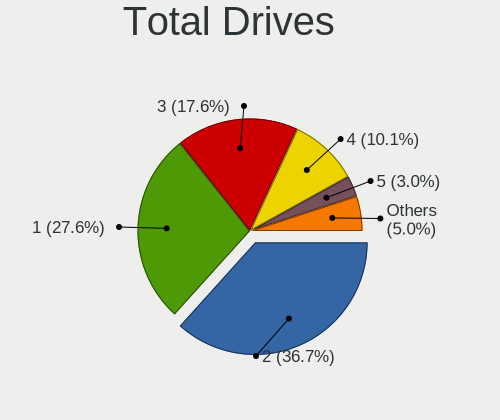
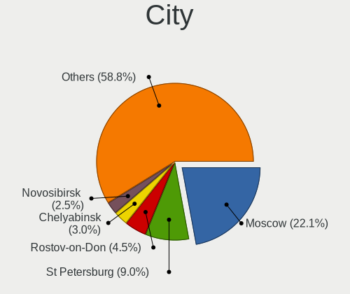
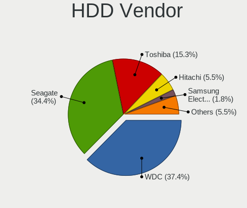
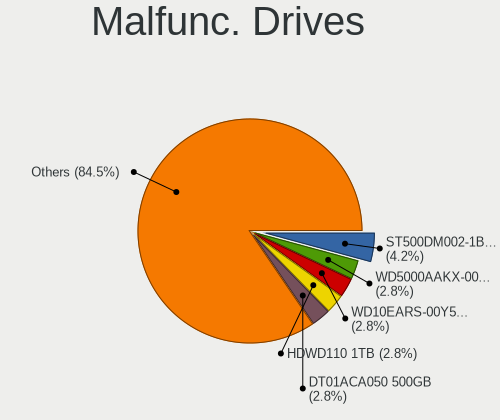
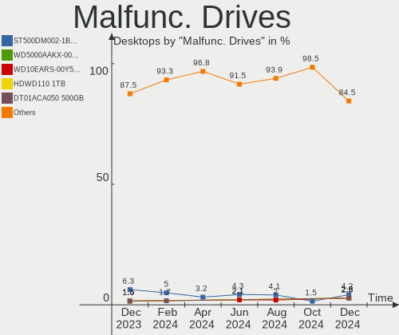
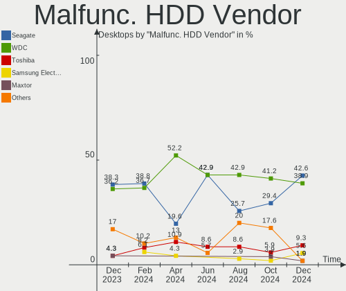
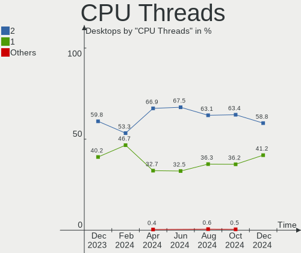
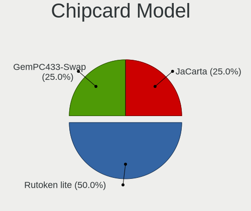

Linux in Russia - Hardware Trends (Desktops)
--------------------------------------------

A project to identify most popular hardware characteristics and track their change
over time based on data collected by Linux users at https://Linux-Hardware.org.

Anyone can contribute to this report by the [hw-probe](https://github.com/linuxhw/hw-probe) tool:

    sudo -E hw-probe -all -upload

Period: Nov, 2023.

Contents
--------

* [ System ](#system)
  - [ OS                       ](#os)
  - [ OS Family                ](#os-family)
  - [ Kernel                   ](#kernel)
  - [ Kernel Family            ](#kernel-family)
  - [ Kernel Major Ver.        ](#kernel-major-ver)
  - [ Arch                     ](#arch)
  - [ DE                       ](#de)
  - [ Display Server           ](#display-server)
  - [ Display Manager          ](#display-manager)
  - [ OS Lang                  ](#os-lang)
  - [ Boot Mode                ](#boot-mode)
  - [ Filesystem               ](#filesystem)
  - [ Part. scheme             ](#part-scheme)
  - [ Dual Boot with Linux/BSD ](#dual-boot-with-linuxbsd)
  - [ Dual Boot (Win)          ](#dual-boot-win)

* [ Board ](#board)
  - [ Vendor                   ](#vendor)
  - [ Model                    ](#model)
  - [ Model Family             ](#model-family)
  - [ MFG Year                 ](#mfg-year)
  - [ Form Factor              ](#form-factor)
  - [ Secure Boot              ](#secure-boot)
  - [ Coreboot                 ](#coreboot)
  - [ RAM Size                 ](#ram-size)
  - [ RAM Used                 ](#ram-used)
  - [ Total Drives             ](#total-drives)
  - [ Has CD-ROM               ](#has-cd-rom)
  - [ Has Ethernet             ](#has-ethernet)
  - [ Has WiFi                 ](#has-wifi)
  - [ Has Bluetooth            ](#has-bluetooth)

* [ Location ](#location)
  - [ Country                  ](#country)
  - [ City                     ](#city)

* [ Drives ](#drives)
  - [ Drive Vendor             ](#drive-vendor)
  - [ Drive Model              ](#drive-model)
  - [ HDD Vendor               ](#hdd-vendor)
  - [ SSD Vendor               ](#ssd-vendor)
  - [ Drive Kind               ](#drive-kind)
  - [ Drive Connector          ](#drive-connector)
  - [ Drive Size               ](#drive-size)
  - [ Space Total              ](#space-total)
  - [ Space Used               ](#space-used)
  - [ Malfunc. Drives          ](#malfunc-drives)
  - [ Malfunc. Drive Vendor    ](#malfunc-drive-vendor)
  - [ Malfunc. HDD Vendor      ](#malfunc-hdd-vendor)
  - [ Malfunc. Drive Kind      ](#malfunc-drive-kind)
  - [ Failed Drives            ](#failed-drives)
  - [ Failed Drive Vendor      ](#failed-drive-vendor)
  - [ Drive Status             ](#drive-status)

* [ Storage controller ](#storage-controller)
  - [ Storage Vendor           ](#storage-vendor)
  - [ Storage Model            ](#storage-model)
  - [ Storage Kind             ](#storage-kind)

* [ Processor ](#processor)
  - [ CPU Vendor               ](#cpu-vendor)
  - [ CPU Model                ](#cpu-model)
  - [ CPU Model Family         ](#cpu-model-family)
  - [ CPU Cores                ](#cpu-cores)
  - [ CPU Sockets              ](#cpu-sockets)
  - [ CPU Threads              ](#cpu-threads)
  - [ CPU Op-Modes             ](#cpu-op-modes)
  - [ CPU Microcode            ](#cpu-microcode)
  - [ CPU Microarch            ](#cpu-microarch)

* [ Graphics ](#graphics)
  - [ GPU Vendor               ](#gpu-vendor)
  - [ GPU Model                ](#gpu-model)
  - [ GPU Combo                ](#gpu-combo)
  - [ GPU Driver               ](#gpu-driver)
  - [ GPU Memory               ](#gpu-memory)

* [ Monitor ](#monitor)
  - [ Monitor Vendor           ](#monitor-vendor)
  - [ Monitor Model            ](#monitor-model)
  - [ Monitor Resolution       ](#monitor-resolution)
  - [ Monitor Diagonal         ](#monitor-diagonal)
  - [ Monitor Width            ](#monitor-width)
  - [ Aspect Ratio             ](#aspect-ratio)
  - [ Monitor Area             ](#monitor-area)
  - [ Pixel Density            ](#pixel-density)
  - [ Multiple Monitors        ](#multiple-monitors)

* [ Network ](#network)
  - [ Net Controller Vendor    ](#net-controller-vendor)
  - [ Net Controller Model     ](#net-controller-model)
  - [ Wireless Vendor          ](#wireless-vendor)
  - [ Wireless Model           ](#wireless-model)
  - [ Ethernet Vendor          ](#ethernet-vendor)
  - [ Ethernet Model           ](#ethernet-model)
  - [ Net Controller Kind      ](#net-controller-kind)
  - [ Used Controller          ](#used-controller)
  - [ NICs                     ](#nics)
  - [ IPv6                     ](#ipv6)

* [ Bluetooth ](#bluetooth)
  - [ Bluetooth Vendor         ](#bluetooth-vendor)
  - [ Bluetooth Model          ](#bluetooth-model)

* [ Sound ](#sound)
  - [ Sound Vendor             ](#sound-vendor)
  - [ Sound Model              ](#sound-model)

* [ Memory ](#memory)
  - [ Memory Vendor            ](#memory-vendor)
  - [ Memory Model             ](#memory-model)
  - [ Memory Kind              ](#memory-kind)
  - [ Memory Form Factor       ](#memory-form-factor)
  - [ Memory Size              ](#memory-size)
  - [ Memory Speed             ](#memory-speed)

* [ Printers & scanners ](#printers--scanners)
  - [ Printer Vendor           ](#printer-vendor)
  - [ Printer Model            ](#printer-model)
  - [ Scanner Vendor           ](#scanner-vendor)
  - [ Scanner Model            ](#scanner-model)

* [ Camera ](#camera)
  - [ Camera Vendor            ](#camera-vendor)
  - [ Camera Model             ](#camera-model)

* [ Security ](#security)
  - [ Fingerprint Vendor       ](#fingerprint-vendor)
  - [ Fingerprint Model        ](#fingerprint-model)
  - [ Chipcard Vendor          ](#chipcard-vendor)
  - [ Chipcard Model           ](#chipcard-model)

* [ Unsupported ](#unsupported)
  - [ Unsupported Devices      ](#unsupported-devices)
  - [ Unsupported Device Types ](#unsupported-device-types)

System
------

OS
--

Installed operating systems

| Name                         | Desktops | Percent |
|------------------------------|----------|---------|
| ROSA 12.4                    | 66       | 24.35%  |
| Debian 12                    | 31       | 11.44%  |
| Ubuntu 22.04                 | 24       | 8.86%   |
| Red OS 7.3                   | 20       | 7.38%   |
| ROSA 12                      | 12       | 4.43%   |
| Fedora 39                    | 10       | 3.69%   |
| ALT Linux 10.2               | 10       | 3.69%   |
| OpenMandriva 5.0             | 9        | 3.32%   |
| OpenMandriva 23.08           | 9        | 3.32%   |
| ALT Linux 10.1               | 9        | 3.32%   |
| Linux Mint 21.2              | 7        | 2.58%   |
| Arch Rolling                 | 7        | 2.58%   |
| Ubuntu 23.10                 | 4        | 1.48%   |
| ROSA 13.0                    | 4        | 1.48%   |
| ROSA 12.3                    | 3        | 1.11%   |
| openSUSE Leap-15.5           | 3        | 1.11%   |
| OpenMandriva 23.11           | 3        | 1.11%   |
| Manjaro                      | 3        | 1.11%   |
| Gentoo 2.14                  | 3        | 1.11%   |
| Debian 11                    | 3        | 1.11%   |
| ROSA R11.1                   | 2        | 0.74%   |
| Red OS 7.3.1                 | 2        | 0.74%   |
| OpenMandriva 4.3             | 2        | 0.74%   |
| KDE neon 22.04               | 2        | 0.74%   |
| Artix                        | 2        | 0.74%   |
| Xubuntu 22.04                | 1        | 0.37%   |
| Xero Rolling                 | 1        | 0.37%   |
| Ubuntu 20.04                 | 1        | 0.37%   |
| ROSA 12.2                    | 1        | 0.37%   |
| RELD 7.9                     | 1        | 0.37%   |
| Red OS 8.0                   | 1        | 0.37%   |
| PureOS 10                    | 1        | 0.37%   |
| Pop!_OS 22.04                | 1        | 0.37%   |
| openSUSE Tumbleweed-XXXXXXXX | 1        | 0.37%   |
| MX 23                        | 1        | 0.37%   |
| Linux Mint 21.1              | 1        | 0.37%   |
| Kubuntu 22.04                | 1        | 0.37%   |
| Fedora 40                    | 1        | 0.37%   |
| Fedora 38                    | 1        | 0.37%   |
| Debian 9                     | 1        | 0.37%   |

OS Family
---------

OS without a version

| Name         | Desktops | Percent |
|--------------|----------|---------|
| ROSA         | 88       | 32.47%  |
| Debian       | 36       | 13.28%  |
| Ubuntu       | 29       | 10.7%   |
| Red OS       | 23       | 8.49%   |
| OpenMandriva | 23       | 8.49%   |
| ALT Linux    | 21       | 7.75%   |
| Fedora       | 12       | 4.43%   |
| Linux Mint   | 8        | 2.95%   |
| Arch         | 7        | 2.58%   |
| openSUSE     | 4        | 1.48%   |
| Manjaro      | 3        | 1.11%   |
| Gentoo       | 3        | 1.11%   |
| Artix        | 3        | 1.11%   |
| KDE neon     | 2        | 0.74%   |
| Xubuntu      | 1        | 0.37%   |
| Xero         | 1        | 0.37%   |
| RELD         | 1        | 0.37%   |
| PureOS       | 1        | 0.37%   |
| Pop!_OS      | 1        | 0.37%   |
| MX           | 1        | 0.37%   |
| Kubuntu      | 1        | 0.37%   |
| ArcoLinux    | 1        | 0.37%   |
| AlmaLinux    | 1        | 0.37%   |

Kernel
------

Version of the Linux kernel

| Version                                                  | Desktops | Percent |
|----------------------------------------------------------|----------|---------|
| 6.1.58-generic-1rosa2021.1-x86_64                        | 41       | 15.13%  |
| 6.1.20-generic-2rosa2021.1-x86_64                        | 19       | 7.01%   |
| 6.1.0-4-amd64                                            | 18       | 6.64%   |
| 5.19.0-38-generic                                        | 15       | 5.54%   |
| 6.6.2-desktop-1omv2390                                   | 10       | 3.69%   |
| 6.1.52-1.el7.3.x86_64                                    | 10       | 3.69%   |
| 6.2.0-36-generic                                         | 8        | 2.95%   |
| 6.1.0-13-amd64                                           | 7        | 2.58%   |
| 6.5.12-300.fc39.x86_64                                   | 5        | 1.85%   |
| 6.4.11-desktop-1omv2390                                  | 5        | 1.85%   |
| 6.1.46-generic-2rosa2021.1-x86_64                        | 5        | 1.85%   |
| 5.10.166-std-def-alt1                                    | 5        | 1.85%   |
| 6.4.8-desktop-2omv2390                                   | 4        | 1.48%   |
| 5.15.0-88-generic                                        | 4        | 1.48%   |
| 5.10.29-3.el7.x86_64                                     | 4        | 1.48%   |
| 6.6.1-arch1-1                                            | 3        | 1.11%   |
| 6.5.10.xm1-1.k-xanmod-rosa2021.1-x86_64                  | 3        | 1.11%   |
| 5.15.87-1.el7.3.x86_64                                   | 3        | 1.11%   |
| 5.15.75-generic-1rosa2021.1-x86_64                       | 3        | 1.11%   |
| 5.15.131-1.el7.3.x86_64                                  | 3        | 1.11%   |
| 5.10.184-generic-1rosa2021.1-x86_64                      | 3        | 1.11%   |
| 6.5.7-artix1-1                                           | 2        | 0.74%   |
| 6.5.11-300.fc39.x86_64                                   | 2        | 0.74%   |
| 6.5.0-13-generic                                         | 2        | 0.74%   |
| 6.2.16-3-pve                                             | 2        | 0.74%   |
| 6.2.0-37-generic                                         | 2        | 0.74%   |
| 6.2.0-35-generic                                         | 2        | 0.74%   |
| 6.1.62-un-def-alt1                                       | 2        | 0.74%   |
| 6.1.61-un-def-alt1                                       | 2        | 0.74%   |
| 6.1.60-un-def-alt1                                       | 2        | 0.74%   |
| 6.1.57-gentoo                                            | 2        | 0.74%   |
| 6.1.57-generic-1rosa2023.1-x86_64                        | 2        | 0.74%   |
| 6.1.44-1.el7.3.x86_64                                    | 2        | 0.74%   |
| 5.16.13-desktop-1omv4003                                 | 2        | 0.74%   |
| 5.15.127-generic-1rosa2021.1-x86_64                      | 2        | 0.74%   |
| 5.14.21-150500.55.36-default                             | 2        | 0.74%   |
| 5.10.74-generic-2rosa2021.1-x86_64                       | 2        | 0.74%   |
| 5.10.0-26-amd64                                          | 2        | 0.74%   |
| 6.7.0-rc3-1-mainline                                     | 1        | 0.37%   |
| 6.7.0-0.rc0.20231110git89cdf9d55601.13.fc40.x86_64+debug | 1        | 0.37%   |

Kernel Family
-------------

Linux kernel without a distro release

| Version  | Desktops | Percent |
|----------|----------|---------|
| 6.1.58   | 43       | 15.87%  |
| 6.1.0    | 27       | 9.96%   |
| 6.1.20   | 19       | 7.01%   |
| 5.19.0   | 15       | 5.54%   |
| 6.2.0    | 13       | 4.8%    |
| 6.6.2    | 11       | 4.06%   |
| 6.1.52   | 11       | 4.06%   |
| 6.6.1    | 7        | 2.58%   |
| 6.5.12   | 6        | 2.21%   |
| 5.15.0   | 6        | 2.21%   |
| 6.5.10   | 5        | 1.85%   |
| 6.5.0    | 5        | 1.85%   |
| 6.4.11   | 5        | 1.85%   |
| 6.2.16   | 5        | 1.85%   |
| 6.1.46   | 5        | 1.85%   |
| 5.10.166 | 5        | 1.85%   |
| 6.5.11   | 4        | 1.48%   |
| 6.4.8    | 4        | 1.48%   |
| 6.1.57   | 4        | 1.48%   |
| 5.10.29  | 4        | 1.48%   |
| 6.5.9    | 3        | 1.11%   |
| 6.1.60   | 3        | 1.11%   |
| 5.15.87  | 3        | 1.11%   |
| 5.15.75  | 3        | 1.11%   |
| 5.15.131 | 3        | 1.11%   |
| 5.14.21  | 3        | 1.11%   |
| 5.10.184 | 3        | 1.11%   |
| 5.10.0   | 3        | 1.11%   |
| 6.7.0    | 2        | 0.74%   |
| 6.5.7    | 2        | 0.74%   |
| 6.5.3    | 2        | 0.74%   |
| 6.1.62   | 2        | 0.74%   |
| 6.1.61   | 2        | 0.74%   |
| 6.1.44   | 2        | 0.74%   |
| 5.16.13  | 2        | 0.74%   |
| 5.15.127 | 2        | 0.74%   |
| 5.10.74  | 2        | 0.74%   |
| 5.10.200 | 2        | 0.74%   |
| 4.15.0   | 2        | 0.74%   |
| 6.6.0    | 1        | 0.37%   |

Kernel Major Ver.
-----------------

Linux kernel major version

| Version | Desktops | Percent |
|---------|----------|---------|
| 6.1     | 119      | 43.91%  |
| 6.5     | 30       | 11.07%  |
| 5.15    | 25       | 9.23%   |
| 5.10    | 22       | 8.12%   |
| 6.6     | 19       | 7.01%   |
| 6.2     | 18       | 6.64%   |
| 5.19    | 15       | 5.54%   |
| 6.4     | 10       | 3.69%   |
| 5.14    | 4        | 1.48%   |
| 6.7     | 2        | 0.74%   |
| 5.4     | 2        | 0.74%   |
| 5.16    | 2        | 0.74%   |
| 4.15    | 2        | 0.74%   |
| 6.3     | 1        | 0.37%   |

Arch
----

OS architecture (x86_64, i586, etc.)

| Name   | Desktops | Percent |
|--------|----------|---------|
| x86_64 | 268      | 98.89%  |
| i686   | 2        | 0.74%   |
| e2k    | 1        | 0.37%   |

DE
--

Desktop Environment

| Name       | Desktops | Percent |
|------------|----------|---------|
| KDE5       | 101      | 37.27%  |
| Unknown    | 56       | 20.66%  |
| GNOME      | 52       | 19.19%  |
| MATE       | 21       | 7.75%   |
| X-Cinnamon | 12       | 4.43%   |
| LXQt       | 12       | 4.43%   |
| XFCE       | 9        | 3.32%   |
| Cinnamon   | 4        | 1.48%   |
| LXDE       | 1        | 0.37%   |
| KDE4       | 1        | 0.37%   |
| i3         | 1        | 0.37%   |
| Hyprland   | 1        | 0.37%   |

Display Server
--------------

X11 or Wayland

| Name    | Desktops | Percent |
|---------|----------|---------|
| X11     | 109      | 40.22%  |
| Wayland | 97       | 35.79%  |
| Unknown | 36       | 13.28%  |
| Tty     | 29       | 10.7%   |

Display Manager
---------------

SDDM, LightDM, etc.

| Name    | Desktops | Percent |
|---------|----------|---------|
| SDDM    | 82       | 30.26%  |
| Unknown | 82       | 30.26%  |
| GDM     | 64       | 23.62%  |
| LightDM | 30       | 11.07%  |
| GDM3    | 10       | 3.69%   |
| LXDM    | 1        | 0.37%   |
| LDM     | 1        | 0.37%   |
| KDM     | 1        | 0.37%   |

OS Lang
-------

Language

| Lang       | Desktops | Percent |
|------------|----------|---------|
| ru_RU      | 209      | 77.12%  |
| en_US      | 37       | 13.65%  |
| C          | 16       | 5.9%    |
| Unknown    | 3        | 1.11%   |
| en_GB      | 2        | 0.74%   |
| ru_RU.UTF8 | 1        | 0.37%   |
| ru         | 1        | 0.37%   |
| en_DK      | 1        | 0.37%   |
| C.UTF8     | 1        | 0.37%   |

Boot Mode
---------

EFI or BIOS

| Mode | Desktops | Percent |
|------|----------|---------|
| EFI  | 142      | 52.4%   |
| BIOS | 129      | 47.6%   |

Filesystem
----------

Type of filesystem

| Type    | Desktops | Percent |
|---------|----------|---------|
| Ext4    | 168      | 61.99%  |
| Overlay | 48       | 17.71%  |
| Btrfs   | 38       | 14.02%  |
| Tmpfs   | 7        | 2.58%   |
| F2fs    | 4        | 1.48%   |
| Zfs     | 3        | 1.11%   |
| Xfs     | 2        | 0.74%   |
| Ext3    | 1        | 0.37%   |

Part. scheme
------------

Scheme of partitioning

| Type    | Desktops | Percent |
|---------|----------|---------|
| GPT     | 158      | 58.3%   |
| MBR     | 70       | 25.83%  |
| Unknown | 43       | 15.87%  |

Dual Boot with Linux/BSD
------------------------

Hosting more than one Linux/BSD

| Dual boot | Desktops | Percent |
|-----------|----------|---------|
| No        | 209      | 77.12%  |
| Yes       | 62       | 22.88%  |

Dual Boot (Win)
---------------

Hosting Linux and Windows

| Dual boot | Desktops | Percent |
|-----------|----------|---------|
| No        | 161      | 59.41%  |
| Yes       | 110      | 40.59%  |

Board
-----

Vendor
------

Motherboard manufacturer

| Name                                 | Desktops | Percent |
|--------------------------------------|----------|---------|
| ASUSTek Computer                     | 68       | 25.09%  |
| Gigabyte Technology                  | 66       | 24.35%  |
| MSI                                  | 31       | 11.44%  |
| ASRock                               | 25       | 9.23%   |
| Supermicro                           | 15       | 5.54%   |
| Intel                                | 9        | 3.32%   |
| Unknown                              | 9        | 3.32%   |
| Huanan                               | 6        | 2.21%   |
| Hewlett-Packard                      | 6        | 2.21%   |
| Pegatron                             | 3        | 1.11%   |
| Lenovo                               | 3        | 1.11%   |
| Dell                                 | 3        | 1.11%   |
| Biostar                              | 3        | 1.11%   |
| Shenzhen Meigao Electronic Equipment | 2        | 0.74%   |
| ECS                                  | 2        | 0.74%   |
| AZW                                  | 2        | 0.74%   |
| Acer                                 | 2        | 0.74%   |
| SZMZ                                 | 1        | 0.37%   |
| Red Hat                              | 1        | 0.37%   |
| QBIC                                 | 1        | 0.37%   |
| ONDA                                 | 1        | 0.37%   |
| MAINBRD                              | 1        | 0.37%   |
| MACHINIST                            | 1        | 0.37%   |
| Kllisre                              | 1        | 0.37%   |
| INTECH PRO                           | 1        | 0.37%   |
| ICL                                  | 1        | 0.37%   |
| Graviton                             | 1        | 0.37%   |
| Foxconn                              | 1        | 0.37%   |
| EPoX Computer                        | 1        | 0.37%   |
| BESHTAU                              | 1        | 0.37%   |
| Aquarius                             | 1        | 0.37%   |
| AOpen                                | 1        | 0.37%   |
| 3Logic Group                         | 1        | 0.37%   |

Model
-----

Motherboard model

| Name                                            | Desktops | Percent |
|-------------------------------------------------|----------|---------|
| Unknown                                         | 9        | 3.32%   |
| ASUS All Series                                 | 7        | 2.58%   |
| Supermicro SYS-6018R-TDW                        | 5        | 1.85%   |
| Supermicro SYS-1028R-TDW                        | 4        | 1.48%   |
| HP ProLiant SL230s Gen8                         | 4        | 1.48%   |
| Gigabyte A320M-S2H                              | 4        | 1.48%   |
| Intel X99                                       | 3        | 1.11%   |
| Intel SKYBAY                                    | 3        | 1.11%   |
| Gigabyte B75M-D3V                               | 3        | 1.11%   |
| Gigabyte B450M S2H V2                           | 3        | 1.11%   |
| ASUS PRIME B350M-K                              | 3        | 1.11%   |
| Supermicro X9DRW                                | 2        | 0.74%   |
| Supermicro SYS-6018R-MTR                        | 2        | 0.74%   |
| MSI MS-7C95                                     | 2        | 0.74%   |
| MSI MS-7C91                                     | 2        | 0.74%   |
| MSI MS-7996                                     | 2        | 0.74%   |
| MSI MS-7641                                     | 2        | 0.74%   |
| Gigabyte H410M S2H V2                           | 2        | 0.74%   |
| Gigabyte H270-HD3                               | 2        | 0.74%   |
| Gigabyte B550M AORUS ELITE                      | 2        | 0.74%   |
| Gigabyte A320M-S2H V2                           | 2        | 0.74%   |
| Gigabyte A320M-H                                | 2        | 0.74%   |
| ASUS ROG STRIX B550-E GAMING                    | 2        | 0.74%   |
| ASUS PRIME B450-PLUS                            | 2        | 0.74%   |
| ASUS P8H61-M LX3 R2.0                           | 2        | 0.74%   |
| ASUS P8H61 PRO                                  | 2        | 0.74%   |
| ASUS P8B75-M LE                                 | 2        | 0.74%   |
| ASUS P5K                                        | 2        | 0.74%   |
| ASRock B450 Pro4                                | 2        | 0.74%   |
| ASRock A320M-HDV R4.0                           | 2        | 0.74%   |
| SZMZ X99 DUAL Z8                                | 1        | 0.37%   |
| Supermicro PIO-628U-TR4T+-ST031                 | 1        | 0.37%   |
| Supermicro PIO-618U-T4T+-ST031                  | 1        | 0.37%   |
| Shenzhen Meigao Electronic Equipment UM773 Lite | 1        | 0.37%   |
| Shenzhen Meigao Electronic Equipment F7BSC      | 1        | 0.37%   |
| Red Hat KVM                                     | 1        | 0.37%   |
| QBIC BXT-512-7100U                              | 1        | 0.37%   |
| Pegatron VS257AA-ACB 600-1040ru                 | 1        | 0.37%   |
| Pegatron IPMIP-H55-GEN                          | 1        | 0.37%   |
| Pegatron Elite 7300 Series MT                   | 1        | 0.37%   |

Model Family
------------

Motherboard model prefix

| Name                            | Desktops | Percent |
|---------------------------------|----------|---------|
| ASUS PRIME                      | 16       | 5.9%    |
| Unknown                         | 9        | 3.32%   |
| ASUS ROG                        | 7        | 2.58%   |
| ASUS All                        | 7        | 2.58%   |
| Gigabyte B450M                  | 6        | 2.21%   |
| Gigabyte A320M-S2H              | 6        | 2.21%   |
| Supermicro SYS-6018R-TDW        | 5        | 1.85%   |
| HP ProLiant                     | 5        | 1.85%   |
| Supermicro SYS-1028R-TDW        | 4        | 1.48%   |
| Intel X99                       | 4        | 1.48%   |
| Gigabyte B550M                  | 4        | 1.48%   |
| ASUS TUF                        | 4        | 1.48%   |
| Intel SKYBAY                    | 3        | 1.11%   |
| Gigabyte X570                   | 3        | 1.11%   |
| Gigabyte H410M                  | 3        | 1.11%   |
| Gigabyte B75M-D3V               | 3        | 1.11%   |
| Gigabyte B560M                  | 3        | 1.11%   |
| Dell OptiPlex                   | 3        | 1.11%   |
| ASUS P8H61                      | 3        | 1.11%   |
| ASUS P5K                        | 3        | 1.11%   |
| ASRock B450                     | 3        | 1.11%   |
| Supermicro X9DRW                | 2        | 0.74%   |
| Supermicro SYS-6018R-MTR        | 2        | 0.74%   |
| MSI MS-7C95                     | 2        | 0.74%   |
| MSI MS-7C91                     | 2        | 0.74%   |
| MSI MS-7996                     | 2        | 0.74%   |
| MSI MS-7641                     | 2        | 0.74%   |
| Lenovo IdeaCentre               | 2        | 0.74%   |
| Gigabyte H270-HD3               | 2        | 0.74%   |
| Gigabyte B450                   | 2        | 0.74%   |
| Gigabyte A320M-H                | 2        | 0.74%   |
| Gigabyte 970A-DS3P              | 2        | 0.74%   |
| ASUS SABERTOOTH                 | 2        | 0.74%   |
| ASUS P8H61-M                    | 2        | 0.74%   |
| ASUS P8B75-M                    | 2        | 0.74%   |
| ASRock B450M                    | 2        | 0.74%   |
| ASRock A320M-HDV                | 2        | 0.74%   |
| SZMZ X99                        | 1        | 0.37%   |
| Supermicro PIO-628U-TR4T+-ST031 | 1        | 0.37%   |
| Supermicro PIO-618U-T4T+-ST031  | 1        | 0.37%   |

MFG Year
--------

Motherboard manufacture year

| Year    | Desktops | Percent |
|---------|----------|---------|
| 2018    | 34       | 12.55%  |
| 2020    | 33       | 12.18%  |
| 2022    | 24       | 8.86%   |
| 2021    | 21       | 7.75%   |
| 2013    | 20       | 7.38%   |
| 2017    | 18       | 6.64%   |
| 2012    | 18       | 6.64%   |
| 2011    | 17       | 6.27%   |
| 2019    | 16       | 5.9%    |
| 2015    | 11       | 4.06%   |
| 2023    | 10       | 3.69%   |
| 2016    | 9        | 3.32%   |
| 2014    | 8        | 2.95%   |
| 2010    | 8        | 2.95%   |
| 2009    | 8        | 2.95%   |
| 2008    | 6        | 2.21%   |
| 2007    | 6        | 2.21%   |
| 2006    | 2        | 0.74%   |
| 2005    | 1        | 0.37%   |
| Unknown | 1        | 0.37%   |

Form Factor
-----------

Physical design of the computer

| Name    | Desktops | Percent |
|---------|----------|---------|
| Desktop | 271      | 100%    |

Secure Boot
-----------

Enabled or disabled

| State    | Desktops | Percent |
|----------|----------|---------|
| Disabled | 265      | 97.79%  |
| Enabled  | 6        | 2.21%   |

Coreboot
--------

Have coreboot on board

| Used | Desktops | Percent |
|------|----------|---------|
| No   | 271      | 100%    |

RAM Size
--------

Total RAM memory

| Size in GB      | Desktops | Percent |
|-----------------|----------|---------|
| 16.01-24.0      | 61       | 22.51%  |
| 4.01-8.0        | 58       | 21.4%   |
| 8.01-16.0       | 47       | 17.34%  |
| 3.01-4.0        | 33       | 12.18%  |
| 32.01-64.0      | 30       | 11.07%  |
| 64.01-256.0     | 26       | 9.59%   |
| 24.01-32.0      | 8        | 2.95%   |
| More than 256.0 | 5        | 1.85%   |
| 2.01-3.0        | 1        | 0.37%   |
| 1.01-2.0        | 1        | 0.37%   |
| 0.51-1.0        | 1        | 0.37%   |

RAM Used
--------

Used RAM memory

| Used GB    | Desktops | Percent |
|------------|----------|---------|
| 1.01-2.0   | 103      | 38.01%  |
| 2.01-3.0   | 54       | 19.93%  |
| 4.01-8.0   | 40       | 14.76%  |
| 3.01-4.0   | 29       | 10.7%   |
| 0.51-1.0   | 27       | 9.96%   |
| 8.01-16.0  | 11       | 4.06%   |
| 16.01-24.0 | 3        | 1.11%   |
| 32.01-64.0 | 2        | 0.74%   |
| 0.01-0.5   | 2        | 0.74%   |

Total Drives
------------

Number of drives on board

| Drives | Desktops | Percent |
|--------|----------|---------|
| 1      | 110      | 40.59%  |
| 2      | 77       | 28.41%  |
| 3      | 37       | 13.65%  |
| 4      | 25       | 9.23%   |
| 5      | 10       | 3.69%   |
| 7      | 6        | 2.21%   |
| 6      | 5        | 1.85%   |
| 0      | 1        | 0.37%   |

Has CD-ROM
----------

Has CD-ROM on board

| Presented | Desktops | Percent |
|-----------|----------|---------|
| No        | 215      | 79.34%  |
| Yes       | 56       | 20.66%  |

Has Ethernet
------------

Has Ethernet on board

| Presented | Desktops | Percent |
|-----------|----------|---------|
| Yes       | 270      | 99.63%  |
| No        | 1        | 0.37%   |

Has WiFi
--------

Has WiFi module

| Presented | Desktops | Percent |
|-----------|----------|---------|
| No        | 194      | 71.59%  |
| Yes       | 77       | 28.41%  |

Has Bluetooth
-------------

Has Bluetooth module

| Presented | Desktops | Percent |
|-----------|----------|---------|
| No        | 199      | 73.43%  |
| Yes       | 72       | 26.57%  |

Location
--------

Country
-------

Geographic location (country)

| Country | Desktops | Percent |
|---------|----------|---------|
| Russia  | 271      | 100%    |

City
----

Geographic location (city)

| City                | Desktops | Percent |
|---------------------|----------|---------|
| Moscow              | 70       | 25.83%  |
| St Petersburg       | 28       | 10.33%  |
| Voronezh            | 22       | 8.12%   |
| Novy Urengoy        | 8        | 2.95%   |
| Novosibirsk         | 8        | 2.95%   |
| Krasnodar           | 8        | 2.95%   |
| Yekaterinburg       | 7        | 2.58%   |
| Rostov-on-Don       | 6        | 2.21%   |
| Volgograd           | 5        | 1.85%   |
| Ufa                 | 5        | 1.85%   |
| Labytnangi          | 4        | 1.48%   |
| Kazan’            | 4        | 1.48%   |
| Vladivostok         | 3        | 1.11%   |
| Samara              | 3        | 1.11%   |
| Salekhard           | 3        | 1.11%   |
| Petrozavodsk        | 3        | 1.11%   |
| Perm                | 3        | 1.11%   |
| Nizhniy Novgorod    | 3        | 1.11%   |
| Murom               | 3        | 1.11%   |
| Zlatoust            | 2        | 0.74%   |
| Yaroslavl           | 2        | 0.74%   |
| Ulyanovsk           | 2        | 0.74%   |
| Tver                | 2        | 0.74%   |
| Taganrog            | 2        | 0.74%   |
| Stavropol           | 2        | 0.74%   |
| Smolensk            | 2        | 0.74%   |
| Saratov             | 2        | 0.74%   |
| Lipetsk             | 2        | 0.74%   |
| Kavkazskaya         | 2        | 0.74%   |
| Irkutsk             | 2        | 0.74%   |
| Yuzhnoural'sk       | 1        | 0.37%   |
| Yakutsk             | 1        | 0.37%   |
| Volgodonsk          | 1        | 0.37%   |
| Vidnoye             | 1        | 0.37%   |
| Verkhnyaya Salda    | 1        | 0.37%   |
| Tula                | 1        | 0.37%   |
| Staraya Russa       | 1        | 0.37%   |
| Slavyansk-na-Kubani | 1        | 0.37%   |
| Shishkin Les        | 1        | 0.37%   |
| Shchyolkovo         | 1        | 0.37%   |

Drives
------

Drive Vendor
------------

Hard drive vendors

| Vendor                      | Desktops | Drives | Percent |
|-----------------------------|----------|--------|---------|
| WDC                         | 77       | 112    | 16.24%  |
| Seagate                     | 64       | 82     | 13.5%   |
| Samsung Electronics         | 49       | 59     | 10.34%  |
| Toshiba                     | 37       | 48     | 7.81%   |
| Kingston                    | 37       | 47     | 7.81%   |
| A-DATA Technology           | 19       | 22     | 4.01%   |
| China                       | 14       | 15     | 2.95%   |
| Apacer                      | 14       | 15     | 2.95%   |
| Hitachi                     | 13       | 14     | 2.74%   |
| Crucial                     | 12       | 14     | 2.53%   |
| HGST                        | 11       | 15     | 2.32%   |
| Intel                       | 8        | 25     | 1.69%   |
| Netac                       | 7        | 8      | 1.48%   |
| AMD                         | 7        | 7      | 1.48%   |
| SPCC                        | 6        | 6      | 1.27%   |
| Patriot                     | 6        | 7      | 1.27%   |
| Sandisk                     | 5        | 5      | 1.05%   |
| OCZ                         | 5        | 5      | 1.05%   |
| Hewlett-Packard             | 5        | 8      | 1.05%   |
| XrayDisk                    | 4        | 4      | 0.84%   |
| XPG                         | 4        | 5      | 0.84%   |
| Fujitsu                     | 4        | 4      | 0.84%   |
| Unknown                     | 3        | 3      | 0.63%   |
| Transcend                   | 3        | 3      | 0.63%   |
| Phison Electronics          | 3        | 3      | 0.63%   |
| MAXIO Technology (Hangzhou) | 3        | 3      | 0.63%   |
| KingSpec                    | 3        | 3      | 0.63%   |
| JMicron Technology          | 3        | 3      | 0.63%   |
| GOODRAM                     | 3        | 3      | 0.63%   |
| DEXP                        | 3        | 3      | 0.63%   |
| Smartbuy                    | 2        | 2      | 0.42%   |
| Reeinno                     | 2        | 2      | 0.42%   |
| Lexar                       | 2        | 2      | 0.42%   |
| HYDRA                       | 2        | 2      | 0.42%   |
| Gigabyte Technology         | 2        | 2      | 0.42%   |
| Digma                       | 2        | 2      | 0.42%   |
| Colorful                    | 2        | 2      | 0.42%   |
| ADATA Technology            | 2        | 2      | 0.42%   |
| WALRAM                      | 1        | 1      | 0.21%   |
| Union Memory                | 1        | 1      | 0.21%   |

Drive Model
-----------

Hard drive models

| Model                                               | Desktops | Percent |
|-----------------------------------------------------|----------|---------|
| Kingston SA400S37480G 480GB SSD                     | 12       | 2.19%   |
| Kingston SA400S37240G 240GB SSD                     | 9        | 1.64%   |
| WDC WD10EZEX-00BBHA0 1TB                            | 7        | 1.28%   |
| Toshiba DT01ACA100 1TB                              | 7        | 1.28%   |
| Toshiba DT01ACA050 500GB                            | 7        | 1.28%   |
| Samsung NVMe SSD Controller SM981/PM981/PM983 250GB | 7        | 1.28%   |
| Toshiba HDWD120 2TB                                 | 5        | 0.91%   |
| Toshiba HDWD110 1TB                                 | 5        | 0.91%   |
| Seagate ST500DM002-1BD142 500GB                     | 5        | 0.91%   |
| Seagate ST3500418AS 500GB                           | 5        | 0.91%   |
| WDC WDS250G2B0A-00SM50 250GB SSD                    | 4        | 0.73%   |
| WDC WDS240G2G0A-00JH30 240GB SSD                    | 4        | 0.73%   |
| WDC WDS120G2G0A-00JH30 120GB SSD                    | 4        | 0.73%   |
| WDC WD20EARX-00PASB0 2TB                            | 4        | 0.73%   |
| WDC WD10EZEX-08WN4A0 1TB                            | 4        | 0.73%   |
| Samsung SSD 860 EVO 250GB                           | 4        | 0.73%   |
| Intel SSDSC2BB800G7 800GB                           | 4        | 0.73%   |
| Intel SSDSC2BB480G7 480GB                           | 4        | 0.73%   |
| HGST HTE721010A9E630 1TB                            | 4        | 0.73%   |
| HP EG0450FCSPK 450GB                                | 4        | 0.73%   |
| Apacer AS350 512GB SSD                              | 4        | 0.73%   |
| Apacer AS350 128GB SSD                              | 4        | 0.73%   |
| WDC WDS500G2B0A-00SM50 500GB SSD                    | 3        | 0.55%   |
| WDC WD10EZRX-00A8LB0 1TB                            | 3        | 0.55%   |
| WDC WD10EZEX-22MFCA0 1TB                            | 3        | 0.55%   |
| Seagate ST3160815AS 160GB                           | 3        | 0.55%   |
| Seagate ST2000DM008-2FR102 2TB                      | 3        | 0.55%   |
| Seagate ST2000DM006-2DM164 2TB                      | 3        | 0.55%   |
| Seagate ST1000DM010-2EP102 1TB                      | 3        | 0.55%   |
| Samsung SSD 980 500GB                               | 3        | 0.55%   |
| Samsung SSD 970 EVO Plus 1TB                        | 3        | 0.55%   |
| Samsung NVMe SSD Controller PM9A1/PM9A3/980PRO 2TB  | 3        | 0.55%   |
| Samsung HD204UI 2TB                                 | 3        | 0.55%   |
| Patriot P210 256GB SSD                              | 3        | 0.55%   |
| Kingston SNVS500G 500GB                             | 3        | 0.55%   |
| Kingston SA400S37120G 120GB SSD                     | 3        | 0.55%   |
| Fujitsu MAX3147RC 147GB                             | 3        | 0.55%   |
| Crucial CT500MX500SSD1 500GB                        | 3        | 0.55%   |
| WDC WDS240G2G0B-00EPW0 240GB SSD                    | 2        | 0.36%   |
| WDC WD5000AZRX-00A8LB0 500GB                        | 2        | 0.36%   |

HDD Vendor
----------

Hard disk drive vendors

| Vendor              | Desktops | Drives | Percent |
|---------------------|----------|--------|---------|
| WDC                 | 64       | 91     | 31.37%  |
| Seagate             | 64       | 81     | 31.37%  |
| Toshiba             | 36       | 47     | 17.65%  |
| Hitachi             | 13       | 14     | 6.37%   |
| HGST                | 11       | 15     | 5.39%   |
| Samsung Electronics | 10       | 11     | 4.9%    |
| Fujitsu             | 4        | 4      | 1.96%   |
| Unknown             | 1        | 1      | 0.49%   |
| StoreJet            | 1        | 1      | 0.49%   |

SSD Vendor
----------

Solid state drive vendors

| Vendor              | Desktops | Drives | Percent |
|---------------------|----------|--------|---------|
| Kingston            | 28       | 34     | 15.22%  |
| WDC                 | 20       | 20     | 10.87%  |
| Samsung Electronics | 16       | 16     | 8.7%    |
| China               | 14       | 15     | 7.61%   |
| Apacer              | 14       | 15     | 7.61%   |
| A-DATA Technology   | 12       | 12     | 6.52%   |
| Crucial             | 10       | 10     | 5.43%   |
| Intel               | 6        | 22     | 3.26%   |
| AMD                 | 6        | 6      | 3.26%   |
| Patriot             | 5        | 6      | 2.72%   |
| OCZ                 | 5        | 5      | 2.72%   |
| Netac               | 5        | 5      | 2.72%   |
| XrayDisk            | 4        | 4      | 2.17%   |
| GOODRAM             | 3        | 3      | 1.63%   |
| DEXP                | 3        | 3      | 1.63%   |
| SPCC                | 2        | 2      | 1.09%   |
| Reeinno             | 2        | 2      | 1.09%   |
| JMicron Technology  | 2        | 2      | 1.09%   |
| HYDRA               | 2        | 2      | 1.09%   |
| Digma               | 2        | 2      | 1.09%   |
| Transcend           | 1        | 1      | 0.54%   |
| Toshiba             | 1        | 1      | 0.54%   |
| Team                | 1        | 1      | 0.54%   |
| Smartbuy            | 1        | 1      | 0.54%   |
| SanDisk             | 1        | 1      | 0.54%   |
| RUN                 | 1        | 1      | 0.54%   |
| Realtek             | 1        | 1      | 0.54%   |
| RADIUM              | 1        | 1      | 0.54%   |
| Qumo                | 1        | 1      | 0.54%   |
| Lexar               | 1        | 1      | 0.54%   |
| KingSpec            | 1        | 1      | 0.54%   |
| KingFast            | 1        | 1      | 0.54%   |
| Gigabyte Technology | 1        | 1      | 0.54%   |
| Foxline             | 1        | 1      | 0.54%   |
| DeTech              | 1        | 1      | 0.54%   |
| Corsair             | 1        | 1      | 0.54%   |
| Colorful            | 1        | 1      | 0.54%   |
| BR                  | 1        | 1      | 0.54%   |
| Azerty              | 1        | 1      | 0.54%   |
| AXIOMTEK            | 1        | 1      | 0.54%   |

Drive Kind
----------

HDD or SSD

| Kind    | Desktops | Drives | Percent |
|---------|----------|--------|---------|
| HDD     | 162      | 265    | 38.94%  |
| SSD     | 156      | 211    | 37.5%   |
| NVMe    | 85       | 103    | 20.43%  |
| Unknown | 12       | 15     | 2.88%   |
| MMC     | 1        | 1      | 0.24%   |

Drive Connector
---------------

SATA, SAS, NVMe, etc.

| Type | Desktops | Drives | Percent |
|------|----------|--------|---------|
| SATA | 232      | 467    | 68.64%  |
| NVMe | 85       | 103    | 25.15%  |
| SAS  | 20       | 24     | 5.92%   |
| MMC  | 1        | 1      | 0.3%    |

Drive Size
----------

Size of hard drive

| Size in TB | Desktops | Drives | Percent |
|------------|----------|--------|---------|
| 0.01-0.5   | 181      | 264    | 53.39%  |
| 0.51-1.0   | 96       | 127    | 28.32%  |
| 1.01-2.0   | 37       | 51     | 10.91%  |
| 3.01-4.0   | 10       | 16     | 2.95%   |
| 2.01-3.0   | 10       | 11     | 2.95%   |
| 4.01-10.0  | 5        | 7      | 1.47%   |

Space Total
-----------

Amount of disk space available on the file system

| Size in GB     | Desktops | Percent |
|----------------|----------|---------|
| 101-250        | 56       | 20.66%  |
| 251-500        | 46       | 16.97%  |
| Unknown        | 46       | 16.97%  |
| 501-1000       | 33       | 12.18%  |
| 1001-2000      | 25       | 9.23%   |
| More than 3000 | 20       | 7.38%   |
| 1-20           | 20       | 7.38%   |
| 2001-3000      | 12       | 4.43%   |
| 51-100         | 11       | 4.06%   |
| 21-50          | 2        | 0.74%   |

Space Used
----------

Amount of used disk space

| Used GB        | Desktops | Percent |
|----------------|----------|---------|
| 1-20           | 78       | 28.78%  |
| Unknown        | 46       | 16.97%  |
| 21-50          | 43       | 15.87%  |
| 251-500        | 23       | 8.49%   |
| 101-250        | 21       | 7.75%   |
| 51-100         | 19       | 7.01%   |
| 501-1000       | 18       | 6.64%   |
| 1001-2000      | 10       | 3.69%   |
| More than 3000 | 8        | 2.95%   |
| 2001-3000      | 5        | 1.85%   |

Malfunc. Drives
---------------

Drive models with a malfunction

| Model                                 | Desktops | Drives | Percent |
|---------------------------------------|----------|--------|---------|
| Intel SSDSC2BB800G7 800GB             | 3        | 3      | 4.84%   |
| Seagate ST9250315AS 250GB             | 2        | 2      | 3.23%   |
| Seagate ST500DM002-1BD142 500GB       | 2        | 2      | 3.23%   |
| Seagate ST1000NM0011 1TB              | 2        | 2      | 3.23%   |
| Kingston SV300S37A120G 120GB SSD      | 2        | 2      | 3.23%   |
| Hitachi HDS721050CLA360 500GB         | 2        | 2      | 3.23%   |
| XrayDisk 240GB SSD                    | 1        | 1      | 1.61%   |
| WDC WDS120G2G0A-00JH30 120GB SSD      | 1        | 1      | 1.61%   |
| WDC WD7502AAEX-00Y9A0 752GB           | 1        | 1      | 1.61%   |
| WDC WD5002AALX-00J37A0 500GB          | 1        | 1      | 1.61%   |
| WDC WD5000BEVT-22A0RT0 500GB          | 1        | 1      | 1.61%   |
| WDC WD2500JS-00NCB1 250GB             | 1        | 1      | 1.61%   |
| WDC WD20EFRX-68EUZN0 2TB              | 1        | 1      | 1.61%   |
| WDC WD20EARX-00PASB0 2TB              | 1        | 1      | 1.61%   |
| WDC WD20EARS-00MVWB0 2TB              | 1        | 1      | 1.61%   |
| WDC WD10EZRX-00A8LB0 1TB              | 1        | 1      | 1.61%   |
| WDC WD10EZEX-60M2NA0 1TB              | 1        | 1      | 1.61%   |
| WDC WD1003FZEX-00K3CA0 1TB            | 1        | 1      | 1.61%   |
| Toshiba MQ04ABF100 1TB                | 1        | 1      | 1.61%   |
| Toshiba MK8034GSX 80GB                | 1        | 1      | 1.61%   |
| Toshiba DT01ACA100 1TB                | 1        | 1      | 1.61%   |
| Toshiba DT01ACA050 500GB              | 1        | 1      | 1.61%   |
| StoreJet Disk 1TB                     | 1        | 1      | 1.61%   |
| Seagate ST500DM002-1BC142 500GB       | 1        | 1      | 1.61%   |
| Seagate ST380815AS 80GB               | 1        | 1      | 1.61%   |
| Seagate ST3500418AS 500GB             | 1        | 1      | 1.61%   |
| Seagate ST3320613AS 320GB             | 1        | 1      | 1.61%   |
| Seagate ST3250624AS 250GB             | 1        | 1      | 1.61%   |
| Seagate ST3250620AS 250GB             | 1        | 1      | 1.61%   |
| Seagate ST3160815AS 160GB             | 1        | 1      | 1.61%   |
| Seagate ST31500541AS 1TB              | 1        | 1      | 1.61%   |
| Seagate ST31000524AS 1TB              | 1        | 1      | 1.61%   |
| Seagate ST250DM000-1BD141 250GB       | 1        | 1      | 1.61%   |
| Seagate ST2000DM008-2FR102 2TB        | 1        | 1      | 1.61%   |
| Seagate ST2000DM001-1CH164 2TB        | 1        | 1      | 1.61%   |
| Seagate ST1000DM010-2EP102 1TB        | 1        | 1      | 1.61%   |
| Samsung Electronics SSD 860 EVO 250GB | 1        | 1      | 1.61%   |
| Samsung Electronics SP2004C 200GB     | 1        | 1      | 1.61%   |
| Samsung Electronics HD253GJ 250GB     | 1        | 1      | 1.61%   |
| Samsung Electronics HD161HJ 160GB     | 1        | 1      | 1.61%   |

Malfunc. Drive Vendor
---------------------

Vendors of faulty drives

| Vendor              | Desktops | Drives | Percent |
|---------------------|----------|--------|---------|
| Seagate             | 17       | 19     | 28.81%  |
| WDC                 | 11       | 11     | 18.64%  |
| Samsung Electronics | 5        | 5      | 8.47%   |
| Toshiba             | 4        | 4      | 6.78%   |
| Intel               | 4        | 7      | 6.78%   |
| Hitachi             | 4        | 4      | 6.78%   |
| Kingston            | 2        | 2      | 3.39%   |
| China               | 2        | 2      | 3.39%   |
| XrayDisk            | 1        | 1      | 1.69%   |
| StoreJet            | 1        | 1      | 1.69%   |
| RADIUM              | 1        | 1      | 1.69%   |
| OCZ                 | 1        | 1      | 1.69%   |
| Netac               | 1        | 1      | 1.69%   |
| HGST                | 1        | 1      | 1.69%   |
| Fujitsu             | 1        | 1      | 1.69%   |
| Crucial             | 1        | 1      | 1.69%   |
| Corsair             | 1        | 1      | 1.69%   |
| A-DATA Technology   | 1        | 1      | 1.69%   |

Malfunc. HDD Vendor
-------------------

Vendors of faulty HDD drives

| Vendor              | Desktops | Drives | Percent |
|---------------------|----------|--------|---------|
| Seagate             | 17       | 19     | 40.48%  |
| WDC                 | 10       | 10     | 23.81%  |
| Toshiba             | 4        | 4      | 9.52%   |
| Samsung Electronics | 4        | 4      | 9.52%   |
| Hitachi             | 4        | 4      | 9.52%   |
| StoreJet            | 1        | 1      | 2.38%   |
| HGST                | 1        | 1      | 2.38%   |
| Fujitsu             | 1        | 1      | 2.38%   |

Malfunc. Drive Kind
-------------------

Kinds of faulty drives

| Kind | Desktops | Drives | Percent |
|------|----------|--------|---------|
| HDD  | 39       | 44     | 69.64%  |
| SSD  | 17       | 20     | 30.36%  |

Failed Drives
-------------

Failed drive models

| Model                    | Desktops | Drives | Percent |
|--------------------------|----------|--------|---------|
| HGST HTS541010A9E680 1TB | 1        | 1      | 100%    |

Failed Drive Vendor
-------------------

Failed drive vendors

| Vendor | Desktops | Drives | Percent |
|--------|----------|--------|---------|
| HGST   | 1        | 1      | 100%    |

Drive Status
------------

Number of failed and malfunc. drives

| Status   | Desktops | Drives | Percent |
|----------|----------|--------|---------|
| Works    | 201      | 422    | 63.61%  |
| Detected | 59       | 108    | 18.67%  |
| Malfunc  | 55       | 64     | 17.41%  |
| Failed   | 1        | 1      | 0.32%   |

Storage controller
------------------

Storage Vendor
--------------

Storage controller vendors

| Vendor                      | Desktops | Percent |
|-----------------------------|----------|---------|
| Intel                       | 172      | 43.43%  |
| AMD                         | 90       | 22.73%  |
| Samsung Electronics         | 26       | 6.57%   |
| Kingston Technology Company | 13       | 3.28%   |
| ASMedia Technology          | 11       | 2.78%   |
| ADATA Technology            | 10       | 2.53%   |
| Phison Electronics          | 8        | 2.02%   |
| JMicron Technology          | 8        | 2.02%   |
| Adaptec                     | 7        | 1.77%   |
| Realtek Semiconductor       | 6        | 1.52%   |
| Broadcom / LSI              | 6        | 1.52%   |
| Silicon Motion              | 5        | 1.26%   |
| SanDisk                     | 5        | 1.26%   |
| Nvidia                      | 5        | 1.26%   |
| MAXIO Technology (Hangzhou) | 5        | 1.26%   |
| Marvell Technology Group    | 5        | 1.26%   |
| VIA Technologies            | 3        | 0.76%   |
| Netac Technology            | 3        | 0.76%   |
| Micron/Crucial Technology   | 3        | 0.76%   |
| Transcend                   | 2        | 0.51%   |
| Union Memory (Shenzhen)     | 1        | 0.25%   |
| Micron Technology           | 1        | 0.25%   |
| Hosin Global Electronics    | 1        | 0.25%   |

Storage Model
-------------

Storage controller models

| Model                                                                                   | Desktops | Percent |
|-----------------------------------------------------------------------------------------|----------|---------|
| AMD FCH SATA Controller [AHCI mode]                                                     | 49       | 10.06%  |
| AMD 500 Series Chipset SATA Controller                                                  | 23       | 4.72%   |
| Intel 8 Series/C220 Series Chipset Family 6-port SATA Controller 1 [AHCI mode]          | 18       | 3.7%    |
| AMD 400 Series Chipset SATA Controller                                                  | 18       | 3.7%    |
| Samsung NVMe SSD Controller SM981/PM981/PM983                                           | 15       | 3.08%   |
| Intel C610/X99 series chipset 6-Port SATA Controller [AHCI mode]                        | 15       | 3.08%   |
| Intel 200 Series PCH SATA controller [AHCI mode]                                        | 14       | 2.87%   |
| AMD FCH SATA Controller D                                                               | 12       | 2.46%   |
| Intel C610/X99 series chipset sSATA Controller [AHCI mode]                              | 11       | 2.26%   |
| ASMedia ASM1062 Serial ATA Controller                                                   | 11       | 2.26%   |
| Intel Q170/Q150/B150/H170/H110/Z170/CM236 Chipset SATA Controller [AHCI Mode]           | 10       | 2.05%   |
| Intel 6 Series/C200 Series Chipset Family 6 port Desktop SATA AHCI Controller           | 10       | 2.05%   |
| Intel 500 Series Chipset Family SATA AHCI Controller                                    | 9        | 1.85%   |
| Intel NM10/ICH7 Family SATA Controller [IDE mode]                                       | 8        | 1.64%   |
| Intel Comet Lake SATA AHCI Controller                                                   | 8        | 1.64%   |
| Intel 7 Series/C210 Series Chipset Family 6-port SATA Controller [AHCI mode]            | 8        | 1.64%   |
| Intel 6 Series/C200 Series Chipset Family Desktop SATA Controller (IDE mode, ports 4-5) | 8        | 1.64%   |
| Intel 6 Series/C200 Series Chipset Family Desktop SATA Controller (IDE mode, ports 0-3) | 8        | 1.64%   |
| AMD SB7x0/SB8x0/SB9x0 SATA Controller [AHCI mode]                                       | 8        | 1.64%   |
| Intel Cannon Lake PCH SATA AHCI Controller                                              | 7        | 1.44%   |
| AMD SB7x0/SB8x0/SB9x0 IDE Controller                                                    | 7        | 1.44%   |
| AMD 300 Series Chipset SATA Controller                                                  | 7        | 1.44%   |
| Samsung NVMe SSD Controller 980 (DRAM-less)                                             | 6        | 1.23%   |
| Adaptec Series 6 - 6G SAS/PCIe 2                                                        | 6        | 1.23%   |
| Samsung NVMe SSD Controller PM9A1/PM9A3/980PRO                                          | 5        | 1.03%   |
| MAXIO (Hangzhou) NVMe SSD Controller MAP1202                                            | 5        | 1.03%   |
| Kingston Company NV1 NVMe SSD SM2263XT                                                  | 5        | 1.03%   |
| JMicron JMB363 SATA/IDE Controller                                                      | 5        | 1.03%   |
| Intel C600/X79 series chipset 6-Port SATA AHCI Controller                               | 5        | 1.03%   |
| Silicon Motion SM2263EN/SM2263XT (DRAM-less) NVMe SSD Controllers                       | 4        | 0.82%   |
| Realtek RTS5763DL NVMe SSD Controller (DRAM-less)                                       | 4        | 0.82%   |
| Phison PS5013-E13 PCIe3 NVMe Controller (DRAM-less)                                     | 4        | 0.82%   |
| Kingston Company KC3000/FURY Renegade NVMe SSD E18                                      | 4        | 0.82%   |
| Intel Alder Lake-S PCH SATA Controller [AHCI Mode]                                      | 4        | 0.82%   |
| Intel 82801G (ICH7 Family) IDE Controller                                               | 4        | 0.82%   |
| Intel 700 Series Chipset Family SATA AHCI Controller                                    | 4        | 0.82%   |
| Intel 7 Series/C210 Series Chipset Family 4-port SATA Controller [IDE mode]             | 4        | 0.82%   |
| Intel 7 Series/C210 Series Chipset Family 2-port SATA Controller [IDE mode]             | 4        | 0.82%   |
| Intel 5 Series/3400 Series Chipset 4 port SATA IDE Controller                           | 4        | 0.82%   |
| Intel 5 Series/3400 Series Chipset 2 port SATA IDE Controller                           | 4        | 0.82%   |

Storage Kind
------------

Kind of storage controller (IDE, SATA, NVMe, SAS, ...)

| Kind | Desktops | Percent |
|------|----------|---------|
| SATA | 227      | 59.27%  |
| NVMe | 85       | 22.19%  |
| IDE  | 51       | 13.32%  |
| RAID | 12       | 3.13%   |
| SAS  | 8        | 2.09%   |

Processor
---------

CPU Vendor
----------

Processor vendors

| Vendor | Desktops | Percent |
|--------|----------|---------|
| Intel  | 172      | 63.47%  |
| AMD    | 98       | 36.16%  |
| EL2S4  | 1        | 0.37%   |

CPU Model
---------

Processor models

| Model                                         | Desktops | Percent |
|-----------------------------------------------|----------|---------|
| AMD Ryzen 5 5600X 6-Core Processor            | 9        | 3.32%   |
| AMD Ryzen 5 PRO 4650G with Radeon Graphics    | 7        | 2.58%   |
| AMD Ryzen 5 5600G with Radeon Graphics        | 7        | 2.58%   |
| Intel Xeon CPU E5-2680 v4 @ 2.40GHz           | 6        | 2.21%   |
| Intel Xeon CPU E5-2620 v3 @ 2.40GHz           | 6        | 2.21%   |
| Intel Core i7-2600 CPU @ 3.40GHz              | 5        | 1.85%   |
| Intel Xeon CPU E5-2650 v4 @ 2.20GHz           | 4        | 1.48%   |
| Intel Xeon CPU E5-2650 0 @ 2.00GHz            | 4        | 1.48%   |
| Intel Core i5-10400F CPU @ 2.90GHz            | 4        | 1.48%   |
| AMD Ryzen 5 2600 Six-Core Processor           | 4        | 1.48%   |
| Intel Pentium Gold G5400 CPU @ 3.70GHz        | 3        | 1.11%   |
| Intel Core i5-2400 CPU @ 3.10GHz              | 3        | 1.11%   |
| Intel Core i5-10400 CPU @ 2.90GHz             | 3        | 1.11%   |
| Intel Core i3-3240 CPU @ 3.40GHz              | 3        | 1.11%   |
| Intel Core i3-2120 CPU @ 3.30GHz              | 3        | 1.11%   |
| Intel Core i3-10100 CPU @ 3.60GHz             | 3        | 1.11%   |
| AMD Ryzen 5 5500                              | 3        | 1.11%   |
| AMD Ryzen 5 3600 6-Core Processor             | 3        | 1.11%   |
| AMD Ryzen 3 3200G with Radeon Vega Graphics   | 3        | 1.11%   |
| AMD A8-9600 RADEON R7, 10 COMPUTE CORES 4C+6G | 3        | 1.11%   |
| Intel Xeon CPU E5-2660 v3 @ 2.60GHz           | 2        | 0.74%   |
| Intel Xeon CPU E5-2620 v4 @ 2.10GHz           | 2        | 0.74%   |
| Intel Xeon CPU E5-2609 v2 @ 2.50GHz           | 2        | 0.74%   |
| Intel Pentium CPU G620 @ 2.60GHz              | 2        | 0.74%   |
| Intel Core i7-7700 CPU @ 3.60GHz              | 2        | 0.74%   |
| Intel Core i7-4770 CPU @ 3.40GHz              | 2        | 0.74%   |
| Intel Core i5-9400 CPU @ 2.90GHz              | 2        | 0.74%   |
| Intel Core i5-4440 CPU @ 3.10GHz              | 2        | 0.74%   |
| Intel Core i5-3470 CPU @ 3.20GHz              | 2        | 0.74%   |
| Intel Core i5-3330 CPU @ 3.00GHz              | 2        | 0.74%   |
| Intel Core i3-9100F CPU @ 3.60GHz             | 2        | 0.74%   |
| Intel Core i3-6100TE CPU @ 2.70GHz            | 2        | 0.74%   |
| Intel Core 2 Duo CPU E8400 @ 3.00GHz          | 2        | 0.74%   |
| Intel Core 2 CPU 6420 @ 2.13GHz               | 2        | 0.74%   |
| Intel Celeron CPU G1820 @ 2.70GHz             | 2        | 0.74%   |
| Intel 12th Gen Core i3-12100                  | 2        | 0.74%   |
| Intel 11th Gen Core i5-11400F @ 2.60GHz       | 2        | 0.74%   |
| Intel 11th Gen Core i5-11400 @ 2.60GHz        | 2        | 0.74%   |
| AMD Ryzen 9 7900X 12-Core Processor           | 2        | 0.74%   |
| AMD Ryzen 9 5900X 12-Core Processor           | 2        | 0.74%   |

CPU Model Family
----------------

Processor model prefix

| Model                   | Desktops | Percent |
|-------------------------|----------|---------|
| Intel Xeon              | 37       | 13.65%  |
| Intel Core i5           | 36       | 13.28%  |
| AMD Ryzen 5             | 34       | 12.55%  |
| Intel Core i3           | 23       | 8.49%   |
| Intel Core i7           | 18       | 6.64%   |
| Other                   | 16       | 5.9%    |
| AMD Ryzen 9             | 10       | 3.69%   |
| AMD Ryzen 7             | 10       | 3.69%   |
| Intel Celeron           | 9        | 3.32%   |
| Intel Pentium           | 8        | 2.95%   |
| Intel Core 2 Duo        | 8        | 2.95%   |
| AMD Ryzen 5 PRO         | 7        | 2.58%   |
| AMD Ryzen 3             | 5        | 1.85%   |
| Intel Pentium Gold      | 4        | 1.48%   |
| Intel Core i9           | 4        | 1.48%   |
| Intel Core 2 Quad       | 4        | 1.48%   |
| AMD Phenom II X4        | 4        | 1.48%   |
| AMD FX                  | 4        | 1.48%   |
| AMD A8                  | 4        | 1.48%   |
| Intel Core 2            | 3        | 1.11%   |
| AMD Athlon II X2        | 3        | 1.11%   |
| AMD Athlon 64 X2        | 3        | 1.11%   |
| AMD Ryzen 3 PRO         | 2        | 0.74%   |
| AMD Athlon X4           | 2        | 0.74%   |
| AMD Athlon              | 2        | 0.74%   |
| AMD A6                  | 2        | 0.74%   |
| Intel Pentium Dual-Core | 1        | 0.37%   |
| Intel Celeron D         | 1        | 0.37%   |
| Intel Atom              | 1        | 0.37%   |
| AMD Ryzen 7 PRO         | 1        | 0.37%   |
| AMD Phenom II X6        | 1        | 0.37%   |
| AMD Athlon X2           | 1        | 0.37%   |
| AMD Athlon II X4        | 1        | 0.37%   |
| AMD A4                  | 1        | 0.37%   |
| AMD A10                 | 1        | 0.37%   |

CPU Cores
---------

Number of processor cores

| Number | Desktops | Percent |
|--------|----------|---------|
| 4      | 74       | 27.31%  |
| 6      | 64       | 23.62%  |
| 2      | 62       | 22.88%  |
| 8      | 22       | 8.12%   |
| 12     | 14       | 5.17%   |
| 16     | 10       | 3.69%   |
| 24     | 5        | 1.85%   |
| 1      | 5        | 1.85%   |
| 28     | 4        | 1.48%   |
| 14     | 3        | 1.11%   |
| 10     | 3        | 1.11%   |
| 18     | 2        | 0.74%   |
| 3      | 2        | 0.74%   |
| 32     | 1        | 0.37%   |

CPU Sockets
-----------

Number of sockets

| Number | Desktops | Percent |
|--------|----------|---------|
| 1      | 246      | 90.77%  |
| 2      | 23       | 8.49%   |
| 6      | 1        | 0.37%   |
| 4      | 1        | 0.37%   |

CPU Threads
-----------

Threads per core (Hyper-Threading)

| Number | Desktops | Percent |
|--------|----------|---------|
| 2      | 182      | 67.16%  |
| 1      | 89       | 32.84%  |

CPU Op-Modes
------------

CPU Operation Modes (32-bit, 64-bit)

| Op mode        | Desktops | Percent |
|----------------|----------|---------|
| 32-bit, 64-bit | 270      | 99.63%  |
| Unknown        | 1        | 0.37%   |

CPU Microcode
-------------

Microcode number

| Number     | Desktops | Percent |
|------------|----------|---------|
| Unknown    | 72       | 26.57%  |
| 0x306c3    | 11       | 4.06%   |
| 0x406f1    | 10       | 3.69%   |
| 0x306a9    | 9        | 3.32%   |
| 0x306f2    | 8        | 2.95%   |
| 0x206a7    | 8        | 2.95%   |
| 0x1067a    | 8        | 2.95%   |
| 0x0a20120a | 8        | 2.95%   |
| 0xa0653    | 7        | 2.58%   |
| 0x08600106 | 7        | 2.58%   |
| 0x906ea    | 6        | 2.21%   |
| 0x906e9    | 6        | 2.21%   |
| 0x506e3    | 6        | 2.21%   |
| 0x206d7    | 5        | 1.85%   |
| 0x0a50000d | 5        | 1.85%   |
| 0x08701030 | 5        | 1.85%   |
| 0x0800820d | 5        | 1.85%   |
| 0xa0671    | 4        | 1.48%   |
| 0x0a201025 | 4        | 1.48%   |
| 0x08108109 | 4        | 1.48%   |
| 0x010000c8 | 4        | 1.48%   |
| 0x0a50000c | 3        | 1.11%   |
| 0x0810100b | 3        | 1.11%   |
| 0x06003106 | 3        | 1.11%   |
| 0xa0655    | 2        | 0.74%   |
| 0x90675    | 2        | 0.74%   |
| 0x706a8    | 2        | 0.74%   |
| 0x6f6      | 2        | 0.74%   |
| 0x306e4    | 2        | 0.74%   |
| 0x20655    | 2        | 0.74%   |
| 0x10676    | 2        | 0.74%   |
| 0x0a601206 | 2        | 0.74%   |
| 0x0a50000f | 2        | 0.74%   |
| 0x08600109 | 2        | 0.74%   |
| 0x08001138 | 2        | 0.74%   |
| 0x0600611a | 2        | 0.74%   |
| 0x06006118 | 2        | 0.74%   |
| 0x06001119 | 2        | 0.74%   |
| 0x06000822 | 2        | 0.74%   |
| 0xf64      | 1        | 0.37%   |

CPU Microarch
-------------

Microarchitecture

| Name             | Desktops | Percent |
|------------------|----------|---------|
| Zen 3            | 31       | 11.44%  |
| Haswell          | 28       | 10.33%  |
| KabyLake         | 23       | 8.49%   |
| SandyBridge      | 22       | 8.12%   |
| CometLake        | 17       | 6.27%   |
| Zen 2            | 16       | 5.9%    |
| IvyBridge        | 16       | 5.9%    |
| Broadwell        | 13       | 4.8%    |
| Penryn           | 11       | 4.06%   |
| Unknown          | 11       | 4.06%   |
| Skylake          | 10       | 3.69%   |
| Zen+             | 9        | 3.32%   |
| K10              | 9        | 3.32%   |
| Zen              | 8        | 2.95%   |
| Alderlake Hybrid | 6        | 2.21%   |
| Piledriver       | 5        | 1.85%   |
| Excavator        | 5        | 1.85%   |
| Core             | 5        | 1.85%   |
| Steamroller      | 4        | 1.48%   |
| Nehalem          | 4        | 1.48%   |
| Icelake          | 4        | 1.48%   |
| K8 Hammer        | 3        | 1.11%   |
| Westmere         | 2        | 0.74%   |
| Goldmont plus    | 2        | 0.74%   |
| Tremont          | 1        | 0.37%   |
| TigerLake        | 1        | 0.37%   |
| NetBurst         | 1        | 0.37%   |
| Gracemont        | 1        | 0.37%   |
| Goldmont         | 1        | 0.37%   |
| Bulldozer        | 1        | 0.37%   |
| Bonnell          | 1        | 0.37%   |

Graphics
--------

GPU Vendor
----------

Vendors of graphics cards

| Vendor                     | Desktops | Percent |
|----------------------------|----------|---------|
| Nvidia                     | 103      | 36.27%  |
| AMD                        | 86       | 30.28%  |
| Intel                      | 70       | 24.65%  |
| ASPEED Technology          | 13       | 4.58%   |
| Matrox Electronics Systems | 7        | 2.46%   |
| ATI Technologies           | 2        | 0.7%    |
| Silicon Motion             | 1        | 0.35%   |
| S3 Graphics                | 1        | 0.35%   |
| Red Hat                    | 1        | 0.35%   |

GPU Model
---------

Graphics card models

| Model                                                                       | Desktops | Percent |
|-----------------------------------------------------------------------------|----------|---------|
| ASPEED Technology ASPEED Graphics Family                                    | 13       | 4.56%   |
| Intel Xeon E3-1200 v3/4th Gen Core Processor Integrated Graphics Controller | 11       | 3.86%   |
| Intel CometLake-S GT2 [UHD Graphics 630]                                    | 10       | 3.51%   |
| AMD Renoir [Radeon RX Vega 6 (Ryzen 4000/5000 Mobile Series)]               | 9        | 3.16%   |
| Intel Xeon E3-1200 v2/3rd Gen Core processor Graphics Controller            | 8        | 2.81%   |
| AMD Ellesmere [Radeon RX 470/480/570/570X/580/580X/590]                     | 8        | 2.81%   |
| Nvidia GP106 [GeForce GTX 1060 6GB]                                         | 6        | 2.11%   |
| AMD Navi 23 [Radeon RX 6600/6600 XT/6600M]                                  | 6        | 2.11%   |
| AMD Cezanne [Radeon Vega Series / Radeon Vega Mobile Series]                | 6        | 2.11%   |
| Nvidia GK208B [GeForce GT 710]                                              | 5        | 1.75%   |
| Matrox Electronics Systems MGA G200EH                                       | 5        | 1.75%   |
| Intel HD Graphics 630                                                       | 5        | 1.75%   |
| AMD Lexa PRO [Radeon 540/540X/550/550X / RX 540X/550/550X]                  | 5        | 1.75%   |
| Nvidia TU116 [GeForce GTX 1660 SUPER]                                       | 4        | 1.4%    |
| Nvidia GP107 [GeForce GTX 1050]                                             | 4        | 1.4%    |
| Nvidia GP102 [GeForce GTX 1080 Ti]                                          | 4        | 1.4%    |
| Nvidia GA106 [GeForce RTX 3060 Lite Hash Rate]                              | 4        | 1.4%    |
| Intel HD Graphics 530                                                       | 4        | 1.4%    |
| Intel CoffeeLake-S GT2 [UHD Graphics 630]                                   | 4        | 1.4%    |
| AMD Raven Ridge [Radeon Vega Series / Radeon Vega Mobile Series]            | 4        | 1.4%    |
| AMD Navi 24 [Radeon RX 6400/6500 XT/6500M]                                  | 4        | 1.4%    |
| AMD Navi 22 [Radeon RX 6700/6700 XT/6750 XT / 6800M/6850M XT]               | 4        | 1.4%    |
| Nvidia TU116 [GeForce GTX 1660 Ti]                                          | 3        | 1.05%   |
| Nvidia TU106 [GeForce RTX 2060 SUPER]                                       | 3        | 1.05%   |
| Nvidia GT218 [GeForce 210]                                                  | 3        | 1.05%   |
| Nvidia GP107 [GeForce GTX 1050 Ti]                                          | 3        | 1.05%   |
| Nvidia GP104 [GeForce GTX 1070]                                             | 3        | 1.05%   |
| Nvidia GM107 [GeForce GTX 750 Ti]                                           | 3        | 1.05%   |
| Nvidia GK107 [GeForce GT 640]                                               | 3        | 1.05%   |
| Nvidia GF116 [GeForce GTS 450 Rev. 2]                                       | 3        | 1.05%   |
| Intel Alder Lake-S GT1 [UHD Graphics 730]                                   | 3        | 1.05%   |
| Intel 82G33/G31 Express Integrated Graphics Controller                      | 3        | 1.05%   |
| Intel 2nd Generation Core Processor Family Integrated Graphics Controller   | 3        | 1.05%   |
| AMD Picasso/Raven 2 [Radeon Vega Series / Radeon Vega Mobile Series]        | 3        | 1.05%   |
| Nvidia TU117 [GeForce GTX 1650]                                             | 2        | 0.7%    |
| Nvidia TU116 [GeForce GTX 1660]                                             | 2        | 0.7%    |
| Nvidia TU116 [GeForce GTX 1650]                                             | 2        | 0.7%    |
| Nvidia TU104 [GeForce RTX 2070 SUPER]                                       | 2        | 0.7%    |
| Nvidia GP106 [GeForce GTX 1060 3GB]                                         | 2        | 0.7%    |
| Nvidia GM107 [GeForce GTX 750]                                              | 2        | 0.7%    |

GPU Combo
---------

Combinations of graphics cards

| Name                | Desktops | Percent |
|---------------------|----------|---------|
| 1 x Nvidia          | 94       | 34.69%  |
| 1 x AMD             | 82       | 30.26%  |
| 1 x Intel           | 61       | 22.51%  |
| 1 x ASPEED          | 13       | 4.8%    |
| 1 x Matrox          | 7        | 2.58%   |
| Intel + Nvidia      | 5        | 1.85%   |
| AMD + Nvidia        | 4        | 1.48%   |
| Other               | 1        | 0.37%   |
| 2 x AMD             | 1        | 0.37%   |
| 1 x Silicon Motion  | 1        | 0.37%   |
| 1 x Red Hat         | 1        | 0.37%   |
| Intel + S3 Graphics | 1        | 0.37%   |

GPU Driver
----------

Free vs proprietary

| Driver      | Desktops | Percent |
|-------------|----------|---------|
| Free        | 179      | 66.05%  |
| Unknown     | 53       | 19.56%  |
| Proprietary | 39       | 14.39%  |

GPU Memory
----------

Total video memory

| Size in GB | Desktops | Percent |
|------------|----------|---------|
| Unknown    | 131      | 48.34%  |
| 1.01-2.0   | 31       | 11.44%  |
| 0.51-1.0   | 24       | 8.86%   |
| 0.01-0.5   | 23       | 8.49%   |
| 7.01-8.0   | 20       | 7.38%   |
| 5.01-6.0   | 14       | 5.17%   |
| 3.01-4.0   | 14       | 5.17%   |
| 8.01-16.0  | 11       | 4.06%   |
| 2.01-3.0   | 2        | 0.74%   |
| 16.01-24.0 | 1        | 0.37%   |

Monitor
-------

Monitor Vendor
--------------

Monitor vendors

| Vendor               | Desktops | Percent |
|----------------------|----------|---------|
| Samsung Electronics  | 40       | 18.02%  |
| Philips              | 28       | 12.61%  |
| Goldstar             | 23       | 10.36%  |
| Acer                 | 23       | 10.36%  |
| BenQ                 | 15       | 6.76%   |
| Dell                 | 13       | 5.86%   |
| AOC                  | 10       | 4.5%    |
| Ancor Communications | 8        | 3.6%    |
| Hewlett-Packard      | 7        | 3.15%   |
| ViewSonic            | 4        | 1.8%    |
| Unknown              | 3        | 1.35%   |
| SGT                  | 3        | 1.35%   |
| MSI                  | 3        | 1.35%   |
| ASUSTek Computer     | 3        | 1.35%   |
| Sony                 | 2        | 0.9%    |
| RTK                  | 2        | 0.9%    |
| Packard Bell         | 2        | 0.9%    |
| NEC Computers        | 2        | 0.9%    |
| Lenovo               | 2        | 0.9%    |
| HHT                  | 2        | 0.9%    |
| CHD                  | 2        | 0.9%    |
| Xiaomi               | 1        | 0.45%   |
| VIE                  | 1        | 0.45%   |
| UGD                  | 1        | 0.45%   |
| SKM                  | 1        | 0.45%   |
| SKG                  | 1        | 0.45%   |
| SAC                  | 1        | 0.45%   |
| Rubin                | 1        | 0.45%   |
| RoverScan            | 1        | 0.45%   |
| RHT                  | 1        | 0.45%   |
| OOO                  | 1        | 0.45%   |
| Newline              | 1        | 0.45%   |
| NCS                  | 1        | 0.45%   |
| MKD                  | 1        | 0.45%   |
| Mi                   | 1        | 0.45%   |
| LG Electronics       | 1        | 0.45%   |
| Iiyama               | 1        | 0.45%   |
| Huion                | 1        | 0.45%   |
| HUAWEI               | 1        | 0.45%   |
| Gigabyte Technology  | 1        | 0.45%   |

Monitor Model
-------------

Monitor models

| Model                                                                | Desktops | Percent |
|----------------------------------------------------------------------|----------|---------|
| Philips PHL 243V7 PHLC155 1920x1080 527x296mm 23.8-inch              | 5        | 2.18%   |
| Philips PHL 243V5 PHLC0D1 1920x1080 521x293mm 23.5-inch              | 5        | 2.18%   |
| Unknown LCD Monitor FFFF 2288x1287 2550x2550mm 142.0-inch            | 3        | 1.31%   |
| SGT XY238 SGT2386 1920x1080 530x290mm 23.8-inch                      | 3        | 1.31%   |
| Samsung Electronics C27F390 SAM0D32 1920x1080 598x336mm 27.0-inch    | 3        | 1.31%   |
| Sony SDM-P232W SNY01D0 1920x1200 495x309mm 23.0-inch                 | 2        | 0.87%   |
| Samsung Electronics U28E590 SAM0C4D 3840x2160 610x350mm 27.7-inch    | 2        | 0.87%   |
| Samsung Electronics SyncMaster SAM0248 1280x1024 376x301mm 19.0-inch | 2        | 0.87%   |
| RTK LCD Monitor RTK1D1A 1920x1080 1020x570mm 46.0-inch               | 2        | 0.87%   |
| Philips PHL 223V5 PHLC0CF 1920x1080 477x268mm 21.5-inch              | 2        | 0.87%   |
| HHT ActivPanel V6 HHT0030 3840x2160 944x398mm 40.3-inch              | 2        | 0.87%   |
| Goldstar ULTRAWIDE GSM76FA 2560x1080 798x334mm 34.1-inch             | 2        | 0.87%   |
| Goldstar L1942 GSM4B85 1280x1024 376x301mm 19.0-inch                 | 2        | 0.87%   |
| Acer V193 ACR004C 1280x1024 376x301mm 19.0-inch                      | 2        | 0.87%   |
| Acer K272HUL ACR0524 2560x1440 598x336mm 27.0-inch                   | 2        | 0.87%   |
| Xiaomi Woieyeks-4K XMD009A 2880x1800 480x270mm 21.7-inch             | 1        | 0.44%   |
| ViewSonic VP2030 SERIES VSC131C 1600x1200 408x306mm 20.1-inch        | 1        | 0.44%   |
| ViewSonic VA916 Series VSC7C20 1280x1024 376x301mm 19.0-inch         | 1        | 0.44%   |
| ViewSonic VA2407 Series VSC8C31 1920x1080 521x293mm 23.5-inch        | 1        | 0.44%   |
| ViewSonic VA2261 Series VSC0F30 1920x1080 477x268mm 21.5-inch        | 1        | 0.44%   |
| ViewSonic VA2231 Series VSCBB25 1920x1080 480x270mm 21.7-inch        | 1        | 0.44%   |
| VIE 2256 VIEE003 1920x1080 473x296mm 22.0-inch                       | 1        | 0.44%   |
| UGD Artist22R Pro UGD2202 1920x1080 476x268mm 21.5-inch              | 1        | 0.44%   |
| SKM T24 Air SKM9322 1920x1080 519x324mm 24.1-inch                    | 1        | 0.44%   |
| SKG DEXP DF24H1 SKG2413 1920x1080 597x336mm 27.0-inch                | 1        | 0.44%   |
| Samsung Electronics U32J59x SAM0F52 3840x2160 697x392mm 31.5-inch    | 1        | 0.44%   |
| Samsung Electronics U32J59x SAM0F35 3840x2160 697x392mm 31.5-inch    | 1        | 0.44%   |
| Samsung Electronics SyncMaster SAM05C4 1920x1080 510x287mm 23.0-inch | 1        | 0.44%   |
| Samsung Electronics SyncMaster SAM059A 1920x1080 477x268mm 21.5-inch | 1        | 0.44%   |
| Samsung Electronics SyncMaster SAM0560 1440x900 408x255mm 18.9-inch  | 1        | 0.44%   |
| Samsung Electronics SyncMaster SAM050B 1920x1080 477x268mm 21.5-inch | 1        | 0.44%   |
| Samsung Electronics SyncMaster SAM036F 1440x900 428x255mm 19.6-inch  | 1        | 0.44%   |
| Samsung Electronics SyncMaster SAM02B6 1920x1200 518x324mm 24.1-inch | 1        | 0.44%   |
| Samsung Electronics SyncMaster SAM026E 1280x1024 376x301mm 19.0-inch | 1        | 0.44%   |
| Samsung Electronics SyncMaster SAM0255 1680x1050 474x296mm 22.0-inch | 1        | 0.44%   |
| Samsung Electronics SyncMaster SAM011F 1280x1024 376x301mm 19.0-inch | 1        | 0.44%   |
| Samsung Electronics SyncMaster SAM011E 1280x1024 338x270mm 17.0-inch | 1        | 0.44%   |
| Samsung Electronics SMEX2220 SAM0686 1920x1080 477x268mm 21.5-inch   | 1        | 0.44%   |
| Samsung Electronics SME2320 SAM06B1 1920x1080 510x287mm 23.0-inch    | 1        | 0.44%   |
| Samsung Electronics SME1920NR SAM06A4 1280x1024 376x301mm 19.0-inch  | 1        | 0.44%   |

Monitor Resolution
------------------

Monitor screen resolution

| Resolution         | Desktops | Percent |
|--------------------|----------|---------|
| 1920x1080 (FHD)    | 120      | 55.3%   |
| 1280x1024 (SXGA)   | 27       | 12.44%  |
| 2560x1440 (QHD)    | 14       | 6.45%   |
| 3840x2160 (4K)     | 13       | 5.99%   |
| 1600x900 (HD+)     | 9        | 4.15%   |
| 1680x1050 (WSXGA+) | 5        | 2.3%    |
| 1440x900 (WXGA+)   | 5        | 2.3%    |
| 2560x1080          | 4        | 1.84%   |
| 1920x1200 (WUXGA)  | 4        | 1.84%   |
| 3440x1440          | 3        | 1.38%   |
| 2288x1287          | 3        | 1.38%   |
| 1366x768 (WXGA)    | 3        | 1.38%   |
| Unknown            | 2        | 0.92%   |
| 5120x1440          | 1        | 0.46%   |
| 4480x1440          | 1        | 0.46%   |
| 2048x1152          | 1        | 0.46%   |
| 1600x1200          | 1        | 0.46%   |
| 1400x1050          | 1        | 0.46%   |

Monitor Diagonal
----------------

Diagonal size in inches

| Inches  | Desktops | Percent |
|---------|----------|---------|
| 23      | 44       | 19.64%  |
| 24      | 34       | 15.18%  |
| 21      | 31       | 13.84%  |
| 27      | 23       | 10.27%  |
| 19      | 21       | 9.38%   |
| 17      | 13       | 5.8%    |
| 20      | 9        | 4.02%   |
| 31      | 7        | 3.13%   |
| 40      | 6        | 2.68%   |
| 34      | 6        | 2.68%   |
| 22      | 6        | 2.68%   |
| Unknown | 6        | 2.68%   |
| 18      | 4        | 1.79%   |
| 142     | 3        | 1.34%   |
| 32      | 3        | 1.34%   |
| 46      | 2        | 0.89%   |
| 49      | 1        | 0.45%   |
| 42      | 1        | 0.45%   |
| 25      | 1        | 0.45%   |
| 15      | 1        | 0.45%   |
| 14      | 1        | 0.45%   |
| 12      | 1        | 0.45%   |

Monitor Width
-------------

Physical width

| Width in mm    | Desktops | Percent |
|----------------|----------|---------|
| 501-600        | 96       | 43.44%  |
| 401-500        | 58       | 26.24%  |
| 351-400        | 14       | 6.33%   |
| 301-350        | 14       | 6.33%   |
| 701-800        | 9        | 4.07%   |
| 601-700        | 9        | 4.07%   |
| Unknown        | 6        | 2.71%   |
| 901-1000       | 4        | 1.81%   |
| More than 2000 | 3        | 1.36%   |
| 801-900        | 3        | 1.36%   |
| 1001-1500      | 3        | 1.36%   |
| 201-300        | 2        | 0.9%    |

Aspect Ratio
------------

Proportional relationship between the width and the height

| Ratio   | Desktops | Percent |
|---------|----------|---------|
| 16/9    | 148      | 69.16%  |
| 5/4     | 27       | 12.62%  |
| 16/10   | 18       | 8.41%   |
| 21/9    | 9        | 4.21%   |
| 4/3     | 4        | 1.87%   |
| Unknown | 4        | 1.87%   |
| 1.00    | 3        | 1.4%    |
| 32/9    | 1        | 0.47%   |

Monitor Area
------------

Area in inch²

| Area in inch² | Desktops | Percent |
|----------------|----------|---------|
| 201-250        | 93       | 42.86%  |
| 151-200        | 37       | 17.05%  |
| 301-350        | 23       | 10.6%   |
| 351-500        | 16       | 7.37%   |
| 141-150        | 16       | 7.37%   |
| 251-300        | 10       | 4.61%   |
| 501-1000       | 10       | 4.61%   |
| Unknown        | 6        | 2.76%   |
| More than 1000 | 3        | 1.38%   |
| 101-110        | 2        | 0.92%   |
| 71-80          | 1        | 0.46%   |

Pixel Density
-------------

Pixels per inch

| Density | Desktops | Percent |
|---------|----------|---------|
| 51-100  | 152      | 70.05%  |
| 101-120 | 42       | 19.35%  |
| 121-160 | 9        | 4.15%   |
| Unknown | 6        | 2.76%   |
| 1-50    | 5        | 2.3%    |
| 161-240 | 3        | 1.38%   |

Multiple Monitors
-----------------

Total monitors connected

| Total | Desktops | Percent |
|-------|----------|---------|
| 1     | 190      | 70.11%  |
| 0     | 55       | 20.3%   |
| 2     | 26       | 9.59%   |

Network
-------

Net Controller Vendor
---------------------

Controller vendors

| Vendor                          | Desktops | Percent |
|---------------------------------|----------|---------|
| Realtek Semiconductor           | 195      | 57.02%  |
| Intel                           | 84       | 24.56%  |
| Qualcomm Atheros                | 11       | 3.22%   |
| MediaTek                        | 9        | 2.63%   |
| TP-Link                         | 8        | 2.34%   |
| Marvell Technology Group        | 5        | 1.46%   |
| Ralink Technology               | 4        | 1.17%   |
| Ralink                          | 4        | 1.17%   |
| Broadcom                        | 4        | 1.17%   |
| Xiaomi                          | 3        | 0.88%   |
| Nvidia                          | 3        | 0.88%   |
| D-Link System                   | 2        | 0.58%   |
| Aquantia                        | 2        | 0.58%   |
| U-Blox                          | 1        | 0.29%   |
| Spreadtrum Communications       | 1        | 0.29%   |
| Qualcomm Atheros Communications | 1        | 0.29%   |
| QinHeng Electronics             | 1        | 0.29%   |
| NetGear                         | 1        | 0.29%   |
| Microsoft                       | 1        | 0.29%   |
| ICS Advent                      | 1        | 0.29%   |
| Huawei Technologies             | 1        | 0.29%   |

Net Controller Model
--------------------

Controller models

| Model                                                             | Desktops | Percent |
|-------------------------------------------------------------------|----------|---------|
| Realtek RTL8111/8168/8411 PCI Express Gigabit Ethernet Controller | 166      | 44.27%  |
| Realtek RTL8125 2.5GbE Controller                                 | 16       | 4.27%   |
| Intel I350 Gigabit Network Connection                             | 16       | 4.27%   |
| Intel Ethernet Connection (2) I219-V                              | 10       | 2.67%   |
| Intel Wi-Fi 6 AX200                                               | 9        | 2.4%    |
| Intel Ethernet Controller I225-V                                  | 9        | 2.4%    |
| MediaTek MT7921K (RZ608) Wi-Fi 6E 80MHz                           | 5        | 1.33%   |
| Intel Wireless 7265                                               | 4        | 1.07%   |
| Realtek RTL88x2bu [AC1200 Techkey]                                | 3        | 0.8%    |
| Realtek RTL8152 Fast Ethernet Adapter                             | 3        | 0.8%    |
| Realtek RTL810xE PCI Express Fast Ethernet controller             | 3        | 0.8%    |
| Realtek RTL-8100/8101L/8139 PCI Fast Ethernet Adapter             | 3        | 0.8%    |
| MediaTek MT7922 802.11ax PCI Express Wireless Network Adapter     | 3        | 0.8%    |
| Marvell Group 88E8056 PCI-E Gigabit Ethernet Controller           | 3        | 0.8%    |
| Intel I211 Gigabit Network Connection                             | 3        | 0.8%    |
| Intel Dual Band Wireless-AC 3168NGW [Stone Peak]                  | 3        | 0.8%    |
| TP-Link Archer T2U PLUS [RTL8821AU]                               | 2        | 0.53%   |
| Realtek RTL8852BE PCIe 802.11ax Wireless Network Controller       | 2        | 0.53%   |
| Realtek RTL8821CE 802.11ac PCIe Wireless Network Adapter          | 2        | 0.53%   |
| Realtek RTL8192CU 802.11n WLAN Adapter                            | 2        | 0.53%   |
| Realtek RTL8188EUS 802.11n Wireless Network Adapter               | 2        | 0.53%   |
| Realtek RTL8188EE Wireless Network Adapter                        | 2        | 0.53%   |
| Realtek RTL8153 Gigabit Ethernet Adapter                          | 2        | 0.53%   |
| Ralink RT5370 Wireless Adapter                                    | 2        | 0.53%   |
| Ralink RT3060 Wireless 802.11n 1T/1R                              | 2        | 0.53%   |
| Qualcomm Atheros Attansic L1 Gigabit Ethernet                     | 2        | 0.53%   |
| Qualcomm Atheros AR9485 Wireless Network Adapter                  | 2        | 0.53%   |
| Qualcomm Atheros AR8151 v2.0 Gigabit Ethernet                     | 2        | 0.53%   |
| Nvidia MCP61 Ethernet                                             | 2        | 0.53%   |
| Marvell Group 88E8001 Gigabit Ethernet Controller                 | 2        | 0.53%   |
| Intel Wireless 3165                                               | 2        | 0.53%   |
| Intel Wi-Fi 6 AX210/AX211/AX411 160MHz                            | 2        | 0.53%   |
| Intel I210 Gigabit Network Connection                             | 2        | 0.53%   |
| Intel Ethernet Controller 10-Gigabit X540-AT2                     | 2        | 0.53%   |
| Intel Ethernet Connection I217-LM                                 | 2        | 0.53%   |
| Intel Ethernet Connection (7) I219-V                              | 2        | 0.53%   |
| Intel Ethernet Connection (2) I219-LM                             | 2        | 0.53%   |
| Intel Ethernet Connection (2) I218-V                              | 2        | 0.53%   |
| Intel Ethernet Connection (14) I219-V                             | 2        | 0.53%   |
| Intel 82599ES 10-Gigabit SFI/SFP+ Network Connection              | 2        | 0.53%   |

Wireless Vendor
---------------

Wireless vendors

| Vendor                          | Desktops | Percent |
|---------------------------------|----------|---------|
| Intel                           | 26       | 33.77%  |
| Realtek Semiconductor           | 18       | 23.38%  |
| TP-Link                         | 8        | 10.39%  |
| MediaTek                        | 8        | 10.39%  |
| Ralink Technology               | 4        | 5.19%   |
| Ralink                          | 4        | 5.19%   |
| Qualcomm Atheros                | 3        | 3.9%    |
| Broadcom                        | 2        | 2.6%    |
| Xiaomi                          | 1        | 1.3%    |
| Qualcomm Atheros Communications | 1        | 1.3%    |
| NetGear                         | 1        | 1.3%    |
| Microsoft                       | 1        | 1.3%    |

Wireless Model
--------------

Wireless models

| Model                                                         | Desktops | Percent |
|---------------------------------------------------------------|----------|---------|
| Intel Wi-Fi 6 AX200                                           | 9        | 11.69%  |
| MediaTek MT7921K (RZ608) Wi-Fi 6E 80MHz                       | 5        | 6.49%   |
| Intel Wireless 7265                                           | 4        | 5.19%   |
| Realtek RTL88x2bu [AC1200 Techkey]                            | 3        | 3.9%    |
| MediaTek MT7922 802.11ax PCI Express Wireless Network Adapter | 3        | 3.9%    |
| Intel Dual Band Wireless-AC 3168NGW [Stone Peak]              | 3        | 3.9%    |
| TP-Link Archer T2U PLUS [RTL8821AU]                           | 2        | 2.6%    |
| Realtek RTL8852BE PCIe 802.11ax Wireless Network Controller   | 2        | 2.6%    |
| Realtek RTL8821CE 802.11ac PCIe Wireless Network Adapter      | 2        | 2.6%    |
| Realtek RTL8192CU 802.11n WLAN Adapter                        | 2        | 2.6%    |
| Realtek RTL8188EUS 802.11n Wireless Network Adapter           | 2        | 2.6%    |
| Realtek RTL8188EE Wireless Network Adapter                    | 2        | 2.6%    |
| Ralink RT5370 Wireless Adapter                                | 2        | 2.6%    |
| Ralink RT3060 Wireless 802.11n 1T/1R                          | 2        | 2.6%    |
| Qualcomm Atheros AR9485 Wireless Network Adapter              | 2        | 2.6%    |
| Intel Wireless 3165                                           | 2        | 2.6%    |
| Intel Wi-Fi 6 AX210/AX211/AX411 160MHz                        | 2        | 2.6%    |
| Xiaomi MediaTek MT7601U [MI WiFi]                             | 1        | 1.3%    |
| TP-Link TL-WN821N v5/v6 [RTL8192EU]                           | 1        | 1.3%    |
| TP-Link TL-WN722N v2/v3 [Realtek RTL8188EUS]                  | 1        | 1.3%    |
| TP-Link Archer T3U [Realtek RTL8812BU]                        | 1        | 1.3%    |
| TP-Link AC600 wireless Realtek RTL8811AU [Archer T2U Nano]    | 1        | 1.3%    |
| TP-Link 802.11n NIC                                           | 1        | 1.3%    |
| TP-Link 802.11ac NIC                                          | 1        | 1.3%    |
| Realtek RTL8811AU 802.11a/b/g/n/ac WLAN Adapter               | 1        | 1.3%    |
| Realtek RTL8723BE PCIe Wireless Network Adapter               | 1        | 1.3%    |
| Realtek RTL8188FTV 802.11b/g/n 1T1R 2.4G WLAN Adapter         | 1        | 1.3%    |
| Realtek RTL-8185 IEEE 802.11a/b/g Wireless LAN Controller     | 1        | 1.3%    |
| Realtek 802.11ac NIC                                          | 1        | 1.3%    |
| Ralink RT3572 Wireless Adapter                                | 1        | 1.3%    |
| Ralink MT7601U Wireless Adapter                               | 1        | 1.3%    |
| Ralink RT5360 Wireless 802.11n 1T/1R                          | 1        | 1.3%    |
| Ralink RT3092 Wireless 802.11n 2T/2R PCIe                     | 1        | 1.3%    |
| Qualcomm Atheros QCA9377 802.11ac Wireless Network Adapter    | 1        | 1.3%    |
| Qualcomm Atheros AR9271 802.11n                               | 1        | 1.3%    |
| NetGear WNA3100(v1) Wireless-N 300 [Broadcom BCM43231]        | 1        | 1.3%    |
| Microsoft XBOX ACC                                            | 1        | 1.3%    |
| Intel Wireless-AC 9260                                        | 1        | 1.3%    |
| Intel Wireless 8265 / 8275                                    | 1        | 1.3%    |
| Intel CNVi: Wi-Fi                                             | 1        | 1.3%    |

Ethernet Vendor
---------------

Ethernet vendors

| Vendor                    | Desktops | Percent |
|---------------------------|----------|---------|
| Realtek Semiconductor     | 193      | 67.01%  |
| Intel                     | 67       | 23.26%  |
| Qualcomm Atheros          | 8        | 2.78%   |
| Marvell Technology Group  | 5        | 1.74%   |
| Nvidia                    | 3        | 1.04%   |
| Xiaomi                    | 2        | 0.69%   |
| D-Link System             | 2        | 0.69%   |
| Broadcom                  | 2        | 0.69%   |
| Aquantia                  | 2        | 0.69%   |
| Spreadtrum Communications | 1        | 0.35%   |
| MediaTek                  | 1        | 0.35%   |
| ICS Advent                | 1        | 0.35%   |
| Huawei Technologies       | 1        | 0.35%   |

Ethernet Model
--------------

Ethernet models

| Model                                                             | Desktops | Percent |
|-------------------------------------------------------------------|----------|---------|
| Realtek RTL8111/8168/8411 PCI Express Gigabit Ethernet Controller | 166      | 56.08%  |
| Realtek RTL8125 2.5GbE Controller                                 | 16       | 5.41%   |
| Intel I350 Gigabit Network Connection                             | 16       | 5.41%   |
| Intel Ethernet Connection (2) I219-V                              | 10       | 3.38%   |
| Intel Ethernet Controller I225-V                                  | 9        | 3.04%   |
| Realtek RTL8152 Fast Ethernet Adapter                             | 3        | 1.01%   |
| Realtek RTL810xE PCI Express Fast Ethernet controller             | 3        | 1.01%   |
| Realtek RTL-8100/8101L/8139 PCI Fast Ethernet Adapter             | 3        | 1.01%   |
| Marvell Group 88E8056 PCI-E Gigabit Ethernet Controller           | 3        | 1.01%   |
| Intel I211 Gigabit Network Connection                             | 3        | 1.01%   |
| Realtek RTL8153 Gigabit Ethernet Adapter                          | 2        | 0.68%   |
| Qualcomm Atheros Attansic L1 Gigabit Ethernet                     | 2        | 0.68%   |
| Qualcomm Atheros AR8151 v2.0 Gigabit Ethernet                     | 2        | 0.68%   |
| Nvidia MCP61 Ethernet                                             | 2        | 0.68%   |
| Marvell Group 88E8001 Gigabit Ethernet Controller                 | 2        | 0.68%   |
| Intel I210 Gigabit Network Connection                             | 2        | 0.68%   |
| Intel Ethernet Controller 10-Gigabit X540-AT2                     | 2        | 0.68%   |
| Intel Ethernet Connection I217-LM                                 | 2        | 0.68%   |
| Intel Ethernet Connection (7) I219-V                              | 2        | 0.68%   |
| Intel Ethernet Connection (2) I219-LM                             | 2        | 0.68%   |
| Intel Ethernet Connection (2) I218-V                              | 2        | 0.68%   |
| Intel Ethernet Connection (14) I219-V                             | 2        | 0.68%   |
| Intel 82599ES 10-Gigabit SFI/SFP+ Network Connection              | 2        | 0.68%   |
| Intel 82579V Gigabit Network Connection                           | 2        | 0.68%   |
| D-Link System DGE-528T Gigabit Ethernet Adapter                   | 2        | 0.68%   |
| Xiaomi Mi/Redmi series (RNDIS)                                    | 1        | 0.34%   |
| Xiaomi Mi/Redmi series (RNDIS + ADB)                              | 1        | 0.34%   |
| Spreadtrum Unisoc Phone                                           | 1        | 0.34%   |
| Realtek RTL-8110SC/8169SC Gigabit Ethernet                        | 1        | 0.34%   |
| Qualcomm Atheros AR8161 Gigabit Ethernet                          | 1        | 0.34%   |
| Qualcomm Atheros AR8152 v2.0 Fast Ethernet                        | 1        | 0.34%   |
| Qualcomm Atheros AR8151 v1.0 Gigabit Ethernet                     | 1        | 0.34%   |
| Qualcomm Atheros AR8121/AR8113/AR8114 Gigabit or Fast Ethernet    | 1        | 0.34%   |
| Nvidia MCP79 Ethernet                                             | 1        | 0.34%   |
| MediaTek X55                                                      | 1        | 0.34%   |
| Marvell Group 88E8055 PCI-E Gigabit Ethernet Controller           | 1        | 0.34%   |
| Marvell Group 88E8053 PCI-E Gigabit Ethernet Controller           | 1        | 0.34%   |
| Intel Ethernet Controller I226-V                                  | 1        | 0.34%   |
| Intel Ethernet Controller I219-V                                  | 1        | 0.34%   |
| Intel Ethernet controller                                         | 1        | 0.34%   |

Net Controller Kind
-------------------

Ethernet, WiFi or modem

| Kind     | Desktops | Percent |
|----------|----------|---------|
| Ethernet | 270      | 77.81%  |
| WiFi     | 75       | 21.61%  |
| Modem    | 2        | 0.58%   |

Used Controller
---------------

Currently used network controller

| Kind     | Desktops | Percent |
|----------|----------|---------|
| Ethernet | 232      | 87.88%  |
| WiFi     | 32       | 12.12%  |

NICs
----

Total network controllers on board

| Total | Desktops | Percent |
|-------|----------|---------|
| 1     | 182      | 67.16%  |
| 2     | 76       | 28.04%  |
| 3     | 5        | 1.85%   |
| 4     | 3        | 1.11%   |
| 0     | 3        | 1.11%   |
| 6     | 1        | 0.37%   |
| 5     | 1        | 0.37%   |

IPv6
----

IPv6 vs IPv4

| Used | Desktops | Percent |
|------|----------|---------|
| No   | 261      | 96.31%  |
| Yes  | 10       | 3.69%   |

Bluetooth
---------

Bluetooth Vendor
----------------

Controller vendors

| Vendor                     | Desktops | Percent |
|----------------------------|----------|---------|
| Intel                      | 25       | 34.25%  |
| Cambridge Silicon Radio    | 12       | 16.44%  |
| Realtek Semiconductor      | 10       | 13.7%   |
| MediaTek                   | 8        | 10.96%  |
| ASUSTek Computer           | 8        | 10.96%  |
| TP-Link                    | 3        | 4.11%   |
| IMC Networks               | 2        | 2.74%   |
| Broadcom                   | 2        | 2.74%   |
| Lite-On Technology         | 1        | 1.37%   |
| Integrated System Solution | 1        | 1.37%   |
| Foxconn / Hon Hai          | 1        | 1.37%   |

Bluetooth Model
---------------

Controller models

| Model                                               | Desktops | Percent |
|-----------------------------------------------------|----------|---------|
| Cambridge Silicon Radio Bluetooth Dongle (HCI mode) | 12       | 16.44%  |
| Realtek Bluetooth Radio                             | 9        | 12.33%  |
| Intel AX200 Bluetooth                               | 9        | 12.33%  |
| MediaTek Wireless_Device                            | 8        | 10.96%  |
| Intel Bluetooth wireless interface                  | 7        | 9.59%   |
| ASUS ASUS USB-BT500                                 | 4        | 5.48%   |
| TP-Link TP-Cdj+ UB5A Adapter                        | 3        | 4.11%   |
| Intel Wireless-AC 3168 Bluetooth                    | 3        | 4.11%   |
| Intel Bluetooth Device                              | 2        | 2.74%   |
| Intel AX210 Bluetooth                               | 2        | 2.74%   |
| IMC Networks Bluetooth Radio                        | 2        | 2.74%   |
| ASUS Broadcom BCM20702A0 Bluetooth                  | 2        | 2.74%   |
| Realtek  Bluetooth 4.2 Adapter                      | 1        | 1.37%   |
| Lite-On Qualcomm Atheros QCA9377 Bluetooth          | 1        | 1.37%   |
| Intel Wireless-AC 9260 Bluetooth Adapter            | 1        | 1.37%   |
| Intel Bluetooth 9460/9560 Jefferson Peak (JfP)      | 1        | 1.37%   |
| Integrated System Solution Bluetooth Device         | 1        | 1.37%   |
| Foxconn / Hon Hai Wireless_Device                   | 1        | 1.37%   |
| Broadcom HP Bluetooth Module                        | 1        | 1.37%   |
| Broadcom BCM920702 Bluetooth 4.0 Zero Touch Dongle  | 1        | 1.37%   |
| ASUS BCM20702A0                                     | 1        | 1.37%   |
| ASUS 2045 Bluetooth 2.0 Device with trace filter    | 1        | 1.37%   |

Sound
-----

Sound Vendor
------------

Sound card vendors

| Vendor                                          | Desktops | Percent |
|-------------------------------------------------|----------|---------|
| Intel                                           | 144      | 34.45%  |
| AMD                                             | 116      | 27.75%  |
| Nvidia                                          | 96       | 22.97%  |
| C-Media Electronics                             | 12       | 2.87%   |
| Creative Labs                                   | 7        | 1.67%   |
| Micro Star International                        | 4        | 0.96%   |
| Creative Technology                             | 4        | 0.96%   |
| JMTek                                           | 3        | 0.72%   |
| Texas Instruments                               | 2        | 0.48%   |
| SteelSeries ApS                                 | 2        | 0.48%   |
| Razer USA                                       | 2        | 0.48%   |
| Logitech                                        | 2        | 0.48%   |
| KTMicro                                         | 2        | 0.48%   |
| Generalplus Technology                          | 2        | 0.48%   |
| FiiO Electronics Technology                     | 2        | 0.48%   |
| ASUSTek Computer                                | 2        | 0.48%   |
| Zoran Co. Personal Media Division (Nogatech)    | 1        | 0.24%   |
| Telink                                          | 1        | 0.24%   |
| somic                                           | 1        | 0.24%   |
| RODE Microphones                                | 1        | 0.24%   |
| miniDSP                                         | 1        | 0.24%   |
| M-Audio                                         | 1        | 0.24%   |
| Licensed by Sony Computer Entertainment America | 1        | 0.24%   |
| Hewlett-Packard                                 | 1        | 0.24%   |
| fifine Microphones                              | 1        | 0.24%   |
| fifine Microphone                               | 1        | 0.24%   |
| DSEA A/S                                        | 1        | 0.24%   |
| DisplayLink                                     | 1        | 0.24%   |
| DCMT Technology                                 | 1        | 0.24%   |
| Cirrus Logic                                    | 1        | 0.24%   |
| Arturia                                         | 1        | 0.24%   |
| A4Tech                                          | 1        | 0.24%   |

Sound Model
-----------

Sound card models

| Model                                                                      | Desktops | Percent |
|----------------------------------------------------------------------------|----------|---------|
| AMD Family 17h/19h HD Audio Controller                                     | 34       | 6.9%    |
| AMD Starship/Matisse HD Audio Controller                                   | 24       | 4.87%   |
| AMD Renoir Radeon High Definition Audio Controller                         | 23       | 4.67%   |
| Intel 8 Series/C220 Series Chipset High Definition Audio Controller        | 18       | 3.65%   |
| Intel 6 Series/C200 Series Chipset Family High Definition Audio Controller | 18       | 3.65%   |
| AMD Navi 21/23 HDMI/DP Audio Controller                                    | 15       | 3.04%   |
| Intel 200 Series PCH HD Audio                                              | 14       | 2.84%   |
| Intel 7 Series/C216 Chipset Family High Definition Audio Controller        | 12       | 2.43%   |
| Nvidia TU116 High Definition Audio Controller                              | 11       | 2.23%   |
| AMD SBx00 Azalia (Intel HDA)                                               | 11       | 2.23%   |
| Intel Xeon E3-1200 v3/4th Gen Core Processor HD Audio Controller           | 9        | 1.83%   |
| Intel 100 Series/C230 Series Chipset Family HD Audio Controller            | 9        | 1.83%   |
| AMD Family 17h (Models 00h-0fh) HD Audio Controller                        | 9        | 1.83%   |
| AMD Ellesmere HDMI Audio [Radeon RX 470/480 / 570/580/590]                 | 9        | 1.83%   |
| Nvidia GP106 High Definition Audio Controller                              | 8        | 1.62%   |
| Intel NM10/ICH7 Family High Definition Audio Controller                    | 8        | 1.62%   |
| Intel Cannon Lake PCH cAVS                                                 | 8        | 1.62%   |
| AMD Raven/Raven2/Fenghuang HDMI/DP Audio Controller                        | 7        | 1.42%   |
| AMD Baffin HDMI/DP Audio [Radeon RX 550 640SP / RX 560/560X]               | 7        | 1.42%   |
| Nvidia GP107GL High Definition Audio Controller                            | 6        | 1.22%   |
| Nvidia GK208 HDMI/DP Audio Controller                                      | 6        | 1.22%   |
| Nvidia GK107 HDMI Audio Controller                                         | 6        | 1.22%   |
| Nvidia GA106 High Definition Audio Controller                              | 6        | 1.22%   |
| Intel Smart Sound Technology (SST) Audio Controller                        | 6        | 1.22%   |
| Intel Comet Lake PCH cAVS                                                  | 6        | 1.22%   |
| AMD Oland/Hainan/Cape Verde/Pitcairn HDMI Audio [Radeon HD 7000 Series]    | 6        | 1.22%   |
| AMD FCH Azalia Controller                                                  | 6        | 1.22%   |
| Nvidia GM107 High Definition Audio Controller [GeForce 940MX]              | 5        | 1.01%   |
| Nvidia GF116 High Definition Audio Controller                              | 5        | 1.01%   |
| Intel C610/X99 series chipset HD Audio Controller                          | 5        | 1.01%   |
| Intel 5 Series/3400 Series Chipset High Definition Audio                   | 5        | 1.01%   |
| AMD Family 15h (Models 60h-6fh) Audio Controller                           | 5        | 1.01%   |
| Nvidia TU106 High Definition Audio Controller                              | 4        | 0.81%   |
| Nvidia High Definition Audio Controller                                    | 4        | 0.81%   |
| Nvidia GP104 High Definition Audio Controller                              | 4        | 0.81%   |
| Nvidia GP102 HDMI Audio Controller                                         | 4        | 0.81%   |
| Micro Star International USB Audio                                         | 4        | 0.81%   |
| Intel Tiger Lake-H HD Audio Controller                                     | 4        | 0.81%   |
| Intel Alder Lake-S HD Audio Controller                                     | 4        | 0.81%   |
| Intel 700 Series Chipset Family Precise Touch and Stylus Port #1           | 4        | 0.81%   |

Memory
------

Memory Vendor
-------------

Memory module vendors

| Vendor                                  | Desktops | Percent |
|-----------------------------------------|----------|---------|
| Kingston                                | 52       | 20.23%  |
| Unknown                                 | 50       | 19.46%  |
| Crucial                                 | 25       | 9.73%   |
| Samsung Electronics                     | 21       | 8.17%   |
| Patriot                                 | 14       | 5.45%   |
| Micron Technology                       | 13       | 5.06%   |
| Unknown                                 | 13       | 5.06%   |
| Corsair                                 | 9        | 3.5%    |
| A-DATA Technology                       | 9        | 3.5%    |
| SK hynix                                | 7        | 2.72%   |
| AMD                                     | 7        | 2.72%   |
| Hewlett-Packard                         | 4        | 1.56%   |
| G.Skill                                 | 4        | 1.56%   |
| Apacer                                  | 4        | 1.56%   |
| Transcend                               | 2        | 0.78%   |
| KingTiger                               | 2        | 0.78%   |
| KingSpec                                | 2        | 0.78%   |
| Foxline                                 | 2        | 0.78%   |
| Unknown (0x7FFF)                        | 1        | 0.39%   |
| Unknown (0x00FFFFFFFFFFFFFF)            | 1        | 0.39%   |
| Tanbassh                                | 1        | 0.39%   |
| TakeMS                                  | 1        | 0.39%   |
| Silicon Power Computer & Communications | 1        | 0.39%   |
| Shenzhen Longsys                        | 1        | 0.39%   |
| Red Hat                                 | 1        | 0.39%   |
| Patriot Memory (PDP Systems)            | 1        | 0.39%   |
| Neo Forza                               | 1        | 0.39%   |
| MLLSE                                   | 1        | 0.39%   |
| Kingmax                                 | 1        | 0.39%   |
| Kimtigo                                 | 1        | 0.39%   |
| Juhor                                   | 1        | 0.39%   |
| Hexon                                   | 1        | 0.39%   |
| GOODRAM                                 | 1        | 0.39%   |
| Gigabyte Technology                     | 1        | 0.39%   |
| Atermiter                               | 1        | 0.39%   |

Memory Model
------------

Memory module models

| Model                                                  | Desktops | Percent |
|--------------------------------------------------------|----------|---------|
| Unknown                                                | 13       | 4.71%   |
| Unknown RAM Module 8GB DIMM DDR3 1600MT/s              | 4        | 1.45%   |
| Unknown RAM Module 2GB DIMM DDR2 800MT/s               | 4        | 1.45%   |
| Micron RAM 36ASF4G72PZ-2G3B1 32GB DIMM DDR4 2400MT/s   | 4        | 1.45%   |
| HP RAM Module 4GB DIMM DDR3 1333MT/s                   | 4        | 1.45%   |
| Unknown RAM Module 2GB DIMM DDR3 1333MT/s              | 3        | 1.09%   |
| Unknown RAM Module 2GB DIMM 1333MT/s                   | 3        | 1.09%   |
| Patriot RAM 3200 C16 Series 16GB DIMM DDR4 3600MT/s    | 3        | 1.09%   |
| Kingston RAM KHX2400C15/8G 8GB DIMM DDR4 3400MT/s      | 3        | 1.09%   |
| Kingston RAM KF3200C16D4/8GX 8GB DIMM DDR4 3600MT/s    | 3        | 1.09%   |
| Kingston RAM 99U5702-095.A00G 8GB DIMM DDR4 2667MT/s   | 3        | 1.09%   |
| Kingston RAM 99U5584-007.A00LF 4GB DIMM DDR3 1333MT/s  | 3        | 1.09%   |
| Crucial RAM CT8G4DFD8213.C16FHP 8GB DIMM DDR4 2133MT/s | 3        | 1.09%   |
| Unknown RAM Module 4GB DIMM DDR3 1600MT/s              | 2        | 0.72%   |
| Unknown RAM Module 4GB DIMM DDR3 1333MT/s              | 2        | 0.72%   |
| Unknown RAM Module 4GB DIMM DDR3 1067MT/s              | 2        | 0.72%   |
| Unknown RAM Module 2GB DIMM 800MT/s                    | 2        | 0.72%   |
| Unknown RAM Module 2GB DIMM 400MT/s                    | 2        | 0.72%   |
| Unknown RAM Module 1GB DIMM 667MT/s                    | 2        | 0.72%   |
| Unknown RAM Module 16GB DIMM DDR4 2400MT/s             | 2        | 0.72%   |
| SK hynix RAM HMT325U6BFR8C-H9 2GB DIMM DDR3 1333MT/s   | 2        | 0.72%   |
| Samsung RAM M378A1K43CB2-CTD 8GB DIMM DDR4 3266MT/s    | 2        | 0.72%   |
| Micron RAM 9ASF51272PZ-2G3B1 4GB DIMM DDR4 2400MT/s    | 2        | 0.72%   |
| KingTiger RAM Module 2GB DIMM DDR3 1333MT/s            | 2        | 0.72%   |
| Kingston RAM KF3200C16D4/16GX 16GB DIMM DDR4 3200MT/s  | 2        | 0.72%   |
| Kingston RAM 9905702-427.A00G 8GB DIMM DDR4 2667MT/s   | 2        | 0.72%   |
| Crucial RAM CT8G4DFS824A.C8FHD1 8GB DIMM DDR4 3200MT/s | 2        | 0.72%   |
| Crucial RAM CT8G4DFS824A.C8FDD1 8GB DIMM DDR4 3200MT/s | 2        | 0.72%   |
| AMD RAM R7S48G2606U2S 8GB DIMM DDR4 3133MT/s           | 2        | 0.72%   |
| A-DATA RAM Module 32GB DIMM DDR4 3200MT/s              | 2        | 0.72%   |
| A-DATA RAM DDR4 3600 16GB DIMM DDR4 3800MT/s           | 2        | 0.72%   |
| Unknown RAM Module 8GB DIMM DDR4 2400MT/s              | 1        | 0.36%   |
| Unknown RAM Module 8GB DIMM DDR3 1866MT/s              | 1        | 0.36%   |
| Unknown RAM Module 8GB DIMM DDR3 1333MT/s              | 1        | 0.36%   |
| Unknown RAM Module 512MB DIMM SDRAM                    | 1        | 0.36%   |
| Unknown RAM Module 4GB DIMM DDR3 1066MT/s              | 1        | 0.36%   |
| Unknown RAM Module 4GB DIMM DDR 1333MT/s               | 1        | 0.36%   |
| Unknown RAM Module 4GB DIMM DDR 1066MT/s               | 1        | 0.36%   |
| Unknown RAM Module 4GB DIMM 667MT/s                    | 1        | 0.36%   |
| Unknown RAM Module 4GB DIMM 400MT/s                    | 1        | 0.36%   |

Memory Kind
-----------

Memory module kinds

| Kind    | Desktops | Percent |
|---------|----------|---------|
| DDR4    | 130      | 55.56%  |
| DDR3    | 58       | 24.79%  |
| Unknown | 20       | 8.55%   |
| DDR2    | 9        | 3.85%   |
| DDR5    | 7        | 2.99%   |
| SDRAM   | 5        | 2.14%   |
| DDR     | 3        | 1.28%   |
| RAM     | 1        | 0.43%   |
| DRAM    | 1        | 0.43%   |

Memory Form Factor
------------------

Physical design of the memory module

| Name   | Desktops | Percent |
|--------|----------|---------|
| DIMM   | 215      | 91.88%  |
| SODIMM | 19       | 8.12%   |

Memory Size
-----------

Memory module size

| Size  | Desktops | Percent |
|-------|----------|---------|
| 8192  | 100      | 39.53%  |
| 4096  | 59       | 23.32%  |
| 16384 | 33       | 13.04%  |
| 2048  | 32       | 12.65%  |
| 32768 | 21       | 8.3%    |
| 1024  | 5        | 1.98%   |
| 65536 | 1        | 0.4%    |
| 12536 | 1        | 0.4%    |
| 512   | 1        | 0.4%    |

Memory Speed
------------

Memory module speed

| Speed   | Desktops | Percent |
|---------|----------|---------|
| 2667    | 34       | 13.23%  |
| 3200    | 33       | 12.84%  |
| 1333    | 31       | 12.06%  |
| 1600    | 23       | 8.95%   |
| 2400    | 20       | 7.78%   |
| 2133    | 16       | 6.23%   |
| 3600    | 11       | 4.28%   |
| 2666    | 9        | 3.5%    |
| 1866    | 8        | 3.11%   |
| 800     | 8        | 3.11%   |
| 3400    | 6        | 2.33%   |
| 3800    | 5        | 1.95%   |
| 667     | 5        | 1.95%   |
| Unknown | 5        | 1.95%   |
| 1066    | 4        | 1.56%   |
| 400     | 4        | 1.56%   |
| 4800    | 3        | 1.17%   |
| 3733    | 3        | 1.17%   |
| 2933    | 3        | 1.17%   |
| 2800    | 3        | 1.17%   |
| 6000    | 2        | 0.78%   |
| 3266    | 2        | 0.78%   |
| 3133    | 2        | 0.78%   |
| 2866    | 2        | 0.78%   |
| 1867    | 2        | 0.78%   |
| 1067    | 2        | 0.78%   |
| 5600    | 1        | 0.39%   |
| 5200    | 1        | 0.39%   |
| 4400    | 1        | 0.39%   |
| 3333    | 1        | 0.39%   |
| 3000    | 1        | 0.39%   |
| 2934    | 1        | 0.39%   |
| 2187    | 1        | 0.39%   |
| 1648    | 1        | 0.39%   |
| 1400    | 1        | 0.39%   |
| 1334    | 1        | 0.39%   |
| 533     | 1        | 0.39%   |

Printers & scanners
-------------------

Printer Vendor
--------------

Printer device vendors

| Vendor              | Desktops | Percent |
|---------------------|----------|---------|
| Hewlett-Packard     | 6        | 50%     |
| Samsung Electronics | 2        | 16.67%  |
| Pantum              | 2        | 16.67%  |
| Kyocera             | 1        | 8.33%   |
| Canon               | 1        | 8.33%   |

Printer Model
-------------

Printer device models

| Model                               | Desktops | Percent |
|-------------------------------------|----------|---------|
| Samsung SCX-4200 series             | 1        | 8.33%   |
| Samsung ML-2010P Mono Laser Printer | 1        | 8.33%   |
| Pantum M6500W series                | 1        | 8.33%   |
| Pantum M6500 series                 | 1        | 8.33%   |
| Kyocera FS-1135MFP                  | 1        | 8.33%   |
| HP LaserJet Pro M428-M429           | 1        | 8.33%   |
| HP LaserJet P2035                   | 1        | 8.33%   |
| HP LaserJet P1102                   | 1        | 8.33%   |
| HP LaserJet M402d                   | 1        | 8.33%   |
| HP LaserJet 1012                    | 1        | 8.33%   |
| HP LaserJet 1010                    | 1        | 8.33%   |
| Canon MF410 Series                  | 1        | 8.33%   |

Scanner Vendor
--------------

Scanner device vendors

| Vendor | Desktops | Percent |
|--------|----------|---------|
| Canon  | 1        | 100%    |

Scanner Model
-------------

Scanner device models

| Model                   | Desktops | Percent |
|-------------------------|----------|---------|
| Canon CanoScan LiDE 110 | 1        | 100%    |

Camera
------

Camera Vendor
-------------

Camera device vendors

| Vendor                        | Desktops | Percent |
|-------------------------------|----------|---------|
| Logitech                      | 8        | 20%     |
| Microdia                      | 6        | 15%     |
| SunplusIT                     | 3        | 7.5%    |
| Sunplus Innovation Technology | 3        | 7.5%    |
| Realtek Semiconductor         | 3        | 7.5%    |
| Z-Star Microelectronics       | 2        | 5%      |
| Microsoft                     | 2        | 5%      |
| lihappe8                      | 2        | 5%      |
| KYE Systems (Mouse Systems)   | 2        | 5%      |
| Creative Technology           | 2        | 5%      |
| vivo                          | 1        | 2.5%    |
| Jieli Technology              | 1        | 2.5%    |
| GEMBIRD                       | 1        | 2.5%    |
| Chicony Electronics           | 1        | 2.5%    |
| Aveo Technology               | 1        | 2.5%    |
| Apple                         | 1        | 2.5%    |
| A4Tech                        | 1        | 2.5%    |

Camera Model
------------

Camera device models

| Model                                       | Desktops | Percent |
|---------------------------------------------|----------|---------|
| Microdia Camera                             | 4        | 10%     |
| SunplusIT USB Camera                        | 3        | 7.5%    |
| Z-Star Venus USB2.0 Camera                  | 2        | 5%      |
| Sunplus HD 720P webcam                      | 2        | 5%      |
| Realtek USB Camera                          | 2        | 5%      |
| Logitech HD Webcam C615                     | 2        | 5%      |
| Logitech HD Webcam C525                     | 2        | 5%      |
| Logitech C922 Pro Stream Webcam             | 2        | 5%      |
| lihappe8 USB 2.0 Camera                     | 2        | 5%      |
| vivo V2036                                  | 1        | 2.5%    |
| Sunplus WEBCAM ESSENTIELB W1                | 1        | 2.5%    |
| Realtek Integrated_Webcam_HD                | 1        | 2.5%    |
| Microsoft LifeCam VX-2000                   | 1        | 2.5%    |
| Microsoft LifeCam HD-3000                   | 1        | 2.5%    |
| Microdia Integrated Camera                  | 1        | 2.5%    |
| Microdia Defender G-Lens 2577 HD720p Camera | 1        | 2.5%    |
| Logitech Webcam C270                        | 1        | 2.5%    |
| Logitech BRIO 4K Stream Edition             | 1        | 2.5%    |
| KYE Systems (Mouse Systems) Genius Webcam   | 1        | 2.5%    |
| KYE Systems (Mouse Systems) FaceCam 1005    | 1        | 2.5%    |
| Jieli USB PHY 2.0                           | 1        | 2.5%    |
| GEMBIRD USB2.0 PC CAMERA                    | 1        | 2.5%    |
| Creative VF0530 Live! Cam Chat IM           | 1        | 2.5%    |
| Creative Live! Cam Sync 1080p               | 1        | 2.5%    |
| Chicony CNF8050 Webcam                      | 1        | 2.5%    |
| Aveo USB2.0 Camera                          | 1        | 2.5%    |
| Apple iPhone 5/5C/5S/6/SE/7/8/X/XR          | 1        | 2.5%    |
| A4Tech FHD 1080P PC Camera                  | 1        | 2.5%    |

Security
--------

Fingerprint Vendor
------------------

Fingerprint sensor vendors

Zero info for selected period =(

Fingerprint Model
-----------------

Fingerprint sensor models

Zero info for selected period =(

Chipcard Vendor
---------------

Chipcard module vendors

| Vendor | Desktops | Percent |
|--------|----------|---------|
| Aktiv  | 2        | 100%    |

Chipcard Model
--------------

Chipcard module models

| Model              | Desktops | Percent |
|--------------------|----------|---------|
| Aktiv Rutoken lite | 2        | 100%    |

Unsupported
-----------

Unsupported Devices
-------------------

Total unsupported devices on board

| Total | Desktops | Percent |
|-------|----------|---------|
| 0     | 202      | 74.54%  |
| 1     | 47       | 17.34%  |
| 4     | 13       | 4.8%    |
| 2     | 6        | 2.21%   |
| 3     | 3        | 1.11%   |

Unsupported Device Types
------------------------

Types of unsupported devices

| Type                     | Desktops | Percent |
|--------------------------|----------|---------|
| Graphics card            | 55       | 52.38%  |
| Communication controller | 20       | 19.05%  |
| Unassigned class         | 19       | 18.1%   |
| Net/wireless             | 5        | 4.76%   |
| Bluetooth                | 2        | 1.9%    |
| Storage/raid             | 1        | 0.95%   |
| Storage/ide              | 1        | 0.95%   |
| Sound                    | 1        | 0.95%   |
| Network                  | 1        | 0.95%   |

