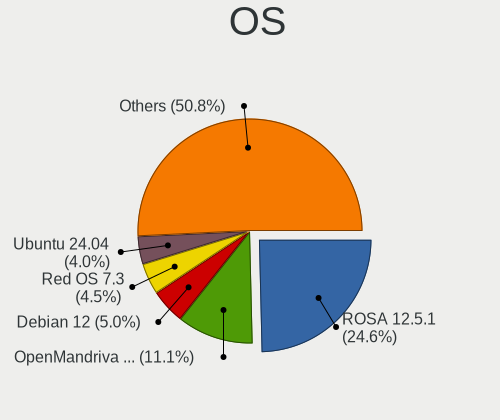
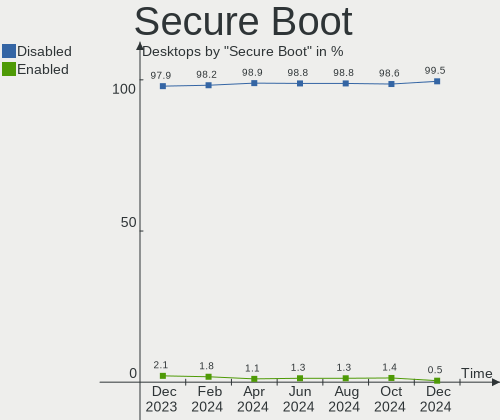
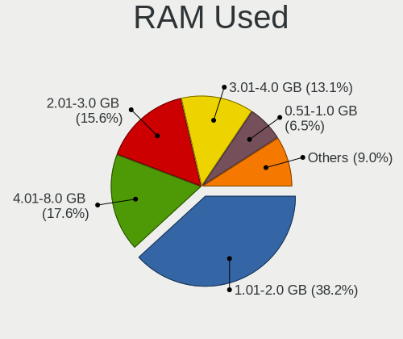
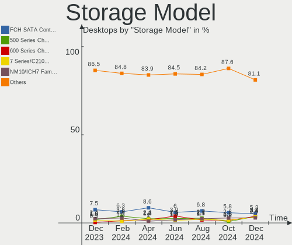
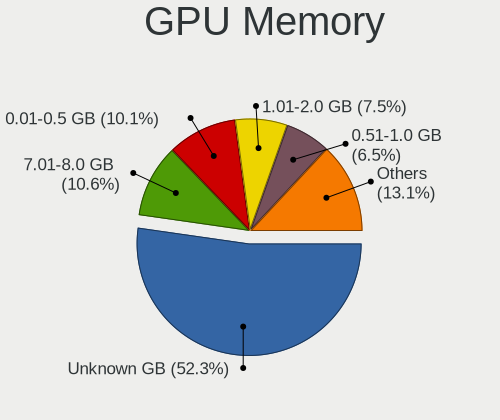
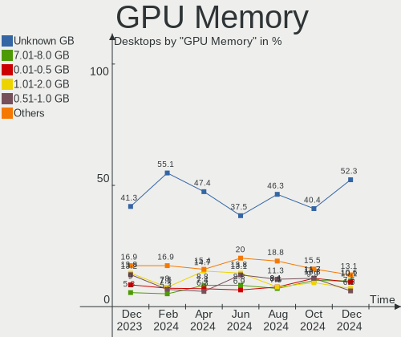
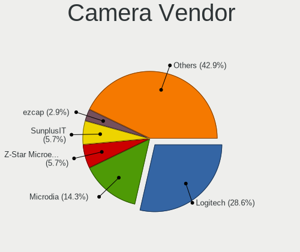

Linux in Russia - Hardware Trends (Desktops)
--------------------------------------------

A project to identify most popular hardware characteristics and track their change
over time based on data collected by Linux users at https://Linux-Hardware.org.

Anyone can contribute to this report by the [hw-probe](https://github.com/linuxhw/hw-probe) tool:

    sudo -E hw-probe -all -upload

Contents
--------

* [ System ](#system)
  - [ OS                       ](#os)
  - [ OS Family                ](#os-family)
  - [ Kernel                   ](#kernel)
  - [ Kernel Family            ](#kernel-family)
  - [ Kernel Major Ver.        ](#kernel-major-ver)
  - [ Arch                     ](#arch)
  - [ DE                       ](#de)
  - [ Display Server           ](#display-server)
  - [ Display Manager          ](#display-manager)
  - [ OS Lang                  ](#os-lang)
  - [ Boot Mode                ](#boot-mode)
  - [ Filesystem               ](#filesystem)
  - [ Part. scheme             ](#part-scheme)
  - [ Dual Boot with Linux/BSD ](#dual-boot-with-linuxbsd)
  - [ Dual Boot (Win)          ](#dual-boot-win)

* [ Board ](#board)
  - [ Vendor                   ](#vendor)
  - [ Model                    ](#model)
  - [ Model Family             ](#model-family)
  - [ MFG Year                 ](#mfg-year)
  - [ Form Factor              ](#form-factor)
  - [ Secure Boot              ](#secure-boot)
  - [ Coreboot                 ](#coreboot)
  - [ RAM Size                 ](#ram-size)
  - [ RAM Used                 ](#ram-used)
  - [ Total Drives             ](#total-drives)
  - [ Has CD-ROM               ](#has-cd-rom)
  - [ Has Ethernet             ](#has-ethernet)
  - [ Has WiFi                 ](#has-wifi)
  - [ Has Bluetooth            ](#has-bluetooth)

* [ Location ](#location)
  - [ Country                  ](#country)
  - [ City                     ](#city)

* [ Drives ](#drives)
  - [ Drive Vendor             ](#drive-vendor)
  - [ Drive Model              ](#drive-model)
  - [ HDD Vendor               ](#hdd-vendor)
  - [ SSD Vendor               ](#ssd-vendor)
  - [ Drive Kind               ](#drive-kind)
  - [ Drive Connector          ](#drive-connector)
  - [ Drive Size               ](#drive-size)
  - [ Space Total              ](#space-total)
  - [ Space Used               ](#space-used)
  - [ Malfunc. Drives          ](#malfunc-drives)
  - [ Malfunc. Drive Vendor    ](#malfunc-drive-vendor)
  - [ Malfunc. HDD Vendor      ](#malfunc-hdd-vendor)
  - [ Malfunc. Drive Kind      ](#malfunc-drive-kind)
  - [ Failed Drives            ](#failed-drives)
  - [ Failed Drive Vendor      ](#failed-drive-vendor)
  - [ Drive Status             ](#drive-status)

* [ Storage controller ](#storage-controller)
  - [ Storage Vendor           ](#storage-vendor)
  - [ Storage Model            ](#storage-model)
  - [ Storage Kind             ](#storage-kind)

* [ Processor ](#processor)
  - [ CPU Vendor               ](#cpu-vendor)
  - [ CPU Model                ](#cpu-model)
  - [ CPU Model Family         ](#cpu-model-family)
  - [ CPU Cores                ](#cpu-cores)
  - [ CPU Sockets              ](#cpu-sockets)
  - [ CPU Threads              ](#cpu-threads)
  - [ CPU Op-Modes             ](#cpu-op-modes)
  - [ CPU Microcode            ](#cpu-microcode)
  - [ CPU Microarch            ](#cpu-microarch)

* [ Graphics ](#graphics)
  - [ GPU Vendor               ](#gpu-vendor)
  - [ GPU Model                ](#gpu-model)
  - [ GPU Combo                ](#gpu-combo)
  - [ GPU Driver               ](#gpu-driver)
  - [ GPU Memory               ](#gpu-memory)

* [ Monitor ](#monitor)
  - [ Monitor Vendor           ](#monitor-vendor)
  - [ Monitor Model            ](#monitor-model)
  - [ Monitor Resolution       ](#monitor-resolution)
  - [ Monitor Diagonal         ](#monitor-diagonal)
  - [ Monitor Width            ](#monitor-width)
  - [ Aspect Ratio             ](#aspect-ratio)
  - [ Monitor Area             ](#monitor-area)
  - [ Pixel Density            ](#pixel-density)
  - [ Multiple Monitors        ](#multiple-monitors)

* [ Network ](#network)
  - [ Net Controller Vendor    ](#net-controller-vendor)
  - [ Net Controller Model     ](#net-controller-model)
  - [ Wireless Vendor          ](#wireless-vendor)
  - [ Wireless Model           ](#wireless-model)
  - [ Ethernet Vendor          ](#ethernet-vendor)
  - [ Ethernet Model           ](#ethernet-model)
  - [ Net Controller Kind      ](#net-controller-kind)
  - [ Used Controller          ](#used-controller)
  - [ NICs                     ](#nics)
  - [ IPv6                     ](#ipv6)

* [ Bluetooth ](#bluetooth)
  - [ Bluetooth Vendor         ](#bluetooth-vendor)
  - [ Bluetooth Model          ](#bluetooth-model)

* [ Sound ](#sound)
  - [ Sound Vendor             ](#sound-vendor)
  - [ Sound Model              ](#sound-model)

* [ Memory ](#memory)
  - [ Memory Vendor            ](#memory-vendor)
  - [ Memory Model             ](#memory-model)
  - [ Memory Kind              ](#memory-kind)
  - [ Memory Form Factor       ](#memory-form-factor)
  - [ Memory Size              ](#memory-size)
  - [ Memory Speed             ](#memory-speed)

* [ Printers & scanners ](#printers--scanners)
  - [ Printer Vendor           ](#printer-vendor)
  - [ Printer Model            ](#printer-model)
  - [ Scanner Vendor           ](#scanner-vendor)
  - [ Scanner Model            ](#scanner-model)

* [ Camera ](#camera)
  - [ Camera Vendor            ](#camera-vendor)
  - [ Camera Model             ](#camera-model)

* [ Security ](#security)
  - [ Fingerprint Vendor       ](#fingerprint-vendor)
  - [ Fingerprint Model        ](#fingerprint-model)
  - [ Chipcard Vendor          ](#chipcard-vendor)
  - [ Chipcard Model           ](#chipcard-model)

* [ Unsupported ](#unsupported)
  - [ Unsupported Devices      ](#unsupported-devices)
  - [ Unsupported Device Types ](#unsupported-device-types)

System
------

OS
--

Installed operating systems

| Name                | Desktops | Percent |
|---------------------|----------|---------|
| ROSA 12.2           | 117      | 43.01%  |
| Debian 11           | 53       | 19.49%  |
| ROSA R11.1          | 14       | 5.15%   |
| OpenMandriva 4.3    | 9        | 3.31%   |
| Linux Mint 20.3     | 8        | 2.94%   |
| Ubuntu 20.04        | 6        | 2.21%   |
| Red OS 7.3.1        | 5        | 1.84%   |
| Manjaro 21.2.6      | 5        | 1.84%   |
| Fedora 36           | 5        | 1.84%   |
| Ubuntu 22.04        | 4        | 1.47%   |
| ROSA 12.1           | 4        | 1.47%   |
| Manjaro             | 2        | 0.74%   |
| Kubuntu 20.04       | 2        | 0.74%   |
| Kometa P10          | 2        | 0.74%   |
| KDE neon 20.04      | 2        | 0.74%   |
| Fedora 35           | 2        | 0.74%   |
| Arch Rolling        | 2        | 0.74%   |
| ALT Linux 10.1      | 2        | 0.74%   |
| ALT Linux 10.0      | 2        | 0.74%   |
| Zorin 16            | 1        | 0.37%   |
| Void Linux Rolling  | 1        | 0.37%   |
| Slackware 15.0      | 1        | 0.37%   |
| RHEL 9              | 1        | 0.37%   |
| RELS 7.9            | 1        | 0.37%   |
| Red OS 7.3          | 1        | 0.37%   |
| Pop!_OS 22.04       | 1        | 0.37%   |
| Parabola            | 1        | 0.37%   |
| openSUSE Leap-15.3  | 1        | 0.37%   |
| OpenMandriva 4.90   | 1        | 0.37%   |
| OpenMandriva 4.2    | 1        | 0.37%   |
| MOS 10              | 1        | 0.37%   |
| LMDE 5              | 1        | 0.37%   |
| Kubuntu 22.04       | 1        | 0.37%   |
| Gentoo 2.8          | 1        | 0.37%   |
| Gentoo 2.7          | 1        | 0.37%   |
| Debian Testing      | 1        | 0.37%   |
| CentOS Stream       | 1        | 0.37%   |
| CentOS 8            | 1        | 0.37%   |
| Astra Linux 2.12.44 | 1        | 0.37%   |
| ArcoLinux Rolling   | 1        | 0.37%   |
| Arch                | 1        | 0.37%   |
| ALT Linux 8.4       | 1        | 0.37%   |
| ALT Linux 10.0.910  | 1        | 0.37%   |
| Alpine 3.16.0       | 1        | 0.37%   |
| Alpine 3.15.4       | 1        | 0.37%   |

OS Family
---------

OS without a version

| Name         | Desktops | Percent |
|--------------|----------|---------|
| ROSA         | 135      | 49.63%  |
| Debian       | 54       | 19.85%  |
| OpenMandriva | 11       | 4.04%   |
| Ubuntu       | 10       | 3.68%   |
| ALT Linux    | 9        | 3.31%   |
| Linux Mint   | 8        | 2.94%   |
| Manjaro      | 7        | 2.57%   |
| Fedora       | 7        | 2.57%   |
| Red OS       | 6        | 2.21%   |
| Kubuntu      | 3        | 1.1%    |
| Arch         | 3        | 1.1%    |
| KDE neon     | 2        | 0.74%   |
| Gentoo       | 2        | 0.74%   |
| CentOS       | 2        | 0.74%   |
| Alpine       | 2        | 0.74%   |
| Zorin        | 1        | 0.37%   |
| Void Linux   | 1        | 0.37%   |
| Slackware    | 1        | 0.37%   |
| RHEL         | 1        | 0.37%   |
| RELS         | 1        | 0.37%   |
| Pop!_OS      | 1        | 0.37%   |
| Parabola     | 1        | 0.37%   |
| openSUSE     | 1        | 0.37%   |
| LMDE         | 1        | 0.37%   |
| Astra Linux  | 1        | 0.37%   |
| ArcoLinux    | 1        | 0.37%   |

Kernel
------

Version of the Linux kernel

| Version                             | Desktops | Percent |
|-------------------------------------|----------|---------|
| 5.10.74-generic-2rosa2021.1-x86_64  | 104      | 38.24%  |
| 5.10.0-7-amd64                      | 45       | 16.54%  |
| 5.15.32-generic-6rosa2021.1-x86_64  | 11       | 4.04%   |
| 5.16.7-desktop-1omv4003             | 8        | 2.94%   |
| 5.4.83-generic-2rosa-x86_64         | 7        | 2.57%   |
| 5.4.0-110-generic                   | 4        | 1.47%   |
| 5.4.0-109-generic                   | 4        | 1.47%   |
| 5.15.35-1.el7.3.x86_64              | 4        | 1.47%   |
| 5.13.0-40-generic                   | 4        | 1.47%   |
| 5.4.0-113-generic                   | 3        | 1.1%    |
| 5.17.5-300.fc36.x86_64              | 3        | 1.1%    |
| 5.13.0-41-generic                   | 3        | 1.1%    |
| 5.10.0-14-amd64                     | 3        | 1.1%    |
| 5.10.0-13-amd64                     | 3        | 1.1%    |
| 4.15.0-desktop-122.124.1rosa-x86_64 | 3        | 1.1%    |
| 5.16.18-1-MANJARO                   | 2        | 0.74%   |
| 5.15.41-1-MANJARO                   | 2        | 0.74%   |
| 5.15.38-1-MANJARO                   | 2        | 0.74%   |
| 5.15.0-33-generic                   | 2        | 0.74%   |
| 5.10.82-std-def-alt1                | 2        | 0.74%   |
| 5.10.74-generic-2rosa2021.1-i586    | 2        | 0.74%   |
| 5.4.32-generic-2rosa-x86_64         | 1        | 0.37%   |
| 5.4.32-generic-2rosa-i586           | 1        | 0.37%   |
| 5.4.0-91-generic                    | 1        | 0.37%   |
| 5.3.18-150300.59.63-default         | 1        | 0.37%   |
| 5.18.0-zen1-1-zen                   | 1        | 0.37%   |
| 5.18.0-gentoo                       | 1        | 0.37%   |
| 5.17.9-zen1-1-zen                   | 1        | 0.37%   |
| 5.17.9-arch1-1                      | 1        | 0.37%   |
| 5.17.9-301.fsync.fc36.x86_64        | 1        | 0.37%   |
| 5.17.9-0-edge                       | 1        | 0.37%   |
| 5.17.7-desktop-1omv4090             | 1        | 0.37%   |
| 5.17.6-051706-generic               | 1        | 0.37%   |
| 5.17.5-76051705-generic             | 1        | 0.37%   |
| 5.17.5-200.fc35.x86_64              | 1        | 0.37%   |
| 5.17.4-200.fc35.x86_64              | 1        | 0.37%   |
| 5.17.3-gnu-1                        | 1        | 0.37%   |
| 5.17.11-generic-1rosa2021.1-x86_64  | 1        | 0.37%   |
| 5.17.11-300.fc36.x86_64             | 1        | 0.37%   |
| 5.17.1-desktop-2omv4050             | 1        | 0.37%   |
| 5.17.0-rc8-amd64                    | 1        | 0.37%   |
| 5.17.0-1-amd64                      | 1        | 0.37%   |
| 5.16.20_1                           | 1        | 0.37%   |
| 5.16.20-generic-1rosa2021.1-x86_64  | 1        | 0.37%   |
| 5.16.18-generic-1rosa2021.1-x86_64  | 1        | 0.37%   |
| 5.16.17-generic-1rosa2021.1-x86_64  | 1        | 0.37%   |
| 5.16.0-0.bpo.4-amd64                | 1        | 0.37%   |
| 5.15.38-0-lts                       | 1        | 0.37%   |
| 5.15.37-un-def-alt1                 | 1        | 0.37%   |
| 5.15.34-un-def-alt1                 | 1        | 0.37%   |
| 5.15.32-gentoo-r1                   | 1        | 0.37%   |
| 5.15.30-Unraid                      | 1        | 0.37%   |
| 5.15.10-1.el7.x86_64                | 1        | 0.37%   |
| 5.15.0-32-generic                   | 1        | 0.37%   |
| 5.15.0-27-generic                   | 1        | 0.37%   |
| 5.14.14-arch1-1                     | 1        | 0.37%   |
| 5.14.0-70.5.1.el9_0.x86_64          | 1        | 0.37%   |
| 5.10.88-std-def-alt1                | 1        | 0.37%   |
| 5.10.83-std-def-alt0.c9f.2          | 1        | 0.37%   |
| 5.10.69-1.res7.x86_64               | 1        | 0.37%   |

Kernel Family
-------------

Linux kernel without a distro release

| Version  | Desktops | Percent |
|----------|----------|---------|
| 5.10.74  | 106      | 38.97%  |
| 5.10.0   | 53       | 19.49%  |
| 5.4.0    | 12       | 4.41%   |
| 5.15.32  | 12       | 4.41%   |
| 5.16.7   | 8        | 2.94%   |
| 5.4.83   | 7        | 2.57%   |
| 5.13.0   | 7        | 2.57%   |
| 5.17.5   | 5        | 1.84%   |
| 5.17.9   | 4        | 1.47%   |
| 5.15.35  | 4        | 1.47%   |
| 5.15.0   | 4        | 1.47%   |
| 4.15.0   | 4        | 1.47%   |
| 5.16.18  | 3        | 1.1%    |
| 5.15.38  | 3        | 1.1%    |
| 5.4.32   | 2        | 0.74%   |
| 5.18.0   | 2        | 0.74%   |
| 5.17.11  | 2        | 0.74%   |
| 5.17.0   | 2        | 0.74%   |
| 5.16.20  | 2        | 0.74%   |
| 5.15.41  | 2        | 0.74%   |
| 5.10.82  | 2        | 0.74%   |
| 4.18.0   | 2        | 0.74%   |
| 5.3.18   | 1        | 0.37%   |
| 5.17.7   | 1        | 0.37%   |
| 5.17.6   | 1        | 0.37%   |
| 5.17.4   | 1        | 0.37%   |
| 5.17.3   | 1        | 0.37%   |
| 5.17.1   | 1        | 0.37%   |
| 5.16.17  | 1        | 0.37%   |
| 5.16.0   | 1        | 0.37%   |
| 5.15.37  | 1        | 0.37%   |
| 5.15.34  | 1        | 0.37%   |
| 5.15.30  | 1        | 0.37%   |
| 5.15.10  | 1        | 0.37%   |
| 5.14.14  | 1        | 0.37%   |
| 5.14.0   | 1        | 0.37%   |
| 5.10.88  | 1        | 0.37%   |
| 5.10.83  | 1        | 0.37%   |
| 5.10.69  | 1        | 0.37%   |
| 5.10.29  | 1        | 0.37%   |
| 5.10.14  | 1        | 0.37%   |
| 5.10.114 | 1        | 0.37%   |
| 5.10.111 | 1        | 0.37%   |
| 5.10.109 | 1        | 0.37%   |
| 5.10.102 | 1        | 0.37%   |
| 4.9.155  | 1        | 0.37%   |

Kernel Major Ver.
-----------------

Linux kernel major version

| Version | Desktops | Percent |
|---------|----------|---------|
| 5.10    | 170      | 62.5%   |
| 5.15    | 29       | 10.66%  |
| 5.4     | 21       | 7.72%   |
| 5.17    | 18       | 6.62%   |
| 5.16    | 15       | 5.51%   |
| 5.13    | 7        | 2.57%   |
| 4.15    | 4        | 1.47%   |
| 5.18    | 2        | 0.74%   |
| 5.14    | 2        | 0.74%   |
| 4.18    | 2        | 0.74%   |
| 5.3     | 1        | 0.37%   |
| 4.9     | 1        | 0.37%   |

Arch
----

OS architecture (x86_64, i586, etc.)

| Name   | Desktops | Percent |
|--------|----------|---------|
| x86_64 | 268      | 98.53%  |
| i686   | 4        | 1.47%   |

DE
--

Desktop Environment

| Name       | Desktops | Percent |
|------------|----------|---------|
| KDE5       | 96       | 35.29%  |
| GNOME      | 76       | 27.94%  |
| Unknown    | 55       | 20.22%  |
| LXQt       | 10       | 3.68%   |
| MATE       | 8        | 2.94%   |
| X-Cinnamon | 7        | 2.57%   |
| KDE4       | 7        | 2.57%   |
| Cinnamon   | 5        | 1.84%   |
| XFCE       | 4        | 1.47%   |
| Unity      | 1        | 0.37%   |
| KDE        | 1        | 0.37%   |
| fly        | 1        | 0.37%   |
| Budgie     | 1        | 0.37%   |

Display Server
--------------

X11 or Wayland

| Name    | Desktops | Percent |
|---------|----------|---------|
| Wayland | 110      | 40.44%  |
| X11     | 104      | 38.24%  |
| Unknown | 53       | 19.49%  |
| Tty     | 5        | 1.84%   |

Display Manager
---------------

SDDM, LightDM, etc.

| Name    | Desktops | Percent |
|---------|----------|---------|
| SDDM    | 91       | 33.46%  |
| Unknown | 78       | 28.68%  |
| GDM     | 76       | 27.94%  |
| LightDM | 15       | 5.51%   |
| KDM     | 7        | 2.57%   |
| GDM3    | 4        | 1.47%   |
| FLY-DM  | 1        | 0.37%   |

OS Lang
-------

Language

| Lang    | Desktops | Percent |
|---------|----------|---------|
| ru_RU   | 238      | 87.5%   |
| en_US   | 20       | 7.35%   |
| Unknown | 13       | 4.78%   |
| ru_UA   | 1        | 0.37%   |

Boot Mode
---------

EFI or BIOS

| Mode | Desktops | Percent |
|------|----------|---------|
| BIOS | 161      | 59.19%  |
| EFI  | 111      | 40.81%  |

Filesystem
----------

Type of filesystem

| Type    | Desktops | Percent |
|---------|----------|---------|
| Ext4    | 187      | 68.75%  |
| Overlay | 58       | 21.32%  |
| Btrfs   | 21       | 7.72%   |
| Xfs     | 4        | 1.47%   |
| F2fs    | 2        | 0.74%   |

Part. scheme
------------

Scheme of partitioning

| Type    | Desktops | Percent |
|---------|----------|---------|
| GPT     | 132      | 48.53%  |
| MBR     | 111      | 40.81%  |
| Unknown | 29       | 10.66%  |

Dual Boot with Linux/BSD
------------------------

Hosting more than one Linux/BSD

| Dual boot | Desktops | Percent |
|-----------|----------|---------|
| No        | 211      | 77.57%  |
| Yes       | 61       | 22.43%  |

Dual Boot (Win)
---------------

Hosting Linux and Windows

| Dual boot | Desktops | Percent |
|-----------|----------|---------|
| Yes       | 150      | 55.15%  |
| No        | 122      | 44.85%  |

Board
-----

Vendor
------

Motherboard manufacturer

| Name                | Desktops | Percent |
|---------------------|----------|---------|
| ASUSTek Computer    | 72       | 26.47%  |
| Gigabyte Technology | 70       | 25.74%  |
| ASRock              | 44       | 16.18%  |
| MSI                 | 34       | 12.5%   |
| Intel               | 7        | 2.57%   |
| Lenovo              | 5        | 1.84%   |
| Huanan              | 5        | 1.84%   |
| Hewlett-Packard     | 5        | 1.84%   |
| ECS                 | 5        | 1.84%   |
| Foxconn             | 4        | 1.47%   |
| Unknown             | 4        | 1.47%   |
| Acer                | 3        | 1.1%    |
| KLLISRE             | 2        | 0.74%   |
| 3Logic Group        | 2        | 0.74%   |
| Pegatron            | 1        | 0.37%   |
| MAINBRD             | 1        | 0.37%   |
| MACHINIST           | 1        | 0.37%   |
| iRU                 | 1        | 0.37%   |
| EPoX Computer       | 1        | 0.37%   |
| Dell                | 1        | 0.37%   |
| Chatreey            | 1        | 0.37%   |
| Apple               | 1        | 0.37%   |
| AMI                 | 1        | 0.37%   |
| ABIT                | 1        | 0.37%   |

Model
-----

Motherboard model

| Name                                    | Desktops | Percent |
|-----------------------------------------|----------|---------|
| ASRock H470M-HVS                        | 12       | 4.41%   |
| ASUS All Series                         | 9        | 3.31%   |
| ASUS S20 K29                            | 6        | 2.21%   |
| MSI MS-7996                             | 4        | 1.47%   |
| Unknown                                 | 4        | 1.47%   |
| ASUS M5A78L-M LE/USB3                   | 3        | 1.1%    |
| ASRock N68-S3 UCC                       | 3        | 1.1%    |
| MSI MS-7D14                             | 2        | 0.74%   |
| MSI MS-7B86                             | 2        | 0.74%   |
| MSI MS-7A38                             | 2        | 0.74%   |
| MSI MS-7693                             | 2        | 0.74%   |
| Gigabyte P61A-D3                        | 2        | 0.74%   |
| Gigabyte H81M-S2V                       | 2        | 0.74%   |
| Gigabyte H77-DS3H                       | 2        | 0.74%   |
| Gigabyte H61M-S2PV                      | 2        | 0.74%   |
| Gigabyte H61M-DS2                       | 2        | 0.74%   |
| Gigabyte GA-MA770-UD3                   | 2        | 0.74%   |
| ECS H61H2-M13                           | 2        | 0.74%   |
| ASUS P8H67-M PRO                        | 2        | 0.74%   |
| ASUS P8H61-M LX3 R2.0                   | 2        | 0.74%   |
| ASUS H110M-R                            | 2        | 0.74%   |
| ASUS A68HM-K                            | 2        | 0.74%   |
| ASRock B450 Gaming K4                   | 2        | 0.74%   |
| 3Logic Group Graviton                   | 2        | 0.74%   |
| Pegatron IPPPV-D3G                      | 1        | 0.37%   |
| MSI MS-7D35                             | 1        | 0.37%   |
| MSI MS-7D32                             | 1        | 0.37%   |
| MSI MS-7C96                             | 1        | 0.37%   |
| MSI MS-7C91                             | 1        | 0.37%   |
| MSI MS-7C86                             | 1        | 0.37%   |
| MSI MS-7C56                             | 1        | 0.37%   |
| MSI MS-7C37                             | 1        | 0.37%   |
| MSI MS-7C09                             | 1        | 0.37%   |
| MSI MS-7C02                             | 1        | 0.37%   |
| MSI MS-7B98                             | 1        | 0.37%   |
| MSI MS-7B93                             | 1        | 0.37%   |
| MSI MS-7B89                             | 1        | 0.37%   |
| MSI MS-7B47                             | 1        | 0.37%   |
| MSI MS-7B24                             | 1        | 0.37%   |
| MSI MS-7B17                             | 1        | 0.37%   |
| MSI MS-7A70                             | 1        | 0.37%   |
| MSI MS-7877                             | 1        | 0.37%   |
| MSI MS-7816                             | 1        | 0.37%   |
| MSI MS-7715                             | 1        | 0.37%   |
| MSI MS-7641                             | 1        | 0.37%   |
| MSI MS-7615                             | 1        | 0.37%   |
| MSI MS-7529                             | 1        | 0.37%   |
| MAINBRD OPS62A-SHA                      | 1        | 0.37%   |
| MACHINIST X99-K9 V2.0                   | 1        | 0.37%   |
| Lenovo ThinkCentre M92P 3237A1G         | 1        | 0.37%   |
| Lenovo ThinkCentre M55 8795B1G          | 1        | 0.37%   |
| Lenovo IdeaCentre 310S-08IGM 90HX003JRS | 1        | 0.37%   |
| Lenovo H515 10125                       | 1        | 0.37%   |
| Lenovo H420                             | 1        | 0.37%   |
| KLLISRE X99-B5 V1.1                     | 1        | 0.37%   |
| KLLISRE X79 V2.72S                      | 1        | 0.37%   |
| iRU 515                                 | 1        | 0.37%   |
| Intel X79 V2.72B                        | 1        | 0.37%   |
| Intel X79                               | 1        | 0.37%   |
| Intel SKYBAY                            | 1        | 0.37%   |

Model Family
------------

Motherboard model prefix

| Name                  | Desktops | Percent |
|-----------------------|----------|---------|
| ASRock H470M-HVS      | 12       | 4.41%   |
| ASUS All              | 9        | 3.31%   |
| ASUS S20              | 6        | 2.21%   |
| ASUS PRIME            | 6        | 2.21%   |
| MSI MS-7996           | 4        | 1.47%   |
| Unknown               | 4        | 1.47%   |
| Gigabyte B550M        | 3        | 1.1%    |
| ASUS TUF              | 3        | 1.1%    |
| ASUS P8H67-M          | 3        | 1.1%    |
| ASUS M5A97            | 3        | 1.1%    |
| ASUS M5A78L-M         | 3        | 1.1%    |
| ASRock N68-S3         | 3        | 1.1%    |
| MSI MS-7D14           | 2        | 0.74%   |
| MSI MS-7B86           | 2        | 0.74%   |
| MSI MS-7A38           | 2        | 0.74%   |
| MSI MS-7693           | 2        | 0.74%   |
| Lenovo ThinkCentre    | 2        | 0.74%   |
| Intel X79             | 2        | 0.74%   |
| HP ProLiant           | 2        | 0.74%   |
| Gigabyte X570         | 2        | 0.74%   |
| Gigabyte P61A-D3      | 2        | 0.74%   |
| Gigabyte H81M-S2V     | 2        | 0.74%   |
| Gigabyte H77-DS3H     | 2        | 0.74%   |
| Gigabyte H61M-S2PV    | 2        | 0.74%   |
| Gigabyte H61M-DS2     | 2        | 0.74%   |
| Gigabyte GA-MA770-UD3 | 2        | 0.74%   |
| Gigabyte B560M        | 2        | 0.74%   |
| Gigabyte B450M        | 2        | 0.74%   |
| Gigabyte B450         | 2        | 0.74%   |
| Gigabyte B365M        | 2        | 0.74%   |
| Gigabyte AB350M-DS3H  | 2        | 0.74%   |
| Foxconn Pro           | 2        | 0.74%   |
| ECS H61H2-M13         | 2        | 0.74%   |
| ASUS PRO              | 2        | 0.74%   |
| ASUS P8P67            | 2        | 0.74%   |
| ASUS P8H61-M          | 2        | 0.74%   |
| ASUS P7H55-M          | 2        | 0.74%   |
| ASUS H110M-R          | 2        | 0.74%   |
| ASUS A68HM-K          | 2        | 0.74%   |
| ASRock B450           | 2        | 0.74%   |
| Acer Aspire           | 2        | 0.74%   |
| 3Logic Group Graviton | 2        | 0.74%   |
| Pegatron IPPPV-D3G    | 1        | 0.37%   |
| MSI MS-7D35           | 1        | 0.37%   |
| MSI MS-7D32           | 1        | 0.37%   |
| MSI MS-7C96           | 1        | 0.37%   |
| MSI MS-7C91           | 1        | 0.37%   |
| MSI MS-7C86           | 1        | 0.37%   |
| MSI MS-7C56           | 1        | 0.37%   |
| MSI MS-7C37           | 1        | 0.37%   |
| MSI MS-7C09           | 1        | 0.37%   |
| MSI MS-7C02           | 1        | 0.37%   |
| MSI MS-7B98           | 1        | 0.37%   |
| MSI MS-7B93           | 1        | 0.37%   |
| MSI MS-7B89           | 1        | 0.37%   |
| MSI MS-7B47           | 1        | 0.37%   |
| MSI MS-7B24           | 1        | 0.37%   |
| MSI MS-7B17           | 1        | 0.37%   |
| MSI MS-7A70           | 1        | 0.37%   |
| MSI MS-7877           | 1        | 0.37%   |

MFG Year
--------

Motherboard manufacture year

| Year | Desktops | Percent |
|------|----------|---------|
| 2021 | 29       | 10.66%  |
| 2012 | 29       | 10.66%  |
| 2018 | 27       | 9.93%   |
| 2020 | 26       | 9.56%   |
| 2011 | 23       | 8.46%   |
| 2019 | 19       | 6.99%   |
| 2013 | 19       | 6.99%   |
| 2010 | 17       | 6.25%   |
| 2015 | 13       | 4.78%   |
| 2014 | 13       | 4.78%   |
| 2017 | 12       | 4.41%   |
| 2008 | 12       | 4.41%   |
| 2016 | 9        | 3.31%   |
| 2009 | 9        | 3.31%   |
| 2007 | 9        | 3.31%   |
| 2022 | 3        | 1.1%    |
| 2006 | 2        | 0.74%   |
| 2005 | 1        | 0.37%   |

Form Factor
-----------

Physical design of the computer

| Name    | Desktops | Percent |
|---------|----------|---------|
| Desktop | 272      | 100%    |

Secure Boot
-----------

Enabled or disabled

| State    | Desktops | Percent |
|----------|----------|---------|
| Disabled | 270      | 99.26%  |
| Enabled  | 2        | 0.74%   |

Coreboot
--------

Have coreboot on board

| Used | Desktops | Percent |
|------|----------|---------|
| No   | 272      | 100%    |

RAM Size
--------

Total RAM memory

| Size in GB  | Desktops | Percent |
|-------------|----------|---------|
| 8.01-16.0   | 66       | 24.26%  |
| 16.01-24.0  | 53       | 19.49%  |
| 3.01-4.0    | 48       | 17.65%  |
| 4.01-8.0    | 47       | 17.28%  |
| 32.01-64.0  | 30       | 11.03%  |
| 1.01-2.0    | 16       | 5.88%   |
| 64.01-256.0 | 7        | 2.57%   |
| 24.01-32.0  | 4        | 1.47%   |
| 2.01-3.0    | 1        | 0.37%   |

RAM Used
--------

Used RAM memory

| Used GB    | Desktops | Percent |
|------------|----------|---------|
| 1.01-2.0   | 100      | 36.76%  |
| 0.51-1.0   | 91       | 33.46%  |
| 2.01-3.0   | 35       | 12.87%  |
| 4.01-8.0   | 22       | 8.09%   |
| 3.01-4.0   | 18       | 6.62%   |
| 8.01-16.0  | 3        | 1.1%    |
| 0.01-0.5   | 2        | 0.74%   |
| 32.01-64.0 | 1        | 0.37%   |

Total Drives
------------

Number of drives on board

| Drives | Desktops | Percent |
|--------|----------|---------|
| 1      | 120      | 44.12%  |
| 2      | 78       | 28.68%  |
| 3      | 42       | 15.44%  |
| 4      | 19       | 6.99%   |
| 5      | 8        | 2.94%   |
| 6      | 3        | 1.1%    |
| 0      | 2        | 0.74%   |

Has CD-ROM
----------

Has CD-ROM on board

| Presented | Desktops | Percent |
|-----------|----------|---------|
| No        | 183      | 67.28%  |
| Yes       | 89       | 32.72%  |

Has Ethernet
------------

Has Ethernet on board

| Presented | Desktops | Percent |
|-----------|----------|---------|
| Yes       | 271      | 99.63%  |
| No        | 1        | 0.37%   |

Has WiFi
--------

Has WiFi module

| Presented | Desktops | Percent |
|-----------|----------|---------|
| No        | 218      | 80.15%  |
| Yes       | 54       | 19.85%  |

Has Bluetooth
-------------

Has Bluetooth module

| Presented | Desktops | Percent |
|-----------|----------|---------|
| No        | 215      | 79.04%  |
| Yes       | 57       | 20.96%  |

Location
--------

Country
-------

Geographic location (country)

| Country | Desktops | Percent |
|---------|----------|---------|
| Russia  | 272      | 100%    |

City
----

Geographic location (city)

| City              | Desktops | Percent |
|-------------------|----------|---------|
| Voronezh          | 47       | 17.28%  |
| Moscow            | 43       | 15.81%  |
| St Petersburg     | 24       | 8.82%   |
| Yekaterinburg     | 9        | 3.31%   |
| Perm              | 9        | 3.31%   |
| Novosibirsk       | 5        | 1.84%   |
| Krasnodar         | 5        | 1.84%   |
| Pyatigorsk        | 4        | 1.47%   |
| Chelyabinsk       | 4        | 1.47%   |
| Vladivostok       | 3        | 1.1%    |
| Ufa               | 3        | 1.1%    |
| Stavropol         | 3        | 1.1%    |
| Samara            | 3        | 1.1%    |
| Nizhniy Novgorod  | 3        | 1.1%    |
| Murom             | 3        | 1.1%    |
| Yoshkar-Ola       | 2        | 0.74%   |
| Tver              | 2        | 0.74%   |
| Tula              | 2        | 0.74%   |
| Tomsk             | 2        | 0.74%   |
| Tolyatti          | 2        | 0.74%   |
| Taganrog          | 2        | 0.74%   |
| Surgut            | 2        | 0.74%   |
| Salekhard         | 2        | 0.74%   |
| Rostov-on-Don     | 2        | 0.74%   |
| Penza             | 2        | 0.74%   |
| Orenburg          | 2        | 0.74%   |
| Omsk              | 2        | 0.74%   |
| Noril'sk          | 2        | 0.74%   |
| Murmansk          | 2        | 0.74%   |
| Lytkarino         | 2        | 0.74%   |
| Kostroma          | 2        | 0.74%   |
| Khabarovsk        | 2        | 0.74%   |
| Izhevsk           | 2        | 0.74%   |
| Dubna             | 2        | 0.74%   |
| Cheboksary        | 2        | 0.74%   |
| Bratsk            | 2        | 0.74%   |
| Belgorod          | 2        | 0.74%   |
| Yuzhno-Sakhalinsk | 1        | 0.37%   |
| Yartsevo          | 1        | 0.37%   |
| Yakutsk           | 1        | 0.37%   |
| Volkhov           | 1        | 0.37%   |
| Volgograd         | 1        | 0.37%   |
| Veliky Novgorod   | 1        | 0.37%   |
| Velikiye Luki     | 1        | 0.37%   |
| Valuyki           | 1        | 0.37%   |
| Tuapse            | 1        | 0.37%   |
| Tsimlyansk        | 1        | 0.37%   |
| Tambov            | 1        | 0.37%   |
| Syktyvkar         | 1        | 0.37%   |
| Sudak             | 1        | 0.37%   |
| Sterlitamak       | 1        | 0.37%   |
| Sochi             | 1        | 0.37%   |
| Shelekhov         | 1        | 0.37%   |
| Sertolovo         | 1        | 0.37%   |
| Sergiyev Posad    | 1        | 0.37%   |
| Saratov           | 1        | 0.37%   |
| Pskov             | 1        | 0.37%   |
| Petrozavodsk      | 1        | 0.37%   |
| Petergof          | 1        | 0.37%   |
| Pavlovsk          | 1        | 0.37%   |

Drives
------

Drive Vendor
------------

Hard drive vendors

| Vendor                | Desktops | Drives | Percent |
|-----------------------|----------|--------|---------|
| Seagate               | 96       | 121    | 20.34%  |
| WDC                   | 93       | 114    | 19.7%   |
| Toshiba               | 42       | 44     | 8.9%    |
| Samsung Electronics   | 38       | 43     | 8.05%   |
| Kingston              | 24       | 25     | 5.08%   |
| Crucial               | 22       | 25     | 4.66%   |
| Hitachi               | 18       | 18     | 3.81%   |
| Netac                 | 14       | 14     | 2.97%   |
| A-DATA Technology     | 13       | 14     | 2.75%   |
| Apacer                | 9        | 10     | 1.91%   |
| China                 | 8        | 8      | 1.69%   |
| Smartbuy              | 6        | 7      | 1.27%   |
| HGST                  | 6        | 7      | 1.27%   |
| XPG                   | 5        | 5      | 1.06%   |
| Silicon Motion        | 5        | 7      | 1.06%   |
| Phison                | 5        | 5      | 1.06%   |
| XrayDisk              | 4        | 6      | 0.85%   |
| SanDisk               | 4        | 4      | 0.85%   |
| OCZ                   | 4        | 4      | 0.85%   |
| Intel                 | 4        | 4      | 0.85%   |
| GOODRAM               | 4        | 4      | 0.85%   |
| Gigabyte Technology   | 4        | 4      | 0.85%   |
| SPCC                  | 3        | 3      | 0.64%   |
| PLEXTOR               | 3        | 3      | 0.64%   |
| Patriot               | 3        | 3      | 0.64%   |
| MAXTOR                | 3        | 3      | 0.64%   |
| KIOXIA-EXCERIA        | 3        | 3      | 0.64%   |
| KingSpec              | 3        | 3      | 0.64%   |
| Unknown               | 2        | 2      | 0.42%   |
| Realtek Semiconductor | 2        | 2      | 0.42%   |
| Pioneer               | 2        | 2      | 0.42%   |
| Hewlett-Packard       | 2        | 2      | 0.42%   |
| AMD                   | 2        | 2      | 0.42%   |
| Zheino                | 1        | 1      | 0.21%   |
| Transcend             | 1        | 1      | 0.21%   |
| TMI                   | 1        | 1      | 0.21%   |
| THU                   | 1        | 1      | 0.21%   |
| Teclast               | 1        | 1      | 0.21%   |
| SK Hynix              | 1        | 1      | 0.21%   |
| ROG                   | 1        | 1      | 0.21%   |
| QUMO                  | 1        | 1      | 0.21%   |
| LuminouTek            | 1        | 1      | 0.21%   |
| Kingmax               | 1        | 1      | 0.21%   |
| JMicron               | 1        | 1      | 0.21%   |
| Intenso               | 1        | 1      | 0.21%   |
| HUAWEI                | 1        | 1      | 0.21%   |
| FOXLINE               | 1        | 1      | 0.21%   |
| e2e4                  | 1        | 1      | 0.21%   |
| AXIOMTEK              | 1        | 1      | 0.21%   |

Drive Model
-----------

Hard drive models

| Model                            | Desktops | Percent |
|----------------------------------|----------|---------|
| Toshiba HDWD110 1TB              | 20       | 3.84%   |
| Seagate ST500DM002-1BD142 500GB  | 13       | 2.5%    |
| Seagate ST1000DM010-2EP102 1TB   | 12       | 2.3%    |
| Netac SSD 240GB                  | 12       | 2.3%    |
| Crucial CT480BX500SSD1 480GB     | 12       | 2.3%    |
| Seagate ST1000DM003-1CH162 1TB   | 8        | 1.54%   |
| WDC WDS240G2G0B-00EPW0 240GB SSD | 5        | 0.96%   |
| Kingston SUV400S37120G 120GB SSD | 5        | 0.96%   |
| WDC WD20EZRZ-00Z5HB0 2TB         | 4        | 0.77%   |
| WDC WD10EZEX-08WN4A0 1TB         | 4        | 0.77%   |
| Toshiba DT01ACA050 500GB         | 4        | 0.77%   |
| Seagate ST3500418AS 500GB        | 4        | 0.77%   |
| Seagate ST3500413AS 500GB        | 4        | 0.77%   |
| Samsung SSD 860 EVO 250GB        | 4        | 0.77%   |
| Kingston SA400S37240G 240GB SSD  | 4        | 0.77%   |
| Kingston SA400S37120G 120GB SSD  | 4        | 0.77%   |
| Hitachi HDS721050CLA362 500GB    | 4        | 0.77%   |
| Apacer AS350 256GB SSD           | 4        | 0.77%   |
| WDC WD20EZBX-00AYRA0 2TB         | 3        | 0.58%   |
| WDC WD10EZEX-22MFCA0 1TB         | 3        | 0.58%   |
| Smartbuy SSD 240GB               | 3        | 0.58%   |
| Seagate ST500DM002-1BC142 500GB  | 3        | 0.58%   |
| Seagate ST3400620AS 400GB        | 3        | 0.58%   |
| Seagate ST31000528AS 1TB         | 3        | 0.58%   |
| Seagate ST1000DM003-9YN162 1TB   | 3        | 0.58%   |
| Samsung SSD 850 EVO 250GB        | 3        | 0.58%   |
| Kingston SV300S37A120G 120GB SSD | 3        | 0.58%   |
| Crucial CT240BX500SSD1 240GB     | 3        | 0.58%   |
| Apacer AS350 512GB SSD           | 3        | 0.58%   |
| XPG GAMMIX S5 512GB              | 2        | 0.38%   |
| XPG GAMMIX S11 Pro 256GB         | 2        | 0.38%   |
| WDC WDS500G2B0A-00SM50 500GB SSD | 2        | 0.38%   |
| WDC WDS240G2G0A-00JH30 240GB SSD | 2        | 0.38%   |
| WDC WDS120G2G0A-00JH30 120GB SSD | 2        | 0.38%   |
| WDC WD5000LPVX-22V0TT0 500GB     | 2        | 0.38%   |
| WDC WD5000AZRZ-00HTKB0 500GB     | 2        | 0.38%   |
| WDC WD5000AAKX-001CA0 500GB      | 2        | 0.38%   |
| WDC WD20EARX-00PASB0 2TB         | 2        | 0.38%   |
| WDC WD10SPSX-00A6WT0 1TB         | 2        | 0.38%   |
| WDC WD10EZEX-00RKKA0 1TB         | 2        | 0.38%   |
| WDC WD10EZEX-00BN5A0 1TB         | 2        | 0.38%   |
| Toshiba DT01ACA200 2TB           | 2        | 0.38%   |
| Smartbuy SSD 120GB               | 2        | 0.38%   |
| Seagate ST380815AS 80GB          | 2        | 0.38%   |
| Seagate ST3250318AS 250GB        | 2        | 0.38%   |
| Seagate ST3160815AS 160GB        | 2        | 0.38%   |
| Seagate ST3160811AS 160GB        | 2        | 0.38%   |
| Seagate ST31000524AS 1TB         | 2        | 0.38%   |
| Seagate ST2000DM001-9YN164 2TB   | 2        | 0.38%   |
| Seagate ST2000DM001-1CH164 2TB   | 2        | 0.38%   |
| Seagate ST1000LM049-2GH172 1TB   | 2        | 0.38%   |
| Seagate ST1000DM003-1SB10C 1TB   | 2        | 0.38%   |
| Seagate ST1000DM003-1ER162 1TB   | 2        | 0.38%   |
| Sandisk NVMe SSD Drive 250GB     | 2        | 0.38%   |
| Samsung SSD 980 PRO 250GB        | 2        | 0.38%   |
| Samsung SSD 980 500GB            | 2        | 0.38%   |
| Samsung SSD 970 EVO Plus 500GB   | 2        | 0.38%   |
| Samsung SSD 970 EVO Plus 250GB   | 2        | 0.38%   |
| Samsung SSD 870 EVO 500GB        | 2        | 0.38%   |
| Samsung NVMe SSD Drive 250GB     | 2        | 0.38%   |

HDD Vendor
----------

Hard disk drive vendors

| Vendor              | Desktops | Drives | Percent |
|---------------------|----------|--------|---------|
| Seagate             | 96       | 120    | 36.92%  |
| WDC                 | 85       | 100    | 32.69%  |
| Toshiba             | 41       | 42     | 15.77%  |
| Hitachi             | 18       | 18     | 6.92%   |
| Samsung Electronics | 9        | 9      | 3.46%   |
| HGST                | 6        | 7      | 2.31%   |
| MAXTOR              | 3        | 3      | 1.15%   |
| Unknown             | 1        | 1      | 0.38%   |
| Hewlett-Packard     | 1        | 1      | 0.38%   |

SSD Vendor
----------

Solid state drive vendors

| Vendor              | Desktops | Drives | Percent |
|---------------------|----------|--------|---------|
| Kingston            | 21       | 22     | 12.5%   |
| Crucial             | 21       | 23     | 12.5%   |
| Samsung Electronics | 18       | 19     | 10.71%  |
| WDC                 | 13       | 13     | 7.74%   |
| Netac               | 13       | 13     | 7.74%   |
| Apacer              | 9        | 10     | 5.36%   |
| A-DATA Technology   | 9        | 9      | 5.36%   |
| China               | 8        | 8      | 4.76%   |
| Smartbuy            | 6        | 7      | 3.57%   |
| OCZ                 | 4        | 4      | 2.38%   |
| Intel               | 4        | 4      | 2.38%   |
| XrayDisk            | 3        | 5      | 1.79%   |
| SPCC                | 3        | 3      | 1.79%   |
| KIOXIA-EXCERIA      | 3        | 3      | 1.79%   |
| KingSpec            | 3        | 3      | 1.79%   |
| GOODRAM             | 3        | 3      | 1.79%   |
| Toshiba             | 2        | 2      | 1.19%   |
| SanDisk             | 2        | 2      | 1.19%   |
| PLEXTOR             | 2        | 2      | 1.19%   |
| Pioneer             | 2        | 2      | 1.19%   |
| Patriot             | 2        | 2      | 1.19%   |
| Gigabyte Technology | 2        | 2      | 1.19%   |
| AMD                 | 2        | 2      | 1.19%   |
| Zheino              | 1        | 1      | 0.6%    |
| TMI                 | 1        | 1      | 0.6%    |
| THU                 | 1        | 1      | 0.6%    |
| Seagate             | 1        | 1      | 0.6%    |
| QUMO                | 1        | 1      | 0.6%    |
| Phison              | 1        | 1      | 0.6%    |
| LuminouTek          | 1        | 1      | 0.6%    |
| Kingmax             | 1        | 1      | 0.6%    |
| Intenso             | 1        | 1      | 0.6%    |
| Hewlett-Packard     | 1        | 1      | 0.6%    |
| FOXLINE             | 1        | 1      | 0.6%    |
| e2e4                | 1        | 1      | 0.6%    |
| AXIOMTEK            | 1        | 1      | 0.6%    |

Drive Kind
----------

HDD or SSD

| Kind    | Desktops | Drives | Percent |
|---------|----------|--------|---------|
| HDD     | 207      | 301    | 51.75%  |
| SSD     | 144      | 176    | 36%     |
| NVMe    | 45       | 56     | 11.25%  |
| Unknown | 3        | 3      | 0.75%   |
| MMC     | 1        | 1      | 0.25%   |

Drive Connector
---------------

SATA, SAS, NVMe, etc.

| Type | Desktops | Drives | Percent |
|------|----------|--------|---------|
| SATA | 261      | 473    | 83.39%  |
| NVMe | 45       | 56     | 14.38%  |
| SAS  | 6        | 7      | 1.92%   |
| MMC  | 1        | 1      | 0.32%   |

Drive Size
----------

Size of hard drive

| Size in TB | Desktops | Drives | Percent |
|------------|----------|--------|---------|
| 0.01-0.5   | 225      | 301    | 59.52%  |
| 0.51-1.0   | 113      | 132    | 29.89%  |
| 1.01-2.0   | 29       | 32     | 7.67%   |
| 2.01-3.0   | 4        | 5      | 1.06%   |
| 4.01-10.0  | 4        | 4      | 1.06%   |
| 3.01-4.0   | 3        | 3      | 0.79%   |

Space Total
-----------

Amount of disk space available on the file system

| Size in GB     | Desktops | Percent |
|----------------|----------|---------|
| 101-250        | 55       | 20.22%  |
| Unknown        | 50       | 18.38%  |
| 251-500        | 44       | 16.18%  |
| 501-1000       | 34       | 12.5%   |
| 1001-2000      | 29       | 10.66%  |
| 1-20           | 19       | 6.99%   |
| 21-50          | 17       | 6.25%   |
| 51-100         | 12       | 4.41%   |
| 2001-3000      | 8        | 2.94%   |
| More than 3000 | 4        | 1.47%   |

Space Used
----------

Amount of used disk space

| Used GB        | Desktops | Percent |
|----------------|----------|---------|
| 1-20           | 123      | 45.22%  |
| Unknown        | 50       | 18.38%  |
| 21-50          | 22       | 8.09%   |
| 101-250        | 19       | 6.99%   |
| 501-1000       | 18       | 6.62%   |
| 251-500        | 16       | 5.88%   |
| 51-100         | 14       | 5.15%   |
| 1001-2000      | 6        | 2.21%   |
| 2001-3000      | 3        | 1.1%    |
| More than 3000 | 1        | 0.37%   |

Malfunc. Drives
---------------

Drive models with a malfunction

| Model                               | Desktops | Drives | Percent |
|-------------------------------------|----------|--------|---------|
| Seagate ST500DM002-1BD142 500GB     | 5        | 5      | 5.43%   |
| Seagate ST1000DM003-1CH162 1TB      | 4        | 4      | 4.35%   |
| Seagate ST3500413AS 500GB           | 2        | 2      | 2.17%   |
| Seagate ST3160815AS 160GB           | 2        | 2      | 2.17%   |
| Seagate ST3160811AS 160GB           | 2        | 2      | 2.17%   |
| Seagate ST31000528AS 1TB            | 2        | 2      | 2.17%   |
| Seagate ST2000DM001-9YN164 2TB      | 2        | 2      | 2.17%   |
| Kingston SV300S37A120G 120GB SSD    | 2        | 2      | 2.17%   |
| XPG GAMMIX S5 512GB                 | 1        | 1      | 1.09%   |
| WDC WDS240G2G0A-00JH30 240GB SSD    | 1        | 1      | 1.09%   |
| WDC WD7500AARS-003BB1 752GB         | 1        | 1      | 1.09%   |
| WDC WD6400AARS-00Y5B1 640GB         | 1        | 1      | 1.09%   |
| WDC WD5000LPVX-22V0TT0 500GB        | 1        | 1      | 1.09%   |
| WDC WD5000AZRZ-00HTKB0 500GB        | 1        | 1      | 1.09%   |
| WDC WD5000AAKX-22ERMA0 500GB        | 1        | 1      | 1.09%   |
| WDC WD5000AAKX-00ERMA0 500GB        | 1        | 1      | 1.09%   |
| WDC WD5000AAKX-001CA0 500GB         | 1        | 1      | 1.09%   |
| WDC WD5000AAKS-00UU3A0 500GB        | 1        | 1      | 1.09%   |
| WDC WD3200BPVT-75ZEST0 320GB        | 1        | 1      | 1.09%   |
| WDC WD30EFRX-68EUZN0 3TB            | 1        | 1      | 1.09%   |
| WDC WD2500BEVT-60ZCT1 250GB         | 1        | 1      | 1.09%   |
| WDC WD2500AAKX-00ERMA0 250GB        | 1        | 1      | 1.09%   |
| WDC WD2500AAJS-07B4A0 250GB         | 1        | 1      | 1.09%   |
| WDC WD2500AAJS-00YZCA0 250GB        | 1        | 1      | 1.09%   |
| WDC WD20EARS-00MVWB0 2TB            | 1        | 1      | 1.09%   |
| WDC WD20EADS-00R6B0 2TB             | 1        | 1      | 1.09%   |
| WDC WD1600AAJS-00L7A0 160GB         | 1        | 1      | 1.09%   |
| WDC WD15EARX-00ZUDB0 1TB            | 1        | 1      | 1.09%   |
| WDC WD15EARS-00MVWB0 1TB            | 1        | 1      | 1.09%   |
| WDC WD1200JD-00HBB0 120GB           | 1        | 1      | 1.09%   |
| WDC WD10EZRZ-00HTKB0 1TB            | 1        | 1      | 1.09%   |
| WDC WD10EZEX-60WN4A1 1TB            | 1        | 1      | 1.09%   |
| WDC WD10EZEX-22MFCA0 1TB            | 1        | 1      | 1.09%   |
| WDC WD10EZEX-00RKKA0 1TB            | 1        | 1      | 1.09%   |
| WDC WD10EFRX-68JCSN0 1TB            | 1        | 1      | 1.09%   |
| WDC WD1001FALS-00Y6A0 1TB           | 1        | 1      | 1.09%   |
| Toshiba MQ01ABD050 500GB            | 1        | 1      | 1.09%   |
| Toshiba MK1246GSX 120GB             | 1        | 1      | 1.09%   |
| Toshiba MK1059GSMP 1TB              | 1        | 1      | 1.09%   |
| Smartbuy SSD 240GB                  | 1        | 1      | 1.09%   |
| Seagate ST9320325AS 320GB           | 1        | 1      | 1.09%   |
| Seagate ST500DM002-1BC142 500GB     | 1        | 1      | 1.09%   |
| Seagate ST3750330AS 752GB           | 1        | 1      | 1.09%   |
| Seagate ST3500418AS 500GB           | 1        | 1      | 1.09%   |
| Seagate ST3300831AS 304GB           | 1        | 1      | 1.09%   |
| Seagate ST3250824AS 250GB           | 1        | 1      | 1.09%   |
| Seagate ST3250318AS 250GB           | 1        | 1      | 1.09%   |
| Seagate ST3250310AS 250GB           | 1        | 1      | 1.09%   |
| Seagate ST3160827AS 160GB           | 1        | 1      | 1.09%   |
| Seagate ST31000333AS 1TB            | 1        | 1      | 1.09%   |
| Seagate ST2000LM003 HN-M201RAD 2TB  | 1        | 1      | 1.09%   |
| Seagate ST1000LM014-1EJ164 1TB      | 1        | 1      | 1.09%   |
| Seagate ST1000DM003-9YN162 1TB      | 1        | 1      | 1.09%   |
| Samsung Electronics SV0221H 20GB    | 1        | 1      | 1.09%   |
| Samsung Electronics SSD 970 EVO 1TB | 1        | 1      | 1.09%   |
| Samsung Electronics SSD 870 EVO 2TB | 1        | 1      | 1.09%   |
| Samsung Electronics SP2504C 250GB   | 1        | 1      | 1.09%   |
| Samsung Electronics SP0812C 80GB    | 1        | 1      | 1.09%   |
| Samsung Electronics HD502IJ 500GB   | 1        | 1      | 1.09%   |
| Samsung Electronics HD321KJ 320GB   | 1        | 1      | 1.09%   |

Malfunc. Drive Vendor
---------------------

Vendors of faulty drives

| Vendor              | Desktops | Drives | Percent |
|---------------------|----------|--------|---------|
| Seagate             | 28       | 32     | 32.56%  |
| WDC                 | 25       | 27     | 29.07%  |
| Samsung Electronics | 8        | 8      | 9.3%    |
| Hitachi             | 8        | 8      | 9.3%    |
| Toshiba             | 3        | 3      | 3.49%   |
| Kingston            | 3        | 3      | 3.49%   |
| MAXTOR              | 2        | 2      | 2.33%   |
| HGST                | 2        | 3      | 2.33%   |
| XPG                 | 1        | 1      | 1.16%   |
| Smartbuy            | 1        | 1      | 1.16%   |
| OCZ                 | 1        | 1      | 1.16%   |
| Kingmax             | 1        | 1      | 1.16%   |
| Intenso             | 1        | 1      | 1.16%   |
| Apacer              | 1        | 1      | 1.16%   |
| AMD                 | 1        | 1      | 1.16%   |

Malfunc. HDD Vendor
-------------------

Vendors of faulty HDD drives

| Vendor              | Desktops | Drives | Percent |
|---------------------|----------|--------|---------|
| Seagate             | 28       | 32     | 38.36%  |
| WDC                 | 24       | 26     | 32.88%  |
| Hitachi             | 8        | 8      | 10.96%  |
| Samsung Electronics | 6        | 6      | 8.22%   |
| Toshiba             | 3        | 3      | 4.11%   |
| MAXTOR              | 2        | 2      | 2.74%   |
| HGST                | 2        | 3      | 2.74%   |

Malfunc. Drive Kind
-------------------

Kinds of faulty drives

| Kind | Desktops | Drives | Percent |
|------|----------|--------|---------|
| HDD  | 66       | 80     | 83.54%  |
| SSD  | 11       | 11     | 13.92%  |
| NVMe | 2        | 2      | 2.53%   |

Failed Drives
-------------

Failed drive models

| Model                    | Desktops | Drives | Percent |
|--------------------------|----------|--------|---------|
| WDC WD20EARX-00PASB0 2TB | 1        | 1      | 33.33%  |
| Toshiba MQ01ABD075 752GB | 1        | 1      | 33.33%  |
| Seagate ST31000520AS 1TB | 1        | 2      | 33.33%  |

Failed Drive Vendor
-------------------

Failed drive vendors

| Vendor  | Desktops | Drives | Percent |
|---------|----------|--------|---------|
| WDC     | 1        | 1      | 33.33%  |
| Toshiba | 1        | 1      | 33.33%  |
| Seagate | 1        | 2      | 33.33%  |

Drive Status
------------

Number of failed and malfunc. drives

| Status   | Desktops | Drives | Percent |
|----------|----------|--------|---------|
| Works    | 211      | 366    | 64.33%  |
| Malfunc  | 78       | 93     | 23.78%  |
| Detected | 36       | 74     | 10.98%  |
| Failed   | 3        | 4      | 0.91%   |

Storage controller
------------------

Storage Vendor
--------------

Storage controller vendors

| Vendor                        | Desktops | Percent |
|-------------------------------|----------|---------|
| Intel                         | 183      | 51.4%   |
| AMD                           | 79       | 22.19%  |
| Samsung Electronics           | 15       | 4.21%   |
| JMicron Technology            | 13       | 3.65%   |
| Silicon Motion                | 11       | 3.09%   |
| Nvidia                        | 9        | 2.53%   |
| ASMedia Technology            | 9        | 2.53%   |
| Marvell Technology Group      | 6        | 1.69%   |
| Realtek Semiconductor         | 5        | 1.4%    |
| Phison Electronics            | 5        | 1.4%    |
| ADATA Technology              | 5        | 1.4%    |
| VIA Technologies              | 3        | 0.84%   |
| Sandisk                       | 3        | 0.84%   |
| Kingston Technology Company   | 3        | 0.84%   |
| Micron/Crucial Technology     | 2        | 0.56%   |
| SK Hynix                      | 1        | 0.28%   |
| Lite-On Technology            | 1        | 0.28%   |
| Lite-On IT Corp. / Plextor    | 1        | 0.28%   |
| Integrated Technology Express | 1        | 0.28%   |
| Adaptec                       | 1        | 0.28%   |

Storage Model
-------------

Storage controller models

| Model                                                                                   | Desktops | Percent |
|-----------------------------------------------------------------------------------------|----------|---------|
| AMD FCH SATA Controller [AHCI mode]                                                     | 32       | 7.26%   |
| Intel 6 Series/C200 Series Chipset Family 6 port Desktop SATA AHCI Controller           | 23       | 5.22%   |
| Intel 200 Series PCH SATA controller [AHCI mode]                                        | 23       | 5.22%   |
| Intel 8 Series/C220 Series Chipset Family 6-port SATA Controller 1 [AHCI mode]          | 18       | 4.08%   |
| AMD SB7x0/SB8x0/SB9x0 SATA Controller [AHCI mode]                                       | 17       | 3.85%   |
| Intel NM10/ICH7 Family SATA Controller [IDE mode]                                       | 16       | 3.63%   |
| AMD SB7x0/SB8x0/SB9x0 IDE Controller                                                    | 16       | 3.63%   |
| AMD 400 Series Chipset SATA Controller                                                  | 16       | 3.63%   |
| Intel Q170/Q150/B150/H170/H110/Z170/CM236 Chipset SATA Controller [AHCI Mode]           | 13       | 2.95%   |
| Intel Comet Lake SATA AHCI Controller                                                   | 13       | 2.95%   |
| AMD 500 Series Chipset SATA Controller                                                  | 12       | 2.72%   |
| Intel 7 Series/C210 Series Chipset Family 6-port SATA Controller [AHCI mode]            | 11       | 2.49%   |
| Silicon Motion SM2263EN/SM2263XT SSD Controller                                         | 10       | 2.27%   |
| AMD SB7x0/SB8x0/SB9x0 SATA Controller [IDE mode]                                        | 10       | 2.27%   |
| Samsung NVMe SSD Controller SM981/PM981/PM983                                           | 9        | 2.04%   |
| Intel 500 Series Chipset Family SATA AHCI Controller                                    | 9        | 2.04%   |
| ASMedia ASM1062 Serial ATA Controller                                                   | 9        | 2.04%   |
| Intel 82801G (ICH7 Family) IDE Controller                                               | 7        | 1.59%   |
| Intel 6 Series/C200 Series Chipset Family Desktop SATA Controller (IDE mode, ports 4-5) | 7        | 1.59%   |
| Intel 6 Series/C200 Series Chipset Family Desktop SATA Controller (IDE mode, ports 0-3) | 7        | 1.59%   |
| Nvidia MCP61 SATA Controller                                                            | 6        | 1.36%   |
| Nvidia MCP61 IDE                                                                        | 6        | 1.36%   |
| JMicron JMB368 IDE controller                                                           | 6        | 1.36%   |
| Realtek Realtek Non-Volatile memory controller                                          | 5        | 1.13%   |
| Intel Cannon Lake PCH SATA AHCI Controller                                              | 4        | 0.91%   |
| Intel 400 Series Chipset Family SATA AHCI Controller                                    | 4        | 0.91%   |
| AMD 300 Series Chipset SATA Controller                                                  | 4        | 0.91%   |
| ADATA XPG SX8200 Pro PCIe Gen3x4 M.2 2280 Solid State Drive                             | 4        | 0.91%   |
| VIA VT6415 PATA IDE Host Controller                                                     | 3        | 0.68%   |
| JMicron JMB363 SATA/IDE Controller                                                      | 3        | 0.68%   |
| JMicron JMB362 SATA Controller                                                          | 3        | 0.68%   |
| Intel NM10/ICH7 Family SATA Controller [AHCI mode]                                      | 3        | 0.68%   |
| Intel C610/X99 series chipset 6-Port SATA Controller [AHCI mode]                        | 3        | 0.68%   |
| Intel C600/X79 series chipset 6-Port SATA AHCI Controller                               | 3        | 0.68%   |
| Intel 82801JI (ICH10 Family) 4 port SATA IDE Controller #1                              | 3        | 0.68%   |
| Intel 82801JI (ICH10 Family) 2 port SATA IDE Controller #2                              | 3        | 0.68%   |
| Intel 7 Series/C210 Series Chipset Family 4-port SATA Controller [IDE mode]             | 3        | 0.68%   |
| Intel 7 Series/C210 Series Chipset Family 2-port SATA Controller [IDE mode]             | 3        | 0.68%   |
| Intel 5 Series/3400 Series Chipset 6 port SATA AHCI Controller                          | 3        | 0.68%   |
| Intel 5 Series/3400 Series Chipset 4 port SATA IDE Controller                           | 3        | 0.68%   |
| Intel 5 Series/3400 Series Chipset 2 port SATA IDE Controller                           | 3        | 0.68%   |
| AMD SB600 Non-Raid-5 SATA                                                               | 3        | 0.68%   |
| AMD SB600 IDE                                                                           | 3        | 0.68%   |
| AMD FCH SATA Controller [IDE mode]                                                      | 3        | 0.68%   |
| AMD FCH SATA Controller D                                                               | 3        | 0.68%   |
| AMD FCH IDE Controller                                                                  | 3        | 0.68%   |
| Sandisk Non-Volatile memory controller                                                  | 2        | 0.45%   |
| Samsung NVMe SSD Controller SM961/PM961/SM963                                           | 2        | 0.45%   |
| Samsung NVMe SSD Controller PM9A1/PM9A3/980PRO                                          | 2        | 0.45%   |
| Samsung NVMe SSD Controller 980                                                         | 2        | 0.45%   |
| Phison PS5013 E13 NVMe Controller                                                       | 2        | 0.45%   |
| Marvell Group 88SE9172 SATA 6Gb/s Controller                                            | 2        | 0.45%   |
| JMicron JMB361 AHCI/IDE                                                                 | 2        | 0.45%   |
| Intel SATA Controller [RAID mode]                                                       | 2        | 0.45%   |
| Intel Celeron/Pentium Silver Processor SATA Controller                                  | 2        | 0.45%   |
| Intel C610/X99 series chipset sSATA Controller [AHCI mode]                              | 2        | 0.45%   |
| Intel Atom/Celeron/Pentium Processor x5-E8000/J3xxx/N3xxx Series SATA Controller        | 2        | 0.45%   |
| Intel Alder Lake-S PCH SATA Controller [AHCI Mode]                                      | 2        | 0.45%   |
| Intel 9 Series Chipset Family SATA Controller [AHCI Mode]                               | 2        | 0.45%   |
| Intel 82801JI (ICH10 Family) SATA AHCI Controller                                       | 2        | 0.45%   |

Storage Kind
------------

Kind of storage controller (IDE, SATA, NVMe, SAS, ...)

| Kind | Desktops | Percent |
|------|----------|---------|
| SATA | 226      | 64.39%  |
| IDE  | 75       | 21.37%  |
| NVMe | 45       | 12.82%  |
| RAID | 5        | 1.42%   |

Processor
---------

CPU Vendor
----------

Processor vendors

| Vendor | Desktops | Percent |
|--------|----------|---------|
| Intel  | 185      | 68.01%  |
| AMD    | 87       | 31.99%  |

CPU Model
---------

Processor models

| Model                                       | Desktops | Percent |
|---------------------------------------------|----------|---------|
| Intel Core i7-10700 CPU @ 2.90GHz           | 12       | 4.41%   |
| Intel Core i5-9400 CPU @ 2.90GHz            | 8        | 2.94%   |
| Intel Pentium CPU G4400 @ 3.30GHz           | 6        | 2.21%   |
| AMD Ryzen 5 1600 Six-Core Processor         | 6        | 2.21%   |
| Intel Core i5-2400 CPU @ 3.10GHz            | 5        | 1.84%   |
| Intel Xeon CPU E5-2678 v3 @ 2.50GHz         | 4        | 1.47%   |
| Intel Pentium CPU G620 @ 2.60GHz            | 3        | 1.1%    |
| Intel Core i3-9100F CPU @ 3.60GHz           | 3        | 1.1%    |
| Intel Core 2 Quad CPU Q8200 @ 2.33GHz       | 3        | 1.1%    |
| AMD Ryzen 5 2400G with Radeon Vega Graphics | 3        | 1.1%    |
| AMD FX-6300 Six-Core Processor              | 3        | 1.1%    |
| Intel Xeon CPU E5-2650 v2 @ 2.60GHz         | 2        | 0.74%   |
| Intel Xeon CPU E5-2620 0 @ 2.00GHz          | 2        | 0.74%   |
| Intel Pentium Gold G5420 CPU @ 3.80GHz      | 2        | 0.74%   |
| Intel Pentium Dual-Core CPU E6500 @ 2.93GHz | 2        | 0.74%   |
| Intel Pentium CPU G860 @ 3.00GHz            | 2        | 0.74%   |
| Intel Pentium CPU G3260 @ 3.30GHz           | 2        | 0.74%   |
| Intel Core i7-9700K CPU @ 3.60GHz           | 2        | 0.74%   |
| Intel Core i7-4770 CPU @ 3.40GHz            | 2        | 0.74%   |
| Intel Core i5-4460 CPU @ 3.20GHz            | 2        | 0.74%   |
| Intel Core i5-3470 CPU @ 3.20GHz            | 2        | 0.74%   |
| Intel Core i5-3330 CPU @ 3.00GHz            | 2        | 0.74%   |
| Intel Core i5-2500K CPU @ 3.30GHz           | 2        | 0.74%   |
| Intel Core i5-2310 CPU @ 2.90GHz            | 2        | 0.74%   |
| Intel Core i3-8100 CPU @ 3.60GHz            | 2        | 0.74%   |
| Intel Core i3-7100 CPU @ 3.90GHz            | 2        | 0.74%   |
| Intel Core i3-3220 CPU @ 3.30GHz            | 2        | 0.74%   |
| Intel Core i3-2120 CPU @ 3.30GHz            | 2        | 0.74%   |
| Intel Core i3-10105 CPU @ 3.70GHz           | 2        | 0.74%   |
| Intel Core i3-10100 CPU @ 3.60GHz           | 2        | 0.74%   |
| Intel Core i3 CPU 540 @ 3.07GHz             | 2        | 0.74%   |
| Intel Celeron CPU G530 @ 2.40GHz            | 2        | 0.74%   |
| Intel 12th Gen Core i7-12700KF              | 2        | 0.74%   |
| Intel 11th Gen Core i5-11500 @ 2.70GHz      | 2        | 0.74%   |
| Intel 11th Gen Core i5-11400 @ 2.60GHz      | 2        | 0.74%   |
| AMD Ryzen 7 PRO 4750G with Radeon Graphics  | 2        | 0.74%   |
| AMD Ryzen 7 5700G with Radeon Graphics      | 2        | 0.74%   |
| AMD Ryzen 7 3700X 8-Core Processor          | 2        | 0.74%   |
| AMD Ryzen 5 PRO 4650G with Radeon Graphics  | 2        | 0.74%   |
| AMD Ryzen 5 5600G with Radeon Graphics      | 2        | 0.74%   |
| AMD Ryzen 5 3600 6-Core Processor           | 2        | 0.74%   |
| AMD Ryzen 5 3500X 6-Core Processor          | 2        | 0.74%   |
| AMD Ryzen 5 3400G with Radeon Vega Graphics | 2        | 0.74%   |
| AMD Ryzen 5 2600 Six-Core Processor         | 2        | 0.74%   |
| AMD Ryzen 3 3100 4-Core Processor           | 2        | 0.74%   |
| AMD Ryzen 3 1200 Quad-Core Processor        | 2        | 0.74%   |
| AMD Phenom II X4 955 Processor              | 2        | 0.74%   |
| AMD FX-8350 Eight-Core Processor            | 2        | 0.74%   |
| AMD FX-8320 Eight-Core Processor            | 2        | 0.74%   |
| AMD FX-4100 Quad-Core Processor             | 2        | 0.74%   |
| AMD Athlon X4 840 Quad Core Processor       | 2        | 0.74%   |
| AMD Athlon II X4 640 Processor              | 2        | 0.74%   |
| AMD Athlon II X2 220 Processor              | 2        | 0.74%   |
| AMD Athlon 64 X2 Dual Core Processor 5200+  | 2        | 0.74%   |
| AMD Athlon 64 X2 Dual Core Processor 4800+  | 2        | 0.74%   |
| AMD A4-6300 APU with Radeon HD Graphics     | 2        | 0.74%   |
| Intel Xeon CPU X5670 @ 2.93GHz              | 1        | 0.37%   |
| Intel Xeon CPU X5460 @ 3.16GHz              | 1        | 0.37%   |
| Intel Xeon CPU X3470 @ 2.93GHz              | 1        | 0.37%   |
| Intel Xeon CPU L5420 @ 2.50GHz              | 1        | 0.37%   |

CPU Model Family
----------------

Processor model prefix

| Model                   | Desktops | Percent |
|-------------------------|----------|---------|
| Intel Core i5           | 40       | 14.71%  |
| Intel Core i3           | 30       | 11.03%  |
| Intel Core i7           | 24       | 8.82%   |
| Intel Xeon              | 23       | 8.46%   |
| AMD Ryzen 5             | 22       | 8.09%   |
| Intel Pentium           | 21       | 7.72%   |
| AMD FX                  | 12       | 4.41%   |
| Other                   | 10       | 3.68%   |
| Intel Celeron           | 10       | 3.68%   |
| Intel Core 2 Quad       | 8        | 2.94%   |
| AMD Ryzen 7             | 7        | 2.57%   |
| AMD Athlon 64 X2        | 7        | 2.57%   |
| AMD Ryzen 3             | 6        | 2.21%   |
| AMD Phenom II X4        | 6        | 2.21%   |
| Intel Core 2 Duo        | 5        | 1.84%   |
| Intel Pentium Dual-Core | 4        | 1.47%   |
| Intel Atom              | 4        | 1.47%   |
| AMD Athlon II X2        | 4        | 1.47%   |
| Intel Pentium Gold      | 3        | 1.1%    |
| AMD Ryzen 9             | 2        | 0.74%   |
| AMD Ryzen 7 PRO         | 2        | 0.74%   |
| AMD Ryzen 5 PRO         | 2        | 0.74%   |
| AMD Athlon X4           | 2        | 0.74%   |
| AMD Athlon II X4        | 2        | 0.74%   |
| AMD A6                  | 2        | 0.74%   |
| AMD A4                  | 2        | 0.74%   |
| Intel Pentium Dual      | 1        | 0.37%   |
| Intel Pentium 4         | 1        | 0.37%   |
| Intel Genuine           | 1        | 0.37%   |
| Intel Core 2            | 1        | 0.37%   |
| AMD Turion II Neo       | 1        | 0.37%   |
| AMD Sempron             | 1        | 0.37%   |
| AMD Phenom II X6        | 1        | 0.37%   |
| AMD Phenom II X3        | 1        | 0.37%   |
| AMD Phenom              | 1        | 0.37%   |
| AMD E                   | 1        | 0.37%   |
| AMD C-60                | 1        | 0.37%   |
| AMD A10                 | 1        | 0.37%   |

CPU Cores
---------

Number of processor cores

| Number | Desktops | Percent |
|--------|----------|---------|
| 4      | 97       | 35.66%  |
| 2      | 81       | 29.78%  |
| 6      | 42       | 15.44%  |
| 8      | 27       | 9.93%   |
| 1      | 8        | 2.94%   |
| 12     | 7        | 2.57%   |
| 3      | 6        | 2.21%   |
| 10     | 2        | 0.74%   |
| 24     | 1        | 0.37%   |
| 16     | 1        | 0.37%   |

CPU Sockets
-----------

Number of sockets

| Number | Desktops | Percent |
|--------|----------|---------|
| 1      | 269      | 98.9%   |
| 2      | 3        | 1.1%    |

CPU Threads
-----------

Threads per core (Hyper-Threading)

| Number | Desktops | Percent |
|--------|----------|---------|
| 2      | 138      | 50.74%  |
| 1      | 134      | 49.26%  |

CPU Op-Modes
------------

CPU Operation Modes (32-bit, 64-bit)

| Op mode        | Desktops | Percent |
|----------------|----------|---------|
| 32-bit, 64-bit | 270      | 99.26%  |
| Unknown        | 2        | 0.74%   |

CPU Microcode
-------------

Microcode number

| Number     | Desktops | Percent |
|------------|----------|---------|
| 0x206a7    | 25       | 9.19%   |
| Unknown    | 22       | 8.09%   |
| 0x906ea    | 17       | 6.25%   |
| 0x306c3    | 17       | 6.25%   |
| 0x306a9    | 16       | 5.88%   |
| 0xa0655    | 13       | 4.78%   |
| 0x1067a    | 11       | 4.04%   |
| 0x010000c8 | 11       | 4.04%   |
| 0x506e3    | 9        | 3.31%   |
| 0x08701021 | 8        | 2.94%   |
| 0xa0671    | 6        | 2.21%   |
| 0x906e9    | 6        | 2.21%   |
| 0x306f2    | 6        | 2.21%   |
| 0x0800820d | 6        | 2.21%   |
| 0x906eb    | 5        | 1.84%   |
| 0x08600106 | 5        | 1.84%   |
| 0x08001138 | 5        | 1.84%   |
| 0x06000852 | 5        | 1.84%   |
| 0xa0653    | 4        | 1.47%   |
| 0x906ed    | 3        | 1.1%    |
| 0x6fb      | 3        | 1.1%    |
| 0x406c4    | 3        | 1.1%    |
| 0x206d7    | 3        | 1.1%    |
| 0x106e5    | 3        | 1.1%    |
| 0x10677    | 3        | 1.1%    |
| 0x06001119 | 3        | 1.1%    |
| 0x90672    | 2        | 0.74%   |
| 0x6fd      | 2        | 0.74%   |
| 0x306e4    | 2        | 0.74%   |
| 0x20655    | 2        | 0.74%   |
| 0x106ca    | 2        | 0.74%   |
| 0x0a50000c | 2        | 0.74%   |
| 0x08108109 | 2        | 0.74%   |
| 0x06003106 | 2        | 0.74%   |
| 0x06000822 | 2        | 0.74%   |
| 0x0600063e | 2        | 0.74%   |
| 0x05000119 | 2        | 0.74%   |
| 0xf41      | 1        | 0.37%   |
| 0x806ec    | 1        | 0.37%   |
| 0x806c1    | 1        | 0.37%   |
| 0x706a8    | 1        | 0.37%   |
| 0x706a1    | 1        | 0.37%   |
| 0x6f6      | 1        | 0.37%   |
| 0x6f2      | 1        | 0.37%   |
| 0x30661    | 1        | 0.37%   |
| 0x206c2    | 1        | 0.37%   |
| 0x106a5    | 1        | 0.37%   |
| 0x106a4    | 1        | 0.37%   |
| 0x10676    | 1        | 0.37%   |
| 0x10661    | 1        | 0.37%   |
| 0x0a50000b | 1        | 0.37%   |
| 0x0a201009 | 1        | 0.37%   |
| 0x08701013 | 1        | 0.37%   |
| 0x08108102 | 1        | 0.37%   |
| 0x08101016 | 1        | 0.37%   |
| 0x0810100b | 1        | 0.37%   |
| 0x08101004 | 1        | 0.37%   |
| 0x08001137 | 1        | 0.37%   |
| 0x08001126 | 1        | 0.37%   |
| 0x0700010f | 1        | 0.37%   |

CPU Microarch
-------------

Microarchitecture

| Name             | Desktops | Percent |
|------------------|----------|---------|
| KabyLake         | 33       | 12.13%  |
| SandyBridge      | 28       | 10.29%  |
| Haswell          | 24       | 8.82%   |
| IvyBridge        | 20       | 7.35%   |
| CometLake        | 19       | 6.99%   |
| Penryn           | 16       | 5.88%   |
| K10              | 16       | 5.88%   |
| Zen 2            | 15       | 5.51%   |
| Piledriver       | 12       | 4.41%   |
| Zen              | 11       | 4.04%   |
| Zen+             | 9        | 3.31%   |
| Skylake          | 9        | 3.31%   |
| K8 Hammer        | 8        | 2.94%   |
| Core             | 8        | 2.94%   |
| Zen 3            | 6        | 2.21%   |
| Nehalem          | 5        | 1.84%   |
| Unknown          | 5        | 1.84%   |
| Westmere         | 4        | 1.47%   |
| Silvermont       | 4        | 1.47%   |
| Bulldozer        | 3        | 1.1%    |
| Bonnell          | 3        | 1.1%    |
| Steamroller      | 2        | 0.74%   |
| Goldmont plus    | 2        | 0.74%   |
| Bobcat           | 2        | 0.74%   |
| Alderlake Hybrid | 2        | 0.74%   |
| TigerLake        | 1        | 0.37%   |
| NetBurst         | 1        | 0.37%   |
| K10 Llano        | 1        | 0.37%   |
| Jaguar           | 1        | 0.37%   |
| Icelake          | 1        | 0.37%   |
| Excavator        | 1        | 0.37%   |

Graphics
--------

GPU Vendor
----------

Vendors of graphics cards

| Vendor                     | Desktops | Percent |
|----------------------------|----------|---------|
| Nvidia                     | 117      | 41.79%  |
| Intel                      | 82       | 29.29%  |
| AMD                        | 78       | 27.86%  |
| Matrox Electronics Systems | 1        | 0.36%   |
| ATI Technologies           | 1        | 0.36%   |
| ASPEED Technology          | 1        | 0.36%   |

GPU Model
---------

Graphics card models

| Model                                                                                    | Desktops | Percent |
|------------------------------------------------------------------------------------------|----------|---------|
| Nvidia TU106 [GeForce RTX 2060 Rev. A]                                                   | 12       | 4.24%   |
| Nvidia GP107 [GeForce GTX 1050 Ti]                                                       | 12       | 4.24%   |
| Intel CoffeeLake-S GT2 [UHD Graphics 630]                                                | 12       | 4.24%   |
| Intel 2nd Generation Core Processor Family Integrated Graphics Controller                | 11       | 3.89%   |
| AMD Ellesmere [Radeon RX 470/480/570/570X/580/580X/590]                                  | 10       | 3.53%   |
| Nvidia GF116 [GeForce GTX 550 Ti]                                                        | 6        | 2.12%   |
| Intel Xeon E3-1200 v3/4th Gen Core Processor Integrated Graphics Controller              | 6        | 2.12%   |
| Intel Xeon E3-1200 v2/3rd Gen Core processor Graphics Controller                         | 6        | 2.12%   |
| Nvidia GM107 [GeForce GTX 750 Ti]                                                        | 5        | 1.77%   |
| Intel HD Graphics 510                                                                    | 5        | 1.77%   |
| Intel 82G33/G31 Express Integrated Graphics Controller                                   | 5        | 1.77%   |
| AMD Renoir                                                                               | 5        | 1.77%   |
| Nvidia GK208B [GeForce GT 710]                                                           | 4        | 1.41%   |
| Intel CometLake-S GT2 [UHD Graphics 630]                                                 | 4        | 1.41%   |
| AMD Raven Ridge [Radeon Vega Series / Radeon Vega Mobile Series]                         | 4        | 1.41%   |
| AMD Cezanne                                                                              | 4        | 1.41%   |
| Nvidia GP108 [GeForce GT 1030]                                                           | 3        | 1.06%   |
| Nvidia GP107 [GeForce GTX 1050]                                                          | 3        | 1.06%   |
| Nvidia GK106 [GeForce GTX 650 Ti]                                                        | 3        | 1.06%   |
| Nvidia GF108 [GeForce GT 730]                                                            | 3        | 1.06%   |
| Nvidia GF108 [GeForce GT 630]                                                            | 3        | 1.06%   |
| Nvidia G94 [GeForce 9600 GT]                                                             | 3        | 1.06%   |
| Intel HD Graphics 630                                                                    | 3        | 1.06%   |
| Intel CoffeeLake-S GT1 [UHD Graphics 610]                                                | 3        | 1.06%   |
| Intel Atom/Celeron/Pentium Processor x5-E8000/J3xxx/N3xxx Integrated Graphics Controller | 3        | 1.06%   |
| Intel 4th Generation Core Processor Family Integrated Graphics Controller                | 3        | 1.06%   |
| Intel 4 Series Chipset Integrated Graphics Controller                                    | 3        | 1.06%   |
| AMD Lexa PRO [Radeon 540/540X/550/550X / RX 540X/550/550X]                               | 3        | 1.06%   |
| AMD Cape Verde XT [Radeon HD 7770/8760 / R7 250X]                                        | 3        | 1.06%   |
| Nvidia TU117 [GeForce GTX 1650]                                                          | 2        | 0.71%   |
| Nvidia TU116 [GeForce GTX 1660]                                                          | 2        | 0.71%   |
| Nvidia TU116 [GeForce GTX 1650 SUPER]                                                    | 2        | 0.71%   |
| Nvidia GT218 [GeForce 210]                                                               | 2        | 0.71%   |
| Nvidia GT216 [GeForce GT 220]                                                            | 2        | 0.71%   |
| Nvidia GP106 [GeForce GTX 1060 6GB]                                                      | 2        | 0.71%   |
| Nvidia GP106 [GeForce GTX 1060 3GB]                                                      | 2        | 0.71%   |
| Nvidia GM204 [GeForce GTX 970]                                                           | 2        | 0.71%   |
| Nvidia GK107 [GeForce GTX 650]                                                           | 2        | 0.71%   |
| Nvidia GF108 [GeForce GT 440]                                                            | 2        | 0.71%   |
| Intel RocketLake-S GT1 [UHD Graphics 750]                                                | 2        | 0.71%   |
| Intel HD Graphics 530                                                                    | 2        | 0.71%   |
| Intel GeminiLake [UHD Graphics 600]                                                      | 2        | 0.71%   |
| Intel Core Processor Integrated Graphics Controller                                      | 2        | 0.71%   |
| AMD Turks PRO [Radeon HD 6570/7570/8550 / R5 230]                                        | 2        | 0.71%   |
| AMD Navi 23 [Radeon RX 6600/6600 XT/6600M]                                               | 2        | 0.71%   |
| AMD Juniper XT [Radeon HD 5770]                                                          | 2        | 0.71%   |
| AMD Juniper PRO [Radeon HD 6750]                                                         | 2        | 0.71%   |
| AMD Juniper PRO [Radeon HD 5750]                                                         | 2        | 0.71%   |
| AMD Caicos [Radeon HD 6450/7450/8450 / R5 230 OEM]                                       | 2        | 0.71%   |
| AMD Baffin [Radeon RX 460/560D / Pro 450/455/460/555/555X/560/560X]                      | 2        | 0.71%   |
| Nvidia TU116 [GeForce GTX 1660 Ti]                                                       | 1        | 0.35%   |
| Nvidia TU116 [GeForce GTX 1660 SUPER]                                                    | 1        | 0.35%   |
| Nvidia TU106 [GeForce RTX 2060 SUPER]                                                    | 1        | 0.35%   |
| Nvidia TU104GL [Quadro RTX 5000]                                                         | 1        | 0.35%   |
| Nvidia TU104 [GeForce RTX 2080 Rev. A]                                                   | 1        | 0.35%   |
| Nvidia TU104 [GeForce RTX 2070 SUPER]                                                    | 1        | 0.35%   |
| Nvidia NV34 [GeForce FX 5500]                                                            | 1        | 0.35%   |
| Nvidia GT218 [ION]                                                                       | 1        | 0.35%   |
| Nvidia GT200GL [Quadro FX 3800]                                                          | 1        | 0.35%   |
| Nvidia GP104 [GeForce GTX 1080]                                                          | 1        | 0.35%   |

GPU Combo
---------

Combinations of graphics cards

| Name         | Desktops | Percent |
|--------------|----------|---------|
| 1 x Nvidia   | 114      | 41.91%  |
| 1 x Intel    | 76       | 27.94%  |
| 1 x AMD      | 76       | 27.94%  |
| 2 x AMD      | 2        | 0.74%   |
| 2 x Nvidia   | 1        | 0.37%   |
| 1 x Matrox   | 1        | 0.37%   |
| 1 x ASPEED   | 1        | 0.37%   |
| AMD + Nvidia | 1        | 0.37%   |

GPU Driver
----------

Free vs proprietary

| Driver      | Desktops | Percent |
|-------------|----------|---------|
| Free        | 185      | 68.01%  |
| Unknown     | 52       | 19.12%  |
| Proprietary | 35       | 12.87%  |

GPU Memory
----------

Total video memory

| Size in GB | Desktops | Percent |
|------------|----------|---------|
| Unknown    | 112      | 41.18%  |
| 1.01-2.0   | 40       | 14.71%  |
| 0.51-1.0   | 36       | 13.24%  |
| 3.01-4.0   | 32       | 11.76%  |
| 0.01-0.5   | 26       | 9.56%   |
| 7.01-8.0   | 14       | 5.15%   |
| 5.01-6.0   | 6        | 2.21%   |
| 8.01-16.0  | 4        | 1.47%   |
| 2.01-3.0   | 2        | 0.74%   |

Monitor
-------

Monitor Vendor
--------------

Monitor vendors

| Vendor               | Desktops | Percent |
|----------------------|----------|---------|
| Samsung Electronics  | 45       | 20.93%  |
| Goldstar             | 36       | 16.74%  |
| BenQ                 | 20       | 9.3%    |
| Acer                 | 17       | 7.91%   |
| Philips              | 16       | 7.44%   |
| Dell                 | 11       | 5.12%   |
| AOC                  | 11       | 5.12%   |
| Hewlett-Packard      | 10       | 4.65%   |
| ViewSonic            | 6        | 2.79%   |
| Iiyama               | 5        | 2.33%   |
| Ancor Communications | 5        | 2.33%   |
| NEC Computers        | 4        | 1.86%   |
| ASUSTek Computer     | 4        | 1.86%   |
| SGT                  | 3        | 1.4%    |
| Unknown (XXX)        | 2        | 0.93%   |
| Plain Tree Systems   | 2        | 0.93%   |
| Panasonic            | 2        | 0.93%   |
| Mi                   | 2        | 0.93%   |
| VIE                  | 1        | 0.47%   |
| TFK                  | 1        | 0.47%   |
| Sony                 | 1        | 0.47%   |
| Packard Bell         | 1        | 0.47%   |
| Lenovo               | 1        | 0.47%   |
| HYO                  | 1        | 0.47%   |
| HHT                  | 1        | 0.47%   |
| Haier                | 1        | 0.47%   |
| DOY                  | 1        | 0.47%   |
| CTV                  | 1        | 0.47%   |
| BOE                  | 1        | 0.47%   |
| Apple                | 1        | 0.47%   |
| AOpen                | 1        | 0.47%   |
| Unknown              | 1        | 0.47%   |

Monitor Model
-------------

Monitor models

| Model                                                                   | Desktops | Percent |
|-------------------------------------------------------------------------|----------|---------|
| Philips PHL 243V7 PHLC155 1920x1080 527x296mm 23.8-inch                 | 4        | 1.79%   |
| Goldstar FULL HD GSM5B55 1920x1080 480x270mm 21.7-inch                  | 4        | 1.79%   |
| SGT XY238 SGT2386 1920x1080 530x290mm 23.8-inch                         | 3        | 1.35%   |
| Goldstar MP59G GSM5B34 1920x1080 480x270mm 21.7-inch                    | 3        | 1.35%   |
| BenQ GW2270 BNQ78DB 1920x1080 476x268mm 21.5-inch                       | 3        | 1.35%   |
| ViewSonic VA2407 Series VSC8C31 1920x1080 521x293mm 23.5-inch           | 2        | 0.9%    |
| Unknown (XXX) Union TV XXX2841 1920x1080 1209x680mm 54.6-inch           | 2        | 0.9%    |
| Samsung Electronics SyncMaster SAM0370 1680x1050 459x296mm 21.5-inch    | 2        | 0.9%    |
| Samsung Electronics S24F350 SAM0D20 1920x1080 521x293mm 23.5-inch       | 2        | 0.9%    |
| Goldstar W1942 GSM4B6F 1440x900 408x255mm 18.9-inch                     | 2        | 0.9%    |
| Goldstar L1942 GSM4B85 1280x1024 376x301mm 19.0-inch                    | 2        | 0.9%    |
| Goldstar 19M35 GSM4C24 1366x768 410x230mm 18.5-inch                     | 2        | 0.9%    |
| BenQ T2200HD BNQ7726 1920x1080 477x268mm 21.5-inch                      | 2        | 0.9%    |
| AOC 24B2W1G5 AOC2402 1920x1080 527x296mm 23.8-inch                      | 2        | 0.9%    |
| Ancor Communications ASUS VP228 ACI22C3 1920x1080 476x268mm 21.5-inch   | 2        | 0.9%    |
| Acer S221HQL ACR01A9 1920x1080 477x268mm 21.5-inch                      | 2        | 0.9%    |
| ViewSonic VX2458 Series VSC36AF 1920x1080 521x293mm 23.5-inch           | 1        | 0.45%   |
| ViewSonic VX2452 Series VSCDE2E 1920x1080 521x293mm 23.5-inch           | 1        | 0.45%   |
| ViewSonic VA2710-FHD VSCA736 1920x1080 598x336mm 27.0-inch              | 1        | 0.45%   |
| ViewSonic VA2445 SERIES VSC712E 1920x1080 521x293mm 23.5-inch           | 1        | 0.45%   |
| VIE LED MONITOR VIE2302 1920x1080 473x296mm 22.0-inch                   | 1        | 0.45%   |
| TFK TELEFUNKEN TFK0030 1920x1080 708x398mm 32.0-inch                    | 1        | 0.45%   |
| Sony SDM-HS95 SNY2700 1280x1024 376x301mm 19.0-inch                     | 1        | 0.45%   |
| Samsung Electronics U32J59x SAM0F52 3840x2160 697x392mm 31.5-inch       | 1        | 0.45%   |
| Samsung Electronics SyncMaster SAM0594 1680x1050 459x296mm 21.5-inch    | 1        | 0.45%   |
| Samsung Electronics SyncMaster SAM0593 1920x1080 477x268mm 21.5-inch    | 1        | 0.45%   |
| Samsung Electronics SyncMaster SAM0526 1920x1080 510x287mm 23.0-inch    | 1        | 0.45%   |
| Samsung Electronics SyncMaster SAM0482 1680x1050 433x271mm 20.1-inch    | 1        | 0.45%   |
| Samsung Electronics SyncMaster SAM047B 1280x1024 338x270mm 17.0-inch    | 1        | 0.45%   |
| Samsung Electronics SyncMaster SAM03E1 1440x900 410x257mm 19.1-inch     | 1        | 0.45%   |
| Samsung Electronics SyncMaster SAM03D1 1680x1050 433x271mm 20.1-inch    | 1        | 0.45%   |
| Samsung Electronics SyncMaster SAM034E 1280x1024 376x301mm 19.0-inch    | 1        | 0.45%   |
| Samsung Electronics SyncMaster SAM02AD 1440x900 410x257mm 19.1-inch     | 1        | 0.45%   |
| Samsung Electronics SyncMaster SAM01E1 1280x1024 376x301mm 19.0-inch    | 1        | 0.45%   |
| Samsung Electronics SyncMaster SAM0167 1280x1024 338x270mm 17.0-inch    | 1        | 0.45%   |
| Samsung Electronics SyncMaster SAM0043 1280x1024 312x234mm 15.4-inch    | 1        | 0.45%   |
| Samsung Electronics SMT27A750 SAM0809 1920x1080 598x336mm 27.0-inch     | 1        | 0.45%   |
| Samsung Electronics SMS22A200/460 SAM0831 1920x1080 477x268mm 21.5-inch | 1        | 0.45%   |
| Samsung Electronics SMBX2335 SAM0702 1920x1080 510x287mm 23.0-inch      | 1        | 0.45%   |
| Samsung Electronics SMB2030N SAM0634 1600x900 443x249mm 20.0-inch       | 1        | 0.45%   |
| Samsung Electronics SA300/SA350 SAM0791 1920x1080 510x287mm 23.0-inch   | 1        | 0.45%   |
| Samsung Electronics S32D850 SAM0BCC 2560x1440 708x398mm 32.0-inch       | 1        | 0.45%   |
| Samsung Electronics S24R35x SAM100E 1920x1080 530x300mm 24.0-inch       | 1        | 0.45%   |
| Samsung Electronics S24F350 SAM0D21 1920x1080 521x293mm 23.5-inch       | 1        | 0.45%   |
| Samsung Electronics S24E390 SAM0C1A 1920x1080 521x293mm 23.5-inch       | 1        | 0.45%   |
| Samsung Electronics S24D590 SAM0B47 1920x1080 521x293mm 23.5-inch       | 1        | 0.45%   |
| Samsung Electronics S24D332 SAM0F5E 1920x1080 531x299mm 24.0-inch       | 1        | 0.45%   |
| Samsung Electronics S24B300 SAM08CB 1920x1080 521x293mm 23.5-inch       | 1        | 0.45%   |
| Samsung Electronics S23B370 SAM08C0 1920x1080 510x290mm 23.1-inch       | 1        | 0.45%   |
| Samsung Electronics S22E391 SAM0C0E 1920x1080 477x268mm 21.5-inch       | 1        | 0.45%   |
| Samsung Electronics S22C200 SAM09B6 1920x1080 477x268mm 21.5-inch       | 1        | 0.45%   |
| Samsung Electronics S22B300 SAM08AA 1920x1080 477x268mm 21.5-inch       | 1        | 0.45%   |
| Samsung Electronics S19B300 SAM08A4 1366x768 410x230mm 18.5-inch        | 1        | 0.45%   |
| Samsung Electronics LCD Monitor SyncMaster 1680x1050                    | 1        | 0.45%   |
| Samsung Electronics LCD Monitor SAM7048 1366x768 522x293mm 23.6-inch    | 1        | 0.45%   |
| Samsung Electronics LCD Monitor SAM0F13 3840x2160 1872x1053mm 84.6-inch | 1        | 0.45%   |
| Samsung Electronics LCD Monitor SAM0E35 1920x1080 1210x680mm 54.6-inch  | 1        | 0.45%   |
| Samsung Electronics LCD Monitor SAM0C04 3840x2160 1420x800mm 64.2-inch  | 1        | 0.45%   |
| Samsung Electronics LCD Monitor SAM0B60 1920x1080 887x500mm 40.1-inch   | 1        | 0.45%   |
| Samsung Electronics LCD Monitor SAM0902 1920x1080 700x390mm 31.5-inch   | 1        | 0.45%   |

Monitor Resolution
------------------

Monitor screen resolution

| Resolution         | Desktops | Percent |
|--------------------|----------|---------|
| 1920x1080 (FHD)    | 127      | 58.8%   |
| 1280x1024 (SXGA)   | 20       | 9.26%   |
| 3840x2160 (4K)     | 12       | 5.56%   |
| 2560x1440 (QHD)    | 12       | 5.56%   |
| 1680x1050 (WSXGA+) | 12       | 5.56%   |
| 1366x768 (WXGA)    | 8        | 3.7%    |
| 1600x900 (HD+)     | 5        | 2.31%   |
| 1440x900 (WXGA+)   | 4        | 1.85%   |
| 3440x1440          | 3        | 1.39%   |
| 2560x1080          | 3        | 1.39%   |
| 1920x1200 (WUXGA)  | 3        | 1.39%   |
| 1024x768 (XGA)     | 2        | 0.93%   |
| 3840x1080          | 1        | 0.46%   |
| 1600x1200          | 1        | 0.46%   |
| 1400x1050          | 1        | 0.46%   |
| 1360x768           | 1        | 0.46%   |
| Unknown            | 1        | 0.46%   |

Monitor Diagonal
----------------

Diagonal size in inches

| Inches  | Desktops | Percent |
|---------|----------|---------|
| 21      | 52       | 23.53%  |
| 23      | 42       | 19%     |
| 24      | 27       | 12.22%  |
| 27      | 19       | 8.6%    |
| 19      | 16       | 7.24%   |
| 18      | 9        | 4.07%   |
| 17      | 9        | 4.07%   |
| 20      | 8        | 3.62%   |
| 34      | 6        | 2.71%   |
| 22      | 6        | 2.71%   |
| 54      | 5        | 2.26%   |
| 31      | 5        | 2.26%   |
| Unknown | 4        | 1.81%   |
| 32      | 3        | 1.36%   |
| 15      | 3        | 1.36%   |
| 84      | 2        | 0.9%    |
| 26      | 2        | 0.9%    |
| 64      | 1        | 0.45%   |
| 52      | 1        | 0.45%   |
| 40      | 1        | 0.45%   |

Monitor Width
-------------

Physical width

| Width in mm | Desktops | Percent |
|-------------|----------|---------|
| 501-600     | 82       | 38.5%   |
| 401-500     | 79       | 37.09%  |
| 301-350     | 12       | 5.63%   |
| 351-400     | 11       | 5.16%   |
| 701-800     | 9        | 4.23%   |
| 1001-1500   | 7        | 3.29%   |
| 601-700     | 6        | 2.82%   |
| Unknown     | 4        | 1.88%   |
| 1501-2000   | 2        | 0.94%   |
| 901-1000    | 1        | 0.47%   |

Aspect Ratio
------------

Proportional relationship between the width and the height

| Ratio   | Desktops | Percent |
|---------|----------|---------|
| 16/9    | 156      | 74.29%  |
| 5/4     | 20       | 9.52%   |
| 16/10   | 17       | 8.1%    |
| 21/9    | 7        | 3.33%   |
| 4/3     | 4        | 1.9%    |
| Unknown | 4        | 1.9%    |
| 3/2     | 2        | 0.95%   |

Monitor Area
------------

Area in inch

| Area in inch | Desktops | Percent |
|----------------|----------|---------|
| 201-250        | 109      | 50.46%  |
| 151-200        | 35       | 16.2%   |
| 301-350        | 20       | 9.26%   |
| 141-150        | 17       | 7.87%   |
| 351-500        | 14       | 6.48%   |
| More than 1000 | 9        | 4.17%   |
| 251-300        | 4        | 1.85%   |
| Unknown        | 4        | 1.85%   |
| 111-120        | 2        | 0.93%   |
| 101-110        | 1        | 0.46%   |
| 501-1000       | 1        | 0.46%   |

Pixel Density
-------------

Pixels per inch

| Density | Desktops | Percent |
|---------|----------|---------|
| 51-100  | 138      | 66.35%  |
| 101-120 | 56       | 26.92%  |
| 1-50    | 6        | 2.88%   |
| Unknown | 4        | 1.92%   |
| 121-160 | 3        | 1.44%   |
| 161-240 | 1        | 0.48%   |

Multiple Monitors
-----------------

Total monitors connected

| Total | Desktops | Percent |
|-------|----------|---------|
| 1     | 193      | 70.96%  |
| 0     | 62       | 22.79%  |
| 2     | 14       | 5.15%   |
| 3     | 3        | 1.1%    |

Network
-------

Net Controller Vendor
---------------------

Controller vendors

| Vendor                            | Desktops | Percent |
|-----------------------------------|----------|---------|
| Realtek Semiconductor             | 204      | 64.56%  |
| Intel                             | 49       | 15.51%  |
| Qualcomm Atheros                  | 18       | 5.7%    |
| Nvidia                            | 8        | 2.53%   |
| Broadcom                          | 6        | 1.9%    |
| TP-Link                           | 4        | 1.27%   |
| Huawei Technologies               | 4        | 1.27%   |
| Ralink Technology                 | 3        | 0.95%   |
| Sundance Technology Inc / IC Plus | 2        | 0.63%   |
| Ralink                            | 2        | 0.63%   |
| Qualcomm Atheros Communications   | 2        | 0.63%   |
| Microsoft                         | 2        | 0.63%   |
| Marvell Technology Group          | 2        | 0.63%   |
| VIA Technologies                  | 1        | 0.32%   |
| Tenda                             | 1        | 0.32%   |
| Sierra Wireless                   | 1        | 0.32%   |
| Samsung Electronics               | 1        | 0.32%   |
| Mercucys                          | 1        | 0.32%   |
| MediaTek                          | 1        | 0.32%   |
| IMC Networks                      | 1        | 0.32%   |
| D-Link System                     | 1        | 0.32%   |
| ASUSTek Computer                  | 1        | 0.32%   |
| Aquantia                          | 1        | 0.32%   |

Net Controller Model
--------------------

Controller models

| Model                                                                      | Desktops | Percent |
|----------------------------------------------------------------------------|----------|---------|
| Realtek RTL8111/8168/8411 PCI Express Gigabit Ethernet Controller          | 182      | 51.85%  |
| Realtek RTL810xE PCI Express Fast Ethernet controller                      | 11       | 3.13%   |
| Qualcomm Atheros AR8151 v2.0 Gigabit Ethernet                              | 8        | 2.28%   |
| Intel Ethernet Connection (2) I219-V                                       | 8        | 2.28%   |
| Intel Wi-Fi 6 AX200                                                        | 7        | 1.99%   |
| Intel I211 Gigabit Network Connection                                      | 6        | 1.71%   |
| Realtek RTL-8100/8101L/8139 PCI Fast Ethernet Adapter                      | 5        | 1.42%   |
| Nvidia MCP61 Ethernet                                                      | 5        | 1.42%   |
| Intel Ethernet Controller I225-V                                           | 5        | 1.42%   |
| Realtek RTL8125 2.5GbE Controller                                          | 4        | 1.14%   |
| Intel Ethernet Connection (14) I219-V                                      | 4        | 1.14%   |
| Intel Dual Band Wireless-AC 3168NGW [Stone Peak]                           | 4        | 1.14%   |
| Intel 82579V Gigabit Network Connection                                    | 4        | 1.14%   |
| Realtek RTL8188EUS 802.11n Wireless Network Adapter                        | 3        | 0.85%   |
| TP-Link TL-WN722N v2/v3 [Realtek RTL8188EUS]                               | 2        | 0.57%   |
| Sundance Inc / IC Plus IC Plus IP100A Integrated 10/100 Ethernet MAC + PHY | 2        | 0.57%   |
| Realtek RTL8169 PCI Gigabit Ethernet Controller                            | 2        | 0.57%   |
| Realtek RTL-8110SC/8169SC Gigabit Ethernet                                 | 2        | 0.57%   |
| Realtek 802.11ac NIC                                                       | 2        | 0.57%   |
| Ralink MT7601U Wireless Adapter                                            | 2        | 0.57%   |
| Qualcomm Atheros AR9271 802.11n                                            | 2        | 0.57%   |
| Qualcomm Atheros AR8161 Gigabit Ethernet                                   | 2        | 0.57%   |
| Qualcomm Atheros AR8151 v1.0 Gigabit Ethernet                              | 2        | 0.57%   |
| Qualcomm Atheros AR8121/AR8113/AR8114 Gigabit or Fast Ethernet             | 2        | 0.57%   |
| Marvell Group 88E8056 PCI-E Gigabit Ethernet Controller                    | 2        | 0.57%   |
| Intel Wireless-AC 9260                                                     | 2        | 0.57%   |
| Intel Wi-Fi 6 AX210/AX211/AX411 160MHz                                     | 2        | 0.57%   |
| Intel Ethernet Connection I219-LM                                          | 2        | 0.57%   |
| Intel Ethernet Connection (7) I219-V                                       | 2        | 0.57%   |
| Intel Alder Lake-S PCH CNVi WiFi                                           | 2        | 0.57%   |
| Huawei E353/E3131                                                          | 2        | 0.57%   |
| VIA VT6105/VT6106S [Rhine-III]                                             | 1        | 0.28%   |
| TP-Link 802.11n NIC                                                        | 1        | 0.28%   |
| TP-Link 802.11ac NIC                                                       | 1        | 0.28%   |
| Tenda U12                                                                  | 1        | 0.28%   |
| Sierra Wireless AirPrime MC7455 3G/4G LTE Modem                            | 1        | 0.28%   |
| Samsung GT-I9070 (network tethering, USB debugging enabled)                | 1        | 0.28%   |
| Realtek RTL8821AE 802.11ac PCIe Wireless Network Adapter                   | 1        | 0.28%   |
| Realtek RTL8812AE 802.11ac PCIe Wireless Network Adapter                   | 1        | 0.28%   |
| Realtek RTL8811AU 802.11a/b/g/n/ac WLAN Adapter                            | 1        | 0.28%   |
| Realtek RTL8192EE PCIe Wireless Network Adapter                            | 1        | 0.28%   |
| Realtek RTL8192CU 802.11n WLAN Adapter                                     | 1        | 0.28%   |
| Realtek RTL8152 Fast Ethernet Adapter                                      | 1        | 0.28%   |
| Ralink MT7610U ("Archer T2U" 2.4G+5G WLAN Adapter                          | 1        | 0.28%   |
| Ralink RT3090 Wireless 802.11n 1T/1R PCIe                                  | 1        | 0.28%   |
| Ralink RT3060 Wireless 802.11n 1T/1R                                       | 1        | 0.28%   |
| Qualcomm Atheros Killer E220x Gigabit Ethernet Controller                  | 1        | 0.28%   |
| Qualcomm Atheros Attansic L1 Gigabit Ethernet                              | 1        | 0.28%   |
| Qualcomm Atheros AR8132 Fast Ethernet                                      | 1        | 0.28%   |
| Qualcomm Atheros AR8131 Gigabit Ethernet                                   | 1        | 0.28%   |
| Nvidia MCP67 Ethernet                                                      | 1        | 0.28%   |
| Nvidia MCP51 Ethernet Controller                                           | 1        | 0.28%   |
| Nvidia CK8S Ethernet Controller                                            | 1        | 0.28%   |
| Microsoft XBOX ACC                                                         | 1        | 0.28%   |
| Microsoft Xbox 360 Wireless Adapter                                        | 1        | 0.28%   |
| Mercucys 802.11n NIC                                                       | 1        | 0.28%   |
| MediaTek SP514                                                             | 1        | 0.28%   |
| Intel Wireless 8260                                                        | 1        | 0.28%   |
| Intel Wireless 7265                                                        | 1        | 0.28%   |
| Intel Wireless 7260                                                        | 1        | 0.28%   |

Wireless Vendor
---------------

Wireless vendors

| Vendor                          | Desktops | Percent |
|---------------------------------|----------|---------|
| Intel                           | 24       | 44.44%  |
| Realtek Semiconductor           | 10       | 18.52%  |
| TP-Link                         | 4        | 7.41%   |
| Ralink Technology               | 3        | 5.56%   |
| Ralink                          | 2        | 3.7%    |
| Qualcomm Atheros Communications | 2        | 3.7%    |
| Microsoft                       | 2        | 3.7%    |
| Tenda                           | 1        | 1.85%   |
| Sierra Wireless                 | 1        | 1.85%   |
| Mercucys                        | 1        | 1.85%   |
| IMC Networks                    | 1        | 1.85%   |
| D-Link System                   | 1        | 1.85%   |
| Broadcom                        | 1        | 1.85%   |
| ASUSTek Computer                | 1        | 1.85%   |

Wireless Model
--------------

Wireless models

| Model                                                                             | Desktops | Percent |
|-----------------------------------------------------------------------------------|----------|---------|
| Intel Wi-Fi 6 AX200                                                               | 7        | 12.96%  |
| Intel Dual Band Wireless-AC 3168NGW [Stone Peak]                                  | 4        | 7.41%   |
| Realtek RTL8188EUS 802.11n Wireless Network Adapter                               | 3        | 5.56%   |
| TP-Link TL-WN722N v2/v3 [Realtek RTL8188EUS]                                      | 2        | 3.7%    |
| Realtek 802.11ac NIC                                                              | 2        | 3.7%    |
| Ralink MT7601U Wireless Adapter                                                   | 2        | 3.7%    |
| Qualcomm Atheros AR9271 802.11n                                                   | 2        | 3.7%    |
| Intel Wireless-AC 9260                                                            | 2        | 3.7%    |
| Intel Wi-Fi 6 AX210/AX211/AX411 160MHz                                            | 2        | 3.7%    |
| Intel Alder Lake-S PCH CNVi WiFi                                                  | 2        | 3.7%    |
| TP-Link 802.11n NIC                                                               | 1        | 1.85%   |
| TP-Link 802.11ac NIC                                                              | 1        | 1.85%   |
| Tenda U12                                                                         | 1        | 1.85%   |
| Sierra Wireless AirPrime MC7455 3G/4G LTE Modem                                   | 1        | 1.85%   |
| Realtek RTL8821AE 802.11ac PCIe Wireless Network Adapter                          | 1        | 1.85%   |
| Realtek RTL8812AE 802.11ac PCIe Wireless Network Adapter                          | 1        | 1.85%   |
| Realtek RTL8811AU 802.11a/b/g/n/ac WLAN Adapter                                   | 1        | 1.85%   |
| Realtek RTL8192EE PCIe Wireless Network Adapter                                   | 1        | 1.85%   |
| Realtek RTL8192CU 802.11n WLAN Adapter                                            | 1        | 1.85%   |
| Ralink MT7610U ("Archer T2U" 2.4G+5G WLAN Adapter                                 | 1        | 1.85%   |
| Ralink RT3090 Wireless 802.11n 1T/1R PCIe                                         | 1        | 1.85%   |
| Ralink RT3060 Wireless 802.11n 1T/1R                                              | 1        | 1.85%   |
| Microsoft XBOX ACC                                                                | 1        | 1.85%   |
| Microsoft Xbox 360 Wireless Adapter                                               | 1        | 1.85%   |
| Mercucys 802.11n NIC                                                              | 1        | 1.85%   |
| Intel Wireless 8260                                                               | 1        | 1.85%   |
| Intel Wireless 7265                                                               | 1        | 1.85%   |
| Intel Wireless 7260                                                               | 1        | 1.85%   |
| Intel Wireless 3165                                                               | 1        | 1.85%   |
| Intel Dual Band Wireless-AC 3165 Plus Bluetooth                                   | 1        | 1.85%   |
| Intel Centrino Wireless-N 2230                                                    | 1        | 1.85%   |
| Intel Cannon Lake PCH CNVi WiFi                                                   | 1        | 1.85%   |
| IMC Networks RTL8191S WLAN Adapter                                                | 1        | 1.85%   |
| D-Link System DWA-131 802.11n Wireless N Nano Adapter(rev.A1) [Realtek RTL8192SU] | 1        | 1.85%   |
| Broadcom BCM4352 802.11ac Wireless Network Adapter                                | 1        | 1.85%   |
| ASUS N10 Nano 802.11n Network Adapter [Realtek RTL8192CU]                         | 1        | 1.85%   |

Ethernet Vendor
---------------

Ethernet vendors

| Vendor                            | Desktops | Percent |
|-----------------------------------|----------|---------|
| Realtek Semiconductor             | 201      | 70.03%  |
| Intel                             | 44       | 15.33%  |
| Qualcomm Atheros                  | 18       | 6.27%   |
| Nvidia                            | 8        | 2.79%   |
| Broadcom                          | 5        | 1.74%   |
| Huawei Technologies               | 3        | 1.05%   |
| Sundance Technology Inc / IC Plus | 2        | 0.7%    |
| Marvell Technology Group          | 2        | 0.7%    |
| VIA Technologies                  | 1        | 0.35%   |
| Samsung Electronics               | 1        | 0.35%   |
| MediaTek                          | 1        | 0.35%   |
| Aquantia                          | 1        | 0.35%   |

Ethernet Model
--------------

Ethernet models

| Model                                                                         | Desktops | Percent |
|-------------------------------------------------------------------------------|----------|---------|
| Realtek RTL8111/8168/8411 PCI Express Gigabit Ethernet Controller             | 182      | 61.49%  |
| Realtek RTL810xE PCI Express Fast Ethernet controller                         | 11       | 3.72%   |
| Qualcomm Atheros AR8151 v2.0 Gigabit Ethernet                                 | 8        | 2.7%    |
| Intel Ethernet Connection (2) I219-V                                          | 8        | 2.7%    |
| Intel I211 Gigabit Network Connection                                         | 6        | 2.03%   |
| Realtek RTL-8100/8101L/8139 PCI Fast Ethernet Adapter                         | 5        | 1.69%   |
| Nvidia MCP61 Ethernet                                                         | 5        | 1.69%   |
| Intel Ethernet Controller I225-V                                              | 5        | 1.69%   |
| Realtek RTL8125 2.5GbE Controller                                             | 4        | 1.35%   |
| Intel Ethernet Connection (14) I219-V                                         | 4        | 1.35%   |
| Intel 82579V Gigabit Network Connection                                       | 4        | 1.35%   |
| Sundance Inc / IC Plus IC Plus IP100A Integrated 10/100 Ethernet MAC + PHY    | 2        | 0.68%   |
| Realtek RTL8169 PCI Gigabit Ethernet Controller                               | 2        | 0.68%   |
| Realtek RTL-8110SC/8169SC Gigabit Ethernet                                    | 2        | 0.68%   |
| Qualcomm Atheros AR8161 Gigabit Ethernet                                      | 2        | 0.68%   |
| Qualcomm Atheros AR8151 v1.0 Gigabit Ethernet                                 | 2        | 0.68%   |
| Qualcomm Atheros AR8121/AR8113/AR8114 Gigabit or Fast Ethernet                | 2        | 0.68%   |
| Marvell Group 88E8056 PCI-E Gigabit Ethernet Controller                       | 2        | 0.68%   |
| Intel Ethernet Connection I219-LM                                             | 2        | 0.68%   |
| Intel Ethernet Connection (7) I219-V                                          | 2        | 0.68%   |
| Huawei E353/E3131                                                             | 2        | 0.68%   |
| VIA VT6105/VT6106S [Rhine-III]                                                | 1        | 0.34%   |
| Samsung GT-I9070 (network tethering, USB debugging enabled)                   | 1        | 0.34%   |
| Realtek RTL8152 Fast Ethernet Adapter                                         | 1        | 0.34%   |
| Qualcomm Atheros Killer E220x Gigabit Ethernet Controller                     | 1        | 0.34%   |
| Qualcomm Atheros Attansic L1 Gigabit Ethernet                                 | 1        | 0.34%   |
| Qualcomm Atheros AR8132 Fast Ethernet                                         | 1        | 0.34%   |
| Qualcomm Atheros AR8131 Gigabit Ethernet                                      | 1        | 0.34%   |
| Nvidia MCP67 Ethernet                                                         | 1        | 0.34%   |
| Nvidia MCP51 Ethernet Controller                                              | 1        | 0.34%   |
| Nvidia CK8S Ethernet Controller                                               | 1        | 0.34%   |
| MediaTek SP514                                                                | 1        | 0.34%   |
| Intel Ethernet Connection I217-V                                              | 1        | 0.34%   |
| Intel Ethernet Connection I217-LM                                             | 1        | 0.34%   |
| Intel Ethernet Connection (6) I219-V                                          | 1        | 0.34%   |
| Intel Ethernet Connection (2) I218-V                                          | 1        | 0.34%   |
| Intel Ethernet Connection (13) I219-V                                         | 1        | 0.34%   |
| Intel Ethernet Connection (12) I219-V                                         | 1        | 0.34%   |
| Intel Ethernet Connection (11) I219-V                                         | 1        | 0.34%   |
| Intel 82583V Gigabit Network Connection                                       | 1        | 0.34%   |
| Intel 82579LM Gigabit Network Connection (Lewisville)                         | 1        | 0.34%   |
| Intel 82578DC Gigabit Network Connection                                      | 1        | 0.34%   |
| Intel 82575EB Gigabit Network Connection                                      | 1        | 0.34%   |
| Intel 82574L Gigabit Network Connection                                       | 1        | 0.34%   |
| Intel 82571EB/82571GB Gigabit Ethernet Controller D0/D1 (copper applications) | 1        | 0.34%   |
| Intel 82567LM-2 Gigabit Network Connection                                    | 1        | 0.34%   |
| Intel 82566DM-2 Gigabit Network Connection                                    | 1        | 0.34%   |
| Intel 80003ES2LAN Gigabit Ethernet Controller (Copper)                        | 1        | 0.34%   |
| Huawei MAR-LX1A                                                               | 1        | 0.34%   |
| Broadcom NetXtreme BCM5764M Gigabit Ethernet PCIe                             | 1        | 0.34%   |
| Broadcom NetXtreme BCM5755 Gigabit Ethernet PCI Express                       | 1        | 0.34%   |
| Broadcom NetXtreme BCM5723 Gigabit Ethernet PCIe                              | 1        | 0.34%   |
| Broadcom NetXtreme BCM5720 Gigabit Ethernet PCIe                              | 1        | 0.34%   |
| Broadcom NetXtreme BCM5719 Gigabit Ethernet PCIe                              | 1        | 0.34%   |
| Aquantia AQC107 NBase-T/IEEE 802.3bz Ethernet Controller [AQtion]             | 1        | 0.34%   |

Net Controller Kind
-------------------

Ethernet, WiFi or modem

| Kind     | Desktops | Percent |
|----------|----------|---------|
| Ethernet | 271      | 83.13%  |
| WiFi     | 54       | 16.56%  |
| Modem    | 1        | 0.31%   |

Used Controller
---------------

Currently used network controller

| Kind     | Desktops | Percent |
|----------|----------|---------|
| Ethernet | 244      | 90.37%  |
| WiFi     | 26       | 9.63%   |

NICs
----

Total network controllers on board

| Total | Desktops | Percent |
|-------|----------|---------|
| 1     | 223      | 81.99%  |
| 2     | 41       | 15.07%  |
| 3     | 4        | 1.47%   |
| 4     | 2        | 0.74%   |
| 5     | 1        | 0.37%   |
| 0     | 1        | 0.37%   |

IPv6
----

IPv6 vs IPv4

| Used | Desktops | Percent |
|------|----------|---------|
| No   | 261      | 95.96%  |
| Yes  | 11       | 4.04%   |

Bluetooth
---------

Bluetooth Vendor
----------------

Controller vendors

| Vendor                          | Desktops | Percent |
|---------------------------------|----------|---------|
| Intel                           | 23       | 40.35%  |
| Cambridge Silicon Radio         | 21       | 36.84%  |
| Realtek Semiconductor           | 5        | 8.77%   |
| ASUSTek Computer                | 3        | 5.26%   |
| Integrated System Solution      | 2        | 3.51%   |
| Broadcom                        | 2        | 3.51%   |
| Qualcomm Atheros Communications | 1        | 1.75%   |

Bluetooth Model
---------------

Controller models

| Model                                               | Desktops | Percent |
|-----------------------------------------------------|----------|---------|
| Cambridge Silicon Radio Bluetooth Dongle (HCI mode) | 21       | 36.84%  |
| Intel AX200 Bluetooth                               | 7        | 12.28%  |
| Realtek Bluetooth Radio                             | 5        | 8.77%   |
| Intel Bluetooth wireless interface                  | 5        | 8.77%   |
| Intel Wireless-AC 3168 Bluetooth                    | 4        | 7.02%   |
| Intel Wireless-AC 9260 Bluetooth Adapter            | 2        | 3.51%   |
| Intel AX201 Bluetooth                               | 2        | 3.51%   |
| Integrated System Solution Bluetooth Device         | 2        | 3.51%   |
| Qualcomm Atheros AR3011 Bluetooth                   | 1        | 1.75%   |
| Intel Centrino Bluetooth Wireless Transceiver       | 1        | 1.75%   |
| Intel Bluetooth 9460/9560 Jefferson Peak (JfP)      | 1        | 1.75%   |
| Intel AX210 Bluetooth                               | 1        | 1.75%   |
| Broadcom Bluetooth 2.0+eDR dongle                   | 1        | 1.75%   |
| Broadcom BCM92046DG-CL1ROM Bluetooth 2.1 Adapter    | 1        | 1.75%   |
| ASUS Broadcom BCM20702A0 Bluetooth                  | 1        | 1.75%   |
| ASUS Bluetooth Radio                                | 1        | 1.75%   |
| ASUS Bluetooth Adapter                              | 1        | 1.75%   |

Sound
-----

Sound Vendor
------------

Sound card vendors

| Vendor                               | Desktops | Percent |
|--------------------------------------|----------|---------|
| Intel                                | 177      | 41.55%  |
| Nvidia                               | 109      | 25.59%  |
| AMD                                  | 104      | 24.41%  |
| C-Media Electronics                  | 8        | 1.88%   |
| JMTek                                | 5        | 1.17%   |
| Creative Labs                        | 5        | 1.17%   |
| Kingston Technology                  | 4        | 0.94%   |
| Creative Technology                  | 2        | 0.47%   |
| Yamaha                               | 1        | 0.23%   |
| Thesycon Systemsoftware & Consulting | 1        | 0.23%   |
| Texas Instruments                    | 1        | 0.23%   |
| Nordic Semiconductor ASA             | 1        | 0.23%   |
| Microsoft                            | 1        | 0.23%   |
| Micro Star International             | 1        | 0.23%   |
| Logitech                             | 1        | 0.23%   |
| Goldvish                             | 1        | 0.23%   |
| Giga-Byte Technology                 | 1        | 0.23%   |
| Compal Electronics                   | 1        | 0.23%   |
| BEHRINGER International              | 1        | 0.23%   |
| ATI Technologies                     | 1        | 0.23%   |

Sound Model
-----------

Sound card models

| Model                                                                                             | Desktops | Percent |
|---------------------------------------------------------------------------------------------------|----------|---------|
| Intel 6 Series/C200 Series Chipset Family High Definition Audio Controller                        | 29       | 6.07%   |
| AMD SBx00 Azalia (Intel HDA)                                                                      | 26       | 5.44%   |
| Intel 200 Series PCH HD Audio                                                                     | 24       | 5.02%   |
| Intel NM10/ICH7 Family High Definition Audio Controller                                           | 18       | 3.77%   |
| Intel 8 Series/C220 Series Chipset High Definition Audio Controller                               | 17       | 3.56%   |
| AMD Family 17h/19h HD Audio Controller                                                            | 16       | 3.35%   |
| Nvidia GP107GL High Definition Audio Controller                                                   | 15       | 3.14%   |
| Intel 7 Series/C216 Chipset Family High Definition Audio Controller                               | 15       | 3.14%   |
| Nvidia TU106 High Definition Audio Controller                                                     | 13       | 2.72%   |
| Intel 100 Series/C230 Series Chipset Family HD Audio Controller                                   | 13       | 2.72%   |
| AMD Family 17h (Models 00h-0fh) HD Audio Controller                                               | 13       | 2.72%   |
| Intel Comet Lake PCH cAVS                                                                         | 12       | 2.51%   |
| AMD Starship/Matisse HD Audio Controller                                                          | 12       | 2.51%   |
| AMD Ellesmere HDMI Audio [Radeon RX 470/480 / 570/580/590]                                        | 10       | 2.09%   |
| AMD Renoir Radeon High Definition Audio Controller                                                | 9        | 1.88%   |
| Nvidia GF108 High Definition Audio Controller                                                     | 8        | 1.67%   |
| AMD Oland/Hainan/Cape Verde/Pitcairn HDMI Audio [Radeon HD 7000 Series]                           | 8        | 1.67%   |
| Nvidia GM107 High Definition Audio Controller [GeForce 940MX]                                     | 7        | 1.46%   |
| AMD FCH Azalia Controller                                                                         | 7        | 1.46%   |
| Nvidia TU116 High Definition Audio Controller                                                     | 6        | 1.26%   |
| Nvidia GK208 HDMI/DP Audio Controller                                                             | 6        | 1.26%   |
| Nvidia GF116 High Definition Audio Controller                                                     | 6        | 1.26%   |
| Intel Xeon E3-1200 v3/4th Gen Core Processor HD Audio Controller                                  | 6        | 1.26%   |
| Intel Tiger Lake-H HD Audio Controller                                                            | 6        | 1.26%   |
| Intel 82801JI (ICH10 Family) HD Audio Controller                                                  | 6        | 1.26%   |
| Intel 5 Series/3400 Series Chipset High Definition Audio                                          | 6        | 1.26%   |
| AMD Juniper HDMI Audio [Radeon HD 5700 Series]                                                    | 6        | 1.26%   |
| AMD Baffin HDMI/DP Audio [Radeon RX 550 640SP / RX 560/560X]                                      | 6        | 1.26%   |
| JMTek USB PnP Audio Device                                                                        | 5        | 1.05%   |
| AMD Raven/Raven2/Fenghuang HDMI/DP Audio Controller                                               | 5        | 1.05%   |
| Nvidia MCP61 High Definition Audio                                                                | 4        | 0.84%   |
| Nvidia GP106 High Definition Audio Controller                                                     | 4        | 0.84%   |
| Nvidia GK107 HDMI Audio Controller                                                                | 4        | 0.84%   |
| Nvidia GK106 HDMI Audio Controller                                                                | 4        | 0.84%   |
| Intel Comet Lake PCH-V cAVS                                                                       | 4        | 0.84%   |
| Intel C610/X99 series chipset HD Audio Controller                                                 | 4        | 0.84%   |
| AMD Navi 21/23 HDMI/DP Audio Controller                                                           | 4        | 0.84%   |
| Nvidia TU104 HD Audio Controller                                                                  | 3        | 0.63%   |
| Nvidia High Definition Audio Controller                                                           | 3        | 0.63%   |
| Nvidia GP108 High Definition Audio Controller                                                     | 3        | 0.63%   |
| Nvidia GP104 High Definition Audio Controller                                                     | 3        | 0.63%   |
| Nvidia GM204 High Definition Audio Controller                                                     | 3        | 0.63%   |
| Nvidia GF119 HDMI Audio Controller                                                                | 3        | 0.63%   |
| Nvidia Audio device                                                                               | 3        | 0.63%   |
| Intel Cannon Lake PCH cAVS                                                                        | 3        | 0.63%   |
| Intel C600/X79 series chipset High Definition Audio Controller                                    | 3        | 0.63%   |
| Intel Audio device                                                                                | 3        | 0.63%   |
| AMD Turks HDMI Audio [Radeon HD 6500/6600 / 6700M Series]                                         | 3        | 0.63%   |
| AMD Navi 10 HDMI Audio                                                                            | 3        | 0.63%   |
| AMD Caicos HDMI Audio [Radeon HD 6450 / 7450/8450/8490 OEM / R5 230/235/235X OEM]                 | 3        | 0.63%   |
| Nvidia TU107 GeForce GTX 1650 High Definition Audio Controller                                    | 2        | 0.42%   |
| Nvidia GT216 HDMI Audio Controller                                                                | 2        | 0.42%   |
| Nvidia GM206 High Definition Audio Controller                                                     | 2        | 0.42%   |
| Nvidia GK104 HDMI Audio Controller                                                                | 2        | 0.42%   |
| Intel Celeron/Pentium Silver Processor High Definition Audio                                      | 2        | 0.42%   |
| Intel Atom/Celeron/Pentium Processor x5-E8000/J3xxx/N3xxx Series High Definition Audio Controller | 2        | 0.42%   |
| Intel Alder Lake-S HD Audio Controller                                                            | 2        | 0.42%   |
| Intel 82801H (ICH8 Family) HD Audio Controller                                                    | 2        | 0.42%   |
| Creative Labs CA0106/CA0111 [SB Live!/Audigy/X-Fi Series]                                         | 2        | 0.42%   |
| C-Media Electronics SADES Luna                                                                    | 2        | 0.42%   |

Memory
------

Memory Vendor
-------------

Memory module vendors

| Vendor              | Desktops | Percent |
|---------------------|----------|---------|
| Unknown             | 62       | 22.63%  |
| Kingston            | 54       | 19.71%  |
| Samsung Electronics | 23       | 8.39%   |
| Crucial             | 23       | 8.39%   |
| Patriot             | 16       | 5.84%   |
| SK Hynix            | 15       | 5.47%   |
| AMD                 | 14       | 5.11%   |
| Hikvision           | 10       | 3.65%   |
| GOODRAM             | 8        | 2.92%   |
| Corsair             | 8        | 2.92%   |
| A-DATA Technology   | 7        | 2.55%   |
| Unknown             | 5        | 1.82%   |
| Micron Technology   | 4        | 1.46%   |
| Kingmax             | 4        | 1.46%   |
| G.Skill             | 4        | 1.46%   |
| Apacer              | 3        | 1.09%   |
| Unknown (ABCD)      | 1        | 0.36%   |
| Unknown (0x0B7A)    | 1        | 0.36%   |
| Unknown (094A)      | 1        | 0.36%   |
| SHARETRONIC         | 1        | 0.36%   |
| Ramos Technology    | 1        | 0.36%   |
| Qumo                | 1        | 0.36%   |
| PDPSystems          | 1        | 0.36%   |
| Neo Forza           | 1        | 0.36%   |
| Nanya Technology    | 1        | 0.36%   |
| Kllisre             | 1        | 0.36%   |
| GeIL                | 1        | 0.36%   |
| Foxline             | 1        | 0.36%   |
| Elpida              | 1        | 0.36%   |
| e2e4                | 1        | 0.36%   |

Memory Model
------------

Memory module models

| Model                                                    | Desktops | Percent |
|----------------------------------------------------------|----------|---------|
| Hikvision RAM HKED4161DAA1D0MA1 16GB DIMM DDR4 2667MT/s  | 10       | 3.22%   |
| Unknown RAM Module 2GB DIMM 800MT/s                      | 7        | 2.25%   |
| Unknown                                                  | 5        | 1.61%   |
| Unknown RAM Module 2GB DIMM DDR2 800MT/s                 | 4        | 1.29%   |
| Unknown RAM Module 2GB DIMM 1333MT/s                     | 4        | 1.29%   |
| SK Hynix RAM HMT351U6CFR8C-H9 4GB DIMM DDR3 1600MT/s     | 4        | 1.29%   |
| Crucial RAM CT4G4DFS8213.C8FAR2 4GB DIMM DDR4 2133MT/s   | 4        | 1.29%   |
| AMD RAM R534G1601U1S 4GB DIMM DDR3 1600MT/s              | 4        | 1.29%   |
| Unknown RAM Module 8GB DIMM DDR4 2667MT/s                | 3        | 0.96%   |
| Unknown RAM Module 4GB DIMM DDR3 1600MT/s                | 3        | 0.96%   |
| Unknown RAM Module 4GB DIMM 1333MT/s                     | 3        | 0.96%   |
| Unknown RAM Module 2GB DIMM SDRAM                        | 3        | 0.96%   |
| Unknown RAM Module 2GB DIMM 400MT/s                      | 3        | 0.96%   |
| Unknown RAM Module 1GB DIMM SDRAM                        | 3        | 0.96%   |
| Samsung RAM M378A5244CB0-CRC 4GB DIMM DDR4 3066MT/s      | 3        | 0.96%   |
| Kingston RAM KHX3200C16D4/8GX 8192MB DIMM DDR4 3533MT/s  | 3        | 0.96%   |
| Kingston RAM KHX2666C16/8G 8GB DIMM DDR4 3466MT/s        | 3        | 0.96%   |
| Kingston RAM KHX1866C9D3/8GX 8GB DIMM DDR3 1866MT/s      | 3        | 0.96%   |
| GOODRAM RAM IRX2666D464L16S/8G 8192MB DIMM DDR4 3200MT/s | 3        | 0.96%   |
| Crucial RAM CT8G4DFRA266.M16FG 8GB DIMM DDR4 2666MT/s    | 3        | 0.96%   |
| Crucial RAM CT8G4DFRA266.C8FN 8GB DIMM DDR4 2667MT/s     | 3        | 0.96%   |
| AMD RAM R748G2606U2S 8GB DIMM DDR4 3200MT/s              | 3        | 0.96%   |
| Unknown RAM Module 4GB DIMM DDR3 1333MT/s                | 2        | 0.64%   |
| Unknown RAM Module 4GB DIMM 1600MT/s                     | 2        | 0.64%   |
| Unknown RAM Module 2GB DIMM DDR3 1333MT/s                | 2        | 0.64%   |
| Unknown RAM Module 2GB DIMM 667MT/s                      | 2        | 0.64%   |
| Unknown RAM Module 2048MB DIMM 1333MT/s                  | 2        | 0.64%   |
| Unknown RAM Module 1GB DIMM DDR2 800MT/s                 | 2        | 0.64%   |
| Unknown RAM Module 1GB DIMM 800MT/s                      | 2        | 0.64%   |
| SK Hynix RAM HMT325U6CFR8C-H9 2GB DIMM DDR3 1600MT/s     | 2        | 0.64%   |
| SK Hynix RAM HMA82GU6JJR8N-VK 16GB DIMM DDR4 2667MT/s    | 2        | 0.64%   |
| Patriot RAM PSD44G240081 4GB DIMM DDR4 2400MT/s          | 2        | 0.64%   |
| Patriot RAM PSD32G133381 2GB DIMM DDR3 1333MT/s          | 2        | 0.64%   |
| Patriot RAM 3200 C16 Series 8GB DIMM DDR4 3200MT/s       | 2        | 0.64%   |
| Kingston RAM KHX3200C16D4/32GX 32GB DIMM DDR4 3200MT/s   | 2        | 0.64%   |
| Kingston RAM KHX2933C17D4/8G 8GB DIMM DDR4 3200MT/s      | 2        | 0.64%   |
| Kingston RAM KHX1600C10D3/8GX 8GB DIMM DDR3 1600MT/s     | 2        | 0.64%   |
| Kingston RAM 99U5474-013.A00LF 2GB DIMM DDR3 1600MT/s    | 2        | 0.64%   |
| Kingston RAM 99U5471-020.A00LF 4GB DIMM DDR3 1600MT/s    | 2        | 0.64%   |
| Kingston RAM 99U5471-012.A00LF 4GB DIMM DDR3 1600MT/s    | 2        | 0.64%   |
| Unknown RAM Module 8GB DIMM DDR3 800MT/s                 | 1        | 0.32%   |
| Unknown RAM Module 8GB DIMM DDR3 1600MT/s                | 1        | 0.32%   |
| Unknown RAM Module 8GB DIMM DDR3 1333MT/s                | 1        | 0.32%   |
| Unknown RAM Module 8GB DIMM 1600MT/s                     | 1        | 0.32%   |
| Unknown RAM Module 4GB DIMM SDRAM                        | 1        | 0.32%   |
| Unknown RAM Module 4GB DIMM 667MT/s                      | 1        | 0.32%   |
| Unknown RAM Module 4GB DIMM 400MT/s                      | 1        | 0.32%   |
| Unknown RAM Module 4096MB DIMM DDR3 800MT/s              | 1        | 0.32%   |
| Unknown RAM Module 4096MB DIMM 1333MT/s                  | 1        | 0.32%   |
| Unknown RAM Module 4096MB DIMM                           | 1        | 0.32%   |
| Unknown RAM Module 2GB SODIMM DDR3 800MT/s               | 1        | 0.32%   |
| Unknown RAM Module 2GB DIMM DDR3 1067MT/s                | 1        | 0.32%   |
| Unknown RAM Module 2GB DIMM DDR3 1066MT/s                | 1        | 0.32%   |
| Unknown RAM Module 2GB DIMM DDR 1333MT/s                 | 1        | 0.32%   |
| Unknown RAM Module 2GB DIMM                              | 1        | 0.32%   |
| Unknown RAM Module 2048MB DIMM SDRAM                     | 1        | 0.32%   |
| Unknown RAM Module 2048MB DIMM DDR2 800MT/s              | 1        | 0.32%   |
| Unknown RAM Module 2048MB DIMM DDR2 400MT/s              | 1        | 0.32%   |
| Unknown RAM Module 2048MB DIMM 800MT/s                   | 1        | 0.32%   |
| Unknown RAM Module 2048MB DIMM 1066MT/s                  | 1        | 0.32%   |

Memory Kind
-----------

Memory module kinds

| Kind    | Desktops | Percent |
|---------|----------|---------|
| DDR4    | 104      | 42.45%  |
| DDR3    | 90       | 36.73%  |
| Unknown | 32       | 13.06%  |
| DDR2    | 11       | 4.49%   |
| SDRAM   | 6        | 2.45%   |
| LPDDR4  | 1        | 0.41%   |
| DDR     | 1        | 0.41%   |

Memory Form Factor
------------------

Physical design of the memory module

| Name    | Desktops | Percent |
|---------|----------|---------|
| DIMM    | 235      | 95.92%  |
| SODIMM  | 9        | 3.67%   |
| FB-DIMM | 1        | 0.41%   |

Memory Size
-----------

Memory module size

| Size  | Desktops | Percent |
|-------|----------|---------|
| 4096  | 85       | 30.69%  |
| 8192  | 84       | 30.32%  |
| 2048  | 56       | 20.22%  |
| 16384 | 27       | 9.75%   |
| 1024  | 16       | 5.78%   |
| 32768 | 8        | 2.89%   |
| 512   | 1        | 0.36%   |

Memory Speed
------------

Memory module speed

| Speed   | Desktops | Percent |
|---------|----------|---------|
| 1600    | 55       | 20.37%  |
| 1333    | 36       | 13.33%  |
| 2667    | 32       | 11.85%  |
| 3200    | 24       | 8.89%   |
| 800     | 20       | 7.41%   |
| 2400    | 15       | 5.56%   |
| 2133    | 15       | 5.56%   |
| Unknown | 10       | 3.7%    |
| 1866    | 8        | 2.96%   |
| 667     | 7        | 2.59%   |
| 3466    | 5        | 1.85%   |
| 2666    | 5        | 1.85%   |
| 400     | 5        | 1.85%   |
| 3533    | 3        | 1.11%   |
| 3066    | 3        | 1.11%   |
| 3000    | 3        | 1.11%   |
| 1867    | 3        | 1.11%   |
| 3800    | 2        | 0.74%   |
| 3600    | 2        | 0.74%   |
| 3400    | 2        | 0.74%   |
| 2933    | 2        | 0.74%   |
| 2800    | 2        | 0.74%   |
| 1066    | 2        | 0.74%   |
| 65535   | 1        | 0.37%   |
| 57535   | 1        | 0.37%   |
| 5354    | 1        | 0.37%   |
| 4333    | 1        | 0.37%   |
| 3733    | 1        | 0.37%   |
| 3467    | 1        | 0.37%   |
| 3334    | 1        | 0.37%   |
| 2000    | 1        | 0.37%   |
| 1067    | 1        | 0.37%   |

Printers & scanners
-------------------

Printer Vendor
--------------

Printer device vendors

| Vendor              | Desktops | Percent |
|---------------------|----------|---------|
| Hewlett-Packard     | 5        | 33.33%  |
| Canon               | 4        | 26.67%  |
| Samsung Electronics | 3        | 20%     |
| Seiko Epson         | 1        | 6.67%   |
| Pantum              | 1        | 6.67%   |
| Apple               | 1        | 6.67%   |

Printer Model
-------------

Printer device models

| Model                               | Desktops | Percent |
|-------------------------------------|----------|---------|
| Seiko Epson L222 Series             | 1        | 6.67%   |
| Samsung SCX-3400 Series             | 1        | 6.67%   |
| Samsung SCX-3200 Series             | 1        | 6.67%   |
| Samsung ML-2010P Mono Laser Printer | 1        | 6.67%   |
| Pantum M6500 series                 | 1        | 6.67%   |
| HP Smart Tank 500 series            | 1        | 6.67%   |
| HP LaserJet P1102                   | 1        | 6.67%   |
| HP LaserJet P1006                   | 1        | 6.67%   |
| HP LaserJet 1018                    | 1        | 6.67%   |
| HP LaserJet 1000                    | 1        | 6.67%   |
| Canon PIXMA MP190                   | 1        | 6.67%   |
| Canon MF4600 series                 | 1        | 6.67%   |
| Canon LBP2900                       | 1        | 6.67%   |
| Canon iR1024                        | 1        | 6.67%   |
| Apple Gamesir-T1s 2.0b              | 1        | 6.67%   |

Scanner Vendor
--------------

Scanner device vendors

| Vendor                      | Desktops | Percent |
|-----------------------------|----------|---------|
| Hewlett-Packard             | 2        | 50%     |
| Canon                       | 1        | 25%     |
| Acer Peripherals (now BenQ) | 1        | 25%     |

Scanner Model
-------------

Scanner device models

| Model                                 | Desktops | Percent |
|---------------------------------------|----------|---------|
| HP ScanJet 3970c                      | 1        | 25%     |
| HP ScanJet 2300c                      | 1        | 25%     |
| Canon CanoScan LiDE 60                | 1        | 25%     |
| Acer Peripherals (now BenQ) Benq 5000 | 1        | 25%     |

Camera
------

Camera Vendor
-------------

Camera device vendors

| Vendor                        | Desktops | Percent |
|-------------------------------|----------|---------|
| Logitech                      | 17       | 34%     |
| Microsoft                     | 4        | 8%      |
| Microdia                      | 4        | 8%      |
| SunplusIT                     | 2        | 4%      |
| Sunplus Innovation Technology | 2        | 4%      |
| Samsung Electronics           | 2        | 4%      |
| Realtek Semiconductor         | 2        | 4%      |
| Hewlett-Packard               | 2        | 4%      |
| Creative Technology           | 2        | 4%      |
| Alcor Micro                   | 2        | 4%      |
| Z-Star Microelectronics       | 1        | 2%      |
| Unknown                       | 1        | 2%      |
| Pixart Imaging                | 1        | 2%      |
| Philips (or NXP)              | 1        | 2%      |
| IMC Networks                  | 1        | 2%      |
| Genesys Logic                 | 1        | 2%      |
| Generalplus Technology        | 1        | 2%      |
| GEMBIRD                       | 1        | 2%      |
| Aveo Technology               | 1        | 2%      |
| Arkmicro Technologies         | 1        | 2%      |
| Apple                         | 1        | 2%      |

Camera Model
------------

Camera device models

| Model                                  | Desktops | Percent |
|----------------------------------------|----------|---------|
| Logitech Webcam C270                   | 9        | 18%     |
| SunplusIT USB Camera                   | 2        | 4%      |
| Sunplus Canyon CNS-CWC5 Webcam         | 2        | 4%      |
| Samsung Galaxy A5 (MTP)                | 2        | 4%      |
| Realtek USB Camera                     | 2        | 4%      |
| Microdia Camera                        | 2        | 4%      |
| Logitech Webcam C310                   | 2        | 4%      |
| Logitech Webcam C110                   | 2        | 4%      |
| Alcor Micro USB 2.0 PC Camera          | 2        | 4%      |
| Z-Star A4 TECH USB2.0 PC Camera J      | 1        | 2%      |
| Unknown HD camera                      | 1        | 2%      |
| Pixart Imaging Webcam Genius iLook 300 | 1        | 2%      |
| Philips (or NXP) SPZ2500               | 1        | 2%      |
| Microsoft LifeCam VX-500 [1357]        | 1        | 2%      |
| Microsoft LifeCam VX-2000              | 1        | 2%      |
| Microsoft LifeCam HD-5000              | 1        | 2%      |
| Microsoft LifeCam HD-3000              | 1        | 2%      |
| Microdia USB DEVICE                    | 1        | 2%      |
| Microdia USB 2.0 Camera                | 1        | 2%      |
| Logitech Webcam C250                   | 1        | 2%      |
| Logitech Webcam C210                   | 1        | 2%      |
| Logitech Logitech Webcam C160          | 1        | 2%      |
| Logitech HD Webcam C615                | 1        | 2%      |
| IMC Networks XHC Camera                | 1        | 2%      |
| HP Webcam HD 4310                      | 1        | 2%      |
| HP Webcam 3100                         | 1        | 2%      |
| Genesys Logic USB2.0 Digital Camera    | 1        | 2%      |
| Generalplus CAMERA - UVC               | 1        | 2%      |
| GEMBIRD TIGA Device                    | 1        | 2%      |
| Creative Live! Cam Sync 1080p          | 1        | 2%      |
| Creative Live! Cam Chat HD [VF0700]    | 1        | 2%      |
| Aveo USB2.0 Camera                     | 1        | 2%      |
| Arkmicro USB2.0 PC CAMERA              | 1        | 2%      |
| Apple iPhone 5/5C/5S/6/SE              | 1        | 2%      |

Security
--------

Fingerprint Vendor
------------------

Fingerprint sensor vendors

Zero info for selected period =(

Fingerprint Model
-----------------

Fingerprint sensor models

Zero info for selected period =(

Chipcard Vendor
---------------

Chipcard module vendors

| Vendor                | Desktops | Percent |
|-----------------------|----------|---------|
| Aktiv                 | 1        | 50%     |
| Advanced Card Systems | 1        | 50%     |

Chipcard Model
--------------

Chipcard module models

| Model                                        | Desktops | Percent |
|----------------------------------------------|----------|---------|
| Aktiv Rutoken lite                           | 1        | 50%     |
| Advanced Card Systems ACR1281 1S Dual Reader | 1        | 50%     |

Unsupported
-----------

Unsupported Devices
-------------------

Total unsupported devices on board

| Total | Desktops | Percent |
|-------|----------|---------|
| 0     | 205      | 75.37%  |
| 1     | 65       | 23.9%   |
| 2     | 2        | 0.74%   |

Unsupported Device Types
------------------------

Types of unsupported devices

| Type                     | Desktops | Percent |
|--------------------------|----------|---------|
| Graphics card            | 54       | 78.26%  |
| Unassigned class         | 4        | 5.8%    |
| Net/wireless             | 3        | 4.35%   |
| Sound                    | 2        | 2.9%    |
| Storage/raid             | 1        | 1.45%   |
| Net/ethernet             | 1        | 1.45%   |
| Multimedia controller    | 1        | 1.45%   |
| Communication controller | 1        | 1.45%   |
| Chipcard                 | 1        | 1.45%   |
| Bluetooth                | 1        | 1.45%   |

