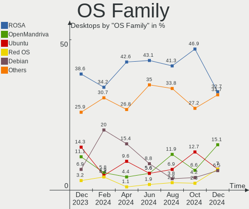
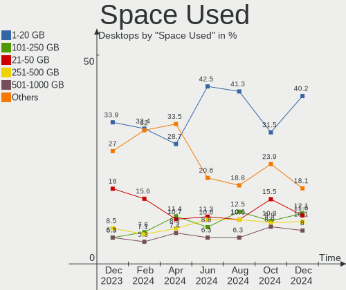
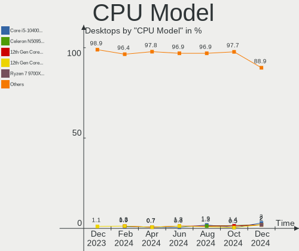
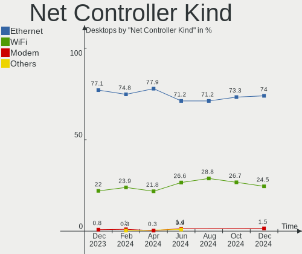
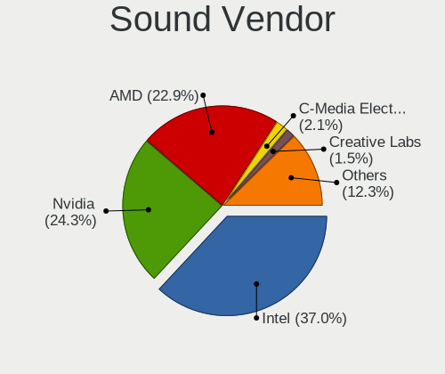
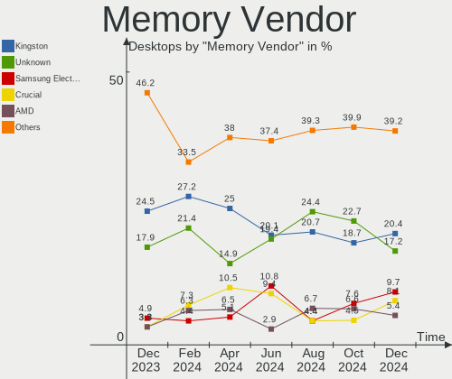

Linux in Russia - Hardware Trends (Desktops)
--------------------------------------------

A project to identify most popular hardware characteristics and track their change
over time based on data collected by Linux users at https://Linux-Hardware.org.

Anyone can contribute to this report by the [hw-probe](https://github.com/linuxhw/hw-probe) tool:

    sudo -E hw-probe -all -upload

Period: Aug, 2022.

Contents
--------

* [ System ](#system)
  - [ OS                       ](#os)
  - [ OS Family                ](#os-family)
  - [ Kernel                   ](#kernel)
  - [ Kernel Family            ](#kernel-family)
  - [ Kernel Major Ver.        ](#kernel-major-ver)
  - [ Arch                     ](#arch)
  - [ DE                       ](#de)
  - [ Display Server           ](#display-server)
  - [ Display Manager          ](#display-manager)
  - [ OS Lang                  ](#os-lang)
  - [ Boot Mode                ](#boot-mode)
  - [ Filesystem               ](#filesystem)
  - [ Part. scheme             ](#part-scheme)
  - [ Dual Boot with Linux/BSD ](#dual-boot-with-linuxbsd)
  - [ Dual Boot (Win)          ](#dual-boot-win)

* [ Board ](#board)
  - [ Vendor                   ](#vendor)
  - [ Model                    ](#model)
  - [ Model Family             ](#model-family)
  - [ MFG Year                 ](#mfg-year)
  - [ Form Factor              ](#form-factor)
  - [ Secure Boot              ](#secure-boot)
  - [ Coreboot                 ](#coreboot)
  - [ RAM Size                 ](#ram-size)
  - [ RAM Used                 ](#ram-used)
  - [ Total Drives             ](#total-drives)
  - [ Has CD-ROM               ](#has-cd-rom)
  - [ Has Ethernet             ](#has-ethernet)
  - [ Has WiFi                 ](#has-wifi)
  - [ Has Bluetooth            ](#has-bluetooth)

* [ Location ](#location)
  - [ Country                  ](#country)
  - [ City                     ](#city)

* [ Drives ](#drives)
  - [ Drive Vendor             ](#drive-vendor)
  - [ Drive Model              ](#drive-model)
  - [ HDD Vendor               ](#hdd-vendor)
  - [ SSD Vendor               ](#ssd-vendor)
  - [ Drive Kind               ](#drive-kind)
  - [ Drive Connector          ](#drive-connector)
  - [ Drive Size               ](#drive-size)
  - [ Space Total              ](#space-total)
  - [ Space Used               ](#space-used)
  - [ Malfunc. Drives          ](#malfunc-drives)
  - [ Malfunc. Drive Vendor    ](#malfunc-drive-vendor)
  - [ Malfunc. HDD Vendor      ](#malfunc-hdd-vendor)
  - [ Malfunc. Drive Kind      ](#malfunc-drive-kind)
  - [ Failed Drives            ](#failed-drives)
  - [ Failed Drive Vendor      ](#failed-drive-vendor)
  - [ Drive Status             ](#drive-status)

* [ Storage controller ](#storage-controller)
  - [ Storage Vendor           ](#storage-vendor)
  - [ Storage Model            ](#storage-model)
  - [ Storage Kind             ](#storage-kind)

* [ Processor ](#processor)
  - [ CPU Vendor               ](#cpu-vendor)
  - [ CPU Model                ](#cpu-model)
  - [ CPU Model Family         ](#cpu-model-family)
  - [ CPU Cores                ](#cpu-cores)
  - [ CPU Sockets              ](#cpu-sockets)
  - [ CPU Threads              ](#cpu-threads)
  - [ CPU Op-Modes             ](#cpu-op-modes)
  - [ CPU Microcode            ](#cpu-microcode)
  - [ CPU Microarch            ](#cpu-microarch)

* [ Graphics ](#graphics)
  - [ GPU Vendor               ](#gpu-vendor)
  - [ GPU Model                ](#gpu-model)
  - [ GPU Combo                ](#gpu-combo)
  - [ GPU Driver               ](#gpu-driver)
  - [ GPU Memory               ](#gpu-memory)

* [ Monitor ](#monitor)
  - [ Monitor Vendor           ](#monitor-vendor)
  - [ Monitor Model            ](#monitor-model)
  - [ Monitor Resolution       ](#monitor-resolution)
  - [ Monitor Diagonal         ](#monitor-diagonal)
  - [ Monitor Width            ](#monitor-width)
  - [ Aspect Ratio             ](#aspect-ratio)
  - [ Monitor Area             ](#monitor-area)
  - [ Pixel Density            ](#pixel-density)
  - [ Multiple Monitors        ](#multiple-monitors)

* [ Network ](#network)
  - [ Net Controller Vendor    ](#net-controller-vendor)
  - [ Net Controller Model     ](#net-controller-model)
  - [ Wireless Vendor          ](#wireless-vendor)
  - [ Wireless Model           ](#wireless-model)
  - [ Ethernet Vendor          ](#ethernet-vendor)
  - [ Ethernet Model           ](#ethernet-model)
  - [ Net Controller Kind      ](#net-controller-kind)
  - [ Used Controller          ](#used-controller)
  - [ NICs                     ](#nics)
  - [ IPv6                     ](#ipv6)

* [ Bluetooth ](#bluetooth)
  - [ Bluetooth Vendor         ](#bluetooth-vendor)
  - [ Bluetooth Model          ](#bluetooth-model)

* [ Sound ](#sound)
  - [ Sound Vendor             ](#sound-vendor)
  - [ Sound Model              ](#sound-model)

* [ Memory ](#memory)
  - [ Memory Vendor            ](#memory-vendor)
  - [ Memory Model             ](#memory-model)
  - [ Memory Kind              ](#memory-kind)
  - [ Memory Form Factor       ](#memory-form-factor)
  - [ Memory Size              ](#memory-size)
  - [ Memory Speed             ](#memory-speed)

* [ Printers & scanners ](#printers--scanners)
  - [ Printer Vendor           ](#printer-vendor)
  - [ Printer Model            ](#printer-model)
  - [ Scanner Vendor           ](#scanner-vendor)
  - [ Scanner Model            ](#scanner-model)

* [ Camera ](#camera)
  - [ Camera Vendor            ](#camera-vendor)
  - [ Camera Model             ](#camera-model)

* [ Security ](#security)
  - [ Fingerprint Vendor       ](#fingerprint-vendor)
  - [ Fingerprint Model        ](#fingerprint-model)
  - [ Chipcard Vendor          ](#chipcard-vendor)
  - [ Chipcard Model           ](#chipcard-model)

* [ Unsupported ](#unsupported)
  - [ Unsupported Devices      ](#unsupported-devices)
  - [ Unsupported Device Types ](#unsupported-device-types)

System
------

OS
--

Installed operating systems

| Name                        | Desktops | Percent |
|-----------------------------|----------|---------|
| ROSA 12.2                   | 87       | 42.44%  |
| Debian 11                   | 32       | 15.61%  |
| OpenMandriva 4.3            | 11       | 5.37%   |
| ROSA R11.1                  | 10       | 4.88%   |
| Fedora 36                   | 8        | 3.9%    |
| Ubuntu 22.04                | 6        | 2.93%   |
| Ubuntu 20.04                | 4        | 1.95%   |
| KDE neon 20.04              | 4        | 1.95%   |
| ROSA 12.1                   | 3        | 1.46%   |
| Linux Mint 21               | 3        | 1.46%   |
| Red OS 7.3.1                | 2        | 0.98%   |
| Red OS 7.3                  | 2        | 0.98%   |
| Manjaro                     | 2        | 0.98%   |
| Linux Mint 20.3             | 2        | 0.98%   |
| Gentoo 2.8                  | 2        | 0.98%   |
| Arch Rolling                | 2        | 0.98%   |
| Xubuntu 22.04               | 1        | 0.49%   |
| Xero Rolling                | 1        | 0.49%   |
| Ubuntu MATE 20.04           | 1        | 0.49%   |
| Ubuntu 22.10                | 1        | 0.49%   |
| ROSA R12                    | 1        | 0.49%   |
| ROSA R11                    | 1        | 0.49%   |
| ROSA 12                     | 1        | 0.49%   |
| org.kde.Platform 5.15-21.08 | 1        | 0.49%   |
| OpenMandriva 4.90           | 1        | 0.49%   |
| Nobara 36                   | 1        | 0.49%   |
| Manjaro 22.0.0              | 1        | 0.49%   |
| Manjaro 21.3.7              | 1        | 0.49%   |
| Manjaro 21.3.6              | 1        | 0.49%   |
| LMDE 5                      | 1        | 0.49%   |
| Linux Mint 20               | 1        | 0.49%   |
| Kometa 1                    | 1        | 0.49%   |
| Kali 2022.3                 | 1        | 0.49%   |
| Fedora 34                   | 1        | 0.49%   |
| EndeavourOS Rolling         | 1        | 0.49%   |
| Debian Unstable             | 1        | 0.49%   |
| CentOS 7                    | 1        | 0.49%   |
| ArcoLinux Rolling           | 1        | 0.49%   |
| Arch                        | 1        | 0.49%   |
| ALT Linux 20220110          | 1        | 0.49%   |
| ALT Linux 10.0.900          | 1        | 0.49%   |

OS Family
---------

OS without a version

| Name             | Desktops | Percent |
|------------------|----------|---------|
| ROSA             | 103      | 50.24%  |
| Debian           | 33       | 16.1%   |
| OpenMandriva     | 12       | 5.85%   |
| Ubuntu           | 11       | 5.37%   |
| Fedora           | 9        | 4.39%   |
| Linux Mint       | 6        | 2.93%   |
| Manjaro          | 5        | 2.44%   |
| Red OS           | 4        | 1.95%   |
| KDE neon         | 4        | 1.95%   |
| Arch             | 3        | 1.46%   |
| ALT Linux        | 3        | 1.46%   |
| Gentoo           | 2        | 0.98%   |
| Xubuntu          | 1        | 0.49%   |
| Xero             | 1        | 0.49%   |
| Ubuntu MATE      | 1        | 0.49%   |
| org.kde.Platform | 1        | 0.49%   |
| Nobara           | 1        | 0.49%   |
| LMDE             | 1        | 0.49%   |
| Kali             | 1        | 0.49%   |
| EndeavourOS      | 1        | 0.49%   |
| CentOS           | 1        | 0.49%   |
| ArcoLinux        | 1        | 0.49%   |

Kernel
------

Version of the Linux kernel

| Version                                        | Desktops | Percent |
|------------------------------------------------|----------|---------|
| 5.10.74-generic-2rosa2021.1-x86_64             | 38       | 18.54%  |
| 5.10.118-generic-2rosa2021.1-x86_64            | 33       | 16.1%   |
| 5.10.0-7-amd64                                 | 25       | 12.2%   |
| 5.16.7-desktop-1omv4003                        | 11       | 5.37%   |
| 5.15.0-46-generic                              | 11       | 5.37%   |
| 5.15.43-generic-2rosa2021.1-x86_64             | 7        | 3.41%   |
| 5.15.0-43-generic                              | 6        | 2.93%   |
| 5.10.0-16-amd64                                | 5        | 2.44%   |
| 4.15.0-desktop-122.124.1rosa-x86_64            | 5        | 2.44%   |
| 5.18.16-200.fc36.x86_64                        | 3        | 1.46%   |
| 5.17.11-generic-2rosa2021.1-x86_64             | 3        | 1.46%   |
| 5.15.53.xm1-1.klp-xanmod-lts-rosa2021.1-x86_64 | 3        | 1.46%   |
| 5.15.35-4.el7.3.x86_64                         | 3        | 1.46%   |
| 5.18.13-200.fc36.x86_64                        | 2        | 0.98%   |
| 5.10.74-generic-2rosa2021.1-i586               | 2        | 0.98%   |
| 5.10.0-17-amd64                                | 2        | 0.98%   |
| 6.0.0-1-MANJARO                                | 1        | 0.49%   |
| 5.4.83-generic-2rosa-x86_64                    | 1        | 0.49%   |
| 5.4.83-generic-2rosa-i586                      | 1        | 0.49%   |
| 5.4.32-generic-2rosa-x86_64                    | 1        | 0.49%   |
| 5.4.32-generic-2rosa-i586                      | 1        | 0.49%   |
| 5.4.182-generic-1rosa2021.1-e2kv4              | 1        | 0.49%   |
| 5.4.0-26-generic                               | 1        | 0.49%   |
| 5.4.0-125-generic                              | 1        | 0.49%   |
| 5.19.4-arch1-1                                 | 1        | 0.49%   |
| 5.19.3-arch1-1                                 | 1        | 0.49%   |
| 5.19.1-gentoo-a6                               | 1        | 0.49%   |
| 5.19.1-3-MANJARO                               | 1        | 0.49%   |
| 5.19.0-2-MANJARO                               | 1        | 0.49%   |
| 5.19.0-15-generic                              | 1        | 0.49%   |
| 5.18.9-desktop-gcc-1omv4090                    | 1        | 0.49%   |
| 5.18.9-arch1-1                                 | 1        | 0.49%   |
| 5.18.19-201.fsync.fc36.x86_64                  | 1        | 0.49%   |
| 5.18.19-200.fc36.x86_64                        | 1        | 0.49%   |
| 5.18.18.xm1-1-xanmod-rosa2021.1-x86_64         | 1        | 0.49%   |
| 5.18.17-200.fc36.x86_64                        | 1        | 0.49%   |
| 5.18.16-un-def-alt1                            | 1        | 0.49%   |
| 5.18.16-arch1-1                                | 1        | 0.49%   |
| 5.18.15.xm1-1.klp-xanmod-rosa2021.1-x86_64     | 1        | 0.49%   |
| 5.18.15-zen1-1-zen                             | 1        | 0.49%   |
| 5.18.15-200.fc36.x86_64                        | 1        | 0.49%   |
| 5.18.14-1-MANJARO                              | 1        | 0.49%   |
| 5.18.0-kali5-amd64                             | 1        | 0.49%   |
| 5.18.0-4-amd64                                 | 1        | 0.49%   |
| 5.17.12-100.fc34.x86_64                        | 1        | 0.49%   |
| 5.15.59-2-lts                                  | 1        | 0.49%   |
| 5.15.59-1-MANJARO                              | 1        | 0.49%   |
| 5.15.59                                        | 1        | 0.49%   |
| 5.15.52-gentoo-dist                            | 1        | 0.49%   |
| 5.15.39-4-pve                                  | 1        | 0.49%   |
| 5.15.35-1.el7.3.x86_64                         | 1        | 0.49%   |
| 5.15.0-47-generic                              | 1        | 0.49%   |
| 5.15.0-41-generic                              | 1        | 0.49%   |
| 5.15.0-33-generic                              | 1        | 0.49%   |
| 5.10.71-generic-1rosa2021.1-x86_64             | 1        | 0.49%   |
| 5.10.56-generic-1rosa2021.1-x86_64             | 1        | 0.49%   |
| 5.10.133-std-def-alt1                          | 1        | 0.49%   |
| 5.10.118-generic-2rosa2021.1-i586              | 1        | 0.49%   |
| 4.9.155-nrj-desktop-1rosa-x86_64               | 1        | 0.49%   |
| 4.19.102-std-def-alt1                          | 1        | 0.49%   |

Kernel Family
-------------

Linux kernel without a distro release

| Version  | Desktops | Percent |
|----------|----------|---------|
| 5.10.74  | 40       | 19.51%  |
| 5.10.118 | 34       | 16.59%  |
| 5.10.0   | 32       | 15.61%  |
| 5.15.0   | 20       | 9.76%   |
| 5.16.7   | 11       | 5.37%   |
| 5.15.43  | 7        | 3.41%   |
| 4.15.0   | 6        | 2.93%   |
| 5.18.16  | 5        | 2.44%   |
| 5.15.35  | 4        | 1.95%   |
| 5.18.15  | 3        | 1.46%   |
| 5.17.11  | 3        | 1.46%   |
| 5.15.59  | 3        | 1.46%   |
| 5.15.53  | 3        | 1.46%   |
| 5.4.83   | 2        | 0.98%   |
| 5.4.32   | 2        | 0.98%   |
| 5.4.0    | 2        | 0.98%   |
| 5.19.1   | 2        | 0.98%   |
| 5.19.0   | 2        | 0.98%   |
| 5.18.9   | 2        | 0.98%   |
| 5.18.19  | 2        | 0.98%   |
| 5.18.13  | 2        | 0.98%   |
| 5.18.0   | 2        | 0.98%   |
| 6.0.0    | 1        | 0.49%   |
| 5.4.182  | 1        | 0.49%   |
| 5.19.4   | 1        | 0.49%   |
| 5.19.3   | 1        | 0.49%   |
| 5.18.18  | 1        | 0.49%   |
| 5.18.17  | 1        | 0.49%   |
| 5.18.14  | 1        | 0.49%   |
| 5.17.12  | 1        | 0.49%   |
| 5.15.52  | 1        | 0.49%   |
| 5.15.39  | 1        | 0.49%   |
| 5.10.71  | 1        | 0.49%   |
| 5.10.56  | 1        | 0.49%   |
| 5.10.133 | 1        | 0.49%   |
| 4.9.155  | 1        | 0.49%   |
| 4.19.102 | 1        | 0.49%   |
| 4.14.35  | 1        | 0.49%   |

Kernel Major Ver.
-----------------

Linux kernel major version

| Version | Desktops | Percent |
|---------|----------|---------|
| 5.10    | 109      | 53.17%  |
| 5.15    | 39       | 19.02%  |
| 5.18    | 19       | 9.27%   |
| 5.16    | 11       | 5.37%   |
| 5.4     | 7        | 3.41%   |
| 5.19    | 6        | 2.93%   |
| 4.15    | 6        | 2.93%   |
| 5.17    | 4        | 1.95%   |
| 6.0     | 1        | 0.49%   |
| 4.9     | 1        | 0.49%   |
| 4.19    | 1        | 0.49%   |
| 4.14    | 1        | 0.49%   |

Arch
----

OS architecture (x86_64, i586, etc.)

| Name   | Desktops | Percent |
|--------|----------|---------|
| x86_64 | 199      | 97.07%  |
| i686   | 5        | 2.44%   |
| e2k    | 1        | 0.49%   |

DE
--

Desktop Environment

| Name       | Desktops | Percent |
|------------|----------|---------|
| GNOME      | 72       | 35.12%  |
| KDE5       | 67       | 32.68%  |
| Unknown    | 30       | 14.63%  |
| LXQt       | 9        | 4.39%   |
| KDE4       | 7        | 3.41%   |
| X-Cinnamon | 6        | 2.93%   |
| MATE       | 6        | 2.93%   |
| XFCE       | 5        | 2.44%   |
| Cinnamon   | 2        | 0.98%   |
| awesome    | 1        | 0.49%   |

Display Server
--------------

X11 or Wayland

| Name    | Desktops | Percent |
|---------|----------|---------|
| X11     | 90       | 43.9%   |
| Wayland | 87       | 42.44%  |
| Unknown | 25       | 12.2%   |
| Tty     | 3        | 1.46%   |

Display Manager
---------------

SDDM, LightDM, etc.

| Name    | Desktops | Percent |
|---------|----------|---------|
| GDM     | 66       | 32.2%   |
| SDDM    | 62       | 30.24%  |
| Unknown | 46       | 22.44%  |
| LightDM | 16       | 7.8%    |
| GDM3    | 8        | 3.9%    |
| KDM     | 7        | 3.41%   |

OS Lang
-------

Language

| Lang    | Desktops | Percent |
|---------|----------|---------|
| ru_RU   | 179      | 87.32%  |
| en_US   | 19       | 9.27%   |
| Unknown | 5        | 2.44%   |
| C       | 1        | 0.49%   |
| ba_RU   | 1        | 0.49%   |

Boot Mode
---------

EFI or BIOS

| Mode | Desktops | Percent |
|------|----------|---------|
| BIOS | 118      | 57.56%  |
| EFI  | 87       | 42.44%  |

Filesystem
----------

Type of filesystem

| Type    | Desktops | Percent |
|---------|----------|---------|
| Ext4    | 145      | 70.73%  |
| Overlay | 40       | 19.51%  |
| Btrfs   | 16       | 7.8%    |
| Zfs     | 1        | 0.49%   |
| Xfs     | 1        | 0.49%   |
| F2fs    | 1        | 0.49%   |
| Ext2    | 1        | 0.49%   |

Part. scheme
------------

Scheme of partitioning

| Type    | Desktops | Percent |
|---------|----------|---------|
| GPT     | 109      | 53.17%  |
| MBR     | 73       | 35.61%  |
| Unknown | 23       | 11.22%  |

Dual Boot with Linux/BSD
------------------------

Hosting more than one Linux/BSD

| Dual boot | Desktops | Percent |
|-----------|----------|---------|
| No        | 156      | 76.1%   |
| Yes       | 49       | 23.9%   |

Dual Boot (Win)
---------------

Hosting Linux and Windows

| Dual boot | Desktops | Percent |
|-----------|----------|---------|
| Yes       | 114      | 55.61%  |
| No        | 91       | 44.39%  |

Board
-----

Vendor
------

Motherboard manufacturer

| Name                | Desktops | Percent |
|---------------------|----------|---------|
| ASUSTek Computer    | 63       | 30.73%  |
| Gigabyte Technology | 48       | 23.41%  |
| MSI                 | 29       | 14.15%  |
| ASRock              | 29       | 14.15%  |
| ECS                 | 5        | 2.44%   |
| Dell                | 5        | 2.44%   |
| Intel               | 4        | 1.95%   |
| Huanan              | 4        | 1.95%   |
| Hewlett-Packard     | 3        | 1.46%   |
| MACHINIST           | 2        | 0.98%   |
| Foxconn             | 2        | 0.98%   |
| Unknown             | 2        | 0.98%   |
| win element         | 1        | 0.49%   |
| Soyo                | 1        | 0.49%   |
| Pegatron            | 1        | 0.49%   |
| KupiDeshego Edition | 1        | 0.49%   |
| Koloe               | 1        | 0.49%   |
| Biostar             | 1        | 0.49%   |
| AZW                 | 1        | 0.49%   |
| Aquarius            | 1        | 0.49%   |
| Acer                | 1        | 0.49%   |

Model
-----

Motherboard model

| Name                                                                 | Desktops | Percent |
|----------------------------------------------------------------------|----------|---------|
| ASUS All Series                                                      | 5        | 2.44%   |
| MSI MS-7996                                                          | 3        | 1.46%   |
| ECS G31T-M9                                                          | 3        | 1.46%   |
| MSI MS-7D22                                                          | 2        | 0.98%   |
| MSI MS-7C94                                                          | 2        | 0.98%   |
| MSI MS-7817                                                          | 2        | 0.98%   |
| Intel X99                                                            | 2        | 0.98%   |
| Gigabyte H110M-S2V                                                   | 2        | 0.98%   |
| Gigabyte B550M S2H                                                   | 2        | 0.98%   |
| Gigabyte B450 GAMING X                                               | 2        | 0.98%   |
| Gigabyte B360M-HD3                                                   | 2        | 0.98%   |
| ASUS SABERTOOTH 990FX R2.0                                           | 2        | 0.98%   |
| ASUS PRIME Z370-P                                                    | 2        | 0.98%   |
| ASUS P8H67-M LE                                                      | 2        | 0.98%   |
| ASUS P8H61-M LX3                                                     | 2        | 0.98%   |
| ASRock H110M-DGS R3.0                                                | 2        | 0.98%   |
| ASRock 970 Pro3 R2.0                                                 | 2        | 0.98%   |
| Unknown                                                              | 2        | 0.98%   |
| win element M1K                                                      | 1        | 0.49%   |
| Soyo SY-Classic B660M                                                | 1        | 0.49%   |
| Pegatron IPX41-D3                                                    | 1        | 0.49%   |
| MSI MS-7D20                                                          | 1        | 0.49%   |
| MSI MS-7D13                                                          | 1        | 0.49%   |
| MSI MS-7D09                                                          | 1        | 0.49%   |
| MSI MS-7C56                                                          | 1        | 0.49%   |
| MSI MS-7C02                                                          | 1        | 0.49%   |
| MSI MS-7B98                                                          | 1        | 0.49%   |
| MSI MS-7B93                                                          | 1        | 0.49%   |
| MSI MS-7B87                                                          | 1        | 0.49%   |
| MSI MS-7B77                                                          | 1        | 0.49%   |
| MSI MS-7B53                                                          | 1        | 0.49%   |
| MSI MS-7B38                                                          | 1        | 0.49%   |
| MSI MS-7A74                                                          | 1        | 0.49%   |
| MSI MS-7971                                                          | 1        | 0.49%   |
| MSI MS-7851                                                          | 1        | 0.49%   |
| MSI MS-7816                                                          | 1        | 0.49%   |
| MSI MS-7641                                                          | 1        | 0.49%   |
| MSI MS-7610                                                          | 1        | 0.49%   |
| MSI MS-7599                                                          | 1        | 0.49%   |
| MSI MS-7592                                                          | 1        | 0.49%   |
| MSI MS-7529                                                          | 1        | 0.49%   |
| MACHINIST X99-RS9 V2.0                                               | 1        | 0.49%   |
| MACHINIST X99-K9 V2.0                                                | 1        | 0.49%   |
| KupiDeshego Edition Intel X79 lga 2011                               | 1        | 0.49%   |
| Koloe Thurley                                                        | 1        | 0.49%   |
| Intel DG33BU AAD79951-408                                            | 1        | 0.49%   |
| Intel D525MWV AAE93081-401                                           | 1        | 0.49%   |
| Huanan X99-F8D V2.4                                                  | 1        | 0.49%   |
| Huanan X99 F8D V2.2                                                  | 1        | 0.49%   |
| Huanan X79 PLUS V6.11                                                | 1        | 0.49%   |
| Huanan X79 INTEL (INTEL Xeon E5/Corei7 DMI2 - C600/C200 Cipset V3.4C | 1        | 0.49%   |
| HP Desktop M01-F1xxx                                                 | 1        | 0.49%   |
| HP Compaq 6000 Pro SFF PC                                            | 1        | 0.49%   |
| HP 260 G2 DM                                                         | 1        | 0.49%   |
| Gigabyte Z77P-D3                                                     | 1        | 0.49%   |
| Gigabyte Z590 UD AC                                                  | 1        | 0.49%   |
| Gigabyte Z170X-Gaming 3                                              | 1        | 0.49%   |
| Gigabyte Z170-HD3P-CF                                                | 1        | 0.49%   |
| Gigabyte Z170-D3H                                                    | 1        | 0.49%   |
| Gigabyte X58-USB3                                                    | 1        | 0.49%   |

Model Family
------------

Motherboard model prefix

| Name                      | Desktops | Percent |
|---------------------------|----------|---------|
| ASUS PRIME                | 9        | 4.39%   |
| ASUS TUF                  | 5        | 2.44%   |
| ASUS All                  | 5        | 2.44%   |
| Gigabyte B550M            | 4        | 1.95%   |
| Gigabyte B450             | 4        | 1.95%   |
| MSI MS-7996               | 3        | 1.46%   |
| ECS G31T-M9               | 3        | 1.46%   |
| ASUS ROG                  | 3        | 1.46%   |
| ASUS P8H61-M              | 3        | 1.46%   |
| MSI MS-7D22               | 2        | 0.98%   |
| MSI MS-7C94               | 2        | 0.98%   |
| MSI MS-7817               | 2        | 0.98%   |
| Intel X99                 | 2        | 0.98%   |
| Huanan X79                | 2        | 0.98%   |
| Gigabyte H110M-S2V        | 2        | 0.98%   |
| Gigabyte B360M-HD3        | 2        | 0.98%   |
| Dell OptiPlex             | 2        | 0.98%   |
| ASUS SABERTOOTH           | 2        | 0.98%   |
| ASUS P8Z77-V              | 2        | 0.98%   |
| ASUS P8H77-V              | 2        | 0.98%   |
| ASUS P8H67-M              | 2        | 0.98%   |
| ASUS P8H61-MX             | 2        | 0.98%   |
| ASRock H110M-DGS          | 2        | 0.98%   |
| ASRock 970                | 2        | 0.98%   |
| Unknown                   | 2        | 0.98%   |
| win element M1K           | 1        | 0.49%   |
| Soyo SY-Classic           | 1        | 0.49%   |
| Pegatron IPX41-D3         | 1        | 0.49%   |
| MSI MS-7D20               | 1        | 0.49%   |
| MSI MS-7D13               | 1        | 0.49%   |
| MSI MS-7D09               | 1        | 0.49%   |
| MSI MS-7C56               | 1        | 0.49%   |
| MSI MS-7C02               | 1        | 0.49%   |
| MSI MS-7B98               | 1        | 0.49%   |
| MSI MS-7B93               | 1        | 0.49%   |
| MSI MS-7B87               | 1        | 0.49%   |
| MSI MS-7B77               | 1        | 0.49%   |
| MSI MS-7B53               | 1        | 0.49%   |
| MSI MS-7B38               | 1        | 0.49%   |
| MSI MS-7A74               | 1        | 0.49%   |
| MSI MS-7971               | 1        | 0.49%   |
| MSI MS-7851               | 1        | 0.49%   |
| MSI MS-7816               | 1        | 0.49%   |
| MSI MS-7641               | 1        | 0.49%   |
| MSI MS-7610               | 1        | 0.49%   |
| MSI MS-7599               | 1        | 0.49%   |
| MSI MS-7592               | 1        | 0.49%   |
| MSI MS-7529               | 1        | 0.49%   |
| MACHINIST X99-RS9         | 1        | 0.49%   |
| MACHINIST X99-K9          | 1        | 0.49%   |
| KupiDeshego Edition Intel | 1        | 0.49%   |
| Koloe Thurley             | 1        | 0.49%   |
| Intel DG33BU              | 1        | 0.49%   |
| Intel D525MWV             | 1        | 0.49%   |
| Huanan X99-F8D            | 1        | 0.49%   |
| Huanan X99                | 1        | 0.49%   |
| HP Desktop                | 1        | 0.49%   |
| HP Compaq                 | 1        | 0.49%   |
| HP 260                    | 1        | 0.49%   |
| Gigabyte Z77P-D3          | 1        | 0.49%   |

MFG Year
--------

Motherboard manufacture year

| Year    | Desktops | Percent |
|---------|----------|---------|
| 2018    | 23       | 11.22%  |
| 2012    | 22       | 10.73%  |
| 2013    | 20       | 9.76%   |
| 2021    | 18       | 8.78%   |
| 2009    | 18       | 8.78%   |
| 2020    | 17       | 8.29%   |
| 2019    | 13       | 6.34%   |
| 2016    | 13       | 6.34%   |
| 2011    | 12       | 5.85%   |
| 2010    | 12       | 5.85%   |
| 2017    | 9        | 4.39%   |
| 2015    | 9        | 4.39%   |
| 2007    | 6        | 2.93%   |
| 2022    | 5        | 2.44%   |
| 2014    | 4        | 1.95%   |
| 2008    | 3        | 1.46%   |
| Unknown | 1        | 0.49%   |

Form Factor
-----------

Physical design of the computer

| Name    | Desktops | Percent |
|---------|----------|---------|
| Desktop | 205      | 100%    |

Secure Boot
-----------

Enabled or disabled

| State    | Desktops | Percent |
|----------|----------|---------|
| Disabled | 204      | 99.51%  |
| Enabled  | 1        | 0.49%   |

Coreboot
--------

Have coreboot on board

| Used | Desktops | Percent |
|------|----------|---------|
| No   | 205      | 100%    |

RAM Size
--------

Total RAM memory

| Size in GB  | Desktops | Percent |
|-------------|----------|---------|
| 16.01-24.0  | 48       | 23.41%  |
| 8.01-16.0   | 47       | 22.93%  |
| 3.01-4.0    | 35       | 17.07%  |
| 4.01-8.0    | 26       | 12.68%  |
| 32.01-64.0  | 25       | 12.2%   |
| 1.01-2.0    | 10       | 4.88%   |
| 24.01-32.0  | 6        | 2.93%   |
| 64.01-256.0 | 5        | 2.44%   |
| 2.01-3.0    | 3        | 1.46%   |

RAM Used
--------

Used RAM memory

| Used GB     | Desktops | Percent |
|-------------|----------|---------|
| 1.01-2.0    | 93       | 45.37%  |
| 0.51-1.0    | 48       | 23.41%  |
| 4.01-8.0    | 20       | 9.76%   |
| 2.01-3.0    | 20       | 9.76%   |
| 3.01-4.0    | 17       | 8.29%   |
| 8.01-16.0   | 3        | 1.46%   |
| 0.01-0.5    | 2        | 0.98%   |
| 64.01-256.0 | 1        | 0.49%   |
| 16.01-24.0  | 1        | 0.49%   |

Total Drives
------------

Number of drives on board

| Drives | Desktops | Percent |
|--------|----------|---------|
| 1      | 86       | 41.95%  |
| 2      | 53       | 25.85%  |
| 3      | 36       | 17.56%  |
| 4      | 15       | 7.32%   |
| 5      | 11       | 5.37%   |
| 6      | 3        | 1.46%   |
| 7      | 1        | 0.49%   |

Has CD-ROM
----------

Has CD-ROM on board

| Presented | Desktops | Percent |
|-----------|----------|---------|
| No        | 154      | 75.12%  |
| Yes       | 51       | 24.88%  |

Has Ethernet
------------

Has Ethernet on board

| Presented | Desktops | Percent |
|-----------|----------|---------|
| Yes       | 204      | 99.51%  |
| No        | 1        | 0.49%   |

Has WiFi
--------

Has WiFi module

| Presented | Desktops | Percent |
|-----------|----------|---------|
| No        | 151      | 73.66%  |
| Yes       | 54       | 26.34%  |

Has Bluetooth
-------------

Has Bluetooth module

| Presented | Desktops | Percent |
|-----------|----------|---------|
| No        | 143      | 69.76%  |
| Yes       | 62       | 30.24%  |

Location
--------

Country
-------

Geographic location (country)

| Country | Desktops | Percent |
|---------|----------|---------|
| Russia  | 205      | 100%    |

City
----

Geographic location (city)

| City                | Desktops | Percent |
|---------------------|----------|---------|
| Moscow              | 42       | 20.49%  |
| Voronezh            | 25       | 12.2%   |
| St Petersburg       | 10       | 4.88%   |
| Samara              | 6        | 2.93%   |
| Rostov-on-Don       | 6        | 2.93%   |
| Novosibirsk         | 6        | 2.93%   |
| Yekaterinburg       | 5        | 2.44%   |
| Stavropol           | 4        | 1.95%   |
| Perm                | 4        | 1.95%   |
| Omsk                | 4        | 1.95%   |
| Nizhniy Novgorod    | 4        | 1.95%   |
| Krasnodar           | 4        | 1.95%   |
| Yoshkar-Ola         | 3        | 1.46%   |
| Ufa                 | 3        | 1.46%   |
| Salekhard           | 3        | 1.46%   |
| Chelyabinsk         | 3        | 1.46%   |
| Volgograd           | 2        | 0.98%   |
| Vladimir            | 2        | 0.98%   |
| Ulyanovsk           | 2        | 0.98%   |
| Saratov             | 2        | 0.98%   |
| Ryazan              | 2        | 0.98%   |
| Novokuznetsk        | 2        | 0.98%   |
| Noril'sk            | 2        | 0.98%   |
| Murmansk            | 2        | 0.98%   |
| Kamenetskiy         | 2        | 0.98%   |
| Barnaul             | 2        | 0.98%   |
| Astrakhan           | 2        | 0.98%   |
| Zlatoust            | 1        | 0.49%   |
| Zhukovskiy          | 1        | 0.49%   |
| Zhirnovsk           | 1        | 0.49%   |
| Zheleznogorsk       | 1        | 0.49%   |
| Yelets              | 1        | 0.49%   |
| Yaroslavl           | 1        | 0.49%   |
| Vorkuta             | 1        | 0.49%   |
| Vologda             | 1        | 0.49%   |
| Vladivostok         | 1        | 0.49%   |
| Vidnoye             | 1        | 0.49%   |
| Verkhnyaya Pyshma   | 1        | 0.49%   |
| Tomsk               | 1        | 0.49%   |
| Tambov              | 1        | 0.49%   |
| Surgut              | 1        | 0.49%   |
| Shchelkovo          | 1        | 0.49%   |
| Shadrinsk           | 1        | 0.49%   |
| Severomorsk         | 1        | 0.49%   |
| Serpukhov           | 1        | 0.49%   |
| Saransk             | 1        | 0.49%   |
| Rubtsovsk           | 1        | 0.49%   |
| Rossosh'            | 1        | 0.49%   |
| Roslavl'            | 1        | 0.49%   |
| Petrozavodsk        | 1        | 0.49%   |
| Pervouralsk         | 1        | 0.49%   |
| Osa                 | 1        | 0.49%   |
| Orenburg            | 1        | 0.49%   |
| Orekhovo-Zuyevo     | 1        | 0.49%   |
| Odintsovo           | 1        | 0.49%   |
| Obninsk             | 1        | 0.49%   |
| Novocherkassk       | 1        | 0.49%   |
| Nizhny Tagil        | 1        | 0.49%   |
| Nizhnevartovsk      | 1        | 0.49%   |
| Naberezhnyye Chelny | 1        | 0.49%   |

Drives
------

Drive Vendor
------------

Hard drive vendors

| Vendor                      | Desktops | Drives | Percent |
|-----------------------------|----------|--------|---------|
| WDC                         | 77       | 102    | 20.59%  |
| Seagate                     | 70       | 86     | 18.72%  |
| Samsung Electronics         | 37       | 43     | 9.89%   |
| Toshiba                     | 25       | 30     | 6.68%   |
| Kingston                    | 18       | 21     | 4.81%   |
| Hitachi                     | 16       | 17     | 4.28%   |
| China                       | 11       | 13     | 2.94%   |
| SPCC                        | 10       | 10     | 2.67%   |
| Apacer                      | 10       | 10     | 2.67%   |
| A-DATA Technology           | 10       | 13     | 2.67%   |
| Crucial                     | 8        | 10     | 2.14%   |
| Plextor                     | 5        | 5      | 1.34%   |
| Intel                       | 5        | 5      | 1.34%   |
| Silicon Motion              | 4        | 4      | 1.07%   |
| Patriot                     | 4        | 4      | 1.07%   |
| Netac                       | 4        | 4      | 1.07%   |
| Gigabyte Technology         | 4        | 4      | 1.07%   |
| AMD                         | 4        | 4      | 1.07%   |
| Unknown                     | 4        | 4      | 1.07%   |
| XPG                         | 3        | 3      | 0.8%    |
| Transcend                   | 3        | 3      | 0.8%    |
| Smartbuy                    | 3        | 3      | 0.8%    |
| OCZ                         | 3        | 3      | 0.8%    |
| HGST                        | 3        | 3      | 0.8%    |
| GOODRAM                     | 3        | 3      | 0.8%    |
| WALRAM                      | 2        | 2      | 0.53%   |
| Unknown                     | 2        | 3      | 0.53%   |
| Maxtor                      | 2        | 2      | 0.53%   |
| MAXIO Technology (Hangzhou) | 2        | 2      | 0.53%   |
| KingSpec                    | 2        | 2      | 0.53%   |
| Hewlett-Packard             | 2        | 2      | 0.53%   |
| XrayDisk                    | 1        | 1      | 0.27%   |
| UNIC2                       | 1        | 1      | 0.27%   |
| Teclast                     | 1        | 1      | 0.27%   |
| Team                        | 1        | 1      | 0.27%   |
| SK hynix                    | 1        | 1      | 0.27%   |
| SanDisk                     | 1        | 1      | 0.27%   |
| Phison Electronics          | 1        | 2      | 0.27%   |
| Palit                       | 1        | 1      | 0.27%   |
| NGFF                        | 1        | 1      | 0.27%   |
| Kllisre                     | 1        | 1      | 0.27%   |
| KIOXIA-EXCERIA              | 1        | 1      | 0.27%   |
| KIOXIA                      | 1        | 1      | 0.27%   |
| Kingston Technology Company | 1        | 1      | 0.27%   |
| Kingchuxing                 | 1        | 1      | 0.27%   |
| External                    | 1        | 1      | 0.27%   |
| Colorful                    | 1        | 1      | 0.27%   |
| Apple                       | 1        | 1      | 0.27%   |
| AirDisk                     | 1        | 1      | 0.27%   |

Drive Model
-----------

Hard drive models

| Model                                | Desktops | Percent |
|--------------------------------------|----------|---------|
| WDC WDS500G2B0A-00SM50 500GB SSD     | 6        | 1.42%   |
| WDC WDS240G2G0A-00JH30 240GB SSD     | 6        | 1.42%   |
| Toshiba DT01ACA050 500GB             | 6        | 1.42%   |
| SPCC Solid State Disk 128GB          | 6        | 1.42%   |
| Seagate ST500DM002-1BD142 500GB      | 6        | 1.42%   |
| Apacer AS350 128GB SSD               | 6        | 1.42%   |
| WDC WD10EZEX-08WN4A0 1TB             | 5        | 1.18%   |
| Toshiba HDWD105 500GB                | 5        | 1.18%   |
| Seagate ST250DM000-1BD141 250GB      | 5        | 1.18%   |
| WDC WD20EARS-00MVWB0 2TB             | 4        | 0.95%   |
| Toshiba HDWD110 1TB                  | 4        | 0.95%   |
| Seagate ST3250318AS 250GB            | 4        | 0.95%   |
| Seagate ST1000DM010-2EP102 1TB       | 4        | 0.95%   |
| Seagate ST1000DM003-1CH162 1TB       | 4        | 0.95%   |
| Kingston SV300S37A120G 120GB SSD     | 4        | 0.95%   |
| Unknown                              | 4        | 0.95%   |
| WDC WD5000AAKX-001CA0 500GB          | 3        | 0.71%   |
| WDC WD20EFRX-68EUZN0 2TB             | 3        | 0.71%   |
| WDC WD10EZRZ-00HTKB0 1TB             | 3        | 0.71%   |
| Toshiba DT01ACA100 1TB               | 3        | 0.71%   |
| SPCC Solid State Disk 120GB          | 3        | 0.71%   |
| Seagate ST3160815AS 160GB            | 3        | 0.71%   |
| Seagate ST1000LM024 HN-M101MBB 1TB   | 3        | 0.71%   |
| Seagate Expansion 500GB              | 3        | 0.71%   |
| Samsung SSD 860 EVO 250GB            | 3        | 0.71%   |
| Kingston SA400S37120G 120GB SSD      | 3        | 0.71%   |
| Hitachi HDS721050CLA362 500GB        | 3        | 0.71%   |
| China 120GB SSD                      | 3        | 0.71%   |
| XPG NVMe SSD Drive 256GB             | 2        | 0.47%   |
| WDC WDS120G2G0A-00JH30 120GB SSD     | 2        | 0.47%   |
| WDC WD5000AADS-00S9B0 500GB          | 2        | 0.47%   |
| WDC WD30EFRX-68EUZN0 3TB             | 2        | 0.47%   |
| WDC WD10SPZX-00Z10T0 1TB             | 2        | 0.47%   |
| WDC WD10EZEX-75M2NA0 1TB             | 2        | 0.47%   |
| WDC WD10EZEX-21M2NA0 1TB             | 2        | 0.47%   |
| WDC WD1002FAEX-00Z3A0 1TB            | 2        | 0.47%   |
| Toshiba HDWD130 3TB                  | 2        | 0.47%   |
| Smartbuy SSD 120GB                   | 2        | 0.47%   |
| Silicon Motion NE-256 256GB          | 2        | 0.47%   |
| Seagate ST500LM012 HN-M500MBB 500GB  | 2        | 0.47%   |
| Seagate ST500DM009-2F110A 500GB      | 2        | 0.47%   |
| Seagate ST3500418AS 500GB            | 2        | 0.47%   |
| Seagate ST31000524AS 1TB             | 2        | 0.47%   |
| Seagate ST2000DM006-2DM164 2TB       | 2        | 0.47%   |
| Seagate ST1000DM003-9YN162 1TB       | 2        | 0.47%   |
| Samsung SSD 860 EVO M.2 500GB        | 2        | 0.47%   |
| Samsung SSD 860 EVO 500GB            | 2        | 0.47%   |
| Samsung SSD 850 PRO 256GB            | 2        | 0.47%   |
| Samsung SSD 850 PRO 128GB            | 2        | 0.47%   |
| Samsung NVMe SSD Drive 250GB         | 2        | 0.47%   |
| Samsung NVMe SSD Drive 1TB           | 2        | 0.47%   |
| Netac SSD 240GB                      | 2        | 0.47%   |
| Kingston SA400S37480G 480GB SSD      | 2        | 0.47%   |
| Kingston SA400S37240G 240GB SSD      | 2        | 0.47%   |
| Kingston SA400M8240G 240GB SSD       | 2        | 0.47%   |
| Hitachi HDS721050CLA360 500GB        | 2        | 0.47%   |
| Hitachi HDS721010CLA332 1TB          | 2        | 0.47%   |
| GOODRAM SSDPR-CL100-240-G3 240GB     | 2        | 0.47%   |
| Gigabyte GP-GSTFS31120GNTD 120GB SSD | 2        | 0.47%   |
| Crucial CT480BX500SSD1 480GB         | 2        | 0.47%   |

HDD Vendor
----------

Hard disk drive vendors

| Vendor              | Desktops | Drives | Percent |
|---------------------|----------|--------|---------|
| Seagate             | 70       | 86     | 36.84%  |
| WDC                 | 66       | 79     | 34.74%  |
| Toshiba             | 24       | 27     | 12.63%  |
| Hitachi             | 16       | 17     | 8.42%   |
| Samsung Electronics | 7        | 7      | 3.68%   |
| HGST                | 3        | 3      | 1.58%   |
| Maxtor              | 2        | 2      | 1.05%   |
| Unknown             | 1        | 1      | 0.53%   |
| Unknown             | 1        | 1      | 0.53%   |

SSD Vendor
----------

Solid state drive vendors

| Vendor              | Desktops | Drives | Percent |
|---------------------|----------|--------|---------|
| WDC                 | 19       | 21     | 12.42%  |
| Kingston            | 18       | 20     | 11.76%  |
| Samsung Electronics | 17       | 19     | 11.11%  |
| China               | 11       | 13     | 7.19%   |
| SPCC                | 9        | 9      | 5.88%   |
| Apacer              | 9        | 9      | 5.88%   |
| A-DATA Technology   | 9        | 10     | 5.88%   |
| Crucial             | 8        | 10     | 5.23%   |
| Intel               | 5        | 5      | 3.27%   |
| Plextor             | 4        | 4      | 2.61%   |
| Patriot             | 4        | 4      | 2.61%   |
| Netac               | 4        | 4      | 2.61%   |
| Transcend           | 3        | 3      | 1.96%   |
| Smartbuy            | 3        | 3      | 1.96%   |
| OCZ                 | 3        | 3      | 1.96%   |
| GOODRAM             | 3        | 3      | 1.96%   |
| Gigabyte Technology | 3        | 3      | 1.96%   |
| AMD                 | 3        | 3      | 1.96%   |
| Toshiba             | 2        | 2      | 1.31%   |
| KingSpec            | 2        | 2      | 1.31%   |
| Unknown             | 2        | 2      | 1.31%   |
| XrayDisk            | 1        | 1      | 0.65%   |
| WALRAM              | 1        | 1      | 0.65%   |
| UNIC2               | 1        | 1      | 0.65%   |
| SK hynix            | 1        | 1      | 0.65%   |
| SanDisk             | 1        | 1      | 0.65%   |
| Palit               | 1        | 1      | 0.65%   |
| NGFF                | 1        | 1      | 0.65%   |
| KIOXIA-EXCERIA      | 1        | 1      | 0.65%   |
| Hewlett-Packard     | 1        | 1      | 0.65%   |
| Colorful            | 1        | 1      | 0.65%   |
| Apple               | 1        | 1      | 0.65%   |
| AirDisk             | 1        | 1      | 0.65%   |

Drive Kind
----------

HDD or SSD

| Kind    | Desktops | Drives | Percent |
|---------|----------|--------|---------|
| HDD     | 157      | 223    | 48.01%  |
| SSD     | 126      | 164    | 38.53%  |
| NVMe    | 40       | 47     | 12.23%  |
| Unknown | 3        | 4      | 0.92%   |
| MMC     | 1        | 1      | 0.31%   |

Drive Connector
---------------

SATA, SAS, NVMe, etc.

| Type | Desktops | Drives | Percent |
|------|----------|--------|---------|
| SATA | 196      | 385    | 80.99%  |
| NVMe | 39       | 46     | 16.12%  |
| SAS  | 6        | 7      | 2.48%   |
| MMC  | 1        | 1      | 0.41%   |

Drive Size
----------

Size of hard drive

| Size in TB      | Desktops | Drives | Percent |
|-----------------|----------|--------|---------|
| 0.01-0.5        | 166      | 243    | 59.07%  |
| 0.51-1.0        | 80       | 103    | 28.47%  |
| 1.01-2.0        | 18       | 20     | 6.41%   |
| 2.01-3.0        | 7        | 8      | 2.49%   |
| 4.01-10.0       | 5        | 7      | 1.78%   |
| 3.01-4.0        | 4        | 5      | 1.42%   |
| More than 100.0 | 1        | 1      | 0.36%   |

Space Total
-----------

Amount of disk space available on the file system

| Size in GB     | Desktops | Percent |
|----------------|----------|---------|
| 101-250        | 47       | 22.93%  |
| 251-500        | 34       | 16.59%  |
| 501-1000       | 31       | 15.12%  |
| Unknown        | 28       | 13.66%  |
| 1001-2000      | 18       | 8.78%   |
| 1-20           | 18       | 8.78%   |
| 51-100         | 14       | 6.83%   |
| 2001-3000      | 9        | 4.39%   |
| More than 3000 | 3        | 1.46%   |
| 21-50          | 3        | 1.46%   |

Space Used
----------

Amount of used disk space

| Used GB        | Desktops | Percent |
|----------------|----------|---------|
| 1-20           | 95       | 46.34%  |
| Unknown        | 28       | 13.66%  |
| 251-500        | 19       | 9.27%   |
| 501-1000       | 18       | 8.78%   |
| 21-50          | 17       | 8.29%   |
| 101-250        | 10       | 4.88%   |
| 51-100         | 10       | 4.88%   |
| 1001-2000      | 5        | 2.44%   |
| 2001-3000      | 2        | 0.98%   |
| More than 3000 | 1        | 0.49%   |

Malfunc. Drives
---------------

Drive models with a malfunction

| Model                                     | Desktops | Drives | Percent |
|-------------------------------------------|----------|--------|---------|
| WDC WDS240G2G0A-00JH30 240GB SSD          | 3        | 4      | 3.95%   |
| WDC WD20EARS-00MVWB0 2TB                  | 3        | 3      | 3.95%   |
| WDC WD5000AAKX-001CA0 500GB               | 2        | 2      | 2.63%   |
| WDC WD5000AADS-00S9B0 500GB               | 2        | 2      | 2.63%   |
| Seagate ST31000524AS 1TB                  | 2        | 2      | 2.63%   |
| Seagate ST1000DM003-9YN162 1TB            | 2        | 2      | 2.63%   |
| WDC WDS120G2G0A-00JH30 120GB SSD          | 1        | 1      | 1.32%   |
| WDC WD800JD-60LSA5 80GB                   | 1        | 1      | 1.32%   |
| WDC WD8000AARS-00Y5B1 800GB               | 1        | 1      | 1.32%   |
| WDC WD5000LPLX-00ZNTT0 500GB              | 1        | 1      | 1.32%   |
| WDC WD5000AAKX-08U6AA0 500GB              | 1        | 1      | 1.32%   |
| WDC WD5000AAKS-00UU3A0 500GB              | 1        | 1      | 1.32%   |
| WDC WD4500HLHX-01JJPV0 450GB              | 1        | 1      | 1.32%   |
| WDC WD4000AAKS-00YGA0 400GB               | 1        | 1      | 1.32%   |
| WDC WD30EFRX-68EUZN0 3TB                  | 1        | 1      | 1.32%   |
| WDC WD2500AAKX-001CA0 250GB               | 1        | 1      | 1.32%   |
| WDC WD15EARS-00Z5B1 1TB                   | 1        | 2      | 1.32%   |
| WDC WD10EZEX-75M2NA0 1TB                  | 1        | 1      | 1.32%   |
| WDC WD10EZEX-08M2NA0 1TB                  | 1        | 1      | 1.32%   |
| WDC WD10EZEX-07WN4A0 1TB                  | 1        | 1      | 1.32%   |
| WDC WD10EARS-00Z5B1 1TB                   | 1        | 1      | 1.32%   |
| WDC WD10EARS-00MVWB0 1TB                  | 1        | 1      | 1.32%   |
| WDC WD10EADS-65L5B1 1TB                   | 1        | 1      | 1.32%   |
| Toshiba HDWD110 1TB                       | 1        | 1      | 1.32%   |
| Toshiba HDWD105 500GB                     | 1        | 1      | 1.32%   |
| Toshiba DT01ACA050 500GB                  | 1        | 2      | 1.32%   |
| Seagate ST9500325AS 500GB                 | 1        | 1      | 1.32%   |
| Seagate ST9160821AS 160GB                 | 1        | 1      | 1.32%   |
| Seagate ST500DM002-1BD142 500GB           | 1        | 1      | 1.32%   |
| Seagate ST3500413AS 500GB                 | 1        | 1      | 1.32%   |
| Seagate ST3400620A 400GB                  | 1        | 1      | 1.32%   |
| Seagate ST3300831AS 304GB                 | 1        | 1      | 1.32%   |
| Seagate ST3250318AS 250GB                 | 1        | 1      | 1.32%   |
| Seagate ST3250312AS 250GB                 | 1        | 2      | 1.32%   |
| Seagate ST3250310AS 250GB                 | 1        | 1      | 1.32%   |
| Seagate ST320LT022-1AE142 320GB           | 1        | 1      | 1.32%   |
| Seagate ST3170315A! ! ! 563TB             | 1        | 1      | 1.32%   |
| Seagate ST3160815AS 160GB                 | 1        | 1      | 1.32%   |
| Seagate ST3160215AS 160GB                 | 1        | 1      | 1.32%   |
| Seagate ST3120813AS 120GB                 | 1        | 1      | 1.32%   |
| Seagate ST31000528AS 1TB                  | 1        | 1      | 1.32%   |
| Seagate ST31000333AS 1TB                  | 1        | 1      | 1.32%   |
| Seagate ST250DM000-1BD141 250GB           | 1        | 1      | 1.32%   |
| Seagate ST2000VM003-1CT164 2TB            | 1        | 1      | 1.32%   |
| Seagate ST1000LM014-1EJ164 1TB            | 1        | 1      | 1.32%   |
| Seagate ST1000DM003-1CH162 1TB            | 1        | 3      | 1.32%   |
| Seagate ST1000DL004 HD105SI 1TB           | 1        | 1      | 1.32%   |
| Samsung Electronics SSD 970 EVO 500GB     | 1        | 1      | 1.32%   |
| Samsung Electronics SSD 870 EVO 1TB       | 1        | 1      | 1.32%   |
| Samsung Electronics SSD 860 EVO M.2 500GB | 1        | 1      | 1.32%   |
| Samsung Electronics SSD 860 EVO 500GB     | 1        | 1      | 1.32%   |
| Samsung Electronics SP2504C 250GB         | 1        | 1      | 1.32%   |
| Samsung Electronics HD080HJ 80GB          | 1        | 1      | 1.32%   |
| OCZ VERTEX4 128GB SSD                     | 1        | 1      | 1.32%   |
| OCZ INTREPID 3700 240GB SSD               | 1        | 1      | 1.32%   |
| Netac SSD 240GB                           | 1        | 1      | 1.32%   |
| Maxtor STM3250824AS 250GB                 | 1        | 1      | 1.32%   |
| Kingston SV300S37A120G 120GB SSD          | 1        | 1      | 1.32%   |
| KingSpec P3-128 128GB                     | 1        | 1      | 1.32%   |
| Intel SSDSC2CT240A4 240GB                 | 1        | 1      | 1.32%   |

Malfunc. Drive Vendor
---------------------

Vendors of faulty drives

| Vendor              | Desktops | Drives | Percent |
|---------------------|----------|--------|---------|
| WDC                 | 25       | 29     | 35.21%  |
| Seagate             | 22       | 28     | 30.99%  |
| Hitachi             | 7        | 7      | 9.86%   |
| Samsung Electronics | 6        | 6      | 8.45%   |
| Toshiba             | 3        | 4      | 4.23%   |
| OCZ                 | 2        | 2      | 2.82%   |
| Netac               | 1        | 1      | 1.41%   |
| Maxtor              | 1        | 1      | 1.41%   |
| Kingston            | 1        | 1      | 1.41%   |
| KingSpec            | 1        | 1      | 1.41%   |
| Intel               | 1        | 1      | 1.41%   |
| China               | 1        | 1      | 1.41%   |

Malfunc. HDD Vendor
-------------------

Vendors of faulty HDD drives

| Vendor              | Desktops | Drives | Percent |
|---------------------|----------|--------|---------|
| WDC                 | 22       | 24     | 38.6%   |
| Seagate             | 22       | 28     | 38.6%   |
| Hitachi             | 7        | 7      | 12.28%  |
| Toshiba             | 3        | 4      | 5.26%   |
| Samsung Electronics | 2        | 2      | 3.51%   |
| Maxtor              | 1        | 1      | 1.75%   |

Malfunc. Drive Kind
-------------------

Kinds of faulty drives

| Kind | Desktops | Drives | Percent |
|------|----------|--------|---------|
| HDD  | 52       | 66     | 78.79%  |
| SSD  | 13       | 15     | 19.7%   |
| NVMe | 1        | 1      | 1.52%   |

Failed Drives
-------------

Failed drive models

| Model                           | Desktops | Drives | Percent |
|---------------------------------|----------|--------|---------|
| WDC WD20EARS-00MVWB0 2TB        | 1        | 1      | 50%     |
| Seagate ST500DM002-1BD142 500GB | 1        | 1      | 50%     |

Failed Drive Vendor
-------------------

Failed drive vendors

| Vendor  | Desktops | Drives | Percent |
|---------|----------|--------|---------|
| WDC     | 1        | 1      | 50%     |
| Seagate | 1        | 1      | 50%     |

Drive Status
------------

Number of failed and malfunc. drives

| Status   | Desktops | Drives | Percent |
|----------|----------|--------|---------|
| Works    | 157      | 293    | 62.06%  |
| Malfunc  | 63       | 82     | 24.9%   |
| Detected | 31       | 62     | 12.25%  |
| Failed   | 2        | 2      | 0.79%   |

Storage controller
------------------

Storage Vendor
--------------

Storage controller vendors

| Vendor                       | Desktops | Percent |
|------------------------------|----------|---------|
| Intel                        | 134      | 50.19%  |
| AMD                          | 66       | 24.72%  |
| Samsung Electronics          | 16       | 5.99%   |
| Silicon Motion               | 10       | 3.75%   |
| ASMedia Technology           | 9        | 3.37%   |
| JMicron Technology           | 7        | 2.62%   |
| Nvidia                       | 4        | 1.5%    |
| ADATA Technology             | 4        | 1.5%    |
| Phison Electronics           | 3        | 1.12%   |
| SanDisk                      | 2        | 0.75%   |
| MAXIO Technology (Hangzhou)  | 2        | 0.75%   |
| Marvell Technology Group     | 2        | 0.75%   |
| Kingston Technology Company  | 2        | 0.75%   |
| VIA Technologies             | 1        | 0.37%   |
| Toshiba America Info Systems | 1        | 0.37%   |
| Shenzhen Longsys Electronics | 1        | 0.37%   |
| MCST                         | 1        | 0.37%   |
| Lite-On Technology           | 1        | 0.37%   |
| KIOXIA                       | 1        | 0.37%   |

Storage Model
-------------

Storage controller models

| Model                                                                                   | Desktops | Percent |
|-----------------------------------------------------------------------------------------|----------|---------|
| AMD FCH SATA Controller [AHCI mode]                                                     | 26       | 7.72%   |
| Intel NM10/ICH7 Family SATA Controller [IDE mode]                                       | 18       | 5.34%   |
| Intel 8 Series/C220 Series Chipset Family 6-port SATA Controller 1 [AHCI mode]          | 17       | 5.04%   |
| Intel Q170/Q150/B150/H170/H110/Z170/CM236 Chipset SATA Controller [AHCI Mode]           | 15       | 4.45%   |
| AMD SB7x0/SB8x0/SB9x0 IDE Controller                                                    | 15       | 4.45%   |
| Intel 82801G (ICH7 Family) IDE Controller                                               | 14       | 4.15%   |
| AMD SB7x0/SB8x0/SB9x0 SATA Controller [AHCI mode]                                       | 13       | 3.86%   |
| AMD 400 Series Chipset SATA Controller                                                  | 13       | 3.86%   |
| Intel 200 Series PCH SATA controller [AHCI mode]                                        | 12       | 3.56%   |
| AMD 500 Series Chipset SATA Controller                                                  | 12       | 3.56%   |
| Intel 7 Series/C210 Series Chipset Family 6-port SATA Controller [AHCI mode]            | 9        | 2.67%   |
| ASMedia ASM1062 Serial ATA Controller                                                   | 9        | 2.67%   |
| Silicon Motion SM2263EN/SM2263XT SSD Controller                                         | 8        | 2.37%   |
| Samsung NVMe SSD Controller SM981/PM981/PM983                                           | 8        | 2.37%   |
| AMD SB7x0/SB8x0/SB9x0 SATA Controller [IDE mode]                                        | 8        | 2.37%   |
| Intel 500 Series Chipset Family SATA AHCI Controller                                    | 7        | 2.08%   |
| Intel 6 Series/C200 Series Chipset Family Desktop SATA Controller (IDE mode, ports 4-5) | 6        | 1.78%   |
| Intel 6 Series/C200 Series Chipset Family Desktop SATA Controller (IDE mode, ports 0-3) | 6        | 1.78%   |
| JMicron JMB363 SATA/IDE Controller                                                      | 5        | 1.48%   |
| Intel SATA Controller [RAID mode]                                                       | 5        | 1.48%   |
| Intel 6 Series/C200 Series Chipset Family 6 port Desktop SATA AHCI Controller           | 5        | 1.48%   |
| Intel Cannon Lake PCH SATA AHCI Controller                                              | 4        | 1.19%   |
| Intel C610/X99 series chipset 6-Port SATA Controller [AHCI mode]                        | 4        | 1.19%   |
| Intel Alder Lake-S PCH SATA Controller [AHCI Mode]                                      | 4        | 1.19%   |
| AMD FCH SATA Controller D                                                               | 4        | 1.19%   |
| AMD 300 Series Chipset SATA Controller                                                  | 4        | 1.19%   |
| ADATA XPG SX8200 Pro PCIe Gen3x4 M.2 2280 Solid State Drive                             | 4        | 1.19%   |
| Samsung NVMe SSD Controller PM9A1/PM9A3/980PRO                                          | 3        | 0.89%   |
| Phison PS5013 E13 NVMe Controller                                                       | 3        | 0.89%   |
| Nvidia MCP61 SATA Controller                                                            | 3        | 0.89%   |
| Intel Celeron/Pentium Silver Processor SATA Controller                                  | 3        | 0.89%   |
| Intel C610/X99 series chipset sSATA Controller [AHCI mode]                              | 3        | 0.89%   |
| Intel C600/X79 series chipset 6-Port SATA AHCI Controller                               | 3        | 0.89%   |
| Intel 82801JI (ICH10 Family) 4 port SATA IDE Controller #1                              | 3        | 0.89%   |
| Intel 82801JI (ICH10 Family) 2 port SATA IDE Controller #2                              | 3        | 0.89%   |
| Samsung NVMe SSD Controller SM961/PM961/SM963                                           | 2        | 0.59%   |
| Samsung NVMe SSD Controller 980                                                         | 2        | 0.59%   |
| Nvidia MCP61 IDE                                                                        | 2        | 0.59%   |
| JMicron JMB368 IDE controller                                                           | 2        | 0.59%   |
| Intel Volume Management Device NVMe RAID Controller                                     | 2        | 0.59%   |
| Intel Sunrise Point-LP SATA Controller [AHCI mode]                                      | 2        | 0.59%   |
| Intel 82801IR/IO/IH (ICH9R/DO/DH) 6 port SATA Controller [AHCI mode]                    | 2        | 0.59%   |
| Intel 7 Series/C210 Series Chipset Family 4-port SATA Controller [IDE mode]             | 2        | 0.59%   |
| Intel 7 Series/C210 Series Chipset Family 2-port SATA Controller [IDE mode]             | 2        | 0.59%   |
| Intel 5 Series/3400 Series Chipset 6 port SATA AHCI Controller                          | 2        | 0.59%   |
| Intel 5 Series/3400 Series Chipset 4 port SATA IDE Controller                           | 2        | 0.59%   |
| Intel 5 Series/3400 Series Chipset 2 port SATA IDE Controller                           | 2        | 0.59%   |
| AMD X370 Series Chipset SATA Controller                                                 | 2        | 0.59%   |
| VIA VT6415 PATA IDE Host Controller                                                     | 1        | 0.3%    |
| Toshiba America Info Systems BG3 NVMe SSD Controller                                    | 1        | 0.3%    |
| Silicon Motion SM2262/SM2262EN SSD Controller                                           | 1        | 0.3%    |
| Silicon Motion Non-Volatile memory controller                                           | 1        | 0.3%    |
| Shenzhen Longsys Electronics Non-Volatile memory controller                             | 1        | 0.3%    |
| SanDisk WD PC SN810 / Black SN850 NVMe SSD                                              | 1        | 0.3%    |
| SanDisk WD Blue SN550 NVMe SSD                                                          | 1        | 0.3%    |
| Samsung Electronics SATA controller                                                     | 1        | 0.3%    |
| Nvidia MCP79 SATA Controller                                                            | 1        | 0.3%    |
| MCST SATA                                                                               | 1        | 0.3%    |
| MCST IDE controller                                                                     | 1        | 0.3%    |
| MAXIO (Hangzhou) NVMe SSD Controller MAP1202                                            | 1        | 0.3%    |

Storage Kind
------------

Kind of storage controller (IDE, SATA, NVMe, SAS, ...)

| Kind | Desktops | Percent |
|------|----------|---------|
| SATA | 163      | 60.59%  |
| IDE  | 58       | 21.56%  |
| NVMe | 39       | 14.5%   |
| RAID | 9        | 3.35%   |

Processor
---------

CPU Vendor
----------

Processor vendors

| Vendor   | Desktops | Percent |
|----------|----------|---------|
| Intel    | 135      | 65.85%  |
| AMD      | 69       | 33.66%  |
| MBE8C-PC | 1        | 0.49%   |

CPU Model
---------

Processor models

| Model                                       | Desktops | Percent |
|---------------------------------------------|----------|---------|
| AMD FX-8350 Eight-Core Processor            | 4        | 1.95%   |
| Intel Pentium Dual-Core CPU E5700 @ 3.00GHz | 3        | 1.46%   |
| Intel Pentium CPU G630 @ 2.70GHz            | 3        | 1.46%   |
| Intel Pentium CPU G4600 @ 3.60GHz           | 3        | 1.46%   |
| Intel Pentium CPU G4400 @ 3.30GHz           | 3        | 1.46%   |
| Intel Core i7-3770 CPU @ 3.40GHz            | 3        | 1.46%   |
| Intel Core i5-9400 CPU @ 2.90GHz            | 3        | 1.46%   |
| Intel Core i5-4440 CPU @ 3.10GHz            | 3        | 1.46%   |
| AMD Ryzen 5 PRO 4650G with Radeon Graphics  | 3        | 1.46%   |
| AMD Ryzen 5 5600X 6-Core Processor          | 3        | 1.46%   |
| AMD Ryzen 5 5600G with Radeon Graphics      | 3        | 1.46%   |
| AMD Ryzen 5 2600 Six-Core Processor         | 3        | 1.46%   |
| AMD FX-6300 Six-Core Processor              | 3        | 1.46%   |
| Intel Xeon CPU E5-2666 v3 @ 2.90GHz         | 2        | 0.98%   |
| Intel Pentium Gold G5400 CPU @ 3.70GHz      | 2        | 0.98%   |
| Intel Pentium Dual-Core CPU E6500 @ 2.93GHz | 2        | 0.98%   |
| Intel Pentium Dual-Core CPU E5200 @ 2.50GHz | 2        | 0.98%   |
| Intel Pentium CPU G850 @ 2.90GHz            | 2        | 0.98%   |
| Intel Pentium CPU G620 @ 2.60GHz            | 2        | 0.98%   |
| Intel Pentium CPU G3430 @ 3.30GHz           | 2        | 0.98%   |
| Intel Pentium CPU G3220 @ 3.00GHz           | 2        | 0.98%   |
| Intel Genuine CPU 0000 @ 2.40GHz            | 2        | 0.98%   |
| Intel Core i7-7700K CPU @ 4.20GHz           | 2        | 0.98%   |
| Intel Core i7 CPU 860 @ 2.80GHz             | 2        | 0.98%   |
| Intel Core i5-8600 CPU @ 3.10GHz            | 2        | 0.98%   |
| Intel Core i5-4460 CPU @ 3.20GHz            | 2        | 0.98%   |
| Intel Core i3-8100 CPU @ 3.60GHz            | 2        | 0.98%   |
| Intel Core i3-6100 CPU @ 3.70GHz            | 2        | 0.98%   |
| Intel Core 2 Duo CPU E8400 @ 3.00GHz        | 2        | 0.98%   |
| Intel Core 2 Duo CPU E4500 @ 2.20GHz        | 2        | 0.98%   |
| Intel Celeron CPU E3300 @ 2.50GHz           | 2        | 0.98%   |
| AMD Ryzen 7 5700G with Radeon Graphics      | 2        | 0.98%   |
| AMD Ryzen 5 3600 6-Core Processor           | 2        | 0.98%   |
| AMD Ryzen 5 1600 Six-Core Processor         | 2        | 0.98%   |
| AMD Ryzen 3 3100 4-Core Processor           | 2        | 0.98%   |
| AMD Phenom II X4 955 Processor              | 2        | 0.98%   |
| AMD FX-8320 Eight-Core Processor            | 2        | 0.98%   |
| AMD FX-8300 Eight-Core Processor            | 2        | 0.98%   |
| AMD FX-4350 Quad-Core Processor             | 2        | 0.98%   |
| AMD Athlon II X3 425 Processor              | 2        | 0.98%   |
| MBE8C-PC E8C                                | 1        | 0.49%   |
| Intel Xeon CPU X5690 @ 3.47GHz              | 1        | 0.49%   |
| Intel Xeon CPU X5450 @ 3.00GHz              | 1        | 0.49%   |
| Intel Xeon CPU E5620 @ 2.40GHz              | 1        | 0.49%   |
| Intel Xeon CPU E5-2689 0 @ 2.60GHz          | 1        | 0.49%   |
| Intel Xeon CPU E5-2683 v4 @ 2.10GHz         | 1        | 0.49%   |
| Intel Xeon CPU E5-2678 v3 @ 2.50GHz         | 1        | 0.49%   |
| Intel Xeon CPU E5-2640 v3 @ 2.60GHz         | 1        | 0.49%   |
| Intel Xeon CPU E5-2640 0 @ 2.50GHz          | 1        | 0.49%   |
| Intel Xeon CPU E5-2620 v3 @ 2.40GHz         | 1        | 0.49%   |
| Intel Xeon CPU E5-1650 v2 @ 3.50GHz         | 1        | 0.49%   |
| Intel Xeon CPU E3-1240 V2 @ 3.40GHz         | 1        | 0.49%   |
| Intel Xeon CPU E3-1230 v3 @ 3.30GHz         | 1        | 0.49%   |
| Intel Pentium Silver J5040 CPU @ 2.00GHz    | 1        | 0.49%   |
| Intel Pentium Gold G5420 CPU @ 3.80GHz      | 1        | 0.49%   |
| Intel Pentium D CPU 2.80GHz                 | 1        | 0.49%   |
| Intel Pentium CPU G4500 @ 3.50GHz           | 1        | 0.49%   |
| Intel Pentium CPU G3240 @ 3.10GHz           | 1        | 0.49%   |
| Intel Pentium CPU G2030 @ 3.00GHz           | 1        | 0.49%   |
| Intel Core i9-9980HK CPU @ 2.40GHz          | 1        | 0.49%   |

CPU Model Family
----------------

Processor model prefix

| Model                   | Desktops | Percent |
|-------------------------|----------|---------|
| Intel Core i5           | 24       | 11.71%  |
| Intel Pentium           | 20       | 9.76%   |
| AMD Ryzen 5             | 19       | 9.27%   |
| Intel Core i7           | 17       | 8.29%   |
| Intel Core i3           | 15       | 7.32%   |
| AMD FX                  | 15       | 7.32%   |
| Intel Xeon              | 14       | 6.83%   |
| Other                   | 8        | 3.9%    |
| Intel Core 2 Duo        | 8        | 3.9%    |
| Intel Celeron           | 8        | 3.9%    |
| Intel Pentium Dual-Core | 7        | 3.41%   |
| AMD Ryzen 7             | 7        | 3.41%   |
| AMD Ryzen 3             | 6        | 2.93%   |
| AMD Ryzen 5 PRO         | 5        | 2.44%   |
| Intel Pentium Gold      | 3        | 1.46%   |
| Intel Core i9           | 3        | 1.46%   |
| Intel Core 2 Quad       | 3        | 1.46%   |
| AMD Phenom II X4        | 3        | 1.46%   |
| AMD Athlon II X2        | 3        | 1.46%   |
| Intel Genuine           | 2        | 0.98%   |
| Intel Atom              | 2        | 0.98%   |
| AMD Athlon X4           | 2        | 0.98%   |
| AMD Athlon II X3        | 2        | 0.98%   |
| AMD A10                 | 2        | 0.98%   |
| Intel Pentium Silver    | 1        | 0.49%   |
| Intel Pentium D         | 1        | 0.49%   |
| AMD Ryzen 7 PRO         | 1        | 0.49%   |
| AMD Phenom II X6        | 1        | 0.49%   |
| AMD E1                  | 1        | 0.49%   |
| AMD Athlon 64 X2        | 1        | 0.49%   |
| AMD A6                  | 1        | 0.49%   |

CPU Cores
---------

Number of processor cores

| Number | Desktops | Percent |
|--------|----------|---------|
| 4      | 68       | 33.17%  |
| 2      | 68       | 33.17%  |
| 6      | 41       | 20%     |
| 8      | 15       | 7.32%   |
| 3      | 5        | 2.44%   |
| 10     | 3        | 1.46%   |
| 32     | 1        | 0.49%   |
| 24     | 1        | 0.49%   |
| 18     | 1        | 0.49%   |
| 12     | 1        | 0.49%   |
| 1      | 1        | 0.49%   |

CPU Sockets
-----------

Number of sockets

| Number | Desktops | Percent |
|--------|----------|---------|
| 1      | 203      | 99.02%  |
| 2      | 2        | 0.98%   |

CPU Threads
-----------

Threads per core (Hyper-Threading)

| Number | Desktops | Percent |
|--------|----------|---------|
| 2      | 116      | 56.59%  |
| 1      | 89       | 43.41%  |

CPU Op-Modes
------------

CPU Operation Modes (32-bit, 64-bit)

| Op mode        | Desktops | Percent |
|----------------|----------|---------|
| 32-bit, 64-bit | 204      | 99.51%  |
| Unknown        | 1        | 0.49%   |

CPU Microcode
-------------

Microcode number

| Number     | Desktops | Percent |
|------------|----------|---------|
| 0x306c3    | 16       | 7.8%    |
| 0x1067a    | 13       | 6.34%   |
| Unknown    | 12       | 5.85%   |
| 0x506e3    | 11       | 5.37%   |
| 0x206a7    | 11       | 5.37%   |
| 0x06000852 | 11       | 5.37%   |
| 0x906ea    | 10       | 4.88%   |
| 0x306a9    | 8        | 3.9%    |
| 0x906e9    | 7        | 3.41%   |
| 0x08701021 | 6        | 2.93%   |
| 0xa0653    | 4        | 1.95%   |
| 0x306f2    | 4        | 1.95%   |
| 0x10676    | 4        | 1.95%   |
| 0x010000c8 | 4        | 1.95%   |
| 0xa0671    | 3        | 1.46%   |
| 0x906ed    | 3        | 1.46%   |
| 0x90672    | 3        | 1.46%   |
| 0x6fd      | 3        | 1.46%   |
| 0x206d7    | 3        | 1.46%   |
| 0x106e5    | 3        | 1.46%   |
| 0x08600106 | 3        | 1.46%   |
| 0x08101016 | 3        | 1.46%   |
| 0x0800820d | 3        | 1.46%   |
| 0x08001138 | 3        | 1.46%   |
| 0x06003106 | 3        | 1.46%   |
| 0xa0655    | 2        | 0.98%   |
| 0x906eb    | 2        | 0.98%   |
| 0x706a8    | 2        | 0.98%   |
| 0x406f1    | 2        | 0.98%   |
| 0x206c2    | 2        | 0.98%   |
| 0x0a50000d | 2        | 0.98%   |
| 0x0a50000c | 2        | 0.98%   |
| 0x0a201016 | 2        | 0.98%   |
| 0x0a201009 | 2        | 0.98%   |
| 0x08701013 | 2        | 0.98%   |
| 0x08108109 | 2        | 0.98%   |
| 0x06001119 | 2        | 0.98%   |
| 0x010000c7 | 2        | 0.98%   |
| 0xf65      | 1        | 0.49%   |
| 0x90675    | 1        | 0.49%   |
| 0x806e9    | 1        | 0.49%   |
| 0x706a1    | 1        | 0.49%   |
| 0x6fb      | 1        | 0.49%   |
| 0x6f7      | 1        | 0.49%   |
| 0x506e8    | 1        | 0.49%   |
| 0x506ca    | 1        | 0.49%   |
| 0x50654    | 1        | 0.49%   |
| 0x406e3    | 1        | 0.49%   |
| 0x306e4    | 1        | 0.49%   |
| 0x20652    | 1        | 0.49%   |
| 0x106ca    | 1        | 0.49%   |
| 0x106c2    | 1        | 0.49%   |
| 0x106a5    | 1        | 0.49%   |
| 0x0800820b | 1        | 0.49%   |
| 0x08008204 | 1        | 0.49%   |
| 0x08001129 | 1        | 0.49%   |
| 0x07030106 | 1        | 0.49%   |
| 0x06000822 | 1        | 0.49%   |
| 0x06000817 | 1        | 0.49%   |
| 0x0600063e | 1        | 0.49%   |

CPU Microarch
-------------

Microarchitecture

| Name             | Desktops | Percent |
|------------------|----------|---------|
| KabyLake         | 23       | 11.22%  |
| Haswell          | 21       | 10.24%  |
| Penryn           | 17       | 8.29%   |
| Piledriver       | 16       | 7.8%    |
| SandyBridge      | 15       | 7.32%   |
| Skylake          | 14       | 6.83%   |
| Zen 2            | 13       | 6.34%   |
| IvyBridge        | 10       | 4.88%   |
| Zen 3            | 9        | 4.39%   |
| Zen              | 9        | 4.39%   |
| K10              | 9        | 4.39%   |
| Zen+             | 7        | 3.41%   |
| CometLake        | 6        | 2.93%   |
| Core             | 5        | 2.44%   |
| Nehalem          | 4        | 1.95%   |
| Unknown          | 4        | 1.95%   |
| Westmere         | 3        | 1.46%   |
| Steamroller      | 3        | 1.46%   |
| Goldmont plus    | 3        | 1.46%   |
| Alderlake Hybrid | 3        | 1.46%   |
| Icelake          | 2        | 0.98%   |
| Broadwell        | 2        | 0.98%   |
| Bonnell          | 2        | 0.98%   |
| Puma             | 1        | 0.49%   |
| NetBurst         | 1        | 0.49%   |
| K8 Hammer        | 1        | 0.49%   |
| Goldmont         | 1        | 0.49%   |
| Bulldozer        | 1        | 0.49%   |

Graphics
--------

GPU Vendor
----------

Vendors of graphics cards

| Vendor | Desktops | Percent |
|--------|----------|---------|
| Nvidia | 104      | 49.06%  |
| AMD    | 56       | 26.42%  |
| Intel  | 52       | 24.53%  |

GPU Model
---------

Graphics card models

| Model                                                                       | Desktops | Percent |
|-----------------------------------------------------------------------------|----------|---------|
| Intel Xeon E3-1200 v3/4th Gen Core Processor Integrated Graphics Controller | 7        | 3.27%   |
| Intel 4 Series Chipset Integrated Graphics Controller                       | 7        | 3.27%   |
| AMD Ellesmere [Radeon RX 470/480/570/570X/580/580X/590]                     | 7        | 3.27%   |
| Nvidia GP108 [GeForce GT 1030]                                              | 6        | 2.8%    |
| Nvidia GP107 [GeForce GTX 1050 Ti]                                          | 6        | 2.8%    |
| Nvidia GP106 [GeForce GTX 1060 6GB]                                         | 6        | 2.8%    |
| Nvidia GK208B [GeForce GT 710]                                              | 6        | 2.8%    |
| Nvidia GP107 [GeForce GTX 1050]                                             | 5        | 2.34%   |
| Nvidia GP106 [GeForce GTX 1060 3GB]                                         | 5        | 2.34%   |
| Intel 2nd Generation Core Processor Family Integrated Graphics Controller   | 5        | 2.34%   |
| AMD Cezanne                                                                 | 5        | 2.34%   |
| AMD Baffin [Radeon RX 550 640SP / RX 560/560X]                              | 5        | 2.34%   |
| Nvidia TU106 [GeForce RTX 2060 Rev. A]                                      | 4        | 1.87%   |
| Nvidia GF119 [GeForce GT 610]                                               | 4        | 1.87%   |
| Intel CoffeeLake-S GT2 [UHD Graphics 630]                                   | 4        | 1.87%   |
| Intel 82G33/G31 Express Integrated Graphics Controller                      | 4        | 1.87%   |
| AMD Navi 23 [Radeon RX 6600/6600 XT/6600M]                                  | 4        | 1.87%   |
| Nvidia GT218 [GeForce 210]                                                  | 3        | 1.4%    |
| Nvidia GP104 [GeForce GTX 1070]                                             | 3        | 1.4%    |
| Nvidia GM204 [GeForce GTX 970]                                              | 3        | 1.4%    |
| Nvidia GK107 [GeForce GTX 650]                                              | 3        | 1.4%    |
| Nvidia GK106 [GeForce GTX 660]                                              | 3        | 1.4%    |
| Intel HD Graphics 630                                                       | 3        | 1.4%    |
| Intel HD Graphics 530                                                       | 3        | 1.4%    |
| Intel CometLake-S GT2 [UHD Graphics 630]                                    | 3        | 1.4%    |
| AMD Renoir                                                                  | 3        | 1.4%    |
| AMD Raven Ridge [Radeon Vega Series / Radeon Vega Mobile Series]            | 3        | 1.4%    |
| Nvidia TU106 [GeForce RTX 2060 SUPER]                                       | 2        | 0.93%   |
| Nvidia GT216 [GeForce GT 220]                                               | 2        | 0.93%   |
| Nvidia GP104 [GeForce GTX 1060 3GB]                                         | 2        | 0.93%   |
| Nvidia GM107 [GeForce GTX 750]                                              | 2        | 0.93%   |
| Nvidia GK208B [GeForce GT 730]                                              | 2        | 0.93%   |
| Nvidia GF116 [GeForce GTX 550 Ti]                                           | 2        | 0.93%   |
| Nvidia GF108 [GeForce GT 730]                                               | 2        | 0.93%   |
| Nvidia GF108 [GeForce GT 630]                                               | 2        | 0.93%   |
| Nvidia GF108 [GeForce GT 430]                                               | 2        | 0.93%   |
| Nvidia GA104 [GeForce RTX 3060 Ti Lite Hash Rate]                           | 2        | 0.93%   |
| Nvidia G92 [GeForce GTS 250]                                                | 2        | 0.93%   |
| Nvidia G84 [GeForce 8600 GT]                                                | 2        | 0.93%   |
| Intel Xeon E3-1200 v2/3rd Gen Core processor Graphics Controller            | 2        | 0.93%   |
| Intel HD Graphics 510                                                       | 2        | 0.93%   |
| Intel GeminiLake [UHD Graphics 600]                                         | 2        | 0.93%   |
| AMD RS780L [Radeon 3000]                                                    | 2        | 0.93%   |
| AMD Oland PRO [Radeon R7 240/340 / Radeon 520]                              | 2        | 0.93%   |
| AMD Navi 14 [Radeon RX 5500/5500M / Pro 5500M]                              | 2        | 0.93%   |
| AMD Navi 10 [Radeon RX 5600 OEM/5600 XT / 5700/5700 XT]                     | 2        | 0.93%   |
| Nvidia TU117 [GeForce GTX 1650]                                             | 1        | 0.47%   |
| Nvidia TU116 [GeForce GTX 1660]                                             | 1        | 0.47%   |
| Nvidia TU116 [GeForce GTX 1660 Ti]                                          | 1        | 0.47%   |
| Nvidia TU104 [GeForce RTX 2070 SUPER]                                       | 1        | 0.47%   |
| Nvidia GT215 [GeForce GT 240]                                               | 1        | 0.47%   |
| Nvidia GP106 [GeForce GTX 1060 5GB]                                         | 1        | 0.47%   |
| Nvidia GP102 [GeForce GTX 1080 Ti]                                          | 1        | 0.47%   |
| Nvidia GM206 [GeForce GTX 950]                                              | 1        | 0.47%   |
| Nvidia GM107 [GeForce GTX 750 Ti]                                           | 1        | 0.47%   |
| Nvidia GK107 [GeForce GT 640]                                               | 1        | 0.47%   |
| Nvidia GK106 [GeForce GTX 650 Ti]                                           | 1        | 0.47%   |
| Nvidia GF119 [GeForce GT 705]                                               | 1        | 0.47%   |
| Nvidia GF119 [GeForce GT 520]                                               | 1        | 0.47%   |
| Nvidia GF106GL [Quadro 2000]                                                | 1        | 0.47%   |

GPU Combo
---------

Combinations of graphics cards

| Name           | Desktops | Percent |
|----------------|----------|---------|
| 1 x Nvidia     | 101      | 49.27%  |
| 1 x AMD        | 52       | 25.37%  |
| 1 x Intel      | 48       | 23.41%  |
| Intel + Nvidia | 2        | 0.98%   |
| 2 x AMD        | 1        | 0.49%   |
| AMD + Nvidia   | 1        | 0.49%   |

GPU Driver
----------

Free vs proprietary

| Driver      | Desktops | Percent |
|-------------|----------|---------|
| Free        | 136      | 66.34%  |
| Unknown     | 36       | 17.56%  |
| Proprietary | 33       | 16.1%   |

GPU Memory
----------

Total video memory

| Size in GB | Desktops | Percent |
|------------|----------|---------|
| Unknown    | 80       | 39.02%  |
| 1.01-2.0   | 30       | 14.63%  |
| 0.51-1.0   | 25       | 12.2%   |
| 0.01-0.5   | 18       | 8.78%   |
| 7.01-8.0   | 17       | 8.29%   |
| 3.01-4.0   | 17       | 8.29%   |
| 5.01-6.0   | 10       | 4.88%   |
| 2.01-3.0   | 4        | 1.95%   |
| 8.01-16.0  | 3        | 1.46%   |
| 4.01-5.0   | 1        | 0.49%   |

Monitor
-------

Monitor Vendor
--------------

Monitor vendors

| Vendor               | Desktops | Percent |
|----------------------|----------|---------|
| Samsung Electronics  | 43       | 24.43%  |
| Goldstar             | 23       | 13.07%  |
| Philips              | 17       | 9.66%   |
| Acer                 | 16       | 9.09%   |
| BenQ                 | 14       | 7.95%   |
| AOC                  | 14       | 7.95%   |
| Dell                 | 12       | 6.82%   |
| Iiyama               | 7        | 3.98%   |
| Hewlett-Packard      | 4        | 2.27%   |
| Ancor Communications | 4        | 2.27%   |
| ViewSonic            | 3        | 1.7%    |
| NEC Computers        | 3        | 1.7%    |
| Packard Bell         | 2        | 1.14%   |
| ZFO                  | 1        | 0.57%   |
| Xiaomi               | 1        | 0.57%   |
| VIE                  | 1        | 0.57%   |
| Unknown              | 1        | 0.57%   |
| Sony                 | 1        | 0.57%   |
| RTK                  | 1        | 0.57%   |
| Panasonic            | 1        | 0.57%   |
| NCS                  | 1        | 0.57%   |
| Mi                   | 1        | 0.57%   |
| Lenovo               | 1        | 0.57%   |
| KTC                  | 1        | 0.57%   |
| HUAWEI               | 1        | 0.57%   |
| Haier                | 1        | 0.57%   |
| BBK                  | 1        | 0.57%   |

Monitor Model
-------------

Monitor models

| Model                                                                   | Desktops | Percent |
|-------------------------------------------------------------------------|----------|---------|
| Goldstar FULL HD GSM5B55 1920x1080 480x270mm 21.7-inch                  | 3        | 1.68%   |
| Samsung Electronics SME1920NR SAM06A4 1280x1024 376x301mm 19.0-inch     | 2        | 1.12%   |
| Samsung Electronics S24F350 SAM0D20 1920x1080 521x293mm 23.5-inch       | 2        | 1.12%   |
| Samsung Electronics S24D300 SAM0B43 1920x1080 531x299mm 24.0-inch       | 2        | 1.12%   |
| Iiyama PL2492H IVM612F 1920x1080 527x296mm 23.8-inch                    | 2        | 1.12%   |
| Goldstar MP59G GSM5B34 1920x1080 480x270mm 21.7-inch                    | 2        | 1.12%   |
| Dell E2216H DELF068 1920x1080 480x270mm 21.7-inch                       | 2        | 1.12%   |
| BenQ GW2270 BNQ78DB 1920x1080 476x268mm 21.5-inch                       | 2        | 1.12%   |
| AOC 27G2G4 AOC2702 1920x1080 598x336mm 27.0-inch                        | 2        | 1.12%   |
| AOC 24G2W1G4 AOC2402 1920x1080 527x296mm 23.8-inch                      | 2        | 1.12%   |
| Acer AL1916 ACRAD49 1280x1024 376x301mm 19.0-inch                       | 2        | 1.12%   |
| ZFO ZIFRO ZFO2380 1920x1080 527x296mm 23.8-inch                         | 1        | 0.56%   |
| Xiaomi Mi TV XMD00E2 1920x1080 708x398mm 32.0-inch                      | 1        | 0.56%   |
| ViewSonic VA2216w-2 VSC2920 1680x1050 495x291mm 22.6-inch               | 1        | 0.56%   |
| ViewSonic VA1916w-6 VSCF91F 1440x900 410x256mm 19.0-inch                | 1        | 0.56%   |
| ViewSonic VA1903a VSC8A31 1366x768 410x230mm 18.5-inch                  | 1        | 0.56%   |
| VIE LED MONITOR VIE2302 1920x1080 473x296mm 22.0-inch                   | 1        | 0.56%   |
| Unknown LCD Monitor FFFF 2288x1287 2550x2550mm 142.0-inch               | 1        | 0.56%   |
| Sony SDM-HS95P SNY2600 1280x1024 376x301mm 19.0-inch                    | 1        | 0.56%   |
| Samsung Electronics U32J59x SAM0F52 3840x2160 697x392mm 31.5-inch       | 1        | 0.56%   |
| Samsung Electronics U32J59x SAM0F35 3840x2160 697x392mm 31.5-inch       | 1        | 0.56%   |
| Samsung Electronics U28E590 SAM0C4D 3840x2160 607x345mm 27.5-inch       | 1        | 0.56%   |
| Samsung Electronics SyncMaster SAM0593 1920x1080 477x268mm 21.5-inch    | 1        | 0.56%   |
| Samsung Electronics SyncMaster SAM0576 1280x1024 338x270mm 17.0-inch    | 1        | 0.56%   |
| Samsung Electronics SyncMaster SAM0571 1920x1080 510x287mm 23.0-inch    | 1        | 0.56%   |
| Samsung Electronics SyncMaster SAM02A1 1280x1024 376x301mm 19.0-inch    | 1        | 0.56%   |
| Samsung Electronics SyncMaster SAM01E1 1280x1024 376x301mm 19.0-inch    | 1        | 0.56%   |
| Samsung Electronics SyncMaster SAM01B7 1280x1024 338x270mm 17.0-inch    | 1        | 0.56%   |
| Samsung Electronics SyncMaster SAM011E 1280x1024 338x270mm 17.0-inch    | 1        | 0.56%   |
| Samsung Electronics SyncMaster SAM00E5 1280x1024 338x270mm 17.0-inch    | 1        | 0.56%   |
| Samsung Electronics SyncMaster SAM00A1 1280x1024 338x270mm 17.0-inch    | 1        | 0.56%   |
| Samsung Electronics SyncMaster SAM0029 2048x1536 312x234mm 15.4-inch    | 1        | 0.56%   |
| Samsung Electronics SyncMaster SAM001D 1280x1024 340x270mm 17.1-inch    | 1        | 0.56%   |
| Samsung Electronics SME2320 SAM06B1 1920x1080 510x287mm 23.0-inch       | 1        | 0.56%   |
| Samsung Electronics SME1920N SAM06A3 1366x768 410x230mm 18.5-inch       | 1        | 0.56%   |
| Samsung Electronics SA300/SA350 SAM0791 1920x1080 510x287mm 23.0-inch   | 1        | 0.56%   |
| Samsung Electronics S27E370D SAM0CF3 1920x1080 598x336mm 27.0-inch      | 1        | 0.56%   |
| Samsung Electronics S27D590 SAM0B49 1920x1080 598x336mm 27.0-inch       | 1        | 0.56%   |
| Samsung Electronics S24D390 SAM0B65 1920x1080 520x290mm 23.4-inch       | 1        | 0.56%   |
| Samsung Electronics S24D300 SAM0B42 1920x1080 531x299mm 24.0-inch       | 1        | 0.56%   |
| Samsung Electronics S24B350 SAM08D8 1920x1080 521x293mm 23.5-inch       | 1        | 0.56%   |
| Samsung Electronics S22E200 SAM0C6E 1920x1080 477x268mm 21.5-inch       | 1        | 0.56%   |
| Samsung Electronics S22D390 SAM0B63 1920x1080 477x268mm 21.5-inch       | 1        | 0.56%   |
| Samsung Electronics S22B350 SAM08D4 1920x1080 480x270mm 21.7-inch       | 1        | 0.56%   |
| Samsung Electronics S22B300 SAM08AA 1920x1080 477x268mm 21.5-inch       | 1        | 0.56%   |
| Samsung Electronics LS49A950U SAM71CD 3840x1080 1192x336mm 48.8-inch    | 1        | 0.56%   |
| Samsung Electronics LCD Monitor SyncMaster 1280x1024                    | 1        | 0.56%   |
| Samsung Electronics LCD Monitor SAM7103 3840x2160 700x390mm 31.5-inch   | 1        | 0.56%   |
| Samsung Electronics LCD Monitor SAM0FEE 3840x2160 1872x1053mm 84.6-inch | 1        | 0.56%   |
| Samsung Electronics LCD Monitor SAM0E83 3840x2160 1872x1053mm 84.6-inch | 1        | 0.56%   |
| Samsung Electronics LCD Monitor SAM0D3F 3840x2160 1020x570mm 46.0-inch  | 1        | 0.56%   |
| Samsung Electronics LCD Monitor SAM0C00 3840x2160 1872x1053mm 84.6-inch | 1        | 0.56%   |
| Samsung Electronics LCD Monitor SAM0B7C 1920x1080 480x270mm 21.7-inch   | 1        | 0.56%   |
| Samsung Electronics LCD Monitor SAM0900 1366x768 410x230mm 18.5-inch    | 1        | 0.56%   |
| Samsung Electronics LC32G5xT SAM7089 2560x1440 700x400mm 31.7-inch      | 1        | 0.56%   |
| Samsung Electronics C32JG5x SAM0F54 2560x1440 697x392mm 31.5-inch       | 1        | 0.56%   |
| Samsung Electronics C32F391 SAM0D34 1920x1080 698x393mm 31.5-inch       | 1        | 0.56%   |
| Samsung Electronics C27R50x SAM0F9D 1920x1080 598x336mm 27.0-inch       | 1        | 0.56%   |
| RTK FHD HDR RTKBC32 1920x1080 332x186mm 15.0-inch                       | 1        | 0.56%   |
| Philips PHL BDM4350 PHL08FA 3840x2160 953x543mm 43.2-inch               | 1        | 0.56%   |

Monitor Resolution
------------------

Monitor screen resolution

| Resolution         | Desktops | Percent |
|--------------------|----------|---------|
| 1920x1080 (FHD)    | 88       | 51.16%  |
| 1280x1024 (SXGA)   | 22       | 12.79%  |
| 3840x2160 (4K)     | 19       | 11.05%  |
| 2560x1440 (QHD)    | 13       | 7.56%   |
| 1366x768 (WXGA)    | 9        | 5.23%   |
| 1680x1050 (WSXGA+) | 6        | 3.49%   |
| 3440x1440          | 3        | 1.74%   |
| 1440x900 (WXGA+)   | 3        | 1.74%   |
| 1920x1200 (WUXGA)  | 2        | 1.16%   |
| 1600x900 (HD+)     | 2        | 1.16%   |
| 3840x1080          | 1        | 0.58%   |
| 2288x1287          | 1        | 0.58%   |
| 1920x540           | 1        | 0.58%   |
| 1600x1200          | 1        | 0.58%   |
| 1360x768           | 1        | 0.58%   |

Monitor Diagonal
----------------

Diagonal size in inches

| Inches  | Desktops | Percent |
|---------|----------|---------|
| 23      | 34       | 19.32%  |
| 21      | 32       | 18.18%  |
| 27      | 20       | 11.36%  |
| 24      | 20       | 11.36%  |
| 19      | 15       | 8.52%   |
| 18      | 10       | 5.68%   |
| 31      | 9        | 5.11%   |
| 17      | 8        | 4.55%   |
| 22      | 5        | 2.84%   |
| 84      | 4        | 2.27%   |
| 34      | 3        | 1.7%    |
| 43      | 2        | 1.14%   |
| 20      | 2        | 1.14%   |
| Unknown | 2        | 1.14%   |
| 142     | 1        | 0.57%   |
| 52      | 1        | 0.57%   |
| 48      | 1        | 0.57%   |
| 41      | 1        | 0.57%   |
| 40      | 1        | 0.57%   |
| 36      | 1        | 0.57%   |
| 32      | 1        | 0.57%   |
| 26      | 1        | 0.57%   |
| 15      | 1        | 0.57%   |
| 12      | 1        | 0.57%   |

Monitor Width
-------------

Physical width

| Width in mm    | Desktops | Percent |
|----------------|----------|---------|
| 501-600        | 72       | 41.38%  |
| 401-500        | 52       | 29.89%  |
| 351-400        | 12       | 6.9%    |
| 601-700        | 10       | 5.75%   |
| 301-350        | 9        | 5.17%   |
| 701-800        | 5        | 2.87%   |
| 1501-2000      | 4        | 2.3%    |
| 901-1000       | 3        | 1.72%   |
| 1001-1500      | 2        | 1.15%   |
| Unknown        | 2        | 1.15%   |
| More than 2000 | 1        | 0.57%   |
| 801-900        | 1        | 0.57%   |
| 201-300        | 1        | 0.57%   |

Aspect Ratio
------------

Proportional relationship between the width and the height

| Ratio   | Desktops | Percent |
|---------|----------|---------|
| 16/9    | 130      | 76.47%  |
| 5/4     | 20       | 11.76%  |
| 16/10   | 11       | 6.47%   |
| 21/9    | 3        | 1.76%   |
| 4/3     | 2        | 1.18%   |
| Unknown | 2        | 1.18%   |
| 32/9    | 1        | 0.59%   |
| 1.00    | 1        | 0.59%   |

Monitor Area
------------

Area in inch

| Area in inch | Desktops | Percent |
|----------------|----------|---------|
| 201-250        | 84       | 48.28%  |
| 301-350        | 21       | 12.07%  |
| 151-200        | 21       | 12.07%  |
| 141-150        | 17       | 9.77%   |
| 351-500        | 13       | 7.47%   |
| More than 1000 | 6        | 3.45%   |
| 501-1000       | 6        | 3.45%   |
| 251-300        | 2        | 1.15%   |
| Unknown        | 2        | 1.15%   |
| 71-80          | 1        | 0.57%   |
| 111-120        | 1        | 0.57%   |

Pixel Density
-------------

Pixels per inch

| Density | Desktops | Percent |
|---------|----------|---------|
| 51-100  | 111      | 65.29%  |
| 101-120 | 46       | 27.06%  |
| 1-50    | 4        | 2.35%   |
| 121-160 | 4        | 2.35%   |
| 161-240 | 3        | 1.76%   |
| Unknown | 2        | 1.18%   |

Multiple Monitors
-----------------

Total monitors connected

| Total | Desktops | Percent |
|-------|----------|---------|
| 1     | 156      | 76.1%   |
| 0     | 32       | 15.61%  |
| 2     | 17       | 8.29%   |

Network
-------

Net Controller Vendor
---------------------

Controller vendors

| Vendor                            | Desktops | Percent |
|-----------------------------------|----------|---------|
| Realtek Semiconductor             | 158      | 59.62%  |
| Intel                             | 50       | 18.87%  |
| Qualcomm Atheros                  | 20       | 7.55%   |
| TP-Link                           | 4        | 1.51%   |
| D-Link System                     | 4        | 1.51%   |
| Sundance Technology Inc / IC Plus | 3        | 1.13%   |
| Ralink Technology                 | 2        | 0.75%   |
| Nvidia                            | 2        | 0.75%   |
| Huawei Technologies               | 2        | 0.75%   |
| Broadcom                          | 2        | 0.75%   |
| ZTE WCDMA Technologies MSM        | 1        | 0.38%   |
| Xiaomi                            | 1        | 0.38%   |
| VIA Technologies                  | 1        | 0.38%   |
| U-Blox                            | 1        | 0.38%   |
| T & A Mobile Phones               | 1        | 0.38%   |
| Spreadtrum Communications         | 1        | 0.38%   |
| Realtek                           | 1        | 0.38%   |
| Ralink                            | 1        | 0.38%   |
| OPPO Electronics                  | 1        | 0.38%   |
| NetGear                           | 1        | 0.38%   |
| Microsoft                         | 1        | 0.38%   |
| MediaTek                          | 1        | 0.38%   |
| MCST                              | 1        | 0.38%   |
| Marvell Technology Group          | 1        | 0.38%   |
| D-Link                            | 1        | 0.38%   |
| Broadcom Limited                  | 1        | 0.38%   |
| ASUSTek Computer                  | 1        | 0.38%   |
| Aquantia                          | 1        | 0.38%   |

Net Controller Model
--------------------

Controller models

| Model                                                                         | Desktops | Percent |
|-------------------------------------------------------------------------------|----------|---------|
| Realtek RTL8111/8168/8411 PCI Express Gigabit Ethernet Controller             | 136      | 47.72%  |
| Realtek RTL810xE PCI Express Fast Ethernet controller                         | 12       | 4.21%   |
| Realtek RTL8125 2.5GbE Controller                                             | 7        | 2.46%   |
| Intel Wi-Fi 6 AX200                                                           | 7        | 2.46%   |
| Intel Ethernet Connection (2) I219-V                                          | 7        | 2.46%   |
| Intel I211 Gigabit Network Connection                                         | 6        | 2.11%   |
| Qualcomm Atheros AR8131 Gigabit Ethernet                                      | 4        | 1.4%    |
| Intel Wireless 7265                                                           | 4        | 1.4%    |
| Sundance Inc / IC Plus IC Plus IP100A Integrated 10/100 Ethernet MAC + PHY    | 3        | 1.05%   |
| Realtek RTL8812AE 802.11ac PCIe Wireless Network Adapter                      | 3        | 1.05%   |
| Intel Ethernet Controller I225-V                                              | 3        | 1.05%   |
| Intel 82574L Gigabit Network Connection                                       | 3        | 1.05%   |
| Realtek RTL8821CE 802.11ac PCIe Wireless Network Adapter                      | 2        | 0.7%    |
| Realtek RTL8188EUS 802.11n Wireless Network Adapter                           | 2        | 0.7%    |
| Ralink MT7601U Wireless Adapter                                               | 2        | 0.7%    |
| Qualcomm Atheros AR9485 Wireless Network Adapter                              | 2        | 0.7%    |
| Qualcomm Atheros AR93xx Wireless Network Adapter                              | 2        | 0.7%    |
| Qualcomm Atheros AR8161 Gigabit Ethernet                                      | 2        | 0.7%    |
| Nvidia MCP61 Ethernet                                                         | 2        | 0.7%    |
| Intel Wireless-AC 9260                                                        | 2        | 0.7%    |
| Intel Wi-Fi 6 AX210/AX211/AX411 160MHz                                        | 2        | 0.7%    |
| Intel Ethernet Connection I217-V                                              | 2        | 0.7%    |
| Intel Ethernet Connection (10) I219-V                                         | 2        | 0.7%    |
| Intel Dual Band Wireless-AC 3168NGW [Stone Peak]                              | 2        | 0.7%    |
| Huawei JNY-LX1                                                                | 2        | 0.7%    |
| D-Link System DGE-528T Gigabit Ethernet Adapter                               | 2        | 0.7%    |
| ZTE WCDMA MSM ZTE Mobile Broadband Station                                    | 1        | 0.35%   |
| Xiaomi Mi/Redmi series (RNDIS)                                                | 1        | 0.35%   |
| VIA VT6105/VT6106S [Rhine-III]                                                | 1        | 0.35%   |
| U-Blox [u-blox 7]                                                             | 1        | 0.35%   |
| TP-Link UE300 10/100/1000 LAN (ethernet mode) [Realtek RTL8153]               | 1        | 0.35%   |
| TP-Link TL-WN821N v5/v6 [RTL8192EU]                                           | 1        | 0.35%   |
| TP-Link Archer T3U [Realtek RTL8812BU]                                        | 1        | 0.35%   |
| TP-Link 802.11n NIC                                                           | 1        | 0.35%   |
| T & A Mobile Phones ALCATEL ONETOUCH PIXI 3 (4)                               | 1        | 0.35%   |
| Spreadtrum Note 6                                                             | 1        | 0.35%   |
| Realtek RTL88x2bu [AC1200 Techkey]                                            | 1        | 0.35%   |
| Realtek RTL8812AU 802.11a/b/g/n/ac 2T2R DB WLAN Adapter                       | 1        | 0.35%   |
| Realtek RTL8723BE PCIe Wireless Network Adapter                               | 1        | 0.35%   |
| Realtek RTL8192EU 802.11b/g/n WLAN Adapter                                    | 1        | 0.35%   |
| Realtek RTL8192EE PCIe Wireless Network Adapter                               | 1        | 0.35%   |
| Realtek RTL8169 PCI Gigabit Ethernet Controller                               | 1        | 0.35%   |
| Realtek RTL-8100/8101L/8139 PCI Fast Ethernet Adapter                         | 1        | 0.35%   |
| Realtek 802.11ac NIC                                                          | 1        | 0.35%   |
| Realtek 802.11ac NIC                                                          | 1        | 0.35%   |
| Ralink RT5592 PCIe Wireless Network Adapter                                   | 1        | 0.35%   |
| Qualcomm Atheros QCA8171 Gigabit Ethernet                                     | 1        | 0.35%   |
| Qualcomm Atheros Killer E2500 Gigabit Ethernet Controller                     | 1        | 0.35%   |
| Qualcomm Atheros Killer E2400 Gigabit Ethernet Controller                     | 1        | 0.35%   |
| Qualcomm Atheros AR9287 Wireless Network Adapter (PCI-Express)                | 1        | 0.35%   |
| Qualcomm Atheros AR9285 Wireless Network Adapter (PCI-Express)                | 1        | 0.35%   |
| Qualcomm Atheros AR922x Wireless Network Adapter                              | 1        | 0.35%   |
| Qualcomm Atheros AR8152 v2.0 Fast Ethernet                                    | 1        | 0.35%   |
| Qualcomm Atheros AR8151 v2.0 Gigabit Ethernet                                 | 1        | 0.35%   |
| Qualcomm Atheros AR8151 v1.0 Gigabit Ethernet                                 | 1        | 0.35%   |
| Qualcomm Atheros AR8121/AR8113/AR8114 Gigabit or Fast Ethernet                | 1        | 0.35%   |
| Qualcomm Atheros AR2413/AR2414 Wireless Network Adapter [AR5005G(S) 802.11bg] | 1        | 0.35%   |
| OPPO 9R                                                                       | 1        | 0.35%   |
| NetGear WNA1100 Wireless-N 150 [Atheros AR9271]                               | 1        | 0.35%   |
| Microsoft Xbox 360 Wireless Adapter                                           | 1        | 0.35%   |

Wireless Vendor
---------------

Wireless vendors

| Vendor                | Desktops | Percent |
|-----------------------|----------|---------|
| Intel                 | 23       | 40.35%  |
| Realtek Semiconductor | 12       | 21.05%  |
| Qualcomm Atheros      | 8        | 14.04%  |
| TP-Link               | 3        | 5.26%   |
| Ralink Technology     | 2        | 3.51%   |
| Realtek               | 1        | 1.75%   |
| Ralink                | 1        | 1.75%   |
| NetGear               | 1        | 1.75%   |
| Microsoft             | 1        | 1.75%   |
| D-Link System         | 1        | 1.75%   |
| D-Link                | 1        | 1.75%   |
| Broadcom Limited      | 1        | 1.75%   |
| Broadcom              | 1        | 1.75%   |
| ASUSTek Computer      | 1        | 1.75%   |

Wireless Model
--------------

Wireless models

| Model                                                                         | Desktops | Percent |
|-------------------------------------------------------------------------------|----------|---------|
| Intel Wi-Fi 6 AX200                                                           | 7        | 12.07%  |
| Intel Wireless 7265                                                           | 4        | 6.9%    |
| Realtek RTL8812AE 802.11ac PCIe Wireless Network Adapter                      | 3        | 5.17%   |
| Realtek RTL8821CE 802.11ac PCIe Wireless Network Adapter                      | 2        | 3.45%   |
| Realtek RTL8188EUS 802.11n Wireless Network Adapter                           | 2        | 3.45%   |
| Ralink MT7601U Wireless Adapter                                               | 2        | 3.45%   |
| Qualcomm Atheros AR9485 Wireless Network Adapter                              | 2        | 3.45%   |
| Qualcomm Atheros AR93xx Wireless Network Adapter                              | 2        | 3.45%   |
| Intel Wireless-AC 9260                                                        | 2        | 3.45%   |
| Intel Wi-Fi 6 AX210/AX211/AX411 160MHz                                        | 2        | 3.45%   |
| Intel Dual Band Wireless-AC 3168NGW [Stone Peak]                              | 2        | 3.45%   |
| TP-Link TL-WN821N v5/v6 [RTL8192EU]                                           | 1        | 1.72%   |
| TP-Link Archer T3U [Realtek RTL8812BU]                                        | 1        | 1.72%   |
| TP-Link 802.11n NIC                                                           | 1        | 1.72%   |
| Realtek RTL88x2bu [AC1200 Techkey]                                            | 1        | 1.72%   |
| Realtek RTL8812AU 802.11a/b/g/n/ac 2T2R DB WLAN Adapter                       | 1        | 1.72%   |
| Realtek RTL8723BE PCIe Wireless Network Adapter                               | 1        | 1.72%   |
| Realtek RTL8192EU 802.11b/g/n WLAN Adapter                                    | 1        | 1.72%   |
| Realtek RTL8192EE PCIe Wireless Network Adapter                               | 1        | 1.72%   |
| Realtek 802.11ac NIC                                                          | 1        | 1.72%   |
| Realtek 802.11ac NIC                                                          | 1        | 1.72%   |
| Ralink RT5592 PCIe Wireless Network Adapter                                   | 1        | 1.72%   |
| Qualcomm Atheros AR9287 Wireless Network Adapter (PCI-Express)                | 1        | 1.72%   |
| Qualcomm Atheros AR9285 Wireless Network Adapter (PCI-Express)                | 1        | 1.72%   |
| Qualcomm Atheros AR922x Wireless Network Adapter                              | 1        | 1.72%   |
| Qualcomm Atheros AR2413/AR2414 Wireless Network Adapter [AR5005G(S) 802.11bg] | 1        | 1.72%   |
| NetGear WNA1100 Wireless-N 150 [Atheros AR9271]                               | 1        | 1.72%   |
| Microsoft Xbox 360 Wireless Adapter                                           | 1        | 1.72%   |
| Intel Wireless 8265 / 8275                                                    | 1        | 1.72%   |
| Intel Wireless 3165                                                           | 1        | 1.72%   |
| Intel WiFi Link 5100                                                          | 1        | 1.72%   |
| Intel Tiger Lake PCH CNVi WiFi                                                | 1        | 1.72%   |
| Intel Centrino Wireless-N 2230                                                | 1        | 1.72%   |
| Intel Alder Lake-S PCH CNVi WiFi                                              | 1        | 1.72%   |
| D-Link System DWA-125 Wireless N 150 Adapter(rev.A1) [Ralink RT3070]          | 1        | 1.72%   |
| D-Link DWA-125 Wireless N 150 Adapter(rev.B1) [Ralink RT5370]                 | 1        | 1.72%   |
| Broadcom Limited BCM4331 802.11a/b/g/n                                        | 1        | 1.72%   |
| Broadcom BCM4331 802.11a/b/g/n                                                | 1        | 1.72%   |
| ASUS USB-N10 802.11n Network Adapter [Realtek RTL8188SU]                      | 1        | 1.72%   |

Ethernet Vendor
---------------

Ethernet vendors

| Vendor                            | Desktops | Percent |
|-----------------------------------|----------|---------|
| Realtek Semiconductor             | 155      | 70.14%  |
| Intel                             | 32       | 14.48%  |
| Qualcomm Atheros                  | 13       | 5.88%   |
| Sundance Technology Inc / IC Plus | 3        | 1.36%   |
| D-Link System                     | 3        | 1.36%   |
| Nvidia                            | 2        | 0.9%    |
| Huawei Technologies               | 2        | 0.9%    |
| Xiaomi                            | 1        | 0.45%   |
| VIA Technologies                  | 1        | 0.45%   |
| TP-Link                           | 1        | 0.45%   |
| T & A Mobile Phones               | 1        | 0.45%   |
| Spreadtrum Communications         | 1        | 0.45%   |
| OPPO Electronics                  | 1        | 0.45%   |
| MediaTek                          | 1        | 0.45%   |
| MCST                              | 1        | 0.45%   |
| Marvell Technology Group          | 1        | 0.45%   |
| Broadcom                          | 1        | 0.45%   |
| Aquantia                          | 1        | 0.45%   |

Ethernet Model
--------------

Ethernet models

| Model                                                                      | Desktops | Percent |
|----------------------------------------------------------------------------|----------|---------|
| Realtek RTL8111/8168/8411 PCI Express Gigabit Ethernet Controller          | 136      | 60.44%  |
| Realtek RTL810xE PCI Express Fast Ethernet controller                      | 12       | 5.33%   |
| Realtek RTL8125 2.5GbE Controller                                          | 7        | 3.11%   |
| Intel Ethernet Connection (2) I219-V                                       | 7        | 3.11%   |
| Intel I211 Gigabit Network Connection                                      | 6        | 2.67%   |
| Qualcomm Atheros AR8131 Gigabit Ethernet                                   | 4        | 1.78%   |
| Sundance Inc / IC Plus IC Plus IP100A Integrated 10/100 Ethernet MAC + PHY | 3        | 1.33%   |
| Intel Ethernet Controller I225-V                                           | 3        | 1.33%   |
| Intel 82574L Gigabit Network Connection                                    | 3        | 1.33%   |
| Qualcomm Atheros AR8161 Gigabit Ethernet                                   | 2        | 0.89%   |
| Nvidia MCP61 Ethernet                                                      | 2        | 0.89%   |
| Intel Ethernet Connection I217-V                                           | 2        | 0.89%   |
| Intel Ethernet Connection (10) I219-V                                      | 2        | 0.89%   |
| Huawei JNY-LX1                                                             | 2        | 0.89%   |
| D-Link System DGE-528T Gigabit Ethernet Adapter                            | 2        | 0.89%   |
| Xiaomi Mi/Redmi series (RNDIS)                                             | 1        | 0.44%   |
| VIA VT6105/VT6106S [Rhine-III]                                             | 1        | 0.44%   |
| TP-Link UE300 10/100/1000 LAN (ethernet mode) [Realtek RTL8153]            | 1        | 0.44%   |
| T & A Mobile Phones ALCATEL ONETOUCH PIXI 3 (4)                            | 1        | 0.44%   |
| Spreadtrum Note 6                                                          | 1        | 0.44%   |
| Realtek RTL8169 PCI Gigabit Ethernet Controller                            | 1        | 0.44%   |
| Realtek RTL-8100/8101L/8139 PCI Fast Ethernet Adapter                      | 1        | 0.44%   |
| Qualcomm Atheros QCA8171 Gigabit Ethernet                                  | 1        | 0.44%   |
| Qualcomm Atheros Killer E2500 Gigabit Ethernet Controller                  | 1        | 0.44%   |
| Qualcomm Atheros Killer E2400 Gigabit Ethernet Controller                  | 1        | 0.44%   |
| Qualcomm Atheros AR8152 v2.0 Fast Ethernet                                 | 1        | 0.44%   |
| Qualcomm Atheros AR8151 v2.0 Gigabit Ethernet                              | 1        | 0.44%   |
| Qualcomm Atheros AR8151 v1.0 Gigabit Ethernet                              | 1        | 0.44%   |
| Qualcomm Atheros AR8121/AR8113/AR8114 Gigabit or Fast Ethernet             | 1        | 0.44%   |
| OPPO 9R                                                                    | 1        | 0.44%   |
| MediaTek moto e6s                                                          | 1        | 0.44%   |
| MCST Gigabit Ethernet Controller                                           | 1        | 0.44%   |
| Marvell Group 88E8056 PCI-E Gigabit Ethernet Controller                    | 1        | 0.44%   |
| Intel Ethernet Connection I217-LM                                          | 1        | 0.44%   |
| Intel Ethernet Connection (7) I219-V                                       | 1        | 0.44%   |
| Intel Ethernet Connection (2) I218-V                                       | 1        | 0.44%   |
| Intel Ethernet Connection (17) I219-V                                      | 1        | 0.44%   |
| Intel Ethernet Connection (14) I219-V                                      | 1        | 0.44%   |
| Intel Ethernet Connection (11) I219-LM                                     | 1        | 0.44%   |
| Intel 82579V Gigabit Network Connection                                    | 1        | 0.44%   |
| Intel 82567LM-3 Gigabit Network Connection                                 | 1        | 0.44%   |
| Intel 82566DC-2 Gigabit Network Connection                                 | 1        | 0.44%   |
| Intel 82562V-2 10/100 Network Connection                                   | 1        | 0.44%   |
| Intel 82557/8/9/0/1 Ethernet Pro 100                                       | 1        | 0.44%   |
| D-Link System RTL8139 Ethernet                                             | 1        | 0.44%   |
| Broadcom NetLink BCM57781 Gigabit Ethernet PCIe                            | 1        | 0.44%   |
| Aquantia AQC107 NBase-T/IEEE 802.3bz Ethernet Controller [AQtion]          | 1        | 0.44%   |

Net Controller Kind
-------------------

Ethernet, WiFi or modem

| Kind     | Desktops | Percent |
|----------|----------|---------|
| Ethernet | 204      | 78.46%  |
| WiFi     | 54       | 20.77%  |
| Modem    | 2        | 0.77%   |

Used Controller
---------------

Currently used network controller

| Kind     | Desktops | Percent |
|----------|----------|---------|
| Ethernet | 181      | 87.02%  |
| WiFi     | 27       | 12.98%  |

NICs
----

Total network controllers on board

| Total | Desktops | Percent |
|-------|----------|---------|
| 1     | 151      | 73.66%  |
| 2     | 48       | 23.41%  |
| 3     | 4        | 1.95%   |
| 4     | 1        | 0.49%   |
| 0     | 1        | 0.49%   |

IPv6
----

IPv6 vs IPv4

| Used | Desktops | Percent |
|------|----------|---------|
| No   | 199      | 97.07%  |
| Yes  | 6        | 2.93%   |

Bluetooth
---------

Bluetooth Vendor
----------------

Controller vendors

| Vendor                          | Desktops | Percent |
|---------------------------------|----------|---------|
| Intel                           | 21       | 33.87%  |
| Cambridge Silicon Radio         | 20       | 32.26%  |
| Realtek Semiconductor           | 9        | 14.52%  |
| Broadcom                        | 6        | 9.68%   |
| ASUSTek Computer                | 3        | 4.84%   |
| TP-Link                         | 2        | 3.23%   |
| Qualcomm Atheros Communications | 1        | 1.61%   |

Bluetooth Model
---------------

Controller models

| Model                                               | Desktops | Percent |
|-----------------------------------------------------|----------|---------|
| Cambridge Silicon Radio Bluetooth Dongle (HCI mode) | 20       | 32.26%  |
| Realtek Bluetooth Radio                             | 9        | 14.52%  |
| Intel AX200 Bluetooth                               | 8        | 12.9%   |
| Intel Bluetooth wireless interface                  | 6        | 9.68%   |
| Broadcom BCM2045 Bluetooth                          | 3        | 4.84%   |
| TP-Link UB500 Adapter                               | 2        | 3.23%   |
| Intel Wireless-AC 9260 Bluetooth Adapter            | 2        | 3.23%   |
| ASUS Broadcom BCM20702A0 Bluetooth                  | 2        | 3.23%   |
| Qualcomm Atheros AR3011 Bluetooth                   | 1        | 1.61%   |
| Intel Wireless-AC 3168 Bluetooth                    | 1        | 1.61%   |
| Intel Centrino Bluetooth Wireless Transceiver       | 1        | 1.61%   |
| Intel Bluetooth 9460/9560 Jefferson Peak (JfP)      | 1        | 1.61%   |
| Intel AX210 Bluetooth                               | 1        | 1.61%   |
| Intel AX201 Bluetooth                               | 1        | 1.61%   |
| Broadcom Bluetooth 3.0 Dongle                       | 1        | 1.61%   |
| Broadcom Bluetooth 2.0+eDR dongle                   | 1        | 1.61%   |
| Broadcom BCM92045B3 ROM                             | 1        | 1.61%   |
| ASUS ASUS USB-BT500                                 | 1        | 1.61%   |

Sound
-----

Sound Vendor
------------

Sound card vendors

| Vendor                 | Desktops | Percent |
|------------------------|----------|---------|
| Intel                  | 132      | 37.18%  |
| Nvidia                 | 99       | 27.89%  |
| AMD                    | 84       | 23.66%  |
| C-Media Electronics    | 7        | 1.97%   |
| Creative Labs          | 6        | 1.69%   |
| Logitech               | 4        | 1.13%   |
| JMTek                  | 4        | 1.13%   |
| Texas Instruments      | 2        | 0.56%   |
| Creative Technology    | 2        | 0.56%   |
| XMOS                   | 1        | 0.28%   |
| Syntek                 | 1        | 0.28%   |
| SteelSeries ApS        | 1        | 0.28%   |
| SAVITECH               | 1        | 0.28%   |
| Realtek Semiconductor  | 1        | 0.28%   |
| Razer USA              | 1        | 0.28%   |
| MCST                   | 1        | 0.28%   |
| KTMicro                | 1        | 0.28%   |
| GN Netcom              | 1        | 0.28%   |
| Focusrite-Novation     | 1        | 0.28%   |
| ESI Audiotechnik       | 1        | 0.28%   |
| Elite Silicon          | 1        | 0.28%   |
| EGO SYStems            | 1        | 0.28%   |
| ASUSTek Computer       | 1        | 0.28%   |
| AlfaPlus Semiconductor | 1        | 0.28%   |

Sound Model
-----------

Sound card models

| Model                                                                      | Desktops | Percent |
|----------------------------------------------------------------------------|----------|---------|
| AMD SBx00 Azalia (Intel HDA)                                               | 20       | 5.09%   |
| Intel NM10/ICH7 Family High Definition Audio Controller                    | 18       | 4.58%   |
| Intel 8 Series/C220 Series Chipset High Definition Audio Controller        | 17       | 4.33%   |
| Intel 100 Series/C230 Series Chipset Family HD Audio Controller            | 16       | 4.07%   |
| AMD Family 17h/19h HD Audio Controller                                     | 15       | 3.82%   |
| Intel 200 Series PCH HD Audio                                              | 14       | 3.56%   |
| AMD Starship/Matisse HD Audio Controller                                   | 13       | 3.31%   |
| Nvidia GP106 High Definition Audio Controller                              | 12       | 3.05%   |
| Intel 6 Series/C200 Series Chipset Family High Definition Audio Controller | 11       | 2.8%    |
| Nvidia GP107GL High Definition Audio Controller                            | 10       | 2.54%   |
| Intel 7 Series/C216 Chipset Family High Definition Audio Controller        | 10       | 2.54%   |
| AMD Family 17h (Models 00h-0fh) HD Audio Controller                        | 10       | 2.54%   |
| AMD Renoir Radeon High Definition Audio Controller                         | 9        | 2.29%   |
| Nvidia GK208 HDMI/DP Audio Controller                                      | 8        | 2.04%   |
| AMD Ellesmere HDMI Audio [Radeon RX 470/480 / 570/580/590]                 | 7        | 1.78%   |
| Nvidia TU106 High Definition Audio Controller                              | 6        | 1.53%   |
| Nvidia GP108 High Definition Audio Controller                              | 6        | 1.53%   |
| Nvidia GF119 HDMI Audio Controller                                         | 6        | 1.53%   |
| Nvidia GF108 High Definition Audio Controller                              | 6        | 1.53%   |
| Intel C610/X99 series chipset HD Audio Controller                          | 6        | 1.53%   |
| AMD Oland/Hainan/Cape Verde/Pitcairn HDMI Audio [Radeon HD 7000 Series]    | 6        | 1.53%   |
| AMD FCH Azalia Controller                                                  | 6        | 1.53%   |
| AMD Baffin HDMI/DP Audio [Radeon RX 550 640SP / RX 560/560X]               | 6        | 1.53%   |
| Nvidia GP104 High Definition Audio Controller                              | 5        | 1.27%   |
| Nvidia GA104 High Definition Audio Controller                              | 5        | 1.27%   |
| Intel Xeon E3-1200 v3/4th Gen Core Processor HD Audio Controller           | 5        | 1.27%   |
| AMD Navi 21/23 HDMI/DP Audio Controller                                    | 5        | 1.27%   |
| Nvidia High Definition Audio Controller                                    | 4        | 1.02%   |
| Nvidia GK107 HDMI Audio Controller                                         | 4        | 1.02%   |
| Nvidia GK106 HDMI Audio Controller                                         | 4        | 1.02%   |
| JMTek USB PnP Audio Device                                                 | 4        | 1.02%   |
| Intel Audio device                                                         | 4        | 1.02%   |
| Intel Alder Lake-S HD Audio Controller                                     | 4        | 1.02%   |
| Intel 82801I (ICH9 Family) HD Audio Controller                             | 4        | 1.02%   |
| Intel 5 Series/3400 Series Chipset High Definition Audio                   | 4        | 1.02%   |
| AMD Raven/Raven2/Fenghuang HDMI/DP Audio Controller                        | 4        | 1.02%   |
| AMD Navi 10 HDMI Audio                                                     | 4        | 1.02%   |
| Nvidia MCP61 High Definition Audio                                         | 3        | 0.76%   |
| Nvidia GM204 High Definition Audio Controller                              | 3        | 0.76%   |
| Nvidia GM107 High Definition Audio Controller [GeForce 940MX]              | 3        | 0.76%   |
| Nvidia GF116 High Definition Audio Controller                              | 3        | 0.76%   |
| Intel Tiger Lake-H HD Audio Controller                                     | 3        | 0.76%   |
| Intel Celeron/Pentium Silver Processor High Definition Audio               | 3        | 0.76%   |
| Intel Cannon Lake PCH cAVS                                                 | 3        | 0.76%   |
| Intel C600/X79 series chipset High Definition Audio Controller             | 3        | 0.76%   |
| Intel 82801JI (ICH10 Family) HD Audio Controller                           | 3        | 0.76%   |
| Texas Instruments PCM2902 Audio Codec                                      | 2        | 0.51%   |
| Nvidia TU116 High Definition Audio Controller                              | 2        | 0.51%   |
| Nvidia GT216 HDMI Audio Controller                                         | 2        | 0.51%   |
| Nvidia GF106 High Definition Audio Controller                              | 2        | 0.51%   |
| Nvidia GA106 High Definition Audio Controller                              | 2        | 0.51%   |
| Logitech G430 Surround Sound Gaming Headset                                | 2        | 0.51%   |
| Intel Sunrise Point-LP HD Audio                                            | 2        | 0.51%   |
| Intel Comet Lake PCH cAVS                                                  | 2        | 0.51%   |
| Creative Labs CA0106/CA0111 [SB Live!/Audigy/X-Fi Series]                  | 2        | 0.51%   |
| C-Media Electronics USB Audio Device                                       | 2        | 0.51%   |
| C-Media Electronics Audio Adapter (Unitek Y-247A)                          | 2        | 0.51%   |
| XMOS AIRPULSE A100                                                         | 1        | 0.25%   |
| Syntek ARCTIC Sound P261 Headphones                                        | 1        | 0.25%   |
| SteelSeries ApS SteelSeries Arctis 1 Wireless                              | 1        | 0.25%   |

Memory
------

Memory Vendor
-------------

Memory module vendors

| Vendor              | Desktops | Percent |
|---------------------|----------|---------|
| Unknown             | 48       | 23.08%  |
| Kingston            | 47       | 22.6%   |
| Crucial             | 25       | 12.02%  |
| Corsair             | 12       | 5.77%   |
| Patriot             | 11       | 5.29%   |
| Samsung Electronics | 9        | 4.33%   |
| AMD                 | 9        | 4.33%   |
| Micron Technology   | 8        | 3.85%   |
| SK hynix            | 5        | 2.4%    |
| A-DATA Technology   | 4        | 1.92%   |
| GOODRAM             | 3        | 1.44%   |
| Atermiter           | 3        | 1.44%   |
| Unknown (ABCD)      | 2        | 0.96%   |
| Apacer              | 2        | 0.96%   |
| Unknown             | 2        | 0.96%   |
| Unknown (0x5846)    | 1        | 0.48%   |
| Toshiba             | 1        | 0.48%   |
| Team                | 1        | 0.48%   |
| TakeMS              | 1        | 0.48%   |
| Silicon Power       | 1        | 0.48%   |
| Qumo                | 1        | 0.48%   |
| Qimonda             | 1        | 0.48%   |
| Patriot Memory      | 1        | 0.48%   |
| Neo Forza           | 1        | 0.48%   |
| Nanya Technology    | 1        | 0.48%   |
| MLLSE               | 1        | 0.48%   |
| Kllisre             | 1        | 0.48%   |
| Kingmax             | 1        | 0.48%   |
| KETECH              | 1        | 0.48%   |
| Hikvision           | 1        | 0.48%   |
| GeIL                | 1        | 0.48%   |
| G.Skill             | 1        | 0.48%   |
| Elpida              | 1        | 0.48%   |

Memory Model
------------

Memory module models

| Model                                                         | Desktops | Percent |
|---------------------------------------------------------------|----------|---------|
| Unknown RAM Module 2GB DIMM SDRAM                             | 7        | 3.03%   |
| Kingston RAM KHX2666C16/8G 8GB DIMM DDR4 3466MT/s             | 5        | 2.16%   |
| Unknown RAM Module 2GB DIMM DDR2 800MT/s                      | 4        | 1.73%   |
| Unknown RAM Module 2GB DIMM 1333MT/s                          | 3        | 1.3%    |
| Unknown RAM Module 1GB DIMM 800MT/s                           | 3        | 1.3%    |
| Patriot RAM 3200 C16 Series 8GB DIMM DDR4 3200MT/s            | 3        | 1.3%    |
| Corsair RAM CMZ8GX3M2A1600C9 4096MB DIMM DDR3 1600MT/s        | 3        | 1.3%    |
| Unknown RAM Module 4GB DIMM DDR3 1333MT/s                     | 2        | 0.87%   |
| Unknown RAM Module 4GB DIMM DDR 1333MT/s                      | 2        | 0.87%   |
| Unknown RAM Module 4GB DIMM 400MT/s                           | 2        | 0.87%   |
| Unknown RAM Module 4GB DIMM 1333MT/s                          | 2        | 0.87%   |
| Unknown RAM Module 2GB DIMM DDR3 800MT/s                      | 2        | 0.87%   |
| Unknown RAM Module 1GB DIMM SDRAM                             | 2        | 0.87%   |
| Unknown (ABCD) RAM 123456789012345678 1GB DIMM DDR3 2400MT/s  | 2        | 0.87%   |
| Patriot RAM PSD48G266681 8GB DIMM DDR4 2934MT/s               | 2        | 0.87%   |
| Kingston RAM KHX3200C16D4/8GX 8GB DIMM DDR4 3600MT/s          | 2        | 0.87%   |
| Kingston RAM KHX3200C16D4/16GX 16GB DIMM DDR4 3600MT/s        | 2        | 0.87%   |
| Kingston RAM KHX2400C11D3/4GX 4GB DIMM DDR3 2400MT/s          | 2        | 0.87%   |
| Kingston RAM KHX1600C9D3/4GX 4GB DIMM DDR3 2400MT/s           | 2        | 0.87%   |
| Kingston RAM KHX1600C9D3/2GX 2GB DIMM DDR3 1600MT/s           | 2        | 0.87%   |
| GOODRAM RAM GR2400D464L17S/8G 8GB DIMM DDR4 2400MT/s          | 2        | 0.87%   |
| Crucial RAM CT4G4DFS8213.C8FAR2 4GB DIMM DDR4 2133MT/s        | 2        | 0.87%   |
| Corsair RAM CMK8GX4M1D3000C16 8GB DIMM DDR4 3200MT/s          | 2        | 0.87%   |
| AMD RAM R5S38G1601U2S 8GB DIMM DDR3 1600MT/s                  | 2        | 0.87%   |
| Unknown                                                       | 2        | 0.87%   |
| Unknown RAM Module 8GB DIMM DDR4 2667MT/s                     | 1        | 0.43%   |
| Unknown RAM Module 8GB DIMM DDR3 1866MT/s                     | 1        | 0.43%   |
| Unknown RAM Module 8GB DIMM DDR3 1333MT/s                     | 1        | 0.43%   |
| Unknown RAM Module 4GB DIMM DDR4 2400MT/s                     | 1        | 0.43%   |
| Unknown RAM Module 4GB DIMM 1066MT/s                          | 1        | 0.43%   |
| Unknown RAM Module 4096MB DIMM 1600MT/s                       | 1        | 0.43%   |
| Unknown RAM Module 4096MB DIMM 1333MT/s                       | 1        | 0.43%   |
| Unknown RAM Module 32GB DIMM DDR4 3200MT/s                    | 1        | 0.43%   |
| Unknown RAM Module 2GB DIMM SDRAM 800MT/s                     | 1        | 0.43%   |
| Unknown RAM Module 2GB DIMM SDRAM 667MT/s                     | 1        | 0.43%   |
| Unknown RAM Module 2GB DIMM DDR3 1333MT/s                     | 1        | 0.43%   |
| Unknown RAM Module 2GB DIMM DDR3 1067MT/s                     | 1        | 0.43%   |
| Unknown RAM Module 2GB DIMM 400MT/s                           | 1        | 0.43%   |
| Unknown RAM Module 2GB DIMM 1066MT/s                          | 1        | 0.43%   |
| Unknown RAM Module 2048MB DIMM DDR3 800MT/s                   | 1        | 0.43%   |
| Unknown RAM Module 2048MB DIMM DDR2 800MT/s                   | 1        | 0.43%   |
| Unknown RAM Module 2048MB DIMM 50410MT/s                      | 1        | 0.43%   |
| Unknown RAM Module 2048MB DIMM 1333MT/s                       | 1        | 0.43%   |
| Unknown RAM Module 1024MB DIMM DDR2 800MT/s                   | 1        | 0.43%   |
| Unknown RAM Module 1024MB DIMM 800MT/s                        | 1        | 0.43%   |
| Unknown RAM 4400 C19 Series 8GB DIMM DDR4 2133MT/s            | 1        | 0.43%   |
| Unknown RAM 3733 C17 Series 8192MB DIMM DDR4 2133MT/s         | 1        | 0.43%   |
| Unknown RAM 1600 CL9 Series 8192MB DIMM DDR3 1066MT/s         | 1        | 0.43%   |
| Unknown RAM 1600 CL10 Series 8192MB DIMM DDR3 1600MT/s        | 1        | 0.43%   |
| Unknown (0x5846) RAM DDR4 NB 8G 2666 8GB SODIMM DDR4 2667MT/s | 1        | 0.43%   |
| Toshiba RAM 9905700-015.A00G 8GB SODIMM DDR4 2400MT/s         | 1        | 0.43%   |
| Team RAM TEAMGROUP-UD4-3200 16GB DIMM DDR4 3733MT/s           | 1        | 0.43%   |
| TakeMS RAM TMS2GB364D081138YE 2GB DIMM DDR3 1333MT/s          | 1        | 0.43%   |
| SK hynix RAM HMT451U6BFR8C-PB 4GB DIMM DDR3 1600MT/s          | 1        | 0.43%   |
| SK hynix RAM HMT41GS6BFR8A-PB 8GB SODIMM DDR3 1600MT/s        | 1        | 0.43%   |
| SK hynix RAM HMT41GS6AFR8A-PB 8GB SODIMM DDR3 1600MT/s        | 1        | 0.43%   |
| SK hynix RAM HMT351U6BFR8C 4GB DIMM DDR3 1333MT/s             | 1        | 0.43%   |
| SK hynix RAM HMT325U6CFR8C-H9 2GB DIMM DDR3 1333MT/s          | 1        | 0.43%   |
| SK hynix RAM HMA851S6AFR6N-UH 4GB SODIMM DDR4 2667MT/s        | 1        | 0.43%   |
| Silicon Power RAM DBLT4GN568S 4GB DIMM DDR3 1333MT/s          | 1        | 0.43%   |

Memory Kind
-----------

Memory module kinds

| Kind    | Desktops | Percent |
|---------|----------|---------|
| DDR4    | 83       | 46.37%  |
| DDR3    | 54       | 30.17%  |
| Unknown | 20       | 11.17%  |
| SDRAM   | 9        | 5.03%   |
| DDR2    | 8        | 4.47%   |
| LPDDR4  | 3        | 1.68%   |
| DDR     | 2        | 1.12%   |

Memory Form Factor
------------------

Physical design of the memory module

| Name   | Desktops | Percent |
|--------|----------|---------|
| DIMM   | 172      | 96.63%  |
| SODIMM | 6        | 3.37%   |

Memory Size
-----------

Memory module size

| Size  | Desktops | Percent |
|-------|----------|---------|
| 8192  | 70       | 35.53%  |
| 4096  | 55       | 27.92%  |
| 2048  | 35       | 17.77%  |
| 16384 | 20       | 10.15%  |
| 32768 | 8        | 4.06%   |
| 1024  | 8        | 4.06%   |
| 512   | 1        | 0.51%   |

Memory Speed
------------

Memory module speed

| Speed   | Desktops | Percent |
|---------|----------|---------|
| 1600    | 35       | 17.33%  |
| 1333    | 25       | 12.38%  |
| 2400    | 23       | 11.39%  |
| 3200    | 17       | 8.42%   |
| 800     | 15       | 7.43%   |
| 2667    | 14       | 6.93%   |
| 3600    | 13       | 6.44%   |
| 2133    | 10       | 4.95%   |
| Unknown | 8        | 3.96%   |
| 3466    | 5        | 2.48%   |
| 1066    | 4        | 1.98%   |
| 3733    | 3        | 1.49%   |
| 1067    | 3        | 1.49%   |
| 400     | 3        | 1.49%   |
| 3000    | 2        | 0.99%   |
| 2934    | 2        | 0.99%   |
| 2866    | 2        | 0.99%   |
| 2666    | 2        | 0.99%   |
| 1866    | 2        | 0.99%   |
| 667     | 2        | 0.99%   |
| 50410   | 1        | 0.5%    |
| 5200    | 1        | 0.5%    |
| 4133    | 1        | 0.5%    |
| 3800    | 1        | 0.5%    |
| 3400    | 1        | 0.5%    |
| 3100    | 1        | 0.5%    |
| 3066    | 1        | 0.5%    |
| 2733    | 1        | 0.5%    |
| 1867    | 1        | 0.5%    |
| 1800    | 1        | 0.5%    |
| 1334    | 1        | 0.5%    |
| 533     | 1        | 0.5%    |

Printers & scanners
-------------------

Printer Vendor
--------------

Printer device vendors

| Vendor              | Desktops | Percent |
|---------------------|----------|---------|
| Canon               | 4        | 40%     |
| Hewlett-Packard     | 2        | 20%     |
| Brother Industries  | 2        | 20%     |
| Samsung Electronics | 1        | 10%     |
| QinHeng Electronics | 1        | 10%     |

Printer Model
-------------

Printer device models

| Model                                 | Desktops | Percent |
|---------------------------------------|----------|---------|
| Samsung ML-191x/ML-252x Laser Printer | 1        | 10%     |
| QinHeng CH340S                        | 1        | 10%     |
| HP PhotoSmart 7350                    | 1        | 10%     |
| HP LaserJet P1102                     | 1        | 10%     |
| Canon PIXMA MG3600 Series             | 1        | 10%     |
| Canon MF4410                          | 1        | 10%     |
| Canon LBP2900                         | 1        | 10%     |
| Canon CanoScan LiDE 300               | 1        | 10%     |
| Brother HL-2240D series               | 1        | 10%     |
| Brother DCP-7057 scanner/printer      | 1        | 10%     |

Scanner Vendor
--------------

Scanner device vendors

| Vendor      | Desktops | Percent |
|-------------|----------|---------|
| Seiko Epson | 1        | 50%     |
| Canon       | 1        | 50%     |

Scanner Model
-------------

Scanner device models

| Model                      | Desktops | Percent |
|----------------------------|----------|---------|
| Seiko Epson Perfection 660 | 1        | 50%     |
| Canon CanoScan LiDE 100    | 1        | 50%     |

Camera
------

Camera Vendor
-------------

Camera device vendors

| Vendor                        | Desktops | Percent |
|-------------------------------|----------|---------|
| Microsoft                     | 5        | 21.74%  |
| Logitech                      | 5        | 21.74%  |
| Z-Star Microelectronics       | 2        | 8.7%    |
| Sunplus Innovation Technology | 2        | 8.7%    |
| Microdia                      | 2        | 8.7%    |
| KYE Systems (Mouse Systems)   | 2        | 8.7%    |
| Unknown                       | 1        | 4.35%   |
| Hewlett-Packard               | 1        | 4.35%   |
| GEMBIRD                       | 1        | 4.35%   |
| AVerMedia Technologies        | 1        | 4.35%   |
| A4Tech                        | 1        | 4.35%   |

Camera Model
------------

Camera device models

| Model                                       | Desktops | Percent |
|---------------------------------------------|----------|---------|
| Z-Star A4 TECH USB2.0 PC Camera E           | 2        | 8.7%    |
| Unknown HD camera                           | 1        | 4.35%   |
| Sunplus Full HD webcam                      | 1        | 4.35%   |
| Sunplus Canyon CNS-CWC5 Webcam              | 1        | 4.35%   |
| Microsoft LifeCam VX-800                    | 1        | 4.35%   |
| Microsoft LifeCam VX-500 [1357]             | 1        | 4.35%   |
| Microsoft LifeCam VX-2000                   | 1        | 4.35%   |
| Microsoft LifeCam HD-3000                   | 1        | 4.35%   |
| Microsoft LifeCam Cinema                    | 1        | 4.35%   |
| Microdia Defender G-Lens 2577 HD720p Camera | 1        | 4.35%   |
| Microdia Camera                             | 1        | 4.35%   |
| Logitech Webcam C310                        | 1        | 4.35%   |
| Logitech Webcam C210                        | 1        | 4.35%   |
| Logitech Logitech Webcam C160               | 1        | 4.35%   |
| Logitech HD Webcam C615                     | 1        | 4.35%   |
| Logitech HD Pro Webcam C920                 | 1        | 4.35%   |
| KYE Systems (Mouse Systems) PC-LM1E Camera  | 1        | 4.35%   |
| KYE Systems (Mouse Systems) iSlim 2020AF    | 1        | 4.35%   |
| HP Webcam HD 4310                           | 1        | 4.35%   |
| GEMBIRD USB2.0 PC CAMERA                    | 1        | 4.35%   |
| AVerMedia Live Streamer CAM 313             | 1        | 4.35%   |
| A4Tech Full HD 720P PC Camera               | 1        | 4.35%   |

Security
--------

Fingerprint Vendor
------------------

Fingerprint sensor vendors

Zero info for selected period =(

Fingerprint Model
-----------------

Fingerprint sensor models

Zero info for selected period =(

Chipcard Vendor
---------------

Chipcard module vendors

| Vendor     | Desktops | Percent |
|------------|----------|---------|
| Yubico.com | 1        | 50%     |
| Aktiv      | 1        | 50%     |

Chipcard Model
--------------

Chipcard module models

| Model                         | Desktops | Percent |
|-------------------------------|----------|---------|
| Yubico.com Yubikey 4 U2F+CCID | 1        | 50%     |
| Aktiv Rutoken lite            | 1        | 50%     |

Unsupported
-----------

Unsupported Devices
-------------------

Total unsupported devices on board

| Total | Desktops | Percent |
|-------|----------|---------|
| 0     | 159      | 77.56%  |
| 1     | 40       | 19.51%  |
| 2     | 5        | 2.44%   |
| 3     | 1        | 0.49%   |

Unsupported Device Types
------------------------

Types of unsupported devices

| Type                     | Desktops | Percent |
|--------------------------|----------|---------|
| Graphics card            | 36       | 69.23%  |
| Unassigned class         | 6        | 11.54%  |
| Communication controller | 6        | 11.54%  |
| Net/wireless             | 1        | 1.92%   |
| Net/ethernet             | 1        | 1.92%   |
| Chipcard                 | 1        | 1.92%   |
| Bluetooth                | 1        | 1.92%   |

