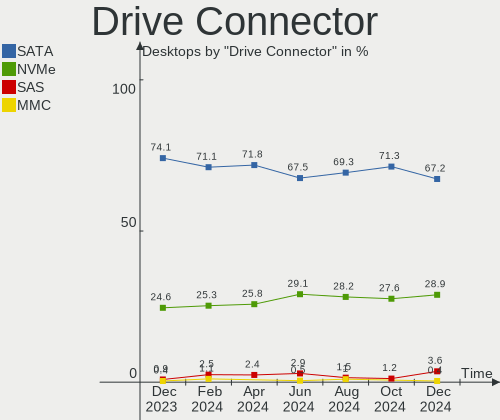
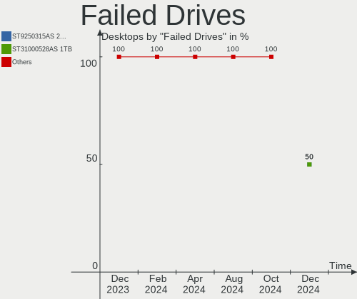
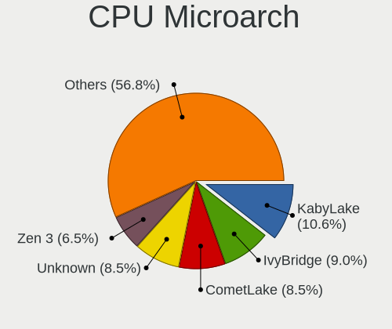
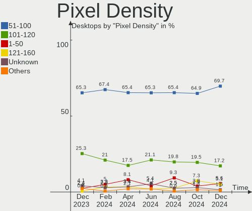
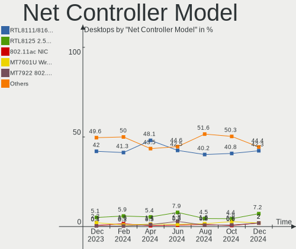
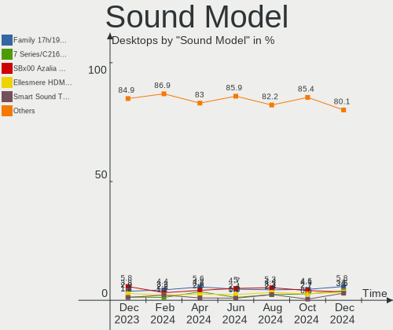
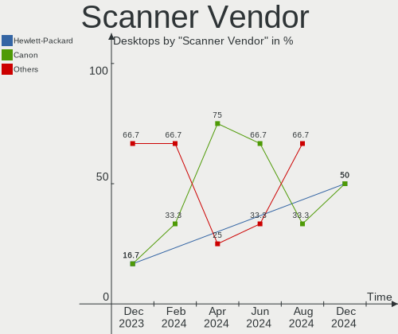

Linux in Russia - Hardware Trends (Desktops)
--------------------------------------------

A project to identify most popular hardware characteristics and track their change
over time based on data collected by Linux users at https://Linux-Hardware.org.

Anyone can contribute to this report by the [hw-probe](https://github.com/linuxhw/hw-probe) tool:

    sudo -E hw-probe -all -upload

Period: Dec, 2022.

Contents
--------

* [ System ](#system)
  - [ OS                       ](#os)
  - [ OS Family                ](#os-family)
  - [ Kernel                   ](#kernel)
  - [ Kernel Family            ](#kernel-family)
  - [ Kernel Major Ver.        ](#kernel-major-ver)
  - [ Arch                     ](#arch)
  - [ DE                       ](#de)
  - [ Display Server           ](#display-server)
  - [ Display Manager          ](#display-manager)
  - [ OS Lang                  ](#os-lang)
  - [ Boot Mode                ](#boot-mode)
  - [ Filesystem               ](#filesystem)
  - [ Part. scheme             ](#part-scheme)
  - [ Dual Boot with Linux/BSD ](#dual-boot-with-linuxbsd)
  - [ Dual Boot (Win)          ](#dual-boot-win)

* [ Board ](#board)
  - [ Vendor                   ](#vendor)
  - [ Model                    ](#model)
  - [ Model Family             ](#model-family)
  - [ MFG Year                 ](#mfg-year)
  - [ Form Factor              ](#form-factor)
  - [ Secure Boot              ](#secure-boot)
  - [ Coreboot                 ](#coreboot)
  - [ RAM Size                 ](#ram-size)
  - [ RAM Used                 ](#ram-used)
  - [ Total Drives             ](#total-drives)
  - [ Has CD-ROM               ](#has-cd-rom)
  - [ Has Ethernet             ](#has-ethernet)
  - [ Has WiFi                 ](#has-wifi)
  - [ Has Bluetooth            ](#has-bluetooth)

* [ Location ](#location)
  - [ Country                  ](#country)
  - [ City                     ](#city)

* [ Drives ](#drives)
  - [ Drive Vendor             ](#drive-vendor)
  - [ Drive Model              ](#drive-model)
  - [ HDD Vendor               ](#hdd-vendor)
  - [ SSD Vendor               ](#ssd-vendor)
  - [ Drive Kind               ](#drive-kind)
  - [ Drive Connector          ](#drive-connector)
  - [ Drive Size               ](#drive-size)
  - [ Space Total              ](#space-total)
  - [ Space Used               ](#space-used)
  - [ Malfunc. Drives          ](#malfunc-drives)
  - [ Malfunc. Drive Vendor    ](#malfunc-drive-vendor)
  - [ Malfunc. HDD Vendor      ](#malfunc-hdd-vendor)
  - [ Malfunc. Drive Kind      ](#malfunc-drive-kind)
  - [ Failed Drives            ](#failed-drives)
  - [ Failed Drive Vendor      ](#failed-drive-vendor)
  - [ Drive Status             ](#drive-status)

* [ Storage controller ](#storage-controller)
  - [ Storage Vendor           ](#storage-vendor)
  - [ Storage Model            ](#storage-model)
  - [ Storage Kind             ](#storage-kind)

* [ Processor ](#processor)
  - [ CPU Vendor               ](#cpu-vendor)
  - [ CPU Model                ](#cpu-model)
  - [ CPU Model Family         ](#cpu-model-family)
  - [ CPU Cores                ](#cpu-cores)
  - [ CPU Sockets              ](#cpu-sockets)
  - [ CPU Threads              ](#cpu-threads)
  - [ CPU Op-Modes             ](#cpu-op-modes)
  - [ CPU Microcode            ](#cpu-microcode)
  - [ CPU Microarch            ](#cpu-microarch)

* [ Graphics ](#graphics)
  - [ GPU Vendor               ](#gpu-vendor)
  - [ GPU Model                ](#gpu-model)
  - [ GPU Combo                ](#gpu-combo)
  - [ GPU Driver               ](#gpu-driver)
  - [ GPU Memory               ](#gpu-memory)

* [ Monitor ](#monitor)
  - [ Monitor Vendor           ](#monitor-vendor)
  - [ Monitor Model            ](#monitor-model)
  - [ Monitor Resolution       ](#monitor-resolution)
  - [ Monitor Diagonal         ](#monitor-diagonal)
  - [ Monitor Width            ](#monitor-width)
  - [ Aspect Ratio             ](#aspect-ratio)
  - [ Monitor Area             ](#monitor-area)
  - [ Pixel Density            ](#pixel-density)
  - [ Multiple Monitors        ](#multiple-monitors)

* [ Network ](#network)
  - [ Net Controller Vendor    ](#net-controller-vendor)
  - [ Net Controller Model     ](#net-controller-model)
  - [ Wireless Vendor          ](#wireless-vendor)
  - [ Wireless Model           ](#wireless-model)
  - [ Ethernet Vendor          ](#ethernet-vendor)
  - [ Ethernet Model           ](#ethernet-model)
  - [ Net Controller Kind      ](#net-controller-kind)
  - [ Used Controller          ](#used-controller)
  - [ NICs                     ](#nics)
  - [ IPv6                     ](#ipv6)

* [ Bluetooth ](#bluetooth)
  - [ Bluetooth Vendor         ](#bluetooth-vendor)
  - [ Bluetooth Model          ](#bluetooth-model)

* [ Sound ](#sound)
  - [ Sound Vendor             ](#sound-vendor)
  - [ Sound Model              ](#sound-model)

* [ Memory ](#memory)
  - [ Memory Vendor            ](#memory-vendor)
  - [ Memory Model             ](#memory-model)
  - [ Memory Kind              ](#memory-kind)
  - [ Memory Form Factor       ](#memory-form-factor)
  - [ Memory Size              ](#memory-size)
  - [ Memory Speed             ](#memory-speed)

* [ Printers & scanners ](#printers--scanners)
  - [ Printer Vendor           ](#printer-vendor)
  - [ Printer Model            ](#printer-model)
  - [ Scanner Vendor           ](#scanner-vendor)
  - [ Scanner Model            ](#scanner-model)

* [ Camera ](#camera)
  - [ Camera Vendor            ](#camera-vendor)
  - [ Camera Model             ](#camera-model)

* [ Security ](#security)
  - [ Fingerprint Vendor       ](#fingerprint-vendor)
  - [ Fingerprint Model        ](#fingerprint-model)
  - [ Chipcard Vendor          ](#chipcard-vendor)
  - [ Chipcard Model           ](#chipcard-model)

* [ Unsupported ](#unsupported)
  - [ Unsupported Devices      ](#unsupported-devices)
  - [ Unsupported Device Types ](#unsupported-device-types)

System
------

OS
--

Installed operating systems

| Name                         | Desktops | Percent |
|------------------------------|----------|---------|
| ROSA 12.3                    | 119      | 42.2%   |
| Debian 11                    | 19       | 6.74%   |
| Ubuntu 22.04                 | 14       | 4.96%   |
| OpenMandriva 4.3             | 10       | 3.55%   |
| Ubuntu 20.04                 | 8        | 2.84%   |
| ROSA R11.1                   | 8        | 2.84%   |
| ROSA 12.2                    | 8        | 2.84%   |
| Red OS 7.3.2                 | 7        | 2.48%   |
| Arch Rolling                 | 7        | 2.48%   |
| Fedora 37                    | 6        | 2.13%   |
| Zorin 16                     | 4        | 1.42%   |
| Red OS 7.3                   | 4        | 1.42%   |
| OpenMandriva 4.50            | 4        | 1.42%   |
| OpenMandriva 4.2             | 4        | 1.42%   |
| OpenMandriva 22.12           | 4        | 1.42%   |
| Manjaro                      | 4        | 1.42%   |
| Xubuntu 20.04                | 3        | 1.06%   |
| Elementary 6.1               | 3        | 1.06%   |
| Debian                       | 3        | 1.06%   |
| Ubuntu 22.10                 | 2        | 0.71%   |
| Red OS 7.2                   | 2        | 0.71%   |
| Manjaro 22.0.0               | 2        | 0.71%   |
| Linux Mint 21.1              | 2        | 0.71%   |
| Linux Mint 19.3              | 2        | 0.71%   |
| Kubuntu 20.04                | 2        | 0.71%   |
| Gentoo 2.9                   | 2        | 0.71%   |
| ALT Linux P10                | 2        | 0.71%   |
| ALT Linux 10.1               | 2        | 0.71%   |
| Ubuntu 18.04                 | 1        | 0.35%   |
| Slackware 15.0               | 1        | 0.35%   |
| ROSA R11                     | 1        | 0.35%   |
| ROSA 2021.1                  | 1        | 0.35%   |
| ROSA 12                      | 1        | 0.35%   |
| Pop!_OS 22.04                | 1        | 0.35%   |
| Pop!_OS 21.10                | 1        | 0.35%   |
| Parrot 4.11                  | 1        | 0.35%   |
| openSUSE Tumbleweed-XXXXXXXX | 1        | 0.35%   |
| openSUSE Leap-15.3           | 1        | 0.35%   |
| LMDE 5                       | 1        | 0.35%   |
| LinuxFX 10                   | 1        | 0.35%   |

OS Family
---------

OS without a version

| Name         | Desktops | Percent |
|--------------|----------|---------|
| ROSA         | 138      | 48.94%  |
| Ubuntu       | 25       | 8.87%   |
| Debian       | 23       | 8.16%   |
| OpenMandriva | 22       | 7.8%    |
| Red OS       | 13       | 4.61%   |
| Fedora       | 8        | 2.84%   |
| Linux Mint   | 7        | 2.48%   |
| Arch         | 7        | 2.48%   |
| Manjaro      | 6        | 2.13%   |
| ALT Linux    | 5        | 1.77%   |
| Zorin        | 4        | 1.42%   |
| Xubuntu      | 3        | 1.06%   |
| Kubuntu      | 3        | 1.06%   |
| Elementary   | 3        | 1.06%   |
| Pop!_OS      | 2        | 0.71%   |
| openSUSE     | 2        | 0.71%   |
| Gentoo       | 2        | 0.71%   |
| Slackware    | 1        | 0.35%   |
| Parrot       | 1        | 0.35%   |
| LMDE         | 1        | 0.35%   |
| LinuxFX      | 1        | 0.35%   |
| LFS          | 1        | 0.35%   |
| KDE neon     | 1        | 0.35%   |
| Kali         | 1        | 0.35%   |
| Astra Linux  | 1        | 0.35%   |
| ArcoLinux    | 1        | 0.35%   |

Kernel
------

Version of the Linux kernel

| Version                                  | Desktops | Percent |
|------------------------------------------|----------|---------|
| 5.15.79-generic-1rosa2021.1-x86_64       | 46       | 16.31%  |
| 5.15.75-generic-1rosa2021.1-x86_64       | 32       | 11.35%  |
| 5.15.0-56-generic                        | 22       | 7.8%    |
| 5.10.155-generic-1rosa2021.1-x86_64      | 16       | 5.67%   |
| 5.10.0-7-amd64                           | 11       | 3.9%    |
| 5.16.7-desktop-1omv4003                  | 9        | 3.19%   |
| 5.17.11-generic-2rosa2021.1-x86_64       | 8        | 2.84%   |
| 5.4.0-135-generic                        | 6        | 2.13%   |
| 5.15.72-1.el7.3.x86_64                   | 5        | 1.77%   |
| 6.0.10-desktop-2omv22090                 | 4        | 1.42%   |
| 5.15.77-generic-1rosa2021.1-x86_64       | 4        | 1.42%   |
| 5.10.74-generic-2rosa2021.1-x86_64       | 4        | 1.42%   |
| 5.10.14-desktop-1omv4002                 | 4        | 1.42%   |
| 5.10.118-generic-2rosa2021.1-x86_64      | 4        | 1.42%   |
| 5.10.0-19-amd64                          | 4        | 1.42%   |
| 4.15.0-desktop-122.124.1rosa-x86_64      | 4        | 1.42%   |
| 6.0.12-arch1-1                           | 3        | 1.06%   |
| 6.0.12-300.fc37.x86_64                   | 3        | 1.06%   |
| 5.15.75-generic-1rosa2021.1-i686         | 3        | 1.06%   |
| 5.15.0-53-generic                        | 3        | 1.06%   |
| 5.10.0-20-amd64                          | 3        | 1.06%   |
| 6.0.7.xm1-1.klp-xanmod-rosa2021.1-x86_64 | 2        | 0.71%   |
| 6.0.15-300.fc37.x86_64                   | 2        | 0.71%   |
| 6.0.0-2-amd64                            | 2        | 0.71%   |
| 5.19.5-desktop-1omv4090                  | 2        | 0.71%   |
| 5.19.0-27-generic                        | 2        | 0.71%   |
| 5.15.81-1-MANJARO                        | 2        | 0.71%   |
| 5.15.80-un-def-alt1                      | 2        | 0.71%   |
| 5.15.78-2.el7.3.x86_64                   | 2        | 0.71%   |
| 5.15.35-5.el7.3.x86_64                   | 2        | 0.71%   |
| 5.15.0-52-generic                        | 2        | 0.71%   |
| 5.10.29-1.el7.x86_64                     | 2        | 0.71%   |
| 4.19.79-1.el7.x86_64                     | 2        | 0.71%   |
| 4.15.0-desktop-45.1rosa-x86_64           | 2        | 0.71%   |
| 6.2.0-0.rc1.14.fc38.x86_64+debug         | 1        | 0.35%   |
| 6.1.0.xm1-1.klp-xanmod-rosa2021.1-x86_64 | 1        | 0.35%   |
| 6.1.0-rc8-ojab                           | 1        | 0.35%   |
| 6.1.0-generic-2rosa2021.1-x86_64         | 1        | 0.35%   |
| 6.1.0-generic-0.rc8.1rosa2021.1-x86_64   | 1        | 0.35%   |
| 6.1.0-1-MANJARO                          | 1        | 0.35%   |

Kernel Family
-------------

Linux kernel without a distro release

| Version  | Desktops | Percent |
|----------|----------|---------|
| 5.15.79  | 46       | 16.31%  |
| 5.15.75  | 35       | 12.41%  |
| 5.15.0   | 32       | 11.35%  |
| 5.10.0   | 19       | 6.74%   |
| 5.10.155 | 16       | 5.67%   |
| 6.0.12   | 10       | 3.55%   |
| 5.16.7   | 9        | 3.19%   |
| 5.4.0    | 8        | 2.84%   |
| 5.17.11  | 8        | 2.84%   |
| 4.15.0   | 7        | 2.48%   |
| 6.0.0    | 6        | 2.13%   |
| 5.15.72  | 6        | 2.13%   |
| 6.1.0    | 5        | 1.77%   |
| 6.0.10   | 5        | 1.77%   |
| 5.10.74  | 5        | 1.77%   |
| 5.15.77  | 4        | 1.42%   |
| 5.10.14  | 4        | 1.42%   |
| 5.10.118 | 4        | 1.42%   |
| 5.19.0   | 3        | 1.06%   |
| 5.15.80  | 3        | 1.06%   |
| 5.11.0   | 3        | 1.06%   |
| 6.0.9    | 2        | 0.71%   |
| 6.0.7    | 2        | 0.71%   |
| 6.0.15   | 2        | 0.71%   |
| 6.0.11   | 2        | 0.71%   |
| 5.19.5   | 2        | 0.71%   |
| 5.15.81  | 2        | 0.71%   |
| 5.15.78  | 2        | 0.71%   |
| 5.15.35  | 2        | 0.71%   |
| 5.10.29  | 2        | 0.71%   |
| 4.19.79  | 2        | 0.71%   |
| 6.2.0    | 1        | 0.35%   |
| 6.0.6    | 1        | 0.35%   |
| 6.0.5    | 1        | 0.35%   |
| 6.0.3    | 1        | 0.35%   |
| 5.4.83   | 1        | 0.35%   |
| 5.4.32   | 1        | 0.35%   |
| 5.4.193  | 1        | 0.35%   |
| 5.4.189  | 1        | 0.35%   |
| 5.3.18   | 1        | 0.35%   |

Kernel Major Ver.
-----------------

Linux kernel major version

| Version | Desktops | Percent |
|---------|----------|---------|
| 5.15    | 135      | 47.87%  |
| 5.10    | 52       | 18.44%  |
| 6.0     | 32       | 11.35%  |
| 5.4     | 12       | 4.26%   |
| 5.16    | 11       | 3.9%    |
| 5.19    | 9        | 3.19%   |
| 5.17    | 8        | 2.84%   |
| 4.15    | 8        | 2.84%   |
| 6.1     | 5        | 1.77%   |
| 5.11    | 3        | 1.06%   |
| 5.18    | 2        | 0.71%   |
| 4.19    | 2        | 0.71%   |
| 6.2     | 1        | 0.35%   |
| 5.3     | 1        | 0.35%   |
| 4.18    | 1        | 0.35%   |

Arch
----

OS architecture (x86_64, i586, etc.)

| Name   | Desktops | Percent |
|--------|----------|---------|
| x86_64 | 275      | 97.52%  |
| i686   | 6        | 2.13%   |
| e2k    | 1        | 0.35%   |

DE
--

Desktop Environment

| Name       | Desktops | Percent |
|------------|----------|---------|
| KDE5       | 126      | 44.68%  |
| GNOME      | 76       | 26.95%  |
| Unknown    | 19       | 6.74%   |
| LXQt       | 14       | 4.96%   |
| XFCE       | 11       | 3.9%    |
| MATE       | 11       | 3.9%    |
| X-Cinnamon | 7        | 2.48%   |
| KDE4       | 6        | 2.13%   |
| Cinnamon   | 4        | 1.42%   |
| Pantheon   | 3        | 1.06%   |
| X-Generic  | 1        | 0.35%   |
| LXDE       | 1        | 0.35%   |
| i3         | 1        | 0.35%   |
| Hyprland   | 1        | 0.35%   |
| bspwm      | 1        | 0.35%   |

Display Server
--------------

X11 or Wayland

| Name    | Desktops | Percent |
|---------|----------|---------|
| X11     | 139      | 49.29%  |
| Wayland | 121      | 42.91%  |
| Unknown | 18       | 6.38%   |
| Tty     | 4        | 1.42%   |

Display Manager
---------------

SDDM, LightDM, etc.

| Name    | Desktops | Percent |
|---------|----------|---------|
| SDDM    | 120      | 42.55%  |
| GDM     | 65       | 23.05%  |
| Unknown | 45       | 15.96%  |
| GDM3    | 22       | 7.8%    |
| LightDM | 21       | 7.45%   |
| KDM     | 6        | 2.13%   |
| XDM     | 1        | 0.35%   |
| WDM     | 1        | 0.35%   |
| FLY-DM  | 1        | 0.35%   |

OS Lang
-------

Language

| Lang    | Desktops | Percent |
|---------|----------|---------|
| ru_RU   | 228      | 80.85%  |
| en_US   | 36       | 12.77%  |
| Unknown | 13       | 4.61%   |
| uk_UA   | 1        | 0.35%   |
| en_RU   | 1        | 0.35%   |
| en_GB   | 1        | 0.35%   |
| C.UTF8  | 1        | 0.35%   |
| C       | 1        | 0.35%   |

Boot Mode
---------

EFI or BIOS

| Mode | Desktops | Percent |
|------|----------|---------|
| BIOS | 150      | 53.19%  |
| EFI  | 132      | 46.81%  |

Filesystem
----------

Type of filesystem

| Type     | Desktops | Percent |
|----------|----------|---------|
| Ext4     | 221      | 78.37%  |
| Overlay  | 33       | 11.7%   |
| Btrfs    | 19       | 6.74%   |
| Zfs      | 3        | 1.06%   |
| Xfs      | 3        | 1.06%   |
| Reiserfs | 1        | 0.35%   |
| F2fs     | 1        | 0.35%   |
| Ext2     | 1        | 0.35%   |

Part. scheme
------------

Scheme of partitioning

| Type    | Desktops | Percent |
|---------|----------|---------|
| GPT     | 168      | 59.57%  |
| MBR     | 87       | 30.85%  |
| Unknown | 27       | 9.57%   |

Dual Boot with Linux/BSD
------------------------

Hosting more than one Linux/BSD

| Dual boot | Desktops | Percent |
|-----------|----------|---------|
| No        | 210      | 74.47%  |
| Yes       | 72       | 25.53%  |

Dual Boot (Win)
---------------

Hosting Linux and Windows

| Dual boot | Desktops | Percent |
|-----------|----------|---------|
| No        | 161      | 57.09%  |
| Yes       | 121      | 42.91%  |

Board
-----

Vendor
------

Motherboard manufacturer

| Name                | Desktops | Percent |
|---------------------|----------|---------|
| ASUSTek Computer    | 101      | 35.82%  |
| Gigabyte Technology | 87       | 30.85%  |
| ASRock              | 31       | 10.99%  |
| MSI                 | 24       | 8.51%   |
| Intel               | 10       | 3.55%   |
| Huanan              | 4        | 1.42%   |
| Hewlett-Packard     | 3        | 1.06%   |
| Unknown             | 3        | 1.06%   |
| Pegatron            | 2        | 0.71%   |
| ECS                 | 2        | 0.71%   |
| Dell                | 2        | 0.71%   |
| Biostar             | 2        | 0.71%   |
| AZW                 | 2        | 0.71%   |
| Aquarius            | 2        | 0.71%   |
| Phoenix             | 1        | 0.35%   |
| HC Technology.      | 1        | 0.35%   |
| Graviton            | 1        | 0.35%   |
| eMachines           | 1        | 0.35%   |
| DEPO Computers      | 1        | 0.35%   |
| Colorful Technology | 1        | 0.35%   |
| 3Q                  | 1        | 0.35%   |

Model
-----

Motherboard model

| Name                           | Desktops | Percent |
|--------------------------------|----------|---------|
| ASUS All Series                | 9        | 3.19%   |
| Gigabyte A320M-H               | 4        | 1.42%   |
| Gigabyte B450 GAMING X         | 3        | 1.06%   |
| ASUS PRIME B450M-K             | 3        | 1.06%   |
| ASUS PRIME B450M-A             | 3        | 1.06%   |
| Unknown                        | 3        | 1.06%   |
| MSI MS-7C09                    | 2        | 0.71%   |
| Intel X99                      | 2        | 0.71%   |
| Gigabyte Z690 AORUS PRO        | 2        | 0.71%   |
| Gigabyte H61M-S2V-B3           | 2        | 0.71%   |
| Gigabyte F2A68HM-DS2           | 2        | 0.71%   |
| Gigabyte B450 I AORUS PRO WIFI | 2        | 0.71%   |
| Gigabyte B365M DS3H            | 2        | 0.71%   |
| Gigabyte 970A-DS3P             | 2        | 0.71%   |
| AZW U59                        | 2        | 0.71%   |
| ASUS PRIME B560M-A             | 2        | 0.71%   |
| ASUS PRIME B550-PLUS           | 2        | 0.71%   |
| ASUS PRIME B350M-A             | 2        | 0.71%   |
| ASUS PRIME A320M-K             | 2        | 0.71%   |
| ASUS PRIME A320M-A             | 2        | 0.71%   |
| ASUS P8H77-V LE                | 2        | 0.71%   |
| ASUS P5K                       | 2        | 0.71%   |
| ASUS MINIPC PB62               | 2        | 0.71%   |
| ASUS M5A97 R2.0                | 2        | 0.71%   |
| ASUS M2N-XE                    | 2        | 0.71%   |
| ASUS H110M-R                   | 2        | 0.71%   |
| ASRock H470M-HVS               | 2        | 0.71%   |
| Aquarius P30 K44 R53           | 2        | 0.71%   |
| Phoenix 945GM                  | 1        | 0.35%   |
| Pegatron IPPPV-D3G             | 1        | 0.35%   |
| Pegatron APX85-GS              | 1        | 0.35%   |
| MSI PRO H510 DP21 (MS-B0A4)    | 1        | 0.35%   |
| MSI MS-7D54                    | 1        | 0.35%   |
| MSI MS-7D22                    | 1        | 0.35%   |
| MSI MS-7D13                    | 1        | 0.35%   |
| MSI MS-7C95                    | 1        | 0.35%   |
| MSI MS-7C91                    | 1        | 0.35%   |
| MSI MS-7C51                    | 1        | 0.35%   |
| MSI MS-7C37                    | 1        | 0.35%   |
| MSI MS-7B86                    | 1        | 0.35%   |

Model Family
------------

Motherboard model prefix

| Name                 | Desktops | Percent |
|----------------------|----------|---------|
| ASUS PRIME           | 26       | 9.22%   |
| ASUS All             | 9        | 3.19%   |
| Gigabyte B450        | 6        | 2.13%   |
| ASUS TUF             | 5        | 1.77%   |
| Gigabyte A320M-H     | 4        | 1.42%   |
| Gigabyte B550M       | 3        | 1.06%   |
| Gigabyte B550        | 3        | 1.06%   |
| ASUS ROG             | 3        | 1.06%   |
| ASUS P8H61-M         | 3        | 1.06%   |
| ASUS P7H55-M         | 3        | 1.06%   |
| ASUS P5K             | 3        | 1.06%   |
| ASUS M5A97           | 3        | 1.06%   |
| ASUS M5A78L-M        | 3        | 1.06%   |
| Unknown              | 3        | 1.06%   |
| MSI MS-7C09          | 2        | 0.71%   |
| Intel X99            | 2        | 0.71%   |
| Intel D2500HN        | 2        | 0.71%   |
| Gigabyte Z690        | 2        | 0.71%   |
| Gigabyte X470        | 2        | 0.71%   |
| Gigabyte H61M-S2V-B3 | 2        | 0.71%   |
| Gigabyte F2A68HM-DS2 | 2        | 0.71%   |
| Gigabyte B660M       | 2        | 0.71%   |
| Gigabyte B450M       | 2        | 0.71%   |
| Gigabyte B365M       | 2        | 0.71%   |
| Gigabyte 970A-DS3P   | 2        | 0.71%   |
| Dell OptiPlex        | 2        | 0.71%   |
| AZW U59              | 2        | 0.71%   |
| ASUS P8H77-V         | 2        | 0.71%   |
| ASUS P8H67-M         | 2        | 0.71%   |
| ASUS P5KPL-AM        | 2        | 0.71%   |
| ASUS MINIPC          | 2        | 0.71%   |
| ASUS M2N-XE          | 2        | 0.71%   |
| ASUS H110M-R         | 2        | 0.71%   |
| ASRock P67           | 2        | 0.71%   |
| ASRock H510M-HVS     | 2        | 0.71%   |
| ASRock H470M-HVS     | 2        | 0.71%   |
| Aquarius P30         | 2        | 0.71%   |
| Phoenix 945GM        | 1        | 0.35%   |
| Pegatron IPPPV-D3G   | 1        | 0.35%   |
| Pegatron APX85-GS    | 1        | 0.35%   |

MFG Year
--------

Motherboard manufacture year

| Year    | Desktops | Percent |
|---------|----------|---------|
| 2018    | 35       | 12.41%  |
| 2021    | 28       | 9.93%   |
| 2012    | 28       | 9.93%   |
| 2017    | 20       | 7.09%   |
| 2019    | 19       | 6.74%   |
| 2010    | 18       | 6.38%   |
| 2011    | 17       | 6.03%   |
| 2013    | 16       | 5.67%   |
| 2022    | 15       | 5.32%   |
| 2020    | 14       | 4.96%   |
| 2009    | 14       | 4.96%   |
| 2014    | 13       | 4.61%   |
| 2016    | 11       | 3.9%    |
| 2015    | 10       | 3.55%   |
| 2008    | 10       | 3.55%   |
| 2007    | 10       | 3.55%   |
| 2006    | 1        | 0.35%   |
| 2005    | 1        | 0.35%   |
| 2004    | 1        | 0.35%   |
| Unknown | 1        | 0.35%   |

Form Factor
-----------

Physical design of the computer

| Name    | Desktops | Percent |
|---------|----------|---------|
| Desktop | 282      | 100%    |

Secure Boot
-----------

Enabled or disabled

| State    | Desktops | Percent |
|----------|----------|---------|
| Disabled | 279      | 98.94%  |
| Enabled  | 3        | 1.06%   |

Coreboot
--------

Have coreboot on board

| Used | Desktops | Percent |
|------|----------|---------|
| No   | 282      | 100%    |

RAM Size
--------

Total RAM memory

| Size in GB  | Desktops | Percent |
|-------------|----------|---------|
| 16.01-24.0  | 82       | 29.08%  |
| 8.01-16.0   | 61       | 21.63%  |
| 3.01-4.0    | 45       | 15.96%  |
| 32.01-64.0  | 36       | 12.77%  |
| 4.01-8.0    | 29       | 10.28%  |
| 64.01-256.0 | 10       | 3.55%   |
| 1.01-2.0    | 9        | 3.19%   |
| 2.01-3.0    | 5        | 1.77%   |
| 24.01-32.0  | 4        | 1.42%   |
| 0.51-1.0    | 1        | 0.35%   |

RAM Used
--------

Used RAM memory

| Used GB    | Desktops | Percent |
|------------|----------|---------|
| 1.01-2.0   | 106      | 37.59%  |
| 0.51-1.0   | 56       | 19.86%  |
| 2.01-3.0   | 52       | 18.44%  |
| 4.01-8.0   | 36       | 12.77%  |
| 3.01-4.0   | 18       | 6.38%   |
| 8.01-16.0  | 6        | 2.13%   |
| 0.01-0.5   | 4        | 1.42%   |
| 16.01-24.0 | 3        | 1.06%   |
| 32.01-64.0 | 1        | 0.35%   |

Total Drives
------------

Number of drives on board

| Drives | Desktops | Percent |
|--------|----------|---------|
| 1      | 113      | 40.07%  |
| 2      | 83       | 29.43%  |
| 3      | 41       | 14.54%  |
| 4      | 29       | 10.28%  |
| 5      | 11       | 3.9%    |
| 7      | 2        | 0.71%   |
| 6      | 2        | 0.71%   |
| 0      | 1        | 0.35%   |

Has CD-ROM
----------

Has CD-ROM on board

| Presented | Desktops | Percent |
|-----------|----------|---------|
| No        | 203      | 71.99%  |
| Yes       | 79       | 28.01%  |

Has Ethernet
------------

Has Ethernet on board

| Presented | Desktops | Percent |
|-----------|----------|---------|
| Yes       | 280      | 99.29%  |
| No        | 2        | 0.71%   |

Has WiFi
--------

Has WiFi module

| Presented | Desktops | Percent |
|-----------|----------|---------|
| No        | 192      | 68.09%  |
| Yes       | 90       | 31.91%  |

Has Bluetooth
-------------

Has Bluetooth module

| Presented | Desktops | Percent |
|-----------|----------|---------|
| No        | 203      | 71.99%  |
| Yes       | 79       | 28.01%  |

Location
--------

Country
-------

Geographic location (country)

| Country | Desktops | Percent |
|---------|----------|---------|
| Russia  | 282      | 100%    |

City
----

Geographic location (city)

| City              | Desktops | Percent |
|-------------------|----------|---------|
| Moscow            | 58       | 20.57%  |
| St Petersburg     | 20       | 7.09%   |
| Voronezh          | 17       | 6.03%   |
| Krasnodar         | 12       | 4.26%   |
| Novosibirsk       | 11       | 3.9%    |
| Nizhniy Novgorod  | 8        | 2.84%   |
| Volgograd         | 7        | 2.48%   |
| Yekaterinburg     | 6        | 2.13%   |
| Rostov-on-Don     | 5        | 1.77%   |
| Ufa               | 4        | 1.42%   |
| Saratov           | 4        | 1.42%   |
| Perm              | 4        | 1.42%   |
| Krasnoyarsk       | 4        | 1.42%   |
| Chelyabinsk       | 4        | 1.42%   |
| Tambov            | 3        | 1.06%   |
| Saransk           | 3        | 1.06%   |
| Samara            | 3        | 1.06%   |
| Salekhard         | 3        | 1.06%   |
| Orenburg          | 3        | 1.06%   |
| Novorossiysk      | 3        | 1.06%   |
| Irkutsk           | 3        | 1.06%   |
| Cheboksary        | 3        | 1.06%   |
| Veliky Novgorod   | 2        | 0.71%   |
| Tyumen            | 2        | 0.71%   |
| Stavropol         | 2        | 0.71%   |
| Pskov             | 2        | 0.71%   |
| Omsk              | 2        | 0.71%   |
| Novy Urengoy      | 2        | 0.71%   |
| Novomoskovsk      | 2        | 0.71%   |
| Mytishchi         | 2        | 0.71%   |
| Murom             | 2        | 0.71%   |
| Khabarovsk        | 2        | 0.71%   |
| Kemerovo          | 2        | 0.71%   |
| Kazan’          | 2        | 0.71%   |
| Baksan            | 2        | 0.71%   |
| Zarech'ye         | 1        | 0.35%   |
| Yuzhno-Sakhalinsk | 1        | 0.35%   |
| Yaroslavl         | 1        | 0.35%   |
| Vsevolozhsk       | 1        | 0.35%   |
| Voskresensk       | 1        | 0.35%   |

Drives
------

Drive Vendor
------------

Hard drive vendors

| Vendor                | Desktops | Drives | Percent |
|-----------------------|----------|--------|---------|
| WDC                   | 105      | 125    | 19.89%  |
| Seagate               | 96       | 112    | 18.18%  |
| Samsung Electronics   | 47       | 57     | 8.9%    |
| Toshiba               | 41       | 46     | 7.77%   |
| Kingston              | 37       | 43     | 7.01%   |
| Hitachi               | 19       | 23     | 3.6%    |
| A-DATA Technology     | 19       | 19     | 3.6%    |
| Apacer                | 15       | 15     | 2.84%   |
| SanDisk               | 13       | 14     | 2.46%   |
| AMD                   | 12       | 13     | 2.27%   |
| Intel                 | 11       | 14     | 2.08%   |
| China                 | 11       | 11     | 2.08%   |
| Crucial               | 8        | 8      | 1.52%   |
| HGST                  | 7        | 9      | 1.33%   |
| Patriot               | 6        | 6      | 1.14%   |
| SPCC                  | 5        | 5      | 0.95%   |
| Silicon Motion        | 5        | 5      | 0.95%   |
| Plextor               | 5        | 5      | 0.95%   |
| Netac                 | 5        | 6      | 0.95%   |
| Gigabyte Technology   | 5        | 6      | 0.95%   |
| Unknown               | 5        | 5      | 0.95%   |
| Corsair               | 4        | 4      | 0.76%   |
| XrayDisk              | 3        | 3      | 0.57%   |
| Unknown               | 3        | 3      | 0.57%   |
| Transcend             | 3        | 3      | 0.57%   |
| Phison Electronics    | 3        | 4      | 0.57%   |
| JMicron Technology    | 3        | 3      | 0.57%   |
| GOODRAM               | 3        | 3      | 0.57%   |
| Smartbuy              | 2        | 2      | 0.38%   |
| Realtek Semiconductor | 2        | 2      | 0.38%   |
| KingSpec              | 2        | 2      | 0.38%   |
| Foxline               | 2        | 2      | 0.38%   |
| AGI                   | 2        | 2      | 0.38%   |
| ADATA Technology      | 2        | 2      | 0.38%   |
| XPG                   | 1        | 1      | 0.19%   |
| TAMMUZ                | 1        | 1      | 0.19%   |
| SATAFIRM              | 1        | 1      | 0.19%   |
| Pioneer               | 1        | 1      | 0.19%   |
| OCZ-VERTEX3           | 1        | 1      | 0.19%   |
| OCZ-VERTEX            | 1        | 1      | 0.19%   |

Drive Model
-----------

Hard drive models

| Model                                               | Desktops | Percent |
|-----------------------------------------------------|----------|---------|
| Seagate ST1000DM010-2EP102 1TB                      | 14       | 2.42%   |
| Toshiba HDWD110 1TB                                 | 9        | 1.56%   |
| Toshiba DT01ACA100 1TB                              | 9        | 1.56%   |
| Kingston SA400S37120G 120GB SSD                     | 9        | 1.56%   |
| Kingston SA400S37240G 240GB SSD                     | 8        | 1.38%   |
| WDC WD10EZEX-08WN4A0 1TB                            | 7        | 1.21%   |
| Toshiba DT01ACA050 500GB                            | 7        | 1.21%   |
| Seagate ST500DM002-1BD142 500GB                     | 7        | 1.21%   |
| Samsung NVMe SSD Controller SM981/PM981/PM983 500GB | 7        | 1.21%   |
| Seagate ST3500418AS 500GB                           | 6        | 1.04%   |
| WDC WDS120G2G0A-00JH30 120GB SSD                    | 5        | 0.87%   |
| Seagate ST1000DM003-1CH162 1TB                      | 5        | 0.87%   |
| Kingston SA400S37480G 480GB SSD                     | 5        | 0.87%   |
| Unknown                                             | 5        | 0.87%   |
| Seagate ST3320613AS 320GB                           | 4        | 0.69%   |
| Crucial CT240BX500SSD1 240GB                        | 4        | 0.69%   |
| Apacer AS350 512GB SSD                              | 4        | 0.69%   |
| Apacer AS350 128GB SSD                              | 4        | 0.69%   |
| WDC WDS500G2B0A-00SM50 500GB SSD                    | 3        | 0.52%   |
| WDC WD3200AAKS-00L9A0 320GB                         | 3        | 0.52%   |
| WDC WD10EZEX-22MFCA0 1TB                            | 3        | 0.52%   |
| WDC WD10EZEX-00BBHA0 1TB                            | 3        | 0.52%   |
| WDC WD1003FZEX-00MK2A0 1TB                          | 3        | 0.52%   |
| Toshiba HDWD105 500GB                               | 3        | 0.52%   |
| Seagate ST9500325AS 500GB                           | 3        | 0.52%   |
| Seagate ST2000DM008-2FR102 2TB                      | 3        | 0.52%   |
| Seagate ST1000LM024 HN-M101MBB 1TB                  | 3        | 0.52%   |
| Seagate ST1000DM003-9YN162 1TB                      | 3        | 0.52%   |
| Samsung SSD 970 EVO Plus 250GB                      | 3        | 0.52%   |
| Samsung SSD 860 EVO 500GB                           | 3        | 0.52%   |
| Samsung SSD 860 EVO 250GB                           | 3        | 0.52%   |
| Samsung SSD 850 EVO 250GB                           | 3        | 0.52%   |
| Samsung NVMe SSD Controller PM9A1/PM9A3/980PRO 2TB  | 3        | 0.52%   |
| JMicron Generic 240GB SSD                           | 3        | 0.52%   |
| Hitachi HDS721050CLA360 500GB                       | 3        | 0.52%   |
| Hitachi HDP725050GLA360 500GB                       | 3        | 0.52%   |
| AMD R5SL240G 240GB SSD                              | 3        | 0.52%   |
| A-DATA SX6000PNP 256GB                              | 3        | 0.52%   |
| A-DATA SU650 240GB SSD                              | 3        | 0.52%   |
| WDC WDS240G2G0B-00EPW0 240GB SSD                    | 2        | 0.35%   |

HDD Vendor
----------

Hard disk drive vendors

| Vendor              | Desktops | Drives | Percent |
|---------------------|----------|--------|---------|
| Seagate             | 95       | 111    | 35.71%  |
| WDC                 | 94       | 106    | 35.34%  |
| Toshiba             | 38       | 41     | 14.29%  |
| Hitachi             | 19       | 23     | 7.14%   |
| Samsung Electronics | 11       | 11     | 4.14%   |
| HGST                | 7        | 9      | 2.63%   |
| Pioneer             | 1        | 1      | 0.38%   |
| AFAYA               | 1        | 1      | 0.38%   |

SSD Vendor
----------

Solid state drive vendors

| Vendor              | Desktops | Drives | Percent |
|---------------------|----------|--------|---------|
| Kingston            | 29       | 34     | 15.1%   |
| WDC                 | 16       | 16     | 8.33%   |
| A-DATA Technology   | 15       | 15     | 7.81%   |
| Samsung Electronics | 14       | 15     | 7.29%   |
| Apacer              | 12       | 12     | 6.25%   |
| China               | 11       | 11     | 5.73%   |
| AMD                 | 10       | 10     | 5.21%   |
| Intel               | 8        | 10     | 4.17%   |
| Crucial             | 8        | 8      | 4.17%   |
| SanDisk             | 7        | 7      | 3.65%   |
| SPCC                | 5        | 5      | 2.6%    |
| Plextor             | 5        | 5      | 2.6%    |
| Patriot             | 5        | 5      | 2.6%    |
| Unknown             | 5        | 5      | 2.6%    |
| Netac               | 4        | 4      | 2.08%   |
| XrayDisk            | 3        | 3      | 1.56%   |
| Toshiba             | 3        | 3      | 1.56%   |
| JMicron Technology  | 3        | 3      | 1.56%   |
| GOODRAM             | 3        | 3      | 1.56%   |
| Gigabyte Technology | 3        | 4      | 1.56%   |
| Corsair             | 3        | 3      | 1.56%   |
| Transcend           | 2        | 2      | 1.04%   |
| Smartbuy            | 2        | 2      | 1.04%   |
| KingSpec            | 2        | 2      | 1.04%   |
| TAMMUZ              | 1        | 1      | 0.52%   |
| Seagate             | 1        | 1      | 0.52%   |
| SATAFIRM            | 1        | 1      | 0.52%   |
| OCZ-VERTEX3         | 1        | 1      | 0.52%   |
| OCZ-VERTEX          | 1        | 1      | 0.52%   |
| OCZ                 | 1        | 1      | 0.52%   |
| Neo                 | 1        | 1      | 0.52%   |
| KingFast            | 1        | 1      | 0.52%   |
| Hewlett-Packard     | 1        | 1      | 0.52%   |
| GS Nanotech         | 1        | 1      | 0.52%   |
| Foxline             | 1        | 1      | 0.52%   |
| ExeGate             | 1        | 2      | 0.52%   |
| Espada              | 1        | 1      | 0.52%   |
| 1TB                 | 1        | 1      | 0.52%   |

Drive Kind
----------

HDD or SSD

| Kind    | Desktops | Drives | Percent |
|---------|----------|--------|---------|
| HDD     | 211      | 303    | 47.85%  |
| SSD     | 148      | 202    | 33.56%  |
| NVMe    | 81       | 94     | 18.37%  |
| Unknown | 1        | 1      | 0.23%   |

Drive Connector
---------------

SATA, SAS, NVMe, etc.

| Type | Desktops | Drives | Percent |
|------|----------|--------|---------|
| SATA | 254      | 496    | 74.49%  |
| NVMe | 81       | 94     | 23.75%  |
| SAS  | 6        | 10     | 1.76%   |

Drive Size
----------

Size of hard drive

| Size in TB | Desktops | Drives | Percent |
|------------|----------|--------|---------|
| 0.01-0.5   | 210      | 316    | 57.53%  |
| 0.51-1.0   | 103      | 125    | 28.22%  |
| 1.01-2.0   | 30       | 32     | 8.22%   |
| 3.01-4.0   | 9        | 11     | 2.47%   |
| 2.01-3.0   | 6        | 10     | 1.64%   |
| 4.01-10.0  | 5        | 9      | 1.37%   |
| 10.01-20.0 | 1        | 1      | 0.27%   |
| 0          | 1        | 1      | 0.27%   |

Space Total
-----------

Amount of disk space available on the file system

| Size in GB     | Desktops | Percent |
|----------------|----------|---------|
| 101-250        | 77       | 27.3%   |
| 251-500        | 40       | 14.18%  |
| 501-1000       | 40       | 14.18%  |
| 1001-2000      | 33       | 11.7%   |
| 1-20           | 23       | 8.16%   |
| 51-100         | 23       | 8.16%   |
| More than 3000 | 16       | 5.67%   |
| Unknown        | 15       | 5.32%   |
| 2001-3000      | 9        | 3.19%   |
| 21-50          | 6        | 2.13%   |

Space Used
----------

Amount of used disk space

| Used GB        | Desktops | Percent |
|----------------|----------|---------|
| 1-20           | 118      | 41.84%  |
| 101-250        | 40       | 14.18%  |
| 21-50          | 31       | 10.99%  |
| 51-100         | 22       | 7.8%    |
| 251-500        | 21       | 7.45%   |
| Unknown        | 15       | 5.32%   |
| 1001-2000      | 12       | 4.26%   |
| 501-1000       | 11       | 3.9%    |
| More than 3000 | 6        | 2.13%   |
| 2001-3000      | 6        | 2.13%   |

Malfunc. Drives
---------------

Drive models with a malfunction

| Model                               | Desktops | Drives | Percent |
|-------------------------------------|----------|--------|---------|
| Seagate ST500DM002-1BD142 500GB     | 3        | 3      | 3.26%   |
| Seagate ST3320613AS 320GB           | 3        | 3      | 3.26%   |
| WDC WDS240G2G0A-00JH30 240GB SSD    | 2        | 2      | 2.17%   |
| WDC WD3200AAKS-00L9A0 320GB         | 2        | 2      | 2.17%   |
| WDC WD2500AAKX-00ERMA0 250GB        | 2        | 2      | 2.17%   |
| Seagate ST9500325AS 500GB           | 2        | 2      | 2.17%   |
| Seagate ST1000DM010-2EP102 1TB      | 2        | 2      | 2.17%   |
| Seagate ST1000DM003-9YN162 1TB      | 2        | 2      | 2.17%   |
| Kingston SA400S37120G 120GB SSD     | 2        | 2      | 2.17%   |
| Hitachi HDS721616PLA380 160GB       | 2        | 2      | 2.17%   |
| XrayDisk 512GB SSD                  | 1        | 1      | 1.09%   |
| WDC WDS240G2G0B-00EPW0 240GB SSD    | 1        | 1      | 1.09%   |
| WDC WD6401AALS-00L3B2 640GB         | 1        | 1      | 1.09%   |
| WDC WD6401AALS-00J7B0 640GB         | 1        | 1      | 1.09%   |
| WDC WD5000AAKX-22ERMA0 500GB        | 1        | 1      | 1.09%   |
| WDC WD5000AAKX-221CA0 500GB         | 1        | 1      | 1.09%   |
| WDC WD5000AADS-00S9B0 500GB         | 1        | 1      | 1.09%   |
| WDC WD3200AAKS-00SBA0 320GB         | 1        | 1      | 1.09%   |
| WDC WD2500BEVT-00ZCT0 250GB         | 1        | 1      | 1.09%   |
| WDC WD2500AAJS-00YZCA0 250GB        | 1        | 1      | 1.09%   |
| WDC WD2005FBYZ-01YCBB3 2TB          | 1        | 1      | 1.09%   |
| WDC WD1600BEVS-22RST0 160GB         | 1        | 1      | 1.09%   |
| WDC WD1600AAJS-08PSA0 160GB         | 1        | 1      | 1.09%   |
| WDC WD1600AAJB-00J3A0 160GB         | 1        | 1      | 1.09%   |
| WDC WD10EZEX-75ZF5A0 1TB            | 1        | 1      | 1.09%   |
| WDC WD10EZEX-22MFCA0 1TB            | 1        | 1      | 1.09%   |
| WDC WD10EZEX-21WN4A0 1TB            | 1        | 1      | 1.09%   |
| WDC WD10EZEX-00WN4A0 1TB            | 1        | 1      | 1.09%   |
| WDC WD10EARS-00Z5B1 1TB             | 1        | 1      | 1.09%   |
| WDC WD1003FZEX-00MK2A0 1TB          | 1        | 1      | 1.09%   |
| WDC WD1003FBYX-01Y7B1 1TB           | 1        | 1      | 1.09%   |
| Toshiba KSG60ZSE256G SATA 256GB SSD | 1        | 1      | 1.09%   |
| Toshiba HDWD110 1TB                 | 1        | 1      | 1.09%   |
| Toshiba HDWD105 500GB               | 1        | 1      | 1.09%   |
| Seagate ST9250315AS 250GB           | 1        | 1      | 1.09%   |
| Seagate ST380817AS 80GB             | 1        | 1      | 1.09%   |
| Seagate ST3808110AS 80GB            | 1        | 1      | 1.09%   |
| Seagate ST3802110A 80GB             | 1        | 1      | 1.09%   |
| Seagate ST380011A 80GB              | 1        | 1      | 1.09%   |
| Seagate ST3500413AS 500GB           | 1        | 1      | 1.09%   |

Malfunc. Drive Vendor
---------------------

Vendors of faulty drives

| Vendor                | Desktops | Drives | Percent |
|-----------------------|----------|--------|---------|
| Seagate               | 31       | 33     | 35.23%  |
| WDC                   | 24       | 26     | 27.27%  |
| Hitachi               | 8        | 8      | 9.09%   |
| Samsung Electronics   | 5        | 5      | 5.68%   |
| Toshiba               | 3        | 3      | 3.41%   |
| Kingston              | 3        | 3      | 3.41%   |
| SanDisk               | 2        | 2      | 2.27%   |
| Corsair               | 2        | 2      | 2.27%   |
| A-DATA Technology     | 2        | 2      | 2.27%   |
| XrayDisk              | 1        | 1      | 1.14%   |
| Realtek Semiconductor | 1        | 1      | 1.14%   |
| OCZ-VERTEX3           | 1        | 1      | 1.14%   |
| Neo                   | 1        | 1      | 1.14%   |
| HGST                  | 1        | 1      | 1.14%   |
| Espada                | 1        | 1      | 1.14%   |
| AMD                   | 1        | 1      | 1.14%   |
| Unknown               | 1        | 1      | 1.14%   |

Malfunc. HDD Vendor
-------------------

Vendors of faulty HDD drives

| Vendor              | Desktops | Drives | Percent |
|---------------------|----------|--------|---------|
| Seagate             | 31       | 33     | 46.27%  |
| WDC                 | 22       | 23     | 32.84%  |
| Hitachi             | 8        | 8      | 11.94%  |
| Samsung Electronics | 3        | 3      | 4.48%   |
| Toshiba             | 2        | 2      | 2.99%   |
| HGST                | 1        | 1      | 1.49%   |

Malfunc. Drive Kind
-------------------

Kinds of faulty drives

| Kind | Desktops | Drives | Percent |
|------|----------|--------|---------|
| HDD  | 61       | 70     | 73.49%  |
| SSD  | 20       | 20     | 24.1%   |
| NVMe | 2        | 2      | 2.41%   |

Failed Drives
-------------

Failed drive models

| Model                             | Desktops | Drives | Percent |
|-----------------------------------|----------|--------|---------|
| WDC WD800JB-00FMA0 80GB           | 1        | 1      | 20%     |
| WDC WD7501AALS-00J7B0 752GB       | 1        | 1      | 20%     |
| Seagate ST3250820AS 250GB         | 1        | 1      | 20%     |
| Samsung Electronics HD503HI 500GB | 1        | 1      | 20%     |
| HGST HTS545050A7E380 500GB        | 1        | 1      | 20%     |

Failed Drive Vendor
-------------------

Failed drive vendors

| Vendor              | Desktops | Drives | Percent |
|---------------------|----------|--------|---------|
| WDC                 | 2        | 2      | 40%     |
| Seagate             | 1        | 1      | 20%     |
| Samsung Electronics | 1        | 1      | 20%     |
| HGST                | 1        | 1      | 20%     |

Drive Status
------------

Number of failed and malfunc. drives

| Status   | Desktops | Drives | Percent |
|----------|----------|--------|---------|
| Works    | 203      | 378    | 59.71%  |
| Malfunc  | 75       | 92     | 22.06%  |
| Detected | 58       | 125    | 17.06%  |
| Failed   | 4        | 5      | 1.18%   |

Storage controller
------------------

Storage Vendor
--------------

Storage controller vendors

| Vendor                        | Desktops | Percent |
|-------------------------------|----------|---------|
| Intel                         | 168      | 41.9%   |
| AMD                           | 103      | 25.69%  |
| Samsung Electronics           | 25       | 6.23%   |
| JMicron Technology            | 16       | 3.99%   |
| Nvidia                        | 13       | 3.24%   |
| Silicon Motion                | 11       | 2.74%   |
| SanDisk                       | 9        | 2.24%   |
| Kingston Technology Company   | 9        | 2.24%   |
| Marvell Technology Group      | 8        | 2%      |
| ASMedia Technology            | 8        | 2%      |
| Realtek Semiconductor         | 6        | 1.5%    |
| Phison Electronics            | 6        | 1.5%    |
| MAXIO Technology (Hangzhou)   | 3        | 0.75%   |
| ADATA Technology              | 3        | 0.75%   |
| VIA Technologies              | 2        | 0.5%    |
| Toshiba America Info Systems  | 2        | 0.5%    |
| Netac Technology              | 2        | 0.5%    |
| INNOGRIT                      | 2        | 0.5%    |
| Silicon Image                 | 1        | 0.25%   |
| MCST                          | 1        | 0.25%   |
| LSI Logic / Symbios Logic     | 1        | 0.25%   |
| Integrated Technology Express | 1        | 0.25%   |
| Unknown                       | 1        | 0.25%   |

Storage Model
-------------

Storage controller models

| Model                                                                                   | Desktops | Percent |
|-----------------------------------------------------------------------------------------|----------|---------|
| AMD FCH SATA Controller [AHCI mode]                                                     | 48       | 9.43%   |
| AMD 400 Series Chipset SATA Controller                                                  | 23       | 4.52%   |
| Samsung NVMe SSD Controller SM981/PM981/PM983                                           | 18       | 3.54%   |
| Intel 500 Series Chipset Family SATA AHCI Controller                                    | 17       | 3.34%   |
| AMD 500 Series Chipset SATA Controller                                                  | 16       | 3.14%   |
| Intel Q170/Q150/B150/H170/H110/Z170/CM236 Chipset SATA Controller [AHCI Mode]           | 15       | 2.95%   |
| Intel 8 Series/C220 Series Chipset Family 6-port SATA Controller 1 [AHCI mode]          | 15       | 2.95%   |
| AMD SB7x0/SB8x0/SB9x0 IDE Controller                                                    | 15       | 2.95%   |
| Intel NM10/ICH7 Family SATA Controller [IDE mode]                                       | 13       | 2.55%   |
| AMD SB7x0/SB8x0/SB9x0 SATA Controller [AHCI mode]                                       | 12       | 2.36%   |
| JMicron JMB363 SATA/IDE Controller                                                      | 11       | 2.16%   |
| Intel 6 Series/C200 Series Chipset Family Desktop SATA Controller (IDE mode, ports 4-5) | 10       | 1.96%   |
| Intel 6 Series/C200 Series Chipset Family Desktop SATA Controller (IDE mode, ports 0-3) | 10       | 1.96%   |
| Intel 200 Series PCH SATA controller [AHCI mode]                                        | 10       | 1.96%   |
| AMD SB7x0/SB8x0/SB9x0 SATA Controller [IDE mode]                                        | 10       | 1.96%   |
| AMD FCH SATA Controller D                                                               | 10       | 1.96%   |
| Silicon Motion SM2263EN/SM2263XT SSD Controller                                         | 9        | 1.77%   |
| Intel 6 Series/C200 Series Chipset Family 6 port Desktop SATA AHCI Controller           | 9        | 1.77%   |
| Nvidia MCP61 SATA Controller                                                            | 8        | 1.57%   |
| Nvidia MCP61 IDE                                                                        | 8        | 1.57%   |
| Intel Cannon Lake PCH SATA AHCI Controller                                              | 8        | 1.57%   |
| ASMedia ASM1062 Serial ATA Controller                                                   | 8        | 1.57%   |
| Intel Alder Lake-S PCH SATA Controller [AHCI Mode]                                      | 7        | 1.38%   |
| Intel 9 Series Chipset Family SATA Controller [AHCI Mode]                               | 7        | 1.38%   |
| Intel 82801G (ICH7 Family) IDE Controller                                               | 7        | 1.38%   |
| AMD 300 Series Chipset SATA Controller                                                  | 7        | 1.38%   |
| Realtek Realtek Non-Volatile memory controller                                          | 5        | 0.98%   |
| Kingston Company Company Non-Volatile memory controller                                 | 5        | 0.98%   |
| JMicron JMB368 IDE controller                                                           | 5        | 0.98%   |
| Intel 7 Series/C210 Series Chipset Family 6-port SATA Controller [AHCI mode]            | 5        | 0.98%   |
| Intel 7 Series/C210 Series Chipset Family 4-port SATA Controller [IDE mode]             | 5        | 0.98%   |
| Intel 7 Series/C210 Series Chipset Family 2-port SATA Controller [IDE mode]             | 5        | 0.98%   |
| Intel 5 Series/3400 Series Chipset 4 port SATA IDE Controller                           | 5        | 0.98%   |
| Intel 5 Series/3400 Series Chipset 2 port SATA IDE Controller                           | 5        | 0.98%   |
| SanDisk WD Blue SN550 NVMe SSD                                                          | 4        | 0.79%   |
| Samsung NVMe SSD Controller PM9A1/PM9A3/980PRO                                          | 4        | 0.79%   |
| Samsung NVMe SSD Controller 980                                                         | 4        | 0.79%   |
| Intel NM10/ICH7 Family SATA Controller [AHCI mode]                                      | 4        | 0.79%   |
| Intel C610/X99 series chipset 6-Port SATA Controller [AHCI mode]                        | 4        | 0.79%   |
| Intel 82801JI (ICH10 Family) 4 port SATA IDE Controller #1                              | 4        | 0.79%   |

Storage Kind
------------

Kind of storage controller (IDE, SATA, NVMe, SAS, ...)

| Kind | Desktops | Percent |
|------|----------|---------|
| SATA | 224      | 56.42%  |
| IDE  | 83       | 20.91%  |
| NVMe | 81       | 20.4%   |
| RAID | 7        | 1.76%   |
| SAS  | 2        | 0.5%    |

Processor
---------

CPU Vendor
----------

Processor vendors

| Vendor      | Desktops | Percent |
|-------------|----------|---------|
| Intel       | 166      | 58.87%  |
| AMD         | 115      | 40.78%  |
| Elbrus-MCST | 1        | 0.35%   |

CPU Model
---------

Processor models

| Model                                       | Desktops | Percent |
|---------------------------------------------|----------|---------|
| AMD Ryzen 5 5600X 6-Core Processor          | 7        | 2.48%   |
| AMD Ryzen 5 2600 Six-Core Processor         | 7        | 2.48%   |
| Intel Core i3-10105 CPU @ 3.70GHz           | 5        | 1.77%   |
| AMD Ryzen 5 3600 6-Core Processor           | 5        | 1.77%   |
| Intel Core i7-10700 CPU @ 2.90GHz           | 4        | 1.42%   |
| Intel Core i3-4170 CPU @ 3.70GHz            | 4        | 1.42%   |
| AMD Ryzen 5 3400G with Radeon Vega Graphics | 4        | 1.42%   |
| Intel Pentium Dual-Core CPU E5400 @ 2.70GHz | 3        | 1.06%   |
| Intel Core i7-2600K CPU @ 3.40GHz           | 3        | 1.06%   |
| Intel Core i5-9400F CPU @ 2.90GHz           | 3        | 1.06%   |
| Intel Core i5-9400 CPU @ 2.90GHz            | 3        | 1.06%   |
| Intel Core i5-8400 CPU @ 2.80GHz            | 3        | 1.06%   |
| Intel Core i5-7400 CPU @ 3.00GHz            | 3        | 1.06%   |
| Intel Core i3-2120 CPU @ 3.30GHz            | 3        | 1.06%   |
| Intel Celeron N5105 @ 2.00GHz               | 3        | 1.06%   |
| Intel Atom CPU D2500 @ 1.86GHz              | 3        | 1.06%   |
| AMD Ryzen 7 2700 Eight-Core Processor       | 3        | 1.06%   |
| AMD Ryzen 5 5600G with Radeon Graphics      | 3        | 1.06%   |
| AMD Ryzen 3 2200G with Radeon Vega Graphics | 3        | 1.06%   |
| AMD FX-6300 Six-Core Processor              | 3        | 1.06%   |
| Intel Xeon CPU E5-2678 v3 @ 2.50GHz         | 2        | 0.71%   |
| Intel Xeon CPU E3-1270 V2 @ 3.50GHz         | 2        | 0.71%   |
| Intel Pentium Dual-Core CPU E5700 @ 3.00GHz | 2        | 0.71%   |
| Intel Pentium CPU G4500 @ 3.50GHz           | 2        | 0.71%   |
| Intel Core i7-4790K CPU @ 4.00GHz           | 2        | 0.71%   |
| Intel Core i5-9600K CPU @ 3.70GHz           | 2        | 0.71%   |
| Intel Core i5-6500 CPU @ 3.20GHz            | 2        | 0.71%   |
| Intel Core i5-4690 CPU @ 3.50GHz            | 2        | 0.71%   |
| Intel Core i5-4570 CPU @ 3.20GHz            | 2        | 0.71%   |
| Intel Core i5-3570K CPU @ 3.40GHz           | 2        | 0.71%   |
| Intel Core i5-3570 CPU @ 3.40GHz            | 2        | 0.71%   |
| Intel Core i5-10400 CPU @ 2.90GHz           | 2        | 0.71%   |
| Intel Core i5 CPU 660 @ 3.33GHz             | 2        | 0.71%   |
| Intel Core i3-9100F CPU @ 3.60GHz           | 2        | 0.71%   |
| Intel Core i3-6300 CPU @ 3.80GHz            | 2        | 0.71%   |
| Intel Core i3-3240 CPU @ 3.40GHz            | 2        | 0.71%   |
| Intel Core i3-3220 CPU @ 3.30GHz            | 2        | 0.71%   |
| Intel Core i3-2100 CPU @ 3.10GHz            | 2        | 0.71%   |
| Intel 12th Gen Core i3-12100F               | 2        | 0.71%   |
| Intel 12th Gen Core i3-12100                | 2        | 0.71%   |

CPU Model Family
----------------

Processor model prefix

| Model                   | Desktops | Percent |
|-------------------------|----------|---------|
| Intel Core i5           | 39       | 13.83%  |
| AMD Ryzen 5             | 39       | 13.83%  |
| Intel Core i3           | 28       | 9.93%   |
| Intel Core i7           | 19       | 6.74%   |
| Intel Xeon              | 15       | 5.32%   |
| AMD FX                  | 14       | 4.96%   |
| Other                   | 13       | 4.61%   |
| Intel Celeron           | 12       | 4.26%   |
| AMD Ryzen 7             | 12       | 4.26%   |
| Intel Pentium           | 10       | 3.55%   |
| AMD Ryzen 3             | 9        | 3.19%   |
| AMD Athlon II X2        | 9        | 3.19%   |
| Intel Pentium Dual-Core | 8        | 2.84%   |
| Intel Core 2 Duo        | 6        | 2.13%   |
| Intel Atom              | 6        | 2.13%   |
| AMD Phenom              | 5        | 1.77%   |
| Intel Core 2 Quad       | 4        | 1.42%   |
| AMD Ryzen 9             | 4        | 1.42%   |
| Intel Genuine           | 3        | 1.06%   |
| AMD Athlon              | 3        | 1.06%   |
| AMD A6                  | 3        | 1.06%   |
| Intel Pentium Gold      | 2        | 0.71%   |
| AMD Athlon X4           | 2        | 0.71%   |
| AMD Athlon II X4        | 2        | 0.71%   |
| AMD Athlon II X3        | 2        | 0.71%   |
| AMD Athlon 64 X2        | 2        | 0.71%   |
| AMD A10                 | 2        | 0.71%   |
| Intel Pentium D         | 1        | 0.35%   |
| Intel Core i9           | 1        | 0.35%   |
| AMD Sempron             | 1        | 0.35%   |
| AMD Ryzen 7 PRO         | 1        | 0.35%   |
| AMD Phenom II X6        | 1        | 0.35%   |
| AMD Phenom II X4        | 1        | 0.35%   |
| AMD Athlon X2           | 1        | 0.35%   |
| AMD A8                  | 1        | 0.35%   |
| AMD A4                  | 1        | 0.35%   |

CPU Cores
---------

Number of processor cores

| Number | Desktops | Percent |
|--------|----------|---------|
| 4      | 96       | 34.04%  |
| 2      | 83       | 29.43%  |
| 6      | 46       | 16.31%  |
| 8      | 29       | 10.28%  |
| 3      | 8        | 2.84%   |
| 1      | 8        | 2.84%   |
| 16     | 5        | 1.77%   |
| 24     | 3        | 1.06%   |
| 12     | 2        | 0.71%   |
| 18     | 1        | 0.35%   |
| 10     | 1        | 0.35%   |

CPU Sockets
-----------

Number of sockets

| Number | Desktops | Percent |
|--------|----------|---------|
| 1      | 279      | 98.94%  |
| 2      | 3        | 1.06%   |

CPU Threads
-----------

Threads per core (Hyper-Threading)

| Number | Desktops | Percent |
|--------|----------|---------|
| 2      | 163      | 57.8%   |
| 1      | 118      | 41.84%  |
| 6      | 1        | 0.35%   |

CPU Op-Modes
------------

CPU Operation Modes (32-bit, 64-bit)

| Op mode        | Desktops | Percent |
|----------------|----------|---------|
| 32-bit, 64-bit | 280      | 99.29%  |
| 32-bit         | 1        | 0.35%   |
| Unknown        | 1        | 0.35%   |

CPU Microcode
-------------

Microcode number

| Number     | Desktops | Percent |
|------------|----------|---------|
| Unknown    | 29       | 10.28%  |
| 0x306c3    | 20       | 7.09%   |
| 0x306a9    | 14       | 4.96%   |
| 0x206a7    | 13       | 4.61%   |
| 0x906ea    | 11       | 3.9%    |
| 0x1067a    | 11       | 3.9%    |
| 0x08701021 | 11       | 3.9%    |
| 0xa0653    | 10       | 3.55%   |
| 0x0800820d | 10       | 3.55%   |
| 0x506e3    | 7        | 2.48%   |
| 0x08108109 | 7        | 2.48%   |
| 0x06001119 | 6        | 2.13%   |
| 0x06000822 | 6        | 2.13%   |
| 0xa0671    | 5        | 1.77%   |
| 0xa0655    | 5        | 1.77%   |
| 0x906e9    | 5        | 1.77%   |
| 0x010000c8 | 5        | 1.77%   |
| 0x90675    | 4        | 1.42%   |
| 0x306f2    | 4        | 1.42%   |
| 0x10676    | 4        | 1.42%   |
| 0x0a50000d | 4        | 1.42%   |
| 0x0a20120a | 4        | 1.42%   |
| 0x0a201205 | 4        | 1.42%   |
| 0x906c0    | 3        | 1.06%   |
| 0x6fb      | 3        | 1.06%   |
| 0x30661    | 3        | 1.06%   |
| 0x206d7    | 3        | 1.06%   |
| 0x106e5    | 3        | 1.06%   |
| 0x0a201016 | 3        | 1.06%   |
| 0x08001138 | 3        | 1.06%   |
| 0x03000027 | 3        | 1.06%   |
| 0x906ed    | 2        | 0.71%   |
| 0x906eb    | 2        | 0.71%   |
| 0x20652    | 2        | 0.71%   |
| 0x106ca    | 2        | 0.71%   |
| 0x0a601203 | 2        | 0.71%   |
| 0x08101016 | 2        | 0.71%   |
| 0x0810100b | 2        | 0.71%   |
| 0x06003106 | 2        | 0.71%   |
| 0x01000095 | 2        | 0.71%   |

CPU Microarch
-------------

Microarchitecture

| Name             | Desktops | Percent |
|------------------|----------|---------|
| KabyLake         | 26       | 9.22%   |
| Haswell          | 26       | 9.22%   |
| Zen+             | 20       | 7.09%   |
| Zen 3            | 20       | 7.09%   |
| K10              | 20       | 7.09%   |
| SandyBridge      | 17       | 6.03%   |
| Penryn           | 17       | 6.03%   |
| Piledriver       | 16       | 5.67%   |
| IvyBridge        | 15       | 5.32%   |
| CometLake        | 15       | 5.32%   |
| Zen 2            | 13       | 4.61%   |
| Zen              | 12       | 4.26%   |
| Skylake          | 10       | 3.55%   |
| Unknown          | 8        | 2.84%   |
| Core             | 6        | 2.13%   |
| Bonnell          | 6        | 2.13%   |
| Westmere         | 4        | 1.42%   |
| Alderlake Hybrid | 4        | 1.42%   |
| Tremont          | 3        | 1.06%   |
| Nehalem          | 3        | 1.06%   |
| K8 Hammer        | 3        | 1.06%   |
| K10 Llano        | 3        | 1.06%   |
| Icelake          | 3        | 1.06%   |
| Bulldozer        | 3        | 1.06%   |
| Steamroller      | 2        | 0.71%   |
| NetBurst         | 2        | 0.71%   |
| Goldmont         | 2        | 0.71%   |
| Silvermont       | 1        | 0.35%   |
| Excavator        | 1        | 0.35%   |
| Broadwell        | 1        | 0.35%   |

Graphics
--------

GPU Vendor
----------

Vendors of graphics cards

| Vendor | Desktops | Percent |
|--------|----------|---------|
| Nvidia | 127      | 43.2%   |
| AMD    | 99       | 33.67%  |
| Intel  | 68       | 23.13%  |

GPU Model
---------

Graphics card models

| Model                                                                       | Desktops | Percent |
|-----------------------------------------------------------------------------|----------|---------|
| AMD Ellesmere [Radeon RX 470/480/570/570X/580/580X/590]                     | 14       | 4.68%   |
| Intel CometLake-S GT2 [UHD Graphics 630]                                    | 10       | 3.34%   |
| AMD Navi 22 [Radeon RX 6700/6700 XT/6750 XT / 6800M]                        | 8        | 2.68%   |
| Nvidia GP108 [GeForce GT 1030]                                              | 7        | 2.34%   |
| Nvidia GK208B [GeForce GT 710]                                              | 7        | 2.34%   |
| AMD Picasso/Raven 2 [Radeon Vega Series / Radeon Vega Mobile Series]        | 7        | 2.34%   |
| Nvidia GP107 [GeForce GTX 1050 Ti]                                          | 6        | 2.01%   |
| Nvidia GM107 [GeForce GTX 750 Ti]                                           | 6        | 2.01%   |
| Intel Xeon E3-1200 v3/4th Gen Core Processor Integrated Graphics Controller | 6        | 2.01%   |
| Intel CoffeeLake-S GT2 [UHD Graphics 630]                                   | 6        | 2.01%   |
| Intel HD Graphics 530                                                       | 5        | 1.67%   |
| Intel 2nd Generation Core Processor Family Integrated Graphics Controller   | 5        | 1.67%   |
| AMD Navi 23 [Radeon RX 6600/6600 XT/6600M]                                  | 5        | 1.67%   |
| Nvidia TU116 [GeForce GTX 1660]                                             | 4        | 1.34%   |
| Nvidia GK107 [GeForce GTX 650]                                              | 4        | 1.34%   |
| AMD Raven Ridge [Radeon Vega Series / Radeon Vega Mobile Series]            | 4        | 1.34%   |
| Nvidia TU117 [GeForce GTX 1650]                                             | 3        | 1%      |
| Nvidia TU116 [GeForce GTX 1660 SUPER]                                       | 3        | 1%      |
| Nvidia GT218 [GeForce 210]                                                  | 3        | 1%      |
| Nvidia GP106 [GeForce GTX 1060 6GB]                                         | 3        | 1%      |
| Nvidia GP104 [GeForce GTX 1070]                                             | 3        | 1%      |
| Nvidia GM206 [GeForce GTX 960]                                              | 3        | 1%      |
| Nvidia GK208B [GeForce GT 730]                                              | 3        | 1%      |
| Nvidia GK106 [GeForce GTX 660]                                              | 3        | 1%      |
| Nvidia GA106 [GeForce RTX 3060 Lite Hash Rate]                              | 3        | 1%      |
| Nvidia G84 [GeForce 8600 GT]                                                | 3        | 1%      |
| Intel RocketLake-S GT1 [UHD Graphics 750]                                   | 3        | 1%      |
| Intel JasperLake [UHD Graphics]                                             | 3        | 1%      |
| Intel Atom Processor D2xxx/N2xxx Integrated Graphics Controller             | 3        | 1%      |
| Intel AlderLake-S GT1                                                       | 3        | 1%      |
| AMD Turks XT [Radeon HD 6670/7670]                                          | 3        | 1%      |
| AMD RS880 [Radeon HD 4200]                                                  | 3        | 1%      |
| AMD Lexa PRO [Radeon 540/540X/550/550X / RX 540X/550/550X]                  | 3        | 1%      |
| AMD Cezanne [Radeon Vega Series / Radeon Vega Mobile Series]                | 3        | 1%      |
| Nvidia TU116 [GeForce GTX 1660 Ti]                                          | 2        | 0.67%   |
| Nvidia TU116 [GeForce GTX 1650]                                             | 2        | 0.67%   |
| Nvidia TU106 [GeForce RTX 2060 SUPER]                                       | 2        | 0.67%   |
| Nvidia TU106 [GeForce RTX 2060 Rev. A]                                      | 2        | 0.67%   |
| Nvidia GP107 [GeForce GTX 1050]                                             | 2        | 0.67%   |
| Nvidia GP106 [GeForce GTX 1060 3GB]                                         | 2        | 0.67%   |

GPU Combo
---------

Combinations of graphics cards

| Name           | Desktops | Percent |
|----------------|----------|---------|
| 1 x Nvidia     | 121      | 42.91%  |
| 1 x AMD        | 90       | 31.91%  |
| 1 x Intel      | 59       | 20.92%  |
| 2 x AMD        | 5        | 1.77%   |
| Intel + Nvidia | 4        | 1.42%   |
| AMD + Nvidia   | 2        | 0.71%   |
| Intel + AMD    | 1        | 0.35%   |

GPU Driver
----------

Free vs proprietary

| Driver      | Desktops | Percent |
|-------------|----------|---------|
| Free        | 206      | 73.05%  |
| Proprietary | 47       | 16.67%  |
| Unknown     | 29       | 10.28%  |

GPU Memory
----------

Total video memory

| Size in GB | Desktops | Percent |
|------------|----------|---------|
| Unknown    | 99       | 35.11%  |
| 1.01-2.0   | 43       | 15.25%  |
| 0.51-1.0   | 35       | 12.41%  |
| 0.01-0.5   | 31       | 10.99%  |
| 7.01-8.0   | 27       | 9.57%   |
| 3.01-4.0   | 23       | 8.16%   |
| 8.01-16.0  | 12       | 4.26%   |
| 5.01-6.0   | 8        | 2.84%   |
| 2.01-3.0   | 3        | 1.06%   |
| 16.01-24.0 | 1        | 0.35%   |

Monitor
-------

Monitor Vendor
--------------

Monitor vendors

| Vendor               | Desktops | Percent |
|----------------------|----------|---------|
| Samsung Electronics  | 56       | 21.13%  |
| BenQ                 | 29       | 10.94%  |
| Goldstar             | 23       | 8.68%   |
| AOC                  | 19       | 7.17%   |
| Dell                 | 18       | 6.79%   |
| Philips              | 17       | 6.42%   |
| Acer                 | 16       | 6.04%   |
| ViewSonic            | 14       | 5.28%   |
| Hewlett-Packard      | 10       | 3.77%   |
| Ancor Communications | 6        | 2.26%   |
| NEC Computers        | 5        | 1.89%   |
| LG Electronics       | 4        | 1.51%   |
| Iiyama               | 4        | 1.51%   |
| ASUSTek Computer     | 4        | 1.51%   |
| VIE                  | 3        | 1.13%   |
| Sony                 | 3        | 1.13%   |
| Mi                   | 2        | 0.75%   |
| Lenovo               | 2        | 0.75%   |
| JRY                  | 2        | 0.75%   |
| IPS                  | 2        | 0.75%   |
| Haier                | 2        | 0.75%   |
| Envision Peripherals | 2        | 0.75%   |
| Unknown              | 2        | 0.75%   |
| XYK                  | 1        | 0.38%   |
| Unknown              | 1        | 0.38%   |
| TRG                  | 1        | 0.38%   |
| STD                  | 1        | 0.38%   |
| SKG                  | 1        | 0.38%   |
| SGT                  | 1        | 0.38%   |
| S2-Tek               | 1        | 0.38%   |
| Pioneer              | 1        | 0.38%   |
| Panasonic            | 1        | 0.38%   |
| Packard Bell         | 1        | 0.38%   |
| NCS                  | 1        | 0.38%   |
| Microstep            | 1        | 0.38%   |
| Lite-On              | 1        | 0.38%   |
| Lenovo Group Limited | 1        | 0.38%   |
| KTC                  | 1        | 0.38%   |
| HUAWEI               | 1        | 0.38%   |
| Hitachi              | 1        | 0.38%   |

Monitor Model
-------------

Monitor models

| Model                                                                 | Desktops | Percent |
|-----------------------------------------------------------------------|----------|---------|
| Samsung Electronics C24F390 SAM0D2C 1920x1080 521x293mm 23.5-inch     | 4        | 1.46%   |
| Philips PHL 243V7 PHLC155 1920x1080 527x296mm 23.8-inch               | 4        | 1.46%   |
| BenQ GW2270 BNQ78DB 1920x1080 480x270mm 21.7-inch                     | 4        | 1.46%   |
| AOC 27V2G5 AOC2702 1920x1080 598x336mm 27.0-inch                      | 4        | 1.46%   |
| AOC 1970W AOC1970 1366x768 410x230mm 18.5-inch                        | 3        | 1.09%   |
| ViewSonic VA2238 SERIES VSC6E26 1920x1080 477x268mm 21.5-inch         | 2        | 0.73%   |
| VIE H238 VIE2380 1920x1080 530x290mm 23.8-inch                        | 2        | 0.73%   |
| Samsung Electronics SyncMaster SAM0580 1280x1024 376x301mm 19.0-inch  | 2        | 0.73%   |
| Samsung Electronics C27F390 SAM0D32 1920x1080 598x336mm 27.0-inch     | 2        | 0.73%   |
| IPS LCD Monitor IPS2700 2560x1440 597x336mm 27.0-inch                 | 2        | 0.73%   |
| Hewlett-Packard 24f HPN3545 1920x1080 527x296mm 23.8-inch             | 2        | 0.73%   |
| Goldstar MP59G GSM5B34 1920x1080 480x270mm 21.7-inch                  | 2        | 0.73%   |
| Goldstar FULL HD GSM5B55 1920x1080 480x270mm 21.7-inch                | 2        | 0.73%   |
| Dell S2240L DELD054 1920x1080 476x267mm 21.5-inch                     | 2        | 0.73%   |
| BenQ GW2750H BNQ78C3 1920x1080 598x336mm 27.0-inch                    | 2        | 0.73%   |
| BenQ GL2250H BNQ78A1 1920x1080 477x268mm 21.5-inch                    | 2        | 0.73%   |
| BenQ E2200HD BNQ790B 1920x1080 476x268mm 21.5-inch                    | 2        | 0.73%   |
| Ancor Communications ASUS VS228 ACI22FD 1920x1080 476x268mm 21.5-inch | 2        | 0.73%   |
| Unknown                                                               | 2        | 0.73%   |
| XYK 21.5 XYK2150 1920x1080 477x268mm 21.5-inch                        | 1        | 0.36%   |
| ViewSonic VX3211-4K VSCC336 3840x2160 698x393mm 31.5-inch             | 1        | 0.36%   |
| ViewSonic VX2370 SERIES VSC342C 1920x1080 509x286mm 23.0-inch         | 1        | 0.36%   |
| ViewSonic VX2363 Series VSC6B2F 1920x1080 509x286mm 23.0-inch         | 1        | 0.36%   |
| ViewSonic VX2263 Series VSC692F 1920x1080 476x268mm 21.5-inch         | 1        | 0.36%   |
| ViewSonic VX2260WM VSCFC21 1920x1080 477x268mm 21.5-inch              | 1        | 0.36%   |
| ViewSonic VP920 Series VSCB01C 1280x1024 376x301mm 19.0-inch          | 1        | 0.36%   |
| ViewSonic VA702 SERIES VSC231C 1280x1024 338x270mm 17.0-inch          | 1        | 0.36%   |
| ViewSonic VA2626wm VSC3321 1920x1200 550x344mm 25.5-inch              | 1        | 0.36%   |
| ViewSonic VA2342 SERIES VSCFA2B 1920x1080 509x286mm 23.0-inch         | 1        | 0.36%   |
| ViewSonic VA2248 SERIES VSC0E28 1920x1080 477x268mm 21.5-inch         | 1        | 0.36%   |
| ViewSonic VA2231 Series VSC5C26 1920x1080 477x268mm 21.5-inch         | 1        | 0.36%   |
| ViewSonic LCD Monitor VG2233 SERIES 1920x1080                         | 1        | 0.36%   |
| VIE V185W VIE6651 1360x768 410x230mm 18.5-inch                        | 1        | 0.36%   |
| Unknown LCD Monitor FFFF 2288x1287 2550x2550mm 142.0-inch             | 1        | 0.36%   |
| TRG F23H60 TRG24B0 1920x1080 534x307mm 24.3-inch                      | 1        | 0.36%   |
| STD APM-22110P010 STD5087 1920x1080 521x293mm 23.5-inch               | 1        | 0.36%   |
| Sony TV SNY3402 1360x768 708x398mm 32.0-inch                          | 1        | 0.36%   |
| Sony SDM-M81 SNY0380 1280x1024 359x287mm 18.1-inch                    | 1        | 0.36%   |
| Sony SDM-HS95 SNY2700 1280x1024 376x301mm 19.0-inch                   | 1        | 0.36%   |
| SKG Q3202S SKG3202 1920x1080 698x392mm 31.5-inch                      | 1        | 0.36%   |

Monitor Resolution
------------------

Monitor screen resolution

| Resolution         | Desktops | Percent |
|--------------------|----------|---------|
| 1920x1080 (FHD)    | 147      | 56.76%  |
| 1280x1024 (SXGA)   | 28       | 10.81%  |
| 3840x2160 (4K)     | 17       | 6.56%   |
| 2560x1440 (QHD)    | 14       | 5.41%   |
| 1680x1050 (WSXGA+) | 9        | 3.47%   |
| 1600x900 (HD+)     | 7        | 2.7%    |
| 1366x768 (WXGA)    | 7        | 2.7%    |
| 1440x900 (WXGA+)   | 6        | 2.32%   |
| 1920x1200 (WUXGA)  | 5        | 1.93%   |
| 3440x1440          | 3        | 1.16%   |
| Unknown            | 3        | 1.16%   |
| 2560x1080          | 2        | 0.77%   |
| 1360x768           | 2        | 0.77%   |
| 5120x1080          | 1        | 0.39%   |
| 4480x1440          | 1        | 0.39%   |
| 2944x1280          | 1        | 0.39%   |
| 2560x1600          | 1        | 0.39%   |
| 2288x1287          | 1        | 0.39%   |
| 1820x1023          | 1        | 0.39%   |
| 1600x1200          | 1        | 0.39%   |
| 1280x768           | 1        | 0.39%   |
| 1280x720 (HD)      | 1        | 0.39%   |

Monitor Diagonal
----------------

Diagonal size in inches

| Inches  | Desktops | Percent |
|---------|----------|---------|
| 21      | 52       | 19.85%  |
| 23      | 41       | 15.65%  |
| 24      | 37       | 14.12%  |
| 27      | 26       | 9.92%   |
| 19      | 22       | 8.4%    |
| Unknown | 14       | 5.34%   |
| 20      | 11       | 4.2%    |
| 17      | 11       | 4.2%    |
| 31      | 9        | 3.44%   |
| 18      | 9        | 3.44%   |
| 40      | 5        | 1.91%   |
| 34      | 5        | 1.91%   |
| 22      | 3        | 1.15%   |
| 84      | 2        | 0.76%   |
| 42      | 2        | 0.76%   |
| 15      | 2        | 0.76%   |
| 142     | 1        | 0.38%   |
| 52      | 1        | 0.38%   |
| 47      | 1        | 0.38%   |
| 41      | 1        | 0.38%   |
| 36      | 1        | 0.38%   |
| 33      | 1        | 0.38%   |
| 32      | 1        | 0.38%   |
| 29      | 1        | 0.38%   |
| 25      | 1        | 0.38%   |
| 16      | 1        | 0.38%   |
| 12      | 1        | 0.38%   |

Monitor Width
-------------

Physical width

| Width in mm    | Desktops | Percent |
|----------------|----------|---------|
| 501-600        | 98       | 38.43%  |
| 401-500        | 82       | 32.16%  |
| 351-400        | 16       | 6.27%   |
| Unknown        | 14       | 5.49%   |
| 301-350        | 13       | 5.1%    |
| 601-700        | 10       | 3.92%   |
| 701-800        | 8        | 3.14%   |
| 801-900        | 5        | 1.96%   |
| 901-1000       | 3        | 1.18%   |
| 1501-2000      | 2        | 0.78%   |
| 1001-1500      | 2        | 0.78%   |
| More than 2000 | 1        | 0.39%   |
| 201-300        | 1        | 0.39%   |

Aspect Ratio
------------

Proportional relationship between the width and the height

| Ratio   | Desktops | Percent |
|---------|----------|---------|
| 16/9    | 181      | 71.26%  |
| 5/4     | 27       | 10.63%  |
| 16/10   | 22       | 8.66%   |
| Unknown | 12       | 4.72%   |
| 4/3     | 6        | 2.36%   |
| 21/9    | 5        | 1.97%   |
| 1.00    | 1        | 0.39%   |

Monitor Area
------------

Area in inch²

| Area in inch² | Desktops | Percent |
|----------------|----------|---------|
| 201-250        | 110      | 42.31%  |
| 151-200        | 47       | 18.08%  |
| 301-350        | 26       | 10%     |
| 141-150        | 18       | 6.92%   |
| 351-500        | 17       | 6.54%   |
| Unknown        | 14       | 5.38%   |
| 251-300        | 10       | 3.85%   |
| 501-1000       | 10       | 3.85%   |
| More than 1000 | 4        | 1.54%   |
| 71-80          | 1        | 0.38%   |
| 131-140        | 1        | 0.38%   |
| 111-120        | 1        | 0.38%   |
| 101-110        | 1        | 0.38%   |

Pixel Density
-------------

Pixels per inch

| Density | Desktops | Percent |
|---------|----------|---------|
| 51-100  | 159      | 63.1%   |
| 101-120 | 66       | 26.19%  |
| Unknown | 14       | 5.56%   |
| 1-50    | 7        | 2.78%   |
| 121-160 | 5        | 1.98%   |
| 161-240 | 1        | 0.4%    |

Multiple Monitors
-----------------

Total monitors connected

| Total | Desktops | Percent |
|-------|----------|---------|
| 1     | 218      | 77.3%   |
| 0     | 34       | 12.06%  |
| 2     | 27       | 9.57%   |
| 3     | 3        | 1.06%   |

Network
-------

Net Controller Vendor
---------------------

Controller vendors

| Vendor                   | Desktops | Percent |
|--------------------------|----------|---------|
| Realtek Semiconductor    | 207      | 56.25%  |
| Intel                    | 75       | 20.38%  |
| Qualcomm Atheros         | 22       | 5.98%   |
| TP-Link                  | 11       | 2.99%   |
| Nvidia                   | 11       | 2.99%   |
| Ralink Technology        | 10       | 2.72%   |
| MediaTek                 | 6        | 1.63%   |
| Ralink                   | 4        | 1.09%   |
| Xiaomi                   | 3        | 0.82%   |
| ASUSTek Computer         | 3        | 0.82%   |
| Microsoft                | 2        | 0.54%   |
| Marvell Technology Group | 2        | 0.54%   |
| Broadcom                 | 2        | 0.54%   |
| ZyXEL Communications     | 1        | 0.27%   |
| QinHeng Electronics      | 1        | 0.27%   |
| Mercucys                 | 1        | 0.27%   |
| MCST                     | 1        | 0.27%   |
| Manta                    | 1        | 0.27%   |
| IMC Networks             | 1        | 0.27%   |
| Gemtek                   | 1        | 0.27%   |
| Davicom Semiconductor    | 1        | 0.27%   |
| ASIX Electronics         | 1        | 0.27%   |
| Apple                    | 1        | 0.27%   |

Net Controller Model
--------------------

Controller models

| Model                                                             | Desktops | Percent |
|-------------------------------------------------------------------|----------|---------|
| Realtek RTL8111/8168/8411 PCI Express Gigabit Ethernet Controller | 183      | 46.1%   |
| Realtek RTL8125 2.5GbE Controller                                 | 14       | 3.53%   |
| Intel Wi-Fi 6 AX200                                               | 9        | 2.27%   |
| Intel I211 Gigabit Network Connection                             | 9        | 2.27%   |
| Intel Ethernet Connection (2) I219-V                              | 9        | 2.27%   |
| Ralink MT7601U Wireless Adapter                                   | 8        | 2.02%   |
| Intel Ethernet Controller I225-V                                  | 8        | 2.02%   |
| Nvidia MCP61 Ethernet                                             | 7        | 1.76%   |
| Intel Ethernet Connection (14) I219-V                             | 7        | 1.76%   |
| Intel Ethernet Connection (7) I219-V                              | 6        | 1.51%   |
| Realtek RTL-8100/8101L/8139 PCI Fast Ethernet Adapter             | 4        | 1.01%   |
| MediaTek MT7921K (RZ608) Wi-Fi 6E 80MHz                           | 4        | 1.01%   |
| Intel Wireless-AC 9260                                            | 4        | 1.01%   |
| Intel Wireless 7265                                               | 4        | 1.01%   |
| Intel Wi-Fi 6 AX210/AX211/AX411 160MHz                            | 4        | 1.01%   |
| Intel Tiger Lake PCH CNVi WiFi                                    | 4        | 1.01%   |
| Intel 82574L Gigabit Network Connection                           | 4        | 1.01%   |
| Xiaomi Mi/Redmi series (RNDIS)                                    | 3        | 0.76%   |
| TP-Link TL-WN823N v2/v3 [Realtek RTL8192EU]                       | 3        | 0.76%   |
| Realtek RTL8188EUS 802.11n Wireless Network Adapter               | 3        | 0.76%   |
| Realtek RTL-8110SC/8169SC Gigabit Ethernet                        | 3        | 0.76%   |
| Qualcomm Atheros AR9485 Wireless Network Adapter                  | 3        | 0.76%   |
| Qualcomm Atheros AR8121/AR8113/AR8114 Gigabit or Fast Ethernet    | 3        | 0.76%   |
| TP-Link Archer T4U ver.3                                          | 2        | 0.5%    |
| TP-Link Archer T2U PLUS [RTL8821AU]                               | 2        | 0.5%    |
| Realtek RTL8192EE PCIe Wireless Network Adapter                   | 2        | 0.5%    |
| Realtek RTL8169 PCI Gigabit Ethernet Controller                   | 2        | 0.5%    |
| Realtek 802.11ac+Bluetooth 5.0 Adapter                            | 2        | 0.5%    |
| Qualcomm Atheros Killer E220x Gigabit Ethernet Controller         | 2        | 0.5%    |
| Qualcomm Atheros Attansic L1 Gigabit Ethernet                     | 2        | 0.5%    |
| Qualcomm Atheros AR9285 Wireless Network Adapter (PCI-Express)    | 2        | 0.5%    |
| Qualcomm Atheros AR8151 v2.0 Gigabit Ethernet                     | 2        | 0.5%    |
| Qualcomm Atheros AR8131 Gigabit Ethernet                          | 2        | 0.5%    |
| Nvidia MCP77 Ethernet                                             | 2        | 0.5%    |
| Intel Wireless 3165                                               | 2        | 0.5%    |
| Intel Ethernet Connection I217-LM                                 | 2        | 0.5%    |
| Intel Dual Band Wireless-AC 3168NGW [Stone Peak]                  | 2        | 0.5%    |
| ZyXEL NWD2205 802.11n Wireless N Adapter [Realtek RTL8192CU]      | 1        | 0.25%   |
| TP-Link TL-WN722N v2/v3 [Realtek RTL8188EUS]                      | 1        | 0.25%   |
| TP-Link Archer T3U [Realtek RTL8812BU]                            | 1        | 0.25%   |

Wireless Vendor
---------------

Wireless vendors

| Vendor                | Desktops | Percent |
|-----------------------|----------|---------|
| Intel                 | 32       | 33.68%  |
| Realtek Semiconductor | 13       | 13.68%  |
| TP-Link               | 11       | 11.58%  |
| Ralink Technology     | 10       | 10.53%  |
| Qualcomm Atheros      | 9        | 9.47%   |
| MediaTek              | 5        | 5.26%   |
| Ralink                | 4        | 4.21%   |
| ASUSTek Computer      | 3        | 3.16%   |
| Microsoft             | 2        | 2.11%   |
| Broadcom              | 2        | 2.11%   |
| ZyXEL Communications  | 1        | 1.05%   |
| Mercucys              | 1        | 1.05%   |
| IMC Networks          | 1        | 1.05%   |
| Gemtek                | 1        | 1.05%   |

Wireless Model
--------------

Wireless models

| Model                                                               | Desktops | Percent |
|---------------------------------------------------------------------|----------|---------|
| Intel Wi-Fi 6 AX200                                                 | 9        | 9.38%   |
| Ralink MT7601U Wireless Adapter                                     | 8        | 8.33%   |
| MediaTek MT7921K (RZ608) Wi-Fi 6E 80MHz                             | 4        | 4.17%   |
| Intel Wireless-AC 9260                                              | 4        | 4.17%   |
| Intel Wireless 7265                                                 | 4        | 4.17%   |
| Intel Wi-Fi 6 AX210/AX211/AX411 160MHz                              | 4        | 4.17%   |
| Intel Tiger Lake PCH CNVi WiFi                                      | 4        | 4.17%   |
| TP-Link TL-WN823N v2/v3 [Realtek RTL8192EU]                         | 3        | 3.13%   |
| Realtek RTL8188EUS 802.11n Wireless Network Adapter                 | 3        | 3.13%   |
| Qualcomm Atheros AR9485 Wireless Network Adapter                    | 3        | 3.13%   |
| TP-Link Archer T4U ver.3                                            | 2        | 2.08%   |
| TP-Link Archer T2U PLUS [RTL8821AU]                                 | 2        | 2.08%   |
| Realtek RTL8192EE PCIe Wireless Network Adapter                     | 2        | 2.08%   |
| Realtek 802.11ac+Bluetooth 5.0 Adapter                              | 2        | 2.08%   |
| Qualcomm Atheros AR9285 Wireless Network Adapter (PCI-Express)      | 2        | 2.08%   |
| Intel Wireless 3165                                                 | 2        | 2.08%   |
| Intel Dual Band Wireless-AC 3168NGW [Stone Peak]                    | 2        | 2.08%   |
| ZyXEL NWD2205 802.11n Wireless N Adapter [Realtek RTL8192CU]        | 1        | 1.04%   |
| TP-Link TL-WN722N v2/v3 [Realtek RTL8188EUS]                        | 1        | 1.04%   |
| TP-Link Archer T3U [Realtek RTL8812BU]                              | 1        | 1.04%   |
| TP-Link AC600 wireless Realtek RTL8811AU [Archer T2U Nano]          | 1        | 1.04%   |
| TP-Link 802.11ac WLAN Adapter                                       | 1        | 1.04%   |
| Realtek RTL8723BE PCIe Wireless Network Adapter                     | 1        | 1.04%   |
| Realtek RTL8192EU 802.11b/g/n WLAN Adapter                          | 1        | 1.04%   |
| Realtek RTL8188FTV 802.11b/g/n 1T1R 2.4G WLAN Adapter               | 1        | 1.04%   |
| Realtek RTL8188EE Wireless Network Adapter                          | 1        | 1.04%   |
| Realtek RTL8188CUS 802.11n WLAN Adapter                             | 1        | 1.04%   |
| Realtek RTL8187 Wireless Adapter                                    | 1        | 1.04%   |
| Realtek 802.11ac NIC                                                | 1        | 1.04%   |
| Ralink RT5572 Wireless Adapter                                      | 1        | 1.04%   |
| Ralink MT7610U ("Archer T2U" 2.4G+5G WLAN Adapter                   | 1        | 1.04%   |
| Ralink RT5390 Wireless 802.11n 1T/1R PCIe                           | 1        | 1.04%   |
| Ralink RT5360 Wireless 802.11n 1T/1R                                | 1        | 1.04%   |
| Ralink RT3060 Wireless 802.11n 1T/1R                                | 1        | 1.04%   |
| Ralink RT2561/RT61 rev B 802.11g                                    | 1        | 1.04%   |
| Qualcomm Atheros QCA9984 802.11ac Wave 2 Wireless Network Adapter   | 1        | 1.04%   |
| Qualcomm Atheros AR93xx Wireless Network Adapter                    | 1        | 1.04%   |
| Qualcomm Atheros AR922X Wireless Network Adapter                    | 1        | 1.04%   |
| Qualcomm Atheros AR2417 Wireless Network Adapter [AR5007G 802.11bg] | 1        | 1.04%   |
| Microsoft XBOX ACC                                                  | 1        | 1.04%   |

Ethernet Vendor
---------------

Ethernet vendors

| Vendor                   | Desktops | Percent |
|--------------------------|----------|---------|
| Realtek Semiconductor    | 203      | 69.76%  |
| Intel                    | 54       | 18.56%  |
| Qualcomm Atheros         | 13       | 4.47%   |
| Nvidia                   | 11       | 3.78%   |
| Xiaomi                   | 3        | 1.03%   |
| Marvell Technology Group | 2        | 0.69%   |
| MediaTek                 | 1        | 0.34%   |
| MCST                     | 1        | 0.34%   |
| Davicom Semiconductor    | 1        | 0.34%   |
| ASIX Electronics         | 1        | 0.34%   |
| Apple                    | 1        | 0.34%   |

Ethernet Model
--------------

Ethernet models

| Model                                                                         | Desktops | Percent |
|-------------------------------------------------------------------------------|----------|---------|
| Realtek RTL8111/8168/8411 PCI Express Gigabit Ethernet Controller             | 183      | 61.41%  |
| Realtek RTL8125 2.5GbE Controller                                             | 14       | 4.7%    |
| Intel I211 Gigabit Network Connection                                         | 9        | 3.02%   |
| Intel Ethernet Connection (2) I219-V                                          | 9        | 3.02%   |
| Intel Ethernet Controller I225-V                                              | 8        | 2.68%   |
| Nvidia MCP61 Ethernet                                                         | 7        | 2.35%   |
| Intel Ethernet Connection (14) I219-V                                         | 7        | 2.35%   |
| Intel Ethernet Connection (7) I219-V                                          | 6        | 2.01%   |
| Realtek RTL-8100/8101L/8139 PCI Fast Ethernet Adapter                         | 4        | 1.34%   |
| Intel 82574L Gigabit Network Connection                                       | 4        | 1.34%   |
| Xiaomi Mi/Redmi series (RNDIS)                                                | 3        | 1.01%   |
| Realtek RTL-8110SC/8169SC Gigabit Ethernet                                    | 3        | 1.01%   |
| Qualcomm Atheros AR8121/AR8113/AR8114 Gigabit or Fast Ethernet                | 3        | 1.01%   |
| Realtek RTL8169 PCI Gigabit Ethernet Controller                               | 2        | 0.67%   |
| Qualcomm Atheros Killer E220x Gigabit Ethernet Controller                     | 2        | 0.67%   |
| Qualcomm Atheros Attansic L1 Gigabit Ethernet                                 | 2        | 0.67%   |
| Qualcomm Atheros AR8151 v2.0 Gigabit Ethernet                                 | 2        | 0.67%   |
| Qualcomm Atheros AR8131 Gigabit Ethernet                                      | 2        | 0.67%   |
| Nvidia MCP77 Ethernet                                                         | 2        | 0.67%   |
| Intel Ethernet Connection I217-LM                                             | 2        | 0.67%   |
| Realtek USB 10/100/1G/2.5G LAN                                                | 1        | 0.34%   |
| Realtek RTL810xE PCI Express Fast Ethernet controller                         | 1        | 0.34%   |
| Realtek Realtek Ethernet controller                                           | 1        | 0.34%   |
| Qualcomm Atheros QCA8171 Gigabit Ethernet                                     | 1        | 0.34%   |
| Qualcomm Atheros AR8161 Gigabit Ethernet                                      | 1        | 0.34%   |
| Nvidia MCP65 Ethernet                                                         | 1        | 0.34%   |
| Nvidia CK804 Ethernet Controller                                              | 1        | 0.34%   |
| MediaTek Infinix NOTE 11                                                      | 1        | 0.34%   |
| MCST Gigabit Ethernet                                                         | 1        | 0.34%   |
| Marvell Group 88E8056 PCI-E Gigabit Ethernet Controller                       | 1        | 0.34%   |
| Marvell Group 88E8053 PCI-E Gigabit Ethernet Controller                       | 1        | 0.34%   |
| Intel I350 Gigabit Network Connection                                         | 1        | 0.34%   |
| Intel Ethernet Connection I217-V                                              | 1        | 0.34%   |
| Intel Ethernet Connection (5) I219-LM                                         | 1        | 0.34%   |
| Intel Ethernet Connection (2) I218-V                                          | 1        | 0.34%   |
| Intel Ethernet Connection (17) I219-V                                         | 1        | 0.34%   |
| Intel Ethernet Connection (10) I219-V                                         | 1        | 0.34%   |
| Intel 82579V Gigabit Network Connection                                       | 1        | 0.34%   |
| Intel 82579LM Gigabit Network Connection (Lewisville)                         | 1        | 0.34%   |
| Intel 82571EB/82571GB Gigabit Ethernet Controller D0/D1 (copper applications) | 1        | 0.34%   |

Net Controller Kind
-------------------

Ethernet, WiFi or modem

| Kind     | Desktops | Percent |
|----------|----------|---------|
| Ethernet | 280      | 75.07%  |
| WiFi     | 90       | 24.13%  |
| Unknown  | 2        | 0.54%   |
| Modem    | 1        | 0.27%   |

Used Controller
---------------

Currently used network controller

| Kind     | Desktops | Percent |
|----------|----------|---------|
| Ethernet | 237      | 83.45%  |
| WiFi     | 47       | 16.55%  |

NICs
----

Total network controllers on board

| Total | Desktops | Percent |
|-------|----------|---------|
| 1     | 209      | 74.11%  |
| 2     | 59       | 20.92%  |
| 3     | 9        | 3.19%   |
| 0     | 3        | 1.06%   |
| 4     | 2        | 0.71%   |

IPv6
----

IPv6 vs IPv4

| Used | Desktops | Percent |
|------|----------|---------|
| No   | 272      | 96.45%  |
| Yes  | 10       | 3.55%   |

Bluetooth
---------

Bluetooth Vendor
----------------

Controller vendors

| Vendor                          | Desktops | Percent |
|---------------------------------|----------|---------|
| Intel                           | 33       | 41.77%  |
| Cambridge Silicon Radio         | 25       | 31.65%  |
| Realtek Semiconductor           | 8        | 10.13%  |
| MediaTek                        | 4        | 5.06%   |
| TP-Link                         | 3        | 3.8%    |
| Qualcomm Atheros Communications | 1        | 1.27%   |
| Foxconn / Hon Hai               | 1        | 1.27%   |
| Conwise Technology              | 1        | 1.27%   |
| Broadcom                        | 1        | 1.27%   |
| ASUSTek Computer                | 1        | 1.27%   |
| Apple                           | 1        | 1.27%   |

Bluetooth Model
---------------

Controller models

| Model                                               | Desktops | Percent |
|-----------------------------------------------------|----------|---------|
| Cambridge Silicon Radio Bluetooth Dongle (HCI mode) | 25       | 31.65%  |
| Intel AX200 Bluetooth                               | 9        | 11.39%  |
| Intel Bluetooth wireless interface                  | 8        | 10.13%  |
| Realtek Bluetooth Radio                             | 7        | 8.86%   |
| MediaTek Wireless_Device                            | 4        | 5.06%   |
| Intel Wireless-AC 9260 Bluetooth Adapter            | 4        | 5.06%   |
| Intel AX210 Bluetooth                               | 4        | 5.06%   |
| Intel AX201 Bluetooth                               | 4        | 5.06%   |
| TP-Link UB500 Adapter                               | 3        | 3.8%    |
| Intel Wireless-AC 3168 Bluetooth                    | 2        | 2.53%   |
| Realtek Bluetooth 5.1 Radio                         | 1        | 1.27%   |
| Qualcomm Atheros AR3011 Bluetooth                   | 1        | 1.27%   |
| Intel Centrino Bluetooth Wireless Transceiver       | 1        | 1.27%   |
| Intel Bluetooth 9460/9560 Jefferson Peak (JfP)      | 1        | 1.27%   |
| Foxconn / Hon Hai Wireless_Device                   | 1        | 1.27%   |
| Conwise CW6622                                      | 1        | 1.27%   |
| Broadcom BCM20702A0 Bluetooth 4.0                   | 1        | 1.27%   |
| ASUS Broadcom BCM20702A0 Bluetooth                  | 1        | 1.27%   |
| Apple Bluetooth Host Controller                     | 1        | 1.27%   |

Sound
-----

Sound Vendor
------------

Sound card vendors

| Vendor                      | Desktops | Percent |
|-----------------------------|----------|---------|
| Intel                       | 162      | 33.96%  |
| AMD                         | 130      | 27.25%  |
| Nvidia                      | 124      | 26%     |
| C-Media Electronics         | 15       | 3.14%   |
| Creative Labs               | 6        | 1.26%   |
| Creative Technology         | 3        | 0.63%   |
| Texas Instruments           | 2        | 0.42%   |
| Sony                        | 2        | 0.42%   |
| KTMicro                     | 2        | 0.42%   |
| Kingston Technology         | 2        | 0.42%   |
| Giga-Byte Technology        | 2        | 0.42%   |
| FiiO Electronics Technology | 2        | 0.42%   |
| VIA Technologies            | 1        | 0.21%   |
| Solid State Logic           | 1        | 0.21%   |
| Samson Technologies         | 1        | 0.21%   |
| RODE Microphones            | 1        | 0.21%   |
| RME                         | 1        | 0.21%   |
| Plantronics                 | 1        | 0.21%   |
| Pixart Imaging              | 1        | 0.21%   |
| miniDSP                     | 1        | 0.21%   |
| Micro Star International    | 1        | 0.21%   |
| MCST                        | 1        | 0.21%   |
| Logitech                    | 1        | 0.21%   |
| Khadas                      | 1        | 0.21%   |
| JBL                         | 1        | 0.21%   |
| iCreate Technologies        | 1        | 0.21%   |
| Harman International        | 1        | 0.21%   |
| GN Netcom                   | 1        | 0.21%   |
| Generalplus Technology      | 1        | 0.21%   |
| Focusrite-Novation          | 1        | 0.21%   |
| DigiTech                    | 1        | 0.21%   |
| DEXP USB Lite               | 1        | 0.21%   |
| BR25                        | 1        | 0.21%   |
| Audio-Technica              | 1        | 0.21%   |
| ASUSTek Computer            | 1        | 0.21%   |
| ARCAM                       | 1        | 0.21%   |
| Aisa Expert                 | 1        | 0.21%   |

Sound Model
-----------

Sound card models

| Model                                                                      | Desktops | Percent |
|----------------------------------------------------------------------------|----------|---------|
| AMD Starship/Matisse HD Audio Controller                                   | 23       | 4.19%   |
| AMD SBx00 Azalia (Intel HDA)                                               | 23       | 4.19%   |
| AMD Family 17h/19h HD Audio Controller                                     | 21       | 3.83%   |
| Intel 6 Series/C200 Series Chipset Family High Definition Audio Controller | 19       | 3.46%   |
| AMD Family 17h (Models 00h-0fh) HD Audio Controller                        | 19       | 3.46%   |
| AMD Navi 21/23 HDMI/DP Audio Controller                                    | 18       | 3.28%   |
| Intel NM10/ICH7 Family High Definition Audio Controller                    | 16       | 2.91%   |
| Intel 8 Series/C220 Series Chipset High Definition Audio Controller        | 15       | 2.73%   |
| Intel 100 Series/C230 Series Chipset Family HD Audio Controller            | 14       | 2.55%   |
| AMD Ellesmere HDMI Audio [Radeon RX 470/480 / 570/580/590]                 | 14       | 2.55%   |
| Nvidia GK208 HDMI/DP Audio Controller                                      | 12       | 2.19%   |
| Intel Audio device                                                         | 12       | 2.19%   |
| Nvidia TU116 High Definition Audio Controller                              | 11       | 2%      |
| Intel 7 Series/C216 Chipset Family High Definition Audio Controller        | 11       | 2%      |
| Intel 200 Series PCH HD Audio                                              | 11       | 2%      |
| AMD Raven/Raven2/Fenghuang HDMI/DP Audio Controller                        | 10       | 1.82%   |
| AMD FCH Azalia Controller                                                  | 10       | 1.82%   |
| Nvidia MCP61 High Definition Audio                                         | 8        | 1.46%   |
| Nvidia GP107GL High Definition Audio Controller                            | 8        | 1.46%   |
| Nvidia GM107 High Definition Audio Controller [GeForce 940MX]              | 8        | 1.46%   |
| Intel Cannon Lake PCH cAVS                                                 | 8        | 1.46%   |
| AMD Renoir Radeon High Definition Audio Controller                         | 8        | 1.46%   |
| Nvidia TU106 High Definition Audio Controller                              | 7        | 1.28%   |
| Nvidia GP108 High Definition Audio Controller                              | 7        | 1.28%   |
| Intel Alder Lake-S HD Audio Controller                                     | 7        | 1.28%   |
| AMD Oland/Hainan/Cape Verde/Pitcairn HDMI Audio [Radeon HD 7000 Series]    | 7        | 1.28%   |
| Nvidia GK107 HDMI Audio Controller                                         | 6        | 1.09%   |
| Nvidia GF108 High Definition Audio Controller                              | 6        | 1.09%   |
| Intel Xeon E3-1200 v3/4th Gen Core Processor HD Audio Controller           | 6        | 1.09%   |
| Intel 9 Series Chipset Family HD Audio Controller                          | 6        | 1.09%   |
| Intel 82801JI (ICH10 Family) HD Audio Controller                           | 6        | 1.09%   |
| Intel 5 Series/3400 Series Chipset High Definition Audio                   | 6        | 1.09%   |
| Nvidia High Definition Audio Controller                                    | 5        | 0.91%   |
| Nvidia GP106 High Definition Audio Controller                              | 5        | 0.91%   |
| Nvidia GP104 High Definition Audio Controller                              | 5        | 0.91%   |
| Nvidia GK106 HDMI Audio Controller                                         | 5        | 0.91%   |
| Nvidia GA106 High Definition Audio Controller                              | 5        | 0.91%   |
| Intel Tiger Lake-H HD Audio Controller                                     | 5        | 0.91%   |
| Intel C610/X99 series chipset HD Audio Controller                          | 5        | 0.91%   |
| C-Media Electronics CMI8788 [Oxygen HD Audio]                              | 5        | 0.91%   |

Memory
------

Memory Vendor
-------------

Memory module vendors

| Vendor              | Desktops | Percent |
|---------------------|----------|---------|
| Unknown             | 66       | 25.19%  |
| Kingston            | 56       | 21.37%  |
| Crucial             | 24       | 9.16%   |
| Samsung Electronics | 20       | 7.63%   |
| AMD                 | 14       | 5.34%   |
| Corsair             | 12       | 4.58%   |
| Patriot             | 9        | 3.44%   |
| A-DATA Technology   | 9        | 3.44%   |
| SK hynix            | 8        | 3.05%   |
| Unknown             | 8        | 3.05%   |
| G.Skill             | 5        | 1.91%   |
| Foxline             | 4        | 1.53%   |
| Qumo                | 3        | 1.15%   |
| Hikvision           | 3        | 1.15%   |
| Unknown (89F7)      | 2        | 0.76%   |
| Unknown (0x0DD5)    | 2        | 0.76%   |
| Neo Forza           | 2        | 0.76%   |
| Nanya Technology    | 2        | 0.76%   |
| Micron Technology   | 2        | 0.76%   |
| Atermiter           | 2        | 0.76%   |
| Apacer              | 2        | 0.76%   |
| Ramos Technology    | 1        | 0.38%   |
| Patriot Memory      | 1        | 0.38%   |
| Kllisre             | 1        | 0.38%   |
| KingSpec            | 1        | 0.38%   |
| Kembona             | 1        | 0.38%   |
| GOODRAM             | 1        | 0.38%   |
| Golden Empire       | 1        | 0.38%   |

Memory Model
------------

Memory module models

| Model                                                       | Desktops | Percent |
|-------------------------------------------------------------|----------|---------|
| Unknown                                                     | 8        | 2.75%   |
| Unknown RAM Module 2GB DIMM 800MT/s                         | 6        | 2.06%   |
| Unknown RAM Module 2GB DIMM DDR2 800MT/s                    | 5        | 1.72%   |
| Unknown RAM Module 1GB DIMM 800MT/s                         | 4        | 1.37%   |
| Crucial RAM CT8G4DFS8266.M8FD 8GB DIMM DDR4 3200MT/s        | 4        | 1.37%   |
| Unknown RAM Module 8GB DIMM 1333MT/s                        | 3        | 1.03%   |
| Unknown RAM Module 4GB DIMM DDR3 1066MT/s                   | 3        | 1.03%   |
| Unknown RAM Module 4GB DIMM 1333MT/s                        | 3        | 1.03%   |
| Patriot RAM PSD48G266681 8192MB DIMM DDR4 2934MT/s          | 3        | 1.03%   |
| Kingston RAM KHX1600C9D3/4GX 4GB DIMM DDR3 2400MT/s         | 3        | 1.03%   |
| Kingston RAM KHX1600C10D3/ 8GB DIMM DDR3 1600MT/s           | 3        | 1.03%   |
| Kingston RAM KF3200C16D4/8GX 8GB DIMM DDR4 3600MT/s         | 3        | 1.03%   |
| Kingston RAM KF3200C16D4/16GX 16GB DIMM DDR4 3200MT/s       | 3        | 1.03%   |
| Hikvision RAM HKED4161DAA1D0MA1 16GB DIMM DDR4 2667MT/s     | 3        | 1.03%   |
| A-DATA RAM DDR4 3200 16GB DIMM DDR4 3400MT/s                | 3        | 1.03%   |
| Unknown RAM Module 8GB DIMM DDR4 2133MT/s                   | 2        | 0.69%   |
| Unknown RAM Module 4GB DIMM DDR3 800MT/s                    | 2        | 0.69%   |
| Unknown RAM Module 4GB DIMM DDR3 1333MT/s                   | 2        | 0.69%   |
| Unknown RAM Module 2GB DIMM DDR 800MT/s                     | 2        | 0.69%   |
| Unknown RAM Module 2GB DIMM 1333MT/s                        | 2        | 0.69%   |
| Unknown RAM Module 256MB DIMM SDRAM                         | 2        | 0.69%   |
| Unknown (0x0DD5) RAM AZ8G4SW266-8G 8GB SODIMM DDR4 2667MT/s | 2        | 0.69%   |
| SK hynix RAM HMT41GS6BFR8A-PB 8GB SODIMM DDR3 1600MT/s      | 2        | 0.69%   |
| SK hynix RAM HMT351U6CFR8C-H9 4GB DIMM DDR3 1600MT/s        | 2        | 0.69%   |
| Samsung RAM M393A2G40DB0-CPB 16GB DIMM DDR4 2133MT/s        | 2        | 0.69%   |
| Samsung RAM M378A1K43CB2-CTD 8GB DIMM DDR4 3200MT/s         | 2        | 0.69%   |
| Samsung RAM M378A1G43TB1-CTD 8GB DIMM DDR4 3400MT/s         | 2        | 0.69%   |
| Patriot RAM PSD34G13332 ...... 4GB DIMM DDR3 1600MT/s       | 2        | 0.69%   |
| Kingston RAM KHX2666C16/8G 8GB DIMM DDR4 3466MT/s           | 2        | 0.69%   |
| Kingston RAM 99U5474-036.A00LF 4GB DIMM DDR3 1600MT/s       | 2        | 0.69%   |
| Kingston RAM 99U5471-054.A00LF 8GB DIMM DDR3 1600MT/s       | 2        | 0.69%   |
| Kingston RAM 99U5471-037.A00LF 8GB DIMM DDR3 1600MT/s       | 2        | 0.69%   |
| Kingston RAM 99U5471-012.A00LF 4GB DIMM DDR3 1600MT/s       | 2        | 0.69%   |
| Foxline RAM FL2666D4U19-8G 8GB DIMM DDR4 2667MT/s           | 2        | 0.69%   |
| Crucial RAM CT8G4SFRA32A.C16FG 8GB SODIMM DDR4 3200MT/s     | 2        | 0.69%   |
| Corsair RAM CMK16GX4M2A2133C13 8GB DIMM DDR4 3000MT/s       | 2        | 0.69%   |
| AMD RAM R9S48G3206U2S 8GB DIMM DDR4 3200MT/s                | 2        | 0.69%   |
| AMD RAM R9S416G3000U2S 16GB DIMM DDR4 3000MT/s              | 2        | 0.69%   |
| AMD RAM R744G2133U1S 4GB DIMM DDR4 2133MT/s                 | 2        | 0.69%   |
| AMD RAM R5S38G1601U2S 8GB DIMM DDR3 1600MT/s                | 2        | 0.69%   |

Memory Kind
-----------

Memory module kinds

| Kind    | Desktops | Percent |
|---------|----------|---------|
| DDR4    | 110      | 46.41%  |
| DDR3    | 68       | 28.69%  |
| Unknown | 34       | 14.35%  |
| DDR2    | 13       | 5.49%   |
| DDR     | 6        | 2.53%   |
| SDRAM   | 4        | 1.69%   |
| LPDDR4  | 1        | 0.42%   |
| DDR5    | 1        | 0.42%   |

Memory Form Factor
------------------

Physical design of the memory module

| Name         | Desktops | Percent |
|--------------|----------|---------|
| DIMM         | 222      | 93.67%  |
| SODIMM       | 14       | 5.91%   |
| Row Of Chips | 1        | 0.42%   |

Memory Size
-----------

Memory module size

| Size  | Desktops | Percent |
|-------|----------|---------|
| 8192  | 100      | 38.61%  |
| 4096  | 70       | 27.03%  |
| 16384 | 30       | 11.58%  |
| 2048  | 29       | 11.2%   |
| 1024  | 13       | 5.02%   |
| 32768 | 12       | 4.63%   |
| 256   | 3        | 1.16%   |
| 512   | 2        | 0.77%   |

Memory Speed
------------

Memory module speed

| Speed   | Desktops | Percent |
|---------|----------|---------|
| 1600    | 45       | 17.37%  |
| 3200    | 30       | 11.58%  |
| 1333    | 25       | 9.65%   |
| 800     | 21       | 8.11%   |
| 2667    | 20       | 7.72%   |
| 2400    | 13       | 5.02%   |
| 2133    | 12       | 4.63%   |
| 3600    | 11       | 4.25%   |
| 1066    | 9        | 3.47%   |
| 3400    | 7        | 2.7%    |
| 2666    | 6        | 2.32%   |
| 667     | 6        | 2.32%   |
| 3000    | 5        | 1.93%   |
| 1866    | 5        | 1.93%   |
| 3800    | 4        | 1.54%   |
| 2933    | 4        | 1.54%   |
| Unknown | 4        | 1.54%   |
| 3466    | 3        | 1.16%   |
| 2934    | 3        | 1.16%   |
| 1867    | 3        | 1.16%   |
| 400     | 3        | 1.16%   |
| 5200    | 2        | 0.77%   |
| 3666    | 2        | 0.77%   |
| 3333    | 2        | 0.77%   |
| 533     | 2        | 0.77%   |
| 333     | 2        | 0.77%   |
| 3733    | 1        | 0.39%   |
| 3533    | 1        | 0.39%   |
| 3500    | 1        | 0.39%   |
| 3066    | 1        | 0.39%   |
| 2866    | 1        | 0.39%   |
| 2134    | 1        | 0.39%   |
| 1800    | 1        | 0.39%   |
| 1334    | 1        | 0.39%   |
| 266     | 1        | 0.39%   |
| 200     | 1        | 0.39%   |

Printers & scanners
-------------------

Printer Vendor
--------------

Printer device vendors

| Vendor              | Desktops | Percent |
|---------------------|----------|---------|
| Hewlett-Packard     | 6        | 37.5%   |
| Canon               | 5        | 31.25%  |
| Pantum              | 3        | 18.75%  |
| Samsung Electronics | 1        | 6.25%   |
| Brother Industries  | 1        | 6.25%   |

Printer Model
-------------

Printer device models

| Model                            | Desktops | Percent |
|----------------------------------|----------|---------|
| Canon MF4410                     | 2        | 12.5%   |
| Samsung CLX-3180 Series          | 1        | 6.25%   |
| Pantum P2510 series              | 1        | 6.25%   |
| Pantum M6550NW series            | 1        | 6.25%   |
| Pantum BM5100ADN series          | 1        | 6.25%   |
| HP Officejet 7110 series         | 1        | 6.25%   |
| HP LaserJet 1320                 | 1        | 6.25%   |
| HP LaserJet 1200                 | 1        | 6.25%   |
| HP LaserJet 1015                 | 1        | 6.25%   |
| HP DeskJet 5810 series           | 1        | 6.25%   |
| HP DeskJet 2130 series           | 1        | 6.25%   |
| Canon PIXMA MP280                | 1        | 6.25%   |
| Canon MF4010 series              | 1        | 6.25%   |
| Canon G3010 series               | 1        | 6.25%   |
| Brother DCP-7057 scanner/printer | 1        | 6.25%   |

Scanner Vendor
--------------

Scanner device vendors

| Vendor                      | Desktops | Percent |
|-----------------------------|----------|---------|
| Seiko Epson                 | 2        | 50%     |
| Canon                       | 1        | 25%     |
| Acer Peripherals (now BenQ) | 1        | 25%     |

Scanner Model
-------------

Scanner device models

| Model                                                    | Desktops | Percent |
|----------------------------------------------------------|----------|---------|
| Seiko Epson GT-F650 [GT-S600/Perfection V10/V100]        | 1        | 25%     |
| Seiko Epson GT-F500/GT-F550 [Perfection 2480/2580 PHOTO] | 1        | 25%     |
| Canon CanoScan LiDE 210                                  | 1        | 25%     |
| Acer Peripherals (now BenQ) Benq 5560                    | 1        | 25%     |

Camera
------

Camera Vendor
-------------

Camera device vendors

| Vendor                                 | Desktops | Percent |
|----------------------------------------|----------|---------|
| Logitech                               | 12       | 27.91%  |
| Microdia                               | 5        | 11.63%  |
| KYE Systems (Mouse Systems)            | 4        | 9.3%    |
| Microsoft                              | 3        | 6.98%   |
| Z-Star Microelectronics                | 2        | 4.65%   |
| Trust                                  | 2        | 4.65%   |
| SunplusIT                              | 2        | 4.65%   |
| Sunplus Innovation Technology          | 2        | 4.65%   |
| Apple                                  | 2        | 4.65%   |
| Silicon Motion                         | 1        | 2.33%   |
| Samsung Electronics                    | 1        | 2.33%   |
| Realtek Semiconductor                  | 1        | 2.33%   |
| lihappe8                               | 1        | 2.33%   |
| Hewlett-Packard                        | 1        | 2.33%   |
| Genesys Logic                          | 1        | 2.33%   |
| Cubeternet                             | 1        | 2.33%   |
| Chicony Electronics                    | 1        | 2.33%   |
| Cheng Uei Precision Industry (Foxlink) | 1        | 2.33%   |

Camera Model
------------

Camera device models

| Model                                                                  | Desktops | Percent |
|------------------------------------------------------------------------|----------|---------|
| Logitech Webcam C270                                                   | 6        | 13.95%  |
| SunplusIT USB Camera                                                   | 2        | 4.65%   |
| Microdia Sonix USB 2.0 Camera                                          | 2        | 4.65%   |
| Microdia Camera                                                        | 2        | 4.65%   |
| Logitech HD Webcam C615                                                | 2        | 4.65%   |
| Apple iPhone5/5C/5S/6                                                  | 2        | 4.65%   |
| Z-Star Venus USB2.0 Camera                                             | 1        | 2.33%   |
| Z-Star A4 TECH HD PC Camera                                            | 1        | 2.33%   |
| Trust Canyon CNS-CWC6 Webcam                                           | 1        | 2.33%   |
| Trust 17676 Webcam                                                     | 1        | 2.33%   |
| Sunplus NexiGo N930AF FHD Webcam                                       | 1        | 2.33%   |
| Sunplus Full HD webcam                                                 | 1        | 2.33%   |
| Silicon Motion Endoscope camera                                        | 1        | 2.33%   |
| Samsung Galaxy A5 (MTP)                                                | 1        | 2.33%   |
| Realtek 1080p Camera                                                   | 1        | 2.33%   |
| Microsoft LifeCam VX-2000                                              | 1        | 2.33%   |
| Microsoft LifeCam Studio                                               | 1        | 2.33%   |
| Microsoft LifeCam HD-3000                                              | 1        | 2.33%   |
| Microdia MSI Starcam Racer                                             | 1        | 2.33%   |
| Logitech Webcam C210                                                   | 1        | 2.33%   |
| Logitech Logi 4K Stream Edition                                        | 1        | 2.33%   |
| Logitech HD Webcam C525                                                | 1        | 2.33%   |
| Logitech HD Pro Webcam C920                                            | 1        | 2.33%   |
| lihappe8 USB 2.0 Camera                                                | 1        | 2.33%   |
| KYE Systems (Mouse Systems) JOYACCESS JA-Webcam                        | 1        | 2.33%   |
| KYE Systems (Mouse Systems) Genius iSlim 2000AF V2                     | 1        | 2.33%   |
| KYE Systems (Mouse Systems) FaceCam 1000X                              | 1        | 2.33%   |
| KYE Systems (Mouse Systems) eFace 2025                                 | 1        | 2.33%   |
| HP Webcam HD 4310                                                      | 1        | 2.33%   |
| Genesys Logic Camera                                                   | 1        | 2.33%   |
| Cubeternet GL-UPC822 UVC WebCam                                        | 1        | 2.33%   |
| Chicony HP High Definition Webcam                                      | 1        | 2.33%   |
| Cheng Uei Precision Industry (Foxlink) HP 2.0MP High Definition Webcam | 1        | 2.33%   |

Security
--------

Fingerprint Vendor
------------------

Fingerprint sensor vendors

| Vendor    | Desktops | Percent |
|-----------|----------|---------|
| Microsoft | 1        | 100%    |

Fingerprint Model
-----------------

Fingerprint sensor models

| Model                        | Desktops | Percent |
|------------------------------|----------|---------|
| Microsoft Fingerprint Reader | 1        | 100%    |

Chipcard Vendor
---------------

Chipcard module vendors

| Vendor | Desktops | Percent |
|--------|----------|---------|
| Aktiv  | 1        | 100%    |

Chipcard Model
--------------

Chipcard module models

| Model              | Desktops | Percent |
|--------------------|----------|---------|
| Aktiv Rutoken lite | 1        | 100%    |

Unsupported
-----------

Unsupported Devices
-------------------

Total unsupported devices on board

| Total | Desktops | Percent |
|-------|----------|---------|
| 0     | 235      | 83.33%  |
| 1     | 42       | 14.89%  |
| 2     | 3        | 1.06%   |
| 4     | 1        | 0.35%   |
| 3     | 1        | 0.35%   |

Unsupported Device Types
------------------------

Types of unsupported devices

| Type                     | Desktops | Percent |
|--------------------------|----------|---------|
| Graphics card            | 31       | 57.41%  |
| Unassigned class         | 5        | 9.26%   |
| Communication controller | 5        | 9.26%   |
| Sound                    | 4        | 7.41%   |
| Net/wireless             | 4        | 7.41%   |
| Net/ethernet             | 2        | 3.7%    |
| Network                  | 1        | 1.85%   |
| Fingerprint reader       | 1        | 1.85%   |
| Chipcard                 | 1        | 1.85%   |

