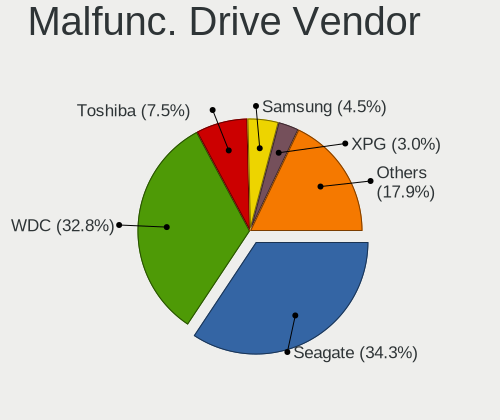
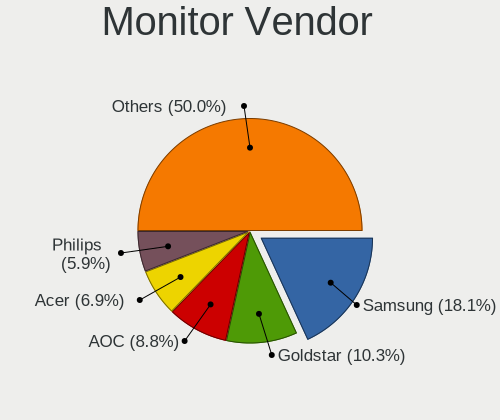
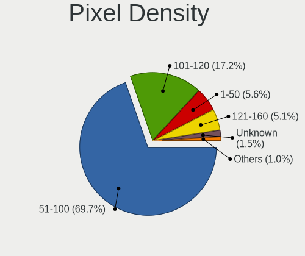

Linux in Russia - Hardware Trends (Desktops)
--------------------------------------------

A project to identify most popular hardware characteristics and track their change
over time based on data collected by Linux users at https://Linux-Hardware.org.

Anyone can contribute to this report by the [hw-probe](https://github.com/linuxhw/hw-probe) tool:

    sudo -E hw-probe -all -upload

Period: Oct, 2022.

Contents
--------

* [ System ](#system)
  - [ OS                       ](#os)
  - [ OS Family                ](#os-family)
  - [ Kernel                   ](#kernel)
  - [ Kernel Family            ](#kernel-family)
  - [ Kernel Major Ver.        ](#kernel-major-ver)
  - [ Arch                     ](#arch)
  - [ DE                       ](#de)
  - [ Display Server           ](#display-server)
  - [ Display Manager          ](#display-manager)
  - [ OS Lang                  ](#os-lang)
  - [ Boot Mode                ](#boot-mode)
  - [ Filesystem               ](#filesystem)
  - [ Part. scheme             ](#part-scheme)
  - [ Dual Boot with Linux/BSD ](#dual-boot-with-linuxbsd)
  - [ Dual Boot (Win)          ](#dual-boot-win)

* [ Board ](#board)
  - [ Vendor                   ](#vendor)
  - [ Model                    ](#model)
  - [ Model Family             ](#model-family)
  - [ MFG Year                 ](#mfg-year)
  - [ Form Factor              ](#form-factor)
  - [ Secure Boot              ](#secure-boot)
  - [ Coreboot                 ](#coreboot)
  - [ RAM Size                 ](#ram-size)
  - [ RAM Used                 ](#ram-used)
  - [ Total Drives             ](#total-drives)
  - [ Has CD-ROM               ](#has-cd-rom)
  - [ Has Ethernet             ](#has-ethernet)
  - [ Has WiFi                 ](#has-wifi)
  - [ Has Bluetooth            ](#has-bluetooth)

* [ Location ](#location)
  - [ Country                  ](#country)
  - [ City                     ](#city)

* [ Drives ](#drives)
  - [ Drive Vendor             ](#drive-vendor)
  - [ Drive Model              ](#drive-model)
  - [ HDD Vendor               ](#hdd-vendor)
  - [ SSD Vendor               ](#ssd-vendor)
  - [ Drive Kind               ](#drive-kind)
  - [ Drive Connector          ](#drive-connector)
  - [ Drive Size               ](#drive-size)
  - [ Space Total              ](#space-total)
  - [ Space Used               ](#space-used)
  - [ Malfunc. Drives          ](#malfunc-drives)
  - [ Malfunc. Drive Vendor    ](#malfunc-drive-vendor)
  - [ Malfunc. HDD Vendor      ](#malfunc-hdd-vendor)
  - [ Malfunc. Drive Kind      ](#malfunc-drive-kind)
  - [ Failed Drives            ](#failed-drives)
  - [ Failed Drive Vendor      ](#failed-drive-vendor)
  - [ Drive Status             ](#drive-status)

* [ Storage controller ](#storage-controller)
  - [ Storage Vendor           ](#storage-vendor)
  - [ Storage Model            ](#storage-model)
  - [ Storage Kind             ](#storage-kind)

* [ Processor ](#processor)
  - [ CPU Vendor               ](#cpu-vendor)
  - [ CPU Model                ](#cpu-model)
  - [ CPU Model Family         ](#cpu-model-family)
  - [ CPU Cores                ](#cpu-cores)
  - [ CPU Sockets              ](#cpu-sockets)
  - [ CPU Threads              ](#cpu-threads)
  - [ CPU Op-Modes             ](#cpu-op-modes)
  - [ CPU Microcode            ](#cpu-microcode)
  - [ CPU Microarch            ](#cpu-microarch)

* [ Graphics ](#graphics)
  - [ GPU Vendor               ](#gpu-vendor)
  - [ GPU Model                ](#gpu-model)
  - [ GPU Combo                ](#gpu-combo)
  - [ GPU Driver               ](#gpu-driver)
  - [ GPU Memory               ](#gpu-memory)

* [ Monitor ](#monitor)
  - [ Monitor Vendor           ](#monitor-vendor)
  - [ Monitor Model            ](#monitor-model)
  - [ Monitor Resolution       ](#monitor-resolution)
  - [ Monitor Diagonal         ](#monitor-diagonal)
  - [ Monitor Width            ](#monitor-width)
  - [ Aspect Ratio             ](#aspect-ratio)
  - [ Monitor Area             ](#monitor-area)
  - [ Pixel Density            ](#pixel-density)
  - [ Multiple Monitors        ](#multiple-monitors)

* [ Network ](#network)
  - [ Net Controller Vendor    ](#net-controller-vendor)
  - [ Net Controller Model     ](#net-controller-model)
  - [ Wireless Vendor          ](#wireless-vendor)
  - [ Wireless Model           ](#wireless-model)
  - [ Ethernet Vendor          ](#ethernet-vendor)
  - [ Ethernet Model           ](#ethernet-model)
  - [ Net Controller Kind      ](#net-controller-kind)
  - [ Used Controller          ](#used-controller)
  - [ NICs                     ](#nics)
  - [ IPv6                     ](#ipv6)

* [ Bluetooth ](#bluetooth)
  - [ Bluetooth Vendor         ](#bluetooth-vendor)
  - [ Bluetooth Model          ](#bluetooth-model)

* [ Sound ](#sound)
  - [ Sound Vendor             ](#sound-vendor)
  - [ Sound Model              ](#sound-model)

* [ Memory ](#memory)
  - [ Memory Vendor            ](#memory-vendor)
  - [ Memory Model             ](#memory-model)
  - [ Memory Kind              ](#memory-kind)
  - [ Memory Form Factor       ](#memory-form-factor)
  - [ Memory Size              ](#memory-size)
  - [ Memory Speed             ](#memory-speed)

* [ Printers & scanners ](#printers--scanners)
  - [ Printer Vendor           ](#printer-vendor)
  - [ Printer Model            ](#printer-model)
  - [ Scanner Vendor           ](#scanner-vendor)
  - [ Scanner Model            ](#scanner-model)

* [ Camera ](#camera)
  - [ Camera Vendor            ](#camera-vendor)
  - [ Camera Model             ](#camera-model)

* [ Security ](#security)
  - [ Fingerprint Vendor       ](#fingerprint-vendor)
  - [ Fingerprint Model        ](#fingerprint-model)
  - [ Chipcard Vendor          ](#chipcard-vendor)
  - [ Chipcard Model           ](#chipcard-model)

* [ Unsupported ](#unsupported)
  - [ Unsupported Devices      ](#unsupported-devices)
  - [ Unsupported Device Types ](#unsupported-device-types)

System
------

OS
--

Installed operating systems

| Name               | Desktops | Percent |
|--------------------|----------|---------|
| ROSA 12.2          | 107      | 44.77%  |
| Debian 11          | 19       | 7.95%   |
| Ubuntu 22.04       | 12       | 5.02%   |
| Red OS 7.3.1       | 12       | 5.02%   |
| OpenMandriva 4.3   | 12       | 5.02%   |
| ROSA R11.1         | 9        | 3.77%   |
| ALT Linux 10.1     | 9        | 3.77%   |
| ROSA 12.3          | 5        | 2.09%   |
| Linux Mint 21      | 5        | 2.09%   |
| Ubuntu 20.04       | 4        | 1.67%   |
| Fedora 36          | 4        | 1.67%   |
| Ubuntu 22.10       | 3        | 1.26%   |
| ROSA 12.1          | 3        | 1.26%   |
| Arch Rolling       | 3        | 1.26%   |
| Red OS 7.3         | 2        | 0.84%   |
| OpenMandriva 4.90  | 2        | 0.84%   |
| OpenMandriva 4.2   | 2        | 0.84%   |
| Manjaro            | 2        | 0.84%   |
| LMDE 5             | 2        | 0.84%   |
| KDE neon 20.04     | 2        | 0.84%   |
| Zorin 16           | 1        | 0.42%   |
| Xero Rolling       | 1        | 0.42%   |
| Ubuntu MATE 22.04  | 1        | 0.42%   |
| ROSA R11           | 1        | 0.42%   |
| Red OS 7.3.2       | 1        | 0.42%   |
| Pop!_OS 22.04      | 1        | 0.42%   |
| openSUSE Leap-15.4 | 1        | 0.42%   |
| MOS 10             | 1        | 0.42%   |
| Manjaro 22.0.0     | 1        | 0.42%   |
| Linux Mint 20.3    | 1        | 0.42%   |
| Linux Mint 19.3    | 1        | 0.42%   |
| Linux Mint 18.3    | 1        | 0.42%   |
| KDE neon 22.04     | 1        | 0.42%   |
| Fedora 37          | 1        | 0.42%   |
| EuroLinux 9.0      | 1        | 0.42%   |
| Elementary 6.1     | 1        | 0.42%   |
| Debian Testing     | 1        | 0.42%   |
| Debian             | 1        | 0.42%   |
| ArcoLinux Rolling  | 1        | 0.42%   |
| ALT Linux P10      | 1        | 0.42%   |

OS Family
---------

OS without a version

| Name         | Desktops | Percent |
|--------------|----------|---------|
| ROSA         | 125      | 52.3%   |
| Debian       | 21       | 8.79%   |
| Ubuntu       | 19       | 7.95%   |
| OpenMandriva | 16       | 6.69%   |
| Red OS       | 15       | 6.28%   |
| ALT Linux    | 11       | 4.6%    |
| Linux Mint   | 8        | 3.35%   |
| Fedora       | 5        | 2.09%   |
| Manjaro      | 3        | 1.26%   |
| KDE neon     | 3        | 1.26%   |
| Arch         | 3        | 1.26%   |
| LMDE         | 2        | 0.84%   |
| Zorin        | 1        | 0.42%   |
| Xero         | 1        | 0.42%   |
| Ubuntu MATE  | 1        | 0.42%   |
| Pop!_OS      | 1        | 0.42%   |
| openSUSE     | 1        | 0.42%   |
| EuroLinux    | 1        | 0.42%   |
| Elementary   | 1        | 0.42%   |
| ArcoLinux    | 1        | 0.42%   |

Kernel
------

Version of the Linux kernel

| Version                                  | Desktops | Percent |
|------------------------------------------|----------|---------|
| 5.10.74-generic-2rosa2021.1-x86_64       | 50       | 20.92%  |
| 5.10.118-generic-2rosa2021.1-x86_64      | 33       | 13.81%  |
| 5.16.7-desktop-1omv4003                  | 12       | 5.02%   |
| 5.10.0-7-amd64                           | 12       | 5.02%   |
| 5.15.0-52-generic                        | 9        | 3.77%   |
| 5.15.0-48-generic                        | 9        | 3.77%   |
| 5.15.35-5.el7.3.x86_64                   | 8        | 3.35%   |
| 5.17.11-generic-2rosa2021.1-x86_64       | 6        | 2.51%   |
| 5.15.10-1.el7.x86_64                     | 6        | 2.51%   |
| 5.18.18.xm1-1-xanmod-rosa2021.1-x86_64   | 4        | 1.67%   |
| 5.15.43-generic-2rosa2021.1-x86_64       | 4        | 1.67%   |
| 5.15.0-50-generic                        | 4        | 1.67%   |
| 5.10.150-generic-1rosa2021.1-x86_64      | 4        | 1.67%   |
| 5.4.83-generic-2rosa-i586                | 3        | 1.26%   |
| 5.15.75-generic-1rosa2021.1-x86_64       | 3        | 1.26%   |
| 5.10.145-std-def-alt1                    | 3        | 1.26%   |
| 5.10.0-18-amd64                          | 3        | 1.26%   |
| 5.4.0-128-generic                        | 2        | 0.84%   |
| 5.19.15-201.fc36.x86_64                  | 2        | 0.84%   |
| 5.19.0-23-generic                        | 2        | 0.84%   |
| 5.18.12-desktop-3omv4090                 | 2        | 0.84%   |
| 5.15.74-generic-1rosa2021.1-x86_64       | 2        | 0.84%   |
| 5.15.70-un-def-alt1                      | 2        | 0.84%   |
| 5.15.34-un-def-alt1                      | 2        | 0.84%   |
| 5.10.82-std-def-alt1                     | 2        | 0.84%   |
| 5.10.14-desktop-1omv4002                 | 2        | 0.84%   |
| 5.10.118-generic-2rosa2021.1-i586        | 2        | 0.84%   |
| 4.15.0-desktop-122.124.1rosa-x86_64      | 2        | 0.84%   |
| 6.1.0-1-MANJARO                          | 1        | 0.42%   |
| 6.0.6.xm1-1.klp-xanmod-rosa2021.1-x86_64 | 1        | 0.42%   |
| 6.0.5-arch1-1                            | 1        | 0.42%   |
| 6.0.2.xm1-1.klp-xanmod-rosa2021.1-x86_64 | 1        | 0.42%   |
| 6.0.2-2-MANJARO                          | 1        | 0.42%   |
| 6.0.0.xm1-4.klp-xanmod-rosa2021.1-x86_64 | 1        | 0.42%   |
| 6.0.0-2-amd64                            | 1        | 0.42%   |
| 6.0.0-1-MANJARO                          | 1        | 0.42%   |
| 6.0.0-0.slh.1-aptosid-686                | 1        | 0.42%   |
| 5.8.0-55-generic                         | 1        | 0.42%   |
| 5.4.83-generic-2rosa-x86_64              | 1        | 0.42%   |
| 5.4.32-generic-2rosa-x86_64              | 1        | 0.42%   |

Kernel Family
-------------

Linux kernel without a distro release

| Version  | Desktops | Percent |
|----------|----------|---------|
| 5.10.74  | 51       | 21.34%  |
| 5.10.118 | 35       | 14.64%  |
| 5.15.0   | 24       | 10.04%  |
| 5.10.0   | 17       | 7.11%   |
| 5.16.7   | 12       | 5.02%   |
| 5.15.35  | 9        | 3.77%   |
| 5.19.0   | 7        | 2.93%   |
| 5.17.11  | 6        | 2.51%   |
| 5.15.10  | 6        | 2.51%   |
| 6.0.0    | 4        | 1.67%   |
| 5.4.83   | 4        | 1.67%   |
| 5.19.13  | 4        | 1.67%   |
| 5.18.18  | 4        | 1.67%   |
| 5.15.43  | 4        | 1.67%   |
| 5.10.150 | 4        | 1.67%   |
| 5.15.75  | 3        | 1.26%   |
| 5.15.74  | 3        | 1.26%   |
| 5.10.145 | 3        | 1.26%   |
| 4.15.0   | 3        | 1.26%   |
| 6.0.2    | 2        | 0.84%   |
| 5.4.32   | 2        | 0.84%   |
| 5.4.0    | 2        | 0.84%   |
| 5.19.15  | 2        | 0.84%   |
| 5.18.12  | 2        | 0.84%   |
| 5.15.70  | 2        | 0.84%   |
| 5.15.34  | 2        | 0.84%   |
| 5.10.82  | 2        | 0.84%   |
| 5.10.14  | 2        | 0.84%   |
| 6.1.0    | 1        | 0.42%   |
| 6.0.6    | 1        | 0.42%   |
| 6.0.5    | 1        | 0.42%   |
| 5.8.0    | 1        | 0.42%   |
| 5.19.8   | 1        | 0.42%   |
| 5.19.4   | 1        | 0.42%   |
| 5.19.16  | 1        | 0.42%   |
| 5.19.12  | 1        | 0.42%   |
| 5.18.0   | 1        | 0.42%   |
| 5.17.0   | 1        | 0.42%   |
| 5.15.71  | 1        | 0.42%   |
| 5.15.13  | 1        | 0.42%   |

Kernel Major Ver.
-----------------

Linux kernel major version

| Version | Desktops | Percent |
|---------|----------|---------|
| 5.10    | 116      | 48.54%  |
| 5.15    | 55       | 23.01%  |
| 5.19    | 17       | 7.11%   |
| 5.16    | 12       | 5.02%   |
| 6.0     | 8        | 3.35%   |
| 5.4     | 8        | 3.35%   |
| 5.18    | 7        | 2.93%   |
| 5.17    | 7        | 2.93%   |
| 4.15    | 3        | 1.26%   |
| 5.14    | 2        | 0.84%   |
| 6.1     | 1        | 0.42%   |
| 5.8     | 1        | 0.42%   |
| 5.11    | 1        | 0.42%   |
| 4.9     | 1        | 0.42%   |

Arch
----

OS architecture (x86_64, i586, etc.)

| Name   | Desktops | Percent |
|--------|----------|---------|
| x86_64 | 229      | 95.82%  |
| i686   | 10       | 4.18%   |

DE
--

Desktop Environment

| Name       | Desktops | Percent |
|------------|----------|---------|
| KDE5       | 97       | 40.59%  |
| GNOME      | 76       | 31.8%   |
| MATE       | 16       | 6.69%   |
| Unknown    | 16       | 6.69%   |
| LXQt       | 10       | 4.18%   |
| XFCE       | 8        | 3.35%   |
| X-Cinnamon | 7        | 2.93%   |
| KDE4       | 4        | 1.67%   |
| Cinnamon   | 3        | 1.26%   |
| Pantheon   | 1        | 0.42%   |
| bspwm      | 1        | 0.42%   |

Display Server
--------------

X11 or Wayland

| Name    | Desktops | Percent |
|---------|----------|---------|
| X11     | 115      | 48.12%  |
| Wayland | 108      | 45.19%  |
| Unknown | 14       | 5.86%   |
| Tty     | 2        | 0.84%   |

Display Manager
---------------

SDDM, LightDM, etc.

| Name    | Desktops | Percent |
|---------|----------|---------|
| SDDM    | 89       | 37.24%  |
| GDM     | 77       | 32.22%  |
| Unknown | 40       | 16.74%  |
| GDM3    | 15       | 6.28%   |
| LightDM | 14       | 5.86%   |
| KDM     | 4        | 1.67%   |

OS Lang
-------

Language

| Lang    | Desktops | Percent |
|---------|----------|---------|
| ru_RU   | 192      | 80.33%  |
| en_US   | 29       | 12.13%  |
| Unknown | 16       | 6.69%   |
| C       | 2        | 0.84%   |

Boot Mode
---------

EFI or BIOS

| Mode | Desktops | Percent |
|------|----------|---------|
| BIOS | 136      | 56.9%   |
| EFI  | 103      | 43.1%   |

Filesystem
----------

Type of filesystem

| Type    | Desktops | Percent |
|---------|----------|---------|
| Ext4    | 186      | 77.82%  |
| Overlay | 28       | 11.72%  |
| Btrfs   | 19       | 7.95%   |
| Xfs     | 3        | 1.26%   |
| F2fs    | 2        | 0.84%   |
| Ext3    | 1        | 0.42%   |

Part. scheme
------------

Scheme of partitioning

| Type    | Desktops | Percent |
|---------|----------|---------|
| GPT     | 134      | 56.07%  |
| MBR     | 79       | 33.05%  |
| Unknown | 26       | 10.88%  |

Dual Boot with Linux/BSD
------------------------

Hosting more than one Linux/BSD

| Dual boot | Desktops | Percent |
|-----------|----------|---------|
| No        | 183      | 76.57%  |
| Yes       | 56       | 23.43%  |

Dual Boot (Win)
---------------

Hosting Linux and Windows

| Dual boot | Desktops | Percent |
|-----------|----------|---------|
| No        | 138      | 57.74%  |
| Yes       | 101      | 42.26%  |

Board
-----

Vendor
------

Motherboard manufacturer

| Name                 | Desktops | Percent |
|----------------------|----------|---------|
| ASUSTek Computer     | 64       | 26.78%  |
| Gigabyte Technology  | 63       | 26.36%  |
| ASRock               | 29       | 12.13%  |
| MSI                  | 28       | 11.72%  |
| Biostar              | 7        | 2.93%   |
| Hewlett-Packard      | 6        | 2.51%   |
| ECS                  | 5        | 2.09%   |
| Lenovo               | 4        | 1.67%   |
| Intel                | 4        | 1.67%   |
| Fujitsu              | 4        | 1.67%   |
| Dell                 | 3        | 1.26%   |
| Unknown              | 3        | 1.26%   |
| Huanan               | 2        | 0.84%   |
| Techvision           | 1        | 0.42%   |
| Sapphire             | 1        | 0.42%   |
| Pegatron             | 1        | 0.42%   |
| OEM                  | 1        | 0.42%   |
| MiTAC                | 1        | 0.42%   |
| MACHINIST            | 1        | 0.42%   |
| Kraftway             | 1        | 0.42%   |
| Kllisre              | 1        | 0.42%   |
| Graviton             | 1        | 0.42%   |
| Giga-Byte Technology | 1        | 0.42%   |
| Foxconn              | 1        | 0.42%   |
| Founder              | 1        | 0.42%   |
| eMachines            | 1        | 0.42%   |
| Colorful Technology  | 1        | 0.42%   |
| AZW                  | 1        | 0.42%   |
| AMI                  | 1        | 0.42%   |
| Acer                 | 1        | 0.42%   |

Model
-----

Motherboard model

| Name                              | Desktops | Percent |
|-----------------------------------|----------|---------|
| ASUS All Series                   | 8        | 3.35%   |
| Unknown                           | 4        | 1.67%   |
| MSI MS-7817                       | 3        | 1.26%   |
| Gigabyte B450M DS3H               | 3        | 1.26%   |
| MSI MS-7C52                       | 2        | 0.84%   |
| MSI MS-7996                       | 2        | 0.84%   |
| Gigabyte Z97-HD3                  | 2        | 0.84%   |
| Gigabyte H61M-S2PV                | 2        | 0.84%   |
| Gigabyte H110M-S2                 | 2        | 0.84%   |
| Gigabyte GA-880GM-D2H             | 2        | 0.84%   |
| Gigabyte EP41-UD3L                | 2        | 0.84%   |
| Gigabyte A320M-S2H                | 2        | 0.84%   |
| ASUS P8H77-V                      | 2        | 0.84%   |
| ASUS P8B75-V                      | 2        | 0.84%   |
| ASUS P7H55-M/USB3                 | 2        | 0.84%   |
| ASUS M5A87                        | 2        | 0.84%   |
| ASUS GU609AA-ACB a6230.ru         | 2        | 0.84%   |
| ASRock A320M-HDV R4.0             | 2        | 0.84%   |
| Techvision TVI7309X               | 1        | 0.42%   |
| Sapphire IPC-E350M1               | 1        | 0.42%   |
| Pegatron Compaq dx2400 Microtower | 1        | 0.42%   |
| MSI MS-7D82                       | 1        | 0.42%   |
| MSI MS-7D46                       | 1        | 0.42%   |
| MSI MS-7D15                       | 1        | 0.42%   |
| MSI MS-7C94                       | 1        | 0.42%   |
| MSI MS-7C75                       | 1        | 0.42%   |
| MSI MS-7C09                       | 1        | 0.42%   |
| MSI MS-7B89                       | 1        | 0.42%   |
| MSI MS-7B87                       | 1        | 0.42%   |
| MSI MS-7B86                       | 1        | 0.42%   |
| MSI MS-7B19                       | 1        | 0.42%   |
| MSI MS-7A39                       | 1        | 0.42%   |
| MSI MS-7A34                       | 1        | 0.42%   |
| MSI MS-7918                       | 1        | 0.42%   |
| MSI MS-7917                       | 1        | 0.42%   |
| MSI MS-7680                       | 1        | 0.42%   |
| MSI MS-7636                       | 1        | 0.42%   |
| MSI MS-7529                       | 1        | 0.42%   |
| MSI MS-7430                       | 1        | 0.42%   |
| MSI MPG B560 Trident A (MS-B926)  | 1        | 0.42%   |

Model Family
------------

Motherboard model prefix

| Name                  | Desktops | Percent |
|-----------------------|----------|---------|
| ASUS PRIME            | 13       | 5.44%   |
| ASUS All              | 8        | 3.35%   |
| Gigabyte B450M        | 5        | 2.09%   |
| Fujitsu ESPRIMO       | 4        | 1.67%   |
| Unknown               | 4        | 1.67%   |
| MSI MS-7817           | 3        | 1.26%   |
| HP Compaq             | 3        | 1.26%   |
| Gigabyte Z690         | 3        | 1.26%   |
| ASUS P8H61-M          | 3        | 1.26%   |
| ASUS P7H55-M          | 3        | 1.26%   |
| MSI MS-7C52           | 2        | 0.84%   |
| MSI MS-7996           | 2        | 0.84%   |
| Gigabyte Z97-HD3      | 2        | 0.84%   |
| Gigabyte H61M-S2PV    | 2        | 0.84%   |
| Gigabyte H410M        | 2        | 0.84%   |
| Gigabyte H110M-S2     | 2        | 0.84%   |
| Gigabyte GA-880GM-D2H | 2        | 0.84%   |
| Gigabyte EP41-UD3L    | 2        | 0.84%   |
| Gigabyte B550M        | 2        | 0.84%   |
| Gigabyte B550         | 2        | 0.84%   |
| Gigabyte B450         | 2        | 0.84%   |
| Gigabyte A320M-S2H    | 2        | 0.84%   |
| Dell Precision        | 2        | 0.84%   |
| ASUS ROG              | 2        | 0.84%   |
| ASUS P8H77-V          | 2        | 0.84%   |
| ASUS P8B75-V          | 2        | 0.84%   |
| ASUS M5A97            | 2        | 0.84%   |
| ASUS M5A87            | 2        | 0.84%   |
| ASUS M5A78L           | 2        | 0.84%   |
| ASUS GU609AA-ACB      | 2        | 0.84%   |
| ASRock G41C-GS        | 2        | 0.84%   |
| ASRock B550           | 2        | 0.84%   |
| ASRock A320M-HDV      | 2        | 0.84%   |
| Techvision TVI7309X   | 1        | 0.42%   |
| Sapphire IPC-E350M1   | 1        | 0.42%   |
| Pegatron Compaq       | 1        | 0.42%   |
| MSI MS-7D82           | 1        | 0.42%   |
| MSI MS-7D46           | 1        | 0.42%   |
| MSI MS-7D15           | 1        | 0.42%   |
| MSI MS-7C94           | 1        | 0.42%   |

MFG Year
--------

Motherboard manufacture year

| Year | Desktops | Percent |
|------|----------|---------|
| 2012 | 30       | 12.55%  |
| 2021 | 21       | 8.79%   |
| 2020 | 21       | 8.79%   |
| 2018 | 20       | 8.37%   |
| 2011 | 20       | 8.37%   |
| 2017 | 14       | 5.86%   |
| 2022 | 13       | 5.44%   |
| 2019 | 13       | 5.44%   |
| 2013 | 13       | 5.44%   |
| 2009 | 13       | 5.44%   |
| 2007 | 13       | 5.44%   |
| 2010 | 12       | 5.02%   |
| 2016 | 11       | 4.6%    |
| 2014 | 11       | 4.6%    |
| 2015 | 6        | 2.51%   |
| 2008 | 5        | 2.09%   |
| 2006 | 1        | 0.42%   |
| 2005 | 1        | 0.42%   |
| 2000 | 1        | 0.42%   |

Form Factor
-----------

Physical design of the computer

| Name    | Desktops | Percent |
|---------|----------|---------|
| Desktop | 239      | 100%    |

Secure Boot
-----------

Enabled or disabled

| State    | Desktops | Percent |
|----------|----------|---------|
| Disabled | 235      | 98.33%  |
| Enabled  | 4        | 1.67%   |

Coreboot
--------

Have coreboot on board

| Used | Desktops | Percent |
|------|----------|---------|
| No   | 239      | 100%    |

RAM Size
--------

Total RAM memory

| Size in GB  | Desktops | Percent |
|-------------|----------|---------|
| 16.01-24.0  | 64       | 26.78%  |
| 4.01-8.0    | 46       | 19.25%  |
| 8.01-16.0   | 40       | 16.74%  |
| 3.01-4.0    | 38       | 15.9%   |
| 32.01-64.0  | 28       | 11.72%  |
| 1.01-2.0    | 11       | 4.6%    |
| 24.01-32.0  | 4        | 1.67%   |
| 64.01-256.0 | 4        | 1.67%   |
| 2.01-3.0    | 3        | 1.26%   |
| 0.01-0.5    | 1        | 0.42%   |

RAM Used
--------

Used RAM memory

| Used GB   | Desktops | Percent |
|-----------|----------|---------|
| 1.01-2.0  | 105      | 43.93%  |
| 0.51-1.0  | 49       | 20.5%   |
| 2.01-3.0  | 42       | 17.57%  |
| 4.01-8.0  | 22       | 9.21%   |
| 3.01-4.0  | 15       | 6.28%   |
| 8.01-16.0 | 5        | 2.09%   |
| 0.01-0.5  | 1        | 0.42%   |

Total Drives
------------

Number of drives on board

| Drives | Desktops | Percent |
|--------|----------|---------|
| 1      | 107      | 44.77%  |
| 2      | 60       | 25.1%   |
| 3      | 53       | 22.18%  |
| 4      | 7        | 2.93%   |
| 6      | 4        | 1.67%   |
| 5      | 4        | 1.67%   |
| 8      | 2        | 0.84%   |
| 7      | 1        | 0.42%   |
| 0      | 1        | 0.42%   |

Has CD-ROM
----------

Has CD-ROM on board

| Presented | Desktops | Percent |
|-----------|----------|---------|
| No        | 160      | 66.95%  |
| Yes       | 79       | 33.05%  |

Has Ethernet
------------

Has Ethernet on board

| Presented | Desktops | Percent |
|-----------|----------|---------|
| Yes       | 237      | 99.16%  |
| No        | 2        | 0.84%   |

Has WiFi
--------

Has WiFi module

| Presented | Desktops | Percent |
|-----------|----------|---------|
| No        | 159      | 66.53%  |
| Yes       | 80       | 33.47%  |

Has Bluetooth
-------------

Has Bluetooth module

| Presented | Desktops | Percent |
|-----------|----------|---------|
| No        | 185      | 77.41%  |
| Yes       | 54       | 22.59%  |

Location
--------

Country
-------

Geographic location (country)

| Country | Desktops | Percent |
|---------|----------|---------|
| Russia  | 239      | 100%    |

City
----

Geographic location (city)

| City              | Desktops | Percent |
|-------------------|----------|---------|
| Moscow            | 42       | 17.57%  |
| St Petersburg     | 19       | 7.95%   |
| Voronezh          | 15       | 6.28%   |
| Novosibirsk       | 8        | 3.35%   |
| Krasnodar         | 8        | 3.35%   |
| Yekaterinburg     | 7        | 2.93%   |
| Ufa               | 7        | 2.93%   |
| Novokuznetsk      | 6        | 2.51%   |
| Rostov-on-Don     | 5        | 2.09%   |
| Vladivostok       | 4        | 1.67%   |
| Nizhniy Novgorod  | 4        | 1.67%   |
| Murom             | 4        | 1.67%   |
| Chelyabinsk       | 4        | 1.67%   |
| Ulyanovsk         | 3        | 1.26%   |
| Stavropol         | 3        | 1.26%   |
| Pskov             | 3        | 1.26%   |
| Kaliningrad       | 3        | 1.26%   |
| Volgograd         | 2        | 0.84%   |
| Tyumen            | 2        | 0.84%   |
| Tver              | 2        | 0.84%   |
| Tula              | 2        | 0.84%   |
| Tambov            | 2        | 0.84%   |
| Samara            | 2        | 0.84%   |
| Perm              | 2        | 0.84%   |
| Nal'chik          | 2        | 0.84%   |
| Krasnoyarsk       | 2        | 0.84%   |
| Kirov             | 2        | 0.84%   |
| Khimki            | 2        | 0.84%   |
| Kemerovo          | 2        | 0.84%   |
| Kazan’          | 2        | 0.84%   |
| Blagoveshchensk   | 2        | 0.84%   |
| Berezniki         | 2        | 0.84%   |
| Balashikha        | 2        | 0.84%   |
| Arkhangelsk       | 2        | 0.84%   |
| Zhukovskiy        | 1        | 0.42%   |
| Yuzhno-Sakhalinsk | 1        | 0.42%   |
| Yoshkar-Ola       | 1        | 0.42%   |
| Yessentuki        | 1        | 0.42%   |
| Yartsevo          | 1        | 0.42%   |
| Yaroslavl         | 1        | 0.42%   |

Drives
------

Drive Vendor
------------

Hard drive vendors

| Vendor                      | Desktops | Drives | Percent |
|-----------------------------|----------|--------|---------|
| WDC                         | 95       | 120    | 22.57%  |
| Seagate                     | 85       | 104    | 20.19%  |
| Samsung Electronics         | 33       | 40     | 7.84%   |
| Kingston                    | 32       | 33     | 7.6%    |
| Toshiba                     | 22       | 22     | 5.23%   |
| Hitachi                     | 15       | 16     | 3.56%   |
| SPCC                        | 11       | 11     | 2.61%   |
| China                       | 11       | 11     | 2.61%   |
| Apacer                      | 10       | 10     | 2.38%   |
| A-DATA Technology           | 10       | 11     | 2.38%   |
| SanDisk                     | 9        | 9      | 2.14%   |
| AMD                         | 9        | 9      | 2.14%   |
| Patriot                     | 6        | 6      | 1.43%   |
| Crucial                     | 6        | 8      | 1.43%   |
| Plextor                     | 5        | 5      | 1.19%   |
| Intel                       | 5        | 5      | 1.19%   |
| Smartbuy                    | 4        | 4      | 0.95%   |
| Maxtor                      | 4        | 4      | 0.95%   |
| Unknown                     | 3        | 3      | 0.71%   |
| Transcend                   | 3        | 3      | 0.71%   |
| HGST                        | 3        | 4      | 0.71%   |
| XPG                         | 2        | 4      | 0.48%   |
| Phison Electronics          | 2        | 2      | 0.48%   |
| OCZ-VERTEX3                 | 2        | 2      | 0.48%   |
| Netac                       | 2        | 2      | 0.48%   |
| Neo                         | 2        | 2      | 0.48%   |
| KingSpec                    | 2        | 2      | 0.48%   |
| JMicron Technology          | 2        | 2      | 0.48%   |
| Corsair                     | 2        | 2      | 0.48%   |
| Zheino                      | 1        | 1      | 0.24%   |
| Team                        | 1        | 1      | 0.24%   |
| T-FORCE                     | 1        | 1      | 0.24%   |
| Supermicro                  | 1        | 1      | 0.24%   |
| StoreJet                    | 1        | 1      | 0.24%   |
| Silicon Motion              | 1        | 1      | 0.24%   |
| Phison                      | 1        | 1      | 0.24%   |
| NVME USB                    | 1        | 1      | 0.24%   |
| Micron/Crucial Technology   | 1        | 1      | 0.24%   |
| MAXIO Technology (Hangzhou) | 1        | 1      | 0.24%   |
| KIOXIA                      | 1        | 1      | 0.24%   |

Drive Model
-----------

Hard drive models

| Model                            | Desktops | Percent |
|----------------------------------|----------|---------|
| Seagate ST1000DM010-2EP102 1TB   | 11       | 2.34%   |
| WDC WDS240G2G0A-00JH30 240GB SSD | 8        | 1.7%    |
| Toshiba HDWD110 1TB              | 7        | 1.49%   |
| WDC WD10EZEX-08WN4A0 1TB         | 5        | 1.06%   |
| SPCC Solid State Disk 120GB      | 5        | 1.06%   |
| Samsung SSD 860 EVO 250GB        | 5        | 1.06%   |
| WDC WDS120G2G0A-00JH30 120GB SSD | 4        | 0.85%   |
| WDC WD5000AAKX-60U6AA0 500GB     | 4        | 0.85%   |
| Toshiba DT01ACA100 1TB           | 4        | 0.85%   |
| Seagate ST3250310AS 250GB        | 4        | 0.85%   |
| Apacer AS350 128GB SSD           | 4        | 0.85%   |
| WDC WDS500G2B0A-00SM50 500GB SSD | 3        | 0.64%   |
| Toshiba DT01ACA050 500GB         | 3        | 0.64%   |
| Seagate ST9320325AS 320GB        | 3        | 0.64%   |
| Seagate ST500DM002-1BD142 500GB  | 3        | 0.64%   |
| Seagate ST380815AS 80GB          | 3        | 0.64%   |
| Seagate ST31000528AS 1TB         | 3        | 0.64%   |
| Seagate ST2000DM008-2FR102 2TB   | 3        | 0.64%   |
| Seagate ST1000DM003-1CH162 1TB   | 3        | 0.64%   |
| Kingston SNVS500G 500GB          | 3        | 0.64%   |
| Kingston SNVS250G 250GB          | 3        | 0.64%   |
| Kingston SA400S37480G 480GB SSD  | 3        | 0.64%   |
| Kingston SA400S37240G 240GB SSD  | 3        | 0.64%   |
| Crucial CT480BX500SSD1 480GB     | 3        | 0.64%   |
| Apacer AS350 256GB SSD           | 3        | 0.64%   |
| AMD R5SL120G 120GB SSD           | 3        | 0.64%   |
| XPG GAMMIX S11 Pro 1TB           | 2        | 0.43%   |
| WDC WDS250G2B0A-00SM50 250GB SSD | 2        | 0.43%   |
| WDC WD5003AZEX-00MK2A0 500GB     | 2        | 0.43%   |
| WDC WD3200AAJS-00L7A0 320GB      | 2        | 0.43%   |
| WDC WD20EZRZ-00Z5HB0 2TB         | 2        | 0.43%   |
| WDC WD20EARX-00PASB0 2TB         | 2        | 0.43%   |
| WDC WD20EARS-00S8B1 2TB          | 2        | 0.43%   |
| WDC WD1600AAJS-00PSA0 160GB      | 2        | 0.43%   |
| WDC WD10JPVX-00JC3T0 1TB         | 2        | 0.43%   |
| WDC WD10EZRX-00L4HB0 1TB         | 2        | 0.43%   |
| WDC WD10EZEX-75WN4A0 1TB         | 2        | 0.43%   |
| WDC WD10EZEX-22MFCA0 1TB         | 2        | 0.43%   |
| WDC WD10EZEX-07ZF5A0 1TB         | 2        | 0.43%   |
| WDC WD10EZEX-00BN5A0 1TB         | 2        | 0.43%   |

HDD Vendor
----------

Hard disk drive vendors

| Vendor              | Desktops | Drives | Percent |
|---------------------|----------|--------|---------|
| Seagate             | 85       | 104    | 39.53%  |
| WDC                 | 77       | 95     | 35.81%  |
| Toshiba             | 21       | 21     | 9.77%   |
| Hitachi             | 15       | 16     | 6.98%   |
| Samsung Electronics | 8        | 8      | 3.72%   |
| Maxtor              | 4        | 4      | 1.86%   |
| HGST                | 3        | 4      | 1.4%    |
| Unknown             | 1        | 1      | 0.47%   |
| ASMT                | 1        | 2      | 0.47%   |

SSD Vendor
----------

Solid state drive vendors

| Vendor              | Desktops | Drives | Percent |
|---------------------|----------|--------|---------|
| Kingston            | 22       | 22     | 13.84%  |
| WDC                 | 20       | 21     | 12.58%  |
| Samsung Electronics | 17       | 18     | 10.69%  |
| SPCC                | 11       | 11     | 6.92%   |
| China               | 11       | 11     | 6.92%   |
| Apacer              | 9        | 9      | 5.66%   |
| AMD                 | 8        | 8      | 5.03%   |
| A-DATA Technology   | 8        | 9      | 5.03%   |
| Patriot             | 6        | 6      | 3.77%   |
| Crucial             | 6        | 8      | 3.77%   |
| SanDisk             | 5        | 5      | 3.14%   |
| Plextor             | 5        | 5      | 3.14%   |
| Smartbuy            | 4        | 4      | 2.52%   |
| Intel               | 3        | 3      | 1.89%   |
| OCZ-VERTEX3         | 2        | 2      | 1.26%   |
| Neo                 | 2        | 2      | 1.26%   |
| KingSpec            | 2        | 2      | 1.26%   |
| Corsair             | 2        | 2      | 1.26%   |
| Zheino              | 1        | 1      | 0.63%   |
| Unknown             | 1        | 1      | 0.63%   |
| Transcend           | 1        | 1      | 0.63%   |
| Toshiba             | 1        | 1      | 0.63%   |
| Team                | 1        | 1      | 0.63%   |
| T-FORCE             | 1        | 1      | 0.63%   |
| Supermicro          | 1        | 1      | 0.63%   |
| StoreJet            | 1        | 1      | 0.63%   |
| Netac               | 1        | 1      | 0.63%   |
| KingDian            | 1        | 1      | 0.63%   |
| Hewlett-Packard     | 1        | 1      | 0.63%   |
| GOODRAM             | 1        | 1      | 0.63%   |
| Foxline             | 1        | 1      | 0.63%   |
| AGI                 | 1        | 1      | 0.63%   |
| 1TB                 | 1        | 1      | 0.63%   |
| Unknown             | 1        | 1      | 0.63%   |

Drive Kind
----------

HDD or SSD

| Kind    | Desktops | Drives | Percent |
|---------|----------|--------|---------|
| HDD     | 176      | 255    | 49.16%  |
| SSD     | 127      | 164    | 35.47%  |
| NVMe    | 49       | 56     | 13.69%  |
| Unknown | 5        | 5      | 1.4%    |
| MMC     | 1        | 1      | 0.28%   |

Drive Connector
---------------

SATA, SAS, NVMe, etc.

| Type | Desktops | Drives | Percent |
|------|----------|--------|---------|
| SATA | 224      | 413    | 78.87%  |
| NVMe | 46       | 53     | 16.2%   |
| SAS  | 13       | 14     | 4.58%   |
| MMC  | 1        | 1      | 0.35%   |

Drive Size
----------

Size of hard drive

| Size in TB | Desktops | Drives | Percent |
|------------|----------|--------|---------|
| 0.01-0.5   | 186      | 261    | 58.68%  |
| 0.51-1.0   | 91       | 106    | 28.71%  |
| 1.01-2.0   | 25       | 34     | 7.89%   |
| 4.01-10.0  | 6        | 7      | 1.89%   |
| 2.01-3.0   | 5        | 7      | 1.58%   |
| 3.01-4.0   | 3        | 3      | 0.95%   |
| 10.01-20.0 | 1        | 1      | 0.32%   |

Space Total
-----------

Amount of disk space available on the file system

| Size in GB     | Desktops | Percent |
|----------------|----------|---------|
| 101-250        | 67       | 28.03%  |
| 501-1000       | 38       | 15.9%   |
| 251-500        | 34       | 14.23%  |
| 1001-2000      | 25       | 10.46%  |
| 1-20           | 20       | 8.37%   |
| 51-100         | 15       | 6.28%   |
| Unknown        | 13       | 5.44%   |
| 21-50          | 11       | 4.6%    |
| 2001-3000      | 10       | 4.18%   |
| More than 3000 | 6        | 2.51%   |

Space Used
----------

Amount of used disk space

| Used GB        | Desktops | Percent |
|----------------|----------|---------|
| 1-20           | 110      | 46.03%  |
| 21-50          | 33       | 13.81%  |
| 501-1000       | 21       | 8.79%   |
| 51-100         | 19       | 7.95%   |
| 101-250        | 18       | 7.53%   |
| 251-500        | 15       | 6.28%   |
| Unknown        | 13       | 5.44%   |
| 1001-2000      | 8        | 3.35%   |
| More than 3000 | 2        | 0.84%   |

Malfunc. Drives
---------------

Drive models with a malfunction

| Model                                   | Desktops | Drives | Percent |
|-----------------------------------------|----------|--------|---------|
| WDC WD5000AAKX-60U6AA0 500GB            | 4        | 4      | 4.88%   |
| WDC WDS240G2G0A-00JH30 240GB SSD        | 3        | 3      | 3.66%   |
| Seagate ST3250310AS 250GB               | 3        | 3      | 3.66%   |
| WDC WD3200AAJS-00L7A0 320GB             | 2        | 2      | 2.44%   |
| WDC WD20EARS-00S8B1 2TB                 | 2        | 2      | 2.44%   |
| Seagate ST31000528AS 1TB                | 2        | 2      | 2.44%   |
| Seagate ST1000DM010-2EP102 1TB          | 2        | 2      | 2.44%   |
| OCZ-VERTEX3 MI 120GB SSD                | 2        | 2      | 2.44%   |
| Neo Forza NFS121SA312-6007000 120GB SSD | 2        | 2      | 2.44%   |
| WDC WD7500BPVT-22A1YT0 752GB            | 1        | 1      | 1.22%   |
| WDC WD7500AAKS-00RBA0 752GB             | 1        | 1      | 1.22%   |
| WDC WD6400AAKS-22A7B2 640GB             | 1        | 1      | 1.22%   |
| WDC WD5000AAKX-00ERMA0 500GB            | 1        | 1      | 1.22%   |
| WDC WD5000AAKX-001CA0 500GB             | 1        | 1      | 1.22%   |
| WDC WD3200AAJS-65B4A0 320GB             | 1        | 1      | 1.22%   |
| WDC WD20EZRZ-00Z5HB0 2TB                | 1        | 1      | 1.22%   |
| WDC WD20EARX-00PASB0 2TB                | 1        | 1      | 1.22%   |
| WDC WD10EZRX-00L4HB0 1TB                | 1        | 1      | 1.22%   |
| WDC WD10EZEX-75WN4A0 1TB                | 1        | 1      | 1.22%   |
| WDC WD10EZEX-22MFCA0 1TB                | 1        | 1      | 1.22%   |
| WDC WD10EARX-00N0YB0 1TB                | 1        | 1      | 1.22%   |
| WDC WD10EARS-00Y5B1 1TB                 | 1        | 1      | 1.22%   |
| WDC WD1003FZEX-00MK2A0 1TB              | 1        | 1      | 1.22%   |
| WDC WD1003FBYX-01Y7B0 1TB               | 1        | 1      | 1.22%   |
| WDC WD1002FAEX-00Z3A0 1TB               | 1        | 1      | 1.22%   |
| SPCC Solid State Disk 56GB              | 1        | 1      | 1.22%   |
| SPCC Solid State Disk 240GB             | 1        | 1      | 1.22%   |
| Seagate ST9160310AS 160GB               | 1        | 1      | 1.22%   |
| Seagate ST500NM0011 500GB               | 1        | 1      | 1.22%   |
| Seagate ST500DM002-9YN14C 500GB         | 1        | 1      | 1.22%   |
| Seagate ST500DM002-1BD142 500GB         | 1        | 1      | 1.22%   |
| Seagate ST380815AS 80GB                 | 1        | 1      | 1.22%   |
| Seagate ST3808110AS 80GB                | 1        | 1      | 1.22%   |
| Seagate ST380021A 80GB                  | 1        | 1      | 1.22%   |
| Seagate ST3320418AS 320GB               | 1        | 1      | 1.22%   |
| Seagate ST32000641AS 2TB                | 1        | 1      | 1.22%   |
| Seagate ST3160812A 160GB                | 1        | 1      | 1.22%   |
| Seagate ST3120814A 120GB                | 1        | 1      | 1.22%   |
| Seagate ST3120022A 120GB                | 1        | 1      | 1.22%   |
| Seagate ST31000340AS 1TB                | 1        | 1      | 1.22%   |

Malfunc. Drive Vendor
---------------------

Vendors of faulty drives

| Vendor              | Desktops | Drives | Percent |
|---------------------|----------|--------|---------|
| Seagate             | 27       | 29     | 34.18%  |
| WDC                 | 26       | 27     | 32.91%  |
| Hitachi             | 7        | 7      | 8.86%   |
| Maxtor              | 4        | 4      | 5.06%   |
| SPCC                | 2        | 2      | 2.53%   |
| OCZ-VERTEX3         | 2        | 2      | 2.53%   |
| Neo                 | 2        | 2      | 2.53%   |
| Kingston            | 2        | 2      | 2.53%   |
| Corsair             | 2        | 2      | 2.53%   |
| Samsung Electronics | 1        | 1      | 1.27%   |
| Netac               | 1        | 1      | 1.27%   |
| KingSpec            | 1        | 1      | 1.27%   |
| Crucial             | 1        | 1      | 1.27%   |
| Unknown             | 1        | 1      | 1.27%   |

Malfunc. HDD Vendor
-------------------

Vendors of faulty HDD drives

| Vendor  | Desktops | Drives | Percent |
|---------|----------|--------|---------|
| Seagate | 27       | 29     | 44.26%  |
| WDC     | 23       | 24     | 37.7%   |
| Hitachi | 7        | 7      | 11.48%  |
| Maxtor  | 4        | 4      | 6.56%   |

Malfunc. Drive Kind
-------------------

Kinds of faulty drives

| Kind | Desktops | Drives | Percent |
|------|----------|--------|---------|
| HDD  | 54       | 64     | 75%     |
| SSD  | 17       | 17     | 23.61%  |
| NVMe | 1        | 1      | 1.39%   |

Failed Drives
-------------

Failed drive models

| Model                    | Desktops | Drives | Percent |
|--------------------------|----------|--------|---------|
| Seagate ST3500630A 500GB | 1        | 1      | 100%    |

Failed Drive Vendor
-------------------

Failed drive vendors

| Vendor  | Desktops | Drives | Percent |
|---------|----------|--------|---------|
| Seagate | 1        | 1      | 100%    |

Drive Status
------------

Number of failed and malfunc. drives

| Status   | Desktops | Drives | Percent |
|----------|----------|--------|---------|
| Works    | 175      | 309    | 60.14%  |
| Malfunc  | 69       | 82     | 23.71%  |
| Detected | 46       | 89     | 15.81%  |
| Failed   | 1        | 1      | 0.34%   |

Storage controller
------------------

Storage Vendor
--------------

Storage controller vendors

| Vendor                      | Desktops | Percent |
|-----------------------------|----------|---------|
| Intel                       | 167      | 52.52%  |
| AMD                         | 63       | 19.81%  |
| JMicron Technology          | 13       | 4.09%   |
| Samsung Electronics         | 12       | 3.77%   |
| Marvell Technology Group    | 12       | 3.77%   |
| Kingston Technology Company | 11       | 3.46%   |
| SanDisk                     | 8        | 2.52%   |
| Nvidia                      | 7        | 2.2%    |
| ASMedia Technology          | 6        | 1.89%   |
| Silicon Motion              | 4        | 1.26%   |
| Phison Electronics          | 4        | 1.26%   |
| ADATA Technology            | 3        | 0.94%   |
| Silicon Image               | 2        | 0.63%   |
| VIA Technologies            | 1        | 0.31%   |
| Transcend                   | 1        | 0.31%   |
| Realtek Semiconductor       | 1        | 0.31%   |
| Micron/Crucial Technology   | 1        | 0.31%   |
| MAXIO Technology (Hangzhou) | 1        | 0.31%   |
| KIOXIA                      | 1        | 0.31%   |

Storage Model
-------------

Storage controller models

| Model                                                                                   | Desktops | Percent |
|-----------------------------------------------------------------------------------------|----------|---------|
| AMD FCH SATA Controller [AHCI mode]                                                     | 26       | 6.27%   |
| Intel NM10/ICH7 Family SATA Controller [IDE mode]                                       | 16       | 3.86%   |
| AMD 400 Series Chipset SATA Controller                                                  | 16       | 3.86%   |
| AMD SB7x0/SB8x0/SB9x0 IDE Controller                                                    | 15       | 3.61%   |
| Intel 8 Series/C220 Series Chipset Family 6-port SATA Controller 1 [AHCI mode]          | 13       | 3.13%   |
| Intel 6 Series/C200 Series Chipset Family 6 port Desktop SATA AHCI Controller           | 13       | 3.13%   |
| Intel 500 Series Chipset Family SATA AHCI Controller                                    | 13       | 3.13%   |
| Intel 200 Series PCH SATA controller [AHCI mode]                                        | 13       | 3.13%   |
| AMD 500 Series Chipset SATA Controller                                                  | 12       | 2.89%   |
| Intel 82801G (ICH7 Family) IDE Controller                                               | 11       | 2.65%   |
| AMD SB7x0/SB8x0/SB9x0 SATA Controller [IDE mode]                                        | 10       | 2.41%   |
| Kingston Company Company Non-Volatile memory controller                                 | 9        | 2.17%   |
| Intel Q170/Q150/B150/H170/H110/Z170/CM236 Chipset SATA Controller [AHCI Mode]           | 9        | 2.17%   |
| Intel Alder Lake-S PCH SATA Controller [AHCI Mode]                                      | 9        | 2.17%   |
| AMD SB7x0/SB8x0/SB9x0 SATA Controller [AHCI mode]                                       | 9        | 2.17%   |
| Intel 6 Series/C200 Series Chipset Family Desktop SATA Controller (IDE mode, ports 4-5) | 8        | 1.93%   |
| Intel 6 Series/C200 Series Chipset Family Desktop SATA Controller (IDE mode, ports 0-3) | 8        | 1.93%   |
| JMicron JMB363 SATA/IDE Controller                                                      | 7        | 1.69%   |
| Intel 7 Series/C210 Series Chipset Family 6-port SATA Controller [AHCI mode]            | 7        | 1.69%   |
| Intel 7 Series/C210 Series Chipset Family 4-port SATA Controller [IDE mode]             | 7        | 1.69%   |
| Intel 7 Series/C210 Series Chipset Family 2-port SATA Controller [IDE mode]             | 7        | 1.69%   |
| AMD FCH SATA Controller D                                                               | 7        | 1.69%   |
| Samsung NVMe SSD Controller SM981/PM981/PM983                                           | 6        | 1.45%   |
| Intel Comet Lake SATA AHCI Controller                                                   | 6        | 1.45%   |
| Intel 9 Series Chipset Family SATA Controller [AHCI Mode]                               | 6        | 1.45%   |
| ASMedia ASM1062 Serial ATA Controller                                                   | 6        | 1.45%   |
| Intel 82801I (ICH9 Family) 2 port SATA Controller [IDE mode]                            | 5        | 1.2%    |
| SanDisk Non-Volatile memory controller                                                  | 4        | 0.96%   |
| Samsung NVMe SSD Controller PM9A1/PM9A3/980PRO                                          | 4        | 0.96%   |
| JMicron JMB368 IDE controller                                                           | 4        | 0.96%   |
| Intel 82801JI (ICH10 Family) 4 port SATA IDE Controller #1                              | 4        | 0.96%   |
| Intel 82801JI (ICH10 Family) 2 port SATA IDE Controller #2                              | 4        | 0.96%   |
| Intel 400 Series Chipset Family SATA AHCI Controller                                    | 4        | 0.96%   |
| Silicon Motion SM2263EN/SM2263XT SSD Controller                                         | 3        | 0.72%   |
| Phison PS5013 E13 NVMe Controller                                                       | 3        | 0.72%   |
| Intel Volume Management Device NVMe RAID Controller                                     | 3        | 0.72%   |
| Intel Cannon Lake PCH SATA AHCI Controller                                              | 3        | 0.72%   |
| Intel Atom Processor E3800 Series SATA AHCI Controller                                  | 3        | 0.72%   |
| Intel 82801IB (ICH9) 2 port SATA Controller [IDE mode]                                  | 3        | 0.72%   |
| Intel 5 Series/3400 Series Chipset 4 port SATA IDE Controller                           | 3        | 0.72%   |

Storage Kind
------------

Kind of storage controller (IDE, SATA, NVMe, SAS, ...)

| Kind | Desktops | Percent |
|------|----------|---------|
| SATA | 183      | 57.73%  |
| IDE  | 77       | 24.29%  |
| NVMe | 46       | 14.51%  |
| RAID | 10       | 3.15%   |
| SAS  | 1        | 0.32%   |

Processor
---------

CPU Vendor
----------

Processor vendors

| Vendor | Desktops | Percent |
|--------|----------|---------|
| Intel  | 170      | 71.13%  |
| AMD    | 69       | 28.87%  |

CPU Model
---------

Processor models

| Model                                      | Desktops | Percent |
|--------------------------------------------|----------|---------|
| Intel Core i5-3470 CPU @ 3.20GHz           | 7        | 2.93%   |
| Intel Core i3-10100 CPU @ 3.60GHz          | 6        | 2.51%   |
| Intel Core i5-8400 CPU @ 2.80GHz           | 5        | 2.09%   |
| Intel Core i3-10100F CPU @ 3.60GHz         | 5        | 2.09%   |
| AMD Ryzen 5 5600X 6-Core Processor         | 5        | 2.09%   |
| Intel Xeon CPU E5450 @ 3.00GHz             | 4        | 1.67%   |
| Intel Core 2 Duo CPU E7400 @ 2.80GHz       | 4        | 1.67%   |
| AMD Ryzen 5 3600 6-Core Processor          | 4        | 1.67%   |
| Intel Pentium CPU G3420 @ 3.20GHz          | 3        | 1.26%   |
| Intel Core i3-9100F CPU @ 3.60GHz          | 3        | 1.26%   |
| Intel Core i3-6100 CPU @ 3.70GHz           | 3        | 1.26%   |
| Intel 12th Gen Core i5-12400               | 3        | 1.26%   |
| AMD Ryzen 5 2600 Six-Core Processor        | 3        | 1.26%   |
| AMD Ryzen 5 1600 Six-Core Processor        | 3        | 1.26%   |
| AMD Phenom II X4 965 Processor             | 3        | 1.26%   |
| AMD FX-4350 Quad-Core Processor            | 3        | 1.26%   |
| AMD Athlon 3000G with Radeon Vega Graphics | 3        | 1.26%   |
| Intel Xeon CPU E5-2650 v2 @ 2.60GHz        | 2        | 0.84%   |
| Intel Pentium CPU G630 @ 2.70GHz           | 2        | 0.84%   |
| Intel Pentium CPU G3220 @ 3.00GHz          | 2        | 0.84%   |
| Intel Core i7-7700K CPU @ 4.20GHz          | 2        | 0.84%   |
| Intel Core i7-2600K CPU @ 3.40GHz          | 2        | 0.84%   |
| Intel Core i7-2600 CPU @ 3.40GHz           | 2        | 0.84%   |
| Intel Core i5-9400F CPU @ 2.90GHz          | 2        | 0.84%   |
| Intel Core i5-6400 CPU @ 2.70GHz           | 2        | 0.84%   |
| Intel Core i5-4690K CPU @ 3.50GHz          | 2        | 0.84%   |
| Intel Core i5-4460 CPU @ 3.20GHz           | 2        | 0.84%   |
| Intel Core i5-3330 CPU @ 3.00GHz           | 2        | 0.84%   |
| Intel Core i5-2500 CPU @ 3.30GHz           | 2        | 0.84%   |
| Intel Core i5-2400 CPU @ 3.10GHz           | 2        | 0.84%   |
| Intel Core i5-10400 CPU @ 2.90GHz          | 2        | 0.84%   |
| Intel Core i3-2100 CPU @ 3.10GHz           | 2        | 0.84%   |
| Intel Core 2 Quad CPU Q9550 @ 2.83GHz      | 2        | 0.84%   |
| Intel Core 2 Duo CPU E8500 @ 3.16GHz       | 2        | 0.84%   |
| Intel Core 2 Duo CPU E7500 @ 2.93GHz       | 2        | 0.84%   |
| Intel Core 2 Duo CPU E4500 @ 2.20GHz       | 2        | 0.84%   |
| Intel Celeron CPU J1800 @ 2.41GHz          | 2        | 0.84%   |
| Intel 12th Gen Core i5-12600K              | 2        | 0.84%   |
| Intel 11th Gen Core i5-11400 @ 2.60GHz     | 2        | 0.84%   |
| AMD Ryzen 5 5600G with Radeon Graphics     | 2        | 0.84%   |

CPU Model Family
----------------

Processor model prefix

| Model                   | Desktops | Percent |
|-------------------------|----------|---------|
| Intel Core i5           | 42       | 17.57%  |
| Intel Core i3           | 29       | 12.13%  |
| AMD Ryzen 5             | 21       | 8.79%   |
| Other                   | 15       | 6.28%   |
| Intel Core i7           | 15       | 6.28%   |
| Intel Xeon              | 14       | 5.86%   |
| Intel Pentium           | 14       | 5.86%   |
| Intel Core 2 Duo        | 13       | 5.44%   |
| AMD FX                  | 10       | 4.18%   |
| Intel Celeron           | 7        | 2.93%   |
| Intel Core 2 Quad       | 6        | 2.51%   |
| AMD Ryzen 7             | 6        | 2.51%   |
| AMD Phenom II X4        | 6        | 2.51%   |
| AMD Ryzen 3             | 5        | 2.09%   |
| Intel Pentium Dual-Core | 3        | 1.26%   |
| Intel Genuine           | 3        | 1.26%   |
| AMD Athlon              | 3        | 1.26%   |
| Intel Pentium 4         | 2        | 0.84%   |
| Intel Core 2            | 2        | 0.84%   |
| Intel Atom              | 2        | 0.84%   |
| AMD Ryzen 3 PRO         | 2        | 0.84%   |
| AMD Phenom II X6        | 2        | 0.84%   |
| AMD Athlon II X3        | 2        | 0.84%   |
| AMD Athlon 64 X2        | 2        | 0.84%   |
| AMD A8                  | 2        | 0.84%   |
| AMD A10                 | 2        | 0.84%   |
| Intel Pentium Silver    | 1        | 0.42%   |
| Intel Core i9           | 1        | 0.42%   |
| Intel Celeron D         | 1        | 0.42%   |
| AMD Ryzen 5 PRO         | 1        | 0.42%   |
| AMD E2                  | 1        | 0.42%   |
| AMD E                   | 1        | 0.42%   |
| AMD Athlon II X2        | 1        | 0.42%   |
| AMD Athlon II Neo       | 1        | 0.42%   |
| AMD Athlon 64           | 1        | 0.42%   |

CPU Cores
---------

Number of processor cores

| Number | Desktops | Percent |
|--------|----------|---------|
| 4      | 100      | 41.84%  |
| 2      | 66       | 27.62%  |
| 6      | 42       | 17.57%  |
| 8      | 14       | 5.86%   |
| 10     | 5        | 2.09%   |
| 1      | 5        | 2.09%   |
| 3      | 4        | 1.67%   |
| 12     | 2        | 0.84%   |
| 16     | 1        | 0.42%   |

CPU Sockets
-----------

Number of sockets

| Number | Desktops | Percent |
|--------|----------|---------|
| 1      | 239      | 100%    |

CPU Threads
-----------

Threads per core (Hyper-Threading)

| Number | Desktops | Percent |
|--------|----------|---------|
| 2      | 124      | 51.88%  |
| 1      | 115      | 48.12%  |

CPU Op-Modes
------------

CPU Operation Modes (32-bit, 64-bit)

| Op mode        | Desktops | Percent |
|----------------|----------|---------|
| 32-bit, 64-bit | 237      | 99.16%  |
| 32-bit         | 2        | 0.84%   |

CPU Microcode
-------------

Microcode number

| Number     | Desktops | Percent |
|------------|----------|---------|
| Unknown    | 26       | 10.88%  |
| 0x306c3    | 20       | 8.37%   |
| 0x206a7    | 17       | 7.11%   |
| 0xa0653    | 15       | 6.28%   |
| 0x1067a    | 15       | 6.28%   |
| 0x306a9    | 14       | 5.86%   |
| 0x906ea    | 11       | 4.6%    |
| 0x010000c8 | 10       | 4.18%   |
| 0x506e3    | 7        | 2.93%   |
| 0x08108109 | 7        | 2.93%   |
| 0x08701021 | 6        | 2.51%   |
| 0x08001138 | 6        | 2.51%   |
| 0xa0671    | 5        | 2.09%   |
| 0x90672    | 4        | 1.67%   |
| 0x906e9    | 3        | 1.26%   |
| 0x306e4    | 3        | 1.26%   |
| 0x30678    | 3        | 1.26%   |
| 0x10676    | 3        | 1.26%   |
| 0x0800820d | 3        | 1.26%   |
| 0x0600081c | 3        | 1.26%   |
| 0xa0655    | 2        | 0.84%   |
| 0x906eb    | 2        | 0.84%   |
| 0x906c0    | 2        | 0.84%   |
| 0x90675    | 2        | 0.84%   |
| 0x6fd      | 2        | 0.84%   |
| 0x6fb      | 2        | 0.84%   |
| 0x20652    | 2        | 0.84%   |
| 0x106a5    | 2        | 0.84%   |
| 0x08701013 | 2        | 0.84%   |
| 0x08001126 | 2        | 0.84%   |
| 0x06003106 | 2        | 0.84%   |
| 0x06000817 | 2        | 0.84%   |
| 0xf65      | 1        | 0.42%   |
| 0xf4a      | 1        | 0.42%   |
| 0xf41      | 1        | 0.42%   |
| 0x906ec    | 1        | 0.42%   |
| 0x706a8    | 1        | 0.42%   |
| 0x706a1    | 1        | 0.42%   |
| 0x6f6      | 1        | 0.42%   |
| 0x6f2      | 1        | 0.42%   |

CPU Microarch
-------------

Microarchitecture

| Name             | Desktops | Percent |
|------------------|----------|---------|
| Haswell          | 23       | 9.62%   |
| Penryn           | 22       | 9.21%   |
| IvyBridge        | 20       | 8.37%   |
| KabyLake         | 19       | 7.95%   |
| SandyBridge      | 18       | 7.53%   |
| CometLake        | 18       | 7.53%   |
| K10              | 12       | 5.02%   |
| Zen+             | 11       | 4.6%    |
| Zen 3            | 9        | 3.77%   |
| Zen 2            | 9        | 3.77%   |
| Zen              | 9        | 3.77%   |
| Skylake          | 8        | 3.35%   |
| Piledriver       | 8        | 3.35%   |
| Core             | 6        | 2.51%   |
| Unknown          | 6        | 2.51%   |
| Silvermont       | 5        | 2.09%   |
| Alderlake Hybrid | 5        | 2.09%   |
| Icelake          | 4        | 1.67%   |
| Westmere         | 3        | 1.26%   |
| NetBurst         | 3        | 1.26%   |
| Nehalem          | 3        | 1.26%   |
| K8 Hammer        | 3        | 1.26%   |
| Tremont          | 2        | 0.84%   |
| Steamroller      | 2        | 0.84%   |
| Goldmont plus    | 2        | 0.84%   |
| Bulldozer        | 2        | 0.84%   |
| Puma             | 1        | 0.42%   |
| P6               | 1        | 0.42%   |
| K10 Llano        | 1        | 0.42%   |
| Excavator        | 1        | 0.42%   |
| Broadwell        | 1        | 0.42%   |
| Bonnell          | 1        | 0.42%   |
| Bobcat           | 1        | 0.42%   |

Graphics
--------

GPU Vendor
----------

Vendors of graphics cards

| Vendor | Desktops | Percent |
|--------|----------|---------|
| Nvidia | 119      | 46.85%  |
| Intel  | 75       | 29.53%  |
| AMD    | 60       | 23.62%  |

GPU Model
---------

Graphics card models

| Model                                                                       | Desktops | Percent |
|-----------------------------------------------------------------------------|----------|---------|
| Nvidia GP107 [GeForce GTX 1050 Ti]                                          | 12       | 4.69%   |
| Intel Xeon E3-1200 v2/3rd Gen Core processor Graphics Controller            | 9        | 3.52%   |
| Intel CometLake-S GT2 [UHD Graphics 630]                                    | 9        | 3.52%   |
| Intel 2nd Generation Core Processor Family Integrated Graphics Controller   | 8        | 3.13%   |
| Nvidia GK208B [GeForce GT 710]                                              | 7        | 2.73%   |
| Intel Xeon E3-1200 v3/4th Gen Core Processor Integrated Graphics Controller | 7        | 2.73%   |
| Nvidia GP106 [GeForce GTX 1060 3GB]                                         | 6        | 2.34%   |
| Nvidia GK208B [GeForce GT 730]                                              | 6        | 2.34%   |
| AMD Picasso/Raven 2 [Radeon Vega Series / Radeon Vega Mobile Series]        | 6        | 2.34%   |
| Intel HD Graphics 530                                                       | 5        | 1.95%   |
| AMD Ellesmere [Radeon RX 470/480/570/570X/580/580X/590]                     | 5        | 1.95%   |
| Nvidia GP108 [GeForce GT 1030]                                              | 4        | 1.56%   |
| Nvidia GM107 [GeForce GTX 750 Ti]                                           | 4        | 1.56%   |
| Nvidia GF116 [GeForce GTX 550 Ti]                                           | 4        | 1.56%   |
| Nvidia GF108 [GeForce GT 430]                                               | 4        | 1.56%   |
| Nvidia G96C [GeForce 9500 GT]                                               | 4        | 1.56%   |
| Intel CoffeeLake-S GT2 [UHD Graphics 630]                                   | 4        | 1.56%   |
| AMD Lexa PRO [Radeon 540/540X/550/550X / RX 540X/550/550X]                  | 4        | 1.56%   |
| Nvidia TU117 [GeForce GTX 1650]                                             | 3        | 1.17%   |
| Nvidia GT216 [GeForce GT 220]                                               | 3        | 1.17%   |
| Nvidia GP104 [GeForce GTX 1070]                                             | 3        | 1.17%   |
| Nvidia GM206 [GeForce GTX 960]                                              | 3        | 1.17%   |
| Nvidia GK107 [GeForce GTX 650]                                              | 3        | 1.17%   |
| Intel AlderLake-S GT1                                                       | 3        | 1.17%   |
| Intel 4 Series Chipset Integrated Graphics Controller                       | 3        | 1.17%   |
| AMD Navi 24 [Radeon RX 6400 / 6500 XT]                                      | 3        | 1.17%   |
| AMD Navi 23 [Radeon RX 6600/6600 XT/6600M]                                  | 3        | 1.17%   |
| AMD Caicos [Radeon HD 6450/7450/8450 / R5 230 OEM]                          | 3        | 1.17%   |
| Nvidia TU116 [GeForce GTX 1660]                                             | 2        | 0.78%   |
| Nvidia TU106 [GeForce RTX 2060 SUPER]                                       | 2        | 0.78%   |
| Nvidia GP107 [GeForce GTX 1050]                                             | 2        | 0.78%   |
| Nvidia GP106 [GeForce GTX 1060 6GB]                                         | 2        | 0.78%   |
| Nvidia GP104 [GeForce GTX 1080]                                             | 2        | 0.78%   |
| Nvidia GM206 [GeForce GTX 950]                                              | 2        | 0.78%   |
| Nvidia GK107 [GeForce GT 640]                                               | 2        | 0.78%   |
| Nvidia GK104 [GeForce GTX 760]                                              | 2        | 0.78%   |
| Nvidia GF106 [GeForce GTS 450]                                              | 2        | 0.78%   |
| Nvidia GA106 [GeForce RTX 3060 Lite Hash Rate]                              | 2        | 0.78%   |
| Nvidia GA104 [GeForce RTX 3070 Ti]                                          | 2        | 0.78%   |
| Nvidia G92 [GeForce GTS 250]                                                | 2        | 0.78%   |

GPU Combo
---------

Combinations of graphics cards

| Name           | Desktops | Percent |
|----------------|----------|---------|
| 1 x Nvidia     | 111      | 46.44%  |
| 1 x Intel      | 60       | 25.1%   |
| 1 x AMD        | 56       | 23.43%  |
| Intel + Nvidia | 8        | 3.35%   |
| 2 x AMD        | 2        | 0.84%   |
| Intel + AMD    | 2        | 0.84%   |

GPU Driver
----------

Free vs proprietary

| Driver      | Desktops | Percent |
|-------------|----------|---------|
| Free        | 171      | 71.55%  |
| Proprietary | 45       | 18.83%  |
| Unknown     | 23       | 9.62%   |

GPU Memory
----------

Total video memory

| Size in GB | Desktops | Percent |
|------------|----------|---------|
| Unknown    | 93       | 38.91%  |
| 1.01-2.0   | 40       | 16.74%  |
| 0.51-1.0   | 31       | 12.97%  |
| 0.01-0.5   | 25       | 10.46%  |
| 3.01-4.0   | 23       | 9.62%   |
| 7.01-8.0   | 15       | 6.28%   |
| 2.01-3.0   | 5        | 2.09%   |
| 8.01-16.0  | 5        | 2.09%   |
| 5.01-6.0   | 2        | 0.84%   |

Monitor
-------

Monitor Vendor
--------------

Monitor vendors

| Vendor               | Desktops | Percent |
|----------------------|----------|---------|
| Samsung Electronics  | 41       | 19.25%  |
| Goldstar             | 31       | 14.55%  |
| BenQ                 | 21       | 9.86%   |
| Acer                 | 17       | 7.98%   |
| Philips              | 15       | 7.04%   |
| Dell                 | 15       | 7.04%   |
| ViewSonic            | 14       | 6.57%   |
| AOC                  | 9        | 4.23%   |
| Hewlett-Packard      | 8        | 3.76%   |
| NEC Computers        | 7        | 3.29%   |
| Iiyama               | 5        | 2.35%   |
| Ancor Communications | 5        | 2.35%   |
| Panasonic            | 3        | 1.41%   |
| LG Electronics       | 3        | 1.41%   |
| Lenovo               | 3        | 1.41%   |
| HUAWEI               | 2        | 0.94%   |
| CHD                  | 2        | 0.94%   |
| TCL                  | 1        | 0.47%   |
| Plain Tree Systems   | 1        | 0.47%   |
| Packard Bell         | 1        | 0.47%   |
| MSI                  | 1        | 0.47%   |
| Mi                   | 1        | 0.47%   |
| Lenovo Group Limited | 1        | 0.47%   |
| Gigabyte Technology  | 1        | 0.47%   |
| Fujitsu Siemens      | 1        | 0.47%   |
| Founder              | 1        | 0.47%   |
| Envision Peripherals | 1        | 0.47%   |
| ASUSTek Computer     | 1        | 0.47%   |
| Apple                | 1        | 0.47%   |

Monitor Model
-------------

Monitor models

| Model                                                                 | Desktops | Percent |
|-----------------------------------------------------------------------|----------|---------|
| Philips PHL 243V7 PHLC155 1920x1080 530x300mm 24.0-inch               | 4        | 1.81%   |
| Samsung Electronics SyncMaster SAM0580 1280x1024 376x301mm 19.0-inch  | 3        | 1.36%   |
| Samsung Electronics SME1920N SAM06A3 1366x768 410x230mm 18.5-inch     | 3        | 1.36%   |
| Goldstar FULL HD GSM5B55 1920x1080 480x270mm 21.7-inch                | 3        | 1.36%   |
| BenQ GW2270 BNQ78DB 1920x1080 480x270mm 21.7-inch                     | 3        | 1.36%   |
| ViewSonic VA2465 SERIES VSCB730 1920x1080 521x293mm 23.5-inch         | 2        | 0.9%    |
| Samsung Electronics SyncMaster SAM03D0 1440x900 410x257mm 19.1-inch   | 2        | 0.9%    |
| Samsung Electronics SA300/SA350 SAM0795 1920x1080 521x293mm 23.5-inch | 2        | 0.9%    |
| Panasonic TV MEIA07D 1920x1080 698x392mm 31.5-inch                    | 2        | 0.9%    |
| Goldstar IPS FULLHD GSM5AB8 1920x1080 480x270mm 21.7-inch             | 2        | 0.9%    |
| Goldstar 24GM79G GSM5B39 1920x1080 531x298mm 24.0-inch                | 2        | 0.9%    |
| Dell U2412M DELA07A 1920x1200 518x324mm 24.1-inch                     | 2        | 0.9%    |
| BenQ T90X BNQ76AF 1280x1024 376x301mm 19.0-inch                       | 2        | 0.9%    |
| BenQ G2420HD BNQ7840 1920x1080 531x299mm 24.0-inch                    | 2        | 0.9%    |
| AOC Q3279WG5B AOC3279 2560x1440 725x428mm 33.1-inch                   | 2        | 0.9%    |
| Acer V193W ACR0025 1440x900 408x255mm 18.9-inch                       | 2        | 0.9%    |
| Acer S221HQL ACR01A9 1920x1080 477x268mm 21.5-inch                    | 2        | 0.9%    |
| ViewSonic VX2457 VSCB931 1920x1080 521x293mm 23.5-inch                | 1        | 0.45%   |
| ViewSonic VX2452 Series VSCDE2E 1920x1080 521x293mm 23.5-inch         | 1        | 0.45%   |
| ViewSonic VX2433wm VSC3822 1920x1080 520x290mm 23.4-inch              | 1        | 0.45%   |
| ViewSonic VX2250 SERIES VSCCB25 1920x1080 477x268mm 21.5-inch         | 1        | 0.45%   |
| ViewSonic VG700 VSC3E08 1280x1024 338x270mm 17.0-inch                 | 1        | 0.45%   |
| ViewSonic VA705 Series VSC2825 1280x1024 338x270mm 17.0-inch          | 1        | 0.45%   |
| ViewSonic VA703-3Series VSC631E 1280x1024 338x270mm 17.0-inch         | 1        | 0.45%   |
| ViewSonic VA2419 Series VSC7B32 1920x1080 527x296mm 23.8-inch         | 1        | 0.45%   |
| ViewSonic VA2232 Series VSC8224 1680x1050 474x296mm 22.0-inch         | 1        | 0.45%   |
| ViewSonic VA2216w-2 VSC2920 1680x1050 495x291mm 22.6-inch             | 1        | 0.45%   |
| ViewSonic VA1931 Series VSC5826 1366x768 410x230mm 18.5-inch          | 1        | 0.45%   |
| ViewSonic VA1616wSERIES VSC0021 1366x768 348x197mm 15.7-inch          | 1        | 0.45%   |
| TCL 3MS82AX TCL001A 1360x768 330x210mm 15.4-inch                      | 1        | 0.45%   |
| Samsung Electronics U32H85x SAM0E3C 3840x2160 697x392mm 31.5-inch     | 1        | 0.45%   |
| Samsung Electronics U28E590 SAM0C4D 3840x2160 607x345mm 27.5-inch     | 1        | 0.45%   |
| Samsung Electronics SyncMaster SAM0524 1920x1080 477x268mm 21.5-inch  | 1        | 0.45%   |
| Samsung Electronics SyncMaster SAM050A 1920x1080 477x268mm 21.5-inch  | 1        | 0.45%   |
| Samsung Electronics SyncMaster SAM030C 1680x1050 474x296mm 22.0-inch  | 1        | 0.45%   |
| Samsung Electronics SyncMaster SAM02B6 1920x1200 518x324mm 24.1-inch  | 1        | 0.45%   |
| Samsung Electronics SyncMaster SAM027F 1680x1050 474x296mm 22.0-inch  | 1        | 0.45%   |
| Samsung Electronics SyncMaster SAM0274 1440x900 410x257mm 19.1-inch   | 1        | 0.45%   |
| Samsung Electronics SyncMaster SAM01F9 1280x1024 376x301mm 19.0-inch  | 1        | 0.45%   |
| Samsung Electronics SyncMaster SAM01CF 1600x1200 432x324mm 21.3-inch  | 1        | 0.45%   |

Monitor Resolution
------------------

Monitor screen resolution

| Resolution         | Desktops | Percent |
|--------------------|----------|---------|
| 1920x1080 (FHD)    | 99       | 46.7%   |
| 1280x1024 (SXGA)   | 30       | 14.15%  |
| 3840x2160 (4K)     | 13       | 6.13%   |
| 2560x1440 (QHD)    | 12       | 5.66%   |
| 1366x768 (WXGA)    | 11       | 5.19%   |
| 1680x1050 (WSXGA+) | 9        | 4.25%   |
| 1440x900 (WXGA+)   | 9        | 4.25%   |
| 1920x1200 (WUXGA)  | 6        | 2.83%   |
| 1600x900 (HD+)     | 6        | 2.83%   |
| 3440x1440          | 4        | 1.89%   |
| 2560x1080          | 3        | 1.42%   |
| 1600x1200          | 3        | 1.42%   |
| 1360x768           | 3        | 1.42%   |
| 3840x2560          | 1        | 0.47%   |
| 3840x1600          | 1        | 0.47%   |
| 3840x1080          | 1        | 0.47%   |
| 1280x720 (HD)      | 1        | 0.47%   |

Monitor Diagonal
----------------

Diagonal size in inches

| Inches  | Desktops | Percent |
|---------|----------|---------|
| 23      | 34       | 15.6%   |
| 21      | 33       | 15.14%  |
| 24      | 31       | 14.22%  |
| 19      | 23       | 10.55%  |
| 27      | 18       | 8.26%   |
| 18      | 15       | 6.88%   |
| 17      | 14       | 6.42%   |
| Unknown | 9        | 4.13%   |
| 31      | 8        | 3.67%   |
| 34      | 7        | 3.21%   |
| 22      | 6        | 2.75%   |
| 20      | 6        | 2.75%   |
| 54      | 2        | 0.92%   |
| 48      | 2        | 0.92%   |
| 33      | 2        | 0.92%   |
| 15      | 2        | 0.92%   |
| 84      | 1        | 0.46%   |
| 41      | 1        | 0.46%   |
| 37      | 1        | 0.46%   |
| 32      | 1        | 0.46%   |
| 28      | 1        | 0.46%   |
| 26      | 1        | 0.46%   |

Monitor Width
-------------

Physical width

| Width in mm | Desktops | Percent |
|-------------|----------|---------|
| 501-600     | 76       | 35.68%  |
| 401-500     | 70       | 32.86%  |
| 301-350     | 16       | 7.51%   |
| 351-400     | 15       | 7.04%   |
| 701-800     | 10       | 4.69%   |
| 601-700     | 10       | 4.69%   |
| Unknown     | 9        | 4.23%   |
| 1001-1500   | 4        | 1.88%   |
| 801-900     | 1        | 0.47%   |
| 1501-2000   | 1        | 0.47%   |
| 901-1000    | 1        | 0.47%   |

Aspect Ratio
------------

Proportional relationship between the width and the height

| Ratio   | Desktops | Percent |
|---------|----------|---------|
| 16/9    | 138      | 66.35%  |
| 5/4     | 28       | 13.46%  |
| 16/10   | 21       | 10.1%   |
| 21/9    | 8        | 3.85%   |
| Unknown | 7        | 3.37%   |
| 3/2     | 3        | 1.44%   |
| 4/3     | 2        | 0.96%   |
| 32/9    | 1        | 0.48%   |

Monitor Area
------------

Area in inch²

| Area in inch² | Desktops | Percent |
|----------------|----------|---------|
| 201-250        | 87       | 40.85%  |
| 151-200        | 40       | 18.78%  |
| 141-150        | 25       | 11.74%  |
| 351-500        | 19       | 8.92%   |
| 301-350        | 19       | 8.92%   |
| Unknown        | 9        | 4.23%   |
| 251-300        | 5        | 2.35%   |
| More than 1000 | 4        | 1.88%   |
| 501-1000       | 3        | 1.41%   |
| 101-110        | 2        | 0.94%   |

Pixel Density
-------------

Pixels per inch

| Density | Desktops | Percent |
|---------|----------|---------|
| 51-100  | 143      | 68.1%   |
| 101-120 | 44       | 20.95%  |
| Unknown | 9        | 4.29%   |
| 121-160 | 6        | 2.86%   |
| 1-50    | 4        | 1.9%    |
| 161-240 | 4        | 1.9%    |

Multiple Monitors
-----------------

Total monitors connected

| Total | Desktops | Percent |
|-------|----------|---------|
| 1     | 191      | 79.92%  |
| 0     | 31       | 12.97%  |
| 2     | 17       | 7.11%   |

Network
-------

Net Controller Vendor
---------------------

Controller vendors

| Vendor                          | Desktops | Percent |
|---------------------------------|----------|---------|
| Realtek Semiconductor           | 170      | 52.96%  |
| Intel                           | 53       | 16.51%  |
| Qualcomm Atheros                | 31       | 9.66%   |
| TP-Link                         | 10       | 3.12%   |
| Ralink Technology               | 8        | 2.49%   |
| Ralink                          | 6        | 1.87%   |
| Nvidia                          | 5        | 1.56%   |
| Xiaomi                          | 4        | 1.25%   |
| Broadcom                        | 4        | 1.25%   |
| VIA Technologies                | 3        | 0.93%   |
| Samsung Electronics             | 3        | 0.93%   |
| Qualcomm Atheros Communications | 3        | 0.93%   |
| MediaTek                        | 3        | 0.93%   |
| Huawei Technologies             | 3        | 0.93%   |
| Marvell Technology Group        | 2        | 0.62%   |
| ASUSTek Computer                | 2        | 0.62%   |
| ZyXEL Communications            | 1        | 0.31%   |
| ZTE WCDMA Technologies MSM      | 1        | 0.31%   |
| Texas Instruments               | 1        | 0.31%   |
| OPPO Electronics                | 1        | 0.31%   |
| Microsoft                       | 1        | 0.31%   |
| Micro Star International        | 1        | 0.31%   |
| D-Link System                   | 1        | 0.31%   |
| Broadcom Limited                | 1        | 0.31%   |
| ASIX Electronics                | 1        | 0.31%   |
| Arduino SA                      | 1        | 0.31%   |
| Aquantia                        | 1        | 0.31%   |

Net Controller Model
--------------------

Controller models

| Model                                                             | Desktops | Percent |
|-------------------------------------------------------------------|----------|---------|
| Realtek RTL8111/8168/8411 PCI Express Gigabit Ethernet Controller | 141      | 40.75%  |
| Realtek RTL8125 2.5GbE Controller                                 | 12       | 3.47%   |
| Realtek RTL8188EUS 802.11n Wireless Network Adapter               | 7        | 2.02%   |
| Qualcomm Atheros AR8151 v2.0 Gigabit Ethernet                     | 6        | 1.73%   |
| Intel Ethernet Connection (2) I219-V                              | 6        | 1.73%   |
| Ralink MT7601U Wireless Adapter                                   | 5        | 1.45%   |
| Intel Ethernet Connection (14) I219-V                             | 5        | 1.45%   |
| Intel 82579LM Gigabit Network Connection (Lewisville)             | 5        | 1.45%   |
| TP-Link TL-WN821N v5/v6 [RTL8192EU]                               | 4        | 1.16%   |
| Realtek RTL-8100/8101L/8139 PCI Fast Ethernet Adapter             | 4        | 1.16%   |
| Qualcomm Atheros AR8152 v2.0 Fast Ethernet                        | 4        | 1.16%   |
| Qualcomm Atheros AR8121/AR8113/AR8114 Gigabit or Fast Ethernet    | 4        | 1.16%   |
| Intel Ethernet Controller I225-V                                  | 4        | 1.16%   |
| Intel Alder Lake-S PCH CNVi WiFi                                  | 4        | 1.16%   |
| Xiaomi Mi/Redmi series (RNDIS)                                    | 3        | 0.87%   |
| VIA VT6105/VT6106S [Rhine-III]                                    | 3        | 0.87%   |
| Qualcomm Atheros AR9271 802.11n                                   | 3        | 0.87%   |
| Qualcomm Atheros AR93xx Wireless Network Adapter                  | 3        | 0.87%   |
| Qualcomm Atheros AR8161 Gigabit Ethernet                          | 3        | 0.87%   |
| Intel Wi-Fi 6 AX210/AX211/AX411 160MHz                            | 3        | 0.87%   |
| Intel NM10/ICH7 Family LAN Controller                             | 3        | 0.87%   |
| TP-Link Archer T4U ver.3                                          | 2        | 0.58%   |
| TP-Link 802.11ac NIC                                              | 2        | 0.58%   |
| Samsung Galaxy series, misc. (tethering mode)                     | 2        | 0.58%   |
| Realtek RTL8192CU 802.11n WLAN Adapter                            | 2        | 0.58%   |
| Realtek RTL8188CE 802.11b/g/n WiFi Adapter                        | 2        | 0.58%   |
| Realtek RTL-8110SC/8169SC Gigabit Ethernet                        | 2        | 0.58%   |
| Qualcomm Atheros Killer E220x Gigabit Ethernet Controller         | 2        | 0.58%   |
| Qualcomm Atheros Attansic L1 Gigabit Ethernet                     | 2        | 0.58%   |
| Nvidia MCP77 Ethernet                                             | 2        | 0.58%   |
| MediaTek TECNO Pouvoir 3 Air                                      | 2        | 0.58%   |
| Intel Wi-Fi 6 AX200                                               | 2        | 0.58%   |
| Intel Ethernet Connection I217-V                                  | 2        | 0.58%   |
| Intel Ethernet Connection (17) I219-V                             | 2        | 0.58%   |
| Intel Ethernet Connection (11) I219-LM                            | 2        | 0.58%   |
| Intel Centrino Wireless-N 2230                                    | 2        | 0.58%   |
| Huawei E353/E3131                                                 | 2        | 0.58%   |
| ZyXEL NWD2205 802.11n Wireless N Adapter [Realtek RTL8192CU]      | 1        | 0.29%   |
| ZTE WCDMA MSM ZTE MSM                                             | 1        | 0.29%   |
| Xiaomi Mi/Redmi series (RNDIS + ADB)                              | 1        | 0.29%   |

Wireless Vendor
---------------

Wireless vendors

| Vendor                          | Desktops | Percent |
|---------------------------------|----------|---------|
| Realtek Semiconductor           | 21       | 25.3%   |
| Intel                           | 18       | 21.69%  |
| TP-Link                         | 10       | 12.05%  |
| Ralink Technology               | 8        | 9.64%   |
| Qualcomm Atheros                | 8        | 9.64%   |
| Ralink                          | 6        | 7.23%   |
| Qualcomm Atheros Communications | 3        | 3.61%   |
| Broadcom                        | 2        | 2.41%   |
| ASUSTek Computer                | 2        | 2.41%   |
| ZyXEL Communications            | 1        | 1.2%    |
| Microsoft                       | 1        | 1.2%    |
| Micro Star International        | 1        | 1.2%    |
| MediaTek                        | 1        | 1.2%    |
| D-Link System                   | 1        | 1.2%    |

Wireless Model
--------------

Wireless models

| Model                                                               | Desktops | Percent |
|---------------------------------------------------------------------|----------|---------|
| Realtek RTL8188EUS 802.11n Wireless Network Adapter                 | 7        | 8.43%   |
| Ralink MT7601U Wireless Adapter                                     | 5        | 6.02%   |
| TP-Link TL-WN821N v5/v6 [RTL8192EU]                                 | 4        | 4.82%   |
| Intel Alder Lake-S PCH CNVi WiFi                                    | 4        | 4.82%   |
| Qualcomm Atheros AR9271 802.11n                                     | 3        | 3.61%   |
| Qualcomm Atheros AR93xx Wireless Network Adapter                    | 3        | 3.61%   |
| Intel Wi-Fi 6 AX210/AX211/AX411 160MHz                              | 3        | 3.61%   |
| TP-Link Archer T4U ver.3                                            | 2        | 2.41%   |
| TP-Link 802.11ac NIC                                                | 2        | 2.41%   |
| Realtek RTL8192CU 802.11n WLAN Adapter                              | 2        | 2.41%   |
| Realtek RTL8188CE 802.11b/g/n WiFi Adapter                          | 2        | 2.41%   |
| Intel Wi-Fi 6 AX200                                                 | 2        | 2.41%   |
| Intel Centrino Wireless-N 2230                                      | 2        | 2.41%   |
| ZyXEL NWD2205 802.11n Wireless N Adapter [Realtek RTL8192CU]        | 1        | 1.2%    |
| TP-Link Archer T3U [Realtek RTL8812BU]                              | 1        | 1.2%    |
| TP-Link Archer T2U PLUS [RTL8821AU]                                 | 1        | 1.2%    |
| Realtek RTL8821CE 802.11ac PCIe Wireless Network Adapter            | 1        | 1.2%    |
| Realtek RTL8814AU 802.11a/b/g/n/ac Wireless Adapter                 | 1        | 1.2%    |
| Realtek RTL8811AU 802.11a/b/g/n/ac WLAN Adapter                     | 1        | 1.2%    |
| Realtek RTL8723BE PCIe Wireless Network Adapter                     | 1        | 1.2%    |
| Realtek RTL8192EU 802.11b/g/n WLAN Adapter                          | 1        | 1.2%    |
| Realtek RTL8192EE PCIe Wireless Network Adapter                     | 1        | 1.2%    |
| Realtek RTL8192CE PCIe Wireless Network Adapter                     | 1        | 1.2%    |
| Realtek RTL8188EE Wireless Network Adapter                          | 1        | 1.2%    |
| Realtek RTL8187 Wireless Adapter                                    | 1        | 1.2%    |
| Realtek 802.11ac NIC                                                | 1        | 1.2%    |
| Ralink RT5370 Wireless Adapter                                      | 1        | 1.2%    |
| Ralink RT3072 Wireless Adapter                                      | 1        | 1.2%    |
| Ralink MT7610U ("Archer T2U" 2.4G+5G WLAN Adapter                   | 1        | 1.2%    |
| Ralink RT5592 PCIe Wireless Network Adapter                         | 1        | 1.2%    |
| Ralink RT5390 Wireless 802.11n 1T/1R PCIe                           | 1        | 1.2%    |
| Ralink RT5360 Wireless 802.11n 1T/1R                                | 1        | 1.2%    |
| Ralink RT3090 Wireless 802.11n 1T/1R PCIe                           | 1        | 1.2%    |
| Ralink RT2561/RT61 rev B 802.11g                                    | 1        | 1.2%    |
| Ralink RT2561/RT61 802.11g PCI                                      | 1        | 1.2%    |
| Qualcomm Atheros QCA6174 802.11ac Wireless Network Adapter          | 1        | 1.2%    |
| Qualcomm Atheros AR9485 Wireless Network Adapter                    | 1        | 1.2%    |
| Qualcomm Atheros AR9227 Wireless Network Adapter                    | 1        | 1.2%    |
| Qualcomm Atheros AR5212/5213/2414 Wireless Network Adapter          | 1        | 1.2%    |
| Qualcomm Atheros AR2417 Wireless Network Adapter [AR5007G 802.11bg] | 1        | 1.2%    |

Ethernet Vendor
---------------

Ethernet vendors

| Vendor                     | Desktops | Percent |
|----------------------------|----------|---------|
| Realtek Semiconductor      | 160      | 62.5%   |
| Intel                      | 42       | 16.41%  |
| Qualcomm Atheros           | 24       | 9.38%   |
| Nvidia                     | 5        | 1.95%   |
| Xiaomi                     | 4        | 1.56%   |
| VIA Technologies           | 3        | 1.17%   |
| Samsung Electronics        | 3        | 1.17%   |
| Huawei Technologies        | 3        | 1.17%   |
| MediaTek                   | 2        | 0.78%   |
| Marvell Technology Group   | 2        | 0.78%   |
| Broadcom                   | 2        | 0.78%   |
| ZTE WCDMA Technologies MSM | 1        | 0.39%   |
| TP-Link                    | 1        | 0.39%   |
| OPPO Electronics           | 1        | 0.39%   |
| Broadcom Limited           | 1        | 0.39%   |
| ASIX Electronics           | 1        | 0.39%   |
| Aquantia                   | 1        | 0.39%   |

Ethernet Model
--------------

Ethernet models

| Model                                                             | Desktops | Percent |
|-------------------------------------------------------------------|----------|---------|
| Realtek RTL8111/8168/8411 PCI Express Gigabit Ethernet Controller | 141      | 54.02%  |
| Realtek RTL8125 2.5GbE Controller                                 | 12       | 4.6%    |
| Qualcomm Atheros AR8151 v2.0 Gigabit Ethernet                     | 6        | 2.3%    |
| Intel Ethernet Connection (2) I219-V                              | 6        | 2.3%    |
| Intel Ethernet Connection (14) I219-V                             | 5        | 1.92%   |
| Intel 82579LM Gigabit Network Connection (Lewisville)             | 5        | 1.92%   |
| Realtek RTL-8100/8101L/8139 PCI Fast Ethernet Adapter             | 4        | 1.53%   |
| Qualcomm Atheros AR8152 v2.0 Fast Ethernet                        | 4        | 1.53%   |
| Qualcomm Atheros AR8121/AR8113/AR8114 Gigabit or Fast Ethernet    | 4        | 1.53%   |
| Intel Ethernet Controller I225-V                                  | 4        | 1.53%   |
| Xiaomi Mi/Redmi series (RNDIS)                                    | 3        | 1.15%   |
| VIA VT6105/VT6106S [Rhine-III]                                    | 3        | 1.15%   |
| Qualcomm Atheros AR8161 Gigabit Ethernet                          | 3        | 1.15%   |
| Intel NM10/ICH7 Family LAN Controller                             | 3        | 1.15%   |
| Samsung Galaxy series, misc. (tethering mode)                     | 2        | 0.77%   |
| Realtek RTL-8110SC/8169SC Gigabit Ethernet                        | 2        | 0.77%   |
| Qualcomm Atheros Killer E220x Gigabit Ethernet Controller         | 2        | 0.77%   |
| Qualcomm Atheros Attansic L1 Gigabit Ethernet                     | 2        | 0.77%   |
| Nvidia MCP77 Ethernet                                             | 2        | 0.77%   |
| MediaTek TECNO Pouvoir 3 Air                                      | 2        | 0.77%   |
| Intel Ethernet Connection I217-V                                  | 2        | 0.77%   |
| Intel Ethernet Connection (17) I219-V                             | 2        | 0.77%   |
| Intel Ethernet Connection (11) I219-LM                            | 2        | 0.77%   |
| Huawei E353/E3131                                                 | 2        | 0.77%   |
| ZTE WCDMA MSM ZTE MSM                                             | 1        | 0.38%   |
| Xiaomi Mi/Redmi series (RNDIS + ADB)                              | 1        | 0.38%   |
| TP-Link UE300 10/100/1000 LAN (ethernet mode) [Realtek RTL8153]   | 1        | 0.38%   |
| Samsung GT-I9070 (network tethering, USB debugging enabled)       | 1        | 0.38%   |
| Realtek RTL8169 PCI Gigabit Ethernet Controller                   | 1        | 0.38%   |
| Realtek RTL8153 Gigabit Ethernet Adapter                          | 1        | 0.38%   |
| Realtek RTL810xE PCI Express Fast Ethernet controller             | 1        | 0.38%   |
| Qualcomm Atheros QCA8171 Gigabit Ethernet                         | 1        | 0.38%   |
| Qualcomm Atheros Killer E2500 Gigabit Ethernet Controller         | 1        | 0.38%   |
| Qualcomm Atheros Attansic L2 Fast Ethernet                        | 1        | 0.38%   |
| OPPO RMX2180                                                      | 1        | 0.38%   |
| Nvidia MCP79 Ethernet                                             | 1        | 0.38%   |
| Nvidia MCP61 Ethernet                                             | 1        | 0.38%   |
| Nvidia CK804 Ethernet Controller                                  | 1        | 0.38%   |
| Marvell Group 88E8057 PCI-E Gigabit Ethernet Controller           | 1        | 0.38%   |
| Marvell Group 88E8056 PCI-E Gigabit Ethernet Controller           | 1        | 0.38%   |

Net Controller Kind
-------------------

Ethernet, WiFi or modem

| Kind     | Desktops | Percent |
|----------|----------|---------|
| Ethernet | 237      | 74.29%  |
| WiFi     | 80       | 25.08%  |
| Modem    | 2        | 0.63%   |

Used Controller
---------------

Currently used network controller

| Kind     | Desktops | Percent |
|----------|----------|---------|
| Ethernet | 193      | 82.48%  |
| WiFi     | 41       | 17.52%  |

NICs
----

Total network controllers on board

| Total | Desktops | Percent |
|-------|----------|---------|
| 1     | 181      | 75.73%  |
| 2     | 47       | 19.67%  |
| 3     | 5        | 2.09%   |
| 0     | 4        | 1.67%   |
| 4     | 2        | 0.84%   |

IPv6
----

IPv6 vs IPv4

| Used | Desktops | Percent |
|------|----------|---------|
| No   | 231      | 96.65%  |
| Yes  | 8        | 3.35%   |

Bluetooth
---------

Bluetooth Vendor
----------------

Controller vendors

| Vendor                          | Desktops | Percent |
|---------------------------------|----------|---------|
| Cambridge Silicon Radio         | 22       | 40.74%  |
| Intel                           | 16       | 29.63%  |
| Realtek Semiconductor           | 6        | 11.11%  |
| TP-Link                         | 3        | 5.56%   |
| ASUSTek Computer                | 3        | 5.56%   |
| Qualcomm Atheros Communications | 2        | 3.7%    |
| MediaTek                        | 1        | 1.85%   |
| Integrated System Solution      | 1        | 1.85%   |

Bluetooth Model
---------------

Controller models

| Model                                                 | Desktops | Percent |
|-------------------------------------------------------|----------|---------|
| Cambridge Silicon Radio Bluetooth Dongle (HCI mode)   | 22       | 40.74%  |
| Realtek Bluetooth Radio                               | 6        | 11.11%  |
| TP-Link TPuLink UB500 Adapter                         | 3        | 5.56%   |
| Intel AX210 Bluetooth                                 | 3        | 5.56%   |
| Intel AX201 Bluetooth                                 | 3        | 5.56%   |
| Qualcomm Atheros AR3011 Bluetooth                     | 2        | 3.7%    |
| Intel Centrino Bluetooth Wireless Transceiver         | 2        | 3.7%    |
| Intel Bluetooth wireless interface                    | 2        | 3.7%    |
| Intel Bluetooth Device                                | 2        | 3.7%    |
| Intel AX200 Bluetooth                                 | 2        | 3.7%    |
| MediaTek Wireless_Device                              | 1        | 1.85%   |
| Intel Wireless-AC 3168 Bluetooth                      | 1        | 1.85%   |
| Intel Bluetooth 9460/9560 Jefferson Peak (JfP)        | 1        | 1.85%   |
| Integrated System Solution KY-BT100 Bluetooth Adapter | 1        | 1.85%   |
| ASUS Qualcomm Bluetooth 4.1                           | 1        | 1.85%   |
| ASUS Broadcom BCM20702A0 Bluetooth                    | 1        | 1.85%   |
| ASUS BCM20702A0                                       | 1        | 1.85%   |

Sound
-----

Sound Vendor
------------

Sound card vendors

| Vendor                                          | Desktops | Percent |
|-------------------------------------------------|----------|---------|
| Intel                                           | 164      | 41.1%   |
| Nvidia                                          | 108      | 27.07%  |
| AMD                                             | 88       | 22.06%  |
| C-Media Electronics                             | 7        | 1.75%   |
| Texas Instruments                               | 3        | 0.75%   |
| Kingston Technology                             | 3        | 0.75%   |
| JMTek                                           | 3        | 0.75%   |
| Creative Technology                             | 3        | 0.75%   |
| Generalplus Technology                          | 2        | 0.5%    |
| Creative Labs                                   | 2        | 0.5%    |
| Vitana                                          | 1        | 0.25%   |
| Thesycon Systemsoftware & Consulting            | 1        | 0.25%   |
| Tenx Technology                                 | 1        | 0.25%   |
| Sony                                            | 1        | 0.25%   |
| Sennheiser Communications                       | 1        | 0.25%   |
| Microsoft                                       | 1        | 0.25%   |
| Logitech                                        | 1        | 0.25%   |
| Line6                                           | 1        | 0.25%   |
| Licensed by Sony Computer Entertainment America | 1        | 0.25%   |
| Huawei Technologies                             | 1        | 0.25%   |
| Giga-Byte Technology                            | 1        | 0.25%   |
| Ensoniq                                         | 1        | 0.25%   |
| Emotiva                                         | 1        | 0.25%   |
| Corsair                                         | 1        | 0.25%   |
| Cirrus Logic                                    | 1        | 0.25%   |
| ASUSTek Computer                                | 1        | 0.25%   |

Sound Model
-----------

Sound card models

| Model                                                                      | Desktops | Percent |
|----------------------------------------------------------------------------|----------|---------|
| Intel 6 Series/C200 Series Chipset Family High Definition Audio Controller | 22       | 5.02%   |
| AMD SBx00 Azalia (Intel HDA)                                               | 20       | 4.57%   |
| Intel NM10/ICH7 Family High Definition Audio Controller                    | 17       | 3.88%   |
| Intel 8 Series/C220 Series Chipset High Definition Audio Controller        | 16       | 3.65%   |
| Nvidia GP107GL High Definition Audio Controller                            | 15       | 3.42%   |
| Intel 7 Series/C216 Chipset Family High Definition Audio Controller        | 14       | 3.2%    |
| Nvidia GK208 HDMI/DP Audio Controller                                      | 13       | 2.97%   |
| AMD Starship/Matisse HD Audio Controller                                   | 13       | 2.97%   |
| Intel 200 Series PCH HD Audio                                              | 12       | 2.74%   |
| AMD Family 17h (Models 00h-0fh) HD Audio Controller                        | 12       | 2.74%   |
| AMD Family 17h/19h HD Audio Controller                                     | 11       | 2.51%   |
| Intel 100 Series/C230 Series Chipset Family HD Audio Controller            | 10       | 2.28%   |
| Intel Alder Lake-S HD Audio Controller                                     | 9        | 2.05%   |
| AMD Navi 21/23 HDMI/DP Audio Controller                                    | 9        | 2.05%   |
| Nvidia GP106 High Definition Audio Controller                              | 8        | 1.83%   |
| Intel Audio device                                                         | 7        | 1.6%    |
| Nvidia GP104 High Definition Audio Controller                              | 6        | 1.37%   |
| Nvidia GM206 High Definition Audio Controller                              | 6        | 1.37%   |
| Nvidia GF108 High Definition Audio Controller                              | 6        | 1.37%   |
| Intel Tiger Lake-H HD Audio Controller                                     | 6        | 1.37%   |
| Intel Comet Lake PCH cAVS                                                  | 6        | 1.37%   |
| Intel 82801JI (ICH10 Family) HD Audio Controller                           | 6        | 1.37%   |
| Intel 82801I (ICH9 Family) HD Audio Controller                             | 6        | 1.37%   |
| AMD Ellesmere HDMI Audio [Radeon RX 470/480 / 570/580/590]                 | 6        | 1.37%   |
| Nvidia GM107 High Definition Audio Controller [GeForce 940MX]              | 5        | 1.14%   |
| Nvidia GK107 HDMI Audio Controller                                         | 5        | 1.14%   |
| Intel Xeon E3-1200 v3/4th Gen Core Processor HD Audio Controller           | 5        | 1.14%   |
| Intel Comet Lake PCH-V cAVS                                                | 5        | 1.14%   |
| Intel 9 Series Chipset Family HD Audio Controller                          | 5        | 1.14%   |
| AMD Raven/Raven2/Fenghuang HDMI/DP Audio Controller                        | 5        | 1.14%   |
| AMD Baffin HDMI/DP Audio [Radeon RX 550 640SP / RX 560/560X]               | 5        | 1.14%   |
| Nvidia TU107 GeForce GTX 1650 High Definition Audio Controller             | 4        | 0.91%   |
| Nvidia TU106 High Definition Audio Controller                              | 4        | 0.91%   |
| Nvidia GP108 High Definition Audio Controller                              | 4        | 0.91%   |
| Nvidia GF116 High Definition Audio Controller                              | 4        | 0.91%   |
| Nvidia GA104 High Definition Audio Controller                              | 4        | 0.91%   |
| Intel Cannon Lake PCH cAVS                                                 | 4        | 0.91%   |
| Intel 5 Series/3400 Series Chipset High Definition Audio                   | 4        | 0.91%   |
| AMD Renoir Radeon High Definition Audio Controller                         | 4        | 0.91%   |
| AMD FCH Azalia Controller                                                  | 4        | 0.91%   |

Memory
------

Memory Vendor
-------------

Memory module vendors

| Vendor                                  | Desktops | Percent |
|-----------------------------------------|----------|---------|
| Kingston                                | 51       | 22.47%  |
| Unknown                                 | 49       | 21.59%  |
| Samsung Electronics                     | 22       | 9.69%   |
| AMD                                     | 20       | 8.81%   |
| Crucial                                 | 14       | 6.17%   |
| SK hynix                                | 11       | 4.85%   |
| Corsair                                 | 7        | 3.08%   |
| Patriot                                 | 6        | 2.64%   |
| A-DATA Technology                       | 6        | 2.64%   |
| Qumo                                    | 5        | 2.2%    |
| GOODRAM                                 | 5        | 2.2%    |
| Apacer                                  | 4        | 1.76%   |
| Micron Technology                       | 3        | 1.32%   |
| Unknown                                 | 3        | 1.32%   |
| Ramaxel Technology                      | 2        | 0.88%   |
| G.Skill                                 | 2        | 0.88%   |
| Elpida                                  | 2        | 0.88%   |
| Unknown (0x8001440000000000)            | 1        | 0.44%   |
| Unifosa                                 | 1        | 0.44%   |
| Toshiba                                 | 1        | 0.44%   |
| Silicon Power Computer & Communications | 1        | 0.44%   |
| Shenzhen Micro Innovation Industry      | 1        | 0.44%   |
| Patriot Memory (PDP Systems)            | 1        | 0.44%   |
| Kllisre                                 | 1        | 0.44%   |
| Kingmax                                 | 1        | 0.44%   |
| KETECH                                  | 1        | 0.44%   |
| Good Wealth                             | 1        | 0.44%   |
| Golden Empire                           | 1        | 0.44%   |
| GeIL                                    | 1        | 0.44%   |
| Foxline                                 | 1        | 0.44%   |
| Atermiter                               | 1        | 0.44%   |
| ASint Technology                        | 1        | 0.44%   |

Memory Model
------------

Memory module models

| Model                                                    | Desktops | Percent |
|----------------------------------------------------------|----------|---------|
| Unknown RAM Module 4GB DIMM 1333MT/s                     | 7        | 2.7%    |
| Unknown RAM Module 2GB DIMM SDRAM                        | 5        | 1.93%   |
| Unknown RAM Module 2GB DIMM 1333MT/s                     | 5        | 1.93%   |
| Unknown RAM Module 1GB DIMM SDRAM                        | 5        | 1.93%   |
| AMD RAM R534G1601U1S 4GB DIMM DDR3 1600MT/s              | 5        | 1.93%   |
| Unknown RAM Module 2GB DIMM 800MT/s                      | 3        | 1.16%   |
| Unknown RAM Module 2GB DIMM 400MT/s                      | 3        | 1.16%   |
| Unknown RAM Module 1GB DIMM DDR2 667MT/s                 | 3        | 1.16%   |
| SK hynix RAM HMA81GU6CJR8N-XN 8GB DIMM DDR4 3200MT/s     | 3        | 1.16%   |
| Kingston RAM KHX2666C16/8G 8GB DIMM DDR4 3466MT/s        | 3        | 1.16%   |
| Unknown                                                  | 3        | 1.16%   |
| Unknown RAM Module 512MB DIMM                            | 2        | 0.77%   |
| Unknown RAM Module 4GB DIMM DDR3 1333MT/s                | 2        | 0.77%   |
| Unknown RAM Module 4GB DIMM 800MT/s                      | 2        | 0.77%   |
| Unknown RAM Module 2GB DIMM DDR2 800MT/s                 | 2        | 0.77%   |
| Unknown RAM Module 2GB DIMM DDR 1333MT/s                 | 2        | 0.77%   |
| Unknown RAM Module 1GB DIMM 800MT/s                      | 2        | 0.77%   |
| Samsung RAM M378B5173EB0-YK0 4GB DIMM DDR3 1600MT/s      | 2        | 0.77%   |
| Samsung RAM M3 78T2953CZ3-CE6 1GB DIMM DDR2 667MT/s      | 2        | 0.77%   |
| Qumo RAM QUM4U-8G2400P16 8GB DIMM DDR4 2400MT/s          | 2        | 0.77%   |
| Qumo RAM QUM3U-8G1600C11000 8GB DIMM 1066MT/s            | 2        | 0.77%   |
| Patriot RAM PSD34G13332 ...... 4GB DIMM DDR3 1600MT/s    | 2        | 0.77%   |
| Kingston RAM KHX2400C15/8G 8GB DIMM DDR4 3400MT/s        | 2        | 0.77%   |
| Kingston RAM 99U5584-010.A00LF 4GB DIMM DDR3 1866MT/s    | 2        | 0.77%   |
| Kingston RAM 9905584-017.A00LF 4096MB DIMM DDR3 1600MT/s | 2        | 0.77%   |
| Kingston RAM 9905403-478.A00LF 4096MB DIMM DDR3 1867MT/s | 2        | 0.77%   |
| Crucial RAM CT8G4DFS8213.C8FBR1 8GB DIMM DDR4 2133MT/s   | 2        | 0.77%   |
| Crucial RAM CT8G4DFD8213.C16FAR2 8GB DIMM DDR4 2133MT/s  | 2        | 0.77%   |
| Corsair RAM CMK16GX4M2A2666C16 8GB DIMM DDR4 3400MT/s    | 2        | 0.77%   |
| AMD RAM R9S48G3206U2S 8GB DIMM DDR4 3200MT/s             | 2        | 0.77%   |
| AMD RAM R748G2400U2S 8GB DIMM DDR4 2400MT/s              | 2        | 0.77%   |
| A-DATA RAM DDR4 3200 16GB DIMM DDR4 3400MT/s             | 2        | 0.77%   |
| Unknown RAM Module 8GB DIMM DDR3 1333MT/s                | 1        | 0.39%   |
| Unknown RAM Module 8GB DIMM 667MT/s                      | 1        | 0.39%   |
| Unknown RAM Module 4GB DIMM SDRAM                        | 1        | 0.39%   |
| Unknown RAM Module 4GB DIMM DDR3 1600MT/s                | 1        | 0.39%   |
| Unknown RAM Module 4GB DIMM 667MT/s                      | 1        | 0.39%   |
| Unknown RAM Module 4GB DIMM 400MT/s                      | 1        | 0.39%   |
| Unknown RAM Module 4GB DIMM 1600MT/s                     | 1        | 0.39%   |
| Unknown RAM Module 4096MB DIMM DDR 1333MT/s              | 1        | 0.39%   |

Memory Kind
-----------

Memory module kinds

| Kind    | Desktops | Percent |
|---------|----------|---------|
| DDR4    | 83       | 41.71%  |
| DDR3    | 61       | 30.65%  |
| Unknown | 28       | 14.07%  |
| DDR2    | 11       | 5.53%   |
| SDRAM   | 9        | 4.52%   |
| DDR     | 5        | 2.51%   |
| DDR5    | 2        | 1.01%   |

Memory Form Factor
------------------

Physical design of the memory module

| Name   | Desktops | Percent |
|--------|----------|---------|
| DIMM   | 191      | 95.5%   |
| SODIMM | 9        | 4.5%    |

Memory Size
-----------

Memory module size

| Size  | Desktops | Percent |
|-------|----------|---------|
| 8192  | 89       | 39.73%  |
| 4096  | 53       | 23.66%  |
| 2048  | 37       | 16.52%  |
| 1024  | 20       | 8.93%   |
| 16384 | 15       | 6.7%    |
| 32768 | 7        | 3.13%   |
| 512   | 3        | 1.34%   |

Memory Speed
------------

Memory module speed

| Speed   | Desktops | Percent |
|---------|----------|---------|
| 1600    | 33       | 15.07%  |
| 1333    | 32       | 14.61%  |
| 3200    | 19       | 8.68%   |
| 2667    | 17       | 7.76%   |
| 2400    | 15       | 6.85%   |
| 800     | 12       | 5.48%   |
| Unknown | 10       | 4.57%   |
| 3400    | 9        | 4.11%   |
| 2133    | 9        | 4.11%   |
| 667     | 8        | 3.65%   |
| 3600    | 5        | 2.28%   |
| 3466    | 4        | 1.83%   |
| 2933    | 4        | 1.83%   |
| 2666    | 4        | 1.83%   |
| 1866    | 4        | 1.83%   |
| 400     | 4        | 1.83%   |
| 3000    | 3        | 1.37%   |
| 1867    | 3        | 1.37%   |
| 1066    | 3        | 1.37%   |
| 5200    | 2        | 0.91%   |
| 2866    | 2        | 0.91%   |
| 2048    | 2        | 0.91%   |
| 2000    | 2        | 0.91%   |
| 1067    | 2        | 0.91%   |
| 4800    | 1        | 0.46%   |
| 3866    | 1        | 0.46%   |
| 3800    | 1        | 0.46%   |
| 3467    | 1        | 0.46%   |
| 3333    | 1        | 0.46%   |
| 3066    | 1        | 0.46%   |
| 2176    | 1        | 0.46%   |
| 1648    | 1        | 0.46%   |
| 1334    | 1        | 0.46%   |
| 533     | 1        | 0.46%   |
| 333     | 1        | 0.46%   |

Printers & scanners
-------------------

Printer Vendor
--------------

Printer device vendors

| Vendor              | Desktops | Percent |
|---------------------|----------|---------|
| Hewlett-Packard     | 8        | 53.33%  |
| Samsung Electronics | 2        | 13.33%  |
| Xerox               | 1        | 6.67%   |
| Seiko Epson         | 1        | 6.67%   |
| Pantum              | 1        | 6.67%   |
| Canon               | 1        | 6.67%   |
| Brother Industries  | 1        | 6.67%   |

Printer Model
-------------

Printer device models

| Model                            | Desktops | Percent |
|----------------------------------|----------|---------|
| HP LaserJet P1005                | 2        | 13.33%  |
| Xerox WorkCentre 6015B           | 1        | 6.67%   |
| Seiko Epson L312 Series          | 1        | 6.67%   |
| Samsung Xerox Phaser 3116        | 1        | 6.67%   |
| Samsung SCX-3200 Series          | 1        | 6.67%   |
| Pantum M6500W-series             | 1        | 6.67%   |
| HP Photosmart B010 series        | 1        | 6.67%   |
| HP LaserJet P3010 Series         | 1        | 6.67%   |
| HP LaserJet 1320                 | 1        | 6.67%   |
| HP LaserJet 1020                 | 1        | 6.67%   |
| HP LaserJet 1018                 | 1        | 6.67%   |
| HP Deskjet 3520 series           | 1        | 6.67%   |
| Canon PIXMA MP230                | 1        | 6.67%   |
| Brother DCP-7057 scanner/printer | 1        | 6.67%   |

Scanner Vendor
--------------

Scanner device vendors

Zero info for selected period =(

Scanner Model
-------------

Scanner device models

Zero info for selected period =(

Camera
------

Camera Vendor
-------------

Camera device vendors

| Vendor                        | Desktops | Percent |
|-------------------------------|----------|---------|
| Logitech                      | 19       | 47.5%   |
| KYE Systems (Mouse Systems)   | 3        | 7.5%    |
| Z-Star Microelectronics       | 2        | 5%      |
| Sunplus Innovation Technology | 2        | 5%      |
| Microsoft                     | 2        | 5%      |
| Microdia                      | 2        | 5%      |
| Trust                         | 1        | 2.5%    |
| SiGma Micro                   | 1        | 2.5%    |
| Hewlett-Packard               | 1        | 2.5%    |
| GEMBIRD                       | 1        | 2.5%    |
| Creative Technology           | 1        | 2.5%    |
| AVerMedia Technologies        | 1        | 2.5%    |
| Arkmicro Technologies         | 1        | 2.5%    |
| ANYKA                         | 1        | 2.5%    |
| Alcor Micro                   | 1        | 2.5%    |
| A4Tech                        | 1        | 2.5%    |

Camera Model
------------

Camera device models

| Model                                             | Desktops | Percent |
|---------------------------------------------------|----------|---------|
| Logitech Webcam C270                              | 9        | 22.5%   |
| Sunplus Full HD webcam                            | 2        | 5%      |
| Microsoft LifeCam VX-800                          | 2        | 5%      |
| Microdia Camera                                   | 2        | 5%      |
| Logitech Webcam C210                              | 2        | 5%      |
| Logitech Webcam C170                              | 2        | 5%      |
| Z-Star USB2.0 Camera                              | 1        | 2.5%    |
| Z-Star Integrated Camera                          | 1        | 2.5%    |
| Trust 17676 Webcam                                | 1        | 2.5%    |
| SiGma Micro WebCam SiGma Micro                    | 1        | 2.5%    |
| Logitech Webcam C925e                             | 1        | 2.5%    |
| Logitech Webcam C310                              | 1        | 2.5%    |
| Logitech QuickCam Communicate MP/S5500            | 1        | 2.5%    |
| Logitech HD Webcam C525                           | 1        | 2.5%    |
| Logitech HD Webcam B910                           | 1        | 2.5%    |
| Logitech C922 Pro Stream Webcam                   | 1        | 2.5%    |
| KYE Systems (Mouse Systems) iSlim 320             | 1        | 2.5%    |
| KYE Systems (Mouse Systems) Genius Webcam         | 1        | 2.5%    |
| KYE Systems (Mouse Systems) FaceCam 1000X         | 1        | 2.5%    |
| HP Webcam HD 4310                                 | 1        | 2.5%    |
| GEMBIRD Generic UVC 1.00 camera [AppoTech AX2311] | 1        | 2.5%    |
| Creative Live! Cam Chat HD [VF0700]               | 1        | 2.5%    |
| AVerMedia Live Streamer CAM 313                   | 1        | 2.5%    |
| Arkmicro USB2.0 PC CAMERA                         | 1        | 2.5%    |
| ANYKA FHD Camera                                  | 1        | 2.5%    |
| Alcor Micro USB 2.0 PC Camera                     | 1        | 2.5%    |
| A4Tech HD 720P PC Camera                          | 1        | 2.5%    |

Security
--------

Fingerprint Vendor
------------------

Fingerprint sensor vendors

Zero info for selected period =(

Fingerprint Model
-----------------

Fingerprint sensor models

Zero info for selected period =(

Chipcard Vendor
---------------

Chipcard module vendors

Zero info for selected period =(

Chipcard Model
--------------

Chipcard module models

Zero info for selected period =(

Unsupported
-----------

Unsupported Devices
-------------------

Total unsupported devices on board

| Total | Desktops | Percent |
|-------|----------|---------|
| 0     | 200      | 83.68%  |
| 1     | 36       | 15.06%  |
| 2     | 2        | 0.84%   |
| 5     | 1        | 0.42%   |

Unsupported Device Types
------------------------

Types of unsupported devices

| Type                     | Desktops | Percent |
|--------------------------|----------|---------|
| Graphics card            | 26       | 61.9%   |
| Net/wireless             | 10       | 23.81%  |
| Communication controller | 2        | 4.76%   |
| Unassigned class         | 1        | 2.38%   |
| Sound                    | 1        | 2.38%   |
| Multimedia controller    | 1        | 2.38%   |
| Camera                   | 1        | 2.38%   |

