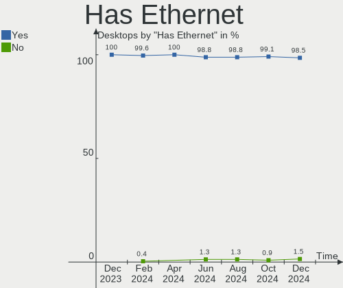
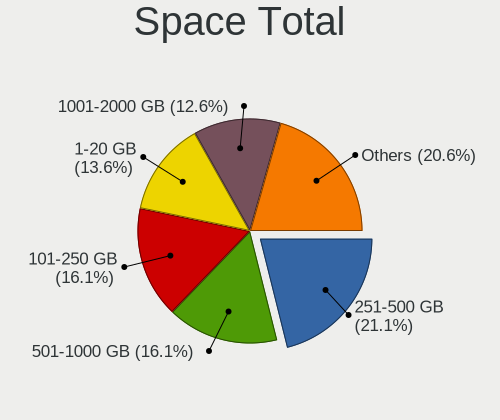
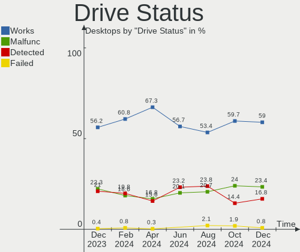
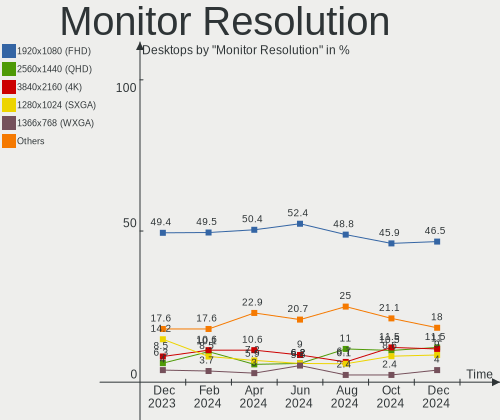
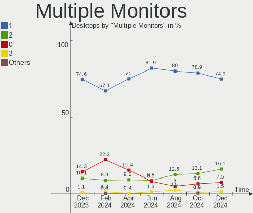
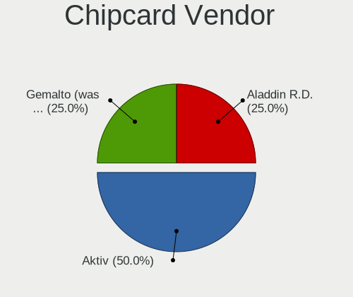
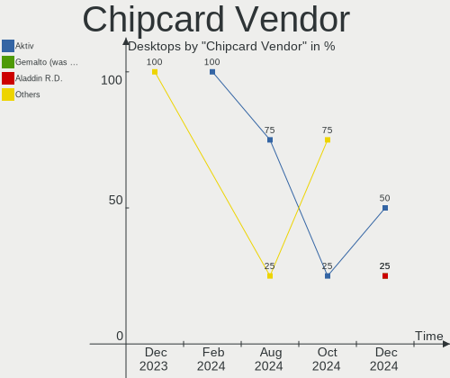
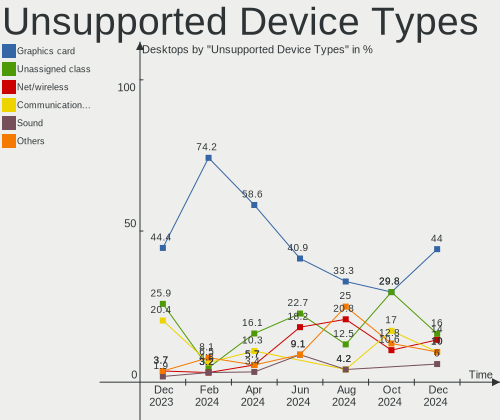

Linux in Russia - Hardware Trends (Desktops)
--------------------------------------------

A project to identify most popular hardware characteristics and track their change
over time based on data collected by Linux users at https://Linux-Hardware.org.

Anyone can contribute to this report by the [hw-probe](https://github.com/linuxhw/hw-probe) tool:

    sudo -E hw-probe -all -upload

Period: Dec, 2024.

Contents
--------

* [ System ](#system)
  - [ OS                       ](#os)
  - [ OS Family                ](#os-family)
  - [ Kernel                   ](#kernel)
  - [ Kernel Family            ](#kernel-family)
  - [ Kernel Major Ver.        ](#kernel-major-ver)
  - [ Arch                     ](#arch)
  - [ DE                       ](#de)
  - [ Display Server           ](#display-server)
  - [ Display Manager          ](#display-manager)
  - [ OS Lang                  ](#os-lang)
  - [ Boot Mode                ](#boot-mode)
  - [ Filesystem               ](#filesystem)
  - [ Part. scheme             ](#part-scheme)
  - [ Dual Boot with Linux/BSD ](#dual-boot-with-linuxbsd)
  - [ Dual Boot (Win)          ](#dual-boot-win)

* [ Board ](#board)
  - [ Vendor                   ](#vendor)
  - [ Model                    ](#model)
  - [ Model Family             ](#model-family)
  - [ MFG Year                 ](#mfg-year)
  - [ Form Factor              ](#form-factor)
  - [ Secure Boot              ](#secure-boot)
  - [ Coreboot                 ](#coreboot)
  - [ RAM Size                 ](#ram-size)
  - [ RAM Used                 ](#ram-used)
  - [ Total Drives             ](#total-drives)
  - [ Has CD-ROM               ](#has-cd-rom)
  - [ Has Ethernet             ](#has-ethernet)
  - [ Has WiFi                 ](#has-wifi)
  - [ Has Bluetooth            ](#has-bluetooth)

* [ Location ](#location)
  - [ Country                  ](#country)
  - [ City                     ](#city)

* [ Drives ](#drives)
  - [ Drive Vendor             ](#drive-vendor)
  - [ Drive Model              ](#drive-model)
  - [ HDD Vendor               ](#hdd-vendor)
  - [ SSD Vendor               ](#ssd-vendor)
  - [ Drive Kind               ](#drive-kind)
  - [ Drive Connector          ](#drive-connector)
  - [ Drive Size               ](#drive-size)
  - [ Space Total              ](#space-total)
  - [ Space Used               ](#space-used)
  - [ Malfunc. Drives          ](#malfunc-drives)
  - [ Malfunc. Drive Vendor    ](#malfunc-drive-vendor)
  - [ Malfunc. HDD Vendor      ](#malfunc-hdd-vendor)
  - [ Malfunc. Drive Kind      ](#malfunc-drive-kind)
  - [ Failed Drives            ](#failed-drives)
  - [ Failed Drive Vendor      ](#failed-drive-vendor)
  - [ Drive Status             ](#drive-status)

* [ Storage controller ](#storage-controller)
  - [ Storage Vendor           ](#storage-vendor)
  - [ Storage Model            ](#storage-model)
  - [ Storage Kind             ](#storage-kind)

* [ Processor ](#processor)
  - [ CPU Vendor               ](#cpu-vendor)
  - [ CPU Model                ](#cpu-model)
  - [ CPU Model Family         ](#cpu-model-family)
  - [ CPU Cores                ](#cpu-cores)
  - [ CPU Sockets              ](#cpu-sockets)
  - [ CPU Threads              ](#cpu-threads)
  - [ CPU Op-Modes             ](#cpu-op-modes)
  - [ CPU Microcode            ](#cpu-microcode)
  - [ CPU Microarch            ](#cpu-microarch)

* [ Graphics ](#graphics)
  - [ GPU Vendor               ](#gpu-vendor)
  - [ GPU Model                ](#gpu-model)
  - [ GPU Combo                ](#gpu-combo)
  - [ GPU Driver               ](#gpu-driver)
  - [ GPU Memory               ](#gpu-memory)

* [ Monitor ](#monitor)
  - [ Monitor Vendor           ](#monitor-vendor)
  - [ Monitor Model            ](#monitor-model)
  - [ Monitor Resolution       ](#monitor-resolution)
  - [ Monitor Diagonal         ](#monitor-diagonal)
  - [ Monitor Width            ](#monitor-width)
  - [ Aspect Ratio             ](#aspect-ratio)
  - [ Monitor Area             ](#monitor-area)
  - [ Pixel Density            ](#pixel-density)
  - [ Multiple Monitors        ](#multiple-monitors)

* [ Network ](#network)
  - [ Net Controller Vendor    ](#net-controller-vendor)
  - [ Net Controller Model     ](#net-controller-model)
  - [ Wireless Vendor          ](#wireless-vendor)
  - [ Wireless Model           ](#wireless-model)
  - [ Ethernet Vendor          ](#ethernet-vendor)
  - [ Ethernet Model           ](#ethernet-model)
  - [ Net Controller Kind      ](#net-controller-kind)
  - [ Used Controller          ](#used-controller)
  - [ NICs                     ](#nics)
  - [ IPv6                     ](#ipv6)

* [ Bluetooth ](#bluetooth)
  - [ Bluetooth Vendor         ](#bluetooth-vendor)
  - [ Bluetooth Model          ](#bluetooth-model)

* [ Sound ](#sound)
  - [ Sound Vendor             ](#sound-vendor)
  - [ Sound Model              ](#sound-model)

* [ Memory ](#memory)
  - [ Memory Vendor            ](#memory-vendor)
  - [ Memory Model             ](#memory-model)
  - [ Memory Kind              ](#memory-kind)
  - [ Memory Form Factor       ](#memory-form-factor)
  - [ Memory Size              ](#memory-size)
  - [ Memory Speed             ](#memory-speed)

* [ Printers & scanners ](#printers--scanners)
  - [ Printer Vendor           ](#printer-vendor)
  - [ Printer Model            ](#printer-model)
  - [ Scanner Vendor           ](#scanner-vendor)
  - [ Scanner Model            ](#scanner-model)

* [ Camera ](#camera)
  - [ Camera Vendor            ](#camera-vendor)
  - [ Camera Model             ](#camera-model)

* [ Security ](#security)
  - [ Fingerprint Vendor       ](#fingerprint-vendor)
  - [ Fingerprint Model        ](#fingerprint-model)
  - [ Chipcard Vendor          ](#chipcard-vendor)
  - [ Chipcard Model           ](#chipcard-model)

* [ Unsupported ](#unsupported)
  - [ Unsupported Devices      ](#unsupported-devices)
  - [ Unsupported Device Types ](#unsupported-device-types)

System
------

OS
--

Installed operating systems

| Name                         | Desktops | Percent |
|------------------------------|----------|---------|
| ROSA 12.5.1                  | 49       | 24.62%  |
| OpenMandriva 24.12           | 22       | 11.06%  |
| Debian 12                    | 10       | 5.03%   |
| Red OS 7.3                   | 9        | 4.52%   |
| Ubuntu 24.04                 | 8        | 4.02%   |
| Arch Rolling                 | 8        | 4.02%   |
| ALT Linux 10.4               | 7        | 3.52%   |
| Fedora 41                    | 6        | 3.02%   |
| Linux Mint 22                | 5        | 2.51%   |
| ROSA R11.1                   | 4        | 2.01%   |
| Red OS 8.0                   | 4        | 2.01%   |
| Fedora 40                    | 4        | 2.01%   |
| Ubuntu 20.04                 | 3        | 1.51%   |
| ROSA 12.6                    | 3        | 1.51%   |
| ROSA 12.3                    | 3        | 1.51%   |
| OpenMandriva 5.0             | 3        | 1.51%   |
| Xubuntu 20.04                | 2        | 1.01%   |
| Ubuntu 22.04                 | 2        | 1.01%   |
| ROSA R11                     | 2        | 1.01%   |
| openSUSE Leap-15.6           | 2        | 1.01%   |
| OpenMandriva 4.2             | 2        | 1.01%   |
| OpenMandriva 24.07           | 2        | 1.01%   |
| Nobara 40                    | 2        | 1.01%   |
| LMDE 6                       | 2        | 1.01%   |
| Gentoo 2.17                  | 2        | 1.01%   |
| Elementary 8                 | 2        | 1.01%   |
| Debian                       | 2        | 1.01%   |
| Ubuntu 24.10                 | 1        | 0.5%    |
| ROSA 13.0                    | 1        | 0.5%    |
| ROSA 12.5                    | 1        | 0.5%    |
| ROSA 12.1                    | 1        | 0.5%    |
| ROSA 12                      | 1        | 0.5%    |
| Red OS 7.3.2                 | 1        | 0.5%    |
| Pop!_OS 20.04                | 1        | 0.5%    |
| openSUSE Tumbleweed-XXXXXXXX | 1        | 0.5%    |
| OpenMandriva 4.3             | 1        | 0.5%    |
| NixOS 25.05                  | 1        | 0.5%    |
| Linux Mint 21.3              | 1        | 0.5%    |
| Linux Mint 21.1              | 1        | 0.5%    |
| Kubuntu 24.04                | 1        | 0.5%    |

OS Family
---------

OS without a version

| Name         | Desktops | Percent |
|--------------|----------|---------|
| ROSA         | 65       | 32.66%  |
| OpenMandriva | 30       | 15.08%  |
| Ubuntu       | 14       | 7.04%   |
| Red OS       | 14       | 7.04%   |
| Debian       | 13       | 6.53%   |
| ALT Linux    | 12       | 6.03%   |
| Fedora       | 11       | 5.53%   |
| Arch         | 8        | 4.02%   |
| Linux Mint   | 7        | 3.52%   |
| openSUSE     | 3        | 1.51%   |
| Xubuntu      | 2        | 1.01%   |
| Nobara       | 2        | 1.01%   |
| LMDE         | 2        | 1.01%   |
| KDE neon     | 2        | 1.01%   |
| Gentoo       | 2        | 1.01%   |
| Elementary   | 2        | 1.01%   |
| Pop!_OS      | 1        | 0.5%    |
| NixOS        | 1        | 0.5%    |
| Kubuntu      | 1        | 0.5%    |
| Garuda Linux | 1        | 0.5%    |
| Endless      | 1        | 0.5%    |
| Devuan       | 1        | 0.5%    |
| Deepin       | 1        | 0.5%    |
| Astra Linux  | 1        | 0.5%    |
| ArcoLinux    | 1        | 0.5%    |
| AlmaLinux    | 1        | 0.5%    |

Kernel
------

Version of the Linux kernel

| Version                                      | Desktops | Percent |
|----------------------------------------------|----------|---------|
| 6.6.47-generic-1rosa2021.1-x86_64            | 32       | 16.08%  |
| 6.12.1-desktop-1omv2490                      | 22       | 11.06%  |
| 6.8.0-49-generic                             | 10       | 5.03%   |
| 6.6.27-generic-3rosa2021.1-x86_64            | 9        | 4.52%   |
| 6.1.0-28-amd64                               | 7        | 3.52%   |
| 6.8.0-51-generic                             | 6        | 3.02%   |
| 6.8.12-4-pve                                 | 4        | 2.01%   |
| 6.8.0-50-generic                             | 4        | 2.01%   |
| 6.6.51-1.red80.x86_64                        | 4        | 2.01%   |
| 6.1.89-generic-2rosa2021.1-x86_64            | 4        | 2.01%   |
| 5.15.167-1.el7.3.x86_64                      | 4        | 2.01%   |
| 6.6.2-desktop-1omv2390                       | 3        | 1.51%   |
| 6.12.1-zen1-1-zen                            | 3        | 1.51%   |
| 6.11.10-300.fc41.x86_64                      | 3        | 1.51%   |
| 6.1.110-1.el7.3.x86_64                       | 3        | 1.51%   |
| 6.11.9-200.fsync.fc40.x86_64                 | 2        | 1.01%   |
| 6.11.10-amd64                                | 2        | 1.01%   |
| 6.10.0-desktop-1omv2490                      | 2        | 1.01%   |
| 6.1.52-1.el7.3.x86_64                        | 2        | 1.01%   |
| 6.1.119-un-def-alt1                          | 2        | 1.01%   |
| 6.1.0-27-amd64                               | 2        | 1.01%   |
| 5.15.75-generic-1rosa2021.1-x86_64           | 2        | 1.01%   |
| 5.15.170-generic-1rosa2021.1-i686            | 2        | 1.01%   |
| 5.10.228-std-def-alt1                        | 2        | 1.01%   |
| 5.10.14-desktop-1omv4002                     | 2        | 1.01%   |
| 6.9.6-amd64-desktop-rolling                  | 1        | 0.5%    |
| 6.8.11-300.fc40.x86_64                       | 1        | 0.5%    |
| 6.8.10-300.fc40.x86_64                       | 1        | 0.5%    |
| 6.8.0-40-generic                             | 1        | 0.5%    |
| 6.6.67-6.6-alt1                              | 1        | 0.5%    |
| 6.6.64-6.6-alt1                              | 1        | 0.5%    |
| 6.6.64                                       | 1        | 0.5%    |
| 6.6.63-6.6-alt1                              | 1        | 0.5%    |
| 6.6.62-gentoo                                | 1        | 0.5%    |
| 6.5.0-10-generic                             | 1        | 0.5%    |
| 6.4.0-150600.23.30-default                   | 1        | 0.5%    |
| 6.4.0-150600.23.25-default                   | 1        | 0.5%    |
| 6.13.0-rc3-f44d154d6e3d-revert-133577cad6bf+ | 1        | 0.5%    |
| 6.12.7-zen1-1-zen                            | 1        | 0.5%    |
| 6.12.7-200.fc41.x86_64                       | 1        | 0.5%    |

Kernel Family
-------------

Linux kernel without a distro release

| Version  | Desktops | Percent |
|----------|----------|---------|
| 6.6.47   | 32       | 16.08%  |
| 6.12.1   | 28       | 14.07%  |
| 6.8.0    | 21       | 10.55%  |
| 6.1.0    | 11       | 5.53%   |
| 6.6.27   | 9        | 4.52%   |
| 6.11.10  | 7        | 3.52%   |
| 6.8.12   | 4        | 2.01%   |
| 6.6.51   | 4        | 2.01%   |
| 6.12.6   | 4        | 2.01%   |
| 6.1.89   | 4        | 2.01%   |
| 5.15.167 | 4        | 2.01%   |
| 6.6.2    | 3        | 1.51%   |
| 6.1.110  | 3        | 1.51%   |
| 4.15.0   | 3        | 1.51%   |
| 6.6.64   | 2        | 1.01%   |
| 6.4.0    | 2        | 1.01%   |
| 6.12.7   | 2        | 1.01%   |
| 6.12.4   | 2        | 1.01%   |
| 6.11.9   | 2        | 1.01%   |
| 6.11.11  | 2        | 1.01%   |
| 6.10.0   | 2        | 1.01%   |
| 6.1.52   | 2        | 1.01%   |
| 6.1.119  | 2        | 1.01%   |
| 5.4.0    | 2        | 1.01%   |
| 5.17.11  | 2        | 1.01%   |
| 5.15.75  | 2        | 1.01%   |
| 5.15.170 | 2        | 1.01%   |
| 5.15.0   | 2        | 1.01%   |
| 5.10.228 | 2        | 1.01%   |
| 5.10.14  | 2        | 1.01%   |
| 6.9.6    | 1        | 0.5%    |
| 6.8.11   | 1        | 0.5%    |
| 6.8.10   | 1        | 0.5%    |
| 6.6.67   | 1        | 0.5%    |
| 6.6.63   | 1        | 0.5%    |
| 6.6.62   | 1        | 0.5%    |
| 6.5.0    | 1        | 0.5%    |
| 6.13.0   | 1        | 0.5%    |
| 6.12.5   | 1        | 0.5%    |
| 6.12.3   | 1        | 0.5%    |

Kernel Major Ver.
-----------------

Linux kernel major version

| Version | Desktops | Percent |
|---------|----------|---------|
| 6.6     | 53       | 26.63%  |
| 6.12    | 38       | 19.1%   |
| 6.8     | 27       | 13.57%  |
| 6.1     | 26       | 13.07%  |
| 6.11    | 13       | 6.53%   |
| 5.15    | 12       | 6.03%   |
| 5.10    | 9        | 4.52%   |
| 5.4     | 4        | 2.01%   |
| 4.15    | 3        | 1.51%   |
| 6.4     | 2        | 1.01%   |
| 6.10    | 2        | 1.01%   |
| 5.17    | 2        | 1.01%   |
| 6.9     | 1        | 0.5%    |
| 6.5     | 1        | 0.5%    |
| 6.13    | 1        | 0.5%    |
| 6.0     | 1        | 0.5%    |
| 5.8     | 1        | 0.5%    |
| 5.16    | 1        | 0.5%    |
| 4.9     | 1        | 0.5%    |
| 4.18    | 1        | 0.5%    |

Arch
----

OS architecture (x86_64, i586, etc.)

| Name   | Desktops | Percent |
|--------|----------|---------|
| x86_64 | 194      | 97.49%  |
| i686   | 5        | 2.51%   |

DE
--

Desktop Environment

| Name          | Desktops | Percent |
|---------------|----------|---------|
| KDE5          | 59       | 29.65%  |
| GNOME         | 44       | 22.11%  |
| Unknown       | 30       | 15.08%  |
| MATE          | 13       | 6.53%   |
| KDE6          | 12       | 6.03%   |
| LXQt          | 10       | 5.03%   |
| XFCE          | 8        | 4.02%   |
| X-Cinnamon    | 8        | 4.02%   |
| KDE4          | 3        | 1.51%   |
| Pantheon      | 2        | 1.01%   |
| KDE           | 2        | 1.01%   |
| GNOME Classic | 2        | 1.01%   |
| Hyprland      | 1        | 0.5%    |
| fly           | 1        | 0.5%    |
| Endless:GNOME | 1        | 0.5%    |
| DDE           | 1        | 0.5%    |
| Cinnamon      | 1        | 0.5%    |
| Budgie        | 1        | 0.5%    |

Display Server
--------------

X11 or Wayland

| Name    | Desktops | Percent |
|---------|----------|---------|
| X11     | 98       | 49.25%  |
| Wayland | 93       | 46.73%  |
| Tty     | 8        | 4.02%   |

Display Manager
---------------

SDDM, LightDM, etc.

| Name    | Desktops | Percent |
|---------|----------|---------|
| SDDM    | 85       | 42.71%  |
| GDM     | 46       | 23.12%  |
| Unknown | 31       | 15.58%  |
| LightDM | 21       | 10.55%  |
| GDM3    | 12       | 6.03%   |
| KDM     | 3        | 1.51%   |
| LY-DM   | 1        | 0.5%    |

OS Lang
-------

Language

| Lang    | Desktops | Percent |
|---------|----------|---------|
| ru_RU   | 155      | 77.89%  |
| en_US   | 36       | 18.09%  |
| C       | 3        | 1.51%   |
| Unknown | 3        | 1.51%   |
| ru_UA   | 1        | 0.5%    |
| POSIX   | 1        | 0.5%    |

Boot Mode
---------

EFI or BIOS

| Mode | Desktops | Percent |
|------|----------|---------|
| EFI  | 105      | 52.76%  |
| BIOS | 94       | 47.24%  |

Filesystem
----------

Type of filesystem

| Type    | Desktops | Percent |
|---------|----------|---------|
| Ext4    | 142      | 71.36%  |
| Btrfs   | 26       | 13.07%  |
| Overlay | 23       | 11.56%  |
| Tmpfs   | 4        | 2.01%   |
| Xfs     | 2        | 1.01%   |
| Ext3    | 2        | 1.01%   |

Part. scheme
------------

Scheme of partitioning

| Type    | Desktops | Percent |
|---------|----------|---------|
| GPT     | 121      | 60.8%   |
| MBR     | 53       | 26.63%  |
| Unknown | 25       | 12.56%  |

Dual Boot with Linux/BSD
------------------------

Hosting more than one Linux/BSD

| Dual boot | Desktops | Percent |
|-----------|----------|---------|
| No        | 148      | 74.37%  |
| Yes       | 51       | 25.63%  |

Dual Boot (Win)
---------------

Hosting Linux and Windows

| Dual boot | Desktops | Percent |
|-----------|----------|---------|
| No        | 112      | 56.28%  |
| Yes       | 87       | 43.72%  |

Board
-----

Vendor
------

Motherboard manufacturer

| Name                | Desktops | Percent |
|---------------------|----------|---------|
| ASUSTek Computer    | 50       | 25.13%  |
| Gigabyte Technology | 41       | 20.6%   |
| MSI                 | 25       | 12.56%  |
| ASRock              | 15       | 7.54%   |
| Intel               | 13       | 6.53%   |
| Unknown             | 11       | 5.53%   |
| Lenovo              | 4        | 2.01%   |
| Biostar             | 4        | 2.01%   |
| Foxconn             | 3        | 1.51%   |
| DEPO Computers      | 3        | 1.51%   |
| AZW                 | 3        | 1.51%   |
| Acer                | 3        | 1.51%   |
| Supermicro          | 2        | 1.01%   |
| MACHINIST           | 2        | 1.01%   |
| Huanan              | 2        | 1.01%   |
| Hewlett-Packard     | 2        | 1.01%   |
| Graviton            | 2        | 1.01%   |
| OEM                 | 1        | 0.5%    |
| Maibenben           | 1        | 0.5%    |
| Kraftway            | 1        | 0.5%    |
| INFERIT             | 1        | 0.5%    |
| ICP / iEi           | 1        | 0.5%    |
| Fujitsu             | 1        | 0.5%    |
| ECS                 | 1        | 0.5%    |
| Dell                | 1        | 0.5%    |
| Colorful Technology | 1        | 0.5%    |
| CBR                 | 1        | 0.5%    |
| Bochs               | 1        | 0.5%    |
| BESHTAU             | 1        | 0.5%    |
| Aquarius            | 1        | 0.5%    |
| Alder lake          | 1        | 0.5%    |

Model
-----

Motherboard model

| Name                               | Desktops | Percent |
|------------------------------------|----------|---------|
| Unknown                            | 12       | 6.03%   |
| ASUS All Series                    | 5        | 2.51%   |
| ASUS P8Z77-V LX                    | 4        | 2.01%   |
| Intel X99                          | 3        | 1.51%   |
| Gigabyte H410M H V3                | 3        | 1.51%   |
| AZW MINI S                         | 3        | 1.51%   |
| Supermicro SYS-6018U-TR4+          | 2        | 1.01%   |
| MSI MS-7B89                        | 2        | 1.01%   |
| Intel B75                          | 2        | 1.01%   |
| Gigabyte GA-MA770-DS3              | 2        | 1.01%   |
| Gigabyte AB350M-DS3H V2            | 2        | 1.01%   |
| Gigabyte 970A-DS3P                 | 2        | 1.01%   |
| ASUS TUF Z390M-PRO GAMING          | 2        | 1.01%   |
| ASUS ROG STRIX B650E-E GAMING WIFI | 2        | 1.01%   |
| ASUS PRIME B760-PLUS D4            | 2        | 1.01%   |
| ASUS PRIME B360M-C                 | 2        | 1.01%   |
| ASRock G31M-GS                     | 2        | 1.01%   |
| ASRock B450 Gaming K4              | 2        | 1.01%   |
| OEM X79G                           | 1        | 0.5%    |
| MSI WH677AA-ACB HPE-120ru          | 1        | 0.5%    |
| MSI MS-7E12                        | 1        | 0.5%    |
| MSI MS-7D99                        | 1        | 0.5%    |
| MSI MS-7D90                        | 1        | 0.5%    |
| MSI MS-7D78                        | 1        | 0.5%    |
| MSI MS-7D76                        | 1        | 0.5%    |
| MSI MS-7D75                        | 1        | 0.5%    |
| MSI MS-7D59                        | 1        | 0.5%    |
| MSI MS-7D48                        | 1        | 0.5%    |
| MSI MS-7C96                        | 1        | 0.5%    |
| MSI MS-7C52                        | 1        | 0.5%    |
| MSI MS-7C39                        | 1        | 0.5%    |
| MSI MS-7B86                        | 1        | 0.5%    |
| MSI MS-7B18                        | 1        | 0.5%    |
| MSI MS-7A38                        | 1        | 0.5%    |
| MSI MS-7996                        | 1        | 0.5%    |
| MSI MS-7816                        | 1        | 0.5%    |
| MSI MS-7751                        | 1        | 0.5%    |
| MSI MS-7721                        | 1        | 0.5%    |
| MSI MS-7699                        | 1        | 0.5%    |
| MSI MS-7592                        | 1        | 0.5%    |

Model Family
------------

Motherboard model prefix

| Name                      | Desktops | Percent |
|---------------------------|----------|---------|
| ASUS PRIME                | 13       | 6.53%   |
| Unknown                   | 12       | 6.03%   |
| ASUS TUF                  | 7        | 3.52%   |
| ASUS P8Z77-V              | 5        | 2.51%   |
| ASUS All                  | 5        | 2.51%   |
| ASUS ROG                  | 4        | 2.01%   |
| Lenovo ThinkCentre        | 3        | 1.51%   |
| Intel X99                 | 3        | 1.51%   |
| Gigabyte H410M            | 3        | 1.51%   |
| Gigabyte B550M            | 3        | 1.51%   |
| Gigabyte AB350M-DS3H      | 3        | 1.51%   |
| AZW MINI                  | 3        | 1.51%   |
| Supermicro SYS-6018U-TR4+ | 2        | 1.01%   |
| MSI MS-7B89               | 2        | 1.01%   |
| Intel B75                 | 2        | 1.01%   |
| Gigabyte GA-MA770-DS3     | 2        | 1.01%   |
| Gigabyte B650M            | 2        | 1.01%   |
| Gigabyte A620M            | 2        | 1.01%   |
| Gigabyte 970A-DS3P        | 2        | 1.01%   |
| ASRock G31M-GS            | 2        | 1.01%   |
| ASRock B450               | 2        | 1.01%   |
| Acer Aspire               | 2        | 1.01%   |
| OEM X79G                  | 1        | 0.5%    |
| MSI WH677AA-ACB           | 1        | 0.5%    |
| MSI MS-7E12               | 1        | 0.5%    |
| MSI MS-7D99               | 1        | 0.5%    |
| MSI MS-7D90               | 1        | 0.5%    |
| MSI MS-7D78               | 1        | 0.5%    |
| MSI MS-7D76               | 1        | 0.5%    |
| MSI MS-7D75               | 1        | 0.5%    |
| MSI MS-7D59               | 1        | 0.5%    |
| MSI MS-7D48               | 1        | 0.5%    |
| MSI MS-7C96               | 1        | 0.5%    |
| MSI MS-7C52               | 1        | 0.5%    |
| MSI MS-7C39               | 1        | 0.5%    |
| MSI MS-7B86               | 1        | 0.5%    |
| MSI MS-7B18               | 1        | 0.5%    |
| MSI MS-7A38               | 1        | 0.5%    |
| MSI MS-7996               | 1        | 0.5%    |
| MSI MS-7816               | 1        | 0.5%    |

MFG Year
--------

Motherboard manufacture year

| Year | Desktops | Percent |
|------|----------|---------|
| 2022 | 26       | 13.07%  |
| 2018 | 21       | 10.55%  |
| 2023 | 18       | 9.05%   |
| 2012 | 18       | 9.05%   |
| 2020 | 14       | 7.04%   |
| 2019 | 12       | 6.03%   |
| 2024 | 11       | 5.53%   |
| 2021 | 11       | 5.53%   |
| 2014 | 10       | 5.03%   |
| 2011 | 10       | 5.03%   |
| 2009 | 9        | 4.52%   |
| 2013 | 7        | 3.52%   |
| 2017 | 5        | 2.51%   |
| 2016 | 5        | 2.51%   |
| 2015 | 5        | 2.51%   |
| 2008 | 5        | 2.51%   |
| 2007 | 5        | 2.51%   |
| 2010 | 4        | 2.01%   |
| 2006 | 1        | 0.5%    |
| 2005 | 1        | 0.5%    |
| 2003 | 1        | 0.5%    |

Form Factor
-----------

Physical design of the computer

| Name    | Desktops | Percent |
|---------|----------|---------|
| Desktop | 199      | 100%    |

Secure Boot
-----------

Enabled or disabled

| State    | Desktops | Percent |
|----------|----------|---------|
| Disabled | 198      | 99.5%   |
| Enabled  | 1        | 0.5%    |

Coreboot
--------

Have coreboot on board

| Used | Desktops | Percent |
|------|----------|---------|
| No   | 199      | 100%    |

RAM Size
--------

Total RAM memory

| Size in GB      | Desktops | Percent |
|-----------------|----------|---------|
| 16.01-24.0      | 59       | 29.65%  |
| 4.01-8.0        | 39       | 19.6%   |
| 32.01-64.0      | 31       | 15.58%  |
| 8.01-16.0       | 23       | 11.56%  |
| 3.01-4.0        | 19       | 9.55%   |
| 64.01-256.0     | 14       | 7.04%   |
| 24.01-32.0      | 7        | 3.52%   |
| 2.01-3.0        | 3        | 1.51%   |
| 1.01-2.0        | 2        | 1.01%   |
| More than 256.0 | 1        | 0.5%    |
| 0.51-1.0        | 1        | 0.5%    |

RAM Used
--------

Used RAM memory

| Used GB    | Desktops | Percent |
|------------|----------|---------|
| 1.01-2.0   | 76       | 38.19%  |
| 4.01-8.0   | 35       | 17.59%  |
| 2.01-3.0   | 31       | 15.58%  |
| 3.01-4.0   | 26       | 13.07%  |
| 0.51-1.0   | 13       | 6.53%   |
| 8.01-16.0  | 12       | 6.03%   |
| 24.01-32.0 | 2        | 1.01%   |
| 0.01-0.5   | 2        | 1.01%   |
| 32.01-64.0 | 1        | 0.5%    |
| 16.01-24.0 | 1        | 0.5%    |

Total Drives
------------

Number of drives on board

| Drives | Desktops | Percent |
|--------|----------|---------|
| 2      | 73       | 36.68%  |
| 1      | 55       | 27.64%  |
| 3      | 35       | 17.59%  |
| 4      | 20       | 10.05%  |
| 5      | 6        | 3.02%   |
| 0      | 6        | 3.02%   |
| 6      | 4        | 2.01%   |

Has CD-ROM
----------

Has CD-ROM on board

| Presented | Desktops | Percent |
|-----------|----------|---------|
| No        | 158      | 79.4%   |
| Yes       | 41       | 20.6%   |

Has Ethernet
------------

Has Ethernet on board

| Presented | Desktops | Percent |
|-----------|----------|---------|
| Yes       | 196      | 98.49%  |
| No        | 3        | 1.51%   |

Has WiFi
--------

Has WiFi module

| Presented | Desktops | Percent |
|-----------|----------|---------|
| No        | 134      | 67.34%  |
| Yes       | 65       | 32.66%  |

Has Bluetooth
-------------

Has Bluetooth module

| Presented | Desktops | Percent |
|-----------|----------|---------|
| No        | 133      | 66.83%  |
| Yes       | 66       | 33.17%  |

Location
--------

Country
-------

Geographic location (country)

| Country | Desktops | Percent |
|---------|----------|---------|
| Russia  | 199      | 100%    |

City
----

Geographic location (city)

| City              | Desktops | Percent |
|-------------------|----------|---------|
| Moscow            | 44       | 22.11%  |
| St Petersburg     | 18       | 9.05%   |
| Rostov-on-Don     | 9        | 4.52%   |
| Chelyabinsk       | 6        | 3.02%   |
| Novosibirsk       | 5        | 2.51%   |
| Voronezh          | 4        | 2.01%   |
| Tula              | 4        | 2.01%   |
| Lipetsk           | 4        | 2.01%   |
| Vladimir          | 3        | 1.51%   |
| Smolensk          | 3        | 1.51%   |
| Omsk              | 3        | 1.51%   |
| Nizhny Tagil      | 3        | 1.51%   |
| Krasnoyarsk       | 3        | 1.51%   |
| Kazan’          | 3        | 1.51%   |
| Kaliningrad       | 3        | 1.51%   |
| Zheleznodorozhnyy | 2        | 1.01%   |
| Yekaterinburg     | 2        | 1.01%   |
| Yaroslavl         | 2        | 1.01%   |
| Ulyanovsk         | 2        | 1.01%   |
| Petrozavodsk      | 2        | 1.01%   |
| Perm              | 2        | 1.01%   |
| Orekhovo-Zuyevo   | 2        | 1.01%   |
| Novorossiysk      | 2        | 1.01%   |
| Murom             | 2        | 1.01%   |
| Murmansk          | 2        | 1.01%   |
| Kopeysk           | 2        | 1.01%   |
| Izhevsk           | 2        | 1.01%   |
| Irkutsk           | 2        | 1.01%   |
| Cheboksary        | 2        | 1.01%   |
| Barnaul           | 2        | 1.01%   |
| Zlatoust          | 1        | 0.5%    |
| Yakutsk           | 1        | 0.5%    |
| Vologda           | 1        | 0.5%    |
| Volgograd         | 1        | 0.5%    |
| Vladivostok       | 1        | 0.5%    |
| Ulan-Ude          | 1        | 0.5%    |
| Ukhta             | 1        | 0.5%    |
| Tambov            | 1        | 0.5%    |
| Talitsa           | 1        | 0.5%    |
| Taganrog          | 1        | 0.5%    |

Drives
------

Drive Vendor
------------

Hard drive vendors

| Vendor                         | Desktops | Drives | Percent |
|--------------------------------|----------|--------|---------|
| WDC                            | 66       | 82     | 17.28%  |
| Seagate                        | 56       | 74     | 14.66%  |
| Samsung Electronics            | 35       | 39     | 9.16%   |
| Toshiba                        | 26       | 28     | 6.81%   |
| Kingston                       | 19       | 22     | 4.97%   |
| A-DATA Technology              | 14       | 14     | 3.66%   |
| China                          | 11       | 12     | 2.88%   |
| Hitachi                        | 9        | 11     | 2.36%   |
| Apacer                         | 9        | 9      | 2.36%   |
| Unknown                        | 8        | 8      | 2.09%   |
| Patriot                        | 8        | 8      | 2.09%   |
| Netac                          | 8        | 8      | 2.09%   |
| Sandisk                        | 7        | 7      | 1.83%   |
| Phison Electronics             | 7        | 9      | 1.83%   |
| Unknown                        | 7        | 7      | 1.83%   |
| Silicon Motion                 | 6        | 6      | 1.57%   |
| KingSpec                       | 6        | 6      | 1.57%   |
| Plextor                        | 5        | 5      | 1.31%   |
| Intel                          | 5        | 9      | 1.31%   |
| SPCC                           | 4        | 4      | 1.05%   |
| Crucial                        | 4        | 4      | 1.05%   |
| AMD                            | 4        | 4      | 1.05%   |
| XPG                            | 3        | 3      | 0.79%   |
| MAXIO Technology (Hangzhou)    | 3        | 3      | 0.79%   |
| Kingston Technology Company    | 3        | 3      | 0.79%   |
| HGST                           | 3        | 3      | 0.79%   |
| Colorful                       | 3        | 3      | 0.79%   |
| ADATA Technology               | 3        | 5      | 0.79%   |
| Smartbuy                       | 2        | 2      | 0.52%   |
| Realtek Semiconductor          | 2        | 2      | 0.52%   |
| Phison                         | 2        | 2      | 0.52%   |
| KingDian                       | 2        | 3      | 0.52%   |
| GOODRAM                        | 2        | 2      | 0.52%   |
| Foxline                        | 2        | 2      | 0.52%   |
| DEXP                           | 2        | 2      | 0.52%   |
| AGI                            | 2        | 3      | 0.52%   |
| Transcend                      | 1        | 1      | 0.26%   |
| Solid State Storage Technology | 1        | 1      | 0.26%   |
| Skyline                        | 1        | 1      | 0.26%   |
| Q600MS                         | 1        | 1      | 0.26%   |

Drive Model
-----------

Hard drive models

| Model                                                 | Desktops | Percent |
|-------------------------------------------------------|----------|---------|
| Toshiba HDWD110 1TB                                   | 9        | 2.1%    |
| Seagate ST1000DM010-2EP102 1TB                        | 7        | 1.64%   |
| Unknown                                               | 7        | 1.64%   |
| Silicon Motion SM2263EN/SM2263XT SSD Controller 256GB | 5        | 1.17%   |
| Samsung NVMe SSD Controller SM981/PM981/PM983 512GB   | 5        | 1.17%   |
| WDC WDS240G2G0A-00JH30 240GB SSD                      | 4        | 0.93%   |
| WDC WD10EARS-00Y5B1 1TB                               | 4        | 0.93%   |
| Toshiba DT01ACA100 1TB                                | 4        | 0.93%   |
| Seagate ST500DM002-1BD142 500GB                       | 4        | 0.93%   |
| Seagate ST3500418AS 500GB                             | 4        | 0.93%   |
| Samsung NVMe SSD Controller PM9A1/PM9A3/980PRO 512GB  | 4        | 0.93%   |
| Kingston SA400S37480G 480GB SSD                       | 4        | 0.93%   |
| Kingston SA400S37240G 240GB SSD                       | 4        | 0.93%   |
| WDC WD10EZEX-08WN4A0 1TB                              | 3        | 0.7%    |
| WDC WD10EZEX-00BBHA0 1TB                              | 3        | 0.7%    |
| Unknown NVMe SSD Drive 512GB                          | 3        | 0.7%    |
| Toshiba DT01ACA050 500GB                              | 3        | 0.7%    |
| Kingston SA400S37120G 120GB SSD                       | 3        | 0.7%    |
| KingSpec P3-512 512GB SSD                             | 3        | 0.7%    |
| China SSD 128GB                                       | 3        | 0.7%    |
| A-DATA SU650 120GB SSD                                | 3        | 0.7%    |
| WDC WDS100T2B0A-00SM50 1TB SSD                        | 2        | 0.47%   |
| WDC WD5000AAKX-00ERMA0 500GB                          | 2        | 0.47%   |
| WDC WD5000AAKS-00UU3A0 500GB                          | 2        | 0.47%   |
| WDC WD40EZAX-00C8UB0 4TB                              | 2        | 0.47%   |
| WDC WD3200AAJS-00L7A0 320GB                           | 2        | 0.47%   |
| WDC WD30EFRX-68EUZN0 3TB                              | 2        | 0.47%   |
| WDC WD20EARS-00M                                      | 2        | 0.47%   |
| WDC WD10EZEX-22MFCA0 1TB                              | 2        | 0.47%   |
| WDC WD10EZEX-08M2NA0 1TB                              | 2        | 0.47%   |
| Toshiba HDWD105 500GB                                 | 2        | 0.47%   |
| Toshiba DT01ACA050 LENOVO 500GB                       | 2        | 0.47%   |
| Seagate ST9250315AS 250GB                             | 2        | 0.47%   |
| Seagate ST4000DM004-2CV104 4TB                        | 2        | 0.47%   |
| Seagate ST3500630AS 500GB                             | 2        | 0.47%   |
| Seagate ST3320418AS 320GB                             | 2        | 0.47%   |
| Seagate ST1000DM003-9YN162 1TB                        | 2        | 0.47%   |
| Sandisk WD Black SN850 2TB                            | 2        | 0.47%   |
| Samsung SSD 980 500GB                                 | 2        | 0.47%   |
| Samsung SSD 970 EVO Plus 250GB                        | 2        | 0.47%   |

HDD Vendor
----------

Hard disk drive vendors

| Vendor              | Desktops | Drives | Percent |
|---------------------|----------|--------|---------|
| WDC                 | 61       | 74     | 37.42%  |
| Seagate             | 56       | 74     | 34.36%  |
| Toshiba             | 25       | 27     | 15.34%  |
| Hitachi             | 9        | 11     | 5.52%   |
| Samsung Electronics | 3        | 3      | 1.84%   |
| HGST                | 3        | 3      | 1.84%   |
| Unknown             | 1        | 1      | 0.61%   |
| Maxtor              | 1        | 1      | 0.61%   |
| JMicron Technology  | 1        | 1      | 0.61%   |
| HGST HTS            | 1        | 1      | 0.61%   |
| ASMT                | 1        | 1      | 0.61%   |
| 256MB               | 1        | 1      | 0.61%   |

SSD Vendor
----------

Solid state drive vendors

| Vendor              | Desktops | Drives | Percent |
|---------------------|----------|--------|---------|
| Kingston            | 15       | 18     | 10.79%  |
| Samsung Electronics | 12       | 13     | 8.63%   |
| China               | 11       | 12     | 7.91%   |
| A-DATA Technology   | 11       | 11     | 7.91%   |
| WDC                 | 8        | 8      | 5.76%   |
| Patriot             | 7        | 7      | 5.04%   |
| Netac               | 7        | 7      | 5.04%   |
| Unknown             | 7        | 7      | 5.04%   |
| KingSpec            | 6        | 6      | 4.32%   |
| Apacer              | 6        | 6      | 4.32%   |
| Plextor             | 5        | 5      | 3.6%    |
| SPCC                | 4        | 4      | 2.88%   |
| Crucial             | 4        | 4      | 2.88%   |
| AMD                 | 4        | 4      | 2.88%   |
| Intel               | 3        | 4      | 2.16%   |
| Colorful            | 3        | 3      | 2.16%   |
| Smartbuy            | 2        | 2      | 1.44%   |
| SanDisk             | 2        | 2      | 1.44%   |
| KingDian            | 2        | 3      | 1.44%   |
| GOODRAM             | 2        | 2      | 1.44%   |
| DEXP                | 2        | 2      | 1.44%   |
| Unknown             | 1        | 1      | 0.72%   |
| Transcend           | 1        | 1      | 0.72%   |
| Toshiba             | 1        | 1      | 0.72%   |
| OSCOO               | 1        | 1      | 0.72%   |
| OCZ-AGIL            | 1        | 1      | 0.72%   |
| OCZ                 | 1        | 1      | 0.72%   |
| Micron_5            | 1        | 1      | 0.72%   |
| Kston               | 1        | 1      | 0.72%   |
| JASTER              | 1        | 1      | 0.72%   |
| Hewlett-Packard     | 1        | 1      | 0.72%   |
| Gigabyte Technology | 1        | 1      | 0.72%   |
| Espada              | 1        | 1      | 0.72%   |
| Digma               | 1        | 1      | 0.72%   |
| DERLAR              | 1        | 1      | 0.72%   |
| AGI                 | 1        | 2      | 0.72%   |
| ADATA SU            | 1        | 1      | 0.72%   |

Drive Kind
----------

HDD or SSD

| Kind    | Desktops | Drives | Percent |
|---------|----------|--------|---------|
| HDD     | 125      | 198    | 40.32%  |
| SSD     | 109      | 147    | 35.16%  |
| NVMe    | 73       | 90     | 23.55%  |
| Unknown | 2        | 2      | 0.65%   |
| MMC     | 1        | 1      | 0.32%   |

Drive Connector
---------------

SATA, SAS, NVMe, etc.

| Type | Desktops | Drives | Percent |
|------|----------|--------|---------|
| SATA | 170      | 337    | 67.19%  |
| NVMe | 73       | 90     | 28.85%  |
| SAS  | 9        | 10     | 3.56%   |
| MMC  | 1        | 1      | 0.4%    |

Drive Size
----------

Size of hard drive

| Size in TB | Desktops | Drives | Percent |
|------------|----------|--------|---------|
| 0.01-0.5   | 129      | 202    | 51.81%  |
| 0.51-1.0   | 74       | 93     | 29.72%  |
| 1.01-2.0   | 27       | 28     | 10.84%  |
| 3.01-4.0   | 9        | 9      | 3.61%   |
| 2.01-3.0   | 5        | 8      | 2.01%   |
| 4.01-10.0  | 4        | 4      | 1.61%   |
| 10.01-20.0 | 1        | 1      | 0.4%    |

Space Total
-----------

Amount of disk space available on the file system

| Size in GB     | Desktops | Percent |
|----------------|----------|---------|
| 251-500        | 42       | 21.11%  |
| 101-250        | 32       | 16.08%  |
| 501-1000       | 32       | 16.08%  |
| 1-20           | 27       | 13.57%  |
| 1001-2000      | 25       | 12.56%  |
| More than 3000 | 18       | 9.05%   |
| 2001-3000      | 9        | 4.52%   |
| 51-100         | 8        | 4.02%   |
| 21-50          | 4        | 2.01%   |
| Unknown        | 2        | 1.01%   |

Space Used
----------

Amount of used disk space

| Used GB        | Desktops | Percent |
|----------------|----------|---------|
| 1-20           | 80       | 40.2%   |
| 101-250        | 24       | 12.06%  |
| 21-50          | 23       | 11.56%  |
| 251-500        | 20       | 10.05%  |
| 501-1000       | 16       | 8.04%   |
| 51-100         | 16       | 8.04%   |
| 1001-2000      | 7        | 3.52%   |
| 2001-3000      | 6        | 3.02%   |
| More than 3000 | 5        | 2.51%   |
| Unknown        | 2        | 1.01%   |

Malfunc. Drives
---------------

Drive models with a malfunction

| Model                            | Desktops | Drives | Percent |
|----------------------------------|----------|--------|---------|
| Seagate ST500DM002-1BD142 500GB  | 3        | 3      | 4.23%   |
| WDC WD5000AAKX-00ERMA0 500GB     | 2        | 2      | 2.82%   |
| WDC WD10EARS-00Y5B1 1TB          | 2        | 2      | 2.82%   |
| Toshiba HDWD110 1TB              | 2        | 2      | 2.82%   |
| Toshiba DT01ACA050 500GB         | 2        | 2      | 2.82%   |
| Seagate ST3500418AS 500GB        | 2        | 2      | 2.82%   |
| Seagate ST1000DM010-2EP102 1TB   | 2        | 3      | 2.82%   |
| XPG SPECTRIX S40G 1TB            | 1        | 1      | 1.41%   |
| XPG GAMMIX S5 256GB              | 1        | 1      | 1.41%   |
| WDC WDS240G2G0A-00JH30 240GB SSD | 1        | 1      | 1.41%   |
| WDC WD7500AADS-00M2B0 752GB      | 1        | 1      | 1.41%   |
| WDC WD5000LPVX-80V0TT0 500GB     | 1        | 1      | 1.41%   |
| WDC WD5000AAKX-60U6AA0 500GB     | 1        | 1      | 1.41%   |
| WDC WD5000AAKS-08V0A0 500GB      | 1        | 1      | 1.41%   |
| WDC WD5000AAKS-00UU3A0 500GB     | 1        | 1      | 1.41%   |
| WDC WD3200BEKT-22A25T1 320GB     | 1        | 1      | 1.41%   |
| WDC WD3200AVVS-56L2B0 320GB      | 1        | 1      | 1.41%   |
| WDC WD3200AAKX-001CA0 320GB      | 1        | 1      | 1.41%   |
| WDC WD3200AAKS-00L9A0 320GB      | 1        | 1      | 1.41%   |
| WDC WD3200AAJS-56B4A0 320GB      | 1        | 1      | 1.41%   |
| WDC WD3200AAJS-00L7A0 320GB      | 1        | 1      | 1.41%   |
| WDC WD30EFRX-68EUZN0 3TB         | 1        | 2      | 1.41%   |
| WDC WD2500AAJS-00L7A0 250GB      | 1        | 1      | 1.41%   |
| WDC WD22PURZ-85B4ZY0 2TB         | 1        | 1      | 1.41%   |
| WDC WD20EFRX-68AX9N0 2TB         | 1        | 1      | 1.41%   |
| WDC WD15EARS-00Z5B1 1TB          | 1        | 1      | 1.41%   |
| WDC WD15EADS-00S2B0 1TB          | 1        | 1      | 1.41%   |
| WDC WD10EZEX-75WN4A0 1TB         | 1        | 1      | 1.41%   |
| WDC WD10EZEX-60ZF5A0 1TB         | 1        | 1      | 1.41%   |
| Transcend TS128GSSD230S 128GB    | 1        | 1      | 1.41%   |
| Toshiba MK3276GSX -63 320GB      | 1        | 1      | 1.41%   |
| SPCC Solid State Disk 120GB      | 1        | 1      | 1.41%   |
| Seagate ST9500325AS 500GB        | 1        | 1      | 1.41%   |
| Seagate ST9320325AS 320GB        | 1        | 1      | 1.41%   |
| Seagate ST9250315AS 250GB        | 1        | 1      | 1.41%   |
| Seagate ST500NM0011 500GB        | 1        | 1      | 1.41%   |
| Seagate ST500DM005 HD502HJ 500GB | 1        | 1      | 1.41%   |
| Seagate ST380211AS 80GB          | 1        | 1      | 1.41%   |
| Seagate ST3750640AS 752GB        | 1        | 1      | 1.41%   |
| Seagate ST3320418AS 320GB        | 1        | 1      | 1.41%   |

Malfunc. Drive Vendor
---------------------

Vendors of faulty drives

| Vendor              | Desktops | Drives | Percent |
|---------------------|----------|--------|---------|
| Seagate             | 23       | 27     | 34.33%  |
| WDC                 | 22       | 25     | 32.84%  |
| Toshiba             | 5        | 5      | 7.46%   |
| Samsung Electronics | 3        | 3      | 4.48%   |
| XPG                 | 2        | 2      | 2.99%   |
| Kingston            | 2        | 3      | 2.99%   |
| Transcend           | 1        | 1      | 1.49%   |
| SPCC                | 1        | 1      | 1.49%   |
| Maxtor              | 1        | 1      | 1.49%   |
| LITEON              | 1        | 1      | 1.49%   |
| Intel               | 1        | 2      | 1.49%   |
| Hitachi             | 1        | 1      | 1.49%   |
| Espada              | 1        | 1      | 1.49%   |
| China               | 1        | 1      | 1.49%   |
| Apacer              | 1        | 1      | 1.49%   |
| AMD                 | 1        | 1      | 1.49%   |

Malfunc. HDD Vendor
-------------------

Vendors of faulty HDD drives

| Vendor              | Desktops | Drives | Percent |
|---------------------|----------|--------|---------|
| Seagate             | 23       | 27     | 42.59%  |
| WDC                 | 21       | 24     | 38.89%  |
| Toshiba             | 5        | 5      | 9.26%   |
| Samsung Electronics | 3        | 3      | 5.56%   |
| Maxtor              | 1        | 1      | 1.85%   |
| Hitachi             | 1        | 1      | 1.85%   |

Malfunc. Drive Kind
-------------------

Kinds of faulty drives

| Kind | Desktops | Drives | Percent |
|------|----------|--------|---------|
| HDD  | 50       | 61     | 79.37%  |
| SSD  | 9        | 11     | 14.29%  |
| NVMe | 4        | 4      | 6.35%   |

Failed Drives
-------------

Failed drive models

| Model                     | Desktops | Drives | Percent |
|---------------------------|----------|--------|---------|
| Seagate ST9250315AS 250GB | 1        | 1      | 50%     |
| Seagate ST31000528AS 1TB  | 1        | 1      | 50%     |

Failed Drive Vendor
-------------------

Failed drive vendors

| Vendor  | Desktops | Drives | Percent |
|---------|----------|--------|---------|
| Seagate | 2        | 2      | 100%    |

Drive Status
------------

Number of failed and malfunc. drives

| Status   | Desktops | Drives | Percent |
|----------|----------|--------|---------|
| Works    | 144      | 274    | 59.02%  |
| Malfunc  | 57       | 76     | 23.36%  |
| Detected | 41       | 86     | 16.8%   |
| Failed   | 2        | 2      | 0.82%   |

Storage controller
------------------

Storage Vendor
--------------

Storage controller vendors

| Vendor                         | Desktops | Percent |
|--------------------------------|----------|---------|
| Intel                          | 133      | 45.55%  |
| AMD                            | 60       | 20.55%  |
| Samsung Electronics            | 22       | 7.53%   |
| Phison Electronics             | 14       | 4.79%   |
| ADATA Technology               | 10       | 3.42%   |
| ASMedia Technology             | 9        | 3.08%   |
| Silicon Motion                 | 7        | 2.4%    |
| Realtek Semiconductor          | 7        | 2.4%    |
| Kingston Technology Company    | 6        | 2.05%   |
| SanDisk                        | 5        | 1.71%   |
| MAXIO Technology (Hangzhou)    | 5        | 1.71%   |
| Nvidia                         | 4        | 1.37%   |
| JMicron Technology             | 2        | 0.68%   |
| INNOGRIT                       | 2        | 0.68%   |
| VIA Technologies               | 1        | 0.34%   |
| Solid State Storage Technology | 1        | 0.34%   |
| Netac Technology               | 1        | 0.34%   |
| Marvell Technology Group       | 1        | 0.34%   |
| Lite-On Technology             | 1        | 0.34%   |
| Adaptec                        | 1        | 0.34%   |

Storage Model
-------------

Storage controller models

| Model                                                                          | Desktops | Percent |
|--------------------------------------------------------------------------------|----------|---------|
| AMD FCH SATA Controller [AHCI mode]                                            | 18       | 5.16%   |
| Intel 500 Series Chipset Family SATA AHCI Controller                           | 13       | 3.72%   |
| AMD 600 Series Chipset SATA Controller                                         | 13       | 3.72%   |
| Intel 7 Series/C210 Series Chipset Family 6-port SATA Controller [AHCI mode]   | 12       | 3.44%   |
| Intel NM10/ICH7 Family SATA Controller [IDE mode]                              | 10       | 2.87%   |
| Intel Cannon Lake PCH SATA AHCI Controller                                     | 10       | 2.87%   |
| AMD 400 Series Chipset SATA Controller                                         | 10       | 2.87%   |
| AMD 500 Series Chipset SATA Controller                                         | 9        | 2.58%   |
| Samsung NVMe SSD Controller SM981/PM981/PM983                                  | 8        | 2.29%   |
| Intel 82801G (ICH7 Family) IDE Controller                                      | 8        | 2.29%   |
| AMD SB7x0/SB8x0/SB9x0 SATA Controller [AHCI mode]                              | 8        | 2.29%   |
| AMD SB7x0/SB8x0/SB9x0 IDE Controller                                           | 8        | 2.29%   |
| Samsung NVMe SSD Controller 980 (DRAM-less)                                    | 7        | 2.01%   |
| Intel Q170/Q150/B150/H170/H110/Z170/CM236 Chipset SATA Controller [AHCI Mode]  | 7        | 2.01%   |
| Intel C610/X99 series chipset 6-Port SATA Controller [AHCI mode]               | 7        | 2.01%   |
| Intel Alder Lake-S PCH SATA Controller [AHCI Mode]                             | 7        | 2.01%   |
| Intel 8 Series/C220 Series Chipset Family 6-port SATA Controller 1 [AHCI mode] | 7        | 2.01%   |
| Intel 6 Series/C200 Series Chipset Family 6 port Desktop SATA AHCI Controller  | 7        | 2.01%   |
| Intel 200 Series PCH SATA controller [AHCI mode]                               | 7        | 2.01%   |
| ASMedia ASM1061/ASM1062 Serial ATA Controller                                  | 7        | 2.01%   |
| Silicon Motion SM2263EN/SM2263XT (DRAM-less) NVMe SSD Controllers              | 6        | 1.72%   |
| Samsung NVMe SSD Controller PM9A1/PM9A3/980PRO                                 | 6        | 1.72%   |
| Intel Raptor Lake SATA AHCI Controller                                         | 6        | 1.72%   |
| ADATA XPG SX8200 Pro PCIe Gen3x4 M.2 2280 Solid State Drive                    | 6        | 1.72%   |
| Realtek RTS5765DL NVMe SSD Controller (DRAM-less)                              | 5        | 1.43%   |
| Phison PS5013-E13 PCIe3 NVMe Controller (DRAM-less)                            | 5        | 1.43%   |
| MAXIO (Hangzhou) NVMe SSD Controller MAP1202 (DRAM-less)                       | 5        | 1.43%   |
| Intel 7 Series/C210 Series Chipset Family 4-port SATA Controller [IDE mode]    | 5        | 1.43%   |
| Intel 7 Series/C210 Series Chipset Family 2-port SATA Controller [IDE mode]    | 5        | 1.43%   |
| AMD A320 Chipset SATA Controller [AHCI mode]                                   | 5        | 1.43%   |
| Intel Volume Management Device NVMe RAID Controller                            | 4        | 1.15%   |
| Intel Jasper Lake SATA AHCI Controller                                         | 4        | 1.15%   |
| AMD SB7x0/SB8x0/SB9x0 SATA Controller [IDE mode]                               | 4        | 1.15%   |
| Intel Comet Lake SATA AHCI Controller                                          | 3        | 0.86%   |
| Intel Alder Lake-N SATA AHCI Controller                                        | 3        | 0.86%   |
| Intel 9 Series Chipset Family SATA Controller [AHCI Mode]                      | 3        | 0.86%   |
| AMD 300 Series Chipset SATA Controller                                         | 3        | 0.86%   |
| SanDisk WD PC SN810 / Black SN850 NVMe SSD                                     | 2        | 0.57%   |
| Phison PS5015-E15 PCIe3 NVMe Controller (DRAM-less)                            | 2        | 0.57%   |
| Phison E18 PCIe4 NVMe Controller                                               | 2        | 0.57%   |

Storage Kind
------------

Kind of storage controller (IDE, SATA, NVMe, SAS, ...)

| Kind | Desktops | Percent |
|------|----------|---------|
| SATA | 167      | 58.19%  |
| NVMe | 74       | 25.78%  |
| IDE  | 39       | 13.59%  |
| RAID | 7        | 2.44%   |

Processor
---------

CPU Vendor
----------

Processor vendors

| Vendor | Desktops | Percent |
|--------|----------|---------|
| Intel  | 133      | 66.83%  |
| AMD    | 66       | 33.17%  |

CPU Model
---------

Processor models

| Model                                       | Desktops | Percent |
|---------------------------------------------|----------|---------|
| Intel Core i5-10400 CPU @ 2.90GHz           | 6        | 3.02%   |
| Intel Celeron N5095 @ 2.00GHz               | 4        | 2.01%   |
| Intel 12th Gen Core i5-12400F               | 4        | 2.01%   |
| Intel 12th Gen Core i3-12100                | 4        | 2.01%   |
| AMD Ryzen 7 9700X 8-Core Processor          | 4        | 2.01%   |
| AMD Ryzen 5 5600G with Radeon Graphics      | 4        | 2.01%   |
| AMD Ryzen 5 3600 6-Core Processor           | 4        | 2.01%   |
| Intel Xeon CPU E5-2660 v3 @ 2.60GHz         | 3        | 1.51%   |
| Intel N100                                  | 3        | 1.51%   |
| Intel Core i5-8400 CPU @ 2.80GHz            | 3        | 1.51%   |
| Intel Core i5-2400 CPU @ 3.10GHz            | 3        | 1.51%   |
| Intel 12th Gen Core i7-12700F               | 3        | 1.51%   |
| AMD Ryzen 7 7700 8-Core Processor           | 3        | 1.51%   |
| AMD Athlon II X2 250 Processor              | 3        | 1.51%   |
| Intel Xeon CPU E3-1240 V2 @ 3.40GHz         | 2        | 1.01%   |
| Intel Pentium Dual-Core CPU E5700 @ 3.00GHz | 2        | 1.01%   |
| Intel Core i7-8700 CPU @ 3.20GHz            | 2        | 1.01%   |
| Intel Core i7-3770 CPU @ 3.40GHz            | 2        | 1.01%   |
| Intel Core i5-3570 CPU @ 3.40GHz            | 2        | 1.01%   |
| Intel Core i5-3470 CPU @ 3.20GHz            | 2        | 1.01%   |
| Intel Core i3-10100F CPU @ 3.60GHz          | 2        | 1.01%   |
| Intel Core i3-10100 CPU @ 3.60GHz           | 2        | 1.01%   |
| Intel Celeron J4125 CPU @ 2.00GHz           | 2        | 1.01%   |
| Intel 12th Gen Core i5-12400                | 2        | 1.01%   |
| Intel 11th Gen Core i5-11400F @ 2.60GHz     | 2        | 1.01%   |
| AMD Ryzen 9 7950X 16-Core Processor         | 2        | 1.01%   |
| AMD Ryzen 9 5950X 16-Core Processor         | 2        | 1.01%   |
| AMD Ryzen 7 7700X 8-Core Processor          | 2        | 1.01%   |
| AMD Ryzen 5 5600 6-Core Processor           | 2        | 1.01%   |
| AMD Ryzen 5 1600 Six-Core Processor         | 2        | 1.01%   |
| AMD FX-8350 Eight-Core Processor            | 2        | 1.01%   |
| AMD Athlon 64 X2 Dual Core Processor 4200+  | 2        | 1.01%   |
| Intel Xeon CPU X5260 @ 3.33GHz              | 1        | 0.5%    |
| Intel Xeon CPU E5-2697A v4 @ 2.60GHz        | 1        | 0.5%    |
| Intel Xeon CPU E5-2696 v4 @ 2.20GHz         | 1        | 0.5%    |
| Intel Xeon CPU E5-2696 v3 @ 2.30GHz         | 1        | 0.5%    |
| Intel Xeon CPU E5-2680 v4 @ 2.40GHz         | 1        | 0.5%    |
| Intel Xeon CPU E5-2670 v2 @ 2.50GHz         | 1        | 0.5%    |
| Intel Xeon CPU E5-2667 v4 @ 3.20GHz         | 1        | 0.5%    |
| Intel Xeon CPU E5-2650 v4 @ 2.20GHz         | 1        | 0.5%    |

CPU Model Family
----------------

Processor model prefix

| Model                   | Desktops | Percent |
|-------------------------|----------|---------|
| Intel Core i5           | 33       | 16.58%  |
| Intel Xeon              | 20       | 10.05%  |
| Intel Core i7           | 20       | 10.05%  |
| AMD Ryzen 5             | 20       | 10.05%  |
| Other                   | 19       | 9.55%   |
| Intel Core i3           | 12       | 6.03%   |
| AMD Ryzen 7             | 12       | 6.03%   |
| Intel Celeron           | 11       | 5.53%   |
| AMD Ryzen 9             | 6        | 3.02%   |
| AMD FX                  | 6        | 3.02%   |
| AMD Athlon 64 X2        | 5        | 2.51%   |
| AMD Ryzen 3             | 4        | 2.01%   |
| AMD Athlon II X2        | 4        | 2.01%   |
| Intel Pentium Gold      | 3        | 1.51%   |
| Intel Pentium Dual-Core | 3        | 1.51%   |
| Intel Pentium           | 3        | 1.51%   |
| Intel Core 2 Quad       | 3        | 1.51%   |
| Intel Core 2 Duo        | 2        | 1.01%   |
| AMD A8                  | 2        | 1.01%   |
| Intel Pentium D         | 1        | 0.5%    |
| Intel Pentium 4         | 1        | 0.5%    |
| Intel Core 2            | 1        | 0.5%    |
| Intel Atom              | 1        | 0.5%    |
| AMD Ryzen 3 PRO         | 1        | 0.5%    |
| AMD PRO A8              | 1        | 0.5%    |
| AMD Phenom II X6        | 1        | 0.5%    |
| AMD Phenom              | 1        | 0.5%    |
| AMD Athlon X2           | 1        | 0.5%    |
| AMD Athlon              | 1        | 0.5%    |
| AMD A6                  | 1        | 0.5%    |

CPU Cores
---------

Number of processor cores

| Number | Desktops | Percent |
|--------|----------|---------|
| 4      | 71       | 35.68%  |
| 6      | 44       | 22.11%  |
| 2      | 42       | 21.11%  |
| 8      | 20       | 10.05%  |
| 16     | 5        | 2.51%   |
| 12     | 5        | 2.51%   |
| 10     | 5        | 2.51%   |
| 14     | 2        | 1.01%   |
| 128    | 1        | 0.5%    |
| 32     | 1        | 0.5%    |
| 22     | 1        | 0.5%    |
| 18     | 1        | 0.5%    |
| 1      | 1        | 0.5%    |

CPU Sockets
-----------

Number of sockets

| Number | Desktops | Percent |
|--------|----------|---------|
| 1      | 197      | 98.99%  |
| 2      | 2        | 1.01%   |

CPU Threads
-----------

Threads per core (Hyper-Threading)

| Number | Desktops | Percent |
|--------|----------|---------|
| 2      | 117      | 58.79%  |
| 1      | 82       | 41.21%  |

CPU Op-Modes
------------

CPU Operation Modes (32-bit, 64-bit)

| Op mode        | Desktops | Percent |
|----------------|----------|---------|
| 32-bit, 64-bit | 198      | 99.5%   |
| 32-bit         | 1        | 0.5%    |

CPU Microcode
-------------

Microcode number

| Number     | Desktops | Percent |
|------------|----------|---------|
| Unknown    | 136      | 68.34%  |
| 0xa0653    | 6        | 3.02%   |
| 0x306a9    | 5        | 2.51%   |
| 0x1067a    | 5        | 2.51%   |
| 0x90675    | 4        | 2.01%   |
| 0x406f1    | 4        | 2.01%   |
| 0x906eb    | 2        | 1.01%   |
| 0x906e9    | 2        | 1.01%   |
| 0x306f2    | 2        | 1.01%   |
| 0x206a7    | 2        | 1.01%   |
| 0x08108109 | 2        | 1.01%   |
| 0x06003106 | 2        | 1.01%   |
| 0x010000c8 | 2        | 1.01%   |
| 0x010000b7 | 2        | 1.01%   |
| 0xf27      | 1        | 0.5%    |
| 0x906ea    | 1        | 0.5%    |
| 0x90672    | 1        | 0.5%    |
| 0x506e3    | 1        | 0.5%    |
| 0x20652    | 1        | 0.5%    |
| 0x106e5    | 1        | 0.5%    |
| 0x0b404023 | 1        | 0.5%    |
| 0x0b404006 | 1        | 0.5%    |
| 0x0a601206 | 1        | 0.5%    |
| 0x0a500011 | 1        | 0.5%    |
| 0x0a50000d | 1        | 0.5%    |
| 0x0a50000c | 1        | 0.5%    |
| 0x0a201016 | 1        | 0.5%    |
| 0x08701021 | 1        | 0.5%    |
| 0x08600109 | 1        | 0.5%    |
| 0x08108102 | 1        | 0.5%    |
| 0x0800820d | 1        | 0.5%    |
| 0x07030105 | 1        | 0.5%    |
| 0x06006118 | 1        | 0.5%    |
| 0x0600081f | 1        | 0.5%    |
| 0x0600081c | 1        | 0.5%    |
| 0x01000095 | 1        | 0.5%    |
| 0x01000083 | 1        | 0.5%    |

CPU Microarch
-------------

Microarchitecture

| Name             | Desktops | Percent |
|------------------|----------|---------|
| KabyLake         | 21       | 10.55%  |
| IvyBridge        | 18       | 9.05%   |
| CometLake        | 17       | 8.54%   |
| Unknown          | 17       | 8.54%   |
| Zen 3            | 13       | 6.53%   |
| Haswell          | 13       | 6.53%   |
| Alderlake Hybrid | 11       | 5.53%   |
| SandyBridge      | 9        | 4.52%   |
| Penryn           | 9        | 4.52%   |
| Zen 2            | 7        | 3.52%   |
| K10              | 7        | 3.52%   |
| Zen+             | 6        | 3.02%   |
| Broadwell        | 6        | 3.02%   |
| Piledriver       | 5        | 2.51%   |
| K8 Hammer        | 5        | 2.51%   |
| Zen              | 4        | 2.01%   |
| Tremont          | 4        | 2.01%   |
| Skylake          | 4        | 2.01%   |
| Goldmont plus    | 3        | 1.51%   |
| Steamroller      | 2        | 1.01%   |
| NetBurst         | 2        | 1.01%   |
| Nehalem          | 2        | 1.01%   |
| Icelake          | 2        | 1.01%   |
| Gracemont        | 2        | 1.01%   |
| Core             | 2        | 1.01%   |
| Bulldozer        | 2        | 1.01%   |
| Westmere         | 1        | 0.5%    |
| Silvermont       | 1        | 0.5%    |
| Puma             | 1        | 0.5%    |
| Excavator        | 1        | 0.5%    |
| Crestmont        | 1        | 0.5%    |
| Bonnell          | 1        | 0.5%    |

Graphics
--------

GPU Vendor
----------

Vendors of graphics cards

| Vendor            | Desktops | Percent |
|-------------------|----------|---------|
| Nvidia            | 90       | 41.86%  |
| AMD               | 63       | 29.3%   |
| Intel             | 58       | 26.98%  |
| ASPEED Technology | 3        | 1.4%    |
| Red Hat           | 1        | 0.47%   |

GPU Model
---------

Graphics card models

| Model                                                                       | Desktops | Percent |
|-----------------------------------------------------------------------------|----------|---------|
| AMD Ellesmere [Radeon RX 470/480/570/570X/580/580X/590]                     | 12       | 5.31%   |
| Intel CoffeeLake-S GT2 [UHD Graphics 630]                                   | 9        | 3.98%   |
| AMD Raphael                                                                 | 8        | 3.54%   |
| Intel Xeon E3-1200 v2/3rd Gen Core processor Graphics Controller            | 7        | 3.1%    |
| Intel CometLake-S GT2 [UHD Graphics 630]                                    | 7        | 3.1%    |
| Nvidia GT218 [GeForce 210]                                                  | 5        | 2.21%   |
| Nvidia GP107 [GeForce GTX 1050 Ti]                                          | 5        | 2.21%   |
| Intel Alder Lake-S GT1 [UHD Graphics 730]                                   | 5        | 2.21%   |
| Nvidia GF119 [GeForce GT 610]                                               | 4        | 1.77%   |
| Nvidia GA106 [GeForce RTX 3060 Lite Hash Rate]                              | 4        | 1.77%   |
| Nvidia AD107 [GeForce RTX 4060]                                             | 4        | 1.77%   |
| Intel JasperLake [UHD Graphics]                                             | 4        | 1.77%   |
| AMD Navi 31 [Radeon RX 7900 XT/7900 XTX/7900 GRE/7900M]                     | 4        | 1.77%   |
| AMD Navi 23 [Radeon RX 6600/6600 XT/6600M]                                  | 4        | 1.77%   |
| AMD Granite Ridge [Radeon Graphics]                                         | 4        | 1.77%   |
| AMD Cezanne [Radeon Vega Series / Radeon Vega Mobile Series]                | 4        | 1.77%   |
| Nvidia TU117 [GeForce GTX 1650]                                             | 3        | 1.33%   |
| Nvidia GP108 [GeForce GT 1030]                                              | 3        | 1.33%   |
| Nvidia GM204 [GeForce GTX 970]                                              | 3        | 1.33%   |
| Nvidia GK208B [GeForce GT 710]                                              | 3        | 1.33%   |
| Intel HD Graphics 530                                                       | 3        | 1.33%   |
| Intel GeminiLake [UHD Graphics 600]                                         | 3        | 1.33%   |
| Intel Alder Lake-N [UHD Graphics]                                           | 3        | 1.33%   |
| Intel 2nd Generation Core Processor Family Integrated Graphics Controller   | 3        | 1.33%   |
| ASPEED Technology ASPEED Graphics Family                                    | 3        | 1.33%   |
| AMD Picasso/Raven 2 [Radeon Vega Series / Radeon Vega Mobile Series]        | 3        | 1.33%   |
| Nvidia TU116 [GeForce GTX 1660 SUPER]                                       | 2        | 0.88%   |
| Nvidia TU106 [GeForce RTX 2060 SUPER]                                       | 2        | 0.88%   |
| Nvidia GP106 [GeForce GTX 1060 6GB]                                         | 2        | 0.88%   |
| Nvidia GP102 [GeForce GTX 1080 Ti]                                          | 2        | 0.88%   |
| Nvidia GM107 [GeForce GTX 750 Ti]                                           | 2        | 0.88%   |
| Nvidia GK104 [GeForce GTX 770]                                              | 2        | 0.88%   |
| Nvidia GF108 [GeForce GT 630]                                               | 2        | 0.88%   |
| Nvidia GF108 [GeForce GT 440]                                               | 2        | 0.88%   |
| Nvidia GA106 [Geforce RTX 3050]                                             | 2        | 0.88%   |
| Nvidia GA104 [GeForce RTX 3070 Lite Hash Rate]                              | 2        | 0.88%   |
| Nvidia G84 [GeForce 8600 GT]                                                | 2        | 0.88%   |
| Intel Xeon E3-1200 v3/4th Gen Core Processor Integrated Graphics Controller | 2        | 0.88%   |
| Intel CoffeeLake-S GT1 [UHD Graphics 610]                                   | 2        | 0.88%   |
| Intel 4 Series Chipset Integrated Graphics Controller                       | 2        | 0.88%   |

GPU Combo
---------

Combinations of graphics cards

| Name               | Desktops | Percent |
|--------------------|----------|---------|
| 1 x Nvidia         | 78       | 39.2%   |
| 1 x AMD            | 49       | 24.62%  |
| 1 x Intel          | 47       | 23.62%  |
| 2 x AMD            | 8        | 4.02%   |
| AMD + Nvidia       | 6        | 3.02%   |
| Intel + Nvidia     | 4        | 2.01%   |
| 1 x ASPEED         | 3        | 1.51%   |
| 2 x Nvidia         | 1        | 0.5%    |
| 2 x Intel          | 1        | 0.5%    |
| 1 x Red Hat        | 1        | 0.5%    |
| Intel + 2 x Nvidia | 1        | 0.5%    |

GPU Driver
----------

Free vs proprietary

| Driver      | Desktops | Percent |
|-------------|----------|---------|
| Free        | 142      | 71.36%  |
| Proprietary | 39       | 19.6%   |
| Unknown     | 18       | 9.05%   |

GPU Memory
----------

Total video memory

| Size in GB | Desktops | Percent |
|------------|----------|---------|
| Unknown    | 104      | 52.26%  |
| 7.01-8.0   | 21       | 10.55%  |
| 0.01-0.5   | 20       | 10.05%  |
| 1.01-2.0   | 15       | 7.54%   |
| 0.51-1.0   | 13       | 6.53%   |
| 3.01-4.0   | 12       | 6.03%   |
| 8.01-16.0  | 9        | 4.52%   |
| 5.01-6.0   | 2        | 1.01%   |
| 16.01-24.0 | 2        | 1.01%   |
| 2.01-3.0   | 1        | 0.5%    |

Monitor
-------

Monitor Vendor
--------------

Monitor vendors

| Vendor               | Desktops | Percent |
|----------------------|----------|---------|
| Samsung Electronics  | 37       | 18.14%  |
| Goldstar             | 21       | 10.29%  |
| AOC                  | 18       | 8.82%   |
| Acer                 | 14       | 6.86%   |
| Philips              | 12       | 5.88%   |
| ViewSonic            | 10       | 4.9%    |
| BenQ                 | 10       | 4.9%    |
| Ancor Communications | 10       | 4.9%    |
| Dell                 | 9        | 4.41%   |
| SKG                  | 8        | 3.92%   |
| Hewlett-Packard      | 6        | 2.94%   |
| Unknown              | 3        | 1.47%   |
| RTK                  | 3        | 1.47%   |
| NEC Computers        | 3        | 1.47%   |
| MSI                  | 3        | 1.47%   |
| Mi                   | 3        | 1.47%   |
| CHD                  | 3        | 1.47%   |
| Sony                 | 2        | 0.98%   |
| SAC                  | 2        | 0.98%   |
| Plain Tree Systems   | 2        | 0.98%   |
| CTV                  | 2        | 0.98%   |
| CS_                  | 2        | 0.98%   |
| ASUSTek Computer     | 2        | 0.98%   |
| VIE                  | 1        | 0.49%   |
| Sharp                | 1        | 0.49%   |
| SANYO                | 1        | 0.49%   |
| RHT                  | 1        | 0.49%   |
| PVT                  | 1        | 0.49%   |
| MStar                | 1        | 0.49%   |
| Lenovo               | 1        | 0.49%   |
| Iiyama               | 1        | 0.49%   |
| Hyundai ImageQuest   | 1        | 0.49%   |
| HUAWEI               | 1        | 0.49%   |
| HLM                  | 1        | 0.49%   |
| HIB                  | 1        | 0.49%   |
| HGC                  | 1        | 0.49%   |
| HannStar             | 1        | 0.49%   |
| GDH                  | 1        | 0.49%   |
| Envision Peripherals | 1        | 0.49%   |
| Denver               | 1        | 0.49%   |

Monitor Model
-------------

Monitor models

| Model                                                                | Desktops | Percent |
|----------------------------------------------------------------------|----------|---------|
| Philips PHL 243V7 PHLC155 1920x1080 527x296mm 23.8-inch              | 4        | 1.88%   |
| Unknown LCD Monitor FFFF 2288x1287 2550x2550mm 142.0-inch            | 3        | 1.41%   |
| SKG DEXP DF24N2 SKG2413 1920x1080 597x336mm 27.0-inch                | 3        | 1.41%   |
| AOC 24G2W1G5 AOC2402 1920x1080 527x296mm 23.8-inch                   | 3        | 1.41%   |
| Acer V193 ACR00F7 1280x1024 376x301mm 19.0-inch                      | 3        | 1.41%   |
| SKG AQ27H1M SKG2720 2560x1440 530x280mm 23.6-inch                    | 2        | 0.94%   |
| Samsung Electronics SyncMaster SAM022B 1280x1024 338x270mm 17.0-inch | 2        | 0.94%   |
| Samsung Electronics C32F391 SAM0D34 1920x1080 698x393mm 31.5-inch    | 2        | 0.94%   |
| Samsung Electronics C27F390 SAM0D32 1920x1080 600x340mm 27.2-inch    | 2        | 0.94%   |
| Plain Tree Systems Monitor PTS06A5 1280x1024 337x270mm 17.0-inch     | 2        | 0.94%   |
| Goldstar ULTRAWIDE GSM59F1 2560x1080 677x290mm 29.0-inch             | 2        | 0.94%   |
| CTV TELEFUNKEN CTV0030 1920x1080 708x398mm 32.0-inch                 | 2        | 0.94%   |
| CS_ LCD Monitor CS_5211 1920x1080 519x324mm 24.1-inch                | 2        | 0.94%   |
| CHD DF22N1 CHD0215 1920x1080 480x260mm 21.5-inch                     | 2        | 0.94%   |
| BenQ GW2270 BNQ78DB 1920x1080 476x268mm 21.5-inch                    | 2        | 0.94%   |
| BenQ G925HDA BNQ7843 1366x768 410x230mm 18.5-inch                    | 2        | 0.94%   |
| ViewSonic VX3211-4K VSCC336 3840x2160 698x393mm 31.5-inch            | 1        | 0.47%   |
| ViewSonic VX2458 series VSC0437 1920x1080 521x293mm 23.5-inch        | 1        | 0.47%   |
| ViewSonic VX2433wm VSC3822 1920x1080 520x290mm 23.4-inch             | 1        | 0.47%   |
| ViewSonic VX2370 SERIES VSC342C 1920x1080 509x286mm 23.0-inch        | 1        | 0.47%   |
| ViewSonic VX2235wm VSC591E 1680x1050 474x296mm 22.0-inch             | 1        | 0.47%   |
| ViewSonic VE175 VSCEE08 1280x1024 340x270mm 17.1-inch                | 1        | 0.47%   |
| ViewSonic VA2465 SERIES VSCB730 1920x1080 521x293mm 23.5-inch        | 1        | 0.47%   |
| ViewSonic VA2232 Series VSC8224 1680x1050 474x296mm 22.0-inch        | 1        | 0.47%   |
| ViewSonic VA1938 Series VSC0626 1366x768 410x230mm 18.5-inch         | 1        | 0.47%   |
| ViewSonic TD2220-2 VSC052C 1920x1080 480x270mm 21.7-inch             | 1        | 0.47%   |
| VIE AF32AWB VIE3200 2560x1440 698x392mm 31.5-inch                    | 1        | 0.47%   |
| VIE AF32AWB VIE2700 2560x1440 597x336mm 27.0-inch                    | 1        | 0.47%   |
| Sony TV SNY2C02 1920x1080 886x498mm 40.0-inch                        | 1        | 0.47%   |
| Sony SDM-P232W SNY01D0 1920x1200 495x309mm 23.0-inch                 | 1        | 0.47%   |
| SKG VG2791SEF SKG2713 1920x1080 597x336mm 27.0-inch                  | 1        | 0.47%   |
| SKG AQ32H1UE SKG3228 2560x1440 620x370mm 28.4-inch                   | 1        | 0.47%   |
| SKG AF27H1 SKG2722 1920x1080 600x330mm 27.0-inch                     | 1        | 0.47%   |
| Sharp HDMI SHP111D 1920x1080 631x354mm 28.5-inch                     | 1        | 0.47%   |
| SANYO LED MONITOR SAN952D 1920x1080 443x249mm 20.0-inch              | 1        | 0.47%   |
| Samsung Electronics SyncMaster SAM05EC 1920x1080 597x336mm 27.0-inch | 1        | 0.47%   |
| Samsung Electronics SyncMaster SAM0599 1600x900 440x250mm 19.9-inch  | 1        | 0.47%   |
| Samsung Electronics SyncMaster SAM0587 1920x1200 518x324mm 24.1-inch | 1        | 0.47%   |
| Samsung Electronics SyncMaster SAM02AD 1440x900 410x257mm 19.1-inch  | 1        | 0.47%   |
| Samsung Electronics SyncMaster SAM027F 1680x1050 474x296mm 22.0-inch | 1        | 0.47%   |

Monitor Resolution
------------------

Monitor screen resolution

| Resolution         | Desktops | Percent |
|--------------------|----------|---------|
| 1920x1080 (FHD)    | 93       | 46.5%   |
| 2560x1440 (QHD)    | 23       | 11.5%   |
| 3840x2160 (4K)     | 22       | 11%     |
| 1280x1024 (SXGA)   | 18       | 9%      |
| 1366x768 (WXGA)    | 8        | 4%      |
| 1920x1200 (WUXGA)  | 6        | 3%      |
| 1600x900 (HD+)     | 6        | 3%      |
| 1680x1050 (WSXGA+) | 5        | 2.5%    |
| 2560x1080          | 4        | 2%      |
| 1440x900 (WXGA+)   | 4        | 2%      |
| 3440x1440          | 3        | 1.5%    |
| 2288x1287          | 3        | 1.5%    |
| 2048x1152          | 1        | 0.5%    |
| 1600x1200          | 1        | 0.5%    |
| 1360x768           | 1        | 0.5%    |
| 1280x960           | 1        | 0.5%    |
| 1280x720 (HD)      | 1        | 0.5%    |

Monitor Diagonal
----------------

Diagonal size in inches

| Inches  | Desktops | Percent |
|---------|----------|---------|
| 24      | 35       | 16.83%  |
| 27      | 32       | 15.38%  |
| 23      | 28       | 13.46%  |
| 21      | 20       | 9.62%   |
| 19      | 15       | 7.21%   |
| 17      | 11       | 5.29%   |
| 31      | 10       | 4.81%   |
| 20      | 8        | 3.85%   |
| 18      | 8        | 3.85%   |
| 34      | 7        | 3.37%   |
| 22      | 5        | 2.4%    |
| 54      | 4        | 1.92%   |
| 142     | 3        | 1.44%   |
| 84      | 3        | 1.44%   |
| 40      | 3        | 1.44%   |
| 28      | 3        | 1.44%   |
| Unknown | 3        | 1.44%   |
| 52      | 2        | 0.96%   |
| 32      | 2        | 0.96%   |
| 55      | 1        | 0.48%   |
| 49      | 1        | 0.48%   |
| 46      | 1        | 0.48%   |
| 42      | 1        | 0.48%   |
| 25      | 1        | 0.48%   |
| 15      | 1        | 0.48%   |

Monitor Width
-------------

Physical width

| Width in mm    | Desktops | Percent |
|----------------|----------|---------|
| 501-600        | 87       | 43.07%  |
| 401-500        | 46       | 22.77%  |
| 601-700        | 15       | 7.43%   |
| 301-350        | 12       | 5.94%   |
| 351-400        | 11       | 5.45%   |
| 701-800        | 9        | 4.46%   |
| 1001-1500      | 9        | 4.46%   |
| More than 2000 | 3        | 1.49%   |
| 801-900        | 3        | 1.49%   |
| 1501-2000      | 3        | 1.49%   |
| Unknown        | 3        | 1.49%   |
| 901-1000       | 1        | 0.5%    |

Aspect Ratio
------------

Proportional relationship between the width and the height

| Ratio   | Desktops | Percent |
|---------|----------|---------|
| 16/9    | 132      | 70.59%  |
| 16/10   | 19       | 10.16%  |
| 5/4     | 18       | 9.63%   |
| 21/9    | 7        | 3.74%   |
| 6/5     | 3        | 1.6%    |
| 1.00    | 3        | 1.6%    |
| Unknown | 2        | 1.07%   |
| 4/3     | 1        | 0.53%   |
| 32/9    | 1        | 0.53%   |
| 3/2     | 1        | 0.53%   |

Monitor Area
------------

Area in inch²

| Area in inch² | Desktops | Percent |
|----------------|----------|---------|
| 201-250        | 61       | 30.05%  |
| 301-350        | 33       | 16.26%  |
| 151-200        | 30       | 14.78%  |
| 351-500        | 21       | 10.34%  |
| 141-150        | 18       | 8.87%   |
| 251-300        | 17       | 8.37%   |
| More than 1000 | 13       | 6.4%    |
| 501-1000       | 6        | 2.96%   |
| Unknown        | 3        | 1.48%   |
| 101-110        | 1        | 0.49%   |

Pixel Density
-------------

Pixels per inch

| Density | Desktops | Percent |
|---------|----------|---------|
| 51-100  | 138      | 69.7%   |
| 101-120 | 34       | 17.17%  |
| 1-50    | 11       | 5.56%   |
| 121-160 | 10       | 5.05%   |
| Unknown | 3        | 1.52%   |
| 161-240 | 2        | 1.01%   |

Multiple Monitors
-----------------

Total monitors connected

| Total | Desktops | Percent |
|-------|----------|---------|
| 1     | 149      | 74.87%  |
| 2     | 32       | 16.08%  |
| 0     | 15       | 7.54%   |
| 3     | 3        | 1.51%   |

Network
-------

Net Controller Vendor
---------------------

Controller vendors

| Vendor                                 | Desktops | Percent |
|----------------------------------------|----------|---------|
| Realtek Semiconductor                  | 160      | 62.26%  |
| Intel                                  | 54       | 21.01%  |
| MediaTek                               | 8        | 3.11%   |
| Ralink Technology                      | 7        | 2.72%   |
| QinHeng Electronics                    | 4        | 1.56%   |
| Broadcom                               | 4        | 1.56%   |
| Nvidia                                 | 3        | 1.17%   |
| Huawei Technologies                    | 3        | 1.17%   |
| TP-Link                                | 2        | 0.78%   |
| Qualcomm Atheros                       | 2        | 0.78%   |
| ASUSTek Computer                       | 2        | 0.78%   |
| VIA Technologies                       | 1        | 0.39%   |
| Sony Ericsson Mobile Communications AB | 1        | 0.39%   |
| Samsung Electronics                    | 1        | 0.39%   |
| Qualcomm Atheros Communications        | 1        | 0.39%   |
| NetGear                                | 1        | 0.39%   |
| D-Link System                          | 1        | 0.39%   |
| Aquantia                               | 1        | 0.39%   |
| American Megatrends                    | 1        | 0.39%   |

Net Controller Model
--------------------

Controller models

| Model                                                                  | Desktops | Percent |
|------------------------------------------------------------------------|----------|---------|
| Realtek RTL8111/8168/8211/8411 PCI Express Gigabit Ethernet Controller | 124      | 42.32%  |
| Realtek RTL8125 2.5GbE Controller                                      | 21       | 7.17%   |
| Realtek 802.11ac NIC                                                   | 6        | 2.05%   |
| Ralink MT7601U Wireless Adapter                                        | 6        | 2.05%   |
| MediaTek MT7922 802.11ax PCI Express Wireless Network Adapter          | 6        | 2.05%   |
| Intel Ethernet Connection (7) I219-V                                   | 6        | 2.05%   |
| Realtek RTL810xE PCI Express Fast Ethernet controller                  | 5        | 1.71%   |
| Intel Wi-Fi 6 AX200                                                    | 5        | 1.71%   |
| Intel Ethernet Connection (2) I219-V                                   | 5        | 1.71%   |
| Intel Ethernet Connection (14) I219-V                                  | 5        | 1.71%   |
| Realtek RTL8188EUS 802.11n Wireless Network Adapter                    | 4        | 1.37%   |
| QinHeng SONOFF Zigbee 3.0 USB Dongle Plus V2                           | 4        | 1.37%   |
| Intel I211 Gigabit Network Connection                                  | 4        | 1.37%   |
| Intel 82579LM Gigabit Network Connection (Lewisville)                  | 4        | 1.37%   |
| Realtek RTL8852BE PCIe 802.11ax Wireless Network Controller            | 3        | 1.02%   |
| Realtek RTL8111/8168/8411 PCI Express Gigabit Ethernet Controller      | 3        | 1.02%   |
| Realtek RTL-8100/8101L/8139 PCI Fast Ethernet Adapter                  | 3        | 1.02%   |
| Intel Ethernet Controller I225-V                                       | 3        | 1.02%   |
| Realtek RTL8821CE 802.11ac PCIe Wireless Network Adapter               | 2        | 0.68%   |
| Realtek RTL8192CU 802.11n WLAN Adapter                                 | 2        | 0.68%   |
| Realtek RTL8188CUS 802.11n WLAN Adapter                                | 2        | 0.68%   |
| Realtek 802.11ax WLAN Adapter                                          | 2        | 0.68%   |
| Nvidia MCP61 Ethernet                                                  | 2        | 0.68%   |
| Intel Wi-Fi 6E(802.11ax) AX210/AX1675* 2x2 [Typhoon Peak]              | 2        | 0.68%   |
| Intel I350 Gigabit Network Connection                                  | 2        | 0.68%   |
| Intel Ethernet Connection (2) I218-V                                   | 2        | 0.68%   |
| Intel Ethernet Connection (11) I219-V                                  | 2        | 0.68%   |
| Intel Dual Band Wireless-AC 3168NGW [Stone Peak]                       | 2        | 0.68%   |
| Intel CNVi: Wi-Fi                                                      | 2        | 0.68%   |
| Intel Centrino Wireless-N 2230                                         | 2        | 0.68%   |
| Intel Cannon Lake PCH CNVi WiFi                                        | 2        | 0.68%   |
| Intel 82579V Gigabit Network Connection                                | 2        | 0.68%   |
| Huawei E353/E3131                                                      | 2        | 0.68%   |
| Broadcom BCM4360 802.11ac Dual Band Wireless Network Adapter           | 2        | 0.68%   |
| VIA VT6105/VT6106S [Rhine-III]                                         | 1        | 0.34%   |
| TP-Link TL-WN722N v2/v3 [Realtek RTL8188EUS]                           | 1        | 0.34%   |
| TP-Link AC600 wireless Realtek RTL8811AU [Archer T2U Nano]             | 1        | 0.34%   |
| Sony Ericsson Mobile AB G3112                                          | 1        | 0.34%   |
| Samsung Galaxy series, misc. (tethering mode)                          | 1        | 0.34%   |
| Realtek RTL88x2bu [AC1200 Techkey]                                     | 1        | 0.34%   |

Wireless Vendor
---------------

Wireless vendors

| Vendor                          | Desktops | Percent |
|---------------------------------|----------|---------|
| Realtek Semiconductor           | 26       | 38.81%  |
| Intel                           | 17       | 25.37%  |
| Ralink Technology               | 7        | 10.45%  |
| MediaTek                        | 6        | 8.96%   |
| Broadcom                        | 4        | 5.97%   |
| TP-Link                         | 2        | 2.99%   |
| ASUSTek Computer                | 2        | 2.99%   |
| Qualcomm Atheros Communications | 1        | 1.49%   |
| NetGear                         | 1        | 1.49%   |
| D-Link System                   | 1        | 1.49%   |

Wireless Model
--------------

Wireless models

| Model                                                                                         | Desktops | Percent |
|-----------------------------------------------------------------------------------------------|----------|---------|
| Realtek 802.11ac NIC                                                                          | 6        | 8.82%   |
| Ralink MT7601U Wireless Adapter                                                               | 6        | 8.82%   |
| MediaTek MT7922 802.11ax PCI Express Wireless Network Adapter                                 | 5        | 7.35%   |
| Intel Wi-Fi 6 AX200                                                                           | 5        | 7.35%   |
| Realtek RTL8188EUS 802.11n Wireless Network Adapter                                           | 4        | 5.88%   |
| Realtek RTL8852BE PCIe 802.11ax Wireless Network Controller                                   | 3        | 4.41%   |
| Realtek RTL8821CE 802.11ac PCIe Wireless Network Adapter                                      | 2        | 2.94%   |
| Realtek RTL8192CU 802.11n WLAN Adapter                                                        | 2        | 2.94%   |
| Realtek RTL8188CUS 802.11n WLAN Adapter                                                       | 2        | 2.94%   |
| Realtek 802.11ax WLAN Adapter                                                                 | 2        | 2.94%   |
| Intel Wi-Fi 6E(802.11ax) AX210/AX1675* 2x2 [Typhoon Peak]                                     | 2        | 2.94%   |
| Intel Dual Band Wireless-AC 3168NGW [Stone Peak]                                              | 2        | 2.94%   |
| Intel Centrino Wireless-N 2230                                                                | 2        | 2.94%   |
| Intel Cannon Lake PCH CNVi WiFi                                                               | 2        | 2.94%   |
| Broadcom BCM4360 802.11ac Dual Band Wireless Network Adapter                                  | 2        | 2.94%   |
| TP-Link TL-WN722N v2/v3 [Realtek RTL8188EUS]                                                  | 1        | 1.47%   |
| TP-Link AC600 wireless Realtek RTL8811AU [Archer T2U Nano]                                    | 1        | 1.47%   |
| Realtek RTL88x2bu [AC1200 Techkey]                                                            | 1        | 1.47%   |
| Realtek RTL8852CE PCIe 802.11ax Wireless Network Controller                                   | 1        | 1.47%   |
| Realtek RTL8192EU 802.11b/g/n WLAN Adapter                                                    | 1        | 1.47%   |
| Realtek RTL8188EE Wireless Network Adapter                                                    | 1        | 1.47%   |
| Realtek RTL8188CE 802.11b/g/n WiFi Adapter                                                    | 1        | 1.47%   |
| Realtek Realtek 8812AU/8821AU 802.11ac WLAN Adapter [USB Wireless Dual-Band Adapter 2.4/5Ghz] | 1        | 1.47%   |
| Ralink RT2070 Wireless Adapter                                                                | 1        | 1.47%   |
| Qualcomm Atheros AR9271 802.11n                                                               | 1        | 1.47%   |
| NetGear WG111v3 54 Mbps Wireless [realtek RTL8187B]                                           | 1        | 1.47%   |
| MediaTek MT7921 802.11ax PCI Express Wireless Network Adapter                                 | 1        | 1.47%   |
| Intel Wireless 7265                                                                           | 1        | 1.47%   |
| Intel Raptor Lake-S PCH CNVi WiFi                                                             | 1        | 1.47%   |
| Intel Dual Band Wireless-AC 3165 Plus Bluetooth                                               | 1        | 1.47%   |
| Intel Comet Lake PCH CNVi WiFi                                                                | 1        | 1.47%   |
| D-Link System DWA-125 Wireless N 150 Adapter(rev.A2) [Ralink RT3070]                          | 1        | 1.47%   |
| Broadcom BCM4352 802.11ac Dual Band Wireless Network Adapter                                  | 1        | 1.47%   |
| Broadcom BCM43228 802.11a/b/g/n                                                               | 1        | 1.47%   |
| ASUS USB-N14 802.11b/g/n (2x2) Wireless Adapter [Ralink RT5372]                               | 1        | 1.47%   |
| ASUS USB-AC56 802.11a/b/g/n/ac Wireless Adapter [Realtek RTL8812AU]                           | 1        | 1.47%   |

Ethernet Vendor
---------------

Ethernet vendors

| Vendor                                 | Desktops | Percent |
|----------------------------------------|----------|---------|
| Realtek Semiconductor                  | 158      | 73.15%  |
| Intel                                  | 43       | 19.91%  |
| Nvidia                                 | 3        | 1.39%   |
| Huawei Technologies                    | 3        | 1.39%   |
| Qualcomm Atheros                       | 2        | 0.93%   |
| MediaTek                               | 2        | 0.93%   |
| VIA Technologies                       | 1        | 0.46%   |
| Sony Ericsson Mobile Communications AB | 1        | 0.46%   |
| Samsung Electronics                    | 1        | 0.46%   |
| Aquantia                               | 1        | 0.46%   |
| American Megatrends                    | 1        | 0.46%   |

Ethernet Model
--------------

Ethernet models

| Model                                                                  | Desktops | Percent |
|------------------------------------------------------------------------|----------|---------|
| Realtek RTL8111/8168/8211/8411 PCI Express Gigabit Ethernet Controller | 124      | 56.11%  |
| Realtek RTL8125 2.5GbE Controller                                      | 21       | 9.5%    |
| Intel Ethernet Connection (7) I219-V                                   | 6        | 2.71%   |
| Realtek RTL810xE PCI Express Fast Ethernet controller                  | 5        | 2.26%   |
| Intel Ethernet Connection (2) I219-V                                   | 5        | 2.26%   |
| Intel Ethernet Connection (14) I219-V                                  | 5        | 2.26%   |
| Intel I211 Gigabit Network Connection                                  | 4        | 1.81%   |
| Intel 82579LM Gigabit Network Connection (Lewisville)                  | 4        | 1.81%   |
| Realtek RTL8111/8168/8411 PCI Express Gigabit Ethernet Controller      | 3        | 1.36%   |
| Realtek RTL-8100/8101L/8139 PCI Fast Ethernet Adapter                  | 3        | 1.36%   |
| Intel Ethernet Controller I225-V                                       | 3        | 1.36%   |
| Nvidia MCP61 Ethernet                                                  | 2        | 0.9%    |
| Intel I350 Gigabit Network Connection                                  | 2        | 0.9%    |
| Intel Ethernet Connection (2) I218-V                                   | 2        | 0.9%    |
| Intel Ethernet Connection (11) I219-V                                  | 2        | 0.9%    |
| Intel CNVi: Wi-Fi                                                      | 2        | 0.9%    |
| Intel 82579V Gigabit Network Connection                                | 2        | 0.9%    |
| Huawei E353/E3131                                                      | 2        | 0.9%    |
| VIA VT6105/VT6106S [Rhine-III]                                         | 1        | 0.45%   |
| Sony Ericsson Mobile AB G3112                                          | 1        | 0.45%   |
| Samsung Galaxy series, misc. (tethering mode)                          | 1        | 0.45%   |
| Realtek RTL8153 Gigabit Ethernet Adapter                               | 1        | 0.45%   |
| Realtek Killer E3000 2.5GbE Controller                                 | 1        | 0.45%   |
| Realtek Killer E2600 GbE Controller                                    | 1        | 0.45%   |
| Qualcomm Atheros Killer E220x Gigabit Ethernet Controller              | 1        | 0.45%   |
| Qualcomm Atheros AR8161 Gigabit Ethernet                               | 1        | 0.45%   |
| Nvidia MCP55 Ethernet                                                  | 1        | 0.45%   |
| MediaTek MT7922 802.11ax PCI Express Wireless Network Adapter          | 1        | 0.45%   |
| MediaTek Infinix SMART 5                                               | 1        | 0.45%   |
| Intel Wi-Fi 7(802.11be) AX1775*/AX1790*/BE20*/BE401/BE1750* 2x2        | 1        | 0.45%   |
| Intel I210 Gigabit Network Connection                                  | 1        | 0.45%   |
| Intel Ethernet Controller X710 for 10GbE SFP+                          | 1        | 0.45%   |
| Intel Ethernet Controller I226-V                                       | 1        | 0.45%   |
| Intel Ethernet Connection (17) I219-V                                  | 1        | 0.45%   |
| Intel Ethernet Connection (17) I219-LM                                 | 1        | 0.45%   |
| Intel 82578DC Gigabit Network Connection                               | 1        | 0.45%   |
| Intel 82573L Gigabit Ethernet Controller                               | 1        | 0.45%   |
| Intel 82566DM-2 Gigabit Network Connection                             | 1        | 0.45%   |
| Intel 82566DC-2 Gigabit Network Connection                             | 1        | 0.45%   |
| Huawei FOA-LX9                                                         | 1        | 0.45%   |

Net Controller Kind
-------------------

Ethernet, WiFi or modem

| Kind     | Desktops | Percent |
|----------|----------|---------|
| Ethernet | 196      | 73.96%  |
| WiFi     | 65       | 24.53%  |
| Modem    | 4        | 1.51%   |

Used Controller
---------------

Currently used network controller

| Kind     | Desktops | Percent |
|----------|----------|---------|
| Ethernet | 163      | 85.79%  |
| WiFi     | 27       | 14.21%  |

NICs
----

Total network controllers on board

| Total | Desktops | Percent |
|-------|----------|---------|
| 1     | 142      | 71.36%  |
| 2     | 41       | 20.6%   |
| 3     | 9        | 4.52%   |
| 0     | 3        | 1.51%   |
| 4     | 2        | 1.01%   |
| 8     | 1        | 0.5%    |
| 6     | 1        | 0.5%    |

IPv6
----

IPv6 vs IPv4

| Used | Desktops | Percent |
|------|----------|---------|
| No   | 192      | 96.48%  |
| Yes  | 7        | 3.52%   |

Bluetooth
---------

Bluetooth Vendor
----------------

Controller vendors

| Vendor                  | Desktops | Percent |
|-------------------------|----------|---------|
| Intel                   | 20       | 29.41%  |
| Cambridge Silicon Radio | 20       | 29.41%  |
| Realtek Semiconductor   | 6        | 8.82%   |
| MediaTek                | 4        | 5.88%   |
| ASUSTek Computer        | 4        | 5.88%   |
| IMC Networks            | 3        | 4.41%   |
| Actions                 | 3        | 4.41%   |
| TP-Link                 | 2        | 2.94%   |
| Foxconn / Hon Hai       | 2        | 2.94%   |
| Broadcom                | 2        | 2.94%   |
| Apple                   | 1        | 1.47%   |
| Unknown                 | 1        | 1.47%   |

Bluetooth Model
---------------

Controller models

| Model                                                 | Desktops | Percent |
|-------------------------------------------------------|----------|---------|
| Cambridge Silicon Radio Bluetooth Dongle (HCI mode)   | 20       | 29.41%  |
| Realtek Bluetooth Radio                               | 6        | 8.82%   |
| Intel AX200 Bluetooth                                 | 5        | 7.35%   |
| MediaTek Wireless_Device                              | 4        | 5.88%   |
| Intel AX201 Bluetooth                                 | 3        | 4.41%   |
| Actions general adapter                               | 3        | 4.41%   |
| TP-Link TP-Link Bluetooth USB Adapter                 | 2        | 2.94%   |
| Intel Wireless-AC 3168 Bluetooth                      | 2        | 2.94%   |
| Intel Centrino Bluetooth Wireless Transceiver         | 2        | 2.94%   |
| Intel Bluetooth wireless interface                    | 2        | 2.94%   |
| Intel Bluetooth 9460/9560 Jefferson Peak (JfP)        | 2        | 2.94%   |
| Intel AX210 Bluetooth                                 | 2        | 2.94%   |
| IMC Networks Wireless_Device                          | 2        | 2.94%   |
| Foxconn / Hon Hai Wireless_Device                     | 2        | 2.94%   |
| ASUS Broadcom BCM20702A0 Bluetooth                    | 2        | 2.94%   |
| Intel Bluetooth Device                                | 1        | 1.47%   |
| Intel AX211 Bluetooth                                 | 1        | 1.47%   |
| IMC Networks Bluetooth Radio                          | 1        | 1.47%   |
| Broadcom HP Portable Bumble Bee                       | 1        | 1.47%   |
| Broadcom Bluetooth 3.0 Dongle                         | 1        | 1.47%   |
| ASUS Broadcom BCM20702 Single-Chip Bluetooth 4.0 + LE | 1        | 1.47%   |
| ASUS ASUS USB-BT500                                   | 1        | 1.47%   |
| Apple Bluetooth Host Controller                       | 1        | 1.47%   |
| Unknown                                               | 1        | 1.47%   |

Sound
-----

Sound Vendor
------------

Sound card vendors

| Vendor                                          | Desktops | Percent |
|-------------------------------------------------|----------|---------|
| Intel                                           | 126      | 36.95%  |
| Nvidia                                          | 83       | 24.34%  |
| AMD                                             | 78       | 22.87%  |
| C-Media Electronics                             | 7        | 2.05%   |
| Creative Labs                                   | 5        | 1.47%   |
| Generalplus Technology                          | 4        | 1.17%   |
| ASUSTek Computer                                | 4        | 1.17%   |
| Zoran Co. Personal Media Division (Nogatech)    | 3        | 0.88%   |
| Texas Instruments                               | 3        | 0.88%   |
| JMTek                                           | 3        | 0.88%   |
| Creative Technology                             | 3        | 0.88%   |
| Sony                                            | 2        | 0.59%   |
| Micro Star International                        | 2        | 0.59%   |
| Logitech                                        | 2        | 0.59%   |
| Unknown                                         | 2        | 0.59%   |
| Yamaha                                          | 1        | 0.29%   |
| VIA Technologies                                | 1        | 0.29%   |
| Thesycon Systemsoftware & Consulting            | 1        | 0.29%   |
| Telink                                          | 1        | 0.29%   |
| ROCCAT                                          | 1        | 0.29%   |
| Razer USA                                       | 1        | 0.29%   |
| Nordic Semiconductor ASA                        | 1        | 0.29%   |
| Licensed by Sony Computer Entertainment America | 1        | 0.29%   |
| KTMicro                                         | 1        | 0.29%   |
| Jieli Technology                                | 1        | 0.29%   |
| Focusrite-Novation                              | 1        | 0.29%   |
| fifine Microphones                              | 1        | 0.29%   |
| Anker                                           | 1        | 0.29%   |
| AKAI Professional M.I.                          | 1        | 0.29%   |

Sound Model
-----------

Sound card models

| Model                                                                      | Desktops | Percent |
|----------------------------------------------------------------------------|----------|---------|
| AMD Family 17h/19h/1ah HD Audio Controller                                 | 23       | 5.81%   |
| Intel 7 Series/C216 Chipset Family High Definition Audio Controller        | 16       | 4.04%   |
| AMD SBx00 Azalia (Intel HDA)                                               | 14       | 3.54%   |
| AMD Ellesmere HDMI Audio [Radeon RX 470/480 / 570/580/590]                 | 14       | 3.54%   |
| Intel Smart Sound Technology (SST) Audio Controller                        | 12       | 3.03%   |
| AMD Starship/Matisse HD Audio Controller                                   | 12       | 3.03%   |
| AMD Rembrandt Radeon High Definition Audio Controller                      | 12       | 3.03%   |
| Intel Cannon Lake PCH cAVS                                                 | 10       | 2.53%   |
| Intel NM10/ICH7 Family High Definition Audio Controller                    | 8        | 2.02%   |
| Intel 8 Series/C220 Series Chipset High Definition Audio Controller        | 8        | 2.02%   |
| Intel 6 Series/C200 Series Chipset Family High Definition Audio Controller | 8        | 2.02%   |
| AMD Renoir Radeon High Definition Audio Controller                         | 8        | 2.02%   |
| Nvidia High Definition Audio Controller                                    | 7        | 1.77%   |
| Intel Alder Lake-S HD Audio Controller                                     | 7        | 1.77%   |
| Intel 200 Series PCH HD Audio                                              | 7        | 1.77%   |
| Intel 100 Series/C230 Series Chipset Family HD Audio Controller            | 7        | 1.77%   |
| Nvidia GP107GL High Definition Audio Controller                            | 6        | 1.52%   |
| Nvidia GA106 High Definition Audio Controller                              | 6        | 1.52%   |
| Intel Raptor Lake High Definition Audio Controller                         | 6        | 1.52%   |
| Intel C610/X99 series chipset HD Audio Controller                          | 6        | 1.52%   |
| AMD Navi 31 HDMI/DP Audio                                                  | 6        | 1.52%   |
| AMD Navi 21/23 HDMI/DP Audio Controller                                    | 6        | 1.52%   |
| Nvidia GF108 High Definition Audio Controller                              | 5        | 1.26%   |
| Nvidia GA104 High Definition Audio Controller                              | 5        | 1.26%   |
| Nvidia TU106 High Definition Audio Controller                              | 4        | 1.01%   |
| Nvidia GK208 HDMI/DP Audio Controller                                      | 4        | 1.01%   |
| Nvidia GK104 HDMI Audio Controller                                         | 4        | 1.01%   |
| Nvidia GF119 HDMI Audio Controller                                         | 4        | 1.01%   |
| Nvidia AD107 High Definition Audio Controller                              | 4        | 1.01%   |
| Intel Jasper Lake HD Audio                                                 | 4        | 1.01%   |
| Generalplus Technology USB Audio Device                                    | 4        | 1.01%   |
| AMD Oland/Hainan/Cape Verde/Pitcairn HDMI Audio [Radeon HD 7000 Series]    | 4        | 1.01%   |
| AMD Family 17h (Models 00h-0fh) HD Audio Controller                        | 4        | 1.01%   |
| Zoran Co. Personal Media Division (Nogatech) USB Audio and HID             | 3        | 0.76%   |
| Texas Instruments PCM2902 Audio Codec                                      | 3        | 0.76%   |
| Nvidia TU116 High Definition Audio Controller                              | 3        | 0.76%   |
| Nvidia TU107 GeForce GTX 1650 High Definition Audio Controller             | 3        | 0.76%   |
| Nvidia GP108 High Definition Audio Controller                              | 3        | 0.76%   |
| Nvidia GP106 High Definition Audio Controller                              | 3        | 0.76%   |
| Nvidia GM204 High Definition Audio Controller                              | 3        | 0.76%   |

Memory
------

Memory Vendor
-------------

Memory module vendors

| Vendor                                  | Desktops | Percent |
|-----------------------------------------|----------|---------|
| Kingston                                | 38       | 20.43%  |
| Unknown                                 | 32       | 17.2%   |
| Samsung Electronics                     | 18       | 9.68%   |
| Crucial                                 | 15       | 8.06%   |
| AMD                                     | 10       | 5.38%   |
| Patriot                                 | 8        | 4.3%    |
| Unknown                                 | 7        | 3.76%   |
| Corsair                                 | 6        | 3.23%   |
| Apacer                                  | 6        | 3.23%   |
| SK hynix                                | 5        | 2.69%   |
| A-DATA Technology                       | 5        | 2.69%   |
| G.Skill                                 | 4        | 2.15%   |
| KingSpec                                | 3        | 1.61%   |
| Atermiter                               | 3        | 1.61%   |
| Team                                    | 2        | 1.08%   |
| Kllisre                                 | 2        | 1.08%   |
| GOODRAM                                 | 2        | 1.08%   |
| Elpida                                  | 2        | 1.08%   |
| Wilk                                    | 1        | 0.54%   |
| Unknown (ABCD)                          | 1        | 0.54%   |
| Unknown (0x7FFF)                        | 1        | 0.54%   |
| Unknown (0x0E9D)                        | 1        | 0.54%   |
| Unknown (0x0BF7)                        | 1        | 0.54%   |
| Unknown (0x0080)                        | 1        | 0.54%   |
| Unknown (0B85)                          | 1        | 0.54%   |
| Silicon Power Computer & Communications | 1        | 0.54%   |
| Ramaxel Technology                      | 1        | 0.54%   |
| Qumo                                    | 1        | 0.54%   |
| Patriot Memory (PDP Systems)            | 1        | 0.54%   |
| Patriot Memory                          | 1        | 0.54%   |
| Netac                                   | 1        | 0.54%   |
| Neo Forza                               | 1        | 0.54%   |
| Micron Technology                       | 1        | 0.54%   |
| Innodisk                                | 1        | 0.54%   |
| Gold Key                                | 1        | 0.54%   |
| GeIL                                    | 1        | 0.54%   |

Memory Model
------------

Memory module models

| Model                                                   | Desktops | Percent |
|---------------------------------------------------------|----------|---------|
| Unknown                                                 | 7        | 3.52%   |
| Kingston RAM KF3200C16D4/8GX 8GB DIMM DDR4 3600MT/s     | 4        | 2.01%   |
| Unknown RAM Module 2GB DIMM SDRAM                       | 3        | 1.51%   |
| Unknown RAM Module 2GB DIMM 800MT/s                     | 3        | 1.51%   |
| Kingston RAM KF556C40-32 32GB DIMM DDR5 5808MT/s        | 3        | 1.51%   |
| Crucial RAM CT8G4SFS832A.M8FR 8GB SODIMM DDR4 3200MT/s  | 3        | 1.51%   |
| Crucial RAM CT8G4DFS8266.M8FD 8192MB DIMM DDR4 3600MT/s | 3        | 1.51%   |
| Unknown RAM Module 4GB DIMM 1333MT/s                    | 2        | 1.01%   |
| Unknown RAM Module 2GB DIMM DDR2 800MT/s                | 2        | 1.01%   |
| Samsung RAM M386A4G40DM0-CPB 32GB DIMM DDR4 2400MT/s    | 2        | 1.01%   |
| Samsung RAM M378B5673EH1-CH9 2048MB DIMM DDR3 1333MT/s  | 2        | 1.01%   |
| Kingston RAM 99U5702-095.A00G 8GB DIMM DDR4 2667MT/s    | 2        | 1.01%   |
| G.Skill RAM F4-3200C16-8GVKB 8GB DIMM DDR4 4000MT/s     | 2        | 1.01%   |
| Atermiter RAM Module 16GB DIMM DDR4 3200MT/s            | 2        | 1.01%   |
| Apacer RAM D12.2755BS.001 16GB DIMM DDR4 3200MT/s       | 2        | 1.01%   |
| AMD RAM R7S48G2606U2S 8GB DIMM DDR4 3133MT/s            | 2        | 1.01%   |
| AMD RAM R748G2400U2S 8GB DIMM DDR4 2400MT/s             | 2        | 1.01%   |
| AMD RAM R7416G2606U2S-U 16GB DIMM DDR4 2666MT/s         | 2        | 1.01%   |
| Wilk RAM IR2400D464L17S/4G 4GB DIMM DDR4 2400MT/s       | 1        | 0.5%    |
| Unknown RAM Module 8GB DIMM DDR3 1600MT/s               | 1        | 0.5%    |
| Unknown RAM Module 8192MB DIMM DDR4 2133MT/s            | 1        | 0.5%    |
| Unknown RAM Module 512MB DIMM 333MT/s                   | 1        | 0.5%    |
| Unknown RAM Module 4GB DIMM SDRAM                       | 1        | 0.5%    |
| Unknown RAM Module 4GB DIMM DDR3 1600MT/s               | 1        | 0.5%    |
| Unknown RAM Module 4GB DIMM DDR3 1333MT/s               | 1        | 0.5%    |
| Unknown RAM Module 4GB DIMM DDR2 800MT/s                | 1        | 0.5%    |
| Unknown RAM Module 4GB DIMM DDR2 667MT/s                | 1        | 0.5%    |
| Unknown RAM Module 4GB DIMM 667MT/s                     | 1        | 0.5%    |
| Unknown RAM Module 4GB DIMM 1600MT/s                    | 1        | 0.5%    |
| Unknown RAM Module 4096MB DIMM 800MT/s                  | 1        | 0.5%    |
| Unknown RAM Module 2GB DIMM SDRAM 800MT/s               | 1        | 0.5%    |
| Unknown RAM Module 2GB DIMM DDR3 1333MT/s               | 1        | 0.5%    |
| Unknown RAM Module 2GB DIMM DDR2 667MT/s                | 1        | 0.5%    |
| Unknown RAM Module 2GB DIMM DDR2 333MT/s                | 1        | 0.5%    |
| Unknown RAM Module 2GB DIMM 667MT/s                     | 1        | 0.5%    |
| Unknown RAM Module 2GB DIMM 533MT/s                     | 1        | 0.5%    |
| Unknown RAM Module 2GB DIMM 1066MT/s                    | 1        | 0.5%    |
| Unknown RAM Module 2048MB DIMM DDR2 800MT/s             | 1        | 0.5%    |
| Unknown RAM Module 1GB DIMM SDRAM                       | 1        | 0.5%    |
| Unknown RAM Module 1GB DIMM DDR2 333MT/s                | 1        | 0.5%    |

Memory Kind
-----------

Memory module kinds

| Kind    | Desktops | Percent |
|---------|----------|---------|
| DDR4    | 89       | 51.15%  |
| DDR3    | 37       | 21.26%  |
| DDR5    | 15       | 8.62%   |
| Unknown | 13       | 7.47%   |
| SDRAM   | 9        | 5.17%   |
| DDR2    | 8        | 4.6%    |
| RAM     | 1        | 0.57%   |
| LPDDR4  | 1        | 0.57%   |
| DRAM    | 1        | 0.57%   |

Memory Form Factor
------------------

Physical design of the memory module

| Name   | Desktops | Percent |
|--------|----------|---------|
| DIMM   | 155      | 90.64%  |
| SODIMM | 15       | 8.77%   |
| RIMM   | 1        | 0.58%   |

Memory Size
-----------

Memory module size

| Size  | Desktops | Percent |
|-------|----------|---------|
| 8192  | 70       | 37.84%  |
| 16384 | 36       | 19.46%  |
| 4096  | 31       | 16.76%  |
| 2048  | 25       | 13.51%  |
| 32768 | 14       | 7.57%   |
| 1024  | 6        | 3.24%   |
| 65536 | 1        | 0.54%   |
| 49152 | 1        | 0.54%   |
| 512   | 1        | 0.54%   |

Memory Speed
------------

Memory module speed

| Speed   | Desktops | Percent |
|---------|----------|---------|
| 3200    | 21       | 11.41%  |
| 1600    | 20       | 10.87%  |
| 1333    | 18       | 9.78%   |
| 2667    | 17       | 9.24%   |
| 2400    | 17       | 9.24%   |
| 3600    | 11       | 5.98%   |
| 800     | 10       | 5.43%   |
| 4800    | 7        | 3.8%    |
| Unknown | 7        | 3.8%    |
| 2933    | 6        | 3.26%   |
| 3400    | 4        | 2.17%   |
| 2133    | 4        | 2.17%   |
| 667     | 4        | 2.17%   |
| 6000    | 3        | 1.63%   |
| 5808    | 3        | 1.63%   |
| 3733    | 3        | 1.63%   |
| 3000    | 3        | 1.63%   |
| 2666    | 3        | 1.63%   |
| 4000    | 2        | 1.09%   |
| 3133    | 2        | 1.09%   |
| 1866    | 2        | 1.09%   |
| 1066    | 2        | 1.09%   |
| 333     | 2        | 1.09%   |
| 12800   | 1        | 0.54%   |
| 5600    | 1        | 0.54%   |
| 3800    | 1        | 0.54%   |
| 3266    | 1        | 0.54%   |
| 3151    | 1        | 0.54%   |
| 3100    | 1        | 0.54%   |
| 3066    | 1        | 0.54%   |
| 1867    | 1        | 0.54%   |
| 1800    | 1        | 0.54%   |
| 1639    | 1        | 0.54%   |
| 1334    | 1        | 0.54%   |
| 533     | 1        | 0.54%   |
| 400     | 1        | 0.54%   |

Printers & scanners
-------------------

Printer Vendor
--------------

Printer device vendors

| Vendor                | Desktops | Percent |
|-----------------------|----------|---------|
| Hewlett-Packard       | 6        | 30%     |
| Canon                 | 5        | 25%     |
| Pantum                | 3        | 15%     |
| Zebra                 | 2        | 10%     |
| Xerox                 | 1        | 5%      |
| Seiko Epson           | 1        | 5%      |
| Lexmark International | 1        | 5%      |
| Kyocera               | 1        | 5%      |

Printer Model
-------------

Printer device models

| Model                            | Desktops | Percent |
|----------------------------------|----------|---------|
| Pantum P2200 series              | 2        | 10%     |
| Zebra ZTC ZM400-200dpi ZPL       | 1        | 5%      |
| Zebra GK420t Label Printer       | 1        | 5%      |
| Xerox Phaser 3140 and 3155       | 1        | 5%      |
| Seiko Epson L386 Series          | 1        | 5%      |
| Pantum P3010DW series            | 1        | 5%      |
| Lexmark International MB2546adwe | 1        | 5%      |
| Kyocera FS-1116MFP               | 1        | 5%      |
| HP Smart Tank 580-590 series     | 1        | 5%      |
| HP LaserJet P1005                | 1        | 5%      |
| HP LaserJet 1320                 | 1        | 5%      |
| HP HP LaserJet Pro M428-M429     | 1        | 5%      |
| HP HP LaserJet Pro M404-M405     | 1        | 5%      |
| HP Deskjet 3520 series           | 1        | 5%      |
| Canon PIXMA MG3600 Series        | 1        | 5%      |
| Canon MF4010 series              | 1        | 5%      |
| Canon LBP6030/6030B/6018L        | 1        | 5%      |
| Canon LBP6000                    | 1        | 5%      |
| Canon CanoScan LiDE 300          | 1        | 5%      |

Scanner Vendor
--------------

Scanner device vendors

| Vendor          | Desktops | Percent |
|-----------------|----------|---------|
| Hewlett-Packard | 2        | 50%     |
| Canon           | 2        | 50%     |

Scanner Model
-------------

Scanner device models

| Model                              | Desktops | Percent |
|------------------------------------|----------|---------|
| HP Scanjet G2710                   | 2        | 50%     |
| Canon CanoScan N670U/N676U/LiDE 20 | 1        | 25%     |
| Canon CanoScan LIDE 25             | 1        | 25%     |

Camera
------

Camera Vendor
-------------

Camera device vendors

| Vendor                        | Desktops | Percent |
|-------------------------------|----------|---------|
| Logitech                      | 10       | 28.57%  |
| Microdia                      | 5        | 14.29%  |
| Z-Star Microelectronics       | 2        | 5.71%   |
| SunplusIT                     | 2        | 5.71%   |
| WaveRider Communications      | 1        | 2.86%   |
| Sunplus Innovation Technology | 1        | 2.86%   |
| SiGma Micro                   | 1        | 2.86%   |
| Samsung Electronics           | 1        | 2.86%   |
| Realtek Semiconductor         | 1        | 2.86%   |
| Razer USA                     | 1        | 2.86%   |
| QuickShot                     | 1        | 2.86%   |
| Microsoft                     | 1        | 2.86%   |
| KYE Systems (Mouse Systems)   | 1        | 2.86%   |
| Jieli Technology              | 1        | 2.86%   |
| IMC Networks                  | 1        | 2.86%   |
| Hewlett-Packard               | 1        | 2.86%   |
| Genesys Logic                 | 1        | 2.86%   |
| ezcap                         | 1        | 2.86%   |
| DJI Technology                | 1        | 2.86%   |
| Creative Technology           | 1        | 2.86%   |

Camera Model
------------

Camera device models

| Model                                     | Desktops | Percent |
|-------------------------------------------|----------|---------|
| Logitech Webcam C270                      | 5        | 14.29%  |
| Microdia Camera                           | 3        | 8.57%   |
| Z-Star Venus USB2.0 Camera                | 1        | 2.86%   |
| Z-Star Integrated Camera                  | 1        | 2.86%   |
| WaveRider USB Camera                      | 1        | 2.86%   |
| SunplusIT USB Camera                      | 1        | 2.86%   |
| SunplusIT USB 2.0 Camera                  | 1        | 2.86%   |
| Sunplus USB Microphone                    | 1        | 2.86%   |
| SiGma Micro WebCam SiGma Micro            | 1        | 2.86%   |
| Samsung USB2.0 UVC HQ WebCam              | 1        | 2.86%   |
| Realtek 1080p Camera                      | 1        | 2.86%   |
| Razer USA Gaming Webcam [Kiyo]            | 1        | 2.86%   |
| QuickShot USB 2.0 PC Camera               | 1        | 2.86%   |
| Microsoft LifeCam Cinema                  | 1        | 2.86%   |
| Microdia Webcam Vitade AF                 | 1        | 2.86%   |
| Microdia Sonix USB 2.0 Camera             | 1        | 2.86%   |
| Logitech Webcam C200                      | 1        | 2.86%   |
| Logitech HD Webcam C525                   | 1        | 2.86%   |
| Logitech HD Webcam C510                   | 1        | 2.86%   |
| Logitech BRIO Ultra HD Webcam             | 1        | 2.86%   |
| Logitech B525 HD Webcam                   | 1        | 2.86%   |
| KYE Systems (Mouse Systems) FaceCam 1000X | 1        | 2.86%   |
| Jieli USB PHY 2.0                         | 1        | 2.86%   |
| IMC Networks HD Camera                    | 1        | 2.86%   |
| HP Webcam HD 4310                         | 1        | 2.86%   |
| Genesys Logic USB2.0 UVC PC Camera        | 1        | 2.86%   |
| ezcap LIVE GAMER RAW                      | 1        | 2.86%   |
| DJI DJIPocket3                            | 1        | 2.86%   |
| Creative Live! Cam Sync 1080p V2          | 1        | 2.86%   |

Security
--------

Fingerprint Vendor
------------------

Fingerprint sensor vendors

Zero info for selected period =(

Fingerprint Model
-----------------

Fingerprint sensor models

Zero info for selected period =(

Chipcard Vendor
---------------

Chipcard module vendors

| Vendor                | Desktops | Percent |
|-----------------------|----------|---------|
| Aktiv                 | 2        | 50%     |
| Gemalto (was Gemplus) | 1        | 25%     |
| Aladdin R.D.          | 1        | 25%     |

Chipcard Model
--------------

Chipcard module models

| Model                               | Desktops | Percent |
|-------------------------------------|----------|---------|
| Aktiv Rutoken lite                  | 2        | 50%     |
| Gemalto (was Gemplus) GemPC433-Swap | 1        | 25%     |
| Aladdin R.D. JaCarta                | 1        | 25%     |

Unsupported
-----------

Unsupported Devices
-------------------

Total unsupported devices on board

| Total | Desktops | Percent |
|-------|----------|---------|
| 0     | 157      | 78.89%  |
| 1     | 33       | 16.58%  |
| 2     | 7        | 3.52%   |
| 6     | 1        | 0.5%    |
| 3     | 1        | 0.5%    |

Unsupported Device Types
------------------------

Types of unsupported devices

| Type                     | Desktops | Percent |
|--------------------------|----------|---------|
| Graphics card            | 22       | 44%     |
| Unassigned class         | 8        | 16%     |
| Net/wireless             | 7        | 14%     |
| Communication controller | 5        | 10%     |
| Sound                    | 3        | 6%      |
| Multimedia controller    | 2        | 4%      |
| Chipcard                 | 2        | 4%      |
| Bluetooth                | 1        | 2%      |

