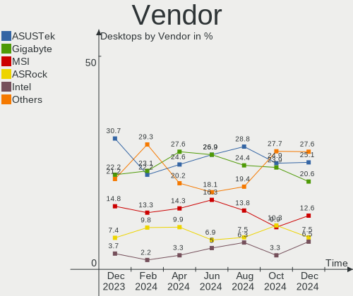

Linux in Russia - Hardware Trends (Desktops)
--------------------------------------------

A project to identify most popular hardware characteristics and track their change
over time based on data collected by Linux users at https://Linux-Hardware.org.

Anyone can contribute to this report by the [hw-probe](https://github.com/linuxhw/hw-probe) tool:

    sudo -E hw-probe -all -upload

Period: Jun, 2023.

Contents
--------

* [ System ](#system)
  - [ OS                       ](#os)
  - [ OS Family                ](#os-family)
  - [ Kernel                   ](#kernel)
  - [ Kernel Family            ](#kernel-family)
  - [ Kernel Major Ver.        ](#kernel-major-ver)
  - [ Arch                     ](#arch)
  - [ DE                       ](#de)
  - [ Display Server           ](#display-server)
  - [ Display Manager          ](#display-manager)
  - [ OS Lang                  ](#os-lang)
  - [ Boot Mode                ](#boot-mode)
  - [ Filesystem               ](#filesystem)
  - [ Part. scheme             ](#part-scheme)
  - [ Dual Boot with Linux/BSD ](#dual-boot-with-linuxbsd)
  - [ Dual Boot (Win)          ](#dual-boot-win)

* [ Board ](#board)
  - [ Vendor                   ](#vendor)
  - [ Model                    ](#model)
  - [ Model Family             ](#model-family)
  - [ MFG Year                 ](#mfg-year)
  - [ Form Factor              ](#form-factor)
  - [ Secure Boot              ](#secure-boot)
  - [ Coreboot                 ](#coreboot)
  - [ RAM Size                 ](#ram-size)
  - [ RAM Used                 ](#ram-used)
  - [ Total Drives             ](#total-drives)
  - [ Has CD-ROM               ](#has-cd-rom)
  - [ Has Ethernet             ](#has-ethernet)
  - [ Has WiFi                 ](#has-wifi)
  - [ Has Bluetooth            ](#has-bluetooth)

* [ Location ](#location)
  - [ Country                  ](#country)
  - [ City                     ](#city)

* [ Drives ](#drives)
  - [ Drive Vendor             ](#drive-vendor)
  - [ Drive Model              ](#drive-model)
  - [ HDD Vendor               ](#hdd-vendor)
  - [ SSD Vendor               ](#ssd-vendor)
  - [ Drive Kind               ](#drive-kind)
  - [ Drive Connector          ](#drive-connector)
  - [ Drive Size               ](#drive-size)
  - [ Space Total              ](#space-total)
  - [ Space Used               ](#space-used)
  - [ Malfunc. Drives          ](#malfunc-drives)
  - [ Malfunc. Drive Vendor    ](#malfunc-drive-vendor)
  - [ Malfunc. HDD Vendor      ](#malfunc-hdd-vendor)
  - [ Malfunc. Drive Kind      ](#malfunc-drive-kind)
  - [ Failed Drives            ](#failed-drives)
  - [ Failed Drive Vendor      ](#failed-drive-vendor)
  - [ Drive Status             ](#drive-status)

* [ Storage controller ](#storage-controller)
  - [ Storage Vendor           ](#storage-vendor)
  - [ Storage Model            ](#storage-model)
  - [ Storage Kind             ](#storage-kind)

* [ Processor ](#processor)
  - [ CPU Vendor               ](#cpu-vendor)
  - [ CPU Model                ](#cpu-model)
  - [ CPU Model Family         ](#cpu-model-family)
  - [ CPU Cores                ](#cpu-cores)
  - [ CPU Sockets              ](#cpu-sockets)
  - [ CPU Threads              ](#cpu-threads)
  - [ CPU Op-Modes             ](#cpu-op-modes)
  - [ CPU Microcode            ](#cpu-microcode)
  - [ CPU Microarch            ](#cpu-microarch)

* [ Graphics ](#graphics)
  - [ GPU Vendor               ](#gpu-vendor)
  - [ GPU Model                ](#gpu-model)
  - [ GPU Combo                ](#gpu-combo)
  - [ GPU Driver               ](#gpu-driver)
  - [ GPU Memory               ](#gpu-memory)

* [ Monitor ](#monitor)
  - [ Monitor Vendor           ](#monitor-vendor)
  - [ Monitor Model            ](#monitor-model)
  - [ Monitor Resolution       ](#monitor-resolution)
  - [ Monitor Diagonal         ](#monitor-diagonal)
  - [ Monitor Width            ](#monitor-width)
  - [ Aspect Ratio             ](#aspect-ratio)
  - [ Monitor Area             ](#monitor-area)
  - [ Pixel Density            ](#pixel-density)
  - [ Multiple Monitors        ](#multiple-monitors)

* [ Network ](#network)
  - [ Net Controller Vendor    ](#net-controller-vendor)
  - [ Net Controller Model     ](#net-controller-model)
  - [ Wireless Vendor          ](#wireless-vendor)
  - [ Wireless Model           ](#wireless-model)
  - [ Ethernet Vendor          ](#ethernet-vendor)
  - [ Ethernet Model           ](#ethernet-model)
  - [ Net Controller Kind      ](#net-controller-kind)
  - [ Used Controller          ](#used-controller)
  - [ NICs                     ](#nics)
  - [ IPv6                     ](#ipv6)

* [ Bluetooth ](#bluetooth)
  - [ Bluetooth Vendor         ](#bluetooth-vendor)
  - [ Bluetooth Model          ](#bluetooth-model)

* [ Sound ](#sound)
  - [ Sound Vendor             ](#sound-vendor)
  - [ Sound Model              ](#sound-model)

* [ Memory ](#memory)
  - [ Memory Vendor            ](#memory-vendor)
  - [ Memory Model             ](#memory-model)
  - [ Memory Kind              ](#memory-kind)
  - [ Memory Form Factor       ](#memory-form-factor)
  - [ Memory Size              ](#memory-size)
  - [ Memory Speed             ](#memory-speed)

* [ Printers & scanners ](#printers--scanners)
  - [ Printer Vendor           ](#printer-vendor)
  - [ Printer Model            ](#printer-model)
  - [ Scanner Vendor           ](#scanner-vendor)
  - [ Scanner Model            ](#scanner-model)

* [ Camera ](#camera)
  - [ Camera Vendor            ](#camera-vendor)
  - [ Camera Model             ](#camera-model)

* [ Security ](#security)
  - [ Fingerprint Vendor       ](#fingerprint-vendor)
  - [ Fingerprint Model        ](#fingerprint-model)
  - [ Chipcard Vendor          ](#chipcard-vendor)
  - [ Chipcard Model           ](#chipcard-model)

* [ Unsupported ](#unsupported)
  - [ Unsupported Devices      ](#unsupported-devices)
  - [ Unsupported Device Types ](#unsupported-device-types)

System
------

OS
--

Installed operating systems

| Name                         | Desktops | Percent |
|------------------------------|----------|---------|
| ROSA 12.4                    | 54       | 29.83%  |
| Debian 12                    | 36       | 19.89%  |
| OpenMandriva 23.03           | 11       | 6.08%   |
| Fedora 38                    | 7        | 3.87%   |
| Ubuntu 22.04                 | 6        | 3.31%   |
| Debian 11                    | 6        | 3.31%   |
| Red OS 7.3.2                 | 5        | 2.76%   |
| Linux Mint 21.1              | 5        | 2.76%   |
| Ubuntu 23.04                 | 3        | 1.66%   |
| OpenMandriva 4.3             | 3        | 1.66%   |
| OpenMandriva 4.2             | 3        | 1.66%   |
| Linux Mint 21                | 3        | 1.66%   |
| Ubuntu 22.10                 | 2        | 1.1%    |
| ROSA R11.1                   | 2        | 1.1%    |
| ROSA 12                      | 2        | 1.1%    |
| RELD 7.9                     | 2        | 1.1%    |
| Manjaro                      | 2        | 1.1%    |
| Gentoo 2.13                  | 2        | 1.1%    |
| Zorin 16                     | 1        | 0.55%   |
| Xubuntu 22.04                | 1        | 0.55%   |
| Ubuntu 18.04                 | 1        | 0.55%   |
| ROSA R11                     | 1        | 0.55%   |
| ROSA 2019.05                 | 1        | 0.55%   |
| ROSA 13.0                    | 1        | 0.55%   |
| ROSA 12.3                    | 1        | 0.55%   |
| ROSA 12.2                    | 1        | 0.55%   |
| ROSA 12.1                    | 1        | 0.55%   |
| RED X4                       | 1        | 0.55%   |
| PureOS 10                    | 1        | 0.55%   |
| Pop!_OS 22.04                | 1        | 0.55%   |
| openSUSE Tumbleweed-XXXXXXXX | 1        | 0.55%   |
| OpenMandriva 23.90           | 1        | 0.55%   |
| OpenMandriva 23.06           | 1        | 0.55%   |
| MOS 10                       | 1        | 0.55%   |
| Kubuntu 22.04                | 1        | 0.55%   |
| Fedora 36                    | 1        | 0.55%   |
| EndeavourOS Rolling          | 1        | 0.55%   |
| Cyber Infra 5.0.1            | 1        | 0.55%   |
| CentOS 7                     | 1        | 0.55%   |
| Artix 20230501               | 1        | 0.55%   |

OS Family
---------

OS without a version

| Name         | Desktops | Percent |
|--------------|----------|---------|
| ROSA         | 64       | 35.36%  |
| Debian       | 42       | 23.2%   |
| OpenMandriva | 19       | 10.5%   |
| Ubuntu       | 12       | 6.63%   |
| Linux Mint   | 8        | 4.42%   |
| Fedora       | 8        | 4.42%   |
| Red OS       | 5        | 2.76%   |
| ALT Linux    | 4        | 2.21%   |
| RELD         | 2        | 1.1%    |
| Manjaro      | 2        | 1.1%    |
| Gentoo       | 2        | 1.1%    |
| Zorin        | 1        | 0.55%   |
| Xubuntu      | 1        | 0.55%   |
| RED          | 1        | 0.55%   |
| PureOS       | 1        | 0.55%   |
| Pop!_OS      | 1        | 0.55%   |
| openSUSE     | 1        | 0.55%   |
| Kubuntu      | 1        | 0.55%   |
| EndeavourOS  | 1        | 0.55%   |
| Cyber Infra  | 1        | 0.55%   |
| CentOS       | 1        | 0.55%   |
| Artix        | 1        | 0.55%   |
| ArcoLinux    | 1        | 0.55%   |
| Arch         | 1        | 0.55%   |

Kernel
------

Version of the Linux kernel

| Version                                   | Desktops | Percent |
|-------------------------------------------|----------|---------|
| 6.1.20-generic-2rosa2021.1-x86_64         | 40       | 22.1%   |
| 6.1.0-4-amd64                             | 35       | 19.34%  |
| 6.2.6-desktop-1omv2390                    | 11       | 6.08%   |
| 5.15.0-73-generic                         | 5        | 2.76%   |
| 6.3.8-200.fc38.x86_64                     | 4        | 2.21%   |
| 5.10.176-generic-1rosa2021.1-x86_64       | 4        | 2.21%   |
| 5.19.0-43-generic                         | 3        | 1.66%   |
| 5.15.0-75-generic                         | 3        | 1.66%   |
| 5.10.14-desktop-1omv4002                  | 3        | 1.66%   |
| 5.10.0-23-amd64                           | 3        | 1.66%   |
| 6.2.0-20-generic                          | 2        | 1.1%    |
| 6.1.34-generic-1rosa2021.1-x86_64         | 2        | 1.1%    |
| 6.1.30.xm1-1.klp-xanmod-rosa2021.1-x86_64 | 2        | 1.1%    |
| 5.19.0-45-generic                         | 2        | 1.1%    |
| 5.16.13-desktop-1omv4003                  | 2        | 1.1%    |
| 5.15.87-1.el7.3.x86_64                    | 2        | 1.1%    |
| 5.15.103-generic-1rosa2021.1-x86_64       | 2        | 1.1%    |
| 5.15.102-1-pve                            | 2        | 1.1%    |
| 5.15.0-69-generic                         | 2        | 1.1%    |
| 5.10.74-generic-2rosa2021.1-x86_64        | 2        | 1.1%    |
| 5.10.179-std-def-alt1                     | 2        | 1.1%    |
| 6.3.9-x64v1-xanmod1                       | 1        | 0.55%   |
| 6.3.9-1-default                           | 1        | 0.55%   |
| 6.3.7-x64v1-xanmod1                       | 1        | 0.55%   |
| 6.3.7-gentoo_ap                           | 1        | 0.55%   |
| 6.3.7-generic-1rosa2021.1-x86_64          | 1        | 0.55%   |
| 6.3.6-200.fc38.x86_64                     | 1        | 0.55%   |
| 6.3.5-zen1-1-zen                          | 1        | 0.55%   |
| 6.3.5-desktop-3omv2390                    | 1        | 0.55%   |
| 6.3.5-200.fc38.x86_64                     | 1        | 0.55%   |
| 6.3.5-2-MANJARO                           | 1        | 0.55%   |
| 6.3.3-desktop-2omv2390                    | 1        | 0.55%   |
| 6.3.1-gentoo                              | 1        | 0.55%   |
| 6.2.9-300.fc38.x86_64                     | 1        | 0.55%   |
| 6.2.14-100.fc36.x86_64                    | 1        | 0.55%   |
| 6.2.13-artix1-1                           | 1        | 0.55%   |
| 6.2.12.xm1-1.klp-xanmod-rosa2021.1-x86_64 | 1        | 0.55%   |
| 6.1.34-generic-1rosa2023.1-x86_64         | 1        | 0.55%   |
| 6.1.34-1-lts                              | 1        | 0.55%   |
| 6.1.31-hardened1-1-hardened               | 1        | 0.55%   |

Kernel Family
-------------

Linux kernel without a distro release

| Version  | Desktops | Percent |
|----------|----------|---------|
| 6.1.20   | 41       | 22.65%  |
| 6.1.0    | 36       | 19.89%  |
| 5.15.0   | 13       | 7.18%   |
| 6.2.6    | 11       | 6.08%   |
| 5.19.0   | 6        | 3.31%   |
| 5.10.0   | 5        | 2.76%   |
| 6.3.8    | 4        | 2.21%   |
| 6.3.5    | 4        | 2.21%   |
| 6.1.34   | 4        | 2.21%   |
| 5.10.176 | 4        | 2.21%   |
| 6.3.7    | 3        | 1.66%   |
| 5.15.103 | 3        | 1.66%   |
| 5.10.74  | 3        | 1.66%   |
| 5.10.14  | 3        | 1.66%   |
| 6.3.9    | 2        | 1.1%    |
| 6.2.0    | 2        | 1.1%    |
| 6.1.31   | 2        | 1.1%    |
| 6.1.30   | 2        | 1.1%    |
| 5.16.13  | 2        | 1.1%    |
| 5.15.87  | 2        | 1.1%    |
| 5.15.72  | 2        | 1.1%    |
| 5.15.102 | 2        | 1.1%    |
| 5.10.179 | 2        | 1.1%    |
| 4.15.0   | 2        | 1.1%    |
| 6.3.6    | 1        | 0.55%   |
| 6.3.3    | 1        | 0.55%   |
| 6.3.1    | 1        | 0.55%   |
| 6.2.9    | 1        | 0.55%   |
| 6.2.14   | 1        | 0.55%   |
| 6.2.13   | 1        | 0.55%   |
| 6.2.12   | 1        | 0.55%   |
| 6.1.27   | 1        | 0.55%   |
| 6.1.1    | 1        | 0.55%   |
| 6.0.12   | 1        | 0.55%   |
| 5.4.83   | 1        | 0.55%   |
| 5.4.32   | 1        | 0.55%   |
| 5.4.139  | 1        | 0.55%   |
| 5.4.0    | 1        | 0.55%   |
| 5.16.7   | 1        | 0.55%   |
| 5.15.75  | 1        | 0.55%   |

Kernel Major Ver.
-----------------

Linux kernel major version

| Version | Desktops | Percent |
|---------|----------|---------|
| 6.1     | 87       | 48.07%  |
| 5.15    | 26       | 14.36%  |
| 5.10    | 18       | 9.94%   |
| 6.2     | 17       | 9.39%   |
| 6.3     | 16       | 8.84%   |
| 5.19    | 6        | 3.31%   |
| 5.4     | 4        | 2.21%   |
| 5.16    | 3        | 1.66%   |
| 4.15    | 2        | 1.1%    |
| 6.0     | 1        | 0.55%   |
| 3.10    | 1        | 0.55%   |

Arch
----

OS architecture (x86_64, i586, etc.)

| Name   | Desktops | Percent |
|--------|----------|---------|
| x86_64 | 177      | 97.79%  |
| i686   | 4        | 2.21%   |

DE
--

Desktop Environment

| Name       | Desktops | Percent |
|------------|----------|---------|
| KDE5       | 65       | 35.91%  |
| Unknown    | 46       | 25.41%  |
| GNOME      | 40       | 22.1%   |
| MATE       | 7        | 3.87%   |
| XFCE       | 6        | 3.31%   |
| X-Cinnamon | 6        | 3.31%   |
| LXQt       | 5        | 2.76%   |
| KDE4       | 5        | 2.76%   |
| Cinnamon   | 1        | 0.55%   |

Display Server
--------------

X11 or Wayland

| Name    | Desktops | Percent |
|---------|----------|---------|
| X11     | 72       | 39.78%  |
| Wayland | 64       | 35.36%  |
| Unknown | 39       | 21.55%  |
| Tty     | 6        | 3.31%   |

Display Manager
---------------

SDDM, LightDM, etc.

| Name    | Desktops | Percent |
|---------|----------|---------|
| Unknown | 66       | 36.46%  |
| SDDM    | 59       | 32.6%   |
| GDM     | 33       | 18.23%  |
| LightDM | 11       | 6.08%   |
| GDM3    | 7        | 3.87%   |
| KDM     | 5        | 2.76%   |

OS Lang
-------

Language

| Lang    | Desktops | Percent |
|---------|----------|---------|
| ru_RU   | 150      | 82.87%  |
| en_US   | 25       | 13.81%  |
| C       | 3        | 1.66%   |
| Unknown | 2        | 1.1%    |
| en_GB   | 1        | 0.55%   |

Boot Mode
---------

EFI or BIOS

| Mode | Desktops | Percent |
|------|----------|---------|
| BIOS | 98       | 54.14%  |
| EFI  | 83       | 45.86%  |

Filesystem
----------

Type of filesystem

| Type    | Desktops | Percent |
|---------|----------|---------|
| Ext4    | 101      | 55.8%   |
| Overlay | 47       | 25.97%  |
| Btrfs   | 23       | 12.71%  |
| Tmpfs   | 6        | 3.31%   |
| Xfs     | 3        | 1.66%   |
| Zfs     | 1        | 0.55%   |

Part. scheme
------------

Scheme of partitioning

| Type    | Desktops | Percent |
|---------|----------|---------|
| GPT     | 88       | 48.62%  |
| MBR     | 71       | 39.23%  |
| Unknown | 22       | 12.15%  |

Dual Boot with Linux/BSD
------------------------

Hosting more than one Linux/BSD

| Dual boot | Desktops | Percent |
|-----------|----------|---------|
| No        | 142      | 78.45%  |
| Yes       | 39       | 21.55%  |

Dual Boot (Win)
---------------

Hosting Linux and Windows

| Dual boot | Desktops | Percent |
|-----------|----------|---------|
| Yes       | 107      | 59.12%  |
| No        | 74       | 40.88%  |

Board
-----

Vendor
------

Motherboard manufacturer

| Name                | Desktops | Percent |
|---------------------|----------|---------|
| ASUSTek Computer    | 59       | 32.6%   |
| Gigabyte Technology | 47       | 25.97%  |
| MSI                 | 23       | 12.71%  |
| ASRock              | 13       | 7.18%   |
| Huanan              | 5        | 2.76%   |
| Supermicro          | 4        | 2.21%   |
| Acer                | 4        | 2.21%   |
| Intel               | 3        | 1.66%   |
| ECS                 | 3        | 1.66%   |
| Biostar             | 3        | 1.66%   |
| Unknown             | 3        | 1.66%   |
| Hewlett-Packard     | 2        | 1.1%    |
| Foxconn             | 2        | 1.1%    |
| Pegatron            | 1        | 0.55%   |
| NCR                 | 1        | 0.55%   |
| MAINBRD             | 1        | 0.55%   |
| Lenovo              | 1        | 0.55%   |
| Kraftway            | 1        | 0.55%   |
| iRU                 | 1        | 0.55%   |
| HJS                 | 1        | 0.55%   |
| Dell                | 1        | 0.55%   |
| AZW                 | 1        | 0.55%   |
| Aquarius            | 1        | 0.55%   |

Model
-----

Motherboard model

| Name                               | Desktops | Percent |
|------------------------------------|----------|---------|
| ASUS PRIME B450M-K                 | 10       | 5.52%   |
| Gigabyte B450M DS3H                | 3        | 1.66%   |
| ASUS S20 K29                       | 3        | 1.66%   |
| ASUS All Series                    | 3        | 1.66%   |
| Unknown                            | 3        | 1.66%   |
| MSI MS-7D22                        | 2        | 1.1%    |
| MSI MS-7817                        | 2        | 1.1%    |
| Gigabyte P55-USB3                  | 2        | 1.1%    |
| Gigabyte M68MT-S2                  | 2        | 1.1%    |
| Gigabyte M56S-S3                   | 2        | 1.1%    |
| Gigabyte H61M-DS2 REV 1.2          | 2        | 1.1%    |
| Gigabyte B450M S2H                 | 2        | 1.1%    |
| Gigabyte B360M-DS3H                | 2        | 1.1%    |
| ECS G31T-M9                        | 2        | 1.1%    |
| ASUS TUF Gaming Z590-PLUS WIFI     | 2        | 1.1%    |
| ASUS PRIME H510M-K                 | 2        | 1.1%    |
| ASUS PRIME H310M-K                 | 2        | 1.1%    |
| ASUS P8Z77-V LE PLUS               | 2        | 1.1%    |
| ASUS P8B75-M LE                    | 2        | 1.1%    |
| ASUS M4A78T-E                      | 2        | 1.1%    |
| ASRock G31M-GS                     | 2        | 1.1%    |
| Acer Veriton ES2710G               | 2        | 1.1%    |
| Supermicro X9DRW                   | 1        | 0.55%   |
| Supermicro X8ST3                   | 1        | 0.55%   |
| Supermicro SYS-7048GR-TR           | 1        | 0.55%   |
| Supermicro SYS-6018R-TDW           | 1        | 0.55%   |
| Pegatron Compaq 505B Microtower PC | 1        | 0.55%   |
| NCR Estoril                        | 1        | 0.55%   |
| MSI MS-7E07                        | 1        | 0.55%   |
| MSI MS-7D96                        | 1        | 0.55%   |
| MSI MS-7D54                        | 1        | 0.55%   |
| MSI MS-7C96                        | 1        | 0.55%   |
| MSI MS-7C94                        | 1        | 0.55%   |
| MSI MS-7C91                        | 1        | 0.55%   |
| MSI MS-7C37                        | 1        | 0.55%   |
| MSI MS-7C35                        | 1        | 0.55%   |
| MSI MS-7B93                        | 1        | 0.55%   |
| MSI MS-7B86                        | 1        | 0.55%   |
| MSI MS-7B24                        | 1        | 0.55%   |
| MSI MS-7A74                        | 1        | 0.55%   |

Model Family
------------

Motherboard model prefix

| Name                     | Desktops | Percent |
|--------------------------|----------|---------|
| ASUS PRIME               | 26       | 14.36%  |
| Gigabyte B450M           | 7        | 3.87%   |
| ASUS TUF                 | 5        | 2.76%   |
| ASUS S20                 | 3        | 1.66%   |
| ASUS P8Z77-V             | 3        | 1.66%   |
| ASUS All                 | 3        | 1.66%   |
| Unknown                  | 3        | 1.66%   |
| MSI MS-7D22              | 2        | 1.1%    |
| MSI MS-7817              | 2        | 1.1%    |
| Gigabyte P55-USB3        | 2        | 1.1%    |
| Gigabyte M68MT-S2        | 2        | 1.1%    |
| Gigabyte M56S-S3         | 2        | 1.1%    |
| Gigabyte H61M-DS2        | 2        | 1.1%    |
| Gigabyte H410M           | 2        | 1.1%    |
| Gigabyte B760M           | 2        | 1.1%    |
| Gigabyte B550            | 2        | 1.1%    |
| Gigabyte B450            | 2        | 1.1%    |
| Gigabyte B365M           | 2        | 1.1%    |
| Gigabyte B360M-DS3H      | 2        | 1.1%    |
| ECS G31T-M9              | 2        | 1.1%    |
| ASUS ROG                 | 2        | 1.1%    |
| ASUS P8B75-M             | 2        | 1.1%    |
| ASUS M5A78L-M            | 2        | 1.1%    |
| ASUS M4A78T-E            | 2        | 1.1%    |
| ASRock G31M-GS           | 2        | 1.1%    |
| Acer Veriton             | 2        | 1.1%    |
| Acer Aspire              | 2        | 1.1%    |
| Supermicro X9DRW         | 1        | 0.55%   |
| Supermicro X8ST3         | 1        | 0.55%   |
| Supermicro SYS-7048GR-TR | 1        | 0.55%   |
| Supermicro SYS-6018R-TDW | 1        | 0.55%   |
| Pegatron Compaq          | 1        | 0.55%   |
| NCR Estoril              | 1        | 0.55%   |
| MSI MS-7E07              | 1        | 0.55%   |
| MSI MS-7D96              | 1        | 0.55%   |
| MSI MS-7D54              | 1        | 0.55%   |
| MSI MS-7C96              | 1        | 0.55%   |
| MSI MS-7C94              | 1        | 0.55%   |
| MSI MS-7C91              | 1        | 0.55%   |
| MSI MS-7C37              | 1        | 0.55%   |

MFG Year
--------

Motherboard manufacture year

| Year | Desktops | Percent |
|------|----------|---------|
| 2018 | 30       | 16.57%  |
| 2021 | 22       | 12.15%  |
| 2020 | 18       | 9.94%   |
| 2022 | 13       | 7.18%   |
| 2019 | 12       | 6.63%   |
| 2012 | 12       | 6.63%   |
| 2009 | 12       | 6.63%   |
| 2011 | 11       | 6.08%   |
| 2010 | 10       | 5.52%   |
| 2013 | 7        | 3.87%   |
| 2008 | 7        | 3.87%   |
| 2017 | 5        | 2.76%   |
| 2007 | 5        | 2.76%   |
| 2023 | 4        | 2.21%   |
| 2015 | 4        | 2.21%   |
| 2014 | 4        | 2.21%   |
| 2006 | 4        | 2.21%   |
| 2016 | 1        | 0.55%   |

Form Factor
-----------

Physical design of the computer

| Name    | Desktops | Percent |
|---------|----------|---------|
| Desktop | 181      | 100%    |

Secure Boot
-----------

Enabled or disabled

| State    | Desktops | Percent |
|----------|----------|---------|
| Disabled | 177      | 97.79%  |
| Enabled  | 4        | 2.21%   |

Coreboot
--------

Have coreboot on board

| Used | Desktops | Percent |
|------|----------|---------|
| No   | 181      | 100%    |

RAM Size
--------

Total RAM memory

| Size in GB  | Desktops | Percent |
|-------------|----------|---------|
| 16.01-24.0  | 41       | 22.65%  |
| 4.01-8.0    | 35       | 19.34%  |
| 8.01-16.0   | 33       | 18.23%  |
| 32.01-64.0  | 25       | 13.81%  |
| 3.01-4.0    | 25       | 13.81%  |
| 64.01-256.0 | 7        | 3.87%   |
| 24.01-32.0  | 5        | 2.76%   |
| 1.01-2.0    | 5        | 2.76%   |
| 2.01-3.0    | 4        | 2.21%   |
| 0.51-1.0    | 1        | 0.55%   |

RAM Used
--------

Used RAM memory

| Used GB     | Desktops | Percent |
|-------------|----------|---------|
| 1.01-2.0    | 58       | 32.04%  |
| 0.51-1.0    | 53       | 29.28%  |
| 2.01-3.0    | 33       | 18.23%  |
| 4.01-8.0    | 15       | 8.29%   |
| 3.01-4.0    | 12       | 6.63%   |
| 8.01-16.0   | 4        | 2.21%   |
| 64.01-256.0 | 2        | 1.1%    |
| 16.01-24.0  | 2        | 1.1%    |
| 0.01-0.5    | 2        | 1.1%    |

Total Drives
------------

Number of drives on board

| Drives | Desktops | Percent |
|--------|----------|---------|
| 1      | 95       | 52.49%  |
| 2      | 29       | 16.02%  |
| 3      | 25       | 13.81%  |
| 4      | 19       | 10.5%   |
| 5      | 9        | 4.97%   |
| 6      | 2        | 1.1%    |
| 10     | 1        | 0.55%   |
| 0      | 1        | 0.55%   |

Has CD-ROM
----------

Has CD-ROM on board

| Presented | Desktops | Percent |
|-----------|----------|---------|
| No        | 139      | 76.8%   |
| Yes       | 42       | 23.2%   |

Has Ethernet
------------

Has Ethernet on board

| Presented | Desktops | Percent |
|-----------|----------|---------|
| Yes       | 179      | 98.9%   |
| No        | 2        | 1.1%    |

Has WiFi
--------

Has WiFi module

| Presented | Desktops | Percent |
|-----------|----------|---------|
| No        | 133      | 73.48%  |
| Yes       | 48       | 26.52%  |

Has Bluetooth
-------------

Has Bluetooth module

| Presented | Desktops | Percent |
|-----------|----------|---------|
| No        | 137      | 75.69%  |
| Yes       | 44       | 24.31%  |

Location
--------

Country
-------

Geographic location (country)

| Country | Desktops | Percent |
|---------|----------|---------|
| Russia  | 181      | 100%    |

City
----

Geographic location (city)

| City                 | Desktops | Percent |
|----------------------|----------|---------|
| Voronezh             | 35       | 19.34%  |
| Moscow               | 35       | 19.34%  |
| St Petersburg        | 11       | 6.08%   |
| Perm                 | 7        | 3.87%   |
| Novosibirsk          | 7        | 3.87%   |
| Rostov-on-Don        | 6        | 3.31%   |
| Krasnodar            | 5        | 2.76%   |
| Yekaterinburg        | 4        | 2.21%   |
| Volgograd            | 4        | 2.21%   |
| Saratov              | 3        | 1.66%   |
| Samara               | 3        | 1.66%   |
| Yakutsk              | 2        | 1.1%    |
| Stavropol            | 2        | 1.1%    |
| Orenburg             | 2        | 1.1%    |
| Nizhniy Novgorod     | 2        | 1.1%    |
| Kazan’             | 2        | 1.1%    |
| Irkutsk              | 2        | 1.1%    |
| Barnaul              | 2        | 1.1%    |
| Zlatoust             | 1        | 0.55%   |
| Zelenodolsk          | 1        | 0.55%   |
| Yaroslavl            | 1        | 0.55%   |
| Voskresensk          | 1        | 0.55%   |
| Vologda              | 1        | 0.55%   |
| Vladivostok          | 1        | 0.55%   |
| Verkhnyaya Salda     | 1        | 0.55%   |
| Velikiye Luki        | 1        | 0.55%   |
| Ufa                  | 1        | 0.55%   |
| Tomsk                | 1        | 0.55%   |
| Tolyatti             | 1        | 0.55%   |
| Syzran'              | 1        | 0.55%   |
| Surgut               | 1        | 0.55%   |
| Stary Oskol          | 1        | 0.55%   |
| Staraya Russa        | 1        | 0.55%   |
| Saransk              | 1        | 0.55%   |
| Ryazan               | 1        | 0.55%   |
| Pushkino             | 1        | 0.55%   |
| Pskov                | 1        | 0.55%   |
| Proletarskiy Gorodok | 1        | 0.55%   |
| Penza                | 1        | 0.55%   |
| Omsk                 | 1        | 0.55%   |

Drives
------

Drive Vendor
------------

Hard drive vendors

| Vendor              | Desktops | Drives | Percent |
|---------------------|----------|--------|---------|
| WDC                 | 66       | 83     | 20.82%  |
| Seagate             | 38       | 52     | 11.99%  |
| Samsung Electronics | 25       | 31     | 7.89%   |
| Toshiba             | 23       | 27     | 7.26%   |
| Crucial             | 23       | 25     | 7.26%   |
| Kingston            | 16       | 17     | 5.05%   |
| Hitachi             | 12       | 12     | 3.79%   |
| A-DATA Technology   | 11       | 12     | 3.47%   |
| Netac               | 9        | 10     | 2.84%   |
| Apacer              | 8        | 9      | 2.52%   |
| China               | 7        | 7      | 2.21%   |
| Maxtor              | 5        | 5      | 1.58%   |
| KingSpec            | 5        | 5      | 1.58%   |
| SanDisk             | 4        | 4      | 1.26%   |
| Patriot             | 4        | 4      | 1.26%   |
| OCZ                 | 4        | 4      | 1.26%   |
| Intel               | 4        | 6      | 1.26%   |
| XrayDisk            | 3        | 3      | 0.95%   |
| Unknown             | 3        | 3      | 0.95%   |
| Phison Electronics  | 3        | 3      | 0.95%   |
| HGST                | 3        | 4      | 0.95%   |
| Hewlett-Packard     | 3        | 3      | 0.95%   |
| AMD                 | 3        | 3      | 0.95%   |
| Silicon Motion      | 2        | 2      | 0.63%   |
| Plextor             | 2        | 2      | 0.63%   |
| Phison              | 2        | 2      | 0.63%   |
| Foxline             | 2        | 2      | 0.63%   |
| Digma               | 2        | 3      | 0.63%   |
| DEXP                | 2        | 2      | 0.63%   |
| ADATA Technology    | 2        | 2      | 0.63%   |
| ZM                  | 1        | 1      | 0.32%   |
| Zheino              | 1        | 1      | 0.32%   |
| USB3.0              | 1        | 1      | 0.32%   |
| TO Exter            | 1        | 2      | 0.32%   |
| SPCC                | 1        | 1      | 0.32%   |
| SCCTS-602-256G      | 1        | 1      | 0.32%   |
| Realtek             | 1        | 1      | 0.32%   |
| Q600S               | 1        | 1      | 0.32%   |
| Palit               | 1        | 1      | 0.32%   |
| OCZ-VERTEX3         | 1        | 1      | 0.32%   |

Drive Model
-----------

Hard drive models

| Model                                               | Desktops | Percent |
|-----------------------------------------------------|----------|---------|
| Crucial CT480BX500SSD1 480GB                        | 14       | 4%      |
| Toshiba DT01ACA100 1TB                              | 5        | 1.43%   |
| Toshiba DT01ACA050 500GB                            | 5        | 1.43%   |
| Crucial CT240BX500SSD1 240GB                        | 5        | 1.43%   |
| Toshiba HDWD110 1TB                                 | 4        | 1.14%   |
| Seagate ST1000DM010-2EP102 1TB                      | 4        | 1.14%   |
| Samsung SSD 970 EVO Plus 500GB                      | 4        | 1.14%   |
| Kingston SA400S37240G 240GB SSD                     | 4        | 1.14%   |
| WDC WDS500G2B0A-00SM50 500GB SSD                    | 3        | 0.86%   |
| WDC WD5000AAKX-08U6AA0 500GB                        | 3        | 0.86%   |
| WDC WD2500AAKS-00VSA0 250GB                         | 3        | 0.86%   |
| WDC WD10EZEX-00BBHA0 1TB                            | 3        | 0.86%   |
| Seagate ST3500418AS 500GB                           | 3        | 0.86%   |
| Seagate ST2000DM008-2FR102 2TB                      | 3        | 0.86%   |
| Samsung SSD 870 EVO 250GB                           | 3        | 0.86%   |
| Apacer AS350 256GB SSD                              | 3        | 0.86%   |
| WDC WD5000LPLX-00ZNTT0 500GB                        | 2        | 0.57%   |
| WDC WD5000AZRX-00A8LB0 500GB                        | 2        | 0.57%   |
| WDC WD5000AAKX-00ERMA0 500GB                        | 2        | 0.57%   |
| WDC WD3200AAJS-00L7A0 320GB                         | 2        | 0.57%   |
| WDC WD20EZAZ-00L9GB0 2TB                            | 2        | 0.57%   |
| WDC WD20EFRX-68EUZN0 2TB                            | 2        | 0.57%   |
| WDC WD15EARX-00ZUDB0 1TB                            | 2        | 0.57%   |
| Toshiba MQ01ABF050 500GB                            | 2        | 0.57%   |
| Seagate ST500DM002-1BD142 500GB                     | 2        | 0.57%   |
| Seagate ST3400620AS 400GB                           | 2        | 0.57%   |
| Seagate ST3320418AS 320GB                           | 2        | 0.57%   |
| Seagate ST3250410AS 250GB                           | 2        | 0.57%   |
| Seagate ST2000DM008-2UB102 2TB                      | 2        | 0.57%   |
| Seagate ST1000DM003-1ER162 1TB                      | 2        | 0.57%   |
| Samsung SSD 870 EVO 500GB                           | 2        | 0.57%   |
| Samsung SSD 860 EVO 250GB                           | 2        | 0.57%   |
| Samsung NVMe SSD Controller SM981/PM981/PM983 250GB | 2        | 0.57%   |
| Phison PCIe SSD 1TB                                 | 2        | 0.57%   |
| OCZ VERTEX3 120GB SSD                               | 2        | 0.57%   |
| Netac SSD 240GB                                     | 2        | 0.57%   |
| Netac NVMe SSD 256GB                                | 2        | 0.57%   |
| Kingston SKC2500M8250G 250GB                        | 2        | 0.57%   |
| KingSpec NT-256 256GB SSD                           | 2        | 0.57%   |
| Hitachi HDS721050CLA360 500GB                       | 2        | 0.57%   |

HDD Vendor
----------

Hard disk drive vendors

| Vendor              | Desktops | Drives | Percent |
|---------------------|----------|--------|---------|
| WDC                 | 59       | 71     | 40.97%  |
| Seagate             | 37       | 51     | 25.69%  |
| Toshiba             | 23       | 26     | 15.97%  |
| Hitachi             | 12       | 12     | 8.33%   |
| Maxtor              | 4        | 4      | 2.78%   |
| HGST                | 3        | 4      | 2.08%   |
| Samsung Electronics | 2        | 2      | 1.39%   |
| USB3.0              | 1        | 1      | 0.69%   |
| Unknown             | 1        | 1      | 0.69%   |
| MARSHAL             | 1        | 1      | 0.69%   |
| ASMT                | 1        | 1      | 0.69%   |

SSD Vendor
----------

Solid state drive vendors

| Vendor              | Desktops | Drives | Percent |
|---------------------|----------|--------|---------|
| Crucial             | 22       | 24     | 16.92%  |
| Samsung Electronics | 14       | 15     | 10.77%  |
| Kingston            | 11       | 12     | 8.46%   |
| WDC                 | 8        | 9      | 6.15%   |
| A-DATA Technology   | 8        | 8      | 6.15%   |
| China               | 7        | 7      | 5.38%   |
| Apacer              | 7        | 7      | 5.38%   |
| Netac               | 5        | 5      | 3.85%   |
| KingSpec            | 5        | 5      | 3.85%   |
| OCZ                 | 4        | 4      | 3.08%   |
| Intel               | 4        | 6      | 3.08%   |
| XrayDisk            | 3        | 3      | 2.31%   |
| Patriot             | 3        | 3      | 2.31%   |
| SanDisk             | 2        | 2      | 1.54%   |
| Plextor             | 2        | 2      | 1.54%   |
| Hewlett-Packard     | 2        | 2      | 1.54%   |
| Foxline             | 2        | 2      | 1.54%   |
| Digma               | 2        | 2      | 1.54%   |
| DEXP                | 2        | 2      | 1.54%   |
| AMD                 | 2        | 2      | 1.54%   |
| ZM                  | 1        | 1      | 0.77%   |
| Zheino              | 1        | 1      | 0.77%   |
| TO Exter            | 1        | 2      | 0.77%   |
| SPCC                | 1        | 1      | 0.77%   |
| Seagate             | 1        | 1      | 0.77%   |
| SCCTS-602-256G      | 1        | 1      | 0.77%   |
| Q600S               | 1        | 1      | 0.77%   |
| Palit               | 1        | 1      | 0.77%   |
| OCZ-VERTEX3         | 1        | 1      | 0.77%   |
| Maxtor              | 1        | 1      | 0.77%   |
| MAS1102             | 1        | 1      | 0.77%   |
| LITEON              | 1        | 1      | 0.77%   |
| HS-SSD-C100         | 1        | 1      | 0.77%   |
| External            | 1        | 1      | 0.77%   |
| Unknown             | 1        | 1      | 0.77%   |

Drive Kind
----------

HDD or SSD

| Kind    | Desktops | Drives | Percent |
|---------|----------|--------|---------|
| HDD     | 111      | 174    | 41.73%  |
| SSD     | 109      | 138    | 40.98%  |
| NVMe    | 45       | 57     | 16.92%  |
| Unknown | 1        | 1      | 0.38%   |

Drive Connector
---------------

SATA, SAS, NVMe, etc.

| Type | Desktops | Drives | Percent |
|------|----------|--------|---------|
| SATA | 169      | 306    | 76.82%  |
| NVMe | 45       | 56     | 20.45%  |
| SAS  | 6        | 8      | 2.73%   |

Drive Size
----------

Size of hard drive

| Size in TB | Desktops | Drives | Percent |
|------------|----------|--------|---------|
| 0.01-0.5   | 147      | 205    | 64.19%  |
| 0.51-1.0   | 54       | 65     | 23.58%  |
| 1.01-2.0   | 18       | 23     | 7.86%   |
| 3.01-4.0   | 5        | 6      | 2.18%   |
| 2.01-3.0   | 2        | 2      | 0.87%   |
| 4.01-10.0  | 2        | 3      | 0.87%   |
| 10.01-20.0 | 1        | 8      | 0.44%   |

Space Total
-----------

Amount of disk space available on the file system

| Size in GB     | Desktops | Percent |
|----------------|----------|---------|
| 101-250        | 42       | 23.2%   |
| Unknown        | 40       | 22.1%   |
| 251-500        | 27       | 14.92%  |
| 501-1000       | 21       | 11.6%   |
| 1-20           | 12       | 6.63%   |
| 1001-2000      | 10       | 5.52%   |
| More than 3000 | 9        | 4.97%   |
| 51-100         | 8        | 4.42%   |
| 2001-3000      | 7        | 3.87%   |
| 21-50          | 5        | 2.76%   |

Space Used
----------

Amount of used disk space

| Used GB        | Desktops | Percent |
|----------------|----------|---------|
| 1-20           | 70       | 38.67%  |
| Unknown        | 40       | 22.1%   |
| 21-50          | 18       | 9.94%   |
| 101-250        | 13       | 7.18%   |
| 251-500        | 12       | 6.63%   |
| 1001-2000      | 11       | 6.08%   |
| 51-100         | 10       | 5.52%   |
| 501-1000       | 4        | 2.21%   |
| More than 3000 | 3        | 1.66%   |

Malfunc. Drives
---------------

Drive models with a malfunction

| Model                             | Desktops | Drives | Percent |
|-----------------------------------|----------|--------|---------|
| Seagate ST3320418AS 320GB         | 2        | 2      | 3.85%   |
| XrayDisk 512GB SSD                | 1        | 1      | 1.92%   |
| WDC WDS120G2G0A-00JH30 128GB SSD  | 1        | 2      | 1.92%   |
| WDC WD800JD-22MSA1 80GB           | 1        | 1      | 1.92%   |
| WDC WD5000AZLX-22JKKA0 500GB      | 1        | 1      | 1.92%   |
| WDC WD5000AAKX-221CA1 500GB       | 1        | 1      | 1.92%   |
| WDC WD5000AAKX-08U6AA0 500GB      | 1        | 1      | 1.92%   |
| WDC WD5000AAKX-00ERMA0 500GB      | 1        | 1      | 1.92%   |
| WDC WD5000AAKS-00A7B0 500GB       | 1        | 1      | 1.92%   |
| WDC WD3200AAJS-00L7A0 320GB       | 1        | 1      | 1.92%   |
| WDC WD2500AAKS-00VSA0 250GB       | 1        | 1      | 1.92%   |
| WDC WD2500AAKS-00F0A0 250GB       | 1        | 1      | 1.92%   |
| WDC WD20EFRX-68EUZN0 2TB          | 1        | 1      | 1.92%   |
| WDC WD2005FBYZ-01YCBB3 2TB        | 1        | 1      | 1.92%   |
| WDC WD2002FAEX-007BA0 2TB         | 1        | 1      | 1.92%   |
| WDC WD1600AAJS-00B4A0 160GB       | 1        | 1      | 1.92%   |
| WDC WD10PURZ-85U8XY0 1TB          | 1        | 1      | 1.92%   |
| WDC WD10EZEX-00RKKA0 1TB          | 1        | 1      | 1.92%   |
| WDC WD10EADS-00P8B0 1TB           | 1        | 1      | 1.92%   |
| Toshiba MQ01ABF050 500GB          | 1        | 1      | 1.92%   |
| Toshiba MQ01ABD100 1TB            | 1        | 1      | 1.92%   |
| Toshiba HDWL120 2TB               | 1        | 2      | 1.92%   |
| Seagate ST9500325AS 500GB         | 1        | 1      | 1.92%   |
| Seagate ST3500630A 500GB          | 1        | 1      | 1.92%   |
| Seagate ST3500418AS 500GB         | 1        | 1      | 1.92%   |
| Seagate ST3500413AS 500GB         | 1        | 1      | 1.92%   |
| Seagate ST3400620AS 400GB         | 1        | 1      | 1.92%   |
| Seagate ST3250410AS 250GB         | 1        | 1      | 1.92%   |
| Seagate ST3250318AS 250GB         | 1        | 1      | 1.92%   |
| Seagate ST3250312CS 250GB         | 1        | 1      | 1.92%   |
| Seagate ST3250312AS 250GB         | 1        | 1      | 1.92%   |
| Seagate ST31500341AS 1TB          | 1        | 1      | 1.92%   |
| Seagate ST3000DM003-1F216N 3TB    | 1        | 1      | 1.92%   |
| Seagate ST2000DM001-1CH164 2TB    | 1        | 1      | 1.92%   |
| Seagate ST1000DM003-1CH162 1TB    | 1        | 1      | 1.92%   |
| Seagate OOS500G128M 500GB         | 1        | 1      | 1.92%   |
| Samsung Electronics HM250HJ 250GB | 1        | 1      | 1.92%   |
| OCZ ONYX 32GB SSD                 | 1        | 1      | 1.92%   |
| Maxtor STM3320820AS 320GB         | 1        | 1      | 1.92%   |
| Maxtor STM3250310AS 250GB         | 1        | 1      | 1.92%   |

Malfunc. Drive Vendor
---------------------

Vendors of faulty drives

| Vendor              | Desktops | Drives | Percent |
|---------------------|----------|--------|---------|
| WDC                 | 16       | 18     | 32%     |
| Seagate             | 15       | 16     | 30%     |
| Hitachi             | 5        | 5      | 10%     |
| Toshiba             | 3        | 4      | 6%      |
| Maxtor              | 3        | 3      | 6%      |
| A-DATA Technology   | 2        | 2      | 4%      |
| XrayDisk            | 1        | 1      | 2%      |
| Samsung Electronics | 1        | 1      | 2%      |
| OCZ                 | 1        | 1      | 2%      |
| MARSHAL             | 1        | 1      | 2%      |
| Intel               | 1        | 2      | 2%      |
| HS-SSD-C100         | 1        | 1      | 2%      |

Malfunc. HDD Vendor
-------------------

Vendors of faulty HDD drives

| Vendor              | Desktops | Drives | Percent |
|---------------------|----------|--------|---------|
| WDC                 | 15       | 16     | 34.88%  |
| Seagate             | 15       | 16     | 34.88%  |
| Hitachi             | 5        | 5      | 11.63%  |
| Toshiba             | 3        | 4      | 6.98%   |
| Maxtor              | 3        | 3      | 6.98%   |
| Samsung Electronics | 1        | 1      | 2.33%   |
| MARSHAL             | 1        | 1      | 2.33%   |

Malfunc. Drive Kind
-------------------

Kinds of faulty drives

| Kind | Desktops | Drives | Percent |
|------|----------|--------|---------|
| HDD  | 40       | 46     | 85.11%  |
| SSD  | 7        | 9      | 14.89%  |

Failed Drives
-------------

Failed drive models

| Model                  | Desktops | Drives | Percent |
|------------------------|----------|--------|---------|
| Toshiba DT01ACA100 1TB | 1        | 1      | 100%    |

Failed Drive Vendor
-------------------

Failed drive vendors

| Vendor  | Desktops | Drives | Percent |
|---------|----------|--------|---------|
| Toshiba | 1        | 1      | 100%    |

Drive Status
------------

Number of failed and malfunc. drives

| Status   | Desktops | Drives | Percent |
|----------|----------|--------|---------|
| Works    | 138      | 244    | 64.19%  |
| Malfunc  | 45       | 55     | 20.93%  |
| Detected | 31       | 70     | 14.42%  |
| Failed   | 1        | 1      | 0.47%   |

Storage controller
------------------

Storage Vendor
--------------

Storage controller vendors

| Vendor                       | Desktops | Percent |
|------------------------------|----------|---------|
| Intel                        | 113      | 45.2%   |
| AMD                          | 59       | 23.6%   |
| Samsung Electronics          | 14       | 5.6%    |
| Phison Electronics           | 9        | 3.6%    |
| Nvidia                       | 7        | 2.8%    |
| Silicon Motion               | 5        | 2%      |
| SanDisk                      | 5        | 2%      |
| Kingston Technology Company  | 5        | 2%      |
| JMicron Technology           | 5        | 2%      |
| ADATA Technology             | 5        | 2%      |
| Netac Technology             | 4        | 1.6%    |
| Marvell Technology Group     | 4        | 1.6%    |
| ASMedia Technology           | 3        | 1.2%    |
| Adaptec                      | 3        | 1.2%    |
| VIA Technologies             | 2        | 0.8%    |
| Toshiba America Info Systems | 1        | 0.4%    |
| TenaFe                       | 1        | 0.4%    |
| Realtek Semiconductor        | 1        | 0.4%    |
| Micron/Crucial Technology    | 1        | 0.4%    |
| MAXIO Technology (Hangzhou)  | 1        | 0.4%    |
| LSI Logic / Symbios Logic    | 1        | 0.4%    |
| Biwin Storage Technology     | 1        | 0.4%    |

Storage Model
-------------

Storage controller models

| Model                                                                                   | Desktops | Percent |
|-----------------------------------------------------------------------------------------|----------|---------|
| AMD FCH SATA Controller [AHCI mode]                                                     | 34       | 10.59%  |
| AMD 400 Series Chipset SATA Controller                                                  | 23       | 7.17%   |
| Intel NM10/ICH7 Family SATA Controller [IDE mode]                                       | 14       | 4.36%   |
| AMD 500 Series Chipset SATA Controller                                                  | 13       | 4.05%   |
| Intel 500 Series Chipset Family SATA AHCI Controller                                    | 11       | 3.43%   |
| Intel 82801G (ICH7 Family) IDE Controller                                               | 9        | 2.8%    |
| Intel 200 Series PCH SATA controller [AHCI mode]                                        | 9        | 2.8%    |
| Samsung NVMe SSD Controller SM981/PM981/PM983                                           | 8        | 2.49%   |
| Intel Alder Lake-S PCH SATA Controller [AHCI Mode]                                      | 8        | 2.49%   |
| Intel 8 Series/C220 Series Chipset Family 6-port SATA Controller 1 [AHCI mode]          | 8        | 2.49%   |
| Intel Cannon Lake PCH SATA AHCI Controller                                              | 7        | 2.18%   |
| Intel 7 Series/C210 Series Chipset Family 6-port SATA Controller [AHCI mode]            | 7        | 2.18%   |
| AMD SB7x0/SB8x0/SB9x0 IDE Controller                                                    | 7        | 2.18%   |
| Intel 6 Series/C200 Series Chipset Family Desktop SATA Controller (IDE mode, ports 4-5) | 6        | 1.87%   |
| Intel 6 Series/C200 Series Chipset Family Desktop SATA Controller (IDE mode, ports 0-3) | 6        | 1.87%   |
| Nvidia MCP61 SATA Controller                                                            | 5        | 1.56%   |
| Intel 6 Series/C200 Series Chipset Family 6 port Desktop SATA AHCI Controller           | 5        | 1.56%   |
| Silicon Motion SM2263EN/SM2263XT SSD Controller                                         | 4        | 1.25%   |
| Netac Non-Volatile memory controller                                                    | 4        | 1.25%   |
| Intel 700 Series Chipset Family SATA AHCI Controller                                    | 4        | 1.25%   |
| AMD SB7x0/SB8x0/SB9x0 SATA Controller [IDE mode]                                        | 4        | 1.25%   |
| AMD SB7x0/SB8x0/SB9x0 SATA Controller [AHCI mode]                                       | 4        | 1.25%   |
| AMD FCH SATA Controller D                                                               | 4        | 1.25%   |
| Samsung NVMe SSD Controller PM9A1/PM9A3/980PRO                                          | 3        | 0.93%   |
| Phison PS5013 E13 NVMe Controller                                                       | 3        | 0.93%   |
| JMicron JMB368 IDE controller                                                           | 3        | 0.93%   |
| Intel Q170/Q150/B150/H170/H110/Z170/CM236 Chipset SATA Controller [AHCI Mode]           | 3        | 0.93%   |
| Intel C610/X99 series chipset sSATA Controller [AHCI mode]                              | 3        | 0.93%   |
| Intel C610/X99 series chipset 6-Port SATA Controller [AHCI mode]                        | 3        | 0.93%   |
| Intel 82801JI (ICH10 Family) SATA AHCI Controller                                       | 3        | 0.93%   |
| Intel 5 Series/3400 Series Chipset 6 port SATA AHCI Controller                          | 3        | 0.93%   |
| ASMedia ASM1062 Serial ATA Controller                                                   | 3        | 0.93%   |
| ADATA XPG SX8200 Pro PCIe Gen3x4 M.2 2280 Solid State Drive                             | 3        | 0.93%   |
| Samsung NVMe SSD Controller 980                                                         | 2        | 0.62%   |
| Phison E16 PCIe4 NVMe Controller                                                        | 2        | 0.62%   |
| Nvidia MCP65 IDE                                                                        | 2        | 0.62%   |
| Nvidia MCP61 IDE                                                                        | 2        | 0.62%   |
| Marvell Group 88SE9120 SATA 6Gb/s Controller                                            | 2        | 0.62%   |
| Kingston Company NVMe Controller                                                        | 2        | 0.62%   |
| Kingston Company KC2000 NVMe SSD                                                        | 2        | 0.62%   |

Storage Kind
------------

Kind of storage controller (IDE, SATA, NVMe, SAS, ...)

| Kind | Desktops | Percent |
|------|----------|---------|
| SATA | 145      | 58.94%  |
| IDE  | 48       | 19.51%  |
| NVMe | 45       | 18.29%  |
| RAID | 6        | 2.44%   |
| SAS  | 1        | 0.41%   |
| SCSI | 1        | 0.41%   |

Processor
---------

CPU Vendor
----------

Processor vendors

| Vendor | Desktops | Percent |
|--------|----------|---------|
| Intel  | 115      | 63.54%  |
| AMD    | 66       | 36.46%  |

CPU Model
---------

Processor models

| Model                                       | Desktops | Percent |
|---------------------------------------------|----------|---------|
| AMD Ryzen 5 3350G with Radeon Vega Graphics | 10       | 5.52%   |
| Intel Core i5-9400 CPU @ 2.90GHz            | 6        | 3.31%   |
| Intel Pentium Dual-Core CPU E6500 @ 2.93GHz | 4        | 2.21%   |
| Intel Core i3-10100F CPU @ 3.60GHz          | 4        | 2.21%   |
| AMD Ryzen 5 PRO 4650G with Radeon Graphics  | 4        | 2.21%   |
| Intel Xeon CPU E5450 @ 3.00GHz              | 3        | 1.66%   |
| Intel 12th Gen Core i3-12100                | 3        | 1.66%   |
| AMD Ryzen 9 5900X 12-Core Processor         | 3        | 1.66%   |
| AMD Ryzen 7 5800X 8-Core Processor          | 3        | 1.66%   |
| AMD Ryzen 5 2600 Six-Core Processor         | 3        | 1.66%   |
| Intel Xeon CPU X3480 @ 3.07GHz              | 2        | 1.1%    |
| Intel Pentium Dual-Core CPU E6300 @ 2.80GHz | 2        | 1.1%    |
| Intel Pentium D CPU 2.80GHz                 | 2        | 1.1%    |
| Intel Pentium CPU G620 @ 2.60GHz            | 2        | 1.1%    |
| Intel Core i7-3770K CPU @ 3.50GHz           | 2        | 1.1%    |
| Intel Core i5-8400 CPU @ 2.80GHz            | 2        | 1.1%    |
| Intel Core i5-10400 CPU @ 2.90GHz           | 2        | 1.1%    |
| Intel Core i3-4170 CPU @ 3.70GHz            | 2        | 1.1%    |
| Intel Core i3-10105 CPU @ 3.70GHz           | 2        | 1.1%    |
| Intel Core i3-10100 CPU @ 3.60GHz           | 2        | 1.1%    |
| Intel Celeron J4125 CPU @ 2.00GHz           | 2        | 1.1%    |
| Intel 12th Gen Core i5-12400F               | 2        | 1.1%    |
| Intel 11th Gen Core i7-11700 @ 2.50GHz      | 2        | 1.1%    |
| AMD Ryzen 9 5950X 16-Core Processor         | 2        | 1.1%    |
| AMD Ryzen 7 5700G with Radeon Graphics      | 2        | 1.1%    |
| AMD Ryzen 7 2700 Eight-Core Processor       | 2        | 1.1%    |
| AMD Ryzen 5 5600G with Radeon Graphics      | 2        | 1.1%    |
| AMD Ryzen 5 3600 6-Core Processor           | 2        | 1.1%    |
| AMD Ryzen 5 1600 Six-Core Processor         | 2        | 1.1%    |
| AMD Athlon II X4 640 Processor              | 2        | 1.1%    |
| AMD Athlon II X3 425 Processor              | 2        | 1.1%    |
| Intel Xeon CPU X3470 @ 2.93GHz              | 1        | 0.55%   |
| Intel Xeon CPU E5520 @ 2.27GHz              | 1        | 0.55%   |
| Intel Xeon CPU E5405 @ 2.00GHz              | 1        | 0.55%   |
| Intel Xeon CPU E5-2680 v3 @ 2.50GHz         | 1        | 0.55%   |
| Intel Xeon CPU E5-2678 v3 @ 2.50GHz         | 1        | 0.55%   |
| Intel Xeon CPU E5-2660 v3 @ 2.60GHz         | 1        | 0.55%   |
| Intel Xeon CPU E5-2650 v4 @ 2.20GHz         | 1        | 0.55%   |
| Intel Xeon CPU E5-2650 v3 @ 2.30GHz         | 1        | 0.55%   |
| Intel Xeon CPU E5-2640 0 @ 2.50GHz          | 1        | 0.55%   |

CPU Model Family
----------------

Processor model prefix

| Model                   | Desktops | Percent |
|-------------------------|----------|---------|
| AMD Ryzen 5             | 23       | 12.71%  |
| Intel Xeon              | 20       | 11.05%  |
| Intel Core i5           | 19       | 10.5%   |
| Intel Core i3           | 19       | 10.5%   |
| Other                   | 16       | 8.84%   |
| AMD Ryzen 7             | 10       | 5.52%   |
| Intel Celeron           | 9        | 4.97%   |
| Intel Core i7           | 8        | 4.42%   |
| Intel Pentium Dual-Core | 6        | 3.31%   |
| Intel Pentium           | 5        | 2.76%   |
| AMD Ryzen 9             | 5        | 2.76%   |
| AMD Ryzen 5 PRO         | 4        | 2.21%   |
| AMD FX                  | 4        | 2.21%   |
| Intel Pentium D         | 3        | 1.66%   |
| AMD Athlon II X3        | 3        | 1.66%   |
| Intel Pentium Gold      | 2        | 1.1%    |
| Intel Core 2 Quad       | 2        | 1.1%    |
| Intel Core 2 Duo        | 2        | 1.1%    |
| Intel Core 2            | 2        | 1.1%    |
| AMD Ryzen 3             | 2        | 1.1%    |
| AMD Phenom II X4        | 2        | 1.1%    |
| AMD Athlon II X4        | 2        | 1.1%    |
| AMD Athlon 64 X2        | 2        | 1.1%    |
| AMD Athlon              | 2        | 1.1%    |
| AMD A10                 | 2        | 1.1%    |
| Intel Pentium Dual      | 1        | 0.55%   |
| Intel Core i9           | 1        | 0.55%   |
| AMD Sempron             | 1        | 0.55%   |
| AMD Ryzen 3 PRO         | 1        | 0.55%   |
| AMD Phenom II X3        | 1        | 0.55%   |
| AMD Athlon II X2        | 1        | 0.55%   |
| AMD A4                  | 1        | 0.55%   |

CPU Cores
---------

Number of processor cores

| Number | Desktops | Percent |
|--------|----------|---------|
| 4      | 64       | 35.36%  |
| 2      | 45       | 24.86%  |
| 6      | 35       | 19.34%  |
| 8      | 16       | 8.84%   |
| 12     | 5        | 2.76%   |
| 10     | 4        | 2.21%   |
| 3      | 4        | 2.21%   |
| 16     | 3        | 1.66%   |
| 24     | 2        | 1.1%    |
| 1      | 2        | 1.1%    |
| 14     | 1        | 0.55%   |

CPU Sockets
-----------

Number of sockets

| Number | Desktops | Percent |
|--------|----------|---------|
| 1      | 177      | 97.79%  |
| 2      | 4        | 2.21%   |

CPU Threads
-----------

Threads per core (Hyper-Threading)

| Number | Desktops | Percent |
|--------|----------|---------|
| 2      | 112      | 61.88%  |
| 1      | 69       | 38.12%  |

CPU Op-Modes
------------

CPU Operation Modes (32-bit, 64-bit)

| Op mode        | Desktops | Percent |
|----------------|----------|---------|
| 32-bit, 64-bit | 181      | 100%    |

CPU Microcode
-------------

Microcode number

| Number     | Desktops | Percent |
|------------|----------|---------|
| Unknown    | 37       | 20.44%  |
| 0x1067a    | 13       | 7.18%   |
| 0x08108109 | 12       | 6.63%   |
| 0x906ea    | 8        | 4.42%   |
| 0x306a9    | 8        | 4.42%   |
| 0xa0653    | 7        | 3.87%   |
| 0x306c3    | 7        | 3.87%   |
| 0x206a7    | 6        | 3.31%   |
| 0x90675    | 5        | 2.76%   |
| 0x08600106 | 5        | 2.76%   |
| 0x0800820d | 4        | 2.21%   |
| 0x306f2    | 3        | 1.66%   |
| 0x10676    | 3        | 1.66%   |
| 0x0a50000d | 3        | 1.66%   |
| 0x0a20120a | 3        | 1.66%   |
| 0x08101016 | 3        | 1.66%   |
| 0x010000c8 | 3        | 1.66%   |
| 0x010000c6 | 3        | 1.66%   |
| 0xf64      | 2        | 1.1%    |
| 0xa0671    | 2        | 1.1%    |
| 0x906e9    | 2        | 1.1%    |
| 0x706a8    | 2        | 1.1%    |
| 0x106e5    | 2        | 1.1%    |
| 0x106a5    | 2        | 1.1%    |
| 0x0a201025 | 2        | 1.1%    |
| 0x0a201009 | 2        | 1.1%    |
| 0x0600081c | 2        | 1.1%    |
| 0xf47      | 1        | 0.55%   |
| 0xb06f2    | 1        | 0.55%   |
| 0xb0671    | 1        | 0.55%   |
| 0xa0655    | 1        | 0.55%   |
| 0x906ed    | 1        | 0.55%   |
| 0x906ec    | 1        | 0.55%   |
| 0x906eb    | 1        | 0.55%   |
| 0x906c0    | 1        | 0.55%   |
| 0x90672    | 1        | 0.55%   |
| 0x806c1    | 1        | 0.55%   |
| 0x6fd      | 1        | 0.55%   |
| 0x6f2      | 1        | 0.55%   |
| 0x506c9    | 1        | 0.55%   |

CPU Microarch
-------------

Microarchitecture

| Name             | Desktops | Percent |
|------------------|----------|---------|
| KabyLake         | 19       | 10.5%   |
| Zen+             | 18       | 9.94%   |
| Penryn           | 16       | 8.84%   |
| Haswell          | 15       | 8.29%   |
| Zen 3            | 14       | 7.73%   |
| IvyBridge        | 11       | 6.08%   |
| CometLake        | 11       | 6.08%   |
| Alderlake Hybrid | 11       | 6.08%   |
| Zen 2            | 9        | 4.97%   |
| SandyBridge      | 9        | 4.97%   |
| K10              | 9        | 4.97%   |
| Zen              | 6        | 3.31%   |
| Piledriver       | 5        | 2.76%   |
| Nehalem          | 5        | 2.76%   |
| Core             | 4        | 2.21%   |
| NetBurst         | 3        | 1.66%   |
| K8 Hammer        | 3        | 1.66%   |
| Icelake          | 2        | 1.1%    |
| Goldmont plus    | 2        | 1.1%    |
| Unknown          | 2        | 1.1%    |
| Westmere         | 1        | 0.55%   |
| Tremont          | 1        | 0.55%   |
| TigerLake        | 1        | 0.55%   |
| Steamroller      | 1        | 0.55%   |
| Puma             | 1        | 0.55%   |
| Goldmont         | 1        | 0.55%   |
| Broadwell        | 1        | 0.55%   |

Graphics
--------

GPU Vendor
----------

Vendors of graphics cards

| Vendor                     | Desktops | Percent |
|----------------------------|----------|---------|
| Nvidia                     | 72       | 37.31%  |
| AMD                        | 65       | 33.68%  |
| Intel                      | 50       | 25.91%  |
| Matrox Electronics Systems | 3        | 1.55%   |
| ASPEED Technology          | 2        | 1.04%   |
| VIA Technologies           | 1        | 0.52%   |

GPU Model
---------

Graphics card models

| Model                                                                     | Desktops | Percent |
|---------------------------------------------------------------------------|----------|---------|
| AMD Picasso/Raven 2 [Radeon Vega Series / Radeon Vega Mobile Series]      | 12       | 6.03%   |
| Intel CoffeeLake-S GT2 [UHD Graphics 630]                                 | 10       | 5.03%   |
| Nvidia GF108 [GeForce GT 730]                                             | 7        | 3.52%   |
| AMD Ellesmere [Radeon RX 470/480/570/570X/580/580X/590]                   | 6        | 3.02%   |
| AMD Renoir                                                                | 5        | 2.51%   |
| Nvidia GP106 [GeForce GTX 1060 6GB]                                       | 4        | 2.01%   |
| Nvidia GK208B [GeForce GT 710]                                            | 4        | 2.01%   |
| Intel CometLake-S GT2 [UHD Graphics 630]                                  | 4        | 2.01%   |
| Intel 82G33/G31 Express Integrated Graphics Controller                    | 4        | 2.01%   |
| Intel 4 Series Chipset Integrated Graphics Controller                     | 4        | 2.01%   |
| AMD Cezanne [Radeon Vega Series / Radeon Vega Mobile Series]              | 4        | 2.01%   |
| Nvidia TU117 [GeForce GTX 1650]                                           | 3        | 1.51%   |
| Nvidia GK107 [GeForce GTX 650]                                            | 3        | 1.51%   |
| Nvidia GF108 [GeForce GT 630]                                             | 3        | 1.51%   |
| Nvidia GA106 [GeForce RTX 3060 Lite Hash Rate]                            | 3        | 1.51%   |
| Intel HD Graphics 630                                                     | 3        | 1.51%   |
| Intel Alder Lake-S GT1 [UHD Graphics 730]                                 | 3        | 1.51%   |
| Intel 2nd Generation Core Processor Family Integrated Graphics Controller | 3        | 1.51%   |
| AMD Lexa PRO [Radeon 540/540X/550/550X / RX 540X/550/550X]                | 3        | 1.51%   |
| AMD Caicos [Radeon HD 6450/7450/8450 / R5 230 OEM]                        | 3        | 1.51%   |
| Nvidia TU116 [GeForce GTX 1660]                                           | 2        | 1.01%   |
| Nvidia TU116 [GeForce GTX 1650]                                           | 2        | 1.01%   |
| Nvidia GT218 [GeForce 210]                                                | 2        | 1.01%   |
| Nvidia GT216 [GeForce GT 220]                                             | 2        | 1.01%   |
| Nvidia GP108 [GeForce GT 1030]                                            | 2        | 1.01%   |
| Nvidia GP107 [GeForce GTX 1050 Ti]                                        | 2        | 1.01%   |
| Nvidia GM206 [GeForce GTX 960]                                            | 2        | 1.01%   |
| Nvidia GM107 [GeForce GTX 750]                                            | 2        | 1.01%   |
| Nvidia GF116 [GeForce GTX 550 Ti]                                         | 2        | 1.01%   |
| Nvidia GA102 [GeForce RTX 3080 Lite Hash Rate]                            | 2        | 1.01%   |
| Intel GeminiLake [UHD Graphics 600]                                       | 2        | 1.01%   |
| Intel AlderLake-S GT1                                                     | 2        | 1.01%   |
| Intel 4th Generation Core Processor Family Integrated Graphics Controller | 2        | 1.01%   |
| ASPEED Technology ASPEED Graphics Family                                  | 2        | 1.01%   |
| AMD Raven Ridge [Radeon Vega Series / Radeon Vega Mobile Series]          | 2        | 1.01%   |
| AMD Oland PRO [Radeon R7 240/340 / Radeon 520]                            | 2        | 1.01%   |
| AMD Navi 31 [Radeon RX 7900 XT/7900 XTX]                                  | 2        | 1.01%   |
| AMD Navi 23 [Radeon RX 6600/6600 XT/6600M]                                | 2        | 1.01%   |
| AMD Navi 22 [Radeon RX 6700/6700 XT/6750 XT / 6800M/6850M XT]             | 2        | 1.01%   |
| AMD Juniper PRO [Radeon HD 5750]                                          | 2        | 1.01%   |

GPU Combo
---------

Combinations of graphics cards

| Name                    | Desktops | Percent |
|-------------------------|----------|---------|
| 1 x Nvidia              | 66       | 36.46%  |
| 1 x AMD                 | 59       | 32.6%   |
| 1 x Intel               | 43       | 23.76%  |
| 2 x AMD                 | 4        | 2.21%   |
| 1 x Matrox              | 2        | 1.1%    |
| AMD + Nvidia            | 2        | 1.1%    |
| 3 x Nvidia + 1 x ASPEED | 1        | 0.55%   |
| 1 x VIA                 | 1        | 0.55%   |
| Nvidia + Matrox         | 1        | 0.55%   |
| Intel + Nvidia          | 1        | 0.55%   |
| 1 x ASPEED              | 1        | 0.55%   |

GPU Driver
----------

Free vs proprietary

| Driver      | Desktops | Percent |
|-------------|----------|---------|
| Free        | 115      | 63.54%  |
| Unknown     | 44       | 24.31%  |
| Proprietary | 22       | 12.15%  |

GPU Memory
----------

Total video memory

| Size in GB | Desktops | Percent |
|------------|----------|---------|
| Unknown    | 100      | 55.25%  |
| 1.01-2.0   | 21       | 11.6%   |
| 0.51-1.0   | 15       | 8.29%   |
| 3.01-4.0   | 14       | 7.73%   |
| 0.01-0.5   | 10       | 5.52%   |
| 7.01-8.0   | 9        | 4.97%   |
| 8.01-16.0  | 6        | 3.31%   |
| 5.01-6.0   | 4        | 2.21%   |
| 16.01-24.0 | 2        | 1.1%    |

Monitor
-------

Monitor Vendor
--------------

Monitor vendors

| Vendor               | Desktops | Percent |
|----------------------|----------|---------|
| Samsung Electronics  | 23       | 16.67%  |
| Acer                 | 16       | 11.59%  |
| Goldstar             | 14       | 10.14%  |
| Philips              | 12       | 8.7%    |
| BenQ                 | 10       | 7.25%   |
| Dell                 | 9        | 6.52%   |
| Hewlett-Packard      | 7        | 5.07%   |
| NEC Computers        | 5        | 3.62%   |
| ASUSTek Computer     | 5        | 3.62%   |
| AOC                  | 5        | 3.62%   |
| ViewSonic            | 4        | 2.9%    |
| Mi                   | 4        | 2.9%    |
| SGT                  | 2        | 1.45%   |
| MSI                  | 2        | 1.45%   |
| Iiyama               | 2        | 1.45%   |
| HUAWEI               | 2        | 1.45%   |
| XYK                  | 1        | 0.72%   |
| XHS                  | 1        | 0.72%   |
| Unknown (XXX)        | 1        | 0.72%   |
| TR_                  | 1        | 0.72%   |
| Sony                 | 1        | 0.72%   |
| RTK                  | 1        | 0.72%   |
| KTC                  | 1        | 0.72%   |
| JRY                  | 1        | 0.72%   |
| Huion                | 1        | 0.72%   |
| HJW                  | 1        | 0.72%   |
| HannStar             | 1        | 0.72%   |
| FME                  | 1        | 0.72%   |
| Envision Peripherals | 1        | 0.72%   |
| DIG                  | 1        | 0.72%   |
| CTV                  | 1        | 0.72%   |
| Ancor Communications | 1        | 0.72%   |

Monitor Model
-------------

Monitor models

| Model                                                                | Desktops | Percent |
|----------------------------------------------------------------------|----------|---------|
| Samsung Electronics SyncMaster SAM036F 1440x900 428x255mm 19.6-inch  | 2        | 1.43%   |
| Philips PHL 273V7 PHLC156 1920x1080 598x336mm 27.0-inch              | 2        | 1.43%   |
| Philips PHL 243V7 PHLC155 1920x1080 527x296mm 23.8-inch              | 2        | 1.43%   |
| Mi Monitor XMI3445 3440x1440 797x334mm 34.0-inch                     | 2        | 1.43%   |
| Goldstar ULTRAWIDE GSM59F1 2560x1080 673x284mm 28.8-inch             | 2        | 1.43%   |
| Goldstar IPS FULLHD GSM5AB7 1920x1080 480x270mm 21.7-inch            | 2        | 1.43%   |
| Acer AL1511 ACRAD14 1024x768 304x228mm 15.0-inch                     | 2        | 1.43%   |
| XYK 21.5 XYK2150 1920x1080 477x268mm 21.5-inch                       | 1        | 0.71%   |
| XHS N2488HZ XHS2380 1920x1080 520x310mm 23.8-inch                    | 1        | 0.71%   |
| ViewSonic VX2457 VSCB931 1920x1080 521x293mm 23.5-inch               | 1        | 0.71%   |
| ViewSonic VX2363 Series VSC6B2F 1920x1080 509x286mm 23.0-inch        | 1        | 0.71%   |
| ViewSonic VA2465 SERIES VSCB730 1920x1080 520x290mm 23.4-inch        | 1        | 0.71%   |
| ViewSonic VA2261 Series VSC0F30 1920x1080 477x268mm 21.5-inch        | 1        | 0.71%   |
| Unknown (XXX) Beyond TV XXX2851 3840x2160 1209x680mm 54.6-inch       | 1        | 0.71%   |
| TR_ LCD Monitor TR_5511 1920x1080 519x324mm 24.1-inch                | 1        | 0.71%   |
| Sony TV SNYC901 1920x1080                                            | 1        | 0.71%   |
| SGT MUCAI SGT2700 1920x1080 620x369mm 28.4-inch                      | 1        | 0.71%   |
| SGT 2388T SGT2388 1920x1080 530x290mm 23.8-inch                      | 1        | 0.71%   |
| Samsung Electronics U32J59x SAM0F52 3840x2160 697x392mm 31.5-inch    | 1        | 0.71%   |
| Samsung Electronics SyncMaster SAM0594 1680x1050 459x296mm 21.5-inch | 1        | 0.71%   |
| Samsung Electronics SyncMaster SAM04DF 1360x768 410x230mm 18.5-inch  | 1        | 0.71%   |
| Samsung Electronics SyncMaster SAM02AD 1440x900 410x257mm 19.1-inch  | 1        | 0.71%   |
| Samsung Electronics SyncMaster SAM021B 1400x1050 408x300mm 19.9-inch | 1        | 0.71%   |
| Samsung Electronics SyncMaster SAM01B7 1280x1024 338x270mm 17.0-inch | 1        | 0.71%   |
| Samsung Electronics SyncMaster SAM011F 1280x1024 376x301mm 19.0-inch | 1        | 0.71%   |
| Samsung Electronics SyncMaster SAM010B 1280x1024 338x270mm 17.0-inch | 1        | 0.71%   |
| Samsung Electronics SyncMaster SAM0022 1280x1024 312x234mm 15.4-inch | 1        | 0.71%   |
| Samsung Electronics SME1920N SAM06A3 1366x768 410x230mm 18.5-inch    | 1        | 0.71%   |
| Samsung Electronics S24F350 SAM0D20 1920x1080 521x293mm 23.5-inch    | 1        | 0.71%   |
| Samsung Electronics S24E391 SAM0C12 1920x1080 521x293mm 23.5-inch    | 1        | 0.71%   |
| Samsung Electronics S24D360 SAM0B24 1920x1080 521x293mm 23.5-inch    | 1        | 0.71%   |
| Samsung Electronics S19C300 SAM0A12 1366x768 410x230mm 18.5-inch     | 1        | 0.71%   |
| Samsung Electronics LF27T450F SAM7099 1920x1080 597x336mm 27.0-inch  | 1        | 0.71%   |
| Samsung Electronics LCD Monitor SyncMaster 1680x1050                 | 1        | 0.71%   |
| Samsung Electronics LCD Monitor SAM0659 1920x1080                    | 1        | 0.71%   |
| Samsung Electronics LCD Monitor S23A700 1920x1080                    | 1        | 0.71%   |
| Samsung Electronics LCD Monitor LF27T450F 1920x1080                  | 1        | 0.71%   |
| Samsung Electronics C49RG9x SAM0F9C 3840x1080 1193x336mm 48.8-inch   | 1        | 0.71%   |
| Samsung Electronics C24F390 SAM0D2C 1920x1080 521x293mm 23.5-inch    | 1        | 0.71%   |
| RTK DELL U2410 RTK2A3B 3840x2160 708x399mm 32.0-inch                 | 1        | 0.71%   |

Monitor Resolution
------------------

Monitor screen resolution

| Resolution         | Desktops | Percent |
|--------------------|----------|---------|
| 1920x1080 (FHD)    | 72       | 53.33%  |
| 1280x1024 (SXGA)   | 14       | 10.37%  |
| 2560x1440 (QHD)    | 10       | 7.41%   |
| 3840x2160 (4K)     | 8        | 5.93%   |
| 1440x900 (WXGA+)   | 8        | 5.93%   |
| 1366x768 (WXGA)    | 4        | 2.96%   |
| 2560x1080          | 3        | 2.22%   |
| 3440x1440          | 2        | 1.48%   |
| 1680x1050 (WSXGA+) | 2        | 1.48%   |
| 1024x768 (XGA)     | 2        | 1.48%   |
| 5760x2160          | 1        | 0.74%   |
| 3840x2560          | 1        | 0.74%   |
| 3840x1080          | 1        | 0.74%   |
| 1920x1200 (WUXGA)  | 1        | 0.74%   |
| 1600x900 (HD+)     | 1        | 0.74%   |
| 1600x1200          | 1        | 0.74%   |
| 1400x1050          | 1        | 0.74%   |
| 1360x768           | 1        | 0.74%   |
| 1280x960           | 1        | 0.74%   |
| Unknown            | 1        | 0.74%   |

Monitor Diagonal
----------------

Diagonal size in inches

| Inches  | Desktops | Percent |
|---------|----------|---------|
| 23      | 28       | 20.14%  |
| 21      | 21       | 15.11%  |
| 19      | 19       | 13.67%  |
| 27      | 17       | 12.23%  |
| 24      | 16       | 11.51%  |
| Unknown | 7        | 5.04%   |
| 18      | 5        | 3.6%    |
| 34      | 4        | 2.88%   |
| 17      | 4        | 2.88%   |
| 32      | 3        | 2.16%   |
| 15      | 3        | 2.16%   |
| 28      | 2        | 1.44%   |
| 20      | 2        | 1.44%   |
| 72      | 1        | 0.72%   |
| 57      | 1        | 0.72%   |
| 54      | 1        | 0.72%   |
| 48      | 1        | 0.72%   |
| 33      | 1        | 0.72%   |
| 31      | 1        | 0.72%   |
| 29      | 1        | 0.72%   |
| 12      | 1        | 0.72%   |

Monitor Width
-------------

Physical width

| Width in mm | Desktops | Percent |
|-------------|----------|---------|
| 501-600     | 57       | 42.22%  |
| 401-500     | 38       | 28.15%  |
| 351-400     | 10       | 7.41%   |
| 701-800     | 9        | 6.67%   |
| 301-350     | 7        | 5.19%   |
| Unknown     | 7        | 5.19%   |
| 601-700     | 3        | 2.22%   |
| 1001-1500   | 2        | 1.48%   |
| 201-300     | 1        | 0.74%   |
| 1501-2000   | 1        | 0.74%   |

Aspect Ratio
------------

Proportional relationship between the width and the height

| Ratio   | Desktops | Percent |
|---------|----------|---------|
| 16/9    | 87       | 67.44%  |
| 5/4     | 14       | 10.85%  |
| 16/10   | 7        | 5.43%   |
| 4/3     | 6        | 4.65%   |
| Unknown | 6        | 4.65%   |
| 21/9    | 5        | 3.88%   |
| 3/2     | 2        | 1.55%   |
| 32/9    | 1        | 0.78%   |
| 0.56    | 1        | 0.78%   |

Monitor Area
------------

Area in inch²

| Area in inch² | Desktops | Percent |
|----------------|----------|---------|
| 201-250        | 53       | 39.26%  |
| 151-200        | 27       | 20%     |
| 301-350        | 18       | 13.33%  |
| 351-500        | 11       | 8.15%   |
| 141-150        | 9        | 6.67%   |
| Unknown        | 7        | 5.19%   |
| More than 1000 | 3        | 2.22%   |
| 251-300        | 2        | 1.48%   |
| 101-110        | 2        | 1.48%   |
| 71-80          | 1        | 0.74%   |
| 111-120        | 1        | 0.74%   |
| 501-1000       | 1        | 0.74%   |

Pixel Density
-------------

Pixels per inch

| Density | Desktops | Percent |
|---------|----------|---------|
| 51-100  | 86       | 64.66%  |
| 101-120 | 30       | 22.56%  |
| Unknown | 7        | 5.26%   |
| 161-240 | 4        | 3.01%   |
| 1-50    | 3        | 2.26%   |
| 121-160 | 3        | 2.26%   |

Multiple Monitors
-----------------

Total monitors connected

| Total | Desktops | Percent |
|-------|----------|---------|
| 1     | 120      | 66.3%   |
| 0     | 45       | 24.86%  |
| 2     | 16       | 8.84%   |

Network
-------

Net Controller Vendor
---------------------

Controller vendors

| Vendor                          | Desktops | Percent |
|---------------------------------|----------|---------|
| Realtek Semiconductor           | 135      | 60.27%  |
| Intel                           | 48       | 21.43%  |
| Qualcomm Atheros                | 10       | 4.46%   |
| Ralink Technology               | 7        | 3.13%   |
| Nvidia                          | 6        | 2.68%   |
| TP-Link                         | 5        | 2.23%   |
| MediaTek                        | 2        | 0.89%   |
| Broadcom Limited                | 2        | 0.89%   |
| ZTE WCDMA Technologies MSM      | 1        | 0.45%   |
| Xiaomi                          | 1        | 0.45%   |
| Qualcomm Atheros Communications | 1        | 0.45%   |
| Mellanox Technologies           | 1        | 0.45%   |
| Marvell Technology Group        | 1        | 0.45%   |
| Linksys                         | 1        | 0.45%   |
| Glory                           | 1        | 0.45%   |
| D-Link                          | 1        | 0.45%   |
| ASIX Electronics                | 1        | 0.45%   |

Net Controller Model
--------------------

Controller models

| Model                                                             | Desktops | Percent |
|-------------------------------------------------------------------|----------|---------|
| Realtek RTL8111/8168/8411 PCI Express Gigabit Ethernet Controller | 112      | 46.67%  |
| Realtek RTL8125 2.5GbE Controller                                 | 13       | 5.42%   |
| Ralink MT7601U Wireless Adapter                                   | 6        | 2.5%    |
| Intel Wi-Fi 6 AX200                                               | 6        | 2.5%    |
| Intel Wi-Fi 6 AX210/AX211/AX411 160MHz                            | 5        | 2.08%   |
| Realtek RTL810xE PCI Express Fast Ethernet controller             | 4        | 1.67%   |
| Qualcomm Atheros AR8121/AR8113/AR8114 Gigabit or Fast Ethernet    | 4        | 1.67%   |
| Nvidia MCP61 Ethernet                                             | 4        | 1.67%   |
| Intel Ethernet Controller I225-V                                  | 4        | 1.67%   |
| Intel Ethernet Connection (17) I219-V                             | 4        | 1.67%   |
| Intel Ethernet Connection (14) I219-V                             | 4        | 1.67%   |
| Realtek RTL-8100/8101L/8139 PCI Fast Ethernet Adapter             | 3        | 1.25%   |
| Intel I350 Gigabit Network Connection                             | 3        | 1.25%   |
| Intel Ethernet Connection (2) I219-V                              | 3        | 1.25%   |
| TP-Link Archer T4U ver.3                                          | 2        | 0.83%   |
| Realtek RTL8821CE 802.11ac PCIe Wireless Network Adapter          | 2        | 0.83%   |
| Realtek 802.11ac NIC                                              | 2        | 0.83%   |
| Nvidia MCP65 Ethernet                                             | 2        | 0.83%   |
| Intel Wireless 3165                                               | 2        | 0.83%   |
| Intel Tiger Lake PCH CNVi WiFi                                    | 2        | 0.83%   |
| Intel Ethernet Connection (7) I219-V                              | 2        | 0.83%   |
| Intel Ethernet Connection (10) I219-V                             | 2        | 0.83%   |
| Intel Alder Lake-S PCH CNVi WiFi                                  | 2        | 0.83%   |
| ZTE WCDMA MSM Android                                             | 1        | 0.42%   |
| Xiaomi Mi/Redmi series (RNDIS)                                    | 1        | 0.42%   |
| TP-Link TL-WN822N Version 4 RTL8192EU                             | 1        | 0.42%   |
| TP-Link AC600 wireless Realtek RTL8811AU [Archer T2U Nano]        | 1        | 0.42%   |
| TP-Link 802.11n NIC                                               | 1        | 0.42%   |
| Realtek RTL8812AU 802.11a/b/g/n/ac 2T2R DB WLAN Adapter           | 1        | 0.42%   |
| Realtek RTL8192EE PCIe Wireless Network Adapter                   | 1        | 0.42%   |
| Realtek RTL8192CU 802.11n WLAN Adapter                            | 1        | 0.42%   |
| Realtek RTL8188EE Wireless Network Adapter                        | 1        | 0.42%   |
| Realtek RTL8188CE 802.11b/g/n WiFi Adapter                        | 1        | 0.42%   |
| Realtek RTL8153 Gigabit Ethernet Adapter                          | 1        | 0.42%   |
| Realtek RTL-8110SC/8169SC Gigabit Ethernet                        | 1        | 0.42%   |
| Ralink RT5370 Wireless Adapter                                    | 1        | 0.42%   |
| Qualcomm Atheros QCA8171 Gigabit Ethernet                         | 1        | 0.42%   |
| Qualcomm Atheros AR9271 802.11n                                   | 1        | 0.42%   |
| Qualcomm Atheros AR93xx Wireless Network Adapter                  | 1        | 0.42%   |
| Qualcomm Atheros AR8161 Gigabit Ethernet                          | 1        | 0.42%   |

Wireless Vendor
---------------

Wireless vendors

| Vendor                          | Desktops | Percent |
|---------------------------------|----------|---------|
| Intel                           | 20       | 41.67%  |
| Realtek Semiconductor           | 9        | 18.75%  |
| Ralink Technology               | 7        | 14.58%  |
| TP-Link                         | 5        | 10.42%  |
| MediaTek                        | 2        | 4.17%   |
| Qualcomm Atheros Communications | 1        | 2.08%   |
| Qualcomm Atheros                | 1        | 2.08%   |
| Linksys                         | 1        | 2.08%   |
| D-Link                          | 1        | 2.08%   |
| Broadcom Limited                | 1        | 2.08%   |

Wireless Model
--------------

Wireless models

| Model                                                         | Desktops | Percent |
|---------------------------------------------------------------|----------|---------|
| Ralink MT7601U Wireless Adapter                               | 6        | 12.24%  |
| Intel Wi-Fi 6 AX200                                           | 6        | 12.24%  |
| Intel Wi-Fi 6 AX210/AX211/AX411 160MHz                        | 5        | 10.2%   |
| TP-Link Archer T4U ver.3                                      | 2        | 4.08%   |
| Realtek RTL8821CE 802.11ac PCIe Wireless Network Adapter      | 2        | 4.08%   |
| Realtek 802.11ac NIC                                          | 2        | 4.08%   |
| Intel Wireless 3165                                           | 2        | 4.08%   |
| Intel Tiger Lake PCH CNVi WiFi                                | 2        | 4.08%   |
| Intel Alder Lake-S PCH CNVi WiFi                              | 2        | 4.08%   |
| TP-Link TL-WN822N Version 4 RTL8192EU                         | 1        | 2.04%   |
| TP-Link AC600 wireless Realtek RTL8811AU [Archer T2U Nano]    | 1        | 2.04%   |
| TP-Link 802.11n NIC                                           | 1        | 2.04%   |
| Realtek RTL8812AU 802.11a/b/g/n/ac 2T2R DB WLAN Adapter       | 1        | 2.04%   |
| Realtek RTL8192EE PCIe Wireless Network Adapter               | 1        | 2.04%   |
| Realtek RTL8192CU 802.11n WLAN Adapter                        | 1        | 2.04%   |
| Realtek RTL8188EE Wireless Network Adapter                    | 1        | 2.04%   |
| Realtek RTL8188CE 802.11b/g/n WiFi Adapter                    | 1        | 2.04%   |
| Ralink RT5370 Wireless Adapter                                | 1        | 2.04%   |
| Qualcomm Atheros AR9271 802.11n                               | 1        | 2.04%   |
| Qualcomm Atheros AR93xx Wireless Network Adapter              | 1        | 2.04%   |
| MediaTek MT7921K (RZ608) Wi-Fi 6E 80MHz                       | 1        | 2.04%   |
| MediaTek MT7921 802.11ax PCI Express Wireless Network Adapter | 1        | 2.04%   |
| Linksys AE1200 802.11bgn Wireless Adapter [Broadcom BCM43235] | 1        | 2.04%   |
| Intel Wireless 7265                                           | 1        | 2.04%   |
| Intel Dual Band Wireless-AC 3168NGW [Stone Peak]              | 1        | 2.04%   |
| Intel Centrino Wireless-N 2230                                | 1        | 2.04%   |
| Intel 700 Series Chipset Family Wi-Fi                         | 1        | 2.04%   |
| D-Link DWA-137 Wireless N High-Gain Adapter [Ralink RT5372]   | 1        | 2.04%   |
| Broadcom Limited BCM4360 802.11ac Wireless Network Adapter    | 1        | 2.04%   |

Ethernet Vendor
---------------

Ethernet vendors

| Vendor                     | Desktops | Percent |
|----------------------------|----------|---------|
| Realtek Semiconductor      | 130      | 69.89%  |
| Intel                      | 35       | 18.82%  |
| Qualcomm Atheros           | 9        | 4.84%   |
| Nvidia                     | 6        | 3.23%   |
| ZTE WCDMA Technologies MSM | 1        | 0.54%   |
| Xiaomi                     | 1        | 0.54%   |
| Mellanox Technologies      | 1        | 0.54%   |
| Marvell Technology Group   | 1        | 0.54%   |
| Broadcom Limited           | 1        | 0.54%   |
| ASIX Electronics           | 1        | 0.54%   |

Ethernet Model
--------------

Ethernet models

| Model                                                             | Desktops | Percent |
|-------------------------------------------------------------------|----------|---------|
| Realtek RTL8111/8168/8411 PCI Express Gigabit Ethernet Controller | 112      | 58.95%  |
| Realtek RTL8125 2.5GbE Controller                                 | 13       | 6.84%   |
| Realtek RTL810xE PCI Express Fast Ethernet controller             | 4        | 2.11%   |
| Qualcomm Atheros AR8121/AR8113/AR8114 Gigabit or Fast Ethernet    | 4        | 2.11%   |
| Nvidia MCP61 Ethernet                                             | 4        | 2.11%   |
| Intel Ethernet Controller I225-V                                  | 4        | 2.11%   |
| Intel Ethernet Connection (17) I219-V                             | 4        | 2.11%   |
| Intel Ethernet Connection (14) I219-V                             | 4        | 2.11%   |
| Realtek RTL-8100/8101L/8139 PCI Fast Ethernet Adapter             | 3        | 1.58%   |
| Intel I350 Gigabit Network Connection                             | 3        | 1.58%   |
| Intel Ethernet Connection (2) I219-V                              | 3        | 1.58%   |
| Nvidia MCP65 Ethernet                                             | 2        | 1.05%   |
| Intel Ethernet Connection (7) I219-V                              | 2        | 1.05%   |
| Intel Ethernet Connection (10) I219-V                             | 2        | 1.05%   |
| ZTE WCDMA MSM Android                                             | 1        | 0.53%   |
| Xiaomi Mi/Redmi series (RNDIS)                                    | 1        | 0.53%   |
| Realtek RTL8153 Gigabit Ethernet Adapter                          | 1        | 0.53%   |
| Realtek RTL-8110SC/8169SC Gigabit Ethernet                        | 1        | 0.53%   |
| Qualcomm Atheros QCA8171 Gigabit Ethernet                         | 1        | 0.53%   |
| Qualcomm Atheros AR8161 Gigabit Ethernet                          | 1        | 0.53%   |
| Qualcomm Atheros AR8152 v2.0 Fast Ethernet                        | 1        | 0.53%   |
| Qualcomm Atheros AR8151 v1.0 Gigabit Ethernet                     | 1        | 0.53%   |
| Qualcomm Atheros AR8131 Gigabit Ethernet                          | 1        | 0.53%   |
| Mellanox MT27520 Family [ConnectX-3 Pro]                          | 1        | 0.53%   |
| Marvell Group 88E8056 PCI-E Gigabit Ethernet Controller           | 1        | 0.53%   |
| Intel I211 Gigabit Network Connection                             | 1        | 0.53%   |
| Intel I210 Gigabit Network Connection                             | 1        | 0.53%   |
| Intel Ethernet Connection I218-V                                  | 1        | 0.53%   |
| Intel Ethernet Connection I217-LM                                 | 1        | 0.53%   |
| Intel Ethernet Connection (17) I219-LM                            | 1        | 0.53%   |
| Intel Ethernet Connection (13) I219-V                             | 1        | 0.53%   |
| Intel Ethernet Connection (11) I219-V                             | 1        | 0.53%   |
| Intel 82801EB/ER (ICH5/ICH5R) integrated LAN Controller           | 1        | 0.53%   |
| Intel 82579V Gigabit Network Connection                           | 1        | 0.53%   |
| Intel 82574L Gigabit Network Connection                           | 1        | 0.53%   |
| Intel 82567LM-3 Gigabit Network Connection                        | 1        | 0.53%   |
| Intel 82566DC Gigabit Network Connection                          | 1        | 0.53%   |
| Intel 82557/8/9/0/1 Ethernet Pro 100                              | 1        | 0.53%   |
| Broadcom Limited NetXtreme BCM5722 Gigabit Ethernet PCI Express   | 1        | 0.53%   |
| ASIX AX88179 Gigabit Ethernet                                     | 1        | 0.53%   |

Net Controller Kind
-------------------

Ethernet, WiFi or modem

| Kind     | Desktops | Percent |
|----------|----------|---------|
| Ethernet | 179      | 78.51%  |
| WiFi     | 48       | 21.05%  |
| Modem    | 1        | 0.44%   |

Used Controller
---------------

Currently used network controller

| Kind     | Desktops | Percent |
|----------|----------|---------|
| Ethernet | 155      | 86.11%  |
| WiFi     | 25       | 13.89%  |

NICs
----

Total network controllers on board

| Total | Desktops | Percent |
|-------|----------|---------|
| 1     | 137      | 75.69%  |
| 2     | 38       | 20.99%  |
| 3     | 3        | 1.66%   |
| 0     | 2        | 1.1%    |
| 4     | 1        | 0.55%   |

IPv6
----

IPv6 vs IPv4

| Used | Desktops | Percent |
|------|----------|---------|
| No   | 172      | 95.03%  |
| Yes  | 9        | 4.97%   |

Bluetooth
---------

Bluetooth Vendor
----------------

Controller vendors

| Vendor                  | Desktops | Percent |
|-------------------------|----------|---------|
| Intel                   | 19       | 42.22%  |
| Cambridge Silicon Radio | 16       | 35.56%  |
| Realtek Semiconductor   | 7        | 15.56%  |
| MediaTek                | 1        | 2.22%   |
| IMC Networks            | 1        | 2.22%   |
| Apple                   | 1        | 2.22%   |

Bluetooth Model
---------------

Controller models

| Model                                               | Desktops | Percent |
|-----------------------------------------------------|----------|---------|
| Cambridge Silicon Radio Bluetooth Dongle (HCI mode) | 16       | 35.56%  |
| Realtek Bluetooth Radio                             | 7        | 15.56%  |
| Intel AX200 Bluetooth                               | 6        | 13.33%  |
| Intel AX210 Bluetooth                               | 4        | 8.89%   |
| Intel AX201 Bluetooth                               | 3        | 6.67%   |
| Intel Bluetooth wireless interface                  | 2        | 4.44%   |
| Intel Bluetooth Device                              | 2        | 4.44%   |
| MediaTek Wireless_Device                            | 1        | 2.22%   |
| Intel Wireless-AC 3168 Bluetooth                    | 1        | 2.22%   |
| Intel Centrino Bluetooth Wireless Transceiver       | 1        | 2.22%   |
| IMC Networks Wireless_Device                        | 1        | 2.22%   |
| Apple Bluetooth USB Host Controller                 | 1        | 2.22%   |

Sound
-----

Sound Vendor
------------

Sound card vendors

| Vendor                      | Desktops | Percent |
|-----------------------------|----------|---------|
| Intel                       | 106      | 37.72%  |
| AMD                         | 79       | 28.11%  |
| Nvidia                      | 68       | 24.2%   |
| Creative Labs               | 4        | 1.42%   |
| C-Media Electronics         | 4        | 1.42%   |
| JMTek                       | 2        | 0.71%   |
| Creative Technology         | 2        | 0.71%   |
| XMOS                        | 1        | 0.36%   |
| Vitana                      | 1        | 0.36%   |
| VIA Technologies            | 1        | 0.36%   |
| Texas Instruments           | 1        | 0.36%   |
| Razer USA                   | 1        | 0.36%   |
| PreSonus Audio Electronics  | 1        | 0.36%   |
| Micro Star International    | 1        | 0.36%   |
| KTMicro                     | 1        | 0.36%   |
| Huawei Technologies         | 1        | 0.36%   |
| Generalplus Technology      | 1        | 0.36%   |
| FiiO Electronics Technology | 1        | 0.36%   |
| FIFINE Microphones          | 1        | 0.36%   |
| Blue Microphones            | 1        | 0.36%   |
| Audient                     | 1        | 0.36%   |
| Arturia                     | 1        | 0.36%   |
| Unknown                     | 1        | 0.36%   |

Sound Model
-----------

Sound card models

| Model                                                                             | Desktops | Percent |
|-----------------------------------------------------------------------------------|----------|---------|
| AMD Family 17h/19h HD Audio Controller                                            | 25       | 7.69%   |
| Intel NM10/ICH7 Family High Definition Audio Controller                           | 13       | 4%      |
| AMD Starship/Matisse HD Audio Controller                                          | 12       | 3.69%   |
| Nvidia GF108 High Definition Audio Controller                                     | 11       | 3.38%   |
| Intel 6 Series/C200 Series Chipset Family High Definition Audio Controller        | 10       | 3.08%   |
| AMD Renoir Radeon High Definition Audio Controller                                | 10       | 3.08%   |
| Intel 8 Series/C220 Series Chipset High Definition Audio Controller               | 9        | 2.77%   |
| Intel 7 Series/C216 Chipset Family High Definition Audio Controller               | 9        | 2.77%   |
| AMD SBx00 Azalia (Intel HDA)                                                      | 9        | 2.77%   |
| AMD Family 17h (Models 00h-0fh) HD Audio Controller                               | 9        | 2.77%   |
| Intel Smart Sound Technology (SST) Audio Controller                               | 8        | 2.46%   |
| Intel Alder Lake-S HD Audio Controller                                            | 8        | 2.46%   |
| Intel 200 Series PCH HD Audio                                                     | 8        | 2.46%   |
| Intel Cannon Lake PCH cAVS                                                        | 7        | 2.15%   |
| AMD Navi 21/23 HDMI/DP Audio Controller                                           | 7        | 2.15%   |
| Nvidia GK208 HDMI/DP Audio Controller                                             | 6        | 1.85%   |
| AMD Oland/Hainan/Cape Verde/Pitcairn HDMI Audio [Radeon HD 7000 Series]           | 6        | 1.85%   |
| AMD Ellesmere HDMI Audio [Radeon RX 470/480 / 570/580/590]                        | 6        | 1.85%   |
| Nvidia TU116 High Definition Audio Controller                                     | 5        | 1.54%   |
| Nvidia MCP61 High Definition Audio                                                | 5        | 1.54%   |
| Nvidia GP106 High Definition Audio Controller                                     | 5        | 1.54%   |
| Nvidia TU107 GeForce GTX 1650 High Definition Audio Controller                    | 4        | 1.23%   |
| Nvidia GP107GL High Definition Audio Controller                                   | 4        | 1.23%   |
| Nvidia GA102 High Definition Audio Controller                                     | 4        | 1.23%   |
| Intel 82801JI (ICH10 Family) HD Audio Controller                                  | 4        | 1.23%   |
| Intel 5 Series/3400 Series Chipset High Definition Audio                          | 4        | 1.23%   |
| AMD Raven/Raven2/Fenghuang HDMI/DP Audio Controller                               | 4        | 1.23%   |
| AMD Baffin HDMI/DP Audio [Radeon RX 550 640SP / RX 560/560X]                      | 4        | 1.23%   |
| Nvidia GP104 High Definition Audio Controller                                     | 3        | 0.92%   |
| Nvidia GK107 HDMI Audio Controller                                                | 3        | 0.92%   |
| Nvidia GA106 High Definition Audio Controller                                     | 3        | 0.92%   |
| Nvidia GA104 High Definition Audio Controller                                     | 3        | 0.92%   |
| Intel Tiger Lake-H HD Audio Controller                                            | 3        | 0.92%   |
| Intel 700 Series Chipset Family Precise Touch and Stylus Port #1                  | 3        | 0.92%   |
| Intel 100 Series/C230 Series Chipset Family HD Audio Controller                   | 3        | 0.92%   |
| AMD Juniper HDMI Audio [Radeon HD 5700 Series]                                    | 3        | 0.92%   |
| AMD FCH Azalia Controller                                                         | 3        | 0.92%   |
| AMD Caicos HDMI Audio [Radeon HD 6450 / 7450/8450/8490 OEM / R5 230/235/235X OEM] | 3        | 0.92%   |
| Nvidia MCP65 High Definition Audio                                                | 2        | 0.62%   |
| Nvidia High Definition Audio Controller                                           | 2        | 0.62%   |

Memory
------

Memory Vendor
-------------

Memory module vendors

| Vendor                                  | Desktops | Percent |
|-----------------------------------------|----------|---------|
| Unknown                                 | 38       | 22.75%  |
| Kingston                                | 33       | 19.76%  |
| Samsung Electronics                     | 19       | 11.38%  |
| Crucial                                 | 12       | 7.19%   |
| A-DATA Technology                       | 10       | 5.99%   |
| SK hynix                                | 7        | 4.19%   |
| G.Skill                                 | 7        | 4.19%   |
| AMD                                     | 6        | 3.59%   |
| Corsair                                 | 5        | 2.99%   |
| Patriot                                 | 4        | 2.4%    |
| Apacer                                  | 3        | 1.8%    |
| Silicon Power                           | 2        | 1.2%    |
| Patriot Memory                          | 2        | 1.2%    |
| Micron Technology                       | 2        | 1.2%    |
| Unknown                                 | 2        | 1.2%    |
| Unknown (ABCD)                          | 1        | 0.6%    |
| Unknown (0x5846)                        | 1        | 0.6%    |
| Team                                    | 1        | 0.6%    |
| Silicon Power Computer & Communications | 1        | 0.6%    |
| Shenzhen Longsys                        | 1        | 0.6%    |
| Ramos Technology                        | 1        | 0.6%    |
| Qumo                                    | 1        | 0.6%    |
| Patriot Memory (PDP Systems)            | 1        | 0.6%    |
| Nanya Technology                        | 1        | 0.6%    |
| GOODRAM                                 | 1        | 0.6%    |
| Goldkey                                 | 1        | 0.6%    |
| Foxline                                 | 1        | 0.6%    |
| Avant                                   | 1        | 0.6%    |
| Atermiter                               | 1        | 0.6%    |
| Apac                                    | 1        | 0.6%    |

Memory Model
------------

Memory module models

| Model                                                      | Desktops | Percent |
|------------------------------------------------------------|----------|---------|
| Samsung RAM M378A1K43DB2-CTD 8GB DIMM DDR4 4333MT/s        | 11       | 5.91%   |
| Unknown RAM Module 2GB DIMM SDRAM                          | 7        | 3.76%   |
| Unknown RAM Module 2GB DIMM 1333MT/s                       | 4        | 2.15%   |
| Unknown RAM Module 1GB DIMM SDRAM                          | 3        | 1.61%   |
| G.Skill RAM F4-3200C16-8GVKB 8GB DIMM DDR4 3866MT/s        | 3        | 1.61%   |
| Crucial RAM CT8G4DFS8266.M8FE 8192MB DIMM DDR4 2667MT/s    | 3        | 1.61%   |
| A-DATA RAM DDR4 3200 8GB DIMM DDR4 3600MT/s                | 3        | 1.61%   |
| Unknown RAM Module 4GB DIMM DDR 1333MT/s                   | 2        | 1.08%   |
| Unknown RAM Module 4GB DIMM 1066MT/s                       | 2        | 1.08%   |
| Unknown RAM Module 2GB DIMM DDR 1333MT/s                   | 2        | 1.08%   |
| Unknown RAM Module 2GB DIMM 400MT/s                        | 2        | 1.08%   |
| Unknown RAM Module 1GB DIMM 800MT/s                        | 2        | 1.08%   |
| Unknown RAM Module 1GB DIMM 667MT/s                        | 2        | 1.08%   |
| SK hynix RAM HMA81GU6CJR8N-XN 8GB DIMM DDR4 3200MT/s       | 2        | 1.08%   |
| Samsung RAM M378A1K43CB2-CTD 8GB DIMM DDR4 3266MT/s        | 2        | 1.08%   |
| Patriot Memory RAM 3200 C16 Series 16GB DIMM DDR4 3200MT/s | 2        | 1.08%   |
| Kingston RAM KF3200C16D4/8GX 8GB DIMM DDR4 3600MT/s        | 2        | 1.08%   |
| Kingston RAM KF3200C16D4/16GX 16GB DIMM DDR4 3200MT/s      | 2        | 1.08%   |
| Crucial RAM CT8G4DFRA266.C8FN 8GB DIMM DDR4 2866MT/s       | 2        | 1.08%   |
| A-DATA RAM DDR4 3600 16GB DIMM DDR4 3800MT/s               | 2        | 1.08%   |
| Unknown                                                    | 2        | 1.08%   |
| Unknown RAM Module 8GB DIMM DDR4 2667MT/s                  | 1        | 0.54%   |
| Unknown RAM Module 8GB DIMM DDR4 2400MT/s                  | 1        | 0.54%   |
| Unknown RAM Module 8GB DIMM 1600MT/s                       | 1        | 0.54%   |
| Unknown RAM Module 8GB DIMM 1333MT/s                       | 1        | 0.54%   |
| Unknown RAM Module 512MB DIMM DDR2 800MT/s                 | 1        | 0.54%   |
| Unknown RAM Module 512MB DIMM DDR2 533MT/s                 | 1        | 0.54%   |
| Unknown RAM Module 512MB DIMM 800MT/s                      | 1        | 0.54%   |
| Unknown RAM Module 512MB DIMM 667MT/s                      | 1        | 0.54%   |
| Unknown RAM Module 4GB DIMM 667MT/s                        | 1        | 0.54%   |
| Unknown RAM Module 4GB DIMM 1600MT/s                       | 1        | 0.54%   |
| Unknown RAM Module 4GB DIMM 1333MT/s                       | 1        | 0.54%   |
| Unknown RAM Module 2GB DIMM DDR2 800MT/s                   | 1        | 0.54%   |
| Unknown RAM Module 2GB DIMM DDR2 667MT/s                   | 1        | 0.54%   |
| Unknown RAM Module 2GB DIMM 800MT/s                        | 1        | 0.54%   |
| Unknown RAM Module 2GB DIMM 667MT/s                        | 1        | 0.54%   |
| Unknown RAM Module 2GB DIMM 5354MT/s                       | 1        | 0.54%   |
| Unknown RAM Module 2GB DIMM 1066MT/s                       | 1        | 0.54%   |
| Unknown RAM Module 2048MB DIMM DDR2 800MT/s                | 1        | 0.54%   |
| Unknown RAM Module 1GB DIMM DDR2 533MT/s                   | 1        | 0.54%   |

Memory Kind
-----------

Memory module kinds

| Kind    | Desktops | Percent |
|---------|----------|---------|
| DDR4    | 86       | 54.43%  |
| DDR3    | 30       | 18.99%  |
| Unknown | 22       | 13.92%  |
| SDRAM   | 9        | 5.7%    |
| DDR2    | 5        | 3.16%   |
| DDR     | 3        | 1.9%    |
| DDR5    | 2        | 1.27%   |
| LPDDR4  | 1        | 0.63%   |

Memory Form Factor
------------------

Physical design of the memory module

| Name   | Desktops | Percent |
|--------|----------|---------|
| DIMM   | 149      | 94.3%   |
| SODIMM | 9        | 5.7%    |

Memory Size
-----------

Memory module size

| Size  | Desktops | Percent |
|-------|----------|---------|
| 8192  | 71       | 41.52%  |
| 4096  | 30       | 17.54%  |
| 2048  | 26       | 15.2%   |
| 16384 | 23       | 13.45%  |
| 1024  | 10       | 5.85%   |
| 32768 | 8        | 4.68%   |
| 512   | 3        | 1.75%   |

Memory Speed
------------

Memory module speed

| Speed   | Desktops | Percent |
|---------|----------|---------|
| 1333    | 20       | 11.83%  |
| 2667    | 19       | 11.24%  |
| 1600    | 18       | 10.65%  |
| 3200    | 16       | 9.47%   |
| 3600    | 14       | 8.28%   |
| 4333    | 11       | 6.51%   |
| 2400    | 8        | 4.73%   |
| Unknown | 8        | 4.73%   |
| 2133    | 5        | 2.96%   |
| 800     | 5        | 2.96%   |
| 667     | 5        | 2.96%   |
| 3866    | 4        | 2.37%   |
| 1066    | 4        | 2.37%   |
| 3266    | 3        | 1.78%   |
| 1867    | 3        | 1.78%   |
| 400     | 3        | 1.78%   |
| 3800    | 2        | 1.18%   |
| 3466    | 2        | 1.18%   |
| 2933    | 2        | 1.18%   |
| 2866    | 2        | 1.18%   |
| 2666    | 2        | 1.18%   |
| 1866    | 2        | 1.18%   |
| 6000    | 1        | 0.59%   |
| 5354    | 1        | 0.59%   |
| 4802    | 1        | 0.59%   |
| 3933    | 1        | 0.59%   |
| 3733    | 1        | 0.59%   |
| 3333    | 1        | 0.59%   |
| 3000    | 1        | 0.59%   |
| 2800    | 1        | 0.59%   |
| 2200    | 1        | 0.59%   |
| 2134    | 1        | 0.59%   |
| 533     | 1        | 0.59%   |

Printers & scanners
-------------------

Printer Vendor
--------------

Printer device vendors

| Vendor              | Desktops | Percent |
|---------------------|----------|---------|
| Pantum              | 3        | 30%     |
| Samsung Electronics | 2        | 20%     |
| Canon               | 2        | 20%     |
| NCR                 | 1        | 10%     |
| Hewlett-Packard     | 1        | 10%     |
| Brother Industries  | 1        | 10%     |

Printer Model
-------------

Printer device models

| Model                   | Desktops | Percent |
|-------------------------|----------|---------|
| Samsung SCX-3200 Series | 1        | 10%     |
| Samsung M2070 Series    | 1        | 10%     |
| Pantum P2500W series    | 1        | 10%     |
| Pantum M6550NW series   | 1        | 10%     |
| Pantum M6500 series     | 1        | 10%     |
| NCR Receipt Printer     | 1        | 10%     |
| HP Deskjet 1050 J410    | 1        | 10%     |
| Canon MF4010 series     | 1        | 10%     |
| Canon G3010 series      | 1        | 10%     |
| Brother DCP-L2520DW     | 1        | 10%     |

Scanner Vendor
--------------

Scanner device vendors

| Vendor          | Desktops | Percent |
|-----------------|----------|---------|
| Canon           | 2        | 66.67%  |
| Hewlett-Packard | 1        | 33.33%  |

Scanner Model
-------------

Scanner device models

| Model                         | Desktops | Percent |
|-------------------------------|----------|---------|
| HP ScanJet 3400cse            | 1        | 33.33%  |
| Canon CanoScan N1240U/LiDE 30 | 1        | 33.33%  |
| Canon CanoScan LiDE 110       | 1        | 33.33%  |

Camera
------

Camera Vendor
-------------

Camera device vendors

| Vendor                        | Desktops | Percent |
|-------------------------------|----------|---------|
| Microsoft                     | 3        | 13.04%  |
| Logitech                      | 3        | 13.04%  |
| Realtek Semiconductor         | 2        | 8.7%    |
| Generalplus Technology        | 2        | 8.7%    |
| Z-Star Microelectronics       | 1        | 4.35%   |
| Sunplus Innovation Technology | 1        | 4.35%   |
| Lite-On Technology            | 1        | 4.35%   |
| lihappe8                      | 1        | 4.35%   |
| Jieli Technology              | 1        | 4.35%   |
| Hewlett-Packard               | 1        | 4.35%   |
| Genesys Logic                 | 1        | 4.35%   |
| GEMBIRD                       | 1        | 4.35%   |
| Cubeternet                    | 1        | 4.35%   |
| Creative Technology           | 1        | 4.35%   |
| Apple                         | 1        | 4.35%   |
| Alcor Micro                   | 1        | 4.35%   |
| A4Tech                        | 1        | 4.35%   |

Camera Model
------------

Camera device models

| Model                             | Desktops | Percent |
|-----------------------------------|----------|---------|
| Microsoft LifeCam Studio          | 2        | 8.7%    |
| Z-Star Venus USB2.0 Camera        | 1        | 4.35%   |
| Sunplus Full HD webcam            | 1        | 4.35%   |
| Realtek FULL HD 1080P Webcam      | 1        | 4.35%   |
| Realtek Camera                    | 1        | 4.35%   |
| Microsoft LifeCam VX-2000         | 1        | 4.35%   |
| Logitech Webcam C300              | 1        | 4.35%   |
| Logitech Webcam C170              | 1        | 4.35%   |
| Logitech HD Webcam B910           | 1        | 4.35%   |
| Lite-On HP Full-HD Camera         | 1        | 4.35%   |
| lihappe8 USB 2.0 Camera           | 1        | 4.35%   |
| Jieli USB PHY 2.0                 | 1        | 4.35%   |
| HP Webcam HD 4310                 | 1        | 4.35%   |
| Genesys Logic Camera              | 1        | 4.35%   |
| Generalplus GENERAL WEBCAM        | 1        | 4.35%   |
| Generalplus GENERAL - UVC         | 1        | 4.35%   |
| GEMBIRD USB2.0 PC CAMERA          | 1        | 4.35%   |
| Cubeternet GL-UPC822 UVC WebCam   | 1        | 4.35%   |
| Creative VF0530 Live! Cam Chat IM | 1        | 4.35%   |
| Apple iPhone 5/5C/5S/6/SE/7/8/X   | 1        | 4.35%   |
| Alcor Micro USB 2.0 PC Camera     | 1        | 4.35%   |
| A4Tech FHD 1080P PC Camera        | 1        | 4.35%   |

Security
--------

Fingerprint Vendor
------------------

Fingerprint sensor vendors

Zero info for selected period =(

Fingerprint Model
-----------------

Fingerprint sensor models

Zero info for selected period =(

Chipcard Vendor
---------------

Chipcard module vendors

Zero info for selected period =(

Chipcard Model
--------------

Chipcard module models

Zero info for selected period =(

Unsupported
-----------

Unsupported Devices
-------------------

Total unsupported devices on board

| Total | Desktops | Percent |
|-------|----------|---------|
| 0     | 129      | 71.27%  |
| 1     | 49       | 27.07%  |
| 4     | 1        | 0.55%   |
| 3     | 1        | 0.55%   |
| 2     | 1        | 0.55%   |

Unsupported Device Types
------------------------

Types of unsupported devices

| Type                     | Desktops | Percent |
|--------------------------|----------|---------|
| Graphics card            | 48       | 85.71%  |
| Unassigned class         | 4        | 7.14%   |
| Communication controller | 3        | 5.36%   |
| Net/wireless             | 1        | 1.79%   |

