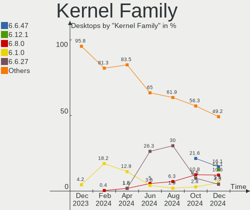
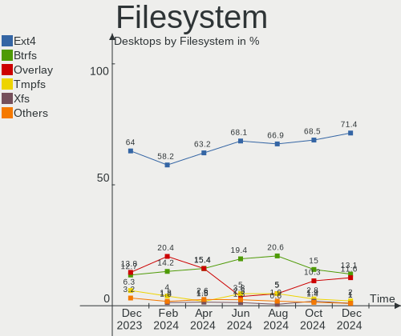
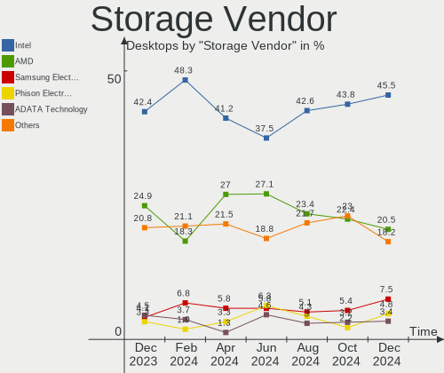
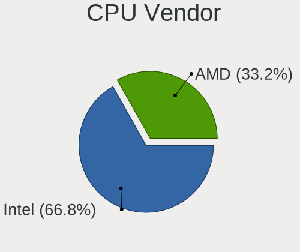
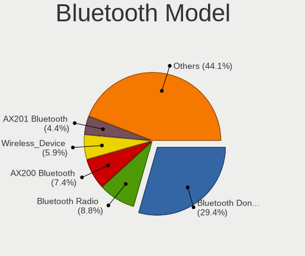
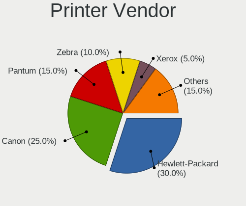

Linux in Russia - Hardware Trends (Desktops)
--------------------------------------------

A project to identify most popular hardware characteristics and track their change
over time based on data collected by Linux users at https://Linux-Hardware.org.

Anyone can contribute to this report by the [hw-probe](https://github.com/linuxhw/hw-probe) tool:

    sudo -E hw-probe -all -upload

Period: Aug, 2023.

Contents
--------

* [ System ](#system)
  - [ OS                       ](#os)
  - [ OS Family                ](#os-family)
  - [ Kernel                   ](#kernel)
  - [ Kernel Family            ](#kernel-family)
  - [ Kernel Major Ver.        ](#kernel-major-ver)
  - [ Arch                     ](#arch)
  - [ DE                       ](#de)
  - [ Display Server           ](#display-server)
  - [ Display Manager          ](#display-manager)
  - [ OS Lang                  ](#os-lang)
  - [ Boot Mode                ](#boot-mode)
  - [ Filesystem               ](#filesystem)
  - [ Part. scheme             ](#part-scheme)
  - [ Dual Boot with Linux/BSD ](#dual-boot-with-linuxbsd)
  - [ Dual Boot (Win)          ](#dual-boot-win)

* [ Board ](#board)
  - [ Vendor                   ](#vendor)
  - [ Model                    ](#model)
  - [ Model Family             ](#model-family)
  - [ MFG Year                 ](#mfg-year)
  - [ Form Factor              ](#form-factor)
  - [ Secure Boot              ](#secure-boot)
  - [ Coreboot                 ](#coreboot)
  - [ RAM Size                 ](#ram-size)
  - [ RAM Used                 ](#ram-used)
  - [ Total Drives             ](#total-drives)
  - [ Has CD-ROM               ](#has-cd-rom)
  - [ Has Ethernet             ](#has-ethernet)
  - [ Has WiFi                 ](#has-wifi)
  - [ Has Bluetooth            ](#has-bluetooth)

* [ Location ](#location)
  - [ Country                  ](#country)
  - [ City                     ](#city)

* [ Drives ](#drives)
  - [ Drive Vendor             ](#drive-vendor)
  - [ Drive Model              ](#drive-model)
  - [ HDD Vendor               ](#hdd-vendor)
  - [ SSD Vendor               ](#ssd-vendor)
  - [ Drive Kind               ](#drive-kind)
  - [ Drive Connector          ](#drive-connector)
  - [ Drive Size               ](#drive-size)
  - [ Space Total              ](#space-total)
  - [ Space Used               ](#space-used)
  - [ Malfunc. Drives          ](#malfunc-drives)
  - [ Malfunc. Drive Vendor    ](#malfunc-drive-vendor)
  - [ Malfunc. HDD Vendor      ](#malfunc-hdd-vendor)
  - [ Malfunc. Drive Kind      ](#malfunc-drive-kind)
  - [ Failed Drives            ](#failed-drives)
  - [ Failed Drive Vendor      ](#failed-drive-vendor)
  - [ Drive Status             ](#drive-status)

* [ Storage controller ](#storage-controller)
  - [ Storage Vendor           ](#storage-vendor)
  - [ Storage Model            ](#storage-model)
  - [ Storage Kind             ](#storage-kind)

* [ Processor ](#processor)
  - [ CPU Vendor               ](#cpu-vendor)
  - [ CPU Model                ](#cpu-model)
  - [ CPU Model Family         ](#cpu-model-family)
  - [ CPU Cores                ](#cpu-cores)
  - [ CPU Sockets              ](#cpu-sockets)
  - [ CPU Threads              ](#cpu-threads)
  - [ CPU Op-Modes             ](#cpu-op-modes)
  - [ CPU Microcode            ](#cpu-microcode)
  - [ CPU Microarch            ](#cpu-microarch)

* [ Graphics ](#graphics)
  - [ GPU Vendor               ](#gpu-vendor)
  - [ GPU Model                ](#gpu-model)
  - [ GPU Combo                ](#gpu-combo)
  - [ GPU Driver               ](#gpu-driver)
  - [ GPU Memory               ](#gpu-memory)

* [ Monitor ](#monitor)
  - [ Monitor Vendor           ](#monitor-vendor)
  - [ Monitor Model            ](#monitor-model)
  - [ Monitor Resolution       ](#monitor-resolution)
  - [ Monitor Diagonal         ](#monitor-diagonal)
  - [ Monitor Width            ](#monitor-width)
  - [ Aspect Ratio             ](#aspect-ratio)
  - [ Monitor Area             ](#monitor-area)
  - [ Pixel Density            ](#pixel-density)
  - [ Multiple Monitors        ](#multiple-monitors)

* [ Network ](#network)
  - [ Net Controller Vendor    ](#net-controller-vendor)
  - [ Net Controller Model     ](#net-controller-model)
  - [ Wireless Vendor          ](#wireless-vendor)
  - [ Wireless Model           ](#wireless-model)
  - [ Ethernet Vendor          ](#ethernet-vendor)
  - [ Ethernet Model           ](#ethernet-model)
  - [ Net Controller Kind      ](#net-controller-kind)
  - [ Used Controller          ](#used-controller)
  - [ NICs                     ](#nics)
  - [ IPv6                     ](#ipv6)

* [ Bluetooth ](#bluetooth)
  - [ Bluetooth Vendor         ](#bluetooth-vendor)
  - [ Bluetooth Model          ](#bluetooth-model)

* [ Sound ](#sound)
  - [ Sound Vendor             ](#sound-vendor)
  - [ Sound Model              ](#sound-model)

* [ Memory ](#memory)
  - [ Memory Vendor            ](#memory-vendor)
  - [ Memory Model             ](#memory-model)
  - [ Memory Kind              ](#memory-kind)
  - [ Memory Form Factor       ](#memory-form-factor)
  - [ Memory Size              ](#memory-size)
  - [ Memory Speed             ](#memory-speed)

* [ Printers & scanners ](#printers--scanners)
  - [ Printer Vendor           ](#printer-vendor)
  - [ Printer Model            ](#printer-model)
  - [ Scanner Vendor           ](#scanner-vendor)
  - [ Scanner Model            ](#scanner-model)

* [ Camera ](#camera)
  - [ Camera Vendor            ](#camera-vendor)
  - [ Camera Model             ](#camera-model)

* [ Security ](#security)
  - [ Fingerprint Vendor       ](#fingerprint-vendor)
  - [ Fingerprint Model        ](#fingerprint-model)
  - [ Chipcard Vendor          ](#chipcard-vendor)
  - [ Chipcard Model           ](#chipcard-model)

* [ Unsupported ](#unsupported)
  - [ Unsupported Devices      ](#unsupported-devices)
  - [ Unsupported Device Types ](#unsupported-device-types)

System
------

OS
--

Installed operating systems

| Name                         | Desktops | Percent |
|------------------------------|----------|---------|
| ROSA 12.4                    | 57       | 30.81%  |
| OpenMandriva 23.08           | 18       | 9.73%   |
| Debian 12                    | 14       | 7.57%   |
| Ubuntu 22.04                 | 11       | 5.95%   |
| Arch Rolling                 | 7        | 3.78%   |
| ROSA R11.1                   | 6        | 3.24%   |
| Fedora 38                    | 6        | 3.24%   |
| OpenMandriva 4.3             | 5        | 2.7%    |
| ROSA 12                      | 4        | 2.16%   |
| ArcoLinux Rolling            | 4        | 2.16%   |
| ALT Linux 10.2               | 4        | 2.16%   |
| Red OS 7.3.2                 | 3        | 1.62%   |
| OpenMandriva 23.03           | 3        | 1.62%   |
| Xero Rolling                 | 2        | 1.08%   |
| ROSA 13.0                    | 2        | 1.08%   |
| ROSA 12.3                    | 2        | 1.08%   |
| ROSA 12.1                    | 2        | 1.08%   |
| openSUSE Tumbleweed-XXXXXXXX | 2        | 1.08%   |
| openSUSE Leap-15.5           | 2        | 1.08%   |
| Manjaro                      | 2        | 1.08%   |
| Linux Mint 21.2              | 2        | 1.08%   |
| Linux Mint 21.1              | 2        | 1.08%   |
| ALT Linux 8.4                | 2        | 1.08%   |
| ALT Linux 10.1               | 2        | 1.08%   |
| ALT Linux 10                 | 2        | 1.08%   |
| Ubuntu 23.04                 | 1        | 0.54%   |
| ROSA R10                     | 1        | 0.54%   |
| ROSA 12.2                    | 1        | 0.54%   |
| Pop!_OS 22.04                | 1        | 0.54%   |
| MX 23                        | 1        | 0.54%   |
| MOS 10                       | 1        | 0.54%   |
| Kubuntu 23.04                | 1        | 0.54%   |
| Kubuntu 22.04                | 1        | 0.54%   |
| Gentoo 2.14                  | 1        | 0.54%   |
| Gentoo 2.13                  | 1        | 0.54%   |
| Fedora 36                    | 1        | 0.54%   |
| Fedora 35                    | 1        | 0.54%   |
| EndeavourOS Rolling          | 1        | 0.54%   |
| Elementary 7                 | 1        | 0.54%   |
| ChimeraOS 43-1               | 1        | 0.54%   |

OS Family
---------

OS without a version

| Name         | Desktops | Percent |
|--------------|----------|---------|
| ROSA         | 75       | 40.54%  |
| OpenMandriva | 26       | 14.05%  |
| Debian       | 14       | 7.57%   |
| Ubuntu       | 12       | 6.49%   |
| ALT Linux    | 12       | 6.49%   |
| Fedora       | 8        | 4.32%   |
| Arch         | 7        | 3.78%   |
| ArcoLinux    | 5        | 2.7%    |
| openSUSE     | 4        | 2.16%   |
| Linux Mint   | 4        | 2.16%   |
| Red OS       | 3        | 1.62%   |
| Xero         | 2        | 1.08%   |
| Manjaro      | 2        | 1.08%   |
| Kubuntu      | 2        | 1.08%   |
| Gentoo       | 2        | 1.08%   |
| Pop!_OS      | 1        | 0.54%   |
| MX           | 1        | 0.54%   |
| EndeavourOS  | 1        | 0.54%   |
| Elementary   | 1        | 0.54%   |
| ChimeraOS    | 1        | 0.54%   |
| CentOS       | 1        | 0.54%   |
| Astra Linux  | 1        | 0.54%   |

Kernel
------

Version of the Linux kernel

| Version                                  | Desktops | Percent |
|------------------------------------------|----------|---------|
| 6.1.38-generic-1rosa2021.1-x86_64        | 30       | 16.22%  |
| 6.1.20-generic-2rosa2021.1-x86_64        | 18       | 9.73%   |
| 6.4.8-desktop-2omv2390                   | 12       | 6.49%   |
| 6.1.0-4-amd64                            | 10       | 5.41%   |
| 6.4.11-desktop-1omv2390                  | 6        | 3.24%   |
| 5.15.0-78-generic                        | 5        | 2.7%    |
| 5.15.0-69-generic                        | 5        | 2.7%    |
| 6.2.0-26-generic                         | 4        | 2.16%   |
| 5.16.7-desktop-1omv4003                  | 4        | 2.16%   |
| 6.4.12-arch1-1                           | 3        | 1.62%   |
| 6.4.10-arch1-1                           | 3        | 1.62%   |
| 6.2.9-300.fc38.x86_64                    | 3        | 1.62%   |
| 6.2.6-desktop-1omv2390                   | 3        | 1.62%   |
| 6.1.38-un-def-alt1                       | 3        | 1.62%   |
| 5.15.117-generic-1rosa2021.1-x86_64      | 3        | 1.62%   |
| 5.10.74-generic-2rosa2021.1-x86_64       | 3        | 1.62%   |
| 6.4.5.xm1-1.klp-xanmod-rosa2021.1-x86_64 | 2        | 1.08%   |
| 6.4.10-zen2-1-zen                        | 2        | 1.08%   |
| 6.1.0-11-amd64                           | 2        | 1.08%   |
| 6.1.0-10-amd64                           | 2        | 1.08%   |
| 5.15.103-generic-1rosa2021.1-i686        | 2        | 1.08%   |
| 5.10.184-generic-1rosa2021.1-x86_64      | 2        | 1.08%   |
| 4.9.155-nrj-desktop-1rosa-x86_64         | 2        | 1.08%   |
| 4.15.0-desktop-122.124.1rosa-x86_64      | 2        | 1.08%   |
| 6.4.9-arch1-1                            | 1        | 0.54%   |
| 6.4.9-1-default                          | 1        | 0.54%   |
| 6.4.7-zen3-xanmod1-1                     | 1        | 0.54%   |
| 6.4.7-zen1-3-zen                         | 1        | 0.54%   |
| 6.4.7-un-def-alt1                        | 1        | 0.54%   |
| 6.4.7-arch1-3                            | 1        | 0.54%   |
| 6.4.7-200.fc38.x86_64                    | 1        | 0.54%   |
| 6.4.11-zen2-1-zen                        | 1        | 0.54%   |
| 6.4.11-un-def-alt1                       | 1        | 0.54%   |
| 6.4.11-arch2-1                           | 1        | 0.54%   |
| 6.4.11-200.fc38.x86_64                   | 1        | 0.54%   |
| 6.4.11-1-default                         | 1        | 0.54%   |
| 6.3.9-chimeraos-1                        | 1        | 0.54%   |
| 6.3.11-200.fc38.x86_64                   | 1        | 0.54%   |
| 6.2.6-76060206-generic                   | 1        | 0.54%   |
| 6.2.16-3-pve                             | 1        | 0.54%   |

Kernel Family
-------------

Linux kernel without a distro release

| Version  | Desktops | Percent |
|----------|----------|---------|
| 6.1.38   | 33       | 17.84%  |
| 6.1.20   | 18       | 9.73%   |
| 6.1.0    | 14       | 7.57%   |
| 6.4.8    | 12       | 6.49%   |
| 6.4.11   | 11       | 5.95%   |
| 5.15.0   | 11       | 5.95%   |
| 6.2.0    | 6        | 3.24%   |
| 6.4.7    | 5        | 2.7%    |
| 6.4.10   | 5        | 2.7%    |
| 6.2.6    | 4        | 2.16%   |
| 5.16.7   | 4        | 2.16%   |
| 6.4.12   | 3        | 1.62%   |
| 6.2.9    | 3        | 1.62%   |
| 5.15.117 | 3        | 1.62%   |
| 5.10.74  | 3        | 1.62%   |
| 4.9.155  | 3        | 1.62%   |
| 4.15.0   | 3        | 1.62%   |
| 6.4.9    | 2        | 1.08%   |
| 6.4.5    | 2        | 1.08%   |
| 6.1.46   | 2        | 1.08%   |
| 5.19.0   | 2        | 1.08%   |
| 5.15.72  | 2        | 1.08%   |
| 5.15.103 | 2        | 1.08%   |
| 5.14.21  | 2        | 1.08%   |
| 5.10.184 | 2        | 1.08%   |
| 6.3.9    | 1        | 0.54%   |
| 6.3.11   | 1        | 0.54%   |
| 6.2.16   | 1        | 0.54%   |
| 6.2.15   | 1        | 0.54%   |
| 6.2.12   | 1        | 0.54%   |
| 6.1.49   | 1        | 0.54%   |
| 6.1.45   | 1        | 0.54%   |
| 6.1.42   | 1        | 0.54%   |
| 6.1.41   | 1        | 0.54%   |
| 6.0.12   | 1        | 0.54%   |
| 5.4.193  | 1        | 0.54%   |
| 5.4.0    | 1        | 0.54%   |
| 5.17.11  | 1        | 0.54%   |
| 5.16.13  | 1        | 0.54%   |
| 5.15.87  | 1        | 0.54%   |

Kernel Major Ver.
-----------------

Linux kernel major version

| Version | Desktops | Percent |
|---------|----------|---------|
| 6.1     | 71       | 38.38%  |
| 6.4     | 40       | 21.62%  |
| 5.15    | 24       | 12.97%  |
| 6.2     | 16       | 8.65%   |
| 5.10    | 10       | 5.41%   |
| 5.16    | 5        | 2.7%    |
| 4.9     | 4        | 2.16%   |
| 5.14    | 3        | 1.62%   |
| 4.15    | 3        | 1.62%   |
| 6.3     | 2        | 1.08%   |
| 5.4     | 2        | 1.08%   |
| 5.19    | 2        | 1.08%   |
| 6.0     | 1        | 0.54%   |
| 5.17    | 1        | 0.54%   |
| 4.18    | 1        | 0.54%   |

Arch
----

OS architecture (x86_64, i586, etc.)

| Name   | Desktops | Percent |
|--------|----------|---------|
| x86_64 | 180      | 97.3%   |
| i686   | 4        | 2.16%   |
| e2k    | 1        | 0.54%   |

DE
--

Desktop Environment

| Name       | Desktops | Percent |
|------------|----------|---------|
| KDE5       | 93       | 50.27%  |
| GNOME      | 41       | 22.16%  |
| Unknown    | 21       | 11.35%  |
| XFCE       | 7        | 3.78%   |
| LXQt       | 7        | 3.78%   |
| KDE4       | 6        | 3.24%   |
| X-Cinnamon | 4        | 2.16%   |
| MATE       | 4        | 2.16%   |
| Pantheon   | 1        | 0.54%   |
| Cinnamon   | 1        | 0.54%   |

Display Server
--------------

X11 or Wayland

| Name    | Desktops | Percent |
|---------|----------|---------|
| Wayland | 90       | 48.65%  |
| X11     | 75       | 40.54%  |
| Unknown | 17       | 9.19%   |
| Tty     | 3        | 1.62%   |

Display Manager
---------------

SDDM, LightDM, etc.

| Name    | Desktops | Percent |
|---------|----------|---------|
| SDDM    | 86       | 46.49%  |
| Unknown | 40       | 21.62%  |
| GDM     | 34       | 18.38%  |
| LightDM | 11       | 5.95%   |
| GDM3    | 8        | 4.32%   |
| KDM     | 6        | 3.24%   |

OS Lang
-------

Language

| Lang    | Desktops | Percent |
|---------|----------|---------|
| ru_RU   | 152      | 82.16%  |
| en_US   | 21       | 11.35%  |
| C       | 5        | 2.7%    |
| Unknown | 5        | 2.7%    |
| ru_UA   | 1        | 0.54%   |
| en_GB   | 1        | 0.54%   |

Boot Mode
---------

EFI or BIOS

| Mode | Desktops | Percent |
|------|----------|---------|
| BIOS | 101      | 54.59%  |
| EFI  | 84       | 45.41%  |

Filesystem
----------

Type of filesystem

| Type     | Desktops | Percent |
|----------|----------|---------|
| Ext4     | 122      | 65.95%  |
| Btrfs    | 29       | 15.68%  |
| Overlay  | 26       | 14.05%  |
| Tmpfs    | 5        | 2.7%    |
| Xfs      | 2        | 1.08%   |
| Reiserfs | 1        | 0.54%   |

Part. scheme
------------

Scheme of partitioning

| Type    | Desktops | Percent |
|---------|----------|---------|
| GPT     | 106      | 57.3%   |
| MBR     | 52       | 28.11%  |
| Unknown | 27       | 14.59%  |

Dual Boot with Linux/BSD
------------------------

Hosting more than one Linux/BSD

| Dual boot | Desktops | Percent |
|-----------|----------|---------|
| No        | 124      | 67.03%  |
| Yes       | 61       | 32.97%  |

Dual Boot (Win)
---------------

Hosting Linux and Windows

| Dual boot | Desktops | Percent |
|-----------|----------|---------|
| No        | 100      | 54.05%  |
| Yes       | 85       | 45.95%  |

Board
-----

Vendor
------

Motherboard manufacturer

| Name                | Desktops | Percent |
|---------------------|----------|---------|
| ASUSTek Computer    | 59       | 31.89%  |
| Gigabyte Technology | 46       | 24.86%  |
| MSI                 | 23       | 12.43%  |
| ASRock              | 18       | 9.73%   |
| Intel               | 7        | 3.78%   |
| Supermicro          | 6        | 3.24%   |
| Huanan              | 5        | 2.7%    |
| Foxconn             | 3        | 1.62%   |
| DEPO Computers      | 3        | 1.62%   |
| Biostar             | 3        | 1.62%   |
| Dell                | 2        | 1.08%   |
| Acer                | 2        | 1.08%   |
| Unknown             | 2        | 1.08%   |
| WeiBu               | 1        | 0.54%   |
| Soyo                | 1        | 0.54%   |
| Lenovo              | 1        | 0.54%   |
| K-Systems           | 1        | 0.54%   |
| Hewlett-Packard     | 1        | 0.54%   |
| ECS                 | 1        | 0.54%   |

Model
-----

Motherboard model

| Name                    | Desktops | Percent |
|-------------------------|----------|---------|
| ASUS All Series         | 4        | 2.16%   |
| MSI MS-7D22             | 3        | 1.62%   |
| Intel X99               | 3        | 1.62%   |
| Gigabyte H61M-S2PV      | 3        | 1.62%   |
| Unknown                 | 3        | 1.62%   |
| Supermicro X9DRW        | 2        | 1.08%   |
| Supermicro X7DWU        | 2        | 1.08%   |
| Gigabyte B250M-DS3H     | 2        | 1.08%   |
| Gigabyte AB350M-DS3H V2 | 2        | 1.08%   |
| DEPO Computers DPA520S  | 2        | 1.08%   |
| ASUS S20 K29            | 2        | 1.08%   |
| ASUS P8H77-M PRO        | 2        | 1.08%   |
| ASUS P8H61-MX           | 2        | 1.08%   |
| ASUS M4A77TD            | 2        | 1.08%   |
| ASRock H510M-HVS R2.0   | 2        | 1.08%   |
| WeiBu H310CX1B V1.0     | 1        | 0.54%   |
| Supermicro X8ST3        | 1        | 0.54%   |
| Supermicro X7DW3        | 1        | 0.54%   |
| Soyo SY-Classic B450M   | 1        | 0.54%   |
| MSI MS-7D95             | 1        | 0.54%   |
| MSI MS-7D43             | 1        | 0.54%   |
| MSI MS-7C56             | 1        | 0.54%   |
| MSI MS-7C52             | 1        | 0.54%   |
| MSI MS-7C51             | 1        | 0.54%   |
| MSI MS-7C37             | 1        | 0.54%   |
| MSI MS-7B89             | 1        | 0.54%   |
| MSI MS-7B84             | 1        | 0.54%   |
| MSI MS-7B79             | 1        | 0.54%   |
| MSI MS-7924             | 1        | 0.54%   |
| MSI MS-7918             | 1        | 0.54%   |
| MSI MS-7895             | 1        | 0.54%   |
| MSI MS-7788             | 1        | 0.54%   |
| MSI MS-7732             | 1        | 0.54%   |
| MSI MS-7681             | 1        | 0.54%   |
| MSI MS-7599             | 1        | 0.54%   |
| MSI MS-7592             | 1        | 0.54%   |
| MSI MS-7529             | 1        | 0.54%   |
| MSI MS-7357             | 1        | 0.54%   |
| MSI Mars E192           | 1        | 0.54%   |
| Lenovo H420             | 1        | 0.54%   |

Model Family
------------

Motherboard model prefix

| Name                   | Desktops | Percent |
|------------------------|----------|---------|
| ASUS PRIME             | 10       | 5.41%   |
| ASUS TUF               | 4        | 2.16%   |
| ASUS All               | 4        | 2.16%   |
| MSI MS-7D22            | 3        | 1.62%   |
| Intel X99              | 3        | 1.62%   |
| Gigabyte H61M-S2PV     | 3        | 1.62%   |
| Gigabyte B450M         | 3        | 1.62%   |
| ASUS P8H61-M           | 3        | 1.62%   |
| ASUS P5K               | 3        | 1.62%   |
| Unknown                | 3        | 1.62%   |
| Supermicro X9DRW       | 2        | 1.08%   |
| Supermicro X7DWU       | 2        | 1.08%   |
| Huanan X99-F8          | 2        | 1.08%   |
| Gigabyte X570          | 2        | 1.08%   |
| Gigabyte B560M         | 2        | 1.08%   |
| Gigabyte B250M-DS3H    | 2        | 1.08%   |
| Gigabyte AB350M-DS3H   | 2        | 1.08%   |
| DEPO Computers DPA520S | 2        | 1.08%   |
| Dell OptiPlex          | 2        | 1.08%   |
| ASUS STRIX             | 2        | 1.08%   |
| ASUS S20               | 2        | 1.08%   |
| ASUS ROG               | 2        | 1.08%   |
| ASUS P8H77-M           | 2        | 1.08%   |
| ASUS P8H61-MX          | 2        | 1.08%   |
| ASUS M5A97             | 2        | 1.08%   |
| ASUS M4A77TD           | 2        | 1.08%   |
| ASRock H510M-HVS       | 2        | 1.08%   |
| Acer Veriton           | 2        | 1.08%   |
| WeiBu H310CX1B         | 1        | 0.54%   |
| Supermicro X8ST3       | 1        | 0.54%   |
| Supermicro X7DW3       | 1        | 0.54%   |
| Soyo SY-Classic        | 1        | 0.54%   |
| MSI MS-7D95            | 1        | 0.54%   |
| MSI MS-7D43            | 1        | 0.54%   |
| MSI MS-7C56            | 1        | 0.54%   |
| MSI MS-7C52            | 1        | 0.54%   |
| MSI MS-7C51            | 1        | 0.54%   |
| MSI MS-7C37            | 1        | 0.54%   |
| MSI MS-7B89            | 1        | 0.54%   |
| MSI MS-7B84            | 1        | 0.54%   |

MFG Year
--------

Motherboard manufacture year

| Year    | Desktops | Percent |
|---------|----------|---------|
| 2012    | 23       | 12.43%  |
| 2018    | 18       | 9.73%   |
| 2011    | 16       | 8.65%   |
| 2022    | 15       | 8.11%   |
| 2019    | 13       | 7.03%   |
| 2009    | 13       | 7.03%   |
| 2021    | 12       | 6.49%   |
| 2013    | 12       | 6.49%   |
| 2020    | 11       | 5.95%   |
| 2008    | 11       | 5.95%   |
| 2010    | 8        | 4.32%   |
| 2017    | 7        | 3.78%   |
| 2016    | 6        | 3.24%   |
| 2015    | 5        | 2.7%    |
| 2014    | 5        | 2.7%    |
| 2023    | 4        | 2.16%   |
| 2007    | 4        | 2.16%   |
| 2003    | 1        | 0.54%   |
| Unknown | 1        | 0.54%   |

Form Factor
-----------

Physical design of the computer

| Name    | Desktops | Percent |
|---------|----------|---------|
| Desktop | 185      | 100%    |

Secure Boot
-----------

Enabled or disabled

| State    | Desktops | Percent |
|----------|----------|---------|
| Disabled | 180      | 97.3%   |
| Enabled  | 5        | 2.7%    |

Coreboot
--------

Have coreboot on board

| Used | Desktops | Percent |
|------|----------|---------|
| No   | 185      | 100%    |

RAM Size
--------

Total RAM memory

| Size in GB      | Desktops | Percent |
|-----------------|----------|---------|
| 16.01-24.0      | 43       | 23.24%  |
| 8.01-16.0       | 43       | 23.24%  |
| 3.01-4.0        | 30       | 16.22%  |
| 32.01-64.0      | 29       | 15.68%  |
| 4.01-8.0        | 20       | 10.81%  |
| 64.01-256.0     | 8        | 4.32%   |
| 24.01-32.0      | 7        | 3.78%   |
| 2.01-3.0        | 2        | 1.08%   |
| 1.01-2.0        | 2        | 1.08%   |
| More than 256.0 | 1        | 0.54%   |

RAM Used
--------

Used RAM memory

| Used GB    | Desktops | Percent |
|------------|----------|---------|
| 1.01-2.0   | 71       | 38.38%  |
| 2.01-3.0   | 42       | 22.7%   |
| 0.51-1.0   | 23       | 12.43%  |
| 3.01-4.0   | 21       | 11.35%  |
| 4.01-8.0   | 18       | 9.73%   |
| 8.01-16.0  | 5        | 2.7%    |
| 16.01-24.0 | 2        | 1.08%   |
| 32.01-64.0 | 1        | 0.54%   |
| 24.01-32.0 | 1        | 0.54%   |
| 0.01-0.5   | 1        | 0.54%   |

Total Drives
------------

Number of drives on board

| Drives | Desktops | Percent |
|--------|----------|---------|
| 1      | 64       | 34.59%  |
| 2      | 56       | 30.27%  |
| 3      | 30       | 16.22%  |
| 4      | 20       | 10.81%  |
| 5      | 10       | 5.41%   |
| 7      | 2        | 1.08%   |
| 6      | 2        | 1.08%   |
| 10     | 1        | 0.54%   |

Has CD-ROM
----------

Has CD-ROM on board

| Presented | Desktops | Percent |
|-----------|----------|---------|
| No        | 139      | 75.14%  |
| Yes       | 46       | 24.86%  |

Has Ethernet
------------

Has Ethernet on board

| Presented | Desktops | Percent |
|-----------|----------|---------|
| Yes       | 184      | 99.46%  |
| No        | 1        | 0.54%   |

Has WiFi
--------

Has WiFi module

| Presented | Desktops | Percent |
|-----------|----------|---------|
| No        | 130      | 70.27%  |
| Yes       | 55       | 29.73%  |

Has Bluetooth
-------------

Has Bluetooth module

| Presented | Desktops | Percent |
|-----------|----------|---------|
| No        | 141      | 76.22%  |
| Yes       | 44       | 23.78%  |

Location
--------

Country
-------

Geographic location (country)

| Country | Desktops | Percent |
|---------|----------|---------|
| Russia  | 185      | 100%    |

City
----

Geographic location (city)

| City              | Desktops | Percent |
|-------------------|----------|---------|
| Moscow            | 39       | 21.08%  |
| Voronezh          | 16       | 8.65%   |
| St Petersburg     | 13       | 7.03%   |
| Yekaterinburg     | 7        | 3.78%   |
| Novosibirsk       | 7        | 3.78%   |
| Orenburg          | 5        | 2.7%    |
| Chelyabinsk       | 5        | 2.7%    |
| Omsk              | 4        | 2.16%   |
| Nizhniy Novgorod  | 4        | 2.16%   |
| Volgograd         | 3        | 1.62%   |
| Ufa               | 3        | 1.62%   |
| Perm              | 3        | 1.62%   |
| Krasnodar         | 3        | 1.62%   |
| Smolensk          | 2        | 1.08%   |
| Saratov           | 2        | 1.08%   |
| Samara            | 2        | 1.08%   |
| Rostov-on-Don     | 2        | 1.08%   |
| Oryol             | 2        | 1.08%   |
| Kostroma          | 2        | 1.08%   |
| Kirov             | 2        | 1.08%   |
| Khabarovsk        | 2        | 1.08%   |
| Cheboksary        | 2        | 1.08%   |
| Zhigulevsk        | 1        | 0.54%   |
| Zheleznodorozhnyy | 1        | 0.54%   |
| Zaraysk           | 1        | 0.54%   |
| Zalari            | 1        | 0.54%   |
| Yuzhno-Sakhalinsk | 1        | 0.54%   |
| Yeysk             | 1        | 0.54%   |
| Yelabuga          | 1        | 0.54%   |
| Vladikavkaz       | 1        | 0.54%   |
| Vidnoye           | 1        | 0.54%   |
| Ulyanovsk         | 1        | 0.54%   |
| Tula              | 1        | 0.54%   |
| Tomsk             | 1        | 0.54%   |
| Tolyatti          | 1        | 0.54%   |
| Surgut            | 1        | 0.54%   |
| Stavropol         | 1        | 0.54%   |
| Staraya Russa     | 1        | 0.54%   |
| Sochi             | 1        | 0.54%   |
| Simferopol        | 1        | 0.54%   |

Drives
------

Drive Vendor
------------

Hard drive vendors

| Vendor                      | Desktops | Drives | Percent |
|-----------------------------|----------|--------|---------|
| WDC                         | 72       | 97     | 19.46%  |
| Seagate                     | 58       | 73     | 15.68%  |
| Samsung Electronics         | 26       | 38     | 7.03%   |
| Kingston                    | 25       | 27     | 6.76%   |
| Toshiba                     | 18       | 20     | 4.86%   |
| A-DATA Technology           | 15       | 16     | 4.05%   |
| Hitachi                     | 11       | 11     | 2.97%   |
| China                       | 11       | 11     | 2.97%   |
| Crucial                     | 10       | 11     | 2.7%    |
| Apacer                      | 10       | 11     | 2.7%    |
| AMD                         | 10       | 10     | 2.7%    |
| Patriot                     | 8        | 8      | 2.16%   |
| Silicon Motion              | 7        | 8      | 1.89%   |
| Intel                       | 6        | 7      | 1.62%   |
| SanDisk                     | 5        | 5      | 1.35%   |
| OCZ                         | 5        | 5      | 1.35%   |
| HGST                        | 5        | 5      | 1.35%   |
| GOODRAM                     | 4        | 4      | 1.08%   |
| XrayDisk                    | 3        | 3      | 0.81%   |
| Transcend                   | 3        | 3      | 0.81%   |
| Smartbuy                    | 3        | 3      | 0.81%   |
| Netac                       | 3        | 3      | 0.81%   |
| Gigabyte Technology         | 3        | 3      | 0.81%   |
| ADATA Technology            | 3        | 3      | 0.81%   |
| Unknown                     | 2        | 2      | 0.54%   |
| Phison Electronics          | 2        | 2      | 0.54%   |
| Micron Technology           | 2        | 2      | 0.54%   |
| Kingston Technology Company | 2        | 2      | 0.54%   |
| JMicron Technology          | 2        | 2      | 0.54%   |
| HUAWEI                      | 2        | 2      | 0.54%   |
| Digma                       | 2        | 2      | 0.54%   |
| Vaseky                      | 1        | 1      | 0.27%   |
| USB                         | 1        | 1      | 0.27%   |
| TO Exter                    | 1        | 1      | 0.27%   |
| Team                        | 1        | 1      | 0.27%   |
| SPCC                        | 1        | 1      | 0.27%   |
| ShanDianZhe                 | 1        | 1      | 0.27%   |
| Realtek Semiconductor       | 1        | 1      | 0.27%   |
| Radeon                      | 1        | 1      | 0.27%   |
| Qumo                        | 1        | 1      | 0.27%   |

Drive Model
-----------

Hard drive models

| Model                                                | Desktops | Percent |
|------------------------------------------------------|----------|---------|
| Seagate ST1000DM010-2EP102 1TB                       | 8        | 1.89%   |
| Kingston SA400S37240G 240GB SSD                      | 8        | 1.89%   |
| WDC WD10EZEX-00BBHA0 1TB                             | 6        | 1.42%   |
| Toshiba HDWD110 1TB                                  | 5        | 1.18%   |
| Seagate ST1000DM003-1CH162 1TB                       | 5        | 1.18%   |
| Samsung SSD 870 EVO 500GB                            | 5        | 1.18%   |
| Crucial CT480BX500SSD1 480GB                         | 5        | 1.18%   |
| WDC WD10EZEX-22MFCA0 1TB                             | 4        | 0.95%   |
| Toshiba DT01ACA050 500GB                             | 4        | 0.95%   |
| Seagate ST3500418AS 500GB                            | 4        | 0.95%   |
| Kingston SA400S37120G 120GB SSD                      | 4        | 0.95%   |
| Apacer AS350 512GB SSD                               | 4        | 0.95%   |
| A-DATA SU650 240GB SSD                               | 4        | 0.95%   |
| WDC WD10EZEX-08WN4A0 1TB                             | 3        | 0.71%   |
| Seagate ST31000524AS 1TB                             | 3        | 0.71%   |
| Seagate ST2000DM006-2DM164 2TB                       | 3        | 0.71%   |
| Seagate ST1000DM003-1SB102 1TB                       | 3        | 0.71%   |
| Seagate ST1000DM003-1ER162 1TB                       | 3        | 0.71%   |
| Samsung NVMe SSD Controller SM981/PM981/PM983 500GB  | 3        | 0.71%   |
| WDC WDS500G2B0A-00SM50 500GB SSD                     | 2        | 0.47%   |
| WDC WDS480G2G0A-00JH30 480GB SSD                     | 2        | 0.47%   |
| WDC WDS240G2G0A-00JH30 240GB SSD                     | 2        | 0.47%   |
| WDC WDS120G2G0A-00JH30 120GB SSD                     | 2        | 0.47%   |
| WDC WD5000AZRX-00A8LB0 500GB                         | 2        | 0.47%   |
| WDC WD5000AAKX-001CA0 500GB                          | 2        | 0.47%   |
| WDC WD4000AAKS-00TMA0 400GB                          | 2        | 0.47%   |
| WDC WD3000HLFS-01G6U0 304GB                          | 2        | 0.47%   |
| WDC WD2500AAKX-00ERMA0 250GB                         | 2        | 0.47%   |
| WDC WD20PURZ-85GU6Y0 2TB                             | 2        | 0.47%   |
| WDC WD10PURZ-85U8XY0 1TB                             | 2        | 0.47%   |
| WDC WD10EZEX-60WN4A0 1TB                             | 2        | 0.47%   |
| WDC WD10EZEX-00RKKA0 1TB                             | 2        | 0.47%   |
| WDC WD10EZEX-00BN5A0 1TB                             | 2        | 0.47%   |
| WDC WD10EALX-009BA0 1TB                              | 2        | 0.47%   |
| WDC WD1002FAEX-00Z3A0 1TB                            | 2        | 0.47%   |
| Unknown NVMe SSD Drive 512GB                         | 2        | 0.47%   |
| Toshiba HDWD120 2TB                                  | 2        | 0.47%   |
| Smartbuy SSD 120GB                                   | 2        | 0.47%   |
| Silicon Motion SM2262/SM2262EN SSD Controller 1024GB | 2        | 0.47%   |
| Seagate ST500DM002-1BD142 500GB                      | 2        | 0.47%   |

HDD Vendor
----------

Hard disk drive vendors

| Vendor              | Desktops | Drives | Percent |
|---------------------|----------|--------|---------|
| WDC                 | 61       | 81     | 38.85%  |
| Seagate             | 58       | 73     | 36.94%  |
| Toshiba             | 18       | 20     | 11.46%  |
| Hitachi             | 10       | 10     | 6.37%   |
| HGST                | 5        | 5      | 3.18%   |
| Samsung Electronics | 2        | 2      | 1.27%   |
| USB                 | 1        | 1      | 0.64%   |
| Min Yi U            | 1        | 1      | 0.64%   |
| Maxtor              | 1        | 1      | 0.64%   |

SSD Vendor
----------

Solid state drive vendors

| Vendor              | Desktops | Drives | Percent |
|---------------------|----------|--------|---------|
| Kingston            | 20       | 21     | 12.12%  |
| Samsung Electronics | 17       | 21     | 10.3%   |
| A-DATA Technology   | 14       | 15     | 8.48%   |
| WDC                 | 13       | 15     | 7.88%   |
| China               | 11       | 11     | 6.67%   |
| AMD                 | 10       | 10     | 6.06%   |
| Crucial             | 9        | 10     | 5.45%   |
| Patriot             | 7        | 7      | 4.24%   |
| Apacer              | 7        | 8      | 4.24%   |
| Intel               | 6        | 7      | 3.64%   |
| OCZ                 | 5        | 5      | 3.03%   |
| GOODRAM             | 4        | 4      | 2.42%   |
| Smartbuy            | 3        | 3      | 1.82%   |
| SanDisk             | 3        | 3      | 1.82%   |
| Netac               | 3        | 3      | 1.82%   |
| Gigabyte Technology | 3        | 3      | 1.82%   |
| XrayDisk            | 2        | 2      | 1.21%   |
| Transcend           | 2        | 2      | 1.21%   |
| Digma               | 2        | 2      | 1.21%   |
| Vaseky              | 1        | 1      | 0.61%   |
| TO Exter            | 1        | 1      | 0.61%   |
| Team                | 1        | 1      | 0.61%   |
| SPCC                | 1        | 1      | 0.61%   |
| ShanDianZhe         | 1        | 1      | 0.61%   |
| Radeon              | 1        | 1      | 0.61%   |
| Qumo                | 1        | 1      | 0.61%   |
| Neo                 | 1        | 1      | 0.61%   |
| Micron Technology   | 1        | 1      | 0.61%   |
| Kingmax             | 1        | 1      | 0.61%   |
| Kingchuxing         | 1        | 1      | 0.61%   |
| JMicron Technology  | 1        | 1      | 0.61%   |
| JASTER              | 1        | 1      | 0.61%   |
| HYDRA               | 1        | 1      | 0.61%   |
| HUANANZHI-T10       | 1        | 1      | 0.61%   |
| HS-SSD-E100         | 1        | 1      | 0.61%   |
| Foxline             | 1        | 1      | 0.61%   |
| DEXP                | 1        | 1      | 0.61%   |
| Corsair             | 1        | 1      | 0.61%   |
| BR                  | 1        | 1      | 0.61%   |
| AXIOMTEK            | 1        | 1      | 0.61%   |

Drive Kind
----------

HDD or SSD

| Kind    | Desktops | Drives | Percent |
|---------|----------|--------|---------|
| SSD     | 126      | 176    | 42.28%  |
| HDD     | 123      | 194    | 41.28%  |
| NVMe    | 46       | 59     | 15.44%  |
| Unknown | 3        | 3      | 1.01%   |

Drive Connector
---------------

SATA, SAS, NVMe, etc.

| Type | Desktops | Drives | Percent |
|------|----------|--------|---------|
| SATA | 177      | 363    | 75.97%  |
| NVMe | 46       | 59     | 19.74%  |
| SAS  | 10       | 10     | 4.29%   |

Drive Size
----------

Size of hard drive

| Size in TB | Desktops | Drives | Percent |
|------------|----------|--------|---------|
| 0.01-0.5   | 148      | 222    | 58.73%  |
| 0.51-1.0   | 77       | 113    | 30.56%  |
| 1.01-2.0   | 19       | 26     | 7.54%   |
| 3.01-4.0   | 7        | 8      | 2.78%   |
| 2.01-3.0   | 1        | 1      | 0.4%    |

Space Total
-----------

Amount of disk space available on the file system

| Size in GB     | Desktops | Percent |
|----------------|----------|---------|
| 101-250        | 45       | 24.32%  |
| 251-500        | 36       | 19.46%  |
| 501-1000       | 23       | 12.43%  |
| Unknown        | 18       | 9.73%   |
| 1001-2000      | 17       | 9.19%   |
| More than 3000 | 10       | 5.41%   |
| 2001-3000      | 10       | 5.41%   |
| 1-20           | 10       | 5.41%   |
| 51-100         | 10       | 5.41%   |
| 21-50          | 6        | 3.24%   |

Space Used
----------

Amount of used disk space

| Used GB        | Desktops | Percent |
|----------------|----------|---------|
| 1-20           | 73       | 39.46%  |
| 101-250        | 28       | 15.14%  |
| 21-50          | 20       | 10.81%  |
| Unknown        | 18       | 9.73%   |
| 51-100         | 15       | 8.11%   |
| 501-1000       | 12       | 6.49%   |
| 251-500        | 7        | 3.78%   |
| 1001-2000      | 6        | 3.24%   |
| More than 3000 | 4        | 2.16%   |
| 2001-3000      | 2        | 1.08%   |

Malfunc. Drives
---------------

Drive models with a malfunction

| Model                                 | Desktops | Drives | Percent |
|---------------------------------------|----------|--------|---------|
| WDC WD10PURZ-85U8XY0 1TB              | 2        | 2      | 3.64%   |
| WDC WD10EALX-009BA0 1TB               | 2        | 2      | 3.64%   |
| Toshiba HDWD110 1TB                   | 2        | 2      | 3.64%   |
| Seagate ST1000DM003-1CH162 1TB        | 2        | 2      | 3.64%   |
| HGST HTS541010A7E630 1TB              | 2        | 2      | 3.64%   |
| XrayDisk 512GB SSD                    | 1        | 1      | 1.82%   |
| WDC WDS240G2G0A-00JH30 240GB SSD      | 1        | 1      | 1.82%   |
| WDC WD5000AAKX-60U6AA0 500GB          | 1        | 1      | 1.82%   |
| WDC WD5000AAKS-00E4A0 500GB           | 1        | 1      | 1.82%   |
| WDC WD5000AAKS-007AA0 500GB           | 1        | 1      | 1.82%   |
| WDC WD40PURX-64GVNY0 4TB              | 1        | 1      | 1.82%   |
| WDC WD4000AAKS-00TMA0 400GB           | 1        | 1      | 1.82%   |
| WDC WD3200AAJS-00L7A0 320GB           | 1        | 1      | 1.82%   |
| WDC WD2500AAJS-00YZCA0 250GB          | 1        | 1      | 1.82%   |
| WDC WD10EZRX-00L4HB0 1TB              | 1        | 1      | 1.82%   |
| WDC WD10EZEX-60ZF5A0 1TB              | 1        | 1      | 1.82%   |
| WDC WD10EZEX-22RKKA0 1TB              | 1        | 1      | 1.82%   |
| WDC WD10EZEX-22MFCA0 1TB              | 1        | 1      | 1.82%   |
| WDC WD1003FZEX-00MK2A0 1TB            | 1        | 1      | 1.82%   |
| WDC WD1002FBYS-02A6B0 1TB             | 1        | 1      | 1.82%   |
| Toshiba MQ01ABD050 500GB              | 1        | 1      | 1.82%   |
| Toshiba MG04ACA100N 1TB               | 1        | 1      | 1.82%   |
| Toshiba HDWD105 500GB                 | 1        | 1      | 1.82%   |
| Seagate STM3250318AS 250GB            | 1        | 1      | 1.82%   |
| Seagate STM31000528AS 1TB             | 1        | 1      | 1.82%   |
| Seagate ST500LT012-1DG142 500GB       | 1        | 1      | 1.82%   |
| Seagate ST3250410AS 250GB             | 1        | 1      | 1.82%   |
| Seagate ST3250318AS 250GB             | 1        | 1      | 1.82%   |
| Seagate ST3200820AS 200GB             | 1        | 1      | 1.82%   |
| Seagate ST3160815AS 160GB             | 1        | 1      | 1.82%   |
| Seagate ST31000524AS 1TB              | 1        | 1      | 1.82%   |
| Seagate ST2000DM006-2DM164 2TB        | 1        | 1      | 1.82%   |
| Seagate ST2000DL003-9VT166 2TB        | 1        | 1      | 1.82%   |
| Seagate ST1000LM035-1RK172 1TB        | 1        | 1      | 1.82%   |
| Samsung Electronics SSD 980 1TB       | 1        | 1      | 1.82%   |
| Samsung Electronics SSD 960 EVO 250GB | 1        | 1      | 1.82%   |
| Samsung Electronics SSD 870 EVO 500GB | 1        | 1      | 1.82%   |
| OCZ VERTEX3 120GB SSD                 | 1        | 1      | 1.82%   |
| OCZ VECTOR150 240GB SSD               | 1        | 1      | 1.82%   |
| Netac SSD 480GB                       | 1        | 1      | 1.82%   |

Malfunc. Drive Vendor
---------------------

Vendors of faulty drives

| Vendor              | Desktops | Drives | Percent |
|---------------------|----------|--------|---------|
| WDC                 | 17       | 18     | 31.48%  |
| Seagate             | 13       | 13     | 24.07%  |
| Toshiba             | 5        | 5      | 9.26%   |
| Samsung Electronics | 3        | 3      | 5.56%   |
| Hitachi             | 3        | 3      | 5.56%   |
| OCZ                 | 2        | 2      | 3.7%    |
| Netac               | 2        | 2      | 3.7%    |
| HGST                | 2        | 2      | 3.7%    |
| XrayDisk            | 1        | 1      | 1.85%   |
| Neo                 | 1        | 1      | 1.85%   |
| Maxtor              | 1        | 1      | 1.85%   |
| Kingston            | 1        | 1      | 1.85%   |
| Kingmax             | 1        | 1      | 1.85%   |
| Intel               | 1        | 2      | 1.85%   |
| AMD                 | 1        | 1      | 1.85%   |

Malfunc. HDD Vendor
-------------------

Vendors of faulty HDD drives

| Vendor  | Desktops | Drives | Percent |
|---------|----------|--------|---------|
| WDC     | 16       | 17     | 40%     |
| Seagate | 13       | 13     | 32.5%   |
| Toshiba | 5        | 5      | 12.5%   |
| Hitachi | 3        | 3      | 7.5%    |
| HGST    | 2        | 2      | 5%      |
| Maxtor  | 1        | 1      | 2.5%    |

Malfunc. Drive Kind
-------------------

Kinds of faulty drives

| Kind | Desktops | Drives | Percent |
|------|----------|--------|---------|
| HDD  | 34       | 41     | 70.83%  |
| SSD  | 11       | 12     | 22.92%  |
| NVMe | 3        | 3      | 6.25%   |

Failed Drives
-------------

Failed drive models

| Model                     | Desktops | Drives | Percent |
|---------------------------|----------|--------|---------|
| Seagate ST3320613AS 320GB | 1        | 1      | 50%     |
| Seagate ST31000528AS 1TB  | 1        | 1      | 50%     |

Failed Drive Vendor
-------------------

Failed drive vendors

| Vendor  | Desktops | Drives | Percent |
|---------|----------|--------|---------|
| Seagate | 2        | 2      | 100%    |

Drive Status
------------

Number of failed and malfunc. drives

| Status   | Desktops | Drives | Percent |
|----------|----------|--------|---------|
| Works    | 142      | 289    | 62.83%  |
| Malfunc  | 46       | 56     | 20.35%  |
| Detected | 36       | 85     | 15.93%  |
| Failed   | 2        | 2      | 0.88%   |

Storage controller
------------------

Storage Vendor
--------------

Storage controller vendors

| Vendor                         | Desktops | Percent |
|--------------------------------|----------|---------|
| Intel                          | 120      | 45.11%  |
| AMD                            | 54       | 20.3%   |
| Samsung Electronics            | 12       | 4.51%   |
| Silicon Motion                 | 9        | 3.38%   |
| Marvell Technology Group       | 9        | 3.38%   |
| Kingston Technology Company    | 8        | 3.01%   |
| ASMedia Technology             | 8        | 3.01%   |
| Phison Electronics             | 7        | 2.63%   |
| Nvidia                         | 7        | 2.63%   |
| JMicron Technology             | 6        | 2.26%   |
| Adaptec                        | 5        | 1.88%   |
| Sandisk                        | 3        | 1.13%   |
| INNOGRIT                       | 3        | 1.13%   |
| ADATA Technology               | 3        | 1.13%   |
| VIA Technologies               | 2        | 0.75%   |
| Realtek Semiconductor          | 2        | 0.75%   |
| MAXIO Technology (Hangzhou)    | 2        | 0.75%   |
| Solid State Storage Technology | 1        | 0.38%   |
| Micron/Crucial Technology      | 1        | 0.38%   |
| Micron Technology              | 1        | 0.38%   |
| MCST                           | 1        | 0.38%   |
| LSI Logic / Symbios Logic      | 1        | 0.38%   |
| KIOXIA                         | 1        | 0.38%   |

Storage Model
-------------

Storage controller models

| Model                                                                                   | Desktops | Percent |
|-----------------------------------------------------------------------------------------|----------|---------|
| AMD FCH SATA Controller [AHCI mode]                                                     | 23       | 6.71%   |
| Intel 200 Series PCH SATA controller [AHCI mode]                                        | 14       | 4.08%   |
| AMD 400 Series Chipset SATA Controller                                                  | 13       | 3.79%   |
| AMD SB7x0/SB8x0/SB9x0 SATA Controller [AHCI mode]                                       | 12       | 3.5%    |
| Intel 6 Series/C200 Series Chipset Family Desktop SATA Controller (IDE mode, ports 4-5) | 11       | 3.21%   |
| Intel 6 Series/C200 Series Chipset Family Desktop SATA Controller (IDE mode, ports 0-3) | 11       | 3.21%   |
| AMD SB7x0/SB8x0/SB9x0 IDE Controller                                                    | 10       | 2.92%   |
| Intel NM10/ICH7 Family SATA Controller [IDE mode]                                       | 9        | 2.62%   |
| Intel 82801G (ICH7 Family) IDE Controller                                               | 9        | 2.62%   |
| Intel 6 Series/C200 Series Chipset Family 6 port Desktop SATA AHCI Controller           | 9        | 2.62%   |
| Intel 500 Series Chipset Family SATA AHCI Controller                                    | 9        | 2.62%   |
| AMD 500 Series Chipset SATA Controller                                                  | 9        | 2.62%   |
| Intel 8 Series/C220 Series Chipset Family 6-port SATA Controller 1 [AHCI mode]          | 8        | 2.33%   |
| ASMedia ASM1062 Serial ATA Controller                                                   | 8        | 2.33%   |
| Silicon Motion SM2263EN/SM2263XT (DRAM-less) NVMe SSD Controllers                       | 7        | 2.04%   |
| Samsung NVMe SSD Controller SM981/PM981/PM983                                           | 6        | 1.75%   |
| Intel Q170/Q150/B150/H170/H110/Z170/CM236 Chipset SATA Controller [AHCI Mode]           | 6        | 1.75%   |
| Intel C610/X99 series chipset 6-Port SATA Controller [AHCI mode]                        | 5        | 1.46%   |
| Intel Alder Lake-S PCH SATA Controller [AHCI Mode]                                      | 5        | 1.46%   |
| Intel 9 Series Chipset Family SATA Controller [AHCI Mode]                               | 5        | 1.46%   |
| Intel 7 Series/C210 Series Chipset Family 6-port SATA Controller [AHCI mode]            | 5        | 1.46%   |
| Phison PS5013 E13 NVMe Controller                                                       | 4        | 1.17%   |
| Marvell Group 88SE6111/6121 SATA II / PATA Controller                                   | 4        | 1.17%   |
| JMicron JMB363 SATA/IDE Controller                                                      | 4        | 1.17%   |
| Intel Cannon Lake PCH SATA AHCI Controller                                              | 4        | 1.17%   |
| Intel 82801I (ICH9 Family) 2 port SATA Controller [IDE mode]                            | 4        | 1.17%   |
| AMD 300 Series Chipset SATA Controller                                                  | 4        | 1.17%   |
| Samsung NVMe SSD Controller PM9A1/PM9A3/980PRO                                          | 3        | 0.87%   |
| Nvidia MCP78S [GeForce 8200] IDE                                                        | 3        | 0.87%   |
| Kingston Company KC3000/Renegade NVMe SSD                                               | 3        | 0.87%   |
| Intel C610/X99 series chipset sSATA Controller [AHCI mode]                              | 3        | 0.87%   |
| Intel 82801JI (ICH10 Family) 4 port SATA IDE Controller #1                              | 3        | 0.87%   |
| Intel 82801JI (ICH10 Family) 2 port SATA IDE Controller #2                              | 3        | 0.87%   |
| Intel 82801IB (ICH9) 2 port SATA Controller [IDE mode]                                  | 3        | 0.87%   |
| AMD SB7x0/SB8x0/SB9x0 SATA Controller [IDE mode]                                        | 3        | 0.87%   |
| Adaptec AAC-RAID                                                                        | 3        | 0.87%   |
| VIA VT6415 PATA IDE Host Controller                                                     | 2        | 0.58%   |
| Silicon Motion SM2262/SM2262EN SSD Controller                                           | 2        | 0.58%   |
| Samsung NVMe SSD Controller 980                                                         | 2        | 0.58%   |
| Nvidia MCP78S [GeForce 8200] AHCI Controller                                            | 2        | 0.58%   |

Storage Kind
------------

Kind of storage controller (IDE, SATA, NVMe, SAS, ...)

| Kind | Desktops | Percent |
|------|----------|---------|
| SATA | 144      | 55.6%   |
| IDE  | 55       | 21.24%  |
| NVMe | 46       | 17.76%  |
| RAID | 11       | 4.25%   |
| SAS  | 2        | 0.77%   |
| SCSI | 1        | 0.39%   |

Processor
---------

CPU Vendor
----------

Processor vendors

| Vendor   | Desktops | Percent |
|----------|----------|---------|
| Intel    | 122      | 65.95%  |
| AMD      | 62       | 33.51%  |
| E8C-mITX | 1        | 0.54%   |

CPU Model
---------

Processor models

| Model                                       | Desktops | Percent |
|---------------------------------------------|----------|---------|
| Intel Core i3-2120 CPU @ 3.30GHz            | 4        | 2.16%   |
| Intel Core i3-2100 CPU @ 3.10GHz            | 4        | 2.16%   |
| Intel Xeon CPU E5-2680 v4 @ 2.40GHz         | 3        | 1.62%   |
| Intel Core i5-9400 CPU @ 2.90GHz            | 3        | 1.62%   |
| Intel Core i5-10400 CPU @ 2.90GHz           | 3        | 1.62%   |
| Intel 12th Gen Core i5-12400                | 3        | 1.62%   |
| AMD Ryzen 9 5900X 12-Core Processor         | 3        | 1.62%   |
| AMD Ryzen 7 5800X 8-Core Processor          | 3        | 1.62%   |
| AMD Ryzen 5 5600G with Radeon Graphics      | 3        | 1.62%   |
| AMD FX-8350 Eight-Core Processor            | 3        | 1.62%   |
| Intel Xeon CPU E5450 @ 3.00GHz              | 2        | 1.08%   |
| Intel Xeon CPU E5-2609 v2 @ 2.50GHz         | 2        | 1.08%   |
| Intel Pentium Dual-Core CPU E6500 @ 2.93GHz | 2        | 1.08%   |
| Intel Pentium CPU G620 @ 2.60GHz            | 2        | 1.08%   |
| Intel Core i7-2600K CPU @ 3.40GHz           | 2        | 1.08%   |
| Intel Core i7-10700 CPU @ 2.90GHz           | 2        | 1.08%   |
| Intel Core i5-8400 CPU @ 2.80GHz            | 2        | 1.08%   |
| Intel Core i5-4670K CPU @ 3.40GHz           | 2        | 1.08%   |
| Intel Core i5-2500K CPU @ 3.30GHz           | 2        | 1.08%   |
| Intel Core i5-2500 CPU @ 3.30GHz            | 2        | 1.08%   |
| Intel Core i5-2320 CPU @ 3.00GHz            | 2        | 1.08%   |
| Intel Core i3-3220 CPU @ 3.30GHz            | 2        | 1.08%   |
| Intel Core i3 CPU 550 @ 3.20GHz             | 2        | 1.08%   |
| Intel Core i3 CPU 530 @ 2.93GHz             | 2        | 1.08%   |
| Intel Core 2 Quad CPU Q6600 @ 2.40GHz       | 2        | 1.08%   |
| Intel Core 2 Duo CPU E8500 @ 3.16GHz        | 2        | 1.08%   |
| Intel 11th Gen Core i5-11400F @ 2.60GHz     | 2        | 1.08%   |
| AMD Ryzen 7 5700G with Radeon Graphics      | 2        | 1.08%   |
| AMD Ryzen 5 5600X 6-Core Processor          | 2        | 1.08%   |
| AMD Ryzen 5 3600 6-Core Processor           | 2        | 1.08%   |
| AMD Ryzen 3 1200 Quad-Core Processor        | 2        | 1.08%   |
| AMD Phenom II X3 710 Processor              | 2        | 1.08%   |
| AMD FX-6300 Six-Core Processor              | 2        | 1.08%   |
| Intel Xeon CPU X5470 @ 3.33GHz              | 1        | 0.54%   |
| Intel Xeon CPU X5460 @ 3.16GHz              | 1        | 0.54%   |
| Intel Xeon CPU E5520 @ 2.27GHz              | 1        | 0.54%   |
| Intel Xeon CPU E5420 @ 2.50GHz              | 1        | 0.54%   |
| Intel Xeon CPU E5410 @ 2.33GHz              | 1        | 0.54%   |
| Intel Xeon CPU E5-2697 v3 @ 2.60GHz         | 1        | 0.54%   |
| Intel Xeon CPU E5-2697 v2 @ 2.70GHz         | 1        | 0.54%   |

CPU Model Family
----------------

Processor model prefix

| Model                   | Desktops | Percent |
|-------------------------|----------|---------|
| Intel Core i5           | 29       | 15.68%  |
| Intel Core i3           | 22       | 11.89%  |
| Intel Xeon              | 21       | 11.35%  |
| AMD Ryzen 5             | 15       | 8.11%   |
| Other                   | 11       | 5.95%   |
| AMD Ryzen 7             | 10       | 5.41%   |
| Intel Pentium           | 9        | 4.86%   |
| Intel Core i7           | 8        | 4.32%   |
| AMD FX                  | 8        | 4.32%   |
| Intel Core 2 Duo        | 6        | 3.24%   |
| Intel Core 2 Quad       | 4        | 2.16%   |
| AMD Ryzen 9             | 4        | 2.16%   |
| AMD Athlon II X4        | 4        | 2.16%   |
| Intel Atom              | 3        | 1.62%   |
| AMD Athlon 64 X2        | 3        | 1.62%   |
| Intel Pentium Dual-Core | 2        | 1.08%   |
| Intel Pentium 4         | 2        | 1.08%   |
| Intel Celeron           | 2        | 1.08%   |
| AMD Ryzen 3             | 2        | 1.08%   |
| AMD Phenom II X4        | 2        | 1.08%   |
| AMD Phenom II X3        | 2        | 1.08%   |
| AMD Athlon II X3        | 2        | 1.08%   |
| Intel Pentium Gold      | 1        | 0.54%   |
| Intel Pentium D         | 1        | 0.54%   |
| Intel Genuine           | 1        | 0.54%   |
| Intel Core i9           | 1        | 0.54%   |
| AMD Ryzen 5 PRO         | 1        | 0.54%   |
| AMD Ryzen 3 PRO         | 1        | 0.54%   |
| AMD PRO A10             | 1        | 0.54%   |
| AMD Phenom II X6        | 1        | 0.54%   |
| AMD Phenom              | 1        | 0.54%   |
| AMD E                   | 1        | 0.54%   |
| AMD Athlon X4           | 1        | 0.54%   |
| AMD Athlon X2           | 1        | 0.54%   |
| AMD Athlon              | 1        | 0.54%   |
| AMD A8                  | 1        | 0.54%   |

CPU Cores
---------

Number of processor cores

| Number  | Desktops | Percent |
|---------|----------|---------|
| 4       | 51       | 27.57%  |
| 2       | 48       | 25.95%  |
| 6       | 37       | 20%     |
| 8       | 20       | 10.81%  |
| 3       | 8        | 4.32%   |
| 12      | 6        | 3.24%   |
| 1       | 5        | 2.7%    |
| 10      | 3        | 1.62%   |
| 28      | 2        | 1.08%   |
| 14      | 2        | 1.08%   |
| 18      | 1        | 0.54%   |
| 16      | 1        | 0.54%   |
| Unknown | 1        | 0.54%   |

CPU Sockets
-----------

Number of sockets

| Number | Desktops | Percent |
|--------|----------|---------|
| 1      | 178      | 96.22%  |
| 2      | 7        | 3.78%   |

CPU Threads
-----------

Threads per core (Hyper-Threading)

| Number  | Desktops | Percent |
|---------|----------|---------|
| 2       | 105      | 56.76%  |
| 1       | 79       | 42.7%   |
| Unknown | 1        | 0.54%   |

CPU Op-Modes
------------

CPU Operation Modes (32-bit, 64-bit)

| Op mode        | Desktops | Percent |
|----------------|----------|---------|
| 32-bit, 64-bit | 182      | 98.38%  |
| 32-bit         | 2        | 1.08%   |
| Unknown        | 1        | 0.54%   |

CPU Microcode
-------------

Microcode number

| Number     | Desktops | Percent |
|------------|----------|---------|
| Unknown    | 61       | 32.97%  |
| 0x206a7    | 13       | 7.03%   |
| 0x1067a    | 10       | 5.41%   |
| 0x306c3    | 8        | 4.32%   |
| 0x906ea    | 7        | 3.78%   |
| 0x08001138 | 5        | 2.7%    |
| 0x906e9    | 4        | 2.16%   |
| 0x306a9    | 4        | 2.16%   |
| 0x06000822 | 4        | 2.16%   |
| 0x01000086 | 4        | 2.16%   |
| 0xa0671    | 3        | 1.62%   |
| 0xa0655    | 3        | 1.62%   |
| 0x506e3    | 3        | 1.62%   |
| 0x406f1    | 3        | 1.62%   |
| 0x306f2    | 3        | 1.62%   |
| 0x306e4    | 3        | 1.62%   |
| 0x0a50000c | 3        | 1.62%   |
| 0x0a20120a | 3        | 1.62%   |
| 0x08701021 | 3        | 1.62%   |
| 0x0800820d | 3        | 1.62%   |
| 0xf29      | 2        | 1.08%   |
| 0xa0653    | 2        | 1.08%   |
| 0x906eb    | 2        | 1.08%   |
| 0x6fb      | 2        | 1.08%   |
| 0x10676    | 2        | 1.08%   |
| 0x0a50000d | 2        | 1.08%   |
| 0x08108109 | 2        | 1.08%   |
| 0x06001119 | 2        | 1.08%   |
| 0xb0671    | 1        | 0.54%   |
| 0x906ec    | 1        | 0.54%   |
| 0x90675    | 1        | 0.54%   |
| 0x30673    | 1        | 0.54%   |
| 0x30661    | 1        | 0.54%   |
| 0x20655    | 1        | 0.54%   |
| 0x106ca    | 1        | 0.54%   |
| 0x0a601203 | 1        | 0.54%   |
| 0x0a201025 | 1        | 0.54%   |
| 0x0a201009 | 1        | 0.54%   |
| 0x08600106 | 1        | 0.54%   |
| 0x0810100b | 1        | 0.54%   |

CPU Microarch
-------------

Microarchitecture

| Name             | Desktops | Percent |
|------------------|----------|---------|
| SandyBridge      | 20       | 10.81%  |
| KabyLake         | 19       | 10.27%  |
| Zen 3            | 16       | 8.65%   |
| Penryn           | 15       | 8.11%   |
| Haswell          | 15       | 8.11%   |
| K10              | 11       | 5.95%   |
| Piledriver       | 10       | 5.41%   |
| IvyBridge        | 10       | 5.41%   |
| CometLake        | 10       | 5.41%   |
| Zen 2            | 6        | 3.24%   |
| Zen              | 6        | 3.24%   |
| Zen+             | 5        | 2.7%    |
| Skylake          | 5        | 2.7%    |
| Alderlake Hybrid | 5        | 2.7%    |
| Westmere         | 4        | 2.16%   |
| Icelake          | 4        | 2.16%   |
| Broadwell        | 4        | 2.16%   |
| NetBurst         | 3        | 1.62%   |
| K8 Hammer        | 3        | 1.62%   |
| Core             | 3        | 1.62%   |
| Unknown          | 3        | 1.62%   |
| Bonnell          | 2        | 1.08%   |
| Steamroller      | 1        | 0.54%   |
| Silvermont       | 1        | 0.54%   |
| Nehalem          | 1        | 0.54%   |
| K10 Llano        | 1        | 0.54%   |
| Excavator        | 1        | 0.54%   |
| Bobcat           | 1        | 0.54%   |

Graphics
--------

GPU Vendor
----------

Vendors of graphics cards

| Vendor                     | Desktops | Percent |
|----------------------------|----------|---------|
| Nvidia                     | 84       | 43.52%  |
| AMD                        | 62       | 32.12%  |
| Intel                      | 44       | 22.8%   |
| Matrox Electronics Systems | 3        | 1.55%   |

GPU Model
---------

Graphics card models

| Model                                                                       | Desktops | Percent |
|-----------------------------------------------------------------------------|----------|---------|
| Intel CoffeeLake-S GT2 [UHD Graphics 630]                                   | 8        | 4.04%   |
| Intel Xeon E3-1200 v3/4th Gen Core Processor Integrated Graphics Controller | 6        | 3.03%   |
| Intel 2nd Generation Core Processor Family Integrated Graphics Controller   | 6        | 3.03%   |
| AMD Ellesmere [Radeon RX 470/480/570/570X/580/580X/590]                     | 6        | 3.03%   |
| Nvidia GP107 [GeForce GTX 1050 Ti]                                          | 5        | 2.53%   |
| Intel CometLake-S GT2 [UHD Graphics 630]                                    | 5        | 2.53%   |
| AMD Cezanne [Radeon Vega Series / Radeon Vega Mobile Series]                | 5        | 2.53%   |
| Nvidia GP108 [GeForce GT 1030]                                              | 4        | 2.02%   |
| Nvidia GF119 [GeForce GT 520]                                               | 4        | 2.02%   |
| Nvidia GA106 [GeForce RTX 3060 Lite Hash Rate]                              | 4        | 2.02%   |
| AMD Navi 22 [Radeon RX 6700/6700 XT/6750 XT / 6800M/6850M XT]               | 4        | 2.02%   |
| Nvidia GT218 [GeForce 210]                                                  | 3        | 1.52%   |
| Nvidia GP106 [GeForce GTX 1060 6GB]                                         | 3        | 1.52%   |
| Nvidia GK107 [GeForce GTX 650]                                              | 3        | 1.52%   |
| Nvidia GA104 [GeForce RTX 3070 Ti]                                          | 3        | 1.52%   |
| Intel HD Graphics 530                                                       | 3        | 1.52%   |
| Intel Alder Lake-S GT1 [UHD Graphics 730]                                   | 3        | 1.52%   |
| AMD Polaris 20 XL [Radeon RX 580 2048SP]                                    | 3        | 1.52%   |
| AMD Oland PRO [Radeon R7 240/340 / Radeon 520]                              | 3        | 1.52%   |
| AMD Navi 24 [Radeon RX 6400/6500 XT/6500M]                                  | 3        | 1.52%   |
| AMD Navi 21 [Radeon RX 6800/6800 XT / 6900 XT]                              | 3        | 1.52%   |
| AMD ES1000                                                                  | 3        | 1.52%   |
| AMD Cape Verde XT [Radeon HD 7770/8760 / R7 250X]                           | 3        | 1.52%   |
| Nvidia TU116 [GeForce GTX 1660 Ti]                                          | 2        | 1.01%   |
| Nvidia TU116 [GeForce GTX 1660 SUPER]                                       | 2        | 1.01%   |
| Nvidia GP104 [GeForce GTX 1070]                                             | 2        | 1.01%   |
| Nvidia GK208B [GeForce GT 730]                                              | 2        | 1.01%   |
| Nvidia GK208B [GeForce GT 710]                                              | 2        | 1.01%   |
| Nvidia GK104 [GeForce GTX 760]                                              | 2        | 1.01%   |
| Nvidia GF114 [GeForce GTX 560]                                              | 2        | 1.01%   |
| Nvidia GF108 [GeForce GT 630]                                               | 2        | 1.01%   |
| Nvidia GF108 [GeForce GT 430]                                               | 2        | 1.01%   |
| Nvidia GA106 [Geforce RTX 3050]                                             | 2        | 1.01%   |
| Nvidia G96C [GeForce 9500 GT]                                               | 2        | 1.01%   |
| Nvidia G96C [GeForce 9400 GT]                                               | 2        | 1.01%   |
| Matrox Electronics Systems G200eR2                                          | 2        | 1.01%   |
| Intel Xeon E3-1200 v2/3rd Gen Core processor Graphics Controller            | 2        | 1.01%   |
| AMD Redwood PRO [Radeon HD 5550/5570/5630/6510/6610/7570]                   | 2        | 1.01%   |
| AMD Picasso/Raven 2 [Radeon Vega Series / Radeon Vega Mobile Series]        | 2        | 1.01%   |
| AMD Navi 14 [Radeon RX 5500/5500M / Pro 5500M]                              | 2        | 1.01%   |

GPU Combo
---------

Combinations of graphics cards

| Name           | Desktops | Percent |
|----------------|----------|---------|
| 1 x Nvidia     | 79       | 42.7%   |
| 1 x AMD        | 56       | 30.27%  |
| 1 x Intel      | 37       | 20%     |
| 2 x AMD        | 4        | 2.16%   |
| 1 x Matrox     | 3        | 1.62%   |
| Intel + Nvidia | 3        | 1.62%   |
| Intel + AMD    | 2        | 1.08%   |
| 2 x Nvidia     | 1        | 0.54%   |

GPU Driver
----------

Free vs proprietary

| Driver      | Desktops | Percent |
|-------------|----------|---------|
| Free        | 138      | 74.59%  |
| Proprietary | 29       | 15.68%  |
| Unknown     | 18       | 9.73%   |

GPU Memory
----------

Total video memory

| Size in GB | Desktops | Percent |
|------------|----------|---------|
| Unknown    | 71       | 38.38%  |
| 0.51-1.0   | 27       | 14.59%  |
| 1.01-2.0   | 23       | 12.43%  |
| 7.01-8.0   | 22       | 11.89%  |
| 0.01-0.5   | 14       | 7.57%   |
| 8.01-16.0  | 10       | 5.41%   |
| 3.01-4.0   | 9        | 4.86%   |
| 5.01-6.0   | 6        | 3.24%   |
| 2.01-3.0   | 3        | 1.62%   |

Monitor
-------

Monitor Vendor
--------------

Monitor vendors

| Vendor               | Desktops | Percent |
|----------------------|----------|---------|
| Samsung Electronics  | 32       | 18.08%  |
| Goldstar             | 24       | 13.56%  |
| Acer                 | 20       | 11.3%   |
| BenQ                 | 14       | 7.91%   |
| Philips              | 13       | 7.34%   |
| Dell                 | 10       | 5.65%   |
| ViewSonic            | 8        | 4.52%   |
| AOC                  | 8        | 4.52%   |
| Hewlett-Packard      | 5        | 2.82%   |
| MSI                  | 4        | 2.26%   |
| ASUSTek Computer     | 4        | 2.26%   |
| SKG                  | 3        | 1.69%   |
| RTK                  | 3        | 1.69%   |
| Toshiba              | 2        | 1.13%   |
| NEC Computers        | 2        | 1.13%   |
| Mi                   | 2        | 1.13%   |
| LG Electronics       | 2        | 1.13%   |
| CVT                  | 2        | 1.13%   |
| Ancor Communications | 2        | 1.13%   |
| XUE                  | 1        | 0.56%   |
| Unknown              | 1        | 0.56%   |
| Sony                 | 1        | 0.56%   |
| Plain Tree Systems   | 1        | 0.56%   |
| Packard Bell         | 1        | 0.56%   |
| OOO                  | 1        | 0.56%   |
| NCS                  | 1        | 0.56%   |
| MStar                | 1        | 0.56%   |
| KTC                  | 1        | 0.56%   |
| JRY                  | 1        | 0.56%   |
| Iiyama               | 1        | 0.56%   |
| HVR                  | 1        | 0.56%   |
| HUAWEI               | 1        | 0.56%   |
| HHT                  | 1        | 0.56%   |
| Fujitsu Siemens      | 1        | 0.56%   |
| AGO                  | 1        | 0.56%   |
| Unknown              | 1        | 0.56%   |

Monitor Model
-------------

Monitor models

| Model                                                                | Desktops | Percent |
|----------------------------------------------------------------------|----------|---------|
| Philips PHL 243V7 PHLC155 1920x1080 527x296mm 23.8-inch              | 3        | 1.66%   |
| Toshiba TV TSB0108 1360x768 698x393mm 31.5-inch                      | 2        | 1.1%    |
| RTK 238 RTK2380 1920x1080 527x296mm 23.8-inch                        | 2        | 1.1%    |
| Mi Redmi Monitor XMI23C3 1920x1080 527x293mm 23.7-inch               | 2        | 1.1%    |
| Goldstar FULL HD GSM5B55 1920x1080 480x270mm 21.7-inch               | 2        | 1.1%    |
| ASUSTek Computer VA24E AUS24D1 1920x1080 527x296mm 23.8-inch         | 2        | 1.1%    |
| AOC 27G2WG3 AOC2702 1920x1080 598x336mm 27.0-inch                    | 2        | 1.1%    |
| Acer K202HQL ACR040C 1600x900 432x240mm 19.5-inch                    | 2        | 1.1%    |
| XUE HDMI XUE1600 1920x1200 360x190mm 16.0-inch                       | 1        | 0.55%   |
| ViewSonic VX2451 SERIES VSC2528 1920x1080 521x293mm 23.5-inch        | 1        | 0.55%   |
| ViewSonic VX2370 SERIES VSC342C 1920x1080 509x286mm 23.0-inch        | 1        | 0.55%   |
| ViewSonic VX2235wm-EU VSC591E 1680x1050 474x296mm 22.0-inch          | 1        | 0.55%   |
| ViewSonic VG700b-2 VSCB50B 1280x1024 338x270mm 17.0-inch             | 1        | 0.55%   |
| ViewSonic VA2445 SERIES VSC712E 1920x1080 521x293mm 23.5-inch        | 1        | 0.55%   |
| ViewSonic VA2419 Series VSC7B32 1920x1080 527x296mm 23.8-inch        | 1        | 0.55%   |
| ViewSonic VA2046 SERIES VSC6D2E 1600x900 432x240mm 19.5-inch         | 1        | 0.55%   |
| ViewSonic VA1931 Series VSCAC25 1366x768 410x230mm 18.5-inch         | 1        | 0.55%   |
| Unknown LCD Monitor FFFF 2288x1287 2550x2550mm 142.0-inch            | 1        | 0.55%   |
| Sony TV SNY0902 1920x1080                                            | 1        | 0.55%   |
| SKG DEXP DF24H1 SKG2413 1920x1080 597x336mm 27.0-inch                | 1        | 0.55%   |
| SKG AF27H1 SKG2722 1920x1080 600x330mm 27.0-inch                     | 1        | 0.55%   |
| SKG 86 Monitor SKG8600 3840x2160 1895x1066mm 85.6-inch               | 1        | 0.55%   |
| Samsung Electronics U32H85x SAM0E3C 3840x2160 697x392mm 31.5-inch    | 1        | 0.55%   |
| Samsung Electronics U28E590 SAM0C4D 3840x2160 607x345mm 27.5-inch    | 1        | 0.55%   |
| Samsung Electronics SyncMaster SAM0576 1280x1024 338x270mm 17.0-inch | 1        | 0.55%   |
| Samsung Electronics SyncMaster SAM0521 1600x900 443x249mm 20.0-inch  | 1        | 0.55%   |
| Samsung Electronics SyncMaster SAM0482 1680x1050 433x271mm 20.1-inch | 1        | 0.55%   |
| Samsung Electronics SyncMaster SAM03E1 1440x900 410x257mm 19.1-inch  | 1        | 0.55%   |
| Samsung Electronics SyncMaster SAM03D0 1440x900 410x257mm 19.1-inch  | 1        | 0.55%   |
| Samsung Electronics SyncMaster SAM036F 1440x900 428x255mm 19.6-inch  | 1        | 0.55%   |
| Samsung Electronics SyncMaster SAM0365 1280x1024 338x270mm 17.0-inch | 1        | 0.55%   |
| Samsung Electronics SyncMaster SAM0248 1280x1024 376x301mm 19.0-inch | 1        | 0.55%   |
| Samsung Electronics SyncMaster SAM01E3 1280x1024 338x270mm 17.0-inch | 1        | 0.55%   |
| Samsung Electronics SyncMaster SAM014C 1280x1024 338x270mm 17.0-inch | 1        | 0.55%   |
| Samsung Electronics SyncMaster SAM010B 1280x1024 340x270mm 17.1-inch | 1        | 0.55%   |
| Samsung Electronics SyncMaster SAM0088 1024x768 304x228mm 15.0-inch  | 1        | 0.55%   |
| Samsung Electronics SME2220NW SAM0697 1680x1050 474x296mm 22.0-inch  | 1        | 0.55%   |
| Samsung Electronics SMBX2250 SAM071B 1920x1080 477x268mm 21.5-inch   | 1        | 0.55%   |
| Samsung Electronics SMB2430L SAM0645 1920x1080 520x290mm 23.4-inch   | 1        | 0.55%   |
| Samsung Electronics SMB2330 SAM0643 1920x1080 510x287mm 23.0-inch    | 1        | 0.55%   |

Monitor Resolution
------------------

Monitor screen resolution

| Resolution         | Desktops | Percent |
|--------------------|----------|---------|
| 1920x1080 (FHD)    | 82       | 47.13%  |
| 3840x2160 (4K)     | 17       | 9.77%   |
| 1280x1024 (SXGA)   | 12       | 6.9%    |
| 2560x1440 (QHD)    | 10       | 5.75%   |
| 1440x900 (WXGA+)   | 10       | 5.75%   |
| 1600x900 (HD+)     | 9        | 5.17%   |
| 1680x1050 (WSXGA+) | 6        | 3.45%   |
| 1366x768 (WXGA)    | 6        | 3.45%   |
| 2560x1080          | 4        | 2.3%    |
| 1920x1200 (WUXGA)  | 4        | 2.3%    |
| 3440x1440          | 2        | 1.15%   |
| 1920x540           | 2        | 1.15%   |
| 1024x768 (XGA)     | 2        | 1.15%   |
| Unknown            | 2        | 1.15%   |
| 3840x1080          | 1        | 0.57%   |
| 2944x1080          | 1        | 0.57%   |
| 2560x1600          | 1        | 0.57%   |
| 2288x1287          | 1        | 0.57%   |
| 2160x1200          | 1        | 0.57%   |
| 1600x1200          | 1        | 0.57%   |

Monitor Diagonal
----------------

Diagonal size in inches

| Inches  | Desktops | Percent |
|---------|----------|---------|
| 23      | 32       | 18.08%  |
| 21      | 21       | 11.86%  |
| 27      | 20       | 11.3%   |
| 24      | 19       | 10.73%  |
| 19      | 14       | 7.91%   |
| 31      | 9        | 5.08%   |
| 17      | 9        | 5.08%   |
| 18      | 8        | 4.52%   |
| Unknown | 8        | 4.52%   |
| 20      | 6        | 3.39%   |
| 34      | 5        | 2.82%   |
| 22      | 4        | 2.26%   |
| 72      | 3        | 1.69%   |
| 15      | 3        | 1.69%   |
| 40      | 2        | 1.13%   |
| 28      | 2        | 1.13%   |
| 12      | 2        | 1.13%   |
| 142     | 1        | 0.56%   |
| 85      | 1        | 0.56%   |
| 84      | 1        | 0.56%   |
| 54      | 1        | 0.56%   |
| 52      | 1        | 0.56%   |
| 48      | 1        | 0.56%   |
| 46      | 1        | 0.56%   |
| 39      | 1        | 0.56%   |
| 32      | 1        | 0.56%   |
| 16      | 1        | 0.56%   |

Monitor Width
-------------

Physical width

| Width in mm    | Desktops | Percent |
|----------------|----------|---------|
| 501-600        | 67       | 38.29%  |
| 401-500        | 49       | 28%     |
| 601-700        | 13       | 7.43%   |
| 301-350        | 12       | 6.86%   |
| Unknown        | 8        | 4.57%   |
| 701-800        | 6        | 3.43%   |
| 351-400        | 5        | 2.86%   |
| 1501-2000      | 5        | 2.86%   |
| 1001-1500      | 4        | 2.29%   |
| 801-900        | 2        | 1.14%   |
| 201-300        | 2        | 1.14%   |
| More than 2000 | 1        | 0.57%   |
| 901-1000       | 1        | 0.57%   |

Aspect Ratio
------------

Proportional relationship between the width and the height

| Ratio   | Desktops | Percent |
|---------|----------|---------|
| 16/9    | 119      | 70.41%  |
| 16/10   | 18       | 10.65%  |
| 5/4     | 12       | 7.1%    |
| 21/9    | 7        | 4.14%   |
| Unknown | 6        | 3.55%   |
| 4/3     | 5        | 2.96%   |
| 3/2     | 1        | 0.59%   |
| 1.00    | 1        | 0.59%   |

Monitor Area
------------

Area in inch

| Area in inch | Desktops | Percent |
|----------------|----------|---------|
| 201-250        | 66       | 37.93%  |
| 151-200        | 25       | 14.37%  |
| 301-350        | 20       | 11.49%  |
| 351-500        | 16       | 9.2%    |
| 141-150        | 15       | 8.62%   |
| More than 1000 | 9        | 5.17%   |
| Unknown        | 8        | 4.6%    |
| 251-300        | 5        | 2.87%   |
| 101-110        | 4        | 2.3%    |
| 501-1000       | 4        | 2.3%    |
| 71-80          | 2        | 1.15%   |

Pixel Density
-------------

Pixels per inch

| Density | Desktops | Percent |
|---------|----------|---------|
| 51-100  | 111      | 67.27%  |
| 101-120 | 26       | 15.76%  |
| 1-50    | 8        | 4.85%   |
| Unknown | 8        | 4.85%   |
| 161-240 | 6        | 3.64%   |
| 121-160 | 6        | 3.64%   |

Multiple Monitors
-----------------

Total monitors connected

| Total | Desktops | Percent |
|-------|----------|---------|
| 1     | 144      | 77.84%  |
| 0     | 21       | 11.35%  |
| 2     | 17       | 9.19%   |
| 3     | 3        | 1.62%   |

Network
-------

Net Controller Vendor
---------------------

Controller vendors

| Vendor                                | Desktops | Percent |
|---------------------------------------|----------|---------|
| Realtek Semiconductor                 | 132      | 55.7%   |
| Intel                                 | 42       | 17.72%  |
| Qualcomm Atheros                      | 15       | 6.33%   |
| TP-Link                               | 7        | 2.95%   |
| Nvidia                                | 5        | 2.11%   |
| Ralink Technology                     | 4        | 1.69%   |
| Marvell Technology Group              | 4        | 1.69%   |
| Huawei Technologies                   | 4        | 1.69%   |
| Ralink                                | 2        | 0.84%   |
| Microsoft                             | 2        | 0.84%   |
| MediaTek                              | 2        | 0.84%   |
| D-Link System                         | 2        | 0.84%   |
| Broadcom Limited                      | 2        | 0.84%   |
| ZTE WCDMA Technologies MSM            | 1        | 0.42%   |
| Xilinx                                | 1        | 0.42%   |
| Xiaomi                                | 1        | 0.42%   |
| Qualcomm Atheros Communications       | 1        | 0.42%   |
| Qualcomm                              | 1        | 0.42%   |
| OPPO Electronics                      | 1        | 0.42%   |
| Oculus VR                             | 1        | 0.42%   |
| MCST                                  | 1        | 0.42%   |
| Edimax Technology                     | 1        | 0.42%   |
| D-Link                                | 1        | 0.42%   |
| Broadcom                              | 1        | 0.42%   |
| ASIX Electronics                      | 1        | 0.42%   |
| Accton Technology                     | 1        | 0.42%   |
| 802.11g Adapter [Linksys WUSB54GC v3] | 1        | 0.42%   |

Net Controller Model
--------------------

Controller models

| Model                                                                | Desktops | Percent |
|----------------------------------------------------------------------|----------|---------|
| Realtek RTL8111/8168/8411 PCI Express Gigabit Ethernet Controller    | 114      | 44.02%  |
| Realtek RTL8125 2.5GbE Controller                                    | 7        | 2.7%    |
| Realtek 802.11ac NIC                                                 | 6        | 2.32%   |
| Qualcomm Atheros AR8151 v2.0 Gigabit Ethernet                        | 6        | 2.32%   |
| Intel Wi-Fi 6 AX200                                                  | 6        | 2.32%   |
| Realtek RTL810xE PCI Express Fast Ethernet controller                | 5        | 1.93%   |
| Intel I211 Gigabit Network Connection                                | 5        | 1.93%   |
| Ralink MT7601U Wireless Adapter                                      | 4        | 1.54%   |
| Marvell Group 88E8056 PCI-E Gigabit Ethernet Controller              | 4        | 1.54%   |
| Intel Ethernet Connection (2) I219-V                                 | 4        | 1.54%   |
| Huawei E353/E3131                                                    | 4        | 1.54%   |
| Realtek RTL8188FTV 802.11b/g/n 1T1R 2.4G WLAN Adapter                | 3        | 1.16%   |
| Realtek RTL8188EUS 802.11n Wireless Network Adapter                  | 3        | 1.16%   |
| Intel Ethernet Connection (10) I219-V                                | 3        | 1.16%   |
| Intel 82575EB Gigabit Network Connection                             | 3        | 1.16%   |
| Intel 82574L Gigabit Network Connection                              | 3        | 1.16%   |
| TP-Link AC600 wireless Realtek RTL8811AU [Archer T2U Nano]           | 2        | 0.77%   |
| TP-Link 802.11n NIC                                                  | 2        | 0.77%   |
| Realtek RTL8188EE Wireless Network Adapter                           | 2        | 0.77%   |
| Realtek RTL8152 Fast Ethernet Adapter                                | 2        | 0.77%   |
| Realtek RTL-8100/8101L/8139 PCI Fast Ethernet Adapter                | 2        | 0.77%   |
| Qualcomm Atheros Attansic L1 Gigabit Ethernet                        | 2        | 0.77%   |
| Nvidia MCP77 Ethernet                                                | 2        | 0.77%   |
| Nvidia MCP61 Ethernet                                                | 2        | 0.77%   |
| Microsoft Xbox Wireless Adapter for Windows                          | 2        | 0.77%   |
| MediaTek moto g22                                                    | 2        | 0.77%   |
| Intel Wireless-AC 9260                                               | 2        | 0.77%   |
| Intel I350 Gigabit Network Connection                                | 2        | 0.77%   |
| Intel Ethernet Controller I225-V                                     | 2        | 0.77%   |
| Intel Ethernet Connection (14) I219-V                                | 2        | 0.77%   |
| Intel Alder Lake-S PCH CNVi WiFi                                     | 2        | 0.77%   |
| Intel 82579V Gigabit Network Connection                              | 2        | 0.77%   |
| D-Link System DWA-125 Wireless N 150 Adapter(rev.A2) [Ralink RT3070] | 2        | 0.77%   |
| Broadcom Limited BCM4360 802.11ac Wireless Network Adapter           | 2        | 0.77%   |
| ZTE WCDMA MSM Unisoc Phone                                           | 1        | 0.39%   |
| Xilinx Network controller                                            | 1        | 0.39%   |
| Xiaomi Mi/Redmi series (RNDIS)                                       | 1        | 0.39%   |
| TP-Link USB 10/100 LAN                                               | 1        | 0.39%   |
| TP-Link TL-WN722N v2/v3 [Realtek RTL8188EUS]                         | 1        | 0.39%   |
| TP-Link Archer T4U ver.3                                             | 1        | 0.39%   |

Wireless Vendor
---------------

Wireless vendors

| Vendor                                | Desktops | Percent |
|---------------------------------------|----------|---------|
| Realtek Semiconductor                 | 19       | 32.76%  |
| Intel                                 | 13       | 22.41%  |
| TP-Link                               | 6        | 10.34%  |
| Ralink Technology                     | 4        | 6.9%    |
| Qualcomm Atheros                      | 4        | 6.9%    |
| Ralink                                | 2        | 3.45%   |
| Microsoft                             | 2        | 3.45%   |
| D-Link System                         | 2        | 3.45%   |
| Broadcom Limited                      | 2        | 3.45%   |
| Qualcomm Atheros Communications       | 1        | 1.72%   |
| Edimax Technology                     | 1        | 1.72%   |
| D-Link                                | 1        | 1.72%   |
| 802.11g Adapter [Linksys WUSB54GC v3] | 1        | 1.72%   |

Wireless Model
--------------

Wireless models

| Model                                                                                               | Desktops | Percent |
|-----------------------------------------------------------------------------------------------------|----------|---------|
| Realtek 802.11ac NIC                                                                                | 6        | 10.34%  |
| Intel Wi-Fi 6 AX200                                                                                 | 6        | 10.34%  |
| Ralink MT7601U Wireless Adapter                                                                     | 4        | 6.9%    |
| Realtek RTL8188FTV 802.11b/g/n 1T1R 2.4G WLAN Adapter                                               | 3        | 5.17%   |
| Realtek RTL8188EUS 802.11n Wireless Network Adapter                                                 | 3        | 5.17%   |
| TP-Link AC600 wireless Realtek RTL8811AU [Archer T2U Nano]                                          | 2        | 3.45%   |
| TP-Link 802.11n NIC                                                                                 | 2        | 3.45%   |
| Realtek RTL8188EE Wireless Network Adapter                                                          | 2        | 3.45%   |
| Microsoft Xbox Wireless Adapter for Windows                                                         | 2        | 3.45%   |
| Intel Wireless-AC 9260                                                                              | 2        | 3.45%   |
| Intel Alder Lake-S PCH CNVi WiFi                                                                    | 2        | 3.45%   |
| D-Link System DWA-125 Wireless N 150 Adapter(rev.A2) [Ralink RT3070]                                | 2        | 3.45%   |
| Broadcom Limited BCM4360 802.11ac Wireless Network Adapter                                          | 2        | 3.45%   |
| TP-Link TL-WN722N v2/v3 [Realtek RTL8188EUS]                                                        | 1        | 1.72%   |
| TP-Link Archer T4U ver.3                                                                            | 1        | 1.72%   |
| Realtek RTL8852BE PCIe 802.11ax Wireless Network Controller                                         | 1        | 1.72%   |
| Realtek RTL8811AU 802.11a/b/g/n/ac WLAN Adapter                                                     | 1        | 1.72%   |
| Realtek RTL8192CU 802.11n WLAN Adapter                                                              | 1        | 1.72%   |
| Realtek Realtek WLAN controller                                                                     | 1        | 1.72%   |
| Realtek 8821CE PCIe 802.11ac Wireless Network Controller                                            | 1        | 1.72%   |
| Ralink RT5360 Wireless 802.11n 1T/1R                                                                | 1        | 1.72%   |
| Ralink RT2561/RT61 rev B 802.11g                                                                    | 1        | 1.72%   |
| Qualcomm Atheros QCA9565 / AR9565 Wireless Network Adapter                                          | 1        | 1.72%   |
| Qualcomm Atheros TP-Link TL-WN821N v3 / TL-WN822N v2 802.11n [Atheros AR7010+AR9287]                | 1        | 1.72%   |
| Qualcomm Atheros AR9485 Wireless Network Adapter                                                    | 1        | 1.72%   |
| Qualcomm Atheros AR9285 Wireless Network Adapter (PCI-Express)                                      | 1        | 1.72%   |
| Qualcomm Atheros AR9227 Wireless Network Adapter                                                    | 1        | 1.72%   |
| Intel Dual Band Wireless-AC 3168NGW [Stone Peak]                                                    | 1        | 1.72%   |
| Intel Comet Lake PCH CNVi WiFi                                                                      | 1        | 1.72%   |
| Intel Cannon Lake PCH CNVi WiFi                                                                     | 1        | 1.72%   |
| Edimax EW-7822ULC 802.11ac Wireless Adapter [Realtek RTL8812AU]                                     | 1        | 1.72%   |
| D-Link 802.11 n WLAN                                                                                | 1        | 1.72%   |
| 802.11g Adapter [Linksys WUSB54GC v3] WUSB100 v2 RangePlus Wireless Network Adapter [Ralink RT3070] | 1        | 1.72%   |

Ethernet Vendor
---------------

Ethernet vendors

| Vendor                     | Desktops | Percent |
|----------------------------|----------|---------|
| Realtek Semiconductor      | 127      | 65.13%  |
| Intel                      | 33       | 16.92%  |
| Qualcomm Atheros           | 11       | 5.64%   |
| Nvidia                     | 5        | 2.56%   |
| Marvell Technology Group   | 4        | 2.05%   |
| Huawei Technologies        | 4        | 2.05%   |
| MediaTek                   | 2        | 1.03%   |
| ZTE WCDMA Technologies MSM | 1        | 0.51%   |
| Xiaomi                     | 1        | 0.51%   |
| TP-Link                    | 1        | 0.51%   |
| Qualcomm                   | 1        | 0.51%   |
| OPPO Electronics           | 1        | 0.51%   |
| MCST                       | 1        | 0.51%   |
| Broadcom                   | 1        | 0.51%   |
| ASIX Electronics           | 1        | 0.51%   |
| Accton Technology          | 1        | 0.51%   |

Ethernet Model
--------------

Ethernet models

| Model                                                             | Desktops | Percent |
|-------------------------------------------------------------------|----------|---------|
| Realtek RTL8111/8168/8411 PCI Express Gigabit Ethernet Controller | 114      | 57.29%  |
| Realtek RTL8125 2.5GbE Controller                                 | 7        | 3.52%   |
| Qualcomm Atheros AR8151 v2.0 Gigabit Ethernet                     | 6        | 3.02%   |
| Realtek RTL810xE PCI Express Fast Ethernet controller             | 5        | 2.51%   |
| Intel I211 Gigabit Network Connection                             | 5        | 2.51%   |
| Marvell Group 88E8056 PCI-E Gigabit Ethernet Controller           | 4        | 2.01%   |
| Intel Ethernet Connection (2) I219-V                              | 4        | 2.01%   |
| Huawei E353/E3131                                                 | 4        | 2.01%   |
| Intel Ethernet Connection (10) I219-V                             | 3        | 1.51%   |
| Intel 82575EB Gigabit Network Connection                          | 3        | 1.51%   |
| Intel 82574L Gigabit Network Connection                           | 3        | 1.51%   |
| Realtek RTL8152 Fast Ethernet Adapter                             | 2        | 1.01%   |
| Realtek RTL-8100/8101L/8139 PCI Fast Ethernet Adapter             | 2        | 1.01%   |
| Qualcomm Atheros Attansic L1 Gigabit Ethernet                     | 2        | 1.01%   |
| Nvidia MCP77 Ethernet                                             | 2        | 1.01%   |
| Nvidia MCP61 Ethernet                                             | 2        | 1.01%   |
| MediaTek moto g22                                                 | 2        | 1.01%   |
| Intel I350 Gigabit Network Connection                             | 2        | 1.01%   |
| Intel Ethernet Controller I225-V                                  | 2        | 1.01%   |
| Intel Ethernet Connection (14) I219-V                             | 2        | 1.01%   |
| Intel 82579V Gigabit Network Connection                           | 2        | 1.01%   |
| ZTE WCDMA MSM Unisoc Phone                                        | 1        | 0.5%    |
| Xiaomi Mi/Redmi series (RNDIS)                                    | 1        | 0.5%    |
| TP-Link USB 10/100 LAN                                            | 1        | 0.5%    |
| Qualcomm Redmi Note 8                                             | 1        | 0.5%    |
| Qualcomm Atheros QCA8171 Gigabit Ethernet                         | 1        | 0.5%    |
| Qualcomm Atheros Killer E220x Gigabit Ethernet Controller         | 1        | 0.5%    |
| Qualcomm Atheros AR8121/AR8113/AR8114 Gigabit or Fast Ethernet    | 1        | 0.5%    |
| OPPO OnePlus Nord                                                 | 1        | 0.5%    |
| Nvidia MCP67 Ethernet                                             | 1        | 0.5%    |
| MCST Gigabit Ethernet Controller                                  | 1        | 0.5%    |
| Marvell Group 88E8001 Gigabit Ethernet Controller                 | 1        | 0.5%    |
| Intel Ethernet Connection I219-LM                                 | 1        | 0.5%    |
| Intel Ethernet Connection (2) I218-V                              | 1        | 0.5%    |
| Intel Ethernet Connection (17) I219-V                             | 1        | 0.5%    |
| Intel Ethernet Connection (11) I219-V                             | 1        | 0.5%    |
| Intel Ethernet Connection (11) I219-LM                            | 1        | 0.5%    |
| Intel 82579LM Gigabit Network Connection (Lewisville)             | 1        | 0.5%    |
| Intel 82540EM Gigabit Ethernet Controller                         | 1        | 0.5%    |
| Broadcom NetXtreme BCM5718 Gigabit Ethernet PCIe                  | 1        | 0.5%    |

Net Controller Kind
-------------------

Ethernet, WiFi or modem

| Kind     | Desktops | Percent |
|----------|----------|---------|
| Ethernet | 184      | 76.35%  |
| WiFi     | 55       | 22.82%  |
| Modem    | 1        | 0.41%   |
| Unknown  | 1        | 0.41%   |

Used Controller
---------------

Currently used network controller

| Kind     | Desktops | Percent |
|----------|----------|---------|
| Ethernet | 154      | 81.91%  |
| WiFi     | 34       | 18.09%  |

NICs
----

Total network controllers on board

| Total | Desktops | Percent |
|-------|----------|---------|
| 1     | 140      | 75.68%  |
| 2     | 37       | 20%     |
| 3     | 4        | 2.16%   |
| 0     | 4        | 2.16%   |

IPv6
----

IPv6 vs IPv4

| Used | Desktops | Percent |
|------|----------|---------|
| No   | 171      | 92.43%  |
| Yes  | 14       | 7.57%   |

Bluetooth
---------

Bluetooth Vendor
----------------

Controller vendors

| Vendor                   | Desktops | Percent |
|--------------------------|----------|---------|
| Cambridge Silicon Radio  | 15       | 32.61%  |
| Intel                    | 13       | 28.26%  |
| Realtek Semiconductor    | 7        | 15.22%  |
| TP-Link                  | 2        | 4.35%   |
| ASUSTek Computer         | 2        | 4.35%   |
| Apple                    | 2        | 4.35%   |
| Toshiba                  | 1        | 2.17%   |
| Realtek                  | 1        | 2.17%   |
| MediaTek                 | 1        | 2.17%   |
| HTC (High Tech Computer) | 1        | 2.17%   |
| Conwise Technology       | 1        | 2.17%   |

Bluetooth Model
---------------

Controller models

| Model                                                                | Desktops | Percent |
|----------------------------------------------------------------------|----------|---------|
| Cambridge Silicon Radio Bluetooth Dongle (HCI mode)                  | 15       | 32.61%  |
| Realtek Bluetooth Radio                                              | 7        | 15.22%  |
| Intel AX200 Bluetooth                                                | 6        | 13.04%  |
| Intel AX201 Bluetooth                                                | 3        | 6.52%   |
| TP-Link UB5A Adapter                                                 | 2        | 4.35%   |
| Intel Wireless-AC 9260 Bluetooth Adapter                             | 2        | 4.35%   |
| ASUS ASUS USB-BT500                                                  | 2        | 4.35%   |
| Apple Bluetooth USB Host Controller                                  | 2        | 4.35%   |
| Toshiba Bluetooth Device                                             | 1        | 2.17%   |
| Realtek Bluetooth Radio                                              | 1        | 2.17%   |
| MediaTek Wireless_Device                                             | 1        | 2.17%   |
| Intel Bluetooth Device                                               | 1        | 2.17%   |
| Intel Bluetooth 9460/9560 Jefferson Peak (JfP)                       | 1        | 2.17%   |
| HTC (High Tech Computer) Vive Hub Bluetooth 4.1 (Broadcom BCM920703) | 1        | 2.17%   |
| Conwise CW6622                                                       | 1        | 2.17%   |

Sound
-----

Sound Vendor
------------

Sound card vendors

| Vendor                                       | Desktops | Percent |
|----------------------------------------------|----------|---------|
| Intel                                        | 112      | 36.96%  |
| Nvidia                                       | 79       | 26.07%  |
| AMD                                          | 76       | 25.08%  |
| C-Media Electronics                          | 6        | 1.98%   |
| JMTek                                        | 4        | 1.32%   |
| Logitech                                     | 3        | 0.99%   |
| Generalplus Technology                       | 3        | 0.99%   |
| Creative Labs                                | 3        | 0.99%   |
| Samson Technologies                          | 2        | 0.66%   |
| FIFINE Microphones                           | 2        | 0.66%   |
| Zoran Co. Personal Media Division (Nogatech) | 1        | 0.33%   |
| Texas Instruments                            | 1        | 0.33%   |
| Samsung Electronics                          | 1        | 0.33%   |
| Realtek Semiconductor                        | 1        | 0.33%   |
| Razer USA                                    | 1        | 0.33%   |
| MCST                                         | 1        | 0.33%   |
| M-Audio                                      | 1        | 0.33%   |
| Emotiva                                      | 1        | 0.33%   |
| Elgato Systems                               | 1        | 0.33%   |
| Creative Technology                          | 1        | 0.33%   |
| Conexant Systems                             | 1        | 0.33%   |
| Cayin                                        | 1        | 0.33%   |
| A4Tech                                       | 1        | 0.33%   |

Sound Model
-----------

Sound card models

| Model                                                                      | Desktops | Percent |
|----------------------------------------------------------------------------|----------|---------|
| Intel 6 Series/C200 Series Chipset Family High Definition Audio Controller | 20       | 5.73%   |
| AMD SBx00 Azalia (Intel HDA)                                               | 16       | 4.58%   |
| AMD Starship/Matisse HD Audio Controller                                   | 14       | 4.01%   |
| Intel 200 Series PCH HD Audio                                              | 13       | 3.72%   |
| Intel NM10/ICH7 Family High Definition Audio Controller                    | 11       | 3.15%   |
| AMD Navi 21/23 HDMI/DP Audio Controller                                    | 11       | 3.15%   |
| AMD Family 17h/19h HD Audio Controller                                     | 11       | 3.15%   |
| Intel 8 Series/C220 Series Chipset High Definition Audio Controller        | 9        | 2.58%   |
| AMD Ellesmere HDMI Audio [Radeon RX 470/480 / 570/580/590]                 | 9        | 2.58%   |
| AMD Oland/Hainan/Cape Verde/Pitcairn HDMI Audio [Radeon HD 7000 Series]    | 8        | 2.29%   |
| AMD Family 17h (Models 00h-0fh) HD Audio Controller                        | 8        | 2.29%   |
| Nvidia GP107GL High Definition Audio Controller                            | 7        | 2.01%   |
| Nvidia GF108 High Definition Audio Controller                              | 7        | 2.01%   |
| Nvidia GA106 High Definition Audio Controller                              | 7        | 2.01%   |
| Intel 7 Series/C216 Chipset Family High Definition Audio Controller        | 7        | 2.01%   |
| AMD Renoir Radeon High Definition Audio Controller                         | 7        | 2.01%   |
| Nvidia GA104 High Definition Audio Controller                              | 6        | 1.72%   |
| Intel 100 Series/C230 Series Chipset Family HD Audio Controller            | 6        | 1.72%   |
| Nvidia TU116 High Definition Audio Controller                              | 5        | 1.43%   |
| Nvidia High Definition Audio Controller                                    | 5        | 1.43%   |
| Nvidia GF119 HDMI Audio Controller                                         | 5        | 1.43%   |
| Intel Xeon E3-1200 v3/4th Gen Core Processor HD Audio Controller           | 5        | 1.43%   |
| Intel Smart Sound Technology (SST) Audio Controller                        | 5        | 1.43%   |
| Intel C610/X99 series chipset HD Audio Controller                          | 5        | 1.43%   |
| Nvidia GP108 High Definition Audio Controller                              | 4        | 1.15%   |
| Nvidia GP106 High Definition Audio Controller                              | 4        | 1.15%   |
| Nvidia GK208 HDMI/DP Audio Controller                                      | 4        | 1.15%   |
| Nvidia GK107 HDMI Audio Controller                                         | 4        | 1.15%   |
| Intel Tiger Lake-H HD Audio Controller                                     | 4        | 1.15%   |
| Intel Cannon Lake PCH cAVS                                                 | 4        | 1.15%   |
| Intel Alder Lake-S HD Audio Controller                                     | 4        | 1.15%   |
| Intel 9 Series Chipset Family HD Audio Controller                          | 4        | 1.15%   |
| Intel 82801I (ICH9 Family) HD Audio Controller                             | 4        | 1.15%   |
| AMD Navi 10 HDMI Audio                                                     | 4        | 1.15%   |
| AMD FCH Azalia Controller                                                  | 4        | 1.15%   |
| Nvidia MCP72XE/MCP72P/MCP78U/MCP78S High Definition Audio                  | 3        | 0.86%   |
| Nvidia GP104 High Definition Audio Controller                              | 3        | 0.86%   |
| Nvidia GK104 HDMI Audio Controller                                         | 3        | 0.86%   |
| JMTek USB PnP Audio Device                                                 | 3        | 0.86%   |
| Intel Comet Lake PCH-V cAVS                                                | 3        | 0.86%   |

Memory
------

Memory Vendor
-------------

Memory module vendors

| Vendor                       | Desktops | Percent |
|------------------------------|----------|---------|
| Unknown                      | 44       | 25.14%  |
| Kingston                     | 39       | 22.29%  |
| Crucial                      | 13       | 7.43%   |
| Samsung Electronics          | 12       | 6.86%   |
| SK hynix                     | 8        | 4.57%   |
| AMD                          | 8        | 4.57%   |
| Patriot                      | 7        | 4%      |
| A-DATA Technology            | 7        | 4%      |
| Micron Technology            | 4        | 2.29%   |
| Corsair                      | 4        | 2.29%   |
| Apacer                       | 4        | 2.29%   |
| Unknown                      | 4        | 2.29%   |
| Patriot Memory (PDP Systems) | 2        | 1.14%   |
| Patriot Memory               | 2        | 1.14%   |
| Hikvision                    | 2        | 1.14%   |
| G.Skill                      | 2        | 1.14%   |
| Unknown (0x05FF)             | 1        | 0.57%   |
| Unknown (0B3D)               | 1        | 0.57%   |
| Unifosa                      | 1        | 0.57%   |
| Team                         | 1        | 0.57%   |
| Silicon Power                | 1        | 0.57%   |
| Ramos Technology             | 1        | 0.57%   |
| Qumo                         | 1        | 0.57%   |
| Neo Forza                    | 1        | 0.57%   |
| Kllisre                      | 1        | 0.57%   |
| KingSpec                     | 1        | 0.57%   |
| Kingmax                      | 1        | 0.57%   |
| Huanan                       | 1        | 0.57%   |
| Foxline                      | 1        | 0.57%   |

Memory Model
------------

Memory module models

| Model                                                   | Desktops | Percent |
|---------------------------------------------------------|----------|---------|
| Unknown RAM Module 2GB DIMM DDR2 800MT/s                | 6        | 3%      |
| Kingston RAM KHX1600C9D3/4GX 4GB DIMM DDR3 1600MT/s     | 4        | 2%      |
| Unknown                                                 | 4        | 2%      |
| Unknown RAM Module 4GB DIMM 1333MT/s                    | 3        | 1.5%    |
| Unknown RAM Module 2GB DIMM DDR2 667MT/s                | 3        | 1.5%    |
| Unknown RAM Module 4GB DIMM SDRAM                       | 2        | 1%      |
| Unknown RAM Module 4GB DIMM DDR3 1333MT/s               | 2        | 1%      |
| Unknown RAM Module 4GB DIMM 667MT/s                     | 2        | 1%      |
| Unknown RAM Module 2GB DIMM SDRAM 667MT/s               | 2        | 1%      |
| Unknown RAM Module 2GB DIMM SDRAM                       | 2        | 1%      |
| Unknown RAM Module 2GB DIMM 667MT/s                     | 2        | 1%      |
| Unknown RAM Module 2GB DIMM 1333MT/s                    | 2        | 1%      |
| Unknown RAM Module 1GB DIMM 667MT/s                     | 2        | 1%      |
| Samsung RAM M378B5273DH0-CH9 4GB DIMM DDR3 2133MT/s     | 2        | 1%      |
| Kingston RAM KHX3200C16D4/8GX 8192MB DIMM DDR4 3600MT/s | 2        | 1%      |
| Kingston RAM KHX1866C10D3/4G 4GB DIMM DDR3 1923MT/s     | 2        | 1%      |
| Kingston RAM KF3200C16D4/16GX 16GB DIMM DDR4 3200MT/s   | 2        | 1%      |
| Kingston RAM 99U5584-005.A00LF 4GB DIMM DDR3 1600MT/s   | 2        | 1%      |
| Kingston RAM 99U5471-054.A00LF 8GB DIMM DDR3 1600MT/s   | 2        | 1%      |
| Apacer RAM D12.2755BS.001 16GB DIMM DDR4 3200MT/s       | 2        | 1%      |
| AMD RAM R9S48G3206U2S 8GB DIMM DDR4 3333MT/s            | 2        | 1%      |
| A-DATA RAM DDR4 3200 8GB DIMM DDR4 3600MT/s             | 2        | 1%      |
| Unknown RAM Module 8GB DIMM DDR4 3200MT/s               | 1        | 0.5%    |
| Unknown RAM Module 8GB DIMM DDR4 2400MT/s               | 1        | 0.5%    |
| Unknown RAM Module 8GB DIMM DDR3 1600MT/s               | 1        | 0.5%    |
| Unknown RAM Module 8GB DIMM DDR3 1333MT/s               | 1        | 0.5%    |
| Unknown RAM Module 512MB DIMM DDR2 667MT/s              | 1        | 0.5%    |
| Unknown RAM Module 512MB DIMM 667MT/s                   | 1        | 0.5%    |
| Unknown RAM Module 512MB DIMM                           | 1        | 0.5%    |
| Unknown RAM Module 4GB DIMM SDRAM 1066MT/s              | 1        | 0.5%    |
| Unknown RAM Module 4GB DIMM 400MT/s                     | 1        | 0.5%    |
| Unknown RAM Module 4GB DIMM 1600MT/s                    | 1        | 0.5%    |
| Unknown RAM Module 4096MB DIMM 1066MT/s                 | 1        | 0.5%    |
| Unknown RAM Module 4096MB DIMM                          | 1        | 0.5%    |
| Unknown RAM Module 2GB SODIMM DDR3 800MT/s              | 1        | 0.5%    |
| Unknown RAM Module 2GB DIMM DDR3 1066MT/s               | 1        | 0.5%    |
| Unknown RAM Module 2GB DIMM DDR 1333MT/s                | 1        | 0.5%    |
| Unknown RAM Module 2GB DIMM 800MT/s                     | 1        | 0.5%    |
| Unknown RAM Module 2GB DIMM 1600MT/s                    | 1        | 0.5%    |
| Unknown RAM Module 2048MB DIMM 1333MT/s                 | 1        | 0.5%    |

Memory Kind
-----------

Memory module kinds

| Kind         | Desktops | Percent |
|--------------|----------|---------|
| DDR4         | 69       | 43.4%   |
| DDR3         | 48       | 30.19%  |
| Unknown      | 16       | 10.06%  |
| DDR2         | 12       | 7.55%   |
| SDRAM        | 9        | 5.66%   |
| DDR5         | 2        | 1.26%   |
| DRAM         | 1        | 0.63%   |
| DDR2 FB-DIMM | 1        | 0.63%   |
| DDR          | 1        | 0.63%   |

Memory Form Factor
------------------

Physical design of the memory module

| Name   | Desktops | Percent |
|--------|----------|---------|
| DIMM   | 151      | 95.57%  |
| SODIMM | 7        | 4.43%   |

Memory Size
-----------

Memory module size

| Size  | Desktops | Percent |
|-------|----------|---------|
| 8192  | 68       | 38.42%  |
| 4096  | 40       | 22.6%   |
| 2048  | 29       | 16.38%  |
| 16384 | 18       | 10.17%  |
| 1024  | 10       | 5.65%   |
| 32768 | 9        | 5.08%   |
| 512   | 3        | 1.69%   |

Memory Speed
------------

Memory module speed

| Speed   | Desktops | Percent |
|---------|----------|---------|
| 1600    | 26       | 14.94%  |
| 1333    | 24       | 13.79%  |
| 3200    | 18       | 10.34%  |
| 2400    | 15       | 8.62%   |
| 2133    | 14       | 8.05%   |
| 667     | 11       | 6.32%   |
| 3600    | 10       | 5.75%   |
| 800     | 9        | 5.17%   |
| 2667    | 8        | 4.6%    |
| Unknown | 6        | 3.45%   |
| 2933    | 4        | 2.3%    |
| 2666    | 4        | 2.3%    |
| 1066    | 4        | 2.3%    |
| 1867    | 3        | 1.72%   |
| 4800    | 2        | 1.15%   |
| 3800    | 2        | 1.15%   |
| 3400    | 2        | 1.15%   |
| 3333    | 2        | 1.15%   |
| 6800    | 1        | 0.57%   |
| 4266    | 1        | 0.57%   |
| 3533    | 1        | 0.57%   |
| 2866    | 1        | 0.57%   |
| 2800    | 1        | 0.57%   |
| 1866    | 1        | 0.57%   |
| 1648    | 1        | 0.57%   |
| 1334    | 1        | 0.57%   |
| 400     | 1        | 0.57%   |
| 333     | 1        | 0.57%   |

Printers & scanners
-------------------

Printer Vendor
--------------

Printer device vendors

| Vendor                 | Desktops | Percent |
|------------------------|----------|---------|
| Hewlett-Packard        | 6        | 50%     |
| Brother Industries     | 2        | 16.67%  |
| Samsung Electronics    | 1        | 8.33%   |
| Pantum                 | 1        | 8.33%   |
| Custom Engineering SPA | 1        | 8.33%   |
| Canon                  | 1        | 8.33%   |

Printer Model
-------------

Printer device models

| Model                           | Desktops | Percent |
|---------------------------------|----------|---------|
| HP LaserJet P1102               | 2        | 16.67%  |
| Samsung SCX-3200 Series         | 1        | 8.33%   |
| Pantum P2500W-series            | 1        | 8.33%   |
| HP LaserJet P2055 series        | 1        | 8.33%   |
| HP LaserJet 1200                | 1        | 8.33%   |
| HP LaserJet 1020                | 1        | 8.33%   |
| HP LaserJet 1010                | 1        | 8.33%   |
| Custom Engineering SPA TG2480-H | 1        | 8.33%   |
| Canon LBP810                    | 1        | 8.33%   |
| Brother MFC-L6900DW series      | 1        | 8.33%   |
| Brother DCP-1510                | 1        | 8.33%   |

Scanner Vendor
--------------

Scanner device vendors

| Vendor          | Desktops | Percent |
|-----------------|----------|---------|
| Canon           | 2        | 50%     |
| Seiko Epson     | 1        | 25%     |
| Hewlett-Packard | 1        | 25%     |

Scanner Model
-------------

Scanner device models

| Model                                             | Desktops | Percent |
|---------------------------------------------------|----------|---------|
| Canon CanoScan LiDE 200                           | 2        | 50%     |
| Seiko Epson GT-F650 [GT-S600/Perfection V10/V100] | 1        | 25%     |
| HP Scanjet G2710                                  | 1        | 25%     |

Camera
------

Camera Vendor
-------------

Camera device vendors

| Vendor                        | Desktops | Percent |
|-------------------------------|----------|---------|
| Logitech                      | 12       | 44.44%  |
| Z-Star Microelectronics       | 4        | 14.81%  |
| Sunplus Innovation Technology | 3        | 11.11%  |
| Realtek Semiconductor         | 1        | 3.7%    |
| Microsoft                     | 1        | 3.7%    |
| Microdia                      | 1        | 3.7%    |
| KYE Systems (Mouse Systems)   | 1        | 3.7%    |
| Hewlett-Packard               | 1        | 3.7%    |
| Fifine K420                   | 1        | 3.7%    |
| Creative Technology           | 1        | 3.7%    |
| Aveo Technology               | 1        | 3.7%    |

Camera Model
------------

Camera device models

| Model                                   | Desktops | Percent |
|-----------------------------------------|----------|---------|
| Z-Star Venus USB2.0 Camera              | 4        | 14.81%  |
| Logitech Webcam C270                    | 3        | 11.11%  |
| Sunplus USB Microphone                  | 2        | 7.41%   |
| Logitech HD Webcam C910                 | 2        | 7.41%   |
| Sunplus Canyon CNS-CWC5 Webcam          | 1        | 3.7%    |
| Realtek Integrated_Webcam_FHD           | 1        | 3.7%    |
| Microsoft LifeCam HD-3000               | 1        | 3.7%    |
| Microdia Camera                         | 1        | 3.7%    |
| Logitech Webcam C310                    | 1        | 3.7%    |
| Logitech QuickCam Pro for Notebooks     | 1        | 3.7%    |
| Logitech HD Webcam C615                 | 1        | 3.7%    |
| Logitech HD Webcam C525                 | 1        | 3.7%    |
| Logitech HD Webcam C510                 | 1        | 3.7%    |
| Logitech HD Pro Webcam C920             | 1        | 3.7%    |
| Logitech B525 HD Webcam                 | 1        | 3.7%    |
| KYE Systems (Mouse Systems) Slim 1322AF | 1        | 3.7%    |
| HP 320 FHD Webcam                       | 1        | 3.7%    |
| Fifine K420 Fifine K420                 | 1        | 3.7%    |
| Creative VF0530 Live! Cam Chat IM       | 1        | 3.7%    |
| Aveo Camera                             | 1        | 3.7%    |

Security
--------

Fingerprint Vendor
------------------

Fingerprint sensor vendors

Zero info for selected period =(

Fingerprint Model
-----------------

Fingerprint sensor models

Zero info for selected period =(

Chipcard Vendor
---------------

Chipcard module vendors

Zero info for selected period =(

Chipcard Model
--------------

Chipcard module models

Zero info for selected period =(

Unsupported
-----------

Unsupported Devices
-------------------

Total unsupported devices on board

| Total | Desktops | Percent |
|-------|----------|---------|
| 0     | 156      | 84.32%  |
| 1     | 26       | 14.05%  |
| 3     | 2        | 1.08%   |
| 2     | 1        | 0.54%   |

Unsupported Device Types
------------------------

Types of unsupported devices

| Type                     | Desktops | Percent |
|--------------------------|----------|---------|
| Graphics card            | 20       | 62.5%   |
| Unassigned class         | 5        | 15.63%  |
| Net/wireless             | 3        | 9.38%   |
| Communication controller | 2        | 6.25%   |
| Multimedia controller    | 1        | 3.13%   |
| Bluetooth                | 1        | 3.13%   |

