Linux in Russia - Hardware Trends (Desktops)
--------------------------------------------

A project to identify most popular hardware characteristics and track their change
over time based on data collected by Linux users at https://Linux-Hardware.org.

Anyone can contribute to this report by the [hw-probe](https://github.com/linuxhw/hw-probe) tool:

    sudo -E hw-probe -all -upload

Period: Jan, 2023.

Contents
--------

* [ System ](#system)
  - [ OS                       ](#os)
  - [ OS Family                ](#os-family)
  - [ Kernel                   ](#kernel)
  - [ Kernel Family            ](#kernel-family)
  - [ Kernel Major Ver.        ](#kernel-major-ver)
  - [ Arch                     ](#arch)
  - [ DE                       ](#de)
  - [ Display Server           ](#display-server)
  - [ Display Manager          ](#display-manager)
  - [ OS Lang                  ](#os-lang)
  - [ Boot Mode                ](#boot-mode)
  - [ Filesystem               ](#filesystem)
  - [ Part. scheme             ](#part-scheme)
  - [ Dual Boot with Linux/BSD ](#dual-boot-with-linuxbsd)
  - [ Dual Boot (Win)          ](#dual-boot-win)

* [ Board ](#board)
  - [ Vendor                   ](#vendor)
  - [ Model                    ](#model)
  - [ Model Family             ](#model-family)
  - [ MFG Year                 ](#mfg-year)
  - [ Form Factor              ](#form-factor)
  - [ Secure Boot              ](#secure-boot)
  - [ Coreboot                 ](#coreboot)
  - [ RAM Size                 ](#ram-size)
  - [ RAM Used                 ](#ram-used)
  - [ Total Drives             ](#total-drives)
  - [ Has CD-ROM               ](#has-cd-rom)
  - [ Has Ethernet             ](#has-ethernet)
  - [ Has WiFi                 ](#has-wifi)
  - [ Has Bluetooth            ](#has-bluetooth)

* [ Location ](#location)
  - [ Country                  ](#country)
  - [ City                     ](#city)

* [ Drives ](#drives)
  - [ Drive Vendor             ](#drive-vendor)
  - [ Drive Model              ](#drive-model)
  - [ HDD Vendor               ](#hdd-vendor)
  - [ SSD Vendor               ](#ssd-vendor)
  - [ Drive Kind               ](#drive-kind)
  - [ Drive Connector          ](#drive-connector)
  - [ Drive Size               ](#drive-size)
  - [ Space Total              ](#space-total)
  - [ Space Used               ](#space-used)
  - [ Malfunc. Drives          ](#malfunc-drives)
  - [ Malfunc. Drive Vendor    ](#malfunc-drive-vendor)
  - [ Malfunc. HDD Vendor      ](#malfunc-hdd-vendor)
  - [ Malfunc. Drive Kind      ](#malfunc-drive-kind)
  - [ Failed Drives            ](#failed-drives)
  - [ Failed Drive Vendor      ](#failed-drive-vendor)
  - [ Drive Status             ](#drive-status)

* [ Storage controller ](#storage-controller)
  - [ Storage Vendor           ](#storage-vendor)
  - [ Storage Model            ](#storage-model)
  - [ Storage Kind             ](#storage-kind)

* [ Processor ](#processor)
  - [ CPU Vendor               ](#cpu-vendor)
  - [ CPU Model                ](#cpu-model)
  - [ CPU Model Family         ](#cpu-model-family)
  - [ CPU Cores                ](#cpu-cores)
  - [ CPU Sockets              ](#cpu-sockets)
  - [ CPU Threads              ](#cpu-threads)
  - [ CPU Op-Modes             ](#cpu-op-modes)
  - [ CPU Microcode            ](#cpu-microcode)
  - [ CPU Microarch            ](#cpu-microarch)

* [ Graphics ](#graphics)
  - [ GPU Vendor               ](#gpu-vendor)
  - [ GPU Model                ](#gpu-model)
  - [ GPU Combo                ](#gpu-combo)
  - [ GPU Driver               ](#gpu-driver)
  - [ GPU Memory               ](#gpu-memory)

* [ Monitor ](#monitor)
  - [ Monitor Vendor           ](#monitor-vendor)
  - [ Monitor Model            ](#monitor-model)
  - [ Monitor Resolution       ](#monitor-resolution)
  - [ Monitor Diagonal         ](#monitor-diagonal)
  - [ Monitor Width            ](#monitor-width)
  - [ Aspect Ratio             ](#aspect-ratio)
  - [ Monitor Area             ](#monitor-area)
  - [ Pixel Density            ](#pixel-density)
  - [ Multiple Monitors        ](#multiple-monitors)

* [ Network ](#network)
  - [ Net Controller Vendor    ](#net-controller-vendor)
  - [ Net Controller Model     ](#net-controller-model)
  - [ Wireless Vendor          ](#wireless-vendor)
  - [ Wireless Model           ](#wireless-model)
  - [ Ethernet Vendor          ](#ethernet-vendor)
  - [ Ethernet Model           ](#ethernet-model)
  - [ Net Controller Kind      ](#net-controller-kind)
  - [ Used Controller          ](#used-controller)
  - [ NICs                     ](#nics)
  - [ IPv6                     ](#ipv6)

* [ Bluetooth ](#bluetooth)
  - [ Bluetooth Vendor         ](#bluetooth-vendor)
  - [ Bluetooth Model          ](#bluetooth-model)

* [ Sound ](#sound)
  - [ Sound Vendor             ](#sound-vendor)
  - [ Sound Model              ](#sound-model)

* [ Memory ](#memory)
  - [ Memory Vendor            ](#memory-vendor)
  - [ Memory Model             ](#memory-model)
  - [ Memory Kind              ](#memory-kind)
  - [ Memory Form Factor       ](#memory-form-factor)
  - [ Memory Size              ](#memory-size)
  - [ Memory Speed             ](#memory-speed)

* [ Printers & scanners ](#printers--scanners)
  - [ Printer Vendor           ](#printer-vendor)
  - [ Printer Model            ](#printer-model)
  - [ Scanner Vendor           ](#scanner-vendor)
  - [ Scanner Model            ](#scanner-model)

* [ Camera ](#camera)
  - [ Camera Vendor            ](#camera-vendor)
  - [ Camera Model             ](#camera-model)

* [ Security ](#security)
  - [ Fingerprint Vendor       ](#fingerprint-vendor)
  - [ Fingerprint Model        ](#fingerprint-model)
  - [ Chipcard Vendor          ](#chipcard-vendor)
  - [ Chipcard Model           ](#chipcard-model)

* [ Unsupported ](#unsupported)
  - [ Unsupported Devices      ](#unsupported-devices)
  - [ Unsupported Device Types ](#unsupported-device-types)

System
------

OS
--

Installed operating systems

| Name                         | Desktops | Percent |
|------------------------------|----------|---------|
| ROSA 12.3                    | 95       | 31.05%  |
| OpenMandriva 23.01           | 41       | 13.4%   |
| Debian 11                    | 28       | 9.15%   |
| Linux Mint 21.1              | 12       | 3.92%   |
| Xubuntu 20.04                | 10       | 3.27%   |
| Ubuntu 22.04                 | 9        | 2.94%   |
| Red OS 7.3.2                 | 9        | 2.94%   |
| ALT Linux 10.1               | 8        | 2.61%   |
| Arch Rolling                 | 7        | 2.29%   |
| Fedora 37                    | 6        | 1.96%   |
| Ubuntu 18.04                 | 5        | 1.63%   |
| Red OS 7.3                   | 5        | 1.63%   |
| Ubuntu 22.10                 | 4        | 1.31%   |
| ROSA R11.1                   | 4        | 1.31%   |
| OpenMandriva 4.3             | 4        | 1.31%   |
| MOS 10                       | 4        | 1.31%   |
| Debian                       | 4        | 1.31%   |
| Ubuntu 20.04                 | 3        | 0.98%   |
| OpenMandriva 4.2             | 3        | 0.98%   |
| Manjaro                      | 3        | 0.98%   |
| ROSA 12.2                    | 2        | 0.65%   |
| ROSA 12                      | 2        | 0.65%   |
| openSUSE Tumbleweed-XXXXXXXX | 2        | 0.65%   |
| MX 21                        | 2        | 0.65%   |
| Kubuntu 22.04                | 2        | 0.65%   |
| Elementary 6.1               | 2        | 0.65%   |
| Zorin 16                     | 1        | 0.33%   |
| Xubuntu 22.10                | 1        | 0.33%   |
| Xubuntu 22.04                | 1        | 0.33%   |
| Ubuntu Unity 22.10           | 1        | 0.33%   |
| Ubuntu Studio 22.04          | 1        | 0.33%   |
| Solus 4.3                    | 1        | 0.33%   |
| Rocky Linux 9.1              | 1        | 0.33%   |
| Rocky Linux 8.7              | 1        | 0.33%   |
| Red OS 7.3.1                 | 1        | 0.33%   |
| Pop!_OS 22.04                | 1        | 0.33%   |
| Pear OS 20.04                | 1        | 0.33%   |
| org.kde.Platform 5.15-21.08  | 1        | 0.33%   |
| OpenMandriva 4.50            | 1        | 0.33%   |
| OpenMandriva 22.12           | 1        | 0.33%   |

OS Family
---------

OS without a version

| Name             | Desktops | Percent |
|------------------|----------|---------|
| ROSA             | 103      | 33.66%  |
| OpenMandriva     | 50       | 16.34%  |
| Debian           | 32       | 10.46%  |
| Ubuntu           | 21       | 6.86%   |
| Red OS           | 15       | 4.9%    |
| Linux Mint       | 15       | 4.9%    |
| ALT Linux        | 14       | 4.58%   |
| Xubuntu          | 12       | 3.92%   |
| Arch             | 7        | 2.29%   |
| Fedora           | 6        | 1.96%   |
| Manjaro          | 4        | 1.31%   |
| Kubuntu          | 3        | 0.98%   |
| Rocky Linux      | 2        | 0.65%   |
| openSUSE         | 2        | 0.65%   |
| MX               | 2        | 0.65%   |
| Elementary       | 2        | 0.65%   |
| Zorin            | 1        | 0.33%   |
| Ubuntu Unity     | 1        | 0.33%   |
| Ubuntu Studio    | 1        | 0.33%   |
| Solus            | 1        | 0.33%   |
| Pop!_OS          | 1        | 0.33%   |
| Pear OS          | 1        | 0.33%   |
| org.kde.Platform | 1        | 0.33%   |
| Nobara           | 1        | 0.33%   |
| NixOS            | 1        | 0.33%   |
| Loongnix         | 1        | 0.33%   |
| LMDE             | 1        | 0.33%   |
| KDE neon         | 1        | 0.33%   |
| Kali             | 1        | 0.33%   |
| Gentoo           | 1        | 0.33%   |
| ChimeraOS        | 1        | 0.33%   |
| CERN SLC         | 1        | 0.33%   |

Kernel
------

Version of the Linux kernel

| Version                                   | Desktops | Percent |
|-------------------------------------------|----------|---------|
| 6.1.1-desktop-1omv2290                    | 40       | 13.07%  |
| 5.15.79-generic-1rosa2021.1-x86_64        | 38       | 12.42%  |
| 5.15.75-generic-1rosa2021.1-x86_64        | 26       | 8.5%    |
| 5.10.0-2-amd64                            | 22       | 7.19%   |
| 5.15.0-56-generic                         | 13       | 4.25%   |
| 5.4.0-138-generic                         | 9        | 2.94%   |
| 5.15.0-58-generic                         | 8        | 2.61%   |
| 5.10.155-generic-1rosa2021.1-x86_64       | 8        | 2.61%   |
| 5.15.78-2.el7.3.x86_64                    | 7        | 2.29%   |
| 5.17.11-generic-2rosa2021.1-x86_64        | 5        | 1.63%   |
| 5.15.80-un-def-alt1                       | 5        | 1.63%   |
| 5.15.0-57-generic                         | 5        | 1.63%   |
| 5.10.0-20-amd64                           | 5        | 1.63%   |
| 6.1.1-1-MANJARO                           | 4        | 1.31%   |
| 5.19.0-29-generic                         | 4        | 1.31%   |
| 5.16.7-desktop-1omv4003                   | 4        | 1.31%   |
| 5.15.75-generic-1rosa2021.1-i686          | 4        | 1.31%   |
| 5.15.72-1.el7.3.x86_64                    | 4        | 1.31%   |
| 6.0.15-300.fc37.x86_64                    | 3        | 0.98%   |
| 6.0.12.xm1-1.klp-xanmod-rosa2021.1-x86_64 | 3        | 0.98%   |
| 5.4.0-137-generic                         | 3        | 0.98%   |
| 5.4.0-136-generic                         | 3        | 0.98%   |
| 5.10.14-desktop-1omv4002                  | 3        | 0.98%   |
| 5.10.118-generic-2rosa2021.1-x86_64       | 3        | 0.98%   |
| 6.0.16-300.fc37.x86_64                    | 2        | 0.65%   |
| 6.0.0-2-amd64                             | 2        | 0.65%   |
| 5.4.83-generic-2rosa-x86_64               | 2        | 0.65%   |
| 5.10.74-generic-2rosa2021.1-x86_64        | 2        | 0.65%   |
| 5.10.71-generic-1rosa2021.1-x86_64        | 2        | 0.65%   |
| 5.10.29-1.el7.x86_64                      | 2        | 0.65%   |
| 5.10.156-std-def-alt1                     | 2        | 0.65%   |
| 5.10.118-std-def-alt1                     | 2        | 0.65%   |
| 6.1.8-lqx3-1-lqx                          | 1        | 0.33%   |
| 6.1.8-4-liquorix-amd64                    | 1        | 0.33%   |
| 6.1.8-1-default                           | 1        | 0.33%   |
| 6.1.7.xm1-1.klp-xanmod-rosa2021.1-x86_64  | 1        | 0.33%   |
| 6.1.7-zen1-1-zen                          | 1        | 0.33%   |
| 6.1.7-arch1-1                             | 1        | 0.33%   |
| 6.1.7-060107-generic                      | 1        | 0.33%   |
| 6.1.4-x64v3-xanmod1                       | 1        | 0.33%   |

Kernel Family
-------------

Linux kernel without a distro release

| Version  | Desktops | Percent |
|----------|----------|---------|
| 6.1.1    | 45       | 14.71%  |
| 5.15.79  | 39       | 12.75%  |
| 5.15.75  | 30       | 9.8%    |
| 5.10.0   | 30       | 9.8%    |
| 5.15.0   | 28       | 9.15%   |
| 5.4.0    | 16       | 5.23%   |
| 5.10.155 | 8        | 2.61%   |
| 5.15.78  | 7        | 2.29%   |
| 6.0.0    | 6        | 1.96%   |
| 5.19.0   | 6        | 1.96%   |
| 5.15.80  | 6        | 1.96%   |
| 6.1.4    | 5        | 1.63%   |
| 5.17.11  | 5        | 1.63%   |
| 5.15.72  | 5        | 1.63%   |
| 5.10.118 | 5        | 1.63%   |
| 6.1.7    | 4        | 1.31%   |
| 6.0.12   | 4        | 1.31%   |
| 5.16.7   | 4        | 1.31%   |
| 6.1.8    | 3        | 0.98%   |
| 6.1.3    | 3        | 0.98%   |
| 6.0.15   | 3        | 0.98%   |
| 5.10.74  | 3        | 0.98%   |
| 5.10.29  | 3        | 0.98%   |
| 5.10.14  | 3        | 0.98%   |
| 6.1.0    | 2        | 0.65%   |
| 6.0.16   | 2        | 0.65%   |
| 5.4.83   | 2        | 0.65%   |
| 5.15.86  | 2        | 0.65%   |
| 5.10.71  | 2        | 0.65%   |
| 5.10.156 | 2        | 0.65%   |
| 4.15.0   | 2        | 0.65%   |
| 6.1.2    | 1        | 0.33%   |
| 6.0.18   | 1        | 0.33%   |
| 6.0.14   | 1        | 0.33%   |
| 6.0.11   | 1        | 0.33%   |
| 6.0.10   | 1        | 0.33%   |
| 5.19.5   | 1        | 0.33%   |
| 5.19.12  | 1        | 0.33%   |
| 5.18.19  | 1        | 0.33%   |
| 5.16.20  | 1        | 0.33%   |

Kernel Major Ver.
-----------------

Linux kernel major version

| Version | Desktops | Percent |
|---------|----------|---------|
| 5.15    | 120      | 39.22%  |
| 6.1     | 63       | 20.59%  |
| 5.10    | 59       | 19.28%  |
| 6.0     | 19       | 6.21%   |
| 5.4     | 18       | 5.88%   |
| 5.19    | 8        | 2.61%   |
| 5.17    | 5        | 1.63%   |
| 5.16    | 5        | 1.63%   |
| 4.15    | 2        | 0.65%   |
| 5.18    | 1        | 0.33%   |
| 5.14    | 1        | 0.33%   |
| 5.11    | 1        | 0.33%   |
| 4.9     | 1        | 0.33%   |
| 4.19    | 1        | 0.33%   |
| 4.18    | 1        | 0.33%   |
| 2.6     | 1        | 0.33%   |

Arch
----

OS architecture (x86_64, i586, etc.)

| Name        | Desktops | Percent |
|-------------|----------|---------|
| x86_64      | 298      | 97.39%  |
| i686        | 7        | 2.29%   |
| loongarch64 | 1        | 0.33%   |

DE
--

Desktop Environment

| Name              | Desktops | Percent |
|-------------------|----------|---------|
| KDE5              | 120      | 39.22%  |
| GNOME             | 81       | 26.47%  |
| Unknown           | 31       | 10.13%  |
| MATE              | 23       | 7.52%   |
| XFCE              | 21       | 6.86%   |
| X-Cinnamon        | 12       | 3.92%   |
| LXQt              | 9        | 2.94%   |
| Pantheon          | 2        | 0.65%   |
| KDE4              | 2        | 0.65%   |
| Unity             | 1        | 0.33%   |
| steamos           | 1        | 0.33%   |
| KDE               | 1        | 0.33%   |
| Cinnamon          | 1        | 0.33%   |
| /etc/X11/Xsession | 1        | 0.33%   |

Display Server
--------------

X11 or Wayland

| Name    | Desktops | Percent |
|---------|----------|---------|
| X11     | 180      | 58.82%  |
| Wayland | 92       | 30.07%  |
| Unknown | 28       | 9.15%   |
| Tty     | 6        | 1.96%   |

Display Manager
---------------

SDDM, LightDM, etc.

| Name    | Desktops | Percent |
|---------|----------|---------|
| SDDM    | 109      | 35.62%  |
| GDM     | 74       | 24.18%  |
| Unknown | 67       | 21.9%   |
| LightDM | 35       | 11.44%  |
| GDM3    | 17       | 5.56%   |
| KDM     | 2        | 0.65%   |
| SLiM    | 1        | 0.33%   |
| LXDM    | 1        | 0.33%   |

OS Lang
-------

Language

| Lang    | Desktops | Percent |
|---------|----------|---------|
| ru_RU   | 247      | 80.72%  |
| en_US   | 37       | 12.09%  |
| Unknown | 16       | 5.23%   |
| C       | 2        | 0.65%   |
| ru_UA   | 1        | 0.33%   |
| POSIX   | 1        | 0.33%   |
| en_GB   | 1        | 0.33%   |
| ce_RU   | 1        | 0.33%   |

Boot Mode
---------

EFI or BIOS

| Mode | Desktops | Percent |
|------|----------|---------|
| BIOS | 164      | 53.59%  |
| EFI  | 142      | 46.41%  |

Filesystem
----------

Type of filesystem

| Type    | Desktops | Percent |
|---------|----------|---------|
| Ext4    | 206      | 67.32%  |
| Overlay | 69       | 22.55%  |
| Btrfs   | 28       | 9.15%   |
| Xfs     | 1        | 0.33%   |
| F2fs    | 1        | 0.33%   |
| Ext3    | 1        | 0.33%   |

Part. scheme
------------

Scheme of partitioning

| Type    | Desktops | Percent |
|---------|----------|---------|
| GPT     | 165      | 53.92%  |
| MBR     | 105      | 34.31%  |
| Unknown | 36       | 11.76%  |

Dual Boot with Linux/BSD
------------------------

Hosting more than one Linux/BSD

| Dual boot | Desktops | Percent |
|-----------|----------|---------|
| No        | 224      | 73.2%   |
| Yes       | 82       | 26.8%   |

Dual Boot (Win)
---------------

Hosting Linux and Windows

| Dual boot | Desktops | Percent |
|-----------|----------|---------|
| No        | 168      | 54.9%   |
| Yes       | 138      | 45.1%   |

Board
-----

Vendor
------

Motherboard manufacturer

| Name                | Desktops | Percent |
|---------------------|----------|---------|
| ASUSTek Computer    | 99       | 32.35%  |
| Gigabyte Technology | 81       | 26.47%  |
| ASRock              | 37       | 12.09%  |
| MSI                 | 29       | 9.48%   |
| Intel               | 12       | 3.92%   |
| Biostar             | 6        | 1.96%   |
| Hewlett-Packard     | 5        | 1.63%   |
| Huanan              | 4        | 1.31%   |
| AZW                 | 4        | 1.31%   |
| Acer                | 4        | 1.31%   |
| Lenovo              | 3        | 0.98%   |
| ECS                 | 3        | 0.98%   |
| Unknown             | 3        | 0.98%   |
| ZOTAC               | 1        | 0.33%   |
| Yadro               | 1        | 0.33%   |
| Supermicro          | 1        | 0.33%   |
| PLEXHD              | 1        | 0.33%   |
| Pegatron            | 1        | 0.33%   |
| OEM                 | 1        | 0.33%   |
| MB                  | 1        | 0.33%   |
| Maibenben           | 1        | 0.33%   |
| Loongson            | 1        | 0.33%   |
| iRU                 | 1        | 0.33%   |
| HC                  | 1        | 0.33%   |
| Foxconn             | 1        | 0.33%   |
| EVGA                | 1        | 0.33%   |
| DEPO Computers      | 1        | 0.33%   |
| Dell                | 1        | 0.33%   |
| Aquarius            | 1        | 0.33%   |

Model
-----

Motherboard model

| Name                        | Desktops | Percent |
|-----------------------------|----------|---------|
| ASUS All Series             | 21       | 6.86%   |
| Gigabyte P85-D3             | 6        | 1.96%   |
| MSI MS-7B89                 | 4        | 1.31%   |
| ASUS PRIME A320M-K          | 4        | 1.31%   |
| Unknown                     | 4        | 1.31%   |
| Intel SKYBAY                | 3        | 0.98%   |
| Gigabyte H61M-S1            | 3        | 0.98%   |
| Gigabyte H510M H            | 3        | 0.98%   |
| ASUS PRIME B450M-A          | 3        | 0.98%   |
| ASUS P7H55-M                | 3        | 0.98%   |
| ASUS M5A97 R2.0             | 3        | 0.98%   |
| MSI MS-7C52                 | 2        | 0.65%   |
| MSI MS-7817                 | 2        | 0.65%   |
| Intel X99                   | 2        | 0.65%   |
| Intel X79                   | 2        | 0.65%   |
| Gigabyte H61M-S2PV          | 2        | 0.65%   |
| Gigabyte GA-MA770T-UD3      | 2        | 0.65%   |
| Gigabyte GA-MA770-UD3       | 2        | 0.65%   |
| Gigabyte G41MT-S2           | 2        | 0.65%   |
| Gigabyte B550M DS3H         | 2        | 0.65%   |
| Gigabyte B450 AORUS ELITE   | 2        | 0.65%   |
| Gigabyte AB350M-DS3H V2     | 2        | 0.65%   |
| Gigabyte A320M-S2H V2       | 2        | 0.65%   |
| ASUS P8H77-V LE             | 2        | 0.65%   |
| ASUS P8H77-V                | 2        | 0.65%   |
| ASUS P8H61-MX               | 2        | 0.65%   |
| ASUS P8H61-M LX2            | 2        | 0.65%   |
| ASUS P5KPL-AM SE            | 2        | 0.65%   |
| ASRock B450M Pro4           | 2        | 0.65%   |
| ASRock B450 Gaming K4       | 2        | 0.65%   |
| ASRock AB350 Pro4           | 2        | 0.65%   |
| Yadro TB560-D4              | 1        | 0.33%   |
| Supermicro X9DR6-LN4+       | 1        | 0.33%   |
| PLEXHD X79T rev. V1.0       | 1        | 0.33%   |
| Pegatron IPPPV-D3G          | 1        | 0.33%   |
| OEM Intel H81               | 1        | 0.33%   |
| MSI PRO H610 DP21 (MS-B0A4) | 1        | 0.33%   |
| MSI PRO H510 DP21 (MS-B0A4) | 1        | 0.33%   |
| MSI MS-7D48                 | 1        | 0.33%   |
| MSI MS-7D18                 | 1        | 0.33%   |

Model Family
------------

Motherboard model prefix

| Name                   | Desktops | Percent |
|------------------------|----------|---------|
| ASUS All               | 21       | 6.86%   |
| ASUS PRIME             | 17       | 5.56%   |
| Gigabyte P85-D3        | 6        | 1.96%   |
| ASUS ROG               | 6        | 1.96%   |
| Gigabyte B450M         | 5        | 1.63%   |
| MSI MS-7B89            | 4        | 1.31%   |
| Gigabyte B450          | 4        | 1.31%   |
| ASUS P8H77-V           | 4        | 1.31%   |
| ASUS P8H61-M           | 4        | 1.31%   |
| Unknown                | 4        | 1.31%   |
| Intel X99              | 3        | 0.98%   |
| Intel SKYBAY           | 3        | 0.98%   |
| Gigabyte H61M-S1       | 3        | 0.98%   |
| Gigabyte H510M         | 3        | 0.98%   |
| Gigabyte B560M         | 3        | 0.98%   |
| Gigabyte A320M-S2H     | 3        | 0.98%   |
| ASUS TUF               | 3        | 0.98%   |
| ASUS P8H61-MX          | 3        | 0.98%   |
| ASUS P7H55-M           | 3        | 0.98%   |
| ASUS P5G41T-M          | 3        | 0.98%   |
| ASUS M5A97             | 3        | 0.98%   |
| ASRock B450M           | 3        | 0.98%   |
| Acer Aspire            | 3        | 0.98%   |
| MSI PRO                | 2        | 0.65%   |
| MSI MS-7C52            | 2        | 0.65%   |
| MSI MS-7817            | 2        | 0.65%   |
| Lenovo ThinkCentre     | 2        | 0.65%   |
| Intel X79              | 2        | 0.65%   |
| Gigabyte H61M-S2PV     | 2        | 0.65%   |
| Gigabyte H61M-DS2      | 2        | 0.65%   |
| Gigabyte H610M         | 2        | 0.65%   |
| Gigabyte H310M         | 2        | 0.65%   |
| Gigabyte GA-MA770T-UD3 | 2        | 0.65%   |
| Gigabyte GA-MA770-UD3  | 2        | 0.65%   |
| Gigabyte G41MT-S2      | 2        | 0.65%   |
| Gigabyte B550M         | 2        | 0.65%   |
| Gigabyte AB350M-DS3H   | 2        | 0.65%   |
| ASUS P5Q               | 2        | 0.65%   |
| ASUS P5KPL-AM          | 2        | 0.65%   |
| ASRock Z77             | 2        | 0.65%   |

MFG Year
--------

Motherboard manufacture year

| Year    | Desktops | Percent |
|---------|----------|---------|
| 2012    | 35       | 11.44%  |
| 2018    | 30       | 9.8%    |
| 2021    | 28       | 9.15%   |
| 2019    | 28       | 9.15%   |
| 2013    | 27       | 8.82%   |
| 2020    | 26       | 8.5%    |
| 2010    | 21       | 6.86%   |
| 2014    | 19       | 6.21%   |
| 2009    | 17       | 5.56%   |
| 2022    | 15       | 4.9%    |
| 2011    | 14       | 4.58%   |
| 2017    | 13       | 4.25%   |
| 2008    | 11       | 3.59%   |
| 2016    | 9        | 2.94%   |
| 2015    | 4        | 1.31%   |
| 2006    | 3        | 0.98%   |
| 2007    | 2        | 0.65%   |
| 2005    | 2        | 0.65%   |
| 2003    | 1        | 0.33%   |
| Unknown | 1        | 0.33%   |

Form Factor
-----------

Physical design of the computer

| Name    | Desktops | Percent |
|---------|----------|---------|
| Desktop | 306      | 100%    |

Secure Boot
-----------

Enabled or disabled

| State    | Desktops | Percent |
|----------|----------|---------|
| Disabled | 301      | 98.37%  |
| Enabled  | 5        | 1.63%   |

Coreboot
--------

Have coreboot on board

| Used | Desktops | Percent |
|------|----------|---------|
| No   | 306      | 100%    |

RAM Size
--------

Total RAM memory

| Size in GB  | Desktops | Percent |
|-------------|----------|---------|
| 16.01-24.0  | 74       | 24.18%  |
| 4.01-8.0    | 60       | 19.61%  |
| 3.01-4.0    | 57       | 18.63%  |
| 8.01-16.0   | 52       | 16.99%  |
| 32.01-64.0  | 27       | 8.82%   |
| 1.01-2.0    | 15       | 4.9%    |
| 64.01-256.0 | 11       | 3.59%   |
| 24.01-32.0  | 8        | 2.61%   |
| 2.01-3.0    | 1        | 0.33%   |
| 0.51-1.0    | 1        | 0.33%   |

RAM Used
--------

Used RAM memory

| Used GB    | Desktops | Percent |
|------------|----------|---------|
| 1.01-2.0   | 119      | 38.89%  |
| 0.51-1.0   | 66       | 21.57%  |
| 2.01-3.0   | 56       | 18.3%   |
| 3.01-4.0   | 26       | 8.5%    |
| 4.01-8.0   | 23       | 7.52%   |
| 8.01-16.0  | 10       | 3.27%   |
| 16.01-24.0 | 2        | 0.65%   |
| 0.01-0.5   | 2        | 0.65%   |
| 24.01-32.0 | 1        | 0.33%   |
| Unknown    | 1        | 0.33%   |

Total Drives
------------

Number of drives on board

| Drives | Desktops | Percent |
|--------|----------|---------|
| 1      | 131      | 42.81%  |
| 2      | 84       | 27.45%  |
| 3      | 48       | 15.69%  |
| 4      | 24       | 7.84%   |
| 5      | 8        | 2.61%   |
| 0      | 5        | 1.63%   |
| 6      | 3        | 0.98%   |
| 7      | 2        | 0.65%   |
| 25     | 1        | 0.33%   |

Has CD-ROM
----------

Has CD-ROM on board

| Presented | Desktops | Percent |
|-----------|----------|---------|
| No        | 230      | 75.16%  |
| Yes       | 76       | 24.84%  |

Has Ethernet
------------

Has Ethernet on board

| Presented | Desktops | Percent |
|-----------|----------|---------|
| Yes       | 305      | 99.67%  |
| No        | 1        | 0.33%   |

Has WiFi
--------

Has WiFi module

| Presented | Desktops | Percent |
|-----------|----------|---------|
| No        | 224      | 73.2%   |
| Yes       | 82       | 26.8%   |

Has Bluetooth
-------------

Has Bluetooth module

| Presented | Desktops | Percent |
|-----------|----------|---------|
| No        | 238      | 77.78%  |
| Yes       | 68       | 22.22%  |

Location
--------

Country
-------

Geographic location (country)

| Country | Desktops | Percent |
|---------|----------|---------|
| Russia  | 306      | 100%    |

City
----

Geographic location (city)

| City             | Desktops | Percent |
|------------------|----------|---------|
| Moscow           | 46       | 15.03%  |
| Voronezh         | 40       | 13.07%  |
| St Petersburg    | 17       | 5.56%   |
| Novosibirsk      | 13       | 4.25%   |
| Samara           | 8        | 2.61%   |
| Oryol            | 8        | 2.61%   |
| Krasnodar        | 6        | 1.96%   |
| Yekaterinburg    | 5        | 1.63%   |
| Perm             | 5        | 1.63%   |
| Krasnoyarsk      | 5        | 1.63%   |
| Volgograd        | 4        | 1.31%   |
| Nizhniy Novgorod | 4        | 1.31%   |
| Murom            | 4        | 1.31%   |
| Khabarovsk       | 4        | 1.31%   |
| Chelyabinsk      | 4        | 1.31%   |
| Yaroslavl        | 3        | 0.98%   |
| Vladivostok      | 3        | 0.98%   |
| Ufa              | 3        | 0.98%   |
| Tyumen           | 3        | 0.98%   |
| Stavropol        | 3        | 0.98%   |
| Saransk          | 3        | 0.98%   |
| Petrozavodsk     | 3        | 0.98%   |
| Kazan’         | 3        | 0.98%   |
| Astrakhan        | 3        | 0.98%   |
| Zelenodolsk      | 2        | 0.65%   |
| Torzhok          | 2        | 0.65%   |
| Smolensk         | 2        | 0.65%   |
| Saratov          | 2        | 0.65%   |
| Ramenskoye       | 2        | 0.65%   |
| Penza            | 2        | 0.65%   |
| Omsk             | 2        | 0.65%   |
| Novoaltaysk      | 2        | 0.65%   |
| Nal'chik         | 2        | 0.65%   |
| Murmansk         | 2        | 0.65%   |
| Makhachkala      | 2        | 0.65%   |
| Kurgan           | 2        | 0.65%   |
| Izhevsk          | 2        | 0.65%   |
| Chita            | 2        | 0.65%   |
| Armavir          | 2        | 0.65%   |
| Zlatoust         | 1        | 0.33%   |

Drives
------

Drive Vendor
------------

Hard drive vendors

| Vendor                      | Desktops | Drives | Percent |
|-----------------------------|----------|--------|---------|
| WDC                         | 109      | 140    | 20.04%  |
| Seagate                     | 93       | 110    | 17.1%   |
| Samsung Electronics         | 42       | 51     | 7.72%   |
| Toshiba                     | 39       | 41     | 7.17%   |
| Kingston                    | 39       | 41     | 7.17%   |
| China                       | 22       | 22     | 4.04%   |
| Hitachi                     | 21       | 44     | 3.86%   |
| SanDisk                     | 12       | 12     | 2.21%   |
| A-DATA Technology           | 12       | 14     | 2.21%   |
| Intel                       | 11       | 13     | 2.02%   |
| Silicon Motion              | 10       | 10     | 1.84%   |
| Patriot                     | 10       | 10     | 1.84%   |
| Crucial                     | 8        | 8      | 1.47%   |
| Apacer                      | 8        | 8      | 1.47%   |
| SPCC                        | 7        | 8      | 1.29%   |
| Netac                       | 7        | 11     | 1.29%   |
| AMD                         | 7        | 7      | 1.29%   |
| Gigabyte Technology         | 6        | 6      | 1.1%    |
| Smartbuy                    | 5        | 5      | 0.92%   |
| Kingston Technology Company | 5        | 5      | 0.92%   |
| HGST                        | 5        | 5      | 0.92%   |
| GOODRAM                     | 5        | 7      | 0.92%   |
| Qumo                        | 4        | 5      | 0.74%   |
| Phison                      | 4        | 4      | 0.74%   |
| Unknown                     | 4        | 4      | 0.74%   |
| XrayDisk                    | 3        | 3      | 0.55%   |
| XPG                         | 3        | 3      | 0.55%   |
| Unknown                     | 3        | 3      | 0.55%   |
| Phison Electronics          | 3        | 5      | 0.55%   |
| Transcend                   | 2        | 2      | 0.37%   |
| Realtek Semiconductor       | 2        | 2      | 0.37%   |
| Plextor                     | 2        | 2      | 0.37%   |
| Maxtor                      | 2        | 2      | 0.37%   |
| AXIOMTEK                    | 2        | 2      | 0.37%   |
| Team                        | 1        | 1      | 0.18%   |
| SK hynix                    | 1        | 1      | 0.18%   |
| s60                         | 1        | 1      | 0.18%   |
| PNY                         | 1        | 1      | 0.18%   |
| Palit                       | 1        | 1      | 0.18%   |
| OCZ                         | 1        | 1      | 0.18%   |

Drive Model
-----------

Hard drive models

| Model                                                 | Desktops | Percent |
|-------------------------------------------------------|----------|---------|
| Toshiba DT01ACA050 500GB                              | 15       | 2.48%   |
| Seagate ST1000DM010-2EP102 1TB                        | 12       | 1.98%   |
| WDC WD10EZEX-00BBHA0 1TB                              | 11       | 1.82%   |
| WDC WD5000AZLX-07K2TA0 500GB                          | 9        | 1.49%   |
| Kingston SA400S37240G 240GB SSD                       | 9        | 1.49%   |
| WDC WD10EZEX-08WN4A0 1TB                              | 8        | 1.32%   |
| Seagate ST500DM002-1BD142 500GB                       | 7        | 1.16%   |
| Kingston SA400S37120G 120GB SSD                       | 6        | 0.99%   |
| WDC WD5000AAKX-08U6AA0 500GB                          | 5        | 0.83%   |
| WDC WD2500AAJB-00J3A0 250GB                           | 5        | 0.83%   |
| Toshiba HDWD110 1TB                                   | 5        | 0.83%   |
| Samsung SSD 860 EVO 250GB                             | 5        | 0.83%   |
| Samsung NVMe SSD Controller SM981/PM981/PM983 500GB   | 5        | 0.83%   |
| Kingston SA400S37480G 480GB SSD                       | 5        | 0.83%   |
| China SSD 120GB                                       | 5        | 0.83%   |
| Samsung SSD 870 EVO 500GB                             | 4        | 0.66%   |
| Samsung NVMe SSD Controller PM9A1/PM9A3/980PRO 512GB  | 4        | 0.66%   |
| Patriot Burst Elite 120GB SSD                         | 4        | 0.66%   |
| Netac SSD 1TB                                         | 4        | 0.66%   |
| Kingston Company A2000 NVMe SSD 1TB                   | 4        | 0.66%   |
| Hitachi HDS721050CLA362 500GB                         | 4        | 0.66%   |
| A-DATA SU650 240GB SSD                                | 4        | 0.66%   |
| Unknown                                               | 4        | 0.66%   |
| WDC WDS240G2G0A-00JH30 240GB SSD                      | 3        | 0.5%    |
| WDC WD5000AAKX-00ERMA0 500GB                          | 3        | 0.5%    |
| Unknown SD/MMC/MS PRO 2GB                             | 3        | 0.5%    |
| Toshiba HDWD120 2TB                                   | 3        | 0.5%    |
| Toshiba DT01ACA100 1TB                                | 3        | 0.5%    |
| Smartbuy SSD 120GB                                    | 3        | 0.5%    |
| Silicon Motion SM2263EN/SM2263XT SSD Controller 512GB | 3        | 0.5%    |
| Seagate STM3250318AS 250GB                            | 3        | 0.5%    |
| Seagate ST500DM009-2F110A 500GB                       | 3        | 0.5%    |
| Seagate ST2000DM008-2FR102 2TB                        | 3        | 0.5%    |
| Samsung SSD 860 EVO 500GB                             | 3        | 0.5%    |
| Qumo Q3DT-240GSCY 240GB                               | 3        | 0.5%    |
| Kingston SUV400S37120G 120GB SSD                      | 3        | 0.5%    |
| Kingston SNVS500G 500GB                               | 3        | 0.5%    |
| China SSD 128GB                                       | 3        | 0.5%    |
| China SATA SSD 120GB                                  | 3        | 0.5%    |
| XrayDisk SSD 256GB                                    | 2        | 0.33%   |

HDD Vendor
----------

Hard disk drive vendors

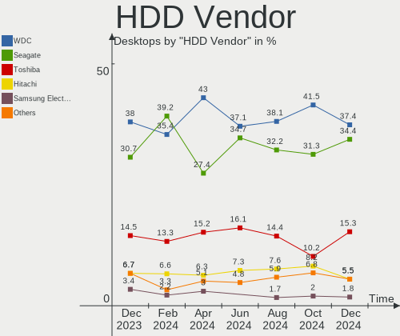

| Vendor              | Desktops | Drives | Percent |
|---------------------|----------|--------|---------|
| WDC                 | 99       | 126    | 36.94%  |
| Seagate             | 92       | 108    | 34.33%  |
| Toshiba             | 37       | 39     | 13.81%  |
| Hitachi             | 21       | 44     | 7.84%   |
| Samsung Electronics | 7        | 7      | 2.61%   |
| HGST                | 5        | 5      | 1.87%   |
| Unknown             | 3        | 3      | 1.12%   |
| Maxtor              | 2        | 2      | 0.75%   |
| FreeBSD             | 1        | 1      | 0.37%   |
| External            | 1        | 1      | 0.37%   |

SSD Vendor
----------

Solid state drive vendors

| Vendor              | Desktops | Drives | Percent |
|---------------------|----------|--------|---------|
| Kingston            | 31       | 33     | 15.35%  |
| China               | 22       | 22     | 10.89%  |
| Samsung Electronics | 21       | 22     | 10.4%   |
| WDC                 | 12       | 12     | 5.94%   |
| Patriot             | 10       | 10     | 4.95%   |
| A-DATA Technology   | 10       | 11     | 4.95%   |
| SanDisk             | 9        | 9      | 4.46%   |
| Intel               | 8        | 9      | 3.96%   |
| SPCC                | 7        | 8      | 3.47%   |
| Crucial             | 7        | 7      | 3.47%   |
| Apacer              | 6        | 6      | 2.97%   |
| Netac               | 5        | 8      | 2.48%   |
| GOODRAM             | 5        | 7      | 2.48%   |
| AMD                 | 5        | 5      | 2.48%   |
| Smartbuy            | 4        | 4      | 1.98%   |
| Qumo                | 4        | 5      | 1.98%   |
| XrayDisk            | 3        | 3      | 1.49%   |
| Gigabyte Technology | 3        | 3      | 1.49%   |
| Unknown             | 3        | 3      | 1.49%   |
| Toshiba             | 2        | 2      | 0.99%   |
| Plextor             | 2        | 2      | 0.99%   |
| AXIOMTEK            | 2        | 2      | 0.99%   |
| Transcend           | 1        | 1      | 0.5%    |
| Team                | 1        | 1      | 0.5%    |
| Seagate             | 1        | 1      | 0.5%    |
| s60                 | 1        | 1      | 0.5%    |
| PNY                 | 1        | 1      | 0.5%    |
| Palit               | 1        | 1      | 0.5%    |
| OCZ                 | 1        | 1      | 0.5%    |
| NGFF                | 1        | 1      | 0.5%    |
| MSATA 32            | 1        | 1      | 0.5%    |
| Micron Technology   | 1        | 1      | 0.5%    |
| KODAK               | 1        | 1      | 0.5%    |
| Kllisre             | 1        | 1      | 0.5%    |
| KingSpec            | 1        | 1      | 0.5%    |
| KingDian            | 1        | 1      | 0.5%    |
| Kingchuxing         | 1        | 1      | 0.5%    |
| JMicron Technology  | 1        | 1      | 0.5%    |
| JASTER              | 1        | 1      | 0.5%    |
| Intenso             | 1        | 1      | 0.5%    |

Drive Kind
----------

HDD or SSD

| Kind    | Desktops | Drives | Percent |
|---------|----------|--------|---------|
| HDD     | 224      | 336    | 47.36%  |
| SSD     | 168      | 214    | 35.52%  |
| NVMe    | 76       | 88     | 16.07%  |
| Unknown | 4        | 4      | 0.85%   |
| MMC     | 1        | 1      | 0.21%   |

Drive Connector
---------------

SATA, SAS, NVMe, etc.

| Type | Desktops | Drives | Percent |
|------|----------|--------|---------|
| SATA | 284      | 521    | 76.76%  |
| NVMe | 76       | 88     | 20.54%  |
| SAS  | 9        | 33     | 2.43%   |
| MMC  | 1        | 1      | 0.27%   |

Drive Size
----------

Size of hard drive

| Size in TB | Desktops | Drives | Percent |
|------------|----------|--------|---------|
| 0.01-0.5   | 241      | 351    | 62.11%  |
| 0.51-1.0   | 98       | 122    | 25.26%  |
| 1.01-2.0   | 31       | 36     | 7.99%   |
| 2.01-3.0   | 10       | 32     | 2.58%   |
| 3.01-4.0   | 4        | 5      | 1.03%   |
| 4.01-10.0  | 4        | 4      | 1.03%   |

Space Total
-----------

Amount of disk space available on the file system

| Size in GB     | Desktops | Percent |
|----------------|----------|---------|
| 101-250        | 79       | 25.82%  |
| 251-500        | 64       | 20.92%  |
| 1-20           | 34       | 11.11%  |
| 501-1000       | 34       | 11.11%  |
| Unknown        | 27       | 8.82%   |
| 1001-2000      | 24       | 7.84%   |
| 51-100         | 18       | 5.88%   |
| 2001-3000      | 10       | 3.27%   |
| More than 3000 | 9        | 2.94%   |
| 21-50          | 7        | 2.29%   |

Space Used
----------

Amount of used disk space

| Used GB        | Desktops | Percent |
|----------------|----------|---------|
| 1-20           | 129      | 42.16%  |
| 21-50          | 45       | 14.71%  |
| 101-250        | 35       | 11.44%  |
| Unknown        | 27       | 8.82%   |
| 51-100         | 24       | 7.84%   |
| 251-500        | 20       | 6.54%   |
| 501-1000       | 11       | 3.59%   |
| 1001-2000      | 9        | 2.94%   |
| More than 3000 | 3        | 0.98%   |
| 2001-3000      | 3        | 0.98%   |

Malfunc. Drives
---------------

Drive models with a malfunction

| Model                                        | Desktops | Drives | Percent |
|----------------------------------------------|----------|--------|---------|
| WDC WD5000AAKX-08U6AA0 500GB                 | 3        | 3      | 3.37%   |
| Seagate ST500DM002-1BD142 500GB              | 3        | 3      | 3.37%   |
| WDC WD10EZEX-08WN4A0 1TB                     | 2        | 2      | 2.25%   |
| Seagate STM3250318AS 250GB                   | 2        | 2      | 2.25%   |
| Seagate ST3808110AS 80GB                     | 2        | 2      | 2.25%   |
| Seagate ST3320613AS 320GB                    | 2        | 2      | 2.25%   |
| Seagate ST3250310AS 250GB                    | 2        | 2      | 2.25%   |
| Seagate ST3120022A 120GB                     | 2        | 2      | 2.25%   |
| Seagate ST1000DM010-2EP102 1TB               | 2        | 2      | 2.25%   |
| Unknown                                      | 2        | 2      | 2.25%   |
| XPG GAMMIX S5 256GB                          | 1        | 1      | 1.12%   |
| XPG GAMMIX S11 Pro 1TB                       | 1        | 1      | 1.12%   |
| WDC WDS240G2G0A-00JH30 240GB SSD             | 1        | 1      | 1.12%   |
| WDC WD7500BPVT-24HXZT3 752GB                 | 1        | 1      | 1.12%   |
| WDC WD5001AALS-00L3B2 500GB                  | 1        | 1      | 1.12%   |
| WDC WD5000AZRX-00A8LB0 500GB                 | 1        | 1      | 1.12%   |
| WDC WD5000AAKX-08ERMA0 500GB                 | 1        | 1      | 1.12%   |
| WDC WD5000AAKX-001CA0 500GB                  | 1        | 1      | 1.12%   |
| WDC WD5000AAKS-22V1A0 500GB                  | 1        | 1      | 1.12%   |
| WDC WD5000AAKS-00UU3A0 500GB                 | 1        | 1      | 1.12%   |
| WDC WD5000AAKS-007AA0 500GB                  | 1        | 1      | 1.12%   |
| WDC WD2500BEVT-60ZCT1 250GB                  | 1        | 1      | 1.12%   |
| WDC WD2500AAKX-001CA0 250GB                  | 1        | 1      | 1.12%   |
| WDC WD2500AAJS-22L7A0 250GB                  | 1        | 1      | 1.12%   |
| WDC WD2500AAJB-00J3A0 250GB                  | 1        | 1      | 1.12%   |
| WDC WD20EZRX-00DC0B0 2TB                     | 1        | 1      | 1.12%   |
| WDC WD20EARS-00MVWB0 2TB                     | 1        | 1      | 1.12%   |
| WDC WD10EZEX-60ZF5A0 1TB                     | 1        | 1      | 1.12%   |
| WDC WD10EZEX-00ER1A0 1TB                     | 1        | 1      | 1.12%   |
| WDC WD10EALX-559BA0 1TB                      | 1        | 1      | 1.12%   |
| Toshiba MQ01ABD100 1TB                       | 1        | 1      | 1.12%   |
| Toshiba MK3276GSX -63 320GB                  | 1        | 1      | 1.12%   |
| Toshiba MK1637GSX 160GB                      | 1        | 1      | 1.12%   |
| Toshiba HDWD120 2TB                          | 1        | 1      | 1.12%   |
| Toshiba DT01ACA050 500GB                     | 1        | 1      | 1.12%   |
| Seagate ST9500620NS 500GB                    | 1        | 1      | 1.12%   |
| Seagate ST9500530NS 42D0743 42D0746IBM 500GB | 1        | 1      | 1.12%   |
| Seagate ST9500325AS 500GB                    | 1        | 1      | 1.12%   |
| Seagate ST9320423AS 320GB                    | 1        | 1      | 1.12%   |
| Seagate ST6000VX0003-1ZH110 6TB              | 1        | 1      | 1.12%   |

Malfunc. Drive Vendor
---------------------

Vendors of faulty drives

| Vendor              | Desktops | Drives | Percent |
|---------------------|----------|--------|---------|
| Seagate             | 35       | 38     | 41.18%  |
| WDC                 | 22       | 23     | 25.88%  |
| Hitachi             | 8        | 8      | 9.41%   |
| Toshiba             | 5        | 5      | 5.88%   |
| XPG                 | 2        | 2      | 2.35%   |
| Kingston            | 2        | 2      | 2.35%   |
| China               | 2        | 2      | 2.35%   |
| Unknown             | 2        | 2      | 2.35%   |
| Samsung Electronics | 1        | 1      | 1.18%   |
| s60                 | 1        | 1      | 1.18%   |
| PNY                 | 1        | 1      | 1.18%   |
| HGST                | 1        | 1      | 1.18%   |
| Apacer              | 1        | 1      | 1.18%   |
| AMD                 | 1        | 1      | 1.18%   |
| A-DATA Technology   | 1        | 1      | 1.18%   |

Malfunc. HDD Vendor
-------------------

Vendors of faulty HDD drives

| Vendor  | Desktops | Drives | Percent |
|---------|----------|--------|---------|
| Seagate | 35       | 38     | 50%     |
| WDC     | 21       | 22     | 30%     |
| Hitachi | 8        | 8      | 11.43%  |
| Toshiba | 5        | 5      | 7.14%   |
| HGST    | 1        | 1      | 1.43%   |

Malfunc. Drive Kind
-------------------

Kinds of faulty drives

| Kind | Desktops | Drives | Percent |
|------|----------|--------|---------|
| HDD  | 61       | 74     | 80.26%  |
| SSD  | 13       | 13     | 17.11%  |
| NVMe | 2        | 2      | 2.63%   |

Failed Drives
-------------

Failed drive models

| Model                           | Desktops | Drives | Percent |
|---------------------------------|----------|--------|---------|
| WDC WD7501AALS-00J7B0 752GB     | 1        | 1      | 33.33%  |
| Seagate ST250DM000-1BD141 250GB | 1        | 1      | 33.33%  |
| Intel SSDPEKKW256G7 256GB       | 1        | 1      | 33.33%  |

Failed Drive Vendor
-------------------

Failed drive vendors

| Vendor  | Desktops | Drives | Percent |
|---------|----------|--------|---------|
| WDC     | 1        | 1      | 33.33%  |
| Seagate | 1        | 1      | 33.33%  |
| Intel   | 1        | 1      | 33.33%  |

Drive Status
------------

Number of failed and malfunc. drives

| Status   | Desktops | Drives | Percent |
|----------|----------|--------|---------|
| Works    | 224      | 426    | 61.2%   |
| Malfunc  | 74       | 89     | 20.22%  |
| Detected | 65       | 125    | 17.76%  |
| Failed   | 3        | 3      | 0.82%   |

Storage controller
------------------

Storage Vendor
--------------

Storage controller vendors

| Vendor                      | Desktops | Percent |
|-----------------------------|----------|---------|
| Intel                       | 207      | 49.17%  |
| AMD                         | 90       | 21.38%  |
| Samsung Electronics         | 19       | 4.51%   |
| Silicon Motion              | 18       | 4.28%   |
| Kingston Technology Company | 13       | 3.09%   |
| ASMedia Technology          | 13       | 3.09%   |
| JMicron Technology          | 11       | 2.61%   |
| Phison Electronics          | 9        | 2.14%   |
| Marvell Technology Group    | 9        | 2.14%   |
| Nvidia                      | 7        | 1.66%   |
| SanDisk                     | 5        | 1.19%   |
| ADATA Technology            | 5        | 1.19%   |
| VIA Technologies            | 4        | 0.95%   |
| Realtek Semiconductor       | 3        | 0.71%   |
| MAXIO Technology (Hangzhou) | 2        | 0.48%   |
| SK hynix                    | 1        | 0.24%   |
| Silicon Image               | 1        | 0.24%   |
| Netac Technology            | 1        | 0.24%   |
| Micron/Crucial Technology   | 1        | 0.24%   |
| Loongson Technology         | 1        | 0.24%   |
| Adaptec                     | 1        | 0.24%   |

Storage Model
-------------

Storage controller models

| Model                                                                                   | Desktops | Percent |
|-----------------------------------------------------------------------------------------|----------|---------|
| AMD FCH SATA Controller [AHCI mode]                                                     | 46       | 8.63%   |
| Intel 8 Series/C220 Series Chipset Family 6-port SATA Controller 1 [AHCI mode]          | 27       | 5.07%   |
| AMD 400 Series Chipset SATA Controller                                                  | 27       | 5.07%   |
| Intel NM10/ICH7 Family SATA Controller [IDE mode]                                       | 17       | 3.19%   |
| Silicon Motion SM2263EN/SM2263XT SSD Controller                                         | 15       | 2.81%   |
| Intel 82801G (ICH7 Family) IDE Controller                                               | 15       | 2.81%   |
| Intel 500 Series Chipset Family SATA AHCI Controller                                    | 15       | 2.81%   |
| AMD SB7x0/SB8x0/SB9x0 SATA Controller [AHCI mode]                                       | 13       | 2.44%   |
| AMD SB7x0/SB8x0/SB9x0 IDE Controller                                                    | 13       | 2.44%   |
| Samsung NVMe SSD Controller SM981/PM981/PM983                                           | 12       | 2.25%   |
| Intel 7 Series/C210 Series Chipset Family 6-port SATA Controller [AHCI mode]            | 12       | 2.25%   |
| Intel 6 Series/C200 Series Chipset Family Desktop SATA Controller (IDE mode, ports 4-5) | 12       | 2.25%   |
| Intel 6 Series/C200 Series Chipset Family Desktop SATA Controller (IDE mode, ports 0-3) | 12       | 2.25%   |
| Intel 6 Series/C200 Series Chipset Family 6 port Desktop SATA AHCI Controller           | 12       | 2.25%   |
| ASMedia ASM1062 Serial ATA Controller                                                   | 12       | 2.25%   |
| Intel Atom Processor E3800 Series SATA AHCI Controller                                  | 11       | 2.06%   |
| Intel 200 Series PCH SATA controller [AHCI mode]                                        | 11       | 2.06%   |
| AMD FCH SATA Controller D                                                               | 10       | 1.88%   |
| Intel Cannon Lake PCH SATA AHCI Controller                                              | 9        | 1.69%   |
| Intel Alder Lake-S PCH SATA Controller [AHCI Mode]                                      | 9        | 1.69%   |
| Intel Q170/Q150/B150/H170/H110/Z170/CM236 Chipset SATA Controller [AHCI Mode]           | 8        | 1.5%    |
| Kingston Company Company Non-Volatile memory controller                                 | 7        | 1.31%   |
| AMD SB7x0/SB8x0/SB9x0 SATA Controller [IDE mode]                                        | 7        | 1.31%   |
| AMD 500 Series Chipset SATA Controller                                                  | 7        | 1.31%   |
| AMD 300 Series Chipset SATA Controller                                                  | 7        | 1.31%   |
| Nvidia MCP61 SATA Controller                                                            | 6        | 1.13%   |
| Intel 5 Series/3400 Series Chipset 4 port SATA IDE Controller                           | 6        | 1.13%   |
| Intel 5 Series/3400 Series Chipset 2 port SATA IDE Controller                           | 6        | 1.13%   |
| Nvidia MCP61 IDE                                                                        | 5        | 0.94%   |
| JMicron JMB363 SATA/IDE Controller                                                      | 5        | 0.94%   |
| Intel C610/X99 series chipset 6-Port SATA Controller [AHCI mode]                        | 5        | 0.94%   |
| Intel 82801JI (ICH10 Family) 4 port SATA IDE Controller #1                              | 5        | 0.94%   |
| Intel 82801JI (ICH10 Family) 2 port SATA IDE Controller #2                              | 5        | 0.94%   |
| Samsung NVMe SSD Controller PM9A1/PM9A3/980PRO                                          | 4        | 0.75%   |
| Phison PS5013 E13 NVMe Controller                                                       | 4        | 0.75%   |
| Kingston Company A2000 NVMe SSD                                                         | 4        | 0.75%   |
| JMicron JMB368 IDE controller                                                           | 4        | 0.75%   |
| Intel Comet Lake SATA AHCI Controller                                                   | 4        | 0.75%   |
| Intel C610/X99 series chipset sSATA Controller [AHCI mode]                              | 4        | 0.75%   |
| Intel 9 Series Chipset Family SATA Controller [AHCI Mode]                               | 4        | 0.75%   |

Storage Kind
------------

Kind of storage controller (IDE, SATA, NVMe, SAS, ...)

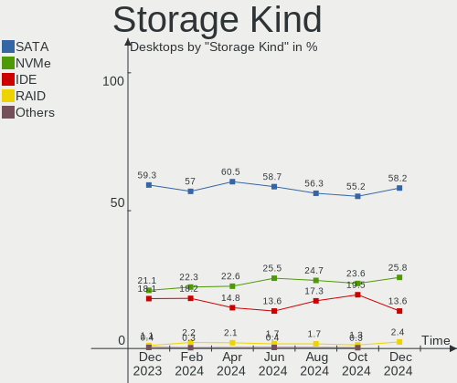

| Kind | Desktops | Percent |
|------|----------|---------|
| SATA | 242      | 59.17%  |
| IDE  | 80       | 19.56%  |
| NVMe | 76       | 18.58%  |
| RAID | 10       | 2.44%   |
| SAS  | 1        | 0.24%   |

Processor
---------

CPU Vendor
----------

Processor vendors

| Vendor   | Desktops | Percent |
|----------|----------|---------|
| Intel    | 207      | 67.65%  |
| AMD      | 98       | 32.03%  |
| Loongson | 1        | 0.33%   |

CPU Model
---------

Processor models

| Model                                  | Desktops | Percent |
|----------------------------------------|----------|---------|
| Intel Celeron CPU J1800 @ 2.41GHz      | 11       | 3.59%   |
| AMD Ryzen 5 2600 Six-Core Processor    | 7        | 2.29%   |
| Intel Core i5-4440 CPU @ 3.10GHz       | 5        | 1.63%   |
| Intel Core i5-10400 CPU @ 2.90GHz      | 5        | 1.63%   |
| Intel Core 2 Duo CPU E7500 @ 2.93GHz   | 5        | 1.63%   |
| Intel Core i3-4160 CPU @ 3.60GHz       | 4        | 1.31%   |
| Intel Core i3-4130 CPU @ 3.40GHz       | 4        | 1.31%   |
| Intel Core i3-2100 CPU @ 3.10GHz       | 4        | 1.31%   |
| AMD Ryzen 5 5600G with Radeon Graphics | 4        | 1.31%   |
| AMD Ryzen 5 3600 6-Core Processor      | 4        | 1.31%   |
| Intel Pentium Gold G6405 CPU @ 4.10GHz | 3        | 0.98%   |
| Intel Core i7-2600K CPU @ 3.40GHz      | 3        | 0.98%   |
| Intel Core i5-3470 CPU @ 3.20GHz       | 3        | 0.98%   |
| Intel Core i5-3450 CPU @ 3.10GHz       | 3        | 0.98%   |
| Intel Core i3-8100 CPU @ 3.60GHz       | 3        | 0.98%   |
| Intel Core i3-6100TE CPU @ 2.70GHz     | 3        | 0.98%   |
| Intel 12th Gen Core i5-12400           | 3        | 0.98%   |
| AMD Ryzen 5 5600X 6-Core Processor     | 3        | 0.98%   |
| AMD Ryzen 3 1200 Quad-Core Processor   | 3        | 0.98%   |
| AMD Phenom II X6 1055T Processor       | 3        | 0.98%   |
| AMD Phenom II X4 965 Processor         | 3        | 0.98%   |
| Intel Core i7-10700KF CPU @ 3.80GHz    | 2        | 0.65%   |
| Intel Core i5-9400 CPU @ 2.90GHz       | 2        | 0.65%   |
| Intel Core i5-8400 CPU @ 2.80GHz       | 2        | 0.65%   |
| Intel Core i5-4570 CPU @ 3.20GHz       | 2        | 0.65%   |
| Intel Core i5-4460 CPU @ 3.20GHz       | 2        | 0.65%   |
| Intel Core i5-2320 CPU @ 3.00GHz       | 2        | 0.65%   |
| Intel Core i5-10400F CPU @ 2.90GHz     | 2        | 0.65%   |
| Intel Core i5 CPU 750 @ 2.67GHz        | 2        | 0.65%   |
| Intel Core i3-9100F CPU @ 3.60GHz      | 2        | 0.65%   |
| Intel Core i3-4170 CPU @ 3.70GHz       | 2        | 0.65%   |
| Intel Core i3-10105 CPU @ 3.70GHz      | 2        | 0.65%   |
| Intel Core i3-10100F CPU @ 3.60GHz     | 2        | 0.65%   |
| Intel Core i3-10100 CPU @ 3.60GHz      | 2        | 0.65%   |
| Intel Core i3 CPU 550 @ 3.20GHz        | 2        | 0.65%   |
| Intel Core 2 Quad CPU Q8400 @ 2.66GHz  | 2        | 0.65%   |
| Intel Core 2 Duo CPU E8400 @ 3.00GHz   | 2        | 0.65%   |
| Intel Core 2 Duo CPU E4600 @ 2.40GHz   | 2        | 0.65%   |
| Intel Celeron J4125 CPU @ 2.00GHz      | 2        | 0.65%   |
| Intel 12th Gen Core i5-12400F          | 2        | 0.65%   |

CPU Model Family
----------------

Processor model prefix

| Model                   | Desktops | Percent |
|-------------------------|----------|---------|
| Intel Core i5           | 46       | 15.03%  |
| Intel Core i3           | 42       | 13.73%  |
| AMD Ryzen 5             | 31       | 10.13%  |
| Intel Xeon              | 21       | 6.86%   |
| Intel Celeron           | 21       | 6.86%   |
| Other                   | 16       | 5.23%   |
| Intel Core 2 Duo        | 16       | 5.23%   |
| Intel Core i7           | 13       | 4.25%   |
| Intel Pentium           | 12       | 3.92%   |
| AMD Ryzen 7             | 11       | 3.59%   |
| AMD Ryzen 3             | 10       | 3.27%   |
| Intel Pentium Gold      | 6        | 1.96%   |
| AMD FX                  | 6        | 1.96%   |
| Intel Core 2 Quad       | 4        | 1.31%   |
| AMD Phenom II X6        | 4        | 1.31%   |
| AMD Phenom II X4        | 4        | 1.31%   |
| AMD Athlon II X2        | 4        | 1.31%   |
| Intel Pentium Dual-Core | 3        | 0.98%   |
| AMD Ryzen 7 PRO         | 3        | 0.98%   |
| AMD Athlon 64 X2        | 3        | 0.98%   |
| AMD A8                  | 3        | 0.98%   |
| Intel Pentium 4         | 2        | 0.65%   |
| AMD Ryzen 9             | 2        | 0.65%   |
| AMD Ryzen 3 PRO         | 2        | 0.65%   |
| AMD Phenom II X3        | 2        | 0.65%   |
| AMD Athlon II X4        | 2        | 0.65%   |
| AMD Athlon              | 2        | 0.65%   |
| AMD A10                 | 2        | 0.65%   |
| Intel Pentium Silver    | 1        | 0.33%   |
| Intel Pentium Dual      | 1        | 0.33%   |
| Intel Pentium D         | 1        | 0.33%   |
| Intel Core M            | 1        | 0.33%   |
| Intel Core 2            | 1        | 0.33%   |
| Intel Atom              | 1        | 0.33%   |
| AMD Ryzen 5 PRO         | 1        | 0.33%   |
| AMD Athlon X4           | 1        | 0.33%   |
| AMD Athlon X2           | 1        | 0.33%   |
| AMD Athlon II X3        | 1        | 0.33%   |
| AMD Athlon 64           | 1        | 0.33%   |
| AMD A6                  | 1        | 0.33%   |

CPU Cores
---------

Number of processor cores

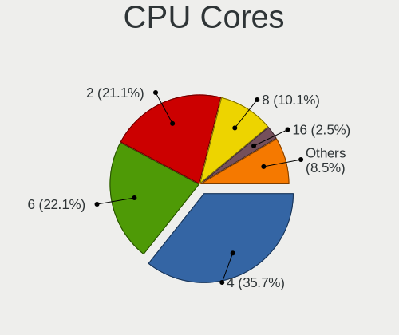

| Number | Desktops | Percent |
|--------|----------|---------|
| 2      | 103      | 33.66%  |
| 4      | 99       | 32.35%  |
| 6      | 59       | 19.28%  |
| 8      | 24       | 7.84%   |
| 1      | 8        | 2.61%   |
| 3      | 4        | 1.31%   |
| 24     | 3        | 0.98%   |
| 10     | 3        | 0.98%   |
| 12     | 2        | 0.65%   |
| 14     | 1        | 0.33%   |

CPU Sockets
-----------

Number of sockets

| Number | Desktops | Percent |
|--------|----------|---------|
| 1      | 303      | 99.02%  |
| 2      | 3        | 0.98%   |

CPU Threads
-----------

Threads per core (Hyper-Threading)

| Number | Desktops | Percent |
|--------|----------|---------|
| 2      | 164      | 53.59%  |
| 1      | 142      | 46.41%  |

CPU Op-Modes
------------

CPU Operation Modes (32-bit, 64-bit)

| Op mode        | Desktops | Percent |
|----------------|----------|---------|
| 32-bit, 64-bit | 303      | 99.02%  |
| 32-bit         | 2        | 0.65%   |
| Unknown        | 1        | 0.33%   |

CPU Microcode
-------------

Microcode number

| Number     | Desktops | Percent |
|------------|----------|---------|
| Unknown    | 35       | 11.44%  |
| 0x306c3    | 31       | 10.13%  |
| 0x206a7    | 21       | 6.86%   |
| 0xa0653    | 15       | 4.9%    |
| 0x306a9    | 13       | 4.25%   |
| 0x1067a    | 13       | 4.25%   |
| 0x0800820d | 11       | 3.59%   |
| 0x30679    | 10       | 3.27%   |
| 0x906ea    | 8        | 2.61%   |
| 0x08701021 | 7        | 2.29%   |
| 0x08101016 | 7        | 2.29%   |
| 0x0a50000d | 6        | 1.96%   |
| 0xa0671    | 5        | 1.63%   |
| 0x906eb    | 5        | 1.63%   |
| 0x506e3    | 5        | 1.63%   |
| 0x10676    | 5        | 1.63%   |
| 0x06001119 | 5        | 1.63%   |
| 0x906e9    | 4        | 1.31%   |
| 0x90675    | 4        | 1.31%   |
| 0x90672    | 4        | 1.31%   |
| 0x6fd      | 4        | 1.31%   |
| 0x306f2    | 4        | 1.31%   |
| 0x08600106 | 4        | 1.31%   |
| 0x906ed    | 3        | 0.98%   |
| 0x306e4    | 3        | 0.98%   |
| 0x106e5    | 3        | 0.98%   |
| 0x08108102 | 3        | 0.98%   |
| 0x010000c8 | 3        | 0.98%   |
| 0x010000b6 | 3        | 0.98%   |
| 0xf29      | 2        | 0.65%   |
| 0x906c0    | 2        | 0.65%   |
| 0x706a8    | 2        | 0.65%   |
| 0x6fb      | 2        | 0.65%   |
| 0x406f1    | 2        | 0.65%   |
| 0x406c4    | 2        | 0.65%   |
| 0x206d7    | 2        | 0.65%   |
| 0x20655    | 2        | 0.65%   |
| 0x106a5    | 2        | 0.65%   |
| 0x0a601201 | 2        | 0.65%   |
| 0x0a20120a | 2        | 0.65%   |

CPU Microarch
-------------

Microarchitecture

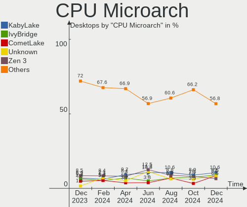

| Name             | Desktops | Percent |
|------------------|----------|---------|
| Haswell          | 37       | 12.09%  |
| SandyBridge      | 26       | 8.5%    |
| KabyLake         | 21       | 6.86%   |
| Penryn           | 20       | 6.54%   |
| CometLake        | 20       | 6.54%   |
| Zen+             | 19       | 6.21%   |
| IvyBridge        | 18       | 5.88%   |
| K10              | 17       | 5.56%   |
| Zen 3            | 15       | 4.9%    |
| Zen 2            | 13       | 4.25%   |
| Silvermont       | 13       | 4.25%   |
| Zen              | 11       | 3.59%   |
| Piledriver       | 10       | 3.27%   |
| Unknown          | 10       | 3.27%   |
| Skylake          | 7        | 2.29%   |
| Core             | 7        | 2.29%   |
| Alderlake Hybrid | 6        | 1.96%   |
| Nehalem          | 5        | 1.63%   |
| Icelake          | 5        | 1.63%   |
| Westmere         | 4        | 1.31%   |
| K8 Hammer        | 4        | 1.31%   |
| NetBurst         | 3        | 0.98%   |
| Goldmont plus    | 3        | 0.98%   |
| Excavator        | 3        | 0.98%   |
| Broadwell        | 3        | 0.98%   |
| Tremont          | 2        | 0.65%   |
| K10 Llano        | 1        | 0.33%   |
| Goldmont         | 1        | 0.33%   |
| Bulldozer        | 1        | 0.33%   |
| Bonnell          | 1        | 0.33%   |

Graphics
--------

GPU Vendor
----------

Vendors of graphics cards

| Vendor                     | Desktops | Percent |
|----------------------------|----------|---------|
| Nvidia                     | 124      | 38.04%  |
| Intel                      | 110      | 33.74%  |
| AMD                        | 90       | 27.61%  |
| Matrox Electronics Systems | 1        | 0.31%   |
| Loongson Technology        | 1        | 0.31%   |

GPU Model
---------

Graphics card models

| Model                                                                       | Desktops | Percent |
|-----------------------------------------------------------------------------|----------|---------|
| AMD Ellesmere [Radeon RX 470/480/570/570X/580/580X/590]                     | 12       | 3.6%    |
| Intel Atom Processor Z36xxx/Z37xxx Series Graphics & Display                | 11       | 3.3%    |
| Intel Xeon E3-1200 v3/4th Gen Core Processor Integrated Graphics Controller | 10       | 3%      |
| Intel Xeon E3-1200 v2/3rd Gen Core processor Graphics Controller            | 10       | 3%      |
| Intel 4th Generation Core Processor Family Integrated Graphics Controller   | 10       | 3%      |
| Intel 2nd Generation Core Processor Family Integrated Graphics Controller   | 10       | 3%      |
| Intel CoffeeLake-S GT2 [UHD Graphics 630]                                   | 9        | 2.7%    |
| Intel CometLake-S GT2 [UHD Graphics 630]                                    | 8        | 2.4%    |
| Nvidia GP107 [GeForce GTX 1050 Ti]                                          | 7        | 2.1%    |
| Intel 4 Series Chipset Integrated Graphics Controller                       | 7        | 2.1%    |
| AMD Raven Ridge [Radeon Vega Series / Radeon Vega Mobile Series]            | 7        | 2.1%    |
| AMD Cezanne [Radeon Vega Series / Radeon Vega Mobile Series]                | 7        | 2.1%    |
| Nvidia GP108 [GeForce GT 1030]                                              | 6        | 1.8%    |
| Nvidia GF108 [GeForce GT 630]                                               | 6        | 1.8%    |
| AMD Navi 24 [Radeon RX 6400/6500 XT/6500M]                                  | 5        | 1.5%    |
| Nvidia GP106 [GeForce GTX 1060 3GB]                                         | 4        | 1.2%    |
| Nvidia GM107 [GeForce GTX 750 Ti]                                           | 4        | 1.2%    |
| Nvidia GK208B [GeForce GT 730]                                              | 4        | 1.2%    |
| Nvidia GK208B [GeForce GT 710]                                              | 4        | 1.2%    |
| Nvidia GF119 [GeForce GT 610]                                               | 4        | 1.2%    |
| Nvidia GF108 [GeForce GT 730]                                               | 4        | 1.2%    |
| Intel HD Graphics 530                                                       | 4        | 1.2%    |
| Intel Alder Lake-S GT1 [UHD Graphics 730]                                   | 4        | 1.2%    |
| AMD Polaris 20 XL [Radeon RX 580 2048SP]                                    | 4        | 1.2%    |
| AMD Picasso/Raven 2 [Radeon Vega Series / Radeon Vega Mobile Series]        | 4        | 1.2%    |
| Nvidia TU116 [GeForce GTX 1660 SUPER]                                       | 3        | 0.9%    |
| Nvidia GT218 [GeForce 210]                                                  | 3        | 0.9%    |
| Nvidia GP107 [GeForce GTX 1050]                                             | 3        | 0.9%    |
| Nvidia GP106 [GeForce GTX 1060 6GB]                                         | 3        | 0.9%    |
| Nvidia GK107 [GeForce GTX 650]                                              | 3        | 0.9%    |
| Nvidia GF108 [GeForce GT 430]                                               | 3        | 0.9%    |
| Intel CometLake-S GT1 [UHD Graphics 610]                                    | 3        | 0.9%    |
| Intel 82G33/G31 Express Integrated Graphics Controller                      | 3        | 0.9%    |
| AMD Turks PRO [Radeon HD 6570/7570/8550 / R5 230]                           | 3        | 0.9%    |
| AMD Navi 23 [Radeon RX 6600/6600 XT/6600M]                                  | 3        | 0.9%    |
| AMD Navi 22 [Radeon RX 6700/6700 XT/6750 XT / 6800M]                        | 3        | 0.9%    |
| AMD Lexa PRO [Radeon 540/540X/550/550X / RX 540X/550/550X]                  | 3        | 0.9%    |
| Nvidia TU117 [GeForce GTX 1650]                                             | 2        | 0.6%    |
| Nvidia TU117 [GeForce GTX 1630]                                             | 2        | 0.6%    |
| Nvidia TU106 [GeForce RTX 2060 Rev. A]                                      | 2        | 0.6%    |

GPU Combo
---------

Combinations of graphics cards

| Name                    | Desktops | Percent |
|-------------------------|----------|---------|
| 1 x Nvidia              | 116      | 37.91%  |
| 1 x Intel               | 91       | 29.74%  |
| 1 x AMD                 | 81       | 26.47%  |
| Intel + Nvidia          | 5        | 1.63%   |
| Intel + AMD             | 4        | 1.31%   |
| 2 x AMD                 | 2        | 0.65%   |
| Other                   | 1        | 0.33%   |
| 3 x AMD                 | 1        | 0.33%   |
| 2 x Intel               | 1        | 0.33%   |
| 1 x Matrox              | 1        | 0.33%   |
| 1 x Loongson Technology | 1        | 0.33%   |
| Intel + 2 x Nvidia      | 1        | 0.33%   |
| AMD + Nvidia            | 1        | 0.33%   |

GPU Driver
----------

Free vs proprietary

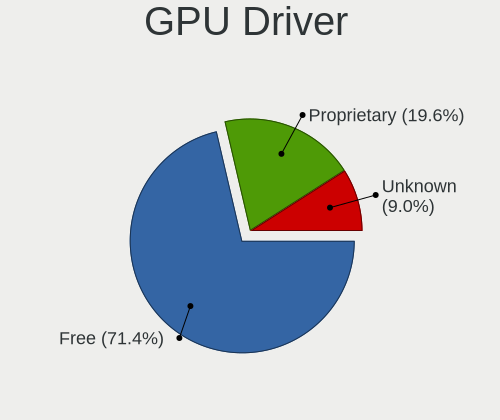

| Driver      | Desktops | Percent |
|-------------|----------|---------|
| Free        | 225      | 73.53%  |
| Proprietary | 46       | 15.03%  |
| Unknown     | 35       | 11.44%  |

GPU Memory
----------

Total video memory

| Size in GB | Desktops | Percent |
|------------|----------|---------|
| Unknown    | 145      | 47.39%  |
| 1.01-2.0   | 39       | 12.75%  |
| 0.51-1.0   | 32       | 10.46%  |
| 0.01-0.5   | 32       | 10.46%  |
| 3.01-4.0   | 18       | 5.88%   |
| 7.01-8.0   | 17       | 5.56%   |
| 8.01-16.0  | 9        | 2.94%   |
| 5.01-6.0   | 6        | 1.96%   |
| 2.01-3.0   | 6        | 1.96%   |
| 4.01-5.0   | 1        | 0.33%   |
| 16.01-24.0 | 1        | 0.33%   |

Monitor
-------

Monitor Vendor
--------------

Monitor vendors

| Vendor               | Desktops | Percent |
|----------------------|----------|---------|
| Samsung Electronics  | 48       | 17.2%   |
| Philips              | 31       | 11.11%  |
| Goldstar             | 31       | 11.11%  |
| Acer                 | 27       | 9.68%   |
| Hewlett-Packard      | 18       | 6.45%   |
| BenQ                 | 17       | 6.09%   |
| Ancor Communications | 16       | 5.73%   |
| Dell                 | 12       | 4.3%    |
| AOC                  | 12       | 4.3%    |
| ASUSTek Computer     | 8        | 2.87%   |
| ViewSonic            | 7        | 2.51%   |
| NEC Computers        | 6        | 2.15%   |
| Sony                 | 4        | 1.43%   |
| RTK                  | 3        | 1.08%   |
| HUAWEI               | 3        | 1.08%   |
| HHT                  | 3        | 1.08%   |
| Gigabyte Technology  | 3        | 1.08%   |
| Unknown              | 2        | 0.72%   |
| NCS                  | 2        | 0.72%   |
| MSI                  | 2        | 0.72%   |
| Mi                   | 2        | 0.72%   |
| Iiyama               | 2        | 0.72%   |
| CHD                  | 2        | 0.72%   |
| AOpen                | 2        | 0.72%   |
| XYA                  | 1        | 0.36%   |
| Thomson              | 1        | 0.36%   |
| Sunplus              | 1        | 0.36%   |
| SKM                  | 1        | 0.36%   |
| Sharp                | 1        | 0.36%   |
| SAC                  | 1        | 0.36%   |
| MIL                  | 1        | 0.36%   |
| LG Electronics       | 1        | 0.36%   |
| HPN                  | 1        | 0.36%   |
| HKC                  | 1        | 0.36%   |
| HannStar             | 1        | 0.36%   |
| Haier                | 1        | 0.36%   |
| GDH                  | 1        | 0.36%   |
| Daewoo               | 1        | 0.36%   |
| CVT                  | 1        | 0.36%   |
| CTX                  | 1        | 0.36%   |

Monitor Model
-------------

Monitor models

| Model                                                                 | Desktops | Percent |
|-----------------------------------------------------------------------|----------|---------|
| Ancor Communications ASUS VS197 ACI19F2 1366x768 410x230mm 18.5-inch  | 9        | 3.17%   |
| Samsung Electronics SyncMaster SAM0248 1280x1024 380x300mm 19.1-inch  | 4        | 1.41%   |
| Philips PHL 243V7 PHLC155 1920x1080 527x296mm 23.8-inch               | 3        | 1.06%   |
| HHT ActivPanel V6 HHT0030 3840x2160 944x398mm 40.3-inch               | 3        | 1.06%   |
| Acer G246HL ACR02FF 1920x1080 531x299mm 24.0-inch                     | 3        | 1.06%   |
| Unknown LCD Monitor FFFF 2288x1287 2550x2550mm 142.0-inch             | 2        | 0.7%    |
| Samsung Electronics SyncMaster SAM036E 1280x1024 376x301mm 19.0-inch  | 2        | 0.7%    |
| Samsung Electronics S24F350 SAM0D20 1920x1080 521x293mm 23.5-inch     | 2        | 0.7%    |
| Samsung Electronics LCD Monitor SAM07C0 1920x1080 890x500mm 40.2-inch | 2        | 0.7%    |
| Samsung Electronics C24F390 SAM0D2C 1920x1080 521x293mm 23.5-inch     | 2        | 0.7%    |
| Philips PHL 273V7 PHLC156 1920x1080 598x336mm 27.0-inch               | 2        | 0.7%    |
| Philips PHL 241V8 PHLC212 1920x1080 527x296mm 23.8-inch               | 2        | 0.7%    |
| NCS LCD Monitor NCS2275 1920x1080 256x192mm 12.6-inch                 | 2        | 0.7%    |
| HUAWEI SSN-24 HWV6E4E 1920x1080 527x296mm 23.8-inch                   | 2        | 0.7%    |
| Goldstar ULTRAGEAR GSM7766 2560x1440 697x392mm 31.5-inch              | 2        | 0.7%    |
| Goldstar IPS FULLHD GSM5AB8 1920x1080 480x270mm 21.7-inch             | 2        | 0.7%    |
| CHD DM-MONB2401 CHD2380 1920x1080 520x310mm 23.8-inch                 | 2        | 0.7%    |
| ASUSTek Computer VP249 AUS24AA 1920x1080 527x296mm 23.8-inch          | 2        | 0.7%    |
| AOC 2269W AOC2269 1920x1080 477x268mm 21.5-inch                       | 2        | 0.7%    |
| Acer KG251Q ACR0591 1920x1080 544x303mm 24.5-inch                     | 2        | 0.7%    |
| Acer AL1716A ACRAD46 1280x1024 338x270mm 17.0-inch                    | 2        | 0.7%    |
| XYA CF27AGB XYA2700 1920x1080 598x336mm 27.0-inch                     | 1        | 0.35%   |
| ViewSonic VX2451 SERIES VSC2528 1920x1080 521x293mm 23.5-inch         | 1        | 0.35%   |
| ViewSonic VA2465 SERIES VSCB730 1920x1080 521x293mm 23.5-inch         | 1        | 0.35%   |
| ViewSonic VA2419 Series VSC7B32 1920x1080 527x296mm 23.8-inch         | 1        | 0.35%   |
| ViewSonic VA2261 VSC0F30 1920x1080 477x268mm 21.5-inch                | 1        | 0.35%   |
| ViewSonic VA2232 Series VSC8224 1680x1050 474x296mm 22.0-inch         | 1        | 0.35%   |
| ViewSonic LCD Monitor VG2233 SERIES 1920x1080                         | 1        | 0.35%   |
| ViewSonic LCD Monitor VA2014 SERIES 1600x900                          | 1        | 0.35%   |
| Thomson TCL SMART TV TMN5655 1920x1080 1210x680mm 54.6-inch           | 1        | 0.35%   |
| Sunplus Monitor TV SPVFFFF 1360x768 708x398mm 32.0-inch               | 1        | 0.35%   |
| Sony TV SNYAB03 1920x1080                                             | 1        | 0.35%   |
| Sony SDM-X72 SNY1D70 1280x1024 338x270mm 17.0-inch                    | 1        | 0.35%   |
| Sony SDM-HS75 SNY2400 1280x1024 338x270mm 17.0-inch                   | 1        | 0.35%   |
| Sony LCD Monitor SNY0960 1280x1024 338x270mm 17.0-inch                | 1        | 0.35%   |
| Sony HDMI TV SNY0264 1920x540                                         | 1        | 0.35%   |
| SKM LCD Monitor SKM9322 1920x1080 519x324mm 24.1-inch                 | 1        | 0.35%   |
| Sharp HDMI SHP111D 1920x1080 631x354mm 28.5-inch                      | 1        | 0.35%   |
| Samsung Electronics U32J59x SAM0F52 3840x2160 697x392mm 31.5-inch     | 1        | 0.35%   |
| Samsung Electronics SyncMaster SAM0572 1280x1024 376x301mm 19.0-inch  | 1        | 0.35%   |

Monitor Resolution
------------------

Monitor screen resolution

| Resolution         | Desktops | Percent |
|--------------------|----------|---------|
| 1920x1080 (FHD)    | 142      | 52.59%  |
| 1280x1024 (SXGA)   | 44       | 16.3%   |
| 2560x1440 (QHD)    | 21       | 7.78%   |
| 1366x768 (WXGA)    | 15       | 5.56%   |
| 3840x2160 (4K)     | 14       | 5.19%   |
| 1680x1050 (WSXGA+) | 10       | 3.7%    |
| 1440x900 (WXGA+)   | 6        | 2.22%   |
| 1920x1200 (WUXGA)  | 4        | 1.48%   |
| 1600x900 (HD+)     | 4        | 1.48%   |
| 3440x1440          | 3        | 1.11%   |
| 2288x1287          | 2        | 0.74%   |
| 7680x2160          | 1        | 0.37%   |
| 2560x1600          | 1        | 0.37%   |
| 2560x1080          | 1        | 0.37%   |
| 1920x540           | 1        | 0.37%   |
| Unknown            | 1        | 0.37%   |

Monitor Diagonal
----------------

Diagonal size in inches

| Inches  | Desktops | Percent |
|---------|----------|---------|
| 24      | 42       | 15.16%  |
| 27      | 40       | 14.44%  |
| 23      | 38       | 13.72%  |
| 21      | 38       | 13.72%  |
| 19      | 27       | 9.75%   |
| 17      | 18       | 6.5%    |
| 18      | 17       | 6.14%   |
| 22      | 9        | 3.25%   |
| 31      | 8        | 2.89%   |
| Unknown | 6        | 2.17%   |
| 40      | 5        | 1.81%   |
| 20      | 5        | 1.81%   |
| 34      | 4        | 1.44%   |
| 54      | 3        | 1.08%   |
| 46      | 3        | 1.08%   |
| 142     | 2        | 0.72%   |
| 52      | 2        | 0.72%   |
| 32      | 2        | 0.72%   |
| 12      | 2        | 0.72%   |
| 72      | 1        | 0.36%   |
| 65      | 1        | 0.36%   |
| 42      | 1        | 0.36%   |
| 28      | 1        | 0.36%   |
| 25      | 1        | 0.36%   |
| 15      | 1        | 0.36%   |

Monitor Width
-------------

Physical width

| Width in mm    | Desktops | Percent |
|----------------|----------|---------|
| 501-600        | 109      | 40.52%  |
| 401-500        | 72       | 26.77%  |
| 351-400        | 24       | 8.92%   |
| 301-350        | 19       | 7.06%   |
| 601-700        | 13       | 4.83%   |
| 1001-1500      | 9        | 3.35%   |
| 701-800        | 6        | 2.23%   |
| Unknown        | 6        | 2.23%   |
| 901-1000       | 4        | 1.49%   |
| More than 2000 | 2        | 0.74%   |
| 801-900        | 2        | 0.74%   |
| 201-300        | 2        | 0.74%   |
| 1501-2000      | 1        | 0.37%   |

Aspect Ratio
------------

Proportional relationship between the width and the height

| Ratio   | Desktops | Percent |
|---------|----------|---------|
| 16/9    | 175      | 67.05%  |
| 5/4     | 41       | 15.71%  |
| 16/10   | 26       | 9.96%   |
| 21/9    | 7        | 2.68%   |
| Unknown | 5        | 1.92%   |
| 4/3     | 3        | 1.15%   |
| 1.00    | 2        | 0.77%   |
| 32/9    | 1        | 0.38%   |
| 3/2     | 1        | 0.38%   |

Monitor Area
------------

Area in inch²

| Area in inch² | Desktops | Percent |
|----------------|----------|---------|
| 201-250        | 101      | 37.41%  |
| 151-200        | 45       | 16.67%  |
| 301-350        | 41       | 15.19%  |
| 141-150        | 33       | 12.22%  |
| 351-500        | 14       | 5.19%   |
| More than 1000 | 9        | 3.33%   |
| 251-300        | 9        | 3.33%   |
| 501-1000       | 9        | 3.33%   |
| Unknown        | 6        | 2.22%   |
| 71-80          | 2        | 0.74%   |
| 101-110        | 1        | 0.37%   |

Pixel Density
-------------

Pixels per inch

| Density | Desktops | Percent |
|---------|----------|---------|
| 51-100  | 184      | 68.91%  |
| 101-120 | 57       | 21.35%  |
| 1-50    | 13       | 4.87%   |
| Unknown | 6        | 2.25%   |
| 121-160 | 5        | 1.87%   |
| 161-240 | 2        | 0.75%   |

Multiple Monitors
-----------------

Total monitors connected

| Total | Desktops | Percent |
|-------|----------|---------|
| 1     | 234      | 76.47%  |
| 0     | 41       | 13.4%   |
| 2     | 28       | 9.15%   |
| 3     | 3        | 0.98%   |

Network
-------

Net Controller Vendor
---------------------

Controller vendors

| Vendor                          | Desktops | Percent |
|---------------------------------|----------|---------|
| Realtek Semiconductor           | 240      | 60.61%  |
| Intel                           | 57       | 14.39%  |
| Qualcomm Atheros                | 28       | 7.07%   |
| Ralink Technology               | 10       | 2.53%   |
| TP-Link                         | 7        | 1.77%   |
| Nvidia                          | 6        | 1.52%   |
| Marvell Technology Group        | 5        | 1.26%   |
| OPPO Electronics                | 4        | 1.01%   |
| MediaTek                        | 4        | 1.01%   |
| Huawei Technologies             | 4        | 1.01%   |
| Qualcomm Atheros Communications | 3        | 0.76%   |
| D-Link System                   | 3        | 0.76%   |
| Broadcom                        | 3        | 0.76%   |
| Xiaomi                          | 2        | 0.51%   |
| VIA Technologies                | 2        | 0.51%   |
| Samsung Electronics             | 2        | 0.51%   |
| Ralink                          | 2        | 0.51%   |
| Qualcomm                        | 2        | 0.51%   |
| Mercucys                        | 2        | 0.51%   |
| ASUSTek Computer                | 2        | 0.51%   |
| ZTE WCDMA Technologies MSM      | 1        | 0.25%   |
| QinHeng Electronics             | 1        | 0.25%   |
| Mellanox Technologies           | 1        | 0.25%   |
| Loongson Technology             | 1        | 0.25%   |
| IMC Networks                    | 1        | 0.25%   |
| Gemtek                          | 1        | 0.25%   |
| Broadcom Limited                | 1        | 0.25%   |
| 3Com                            | 1        | 0.25%   |

Net Controller Model
--------------------

Controller models

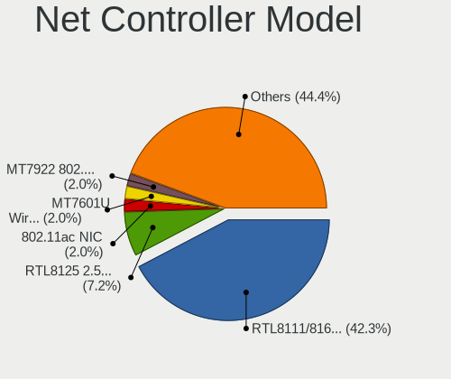

| Model                                                             | Desktops | Percent |
|-------------------------------------------------------------------|----------|---------|
| Realtek RTL8111/8168/8411 PCI Express Gigabit Ethernet Controller | 212      | 50.12%  |
| Realtek RTL8125 2.5GbE Controller                                 | 12       | 2.84%   |
| Realtek RTL810xE PCI Express Fast Ethernet controller             | 9        | 2.13%   |
| Ralink MT7601U Wireless Adapter                                   | 7        | 1.65%   |
| Intel I211 Gigabit Network Connection                             | 6        | 1.42%   |
| Intel Ethernet Controller I225-V                                  | 6        | 1.42%   |
| Nvidia MCP61 Ethernet                                             | 5        | 1.18%   |
| Intel Wireless 3165                                               | 5        | 1.18%   |
| TP-Link TL-WN722N v2/v3 [Realtek RTL8188EUS]                      | 4        | 0.95%   |
| Realtek RTL8152 Fast Ethernet Adapter                             | 4        | 0.95%   |
| Realtek 802.11ac NIC                                              | 4        | 0.95%   |
| Qualcomm Atheros AR8151 v2.0 Gigabit Ethernet                     | 4        | 0.95%   |
| OPPO SDM710-MTP _SN:2396E2D4                                      | 4        | 0.95%   |
| Intel Wi-Fi 6 AX200                                               | 4        | 0.95%   |
| Intel Ethernet Connection (14) I219-V                             | 4        | 0.95%   |
| Qualcomm Atheros AR9271 802.11n                                   | 3        | 0.71%   |
| Qualcomm Atheros AR8161 Gigabit Ethernet                          | 3        | 0.71%   |
| Qualcomm Atheros AR8131 Gigabit Ethernet                          | 3        | 0.71%   |
| Qualcomm Atheros AR8121/AR8113/AR8114 Gigabit or Fast Ethernet    | 3        | 0.71%   |
| Intel Wireless 3160                                               | 3        | 0.71%   |
| Intel Wi-Fi 6 AX210/AX211/AX411 160MHz                            | 3        | 0.71%   |
| Intel Ethernet Connection (7) I219-V                              | 3        | 0.71%   |
| Intel Ethernet Connection (2) I219-V                              | 3        | 0.71%   |
| Intel 82579V Gigabit Network Connection                           | 3        | 0.71%   |
| Xiaomi Mi/Redmi series (RNDIS)                                    | 2        | 0.47%   |
| VIA VT6105/VT6106S [Rhine-III]                                    | 2        | 0.47%   |
| Samsung Galaxy series, misc. (tethering mode)                     | 2        | 0.47%   |
| Realtek RTL8821CE 802.11ac PCIe Wireless Network Adapter          | 2        | 0.47%   |
| Realtek RTL-8100/8101L/8139 PCI Fast Ethernet Adapter             | 2        | 0.47%   |
| Ralink RT5370 Wireless Adapter                                    | 2        | 0.47%   |
| Qualcomm Atheros Attansic L1 Gigabit Ethernet                     | 2        | 0.47%   |
| Qualcomm Atheros AR9485 Wireless Network Adapter                  | 2        | 0.47%   |
| Qualcomm Atheros AR93xx Wireless Network Adapter                  | 2        | 0.47%   |
| Qualcomm Atheros AR9285 Wireless Network Adapter (PCI-Express)    | 2        | 0.47%   |
| Qualcomm Atheros AR8151 v1.0 Gigabit Ethernet                     | 2        | 0.47%   |
| Mercucys 802.11n NIC                                              | 2        | 0.47%   |
| Marvell Group 88E8057 PCI-E Gigabit Ethernet Controller           | 2        | 0.47%   |
| Marvell Group 88E8053 PCI-E Gigabit Ethernet Controller           | 2        | 0.47%   |
| Intel Tiger Lake PCH CNVi WiFi                                    | 2        | 0.47%   |
| Intel Ethernet Connection I219-LM                                 | 2        | 0.47%   |

Wireless Vendor
---------------

Wireless vendors

| Vendor                          | Desktops | Percent |
|---------------------------------|----------|---------|
| Intel                           | 30       | 34.48%  |
| Realtek Semiconductor           | 13       | 14.94%  |
| Ralink Technology               | 10       | 11.49%  |
| Qualcomm Atheros                | 9        | 10.34%  |
| TP-Link                         | 7        | 8.05%   |
| Qualcomm Atheros Communications | 3        | 3.45%   |
| MediaTek                        | 3        | 3.45%   |
| Ralink                          | 2        | 2.3%    |
| Mercucys                        | 2        | 2.3%    |
| D-Link System                   | 2        | 2.3%    |
| Broadcom                        | 2        | 2.3%    |
| ASUSTek Computer                | 2        | 2.3%    |
| IMC Networks                    | 1        | 1.15%   |
| Gemtek                          | 1        | 1.15%   |

Wireless Model
--------------

Wireless models

| Model                                                                | Desktops | Percent |
|----------------------------------------------------------------------|----------|---------|
| Ralink MT7601U Wireless Adapter                                      | 7        | 8.05%   |
| Intel Wireless 3165                                                  | 5        | 5.75%   |
| TP-Link TL-WN722N v2/v3 [Realtek RTL8188EUS]                         | 4        | 4.6%    |
| Realtek 802.11ac NIC                                                 | 4        | 4.6%    |
| Intel Wi-Fi 6 AX200                                                  | 4        | 4.6%    |
| Qualcomm Atheros AR9271 802.11n                                      | 3        | 3.45%   |
| Intel Wireless 3160                                                  | 3        | 3.45%   |
| Intel Wi-Fi 6 AX210/AX211/AX411 160MHz                               | 3        | 3.45%   |
| Realtek RTL8821CE 802.11ac PCIe Wireless Network Adapter             | 2        | 2.3%    |
| Ralink RT5370 Wireless Adapter                                       | 2        | 2.3%    |
| Qualcomm Atheros AR9485 Wireless Network Adapter                     | 2        | 2.3%    |
| Qualcomm Atheros AR93xx Wireless Network Adapter                     | 2        | 2.3%    |
| Qualcomm Atheros AR9285 Wireless Network Adapter (PCI-Express)       | 2        | 2.3%    |
| Mercucys 802.11n NIC                                                 | 2        | 2.3%    |
| Intel Tiger Lake PCH CNVi WiFi                                       | 2        | 2.3%    |
| Intel Dual Band Wireless-AC 3168NGW [Stone Peak]                     | 2        | 2.3%    |
| Intel Dual Band Wireless-AC 3165 Plus Bluetooth                      | 2        | 2.3%    |
| Intel Cannon Lake PCH CNVi WiFi                                      | 2        | 2.3%    |
| Intel Alder Lake-S PCH CNVi WiFi                                     | 2        | 2.3%    |
| D-Link System DWA-125 Wireless N 150 Adapter(rev.A2) [Ralink RT3070] | 2        | 2.3%    |
| TP-Link TL-WN821N v5/v6 [RTL8192EU]                                  | 1        | 1.15%   |
| TP-Link Archer T2U PLUS [RTL8821AU]                                  | 1        | 1.15%   |
| TP-Link 802.11ac NIC                                                 | 1        | 1.15%   |
| Realtek RTL8812AE 802.11ac PCIe Wireless Network Adapter             | 1        | 1.15%   |
| Realtek RTL8723BU 802.11b/g/n WLAN Adapter                           | 1        | 1.15%   |
| Realtek RTL8192EE PCIe Wireless Network Adapter                      | 1        | 1.15%   |
| Realtek RTL8192CU 802.11n WLAN Adapter                               | 1        | 1.15%   |
| Realtek RTL8192CE PCIe Wireless Network Adapter                      | 1        | 1.15%   |
| Realtek RTL8188FTV 802.11b/g/n 1T1R 2.4G WLAN Adapter                | 1        | 1.15%   |
| Realtek RTL8188CE 802.11b/g/n WiFi Adapter                           | 1        | 1.15%   |
| Ralink MT7610U ("Archer T2U" 2.4G+5G WLAN Adapter                    | 1        | 1.15%   |
| Ralink RT3060 Wireless 802.11n 1T/1R                                 | 1        | 1.15%   |
| Ralink RT2800 802.11n PCI                                            | 1        | 1.15%   |
| Qualcomm Atheros QCA9565 / AR9565 Wireless Network Adapter           | 1        | 1.15%   |
| Qualcomm Atheros AR9287 Wireless Network Adapter (PCI-Express)       | 1        | 1.15%   |
| Qualcomm Atheros AR9227 Wireless Network Adapter                     | 1        | 1.15%   |
| MediaTek MT7922 802.11ax PCI Express Wireless Network Adapter        | 1        | 1.15%   |
| MediaTek MT7921K (RZ608) Wi-Fi 6E 80MHz                              | 1        | 1.15%   |
| MediaTek MT7921 802.11ax PCI Express Wireless Network Adapter        | 1        | 1.15%   |
| Intel Wireless-AC 9260                                               | 1        | 1.15%   |

Ethernet Vendor
---------------

Ethernet vendors

| Vendor                     | Desktops | Percent |
|----------------------------|----------|---------|
| Realtek Semiconductor      | 238      | 72.12%  |
| Intel                      | 39       | 11.82%  |
| Qualcomm Atheros           | 19       | 5.76%   |
| Nvidia                     | 6        | 1.82%   |
| Marvell Technology Group   | 5        | 1.52%   |
| OPPO Electronics           | 4        | 1.21%   |
| Huawei Technologies        | 3        | 0.91%   |
| Xiaomi                     | 2        | 0.61%   |
| VIA Technologies           | 2        | 0.61%   |
| Samsung Electronics        | 2        | 0.61%   |
| Qualcomm                   | 2        | 0.61%   |
| ZTE WCDMA Technologies MSM | 1        | 0.3%    |
| Mellanox Technologies      | 1        | 0.3%    |
| MediaTek                   | 1        | 0.3%    |
| Loongson Technology        | 1        | 0.3%    |
| D-Link System              | 1        | 0.3%    |
| Broadcom Limited           | 1        | 0.3%    |
| Broadcom                   | 1        | 0.3%    |
| 3Com                       | 1        | 0.3%    |

Ethernet Model
--------------

Ethernet models

| Model                                                             | Desktops | Percent |
|-------------------------------------------------------------------|----------|---------|
| Realtek RTL8111/8168/8411 PCI Express Gigabit Ethernet Controller | 212      | 63.47%  |
| Realtek RTL8125 2.5GbE Controller                                 | 12       | 3.59%   |
| Realtek RTL810xE PCI Express Fast Ethernet controller             | 9        | 2.69%   |
| Intel I211 Gigabit Network Connection                             | 6        | 1.8%    |
| Intel Ethernet Controller I225-V                                  | 6        | 1.8%    |
| Nvidia MCP61 Ethernet                                             | 5        | 1.5%    |
| Realtek RTL8152 Fast Ethernet Adapter                             | 4        | 1.2%    |
| Qualcomm Atheros AR8151 v2.0 Gigabit Ethernet                     | 4        | 1.2%    |
| OPPO SDM710-MTP _SN:2396E2D4                                      | 4        | 1.2%    |
| Intel Ethernet Connection (14) I219-V                             | 4        | 1.2%    |
| Qualcomm Atheros AR8161 Gigabit Ethernet                          | 3        | 0.9%    |
| Qualcomm Atheros AR8131 Gigabit Ethernet                          | 3        | 0.9%    |
| Qualcomm Atheros AR8121/AR8113/AR8114 Gigabit or Fast Ethernet    | 3        | 0.9%    |
| Intel Ethernet Connection (7) I219-V                              | 3        | 0.9%    |
| Intel Ethernet Connection (2) I219-V                              | 3        | 0.9%    |
| Intel 82579V Gigabit Network Connection                           | 3        | 0.9%    |
| Xiaomi Mi/Redmi series (RNDIS)                                    | 2        | 0.6%    |
| VIA VT6105/VT6106S [Rhine-III]                                    | 2        | 0.6%    |
| Samsung Galaxy series, misc. (tethering mode)                     | 2        | 0.6%    |
| Realtek RTL-8100/8101L/8139 PCI Fast Ethernet Adapter             | 2        | 0.6%    |
| Qualcomm Atheros Attansic L1 Gigabit Ethernet                     | 2        | 0.6%    |
| Qualcomm Atheros AR8151 v1.0 Gigabit Ethernet                     | 2        | 0.6%    |
| Marvell Group 88E8057 PCI-E Gigabit Ethernet Controller           | 2        | 0.6%    |
| Marvell Group 88E8053 PCI-E Gigabit Ethernet Controller           | 2        | 0.6%    |
| Intel Ethernet Connection I219-LM                                 | 2        | 0.6%    |
| Intel Ethernet Connection I217-LM                                 | 2        | 0.6%    |
| Intel Ethernet Connection (2) I218-V                              | 2        | 0.6%    |
| Huawei E353/E3131                                                 | 2        | 0.6%    |
| ZTE WCDMA MSM USB SCSI CD-ROM                                     | 1        | 0.3%    |
| Realtek RTL8169 PCI Gigabit Ethernet Controller                   | 1        | 0.3%    |
| Qualcomm FP3                                                      | 1        | 0.3%    |
| Qualcomm Atheros QCA8171 Gigabit Ethernet                         | 1        | 0.3%    |
| Qualcomm Atheros Killer E220x Gigabit Ethernet Controller         | 1        | 0.3%    |
| Qualcomm Android                                                  | 1        | 0.3%    |
| Nvidia CK804 Ethernet Controller                                  | 1        | 0.3%    |
| Mellanox MT27500 Family [ConnectX-3]                              | 1        | 0.3%    |
| MediaTek File-CD Gadget                                           | 1        | 0.3%    |
| Marvell Group 88E8056 PCI-E Gigabit Ethernet Controller           | 1        | 0.3%    |
| Loongson Ethernet controller                                      | 1        | 0.3%    |
| Intel I350 Gigabit Network Connection                             | 1        | 0.3%    |

Net Controller Kind
-------------------

Ethernet, WiFi or modem

| Kind     | Desktops | Percent |
|----------|----------|---------|
| Ethernet | 305      | 78.41%  |
| WiFi     | 82       | 21.08%  |
| Modem    | 2        | 0.51%   |

Used Controller
---------------

Currently used network controller

| Kind     | Desktops | Percent |
|----------|----------|---------|
| Ethernet | 262      | 84.52%  |
| WiFi     | 48       | 15.48%  |

NICs
----

Total network controllers on board

| Total | Desktops | Percent |
|-------|----------|---------|
| 1     | 242      | 79.08%  |
| 2     | 56       | 18.3%   |
| 3     | 5        | 1.63%   |
| 4     | 2        | 0.65%   |
| 0     | 1        | 0.33%   |

IPv6
----

IPv6 vs IPv4

| Used | Desktops | Percent |
|------|----------|---------|
| No   | 298      | 97.39%  |
| Yes  | 8        | 2.61%   |

Bluetooth
---------

Bluetooth Vendor
----------------

Controller vendors

| Vendor                          | Desktops | Percent |
|---------------------------------|----------|---------|
| Intel                           | 27       | 39.13%  |
| Cambridge Silicon Radio         | 23       | 33.33%  |
| Realtek Semiconductor           | 4        | 5.8%    |
| ASUSTek Computer                | 4        | 5.8%    |
| TP-Link                         | 3        | 4.35%   |
| MediaTek                        | 2        | 2.9%    |
| Qualcomm Atheros Communications | 1        | 1.45%   |
| Integrated System Solution      | 1        | 1.45%   |
| IMC Networks                    | 1        | 1.45%   |
| Edimax Technology               | 1        | 1.45%   |
| Broadcom                        | 1        | 1.45%   |
| Apple                           | 1        | 1.45%   |

Bluetooth Model
---------------

Controller models

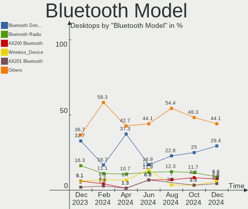

| Model                                               | Desktops | Percent |
|-----------------------------------------------------|----------|---------|
| Cambridge Silicon Radio Bluetooth Dongle (HCI mode) | 23       | 33.33%  |
| Intel Bluetooth wireless interface                  | 11       | 15.94%  |
| Realtek Bluetooth Radio                             | 4        | 5.8%    |
| Intel Bluetooth Device                              | 4        | 5.8%    |
| Intel AX200 Bluetooth                               | 4        | 5.8%    |
| TP-Link TPuLink UB500 Adapter                       | 3        | 4.35%   |
| Intel Bluetooth 9460/9560 Jefferson Peak (JfP)      | 3        | 4.35%   |
| MediaTek Wireless_Device                            | 2        | 2.9%    |
| Intel Wireless-AC 3168 Bluetooth                    | 2        | 2.9%    |
| Intel AX210 Bluetooth                               | 2        | 2.9%    |
| ASUS Broadcom BCM20702A0 Bluetooth                  | 2        | 2.9%    |
| Qualcomm Atheros  Bluetooth Device                  | 1        | 1.45%   |
| Intel Wireless-AC 9260 Bluetooth Adapter            | 1        | 1.45%   |
| Integrated System Solution Bluetooth Device         | 1        | 1.45%   |
| IMC Networks Wireless_Device                        | 1        | 1.45%   |
| Edimax Bluetooth Adapter                            | 1        | 1.45%   |
| Broadcom BCM2045 Bluetooth                          | 1        | 1.45%   |
| ASUS BCM20702A0                                     | 1        | 1.45%   |
| ASUS ASUS USB-BT500                                 | 1        | 1.45%   |
| Apple Bluetooth Host Controller                     | 1        | 1.45%   |

Sound
-----

Sound Vendor
------------

Sound card vendors

| Vendor                 | Desktops | Percent |
|------------------------|----------|---------|
| Intel                  | 201      | 40.28%  |
| AMD                    | 126      | 25.25%  |
| Nvidia                 | 114      | 22.85%  |
| C-Media Electronics    | 12       | 2.4%    |
| Creative Technology    | 6        | 1.2%    |
| Creative Labs          | 6        | 1.2%    |
| Texas Instruments      | 4        | 0.8%    |
| JMTek                  | 4        | 0.8%    |
| Generalplus Technology | 4        | 0.8%    |
| Logitech               | 2        | 0.4%    |
| Kingston Technology    | 2        | 0.4%    |
| GN Netcom              | 2        | 0.4%    |
| Edifier Technology     | 2        | 0.4%    |
| VIA Technologies       | 1        | 0.2%    |
| Sony                   | 1        | 0.2%    |
| Razer USA              | 1        | 0.2%    |
| Pixart Imaging         | 1        | 0.2%    |
| Loongson Technology    | 1        | 0.2%    |
| KTMicro                | 1        | 0.2%    |
| JBL                    | 1        | 0.2%    |
| GYROCOM C&C            | 1        | 0.2%    |
| Emotiva                | 1        | 0.2%    |
| DEXP BK-20             | 1        | 0.2%    |
| Blue Microphones       | 1        | 0.2%    |
| Audio-Technica         | 1        | 0.2%    |
| ASUSTek Computer       | 1        | 0.2%    |
| A4Tech                 | 1        | 0.2%    |

Sound Model
-----------

Sound card models

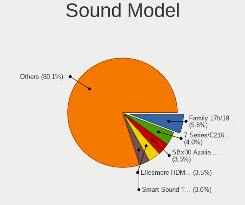

| Model                                                                      | Desktops | Percent |
|----------------------------------------------------------------------------|----------|---------|
| Intel 8 Series/C220 Series Chipset High Definition Audio Controller        | 29       | 5.1%    |
| AMD Family 17h/19h HD Audio Controller                                     | 28       | 4.92%   |
| Intel 6 Series/C200 Series Chipset Family High Definition Audio Controller | 24       | 4.22%   |
| AMD SBx00 Azalia (Intel HDA)                                               | 20       | 3.51%   |
| Intel NM10/ICH7 Family High Definition Audio Controller                    | 18       | 3.16%   |
| Intel 7 Series/C216 Chipset Family High Definition Audio Controller        | 16       | 2.81%   |
| AMD Starship/Matisse HD Audio Controller                                   | 16       | 2.81%   |
| AMD Family 17h (Models 00h-0fh) HD Audio Controller                        | 16       | 2.81%   |
| AMD Ellesmere HDMI Audio [Radeon RX 470/480 / 570/580/590]                 | 16       | 2.81%   |
| Intel Xeon E3-1200 v3/4th Gen Core Processor HD Audio Controller           | 14       | 2.46%   |
| AMD Navi 21/23 HDMI/DP Audio Controller                                    | 13       | 2.28%   |
| AMD Renoir Radeon High Definition Audio Controller                         | 12       | 2.11%   |
| Nvidia GF108 High Definition Audio Controller                              | 11       | 1.93%   |
| Intel Atom Processor Z36xxx/Z37xxx Series High Definition Audio Controller | 11       | 1.93%   |
| AMD Raven/Raven2/Fenghuang HDMI/DP Audio Controller                        | 11       | 1.93%   |
| Intel Audio device                                                         | 10       | 1.76%   |
| Intel Alder Lake-S HD Audio Controller                                     | 10       | 1.76%   |
| Intel 200 Series PCH HD Audio                                              | 10       | 1.76%   |
| Nvidia GP107GL High Definition Audio Controller                            | 9        | 1.58%   |
| Intel Cannon Lake PCH cAVS                                                 | 9        | 1.58%   |
| Nvidia GP106 High Definition Audio Controller                              | 8        | 1.41%   |
| Nvidia GK208 HDMI/DP Audio Controller                                      | 8        | 1.41%   |
| Intel 82801JI (ICH10 Family) HD Audio Controller                           | 8        | 1.41%   |
| Intel 100 Series/C230 Series Chipset Family HD Audio Controller            | 8        | 1.41%   |
| C-Media Electronics USB Audio Device                                       | 7        | 1.23%   |
| Nvidia TU116 High Definition Audio Controller                              | 6        | 1.05%   |
| Nvidia MCP61 High Definition Audio                                         | 6        | 1.05%   |
| Nvidia GP108 High Definition Audio Controller                              | 6        | 1.05%   |
| Intel Tiger Lake-H HD Audio Controller                                     | 6        | 1.05%   |
| Intel Comet Lake PCH-V cAVS                                                | 6        | 1.05%   |
| Intel 5 Series/3400 Series Chipset High Definition Audio                   | 6        | 1.05%   |
| AMD Turks HDMI Audio [Radeon HD 6500/6600 / 6700M Series]                  | 6        | 1.05%   |
| Nvidia GM107 High Definition Audio Controller [GeForce 940MX]              | 5        | 0.88%   |
| Nvidia GK107 HDMI Audio Controller                                         | 5        | 0.88%   |
| Nvidia GF119 HDMI Audio Controller                                         | 5        | 0.88%   |
| Nvidia GA104 High Definition Audio Controller                              | 5        | 0.88%   |
| Intel C610/X99 series chipset HD Audio Controller                          | 5        | 0.88%   |
| AMD RV770 HDMI Audio [Radeon HD 4850/4870]                                 | 5        | 0.88%   |
| AMD FCH Azalia Controller                                                  | 5        | 0.88%   |
| Texas Instruments PCM2902 Audio Codec                                      | 4        | 0.7%    |

Memory
------

Memory Vendor
-------------

Memory module vendors

| Vendor                       | Desktops | Percent |
|------------------------------|----------|---------|
| Kingston                     | 70       | 23.41%  |
| Unknown                      | 62       | 20.74%  |
| Crucial                      | 24       | 8.03%   |
| Samsung Electronics          | 21       | 7.02%   |
| AMD                          | 16       | 5.35%   |
| SK hynix                     | 15       | 5.02%   |
| Patriot                      | 15       | 5.02%   |
| Corsair                      | 11       | 3.68%   |
| GOODRAM                      | 9        | 3.01%   |
| G.Skill                      | 8        | 2.68%   |
| Qumo                         | 6        | 2.01%   |
| A-DATA Technology            | 4        | 1.34%   |
| Goldkey                      | 3        | 1%      |
| Apacer                       | 3        | 1%      |
| Unknown (ABCD)               | 2        | 0.67%   |
| Patriot Memory (PDP Systems) | 2        | 0.67%   |
| Patriot Memory               | 2        | 0.67%   |
| Nanya Technology             | 2        | 0.67%   |
| Micron Technology            | 2        | 0.67%   |
| Foxline                      | 2        | 0.67%   |
| Unknown                      | 2        | 0.67%   |
| Uroad                        | 1        | 0.33%   |
| Unknown (8AF1)               | 1        | 0.33%   |
| Unknown (89F7)               | 1        | 0.33%   |
| Unknown (0x5846)             | 1        | 0.33%   |
| Unknown (0x0DD5)             | 1        | 0.33%   |
| Unknown (0B3D)               | 1        | 0.33%   |
| Ramos Technology             | 1        | 0.33%   |
| Neo Forza                    | 1        | 0.33%   |
| MLLSE                        | 1        | 0.33%   |
| Kllisre                      | 1        | 0.33%   |
| KingSpec                     | 1        | 0.33%   |
| Kingmax                      | 1        | 0.33%   |
| Juhor                        | 1        | 0.33%   |
| Gold Key                     | 1        | 0.33%   |
| Elpida                       | 1        | 0.33%   |
| Atermiter                    | 1        | 0.33%   |
| Asgard                       | 1        | 0.33%   |
| Ankowall                     | 1        | 0.33%   |

Memory Model
------------

Memory module models

| Model                                                        | Desktops | Percent |
|--------------------------------------------------------------|----------|---------|
| Unknown RAM Module 2GB DIMM DDR2 800MT/s                     | 7        | 2.11%   |
| Unknown RAM Module 2GB DIMM 800MT/s                          | 5        | 1.51%   |
| Kingston RAM 99U5584-010.A00LF 4GB DIMM DDR3 1866MT/s        | 5        | 1.51%   |
| Unknown RAM Module 4GB DIMM 1333MT/s                         | 4        | 1.2%    |
| Unknown RAM Module 2GB DIMM SDRAM                            | 4        | 1.2%    |
| Unknown RAM Module 2GB DIMM DDR3 1333MT/s                    | 4        | 1.2%    |
| Kingston RAM 99U5469-069.A00LF 4GB DIMM DDR3 1600MT/s        | 4        | 1.2%    |
| Kingston RAM 99U5469-045.A00LF 4GB DIMM DDR3 1600MT/s        | 4        | 1.2%    |
| Unknown RAM Module 4GB DIMM DDR3 1333MT/s                    | 3        | 0.9%    |
| Unknown RAM Module 1GB DIMM DDR2 800MT/s                     | 3        | 0.9%    |
| Unknown RAM Module 4GB DIMM DDR4 2400MT/s                    | 2        | 0.6%    |
| Unknown RAM Module 4GB DIMM DDR 1333MT/s                     | 2        | 0.6%    |
| Unknown RAM Module 2GB DIMM SDRAM 800MT/s                    | 2        | 0.6%    |
| Unknown RAM Module 2GB DIMM 400MT/s                          | 2        | 0.6%    |
| Unknown RAM Module 1GB DIMM 800MT/s                          | 2        | 0.6%    |
| Unknown (ABCD) RAM 123456789012345678 4GB DIMM DDR4 2400MT/s | 2        | 0.6%    |
| Samsung RAM M378A2G43MX3-CTD 16GB DIMM DDR4 3466MT/s         | 2        | 0.6%    |
| Samsung RAM M378A1K43CB2-CTD 8GB DIMM DDR4 3200MT/s          | 2        | 0.6%    |
| Patriot RAM PSD48G266681 8GB DIMM DDR4 2934MT/s              | 2        | 0.6%    |
| Patriot RAM PSD34G160081 4GB DIMM DDR3 1600MT/s              | 2        | 0.6%    |
| Patriot RAM 3200 C16 Series 32GB DIMM DDR4 3266MT/s          | 2        | 0.6%    |
| Patriot Memory RAM 3200 C16 Series 8192MB DIMM DDR4 3200MT/s | 2        | 0.6%    |
| Kingston RAM KHX3200C16D4/8GX 8GB DIMM DDR4 3600MT/s         | 2        | 0.6%    |
| Kingston RAM KHX3200C16D4/32GX 32GB DIMM DDR4 3200MT/s       | 2        | 0.6%    |
| Kingston RAM KHX3000C15D4/8GX 8GB DIMM DDR4 3400MT/s         | 2        | 0.6%    |
| Kingston RAM KHX2400C15/8G 8GB DIMM DDR4 3400MT/s            | 2        | 0.6%    |
| Kingston RAM KHX2133C14/8G 8GB DIMM DDR4 2400MT/s            | 2        | 0.6%    |
| Kingston RAM KHX1866C9D3/4GX 4GB DIMM 1867MT/s               | 2        | 0.6%    |
| Kingston RAM KHX1866C10D3/4G 4GB DIMM DDR3 1867MT/s          | 2        | 0.6%    |
| Kingston RAM KF552C40-16 16GB DIMM 5200MT/s                  | 2        | 0.6%    |
| Kingston RAM KF3200C16D4/32GX 32GB DIMM DDR4 3200MT/s        | 2        | 0.6%    |
| Kingston RAM KF2666C15S4/8G 8GB SODIMM DDR4 2667MT/s         | 2        | 0.6%    |
| Kingston RAM 99U5584-005.A00LF 4GB DIMM DDR3 1600MT/s        | 2        | 0.6%    |
| Kingston RAM 99U5401-011.A00LF 2GB DIMM DDR3 1600MT/s        | 2        | 0.6%    |
| GOODRAM RAM IRX2666D464L16S/8G 8GB DIMM DDR4 3400MT/s        | 2        | 0.6%    |
| GOODRAM RAM GR2666D464L19S/8G 8GB DIMM DDR4 2667MT/s         | 2        | 0.6%    |
| Crucial RAM CT8G4SFS8320.C8FD1 8GB DIMM DDR4 2933MT/s        | 2        | 0.6%    |
| Crucial RAM CT8G4DFS8266.M8FD 8GB DIMM DDR4 3200MT/s         | 2        | 0.6%    |
| AMD RAM R7432G2606U2S-U 32GB DIMM DDR4 2666MT/s              | 2        | 0.6%    |
| AMD RAM R334G1339U1S 4GB DIMM DDR3 1333MT/s                  | 2        | 0.6%    |

Memory Kind
-----------

Memory module kinds

| Kind    | Desktops | Percent |
|---------|----------|---------|
| DDR4    | 106      | 41.41%  |
| DDR3    | 90       | 35.16%  |
| Unknown | 21       | 8.2%    |
| SDRAM   | 13       | 5.08%   |
| DDR2    | 13       | 5.08%   |
| DDR     | 6        | 2.34%   |
| DDR5    | 5        | 1.95%   |
| LPDDR4  | 2        | 0.78%   |

Memory Form Factor
------------------

Physical design of the memory module

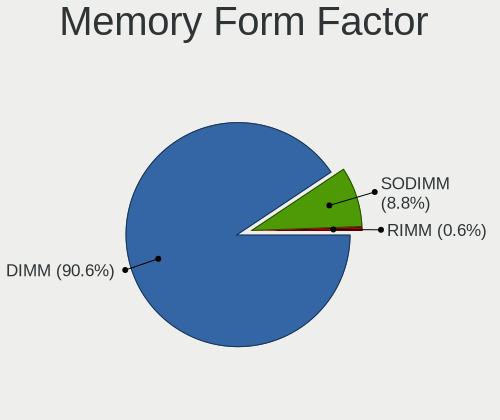

| Name   | Desktops | Percent |
|--------|----------|---------|
| DIMM   | 238      | 93.33%  |
| SODIMM | 17       | 6.67%   |

Memory Size
-----------

Memory module size

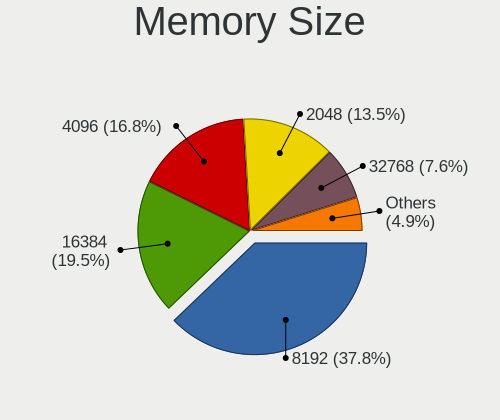

| Size  | Desktops | Percent |
|-------|----------|---------|
| 8192  | 92       | 32.17%  |
| 4096  | 89       | 31.12%  |
| 2048  | 47       | 16.43%  |
| 16384 | 29       | 10.14%  |
| 1024  | 14       | 4.9%    |
| 32768 | 12       | 4.2%    |
| 512   | 3        | 1.05%   |

Memory Speed
------------

Memory module speed

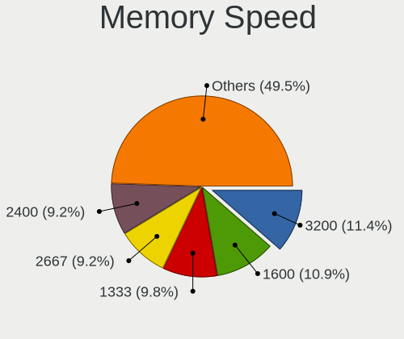

| Speed   | Desktops | Percent |
|---------|----------|---------|
| 1600    | 50       | 17.06%  |
| 1333    | 41       | 13.99%  |
| 2667    | 26       | 8.87%   |
| 3200    | 20       | 6.83%   |
| 800     | 20       | 6.83%   |
| 2400    | 18       | 6.14%   |
| 2133    | 13       | 4.44%   |
| 3600    | 10       | 3.41%   |
| 3400    | 10       | 3.41%   |
| 1866    | 10       | 3.41%   |
| 2666    | 9        | 3.07%   |
| 2933    | 8        | 2.73%   |
| Unknown | 8        | 2.73%   |
| 1867    | 6        | 2.05%   |
| 667     | 5        | 1.71%   |
| 3000    | 4        | 1.37%   |
| 400     | 4        | 1.37%   |
| 1066    | 3        | 1.02%   |
| 5200    | 2        | 0.68%   |
| 4800    | 2        | 0.68%   |
| 3733    | 2        | 0.68%   |
| 3533    | 2        | 0.68%   |
| 3466    | 2        | 0.68%   |
| 3266    | 2        | 0.68%   |
| 2934    | 2        | 0.68%   |
| 2866    | 2        | 0.68%   |
| 1648    | 2        | 0.68%   |
| 266     | 2        | 0.68%   |
| 6400    | 1        | 0.34%   |
| 3866    | 1        | 0.34%   |
| 3334    | 1        | 0.34%   |
| 2800    | 1        | 0.34%   |
| 2000    | 1        | 0.34%   |
| 1334    | 1        | 0.34%   |
| 1067    | 1        | 0.34%   |
| 533     | 1        | 0.34%   |

Printers & scanners
-------------------

Printer Vendor
--------------

Printer device vendors

| Vendor              | Desktops | Percent |
|---------------------|----------|---------|
| Hewlett-Packard     | 5        | 29.41%  |
| Canon               | 5        | 29.41%  |
| Brother Industries  | 2        | 11.76%  |
| STMicroelectronics  | 1        | 5.88%   |
| Seiko Epson         | 1        | 5.88%   |
| Samsung Electronics | 1        | 5.88%   |
| Ricoh               | 1        | 5.88%   |
| Kyocera             | 1        | 5.88%   |

Printer Model
-------------

Printer device models

| Model                                                     | Desktops | Percent |
|-----------------------------------------------------------|----------|---------|
| STMicroelectronics LED badge -- mini LED display -- 11x44 | 1        | 5.88%   |
| Seiko Epson XP-100 Series                                 | 1        | 5.88%   |
| Samsung M2070 Series                                      | 1        | 5.88%   |
| Ricoh Aficio SP 100SU                                     | 1        | 5.88%   |
| Kyocera FS-1120MFP                                        | 1        | 5.88%   |
| HP LaserJet P1005                                         | 1        | 5.88%   |
| HP LaserJet 1018                                          | 1        | 5.88%   |
| HP LaserJet 1010                                          | 1        | 5.88%   |
| HP DeskJet F2492 All-in-One                               | 1        | 5.88%   |
| HP Color LaserJet 2605                                    | 1        | 5.88%   |
| Canon PIXMA MP280                                         | 1        | 5.88%   |
| Canon PIXMA MG2500 Series                                 | 1        | 5.88%   |
| Canon MP160                                               | 1        | 5.88%   |
| Canon MF3110                                              | 1        | 5.88%   |
| Canon LBP6030w/6018w                                      | 1        | 5.88%   |
| Brother HL-2130 series                                    | 1        | 5.88%   |
| Brother DCP-1510                                          | 1        | 5.88%   |

Scanner Vendor
--------------

Scanner device vendors

| Vendor                      | Desktops | Percent |
|-----------------------------|----------|---------|
| Canon                       | 2        | 50%     |
| Seiko Epson                 | 1        | 25%     |
| Acer Peripherals (now BenQ) | 1        | 25%     |

Scanner Model
-------------

Scanner device models

| Model                                                    | Desktops | Percent |
|----------------------------------------------------------|----------|---------|
| Seiko Epson GT-F500/GT-F550 [Perfection 2480/2580 PHOTO] | 1        | 25%     |
| Canon CanoScan N670U/N676U/LiDE 20                       | 1        | 25%     |
| Canon CanoScan LiDE 110                                  | 1        | 25%     |
| Acer Peripherals (now BenQ) Benq 5560                    | 1        | 25%     |

Camera
------

Camera Vendor
-------------

Camera device vendors

| Vendor                                 | Desktops | Percent |
|----------------------------------------|----------|---------|
| Logitech                               | 16       | 39.02%  |
| Microdia                               | 5        | 12.2%   |
| Microsoft                              | 4        | 9.76%   |
| Sunplus Innovation Technology          | 3        | 7.32%   |
| Aveo Technology                        | 2        | 4.88%   |
| Z-Star Microelectronics                | 1        | 2.44%   |
| Xiaomi                                 | 1        | 2.44%   |
| Sunplus IT                             | 1        | 2.44%   |
| Realtek Semiconductor                  | 1        | 2.44%   |
| OPPO Electronics                       | 1        | 2.44%   |
| KYE Systems (Mouse Systems)            | 1        | 2.44%   |
| Cubeternet                             | 1        | 2.44%   |
| Cheng Uei Precision Industry (Foxlink) | 1        | 2.44%   |
| Arkmicro Technologies                  | 1        | 2.44%   |
| A4Tech                                 | 1        | 2.44%   |
| Unknown                                | 1        | 2.44%   |

Camera Model
------------

Camera device models

| Model                                                                  | Desktops | Percent |
|------------------------------------------------------------------------|----------|---------|
| Logitech Webcam C270                                                   | 6        | 14.63%  |
| Microdia Camera                                                        | 4        | 9.76%   |
| Logitech Webcam C310                                                   | 3        | 7.32%   |
| Microsoft LifeCam VX-2000                                              | 2        | 4.88%   |
| Logitech HD Webcam C910                                                | 2        | 4.88%   |
| Aveo Camera                                                            | 2        | 4.88%   |
| Z-Star A4 TECH USB2.0 PC Camera J                                      | 1        | 2.44%   |
| Xiaomi Mi/Redmi series (PTP)                                           | 1        | 2.44%   |
| Sunplus IT AUKEY PC-LM1 USB Camera                                     | 1        | 2.44%   |
| Sunplus ZET USB WEBCAM                                                 | 1        | 2.44%   |
| Sunplus HD 720P webcam                                                 | 1        | 2.44%   |
| Sunplus Full HD webcam                                                 | 1        | 2.44%   |
| Realtek USB Camera                                                     | 1        | 2.44%   |
| OPPO RMX3581                                                           | 1        | 2.44%   |
| Microsoft Microsoft LifeCam Cinema                                   | 1        | 2.44%   |
| Microsoft LifeCam VX-700                                               | 1        | 2.44%   |
| Microdia Defender G-Lens 2577 HD720p Camera                            | 1        | 2.44%   |
| Logitech Webcam C170                                                   | 1        | 2.44%   |
| Logitech QuickCam Pro 5000                                             | 1        | 2.44%   |
| Logitech HD Webcam C525                                                | 1        | 2.44%   |
| Logitech HD Webcam C510                                                | 1        | 2.44%   |
| Logitech C922 Pro Stream Webcam                                        | 1        | 2.44%   |
| KYE Systems (Mouse Systems) eFace 2025                                 | 1        | 2.44%   |
| Cubeternet GL-UPC822 UVC WebCam                                        | 1        | 2.44%   |
| Cheng Uei Precision Industry (Foxlink) HP 2.0MP High Definition Webcam | 1        | 2.44%   |
| Arkmicro USB2.0 PC CAMERA                                              | 1        | 2.44%   |
| A4Tech FHD 1080P PC Camera                                             | 1        | 2.44%   |
| Unknown                                                                | 1        | 2.44%   |

Security
--------

Fingerprint Vendor
------------------

Fingerprint sensor vendors

| Vendor                | Desktops | Percent |
|-----------------------|----------|---------|
| Microsoft             | 1        | 50%     |
| LighTuning Technology | 1        | 50%     |

Fingerprint Model
-----------------

Fingerprint sensor models

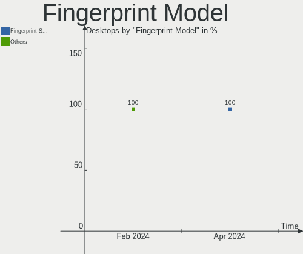

| Model                         | Desktops | Percent |
|-------------------------------|----------|---------|
| Microsoft Fingerprint Reader  | 1        | 50%     |
| LighTuning Fingerprint Sensor | 1        | 50%     |

Chipcard Vendor
---------------

Chipcard module vendors

| Vendor | Desktops | Percent |
|--------|----------|---------|
| Aktiv  | 1        | 100%    |

Chipcard Model
--------------

Chipcard module models

| Model              | Desktops | Percent |
|--------------------|----------|---------|
| Aktiv Rutoken lite | 1        | 100%    |

Unsupported
-----------

Unsupported Devices
-------------------

Total unsupported devices on board

| Total | Desktops | Percent |
|-------|----------|---------|
| 0     | 237      | 77.45%  |
| 1     | 54       | 17.65%  |
| 2     | 12       | 3.92%   |
| 3     | 2        | 0.65%   |
| 4     | 1        | 0.33%   |

Unsupported Device Types
------------------------

Types of unsupported devices

| Type                     | Desktops | Percent |
|--------------------------|----------|---------|
| Graphics card            | 42       | 53.85%  |
| Net/wireless             | 7        | 8.97%   |
| Communication controller | 7        | 8.97%   |
| Unassigned class         | 6        | 7.69%   |
| Storage/raid             | 3        | 3.85%   |
| Sound                    | 3        | 3.85%   |
| Net/ethernet             | 2        | 2.56%   |
| Fingerprint reader       | 2        | 2.56%   |
| Tv card                  | 1        | 1.28%   |
| Modem                    | 1        | 1.28%   |
| Dvb card                 | 1        | 1.28%   |
| Chipcard                 | 1        | 1.28%   |
| Camera                   | 1        | 1.28%   |
| Bluetooth                | 1        | 1.28%   |

