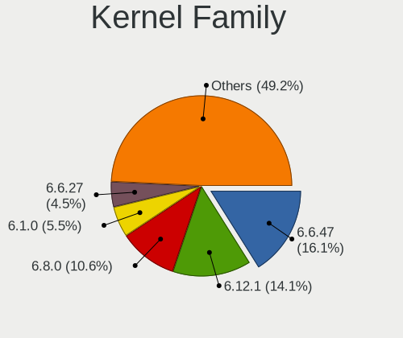
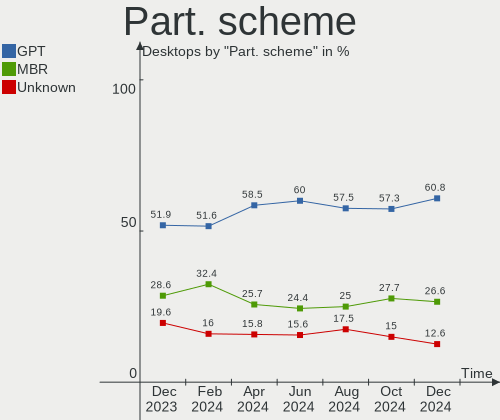
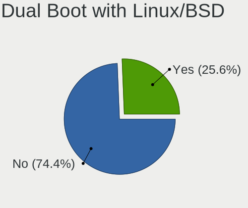
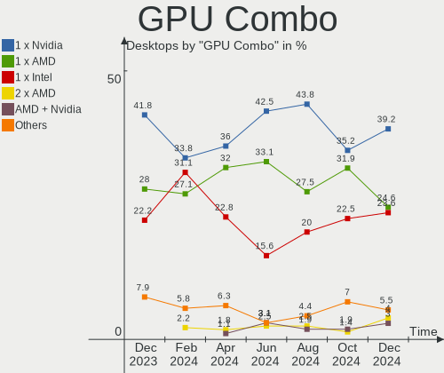
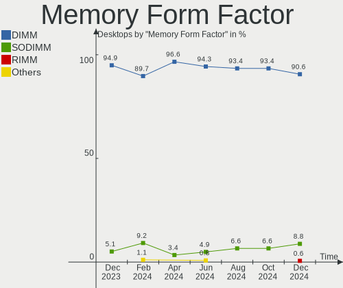
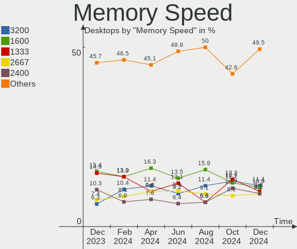
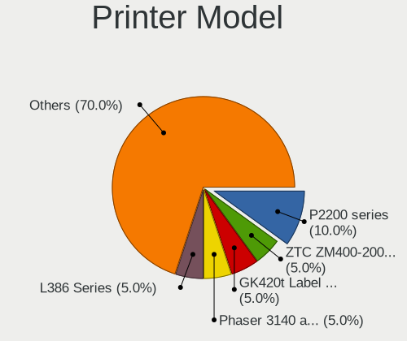

Linux in Russia - Hardware Trends (Desktops)
--------------------------------------------

A project to identify most popular hardware characteristics and track their change
over time based on data collected by Linux users at https://Linux-Hardware.org.

Anyone can contribute to this report by the [hw-probe](https://github.com/linuxhw/hw-probe) tool:

    sudo -E hw-probe -all -upload

Period: Jan, 2024.

Contents
--------

* [ System ](#system)
  - [ OS                       ](#os)
  - [ OS Family                ](#os-family)
  - [ Kernel                   ](#kernel)
  - [ Kernel Family            ](#kernel-family)
  - [ Kernel Major Ver.        ](#kernel-major-ver)
  - [ Arch                     ](#arch)
  - [ DE                       ](#de)
  - [ Display Server           ](#display-server)
  - [ Display Manager          ](#display-manager)
  - [ OS Lang                  ](#os-lang)
  - [ Boot Mode                ](#boot-mode)
  - [ Filesystem               ](#filesystem)
  - [ Part. scheme             ](#part-scheme)
  - [ Dual Boot with Linux/BSD ](#dual-boot-with-linuxbsd)
  - [ Dual Boot (Win)          ](#dual-boot-win)

* [ Board ](#board)
  - [ Vendor                   ](#vendor)
  - [ Model                    ](#model)
  - [ Model Family             ](#model-family)
  - [ MFG Year                 ](#mfg-year)
  - [ Form Factor              ](#form-factor)
  - [ Secure Boot              ](#secure-boot)
  - [ Coreboot                 ](#coreboot)
  - [ RAM Size                 ](#ram-size)
  - [ RAM Used                 ](#ram-used)
  - [ Total Drives             ](#total-drives)
  - [ Has CD-ROM               ](#has-cd-rom)
  - [ Has Ethernet             ](#has-ethernet)
  - [ Has WiFi                 ](#has-wifi)
  - [ Has Bluetooth            ](#has-bluetooth)

* [ Location ](#location)
  - [ Country                  ](#country)
  - [ City                     ](#city)

* [ Drives ](#drives)
  - [ Drive Vendor             ](#drive-vendor)
  - [ Drive Model              ](#drive-model)
  - [ HDD Vendor               ](#hdd-vendor)
  - [ SSD Vendor               ](#ssd-vendor)
  - [ Drive Kind               ](#drive-kind)
  - [ Drive Connector          ](#drive-connector)
  - [ Drive Size               ](#drive-size)
  - [ Space Total              ](#space-total)
  - [ Space Used               ](#space-used)
  - [ Malfunc. Drives          ](#malfunc-drives)
  - [ Malfunc. Drive Vendor    ](#malfunc-drive-vendor)
  - [ Malfunc. HDD Vendor      ](#malfunc-hdd-vendor)
  - [ Malfunc. Drive Kind      ](#malfunc-drive-kind)
  - [ Failed Drives            ](#failed-drives)
  - [ Failed Drive Vendor      ](#failed-drive-vendor)
  - [ Drive Status             ](#drive-status)

* [ Storage controller ](#storage-controller)
  - [ Storage Vendor           ](#storage-vendor)
  - [ Storage Model            ](#storage-model)
  - [ Storage Kind             ](#storage-kind)

* [ Processor ](#processor)
  - [ CPU Vendor               ](#cpu-vendor)
  - [ CPU Model                ](#cpu-model)
  - [ CPU Model Family         ](#cpu-model-family)
  - [ CPU Cores                ](#cpu-cores)
  - [ CPU Sockets              ](#cpu-sockets)
  - [ CPU Threads              ](#cpu-threads)
  - [ CPU Op-Modes             ](#cpu-op-modes)
  - [ CPU Microcode            ](#cpu-microcode)
  - [ CPU Microarch            ](#cpu-microarch)

* [ Graphics ](#graphics)
  - [ GPU Vendor               ](#gpu-vendor)
  - [ GPU Model                ](#gpu-model)
  - [ GPU Combo                ](#gpu-combo)
  - [ GPU Driver               ](#gpu-driver)
  - [ GPU Memory               ](#gpu-memory)

* [ Monitor ](#monitor)
  - [ Monitor Vendor           ](#monitor-vendor)
  - [ Monitor Model            ](#monitor-model)
  - [ Monitor Resolution       ](#monitor-resolution)
  - [ Monitor Diagonal         ](#monitor-diagonal)
  - [ Monitor Width            ](#monitor-width)
  - [ Aspect Ratio             ](#aspect-ratio)
  - [ Monitor Area             ](#monitor-area)
  - [ Pixel Density            ](#pixel-density)
  - [ Multiple Monitors        ](#multiple-monitors)

* [ Network ](#network)
  - [ Net Controller Vendor    ](#net-controller-vendor)
  - [ Net Controller Model     ](#net-controller-model)
  - [ Wireless Vendor          ](#wireless-vendor)
  - [ Wireless Model           ](#wireless-model)
  - [ Ethernet Vendor          ](#ethernet-vendor)
  - [ Ethernet Model           ](#ethernet-model)
  - [ Net Controller Kind      ](#net-controller-kind)
  - [ Used Controller          ](#used-controller)
  - [ NICs                     ](#nics)
  - [ IPv6                     ](#ipv6)

* [ Bluetooth ](#bluetooth)
  - [ Bluetooth Vendor         ](#bluetooth-vendor)
  - [ Bluetooth Model          ](#bluetooth-model)

* [ Sound ](#sound)
  - [ Sound Vendor             ](#sound-vendor)
  - [ Sound Model              ](#sound-model)

* [ Memory ](#memory)
  - [ Memory Vendor            ](#memory-vendor)
  - [ Memory Model             ](#memory-model)
  - [ Memory Kind              ](#memory-kind)
  - [ Memory Form Factor       ](#memory-form-factor)
  - [ Memory Size              ](#memory-size)
  - [ Memory Speed             ](#memory-speed)

* [ Printers & scanners ](#printers--scanners)
  - [ Printer Vendor           ](#printer-vendor)
  - [ Printer Model            ](#printer-model)
  - [ Scanner Vendor           ](#scanner-vendor)
  - [ Scanner Model            ](#scanner-model)

* [ Camera ](#camera)
  - [ Camera Vendor            ](#camera-vendor)
  - [ Camera Model             ](#camera-model)

* [ Security ](#security)
  - [ Fingerprint Vendor       ](#fingerprint-vendor)
  - [ Fingerprint Model        ](#fingerprint-model)
  - [ Chipcard Vendor          ](#chipcard-vendor)
  - [ Chipcard Model           ](#chipcard-model)

* [ Unsupported ](#unsupported)
  - [ Unsupported Devices      ](#unsupported-devices)
  - [ Unsupported Device Types ](#unsupported-device-types)

System
------

OS
--

Installed operating systems

| Name                         | Desktops | Percent |
|------------------------------|----------|---------|
| ROSA 12.4                    | 67       | 25.67%  |
| Debian 12                    | 50       | 19.16%  |
| OpenMandriva 5.0             | 14       | 5.36%   |
| Ubuntu 22.04                 | 13       | 4.98%   |
| Red OS 7.3                   | 11       | 4.21%   |
| Fedora 39                    | 10       | 3.83%   |
| ROSA 12                      | 7        | 2.68%   |
| ALT Linux 10.2               | 6        | 2.3%    |
| ArcoLinux Rolling            | 5        | 1.92%   |
| Manjaro                      | 4        | 1.53%   |
| Arch Rolling                 | 4        | 1.53%   |
| ROSA R11.1                   | 3        | 1.15%   |
| ROSA 13.0                    | 3        | 1.15%   |
| Pop!_OS 22.04                | 3        | 1.15%   |
| Nobara 39                    | 3        | 1.15%   |
| Ubuntu 23.10                 | 2        | 0.77%   |
| Ubuntu 20.04                 | 2        | 0.77%   |
| ROSA 2021.1                  | 2        | 0.77%   |
| ROSA 12.3                    | 2        | 0.77%   |
| ROSA 12.2                    | 2        | 0.77%   |
| org.kde.Platform 5.15-21.08  | 2        | 0.77%   |
| OpenMandriva 23.08           | 2        | 0.77%   |
| NixOS 24.05                  | 2        | 0.77%   |
| Linux Mint 21.2              | 2        | 0.77%   |
| Linux Mint 19.3              | 2        | 0.77%   |
| Fedora 38                    | 2        | 0.77%   |
| Debian 11                    | 2        | 0.77%   |
| ALT Linux 20230819           | 2        | 0.77%   |
| Xubuntu 23.10                | 1        | 0.38%   |
| Xubuntu 22.04                | 1        | 0.38%   |
| Xubuntu 16.04                | 1        | 0.38%   |
| Ubuntu MATE 23.04            | 1        | 0.38%   |
| Ubuntu 22.10                 | 1        | 0.38%   |
| Ubuntu 18.04                 | 1        | 0.38%   |
| ROSA 12.1                    | 1        | 0.38%   |
| Red OS 7.2                   | 1        | 0.38%   |
| PureOS 10.x                  | 1        | 0.38%   |
| Pear OS 20.04                | 1        | 0.38%   |
| openSUSE Tumbleweed-XXXXXXXX | 1        | 0.38%   |
| openSUSE Leap-15.6           | 1        | 0.38%   |

OS Family
---------

OS without a version

| Name             | Desktops | Percent |
|------------------|----------|---------|
| ROSA             | 87       | 33.33%  |
| Debian           | 53       | 20.31%  |
| Ubuntu           | 19       | 7.28%   |
| OpenMandriva     | 18       | 6.9%    |
| Fedora           | 13       | 4.98%   |
| Red OS           | 12       | 4.6%    |
| ALT Linux        | 11       | 4.21%   |
| Linux Mint       | 7        | 2.68%   |
| Manjaro          | 6        | 2.3%    |
| ArcoLinux        | 6        | 2.3%    |
| Nobara           | 4        | 1.53%   |
| Arch             | 4        | 1.53%   |
| Xubuntu          | 3        | 1.15%   |
| Pop!_OS          | 3        | 1.15%   |
| Kubuntu          | 3        | 1.15%   |
| org.kde.Platform | 2        | 0.77%   |
| openSUSE         | 2        | 0.77%   |
| NixOS            | 2        | 0.77%   |
| Ubuntu MATE      | 1        | 0.38%   |
| PureOS           | 1        | 0.38%   |
| Pear OS          | 1        | 0.38%   |
| MX               | 1        | 0.38%   |
| Clear Linux      | 1        | 0.38%   |
| CentOS           | 1        | 0.38%   |

Kernel
------

Version of the Linux kernel

| Version                                                 | Desktops | Percent |
|---------------------------------------------------------|----------|---------|
| 6.1.58-generic-1rosa2021.1-x86_64                       | 47       | 18.01%  |
| 6.1.0-4-amd64                                           | 37       | 14.18%  |
| 6.1.20-generic-2rosa2021.1-x86_64                       | 16       | 6.13%   |
| 6.6.2-desktop-1omv2390                                  | 14       | 5.36%   |
| 6.1.52-1.el7.3.x86_64                                   | 10       | 3.83%   |
| 5.19.0-38-generic                                       | 7        | 2.68%   |
| 6.1.0-17-amd64                                          | 6        | 2.3%    |
| 5.15.0-91-generic                                       | 5        | 1.92%   |
| 6.5.6-300.fc39.x86_64                                   | 4        | 1.53%   |
| 6.6.9-arch1-1                                           | 3        | 1.15%   |
| 6.6.13-200.fc39.x86_64                                  | 3        | 1.15%   |
| 6.5.0-15-generic                                        | 3        | 1.15%   |
| 6.5.0-14-generic                                        | 3        | 1.15%   |
| 6.2.0-39-generic                                        | 3        | 1.15%   |
| 6.1.0-15-amd64                                          | 3        | 1.15%   |
| 5.15.75-generic-1rosa2021.1-x86_64                      | 3        | 1.15%   |
| 5.10.184-generic-1rosa2021.1-x86_64                     | 3        | 1.15%   |
| 6.7.0-zen3-1-zen                                        | 2        | 0.77%   |
| 6.7.0-204.fsync.fc39.x86_64                             | 2        | 0.77%   |
| 6.6.8.xm1-1.k-xanmod-rosa2021.1-x86_64                  | 2        | 0.77%   |
| 6.6.6-76060606-generic                                  | 2        | 0.77%   |
| 6.6.10-1-MANJARO                                        | 2        | 0.77%   |
| 6.6.1-arch1-1                                           | 2        | 0.77%   |
| 6.1.58-generic-4rosa2023.1-x86_64                       | 2        | 0.77%   |
| 6.1.46-generic-2rosa2021.1-x86_64                       | 2        | 0.77%   |
| 5.4.83-generic-2rosa-x86_64                             | 2        | 0.77%   |
| 5.4.0-150-generic                                       | 2        | 0.77%   |
| 5.15.103-generic-1rosa2021.1-i686                       | 2        | 0.77%   |
| 5.10.74-generic-2rosa2021.1-x86_64                      | 2        | 0.77%   |
| 5.10.198-std-def-alt1                                   | 2        | 0.77%   |
| 6.7.0.xm1-2.k-xanmod-rosa2023.1-x86_64                  | 1        | 0.38%   |
| 6.7.0-rc4-b11-773688a6cb24b0b3c2ba40354d883348a2befa38+ | 1        | 0.38%   |
| 6.7.0-arch3-1                                           | 1        | 0.38%   |
| 6.7.0-060700rc8-generic                                 | 1        | 0.38%   |
| 6.7.0-0-MANJARO                                         | 1        | 0.38%   |
| 6.7.0                                                   | 1        | 0.38%   |
| 6.6.9-un-def-alt1                                       | 1        | 0.38%   |
| 6.6.9-200.fsync.fc39.x86_64                             | 1        | 0.38%   |
| 6.6.9-200.fc39.x86_64                                   | 1        | 0.38%   |
| 6.6.9-100.fc38.x86_64                                   | 1        | 0.38%   |

Kernel Family
-------------

Linux kernel without a distro release

| Version  | Desktops | Percent |
|----------|----------|---------|
| 6.1.58   | 49       | 18.77%  |
| 6.1.0    | 47       | 18.01%  |
| 6.1.20   | 16       | 6.13%   |
| 6.6.2    | 15       | 5.75%   |
| 6.7.0    | 10       | 3.83%   |
| 6.1.52   | 10       | 3.83%   |
| 5.15.0   | 9        | 3.45%   |
| 6.5.0    | 8        | 3.07%   |
| 5.19.0   | 8        | 3.07%   |
| 6.6.9    | 7        | 2.68%   |
| 6.6.10   | 5        | 1.92%   |
| 6.2.0    | 5        | 1.92%   |
| 6.6.8    | 4        | 1.53%   |
| 6.5.6    | 4        | 1.53%   |
| 6.6.13   | 3        | 1.15%   |
| 6.6.1    | 3        | 1.15%   |
| 5.4.0    | 3        | 1.15%   |
| 5.15.75  | 3        | 1.15%   |
| 5.15.103 | 3        | 1.15%   |
| 5.10.74  | 3        | 1.15%   |
| 5.10.184 | 3        | 1.15%   |
| 4.15.0   | 3        | 1.15%   |
| 6.6.6    | 2        | 0.77%   |
| 6.6.11   | 2        | 0.77%   |
| 6.5.11   | 2        | 0.77%   |
| 6.4.0    | 2        | 0.77%   |
| 6.2.16   | 2        | 0.77%   |
| 6.1.46   | 2        | 0.77%   |
| 5.4.83   | 2        | 0.77%   |
| 5.10.198 | 2        | 0.77%   |
| 5.10.0   | 2        | 0.77%   |
| 6.6.5    | 1        | 0.38%   |
| 6.6.12   | 1        | 0.38%   |
| 6.5.13   | 1        | 0.38%   |
| 6.5.10   | 1        | 0.38%   |
| 6.4.8    | 1        | 0.38%   |
| 6.4.12   | 1        | 0.38%   |
| 6.4.11   | 1        | 0.38%   |
| 6.1.71   | 1        | 0.38%   |
| 6.1.69   | 1        | 0.38%   |

Kernel Major Ver.
-----------------

Linux kernel major version

| Version | Desktops | Percent |
|---------|----------|---------|
| 6.1     | 126      | 48.28%  |
| 6.6     | 43       | 16.48%  |
| 5.15    | 19       | 7.28%   |
| 6.5     | 16       | 6.13%   |
| 5.10    | 15       | 5.75%   |
| 6.7     | 10       | 3.83%   |
| 5.19    | 8        | 3.07%   |
| 6.2     | 7        | 2.68%   |
| 5.4     | 6        | 2.3%    |
| 6.4     | 5        | 1.92%   |
| 4.15    | 3        | 1.15%   |
| 5.16    | 1        | 0.38%   |
| 4.19    | 1        | 0.38%   |
| 4.18    | 1        | 0.38%   |

Arch
----

OS architecture (x86_64, i586, etc.)

| Name   | Desktops | Percent |
|--------|----------|---------|
| x86_64 | 254      | 97.32%  |
| i686   | 7        | 2.68%   |

DE
--

Desktop Environment

| Name       | Desktops | Percent |
|------------|----------|---------|
| KDE5       | 96       | 36.78%  |
| GNOME      | 56       | 21.46%  |
| Unknown    | 56       | 21.46%  |
| MATE       | 17       | 6.51%   |
| XFCE       | 14       | 5.36%   |
| X-Cinnamon | 6        | 2.3%    |
| LXQt       | 6        | 2.3%    |
| KDE4       | 3        | 1.15%   |
| Cinnamon   | 3        | 1.15%   |
| sway       | 1        | 0.38%   |
| i3         | 1        | 0.38%   |
| fly        | 1        | 0.38%   |
| dwm        | 1        | 0.38%   |

Display Server
--------------

X11 or Wayland

| Name    | Desktops | Percent |
|---------|----------|---------|
| X11     | 99       | 37.93%  |
| Wayland | 99       | 37.93%  |
| Unknown | 49       | 18.77%  |
| Tty     | 14       | 5.36%   |

Display Manager
---------------

SDDM, LightDM, etc.

| Name    | Desktops | Percent |
|---------|----------|---------|
| Unknown | 97       | 37.16%  |
| SDDM    | 82       | 31.42%  |
| GDM     | 45       | 17.24%  |
| LightDM | 21       | 8.05%   |
| GDM3    | 13       | 4.98%   |
| KDM     | 3        | 1.15%   |

OS Lang
-------

Language

| Lang    | Desktops | Percent |
|---------|----------|---------|
| ru_RU   | 215      | 82.38%  |
| en_US   | 33       | 12.64%  |
| C       | 8        | 3.07%   |
| Unknown | 3        | 1.15%   |
| ru_UA   | 1        | 0.38%   |
| ru      | 1        | 0.38%   |

Boot Mode
---------

EFI or BIOS

| Mode | Desktops | Percent |
|------|----------|---------|
| BIOS | 156      | 59.77%  |
| EFI  | 105      | 40.23%  |

Filesystem
----------

Type of filesystem

| Type     | Desktops | Percent |
|----------|----------|---------|
| Ext4     | 152      | 58.24%  |
| Overlay  | 58       | 22.22%  |
| Btrfs    | 33       | 12.64%  |
| Tmpfs    | 10       | 3.83%   |
| Zfs      | 4        | 1.53%   |
| Xfs      | 2        | 0.77%   |
| Reiserfs | 1        | 0.38%   |
| Ext2     | 1        | 0.38%   |

Part. scheme
------------

Scheme of partitioning

| Type    | Desktops | Percent |
|---------|----------|---------|
| GPT     | 116      | 44.44%  |
| MBR     | 95       | 36.4%   |
| Unknown | 50       | 19.16%  |

Dual Boot with Linux/BSD
------------------------

Hosting more than one Linux/BSD

| Dual boot | Desktops | Percent |
|-----------|----------|---------|
| No        | 204      | 78.16%  |
| Yes       | 57       | 21.84%  |

Dual Boot (Win)
---------------

Hosting Linux and Windows

| Dual boot | Desktops | Percent |
|-----------|----------|---------|
| No        | 147      | 56.32%  |
| Yes       | 114      | 43.68%  |

Board
-----

Vendor
------

Motherboard manufacturer

| Name                                 | Desktops | Percent |
|--------------------------------------|----------|---------|
| ASUSTek Computer                     | 83       | 31.8%   |
| Gigabyte Technology                  | 50       | 19.16%  |
| ASRock                               | 29       | 11.11%  |
| MSI                                  | 25       | 9.58%   |
| Intel                                | 15       | 5.75%   |
| Supermicro                           | 8        | 3.07%   |
| Hewlett-Packard                      | 6        | 2.3%    |
| Unknown                              | 6        | 2.3%    |
| Huanan                               | 5        | 1.92%   |
| ECS                                  | 5        | 1.92%   |
| Foxconn                              | 3        | 1.15%   |
| Biostar                              | 3        | 1.15%   |
| SZMZ                                 | 2        | 0.77%   |
| newplatforms                         | 2        | 0.77%   |
| MACHINIST                            | 2        | 0.77%   |
| Dell                                 | 2        | 0.77%   |
| Acer                                 | 2        | 0.77%   |
| TopStar                              | 1        | 0.38%   |
| Shuttle                              | 1        | 0.38%   |
| Shenzhen Meigao Electronic Equipment | 1        | 0.38%   |
| Pegatron                             | 1        | 0.38%   |
| OEM                                  | 1        | 0.38%   |
| MAINBRD                              | 1        | 0.38%   |
| Lenovo                               | 1        | 0.38%   |
| HJS                                  | 1        | 0.38%   |
| Grandstream Networks                 | 1        | 0.38%   |
| EPoX Computer                        | 1        | 0.38%   |
| BESHTAU                              | 1        | 0.38%   |
| AZW                                  | 1        | 0.38%   |
| Aquarius                             | 1        | 0.38%   |

Model
-----

Motherboard model

| Name                                            | Desktops | Percent |
|-------------------------------------------------|----------|---------|
| ASUS P5QL-CM                                    | 13       | 4.98%   |
| ASUS All Series                                 | 9        | 3.45%   |
| Unknown                                         | 7        | 2.68%   |
| Intel SKYBAY                                    | 5        | 1.92%   |
| Supermicro SYS-1028R-TDW                        | 4        | 1.53%   |
| MSI MS-7C56                                     | 3        | 1.15%   |
| MSI MS-7996                                     | 3        | 1.15%   |
| Gigabyte H81M-S1                                | 3        | 1.15%   |
| ASRock B365M-ITX/ac                             | 3        | 1.15%   |
| Supermicro SYS-6018R-MTR                        | 2        | 0.77%   |
| Intel X99                                       | 2        | 0.77%   |
| Gigabyte H470M K                                | 2        | 0.77%   |
| Gigabyte H410M H V3                             | 2        | 0.77%   |
| Foxconn G33M03                                  | 2        | 0.77%   |
| ECS G31T-M9                                     | 2        | 0.77%   |
| ASUS TUF B450M-PLUS GAMING                      | 2        | 0.77%   |
| ASUS PRIME B450M-A II                           | 2        | 0.77%   |
| ASUS P5GC-MX/1333                               | 2        | 0.77%   |
| ASUS H110M-R                                    | 2        | 0.77%   |
| ASUS A88X-PLUS/USB                              | 2        | 0.77%   |
| ASRock G31M-GS                                  | 2        | 0.77%   |
| ASRock B550 Phantom Gaming 4                    | 2        | 0.77%   |
| TopStar V211                                    | 1        | 0.38%   |
| SZMZ X99-S3                                     | 1        | 0.38%   |
| SZMZ H61-ME                                     | 1        | 0.38%   |
| Supermicro SYS-5039MS-H8TRF                     | 1        | 0.38%   |
| Supermicro PIO-618U-T4T+-ST031                  | 1        | 0.38%   |
| Shuttle XS35V3                                  | 1        | 0.38%   |
| Shenzhen Meigao Electronic Equipment UM773 Lite | 1        | 0.38%   |
| Pegatron Pro 3010 Microtower PC                 | 1        | 0.38%   |
| OEM X79G                                        | 1        | 0.38%   |
| newplatforms NP-1008i                           | 1        | 0.38%   |
| newplatforms NP-1004i                           | 1        | 0.38%   |
| MSI PRO RPL-P DP10 (MS-B0A6)                    | 1        | 0.38%   |
| MSI PRO B300 DP20ZA (MS-B0A2)                   | 1        | 0.38%   |
| MSI MS-7E12                                     | 1        | 0.38%   |
| MSI MS-7D99                                     | 1        | 0.38%   |
| MSI MS-7D73                                     | 1        | 0.38%   |
| MSI MS-7D48                                     | 1        | 0.38%   |
| MSI MS-7D46                                     | 1        | 0.38%   |

Model Family
------------

Motherboard model prefix

| Name                           | Desktops | Percent |
|--------------------------------|----------|---------|
| ASUS P5QL-CM                   | 13       | 4.98%   |
| ASUS PRIME                     | 12       | 4.6%    |
| ASUS All                       | 9        | 3.45%   |
| Unknown                        | 7        | 2.68%   |
| Intel SKYBAY                   | 5        | 1.92%   |
| Supermicro SYS-1028R-TDW       | 4        | 1.53%   |
| ASUS TUF                       | 4        | 1.53%   |
| MSI MS-7C56                    | 3        | 1.15%   |
| MSI MS-7996                    | 3        | 1.15%   |
| Intel X99                      | 3        | 1.15%   |
| HP Compaq                      | 3        | 1.15%   |
| Gigabyte H81M-S1               | 3        | 1.15%   |
| Gigabyte B550M                 | 3        | 1.15%   |
| Gigabyte B450M                 | 3        | 1.15%   |
| ASUS P7H55-M                   | 3        | 1.15%   |
| ASRock B365M-ITX               | 3        | 1.15%   |
| Supermicro SYS-6018R-MTR       | 2        | 0.77%   |
| MSI PRO                        | 2        | 0.77%   |
| Gigabyte H470M                 | 2        | 0.77%   |
| Gigabyte H410M                 | 2        | 0.77%   |
| Gigabyte B550                  | 2        | 0.77%   |
| Gigabyte A320M-S2H             | 2        | 0.77%   |
| Foxconn G33M03                 | 2        | 0.77%   |
| ECS G31T-M9                    | 2        | 0.77%   |
| Dell OptiPlex                  | 2        | 0.77%   |
| ASUS ROG                       | 2        | 0.77%   |
| ASUS P8H61-MX                  | 2        | 0.77%   |
| ASUS P8H61-M                   | 2        | 0.77%   |
| ASUS P5KPL-AM                  | 2        | 0.77%   |
| ASUS P5GC-MX                   | 2        | 0.77%   |
| ASUS M5A78L-M                  | 2        | 0.77%   |
| ASUS H110M-R                   | 2        | 0.77%   |
| ASUS A88X-PLUS                 | 2        | 0.77%   |
| ASRock G31M-GS                 | 2        | 0.77%   |
| ASRock B550                    | 2        | 0.77%   |
| TopStar V211                   | 1        | 0.38%   |
| SZMZ X99-S3                    | 1        | 0.38%   |
| SZMZ H61-ME                    | 1        | 0.38%   |
| Supermicro SYS-5039MS-H8TRF    | 1        | 0.38%   |
| Supermicro PIO-618U-T4T+-ST031 | 1        | 0.38%   |

MFG Year
--------

Motherboard manufacture year

| Year | Desktops | Percent |
|------|----------|---------|
| 2012 | 25       | 9.58%   |
| 2020 | 24       | 9.2%    |
| 2022 | 23       | 8.81%   |
| 2018 | 23       | 8.81%   |
| 2008 | 22       | 8.43%   |
| 2021 | 18       | 6.9%    |
| 2019 | 14       | 5.36%   |
| 2013 | 14       | 5.36%   |
| 2023 | 13       | 4.98%   |
| 2016 | 12       | 4.6%    |
| 2011 | 12       | 4.6%    |
| 2010 | 12       | 4.6%    |
| 2009 | 11       | 4.21%   |
| 2014 | 10       | 3.83%   |
| 2015 | 8        | 3.07%   |
| 2007 | 8        | 3.07%   |
| 2017 | 5        | 1.92%   |
| 2006 | 4        | 1.53%   |
| 2005 | 1        | 0.38%   |
| 2004 | 1        | 0.38%   |
| 2003 | 1        | 0.38%   |

Form Factor
-----------

Physical design of the computer

| Name    | Desktops | Percent |
|---------|----------|---------|
| Desktop | 261      | 100%    |

Secure Boot
-----------

Enabled or disabled

| State    | Desktops | Percent |
|----------|----------|---------|
| Disabled | 257      | 98.47%  |
| Enabled  | 4        | 1.53%   |

Coreboot
--------

Have coreboot on board

| Used | Desktops | Percent |
|------|----------|---------|
| No   | 259      | 99.23%  |
| Yes  | 2        | 0.77%   |

RAM Size
--------

Total RAM memory

| Size in GB      | Desktops | Percent |
|-----------------|----------|---------|
| 16.01-24.0      | 48       | 18.39%  |
| 4.01-8.0        | 45       | 17.24%  |
| 3.01-4.0        | 44       | 16.86%  |
| 8.01-16.0       | 40       | 15.33%  |
| 32.01-64.0      | 37       | 14.18%  |
| 1.01-2.0        | 22       | 8.43%   |
| 64.01-256.0     | 14       | 5.36%   |
| 2.01-3.0        | 4        | 1.53%   |
| 24.01-32.0      | 3        | 1.15%   |
| More than 256.0 | 2        | 0.77%   |
| 0.51-1.0        | 2        | 0.77%   |

RAM Used
--------

Used RAM memory

| Used GB    | Desktops | Percent |
|------------|----------|---------|
| 1.01-2.0   | 80       | 30.65%  |
| 0.51-1.0   | 61       | 23.37%  |
| 2.01-3.0   | 52       | 19.92%  |
| 3.01-4.0   | 26       | 9.96%   |
| 4.01-8.0   | 24       | 9.2%    |
| 8.01-16.0  | 11       | 4.21%   |
| 16.01-24.0 | 3        | 1.15%   |
| 0.01-0.5   | 2        | 0.77%   |
| 32.01-64.0 | 1        | 0.38%   |
| 24.01-32.0 | 1        | 0.38%   |

Total Drives
------------

Number of drives on board

| Drives | Desktops | Percent |
|--------|----------|---------|
| 1      | 138      | 52.87%  |
| 2      | 55       | 21.07%  |
| 3      | 38       | 14.56%  |
| 4      | 14       | 5.36%   |
| 6      | 6        | 2.3%    |
| 5      | 6        | 2.3%    |
| 7      | 2        | 0.77%   |
| 0      | 2        | 0.77%   |

Has CD-ROM
----------

Has CD-ROM on board

| Presented | Desktops | Percent |
|-----------|----------|---------|
| No        | 186      | 71.26%  |
| Yes       | 75       | 28.74%  |

Has Ethernet
------------

Has Ethernet on board

| Presented | Desktops | Percent |
|-----------|----------|---------|
| Yes       | 260      | 99.62%  |
| No        | 1        | 0.38%   |

Has WiFi
--------

Has WiFi module

| Presented | Desktops | Percent |
|-----------|----------|---------|
| No        | 180      | 68.97%  |
| Yes       | 81       | 31.03%  |

Has Bluetooth
-------------

Has Bluetooth module

| Presented | Desktops | Percent |
|-----------|----------|---------|
| No        | 200      | 76.63%  |
| Yes       | 61       | 23.37%  |

Location
--------

Country
-------

Geographic location (country)

| Country | Desktops | Percent |
|---------|----------|---------|
| Russia  | 261      | 100%    |

City
----

Geographic location (city)

| City             | Desktops | Percent |
|------------------|----------|---------|
| Moscow           | 47       | 18.01%  |
| Voronezh         | 41       | 15.71%  |
| St Petersburg    | 17       | 6.51%   |
| Yekaterinburg    | 10       | 3.83%   |
| Novosibirsk      | 8        | 3.07%   |
| Krasnodar        | 8        | 3.07%   |
| Chelyabinsk      | 6        | 2.3%    |
| Volgograd        | 4        | 1.53%   |
| Ufa              | 4        | 1.53%   |
| Rostov-on-Don    | 4        | 1.53%   |
| Perm             | 4        | 1.53%   |
| Nizhniy Novgorod | 4        | 1.53%   |
| Krasnoyarsk      | 4        | 1.53%   |
| Kazan’         | 4        | 1.53%   |
| Ulyanovsk        | 3        | 1.15%   |
| Tambov           | 3        | 1.15%   |
| Samara           | 3        | 1.15%   |
| Novy Urengoy     | 3        | 1.15%   |
| Murom            | 3        | 1.15%   |
| Vladivostok      | 2        | 0.77%   |
| Vladimir         | 2        | 0.77%   |
| Vidnoye          | 2        | 0.77%   |
| Tver             | 2        | 0.77%   |
| Penza            | 2        | 0.77%   |
| Nizhnekamsk      | 2        | 0.77%   |
| Kostroma         | 2        | 0.77%   |
| Kirov            | 2        | 0.77%   |
| Kharino          | 2        | 0.77%   |
| Khabarovsk       | 2        | 0.77%   |
| Kemerovo         | 2        | 0.77%   |
| Barnaul          | 2        | 0.77%   |
| Zelenograd       | 1        | 0.38%   |
| Zelenodolsk      | 1        | 0.38%   |
| Yuzhnoural'sk    | 1        | 0.38%   |
| Yeysk            | 1        | 0.38%   |
| Yaroslavl        | 1        | 0.38%   |
| Yakutsk          | 1        | 0.38%   |
| Vyksa            | 1        | 0.38%   |
| Vladikavkaz      | 1        | 0.38%   |
| Verkhnyaya Salda | 1        | 0.38%   |

Drives
------

Drive Vendor
------------

Hard drive vendors

| Vendor                      | Desktops | Drives | Percent |
|-----------------------------|----------|--------|---------|
| WDC                         | 104      | 127    | 23.8%   |
| Seagate                     | 57       | 66     | 13.04%  |
| Samsung Electronics         | 44       | 56     | 10.07%  |
| Toshiba                     | 32       | 44     | 7.32%   |
| Kingston                    | 27       | 30     | 6.18%   |
| Hitachi                     | 15       | 16     | 3.43%   |
| A-DATA Technology           | 14       | 14     | 3.2%    |
| Apacer                      | 10       | 10     | 2.29%   |
| SanDisk                     | 9        | 9      | 2.06%   |
| HGST                        | 7        | 7      | 1.6%    |
| Crucial                     | 7        | 11     | 1.6%    |
| Silicon Motion              | 6        | 6      | 1.37%   |
| Netac                       | 6        | 6      | 1.37%   |
| China                       | 6        | 6      | 1.37%   |
| XrayDisk                    | 5        | 5      | 1.14%   |
| Unknown                     | 5        | 5      | 1.14%   |
| Patriot                     | 5        | 5      | 1.14%   |
| MAXIO Technology (Hangzhou) | 5        | 5      | 1.14%   |
| JMicron Technology          | 5        | 5      | 1.14%   |
| Smartbuy                    | 3        | 3      | 0.69%   |
| Plextor                     | 3        | 3      | 0.69%   |
| MSI                         | 3        | 3      | 0.69%   |
| KingSpec                    | 3        | 3      | 0.69%   |
| Intel                       | 3        | 4      | 0.69%   |
| Innodisk                    | 3        | 3      | 0.69%   |
| Team                        | 2        | 2      | 0.46%   |
| SK hynix                    | 2        | 2      | 0.46%   |
| Phison Electronics          | 2        | 3      | 0.46%   |
| Micron Technology           | 2        | 2      | 0.46%   |
| Maxtor                      | 2        | 2      | 0.46%   |
| Lenovo                      | 2        | 2      | 0.46%   |
| Kingston Technology Company | 2        | 2      | 0.46%   |
| Hewlett-Packard             | 2        | 2      | 0.46%   |
| Gigabyte Technology         | 2        | 2      | 0.46%   |
| Fujitsu                     | 2        | 2      | 0.46%   |
| DEXP                        | 2        | 2      | 0.46%   |
| AMD                         | 2        | 2      | 0.46%   |
| XPG                         | 1        | 1      | 0.23%   |
| Transcend                   | 1        | 1      | 0.23%   |
| T-FORCE                     | 1        | 1      | 0.23%   |

Drive Model
-----------

Hard drive models

| Model                                                 | Desktops | Percent |
|-------------------------------------------------------|----------|---------|
| WDC WD3200AAJS-00L7A0 320GB                           | 14       | 2.9%    |
| Kingston SA400S37480G 480GB SSD                       | 9        | 1.87%   |
| Seagate ST1000DM010-2EP102 1TB                        | 8        | 1.66%   |
| WDC WD10EZEX-00BBHA0 1TB                              | 7        | 1.45%   |
| Toshiba HDWD110 1TB                                   | 7        | 1.45%   |
| Toshiba DT01ACA050 500GB                              | 6        | 1.24%   |
| Samsung NVMe SSD Controller SM981/PM981/PM983 1TB     | 6        | 1.24%   |
| WDC WDS500G2B0A-00SM50 500GB SSD                      | 5        | 1.04%   |
| Samsung SSD 860 EVO 250GB                             | 5        | 1.04%   |
| Kingston SA400S37240G 240GB SSD                       | 5        | 1.04%   |
| JMicron Generic 8GB                                   | 5        | 1.04%   |
| Samsung MZVLW128HEGR-00000 128GB                      | 4        | 0.83%   |
| HGST HTE721010A9E630 1TB                              | 4        | 0.83%   |
| Toshiba HDWL110 1TB                                   | 3        | 0.62%   |
| Silicon Motion SM2263EN/SM2263XT SSD Controller 128GB | 3        | 0.62%   |
| Seagate ST500DM002-1BD142 500GB                       | 3        | 0.62%   |
| Seagate ST3500418AS 500GB                             | 3        | 0.62%   |
| Seagate ST31000528AS 1TB                              | 3        | 0.62%   |
| Samsung SSD 980 PRO 1TB                               | 3        | 0.62%   |
| Samsung NVMe SSD Controller PM9A1/PM9A3/980PRO 2TB    | 3        | 0.62%   |
| MAXIO (Hangzhou) NVMe SSD Controller MAP1202 512GB    | 3        | 0.62%   |
| Apacer AS350 512GB SSD                                | 3        | 0.62%   |
| Apacer AS350 128GB SSD                                | 3        | 0.62%   |
| A-DATA SX6000PNP 256GB                                | 3        | 0.62%   |
| A-DATA SU650 120GB SSD                                | 3        | 0.62%   |
| XrayDisk 1TB SSD                                      | 2        | 0.41%   |
| WDC WDS240G2G0A-00JH30 240GB SSD                      | 2        | 0.41%   |
| WDC WDS120G1G0A-00SS50 120GB SSD                      | 2        | 0.41%   |
| WDC WD5000AAKX-001CA0 500GB                           | 2        | 0.41%   |
| WDC WD4003FRYZ-01F0DB0 4TB                            | 2        | 0.41%   |
| WDC WD2500AAKX-00ERMA0 250GB                          | 2        | 0.41%   |
| WDC WD2500AAJS-00L7A0 250GB                           | 2        | 0.41%   |
| WDC WD20EZBX-00AYRA0 2TB                              | 2        | 0.41%   |
| WDC WD20EFRX-68EUZN0 2TB                              | 2        | 0.41%   |
| WDC WD1602ABYS-23B7A0 39M4507 42C0462IBM 160GB        | 2        | 0.41%   |
| WDC WD10EZRZ-00HTKB0 1TB                              | 2        | 0.41%   |
| WDC WD10EZEX-60WN4A0 1TB                              | 2        | 0.41%   |
| WDC WD10EZEX-21WN4A0 1TB                              | 2        | 0.41%   |
| WDC WD10EZEX-08WN4A0 1TB                              | 2        | 0.41%   |
| WDC WD10EZEX-08M2NA0 1TB                              | 2        | 0.41%   |

HDD Vendor
----------

Hard disk drive vendors

| Vendor              | Desktops | Drives | Percent |
|---------------------|----------|--------|---------|
| WDC                 | 91       | 111    | 41.94%  |
| Seagate             | 56       | 64     | 25.81%  |
| Toshiba             | 31       | 42     | 14.29%  |
| Hitachi             | 15       | 16     | 6.91%   |
| HGST                | 7        | 7      | 3.23%   |
| Samsung Electronics | 5        | 5      | 2.3%    |
| JMicron Technology  | 5        | 5      | 2.3%    |
| Unknown             | 2        | 2      | 0.92%   |
| Maxtor              | 2        | 2      | 0.92%   |
| Fujitsu             | 2        | 2      | 0.92%   |
| FC-1307             | 1        | 1      | 0.46%   |

SSD Vendor
----------

Solid state drive vendors

| Vendor              | Desktops | Drives | Percent |
|---------------------|----------|--------|---------|
| Kingston            | 23       | 25     | 15.97%  |
| Samsung Electronics | 17       | 18     | 11.81%  |
| WDC                 | 14       | 15     | 9.72%   |
| Apacer              | 10       | 10     | 6.94%   |
| A-DATA Technology   | 10       | 10     | 6.94%   |
| Crucial             | 6        | 10     | 4.17%   |
| China               | 6        | 6      | 4.17%   |
| XrayDisk            | 4        | 4      | 2.78%   |
| Patriot             | 4        | 4      | 2.78%   |
| SanDisk             | 3        | 3      | 2.08%   |
| Plextor             | 3        | 3      | 2.08%   |
| Netac               | 3        | 3      | 2.08%   |
| KingSpec            | 3        | 3      | 2.08%   |
| Innodisk            | 3        | 3      | 2.08%   |
| Team                | 2        | 2      | 1.39%   |
| Smartbuy            | 2        | 2      | 1.39%   |
| Lenovo              | 2        | 2      | 1.39%   |
| Intel               | 2        | 2      | 1.39%   |
| Hewlett-Packard     | 2        | 2      | 1.39%   |
| DEXP                | 2        | 2      | 1.39%   |
| AMD                 | 2        | 2      | 1.39%   |
| Toshiba             | 1        | 1      | 0.69%   |
| T-FORCE             | 1        | 1      | 0.69%   |
| SPCC                | 1        | 1      | 0.69%   |
| SK hynix            | 1        | 1      | 0.69%   |
| SCCTS-602-128G      | 1        | 1      | 0.69%   |
| Qumo                | 1        | 1      | 0.69%   |
| Pioneer             | 1        | 1      | 0.69%   |
| NT-2TB              | 1        | 1      | 0.69%   |
| MSI                 | 1        | 1      | 0.69%   |
| Micron Technology   | 1        | 1      | 0.69%   |
| LITEON              | 1        | 1      | 0.69%   |
| Kingmax             | 1        | 1      | 0.69%   |
| GS                  | 1        | 1      | 0.69%   |
| Gigabyte Technology | 1        | 1      | 0.69%   |
| Foxline             | 1        | 1      | 0.69%   |
| Digma               | 1        | 1      | 0.69%   |
| DeTech              | 1        | 2      | 0.69%   |
| Corsair             | 1        | 1      | 0.69%   |
| CHUZUN              | 1        | 1      | 0.69%   |

Drive Kind
----------

HDD or SSD

| Kind    | Desktops | Drives | Percent |
|---------|----------|--------|---------|
| HDD     | 182      | 257    | 48.92%  |
| SSD     | 119      | 153    | 31.99%  |
| NVMe    | 68       | 91     | 18.28%  |
| Unknown | 2        | 2      | 0.54%   |
| MMC     | 1        | 1      | 0.27%   |

Drive Connector
---------------

SATA, SAS, NVMe, etc.

| Type | Desktops | Drives | Percent |
|------|----------|--------|---------|
| SATA | 234      | 400    | 74.05%  |
| NVMe | 68       | 90     | 21.52%  |
| SAS  | 13       | 13     | 4.11%   |
| MMC  | 1        | 1      | 0.32%   |

Drive Size
----------

Size of hard drive

| Size in TB | Desktops | Drives | Percent |
|------------|----------|--------|---------|
| 0.01-0.5   | 185      | 256    | 61.06%  |
| 0.51-1.0   | 84       | 108    | 27.72%  |
| 1.01-2.0   | 16       | 20     | 5.28%   |
| 3.01-4.0   | 8        | 16     | 2.64%   |
| 2.01-3.0   | 5        | 5      | 1.65%   |
| 4.01-10.0  | 3        | 3      | 0.99%   |
| 10.01-20.0 | 2        | 2      | 0.66%   |

Space Total
-----------

Amount of disk space available on the file system

| Size in GB     | Desktops | Percent |
|----------------|----------|---------|
| 101-250        | 64       | 24.52%  |
| Unknown        | 51       | 19.54%  |
| 251-500        | 42       | 16.09%  |
| 501-1000       | 31       | 11.88%  |
| 1-20           | 23       | 8.81%   |
| 1001-2000      | 19       | 7.28%   |
| More than 3000 | 12       | 4.6%    |
| 51-100         | 10       | 3.83%   |
| 2001-3000      | 7        | 2.68%   |
| 21-50          | 2        | 0.77%   |

Space Used
----------

Amount of used disk space

| Used GB        | Desktops | Percent |
|----------------|----------|---------|
| 1-20           | 90       | 34.48%  |
| Unknown        | 51       | 19.54%  |
| 21-50          | 32       | 12.26%  |
| 251-500        | 22       | 8.43%   |
| 101-250        | 21       | 8.05%   |
| 51-100         | 19       | 7.28%   |
| 501-1000       | 14       | 5.36%   |
| 1001-2000      | 7        | 2.68%   |
| More than 3000 | 4        | 1.53%   |
| 2001-3000      | 1        | 0.38%   |

Malfunc. Drives
---------------

Drive models with a malfunction

| Model                                          | Desktops | Drives | Percent |
|------------------------------------------------|----------|--------|---------|
| WDC WD3200AAJS-00L7A0 320GB                    | 9        | 9      | 14.29%  |
| WDC WD2500AAJS-00L7A0 250GB                    | 2        | 2      | 3.17%   |
| WDC WD1602ABYS-23B7A0 39M4507 42C0462IBM 160GB | 2        | 2      | 3.17%   |
| Hitachi HDS721050CLA362 500GB                  | 2        | 2      | 3.17%   |
| WDC WDS240G2G0A-00JH30 240GB SSD               | 1        | 1      | 1.59%   |
| WDC WDS240G1G0B-00RC30 240GB SSD               | 1        | 1      | 1.59%   |
| WDC WD7500AARS-00Y5B1 752GB                    | 1        | 1      | 1.59%   |
| WDC WD6400AARS-00Y5B1 640GB                    | 1        | 1      | 1.59%   |
| WDC WD5002AALX-00J37A0 500GB                   | 1        | 1      | 1.59%   |
| WDC WD5000BPVT-00HXZT1 500GB                   | 1        | 1      | 1.59%   |
| WDC WD5000AAKX-60U6AA0 500GB                   | 1        | 1      | 1.59%   |
| WDC WD5000AAKX-08U6AA0 500GB                   | 1        | 1      | 1.59%   |
| WDC WD5000AAKX-001CA0 500GB                    | 1        | 1      | 1.59%   |
| WDC WD5000AAKS-75A7B2 500GB                    | 1        | 1      | 1.59%   |
| WDC WD5000AADS-00S9B0 500GB                    | 1        | 1      | 1.59%   |
| WDC WD3200AAKS-22B3A0 320GB                    | 1        | 1      | 1.59%   |
| WDC WD1600AAJS-60PSA0 160GB                    | 1        | 1      | 1.59%   |
| WDC WD10EZEX-60ZF5A0 1TB                       | 1        | 1      | 1.59%   |
| WDC WD10EZEX-21WN4A0 1TB                       | 1        | 1      | 1.59%   |
| WDC WD10EARS-00MVWB0 1TB                       | 1        | 1      | 1.59%   |
| WDC WD10EALX-009BA0 1TB                        | 1        | 1      | 1.59%   |
| WDC WD1003FBYX-01Y7B0 1TB                      | 1        | 1      | 1.59%   |
| WDC WD Blue SA510 2.5 500GB                    | 1        | 1      | 1.59%   |
| Toshiba MQ04ABF100 1TB                         | 1        | 1      | 1.59%   |
| Toshiba MK1234GSX 120GB                        | 1        | 1      | 1.59%   |
| Toshiba MG04ACA100N 1TB                        | 1        | 1      | 1.59%   |
| Silicon Motion APS-SE20 1TB                    | 1        | 1      | 1.59%   |
| Seagate ST500LM012 HN-M500MBB 500GB            | 1        | 1      | 1.59%   |
| Seagate ST500DM002-1BD142 500GB                | 1        | 1      | 1.59%   |
| Seagate ST380815AS 80GB                        | 1        | 1      | 1.59%   |
| Seagate ST3320613AS 320GB                      | 1        | 1      | 1.59%   |
| Seagate ST320LT020-9YG142 320GB                | 1        | 1      | 1.59%   |
| Seagate ST3200822AS 200GB                      | 1        | 1      | 1.59%   |
| Seagate ST3160815AS 160GB                      | 1        | 1      | 1.59%   |
| Seagate ST3160318AS 160GB                      | 1        | 1      | 1.59%   |
| Seagate ST3160212A 160GB                       | 1        | 1      | 1.59%   |
| Seagate ST1000LM035-1RK172 1TB                 | 1        | 1      | 1.59%   |
| Seagate ST1000DM010-2EP102 1TB                 | 1        | 1      | 1.59%   |
| Samsung Electronics HD161HJ 160GB              | 1        | 1      | 1.59%   |
| Kingston SA400S37240G 240GB SSD                | 1        | 1      | 1.59%   |

Malfunc. Drive Vendor
---------------------

Vendors of faulty drives

| Vendor              | Desktops | Drives | Percent |
|---------------------|----------|--------|---------|
| WDC                 | 30       | 32     | 49.18%  |
| Seagate             | 11       | 11     | 18.03%  |
| Hitachi             | 6        | 6      | 9.84%   |
| Toshiba             | 3        | 3      | 4.92%   |
| Kingston            | 2        | 2      | 3.28%   |
| A-DATA Technology   | 2        | 2      | 3.28%   |
| Silicon Motion      | 1        | 1      | 1.64%   |
| Samsung Electronics | 1        | 1      | 1.64%   |
| HGST                | 1        | 1      | 1.64%   |
| GS                  | 1        | 1      | 1.64%   |
| Fujitsu             | 1        | 1      | 1.64%   |
| China               | 1        | 1      | 1.64%   |
| AMD                 | 1        | 1      | 1.64%   |

Malfunc. HDD Vendor
-------------------

Vendors of faulty HDD drives

| Vendor              | Desktops | Drives | Percent |
|---------------------|----------|--------|---------|
| WDC                 | 27       | 29     | 54%     |
| Seagate             | 11       | 11     | 22%     |
| Hitachi             | 6        | 6      | 12%     |
| Toshiba             | 3        | 3      | 6%      |
| Samsung Electronics | 1        | 1      | 2%      |
| HGST                | 1        | 1      | 2%      |
| Fujitsu             | 1        | 1      | 2%      |

Malfunc. Drive Kind
-------------------

Kinds of faulty drives

| Kind | Desktops | Drives | Percent |
|------|----------|--------|---------|
| HDD  | 48       | 52     | 81.36%  |
| SSD  | 10       | 10     | 16.95%  |
| NVMe | 1        | 1      | 1.69%   |

Failed Drives
-------------

Failed drive models

| Model                     | Desktops | Drives | Percent |
|---------------------------|----------|--------|---------|
| Seagate ST3250310AS 250GB | 1        | 1      | 100%    |

Failed Drive Vendor
-------------------

Failed drive vendors

| Vendor  | Desktops | Drives | Percent |
|---------|----------|--------|---------|
| Seagate | 1        | 1      | 100%    |

Drive Status
------------

Number of failed and malfunc. drives

| Status   | Desktops | Drives | Percent |
|----------|----------|--------|---------|
| Works    | 171      | 301    | 57.77%  |
| Detected | 65       | 139    | 21.96%  |
| Malfunc  | 59       | 63     | 19.93%  |
| Failed   | 1        | 1      | 0.34%   |

Storage controller
------------------

Storage Vendor
--------------

Storage controller vendors

| Vendor                                  | Desktops | Percent |
|-----------------------------------------|----------|---------|
| Intel                                   | 184      | 49.86%  |
| AMD                                     | 60       | 16.26%  |
| Samsung Electronics                     | 27       | 7.32%   |
| JMicron Technology                      | 23       | 6.23%   |
| Silicon Motion                          | 10       | 2.71%   |
| Nvidia                                  | 9        | 2.44%   |
| MAXIO Technology (Hangzhou)             | 8        | 2.17%   |
| Phison Electronics                      | 7        | 1.9%    |
| ASMedia Technology                      | 7        | 1.9%    |
| SanDisk                                 | 6        | 1.63%   |
| Kingston Technology Company             | 6        | 1.63%   |
| VIA Technologies                        | 3        | 0.81%   |
| Realtek Semiconductor                   | 3        | 0.81%   |
| Netac Technology                        | 3        | 0.81%   |
| ADATA Technology                        | 3        | 0.81%   |
| Micron/Crucial Technology               | 2        | 0.54%   |
| Toshiba America Info Systems            | 1        | 0.27%   |
| SK hynix                                | 1        | 0.27%   |
| Micron Technology                       | 1        | 0.27%   |
| Marvell Technology Group                | 1        | 0.27%   |
| LSI Logic / Symbios Logic               | 1        | 0.27%   |
| KIOXIA                                  | 1        | 0.27%   |
| Jiangsu Xinsheng Intelligent Technology | 1        | 0.27%   |
| Broadcom / LSI                          | 1        | 0.27%   |

Storage Model
-------------

Storage controller models

| Model                                                                                   | Desktops | Percent |
|-----------------------------------------------------------------------------------------|----------|---------|
| AMD FCH SATA Controller [AHCI mode]                                                     | 27       | 5.76%   |
| Intel 8 Series/C220 Series Chipset Family 6-port SATA Controller 1 [AHCI mode]          | 20       | 4.26%   |
| JMicron JMB368 IDE controller                                                           | 18       | 3.84%   |
| Intel Q170/Q150/B150/H170/H110/Z170/CM236 Chipset SATA Controller [AHCI Mode]           | 18       | 3.84%   |
| Intel 82801JI (ICH10 Family) 4 port SATA IDE Controller #1                              | 16       | 3.41%   |
| Intel 82801JI (ICH10 Family) 2 port SATA IDE Controller #2                              | 16       | 3.41%   |
| AMD 500 Series Chipset SATA Controller                                                  | 16       | 3.41%   |
| Intel NM10/ICH7 Family SATA Controller [IDE mode]                                       | 13       | 2.77%   |
| AMD 400 Series Chipset SATA Controller                                                  | 12       | 2.56%   |
| Samsung NVMe SSD Controller SM981/PM981/PM983                                           | 10       | 2.13%   |
| Samsung NVMe SSD Controller PM9A1/PM9A3/980PRO                                          | 10       | 2.13%   |
| Intel C610/X99 series chipset 6-Port SATA Controller [AHCI mode]                        | 10       | 2.13%   |
| Intel 82801G (ICH7 Family) IDE Controller                                               | 10       | 2.13%   |
| Intel 7 Series/C210 Series Chipset Family 6-port SATA Controller [AHCI mode]            | 10       | 2.13%   |
| Intel 6 Series/C200 Series Chipset Family 6 port Desktop SATA AHCI Controller           | 10       | 2.13%   |
| Silicon Motion SM2263EN/SM2263XT (DRAM-less) NVMe SSD Controllers                       | 9        | 1.92%   |
| Intel Alder Lake-S PCH SATA Controller [AHCI Mode]                                      | 9        | 1.92%   |
| Intel 200 Series PCH SATA controller [AHCI mode]                                        | 9        | 1.92%   |
| AMD SB7x0/SB8x0/SB9x0 IDE Controller                                                    | 9        | 1.92%   |
| Intel 6 Series/C200 Series Chipset Family Desktop SATA Controller (IDE mode, ports 4-5) | 8        | 1.71%   |
| Intel 500 Series Chipset Family SATA AHCI Controller                                    | 8        | 1.71%   |
| MAXIO (Hangzhou) NVMe SSD Controller MAP1202 (DRAM-less)                                | 7        | 1.49%   |
| Intel C610/X99 series chipset sSATA Controller [AHCI mode]                              | 7        | 1.49%   |
| Intel 6 Series/C200 Series Chipset Family Desktop SATA Controller (IDE mode, ports 0-3) | 7        | 1.49%   |
| ASMedia ASM1061/ASM1062 Serial ATA Controller                                           | 6        | 1.28%   |
| AMD SB7x0/SB8x0/SB9x0 SATA Controller [IDE mode]                                        | 6        | 1.28%   |
| Samsung NVMe SSD Controller SM961/PM961/SM963                                           | 4        | 0.85%   |
| Phison PS5013-E13 PCIe3 NVMe Controller (DRAM-less)                                     | 4        | 0.85%   |
| JMicron JMB363 SATA/IDE Controller                                                      | 4        | 0.85%   |
| Intel NM10/ICH7 Family SATA Controller [AHCI mode]                                      | 4        | 0.85%   |
| Intel Comet Lake SATA AHCI Controller                                                   | 4        | 0.85%   |
| Intel 5 Series/3400 Series Chipset 6 port SATA AHCI Controller                          | 4        | 0.85%   |
| Intel 5 Series/3400 Series Chipset 4 port SATA IDE Controller                           | 4        | 0.85%   |
| Intel 5 Series/3400 Series Chipset 2 port SATA IDE Controller                           | 4        | 0.85%   |
| AMD SB7x0/SB8x0/SB9x0 SATA Controller [AHCI mode]                                       | 4        | 0.85%   |
| Samsung NVMe SSD Controller 980 (DRAM-less)                                             | 3        | 0.64%   |
| Realtek RTS5763DL NVMe SSD Controller (DRAM-less)                                       | 3        | 0.64%   |
| Nvidia MCP61 SATA Controller                                                            | 3        | 0.64%   |
| Nvidia MCP61 IDE                                                                        | 3        | 0.64%   |
| Intel Tiger Lake-LP SATA Controller                                                     | 3        | 0.64%   |

Storage Kind
------------

Kind of storage controller (IDE, SATA, NVMe, SAS, ...)

| Kind | Desktops | Percent |
|------|----------|---------|
| SATA | 193      | 55.62%  |
| IDE  | 77       | 22.19%  |
| NVMe | 68       | 19.6%   |
| RAID | 7        | 2.02%   |
| SAS  | 2        | 0.58%   |

Processor
---------

CPU Vendor
----------

Processor vendors

| Vendor | Desktops | Percent |
|--------|----------|---------|
| Intel  | 187      | 71.65%  |
| AMD    | 74       | 28.35%  |

CPU Model
---------

Processor models

| Model                                       | Desktops | Percent |
|---------------------------------------------|----------|---------|
| Intel Core 2 Duo CPU E7400 @ 2.80GHz        | 13       | 4.98%   |
| Intel Core i5-9400 CPU @ 2.90GHz            | 5        | 1.92%   |
| AMD Ryzen 5 5600X 6-Core Processor          | 5        | 1.92%   |
| Intel Xeon CPU E5-2680 v4 @ 2.40GHz         | 4        | 1.53%   |
| Intel Xeon CPU E5-2650 v4 @ 2.20GHz         | 4        | 1.53%   |
| Intel Core i3-6100TE CPU @ 2.70GHz          | 4        | 1.53%   |
| AMD Ryzen 5 5600G with Radeon Graphics      | 4        | 1.53%   |
| Intel Xeon CPU E5-2670 v3 @ 2.30GHz         | 3        | 1.15%   |
| Intel Xeon CPU E3-1245 V2 @ 3.40GHz         | 3        | 1.15%   |
| Intel Core i7-3770 CPU @ 3.40GHz            | 3        | 1.15%   |
| Intel Core i3-10100F CPU @ 3.60GHz          | 3        | 1.15%   |
| Intel Core i3 CPU 540 @ 3.07GHz             | 3        | 1.15%   |
| AMD Ryzen 7 5700G with Radeon Graphics      | 3        | 1.15%   |
| AMD Ryzen 5 PRO 4650G with Radeon Graphics  | 3        | 1.15%   |
| Intel Xeon CPU E3-1230 V2 @ 3.30GHz         | 2        | 0.77%   |
| Intel Pentium Gold G5420 CPU @ 3.80GHz      | 2        | 0.77%   |
| Intel Pentium Dual-Core CPU E6500 @ 2.93GHz | 2        | 0.77%   |
| Intel Pentium CPU G4400 @ 3.30GHz           | 2        | 0.77%   |
| Intel Core i5-7400 CPU @ 3.00GHz            | 2        | 0.77%   |
| Intel Core i5-4590T CPU @ 2.00GHz           | 2        | 0.77%   |
| Intel Core i5-3470 CPU @ 3.20GHz            | 2        | 0.77%   |
| Intel Core i5-2500K CPU @ 3.30GHz           | 2        | 0.77%   |
| Intel Core i5-10400 CPU @ 2.90GHz           | 2        | 0.77%   |
| Intel Core i3-8100 CPU @ 3.60GHz            | 2        | 0.77%   |
| Intel Core i3-6100 CPU @ 3.70GHz            | 2        | 0.77%   |
| Intel Core i3-3240 CPU @ 3.40GHz            | 2        | 0.77%   |
| Intel Core i3-2100 CPU @ 3.10GHz            | 2        | 0.77%   |
| Intel Core i3-10105F CPU @ 3.70GHz          | 2        | 0.77%   |
| Intel Core i3 CPU 550 @ 3.20GHz             | 2        | 0.77%   |
| Intel Core 2 Duo CPU E8400 @ 3.00GHz        | 2        | 0.77%   |
| Intel Core 2 Duo CPU E7500 @ 2.93GHz        | 2        | 0.77%   |
| Intel Core 2 Duo CPU E7200 @ 2.53GHz        | 2        | 0.77%   |
| Intel Celeron CPU G1820 @ 2.70GHz           | 2        | 0.77%   |
| Intel Celeron CPU E1400 @ 2.00GHz           | 2        | 0.77%   |
| Intel Atom CPU D525 @ 1.80GHz               | 2        | 0.77%   |
| Intel 12th Gen Core i5-12400                | 2        | 0.77%   |
| Intel 11th Gen Core i7-11700 @ 2.50GHz      | 2        | 0.77%   |
| Intel 11th Gen Core i7-1165G7 @ 2.80GHz     | 2        | 0.77%   |
| AMD Ryzen 9 7950X 16-Core Processor         | 2        | 0.77%   |
| AMD Ryzen 7 5700X 8-Core Processor          | 2        | 0.77%   |

CPU Model Family
----------------

Processor model prefix

| Model                   | Desktops | Percent |
|-------------------------|----------|---------|
| Intel Core i3           | 33       | 12.64%  |
| Intel Xeon              | 32       | 12.26%  |
| Intel Core i5           | 25       | 9.58%   |
| Intel Core 2 Duo        | 22       | 8.43%   |
| Other                   | 18       | 6.9%    |
| AMD Ryzen 5             | 17       | 6.51%   |
| Intel Pentium           | 12       | 4.6%    |
| AMD Ryzen 7             | 12       | 4.6%    |
| Intel Celeron           | 11       | 4.21%   |
| Intel Core i7           | 9        | 3.45%   |
| Intel Atom              | 8        | 3.07%   |
| AMD FX                  | 5        | 1.92%   |
| Intel Pentium Dual-Core | 4        | 1.53%   |
| Intel Core i9           | 4        | 1.53%   |
| AMD Ryzen 9             | 4        | 1.53%   |
| AMD Athlon 64 X2        | 4        | 1.53%   |
| AMD A8                  | 4        | 1.53%   |
| AMD A10                 | 4        | 1.53%   |
| Intel Pentium Gold      | 3        | 1.15%   |
| AMD Ryzen 5 PRO         | 3        | 1.15%   |
| AMD Ryzen 3             | 3        | 1.15%   |
| AMD Phenom II X4        | 3        | 1.15%   |
| AMD Athlon II X2        | 3        | 1.15%   |
| AMD Athlon              | 3        | 1.15%   |
| Intel Pentium 4         | 2        | 0.77%   |
| Intel Core 2 Quad       | 2        | 0.77%   |
| AMD A6                  | 2        | 0.77%   |
| Intel Core 2            | 1        | 0.38%   |
| Intel Celeron D         | 1        | 0.38%   |
| AMD Ryzen Threadripper  | 1        | 0.38%   |
| AMD Ryzen 7 PRO         | 1        | 0.38%   |
| AMD PRO A10             | 1        | 0.38%   |
| AMD Phenom II X6        | 1        | 0.38%   |
| AMD Phenom              | 1        | 0.38%   |
| AMD Athlon II X4        | 1        | 0.38%   |
| AMD Athlon 64           | 1        | 0.38%   |

CPU Cores
---------

Number of processor cores

| Number | Desktops | Percent |
|--------|----------|---------|
| 2      | 104      | 39.85%  |
| 4      | 66       | 25.29%  |
| 6      | 32       | 12.26%  |
| 8      | 19       | 7.28%   |
| 10     | 8        | 3.07%   |
| 1      | 7        | 2.68%   |
| 24     | 6        | 2.3%    |
| 12     | 6        | 2.3%    |
| 28     | 4        | 1.53%   |
| 16     | 3        | 1.15%   |
| 14     | 3        | 1.15%   |
| 3      | 2        | 0.77%   |
| 18     | 1        | 0.38%   |

CPU Sockets
-----------

Number of sockets

| Number | Desktops | Percent |
|--------|----------|---------|
| 1      | 252      | 96.55%  |
| 2      | 9        | 3.45%   |

CPU Threads
-----------

Threads per core (Hyper-Threading)

| Number | Desktops | Percent |
|--------|----------|---------|
| 2      | 154      | 59%     |
| 1      | 107      | 41%     |

CPU Op-Modes
------------

CPU Operation Modes (32-bit, 64-bit)

| Op mode        | Desktops | Percent |
|----------------|----------|---------|
| 32-bit, 64-bit | 259      | 99.23%  |
| 32-bit         | 2        | 0.77%   |

CPU Microcode
-------------

Microcode number

| Number     | Desktops | Percent |
|------------|----------|---------|
| Unknown    | 76       | 29.12%  |
| 0x1067a    | 21       | 8.05%   |
| 0x506e3    | 11       | 4.21%   |
| 0x306c3    | 9        | 3.45%   |
| 0x406f1    | 8        | 3.07%   |
| 0x206a7    | 8        | 3.07%   |
| 0x306a9    | 7        | 2.68%   |
| 0x906ea    | 6        | 2.3%    |
| 0x306f2    | 6        | 2.3%    |
| 0x20655    | 5        | 1.92%   |
| 0x0a20120a | 5        | 1.92%   |
| 0x0800820d | 5        | 1.92%   |
| 0x906e9    | 4        | 1.53%   |
| 0x0600611a | 4        | 1.53%   |
| 0xa0653    | 3        | 1.15%   |
| 0x906eb    | 3        | 1.15%   |
| 0x6fd      | 3        | 1.15%   |
| 0x106ca    | 3        | 1.15%   |
| 0x10676    | 3        | 1.15%   |
| 0x0a50000d | 3        | 1.15%   |
| 0x08108109 | 3        | 1.15%   |
| 0x06001119 | 3        | 1.15%   |
| 0xb0671    | 2        | 0.77%   |
| 0xa0671    | 2        | 0.77%   |
| 0x906ed    | 2        | 0.77%   |
| 0x90675    | 2        | 0.77%   |
| 0x506f1    | 2        | 0.77%   |
| 0x306e4    | 2        | 0.77%   |
| 0x20652    | 2        | 0.77%   |
| 0x0a201205 | 2        | 0.77%   |
| 0x08701021 | 2        | 0.77%   |
| 0x08600106 | 2        | 0.77%   |
| 0x03000027 | 2        | 0.77%   |
| 0x010000db | 2        | 0.77%   |
| 0x010000c8 | 2        | 0.77%   |
| 0x00000000 | 2        | 0.77%   |
| 0xf64      | 1        | 0.38%   |
| 0xf33      | 1        | 0.38%   |
| 0xf27      | 1        | 0.38%   |
| 0xb06e0    | 1        | 0.38%   |

CPU Microarch
-------------

Microarchitecture

| Name             | Desktops | Percent |
|------------------|----------|---------|
| Penryn           | 27       | 10.34%  |
| Haswell          | 27       | 10.34%  |
| IvyBridge        | 21       | 8.05%   |
| KabyLake         | 20       | 7.66%   |
| Zen 3            | 18       | 6.9%    |
| Skylake          | 11       | 4.21%   |
| SandyBridge      | 11       | 4.21%   |
| K10              | 10       | 3.83%   |
| CometLake        | 10       | 3.83%   |
| Alderlake Hybrid | 10       | 3.83%   |
| Broadwell        | 9        | 3.45%   |
| Unknown          | 8        | 3.07%   |
| Zen+             | 7        | 2.68%   |
| Zen 2            | 7        | 2.68%   |
| Westmere         | 7        | 2.68%   |
| Piledriver       | 7        | 2.68%   |
| Zen              | 6        | 2.3%    |
| Core             | 6        | 2.3%    |
| K8 Hammer        | 5        | 1.92%   |
| Bonnell          | 5        | 1.92%   |
| Excavator        | 4        | 1.53%   |
| TigerLake        | 3        | 1.15%   |
| NetBurst         | 3        | 1.15%   |
| Nehalem          | 3        | 1.15%   |
| Icelake          | 3        | 1.15%   |
| Goldmont         | 3        | 1.15%   |
| Steamroller      | 2        | 0.77%   |
| Silvermont       | 2        | 0.77%   |
| K10 Llano        | 2        | 0.77%   |
| Goldmont plus    | 2        | 0.77%   |
| Gracemont        | 1        | 0.38%   |
| Bulldozer        | 1        | 0.38%   |

Graphics
--------

GPU Vendor
----------

Vendors of graphics cards

| Vendor                     | Desktops | Percent |
|----------------------------|----------|---------|
| Nvidia                     | 93       | 33.94%  |
| Intel                      | 89       | 32.48%  |
| AMD                        | 81       | 29.56%  |
| ASPEED Technology          | 10       | 3.65%   |
| Matrox Electronics Systems | 1        | 0.36%   |

GPU Model
---------

Graphics card models

| Model                                                                       | Desktops | Percent |
|-----------------------------------------------------------------------------|----------|---------|
| AMD RV730 XT [Radeon HD 4670]                                               | 14       | 5%      |
| ASPEED Technology ASPEED Graphics Family                                    | 10       | 3.57%   |
| Intel Xeon E3-1200 v2/3rd Gen Core processor Graphics Controller            | 9        | 3.21%   |
| Nvidia GK208B [GeForce GT 710]                                              | 8        | 2.86%   |
| Intel Xeon E3-1200 v3/4th Gen Core Processor Integrated Graphics Controller | 8        | 2.86%   |
| Intel CoffeeLake-S GT2 [UHD Graphics 630]                                   | 8        | 2.86%   |
| Intel HD Graphics 530                                                       | 7        | 2.5%    |
| Nvidia GM107 [GeForce GTX 750 Ti]                                           | 6        | 2.14%   |
| Intel 82G33/G31 Express Integrated Graphics Controller                      | 6        | 2.14%   |
| Intel 2nd Generation Core Processor Family Integrated Graphics Controller   | 6        | 2.14%   |
| AMD Ellesmere [Radeon RX 470/480/570/570X/580/580X/590]                     | 6        | 2.14%   |
| AMD Cezanne [Radeon Vega Series / Radeon Vega Mobile Series]                | 6        | 2.14%   |
| Nvidia GP108 [GeForce GT 1030]                                              | 4        | 1.43%   |
| Nvidia GP107 [GeForce GTX 1050 Ti]                                          | 4        | 1.43%   |
| Nvidia GF116 [GeForce GTS 450 Rev. 2]                                       | 4        | 1.43%   |
| AMD Raven Ridge [Radeon Vega Series / Radeon Vega Mobile Series]            | 4        | 1.43%   |
| AMD Polaris 20 XL [Radeon RX 580 2048SP]                                    | 4        | 1.43%   |
| AMD Navi 22 [Radeon RX 6700/6700 XT/6750 XT / 6800M/6850M XT]               | 4        | 1.43%   |
| Nvidia TU117 [GeForce GTX 1650]                                             | 3        | 1.07%   |
| Nvidia TU116 [GeForce GTX 1660]                                             | 3        | 1.07%   |
| Nvidia TU116 [GeForce GTX 1650]                                             | 3        | 1.07%   |
| Nvidia GT218 [GeForce 210]                                                  | 3        | 1.07%   |
| Nvidia GT215 [GeForce GT 240]                                               | 3        | 1.07%   |
| Nvidia GP106 [GeForce GTX 1060 3GB]                                         | 3        | 1.07%   |
| Nvidia GP104 [GeForce GTX 1070]                                             | 3        | 1.07%   |
| Nvidia GF108 [GeForce GT 730]                                               | 3        | 1.07%   |
| Intel TigerLake-LP GT2 [Iris Xe Graphics]                                   | 3        | 1.07%   |
| Intel IvyBridge GT2 [HD Graphics 4000]                                      | 3        | 1.07%   |
| Intel HD Graphics 630                                                       | 3        | 1.07%   |
| Intel Core Processor Integrated Graphics Controller                         | 3        | 1.07%   |
| Intel Atom Processor D4xx/D5xx/N4xx/N5xx Integrated Graphics Controller     | 3        | 1.07%   |
| AMD Wani [Radeon R5/R6/R7 Graphics]                                         | 3        | 1.07%   |
| AMD Navi 33 [Radeon RX 7700S/7600/7600S/7600M XT/PRO W7600]                 | 3        | 1.07%   |
| AMD Navi 21 [Radeon RX 6800/6800 XT / 6900 XT]                              | 3        | 1.07%   |
| Nvidia GT200b [GeForce GTX 275]                                             | 2        | 0.71%   |
| Nvidia GK107 [GeForce GT 640]                                               | 2        | 0.71%   |
| Nvidia GF119 [GeForce GT 610]                                               | 2        | 0.71%   |
| Nvidia GA106 [Geforce RTX 3050]                                             | 2        | 0.71%   |
| Intel RocketLake-S GT1 [UHD Graphics 750]                                   | 2        | 0.71%   |
| Intel HD Graphics 510                                                       | 2        | 0.71%   |

GPU Combo
---------

Combinations of graphics cards

| Name            | Desktops | Percent |
|-----------------|----------|---------|
| 1 x Nvidia      | 85       | 32.57%  |
| 1 x Intel       | 78       | 29.89%  |
| 1 x AMD         | 73       | 27.97%  |
| 1 x ASPEED      | 9        | 3.45%   |
| Intel + Nvidia  | 5        | 1.92%   |
| 2 x AMD         | 4        | 1.53%   |
| AMD + Nvidia    | 2        | 0.77%   |
| Other           | 1        | 0.38%   |
| 2 x Intel       | 1        | 0.38%   |
| Nvidia + ASPEED | 1        | 0.38%   |
| 1 x Matrox      | 1        | 0.38%   |
| Intel + AMD     | 1        | 0.38%   |

GPU Driver
----------

Free vs proprietary

| Driver      | Desktops | Percent |
|-------------|----------|---------|
| Free        | 171      | 65.52%  |
| Unknown     | 52       | 19.92%  |
| Proprietary | 38       | 14.56%  |

GPU Memory
----------

Total video memory

| Size in GB | Desktops | Percent |
|------------|----------|---------|
| Unknown    | 141      | 54.02%  |
| 1.01-2.0   | 35       | 13.41%  |
| 0.01-0.5   | 22       | 8.43%   |
| 0.51-1.0   | 17       | 6.51%   |
| 7.01-8.0   | 15       | 5.75%   |
| 3.01-4.0   | 15       | 5.75%   |
| 8.01-16.0  | 8        | 3.07%   |
| 5.01-6.0   | 3        | 1.15%   |
| 16.01-24.0 | 3        | 1.15%   |
| 2.01-3.0   | 2        | 0.77%   |

Monitor
-------

Monitor Vendor
--------------

Monitor vendors

| Vendor               | Desktops | Percent |
|----------------------|----------|---------|
| Samsung Electronics  | 43       | 20.87%  |
| Acer                 | 18       | 8.74%   |
| Philips              | 16       | 7.77%   |
| Goldstar             | 14       | 6.8%    |
| BenQ                 | 14       | 6.8%    |
| AOC                  | 13       | 6.31%   |
| ViewSonic            | 8        | 3.88%   |
| Hewlett-Packard      | 8        | 3.88%   |
| Dell                 | 8        | 3.88%   |
| Mi                   | 7        | 3.4%    |
| SKG                  | 4        | 1.94%   |
| SGT                  | 4        | 1.94%   |
| Iiyama               | 4        | 1.94%   |
| HHT                  | 4        | 1.94%   |
| ASUSTek Computer     | 4        | 1.94%   |
| NEC Computers        | 3        | 1.46%   |
| LG Electronics       | 3        | 1.46%   |
| Ancor Communications | 3        | 1.46%   |
| Unknown              | 2        | 0.97%   |
| SAC                  | 2        | 0.97%   |
| MSI                  | 2        | 0.97%   |
| Sony                 | 1        | 0.49%   |
| SBI                  | 1        | 0.49%   |
| Packard Bell         | 1        | 0.49%   |
| OOO                  | 1        | 0.49%   |
| MStar                | 1        | 0.49%   |
| MKD                  | 1        | 0.49%   |
| MiTAC                | 1        | 0.49%   |
| Lenovo               | 1        | 0.49%   |
| JXC                  | 1        | 0.49%   |
| IFS                  | 1        | 0.49%   |
| HUAWEI               | 1        | 0.49%   |
| GDH                  | 1        | 0.49%   |
| ELSA                 | 1        | 0.49%   |
| DIG                  | 1        | 0.49%   |
| DENON                | 1        | 0.49%   |
| Daewoo               | 1        | 0.49%   |
| CTV                  | 1        | 0.49%   |
| CS_                  | 1        | 0.49%   |
| CHO                  | 1        | 0.49%   |

Monitor Model
-------------

Monitor models

| Model                                                                  | Desktops | Percent |
|------------------------------------------------------------------------|----------|---------|
| SGT XY238 SGT2386 1920x1080 530x290mm 23.8-inch                        | 4        | 1.9%    |
| HHT ActivPanel V6 HHT0030 3840x2160 944x398mm 40.3-inch                | 4        | 1.9%    |
| Acer AL1917 ACRAD73 1280x1024 376x301mm 19.0-inch                      | 3        | 1.42%   |
| ViewSonic VA2231 Series VSCBB25 1920x1080 477x268mm 21.5-inch          | 2        | 0.95%   |
| Unknown LCD Monitor FFFF 2288x1287 2550x2550mm 142.0-inch              | 2        | 0.95%   |
| Samsung Electronics SyncMaster SAM036F 1440x900 428x255mm 19.6-inch    | 2        | 0.95%   |
| Samsung Electronics SyncMaster SAM01F9 1280x1024 376x301mm 19.0-inch   | 2        | 0.95%   |
| Samsung Electronics SyncMaster SAM01B7 1280x1024 338x270mm 17.0-inch   | 2        | 0.95%   |
| Samsung Electronics SyncMaster SAM011E 1280x1024 338x270mm 17.0-inch   | 2        | 0.95%   |
| Samsung Electronics SMB1920NW SAM06A5 1440x900 408x255mm 18.9-inch     | 2        | 0.95%   |
| Samsung Electronics LF27T450F SAM7097 1920x1080 597x336mm 27.0-inch    | 2        | 0.95%   |
| Samsung Electronics LCD Monitor SAM0D3B 3840x2160 1020x570mm 46.0-inch | 2        | 0.95%   |
| SAC LED MONITOR SAC952D 1920x1080 480x270mm 21.7-inch                  | 2        | 0.95%   |
| Philips PHL 243V7 PHLC155 1920x1080 527x296mm 23.8-inch                | 2        | 0.95%   |
| Philips PHL 223V5 PHLC0CF 1920x1080 477x268mm 21.5-inch                | 2        | 0.95%   |
| Mi Monitor XMI3444 3440x1440 797x334mm 34.0-inch                       | 2        | 0.95%   |
| AOC 27G2G8 AOC2702 1920x1080 598x336mm 27.0-inch                       | 2        | 0.95%   |
| AOC 2260WG5 AOC2260 1920x1080 477x268mm 21.5-inch                      | 2        | 0.95%   |
| Acer K222HQL ACR03E1 1920x1080 477x268mm 21.5-inch                     | 2        | 0.95%   |
| ViewSonic VX3276-FHD VSCE735 1920x1080 698x393mm 31.5-inch             | 1        | 0.47%   |
| ViewSonic VX2451 SERIES VSC2528 1920x1080 521x293mm 23.5-inch          | 1        | 0.47%   |
| ViewSonic VX2255wmSERIE VSC991F 1680x1050 474x296mm 22.0-inch          | 1        | 0.47%   |
| ViewSonic VE175 VSCEE08 1280x1024 338x270mm 17.0-inch                  | 1        | 0.47%   |
| ViewSonic VA902 VSC1B1C 1280x1024 376x301mm 19.0-inch                  | 1        | 0.47%   |
| ViewSonic VA1616wSERIES VSC0021 1366x768 348x197mm 15.7-inch           | 1        | 0.47%   |
| Sony SDM-S205F/K SNY4C00 1600x1200 408x306mm 20.1-inch                 | 1        | 0.47%   |
| SKG W2438S SKG2438 1920x1080 598x336mm 27.0-inch                       | 1        | 0.47%   |
| SKG Q3202S SKG3202 1920x1080 698x392mm 31.5-inch                       | 1        | 0.47%   |
| SKG AF27H1 SKG2722 1920x1080 600x330mm 27.0-inch                       | 1        | 0.47%   |
| SKG AF24H1 SKG2409 1920x1080 600x330mm 27.0-inch                       | 1        | 0.47%   |
| SBI SBID-MX075-V2 SBI009B 3840x2160 1660x934mm 75.0-inch               | 1        | 0.47%   |
| Samsung Electronics U32J59x SAM0F52 3840x2160 697x392mm 31.5-inch      | 1        | 0.47%   |
| Samsung Electronics SyncMaster SAM0593 1920x1080 477x268mm 21.5-inch   | 1        | 0.47%   |
| Samsung Electronics SyncMaster SAM0580 1280x1024 376x301mm 19.0-inch   | 1        | 0.47%   |
| Samsung Electronics SyncMaster SAM0525 1920x1080 510x287mm 23.0-inch   | 1        | 0.47%   |
| Samsung Electronics SyncMaster SAM0522 1600x900 443x249mm 20.0-inch    | 1        | 0.47%   |
| Samsung Electronics SyncMaster SAM036E 1280x1024 376x301mm 19.0-inch   | 1        | 0.47%   |
| Samsung Electronics SyncMaster SAM026F 1280x1024 376x301mm 19.0-inch   | 1        | 0.47%   |
| Samsung Electronics SyncMaster SAM022B 1280x1024 338x270mm 17.0-inch   | 1        | 0.47%   |
| Samsung Electronics SyncMaster SAM021D 1680x1050 433x271mm 20.1-inch   | 1        | 0.47%   |

Monitor Resolution
------------------

Monitor screen resolution

| Resolution         | Desktops | Percent |
|--------------------|----------|---------|
| 1920x1080 (FHD)    | 98       | 49%     |
| 1280x1024 (SXGA)   | 28       | 14%     |
| 3840x2160 (4K)     | 21       | 10.5%   |
| 2560x1440 (QHD)    | 12       | 6%      |
| 1680x1050 (WSXGA+) | 7        | 3.5%    |
| 3440x1440          | 6        | 3%      |
| 1440x900 (WXGA+)   | 6        | 3%      |
| 1366x768 (WXGA)    | 6        | 3%      |
| 1920x1200 (WUXGA)  | 3        | 1.5%    |
| 2560x1080          | 2        | 1%      |
| 2288x1287          | 2        | 1%      |
| 1920x540           | 2        | 1%      |
| 1600x900 (HD+)     | 2        | 1%      |
| 1600x1200          | 2        | 1%      |
| 3360x1080          | 1        | 0.5%    |
| 1024x768 (XGA)     | 1        | 0.5%    |
| Unknown            | 1        | 0.5%    |

Monitor Diagonal
----------------

Diagonal size in inches

| Inches  | Desktops | Percent |
|---------|----------|---------|
| 23      | 29       | 14.29%  |
| 21      | 28       | 13.79%  |
| 27      | 24       | 11.82%  |
| 19      | 24       | 11.82%  |
| 24      | 21       | 10.34%  |
| Unknown | 12       | 5.91%   |
| 17      | 9        | 4.43%   |
| 34      | 8        | 3.94%   |
| 31      | 7        | 3.45%   |
| 20      | 7        | 3.45%   |
| 40      | 6        | 2.96%   |
| 32      | 5        | 2.46%   |
| 22      | 4        | 1.97%   |
| 18      | 3        | 1.48%   |
| 15      | 3        | 1.48%   |
| 142     | 2        | 0.99%   |
| 84      | 2        | 0.99%   |
| 52      | 2        | 0.99%   |
| 75      | 1        | 0.49%   |
| 63      | 1        | 0.49%   |
| 46      | 1        | 0.49%   |
| 42      | 1        | 0.49%   |
| 39      | 1        | 0.49%   |
| 28      | 1        | 0.49%   |
| 12      | 1        | 0.49%   |

Monitor Width
-------------

Physical width

| Width in mm    | Desktops | Percent |
|----------------|----------|---------|
| 501-600        | 69       | 34.5%   |
| 401-500        | 50       | 25%     |
| 351-400        | 17       | 8.5%    |
| 701-800        | 13       | 6.5%    |
| 301-350        | 12       | 6%      |
| Unknown        | 12       | 6%      |
| 601-700        | 9        | 4.5%    |
| 901-1000       | 5        | 2.5%    |
| 1001-1500      | 4        | 2%      |
| 801-900        | 3        | 1.5%    |
| 1501-2000      | 3        | 1.5%    |
| More than 2000 | 2        | 1%      |
| 201-300        | 1        | 0.5%    |

Aspect Ratio
------------

Proportional relationship between the width and the height

| Ratio   | Desktops | Percent |
|---------|----------|---------|
| 16/9    | 125      | 63.45%  |
| 5/4     | 27       | 13.71%  |
| 16/10   | 17       | 8.63%   |
| 21/9    | 12       | 6.09%   |
| Unknown | 8        | 4.06%   |
| 4/3     | 5        | 2.54%   |
| 1.00    | 2        | 1.02%   |
| 3/2     | 1        | 0.51%   |

Monitor Area
------------

Area in inch²

| Area in inch² | Desktops | Percent |
|----------------|----------|---------|
| 201-250        | 68       | 33.66%  |
| 151-200        | 38       | 18.81%  |
| 301-350        | 24       | 11.88%  |
| 351-500        | 21       | 10.4%   |
| 141-150        | 12       | 5.94%   |
| Unknown        | 12       | 5.94%   |
| 501-1000       | 9        | 4.46%   |
| More than 1000 | 8        | 3.96%   |
| 251-300        | 6        | 2.97%   |
| 101-110        | 3        | 1.49%   |
| 71-80          | 1        | 0.5%    |

Pixel Density
-------------

Pixels per inch

| Density | Desktops | Percent |
|---------|----------|---------|
| 51-100  | 126      | 65.28%  |
| 101-120 | 43       | 22.28%  |
| Unknown | 12       | 6.22%   |
| 1-50    | 6        | 3.11%   |
| 121-160 | 4        | 2.07%   |
| 161-240 | 2        | 1.04%   |

Multiple Monitors
-----------------

Total monitors connected

| Total | Desktops | Percent |
|-------|----------|---------|
| 1     | 180      | 68.97%  |
| 0     | 59       | 22.61%  |
| 2     | 22       | 8.43%   |

Network
-------

Net Controller Vendor
---------------------

Controller vendors

| Vendor                            | Desktops | Percent |
|-----------------------------------|----------|---------|
| Realtek Semiconductor             | 199      | 57.51%  |
| Intel                             | 74       | 21.39%  |
| Qualcomm Atheros                  | 12       | 3.47%   |
| Nvidia                            | 8        | 2.31%   |
| Ralink Technology                 | 7        | 2.02%   |
| MediaTek                          | 6        | 1.73%   |
| TP-Link                           | 5        | 1.45%   |
| Ralink                            | 5        | 1.45%   |
| Broadcom                          | 5        | 1.45%   |
| Qualcomm                          | 3        | 0.87%   |
| Microsoft                         | 3        | 0.87%   |
| Huawei Technologies               | 3        | 0.87%   |
| QinHeng Electronics               | 2        | 0.58%   |
| Marvell Technology Group          | 2        | 0.58%   |
| JMicron Technology                | 2        | 0.58%   |
| CUAV                              | 2        | 0.58%   |
| VIA Technologies                  | 1        | 0.29%   |
| T & A Mobile Phones               | 1        | 0.29%   |
| Sundance Technology Inc / IC Plus | 1        | 0.29%   |
| ICS Advent                        | 1        | 0.29%   |
| Hewlett-Packard                   | 1        | 0.29%   |
| D-Link System                     | 1        | 0.29%   |
| D-Link                            | 1        | 0.29%   |
| 3Com                              | 1        | 0.29%   |

Net Controller Model
--------------------

Controller models

| Model                                                                  | Desktops | Percent |
|------------------------------------------------------------------------|----------|---------|
| Realtek RTL8111/8168/8211/8411 PCI Express Gigabit Ethernet Controller | 159      | 41.73%  |
| Realtek RTL8125 2.5GbE Controller                                      | 16       | 4.2%    |
| Realtek RTL810xE PCI Express Fast Ethernet controller                  | 8        | 2.1%    |
| Intel Dual Band Wireless-AC 3168NGW [Stone Peak]                       | 7        | 1.84%   |
| Ralink MT7601U Wireless Adapter                                        | 6        | 1.57%   |
| Intel I211 Gigabit Network Connection                                  | 6        | 1.57%   |
| Intel Ethernet Connection (2) I219-V                                   | 6        | 1.57%   |
| Realtek RTL-8100/8101L/8139 PCI Fast Ethernet Adapter                  | 5        | 1.31%   |
| Realtek 802.11ac NIC                                                   | 5        | 1.31%   |
| Intel I350 Gigabit Network Connection                                  | 5        | 1.31%   |
| Realtek RTL8188EUS 802.11n Wireless Network Adapter                    | 4        | 1.05%   |
| Realtek RTL8152 Fast Ethernet Adapter                                  | 4        | 1.05%   |
| Ralink RT3060 Wireless 802.11n 1T/1R                                   | 4        | 1.05%   |
| Intel Wireless 7265                                                    | 4        | 1.05%   |
| Intel Wi-Fi 6E(802.11ax) AX210/AX1675* 2x2 [Typhoon Peak]              | 4        | 1.05%   |
| Intel I210 Gigabit Network Connection                                  | 4        | 1.05%   |
| Intel Ethernet Connection (2) I219-LM                                  | 4        | 1.05%   |
| Intel Alder Lake-S PCH CNVi WiFi                                       | 4        | 1.05%   |
| Nvidia MCP61 Ethernet                                                  | 3        | 0.79%   |
| Microsoft Xbox Wireless Adapter for Windows                            | 3        | 0.79%   |
| MediaTek MT7922 802.11ax PCI Express Wireless Network Adapter          | 3        | 0.79%   |
| MediaTek MT7921K (RZ608) Wi-Fi 6E 80MHz                                | 3        | 0.79%   |
| Intel Ethernet Controller I225-V                                       | 3        | 0.79%   |
| Intel Ethernet Connection I217-LM                                      | 3        | 0.79%   |
| Intel 82579V Gigabit Network Connection                                | 3        | 0.79%   |
| TP-Link TL-WN722N v2/v3 [Realtek RTL8188EUS]                           | 2        | 0.52%   |
| Realtek RTL8821CE 802.11ac PCIe Wireless Network Adapter               | 2        | 0.52%   |
| Realtek RTL8812AE 802.11ac PCIe Wireless Network Adapter               | 2        | 0.52%   |
| Realtek RTL8192CU 802.11n WLAN Adapter                                 | 2        | 0.52%   |
| Realtek RTL8188CE 802.11b/g/n WiFi Adapter                             | 2        | 0.52%   |
| Realtek RTL-8110SC/8169SC Gigabit Ethernet                             | 2        | 0.52%   |
| Qualcomm Atheros Killer E220x Gigabit Ethernet Controller              | 2        | 0.52%   |
| Qualcomm Atheros Attansic L2 Fast Ethernet                             | 2        | 0.52%   |
| Qualcomm Atheros AR9285 Wireless Network Adapter (PCI-Express)         | 2        | 0.52%   |
| Qualcomm Atheros AR8152 v2.0 Fast Ethernet                             | 2        | 0.52%   |
| Qualcomm Atheros AR8151 v2.0 Gigabit Ethernet                          | 2        | 0.52%   |
| Qualcomm Android                                                       | 2        | 0.52%   |
| QinHeng SONOFF Zigbee 3.0 USB Dongle Plus V2                           | 2        | 0.52%   |
| Nvidia MCP51 Ethernet Controller                                       | 2        | 0.52%   |
| JMicron JMC250 PCI Express Gigabit Ethernet Controller                 | 2        | 0.52%   |

Wireless Vendor
---------------

Wireless vendors

| Vendor                | Desktops | Percent |
|-----------------------|----------|---------|
| Intel                 | 32       | 37.65%  |
| Realtek Semiconductor | 23       | 27.06%  |
| Ralink Technology     | 7        | 8.24%   |
| MediaTek              | 6        | 7.06%   |
| Ralink                | 5        | 5.88%   |
| TP-Link               | 4        | 4.71%   |
| Qualcomm Atheros      | 3        | 3.53%   |
| Microsoft             | 3        | 3.53%   |
| D-Link                | 1        | 1.18%   |
| Broadcom              | 1        | 1.18%   |

Wireless Model
--------------

Wireless models

| Model                                                          | Desktops | Percent |
|----------------------------------------------------------------|----------|---------|
| Intel Dual Band Wireless-AC 3168NGW [Stone Peak]               | 7        | 8.24%   |
| Ralink MT7601U Wireless Adapter                                | 6        | 7.06%   |
| Realtek 802.11ac NIC                                           | 5        | 5.88%   |
| Realtek RTL8188EUS 802.11n Wireless Network Adapter            | 4        | 4.71%   |
| Ralink RT3060 Wireless 802.11n 1T/1R                           | 4        | 4.71%   |
| Intel Wireless 7265                                            | 4        | 4.71%   |
| Intel Wi-Fi 6E(802.11ax) AX210/AX1675* 2x2 [Typhoon Peak]      | 4        | 4.71%   |
| Intel Alder Lake-S PCH CNVi WiFi                               | 4        | 4.71%   |
| Microsoft Xbox Wireless Adapter for Windows                    | 3        | 3.53%   |
| MediaTek MT7922 802.11ax PCI Express Wireless Network Adapter  | 3        | 3.53%   |
| MediaTek MT7921K (RZ608) Wi-Fi 6E 80MHz                        | 3        | 3.53%   |
| TP-Link TL-WN722N v2/v3 [Realtek RTL8188EUS]                   | 2        | 2.35%   |
| Realtek RTL8821CE 802.11ac PCIe Wireless Network Adapter       | 2        | 2.35%   |
| Realtek RTL8812AE 802.11ac PCIe Wireless Network Adapter       | 2        | 2.35%   |
| Realtek RTL8192CU 802.11n WLAN Adapter                         | 2        | 2.35%   |
| Realtek RTL8188CE 802.11b/g/n WiFi Adapter                     | 2        | 2.35%   |
| Qualcomm Atheros AR9285 Wireless Network Adapter (PCI-Express) | 2        | 2.35%   |
| Intel Wireless 8265 / 8275                                     | 2        | 2.35%   |
| Intel Wireless 7260                                            | 2        | 2.35%   |
| Intel Wi-Fi 6 AX200                                            | 2        | 2.35%   |
| TP-Link TL-WN823N v2/v3 [Realtek RTL8192EU]                    | 1        | 1.18%   |
| TP-Link TL-WN822N Version 4 RTL8192EU                          | 1        | 1.18%   |
| Realtek RTL88x2bu [AC1200 Techkey]                             | 1        | 1.18%   |
| Realtek RTL8852BE PCIe 802.11ax Wireless Network Controller    | 1        | 1.18%   |
| Realtek RTL8822CE 802.11ac PCIe Wireless Network Adapter       | 1        | 1.18%   |
| Realtek RTL8811AU 802.11a/b/g/n/ac WLAN Adapter                | 1        | 1.18%   |
| Realtek RTL8191SU 802.11n WLAN Adapter                         | 1        | 1.18%   |
| Realtek RTL8188ETV Wireless LAN 802.11n Network Adapter        | 1        | 1.18%   |
| Ralink RT5370 Wireless Adapter                                 | 1        | 1.18%   |
| Ralink RT2561/RT61 rev B 802.11g                               | 1        | 1.18%   |
| Qualcomm Atheros AR9462 Wireless Network Adapter               | 1        | 1.18%   |
| Intel Wireless 8260                                            | 1        | 1.18%   |
| Intel Wireless 3165                                            | 1        | 1.18%   |
| Intel Wi-Fi 5(802.11ac) Wireless-AC 9x6x [Thunder Peak]        | 1        | 1.18%   |
| Intel Tiger Lake PCH CNVi WiFi                                 | 1        | 1.18%   |
| Intel Raptor Lake-S PCH CNVi WiFi                              | 1        | 1.18%   |
| Intel Raptor Lake PCH CNVi WiFi                                | 1        | 1.18%   |
| Intel Centrino Wireless-N 2230                                 | 1        | 1.18%   |
| D-Link DWA-140 RangeBooster N Adapter(rev.B3) [Ralink RT5372]  | 1        | 1.18%   |
| Broadcom BCM4360 802.11ac Dual Band Wireless Network Adapter   | 1        | 1.18%   |

Ethernet Vendor
---------------

Ethernet vendors

| Vendor                            | Desktops | Percent |
|-----------------------------------|----------|---------|
| Realtek Semiconductor             | 192      | 68.33%  |
| Intel                             | 51       | 18.15%  |
| Qualcomm Atheros                  | 9        | 3.2%    |
| Nvidia                            | 8        | 2.85%   |
| Broadcom                          | 4        | 1.42%   |
| Qualcomm                          | 3        | 1.07%   |
| Huawei Technologies               | 3        | 1.07%   |
| Marvell Technology Group          | 2        | 0.71%   |
| JMicron Technology                | 2        | 0.71%   |
| VIA Technologies                  | 1        | 0.36%   |
| TP-Link                           | 1        | 0.36%   |
| Sundance Technology Inc / IC Plus | 1        | 0.36%   |
| ICS Advent                        | 1        | 0.36%   |
| Hewlett-Packard                   | 1        | 0.36%   |
| D-Link System                     | 1        | 0.36%   |
| 3Com                              | 1        | 0.36%   |

Ethernet Model
--------------

Ethernet models

| Model                                                                  | Desktops | Percent |
|------------------------------------------------------------------------|----------|---------|
| Realtek RTL8111/8168/8211/8411 PCI Express Gigabit Ethernet Controller | 159      | 54.64%  |
| Realtek RTL8125 2.5GbE Controller                                      | 16       | 5.5%    |
| Realtek RTL810xE PCI Express Fast Ethernet controller                  | 8        | 2.75%   |
| Intel I211 Gigabit Network Connection                                  | 6        | 2.06%   |
| Intel Ethernet Connection (2) I219-V                                   | 6        | 2.06%   |
| Realtek RTL-8100/8101L/8139 PCI Fast Ethernet Adapter                  | 5        | 1.72%   |
| Intel I350 Gigabit Network Connection                                  | 5        | 1.72%   |
| Realtek RTL8152 Fast Ethernet Adapter                                  | 4        | 1.37%   |
| Intel I210 Gigabit Network Connection                                  | 4        | 1.37%   |
| Intel Ethernet Connection (2) I219-LM                                  | 4        | 1.37%   |
| Nvidia MCP61 Ethernet                                                  | 3        | 1.03%   |
| Intel Ethernet Controller I225-V                                       | 3        | 1.03%   |
| Intel Ethernet Connection I217-LM                                      | 3        | 1.03%   |
| Intel 82579V Gigabit Network Connection                                | 3        | 1.03%   |
| Realtek RTL-8110SC/8169SC Gigabit Ethernet                             | 2        | 0.69%   |
| Qualcomm Atheros Killer E220x Gigabit Ethernet Controller              | 2        | 0.69%   |
| Qualcomm Atheros Attansic L2 Fast Ethernet                             | 2        | 0.69%   |
| Qualcomm Atheros AR8152 v2.0 Fast Ethernet                             | 2        | 0.69%   |
| Qualcomm Atheros AR8151 v2.0 Gigabit Ethernet                          | 2        | 0.69%   |
| Qualcomm Android                                                       | 2        | 0.69%   |
| Nvidia MCP51 Ethernet Controller                                       | 2        | 0.69%   |
| JMicron JMC250 PCI Express Gigabit Ethernet Controller                 | 2        | 0.69%   |
| Intel Ethernet Controller I226-V                                       | 2        | 0.69%   |
| Intel Ethernet Connection X553 10 GbE SFP+                             | 2        | 0.69%   |
| Intel Ethernet Connection (17) I219-V                                  | 2        | 0.69%   |
| Intel Ethernet Connection (14) I219-LM                                 | 2        | 0.69%   |
| Intel 82579LM Gigabit Network Connection (Lewisville)                  | 2        | 0.69%   |
| Huawei STG-LX1                                                         | 2        | 0.69%   |
| Broadcom NetXtreme BCM5761 Gigabit Ethernet PCIe                       | 2        | 0.69%   |
| VIA VT6105/VT6106S [Rhine-III]                                         | 1        | 0.34%   |
| TP-Link UE300 10/100/1000 LAN (ethernet mode) [Realtek RTL8153]        | 1        | 0.34%   |
| Sundance Inc / IC Plus IP1000 Family Gigabit Ethernet                  | 1        | 0.34%   |
| Realtek RTL8169 PCI Gigabit Ethernet Controller                        | 1        | 0.34%   |
| Qualcomm Redmi 9T                                                      | 1        | 0.34%   |
| Qualcomm Atheros Attansic L1 Gigabit Ethernet                          | 1        | 0.34%   |
| Nvidia MCP67 Ethernet                                                  | 1        | 0.34%   |
| Nvidia MCP65 Ethernet                                                  | 1        | 0.34%   |
| Nvidia CK804 Ethernet Controller                                       | 1        | 0.34%   |
| Marvell Group 88E8055 PCI-E Gigabit Ethernet Controller                | 1        | 0.34%   |
| Marvell Group 88E8053 PCI-E Gigabit Ethernet Controller                | 1        | 0.34%   |

Net Controller Kind
-------------------

Ethernet, WiFi or modem

| Kind     | Desktops | Percent |
|----------|----------|---------|
| Ethernet | 260      | 75.14%  |
| WiFi     | 81       | 23.41%  |
| Modem    | 5        | 1.45%   |

Used Controller
---------------

Currently used network controller

| Kind     | Desktops | Percent |
|----------|----------|---------|
| Ethernet | 204      | 80.31%  |
| WiFi     | 50       | 19.69%  |

NICs
----

Total network controllers on board

| Total | Desktops | Percent |
|-------|----------|---------|
| 1     | 177      | 67.82%  |
| 2     | 73       | 27.97%  |
| 3     | 5        | 1.92%   |
| 8     | 2        | 0.77%   |
| 6     | 2        | 0.77%   |
| 4     | 1        | 0.38%   |
| 0     | 1        | 0.38%   |

IPv6
----

IPv6 vs IPv4

| Used | Desktops | Percent |
|------|----------|---------|
| No   | 254      | 97.32%  |
| Yes  | 7        | 2.68%   |

Bluetooth
---------

Bluetooth Vendor
----------------

Controller vendors

| Vendor                          | Desktops | Percent |
|---------------------------------|----------|---------|
| Intel                           | 30       | 47.62%  |
| Cambridge Silicon Radio         | 13       | 20.63%  |
| TP-Link                         | 5        | 7.94%   |
| MediaTek                        | 5        | 7.94%   |
| Realtek Semiconductor           | 4        | 6.35%   |
| ASUSTek Computer                | 2        | 3.17%   |
| Qualcomm Atheros Communications | 1        | 1.59%   |
| Lite-On Technology              | 1        | 1.59%   |
| Integrated System Solution      | 1        | 1.59%   |
| IMC Networks                    | 1        | 1.59%   |

Bluetooth Model
---------------

Controller models

| Model                                               | Desktops | Percent |
|-----------------------------------------------------|----------|---------|
| Cambridge Silicon Radio Bluetooth Dongle (HCI mode) | 13       | 20.63%  |
| Intel Bluetooth wireless interface                  | 8        | 12.7%   |
| Intel Wireless-AC 3168 Bluetooth                    | 7        | 11.11%  |
| TP-Link UB500 Adapter                               | 5        | 7.94%   |
| MediaTek Wireless_Device                            | 5        | 7.94%   |
| Intel Bluetooth Device                              | 4        | 6.35%   |
| Intel AX210 Bluetooth                               | 4        | 6.35%   |
| Realtek Bluetooth Radio                             | 3        | 4.76%   |
| Intel AX201 Bluetooth                               | 3        | 4.76%   |
| Intel AX200 Bluetooth                               | 2        | 3.17%   |
| Realtek  Bluetooth 4.2 Adapter                      | 1        | 1.59%   |
| Qualcomm Atheros AR3011 Bluetooth                   | 1        | 1.59%   |
| Lite-On Bluetooth Device                            | 1        | 1.59%   |
| Intel Wireless-AC 9260 Bluetooth Adapter            | 1        | 1.59%   |
| Intel Centrino Bluetooth Wireless Transceiver       | 1        | 1.59%   |
| Integrated System Solution Bluetooth Device         | 1        | 1.59%   |
| IMC Networks Bluetooth Radio                        | 1        | 1.59%   |
| ASUS ASUS USB-BT500                                 | 1        | 1.59%   |
| ASUS 2045 Bluetooth 2.0 Device with trace filter    | 1        | 1.59%   |

Sound
-----

Sound Vendor
------------

Sound card vendors

| Vendor                                       | Desktops | Percent |
|----------------------------------------------|----------|---------|
| Intel                                        | 167      | 42.17%  |
| AMD                                          | 99       | 25%     |
| Nvidia                                       | 85       | 21.46%  |
| C-Media Electronics                          | 8        | 2.02%   |
| Generalplus Technology                       | 5        | 1.26%   |
| JMTek                                        | 3        | 0.76%   |
| Creative Technology                          | 3        | 0.76%   |
| Creative Labs                                | 3        | 0.76%   |
| Yamaha                                       | 2        | 0.51%   |
| Razer USA                                    | 2        | 0.51%   |
| ASUSTek Computer                             | 2        | 0.51%   |
| Zoran Co. Personal Media Division (Nogatech) | 1        | 0.25%   |
| Weltrend Semiconductor                       | 1        | 0.25%   |
| VIA Technologies                             | 1        | 0.25%   |
| Telink                                       | 1        | 0.25%   |
| STMicroelectronics                           | 1        | 0.25%   |
| RODE Microphones                             | 1        | 0.25%   |
| Realtek Semiconductor                        | 1        | 0.25%   |
| Nordic Semiconductor ASA                     | 1        | 0.25%   |
| miniDSP                                      | 1        | 0.25%   |
| Micro Star International                     | 1        | 0.25%   |
| Medeli Electronics                           | 1        | 0.25%   |
| Logitech                                     | 1        | 0.25%   |
| KTMicro                                      | 1        | 0.25%   |
| Kingston Technology                          | 1        | 0.25%   |
| Hewlett-Packard                              | 1        | 0.25%   |
| Focusrite-Novation                           | 1        | 0.25%   |
| DEXP U700 microphone                         | 1        | 0.25%   |

Sound Model
-----------

Sound card models

| Model                                                                      | Desktops | Percent |
|----------------------------------------------------------------------------|----------|---------|
| Intel 8 Series/C220 Series Chipset High Definition Audio Controller        | 21       | 4.65%   |
| AMD Family 17h/19h HD Audio Controller                                     | 20       | 4.42%   |
| Intel 82801JI (ICH10 Family) HD Audio Controller                           | 19       | 4.2%    |
| Intel NM10/ICH7 Family High Definition Audio Controller                    | 17       | 3.76%   |
| Intel 6 Series/C200 Series Chipset Family High Definition Audio Controller | 16       | 3.54%   |
| Intel 100 Series/C230 Series Chipset Family HD Audio Controller            | 16       | 3.54%   |
| AMD RV710/730 HDMI Audio [Radeon HD 4000 series]                           | 16       | 3.54%   |
| AMD Starship/Matisse HD Audio Controller                                   | 15       | 3.32%   |
| Intel 7 Series/C216 Chipset Family High Definition Audio Controller        | 12       | 2.65%   |
| AMD SBx00 Azalia (Intel HDA)                                               | 11       | 2.43%   |
| AMD Renoir Radeon High Definition Audio Controller                         | 10       | 2.21%   |
| AMD Ellesmere HDMI Audio [Radeon RX 470/480 / 570/580/590]                 | 10       | 2.21%   |
| Intel Xeon E3-1200 v3/4th Gen Core Processor HD Audio Controller           | 9        | 1.99%   |
| Intel Alder Lake-S HD Audio Controller                                     | 9        | 1.99%   |
| AMD Navi 21/23 HDMI/DP Audio Controller                                    | 9        | 1.99%   |
| Nvidia High Definition Audio Controller                                    | 8        | 1.77%   |
| Nvidia GK208 HDMI/DP Audio Controller                                      | 8        | 1.77%   |
| Intel 5 Series/3400 Series Chipset High Definition Audio                   | 8        | 1.77%   |
| Intel 200 Series PCH HD Audio                                              | 8        | 1.77%   |
| AMD FCH Azalia Controller                                                  | 8        | 1.77%   |
| Nvidia TU116 High Definition Audio Controller                              | 7        | 1.55%   |
| AMD Family 17h (Models 00h-0fh) HD Audio Controller                        | 7        | 1.55%   |
| Nvidia GM107 High Definition Audio Controller [GeForce 940MX]              | 6        | 1.33%   |
| Nvidia GP107GL High Definition Audio Controller                            | 5        | 1.11%   |
| Nvidia GF116 High Definition Audio Controller                              | 5        | 1.11%   |
| Nvidia GF108 High Definition Audio Controller                              | 5        | 1.11%   |
| Intel Smart Sound Technology (SST) Audio Controller                        | 5        | 1.11%   |
| Generalplus Technology USB Audio Device                                    | 5        | 1.11%   |
| AMD Raven/Raven2/Fenghuang HDMI/DP Audio Controller                        | 5        | 1.11%   |
| Nvidia TU107 GeForce GTX 1650 High Definition Audio Controller             | 4        | 0.88%   |
| Nvidia GP108 High Definition Audio Controller                              | 4        | 0.88%   |
| Nvidia GF119 HDMI Audio Controller                                         | 4        | 0.88%   |
| Nvidia GA104 High Definition Audio Controller                              | 4        | 0.88%   |
| Intel Tiger Lake-H HD Audio Controller                                     | 4        | 0.88%   |
| Intel C610/X99 series chipset HD Audio Controller                          | 4        | 0.88%   |
| AMD Oland/Hainan/Cape Verde/Pitcairn HDMI Audio [Radeon HD 7000 Series]    | 4        | 0.88%   |
| AMD Navi 31 HDMI/DP Audio                                                  | 4        | 0.88%   |
| Nvidia MCP61 High Definition Audio                                         | 3        | 0.66%   |
| Nvidia GP106 High Definition Audio Controller                              | 3        | 0.66%   |
| Nvidia GP104 High Definition Audio Controller                              | 3        | 0.66%   |

Memory
------

Memory Vendor
-------------

Memory module vendors

| Vendor                                  | Desktops | Percent |
|-----------------------------------------|----------|---------|
| Unknown                                 | 61       | 27.6%   |
| Kingston                                | 44       | 19.91%  |
| Samsung Electronics                     | 18       | 8.14%   |
| Crucial                                 | 17       | 7.69%   |
| SK hynix                                | 14       | 6.33%   |
| Micron Technology                       | 10       | 4.52%   |
| A-DATA Technology                       | 8        | 3.62%   |
| Patriot                                 | 7        | 3.17%   |
| G.Skill                                 | 6        | 2.71%   |
| Unknown                                 | 6        | 2.71%   |
| AMD                                     | 4        | 1.81%   |
| Atermiter                               | 3        | 1.36%   |
| Unknown (0x1636)                        | 2        | 0.9%    |
| Patriot Memory (PDP Systems)            | 2        | 0.9%    |
| f186                                    | 2        | 0.9%    |
| Elpida                                  | 2        | 0.9%    |
| Corsair                                 | 2        | 0.9%    |
| Apacer                                  | 2        | 0.9%    |
| Wilk                                    | 1        | 0.45%   |
| Silicon Power Computer & Communications | 1        | 0.45%   |
| Shenzhen Longsys                        | 1        | 0.45%   |
| Qumo                                    | 1        | 0.45%   |
| KingSpec                                | 1        | 0.45%   |
| Kingmax                                 | 1        | 0.45%   |
| KingFast                                | 1        | 0.45%   |
| Kimtigo Semiconductor (HK) Limited      | 1        | 0.45%   |
| Innodisk                                | 1        | 0.45%   |
| Gigabyte Technology                     | 1        | 0.45%   |
| Foxline                                 | 1        | 0.45%   |

Memory Model
------------

Memory module models

| Model                                                  | Desktops | Percent |
|--------------------------------------------------------|----------|---------|
| Unknown RAM Module 2GB DIMM DDR2 800MT/s               | 16       | 6.58%   |
| Unknown                                                | 6        | 2.47%   |
| Unknown RAM Module 2GB DIMM SDRAM                      | 5        | 2.06%   |
| Unknown RAM Module 1GB DIMM SDRAM                      | 5        | 2.06%   |
| Micron RAM 36ASF2G72PZ-2G3B1 16GB DIMM DDR4 2400MT/s   | 4        | 1.65%   |
| Unknown RAM Module 8GB DIMM DDR3 1600MT/s              | 3        | 1.23%   |
| Unknown RAM Module 2GB DIMM DDR2 667MT/s               | 3        | 1.23%   |
| Unknown RAM Module 2GB DIMM DDR 1333MT/s               | 3        | 1.23%   |
| Patriot RAM PSD44G266681 4GB DIMM DDR4 2667MT/s        | 3        | 1.23%   |
| Kingston RAM KHX3000C15D4/8GX 8GB DIMM DDR4 3400MT/s   | 3        | 1.23%   |
| Unknown RAM Module 512MB DIMM SDRAM                    | 2        | 0.82%   |
| Unknown RAM Module 4GB DIMM DDR3 800MT/s               | 2        | 0.82%   |
| Unknown RAM Module 4GB DIMM DDR3 1600MT/s              | 2        | 0.82%   |
| Unknown RAM Module 4GB DIMM 1333MT/s                   | 2        | 0.82%   |
| Unknown RAM Module 2GB DIMM DDR2 333MT/s               | 2        | 0.82%   |
| Unknown RAM Module 2GB DIMM 1333MT/s                   | 2        | 0.82%   |
| Unknown RAM Module 1GB DIMM 667MT/s                    | 2        | 0.82%   |
| Unknown (0x1636) RAM 6.6.6 16GB DIMM DDR4 2667MT/s     | 2        | 0.82%   |
| SK hynix RAM HMT41GS6BFR8A-PB 8GB SODIMM DDR3 1600MT/s | 2        | 0.82%   |
| Samsung RAM M471A2G43CB2-CWE 16GB SODIMM DDR4 3200MT/s | 2        | 0.82%   |
| Samsung RAM M378B5273TB0-CK0 4096MB DIMM DDR3 1600MT/s | 2        | 0.82%   |
| Kingston RAM KHX3600C17D4/8GX 8GB DIMM DDR4 3600MT/s   | 2        | 0.82%   |
| Kingston RAM KHX1600C10D3/8G 8GB DIMM DDR3 1648MT/s    | 2        | 0.82%   |
| Kingston RAM KF3600C18D4/16GX 16GB DIMM DDR4 3733MT/s  | 2        | 0.82%   |
| Kingston RAM KF3200C16D4/8GX 8GB DIMM DDR4 3600MT/s    | 2        | 0.82%   |
| Kingston RAM 99U5474-010.A00LF 2GB DIMM DDR3 1333MT/s  | 2        | 0.82%   |
| G.Skill RAM F4-3200C16-8GVKB 8GB DIMM DDR4 3866MT/s    | 2        | 0.82%   |
| f186 RAM M4S0-4GSXZCEM 4GB EPROM 2133MT/s              | 2        | 0.82%   |
| Crucial RAM CT4G4DFS8213.C8FAR2 4GB DIMM DDR4 2133MT/s | 2        | 0.82%   |
| Crucial RAM CT102464BA160B.C16 8GB DIMM DDR3 1600MT/s  | 2        | 0.82%   |
| Crucial RAM BL8G32C16U4W.M8FE 8GB DIMM DDR4 3600MT/s   | 2        | 0.82%   |
| A-DATA RAM DDR4 3600 8GB DIMM DDR4 3800MT/s            | 2        | 0.82%   |
| A-DATA RAM DDR4 3000 16GB DIMM DDR4 3600MT/s           | 2        | 0.82%   |
| Wilk RAM GR2666D464L19S/8G 8GB DIMM DDR4 2667MT/s      | 1        | 0.41%   |
| Unknown RAM Module 8GB DIMM DDR3 1866MT/s              | 1        | 0.41%   |
| Unknown RAM Module 8GB DIMM DDR 1333MT/s               | 1        | 0.41%   |
| Unknown RAM Module 8GB DIMM 1333MT/s                   | 1        | 0.41%   |
| Unknown RAM Module 512MB DIMM 333MT/s                  | 1        | 0.41%   |
| Unknown RAM Module 4GB SODIMM DDR4 2667MT/s            | 1        | 0.41%   |
| Unknown RAM Module 4GB SODIMM DDR4 2400MT/s            | 1        | 0.41%   |

Memory Kind
-----------

Memory module kinds

| Kind    | Desktops | Percent |
|---------|----------|---------|
| DDR4    | 90       | 44.12%  |
| DDR3    | 50       | 24.51%  |
| DDR2    | 22       | 10.78%  |
| Unknown | 14       | 6.86%   |
| SDRAM   | 13       | 6.37%   |
| DRAM    | 6        | 2.94%   |
| DDR     | 4        | 1.96%   |
| DDR5    | 3        | 1.47%   |
| EPROM   | 2        | 0.98%   |

Memory Form Factor
------------------

Physical design of the memory module

| Name    | Desktops | Percent |
|---------|----------|---------|
| DIMM    | 183      | 88.83%  |
| SODIMM  | 21       | 10.19%  |
| Unknown | 2        | 0.97%   |

Memory Size
-----------

Memory module size

| Size  | Desktops | Percent |
|-------|----------|---------|
| 8192  | 73       | 33.03%  |
| 4096  | 48       | 21.72%  |
| 2048  | 45       | 20.36%  |
| 16384 | 30       | 13.57%  |
| 32768 | 11       | 4.98%   |
| 1024  | 10       | 4.52%   |
| 512   | 3        | 1.36%   |
| 65536 | 1        | 0.45%   |

Memory Speed
------------

Memory module speed

| Speed   | Desktops | Percent |
|---------|----------|---------|
| 1600    | 31       | 14.09%  |
| 3200    | 22       | 10%     |
| 1333    | 22       | 10%     |
| 800     | 22       | 10%     |
| 2400    | 20       | 9.09%   |
| 2667    | 16       | 7.27%   |
| Unknown | 13       | 5.91%   |
| 2133    | 12       | 5.45%   |
| 3600    | 10       | 4.55%   |
| 2666    | 5        | 2.27%   |
| 667     | 5        | 2.27%   |
| 3866    | 3        | 1.36%   |
| 3733    | 3        | 1.36%   |
| 3400    | 3        | 1.36%   |
| 333     | 3        | 1.36%   |
| 4800    | 2        | 0.91%   |
| 4000    | 2        | 0.91%   |
| 3800    | 2        | 0.91%   |
| 3266    | 2        | 0.91%   |
| 3066    | 2        | 0.91%   |
| 2933    | 2        | 0.91%   |
| 1867    | 2        | 0.91%   |
| 1866    | 2        | 0.91%   |
| 1400    | 2        | 0.91%   |
| 3466    | 1        | 0.45%   |
| 3334    | 1        | 0.45%   |
| 3151    | 1        | 0.45%   |
| 3000    | 1        | 0.45%   |
| 2800    | 1        | 0.45%   |
| 2733    | 1        | 0.45%   |
| 2000    | 1        | 0.45%   |
| 1800    | 1        | 0.45%   |
| 1334    | 1        | 0.45%   |
| 1066    | 1        | 0.45%   |
| 933     | 1        | 0.45%   |
| 400     | 1        | 0.45%   |

Printers & scanners
-------------------

Printer Vendor
--------------

Printer device vendors

| Vendor              | Desktops | Percent |
|---------------------|----------|---------|
| Canon               | 4        | 40%     |
| Hewlett-Packard     | 3        | 30%     |
| QinHeng Electronics | 1        | 10%     |
| Pantum              | 1        | 10%     |
| Brother Industries  | 1        | 10%     |

Printer Model
-------------

Printer device models

| Model                         | Desktops | Percent |
|-------------------------------|----------|---------|
| QinHeng CH340S                | 1        | 10%     |
| Pantum P2200 series           | 1        | 10%     |
| HP LaserJet M203-M206         | 1        | 10%     |
| HP LaserJet 1020              | 1        | 10%     |
| HP Designjet T1200 PostScript | 1        | 10%     |
| Canon PIXMA MG2500 Series     | 1        | 10%     |
| Canon PIXMA iP3600 Printer    | 1        | 10%     |
| Canon MF440 Series            | 1        | 10%     |
| Canon LBP810                  | 1        | 10%     |
| Brother DCP-7030              | 1        | 10%     |

Scanner Vendor
--------------

Scanner device vendors

| Vendor         | Desktops | Percent |
|----------------|----------|---------|
| Seiko Epson    | 1        | 33.33%  |
| Mustek Systems | 1        | 33.33%  |
| Canon          | 1        | 33.33%  |

Scanner Model
-------------

Scanner device models

| Model                                             | Desktops | Percent |
|---------------------------------------------------|----------|---------|
| Seiko Epson GT-F650 [GT-S600/Perfection V10/V100] | 1        | 33.33%  |
| Mustek Systems SNAPSCAN e22                       | 1        | 33.33%  |
| Canon CanoScan LiDE 110                           | 1        | 33.33%  |

Camera
------

Camera Vendor
-------------

Camera device vendors

| Vendor                              | Desktops | Percent |
|-------------------------------------|----------|---------|
| Logitech                            | 9        | 18.37%  |
| SunplusIT                           | 4        | 8.16%   |
| Sunplus Innovation Technology       | 4        | 8.16%   |
| KYE Systems (Mouse Systems)         | 3        | 6.12%   |
| Z-Star Microelectronics             | 2        | 4.08%   |
| Sonix Technology                    | 2        | 4.08%   |
| Microsoft                           | 2        | 4.08%   |
| Microdia                            | 2        | 4.08%   |
| Creative Technology                 | 2        | 4.08%   |
| Arkmicro Technologies               | 2        | 4.08%   |
| Spreadtrum Communications           | 1        | 2.04%   |
| SJ-180517-N                         | 1        | 2.04%   |
| Samsung Electronics                 | 1        | 2.04%   |
| Razer USA                           | 1        | 2.04%   |
| Pixart Imaging                      | 1        | 2.04%   |
| Novatek Microelectronics            | 1        | 2.04%   |
| lihappe8                            | 1        | 2.04%   |
| KYE Systems                         | 1        | 2.04%   |
| Jieli Technology                    | 1        | 2.04%   |
| Insta360                            | 1        | 2.04%   |
| IMC Networks                        | 1        | 2.04%   |
| GEMBIRD                             | 1        | 2.04%   |
| Fuzhou Rockchip Electronics Company | 1        | 2.04%   |
| Chicony Electronics                 | 1        | 2.04%   |
| Bison Electronics                   | 1        | 2.04%   |
| Aveo Technology                     | 1        | 2.04%   |
| Apple                               | 1        | 2.04%   |

Camera Model
------------

Camera device models

| Model                                     | Desktops | Percent |
|-------------------------------------------|----------|---------|
| SunplusIT USB Camera                      | 4        | 8.16%   |
| Logitech Webcam C270                      | 4        | 8.16%   |
| Z-Star Venus USB2.0 Camera                | 2        | 4.08%   |
| Sunplus Full HD webcam                    | 2        | 4.08%   |
| Sonix GENERAL WEBCAM                      | 2        | 4.08%   |
| Logitech Webcam C930e                     | 2        | 4.08%   |
| Arkmicro USB2.0 PC CAMERA                 | 2        | 4.08%   |
| Sunplus SPCA2281 Web Camera               | 1        | 2.04%   |
| Sunplus 4K AutoFocus Webcam               | 1        | 2.04%   |
| Spreadtrum Spreadtrum Phone               | 1        | 2.04%   |
| SJ-180517-N 1080P Webcam                  | 1        | 2.04%   |
| Samsung Galaxy series, misc. (MTP mode)   | 1        | 2.04%   |
| Razer USA Razer Kiyo Pro                  | 1        | 2.04%   |
| Pixart Imaging GE 1.3 MP MiniCam Pro      | 1        | 2.04%   |
| Novatek HP High Definition 2MP Webcam     | 1        | 2.04%   |
| Microsoft LifeCam VX-700                  | 1        | 2.04%   |
| Microsoft LifeCam VX-2000                 | 1        | 2.04%   |
| Microdia USB 2.0 Camera                   | 1        | 2.04%   |
| Microdia Sonix USB 2.0 Camera             | 1        | 2.04%   |
| Logitech Webcam C110                      | 1        | 2.04%   |
| Logitech Logitech Webcam C160             | 1        | 2.04%   |
| Logitech C922 Pro Stream Webcam           | 1        | 2.04%   |
| lihappe8 USB 2.0 Camera                   | 1        | 2.04%   |
| KYE Systems FaceCam 1320                  | 1        | 2.04%   |
| KYE Systems (Mouse Systems) Slim 1322AF   | 1        | 2.04%   |
| KYE Systems (Mouse Systems) iSlim 321R    | 1        | 2.04%   |
| KYE Systems (Mouse Systems) Genius Webcam | 1        | 2.04%   |
| Jieli USB PHY 2.0                         | 1        | 2.04%   |
| Insta360 Insta360 Link                    | 1        | 2.04%   |
| IMC Networks USB2.0 UVC VGA WebCam        | 1        | 2.04%   |
| GEMBIRD USB2.0 PC CAMERA                  | 1        | 2.04%   |
| Fuzhou Rockchip Company Q78               | 1        | 2.04%   |
| Creative Live! Cam Sync V3                | 1        | 2.04%   |
| Creative Live! Cam Sync 1080p             | 1        | 2.04%   |
| Chicony HP 720p HD Monitor Webcam         | 1        | 2.04%   |
| Bison BisonCam, NB Pro                    | 1        | 2.04%   |
| Aveo Camera                               | 1        | 2.04%   |
| Apple iPhone 4S                           | 1        | 2.04%   |

Security
--------

Fingerprint Vendor
------------------

Fingerprint sensor vendors

Zero info for selected period =(

Fingerprint Model
-----------------

Fingerprint sensor models

Zero info for selected period =(

Chipcard Vendor
---------------

Chipcard module vendors

| Vendor | Desktops | Percent |
|--------|----------|---------|
| Aktiv  | 3        | 100%    |

Chipcard Model
--------------

Chipcard module models

| Model              | Desktops | Percent |
|--------------------|----------|---------|
| Aktiv Rutoken lite | 3        | 100%    |

Unsupported
-----------

Unsupported Devices
-------------------

Total unsupported devices on board

| Total | Desktops | Percent |
|-------|----------|---------|
| 0     | 191      | 73.18%  |
| 1     | 61       | 23.37%  |
| 4     | 7        | 2.68%   |
| 2     | 2        | 0.77%   |

Unsupported Device Types
------------------------

Types of unsupported devices

| Type                     | Desktops | Percent |
|--------------------------|----------|---------|
| Graphics card            | 54       | 62.79%  |
| Unassigned class         | 12       | 13.95%  |
| Communication controller | 11       | 12.79%  |
| Net/wireless             | 3        | 3.49%   |
| Network                  | 1        | 1.16%   |
| Net/ethernet             | 1        | 1.16%   |
| Multimedia controller    | 1        | 1.16%   |
| Dvb card                 | 1        | 1.16%   |
| Camera                   | 1        | 1.16%   |
| Bluetooth                | 1        | 1.16%   |

