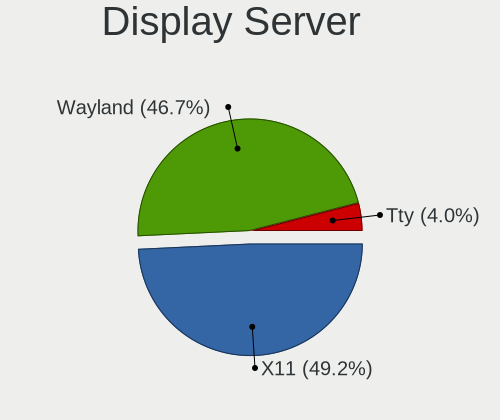
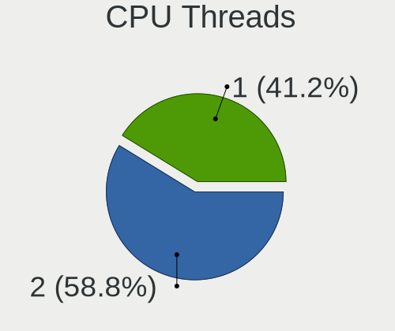
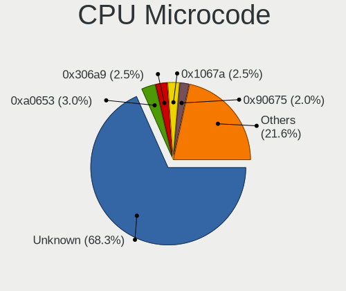
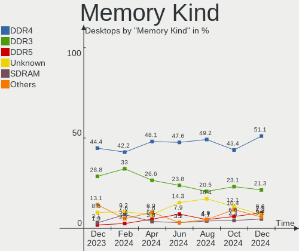
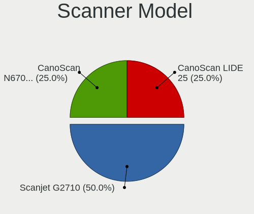

Linux in Russia - Hardware Trends (Desktops)
--------------------------------------------

A project to identify most popular hardware characteristics and track their change
over time based on data collected by Linux users at https://Linux-Hardware.org.

Anyone can contribute to this report by the [hw-probe](https://github.com/linuxhw/hw-probe) tool:

    sudo -E hw-probe -all -upload

Contents
--------

* [ System ](#system)
  - [ OS                       ](#os)
  - [ OS Family                ](#os-family)
  - [ Kernel                   ](#kernel)
  - [ Kernel Family            ](#kernel-family)
  - [ Kernel Major Ver.        ](#kernel-major-ver)
  - [ Arch                     ](#arch)
  - [ DE                       ](#de)
  - [ Display Server           ](#display-server)
  - [ Display Manager          ](#display-manager)
  - [ OS Lang                  ](#os-lang)
  - [ Boot Mode                ](#boot-mode)
  - [ Filesystem               ](#filesystem)
  - [ Part. scheme             ](#part-scheme)
  - [ Dual Boot with Linux/BSD ](#dual-boot-with-linuxbsd)
  - [ Dual Boot (Win)          ](#dual-boot-win)

* [ Board ](#board)
  - [ Vendor                   ](#vendor)
  - [ Model                    ](#model)
  - [ Model Family             ](#model-family)
  - [ MFG Year                 ](#mfg-year)
  - [ Form Factor              ](#form-factor)
  - [ Secure Boot              ](#secure-boot)
  - [ Coreboot                 ](#coreboot)
  - [ RAM Size                 ](#ram-size)
  - [ RAM Used                 ](#ram-used)
  - [ Total Drives             ](#total-drives)
  - [ Has CD-ROM               ](#has-cd-rom)
  - [ Has Ethernet             ](#has-ethernet)
  - [ Has WiFi                 ](#has-wifi)
  - [ Has Bluetooth            ](#has-bluetooth)

* [ Location ](#location)
  - [ Country                  ](#country)
  - [ City                     ](#city)

* [ Drives ](#drives)
  - [ Drive Vendor             ](#drive-vendor)
  - [ Drive Model              ](#drive-model)
  - [ HDD Vendor               ](#hdd-vendor)
  - [ SSD Vendor               ](#ssd-vendor)
  - [ Drive Kind               ](#drive-kind)
  - [ Drive Connector          ](#drive-connector)
  - [ Drive Size               ](#drive-size)
  - [ Space Total              ](#space-total)
  - [ Space Used               ](#space-used)
  - [ Malfunc. Drives          ](#malfunc-drives)
  - [ Malfunc. Drive Vendor    ](#malfunc-drive-vendor)
  - [ Malfunc. HDD Vendor      ](#malfunc-hdd-vendor)
  - [ Malfunc. Drive Kind      ](#malfunc-drive-kind)
  - [ Failed Drives            ](#failed-drives)
  - [ Failed Drive Vendor      ](#failed-drive-vendor)
  - [ Drive Status             ](#drive-status)

* [ Storage controller ](#storage-controller)
  - [ Storage Vendor           ](#storage-vendor)
  - [ Storage Model            ](#storage-model)
  - [ Storage Kind             ](#storage-kind)

* [ Processor ](#processor)
  - [ CPU Vendor               ](#cpu-vendor)
  - [ CPU Model                ](#cpu-model)
  - [ CPU Model Family         ](#cpu-model-family)
  - [ CPU Cores                ](#cpu-cores)
  - [ CPU Sockets              ](#cpu-sockets)
  - [ CPU Threads              ](#cpu-threads)
  - [ CPU Op-Modes             ](#cpu-op-modes)
  - [ CPU Microcode            ](#cpu-microcode)
  - [ CPU Microarch            ](#cpu-microarch)

* [ Graphics ](#graphics)
  - [ GPU Vendor               ](#gpu-vendor)
  - [ GPU Model                ](#gpu-model)
  - [ GPU Combo                ](#gpu-combo)
  - [ GPU Driver               ](#gpu-driver)
  - [ GPU Memory               ](#gpu-memory)

* [ Monitor ](#monitor)
  - [ Monitor Vendor           ](#monitor-vendor)
  - [ Monitor Model            ](#monitor-model)
  - [ Monitor Resolution       ](#monitor-resolution)
  - [ Monitor Diagonal         ](#monitor-diagonal)
  - [ Monitor Width            ](#monitor-width)
  - [ Aspect Ratio             ](#aspect-ratio)
  - [ Monitor Area             ](#monitor-area)
  - [ Pixel Density            ](#pixel-density)
  - [ Multiple Monitors        ](#multiple-monitors)

* [ Network ](#network)
  - [ Net Controller Vendor    ](#net-controller-vendor)
  - [ Net Controller Model     ](#net-controller-model)
  - [ Wireless Vendor          ](#wireless-vendor)
  - [ Wireless Model           ](#wireless-model)
  - [ Ethernet Vendor          ](#ethernet-vendor)
  - [ Ethernet Model           ](#ethernet-model)
  - [ Net Controller Kind      ](#net-controller-kind)
  - [ Used Controller          ](#used-controller)
  - [ NICs                     ](#nics)
  - [ IPv6                     ](#ipv6)

* [ Bluetooth ](#bluetooth)
  - [ Bluetooth Vendor         ](#bluetooth-vendor)
  - [ Bluetooth Model          ](#bluetooth-model)

* [ Sound ](#sound)
  - [ Sound Vendor             ](#sound-vendor)
  - [ Sound Model              ](#sound-model)

* [ Memory ](#memory)
  - [ Memory Vendor            ](#memory-vendor)
  - [ Memory Model             ](#memory-model)
  - [ Memory Kind              ](#memory-kind)
  - [ Memory Form Factor       ](#memory-form-factor)
  - [ Memory Size              ](#memory-size)
  - [ Memory Speed             ](#memory-speed)

* [ Printers & scanners ](#printers--scanners)
  - [ Printer Vendor           ](#printer-vendor)
  - [ Printer Model            ](#printer-model)
  - [ Scanner Vendor           ](#scanner-vendor)
  - [ Scanner Model            ](#scanner-model)

* [ Camera ](#camera)
  - [ Camera Vendor            ](#camera-vendor)
  - [ Camera Model             ](#camera-model)

* [ Security ](#security)
  - [ Fingerprint Vendor       ](#fingerprint-vendor)
  - [ Fingerprint Model        ](#fingerprint-model)
  - [ Chipcard Vendor          ](#chipcard-vendor)
  - [ Chipcard Model           ](#chipcard-model)

* [ Unsupported ](#unsupported)
  - [ Unsupported Devices      ](#unsupported-devices)
  - [ Unsupported Device Types ](#unsupported-device-types)

System
------

OS
--

Installed operating systems

| Name                  | Desktops | Percent |
|-----------------------|----------|---------|
| ROSA 12.2             | 178      | 43.31%  |
| Kometa P10            | 79       | 19.22%  |
| Debian 11             | 32       | 7.79%   |
| ROSA R11.1            | 21       | 5.11%   |
| OpenMandriva 4.3      | 16       | 3.89%   |
| Ubuntu 20.04          | 13       | 3.16%   |
| Linux Mint 20.3       | 9        | 2.19%   |
| Manjaro               | 5        | 1.22%   |
| Fedora 35             | 5        | 1.22%   |
| ROSA R11              | 4        | 0.97%   |
| ROSA 12.1             | 4        | 0.97%   |
| Zorin 16              | 3        | 0.73%   |
| Ubuntu 21.10          | 3        | 0.73%   |
| ROSA 12               | 3        | 0.73%   |
| Ubuntu 18.04          | 2        | 0.49%   |
| RELS 7.9              | 2        | 0.49%   |
| Red OS 7.3.1          | 2        | 0.49%   |
| Red OS 7.3            | 2        | 0.49%   |
| Manjaro 21.2.5        | 2        | 0.49%   |
| Linux Mint 19.3       | 2        | 0.49%   |
| Kubuntu 22.04         | 2        | 0.49%   |
| Kubuntu 20.04         | 2        | 0.49%   |
| Fedora 36             | 2        | 0.49%   |
| Arch Rolling          | 2        | 0.49%   |
| Ubuntu 22.04          | 1        | 0.24%   |
| Ubuntu 16.04          | 1        | 0.24%   |
| Solus 4.3             | 1        | 0.24%   |
| Rocky Linux 8.5       | 1        | 0.24%   |
| Pop!_OS 21.10         | 1        | 0.24%   |
| org.kde.Platform 5.15 | 1        | 0.24%   |
| openSUSE Leap-15.3    | 1        | 0.24%   |
| MOS 10                | 1        | 0.24%   |
| Manjaro 21.2.2        | 1        | 0.24%   |
| LMDE 5                | 1        | 0.24%   |
| KDE neon 20.04        | 1        | 0.24%   |
| Gentoo 2.6            | 1        | 0.24%   |
| Debian Testing        | 1        | 0.24%   |
| ALT Linux 8           | 1        | 0.24%   |
| ALT Linux 10.0.900    | 1        | 0.24%   |
| ALT Linux 10.0        | 1        | 0.24%   |

OS Family
---------

OS without a version

| Name             | Desktops | Percent |
|------------------|----------|---------|
| ROSA             | 210      | 51.09%  |
| ALT Linux        | 83       | 20.19%  |
| Debian           | 33       | 8.03%   |
| Ubuntu           | 20       | 4.87%   |
| OpenMandriva     | 16       | 3.89%   |
| Linux Mint       | 11       | 2.68%   |
| Manjaro          | 8        | 1.95%   |
| Fedora           | 7        | 1.7%    |
| Red OS           | 4        | 0.97%   |
| Kubuntu          | 4        | 0.97%   |
| Zorin            | 3        | 0.73%   |
| RELS             | 2        | 0.49%   |
| Arch             | 2        | 0.49%   |
| Solus            | 1        | 0.24%   |
| Rocky Linux      | 1        | 0.24%   |
| Pop!_OS          | 1        | 0.24%   |
| org.kde.Platform | 1        | 0.24%   |
| openSUSE         | 1        | 0.24%   |
| LMDE             | 1        | 0.24%   |
| KDE neon         | 1        | 0.24%   |
| Gentoo           | 1        | 0.24%   |

Kernel
------

Version of the Linux kernel

| Version                                    | Desktops | Percent |
|--------------------------------------------|----------|---------|
| 5.10.74-generic-2rosa2021.1-x86_64         | 160      | 38.93%  |
| 5.10.109-std-def-alt1                      | 49       | 11.92%  |
| 5.10.0-7-amd64                             | 30       | 7.3%    |
| 5.10.102-std-def-alt1                      | 25       | 6.08%   |
| 5.16.7-desktop-1omv4003                    | 16       | 3.89%   |
| 5.15.32-generic-5rosa2021.1-x86_64         | 11       | 2.68%   |
| 5.13.0-39-generic                          | 11       | 2.68%   |
| 4.15.0-desktop-122.124.1rosa-x86_64        | 7        | 1.7%    |
| 5.4.83-generic-2rosa-x86_64                | 6        | 1.46%   |
| 5.15.32-un-def-alt1                        | 6        | 1.46%   |
| 5.4.0-109-generic                          | 5        | 1.22%   |
| 5.4.0-107-generic                          | 5        | 1.22%   |
| 5.13.0-40-generic                          | 5        | 1.22%   |
| 5.15.32-generic-6rosa2021.1-x86_64         | 4        | 0.97%   |
| 5.4.83-generic-2rosa-i586                  | 3        | 0.73%   |
| 5.4.32-generic-2rosa-x86_64                | 3        | 0.73%   |
| 5.15.10-3.el7.x86_64                       | 3        | 0.73%   |
| 5.10.0-13-amd64                            | 3        | 0.73%   |
| 5.4.0-42-generic                           | 2        | 0.49%   |
| 5.4.0-105-generic                          | 2        | 0.49%   |
| 5.17.1-zen1-1-zen                          | 2        | 0.49%   |
| 5.16.20-generic-1rosa2021.1-x86_64         | 2        | 0.49%   |
| 5.16.19-200.fc35.x86_64                    | 2        | 0.49%   |
| 5.16.18-generic-1rosa2021.1-x86_64         | 2        | 0.49%   |
| 5.16.18-200.fc35.x86_64                    | 2        | 0.49%   |
| 5.15.33-1.res7.x86_64                      | 2        | 0.49%   |
| 5.15.32-1-MANJARO                          | 2        | 0.49%   |
| 5.15.28-1-MANJARO                          | 2        | 0.49%   |
| 5.15.0-27-generic                          | 2        | 0.49%   |
| 5.10.74-generic-2rosa2021.1-i586           | 2        | 0.49%   |
| 5.10.71-generic-1rosa2021.1-x86_64         | 2        | 0.49%   |
| 4.15.0-desktop-45.1rosa-x86_64             | 2        | 0.49%   |
| 4.15.0-desktop-45.1rosa-i586               | 2        | 0.49%   |
| 5.4.91-generic-1rosa2021.1-e2kv4           | 1        | 0.24%   |
| 5.4.32-generic-2rosa-i586                  | 1        | 0.24%   |
| 5.4.0-81-generic                           | 1        | 0.24%   |
| 5.4.0-108-generic                          | 1        | 0.24%   |
| 5.4.0-104-generic                          | 1        | 0.24%   |
| 5.17.3-302.fc36.x86_64                     | 1        | 0.24%   |
| 5.17.2-300.fc36.x86_64                     | 1        | 0.24%   |
| 5.17.2-1.gb49cf22-default                  | 1        | 0.24%   |
| 5.16.2-2-rt19-MANJARO                      | 1        | 0.24%   |
| 5.16.19-76051619-generic                   | 1        | 0.24%   |
| 5.16.16.xm1-1.klp-xanmod-rosa2021.1-x86_64 | 1        | 0.24%   |
| 5.16.16-200.fc35.x86_64                    | 1        | 0.24%   |
| 5.16.0-6-amd64                             | 1        | 0.24%   |
| 5.15.32-1-lts                              | 1        | 0.24%   |
| 5.15.26-gentoo                             | 1        | 0.24%   |
| 5.15.16-1-MANJARO                          | 1        | 0.24%   |
| 5.15.0-25-generic                          | 1        | 0.24%   |
| 5.13.1-187.current                         | 1        | 0.24%   |
| 5.10.83-std-def-alt0.c9f.2                 | 1        | 0.24%   |
| 5.10.82-std-def-alt1                       | 1        | 0.24%   |
| 5.10.29-1.el7.x86_64                       | 1        | 0.24%   |
| 5.10.110-std-def-alt1                      | 1        | 0.24%   |
| 5.10.105-1-MANJARO                         | 1        | 0.24%   |
| 5.10.101-amd64-desktop                     | 1        | 0.24%   |
| 4.8.0-36-generic                           | 1        | 0.24%   |
| 4.19.72-nrj-desktop-1rosa-x86_64           | 1        | 0.24%   |
| 4.18.0-348.20.1.el8_5.x86_64               | 1        | 0.24%   |

Kernel Family
-------------

Linux kernel without a distro release

| Version  | Desktops | Percent |
|----------|----------|---------|
| 5.10.74  | 162      | 39.42%  |
| 5.10.109 | 49       | 11.92%  |
| 5.10.0   | 33       | 8.03%   |
| 5.10.102 | 25       | 6.08%   |
| 5.15.32  | 24       | 5.84%   |
| 5.4.0    | 17       | 4.14%   |
| 5.16.7   | 16       | 3.89%   |
| 5.13.0   | 16       | 3.89%   |
| 4.15.0   | 13       | 3.16%   |
| 5.4.83   | 9        | 2.19%   |
| 5.4.32   | 4        | 0.97%   |
| 5.16.18  | 4        | 0.97%   |
| 5.16.19  | 3        | 0.73%   |
| 5.15.10  | 3        | 0.73%   |
| 5.15.0   | 3        | 0.73%   |
| 5.17.2   | 2        | 0.49%   |
| 5.17.1   | 2        | 0.49%   |
| 5.16.20  | 2        | 0.49%   |
| 5.16.16  | 2        | 0.49%   |
| 5.15.33  | 2        | 0.49%   |
| 5.15.28  | 2        | 0.49%   |
| 5.10.71  | 2        | 0.49%   |
| 5.4.91   | 1        | 0.24%   |
| 5.17.3   | 1        | 0.24%   |
| 5.16.2   | 1        | 0.24%   |
| 5.16.0   | 1        | 0.24%   |
| 5.15.26  | 1        | 0.24%   |
| 5.15.16  | 1        | 0.24%   |
| 5.13.1   | 1        | 0.24%   |
| 5.10.83  | 1        | 0.24%   |
| 5.10.82  | 1        | 0.24%   |
| 5.10.29  | 1        | 0.24%   |
| 5.10.110 | 1        | 0.24%   |
| 5.10.105 | 1        | 0.24%   |
| 5.10.101 | 1        | 0.24%   |
| 4.8.0    | 1        | 0.24%   |
| 4.19.72  | 1        | 0.24%   |
| 4.18.0   | 1        | 0.24%   |

Kernel Major Ver.
-----------------

Linux kernel major version

| Version | Desktops | Percent |
|---------|----------|---------|
| 5.10    | 277      | 67.4%   |
| 5.15    | 36       | 8.76%   |
| 5.4     | 31       | 7.54%   |
| 5.16    | 29       | 7.06%   |
| 5.13    | 17       | 4.14%   |
| 4.15    | 13       | 3.16%   |
| 5.17    | 5        | 1.22%   |
| 4.8     | 1        | 0.24%   |
| 4.19    | 1        | 0.24%   |
| 4.18    | 1        | 0.24%   |

Arch
----

OS architecture (x86_64, i586, etc.)

| Name   | Desktops | Percent |
|--------|----------|---------|
| x86_64 | 402      | 97.81%  |
| i686   | 8        | 1.95%   |
| e2k    | 1        | 0.24%   |

DE
--

Desktop Environment

| Name       | Desktops | Percent |
|------------|----------|---------|
| KDE5       | 199      | 48.42%  |
| GNOME      | 107      | 26.03%  |
| Unknown    | 33       | 8.03%   |
| LXQt       | 27       | 6.57%   |
| KDE4       | 18       | 4.38%   |
| X-Cinnamon | 10       | 2.43%   |
| MATE       | 6        | 1.46%   |
| Cinnamon   | 4        | 0.97%   |
| XFCE       | 3        | 0.73%   |
| xmonad     | 1        | 0.24%   |
| i3         | 1        | 0.24%   |
| Deepin     | 1        | 0.24%   |
| Budgie     | 1        | 0.24%   |

Display Server
--------------

X11 or Wayland

| Name    | Desktops | Percent |
|---------|----------|---------|
| X11     | 222      | 54.01%  |
| Wayland | 153      | 37.23%  |
| Unknown | 33       | 8.03%   |
| Tty     | 3        | 0.73%   |

Display Manager
---------------

SDDM, LightDM, etc.

| Name    | Desktops | Percent |
|---------|----------|---------|
| SDDM    | 191      | 46.47%  |
| GDM     | 115      | 27.98%  |
| Unknown | 57       | 13.87%  |
| KDM     | 18       | 4.38%   |
| LightDM | 15       | 3.65%   |
| GDM3    | 14       | 3.41%   |
| LXDM    | 1        | 0.24%   |

OS Lang
-------

Language

| Lang    | Desktops | Percent |
|---------|----------|---------|
| ru_RU   | 376      | 91.48%  |
| en_US   | 23       | 5.6%    |
| Unknown | 10       | 2.43%   |
| POSIX   | 1        | 0.24%   |
| C.UTF8  | 1        | 0.24%   |

Boot Mode
---------

EFI or BIOS

| Mode | Desktops | Percent |
|------|----------|---------|
| EFI  | 217      | 52.8%   |
| BIOS | 194      | 47.2%   |

Filesystem
----------

Type of filesystem

| Type    | Desktops | Percent |
|---------|----------|---------|
| Ext4    | 342      | 83.21%  |
| Overlay | 47       | 11.44%  |
| Btrfs   | 17       | 4.14%   |
| Xfs     | 5        | 1.22%   |

Part. scheme
------------

Scheme of partitioning

| Type    | Desktops | Percent |
|---------|----------|---------|
| GPT     | 251      | 61.07%  |
| MBR     | 120      | 29.2%   |
| Unknown | 40       | 9.73%   |

Dual Boot with Linux/BSD
------------------------

Hosting more than one Linux/BSD

| Dual boot | Desktops | Percent |
|-----------|----------|---------|
| No        | 321      | 78.1%   |
| Yes       | 90       | 21.9%   |

Dual Boot (Win)
---------------

Hosting Linux and Windows

| Dual boot | Desktops | Percent |
|-----------|----------|---------|
| No        | 209      | 50.85%  |
| Yes       | 202      | 49.15%  |

Board
-----

Vendor
------

Motherboard manufacturer

| Name                | Desktops | Percent |
|---------------------|----------|---------|
| ASUSTek Computer    | 123      | 29.93%  |
| Gigabyte Technology | 104      | 25.3%   |
| Intel               | 48       | 11.68%  |
| MSI                 | 41       | 9.98%   |
| ASRock              | 36       | 8.76%   |
| Acer                | 14       | 3.41%   |
| Unknown             | 13       | 3.16%   |
| ECS                 | 7        | 1.7%    |
| Biostar             | 6        | 1.46%   |
| Lenovo              | 3        | 0.73%   |
| Dell                | 3        | 0.73%   |
| KLLISRE             | 2        | 0.49%   |
| Huanan              | 2        | 0.49%   |
| SYWZ                | 1        | 0.24%   |
| MACHINIST           | 1        | 0.24%   |
| Lite-On             | 1        | 0.24%   |
| Hewlett-Packard     | 1        | 0.24%   |
| Fujitsu             | 1        | 0.24%   |
| Foxconn             | 1        | 0.24%   |
| EPoX Computer       | 1        | 0.24%   |
| Colorful Technology | 1        | 0.24%   |
| 3Logic Group        | 1        | 0.24%   |

Model
-----

Motherboard model

| Name                              | Desktops | Percent |
|-----------------------------------|----------|---------|
| Intel SKYBAY                      | 42       | 10.22%  |
| Gigabyte H410M S2H                | 15       | 3.65%   |
| ASUS All Series                   | 13       | 3.16%   |
| Unknown                           | 13       | 3.16%   |
| ASUS PRIME B450-PLUS              | 12       | 2.92%   |
| Acer Veriton X2640G               | 10       | 2.43%   |
| MSI MS-7D22                       | 4        | 0.97%   |
| ASUS M5A78L-M LX3                 | 4        | 0.97%   |
| MSI MS-7592                       | 3        | 0.73%   |
| Gigabyte H110M-S2H                | 3        | 0.73%   |
| Gigabyte B450 AORUS ELITE         | 3        | 0.73%   |
| MSI MS-7817                       | 2        | 0.49%   |
| MSI MS-7529                       | 2        | 0.49%   |
| MSI GEG                           | 2        | 0.49%   |
| KLLISRE X99-B5 V1.1               | 2        | 0.49%   |
| Gigabyte X470 AORUS GAMING 7 WIFI | 2        | 0.49%   |
| Gigabyte M61PME-S2P               | 2        | 0.49%   |
| Gigabyte H61M-S2PV                | 2        | 0.49%   |
| Gigabyte H61M-S1                  | 2        | 0.49%   |
| Gigabyte B75M-D2V                 | 2        | 0.49%   |
| Gigabyte B550M DS3H               | 2        | 0.49%   |
| Gigabyte B450M DS3H V2            | 2        | 0.49%   |
| Gigabyte A320M-S2H V2             | 2        | 0.49%   |
| Gigabyte A320M-S2H                | 2        | 0.49%   |
| Gigabyte A320M-H                  | 2        | 0.49%   |
| Gigabyte 970A-DS3P                | 2        | 0.49%   |
| Gigabyte 945GCM-S2L               | 2        | 0.49%   |
| ECS H61H2-M13                     | 2        | 0.49%   |
| ASUS TUF B450-PRO GAMING          | 2        | 0.49%   |
| ASUS SABERTOOTH 990FX             | 2        | 0.49%   |
| ASUS PRIME H570-PLUS              | 2        | 0.49%   |
| ASUS PRIME H510M-K                | 2        | 0.49%   |
| ASUS PRIME B450M-K                | 2        | 0.49%   |
| ASUS PRIME B450M-A                | 2        | 0.49%   |
| ASUS P8Z77-V LX                   | 2        | 0.49%   |
| ASUS P8H61-M LE                   | 2        | 0.49%   |
| ASUS P8B75-M                      | 2        | 0.49%   |
| ASUS P5KPL-AM                     | 2        | 0.49%   |
| ASUS P5B                          | 2        | 0.49%   |
| ASUS H61M-K                       | 2        | 0.49%   |
| ASUS H110M-K                      | 2        | 0.49%   |
| ASRock G31M-VS2                   | 2        | 0.49%   |
| ASRock B560 Pro4                  | 2        | 0.49%   |
| ASRock B450 Pro4                  | 2        | 0.49%   |
| ASRock A320M-DVS R4.0             | 2        | 0.49%   |
| SYWZ S200 Series                  | 1        | 0.24%   |
| MSI MS-7D54                       | 1        | 0.24%   |
| MSI MS-7C91                       | 1        | 0.24%   |
| MSI MS-7C90                       | 1        | 0.24%   |
| MSI MS-7C75                       | 1        | 0.24%   |
| MSI MS-7C02                       | 1        | 0.24%   |
| MSI MS-7B98                       | 1        | 0.24%   |
| MSI MS-7B86                       | 1        | 0.24%   |
| MSI MS-7B79                       | 1        | 0.24%   |
| MSI MS-7B48                       | 1        | 0.24%   |
| MSI MS-7B24                       | 1        | 0.24%   |
| MSI MS-7B22                       | 1        | 0.24%   |
| MSI MS-7B17                       | 1        | 0.24%   |
| MSI MS-7A71                       | 1        | 0.24%   |
| MSI MS-7A70                       | 1        | 0.24%   |

Model Family
------------

Motherboard model prefix

| Name                | Desktops | Percent |
|---------------------|----------|---------|
| Intel SKYBAY        | 42       | 10.22%  |
| ASUS PRIME          | 33       | 8.03%   |
| Gigabyte H410M      | 16       | 3.89%   |
| ASUS All            | 13       | 3.16%   |
| Unknown             | 13       | 3.16%   |
| Acer Veriton        | 10       | 2.43%   |
| ASUS M5A78L-M       | 7        | 1.7%    |
| Gigabyte B450M      | 5        | 1.22%   |
| Gigabyte B450       | 5        | 1.22%   |
| ASUS TUF            | 5        | 1.22%   |
| MSI MS-7D22         | 4        | 0.97%   |
| Gigabyte B550M      | 4        | 0.97%   |
| Gigabyte A320M-S2H  | 4        | 0.97%   |
| ASUS P8H61-M        | 4        | 0.97%   |
| Acer Aspire         | 4        | 0.97%   |
| MSI MS-7592         | 3        | 0.73%   |
| Gigabyte H110M-S2H  | 3        | 0.73%   |
| Dell OptiPlex       | 3        | 0.73%   |
| ASUS P8Z77-V        | 3        | 0.73%   |
| ASUS P8B75-M        | 3        | 0.73%   |
| ASUS P5KPL-AM       | 3        | 0.73%   |
| ASRock B560         | 3        | 0.73%   |
| MSI MS-7817         | 2        | 0.49%   |
| MSI MS-7529         | 2        | 0.49%   |
| MSI GEG             | 2        | 0.49%   |
| Lenovo ThinkCentre  | 2        | 0.49%   |
| KLLISRE X99-B5      | 2        | 0.49%   |
| Gigabyte X570       | 2        | 0.49%   |
| Gigabyte X470       | 2        | 0.49%   |
| Gigabyte M61PME-S2P | 2        | 0.49%   |
| Gigabyte H61M-S2PV  | 2        | 0.49%   |
| Gigabyte H61M-S1    | 2        | 0.49%   |
| Gigabyte H310M      | 2        | 0.49%   |
| Gigabyte B75M-D2V   | 2        | 0.49%   |
| Gigabyte A320M-H    | 2        | 0.49%   |
| Gigabyte 970A-DS3P  | 2        | 0.49%   |
| Gigabyte 945GCM-S2L | 2        | 0.49%   |
| ECS H61H2-M13       | 2        | 0.49%   |
| ASUS SABERTOOTH     | 2        | 0.49%   |
| ASUS ROG            | 2        | 0.49%   |
| ASUS P8H67-M        | 2        | 0.49%   |
| ASUS P5Q            | 2        | 0.49%   |
| ASUS P5K            | 2        | 0.49%   |
| ASUS P5G41T-M       | 2        | 0.49%   |
| ASUS P5B            | 2        | 0.49%   |
| ASUS M5A99X         | 2        | 0.49%   |
| ASUS H61M-K         | 2        | 0.49%   |
| ASUS H110M-K        | 2        | 0.49%   |
| ASRock G31M-VS2     | 2        | 0.49%   |
| ASRock B450M        | 2        | 0.49%   |
| ASRock B450         | 2        | 0.49%   |
| ASRock A320M-DVS    | 2        | 0.49%   |
| SYWZ S200           | 1        | 0.24%   |
| MSI MS-7D54         | 1        | 0.24%   |
| MSI MS-7C91         | 1        | 0.24%   |
| MSI MS-7C90         | 1        | 0.24%   |
| MSI MS-7C75         | 1        | 0.24%   |
| MSI MS-7C02         | 1        | 0.24%   |
| MSI MS-7B98         | 1        | 0.24%   |
| MSI MS-7B86         | 1        | 0.24%   |

MFG Year
--------

Motherboard manufacture year

| Year    | Desktops | Percent |
|---------|----------|---------|
| 2018    | 75       | 18.25%  |
| 2017    | 41       | 9.98%   |
| 2020    | 40       | 9.73%   |
| 2012    | 36       | 8.76%   |
| 2021    | 29       | 7.06%   |
| 2013    | 29       | 7.06%   |
| 2016    | 26       | 6.33%   |
| 2011    | 26       | 6.33%   |
| 2010    | 20       | 4.87%   |
| 2008    | 20       | 4.87%   |
| 2019    | 16       | 3.89%   |
| 2009    | 15       | 3.65%   |
| 2015    | 10       | 2.43%   |
| 2006    | 9        | 2.19%   |
| 2014    | 8        | 1.95%   |
| 2007    | 7        | 1.7%    |
| 2022    | 2        | 0.49%   |
| 2005    | 1        | 0.24%   |
| Unknown | 1        | 0.24%   |

Form Factor
-----------

Physical design of the computer

| Name    | Desktops | Percent |
|---------|----------|---------|
| Desktop | 411      | 100%    |

Secure Boot
-----------

Enabled or disabled

| State    | Desktops | Percent |
|----------|----------|---------|
| Disabled | 403      | 98.05%  |
| Enabled  | 8        | 1.95%   |

Coreboot
--------

Have coreboot on board

| Used | Desktops | Percent |
|------|----------|---------|
| No   | 411      | 100%    |

RAM Size
--------

Total RAM memory

| Size in GB  | Desktops | Percent |
|-------------|----------|---------|
| 8.01-16.0   | 133      | 32.36%  |
| 16.01-24.0  | 101      | 24.57%  |
| 3.01-4.0    | 63       | 15.33%  |
| 4.01-8.0    | 58       | 14.11%  |
| 32.01-64.0  | 25       | 6.08%   |
| 64.01-256.0 | 9        | 2.19%   |
| 1.01-2.0    | 9        | 2.19%   |
| 24.01-32.0  | 6        | 1.46%   |
| 2.01-3.0    | 6        | 1.46%   |
| 0.51-1.0    | 1        | 0.24%   |

RAM Used
--------

Used RAM memory

| Used GB    | Desktops | Percent |
|------------|----------|---------|
| 1.01-2.0   | 200      | 48.66%  |
| 0.51-1.0   | 101      | 24.57%  |
| 2.01-3.0   | 54       | 13.14%  |
| 4.01-8.0   | 31       | 7.54%   |
| 3.01-4.0   | 18       | 4.38%   |
| 8.01-16.0  | 4        | 0.97%   |
| 0.01-0.5   | 2        | 0.49%   |
| 16.01-24.0 | 1        | 0.24%   |

Total Drives
------------

Number of drives on board

| Drives | Desktops | Percent |
|--------|----------|---------|
| 1      | 195      | 47.45%  |
| 2      | 122      | 29.68%  |
| 3      | 52       | 12.65%  |
| 4      | 24       | 5.84%   |
| 5      | 12       | 2.92%   |
| 6      | 4        | 0.97%   |
| 8      | 1        | 0.24%   |
| 7      | 1        | 0.24%   |

Has CD-ROM
----------

Has CD-ROM on board

| Presented | Desktops | Percent |
|-----------|----------|---------|
| No        | 281      | 68.37%  |
| Yes       | 130      | 31.63%  |

Has Ethernet
------------

Has Ethernet on board

| Presented | Desktops | Percent |
|-----------|----------|---------|
| Yes       | 409      | 99.51%  |
| No        | 2        | 0.49%   |

Has WiFi
--------

Has WiFi module

| Presented | Desktops | Percent |
|-----------|----------|---------|
| No        | 325      | 79.08%  |
| Yes       | 86       | 20.92%  |

Has Bluetooth
-------------

Has Bluetooth module

| Presented | Desktops | Percent |
|-----------|----------|---------|
| No        | 336      | 81.75%  |
| Yes       | 75       | 18.25%  |

Location
--------

Country
-------

Geographic location (country)

| Country | Desktops | Percent |
|---------|----------|---------|
| Russia  | 411      | 100%    |

City
----

Geographic location (city)

| City              | Desktops | Percent |
|-------------------|----------|---------|
| Moscow            | 126      | 30.66%  |
| Voronezh          | 34       | 8.27%   |
| St Petersburg     | 28       | 6.81%   |
| Rostov-on-Don     | 11       | 2.68%   |
| Samara            | 10       | 2.43%   |
| Volgograd         | 9        | 2.19%   |
| Perm              | 7        | 1.7%    |
| Novosibirsk       | 7        | 1.7%    |
| Chelyabinsk       | 7        | 1.7%    |
| Yekaterinburg     | 6        | 1.46%   |
| Nizhniy Novgorod  | 6        | 1.46%   |
| Krasnoyarsk       | 6        | 1.46%   |
| Krasnodar         | 6        | 1.46%   |
| Vladivostok       | 5        | 1.22%   |
| Tyumen            | 4        | 0.97%   |
| Murmansk          | 4        | 0.97%   |
| Lipetsk           | 4        | 0.97%   |
| Ufa               | 3        | 0.73%   |
| Tver              | 3        | 0.73%   |
| Tula              | 3        | 0.73%   |
| Saratov           | 3        | 0.73%   |
| Pskov             | 3        | 0.73%   |
| Orenburg          | 3        | 0.73%   |
| Nizhny Tagil      | 3        | 0.73%   |
| Murom             | 3        | 0.73%   |
| Kazan’          | 3        | 0.73%   |
| Izhevsk           | 3        | 0.73%   |
| Irkutsk           | 3        | 0.73%   |
| Gatchina          | 3        | 0.73%   |
| Bryansk           | 3        | 0.73%   |
| Barnaul           | 3        | 0.73%   |
| Tomsk             | 2        | 0.49%   |
| Tolyatti          | 2        | 0.49%   |
| Tambov            | 2        | 0.49%   |
| Syktyvkar         | 2        | 0.49%   |
| Surgut            | 2        | 0.49%   |
| Severodvinsk      | 2        | 0.49%   |
| Petrozavodsk      | 2        | 0.49%   |
| Omsk              | 2        | 0.49%   |
| Novocherkassk     | 2        | 0.49%   |
| Noril'sk          | 2        | 0.49%   |
| Mirny             | 2        | 0.49%   |
| Kostroma          | 2        | 0.49%   |
| Kirov             | 2        | 0.49%   |
| Kemerovo          | 2        | 0.49%   |
| Cheboksary        | 2        | 0.49%   |
| Belgorod          | 2        | 0.49%   |
| Zhukovskiy        | 1        | 0.24%   |
| Zheleznogorsk     | 1        | 0.24%   |
| Zelenodolsk       | 1        | 0.24%   |
| Yuzhno-Sakhalinsk | 1        | 0.24%   |
| Yoshkar-Ola       | 1        | 0.24%   |
| Yeysk             | 1        | 0.24%   |
| Yantikovo         | 1        | 0.24%   |
| Vladikavkaz       | 1        | 0.24%   |
| Velizh            | 1        | 0.24%   |
| Velikiye Luki     | 1        | 0.24%   |
| Valuyki           | 1        | 0.24%   |
| Ussuriysk         | 1        | 0.24%   |
| Ulyanovsk         | 1        | 0.24%   |

Drives
------

Drive Vendor
------------

Hard drive vendors

| Vendor              | Desktops | Drives | Percent |
|---------------------|----------|--------|---------|
| WDC                 | 141      | 192    | 21.14%  |
| Seagate             | 128      | 159    | 19.19%  |
| Samsung Electronics | 78       | 95     | 11.69%  |
| Toshiba             | 51       | 64     | 7.65%   |
| Kingston            | 51       | 55     | 7.65%   |
| AXIOMTEK            | 25       | 25     | 3.75%   |
| Hitachi             | 19       | 21     | 2.85%   |
| China               | 17       | 17     | 2.55%   |
| A-DATA Technology   | 17       | 18     | 2.55%   |
| Crucial             | 13       | 14     | 1.95%   |
| SPCC                | 12       | 14     | 1.8%    |
| Intel               | 10       | 10     | 1.5%    |
| GOODRAM             | 7        | 8      | 1.05%   |
| Apacer              | 7        | 7      | 1.05%   |
| SanDisk             | 6        | 6      | 0.9%    |
| PLEXTOR             | 6        | 7      | 0.9%    |
| Patriot             | 6        | 6      | 0.9%    |
| MAXTOR              | 6        | 7      | 0.9%    |
| HGST                | 6        | 8      | 0.9%    |
| AMD                 | 6        | 6      | 0.9%    |
| OCZ                 | 5        | 5      | 0.75%   |
| XPG                 | 4        | 4      | 0.6%    |
| Smartbuy            | 4        | 4      | 0.6%    |
| Corsair             | 4        | 4      | 0.6%    |
| QUMO                | 3        | 3      | 0.45%   |
| Netac               | 3        | 3      | 0.45%   |
| Gigabyte Technology | 3        | 3      | 0.45%   |
| Unknown             | 2        | 2      | 0.3%    |
| SK Hynix            | 2        | 2      | 0.3%    |
| Silicon Motion      | 2        | 2      | 0.3%    |
| KingSpec            | 2        | 2      | 0.3%    |
| Fujitsu             | 2        | 2      | 0.3%    |
| ZTE                 | 1        | 1      | 0.15%   |
| USB3.0              | 1        | 1      | 0.15%   |
| USB                 | 1        | 1      | 0.15%   |
| TXRUI               | 1        | 1      | 0.15%   |
| sage                | 1        | 1      | 0.15%   |
| PNY                 | 1        | 1      | 0.15%   |
| Phison              | 1        | 1      | 0.15%   |
| PALIT               | 1        | 1      | 0.15%   |
| Micron Technology   | 1        | 1      | 0.15%   |
| LONDISK             | 1        | 2      | 0.15%   |
| KIOXIA-EXCERIA      | 1        | 1      | 0.15%   |
| Kingmax             | 1        | 1      | 0.15%   |
| KINGBANK            | 1        | 1      | 0.15%   |
| HS-SSD-C100         | 1        | 1      | 0.15%   |
| Hikvision           | 1        | 1      | 0.15%   |
| Hewlett-Packard     | 1        | 1      | 0.15%   |
| GLOWAY              | 1        | 1      | 0.15%   |
| AFOX                | 1        | 1      | 0.15%   |
| Unknown             | 1        | 1      | 0.15%   |

Drive Model
-----------

Hard drive models

| Model                                | Desktops | Percent |
|--------------------------------------|----------|---------|
| Kingston SA400S37240G 240GB SSD      | 28       | 3.67%   |
| AXIOMTEK Corp.-FSA128GMC2T 128GB SSD | 25       | 3.28%   |
| Seagate ST1000DM010-2EP102 1TB       | 20       | 2.62%   |
| Samsung MZVLW128HEGR-00000 128GB     | 17       | 2.23%   |
| Toshiba HDWD120 2TB                  | 14       | 1.83%   |
| Seagate ST500DM002-1BD142 500GB      | 12       | 1.57%   |
| WDC WDS240G2G0A-00JH30 240GB SSD     | 10       | 1.31%   |
| WDC WD5000AZLX-21K2TA0 500GB         | 10       | 1.31%   |
| WDC WD10EZEX-08WN4A0 1TB             | 10       | 1.31%   |
| Toshiba HDWD110 1TB                  | 8        | 1.05%   |
| Toshiba DT01ACA050 500GB             | 8        | 1.05%   |
| Seagate ST3500418AS 500GB            | 8        | 1.05%   |
| WDC WD5000AAKX-001CA0 500GB          | 7        | 0.92%   |
| WDC WDS500G2B0A-00SM50 500GB SSD     | 6        | 0.79%   |
| WDC WDS120G2G0A-00JH30 120GB SSD     | 6        | 0.79%   |
| Toshiba DT01ACA100 1TB               | 6        | 0.79%   |
| Samsung SSD 970 EVO Plus 500GB       | 6        | 0.79%   |
| Samsung SSD 860 EVO 500GB            | 6        | 0.79%   |
| Samsung SSD 860 EVO 250GB            | 6        | 0.79%   |
| WDC WDS240G2G0B-00EPW0 240GB SSD     | 5        | 0.66%   |
| Seagate ST3250410AS 250GB            | 5        | 0.66%   |
| Seagate ST31000528AS 1TB             | 5        | 0.66%   |
| SPCC Solid State Disk 128GB          | 4        | 0.52%   |
| SPCC Solid State Disk 120GB          | 4        | 0.52%   |
| Seagate ST380815AS 80GB              | 4        | 0.52%   |
| Seagate ST3500413AS 500GB            | 4        | 0.52%   |
| Seagate ST3250318AS 250GB            | 4        | 0.52%   |
| Seagate ST1000DM003-1CH162 1TB       | 4        | 0.52%   |
| Samsung SSD 980 1TB                  | 4        | 0.52%   |
| Samsung SSD 850 EVO 250GB            | 4        | 0.52%   |
| Kingston SV300S37A120G 120GB SSD     | 4        | 0.52%   |
| Kingston SNVS500G 500GB              | 4        | 0.52%   |
| Kingston SA400S37120G 120GB SSD      | 4        | 0.52%   |
| Kingston RBUSC180S37256GJ 256GB SSD  | 4        | 0.52%   |
| China SSD 128GB                      | 4        | 0.52%   |
| A-DATA SX6000PNP 512GB               | 4        | 0.52%   |
| WDC WDS240G1G0A-00SS50 240GB SSD     | 3        | 0.39%   |
| WDC WD20EZBX-00AYRA0 2TB             | 3        | 0.39%   |
| WDC WD10EZEX-22MFCA0 1TB             | 3        | 0.39%   |
| WDC WD10EZEX-00BN5A0 1TB             | 3        | 0.39%   |
| WDC WD10EZEX-00BBHA0 1TB             | 3        | 0.39%   |
| WDC WD10EARX-00N0YB0 1TB             | 3        | 0.39%   |
| WDC WD1002FAEX-00Z3A0 1TB            | 3        | 0.39%   |
| Smartbuy SSD 120GB                   | 3        | 0.39%   |
| Seagate ST3320418AS 320GB            | 3        | 0.39%   |
| Seagate ST2000DM008-2FR102 2TB       | 3        | 0.39%   |
| Samsung SSD 970 EVO Plus 250GB       | 3        | 0.39%   |
| Samsung SSD 870 QVO 1TB              | 3        | 0.39%   |
| Patriot P210 128GB SSD               | 3        | 0.39%   |
| Hitachi HDP725050GLA360 500GB        | 3        | 0.39%   |
| Crucial CT250MX500SSD1 250GB         | 3        | 0.39%   |
| Crucial CT240BX500SSD1 240GB         | 3        | 0.39%   |
| XPG GAMMIX S11 Pro 512GB             | 2        | 0.26%   |
| WDC WDS120G2G0B-00EPW0 120GB SSD     | 2        | 0.26%   |
| WDC WDS100T2B0A-00SM50 1TB SSD       | 2        | 0.26%   |
| WDC WD5000LPCX-21VHAT0 500GB         | 2        | 0.26%   |
| WDC WD5000AAKX-08U6AA0 500GB         | 2        | 0.26%   |
| WDC WD5000AAKS-00UU3A0 500GB         | 2        | 0.26%   |
| WDC WD5000AADS-00S9B0 500GB          | 2        | 0.26%   |
| WDC WD20EARX-00PASB0 2TB             | 2        | 0.26%   |

HDD Vendor
----------

Hard disk drive vendors

| Vendor              | Desktops | Drives | Percent |
|---------------------|----------|--------|---------|
| WDC                 | 127      | 151    | 35.67%  |
| Seagate             | 127      | 158    | 35.67%  |
| Toshiba             | 50       | 62     | 14.04%  |
| Hitachi             | 19       | 21     | 5.34%   |
| Samsung Electronics | 15       | 20     | 4.21%   |
| MAXTOR              | 6        | 7      | 1.69%   |
| HGST                | 6        | 8      | 1.69%   |
| Unknown             | 2        | 2      | 0.56%   |
| Fujitsu             | 2        | 2      | 0.56%   |
| USB                 | 1        | 1      | 0.28%   |
| sage                | 1        | 1      | 0.28%   |

SSD Vendor
----------

Solid state drive vendors

| Vendor              | Desktops | Drives | Percent |
|---------------------|----------|--------|---------|
| Kingston            | 45       | 48     | 17.58%  |
| WDC                 | 35       | 40     | 13.67%  |
| Samsung Electronics | 25       | 29     | 9.77%   |
| AXIOMTEK            | 25       | 25     | 9.77%   |
| China               | 17       | 17     | 6.64%   |
| SPCC                | 12       | 13     | 4.69%   |
| Crucial             | 12       | 12     | 4.69%   |
| A-DATA Technology   | 9        | 9      | 3.52%   |
| Intel               | 7        | 7      | 2.73%   |
| GOODRAM             | 7        | 8      | 2.73%   |
| Apacer              | 7        | 7      | 2.73%   |
| SanDisk             | 6        | 6      | 2.34%   |
| PLEXTOR             | 6        | 6      | 2.34%   |
| Patriot             | 5        | 5      | 1.95%   |
| OCZ                 | 5        | 5      | 1.95%   |
| Corsair             | 4        | 4      | 1.56%   |
| Smartbuy            | 3        | 3      | 1.17%   |
| QUMO                | 3        | 3      | 1.17%   |
| Toshiba             | 2        | 2      | 0.78%   |
| Netac               | 2        | 2      | 0.78%   |
| KingSpec            | 2        | 2      | 0.78%   |
| AMD                 | 2        | 2      | 0.78%   |
| USB3.0              | 1        | 1      | 0.39%   |
| TXRUI               | 1        | 1      | 0.39%   |
| Seagate             | 1        | 1      | 0.39%   |
| PNY                 | 1        | 1      | 0.39%   |
| PALIT               | 1        | 1      | 0.39%   |
| Micron Technology   | 1        | 1      | 0.39%   |
| LONDISK             | 1        | 2      | 0.39%   |
| Kingmax             | 1        | 1      | 0.39%   |
| KINGBANK            | 1        | 1      | 0.39%   |
| HS-SSD-C100         | 1        | 1      | 0.39%   |
| Hikvision           | 1        | 1      | 0.39%   |
| Hewlett-Packard     | 1        | 1      | 0.39%   |
| GLOWAY              | 1        | 1      | 0.39%   |
| Gigabyte Technology | 1        | 1      | 0.39%   |
| AFOX                | 1        | 1      | 0.39%   |

Drive Kind
----------

HDD or SSD

| Kind    | Desktops | Drives | Percent |
|---------|----------|--------|---------|
| HDD     | 281      | 433    | 48.2%   |
| SSD     | 219      | 271    | 37.56%  |
| NVMe    | 81       | 89     | 13.89%  |
| Unknown | 2        | 2      | 0.34%   |

Drive Connector
---------------

SATA, SAS, NVMe, etc.

| Type | Desktops | Drives | Percent |
|------|----------|--------|---------|
| SATA | 384      | 698    | 81.18%  |
| NVMe | 81       | 89     | 17.12%  |
| SAS  | 8        | 8      | 1.69%   |

Drive Size
----------

Size of hard drive

| Size in TB | Desktops | Drives | Percent |
|------------|----------|--------|---------|
| 0.01-0.5   | 323      | 467    | 64.09%  |
| 0.51-1.0   | 121      | 157    | 24.01%  |
| 1.01-2.0   | 44       | 62     | 8.73%   |
| 3.01-4.0   | 8        | 10     | 1.59%   |
| 2.01-3.0   | 7        | 7      | 1.39%   |
| 4.01-10.0  | 1        | 1      | 0.2%    |

Space Total
-----------

Amount of disk space available on the file system

| Size in GB     | Desktops | Percent |
|----------------|----------|---------|
| 101-250        | 133      | 32.36%  |
| 251-500        | 72       | 17.52%  |
| 501-1000       | 42       | 10.22%  |
| 1001-2000      | 37       | 9%      |
| 1-20           | 34       | 8.27%   |
| Unknown        | 33       | 8.03%   |
| 51-100         | 24       | 5.84%   |
| 2001-3000      | 15       | 3.65%   |
| 21-50          | 12       | 2.92%   |
| More than 3000 | 9        | 2.19%   |

Space Used
----------

Amount of used disk space

| Used GB        | Desktops | Percent |
|----------------|----------|---------|
| 1-20           | 238      | 57.91%  |
| 21-50          | 45       | 10.95%  |
| Unknown        | 33       | 8.03%   |
| 251-500        | 25       | 6.08%   |
| 101-250        | 23       | 5.6%    |
| 501-1000       | 17       | 4.14%   |
| 51-100         | 14       | 3.41%   |
| 1001-2000      | 11       | 2.68%   |
| More than 3000 | 4        | 0.97%   |
| 2001-3000      | 1        | 0.24%   |

Malfunc. Drives
---------------

Drive models with a malfunction

| Model                             | Desktops | Drives | Percent |
|-----------------------------------|----------|--------|---------|
| Seagate ST3500418AS 500GB         | 5        | 6      | 4.2%    |
| Seagate ST3250410AS 250GB         | 3        | 3      | 2.52%   |
| Seagate ST3250318AS 250GB         | 3        | 3      | 2.52%   |
| WDC WDS240G2G0A-00JH30 240GB SSD  | 2        | 3      | 1.68%   |
| WDC WD5000AAKX-001CA0 500GB       | 2        | 2      | 1.68%   |
| WDC WD20EARX-00PASB0 2TB          | 2        | 2      | 1.68%   |
| WDC WD20EARS-00S8B1 2TB           | 2        | 2      | 1.68%   |
| WDC WD1600AAJS-00L7A0 160GB       | 2        | 2      | 1.68%   |
| WDC WD10EZEX-22MFCA0 1TB          | 2        | 2      | 1.68%   |
| Toshiba DT01ACA100 1TB            | 2        | 2      | 1.68%   |
| Seagate ST500DM002-1BD142 500GB   | 2        | 2      | 1.68%   |
| Seagate ST3320418AS 320GB         | 2        | 2      | 1.68%   |
| Seagate ST3250312AS 250GB         | 2        | 2      | 1.68%   |
| Seagate ST3160812AS 160GB         | 2        | 2      | 1.68%   |
| Samsung Electronics HD160JJ 160GB | 2        | 2      | 1.68%   |
| Hitachi HTS547575A9E384 752GB     | 2        | 2      | 1.68%   |
| WDC WDS480G2G0A-00JH30 480GB SSD  | 1        | 1      | 0.84%   |
| WDC WD6402AAEX-00Y9A0 640GB       | 1        | 1      | 0.84%   |
| WDC WD5003ABYX-18WERA0 500GB      | 1        | 1      | 0.84%   |
| WDC WD5000AAKX-22ERMA0 500GB      | 1        | 1      | 0.84%   |
| WDC WD5000AAKX-08U6AA0 500GB      | 1        | 1      | 0.84%   |
| WDC WD5000AAKS-00UU3A0 500GB      | 1        | 1      | 0.84%   |
| WDC WD5000AAKS-00A7B2 500GB       | 1        | 1      | 0.84%   |
| WDC WD3200BPVT-22ZEST0 320GB      | 1        | 1      | 0.84%   |
| WDC WD3200AAKS-00V1A0 320GB       | 1        | 1      | 0.84%   |
| WDC WD2500KS-00MJB0 250GB         | 1        | 1      | 0.84%   |
| WDC WD2500AAKX-753CA1 250GB       | 1        | 1      | 0.84%   |
| WDC WD1600AAJS-22L7A0 160GB       | 1        | 1      | 0.84%   |
| WDC WD10EZEX-60WN4A0 1TB          | 1        | 1      | 0.84%   |
| WDC WD10EARS-00Z5B1 1TB           | 1        | 1      | 0.84%   |
| WDC WD10EADS-65M2B0 1TB           | 1        | 1      | 0.84%   |
| WDC WD1003FBYX-01Y7B1 1TB         | 1        | 1      | 0.84%   |
| WDC WD1002FAEX-00Z3A0 1TB         | 1        | 1      | 0.84%   |
| Toshiba MQ01ABD100 1TB            | 1        | 1      | 0.84%   |
| Toshiba MK3259GSXP 320GB          | 1        | 1      | 0.84%   |
| Toshiba MK2565GSX 250GB           | 1        | 1      | 0.84%   |
| Toshiba HDWD130 3TB               | 1        | 1      | 0.84%   |
| Toshiba DT01ACA050 500GB          | 1        | 1      | 0.84%   |
| SPCC SSD162 120GB                 | 1        | 1      | 0.84%   |
| Silicon Motion NE-128 128GB       | 1        | 1      | 0.84%   |
| Seagate ST9320328CS 320GB         | 1        | 1      | 0.84%   |
| Seagate ST500NM0011 500GB         | 1        | 1      | 0.84%   |
| Seagate ST500LT012-9WS142 500GB   | 1        | 1      | 0.84%   |
| Seagate ST500LT012-1DG142 500GB   | 1        | 1      | 0.84%   |
| Seagate ST500LT012-1DG14 500GB    | 1        | 1      | 0.84%   |
| Seagate ST380815AS 80GB           | 1        | 1      | 0.84%   |
| Seagate ST380215A 80GB            | 1        | 1      | 0.84%   |
| Seagate ST380011A 80GB            | 1        | 1      | 0.84%   |
| Seagate ST3750640AS 752GB         | 1        | 1      | 0.84%   |
| Seagate ST3750528AS 752GB         | 1        | 1      | 0.84%   |
| Seagate ST3500413AS 500GB         | 1        | 1      | 0.84%   |
| Seagate ST340016A 40GB            | 1        | 1      | 0.84%   |
| Seagate ST3320620A 320GB          | 1        | 1      | 0.84%   |
| Seagate ST3320613AS 320GB         | 1        | 1      | 0.84%   |
| Seagate ST3250310AS 249GB         | 1        | 1      | 0.84%   |
| Seagate ST3160815AS 160GB         | 1        | 1      | 0.84%   |
| Seagate ST31500341AS 1TB          | 1        | 1      | 0.84%   |
| Seagate ST3120813AS 120GB         | 1        | 1      | 0.84%   |
| Seagate ST3120022A 120GB          | 1        | 2      | 0.84%   |
| Seagate ST31000528AS 1TB          | 1        | 1      | 0.84%   |

Malfunc. Drive Vendor
---------------------

Vendors of faulty drives

| Vendor              | Desktops | Drives | Percent |
|---------------------|----------|--------|---------|
| Seagate             | 41       | 49     | 37.61%  |
| WDC                 | 27       | 30     | 24.77%  |
| Hitachi             | 8        | 8      | 7.34%   |
| Toshiba             | 7        | 7      | 6.42%   |
| Samsung Electronics | 7        | 10     | 6.42%   |
| MAXTOR              | 2        | 2      | 1.83%   |
| HGST                | 2        | 3      | 1.83%   |
| Corsair             | 2        | 2      | 1.83%   |
| SPCC                | 1        | 1      | 0.92%   |
| Silicon Motion      | 1        | 1      | 0.92%   |
| SanDisk             | 1        | 1      | 0.92%   |
| QUMO                | 1        | 1      | 0.92%   |
| PLEXTOR             | 1        | 1      | 0.92%   |
| OCZ                 | 1        | 1      | 0.92%   |
| Kingston            | 1        | 1      | 0.92%   |
| KingSpec            | 1        | 1      | 0.92%   |
| Kingmax             | 1        | 1      | 0.92%   |
| Intel               | 1        | 1      | 0.92%   |
| GLOWAY              | 1        | 1      | 0.92%   |
| Fujitsu             | 1        | 1      | 0.92%   |
| China               | 1        | 1      | 0.92%   |

Malfunc. HDD Vendor
-------------------

Vendors of faulty HDD drives

| Vendor              | Desktops | Drives | Percent |
|---------------------|----------|--------|---------|
| Seagate             | 41       | 49     | 44.57%  |
| WDC                 | 25       | 26     | 27.17%  |
| Hitachi             | 8        | 8      | 8.7%    |
| Toshiba             | 7        | 7      | 7.61%   |
| Samsung Electronics | 6        | 9      | 6.52%   |
| MAXTOR              | 2        | 2      | 2.17%   |
| HGST                | 2        | 3      | 2.17%   |
| Fujitsu             | 1        | 1      | 1.09%   |

Malfunc. Drive Kind
-------------------

Kinds of faulty drives

| Kind | Desktops | Drives | Percent |
|------|----------|--------|---------|
| HDD  | 84       | 105    | 82.35%  |
| SSD  | 17       | 18     | 16.67%  |
| NVMe | 1        | 1      | 0.98%   |

Failed Drives
-------------

Failed drive models

| Model                         | Desktops | Drives | Percent |
|-------------------------------|----------|--------|---------|
| Seagate ST31000524AS 1TB      | 1        | 1      | 50%     |
| Hitachi HDP725050GLA360 500GB | 1        | 1      | 50%     |

Failed Drive Vendor
-------------------

Failed drive vendors

| Vendor  | Desktops | Drives | Percent |
|---------|----------|--------|---------|
| Seagate | 1        | 1      | 50%     |
| Hitachi | 1        | 1      | 50%     |

Drive Status
------------

Number of failed and malfunc. drives

| Status   | Desktops | Drives | Percent |
|----------|----------|--------|---------|
| Works    | 338      | 560    | 69.12%  |
| Malfunc  | 98       | 124    | 20.04%  |
| Detected | 51       | 109    | 10.43%  |
| Failed   | 2        | 2      | 0.41%   |

Storage controller
------------------

Storage Vendor
--------------

Storage controller vendors

| Vendor                      | Desktops | Percent |
|-----------------------------|----------|---------|
| Intel                       | 274      | 52.49%  |
| AMD                         | 122      | 23.37%  |
| Samsung Electronics         | 43       | 8.24%   |
| JMicron Technology          | 16       | 3.07%   |
| Nvidia                      | 13       | 2.49%   |
| Silicon Motion              | 9        | 1.72%   |
| Kingston Technology Company | 7        | 1.34%   |
| ASMedia Technology          | 7        | 1.34%   |
| ADATA Technology            | 7        | 1.34%   |
| Realtek Semiconductor       | 5        | 0.96%   |
| Phison Electronics          | 4        | 0.77%   |
| Marvell Technology Group    | 4        | 0.77%   |
| VIA Technologies            | 3        | 0.57%   |
| SK Hynix                    | 2        | 0.38%   |
| Micron/Crucial Technology   | 2        | 0.38%   |
| Sandisk                     | 1        | 0.19%   |
| MCST                        | 1        | 0.19%   |
| Lite-On Technology          | 1        | 0.19%   |
| KIOXIA                      | 1        | 0.19%   |

Storage Model
-------------

Storage controller models

| Model                                                                                   | Desktops | Percent |
|-----------------------------------------------------------------------------------------|----------|---------|
| AMD FCH SATA Controller [AHCI mode]                                                     | 68       | 10.07%  |
| Intel Q170/Q150/B150/H170/H110/Z170/CM236 Chipset SATA Controller [AHCI Mode]           | 67       | 9.93%   |
| AMD 400 Series Chipset SATA Controller                                                  | 43       | 6.37%   |
| Intel NM10/ICH7 Family SATA Controller [IDE mode]                                       | 31       | 4.59%   |
| Intel 8 Series/C220 Series Chipset Family 6-port SATA Controller 1 [AHCI mode]          | 25       | 3.7%    |
| AMD SB7x0/SB8x0/SB9x0 IDE Controller                                                    | 24       | 3.56%   |
| Intel 82801G (ICH7 Family) IDE Controller                                               | 23       | 3.41%   |
| Intel 500 Series Chipset Family SATA AHCI Controller                                    | 22       | 3.26%   |
| Samsung NVMe SSD Controller SM961/PM961/SM963                                           | 19       | 2.81%   |
| Intel 400 Series Chipset Family SATA AHCI Controller                                    | 18       | 2.67%   |
| AMD SB7x0/SB8x0/SB9x0 SATA Controller [IDE mode]                                        | 18       | 2.67%   |
| Samsung NVMe SSD Controller SM981/PM981/PM983                                           | 16       | 2.37%   |
| Intel 6 Series/C200 Series Chipset Family 6 port Desktop SATA AHCI Controller           | 16       | 2.37%   |
| Intel 200 Series PCH SATA controller [AHCI mode]                                        | 15       | 2.22%   |
| Intel 7 Series/C210 Series Chipset Family 6-port SATA Controller [AHCI mode]            | 14       | 2.07%   |
| AMD SB7x0/SB8x0/SB9x0 SATA Controller [AHCI mode]                                       | 12       | 1.78%   |
| AMD 500 Series Chipset SATA Controller                                                  | 12       | 1.78%   |
| Intel 6 Series/C200 Series Chipset Family Desktop SATA Controller (IDE mode, ports 4-5) | 11       | 1.63%   |
| Intel 6 Series/C200 Series Chipset Family Desktop SATA Controller (IDE mode, ports 0-3) | 11       | 1.63%   |
| JMicron JMB363 SATA/IDE Controller                                                      | 10       | 1.48%   |
| Intel Cannon Lake PCH SATA AHCI Controller                                              | 10       | 1.48%   |
| Silicon Motion SM2263EN/SM2263XT SSD Controller                                         | 9        | 1.33%   |
| AMD FCH SATA Controller D                                                               | 8        | 1.19%   |
| Samsung NVMe SSD Controller 980                                                         | 7        | 1.04%   |
| Nvidia MCP61 SATA Controller                                                            | 7        | 1.04%   |
| Nvidia MCP61 IDE                                                                        | 7        | 1.04%   |
| Intel 7 Series/C210 Series Chipset Family 4-port SATA Controller [IDE mode]             | 5        | 0.74%   |
| Intel 7 Series/C210 Series Chipset Family 2-port SATA Controller [IDE mode]             | 5        | 0.74%   |
| ASMedia ASM1062 Serial ATA Controller                                                   | 5        | 0.74%   |
| AMD X370 Series Chipset SATA Controller                                                 | 5        | 0.74%   |
| Realtek Realtek Non-Volatile memory controller                                          | 4        | 0.59%   |
| Kingston Company Company Non-Volatile memory controller                                 | 4        | 0.59%   |
| Intel Sunrise Point-LP SATA Controller [AHCI mode]                                      | 4        | 0.59%   |
| Intel 82801JI (ICH10 Family) 4 port SATA IDE Controller #1                              | 4        | 0.59%   |
| Intel 82801JI (ICH10 Family) 2 port SATA IDE Controller #2                              | 4        | 0.59%   |
| VIA VT6415 PATA IDE Host Controller                                                     | 3        | 0.44%   |
| JMicron JMB368 IDE controller                                                           | 3        | 0.44%   |
| JMicron JMB362 SATA Controller                                                          | 3        | 0.44%   |
| Intel NM10/ICH7 Family SATA Controller [AHCI mode]                                      | 3        | 0.44%   |
| Intel Comet Lake SATA AHCI Controller                                                   | 3        | 0.44%   |
| Intel 9 Series Chipset Family SATA Controller [AHCI Mode]                               | 3        | 0.44%   |
| Intel 82801I (ICH9 Family) 2 port SATA Controller [IDE mode]                            | 3        | 0.44%   |
| Intel 5 Series/3400 Series Chipset 6 port SATA AHCI Controller                          | 3        | 0.44%   |
| Intel 5 Series/3400 Series Chipset 4 port SATA IDE Controller                           | 3        | 0.44%   |
| Intel 5 Series/3400 Series Chipset 2 port SATA IDE Controller                           | 3        | 0.44%   |
| AMD SB600 Non-Raid-5 SATA                                                               | 3        | 0.44%   |
| AMD SB600 IDE                                                                           | 3        | 0.44%   |
| AMD FCH IDE Controller                                                                  | 3        | 0.44%   |
| ADATA ADATA XPG GAMMIXS1 1L Media                                                       | 3        | 0.44%   |
| Phison PS5013 E13 NVMe Controller                                                       | 2        | 0.3%    |
| Nvidia MCP67 IDE Controller                                                             | 2        | 0.3%    |
| Nvidia MCP67 AHCI Controller                                                            | 2        | 0.3%    |
| Nvidia MCP55 SATA Controller                                                            | 2        | 0.3%    |
| Nvidia MCP55 IDE                                                                        | 2        | 0.3%    |
| Nvidia MCP51 IDE                                                                        | 2        | 0.3%    |
| Kingston Company U-SNS8154P3 NVMe SSD                                                   | 2        | 0.3%    |
| Intel SATA Controller [RAID mode]                                                       | 2        | 0.3%    |
| Intel C600/X79 series chipset 6-Port SATA AHCI Controller                               | 2        | 0.3%    |
| Intel 82801JI (ICH10 Family) SATA AHCI Controller                                       | 2        | 0.3%    |
| Intel 82801IR/IO/IH (ICH9R/DO/DH) 4 port SATA Controller [IDE mode]                     | 2        | 0.3%    |

Storage Kind
------------

Kind of storage controller (IDE, SATA, NVMe, SAS, ...)

| Kind | Desktops | Percent |
|------|----------|---------|
| SATA | 335      | 63.09%  |
| IDE  | 112      | 21.09%  |
| NVMe | 81       | 15.25%  |
| RAID | 3        | 0.56%   |

Processor
---------

CPU Vendor
----------

Processor vendors

| Vendor   | Desktops | Percent |
|----------|----------|---------|
| Intel    | 276      | 67.15%  |
| AMD      | 134      | 32.6%   |
| MBE8C-PC | 1        | 0.24%   |

CPU Model
---------

Processor models

| Model                                       | Desktops | Percent |
|---------------------------------------------|----------|---------|
| Intel Core i3-6100TE CPU @ 2.70GHz          | 42       | 10.22%  |
| Intel Core i3-10100 CPU @ 3.60GHz           | 17       | 4.14%   |
| AMD Ryzen 5 1600 Six-Core Processor         | 16       | 3.89%   |
| Intel Pentium CPU G4560 @ 3.50GHz           | 10       | 2.43%   |
| Intel Core i5-3470 CPU @ 3.20GHz            | 6        | 1.46%   |
| AMD Ryzen 5 3600 6-Core Processor           | 6        | 1.46%   |
| Intel Core i3-3220 CPU @ 3.30GHz            | 5        | 1.22%   |
| Intel Pentium Dual-Core CPU E6500 @ 2.93GHz | 4        | 0.97%   |
| Intel Core i5-8400 CPU @ 2.80GHz            | 4        | 0.97%   |
| Intel Core i5-7200U CPU @ 2.50GHz           | 4        | 0.97%   |
| Intel Core i3-3240 CPU @ 3.40GHz            | 4        | 0.97%   |
| Intel 11th Gen Core i5-11400F @ 2.60GHz     | 4        | 0.97%   |
| Intel 11th Gen Core i5-11400 @ 2.60GHz      | 4        | 0.97%   |
| AMD Ryzen 7 2700X Eight-Core Processor      | 4        | 0.97%   |
| AMD Ryzen 7 2700 Eight-Core Processor       | 4        | 0.97%   |
| AMD Ryzen 5 3400G with Radeon Vega Graphics | 4        | 0.97%   |
| AMD Ryzen 3 3200G with Radeon Vega Graphics | 4        | 0.97%   |
| AMD FX-8320E Eight-Core Processor           | 4        | 0.97%   |
| Intel Pentium Dual-Core CPU E5700 @ 3.00GHz | 3        | 0.73%   |
| Intel Pentium Dual-Core CPU E5400 @ 2.70GHz | 3        | 0.73%   |
| Intel Pentium CPU G3220 @ 3.00GHz           | 3        | 0.73%   |
| Intel Core i5-10400 CPU @ 2.90GHz           | 3        | 0.73%   |
| Intel Core 2 Duo CPU E8400 @ 3.00GHz        | 3        | 0.73%   |
| Intel Core 2 Duo CPU E7500 @ 2.93GHz        | 3        | 0.73%   |
| Intel Core 2 Duo CPU E7400 @ 2.80GHz        | 3        | 0.73%   |
| Intel Celeron CPU G3900 @ 2.80GHz           | 3        | 0.73%   |
| AMD Ryzen 5 5600X 6-Core Processor          | 3        | 0.73%   |
| AMD Ryzen 5 2600 Six-Core Processor         | 3        | 0.73%   |
| Intel Xeon CPU E5-2660 v3 @ 2.60GHz         | 2        | 0.49%   |
| Intel Pentium Dual-Core CPU E5300 @ 2.60GHz | 2        | 0.49%   |
| Intel Pentium CPU G620 @ 2.60GHz            | 2        | 0.49%   |
| Intel Core i7-6700K CPU @ 4.00GHz           | 2        | 0.49%   |
| Intel Core i7-4790 CPU @ 3.60GHz            | 2        | 0.49%   |
| Intel Core i5-9600KF CPU @ 3.70GHz          | 2        | 0.49%   |
| Intel Core i5-9400F CPU @ 2.90GHz           | 2        | 0.49%   |
| Intel Core i5-6500 CPU @ 3.20GHz            | 2        | 0.49%   |
| Intel Core i5-6400 CPU @ 2.70GHz            | 2        | 0.49%   |
| Intel Core i5-4690 CPU @ 3.50GHz            | 2        | 0.49%   |
| Intel Core i5-4570 CPU @ 3.20GHz            | 2        | 0.49%   |
| Intel Core i5-4440 CPU @ 3.10GHz            | 2        | 0.49%   |
| Intel Core i5-3570K CPU @ 3.40GHz           | 2        | 0.49%   |
| Intel Core i5-3550 CPU @ 3.30GHz            | 2        | 0.49%   |
| Intel Core i5-3330 CPU @ 3.00GHz            | 2        | 0.49%   |
| Intel Core i5-2500K CPU @ 3.30GHz           | 2        | 0.49%   |
| Intel Core i5-2400 CPU @ 3.10GHz            | 2        | 0.49%   |
| Intel Core i5 CPU 760 @ 2.80GHz             | 2        | 0.49%   |
| Intel Core i3-7100 CPU @ 3.90GHz            | 2        | 0.49%   |
| Intel Core i3-4330 CPU @ 3.50GHz            | 2        | 0.49%   |
| Intel Core i3-4160 CPU @ 3.60GHz            | 2        | 0.49%   |
| Intel Core i3-3210 CPU @ 3.20GHz            | 2        | 0.49%   |
| Intel Core i3-2120 CPU @ 3.30GHz            | 2        | 0.49%   |
| Intel Core i3-2100 CPU @ 3.10GHz            | 2        | 0.49%   |
| Intel Core i3-10105 CPU @ 3.70GHz           | 2        | 0.49%   |
| Intel Core 2 Quad CPU Q8200 @ 2.33GHz       | 2        | 0.49%   |
| Intel Core 2 Duo CPU E8500 @ 3.16GHz        | 2        | 0.49%   |
| Intel Core 2 Duo CPU E7200 @ 2.53GHz        | 2        | 0.49%   |
| AMD Ryzen 9 3900X 12-Core Processor         | 2        | 0.49%   |
| AMD Ryzen 7 1700 Eight-Core Processor       | 2        | 0.49%   |
| AMD Ryzen 5 5600G with Radeon Graphics      | 2        | 0.49%   |
| AMD Ryzen 5 3500 6-Core Processor           | 2        | 0.49%   |

CPU Model Family
----------------

Processor model prefix

| Model                   | Desktops | Percent |
|-------------------------|----------|---------|
| Intel Core i3           | 89       | 21.65%  |
| Intel Core i5           | 60       | 14.6%   |
| AMD Ryzen 5             | 40       | 9.73%   |
| Intel Pentium           | 25       | 6.08%   |
| Intel Core i7           | 18       | 4.38%   |
| Other                   | 16       | 3.89%   |
| Intel Core 2 Duo        | 16       | 3.89%   |
| AMD FX                  | 15       | 3.65%   |
| Intel Xeon              | 14       | 3.41%   |
| Intel Pentium Dual-Core | 13       | 3.16%   |
| AMD Ryzen 7             | 13       | 3.16%   |
| Intel Core 2 Quad       | 8        | 1.95%   |
| Intel Celeron           | 8        | 1.95%   |
| AMD Ryzen 3             | 8        | 1.95%   |
| AMD Athlon 64 X2        | 7        | 1.7%    |
| AMD Phenom II X4        | 5        | 1.22%   |
| AMD Athlon II X2        | 5        | 1.22%   |
| AMD Athlon              | 5        | 1.22%   |
| AMD Ryzen 9             | 4        | 0.97%   |
| AMD Phenom              | 4        | 0.97%   |
| AMD Athlon II X4        | 4        | 0.97%   |
| AMD Athlon X4           | 3        | 0.73%   |
| AMD A10                 | 3        | 0.73%   |
| Intel Pentium Gold      | 2        | 0.49%   |
| Intel Pentium Dual      | 2        | 0.49%   |
| Intel Core i9           | 2        | 0.49%   |
| Intel Atom              | 2        | 0.49%   |
| AMD Ryzen 7 PRO         | 2        | 0.49%   |
| AMD Ryzen 3 PRO         | 2        | 0.49%   |
| AMD Phenom II X6        | 2        | 0.49%   |
| AMD Athlon II X3        | 2        | 0.49%   |
| AMD A8                  | 2        | 0.49%   |
| AMD A4                  | 2        | 0.49%   |
| Intel Pentium D         | 1        | 0.24%   |
| Intel Genuine           | 1        | 0.24%   |
| Intel Core 2            | 1        | 0.24%   |
| AMD Sempron             | 1        | 0.24%   |
| AMD Ryzen 5 PRO         | 1        | 0.24%   |
| AMD Phenom II X3        | 1        | 0.24%   |
| AMD E1                  | 1        | 0.24%   |
| AMD A6                  | 1        | 0.24%   |

CPU Cores
---------

Number of processor cores

| Number | Desktops | Percent |
|--------|----------|---------|
| 2      | 169      | 41.12%  |
| 4      | 135      | 32.85%  |
| 6      | 67       | 16.3%   |
| 8      | 23       | 5.6%    |
| 12     | 5        | 1.22%   |
| 3      | 5        | 1.22%   |
| 10     | 4        | 0.97%   |
| 1      | 3        | 0.73%   |

CPU Sockets
-----------

Number of sockets

| Number | Desktops | Percent |
|--------|----------|---------|
| 1      | 411      | 100%    |

CPU Threads
-----------

Threads per core (Hyper-Threading)

| Number | Desktops | Percent |
|--------|----------|---------|
| 2      | 241      | 58.64%  |
| 1      | 170      | 41.36%  |

CPU Op-Modes
------------

CPU Operation Modes (32-bit, 64-bit)

| Op mode        | Desktops | Percent |
|----------------|----------|---------|
| 32-bit, 64-bit | 409      | 99.51%  |
| 32-bit         | 1        | 0.24%   |
| Unknown        | 1        | 0.24%   |

CPU Microcode
-------------

Microcode number

| Number     | Desktops | Percent |
|------------|----------|---------|
| 0x506e3    | 50       | 12.17%  |
| Unknown    | 43       | 10.46%  |
| 0x1067a    | 29       | 7.06%   |
| 0xa0653    | 27       | 6.57%   |
| 0x306c3    | 23       | 5.6%    |
| 0x306a9    | 23       | 5.6%    |
| 0x906e9    | 19       | 4.62%   |
| 0x08001138 | 19       | 4.62%   |
| 0x206a7    | 18       | 4.38%   |
| 0xa0671    | 13       | 3.16%   |
| 0x906ea    | 13       | 3.16%   |
| 0x08701021 | 11       | 2.68%   |
| 0x0800820d | 11       | 2.68%   |
| 0x06000852 | 11       | 2.68%   |
| 0x010000c8 | 10       | 2.43%   |
| 0x08108109 | 9        | 2.19%   |
| 0x10676    | 7        | 1.7%    |
| 0x08101016 | 6        | 1.46%   |
| 0x106e5    | 5        | 1.22%   |
| 0x0a201016 | 5        | 1.22%   |
| 0x0600063e | 4        | 0.97%   |
| 0x01000083 | 4        | 0.97%   |
| 0x906ed    | 3        | 0.73%   |
| 0x6fd      | 3        | 0.73%   |
| 0x306f2    | 3        | 0.73%   |
| 0x0a50000c | 3        | 0.73%   |
| 0x0700010f | 3        | 0.73%   |
| 0x06001119 | 3        | 0.73%   |
| 0xa0655    | 2        | 0.49%   |
| 0x806e9    | 2        | 0.49%   |
| 0x30661    | 2        | 0.49%   |
| 0x206d7    | 2        | 0.49%   |
| 0x0600611a | 2        | 0.49%   |
| 0x06003106 | 2        | 0.49%   |
| 0x010000dc | 2        | 0.49%   |
| 0x010000db | 2        | 0.49%   |
| 0x010000c7 | 2        | 0.49%   |
| 0xf64      | 1        | 0.24%   |
| 0x90675    | 1        | 0.24%   |
| 0x806ec    | 1        | 0.24%   |
| 0x6f7      | 1        | 0.24%   |
| 0x6f6      | 1        | 0.24%   |
| 0x20652    | 1        | 0.24%   |
| 0x10677    | 1        | 0.24%   |
| 0x08701013 | 1        | 0.24%   |
| 0x08600106 | 1        | 0.24%   |
| 0x0810100b | 1        | 0.24%   |
| 0x08001137 | 1        | 0.24%   |
| 0x03000027 | 1        | 0.24%   |
| 0x03000014 | 1        | 0.24%   |
| 0x010000c6 | 1        | 0.24%   |
| 0x010000b6 | 1        | 0.24%   |

CPU Microarch
-------------

Microarchitecture

| Name        | Desktops | Percent |
|-------------|----------|---------|
| Skylake     | 54       | 13.14%  |
| KabyLake    | 44       | 10.71%  |
| Penryn      | 40       | 9.73%   |
| Haswell     | 30       | 7.3%    |
| CometLake   | 30       | 7.3%    |
| IvyBridge   | 29       | 7.06%   |
| Zen         | 27       | 6.57%   |
| Zen+        | 24       | 5.84%   |
| K10         | 23       | 5.6%    |
| SandyBridge | 20       | 4.87%   |
| Zen 2       | 15       | 3.65%   |
| Piledriver  | 15       | 3.65%   |
| Unknown     | 9        | 2.19%   |
| Zen 3       | 8        | 1.95%   |
| K8 Hammer   | 8        | 1.95%   |
| Icelake     | 6        | 1.46%   |
| Nehalem     | 5        | 1.22%   |
| Core        | 5        | 1.22%   |
| Bulldozer   | 4        | 0.97%   |
| Steamroller | 3        | 0.73%   |
| Jaguar      | 3        | 0.73%   |
| NetBurst    | 2        | 0.49%   |
| K10 Llano   | 2        | 0.49%   |
| Excavator   | 2        | 0.49%   |
| Bonnell     | 2        | 0.49%   |
| Westmere    | 1        | 0.24%   |

Graphics
--------

GPU Vendor
----------

Vendors of graphics cards

| Vendor | Desktops | Percent |
|--------|----------|---------|
| Nvidia | 190      | 44.29%  |
| Intel  | 149      | 34.73%  |
| AMD    | 90       | 20.98%  |

GPU Model
---------

Graphics card models

| Model                                                                       | Desktops | Percent |
|-----------------------------------------------------------------------------|----------|---------|
| Intel HD Graphics 530                                                       | 45       | 10.42%  |
| Nvidia GP107 [GeForce GTX 1050 Ti]                                          | 29       | 6.71%   |
| Intel CometLake-S GT2 [UHD Graphics 630]                                    | 22       | 5.09%   |
| Intel Xeon E3-1200 v3/4th Gen Core Processor Integrated Graphics Controller | 12       | 2.78%   |
| AMD Ellesmere [Radeon RX 470/480/570/570X/580/580X/590]                     | 11       | 2.55%   |
| Intel HD Graphics 610                                                       | 10       | 2.31%   |
| Nvidia GK208B [GeForce GT 710]                                              | 9        | 2.08%   |
| Intel Xeon E3-1200 v2/3rd Gen Core processor Graphics Controller            | 9        | 2.08%   |
| Nvidia GP108 [GeForce GT 1030]                                              | 8        | 1.85%   |
| Intel 4 Series Chipset Integrated Graphics Controller                       | 8        | 1.85%   |
| AMD Picasso/Raven 2 [Radeon Vega Series / Radeon Vega Mobile Series]        | 8        | 1.85%   |
| Nvidia GP106 [GeForce GTX 1060 3GB]                                         | 7        | 1.62%   |
| Nvidia G94 [GeForce 9600 GT]                                                | 7        | 1.62%   |
| Intel 2nd Generation Core Processor Family Integrated Graphics Controller   | 7        | 1.62%   |
| Nvidia TU117 [GeForce GTX 1650]                                             | 6        | 1.39%   |
| Nvidia GF106 [GeForce GTS 450]                                              | 6        | 1.39%   |
| Nvidia GT215 [GeForce GT 240]                                               | 5        | 1.16%   |
| Nvidia GP106 [GeForce GTX 1060 6GB]                                         | 5        | 1.16%   |
| Nvidia GK107 [GeForce GTX 650]                                              | 5        | 1.16%   |
| Nvidia GF116 [GeForce GTX 550 Ti]                                           | 5        | 1.16%   |
| Nvidia GA106 [Geforce RTX 3050]                                             | 5        | 1.16%   |
| Intel CoffeeLake-S GT2 [UHD Graphics 630]                                   | 5        | 1.16%   |
| AMD Raven Ridge [Radeon Vega Series / Radeon Vega Mobile Series]            | 5        | 1.16%   |
| Nvidia GT218 [GeForce 210]                                                  | 4        | 0.93%   |
| Nvidia GP107 [GeForce GTX 1050]                                             | 4        | 0.93%   |
| Nvidia GF108 [GeForce GT 440]                                               | 4        | 0.93%   |
| Intel HD Graphics 630                                                       | 4        | 0.93%   |
| Intel HD Graphics 620                                                       | 4        | 0.93%   |
| Intel HD Graphics 510                                                       | 4        | 0.93%   |
| Intel 82G33/G31 Express Integrated Graphics Controller                      | 4        | 0.93%   |
| AMD Navi 14 [Radeon RX 5500/5500M / Pro 5500M]                              | 4        | 0.93%   |
| AMD Lexa PRO [Radeon 540/540X/550/550X / RX 540X/550/550X]                  | 4        | 0.93%   |
| Nvidia TU116 [GeForce GTX 1660]                                             | 3        | 0.69%   |
| Nvidia TU116 [GeForce GTX 1660 Ti]                                          | 3        | 0.69%   |
| Nvidia GM204 [GeForce GTX 970]                                              | 3        | 0.69%   |
| Nvidia GM107 [GeForce GTX 750]                                              | 3        | 0.69%   |
| Nvidia GF119 [GeForce GT 610]                                               | 3        | 0.69%   |
| Nvidia G92 [GeForce GTS 250]                                                | 3        | 0.69%   |
| Nvidia C61 [GeForce 6150SE nForce 430]                                      | 3        | 0.69%   |
| AMD Oland PRO [Radeon R7 240/340 / Radeon 520]                              | 3        | 0.69%   |
| AMD Cezanne                                                                 | 3        | 0.69%   |
| AMD Baffin [Radeon RX 550 640SP / RX 560/560X]                              | 3        | 0.69%   |
| Nvidia TU116 [GeForce GTX 1660 SUPER]                                       | 2        | 0.46%   |
| Nvidia TU116 [GeForce GTX 1650]                                             | 2        | 0.46%   |
| Nvidia GP104 [GeForce GTX 1070]                                             | 2        | 0.46%   |
| Nvidia GP102 [GeForce GTX 1080 Ti]                                          | 2        | 0.46%   |
| Nvidia GM204 [GeForce GTX 980]                                              | 2        | 0.46%   |
| Nvidia GK208B [GeForce GT 730]                                              | 2        | 0.46%   |
| Nvidia GK107 [GeForce GT 740]                                               | 2        | 0.46%   |
| Nvidia GK106 [GeForce GTX 650 Ti]                                           | 2        | 0.46%   |
| Nvidia GK104 [GeForce GTX 670]                                              | 2        | 0.46%   |
| Nvidia GF108 [GeForce GT 730]                                               | 2        | 0.46%   |
| Nvidia GF108 [GeForce GT 430]                                               | 2        | 0.46%   |
| Nvidia G96C [GeForce 9500 GT]                                               | 2        | 0.46%   |
| Nvidia G84 [GeForce 8600 GTS]                                               | 2        | 0.46%   |
| Intel RocketLake-S GT1 [UHD Graphics 750]                                   | 2        | 0.46%   |
| Intel RocketLake-S GT1 [UHD Graphics 730]                                   | 2        | 0.46%   |
| Intel Atom Processor D2xxx/N2xxx Integrated Graphics Controller             | 2        | 0.46%   |
| Intel 4th Generation Core Processor Family Integrated Graphics Controller   | 2        | 0.46%   |
| AMD Wani [Radeon R5/R6/R7 Graphics]                                         | 2        | 0.46%   |

GPU Combo
---------

Combinations of graphics cards

| Name           | Desktops | Percent |
|----------------|----------|---------|
| 1 x Nvidia     | 186      | 45.26%  |
| 1 x Intel      | 132      | 32.12%  |
| 1 x AMD        | 85       | 20.68%  |
| 2 x AMD        | 3        | 0.73%   |
| Intel + Nvidia | 3        | 0.73%   |
| Intel + AMD    | 2        | 0.49%   |

GPU Driver
----------

Free vs proprietary

| Driver      | Desktops | Percent |
|-------------|----------|---------|
| Free        | 293      | 71.29%  |
| Proprietary | 73       | 17.76%  |
| Unknown     | 45       | 10.95%  |

GPU Memory
----------

Total video memory

| Size in GB | Desktops | Percent |
|------------|----------|---------|
| Unknown    | 169      | 41.12%  |
| 0.51-1.0   | 58       | 14.11%  |
| 3.01-4.0   | 57       | 13.87%  |
| 1.01-2.0   | 51       | 12.41%  |
| 0.01-0.5   | 34       | 8.27%   |
| 7.01-8.0   | 16       | 3.89%   |
| 5.01-6.0   | 12       | 2.92%   |
| 2.01-3.0   | 10       | 2.43%   |
| 8.01-16.0  | 3        | 0.73%   |
| 16.01-24.0 | 1        | 0.24%   |

Monitor
-------

Monitor Vendor
--------------

Monitor vendors

| Vendor               | Desktops | Percent |
|----------------------|----------|---------|
| Goldstar             | 58       | 14.68%  |
| Samsung Electronics  | 56       | 14.18%  |
| HHT                  | 42       | 10.63%  |
| BenQ                 | 35       | 8.86%   |
| Acer                 | 34       | 8.61%   |
| AOC                  | 30       | 7.59%   |
| Philips              | 22       | 5.57%   |
| Dell                 | 21       | 5.32%   |
| ViewSonic            | 13       | 3.29%   |
| Hewlett-Packard      | 13       | 3.29%   |
| Ancor Communications | 10       | 2.53%   |
| NEC Computers        | 9        | 2.28%   |
| Iiyama               | 5        | 1.27%   |
| PRW                  | 4        | 1.01%   |
| Plain Tree Systems   | 4        | 1.01%   |
| ASUSTek Computer     | 4        | 1.01%   |
| WBT                  | 3        | 0.76%   |
| Sony                 | 3        | 0.76%   |
| STD                  | 2        | 0.51%   |
| Mi                   | 2        | 0.51%   |
| LG Electronics       | 2        | 0.51%   |
| HUAWEI               | 2        | 0.51%   |
| Fujitsu Siemens      | 2        | 0.51%   |
| Envision Peripherals | 2        | 0.51%   |
| Xiaomi               | 1        | 0.25%   |
| Unknown (DEF)        | 1        | 0.25%   |
| TR_                  | 1        | 0.25%   |
| Toshiba              | 1        | 0.25%   |
| SKG                  | 1        | 0.25%   |
| S2-Tek               | 1        | 0.25%   |
| NFREN                | 1        | 0.25%   |
| MSI                  | 1        | 0.25%   |
| Microstep            | 1        | 0.25%   |
| KTC                  | 1        | 0.25%   |
| HKC                  | 1        | 0.25%   |
| DZW                  | 1        | 0.25%   |
| CTV                  | 1        | 0.25%   |
| CHD                  | 1        | 0.25%   |
| Apple                | 1        | 0.25%   |
| @TV                  | 1        | 0.25%   |
| Unknown              | 1        | 0.25%   |

Monitor Model
-------------

Monitor models

| Model                                                                | Desktops | Percent |
|----------------------------------------------------------------------|----------|---------|
| HHT ActviPanel V5 HHT0030 3840x2160 944x398mm 40.3-inch              | 42       | 10.32%  |
| AOC LCD Monitor 2778X 2560x1440                                      | 11       | 2.7%    |
| Acer V246HL ACR0336 1920x1080 531x299mm 24.0-inch                    | 10       | 2.46%   |
| PRW AP7_Titanium PRW4200 3840x2160                                   | 4        | 0.98%   |
| Philips PHL 273V7 PHLC156 1920x1080 598x336mm 27.0-inch              | 4        | 0.98%   |
| Goldstar IPS FULLHD GSM5AB8 1920x1080 480x270mm 21.7-inch            | 4        | 0.98%   |
| Goldstar FULL HD GSM5B55 1920x1080 480x270mm 21.7-inch               | 4        | 0.98%   |
| BenQ GW2270 BNQ78DB 1920x1080 480x270mm 21.7-inch                    | 4        | 0.98%   |
| WBT AIO215 WBTF017 1920x1200 580x360mm 26.9-inch                     | 3        | 0.74%   |
| Philips PHL 243V7 PHLC155 1920x1080 527x296mm 23.8-inch              | 3        | 0.74%   |
| AOC 27G2G8 AOC2702 1920x1080 598x336mm 27.0-inch                     | 3        | 0.74%   |
| STD Monitor STD0001 1920x1080                                        | 2        | 0.49%   |
| Samsung Electronics SyncMaster SAM01E1 1280x1024 376x301mm 19.0-inch | 2        | 0.49%   |
| Samsung Electronics S24F350 SAM0D20 1920x1080 520x290mm 23.4-inch    | 2        | 0.49%   |
| Samsung Electronics S24D332 SAM0F5E 1920x1080 531x299mm 24.0-inch    | 2        | 0.49%   |
| Samsung Electronics S24D300 SAM0B43 1920x1080 531x299mm 24.0-inch    | 2        | 0.49%   |
| Samsung Electronics LC27G5xT SAM707A 2560x1440 597x336mm 27.0-inch   | 2        | 0.49%   |
| Plain Tree Systems Monitor PTS06A5 1280x1024 337x270mm 17.0-inch     | 2        | 0.49%   |
| NEC Computers LCD175VXM+ NEC66C0 1280x1024 338x270mm 17.0-inch       | 2        | 0.49%   |
| Mi Monitor XMI3444 3440x1440 797x334mm 34.0-inch                     | 2        | 0.49%   |
| Goldstar W2242 GSM4B6F 1680x1050 474x296mm 22.0-inch                 | 2        | 0.49%   |
| Goldstar W2042 GSM4E7E 1680x1050 434x270mm 20.1-inch                 | 2        | 0.49%   |
| Goldstar ULTRAWIDE GSM76FA 2560x1080 798x334mm 34.1-inch             | 2        | 0.49%   |
| Goldstar MP59G GSM5B34 1920x1080 480x270mm 21.7-inch                 | 2        | 0.49%   |
| Goldstar LG ULTRAWIDE GSM59F1 2560x1080 800x340mm 34.2-inch          | 2        | 0.49%   |
| Goldstar IPS FULLHD GSM5AB7 1920x1080 480x270mm 21.7-inch            | 2        | 0.49%   |
| Goldstar HDR 4K GSM7707 3840x2160 600x340mm 27.2-inch                | 2        | 0.49%   |
| Dell U2412M DELA079 1920x1200 518x324mm 24.1-inch                    | 2        | 0.49%   |
| Dell U2312HM DEL4072 1920x1080 510x287mm 23.0-inch                   | 2        | 0.49%   |
| Dell S2421HN DEL41F1 1920x1080 527x296mm 23.8-inch                   | 2        | 0.49%   |
| BenQ VW2420H BNQ7B26 1920x1080 531x298mm 24.0-inch                   | 2        | 0.49%   |
| BenQ G900 BNQ7803 1280x1024 376x301mm 19.0-inch                      | 2        | 0.49%   |
| AOC 2250W AOC2250 1920x1080 477x268mm 21.5-inch                      | 2        | 0.49%   |
| Ancor Communications ASUS VW199 ACI19ED 1440x900 408x255mm 18.9-inch | 2        | 0.49%   |
| Acer G246HYL ACR035B 1920x1080 527x296mm 23.8-inch                   | 2        | 0.49%   |
| Xiaomi Mi TV XMD004A 1920x1080 1110x620mm 50.1-inch                  | 1        | 0.25%   |
| ViewSonic VX2370 SERIES VSC342C 1920x1080 509x286mm 23.0-inch        | 1        | 0.25%   |
| ViewSonic VX2363 Series VSC6B2F 1920x1080 509x286mm 23.0-inch        | 1        | 0.25%   |
| ViewSonic VX2263 Series VSC692F 1920x1080 476x268mm 21.5-inch        | 1        | 0.25%   |
| ViewSonic VX2255wm-2 VSC9B1F 1680x1050 474x296mm 22.0-inch           | 1        | 0.25%   |
| ViewSonic VX2235wm-5 VSC591E 1680x1050 474x296mm 22.0-inch           | 1        | 0.25%   |
| ViewSonic VP2250wb VSC5320 1920x1080 465x291mm 21.6-inch             | 1        | 0.25%   |
| ViewSonic VE710s VSCF518 1280x1024 338x270mm 17.0-inch               | 1        | 0.25%   |
| ViewSonic VA705 Series VSC2825 1280x1024 338x270mm 17.0-inch         | 1        | 0.25%   |
| ViewSonic VA2465 SERIES VSCB730 1920x1080 521x293mm 23.5-inch        | 1        | 0.25%   |
| ViewSonic VA2407 SERIES VSC8C31 1920x1080 521x293mm 23.5-inch        | 1        | 0.25%   |
| ViewSonic VA2261 Series VSC0F30 1920x1080 477x268mm 21.5-inch        | 1        | 0.25%   |
| ViewSonic VA2014 SERIES VSC6026 1600x900 443x249mm 20.0-inch         | 1        | 0.25%   |
| ViewSonic PJD5555LW VSC3A30 1920x1080                                | 1        | 0.25%   |
| Unknown (DEF) VGA DEF531A 1366x768 697x392mm 31.5-inch               | 1        | 0.25%   |
| TR_ LCD Monitor TR_5511 1920x1080                                    | 1        | 0.25%   |
| Toshiba TV TSB0105 1920x1080 708x398mm 32.0-inch                     | 1        | 0.25%   |
| Sony TV SNYE903 1920x1080                                            | 1        | 0.25%   |
| Sony TV SNYC901 1920x1080                                            | 1        | 0.25%   |
| Sony TV SNY4B03 1920x1080 886x498mm 40.0-inch                        | 1        | 0.25%   |
| SKG 86 Monitor SKG8600 3840x2160 1650x928mm 74.5-inch                | 1        | 0.25%   |
| Samsung Electronics U28E590 SAM0C4D 3840x2160 607x345mm 27.5-inch    | 1        | 0.25%   |
| Samsung Electronics SyncMaster SAM0580 1280x1024 376x301mm 19.0-inch | 1        | 0.25%   |
| Samsung Electronics SyncMaster SAM0564 1360x768 410x230mm 18.5-inch  | 1        | 0.25%   |
| Samsung Electronics SyncMaster SAM0560 1440x900 408x255mm 18.9-inch  | 1        | 0.25%   |

Monitor Resolution
------------------

Monitor screen resolution

| Resolution         | Desktops | Percent |
|--------------------|----------|---------|
| 1920x1080 (FHD)    | 158      | 41.15%  |
| 3840x2160 (4K)     | 69       | 17.97%  |
| 1280x1024 (SXGA)   | 47       | 12.24%  |
| 2560x1440 (QHD)    | 27       | 7.03%   |
| 1680x1050 (WSXGA+) | 14       | 3.65%   |
| 1600x900 (HD+)     | 13       | 3.39%   |
| 1440x900 (WXGA+)   | 10       | 2.6%    |
| 1366x768 (WXGA)    | 10       | 2.6%    |
| 3440x1440          | 6        | 1.56%   |
| 2560x1080          | 6        | 1.56%   |
| 1920x1200 (WUXGA)  | 5        | 1.3%    |
| 1600x1200          | 5        | 1.3%    |
| 1360x768           | 3        | 0.78%   |
| Unknown            | 3        | 0.78%   |
| 1280x720 (HD)      | 2        | 0.52%   |
| 4480x1440          | 1        | 0.26%   |
| 3840x2560          | 1        | 0.26%   |
| 3200x1080          | 1        | 0.26%   |
| 2048x1152          | 1        | 0.26%   |
| 1280x960           | 1        | 0.26%   |
| 1024x768 (XGA)     | 1        | 0.26%   |

Monitor Diagonal
----------------

Diagonal size in inches

| Inches  | Desktops | Percent |
|---------|----------|---------|
| 24      | 55       | 13.89%  |
| 21      | 53       | 13.38%  |
| 40      | 43       | 10.86%  |
| 27      | 38       | 9.6%    |
| 23      | 36       | 9.09%   |
| 19      | 34       | 8.59%   |
| 17      | 27       | 6.82%   |
| Unknown | 25       | 6.31%   |
| 20      | 15       | 3.79%   |
| 18      | 13       | 3.28%   |
| 34      | 10       | 2.53%   |
| 31      | 10       | 2.53%   |
| 22      | 7        | 1.77%   |
| 32      | 5        | 1.26%   |
| 15      | 4        | 1.01%   |
| 72      | 3        | 0.76%   |
| 54      | 3        | 0.76%   |
| 26      | 3        | 0.76%   |
| 43      | 2        | 0.51%   |
| 25      | 2        | 0.51%   |
| 74      | 1        | 0.25%   |
| 65      | 1        | 0.25%   |
| 60      | 1        | 0.25%   |
| 50      | 1        | 0.25%   |
| 42      | 1        | 0.25%   |
| 41      | 1        | 0.25%   |
| 29      | 1        | 0.25%   |
| 28      | 1        | 0.25%   |

Monitor Width
-------------

Physical width

| Width in mm | Desktops | Percent |
|-------------|----------|---------|
| 501-600     | 125      | 32.47%  |
| 401-500     | 99       | 25.71%  |
| 901-1000    | 46       | 11.95%  |
| 301-350     | 29       | 7.53%   |
| Unknown     | 25       | 6.49%   |
| 351-400     | 23       | 5.97%   |
| 701-800     | 15       | 3.9%    |
| 601-700     | 12       | 3.12%   |
| 1001-1500   | 6        | 1.56%   |
| 1501-2000   | 4        | 1.04%   |
| 801-900     | 1        | 0.26%   |

Aspect Ratio
------------

Proportional relationship between the width and the height

| Ratio   | Desktops | Percent |
|---------|----------|---------|
| 16/9    | 212      | 56.68%  |
| 21/9    | 53       | 14.17%  |
| 5/4     | 47       | 12.57%  |
| 16/10   | 33       | 8.82%   |
| Unknown | 17       | 4.55%   |
| 4/3     | 8        | 2.14%   |
| 3/2     | 4        | 1.07%   |

Monitor Area
------------

Area in inch²

| Area in inch² | Desktops | Percent |
|----------------|----------|---------|
| 201-250        | 129      | 33.08%  |
| 151-200        | 61       | 15.64%  |
| 501-1000       | 47       | 12.05%  |
| 301-350        | 42       | 10.77%  |
| 141-150        | 36       | 9.23%   |
| 351-500        | 26       | 6.67%   |
| Unknown        | 25       | 6.41%   |
| More than 1000 | 10       | 2.56%   |
| 251-300        | 10       | 2.56%   |
| 111-120        | 2        | 0.51%   |
| 101-110        | 2        | 0.51%   |

Pixel Density
-------------

Pixels per inch

| Density | Desktops | Percent |
|---------|----------|---------|
| 51-100  | 220      | 57.74%  |
| 101-120 | 108      | 28.35%  |
| Unknown | 25       | 6.56%   |
| 1-50    | 13       | 3.41%   |
| 161-240 | 8        | 2.1%    |
| 121-160 | 7        | 1.84%   |

Multiple Monitors
-----------------

Total monitors connected

| Total | Desktops | Percent |
|-------|----------|---------|
| 1     | 329      | 80.05%  |
| 0     | 43       | 10.46%  |
| 2     | 39       | 9.49%   |

Network
-------

Net Controller Vendor
---------------------

Controller vendors

| Vendor                          | Desktops | Percent |
|---------------------------------|----------|---------|
| Realtek Semiconductor           | 325      | 60.3%   |
| Intel                           | 111      | 20.59%  |
| Qualcomm Atheros                | 33       | 6.12%   |
| Nvidia                          | 11       | 2.04%   |
| Ralink Technology               | 10       | 1.86%   |
| TP-Link                         | 9        | 1.67%   |
| Xiaomi                          | 5        | 0.93%   |
| Huawei Technologies             | 5        | 0.93%   |
| Ralink                          | 3        | 0.56%   |
| Microchip Technology            | 3        | 0.56%   |
| Marvell Technology Group        | 3        | 0.56%   |
| ASUSTek Computer                | 3        | 0.56%   |
| ZTE WCDMA Technologies MSM      | 2        | 0.37%   |
| VIA Technologies                | 2        | 0.37%   |
| D-Link System                   | 2        | 0.37%   |
| Tenda                           | 1        | 0.19%   |
| Samsung Electronics             | 1        | 0.19%   |
| Qualcomm Atheros Communications | 1        | 0.19%   |
| OPPO Electronics                | 1        | 0.19%   |
| Motorola                        | 1        | 0.19%   |
| Mellanox Technologies           | 1        | 0.19%   |
| MediaTek                        | 1        | 0.19%   |
| MCST                            | 1        | 0.19%   |
| Edimax Technology               | 1        | 0.19%   |
| DisplayLink                     | 1        | 0.19%   |
| D-Link                          | 1        | 0.19%   |
| ASIX Electronics                | 1        | 0.19%   |

Net Controller Model
--------------------

Controller models

| Model                                                                                         | Desktops | Percent |
|-----------------------------------------------------------------------------------------------|----------|---------|
| Realtek RTL8111/8168/8411 PCI Express Gigabit Ethernet Controller                             | 239      | 41.21%  |
| Realtek RTL8152 Fast Ethernet Adapter                                                         | 42       | 7.24%   |
| Intel Ethernet Connection I219-LM                                                             | 30       | 5.17%   |
| Intel Ethernet Connection (2) I219-LM                                                         | 17       | 2.93%   |
| Realtek RTL810xE PCI Express Fast Ethernet controller                                         | 15       | 2.59%   |
| Intel Ethernet Connection (14) I219-V                                                         | 11       | 1.9%    |
| Intel Ethernet Connection (2) I219-V                                                          | 9        | 1.55%   |
| Realtek RTL8125 2.5GbE Controller                                                             | 8        | 1.38%   |
| Intel I211 Gigabit Network Connection                                                         | 8        | 1.38%   |
| Realtek RTL8153 Gigabit Ethernet Adapter                                                      | 7        | 1.21%   |
| Realtek RTL-8100/8101L/8139 PCI Fast Ethernet Adapter                                         | 7        | 1.21%   |
| Nvidia MCP61 Ethernet                                                                         | 7        | 1.21%   |
| Qualcomm Atheros AR8131 Gigabit Ethernet                                                      | 6        | 1.03%   |
| Intel Wi-Fi 6 AX200                                                                           | 6        | 1.03%   |
| Ralink MT7601U Wireless Adapter                                                               | 5        | 0.86%   |
| Intel Wireless 3165                                                                           | 5        | 0.86%   |
| Xiaomi Mi/Redmi series (RNDIS)                                                                | 4        | 0.69%   |
| Realtek RTL8812AE 802.11ac PCIe Wireless Network Adapter                                      | 4        | 0.69%   |
| Realtek RTL8811AU 802.11a/b/g/n/ac WLAN Adapter                                               | 4        | 0.69%   |
| Qualcomm Atheros QCA8171 Gigabit Ethernet                                                     | 4        | 0.69%   |
| Intel Wireless-AC 9260                                                                        | 4        | 0.69%   |
| Intel Wi-Fi 6 AX210/AX211/AX411 160MHz                                                        | 4        | 0.69%   |
| Intel Ethernet Controller I225-V                                                              | 4        | 0.69%   |
| Intel Ethernet Connection (10) I219-V                                                         | 4        | 0.69%   |
| Huawei JNY-LX1                                                                                | 4        | 0.69%   |
| TP-Link TL-WN722N v2/v3 [Realtek RTL8188EUS]                                                  | 3        | 0.52%   |
| TP-Link 802.11ac WLAN Adapter                                                                 | 3        | 0.52%   |
| Realtek RTL8723BU 802.11b/g/n WLAN Adapter                                                    | 3        | 0.52%   |
| Realtek RTL-8110SC/8169SC Gigabit Ethernet                                                    | 3        | 0.52%   |
| Ralink RT5370 Wireless Adapter                                                                | 3        | 0.52%   |
| Qualcomm Atheros AR8161 Gigabit Ethernet                                                      | 3        | 0.52%   |
| Qualcomm Atheros AR8151 v2.0 Gigabit Ethernet                                                 | 3        | 0.52%   |
| Qualcomm Atheros AR8121/AR8113/AR8114 Gigabit or Fast Ethernet                                | 3        | 0.52%   |
| Microchip MCP2221 USB-I2C/UART Combo                                                          | 3        | 0.52%   |
| Marvell Group 88E8056 PCI-E Gigabit Ethernet Controller                                       | 3        | 0.52%   |
| Intel Ethernet Connection (7) I219-V                                                          | 3        | 0.52%   |
| ZTE WCDMA MSM ZTE MSM                                                                         | 2        | 0.34%   |
| VIA VT6105/VT6106S [Rhine-III]                                                                | 2        | 0.34%   |
| Realtek RTL8821CE 802.11ac PCIe Wireless Network Adapter                                      | 2        | 0.34%   |
| Realtek RTL8192EE PCIe Wireless Network Adapter                                               | 2        | 0.34%   |
| Realtek RTL8188EUS 802.11n Wireless Network Adapter                                           | 2        | 0.34%   |
| Realtek RTL8188EE Wireless Network Adapter                                                    | 2        | 0.34%   |
| Qualcomm Atheros QCA9377 802.11ac Wireless Network Adapter                                    | 2        | 0.34%   |
| Qualcomm Atheros Killer E220x Gigabit Ethernet Controller                                     | 2        | 0.34%   |
| Qualcomm Atheros AR8152 v2.0 Fast Ethernet                                                    | 2        | 0.34%   |
| Nvidia MCP51 Ethernet Controller                                                              | 2        | 0.34%   |
| Intel 82574L Gigabit Network Connection                                                       | 2        | 0.34%   |
| ASUS WL-167G v3 802.11n Adapter [Realtek RTL8188SU]                                           | 2        | 0.34%   |
| Xiaomi Mi/Redmi series (RNDIS + ADB)                                                          | 1        | 0.17%   |
| TP-Link AC600 wireless Realtek RTL8811AU [Archer T2U Nano]                                    | 1        | 0.17%   |
| TP-Link 802.11n NIC                                                                           | 1        | 0.17%   |
| TP-Link 802.11ac NIC                                                                          | 1        | 0.17%   |
| Tenda U12                                                                                     | 1        | 0.17%   |
| Samsung Galaxy series, misc. (tethering mode)                                                 | 1        | 0.17%   |
| Realtek RTL8192EU 802.11b/g/n WLAN Adapter                                                    | 1        | 0.17%   |
| Realtek RTL8188CUS 802.11n WLAN Adapter                                                       | 1        | 0.17%   |
| Realtek RTL8188CE 802.11b/g/n WiFi Adapter                                                    | 1        | 0.17%   |
| Realtek RTL8187 Wireless Adapter                                                              | 1        | 0.17%   |
| Realtek RTL8169 PCI Gigabit Ethernet Controller                                               | 1        | 0.17%   |
| Realtek Realtek 8812AU/8821AU 802.11ac WLAN Adapter [USB Wireless Dual-Band Adapter 2.4/5Ghz] | 1        | 0.17%   |

Wireless Vendor
---------------

Wireless vendors

| Vendor                          | Desktops | Percent |
|---------------------------------|----------|---------|
| Intel                           | 25       | 28.74%  |
| Realtek Semiconductor           | 24       | 27.59%  |
| Ralink Technology               | 10       | 11.49%  |
| TP-Link                         | 9        | 10.34%  |
| Qualcomm Atheros                | 8        | 9.2%    |
| Ralink                          | 3        | 3.45%   |
| ASUSTek Computer                | 3        | 3.45%   |
| Tenda                           | 1        | 1.15%   |
| Qualcomm Atheros Communications | 1        | 1.15%   |
| Edimax Technology               | 1        | 1.15%   |
| D-Link System                   | 1        | 1.15%   |
| D-Link                          | 1        | 1.15%   |

Wireless Model
--------------

Wireless models

| Model                                                                                         | Desktops | Percent |
|-----------------------------------------------------------------------------------------------|----------|---------|
| Intel Wi-Fi 6 AX200                                                                           | 6        | 6.82%   |
| Ralink MT7601U Wireless Adapter                                                               | 5        | 5.68%   |
| Intel Wireless 3165                                                                           | 5        | 5.68%   |
| Realtek RTL8812AE 802.11ac PCIe Wireless Network Adapter                                      | 4        | 4.55%   |
| Realtek RTL8811AU 802.11a/b/g/n/ac WLAN Adapter                                               | 4        | 4.55%   |
| Intel Wireless-AC 9260                                                                        | 4        | 4.55%   |
| Intel Wi-Fi 6 AX210/AX211/AX411 160MHz                                                        | 4        | 4.55%   |
| TP-Link TL-WN722N v2/v3 [Realtek RTL8188EUS]                                                  | 3        | 3.41%   |
| TP-Link 802.11ac WLAN Adapter                                                                 | 3        | 3.41%   |
| Realtek RTL8723BU 802.11b/g/n WLAN Adapter                                                    | 3        | 3.41%   |
| Ralink RT5370 Wireless Adapter                                                                | 3        | 3.41%   |
| Realtek RTL8821CE 802.11ac PCIe Wireless Network Adapter                                      | 2        | 2.27%   |
| Realtek RTL8192EE PCIe Wireless Network Adapter                                               | 2        | 2.27%   |
| Realtek RTL8188EUS 802.11n Wireless Network Adapter                                           | 2        | 2.27%   |
| Realtek RTL8188EE Wireless Network Adapter                                                    | 2        | 2.27%   |
| Qualcomm Atheros QCA9377 802.11ac Wireless Network Adapter                                    | 2        | 2.27%   |
| ASUS WL-167G v3 802.11n Adapter [Realtek RTL8188SU]                                           | 2        | 2.27%   |
| TP-Link AC600 wireless Realtek RTL8811AU [Archer T2U Nano]                                    | 1        | 1.14%   |
| TP-Link 802.11n NIC                                                                           | 1        | 1.14%   |
| TP-Link 802.11ac NIC                                                                          | 1        | 1.14%   |
| Tenda U12                                                                                     | 1        | 1.14%   |
| Realtek RTL8192EU 802.11b/g/n WLAN Adapter                                                    | 1        | 1.14%   |
| Realtek RTL8188CUS 802.11n WLAN Adapter                                                       | 1        | 1.14%   |
| Realtek RTL8188CE 802.11b/g/n WiFi Adapter                                                    | 1        | 1.14%   |
| Realtek RTL8187 Wireless Adapter                                                              | 1        | 1.14%   |
| Realtek Realtek 8812AU/8821AU 802.11ac WLAN Adapter [USB Wireless Dual-Band Adapter 2.4/5Ghz] | 1        | 1.14%   |
| Realtek 802.11ac NIC                                                                          | 1        | 1.14%   |
| Ralink RT5572 Wireless Adapter                                                                | 1        | 1.14%   |
| Ralink MT7610U ("Archer T2U" 2.4G+5G WLAN Adapter                                             | 1        | 1.14%   |
| Ralink RT5392 PCIe Wireless Network Adapter                                                   | 1        | 1.14%   |
| Ralink RT5360 Wireless 802.11n 1T/1R                                                          | 1        | 1.14%   |
| Ralink RT3290 Wireless 802.11n 1T/1R PCIe                                                     | 1        | 1.14%   |
| Qualcomm Atheros TP-Link TL-WN322G v3 / TL-WN422G v2 802.11g [Atheros AR9271]                 | 1        | 1.14%   |
| Qualcomm Atheros AR9485 Wireless Network Adapter                                              | 1        | 1.14%   |
| Qualcomm Atheros AR93xx Wireless Network Adapter                                              | 1        | 1.14%   |
| Qualcomm Atheros AR9287 Wireless Network Adapter (PCI-Express)                                | 1        | 1.14%   |
| Qualcomm Atheros AR9227 Wireless Network Adapter                                              | 1        | 1.14%   |
| Qualcomm Atheros AR5416 Wireless Network Adapter [AR5008 802.11(a)bgn]                        | 1        | 1.14%   |
| Qualcomm Atheros AR5212/5213/2414 Wireless Network Adapter                                    | 1        | 1.14%   |
| Intel Wireless 8265 / 8275                                                                    | 1        | 1.14%   |
| Intel Wireless 7265                                                                           | 1        | 1.14%   |
| Intel Wireless 7260                                                                           | 1        | 1.14%   |
| Intel Centrino Wireless-N 2230                                                                | 1        | 1.14%   |
| Intel Centrino Wireless-N 130                                                                 | 1        | 1.14%   |
| Intel Cannon Lake PCH CNVi WiFi                                                               | 1        | 1.14%   |
| Edimax EW-7822ULC 802.11ac Wireless Adapter [Realtek RTL8812AU]                               | 1        | 1.14%   |
| D-Link System DWA-126 802.11n Wireless Adapter [Atheros AR9271]                               | 1        | 1.14%   |
| D-Link DWA-131 Wireless N Nano Adapter (Rev. E1) [Realtek RTL8192EU]                          | 1        | 1.14%   |
| ASUS 802.11n Network Adapter                                                                  | 1        | 1.14%   |

Ethernet Vendor
---------------

Ethernet vendors

| Vendor                     | Desktops | Percent |
|----------------------------|----------|---------|
| Realtek Semiconductor      | 320      | 66.12%  |
| Intel                      | 102      | 21.07%  |
| Qualcomm Atheros           | 27       | 5.58%   |
| Nvidia                     | 11       | 2.27%   |
| Xiaomi                     | 5        | 1.03%   |
| Huawei Technologies        | 5        | 1.03%   |
| Marvell Technology Group   | 3        | 0.62%   |
| ZTE WCDMA Technologies MSM | 2        | 0.41%   |
| VIA Technologies           | 2        | 0.41%   |
| Samsung Electronics        | 1        | 0.21%   |
| OPPO Electronics           | 1        | 0.21%   |
| MediaTek                   | 1        | 0.21%   |
| MCST                       | 1        | 0.21%   |
| DisplayLink                | 1        | 0.21%   |
| D-Link System              | 1        | 0.21%   |
| ASIX Electronics           | 1        | 0.21%   |

Ethernet Model
--------------

Ethernet models

| Model                                                             | Desktops | Percent |
|-------------------------------------------------------------------|----------|---------|
| Realtek RTL8111/8168/8411 PCI Express Gigabit Ethernet Controller | 239      | 49.08%  |
| Realtek RTL8152 Fast Ethernet Adapter                             | 42       | 8.62%   |
| Intel Ethernet Connection I219-LM                                 | 30       | 6.16%   |
| Intel Ethernet Connection (2) I219-LM                             | 17       | 3.49%   |
| Realtek RTL810xE PCI Express Fast Ethernet controller             | 15       | 3.08%   |
| Intel Ethernet Connection (14) I219-V                             | 11       | 2.26%   |
| Intel Ethernet Connection (2) I219-V                              | 9        | 1.85%   |
| Realtek RTL8125 2.5GbE Controller                                 | 8        | 1.64%   |
| Intel I211 Gigabit Network Connection                             | 8        | 1.64%   |
| Realtek RTL8153 Gigabit Ethernet Adapter                          | 7        | 1.44%   |
| Realtek RTL-8100/8101L/8139 PCI Fast Ethernet Adapter             | 7        | 1.44%   |
| Nvidia MCP61 Ethernet                                             | 7        | 1.44%   |
| Qualcomm Atheros AR8131 Gigabit Ethernet                          | 6        | 1.23%   |
| Xiaomi Mi/Redmi series (RNDIS)                                    | 4        | 0.82%   |
| Qualcomm Atheros QCA8171 Gigabit Ethernet                         | 4        | 0.82%   |
| Intel Ethernet Controller I225-V                                  | 4        | 0.82%   |
| Intel Ethernet Connection (10) I219-V                             | 4        | 0.82%   |
| Huawei JNY-LX1                                                    | 4        | 0.82%   |
| Realtek RTL-8110SC/8169SC Gigabit Ethernet                        | 3        | 0.62%   |
| Qualcomm Atheros AR8161 Gigabit Ethernet                          | 3        | 0.62%   |
| Qualcomm Atheros AR8151 v2.0 Gigabit Ethernet                     | 3        | 0.62%   |
| Qualcomm Atheros AR8121/AR8113/AR8114 Gigabit or Fast Ethernet    | 3        | 0.62%   |
| Marvell Group 88E8056 PCI-E Gigabit Ethernet Controller           | 3        | 0.62%   |
| Intel Ethernet Connection (7) I219-V                              | 3        | 0.62%   |
| ZTE WCDMA MSM ZTE MSM                                             | 2        | 0.41%   |
| VIA VT6105/VT6106S [Rhine-III]                                    | 2        | 0.41%   |
| Qualcomm Atheros Killer E220x Gigabit Ethernet Controller         | 2        | 0.41%   |
| Qualcomm Atheros AR8152 v2.0 Fast Ethernet                        | 2        | 0.41%   |
| Nvidia MCP51 Ethernet Controller                                  | 2        | 0.41%   |
| Intel 82574L Gigabit Network Connection                           | 2        | 0.41%   |
| Xiaomi Mi/Redmi series (RNDIS + ADB)                              | 1        | 0.21%   |
| Samsung Galaxy series, misc. (tethering mode)                     | 1        | 0.21%   |
| Realtek RTL8169 PCI Gigabit Ethernet Controller                   | 1        | 0.21%   |
| Qualcomm Atheros Killer E2500 Gigabit Ethernet Controller         | 1        | 0.21%   |
| Qualcomm Atheros Attansic L2 Fast Ethernet                        | 1        | 0.21%   |
| Qualcomm Atheros Attansic L1 Gigabit Ethernet                     | 1        | 0.21%   |
| Qualcomm Atheros AR8151 v1.0 Gigabit Ethernet                     | 1        | 0.21%   |
| OPPO SDM665-IDP _SN:18689828                                      | 1        | 0.21%   |
| Nvidia MCP67 Ethernet                                             | 1        | 0.21%   |
| Nvidia MCP55 Ethernet                                             | 1        | 0.21%   |
| MediaTek NOA N2                                                   | 1        | 0.21%   |
| MCST Gigabit Ethernet Controller                                  | 1        | 0.21%   |
| Marvell Group 88E8001 Gigabit Ethernet Controller                 | 1        | 0.21%   |
| Intel Ethernet Connection I217-LM                                 | 1        | 0.21%   |
| Intel Ethernet Connection (7) I219-LM                             | 1        | 0.21%   |
| Intel Ethernet Connection (2) I218-V                              | 1        | 0.21%   |
| Intel Ethernet Connection (17) I219-V                             | 1        | 0.21%   |
| Intel Ethernet Connection (12) I219-V                             | 1        | 0.21%   |
| Intel Ethernet Connection (11) I219-V                             | 1        | 0.21%   |
| Intel 82579V Gigabit Network Connection                           | 1        | 0.21%   |
| Intel 82579LM Gigabit Network Connection (Lewisville)             | 1        | 0.21%   |
| Intel 82567V-2 Gigabit Network Connection                         | 1        | 0.21%   |
| Intel 82567LM-3 Gigabit Network Connection                        | 1        | 0.21%   |
| Intel 82566DC-2 Gigabit Network Connection                        | 1        | 0.21%   |
| Intel 82562EZ 10/100 Ethernet Controller                          | 1        | 0.21%   |
| Intel 82557/8/9/0/1 Ethernet Pro 100                              | 1        | 0.21%   |
| Intel 82541PI Gigabit Ethernet Controller                         | 1        | 0.21%   |
| Huawei E353/E3131                                                 | 1        | 0.21%   |
| DisplayLink HP S231d USB Monitor                                  | 1        | 0.21%   |
| D-Link System RTL8139 Ethernet                                    | 1        | 0.21%   |

Net Controller Kind
-------------------

Ethernet, WiFi or modem

| Kind     | Desktops | Percent |
|----------|----------|---------|
| Ethernet | 409      | 81.8%   |
| WiFi     | 86       | 17.2%   |
| Modem    | 4        | 0.8%    |
| Unknown  | 1        | 0.2%    |

Used Controller
---------------

Currently used network controller

| Kind     | Desktops | Percent |
|----------|----------|---------|
| Ethernet | 359      | 88.42%  |
| WiFi     | 47       | 11.58%  |

NICs
----

Total network controllers on board

| Total | Desktops | Percent |
|-------|----------|---------|
| 1     | 343      | 83.45%  |
| 2     | 60       | 14.6%   |
| 3     | 4        | 0.97%   |
| 0     | 4        | 0.97%   |

IPv6
----

IPv6 vs IPv4

| Used | Desktops | Percent |
|------|----------|---------|
| No   | 400      | 97.32%  |
| Yes  | 11       | 2.68%   |

Bluetooth
---------

Bluetooth Vendor
----------------

Controller vendors

| Vendor                          | Desktops | Percent |
|---------------------------------|----------|---------|
| Cambridge Silicon Radio         | 32       | 43.24%  |
| Intel                           | 23       | 31.08%  |
| Realtek Semiconductor           | 7        | 9.46%   |
| ASUSTek Computer                | 5        | 6.76%   |
| Ralink                          | 1        | 1.35%   |
| Qualcomm Atheros Communications | 1        | 1.35%   |
| Logitech                        | 1        | 1.35%   |
| Lite-On Technology              | 1        | 1.35%   |
| Integrated System Solution      | 1        | 1.35%   |
| IMC Networks                    | 1        | 1.35%   |
| Broadcom                        | 1        | 1.35%   |

Bluetooth Model
---------------

Controller models

| Model                                               | Desktops | Percent |
|-----------------------------------------------------|----------|---------|
| Cambridge Silicon Radio Bluetooth Dongle (HCI mode) | 32       | 43.24%  |
| Intel Bluetooth wireless interface                  | 7        | 9.46%   |
| Realtek Bluetooth Radio                             | 6        | 8.11%   |
| Intel AX200 Bluetooth                               | 6        | 8.11%   |
| Intel Wireless-AC 9260 Bluetooth Adapter            | 4        | 5.41%   |
| Intel AX210 Bluetooth                               | 4        | 5.41%   |
| ASUS Broadcom BCM20702A0 Bluetooth                  | 2        | 2.7%    |
| ASUS ASUS USB-BT500                                 | 2        | 2.7%    |
| Realtek  Bluetooth 4.2 Adapter                      | 1        | 1.35%   |
| Ralink RT3290 Bluetooth                             | 1        | 1.35%   |
| Qualcomm Atheros AR3011 Bluetooth                   | 1        | 1.35%   |
| Logitech BT Mini-Receiver (HCI mode)                | 1        | 1.35%   |
| Lite-On Qualcomm Atheros QCA9377 Bluetooth          | 1        | 1.35%   |
| Intel Centrino Bluetooth Wireless Transceiver       | 1        | 1.35%   |
| Intel Bluetooth 9460/9560 Jefferson Peak (JfP)      | 1        | 1.35%   |
| Integrated System Solution Bluetooth Device         | 1        | 1.35%   |
| IMC Networks Bluetooth Device                       | 1        | 1.35%   |
| Broadcom BCM20702A0 Bluetooth 4.0                   | 1        | 1.35%   |
| ASUS Bluetooth Adapter                              | 1        | 1.35%   |

Sound
-----

Sound Vendor
------------

Sound card vendors

| Vendor                   | Desktops | Percent |
|--------------------------|----------|---------|
| Intel                    | 270      | 41.6%   |
| Nvidia                   | 174      | 26.81%  |
| AMD                      | 155      | 23.88%  |
| Creative Labs            | 10       | 1.54%   |
| C-Media Electronics      | 9        | 1.39%   |
| Plantronics              | 4        | 0.62%   |
| Logitech                 | 4        | 0.62%   |
| VIA Technologies         | 2        | 0.31%   |
| Texas Instruments        | 2        | 0.31%   |
| ASUSTek Computer         | 2        | 0.31%   |
| ZOOM                     | 1        | 0.15%   |
| Yamaha                   | 1        | 0.15%   |
| XMOS                     | 1        | 0.15%   |
| Turtle Beach             | 1        | 0.15%   |
| Shure                    | 1        | 0.15%   |
| Samson Technologies      | 1        | 0.15%   |
| Razer USA                | 1        | 0.15%   |
| Micro Star International | 1        | 0.15%   |
| MCST                     | 1        | 0.15%   |
| Kingston Technology      | 1        | 0.15%   |
| JMTek                    | 1        | 0.15%   |
| Goldvish                 | 1        | 0.15%   |
| Generalplus Technology   | 1        | 0.15%   |
| EasyPass Industrial      | 1        | 0.15%   |
| Creative Technology      | 1        | 0.15%   |
| Apple                    | 1        | 0.15%   |
| A4Tech                   | 1        | 0.15%   |

Sound Model
-----------

Sound card models

| Model                                                                      | Desktops | Percent |
|----------------------------------------------------------------------------|----------|---------|
| Intel 100 Series/C230 Series Chipset Family HD Audio Controller            | 67       | 9.34%   |
| Nvidia GP107GL High Definition Audio Controller                            | 34       | 4.74%   |
| AMD Family 17h (Models 00h-0fh) HD Audio Controller                        | 34       | 4.74%   |
| AMD SBx00 Azalia (Intel HDA)                                               | 33       | 4.6%    |
| Intel NM10/ICH7 Family High Definition Audio Controller                    | 32       | 4.46%   |
| Intel 6 Series/C200 Series Chipset Family High Definition Audio Controller | 27       | 3.77%   |
| Intel 8 Series/C220 Series Chipset High Definition Audio Controller        | 24       | 3.35%   |
| AMD Family 17h/19h HD Audio Controller                                     | 21       | 2.93%   |
| Intel 7 Series/C216 Chipset Family High Definition Audio Controller        | 19       | 2.65%   |
| Intel Comet Lake PCH-V cAVS                                                | 18       | 2.51%   |
| Intel 200 Series PCH HD Audio                                              | 16       | 2.23%   |
| AMD Starship/Matisse HD Audio Controller                                   | 16       | 2.23%   |
| Intel Xeon E3-1200 v3/4th Gen Core Processor HD Audio Controller           | 13       | 1.81%   |
| Intel Tiger Lake-H HD Audio Controller                                     | 13       | 1.81%   |
| Nvidia GP106 High Definition Audio Controller                              | 12       | 1.67%   |
| Nvidia GK208 HDMI/DP Audio Controller                                      | 12       | 1.67%   |
| AMD Raven/Raven2/Fenghuang HDMI/DP Audio Controller                        | 12       | 1.67%   |
| AMD FCH Azalia Controller                                                  | 12       | 1.67%   |
| AMD Ellesmere HDMI Audio [Radeon RX 470/480 / 570/580/590]                 | 11       | 1.53%   |
| Nvidia TU116 High Definition Audio Controller                              | 10       | 1.39%   |
| Nvidia High Definition Audio Controller                                    | 10       | 1.39%   |
| Nvidia GF108 High Definition Audio Controller                              | 9        | 1.26%   |
| Intel Cannon Lake PCH cAVS                                                 | 9        | 1.26%   |
| Intel Audio device                                                         | 9        | 1.26%   |
| Nvidia GP108 High Definition Audio Controller                              | 8        | 1.12%   |
| Nvidia GK107 HDMI Audio Controller                                         | 8        | 1.12%   |
| AMD Oland/Hainan/Cape Verde/Pitcairn HDMI Audio [Radeon HD 7000 Series]    | 8        | 1.12%   |
| AMD Baffin HDMI/DP Audio [Radeon RX 550 640SP / RX 560/560X]               | 8        | 1.12%   |
| Nvidia MCP61 High Definition Audio                                         | 7        | 0.98%   |
| Nvidia TU107 GeForce GTX 1650 High Definition Audio Controller             | 6        | 0.84%   |
| Nvidia GF106 High Definition Audio Controller                              | 6        | 0.84%   |
| Nvidia Audio device                                                        | 6        | 0.84%   |
| Intel 82801JI (ICH10 Family) HD Audio Controller                           | 6        | 0.84%   |
| Intel 5 Series/3400 Series Chipset High Definition Audio                   | 6        | 0.84%   |
| Nvidia GM204 High Definition Audio Controller                              | 5        | 0.7%    |
| Nvidia GM107 High Definition Audio Controller [GeForce 940MX]              | 5        | 0.7%    |
| Nvidia GF116 High Definition Audio Controller                              | 5        | 0.7%    |
| AMD Renoir Radeon High Definition Audio Controller                         | 5        | 0.7%    |
| AMD Kabini HDMI/DP Audio                                                   | 5        | 0.7%    |
| Nvidia TU106 High Definition Audio Controller                              | 4        | 0.56%   |
| Nvidia GP104 High Definition Audio Controller                              | 4        | 0.56%   |
| Nvidia GK104 HDMI Audio Controller                                         | 4        | 0.56%   |
| Nvidia GF119 HDMI Audio Controller                                         | 4        | 0.56%   |
| Intel Sunrise Point-LP HD Audio                                            | 4        | 0.56%   |
| Intel 82801I (ICH9 Family) HD Audio Controller                             | 4        | 0.56%   |
| Creative Labs EMU10k1 [Sound Blaster Live! Series]                         | 4        | 0.56%   |
| AMD Turks HDMI Audio [Radeon HD 6500/6600 / 6700M Series]                  | 4        | 0.56%   |
| AMD Navi 10 HDMI Audio                                                     | 4        | 0.56%   |
| Nvidia GK106 HDMI Audio Controller                                         | 3        | 0.42%   |
| Intel Comet Lake PCH cAVS                                                  | 3        | 0.42%   |
| Intel 9 Series Chipset Family HD Audio Controller                          | 3        | 0.42%   |
| AMD Trinity HDMI Audio Controller                                          | 3        | 0.42%   |
| AMD Navi 21/23 HDMI/DP Audio Controller                                    | 3        | 0.42%   |
| AMD Juniper HDMI Audio [Radeon HD 5700 Series]                             | 3        | 0.42%   |
| Plantronics HD1                                                            | 2        | 0.28%   |
| Nvidia MCP67 High Definition Audio                                         | 2        | 0.28%   |
| Nvidia MCP55 High Definition Audio                                         | 2        | 0.28%   |
| Nvidia MCP51 High Definition Audio                                         | 2        | 0.28%   |
| Nvidia GP102 HDMI Audio Controller                                         | 2        | 0.28%   |
| Nvidia GM206 High Definition Audio Controller                              | 2        | 0.28%   |

Memory
------

Memory Vendor
-------------

Memory module vendors

| Vendor                       | Desktops | Percent |
|------------------------------|----------|---------|
| Unknown                      | 88       | 24.44%  |
| Kingston                     | 80       | 22.22%  |
| Crucial                      | 40       | 11.11%  |
| SK Hynix                     | 23       | 6.39%   |
| AMD                          | 19       | 5.28%   |
| Samsung Electronics          | 17       | 4.72%   |
| Micron Technology            | 15       | 4.17%   |
| Patriot                      | 12       | 3.33%   |
| Corsair                      | 9        | 2.5%    |
| A-DATA Technology            | 7        | 1.94%   |
| G.Skill                      | 6        | 1.67%   |
| Kingmax                      | 5        | 1.39%   |
| GOODRAM                      | 5        | 1.39%   |
| Foxline                      | 4        | 1.11%   |
| Apacer                       | 4        | 1.11%   |
| Unknown                      | 4        | 1.11%   |
| Qumo                         | 3        | 0.83%   |
| Kllisre                      | 2        | 0.56%   |
| Wilk Elektronik              | 1        | 0.28%   |
| Unknown (8AFD)               | 1        | 0.28%   |
| Unknown (89F8)               | 1        | 0.28%   |
| Txrui                        | 1        | 0.28%   |
| Transcend                    | 1        | 0.28%   |
| TIGO                         | 1        | 0.28%   |
| Team                         | 1        | 0.28%   |
| Silicon Power                | 1        | 0.28%   |
| Patriot Memory (PDP Systems) | 1        | 0.28%   |
| Patriot Memory               | 1        | 0.28%   |
| Nanya Technology             | 1        | 0.28%   |
| Hikvision                    | 1        | 0.28%   |
| HEXON                        | 1        | 0.28%   |
| Goldkey                      | 1        | 0.28%   |
| Golden Empire                | 1        | 0.28%   |
| Gloway                       | 1        | 0.28%   |
| atermiter                    | 1        | 0.28%   |

Memory Model
------------

Memory module models

| Model                                                              | Desktops | Percent |
|--------------------------------------------------------------------|----------|---------|
| SK Hynix RAM HMA82GU6JJR8N-VK 16GB DIMM DDR4 2667MT/s              | 15       | 3.72%   |
| Crucial RAM CT4G4DFS824A.M8FF 4GB DIMM DDR4 2400MT/s               | 13       | 3.23%   |
| Micron RAM Module 4GB DIMM DDR4 2400MT/s                           | 10       | 2.48%   |
| Unknown RAM Module 2GB DIMM SDRAM                                  | 9        | 2.23%   |
| Unknown RAM Module 2GB DIMM DDR2 800MT/s                           | 7        | 1.74%   |
| Unknown RAM Module 2GB DIMM 800MT/s                                | 6        | 1.49%   |
| Kingston RAM KHX2666C16/8G 8GB DIMM DDR4 3466MT/s                  | 6        | 1.49%   |
| Kingston RAM KHX1600C9D3/4GX 4GB DIMM DDR3 2400MT/s                | 5        | 1.24%   |
| AMD RAM R748G2606U2S 8GB DIMM DDR4 3200MT/s                        | 5        | 1.24%   |
| Unknown RAM Module 4GB DIMM DDR3 1333MT/s                          | 4        | 0.99%   |
| Unknown RAM Module 4GB DIMM 1333MT/s                               | 4        | 0.99%   |
| Unknown RAM Module 2GB DIMM 1333MT/s                               | 4        | 0.99%   |
| Unknown RAM Module 2048MB DIMM 800MT/s                             | 4        | 0.99%   |
| Kingston RAM KHX1600C10D3/8G 8GB DIMM DDR3 1600MT/s                | 4        | 0.99%   |
| Kingston RAM CBD24D4S7S8K1A-8 8GB SODIMM DDR4 2400MT/s             | 4        | 0.99%   |
| A-DATA RAM DDR4 3000 16GB DIMM DDR4 3600MT/s                       | 4        | 0.99%   |
| Unknown                                                            | 4        | 0.99%   |
| Unknown RAM Module 4GB DIMM 1600MT/s                               | 3        | 0.74%   |
| Unknown RAM Module 2GB DIMM DDR2 667MT/s                           | 3        | 0.74%   |
| Unknown RAM Module 2GB DIMM 667MT/s                                | 3        | 0.74%   |
| Unknown RAM Module 2048MB DIMM DDR2 800MT/s                        | 3        | 0.74%   |
| Unknown RAM Module 1GB DIMM DDR2 800MT/s                           | 3        | 0.74%   |
| Unknown RAM Module 1GB DIMM DDR2 667MT/s                           | 3        | 0.74%   |
| Kingston RAM KHX3000C15D4/8GX 8GB DIMM DDR4 3400MT/s               | 3        | 0.74%   |
| Kingston RAM 99U5584-003.A00LF 4GB DIMM DDR3 1600MT/s              | 3        | 0.74%   |
| Kingston RAM 9905471-011.A00LF 4096MB DIMM DDR3 1600MT/s           | 3        | 0.74%   |
| Foxline RAM FL3200D4U22-16G 16384MB DIMM DDR4 3200MT/s             | 3        | 0.74%   |
| Crucial RAM CT8G4DFS8213.C8FDR1 8GB DIMM DDR4 2133MT/s             | 3        | 0.74%   |
| Crucial RAM CT51264BA160BJ.C8 4GB DIMM DDR3 1600MT/s               | 3        | 0.74%   |
| Unknown RAM Module 8GB DIMM DDR4 2667MT/s                          | 2        | 0.5%    |
| Unknown RAM Module 8GB DIMM DDR3 1600MT/s                          | 2        | 0.5%    |
| Unknown RAM Module 4GB DIMM SDRAM                                  | 2        | 0.5%    |
| Unknown RAM Module 4GB DIMM DDR3 1600MT/s                          | 2        | 0.5%    |
| Unknown RAM Module 4GB DIMM 667MT/s                                | 2        | 0.5%    |
| Unknown RAM Module 2GB DIMM SDRAM 667MT/s                          | 2        | 0.5%    |
| Unknown RAM Module 2GB DIMM SDRAM 1066MT/s                         | 2        | 0.5%    |
| Unknown RAM Module 1GB DIMM SDRAM                                  | 2        | 0.5%    |
| Unknown RAM Module 1024MB DIMM 800MT/s                             | 2        | 0.5%    |
| SK Hynix RAM HMT351U6CFR8C-PB 4GB DIMM DDR3 1800MT/s               | 2        | 0.5%    |
| Samsung RAM M378A1K43CB2-CRC 8192MB DIMM DDR4 3500MT/s             | 2        | 0.5%    |
| Qumo RAM QUM4U-8G2400P16 8GB DIMM DDR4 2400MT/s                    | 2        | 0.5%    |
| Patriot RAM PSD48G213381 8GB DIMM DDR4 2133MT/s                    | 2        | 0.5%    |
| Patriot RAM 3200 C16 Series 16GB DIMM DDR4 3200MT/s                | 2        | 0.5%    |
| Kingston RAM KHX3333C16D4/8GX 8GB DIMM DDR4 3800MT/s               | 2        | 0.5%    |
| Kingston RAM KHX3200C16D4/8GX 8GB DIMM DDR4 3533MT/s               | 2        | 0.5%    |
| Kingston RAM KHX2400C15/8G 8GB DIMM DDR4 2933MT/s                  | 2        | 0.5%    |
| Kingston RAM KHX2133C14/8G 8192MB DIMM DDR4 2400MT/s               | 2        | 0.5%    |
| Kingston RAM KHX1866C10D3/4G 4GB DIMM DDR3 1867MT/s                | 2        | 0.5%    |
| Kingston RAM 99U5471-012.A00LF 4GB DIMM DDR3 1600MT/s              | 2        | 0.5%    |
| Kingmax RAM FLFE85F-C8KL9 2GB DIMM DDR3 1333MT/s                   | 2        | 0.5%    |
| GOODRAM RAM GR2400D464L17S/8G 8GB DIMM DDR4 2400MT/s               | 2        | 0.5%    |
| AMD RAM R9S48G3206U2S 8GB DIMM DDR4 3200MT/s                       | 2        | 0.5%    |
| AMD RAM R748G2606U2S-UO 8GB DIMM DDR4 2666MT/s                     | 2        | 0.5%    |
| AMD RAM R744G2606U1S 4GB DIMM DDR4 2866MT/s                        | 2        | 0.5%    |
| AMD RAM R744G2133U1S 4096MB DIMM DDR4 2133MT/s                     | 2        | 0.5%    |
| AMD RAM R538G1601U2S 8GB DIMM DDR3 1600MT/s                        | 2        | 0.5%    |
| Wilk Elektronik RAM IRP3600D4V64L17/16G 16384MB DIMM DDR4 3600MT/s | 1        | 0.25%   |
| Unknown RAM Module 8GB DIMM DDR3 1333MT/s                          | 1        | 0.25%   |
| Unknown RAM Module 8GB DIMM 667MT/s                                | 1        | 0.25%   |
| Unknown RAM Module 8GB DIMM 1333MT/s                               | 1        | 0.25%   |

Memory Kind
-----------

Memory module kinds

| Kind    | Desktops | Percent |
|---------|----------|---------|
| DDR4    | 164      | 49.55%  |
| DDR3    | 88       | 26.59%  |
| Unknown | 35       | 10.57%  |
| DDR2    | 20       | 6.04%   |
| SDRAM   | 19       | 5.74%   |
| DDR     | 5        | 1.51%   |

Memory Form Factor
------------------

Physical design of the memory module

| Name   | Desktops | Percent |
|--------|----------|---------|
| DIMM   | 318      | 96.66%  |
| SODIMM | 11       | 3.34%   |

Memory Size
-----------

Memory module size

| Size  | Desktops | Percent |
|-------|----------|---------|
| 8192  | 118      | 32.6%   |
| 4096  | 108      | 29.83%  |
| 2048  | 64       | 17.68%  |
| 16384 | 41       | 11.33%  |
| 1024  | 21       | 5.8%    |
| 32768 | 8        | 2.21%   |
| 512   | 2        | 0.55%   |

Memory Speed
------------

Memory module speed

| Speed   | Desktops | Percent |
|---------|----------|---------|
| 2400    | 49       | 13.73%  |
| 1600    | 48       | 13.45%  |
| 1333    | 43       | 12.04%  |
| 3200    | 31       | 8.68%   |
| 2667    | 29       | 8.12%   |
| 800     | 22       | 6.16%   |
| 2133    | 16       | 4.48%   |
| 667     | 16       | 4.48%   |
| Unknown | 16       | 4.48%   |
| 3600    | 12       | 3.36%   |
| 3466    | 10       | 2.8%    |
| 2933    | 8        | 2.24%   |
| 1867    | 7        | 1.96%   |
| 2666    | 6        | 1.68%   |
| 3400    | 4        | 1.12%   |
| 1066    | 4        | 1.12%   |
| 3000    | 3        | 0.84%   |
| 2866    | 3        | 0.84%   |
| 1866    | 3        | 0.84%   |
| 400     | 3        | 0.84%   |
| 333     | 3        | 0.84%   |
| 4400    | 2        | 0.56%   |
| 3800    | 2        | 0.56%   |
| 3533    | 2        | 0.56%   |
| 3500    | 2        | 0.56%   |
| 1800    | 2        | 0.56%   |
| 3534    | 1        | 0.28%   |
| 3334    | 1        | 0.28%   |
| 3066    | 1        | 0.28%   |
| 2934    | 1        | 0.28%   |
| 2800    | 1        | 0.28%   |
| 2448    | 1        | 0.28%   |
| 1904    | 1        | 0.28%   |
| 1648    | 1        | 0.28%   |
| 1088    | 1        | 0.28%   |
| 533     | 1        | 0.28%   |
| 266     | 1        | 0.28%   |

Printers & scanners
-------------------

Printer Vendor
--------------

Printer device vendors

| Vendor              | Desktops | Percent |
|---------------------|----------|---------|
| Hewlett-Packard     | 5        | 25%     |
| Seiko Epson         | 4        | 20%     |
| Samsung Electronics | 3        | 15%     |
| Canon               | 3        | 15%     |
| Pantum              | 2        | 10%     |
| Brother Industries  | 2        | 10%     |
| Konica Minolta      | 1        | 5%      |

Printer Model
-------------

Printer device models

| Model                          | Desktops | Percent |
|--------------------------------|----------|---------|
| Seiko Epson L4150 Series       | 1        | 5%      |
| Seiko Epson L312 Series        | 1        | 5%      |
| Seiko Epson L210 Series        | 1        | 5%      |
| Seiko Epson L110 Series        | 1        | 5%      |
| Samsung M332x 382x 402x Series | 1        | 5%      |
| Samsung Laser Printer          | 1        | 5%      |
| Samsung CLX-3180 Series        | 1        | 5%      |
| Pantum P2500 series            | 1        | 5%      |
| Pantum P2200 series            | 1        | 5%      |
| Konica Minolta 185             | 1        | 5%      |
| HP LaserJet P2055 series       | 1        | 5%      |
| HP LaserJet M402dn             | 1        | 5%      |
| HP LaserJet 1020               | 1        | 5%      |
| HP DeskJet 2130 series         | 1        | 5%      |
| HP Deskjet 1510                | 1        | 5%      |
| Canon MF4410                   | 1        | 5%      |
| Canon G2010 series             | 1        | 5%      |
| Canon CanoScan LiDE 300        | 1        | 5%      |
| Brother HL-1110 series         | 1        | 5%      |
| Brother DCP-L2540DN            | 1        | 5%      |

Scanner Vendor
--------------

Scanner device vendors

| Vendor                      | Desktops | Percent |
|-----------------------------|----------|---------|
| Canon                       | 4        | 57.14%  |
| Hewlett-Packard             | 2        | 28.57%  |
| KYE Systems (Mouse Systems) | 1        | 14.29%  |

Scanner Model
-------------

Scanner device models

| Model                                                | Desktops | Percent |
|------------------------------------------------------|----------|---------|
| Canon CanoScan LiDE 110                              | 2        | 28.57%  |
| KYE Systems (Mouse Systems) ColorPage-HR6 V2 Scanner | 1        | 14.29%  |
| HP ScanJet 3970c                                     | 1        | 14.29%  |
| HP ScanJet 2400c                                     | 1        | 14.29%  |
| Canon CanoScan LIDE 25                               | 1        | 14.29%  |
| Canon CanoScan LiDE 120                              | 1        | 14.29%  |

Camera
------

Camera Vendor
-------------

Camera device vendors

| Vendor                        | Desktops | Percent |
|-------------------------------|----------|---------|
| Logitech                      | 28       | 40%     |
| Z-Star Microelectronics       | 9        | 12.86%  |
| Microdia                      | 7        | 10%     |
| Alcor Micro                   | 6        | 8.57%   |
| SiGma Micro                   | 2        | 2.86%   |
| Microsoft                     | 2        | 2.86%   |
| Creative Technology           | 2        | 2.86%   |
| Sunplus Innovation Technology | 1        | 1.43%   |
| Samsung Electronics           | 1        | 1.43%   |
| Pixart Imaging                | 1        | 1.43%   |
| OmniVision Technologies       | 1        | 1.43%   |
| KYE Systems (Mouse Systems)   | 1        | 1.43%   |
| Hewlett-Packard               | 1        | 1.43%   |
| Guillemot                     | 1        | 1.43%   |
| Generalplus Technology        | 1        | 1.43%   |
| Chicony Electronics           | 1        | 1.43%   |
| AVerMedia Technologies        | 1        | 1.43%   |
| Aveo Technology               | 1        | 1.43%   |
| Arkmicro Technologies         | 1        | 1.43%   |
| Apple                         | 1        | 1.43%   |
| A4Tech                        | 1        | 1.43%   |

Camera Model
------------

Camera device models

| Model                                       | Desktops | Percent |
|---------------------------------------------|----------|---------|
| Logitech Webcam C270                        | 14       | 20%     |
| Z-Star Venus USB2.0 Camera                  | 8        | 11.43%  |
| Microdia Camera                             | 4        | 5.71%   |
| Alcor Micro USB 2.0 PC Camera               | 4        | 5.71%   |
| Logitech Webcam C310                        | 3        | 4.29%   |
| Logitech Webcam C170                        | 3        | 4.29%   |
| Logitech HD Webcam C525                     | 3        | 4.29%   |
| SiGma Micro WebCam SiGma Micro              | 2        | 2.86%   |
| Microsoft LifeCam HD-3000                   | 2        | 2.86%   |
| Alcor Micro USB 2.0 Camera                  | 2        | 2.86%   |
| Z-Star A4 TECH USB2.0 PC Camera J           | 1        | 1.43%   |
| Sunplus Canyon CNS CWC5 Webcam              | 1        | 1.43%   |
| Samsung Galaxy A5 (MTP)                     | 1        | 1.43%   |
| Pixart Imaging GE 1.3 MP MiniCam Pro        | 1        | 1.43%   |
| OmniVision Monitor Webcam                   | 1        | 1.43%   |
| Microdia Sonix USB 2.0 Camera               | 1        | 1.43%   |
| Microdia Laptop_Integrated_Webcam_FHD       | 1        | 1.43%   |
| Microdia Defender G-Lens 2577 HD720p Camera | 1        | 1.43%   |
| Logitech Webcam C930e                       | 1        | 1.43%   |
| Logitech Logitech Webcam C100               | 1        | 1.43%   |
| Logitech HD Webcam C510                     | 1        | 1.43%   |
| Logitech HD Pro Webcam C920                 | 1        | 1.43%   |
| Logitech C505 HD Webcam                     | 1        | 1.43%   |
| KYE Systems (Mouse Systems) FaceCam 311     | 1        | 1.43%   |
| HP Webcam HD 4310                           | 1        | 1.43%   |
| Guillemot Deluxe Optical Glass              | 1        | 1.43%   |
| Generalplus GENERAL WEBCAM                  | 1        | 1.43%   |
| Creative VF0690 Live! Cam Socialize HD AF   | 1        | 1.43%   |
| Creative Live! Cam Sync HD [VF0770]         | 1        | 1.43%   |
| Chicony HP 720p HD Monitor Webcam           | 1        | 1.43%   |
| AVerMedia Live Streamer CAM 313             | 1        | 1.43%   |
| Aveo Camera                                 | 1        | 1.43%   |
| Arkmicro USB2.0 PC CAMERA                   | 1        | 1.43%   |
| Apple iSight in LED Cinema Display          | 1        | 1.43%   |
| A4Tech FHD 1080P PC Camera                  | 1        | 1.43%   |

Security
--------

Fingerprint Vendor
------------------

Fingerprint sensor vendors

Zero info for selected period =(

Fingerprint Model
-----------------

Fingerprint sensor models

Zero info for selected period =(

Chipcard Vendor
---------------

Chipcard module vendors

| Vendor | Desktops | Percent |
|--------|----------|---------|
| Aktiv  | 1        | 100%    |

Chipcard Model
--------------

Chipcard module models

| Model              | Desktops | Percent |
|--------------------|----------|---------|
| Aktiv Rutoken lite | 1        | 100%    |

Unsupported
-----------

Unsupported Devices
-------------------

Total unsupported devices on board

| Total | Desktops | Percent |
|-------|----------|---------|
| 0     | 345      | 83.94%  |
| 1     | 60       | 14.6%   |
| 2     | 5        | 1.22%   |
| 6     | 1        | 0.24%   |

Unsupported Device Types
------------------------

Types of unsupported devices

| Type                     | Desktops | Percent |
|--------------------------|----------|---------|
| Graphics card            | 50       | 69.44%  |
| Communication controller | 7        | 9.72%   |
| Net/wireless             | 6        | 8.33%   |
| Unassigned class         | 2        | 2.78%   |
| Sound                    | 2        | 2.78%   |
| Network                  | 1        | 1.39%   |
| Net/ethernet             | 1        | 1.39%   |
| Modem                    | 1        | 1.39%   |
| Camera                   | 1        | 1.39%   |
| Bluetooth                | 1        | 1.39%   |

