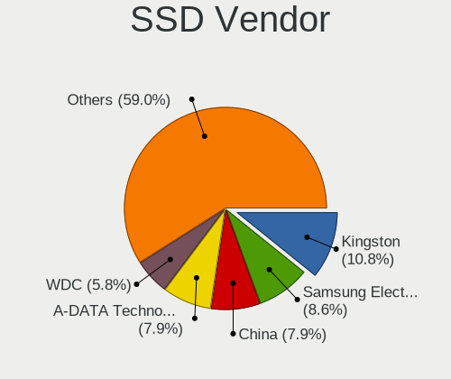
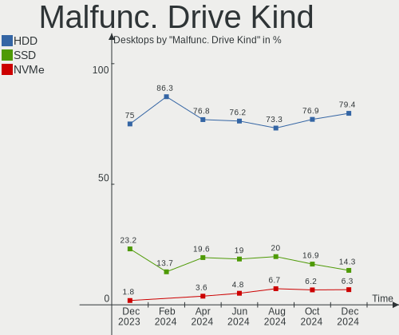
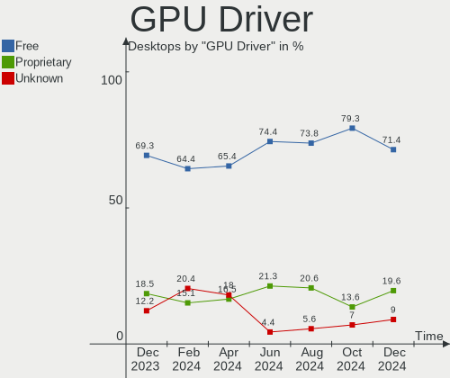
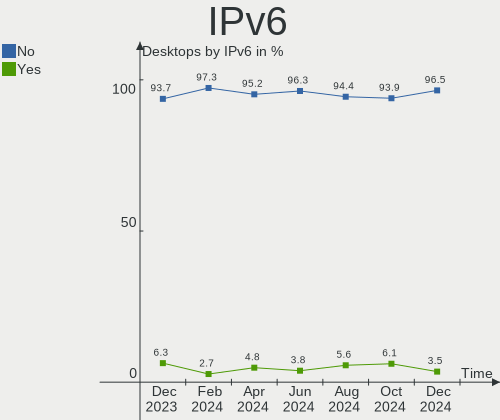
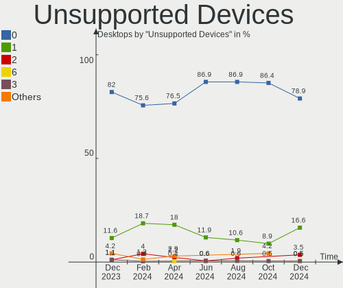

Linux in Russia - Hardware Trends (Desktops)
--------------------------------------------

A project to identify most popular hardware characteristics and track their change
over time based on data collected by Linux users at https://Linux-Hardware.org.

Anyone can contribute to this report by the [hw-probe](https://github.com/linuxhw/hw-probe) tool:

    sudo -E hw-probe -all -upload

Period: Mar, 2023.

Contents
--------

* [ System ](#system)
  - [ OS                       ](#os)
  - [ OS Family                ](#os-family)
  - [ Kernel                   ](#kernel)
  - [ Kernel Family            ](#kernel-family)
  - [ Kernel Major Ver.        ](#kernel-major-ver)
  - [ Arch                     ](#arch)
  - [ DE                       ](#de)
  - [ Display Server           ](#display-server)
  - [ Display Manager          ](#display-manager)
  - [ OS Lang                  ](#os-lang)
  - [ Boot Mode                ](#boot-mode)
  - [ Filesystem               ](#filesystem)
  - [ Part. scheme             ](#part-scheme)
  - [ Dual Boot with Linux/BSD ](#dual-boot-with-linuxbsd)
  - [ Dual Boot (Win)          ](#dual-boot-win)

* [ Board ](#board)
  - [ Vendor                   ](#vendor)
  - [ Model                    ](#model)
  - [ Model Family             ](#model-family)
  - [ MFG Year                 ](#mfg-year)
  - [ Form Factor              ](#form-factor)
  - [ Secure Boot              ](#secure-boot)
  - [ Coreboot                 ](#coreboot)
  - [ RAM Size                 ](#ram-size)
  - [ RAM Used                 ](#ram-used)
  - [ Total Drives             ](#total-drives)
  - [ Has CD-ROM               ](#has-cd-rom)
  - [ Has Ethernet             ](#has-ethernet)
  - [ Has WiFi                 ](#has-wifi)
  - [ Has Bluetooth            ](#has-bluetooth)

* [ Location ](#location)
  - [ Country                  ](#country)
  - [ City                     ](#city)

* [ Drives ](#drives)
  - [ Drive Vendor             ](#drive-vendor)
  - [ Drive Model              ](#drive-model)
  - [ HDD Vendor               ](#hdd-vendor)
  - [ SSD Vendor               ](#ssd-vendor)
  - [ Drive Kind               ](#drive-kind)
  - [ Drive Connector          ](#drive-connector)
  - [ Drive Size               ](#drive-size)
  - [ Space Total              ](#space-total)
  - [ Space Used               ](#space-used)
  - [ Malfunc. Drives          ](#malfunc-drives)
  - [ Malfunc. Drive Vendor    ](#malfunc-drive-vendor)
  - [ Malfunc. HDD Vendor      ](#malfunc-hdd-vendor)
  - [ Malfunc. Drive Kind      ](#malfunc-drive-kind)
  - [ Failed Drives            ](#failed-drives)
  - [ Failed Drive Vendor      ](#failed-drive-vendor)
  - [ Drive Status             ](#drive-status)

* [ Storage controller ](#storage-controller)
  - [ Storage Vendor           ](#storage-vendor)
  - [ Storage Model            ](#storage-model)
  - [ Storage Kind             ](#storage-kind)

* [ Processor ](#processor)
  - [ CPU Vendor               ](#cpu-vendor)
  - [ CPU Model                ](#cpu-model)
  - [ CPU Model Family         ](#cpu-model-family)
  - [ CPU Cores                ](#cpu-cores)
  - [ CPU Sockets              ](#cpu-sockets)
  - [ CPU Threads              ](#cpu-threads)
  - [ CPU Op-Modes             ](#cpu-op-modes)
  - [ CPU Microcode            ](#cpu-microcode)
  - [ CPU Microarch            ](#cpu-microarch)

* [ Graphics ](#graphics)
  - [ GPU Vendor               ](#gpu-vendor)
  - [ GPU Model                ](#gpu-model)
  - [ GPU Combo                ](#gpu-combo)
  - [ GPU Driver               ](#gpu-driver)
  - [ GPU Memory               ](#gpu-memory)

* [ Monitor ](#monitor)
  - [ Monitor Vendor           ](#monitor-vendor)
  - [ Monitor Model            ](#monitor-model)
  - [ Monitor Resolution       ](#monitor-resolution)
  - [ Monitor Diagonal         ](#monitor-diagonal)
  - [ Monitor Width            ](#monitor-width)
  - [ Aspect Ratio             ](#aspect-ratio)
  - [ Monitor Area             ](#monitor-area)
  - [ Pixel Density            ](#pixel-density)
  - [ Multiple Monitors        ](#multiple-monitors)

* [ Network ](#network)
  - [ Net Controller Vendor    ](#net-controller-vendor)
  - [ Net Controller Model     ](#net-controller-model)
  - [ Wireless Vendor          ](#wireless-vendor)
  - [ Wireless Model           ](#wireless-model)
  - [ Ethernet Vendor          ](#ethernet-vendor)
  - [ Ethernet Model           ](#ethernet-model)
  - [ Net Controller Kind      ](#net-controller-kind)
  - [ Used Controller          ](#used-controller)
  - [ NICs                     ](#nics)
  - [ IPv6                     ](#ipv6)

* [ Bluetooth ](#bluetooth)
  - [ Bluetooth Vendor         ](#bluetooth-vendor)
  - [ Bluetooth Model          ](#bluetooth-model)

* [ Sound ](#sound)
  - [ Sound Vendor             ](#sound-vendor)
  - [ Sound Model              ](#sound-model)

* [ Memory ](#memory)
  - [ Memory Vendor            ](#memory-vendor)
  - [ Memory Model             ](#memory-model)
  - [ Memory Kind              ](#memory-kind)
  - [ Memory Form Factor       ](#memory-form-factor)
  - [ Memory Size              ](#memory-size)
  - [ Memory Speed             ](#memory-speed)

* [ Printers & scanners ](#printers--scanners)
  - [ Printer Vendor           ](#printer-vendor)
  - [ Printer Model            ](#printer-model)
  - [ Scanner Vendor           ](#scanner-vendor)
  - [ Scanner Model            ](#scanner-model)

* [ Camera ](#camera)
  - [ Camera Vendor            ](#camera-vendor)
  - [ Camera Model             ](#camera-model)

* [ Security ](#security)
  - [ Fingerprint Vendor       ](#fingerprint-vendor)
  - [ Fingerprint Model        ](#fingerprint-model)
  - [ Chipcard Vendor          ](#chipcard-vendor)
  - [ Chipcard Model           ](#chipcard-model)

* [ Unsupported ](#unsupported)
  - [ Unsupported Devices      ](#unsupported-devices)
  - [ Unsupported Device Types ](#unsupported-device-types)

System
------

OS
--

Installed operating systems

| Name                         | Desktops | Percent |
|------------------------------|----------|---------|
| ROSA 12.3                    | 88       | 31.65%  |
| ROSA 12.4                    | 19       | 6.83%   |
| OpenMandriva 23.03           | 17       | 6.12%   |
| Debian 11                    | 15       | 5.4%    |
| Ubuntu 22.04                 | 13       | 4.68%   |
| Red OS 7.3                   | 10       | 3.6%    |
| OpenMandriva 23.01           | 10       | 3.6%    |
| Linux Mint 21.1              | 10       | 3.6%    |
| Fedora 37                    | 9        | 3.24%   |
| Debian                       | 8        | 2.88%   |
| Red OS 7.3.2                 | 7        | 2.52%   |
| Arch Rolling                 | 7        | 2.52%   |
| ALT Linux 10.1               | 7        | 2.52%   |
| ROSA R11.1                   | 4        | 1.44%   |
| Red OS 7.3.1                 | 4        | 1.44%   |
| OpenMandriva 4.3             | 4        | 1.44%   |
| ROSA 12.2                    | 3        | 1.08%   |
| Debian 10                    | 3        | 1.08%   |
| Ubuntu 22.10                 | 2        | 0.72%   |
| ROSA 12                      | 2        | 0.72%   |
| OpenMandriva 4.2             | 2        | 0.72%   |
| Manjaro                      | 2        | 0.72%   |
| Linux Mint 21                | 2        | 0.72%   |
| Zorin 16                     | 1        | 0.36%   |
| Xubuntu 18.04                | 1        | 0.36%   |
| Ubuntu 23.04                 | 1        | 0.36%   |
| Ubuntu 20.04                 | 1        | 0.36%   |
| ROSA 12.1                    | 1        | 0.36%   |
| Rocky Linux 9.1              | 1        | 0.36%   |
| Pop!_OS 22.04                | 1        | 0.36%   |
| org.kde.Platform 5.15-21.08  | 1        | 0.36%   |
| openSUSE Tumbleweed-XXXXXXXX | 1        | 0.36%   |
| OpenMandriva 4.90            | 1        | 0.36%   |
| OpenMandriva 4.50            | 1        | 0.36%   |
| Nobara 37                    | 1        | 0.36%   |
| MOS 10                       | 1        | 0.36%   |
| Manjaro 22.0.5               | 1        | 0.36%   |
| Manjaro 22.0.4               | 1        | 0.36%   |
| Mageia 8                     | 1        | 0.36%   |
| Linux Mint 20.3              | 1        | 0.36%   |

OS Family
---------

OS without a version

| Name             | Desktops | Percent |
|------------------|----------|---------|
| ROSA             | 117      | 42.09%  |
| OpenMandriva     | 35       | 12.59%  |
| Debian           | 26       | 9.35%   |
| Red OS           | 21       | 7.55%   |
| Ubuntu           | 17       | 6.12%   |
| Linux Mint       | 13       | 4.68%   |
| Fedora           | 10       | 3.6%    |
| ALT Linux        | 10       | 3.6%    |
| Arch             | 7        | 2.52%   |
| Manjaro          | 4        | 1.44%   |
| Zorin            | 1        | 0.36%   |
| Xubuntu          | 1        | 0.36%   |
| Rocky Linux      | 1        | 0.36%   |
| Pop!_OS          | 1        | 0.36%   |
| org.kde.Platform | 1        | 0.36%   |
| openSUSE         | 1        | 0.36%   |
| Nobara           | 1        | 0.36%   |
| Mageia           | 1        | 0.36%   |
| Kubuntu          | 1        | 0.36%   |
| KDE neon         | 1        | 0.36%   |
| Kali             | 1        | 0.36%   |
| Gentoo           | 1        | 0.36%   |
| Clear Linux      | 1        | 0.36%   |
| CentOS           | 1        | 0.36%   |
| CachyOS          | 1        | 0.36%   |
| Artix            | 1        | 0.36%   |
| ArcoLinux        | 1        | 0.36%   |
| AlmaLinux        | 1        | 0.36%   |

Kernel
------

Version of the Linux kernel

| Version                                            | Desktops | Percent |
|----------------------------------------------------|----------|---------|
| 5.15.79-generic-1rosa2021.1-x86_64                 | 31       | 11.15%  |
| 5.15.75-generic-1rosa2021.1-x86_64                 | 31       | 11.15%  |
| 6.2.6-desktop-1omv2390                             | 15       | 5.4%    |
| 5.19.0-35-generic                                  | 12       | 4.32%   |
| 6.1.20-generic-2rosa2021.1-x86_64                  | 11       | 3.96%   |
| 5.10.155-generic-1rosa2021.1-x86_64                | 11       | 3.96%   |
| 6.1.1-desktop-1omv2290                             | 10       | 3.6%    |
| 5.15.87-1.el7.3.x86_64                             | 9        | 3.24%   |
| 5.15.0-67-generic                                  | 9        | 3.24%   |
| 5.10.0-2-amd64                                     | 9        | 3.24%   |
| 6.1.0-4-amd64                                      | 7        | 2.52%   |
| 6.0.12.xm1-1.klp-xanmod-rosa2021.1-x86_64          | 6        | 2.16%   |
| 5.14.9-1.el7.x86_64                                | 5        | 1.8%    |
| 5.10.0-21-amd64                                    | 5        | 1.8%    |
| 6.1.20-generic-1rosa2021.1-x86_64                  | 4        | 1.44%   |
| 5.16.7-desktop-1omv4003                            | 4        | 1.44%   |
| 6.1.14-200.fc37.x86_64                             | 3        | 1.08%   |
| 5.19.0-38-generic                                  | 3        | 1.08%   |
| 5.15.103-generic-1rosa2021.1-x86_64                | 3        | 1.08%   |
| 5.15.10-1.el7.x86_64                               | 3        | 1.08%   |
| 6.2.7-zen1-1-zen                                   | 2        | 0.72%   |
| 6.1.15-200.fc37.x86_64                             | 2        | 0.72%   |
| 6.1.14-generic-1rosa2021.1-x86_64                  | 2        | 0.72%   |
| 5.19.0-32-generic                                  | 2        | 0.72%   |
| 5.17.11-generic-2rosa2021.1-x86_64                 | 2        | 0.72%   |
| 5.15.96-un-def-alt1                                | 2        | 0.72%   |
| 5.10.74-generic-2rosa2021.1-x86_64                 | 2        | 0.72%   |
| 5.10.74-generic-2rosa2021.1-i586                   | 2        | 0.72%   |
| 5.10.170-std-def-alt1                              | 2        | 0.72%   |
| 5.10.150-generic-1rosa2021.1-x86_64                | 2        | 0.72%   |
| 5.10.14-desktop-1omv4002                           | 2        | 0.72%   |
| 4.15.0-desktop-122.124.1rosa-x86_64                | 2        | 0.72%   |
| 6.3.0-0.rc2.20230315git6015b1aca1a2.25.fc39.x86_64 | 1        | 0.36%   |
| 6.2.8-x64v1-xanmod1                                | 1        | 0.36%   |
| 6.2.8-desktop-1omv2390                             | 1        | 0.36%   |
| 6.2.8-arch1-1                                      | 1        | 0.36%   |
| 6.2.7-250.vanilla.fc37.x86_64                      | 1        | 0.36%   |
| 6.2.7-200.fc37.x86_64                              | 1        | 0.36%   |
| 6.2.7-1-cachyos-lto                                | 1        | 0.36%   |
| 6.2.6-generic-2rosa2021.1-x86_64                   | 1        | 0.36%   |

Kernel Family
-------------

Linux kernel without a distro release

| Version  | Desktops | Percent |
|----------|----------|---------|
| 5.15.75  | 32       | 11.51%  |
| 5.15.79  | 31       | 11.15%  |
| 6.2.6    | 18       | 6.47%   |
| 5.19.0   | 17       | 6.12%   |
| 6.1.20   | 16       | 5.76%   |
| 5.10.0   | 14       | 5.04%   |
| 5.15.0   | 13       | 4.68%   |
| 5.10.155 | 11       | 3.96%   |
| 6.1.1    | 10       | 3.6%    |
| 5.15.87  | 10       | 3.6%    |
| 6.1.0    | 9        | 3.24%   |
| 6.0.12   | 7        | 2.52%   |
| 6.1.14   | 6        | 2.16%   |
| 6.2.7    | 5        | 1.8%    |
| 5.14.9   | 5        | 1.8%    |
| 6.2.2    | 4        | 1.44%   |
| 5.16.7   | 4        | 1.44%   |
| 5.10.74  | 4        | 1.44%   |
| 6.2.8    | 3        | 1.08%   |
| 6.1.12   | 3        | 1.08%   |
| 5.15.103 | 3        | 1.08%   |
| 5.15.10  | 3        | 1.08%   |
| 4.15.0   | 3        | 1.08%   |
| 6.1.15   | 2        | 0.72%   |
| 5.17.11  | 2        | 0.72%   |
| 5.15.96  | 2        | 0.72%   |
| 5.15.80  | 2        | 0.72%   |
| 5.15.102 | 2        | 0.72%   |
| 5.14.0   | 2        | 0.72%   |
| 5.10.170 | 2        | 0.72%   |
| 5.10.150 | 2        | 0.72%   |
| 5.10.14  | 2        | 0.72%   |
| 4.19.0   | 2        | 0.72%   |
| 6.3.0    | 1        | 0.36%   |
| 6.2.1    | 1        | 0.36%   |
| 6.2.0    | 1        | 0.36%   |
| 6.1.6    | 1        | 0.36%   |
| 6.1.2    | 1        | 0.36%   |
| 6.1.18   | 1        | 0.36%   |
| 6.1.13   | 1        | 0.36%   |

Kernel Major Ver.
-----------------

Linux kernel major version

| Version | Desktops | Percent |
|---------|----------|---------|
| 5.15    | 103      | 37.05%  |
| 6.1     | 51       | 18.35%  |
| 5.10    | 39       | 14.03%  |
| 6.2     | 32       | 11.51%  |
| 5.19    | 18       | 6.47%   |
| 6.0     | 9        | 3.24%   |
| 5.14    | 7        | 2.52%   |
| 5.16    | 4        | 1.44%   |
| 4.15    | 3        | 1.08%   |
| 5.4     | 2        | 0.72%   |
| 5.18    | 2        | 0.72%   |
| 5.17    | 2        | 0.72%   |
| 4.19    | 2        | 0.72%   |
| 6.3     | 1        | 0.36%   |
| 5.11    | 1        | 0.36%   |
| 4.9     | 1        | 0.36%   |
| 4.18    | 1        | 0.36%   |

Arch
----

OS architecture (x86_64, i586, etc.)

| Name   | Desktops | Percent |
|--------|----------|---------|
| x86_64 | 273      | 98.2%   |
| i686   | 5        | 1.8%    |

DE
--

Desktop Environment

| Name       | Desktops | Percent |
|------------|----------|---------|
| KDE5       | 115      | 41.37%  |
| GNOME      | 79       | 28.42%  |
| Unknown    | 28       | 10.07%  |
| MATE       | 18       | 6.47%   |
| X-Cinnamon | 11       | 3.96%   |
| LXQt       | 11       | 3.96%   |
| XFCE       | 6        | 2.16%   |
| Cinnamon   | 6        | 2.16%   |
| KDE4       | 3        | 1.08%   |
| Hyprland   | 1        | 0.36%   |

Display Server
--------------

X11 or Wayland

| Name    | Desktops | Percent |
|---------|----------|---------|
| X11     | 137      | 49.28%  |
| Wayland | 114      | 41.01%  |
| Unknown | 21       | 7.55%   |
| Tty     | 6        | 2.16%   |

Display Manager
---------------

SDDM, LightDM, etc.

| Name    | Desktops | Percent |
|---------|----------|---------|
| SDDM    | 107      | 38.49%  |
| GDM     | 75       | 26.98%  |
| Unknown | 58       | 20.86%  |
| LightDM | 18       | 6.47%   |
| GDM3    | 15       | 5.4%    |
| KDM     | 3        | 1.08%   |
| NODM    | 1        | 0.36%   |
| GREETD  | 1        | 0.36%   |

OS Lang
-------

Language

| Lang    | Desktops | Percent |
|---------|----------|---------|
| ru_RU   | 234      | 84.17%  |
| en_US   | 36       | 12.95%  |
| C       | 4        | 1.44%   |
| Unknown | 3        | 1.08%   |
| en_GB   | 1        | 0.36%   |

Boot Mode
---------

EFI or BIOS

| Mode | Desktops | Percent |
|------|----------|---------|
| BIOS | 141      | 50.72%  |
| EFI  | 137      | 49.28%  |

Filesystem
----------

Type of filesystem

| Type    | Desktops | Percent |
|---------|----------|---------|
| Ext4    | 205      | 73.74%  |
| Overlay | 38       | 13.67%  |
| Btrfs   | 27       | 9.71%   |
| Xfs     | 3        | 1.08%   |
| F2fs    | 2        | 0.72%   |
| Ext3    | 2        | 0.72%   |
| Zfs     | 1        | 0.36%   |

Part. scheme
------------

Scheme of partitioning

| Type    | Desktops | Percent |
|---------|----------|---------|
| GPT     | 158      | 56.83%  |
| MBR     | 87       | 31.29%  |
| Unknown | 33       | 11.87%  |

Dual Boot with Linux/BSD
------------------------

Hosting more than one Linux/BSD

| Dual boot | Desktops | Percent |
|-----------|----------|---------|
| No        | 213      | 76.62%  |
| Yes       | 65       | 23.38%  |

Dual Boot (Win)
---------------

Hosting Linux and Windows

| Dual boot | Desktops | Percent |
|-----------|----------|---------|
| No        | 147      | 52.88%  |
| Yes       | 131      | 47.12%  |

Board
-----

Vendor
------

Motherboard manufacturer

| Name                | Desktops | Percent |
|---------------------|----------|---------|
| Gigabyte Technology | 86       | 30.94%  |
| ASUSTek Computer    | 71       | 25.54%  |
| ASRock              | 31       | 11.15%  |
| MSI                 | 25       | 8.99%   |
| Intel               | 10       | 3.6%    |
| Hewlett-Packard     | 6        | 2.16%   |
| Huanan              | 5        | 1.8%    |
| Biostar             | 5        | 1.8%    |
| Unknown             | 5        | 1.8%    |
| Foxconn             | 4        | 1.44%   |
| ECS                 | 4        | 1.44%   |
| EPoX Computer       | 3        | 1.08%   |
| Dell                | 3        | 1.08%   |
| MACHINIST           | 2        | 0.72%   |
| Fujitsu             | 2        | 0.72%   |
| DEPO Computers      | 2        | 0.72%   |
| AZW                 | 2        | 0.72%   |
| ZOTAC               | 1        | 0.36%   |
| Supermicro          | 1        | 0.36%   |
| Soyo                | 1        | 0.36%   |
| Shuttle             | 1        | 0.36%   |
| Quanta              | 1        | 0.36%   |
| MB                  | 1        | 0.36%   |
| iEi                 | 1        | 0.36%   |
| Graviton            | 1        | 0.36%   |
| Fujitsu Siemens     | 1        | 0.36%   |
| Cincoze             | 1        | 0.36%   |
| Aquarius            | 1        | 0.36%   |
| Acer                | 1        | 0.36%   |

Model
-----

Motherboard model

| Name                             | Desktops | Percent |
|----------------------------------|----------|---------|
| Gigabyte H410M H V3              | 5        | 1.8%    |
| ASUS All Series                  | 5        | 1.8%    |
| Unknown                          | 5        | 1.8%    |
| Gigabyte X470 AORUS ULTRA GAMING | 3        | 1.08%   |
| Gigabyte A320M-S2H V2            | 3        | 1.08%   |
| ASUS PRIME B450M-A               | 3        | 1.08%   |
| ASRock H61M-DGS                  | 3        | 1.08%   |
| MSI MS-7788                      | 2        | 0.72%   |
| Intel X79                        | 2        | 0.72%   |
| Intel D945GNT AAC96315-405       | 2        | 0.72%   |
| Huanan X99-QD4 V1.0              | 2        | 0.72%   |
| Gigabyte GA-A55M-S2V             | 2        | 0.72%   |
| Gigabyte B550 AORUS ELITE V2     | 2        | 0.72%   |
| Gigabyte B550 AORUS ELITE AX V2  | 2        | 0.72%   |
| Gigabyte B450M S2H               | 2        | 0.72%   |
| Gigabyte B450 AORUS M            | 2        | 0.72%   |
| ECS G31T-M9                      | 2        | 0.72%   |
| Biostar A320MH                   | 2        | 0.72%   |
| ASUS TUF Gaming B550M-PLUS       | 2        | 0.72%   |
| ASUS PRIME H310M-R R2.0          | 2        | 0.72%   |
| ASUS PRIME H270-PLUS             | 2        | 0.72%   |
| ASUS PRIME B250M-K               | 2        | 0.72%   |
| ASUS P5G41T-M LX2/GB             | 2        | 0.72%   |
| ASRock H110M-DGS R3.0            | 2        | 0.72%   |
| ZOTAC H67ITX-C-E                 | 1        | 0.36%   |
| Supermicro PIO-617R-TLN4F+-ST031 | 1        | 0.36%   |
| Soyo SY-Classic B660M            | 1        | 0.36%   |
| Shuttle XS35V3                   | 1        | 0.36%   |
| Quanta 120-1104er                | 1        | 0.36%   |
| MSI PRO B300 DP20ZA (MS-B0A2)    | 1        | 0.36%   |
| MSI MS-7D70                      | 1        | 0.36%   |
| MSI MS-7D48                      | 1        | 0.36%   |
| MSI MS-7D23                      | 1        | 0.36%   |
| MSI MS-7D22                      | 1        | 0.36%   |
| MSI MS-7D14                      | 1        | 0.36%   |
| MSI MS-7C95                      | 1        | 0.36%   |
| MSI MS-7C82                      | 1        | 0.36%   |
| MSI MS-7C56                      | 1        | 0.36%   |
| MSI MS-7C51                      | 1        | 0.36%   |
| MSI MS-7C37                      | 1        | 0.36%   |

Model Family
------------

Motherboard model prefix

| Name                             | Desktops | Percent |
|----------------------------------|----------|---------|
| ASUS PRIME                       | 22       | 7.91%   |
| Gigabyte H410M                   | 7        | 2.52%   |
| Gigabyte B550                    | 6        | 2.16%   |
| ASUS All                         | 5        | 1.8%    |
| Unknown                          | 5        | 1.8%    |
| ASUS TUF                         | 4        | 1.44%   |
| Gigabyte X470                    | 3        | 1.08%   |
| Gigabyte B550M                   | 3        | 1.08%   |
| Gigabyte B450M                   | 3        | 1.08%   |
| Gigabyte A320M-S2H               | 3        | 1.08%   |
| ASRock H61M-DGS                  | 3        | 1.08%   |
| MSI MS-7788                      | 2        | 0.72%   |
| Intel X79                        | 2        | 0.72%   |
| Intel D945GNT                    | 2        | 0.72%   |
| Huanan X99-QD4                   | 2        | 0.72%   |
| Huanan X99-F8D                   | 2        | 0.72%   |
| HP ProDesk                       | 2        | 0.72%   |
| HP Compaq                        | 2        | 0.72%   |
| Gigabyte GA-A55M-S2V             | 2        | 0.72%   |
| Gigabyte B450                    | 2        | 0.72%   |
| ECS G31T-M9                      | 2        | 0.72%   |
| Dell OptiPlex                    | 2        | 0.72%   |
| Biostar A320MH                   | 2        | 0.72%   |
| ASUS ROG                         | 2        | 0.72%   |
| ASUS P8H61-M                     | 2        | 0.72%   |
| ASUS P5KPL-AM                    | 2        | 0.72%   |
| ASUS P5G41T-M                    | 2        | 0.72%   |
| ASUS M5A78L-M                    | 2        | 0.72%   |
| ASUS M5A78L                      | 2        | 0.72%   |
| ASRock H110M-DGS                 | 2        | 0.72%   |
| ASRock AB350                     | 2        | 0.72%   |
| ZOTAC H67ITX-C-E                 | 1        | 0.36%   |
| Supermicro PIO-617R-TLN4F+-ST031 | 1        | 0.36%   |
| Soyo SY-Classic                  | 1        | 0.36%   |
| Shuttle XS35V3                   | 1        | 0.36%   |
| Quanta 120-1104er                | 1        | 0.36%   |
| MSI PRO                          | 1        | 0.36%   |
| MSI MS-7D70                      | 1        | 0.36%   |
| MSI MS-7D48                      | 1        | 0.36%   |
| MSI MS-7D23                      | 1        | 0.36%   |

MFG Year
--------

Motherboard manufacture year

| Year | Desktops | Percent |
|------|----------|---------|
| 2018 | 33       | 11.87%  |
| 2012 | 28       | 10.07%  |
| 2021 | 27       | 9.71%   |
| 2020 | 25       | 8.99%   |
| 2022 | 17       | 6.12%   |
| 2019 | 16       | 5.76%   |
| 2009 | 16       | 5.76%   |
| 2013 | 15       | 5.4%    |
| 2010 | 15       | 5.4%    |
| 2017 | 14       | 5.04%   |
| 2011 | 14       | 5.04%   |
| 2016 | 13       | 4.68%   |
| 2006 | 11       | 3.96%   |
| 2014 | 10       | 3.6%    |
| 2007 | 9        | 3.24%   |
| 2015 | 6        | 2.16%   |
| 2008 | 6        | 2.16%   |
| 2005 | 1        | 0.36%   |
| 2004 | 1        | 0.36%   |
| 2002 | 1        | 0.36%   |

Form Factor
-----------

Physical design of the computer

| Name    | Desktops | Percent |
|---------|----------|---------|
| Desktop | 278      | 100%    |

Secure Boot
-----------

Enabled or disabled

| State    | Desktops | Percent |
|----------|----------|---------|
| Disabled | 275      | 98.92%  |
| Enabled  | 3        | 1.08%   |

Coreboot
--------

Have coreboot on board

| Used | Desktops | Percent |
|------|----------|---------|
| No   | 278      | 100%    |

RAM Size
--------

Total RAM memory

| Size in GB  | Desktops | Percent |
|-------------|----------|---------|
| 16.01-24.0  | 73       | 26.26%  |
| 8.01-16.0   | 52       | 18.71%  |
| 3.01-4.0    | 44       | 15.83%  |
| 32.01-64.0  | 40       | 14.39%  |
| 4.01-8.0    | 36       | 12.95%  |
| 1.01-2.0    | 11       | 3.96%   |
| 64.01-256.0 | 8        | 2.88%   |
| 2.01-3.0    | 7        | 2.52%   |
| 24.01-32.0  | 6        | 2.16%   |
| 0.51-1.0    | 1        | 0.36%   |

RAM Used
--------

Used RAM memory

| Used GB     | Desktops | Percent |
|-------------|----------|---------|
| 1.01-2.0    | 127      | 45.68%  |
| 2.01-3.0    | 50       | 17.99%  |
| 0.51-1.0    | 46       | 16.55%  |
| 4.01-8.0    | 19       | 6.83%   |
| 3.01-4.0    | 17       | 6.12%   |
| 8.01-16.0   | 12       | 4.32%   |
| 0.01-0.5    | 4        | 1.44%   |
| 24.01-32.0  | 1        | 0.36%   |
| 64.01-256.0 | 1        | 0.36%   |
| 16.01-24.0  | 1        | 0.36%   |

Total Drives
------------

Number of drives on board

| Drives | Desktops | Percent |
|--------|----------|---------|
| 1      | 128      | 46.04%  |
| 2      | 65       | 23.38%  |
| 3      | 45       | 16.19%  |
| 4      | 23       | 8.27%   |
| 5      | 10       | 3.6%    |
| 6      | 3        | 1.08%   |
| 0      | 2        | 0.72%   |
| 8      | 1        | 0.36%   |
| 7      | 1        | 0.36%   |

Has CD-ROM
----------

Has CD-ROM on board

| Presented | Desktops | Percent |
|-----------|----------|---------|
| No        | 192      | 69.06%  |
| Yes       | 86       | 30.94%  |

Has Ethernet
------------

Has Ethernet on board

| Presented | Desktops | Percent |
|-----------|----------|---------|
| Yes       | 277      | 99.64%  |
| No        | 1        | 0.36%   |

Has WiFi
--------

Has WiFi module

| Presented | Desktops | Percent |
|-----------|----------|---------|
| No        | 174      | 62.59%  |
| Yes       | 104      | 37.41%  |

Has Bluetooth
-------------

Has Bluetooth module

| Presented | Desktops | Percent |
|-----------|----------|---------|
| No        | 206      | 74.1%   |
| Yes       | 72       | 25.9%   |

Location
--------

Country
-------

Geographic location (country)

| Country | Desktops | Percent |
|---------|----------|---------|
| Russia  | 278      | 100%    |

City
----

Geographic location (city)

| City              | Desktops | Percent |
|-------------------|----------|---------|
| Moscow            | 62       | 22.3%   |
| Voronezh          | 21       | 7.55%   |
| St Petersburg     | 15       | 5.4%    |
| Samara            | 12       | 4.32%   |
| Krasnodar         | 10       | 3.6%    |
| Novosibirsk       | 8        | 2.88%   |
| Chelyabinsk       | 8        | 2.88%   |
| Yekaterinburg     | 7        | 2.52%   |
| Nizhniy Novgorod  | 7        | 2.52%   |
| Ufa               | 6        | 2.16%   |
| Perm              | 5        | 1.8%    |
| Vladimir          | 4        | 1.44%   |
| Novokuznetsk      | 4        | 1.44%   |
| Saratov           | 3        | 1.08%   |
| Salekhard         | 3        | 1.08%   |
| Rostov-on-Don     | 3        | 1.08%   |
| Orenburg          | 3        | 1.08%   |
| Kazan’          | 3        | 1.08%   |
| Izhevsk           | 3        | 1.08%   |
| Cheremkhovo       | 3        | 1.08%   |
| Volgograd         | 2        | 0.72%   |
| Ulyanovsk         | 2        | 0.72%   |
| Tula              | 2        | 0.72%   |
| Tomsk             | 2        | 0.72%   |
| Tolyatti          | 2        | 0.72%   |
| Surgut            | 2        | 0.72%   |
| Stavropol         | 2        | 0.72%   |
| Reutov            | 2        | 0.72%   |
| Prokop'yevsk      | 2        | 0.72%   |
| Nizhnekamsk       | 2        | 0.72%   |
| Kumertau          | 2        | 0.72%   |
| Krasnoyarsk       | 2        | 0.72%   |
| Kostroma          | 2        | 0.72%   |
| Khabarovsk        | 2        | 0.72%   |
| Irkutsk           | 2        | 0.72%   |
| Bryansk           | 2        | 0.72%   |
| Zlatoust          | 1        | 0.36%   |
| Zaigrayevo        | 1        | 0.36%   |
| Yuzhno-Sakhalinsk | 1        | 0.36%   |
| Yoshkar-Ola       | 1        | 0.36%   |

Drives
------

Drive Vendor
------------

Hard drive vendors

| Vendor                      | Desktops | Drives | Percent |
|-----------------------------|----------|--------|---------|
| WDC                         | 97       | 126    | 19.36%  |
| Seagate                     | 92       | 110    | 18.36%  |
| Samsung Electronics         | 39       | 44     | 7.78%   |
| Kingston                    | 30       | 34     | 5.99%   |
| Toshiba                     | 28       | 34     | 5.59%   |
| Hitachi                     | 21       | 22     | 4.19%   |
| Apacer                      | 15       | 15     | 2.99%   |
| China                       | 14       | 14     | 2.79%   |
| SanDisk                     | 12       | 13     | 2.4%    |
| Intel                       | 11       | 11     | 2.2%    |
| Crucial                     | 9        | 11     | 1.8%    |
| A-DATA Technology           | 9        | 9      | 1.8%    |
| SPCC                        | 7        | 8      | 1.4%    |
| KingSpec                    | 6        | 6      | 1.2%    |
| XrayDisk                    | 5        | 5      | 1%      |
| Netac                       | 5        | 5      | 1%      |
| Smartbuy                    | 4        | 4      | 0.8%    |
| Realtek Semiconductor       | 4        | 4      | 0.8%    |
| Plextor                     | 4        | 4      | 0.8%    |
| Patriot                     | 4        | 4      | 0.8%    |
| OCZ                         | 4        | 4      | 0.8%    |
| MAXIO Technology (Hangzhou) | 4        | 4      | 0.8%    |
| Gigabyte Technology         | 4        | 4      | 0.8%    |
| AMD                         | 4        | 4      | 0.8%    |
| XPG                         | 3        | 3      | 0.6%    |
| Silicon Motion              | 3        | 3      | 0.6%    |
| Maxtor                      | 3        | 3      | 0.6%    |
| Fujitsu                     | 3        | 3      | 0.6%    |
| ADATA Technology            | 3        | 4      | 0.6%    |
| Xinhaike                    | 2        | 2      | 0.4%    |
| Unknown                     | 2        | 3      | 0.4%    |
| Transcend                   | 2        | 2      | 0.4%    |
| Qumo                        | 2        | 2      | 0.4%    |
| Phison Electronics          | 2        | 2      | 0.4%    |
| MSI                         | 2        | 2      | 0.4%    |
| KingFast                    | 2        | 2      | 0.4%    |
| HS-SSD-E100                 | 2        | 2      | 0.4%    |
| HS-SSD-C100                 | 2        | 2      | 0.4%    |
| HGST                        | 2        | 2      | 0.4%    |
| Foxline                     | 2        | 2      | 0.4%    |

Drive Model
-----------

Hard drive models

| Model                                               | Desktops | Percent |
|-----------------------------------------------------|----------|---------|
| Seagate ST500DM002-1BD142 500GB                     | 9        | 1.62%   |
| WDC WD10EZEX-08WN4A0 1TB                            | 8        | 1.44%   |
| Seagate ST1000DM010-2EP102 1TB                      | 7        | 1.26%   |
| Samsung SSD 860 EVO 250GB                           | 7        | 1.26%   |
| WDC WD10EZEX-00BBHA0 1TB                            | 6        | 1.08%   |
| Toshiba DT01ACA050 500GB                            | 6        | 1.08%   |
| Seagate ST3500418AS 500GB                           | 6        | 1.08%   |
| Seagate ST1000DM003-1CH162 1TB                      | 6        | 1.08%   |
| Kingston SA400S37240G 240GB SSD                     | 6        | 1.08%   |
| WDC WDS240G2G0A-00JH30 240GB SSD                    | 5        | 0.9%    |
| WDC WD10EZEX-22MFCA0 1TB                            | 5        | 0.9%    |
| Toshiba HDWD110 1TB                                 | 5        | 0.9%    |
| Kingston SA400S37480G 480GB SSD                     | 5        | 0.9%    |
| Seagate ST3500413AS 500GB                           | 4        | 0.72%   |
| Seagate ST3250410AS 250GB                           | 4        | 0.72%   |
| Samsung NVMe SSD Controller SM981/PM981/PM983 250GB | 4        | 0.72%   |
| Kingston SNVS500G 500GB                             | 4        | 0.72%   |
| Hitachi HDS721050CLA360 500GB                       | 4        | 0.72%   |
| Crucial CT480BX500SSD1 480GB                        | 4        | 0.72%   |
| Apacer AS350 128GB SSD                              | 4        | 0.72%   |
| AMD R5SL120G 120GB SSD                              | 4        | 0.72%   |
| XPG GAMMIX S11 Pro 256GB                            | 3        | 0.54%   |
| WDC WDS120G2G0A-00JH30 120GB SSD                    | 3        | 0.54%   |
| WDC WD20EZRZ-00Z5HB0 2TB                            | 3        | 0.54%   |
| Toshiba DT01ACA100 1TB                              | 3        | 0.54%   |
| Seagate ST3250318AS 250GB                           | 3        | 0.54%   |
| Seagate ST3160811AS 160GB                           | 3        | 0.54%   |
| Seagate ST2000DM008-2FR102 2TB                      | 3        | 0.54%   |
| Samsung SSD 970 EVO Plus 1TB                        | 3        | 0.54%   |
| Samsung SSD 860 EVO 500GB                           | 3        | 0.54%   |
| MAXIO (Hangzhou) NVMe SSD Controller MAP1202 256GB  | 3        | 0.54%   |
| XrayDisk 512GB SSD                                  | 2        | 0.36%   |
| Xinhaike SSD 120GB                                  | 2        | 0.36%   |
| WDC WD5000AAKX-00ERMA0 500GB                        | 2        | 0.36%   |
| WDC WD40PURZ-85AKKY0 4TB                            | 2        | 0.36%   |
| WDC WD3200AAJS-08L7A0 320GB                         | 2        | 0.36%   |
| WDC WD3200AAJS-00L7A0 320GB                         | 2        | 0.36%   |
| WDC WD3200AAJS-00B4A0 320GB                         | 2        | 0.36%   |
| WDC WD30EFRX-68EUZN0 3TB                            | 2        | 0.36%   |
| WDC WD2500JS-00MHB0 250GB                           | 2        | 0.36%   |

HDD Vendor
----------

Hard disk drive vendors

| Vendor              | Desktops | Drives | Percent |
|---------------------|----------|--------|---------|
| Seagate             | 92       | 110    | 38.17%  |
| WDC                 | 87       | 112    | 36.1%   |
| Toshiba             | 27       | 33     | 11.2%   |
| Hitachi             | 21       | 22     | 8.71%   |
| Samsung Electronics | 6        | 6      | 2.49%   |
| Maxtor              | 3        | 3      | 1.24%   |
| Fujitsu             | 3        | 3      | 1.24%   |
| HGST                | 2        | 2      | 0.83%   |

SSD Vendor
----------

Solid state drive vendors

| Vendor              | Desktops | Drives | Percent |
|---------------------|----------|--------|---------|
| Kingston            | 20       | 20     | 11.63%  |
| Samsung Electronics | 17       | 19     | 9.88%   |
| China               | 14       | 14     | 8.14%   |
| Apacer              | 14       | 14     | 8.14%   |
| WDC                 | 11       | 13     | 6.4%    |
| Crucial             | 8        | 10     | 4.65%   |
| SPCC                | 7        | 7      | 4.07%   |
| KingSpec            | 6        | 6      | 3.49%   |
| Intel               | 6        | 6      | 3.49%   |
| XrayDisk            | 4        | 4      | 2.33%   |
| SanDisk             | 4        | 4      | 2.33%   |
| OCZ                 | 4        | 4      | 2.33%   |
| Netac               | 4        | 4      | 2.33%   |
| AMD                 | 4        | 4      | 2.33%   |
| A-DATA Technology   | 4        | 4      | 2.33%   |
| Smartbuy            | 3        | 3      | 1.74%   |
| Plextor             | 3        | 3      | 1.74%   |
| Patriot             | 3        | 3      | 1.74%   |
| Xinhaike            | 2        | 2      | 1.16%   |
| Qumo                | 2        | 2      | 1.16%   |
| KingFast            | 2        | 2      | 1.16%   |
| HS-SSD-E100         | 2        | 2      | 1.16%   |
| HS-SSD-C100         | 2        | 2      | 1.16%   |
| Foxline             | 2        | 2      | 1.16%   |
| Zheino              | 1        | 1      | 0.58%   |
| Transcend           | 1        | 1      | 0.58%   |
| Toshiba             | 1        | 1      | 0.58%   |
| TMI                 | 1        | 1      | 0.58%   |
| Team                | 1        | 1      | 0.58%   |
| TAMMUZ              | 1        | 2      | 0.58%   |
| Reeinno             | 1        | 1      | 0.58%   |
| NT-256              | 1        | 1      | 0.58%   |
| Neo                 | 1        | 1      | 0.58%   |
| Londisk             | 1        | 1      | 0.58%   |
| Lenovo              | 1        | 1      | 0.58%   |
| Kimtigo             | 1        | 1      | 0.58%   |
| HUAXUAN             | 1        | 1      | 0.58%   |
| GOODRAM             | 1        | 1      | 0.58%   |
| Gigabyte Technology | 1        | 1      | 0.58%   |
| Fanxiang            | 1        | 1      | 0.58%   |

Drive Kind
----------

HDD or SSD

| Kind    | Desktops | Drives | Percent |
|---------|----------|--------|---------|
| HDD     | 193      | 291    | 46.06%  |
| SSD     | 144      | 179    | 34.37%  |
| NVMe    | 78       | 96     | 18.62%  |
| Unknown | 4        | 5      | 0.95%   |

Drive Connector
---------------

SATA, SAS, NVMe, etc.

| Type | Desktops | Drives | Percent |
|------|----------|--------|---------|
| SATA | 251      | 473    | 75.83%  |
| NVMe | 77       | 94     | 23.26%  |
| SAS  | 3        | 4      | 0.91%   |

Drive Size
----------

Size of hard drive

| Size in TB | Desktops | Drives | Percent |
|------------|----------|--------|---------|
| 0.01-0.5   | 207      | 303    | 60.53%  |
| 0.51-1.0   | 95       | 117    | 27.78%  |
| 1.01-2.0   | 22       | 27     | 6.43%   |
| 3.01-4.0   | 6        | 8      | 1.75%   |
| 2.01-3.0   | 6        | 6      | 1.75%   |
| 4.01-10.0  | 4        | 7      | 1.17%   |
| 10.01-20.0 | 2        | 2      | 0.58%   |

Space Total
-----------

Amount of disk space available on the file system

| Size in GB     | Desktops | Percent |
|----------------|----------|---------|
| 101-250        | 69       | 24.82%  |
| 251-500        | 48       | 17.27%  |
| 501-1000       | 35       | 12.59%  |
| 51-100         | 25       | 8.99%   |
| 1001-2000      | 24       | 8.63%   |
| 1-20           | 24       | 8.63%   |
| Unknown        | 22       | 7.91%   |
| 2001-3000      | 14       | 5.04%   |
| 21-50          | 9        | 3.24%   |
| More than 3000 | 8        | 2.88%   |

Space Used
----------

Amount of used disk space

| Used GB        | Desktops | Percent |
|----------------|----------|---------|
| 1-20           | 120      | 43.17%  |
| 21-50          | 39       | 14.03%  |
| 101-250        | 26       | 9.35%   |
| Unknown        | 22       | 7.91%   |
| 51-100         | 19       | 6.83%   |
| 501-1000       | 18       | 6.47%   |
| 251-500        | 17       | 6.12%   |
| 1001-2000      | 10       | 3.6%    |
| More than 3000 | 4        | 1.44%   |
| 2001-3000      | 3        | 1.08%   |

Malfunc. Drives
---------------

Drive models with a malfunction

| Model                            | Desktops | Drives | Percent |
|----------------------------------|----------|--------|---------|
| Seagate ST500DM002-1BD142 500GB  | 7        | 7      | 7.37%   |
| Seagate ST3500418AS 500GB        | 4        | 4      | 4.21%   |
| WDC WD10EZEX-22MFCA0 1TB         | 3        | 3      | 3.16%   |
| Seagate ST3250410AS 250GB        | 3        | 3      | 3.16%   |
| Seagate ST1000DM003-1CH162 1TB   | 3        | 3      | 3.16%   |
| Seagate ST3750640AS 752GB        | 2        | 2      | 2.11%   |
| Seagate ST3500413AS 500GB        | 2        | 2      | 2.11%   |
| Seagate ST340014A 40GB           | 2        | 2      | 2.11%   |
| Seagate ST3250318AS 250GB        | 2        | 2      | 2.11%   |
| Netac SSD 240GB                  | 2        | 2      | 2.11%   |
| Hitachi HDS721050CLA360 500GB    | 2        | 2      | 2.11%   |
| XPG GAMMIX S11 Pro 256GB         | 1        | 1      | 1.05%   |
| WDC WDS240G2G0A-00JH30 240GB SSD | 1        | 1      | 1.05%   |
| WDC WDS120G2G0A-00JH30 120GB SSD | 1        | 1      | 1.05%   |
| WDC WD800JD-22LSA0 80GB          | 1        | 1      | 1.05%   |
| WDC WD5000AZLX-22JKKA0 464GB     | 1        | 1      | 1.05%   |
| WDC WD5000AAKX-75U6AA0 500GB     | 1        | 1      | 1.05%   |
| WDC WD5000AAKX-60U6AA0 500GB     | 1        | 1      | 1.05%   |
| WDC WD5000AAKX-00ERMA0 500GB     | 1        | 1      | 1.05%   |
| WDC WD3200BPVT-22JJ5T0 320GB     | 1        | 1      | 1.05%   |
| WDC WD3200AAJS-08L7A0 320GB      | 1        | 1      | 1.05%   |
| WDC WD3200AAJS-00L7A0 320GB      | 1        | 1      | 1.05%   |
| WDC WD30EFRX-68EUZN0 3TB         | 1        | 1      | 1.05%   |
| WDC WD2500AAJS-00B4A0 250GB      | 1        | 1      | 1.05%   |
| WDC WD20EARS-00S8B1 2TB          | 1        | 1      | 1.05%   |
| WDC WD20EARS-00MVWB0 2TB         | 1        | 1      | 1.05%   |
| WDC WD1600AAJS-00L7A0 160GB      | 1        | 1      | 1.05%   |
| WDC WD10PURZ-85U8XY0 1TB         | 1        | 1      | 1.05%   |
| WDC WD10JPVX-60JC3T1 1TB         | 1        | 1      | 1.05%   |
| WDC WD10EZEX-75WN4A1 1TB         | 1        | 1      | 1.05%   |
| WDC WD10EALX-009BA0 1TB          | 1        | 1      | 1.05%   |
| Toshiba MQ01ABD050 500GB         | 1        | 1      | 1.05%   |
| Toshiba MK1652GSX 160GB          | 1        | 1      | 1.05%   |
| Toshiba HDWD110 1TB              | 1        | 1      | 1.05%   |
| Toshiba DT01ACA100 1TB           | 1        | 1      | 1.05%   |
| Toshiba DT01ACA050 500GB         | 1        | 1      | 1.05%   |
| Teclast 256GB NP900-2280         | 1        | 1      | 1.05%   |
| Seagate ST9320325AS 320GB        | 1        | 1      | 1.05%   |
| Seagate ST500LT012-9WS142 500GB  | 1        | 1      | 1.05%   |
| Seagate ST500DM002-1BC142 500GB  | 1        | 1      | 1.05%   |

Malfunc. Drive Vendor
---------------------

Vendors of faulty drives

| Vendor              | Desktops | Drives | Percent |
|---------------------|----------|--------|---------|
| Seagate             | 37       | 44     | 41.57%  |
| WDC                 | 22       | 22     | 24.72%  |
| Hitachi             | 8        | 8      | 8.99%   |
| Toshiba             | 5        | 5      | 5.62%   |
| Kingston            | 3        | 3      | 3.37%   |
| OCZ                 | 2        | 2      | 2.25%   |
| Netac               | 2        | 2      | 2.25%   |
| KingSpec            | 2        | 2      | 2.25%   |
| XPG                 | 1        | 1      | 1.12%   |
| Teclast             | 1        | 1      | 1.12%   |
| Samsung Electronics | 1        | 1      | 1.12%   |
| Qumo                | 1        | 1      | 1.12%   |
| Neo                 | 1        | 1      | 1.12%   |
| Maxtor              | 1        | 1      | 1.12%   |
| Corsair             | 1        | 1      | 1.12%   |
| A-DATA Technology   | 1        | 1      | 1.12%   |

Malfunc. HDD Vendor
-------------------

Vendors of faulty HDD drives

| Vendor              | Desktops | Drives | Percent |
|---------------------|----------|--------|---------|
| Seagate             | 37       | 44     | 51.39%  |
| WDC                 | 20       | 20     | 27.78%  |
| Hitachi             | 8        | 8      | 11.11%  |
| Toshiba             | 5        | 5      | 6.94%   |
| Samsung Electronics | 1        | 1      | 1.39%   |
| Maxtor              | 1        | 1      | 1.39%   |

Malfunc. Drive Kind
-------------------

Kinds of faulty drives

| Kind | Desktops | Drives | Percent |
|------|----------|--------|---------|
| HDD  | 66       | 79     | 79.52%  |
| SSD  | 15       | 15     | 18.07%  |
| NVMe | 2        | 2      | 2.41%   |

Failed Drives
-------------

Failed drive models

Zero info for selected period =(

Failed Drive Vendor
-------------------

Failed drive vendors

Zero info for selected period =(

Drive Status
------------

Number of failed and malfunc. drives

| Status   | Desktops | Drives | Percent |
|----------|----------|--------|---------|
| Works    | 198      | 365    | 60.74%  |
| Malfunc  | 77       | 96     | 23.62%  |
| Detected | 51       | 110    | 15.64%  |

Storage controller
------------------

Storage Vendor
--------------

Storage controller vendors

| Vendor                        | Desktops | Percent |
|-------------------------------|----------|---------|
| Intel                         | 180      | 45.57%  |
| AMD                           | 88       | 22.28%  |
| Samsung Electronics           | 18       | 4.56%   |
| JMicron Technology            | 15       | 3.8%    |
| Kingston Technology Company   | 13       | 3.29%   |
| Silicon Motion                | 11       | 2.78%   |
| Nvidia                        | 11       | 2.78%   |
| SanDisk                       | 9        | 2.28%   |
| Phison Electronics            | 8        | 2.03%   |
| ASMedia Technology            | 8        | 2.03%   |
| ADATA Technology              | 8        | 2.03%   |
| Realtek Semiconductor         | 7        | 1.77%   |
| MAXIO Technology (Hangzhou)   | 7        | 1.77%   |
| Marvell Technology Group      | 4        | 1.01%   |
| VIA Technologies              | 3        | 0.76%   |
| Netac Technology              | 1        | 0.25%   |
| Micron/Crucial Technology     | 1        | 0.25%   |
| LSI Logic / Symbios Logic     | 1        | 0.25%   |
| Lite-On Technology            | 1        | 0.25%   |
| Integrated Technology Express | 1        | 0.25%   |

Storage Model
-------------

Storage controller models

| Model                                                                                   | Desktops | Percent |
|-----------------------------------------------------------------------------------------|----------|---------|
| AMD FCH SATA Controller [AHCI mode]                                                     | 39       | 7.78%   |
| Intel NM10/ICH7 Family SATA Controller [IDE mode]                                       | 24       | 4.79%   |
| AMD 500 Series Chipset SATA Controller                                                  | 21       | 4.19%   |
| AMD 400 Series Chipset SATA Controller                                                  | 20       | 3.99%   |
| Intel 82801G (ICH7 Family) IDE Controller                                               | 19       | 3.79%   |
| Intel 200 Series PCH SATA controller [AHCI mode]                                        | 17       | 3.39%   |
| Intel 500 Series Chipset Family SATA AHCI Controller                                    | 13       | 2.59%   |
| Samsung NVMe SSD Controller SM981/PM981/PM983                                           | 12       | 2.4%    |
| Intel 6 Series/C200 Series Chipset Family 6 port Desktop SATA AHCI Controller           | 12       | 2.4%    |
| AMD SB7x0/SB8x0/SB9x0 SATA Controller [AHCI mode]                                       | 12       | 2.4%    |
| AMD SB7x0/SB8x0/SB9x0 IDE Controller                                                    | 12       | 2.4%    |
| Intel 8 Series/C220 Series Chipset Family 6-port SATA Controller 1 [AHCI mode]          | 11       | 2.2%    |
| Silicon Motion SM2263EN/SM2263XT SSD Controller                                         | 10       | 2%      |
| Intel Q170/Q150/B150/H170/H110/Z170/CM236 Chipset SATA Controller [AHCI Mode]           | 9        | 1.8%    |
| Intel 7 Series/C210 Series Chipset Family 6-port SATA Controller [AHCI mode]            | 9        | 1.8%    |
| JMicron JMB363 SATA/IDE Controller                                                      | 8        | 1.6%    |
| ASMedia ASM1062 Serial ATA Controller                                                   | 8        | 1.6%    |
| AMD 300 Series Chipset SATA Controller                                                  | 8        | 1.6%    |
| MAXIO (Hangzhou) NVMe SSD Controller MAP1202                                            | 7        | 1.4%    |
| Intel Cannon Lake PCH SATA AHCI Controller                                              | 7        | 1.4%    |
| Intel 6 Series/C200 Series Chipset Family Desktop SATA Controller (IDE mode, ports 4-5) | 7        | 1.4%    |
| Intel 6 Series/C200 Series Chipset Family Desktop SATA Controller (IDE mode, ports 0-3) | 7        | 1.4%    |
| AMD SB7x0/SB8x0/SB9x0 SATA Controller [IDE mode]                                        | 7        | 1.4%    |
| Realtek NVMe Controller                                                                 | 6        | 1.2%    |
| Nvidia MCP61 SATA Controller                                                            | 6        | 1.2%    |
| Nvidia MCP61 IDE                                                                        | 6        | 1.2%    |
| Intel Alder Lake-S PCH SATA Controller [AHCI Mode]                                      | 6        | 1.2%    |
| Intel 5 Series/3400 Series Chipset 4 port SATA IDE Controller                           | 6        | 1.2%    |
| Intel 5 Series/3400 Series Chipset 2 port SATA IDE Controller                           | 6        | 1.2%    |
| ADATA XPG SX8200 Pro PCIe Gen3x4 M.2 2280 Solid State Drive                             | 6        | 1.2%    |
| Phison PS5013 E13 NVMe Controller                                                       | 5        | 1%      |
| Kingston Company NVMe Controller                                                        | 5        | 1%      |
| Intel 9 Series Chipset Family SATA Controller [AHCI Mode]                               | 5        | 1%      |
| Intel 7 Series/C210 Series Chipset Family 4-port SATA Controller [IDE mode]             | 5        | 1%      |
| Intel 7 Series/C210 Series Chipset Family 2-port SATA Controller [IDE mode]             | 5        | 1%      |
| AMD FCH SATA Controller D                                                               | 5        | 1%      |
| SanDisk Non-Volatile memory controller                                                  | 3        | 0.6%    |
| Samsung NVMe SSD Controller 980                                                         | 3        | 0.6%    |
| Kingston Company Company Non-Volatile memory controller                                 | 3        | 0.6%    |
| Kingston Company SNVS2000G [NV1 NVMe PCIe SSD 2TB]                                      | 3        | 0.6%    |

Storage Kind
------------

Kind of storage controller (IDE, SATA, NVMe, SAS, ...)

| Kind | Desktops | Percent |
|------|----------|---------|
| SATA | 208      | 55.32%  |
| IDE  | 84       | 22.34%  |
| NVMe | 77       | 20.48%  |
| RAID | 6        | 1.6%    |
| SAS  | 1        | 0.27%   |

Processor
---------

CPU Vendor
----------

Processor vendors

| Vendor | Desktops | Percent |
|--------|----------|---------|
| Intel  | 178      | 64.03%  |
| AMD    | 100      | 35.97%  |

CPU Model
---------

Processor models

| Model                                       | Desktops | Percent |
|---------------------------------------------|----------|---------|
| AMD Ryzen 5 5600G with Radeon Graphics      | 8        | 2.88%   |
| Intel Core i3-10100F CPU @ 3.60GHz          | 5        | 1.8%    |
| Intel Core 2 Quad CPU Q6600 @ 2.40GHz       | 5        | 1.8%    |
| AMD Ryzen 5 5600X 6-Core Processor          | 5        | 1.8%    |
| Intel Core i3-10105 CPU @ 3.70GHz           | 4        | 1.44%   |
| Intel Core i3-10100 CPU @ 3.60GHz           | 4        | 1.44%   |
| Intel Core 2 Duo CPU E8400 @ 3.00GHz        | 4        | 1.44%   |
| Intel Celeron CPU G1620 @ 2.70GHz           | 4        | 1.44%   |
| AMD Ryzen 5 3600 6-Core Processor           | 4        | 1.44%   |
| AMD Ryzen 5 2600 Six-Core Processor         | 4        | 1.44%   |
| AMD FX-4300 Quad-Core Processor             | 4        | 1.44%   |
| Intel Xeon CPU E5-2640 0 @ 2.50GHz          | 3        | 1.08%   |
| Intel Pentium Dual-Core CPU E6500 @ 2.93GHz | 3        | 1.08%   |
| Intel Genuine CPU 0000 @ 2.40GHz            | 3        | 1.08%   |
| Intel Core i7-2600 CPU @ 3.40GHz            | 3        | 1.08%   |
| Intel Core i5-2400 CPU @ 3.10GHz            | 3        | 1.08%   |
| Intel Core i3-9100 CPU @ 3.60GHz            | 3        | 1.08%   |
| Intel Core i3-2120 CPU @ 3.30GHz            | 3        | 1.08%   |
| Intel Core 2 Duo CPU E7400 @ 2.80GHz        | 3        | 1.08%   |
| Intel 12th Gen Core i5-12400                | 3        | 1.08%   |
| AMD Ryzen 7 7700X 8-Core Processor          | 3        | 1.08%   |
| AMD Ryzen 7 5700G with Radeon Graphics      | 3        | 1.08%   |
| AMD Ryzen 5 1600 Six-Core Processor         | 3        | 1.08%   |
| AMD Ryzen 3 1200 Quad-Core Processor        | 3        | 1.08%   |
| Intel Pentium 4 CPU 3.06GHz                 | 2        | 0.72%   |
| Intel Core i7-6700K CPU @ 4.00GHz           | 2        | 0.72%   |
| Intel Core i7-3770 CPU @ 3.40GHz            | 2        | 0.72%   |
| Intel Core i5-9400 CPU @ 2.90GHz            | 2        | 0.72%   |
| Intel Core i5-4460 CPU @ 3.20GHz            | 2        | 0.72%   |
| Intel Core i5-3570K CPU @ 3.40GHz           | 2        | 0.72%   |
| Intel Core i5-10400 CPU @ 2.90GHz           | 2        | 0.72%   |
| Intel Core i3-9100F CPU @ 3.60GHz           | 2        | 0.72%   |
| Intel Core i3-8100 CPU @ 3.60GHz            | 2        | 0.72%   |
| Intel Core i3-7100 CPU @ 3.90GHz            | 2        | 0.72%   |
| Intel Core 2 Quad CPU Q9550 @ 2.83GHz       | 2        | 0.72%   |
| Intel Atom CPU D2700 @ 2.13GHz              | 2        | 0.72%   |
| AMD Ryzen 9 5900X 12-Core Processor         | 2        | 0.72%   |
| AMD Ryzen 7 5700X 8-Core Processor          | 2        | 0.72%   |
| AMD Ryzen 7 3700X 8-Core Processor          | 2        | 0.72%   |
| AMD Ryzen 7 2700 Eight-Core Processor       | 2        | 0.72%   |

CPU Model Family
----------------

Processor model prefix

| Model                   | Desktops | Percent |
|-------------------------|----------|---------|
| Intel Core i3           | 36       | 12.95%  |
| Intel Core i5           | 33       | 11.87%  |
| AMD Ryzen 5             | 33       | 11.87%  |
| Intel Xeon              | 21       | 7.55%   |
| Intel Core i7           | 18       | 6.47%   |
| AMD Ryzen 7             | 15       | 5.4%    |
| Intel Core 2 Duo        | 13       | 4.68%   |
| Intel Celeron           | 11       | 3.96%   |
| AMD FX                  | 10       | 3.6%    |
| Other                   | 9        | 3.24%   |
| Intel Pentium           | 8        | 2.88%   |
| Intel Core 2 Quad       | 7        | 2.52%   |
| AMD Ryzen 9             | 6        | 2.16%   |
| AMD Athlon 64 X2        | 6        | 2.16%   |
| Intel Pentium Dual-Core | 5        | 1.8%    |
| AMD Ryzen 3             | 5        | 1.8%    |
| AMD Phenom II X6        | 5        | 1.8%    |
| Intel Genuine           | 4        | 1.44%   |
| Intel Atom              | 4        | 1.44%   |
| Intel Pentium Dual      | 3        | 1.08%   |
| Intel Pentium 4         | 3        | 1.08%   |
| Intel Core 2            | 3        | 1.08%   |
| AMD Phenom II X4        | 2        | 0.72%   |
| AMD E2                  | 2        | 0.72%   |
| AMD Athlon II X4        | 2        | 0.72%   |
| AMD Athlon II X2        | 2        | 0.72%   |
| AMD A8                  | 2        | 0.72%   |
| AMD A4                  | 2        | 0.72%   |
| AMD Sempron             | 1        | 0.36%   |
| AMD Ryzen 7 PRO         | 1        | 0.36%   |
| AMD Ryzen 5 PRO         | 1        | 0.36%   |
| AMD Ryzen 3 PRO         | 1        | 0.36%   |
| AMD Phenom II X2        | 1        | 0.36%   |
| AMD Athlon X4           | 1        | 0.36%   |
| AMD Athlon II X3        | 1        | 0.36%   |
| AMD A6                  | 1        | 0.36%   |

CPU Cores
---------

Number of processor cores

| Number | Desktops | Percent |
|--------|----------|---------|
| 4      | 96       | 34.53%  |
| 2      | 75       | 26.98%  |
| 6      | 59       | 21.22%  |
| 8      | 20       | 7.19%   |
| 1      | 11       | 3.96%   |
| 12     | 8        | 2.88%   |
| 10     | 3        | 1.08%   |
| 16     | 2        | 0.72%   |
| 3      | 2        | 0.72%   |
| 28     | 1        | 0.36%   |
| 24     | 1        | 0.36%   |

CPU Sockets
-----------

Number of sockets

| Number | Desktops | Percent |
|--------|----------|---------|
| 1      | 275      | 98.92%  |
| 2      | 3        | 1.08%   |

CPU Threads
-----------

Threads per core (Hyper-Threading)

| Number | Desktops | Percent |
|--------|----------|---------|
| 2      | 160      | 57.55%  |
| 1      | 116      | 41.73%  |
| 8      | 2        | 0.72%   |

CPU Op-Modes
------------

CPU Operation Modes (32-bit, 64-bit)

| Op mode        | Desktops | Percent |
|----------------|----------|---------|
| 32-bit, 64-bit | 276      | 99.28%  |
| 32-bit         | 2        | 0.72%   |

CPU Microcode
-------------

Microcode number

| Number     | Desktops | Percent |
|------------|----------|---------|
| Unknown    | 53       | 19.06%  |
| 0x306c3    | 14       | 5.04%   |
| 0x1067a    | 13       | 4.68%   |
| 0x306a9    | 12       | 4.32%   |
| 0xa0653    | 11       | 3.96%   |
| 0x906ea    | 11       | 3.96%   |
| 0x206a7    | 11       | 3.96%   |
| 0x08701021 | 9        | 3.24%   |
| 0x0800820d | 8        | 2.88%   |
| 0x0a50000d | 6        | 2.16%   |
| 0x906eb    | 5        | 1.8%    |
| 0x906e9    | 5        | 1.8%    |
| 0x6fd      | 5        | 1.8%    |
| 0x506e3    | 5        | 1.8%    |
| 0x306f2    | 5        | 1.8%    |
| 0x0a601203 | 5        | 1.8%    |
| 0x0a50000c | 5        | 1.8%    |
| 0x06000822 | 5        | 1.8%    |
| 0x206d7    | 4        | 1.44%   |
| 0x106e5    | 4        | 1.44%   |
| 0x0a20120a | 4        | 1.44%   |
| 0x08101016 | 4        | 1.44%   |
| 0x010000c8 | 4        | 1.44%   |
| 0x010000bf | 4        | 1.44%   |
| 0x90675    | 3        | 1.08%   |
| 0x90672    | 3        | 1.08%   |
| 0x6fb      | 3        | 1.08%   |
| 0xf49      | 2        | 0.72%   |
| 0xa0671    | 2        | 0.72%   |
| 0xa0655    | 2        | 0.72%   |
| 0x6f2      | 2        | 0.72%   |
| 0x30661    | 2        | 0.72%   |
| 0x10676    | 2        | 0.72%   |
| 0x0a201016 | 2        | 0.72%   |
| 0x08701030 | 2        | 0.72%   |
| 0x0600611a | 2        | 0.72%   |
| 0x06001119 | 2        | 0.72%   |
| 0x0600081c | 2        | 0.72%   |
| 0x06000817 | 2        | 0.72%   |
| 0xf41      | 1        | 0.36%   |

CPU Microarch
-------------

Microarchitecture

| Name             | Desktops | Percent |
|------------------|----------|---------|
| KabyLake         | 29       | 10.43%  |
| Zen 3            | 24       | 8.63%   |
| Haswell          | 23       | 8.27%   |
| SandyBridge      | 19       | 6.83%   |
| Penryn           | 19       | 6.83%   |
| IvyBridge        | 18       | 6.47%   |
| CometLake        | 16       | 5.76%   |
| Zen 2            | 14       | 5.04%   |
| Core             | 14       | 5.04%   |
| Piledriver       | 13       | 4.68%   |
| K10              | 12       | 4.32%   |
| Zen+             | 11       | 3.96%   |
| Zen              | 8        | 2.88%   |
| Skylake          | 8        | 2.88%   |
| K8 Hammer        | 7        | 2.52%   |
| Alderlake Hybrid | 7        | 2.52%   |
| Nehalem          | 5        | 1.8%    |
| Unknown          | 5        | 1.8%    |
| Westmere         | 4        | 1.44%   |
| NetBurst         | 4        | 1.44%   |
| Bonnell          | 4        | 1.44%   |
| Tremont          | 2        | 0.72%   |
| K10 Llano        | 2        | 0.72%   |
| Icelake          | 2        | 0.72%   |
| Excavator        | 2        | 0.72%   |
| Broadwell        | 2        | 0.72%   |
| Puma             | 1        | 0.36%   |
| Goldmont plus    | 1        | 0.36%   |
| Goldmont         | 1        | 0.36%   |
| Bobcat           | 1        | 0.36%   |

Graphics
--------

GPU Vendor
----------

Vendors of graphics cards

| Vendor                     | Desktops | Percent |
|----------------------------|----------|---------|
| Nvidia                     | 124      | 42.61%  |
| AMD                        | 91       | 31.27%  |
| Intel                      | 75       | 25.77%  |
| Matrox Electronics Systems | 1        | 0.34%   |

GPU Model
---------

Graphics card models

| Model                                                                       | Desktops | Percent |
|-----------------------------------------------------------------------------|----------|---------|
| AMD Ellesmere [Radeon RX 470/480/570/570X/580/580X/590]                     | 11       | 3.69%   |
| AMD Cezanne [Radeon Vega Series / Radeon Vega Mobile Series]                | 10       | 3.36%   |
| Nvidia GP106 [GeForce GTX 1060 6GB]                                         | 9        | 3.02%   |
| Nvidia GA106 [GeForce RTX 3060 Lite Hash Rate]                              | 8        | 2.68%   |
| Intel CometLake-S GT2 [UHD Graphics 630]                                    | 7        | 2.35%   |
| Intel CoffeeLake-S GT2 [UHD Graphics 630]                                   | 7        | 2.35%   |
| Nvidia GT218 [GeForce 210]                                                  | 6        | 2.01%   |
| Nvidia GK208B [GeForce GT 710]                                              | 6        | 2.01%   |
| Nvidia GF108 [GeForce GT 430]                                               | 6        | 2.01%   |
| Intel Xeon E3-1200 v2/3rd Gen Core processor Graphics Controller            | 6        | 2.01%   |
| AMD Navi 24 [Radeon RX 6400/6500 XT/6500M]                                  | 6        | 2.01%   |
| Nvidia GP108 [GeForce GT 1030]                                              | 5        | 1.68%   |
| Nvidia GK107 [GeForce GTX 650]                                              | 5        | 1.68%   |
| Nvidia GF108 [GeForce GT 730]                                               | 5        | 1.68%   |
| Intel Xeon E3-1200 v3/4th Gen Core Processor Integrated Graphics Controller | 5        | 1.68%   |
| Intel 2nd Generation Core Processor Family Integrated Graphics Controller   | 5        | 1.68%   |
| AMD Navi 23 [Radeon RX 6600/6600 XT/6600M]                                  | 5        | 1.68%   |
| AMD Lexa PRO [Radeon 540/540X/550/550X / RX 540X/550/550X]                  | 5        | 1.68%   |
| Nvidia TU117 [GeForce GTX 1650]                                             | 4        | 1.34%   |
| Nvidia GP107 [GeForce GTX 1050]                                             | 4        | 1.34%   |
| Nvidia GP107 [GeForce GTX 1050 Ti]                                          | 4        | 1.34%   |
| Intel HD Graphics 530                                                       | 4        | 1.34%   |
| Intel 82G33/G31 Express Integrated Graphics Controller                      | 4        | 1.34%   |
| Intel 82945G/GZ Integrated Graphics Controller                              | 4        | 1.34%   |
| Nvidia TU116 [GeForce GTX 1660 Ti]                                          | 3        | 1.01%   |
| Nvidia TU116 [GeForce GTX 1660 SUPER]                                       | 3        | 1.01%   |
| Nvidia GM206 [GeForce GTX 960]                                              | 3        | 1.01%   |
| Nvidia GM107 [GeForce GTX 750 Ti]                                           | 3        | 1.01%   |
| Nvidia GF108 [GeForce GT 630]                                               | 3        | 1.01%   |
| Intel IvyBridge GT2 [HD Graphics 4000]                                      | 3        | 1.01%   |
| Intel Alder Lake-S GT1 [UHD Graphics 730]                                   | 3        | 1.01%   |
| Intel 4 Series Chipset Integrated Graphics Controller                       | 3        | 1.01%   |
| AMD Raven Ridge [Radeon Vega Series / Radeon Vega Mobile Series]            | 3        | 1.01%   |
| AMD Polaris 20 XL [Radeon RX 580 2048SP]                                    | 3        | 1.01%   |
| AMD Oland PRO [Radeon R7 240/340 / Radeon 520]                              | 3        | 1.01%   |
| AMD Navi 21 [Radeon RX 6800/6800 XT / 6900 XT]                              | 3        | 1.01%   |
| AMD Cedar [Radeon HD 5000/6000/7350/8350 Series]                            | 3        | 1.01%   |
| AMD Cape Verde XT [Radeon HD 7770/8760 / R7 250X]                           | 3        | 1.01%   |
| Nvidia GP106 [GeForce GTX 1060 3GB]                                         | 2        | 0.67%   |
| Nvidia GP104 [GeForce GTX 1080]                                             | 2        | 0.67%   |

GPU Combo
---------

Combinations of graphics cards

| Name         | Desktops | Percent |
|--------------|----------|---------|
| 1 x Nvidia   | 118      | 42.45%  |
| 1 x AMD      | 81       | 29.14%  |
| 1 x Intel    | 66       | 23.74%  |
| Intel + AMD  | 4        | 1.44%   |
| 2 x AMD      | 3        | 1.08%   |
| 2 x Nvidia   | 2        | 0.72%   |
| AMD + Nvidia | 2        | 0.72%   |
| 3 x AMD      | 1        | 0.36%   |
| 1 x Matrox   | 1        | 0.36%   |

GPU Driver
----------

Free vs proprietary

| Driver      | Desktops | Percent |
|-------------|----------|---------|
| Free        | 210      | 75.54%  |
| Proprietary | 41       | 14.75%  |
| Unknown     | 27       | 9.71%   |

GPU Memory
----------

Total video memory

| Size in GB | Desktops | Percent |
|------------|----------|---------|
| Unknown    | 112      | 40.29%  |
| 0.51-1.0   | 36       | 12.95%  |
| 1.01-2.0   | 33       | 11.87%  |
| 0.01-0.5   | 31       | 11.15%  |
| 3.01-4.0   | 24       | 8.63%   |
| 7.01-8.0   | 20       | 7.19%   |
| 5.01-6.0   | 11       | 3.96%   |
| 8.01-16.0  | 8        | 2.88%   |
| 2.01-3.0   | 3        | 1.08%   |

Monitor
-------

Monitor Vendor
--------------

Monitor vendors

| Vendor               | Desktops | Percent |
|----------------------|----------|---------|
| Samsung Electronics  | 50       | 19.76%  |
| Goldstar             | 32       | 12.65%  |
| BenQ                 | 29       | 11.46%  |
| Acer                 | 24       | 9.49%   |
| Philips              | 19       | 7.51%   |
| Dell                 | 12       | 4.74%   |
| AOC                  | 10       | 3.95%   |
| ViewSonic            | 9        | 3.56%   |
| Hewlett-Packard      | 7        | 2.77%   |
| Ancor Communications | 5        | 1.98%   |
| NEC Computers        | 4        | 1.58%   |
| HUAWEI               | 4        | 1.58%   |
| Sony                 | 3        | 1.19%   |
| Iiyama               | 3        | 1.19%   |
| ASUSTek Computer     | 3        | 1.19%   |
| SGT                  | 2        | 0.79%   |
| MSI                  | 2        | 0.79%   |
| KTC                  | 2        | 0.79%   |
| JRY                  | 2        | 0.79%   |
| Gigabyte Technology  | 2        | 0.79%   |
| CTV                  | 2        | 0.79%   |
| CHD                  | 2        | 0.79%   |
| XYK                  | 1        | 0.4%    |
| Xiaomi               | 1        | 0.4%    |
| XHS                  | 1        | 0.4%    |
| UTV                  | 1        | 0.4%    |
| Unknown              | 1        | 0.4%    |
| Toshiba              | 1        | 0.4%    |
| SJL                  | 1        | 0.4%    |
| SAC                  | 1        | 0.4%    |
| S2-Tek               | 1        | 0.4%    |
| Panasonic            | 1        | 0.4%    |
| MStar                | 1        | 0.4%    |
| Mi                   | 1        | 0.4%    |
| LG Electronics       | 1        | 0.4%    |
| Lenovo               | 1        | 0.4%    |
| Konka                | 1        | 0.4%    |
| JINGLITAI            | 1        | 0.4%    |
| Hitachi              | 1        | 0.4%    |
| HHT                  | 1        | 0.4%    |

Monitor Model
-------------

Monitor models

| Model                                                                  | Desktops | Percent |
|------------------------------------------------------------------------|----------|---------|
| Samsung Electronics C24F390 SAM0D2C 1920x1080 521x293mm 23.5-inch      | 4        | 1.54%   |
| Goldstar FULL HD GSM5B55 1920x1080 480x270mm 21.7-inch                 | 3        | 1.15%   |
| Goldstar E2042 GSM4ED7 1600x900 443x249mm 20.0-inch                    | 3        | 1.15%   |
| BenQ GW2270 BNQ78DB 1920x1080 476x268mm 21.5-inch                      | 3        | 1.15%   |
| AOC 27B2G5 AOC2702 1920x1080 598x336mm 27.0-inch                       | 3        | 1.15%   |
| ViewSonic VA2232 Series VSC8224 1680x1050 474x296mm 22.0-inch          | 2        | 0.77%   |
| Sony TV SNY0902 1360x768                                               | 2        | 0.77%   |
| SGT XY238 SGT2386 1920x1080 530x290mm 23.8-inch                        | 2        | 0.77%   |
| Samsung Electronics SyncMaster SAM036E 1280x1024 376x301mm 19.0-inch   | 2        | 0.77%   |
| Samsung Electronics SyncMaster SAM01B7 1280x1024 338x270mm 17.0-inch   | 2        | 0.77%   |
| Samsung Electronics LCD Monitor SAM0F39 1920x1080 1210x680mm 54.6-inch | 2        | 0.77%   |
| Samsung Electronics LC24RG50 SAM0F91 1920x1080 532x304mm 24.1-inch     | 2        | 0.77%   |
| Philips PHL 243V7 PHLC155 1920x1080 527x296mm 23.8-inch                | 2        | 0.77%   |
| NEC Computers LCD2470WNX NEC66E6 1920x1200 518x324mm 24.1-inch         | 2        | 0.77%   |
| HUAWEI ZQE-CBA HWV6A25 3440x1440 797x334mm 34.0-inch                   | 2        | 0.77%   |
| Goldstar W2234 GSM56B8 1680x1050 474x296mm 22.0-inch                   | 2        | 0.77%   |
| Goldstar W1942 GSM4B6F 1440x900 408x255mm 18.9-inch                    | 2        | 0.77%   |
| Goldstar Ultra HD GSM5B09 3840x2160 600x340mm 27.2-inch                | 2        | 0.77%   |
| Goldstar MP59G GSM5B34 1920x1080 480x270mm 21.7-inch                   | 2        | 0.77%   |
| Dell S2340L DELD058 1920x1080 509x286mm 23.0-inch                      | 2        | 0.77%   |
| CTV CTV CTV0030 1920x1080 708x398mm 32.0-inch                          | 2        | 0.77%   |
| BenQ G2420HDB BNQ7842 1920x1080 477x268mm 21.5-inch                    | 2        | 0.77%   |
| BenQ G2420HD BNQ7840 1920x1080 531x299mm 24.0-inch                     | 2        | 0.77%   |
| BenQ EW2775ZH BNQ7944 1920x1080 598x336mm 27.0-inch                    | 2        | 0.77%   |
| BenQ BL2411 BNQ8011 1920x1200 518x324mm 24.1-inch                      | 2        | 0.77%   |
| Acer V243HQ ACR00B0 1920x1080 521x293mm 23.5-inch                      | 2        | 0.77%   |
| Acer V196L ACR0363 1280x1024 376x301mm 19.0-inch                       | 2        | 0.77%   |
| XYK DVI XYK2360 1920x1080 477x268mm 21.5-inch                          | 1        | 0.38%   |
| Xiaomi Mi TV XMD00E1 1360x768 708x398mm 32.0-inch                      | 1        | 0.38%   |
| XHS N2488HZ XHS2380 1920x1080 522x293mm 23.6-inch                      | 1        | 0.38%   |
| ViewSonic VX3211-4K VSCC336 3840x2160 698x393mm 31.5-inch              | 1        | 0.38%   |
| ViewSonic VX2435wm VSCBD1E 1920x1200 518x324mm 24.1-inch               | 1        | 0.38%   |
| ViewSonic VX2258WM VSC8E23 1920x1080 477x268mm 21.5-inch               | 1        | 0.38%   |
| ViewSonic VG1930wm VSC9D1E 1440x900 410x256mm 19.0-inch                | 1        | 0.38%   |
| ViewSonic VA916 Series VSC7C20 1280x1024 376x301mm 19.0-inch           | 1        | 0.38%   |
| ViewSonic VA2432-FHD VSCB639 1920x1080 527x296mm 23.8-inch             | 1        | 0.38%   |
| ViewSonic VA2419 Series VSC7B32 1920x1080 527x296mm 23.8-inch          | 1        | 0.38%   |
| UTV MONITOR UTV0030 1920x1080 580x330mm 26.3-inch                      | 1        | 0.38%   |
| Unknown LCD Monitor FFFF 2288x1287 2550x2550mm 142.0-inch              | 1        | 0.38%   |
| Toshiba TV TSB0105 1920x1080 708x398mm 32.0-inch                       | 1        | 0.38%   |

Monitor Resolution
------------------

Monitor screen resolution

| Resolution         | Desktops | Percent |
|--------------------|----------|---------|
| 1920x1080 (FHD)    | 128      | 51.41%  |
| 1280x1024 (SXGA)   | 26       | 10.44%  |
| 3840x2160 (4K)     | 23       | 9.24%   |
| 2560x1440 (QHD)    | 14       | 5.62%   |
| 1680x1050 (WSXGA+) | 11       | 4.42%   |
| 1920x1200 (WUXGA)  | 10       | 4.02%   |
| 1366x768 (WXGA)    | 10       | 4.02%   |
| 1600x900 (HD+)     | 9        | 3.61%   |
| 3440x1440          | 5        | 2.01%   |
| 1440x900 (WXGA+)   | 5        | 2.01%   |
| Unknown            | 3        | 1.2%    |
| 5760x2160          | 1        | 0.4%    |
| 3360x1080          | 1        | 0.4%    |
| 2560x1080          | 1        | 0.4%    |
| 2288x1287          | 1        | 0.4%    |
| 1280x960           | 1        | 0.4%    |

Monitor Diagonal
----------------

Diagonal size in inches

| Inches  | Desktops | Percent |
|---------|----------|---------|
| 24      | 43       | 16.86%  |
| 23      | 38       | 14.9%   |
| 21      | 37       | 14.51%  |
| 27      | 28       | 10.98%  |
| 19      | 19       | 7.45%   |
| 17      | 11       | 4.31%   |
| Unknown | 11       | 4.31%   |
| 22      | 10       | 3.92%   |
| 18      | 10       | 3.92%   |
| 20      | 8        | 3.14%   |
| 32      | 7        | 2.75%   |
| 31      | 6        | 2.35%   |
| 34      | 5        | 1.96%   |
| 84      | 2        | 0.78%   |
| 72      | 2        | 0.78%   |
| 54      | 2        | 0.78%   |
| 52      | 2        | 0.78%   |
| 40      | 2        | 0.78%   |
| 15      | 2        | 0.78%   |
| 142     | 1        | 0.39%   |
| 65      | 1        | 0.39%   |
| 58      | 1        | 0.39%   |
| 46      | 1        | 0.39%   |
| 43      | 1        | 0.39%   |
| 42      | 1        | 0.39%   |
| 35      | 1        | 0.39%   |
| 33      | 1        | 0.39%   |
| 25      | 1        | 0.39%   |
| 16      | 1        | 0.39%   |

Monitor Width
-------------

Physical width

| Width in mm    | Desktops | Percent |
|----------------|----------|---------|
| 501-600        | 101      | 40.24%  |
| 401-500        | 71       | 28.29%  |
| 351-400        | 14       | 5.58%   |
| 301-350        | 14       | 5.58%   |
| 701-800        | 13       | 5.18%   |
| Unknown        | 11       | 4.38%   |
| 601-700        | 10       | 3.98%   |
| 1001-1500      | 7        | 2.79%   |
| 1501-2000      | 4        | 1.59%   |
| 901-1000       | 3        | 1.2%    |
| 801-900        | 2        | 0.8%    |
| More than 2000 | 1        | 0.4%    |

Aspect Ratio
------------

Proportional relationship between the width and the height

| Ratio   | Desktops | Percent |
|---------|----------|---------|
| 16/9    | 168      | 69.14%  |
| 16/10   | 30       | 12.35%  |
| 5/4     | 25       | 10.29%  |
| Unknown | 10       | 4.12%   |
| 21/9    | 7        | 2.88%   |
| 4/3     | 2        | 0.82%   |
| 1.00    | 1        | 0.41%   |

Monitor Area
------------

Area in inch²

| Area in inch² | Desktops | Percent |
|----------------|----------|---------|
| 201-250        | 100      | 39.53%  |
| 151-200        | 39       | 15.42%  |
| 301-350        | 28       | 11.07%  |
| 351-500        | 20       | 7.91%   |
| 141-150        | 20       | 7.91%   |
| 251-300        | 16       | 6.32%   |
| More than 1000 | 11       | 4.35%   |
| Unknown        | 11       | 4.35%   |
| 501-1000       | 5        | 1.98%   |
| 131-140        | 1        | 0.4%    |
| 111-120        | 1        | 0.4%    |
| 101-110        | 1        | 0.4%    |

Pixel Density
-------------

Pixels per inch

| Density | Desktops | Percent |
|---------|----------|---------|
| 51-100  | 167      | 67.61%  |
| 101-120 | 50       | 20.24%  |
| 1-50    | 11       | 4.45%   |
| Unknown | 11       | 4.45%   |
| 121-160 | 6        | 2.43%   |
| 161-240 | 2        | 0.81%   |

Multiple Monitors
-----------------

Total monitors connected

| Total | Desktops | Percent |
|-------|----------|---------|
| 1     | 214      | 76.98%  |
| 0     | 34       | 12.23%  |
| 2     | 29       | 10.43%  |
| 3     | 1        | 0.36%   |

Network
-------

Net Controller Vendor
---------------------

Controller vendors

| Vendor                   | Desktops | Percent |
|--------------------------|----------|---------|
| Realtek Semiconductor    | 223      | 60.27%  |
| Intel                    | 57       | 15.41%  |
| Qualcomm Atheros         | 21       | 5.68%   |
| TP-Link                  | 15       | 4.05%   |
| Ralink Technology        | 8        | 2.16%   |
| Nvidia                   | 8        | 2.16%   |
| Broadcom                 | 7        | 1.89%   |
| MediaTek                 | 4        | 1.08%   |
| Marvell Technology Group | 3        | 0.81%   |
| VIA Technologies         | 2        | 0.54%   |
| Tenda                    | 2        | 0.54%   |
| Samsung Electronics      | 2        | 0.54%   |
| Huawei Technologies      | 2        | 0.54%   |
| D-Link System            | 2        | 0.54%   |
| Aquantia                 | 2        | 0.54%   |
| Xilinx                   | 1        | 0.27%   |
| Xiaomi                   | 1        | 0.27%   |
| Vimtron Electronics      | 1        | 0.27%   |
| Texas Instruments        | 1        | 0.27%   |
| SysKonnect               | 1        | 0.27%   |
| Ralink                   | 1        | 0.27%   |
| OPPO Electronics         | 1        | 0.27%   |
| NetGear                  | 1        | 0.27%   |
| LSI                      | 1        | 0.27%   |
| JMicron Technology       | 1        | 0.27%   |
| D-Link                   | 1        | 0.27%   |
| ASUSTek Computer         | 1        | 0.27%   |

Net Controller Model
--------------------

Controller models

| Model                                                             | Desktops | Percent |
|-------------------------------------------------------------------|----------|---------|
| Realtek RTL8111/8168/8411 PCI Express Gigabit Ethernet Controller | 182      | 44.17%  |
| Realtek RTL8125 2.5GbE Controller                                 | 15       | 3.64%   |
| Realtek RTL810xE PCI Express Fast Ethernet controller             | 12       | 2.91%   |
| Realtek RTL8192EU 802.11b/g/n WLAN Adapter                        | 7        | 1.7%    |
| Realtek 802.11ac NIC                                              | 7        | 1.7%    |
| Intel Wi-Fi 6 AX200                                               | 7        | 1.7%    |
| Realtek RTL8188EUS 802.11n Wireless Network Adapter               | 6        | 1.46%   |
| Intel I211 Gigabit Network Connection                             | 6        | 1.46%   |
| Intel Ethernet Controller I225-V                                  | 6        | 1.46%   |
| Realtek RTL-8100/8101L/8139 PCI Fast Ethernet Adapter             | 5        | 1.21%   |
| Ralink MT7601U Wireless Adapter                                   | 5        | 1.21%   |
| Qualcomm Atheros AR8151 v2.0 Gigabit Ethernet                     | 5        | 1.21%   |
| Nvidia MCP61 Ethernet                                             | 5        | 1.21%   |
| Intel Ethernet Connection (2) I219-V                              | 5        | 1.21%   |
| TP-Link TL-WN722N v2/v3 [Realtek RTL8188EUS]                      | 4        | 0.97%   |
| TP-Link 802.11ac NIC                                              | 4        | 0.97%   |
| Intel Dual Band Wireless-AC 3168NGW [Stone Peak]                  | 4        | 0.97%   |
| TP-Link 802.11n NIC                                               | 3        | 0.73%   |
| Realtek RTL8192CU 802.11n WLAN Adapter                            | 3        | 0.73%   |
| Realtek RTL8188CE 802.11b/g/n WiFi Adapter                        | 3        | 0.73%   |
| Qualcomm Atheros AR93xx Wireless Network Adapter                  | 3        | 0.73%   |
| Intel Wireless 3165                                               | 3        | 0.73%   |
| Intel Wi-Fi 6 AX210/AX211/AX411 160MHz                            | 3        | 0.73%   |
| Intel Ethernet Connection (14) I219-V                             | 3        | 0.73%   |
| TP-Link TL-WN821N v5/v6 [RTL8192EU]                               | 2        | 0.49%   |
| TP-Link Archer T2U PLUS [RTL8821AU]                               | 2        | 0.49%   |
| Tenda U12                                                         | 2        | 0.49%   |
| Realtek RTL88x2bu [AC1200 Techkey]                                | 2        | 0.49%   |
| Realtek RTL8821CE 802.11ac PCIe Wireless Network Adapter          | 2        | 0.49%   |
| Realtek RTL8192EE PCIe Wireless Network Adapter                   | 2        | 0.49%   |
| Ralink RT5370 Wireless Adapter                                    | 2        | 0.49%   |
| Qualcomm Atheros QCA8171 Gigabit Ethernet                         | 2        | 0.49%   |
| Qualcomm Atheros AR9227 Wireless Network Adapter                  | 2        | 0.49%   |
| Qualcomm Atheros AR8161 Gigabit Ethernet                          | 2        | 0.49%   |
| MediaTek MT7921 802.11ax PCI Express Wireless Network Adapter     | 2        | 0.49%   |
| Marvell Group 88E8053 PCI-E Gigabit Ethernet Controller           | 2        | 0.49%   |
| Intel NM10/ICH7 Family LAN Controller                             | 2        | 0.49%   |
| Intel Ethernet Connection I219-LM                                 | 2        | 0.49%   |
| Intel Ethernet Connection (2) I218-V                              | 2        | 0.49%   |
| Intel Ethernet Connection (17) I219-V                             | 2        | 0.49%   |

Wireless Vendor
---------------

Wireless vendors

| Vendor                | Desktops | Percent |
|-----------------------|----------|---------|
| Realtek Semiconductor | 39       | 36.45%  |
| Intel                 | 25       | 23.36%  |
| TP-Link               | 15       | 14.02%  |
| Ralink Technology     | 8        | 7.48%   |
| Qualcomm Atheros      | 8        | 7.48%   |
| MediaTek              | 4        | 3.74%   |
| Tenda                 | 2        | 1.87%   |
| Broadcom              | 2        | 1.87%   |
| Ralink                | 1        | 0.93%   |
| NetGear               | 1        | 0.93%   |
| D-Link                | 1        | 0.93%   |
| ASUSTek Computer      | 1        | 0.93%   |

Wireless Model
--------------

Wireless models

| Model                                                          | Desktops | Percent |
|----------------------------------------------------------------|----------|---------|
| Realtek RTL8192EU 802.11b/g/n WLAN Adapter                     | 7        | 6.48%   |
| Realtek 802.11ac NIC                                           | 7        | 6.48%   |
| Intel Wi-Fi 6 AX200                                            | 7        | 6.48%   |
| Realtek RTL8188EUS 802.11n Wireless Network Adapter            | 6        | 5.56%   |
| Ralink MT7601U Wireless Adapter                                | 5        | 4.63%   |
| TP-Link TL-WN722N v2/v3 [Realtek RTL8188EUS]                   | 4        | 3.7%    |
| TP-Link 802.11ac NIC                                           | 4        | 3.7%    |
| Intel Dual Band Wireless-AC 3168NGW [Stone Peak]               | 4        | 3.7%    |
| TP-Link 802.11n NIC                                            | 3        | 2.78%   |
| Realtek RTL8192CU 802.11n WLAN Adapter                         | 3        | 2.78%   |
| Realtek RTL8188CE 802.11b/g/n WiFi Adapter                     | 3        | 2.78%   |
| Qualcomm Atheros AR93xx Wireless Network Adapter               | 3        | 2.78%   |
| Intel Wireless 3165                                            | 3        | 2.78%   |
| Intel Wi-Fi 6 AX210/AX211/AX411 160MHz                         | 3        | 2.78%   |
| TP-Link TL-WN821N v5/v6 [RTL8192EU]                            | 2        | 1.85%   |
| TP-Link Archer T2U PLUS [RTL8821AU]                            | 2        | 1.85%   |
| Tenda U12                                                      | 2        | 1.85%   |
| Realtek RTL88x2bu [AC1200 Techkey]                             | 2        | 1.85%   |
| Realtek RTL8821CE 802.11ac PCIe Wireless Network Adapter       | 2        | 1.85%   |
| Realtek RTL8192EE PCIe Wireless Network Adapter                | 2        | 1.85%   |
| Ralink RT5370 Wireless Adapter                                 | 2        | 1.85%   |
| Qualcomm Atheros AR9227 Wireless Network Adapter               | 2        | 1.85%   |
| MediaTek MT7921 802.11ax PCI Express Wireless Network Adapter  | 2        | 1.85%   |
| TP-Link AC600 wireless Realtek RTL8811AU [Archer T2U Nano]     | 1        | 0.93%   |
| Realtek RTL8822CE 802.11ac PCIe Wireless Network Adapter       | 1        | 0.93%   |
| Realtek RTL8811AU 802.11a/b/g/n/ac WLAN Adapter                | 1        | 0.93%   |
| Realtek RTL8723BU 802.11b/g/n WLAN Adapter                     | 1        | 0.93%   |
| Realtek RTL8192CE PCIe Wireless Network Adapter                | 1        | 0.93%   |
| Realtek RTL8188CUS 802.11n WLAN Adapter                        | 1        | 0.93%   |
| Realtek RTL8187 Wireless Adapter                               | 1        | 0.93%   |
| Realtek 8821CE PCIe 802.11ac Wireless Network Controller       | 1        | 0.93%   |
| Ralink RT2870/RT3070 Wireless Adapter                          | 1        | 0.93%   |
| Ralink RT5390 Wireless 802.11n 1T/1R PCIe                      | 1        | 0.93%   |
| Qualcomm Atheros AR9485 Wireless Network Adapter               | 1        | 0.93%   |
| Qualcomm Atheros AR9287 Wireless Network Adapter (PCI-Express) | 1        | 0.93%   |
| Qualcomm Atheros AR9285 Wireless Network Adapter (PCI-Express) | 1        | 0.93%   |
| NetGear WNA1100 Wireless-N 150 [Atheros AR9271]                | 1        | 0.93%   |
| MediaTek MT7922 802.11ax PCI Express Wireless Network Adapter  | 1        | 0.93%   |
| MediaTek MT7921K (RZ608) Wi-Fi 6E 80MHz                        | 1        | 0.93%   |
| Intel Wireless-AC 9260                                         | 1        | 0.93%   |

Ethernet Vendor
---------------

Ethernet vendors

| Vendor                   | Desktops | Percent |
|--------------------------|----------|---------|
| Realtek Semiconductor    | 213      | 72.2%   |
| Intel                    | 38       | 12.88%  |
| Qualcomm Atheros         | 13       | 4.41%   |
| Nvidia                   | 8        | 2.71%   |
| Broadcom                 | 5        | 1.69%   |
| Marvell Technology Group | 3        | 1.02%   |
| VIA Technologies         | 2        | 0.68%   |
| Samsung Electronics      | 2        | 0.68%   |
| Huawei Technologies      | 2        | 0.68%   |
| D-Link System            | 2        | 0.68%   |
| Aquantia                 | 2        | 0.68%   |
| Xiaomi                   | 1        | 0.34%   |
| Vimtron Electronics      | 1        | 0.34%   |
| SysKonnect               | 1        | 0.34%   |
| OPPO Electronics         | 1        | 0.34%   |
| JMicron Technology       | 1        | 0.34%   |

Ethernet Model
--------------

Ethernet models

| Model                                                              | Desktops | Percent |
|--------------------------------------------------------------------|----------|---------|
| Realtek RTL8111/8168/8411 PCI Express Gigabit Ethernet Controller  | 182      | 60.47%  |
| Realtek RTL8125 2.5GbE Controller                                  | 15       | 4.98%   |
| Realtek RTL810xE PCI Express Fast Ethernet controller              | 12       | 3.99%   |
| Intel I211 Gigabit Network Connection                              | 6        | 1.99%   |
| Intel Ethernet Controller I225-V                                   | 6        | 1.99%   |
| Realtek RTL-8100/8101L/8139 PCI Fast Ethernet Adapter              | 5        | 1.66%   |
| Qualcomm Atheros AR8151 v2.0 Gigabit Ethernet                      | 5        | 1.66%   |
| Nvidia MCP61 Ethernet                                              | 5        | 1.66%   |
| Intel Ethernet Connection (2) I219-V                               | 5        | 1.66%   |
| Intel Ethernet Connection (14) I219-V                              | 3        | 1%      |
| Qualcomm Atheros QCA8171 Gigabit Ethernet                          | 2        | 0.66%   |
| Qualcomm Atheros AR8161 Gigabit Ethernet                           | 2        | 0.66%   |
| Marvell Group 88E8053 PCI-E Gigabit Ethernet Controller            | 2        | 0.66%   |
| Intel NM10/ICH7 Family LAN Controller                              | 2        | 0.66%   |
| Intel Ethernet Connection I219-LM                                  | 2        | 0.66%   |
| Intel Ethernet Connection (2) I218-V                               | 2        | 0.66%   |
| Intel Ethernet Connection (17) I219-V                              | 2        | 0.66%   |
| Huawei ANA-NX9                                                     | 2        | 0.66%   |
| D-Link System DGE-528T Gigabit Ethernet Adapter                    | 2        | 0.66%   |
| Broadcom NetLink BCM57781 Gigabit Ethernet PCIe                    | 2        | 0.66%   |
| Xiaomi Mi/Redmi series (RNDIS)                                     | 1        | 0.33%   |
| Vimtron Mobile Composite Device Bus                                | 1        | 0.33%   |
| VIA VT6105/VT6106S [Rhine-III]                                     | 1        | 0.33%   |
| VIA VT6102/VT6103 [Rhine-II]                                       | 1        | 0.33%   |
| SysKonnect SK-98xx V2.0 Gigabit Ethernet Adapter [Marvell 88E8001] | 1        | 0.33%   |
| Samsung GT-I9070 (network tethering, USB debugging enabled)        | 1        | 0.33%   |
| Samsung Galaxy series, misc. (tethering mode)                      | 1        | 0.33%   |
| Realtek RTL8169 PCI Gigabit Ethernet Controller                    | 1        | 0.33%   |
| Realtek RTL8153 Gigabit Ethernet Adapter                           | 1        | 0.33%   |
| Realtek RTL8152 Fast Ethernet Adapter                              | 1        | 0.33%   |
| Realtek RTL-8110SC/8169SC Gigabit Ethernet                         | 1        | 0.33%   |
| Qualcomm Atheros Killer E2400 Gigabit Ethernet Controller          | 1        | 0.33%   |
| Qualcomm Atheros Attansic L2 Fast Ethernet                         | 1        | 0.33%   |
| Qualcomm Atheros Attansic L1 Gigabit Ethernet                      | 1        | 0.33%   |
| Qualcomm Atheros AR8131 Gigabit Ethernet                           | 1        | 0.33%   |
| OPPO RMX3263                                                       | 1        | 0.33%   |
| Nvidia MCP67 Ethernet                                              | 1        | 0.33%   |
| Nvidia MCP51 Ethernet Controller                                   | 1        | 0.33%   |
| Nvidia CK8S Ethernet Controller                                    | 1        | 0.33%   |
| Marvell Group 88E8056 PCI-E Gigabit Ethernet Controller            | 1        | 0.33%   |

Net Controller Kind
-------------------

Ethernet, WiFi or modem

| Kind     | Desktops | Percent |
|----------|----------|---------|
| Ethernet | 277      | 72.14%  |
| WiFi     | 104      | 27.08%  |
| Modem    | 2        | 0.52%   |
| Unknown  | 1        | 0.26%   |

Used Controller
---------------

Currently used network controller

| Kind     | Desktops | Percent |
|----------|----------|---------|
| Ethernet | 217      | 78.34%  |
| WiFi     | 60       | 21.66%  |

NICs
----

Total network controllers on board

| Total | Desktops | Percent |
|-------|----------|---------|
| 1     | 206      | 74.1%   |
| 2     | 63       | 22.66%  |
| 3     | 8        | 2.88%   |
| 4     | 1        | 0.36%   |

IPv6
----

IPv6 vs IPv4

| Used | Desktops | Percent |
|------|----------|---------|
| No   | 263      | 94.6%   |
| Yes  | 15       | 5.4%    |

Bluetooth
---------

Bluetooth Vendor
----------------

Controller vendors

| Vendor                          | Desktops | Percent |
|---------------------------------|----------|---------|
| Cambridge Silicon Radio         | 26       | 35.14%  |
| Intel                           | 24       | 32.43%  |
| Realtek Semiconductor           | 9        | 12.16%  |
| MediaTek                        | 4        | 5.41%   |
| IMC Networks                    | 3        | 4.05%   |
| ASUSTek Computer                | 3        | 4.05%   |
| Broadcom                        | 2        | 2.7%    |
| TP-Link                         | 1        | 1.35%   |
| Qualcomm Atheros Communications | 1        | 1.35%   |
| D-Link System                   | 1        | 1.35%   |

Bluetooth Model
---------------

Controller models

| Model                                               | Desktops | Percent |
|-----------------------------------------------------|----------|---------|
| Cambridge Silicon Radio Bluetooth Dongle (HCI mode) | 26       | 35.14%  |
| Realtek Bluetooth Radio                             | 8        | 10.81%  |
| Intel AX200 Bluetooth                               | 7        | 9.46%   |
| Intel Bluetooth wireless interface                  | 5        | 6.76%   |
| MediaTek Wireless_Device                            | 4        | 5.41%   |
| Intel Wireless-AC 3168 Bluetooth                    | 4        | 5.41%   |
| Intel AX210 Bluetooth                               | 4        | 5.41%   |
| IMC Networks Bluetooth Radio                        | 2        | 2.7%    |
| TP-Link UB500 Adapter                               | 1        | 1.35%   |
| Realtek Bluetooth 5.1 Radio                         | 1        | 1.35%   |
| Qualcomm Atheros AR3011 Bluetooth                   | 1        | 1.35%   |
| Intel Wireless-AC 9260 Bluetooth Adapter            | 1        | 1.35%   |
| Intel Centrino Bluetooth Wireless Transceiver       | 1        | 1.35%   |
| Intel Bluetooth 9460/9560 Jefferson Peak (JfP)      | 1        | 1.35%   |
| Intel AX201 Bluetooth                               | 1        | 1.35%   |
| IMC Networks Wireless_Device                        | 1        | 1.35%   |
| D-Link System DBT-122 Bluetooth                     | 1        | 1.35%   |
| Broadcom Bluetooth 3.0 Dongle                       | 1        | 1.35%   |
| Broadcom BCM2035 Bluetooth dongle                   | 1        | 1.35%   |
| ASUS Broadcom BCM20702A0 Bluetooth                  | 1        | 1.35%   |
| ASUS BCM20702A0                                     | 1        | 1.35%   |
| ASUS ASUS USB-BT500                                 | 1        | 1.35%   |

Sound
-----

Sound Vendor
------------

Sound card vendors

| Vendor                                       | Desktops | Percent |
|----------------------------------------------|----------|---------|
| Intel                                        | 174      | 37.83%  |
| AMD                                          | 124      | 26.96%  |
| Nvidia                                       | 115      | 25%     |
| C-Media Electronics                          | 13       | 2.83%   |
| Creative Labs                                | 8        | 1.74%   |
| Logitech                                     | 3        | 0.65%   |
| Texas Instruments                            | 2        | 0.43%   |
| Sony                                         | 2        | 0.43%   |
| Creative Technology                          | 2        | 0.43%   |
| ASUSTek Computer                             | 2        | 0.43%   |
| Zoran Co. Personal Media Division (Nogatech) | 1        | 0.22%   |
| XMOS                                         | 1        | 0.22%   |
| VIA Technologies                             | 1        | 0.22%   |
| Samson Technologies                          | 1        | 0.22%   |
| Razer USA                                    | 1        | 0.22%   |
| M-Audio                                      | 1        | 0.22%   |
| Lenovo                                       | 1        | 0.22%   |
| KTMicro                                      | 1        | 0.22%   |
| Kingston Technology                          | 1        | 0.22%   |
| GYROCOM C&C                                  | 1        | 0.22%   |
| Generalplus Technology                       | 1        | 0.22%   |
| Focusrite-Novation                           | 1        | 0.22%   |
| Audio-Technica                               | 1        | 0.22%   |
| Audient                                      | 1        | 0.22%   |
| Areson Technology                            | 1        | 0.22%   |

Sound Model
-----------

Sound card models

| Model                                                                      | Desktops | Percent |
|----------------------------------------------------------------------------|----------|---------|
| Intel NM10/ICH7 Family High Definition Audio Controller                    | 27       | 5.15%   |
| AMD Starship/Matisse HD Audio Controller                                   | 24       | 4.58%   |
| AMD Family 17h/19h HD Audio Controller                                     | 21       | 4.01%   |
| AMD SBx00 Azalia (Intel HDA)                                               | 19       | 3.63%   |
| Intel 6 Series/C200 Series Chipset Family High Definition Audio Controller | 18       | 3.44%   |
| Intel 200 Series PCH HD Audio                                              | 18       | 3.44%   |
| AMD Navi 21/23 HDMI/DP Audio Controller                                    | 16       | 3.05%   |
| Intel 7 Series/C216 Chipset Family High Definition Audio Controller        | 15       | 2.86%   |
| Nvidia GF108 High Definition Audio Controller                              | 14       | 2.67%   |
| Intel 8 Series/C220 Series Chipset High Definition Audio Controller        | 14       | 2.67%   |
| AMD Ellesmere HDMI Audio [Radeon RX 470/480 / 570/580/590]                 | 14       | 2.67%   |
| AMD Renoir Radeon High Definition Audio Controller                         | 13       | 2.48%   |
| AMD Family 17h (Models 00h-0fh) HD Audio Controller                        | 13       | 2.48%   |
| Nvidia GP106 High Definition Audio Controller                              | 11       | 2.1%    |
| Intel Smart Sound Technology (SST) Audio Controller                        | 11       | 2.1%    |
| AMD Oland/Hainan/Cape Verde/Pitcairn HDMI Audio [Radeon HD 7000 Series]    | 11       | 2.1%    |
| Nvidia High Definition Audio Controller                                    | 9        | 1.72%   |
| Nvidia GK208 HDMI/DP Audio Controller                                      | 9        | 1.72%   |
| Nvidia GA106 High Definition Audio Controller                              | 9        | 1.72%   |
| Intel 100 Series/C230 Series Chipset Family HD Audio Controller            | 9        | 1.72%   |
| Nvidia GP107GL High Definition Audio Controller                            | 8        | 1.53%   |
| Intel Xeon E3-1200 v3/4th Gen Core Processor HD Audio Controller           | 7        | 1.34%   |
| Intel Cannon Lake PCH cAVS                                                 | 7        | 1.34%   |
| Intel 5 Series/3400 Series Chipset High Definition Audio                   | 7        | 1.34%   |
| C-Media Electronics USB Audio Device                                       | 7        | 1.34%   |
| Nvidia TU116 High Definition Audio Controller                              | 6        | 1.15%   |
| Nvidia GK107 HDMI Audio Controller                                         | 6        | 1.15%   |
| Intel Alder Lake-S HD Audio Controller                                     | 6        | 1.15%   |
| Intel 82801JI (ICH10 Family) HD Audio Controller                           | 6        | 1.15%   |
| AMD Baffin HDMI/DP Audio [Radeon RX 550 640SP / RX 560/560X]               | 6        | 1.15%   |
| Nvidia MCP61 High Definition Audio                                         | 5        | 0.95%   |
| Nvidia GP108 High Definition Audio Controller                              | 5        | 0.95%   |
| Nvidia GA104 High Definition Audio Controller                              | 5        | 0.95%   |
| Intel C610/X99 series chipset HD Audio Controller                          | 5        | 0.95%   |
| Intel 9 Series Chipset Family HD Audio Controller                          | 5        | 0.95%   |
| AMD FCH Azalia Controller                                                  | 5        | 0.95%   |
| Nvidia TU107 GeForce GTX 1650 High Definition Audio Controller             | 4        | 0.76%   |
| Nvidia GM107 High Definition Audio Controller [GeForce 940MX]              | 4        | 0.76%   |
| Intel 82801I (ICH9 Family) HD Audio Controller                             | 4        | 0.76%   |
| AMD Cedar HDMI Audio [Radeon HD 5400/6300/7300 Series]                     | 4        | 0.76%   |

Memory
------

Memory Vendor
-------------

Memory module vendors

| Vendor                                  | Desktops | Percent |
|-----------------------------------------|----------|---------|
| Unknown                                 | 57       | 21.84%  |
| Kingston                                | 55       | 21.07%  |
| Crucial                                 | 23       | 8.81%   |
| Samsung Electronics                     | 18       | 6.9%    |
| AMD                                     | 16       | 6.13%   |
| SK hynix                                | 9        | 3.45%   |
| Patriot                                 | 9        | 3.45%   |
| A-DATA Technology                       | 9        | 3.45%   |
| Micron Technology                       | 6        | 2.3%    |
| Corsair                                 | 6        | 2.3%    |
| G.Skill                                 | 5        | 1.92%   |
| Apacer                                  | 5        | 1.92%   |
| Unknown                                 | 5        | 1.92%   |
| GOODRAM                                 | 4        | 1.53%   |
| Qumo                                    | 3        | 1.15%   |
| Atermiter                               | 3        | 1.15%   |
| Qimonda                                 | 2        | 0.77%   |
| Neo Forza                               | 2        | 0.77%   |
| Kimtigo Semiconductor (HK) Limited      | 2        | 0.77%   |
| Juhor                                   | 2        | 0.77%   |
| Goldkey                                 | 2        | 0.77%   |
| Foxline                                 | 2        | 0.77%   |
| Unknown (ABCD)                          | 1        | 0.38%   |
| Unknown (0x0DD5)                        | 1        | 0.38%   |
| Unknown (0x0080)                        | 1        | 0.38%   |
| Unknown (081A)                          | 1        | 0.38%   |
| Transcend                               | 1        | 0.38%   |
| Silicon Power Computer & Communications | 1        | 0.38%   |
| Silicon Power                           | 1        | 0.38%   |
| SHARETRONIC                             | 1        | 0.38%   |
| Ramos Technology                        | 1        | 0.38%   |
| Ramaxel Technology                      | 1        | 0.38%   |
| Patriot Memory (PDP Systems)            | 1        | 0.38%   |
| Nanya Technology                        | 1        | 0.38%   |
| Huanan                                  | 1        | 0.38%   |
| Gold Key                                | 1        | 0.38%   |
| Elpida                                  | 1        | 0.38%   |
| 48spaces                                | 1        | 0.38%   |

Memory Model
------------

Memory module models

| Model                                                           | Desktops | Percent |
|-----------------------------------------------------------------|----------|---------|
| Unknown RAM Module 4GB DIMM 1333MT/s                            | 6        | 2.07%   |
| Unknown RAM Module 2GB DIMM DDR2 800MT/s                        | 6        | 2.07%   |
| A-DATA RAM DDR4 3200 8GB DIMM DDR4 3400MT/s                     | 6        | 2.07%   |
| Unknown RAM Module 2GB DIMM SDRAM                               | 5        | 1.72%   |
| Unknown                                                         | 5        | 1.72%   |
| Kingston RAM KF3200C16D4/8GX 8GB DIMM DDR4 3600MT/s             | 4        | 1.38%   |
| Unknown RAM Module 2GB DIMM 1333MT/s                            | 3        | 1.03%   |
| Unknown RAM Module 1GB DIMM SDRAM                               | 3        | 1.03%   |
| Unknown RAM Module 1GB DIMM DDR2 800MT/s                        | 3        | 1.03%   |
| Kingston RAM KHX3200C16D4/16GX 16GB DIMM DDR4 3600MT/s          | 3        | 1.03%   |
| Kingston RAM 99U5584-005.A00LF 4GB DIMM DDR3 1600MT/s           | 3        | 1.03%   |
| Apacer RAM D12.2324CC.001 8GB DIMM DDR4 2667MT/s                | 3        | 1.03%   |
| Unknown RAM Module 512MB DIMM 667MT/s                           | 2        | 0.69%   |
| Unknown RAM Module 4GB DIMM 1600MT/s                            | 2        | 0.69%   |
| Unknown RAM Module 2GB DIMM DDR2 667MT/s                        | 2        | 0.69%   |
| Unknown RAM Module 2GB DIMM 800MT/s                             | 2        | 0.69%   |
| Unknown RAM Module 2GB DIMM 667MT/s                             | 2        | 0.69%   |
| Unknown RAM Module 1GB DIMM 667MT/s                             | 2        | 0.69%   |
| SK hynix RAM HMT351U6CFR8C-H9 4GB DIMM DDR3 1600MT/s            | 2        | 0.69%   |
| Qumo RAM QUM3U-8G1600C11000 8GB DIMM 1066MT/s                   | 2        | 0.69%   |
| Patriot RAM 3200 C16 Series 16GB DIMM DDR4 3266MT/s             | 2        | 0.69%   |
| Kingston RAM KHX2400C11D3/4GX 4GB DIMM DDR3 2400MT/s            | 2        | 0.69%   |
| Kingston RAM KHX2133C14/8G 8GB DIMM DDR4 2400MT/s               | 2        | 0.69%   |
| Kingston RAM KHX1600C10D3/8G 8GB DIMM DDR3 1600MT/s             | 2        | 0.69%   |
| Kimtigo (HK) Limited RAM Kimtigo-8G-2666 8GB DIMM DDR4 2666MT/s | 2        | 0.69%   |
| GOODRAM RAM IRX2666D464L16S/8G 8GB DIMM DDR4 3400MT/s           | 2        | 0.69%   |
| Crucial RAM ST51264BA1339.16FK 4GB DIMM DDR3 1067MT/s           | 2        | 0.69%   |
| AMD RAM R9S48G3206U2S 8GB DIMM DDR4 3333MT/s                    | 2        | 0.69%   |
| AMD RAM R9S432G3206U2K 16GB DIMM DDR4 3200MT/s                  | 2        | 0.69%   |
| AMD RAM R748G2606U2S 8GB DIMM DDR4 3200MT/s                     | 2        | 0.69%   |
| AMD RAM R5S38G1601U2S 8GB DIMM DDR3 1600MT/s                    | 2        | 0.69%   |
| Unknown RAM Module 8GB DIMM DDR4 2133MT/s                       | 1        | 0.34%   |
| Unknown RAM Module 8GB DIMM DDR3 1600MT/s                       | 1        | 0.34%   |
| Unknown RAM Module 8GB DIMM 1600MT/s                            | 1        | 0.34%   |
| Unknown RAM Module 8GB DIMM 1333MT/s                            | 1        | 0.34%   |
| Unknown RAM Module 512MB DIMM SDRAM                             | 1        | 0.34%   |
| Unknown RAM Module 512MB DIMM                                   | 1        | 0.34%   |
| Unknown RAM Module 4GB DIMM DDR3 1600MT/s                       | 1        | 0.34%   |
| Unknown RAM Module 4GB DIMM 667MT/s                             | 1        | 0.34%   |
| Unknown RAM Module 4GB DIMM 400MT/s                             | 1        | 0.34%   |

Memory Kind
-----------

Memory module kinds

| Kind    | Desktops | Percent |
|---------|----------|---------|
| DDR4    | 105      | 44.49%  |
| DDR3    | 63       | 26.69%  |
| Unknown | 30       | 12.71%  |
| DDR2    | 17       | 7.2%    |
| SDRAM   | 11       | 4.66%   |
| DDR5    | 6        | 2.54%   |
| LPDDR4  | 2        | 0.85%   |
| DDR     | 2        | 0.85%   |

Memory Form Factor
------------------

Physical design of the memory module

| Name         | Desktops | Percent |
|--------------|----------|---------|
| DIMM         | 222      | 94.47%  |
| SODIMM       | 12       | 5.11%   |
| Row Of Chips | 1        | 0.43%   |

Memory Size
-----------

Memory module size

| Size  | Desktops | Percent |
|-------|----------|---------|
| 8192  | 90       | 34.48%  |
| 4096  | 59       | 22.61%  |
| 2048  | 48       | 18.39%  |
| 16384 | 31       | 11.88%  |
| 1024  | 17       | 6.51%   |
| 32768 | 11       | 4.21%   |
| 512   | 5        | 1.92%   |

Memory Speed
------------

Memory module speed

| Speed   | Desktops | Percent |
|---------|----------|---------|
| 1600    | 37       | 14.18%  |
| 1333    | 29       | 11.11%  |
| 2400    | 23       | 8.81%   |
| 2667    | 22       | 8.43%   |
| 800     | 16       | 6.13%   |
| 3400    | 13       | 4.98%   |
| 3200    | 12       | 4.6%    |
| Unknown | 12       | 4.6%    |
| 3600    | 11       | 4.21%   |
| 2133    | 11       | 4.21%   |
| 667     | 10       | 3.83%   |
| 2666    | 8        | 3.07%   |
| 2933    | 5        | 1.92%   |
| 1866    | 5        | 1.92%   |
| 1066    | 4        | 1.53%   |
| 400     | 4        | 1.53%   |
| 3333    | 3        | 1.15%   |
| 3000    | 3        | 1.15%   |
| 533     | 3        | 1.15%   |
| 6000    | 2        | 0.77%   |
| 3466    | 2        | 0.77%   |
| 3266    | 2        | 0.77%   |
| 3066    | 2        | 0.77%   |
| 2866    | 2        | 0.77%   |
| 1867    | 2        | 0.77%   |
| 1067    | 2        | 0.77%   |
| 6400    | 1        | 0.38%   |
| 5600    | 1        | 0.38%   |
| 4802    | 1        | 0.38%   |
| 4800    | 1        | 0.38%   |
| 4000    | 1        | 0.38%   |
| 3800    | 1        | 0.38%   |
| 3733    | 1        | 0.38%   |
| 3500    | 1        | 0.38%   |
| 2800    | 1        | 0.38%   |
| 2733    | 1        | 0.38%   |
| 2472    | 1        | 0.38%   |
| 2048    | 1        | 0.38%   |
| 1800    | 1        | 0.38%   |
| 1400    | 1        | 0.38%   |

Printers & scanners
-------------------

Printer Vendor
--------------

Printer device vendors

| Vendor              | Desktops | Percent |
|---------------------|----------|---------|
| Hewlett-Packard     | 5        | 38.46%  |
| Canon               | 3        | 23.08%  |
| Brother Industries  | 2        | 15.38%  |
| Seiko Epson         | 1        | 7.69%   |
| Samsung Electronics | 1        | 7.69%   |
| Apple               | 1        | 7.69%   |

Printer Model
-------------

Printer device models

| Model                              | Desktops | Percent |
|------------------------------------|----------|---------|
| HP LaserJet 1018                   | 3        | 23.08%  |
| Seiko Epson L210 Series            | 1        | 7.69%   |
| Samsung ML-1610 Mono Laser Printer | 1        | 7.69%   |
| HP Ink Tank Wireless 410 series    | 1        | 7.69%   |
| HP DeskJet 3630 series             | 1        | 7.69%   |
| Canon MF4010 series                | 1        | 7.69%   |
| Canon MF230 Series UFRII LT        | 1        | 7.69%   |
| Canon LaserShot LBP-1120 Printer   | 1        | 7.69%   |
| Brother HL-2030 Laser Printer      | 1        | 7.69%   |
| Brother DCP-7057 scanner/printer   | 1        | 7.69%   |
| Apple Gamesir-T1s 2.0b             | 1        | 7.69%   |

Scanner Vendor
--------------

Scanner device vendors

| Vendor          | Desktops | Percent |
|-----------------|----------|---------|
| Seiko Epson     | 1        | 50%     |
| Hewlett-Packard | 1        | 50%     |

Scanner Model
-------------

Scanner device models

| Model                                                    | Desktops | Percent |
|----------------------------------------------------------|----------|---------|
| Seiko Epson GT-F500/GT-F550 [Perfection 2480/2580 PHOTO] | 1        | 50%     |
| HP ScanJet 4300c                                         | 1        | 50%     |

Camera
------

Camera Vendor
-------------

Camera device vendors

| Vendor                        | Desktops | Percent |
|-------------------------------|----------|---------|
| Logitech                      | 16       | 35.56%  |
| Sunplus Innovation Technology | 3        | 6.67%   |
| Microdia                      | 3        | 6.67%   |
| Cubeternet                    | 3        | 6.67%   |
| Z-Star Microelectronics       | 2        | 4.44%   |
| SunplusIT                     | 2        | 4.44%   |
| Hewlett-Packard               | 2        | 4.44%   |
| Xiaomi                        | 1        | 2.22%   |
| Trust                         | 1        | 2.22%   |
| Samsung Electronics           | 1        | 2.22%   |
| Realtek Semiconductor         | 1        | 2.22%   |
| Microsoft                     | 1        | 2.22%   |
| lihappe8                      | 1        | 2.22%   |
| Generalplus Technology        | 1        | 2.22%   |
| GEMBIRD                       | 1        | 2.22%   |
| Chicony Electronics           | 1        | 2.22%   |
| Aveo Technology               | 1        | 2.22%   |
| Apple                         | 1        | 2.22%   |
| ANYKA                         | 1        | 2.22%   |
| Alcor Micro                   | 1        | 2.22%   |
| A4Tech                        | 1        | 2.22%   |

Camera Model
------------

Camera device models

| Model                                    | Desktops | Percent |
|------------------------------------------|----------|---------|
| Logitech Webcam C270                     | 6        | 13.33%  |
| Microdia Camera                          | 3        | 6.67%   |
| Cubeternet GL-UPC822 UVC WebCam          | 3        | 6.67%   |
| SunplusIT USB Camera                     | 2        | 4.44%   |
| Sunplus NexiGo N930AF FHD Webcam         | 2        | 4.44%   |
| Logitech Webcam C925e                    | 2        | 4.44%   |
| Logitech Webcam C310                     | 2        | 4.44%   |
| Z-Star Vimicro USB Camera (Altair)       | 1        | 2.22%   |
| Z-Star Venus USB2.0 Camera               | 1        | 2.22%   |
| Xiaomi Mi 9 Lite                         | 1        | 2.22%   |
| Trust 17676 Webcam                       | 1        | 2.22%   |
| Sunplus Full HD webcam                   | 1        | 2.22%   |
| Samsung Galaxy A5 (MTP)                  | 1        | 2.22%   |
| Realtek FULL HD 1080P Webcam             | 1        | 2.22%   |
| Microsoft LifeCam HD-5000                | 1        | 2.22%   |
| Logitech Portable Webcam C905            | 1        | 2.22%   |
| Logitech Logitech Webcam C100            | 1        | 2.22%   |
| Logitech HD Webcam C615                  | 1        | 2.22%   |
| Logitech HD Webcam C525                  | 1        | 2.22%   |
| Logitech HD Webcam B910                  | 1        | 2.22%   |
| Logitech HD Pro Webcam C920              | 1        | 2.22%   |
| lihappe8 USB 2.0 Camera                  | 1        | 2.22%   |
| HP Webcam HD 4310                        | 1        | 2.22%   |
| HP USB Webcam                            | 1        | 2.22%   |
| Generalplus 808 Camera #9 (web-cam mode) | 1        | 2.22%   |
| GEMBIRD USB2.0 PC CAMERA                 | 1        | 2.22%   |
| Chicony HP 0.3MP Webcam                  | 1        | 2.22%   |
| Aveo USB2.0 Camera                       | 1        | 2.22%   |
| Apple iPhone 5/5C/5S/6/SE/7/8/X          | 1        | 2.22%   |
| ANYKA HD WebCam 2MP                      | 1        | 2.22%   |
| Alcor Micro USB FHD Camera               | 1        | 2.22%   |
| A4Tech FHD 1080P PC Camera               | 1        | 2.22%   |

Security
--------

Fingerprint Vendor
------------------

Fingerprint sensor vendors

Zero info for selected period =(

Fingerprint Model
-----------------

Fingerprint sensor models

Zero info for selected period =(

Chipcard Vendor
---------------

Chipcard module vendors

| Vendor                    | Desktops | Percent |
|---------------------------|----------|---------|
| Aladdin Knowledge Systems | 1        | 100%    |

Chipcard Model
--------------

Chipcard module models

| Model                              | Desktops | Percent |
|------------------------------------|----------|---------|
| Aladdin Knowledge Systems Token JC | 1        | 100%    |

Unsupported
-----------

Unsupported Devices
-------------------

Total unsupported devices on board

| Total | Desktops | Percent |
|-------|----------|---------|
| 0     | 228      | 82.01%  |
| 1     | 44       | 15.83%  |
| 3     | 4        | 1.44%   |
| 2     | 2        | 0.72%   |

Unsupported Device Types
------------------------

Types of unsupported devices

| Type                     | Desktops | Percent |
|--------------------------|----------|---------|
| Graphics card            | 30       | 53.57%  |
| Net/wireless             | 7        | 12.5%   |
| Unassigned class         | 5        | 8.93%   |
| Sound                    | 4        | 7.14%   |
| Camera                   | 4        | 7.14%   |
| Communication controller | 3        | 5.36%   |
| Storage/raid             | 1        | 1.79%   |
| Modem                    | 1        | 1.79%   |
| Chipcard                 | 1        | 1.79%   |

