Linux in Russia - Hardware Trends (Notebooks)
---------------------------------------------

A project to identify most popular hardware characteristics and track their change
over time based on data collected by Linux users at https://Linux-Hardware.org.

Anyone can contribute to this report by the [hw-probe](https://github.com/linuxhw/hw-probe) tool:

    sudo -E hw-probe -all -upload

Period: Dec, 2025.

Contents
--------

* [ System ](#system)
  - [ OS                       ](#os)
  - [ OS Family                ](#os-family)
  - [ Kernel                   ](#kernel)
  - [ Kernel Family            ](#kernel-family)
  - [ Kernel Major Ver.        ](#kernel-major-ver)
  - [ Arch                     ](#arch)
  - [ DE                       ](#de)
  - [ Display Server           ](#display-server)
  - [ Display Manager          ](#display-manager)
  - [ OS Lang                  ](#os-lang)
  - [ Boot Mode                ](#boot-mode)
  - [ Filesystem               ](#filesystem)
  - [ Part. scheme             ](#part-scheme)
  - [ Dual Boot with Linux/BSD ](#dual-boot-with-linuxbsd)
  - [ Dual Boot (Win)          ](#dual-boot-win)

* [ Board ](#board)
  - [ Vendor                   ](#vendor)
  - [ Model                    ](#model)
  - [ Model Family             ](#model-family)
  - [ MFG Year                 ](#mfg-year)
  - [ Form Factor              ](#form-factor)
  - [ Secure Boot              ](#secure-boot)
  - [ Coreboot                 ](#coreboot)
  - [ RAM Size                 ](#ram-size)
  - [ RAM Used                 ](#ram-used)
  - [ Total Drives             ](#total-drives)
  - [ Has CD-ROM               ](#has-cd-rom)
  - [ Has Ethernet             ](#has-ethernet)
  - [ Has WiFi                 ](#has-wifi)
  - [ Has Bluetooth            ](#has-bluetooth)

* [ Location ](#location)
  - [ Country                  ](#country)
  - [ City                     ](#city)

* [ Drives ](#drives)
  - [ Drive Vendor             ](#drive-vendor)
  - [ Drive Model              ](#drive-model)
  - [ HDD Vendor               ](#hdd-vendor)
  - [ SSD Vendor               ](#ssd-vendor)
  - [ Drive Kind               ](#drive-kind)
  - [ Drive Connector          ](#drive-connector)
  - [ Drive Size               ](#drive-size)
  - [ Space Total              ](#space-total)
  - [ Space Used               ](#space-used)
  - [ Malfunc. Drives          ](#malfunc-drives)
  - [ Malfunc. Drive Vendor    ](#malfunc-drive-vendor)
  - [ Malfunc. HDD Vendor      ](#malfunc-hdd-vendor)
  - [ Malfunc. Drive Kind      ](#malfunc-drive-kind)
  - [ Failed Drives            ](#failed-drives)
  - [ Failed Drive Vendor      ](#failed-drive-vendor)
  - [ Drive Status             ](#drive-status)

* [ Storage controller ](#storage-controller)
  - [ Storage Vendor           ](#storage-vendor)
  - [ Storage Model            ](#storage-model)
  - [ Storage Kind             ](#storage-kind)

* [ Processor ](#processor)
  - [ CPU Vendor               ](#cpu-vendor)
  - [ CPU Model                ](#cpu-model)
  - [ CPU Model Family         ](#cpu-model-family)
  - [ CPU Cores                ](#cpu-cores)
  - [ CPU Sockets              ](#cpu-sockets)
  - [ CPU Threads              ](#cpu-threads)
  - [ CPU Op-Modes             ](#cpu-op-modes)
  - [ CPU Microcode            ](#cpu-microcode)
  - [ CPU Microarch            ](#cpu-microarch)

* [ Graphics ](#graphics)
  - [ GPU Vendor               ](#gpu-vendor)
  - [ GPU Model                ](#gpu-model)
  - [ GPU Combo                ](#gpu-combo)
  - [ GPU Driver               ](#gpu-driver)
  - [ GPU Memory               ](#gpu-memory)

* [ Monitor ](#monitor)
  - [ Monitor Vendor           ](#monitor-vendor)
  - [ Monitor Model            ](#monitor-model)
  - [ Monitor Resolution       ](#monitor-resolution)
  - [ Monitor Diagonal         ](#monitor-diagonal)
  - [ Monitor Width            ](#monitor-width)
  - [ Aspect Ratio             ](#aspect-ratio)
  - [ Monitor Area             ](#monitor-area)
  - [ Pixel Density            ](#pixel-density)
  - [ Multiple Monitors        ](#multiple-monitors)

* [ Network ](#network)
  - [ Net Controller Vendor    ](#net-controller-vendor)
  - [ Net Controller Model     ](#net-controller-model)
  - [ Wireless Vendor          ](#wireless-vendor)
  - [ Wireless Model           ](#wireless-model)
  - [ Ethernet Vendor          ](#ethernet-vendor)
  - [ Ethernet Model           ](#ethernet-model)
  - [ Net Controller Kind      ](#net-controller-kind)
  - [ Used Controller          ](#used-controller)
  - [ NICs                     ](#nics)
  - [ IPv6                     ](#ipv6)

* [ Bluetooth ](#bluetooth)
  - [ Bluetooth Vendor         ](#bluetooth-vendor)
  - [ Bluetooth Model          ](#bluetooth-model)

* [ Sound ](#sound)
  - [ Sound Vendor             ](#sound-vendor)
  - [ Sound Model              ](#sound-model)

* [ Memory ](#memory)
  - [ Memory Vendor            ](#memory-vendor)
  - [ Memory Model             ](#memory-model)
  - [ Memory Kind              ](#memory-kind)
  - [ Memory Form Factor       ](#memory-form-factor)
  - [ Memory Size              ](#memory-size)
  - [ Memory Speed             ](#memory-speed)

* [ Printers & scanners ](#printers--scanners)
  - [ Printer Vendor           ](#printer-vendor)
  - [ Printer Model            ](#printer-model)
  - [ Scanner Vendor           ](#scanner-vendor)
  - [ Scanner Model            ](#scanner-model)

* [ Camera ](#camera)
  - [ Camera Vendor            ](#camera-vendor)
  - [ Camera Model             ](#camera-model)

* [ Security ](#security)
  - [ Fingerprint Vendor       ](#fingerprint-vendor)
  - [ Fingerprint Model        ](#fingerprint-model)
  - [ Chipcard Vendor          ](#chipcard-vendor)
  - [ Chipcard Model           ](#chipcard-model)

* [ Unsupported ](#unsupported)
  - [ Unsupported Devices      ](#unsupported-devices)
  - [ Unsupported Device Types ](#unsupported-device-types)

System
------

OS
--

Installed operating systems

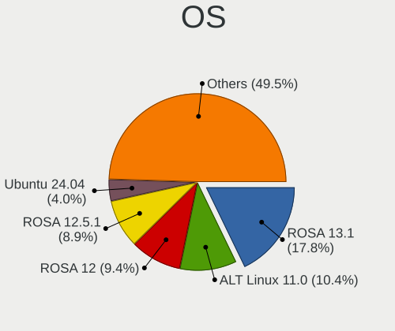

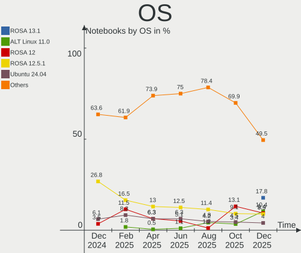

| Name               | Notebooks | Percent |
|--------------------|-----------|---------|
| ROSA 13.1          | 36        | 17.82%  |
| ALT Linux 11.0     | 21        | 10.4%   |
| ROSA 12            | 19        | 9.41%   |
| ROSA 12.5.1        | 18        | 8.91%   |
| Ubuntu 24.04       | 8         | 3.96%   |
| Fedora 43          | 8         | 3.96%   |
| Arch Rolling       | 8         | 3.96%   |
| Debian 13          | 5         | 2.48%   |
| ALT Linux 10.4     | 5         | 2.48%   |
| OpenMandriva 6.0   | 4         | 1.98%   |
| Linux Mint 22.2    | 4         | 1.98%   |
| ALT Linux 11.1     | 4         | 1.98%   |
| Ubuntu 26.04       | 3         | 1.49%   |
| Ubuntu 25.10       | 3         | 1.49%   |
| ROSA 13.0          | 3         | 1.49%   |
| Red OS 8.0         | 3         | 1.49%   |
| Red OS 7.3         | 3         | 1.49%   |
| OpenMandriva 25.90 | 3         | 1.49%   |
| Zorin 17           | 2         | 0.99%   |
| Xubuntu 24.04      | 2         | 0.99%   |
| Uncom OS 2.5       | 2         | 0.99%   |
| OpenMandriva 24.12 | 2         | 0.99%   |
| NixOS 26.05        | 2         | 0.99%   |
| KDE neon 24.04     | 2         | 0.99%   |
| ALT Linux 20250612 | 2         | 0.99%   |
| Zorin 18           | 1         | 0.5%    |
| Void Linux Rolling | 1         | 0.5%    |
| Ubuntu MATE 16.04  | 1         | 0.5%    |
| Ubuntu 22.04       | 1         | 0.5%    |
| SteamOS 3.7.17     | 1         | 0.5%    |
| ROSA R11.1         | 1         | 0.5%    |
| ROSA 13            | 1         | 0.5%    |
| ROSA 12.5          | 1         | 0.5%    |
| ROSA 12.4          | 1         | 0.5%    |
| Q4OS 5             | 1         | 0.5%    |
| openSUSE Leap-16.0 | 1         | 0.5%    |
| openSUSE Leap-15.5 | 1         | 0.5%    |
| OpenMandriva 25.11 | 1         | 0.5%    |
| OpenMandriva 25.06 | 1         | 0.5%    |
| NixOS 25.11        | 1         | 0.5%    |

OS Family
---------

OS without a version

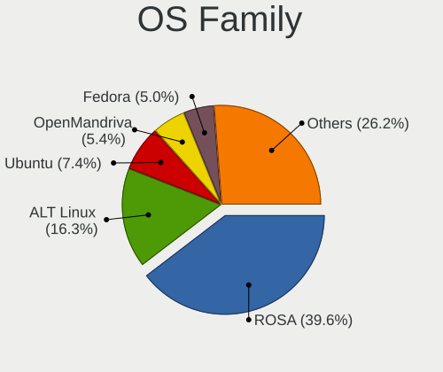

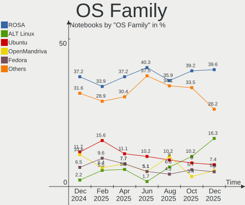

| Name         | Notebooks | Percent |
|--------------|-----------|---------|
| ROSA         | 80        | 39.6%   |
| ALT Linux    | 33        | 16.34%  |
| Ubuntu       | 15        | 7.43%   |
| OpenMandriva | 11        | 5.45%   |
| Fedora       | 10        | 4.95%   |
| Arch         | 8         | 3.96%   |
| Red OS       | 6         | 2.97%   |
| Debian       | 6         | 2.97%   |
| Linux Mint   | 5         | 2.48%   |
| Zorin        | 3         | 1.49%   |
| NixOS        | 3         | 1.49%   |
| Manjaro      | 3         | 1.49%   |
| KDE neon     | 3         | 1.49%   |
| Xubuntu      | 2         | 0.99%   |
| Uncom OS     | 2         | 0.99%   |
| openSUSE     | 2         | 0.99%   |
| CachyOS      | 2         | 0.99%   |
| Void Linux   | 1         | 0.5%    |
| Ubuntu MATE  | 1         | 0.5%    |
| SteamOS      | 1         | 0.5%    |
| Q4OS         | 1         | 0.5%    |
| MX           | 1         | 0.5%    |
| Lubuntu      | 1         | 0.5%    |
| Kubuntu      | 1         | 0.5%    |
| Kali         | 1         | 0.5%    |

Kernel
------

Version of the Linux kernel

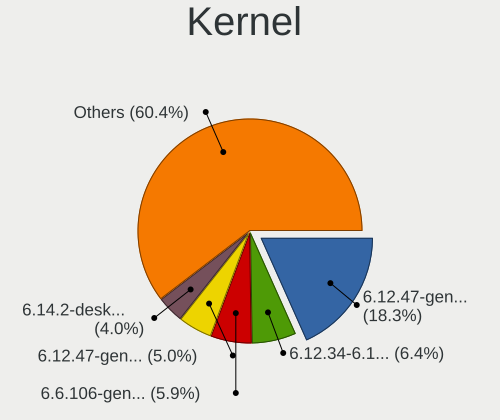

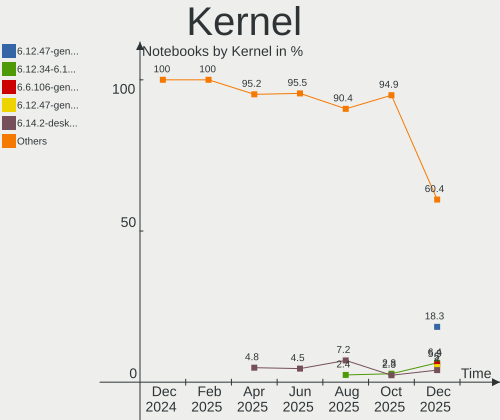

| Version                                  | Notebooks | Percent |
|------------------------------------------|-----------|---------|
| 6.12.47-generic-5rosa13-x86_64           | 37        | 18.32%  |
| 6.12.34-6.12-alt1                        | 13        | 6.44%   |
| 6.6.106-generic-3rosa2021.1-x86_64       | 12        | 5.94%   |
| 6.12.47-generic-5rosa2021.1-x86_64       | 10        | 4.95%   |
| 6.14.2-desktop-3omv2590                  | 8         | 3.96%   |
| 6.14.0-37-generic                        | 6         | 2.97%   |
| 6.12.59-6.12-alt1                        | 5         | 2.48%   |
| 6.8.0-90-generic                         | 4         | 1.98%   |
| 6.14.0-36-generic                        | 4         | 1.98%   |
| 6.12.61-6.12-alt1                        | 4         | 1.98%   |
| 6.8.0-88-generic                         | 3         | 1.49%   |
| 6.6.27-generic-3rosa2021.1-x86_64        | 3         | 1.49%   |
| 6.17.0-8-generic                         | 3         | 1.49%   |
| 6.17.0-6-generic                         | 3         | 1.49%   |
| 6.12.57+deb13-amd64                      | 3         | 1.49%   |
| 6.12.56-1.red80.x86_64                   | 3         | 1.49%   |
| 6.1.152-generic-2rosa2021.1-x86_64       | 3         | 1.49%   |
| 6.1.115-un-def-alt1                      | 3         | 1.49%   |
| 5.15.127-generic-1rosa2021.1-i686        | 3         | 1.49%   |
| 6.8.0-60-generic                         | 2         | 0.99%   |
| 6.6.106-generic-1rosa2021.1-x86_64       | 2         | 0.99%   |
| 6.17.9-zen1-1-zen                        | 2         | 0.99%   |
| 6.17.9-300.fc43.x86_64                   | 2         | 0.99%   |
| 6.17.1-300.fc43.x86_64                   | 2         | 0.99%   |
| 6.12.48-1-MANJARO                        | 2         | 0.99%   |
| 6.12.48+deb13-amd64                      | 2         | 0.99%   |
| 6.12.47-generic-2rosa2021.1-x86_64       | 2         | 0.99%   |
| 6.12.13-generic-4rosa13-x86_64           | 2         | 0.99%   |
| 6.12.1-desktop-1omv2490                  | 2         | 0.99%   |
| 6.1.20-generic-2rosa2021.1-x86_64        | 2         | 0.99%   |
| 6.1.110-1.el7.3.x86_64                   | 2         | 0.99%   |
| 6.8.0-87-generic                         | 1         | 0.5%    |
| 6.8.0-79-generic                         | 1         | 0.5%    |
| 6.8.0-58-generic                         | 1         | 0.5%    |
| 6.8.0-47-generic                         | 1         | 0.5%    |
| 6.6.94-generic-1rosa2021.1-x86_64        | 1         | 0.5%    |
| 6.5.7.xm1-1.klp-xanmod-rosa2021.1-x86_64 | 1         | 0.5%    |
| 6.18.2-zen2-1.1-zen                      | 1         | 0.5%    |
| 6.18.2-3-cachyos                         | 1         | 0.5%    |
| 6.18.2-2-cachyos                         | 1         | 0.5%    |

Kernel Family
-------------

Linux kernel without a distro release

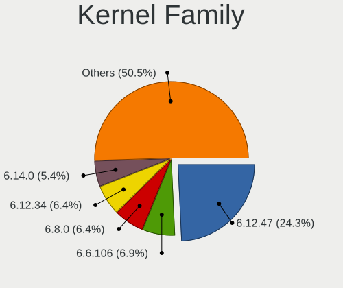

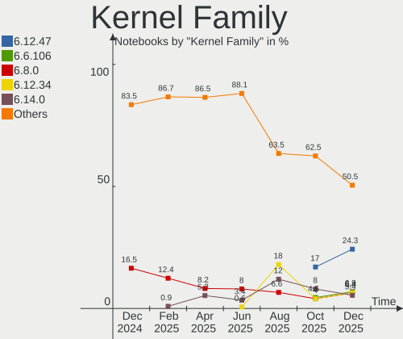

| Version  | Notebooks | Percent |
|----------|-----------|---------|
| 6.12.47  | 49        | 24.26%  |
| 6.6.106  | 14        | 6.93%   |
| 6.8.0    | 13        | 6.44%   |
| 6.12.34  | 13        | 6.44%   |
| 6.14.0   | 11        | 5.45%   |
| 6.14.2   | 8         | 3.96%   |
| 6.17.0   | 7         | 3.47%   |
| 6.17.9   | 5         | 2.48%   |
| 6.17.8   | 5         | 2.48%   |
| 6.12.59  | 5         | 2.48%   |
| 6.18.0   | 4         | 1.98%   |
| 6.12.61  | 4         | 1.98%   |
| 6.12.57  | 4         | 1.98%   |
| 6.12.48  | 4         | 1.98%   |
| 6.6.27   | 3         | 1.49%   |
| 6.18.2   | 3         | 1.49%   |
| 6.12.56  | 3         | 1.49%   |
| 6.12.1   | 3         | 1.49%   |
| 6.1.152  | 3         | 1.49%   |
| 6.1.115  | 3         | 1.49%   |
| 5.15.127 | 3         | 1.49%   |
| 6.18.1   | 2         | 0.99%   |
| 6.17.1   | 2         | 0.99%   |
| 6.12.60  | 2         | 0.99%   |
| 6.12.13  | 2         | 0.99%   |
| 6.1.20   | 2         | 0.99%   |
| 6.1.158  | 2         | 0.99%   |
| 6.1.110  | 2         | 0.99%   |
| 6.6.94   | 1         | 0.5%    |
| 6.5.7    | 1         | 0.5%    |
| 6.17.12  | 1         | 0.5%    |
| 6.17.11  | 1         | 0.5%    |
| 6.17.10  | 1         | 0.5%    |
| 6.16.8   | 1         | 0.5%    |
| 6.15.8   | 1         | 0.5%    |
| 6.12.63  | 1         | 0.5%    |
| 6.12.62  | 1         | 0.5%    |
| 6.12.55  | 1         | 0.5%    |
| 6.12.51  | 1         | 0.5%    |
| 6.12.41  | 1         | 0.5%    |

Kernel Major Ver.
-----------------

Linux kernel major version

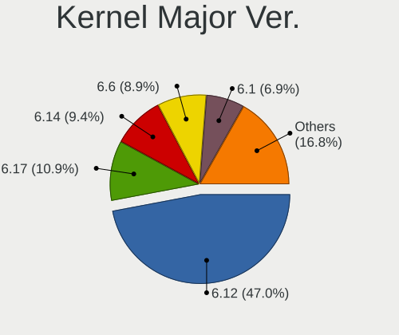

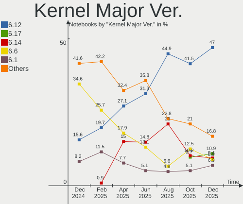

| Version | Notebooks | Percent |
|---------|-----------|---------|
| 6.12    | 95        | 47.03%  |
| 6.17    | 22        | 10.89%  |
| 6.14    | 19        | 9.41%   |
| 6.6     | 18        | 8.91%   |
| 6.1     | 14        | 6.93%   |
| 6.8     | 13        | 6.44%   |
| 6.18    | 9         | 4.46%   |
| 5.15    | 3         | 1.49%   |
| 5.10    | 2         | 0.99%   |
| 6.5     | 1         | 0.5%    |
| 6.16    | 1         | 0.5%    |
| 6.15    | 1         | 0.5%    |
| 6.11    | 1         | 0.5%    |
| 5.14    | 1         | 0.5%    |
| 4.4     | 1         | 0.5%    |
| 4.15    | 1         | 0.5%    |

Arch
----

OS architecture (x86_64, i586, etc.)

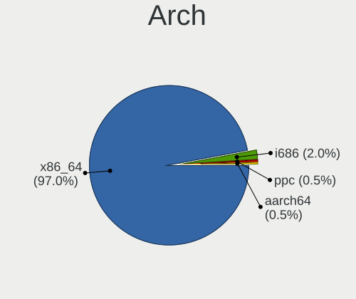

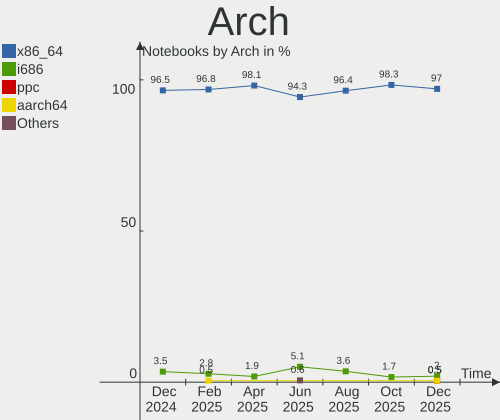

| Name    | Notebooks | Percent |
|---------|-----------|---------|
| x86_64  | 196       | 97.03%  |
| i686    | 4         | 1.98%   |
| ppc     | 1         | 0.5%    |
| aarch64 | 1         | 0.5%    |

DE
--

Desktop Environment

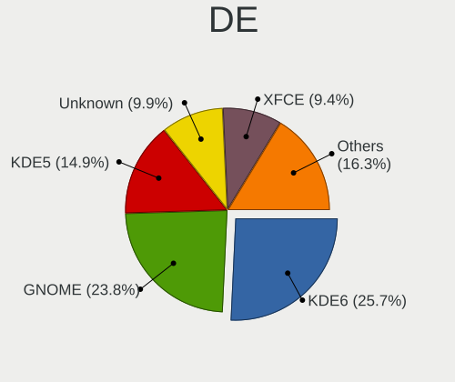

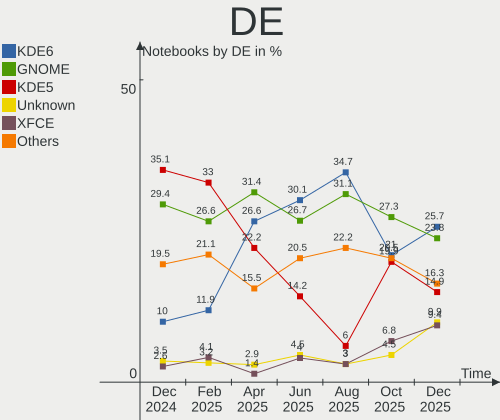

| Name       | Notebooks | Percent |
|------------|-----------|---------|
| KDE6       | 52        | 25.74%  |
| GNOME      | 48        | 23.76%  |
| KDE5       | 30        | 14.85%  |
| Unknown    | 20        | 9.9%    |
| XFCE       | 19        | 9.41%   |
| LXQt       | 10        | 4.95%   |
| MATE       | 7         | 3.47%   |
| KDE        | 5         | 2.48%   |
| X-Cinnamon | 4         | 1.98%   |
| KDE4       | 3         | 1.49%   |
| Trinity    | 1         | 0.5%    |
| niri       | 1         | 0.5%    |
| Hyprland   | 1         | 0.5%    |
| Cinnamon   | 1         | 0.5%    |

Display Server
--------------

X11 or Wayland

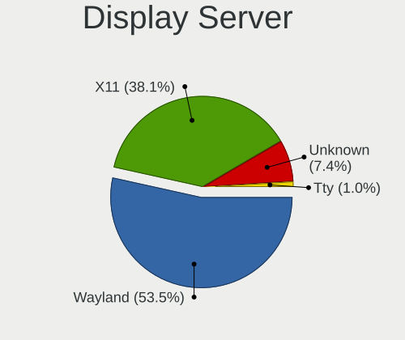

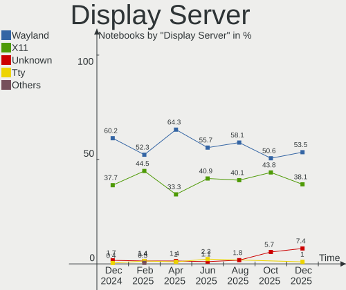

| Name    | Notebooks | Percent |
|---------|-----------|---------|
| Wayland | 108       | 53.47%  |
| X11     | 77        | 38.12%  |
| Unknown | 15        | 7.43%   |
| Tty     | 2         | 0.99%   |

Display Manager
---------------

SDDM, LightDM, etc.

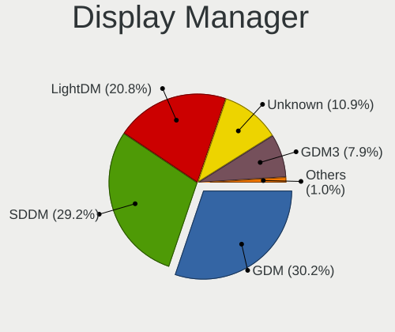

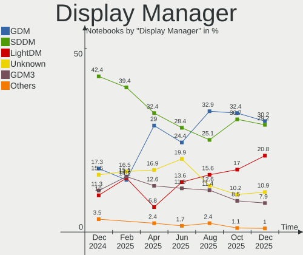

| Name    | Notebooks | Percent |
|---------|-----------|---------|
| GDM     | 61        | 30.2%   |
| SDDM    | 59        | 29.21%  |
| LightDM | 42        | 20.79%  |
| Unknown | 22        | 10.89%  |
| GDM3    | 16        | 7.92%   |
| TDM     | 1         | 0.5%    |
| KDM     | 1         | 0.5%    |

OS Lang
-------

Language

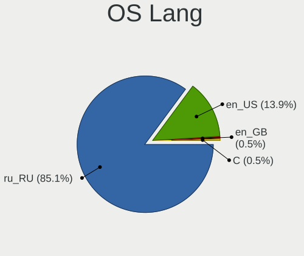

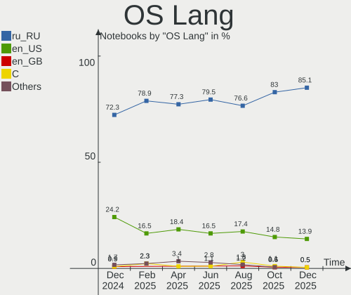

| Lang  | Notebooks | Percent |
|-------|-----------|---------|
| ru_RU | 172       | 85.15%  |
| en_US | 28        | 13.86%  |
| en_GB | 1         | 0.5%    |
| C     | 1         | 0.5%    |

Boot Mode
---------

EFI or BIOS

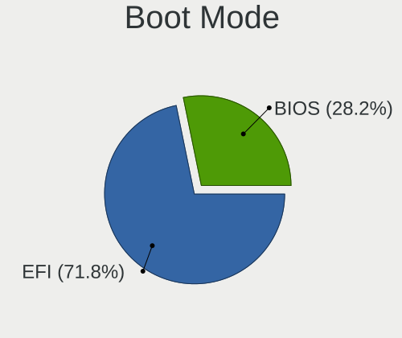

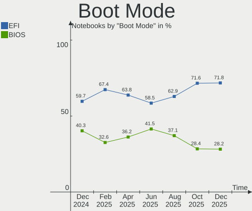

| Mode | Notebooks | Percent |
|------|-----------|---------|
| EFI  | 145       | 71.78%  |
| BIOS | 57        | 28.22%  |

Filesystem
----------

Type of filesystem

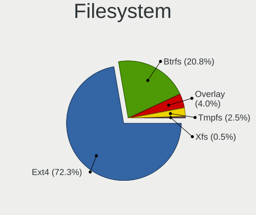

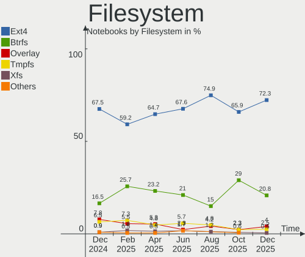

| Type    | Notebooks | Percent |
|---------|-----------|---------|
| Ext4    | 146       | 72.28%  |
| Btrfs   | 42        | 20.79%  |
| Overlay | 8         | 3.96%   |
| Tmpfs   | 5         | 2.48%   |
| Xfs     | 1         | 0.5%    |

Part. scheme
------------

Scheme of partitioning

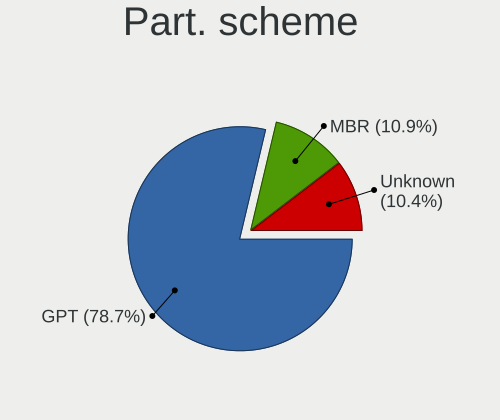

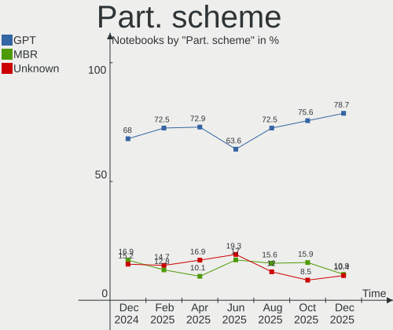

| Type    | Notebooks | Percent |
|---------|-----------|---------|
| GPT     | 159       | 78.71%  |
| MBR     | 22        | 10.89%  |
| Unknown | 21        | 10.4%   |

Dual Boot with Linux/BSD
------------------------

Hosting more than one Linux/BSD

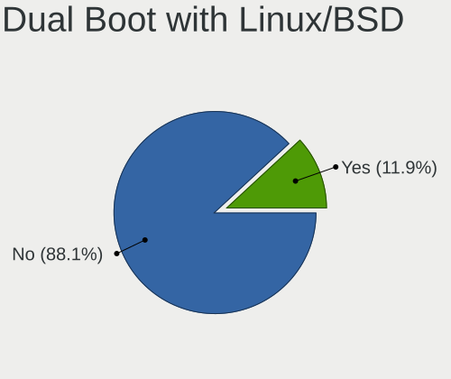

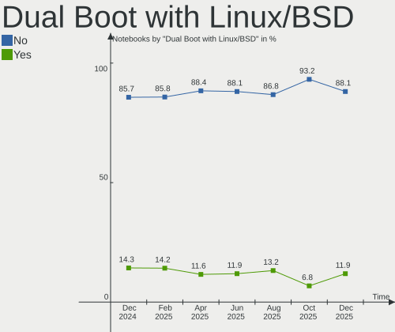

| Dual boot | Notebooks | Percent |
|-----------|-----------|---------|
| No        | 178       | 88.12%  |
| Yes       | 24        | 11.88%  |

Dual Boot (Win)
---------------

Hosting Linux and Windows

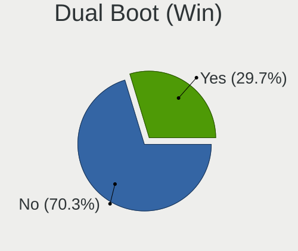

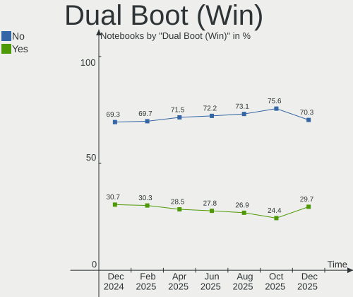

| Dual boot | Notebooks | Percent |
|-----------|-----------|---------|
| No        | 142       | 70.3%   |
| Yes       | 60        | 29.7%   |

Board
-----

Vendor
------

Motherboard manufacturer

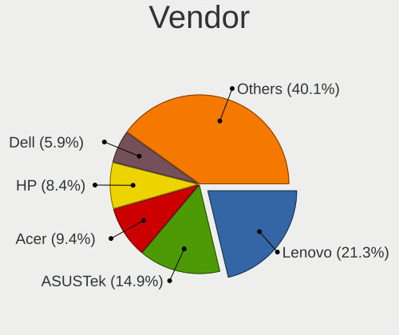

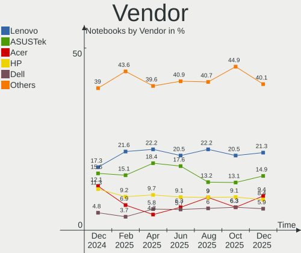

| Name                     | Notebooks | Percent |
|--------------------------|-----------|---------|
| Lenovo                   | 43        | 21.29%  |
| ASUSTek Computer         | 30        | 14.85%  |
| Acer                     | 19        | 9.41%   |
| Hewlett-Packard          | 17        | 8.42%   |
| Dell                     | 12        | 5.94%   |
| MSI                      | 11        | 5.45%   |
| Aquarius                 | 7         | 3.47%   |
| Samsung Electronics      | 6         | 2.97%   |
| KVADRA                   | 6         | 2.97%   |
| ICL Techno               | 5         | 2.48%   |
| HUAWEI                   | 5         | 2.48%   |
| HONOR                    | 4         | 1.98%   |
| Unknown                  | 4         | 1.98%   |
| LTD Delovoy Office       | 3         | 1.49%   |
| ICL                      | 3         | 1.49%   |
| XIAOMI                   | 2         | 0.99%   |
| Sony                     | 2         | 0.99%   |
| MECHREVO                 | 2         | 0.99%   |
| Infinix                  | 2         | 0.99%   |
| DEXP                     | 2         | 0.99%   |
| Clevo                    | 2         | 0.99%   |
| Chuwi                    | 2         | 0.99%   |
| Valve                    | 1         | 0.5%    |
| Toshiba                  | 1         | 0.5%    |
| Packard Bell             | 1         | 0.5%    |
| Notebook                 | 1         | 0.5%    |
| Maibenben                | 1         | 0.5%    |
| Lunnen                   | 1         | 0.5%    |
| iRU                      | 1         | 0.5%    |
| HIPER Technology Limited | 1         | 0.5%    |
| HIPER                    | 1         | 0.5%    |
| Echips Import            | 1         | 0.5%    |
| Digma Pro                | 1         | 0.5%    |
| DEPO Computers           | 1         | 0.5%    |
| ANCOMP                   | 1         | 0.5%    |

Model
-----

Motherboard model

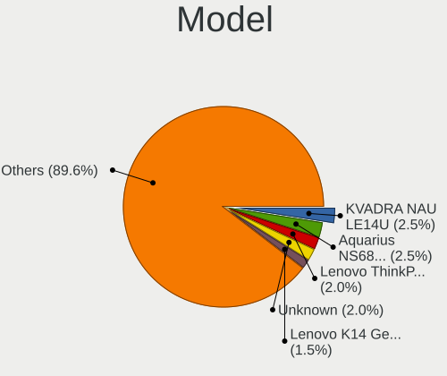

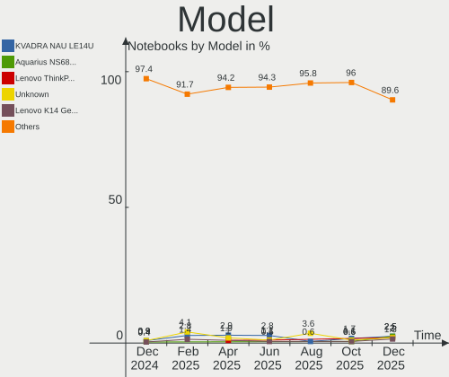

| Name                                       | Notebooks | Percent |
|--------------------------------------------|-----------|---------|
| KVADRA NAU LE14U                           | 5         | 2.48%   |
| Aquarius NS685U R11                        | 5         | 2.48%   |
| Lenovo ThinkPad E14 Gen 4 21E4S2JB00       | 4         | 1.98%   |
| Unknown                                    | 4         | 1.98%   |
| Lenovo K14 Gen 1 21CSS16E00                | 3         | 1.49%   |
| Lenovo G570 20079                          | 2         | 0.99%   |
| Infinix Y3 Max                             | 2         | 0.99%   |
| ICL Techno F150a                           | 2         | 0.99%   |
| HUAWEI MCLG-XX                             | 2         | 0.99%   |
| HUAWEI BOM-WXX9                            | 2         | 0.99%   |
| HP Notebook                                | 2         | 0.99%   |
| HP Laptop 15-bw0xx                         | 2         | 0.99%   |
| Clevo NL41MU2                              | 2         | 0.99%   |
| ASUS Vivobook Go E1504FA_E1504FA           | 2         | 0.99%   |
| Aquarius CMP NS685U_4                      | 2         | 0.99%   |
| XIAOMI REDMI Book Pro 16 2025              | 1         | 0.5%    |
| XIAOMI Redmi Book Pro 14 2024              | 1         | 0.5%    |
| Valve Galileo                              | 1         | 0.5%    |
| Toshiba Satellite C650                     | 1         | 0.5%    |
| Sony VPCCW1S1R                             | 1         | 0.5%    |
| Sony SVE14A2V1RWI                          | 1         | 0.5%    |
| Samsung R580/R590                          | 1         | 0.5%    |
| Samsung R428/P428                          | 1         | 0.5%    |
| Samsung 355V4C/356V4C/3445VC/3545VC        | 1         | 0.5%    |
| Samsung 350V5C/351V5C/3540VC/3440VC        | 1         | 0.5%    |
| Samsung 300E4A/300E5A/300E7A/3430EA/3530EA | 1         | 0.5%    |
| Samsung 300E4A/300E5A/300E7A               | 1         | 0.5%    |
| Packard Bell EasyNote TX86                 | 1         | 0.5%    |
| Notebook WA50SRQ                           | 1         | 0.5%    |
| MSI Vector GP77 13VG                       | 1         | 0.5%    |
| MSI Vector 17 HX A14VIG                    | 1         | 0.5%    |
| MSI U90/U100                               | 1         | 0.5%    |
| MSI U270 series                            | 1         | 0.5%    |
| MSI Thin 15 B12UCX                         | 1         | 0.5%    |
| MSI Prestige 14H B12UCX                    | 1         | 0.5%    |
| MSI Modern 15 A5M                          | 1         | 0.5%    |
| MSI Modern 14 C12MO                        | 1         | 0.5%    |
| MSI GF63 Thin 11UC                         | 1         | 0.5%    |
| MSI CX61 0NC/CX61 0ND/CX61 0NF/CX61 0NE    | 1         | 0.5%    |
| MSI Alpha 15 B5EEK                         | 1         | 0.5%    |

Model Family
------------

Motherboard model prefix

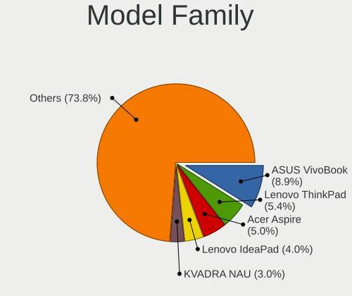

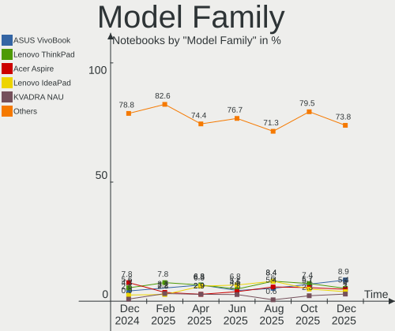

| Name                   | Notebooks | Percent |
|------------------------|-----------|---------|
| ASUS VivoBook          | 18        | 8.91%   |
| Lenovo ThinkPad        | 11        | 5.45%   |
| Acer Aspire            | 10        | 4.95%   |
| Lenovo IdeaPad         | 8         | 3.96%   |
| KVADRA NAU             | 6         | 2.97%   |
| Dell Latitude          | 6         | 2.97%   |
| Dell Inspiron          | 5         | 2.48%   |
| Aquarius NS685U        | 5         | 2.48%   |
| Lenovo ThinkBook       | 4         | 1.98%   |
| HP ProBook             | 4         | 1.98%   |
| Unknown                | 4         | 1.98%   |
| LTD Delovoy Office EVE | 3         | 1.49%   |
| Lenovo Legion          | 3         | 1.49%   |
| Lenovo K14             | 3         | 1.49%   |
| HP Laptop              | 3         | 1.49%   |
| ASUS ASUS              | 3         | 1.49%   |
| Acer TravelMate        | 3         | 1.49%   |
| XIAOMI REDMI           | 2         | 0.99%   |
| Samsung 300E4A         | 2         | 0.99%   |
| MSI Vector             | 2         | 0.99%   |
| MSI Modern             | 2         | 0.99%   |
| Lenovo G570            | 2         | 0.99%   |
| Infinix Y3             | 2         | 0.99%   |
| ICL Techno F150a       | 2         | 0.99%   |
| ICL RAYbook            | 2         | 0.99%   |
| HUAWEI MCLG-XX         | 2         | 0.99%   |
| HUAWEI BOM-WXX9        | 2         | 0.99%   |
| HP Pavilion            | 2         | 0.99%   |
| HP Notebook            | 2         | 0.99%   |
| Clevo NL41MU2          | 2         | 0.99%   |
| Aquarius CMP           | 2         | 0.99%   |
| Acer Swift             | 2         | 0.99%   |
| Acer Extensa           | 2         | 0.99%   |
| Valve Galileo          | 1         | 0.5%    |
| Toshiba Satellite      | 1         | 0.5%    |
| Sony VPCCW1S1R         | 1         | 0.5%    |
| Sony SVE14A2V1RWI      | 1         | 0.5%    |
| Samsung R580           | 1         | 0.5%    |
| Samsung R428           | 1         | 0.5%    |
| Samsung 355V4C         | 1         | 0.5%    |

MFG Year
--------

Motherboard manufacture year

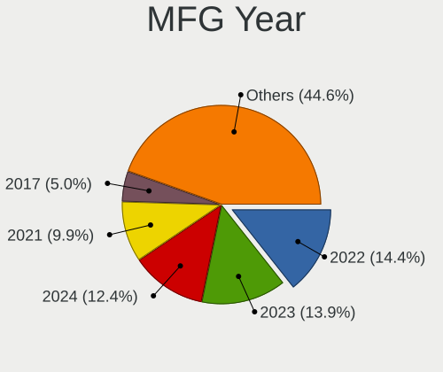

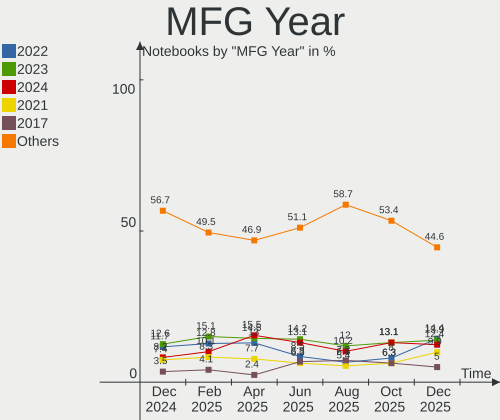

| Year    | Notebooks | Percent |
|---------|-----------|---------|
| 2022    | 29        | 14.36%  |
| 2023    | 28        | 13.86%  |
| 2024    | 25        | 12.38%  |
| 2021    | 20        | 9.9%    |
| 2017    | 10        | 4.95%   |
| 2012    | 10        | 4.95%   |
| 2011    | 10        | 4.95%   |
| 2025    | 9         | 4.46%   |
| 2013    | 9         | 4.46%   |
| 2010    | 9         | 4.46%   |
| 2019    | 6         | 2.97%   |
| 2009    | 6         | 2.97%   |
| 2020    | 5         | 2.48%   |
| 2018    | 5         | 2.48%   |
| 2014    | 5         | 2.48%   |
| 2016    | 4         | 1.98%   |
| 2015    | 4         | 1.98%   |
| 2008    | 3         | 1.49%   |
| 2007    | 2         | 0.99%   |
| Unknown | 2         | 0.99%   |
| 2004    | 1         | 0.5%    |

Form Factor
-----------

Physical design of the computer

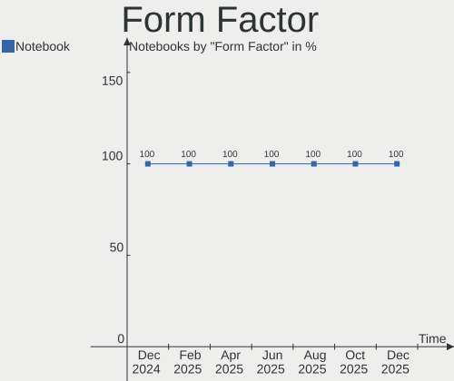

| Name     | Notebooks | Percent |
|----------|-----------|---------|
| Notebook | 202       | 100%    |

Secure Boot
-----------

Enabled or disabled

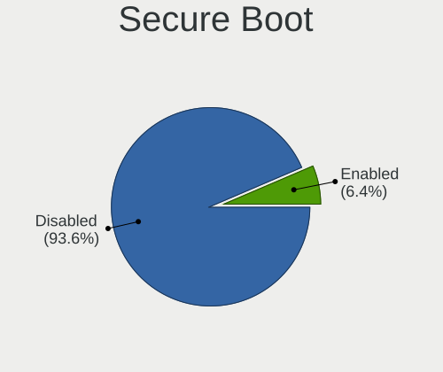

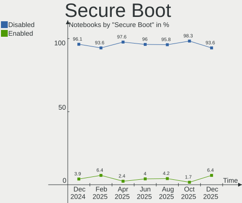

| State    | Notebooks | Percent |
|----------|-----------|---------|
| Disabled | 189       | 93.56%  |
| Enabled  | 13        | 6.44%   |

Coreboot
--------

Have coreboot on board

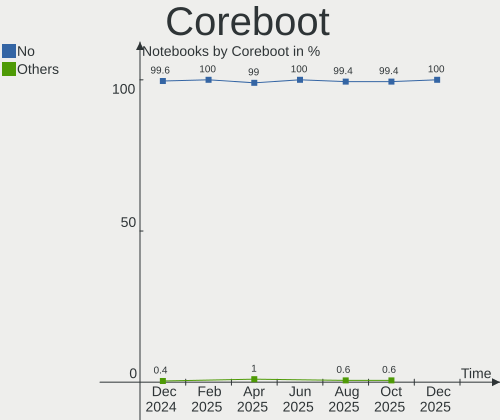

| Used | Notebooks | Percent |
|------|-----------|---------|
| No   | 202       | 100%    |

RAM Size
--------

Total RAM memory

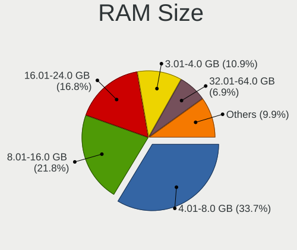

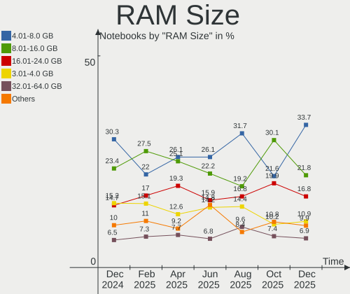

| Size in GB  | Notebooks | Percent |
|-------------|-----------|---------|
| 4.01-8.0    | 68        | 33.66%  |
| 8.01-16.0   | 44        | 21.78%  |
| 16.01-24.0  | 34        | 16.83%  |
| 3.01-4.0    | 22        | 10.89%  |
| 32.01-64.0  | 14        | 6.93%   |
| 1.01-2.0    | 7         | 3.47%   |
| 24.01-32.0  | 6         | 2.97%   |
| 2.01-3.0    | 6         | 2.97%   |
| 64.01-256.0 | 1         | 0.5%    |

RAM Used
--------

Used RAM memory

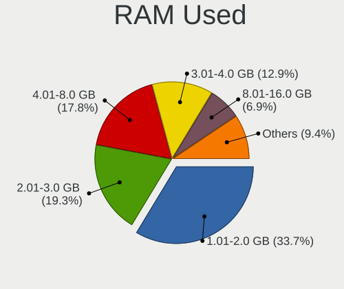

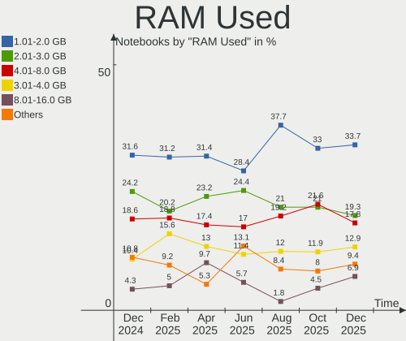

| Used GB    | Notebooks | Percent |
|------------|-----------|---------|
| 1.01-2.0   | 68        | 33.66%  |
| 2.01-3.0   | 39        | 19.31%  |
| 4.01-8.0   | 36        | 17.82%  |
| 3.01-4.0   | 26        | 12.87%  |
| 8.01-16.0  | 14        | 6.93%   |
| 0.51-1.0   | 10        | 4.95%   |
| 0.01-0.5   | 5         | 2.48%   |
| 16.01-24.0 | 3         | 1.49%   |
| 24.01-32.0 | 1         | 0.5%    |

Total Drives
------------

Number of drives on board

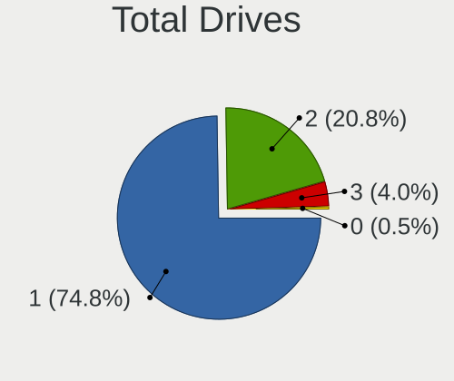

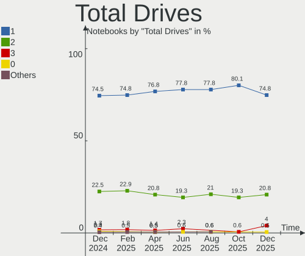

| Drives | Notebooks | Percent |
|--------|-----------|---------|
| 1      | 151       | 74.75%  |
| 2      | 42        | 20.79%  |
| 3      | 8         | 3.96%   |
| 0      | 1         | 0.5%    |

Has CD-ROM
----------

Has CD-ROM on board

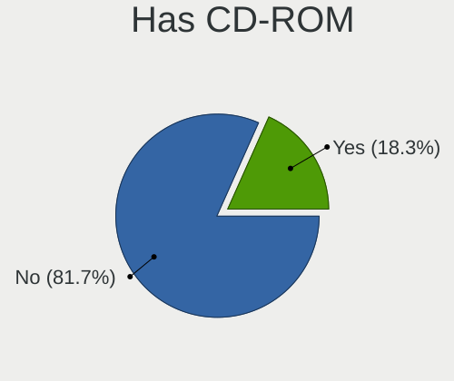

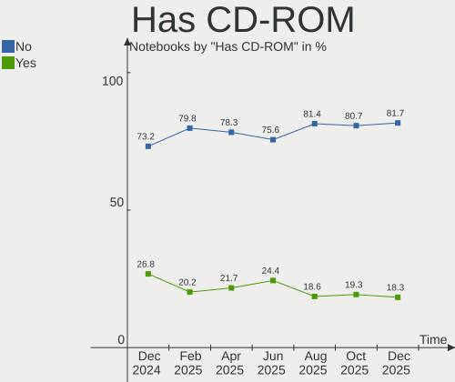

| Presented | Notebooks | Percent |
|-----------|-----------|---------|
| No        | 165       | 81.68%  |
| Yes       | 37        | 18.32%  |

Has Ethernet
------------

Has Ethernet on board

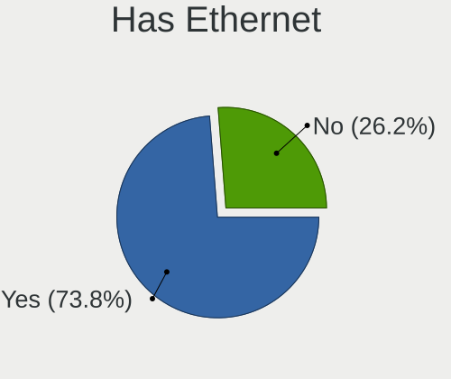

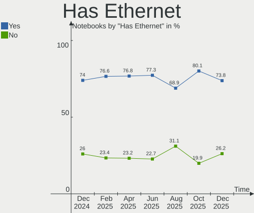

| Presented | Notebooks | Percent |
|-----------|-----------|---------|
| Yes       | 149       | 73.76%  |
| No        | 53        | 26.24%  |

Has WiFi
--------

Has WiFi module

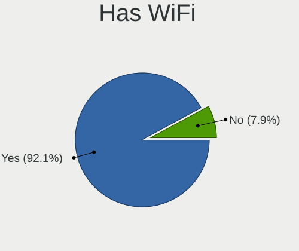

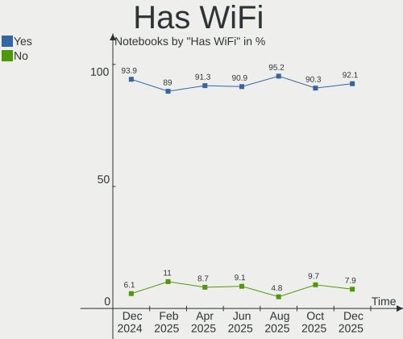

| Presented | Notebooks | Percent |
|-----------|-----------|---------|
| Yes       | 186       | 92.08%  |
| No        | 16        | 7.92%   |

Has Bluetooth
-------------

Has Bluetooth module

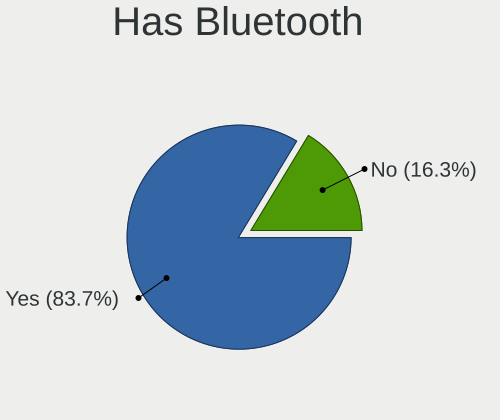

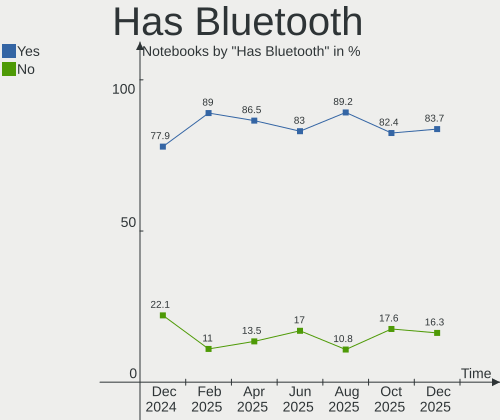

| Presented | Notebooks | Percent |
|-----------|-----------|---------|
| Yes       | 169       | 83.66%  |
| No        | 33        | 16.34%  |

Location
--------

Country
-------

Geographic location (country)

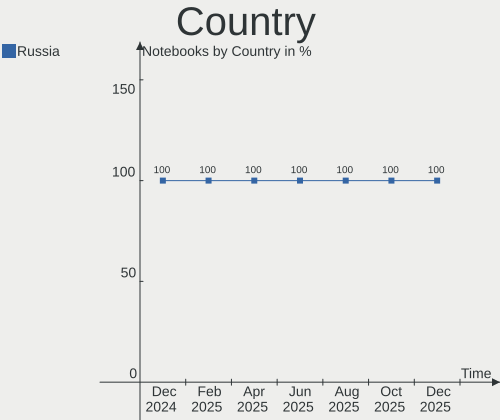

| Country | Notebooks | Percent |
|---------|-----------|---------|
| Russia  | 202       | 100%    |

City
----

Geographic location (city)

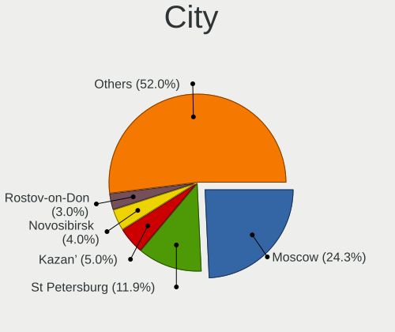

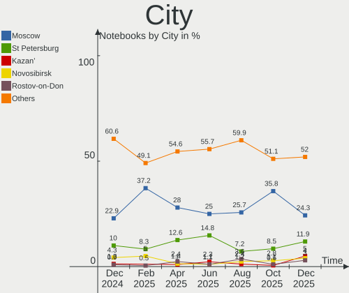

| City             | Notebooks | Percent |
|------------------|-----------|---------|
| Moscow           | 49        | 24.26%  |
| St Petersburg    | 24        | 11.88%  |
| Kazan’         | 10        | 4.95%   |
| Novosibirsk      | 8         | 3.96%   |
| Rostov-on-Don    | 6         | 2.97%   |
| Chelyabinsk      | 6         | 2.97%   |
| Vladimir         | 4         | 1.98%   |
| Krasnoyarsk      | 4         | 1.98%   |
| Krasnodar        | 4         | 1.98%   |
| Yekaterinburg    | 3         | 1.49%   |
| Kirov            | 3         | 1.49%   |
| Kaluga           | 3         | 1.49%   |
| Balashikha       | 3         | 1.49%   |
| Yoshkar-Ola      | 2         | 0.99%   |
| Ulyanovsk        | 2         | 0.99%   |
| Tyumen           | 2         | 0.99%   |
| Tomsk            | 2         | 0.99%   |
| Nizhniy Novgorod | 2         | 0.99%   |
| Murmansk         | 2         | 0.99%   |
| Kurgan           | 2         | 0.99%   |
| Izhevsk          | 2         | 0.99%   |
| Bryansk          | 2         | 0.99%   |
| Arkhangelsk      | 2         | 0.99%   |
| Anapa            | 2         | 0.99%   |
| Yakutsk          | 1         | 0.5%    |
| Voronezh         | 1         | 0.5%    |
| Volokolamsk      | 1         | 0.5%    |
| Vologda          | 1         | 0.5%    |
| Volgodonsk       | 1         | 0.5%    |
| Vladikavkaz      | 1         | 0.5%    |
| Vidnoye          | 1         | 0.5%    |
| Veliky Novgorod  | 1         | 0.5%    |
| Ussuriysk        | 1         | 0.5%    |
| Uspenka          | 1         | 0.5%    |
| Tura             | 1         | 0.5%    |
| Tula             | 1         | 0.5%    |
| Tsarskoye Selo   | 1         | 0.5%    |
| Stupino          | 1         | 0.5%    |
| Stavropol        | 1         | 0.5%    |
| Smolensk         | 1         | 0.5%    |

Drives
------

Drive Vendor
------------

Hard drive vendors

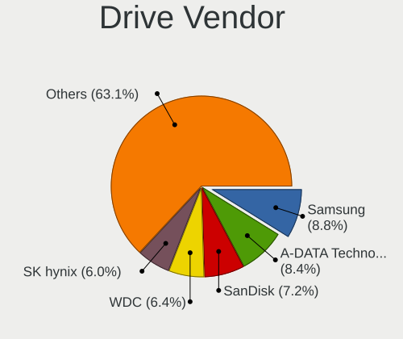

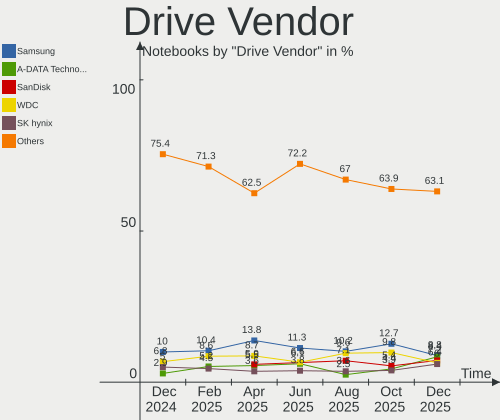

| Vendor                      | Notebooks | Drives | Percent |
|-----------------------------|-----------|--------|---------|
| Samsung Electronics         | 22        | 24     | 8.84%   |
| A-DATA Technology           | 21        | 21     | 8.43%   |
| SanDisk                     | 18        | 18     | 7.23%   |
| WDC                         | 16        | 16     | 6.43%   |
| SK hynix                    | 15        | 15     | 6.02%   |
| Kingston                    | 12        | 13     | 4.82%   |
| Micron Technology           | 11        | 11     | 4.42%   |
| Unknown                     | 10        | 11     | 4.02%   |
| Seagate                     | 8         | 8      | 3.21%   |
| MAXIO Technology (Hangzhou) | 7         | 7      | 2.81%   |
| Kingston Technology Company | 7         | 7      | 2.81%   |
| Hitachi                     | 6         | 6      | 2.41%   |
| Wodposit                    | 5         | 5      | 2.01%   |
| Toshiba                     | 5         | 5      | 2.01%   |
| Intel                       | 5         | 6      | 2.01%   |
| China                       | 4         | 4      | 1.61%   |
| BIWIN                       | 4         | 4      | 1.61%   |
| QOPP                        | 3         | 3      | 1.2%    |
| KIOXIA                      | 3         | 3      | 1.2%    |
| JetFlash                    | 3         | 3      | 1.2%    |
| Unknown                     | 3         | 3      | 1.2%    |
| Yangtze Memory Technologies | 2         | 2      | 0.8%    |
| SPCC                        | 2         | 2      | 0.8%    |
| Smartbuy                    | 2         | 2      | 0.8%    |
| SCY                         | 2         | 2      | 0.8%    |
| Realtek Semiconductor       | 2         | 2      | 0.8%    |
| Phison                      | 2         | 2      | 0.8%    |
| KingSpec                    | 2         | 2      | 0.8%    |
| HJDK                        | 2         | 2      | 0.8%    |
| Fujitsu                     | 2         | 2      | 0.8%    |
| FORESEE                     | 2         | 2      | 0.8%    |
| Digma                       | 2         | 2      | 0.8%    |
| DEXP                        | 2         | 2      | 0.8%    |
| Crucial                     | 2         | 2      | 0.8%    |
| Apacer                      | 2         | 2      | 0.8%    |
| Zheino                      | 1         | 1      | 0.4%    |
| YMTC                        | 1         | 1      | 0.4%    |
| Union Memory (Shenzhen)     | 1         | 1      | 0.4%    |
| Union Memory                | 1         | 1      | 0.4%    |
| UMIS                        | 1         | 1      | 0.4%    |

Drive Model
-----------

Hard drive models

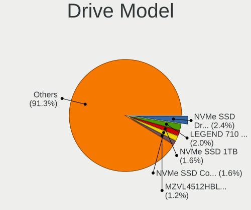

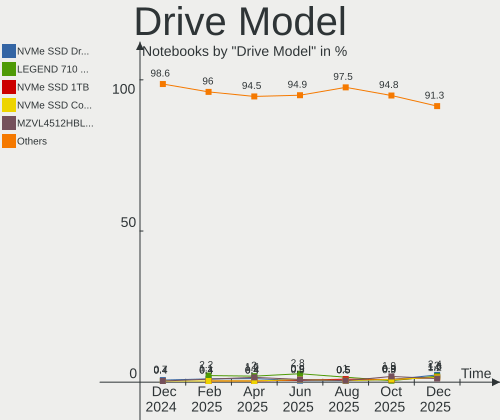

| Model                                                    | Notebooks | Percent |
|----------------------------------------------------------|-----------|---------|
| SanDisk NVMe SSD Drive 512GB                             | 6         | 2.37%   |
| A-DATA LEGEND 710 512GB                                  | 5         | 1.98%   |
| Wodposit NVMe SSD 1TB                                    | 4         | 1.58%   |
| MAXIO (Hangzhou) NVMe SSD Controller MAP1202 2TB         | 4         | 1.58%   |
| Samsung MZVL4512HBLU-00BTW 512GB                         | 3         | 1.19%   |
| JetFlash Transcend 128GB                                 | 3         | 1.19%   |
| A-DATA SU800NS38 256GB SSD                               | 3         | 1.19%   |
| Unknown                                                  | 3         | 1.19%   |
| WDC WD5000LPCX-24VHAT0 500GB                             | 2         | 0.79%   |
| WDC WD5000LPCX-24C6HT0 500GB                             | 2         | 0.79%   |
| WDC PC SN530 SDBPMPZ-512G-1001 512GB                     | 2         | 0.79%   |
| Toshiba MQ01ABF050 500GB                                 | 2         | 0.79%   |
| Toshiba MK2555GSX 250GB                                  | 2         | 0.79%   |
| SPCC Solid State Disk 256GB                              | 2         | 0.79%   |
| Smartbuy SSD 240GB                                       | 2         | 0.79%   |
| Seagate ST500LM021-1KJ152 500GB                          | 2         | 0.79%   |
| Seagate ST1000LM035-1RK172 1TB                           | 2         | 0.79%   |
| Samsung SSD 990 PRO 1TB                                  | 2         | 0.79%   |
| Samsung MZVLC1T0HFLU-00BLL 1TB                           | 2         | 0.79%   |
| QOPP Q600S 256G SSD                                      | 2         | 0.79%   |
| Micron MTFDKCD512TFK 512GB                               | 2         | 0.79%   |
| Micron 2400_MTFDKBA512QFM 512GB                          | 2         | 0.79%   |
| Kingston SA400S37120G 120GB SSD                          | 2         | 0.79%   |
| Intel SSDPEKNU512GZ 512GB                                | 2         | 0.79%   |
| HJDK SSD 256GB                                           | 2         | 0.79%   |
| FORESEE VP1000F512G 512GB                                | 2         | 0.79%   |
| China SSD 512GB                                          | 2         | 0.79%   |
| BIWIN CE480T5D101-256 256GB                              | 2         | 0.79%   |
| A-DATA SX6000PNP 256GB                                   | 2         | 0.79%   |
| A-DATA SU650 240GB SSD                                   | 2         | 0.79%   |
| Zheino CHN 25SATAA3 060 64GB SSD                         | 1         | 0.4%    |
| YMTC PC41Q-512GB-B                                       | 1         | 0.4%    |
| Yangtze Memory PC411 M.2 2242 NVMe SSD (DRAM-less) 1TB   | 1         | 0.4%    |
| Yangtze Memory PC300 M.2 2280 NVMe SSD (DRAM-less) 512GB | 1         | 0.4%    |
| Wodposit NVMe SSD Drive 512GB                            | 1         | 0.4%    |
| WDC WDS500G1R0B-68A4Z0 500GB SSD                         | 1         | 0.4%    |
| WDC WDS120G2G0A-00JH30 120GB SSD                         | 1         | 0.4%    |
| WDC WD7500BPVT-22HXZT3 752GB                             | 1         | 0.4%    |
| WDC WD5000LPSX-00A6WT0 500GB                             | 1         | 0.4%    |
| WDC WD5000BPVT-75HXZT3 500GB                             | 1         | 0.4%    |

HDD Vendor
----------

Hard disk drive vendors

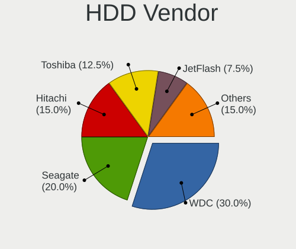

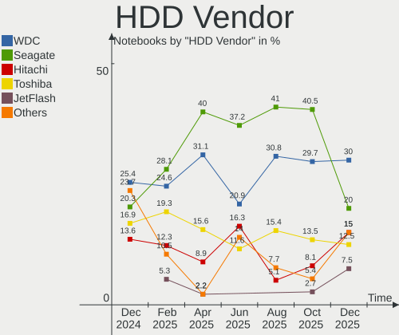

| Vendor              | Notebooks | Drives | Percent |
|---------------------|-----------|--------|---------|
| WDC                 | 12        | 12     | 30%     |
| Seagate             | 8         | 8      | 20%     |
| Hitachi             | 6         | 6      | 15%     |
| Toshiba             | 5         | 5      | 12.5%   |
| JetFlash            | 3         | 3      | 7.5%    |
| Unknown             | 2         | 2      | 5%      |
| Fujitsu             | 2         | 2      | 5%      |
| Samsung Electronics | 1         | 1      | 2.5%    |
| HGST                | 1         | 1      | 2.5%    |

SSD Vendor
----------

Solid state drive vendors

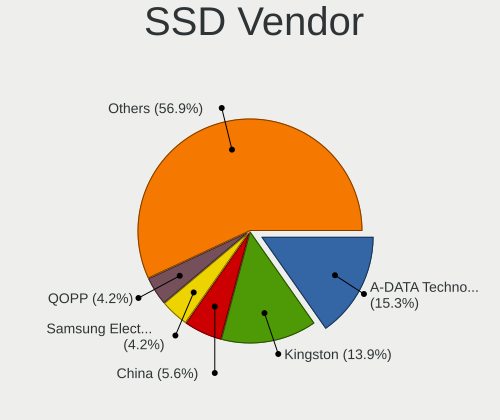

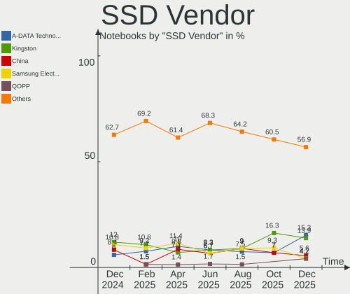

| Vendor              | Notebooks | Drives | Percent |
|---------------------|-----------|--------|---------|
| A-DATA Technology   | 11        | 11     | 15.28%  |
| Kingston            | 10        | 10     | 13.89%  |
| China               | 4         | 4      | 5.56%   |
| Samsung Electronics | 3         | 3      | 4.17%   |
| QOPP                | 3         | 3      | 4.17%   |
| WDC                 | 2         | 2      | 2.78%   |
| SPCC                | 2         | 2      | 2.78%   |
| Smartbuy            | 2         | 2      | 2.78%   |
| SK hynix            | 2         | 2      | 2.78%   |
| SanDisk             | 2         | 2      | 2.78%   |
| DEXP                | 2         | 2      | 2.78%   |
| Crucial             | 2         | 2      | 2.78%   |
| Apacer              | 2         | 2      | 2.78%   |
| Zheino              | 1         | 1      | 1.39%   |
| Transcend           | 1         | 1      | 1.39%   |
| Team                | 1         | 1      | 1.39%   |
| SSSTC               | 1         | 1      | 1.39%   |
| SKIHOTAR            | 1         | 1      | 1.39%   |
| Qumo                | 1         | 1      | 1.39%   |
| PNY                 | 1         | 1      | 1.39%   |
| Plextor             | 1         | 1      | 1.39%   |
| Patriot             | 1         | 1      | 1.39%   |
| Palit               | 1         | 1      | 1.39%   |
| OCZ                 | 1         | 1      | 1.39%   |
| Netac               | 1         | 1      | 1.39%   |
| Neo                 | 1         | 1      | 1.39%   |
| LITEON              | 1         | 1      | 1.39%   |
| KingSpec            | 1         | 1      | 1.39%   |
| KingFast            | 1         | 1      | 1.39%   |
| Intel               | 1         | 1      | 1.39%   |
| HS-SSD-E100         | 1         | 1      | 1.39%   |
| HJDK                | 1         | 1      | 1.39%   |
| Gigabyte Technology | 1         | 1      | 1.39%   |
| Fanxiang            | 1         | 1      | 1.39%   |
| ExeGate             | 1         | 1      | 1.39%   |
| Digma               | 1         | 1      | 1.39%   |
| Biwintech           | 1         | 1      | 1.39%   |
| Unknown             | 1         | 1      | 1.39%   |

Drive Kind
----------

HDD or SSD

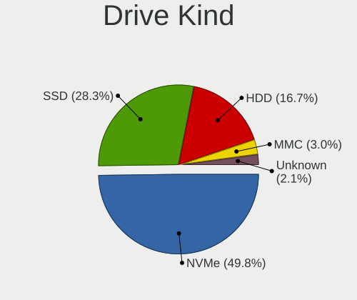

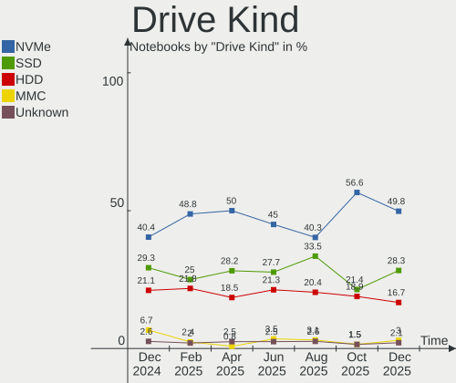

| Kind    | Notebooks | Drives | Percent |
|---------|-----------|--------|---------|
| NVMe    | 116       | 131    | 49.79%  |
| SSD     | 66        | 72     | 28.33%  |
| HDD     | 39        | 40     | 16.74%  |
| MMC     | 7         | 8      | 3%      |
| Unknown | 5         | 5      | 2.15%   |

Drive Connector
---------------

SATA, SAS, NVMe, etc.

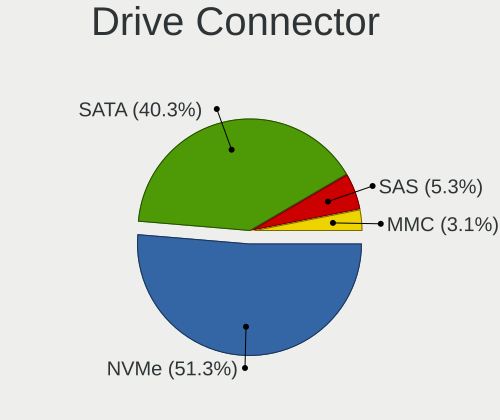

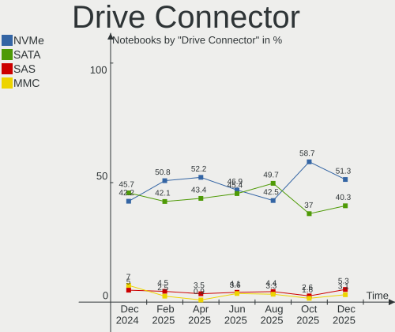

| Type | Notebooks | Drives | Percent |
|------|-----------|--------|---------|
| NVMe | 116       | 128    | 51.33%  |
| SATA | 91        | 108    | 40.27%  |
| SAS  | 12        | 12     | 5.31%   |
| MMC  | 7         | 8      | 3.1%    |

Drive Size
----------

Size of hard drive

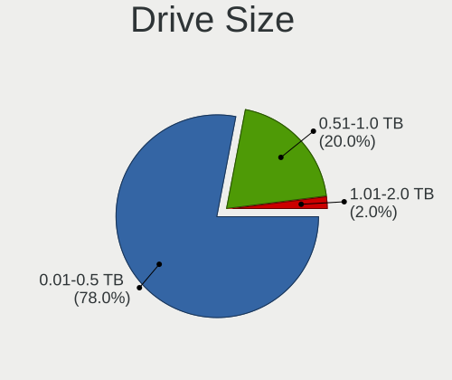

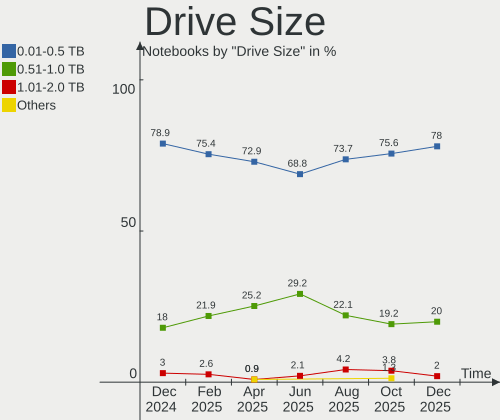

| Size in TB | Notebooks | Drives | Percent |
|------------|-----------|--------|---------|
| 0.01-0.5   | 78        | 89     | 78%     |
| 0.51-1.0   | 20        | 21     | 20%     |
| 1.01-2.0   | 2         | 2      | 2%      |

Space Total
-----------

Amount of disk space available on the file system

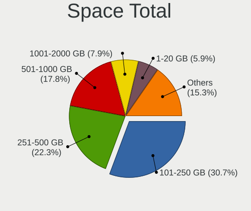

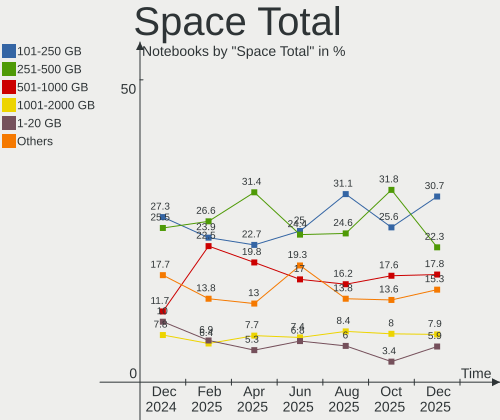

| Size in GB     | Notebooks | Percent |
|----------------|-----------|---------|
| 101-250        | 62        | 30.69%  |
| 251-500        | 45        | 22.28%  |
| 501-1000       | 36        | 17.82%  |
| 1001-2000      | 16        | 7.92%   |
| 1-20           | 12        | 5.94%   |
| 51-100         | 11        | 5.45%   |
| 21-50          | 9         | 4.46%   |
| More than 3000 | 4         | 1.98%   |
| 2001-3000      | 4         | 1.98%   |
| Unknown        | 3         | 1.49%   |

Space Used
----------

Amount of used disk space

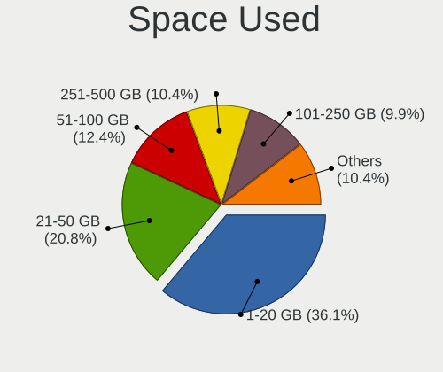

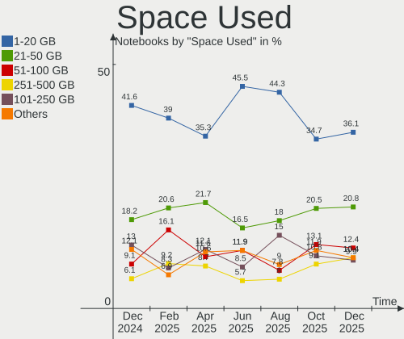

| Used GB        | Notebooks | Percent |
|----------------|-----------|---------|
| 1-20           | 73        | 36.14%  |
| 21-50          | 42        | 20.79%  |
| 51-100         | 25        | 12.38%  |
| 251-500        | 21        | 10.4%   |
| 101-250        | 20        | 9.9%    |
| 501-1000       | 12        | 5.94%   |
| 1001-2000      | 4         | 1.98%   |
| Unknown        | 3         | 1.49%   |
| More than 3000 | 1         | 0.5%    |
| 2001-3000      | 1         | 0.5%    |

Malfunc. Drives
---------------

Drive models with a malfunction

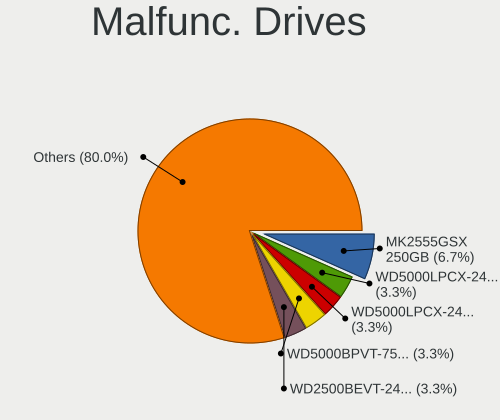

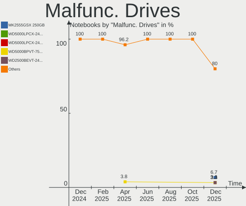

| Model                                                 | Notebooks | Drives | Percent |
|-------------------------------------------------------|-----------|--------|---------|
| Toshiba MK2555GSX 250GB                               | 2         | 2      | 6.67%   |
| WDC WD5000LPCX-24VHAT0 500GB                          | 1         | 1      | 3.33%   |
| WDC WD5000LPCX-24C6HT0 500GB                          | 1         | 1      | 3.33%   |
| WDC WD5000BPVT-75HXZT3 500GB                          | 1         | 1      | 3.33%   |
| WDC WD2500BEVT-24A23T0 250GB                          | 1         | 1      | 3.33%   |
| WDC WD2500BEVT-22A23T0 250GB                          | 1         | 1      | 3.33%   |
| Toshiba MQ01ABF050 500GB                              | 1         | 1      | 3.33%   |
| SSSTC CV8-8E128-HP 128GB SSD                          | 1         | 1      | 3.33%   |
| Seagate ST9500325AS 500GB                             | 1         | 1      | 3.33%   |
| Seagate ST9250827AS 250GB                             | 1         | 1      | 3.33%   |
| Seagate ST750LM022 HN-M750MBB 752GB                   | 1         | 1      | 3.33%   |
| Seagate ST500LM021-1KJ152 500GB                       | 1         | 1      | 3.33%   |
| SanDisk SSD i110 24GB                                 | 1         | 1      | 3.33%   |
| Samsung Electronics SSD 870 EVO 250GB                 | 1         | 1      | 3.33%   |
| Samsung Electronics HN-M500MBB 500GB                  | 1         | 1      | 3.33%   |
| Realtek Semiconductor RTS5762 NVMe SSD Controller 1TB | 1         | 1      | 3.33%   |
| Philips FM82SS001N-93 NVME 4.0 1TB                    | 1         | 1      | 3.33%   |
| Neo Forza NFS121SA324-6007000 240GB SSD               | 1         | 1      | 3.33%   |
| Kingston SNV425S2128GB SSD                            | 1         | 1      | 3.33%   |
| Kingston SA400S37 240G SSD                            | 1         | 1      | 3.33%   |
| KingSpec MT-128 128GB                                 | 1         | 1      | 3.33%   |
| Intel SSDSC2CW120A3 120GB                             | 1         | 1      | 3.33%   |
| Hitachi HTS545050A7E380 500GB                         | 1         | 1      | 3.33%   |
| Hitachi HTS545032B9A300 320GB                         | 1         | 1      | 3.33%   |
| Hitachi HTS545025B9A300 250GB                         | 1         | 1      | 3.33%   |
| Hitachi HTS541040G9AT00 40GB                          | 1         | 1      | 3.33%   |
| Fujitsu MJA2320BH G2 320GB                            | 1         | 1      | 3.33%   |
| China SSD 240GB                                       | 1         | 1      | 3.33%   |
| A-DATA Technology SX6000PNP 256GB                     | 1         | 1      | 3.33%   |

Malfunc. Drive Vendor
---------------------

Vendors of faulty drives

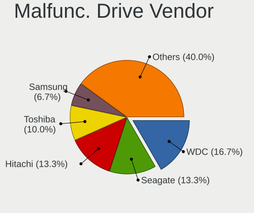

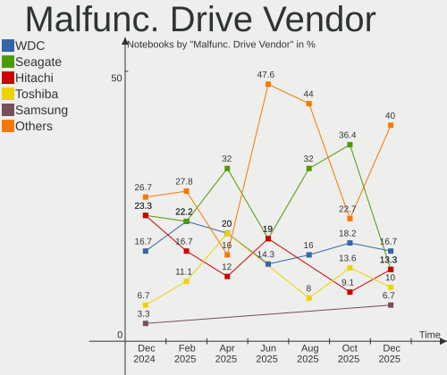

| Vendor                | Notebooks | Drives | Percent |
|-----------------------|-----------|--------|---------|
| WDC                   | 5         | 5      | 16.67%  |
| Seagate               | 4         | 4      | 13.33%  |
| Hitachi               | 4         | 4      | 13.33%  |
| Toshiba               | 3         | 3      | 10%     |
| Samsung Electronics   | 2         | 2      | 6.67%   |
| Kingston              | 2         | 2      | 6.67%   |
| SSSTC                 | 1         | 1      | 3.33%   |
| SanDisk               | 1         | 1      | 3.33%   |
| Realtek Semiconductor | 1         | 1      | 3.33%   |
| Philips               | 1         | 1      | 3.33%   |
| Neo                   | 1         | 1      | 3.33%   |
| KingSpec              | 1         | 1      | 3.33%   |
| Intel                 | 1         | 1      | 3.33%   |
| Fujitsu               | 1         | 1      | 3.33%   |
| China                 | 1         | 1      | 3.33%   |
| A-DATA Technology     | 1         | 1      | 3.33%   |

Malfunc. HDD Vendor
-------------------

Vendors of faulty HDD drives

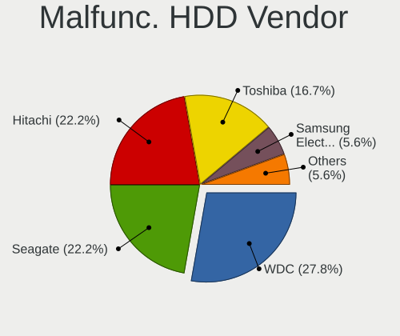

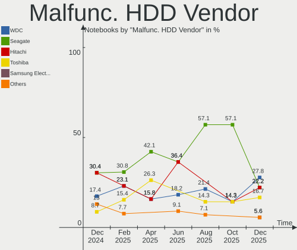

| Vendor              | Notebooks | Drives | Percent |
|---------------------|-----------|--------|---------|
| WDC                 | 5         | 5      | 27.78%  |
| Seagate             | 4         | 4      | 22.22%  |
| Hitachi             | 4         | 4      | 22.22%  |
| Toshiba             | 3         | 3      | 16.67%  |
| Samsung Electronics | 1         | 1      | 5.56%   |
| Fujitsu             | 1         | 1      | 5.56%   |

Malfunc. Drive Kind
-------------------

Kinds of faulty drives

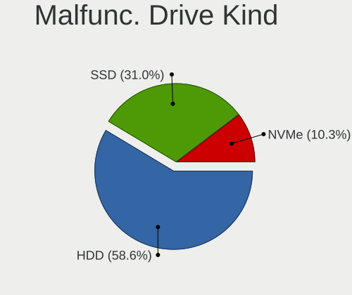

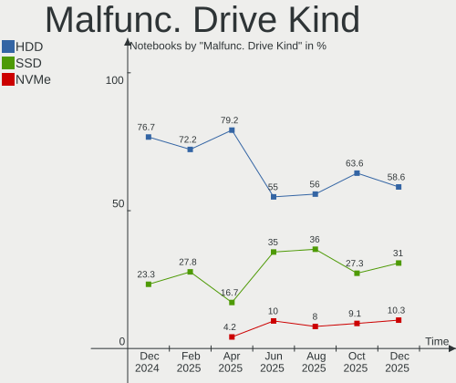

| Kind | Notebooks | Drives | Percent |
|------|-----------|--------|---------|
| HDD  | 17        | 18     | 58.62%  |
| SSD  | 9         | 9      | 31.03%  |
| NVMe | 3         | 3      | 10.34%  |

Failed Drives
-------------

Failed drive models

Zero info for selected period =(

Failed Drive Vendor
-------------------

Failed drive vendors

Zero info for selected period =(

Drive Status
------------

Number of failed and malfunc. drives

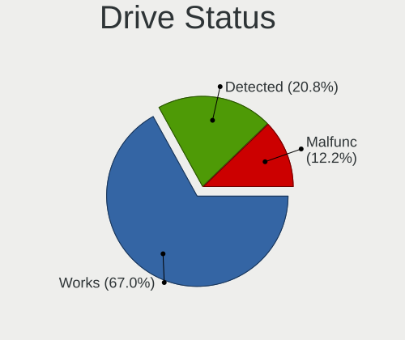

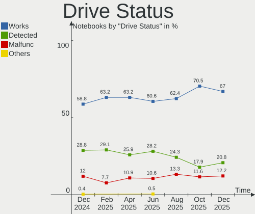

| Status   | Notebooks | Drives | Percent |
|----------|-----------|--------|---------|
| Works    | 148       | 173    | 66.97%  |
| Detected | 46        | 53     | 20.81%  |
| Malfunc  | 27        | 30     | 12.22%  |

Storage controller
------------------

Storage Vendor
--------------

Storage controller vendors

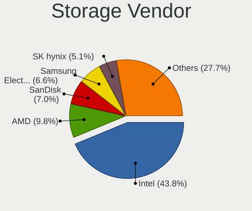

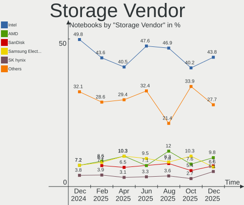

| Vendor                                  | Notebooks | Percent |
|-----------------------------------------|-----------|---------|
| Intel                                   | 112       | 43.75%  |
| AMD                                     | 25        | 9.77%   |
| SanDisk                                 | 18        | 7.03%   |
| Samsung Electronics                     | 17        | 6.64%   |
| SK hynix                                | 13        | 5.08%   |
| Micron Technology                       | 11        | 4.3%    |
| MAXIO Technology (Hangzhou)             | 9         | 3.52%   |
| ADATA Technology                        | 8         | 3.13%   |
| Kingston Technology Company             | 7         | 2.73%   |
| Realtek Semiconductor                   | 6         | 2.34%   |
| Unknown                                 | 5         | 1.95%   |
| Phison Electronics                      | 4         | 1.56%   |
| INNOGRIT                                | 4         | 1.56%   |
| Yangtze Memory Technologies             | 3         | 1.17%   |
| Shenzhen Longsys Electronics            | 3         | 1.17%   |
| Shenzhen Unionmemory Information System | 2         | 0.78%   |
| Shenzhen Shichuangyi Electronics        | 2         | 0.78%   |
| Nvidia                                  | 2         | 0.78%   |
| KIOXIA                                  | 2         | 0.78%   |
| Union Memory (Shenzhen)                 | 1         | 0.39%   |
| Toshiba America Info Systems            | 1         | 0.39%   |
| Silicon Motion                          | 1         | 0.39%   |

Storage Model
-------------

Storage controller models

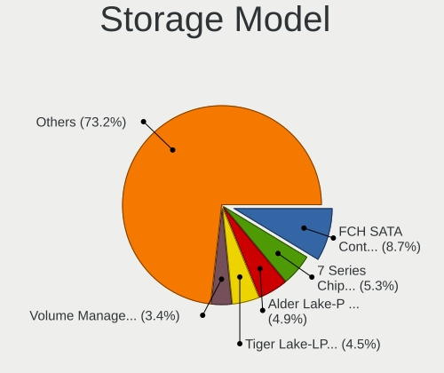

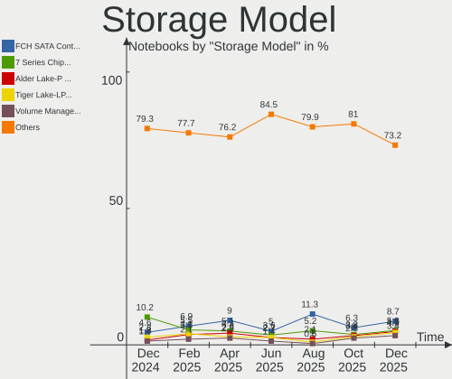

| Model                                                                                                              | Notebooks | Percent |
|--------------------------------------------------------------------------------------------------------------------|-----------|---------|
| AMD FCH SATA Controller [AHCI mode]                                                                                | 23        | 8.68%   |
| Intel 7 Series Chipset Family 6-port SATA Controller [AHCI mode]                                                   | 14        | 5.28%   |
| Intel Alder Lake-P SATA AHCI Controller                                                                            | 13        | 4.91%   |
| Intel Tiger Lake-LP SATA Controller                                                                                | 12        | 4.53%   |
| Intel Volume Management Device NVMe RAID Controller                                                                | 9         | 3.4%    |
| Intel Sunrise Point-LP SATA Controller [AHCI mode]                                                                 | 8         | 3.02%   |
| MAXIO (Hangzhou) NVMe SSD Controller MAP1202 (DRAM-less)                                                           | 7         | 2.64%   |
| Intel 6 Series/C200 Series Chipset Family 6 port Mobile SATA AHCI Controller                                       | 7         | 2.64%   |
| Intel RST Volume Management Device Controller                                                                      | 6         | 2.26%   |
| ADATA XPG GAMMIXS1 1L, XPG GAMMIX S5, LEGEND 710 / 740, SWORDFISH NVMe SSD (DRAM-less)                             | 6         | 2.26%   |
| SanDisk WD SN560/SN740/SN770/SN5000 NVMe SSD                                                                       | 5         | 1.89%   |
| Samsung NVMe SSD Controller PM9B1 (DRAM-less)                                                                      | 5         | 1.89%   |
| Micron 2400 NVMe SSD (DRAM-less)                                                                                   | 5         | 1.89%   |
| Intel Celeron/Pentium Silver Processor SATA Controller                                                             | 5         | 1.89%   |
| Intel 5 Series/3400 Series Chipset 4 port SATA AHCI Controller                                                     | 5         | 1.89%   |
| Unknown                                                                                                            | 5         | 1.89%   |
| SK hynix BC501 NVMe Solid State Drive                                                                              | 4         | 1.51%   |
| Sandisk WD PC SN740 NVMe SSD 512GB (DRAM-less)                                                                     | 4         | 1.51%   |
| Micron 2450 NVMe SSD [HendrixV] (DRAM-less)                                                                        | 4         | 1.51%   |
| Intel 82801IBM/IEM (ICH9M/ICH9M-E) 4 port SATA Controller [AHCI mode]                                              | 4         | 1.51%   |
| SK hynix Platinum P41/PC801 NVMe Solid State Drive                                                                 | 3         | 1.13%   |
| SK hynix BC901 NVMe Solid State Drive (DRAM-less)                                                                  | 3         | 1.13%   |
| Sandisk WD PC SN5000S M.2 2280 NVMe SSD (DRAM-less)                                                                | 3         | 1.13%   |
| SanDisk PC SN530 NVMe SSD (DRAM-less)                                                                              | 3         | 1.13%   |
| Samsung NVMe SSD Controller S4LV008[Pascal]                                                                        | 3         | 1.13%   |
| Realtek RTS5765DL NVMe SSD Controller (DRAM-less)                                                                  | 3         | 1.13%   |
| Intel SSD 670p Series [Keystone Harbor]                                                                            | 3         | 1.13%   |
| Intel Ice Lake-LP SATA Controller [AHCI mode]                                                                      | 3         | 1.13%   |
| Intel Comet Lake SATA AHCI Controller                                                                              | 3         | 1.13%   |
| Intel Atom Processor E3800 Series SATA AHCI Controller                                                             | 3         | 1.13%   |
| Intel 82801IBM/IEM (ICH9M/ICH9M-E) 2 port SATA Controller [IDE mode]                                               | 3         | 1.13%   |
| Intel 82801 Mobile SATA Controller [RAID mode]                                                                     | 3         | 1.13%   |
| INNOGRIT NVMe SSD Controller IG5216 [Shasta+] (DRAM-less)                                                          | 3         | 1.13%   |
| SK hynix BC511 NVMe SSD                                                                                            | 2         | 0.75%   |
| Shenzhen Longsys FORESEE XP1000 / Lexar Professional CFexpress Type B Gold series, NM620 PCIe NVME SSD (DRAM-less) | 2         | 0.75%   |
| Samsung NVMe SSD Controller SM981/PM981/PM983                                                                      | 2         | 0.75%   |
| Samsung NVMe SSD Controller PM9C1a (DRAM-less)                                                                     | 2         | 0.75%   |
| Samsung NVMe SSD Controller 980 (DRAM-less)                                                                        | 2         | 0.75%   |
| Samsung NVMe SSD 9100 PRO [PM9E1]                                                                                  | 2         | 0.75%   |
| Phison PS5013-E13 PCIe3 NVMe Controller (DRAM-less)                                                                | 2         | 0.75%   |

Storage Kind
------------

Kind of storage controller (IDE, SATA, NVMe, SAS, ...)

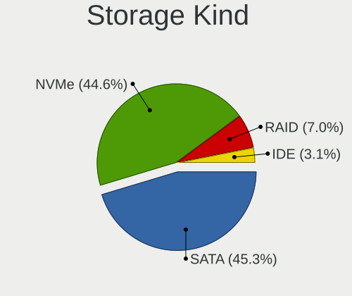

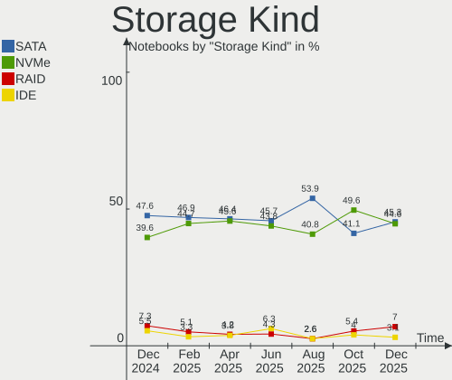

| Kind | Notebooks | Percent |
|------|-----------|---------|
| SATA | 117       | 45.35%  |
| NVMe | 115       | 44.57%  |
| RAID | 18        | 6.98%   |
| IDE  | 8         | 3.1%    |

Processor
---------

CPU Vendor
----------

Processor vendors

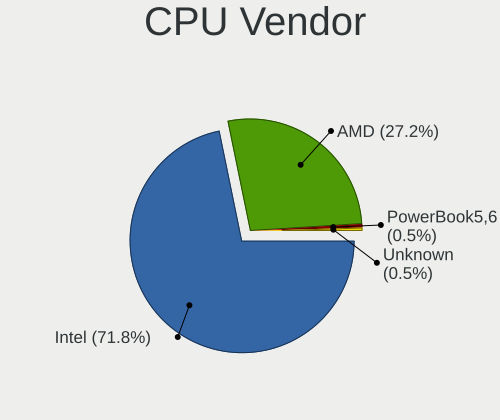

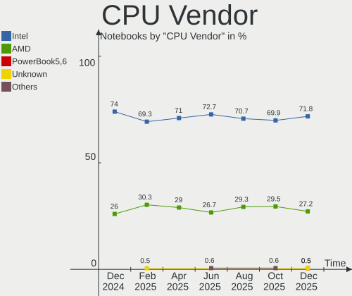

| Vendor       | Notebooks | Percent |
|--------------|-----------|---------|
| Intel        | 145       | 71.78%  |
| AMD          | 55        | 27.23%  |
| PowerBook5,6 | 1         | 0.5%    |
| Unknown      | 1         | 0.5%    |

CPU Model
---------

Processor models

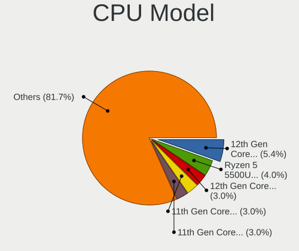

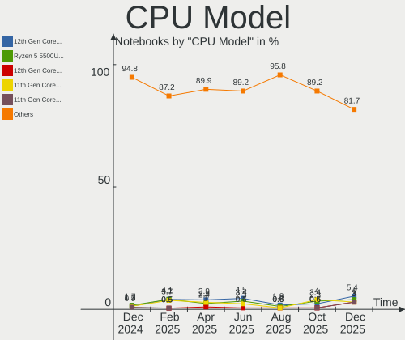

| Model                                         | Notebooks | Percent |
|-----------------------------------------------|-----------|---------|
| Intel 12th Gen Core i5-1235U                  | 11        | 5.45%   |
| AMD Ryzen 5 5500U with Radeon Graphics        | 8         | 3.96%   |
| Intel 12th Gen Core i3-1215U                  | 6         | 2.97%   |
| Intel 11th Gen Core i5-1135G7 @ 2.40GHz       | 6         | 2.97%   |
| Intel 11th Gen Core i3-1125G4 @ 2.00GHz       | 6         | 2.97%   |
| Intel Core i5-3230M CPU @ 2.60GHz             | 4         | 1.98%   |
| AMD Ryzen 5 5600H with Radeon Graphics        | 4         | 1.98%   |
| Intel N100                                    | 3         | 1.49%   |
| Intel Core Ultra 7 258V                       | 3         | 1.49%   |
| Intel Core i5-8250U CPU @ 1.60GHz             | 3         | 1.49%   |
| Intel Core i5-3210M CPU @ 2.50GHz             | 3         | 1.49%   |
| Intel Core i5-10210U CPU @ 1.60GHz            | 3         | 1.49%   |
| Intel 13th Gen Core i5-13420H                 | 3         | 1.49%   |
| Intel 12th Gen Core i5-12450H                 | 3         | 1.49%   |
| AMD Ryzen 7 5825U with Radeon Graphics        | 3         | 1.49%   |
| Intel Pentium Silver N5030 CPU @ 1.10GHz      | 2         | 0.99%   |
| Intel Pentium Dual-Core CPU T4500 @ 2.30GHz   | 2         | 0.99%   |
| Intel Pentium Dual-Core CPU T4400 @ 2.20GHz   | 2         | 0.99%   |
| Intel Pentium CPU N3540 @ 2.16GHz             | 2         | 0.99%   |
| Intel Pentium CPU B960 @ 2.20GHz              | 2         | 0.99%   |
| Intel Core i5-3337U CPU @ 1.80GHz             | 2         | 0.99%   |
| Intel Core i5 CPU M 430 @ 2.27GHz             | 2         | 0.99%   |
| Intel Core i3-6006U CPU @ 2.00GHz             | 2         | 0.99%   |
| Intel Celeron N4020 CPU @ 1.10GHz             | 2         | 0.99%   |
| Intel Celeron CPU N2840 @ 2.16GHz             | 2         | 0.99%   |
| Intel Atom CPU N270 @ 1.60GHz                 | 2         | 0.99%   |
| Intel 13th Gen Core i7-13700H                 | 2         | 0.99%   |
| Intel 13th Gen Core i7-13620H                 | 2         | 0.99%   |
| Intel 13th Gen Core i3-1315U                  | 2         | 0.99%   |
| Intel 11th Gen Core i5-11300H @ 3.10GHz       | 2         | 0.99%   |
| AMD Ryzen 7 7730U with Radeon Graphics        | 2         | 0.99%   |
| AMD Ryzen 7 7435H                             | 2         | 0.99%   |
| AMD Ryzen 3 7320U with Radeon Graphics        | 2         | 0.99%   |
| AMD Ryzen 3 3200U with Radeon Vega Mobile Gfx | 2         | 0.99%   |
| AMD A4-9120 RADEON R3, 4 COMPUTE CORES 2C+2G  | 2         | 0.99%   |
| PowerBook5,6 7447A, altivec supported         | 1         | 0.5%    |
| Intel Pentium M processor 1.73GHz             | 1         | 0.5%    |
| Intel Pentium Dual-Core CPU T4300 @ 2.10GHz   | 1         | 0.5%    |
| Intel Pentium Dual CPU T2370 @ 1.73GHz        | 1         | 0.5%    |
| Intel Pentium CPU 2020M @ 2.40GHz             | 1         | 0.5%    |

CPU Model Family
----------------

Processor model prefix

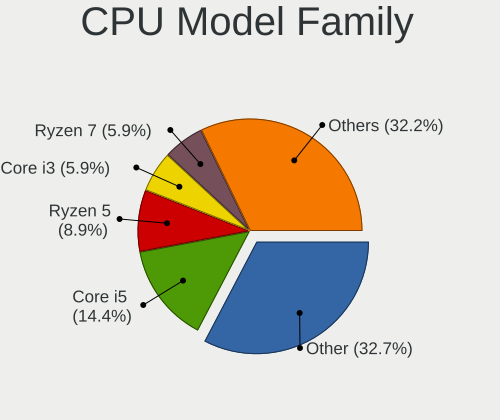

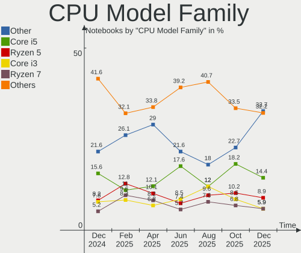

| Model                   | Notebooks | Percent |
|-------------------------|-----------|---------|
| Other                   | 66        | 32.67%  |
| Intel Core i5           | 29        | 14.36%  |
| AMD Ryzen 5             | 18        | 8.91%   |
| Intel Core i3           | 12        | 5.94%   |
| AMD Ryzen 7             | 12        | 5.94%   |
| Intel Core              | 9         | 4.46%   |
| Intel Celeron           | 9         | 4.46%   |
| AMD Ryzen 3             | 7         | 3.47%   |
| Intel Pentium Dual-Core | 5         | 2.48%   |
| Intel Pentium           | 5         | 2.48%   |
| Intel Core i7           | 5         | 2.48%   |
| Intel Atom              | 3         | 1.49%   |
| AMD A10                 | 3         | 1.49%   |
| Intel Pentium Silver    | 2         | 0.99%   |
| Intel Core 2 Duo        | 2         | 0.99%   |
| AMD E2                  | 2         | 0.99%   |
| AMD A6                  | 2         | 0.99%   |
| AMD A4                  | 2         | 0.99%   |
| Intel Pentium M         | 1         | 0.5%    |
| Intel Pentium Dual      | 1         | 0.5%    |
| Intel Core M            | 1         | 0.5%    |
| Intel Core i9           | 1         | 0.5%    |
| Intel Celeron Dual-Core | 1         | 0.5%    |
| AMD Ryzen 3 PRO         | 1         | 0.5%    |
| AMD Phenom II           | 1         | 0.5%    |
| AMD C-60                | 1         | 0.5%    |
| AMD A8                  | 1         | 0.5%    |

CPU Cores
---------

Number of processor cores

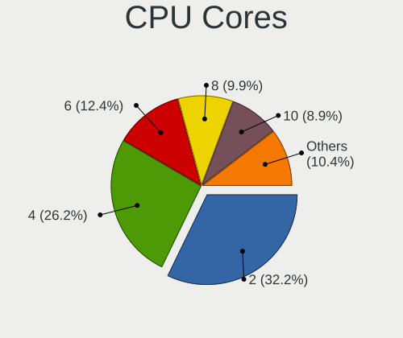

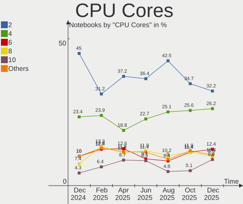

| Number | Notebooks | Percent |
|--------|-----------|---------|
| 2      | 65        | 32.18%  |
| 4      | 53        | 26.24%  |
| 6      | 25        | 12.38%  |
| 8      | 20        | 9.9%    |
| 10     | 18        | 8.91%   |
| 14     | 6         | 2.97%   |
| 1      | 5         | 2.48%   |
| 12     | 4         | 1.98%   |
| 24     | 3         | 1.49%   |
| 16     | 2         | 0.99%   |
| 20     | 1         | 0.5%    |

CPU Sockets
-----------

Number of sockets

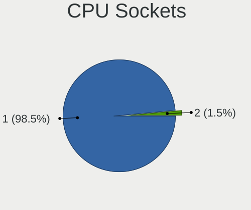

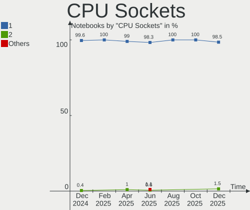

| Number | Notebooks | Percent |
|--------|-----------|---------|
| 1      | 199       | 98.51%  |
| 2      | 3         | 1.49%   |

CPU Threads
-----------

Threads per core (Hyper-Threading)

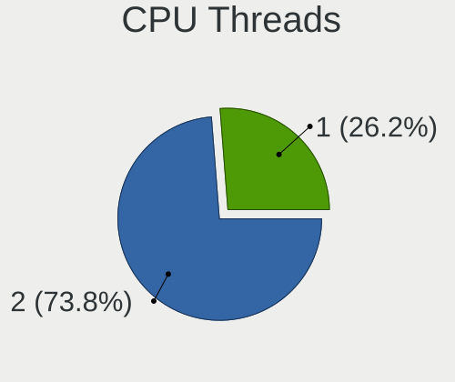

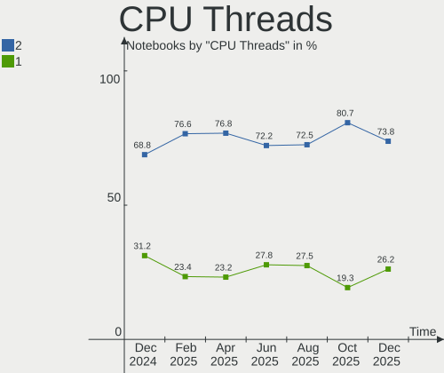

| Number | Notebooks | Percent |
|--------|-----------|---------|
| 2      | 149       | 73.76%  |
| 1      | 53        | 26.24%  |

CPU Op-Modes
------------

CPU Operation Modes (32-bit, 64-bit)

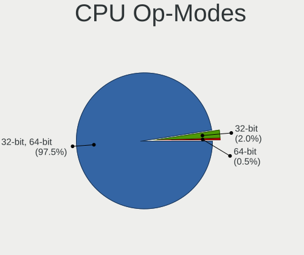

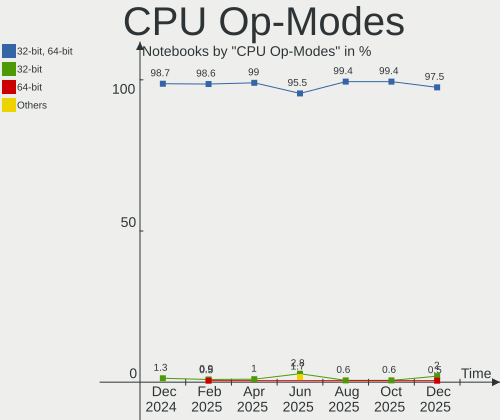

| Op mode        | Notebooks | Percent |
|----------------|-----------|---------|
| 32-bit, 64-bit | 197       | 97.52%  |
| 32-bit         | 4         | 1.98%   |
| 64-bit         | 1         | 0.5%    |

CPU Microcode
-------------

Microcode number

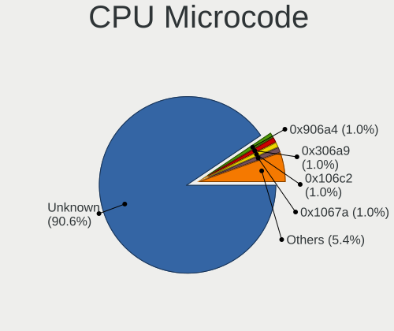

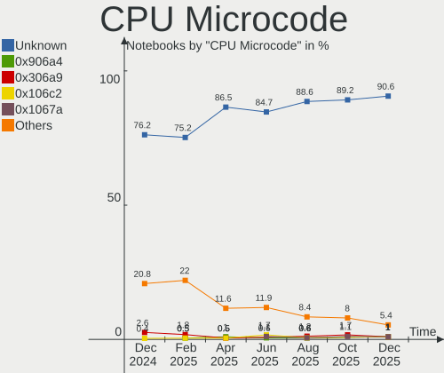

| Number     | Notebooks | Percent |
|------------|-----------|---------|
| Unknown    | 183       | 90.59%  |
| 0x906a4    | 2         | 0.99%   |
| 0x306a9    | 2         | 0.99%   |
| 0x106c2    | 2         | 0.99%   |
| 0x1067a    | 2         | 0.99%   |
| 0x806ec    | 1         | 0.5%    |
| 0x806e9    | 1         | 0.5%    |
| 0x806c1    | 1         | 0.5%    |
| 0x6d8      | 1         | 0.5%    |
| 0x30678    | 1         | 0.5%    |
| 0x30661    | 1         | 0.5%    |
| 0x20652    | 1         | 0.5%    |
| 0x0a50000c | 1         | 0.5%    |
| 0x08600102 | 1         | 0.5%    |
| 0x08108102 | 1         | 0.5%    |
| 0x0500010d | 1         | 0.5%    |

CPU Microarch
-------------

Microarchitecture

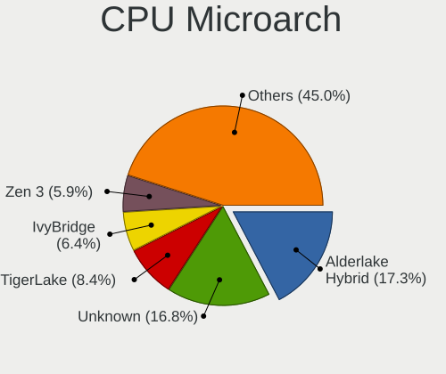

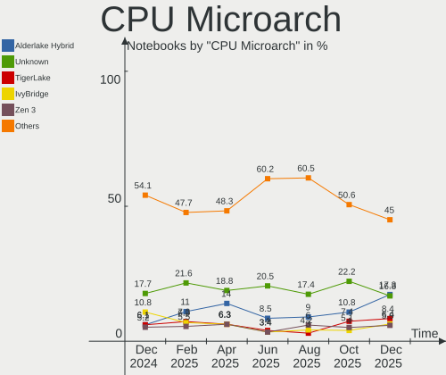

| Name               | Notebooks | Percent |
|--------------------|-----------|---------|
| Alderlake Hybrid   | 35        | 17.33%  |
| Unknown            | 34        | 16.83%  |
| TigerLake          | 17        | 8.42%   |
| IvyBridge          | 13        | 6.44%   |
| Zen 3              | 12        | 5.94%   |
| KabyLake           | 10        | 4.95%   |
| SandyBridge        | 8         | 3.96%   |
| Penryn             | 8         | 3.96%   |
| Westmere           | 6         | 2.97%   |
| Excavator          | 6         | 2.97%   |
| Silvermont         | 5         | 2.48%   |
| Goldmont plus      | 5         | 2.48%   |
| Zen+               | 4         | 1.98%   |
| Skylake            | 4         | 1.98%   |
| IceLake            | 4         | 1.98%   |
| Puma               | 3         | 1.49%   |
| Lunarlake Hybrid   | 3         | 1.49%   |
| Gracemont          | 3         | 1.49%   |
| Broadwell          | 3         | 1.49%   |
| Bonnell            | 3         | 1.49%   |
| Zen 2              | 2         | 0.99%   |
| Piledriver         | 2         | 0.99%   |
| Haswell            | 2         | 0.99%   |
| Core               | 2         | 0.99%   |
| Tremont            | 1         | 0.5%    |
| P6                 | 1         | 0.5%    |
| Meteorlake Hybrid  | 1         | 0.5%    |
| K10 Llano          | 1         | 0.5%    |
| K10                | 1         | 0.5%    |
| Goldmont           | 1         | 0.5%    |
| Bobcat             | 1         | 0.5%    |
| ArrowLake-H Hybrid | 1         | 0.5%    |

Graphics
--------

GPU Vendor
----------

Vendors of graphics cards

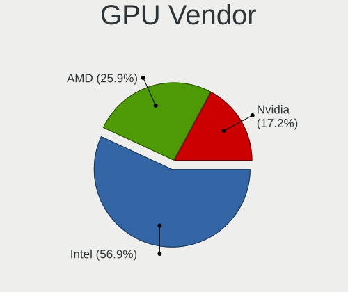

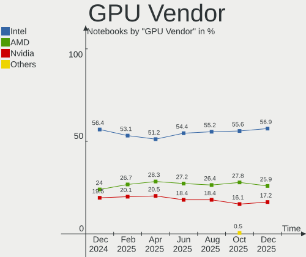

| Vendor | Notebooks | Percent |
|--------|-----------|---------|
| Intel  | 136       | 56.9%   |
| AMD    | 62        | 25.94%  |
| Nvidia | 41        | 17.15%  |

GPU Model
---------

Graphics card models

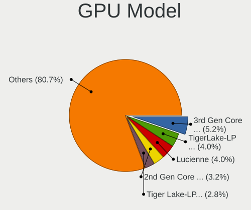

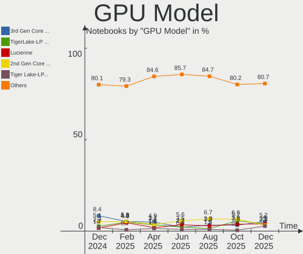

| Model                                                                         | Notebooks | Percent |
|-------------------------------------------------------------------------------|-----------|---------|
| Intel 3rd Gen Core processor Graphics Controller                              | 13        | 5.22%   |
| Intel TigerLake-LP GT2 [Iris Xe Graphics]                                     | 10        | 4.02%   |
| AMD Lucienne                                                                  | 10        | 4.02%   |
| Intel 2nd Generation Core Processor Family Integrated Graphics Controller     | 8         | 3.21%   |
| Intel Tiger Lake-LP GT2 [UHD Graphics G4]                                     | 7         | 2.81%   |
| Intel Raptor Lake-P [UHD Graphics]                                            | 7         | 2.81%   |
| Intel Alder Lake-UP3 GT1 [UHD Graphics]                                       | 7         | 2.81%   |
| AMD Barcelo                                                                   | 7         | 2.81%   |
| Intel Alder Lake-UP3 GT2 [Iris Xe Graphics]                                   | 6         | 2.41%   |
| AMD Thames [Radeon HD 7500M/7600M Series]                                     | 6         | 2.41%   |
| Nvidia GA107M [GeForce RTX 3050 Mobile]                                       | 5         | 2.01%   |
| Intel Mobile 4 Series Chipset Integrated Graphics Controller                  | 5         | 2.01%   |
| Intel Atom Processor Z36xxx/Z37xxx Series Graphics & Display                  | 5         | 2.01%   |
| Intel Alder Lake-UP3 GT2 [UHD Graphics]                                       | 5         | 2.01%   |
| AMD Stoney [Radeon R2/R3/R4/R5 Graphics]                                      | 5         | 2.01%   |
| AMD Cezanne [Radeon Vega Series / Radeon Vega Mobile Series]                  | 5         | 2.01%   |
| Nvidia GF117M [GeForce 610M/710M/810M/820M / GT 620M/625M/630M/720M]          | 4         | 1.61%   |
| Nvidia AD107M [GeForce RTX 4060 Max-Q / Mobile]                               | 4         | 1.61%   |
| Intel Skylake-U GT2 [HD Graphics 520]                                         | 4         | 1.61%   |
| Intel Raptor Lake-P [Iris Xe Graphics]                                        | 4         | 1.61%   |
| Intel Alder Lake-P GT1 [UHD Graphics]                                         | 4         | 1.61%   |
| AMD Picasso/Raven 2 [Radeon Vega Series / Radeon Vega Mobile Series]          | 4         | 1.61%   |
| Intel Lunar Lake [Intel Arc Graphics 130V / 140V]                             | 3         | 1.2%    |
| Intel Kaby Lake-R GT2 [UHD Graphics 620]                                      | 3         | 1.2%    |
| Intel Iris Plus Graphics G1 (Ice Lake)                                        | 3         | 1.2%    |
| Intel GeminiLake [UHD Graphics 600]                                           | 3         | 1.2%    |
| Intel Core Processor Integrated Graphics Controller                           | 3         | 1.2%    |
| Intel CometLake-U GT2 [UHD Graphics]                                          | 3         | 1.2%    |
| Intel Arrow Lake-P [Arc Pro 130T/140T]                                        | 3         | 1.2%    |
| Intel Alder Lake-P GT2 [Iris Xe Graphics]                                     | 3         | 1.2%    |
| Intel Alder Lake-N [UHD Graphics]                                             | 3         | 1.2%    |
| AMD Mendocino [Radeon 610M]                                                   | 3         | 1.2%    |
| Nvidia GF119M [GeForce GT 520MX]                                              | 2         | 0.8%    |
| Nvidia AD106M [GeForce RTX 4070 Max-Q / Mobile]                               | 2         | 0.8%    |
| Intel Mobile GM965/GL960 Integrated Graphics Controller (secondary)           | 2         | 0.8%    |
| Intel Mobile GM965/GL960 Integrated Graphics Controller (primary)             | 2         | 0.8%    |
| Intel GeminiLake [UHD Graphics 605]                                           | 2         | 0.8%    |
| Intel Broadwell-U GT2 [HD Graphics 5500]                                      | 2         | 0.8%    |
| Intel 4th Gen Core Processor Integrated Graphics Controller                   | 2         | 0.8%    |
| AMD Sun XT [Radeon HD 8670A/8670M/8690M / R5 M330 / M430 / Radeon 520 Mobile] | 2         | 0.8%    |

GPU Combo
---------

Combinations of graphics cards

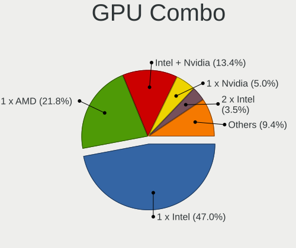

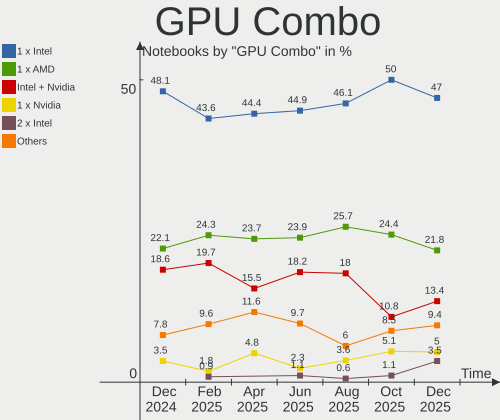

| Name           | Notebooks | Percent |
|----------------|-----------|---------|
| 1 x Intel      | 95        | 47.03%  |
| 1 x AMD        | 44        | 21.78%  |
| Intel + Nvidia | 27        | 13.37%  |
| 1 x Nvidia     | 10        | 4.95%   |
| 2 x Intel      | 7         | 3.47%   |
| 2 x AMD        | 7         | 3.47%   |
| Intel + AMD    | 7         | 3.47%   |
| AMD + Nvidia   | 4         | 1.98%   |
| Other          | 1         | 0.5%    |

GPU Driver
----------

Free vs proprietary

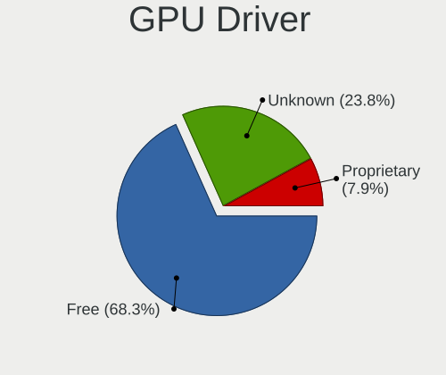

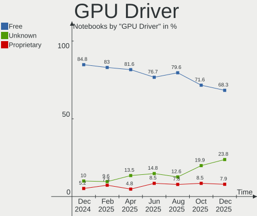

| Driver      | Notebooks | Percent |
|-------------|-----------|---------|
| Free        | 138       | 68.32%  |
| Unknown     | 48        | 23.76%  |
| Proprietary | 16        | 7.92%   |

GPU Memory
----------

Total video memory

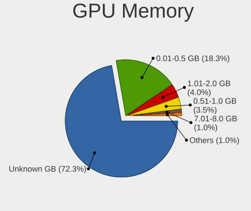

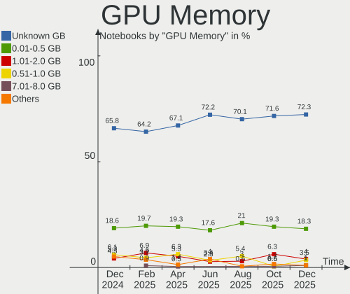

| Size in GB | Notebooks | Percent |
|------------|-----------|---------|
| Unknown    | 146       | 72.28%  |
| 0.01-0.5   | 37        | 18.32%  |
| 1.01-2.0   | 8         | 3.96%   |
| 0.51-1.0   | 7         | 3.47%   |
| 7.01-8.0   | 2         | 0.99%   |
| 3.01-4.0   | 2         | 0.99%   |

Monitor
-------

Monitor Vendor
--------------

Monitor vendors

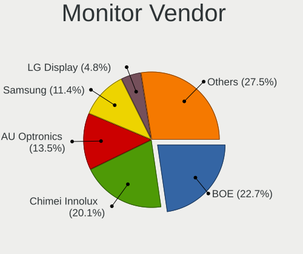

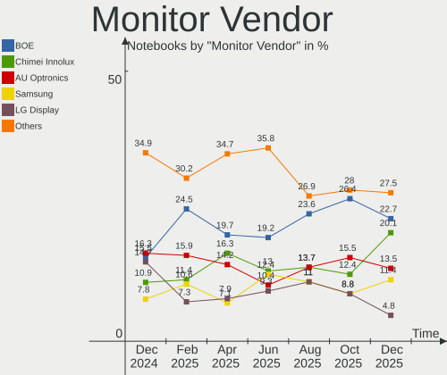

| Vendor                  | Notebooks | Percent |
|-------------------------|-----------|---------|
| BOE                     | 52        | 22.71%  |
| Chimei Innolux          | 46        | 20.09%  |
| AU Optronics            | 31        | 13.54%  |
| Samsung Electronics     | 26        | 11.35%  |
| LG Display              | 11        | 4.8%    |
| CSOT                    | 11        | 4.8%    |
| Dell                    | 6         | 2.62%   |
| Philips                 | 4         | 1.75%   |
| Lenovo                  | 4         | 1.75%   |
| Chi Mei Optoelectronics | 4         | 1.75%   |
| PANDA                   | 3         | 1.31%   |
| MSI                     | 3         | 1.31%   |
| InfoVision              | 3         | 1.31%   |
| TMA                     | 2         | 0.87%   |
| Sharp                   | 2         | 0.87%   |
| SAC                     | 2         | 0.87%   |
| HKC                     | 2         | 0.87%   |
| Hewlett-Packard         | 2         | 0.87%   |
| ZTR                     | 1         | 0.44%   |
| Valve                   | 1         | 0.44%   |
| Sony                    | 1         | 0.44%   |
| RTK                     | 1         | 0.44%   |
| NEC Computers           | 1         | 0.44%   |
| Mi                      | 1         | 0.44%   |
| JDZ                     | 1         | 0.44%   |
| Iiyama                  | 1         | 0.44%   |
| HannStar                | 1         | 0.44%   |
| Goldstar                | 1         | 0.44%   |
| CSW                     | 1         | 0.44%   |
| CHO                     | 1         | 0.44%   |
| CHD                     | 1         | 0.44%   |
| Apple                   | 1         | 0.44%   |
| Ancor Communications    | 1         | 0.44%   |

Monitor Model
-------------

Monitor models

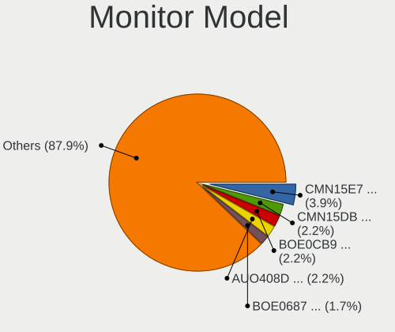

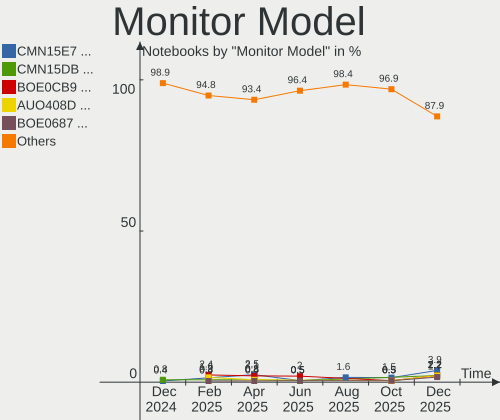

| Model                                                                 | Notebooks | Percent |
|-----------------------------------------------------------------------|-----------|---------|
| Chimei Innolux LCD Monitor CMN15E7 1920x1080 344x193mm 15.5-inch      | 9         | 3.9%    |
| Chimei Innolux LCD Monitor CMN15DB 1366x768 344x193mm 15.5-inch       | 5         | 2.16%   |
| BOE LCD Monitor BOE0CB9 1920x1080 309x173mm 13.9-inch                 | 5         | 2.16%   |
| AU Optronics LCD Monitor AUO408D 1920x1080 309x174mm 14.0-inch        | 5         | 2.16%   |
| BOE LCD Monitor BOE0687 1920x1080 344x193mm 15.5-inch                 | 4         | 1.73%   |
| Samsung Electronics LCD Monitor SDC4161 1920x1080 344x194mm 15.5-inch | 3         | 1.3%    |
| Dell P2720DC DELD0FC 2560x1440 597x336mm 27.0-inch                    | 3         | 1.3%    |
| Chimei Innolux LCD Monitor CMN15B7 1366x768 344x193mm 15.5-inch       | 3         | 1.3%    |
| Chimei Innolux LCD Monitor CMN140A 1920x1080 309x173mm 13.9-inch      | 3         | 1.3%    |
| BOE LCD Monitor BOE09C5 1920x1080 345x194mm 15.6-inch                 | 3         | 1.3%    |
| BOE LCD Monitor BOE0747 1920x1080 344x194mm 15.5-inch                 | 3         | 1.3%    |
| Samsung Electronics LCD Monitor SDC419F 2880x1800 302x189mm 14.0-inch | 2         | 0.87%   |
| Philips PHL24E1N5300 PHLC280 1920x1080 530x300mm 24.0-inch            | 2         | 0.87%   |
| Lenovo LCD Monitor LEN40B0 1366x768 344x194mm 15.5-inch               | 2         | 0.87%   |
| Hewlett-Packard E273q HPN3474 2560x1440 597x336mm 27.0-inch           | 2         | 0.87%   |
| CSOT SNF601BS1-1 CSO150D 1920x1080 344x193mm 15.5-inch                | 2         | 0.87%   |
| CSOT LCD Monitor CSO1634 1920x1200 345x215mm 16.0-inch                | 2         | 0.87%   |
| CSOT LCD Monitor CSO162D 1920x1200 345x215mm 16.0-inch                | 2         | 0.87%   |
| Chimei Innolux LCD Monitor CMN1618 1920x1200 344x215mm 16.0-inch      | 2         | 0.87%   |
| Chimei Innolux LCD Monitor CMN160A 1920x1080 355x199mm 16.0-inch      | 2         | 0.87%   |
| Chimei Innolux LCD Monitor CMN1521 1920x1080 344x193mm 15.5-inch      | 2         | 0.87%   |
| Chimei Innolux LCD Monitor CMN14E5 1920x1080 309x173mm 13.9-inch      | 2         | 0.87%   |
| BOE LCD Monitor BOE0C5F 1920x1200 345x215mm 16.0-inch                 | 2         | 0.87%   |
| BOE LCD Monitor BOE0A74 1920x1200 345x215mm 16.0-inch                 | 2         | 0.87%   |
| BOE LCD Monitor BOE0872 1920x1080 344x194mm 15.5-inch                 | 2         | 0.87%   |
| BOE LCD Monitor BOE07D0 1920x1080 294x165mm 13.3-inch                 | 2         | 0.87%   |
| BOE LCD Monitor BOE0700 1920x1080 344x194mm 15.5-inch                 | 2         | 0.87%   |
| BOE LCD Monitor BOE0643 1920x1080 276x155mm 12.5-inch                 | 2         | 0.87%   |
| AU Optronics LCD Monitor AUO22EC 1366x768 344x193mm 15.5-inch         | 2         | 0.87%   |
| AU Optronics LCD Monitor AUO21ED 1920x1080 344x193mm 15.5-inch        | 2         | 0.87%   |
| ZTR 156XX5419T02 ZTR0015 1920x1080 344x193mm 15.5-inch                | 1         | 0.43%   |
| Valve ANX7530 U VLV3003 800x1280 100x160mm 7.4-inch                   | 1         | 0.43%   |
| TMA TL160MDMP03-0 TMA2022 3072x1920 345x215mm 16.0-inch               | 1         | 0.43%   |
| TMA TL140ADXP26 TMA2066 2880x1800 300x190mm 14.0-inch                 | 1         | 0.43%   |
| Sony Nvidia Defaul t Flat Panel SNY05FA 1366x768 309x174mm 14.0-inch  | 1         | 0.43%   |
| Sharp LCD Monitor SHP1540 1920x1080 309x174mm 14.0-inch               | 1         | 0.43%   |
| Sharp LCD Monitor SHP141F 1920x1080 294x165mm 13.3-inch               | 1         | 0.43%   |
| Samsung Electronics S24F350 SAM0D20 1920x1080 521x293mm 23.5-inch     | 1         | 0.43%   |
| Samsung Electronics LS24D300G SAM7706 1920x1080 528x297mm 23.9-inch   | 1         | 0.43%   |
| Samsung Electronics LCD Monitor SEC5541 1366x768 344x193mm 15.5-inch  | 1         | 0.43%   |

Monitor Resolution
------------------

Monitor screen resolution

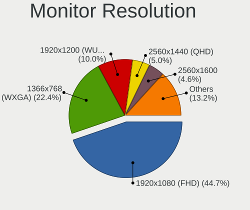

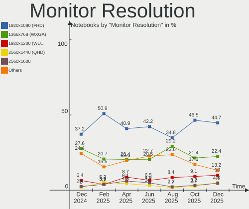

| Resolution        | Notebooks | Percent |
|-------------------|-----------|---------|
| 1920x1080 (FHD)   | 98        | 44.75%  |
| 1366x768 (WXGA)   | 49        | 22.37%  |
| 1920x1200 (WUXGA) | 22        | 10.05%  |
| 2560x1440 (QHD)   | 11        | 5.02%   |
| 2560x1600         | 10        | 4.57%   |
| 1600x900 (HD+)    | 7         | 3.2%    |
| 2880x1800         | 6         | 2.74%   |
| 3840x2160 (4K)    | 3         | 1.37%   |
| 1024x600          | 3         | 1.37%   |
| 1280x800 (WXGA)   | 2         | 0.91%   |
| 800x1280          | 1         | 0.46%   |
| 3200x2000         | 1         | 0.46%   |
| 3072x1920         | 1         | 0.46%   |
| 2880x1920         | 1         | 0.46%   |
| 2160x1440         | 1         | 0.46%   |
| 1440x900 (WXGA+)  | 1         | 0.46%   |
| 1280x854          | 1         | 0.46%   |
| 1024x768 (XGA)    | 1         | 0.46%   |

Monitor Diagonal
----------------

Diagonal size in inches

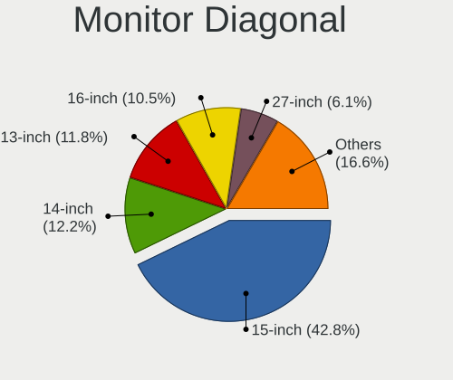

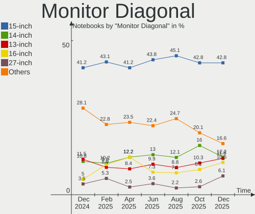

| Inches | Notebooks | Percent |
|--------|-----------|---------|
| 15     | 98        | 42.79%  |
| 14     | 28        | 12.23%  |
| 13     | 27        | 11.79%  |
| 16     | 24        | 10.48%  |
| 27     | 14        | 6.11%   |
| 17     | 11        | 4.8%    |
| 24     | 5         | 2.18%   |
| 21     | 5         | 2.18%   |
| 12     | 4         | 1.75%   |
| 23     | 3         | 1.31%   |
| 11     | 3         | 1.31%   |
| 10     | 2         | 0.87%   |
| 84     | 1         | 0.44%   |
| 63     | 1         | 0.44%   |
| 31     | 1         | 0.44%   |
| 18     | 1         | 0.44%   |
| 7      | 1         | 0.44%   |

Monitor Width
-------------

Physical width

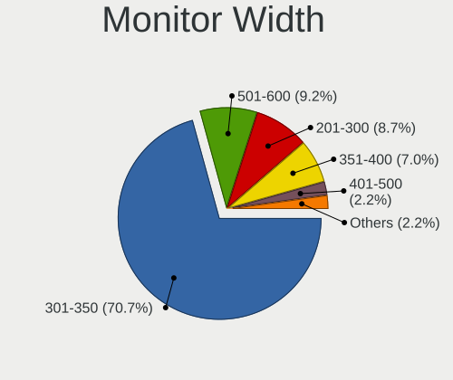

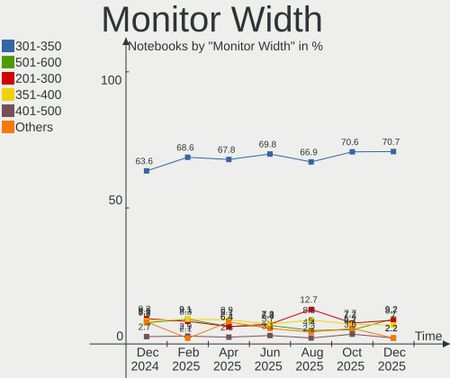

| Width in mm | Notebooks | Percent |
|-------------|-----------|---------|
| 301-350     | 162       | 70.74%  |
| 501-600     | 21        | 9.17%   |
| 201-300     | 20        | 8.73%   |
| 351-400     | 16        | 6.99%   |
| 401-500     | 5         | 2.18%   |
| 601-700     | 2         | 0.87%   |
| 1501-2000   | 1         | 0.44%   |
| 1001-1500   | 1         | 0.44%   |
| 1-100       | 1         | 0.44%   |

Aspect Ratio
------------

Proportional relationship between the width and the height

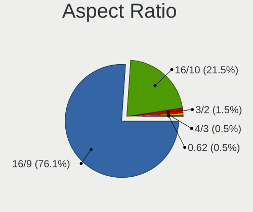

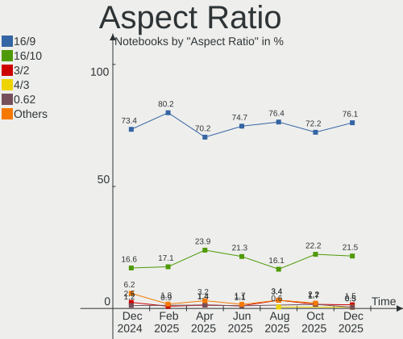

| Ratio | Notebooks | Percent |
|-------|-----------|---------|
| 16/9  | 156       | 76.1%   |
| 16/10 | 44        | 21.46%  |
| 3/2   | 3         | 1.46%   |
| 4/3   | 1         | 0.49%   |
| 0.62  | 1         | 0.49%   |

Monitor Area
------------

Area in inch²

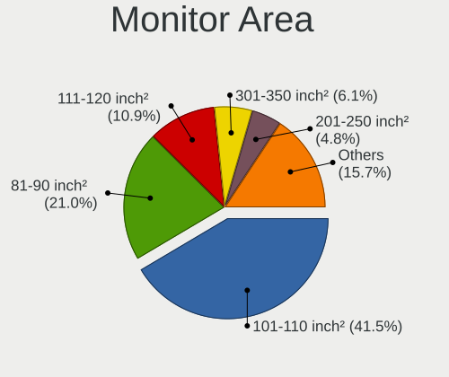

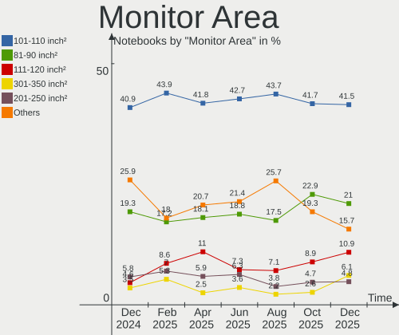

| Area in inch² | Notebooks | Percent |
|----------------|-----------|---------|
| 101-110        | 95        | 41.48%  |
| 81-90          | 48        | 20.96%  |
| 111-120        | 25        | 10.92%  |
| 301-350        | 14        | 6.11%   |
| 201-250        | 11        | 4.8%    |
| 121-130        | 10        | 4.37%   |
| 71-80          | 7         | 3.06%   |
| 61-70          | 4         | 1.75%   |
| 51-60          | 3         | 1.31%   |
| More than 1000 | 2         | 0.87%   |
| 41-50          | 2         | 0.87%   |
| 151-200        | 2         | 0.87%   |
| 91-100         | 2         | 0.87%   |
| 351-500        | 1         | 0.44%   |
| 1-40           | 1         | 0.44%   |
| 141-150        | 1         | 0.44%   |
| 131-140        | 1         | 0.44%   |

Pixel Density
-------------

Pixels per inch

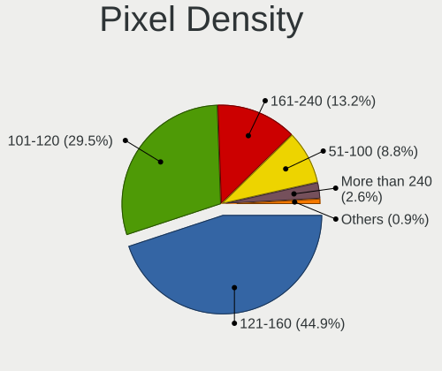

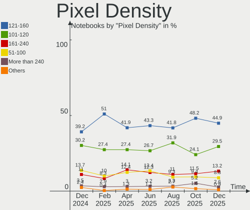

| Density       | Notebooks | Percent |
|---------------|-----------|---------|
| 121-160       | 102       | 44.93%  |
| 101-120       | 67        | 29.52%  |
| 161-240       | 30        | 13.22%  |
| 51-100        | 20        | 8.81%   |
| More than 240 | 6         | 2.64%   |
| 1-50          | 2         | 0.88%   |

Multiple Monitors
-----------------

Total monitors connected

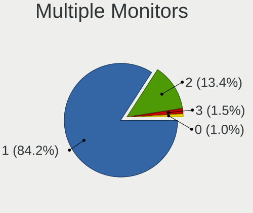

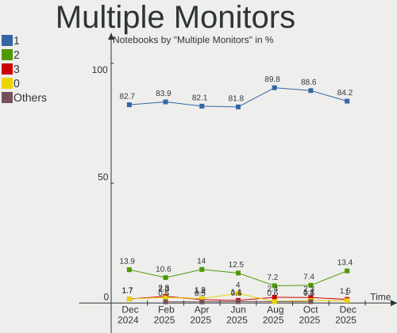

| Total | Notebooks | Percent |
|-------|-----------|---------|
| 1     | 170       | 84.16%  |
| 2     | 27        | 13.37%  |
| 3     | 3         | 1.49%   |
| 0     | 2         | 0.99%   |

Network
-------

Net Controller Vendor
---------------------

Controller vendors

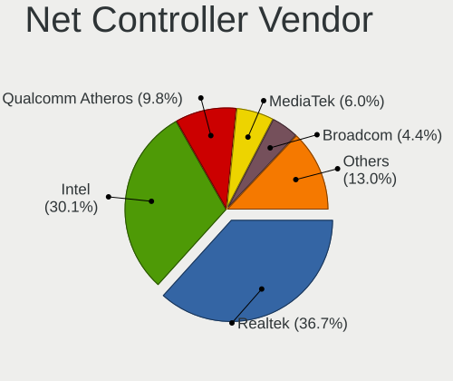

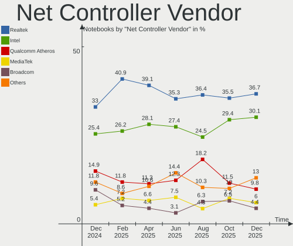

| Vendor                     | Notebooks | Percent |
|----------------------------|-----------|---------|
| Realtek Semiconductor      | 116       | 36.71%  |
| Intel                      | 95        | 30.06%  |
| Qualcomm Atheros           | 31        | 9.81%   |
| MediaTek                   | 19        | 6.01%   |
| Broadcom                   | 14        | 4.43%   |
| Ralink                     | 5         | 1.58%   |
| OPPO Electronics           | 5         | 1.58%   |
| Marvell Technology Group   | 5         | 1.58%   |
| Broadcom Limited           | 5         | 1.58%   |
| Xiaomi                     | 3         | 0.95%   |
| Quectel Wireless Solutions | 3         | 0.95%   |
| Qualcomm                   | 3         | 0.95%   |
| TP-Link                    | 2         | 0.63%   |
| Samsung Electronics        | 2         | 0.63%   |
| QinHeng Electronics        | 2         | 0.63%   |
| ZTE WCDMA Technologies MSM | 1         | 0.32%   |
| Dell                       | 1         | 0.32%   |
| ASUSTek Computer           | 1         | 0.32%   |
| ASIX Electronics           | 1         | 0.32%   |
| Apple                      | 1         | 0.32%   |
| aicsemi                    | 1         | 0.32%   |

Net Controller Model
--------------------

Controller models

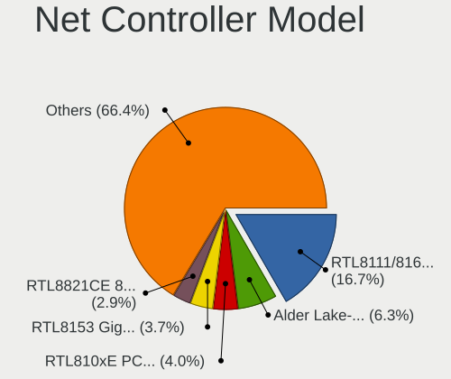

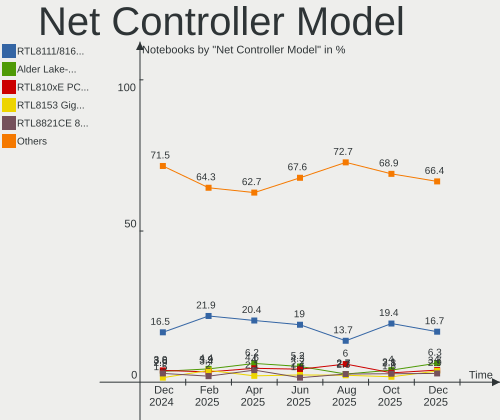

| Model                                                                  | Notebooks | Percent |
|------------------------------------------------------------------------|-----------|---------|
| Realtek RTL8111/8168/8211/8411 PCI Express Gigabit Ethernet Controller | 63        | 16.67%  |
| Intel Alder Lake-P PCH CNVi WiFi                                       | 24        | 6.35%   |
| Realtek RTL810xE PCI Express Fast Ethernet controller                  | 15        | 3.97%   |
| Realtek RTL8153 Gigabit Ethernet Adapter                               | 14        | 3.7%    |
| Realtek RTL8821CE 802.11ac PCIe Wireless Network Adapter               | 11        | 2.91%   |
| Realtek RTL8822CE 802.11ac PCIe Wireless Network Adapter               | 10        | 2.65%   |
| Qualcomm Atheros AR9285 Wireless Network Adapter (PCI-Express)         | 10        | 2.65%   |
| Intel Wi-Fi 6 AX201                                                    | 10        | 2.65%   |
| Realtek RTL8723BE PCIe Wireless Network Adapter                        | 8         | 2.12%   |
| MediaTek MT7902 802.11ax PCIe Wireless Network Adapter [Filogic 310]   | 8         | 2.12%   |
| Intel Wireless 7265                                                    | 7         | 1.85%   |
| Intel Raptor Lake PCH CNVi WiFi                                        | 7         | 1.85%   |
| Qualcomm Atheros AR9485 Wireless Network Adapter                       | 6         | 1.59%   |
| Intel Wi-Fi 6E(802.11ax) AX210/AX1675* 2x2 [Typhoon Peak]              | 6         | 1.59%   |
| Intel Ethernet Connection (13) I219-V                                  | 6         | 1.59%   |
| Qualcomm Atheros QCA9377 802.11ac Wireless Network Adapter             | 5         | 1.32%   |
| Qualcomm Atheros AR8131 Gigabit Ethernet                               | 4         | 1.06%   |
| OPPO Ace 3V                                                            | 4         | 1.06%   |
| MediaTek MT7922 802.11ax PCI Express Wireless Network Adapter          | 4         | 1.06%   |
| Intel Wireless 8265 / 8275                                             | 4         | 1.06%   |
| Intel Wireless 3165                                                    | 4         | 1.06%   |
| Intel Wi-Fi 6 AX200                                                    | 4         | 1.06%   |
| Intel Ethernet Connection (16) I219-V                                  | 4         | 1.06%   |
| Broadcom BCM4313 802.11bgn Wireless Network Adapter                    | 4         | 1.06%   |
| Xiaomi Mi/Redmi series (RNDIS)                                         | 3         | 0.79%   |
| Realtek RTL8152 Fast Ethernet Adapter                                  | 3         | 0.79%   |
| Realtek RTL8125 2.5GbE Controller                                      | 3         | 0.79%   |
| Ralink RT3290 Wireless 802.11n 1T/1R PCIe                              | 3         | 0.79%   |
| Qualcomm QCNFA765 Wireless Network Adapter                             | 3         | 0.79%   |
| MediaTek MT7921 802.11ax PCIe Wireless Network Adapter [Filogic 330]   | 3         | 0.79%   |
| Intel BE201 320MHz                                                     | 3         | 0.79%   |
| Intel Arrow Lake CNVi WiFi                                             | 3         | 0.79%   |
| Broadcom BCM43142 802.11b/g/n                                          | 3         | 0.79%   |
| Broadcom BCM4312 802.11b/g LP-PHY                                      | 3         | 0.79%   |
| Samsung Galaxy series, misc. (tethering mode)                          | 2         | 0.53%   |
| Realtek RTL88x2bu [AC1200 Techkey]                                     | 2         | 0.53%   |
| Realtek RTL8852BE PCIe 802.11ax Wireless Network Controller            | 2         | 0.53%   |
| Realtek RTL8811AU 802.11a/b/g/n/ac WLAN Adapter                        | 2         | 0.53%   |
| Realtek 802.11n WLAN Adapter                                           | 2         | 0.53%   |
| Ralink RT3090 Wireless 802.11n 1T/1R PCIe                              | 2         | 0.53%   |

Wireless Vendor
---------------

Wireless vendors

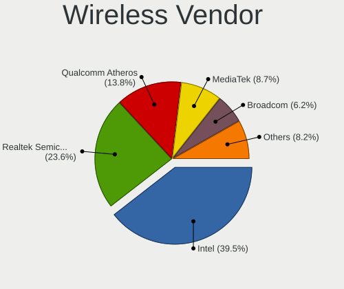

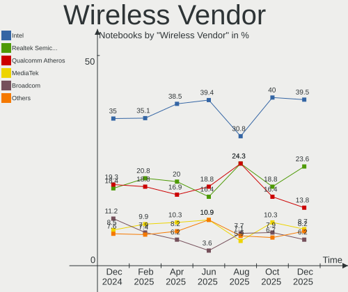

| Vendor                     | Notebooks | Percent |
|----------------------------|-----------|---------|
| Intel                      | 77        | 39.49%  |
| Realtek Semiconductor      | 46        | 23.59%  |
| Qualcomm Atheros           | 27        | 13.85%  |
| MediaTek                   | 17        | 8.72%   |
| Broadcom                   | 12        | 6.15%   |
| Ralink                     | 5         | 2.56%   |
| Quectel Wireless Solutions | 3         | 1.54%   |
| Qualcomm                   | 3         | 1.54%   |
| Broadcom Limited           | 2         | 1.03%   |
| TP-Link                    | 1         | 0.51%   |
| Dell                       | 1         | 0.51%   |
| ASUSTek Computer           | 1         | 0.51%   |

Wireless Model
--------------

Wireless models

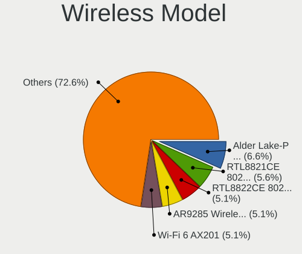

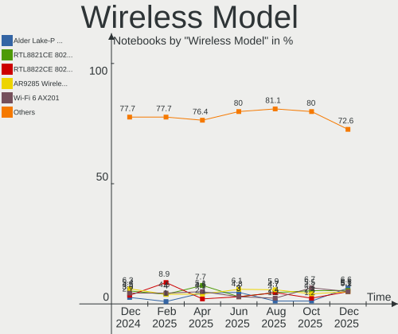

| Model                                                                | Notebooks | Percent |
|----------------------------------------------------------------------|-----------|---------|
| Intel Alder Lake-P PCH CNVi WiFi                                     | 13        | 6.6%    |
| Realtek RTL8821CE 802.11ac PCIe Wireless Network Adapter             | 11        | 5.58%   |
| Realtek RTL8822CE 802.11ac PCIe Wireless Network Adapter             | 10        | 5.08%   |
| Qualcomm Atheros AR9285 Wireless Network Adapter (PCI-Express)       | 10        | 5.08%   |
| Intel Wi-Fi 6 AX201                                                  | 10        | 5.08%   |
| Realtek RTL8723BE PCIe Wireless Network Adapter                      | 8         | 4.06%   |
| MediaTek MT7902 802.11ax PCIe Wireless Network Adapter [Filogic 310] | 8         | 4.06%   |
| Intel Wireless 7265                                                  | 7         | 3.55%   |
| Intel Raptor Lake PCH CNVi WiFi                                      | 7         | 3.55%   |
| Qualcomm Atheros AR9485 Wireless Network Adapter                     | 6         | 3.05%   |
| Intel Wi-Fi 6E(802.11ax) AX210/AX1675* 2x2 [Typhoon Peak]            | 6         | 3.05%   |
| Qualcomm Atheros QCA9377 802.11ac Wireless Network Adapter           | 5         | 2.54%   |
| Intel Wireless 8265 / 8275                                           | 4         | 2.03%   |
| Intel Wireless 3165                                                  | 4         | 2.03%   |
| Intel Wi-Fi 6 AX200                                                  | 4         | 2.03%   |
| Broadcom BCM4313 802.11bgn Wireless Network Adapter                  | 4         | 2.03%   |
| Ralink RT3290 Wireless 802.11n 1T/1R PCIe                            | 3         | 1.52%   |
| Qualcomm QCNFA765 Wireless Network Adapter                           | 3         | 1.52%   |
| MediaTek MT7922 802.11ax PCI Express Wireless Network Adapter        | 3         | 1.52%   |
| MediaTek MT7921 802.11ax PCIe Wireless Network Adapter [Filogic 330] | 3         | 1.52%   |
| Broadcom BCM43142 802.11b/g/n                                        | 3         | 1.52%   |
| Broadcom BCM4312 802.11b/g LP-PHY                                    | 3         | 1.52%   |
| Realtek RTL88x2bu [AC1200 Techkey]                                   | 2         | 1.02%   |
| Realtek RTL8852BE PCIe 802.11ax Wireless Network Controller          | 2         | 1.02%   |
| Realtek RTL8811AU 802.11a/b/g/n/ac WLAN Adapter                      | 2         | 1.02%   |
| Realtek 802.11n WLAN Adapter                                         | 2         | 1.02%   |
| Ralink RT3090 Wireless 802.11n 1T/1R PCIe                            | 2         | 1.02%   |
| Quectel Wireless Solutions Quectel EM05-CN                           | 2         | 1.02%   |
| Qualcomm Atheros QCA9565 / AR9565 Wireless Network Adapter           | 2         | 1.02%   |
| Qualcomm Atheros QCA6174 802.11ac Wireless Network Adapter           | 2         | 1.02%   |
| Qualcomm Atheros AR9462 Wireless Network Adapter                     | 2         | 1.02%   |
| MediaTek MT7921K (RZ608) Wi-Fi 6E 80MHz                              | 2         | 1.02%   |
| Intel Dual Band Wireless-AC 3165 Plus Bluetooth                      | 2         | 1.02%   |
| Intel Centrino Wireless-N 130                                        | 2         | 1.02%   |
| Intel Centrino Advanced-N 6235                                       | 2         | 1.02%   |
| Intel BE201 320MHz                                                   | 2         | 1.02%   |
| TP-Link 802.11ac WLAN Adapter                                        | 1         | 0.51%   |
| Realtek RTL8822BE 802.11a/b/g/n/ac WiFi adapter                      | 1         | 0.51%   |
| Realtek RTL8821AE 802.11ac PCIe Wireless Network Adapter             | 1         | 0.51%   |
| Realtek RTL8723DE Wireless Network Adapter                           | 1         | 0.51%   |

Ethernet Vendor
---------------

Ethernet vendors

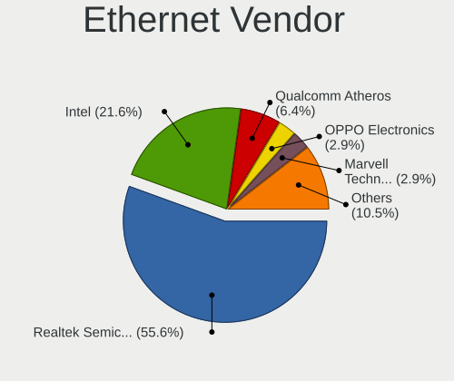

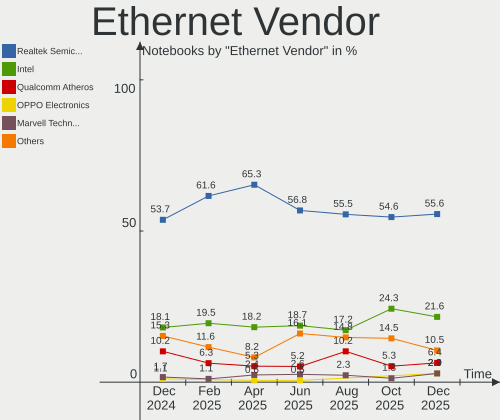

| Vendor                   | Notebooks | Percent |
|--------------------------|-----------|---------|
| Realtek Semiconductor    | 95        | 55.56%  |
| Intel                    | 37        | 21.64%  |
| Qualcomm Atheros         | 11        | 6.43%   |
| OPPO Electronics         | 5         | 2.92%   |
| Marvell Technology Group | 5         | 2.92%   |
| Xiaomi                   | 3         | 1.75%   |
| Broadcom Limited         | 3         | 1.75%   |
| Broadcom                 | 3         | 1.75%   |
| Samsung Electronics      | 2         | 1.17%   |
| QinHeng Electronics      | 2         | 1.17%   |
| MediaTek                 | 2         | 1.17%   |
| TP-Link                  | 1         | 0.58%   |
| ASIX Electronics         | 1         | 0.58%   |
| Apple                    | 1         | 0.58%   |

Ethernet Model
--------------

Ethernet models

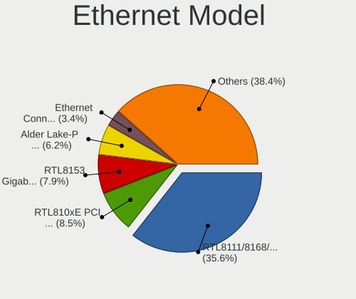

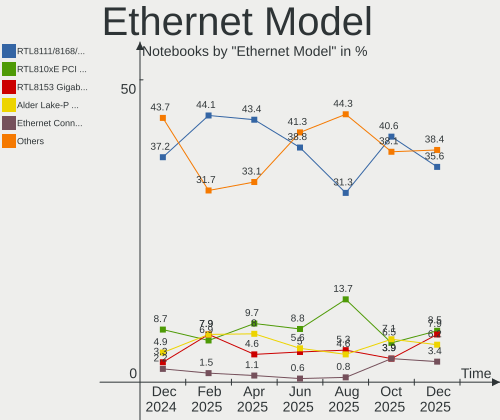

| Model                                                                          | Notebooks | Percent |
|--------------------------------------------------------------------------------|-----------|---------|
| Realtek RTL8111/8168/8211/8411 PCI Express Gigabit Ethernet Controller         | 63        | 35.59%  |
| Realtek RTL810xE PCI Express Fast Ethernet controller                          | 15        | 8.47%   |
| Realtek RTL8153 Gigabit Ethernet Adapter                                       | 14        | 7.91%   |
| Intel Alder Lake-P PCH CNVi WiFi                                               | 11        | 6.21%   |
| Intel Ethernet Connection (13) I219-V                                          | 6         | 3.39%   |
| Qualcomm Atheros AR8131 Gigabit Ethernet                                       | 4         | 2.26%   |
| OPPO Ace 3V                                                                    | 4         | 2.26%   |
| Intel Ethernet Connection (16) I219-V                                          | 4         | 2.26%   |
| Xiaomi Mi/Redmi series (RNDIS)                                                 | 3         | 1.69%   |
| Realtek RTL8152 Fast Ethernet Adapter                                          | 3         | 1.69%   |
| Realtek RTL8125 2.5GbE Controller                                              | 3         | 1.69%   |
| Samsung Galaxy series, misc. (tethering mode)                                  | 2         | 1.13%   |
| Qualcomm Atheros AR8161 Gigabit Ethernet                                       | 2         | 1.13%   |
| QinHeng USB 10/100 LAN                                                         | 2         | 1.13%   |
| Marvell Group Yukon Optima 88E8059 [PCIe Gigabit Ethernet Controller with AVB] | 2         | 1.13%   |
| Marvell Group 88E8040 PCI-E Fast Ethernet Controller                           | 2         | 1.13%   |
| Intel WiMAX Connection 2400m                                                   | 2         | 1.13%   |
| Intel Ethernet Connection (23) I219-V                                          | 2         | 1.13%   |
| Intel Arrow Lake CNVi WiFi                                                     | 2         | 1.13%   |
| TP-Link USB 10/100 LAN                                                         | 1         | 0.56%   |
| Realtek RTL8852CE PCIe 802.11ax Wireless Network Controller                    | 1         | 0.56%   |
| Realtek Killer E3000 2.5GbE Controller                                         | 1         | 0.56%   |
| Qualcomm Atheros QCA8171 Gigabit Ethernet                                      | 1         | 0.56%   |
| Qualcomm Atheros AR8162 Fast Ethernet                                          | 1         | 0.56%   |
| Qualcomm Atheros AR8152 v2.0 Fast Ethernet                                     | 1         | 0.56%   |
| Qualcomm Atheros AR8152 v1.1 Fast Ethernet                                     | 1         | 0.56%   |
| Qualcomm Atheros AR8151 v2.0 Gigabit Ethernet                                  | 1         | 0.56%   |
| OPPO RMX3741                                                                   | 1         | 0.56%   |
| MediaTek MT7922 802.11ax PCI Express Wireless Network Adapter                  | 1         | 0.56%   |
| MediaTek Infinix HOT 50i                                                       | 1         | 0.56%   |
| Marvell Group 88E8057 PCI-E Gigabit Ethernet Controller                        | 1         | 0.56%   |
| Intel Wi-Fi 7(802.11be) AX1775*/AX1790*/BE20*/BE401/BE1750* 2x2                | 1         | 0.56%   |
| Intel Ethernet Connection I219-LM                                              | 1         | 0.56%   |
| Intel Ethernet Connection I217-LM                                              | 1         | 0.56%   |
| Intel Ethernet Connection (6) I219-V                                           | 1         | 0.56%   |
| Intel Ethernet Connection (4) I219-LM                                          | 1         | 0.56%   |
| Intel Ethernet Connection (3) I218-LM                                          | 1         | 0.56%   |
| Intel Ethernet Connection (24) I219-V                                          | 1         | 0.56%   |
| Intel Ethernet Connection (16) I219-LM                                         | 1         | 0.56%   |
| Intel Ethernet Connection (10) I219-V                                          | 1         | 0.56%   |

Net Controller Kind
-------------------

Ethernet, WiFi or modem

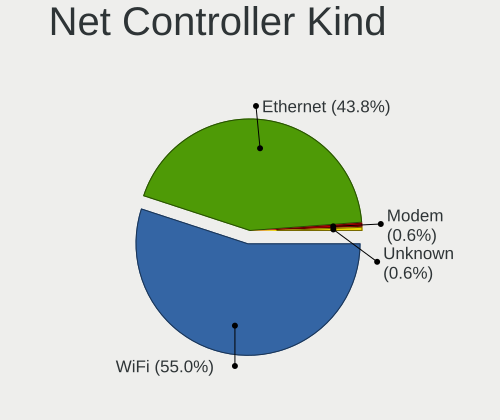

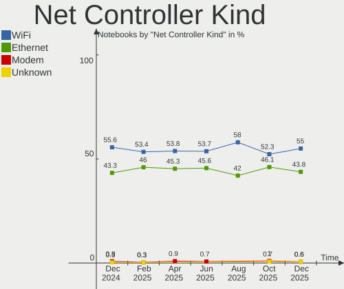

| Kind     | Notebooks | Percent |
|----------|-----------|---------|
| WiFi     | 186       | 55.03%  |
| Ethernet | 148       | 43.79%  |
| Modem    | 2         | 0.59%   |
| Unknown  | 2         | 0.59%   |

Used Controller
---------------

Currently used network controller

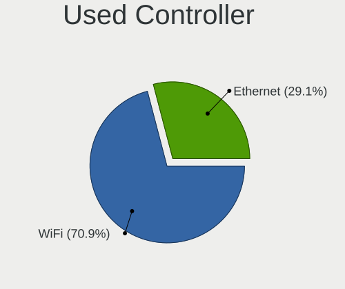

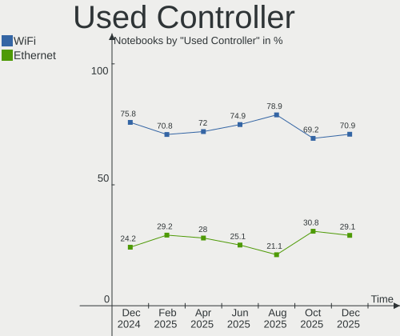

| Kind     | Notebooks | Percent |
|----------|-----------|---------|
| WiFi     | 144       | 70.94%  |
| Ethernet | 59        | 29.06%  |

NICs
----

Total network controllers on board

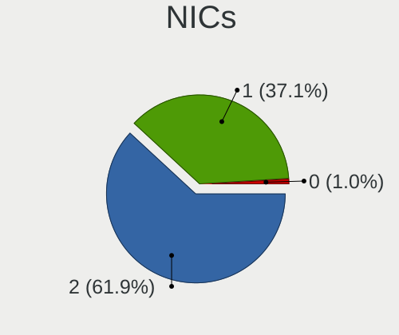

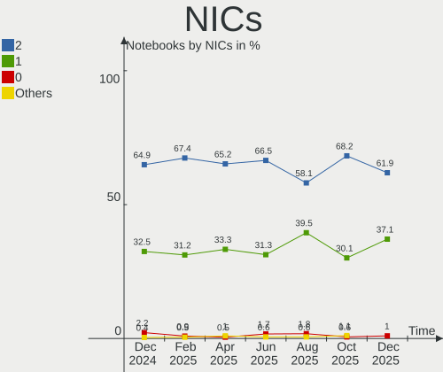

| Total | Notebooks | Percent |
|-------|-----------|---------|
| 2     | 125       | 61.88%  |
| 1     | 75        | 37.13%  |
| 0     | 2         | 0.99%   |

IPv6
----

IPv6 vs IPv4

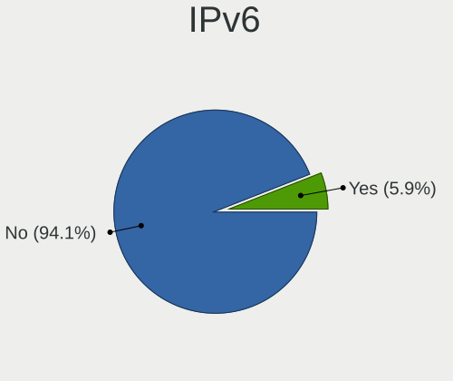

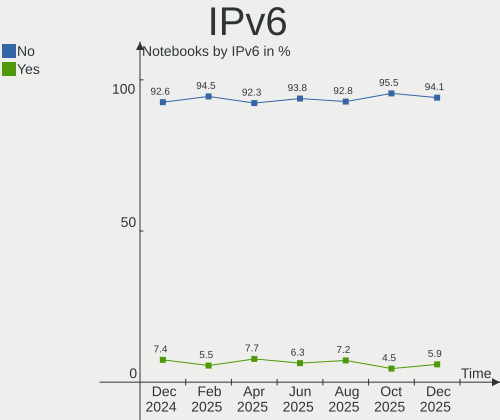

| Used | Notebooks | Percent |
|------|-----------|---------|
| No   | 190       | 94.06%  |
| Yes  | 12        | 5.94%   |

Bluetooth
---------

Bluetooth Vendor
----------------

Controller vendors

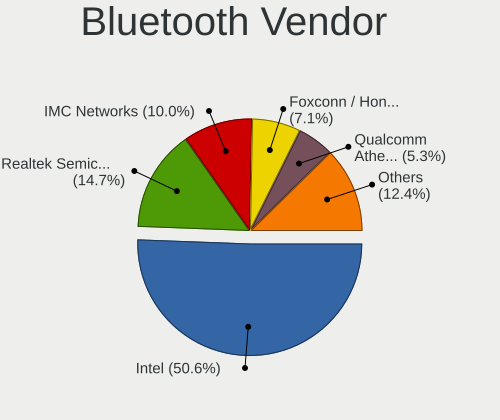

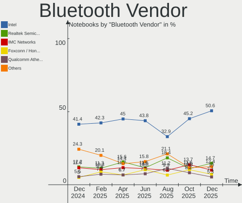

| Vendor                          | Notebooks | Percent |
|---------------------------------|-----------|---------|
| Intel                           | 86        | 50.59%  |
| Realtek Semiconductor           | 25        | 14.71%  |
| IMC Networks                    | 17        | 10%     |
| Foxconn / Hon Hai               | 12        | 7.06%   |
| Qualcomm Atheros Communications | 9         | 5.29%   |
| Ralink                          | 3         | 1.76%   |
| Lite-On Technology              | 3         | 1.76%   |
| Realtek                         | 2         | 1.18%   |
| MediaTek                        | 2         | 1.18%   |
| Foxconn International           | 2         | 1.18%   |
| Broadcom                        | 2         | 1.18%   |
| Ralink Technology               | 1         | 0.59%   |
| Hewlett-Packard                 | 1         | 0.59%   |
| Chicony Electronics             | 1         | 0.59%   |
| Cambridge Silicon Radio         | 1         | 0.59%   |
| ASUSTek Computer                | 1         | 0.59%   |
| Apple                           | 1         | 0.59%   |
| Alps Electric                   | 1         | 0.59%   |

Bluetooth Model
---------------

Controller models

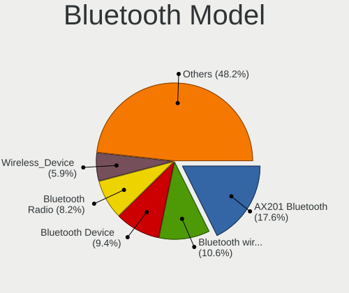

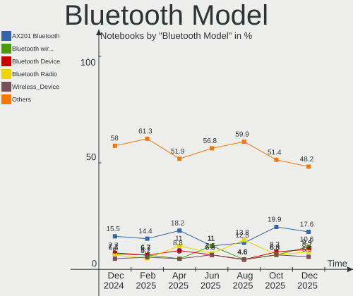

| Model                                             | Notebooks | Percent |
|---------------------------------------------------|-----------|---------|
| Intel AX201 Bluetooth                             | 30        | 17.65%  |
| Intel Bluetooth wireless interface                | 18        | 10.59%  |
| Intel Bluetooth Device                            | 16        | 9.41%   |
| Realtek Bluetooth Radio                           | 14        | 8.24%   |
| IMC Networks Wireless_Device                      | 10        | 5.88%   |
| Intel AX210 Bluetooth                             | 6         | 3.53%   |
| Realtek 802.11ac WLAN Adapter                     | 5         | 2.94%   |
| IMC Networks Bluetooth Radio                      | 5         | 2.94%   |
| Intel Bluetooth 9460/9560 Jefferson Peak (JfP)    | 4         | 2.35%   |
| Intel AX200 Bluetooth                             | 4         | 2.35%   |
| Foxconn / Hon Hai Wireless_Device                 | 4         | 2.35%   |
| Foxconn / Hon Hai Bluetooth Device                | 4         | 2.35%   |
| Realtek  Bluetooth 4.2 Adapter                    | 3         | 1.76%   |
| Ralink RT3290 Bluetooth                           | 3         | 1.76%   |
| Qualcomm Atheros  Bluetooth Device                | 3         | 1.76%   |
| Qualcomm Atheros AR3012 Bluetooth 4.0             | 3         | 1.76%   |
| Intel Bluetooth                                   | 3         | 1.76%   |
| Realtek RTL8723B Bluetooth                        | 2         | 1.18%   |
| Realtek Bluetooth Radio                           | 2         | 1.18%   |
| MediaTek Wireless_Device                          | 2         | 1.18%   |
| Intel Centrino Bluetooth Wireless Transceiver     | 2         | 1.18%   |
| Intel Centrino Advanced-N 6230 Bluetooth adapter  | 2         | 1.18%   |
| Foxconn International BCM43142A0 Bluetooth module | 2         | 1.18%   |
| Realtek RTL8821A Bluetooth                        | 1         | 0.59%   |
| Ralink Motorola BC4 Bluetooth 3.0+HS Adapter      | 1         | 0.59%   |
| Qualcomm Atheros QCA61x4 Bluetooth 4.0            | 1         | 0.59%   |
| Qualcomm Atheros Bluetooth USB Host Controller    | 1         | 0.59%   |
| Qualcomm Atheros AR3011 Bluetooth                 | 1         | 0.59%   |
| Lite-On Wireless_Device                           | 1         | 0.59%   |
| Lite-On Qualcomm Atheros QCA9377 Bluetooth        | 1         | 0.59%   |
| Lite-On Bluetooth Device                          | 1         | 0.59%   |
| Intel Wireless-AC 3168 Bluetooth                  | 1         | 0.59%   |
| IMC Networks Bluetooth Device                     | 1         | 0.59%   |
| IMC Networks Atheros AR3012 Bluetooth 4.0 Adapter | 1         | 0.59%   |
| HP Broadcom 2070 Bluetooth Combo                  | 1         | 0.59%   |
| Foxconn / Hon Hai MediaTek Bluetooth Adapter      | 1         | 0.59%   |
| Foxconn / Hon Hai Broadcom BCM20702A1 Bluetooth   | 1         | 0.59%   |
| Foxconn / Hon Hai Broadcom BCM20702 Bluetooth     | 1         | 0.59%   |
| Foxconn / Hon Hai Bluetooth Radio                 | 1         | 0.59%   |
| Chicony Bluetooth (RTL8723BE)                     | 1         | 0.59%   |

Sound
-----

Sound Vendor
------------

Sound card vendors

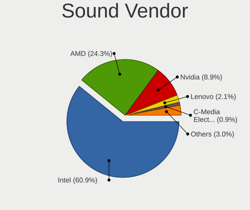

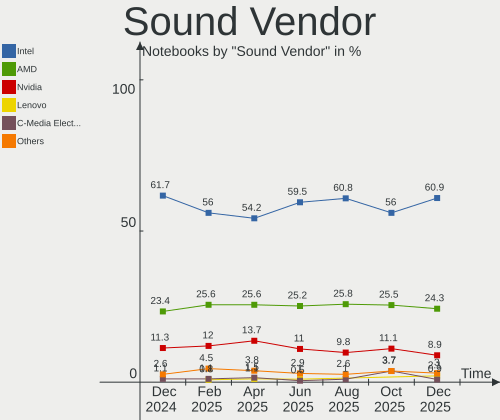

| Vendor                                       | Notebooks | Percent |
|----------------------------------------------|-----------|---------|
| Intel                                        | 143       | 60.85%  |
| AMD                                          | 57        | 24.26%  |
| Nvidia                                       | 21        | 8.94%   |
| Lenovo                                       | 5         | 2.13%   |
| C-Media Electronics                          | 2         | 0.85%   |
| ASUSTek Computer                             | 2         | 0.85%   |
| Zoran Co. Personal Media Division (Nogatech) | 1         | 0.43%   |
| Samsung Electronics                          | 1         | 0.43%   |
| Plantronics                                  | 1         | 0.43%   |
| Logitech                                     | 1         | 0.43%   |
| JMTek                                        | 1         | 0.43%   |

Sound Model
-----------

Sound card models

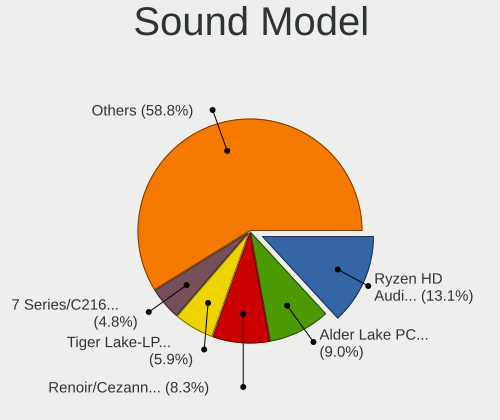

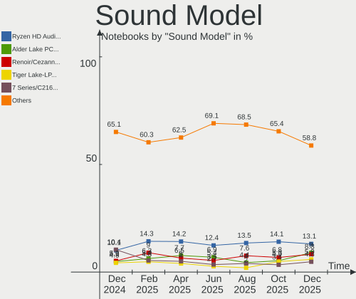

| Model                                                                      | Notebooks | Percent |
|----------------------------------------------------------------------------|-----------|---------|
| AMD Ryzen HD Audio Controller                                              | 38        | 13.15%  |
| Intel Alder Lake PCH-P High Definition Audio Controller                    | 26        | 9%      |
| AMD Renoir/Cezanne HDMI/DP Audio Controller                                | 24        | 8.3%    |
| Intel Tiger Lake-LP Smart Sound Technology Audio Controller                | 17        | 5.88%   |
| Intel 7 Series/C216 Chipset Family High Definition Audio Controller        | 14        | 4.84%   |
| Intel Raptor Lake-P/U/H cAVS                                               | 12        | 4.15%   |
| AMD Radeon High Definition Audio Controller                                | 11        | 3.81%   |
| Intel Sunrise Point-LP HD Audio                                            | 9         | 3.11%   |
| Intel 82801I (ICH9 Family) HD Audio Controller                             | 7         | 2.42%   |
| Intel 6 Series/C200 Series Chipset Family High Definition Audio Controller | 7         | 2.42%   |
| Intel 5 Series/3400 Series Chipset High Definition Audio                   | 6         | 2.08%   |
| AMD FCH Azalia Controller                                                  | 6         | 2.08%   |
| AMD Family 15h (Models 60h-6fh) Audio Controller                           | 6         | 2.08%   |
| Intel Celeron/Pentium Silver Processor High Definition Audio               | 5         | 1.73%   |
| Intel Atom Processor Z36xxx/Z37xxx Series High Definition Audio Controller | 5         | 1.73%   |
| AMD High Definition Audio Controller                                       | 5         | 1.73%   |
| Nvidia GF108 High Definition Audio Controller                              | 4         | 1.38%   |
| Lenovo ThinkPad USB-C Dock Audio                                           | 4         | 1.38%   |
| AMD Kabini HDMI/DP Audio                                                   | 4         | 1.38%   |
| Nvidia AD107 High Definition Audio Controller                              | 3         | 1.04%   |
| Intel Raptor Lake High Definition Audio Controller                         | 3         | 1.04%   |
| Intel Lunar Lake-M HD Audio Controller                                     | 3         | 1.04%   |
| Intel Ice Lake-LP Smart Sound Technology Audio Controller                  | 3         | 1.04%   |
| Intel Comet Lake PCH-LP cAVS                                               | 3         | 1.04%   |
| Intel Broadwell-U Audio Controller                                         | 3         | 1.04%   |
| Intel Arrow Lake cAVS                                                      | 3         | 1.04%   |
| Intel Alder Lake-N PCH High Definition Audio Controller                    | 3         | 1.04%   |
| AMD Raven/Raven2/Fenghuang HDMI/DP Audio Controller                        | 3         | 1.04%   |
| Nvidia MCP79 High Definition Audio                                         | 2         | 0.69%   |
| Nvidia High Definition Audio Controller                                    | 2         | 0.69%   |
| Nvidia GT216 HDMI Audio Controller                                         | 2         | 0.69%   |
| Nvidia GA107 High Definition Audio Controller                              | 2         | 0.69%   |
| Nvidia AD106M High Definition Audio Controller                             | 2         | 0.69%   |
| Intel Xeon E3-1200 v3/4th Gen Core Processor HD Audio Controller           | 2         | 0.69%   |
| Intel Wildcat Point-LP High Definition Audio Controller                    | 2         | 0.69%   |
| Intel NM10/ICH7 Family High Definition Audio Controller                    | 2         | 0.69%   |
| Intel Cannon Point-LP High Definition Audio Controller                     | 2         | 0.69%   |
| Intel 82801H (ICH8 Family) HD Audio Controller                             | 2         | 0.69%   |
| Intel 8 Series/C220 Series Chipset High Definition Audio Controller        | 2         | 0.69%   |
| C-Media Electronics USB Advanced Audio Device                              | 2         | 0.69%   |

Memory
------

Memory Vendor
-------------

Memory module vendors

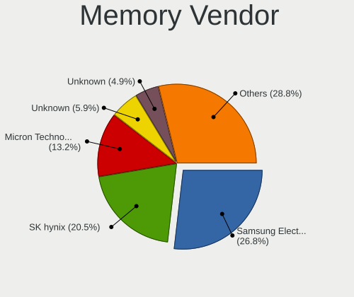

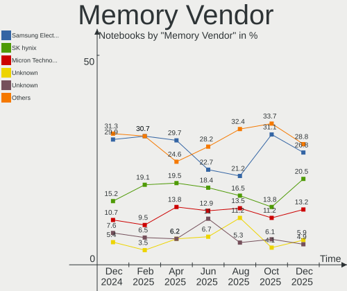

| Vendor                       | Notebooks | Percent |
|------------------------------|-----------|---------|
| Samsung Electronics          | 55        | 26.83%  |
| SK hynix                     | 42        | 20.49%  |
| Micron Technology            | 27        | 13.17%  |
| Unknown                      | 12        | 5.85%   |
| Unknown                      | 10        | 4.88%   |
| Kingston                     | 8         | 3.9%    |
| Foxline                      | 8         | 3.9%    |
| Nanya Technology             | 5         | 2.44%   |
| Crucial                      | 5         | 2.44%   |
| Ramaxel Technology           | 4         | 1.95%   |
| Patriot                      | 3         | 1.46%   |
| AMD                          | 3         | 1.46%   |
| Unknown (ABCD)               | 2         | 0.98%   |
| Hikvision                    | 2         | 0.98%   |
| GOODRAM                      | 2         | 0.98%   |
| Elpida                       | 2         | 0.98%   |
| Apacer                       | 2         | 0.98%   |
| A-DATA Technology            | 2         | 0.98%   |
| Wodposit                     | 1         | 0.49%   |
| Unknown (0x0FC4)             | 1         | 0.49%   |
| Unknown (0x0CAB)             | 1         | 0.49%   |
| Unknown (0x0BEC)             | 1         | 0.49%   |
| Unknown (0x0B45)             | 1         | 0.49%   |
| Unknown (0x0080)             | 1         | 0.49%   |
| TOP MEDIA                    | 1         | 0.49%   |
| Patriot Memory (PDP Systems) | 1         | 0.49%   |
| Kllisre                      | 1         | 0.49%   |
| Ankowall                     | 1         | 0.49%   |
| ACPI Digital                 | 1         | 0.49%   |

Memory Model
------------

Memory module models

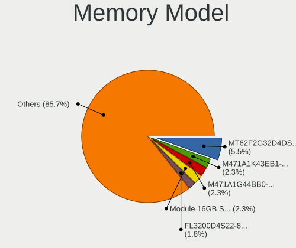

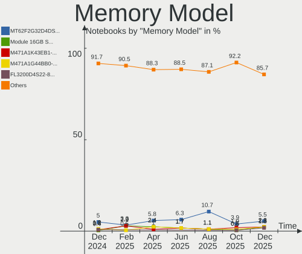

| Model                                                            | Notebooks | Percent |
|------------------------------------------------------------------|-----------|---------|
| Unknown                                                          | 12        | 5.53%   |
| SK hynix RAM Module 16GB SODIMM DDR4 3200MT/s                    | 5         | 2.3%    |
| Samsung RAM M471A1K43EB1-CWE 8GB SODIMM DDR4 3200MT/s            | 5         | 2.3%    |
| Samsung RAM M471A1G44BB0-CWE 8GB SODIMM DDR4 3200MT/s            | 5         | 2.3%    |
| Foxline RAM FL3200D4S22-8G 8GB SODIMM DDR4 3200MT/s              | 4         | 1.84%   |
| SK hynix RAM HMAG68EXNSA051N 8GB SODIMM DDR4 3200MT/s            | 3         | 1.38%   |
| Micron RAM 4ATF1G64HZ-3G2F1 8GB SODIMM DDR4 3200MT/s             | 3         | 1.38%   |
| Foxline RAM FL2666D4S19-8G 8GB SODIMM DDR4 2667MT/s              | 3         | 1.38%   |
| Unknown RAM Module 4GB SODIMM DDR3                               | 2         | 0.92%   |
| Unknown RAM Module 2GB Row Of Chips LPDDR4 4267MT/s              | 2         | 0.92%   |
| Unknown RAM Module 1GB SODIMM DDR2 533MT/s                       | 2         | 0.92%   |
| Unknown (ABCD) RAM 123456789012345678 2GB SODIMM LPDDR4 2400MT/s | 2         | 0.92%   |
| SK hynix RAM HMT451S6BFR8A-PB 4GB SODIMM DDR3 1600MT/s           | 2         | 0.92%   |
| SK hynix RAM HMCG78AGBSA095N 16GB SODIMM DDR5 5600MT/s           | 2         | 0.92%   |
| SK hynix RAM HMA851S6AFR6N-UH 4GB SODIMM DDR4 2400MT/s           | 2         | 0.92%   |
| Samsung RAM Module 1GB Row Of Chips LPDDR4 4267MT/s              | 2         | 0.92%   |
| Samsung RAM M471A5244CB0-CWE 4GB SODIMM DDR4 3200MT/s            | 2         | 0.92%   |
| Samsung RAM M471A5244CB0-CWE 4GB Row Of Chips DDR4 3200MT/s      | 2         | 0.92%   |
| Samsung RAM M471A2G43BB2-CWE 16GB SODIMM DDR4 3200MT/s           | 2         | 0.92%   |
| Samsung RAM M471A1K43CB1-CTD 8GB SODIMM DDR4 3200MT/s            | 2         | 0.92%   |
| Samsung RAM M471A1G44CB0-CWE 8GB SODIMM DDR4 3200MT/s            | 2         | 0.92%   |
| Samsung RAM M471A1G44AB0-CWE 8GiB SODIMM DDR4 3200MT/s           | 2         | 0.92%   |
| Samsung RAM M378A1G44CB0-CWE 8GB SODIMM DDR4 3200MT/s            | 2         | 0.92%   |
| Ramaxel RAM RMSA3310MF96HAF-3200 8GB SODIMM DDR4 3200MT/s        | 2         | 0.92%   |
| Patriot RAM PSD48G266681S 8GB SODIMM DDR4 2933MT/s               | 2         | 0.92%   |
| Micron RAM Module 8GB SODIMM DDR4 3200MT/s                       | 2         | 0.92%   |
| Micron RAM Module 4GB Row Of Chips LPDDR5 8533MT/s               | 2         | 0.92%   |
| Micron RAM 8ATF1G64HZ-3G2R1 8GB SODIMM DDR4 3200MT/s             | 2         | 0.92%   |
| Micron RAM 4ATF51264HZ-3G2J1 4GB Row Of Chips DDR4 3200MT/s      | 2         | 0.92%   |
| Micron RAM 4ATF51264HZ-2G6E1 4GB SODIMM DDR4 2667MT/s            | 2         | 0.92%   |
| Micron RAM 4ATF51264HZ-2G3B1 4GB SODIMM DDR4 3200MT/s            | 2         | 0.92%   |
| AMD RAM R534G1601S1S 4GB SODIMM DDR3 1600MT/s                    | 2         | 0.92%   |
| Wodposit RAM WPBH32D408SWD-8G 8GB SODIMM DDR4 3200MT/s           | 1         | 0.46%   |
| Unknown RAM Module 512MB SODIMM DDR2                             | 1         | 0.46%   |
| Unknown RAM Module 4GB SODIMM DDR4 2133MT/s                      | 1         | 0.46%   |
| Unknown RAM Module 2GB SODIMM DDR3                               | 1         | 0.46%   |
| Unknown RAM Module 2GB SODIMM DDR2 800MT/s                       | 1         | 0.46%   |
| Unknown RAM Module 2GB SODIMM DDR2 533MT/s                       | 1         | 0.46%   |
| Unknown RAM Module 2GB SODIMM 800MT/s                            | 1         | 0.46%   |
| Unknown RAM Module 1GB SODIMM DDR2                               | 1         | 0.46%   |

Memory Kind
-----------

Memory module kinds

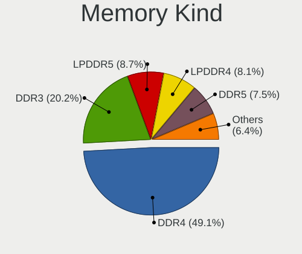

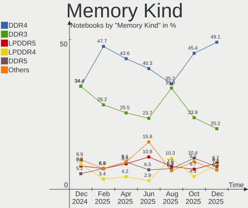

| Kind    | Notebooks | Percent |
|---------|-----------|---------|
| DDR4    | 85        | 49.13%  |
| DDR3    | 35        | 20.23%  |
| LPDDR5  | 15        | 8.67%   |
| LPDDR4  | 14        | 8.09%   |
| DDR5    | 13        | 7.51%   |
| DDR2    | 7         | 4.05%   |
| SDRAM   | 3         | 1.73%   |
| Unknown | 1         | 0.58%   |

Memory Form Factor
------------------

Physical design of the memory module

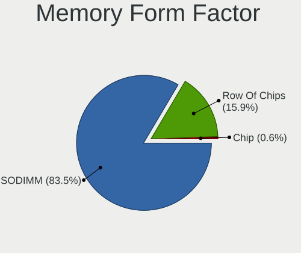

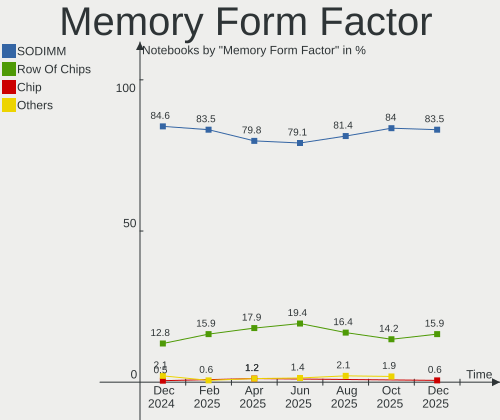

| Name         | Notebooks | Percent |
|--------------|-----------|---------|
| SODIMM       | 147       | 83.52%  |
| Row Of Chips | 28        | 15.91%  |
| Chip         | 1         | 0.57%   |

Memory Size
-----------

Memory module size

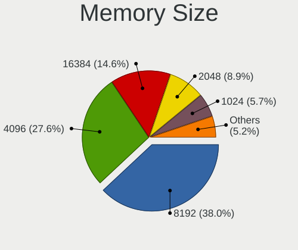

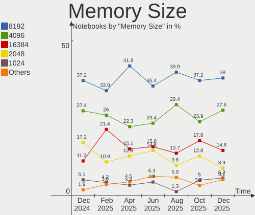

| Size  | Notebooks | Percent |
|-------|-----------|---------|
| 8192  | 73        | 38.02%  |
| 4096  | 53        | 27.6%   |
| 16384 | 28        | 14.58%  |
| 2048  | 17        | 8.85%   |
| 1024  | 11        | 5.73%   |
| 32768 | 7         | 3.65%   |
| 6144  | 1         | 0.52%   |
| 3072  | 1         | 0.52%   |
| 512   | 1         | 0.52%   |

Memory Speed
------------

Memory module speed

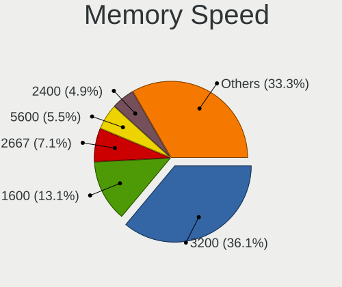

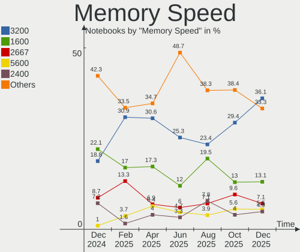

| Speed   | Notebooks | Percent |
|---------|-----------|---------|
| 3200    | 66        | 36.07%  |
| 1600    | 24        | 13.11%  |
| 2667    | 13        | 7.1%    |
| 5600    | 10        | 5.46%   |
| 2400    | 9         | 4.92%   |
| 4267    | 7         | 3.83%   |
| 6400    | 6         | 3.28%   |
| 8533    | 5         | 2.73%   |
| 1333    | 5         | 2.73%   |
| 1334    | 4         | 2.19%   |
| 4800    | 3         | 1.64%   |
| 800     | 3         | 1.64%   |
| Unknown | 3         | 1.64%   |
| 7500    | 2         | 1.09%   |
| 4199    | 2         | 1.09%   |
| 3733    | 2         | 1.09%   |
| 2933    | 2         | 1.09%   |
| 2133    | 2         | 1.09%   |
| 1067    | 2         | 1.09%   |
| 975     | 2         | 1.09%   |
| 667     | 2         | 1.09%   |
| 533     | 2         | 1.09%   |
| 8600    | 1         | 0.55%   |
| 5500    | 1         | 0.55%   |
| 4266    | 1         | 0.55%   |
| 3266    | 1         | 0.55%   |
| 1866    | 1         | 0.55%   |
| 1639    | 1         | 0.55%   |
| 1066    | 1         | 0.55%   |

Printers & scanners
-------------------

Printer Vendor
--------------

Printer device vendors

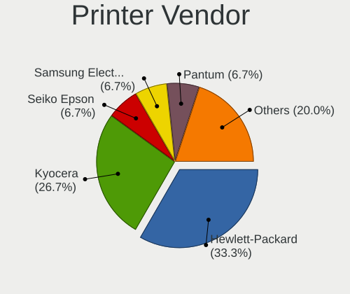

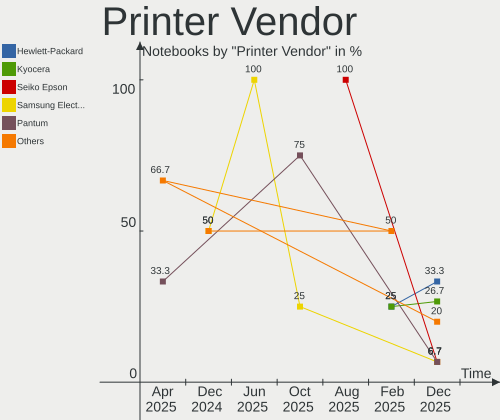

| Vendor              | Notebooks | Percent |
|---------------------|-----------|---------|
| Hewlett-Packard     | 5         | 33.33%  |
| Kyocera             | 4         | 26.67%  |
| Seiko Epson         | 1         | 6.67%   |
| Samsung Electronics | 1         | 6.67%   |
| Pantum              | 1         | 6.67%   |
| Katusha"            | 1         | 6.67%   |
| Canon               | 1         | 6.67%   |
| Brother Industries  | 1         | 6.67%   |

Printer Model
-------------

Printer device models

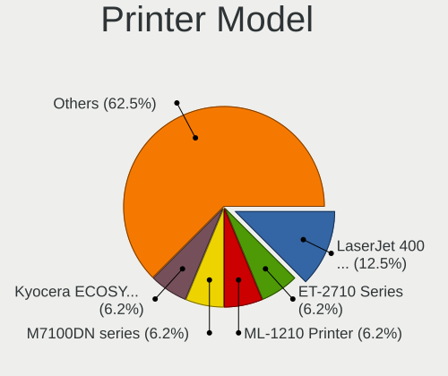

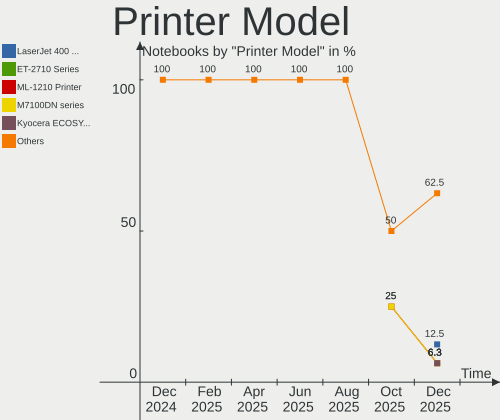

| Model                           | Notebooks | Percent |
|---------------------------------|-----------|---------|
| HP LaserJet 400 M401dne         | 2         | 12.5%   |
| Seiko Epson ET-2710 Series      | 1         | 6.25%   |
| Samsung ML-1210 Printer         | 1         | 6.25%   |
| Pantum M7100DN series           | 1         | 6.25%   |
| Kyocera Kyocera ECOSYS M2640idw | 1         | 6.25%   |
| Kyocera Kyocera ECOSYS M2040dn  | 1         | 6.25%   |
| Kyocera FS-1040                 | 1         | 6.25%   |
| Kyocera ECOSYS M5521cdn         | 1         | 6.25%   |
| Katusha" M240"                  | 1         | 6.25%   |
| HP Smart Tank 580-590 series    | 1         | 6.25%   |
| HP ScanJet Pro 3000 s3          | 1         | 6.25%   |
| HP LaserJet M507                | 1         | 6.25%   |
| HP LaserJet 1010                | 1         | 6.25%   |
| Canon MF440 Series              | 1         | 6.25%   |
| Brother MFC-L2700DN             | 1         | 6.25%   |

Scanner Vendor
--------------

Scanner device vendors

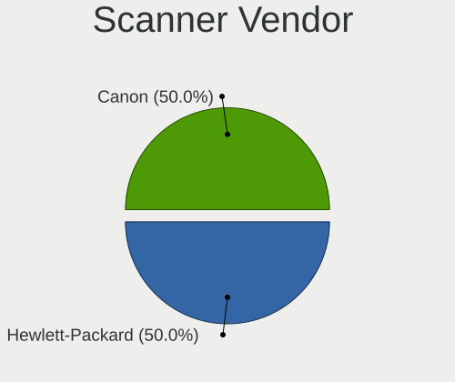

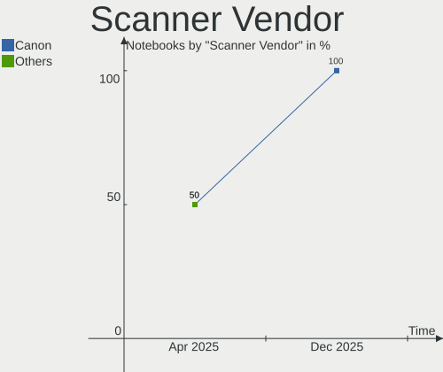

| Vendor | Notebooks | Percent |
|--------|-----------|---------|
| Canon  | 1         | 100%    |

Scanner Model
-------------

Scanner device models

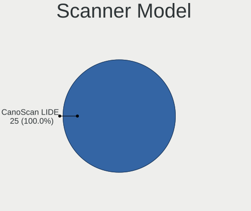

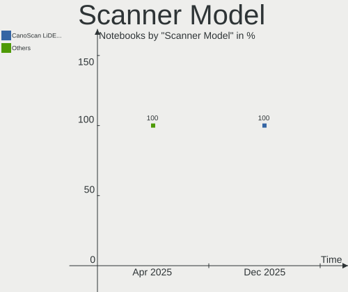

| Model                   | Notebooks | Percent |
|-------------------------|-----------|---------|
| Canon CanoScan LiDE 220 | 1         | 100%    |

Camera
------

Camera Vendor
-------------

Camera device vendors

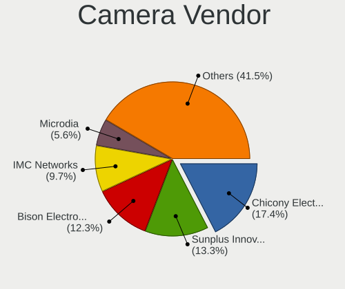

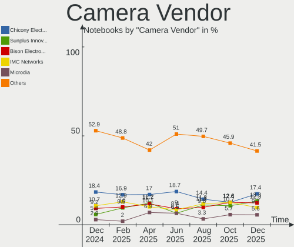

| Vendor                                 | Notebooks | Percent |
|----------------------------------------|-----------|---------|
| Chicony Electronics                    | 34        | 17.44%  |
| Sunplus Innovation Technology          | 26        | 13.33%  |
| Bison Electronics                      | 24        | 12.31%  |
| IMC Networks                           | 19        | 9.74%   |
| Microdia                               | 11        | 5.64%   |
| Realtek Semiconductor                  | 9         | 4.62%   |
| Quanta                                 | 9         | 4.62%   |
| Syntek                                 | 7         | 3.59%   |
| Shinetech                              | 5         | 2.56%   |
| Suyin                                  | 4         | 2.05%   |
| Sonix Technology                       | 4         | 2.05%   |
| Z-Star Microelectronics                | 3         | 1.54%   |
| Silicon Motion                         | 3         | 1.54%   |
| ShineOptics                            | 3         | 1.54%   |
| Luxvisions Innotech Limited            | 3         | 1.54%   |
| Logitech                               | 3         | 1.54%   |
| Unknown                                | 3         | 1.54%   |
| USB Camera CS                          | 2         | 1.03%   |
| Sunwingroup                            | 2         | 1.03%   |
| SunplusIT                              | 2         | 1.03%   |
| Cheng Uei Precision Industry (Foxlink) | 2         | 1.03%   |
| Alcor Micro                            | 2         | 1.03%   |
| Acer                                   | 2         | 1.03%   |
| Shine-optics                           | 1         | 0.51%   |
| Ricoh                                  | 1         | 0.51%   |
| Primax Electronics                     | 1         | 0.51%   |
| OPPO Electronics                       | 1         | 0.51%   |
| OmniVision Technologies                | 1         | 0.51%   |
| Microsoft                              | 1         | 0.51%   |
| Importek                               | 1         | 0.51%   |
| icSpring                               | 1         | 0.51%   |
| HYGD-XH--241023                        | 1         | 0.51%   |
| HYGD-220831-A                          | 1         | 0.51%   |
| BillionPixels                          | 1         | 0.51%   |
| Apple                                  | 1         | 0.51%   |
| A4Tech                                 | 1         | 0.51%   |

Camera Model
------------

Camera device models

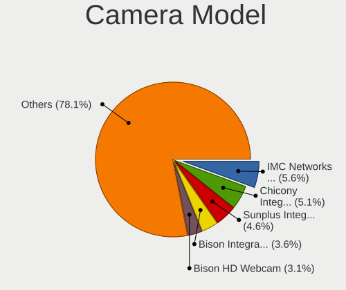

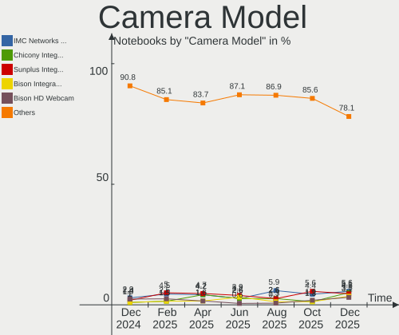

| Model                                         | Notebooks | Percent |
|-----------------------------------------------|-----------|---------|
| IMC Networks USB2.0 HD UVC WebCam             | 11        | 5.61%   |
| Chicony Integrated Camera                     | 10        | 5.1%    |
| Sunplus Integrated Camera                     | 9         | 4.59%   |
| Bison Integrated Camera                       | 7         | 3.57%   |
| Bison HD Webcam                               | 6         | 3.06%   |
| Syntek Integrated Camera                      | 5         | 2.55%   |
| Chicony HD WebCam                             | 5         | 2.55%   |
| Microdia USB 2.0 Camera                       | 4         | 2.04%   |
| Microdia Integrated_Webcam_HD                 | 4         | 2.04%   |
| Bison Lenovo Integrated Webcam                | 4         | 2.04%   |
| Sunplus USB 2.0 Camera                        | 3         | 1.53%   |
| ShineTech USB2.0 HD UVC WebCam                | 3         | 1.53%   |
| ShineOptics HD Camera                         | 3         | 1.53%   |
| Quanta HD User Facing                         | 3         | 1.53%   |
| IMC Networks USB2.0 VGA UVC WebCam            | 3         | 1.53%   |
| Bison Lenovo EasyCamera                       | 3         | 1.53%   |
| Bison BisonCam,NB Pro                         | 3         | 1.53%   |
| Unknown                                       | 3         | 1.53%   |
| USB Camera CS USB Camera CS                   | 2         | 1.02%   |
| Sunwingroup HD Camera                         | 2         | 1.02%   |
| Sunplus XiaoMi Webcam                         | 2         | 1.02%   |
| Sunplus Hy-UXGA(B6CS)-Camera                  | 2         | 1.02%   |
| Sunplus Hy FHD B200 Came                      | 2         | 1.02%   |
| Sonix USB2.0 FHD UVC WebCam                   | 2         | 1.02%   |
| Sonix Integrated Webcam_FHD                   | 2         | 1.02%   |
| Shinetech USB2.0 FHD UVC WebCam               | 2         | 1.02%   |
| Quanta ov9734_techfront_camera                | 2         | 1.02%   |
| Quanta ACER HD User Facing                    | 2         | 1.02%   |
| IMC Networks Integrated RGB Camera            | 2         | 1.02%   |
| Chicony USB2.0 FHD UVC WebCam                 | 2         | 1.02%   |
| Chicony Integrated Camera (1280x720@30)       | 2         | 1.02%   |
| Chicony HP Webcam                             | 2         | 1.02%   |
| Cheng Uei Precision Industry (Foxlink) Webcam | 2         | 1.02%   |
| Z-Star WebCam SCB-1900N                       | 1         | 0.51%   |
| Z-Star WebCam SC-03FFL11739P                  | 1         | 0.51%   |
| Z-Star Webcam                                 | 1         | 0.51%   |
| Syntek USB2.0 Camera                          | 1         | 0.51%   |
| Syntek Lenovo EasyCamera                      | 1         | 0.51%   |
| Suyin Acer/Lenovo Webcam [CN0316]             | 1         | 0.51%   |
| Suyin Acer CrystalEye Webcam                  | 1         | 0.51%   |

Security
--------

Fingerprint Vendor
------------------

Fingerprint sensor vendors

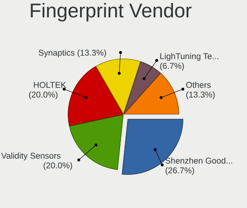

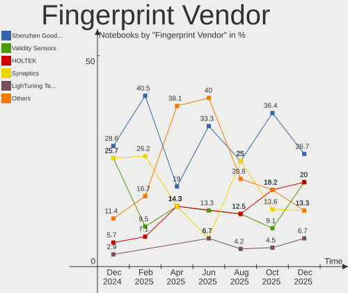

| Vendor                     | Notebooks | Percent |
|----------------------------|-----------|---------|
| Shenzhen Goodix Technology | 4         | 26.67%  |
| Validity Sensors           | 3         | 20%     |
| HOLTEK                     | 3         | 20%     |
| Synaptics                  | 2         | 13.33%  |
| LighTuning Technology      | 1         | 6.67%   |
| Focal-systems.Corp         | 1         | 6.67%   |
| Elan Microelectronics      | 1         | 6.67%   |

Fingerprint Model
-----------------

Fingerprint sensor models

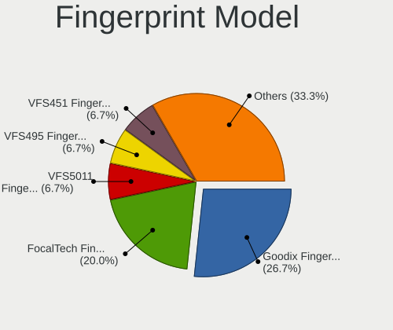

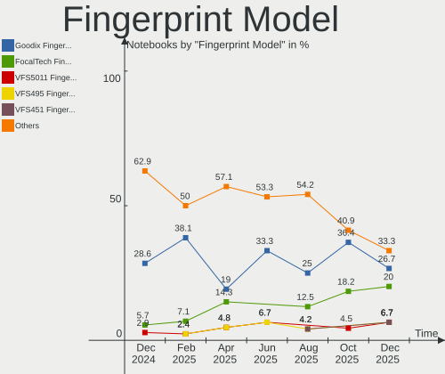

| Model                                            | Notebooks | Percent |
|--------------------------------------------------|-----------|---------|
| Shenzhen Goodix  Fingerprint Device              | 4         | 26.67%  |
| HOLTEK FocalTech Fingerprint Device              | 3         | 20%     |
| Validity Sensors VFS5011 Fingerprint Reader      | 1         | 6.67%   |
| Validity Sensors VFS495 Fingerprint Reader       | 1         | 6.67%   |
| Validity Sensors VFS451 Fingerprint Reader       | 1         | 6.67%   |
| Synaptics UWP WBDI Device                        | 1         | 6.67%   |
| Synaptics Metallica MOH Touch Fingerprint Reader | 1         | 6.67%   |
| LighTuning EgisTec Touch Fingerprint Sensor      | 1         | 6.67%   |
| Focal-systems.Corp FT9201Fingerprint.            | 1         | 6.67%   |
| Elan ELAN:Fingerprint                            | 1         | 6.67%   |

Chipcard Vendor
---------------

Chipcard module vendors

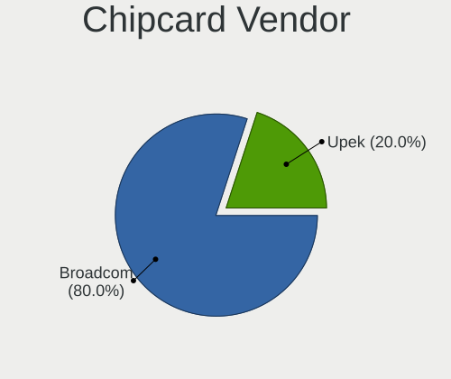

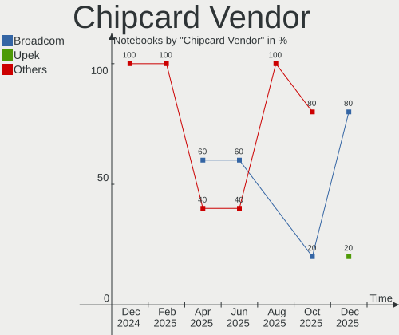

| Vendor   | Notebooks | Percent |
|----------|-----------|---------|
| Broadcom | 4         | 80%     |
| Upek     | 1         | 20%     |

Chipcard Model
--------------

Chipcard module models

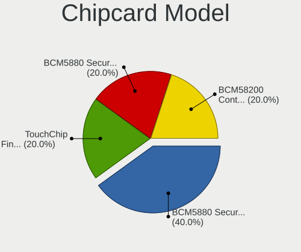

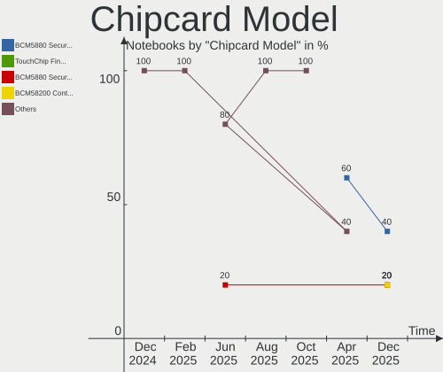

| Model                                                                        | Notebooks | Percent |
|------------------------------------------------------------------------------|-----------|---------|
| Broadcom BCM5880 Secure Applications Processor                               | 2         | 40%     |
| Upek TouchChip Fingerprint Coprocessor (WBF advanced mode)                   | 1         | 20%     |
| Broadcom BCM5880 Secure Applications Processor with fingerprint swipe sensor | 1         | 20%     |
| Broadcom BCM58200 ControlVault 3 (FingerPrint sensor + Contacted SmartCard)  | 1         | 20%     |

Unsupported
-----------

Unsupported Devices
-------------------

Total unsupported devices on board

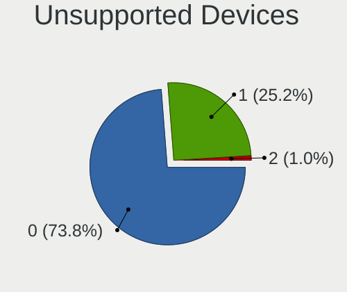

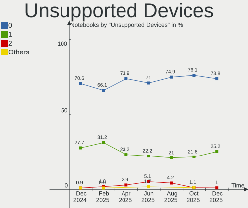

| Total | Notebooks | Percent |
|-------|-----------|---------|
| 0     | 149       | 73.76%  |
| 1     | 51        | 25.25%  |
| 2     | 2         | 0.99%   |

Unsupported Device Types
------------------------

Types of unsupported devices

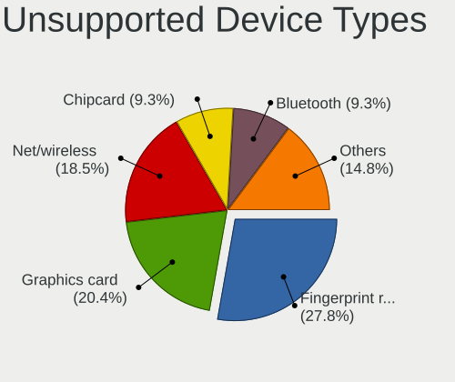

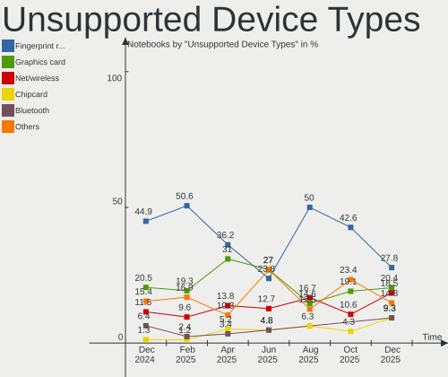

| Type                     | Notebooks | Percent |
|--------------------------|-----------|---------|
| Fingerprint reader       | 15        | 27.78%  |
| Graphics card            | 11        | 20.37%  |
| Net/wireless             | 10        | 18.52%  |
| Chipcard                 | 5         | 9.26%   |
| Bluetooth                | 5         | 9.26%   |
| Communication controller | 3         | 5.56%   |
| Multimedia controller    | 2         | 3.7%    |
| Camera                   | 2         | 3.7%    |
| Net/ethernet             | 1         | 1.85%   |

